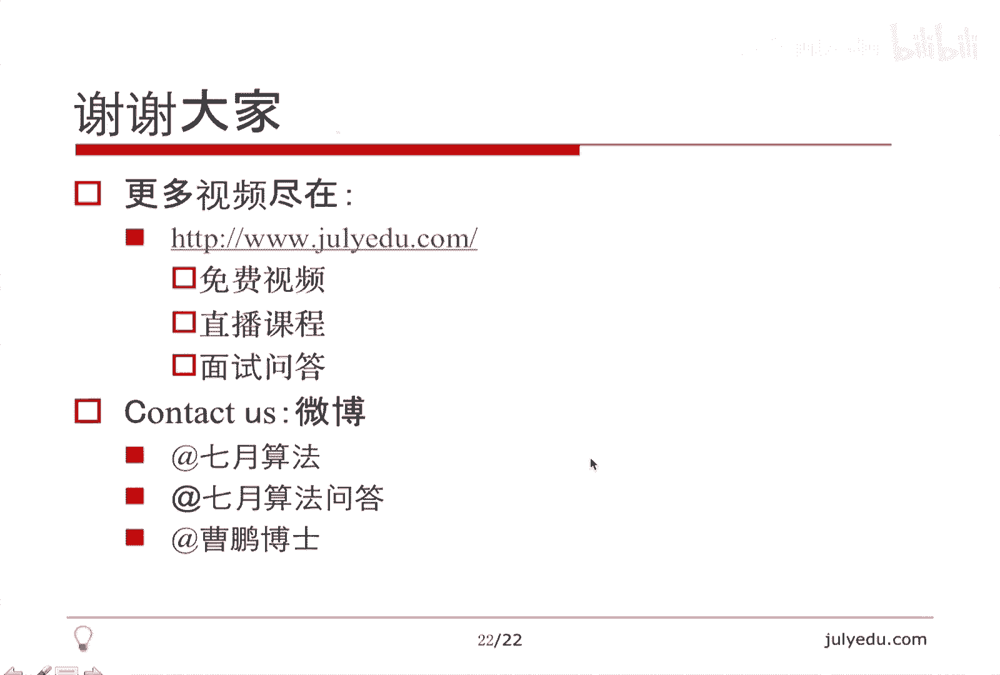

# 人工智能—面试求职公开课（七月在线出品） - P2：O(N)时间解决的面试题(中) - 七月在线-julyedu - BV1Xf4y1r74s

🎼，欢迎收看契业算法公开课。我们这堂课的内容继续讲ON时间内解决的面试题。我将从如下几个方面讲述本课，现在谈一下ON也是本次课的一个总体。然后讲7个例题，最后总结结束本课。那想谈一下总体。

就是主要今天讲组合数学上的下一个排列，上一个排列，还要通过证明巧妙的证明解决一些实际的问题，也是ON的。然后树立一个理念，就是枚举和计数是不一样的。我们为了计数不一定要枚举一组一组解。

如果只算一个数的话，可能比枚举的复杂度要低。因为枚举有多少组解，你都要一个一个枚举出来，而计数可以一次数很多个，我会讲一个动态规划问题，这个问题有点难，就是最大子数组合的一个变种。看具体的题。

第一个题是lead code上第31题。也就是下一个排列，C加加STR里面也是这么实现的，也就是找到字典序里面刚好比它大了。下一个排列。比方说12345，下一个就是12354。那么最后一个排列。

54321的下一个认为是12345，这个题目比较简单，大家也比较熟悉。我主要讲一下这个算法是怎么回事，可能有人已经知道这个算法了，因为可能也背下来过，大概讲一下。😊，假设原排列是这个A0到AN减1。

我们希望找到下一个排列，就是B0到BN减1，它的前M位和A是相等的，一直到BM减1。那BM比AM大，因为B的字典序要大嘛。另外呢？B的后面一定是按照升序或者叫不减序排好的，为什么呢？

因为B的字典序在这个时候已经比A大了。我们希望B的字点序是比A大，并且最小的，那么后面显然是按照升序排好了，B的字典序才最小。因为后面的顺序已经不影响B和A的大小关系了。另外一点是希望M尽可能大。

也就是相等的位置尽可能多。😊，我指的相等位置是指前缀。因为只有这样，B的子典序才尽可能的小B和A每多一位相等，B的子典序就要小一点，因为让这个大一点的这个出现的尽可能的晚。下面是一个形象一点的表示。

目前的排列是这个样子，括号里面可能不止一个数AAXB。那么下一个排列呢就是AAYB撇。那A和A是相同的。那么这里面AY显然是大于AX的。我们希望A尽可能的长，这就是我刚才说的道理。

因为我们希望这个下一个排列的字典序尽可能小。A越长，下一个排列的尽可呃字典序就越越小。那么AY是大于AX的，因为它的字典序还要比它大嘛，这是第一位。这个能比出大小的大于。那么B撇呢它几乎就是B里面的数。

为什么呢？因为原来AX。这个在B外面，那么现在AX在B撇里面，那原来AY显然是在B里面呢。那么现在AY不在B撇里面，所以B撇和B从数的种类上来讲，其实就差了AXAY这么一个数，所以它几乎就是B里面的数。

但是B撇是按照生序排好序的。原原因，我刚才也讲到了，只有排好序，这个排列的子点序才尽可能小，所以有两点一点是这个A尽可能长，一点是这个B撇几乎是B里面的数，并且是排好序的。

那么这个AAY大于AX是显然的。因为要字点序下一个大一点。那么关键问题就是如何确定AX，并且我们要知道AX和AY这个和哪个数换是最好的。😊，那么确定AX我们的理念就是。这个AX的右边一定要有数比它大。

才行。才是一个候选的X，因为我们左边是不可能被换的，左边是一样的嘛。所以我们找到一个AI1个X。如果它的右边有数比它大，这X就是个候选的那让A尽可能尝是什么意思？也就是X。

我们希望是最右边一个满足这种条件的数，这就是我这里面写的，我们希望AX右边的数，每个数的右边都没有比它大的。因为AX是最后一个满足这种条件的数。那么言外之意就是AX右边的数其实是按照降序排列的。

也就是B其实是按照降序排列的，为什么呢？因为AX加一的右边。没有一个数比AX加一大，也就是AX加一比右边所有数都大。所以AX加一是大于等于AX加2的。同理AX加2是大于等于AX加3的。

所以这个X右边也就是B这个序列其实是一个降序的序列，也就是不生序的序列，因为后面有可能是相等的，所以这个。AX加一大于等于AX加2大于等于一直大于等于AN减1。所以这个AX。是小于AX加一的。

这个是我们想找到的位置。那我们看一下算法，算法简介为二找一交换一翻转，找到两个位置，交换一次翻转一下，我们看一下。我们找到最后一个严格升序的序列的首位，也就是什么叫严格生序呢？

就是AI小于AI加一的这么一个位置。那我们定义为X这里面最后一个是指从左往右找。我如果从右往左找的话，就找到第一个。我们把这个位置定义为X，所以AX是小于这个AIX加一的。那么刚才这个。

AAXB定义为A就是0到X减1。B呢就是后面X加一到N减1这X我们已经找到了。那我们看一下AX要和AY换AY一定是大于AX，且AY最小。因为我们希望。A尽可能长已经满足了。我们希望AY比AX大。

并且最小。原因是希望这个下一个排列的字点序尽可能小，只要大于AX就行了，我没有必要要那么大的，所以是大于AX里面最小的。首先Y一定存在，因为X加一就可以作为一个Y，因为AX小于AX加一嘛。

所以Y一定是存在的。并且刚才已经说了，AX后面的数都是降序的。😊，所以我们从后往前找到第一个大于AX的位置，其实就是Y了。因为这个后面的数是一个比一个小的，那么倒着找的话就是一个比一个大。

那么我们找到第一个就是刚好大于。AX的最小的那么一个数，我们就找到这么一个位置。Y了。当然因为它是有单调性的，其实我们可以用二分查整，但是这里面二分不二分不影响总体的复杂度。

因为前面找X已经用了ON的时间了，这里面即使降为logN总时间还是ON。那么交换我们找到了这样的X和这样的Y，我们把这两个数交换，注意交换之后。新的AX加1到AN减1，就是后面那些数仍然是降序的。

因为之前是降序的，我们找到第一个大于AX的位置。AY我们把它换小了，所以它总体上还是一个降序的。那么我们刚才说要对后面那些数进行排序，对一个纯降序的数做排序，没有必要跟翻转是一样的。

我们把它翻一下就变成正序了。所以后面做一个逆转，也就是翻转。所以这就是我说的，找到两个位置，二找一交换一翻转。看一下代码，代码也很明显的，两个for就是二找这一个交换这一个翻转。关键看一下。

如果X小于0，也就是我们找不到这样的位置，那就是刚才那个例子54321，它没有一个升序存在，全都是降序54321嘛。所以。把它还原成第一个排列，也就是直接做一个反转，这是特殊情况的特殊处理。

否则我们找到了一个X，并且找到了一个这样的Y。然后做一下交换，对X加一做一下翻转，就把后面排好序了，就找到了我们要的下一个排列。那其实还有一个算法是上一个排列，其实是一样的。刚才说找升序，这是找降序。

刚才说找AY大于AX，这里面是找AY小于AX，且AY最大也是二找一交换一翻转，把这个代码稍微改一下，其实改两个大小大小于符号就可以实现上一个排列了。那这个优点其实就是两点，第一是复杂度是ON的。

第二是即使原始的排列里面的数有重复，它也可以正确应对。所以这个是我想讲这个算法的一个原因，帮助大家理解字典序，理解这个ON时间的找上下排列的算法。那么看第二个问题。给定一个零一串。

这个零一串呢长度为4N，包含2N个02N个1，恰好一半0一半一。当然顺序不一定。你可以把它切成若干段，切完之后再拼接，要求拼接出的两部分，每部分恰好包含。这个N个0N个1，也就是每一部分恰好。

一半的零一半的一，并且使切的段数最小。首先我想说一定可以切出来，因为我大不了切成一位一位的。就是每一个里面长度都是一，然后再拼的话就选N个零拼到一起，N个一拼到一起就可以了。所以肯定是能切出来的。

但问题是怎么切的刀数最少，或者说切的段数最少。因为最终的段数其实就是这个刀数加一嘛，所以刀数最小和段数最小是一样的。举个例子，比方说0101其实切一刀就可以。从中间劈开就是两个01。

每一个里面都有1个01个1嘛。😊，那这个例子呢这个要切成三段，也就切两道，把第一位拿出来。😊，然后0中间呢是01。然后最后一位，那么这样的话，中间这个作为一部分，这个零这个一也作为一部分。

所以每一部分都有一个01个1。那其实答案无外乎就是二和3，我们可以证明一下。首先我们认为下标从零开始。那么原来那个串我们定一个函数叫做FXFX定义在0到2N之间，再大的X是没有定义的。定义的是什么呢？

是这么一个窗口里面零的个数与一的个数的差，窗口的大小是2N。这个不是正好从X到X加2N减1，所以这个只能定义到2N。因为那个串长度一共是4N嘛，所以我这个X是只定义了。这么多。

那么首先我们有对于这个函数来讲。F0加F2N等于0，什么意思呢？F0是0到2N减1F2N呢是2N到4N减1，这两个一加其实是整个串了，整个串里面零的个数与一的个数差是0。

因为整个串恰好2N个02N个1嘛。那么如果这两个数都是0，因为它们和是零嘛，如果这两个数都是0，那么相当于从中间切一刀切成两段就可以完成。因为左半部分恰好也是N个0N个1，右半部分也是N个0N个1。

其实就是对应于第一个例子这种情况。那么。关键是如果这两个东西不是零，那么显然一个小于0，一个大于0。这个没关系，哪个小于零，哪个大于零没有关系。那我们分析一下它的它是奇数还是偶数，它始终是偶数。

这个为什么呢？因为他们。总和零和一的总和这个窗口的大小是2N嘛，窗口大小是2N，所以零和一的总和肯定是个偶数，那零和一的差也是偶数，因为和和差在这个奇偶性上来讲是一样的，所以。这个FN始终是偶数。

并且假设我们认为最开始是负的，但是最开始挣的也没有关系。如果从负数跳到正数的时候，我们怎么跳呢？从FX变到FX加一的时候，会有怎样的变化呢？一种就是这两个窗口是一样的，也就是我们失去一个零。

又补回一个零或者失去一个一补回一个一。那么这个FX是不变的。另外一种呢就是我们失去一个一补进一个0，那么这个时候FX其实是增加二的，因为FX是零的个数减一的个数。那还有一种就是失去了一个。😊，0。

补了一个一，那么。这个同理是减少二的，因为零的个数减一的个数是减少二的，所以FX始终是偶数，并且每次增减都是2。那么从负数跳到正数的时候，这个就相当于一个连续函数，肯定会经过一个FX等于零的点。

那就是我想说的这个意思。😊，它始终是偶数，并且由负数到正数，或者说由负数正数到负数，这没有关系，必然出现这么一个位置，FY等于0Y在这个中间。注意Y肯定不是零，也不是2N。

因为我们前面假设这两个位置都不是。所以Y是中间的一个部分。那我们看这个Y是怎么样的一个定义呢？Y其实就是FY其实就是Y到2N加Y减1这么一段里面，零的个数和一的个数差，它等于0，这一共2N个数嘛。

它等于零，就说明这一段里面一定包含了N个0N个1。所以我们找到了一个这样的Y就找到了这么一段。那么我们把它切成三份，一部分是0到Y减1一部分是。😊，2N加Y到4N减1。

也就是这个之前的那一段和这一段之后的那一段这两段。的和显然也包含了N个0N个1，这一段本身包含了N个0N个1，所以这两段可以拼成一段，这一段单独作为一部分。也就是我们切了两刀，做了三段。

所以答案无外乎就是二或者3。因为我们没有必要求出这个Y来。我们只需要知道答案是几就可以了。所以答案是二或者三怎么规定呢？我们看第一个窗口就可以了。刚才已经说了，如果F0是0，那么FRN一定也是0。

那么从中间劈开就行了。所以答案就是二，也就是切成两段。啊，否则的话，如果F0不是零的话，我们一定要找到这么一个Y。当然这个Y不用找，一定能找到切三段就可以了，把中间这个作为一段，前面一段，后面一段。

那么其实答案无外乎就是二和3，我们就是统计了一下这个零和一的差，也就是第一个窗口，所以这是一个很简单的算法，也就是这个样子，这个没有写真正的代码写了一个伪代码。😊，刚才说FX的定义。

我们其实就是算一下F0还循环0的2N减1。如果是零的话，就加一下，是一的话，就减一下。最后呢D就是我们想要的F0。如果D是零的话，答案就是2。刚才已经说了，从中间切开，否则答案就是三。

我们需要找到一个位置外，然后那个位置长度为2N的窗口，恰好包含了N个0N个1。然后左右分别作为这个另外一部分，所以这个是相当于切成了三段。😊，所以我们代码就这么简单，代码并不需要我们找到那个Y值。

当然要找到并也不难。大家可以继续的想一下。我们看另外一个问题，这个问题是改编自一个only assignment，一个公司的网上的题目。它给定一个长度为N的数组，A告诉你A里面只包含了正整数。

我们把下标从零开始，再给定一个元素X，我们求一个位置，MM是大于等于零，小于等于N的那0到M减一中X的个数。当然如果M等于00到M减1是个空数组，这个X的个数和后面也就是M到N减一中非X的个数。

如果M等于等于N的话，也就是这个东西也是个空数组。我们要求相当于找到一个位置，这个位置之前等于X的元素个数和这个位置之后不等于X的元素个数相等。首先我们都不知道这个这种位置一定存在。另外。

如果存在有几个呢，我们可以看一下，其实简单的分析一下就可以看出来。假设这个所数组中一共有小写X这么多个大写X。那假设我们已经知道M是多少了，那么我们并且假设。A0到M减1。

也就是前半部分前M个元素有Y个X。那么后面呢。后面M到N减1，后面不是X的个数是多少呢？我们可以用N。减一下M。再减去X减Y什么意思呢？这个后面的元素个数是N减M，因为前面有M个嘛，那后面的X个数。😊。

显然是X减Y，因为总体有X个，前面有Y个，这是X个数，这个是后面的元素个数。所以一减就是后面不是X的元素个数。那这个把这个括号去掉，就是这这个东西N减M减X加Y，这是后面不是X的元素个数。

我们要求后面不是M呃X的元素个数和前面是X的元素个数相等，也就是N减M减X加Y等于等于Y。😊，这个。因为前面有Y个X嘛，这个后面这是非X的个数，那这两个相等其实消掉之后发现最后解出来M就是N减X。

所以这个M是不仅是存在的，并且是唯一的。它求M其实就是求一下这个。总体上有多少个X就可以，就是求这个小写X。所以这个算法非常简单，就是循环一遍，数一下有多少个大写X，然后返回这个N减X就可以了。

所以一个看似很复杂的问题，经过分析，实际上就是循环一遍，数多少个这个大写X就可以了。😊，那么显然它是1个ON时间和O一空间的算法。当然用前缀和什么什么都可以实现。但是我这么分析是不需要前缀核的。

直接统计一下有多少个大写X就可以。有有这个X个的话，答案就是N减X。😊，那有一个思考题，其实就是说有10个硬币，这10个硬币里面呢，我们随便说一个数，比方说有4个是正面的，正面朝上的。

剩下6个呢都是反面朝上的那你不允许你开灯。言外之意，就是你不知道哪些是正面朝上，哪些是反面朝上。当然你可以把一些硬币反面。但是你反面呢，你也不知道它是正面朝上还是反面朝上，让你把它分成两组。

希望两组正面个数相等，其实和这个是一个问题，提示一下，我们把前六个作为一组，后四个作为一组，把后四个翻一下，也就是那个后四个硬币全都翻一下面。那么这6个里面和这四个里面正面朝上的个数应该是相等的。

证明其实和刚才讲的是一样的。😊，我们继续看，这是我给pat出的一个题。pat是目前很火的一个认证，叫programming ability test。我出了一个什么题呢？就是说给定一个字符串。

只包含PAAT，因为正好和pat是是同样的。那么当然不不不是说只包含1个PAAT，就只包含这三种字符，求一共出现了多少个pat作为子序列。子序列的意思就是可以呃这个不挨着，就是比方说第一P。

然后APPA那么第一个P和第4个A也可以构成1个PA，那总共构成多少个pad呢？这个题很简单，我只是想说计数和枚举不同。如果我们要枚举，肯定要把所有的PAAT都枚举出来，写一个三重循环。

然后看一下形成多少个pe。那么这个显然是个三次方复杂度。那如果我只计数的话，ON就可以做什么意思呢？我们记录。PAPA和PAAT分别表示。这个第I位之前出现的P的个数。

出现PA的个数以及出现的pe的个数。那么我们直接计数就好了。如果当前是个P的话，那么显然P加一下。那如果当前是个A的话，注意这个这个A和之前的所有的P都可以形成一个PA。

所以PA的总个数加上一个P就好了。那跟刚才道理一样。如果是T的话，这个T之前所有形成的PA和这个T都可以形成一个pa，所以pa加上它之前的PA就好了。所以就是一个循环，加上3个异。😊，啊。

当然可以写两个意服。如果因为只有PAAT3种字符，这个最后那个不用判断，不是这两个一定是T了，这个都是常数优化，这都没有关系。那这个时间复杂度是ON，空间复杂度是O一。因为我连数组都没有用。

只用到了这种三个变量来实现。那给大家一个思考题，就是 code上115题，其实跟这个差不多，只不过它让数的不是pe，而是另外一个字符串出现的次数，做法是一样的。但是空间就不是这个O一了。

时间也不是ON了。因为我这个其实是3N的复杂度。那个时间应该是M乘以NM是要找的这个字符串的长度。所以那个M等于三的一个特殊情况，其实就是这个问题。😊，那么继续讲我们这个题，这个题也比较有意思。

这是codlity上的一个题，就是给定一个数组。求。一个至少包含两个元素的子数组，满足这个子数组的平均值尽可能小。当然输出有一定要求，我输出的是这个数组的起点，当然有多个的时候输出最小的。

这样就保证输出是唯一的。先讲一下为什么要求这个子数组至少包含两个元素，如果对子数组长度没有要求的话，显然我返回一个最小值就可以了。因为这个。平均值最小嘛？我只返回一个最小值的话，平均值肯定是最小的。

因为再加一个元素就会把这个平均值抬高，因为返回率是最小的。所以它要求我们返回这个子数组，至少要包含两个元素，这个是这个题目的一个意图吧。😊，那么我们假想一下最优解。如果最由解的长度是偶数的话。

我们就把它拆成。长度为二的若干段就是相邻的两个元素作为一段。如果最有解的长度是奇数的话，我们就把它拆成也是长度为二的若干段儿。但是最后一段长度为3，当然也可以拆成第一段长度是3，后面若干个长度是2。

我这样拆是什么意义呢？😊，自由解中我们拆成的这些段，每一段平均值必须相等。我们考虑一下为什么。如果有一段平均值比自由解小。那么自由解里面其他段肯定有一段自由解比平比这个自由解要大，为什么呢？

因为有一段小的肯定有一段大的把平均值拉回去，那么这个比自由解。平均值还大的那一段，显然是和整个那一段是自由解来矛盾的。所以这若干段里面所有的平均值都相等，不然的话就有大有小，有小的就有大的。

有大的话就和自由解矛盾。那这个意思就是说，我们只需要看这个子数组长度为二和为3的就可以了。并不是说更长的得不到最由解，而是说自由解包含了要么长度为二的，要么长度为三的，更长的可能也是最优解。

只不过那个平均值是相同的。所以我们要找平均值最小的，只要看长度为二的段和长度为三的段就可以了。那至于怎么看，其实看法很多，因为二和三是常数，就跟上面那个pe是一样的，我们可以直接直接循环看一下。

也可以用前缀和减一下，也可以用滑动窗口来看一下，怎么看都可以。😊，这就是我刚才说的，只需要考虑长度和为二和V3的段，因为其他段自由解绝对不比二和三的自由解优。那另外一个是说，我们可以用乘法代替除法。

避免一些精度问题。当是前提是不易出。呃，我这里面采取的是滑动窗口的方法。toal2就表示目前长度为二的段的总和。因为我没有除以2toal3呢，就是长度为三的段少总和。当然我可以在循环的时候直接算。

我之所以把这些提前算出来，就是想让它继续滑动，对二的话，加上一项减去一项，对于三的话，也加上一项减上减去一项，最后呢求出来bi塔2和bi斯三分别是两项的最大值和三项的最大值呃。

最小值是两项最小值和三项最小值。那么这个就是我说的用乘法代替除法，这个其实应该算bi塔2除以2和bi斯三除以3嘛，但是我把它乘一下减一下，如果等于零就说明这个二的平均值和三项的平均值是相等的。

那么就返回这个较小的。因为答案要求返回起点较小的嘛。如果小于零哪个小返回哪个。😊，这个就是题目也非常简单，它只有一个循环，所以它的算法是ON的。😊，这个巧妙之处在于。

我们把这个等于二和等于三的单独拎出来，并且证明了最优解一定可以包含。就是有一个等于二的或者一个等于三的，一定可以得到最优解，就避免了我们枚举所有的子序列了。那么我们看一个这个环形最大子数组合。

这个问题呢是ITin5，这是另外一个网站。ITin5是一个域名，它上面的第九题，那么给定一个数组，它是环形的，也就是最后一个元素和第一个元素是相接的。我们求这个最大子数组合。跟普通最大子数组合有点差异。

它那个最后一个元素可以接到第一个元素上面去，就是从一个环上找出一段来。那么普通最大子数组合是什么样的？比方说这个例子12-456-9，那么显然56是最大的，这是一个普通最大子数组合，那么。

还有一种情况是开头和结尾的一部分。也就是我想说明的一个情况，就是环形子数组环形的最大子数组合无外乎两种情况，一种就是普通的最大子数组合，一种就是开头的一段和结尾的一段的和，这种普通的是解决不了的。

比方说这种情况，中间三个都是负数，那么显然129是最大的，这个用普通的是解决不了的。那么我们看一下无外乎就是普通的求一次，那么这种情况怎么对对待呢？它不就是总和减去中间的一段嘛。那减去中间的一段。

实际上就是求中间这段的和最小就可以了。所以。😊，这种环形的比普通的最大子数组合复杂不了多少，无外乎就是普通的求两次。就是我说的先求普通的最大子数组合应对这种情况。另外可以考虑用总和减去最小子数组合。

应对这种情况。因为这个头一段尾一段相当于中间求一个最小的子数组合，至于怎么求最少。显然可以这个直接用那个算法求，当然也可以把原始数数组，每个数取相反数再调一遍，然后用总和减一下就可以了。

这个是偷懒的方法，当然也可以写两遍，求一次最大求一次最小。这个算法也比较简单。根据最大子数组合的算法，它也是一个线性的，只不过调了两遍。所以这个环形的比普通的其实难不了多少。我们看最后一个问题。

这个问题有点难。它也是 codedi体上的一个问题，给定一个数组，这个也是最大子数组合。要求呢你可以交换两个数，当然只允许交换一次。当然你可以不换不换，你可以认为自身跟自身交换。

然后呢还是求最大子数组合。那么我们定义。关键看我怎么定义这两个东西，定义好这两个东西就可以递推就可以动态规划。我们看一下FI是两部分之和，是哪两部分呢？一部分就是以AI结尾的最大子数组合。

这个其实跟我们求普通最大子数组合没有什么区别。当然这部分可以为空，也就是全是负的时候，我可以不要这部分，与注意我是与的关系并不是或，它这两部分一段一个是一段，另外一个是一个单点，或者说单独的一个元素。

也就是FI表示的是以AI结尾的一段最大子数组合，以及。😊，单独的一个位置。也就是0到I里面单独一个位置，这两段的和的最大的那么一个和。当然这两段是没有交集的，也就是同一个数不能取两次。

我这一段如果有的话，这个A0到I里面的就是单独那一个点，不能取在那个段上。也就是我们可以简单的理解为FI是一段加上一个孤虑点的最大子数组，就是最大的和，不能叫子数组了。因为有一个孤虑点。

也就是FI是一段加上一个孤虑点的最大的总和在AI之前的。😊，那么地推式有了这个定义，地推式就有了，它是这个样子。这个我可以稍微解释一下。如果。我们用到FI减1FI减1已经算好了。

我们把那一段加上AI就可以了。因为那个孤虑点在哪儿，我们根本不关心，因为这个。这个加上AI，即使那一段是空的，我加上1个AI也没有关系，就是FI减一里面这一段不是说可以为空嘛，它是空的，我也没关系。

我就认为那一段就是AI了。那么那个单点孤立点还是FI减一那个孤立点，所以它有可能是这种情况。另外一种情况呢就是这个。😊，FI选择跟那个FI减一没关系，我让FI这一段是空的。

那么我就选择这里面的一个孤立点。那么这个孤立点其实就是A0到AI里面最大的就可以了。所以这个FI递推式就是这两种情况取最大。那这个F有什么意义呢？F里面那个孤立点，就是我们想和AI换掉那个点换掉之后。

😊，这个以AI结尾的最大子数组合，我们已经求出来了。那么如果有一段我们把AI换成那个孤虑点，剩下都单独求就可以了。所以FI是这个孤虑点给我们提供了跟AI交换的那个元素，提供了一个备选元素。

那么们看GIGI其实就是。😊，以AI开头的最大指数组合，这个其实跟那个。啊，传统的最大子数组合没有没有区别。那么GI其实就是GI加一，因为我这个I是相当于由大到小循环，或者说是倒着循环的。

所以我定义的是以AI开头的最大子数组合。所以GI就是GI加10取较大的，加上AI这个地方是没什么特别的。关键请大家仔细理解这个FI。😊，那么。我们看一下，如果AI和AJ交换，我们认为这是小于。I的。

并且我们这个最终的和是包含这个AJ的，或者说包含原有的AI。我们把AI和AJ交换了。那么实际上它对应的最大子数组和对应于这个东西。这个就是我刚才说的DI是。

包含了AI以及这个AI更右边的那些元素FI减1其实这个时候是没包含AI的，所以GI减去AI也是把AI去掉了。FI减一里面包含了一个单点，虽然那个段可能是空的，那个单点就是和AI交换的那那个元素。

也就是AJ。😊，那实际上我是要求这个东西最大值。这个东西最大值言外之意就是交换的那个点在FI减一里面。那么这个是交换的时候，如果不交换呢，就是maxGI，这个就是普通的最大自数组合。

当然这些情况只是实现了交换那个元素，小于I的时候，那么对于大于I的话，我们把数组反过来再做一次就可以了。😊，大概看一下代码。先做一次helphelp就是我刚才说的定义FIFI就是这么定义的。

那么定义GI。然后取这个式子的max，关键是这个GI减AI加FI减1。大家仔细理解这个GI减AI就是把AI扔掉了，换掉AI用FI减一里面的那个值换掉了AI。所以这个取最大，然后再把它翻一下。

这个reverse就翻了一下，再调一遍，就求出来最后的最大值了。那么显然这个算法也是ON的，所有的都只循环了一个都只循环了N次。注意还有一个普通的最大字数组合，在这里求了。

因为我在求GI的时候可以顺便更新。因为这个其实这个循环就是普通的最大字数组合。因为这个只不过用了一个GI嘛，GI其实就是原来的那个什么and啊什么那个东西，以I开头的最大字数组合。

所以这个answer在算GI的时候，同时更新了一个普通的最大子数组合。也就是我们考虑了三部分，一部分就是J小于I的交换，一部分就是普通的最大字数组合，还有一部分J大于I了。这个通过翻转做了一遍。

所以这个是最终的一个解，这个题其实是比较难的一个动态规划了，比那个传统的最大子数组合难一点。但是仔细分析，关键是理解这个FI是什么东西，请大家仔细思考，最后做一下总结，还是要多思考，多练习。

另外刚才我说那个理念，就是属。😊，这个问题，计数并不等于枚举。那没有讲到的问题其实还有一些。但是这个不属于ON了。有些问题从这个N3次方可以优化到N方的这个原理其实和这个ON的时间差不太多。

然后有两个序列相关的问题，都是和排序这关系比较相大相近的，一个是呃可以每次选一个数放到开头，还有一个是可以选一个数，放到开头也可以放到结尾，你可以自由决定放到哪，那么至少几次排好序呢？

这种都可以ON时间内解决。我在下一次会总结一下问题，然后讲几个新的问题。还有更多的前缀后缀的利用。😊，好，今天的课就到这里。

谢谢大家，欢迎大家给我提出批评。😊。

