# 人工智能—面试求职公开课（七月在线出品） - P4：阿里巴巴面试题精讲 - 七月在线-julyedu - BV1Xf4y1r74s

我们这堂课的主要内容是阿里巴巴面试题精讲。

我将从如下几个方面讲述本课，先讲一下关于面试的一些观点，然后讲一下笔试面试题的特点。然后呢我会讲。近些年来，阿里巴巴的7个例题，这是从70多个笔试面试题里面精选出来的，大概属于四个方面。两道题属于概率。

一道题是智力题，还有三道题是我们最重要的数据结构与算法。最后一个题呢是一个开放性的和算法相关的实际系统的问题。然后做一下总结，结束本课。😊。

首先，关于面试。之前我也讲到过，到底各个公司有没有自己的题库。其实呢这不是一个很重要的问题。因为即使有题库，这些题也是共享的。他们的题目来源无非就是要么就是员工出的题，要么就是通过网络自己搜罗来的题。

所以没有说这个题被某个公司面过了，就不会被另外一个公司面。所以说我们不要把这个题打成一个标签，它是公公司A的面试题。那个题呢是公司B的面试题，没有这样的标签存在。这个题既可能被公司A面过。

也可能被公司B面，可能被他们同事面过。还有一点，我想说一下，就是笔试和面试。那笔试呢大家都知道，发些卷子闷头写就可以了。它是一种没有交流的这么一种笔试。那么。😊，我们写题目可能写程序的题目相对少一些。

偶尔会有这么一两道，大部分都是填空啊，选择啊，大题无非就是写写思路。因为呢。判卷子的人是没有办法对我们的程序正确性做出判断的。特别是有些人代码可能会写的很乱，没有交流，很难被人看懂。那么题型非常丰富啊。

有很多填空选择判断等等这样的问题。那面试呢大家也很熟悉，他和笔试最大区别就是它是有交流的。你需要和面试官面对面的交流。所以呢面试通常会要求你一些完整的代码。一旦有些地方他看不明白，他可以问你。

你可以给他讲，这也是你展现自己思路，表达自己思想以及体现这个表达能力的一个很重要的机会，所以笔试和面试是不一样的。😊。

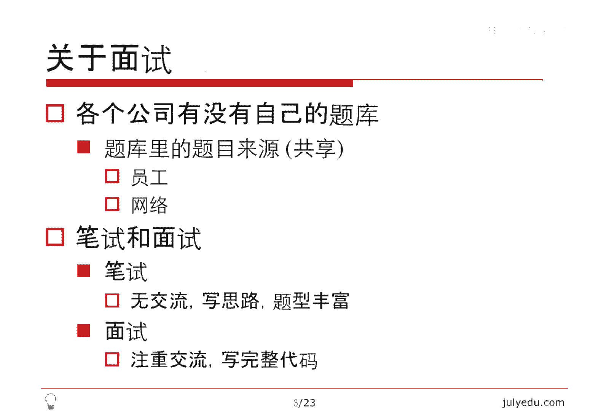

那笔试题和面试题有很多特点。目前从阿里巴巴的题目上来看，我觉得。😊，它非常重视基础知识，尤其是笔试题型非常多啊，包括填空选择等等。这些题涉及的面呢非常广。比方说操作系统它可能涉及到这种缓存啊。

LRU这种替换算法呀，进程现成的概念啊，死索有哪些条件如何避免啊等等这些基础知识。那网络呢比方说TCP协议以及三次握手的过程啊，还包括比方说你在浏览器里面输入一个网络地址，接下来发生的事情会怎么样。

或者说操作系统里面，你在键盘上敲击一个键，或者说点击下鼠标，后面将有哪些操作呀等等这些事情。那数据结构与算法当然是最重要的。包括我们大家都熟悉的排序啊，而分查找啊，数据结构里面比较重要的就是数和图啊。

当然还有我今天要讲的最后一个例题，就是实际系统的一些设计算法的开放性问题。那笔试啊。😊，或者说面试可能还有一些数学问题，或者说智力题主要体现在概率和组合数学里面。

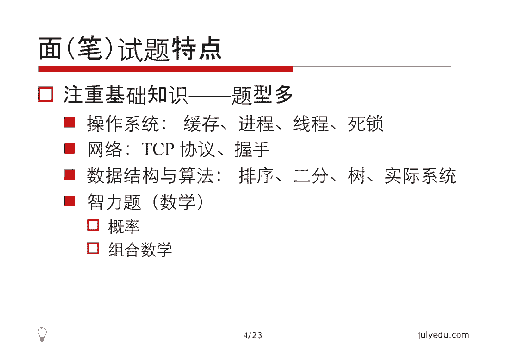

那下面我们就进入正题来讲这个七个例题。我在每个例题后面都加了括号，体现了这个例题的分类。比方说这个题是属于概率的，它是说有8支球队采用抽签的方式随机配对，也就是两两配对。然后呢这样形成四对儿。

那么这四对比赛，假设呢其中有三支强队问。😊，出现强强对话的概率。什么叫强强对话呢？就是两个强队分在一起，比赛的概率有多大。那这种问题呢可能是一个填空题，也可能是一个选择题，不是很难，大概思路就是数数。

它是组合数学相关的概率问题，怎么数呢？比方说当然说这个题有很多种做法，我只讲其中的一种，比方说我们不考虑强队。现在就是说8支球队，我们把它两两配对有多少种情况呢？我们可以这么考虑。

我们随便拿出一支队伍来，因为一共有8支球队，我拿出一支来还剩7支这7支他可以任选一个对手配对，所以它有7种选择。😊，那剩下的呢还有6支球队一样的，再拿出一支来，他有5种选择对手的情况。

然后再剩下还有4支球队，再拿出一个来看三种选择对手的情况。那么再剩下的两支球队，他们只能互相配对了。所以这个8支球队两两配对的情况说是根据乘法原理是7乘以5乘以3乘以1，这个是105。

这里面其实是可以推广的。如果是这个N支球队，当然N是偶数了。它这个两两配对的可能性，其实就是N减1乘以N减3乘以N减5乘以N减7，也就是每隔一个乘以下直到一这个是两两配对有多少种可能。

那么现在我们还没有考虑这个强队和弱队之间的区分。那么现在我们来考虑。😊。

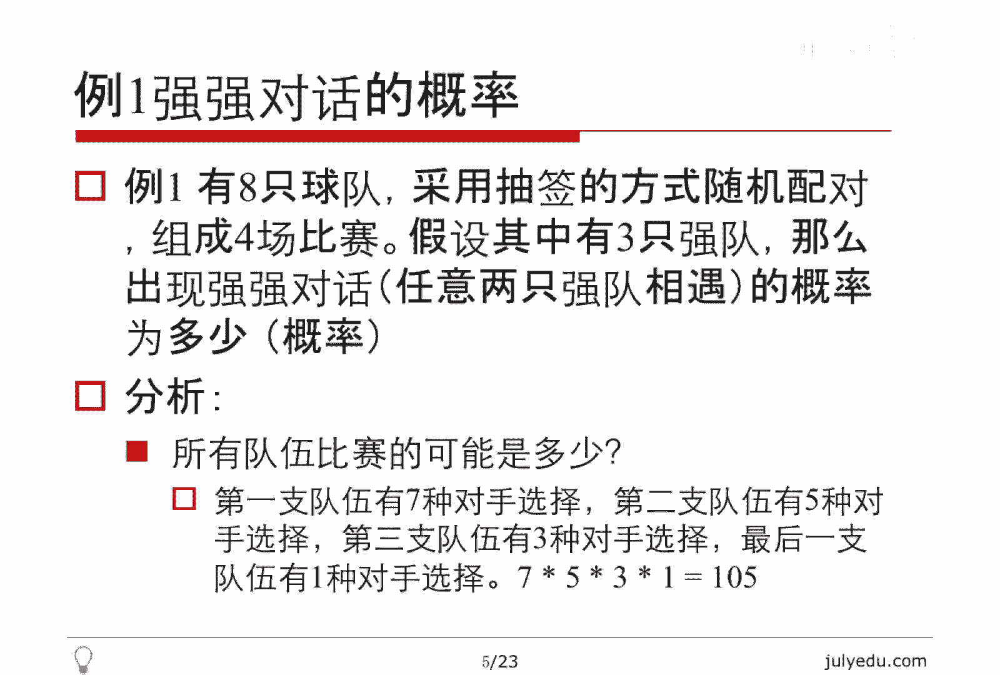

我们反方向考虑，假设每个强队都分到了一个弱队，也就是三个强队没有相遇，那么有多少种可能呢？那么就是从5个弱队中选出三个跟他们配对就可以了。那注意这个是有顺序的，因为三支强队是完全不一样的。

所以呢我从5个弱队选出三个跟他们做一下全排列就可以了。那剩下的呢还有两个弱队，他们自己匹配，这是那个乘以一的来源。所以呢这一共是60种情况。那么105种情况里面有60种情况是没有强强联合的这么一个。😊。

情况数。所以说有45种情况是强强联合的，也就是强强对话的这么一个方案数。那么概率呢概率其实在这道题目里就是分子分母相除，一共有105种情况是全部的情况，有45种情况是强强联合的情况。

这么一除就是7分之3。那么做一个小总结吧，这种概率题目通常是利用组合数学的公式，计算出方案数，这个方案数分别就是计算一下分子，计算一下分母。当然这里面有技巧。

可能有一些我们可能反着算总体减一下会好算一点都能。但总的来说都是套用组合数学的公式，分别计算出分子分母除一下，得到的这个概率。😊。

啊，比较简单，我们再来看第二个例题。他是说有两个包或者说两个口袋，甲包里呢有8个红球，两个篮球。乙包呢反过来8个篮球，两个红球。那先抛硬币，注意这个硬币应该是均匀的，也就是正反面的概率各是2分之1。

我们抛一次硬币决定是选择甲包还是选择乙包。当然，一旦确定了选择哪个包，另外一个包就没有用了。我们从这个包里。

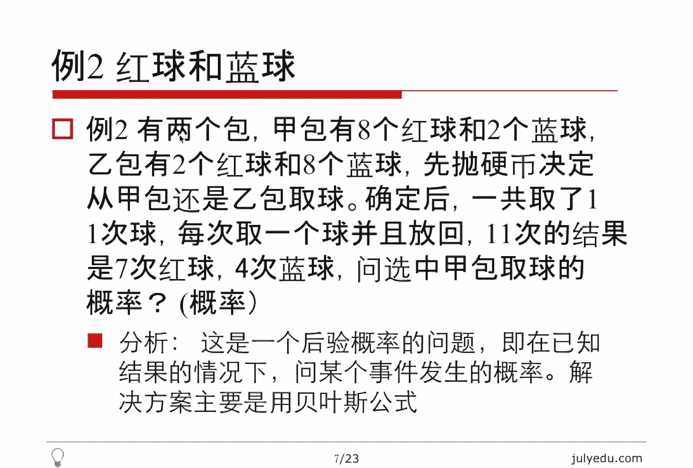

取球每次取一个，并且放回，一共取了11次。注意这是一个有放回的。那么11次的结果恰好是七次红球，四次蓝球问。最开始我们选中甲班的概率啊，它当然也是概率相关的那这是一个后验概率的问题。什么叫后验概率呢？

就是已知了结果。😊，再问我们最初某个事件的概率，这个是在知道了这个结果下的，或者说这是一个条件概率。那条件概率我们就要用条件概率的解决办法，主要呢就是贝斯公式。

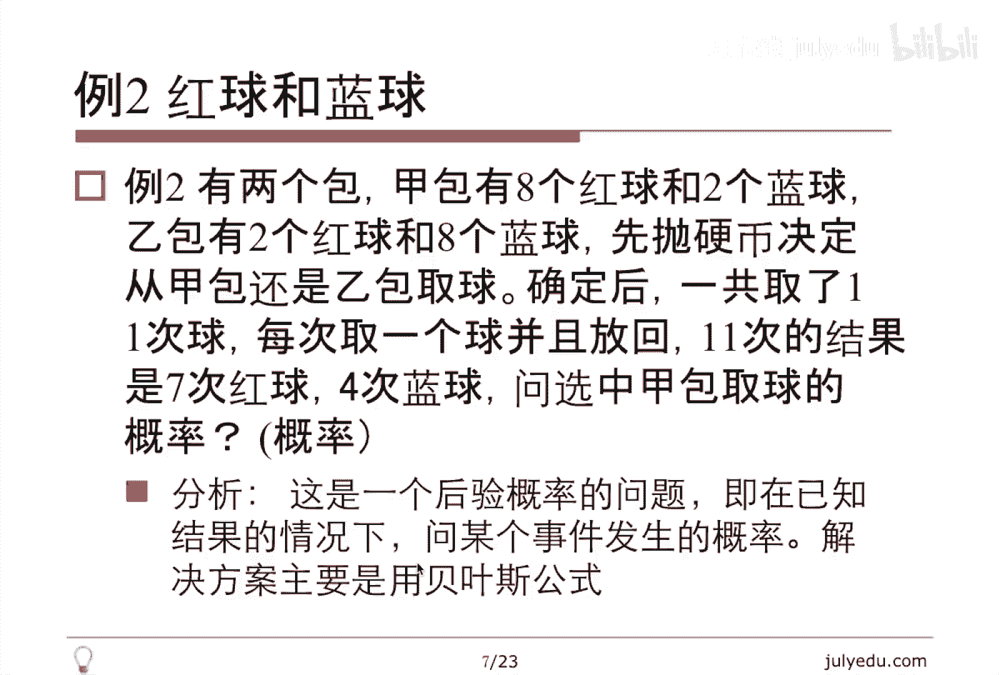

我们定义事件A是最开始选了甲包。事件B呢是最开始选了乙包。事件C呢是这十一次取球，恰好是七次红的四次蓝的这么一个事件。😊，这ABC定义好，那么显然PA等于PB等于0。5。

因为我们最初是抛硬B决定的选择哪个包，那么它们的概率是相同的。那么关键是这个C怎么算？那C我们用条件概率算，假设我们已经知道我们现在选的是假包，那么发生事件C的概率是个什么呢？

因为那个放球是一个这个有放回的这么一个抽样，它是一个二项分布。每一次都是。😊，以0。8的概率。出现红球0。2的概率，出现蓝球，这个是和这个袋子里面的球数有关的。因为是8个红两个蓝。对于甲班来讲。

所以是0。8是红，0。2是蓝。那么前面那个组合数呢，就是我在这11次里面，我选择出4次，让它是篮球就可以了。当然也可以写成C117，这个答案是一样的。因为11个里面选4个和选7个是一样的。

那么对于乙班也是类似的，这是低问B出现C的概率，注意这是两个条件概率。😊。

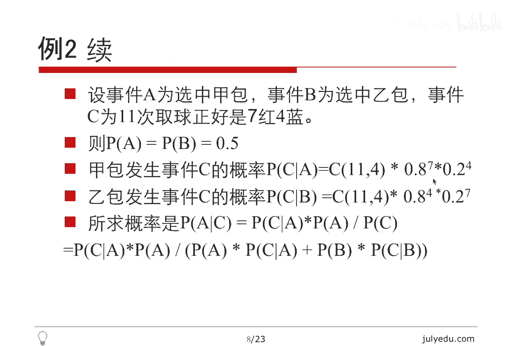

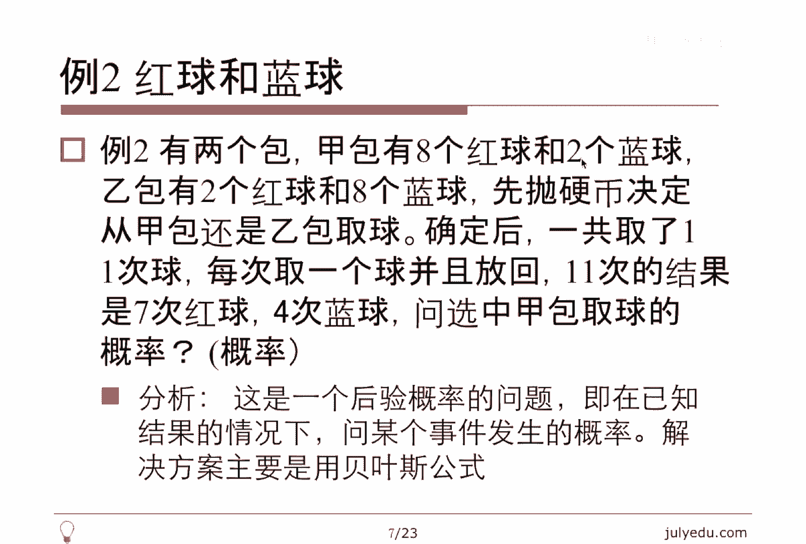

那我们求的是什么？求的是已知C，然后出现A的概率，也就是givenCA的概率。那么根据贝斯公式，它是这么一个东西，就是givenAC的概率乘以A的概率除以C的概率。

注意这里面第一个是已经能求出来的PA呢是0。5也是知道的。我们唯一不知道的就是这个PC，也就是C的概率，C的概率怎么算？再根据贝斯公式展开。😊，分子没有变化，关键把分母展开，展成什么呢？

因为C无非就是A成立的时候，C的概率和B成立时候C的概率。因为前面选班的时候分A即B嘛，所以把所有情况都没举出来，这个又是一个思公式。我把这个东西乘以givenAC的概率以及PB乘以givenB的概率。

这两个加起来就等于所谓的PC那现在这里面所有的值都是我们能算出来的，这里具体算我就不算了。但是PAB是0。5，这个P givenAC的概率是这个P givenBC的概率是这个这个也是前面已经算过的。

这个也是0。5，所以所有的数我们都可以算出来。当然这个概率我们就能算出来了，也不是很难的题。😊。

然后呢，我们再看一个智力题。在黑板上写下1到50这50个数。然后呢，接下来我们有49次操作，每次操作都是选两个数擦下去，换上这两个数的差，注意这个差取得是绝对值，也就是以大数减小数的结果。

每次选两个数擦掉放上去一个数，所以每次。😊，之后就减少了一个数，这样49次之后就只剩下了一个数，问剩下的那个数可能是什么？为什么？😊，我们先考虑把这个问题简化一下，先不考虑剩下的数是什么数。

先考虑剩下的数是奇数还是偶数。我们可以考虑有什么东西是不变的，因为这里面的数不断在变。我们考虑一下什么东西不变。剩余奇数个数的奇偶性不变，什么意思呢？

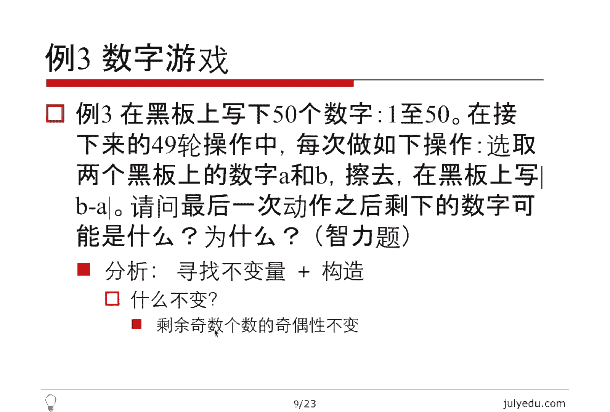

如果我们选的A和B是两个奇数，我们把它们擦掉了，然后换上他们的差，他们的差显然是偶数。那这样看来，奇数的个数是减少两个了，因为两个基数擦掉了，换的一个是偶数。😊，如果我们选的两个数是偶数。

它们的差显然也是偶数。那么把它们擦掉了。😊，这个基数的个数是没有变化的，换上来的是不是也是偶数。所以总体来讲，基数的个数是不变的。😊，那如果第三种情况，我们选择两个数，一个是奇数，一个是偶数。

那么把它们擦掉，换上的结果是它们的差，奇数和偶数的差显然是个奇数，所以擦去了一个奇数，一个偶数，换上来一个奇数，这个奇数的个数也是不变的。所以无论哪种情况，要么奇数不不变，要么奇数的个数减少2。

所以奇数的个数只能两个两个的减少。😊，那总体上50个数有25个奇数，25个偶数，那奇数的个数是奇数，它两个两个减少。所以说最后剩下的一个数只能是奇数，不能是偶数。因为如果最后剩下数是偶数的话。

说明奇数减到了0个。但是奇数一上来有25个，两个两个减少不可能减到0个，这我们就证明了剩下的数一定是个奇数。😊，那么剩下的数可能有多大范围呢？首先因为我们换上的是两个数的绝对值。

所以这个一定是大于等于零的那并且它显然也是小于等于50的。所以最后数的范围一定不超过50，不超过50的基数是不是都能出现呢，这就需要我们构造一个过程，看看假设我们想最后得到一，我们应该怎么做。

可以让它最后得到一，或者说我们可以构造出一个过程，让它最后得到一或者说最后得到3。😊。

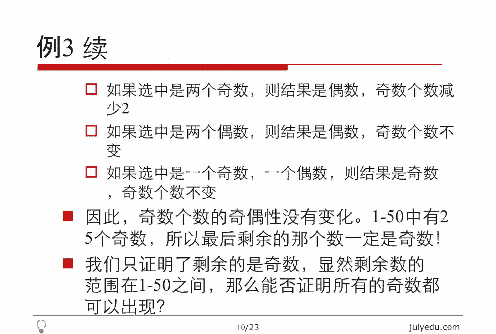

请看这样的构造过程。如果我们最后想得到一，我们就把一和二拿出来。因为2减1等于1嘛，这两个数我们暂时不动，我们这样做，把三和四配对擦掉，它们换上一个一5和6配对擦掉，它们换上一个一这样一弄。😊。

一直到4950，这样之后就变成了这个12，我没有动，后面跟了24对一，也就是这个24个一。因为24对的答案都是一，有24个1，24个1，我们两两相消，最后会变成这个全都变成0，应该是12个0。

那些零无论怎么消，最后就会变成一个0。然后这个二减1，最后变成一个一，然后和那个零一消就变成一了。所以关键是我们拿出一个东西得到我们想要的结果，然后后面那些数把它们变成相等的，最后变成零消掉就可以了。

那假设我们想得到三呢，假设我们可以拿出一和4来。😊，因为4减1是3，剩下的也一样，两两配对又得到一大堆一，最后又消成零了。假设我们想得到5呢，我们就拿出一和6来。然后后面配对注意把6跳过去。

这个是把四跳过去。那类似的假设我们想得到49呢，我们把一和50拿出来，把他们最后再消前中间的那些呢，又是两两配对又是得到这个24个1。😊，所以都是类似的。根据我们这种构造方法。

最后我们可以得到1到49这全部的基数我们都可以得到。因为我们刚才已经证明了答案只能是基数，现在我们又证明了我们可以构造出过程，把这些基数。也就是这25个基数，我们全都能构造出来。

所以说最终的答案可能是1到49之间的全部的基数。😊，这个是我想讲的第三个问题，下面进入这个数据结构与算法的问题。

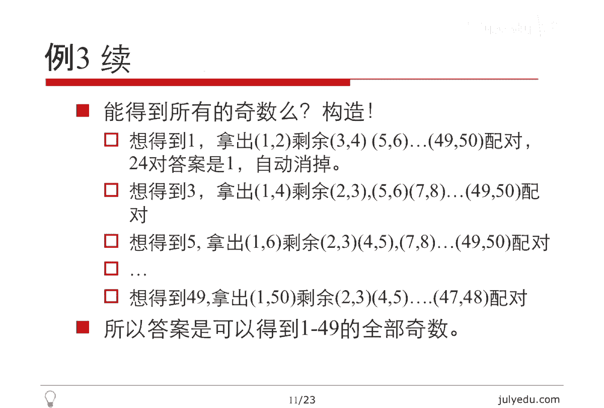

第四个题。从无序的实数数列里面。求里面大小相邻的实数的差的最大值，要求线性的空间和线性的时间。我先解释一下这个题，什么意思？就是说给你一串数。😊，如果呢你把这串数排好序，或者说把这串数画在了数轴上。

其实跟排好序的意思是一样的，求相邻两个数的差的最大值。大概是这么一个问题。显然呢排好序是一种方法。当然，排序是N log N的时间复杂度。那其实在这个lead code这个网站上，164题就是这个问题。

只不过它里面的数不是实数，是整数了。我们来讲这个版本，思路是一样的。😊，我们假设这串数里面最大的是max最小的是 mean，并且假设它们两个不相等。为什么假设它们不相等呢？如果所有的数都相等。

那么相邻两个数之间的差显然是零，答案也就是零了。这个是比较简单的结果。那如果不相等，也就是说max不等于命。我们把命到max之间的这个区间分成若干个统，什么叫统呢？也就是统排序的思想。

我们把这个 mean到max之间平均分成N加一份。😊，每一份是一个区间，每个区间我们把它看成一个桶，也就是说一个桶和一个区间或者说一个子区间是等价的概念。当然有一些细节我们来看。

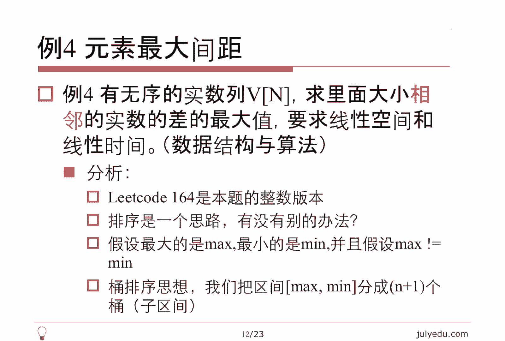

每个桶的宽度当然是max减面除以N加1，因为分成了N加一个桶。那么每个桶我们可以认为是一个左臂右开的区间，为什么右边开呢？因为这个开区间和下一个桶的左端点恰好重合，我们要保证一个数只属于一个桶。

那么显然这个应该是一个左臂右开的这么一个区间。那注意呢，最后一个桶是特殊情况，最后一个桶是双臂区间，因为那个max右面没有值了。😊，啊，这个其实开和B区间并不影响结果。

这里面是为了这个细节或者说清晰在这里面强调一下。那么。我们分桶的目的是什么呢？我们这样把一个区间分成若干个子区间之后，首先区间是等宽度的。另外一个每一个数属于且仅属于一个区间，它们之间是不交的。

那么最小值在第一个桶里面，为什么呢？因为最小值就是第一个桶的左端点嘛，第一个区间的左端点，最大值呢类似的它是一个双臂区间，最大值是最后一个区间的右端点，所以它在最后一个桶里面。

那么还有一个也就是割隆原理或者说抽屉原理是说我们把N个数放到N加一个桶里面，至少有一个桶是空的。因为桶多数少，不可能每个桶里面都有数，至少一个桶里是空的是什么意思呢？😊，也就是说中间可能有个桶是空的。

什么叫中间呢？我是想说这个桶的左边儿。一定会有数，这个空桶的左边空桶的右边一定也会有数，为什么呢？因为我们第一个桶不是空的，最后一个桶也不是空的，空桶肯定在中间，所以空桶的左右是都会有数的。

不可能空桶左或者说空桶的右边是空的。因为它一直是空就会走到左边第一个桶里面，一直是空就会走到右边最后一个桶里面。所以空桶的左右都有数。这个结论有什么意义呢？😊，首先我们知道同一个桶。

也就是同一个区间里面的数，任意两个数的差都不会超过区间的宽度。因为数的大小在那摆着了。我们在这个桶里面最小值也就是桶的左端点，最大值也就是统的右端点，最小值和最大值的差无非。😊。

最大最大了也就是这个桶的宽度。但是呢我们又知道有一个桶的存在，一个空桶的存在。那么这空桶两边左边第一个数和右边第就呃左边第一个数和右边第一个数，它们之间的差值一定大于等于这个桶的宽度。

因为中间那个桶空了嘛。左边那个数和右边那个数的差肯定比这个桶的宽度要宽。😊，于是我们就说同一个桶里面的数是没有意义的，我没有必要统计同一个桶里面的数。因为同一个桶里面的数差值不够大。

我们至少找到了空桶左边那个数和空桶右边那个数差值比这个同一桶里面的数大。所以我们对每个桶只记录最大值和最小值就可以了。我们用这个桶的最小值和它前一个桶，当然我指的是前一个非空的桶的最大值。

这个差值量量比较一下就可以了。所以说我们在分桶的时候，实际上少考虑了很多情况。我们对于每个桶只记录了一个最小值和一个最大值就可以了。那我们先来看看这个具体实现。这个是我在let code上实现的代码。

因为它都是整数有一些溢出的问题，所以这个代码看起来略微有点长。最关键在这儿。😊。

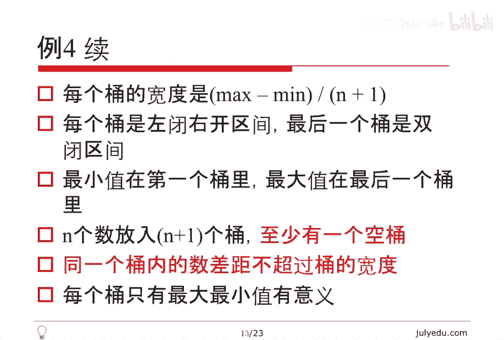

这个是maxine，这个是mini，就是我刚才说的max min，我把它分解成N加一份儿，每份的宽度是德尔ta。那么。😊，这个是我用整数计算，因为避免了浮点数的计算。这mt就是两个做乘法。

计算出这个第I个数，也就是那么I应该在哪个桶里面，它应该在哪个桶里面呢？它应该在那么I减咪咪乘以N加一除以max减幂这么一个桶里面。这个是把某个数映射到了它所在桶的编号。那么它所在桶的编号。

我就可以在这个编号里面求出这个桶里面的最大值和最小值，注意这个桶有可能是空的。如果是空的的话，最大值最小值都是这个数。如果不是空的的话，最大值取更大最小值取更小。所以这一重循环下来。

我就求出来每个桶是不是空的，并且如果不是空的，每个桶的最大的值和最小的值，我们都求出来了。根据刚才的结论。😊，这个最大的间距不在同一个桶里面出现，那么我只看相邻那两个桶，怎么看呢？再循环一遍。

如果不是空的的话，我们用当前筒的最小值减去前一个桶的最大值就可以了。注意这last表示前一个非空筒最大值。😊，那么最后return answer就可以了。那实际上这里面当然前面有一些特殊的处理。

如果个数不足两个以及这个max等于面，这些都已经特殊处理掉了。所以这个题目是利用统排序的思想做到了ON的时间复杂度和ON的空间复杂度。因为我们开了三个数组。

空间复杂度是ON的循环呢这个求最大值最小值循环了N次。然后分筒。😊，并顺便计算最大值最小值又循环了N次，以及最后就是。求得结果，把每个桶的最小值和前一个非控筒的最大值做减法又循环了字。无论如何。

它是个线性的算法，这是非常巧妙的这么一点，大家仔细理解。😊。

那么第五题呢，它是一个随机采样的这么一个问题，说的有点啰嗦。我觉得这个题简化起来来说，首先它是一个数据结构与算法的问题。然后。😊，我们有这么一个函数，它是get name。该 name干什么呢？

是我可以返回。这个数组里面的一个数就是一个一个返回。也就是我没有办法通过下标得到数组里面的每一个数，我们只能每次get name一下，或者说get next了，我们只能拿到下一个数。

当然如果没有下一个数返回not，这个可能是java的习惯，或者就是一种伪代码的习惯。因为这个int值是不能返回not的，java当然能返回 now，但是但是是小写的这种not。

并且这个应该是integer。所以我说这个题目，这个函数头啊以及等等，出的并不是很好。所以我后面写的是一个伪代码。😊，然后要求什么呢？要求我们从这个数组里面随机的选择出一个数。纯随机。

也就是每个数选择的概率是相同的，各是N分之1。当然这个N是未知的。其实呢这个题我在概率的那个公开课里面，或者说短视频里面也讲到过，它是一个流式的数据。他说了这么多，就是想说这个数据是一个流式的。

什么叫流式的呢？就是我没有办法，或者说没有必要，或者说不允许把所有数据都存下来，数据是一个一个流过来的。我们可以get next的得到下一个，但是我们没有办法把所有数据都得到。

当然它要求的空间复杂度是常数的，也不能让我们把所有数都存下来。那么这是一个蓄水池，或者叫水库抽样的一个经典的应用。什么意思呢？😊。

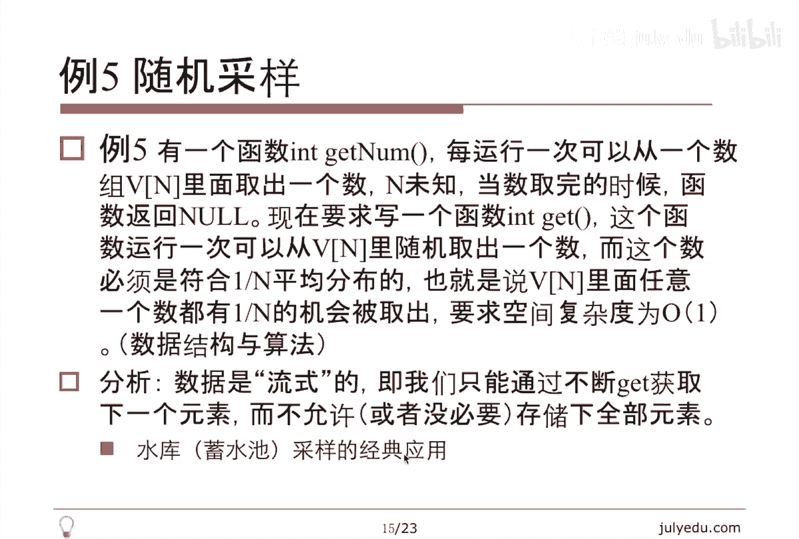

我先说算法，也就是不断的get对于第I个元素，我们以2分之1的概率选择它就是这么简单的一个算法。什么意思呢？就是我们先选择对于第一个元素，我们以概率为一选择它，就是我们先选择了这么一个数。

对于后面的数呢，每来一个数，我们就以2分之1的概率要它要它的话，我们就把之前选的那个数扔掉，就换掉了。如果不要它就放弃这个数还保留我们之前选的那个数，就是这么简单。

那么怎么证明它确实最后选择每个数的概率是N分之1呢？😊，我们先说对于第I个元素，无论之前。选了哪些数？我们再到第I个元素这一步，选择第I个元素的概率是I分之1，这个是算法决定的。那么。后面第M个元素。

也就是M大于I的时候，不选择DM个元素的概率，显然是M分之M减1，因为只有M分之1选择DM元素嘛。那最后我们能选择第I个元素，并且真的把它保留下来的元素就是在第I个元素的时候。

我们选择了它走了I分之1这个概率。后面元素我们都是走的这种M分之M减一的这概率，因为后面都没被选中，才不会换掉第I个元素。那我们把它乘起来，注意这个这一项的分母恰好是后一项的分子。

这样就所有的一项和后面一项就消消掉了。最后只剩下第一项的分子和最后一项的分母，所以说我们最后能保留下来第I个元素的概率，恰好是N分之1。😊。

注意这个I是任意的这就证明了我们这个算法可以等概率的返回任何一个元素。这个算法非常简单，并且非常好。它不需要预先把数据存下来，而且我们不需要知道这个N等于多少。

我们只要对当前第I个元素以2分之1的概率保留就可以了。

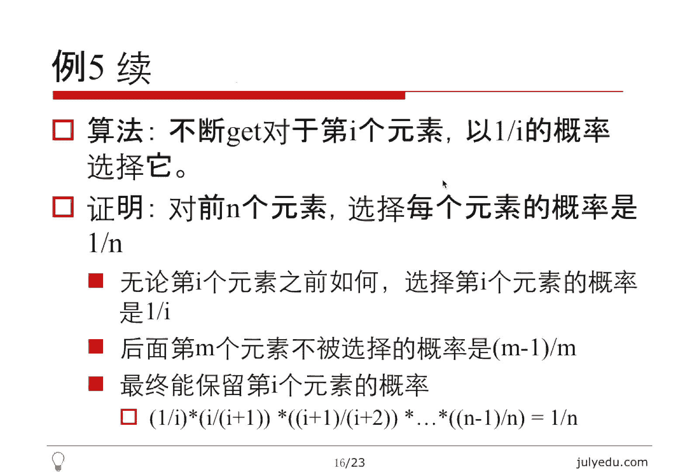

我看看这个。代码也非常简单，这是一个伪代码。注意这个我们假设这个东西能返回到，或者说假设比方说有一个特殊值，我们一读到它就认为停了。当然这I从一开始。😊，什么意思呢？我们不是说以I分之1的情况下。

以I分之1的概率保留第I个元素嘛？那么我们产生一个随机数，假设这个随机数是均匀的，它对I取域数，对I取域数有I种情况，也就是0到I减1。那么当然这可以写任何一个数，且0到I减一的任何一个数。

那我们就选择了0，因为I最小可能得一嘛，所以我们这个就选择零是最好的。😊，也就是说。对I取域数有0到I减1这I种情况，我们只取了0。如果它对I取域数得0，实际上这个概率就是I分之1。

我们以I分之1的概率保留比I个数也就是X。剩下的数我们都就是其他的概率，我们这个result保持不变，注意I等于一的时候，我们以百分之百的概率接受了这个X。那么当然后面有可能换掉。根据我们刚才的证明。

最后这result可以是任何一个数，并且是任何一个数概率是相等的。这个是一个非常经典叫做蓄水池或者叫水库采样的这么一个方法，它是线性的，并且是常数空间。因为我们没有空间来把所有数都存下来。那注意。

这个方法是可以扩展到要采样K格的一般情况的。K格的时候，我们就用一个数组来把它保存下来，然后换一下那个下标就可以了。这个大家可以思考一下具体怎么做。这个题实际上是K等于一的。😊，一个特殊情况。

这个是可以扩展的。这个是我想说的第五个例题。

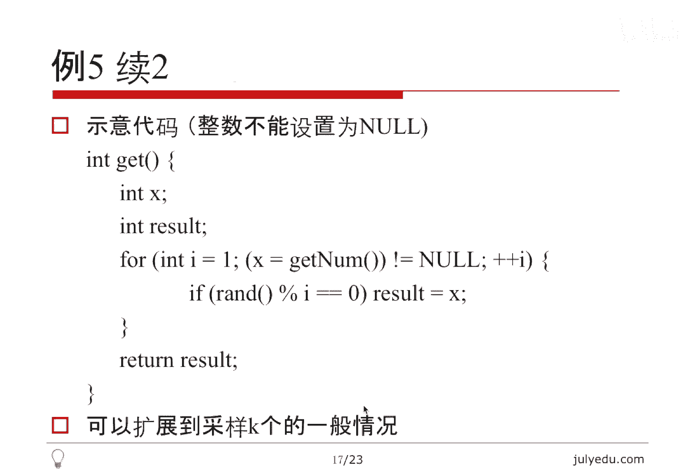

第六个例题我说的快一点比较简单，它是数组查找，它是从AI这么一个严格递增的整数数组，注意是整数数组必须是整数，浮点数是不一定对的。从这个整数数组里面找AI等于I是否存在这么一个下标，AI等于I。

当然要分析什么时间复杂度啊等等这些东西。数据结构与算法，它也是数据结构与算法题。那首先呢因为我们要查找这个index，我们不知道它等于多少。注意啊。

这个不是在AI里面找到一个值X给定一个X找这个是我们要找到一个index就是一个下标，下标值和这个数组在这个位置值是相等的。我们不知道I等于多少，所以我们不好二分，实际上是有二分的办法的。

我们把它变一下。😊，假设我们有一个数组，BBI等于AI减A。那我们看一下数组B具备什么样的性质。首先我说它是单增的，我指的单增是不一定严格单增，也就是有可能相等，它是后一项减前项是大于等于零的。

为什么呢？我们减一下BI加一减BI根据定义最后是这样的AI加一减AI减1，注意AI是一个严格单增的整数数组，所以AI加一减AI要大于等于一。因为这个它不可能相等，而且又是整数那么差值要大于等于一。

所以它减去一是大于等于零的。这说明。😊，BI是一个单增的，注意是不一定严格单增是大于等于0，有可能相等。那么我们要找AI等于I，相当于找BI等于0。

那么我们相当于在一个严格呃在一个不一定严格单增的数组里面找到零值，那这是一个非常简单的二分查找。因为就是在一串单增的数里面，看看有没有一个数等于0。那么显然它是一个logN的时间算法。

这就是最朴素的二分，所以我没有写代码，注意这里面这个B数组我们不需要预先求出来。我们就对2A2分在二分的时候把它减I就可以了。因为我们算B的时候是需要ON的时间复杂度的。我们不能把B算出来。

所以这个B是一个隐含隐式存在的。所以我们通过这个二分查找算法，在B数组里面，或者说在AI减I里面找到零值，就是我们想要的。😊。

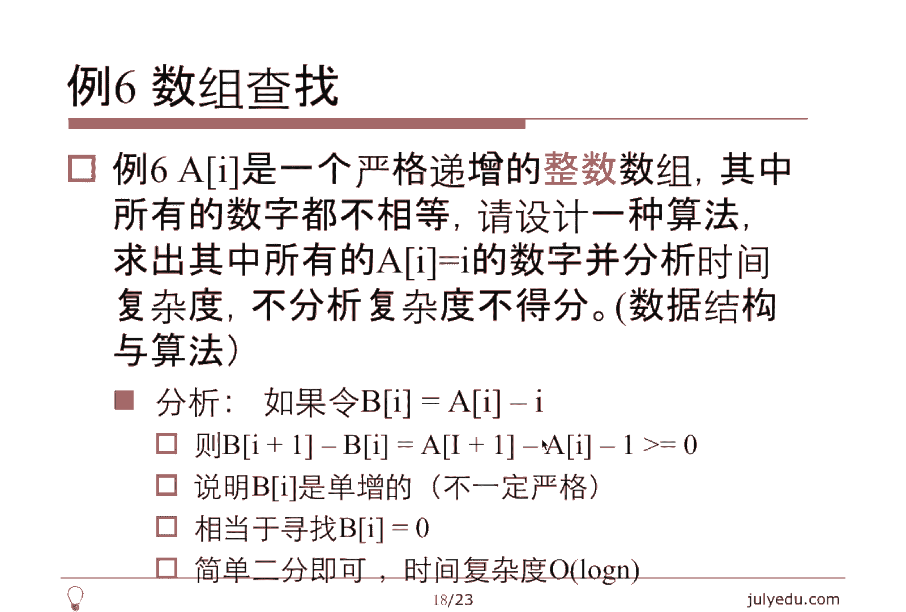

我们再看一下最后一个题。最后一个题我觉得我也是给大家讲呃讲一下思路，也就是这是一个开放问题。我我讲一下这个我从哪几几个角度来考虑。首先有一批数据，百万级别，我不知道这个题是哪年的题。现在看来。

百万级别并不是特别大。那么有什么呢？😊，有用户ID科目ABC等等成绩。然后用户ID呢是0到1000万，并且是连续的。然后可以唯一标识记录。然后成绩呢在0到100之间，2块磁盘内存有这么大。然后呢。

有三问。第一问呢，要查询ID对应的各科成绩。然后第二问呢，这个ID在0到10亿之间，它把ID改了，原来是1000万，并且呢是不连续的，怎么办？第三问呢。除了要查询这个成绩以外。

还需要排序或者说排名怎么办？大概是这么一个问题。这个呢是我选做实际系统的这么一个例题。我觉得这个题可能是一个面试题。如果是笔试的话，也只是写写思路。因为这个题我觉得是一个非常开放的问题，做法可能很多。

我只是这个提一下我的一些考虑，可能不是最优的。欢迎大家提出这个批评指正吧。首先ID连续那非常简单，可以用数组存，因为ID是连续的嘛，0到1000万，无论是多少，这个数据只有100万条。

我们把这个ID最小的那个拿出来，都和最小的ID1减，就可以把它变成0到100万左右就可以了。因为这个呃无论从哪个ID开始，反正它是连续的一段，就跟从零开始连续的一段一样。那么们直接用数组存。😊。

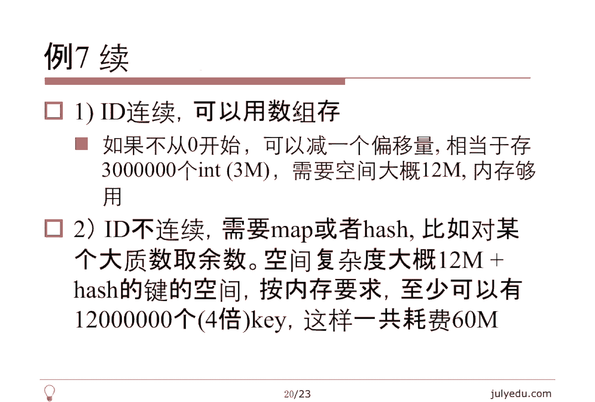

那数组存相当于存300万个int，300万是多少呢？就是3兆个int，3兆个int，一个int是4个byt，所以大概12兆的内存就够了。这个直接放到数组里面，内存够用。那如果ID不连续呢。😊。

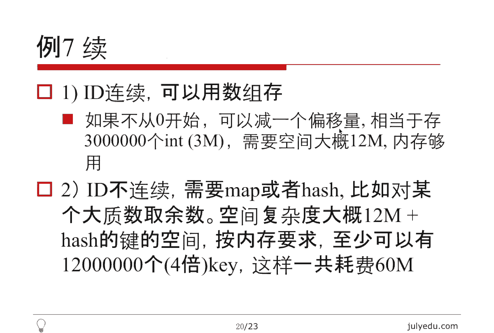

我们需要，并且这个ID的范围那么大，有1到呃0到10亿之间。所以我们需要把ID映射成这个。

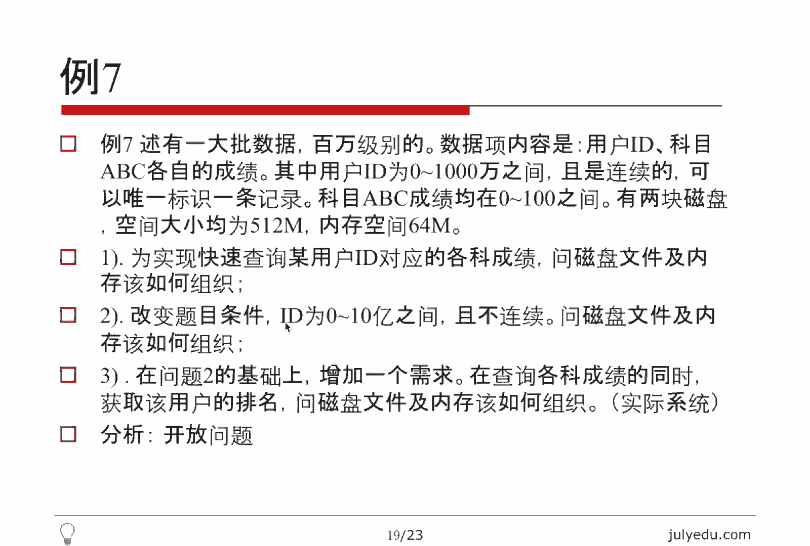

一个index，那么怎么映射呢？我们当然需要map或者哈希。那关键是啊如果我们把它放到数组里面还是12兆，那关键是这个ID怎么映射映射，我们要写一个哈希。这个哈希呢有key和value。

它的value呢其实就是。😊，大概100万个in。100万个int呢其实没有多大，100万个int大概是4兆。因为300万个是12兆嘛，100万个是4兆左右，4兆左右呢。

我们再存这个就是假设我们给他这是多少，120万吧。1200万个。因为这是300万，我们取4倍，1200万个K，也就是我们把哈希空间变成1200万那么大。然后大概这1200万大概需要48兆。

再算上这12兆，一共需要60兆空间，什么意思呢？我们哈希呃我们不考虑这个哈希函数具体怎么建立，我们哈希给他1200万的空间。😊，1200万个int的空间。然后来一个int。

我试图把它映射到0到300万之间呃，0到100万之间。具体哈希哈数怎么设计，这个大家自己仔细讨论，但是光靠哈希的空间和这个整数数数组的空间应该是够用的。大概一共60兆空间可以解决这个问题。

当然其实这个题做法还有很多。比方说我们可以这个在磁盘上做哈希啊，或者把一个int映射成为磁盘空间上的一个这个地址这么一个记录的地方。然后我们从这个文件里面把这个人的三科成绩拿出来等等等等。

这个做法非常多，但是只靠内存的话，因为主最关键问题是这个哈希的空间不好算。我们如何把这个不连续的空间映射成为连续的空间，需要一个非常非常大的哈希表，这里面大概1200万，如果只用内存的话。

当然我们可以考虑在磁盘上做映射。那这个效率会低很多。😊。

那么第三个关键是如何对100万的数据做排序。因为他说的这个需求不是很明确，是单科排序还是总分排序还是怎么排序。如果是总分，或者说每一科每一科之间排，那是对300万的数据做排序。那无论如何都要做排序。

当然还是需要哈希表，因为我们需要把这个不连续的key或者说0到10亿的key映射成为0到100万左右。这个需要一个非常非常大的哈希表。刚才我说了1200万左右的哈希表，也许够用，也许不够用。

这个我觉得在实际情况中需要考虑很多问题。那不够用的话，就像我刚才说的，需要在磁盘上写一些东西。😊，那并且呢这个我觉得主要考的是排序，因为他要找到每个用户的rank。也就是排排名值。

那排序就是经典的啊外部排序，外部排序是怎么做的呢？我们先把数读到内存里面来，然后做好排序。操做好排序之后呢，我们把它写到文件里面，然后把所有数一部分一部分的读到内存里面，排好序，写到文件里面。

然后写到文件里面之后呢，再对这些文件做规并排序。也就是说我们用文件作为了一个临时的缓冲区，然后做排序具体的细节需要大家考察一下外部规并排序的这个具体做法，然后我写的这比较简单啊。

一般就是按内存做排序写到文件，然后文件做规并。排好序的数据，我们就可以得到它的rank值。😊，然后得到ra值，如果就是。数据已经排好序了，最后我们还是可以存到内存里。因为刚才是300万。

现在无非就变成了400万。因为三门成绩再加一个rank，即使再算一个总分，也不过是500万的数据。500万个int其实内存是够用的，并不很大。因为刚才300万我们只用了12兆嘛，所以并不是很大。😊。

那么有些优化思路，那比方说各科成绩0到100，我们当然可以考虑压缩。因为刚才说的我们全是按int32Bt做的32B其实可以存到呃十的9次方，也就是10亿级别的数据，那么只0到100。

当然我们可以把它缩成chair这样使用的空间就少了。当然还有其他的压缩办法，比方说相邻的两科，我存一个偏移量，比方说1个90分，1个100分，当然我可以存1个90，再存一个正十就可以了。

当然这个可能并不能减少多少空间。那当然还有其他的压缩办法。比方说把它压到二进制里面。因为这个100大概是占这个7位到8位的样子。那么一个int其实可以存三门到4门课程的成绩。所以。😊，我们这样做的话。

就是存储量其实可以减少一个常数的级别。然后呢，排序的策略当然因为所有成绩都是0到100，即使我们算总分的话，也不过300分，我们可以不用排快排，可以用这种技数排序。因为它是对这个呃。整数是有范围的。

只有300这么大，非常小。我们可以用计数排序来代替快排，这样可以提高这个时间呃这这样可以降低时间复杂度，提高时间效率等等等等。所以我觉得这个题是一个非常发散的问题，我也只只是给大家提出一些思考的方向。

这个具体哪些结果孰优孰略，大家自行评判。😊。

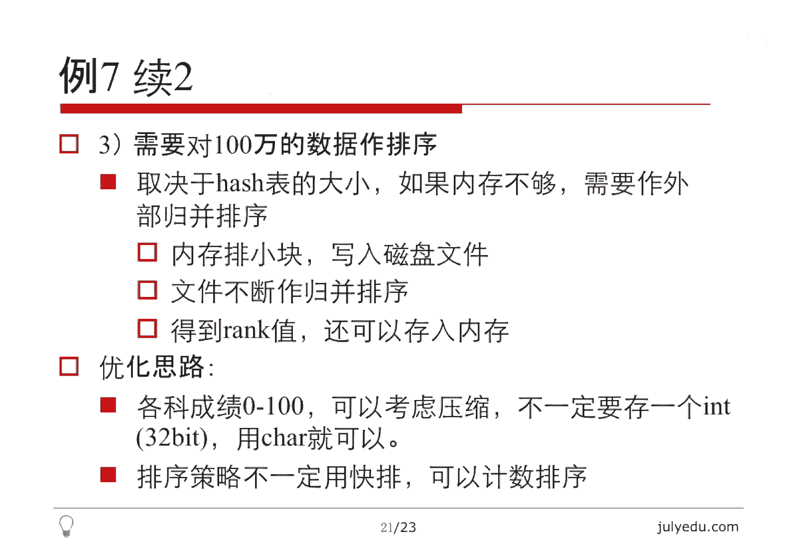

那么我做一下总结，刚才其实已经提到了，笔试非常注重基础，因为它的题型非常多，这个面非常广。比方说操作系统啊、数据库啊，这个嗯算法呀等等等等。那面试呢当然是注重交流，我们千万不要把面试当成笔试。

这个我反复强调过，因为。😊，面试官在等着你跟他交流，你即使写程序，你要说我现在为什么要写这个东西，我总体思路是怎么样的。我下一步打打算做什么，以及一些t case，可以给出来，尽尽可能给。

要给面试官展现自己积极的情绪。那还有刚才那个题我不知道是笔试还是面试，有很多题目是没有标准答案的，它是开放问题，更需要你去拓展思路去交流。好，多做假设简化问题。因为这个有些问题可能比方说给你一个二叉数。

然后让你求两个节点的最近公共组监，然后你可能要做一些假设，比方说二叉数有指向父亲的指针，这样你做起来就会很省事。如果没有就不省事。所以有些东西你可以自己假设，然后跟面试官说，我做了这样的假设。

然后我写这样的程序。然后这个当然这个这个程序包括这种函数的头部要自己定义写出，这个跟你做的假设也是有相关的。那当然还有一还有一点就像刚才那些智力题。😊，是没有固定套路的这就需要我们多总结，多思考。

多归纳。

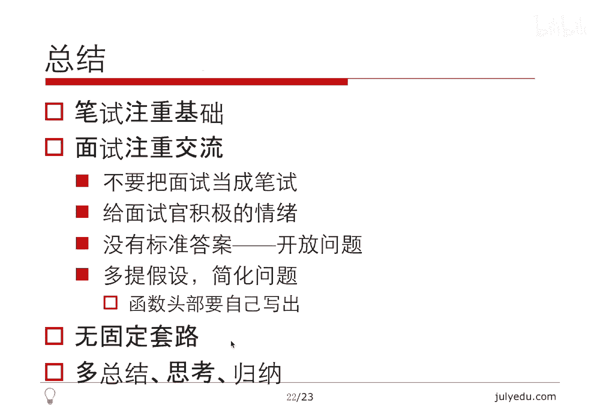

好，今天的课程就到这里，谢谢大家，欢迎大家给我提出批评指正。😊。

