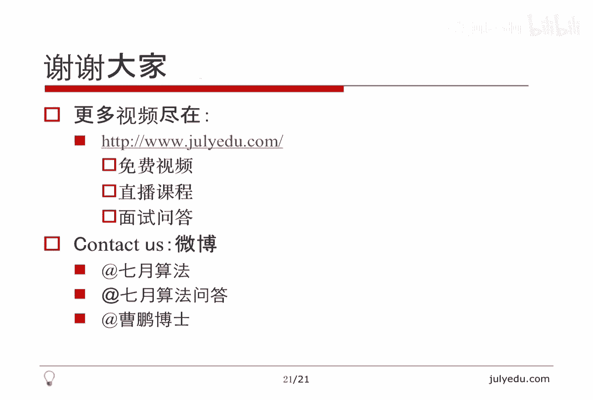

# 人工智能—面试求职公开课（七月在线出品） - P5：曹博：我的北美求职心得 - 七月在线-julyedu - BV1Xf4y1r74s

🎼。欢迎收看7月算法公开课。我们本堂课的话题比较轻松，主要内容是我的北美求职心得。我将从如下几个方面讲述本课，先讲一下一般流程，然后讲一下公司的列表，再讲一下公司招聘的烦恼，然后讲一下签证的问题。

总结一下国外面试的题型以及如何准备，再给一些例题，最后总结结束本课。关于流程啊，投北美的职位流程其实和国内也差不太多，一般有如下几个渠道来投简历。

首先可以通过link inlink in有很多recruiter，也就是可以理解为HR之类的人，他会主动联系你，或者你主动联系他们，然后通过link in站内线互相交谈，然后可能会电话联系。

最终可以投简历。那当然还有一种就是直接投，直接投的这种成功率比较低。因为现在公司的candidate都比较多，所以直接投简历往往就会很有可能石沉大海就没有任何消息了。也就是可能最后被默具了。

那比较好的途径，我觉得还是link in最好途径其实还是找内推。因为如果有一些你的好朋友或者什么认识的人学长之类的，在你想去的那个公司他可以推荐你这样公司对于推荐的重视程度也比较高。

所以这种给你面试的可能性也比较大。然后还有一种途径，这个相对比较难，就是通过比赛。因为很多公司在比方说，原来叫inter straight，还有code forces。

还有这个top code等等这些网站上嗯，会挂一些题目做一些这个比赛，如果你达到比赛，比方说前十前20的这种名次的话，可能公司会联系你。因为他们本身就是想。通过比赛发现一些人才。

这个是我大概总结的四个投简历的这种方式。其实对于我本人我比较喜欢还是这种内推。因为link in的这种成功率也不是特别高。尤其是如果人在国内的话，嗯，可能也不太会有很多recer联系你。

因为我有很多朋友在国外的公司，所以我当时投简历选择的就是找内推这个途径。然后之后就会被公司的HR联系。这个联系一般也就是1个10到20分钟的这种谈话，了解一下你的背景啊，曾经有什么项目啊。

然后想做一些什么事情啊，包括你熟悉的语言啊等等，然后可能给你介绍一下公司的概况。再接下来就就是面试了。面试呢一般分为店面和on site on set就是现场面试店面呃不同的公司不一样，有可能有一轮。

但是最多我听说好像有三轮的，就是一般是1到3轮吧。然后就是on siteonite就是现场面试，一般会就是让你办签证，可以到美国这边来到公司面试，然后onet一般都有5到6轮，就是基本上是早晨到。

然后晚上结束的那一种。中午呢和这个公司的工程师可以共进午餐，了解一下公司的情况，这个整体的气氛，包括这个文化啊等等各方面，然后可以参观一下公司，就是了解一下这个onite面试。

其实店面的通过率相对来说还是比。比较高的。但是onet的通过率，我们我们看起来可能得有30分之1吧，就是大概3%左右。所所以onite的成功率并不是很高，从店面到onite相对还是比较容易的。

但是从onite到下面这个offer其实相对难了很多。啊，那当然一种就是offer，一种就是被拒了，被拒了就相当于目忘，重新再找别的公司再投简历。那么你拿到offer之后，公司会帮你办签证。

这个主要是进入美国的工作签证。那最后是入职，入职一般都是10月1号以后，后面我会讲为什么是这个日期，这个是一个总体的流程。那么从国内可以投的公司的列表，其实主要还是因为欠证问题解决签证。

其实对公司来讲也是一项很大的负担。所以。尽管国外这边呃硅谷啊湾区啊，这边地方的这个公司非常非常多，但是在国内能投的相对少了很多。因为呃有些公司就是他不太愿意负担这个签证的问题。

所以他就想选择本土的这个这些工程师来招聘。这样的话，他的这个风险啊，代价都会小很多。那么所以我还是建议投一些比较大的，而且肯定能解决签证的这些公司，比方说呃我列的这个顺序其实。

网上有流传所谓的FLAG就是flagF就是facebook。这个大家都知道L就是linked inA呢就是amazon。这呢就是google这四个公司，然后下面微软microsoft twitter。

然后这个sstorm eight其实也是一个做游戏的公司。曾经我在link in被他联系过，所以我知道在国内能投它apple苹果不用说了，pocket games是一个做手游的公司。

就是做手机游戏的公司。然后这个tangle tanggo又叫tangleme它是呃国外的就跟whatsapp跟微信很像的这么一个工具啊，这个也在国内招聘。因为我知道有人跟我同事过来的，他也是这个公司的。

然后think这个好像公司全称是把它连起来的，就是一只思考的星星，它的base也就是总部在加拿大，但是在美国也有，因为我也被他联系过。所以我知道这个在国内也能投。但是我建议还是投一些大的。

就比方说FLAG啊，然后这个微软其实是在西雅图，它不在这个硅谷这边，但是硅谷这边也有分布，就是相对小一些twitter啊，所以我觉得前面几个还是比较大的比较靠谱的公司。

所以说从国内可以投的公司还是非常有限的。那其实公司招聘他本身也有很多烦恼。首先就是其实美国本土的每年的毕业生非常非常多，人是挺多的，并不是人不够。但是呢他的平均水平相对低一些。

其实这边的毕业生可能呃我不是说个别个别可能也有就是水平非常高的。但是总体上来讲，水平其实没有国内的人高，所以有些公司才喜欢从国外招人。比方说从中国啊从印度啊招人，因为他们觉得从这些地方招的人。

就是水平比在美国本土招水平要高一些。那对于他们来讲，负担其实就是呃首先就是店面本身就很麻烦。因为你不在美国这边要面试的话，可能跟HR邮件一来一回可能就两三天甚至一星期就过去了。

所以你店面约个时间本身就很困难。这是一方面。另外一方面就是on site，就是我刚才说的所谓的那个现场面试，他要给你解决机票啊，帮帮你解决时宿。尽管只。😊，一两天对他来讲，这个代价还是很大的。

因为如果在美国本土，你来on site就早晨来晚上回去就完了，不需要什么机票啊，帮你订旅馆啊这些事情。所以这个对他来讲也是一个代价。所以他从店面到on site，就是有可能会有2到3轮的这种店面。

他还是要在在摸摸底，不然的话他觉得这个机票啊或者这种时宿的代价，看看值得不值得把你弄过来on site。那么还有一个很重要的问题就是我刚才说的签证，签证其实是每年4月1号抽签。

然后签证生效的时间是10月1号。所以比方说我现在招人的话，我从中国招一个人。那你最早能入职的时间其实已经是明年的10月1号了。所以对于公司来讲，这个周期太长了。所以比方说我急招一个人。

我希望他3个月内就入职的话，这种他从国外他根本就就是没法实现的。所以这个对公司来讲，他这种等待的流程，他也。😊，的一个代价。正因为如此这些原因。

所以他的这个面试的要求其实是相对这个美国本土这种面试要高一些的。因为对于公司来讲，我花同样的钱。我当然希望招这个水平高一点的人。那这个我从中国或者说从印度招人，我花的代价大。

那么我显然希望我招的这个水平要高，所以他面试的要求高。所以这个是其实并不是说这边水平高，而是这边就是想要这么高水平的人，他招不满，所以才考虑从国外招，所以才把这个面试的半儿提高了。

也就是这个面试的要求会增会增加。这个是我大概分析了一下，为什么就是公司从呃所谓的国外，也就是中国和印度招人为什么这么困难，为什么就是面试很容易挂的一个原因之一。其实这是很大的一个原因。

那么我再提一下签证呃，一般就是来美国这种就是从中国啊、印度来美国这种签证叫H oneB，也就是工作签证。它是一种非移民签证，它和雇主相关。这个HMB是雇主雇主给你办的，也就是你自己你说我想办一个。

他不就是根本就不受理大使馆根本不受理这种类别，你只能办就是所谓的B onewo就是business或者说旅游的这种签证。但是这种签证在美国是不允许工作的。所以这个签证的类型。

以及你在美国的活动范围或者说能干什么事情是直接相关的。HB这种是工作签证，并并且是和雇主相关的，所以说一定要有offer才能办。那有效期一般是三年，可以在延长三年。那6年之后怎么办呢？其实呃在这6年里。

一般公司会帮你申请所谓的移民签证，也就是绿卡。那在这个如果到了某一个阶段，这个阶段叫。如果你把这个阶段过了之后，一般2到3年，你把这个阶段过了之后，你的身份就一直有效了。就是即使你没有拿到这个移民签证。

你的HB就永远不会过期了。所以这个H。😊，期的问题一般不用太担心。那流程上就是我刚才说的，每年4月1号，所有，也就是拿到offer的这些人，他们的申请材料会提交到美国的移民局。

那目前移民局的这个签证发放的名额是固定的是65000人。那如果人数大于65000人，他就随机也就是抽签儿，具体怎么抽，没有人知道，反正应该是个计算机程序在抽签。那这个现在也有很多所谓的proposal。

就是请求希望把这个名额扩大。但是这种提案到目前为止还没有就是被采纳或者还没有被接受的迹象，反正明年应该还是65000人。所以这个瓶颈口在这里。最多最多也就65000，这65000人是全世界的人数。

而且包括很多非IT的，就是所有的工作签证嘛。这个所以每年人数非常少。然后而且美国本土毕业的硕士和博士本科除外，就是硕士及以上的学历，他可以有优先抽签的权利，大概他有一个破，就是有个值是15000人。

在这6000的名额里以内，他们这15000人先抽一下，就是先抽出15000人。然后那些没抽中的，就是这种高学历没有没有抽中的，再和普通的这些人再抽一次。所以他们的中签率高。

这也是很多人为什么想在国外读书，然后在国外找工作的原因之一吧。因为他这个中签率高，并且国外还有一种临时身份。如果你毕业之后有一种叫OPT的临时身份，你可以用那个先工作，所以他可以就是在等来年的抽签。

所以他这个身份可以保持很长一段时间，就是在美国很麻烦的一点，就是你的身份一定要保持住。如果你没有。😊，身份你工作是不合法的，那么没有公司敢聘用你。那如果你顺利拿到了名额，就是抽签抽中了。

你在这个65000个星员当中，那么你就要准备面签。如果你面签成功，这个面签一般不会被拒。面签成功的话，你的签证是10月1号生效的，大概生效前一周还是两周，就是9月底你就可以入境美国了。

所以这个周期非常长，一般都是呃比方说我们现在投简历，我们最希望的就是在4月1号之前拿到offer。因为你4月1号就要把这个申请提交上去，你提交晚了，就不会被受理了。

因为4月1号当天如果超过这个65000人，后面他就不处理了。那然后抽签抽中了，在转年的大概56月份，你能知道抽签抽中了还是没抽中，如果抽中了，10月份就可以入职了。所以这个等待的周期。

包括这种对心理的这种呃压力的这种测试其实还是很大的。😊，那面试的总体感觉，其实呃我个人认为面试其实有一定的随机性，很容易失败，而且失败的原因很难找到。有些原因是就是是可以找到的。比方说呃我我英语听不懂。

我这个口语很差。但是有的时候包括我看了一些面经，也是从头到尾感觉都面的不错。但是最后就是句信。所以有些事情很难说。然后还有一点就是店面的感觉和这种face to face。

也就是面对面的面试其实是完全不一样的。因为你面对面的时候，你有些东西讲不清，你说我可以在黑板上给你写一下，我可以在纸上给你画一下。但是店面你没有任何途径，你只能通过语言，面对面你可以有语言可以有表情。

可以有动作，就可以用各方面你去影响这个面试官，但是店面你没有办法，而且又是英语的这种店面，所以很难适应。😊，然后还有一点，其实是基本上不能说全部5年之内吧，可能甚至10年之内，我指的这个是工作经验。

在这些。5年之内的这些，其实无论你是什么级别，他可能侧重的也不一样，但是都需要扣定。我觉得这点可能和国外不一样，可能国外工作个56年之后再面试可能很少面code定。但是这个国外的面试都要面。

无论你是这个就是high level一点s一点的，还是就是比较基础的这种职位都需要写码，那写码一般有两个google自己就用他们自己的google doc。

那一般facebook等其他公司都用colllab edit这是一个在线的online的这种呃文本编辑器，它不是编译器，就是呃只能写代码不能编译的那种。但是他他可能支持一些高量啊，主要可以你在写的同时。

那个面试官那边能看到，这个是面试的一个工具。那。😊，刚才我已经提到了面试肯定都是英语，这个听力啊，包括自己表达，可能要注意一些内容。包括这个如果你赶上面试官是印度人的话，他的英语基本上是很难听懂的。

所以这些都是影响你面试成功的这这种公这种因素。包括有些时候呃，反正我也是遇到过，我在投那个storm就是刚才那个STORM8的那个公司的时候，就是前面都面的不错，最后给我发封邮件。

说对不起我们这个职位close的了，就不招了，那你一点办法都没有。因为公司他什么时候招聘，这个取决于他们总体上的决策，所以影响你面试成功的这种这种呃因素非常非常多，而且非常随机。

所以就是不要试图是说呃我去搞一个题海战术，我把这些题目准备完了，面试肯定没问题了。即使你面试一点问题都没有，最后公司还是可以任何理由拒绝教你。所以这些呃反正我就觉得有点就是随机有有有点碰运气的这种感觉。

😊，当然，实力还是很重要的。如果你足够优秀，呃，反正至少公司要你的概率是很大的，大概就是这个意思。那大体六程我刚才已经说到了，这个再详细说一下，首先HR跟你聊天，注意HR其实并不是要考验你。

因为HR的这个很大一部分收入其实就来自于他给公司提供人才，所以他会想方设法帮你拿到offer，他会给你一些公司的背景，甚至会帮你准备面试，给你一些资料让你读，这一般HR他对你都是非常友好的。

所以你要搞清楚这个关系。HR跟你是朋友，而不是敌人，面试官是呃就是是想从各方面卡你的。但是HR一定是从各方面帮你的，你有什么要求都可以跟HR提，这点要注意。

然后店面刚才说了1到3轮on site一般是5到6轮。😊，可能还包含一轮和这个manager，就是和你的顶头上司聊天。你们互相之间，可能manager感觉你能不能融入这个公司的氛围。

能不融融入这个team。然后你的这个各方面这个文化呀，包括比方说你的体育运动这种喜好啊，各方面吧，就是和公司的氛围是不是match极少情况on会变成店面，反正我当时就是呃我就没有进行过ite。

就是到ite那一轮，人家说你这个办签证太麻烦了，我们改成店面嘛，店面有好也有坏，他的好处在于因为你on site你还是要过来美国一趟，然后要折腾时差呀，因为一般你可能到前一天晚上到这边。

然后第二天就开始面试，其实还是挺累的。但是店面也有不好的地方，就是我刚才说的，你能表达了，你能表现的这种太少了，你只能通过语言你你想画个图什么的，这个很难，所以所以店面有好有坏，因为毕竟看不见人嘛。

我的ite就被改成店面了。😊，我就属于这个所谓的极少情况。那后面还有一些所谓的cultturefetting和bground checking。这个其实问题不大，就是看你能不能融合融入这个公司的气氛。

然后可能找一些推荐人啊，帮你调查一下你的这个背景。这些问题不大。然后有些公司比方说以google为首的这种公司会有一个所谓的team matching。

它的这个面试是general的就是嗯谁都可能给你面试，最后面完之后，我们再决定你去哪个组。当然有些公司是所谓的teamoriented的，就是你在面试之前，我就知道，如果你成功你要去哪个组。

所以公不同的公司大体流程相似。但是具体的细节还是有些差异的那最后当然足够幸运的话，就会给你offer。这个是大体的流程。那面试的准备。其实嗯也是包括这个非技术和技术。那对于非技术来讲。

就有一些比方说你如何做一下自我介绍啊，你做过什么项目啊，然后还有一些行为上的问题。比方说如果你的呃同一个组里面的人不合作的话，你如何协同啊。比方说他很努力，但是它就是做的很慢，影响了你的进度。

你怎么找他说啊，这种这种问题都都可能会问还有一些比较开放的问题。比方说facebook会考你这种啊，你觉得我们现在这个产品有哪些缺陷啊，你觉得应该如何改进啊啊等等，就是这些都是非技术的问题。

然后技术面有的公司会一上来给你一个所谓的only assignmentign，简称就是OA，就是在网上给你一个题，然后一周内比方说三天之内，你抽3个小时还是6个小时或者一个小时等等。

抽一定的时间把这个题做了。你打开那个时间就开始倒计时，然后这个基本上做题目就是online价值的形式，就是写一个完整的程序，包括输入输出有有这个规定好的格式。😊，然后你最后可能还要注意一下程序风格啊。

包括要加一些注释啊，让别人读得懂啊等等。呃，在这个hacker rank平台或者可delete平台，这是两个比较常见的平台。反正我当时面rocky feel的时候就有这个好像是ha rank吧。

在在那个平台上给了我一个题目去做。然后就是店面店面基本上就是编程和算法不会问太难的东西，因为店面相对还是比较痛苦的。然后onite的话可能会问很多别的东西，比方说逻辑题啊，开放问题啊，呃。

系统测试啊呃系统设计啊测试啊，这个stem design是这个很难的一点，就是比方说让你设计一个分布式缓存啊，设计一个哈西啊，你要考虑很多很多问题，这个也是看功底的一个。但是这种也不太好准备。

就是要多读一些资料吧。😊，我大概举几个例子啊，这些题我不会太细的讲，因为呃本次课其实主要还是一个介绍性质的，并不是一个技术上这个讲题的这种性质的啊，比方说一个题100个锁。

就编号1到100开始都是锁着的。第一个人呢把锁全都打开了。第二个人呢把二的倍数的锁再再把它锁上，也就是第I个人每一轮把I的倍数那些锁进行反向。那最后这。😊，I等于1的2一直到100。

最后锁每个锁是什么状态呢？其实每个锁的操作次数取决于这个所的约数的个数。那么哪些数约束个数是奇数个，哪些约数个数是偶数个的。大家可以想一下，其实完全平方数的约约数是奇数个。

非完全平方数的约数是偶数个偶数个约数和奇数个约数对应着不同的状态。这个是呃可以理解为这种智理题或者叫逻辑题吧。那么这个呢。也是一个就是概率相关的。三只蚂蚁在一个三角形的三个顶点上沿着边走，速度相同。

那么碰撞的概率是多少？注意速度相同，如果沿着同样方向走，就是顺时针或者逆时针来讲，那永远装不上。但问题在于你需要枚举，它有多少种方向。所以三角形一共有多少种方向，然后哪些方向会造成啊碰撞哪些不会。

就是我刚才已经说了，全顺和全逆就不会碰撞，否则就会。那如果不是三角形是一个N边形呢？这个可以推出一个公式，也是这个国外面试可能会遇到的这种呃和国内不太一样的这种题目。😊，那么还有这种数学题。

其实这个属于计算几何的这种问题。呃，计算几何嘛，可以理解为我们高中时候学的这种解析几何，就是用数表示图形的这种。比方说给你两条线段判断他们是否相交，线段就给你两个端点嘛。X1X呃Y1和X2Y2。

那如果是直线判断它能不能相交。包括如果相交能不能把这个交点求出来，这些其实没什么难的，就慢慢算就好了。但是如果写代码的话，还是就是稍微有一些复杂的，也不是一下子就能写出来的。😊。

那么第四个问题其实是真正的google面试的题，给你一个举阵。然后呢，比方说我们认为它的上面和左面这个矩阵，我们四条边认为被被海洋包起来，它的上面和左面是大西洋的点，呃，是大西洋下面和右面表示太平洋。

那每个方格有一个整数就代表当前方格的高度，也就是海拔。那我假设每个方格都有水，那水是往低处流的。如果这个方格比它邻居的数要大的话，它就可以流到对应的就是邻居的那个方格。然后问你啊，哪些。

格的水既可以流到大西洋，也可以流到太平洋。其实这就是一个着路的问题。我们可以用BFS或者DFS从大西洋和太平洋分别做一次，看看大西洋能连到哪些点。太平洋能连到哪些点。那能同时被两个海洋连到的点。

就是能同时到两个位置的，呃，到两个海洋的位置，其实这也不是一个难题，只是大概举一个例子，那边是什么？对于图来讲，节点就是矩阵离点边呢就是邻居嘛，邻居，并且它比它邻居高。

也就是水往低处流的这种就一条有效边，所以这个图是我之前讲过的一个隐视图搜索的问题。😊，那还是算法题给定一些日志，这个你可以理解为比方说facebook呀或者这个呃QQ啊等等吧。呃。

就是你有一些登录和不登录的这种状态。比方说我知道你T1到T2T1时刻登录T2下线，那我给你日志全是这种派2的。那么我问你最多同时有多少人在线。当然还还还可能问其他的问题。

比方说让你把这个从T1到T2多少人，从T2到T3多少人，这种就是以某种格式输出啊，这个题目可以出的很复杂。但本质是什么？我们把这个时间拆开，上线就加移，下线就减一。

然后把这个按照这个第一维按照时间这维排下序，然后记一下数就可以了。😊，我们就是不断加1减1加1减1，找当前的最大值，就是在线人数最多的那这个关键就是把TT2这种拆成T1和T2这种。呃。

T1正一和T2负一的这种形式。所以这个也是经常遇到的题目。那还有这个其实在li code上好像也放了这个题，就是。给你A到B之间的整数，然后让你做安慰语，安慰语就是呃两个都是一才是一，否则就是0嘛。

那我让你从AandA加1and A加2一直end到B，注意A是小于等于B的。问最后结果，当然一个一个and肯定不可以，我这AB可能就是中间差的很大。比方说A是一B是10的9次方。

你总不能循环十的9次方次嘛。关键是你考虑一下什么时候能产生零，什么时候产生一1。1点算，这个是安慰语。我曾经出过一个安慰一或的意思也是一样的。😊，那剩还有一大类就是系统设计，这种其实非常非常难。

而且也很难准备。这个比较考功底。如果有一些工程经验的话，嗯，面这种问题会会好一些。比方说如何设计这个微博中的短链接，我给你一些URL你怎么呃在微博里面它会把它变成那种短链接有呃twitter也是一样的。

就是呃就不是把原始的URL弄出来，它会编码一下，那么这种编码，我们对于同一个URL编码一定要是一样的。那我们如何做哈希呢，如何去重呢？包括这个短链接，有可能服务器在不同的机器上，单机和多机做法也不一样。

那我们如何做这个编码呢？就是怎么把它真的变短了呢？等等，各方面有很多问题需要考虑。😊，那还有很多系统设计题，这些都是曾经见到过的。最后一个其实相对简单一点。因为和算法还相关一点。

比方说怎么设计一个在线售票系统，同样有单机多机的问题。然后包括如果多机一台机器挂了，然后你怎么办？然后数据肯定要涉及到这个数据的这种备份，因为机器可能都可能挂掉。那备份它就有一个呃一致性的问题。

你可能有一个upate有一个更新之后，你在A机器上更新了，在B机器上没有更新。那么你怎么处理这种冲突，各方面都需要考虑。然后这个如何设计一个文本编辑器类似的。但然这个可能没有多机的问题。

但是也有可能类似于考这种呃google doc的这种设计，因为google do可以同时编辑。那如果操作有冲突怎么样？那你后台是以什么结构来存的，都可能考，包括设计一个电梯系统。

比方说这个电梯系统里有三个电梯，那么来一个请求，你让哪个电梯去去接受，有一个呃什么样的算法来调度这个电梯。😊，其实还是很难的那在线地图这个在就是LBS的这种。

比方说facebook呀这种就是你怎么表示一个点，怎么表示它周围的兴趣点，怎么跟好友共享位置，怎么广是广播还是这个独立的算，怎么提高这个缓存，怎么提高性能，反正有很多问题要考虑。

包括facebook那个所谓的newsfe的，你的好友有update之后，你怎么知道是他推送给你，还是你主动拉过来，你什么样的方式，呃，对于比方说好友多的，或者你这个。😊，你关注人多的和呃怎么说。

你粉丝多的和关注多。当然facebook边是双向的那微博的话就是对于你粉丝多的和呃这个关注多的，你是不是都用同样的策略来考虑，怎么设置这种阈值，有很多问题要考虑啊，包括多机爬虫。

其实这个和那个短链接那个问题有点像同样涉及到分布式机器啊，如何哈西啊，如何去重同一个URL这个如何不被爬两次，到底是广东优先还是深度优先如何存储，都有很多问题。那这个也是现实中真的被考过的。

用一个类表示窗口，那么给你一个鼠标的点击的位置，如何判断它在哪个窗口上，然后二叉数的序列化与反序列化。所谓序列化，就是你用一个字符串也好，用一个二进制编码也好，把这个二叉数存下来，比方说把它存到文件里。

反序列化就是你读这个你刚才存好的那个文件，把这个二叉数恢复出来。这个都是很现实的问题。😊，那还有一些开放问题，比方说如何测试一支钢笔。比方说你甩一下，看看它漏不漏水啊，这个呃这个尖是不是太尖滑纸。

是不是不太监，反正各方面都会考。然后包括如何向老奶奶介绍数据库是什么东西，看你能不能用通俗的语言来表达你的想法。然后有一些google很喜欢考的这种很现实的问题，你估算一下某个地区的人口数。

然后这个地区建多少个加油站，或者说建多少个餐馆合适，你去调查一下这个这个地区要不要建在某些地方建一个公交车站，经常会考这种问题。然后呃facebook喜欢考这种。

比方说给你一些地区他说呃这些只有这些地区的用户说我们访问facebook特别慢，其他地区没有这个问题，你怎么测试，到底是呃就是你这个地区的服务器出了问题呢？还是呃就是他们那边网速的问题，还是怎么着。

你怎么把这个问题发现，怎么解决。啊google曾经考过类似这种给给定一个网站，就是告诉你这个网站访问速度特别慢。网站。😊，大家都知道它的服务器有啊web服务器和数据库服务器。那我问你到底是哪个服务器慢。

你如何检查，如何证明你的观点啊，这种问题相对就开放一点，看看你个人的这个观念会怎么样。然后第十类其实刚才也提到了，就是所谓的行为问题，英文叫behavior嘛，就是看你个人的做事风格。啊。

刚才已经说到了，对现有的产品你有什么建议，如何改进，你想做一个什么新的功能。那你还可以说我如何我是你的主管。那么你跟我说我想做一个新的功能，我不太同意你怎么说服我说这个功能非常有必要。

那假设我现在同意你做这个功能。那你如何证明你这个功能最后做出来是成功的，或者说如何证明你做出来这个是失败的，你怎么分析数据呃，就表示你最后做成功了或者做失败了。

这个这三个其实都是facebook真正被问到的问题。那还有一些就是比方说有有个团队呃，刚才已经提到了某些人效率非常低啊，或者说某些人不太合作，你怎么办？你要不要向主管汇报，你不汇报的话，你如何跟他沟通。

你言语上你的风格上的都会体现出来。😊，那，刚才已经提到了很多，其实最后做一下总结吧。首先就是面试很容易失败。其实我个人面试也是失败了很多次，当时就是心情啊，各方面都都低落到了极点吧，就是人都快崩溃了。

所以说不要灰心，要把这个面试当成锻炼，要积累经验。其实这些都是说说容易，真的亲身经历了一次就是面一次挂一次那种状态，其实真的感觉很差。然后。😊，这个签证需要抽签，今年已经有23点，不知道多少。

就是23万人以上了。注意我们只要65000人，所以就是大概3分之1的样子吧，3分之1强一点的样子可以中签。但是这个没有任何公司有办法。因为这个是美国政府的决策。所以公司即使他非常非常想要你。呃。

如果你签证没抽中，那也没有办法。那一般情况有的公司就会让你在国内等一年，第二年再抽，再筹不中，那再想办法。那这都还属于比较不错的公司。有的小公司他可能不愿意再等了，很有可能把你offer收回。所以。

这种就是说还是要一定的心理承受能力吧，有可能费了很大的力量，最后面试也成功了，也拿到offer了。然后签证没有抽中，然后公司收回了，确实有这种情况，我也听说过，所以各方面都是要呃要怎么说吧。

要运气和实力并重吧。然后比较好的公司这个其实我知道的，目前最好的还是google吧。他可以安排你去别的国家先待待一年，然后第二年再抽，或者因为如果你在别的国家再过来的话，还有别的这种类型的签证，叫L。

就是所谓的transfer的这种签证。呃，google的这个这种让你去别的国家的选择也很多，我知道的有人去了英国，伦敦，有了有人去加拿大温哥华啊，各方面都各各个国家都有吧。😊。

然后还是要奉劝大家一句所谓的实力加运气才等于成功。这个确实是呃面试本身不光是靠实力，也要靠运气，然后签证，那就是纯属运气，一点办法都没有。所以这个也是我今天想跟大家分享的一点心得和感触吧。好。

今天的课程就到这里，欢迎大家给我提出批评指正。谢谢大家。😊。

