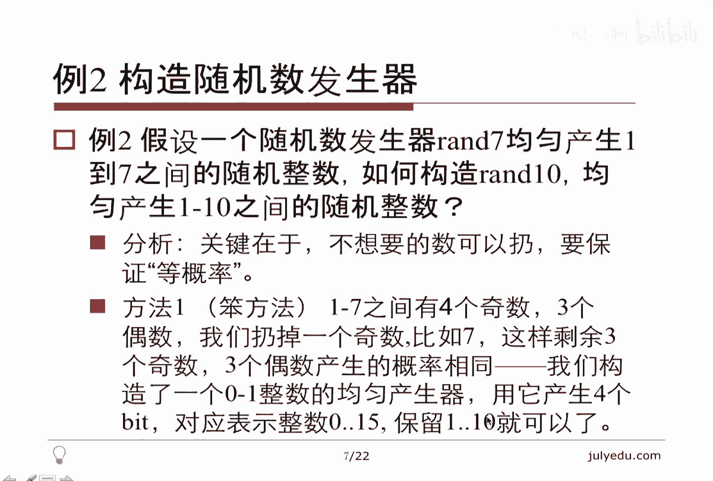
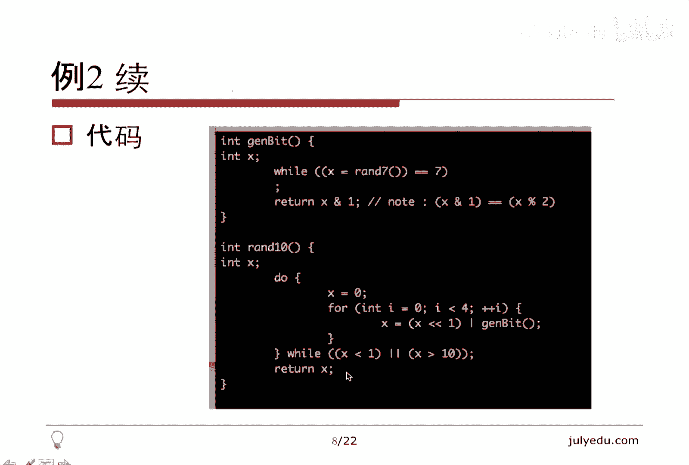

# 人工智能—面试求职公开课（七月在线出品） - P6：概率面试题精讲 - 七月在线-julyedu - BV1Xf4y1r74s

欢迎观看7月算法公开课。我们本堂课的主要内容是概率相关面试题精讲。我将从如下几个方面讲述本课，先讲一下简介，然后讲一些题外话。接着讲一下概率相关的面试题的总体分析。然后讲7个例题，最后总结结束本课。

关于简介概率。主要在面试和笔试里面考察的是如下几个范围。对独立事件的理解，古典概率也就是。计数做除法。这个计数主要包括排列组合方面的这种数数，然后分子分母数出来做一下除法。还有一个是条件概率。

给定一个事件成立，求另外一个事件的概率。关于期望的计算，然后是随机数的产生和利用，这个比较重要，主要是采样采样主的是指指的是利用，然后产生这个打的星号比较重要，前四个呢主要出现在笔试中。

因为有很多的填空啊选择啊计算题，最后一个可能出现在笔试的大题里面。当然还是更常见的是面试中出现。说一些题外话，首先就是随接数的产生并不容易。一个著名的计算机科学家。

在他的著作bearcomp programming中，其实用了一本书的这个篇幅，提到了如何产生随机数。我们只要有一个感性认识就可以了。其实随机性和不可预测性还是有一定差异的。

这个差异在密码学里面体现的尤为明显。比方说我们固定一个数M这是一个整数，对所有的自然数N它对M取域数显然是均匀的。因为只有0到M减一的这些情况，每M个自然数就有一个周期，所以对于所有来讲。

它显然是一个均匀的。并且呢它其实是有一定的随机性的。因为N如果随机的话，它这样除完了也是。😊，有一定随机性，我们可以用它作为随机函数，但是在密码学里面通常不采用它，因为它是可以预测的。

我们可以用0123这样放出来，它最后发现它是周期的。所以所以密码学一般不用这种东西作为随机函数，它和我们理解的随机还不太一样。那如果面试题里面考察我们。有。构造一个随机数发生器的话。

一般都会告诉我们有一个随机数发生器存在，它不可能让我们凭空构造。因为构造随机数并不容易。关于期望的计算一般转化为方程组。这个A1A2是A的邻居加一，这个是概率，其实就是跟那个图论的那个邻居很像。

看差一步之前它是什么样子，或者说一步之后它是什么样子。对于A一来讲，也有类似的式子。所以最后我们会形成一个N元一次的方程组可以把每一种情况的期望都算出来。这个是计算期望的一般方法，这是一些题题外话。

我们来看具体的例题。先做一下总体分析。对于概率来讲。一般考的不会太难，简单。因为概率论本身非常深刻，有很多微积分啊，高等数学的东西存在，但是一般面试笔试都不会考，对于笔试来讲，会考概率和期望的计算。

对于面试来讲，一般会考随机数产生和利用，利用就是采样。当然，随机数产生也可能在笔试的大题里面考。至于算法，我们最常见的比较熟悉的就是快排面试可能会被问到，这里面有一定的随机性。

因为我们在partition的时候，选取的那个分区元素是随机选取的，避免了最差情况的频繁出现，达到了一个期望的Nlog n的时间复杂度。具体的题。第一个题其实主要帮大家理解一下这个独立的概念。

其实它并不能算作一个真正意义上的题目。我们看一下我们通常理解的独立是说两个随机变量没什么关系，就是独立。我们来看一下，假设X1X2是两个2元的随机变量。什么叫二元随机变量呢？就是。要么是零，要么是一。

各占50%，只有这两种取值就是二进制的一个beat，或者说一个位。那么X3呢，我们是X1异或X2，这个是一个定义，我们把它定义为这个东西，易或呢就是两个二进制数相同取零，不同取一。

那看起来X3和X1是有关系的，和X2也有关系，都有这个等式存在嘛。但实际上，X3和X1以及X2都是独立的。😊，很简单，我们可以枚举一下X1X2所有情况就4种嘛。

00对应的X3是001X3是110X3也是11对应X3是0。可见呢当X1等于0或者等于一的时候。X3其实各有一半的情况等于0或者等于1。你看第一位和第三位，它等于0，它等于0，它等于0，它等于1。

这个第一位是一的时候，X3也可以等于0和1。所以呢。X3其实和这两个东西是独立的，尽管有这个等式存在。看起来有点反直觉，因为有的等式应该不独立，但实际上是独立的。所以我说关于独立，不能凭感觉，不能感性。

我们需要根据定义来考察，其实独立的定义很简单，A和B是独立的。如果A和B同时发生的概率等于分别发生的概率的乘积，大家可以带进去验证一下，就知道他们是独立。我们来看第二个例体。这个也是比较重要的。

经常出现的例题，构造随机数发生器。给定一个随机数发生器rend7，刚才我说了，一般都会给一个让你构造一个它呢均匀产生1到7之间的随机整数，也就是每一个概率是7分之1。

我构造run10均匀产生1到10间之间的随机整数，怎么构造呢？😊，这种问题其实七也好，十0也好，经常有这种问题给了不同的整数，让我们构造。关键问题在于。我们不想要的可以扔，但是要保证等概率。

我们在目前等概率的情况下，我们把不想要的情况出现。把不想要的出现的情况都扔掉，然后再继续再做后面的工作。每一步我们都可以fit掉，或者说过滤掉一些不想要的情况。但前提是要保证等概率。

我们先看一个比较笨的办法，1到7之间有4个基数，3个偶数。13574个奇数，2463个偶数。我们呢可以扔掉一个基数，我们调一次ra7。如果是7的话。我们就继续掉，不断的调，直到它出现1到6。

为什么要这样呢？因为我们要保证正好有三个奇数和三个偶数。那么这个时候呢，我们把奇数看成一偶数看成零的话，实际上我们已经构造出来一个均匀产生零和一的随接数发生器了。那么。其实有了01就有了一切。

因为有了二进制嘛。所以呢我们产生4个这样的01。这样就构造出来0到15之间的整数，因为正好是2的4次方，0到15之间的整数，并且这些也是等概率的。因为每一个be是零是一的概率都是2分之1。

那么我们把不想要的扔掉，把保留1到10就可以了，把零扔了，把11到15也扔了。所以我们扔了很多东西，最开始把7全扔了。后面又把零和11到15都扔了。所以我说它比较笨，我们看一个它的代码。😊。

注意这里面这个代码实际上是不能运行的。我们假设rund器存在，实际上它不存在嘛。如果是7，我们就一直产生。当它退出的时候，就是不是7了嘛，就是1到6三个奇数，三个偶数。

我们取得的第一位实际上就是对二取的余数，这样奇数就是一偶数就是0。所以这个就产生了一个01，并且是均匀产生的。那么我们如何构造刚才说的1到10呢？😊，循环4次产生4个这样的东西，把它接起来。

这个就产生了一个刚才我说的二进制的数0到15。那0到15，我们把零扔了，15111到15都扔了，所以这也是一个循环。直到它正好是1到10，我们能保证等概率。

这个是它的代码，我们看一个聪明一点的办法，刚才说了，用的是二进制，它本身是1到7，我们为什么不能用7进制？这个每一个产生的概率都是7分之1，所所以我们没有必要扔嘛。那么我们把它减去一变成0到6，那么。

跟刚才二进制的道理一样，我们产生两位七进制数，因为两位就够了，产生的数是0到48，并且是均匀产生的。每一个概率都是49分之1。啊。显然，我们可以按照刚才的策略，把所有不想要的都扔了，只要1到10。

我们有一个更聪明一点的办法，我们只扔40到48，为什么扔它呢？因为这个9个数是比较独立的，剩下的都是啊0到910到19、20到29、30到39，这个0就是个位上0到9，这些出现的次数都一样，都是4次。

😊，所以我们把40到48扔了，这样的话产个位上产生零，产生一产生一直产生到9的概率是一样的。我们把0到9对应于我们想要的1到10。所以关键看我们扔掉之后，要也要保证概率相等，才能随便扔。

所以这个代码也非常简单，七进制嘛，这是七进制的高位乘以77进制低一位。刚才说了40到48扔掉，如果它大于等于40，我们就扔这样产生的最后退出来了，实际上产生的是0到39。

0到39里面每一个个位数都出现了4次。所以他们也是等概率的。我们把它取个位加1，对应我们想要的1到10，这就可以了。😊，为什么说他聪明呢？他扔的数少一点，我们只扔了40到48这种数不像刚才扔了很多数。

😊，我们看一下关键问题，要保证均匀才能扔掉。比方说我大概举个例子，假设我有一个random2，ran2呢产生是要么是一，要么是2嘛，这两个东西相加减一，显然范围在1到3里面。

但是注意它们产生1到3并不是等概率的，大家可以每举算一下，1212每举算一下，产生一和3都是4分之1，而产生2是2分之1。所以他们不是等概率，我们并不能随便扔，要扔之前要保证等概率，这个是一个关键问题。

要保证均匀才能扔掉。另外一个想说的是，其实一个实验，假设我们有一个实验，它做一次实验成功的概率是P不成功的概率是一减P。当然这里面P大于零小于一P等于零或者等于一就没什么意义了。😊。

我们不断的做这样的实验，直到一次成功，就是如果失败，我们就再做一次失败，再做一次，直到成功。那么到成功的时候，期望做了多少次实验呢？它是P分之1。😊，啊，举个例子，假设我们有一枚硬币，它是均匀的。

要么正面，要么反面我们就不断的扔。如果是反面，我们就继续扔。直到扔到一个正面，我们期望扔了多少次呢？其实期望两次就够了。那怎么算？其实非常简单，就用期望的定义。假设X是期望。那左边怎么说？😊，Pear。

一次我就成功了，就是第一次成功。第一次失败的时候就是一减P后面是跟那个第一次相同的情况。原来期望是X的话，现在肯定要X加一，因为多了，第一次这是一个等式，用X自身表示了X。

那么这个东西解出来就是X等于P分之1。😊，那讲这个有什么用呢？我们可以把它作为一个结论。我们可以分析一下刚才讲的那个笨方法方法一以及聪明一点的方方法。2、他的期望循环的次数。因为我们扔了很多数嘛。

最后成功的时候，我们期望循环了多少次呢？这个是我算到的结果。有兴趣的同学可以算一下。😊，明显这个比就是方法二比方法一要期望上要少循环很多次。这个是我想说的一个重点。那么继续看第三个题。

就是用不均匀的构造均匀的。刚才说了，让你构造随机数发生器，一定要给你一个，不然你没法构造。那么现在给你一个，它是不均匀的。它以P的概率产生0，以一减P的概率产生一。

这里面P还是大于零小一的等于零以及等于一都没太大意义。那么构造一个均匀的，产生零一的随机数发生器，它是算法导论的一个习题，看起来好像无从下手。但实际上我们用它产生两次，产第一次产生零。

第二次产生一的概率和第一次产生一，第二次产生零的概率其实是一样的，都是P乘1减P。😊，那么有这个一样就好办了。我们把两次产生相等的全扔掉，直到出现，要么出现01，要么出现10，我们才留下来。

就是这样产生两次相等就继续相等就继续。直到他们俩不相等，不相等，要么就是01，要么就是10。根据我们之前说的，它们概率是一样的。那么我们就返回第一个数，其实返回第二个也可以。

我们相当于用01代表了最终的0，用10代表了最终的1。所以这样的话我们就以相等的概率返回0和返回01。有兴趣的可以算一下这个东西成功之前，我们期望的循环次数有多少次，这个是我要讲的第三个题。😊。

看第四个题。这个确实出现在某个公司的笔试题里面。它是一个选择题，让我们算就是给定随机变量XY分别均匀的在0到A这个区间以及0到B这个区间里面分布。当然，比试的时候，A和B是一个给定的数，A给定了一个数。

比方说2啊，B给了一个三，大概是这种。那再给一个数，Z，这个也是个给定的数，问你X加Y小于等于Z的概率。这个题难就难在，它是一个实数，它是一个均匀分布的实数。所以它里面有无穷多个数。

我们不能如果是整数就好办了。我们可以直接枚举出来。那其实我们可以把它转换为面积。如果这个横坐标这个是A竖的是B的话，其实这个XY的所有可能性，其实对应于这个矩形的面积。那么X加Y呢，X加Y等于Z。

我们可以画直线，当然画两条这个Z的不同矩值，对应了不同的直线，那么这个概率对应于什么？对应于这个矩形。😊，在直线下的面积占这个矩形面积的百分比。比方说这条直线就是三角形除以这个矩形面积。

那么这条直线呢其实就是。这个不规则的图形除以这个矩形面积，当然可以用矩形面积减去三角形除以这个。矩形面积，所以它就变成了这么一个问题。我们带进实际数的话，算这个很方便。我后来还出了一个题目。

就是键盘输入这种AB和Z，然后算一下需要一些分类讨论，考虑这个直线在哪儿。如果在这的话是这样的。如果在对角线上方的话，是不规则的。如果彻底在矩形外面的话，实际上就是百分之百就是一了。所以这个是。

相当于是连续的随机变量的和，大概算这个东西，这个也是实际中的一个笔试题。我们继续看。这个是我今天想讲的一个重点，采样问题。😊，这是水库采样，这个名词起源于也是可诺斯的著作。那。

我们假设有若干个对象是留进来的，什么叫留进来的？我们可以把它想象成列表，而且是一次性的留完就完了。所以我们不能或者说我们的空间不允许我们把它们全保存下来。

我们可以想象我们只有1个API就是get next的，我们只能在当前得到下一个，得到下一个，我没有办法一上来把所有东西都存下来。当然你说我把下一个下一个下一个都存下来也是可以的。但是假设我有上亿个元素。

我让你取，比方说只取100个，我没有必要把上一个都存下来。问随机取K个，当然可小于总数，一般还是远小于问有什么好的算法。😊，那这个算法非常简单，我们用一个数组A保存K个数，这个数组A。

最后就是我们要的那K个元素。当然下标0到K减1，这里面假设下标从零开始，那对于第I个元素，那我们不断的ge nextex，我当然知道它是第几个元素了。当然这里面I是从一开始的。

如果I小于等于K什么意思呢？就是我现在还没有存够K个元素，那有一个要一个我们就把它存下来。当然这个下标正好差一嘛，所以我们把这个第一个到第K个元素都已经存下来了。那对于DK加一个元素以后，我们怎么办呢？

关键在这儿我们可以换掉之前的元素。😊，对于I大于K，我们产生一个随机数。这个有两种说法。第一种就是我产生一个零到I减一的之间的随机数，或者叫呃一到I之间，这都一样偏移了一下。

那还有一种说法是我随便产生一个均匀的随机数，然后对它对I取余数，这个根据我刚才讲的，如果这个是均匀的话，它对I取余数一定在零到I减一之间均匀分布。所以这两种说法其实是一样的。

其实就是产生一个随机数是零到I减一之间均匀分布的。那么既然它是零到I减一之间，它有可能小于K。因为I比K大嘛，它有可能小于K，也有可能大于等于K，如果小于K我就存下来，存在哪呢？存在AX这个位置。

X就是这个余数。所以尽管我最开始先把K的元素保存下来。后面还有可能把它踢出去。因为这个数组是会被覆盖的，我用AX来存放新的元素的时候，旧的AX就被扔掉了，所以这是扔掉之间的元素。所以开始K的存下来。

只是暂时的并不稳定。它被替换了，后面还有可能不断。😊，能可给替换？那这个算法非常简单，其实就这么两步。那我们来看一下，大概算一下它为什么是对的。首先说一下这个算法的优点。我们不需要知道元素的个数。

因为我们是第I个元素过来之后，我们直接决定产生一个随机数，决定要它还是不要它的。所以。😊，我们不需要预先知道元素的个数。那么。关键是证明。假设目前已经流入了N大于K度元素。

我们先看一下对于第I个元素是怎么样的。第I个元素被选中的可能性。这个I小于等于K的时候。显然，I小于等于K的时候，最开始我们是要它的，它的概率是一，关键是它后面有没有可能被换掉。

它只有在第K加个一个元素，以及往后的元素才可能被换掉。那么被换掉的概率是多少呢？第K加一个元素如果换掉它首先它产生的随机数有K加一种，因为是对K加一取模的嘛，取膜的话，随机数有零到K。

正好也是K加一种情况，只有它模等于这个I的时候，我才会把它换掉。所以只有一种情况，我才会把第I个元素换掉，所以有这么K加一分之K这个情况不会把第I换掉。后面也一样。每每一个都只有一种情况。

会把DI个换掉。那么全都不换掉，它的可能性就是都只差一。那么这个式子其实可以相消前一项的分母和后一项的分子都能消掉。那么最后就剩下这个N和这个K了，所以。😊，对于I小于等于K的话。

它最后保留在我们想要的那那些元素里面的概率实际上是N分之K。那么对于I大于K其实是类似的。刚才说了。我什么情况下才能要这个元素呢？就是。😡，对第I个元素，它产生的随机数要小于K，也就是0到K减1。

所以我保留第I个元素的，就是在第I个元素过来的时候，我保留它的概率是I分之K。那么后面不被换掉也是一样的。I加一除以I都是正好差一嘛，只有一种情况会把它换掉。所以这个跟刚才是类似的。

算出来也是N分之K都向掉之后只有第一项和最后最后一项。所以。😊，无论是I小于等于K也好，I大于K也好，我证明了对于任意一个元素，它最后保留下来的概率是N分之K。那么显然我们总体上取K个元素嘛。

所以这个证明了每一个元素在我们最后那个集合里面的概率是相等的。所以它等概率的保留了每一个元素，这个就讲完了，它是一个很重要的抽样的方法，后面有一些应用。我们来大概看一下。

有些扩展K等于一的时候是非常特殊的，其实可以类似做。大家可以看一下，把K改改成一之后，这个算法是怎么样的。那么对应的面试题其实有很多，有一个若干行的大文件，我要随机选择一行，其实就是K等于一的时候。

我们一行一行读进来，产生随机数，决定是要它扔它就可以了。另外也是一样的，有一个不知道长度的列表，随机选择一个或者多个元素，其实也是选K个元素一样的。我们知道便利链表的时候，我们知道它是第几个元素。

按照我刚才说的方法做一下就可以了。😊，我想讲了一个题，在例七里面会讲，就是带全采样。就是如果刚才我说的那个采样是我最后要保证每个元素出现的概率是一样的。如果我采样，我就要求随机选一个元素。

并且每个元素有一定的权重，权重大的，我最后选择的可能性大，该怎么做。一会可以看一下例7。你先看一下例6。😊，第六是我想简单讲一下的，就是所谓的random shuffle。😊，什么叫randomsh？

在STL里面，C加加的STL里面有这么一个函数，可以把一个数组打乱，它其实是均匀产生0到N减1的这么一个全排列的一个其中的一个排列。😊，那方法一就不用说了，我们可以随机产生一个一到N的阶成之间的随机数。

因为已经假设有一个随机数发生器了嘛。😊，那么。这个1到N的阶成正好对应一个排列，每一个数对应于第几个排列。当然这种面试答这个肯定不符合要求。你因为你根本什么都没做。当然你能把这个数转化成一个排列。

这个也是li code上一个问题。关键我说这个常规方法，请大家思考证明，这个也是算法导论上给出来的经典算法。😊，循环I把I和啊首先要付下初值AI等于I就是A0等于0AN减1等于N减1就负下来。

然后把AI和I到N减一交换。注意AI可能和AI本身交换，我这标红了，并不是把AI和I加一到N减一交换，所以它有可能是不换的。😊，大家可以证一下它这个最后每个排列产生的可能性相等的代码就是这样。

关键是这里。把AI和I到N减一交换，这个是对N减I取余数，加上I，恰好是I到N减1之间。所以这个也是非常简单的一个问题，这个也是random shuffle的后台的实现，也是这样实现的。

关键在于他的证明留做思考题吧。看。第七是我想重点讲的，这个在我们的社区里面也有人问到过一个呃音乐的推荐问题。我这里面把它抽象出来了，就是给定N个元素，再给N个全值。我们按照全值的比例抽样一个元素。

什么叫按照全值的比例？比方说一个是三，一个是5，就两个元素。那么我最后。选择这个三的概率可能只有呃8分3%，选择5的概率只有85%。也就是说他们最后要成比例的选五的可能性大三的可能性小。那为了方便。

我们这里面假设全值都是整数。方反一。我们按照前置复制若干份就可以了。比方说3个A2个B6个C，我们就这样把它真正的复制3个A2个B6个C，然后把它们看作不同的。然后你不是要一个元素嘛？

我就按照那个刚才第五面讲的那个水库采样的方法弄一遍。😊，找出一个元素就可以了。这个显然因为它们本身是等概率的，然后我把它复制这么多份儿，正好和它的全值的那个比例是一样的那优点其实不用说了。

我们可以用已有的方法解决了问题缺点。😊，假设这边这个权职很大，有好几万，我们其实就三个元素，有1万个C，那我也要复制1万个，这个比较麻烦，但是不失为一种方法作为面试的一个思路吧。😊，方法2。我们产生。

还是刚才那例子，三个A2个B6个C，我们这样3个A对应0到2，正好是呃三个数，2个B3到42个数，6个C5到16个数。那么。整个区间就是0到10。一共11个数，这边也11个东西。

那么我产生一个0到10之间的随机数，看它落在哪儿，落在哪儿，我就对应哪个数。当然判断落在哪儿啊，这个数上我们可以直接循环。如果数很多的话，我们可以二分，因为它这个东西是单调递增的。

我们可以把这个数二分查找它在哪个区间，然后对应出那个元素来。那优点显然是省空间，我们只只产生了这个区间的端点就可以。我没有真正的复制这么多个元素，那缺点是需要二分查找，这个也也是一个显然的缺点。

那我们看第三种方法。😊，我们假设有M种元素，我们先按M分之1的概率随机选择一种元素。这个很容易就随机产生一个数，那个0到M减1或者1到M都无所谓，反正随均匀产生M种元素的其中一个。我们先选择。

比方说这里面我们先选择我最后想产生A还是先产生B，还想产成C。第一步，选择完之后，我们不是选择完就完了。后面我们要看真的能不能产生它。😊，我打了星号，第二步是重点，我们再产生一个随机数。

根据这个权值来判断我们能不能要它。如果要它就要了，不要的话，即重新。再重新产生一个数。那关键我们看一下第二步是怎么做的。这里面说根据全职说的比较虚嘛，比较抽象。我们看一下具体是怎么做的。

怎么个根据全职方法。我们详细分析。怎么做？第二步？其实我们可以这样做，我写了两种情况，这两种方法实际上都可以的。我们。Wtoal表示所有的全值总和。Wm表示最大的全值总和呃，最大的权值没有总和。

最大的全值，这个是所有的全值总和WI就是DI种元素的那个全值。那这个一除是个小于一的，我们可以以这个概率或者以这个概率来选，什么意思呢？我们可以产生呃换句话说。

比方说我产生一个呃0到分母减一这么大的随机数，或者说我产生一个随机数对分母取余数。然后取完余数之后，如果小于分子的话，我就认为是成功。大于分子的话，我就认为是失败。

所以我就相当于以这个概率决定我要还是不要。关键是这个概率为什么。😊，可以用，我们看一下。实验一次成功的概率，什么意思？就是。😊，如果我第一次选择了M分之1，我刚才说了，M分之1选择了一个元素。

第二次按照这个概率。取一下取一个随机数，发现小于比方说我取这个取一个随机数，对分母取一数，发现小于WI表示我能取，那么它就成功了。那么它成功的概率是多少呢？是M分之1乘以所有的每个PI的总和。

为什么是总和呢？因为每个M分之1都可以对应于选一组元素。那么失败第一次失败的概率其实就是一减一下，它就是失败的概率。那么我们看一下最终选择第I个的概率是多少呢？😊。

最终选择第二个概率是一个无穷递错的等比数列，为什么呢？第一次成功的概率，这个就是选择PI第一次成功。那么如果它失败，就是Plu，我们不用管Plu等于多少，反正它是一个常量。那么它失败之后。

我们再选择PI还是这个东西。那么如果他这时候再失败呢，再失败就变成了P6的平方。那么我们再选择PI还是这个概率。所以。它是一个呃每这个后一项和前一项之间的公比，就是P lose。

所我们不用careP lose等于多少，也不用carePI等于多少，反正它是一个无穷第色等比数列。当然可以用公式把这个写出来，这是无穷多项。那么。这个结果显然正比于PI。因为。我们乘的就是PI嘛。

PI可没有平方，这平方都在P6这。所以这个最终我们证明了选择BI的元素的概率正比于PI正正比于PI其实就是正比于WI正比于我们那个全值。所以这个就是我们想要的。那么刚才其实我已经提到了。

我们如何以PI的概率选择那个。元素呢，就是第二步，我们具体怎么做呢？假设PI是A比B具体A和B有可能是这个也有可能是这个。那么我们怎么做呢？才能保证我们以PI的概率选择那个数呢？刚才我已经说了。

其实老办法，我们产生随机数对B取余数，如果小于A，我们就要这是一种说法，还有一种说法，其实和它是等价的。我们产生一到B之间的随机数，注意这是一到B，其实这个是零到B减1，就是这种情况。然后我们看一下。

如果小于等于A，注意这个我标红了，小于等于A，我就要了。那这个呢也是零到B减一之间的数，如果小于A，我就要所以这几种实际上是同一个说法，反正就是产生随机数，对B取余数，如果小于A。

我就要如果给定一个PI，我们可以用这种办法按照这个概率决定要不要这个元素。那么我们看一下刚才讲的那个期望次数。😊，刚才说了，期望次数是成功的次数，成功的概率的倒数。那么成功的概率这已经说是这个东西。

那么其实就是M除以s格PI注意这个分母不一定是一这个这个概率不是之前讲的那个和为一的那种概率。我们看一下，如果我们把PI取的这个的话，那么这期望次数恰好是M，为什么呢？

因为呃所有的PI的总和正好是WtoWtoal和Wto一除就是一了，消掉了。那么如果我们把PI取成这个，刚才我说了PI取这两种情况，取哪个都可以。如果我们取成这个其实还会少一些。😊。

它是这个东西除以sigmaW，注意这个东西比sigmaW要大。所以这个东西这个分分子和分母除完了是小于一的。所以这个总总的期望次数还是小于M的。所以选这个会导致我们循环次数，至少期望的循环次数会小一些。

当然选这个也是可以做的。那么它的应用其实也是这个社区里面的一个问题。我们按照已有的分数，这W其实是分数给用户推荐一些歌曲啊，推荐一些产品。想按照分数一定的概率推荐他想要的东西，这个是一个重点的应用。😊。

那今天的题目基本讲完了，我们再做一下总结。首先是采样，刚才讲了主要的还是水库采样，包括最后一个问题，复制那么多份儿，如何算次数等等。那概率涉及到算法，今天时间关系没有机会讲，但是大概提一下快排的。

刚才说了，分区元素的选择是为了避免最差情况。算法导论在讲随机算法的时候，或者说概率算法的时候，有这么一章讲了在线雇佣问题。它呢。😊，之所以用随机是不想假设输入的分布，因为我们输入有可能很极端。

如果我们考虑问题跟输入顺序关系不大的话，我们可以对输入做一下randomrandom之后，我们这个分布就基本上可以理解为均匀的了，所以这是对输入的一种处理，其实快速排序也是这样。

我们最后反正排好顺序具体输入什么样的，其实关系不大，所以我们用一个这个随机的算法来做。虽然最后输出并不是随机的。那么还有一个重点，因为就是哈奇函数，哈奇函数经常这个对某个数取余数啊等等。😊。

包括一致性哈希，就尽量避免冲突。这个用到了该理论的一些知识。我这个摩取多少的话，才能不冲突，或者说少冲突。概率算法还有一个重点应用，就是所谓的多次尝试。什么意思呢？假设我有一个算法。

每次只有一半的可能性得到最优解，或者说得到正确解。那么如果我能保存这些解，不断的取最优的话，比方说我尝试30次。那么如果30次全失败了，全没得到自由解或者说正确解的可能性只有二的30次方分之1。

2的30次方很小，大概十0的9次方。也就是只有10亿分之1的可能性不得到自由解。所以我们基本上可以认为。😊，它基本上会得到最优结论。所以这个概率算法一个很大的应用，就是我可能先得到一个比较差的算法。

比方说这个有一半的可能性，对这个跟翻应币没什么区别嘛，有一半的可能性对，只有呃很弱。但是我们做30次的话，其实能得到一个很强的算法，这个是概率算法，在实际中的应用。😊，好，今天的课程就到这里。

欢迎大家给我提出批评指正。😊。

