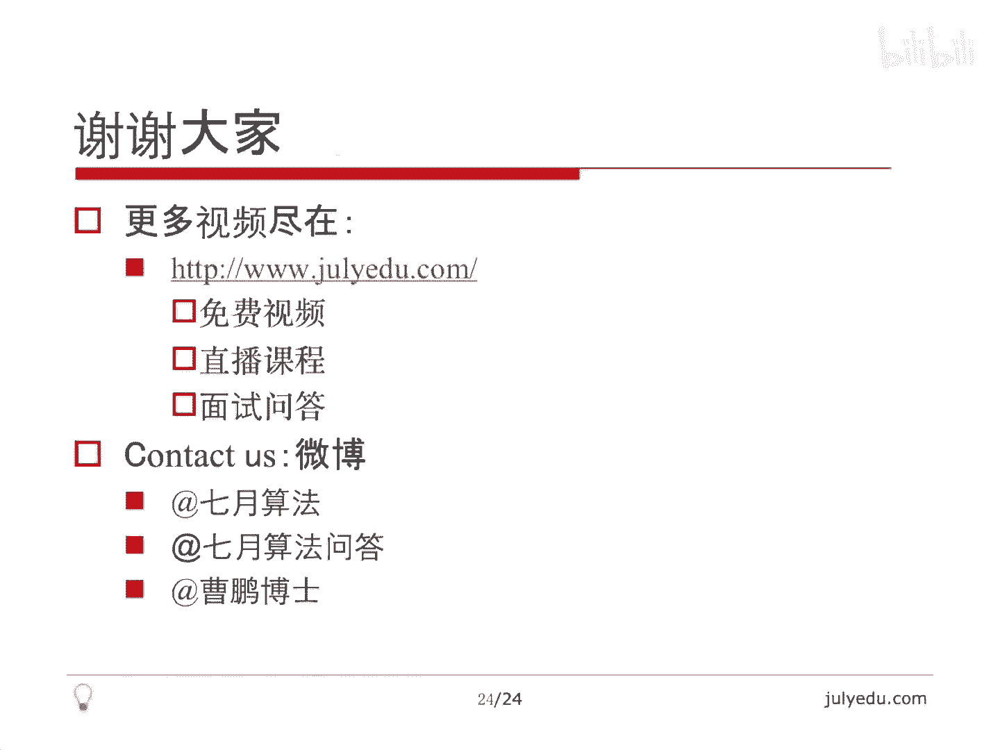

# 人工智能—面试求职公开课（七月在线出品） - P7：谷歌面试题精讲 - 七月在线-julyedu - BV1Xf4y1r74s

🎼，我们这堂课的主要内容是google面试题精讲。我将从如下几个方面讲述本课。首先讲一下关于面试的一些心得，然后讲也是本节课最重要的6个例题。从简单到最难google的6个面试题，最后总结结束本课。

关于面试，有些人会问了，各个公司到底有没有自己的面试的题库，其实这个问题没有太大意义。因为即使有的公司有题库，这些题库里面的题目来源。一方面是员工原创的这些题目相对比较少。

另外他们也是通过网络来搜罗到的一些题目。所以即使公司有自己的题库，他们的题库交集，也就是重合度也会很大，所以没有说这个题目只被某个公司面这个可能性不大。所以我们比方说关注某一个公司的面试题。

其实并没有太大意义，应该关注所有公司的面试题。因为他们这个交集非常非常大。那另外一点是呃笔试和面试，那笔试大家都很熟悉，发现卷子闷头做就好了，没有任何和面试官的交流。

面试是需要你展现自我展现思路的这么一个过程。你需要和面试官交流，很多讲面试的书也讲不要把面试当成笔试。面试官希望也需要你和他交流。😊，这样才能展现你的思路。面试的关键点并不是你把所有问题都解决。

而是你给面试官留下了一个很好的印象。当然，解题是留下好印象的一个很重要的条件。但光解题是不够的。你需要跟他交流。即使有些问题你可能不太能完全解决。你能想到什么地步说出来也比完全什么都没交上去。

没说出来要好一些。所以总的来说，你要向面试官展现一个你的一个好的这么一个印象。😊，下面是本节课的重点，也就是6个google的面试题。从简单到难。

我先讲最简单的给定一个数N求不超过N的所有能被三或者5整除的数的和，比方说N等于9能被三整除，就是3加6加9能被5整除，就是一个5加起来等于23。显然它是个数学问题，我们可以每举能被三整除的数。

发现是这样的，N除以3加中括号是下取整，在C加加java里面不用加这个就可以直接做。那五也一样。那这两个序列里面是有重复的，重复的数是既能被三整除，又能被五整除的数，它们是三和5最小公倍数的倍数。

也就是15的倍数。那么它这个写出来是这样的，这三个都是等差数列，我们关键就对等差数列求和这两个加起来减去它就可以了。那注意到是面试题，我们需要问一下N的范围有多大。

会不会超过int要不要使用longlong。所以这个需要和面试官交流。因为。😊，这个序列本身等差数列的这个序列的和是N方的这个级别的，所以很有可能就超过int了。当然面试官一般会告诉你。

不用考虑这些问题，但是你需要和他交流。那，做起来很简单，首项项数公差，我们就可以求出尾项，尾项就是D乘以Y减1加上X，这是尾项。所以求和公式就是首项加尾项乘以项数除以2。那注意这个对Y等于零也有用。

因为我们这种下取整很有可能比方说N小于3或者N小于5，N小于15的话，项数就是0。我们乘一个零上去也没有关系。所以和也是0，所以我们不需要对零做特殊的处理。那关键就是这个项数Y了。😊，啊，对三来讲。

首项公差都是3项数就是N除以3，这个自动下取整，这是指的这个语言里面的那五也一样，那这两个加起来减去5就好了。所以这个。程序现象也非常非常简单。😊，写一个函数，接受三个参数，直接return这个东西。

然后主函数里面调正函数调三遍，写一行，直接加两个减一个return回去就好了。所以核心代码就两行一行，这个一行两个加一个减写到一行上面去就完了。所以这是一个非常简单的问题。😊，那我们讲第二个问题。

如果一个字符串只包含ABC3个字母，并且相邻的三个字母。如果不同就是合法的，相同就是非法的。这个呃相同是全都相同，不同是只要有一个不同就可以了。问长度为N的合法的字符串有多少个。

比方说这个是非法的3个B。这个就是。合法的，因为这个没没有相同的，这个是非法的。那么它可以用动态规划的思路来解决。尽管它不是一个优化问题，因为我们强调动态规划是解决优化问题的这是一个组合数学的问题。

但是他们的思路很像，都是递推。我们在状态上做地推。😊，动态规划是在状态上做递推，求max min组合数学是在状态上做递推，累积求和，所以只是这么点差别，不是一个优化问题而已。思路是相近的。

比方说我们这样表示状态，长度为I，最后两位不同的合法串，我们认为是I0长度为I，最后两位相同的合法串，我们认为是I1，那怎么推呢？长度为I，最后两位不同的。我们认为长度I减1，如果最后两位不同。

比方说一个是A，一个是B，那么我可以在最后加上一个C，也可以在最后加上一个A，但是不能加B，因为最后两位要不同，所以有两种情况。那如果最后两位相同，比方说最后两位都是A。

那么显然最后可以加一个B加一个C，因为最后两位也要不同。所以无论是哪种情况，我最后都可以选择两个字母加上去。所以这个最后两位不同的情况是这样的。那如果长度为I，最后两位相同的时候，😊，那我们看一下。

如果前I减一位最后两位不同，比方说一个A1个B，那么最后一位只能加上一个B。因为我希望它们相同，只有一种情况。那如果这个DPI减1一呢，如果最后前I减一位最后两位相同，那前A位我还让他最后两位相同。

那么最后三位都相同了，这是一个非法的，所以不能加上那个东西。😊，所以我们得到了这个递推式，有了递推式，有了初值，我们就可以求出任何的值来。😊，我们看一下初值长度为一的最后两位不同的串，我们认为是三个。

因为根本就没有两位。所以ABC3个都是认为最后两位是不同的那一一显然是个0，因为。还是刚才那个道理，长度为一没有两位数，没有两位的话，最后两位相同。那显然是没有的那最后的结果就是这么一个东西。

DPN0加DPN1。因为最后要么最后两位相同，要么最后两位不同。我们根据这个递推式这个初值求出了这么一个结果。那注意我们可以空间上优化一下这个。😊，这是最后两位。

DI长度为I的最后两位相同或者不同的值与I减1有关。看DPI只与DPI减1有关。那么我们第一为没有必要存N个，也就是没有必要存一个N乘以2的数组，直接优化掉就可以了。那时间复杂度显然是ON的。

因为我们推这个式子要循环N次。那其实当N很大的时候，我们有一个类似于求费摩纳器数列的这种方法，利用矩阵乘法，可以把时间复杂度优化到logN。有兴趣的同学可以去查阅一下相关的资料。

那我们看一下另外一个问题。这个问题相比第二个问题就稍微拿了一点，也是一个组和数学的问题。给定一个整数数组里面包含了0到N减1的一个排列。什么叫排列呢？就是0到N减1，每个数恰好出现了一次，且只出现一次。

换句话说，我把这些数0到N减1这N个数打乱了一下，放到数组里的。那如果我们每次只允许把某一个数和零做交换，只允许这一种操作。问，把这个数组排好顺序，至少要交换多少次。

排好顺序是指把零放到A0上一放到A1上N减一放到AN减1这个位置上。那这个也是google的一个面试题，并且它出现了这个在pet这个里面了，不知道是先被面试的，而先出现在这个pet的这个能力测试里面。

😊，那首先组合数学里面有一个概念，就是圈的概念。我不讲这个具体这个概念，大家感兴上认识一下。比方说零占了一的位置，一又占了二的位置，就是说零应该在A0，但是呢它却放在了A一上面去。而一呢应该在A一。

它却放在了A2的位置上去。那二呢应该在A2，它却放在零的位置上去。我们这样就有了这么一个圈，这就转圈了。我们把这个圈里面。😊，交换一下就可以排好顺序。首先有一个呃可以理解为定理吧。

一个排列这种顺序的排列按照这种位置划分关系，它总可以划分为若干个不相交的圈，不相交的圈就是这样的，每个圈显然有一个长度。那对于一个圈来讲，我们可以通过交换把它排好顺序。

比方说刚才说的这个我们交换零和一再交换零和2就排好顺序了。大家可以画一下。😊，所以有一个结论，如果一个长度为M的圈儿。包含了零，因为我们只能和零交换，则交换M减一次，可以把这个圈里面的数换回原位。

大家可以画一下，但是这M减一也是最小的，为什么呢？因为这M个这长度为M的圈，每个数都不在自己的位置。那么我至少要交换M减一次，才能把它换回自个自己的位置。因为我每一次交换只能和零交换嘛。

至少要交换M减一次。那另外是说一个长度为M的圈如果不包含零。那么我这个圈自己并不能来回交换。因为我只能和零交换，则需要交换M加一次，比方说一在二的位置，二在三的位置，三在一的位置。这样的一个圈。😊。

我必须要先交换零和任意一个数，这样的话。比方说我交换了零和一，那就变成了一在零的位置，而零呢在二的位置，二在三的位置，三在一的位置，这样就变成了这个长度为M的圈包含零的问题。那它我们已经说了。

可以M减一次，最少交换到原原位。那么我这个。总体来总体来说，因为它这是这个相当于M加一的时候，需要交换M次。那之前和零又交换了一次，所以总体来说需要M加一次。😊，并且这个也是最少的。

因为我们只能和零交换，不得不和零先交换一次。那问题在于我们怎么找到所有的圈以及圈的长度。其实非常简单，我们沿着这个数组走，把标把走到的数标记一下就可以了。代码非常短。我拿的是我pa上的那个代码。

那这个其实就是找圈，我们对每个数找个圈。那注意这个有可能这个数已经在自己的位置上了。所以这个R最后是0，R是0，显然要返回零。那R是一的话，😊，这个有可能是2减1，有可能是2加1。

这个就取决于我们这个零在不在圈里，注意零在圈里就是have等于t。所以最后看一下have决定返回的是2减1还是2加1。就是这么简单的一个问题。所以这个本质是大家对于组合数学以及圈的概念的这么一个理解。

所这个也是一个非常简单的问题。重要的函数就是这么一个D，它算了每个数字所在的圈的长度，然后决定一下是减一还是加一，取决于零，在不在这个圈里面啊，我们需要一个布尔数组做标记。😊。

那这个问题其实我在ON时间内解决的问题，下里面讲到过，它也是google的一个面试题，讲出来非常简单，但是大家自己思考还是挺困难的。给定一个1到N之间的排列，呃，什么什么排列，刚才讲过了。

每个数只出现一次。😊，并且全都出现，且只出现一次，就相当于把1到N打乱了一下。我每次可以选一个数，把这个数放到序列的末尾。那问至少几次能够排好顺序？那显然一我没有没有必要动，因为一是最小的嘛。

我们为什么要把一放到末尾？如果我们把二到N都排好顺序，那么一显然就已经在开头了，不会放到末尾去。所以一我们没有必要动。因为一即使我们动了，也只能把它放到末尾，我们要动一先把一放到了末尾。

然后234那些数都要放到末尾，这显然不是一个最优的解。那关键问题是。如果某某一步把X放到末尾，因为我们只能把某一个数放到末尾，我们必须把X加1X加2，以及就是说比X更大的那些数一个一个的放到X后面。

不然它就排不好序了。因为X加一一定要在X的后面，X加2一定要在X的后面。那如果我们选出一个X，也就是说我们要把大于等于X的都排好都放到末尾一个一个排好序，否则就排不好顺序了。

那关键问题是我们这X选的越大，我们要移动的数就越小。因为我们要移动的数就是这个N到呃X嘛，所以是N减X加一个，所以X要尽可能大。那前提是我们选择了一个X，那么前面一到X减一，必须是按照顺序出现的。

所以我们就相当于从开头扫描一下。看一下X最大能达到多少。也就是说我们从开头找一下呃，一出现没出现。2是不是在一的后面。3是不是在二的后面，4是不是。😊，在三的后面，也就是我们从。

开头找到最长的从一开始的这么一个有序的序列。那么这一段是可以保留的那后面那些我们只能从一第一个不满足条件的X开始把它一个一个移动到后面。所以这是一个非常简单的ON算法。但是我觉得面试要突然被问到了。

并不是那么容易想到的，这也是google的一个面试题，代码非常简单，假设输入数数组是A，我们我们要检查一下，从一开始检查。😊，顺着循环。如果找到一，我们就看看二能不能找到。如果找到二。

我们看看三能不能找到。那最后我们发现从找不到的那个数开始到N都要移动一下。那么显然移动的次数就是N减antt加一。因为w是我们第一个找不到这么一个数，前面都能一个一个按顺序找到。那后面那些数都是非法的。

我们只能从w到N一个一个的移到这个序列的末尾，所以这个是非常简单的一个ON的算法，也是我比较喜欢的一个面试题。😊，仔细想一下，并不是那么简单。呃，例五是讲一个BFS的问题。

这个题目也是google的一个面试题，给第一个矩阵啊，比方说右下角这个矩阵X表示起点，我出发点点呢表示就是空的位置，这个井号呢表示墙外表是终点。我问我从起点到终点至少要走多少步。

当然每次是上下左右4个方向，就是普通的矩阵也不能走出去。那第二个是如果我最多拆三堵墙，比方说把井号，最多我扔掉三个，当然变成点了，至少要走多少步。😊，那显然第一问非常简单。

第一问就是一个经典的BFS没有任何难点，就直接做一个广东优先搜索。关于BFS的这个细节。大家可以看一下我讲的这个也是BFS的一一个一个公开课吧，这个比较简单，直接用队列做就可以了。第一问。

所以第一问不细讲。那第二问怎么拆三堵墙。那显然我们可以枚举从N方个假设有这么多强。当是强的这个大概估计了一下是N方级别的。因为最多这个N是行和列。我们假设它是方的。😊，选出三堵墙来拆，这就N的6次方了。

再做BFS又一个N方。所以总的来说，每举这个在BFS达到了一个N的8次方的算法，这个算法的时间复杂度是不可接受的。即使N等于100这么小的数，N的8次方是啊，十0的16次方左右。

这这种复杂度是没法接受的。😊，那我们想一下有没有更简单的办法。其实我们可以建一个四层的图，大概说一下思路。我们每拆一堵墙，我们认为这个图上升一层，从第I层到第I加一层。那不拆墙就在第零层的范围里面活动。

拆墙就从第零层到了第一层，再拆一堵墙，就从第一层到了第二层。虽然每一层看起来是相似的，关键是层与层之间的连边，关键问题在于这堵墙我拆了，从这个位置开始，我做BFS的话，不会再回到这个位置。

因为呃重复的重复的位置是不记的。所以即使我在上一层这堵墙，我把它看成没拆也没有关系。我从这堵墙继续出发就可以了。什么意思呢？😊，每一层先看一下每一层，每一层是相同的，每个点包括墙到它的非常的邻居都有边。

什么意思呢？就是。强到墙是没有强到这个墙是没有边，所以这个墙是有出边，没有入边的，每个点知道自己的非墙的邻居有边。那这个点包括墙，因为墙有触变没有关系，反正我们现在目前位置是进不到墙里的。

这么建图是一种比较简单的方法。因为后位后面也比较方便。我们可以从墙出来。这是因为从一层到另外一层的时候，是可以从墙出来的。我们再看一下怎么建每一层我们把它建成了一个有向图，大概是这个样子？

那么关键是每一层到上一层第I层到第I加一层，那这I当然等于012，一共有01234层。那第I层的任意位置的邻居，这个任意注意可能是墙第I层的任意位置，邻居如果是墙的话，就一条从第I层到该位置。

第I加一层对应墙的边什么意思呢？第I层的邻居，某一个点的邻居是墙。那么我把这个点指向它上一层那面墙。😊，把它到那个墙指一条边，本来它应该指到本层的这个墙，我把它指到上一层。那么这样指的意思是说。

我我相当于从第I层把这面墙拆了，让它到了第I加一层，尽管在第I加一层那个位置还是墙，但是我可以从第I加一层那个墙出去。因为我们注意墙是有出边，没有入边的。所以虽然它是墙。

我们相当于在第I层把这个墙穿透了，穿到了第I加一层那面墙上去，然后再从第I加一层的墙里面出来，再继续走。注意我们这个图只有下层到上层的，没上一层表示拆一堵墙。那每一层。😊，内部都是一样的，都是相似的。

所以我不断的这么从第I层到DI加一层这么走，每走一层表示拆一堵墙，我一共就四层，相当于拆了3，最多也就拆三堵墙。然后这个起点位置和终点位置都是不变的。

那么相当于在这个立体的图上做BFS所谓立体图是因为我们这图有三层，每一层是一个平面，每一个平面里面都是一样的。平面与平面之间就是我刚才说的这种建图方法，从DI层到DI加一层。

他们这两个是邻居的这个墙的位置，这就可以连上一条边。那么大家想一下，节点数是N方边数也是N方，其实是4N方或者8N方的样子。😊，然后时间复杂度也是方的，这比那个刚才讲那个N8次方的那个算法要快了很多。

那这是一个巧妙的建图的问题，也是1个BFS的这么一个推广。那接下来要讲这个本节课里面最难的问题，给定一个字典，找到两个单词，它不包含相同的字母，且成绩最大。当然这个成绩指的是长度的成绩。

当然允允许预处理字典。那它是一个开放问题，其实是没有标准答案的那需要和面试官交流探讨，注意打开思路。那么最简单直接的算法，当然是枚举了，枚举至少要有N方的复杂度。因为字典里面有N个单词的话。

我们需要枚举N方和 pair嘛，那要判断一下，如何判断不包含相同的字母。那我这N方只是每举的复杂度，没有说怎么判断不包含相同字母。显然。😊，我们可以对每个单词用beat map表示，或者说用哈西。

用各种方式表示它里面包含了字母。然最直接的方法就是做一个签名，也就是用二的26次方这么一个beat或者说这么一个整数来表示。哪些字母出现了？如果出现了，在该位置是一，没出现是0。

那么假设呃这里面假设大家对未运算都很熟悉，就是出现的位置是一没出现的这个字母位置是0。那么如果两个单词的签名是X和Y的话，这里面XY是两个int。那么如果X和Y做一下安慰语，那安慰语的意思是说。

两个位置如果同时出现一。😊，那么这个安慰语一定是非零的，因为结果那一位也是一。那如果没有同时。同位置的一出现结果就是零。所以这两个安慰语如果是非零的话，就说明这两个单词包含了相同的字母。

所以我们把每个单词表示为一个整数，这整数就是最初说的。如果这个字母在这个单词出现。这一位就是一，否则这一位就是0，这里面位是指的二进制的be。那么做一下安慰语，就能判断是否包含相同的字母。

这个思路虽然比较简单，但是前面的枚举已经N方了，那N多大我们可以接受呢？比方说我估计N是一两万的时候，我们这么做是可以的。那假设N是100万，也就十0的6次方，N方就不可接受了。

因为达到了10的12次方。😊，那我之所以讲的这里面讲的这个细节，如何判断相同字母，是因为它对我们对于我们这个后面这个方法非常有效。我们预处理字典，假设空间足够大。我们如何表示单词，还是刚才那种表示方法。

每个单词用0到2的26次方减1一个一个这个整数来表示，就每个整数就表示这个单词是否出现了这个字母。比方说A，我们认为A就是第零位是一。那么单独的一个A就是一。那如果是AB，我们认为其实二进制就是11。

其实就是3，如果ABC我们认为就是111就是7，那如果是比方说AC那我们认为没有B嘛，我们认为它其实是101，那其实它就是二进制的101，实际上就是5。所以每个单词我们都可以这么表示。

我们不用担心这个字母出现的次数，我们只担心它出现不出现。因为这个问题里面也只要求没有相同字母，并没有考虑每个字母出现的次数。所以我们只需要用01表示字母出现不出现就可以了。

所以对于这个签名还是非常好理解的。关键看我们怎么预处理这个字典。😊，那关键问题是我们如何表示一个字母的集合。什么叫字母的集合呢？就表示一个集合里面的字母。😊，哪些？

就是我允许出现的字母是这个字母的集合里面的。也就是我给定一个SS还是按我们刚才的那种表示方法就是。😊，也就是我给定了一个SS还是按照我们之前的那种表示方法，这个出现是一，没出现是0。

我这个S跟刚才那个单词表示，虽然形式上是一样的，但是它的意义不一样。我这个S里面唯一的位表示我希望我得到的那个单词，出现的字母一定是这个S的子集，什么意思呢？😊，比方说我S是111，嗯，也就是S是7。

我表示的是我希望我这个单词里面只出现ABC这三个字母，但是可以不出现。也就是这个单词里面出现了字母一定是ABC的子集。刚才那个含义是说这个单词里面出现了ABC这个字母，所以表示成7。

我现在这个S的意思是S等于7，我表示这个单词里面只能由ABC3种字母来组成。但是可以不出现。比方说只出现A的。😊，它也在我们这S的含义里，出现AB的，它也在我们S这个含义里三个字母都出现了。

也在我们的这个含义里，只出现B的，也在我们这S的含义里面。所以它的意思是说。😊，出现的字母是S表示这个字母子集的那些单词里面最长的。那S怎么表示子集就是出现是一，不出现是0。

也就是我这个单词里面出现的那些字母，恰好是S里面标志为一的那些位的子集。😊，我想表示这么一个东西。😊，那DPS就是我刚才说的那个含义。😊，我希望得到。

由S表示的这集合子集里面的那些单词里面最长的还是这意思。比方说S得7的话，DP7的含义就是。由ABC组成的单词，包括仅由A组成单词，包括仅由B组成的单词，包括仅由C组成单词，包括仅由AB组成单词。

包括仅由AC组成单词，也包括仅由BC组成单词。当然也包括ABC同时都出现的这个单词，所有这些单词里面最长的这是DPS的含义，也就是S表示允许出现哪些字母。当然不一定全都出现。但是只要出现了一定在S里面。

那么我关键是如何算出这么一个东西来。那么初值当然我敢给它把它全都复成0，认为这个最长单词长度是0。关键我们怎么更新它。对于每个单词，如果它签名X。

我显然可以把这个这个lesss word就表示这个单词的长度，我显然可以把它更新一下，因为这个X就表示虽然它是X子集X本身也是X子集。所以它可以用自身更新。关键是我怎么推。

这里面实际上DPX就得到了出现的，恰好是X那些字母并没有那种子集关系还举刚才那个例子。比方说DP7。😊，在这个初值初始化之后，DP7表示的是由ABC。全都出现的那些字母的这些单词的长度。

也就是说A肯定包含ABC，并且A也出现了，B也出现了，C也出现了。也就说没有一个子集的关系，恰好是这个三个字母同时出现的那些单词的长度。那我后面还要更新，要把子集算上去。

就是只出现A的算上只出现B的算上去，以及这个出现AB的。就刚才说的那些不全出现ABC的，但是出现的是ABC子集的那些单词算上去，怎么更新呢？😊。

注意我这个S是我要算的这个集合S从一循环到2的26次方减一，枚举所有状态。那S撇是比S少一个一的，这个一是二进制，少一个一的这么一个状态。那注意比S小的状态，我已经算完了。那么这S撇我已经算完了。

对每一个这样的S撇我都更新一下，取最大就可以了。这是一个动态规划的思路。我们来看一下为什么。S撇R小于S已经算好了。那我假设我们想计算，假设我用二进制表示，我们想计算这个状态，1010，这是S。

那么它可能的S撇是把首位变成零，就是01010，还有第二位10010，还有最后一个11000，每一个一变成0有3种状态，注意这三种状态已经算好了。也就是说我我们已经得到了这两个一的子集里面的最优值。

这两个一的子集里面最优值，这两个一的子集里面的最优值。我现在想知道这三个一的子集的最优值。那它显然要么就是。😊，上面这三个里面呢，因为这三个一的子集包含了这两个一，这两个一，这两个一的全部的子集。

因为这个状态比这个状态小嘛。比方说这个呃我认取一个一这个一吧，前面都是零。那么它显然在这个子集里面含着，当然也在这个子集里面含着。所以这个的真子集一定是这三个东西的子集，当然有可能是某几个的子集。

但是没有关系，因为我存的是最优值。那另外一种情况就是不是真子集，不是真子集，就是它本身它本身我们在预处理已经处理过了。所以。😊，这个最优解这个状态下，最由解要么就是它子集的状态的最优解。

它子集就是至少比它少一个一嘛，真子集就是这个的最由解，要么就是它本身它本身这已经算过了，就是三个一的那个，所以就是这样DPS要么就是DPS本身，要么就是比它少一个一的状态的子集。

因为这个DPS撇已经不是这个恰好等于S撇的了。已经包含了S撇的所有子集了。我们现在在更新DPSDPS还是恰好等于S的。我们这么更新完了之后，DPS就包括了S的所有子集，原因就在这儿，刚才已经讲过了。

要么就是这三个的某一个子集，要么就是全集本身，所以这个已经更新好了。那我们看一下答案是什么。😊，我们对于X来讲。假设我们选择这个单词，那lesss X我表示并不是X的长度，是这个单词的长度。

那另外那部分显然不能和X有相同的唯一的位。那不能和X有相同的唯一的位。那么显然就是和非X嘛，因为相当于X为一那些位，这些位全都是零，其他的那些可以出现，可以不出现X为零的那些位可以出现，可以不出现。

那么在这里面我们取一个反之后，那么X为零的那些位，显然。😊，都变成一了。那么他选的一定是那些一的子集S为一的那些位显然不出现。那么我和它做一个语的话，就是呃只取了它的第26位。

所以大家对微运算一定要很熟悉。那这个取最长的，这两个一定没有交集，因为这个不可能同时为一，这两个没有交集，并且这个是最长的，这个是没举的，所以最后每举所有的单词，这个预处理出来就好了。

那么我们算一下时间复杂度。首先每个单词计算签名，就是计算这个X要每个单词的长度乘以N。因为我们要微运算把这个出现没出现标记上去，这个并不是很大。😊，然后这个。计算这个是很大的时间复杂度。

是二的26次方乘以26。在这里。这是二的26次方。然后我们找这个S撇RE要看一下哪一位是从一变成零的。所以这儿还有1个26的循环。就像我们在这儿需要把这个一变成零得到的是这个，然后把这个一变成零。

得到的是这个，然后把这个一变成零，得到的是这个。所以我们真正循环要循环26次，把每个一都变成0，所以这个是计算DPS的复杂度。那最后求解还有一个ON，因为我们我们要每举每一个单词算一个这个东西。

那这个题比较难，大家要熟悉一下微运算才能真正的理解。那空间复杂度是2的26次方。因为我们要保存所有的这个DP，我们打出了是DPS的这么一张表。那难点理解微运算，理解那个DP的含义。

刚才讲了当前集合的子集，也就是我那些一的这三个一的子集，要么就是两个一的子集，要么就是这三个一的全集。所以就是这个意思。😊，当前集合的子集，包括比当前集合少一个元素的全部的子集，还有当前集合本身。

所以这个就是那个S撇R，这个就是S。那么我们可以把DP映射的整数理解为实际单词。因为我们这里面只存了单词的长度。我们真正存单词其实是一样的。那么我们就可以得到真正的那两个单词在哪，就是只是不存长度。

存的是具体那个单词呃，思想是没有区别的。那做一下本节课的总结。首先一定要和面试官交流。刚才已经强调了，不要把面试当成笔试，要给面试官积极的情绪。即使你不会做这个问题，也要跟他交流探讨。

很多问题没有标准答案。比方说我们今天讲的这个最后这个问题，虽然它比较难。就是因为它比较难，所以他没有一个非常标准答案。我给的第二个解法，虽然就是复杂度看似好了一点，但是它的空间复杂度很高。

2到26次方也不是一个很小的数，还有。😊，多提假设。就比方说那个第一个问题，这个等差数列那个问题，函数头部其实是需要自己写出来的。我刚才说了，超不超不超过long long，超不超过int。

大家需要跟面试官交流清楚。那google的面试题，其实不光google很多公司的面试题都没有固定的套路，我们不要试图去找出这个有哪些套路，有哪些规律可循。其实面试官出题也很随机的那多总结多思考，多归纳。

才能有感觉。那祝大家好运。😊，好，今天的课就到这里，希望大家给我提出批评指正。

