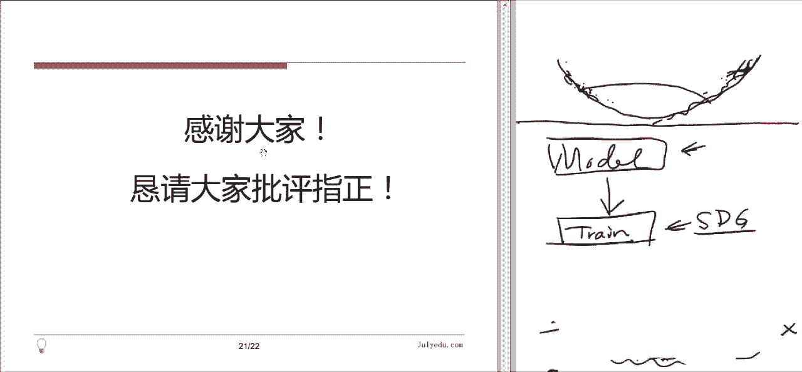
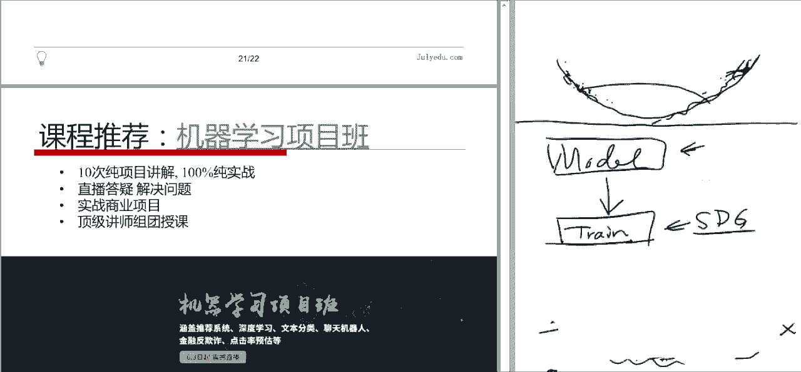

# 论文公开课（七月在线出品） - P1：随机梯度下降算法综述 - 七月在线-julyedu - BV1fW411T7GP

今天是。咱们论文公开课第一课，我们。那个已经筹划很久了，就是我们有一个7月在线，有一个论文翻译组，我们一直在翻译一些最新的或者是比较经典的文章嗯。

我们希望将来能够把这些文章呢一方面是翻译好的文本给大家比较方便看。另一方面呢就是我们希望能够通过这种论文公开课或者将来论文课的形式嗯给大家讲解。然后。

让大家更加方便的去接接触到这些就是呃机器学习或者是人工智能这些呃比较前沿的比较新的知识。因为现在这个领域发展还是非常快。嗯。就是我们可能。比较实用的呢还是都是一些最近写的文章，最近发表的一些工作。

那今天这篇文章呢第一篇文章呃，这个文章它并不是一个研究型的论文，它是一个呃综述性的论文。就是他把以前的一些工作呢，他给总结了一下嗯。这个总结什么东西呢？就是说随机气度下降法的一些不同的变种。

我们知道嗯在机器学习或者是这个。统计学里面很多时候我们做工作呢是是分两个部分。第一部分呢是建立模型就是。啊建立模型这部分呢，你可能需要很多需要一些具体的知识，专业的知识。

或者现在机器学习里可能你这个呃专业知识需要的没有那么多，但是你也需要建立一些东西。比如说呃你同样是深度学习，你可以做语音，可以做视频，可以做什么什么，对吧？不一样，你建立模型以后呢，你就要训练你的模型。

训练的过程中呢。通常而言，你就是需你就是需要这个定义一个。损失函数或者是一个目标函数啊，损失函数呢，一般你就要把它给最小化。目标函数你可能需要最大化，总之是一个优化的问题。优化的问题呢。

我们其实也开了一些班讲过一些关于优化的主题。但是呃基本的原理就是我们现在用的比较多的都是用把把这个优化这个损失函数看成是一个呃可谓的函数。然后我们采取用这个梯度下降法这样的做法。

所以这个方法呢其实是最简单的。🤧就是说。😊，这方法呢其实最简单的，但但现在看起来呢也是目前而言比较实用。大家这个呃刚才有同学问到这个关于视频的问题啊，这视频的话呃，你打开那个群群的右右边有一个群视频。

你点击就可以进入了。然后现在的这个我们不支持麦克的群视频，QQ不支持麦克视。所以你可能如果有m克的同学，你就得或者找一个windows机器或者是嗯。用手机好像是可以的。好。我们看今天这篇文章的这个。啊。

具体是什么文章？这个具体文章是这个作者。还有名字我也不太会读seine不知道啊，这个作者呢他在他写的他写的一个综枢性的，就是把随机梯度下降法的各种变种总结了一下啊，给大家分析了一下它的原理。

然后各个方法的优劣性，为什么要做这种方法，这个文章写的还是非常好，非常清楚。这很有用，我觉得可以作为一个工具类型的文章，你把它存在你电脑里。然后当你需要用的时候呢，你可以查一下。

然后我们这里会给他做一个更。啊，直观一点呢跟这个总结性的给大家介绍一下。那这个这个文章我们7月在线的翻译组也翻译了。大家有那个课件的话，你点击这个主题就标题，你可以看到这个文章的呃，应该是原来的。

就是原版的文章在archive上发表那个文章的链接。然后点击这个下面的7月在线翻译组，你就可以看到我翻译的那个结果是一个英汉会译的一个一个文章。我也把那个结果发到咱们的群里面。大然大家也可以直接下载。

好。那这个文章它主要的内容是什么呢？主要结构呢？内容呢我们说了两遍了啊，就是说这个文章旨在为读者提供不同的算法的原理，以及这个效果的直观展示，希望读者能能够在实际问题中更合理的选用这个梯度下降类的算法。

那作者提到过，就是说因为现在呃。在他写这个文章之前呢，我们没有一个系统性的去介绍各种不同的梯度类梯度下降类算法的优劣性。然后原理的文章。所以大家呢总是你得需要在文献里找，有可能你知道这个算法。

你不要那个算法，然后真正用的时候呢。就把这些东西当成黑箱来用了，因为也也不是很清楚到底该用哪一个对吧？这个很讨厌。因为其实当时作者们他们就是。发明这些不同的算法的时候，还是各有目的的。呃。

如果大家能清楚一点的话，你使用的时候可以更有针对性一些。违章结构就是说。分为6个章节啊，第一节呢就是非常简单，就介绍一下什么叫梯度加降卡啊，我们大概也是follow它这个呃文章的这个结构。

就是因为它的结构本身也非常清楚。嗯。第二节呢就是说啊从梯度向降法出发。为了解决他的一些问题，然后又发明了这个随机提出下应，那他还是会有一些问题。在第三节做个总结。那第四节就是这个文章的主要内容。

就是说他把这个几种不同的方法都列出来。然后呢，他们都针对于第三节讲的那些问题和挑战，就是每一个算法提出出来是为了解决什么问题，就写的写的比较清楚。然后第五第六节呢，第五节它是一个介绍。

就是说因为算法是一方面了。但是你具体实现的时候，我们现在很多东西做计算都是用变形计算或者分布式架构。它当然就是他介绍了一下，说历史上我们都有呃提出过哪一些可以可行的架构啊，包括现在也可以用。嗯。

最后一节呢，他就是说从其他的角度来看，就是不是从这个算法角度来看，就是。从其他角度来看，说是不是还能够有一些办法去呃优化一下气度下降。是这。嗯，大家有关于这个视频的问题啊。

就是那个如果大家现在看不了视频的话啊，我们也在录屏啊，等到那个结束之后，我想我们应该是可以回放。好，那我们。就正式开始之前，大家有什么问题吗？还有什么关于这个。学术的问题吗。

或者包括如果要说你大家觉得我说话太快，或者说话太慢之类的，也都可以提醒我一下，这样我可以调整一下我的节奏。啊，有同学问这个是不是最基础的啊，这个基本上是比较基础了。这个文章写的还是很清楚，就是大家只要。

我想只要微积分比较熟悉的话，应该都可以看。只不过。就是说首先它是英文的，然后然后我们翻译了一下就会好一些了。然后让大家同学可能。就是如果同学读文章读的比较少的话呢，可能会对这些所谓的论文有一点恐惧感。

其实大家不要有恐惧感的论文，它就是。就也是研究型的文章嘛，就想解决一些问题。只要你把那个核心抓住了，就做完嗯。还是还是很还是很很容易看。呃。关于他这个提度这个方法，在深度学习中的应用啊。

这个在本文中没有仔细的设计，但是呃我们可以看到一点说就整个这套系统呢，它为什么要这样做？其实多少跟我们在应在这个机器学习中的应用是有关系的啊，等会大家可我会看到一些。🤧好。然，我们就。开始正式内容了啊。

第一节我们简介一下。比是说什么叫做梯度下降？啊就是说。我们刚才提到了，就是说我们在训练模型的时候。平时可能。就是我们在训练这个模型的时候。经常会涉到一个损失函数，比如说这个J。这个非常呢。

就是这个模型的参数，它有好多好多参数。那J呢就是说那个模型的损失函数。我们通常而言，希望调整这个参数，使得这个JC塔越小越好。那这个函这个函数是什么呢？那通常是根据的样本来的，就是说如果没有样本。

那你就不知道这模型参数应该是多少，也没啥条，对吧？就是说因为有有的样本就是有个X大X。JX对的它是根据你的样本得到的一个函数，然后你希望把它最小化。最好化的时候呢呃一个最简单的办法就是说你在。

这个任何一个点处，对这个函数进行一个线性逼近啊。这横州标是C塔。中国标呢。是这个JC塔是吧？你的任何点出的最后做一个逼近。线性笔近。就是说我们求一些导数就做线性离径对吧？呃，如果西塔是多元函数呢。

这个地方就是dael塔西塔是个向量啊，求求转制乘以这个记度。所以说你做性性B之后就能明白一件事。就这个函数啊，它是往哪的方向是增加的，往哪个方向是减小。就我们意愿函数是这个。那如果你知道哪个方向减小了。

其实通常而言，这个增加的方向就是梯度方向，这个梯度方。然后另外一方向呢就是减少。所以我们。😊，怎么做这个呃下降法，怎么去寻找这个呃函数绩效值呢？就是说我们从一个点出发。

我们从这个点减去它这个梯度的某一个。倍数这个倍数呢我们就叫做学习率。就你想这个倍数越大的话，你这个走的步度就越远的。就这个题速正常，你的倍数不等于一，那下一个西塔。在夏点。其大一就回这了，对吧？

你在此处再做一个这个。就是。已直接决定。下去二根跑这来了。跑这来了，过头了对吧？你再做一个清简理解，你回来了，其他算回这来，总之你就是不断的做这种事情，最后你就1。1点接近于你的这个局部的绩效指点。嗯。

所以说这个东西呢它基本上就有两个步骤。第一个步骤做线性逼近，就是算求出这个梯度，这个向量把它算出。第二个步骤就是你要选一个比较合适的。不长，或者我们现在叫学习率。来进行你的这个参数中心。这两步。

第一步是计算，第二步是选择这个学习率。所以说呢。他这个方法的做法和它的困难通常是相结合的。你有一方法你有一些手段，你的困难通常也是从你这些手段里出来的，就是通常任何一个东西都是双刃剑。

所以它困难哪来的呢？第一个困难就是提速的计算。就是说啊我们机器学习和统计呃参数估计问题中，这目标函数通常是这种求和的形式。就是我们这个上面写出来的，就人跟我们说了，你这个函数怎么确定出来的？

它是通过一个样本，一大堆样本来确定这我们通常这大XC塔这东西啊。般来讲。我们经常遇到的情况都是这样，它是一个对于每一个小样本，每一个样本你都可以算出1个JXIC的。然后呢，最终的这个呃。呃，损失来说呢。

其实是你把这一堆东西加起来。通常都是这样。这种情况下，你想算左边这个函数的导数想求导。其实你就是对右右边这一堆函数挨个求导，让它加起来。对吧就是说一般来讲，当你没有什么比较简简单的这个公式的时候啊。

对大部分函数你都得这么算，就是挨个算，这边就挨个求导的加起来。这件事情其实是非非常这个耗时耗力的，就是很费劲的。因为你那个样本太多了，通常我们现在呃数据比较大了，作一个样本就是几百万上千万或者甚至更多。

那你每一算一次梯度，你得对上百万个东西求导，然后再加起来。或者更多啊就是这个事情非常的耗时耗力，它使得你这个模型的这个训练呢。比较缓慢。谢谢。所以这是第一个问题。提这个。记不下来了。第二个问题呢。

我看同学也有问到说学习率怎么选择。你怎么才能找到一个合适的学习率呢？正好合适。就这个问题呢。如果你只用现在这种方法的话，基本上没有什么好办。你只能是具体问题，具体分析。就是说你。你先弄一个试试。

你看它收不收敛。如果学习率一般太大的话，那就不收敛。跑那干去干就是了。比如说你刚才有个问题啊。如果你学习力很大，你从C到0出发，你跑跨跑这来了。是吧，下一回这来，然后下一厨发，你跑他还回这来。

那就是你可能就震荡震荡震荡，总是停下来，你就没办法收敛，对吧？那你要学习率选太小了，你每一步都走的太太近太近。那你这个本身都说了，前面算梯度都很费劲了。你要是算一次梯度还走不多远，不是就很很不划算了。

那就很不惊喜，对吧？所以说这个问题呢，学习率的选择就变成了一个需要具体问题具体分析的事儿了。那这个很讨厌。因为我们你做这个机器学习或者人工智能，你是希望你尽量人少参与，对吧？你希望让机器做更多的事情。

你现在这个事儿你还得具体问题具体分析。你还得看那个训练的结果，然后再去调整这学习率啊，这个过程就比较讨厌。而且你这个学习率选的太小了。还有一个问题，就是有的时候你弄么好被噪音给误导了。

可能这地方有小噪音。你学习太小了，你跳过去，那也是也是很讨厌的，总之就是。这两个问题，那这两个问题怎么解决呢？第一个问题。啊，就是。随机吸度下压就这个随所谓随机记度下压法主要就是为了解决刚才第一个问题。

关于梯度计算就梯度计算呢。太太太太慢了，太费劲了，因为样本太大号，所以怎么办呢？样本大吗？不是那就把它缩小一点，对吧？最极端的做法就是什么？就是每次计算题度的时候，你只使用其中一个样本。去做计算。

你刚才看到了，我们这个梯度其实是。算这一堆样本的那个呃就这一堆函数的那个T对加起来，对吧？有可能会除一个什么东西，成一常乘个常数。就说。😊，他第一个方法什么呢？就是只剪出其中一个。

假设你这个样你这个整个样本。整个样本集合啊只有一个样本。把这一个梯度算出，那他肯定跟那个整体的这个梯度是不一样的，但是不要紧，反正就是。嗯。🤧嗯。它虽然跟整体不一样，但是因为你要算很多次嘛。

呃这次你用这个，下次你用那个啊，加一块儿，可能大家也就做用到了，对吧？那。每一次只用一个样本这样的好处是什么呢？就是刚才你这个样本里边啊，好多其实XI之间它是类似。因为可能你呃你这个问题本身呃。

你在XY出现次数就是那个密度概率密度比较大的地方。那XY出现的频率也比较高。那你在这个很类似的XY上，你都要重复计算这个函数的题度，然后你还得把它做个平均。你平训完之后又回去了，对吧？那就没意思。

所以你就做了很多的冗余的计算。他这种做法好处是什么呢？因为你每次只算一个，那你就避免了这种容易计算，对吧？比如说X1和X2也得很近，你这次只用X一没有用X2，你算出来这个，其实你就你就少了一个计算。

对吧？但这个。缺点是什么呢？就是说。你就每做一次计算他这个。就是你X一可能代表X一这个特性。X2代表X2这个特性。你每做一次计算呢，你都等于是选了一个特殊的样本做的。所以它的这个稳定性比较差。

就它这个呃你算什么梯度啊，它一会往左指，一会往右指。整体上，比如说你其实你是盈量往前指，对吧？但是你这个X一可能往左往左前放指，X2往右前方止，整体上是往前的，但你这个就震荡比较大。可能X3还有后置啊。

这都有可能。所以说。的缺他缺点是这个呃震荡比较厉害，但震荡比较厉害这件事吧，它本身也不完全缺点。他也有一些优点，就是说他增加了你跳出当前的局部最小值的潜力。比如说嗯。像现在这个问题，我们这个例子里边。

我们从这出发，通常而言，以前的方法，你基本上呃步长选小一点，你就会缩敛到这个就不这个就不较值了。那可能这个函数呢。在远处还有一个哎呀更低一点的局部角织，对吧？就还是可能长这样子。

那如果要是你现在选的是这个随机需求下量吧，因为它震荡比较大，它这个。🤧就是说。还比较性格，呃有时候跳的比较远啊，那你从这点出发，可能你咚的一下。就这。呃，然后你从这儿再走走，然后又动了一下车子来了。

然后再走走走走，就是他不见得真正能像咱们想的那么好，那可能还往反的方向调。那总归他会帮助你尝试各种不同的机会机会需求。这是有他这是多少有点好处，就他这种不稳定性的可能会给你带来一些好处。

我们在这个最后一节呃讲到这个其他优化嗯。提呃提出权量法的这个方法当中也会提到有些人这不但。这个随机度这个这个这个不稳定性他还觉得不够，他还要再引入一些随机性，就也是为了这个目的。然后我们也说了。

就是说这个不稳定的时候不稳定这个坏处是什么呢？就是说收敛的怎么转换了，我挑来挑去了，他怎么不回来，对吧？那但是我们在实际应用当中，实际推点当中发现当你如果是把这学习率给它逐渐缩小。

一开始你的学习率可能是0。1啊，或者00点几的或者是一。然后你呢按步骤，你每每做一次，你就削削减一点，每做一次你削减一点。那这样呢你。用这种方法去做的话。

这个随机梯度下降法的收敛速度其实跟之前这个正常的原始的这个梯度下降法，就是收敛速度也是相当的。所以说这种方法呢那缺点可以通过这种方式来避免优点还可以得到一些发挥。

所以现在我们通常说这个在机器学习当中说的呃梯度下降法。那一般来讲都指的是。某一种随机记录下来，所以这也是我们这个文章的标题，随机记录下来，这个意思。那这个讲所所讲的随机呢。

就基本上就是说因为你每次选的那个呃样本那个点都不确定是吧，你就是你可能自己随便排了个序，然后呢。你可能还要进行一个随机排序，那这样他就引入了随机性。就你每次你你你今天做一次训练和明天做一次训练。

结果可能是稍有不同。第三个是什么呢？就刚才我们说了，就是我们。之所以你每次只使用一个样本，主要是为了这个呃简化计算，先算的快点，对吧？那但是稳定性也比较差。第三个什么呢？就是。

介于一和一和2之间那种办法，也就是说啊我每次不要只选一个样本，一个样本他觉得这个。太乱了啊，就是觉得。对。呃呃这个。就选一个的话，你万一有一些这个非常大的这个outlier就是不好的点。

可能你不是很影响你自己，对吧？他想什么办法呢？那选一个小批量。就是说在你这个上上百万上千万的样本当中选出这个几十个，把这几十个拿出来算一下这个题度，这也是很好算的。为什么呢？

因为现在我们还是有很多的这个。啊，现成的这个优化的一些公寓啊，就是说你在这个尺度上算。这不一点也不比你刚才那个均一个样本慢，呃，这速度还是可以保障的。然后呢，他这个梯度计算还要更加稳定一些。就他。

小批量它比那个单个的要稳定很多。嗯而且呢它比那个。呃，用全部的这个算法还快啊，而也他也比较有效，所以他也可以调，他也可以达到一些这目的。就是说多少的呃。可以找到一些旁边的这个更好的这个局构教育。这样。

所以说现在一般来讲，在神经网络训练的文献当中，当大家说到这个SPD的时候，就是这个随机提速下降的时候，其实它指的就是这个。小批量随T随机虚度下降法，这种mini batchSD。

这这这个就是一个呃语言上的一个问题了。就是历史上可能大家就是这么就把这前面这个mini batch给省掉。所以大家看文章的时候呢，要注意，就他他说这个SGG的时候，其实他指读过时候指的是这个。好。

大家有没有什么问题？在的位置。嗯，好的，那我们继续来啊。呃，同学问到说这个啊小批量怎么选？啊，这个小批量呢一般来讲现在都是因为固定的数，就是啊文章里有提到，就是说现在可能一般是这个几十到几百之间啊。

这个数字。也跟时间有关系，但是。这个数字的区别可能不是特别大。你可以自己选。哎，有同学问说，这个当你用小批量这个提出加减法的时候，不同小批量里的元素会重复嘛。嗯，我想一般的做法应该是不重复的。

就是说他他把这个。整个样本。先给他分割位。咁过嚟。就每一个小分割是一个小批啊，比如说比如说这100。100个。那整个可能是比有10个6层。然后呢，你就得到了多少个呢？得到了1万个这个小批量。

那1万个小批量，你就你做那个循环的时候啊，你就挨个小批量算，每一个小批量你算一个这个呃梯度，你更新一下参数，算完之后不全算完了吗？1万次循环结束了，结束之后你再从头来。从头来的时候吧。

啊这个时候还是多少有点技巧，就是说。你要把原来的这个。给他重新打乱一下。给他洗个牌，这个在我们最后一节我稍微介绍一下。重新打重新打断一下，然后再给他分解分割成这个这1万个小时。然后你再来一遍。

就打乱的目的呢，就是说他不希望你这个。样本的顺序影响了你的训练的结果。因为可能你无意之中选了一个很特殊的顺序，这个顺序。会对你的结果有影响。比如说打比方说吧，咱们这个前面说有的时候你做计算的时候。

你要那个啊。你这个学习率可能是逐渐递减，那你递减这个事儿就就就很讨厌了，对吧？那你就意味着你对第一个小批量你是比较重视。所最后一个呢你就相对没那么重视。那这样的话，你这个顺序就决定了你对谁重视。

对谁不重视，那这个就不好。所以说你当第二次循环的时候，你要把这个啊。讨论一下，多少能挽回一些这个问题。呃，然后看同学们的问题啊。啊，关于小批量的这个数字是不是要在代码里面写死，我想是可以的。

这个反正一般来讲不把这个。我知道的情况应该不把这个小P量的这个大小当成是一个超参数。嗯，然后。还有同学说，如果要是那个整个批量呃就小批量和样本总量不成正比，就是说你不能恰好分割的时候，剩下一家样本。

因为不要紧，其实你就剩下几十个样本，你可以把它。就是。这个是比较灵活了。你比如说你剩下的这个，就这是最后你没有剩下100个，乘以20个，20个怎断，你把它放到前面来，重新打断之后再来一遍是吧？看了这个。

然后有同学说还要解释一下那个我为什么认为小这个随机提速下降法，可以增加你跑到呃。就跳出这个局不集绝的权力啊，就是说我刚才说到啊，就是你。如果要是用全部样本算梯度的话，它是比较稳定的。

它基本上是往那个真真真实的那个梯度最大那方向走。但如果你要是用那小批量的话，它噪音比较大。就说白就是噪音。你你你每次只用一个样本，那个样本可能是一个。就是他可能是有比较特殊的情况。

那这个情况下他只是你就走的比较远，就是从这个点出发，跑哪去，没有正常的按照这个方。那你不就跑到旁边那个呃就是聚不聚这点去了。啊这种做法啊就是说他不见得给你好的结果，但他是给给了你产生好结果的可能性。

然后呃还有说同学说这个数据打乱的问题啊，我说这个情况是把这个原始的数据捣乱，然后重新做一个分割。就是说你也不想保证这个没这些数据在一个培养，你希望他这个重新混合一下。然后呃。呃，这样问题啊。

还有同学关关于这个收敛性的问题啊，就是说啊这个如果要是你噪音太大，当然有什么都不收敛。所以这个提到啊，就是说随机方法这个提出加降法在逐渐缩小学习率的情况下。

它的收敛收敛的这个性能就可以跟原来那个差不多了。就是说你的学习率越来越小。其实也就是说一开始的时候给你更多的自由度。那以后呢一点点就把你这自由度给限限制住。嗯，对。

就是说有同学问你说那个呃现在优化的举证工具，对，大概是有些是可以向量化。对，就是说呃因为你那个向量也不用太长了，你要是几百万那个向量。那可能也都算不了，但是你要几十个向量，这样的话。

现在我们呃计算的时候是可以统一处理的。比如说。读加法吧。你这个V1加上V2。那以前呢你得做循环，挨个加加完之后，你得得出来。现在的话你啪一下就夹过去。这个这个是在硬件里面实现，或者是。基本上讲对这个都。

没法展开讲就会走。好，有同学说我讲快点我讲快点啊。😊，嗯。那么这个随机提出向降法，它是不是就什么问题就解决了？那他其实还是有很多很多这个困难。就他主要的困难是什么呢？

我们说了我们这个第一个问题是关于需求计算的。呃，这个主要由这个随习系求化来解决。那第二个问题是什么？就是学习率的学习率的选取。这个问题没有解决，所以说这个问题呢也就构成了随机提数下降法主要的可。

🤧那第一个。第一个不是这方面，第一个说的是你这个局部梯度方向的反方向，就是那个梯速下降法的方向。不见得是函数整体下降的方向。这个在我们下面讲到这具体算法的时候，会给大家呃自己说一下。

就主要对一个图像比较崎岖的那个山路比较崎岖的函数啊，就是说这个到处都有不同方向的下降。那可能。你任取一个点，他可能是因为这块石头比较高，所以它旁边那个往往往往往左，它就有一个很大的这个梯路。

那实际上你主要是往前走的那你的往左的梯度不影响了你的这个哎你这个这个计算嘛，就是这是一个问题，就是尤其是对在对于这种隧道型的曲面，就是你像那个隧道啊，在整体上是缓缓的下降的。

但是这个隧道两侧呢这个弯弯的，那个梯度也是很大的。就比如说你呃如果要是就你想象中用那隧道，你拿一球放在隧道上边。如果你放在隧道这个侧面，而不是放放到这个隧道正中心正中心啊。

你撒手那球其实是会在隧道两边来回震荡震荡震荡，不断震荡，然后再下降。这个震荡的过程并不是你想要的。你希望的是他沿着主要的方向走，对吧？这是一个问题。第二个问题呢就是说学习学习率的问题。我们刚才说啊。

你可以把这个学习率的衰减。啊，作为一个方法，就是说你让学习力越来越小啊，这样呢你这个算法基本上就越来越熟敛。那这种做法有一个问题，就是你只能说先预定一个学习率的衰减过程。你说呃一开始是定一个数。

一开始是0。1，然后呢，你呃经过100次迭代之后，你把它变成0。95，然后你再经过100次，对吧它变成0。9对吧？你可以你可以这样做，那这样做缺点就是你这一个方法就得用在所有的训练的这个数据上的。

你可能不同的数据，你想适应的是不同的这种衰减率，衰减方法。那你怎么才能够自动的对于每一个数据集拿过来之后，然后自动的去产生一种衰减，就是比较适应于这个数据自身的衰减，而不是你一开始人工定的然。

这是一个问题。因为那样会更加智能一些啊，这个当你人工定这个跟你这个数据集不是很匹配的时候呢呃。嗯，那种自动的方法会好一些。第三个是。就说啊我们现在这个做法还对所有参数都采取了同样的学求。

这个看上去好像还行，那其实它是有问题的。就是说比如说你现在做的是一个。啊，关于这个。文本识别的问题啊，就是说你关于这个垃圾邮件的标记的问题。那你的垃圾邮件标记啊，它有一些词语一旦出现。

你基本上就确定它是垃圾邮件。但这些词语出现的词非常少啊，这就有可能。Yes。这个比如说呃大家都知道有一个什么。那么最终我国的网址的问题对吧？呃大家都知道这个事儿，一旦出现这个网址。

基本上你这个邮件就是垃圾邮件。啊，但是这种邮件可能大家一共也没收到过几封，对吧？如果你是现在想用你自己的这个邮件系统去训练一个垃圾邮件的识别器的话，你这个网址这个词儿没出现过几次。

那这个词的参数它的系数。就只能在这几次出现，就出现了他的这几次里面做做训练。那这几次如果你恰好把它放到了这个一个后面。就你那个样本啊，比如说你放到这个比较后边的地方，那学习率很小。你这当那训练的时候。

你这个词儿一共出现这么几次，每次学习率都很小，你那个参数虽然不是零，但是也很小。你这个几乎在将来你做预测的时候，它用到你你参数太小的时候，你再做预测的时候，它就等于是不存在，等于是0，对吧？

所以那样做呢。对于你这个呃出现频率很少的这种feature，它的参数很公是很不公平。那个fisher明明很重要，但是呢由于它出现次太少了，然后你呃学习率又很低，嗯也没训练出来。

所以说呢当初据有这种稀疏性的时候，稀数性就是说有些参数出现的比较多，有些参数出现的比较少。在这种情况下，你希望对不同的特征采取不同的学习。你对于频繁出现一些特征，你就正常学习就行了。你可以让学习率衰减。

对吧？小一点，因为它不断出现嘛，你就不断的去去去适应，它去更新它。对于那些出现次度很少的那些特征，你就得采取比较高的学习率啊，那这种做法。也跟前面这个有重大问题，你新给你一个数据。

你哪知道哪个参数出现多，哪个参数出现少，对吧？你是不是就得让它自动的去识别哪些应该更接的更多，哪些应该更多精少，这也是个问题。那最后一个呢就是说在实际应用中发现这个神经网络训练中啊，你QQ加减法。

它不但是有这种局部犄较值的问题，但还有安点的问题。这是时候我们知道。那个开审举战，他就是说局部教只说的是他这个。这汗山矩阵确实是个零矩阵啊，但是呢它局部上级较值整体好实。但是还有一什么情况呢？

就是那个你汗山矩阵呢，它。在某些方向上是定在某些方向上不是或者某些方向是负否定的，有些方向是正经的，有些方向上就这种情况下叫鞍点。那一个鞍点呢，它通常会就是在这安点附近，那看是非常的平坦。

就是我们我们画过那个马面。你可能上大学的时候，大家都看到过这个。最简单的一点就是掌声了行。是啊，我这个几我块1块，但。呃，同学们稍等一下，我这个笔好像。哎，这个还没有出现过，我我我我刚才关掉下。O。

So。实分抱歉啊，刚才这个不知道为什么不不能。🤧。那最常见的这个案点。就这个麻面。诶。我这个上大学的时候学习的画这个马面。Yeah。对，就话的。不是特别好。什么意思？哎。这样的一个就是马鞍嘛。

就是你做的那起码还是做那个马鞍对。这个点它其实就是一个安点。那这个点呢附近这这个区域。你看它沿着这个X方向，它是往里翘的，沿着这个Y方向，它是往下凹的，但整体上这一片呢它都比较平。

所以说如果你那个参数训练的时候跑这儿来了。他就很难出去了，在这附近他就走不动了，对吧？那这也是个问题。所以比起这个局局部几小时来讲啊，这个安点更加可怕。

就是这些都是我们使用随机吸收下降法的时候容易遇到的困难。啊。对，有同学发了一个这个在呃群里面，就是这个马面就画的非常好。机器化。大家可以看一下，就是这这些都是我们这个呃随机提出下降法。

或者说一般来讲任何一个提速下降法都会存在的。那我们怎么去解决这些问题呢？这个事情就构成了我们今天这个课程主要内容。这个文章第四节，他就列举了们各种不同的这个随机系数加权法的变种。

来告诉我们这些方法是怎么去解决前数的这些问题。就当你的这个数据集。当你当你对你这个问研究问题呢肯定有一些了解了，对吧？当你了解了你自己这个问题之后。

你知道前述这些哪些问题是对你来说是比较严重的那你就应该用这个特定的方法去克服他，对吧？这是我们这个文章主要内容主要的主要的目的。好。那不是说选取学习率吗？很多同学可能会有个疑问，为什么不用牛顿法？

刘润法。它就自动给你选取了一个类似于学习率的东西，对吧？它是什么呢？它是对你这个函数做了一个二级培训。整有问题。了解一下他的实质。就还是刚才那个样子。对。也写这常了。好，你对于这个函数。

还是刚才那个问题，从一个C塔零出发。我们说求一梯度的话，你都应该往左走，你不知道该走多远，所以会有学习力的问题。但是我们还有个办法，就是说做一个二阶比近，我们在这个地方不用直线对它做比近。

我们用一个抛物线对它做一个比。え。我们拟合一叫抛物线，就叫抛物线呢，显然跟原来的函数不一样，但是呢有点小，就是我们二阶之线对吧？所以抛物线极角之点，我们把它作为。这个函数绩效值点的一个直径。

C大一就在这儿。那四大一这出发呢，你再做一个抛物线。哎，6得到几小时间，6是4。2。不断做这种事情，最后你就回到这里。这种方法就做牛顿法，就当年牛顿。

可能用这种方法来解这个呃近似解这个三次方程的就解那个。这方能求跟那种啊转移动。那这种方法大家一看，哎，这很好。对，这个你从一点出发，你知道该走多远。你很清楚，就是告诉。那这个方法啊。

在我们实际应用中有很多的问题。啊第一个问题。就是我们现在做这个问题里边什么大数据啊，大数据有两个维度大，一个维度是那个样本点多，还有一个就是你的。特重。特征是什么呢？特征就是说你这个下边这个西塔的倍数。

我们现在这个西塔写的是一维的，就为了简化嘛，对吧？那实际上你这个西塔还没有成成百上千0个，比如1000个。1000函数啊，就是1000个这个feature。那在这种情况下。你要求一个二级导数。

那二级导数其实是一个指针。对吧如果是你1000个样的的这个这个。呃，teachature的话没有矩阵就是100乘1000的。所以你需要算1个1000乘1000的矩阵，那就里面有100万个点。

100万个数。你每一次每一次做迭代的时候。不管你用多少样本，哪怕你用小批量的，你就用单个样本来算的，你都得。算一个呃1000乘1000的这个含成指证。这件事情首先就是很难算。我们刚才说了。

这本身计算就是个问题。你要是那么算的话，那太费事了，对吧？嗯那你这个随机虚度向下法都拯救不了你了，对吧？就是你太矩阵就太大了，没办法，那那不行，存储都成问题。你可能内存从下，你要是太大的话。

你反复的拿这么大的矩阵过来算，你就存储都成问题。这是一个。第二个呢，就是说当你使用小批量的时候，比如说你使用单样本，你那个牛顿法对于二阶导数的估计噪音就太大。就是本身一阶导数估计它就有噪音。

你的高这个接触越高，那个噪音就越大，就越就就越容易是错。这个就就也不符合我们现在应用的一个需求。🤧那最后一个呢。就是说当你这个目标还是不是凸函数的时候，顶牛顿法还是非常脆。顶牛顿法其实它是找什么的呢？

它不是在找那个。就正常的顿法，它并不是在找极少之点，它其实是在找安点。或者说是在找这个局部极制点，应该说是所以找的是局部极制点，它非常容易被这个极大窒吸。比如你从这出画的话，它就画出一个这样的。二曲线。

然后你选我们牛顿法一般都选这个二曲线的那个基制点，那基值点就跑出来了。所以你其实这方法就在找那个极大质点。还有就是这个意味的状态不太好看，就是高维情况下，这个牛顿法非常容易把你拧到那个暗键上去。

就刚我们说的暗键。他就是在找这种点。那你这样的话，我们现在研究的这个。问题啊就是我们这个神经网络训练里边，就是这网络训练里边，经常你这个函数都不是图的，都不是图函数，我们都不指望去找那个全局绩效值。

那个太难了。我们就说你最起码得给找个局部绩交值。但牛德法呢很容易把你给弄到单点上去。那你弄晚点，这就就最讨厌，所以我不喜欢，对吧？所以由于这种种的原因呢，我们在实际应用中，当你这个在大数据处理的时候。

就为数大，数据点多啊，然后你这个优飞wo的时候，我们通常就不使用这个法。所以这个方法我们在此不做讨论啊。呃，关于。同学说的这个。遗传网络移群算法，这些我就不是很了解了，这个就不给大家介绍。

然后说为什么会引到安点？那这个呃我刚才说啊，就这个我们具体要是算的话。这可能有点占时间了。但是我大概就是说就是说顶牛顿法他主要是在找那个哪个地方最平坦，就是他在做这件事，就影响你做一个二阶B信。

然后你就找那个二阶B信最平坦的那个点，你就让你就你就你就。对吧如果你要有安点的话。那个首先理论法它不区分那个极大还是极小。你的安点呢，比如在这个马面这了，你的按点呢，你在这个方向，它这个点是价值。

在这个方向呢，这个点是极小值。如果在这个附近触发的话，这牛顿法就会把安钮。因为你从极大值角度说，他也能往哪走。从极小的角角度说，他也应能往哪走，就不是这个意思。呃，二级老师的几何解释呢就是这个曲率。

就所以你的办法其实在帮你寻找这个。我想应该是。高是曲率比较小的地方。那不对不对，说错了，就说2级小时取例，有办法还是再帮你找那个比较平坦的地他曲例只是它中间内部。好，还有没有其他的问题？噪音大。

大家有同学问说，为什么说这个？二阶导数估计的噪音太大，就是说。Oh。就说。比如说你用牛顿法的时候，那牛顿法的公式我给大家稍微写一下。为什么说这个造型非常讨厌？C塔一等于C塔0。减去这个。

M here在哪里？除以F撇撇。就大概是这么式的。这个胰岛树啊还放在孙子，胰岛树啊还是放在孙子。你这个东西噪音大了之后，它导致你这个数变化特别大。就是你这个呃就比如说他从在零的分间在长。

就是说如果说他从一个比如说0。1。由于有有到一变成0。5话，你这个上涨码还能放大两倍，对吧？就是说。或者说如果要是嗯这个在零的附近震荡呢，你就是说你不动就完了。你这个下面如果在零的附近震荡。

你就可能会导致上面这个呃变化极大，对吧？嗯，明白我意思吧？所以说这个二级老师的噪音呢，对你这个模型训练影响非常大。好，还有没有其他的问题？好，然后那个关于呃几何的问题啊，就是说马鞍点的问题。

他就是说在一个方向上它是这个极小值，另一个方向上它是极大值。这样一点。没那我们继说啊。来介绍这个。文章中我提到的。实际呃应用当中，我们比较常用去解决刚才提到的一些问题的一些方法。好，第一个问啊。动亮了。

这个方法非常的直观，它适用于什么呢？适用于解决我们刚才提到的第一个问题。第一个问题什么忘掉啊，就局部梯度的方向啊，这个这反方向不见得是函数整体下降的方向。我给大家稍微说一下这个什么情况下。

比较适应的题度。在说什么事呢？是是。擦一个黑板。Oh。哎，有些这样的。比如说你这个。曲面啊，就不不画那坐标坐标轴了，你这个函数的图像是个曲面。开这区。嗯。就像一个竹筒饭一样，就竹筒是吧？是吧？

这是竹筒饭，要斜着放在这。这个时候呢。比如说你要选点选的这儿。它其实沿着这个向竹筒中心的方向，这个方向梯度很大，就是这个斜度很大。所以说你算出来个梯度呢，其实是一个斜着既有这个方向的梯度，又有这个方向。

而且这个垂直于竹筒的方向力几乎会会会非常大。因为你竹筒是一个很细的竹。对吧这种。所以它是一个这个方向走成。所以你用虚求向量法呢，你就会往。垂直于主筒方向走的比较多，沿着竹筒方向走嘛，也走了一点，走的多。

你往这个方。你这走走走哪去了呢？你通常而言，因为这腿很大，对吧？这个总孔中很能很细，他就会跳到对面去。第二呢再做吸的时候呢，他往回走。他也是。既偏向下一点。但是呢用偏向这方这这方面一些。这样走。

然后他这个因为他这个垂直方向比较比较比较陡嘛，就走的比较多，噔了一下又跑这边。所以最终结果就是你反复的这个点。反复的在这个竹筒两边这样做，震荡震荡震荡是吧？他也回来了，也下来了，但是呢它在震荡。

这些震荡的过程就浪费了你的时间。因为每一步你在这个主体方向上走的很少，在这个垂直方向上反正做的很多，这是什么造成呢？就是因为你这个。垂直方向上有这个不是很平坦啊这个。造造成这个问题啊。

这个这种情况就是我们刚才说第一个问题。当你这个这个曲线这个曲面啊它比较崎岖的时候，你会。就是会浪费你很多时间，让你的手两变半，对吧？动量法是说什么呢？多样法啊就是说你假设你丢下去这个东西。

这重量是很大的。你的物理上小，它质量很大。它也会这样震荡，但是因为体量大呀，它会积累一个在这个方向上，因为这个方向上一直下降的，在这个方向上会积累一个速度，那个速度会越来越大。但在垂直方向上呢。

因为它一会儿往左是一会儿往右。那这个就导致他这个呃呃就是一会儿受向左的力，一会儿受向右的力，那导致他这个在垂直方向上呢，这速度积累不起来，他都看他都这个消除掉，所以他会在垂直方向上这个速度。

基本上保持一个稳定的程度，就是说在做那个中摆运动，对吧？在。顺着这坡的方向，它的速度会越来越快。所以在当你这球比较大的时候，它就不会像这样这样频繁震动，它会变成什么呢？它也会震动。他会变成。

一开始的时候这种足播还比较大，上学了啊，回来了。然这个做佢越嚟越。就是大家如果要是有生活经验的话，你去这个扔一个球再这用。发现。那后面呢。就一开始震动频率可能比较大，后面的振动这个震动频率啊就会越来小。

所主体上还是沿着这个。大的方向的下降。那在我们这个。我画的这个是立体图，如果你看的是一个等高线的话呢。大家就可以看到，嗯普通的方法它会在这两边来回震荡，来回震荡走的比较慢。这个加入动量之后呢。

它一开始震荡呢也是一样的，都是走中沿着震荡一次对吧？震荡一次。那后面呢它这个震荡就会啊越来越越来越少，在主体上就会沿着这个方向。的数量也会快一些。这怎么去实现这个物理的现象？

这这我们讲的这是一个物理的模型。我你这个球如果没有重量的话，它震荡比较厉害，如果重量比较大呢，震荡呢就会比较小，会比较满足我们的要求，对吧？那怎么去实现这件事，所以物理上说这实现这件事怎么实现的呢？

就是说它这个球是有惯性的，所性质量其实是惯性。他的惯性决定他之前那个速度会得到一定程度的保持。对吧如果你有空气阻力的话，之前的速度会被削弱一些。但如果没有阻力的话，你这个速度会得到一定的保持。

所谓得到一定宝石，就是你在这点处，他的梯度要求你往某一方向走。但是呢你得用你之前的速度加上你这个梯度所要求你的变化，才是你下一步的。啊，这个是有重量的，就是如果你有重量的话，他会是这样这样做的。

物理上是这样做的那我们怎么去模拟这件事情，怎么去实现呢？就是这样。我们呢。一般来讲，之前的那个参数更新啊是西塔T等于西塔T减一减去一个梯度就就完了，或乘一个一产就完了。现在呢。我们还是要减去一个东西。

那这个东西啊它不但由以塔这个梯度来以塔和梯度来决定，它还有上一步你的速度来决定这个B就是速度。在T这一步的速度，由上一步的速度乘以一个削减还削减的系数。这个系数可能是呃你可以取0。9啊。

就是说你假设有一些空气阻力。加上么呢？加上这一步应该改变的那个。这个是就是这点出来听。这样你就既保持之前的那个速度，又加入了你新进的这个情况。所以这种更新的方式呢，它就更像是你扔了一个铁球在闪上。

它它有一定惯性，它可以保持刚才的一些速度，然后形成一个新的速度。你用这个速度进行对它进行更新，你就得到了一个叫动量法的。叫这个为什么动量化呢？就是那物理模型就是。由于这个铁球有动量。

它会保持保持一定的速度。这种方法就可以一定程度上改善我们这个嗯算法。在这种崎岖的路面上的表现。好，大家有没有什么问题？对于这东亚，我觉得这个方法呢还是一个非常直观，然后啊想法很巧妙的一个。

有同学说那个声音不好啊，好像是是不是你自己的那边网络不是很好之类的。好。那这个哎这个方法看上起来还是不错的啊，就是我们呃物理上很直观。然后在这个数学上呢也很容易实现，那就这就你稍微把这改一下就行了。

这地方不要解示那个梯度，把这个题就是做多多做一步这个计算就吧。这个算不错的那他有没有什么不好的地方？大家有没有看到这有些不好？他有一个非常不好的地方，就是啊。他会不断的积累在这个所谓主体方向上的素质。

那如果要是你退到山底了怎么办？就是你把一个铁球推下山。你想让他尽快到山顶，那这个铁这种做法。它最大的问题就在于那个铁球到了山顶之后，还停不下来。他又在旁边那山像头又上去，对吧？就变什么样。

就他一个重要的问题。先对就这样就动向法的一重要问题就是说从山顶推一个球下去，他的球会滚的越来越快。到了山顶之后，它就停下来，就是就是这样。比如说你这个山是照小。在这个方向上是主体的下降方向。

在旁边呢还有一些奇岖的东西，对吧？然后呢，我们用了一个铁球啊推。然后因为我们用了多样法，所以它避免了这两边震荡，它就基本上直直的掉下去。这个时候他速度越来越快越来越快。你到这儿的时候他没停下来。在上。

对，这个是动量化的一个问题。你上去了之后，你半天停下来了，然后你就还得回来就来，没在这震荡，你跑这震荡来了，对吧？还是个问题，还是收敛很快，这还是不影响你受敛。所以说呀。

怎么样才能让你这个算法有一些先见之明？对吧让他。快到达底部之前，自己就是刹车减速。啊，这是一个很有意思的。如果能这个算法能做到这一点，是不是就会好一些？所以说。就有这个人提出了一个改进的做法就是。这个。

那曹豆我我猜可能应该这么多啊，你可能是一个俄国人，他对动量法做一个改进算法是什么呢？他说呀，刚才不是说你走到每一步的时候，你在这一步你算一个梯度，你再加上刚才保留的那个速度，你用那个速度进行下降，对吧？

他说你不要在本处做做梯度，你你你已经知道你现在在这个点出来。你你因为你知道你要保留一个速度，所以你先到你。就你知道你保留速度，你就先不算那梯度，你先到。假设你这梯度是零，你下一步应该到哪去那个点去。

你到那儿算一个题度。把条歌。就说我现在这个问题吧。第一步的时候。我们知道他在这儿，然后他希望提问你发出来是吧？这这是这个。30。这个是4加一。第二步的时候呢。一般让你再下一直上一个梯度。

你就加上刚才那个速度，然后就加速了，对吧？但他说你不要这样做，你先你已经知道你会沿着刚才那个方向走。你如果你要是现在你不算题度的话，下一步你肯定会跑在这儿叫做西塔2一撇这个位置。就跟刚才的一样多，对吧？

就这来。你想想看你即将要到达那个位置，它是不是已经不是下降的股牌，反正你肯定要跑哪跑哪去了，对吧？那。你在这个点出三个题目。啊，你你发现这点题度确实少很多，对不对？所以你把它在跟之前那个叠加的时候。

你就产生了一个刹车的效果。我为从C塔2再出发的时候呢，你这个如果你什么都不做，你四大三应该在这里这个点呢，其实他提实已经往回走了，对吧？所以。你在这点算，而不是在4。2处算，你就得到一些先见知明。

你就说你。在铁球往下滚的过程中，他往前看了一眼，他看前面啊，如果要是有东西挡住他了，他就。首先上一说。他能往前看多远呢，他也看不了太远，他只能看到自己当前这个速度下，他下一步应该走到哪，就他。

预判了一下，所以他先见之明，就预判一下他下一步的位置，在那个位置上，他应该往哪边偏，他预先先偏一点，这样的话呢他就避免了。撞在墙上或者是撞在山坡上回不来的。Okay对。🤧所以说。😊。

我们在这个地方有一个图示，这个这个是其实是那个呃painton的一个呃lecture里面的图示。在文章里边你可以有链接，你点条。嗯。是是吧从这点出发。他有一个呃。

就是说它有一个原始的这个最长长的这条缆线，是原始的那保留的那个速度。这个方向量呢是此数它算出来的那个梯度。如果要是你在此处算梯度，再加上原始保留的速度，你就这点应该跑哪去跑这儿来，对吧？现在他不这样做。

他先假定你先沿着原来那个原始题图走到一个距离走这来。你在此处算一个梯度，往这个方向走。然后呢。这两项的价钱经到这了。用这种方式调整，你看这个什么呢？就是你往这个方向走啊，这有一个这个红色梯度。

说明你这个曲面是往。往，这个左侧开始移了，对吧？所以他预判了一下，你的取面往左侧移，我不往那个沙坡上跑，我就。喂。那再下一步呢。他在此处知道自己要保持刚才这个。这个绿色的线这个方向我要走，对吧？

他知道我要保要保持的，保持那么远。然后呢，我不在此处算他当前的梯度，我先预判我我大概是要好的这势，我在这点处算一个梯度。所以说我真正移动的方向是你看这点处，他已经开始往回走了，就就刹车了，对吧？那就。

你再往后走，可能刹车更厉害，最后这个收敛。如果你要不做这种事情。他爬跑到左边的山坡上去了，然后等会儿又跑右右边的山坡去去，那最重要的是到最低点的时候，它它冲出去，对吧？所以这个就是改动的地方。

就是说推一个铁球下山那跑太快怎么办？为了避免这个问题。你就这个啊。让他预判一下，看看前方是不是有墙啊，要串上去这个意思。然后具体实现呢啊也很简单，什么叫预判呢？就是说。

刚才不是说VT等于前面那个VT减一乘以伽马，加上此数的梯度嘛，他说不要这样，他说我不在此处算梯度，我只需要把这里边的函数改一下，改成此处减去一个，你看伽马VT减1。这个东西就是你保留的个速度。

你用此处的位置。沿着保留那个速度走一点啊，然后在那个地方再提度，你再做一下这个参数东西就得到这个目标。所以计算起来仍然是非常简单。好，这个这个改进的方法，大家有没有什么问题？啊。

有同学问说是前两部都有关系吗？这个我没有看懂这这个是什么意思？是哪个前两部。She。然后前面还有问同学问这个呃，就大概是多样法案例啊，这个速度对应到机器学习中的是哪个材量，呃速度呢对应的是这个V啊。

就是说你那个参数更新的那个步伐。啊，大家对这个第二个算法有没什么问题？这个比前面那个稍微的复杂了一点。但是你先从物理上去理解的话，大概你可以理解的好一些。呃，在我们这个问题当中，这个速度呢。

它并不是学习率啊，同学问说这个速度是不是学习率。这个这个一塔这个是学习率。这个速度呢其实是你每一步走的这个距离。就是呃因为我们这个你你我们假定这时间是均匀分步就均匀的向前的。每次比如说前前一点。

然后那你每一次走的距离除以你这个均匀的这个时间，它就是速度。学习率你可以理解成是一个。呃，就是你推那几个下车啊，就是说他。应该走东么远。但是由于某种这个摩擦力或者什么东西，他没有让你走东么业。

就是这个你实际走的和你应该走的这个差。这个这个做一个商，那个东西大概是你学习率。呃，同学说。问你说这个V是不是学习率，我我们说到了，这个V不是学习率，这个e塔这个e塔是学习率啊。好。

然后还有同学让这个希望能把这个公式再仔细讲一下，就是我们这个公式啊，你就是自己看的时候也是这样，你对比一下。因为我说的这个方法动量法的这个改进算，所以你要做什么呢？你要把它跟前面。进行对比。这公式里边。

就是VT是VT减1乘以伽马，这伽马是一个你可以小于一的一个数，或者等于也行。加上后边这个。一卡乘以它的梯度对吧？是在当前这个点处算出来的梯度你。这个方法呢呢只有一个区一个区别，只有这不一样。

他不是在当前这点算去提度，他是在。其实他沿着那个上次更新的那个方向走了一步，然后再算题。这就是这这一步就是他的先见之明。他先往前看一眼，就他没走这步，他往前看了一眼，再看看前面。如果我走到那儿的话。

我应该怎么动。然后我就必须按照那个地方开始动。是这个意思。啊，对，有学学问说这个地方为什么减法？因为我们这个梯度向降法啊，你看我们主体的公式也是一样的，这参数更新呢是用当前参数减去梯度。

我们要往梯度方向是函数增加最快的方向。我们要往还数这个减减小最快的方向走，这是减。好，大家还有没有别的问题？有同学问这样和增大不长有什么区别？我不知道大家说的是哪一个，是提出是那个呃多量房。

还是这个方法，这个跟增大补偿还是很有区别的，看不出什么是什么相似的地方。呃，然后。同学还在问我说，为什么这就减法说过了，就是说。我们做参数更新的时候呢，应该要沿着梯度的反方向更新。

而不是沿着梯度方向更新。就そ以这。好，这个大家有些很细节的问题，大家可以自己自己讨论一下。就是说关于这个为什么减法的问题，关于这个嗯。增大补偿是吧这个。大家可以再思考一下。然后我们继续。啊。

大家还有一个问题，就是说大家说这个是不是这种思想是不是把前面走的记一下，这不是的，我们后面的算法是现在这个不是的，他没有记前面的事儿，他是往前看一，往后往后看一。好。现个问题。就我们刚才这两个算法啊。

因为第一个是动量法，第二个动向法的改变算法，他们都是要解决这个呃局部吸数方向反方向，不见得是函数整体下降方向这个问题对吧？所以他做了一些这个类似于积累的作品啊。对，就同学问我说。

这是不是相当于把前面的这个东西记录下来，也是有道理的。就是说他是把这个前面这个动量给保持了。所以这个是候咋。好。那第二个问题呢，就是说这个。我们如何去筛减我们的学习率？

还有就是说我们如何能够智比较智能的对不同的参数呢采取不同的学题。如何你在训练过程中让这个算法自己去发现这些事情，让他自己去做。这样才能够对每一个数据体呢进行量身定做啊，这这个是一个很很的。就说。

这个我们就涉及到我们下下面讲的一个算法，就叫做ad gray。就这个ADA啊前面是adapive的意思就是适应。调整的意思就是自动的使用自动调整的意思。然后gd呢就是规定就是那个Q。啊。

所以就是我们提到的这种问题，就是说我们对所有参数都使用相同的学习率，而且它那个嗯。不知道该怎么衰减是吧？就是你不知道怎么去在训练之前就预定一个学习率的衰减方式。啊，这个问题就比较讨厌。

所以所以这个这种自适应的学习方法啊，那怎么办呢？他希望达到这个目的。随着模型的训练呢，学习就应该自动衰减，而且筛减的方式应该适用于你当前这个数据集，而不是说你随便定义。然后呢，对于更新频繁的参数。

中我刚才说了，你要希望他采取比较小的学习率。对于更新不频繁的参数，就是一共他没出现几次，你必须把这个它出现它出现的时候，你必须把它这个出现的信息给它良好的记录下来。这个时候呢你需要采取较大的学习。

总要还能做这一点。哎，这个办法这个办法呢，他其实就是他也是他要把之前走过的做过的事情把它记录下来。那他记录的呢不是那个动量，他记录的是你每一次这个参数它被更新了多少？不是说频繁的参数，更新频繁的参数。

我希望少更新一遍，更新不平繁的参数，我希望多更新一遍，对吧？那我先想想看在我这次训练过程当中，哪些参数获得了多多次更新，哪些参数我没有获得多次。这个是。我问一下他。如果那个参数已经前面。

比如说我这个迭代要有上百万次，那我迭代了1000次的时候，发现有些参数每次都出现更新了。那我以后对它更新率就会小一点。那我更新1000的时候，发现有些参数只更新了一次啊，那我大概下次他再出现的时候。

我要抓抓住机会了，对吧？我要给他好好的更新一下这个意。那具体怎么做？就是说他做了一个乘法函数。比如说你现在有两个参数。在一。哪儿。然后呢，你每步更新的时候啊，你这个C加一有1个V1。TVT1吧。

这一般价钱。对，然后C加R有1个VTR。就这个T呢。等0选1。呃，相等于这个好络100啊之类的往下走。每次更新你都有一个V，这个V呢就是随塔一的变化。这个。VT1就是西大一的变化。

这个VT2就是西大二变化。然后你可能是比如现在二更新次数很少，就不怎么更新，都不能出现。那不出现的话。就很多都是0啊好多是00。这个呢在一行能更新次数比较多，都都都不是0。

每次正的负的正的负的来回又跳来跳去，对吧？就是好多的好多的数。嗯，好的书。然后我怎么通过之前这个历史。让算法自动的去把这两个区分开来。其实一个办法就是这样，我把这七打一不是更新次数多嘛。

我就把它这个VTE呀。这些东西给平方和一下。因为我们正常来养这个V体就为具体。就是那个grading。实际上我们做的不是比，因为是G了，就是说。我这样想，我们不要这个有误导，这个地方不要写B。

就选择在这点呢算梯度的时候，那个在一这个方向的梯度。这个。这个呢是在其他二方向题。这个如果它出现次数少呢，那你这个梯度你就不怎么更新它，那梯度就按多0。那如果这个C大一出现次数多呢。

它这个梯度就都不适应，对吧？然后呢就去。然后在这种情况下呢，我们怎么去记录他们之前发生这些变化。我怎么去让这个算法自动识别这件事呢？我就把它记录一下，把大G。T。11。证明什么用？等于这个之前这些G。

T1他们求和K吧。K等于从0到T减1啊，就之前的所有的那些个呃题录。做个平方盒。分号。啊，这接没开更好，这无所谓了。这个呃最后还开的更好了，就是说。大大剧这个人没看上号。Yes。我的这个平方。

比说大地是没开根号的啊，就是说。你把它都给记下来，这个数越大，就说明你更新的越频繁，更新越多啊，这个数越小嘛，就说明更新的越少，对吧？那我。做下一步更新的时候，我就来做个调整。我对于这个DI的参数。

我把这学习率用它再除以一个，我算出这个积累的这个大致。都给积累，这个数越大。整体的这个实现的学习力就越小。这个数越小呢，你整体实现这个学习率啊就越大。所以这样就实现了一个事情。

就使得你这个参数更新越频繁的，它自己适应出来了，越频繁的，你下一步更新呢就更新越小。以前更新的少呢，你下一步更新呢就更新的越多啊，这样就实现了。而整体上来言，这个大致呀它是递增的。随着你更新不断增加。

你就是网上不断加这个平方下，它永远递增的。所以说你任何一个参数的学习率都是越来越小。这样我们就完成刚才说的一件事。第一，随着模型的训练，所有参数的学习率都是衰减。至于哪个衰减的厉害，哪个衰减的不厉害。

取决于他们之前更新的次数。你更新的越厉害了，你这个就题度越变化越多的，你这个学习率就越小，题速变化越少的你这个学习率呢就越大。那这就完成了这个事情，对吧？所以他这想法也是非常简单。什么也没做。

做了很少的事情，就是每次一更新，你就把这个G。啊，记录下来下次更新的时候，你把它放到松面上这样子。这就完成了刚才的事情，对吧？好，看同学问题啊。嗯。对。

然后有同学说这样是不是要这个额外开内存存这个参数的更新次数啊，那是要的。就是说你不但要知道这个参数更新次数，其更重要的是什么呢？你要知道这个你要把这个求和，其实你你那个开根内存，你要存什么呢？

要存一个香药，对吧？就是说。对于。这打一来说，要存1个这个GTE1这个数呢每一次更新之后，你都要把它也要更新一下。然后这个GT。R就是个R。只要你要存一个，比如说你要有NN个参数的话。

你要存一个N维的向量。但这个向量一般是比较少。因为参数即便有100个，你就是存1个1000维的向量。那，这里就是1000数，这个是非常小。Oh。对，有同学说能不能解释一下吸数稀疏数据，就是说这个呃这个。

这个数据里边。现在很多都是脸。睡长。好，然后这个还有没有其他的问题？所以大家看到这个当我们一般来讲你描述前面这个目的的时候啊，我们都会觉得哟呦这个好像挺复杂的，这个挺挺麻烦啊，不知道该怎么办。

然后你看到他实现就是这个前面人想出的一些方法的时吧，你发现他都是用一个非常简单的方法去实现这事。这个也是这个事情是非常重要的。在工业里面。在工业应用里面，你想实现一件事，你可以用复杂的方法用简单的方话。

那你一定要用最简单的方法去做。你这样不容易出错。逻你的逻辑越简越简单越好，而且你的这个实现也是越简单越好。好，这个地方还有没有别的问题？好，那我们继续。好，那这个方法。还是存在一些问题啊就说。

整个这个呃文章的顺序和包括我们这个讲解的顺序都是这样。我们先提出一些主要的问题，然后解决一些。然后你那你解决这个问题的方法呢，它本身可能还是有一些问题。那我们再看怎么去改进，就这样。

那我们这个呃at grade这个方法的一个主要问题啊，就是说我们刚才其实他这主要问题也是我们刚才说它的一个特点。就他学习率衰减比较厉害。你每更新一次，你这个大G就增加一次。

然后你要更新的是咱们说这个上百万次上千万次的时候，那你这个。衰减太厉害，很快就没了，就是大家都不学了。就卡死不动，对吧？那这是一个问题。他这个学习率快速的单掉衰减，这衰的缺点肯定。所以说呢。所以说呢。

我们。他与其说你把这个所有前面的这个东东西啊都给我加起来。那我说我别都加起来，我离得太远那些，因为那个过去时间长了，可能也不是很适应当前情况了。那个我就不要了，怎么办呢？我做一个移动平均值。

我们把这大G改成这个E。因为一般我们用E表示平均值，对吧？我们大致就是aggregate是那意思啊，就是说全积累起来。那E呢指的是一个平均值，直接值怎么做呢？就说我们上一阶段的平均值，我们乘以个伽马。

这个伽马是一个。小一的数小一大于零的。然后呢，我们把上一阶段的平均值和当前这个值做为一个平均得到一个新的平均值。就是你不用把前面那些步骤都就是前100部分都给拿出来。

重新把它们加一块除以100次平不用态，你就把前面那个平均值跟当前那个值做个平配就行。这样得到效果其实是一个指数。就是他最终这个东西得到效果是什么呢？就是说。这个大家可以自己思考一下。这个一般来讲。

我们说算这个随时T，做这个移动平均什么意思？一个函数，这函数是关于T的函数，就TT。做一段空间呢就是说你选出其中一段。你在这点处你往前看一点，然后在这儿做个平均，平均大概在这儿。

如果你要是一开始你在这儿触发的呢，我先看一下这个屏幕屏幕就在这儿，这叫移动屏。那我们信这个就是等于说你做了一个积分，从A到B做了一个积分，对吧？那这我们这种做法跟他不太一样。

我们这种做法做的相当于是啊你也做了个积分，但不是从A到B，直接对G做积分。这种做法它其实是一个效果。肯定有一个G。是那个本身那个自然给你。还有一个东西是什么呢？就这个。一个衰减衰减率。

这是一个溢处的什么。呃，那个X大概这样可。然后呢，我们其实这个我们没有做直接这个审别，我们做的是这样一个积分。从零开始到当前那个T。用这个E兰姆达X乘以了。啊，你这个这。啊，这个机分。啊。

最后除以一个这个。这个权重自己的积分。加强音嘛。这个积分呢它的好处是什么呢？就他把你这个你看你离你当前这个时间越近的这些点你的权重越大，你这个越远的点权重越小。因为这个指数嘛。

所以说你呃时间这个离得越远，这个衰减专力了，就前面基本上就没有。然后呢。这是达到这个目的。然后呢，还得考虑什么？这好算。你这个数学表达是让成长标死的，那实际上特比较好算，他就是这样算。

至于为什么这样算就到这个小果，大家可以自己思考一下。那么这样的话我们就用这个E啊，这个大E啊就直接取代了前面一个大题，我们还是对比。当你算一个改进算法的时候，你就直接对比他们两个区别的哪。

几乎都是一样的，就这个点不一样，这个是大E对吧？把这变成大E了啊，这东西了，这大E呢是一个移动平均，而不是整整个的这个求。那他呢？就可以应成到呃就是说它可以避免你这个学习率这个快速的单价费。

所以这个就是呃艾 delta，就是我们这个艾gra的一个概进算。但这个算法啊它不止于此。但实际上当这个作者们开发这个算法的时候吧，他们还注意到了一个问题，什么问题呢？就是说他们发现你这个。

你般这个式子有什么问题啊？他这个。这个东西的单位就是你对那个它它是这个梯度的单位。梯度就是说你对这个函数求导。比如说你的函数是啊。重量，然后你那个参数呢是这个时间，那你这个T数单位就应该是重量除以时间。

是这样对吧？或者说你的函数如果是钱。dollar嗯你这个记录就是dollar注意时间这样那。这就出现问题了，就是你这个。参数它的单位是时间或者是什么别的参数还是就比方说时间。

然后你这个梯度的单位是dollar除以时0间，就它俩其实不是一个单位。不是一单位怎么做加减法，这物理上是不成立的，也不可以做加减。对吧所以说新入下降法本身它就存在这个问题。从一开始就有这个问题。

只是大家都没有去关注它。🤧然后。现在这改变算法里边呢，它这个这个学习率啊，它不是个常处了，它有分母。你看这个分母。它其实是这个梯度的平方，再开一根号。所以这个分母的这个单位啊就跟梯度单位是一样。

那你从这个量钢上来讲，你这个单位在这小掉。所以说后边整个这一项它是没有单位的。没有单位的，所以你这还还是存在一个问题。你用一个没单位的东西去更新一个有单位的东西，这还是不对的处理。所以说呢。

这些作者呢他们说那我为了呃首先从物理上我希望清楚一点，怎么办呢？我希望把。这个东西的单位也给它改一下，把它改成你这个参数中心的单位，参数单位怎么变怎么办呢？就是啊他在这个仪塔上面，他不要采用仪塔。

它采用的是我这地方写错了，这个daelta西塔的平方。就是个它采用的不是仪塔，它采用的是跟这个用了你西塔历史上更新的步伐，下面这个是梯度的大小，上面那个呢是你每一次更新的步伐。做了一个评运。

我们知道当我们用这个算法的时候啊，它其实每一步更新它不等于梯度。因为我们不是已经做了这个衰氧，对吧？那既然你每一步更新它不等于梯度，那。这个东西。参数更新嘛，参数自己做个差，那肯定就是参数单位。

所以他把这个一塔这没单位的东西换成了一个参数自己单位的比。那这个时候后边这一项它的单位。亮钢就和你前面这个最大量钢是一样。这时候做减法这比较合适。那这样做呢，从物理上来讲是这样，你是为了把量刚统一。

对吧？那从实际上他做了一件什么事？他把仪塔给去掉了，这也很重要，发现没有？这个仪塔虽然前面做了好多自动化的自适用啊，什么，这仪塔它一直存在，你得以前你得还是得自己去定。这个比较讨厌。说到这儿的时候呢。

啊一场没了。这个就很有意思，因为你那个彻底没参数，你把那个一彩去掉。它彻底是一个自动使用，从一开始就没有学习率，然后自己搞出去学习率，然后一点点就就就就过来，对吧？所以说这种方法呢。不管从原理上来讲。

还是从实际上来讲，都是还是有结议。就是说你再对比一下，从这到这，只是把仪塔。换成那个参数自己更新，自己的这个更新的一个这个啊。移动平均。啊，然后同学问说这个E是不是单调递增的，这个E不是，这个不简单是。

就是说呃比如说我们刚才画这个图里吧，这个G是从一开始上升，后来下降了，对吧？那你这个呃当你往后走的时候呢，你的平均值其实也就是下降了。所以这种方法呢，它不见得能保证那个学习率要不断的下降。

但是呢呃他通过自己的这个适应啊，它就保证你那个学习率是在一个合理的位置上。就是说其实学习率我们并不是说非得让他必须一定要下降。我们前面说有这个目的了，就是希望他这个学习率自动衰减。

那是因为我们没有办法找到一个合适的学习率。那你为了保证这个模型收敛，那你就得让它这个最好是一直衰减比较好，但是后来就改进方法啊，它更多的是找到了一种比较合适的学习率，而不是说一味的让他衰减。

它可以也有可能是一味的衰减。就是说如果你这个更新。啊，越来越大。那为了避免它这个发散出去了，那我就会说一点，如果你更新越来越小了呢。就随着随着样本往后看，你发现这个参数在刚才那些样本里面更新的比较多。

那可能是因为你这排序的问题，对吧？那你在现在的样本里的更新很少，那我觉得也得增加增加的学习率，对不对？这个意思。所以他更多的是找到一个合理的呃学习率，而不是一味的让和去让这个呃学习率是这个降低。这样。

这是一个非常好的问题。还有没有其他的问题？好，那我们当然这个地方我们稍微提一句啊，就是说呃刚才那个第一个版本就这个版本，这个版本还有另外一个名字，就是说这个一个。继续学习的大学级的人物啊这个。

因此啊这个独立于之前这些作者，他也提出过这个算。但他没有提出这个下面这策，所以我们就把它给归进去。就对就是这个主要目的是说，当大家看文献，比如说别人提到这种算法的时候，大家就知道的啊。

这个算法也知道是什么。🤧并不是一个你不懂的东西。好。啊，最后一个。啊，最后一个我们在这个第四章讲的这个算法，就说它是干什么呢？它结合了动量法与这个啊。挨eldlta的这地方写错了呀，这个没有M。

就是刚才那挨eldlta。它结合了两种算法。我明白说了，就刚才有同学提了一个非常好的问题，我刚才还那个一下解释错了，就是说动量法呢，它其实是记录了之前。那个移动的主要的方向。这样形成一个动量，对吧？

就是产生了惯性嘛，你把以前的那个方向记录下来，架起来，产生那个惯性。这个。艾到delta方法是什么？它记录了以前震动的幅度。就是说他没有把那个按照一个方向加起来，他想知道的是你之前那个呃振动的幅度。

就所以说平方和。他不管方向，他做的平方，正了四都无所谓，反正是只要你动了就行。这个动量法呢，它其实是正负很有关系。就是说我们刚才提到的，就是说。为什么正负有关系呢？沿着这个方向，一人一直是向右的。

所以说它向右的方向积累起来。沿着这个垂直方向呢，它是正负正负都有，所以说它就抵消掉了，所以它才可以避免你这个无谓的震荡来保证你在主要方向进行优化，对吧？所以说这个动量法呢一定要关注你的这个负号。

符号相反就互相。开le掉符相符号相同就可以不断积累。它是这个目的。这个东西在统计学上特别像什么呢？特别像一个局部性问题。就是说我们对于这GT的这个这个东西，GT其实是随着每次T它GT得到一说的不一样。

对吧？你可以把它看成想象成是一个类似于随机变量的东西。动荡什么呢？就是这期的一些局。我们想知道这个G期整体往是往哪上走的这叫动量。刚才那个。移动平均也好，还是这个这个全加一块也好，这东西这是什么？

它有点像二阶距是吧具T的平方给加起来。对吧所以说呢。这种结合了两种算法的算法，这个iteam就是adapive momentum。这个算法它呢。既考虑了一阶举这个动量，也考虑了二阶举的这个。

其实我不知道为什么要弄V啊，这个V不是速度的意思，这个V指的应该是啊voltility，就是说那个震荡幅度或者是啊这个viance之类的这个这个意思。就是套把这样都都记下来，那这于怎么用呢？

参参数更新法其实是说这样。这个一塔还在啊。他把这个方向性的这这个这一项，就是那梯度那一项换成动量。把这个衰减这一项呢。用了这个。大概这个意思吧。就说我们在动量法的时候。我回去看一看。

我们把衰减这个方向性东西换成了。动量这个V。此V非比V啊，这个V一是通量的意思。我们把衰减这个方向换成了动量。然后在做这个自适应的这个方法的时候呢，我们把这个乘法项采取了这个P的平方的一个积累。

不管平均也好，还是全部积累也好，总归是关于这个啊有G的平方的一个积累。现在这个新的算法呢，他既把多量算出来，也把这个这个平方积累算出来。然后在方向性这里用了同向，在衰减这里用了这类。

所以它其实是一种结合的动量法与这个呃。开动delta的方法。这两两个就是各曲其长那种算，对吧？它既有自动的衰减，又有。保持速度的一种。所以说呢。啊。它就技能保技能这个解决。

前面说第一个问题就是说如果你这个梯度方向不是很好，这有震荡怎么办啊，这个都难解决。然后这第二个问题呢，就是说如果你参数有的更新快有更新，有的更新多有的更新少，有些吸数性怎么办，它这个这些。所以这种算法。

它从原理上来说就是会更好一些。他照顾的面更多一些，而且实现起来并不复杂。并没有比刚才年说的，这只不过是。按同学说话说就是多开展内存。就多记录点东西，你要摔减的时候，公西也很简。Yeah。好。

那实际操作的时候吧，这个VTMT他们采取了一个无偏估计，就是跟这个式子还略有不同。The。这个文章里有就有有有介绍，就说它主要目的是说，当你一开始这个所谓的移动平均啊，就是你越往后它越稳定。

你一开始的时候呢，移动平均它不就是取一个点，那就很不稳定。所以说那个时候呢他稍微做了一点调整。大家可以。呃。有同学问说那个无片估计是子。B万上标题指的什么啊？大家统重新看一下那个原始文章。来看一眼。

那这个是？啊，直接在这看。这个物片估计。这里我稍微放大一点啊。啊，这是我刚才说这个。就是他没有他定义了这个MT和BT，但他没有直接用他用了个MT是MT除以1减之贝塔，VT是VT除以一减之贝塔。这样做。

然后那个耳边的T次方，这个T次方呢就是说大家看啊这个嗯。当这个就因为贝塔一贝塔二都小于一的。当你这个T这个T次方就T这个上到T就是这个幂次的意思。那你当这个T非常大的时候，这个事儿就没了。这变零了。

所以分母就没了，这M hatT就和MT相等，也是一样，对吧？所以只是当那个T比较小的时候T等于一的时候。这样说才不行的，所以他主要是解决这个当题比较小的时候啊。

你后这个呃就他说啊他说这两个都训练中都存在向零方向偏差的问题，就是说他比真实的需求要小一点，所以他除以了一个小一的数，把它给放大在一起，这个意思。所以这就是那无边无际的。大家可以自己看。

正我就得有有的这样讲。呃，然后有同学问刚才那个平均的问题啊，那个呃因为是刚才的，然后我们要不等会儿大一的时候再给大家说一说。好。到这里还有没有别的问题？啊，对，有同学问了一个很好问题是。

这个算法有没有代码实现。其实这个大家可以看到这个算法其实本身是很简单的。所以这个代码呢首先在这个什么上，就是那个文章里面，他提到了一些呃这个简单的伪代码，大家可以用那个来实现。

还有就是说大家可以看看这个各种库里面，基本上应该都有。你可以看看那个SKSK learn里头是不是有我我因为这个准备的时候没有来得及给大家把代码写出来，就是说。大家可以自己找一下。She。

我估计SK learn里面都是有的，就是他那可能是一个包，就是你直调用就行。那具体的那个代码怎么写的呢？啊，你可能看不到。然后如果你如果你自己想写一个，你就根据这个算法定义，自己自己来写是可以的。哎。

所以现在有同学问了一个非常好的问题，就是说你如何根据数据去选择不同的优划算。第一个呢。就说你要看这些优化算法，他们解决了什么问题，对吧？就是它还是一个原则上说，它还是一个具体问题，具体分析的事情。

但是呢你会得到一些指导指导性的意见。就比如说你现在这个问题，你知道你那个你你可以大概就是比如说你可以先把你那个函数可视化一下，对吧？你从各个维度上你画一个画个图，你看看它是不是很奇缺。

是不是这个震荡很厉害呀？如果很厉害的话，那这个动量法，你是不是要考虑一下，对吧？那如果要是你发现你这个问题本身，比如说你是一个文本处理的问题。

那很有可能你是有系系疏性的去考虑的那你是不是就要考虑一下这个自动衰减的事情，对吧？啊，就是说这个不同参数要采取不同的这个。学习率对吧？这，所以就是针对于你的这个呃。问题啊这是。你就需要啊。

就是从你的问题本身的特点，你去选选选择你的需要算法。而但是这个除此之外呢。我们这里其实他还给了个总结。就说啊。😊，如何选取算法？就他大概比较了一下。整体上来讲，我们刚才也说到了这个呃iteam这个算法。

它基本上包含了前面这几种算法的所有的优点。所以它其实它可能是几种算法中综合表现最好的。那事实上可能大概也有些实验结果保表明，他基本上就当你不知道你这个数据是什么样的，你也不是很了解，你就想选一个。

你也没什么办法，那你可能就选这个就行。那如果你要是对你这个数据非常了解。比如说它不存在这个系数性的问题，那你其实没有必要去那个用这个自适应的事，你可能用多量法就行。因为因为凡是你加入一些新的特征啊。

这个teacher他都是可能把你都变的。就说。这可能最简单方法去做就行。哎，有朋友问说，如果是股市股票的这个。呃，数据用什么算法这个。就不知道，因为这股票里面这个数据也可能有各种不同的，这还是你要看。

🤧这是一的问题。而且一般来讲嗯。交易的数据噪音非常大。就是。你要考虑如何去消除一些噪音解是。有可能有话都行。啊，当你比如说有同学问关于这个模型选择，就是说你如何去验证这些啊。优化算法效果。这个问题呢。

是这样，就是说你可以用。就是首先你一个模型的效果啊，有几个有几个参考的维度啊。第一个呢就是说你的模型收敛速度是怎么样，这个事情很容易测演，对吧？你拿出一个拿出一拿出你一个比较关心的数据。

你把不不同模型跑一遍，你就知道它这个收敛速度怎么样，对吧？这是一个。还有一个是你需要知道这模型稳定程度。对就能跑到安点上那种，它稳定性都不好。因为安点它通常是因为你这个数据起造成。你下一数据那你不在那。

你知吧？就就就不好。所以说。稳定性怎么测呢？用这个前面同学有提过这个crassl。就交叉验证。这个比如说你也可以到那个呃se learn里边看一下，那里边有一些工具，就是告诉你他就是现成的。

你给他一个数据集，100万个点，他啪给你分成一呃呃。100大份。是错十0份，比如说然后呢他拿9份做一个训练，在剩下那一份上做一个预测，然后再拿另外9份做个实验。在剩下的一份上做预测啊。

就是这个叫做这个啊N two one的这个foldco，就是这种东西。然后你看看这种你用一部分数据训练去在另一部分数据上做预测这种做法，它是不是给你一个很好预测。如果是的话，那就比较好。

那你当然你可以对不同的模型做这件事，你看哪一个模型，它这个稳定性更好呢，那这也是一个挑选的方式。一般来讲这个class是你。教学模型的最后一步就是说如果这几个模型啊这个收敛速度都okK。

都能满足你的需求，不会太慢慢到你忍不了程度，对吧？然后呢。他们在自己这个呃你给他一个数据，不考虑这个验证的情况下，你给他一个数据，他确实能走到你这个绩效时点。尤就得这样的模型都都不错。

那你呢你最后用一个这个gspad试试看说哪个比较好一些。哎，然后有同学说这个。训练样本和测试样本数量两分。那这个事情嗯。就是。这可能也是一个比较主观的事情，就是说。呃。一般来讲呢。

你比如说我刚才说那个N two one这个做法。就说你这个N越大，你是。做这个验证的时候，你花的时间越长。你想你要越大，意味着你要训练N次，然后你再剩下那一点你做预测，你要十010比1的话，你就算十次。

每次做一个预测，你要100笔，你就要算100次。所以这个事儿呢你应该算的越多啊，你这个对稳定性的这个考察越明显。但是呢你算越多，你花的时间越长，所以这个取决于你计算能力，也是或者就是反正。

大概你也不用不用分太多。还有没有其他的问题？哎，对，所以看着办的意思。就是说有些东西就没办法。因为你看我们这些算法呢。他基本上也是想要帮你解决一些这样的问题。就有些东西你本来就是只能自己看办了。

比如说学习力学习力这个衰减的。这算法呢他帮你解决了一部分啊，就是说。你可以让他自动。但是终归还是有很多事情你得自己来办，但这个事情也是好事情，为什么呢？如果是所有的事情都自动化了。

没有什么是你人工可以参与的那大家也不用学了。你你也根本就不需要找这个工作，你你不存在这种工作。机器就罢，就是因为这里面多少含有人工参与的成分，有它的艺术的部分在，所以才需要人。是啥。啊。

那个同学问还是提到这个交叉验证啊，class就是说。你怎么去看这模型是不是稳定？那一般来讲，你那个做classization的时候，它就是说你你会有一个这个正确率。比如说你预测的那个准确率，就是准确率。

当然不同的问题定义不一样了。然后你就看这个准确率哪个高就行。有些准确率。对对对，就是一个同学说的这个有好多这个呃积极学习的很很细节的这个问醒大家。我们最近有一个非常好的一个项目班啊。

这个这个我们我我也看了这个项目班的这简介，就是里面的主题非常的。😊，呃，注重我们工业的实这个实践，就是应用非常好。我们最后也有这个一个宣传，就是大家可以看一下。然后呢讲师呢就是非常非常好的讲师。

就是好几位非常好的讲师。好，大家还有别的问题。啊，大家说adapive加上MV，那这个本文中没有介绍，这个大家可以自己看一看，是不是他这个我看你说adapive加上NV就是这个呃减。

减原始速度梯度的那个这个是不是跟我们这里面有一些地方重复的？你看一下。好，还有没有其他问题？啊，对，还有包括这个视频的问题啊，今天没听课，还可以回放吗？可以的，我们这个正在录屏。

然后还有包括这个课程链接啊，就是我们那个。这个PPT里边最后一页，大家可以点一下那个啊就是课程链接，你点到。哎，唐老师讲是问说能不能讲一下这个分布式优化。这个。😊，本文中提到的也提到一些，提到的比较少。

就在这里就说他说。列举分析这个呃随机叙数向量法的并行率分布式加架构。就是说我这里也只是把这名字列了一下啊，具体的呢呃我实现的并不多，所以说这个就得让大家去这个去实践一下看看哪些架构里面它这个实现不好。

就是他基本上就是说我们现在都不是用一个机器来做计算，对吧？那你可不可以去比较好的用并行计算这种方式去实现你的这个算法。就说把你的数据。包括你的梯度样本把它分散在各个不同的机器里存。首先你得保存是吧？

太大，你存在一个内存，你本身就很费劲。然后你存在不同机器里，然后每个机器呢只负责计算一部分。但这个时候你必须让他们机器之间有交流。你最直接算你这部分。这个参数更新。比如说我们说这参数更新的时候啊。

很多东西都跟以前算那种关系的。你怎么去保证这些机器有合理的交流，然后保证这些算法呢，这个就能够实现，对吧？要尽可能多的机器，然后还不能出错，不能说那个。算完了，这边还没算呢。

然后这个明明是上一步参数更新的数据，然后跑这边用用在下一步参数更新上面去了等等些这就比较讨厌的问题，对吧？就是他需要一个很好的架构去保证它不要出问题。啊，所以说呢这就有很多这个公司啊。

还有这些研究机构呢，他们就开发了一些架构。这个大家就只能去嗯让大家去实现呃去进行这个实验一下。对我觉得分布式这个东西。也是蛮复杂的，就是这个还是很复杂。而且我并不是这方面专家，所以这个可以可以考虑。

这是以后如果大家很有兴趣的话，大家只要叫的欢，对吧？最后这个东西都是会有的。好，还有没有其他的问题？好，那我们进入最后一个软点。这个地方啊他还讲了一些其他的这个。方法也是来优化这个随机提供现量法的。

就说呃。刚才那些呢就是就是。主要解决我们前面说这些问题。对这些这些东西。现在呢就是说你除除此除了这些算法之外，还是有一些别的办法。它可能不像是那种呃嵌入在每一次更新当中。他不是好像真正拍像。

前面我主要是讲就是改变这个参数更新法则来实现一计算。那这个呢它就不是做一件事儿，它并不是去嗯在每次更新中做这种手脚。它它是在另外的维度上也是要改进这个呃这个随机气度下降。第一个做法就是刚才提到的。

就说啊你要做一个洗牌，每次大循环之前做一个洗牌，看那个牌造。是。就是说我们弄那个mini batch这个小小票是吧？不是把那个。整个书籍切刀切分成肉干粉。然后每一份算一题录。

然后这个每一份你做一次这个参数更新，啪更新一遍，满试对吧？满试完之后呢。你把整个人打断一遍，然后再重新做一次去划分。然后再啊更新音遍然再完成然后再不能不断打走。这个是避免什么。

就避免你那个一开始你定这个顺序，你不是随便定的这个顺序，万一你要定的不太好，你有可能造成。这个顺序本身。给以影响你这个训练的结果，这这不是你想要的。你你这个模型你一般来讲这种呃随机取样。

你是希望他们这个顺序是没关系的。一般来讲，很多情况面都是这样，像顺序没关系。所以你需要每次大循环之后洗一次牌，再进行一次大循环，再洗一次牌，这样消除你这个顺序的影响。你得到一个比较稳定的模型。

否则的话你这次是用这个顺序的，你得到一个模型。你等你预测的时候，你不是这个顺序了，那你模型可能就是装式，所以就不稳定了，对吧？这主要增量稳定性。然后当然有另外一种做法，就是这个呃pre这个呢他说是。

人为对这个数据排始，就是有些问题上。嗯，但是这个我具体的问题我这个不太了解，但他说。这个文章里面有一些链接，就告诉你说哪些文章提到一件事。有些问题上啊，这个人工培序是很必要很有必要的。

就是你应该给他先排一个序。不要给打乱。就是应该先开一个区那种情况下。那就也先拍好，下次你再大评完结束之后，你也还是要把心拍好。那就这怎排，这个一定是需要你用到那个领域的专业知识。

而不是及学习本身这个抽象知识。必须要用专业知识，为什么这么排？这一个一定是这样。就是这个洗牌和这个人为排序这样的做法。都是可以促进你的这个学习。当然在不同情况下。第二个呢是这个叫做批规范法。呃。

P规范化和P再规范化。写这篇文章的时候呢，还没有P再规范化，这还不存在的。这个是今年2月份的。只有这个P规范化，他是他只提到这个。他做这件事呢，就是说。这个也是我们呃翻译过的一篇文章。

所以大家如果有兴趣的话，这个也是可以给大家讲。但这这次我们只能是稍微的就是简单介绍一下，就说你这个。每次一过来的时候，这小批量来的时候，他这个呃。他这个呃。

他这主要是针对于那个多层设计网络多层网络学习的。就是您呃，比如说有这好几层，三层四层是吧这？你这个训练的时候怎么样呢？你是拿一小批方过来？打这一层先得出一些输出，然后你到下一层。

然后又又什么又得出一些输出，又得到一些输出。这样。然后通常我们比如说我们做机这个训练一个模型的时候，我们都喜欢把那个样那个样本数据啊给它归一化一下，在训练之前，怎么这样去做这种事情，为什么这么做呢？

他可以让你计算功能出不能出问题。比如说你当你算矩阵的时候，你就不规一化，你一算那个covariance。有的时候它那个特生值有的是非常大的成非常小，你算矩阵东总归会出问题。然后呢，嗯。还有就是你这个呃。

有些问题，比如说你打个比方说你算的是这个。呃。推荐系统吧，比如说啊你想算某一个参数，对你这个人对某些东西的兴趣的这个corition。然后你不同的参数，它和本身的这个震荡幅度度不一样大。

但但是你想要的是这个预测的能力，你不关心震荡幅度。所以你该先把那个不关心的数据尽在去掉，所以说会规化，我们经常做这种事情。那做了规一化之后呢，但规化只对第一层起的效起的效果，就第一层的输入是规一化之后。

你到第二层的时候，它不是用了第一层的输出结果，这堆东西它可能没有可是没有进行规化，它随着你训练的进行的，这这堆东西它那个偏差会越来越。那就影响了你后边这训练的效果。而且你层随着层数增深呢。

这训练效果越来越差，这个不好，对吧？所以这个批规范化什么意思呢？每一层训练之后，在这边加了一个夹层，他把你那个输出。给会一化了一下。差不多这，规范化一下。然后把那规范化面系数给记下来。

比如说你平移了一下，又伸缩了一下，把两数记下放在这。然后你下一步的时候呢，你就用这个规范化之后的数据进行训练。所以每一次每一层的输入都变成了规范化之后的数据，这样使得每一层的训练都不容易呃由于这个来回。

这个东西应该会震荡而影响了你训练的速度。就是说是这样一种方法，这个方法呢还是很巧妙，很有意思。它的实现起来也不是很复杂。所以这个如果大家感兴趣，也可以给大家讲。

这个是google的一些这个研究人员做的一个。然后第四个呢是这个early stopping，这什么意思呢？这个其实是一个很广泛的一种想法。就如说当你训练的时候，比如说。你跑到一个很平的地方。啊。

我这个没有。比如说你现在是优化一个函数是吧？哎，到这就屏幕。所以说你沿着这个方向走的时候呢，比如四大零学在这儿，那四大一在这42在这下三在这儿，你就发现你还是可以不断走下去。但是就是你的步伐也不是很小。

你还是不不断走下去。但是你这个目标还是会减少啊，就已经很小。不怎么动。对吧那在这种情况下，就是说你虽然这个步长还没有达到你终止实验的终止这个训练的那个需求，但你知道你这个U函数已经不动了，不动了就算了。

不动了结束。知道吧？小个道。当你这个误差减小程度小于某一个阈值的时候，你就不弄。中止什么，这样你也可以减减少一些你这个在无味的地方花的时。Do ready stop。最后一个呢就我们刚才也提到了。

叫 gradientn，什么意思呢？在每一次更新中，人为加值投。就是不是说这个有局不较值的问题，对吧？有好多局不较值。你要比如跑到这来了，如果你不加噪音呢，他就在这个地方收敛。但是你加点噪音。

那就还有一点可能性，到处乱乱到处乱跳，然后最后收敛有更好一点的就这个就就像什么呢？就像是。你这个我们生活当中有一个例子，就说。你这个。因为一个。用一个框啊盛东西的时候，比如用框。盛这个石头石子沙过时。

框大一下，那框面啊很不平坦。汤就是拿那个。整条边子放。抓沙子之后呢，他这个这个缝里边。赛马啥的对吧，到处都是，你这那光不光好。然后有时候你你弄它的时候，你希望把它那个东西聚聚到中间一点。

因为它这个这边有个塞了一堆，这边塞了一堆，你下一步不好装了，怎么办呢？大怎么办？你把它来回晃一晃，震荡你当敲一敲，踢两脚，它就集中到下面了。为什么？因为你把它从这局部角值给踢出来。他他还可能往上跳啊。

但是他也可往下跳。总之是你踢上脚，他最后整体上来说它就提升到。这天样要的过程就是这事，你知道吧？每一次更新的时候加入个人为造音，让他从局部角值跳转，然后寻找到一个更好的教值，是这个意思。好。

对大家喜欢举例子。对我也觉得这个。嗯，就是这样形象一点的，大家可能理解更清楚。好，那对这个地方还有什么问题？哎，对，至于怎么怎么加噪引，就个说具体实现的是候怎么办？就是说啊我文章里头有写到它。

比如说在那个G上面加一个专项。哎，你看其实非常简单，职业，我这稍微放大一点。看。😊，这个GTI啊是那个梯度，在T哪一步对I这个参数算出那个梯度。他直接把它加上了一个人为造音。

就是你用那个计算机生成了一个呃。正态分布的一个。一个随机数。往上一加就完这个噪音。但这个detaT呢，我想它应该逐渐逐渐缩小。比如说你的噪音呢你不能一直太大。就是说你这个不是踢上脚就好。比如说你踢脚。

你可能好一点，你再踢脚时候你就不能使用把劲了，你都已经踢下去候，你再使用出来这，你就踢上来，对吧？所以说你这个晃动幅度，我的时一开始比较大，效果比较好。然后你到后边就个是小一些。相对应这里呢。哎。

就是这个标T，这个西igmaT啊对这是西maT啊，它随着T增大肯定是要越来越小。这个你可能是要加入一个人为的。睡觉的方式。那实际上就是你看他这里也给了这sT呢是一个依塔除以一个一加T的大码方。

这T就大就最小，最后就看零了。所以说你基本上已经收敛到那个极角值之后，你就不要再再再去碰碰，你再去碰它不是自找麻烦对？所以当你T表较大的时候，这事。然后还有别的问题。

同学说这个梯度下降基本上是所有机器学习算法的基础。啊，这个说法呢是。你可以认为是这样的，就是说。他并不能说是基础，他应该说是一部分，就是说。你做一期学习的时候呢，一定要先模型。然后就建立模型。然后呢。

再训练。这个所谓吸收下降法啊，它主要是在这个训练。就是一对先有模型，然后做训练的时候就对。那现在基本上可能这种方法应该比较简单。然后呃根据应用费应用呢就非常广泛。所以也可以认为你在学习机器学习的时候呢。

一定会用到这个。可以认为它是一种技术。在上面这如何去建立模型，这是另外一个问题，可它完全不一样。这个这个还是那句话，大家可以去我们的项目管理看看，在不同的工业应用当中是如何建立这行模型。好。

那这个我们今天主要内容就讲完了，感谢大家。然后因为这是我们第一次的论文班，然后也是欢迎大家来尽可能的给我们呃多的反馈。就是说我们需要把地方需要改进，哪些地方做的可能比较好呢，这样做的不好。然后我们呢。

根据这个反馈呢给大家就是将来贡献更好的这个课程。然后最后呢我需要。

啊，要的。最后这个PPT最后一页，我们课程飞燕，然后我写了好多次，我们即将开班的这个机器学习的项目版，这个里面就是解决了很多我们这里的问题。model就是说你在不同的工业问题当中。

你应该选择什么样的模型，如何建立模型？这个是。我们基续学习的核心问题就优化这部分呢，因为已经做的很多了，而且它比较有统一性啊，不同的问题大不差不多都是在用这些U法。那。

但是不同的问题建立建立的模型那很重是不一样的，这个是非常重要的。所以而且呃你可以抽象的把出很多模型。但是呢在工业应用当中，到底哪些模型是好使的，为什么好使？然后大家现在普遍都在用些什么？啊。

你如果要是想加入这个领域，你应该学习些什么？

这个问题就由我们这个项目办。

