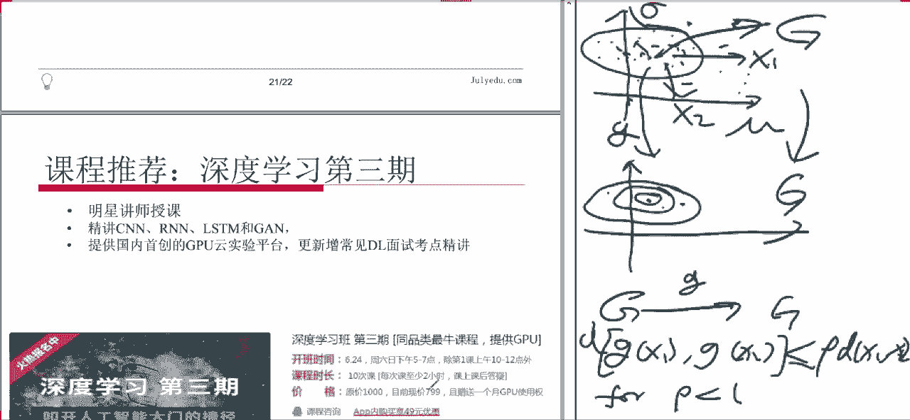

# 论文公开课（七月在线出品） - P2：深度学习中的归一化 - 七月在线-julyedu - BV1fW411T7GP

🤧好，那咱们就开始今天的课程。今天是咱们的这个论文公开课第二讲。这次我们讲的内容是关于深度学习中的规划的这些问题。这个这个并不是一篇具体的文章，这个是我们最近有一篇那个很有意思的文章。

就是这个呃这这位作者写了一个呃自规划网络的文章。哎呀，这好像我丢到了一个作者，那个有一个。很牛的一个人没有写大家大家可以在原可以在那个原文里面看到啊，就是然后他他这个。就是规划的这种问题呢。

以前有一些很多别的文章讨论过，就是说这是一个现在呃已经是我们做深度学习里面的一个比较标准一个标比较标准的一个步骤。就是说。之前。啊，我注意到的这个批量规际化和批量再规际化。然后我们这次呃。嗯。

就是以这个批量规划作为以前的一个标一个标准。然后呢，以这个自规划作为我们刚刚出现的一个新的想法。然后我们借助这两篇文章呢来主要是给大家嗯串讲一下说这个深度学习当中这个规化是怎么回事。他为什么需要这东西？

然后呢，他在干什么？他起到什么样的效果，他是怎么做的？大家可以这个之前没有看过文章不要紧，但是大家可以这个啊听完课之后再去看这个文章，也可以现在把它打开，然后可以对照一下。好。

大家对于这个呃文件有没有什么问题，大家都能下载吗？那些那个。O。好，那我们这个今天的主要内容。今天我们主要是通过这两篇文章和大家一起探讨深度学习模型中的规一化的问题。我们这个主要分四个部分。

第一个部分说我们首先稍微回顾一下这个深度模型呃，的大概的结构是什么样的，然后我们主要是呃利用这个就比较基础的这个呃多层感知器这种想，那也回顾一下，然后呢。嗯。

我们回顾一下这个在深度模型当中的这个激活函数。就是大家可能如果要熟悉的话，当然就知道了。如果要是大家呃不是很了解这些细节的话呢。

你可能也会在很多的这个呃博客上或者是新闻上或者什么地方能看到这个激活函数这个词啊，就是给大家稍微介绍一下，说为什么会有东西，这是什么干什么用。然后呢，我们。

这个基术之差我们可以看到这个呃激活函数会导致一种叫做梯度消失的一种现象。就是英文叫做呃gradent vanish。我不知道中文应该叫做梯度消失。就是说你在训练过程之中，我们通常使用那个呃梯度下降法。

那有的时候你发现那个梯度没了，你梯度没了，呃就是等于零或接近于0。这种事情呢，你要是说你在一个突优化里面，那就是很好的事，你就是基本上达到最优值了，对吧？但如果要是呃在这个。呃，深度模型训练中啊。

它其实有很多时候是人为引入的这个梯度消失。就是说你那个函数并不是一个凸函数，然后它有很多个局部的比较平坦的地方啊，比较极制点啊，就是有些是自然产生的。

有些可能是人为引入的那你这个时候如果你被困在那个地方的话，你就无法继续进行训练的对？所以说这是一个不好的事情。但是没有办法，我们这个机划来说经常会导致这种事情啊，所以说这是一个问题。然后嗯。

这项规一划的引入呢一部分是为了解决这个问题。当然还有更重要的他是有他自己的考虑，他他有一些别的原因，我们也会讲到，那我们是主要是以梯度消失这个为线索来说一件事情。

然后我们就会提到一下这个批量规一划怎么做的。然后。那个那个文章大概是几年以前的了，然后啊他们做批量会一化的这个作者呢，他们他们。其中一个今年又写了一篇批量最规计化呃，再规际化。

那个我们也呃就是企业在线的翻译组也翻译了。大家如果有兴趣的话可以看一。但是基本的思想没有变，他就是加入了一些细节。然后最后一个就是我们说最近我们啊出来的这篇文章，就是字规一化神经网络。就是说。哎。

他很他这个文章其实还是很神奇的，就是说他呢呃没有改变你这个呃整个训练的架构，它只是改变了这个激活函数。因为我们我们之所以要在前面一定要就是讲说激活函数导致的T入消失。

就是说我们要看一下说激活函数是如何引入这些不好的事情，如何引入一些问题的。然后呃在这个基础之上，我们可以更好的理解说为什么这个字不一化这个这篇文章呢，它可以通过引入一个。

他们新构建的这个呃激活函数来避免很多上面所提到的问题。这就是我们今天这个课程的主要的脉络。哦，大有什么问题吗？好，咱们开始啊。那首先我们稍微回顾一下这个深度模型啊，就是我们经常讲的这个各种神经网络。

那最简单的一种呢就是说嗯。啊，就是这个多层感殖机就是大家如果我稍微给大家这个回顾一下这个概念，就说。多生感你是干什么的呢？其实这个这个我们现在有非常好的教材了。

就是那个嗯就是deep learning book。就是那个那个书的名字叫d learningarning，你可以在就是直接google一查能查到。

然后我们那个呃中国的呃有有有有有也有这个翻译的把它给翻译的差不多，大家可以找到它中文版，都是都是免费的。呃看到那。多层感机干什么的呢？它的目的是去借此估计一个危机的函数，把这个说起来呃看上去好像是。

离咱们这个。啊，机器学习好像看起来远啊。其实它这个我们继器学习呢基本上就是在组织一个函数。就是说你有输入，然后你要找这个输出，就是函数嘛，就主要这个意思。那这个函数可能会非常复杂。

而我们以前的这个统计方法呀，它通常我们估计的是一些比如线性函数。大比方说我们做那个线性回归，其实线性回归就是估计有个线性函数，对吧？就是说嗯你知道那XY大概有一个线性的关系。这不是很准的。

大概啊估计这个信象还是跟的废的好一点啊，在这能一个线性回归。然后我们做那个嗯。逻辑回归的时候呢，其实是说这个呃。是一个分类问题，你抓二分类。然后呢嗯。比如说你那个有两个X页券。你希望通过这个X1和X2。

就对这个平板上点进行分类，你可能这个有这个点就叉叉叉。有些点是个这个乘612是吧？然后你希望怎么分类呢？这个逻辑回归，它它基本原理是说希望能找到一条这个线，它这么切，然后呢把他们两个分在这个线的两边。

然后离这个线越近的呢，它就越不明呃越不好分类。离这个线越远的呢，你这个分类就越明确。就是他们总有一个交叉，比这也有一圈有个。都。但是远一点，他就希望这个基本上。这个标准。

因为他他他说的这个呃基本上是利用你这个点一个线的距离啊，这个远近来算出一个概率，就是说。你在这个线的上方越远，这个是差的概率越越大，是这个线的下方越远呢，这个是圈的概率越大。

那其实他也是在呃估计一个函数。那它这个函数是什么呢？就那概率函数，就是说呃得到1个XX1X2。等于这个概率。它是这于零和一之间的一个东西。现在是一个二分类问题。啊，这个就是说我们其实以前做的各种分类啊。

或者是这种连续的呃这种预测啊，其实都是在呃去近似估计一个未知的函数。但以前的这种呢一个线性函数，一个还有这个呃逻机回归这种呢，它这个函数都是比较简单的那如果要是我们需要做这个问题比较复杂啊。

就是说你可能不是需要现，它可能这个本身这个函数就是一个。就是很复杂的函数。就这个画不对了，就说就是函总比较复杂吧，一个曲面。那你怎么去估计呢？呃，我们一个一个很好的想法。

就是说通过若干层简单函数叠加来实现一个复杂函数。就是说你数学上经常是这样，就计算机上经常也是这样，就是说你想要实现一个复杂的事情。不太可能说。一蹴而就一下就实现了。通常都是说你先做一些简单的事情。

然后把他们给组合起来。然后至于怎么组合。如何组合？这个。就很有意思了。就是过去的话，我们可能要找到一些原因，找到一些物理上的解释，或找到一些统计上的，或者是你这个比如里面就是经济学的问题。

你想找到一个经济学的解释，你找到一种方法去把简单东西组合起来。那现在呢机器学习做什么事情。他是说我不找了，我也不会啊，就是我们也没办法去了解那么多知识，我们怎么办呢？我们就假设有一堆函数组合起来。

就是这个就能够拟合我们那个复杂的函数，至于怎么拟合。我们用数据去训练的是用数据去学习的对吧？啊，这个是机器学习的一个主要的想法。就是说这部分需要具体知识的，需要专业性知识的这部分。我们争取让机器。

尽可能多的去做用数据来告诉我这应该怎么做。然后当然你。你的专业性知识越多的话，你肯定在这个在这一步里面可以提供更多的这个指导意见，对吧？可能你训练起来也会更加更加容易一些。那。那这里面有一个问题啊。

就是说我们通常说简单的东西。我们其实以前经常讲讲这个数学课的时候，都会跟大家说，如果你说一个函数，最简单的函数什么函数啊，啊就是线性函数。所以我们那个呃你看我们讲微积分的时候，就是说怎么理解微积分。

一微积分就是呃把一个函数利用线性函数去做逼近啊，局部线性化就是微积分的基本思想。然后呃还有一个重要的数学课什么？就是线性代数。就为什么学线性代数呢？因为线性线性这个线性函数最简单。

所以他可以这个了解的比较深入，所以我们才会去这个学线性代数。所以基本上你看这两个课就就就他们两个组合起来，你就可以实研究数学了。为什么呢？你拿来一个复杂的东西，你先把它近似成一个线性函数。

然后呢线性函数呢，你又比较懂啊，所以你就可以做做复杂的事情。所以说我们通常会用线性函数。但是呢。在我们这个呃。呃，这就在我们这个问题里面。

如果说你每一个简单的函数FI就是我们说你要你和一个复杂函数的时候，如果你每一个简单的FI。它都等于呃都是一个线性函数的话，那你这个这个符合函数，它就还是一个线性函数。啊，那你这个就是说如果你。

用这种方法去做的话，你就无法得到一个呃非现象来说。就如果你想拟合的东西是一个比较复杂的。打比方说就是不是太复杂，就是一个抛物线，就是一个多样式，多样式函数吧。如果你这个。呃，每个小的家伙都是现函数。

你就做不到？我我看一下这里好多问题。我们刚才看到好像。我看到这个录屏。我我看。嗯，好像没问题。那继续啊呃。就是说它不能都是线性函数，就这些函数里边必须要有一些非线性项。就你这每一个小函数。

就别说所有的吧，反正是至少这里边某些，你必须得是非线性来说，你才能达到你这个目的。好。那一般而言呢那就是我们这个逻逻辑结构呢，就是右边这个样子。

就是说比如说我们输入输入输入是这个X1X2这样的是一个向量。那我们第一步。Fle。我们这个我们这个写法这个符合是F一符合是F2啊，就是先把F2作用在这个X上，然后再把F一作用在他们的结果上，对吧？

那第一步是什么呢？就在这儿就是说嗯。你先有一个函数，把这X1X2这个向量。嗯，嗯不。那我就不在这上画，我们那个还是在旁边那板着话。就是说第一步呢，你用1个F2把这个向量并射到上面的向量，对吧？然后呢。

第二步你再把这个F1纵在这两这个向量里面得到一个Y，就是说两步，第一步，第二步这个W这个你就共管。那一般而言呢。我们就前面这这个这个这个呃。这个步骤哈就是说呃后包括后边的步骤。

就是我们一般而言都是先给它做一个性性变换。就是线性函数把它变成一个数字。就是说怎么得到H1呢？我们先把X1X2乘以一个。这个嗯。对H1吧。现算什么呢？它等于G乘以这个。W11。X1。加上WB2。

X2加上。B一吧这样。就是说啊我们先把这个呃这个向量做一个仿射变换，就是说线性函数得到一个数。然后呢，在这个数基础之上，我们再给它符合上一个G。就是说前面这部分是线性，我们说了。

我们必须要有一个非线影象。那这个非线影象从哪来呢？我们通常就把它集中体现在这个G上，那这样呢就比较简单，就是说你这个形式比较简单，你主体上是一个就首先你是一个线性函数，对吧？然后呢。

你把那个所需要的复杂项放到这个G上，你这个G呢，你肯定也是我们说了，我们希望这每1个FI呀还是简单一点，所是G呢也不会是特别复杂。就是说他要有飞线性象，飞线象。是这样一种，一般来讲是这样做。

那这是一个那如果我们这样做，就是说啊前面这部分它不能体现出太多的信息，它能体现出一部分。但是这个非线性项是聚在体现的。我们管这个G就叫做激活函数，就它是干什么呢？

它就是在这个我们训练模型当中引入非线性项目。他起到这个作用。就是在他引入的时候，他是干这个事。所以说这样大家当看到那个啊机油函数的时候，大家可能会问，你为什么要设计成这个样子？你设计成一条直线不好吗？

那是不行的，必须要这个它必须得是有非线性。好，大家的这个问看有没有什么问题？就这个其实就是这个所谓的深度模型的一个基本结构。就是说嗯。这嗯讲到这里吧啊，就是说。你一旦有了一个架构以后，你看你有输入。

然后呢，这每一步就是你先做这这个每一个比如说H，你做个线性变换，然后线性线性函数，然后符合上一个机构函数，然后这你得到H1H2，你就得到Y时候呢，你就把H1H2又做了一个线性呃线性函数。

就是小W嘛就线性函数。然后呢，做完之后你再符合上一个那个机构函数，你就得到一个Y。如果你有输入，你有输出，这里边这些W们。和B门还有一个G。是你不知道的对吧？他们可能是由一些参数来决定的。

然后你希望做什么事情呢？训练的过程就是调整这些参数，使得你这个结果Y是你想要的Y。就这个意思啊，就是说啊如果你这个。比如说你这个X1X2它是一个二位向量了。你可能比如说你这图片的话。

可能是这个呃比如说256乘以26的啊，也就是一个呃。这个呃4万呃5万，就反正是几万维的这个向量，对吧？那个向量呢，你用过去，你就得了个Y，你这个Y想知道什么呢？

你说你想知道是我这个图片中是不是有一只猫啊之类的，然后。那你这个Y如果是那种情况，你这个Y大概就是一个概率对吧？它这个有猫的概率没猫的概率对的，然后这是分类性，然后。

你要希望你的这种预测跟那个因为有监督学习嘛，我们这个情况一般都是。你知道那个呃那个图片事实上有没有网你知道的是吧？然后呢，或者在哪个位置，有往，你也知道的。然后呢。

你希望你这个你这个学习出来的Y跟你真实情况越近越好。那什么叫越近越好呢？那你就需要设计一个这个损失函数，对吧？你就啊那个损失函数越小，它就跟真实情况越近，所以就变成了一个你想你有好多好多参数。

然后你有一个损失函数，你做个优化，这不就是一个积极学习的一个基本的思想。好。大家这个地方还有没有什么问题？好，我们继续。啊，这个对，就是我们提到说这个模型的训练。

模型的训练呢就是说通过调整简单函数的这些se塔。我们刚才说到这个我们刚才这个例子里边啊，就是WB，然后这个呃还有包括G里面的一些参数，并称为这个ze塔这个。我们这好多个C塔，对吧？你看这个啊。

我们N个N个N层嘛，就是每一层把所有的那些参数都放在一块，叫做C大N啊，就这第一层叫C加一啊这些东西。你把它叫做一个。这是个模型嘛，对吧？好多参数的一个模型。那对于每一个数据题呢。

我们就可以定义它的损失函数。我们就是也甭管这损失函数怎么定义的。这个我们呃当然有一些常用的定义方法，就是对于呃比如说呃我们经常经常喜欢使用的是一种极大自然估计的定义。就是说呃我们最后估计的呢。

其实是这个。给定X的时候，这个Y的一个比如均值。之类的对吧？因为你有的时候你给另外X的Y也不是固定，对吧？那。它是个概率分布。然后呢，那你怎么办呢？你你如果能找到这概率分布的这个期望那点。

那不就是一个比较好的预测吗。呃，之类的这这种事情。嗯。那我们其实很多时候是做这种事情。那那个呢呃这个损失函数啊通常是一个这个交叉商，大家。呃，这个地方我们就不细讲了，就是大家可以如果有兴趣的话。

如果不了解而而且有兴趣的话，可以去这个鼓励大家参加一下我们的课程。深度学习的课程下个礼拜开始。会很详细的给大家讲解这个啊深度学习，深度学习里面这些模型，不同模型啊，这些各种不同的设计。他是为什么这样做。

然后具体怎么实现，还有很多代码都给大家讲解。嗯。然后。我们这个损失函数啊，它其实你可以认为就是说来描述参数se塔在数据集X上的表现。就是说你这个se塔是不是很符合我们这个数据集，因为你不同的数据集。

你可能会得到不同的s塔，对吧？那我们这个数据集呢按数应该体现出我们当前所要研究的一个问题。那那如果在这个数据影像表现的好，那我们认为他的这个问题上表现的可能也比较好。然后我们就去机器学习嘛。

我们有很多这个啊交叉验证那种structization的方法去去研究这个东。那么。训练的目的呢就是找到合适的推塔来最小化这个。那常用的办法就是这个随机提除下降法。我们上节课讲的我们上节课讲就是说。

那分析了这个这个SGD的各种变种，对吧？比如说呃这个随机梯度下降啊，它这个。首先你要对七度进行计算啊吧？然后呃你要是这个样本非常大的时候，你的计算首先比较复杂啊，所以说怎么办呢？

现在通常的做法是用这个小批量。的这个随金气度下降，这是每一次当你需要计算梯度的时候。你不用把所有的样本都拿来算，你就这个拿出一部分啊，几百个是吧？或者几十个啊，你就是说在这些样本上，你这题度是多少。

你先给他走一步。然后下一步呢，你再再拿出另外的这几十个样本出来。所以这几十样本呢叫小批量。嗯，小P的好处就是说算的比较快。嗯，还有一个好处就是说它这个。其实说它噪音比较大了。

就是影响你每次只只看这一部分。你那这个结果就是说它可能会跳的比较厉害啊，就是说因为你随意梯度下降，呃梯度下降这种办法，有一个缺点是经常会跑到那个局部极小值。尤其是在我们这个飞徒的情况下，对吧？

那如果你要是这个小P量的时候呢，它可能会引出一些。不确定性比较大一点啊，他可能会帮助你跳出这个啊就会纪要。这是一个好处。然后。但是他也有一个问题，就是说嗯你不知道自己的这个学习率应该怎么选，对吧？

所以我上上次上次课讲的这个好多个变种，他们主要就是集中在如何让这个算法可以自动的去选取一个学习学习率，或者自动的去有一些预见性啊，然后让它这个或者自动的去调整不同的参数更新的这个频率和强度让他这个。

比较快的收敛，就是说我们要这个这个里面有很多的技巧。那。具体到这个问题而言，比如说我们抛开那些技巧不说我们这个复杂这么复杂的一个函数，你看好多个函数嵌套。当我们训练它的时候，我们如何去得到这个梯度呢？

对吧怎么办？那实际上这个地方。比如大家如果数学熟悉的话，就知道这里面我们可以用一个这个练式法则。就是说如果你对一个嵌套的函数，比如说你要对这个西塔一求导的话，因为现在不是X是固定的啊。

西塔是不固定的对吧？你知道C塔一求导的话。你就等于是。首先对这个外边这个大F求一求导，对吧？然后对这个里边那个小F求导的时候呢。这些跟四亚一没关系，所以它是个常数，你放着就完了。

然后这部分跟四亚一是有关系的。所以说你对赛亚一求导啊，成全就练式法德，对吧？如果你对CR求导呢，你就得先对外边这层求货导C一求导。然后你再乘以这里边这个这这这这部分扯导，这部分呢。

你会发现它跟上边这部分它是一样的。所以说你做计算的时候呢，你你并不需要这个比如你算C2档数的时候，你就不需要把前面这再算一遍。你可以这个拿一个一内存把它存起来。然后呢，你算这步的时候。

你只要把这个算出来。然后把前面两步拿出来乘一下那就行了，对吧？就这样。那么这个。嗯。这个链式法则呢，其其实这个公式呢其实就是会导致我们今天看到的一些问题。因为我们发现这个导数啊。

比如你对其中一个四塔I求岛的时候，它跟这这往前的所有的四塔都有关系。所以前面一旦出了点什么不好的事情。他通常都不影响到后面。啊，这就是我们今天要说的这个啊问题的一个主要的原因。大家有什么问题？好。

那么这个。在这个结构之下呢，其实我们这个就等于是。给我们这个呃深度模型的一个回顾，就基本上就是这么回事。啊，大有同学问说这个四塔2跟四塔一有没有关系，他们俩是就是他俩没有关系，他们就是独立的这个参数。

只是说当你对四塔二求导的时候，因为你这个函数这个形式嘛。你必须先把这个四塔一的这个导数求出来。然后再求这个四塔2这个倒数，那乘全才能才是你这个四塔2就这。才是这个损失函数关于其他二这的导数。就说。

你就在求岛的时候，跟外边这套这个嵌套的函数有关系这样。但他们是独立的参数，就是他们参数之间没什么关系。好，所以说呢当你训练一个呃深度模型的时候，其实它有几个呃就你的训练好不好啊。

你能能做的事情呢有什么呢？其实就是有一个第一个网络结构，就是说你这个嗯。什么叫网络结构呢？就是我们上面这个你可以比如你从这个输入层到中间这个隐藏层的时候，你可以说这个H1跟下面所有的X都有关系。

你你也可以说这个H1跟下面某一些X有关系。然后呢，你可以让这个每1个HE的这个W。就是比如H1的W和H2的这些W，你可以让它没关系啊，你也可以让他们有关系，你可以让他们向等。

就是说你可以通过你需要研究这个具体问题的一些特点，你可以选择你的这个结构。然后呢。还有就是这个呃。参数W和B的初始化。因为什么这个很重要呢？就是说因为你现在要做的是一个呃梯度下降法的优化问题。

那你这初始化要好的话，对吧？它通常而言，它比较容易让你得到一个比较好的结果。如果初始化不好，梯度下降了，就很有可能会给你一个局部极小值之类的。就是说这个初始化。有关系的。然后最后一个呢就是这个激活函数。

因为你看你每一步求导。你对于这个啊。G的每一次求导，你这这个这里边看不到G，那实际上对于每一个小FI呀，大都看到这个G，就是G也非常重要啊。就是这几个东西都会影响到你这个模型的训练。有同学问说。

刚才我提到那个呃小票方法，如何会呃这个。如何会这个避免局部最优值，就这个他就是就什么意思？就那个小PR他。那个那个就是说他噪音比较大，噪音大的好处呢，就噪音大不见有坏处，有时候也有好处。就是说啊。

比如说你这个。这样一个函数对吧？其实呃当你说我们当我们说我们对一个函数进行这个呃自优化的时候，我们这些问题里通常没有一个能写出来的函数，就这个函数是用你的样本对的，对吧？那么嗯。

这个抽象的函数呢通常是那个就我们脑子想一个真实的值。然后你就在你做这个呃优化的时候，通常你你给一个给个样本，那个样本给你的函数可能不是这样。跟那个比较粗糙。涨价。或者是可能这是比较好的情况了。

有可能长成。这样对吧？然后你对这个优化的时候，你当然可能会跑到一个局部教上。但是呢因为你用小P量的时候吧，就是说每一个函数都不太准，它每一个都跟这个有点像。比如你第一个小P项，你那个函数其实是这样的。

第二小P量可能。这样你这个第二小偏项的时候，你你你你优化跑这来了。嗯，然后你要换一个小皮箱，那函数又变了，然后你可能就就往后走，你就不会碰在这。就是这个噪音到底能不能帮助你这个主体确定。

就是说他们有一定的概率可帮。就如果你要是看那个等高线索的话。就是说。有的时候。比如这块有逾据物止。然后呢，那个如果你是那个呃全样本的话，它可能就它走的比较慢嘛，所以一下一下一下一下一下进头。

那小P样的时候，它的噪音较大，那这一下那儿一下这一下那儿一下这儿一下。然后他他他有的时候他就它就它就避开了这个这个就不较。或者说他都快进来了，然后噪音大它不跳左声。好，大家还有没有别的问题？对。

就是说甚至有的时候那个我们上次讲那个STD的时候吧，甚至有的人为了避免这个GB要值，他会在这个。梯度上面直接引入一个人为的噪音，就直接加一个高音高斯噪音进去。然后当然呢高斯噪音呢，它那个强度越来越小。

就是说随着你这个收点的好，它那个噪音越来越小，然后最后这个就能帮帮就是我们上打了个比方，就是说你这个框上面好多土，对吧？然后呢，这个你想那框底是局部消失。那框中间为什么土会粘在框边上的。

因为那框边上不是弯的，对吧？它光滑是滑出来，不是光滑，就是弯的，所以那边上好多都局部消失，那有时候你怎么办呢？你也不可能一个个把它们扒拉下去，你直接踢两脚，那个框上土的都掉到底下。踢掉什么意思？

就是一T一震动，就引容一噪音。然后呢他们就从局部间就跳出来就跳出来，这个意思。好，我们继续。嗯。那我们这节课呢主要是讲这个。我们主要讲那个呃。关于就是由激活函数引起的这个所谓的梯度消失的问题。

为什么几乎函数对会导致这个梯度消失呢？啊，我们看几个例子，就我们看几个这个几乎函数的例子。那首先我们呃就是第一个常用的激活函数，是这个这个函数，就是这个这个函数干嘛用的呢？

就是我们做那个嗯逻辑回归的时候，你会经常看到这种东西。就那个逻辑回归就是在你回一个这样来说做一个分类问题，就是说。当你这个X如果是长成这个标准形式的话，就是说X比较大的时候，它接近于一。

那X比较小的时候呢，它接近于0。就是说你X比较大的时候大于零的时候，那你可以认为嗯。这个呃那个图那个图片里面有猫的概率是这么大啊，当是这个X比如就是快到-6的时候啊，那个图片里面有零有猫的概率就是。

像这样子的。那这个它有一个优点，就是说有很好的这个统计学意义就是说它最简单的情形啊就是那个逻辑回归。而且这个函数非常好，就是计算起来非常好。它的这个光滑可为，而且它导数计算方便。

你不用求导你你只要知道这个函数等于多少，你就可以求出这个导数等于多少，就是这个sigma撇呃这个。一个导数等于这个函数乘以一减这个函数啊，这就非常方便。缺点是么？第一个我们形容后边一个。

第一个这个函数啊，它只能取正值。又不能是负的。所以说这是0到1嘛，对吧？那有同学说你给平衡一下就完了，当然可以了，对吧？所以那个问题还比较好解决。那。还有一个问题，这比较重要的问题啊，就是这个数轴。

它在数轴大部分区域导出近乎一0，这个话说有点绕了，就是说啊。这个函数它的导数。只在这个比如说你看这个图，它从大概从这个负3到正3之间，它导数还比较大。但你超过这个区域之后。

比如说X大于3或者X小于--4吧，大于四或小于-4的时候，你这个函数几乎已经平了。就是这个只画了一部分，再往后都是平的。这也是账前一都是平的。所以说你这个函数，如果你的初始值。

你的X落在了这个平坦的区域的话，你这个西塔撇尔X可就几乎等于零了。我们说前面我们做这个学习过程中，你这每一个。导数每一次求导，你都会出现这个激活函数的求导。对吧。因为这里边好多个几乎函数的导数在里头。

如果说你这个奇函数在呃。你这个取值范围里面绝大部分啊都是零，你就很容易会得到一个。就游其练式法则里，你可能不用得零了。你比如说这个部分它是小于4分之1的，这个部分也小于4分之1，1乘。

那就小于16分之1，对吧？如果你这网络非常深，你想每一个数它都是不会特别大，从哪而从哪而言，你如果网络非常深，有好多好多层，你这里面只要有有那么几层是非常小的，你乘起这个数就很小，对吧？

那样就会导致什么呢？就会导致你这个呃在训练过程中，你这个损失函数的导数就趋于0了，就等于0了就。就尤其是对于这个比较前面的这些层。你对于这个C加一的层，那问题还不大。因为你就是自己嘛，那只有自己。

但你要是比如说你算到C加2的时候，如果在这一块它等于零了，你你你这C代2这块也就是0。因为你你对C2的导数，也是C加一对的导数乘以这后边的导数。尤是对于后边比如说你C100了，对层比较深的。

前面只有有有那么几个不好的项，你这个整个这个成绩就完了，对吧？所以说。一旦要是有某些这个取值啊，这中间的那个呃这个几乎函数的这个呃。这个变量这个X，它落到了这个平坦区域的话。

它就会影响到你这个你这个训练，对吧？你这很多。那个其中里面很多项就没了，你就新成不了了。所以所以他主要是啊这个这个是就是啊这个题几乎函数导致的T数消失，主要就是这个原因。那以前我们喜欢用这个函数。

这个函数缺点什么？就是它它绝大部分都是正常。就以说为了解决一个问题呢。我们还是可以。Oh。是一些其他的函数，那是啊当然我们这个第一个变种啊，这个呃双曲双曲的这个tangent这个函数呢。

他其实那个差不多，它的好处就无非就是说这个啊。这个正负都有了，这个正负是对称的。然后呢，但是还是有这个问题，就是说他这个。呃，几乎。绝大部分都是平坦的，所以他还是有这个问题。

然后这个比较好的解决刚才说的问题是什么呢？这是这是一个现在比较常用的这个激活函数，就是说这个阶段的一个线性函数。这个RE是retified，就是截断的那种。然后L是 linear的意思。

这个U是 unitit就是我们这个旋经元嘛，这个U是单元的意思，就是这个是。阶段性函数。啊，这个函数它是怎么样的呢？它非常简单。它是一个分段的线函数。当X小于零的时候，它就是零常数。当X大于零的时候。

它就是X就是个。简单这样说。啊后这个函数呢它导数计算非常方便。因为你在这个做训练的时候，你要无数次的去算这个导数。然后。他这个嗯还有一好处就是说这个在很大的范围内，这个X导数呢得都是一。

那这个是个好处了。然后那缺点说了，就是说他只能取正治，不能取副职。那这个只能取正直。为什么不好啊？就是给他给他稍微。稍微说一下。就只能取证治其实不好的。就是说它可能会导致你这个训练找不到最优的方向。

就是说。打有说呢？如果你训练的是这个一个这样的函数啊，就是。F什么。W1X1加上哎W2。X2。呃。这样一个函数，就是这个呃西格玛嘛，就刚才那个那个基有函数对吧？那。然后这个XEH什么东西呢？

X一可能就是一个sigma of这个什么嗯。WE调查。这个万一这个。有异。加上W2车他。之类的，就是说它是从下一层传上来的。然后因为这个X1和X2，它都等于这东西。

X1X2他们都是这个某一个西格玛的取值，所是他们俩个都是正的。那么在这种情况下呢，你当算最外面这层的时候。你在这个车道。这点什么呢？它等于这个平圆斜方撇对吧？乘以这个X这样。然后另外一个就是。

那这样的发现什么问题呢？就是说你的梯度它这个W1和W2关于W1W2的梯度，它永远都是两个正数。这样都在。那也就是说你只能沿着两个方向进行学习，就是你只能往哪个方向走。所这是W一，这是W2。比如说嗯。哎。

我这个例子举的是不是不是特别不是特别好？嗯。我一下子有点想不起来了，但就是说这个什么意思呢？就比如说呃如果要是这个你对他的这个符号有限制的话，那比如这个情况。但是但是这个意思就是说。

你就只能呃从一个点出发，你只能往右走或者往上走，对吧？你没有别的选择。那如果说你这个现在一个最优值在这儿，那你这个训练的时候，你怎么办呢？你就不能往下走了啊，这个可能我说的还是不太对劲啊。

但但就是说呃你就无法沿着那个最优的方向进行进行更新的参数，你就只能是呃走这些折线，但是那个就不太好啊，就是就这是这个如果你这个参数，这个取值只能是正的，不能是负的，会造成这样的问题。

但是哎这个我回头那个我下课之后给给大家这个写一个。好。啊总之呢就是说如果你这个指正的不能负的，这不是很好。那这个。啊，这个这个我们这个细节我们就那个下周再说啊，这个我刚才下弄好，大家不在这里。

我们先不在这个地方耽误时间。嗯。然后那我们改进它一下怎么办呢？就是说可以把它稍微动一下。就是说嗯刚才那个RELU这个这个就是截段的这个现象线上的这个函数跟这个。跟下面这个比。

就是说我们把它稍微往下平移一点，我们可以直接平移一点，就是这个直线下来横过来也行。然后呢，那样个缺点就是说你。你看我们之前说这个函数不好的地方，在于它比较平坦，地方太多，那还是比较平坦。

那刚才这函数呢在这那就不是比较平坦了，它就直接就是平了，对吧？就是彻底是平的。所以说你一旦要是那个呃呃它这个输入输入值啊落在这个点的话，它那个它那个梯度就不是说小的问题了，它就是等于零了。

所以说那样的话就也非常不好。它可能会导致你某些神经元直接就死在那里，对吧？那。那个为了解决这两个问题呢，一个问题是它没有负的取值。一个问题是它太平了。所以说引用这样一种函数。

就是说它正的部分还是一个线性函数，负的部分呢它下来了一点到负的方向。对吧但是呢它不是直接变成零的，它是缓缓。所以说就有这样一个，就是左边这部分是一个指数函数。当X区复穷的时候，他就。

我们这个情况是负一朗其应该是阿法。负杂阿法啊，当这个X代于零的时候呢，哎这就是一个X，就是一个简单的现象函数。那这个函数呢还是一样的，就是说它导出计算也是比较方便的。那这个呃函数在正数的范围内呢。

找转一就这个是好的，就是说因为呃。他不太容易。产生这个梯度消失的问题。而且这函数呢取值还有正负。当然一点啊，它必须得是一个非线性函数，就是他我们我们当然希望它线性的部分多一点可能比较好。

但是呢它必须得有非线性的部分。如果没有的话，你就白搞了。刚才说了，那个你这个整个这个网络就就多层网络就变成一层网络就没意思，对吧？就是一定要引入这个非线性部分。好。

这刚才同学我问说那个呃WX加B已经是一个线象函数了。为什么这个激化函数里面还要加入这个很大的一个线象的部分？就这个地方啊，就就说我们是。因为必须要引入一个非线性的，才引入这个非线性的。就是我们刚才说了。

为什么引入这个呢？是因为你要只估计一个复杂函数，你必须得这样做。嗯，这个线性部分越多呢，其实就是说你这个你想这个激活这部分是干什么的？就是你前面的输入一个X，然后你的X越大，你希望你这个激活的值也越大。

你来越小，你希望你的激活值也越小，就是它要体现出你输入那个X的性质。那你如果要是直接就是Y等于X那是最好的了，就是你不就直接体现的性质。但那样不行，就是它是没有非线性部分，所以必须引入一个非线性部分。

那这只是一种引入的方法。好，对。那么那实际操作之中呢，就是现在我们。比较常用的啊，就是说你可以用这个ELU，这个是exential linear unit，就是说左边是指数的，右边是线性的。

合在一块儿叫做explanial linear unit。然后这个还有这个这两个都是比较长。是吧。一般来讲，可能认为下面这好一点，但是。再稍微复杂一点，那计算下你看三个指数，对吧？

就是说有可能用上面那个更更简单直接。然后我们刚才那个啊这边这个东西我这个下课之后再给大家看。这个不是举证惩罚，就是数字惩罚。好，大家还有没什么问题？好，那这个。我们已经讲到这么多几乎函数了。他问我们说。

只要他有。这一片比较平坦的区域，它就有可能造成我们刚才说的这个梯路消失的问题。那但是这个东西好像也不可避免。就说嗯。如果你没有这个平坦区域呢，它其实还有可能会造成那个提头爆打的。

就是说嗯因为你这个训练中是有噪音的嘛，有的时候你会。就是那个呃。那个X值可能会比较比较疯狂一点，他可能跑到这个负的很多。然后如果你有这个平坦区域呢，他可以把这个拉回来。是这个意思那。那么。

既然说你这个机乎好像数不可避免的，会有一段频坦区域，然后这东西确实会造成梯度这个消失。那我们怎么可能还有什么办法去避免这个问题呢？那一个问题一个方法就是说什么呢？如果你的这个。输入X值。

它是集中在X等于零附近的。如果它是一个，你可以把它看成是一个随机变样，对吧？因为它是每一个样本来了之后，你都会算出一个不同的X。那。如果说这个随机变量，它是它这个分部，它是在这个零附近的。

那样是比较好的，既有非线性部分，又有，而而且它又不是特别的平。然后呢啊它又占了这个线性的。就对于所有的这个几乎函数来说，如果你能做到那一点，那都是比较好，对吧？那怎么才能做到那一点呢？

因为你在训练过程中，刚才我们看到这个网络的形式啊是这样的，就是你可能有很多很多层的网络，比如两层的这种情况。你输入一个你这输入的X，你是可以做这个啊规一化的。就是说我们通常做训练一个模型的时候。

我们会把我们输入进行规一化一下。就是我们最简单的模型，就是说那个线性回归。我会把每一列都变成一个嗯标准化，对吧？就是那个以零为中心，以这个一维洗一维起这个这个方差的一个。响量，然后呢。然后呢去做训练。

我们可以做在第一层。这个输入做这件事情。但是一旦他进行了一次映射以后，这个H。他可就不见得是满足我们刚才说的事情，对吧？我们好多样本，每一样本都算出一个小H是一个向量。那这一堆H他们会不会形成一个呃。

这个以零为中心，意为这个。啊，方差的一个随机变量呢啊，我们都不知道了。然后如果你层数越来越多，你就更不知道了。就是他可能。就是你前面的一点微小的变化，对后面就会产生很大的影响。对吧？就是说的忽略效应。

你程序越多，它像移动系统一样。就会产生这种现象，那这个怎么办？那这个就候也是我们下面说的这个问题了，就是说我们要做一规划。刚讲那个之前。我们可以给大家稍微这个。推荐一个课程。

就是说啊我们最近我看这个是什么时候。啊，这也是我们最近要开的一个线下的一个积极学习的训练营。这个大家可以有兴趣看一下就是。你只要在这个PPT里边点击一下这些这个页面上这个图片或者上面这个东西。

你就可以看到那个。网页链接了。就是。它有一个特点就是说从零开始，然后用一个比较集中的时间，几个月的时间给大家做一个训练。就是说你可以只要我想知道知道基本的数学。然后我们这边的资源就可以帮助大家。

我们有这个有项目的实训啊，有这个我们可以涵盖所有进行学习的重要知识点。然后们包括我们很重要一点，我们可以提供这个GPU的云实验平台。这个是现在可能国内只有我们在在做这件事情。

甚至可能别的国家也没有做这件事情。嗯，对。然后包括最后的这个面试的这个辅导和就业推荐。呃，基础的话，我想这个基础。我们说零从零开始嘛，就是说不需要不需要很深的这个基本功，就是说。基本上你只要。

就是咱们大学学过这个大学的数学，就是微积分现代数。应该就可以了。那即便那个不学可能都没问题。因为我们是有数学课。对，就不需要特别深的。因为我们现在呃这个积极学习用到的数据也没有特别特别深。

就我们今天要看这篇文章吧。哎，他多少用到用到一点比较深的数学，但他那个证明等会儿我给大家说，那个证明非常的奇怪。那个是我见过的最最奇怪的数学证明。好，那这个推荐就到此为止。嗯，这个不多说了。错。那个。

对，就是我们。下半下半节课。就主要讲这两篇文章的一个中心思想，一个是偏量规一化的思。还有一个就是我们呃最近这篇文章这个字规一化的这思。我们可以先稍微休息几分钟，我今天这个嗓嗓子不是很舒服。休息5分钟吧。

然后我们再继去继续开始讲。好，我们重新开始啊。喝点水之后，感觉感觉感觉就好多了。嗯，我我这个想起刚才这个地方有什么问题。是不是？我稍微补充一下。就说这个我们不是说那个你对W1W2求导之后。

你慢都是正的啊，你发能往这个方面更新。其实不一定，就是说它这个对WEW2求导，它这可能只是一个中间层，它前面可能还要成立一个东西。就是说我们刚才看到那个求就这一页吧，你求导的时候。

比如说你对中间这个CR求导吧。这只中间一层，前面还有一个数啊，这个数可能正也可能是负的对吧？但但是如果你这个呃schema长成这个形式的话，不管前面那是正还是负的，就这两个数，它俩肯定。符号相同。

要么都是正，要么都是负。就是现在情况，如果前面啥都没有，那他俩都是正的。如果前面给你一个负数的话，那么他俩都是负的。所以说你这个在参数更新的时候啊。只有两个方向可以走，只有两个区域的方向可以走。有。

只有两个方向，这个区域的方向可以走，一个是往这个方向走，一个往这个方向走。当然如果你这个最终最优值在这儿的话，你就怎么办呢？你也能你也能到，就是说你可以他就会这样走，这样先走一步，然后再这样走一步。

然后可能又往下走一步，可能这样走一步，然后这样走一步。就是说他要走一条折线。对吧他只能往这个方向或这个方向，它不能往斜着走。所以说你这个更新呢就不是一个最优的办。如果要是你既有正的，有负的。

这个所有方向都有，你能直接一步就到。这个意思，但这个不是一个特别严重的问题。就为他主要是因为我们前面说这个激活函数的这个。只能取证或只能取负造的。只要这个东西稍微平移一下改一改就行。好了我们这个。

继续啊继续这个。讲上我们今天的这个主要的内容。就是两种思路，两种不同的思路去解决我们前面提到的这种问题。好。第一个就我们前面说到了，说如果我们的这个呃激乎函数的输入。他是一个比较稳定的状态。

就说他是一个比较好的这个概率分布。比如说以零为中的嘛，是最好的情况吧，以零为中心的。然后以一个比如说意味这个放差的这样的分布，那么它基本上不大会产生这个。就是。T度为零的情况。

那如果要是它就是说它也是个分布，但不是像刚才说的那情况，比如说它分布在这儿了，对吧？它比较稳定，其实也行，就是那说明他可能就是应该分布在这儿。然后呢，它这个T度等于0也是应该的那也可以，其实也挺好的。

那如果它分布在右边，它的梯度就是不是这，那也也也很好，就是说不好的什么，不好的就是说它一会儿在这儿一会儿在这儿。如果他那样的话，会会怎么样呢？如果他一上来就在左边。那些参数系度啪就是零了。

它一旦是零了以后，它就永远都是零。在几乎留远那聊，因为你我们说了。就是因为这个公式原因啊，就是说如果中间某一个参数西塔的那个呃梯度是0，那么它会影响到它后面跟它有关的所有的那些。节点那些的时经源。

那它就会可能导致后边所有那些节点的神经员呢，他们的那个参数都不更新。他们一旦不更新，你现再来的说候还是刚才这种情况，那还是不更新，总也不更新。那你这个我现在实间不好，但是。

所以就取就就跟你那个初这个问题的初始化就非常有关系了。你初始化不好，一不小心就会导致这个问题，对吧？就是说如果那个呃你这个输入值的这个分布啊到处候乱窜的话。甚至是可能比如那个啊。他的那个风差大一点。

放声大一点可能问题不大。就主要是那个他如果要是呃串就是那个均值，就是串到你那个平台区域的话，它就会导致你这个神经元一旦瘫痪了以后就再也起不来了，对吧？回答这个问题。所以说如果我们能让他这个分布比较稳定。

哪怕是稳定在这个平坦区域了，那也是因为它应该在这儿，那也行，对吧？那。可能会好一些。这个这个这个这个这样的问题。那么怎么样才能让你这个。神经元的这个输入，它的分布比较稳定，就是你层次越多啊。

每一层的训练都会受到前面那些层的影响。那。每一层的梯度都跟前一层的输入有关系。那这样的话，比如说这个C大一的梯度，它是与这个CF2的输入有关系的。

这个C大2的梯梯度呢跟这个F3的这个输入也是有关系的那如果要是。我们能够让这个输入。稍微这个稳定一些，就是说它得到一个稳定的分度，那就好，对吧？那一个最简单直接的办法是么？

就是说啊我们对这个做小批量随经系数下降的时候，我们每一个小批量给我们。都是比如说你小批量也有这个100个。样本。那么你每一个学员都会被计算100次，你会得到100个数，对吧？那你就会得到一个。

长度是100的一个向量。那这个向量其实它就给了你一个大概的分布，对吧？那每一次你会找到一个分布，我们怎么做呢？我们把这个分布进行一个规划。就说。你的时间员。比如说我们前面这个。我们还要那图看。

比如这个H是吧？在一小批量B里面。首现有小脾样病。它等于这个S1到S小M。这每1个SI呢。都会得出1个HI的值值，对吧？还行。没啥。然后我们。怎么做呢？我们把这个HR。我们不是得到一一堆嘛。

它有它是个分布，我把它给规划一下，我们做这个H这个I height等于什么呢？等于HI。减去这个。H化。然处理这个什么。下的这个。Vage。加上一个参数，加上一个常数，这常数是为了万一加上等于0的话。

你这个这个除罚就成立了，再加上一个。就是说你把它给规一划一下，你把这堆H可能他们集中在。他们可能产生这样一个分布对吧？我们把它规一化一下，这是H分布，把它变成一个。H hat。原这。

然后我们试图把这个H再输入到下一层里面去。这样的话，下一层这个输入不是就得到一个很好的控制了。我们想这样做，对吧？但是我们刚才说了，那有的时候他这这是我们想避免的是那种意外的，他跑到这个呃平台区域。

导致你这个声经员瘫痪。但有的时候你这个训练过程他就应该到那去，那怎么办呢？那不是就你你这不是把我们训练那个功能给取消了吗？就是说我们的训练。这H的平移也是我们这个训练部这个这个功能之一啊，对吧？那。

那么们怎么去避免这个对原来训练原年原来这模型的表达能力的这个损害呢？就是我们。在做完了这个标准化之后。我们再给他加上一个。我们再加上一个这个方式变换。就说。我们真正传到下一层的不是这个。嗯。

真正传到下一层呢是这个。我们把这个东西贝塔HH。嗯他。把它传了下。就说我们做件什么事情呢？我们等教育在两层网络之间插入了一个线性层。呃这是刚才那层。这是下一层。正常而言，我们是这样。进入一个U。然后呢。

他出了一个X。然后呢。进入他这里，然后他在个下下一步。我们这char一层。把这个X。But it没X。有白个X。变成了这个。Expect。然后又变成了这个。我们这里写的是Y，其实这个Y不太好。

因为最终也是Y的了，就变成了个贝塔。X right。我们刚才说了，在这个训练过程中，这个激活函数啊，它不能是线不能是一个纯的线性函数，它应该是每个里面都有一些非天印象，这样才比较好。

那个因为那个部分才是让我们来估计复杂的作用。所以说中间加入个线性层嘛，它并不帮助你，也不减弱你对于那个复杂函是。他只做了一件事情，就是把你这个东西给更加规范化。

因为每一个不同的这个成员都有一个不同的规塔。然后你把这堆东西传到下一步去。然后这贝塔伽啊什么的，他们也是参数，就是也是你这个模型训练的参数。一开始你也不知道，你可以给它初始化一下。

比如你贝他这写成一伽马选成零啊，这这这你就初始化，但是。就像刚才所说的，如果你那个呃他就应该。不在零个附近，因为它就应该平移的话，那你在这个训练你这个模型的时候，那个呃损失函数会告诉你。

你的伽马不应该取零，应该取一个正的数或者一个负的数，你就可以得到它。对这个伽马也是训练参数之一，就是你在这里面插入了一个线性层，那这样为什么比一开始那好嘛？你就说那我这个好不容易从那个平坦区域移回来了。

你这不就移回去了吗，对吧？它的好处就是说它这个贝塔伽马是你训练，就是不断的训练训练出来的。它不是一个呃由于这个。不好的数据造成的，也不是由于你这个由于样门这个小取太小造成的，它是你训练出来的。

所以它是比较稳定的。如果这个贝塔 gam告诉你应该是那个平台区域，那你就应该去。但是你刚才那个如果要是。呃呃，由于一个小批项给你，就是比如第一个第一次迭代来一个小批量，你这X直接都在。

这事儿是随机产生的，它不是你这个模型要求的，你就是在那了，然后你的新经源就启动不了了，然后你就没法训练，对吧？所以说我们在这加一个性性层呢，它就可以有效的避免你刚才说的这种现象。他就可以。第一。

可以有效避免啊由于这个随机性产生的这个呃。规定完对吧？然后。而且呢它每一次传递给下一个神经元的这个输入，它会是一个稳定的分布，而不是一个跳来跳去的。这个事情对于下一个新经源的训练也是有帮助。

就是说啊我们通常说做一个训练模型的时候，我们都想把数据给它先规范化一下。我们不希望它太乱，对吧？也是这个原因。那我们在训练过程中，这个分布如果来回变。那你下一个新经神经源的输入总是一会儿这个分布。

一会儿那个分布，那你这个训练来，你这个参数不是也就就总是乱挑乱改，对吧？也是不好。啊，所以说嗯这个他达他主要是达到两个目的，一个目的是呃让这个。到下一个星经员的分布比较稳定。

另外一个目的呢就是说它稳定同时，它很多情况下也避免了那种。就是皮消失问题。好，这个地方有没有什么问题？呃，有同学问要不要录像，这个我们有录屏，然后等那个下个礼拜二或者是礼拜三，可能是大家会看到那个视频。

啊，我们这个部分讲的就是这个所谓的批量不一化这种方法，它的一个主要的思想。就那篇文章非常短，那个文章写的非非常的漂亮，非常清楚。而且我们也就大家有兴趣的话，我们也是尝试做了一个翻译。

就是说如果大家英文有问题的话，那大家最好还是看原文吧，这个翻译的呃质量就是我们毕竟花的时间也比较少了，这个这个不一定特别高，大家是做一个参考。好，大家还有没有别的问题？哎，对。

有朋友问说这样的训练速度是不是变快？是的，就是说。第一个，如果你要是能够一定程度上避免这个呃梯度为零的这个问题的话，你的训练速度就首先会变快，对吧？因为你躲开了一些个局部计要值，确实说白着。

那些局部基要值呢，它不是模不是这个问题本身给你的，是我们的模型选取，我们自己人为搞出来。那些东西当然不好的了。那我们避免了一些那种东西。那这个模型许练会变快，对吧？

然后还有一个就是说就是也是这个就是说呃嗯对于每一个神经元来讲，它的输入越稳定，它的训练也就更容易更容易受敛。你想他。如果你的输入不稳定的话。你这个每个学员里不是有好多参数嘛，你先来一批谁输入。

那个参数调好了。对于这种输入它已经调好了不错了。然后你啪就换了换另外一种，然后呢他又调一遍，然后又换了，又调一遍，就以他会做很多无用功。当你做那个梯度下降的时候。

我们说我们刚才就是我们有一些嗯为了避免他的不收敛，我们通常会减小学训，比如说减小这个学习率啊，或者我们会呃。随着这个。就是我们上次讲的那个其中有一个方法，什么呢？就是如果你这个参数。

以前那个grreding每次都特别大，更新的也很频繁的话，我们会。给他一个拍上水，让他以后更新能慢一点。然后呢，让对那些以前更新的少的，我们让他更新的多一点。就这种是对于这个比较spae的 data。

所以比较勇。但是你要做这种事情呢，你发现问题。比如说你对这里边这个参数进行更新。有好多时候你做的是无用功。但是它会被记录下来，你知道更新了，然后呢，它就会自动的让你少更新一点。就是你因为做了无用功。

而导致你后边一有用功都没都都没有这个呃权重去做了。那你不是会减弱你的训练，对吧？总之就是如果这个输入不稳定，你会造成很多不必要的这个麻烦，你的训练就变化。所以。这个批量规一化呢。

它就可以有效提升你的训练速度。然后对，然后刚才同学说那个这个贝塔是怎么训练出来的？就说。😊，你说这个。非常刚嘛，因为因为就是你如果把它理解成是一些中间层的话，就好理解。比如说。

以前这个从U到X是比如这啥呀。そう。丢对。FNU。F加1。对吧。本来应该是U变成FN，然后再。所以。通来N等X再通YN加1。变成后边有个Y。我这腿哎不要害怕，是对了，因为我刚那个。ZZ你这样。

那现在呢怎么办呢？现在是U通过FNN对X，然后通过这个中间这层这个我们把它叫做。止赢了。70变成了这个Y。只Y等于贝塔X加上贝塔X派t。加上加码是吧，然后呢，再通过这个。

变G就是它变成了一个多一层的负函数，对吧？就是这个函数变成了这个。FN加1FN。X。然后符合上个P0。再符合上1个FN。加一加。等于这个问题。然后你对这个Z，你要对这些参数求导的时候。

你就G不是也其中一部分嘛，你当然就可以对伽马求导对贝塔求导。然后你做那个梯度下降的时候，你就把把伽马和贝塔一块给训练，就是它是。就是你这个G的这个它。我们其实它是一个规划步骤。

但是呢你在做这件事情的时候，你可以把它理解成是。插入了一个线性层。然后你这个所有训练呢还跟以前一样，因为你不是多了一层。就这一层不是拿来训练模型的，这一层是让模型训练更稳定。啊以前有一个比方。

我觉得特别好就是。如何去理解如何用比较直观的方法去理解这个P量呃规化。就说啊。就是这样一种说法。就说呃你可以认为这个是好多人在传。好多个人。每一个神经城都是一个人，每一个神员都是一个人。然后呢。

你输入一个信息。比如说这个人看到了一堆东西，然后他把这个信息就告诉第二个人。然后第二人做一些处理，找第三个人，这就在做处理，就是每一个人都有一个任务，对吧？能够做一些处理。最后一个人做完之后。

你就得到结论。因为你通常我们做一个复杂的事情，确实是要需要很多人做这种事情，对吧？一步一步做一步。然后呢。有一个什么问题呢？就是说。这些人呢他们说话学口音的，你打电话是吧，打一个电话。

每两个人之间说话都是有口音的，或者说这个信号呢这口音嘛，就是每个人说话有口音的。所以说这个人他说了一顿一堆话，到第二人的时候，他一开始就说四川话，然后第二个人他反正也经常听四川话他有个熟性。

他不知道然后他就不知道怎么处理了。这话不好穿，但问题是什么不好呢？那第一个人一开始就是四川人。然后等进入下一次迭代的时候，比如说你每一次提不是一小批量进来了。就下一小批子，特又变成河南人。

然后他说河南话了，然后又又他又变成北京人了，就说又说北京话了。所以中间这个人呢他就得不断适应前面这人说的话，他一会说四川话，一会儿说河南话，他说什么话特恶调整一下。调承成我自己的语言。

比如他可能是一个广东人，他把这个四川话先翻译成粤语啊，然后做处理，成为下一步。然后他还得做一套这个把河南话翻译成粤语，再再处理，再到下一步。那更可怕的是，他根本不知道前面的人到底会说什么话。

他也得做判断啊，这个东西就很混乱。然后偏M不一块干什么呢。就是说啊呃大家先你不管你说的什么话，你先把它归归统一成普通话。那可能呢你这一步说普通话不太好，你稍微调整一下。

调整一个比较适应于你这这个任务的那个话就是。比如说你这个任务这个用一些这个啊。你的这部分任务啊，比如说。呃，主要是处理这个唐山地区的某事某些事情啊，你这个反正你就用那些当地方言。

但你这个是因为你这个任务产生的，而不是因为你人产生的。所以说你这个就比团长化，但是永远都是团。所以第二个人他只要知道讨人化就行了，他不需要知道别的对吧？然后后面也一样，就是批量规一化就来做这件事情。

中间你可以认为是加入了一个翻译的东西。每两个人应间加入了一个翻译。他把它翻译成一个比较标准的形式，传给第二人。那这个呢又翻译成比较标比较标准的形式传给第三个人。然后每一次你都接到那个标准形式。

你就不容易产生混乱。Thanks。嗯。然后老师他问能不能讲一下这个joout这个哎呀我不是特别熟悉，所以这个嗯。大家可以去关注一下我们的深度学习的课程。这个里面就有很多。专业的老师来给大家讲解。

然后有同学问说。是不是因为数据都分布。变化下算的快嗯。啊，变化小算度快。对，就是说就我刚才讲的这个，就是说你每次都标准化以后呢，它对于下一个神经元的训经有帮助。然后关于学习率。

就是说嗯还有一点就是说就是说如果你能。把它标准化的话，你就可以任意许你使用更大一点的学习率。你不用你不用担心，这没法讲的。你个参数不会到乱调，像刚才说这个就是什么。就是说你那个做了很多不用功的时候。

那个参数他来会乱跳，那个你就觉得这模型不收敛，对吧？所以你就只好去降低你的学习率，那，降低学习率嘛，学习妈了。如果你不用我少子们，你跳的。问跳的少了，那你这个学习学序快一点。

然后还有同学说我不知道这是从哪看到，就是说使用动量法是度过这个停滞期啊，就是说。动量法是我们上次讲的那个频度下降里边的一个技巧。比如说它等于是积累了你前面参数更新的那个一个速度。然后呢。

比如说你到了停止期了，因为你前面不是有惯性嘛，你就冲出去。对我们就不细讲，大家可以有兴趣的话，可以回顾一下我们上次那课程的那个美术录像。然后有同学问说这个卷机神经网络和一般的神经网络的这个呃。

小票这个规划是不是一样，它可能还是稍有差别。因为那个卷型神经网络它是追到这个呃。就稍有区别嘛，就基本上思想是一样的，就是选机新网络的一个特点。什么呢？嗯，你每一个行经源它只跟前面的这个一小部分相关。

而且它还要这个分享这个参数。就是这个神经员，我们只跟前面这两个有关系，这个呢跟这两个有关系。然后。它等于前面就比如说第一个减第二个，那它等于这个的第二个减第三个，它是分享参数的。

就是说只是你在做这件事情的候，你要注意到这些。啊，这个文章里面其实他是把那个转接视经网络单体来写了一下。大家可以有兴趣看一下，我们也有也有翻译的部。嗯，对，就是关于这个转机神经网络的。

大家都可以再去看一下那个呃文章里面的细节。好，还有没有其他的问题？好，那这个。我批量规化这个方法就是说。我们总结一下。就说。我们那个贝塔伽马。它是作为这个学习的参数，呃理想的情况下呢。

它肯定在训练过程中也就逐渐趋于稳定。就是这个翻译器啊它就逐渐稳定。那。啊，所以每一个神经员接收到的输入呢，就会趋于服从一个稳定色。呃，这个。它的好处是什么？第一降低了这个这个词，就斜变转移。

就是说什么叫协变转移呢？就是说这个人一会说四川话，一会说河南话，这个东西叫协便转移。就降低了模型训练中的这种现象。啊，那防止了由于数据噪音造成的这个提库消失。比如说你这个东要跳到那个呃平台区域了。

然后这个提库消失了，然后你瞬应该死了。这是他防止了这种事情。但如果你是员训练到那一步，他就应该不应该动了。训练好了，他应该就停了，那也行，那也是不是什么坏事。但不应该是意外造成。然后。

而且它还保有了原模型表达能力。就是说有这个贝塔伽马的话，这可以保有原模型的表达能力。如果你没有这个的话。你就简单的把它规一化，那不行。比如说你。就是说你训练的过程中，比如说你要是这个贝塔伽马。

你写成固定的值，那你这个训练过程中你就没法得求到。就是他本来应该把伽马的挪一下才比较好，但你现在挪不了了那。没事。就是他把这两个作为学习参数啊，这是一个比较好，这是一个非常好做。那我们就。啊。

看我们最新的这篇文章这个。这叫做自规一化。就是说啊我们前面说的东西都是。本身这个。神经元的这个输出输入啊都不是没有规际化的。你也不知道他们是什这什么分布，能挑一挑选子练。然后我们引入了这种人为的方法。

先添入一个层给他做鬼划。现在这个最新的这个结果呢，他做什么呢？他是说我们不用人为去做这件事。我们希望这个。模型自己具有不一化能力。那怎么去理解这个东西呢？怎么去实现这东西，或者怎么去理解这种想法哈。

我们首先把这个梯度消失和梯度爆炸，我们换一种观点去看。我们假设H是一个隐藏层。输出X，输出是Y，对吧？那么H所承担的这个梯度就在训练过程中。他所承担梯出就是。关于X球一个导数。哎，我这是写的不对了。嗯。

他其实应该是关于那个参数求导。那我们现在就就先先这样写，就是说他所承担的一个就不能说他承担梯度了。就是说他承担的责任什么呢？就是说你输入一X，我给他处理一下，变成Y。对吧然后。

然后这个呃这部分是H做的工作。那他呃这个你可以用这个题度，就是H关于X的体度去描述这个呃。去描述这个呃呃Y随着X的变化率。比以我想说这件事情。那我们理解一下这个什么意思？就是说如果X的微小变化。

可以导致Y的较大变化的。那么H在它就放大了你这个前面的输入，对后面的产生影响，对吧？就是说你X，比如说你变化变化一点，Y就变得很多。那你的H这层其实它起的作用就比较大。说白了就是它起的作用非常大。

那在这种情况下，Y的这个方差呢，它就会大于这个X的方差。就说你X的微小变化导致出YY比较大的变化。X是一个很集中的一个分布。但是由于这个现象呢，Y的就是一个很。很很宽那很多。那么反过来。

如果Y的角X较大变化，只能导致Y的角微小变化的话，那么H就呃它起的作用就比较小。就这一层呢，它因为你想你经不经过这一层，它得到那个数，最后那数都是一样的固定。比如你这层的输出是一固定的数。

那你这层有没有没意义了，你这一层你的参数也没有意义了，对吧？你改不改的参数，它都不改变那个结果。那你在你逆向传播的时候，你那个参数当然就不会有题，对吧？但是反过来呢。

如果要是呃这个H对于这个呃你X就它是放大这个。放差的话，那么你改变H里面参数，你就会比较大的改变那个结果。所以说在第一种情况下，H在逆向传导中，它是放大的题度的那在第二种情况下呢，H在这个逆向传导中。

它是缩小题度。就是说我们。一般说提速消失，梯速爆炸，说的是一个训练过程中的一个技术上的问题。但是他在原则上说，他也是他也就是他在这个问题本身上，他也是有意义的。就是说。

他想描述的就是你对H究竟有没有在训练过程中起作用，有没有在你的模型里面起作用。如果他对于不同的X得得到了同一个Y，那你对H里面那些参数就没什么印象。如果要是嗯对于。X稍一变，后边Y都变得很厉害。

那你这些参数可能你就是说它有意义，但是它的这个太敏感了，你稍微一动就变化很多。这两种现象都不好，一个是可能会造成这个梯度消失，一个可能会造成梯度爆炸这样。那么。如果我们这样去理解这个梯度消失梯度爆炸。

这我们不直接去看那个梯度。我们看的是他们产生的线产生的影响。就是它产生的影响，是关于这个你经过这一层之后，一个随机变量，它的方差是变大还是变小的这个事情。那么这样去理解它的话。

我们就可以看我们现在的问题了啊，就是说如果网络中的隐藏神经元啊隐藏层这神经元总之可以保持你输入随机变量的均值方差稳定不变。那么你这个训练网络就不会出现你这个虚消失或虚头爆大的现象。就是我们刚才说这个。

它其实就是因为你这个呃。就是为什么会出现那个提球消失修提度爆炸呢？你要是具体做，你会看到它，你会看到就情象。然后你我们可以用人人为人工的方式去避免它就是做这个。规划方法我们就避免了。但是其实。

就稍微更加本质一点的看，就是说因为你这个每一个隐藏层，它导致你这个随机变量的光差变大了会变小了，这个才是那个。就像是稀里吧答的这个。比较稍微本质一点的。那这样想的话，如果我们能够控制每一次。

每一个隐藏层它。的输出的这个啊分布。如果他每一层的输出都会保持一个稳定的分布。然后他那个梯东他那个嗯。嗯。嗯。那个variance就那个方差也不会变大，也不变小，就它是一直都是基本上稳定不变的。

那么你不是就可以避免了这个梯度消失或者气刮大的情况了。而另一方面，我们刚才讲那个呃批呃批量规一化的时候也提到过，就是如果每一层的输入能够保持一个稳定分布的话，那它其实也能减少这个斜变偏移。

就是我才说这个方言的问题，对吧？那如何能实现这个目标呢，我看到这个比较神的吧因。我们刚才。人工做了半天不就是做这么件事，对吧？那现在你怎么能自动的去做这件事啊，这是这篇文章主要的要讲的一个事情。好。

我们看一下激活函数，这个是我们刚才看到的常用的一个激活函数。这函数呢右半部分是线性的。这是Y于X那左半部分呢是一个这个指数函数。就平坦的部分对吧？然后它起到什么作用呢？

就是说如果你要是现在我如果给你一个随机变量。那个随习边上有一个分布。比如说你现有谁这样。对水面上有这么一个幅度。他是。他是这个呃。中心在这个负的一个时啊，它有一个方差，比者方差一吧，来完这儿。

那如果你把这个设机变量。符合上一个这个计化数。你会答。比如我们相一开就有一个X。就这个是1个量。然后它符合上一个这个几函数，也要用。就ELU。Thanks。我写成外Y。这个新的随变量。

这个新的水机变量它的方式是多少？比如说我给你看一下。他不就是一个这个Y成光这手积分是吧？在盖婚安就这分。也就是。PY。小PY。对。然后因为你那个外不是那个X辅函数，它其实这个这部分。

他就是等于这个把Y看的X函数。YX。Ex。就行了。那你YX平方什么呢？它其实就是。就这个复合函数，对吧？但你看在这一部分。你这个YX这X本身是分布很，就是它是一个很宽的区域的。

但你YX呢它就区域很很窄了。就是说X在这个范围内，对吧？Y呢就只能在这个。因为。你这个取值。这时间在这儿是吧。这个Y的范围就变小了。那么啊当然还要减去那个均止。这个情。那。也就是说啊如果你这个函数。

你这个随机变量，它说它是在这个比较偏左边的话，那么。这个映射会减小你的。对吧那如果要是你这个C变在右边呢。留在这边。因为这后边这个Y等于X的一个一个函数，所以你这个随机量根本就没有被改变。

所以它是保持了你的。就是这个函数对一个随机变量产生的作用是，要么就缩小方差，要么就保持方差。所以方差整体上是缩小。均值呢你就反正。你要在左边就在左边，右边在右边，你也得不到什么保障。No。

就我们这个主要讲方差了，这方差整体上是缩小。整体上方差要缩小，我们就讲它会产生前面这个。封他缩小时。就是说Y的方向小于X方差。那么你这个如果层数多的话，它就会产它就会容易变成这个缩小的梯度。

就是说产生这个梯度梯度消失的问题。呃这个其实就是我们为什么当你使用这样一个激活函数的时候，你会导你会产生这个PU销售的问题。这就是这个。那么。我们如何才能够改善这个现这个状况呢？就我们说了。

你一部分缩小，一部分保持，整体上都缩小。所以说一个最简单的方法就是。你把这个函量乘一个乘上一个长期廊的，这个栏的大于一就这个是ELU啊。如问你改换之后变什么样了呢？原这。这边还是有线性的。

但它这斜率可是比较大的这样。这边这个呢还是一个指数的，但还是长成这样子。因，画的不是好了，这个。え就0。这个。这个手画的非常不好，大家就稍微理解一下。就是我想我想跟这个图做的对比，就右边这个呢它是比。

啊，Y等于要更斜更往上斜一些。啊，左边这个呢就是说。它它还是指数的，这个话呢就变成折向，这不是这还是指数的，但他要。往下挖一些，这样这样个。那这个函数有什么特点？就是说它左边还是缩小观差的，但在右边呢。

它是扩大了观差。比如说你这个如果斜率大于一的话，你想如果X的范围是1到2，你那个Y的范围可能就是这个比如说呃。2到4，那你这个本来范围是一，不是那。根据一然后你。符合这个函数之后，跟就宽度变成R。

结果那个方差变大。就是说当你这个比如说你当你一个函数。那你随机变量，它的方它既不是集中在左边，又不是集中在右边的话，是在中间。那么就有可能使得你这个东西的呃方差呢既不变小也不变大。啊。

就是一片一他有变小的部分，也有变大的部分，最终呢导致他不。这个就是我们现在所引入的这种。特制的一个激乎函数，他所他希望起到的作用。就是以前的几乎函数都起不到这个作用。它右边是一个保持的，左边是缩小的。

永远都是这样。前面所有力度都是这样。那这个就当然比较严重了，它这个两边都缩小，对吧？就他这个是啊。呃，基础效失最严重的一个机构函数。这个机构函数大家说为什么呃。这个神经网络在前若干年这个进步非常小。

这进展很慢。那就是因为我们使用了这么一个不太好的机划。这是一个很重要的原因嘛。然后后边这个也解决不了太大问题。啊后这个呢你看右边是宝石的，左边这个就不用说了，就就这原理。啊，这个也是右边bo。

左边就是缩小。那么现在这个新的其实他做的改动真的非常少。它右边只不过它就是成了一个场数，它就在着成了一个场数而已。然后这个长是大一，那右边这部分呢就是增大是呃方差的，左边呢是这样。

但是他还要做的精细一点，就是说啊我们希望说一部分增大一部分减小整体上应该不怎么变。你如何选取你这些参数，才能使得它整体上不怎变的，这个就是一些精细的问题了。你需要做这个数值估计。

那么那么他这个文章里面告诉你吧，如果你这么选。就是为什么这么选呢？就是他其实说如果你这个输入是一个标准正态分布，我希望它的输出。也是一个中心在零点处，而且呢。这个方差是一的一个概率。这个是可以计算的。

因为你这个函数是很具体的。这除了阿尔法和兰姆马之外，不知道之外，你这个函数是很具体的。然后你给给你一个这个标准状态分布，你把它带进去啊，你算它的方差，算它的期望。列出个方程，就7望等于零发下等于一。

你就把栏姆的2解。这部分并不是。你把这个算了。那么。问题在于你这只是说对于这么特殊的一个知要你正态分部来说。它这个计函数可以保持它的方差和期望。但是如果你这个训练过程中，你首先你的X不见得是。

就是你那个每一层的输出，它不见得是标准，不是不见得正态分布出现，对吧？而且它的希望宽长呢也不见得是。0和一。那那。那你这个东西有什么用呢？对吧？你就你你现在只对特殊情况有用，那你这个特殊情况又不成立。

那怎么办呢？就以说。他这要这篇文章主要内容都是证明什。当你选取这种参数的时候，如果模型的宽度比较大啊，这个我们后面会稍微提一提这样，就是说他需要使用这个中心间定理。而且呢而且我们使用这个计函数。

而且初始化始的那个权重，就是那个W们，他们都是均值为零个方向。双音值为一的话，那么这个模型就具有这个自规异化的属性。就是说它。只要你一开始参数选择就是那个初始化的比较好，然后呢，参数按他这么选。

即使你训练过程中，你的每一步。那个X不完全是一个标准来。也没事，问题不大。他告诉你，他都会让你让这个模型有这个自规一化的属性。什么是叫自自规优化的属性呢？就是说当你输入一个X以后。就只要你X是。

比较接近于这个标准的形式的话，那么经过若干层的变换，它这个X就会。逐渐的被规化。就说啊以前我们说的是。因为层数太多了。前面的微小变化会导致后边的极大的变化会变得很离谱。现在再告诉你呢。

我们现在这个网络不是那样的，我们现在这个网络是一个非常。收敛非常自脸的网络。你前面那个只要不要。变化太大。他在后面的传导过程中，它会越来越好的，而不是越来越坏。这个是他要做的事情。

就以前我们没有做没有对这个。然吧呃激乎函数进行这种。细致的。规定的时候呢。你不能确保他这每一步会越来越变越好。通常而言你就是它就会越变越坏了。就是所以我们才需要这个人为的规划，把它变坏了，把它掰回来。

变坏了，把它掰回来。我现在呢。他告诉你说，如果我们这么选。选这样的结函数。然后呢等于这个比记大一点点，然麻烦你这个。我们随着这个神经元深度的加深，就是这个层数的增多，它的。这个。

这个每一层的输出啊它会越来越好的，它会自己逐渐规化。那为什么会有这样的现象？我们刚才说这个。他不只是对一个标准正态分布才比较好。那如果他对于别的东西，他为什么会这么好？我们可以稍微的解释一下。

因为这个证明非常的长，而且这个证明呢。我可以跟你们说，这个是我见过的呃最丑陋的一个证明，就是说他用90页证明了一个还说应该不是很。那我不敢说了，我我还如果我能写出一简单的证明的话。

我相信这个这个就是说我意思是说，如果这个东西最终证明是有用的。那么我相信在几个月之内肯定会出现一个简化证明。因为他那个证明实在是太太太太恶心了，就是他用了很长很长的篇幅，然后呢。

而且他用的是一个数值计算的方法去做的证明，就是这个非常不符合我们数值里面的审美，对吧？所以当我可以这梗概也是很清楚的，就他的想法还是很清楚的，他这个证明主要分两部分。第一部分要利用这个中心鉴定。

就说啊我们刚才说了。这个事儿他只对那种标准中态有用，那说无不是标准状态不就没用了。所以他才说呀，我们这个是网络的宽度要比较宽。嗯。喷度宽了会怎么样呢？比如果我们从一层。到下一层的时候。

而且他用的这个他他所研究这个例子呢，是这个就是一般的这个FN。就是前置这个神经网络，就是他这每一个神经源呢都跟前面所有的神经源有关系。比如这个有打比说前面这层有1000平的。每一个都给了你1个X1啊。

都到这个。X一00。然后你他接到的输他接到的输入是一个向量，那么它的几乎函数接到的输入是什么呢？是这个向量的一个线索。先把这个X一乘以W1。加加到XN。1000N了，这个WN这样。把这个东西。

再送的那个。记术函出来那这东西什么呢？它是一堆随机变量的线性组合。我们中性间中信集间定理告诉我们，如果他们是一堆这个呃。期望比较固定。然后呢。方差也比较类似的一堆函一堆随机变量。他们作为一个线组合。

就是说做了一个平均。你会得到一个什么呢？你就会得到一个状态。即便他们之就是说如果他们之间是这个无关的，你就会得到一个正态。那实际上他们之间即使有一些关系，就不是很强的话，你也会得到一个正态。

就是说用一个比较强一点的这个中心间建。就他的意思是说啊，你前面这个只要你这个非常宽的一个网络的话，你这每一个实英元它的激活函数的输入这个这个这个数它是一个接近于正态分布的东西。

然后它的期望和方差呢取决于你前面这些X。这一步这些X的期这个期望和方差。与嗯这个。这个这个权重W1到WN，它的这个呃取值就是它跟这两件事关系。但家可以大概估计一下，就是比如说前面这东西的这个期望是m。

方差是这个。他管那个这个这个应这个应用叫new啊，这个专译非常小W呢。如果要是这个啊王才用的什么字母，在这个。啊，比如M吧。用小W对欧米伽。如果W这个期呃这个期望是欧米伽呃，均值是欧米伽。

那W这个平平呃平方盒呢是套。那么你这个东西的期望大概就是没有成以。欧米伽这个东西的方差大概就是谬成一套，就是它是由这个这个东西，它的这个切换方差是由由都由这个前面这个X和这个W来决定。他是可以估计出来。

大概。那。这个时候我们就可以说我们G的这个输入是个什么呀？它是一个正态分布，然后切换方向你才大概知道。Yeah。这样。所以这个时候因为这个G的形式是固定的，我们知道这个G长什么样是吧？

它就它是一个很具体的一个函数。那这个时候而且这个郎呢阿ffer他都已经他都选定了，对吧？就是一个具体的函数了。那在这种时候他就可以研究说哎那我。这个什么。这个测试这个计函数这个呃。

skied你它好叫sedexial linear unit的SELU这东西呢。它作用在一个这种正态分布上，我们会得到一个什么结果？他就可以研究这个问题。那么他的结果是什么？

这个地方还用了一点点稍微深入一点的数学。我们发现这个。积极学习里面啊，有部的数学其实还是相对少的。比较少。他这个里面。这面什么数学呢？你说啊。你这个概率分布是可以很复杂的。

但是呢我们如果你用这个一个相空间，比如说。这个是希望。这是方差。任何一个概念分布都会在这里面是个点。就是可能两个不同的概率分布，他们有同样的期望，同样的方差，然后在这同一个点。那不要紧。

就是说不是一个完美的描述，但它是一个你可以把每一个概率分布都放在这边变成一个点。所以这个点。可以充满了整个这个。那他现在想现成什么呢？就如果你这个输入是一个正态。然后然后在这个点上。那么你。从一点出发。

你下一点会跑到哪里去？比人这样个题。那么。在数学上呢，我们这个说是一个不动点的问题，就是说。如果你知道。你的概率分布是在这个空间里面的么。是在这个空间里面的。这样话没有可以是连这个。

比如说你的概率分布是在这个里面的某一个点，这个东西叫G。这个区域。那么如果你知道它只要第一步在这儿，它经过一层一个神经网，就是你那个神经网络的某一层映射之后，它还在这里面。然后你再映射一次，还在这里面。

就是它总是在这里面跳来跳去的话。而且再加上一些别的条件，你就可以说我们这个。这个映射一定有一个不同点。这个就是他后面需要用的一个巴拉树不用点点，比如说什么。就说啊如果这上面两个点。X。X。

如果我们这个神经网络能成功，把它叫做。他从。它从相空间上的，就它是一个从这个相空间到相空间的映射，就是它从一个概率分布，用到另一个概率分布，对吧？所以他从。大致还是老大追。打电话。这个中间应该是小智。

那么。这样一个的是，如果他满到这种条件就是GX1。和GX2的距离。小于等于。一个肉乘以。X1X2是肉小于的。我们管这种映射呢叫做一个压缩映射。就什么叫压缩映射呢？就是它总是把两个点距这个距离变小。

所以他他就是直观什么意思？就是他把这个东西啊。哎，经压缩成这个，所就吧再用一次呢，对吧这个小区呢又压缩各小区，再用一次呢，把这个又压成各小区。你这样应射到无穷多次之后，你会变什么呢？它就会变成一个点。

那这个点它从一开始呢应该是不变的。因为你想。你在不断压缩过程中。他最后回来了。那他跟自己的距离就是零嘛，对吧？这就是说。一开始的时间。就说。这个点就是。那么。也就是说不动点什么意思呢？

就是说你不管你从哪出发的，最后你都要跑到那个点上去。就是它不但是不动点，它是个压缩点，就是说它是一个稳定的不动点，你在它旁边的点都会收缩到。这个就是他想要的性质。就是说如果他这里可以找到一个重点。

就是说。找到一个一个。期望方差，不管你一开始给我的希望方向是什么，你经过若干层的映射之后，他都回到了那个。那个固定的情往方能上面去，那不就达到这个目的，就说。作谓的最自规一化的能力。

就是只要你一开始给我的这个随机变量，它是一个比较好的东能特别好，这还行就行了。那么经过若干层的变换，它就会变变成规异化，就它可以让这不用点了，就位于这个希望20光叉一这个位置。那事实上呢，我们知道。

他前面已经说了。当他选取这个参数的时候。他这个要求啊使得这个标准状态分布是一个不动点，不动点只有一个。如果你标准正态分布不动点，那么啊。一开始如果你给你的不是标准的，他最终也会回到你。在这个思。

那至于嗯。哎，比如说这个图吧，这个图比我画的图好一些啊，就是说如果你一开始就点在这儿，就它下一步会跑哪去呢？就跟着箭头走，跑这儿来，下一步跑哪去呢？就走一步，然后最后走走走，最终最终都跑这来。

就是大家都会集中到这个这个不同点里面去，它这横轴是这个呃放差，纵轴是期望。那么。如果它能够证明这样的性质，就是说你这个这个这种激乎函数，它作用在这种正态分布的随机变量上面去。他有这种现象的话，那么。

其实他这个结论是正，所以他这个文章大概有90页的证明，就是在做这件事情。就研究这个特殊的函数，在正态分布上面产生作用。啊，他最后证明了这个函数对于正态分布上面就能产生这样的作用。

那他就他就这他就他就完成了。所以说呢。他做的事情非常简单。这调整非常简单，它只是把以前一个常用的激活函数乘上了一个常数而已。但是这个场数呢需要非常细致的去选取。然后他就可以说明。

这个特殊的基构函数就具有这种自规异化的性质。那可以想象呢，如果你就不动点，不取在零和一上面，你取在任何一个别的点上，其实都是可以的。你一也可以选别的。那那个时候呢，你的这个参数啊就变了。

你可以选别的参数。那只要你。零和一只是一个特殊的情况。只要你有这个不动点定理，就是说只要你后面这这部分对的，就是说你不管就是不动点你选在这儿。然后你只要你一开始那个点呢，离它不远，你最后都能回去。

那就行了。你可能对于不同的问题呢，你可以选取不同的这个不同点。你就是可以选取不同的这个参数。那现在我们因为他这篇文章刚刚出来，他选取的就是这个最基本就是他希望的700。哎，对。

然后同学问说那这个呃最规划怎么用呢？就他这个因为它改变的非常少的非常简单。你就是以前你做那个神神讯网络的时候，你建立一个网络，对吧？你不是得有中间你定义这个激活函数嘛？你就把它换了就完了。

你都不用改别的，你就把这个计划数换就完了就可以。你那网往就具有他这个思规优化能力。所以这个结论非常的神奇。就是说我们通常认为像这种参数。这种阿尔法这种东西。就它只是一个很软的东西。

就是你可以调一调你怎么调，应该对结果影响不大。但他现在告诉你，你这个。如果你非常适当选取的话，你就会得到一个很神奇的效果。大概这个意思。对，大家可以试一试。然后包括其实现在我看这个文章虽然刚出来不久。

但是我看网上已经有人做过一些测试了。这个bos他们这个测试结果好像。这个还是不错的，就是它确实是work。你后面那个数学证明的部分呢，如果大家这个。数学机构好一点，如果有兴趣的话可以去看一看。就是。

但是我不建议大家去把那个90页证明看完，因为那个你就稍微看一眼就知道他那个。他那个极其复杂，而且他用了很多数值的计算。比如说当他需要证明这个向量都是往边指的时候他怎么做的呢？他先画一个格点。

证明每一个点都算出来，就它确实往里面指的。然后呢，他用一个比较这个基本的那个就是。呃，呃，微积分里面那个呃NY。明白刘 sir就说。证明只要你这些点它都是往里面指的。然后呢。

中间它这个二级小数不会特别大，那它中间都是往里指啊，它就是用那种方法去证明，就它并不是直接用数据的方法证明，它是用借助的数出的方法。然后所以你看那个文章，你就觉得好多好多数字非常。对，然后有同学问说。

那既然你这个不动点经理告诉的是你经过若干层定核之后，哎，它这个呃自动规化。那如果会不会在没有规化完成之前，它就产生提度的问题呢？这个大概是可以避免的，为什么呢？因为其实我们对于这个初始值。是可以做调整。

我们通常对这个初始值是可以做调整，我们可以把它调的比较好一点。就我们初始化的时候，让这个W满足它一些条件，让你这些初始的输入呢也满足那个。え。规划好的。然后你就把它放在这网络里上训练。

那这个时候呃他就不大会呃出现你说这个问题。其实其实本来说的问题是说，你初始值你就基本调好了，你后边控制不了，所以才会产生那些比如替步消失。比如说这个噪音各种问题。那现在是说你初始值设定好之后。

只要你说的还可以，那你后边训练过程中，他不会出现太大太大问题，这是他这是他讲的。这这这这个章。这个。好，有没有其他问题？好，那我们就稍微总结一下今天我们讲的内容啊，我们这是。

我们首先回顾了一下这个呃深深层深度模型啊，这个啊最基本的形式。然后呢。这个就是说自然的引入了这个激活激活函数。然后我们在机会还生基础之上，我们看到它会导致一些问题，就是包括记录消失。

包括后面说那个斜变偏移对吧，这样的问题。然后为了解决这些问题呢。就是我们今天这个主要给大家。船长介绍的这个。两个结果，一个是做的批量规一化，这个是人为的规一化。

它在每一步中间就是在从中间插入了一个线性层。这其实这是一个非常好的想法。插入线象层，它不影响你的这个整体的架构，你整体的那个架构该怎么优化，还是怎么优化，只是你把那个层的结构改了。然后然后他就。

有如很多很多效果。那这最新的结果呢，他走的另外一条路，他走的是我不用去人为的优化。我们让这个。几乎函数呢它自己。就具有了这个规一化能力。但是它有条件呢它有条件就是说你这个我刚才说了，你这个呃。

模型的宽度要比较大。就是说如果你是打比方说你是那个呃整机神经网络的话，如果你这个每一个X和前面只有。比如说你算那个。正常处理的时候，可能你这个每一个。生源他只跟前面的那个，比如说呃。9个神能源。有关系。

那你就不行了。因为9个9个点，你这个中心鉴定也不能用。所以说你这这个大概就不能使。所以你它这个主要还是用于说你的模型的宽度比较大，而且呢每一个神元跟前面的很多个神经元都有关系的时候。

那个中心鉴定的才能用，那个时候才能做件事情。他他才有用。はい。但是他的证明呢就比较复杂。然后大家有兴趣的话，当然就是。可以在自己的code上去试一试，看这个能不能够对你的这个结果有所帮助。好。

我们今天讲的主要内容就到此为止了。感谢大家。来听课，然后。请大家多多批评指正，给我们提出更多的问题。然后我们可以。我们这个论文的公开课。争取开几次之后呢，我们就可以。得到大家的需求以后呢，我们可以。

正式的开这个轮班。然后最后还可以给大家再推荐一个课程，就是我们。呃，下个礼拜就要开的这个深度学习第三期的课程。这个。所会就我们刚才同学问的很多，关于比如说转机网络啊，关于这个RN啊。

关于这个比如说生成模型啊这些东西。他的问题嗯。我们可以经通过这个这多少次课，10次课，每次课2个小时。20小时的这个课程是把这些内容呢给大家进行。非常细致的介绍，而且我们会提供这个。

GPUGPU的云实验平台啊，这个就是你的算法，你可以真的拿去试一下，否则的话那自己就自己的这个计算机上，这个很多算法你是很难实现。

好，今天就到此为止，感谢大家。

