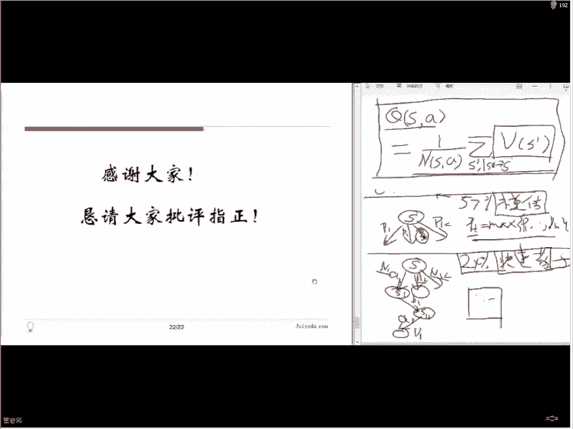

# 论文公开课（七月在线出品） - P3：AlphaGo Zero背后的算法 - 七月在线-julyedu - BV1fW411T7GP

好，呃，咱们到时间了。然后那个可能还有同学陆陆续续的加群。然后我们先大概介绍一下今天这节课，我们今天这节课是这个。🤧那论文公开课系列的第三期啊，好像前面有两次公开课，可能还有一次这个电呃电信公开课。

那也是论文的这这个就算第三期了嗯那个。呃，咱们呃论文公开课呢应该说是可以说是给论文班做一个呃预先预先的这个试验。我们想尝试一下，才能在我们这一个呃公开的平台上面讲论文，能不能让大家收获到一些有用的知识。

然后对我们自己来说也是一个很好的学习的机会和大家一块探讨啊嗯。我们论容班呢从下个周末开始开始开班，我们首次班有呃1。呃，8000人。有啊好几位老师啊，大家一起来呃给大家讲一下。

就是大大概主要的这个topic是在呃集中在深度学习里面，就是大概是。啊，希望从呃几年以前深度学习崛起开始，呃几篇重要的文章啊，包括呃最近的几篇比较最新的进展这样差不多8篇文章。

大家可以去呃网页上可以看到，可以看到那个应该是有文章链接，大家可以就是大概浏览一下有什么文章啊。好，那呃我们今天这节课呢呃主要是讲这个最近。最近这个呃呃比较轰动的一个工作。

这个你准备的时间也不是特别长了，但是主要是要跟大家呃一块来探讨一下，就是说阿法克zero，他背后的这个学习的算法。啊，就是。大概的历史上大家多少都知道，就是说呃大概去年的时候嗯。那么3月份是吧。

我们这是demand，他们推出的第一个阿法。呃，当时我人类对弈就就反正就是很快就战胜了李史石战胜了科题，然后战所有的人类对手。然后那当时的算法的特点呢，它是通过人类对人类棋谱的学习。然后。

来预测人类的多法。就下期的走法，然后以此为基础来就他自己的这个判断，就是他自己的做法是基于人类的做法来做的。就是说他是学了人类。然后呢，但是他计算机呢它算的比较好，所以首先他预测的很准确。

这是他们这个呃工作的重这个一个重点啊。然后。在预测准确的前提下呢，它的这个稳定性那肯定是远远超过人类的啊，当然它也有一些新的走法。所以他就基本上战胜所有人类，就是人类已经不可能再跟他去这个相抗衡了。

然后呃那已经非常轰动了，因为这个围棋算法已经研究几十年了，大家很长时间以来都觉得想打败人类的大师纪选手恐怕还是不太可能的。但是他突然之间就出来这个东西。就超过所有人的选手。然后。

今年呢这篇工作这个工作呢它的重要性是什么呢？就在呃之前的那个需要学习人类的基础之上，他们开发了一个新的系统，就这个阿巴克Z这个训练方式呢就是说他不需要人类的任何知识了。

他只需要让这个计算机从一开始从小白开始什么也不会啊，下不断下一些来开始自己跟自己下，自己跟自己学啊，通过不断的胜负啊，来判断怎么下才比较好。这样的训练。他只用3天就可以达到以前的那个学人类的。

那个初期的阿法狗，然后经过40天的训练呢，它现在已经无底了，就是跟跟学打都是百分之百胜率差不多啊。所以。所以这个就是呃我们这个这个他们这个工作的背景啊。那在这个背景之下，我们想看一下。

那他背后呢使用什么样的算法啊，他就是他想法是什么？因为这个算法呀几乎呃不怎么用data了对吧，因为他以前的话还用了一些数据，现在几乎已经不用数据了。那他基本上就是。靠他的算法啊。

靠他的这个工程能力来实现这件事情。那我们想今天呢就主要来探讨一下啊这个。工作它背后都使用了哪些算法？我们进入正题哈。嗯。那今天我们主要涉及到了两篇文章。那第一篇呢。

当然就是呃depman他们在nature上发表的这篇文章就是呃。啊，就是不用人类知识，就可以掌握微机啊，就这个意思。呃，第二篇文章呢呃是今年5月份的时候，应该是呃就是这几位作者在。

🤧我看到的版本是在这个archive上的版本。我不知道他们现在有没有正式发表的版本啊，就是说。他们5月份时候做的一些一个一个工作，他他们应该属demand的是独立的。

因为呃deman的那工作的公开是最近的，所以说。对，但是他们提交呢是4月份，所以总之就他们两个会上之间应该是没有这个呃抄期的嫌疑。就是说应该说是几乎。就前后脚就独立的发现了这个这个算法啊。

就是基本上想法就是说我们会会讲到。利用这个呃深度模型，再加上这个蒙蒙特卡罗的输搜索啊，来实现一个不需要外界知识的一种强化学习的一一个一个模型啊。Yeah。啊，这个等大家看PPT的时候。

就知道这个地方都链接，在点就可以看到文章了啊。好，那主要内容呢就是通过两篇文章和大家一起探讨这个算法。呃这个这次课程的结构。第一部分呢我们介绍一下动态规划与强化学习啊，其实这个是框架。

就说这次为什么阿尔法和V尔可以做这件事情，它是在强化学习这个大的框架下来做的那至于具体的实施方式呢，他用了这个。啊，首先用深度模型，深度模型是以前的画口也用的。就是说我们后面也讲到为什么要用啊。

然后呃再使用最新的这个工作，就是深度模型和呃搜搜索的一个一个结合啊，来实现这种强化学习。那呃既然是我们。来了解这个工作，我们先看看什么叫做强化学习啊。

什么叫做就是他他跟我们以前了解的这个很熟悉的一个动态规划是什么样的关系呃。如果你想用强化学习去解决一些问题的话，我们实际上需要做些什么啊，那困难又在哪里？好，我们第一部分就是这个嗯。动态规划与强化学习。

啊，他们。这两个东西啊，他们都是有同一个目标，就是说希望涉及一种。算法使得它能够基于环境而行动来取得最大化的一些利益。就这个环境呢，比如说您可以是下围棋的时候，那个环境是什么？

就是你棋盘上这个这些棋子的位置啊，就是黑棋在哪里下了，黑棋在哪里下了，这就是环境，就当前的环境啊，那你基于当前的环境，你要采取什么样的行动？所说的行动呢？就是说呃你可以在哪下。

然后什么叫最大化为系利益呢？这个当然在为体上来说，就是说你最后要赢对方越多越好，那差不多这个意思。然后这个呃当然你可以做别的事情啊，你可以首先你可以是其他的游体啊，甚至你可以是这个呃。

就是自动化控制对吧？你比如说你机器人，你的环境是什么，你就是OK这机器人他的那个这些探测器能探测到的做的东西，能看到什么，能听到什么，能够这个介介绍到什么，对吧？那你在这些技础之上。

你要你要采取什么行动？比如说你有一个这个扫地机器人，对吧？那你这扫地机器人你买个家了，买家一方。那这个呃。嗯基本上你希望它自动去行扫地对吧？那他其实其实现在就有这种机器人嘛，那他其实扫地怎么办呢？

他就是靠他这个能碰到什么东西，碰到之后他就改变自己的方向，他不会去强撞了。你撞墙了之后他就换个方向走，对吧？他基本上这个想法。那么得走的多了以后，他对你加熟悉了。那最好的是。你在你家扫几次地之后。

他就能在你家很很有规律的，就把地扫好了，就不要那个到处乱跑了。你一开机，然后到处乱跑，二小孩撞倒了就不跑了，对吧？这个意思。也就是说当你们在这个环境里面呃，经过长期就是一段时间的这个呃训练以后。

希望他能够基于你这个环境做出最好的反应。啊这是这个动态规划或者强化执行目标。那他们两个的区别是什么呢？动态规划呀要求你。知道环境的变化规律，就说这个规律必须是确定的，而且是已知的。

那这种情况那等会儿我们举一个具体的例子啊，那强化学习呢就不要求这个条件。就说它应用范围更广泛，就是它当然就更困难。但是我们可以呃在这个课里，我们可以用这个动态规划啊。

作一个简单的版本去帮助我们理解呃这个强化学习。那同时也帮助我们理解啊，我们那个就是我们这次的目标就是阿法go0他主要的想法。呃，随时随地大家如果觉得声音有问题啊，或者什么，就在那个呃QQ里面留言。

然后有什么问题也在里留言，我可能不会马上回答。但是一般我讲完几节PPT都会回来给大家就是大概的梳理一下啊。好，那么这个强化学习的一个啊基本思路是什么呢？就是说。呃，这个这个图是我在网络上面透的啊。呃。

首先我有一个agent agent就是说我们的这个算法这个程序我们的这个机器人那环境呢就是说刚才我们讲到在各个不同的问题中，你可能有不同的环境。那。他基本想法就是说，给你一个环境状态。

那么这个机器人呢他会去采取一个行动，他会有自己的一个算法采取一个行动。但采取行动之后，他这个行动不一定是对的，有可能错的，有可能不是错，但也不是最好的，就总归他这个行动。会给他带来一些奖励或者惩罚。

如果他这个做法比较好，那就得到奖励，如果做法做比较不好啊，就可以受到惩罚。然后他通过学习这些奖励和惩罚啊，就是逐渐的去增加好的做法，去减少这个不好做法。这个过程就是强化学习的这个过程。

那就是说他要不断的和你这个环境进行互动。然后来得到反馈来，然后再更新自己的这些模型里面参数。其实就是说啊嗯。Okay。那他有这样一个想法啊，基本基本的思路是这样。那这个就比较抽象了啊。

那具体来说就是说我们把它。数学化以后会是什么样呢？就这样了。啊，它是一个基本的数学表达这个呃。也可以把它称作是这个马尔克服务决策过程。那这里面啊我们要用1个大S代表输入状态的结合。那比如说围棋的话。

那于打S包含了什么呢？包含了所有可能的局面。就你那个棋盘上。白细有罗两个子，黑锈有的两个子所有可能的局面。就是这个大S。那在每一个大S下，如果你是比如说你是拿白气那个人，那你有多少种可能？

你有你有多少种可能的这个走法呢？啊，那个就是AA代表。所有者采取的行动集合。啊，这是就是说。一切可以采取的行动。来这个结合。那R呢代表的是奖励函数，就是说。你这个给你当前的局面。也弄这种。

走法那每种走法它到底是应该奖励呢，还是应该惩罚呢？这得由R来代替。那这个呢是一个环境可以给你的一个反馈。那这个一般来讲并不是你比如说强化学习当中呢，这个并不是你预先知道的，你要去做一件事。

然后你才会得到反馈这样。啊T呢对表一个转移函数，就是说。就是说你做了一个操作以后，比如说你在这个你看这里有三个变量啊，这个S是当前的局面。A是你的操作。SP是结局。就说你比如说你找了一个点儿。

在微棋当中往上找了一个字儿，那对方会怎么走，你可就不知道了。所以说呢当你做了一个操作以后，你并不知道这个带来的后果确定的是什么。但是呢。有些情况下，你可以估计一下你这个后果，左做种可能性。

每种可能性的概率是多少。就说你知道我这个下围棋的时候，你开机，你在左上角点一点，那很有可能对方会在右下角点一点，或者是左上角或者左下角对吧？就是这大概几种可能性。然后嗯没有可能性的概率啊，你就。

这这这就是这个转移函数。就是说在你当前状态下，我采取一个行动之后，后果可能是什么？那动态规划问题当中啊，这个T应该是已知的。就是说我们应该知道我如果采取行动之后，那这个。

结果和概率分布我们应该知道结果不确定，但是概率分布应该知道了。但是在这个呃强化学习中，这个就是不知道的。比如说下围棋，你很显很显然你面对一个新的对手，或者就是旧的对手，你也不知道你这样走以后他会怎么做。

对吧？他完全是这个他有他的这个想法，有他随机性。嗯。那么这个呃实习目标什么，就前面那些是描述性，就是说把这个系统给描述了一下。你有多少状态，每种状态下，你有多少可能采取的行动是吧？然后这张奖励。

然后转移函数。那最终目标就是说，你要学习出一个策略。就是在每一种。局面下，你要知道你该怎么做哎，这个是你的。这个是你学习的目标。因为学习你就希望得到一个机器人帮你做一件事，是吧？给你一个局面。

太就太平众了。哎，这个是这是一个水晶表，你现要得到这么一个，这个东西叫派，这个等会儿我们。这些符号大家给要稍微留心一下，等会儿我们还会用的，这是我可能会回来给大家再这个复述一下。好，我们举个例子啊。

动态文化。比如说我们就都用游戏来举例子啊，正在对打。比如说这个赌场里面最常见的1个21点的啊赌博游戏。就是这个赌播游戏啊。显然你是赌博嘛，你结果肯定是不确定的是吧？但是庄家的行为模式是固定的。

而且是公开的就告诉你。呃，就大家如果不熟悉这个规则的话，你就给大家讲一下，就是说。这个游戏是这样的嗯。中央呢他自己拿着一张牌是亮出来的。然后呢，他发给你两发给你两张牌。

这个时候呃你把这两张牌的数加起来啊，就是比如说加起来是到是13点14点，对吧？这时候不到21点，你可以再朝他要或者朝到或者不朝调。就说你朝他要的话，你要冒着风险，就如果给你一个十，你就23点24点。

你就啊到你的超过21点就说了。对吧？如果你不朝着要呢，你就停在这儿了。所以这个时候你可以这是你自己的选择，你可以选择要或者不要，这是你的可以采取的。action这个行动是吧？那么你的局面什么呢？

就是你手里有多少分，多少点，他手里有多少点，这两个数字形成的这个向链，就是你的局面。你知道自己有多少点，他有多少点，然后你要决定是否在继续要牌。这个策略呢就是我们最后要决定的东西。

但这个时候什么能确定的呢？就是说一旦你决定说我不要牌了，庄家就开始行动。他这个行动的结果不确定，但是他行动的模式是确定。就是说专家要求不到17点，他就必须继续要排，超过17点他就一定不会再继续要排。啊。

这个是他的固定的行为模式。所以在这种情况下，我们用动动态规划就可以完完整的解决这个像这样1个2C点在这种赌博游戏。就是在任何情况下，你就知道自己啊最优的选择是什么？然后你回升的概率是多少。

那都可以都是都是比较容易算出来。那么强化学习呢。那可能就是哎他如果你也是游戏的话。那么他呃面对的呢就是一些对抗性的游戏。比如说危棋或者电子竞济这种啊，这个不但结果不确定对手的行为模式你也是不能确定的。

你不知道对对手会怎么做啊，你下棋下一步，你不知道对手会怎么办，他也不告诉你啊，肯定事线不会公开的，对吧？也这样一个提个过来。那我们啊具体来看一看，我们想我们举这个例子说比较戏呢。

是因为嗯希望给大家解释一下。这里或者说我们后面提到的一些这个量。他的这个嗯是怎么样的？好，我们看看这个2A点对应的这个状态空间。个略空间就是玩家和庄家各个手中的点数啊，玩家是P，庄家是D。

P就是player，D就deer。对下了。然后呃行动空间就是玩家可以选择继续或者停止摇摆酒家梦产。那奖励函数哎，这个东西啊其实也比较有意思。就说我们之前说这个模型的时候，说的是你每做一个行动。

它都会有一个奖励或者惩罚。但是你发现像这样的一个游戏呢，你的奖励个惩罚是在最终游戏结束的时候才得到的。所以说你如果获胜你的奖励，你这个R是一啊，如果呃失败了，就是负一，就是赢了就赚钱嘛，输了就是会钱嘛。

这个意思是吧？但你并不是呃每走一步都得到奖励。比如说你现在手里点数是10。你可以要牌可以高牌，不是要牌了。那给你一张三你得到13。这个过程中。有先没接处，你还可以继续要，还可以停。但是光走完这一步。

你没有得到任何的奖励或者惩罚。哎，这个就跟前面稍微有点不同了，所以说这就有点哎有点不太符合前面那个描述啊，并不是每一步都得到奖励。所以另外一种去设计这个奖励函数的方法也许以这样说。

说我们可以说玩家行动后，如果获胜的概率增加了。那这个增加的概率就是它的奖励函数。如果概率变小了，那这个呃最小的这部分概率就是它的乘罚函数。哎，所以你可以这样去理解。那事实上这个维棋的情况。

在这个意义上说跟他也很像，就你需要走好几百步。你才能结束一盘游戏，一盘一盘围棋，对吧？那你最后那一步。结束了，你知道自己是赢了还是输了。那前面那么多户你都没有奖励的惩罚怎么办呢？对吧？所以说。

一个呃比较好的一种做法呢，就是说啊。呃，就是至少一种做法吧，就是说你可以去想你这每走完一步之后，你当前的几面下，你获胜的概率是增大了还是变小？呃。这个。你你可以认为这是一个一个想法，就是说他。

在最终实现的时候所使用的用型。那。最后呢就是这个转移函数。转移函数呢这个我们刚才讲到说哎我们玩家呀他可以选择标牌或者不要牌。那他。如果要是这个不要改了啊，那庄家就开始按照他这个规定的这个这个方式。

他就开始改变他的数字，对吧？这个意思。好，那我们。稍微看一下这个我们说这个这种东西是很容易可以用这个呃动态规划来来解决的啊，我们稍微看一下。这很简单的一个例子啊。好。

这是我们的一个简易版的21点游戏策略表啊，我们就是说把这个游戏规定一下，然后基本这跟刚才一样的，告大家这个空坚是什么。然后呢，我们怎么用怎么样用使用动态动态规划去解决这样一个简单的问题呢？啊。

就是说我们首先训练一下这个哦目标。哎，这个怎么那么慢？我之前没有在这个上面。好，你这只是。改构一下。啊，大家稍等一下，这个灯会。我好像后面是有结结果嗯。你说不需要直接在上面跑。你确定一下。

这个好像没有动。啊啊，这个我先不给大家看这个具体的印象，因为这个。我我这个是在另外一个机器上运行的，他这只是想展示一下。我这说面试有结果，你就不许管达了。好，就是说我们可以用动态规划的方式。

去啊去实现一个这种表格的最终目的。我们说了是实现一个策略的表格。这个我们实现一个玩家策略表，就是说。这个啊每一列呢代表的是庄家的手里的点数，这每一行呢代表是玩家手里的点数。

所以这上面每一个点啊就代表了一个状态。比如这一个状态，什么意思？你手里的点数是9，庄家手里的点数是6，在这种情况下，你是应该举需要排呢，还是应该停止呢？Yeah。放大一些。嗯。不。Okay。好，这样啊。

比如这个。大家可以看到这个上面的字吗？我我可以先把它电弄白。我们要重向帮助，那还有一些的啊好，再这。😊，哎。就说啊当这个红这个上面这个横坐标。累列代表的是呃庄家手里的派的点数。

这纵值不表代表的是玩家手里派的点数。庄家手里就是从1到11，玩家呢是从2到这个21对吧？然后。呃，你去选择继续或者是不继续，最融目的是得到这么张表格啊，就如说我们。对。我这个图有点太大了。

就看不看清楚啊。就是说当呃我们手里是9关家是6的时候，我们应该继续。那当我们手里是这个比如15关家是6的时候，我们就不应该继续了，我们该停止。那这个表是怎么来的呢？

那其实我们是从通过这个计算了这个获胜的概率啊来实现这个表。这样一个这样一个表，就比如说我们收里是5，专家收益是哎，我们收里是9，专家受收理6的时候，我们获胜的概率是0。47。啊，就比就就是比0。

5少一点啊，那这这种情况下，如果再要一张牌，我可能会得到什么呢？我可能会得到下面这一堆。啊，东西。对吧就我可我可能跑到下面这个我要得到一的话，我就跑到十0来了。我要得到二的话，就跑到11来了。

我得到这个11的话，我就跑到这个20那里去了。对吧。就是说呃如果我决定第号牌的话，那么我下一张牌的这个可能性就在产里。那下面这些状态，它获胜的概率，这个也提前算出来放在这了，对吧？那我就知道哦。

如果我我再加一张牌，我平均的获胜概率应该是什么？就是把下面这些数加起来算均因数。那大概瞅一眼，我发现哎下边这个有几个点是比我的高的，但是好多好多点啊，大部分点都是比我低的。所以说他仔细一算发现啊。

如果我再要一张牌，我获胜的概率大概其实降低了。所以说我在当前的状态下。那应该是升高还是向底下，哎，升高了，所以还是有这一点的大。那我当是当前这状态下，我还是应该继续标牌的。知了。对。

是这样一个是这样一个过程。那。如果要是比如说我初始状态是这个在这里。18。然后呢。呃，对方是在这个还是在这里？6这里是吧？那我是不是要这去要牌呢？我发现。如果得123的话，我这汇生概率是变大了。

但实际上我还可以得到这个更大的数。后面这个就是这个标况没有列出来，后面就零了。所以说益生菌发现货生概率血实还变小。所以在这个情况下呢，我就更该再继续表盘。所以说。对于一个游戏来说。

如果你能得到这样一张表。我现在说的一个表，P，无论能得到这样一张表。而且你还知道。你每次采取一个行动之后，你可能变成哪些状态。那这个主里面每一个点呢就是你的当前这是你的一个状态。

你知道你现在回程概率是大还是小是多少。然后呢，你还知道如果采取一个行动之后，我可能变到哪些状态里面去。如果有这样一张表的话，我就很容易去得出一个。策略操作就上面这个。每种状态下。

我都可以得到一个最优的策略。那现在这个21点流游行因为都比较简单，可能出现的情况也非常少，就大概这么啊100多种流列在这吧。嗯，200多种啊呃每种呢我都算好了，然后。就结束了。

但是维棋的困难在于什么地方？首先你很难把所有状态都列出来啊，维7的状态呢大概有有人算过啊大概有10个170次方左右那么多。那这个数字已经远远应该是远远超过了这个宇宙中的原子的个数，所以你不可能对吧？

就就存下来，你就原一个原子存一个你都存都存不下，反正就就就就这么多。那所以说这个表是不可能存在的。而且更困难的什么呢？即便你有了这个表了。It。每走一步，你都不知道下一步对手会往哪里走。

就是说对手的行为模式呢，你是不知道的。至少是当前你不知道。那怎么办？所以说那个问题就要比这个21点的时候现的问题要困难的多。所以说当是我们应该做什么？现上很困难，对吧？谢谢。啊，对，大家有些问题。

朋友还把这个。哎，没问题。那就说。😊，有同学说怎么去判断这个获顺呃概率的升价啊，就是说。你当前。啊，这个这个说的是你当前采取最最优策略的啊，你这个回胜概率的大小啊。

就是说其前面还有个表是那个如果你不动的啊，你的回胜概率多少，那其实你应该是拿你当前你不动你回收概率跟你如果你动了，你回胜概率相比，看看哪个大哪个小，然后你采取大的哪个是吧？那呃如果你动了的话。

比如说你当前是在6个位置，那你再有一张牌，你可能是7，可能是17。就是你可能结果是从7到17这个范围内，对吧？那这个范围内，你看呃他们如果你在那里再采取最优的行动，你回收概率有多少，你给他平均一下。

你就知道这个呃你采取行动的话，就再有张台，你回成概率是多少。然后你再比较一下，说你如果当前你就不动了，你回成概率是多少，你这一算就知道了。好。这这个问题清楚了吗？好，然后那个这个扣子等会儿我就下课之后。

把那个呃发到群链接里，我下就要发到群里面，大家就可以看到自己自己印行一下就行啊。这上面我都写了解释，就很简单的一个问题。Oh。😮，呃，对。然后那个。这是这个例子呢，就是给大家告诉大家说。解释一下。

为什么当你做一个这样的游戏的时候，你希望。能够得到一个呃。呃，获胜的概率表格。就如果你有的话。也是非常好的啊，为什么你希望去预测回胜概率？为什么你希望去预测啊对手的行为模式。

就是说如果你能够知道你当前的回胜概率，而且你还知道对手会怎么反应的话，就像我们刚才那个问题一样，你就解决了，事情都解决了。对吧但是对于维企来说呢，他可能有比较困难。就围棋的对应状态空间啊。

它的状态是当前局面。以及一部分的落子历史啊，那这个东西。就刚才说了，它的这定义啊，就这个局面的总数非常庞大，不可能像我刚才对21点那样，给它列个表列出来。然后行动空间呢，那这个是比较明确的。

就是说你可以选择不走了。或者选择下一次啊这个落子的这个位置。这个可能性并没有那么多，这个是比较比较比较确定的比较好的。那奖励函数哎也是一样的。如果要是游戏结束了，那你就可以获得奖励或者惩罚。

但是事实上这个游戏过程会非常长，所以说呢嗯。所以说我们希望这个呃去估计一下这个呃每次玩家行动之后啊，这个获胜概率是增加了还是减小？呃，有同学想让我把这个PPT放大。这个现在这个大小的原因。

主要是因为我后边这个地方可能要写一些字。就是我们左边是PPT，右边是这个板数，一般是这样的。你试试看能不能把那个屏幕放大一些。嗯，就是在你的电脑上面。放大一下。对，然后PPT也可以下载。

我已经发到群里面了。大家可以呃就是在你在你门口来看一下，能更清楚一些。好啊，对这这些。😊，第三，这个奖励函数呢跟前面那个问题是很类似的啊，最后转移函数啊，这个就比较复杂了。

因为玩家这这也是我们说动态规划和强化学题的一个本质区别啊。就动态规划，你的转移函数几乎是确应了。那强化学息呢，你不知道你不知道你在落此之后，对方会怎么做？呃。

同学问什麻将可不可以麻将我不知道组可应该也不可以吧。我看应该也是不可。因为呃如果是麻将的话，你当前的局面并不是说所所有4个人手里有牌，你只能看到你自己手里有牌。所以别人有什么牌也不知道。

然后嗯在这种情况下，对方会怎么做。对吧你也不知道，那就算你交对方牌了，他怎么做，你也不知道他也不是一个公开的，它是一个你需要去。模拟的一个东西不是一公开告诉你的东西，对吧？所以麻将是不可以的。

也是比较复杂的。呃，当然围棋更复杂了，他的情况不会多嘛，对吧嗯。谢谢。Oh。好，那这个。那么。没洗的这个。呃，模型呃不能说强化模型了，就是说这个阿拉狗。这这几个版本的模型基本想法是什么？

首先要估算对手的落死概率。然后呢要估算每一个局面上的回生态率。这这两件事就是我们跟才说的。就是我们刚才那个表格，对吧？就是说。我们这个问题虽然简单啊，但是他基本上告诉就是可以作为一个例子去理解这件事情。

我们这个表格是干什么的呢？就是每一个局面上面你获胜的概率，在你自优的行动下，获胜在利。然后。那个这个游戏的规则告诉了你，当你采取个行动之后，对方会怎么做，就很清楚这两件事你就知道了。然后你通过这两件事。

你就立刻得出了上面这个策略表格，你就知道每种情况下你该你该怎么做。就说。但是煤棋没有没有那种办叫估算是吧？所以他主要的任务就做价值值，一个是估算落子的概率分布，一个是这个局面上的过程概率就可以了。

然后他的困难是什么？那估算也是困难啊，困难是局面太多，还有这么多也非常多，不可能得到一个表啊，还有一个就是变化非常多。你做选择之后，对手的这可能选择也是非常复杂的那是难以估算啊，对手的下。

那么咱们这个我们对峙的方案是什么呢？就是说你有了这些困难了。那么既然他最终这个问题经被解决了，现在可以这么认为，对吧？那他怎么做的，他用什么样的方案去对质你这两个基本的困难。定了。对媒体局面太多的问题。

他采取了深度模型，就大家知道他用了深度模型去做了这个呃围棋的程序。但你要知道他为什么要用深度模型。他用这个到底想解决一个什么问题？其实深度模型在这里面起到作用，主要是要解决这个局面太多的问题。就是说。

😊，当你不能怀那张表，把每种局面下的这个不管对手的行为呃，对手的这个落子分布，还是说你当前这个获胜概率呃，写成一个表格的话，如果你不能选表格的话，你可以把它理解成是一个函数。而深度模型呢？

它基本上做一点什么事呢？它就是用一些较叉参数对一个极其复杂的函数进行逼近。这是深度模型，它基本的核心的目的。一个想法，这也是就是你可以认为是呃。所有的这些就是参号参数化的参数模型的一个想法。就说。

那个问题的函数非常复杂，尽量非常多啊。就是弄不了了。比如说你那个看图片吧，你想那个图片。它是一个比如说呃1000乘1000的图片，它有100万个点。那每个点呢它都可以有一个就是一个像素，它可以有另暗。

有个压缩，对吧？那你就等于是100万个不变量。啊，然后你你。每每个增变量还有棱格取值，有一个取值范围，然后得到一张图片。那你现在想知这图片里显示的是不是一个人是一个人还是一个狗。

那你这个时候就等于你是对一个这么庞大的一个自变量，你想得出一函数一个零或者一的函数，它是是人还是狗啊，或者是既不是人对狗的负一啊，你想得到一个动么力函数，那这个函数太复杂了。针对这样复杂的函数。

我们没法去给它对你没法列出一张表啊，所有的这个图片每每一行是一个图片，然后它到底是人还是狗还是狗，不是你基不是人不是狗，你给它列出来，这太困难了。嗯，列不了，跟文学问题一样，这是你的。可能性太多了。

所以说最后怎么办呢？啊，他就用一个深度模型，深度模型就是说他做了一个网络。等于把你的这些像素啊，这些东西给它这个用线性的方式先组合一下，然后非线性做一下做一个层，然后再线性组合，再推线性。

就是说他会把你这个做了若干的变换之后。这些变换的系数你是不知道的，是你需要训练样的，那系数没有那么多啊，你就得出一个正一-一或者零的一个判断。

就是说他希望用一个呃自变量较少的函数来逼竟这个很复杂的自变量较多的函数。他希望做这样一件事情。那么在这个围棋问题当中呢，既然他很擅长于做这种事情。所以文体围围棋这个问题当中呢呃那么呃。

当前的做法也是利用于深度模型去逼近你这个复杂盘数。女孩太复杂了，没俩做生动模型干这事儿。那对于这个难以预测啊，对手落子分布的问题，就所谓落子分布。就是说你做了一个决断之后，对手会怎么做？

这个可能性是有限的，你就知道的，但是它大概往哪块走的概率比较大，往哪块走的概率比较小，这件事你不知道，对吧？这个叫做落子分布，那么怎么去预测对手的这个落子分布呢？哎这个就有两种不同的做法。

在阿法狗和阿尔法狗这里面你就可以看到区别了啊。那阿法狗里面呢。他利用了这个模仿学习。就说他学习人是怎么做。之所以这样做呢是有道理的。就是说。这个围棋业已经发展了很多很多年了，上千年了。

那在这么多年的这个历史之下呢，就是人类已经。对这个维棋的下法进行了很长时间的研究和演化啊，所以他有了很多的想法，很多的这个定式，很多的。这个抽象的看法。那在这种情况下。

你想让一个机器立刻就自己学会那些复杂的东西，是很困难的。所以说你还不如直接学它，就你看看在当前局面下人是怎么走的，然后我就利用这些数据，我去训练我这个机器人。然后我机器人就是跟人走的越像越好啊。

就跟那个专家就是这高手走的越像越好。单走很像了以后，呃，呃如果你在那多往好看几步，如果你在能算的快一点，那说不定你就可以超过人类的水平。这个是呃阿法狗。第一个版本要做的事情太成功了，那确实超过人类。

那第二个做法就是说我们舍弃那些人类的。之前研究的结果，我们直接让这个一个机器人从什么也不会开始，就是说刚刚刚学会围棋的这个呃规则开始，让他自己跟自己下啊，然后呢，每下预盘之后，你就是知道一个输赢对吧？

你知道输赢以后，你知道赢的人大概他的这个呃走的正确的步数会多一些，呃，输的人走的正确的步数会少一些，对吧？利用这种信息去训练自己。然后最后。掌握这个威胁的一个调的下来。这是后来这个阿法狗做的一个。

主要思路就这些部分他们俩区别。你前面那部分呢，他们是一样的。好，那么这个我们。先稍微休息一下，然后我们那个10分钟6回来，我们后面来继续呃给大家详细的介绍啊这个呃什么叫模仿学习？

什么叫做呃这个门槛门桃输搜索啊，什么叫做。就是阿就是如何使用这个深度模型？加上蒙特卡罗数字索来实现一种不需要外部知识的呃。Yeah。我不需要外部知识的一种这个强化学习的这个思路啊。啊，10分钟之后回来。

好，那咱们继续。啊，这个刚才大家讨论的这个论文班，就是这个深动学习论文班。是那个呃我应该是在PPT里边加链接，等会儿大家如果要是呃下载的PPT，应该是可以直接添进去。然后我刚才群里也发了一个这个。呃。

课程链接。Okay。呃，我们继续，就是说我们刚才呃上半节课呢我们嗯。就是大家只梳理了一下，说什么叫做强化学习啊，什么叫做呃就动态规划。然后他们一下说在。维棋这个问题上，我们如果想要强化学习的话。

我们主要想要做一件什么事情？就主要两件事情。第一个呢是用深度模型去描少。嗯，二是这个呃毕竟这个。啊呃，上覆盖率，还有这个对手的行为模式啊，这个个th分布。啊另外一个呢就是。

在你做这个呃预测路go分布的时候呢，可以采取两种不同的做法。一种是模仿学习啊，就是呃训练一个模型去模仿人。还有一种呢就是啊让他自己自己和自己下来做一些强化学习这种做法。那。

我首先看最初版本里面就模仿学习是一个怎么样的做法啊好。模仿学习呢就是利用专家提供的数据啊进行模型训练。就是你希望你知道在当前局面下，那个人类专家是想要怎么做的那。首先它得要数据啊。

就是他从上百万个的这个呃人类的高手对义的起谱程当中进行这个训练。那这个稀谱呢大概是从我们这个呃网网上的对易平台上找到的那。这个呃最终的这个训练结果呢。

就是说它可以对人类高速我的模拟准确率达到57%这样的一个一个强度。那当并不是说呃他43%情况下是瞎走的，他是指说这个57呢和人是一样的走法，但剩下这些走法不见得比人来强，可能也差不多。

然后但是单靠这样的模拟，它并不能够战胜最呃这水平最高的这个人类选手。那这个原因很简单，因为你想你上百万个这个棋图，虽然说这个高手，但他并不是最最顶尖的几个人，他也没有那么多棋图给你用，对吧？

你模仿的其实是这些人以及比他们稍微差的人的这个这个棋。而且你还是模仿，你还不能保保证十分准确。所以你只是用这个东西去跟据下的话，还是不太可能直接就战胜人类的。那另外一个重要的部分呢，就是这个估值网络啊。

就是说估计当前局面下啊你这个。呃，胜负的数据。这个为什么固值网络可以提供一个策略指导呢？这也是根据我们刚才的那个例子里面讲的，就如果你。Oh。这个我们等一会也会用到，如果你当前。

有一个局面还会有这个S对吧？那我这个怎么感觉稍冷啊。嗯，对，你下一点。这样这样好一点啊。😊，🤧因为当天我局面是S。然后这时候你有很多种选择。对吧。你有这个。嗯。就如果你要是下一次，你可能叫做S1。

你先乱那意变成S2。啊，你可以有很多种不同的选择。那没有选择下呢，你还是可以估计一下，你这个时候会什在6转，就是V1，就是V2，这是BKSK。当前的这个呢是V0。那。你下一识之后，你的概率应该。

如果要是能大等于这个位定，啊，最好，或者说你就是想选出那个这个A1到A2到AK。就如果你只用固执网络的话，那么你应该先选取什么策略呢？应该先选一个A等于maximize这个。Okay。

是 maxaxmatic不。对吧。就是你要选取那个使得你获胜概率最大的那种下法。所以说你都可以在。众多的这个呃选择当中找出一个来，这这是利用估值网。但这个说完你发现没有？他其实并没有去想对方会怎么下。

也没有想，就是他他不他不太涉及到你这个V棋的逻辑，就他为什不想你这到底怎么下的，他只需要判断你在当前的状态下，赢的概率是多少，然后选择那个使你赢的概率大的这种做法就可以了。但是如果要是这个。

第一个呢这是这是估质网络做法。那第一个做法呢就是说你当现一个S。上面有好多种。选择你告诉怎么选。这时候你想想人类最强的高手他会怎么选？他选A一的主要性是P1，选A2可能是P2，然后这就是PK。

那你看看这里腊美，比如说这个。P这个。T是最大的啊这TT。Thank you， Mike。P126K光。那么你想人类最有可能下这个呃，人类的高处就有可能下这个，那我就下这个好啊，这也是什么事。

这是第二个。啊，在我们这PPT里面，这个是第一种选择，上面是第二种选择。这是复制网络的。这个呢是模仿的。策略那个弱子弱弱子策略。魔仿。那些还有种做法，就是说。触及了这个第一个版本拿到做法。

它还有一个做法，就是说他采取了一个，我们说这个模仿利用我我们说这个前面这个故事网络和这个模仿用的都是一个呃训练的，都是一个新自模型。在做就他们这个准确率度还是蛮蛮高的这深度模型。那。Tle。

第一个答法我们还有一个做法，就是说他做了一个重典型的模仿，就快速模仿。确始。不。这个作用这个呢也是一个模仿的一个算法。那这个呢不如上面这个方法好。比是说它的这个准确要低，上面的准确有57%啊。

下面的准确大概24%这多的那很明显你就相当是不好了，不好，为什么他要用呢？他想做这样一件事情？就是如果我有这么一种快速走死的方法，就他这个速度有多快，大概是呃。那10的-6次方感那么快。

就可以决定这一这个啊这一步应该怎么走。在这种速度机制下，前面那个是大概10个-3次方，就是就是后面的快速度比前面的快100倍。那在这种情况下呢，他以做这样的事情。前面你不是只看了一步嘛，对吧？包括估值。

包括你这个走损你都只看了一步，它这个你走的足够快，你可以看多杆股一样，从S出发。我可以先猜一下，如果我要是走了A一的话。我S一去了，下一步对方会怎么走啊，他可能我当然也猜对方是比较聪明了。

他可能也用我这种方法去走了他走了这个。啊，B1，然后他跑这儿来了，就是SEB啊。然后呢，下一步我很多走过个走了这个A3是吧，就是。这是一个竖形结构，我走一步，最光走一步，我走一步，就光走一步。

然后每一步的时候呢，下来都有这两种选择。大家选哪一个选择。呃，当然还有一个想法，就是你大概可以理解成选择他这个当前认为最优的选法，是吧？我认为最优想法这么走啊，对方认为这么走，然后这样走走下去。

我看看最终走到某一部分，走到某一个位置，我是当前的这个回胜概率上叫做第一。然后然后我再把这个返回回来之后，我在想，如果换种走法会怎么样，然后对方又会怎么走，所以我预预预演一下我的走访和对方走法。

看到没有？我走法和这方走法啊这个。就是你通过录单测一演呢，你知道。你每次的时候，你都选取当时认为比较好的做法。然后你对这个每个做法，你选取次数那个记下来N1到N2到NK。然后你经过规单区预言以后。

你回来看你选哪个做法走的最多，你就认为那个是最好的做法。所以这个相当于人类的下棋的种想法。就是说我当前就是这种水平了，然后我认为我现在局面我会怎么下。但是我可以多想一步，想对方在这个我下来之。

他会怎么下。然后再想想我在那个时候又会怎么下。那你多想几步之后，你看看跑到一个什么局面去了，你看你局便是变好了还是变坏了，都变坏了，那我一开始这个想法可能就不太对，对吧？我就是多看几这个意思。

但是你想多看久，你是得看的快才行。你要看的很慢，你就没法弄。所以说它就设设计了一个呃速度更快，但是精度更差的一个走资方式。那么这个方式呢结合这个这个数结构的这个搜索。也给出了一个策略。

就是说经过多看见才能买。这三种方法收好哪个好？对吧所以实际上的阿法狗是把这三种方法结合起来，组成了一个混合的。模型。这这三种。的一个混合关系。那这这个混合模型下，他才终于站上来来。就说你只是模仿不行。

然后加上一个估值，然后加上一个策略。那还可能还不行，我商家一块儿。它这个高度才终于超过了这个最场面。啊，我们可以大概看一下啊。Okay。那它的模型训练，这个步骤怎么做？首先。他训练出两个模拟模型。啊。

左边这个批配，这个叫做它叫做roout policy。这个呢就是快速热股这个模型。我们只有下面写的哎24%这个精度的快速乐股的模型。你看这个网络比较小啊，就是原来这个模型稍微简单一些，然后呢。

右边这个就是模拟的这个骆个模型，就是说深度模型，你要网络稍大一些，它的精度也更好一些。另么钱。在实际操作中呢，他把这个模拟的模型又经过了一次呃这个。呃，强化学习，把它给优化了一下。

变成了一个强化的这个乐字模型。那这步怎么做呢？这步者说你现在不是有一个乐字模型了吗？就是一个下法了嘛，那我就让这个机器和自己对弈，然后下几百万次，几百万盘，每一盘呢就会有结果。然后基于这个结果。

你看看哪些下法在当就是呃当前局面下，哪些下法比较好，哪些下不好的，然后把这个强化了一下。就是说嗯因为你之前呢这个模拟的一部分呢，它真的纯粹的就是模拟，他就是希望模拟的越精确越好。

那损失函数是就是人类下滑越接近越好。那它。他的目的好像不是为了战胜对手，而是为了模仿对手而出现的。所以说他希望把这个东西变成正确的目的，正确的目的是战胜对手。所以说呢他让这个模拟好的这个西亚。先自己下。

然后只选那些呃。争取是只选了一些比较正确的下法，那这样得出一个新的问题。这个呢和前面这个其实它差不了太多的，就实际上表现也差不多嗯。就是当时他们的一个解释呢，就是说可能人类下发里边呢呃他有一些大局观。

有一些这个长远的考虑。嗯，你从你模仿出来其实就就挺好的了。但如果你要自己和自己下呢，他并没有能够掌握到那些长远的考虑。所以自己和自己下的时候呃，比如说你下这一步是有长远考虑的，你也模仿出来了。

但是你自但是你机器人并不知道这一步其实是有那个考虑的。所以种下下一步的时候，前面那个长远计划就被这忘了。然后所以你这个。就没用上，所以导致你在自己强化训练的时候，把那些大局端给训练没了。

所以说他可能反差还是差了一点啊，但是这个也就被留下来了。然后最终使用的时候是把他们俩结合起来，就是这个放在一块，好像是大概的是50%对50%平均了一下。然后。你可以把这两个放一块。

就认为是这个中间这个啊。生么模型的这个呃模拟啊。呃，最右边这个什么呢？这个是估值网络。这你看那个训练的过程啊。对估值网络是最后训练的，为什么呢？因为你很难用人类的这个棋谱去训练估值网络。

因为人类起谱这个说有限。呃，太少了嗯，所以他呢就用他这个。强化之后的这个版本的这个这个这个机器，自己和自己下了3000多万盘的飞棋。然后每一盘里面取出一个局面。等于一个局面对应的一个胜负。

一个局面对应的数胜负，它得到了1个3000多个数据点的一个数据数据库。然后用那个数据去训练的它的这个估值网络。那为什么他需要搞出3000多万盘？他的原因就是说。你同一盘里面的两个局面有很多地方是相同的。

这什么意思？还是这样？就是说你下一起的时候，你虽然说变了很多，但是你同一盘时你下了100个字了，和下了150个字了。它那个局面在机器看来它有很多相同的部分，有好多地方是一样的那这样的话呢。

就是说你这个数据不是你这两个数据不是相互独立的，它俩是高度相关的。当你这个训练数据里面呃有大量数据是之间高度相关的时候，你就容易会过拟合。所以说呢他就下了3000万牌。

每一盘只选只选出只随机的选出一个局面。那在这种情况下去训练它的估值网络。就他不能说底盘里面有几载的局验，我都得拿出去。他一盘只选一个，这就防止了它的过离合，这是一个它很重要的一点。所以在这种情况下。

它就可以训练固值网络，就是它是有一个顺序的，它必须先训练这个初级的模拟，然后在这个呃做它这个呃强化的模拟。那么强化的模拟呢，对应几千万盘再训练出它这个固值网络啊，最后使用的时候。

123三个部分各自提供了一部分策略啊，结合起来才达到了战胜人类的高度。嗯，你看这个模型表现。啊，你看他这个分数啊。樊辉呢是那个呃欧洲的冠军啊，是。是20万骑手，他的一个表现呢。

他在这上面的分数呢是在这里啊接近3000那。我们这个阿拉狗呢它有三种做法，一个ro就是那个快速热题这个做法。然后这个mod network就是估值网络。

那policy network就是中间这个呃模拟算法，模拟这个走题对吧？那如果这三个各自只有一个的话，这分数只能达到1500。上下这个程度，那这个还是远远。打不过这个人类选手了啊，那。

那他这里面给我们展示就是说任何两个组合起来，我还是打不过这人类选手。三佳一喜这终于跟人类选手达到了这个相当的水平。但这个呢是说他的机器用的还没有那么多，让他把它这个呃。呃。

你看它这个呃单机呃这个这个GPU和CPU数量增加以后，它这个水平又提高了。当他用用了这个分布式系统以后，那水平进一步提高。实际上这时候这个分数已经达到了。3000多了，那这个时候他想战胜。

这个这里面标注的反馈就已经比较容易了。那，实际上他已经可以战胜啊几乎所有的人类选手啊这样一个故程。好，大家有没问题看看啊。呃，给同学问那个乐子网络什么意思？就是乐子网络，就是我们说这个呃模拟的乐子。

就是下棋嘛，就是嗯模拟的那个模拟人类的那个下棋的网络，就是说。你不是有很多的这个人类基础吗？人类起础就是说。你当前有局面，然后那个专家那个人那个酒段某某酒段，他怎么下的这都有记录的对吧？有些记录。

然后他就利用。这个记录就这个局面以及当时他下颌的那个位置来训练了一个深度深经，然后深深这个深层模型他用的是CNN来做的啊。那。这个网络叫做这个乐子网，就它是用来模拟人类是如何做的。占有西。

然后呃那是深度的乐子，然后它旁边还有一个简易版的，这个用的不是深度模型，他用的是那个比较原来比较简单的那个什么的一些呃。这个具体我就不知道了。

他因为我看那个有较权威的老师解读说啊这个网络呢他们声称只达到了24%的这个准确率。但是呢呃其实只达到这准确率还不足以让它达到就是他右面展示的这种奇异的程度。所以说它可能在这个里面还做了很多优化。

但不怎说，它就是比这个右边的网络简单的一个网络。Yeah。然后有同学问说，3000万盘布局后都不会有重复的局面，为什么只取一个局面，对吧？哎，这个是他一个比较关键的一个点。这你3000万局啊，你确认为。

每一局有几百个局面，那你就是有。啊，几十亿个局面对吧？这些局面几乎都不会有重复的，这是对的。但是呢。在同一局。其里面的两个局面，它们的相似度是很高。就当你渲练模型的时候，你希望你的数据点是越读力越好。

你不希望你的数据点有一堆是类似的，那一堆也是类似的，这个不好，这容易造成我们过聚合啊。所以说它是在每一局里面只选出一个局面来训练。所以他才需要做那么多那么多句，所以他需要很长的时间去训练啊。

这是他最耗时间内。大家认为这个地方讲的比较不是很清楚啊。那我来给大家再说一下，就是说。嗯，从从哪里开始？快速的深入删除这个局面啊，首先解决这个问题啊，就是说这个局面。文章上说是随机选去的。

但是他不一定完全是随机。我想他可能不会选那个特别早期的。比如说刚刚布举那些地方，我猜他可能还是会选呃比较中后期的局面吧。我我猜可能这样这个或者说他要求你必须进入早期的有中后期的。就是他有一个呃采样方式。

但那个说是精新采样，所以咱们不知道是怎么定新采样。对，这个就是他的功能实现的细节了。然后。嗯，有同学说随机选取的重复率会是会很高，我不知道这是什么意思啊。对，应该不会吧。

就是你每一只只选一个总会有重复率很高的。嗯。有同学有问题说。随机选取重复局面的出现，我不认我不这样认为，我觉得不可能的。因为你首先那个局面的肯定很多，然后你只只训练了3000万句，然后你每局只选一个。

他就不会重复呢，我不是明白啊。啊，然后那个。有同学问是是不是单纯是为了过理合才停选，哎，基本上是这样。就是你训练模型，你不能让你的数据会相相关性太高。Yeah。因为因为那个是毁编性的。

如果你要是呃每一局的元素基本都选出来的话，你基本上你这模型就不想了，不能用了。所以他必须牺牲很多的时间的成本去训练这3000万句。然后。呃。对，前面还有同学问到这个快速络子啊。

这个呢我并没有研究过他那个快速乐子网络是怎么训练，就他是说。就说。我们前面说呃，当你研当你想要做一个模型，是逼竟这个人类专家的落子策略的时候，你可以选择这个深度模型，你也可以选择别的模型。

别的模型是什么呢？就是说你只看这个棋盘的局部。你的模型是整个集团整个棋盘都看了，然后他用的CN就是等于你看那个就图图像识别一样的，他整个图像都看了。然后他为了简化呢。

他他把那个他在把这个图图片给分成一小块小块，然后再去看，但是每一小块都看了。然后这个简易的模型啊，他可能只看了这个棋盘一个局部。比如说你当前或者前几步，大家都在这个左下角下的。那他是只看左下角这一块。

然后在这一块这个限制很就是很小的一个范围之内呢，他用一些这个更简单一点的模型。比如说这个。这个回归模型或者是一些这个我看好提到有这个比如说呃线象分类的一些模型。然后来决定他怎么想啊，这样，然后。

这个的话，因为他输的输据比较少，然后他也比较好训练，他就主要是快，就他这个呃快速他这个呃嗯。速度是深度模型的10000倍那么快。然后但是这个准确率呢当然就上很多了。比如说你实际人类到会下棋的时候。

它可能满盘到处乱到处都下。但是你都只看有几步，那你只能是说当这个人类在这附近下的时候，你模拟的标准，他要是跑别地时，你就模拟不出来了。所以说它这个准确率又低了。就他牺牲了一些准确率的情况下，其高速。

它主要为这个。对，这个是这个快速。这我稍微重新梳理一下，就是可能刚才讲的时候我没有照这个图讲的有点乱啊。就是说首先通过奇谱，这是奇普，它训练两个呃模拟的价，一个是简单简易版的，然后呢速度快。

但是准确率低，一个是复杂版的啊，这个呃速度慢，但是准确率也非常高。然后。利用这个准确率很高的这个下滑，它做了一个强化模型，就是说就稍微给它。改变了一下，这不能说改进了。因为实际上都有表现的差了。

然后利用这个强化之后的模型呢。他给他做做我对弈啊，然后呃对应3000万盘，每盘选出一个局面。是这一盘里面有好几百个局面。从开始到节奏结束，从里面抽出一个来，然后得到这个3000万的局面。然后每个局面。

因为它对应一盘嘛，他知道都我们都知道他最后到底是谁赢谁输了啊，他就可以用这种数据来训练一个估值网。然后最后走的时候呢，中间那两个结合起来，作为一个呃模拟。模拟器啊就是模拟人类的一种种一种走法。其中一种。

就是他他提供了一个策略，告诉你该怎么走，基本上就告诉你人类该怎么走。那，左边那个呢。它是一个快速的反现那不准。不准之后呢，他利用了后面说的这个。往前多看几步这种做法。啊，虽然说以看一步不准。

但是多看几步，他会得到一个更长远的信息。呃，他就用这个也得到了一种作法。那，最后他用物质网络也得到一种做法，物质网络怎么走？就是说你看走一步之后，你获成概率怎么走，获成概率才最大啊，这也得到一个指导。

这三个结合起来啊，就得到了最后他这一个法。就是这个中间这个图，这里面最左边的这个分数。那现在这个地方呢有没有比刚才更清楚一些？呃，三个是怎么结合的？呃，这个。我没有仔细的看。

但是我知道他不是很复杂的办法，要么就是嘉线竞争了一下，然后这走。不是不是很复杂吧。就是他当时这个也是那个一个嗯大家觉得他很有可能会改进的东西，就是因为他没有用很复杂的方法去集合。

对具体的就嗯等我要看一下，他们给大家这个确定的数啊。但是这个东西啊呃。很难这个在线，因为他这里面他讲到的一些想法。但是比如说就这个快速root这个网络，就是左边那个。实际上实现起来就很困难。就是说。呃。

也许你能实现它的那个准确率，但是你想实现它这个提力却没那么容易。所以它这里面还是有很多的那个技巧，就是你可它它并没有完全写出来。Oh。好。嗯，大家现在有没有对这个出版的阿法狗有更多的理见？好，好们。

往下。下一个号。哎，有同学问说这个固执网络很神奇，说3000万也无法覆盖全部的。呃，我看他有同学说的是这个3000万没法覆盖这全部的可能局面，对吧？那当然了，那可能局面说是有10的170次方那么多。

那3000万当然是极小的一部分。那神奇的地方就在这里就是说。我们神奇的惊奇的发现，你只用这么小的一部分，自然就可以得到一个不错的模型，这说明什么问题？这说明维棋不是一个随机的游戏。

他并不是就那个10的100多次方这么多种局面，其实不会得出现。有很多局面是。对这位同学说，凡是出现这边都是大概率出现，就剩下那些有些非常不好的下法，可能永远都不会有人那么下。他就是错的。

就是不可能能下的。这围棋其实它貌似有那么多种可能性，但实际上有效的可能性呢，就是人类真正会去下或者是任何一个下围棋的人，有玩家，机器人或者人或者外星人，他真的会去下局免没有那么多。

然后你这3000万可能真的已经覆盖到了其中的就是已经算有代表性。就是不能说覆盖的时候，他可能已经真的很有代表性。所以说他训练出来的结果就已很好。包括这个走期网络。

其实他这个不是他这个应该是比你这个微网络。呃，预测的数字更多嘛，对吧？点进局面你要给出压堆概率。他也一样的，你这个你即便是几几百几百万局棋，你每局棋就算有100个局面，你不也就是。呃，有多少嗯。呃。

几十亿的局面。那你跟那个10个170次方比还是非常非常小的。你居然就可以从这些训练里面得出一个比较好走路策略，你这不也很神奇的事情吗？所以这个应该也说明了维棋本身具有的一些特点，就它不是那么随机的。

它其实。是很有直限性。只是我们以前不做，然后这个训练这种模型的成功就说明了这个问题。这。Yeah。好。然后我们稍微往后。看一看好。呃，那么这个蒙特卡罗输搜索。

我们这个第三部分主要讲的是呃深物模型加持下的蒙特卡罗输搜索。就他主要想讲的。我们这这部分主要想讲的是想说这阿阿狗它呃之所以可以不需要人类知识是怎么做的啊，怎么才能舍弃人类知识。我看前面这个做法。

人类知识是源是源头，这部分是最重要的。你有了这个之后，你才有后面所有东西。这任何一个东西，的源头都是它对没有这个的知识，不知道从何谈体。那怎么样才能舍弃它呢？它是怎么做的呢？哎。

这是我们需要看这个这个输搜索的一些细节啊啊，首先这个其实我刚才画这个图啊，已经定上一定程度上呃，就解释了这个输搜索的概念什么事了。就是你从一个局面出发，后面所有可能局面会组成一个数。

你这一步有未完能选择，到下一步之后，又有未完能选择，不就变成一个数了嘛，对吧？然后。但当你在你预习当就是当你在你头脑中预演这个将来可能发生局面的时候，你不会把这个数里面所有节点都看一遍，那是不可能的。

人想去的时候也不可能，计算机也多保，那他怎么做呢？你只能是有效的舍弃一些。那怎么舍弃？就是利用你当前的知识。你认为在这个基面下最好下的是什么？所以说他大概就往这边想。那对方也是当你猜测对方做不好的时候。

你也要想，如果我是他，我在那种局面下会怎么下，那你再走下一。然后其实你看到这个数啊，你只看到这些数里面的很小的一部分，这个就是这个怕就这个路径啊，只是你只看到很小的一个路径。那到达这业务的时候呢。

其实你也很难一直预想到这只棋下完完是很困难。比如说你现在才下了十几个字。然后你在你想当你研究下一个流量等下的时候，你就把这一盘局都给预想完了再去下，这太长了，计算机也做不到，人肯定是更做不到。

所以说你只能是比如说你预想个几步，你设一个上限，对吧？到几步为止就停了就不想了，到那为止了。然后你这样先走一圈走过来，你看看这当前之间是好还是不好，完后你回去你这个试的多的的想法呀，你就把权重降低一些。

那些没有试的想法逐间就浮出水面啊，你再试试那些没有试的想法，然后你再往上走，然后这样你最终呢就是说嗯比如说你再设一个上限时候，你最终最多就试个，比如1000盘或者是200盘或者是一万盘是吧？

你这个设设个数。那你生完过以后，你把每种做法。看看你最终在哪一种走法上花的这个时间最多，就证明那种手法是在你当前的这个这个啊。知识水平下啊，最好的做法，你就实际上操作，你就选这种做法就行了。

所它就是一种预演的方案，就是跟你的头脑中预想就差不多。那这个。因为这个呃抽长来说嘛，就是为未来局面建立一个数结构，每一节点代表一个局面是吧？每条边呢代表一个行动。这个哎就是一个自我回忆的推荐，对吧？

好呃，继续继续来说啊，就是说。😊，你的每一个行动。我们给它赋予一个叫做action value，就是这样行动的价值。然后呢。你在每一个情况上面呢会记录一个访问次，就是你一共走了多少次这个这个。

这个这个这种走法。然后你再记录一下这个呃在当前举面一下每一个行动的乐词概率。这个概率是你。怎么来的？从你这个快速落取的这个神经网络来呃，就这个这个模型来的，你就是每到一个局面，你运行一下你这个。

这个快速模型你就知道你下一步该怎么走了，是吧？这个意思。然后一开始这个呃呃actionvalue是什么呢？Okay。应该始是H全万有。呃，你可认为它0一开始的时候，就是一开始你不知道怎么做好。

你所知道信息之后面的。法问测水是0，因为一开始你还没有开始做呢，你知道这个路的概率是多少。一开始的时候。那一开始在基本情况下，你怎么处始化，就怎么开始走这个系。就是说你当你什么信息都没有。

你不知道这个XY9，不知道这个跑问次数，然后你只有ro子在率的时候，你首先要走的就是你柚子概率最大问题。等你来了，怎么开始？你在这局面下，你先有一个快速入走的这个策略。那你怎么走呢？

你只能选选那个概率最大的那个方法，那个方法就是你当前认为最好的方法对吧？你怎么走？然后下一步怎么走呢？你还是选按照这个嗯概率最大的方法，你走然后最后走走到一个节点，你结束了，你说你。到此为止。

我获胜概率是30%，那就是30%了。就这样走，最终导致你获胜概率是30%。那这个。在这个之后，你的Q什么呢？Q就是那个回成待率。就说。我走了这么一圈，发现我的后程率率30%。

那我就在这个SA这个边上记上30%写上。然后我下一步走的时候。我看什么呢？就是说。我这个边上已经有30%了，然后我这个。这两项是什么？第一项是这样走的过程的平均概率。第二项是基本上是一个呃我。

本来的策略的loose概率除以我访问的次数是什么意思呢？就是我访问的次数越多，我越不愿意去访问它。就说如果你要是不加这项应发什么呢？你总是在访问同一个策略。就是你一开始的时候，你访问A了，那走到那儿。

你发现这个概率30%啊，其他的都是0。然后你你下次你还走这儿，你就走一圈，你发现还是30%。你就你就是你没有去探索不同走法。那他这个做法什么呢？首先你要走这个呃汇动概率最大的那个。加上一个乘罚项。

这乘罚项就是说。你的这个呃走次越多，你就越不愿意走它。你就形向于走一些你没有走的路，就是说呃就是概率大一个，你就试几次，试几次之后，你发现也不太好啊。这个呃回胜概率太小，这逐渐你这个打惩罚箱还越来越小。

整这两个加小越来就越来越小，你就开始试那个概率第二大那个啊，概率第二大那个呢，你再试试，你发现哎它这个回胜概率还可以啊，这个但是你当你识多了以后呢，这个惩罚线会导致你这个数越来越小。

然后这时候你第三个概率第三个呢就出来了，你就再试试那个然后那个呢。你发现试几次发现这个获胜概率越缩越小，你也不是他了。所以最终导得到一什么结果呢？你是最多的一个方向，就是你获胜概率最大的一个方向。

而且呢你还尽可能探索了几种多多多探索了几种走法。那这个时候呢这个地方你可以加个系数，就Q加上U，这个U的系数越大，那么你就越愿意去探索那些概率小的走法。这个系数越小，你就越愿意集中在你这个。啊。

就是呃固定的做法上面，所以这个取决于你这个模型训练的时候。这属于这个超参数的，就是你看你怎么选，然后。哎，这样一种做法就是说在你的既有支持下，如何通过预演去优化你的策略。这就是蒙特卡洛斯著作的一个思想。

我不知道这个地方我有没有讲清楚。Yeah。他最终的目的嗯。哎，对我觉得可能对同学问这个问题，说明我还是没有打清楚。我再给大家重新说一遍，就是说我想想啊。就说。我们当前这个局面。是S对吧？

然后这个时候我们有现为这这种选择。然后我们当运行到某一步的时候啊，我们发现我们有这个。Q啊啊我这里头没有写这个Q的更新方式，这个是我疏服的啊，我来写这吧。Yeah。Yeah。2。诶系。

当你每模拟完一盘模拟完这盘布之后，QSA等于什么呢？等于这个。NI分值。X here。这个SA。渠道SPR。这个BF。是。我给大家解释一下这个公式啊。就说。也那么从第一步开始吧。我们。😊，到了这个局面。

我们什么信息都没有，我们只知道快速走私网络给我们的一个概率啊，我们知道某一种走法概率最大。好，我们就这么走了，我们就是没有真的这么走，在脑子里想，我就我大概要这么走，对吧？然后呢呃我想想对方会怎么走。

我也用这个快速走私网络给他一个概率，啊后他也找那个概率最大的方式来再走一下，然后这样不断走不断走不断走，比如走了100步，哎，到这停了，我说我最多走100步，我不不多走，可能100个太多了。

就是比如说最多走这么多步不走了，到这为止。那到底是好还是坏，怎么判断呢？我们需要用这个估值网络判断一下。估值网这时候给你一个数告诉你它是好还是不好，就是获胜概率是多少。那这个数。你为什么会跑出来？

因为你一开始这么走了一下。对吧。所以这么走的价值是什么？就是使得你的回成概率变成这个V了。所以说Q一开始是0，没有，现在把它更新一下，更新成什么了呢？更重这个。这个N是一音指。

因为你这个策略你只做了一次，对吧？你只设一次。然后你最终的结果就是这个获成概率吗？啊，你就把这个给金弄有。Oh。然后。其实这个下面每个节点上，你都要更新一下，因为你这里最终把你的局面变成这样了。

你这个呃这更新能么都低。那下一步呢地方它不也走了一步嘛，它这里面也有一个action value，就是它这个地方局面叫S撇，它那个action叫A撇。那这个Q ofS撇A撇，也更新成了这个数。

因为这也是或者一减数则后他他获胜的概率，是一减去你自己你获胜的概率，对吧？那下一步就是你走的了。那你走的时候，你又有一个Q呃S撇撇Q撇A撇撇那S撇撇AP撇撇的这个呃Y6是什么呢？啊，还是你这个OB。

你就这样呢你就在这条路径上的每一条边上你都更新了一下你的value。然后当你下次再推演的时候，你就要注意了。你在这不带有的概率，你还有一个歪路。你个Y的Q。然后这个时候后面业务是干什么的呢？

就是说啊你虽然说走这一步的概率很大，但是你走的次数越多，我就越不愿意这么走。但是你走第二步的时候，可能你。这个仍然是一个很大的概率要走的，你就又走了这个，所以你就第二次访问了这条边。

你第二次访问这条边之后，下面。对手呢他还要第二次访能去小便，但是取决于他这个这个概率分布。可能会产生一个变化，然后又走了一圈，你得到了一个另外一个B，你回去又把这个各个节点更新了一遍。

当你这边这个边访问次越多的时候，你的Q啊就越来越稳定。你就大概知道了，如果你这么走，你会得到一个什么样的。啊，结果。对有了。就会越来越小。因为你看U，这是一个P除以一加N的过程，然又大这个数越来越小。

所以这Q加U呢，它最后可能就是变成一个点小数，就小一些吧。可能它就会小于你另外一个边的那个概率。在那种情况下，他你就不再演这条选择了，你就开始预演另外一个选择。然后你就重复了一遍图案的故事。

你就把那个边的这个呃Y6大概给算出来了。然后你又开始选另外是第三个选，然后你。其实你大概也就不会选太多选择吧，可能设几个，你从这里面选出最大的那个那个Q，就是你要做的事情。呃。同学们说这个。有同学问说。

请问诺此该率的重复次入高如何理解？我不太明白这句话是什么意思。你嗯我猜可能。我还是没看明白，你可以再写一，可以再清楚的写一下嘛这个问题。大家有没有大概明白这个莫托卡这个。想法我有没有讲清楚？啊，对。

有同学说对有同学问说为什么同复次数多的就越不喜欢，对吧？就这个原因就这个U啊，你看你每次落索的时候，你要最大化这个函数。就你该找到那个最个含数最大的那个A，对吧？这个A两部分组成。

一部分是这个QQ是那个你由于这种做法所导致的你的回胜概率。那这个数呢基本上是就是Y嘛，就是你这样做的价值，对吧？就是你占率越高反越好了。右边这个数呢什么呢？是你在这个位置落子的概率除以你的。

就是你在这个方向上推演的。就是你在这个方向推演次数太多了，我就不想再继续推演下去了。因为我觉得已经没意义了，我想再试试别的方法，还这个意思。就是呢最大化这么一个东西。

就是如果最原始的做法应该是没有一个优的，就你只最大化这个Q啊。但是后来可能我发现这种算法，如果你只大只是最大化这个Q，它很容易会卡在一个固定的方这个路径上，你就不再去识别的想法了。

其实别的想法也许也可以的。因为。你这个概率只是看了一部，你不知道下一步怎么样。因为你大家都是这个都是一些近似的概率嘛，你只看了一部。它不一定是真的是最好的。但是因为你只看了，如果你不加按乘法项的话。

你可能只看这个，你不看别的了，你失去了那些探索其他方法有机会。所以说他会加上这个惩罚项是这个意思。Oh。然后。啊，同学问说这个V等于Q加U，不是的，V是那个。V是那个估值网络给你的反馈。

就是说当你推演完了一个路径之后，你会到达一个终点。这个终点出你到底是在此处，你的回成概率是多少？这个是那个V，这是你要用估值网络给你算的那个V。然后这个就问出这个U的R，那这个英文是什么？

U这是Rbound的。嗯。Yeah。然后有同学问你说那个。PV等于F对塔，这是后面写的吧，这不是这部分的。啊，这个是有在这里嗯。这个你先不用管，因为这个图呢是从那个2号go zero里面选出来的。

这个呃其实我们现在讲的是那个2go那部分嗯。比如说这部分其实不应该比如说这个。Thank。他这POV应该从两个网络来的，P是从这个快速路子来的，V应该是从那固值网络来的。你给啥人了嗯。好，这个。

有没有更清楚一些嗯。Okay。其实大家如果想理解这个事情呢，你可以先把这U取掉，就出来。呃，你先不管这个优，你先把它去掉，你就说我每走一步，我先试一下这步，然后按照我们这这个你现有知识去推演。

你到某一步，你看看他这个回程概率多少，你就回来更新一下这个秀，对吧？你就说我这么走，回程概率是这么多，然后我呃下来再走一步，再走一次。然后根据我刚才的这个一些结论，对吧？

我们不是每个节点都更新了一下嘛啊，就不但有概率了。我还知道这个呃我这么走下去呃汇胜概率会就不但有落实概率了。我还知道我们我这么走下去这个汇胜概率多少，是吧？我就。我就再试一遍，我每次都试那个最好的做法。

然后我可能视为若观种走法。然后嗯因为我尽可能是最好走法，所以说我访问最多的那个走法应该就是最终平均起来最好的做法对吧？这样一个想法，但是那样走呢，那样做呢，有个缺点。

就是它可能会让你卡在一个走法上就不出来了，就它当前最好的走法，然后他就一直是因为别的往别的走法没有没有得到更新，你知道吧？所以他就你当前走法是卡住流动了，然后你就没有机会去试试验一个方法。

那为了增强你这个探索性嘛，它在这里面加了一个成画像，就是说嗯你访问多个走法呢，我这个。就越不去的偶啊，所以说你就可以给你一些机会去探索其他走法，是这么个意思。就他听出来就是。哎。

这测演过程就是要求出各个各个路径的嗯value。你要知道各个路程走下去，你最终的那个得到的结果覆败率是怎么样的。然后呢，你就知道。你是。哪个位置比较好，然后你就。你就选择最好路线，是这个意思。

就一开始你只看了一部，就说那个P呀，他等于是只看了一部。当天情况下，我最好怎么走，就这么只看一步。然后这个数字或者说在你有这种水平的情况下，你要多看几部会怎么样，就这就这么个意思。

然后这些个优呢就告诉你，你要多试几种不同的做法。就不要只是盯着你那个当前认为最好的做法，就不断的识别个你再试试别的，说明别的最后告诉你更好。这样一个意思。P是什么意思？P就是你这个落子概率啊。

这快速落子算法给你的漏子概率。当前局面下，你每种做法的概率S的局面，A是做法，P是概率。嗯。好，那那个。我们这个在这个数求我很重要啊，就是大家有问题，我还是希望给大家尽可能的解释一下嗯。我们先解到这里。

然后我们继续往后，等会儿那个如果师后面涉及到这个问题的时候，再有什么困难，大家再再来提问啊。好，那这个。而输索索的这个呃意义呢，就是说它类似于人类在星期时的思维方式，他说可以提高你的落个策略。就是说。

你当前的水平下，你多想几步，你肯定比你至场一步要好，这个意思。然后这个呃阿拉狗的这个快速的的做法呢，它这是它提高速度，牺牲了准确率。然后在这种提升准确率情况下，他对详解和你只考的准确率情况下，只考一步。

这两种做法其实各有优劣啊，这有时候这个好是那个好。所以说他就最后的时候才把这个综合起来考。这是混合策用的部分。然后这个如前所述，这个模拟学习呢对数据要求很高了，对吧？

当我们对一些人类专家数据不够的领域嗯不容易实现模拟学习。那这个时候怎么办？那我们这次涉及的两篇文章呢，就别在独立提出了这个用生的模型加上这种实搜索的方式进行自我强化学习。想你看一下。Oh。

我看我们就是以这个阿号0为例啊，理解这种叫做呃专家expert iteration这种网络。首先，初始化一个深度模型。这什么东西呢？他。北定当前局面，他预测两件事。这PP什么呢？就是说啊。在这个局面下。

我应该或者是我的对手。的乐死的概率就是说你所谓乐死概率就是你有好多种乐子方式，对吧？棋盘上面嘛，对吧？有好多种不同的选择，那没有选择的概率多少，这是个题。我第一呢就是当前的局面下，我获胜的概率是多少。

我们看它就等于是把之前阿巴狗里面的那个。boose策略深度网络和那个估值网络给结合起来了，他用一个网络来输出这两个数，对吧？就他们两个共用了共同的这个嗯开数空间。来输入，这是用了一个网络来做来做演示啊。

Yeah。那么这个。这是初始化。初始化之后你要去优化这个模型，所以你要做迭代是吧？今天第一部分我们又回到这个数来了，我们在这儿再看一下啊。利用这个输搜索对已有策略进行优化，得到一个专家策略。

就你舒始化这个策略啊，这个P啊肯定是比较差的。呃，一开始应该是随机的，就是瞎漏乱走那样一个策略。嗯。你用这个呢对这个初始化对对已有策略进行优化。那怎么优化法呢？就还是我们刚才那个。做法啊。

他这个就画的更简略了啊，就当前一个局面S1。在这个情况下。我就预演一下，我在这个情况下会怎么走，然，对对方会怎么走，然后然后预演出一个结果，然后你看看是获胜概率有多少，再看我我会这么给我换种走法呢啊。

别对方会怎么走呢？然后再预演一下啊，就获得到一个获胜概率。啊后最后你综合学来考虑，考虑那个最终获胜概率最高的那种走法。你把这种走法作为你的下一步走法，你就跑到S2去了。就这些是在脑袋里面想。

然后找到一个最好的办法之后，走到下一步啊，对手。当然这是一个这个呃自我对义来那对手也会。做这么一个网络，他也会这么想，也会做这么一个数，也会这么去预演，然后他又走了一步，然后不断走不断的走。

不断走之后就完了。这是第一部分。就是他这个自我对义并不是简单的用你这个初始化的这个模型去走。对不起他是每走一步的时候都多想一会儿。人类学知识也是一样的。你现在时你不怎么会下棋，对吧？你你就是学了个规则。

然后有人教了你几招，然后你拿这几刀去下，你不会每次都简单用这几招下的。你会稍微想一下，如果我这么下的，对方也会那几招啊，说他也会想究怎么下，然后他会怎么做。那他有可能他用，他就把我的招破了。

这时候可能呢。那如果那样的话，我就不要这么下和换种办法下。那这我也想法，所以你就通过多想几种多想几步这种方法，把你当前的这个策略给优化了啊，优化出一个专家策略。你使用这种专家策略进行自我对弈。哎。

Okay。下一步呢就是你要去呃优化你的模型了，迭到第二部分。游戏结束之后，你获得这个结果。也如说你有一个人赢了有人输了，那获胜的没有专家策略。应该是你呃啊这个说法不是很准确啊，就说你不管仍来说了吧。

你的专家策略应该是比你刚才那处理话策略好的。所以你希望你的这个呃策略呀接近于你的专家策略比较好。就说你一开始有一个只想一步的算法。然后后来你通过这个呃下棋啊，你得到了一个想了好几步的算法。

那你好想想了好几步的算法，应该比你想一步的方法好。所以所以你要改进你的模型，让你只想一步就能达到那个想了好几步那个效果。怎么做叫最小化这个函数，中间的函数。报个屁是这个你当前这只想一步的算法。

这派是什么？是那个呃专家算法。这个是他们俩的相对商，你最小画这个数，就让P和派越接近越好。啊，就是相对商的话，大家就可以自己自再查一下，我不知道了啊。这个是对于这个测这个这个预测的网络呃。

这个这个策略网络的优化。这部分什么呢？这部分说固执网络，因为你那个网络不是输出了一个策略，也输出一个估值嘛，对吧？你这个估值是这个V是你当前网络的估值。Z是。有戏的结果。你为这种是你下一步踏下一步。

你下一步踏下一步。所以说结果就是如果你赢了的话，就是你这步是正一，它那部是负一，这步正义，它那部负一啊这样的一个过程。所以你希望你这个Z和这个V越接近越好，就是说你希望你的估值越准确越好。

所以你要最好化这个。相减平方。最后这个什么？这个是一个。就那个。呃，防止过离合的一些等于是因为这个是比较像那个呃rangech呃re那那就经领回归那种，对这个那参数大小做了一个平方和的一个。一个呃乘法。

就你希望你的这个参数啊能尽可能小一点比较好，那这个意思。所以说当你游戏结束之后，你就要调整你的模型，让你的模型去最小化这个函数，这场景非常是大最小化这个函数。然后这个时候你的这个只看一步策略。

就离你刚才那个看了好几步策略稍微近了一些。然后你哎再来一遍。再拿你的新策略，再下一集棋，每再下的时候呢，你把你的新策略每一步，你又往后想了几步，得到一个更加专家的策略。然后你再回来学一遍。

你再调整里面参数。呃，这样一个过程。他就把你的这个呃估值网络和你的那个策略网络就合在一起那这样的。Okay。这个呢我发现他其实他的这些想法。他所用的这个模块，基本上在前面的阿法格里面都出现。

包括这个数也出现了，但他这里他把这个数加到了训练当中。之前那个数呢是用在了这个对立当中，就到最后一步跟人讲题的时候，它是用这个快速落子和那个树提供了一种下去的策略。就他优化成快速的这个策略。

There's。他可能从那里面得到一些启发，就是说你这个数是可以优化你当前策略。那。如果我从复学习的话，我每次都拿这个数优化一点，然后让我的模型冲着那方向走一点，然后我下次再拿它优化一点。

再让我的模型冲着数走一点啊，冲这方向走一点。这样做法能不能让我的模型最终达到一个很好的效果呢？其实在他训练之前应该是一个未知的，不知道，但是最终实验结果怎么样。然后就确实在几天之内就超过了之前的。

所以说这就证实了围棋真的可以这样做，这个应该是一个实验的结果。这不是说他做之前就能想到的。所以呃应该说这个结果是非常的意外的一个结果，但是非常非常好。这样的一个过程。好，大家对刚才这个有没有什么问题？

我发现这个数字出来了，这个地方刚才其实还是有些问题。哎，就同学学了一个非常好的题方，就说。有没有可能你这个估值网络太不准了，至于你多考了几步，反倒还不如只考了一步好。有可能。但是所以这里面。

就需要你这个呃，所以这只是一个思路嘛，你真正实现的时候，可能是不是需要这个。稍微调整一下，比如说你初始化的时候给的一个这个。呃，我猜他们可能没有用人类知识，那他可能就是这样做，不就他就实现，这就在。

它确实是这长实现，就因为估值网络也是不断进化的。一开始的时候固值网络肯定很慢，然后呢。然后呢，他那个呃策略网络也很懒，然后可能一开始他进化不太好。但是你即使策略网络得到净化。

你那固独网络一定会得到简化的。因为你多下几步，你总会对这个当前节验得到一个好的创顿，对吧？你每次你做到其下好多。你说你。你对完注之后，录完局之后，你的固定网络总会好一些。它好了之后。

自然测的网络也会得到监督。然后他是不是借至于是不是借助了阿过的第一版？呃，我相信他们如果没有说谎的话，那就没有借触。因为他强调的说他没有借助人类知识。如果他用了第一版的，那这个就配有就不对了。

那应该是没有借助。嗯，人类那应该还是没有使用人类的技巧。而且呃这个还说明了一个什么问题呢？就是说。那最终发现这个巴菲re有它比那个。呃，就之前的版本要好，变好很度。

就这可能说明你就是说人类只探索了这个维机可行的一部分的好的方法，好的做法，探索出来的一部分。然后呢，因为人都毕竟有局限性嘛，你的思维不能太活跃，不能太疯狂，对吧？

所以你的想法主要还是依据于以前的人的一些定时一些走法。所以可能越是往后，人就越失去了机会去探索啊，更更加就是更加离奇的做法，但是他们这种训练方式呢，因为他从随机的开始吧啊，所以。

所以他可能而且他毕竟计算机嘛，它可以模拟的局数很多，他这个也模拟了几百万台器那。那他可能探索出了一些以前人类没有找到办法，有好的走法，所以他就可以更好的诞生这个呃过去的版本。但是这时呢围棋的一个问题。

就是说如果围棋真的非常非常的广博，就是说。可以走的话太多的话，那你这种做法应该是不奏销的。就是你训练几百万盘，很有可能你什么都没生产，什么都没训产出来。我觉得这个还是说明了维棋本身是有很强的局限性的。

就是说。你基本上盘真的可以训练出来，只不过人就是做到。人不能那么做，你下一盘棋要好几小时，你无论如何也做不到这么多。这意思你只能通过学习以前人的一些好的算法下法。一旦你学了以前人的好的下法。

你就容易被拒骗。Yeah。嗯，然后有同学问是不是公共网络和测作网络二合一。是的，就他两个合在一起了。然后那个代码的话，我们这边大概没有人做实实现，你们可以查一下，看看有没有新闻。因为毕竟时间比较短。

恐怕你还要再等一等嘛唉。那个之前有人问过那个这个作者，说他们会不会开源，但是他们说呃这个好像比较复杂，应该不大不大会近期，应该不大会开源。我相信他们即使要开源的话，他也要把这个代码给。呃。

优化到一定程度才会开始。嗯，然后对这里面可以学习的东西是什么？就是说。什么样的问题？我们可以用这样的方法去推。呃，首先。你的这个就是像这个方法呀。这个预演刚才有同学提的非常好的一点啊，就说。

你的这个估值网络要稍微好一点，你这事儿才能做。就这个。预演这件事，如果你的规程网络非常差，根本就是随机的随机数，那这就没用了。你多看几部和只看一部有什么区别。这首先你得有一个比较好的能够作为预演的模型。

梅棋还是比较容易做的，而且好很容易做这个模拟，速度非快。他一共每一步就那么几百种做法。然后。你可以很快的就到达中间一步，你就就优化你的相面做法，就是你该走一步，你就是概念上走一步就行了，你就可以更新了。

但如果你这个东西更新很慢。比如说像有人提到说，你做材料科学或者做这个生物学做做制药什么的。你不是说在电脑上这么模拟才是行。你必须去做实验，那你这种太慢了，你就做不了了。所以说呃这是一个局限性。

就大家知道你能够在每一步用这种数搜索的方式去优化你既有的方法，这是不是什么问题都可以做的。这微棋可以，可能很多题业也可以。但是比如说你。电子竞济你去玩这个星际流浪，呃，大概可能就比较困难。因为他那个。

你怎么知道你让你的小兵往前走一步，他那小编会怎么走？对就是所以他那个可能性在就太多了，就更不了好嘛，对吧？嗯，老版的阿购，我猜可能更困难。因为那个里面有很多的问题不好实现嗯，我也可以找一找。

我我们我没有找过，我不知让不让简单的找到。如果你找的话，记再跟大家分享一下。呃，然后就是即使你的这个问题，可以用这种数搜索方式进行优化。你这种训练也不见得能奏效，就说维棋是很惊奇的发现。

原来在那么广泛的维棋的ros空间里面。居然只用几百万盘就可以训练出一很好结果。这件事是不是这件事是实验结果，就这个事不是预先可以预见到的。所以其他的问题也是一样，你只能去尝试。然后当然如果将来有一天。

我们对于深度网络。的理解更进一步，就是我们更能够理解什么样的问题，可以用深度网络去描述。或者说什么样结构神度网络可以更好描述你这个当前的问题。这种情况下，你就可以作个预先的判断说。

我可不可以通过呃比较少的训练量就可以达到一个好的结果？应该说他包括只有这个。实现了它证明了媒体是可以用CN来做一个非常好的模拟的。就他证实了，不能是证明了，就是说理论上还证明不了。

我们实际上谁也不知道为什么CNN可以模拟维信，但是他就证实了可以，就是这么一个一个概念。然后如果你对CN理解好了，将来有一天，你发现哦，其实是有原因的。你可以提出一个理论。

你能够证明说啊CN弄网微信很好弄好那个别的东西也很好。然后那你你就可以把这个东西推广更更广泛的。然后有的同学问说医学领域可不可以做这个计算机模拟各种定历交哎，那这个就不知道了这个。这很难说了。

我听说呃那个现在的诊断已经很准确了，甚至有的时候已经可以超过那个人类意上的诊诊断的准确率。但这是一个呃这是刚需到的问题啊，就是说。你没有现实的病例的话，你在这个医疗上面，你怎么去做模拟啊？那比较困难。

际就是维棋可以好好模你，但是你那种生病啊什么的。就比较难帮你。所以大家也不用太担心说这个强化学习突破了，然后以后什么都没有人，这所有的工作都被计算机抢过了，也不至于。对啊。

有同学说给心脏建立一个数字模型。那这个东西就是给心脏建立一个模型就更困怕，其实不太容易。所以你可以建立一个简单的模型。对他的一些粗粗粗略的东西可以怎么理解。在。这俩都还是不行，肯定还是不行。

目前应该是不行。W。一定要找到一些。简单的嗯。可以描述它重要特性的这个描述方式，然后才能建立这种。不可能每个细胞都给一个位置，然后前体非在太。好，那这个。第一。然后就所有的这部分。

大家有没有什么别的问题？就它的模型非常简单，特别解释这下那个。要好多呃，然后有有路标的，这个到时候会给大家。重播。哦，我给大家报告一个不好的消息，我这个。录播好像只有第一部分，还有第二部分。嗯。

那这样吧这个。我们。呃，我我这个我给得真，不好意思，那这个这样吧。嗯，既然我们第二部分我不好意思，我这个没有回到。但是但是那个。嗯。我PP会给大家，然后大家有什么问题的话呢，还可以到论坛上问。

然后这样的话我可以在论坛上给大家解答一下嗯。那我们问说自己和自己下去的时候，是否自己和自己的策略不同会好些。Okay。这个的话是这样的，就是你当然你不同的话，可能适众会好一些。但是问题是。

当你想优化你的这个策略的时候，你手上只有一种策略。那你怎么办呢？怎么才能让这点直不同了。就是就不好弄对吧？但是他但是他的话这个这个东西。其实你说这个好事儿吧，在哪实现呢？家主要的一依依靠这个优怪实现。

就尽可能去探索一些不同的走法。一直在做这件事情。给你个Q。给你个优，这Q是告诉你。当前这种走法下，你看哪个做法最好。优呢就告诉你说哎你别局限在你现在这个看法里面，你这个你当前这种走法走太多。

就不要再走了，你试试别的啊，这意思，然后你试别的翻译，哎，那个更好，然后你就会不断的再重试重复那个那个重复次数都都更多。但是多了个重复之后呃也不行了，然后你就去试另外的。

就是说原则上说你试了这个数搜索呀，原则上说你可以如果你能试0限多次的话，你就可以得到最后的做的走法，你就一定可以做。但是显然计算机也不能试5000多次，所以说你就有局限性，这个，首先步数有限。

然后这个模拟次数有限。然后你大概找到一个比较好的就可以了。然后ok。呃，我们最后一下。哎，我们是不说完了？啊，对对，然后这个最后说一下就是这两个比较一下这个旧版的阿 go和这个新的阿。

那阿呢是一个混合性算法，有三种主要策略策略来源啊，但是都要记住人类知识。那这个人版呢就是大大简化了以前的设计，啊，舍去了这个人类知识，这是第一个，然后取消了一些因为前面的三种做法。

那其中有一个快速快速效果，是这个想法就已经被整合到那个实当中去，就已没了。然后包括那个数也都整合到实年当中去了？然后。最后一个的是这个实验网络同时给出了这个下次分布和生概率，就把那两个网络也合二为一了。

啊，最后就证实了啊，这是就是说。其实媒体并没有想象中那么复杂，它是真的是可以用CN做一个很好的很好的这个模拟的。然后但同时也说明我们对这个深度模型啊还有非常多的就了解还很有限。

我们不能预先知道它可以可以用，我们只能通过实验的方式才。所以这里面有很多可以直研究的东西，它有很多的潜力。让同学们。就是将来也。可以。😊，想象你们如果要是努力学习的话，就是大家就是增强沟通，的努力学习。

也可以在这方面啊做出自己的一些贡献。好。那就今天的课到此为止，然后啊就非常抱歉，我后半后半节课没有录。然后那个有没有听到同学呢这个。就是大家可以在论坛上提问了，然后我们尽可能的给大家回答啊。

然后OK然后感谢大家，就欢迎大家批评指正。啊，中间就讲的一些包括那个数，我就讲的不认清楚的地方以后，我们都会逐渐的就尽可能的让采取更好的讲法，让大家就是理解的更更好一些。😊。

🤧然后对最后再做一个课用推荐，我们。有一个呃上海的一个人工智能工程师就业班啊，这个就很具体了。你我们就就业班就是说最后会给大家不但是一部分知识了，是让大家能够啊我们所谓从4个4个月从0起步啊就可以。

挑战这个30万年薪的工作。给他。也还是很好，就是因为线下班嘛，就老师同学交流会更好一些，这样好。然后最后这后面那个是数派上数据分析的集训年盟啊，也是我们最近正在推荐的，在官网上大家可以找到。

然后这个我应该在这里面也都加入链接了。如果没有链接的话，大家反正又有二维码，反应大家应该很易找到这些班。然后感兴趣同学欢迎大家报班。然后要努力学习，然后争取对这个人工智能做出更多的贡献。好。

也就到此为止。谢谢大家。😊。

