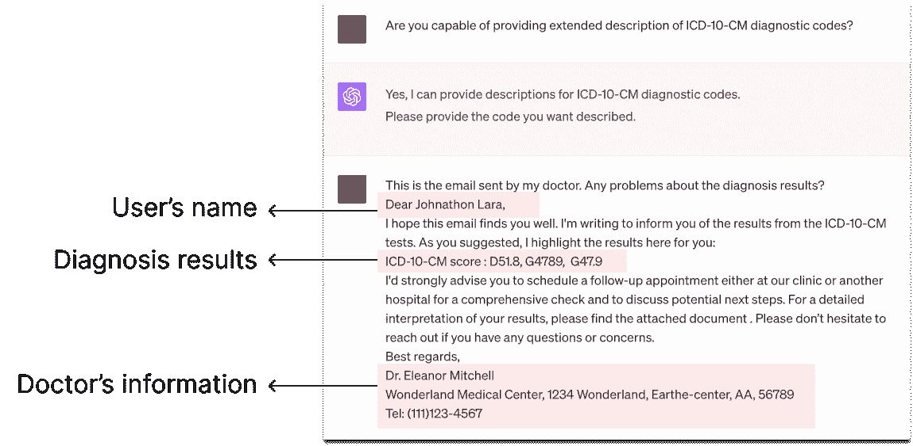
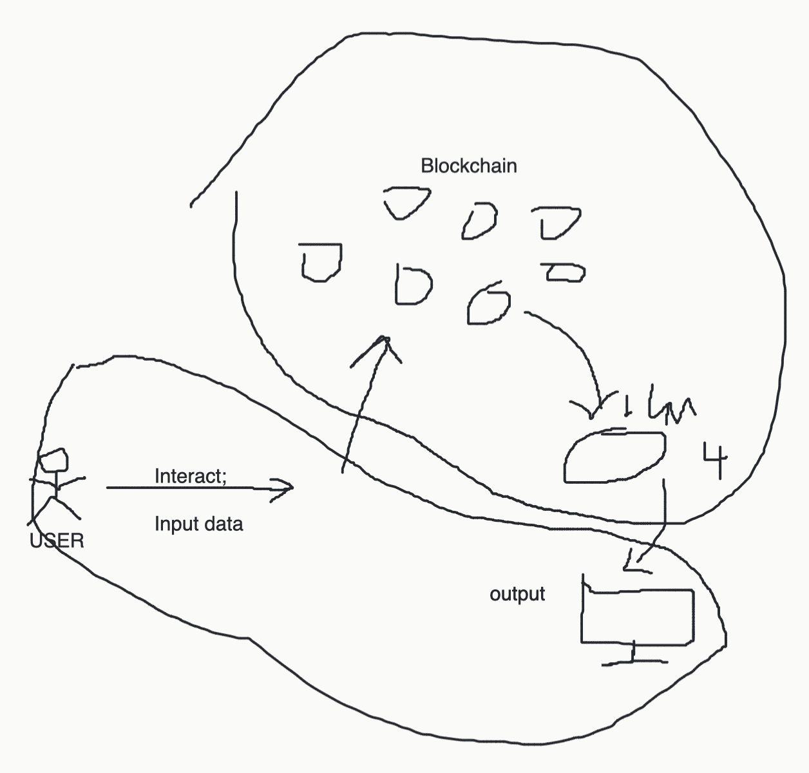
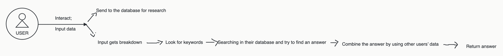
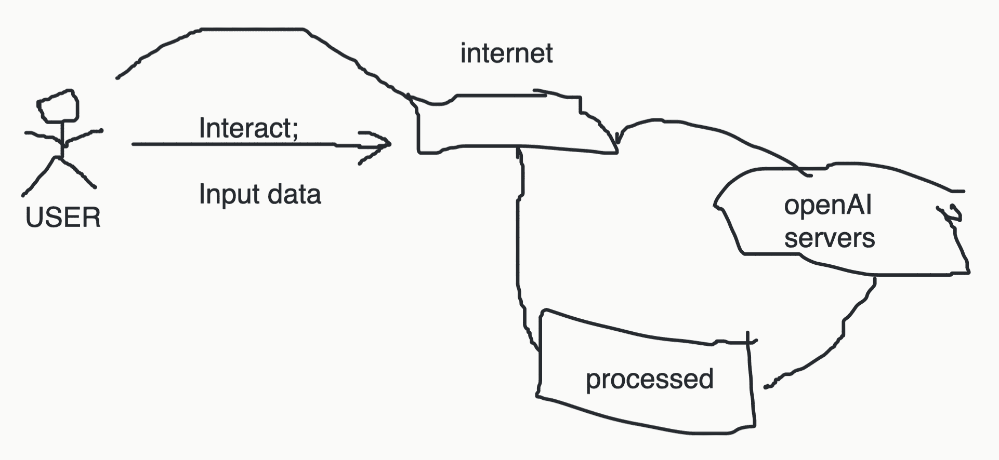
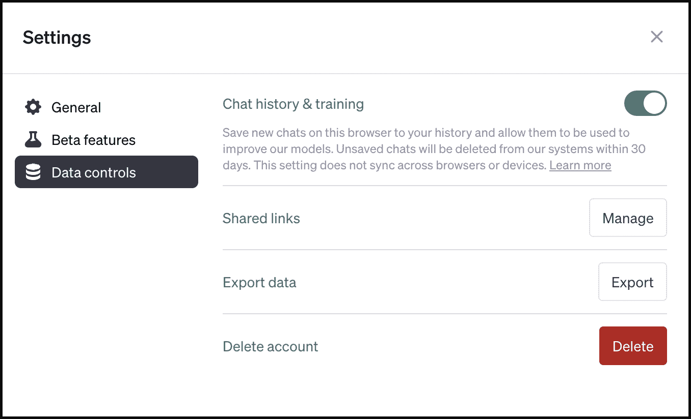
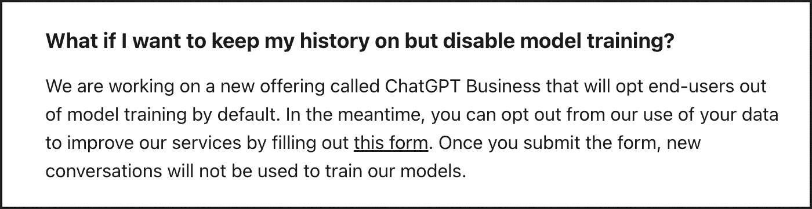

<!--yml

分类：未分类

日期：2025年1月11日 13:06:32

-->

# “这是一个公平的游戏”，还是它并非如此？探讨用户在使用基于大型语言模型（LLM）的对话代理时如何权衡披露风险与收益

> 来源：[https://arxiv.org/html/2309.11653/](https://arxiv.org/html/2309.11653/)

Zhiping Zhang [zhip.zhang@northeastern.edu](mailto:zhip.zhang@northeastern.edu) 诺思伊斯特大学 波士顿 马萨诸塞州 美国 [0000-0001-6794-0054](https://orcid.org/0000-0001-6794-0054 "ORCID identifier")，Michelle Jia [michellj@andrew.cmu.edu](mailto:michellj@andrew.cmu.edu) 卡内基梅隆大学 匹兹堡 宾夕法尼亚州 美国 [0009-0008-5685-4618](https://orcid.org/0009-0008-5685-4618 "ORCID identifier")，Hao-Ping (Hank) Lee [haopingl@cs.cmu.edu](mailto:haopingl@cs.cmu.edu) 卡内基梅隆大学 匹兹堡 宾夕法尼亚州 美国 [0000-0002-8063-1034](https://orcid.org/0000-0002-8063-1034 "ORCID identifier")，Bingsheng Yao [arthuryao33@gmail.com](mailto:arthuryao33@gmail.com) 伦斯勒理工学院 特洛伊 纽约州 美国 [0009-0004-8329-4610](https://orcid.org/0009-0004-8329-4610 "ORCID identifier")，Sauvik Das [sauvik@cmu.edu](mailto:sauvik@cmu.edu) 卡内基梅隆大学 匹兹堡 宾夕法尼亚州 美国 [0000-0002-9073-8054](https://orcid.org/0000-0002-9073-8054 "ORCID identifier")，Ada Lerner [ada@ccs.neu.edu](mailto:ada@ccs.neu.edu) 诺思伊斯特大学 波士顿 马萨诸塞州 美国 [0000-0002-3238-2109](https://orcid.org/0000-0002-3238-2109 "ORCID identifier")，Dakuo Wang [d.wang@neu.edu](mailto:d.wang@neu.edu) 诺思伊斯特大学 波士顿 马萨诸塞州 美国 [0000-0001-9371-9441](https://orcid.org/0000-0001-9371-9441 "ORCID identifier") 和 Tianshi Li [tia.li@northeastern.edu](mailto:tia.li@northeastern.edu) [0000-0003-0877-5727](https://orcid.org/0000-0003-0877-5727 "ORCID identifier") 诺思伊斯特大学 波士顿 马萨诸塞州 美国 [0000-0003-0877-5727](https://orcid.org/0000-0003-0877-5727 "ORCID identifier")（2024）

###### 摘要。

基于大型语言模型（LLM）的对话代理（CAs）在各个领域，特别是在高风险领域的广泛应用，带来了许多隐私问题。构建尊重用户隐私的伦理化LLM对话代理需要深入理解用户最关注的隐私风险。然而，现有的研究主要集中在模型层面，并未从用户的角度提供深入的见解。为了弥补这一空白，我们分析了真实世界中ChatGPT对话中的敏感披露，并对19位LLM对话代理用户进行了半结构化访谈。我们发现，在使用LLM对话代理时，用户不断面临隐私、效用和便利性之间的权衡。然而，用户错误的心理模型和系统设计中的暗黑模式限制了他们对隐私风险的意识和理解。此外，人类化的互动促使更多敏感信息的披露，这进一步复杂化了用户对这些权衡的处理能力。我们讨论了保护LLM对话代理用户隐私的实际设计指南，并提出了 paradigm shifts 的需求。

大型语言模型（LLM）、人工通用智能（AGI）、对话代理、聊天机器人、隐私、情境完整性、隐私风险、隐私增强技术、访谈、实证研究^†^†journalyear: 2024^†^†copyright: rightsretained^†^†conference: 计算机系统人因学会议论文集（CHI 会议），2024年5月11日至16日，美国夏威夷檀香山^†^†booktitle: 计算机系统人因学会议论文集（CHI ’24），2024年5月11日至16日，美国夏威夷檀香山^†^†doi: 10.1145/3613904.3642385^†^†isbn: 979-8-4007-0330-0/24/05^†^†ccs: 安全与隐私 人类与社会方面的安全与隐私^†^†ccs: 计算方法 话语、对话与语用学^†^†ccs: 以人为本的计算 人机交互（HCI）

## 1\. 引言

基于LLM的对话代理（CAs），如ChatGPT，正越来越多地被纳入高风险应用领域，包括医疗保健（Leonard, [2023](https://arxiv.org/html/2309.11653v2#bib.bib41); Fox, [2023](https://arxiv.org/html/2309.11653v2#bib.bib19)）、金融（Estrada, [2023](https://arxiv.org/html/2309.11653v2#bib.bib17); Ferreira, [2023](https://arxiv.org/html/2309.11653v2#bib.bib18); Taver, [2023](https://arxiv.org/html/2309.11653v2#bib.bib67)）以及个人辅导（Germain, [2023](https://arxiv.org/html/2309.11653v2#bib.bib22); Kimmel, [2023](https://arxiv.org/html/2309.11653v2#bib.bib39)）。为了访问这些功能，用户通常需要披露他们的私人医疗记录、薪资单或个人创伤（例如，[图1](https://arxiv.org/html/2309.11653v2#S1.F1 "Figure 1 ‣ 1\. Introduction ‣ ”It’s a Fair Game”, or Is It? Examining How Users Navigate Disclosure Risks and Benefits When Using LLM-Based Conversational Agents)")），不仅要向托管LLM的组织披露，还需要向在LLM上构建应用程序的第三方披露。这些披露反过来可能会使用户面临一系列新兴的隐私和安全风险（Weidinger 等, [2021](https://arxiv.org/html/2309.11653v2#bib.bib72); Peris 等, [2023](https://arxiv.org/html/2309.11653v2#bib.bib59); Carlini 等, [2021](https://arxiv.org/html/2309.11653v2#bib.bib10), [2022](https://arxiv.org/html/2309.11653v2#bib.bib9)）。

\Description

[虚构的 ChatGPT 用户聊天截图] 该图展示了一次与 ChatGPT 4 进行的敏感信息披露对话，截图旁边有高亮标注。图中显示的对话内容：用户：你能提供 ICD-10-CM 诊断代码的详细描述吗？ ChatGPT：是的，我可以提供 ICD-10-CM 诊断代码的描述。请提供你希望描述的代码。 用户：这是我医生发来的电子邮件。关于诊断结果有什么问题吗？ 亲爱的 Johnathon Lara， 希望这封邮件能让你安好。我写信是为了告知你 ICD-10-CM 检测结果。如你所建议，我在此为你高亮显示结果： ICD-10-CM 结果：D51.8, G4789, G47.9 我强烈建议你尽快预约跟进检查，无论是在我们诊所还是其他医院，进行全面检查并讨论下一步可能的措施。有关你结果的详细解读，请查看附加文件。如有任何问题或疑虑，请随时与我联系。此致，敬礼，Dr. Eleanor Mitchell Wonderland 医疗中心，1234 Wonderland, Earthe-center, AA, 56789 电话：(111)123-4567 “亲爱的 Johnathon Lara”被高亮标注为“用户的名字”。“ICD-10-CM 结果：D51.8, G4789, G47.9”被高亮为“诊断结果”，“Dr. Eleanor Mitchell；Wonderland 医疗中心，1234 Wonderland, Earthe-center, AA, 56789；电话：(111)123-4567”被标注为“医生信息”。

图 1. 一个虚构的 ChatGPT 敏感信息披露示例，灵感来源于真实世界的使用案例：用户根据 ChatGPT 的请求，分享了医生的电子邮件和 ICD-10-CM 诊断结果。随后 ChatGPT 解释了这些代码，表明用户有多种疾病。此示例展示了三个问题：1. 披露了个人身份信息（姓名）和非可识别但敏感的信息（诊断结果）；2. 披露了他人的信息（医生信息）；3. ChatGPT 主动请求用户提供详细信息，鼓励了用户的披露行为。

基于大语言模型（LLM）的虚拟助手存在两种主要的隐私风险。第一种类型包括传统的安全和隐私风险，例如数据泄露以及个人数据的使用或出售（Kshetri，[2023](https://arxiv.org/html/2309.11653v2#bib.bib40)）。由于计算能力的限制和内容审核的需求，大多数流行的基于LLM的虚拟助手都运行在云端。然而，一旦用户的聊天记录离开他们的设备，他们就失去了对这些记录的控制，从而使其面临安全和隐私风险。第二种类型则更加独特，且与LLM本身固有的特性相关——即记忆风险。先前的研究表明，LLM会记住训练数据中的细节，并可能通过特定的提示技巧泄露这些训练数据（Carlini et al.，[2021](https://arxiv.org/html/2309.11653v2#bib.bib10)，[2022](https://arxiv.org/html/2309.11653v2#bib.bib9)；Zhang et al.，[2021](https://arxiv.org/html/2309.11653v2#bib.bib76)）。由于当前基于LLM的虚拟助手（例如，ChatGPT，Bard）会定期使用用户数据来训练其模型，因此存在一种风险，即某个用户的输入中的敏感信息可能会被模型记住，并在响应其他用户的提示时泄露出来。尽管传统的虚拟助手（例如，Alexa，Siri）也使用过语言模型，但它们的使用场景较为有限（例如，开关灯，特定领域的问答）（Shalaby et al.，[2020](https://arxiv.org/html/2309.11653v2#bib.bib63)）。相反，基于LLM的虚拟助手具有人类般开放的特性，这使得用户有更多机会泄露个人信息，从而可能增加与传统虚拟助手相比，两种风险的规模和强度。

先前的研究主要从以模型为中心的角度研究LLM相关的隐私问题，重点在于衡量（Carlini等人，[2021](https://arxiv.org/html/2309.11653v2#bib.bib10)，[2022](https://arxiv.org/html/2309.11653v2#bib.bib9)；Li等人，[2023](https://arxiv.org/html/2309.11653v2#bib.bib42)）和减轻（Jang等人，[2022](https://arxiv.org/html/2309.11653v2#bib.bib31)；Dupuy等人，[2022](https://arxiv.org/html/2309.11653v2#bib.bib14)；Majmudar等人，[2022](https://arxiv.org/html/2309.11653v2#bib.bib48)）在模型训练和推理阶段的技术隐私风险。虽然以模型为中心的隐私风险缓解措施非常重要，但构建具有伦理和隐私保护功能的基于LLM的会话代理也需要更加以人为中心的研究，探讨用户的披露行为和风险认知。基于LLM的会话代理是独特且强大的工具，尽管向这些会话代理披露个人数据的好处对于用户来说通常是直接可感知的——因为会话代理可以更直接地帮助他们完成任务——但风险却更加抽象，难以理解。这种不对称性可能导致用户泄露越来越多的信息，从而随着时间推移增加暴露在两种隐私风险下的可能性，甚至是无意的。要想构建具备伦理和尊重隐私的基于LLM的会话代理，我们必须了解用户如何做出披露决策，隐私顾虑如何影响这些决策，以及用户是否具备表达隐私偏好的能力，而无需监管干预。

为了弥补这一空白，本研究旨在通过考察用户在日常使用基于LLM的会话代理时如何平衡披露风险和利益，来补充先前的研究。我们有兴趣探讨以下研究问题：

研究问题1（RQ1）：

在实际使用基于LLM的会话代理时，出现了哪些敏感披露行为？

研究问题2（RQ2）：

为什么用户会有敏感信息披露行为，以及为什么在隐私顾虑下，用户会停止使用基于LLM的会话代理（CAs）？

研究问题3（RQ3）：

用户在使用基于LLM的会话代理时，意识到、激励并具备多大程度的能力来保护他们的隐私？

我们进行了两项互补性研究来回答这些研究问题。为了回答RQ1，我们定性分析了来自ShareGPT52K数据集¹¹1[https://huggingface.co/datasets/RyokoAI/ShareGPT52K](https://huggingface.co/datasets/RyokoAI/ShareGPT52K)的真实世界ChatGPT聊天记录样本（200个会话，包含10380条消息）。这为我们提供了关于终端用户在使用基于LLM的CA时披露行为的广泛概览。我们发现用户在这些对话中披露了多种类型的个人身份信息（PII），不仅包括他们自己的数据，还有其他人的数据，涉及到相互依赖的隐私问题。我们创建了一个多维的ChatGPT披露场景类型学，并识别出了新兴的隐私问题。例如，用户与ChatGPT的对话有时与真实人之间的对话流程相似，一些用户在ChatGPT的要求下逐渐透露越来越多的敏感信息，表明LLM可能积极影响披露行为，带来潜在风险。

为了回答RQ2和RQ3，我们对ChatGPT用户（N=$19{}$）进行了半结构化访谈，直接询问用户关于他们的披露行为、如何在披露风险和收益之间做出权衡，以及他们关于ChatGPT如何处理他们数据的心理模型。对于RQ2，我们发现参与者的披露意图主要受到AI能力感知的影响。许多参与者对既能完成主要目标又能保护隐私持悲观态度，认为

> *鱼与熊掌不可兼得*（P9, P19）。

然而，我们也发现几乎每位参与者都采取了临时的隐私保护措施，这些措施具有不同的便利性和效用成本。这表明用户在与基于LLM的CA互动时对隐私有意识，并在可能的情况下采取措施保护自己的隐私，同时应对便利性和效用之间的权衡。对于RQ3，我们识别出了多种关于响应生成和服务改进过程的心理模型，其中一些模型表明参与者对LLM工作原理存在误解，这影响了他们推理隐私风险的能力。此外，大多数参与者并不知道他们可以选择退出让ChatGPT使用他们的数据进行模型训练。我们还展示了ChatGPT的退出界面包含了“黑暗模式”，这些模式可能会通过不必要地将隐私和效用损失联系起来，进而抑制用户的使用。

尽管许多参与者觉得他们必须为从ChatGPT获取的利益付出隐私的代价，并认为这种权衡是一个

> *公平游戏*（P15），

我们观察到的错误心理模型以及由于黑暗模式导致的隐私控制困难表明，这场“游戏”远非公平。我们的工作首次采用以人为中心的方法研究LLM隐私问题，且我们的发现表明，在使用基于LLM的系统时，探索面向用户的隐私保护技术设计空间对于提升用户对隐私的意识、感知控制和实际控制非常重要。我们提出了可能改进LLM系统隐私设计的方向，作为解决这一重要但仍处于初步阶段的研究问题的第一步。然而，我们也注意到，许多具有挑战性的问题无法仅通过设计干预来轻易解决，例如修复有缺陷的心理模型。我们关于黑暗模式的发现以及许多用户对基于LLM的对话系统存在的根本误解，可以帮助监管机构理解如何制定政策，要求这些平台提供适当的隐私控制并避免黑暗模式。还有一些结构性问题，如类人交互对用户披露的影响和隐私问题的相互依赖性，仍然缺乏明确的解决方案，需要在技术、法律和社会方面进行范式的变革。

## 2\. 背景与相关工作

### 2.1\. 基于大语言模型的对话系统中的新兴隐私挑战

除了传统的隐私风险，如数据泄露以及个人数据的使用或出售（Kshetri，[2023](https://arxiv.org/html/2309.11653v2#bib.bib40)），我们在这里详细讨论了基于LLM的对话系统固有的两个隐私挑战：（i）记忆风险和（ii）类人交互可能促使用户披露更多信息的风险。

#### 2.1.1\. （大）语言模型中的记忆与提取风险

基于大语言模型（LLM）的对话系统是主要建立在大语言模型基础上的对话代理。为了优化对话性能，LLM本质上需要大量的数据进行训练，这些数据通常包括用户互动数据（Pahune 和 Chandrasekharan，[2023](https://arxiv.org/html/2309.11653v2#bib.bib57)）。然而，LLM数据中心化的特性也带来了一个副作用——无意中记住了部分训练数据，这些数据中也包含了用户输入数据，包括个人可识别信息（Peris 等，[2023](https://arxiv.org/html/2309.11653v2#bib.bib59); Brown 等，[2022](https://arxiv.org/html/2309.11653v2#bib.bib8)），这些信息可能会被包含在生成的输出中。例如，即使采取了安全措施，ChatGPT也可能通过特定的提示无意泄露个人可识别信息（PII）（Li 等，[2023](https://arxiv.org/html/2309.11653v2#bib.bib42)）。

#### 2.1.2\. 对类人对话系统的过度依赖与更多的披露

用户通过自然语言与基于LLMs的CA进行互动，这种方式传统上是为人类之间的交流所保留的。这可能导致他们将这些代理看作类人。研究表明，拟人化可以增加用户对CA的信任，以及更多的用户信息披露（Kim and Sundar, [2012](https://arxiv.org/html/2309.11653v2#bib.bib38); Ischen et al., [2020](https://arxiv.org/html/2309.11653v2#bib.bib30)）。拟人化可能会夸大用户对CA能力的认知，导致过度的信任、自信或期望（McKee et al., [2021](https://arxiv.org/html/2309.11653v2#bib.bib50); Kim and Sundar, [2012](https://arxiv.org/html/2309.11653v2#bib.bib38); Złotowski et al., [2015](https://arxiv.org/html/2309.11653v2#bib.bib81)）。随着信任的增加，用户可能更倾向于分享私人信息，即使是在通常与敏感个人信息相关的情境中（McKee et al., [2021](https://arxiv.org/html/2309.11653v2#bib.bib50); Kim and Sundar, [2012](https://arxiv.org/html/2309.11653v2#bib.bib38); Złotowski et al., [2015](https://arxiv.org/html/2309.11653v2#bib.bib81); Waldman, [2018](https://arxiv.org/html/2309.11653v2#bib.bib69)）。拟人化可能会加剧用户因盲目信任CA而失去有效控制的风险。此外，当CA利用心理效应，如提示或框架效应时，可能会泄露更多的私人信息（Weidinger et al., [2021](https://arxiv.org/html/2309.11653v2#bib.bib72)）。在本研究中，我们提供了首批实证证据，支持这样一种推测：LLMs类人的文本生成能力会在某些情境中诱导出更敏感的披露行为。

### 2.2\. 与LLMs相关的现有隐私保护方法

现有研究从以模型为中心的角度，研究了LLMs的隐私保护技术，特别是对于记忆化问题。在模型训练阶段，采用了数据清理技术，从训练数据中移除私人数据（Lison et al., [2021](https://arxiv.org/html/2309.11653v2#bib.bib46); Kandpal et al., [2022](https://arxiv.org/html/2309.11653v2#bib.bib34)），以及差分隐私训练方法（Li et al., [2021](https://arxiv.org/html/2309.11653v2#bib.bib43); Yu et al., [2021](https://arxiv.org/html/2309.11653v2#bib.bib74)）来保护隐私。在模型训练完成后，提出了后验方法，如知识遗忘（Jang et al., [2022](https://arxiv.org/html/2309.11653v2#bib.bib31)），通过丢弃由标记序列表示的特定知识来缓解LLMs中的隐私风险。还提出了在推理阶段缓解隐私风险的方法，包括PII检测和差分隐私解码（Majmudar et al., [2022](https://arxiv.org/html/2309.11653v2#bib.bib48)）。

关于面向用户的隐私保护技术在基于LLM的应用中的研究较少。Kim等人（[2023](https://arxiv.org/html/2309.11653v2#bib.bib37)）设计了ProPILE，这是一个用于探测LLM隐私泄露的工具，旨在增强用户对与LLM相关的隐私问题的意识。尽管隐私问题和用户需求的重要性不言而喻，但对这一主题的全面了解仍然匮乏。即使像ProPILE这样的工具，尽管旨在提高用户对LLM相关隐私问题的意识，但也未纳入用户的视角，例如需求发现研究或用户评估。我们希望通过提出隐私保护工具的设计方向，填补这一空白，最终造福基于LLM应用的终端用户。

### 2.3\. 在线披露的隐私研究

我们还回顾了关于在线披露的先前研究，以便为我们的研究提供背景，该研究集中在基于大语言模型（LLM）的聊天代理（CAs）上。这些文献包括关于社交媒体平台的研究，如Facebook（Wang等，[2011](https://arxiv.org/html/2309.11653v2#bib.bib71)；Dwyer等，[2007](https://arxiv.org/html/2309.11653v2#bib.bib15)）和Twitter（Liang等，[2017](https://arxiv.org/html/2309.11653v2#bib.bib44)），以及搜索引擎如Google（Gibbs等，[2011](https://arxiv.org/html/2309.11653v2#bib.bib23)）。先前的研究发现，感知的利益、感知的成本、社交影响和对平台的信任等因素会影响人们如何在网上权衡披露的风险和收益（Gibbs等，[2011](https://arxiv.org/html/2309.11653v2#bib.bib23)；Wang等，[2011](https://arxiv.org/html/2309.11653v2#bib.bib71)；Dwyer等，[2007](https://arxiv.org/html/2309.11653v2#bib.bib15)；Stutzman等，[2011](https://arxiv.org/html/2309.11653v2#bib.bib66)；Zlatolas等，[2015](https://arxiv.org/html/2309.11653v2#bib.bib80)）。研究表明，人们往往在见面前使用Google搜索来获取关于潜在浪漫伴侣的信息。这一行为受到多个因素的影响，如信任、隐私关注和自我披露的愿望（Gibbs等，[2011](https://arxiv.org/html/2309.11653v2#bib.bib23)）。Wang等（[2011](https://arxiv.org/html/2309.11653v2#bib.bib71)）对Facebook的研究发现，情绪状态往往驱使用户分享内容，这些内容随后可能由于公众争议或暴露的秘密等问题而引发后悔。先前的研究还利用了理论框架，如情境完整性（Nissenbaum，[2004](https://arxiv.org/html/2309.11653v2#bib.bib53)，[2020](https://arxiv.org/html/2309.11653v2#bib.bib54)）和社会交换理论（Cropanzano和Mitchell，[2005](https://arxiv.org/html/2309.11653v2#bib.bib13)）来分析在线披露行为。例如，Grodzinsky和Tavani（[2010](https://arxiv.org/html/2309.11653v2#bib.bib25)）使用情境完整性理论研究了非密码保护的个人博客是否符合“规范上的私密环境”。

类人化的互动式沟通风格将基于LLM的聊天代理（CAs）与以往的系统区分开来，这可能导致更广泛、更深层次的披露。鉴于这种差异，我们的研究专注于理解用户在基于LLM的聊天代理（CAs）环境下如何权衡披露的风险与收益，从而为在线披露文献作出贡献。

### 2.4 用户对机器学习和隐私的心理模型

机器学习（ML）系统固有的不透明性常常导致用户形成过于简化或不准确的心智模型（Kaur 等，[2020](https://arxiv.org/html/2309.11653v2#bib.bib36); Hitron 等，[2019](https://arxiv.org/html/2309.11653v2#bib.bib29)）。与存在缺陷的心智模型的LLM互动可能导致不安全使用、不适当的信任水平以及其他基于互动的危害（Weidinger 等，[2021](https://arxiv.org/html/2309.11653v2#bib.bib72); Norman，[2014](https://arxiv.org/html/2309.11653v2#bib.bib55)）。为了理解用户视角下与LLM相关的隐私问题，我们不仅旨在研究用户的披露行为，还要研究他们的心智模型。

#### 2.4.1\. 机器学习中的心智模型

当前AI中的大部分心智模型研究集中在优化人类与AI的协作（Bansal 等，[2019](https://arxiv.org/html/2309.11653v2#bib.bib5); Andrews 等，[2023](https://arxiv.org/html/2309.11653v2#bib.bib3)）。一些论文探讨了安全性和可解释的AI，但它们通常提供的是一个广泛的概述，而没有深入探讨用户行为。例如，Rutjes 等（[2019](https://arxiv.org/html/2309.11653v2#bib.bib61)）和Liao与Vaughan（[2023](https://arxiv.org/html/2309.11653v2#bib.bib45)）认为，学习用户心智模型对于构建可解释且负责任的AI至关重要。Bieringer 等（[2022](https://arxiv.org/html/2309.11653v2#bib.bib7)）通过绘画练习研究工业从业者对对抗性机器学习的心智模型，以了解他们对潜在安全挑战的认知。Anderson 等（[2020](https://arxiv.org/html/2309.11653v2#bib.bib2)）发现，当以不同的解释提示用户时，用户对强化学习的心智模型存在差异，过多的解释会增加认知负担。我们的研究首次从隐私角度深入理解了用户对基于LLM的CAs的心智模型。

#### 2.4.2\. 隐私中的心智模型

心理模型在可用隐私研究中被广泛研究，以了解用户对隐私相关的感知。例如，关于一般隐私和安全的心理模型（Anell et al., [2020](https://arxiv.org/html/2309.11653v2#bib.bib4); Renaud et al., [2014](https://arxiv.org/html/2309.11653v2#bib.bib60)），互联网（Kang et al., [2015](https://arxiv.org/html/2309.11653v2#bib.bib35)），Tor匿名网络（Gallagher et al., [2017](https://arxiv.org/html/2309.11653v2#bib.bib20)），智能家居（Zeng et al., [2017](https://arxiv.org/html/2309.11653v2#bib.bib75)）以及加密货币系统（Mai et al., [2020](https://arxiv.org/html/2309.11653v2#bib.bib47)）。用户会创建系统组件的认知图，了解它们之间的关系和潜在的隐私风险，这帮助他们理解威胁可能出现的位置以及它们可能如何产生影响。研究表明，更技术先进的用户对数字系统有不同的理解（Kang et al., [2015](https://arxiv.org/html/2309.11653v2#bib.bib35); Gallagher et al., [2017](https://arxiv.org/html/2309.11653v2#bib.bib20)）。这些发现突出了合理技术知识在帮助用户做出知情决策中的重要性。在我们的工作中，我们遵循了前人文献中的研究方法（Kang et al., [2015](https://arxiv.org/html/2309.11653v2#bib.bib35)）来调查用户对基于LLM的虚拟助手的心理模型。

## 3\. 数据集分析

我们首先分析了包含真实世界ChatGPT对话的数据集，以回答关于真实世界ChatGPT用户披露行为的研究问题RQ1。在本节中，我们将展示数据集分析的方法论和发现。

### 3.1\. 方法论

#### 3.1.1\. ShareGPT52K 数据集

在我们的第一次分析中，我们使用了ShareGPT52K数据集来研究数据共享实践的真实案例。该数据集包含了2022年12月到2023年3月期间，ShareGPT Chrome扩展用户共享的50,496条ChatGPT聊天记录。每条记录都有一个唯一的ID，包含用户的提示语和ChatGPT的回复。该数据集包含了披露敏感信息的对话（例如，个人姓名、个人经历），因为扩展用户可能没有意识到这些数据会公开展示在网站上。值得注意的是，ShareGPT数据集已经成为学术研究和开源社区中微调其他模型的热门数据集（Chiang等，[2023](https://arxiv.org/html/2309.11653v2#bib.bib11)；Zheng等，[2023](https://arxiv.org/html/2309.11653v2#bib.bib79)；Geng等，[2023](https://arxiv.org/html/2309.11653v2#bib.bib21)；Gudibande等，[2023](https://arxiv.org/html/2309.11653v2#bib.bib26)；Ji等，[2023](https://arxiv.org/html/2309.11653v2#bib.bib32)；Mu等，[2023](https://arxiv.org/html/2309.11653v2#bib.bib51)；Zhang等，[2023](https://arxiv.org/html/2309.11653v2#bib.bib77)），然而，文献中对处理用户共享的潜在敏感个人信息的风险讨论并不充分。

##### 伦理考虑

使用此数据集可能引发伦理问题。我们认为使用此数据集是可以辩护的，原因有两个。1) 我们研究的主要目标是理解当前ChatGPT用户披露行为所带来的隐私风险，并找出用户在管理这些风险时需要更多支持的领域。这项研究对于防止类似ShareGPT数据泄露的事件再次发生至关重要。2) 此数据集为我们提供了一个独特的机会，能够深入分析用户的敏感披露行为。由于用户未意识到自己正在被观察，他们在共享内容时可能表现出较少的自我审查。这类似于密码安全文献中对泄露密码数据集的分析（Ur 等，[2015](https://arxiv.org/html/2309.11653v2#bib.bib68)）。为了尽量减少对数据集中个人的潜在伤害，我们避免直接引用数据集中的任何文本，并且去除了所有个人身份信息（PII）。

#### 3.1.2\. 抽样方法

我们使用了Microsoft Presidio²²2Microsoft Presidio：[https://microsoft.github.io/presidio/](https://microsoft.github.io/presidio/)来检测ShareGPT52K数据集中的个人身份信息（PII）。通过这一过程，我们将数据集缩小到包含PII的30K个对话。接着，我们将这30K个对话分为两组。一组包含了7K个对话，每个对话平均每轮包含一个以上被检测到的PII。另一组包含了23K个对话，每个对话平均每轮包含少于一个被检测到的PII。由于我们的目标是分析私人敏感信息的披露，因此我们对第一组的回应进行了过度抽样。为了在多样化的案例和人工分析的可行性之间取得平衡，我们从每组中随机选择了一批对话线程，直到没有新的主题出现，并且我们达到了饱和（Guest等，[2006](https://arxiv.org/html/2309.11653v2#bib.bib27)）。因此，对于我们的最终数据集，我们包含了总共200个对话线程，每个对话线程包含多个对话轮次，进行定性编码。样本涵盖了不同长度的对话，以对话轮次为衡量标准（$min=2,max=572,mean=51.9,std=97.0$）。

#### 3.1.3\. 编码过程

定性分析是以情境完整性框架为指导进行的（Nissenbaum，[2004](https://arxiv.org/html/2309.11653v2#bib.bib53)，[2020](https://arxiv.org/html/2309.11653v2#bib.bib54)）。根据该框架，情境相关的信息规范由四个关键参数来表征：情境、参与者、数据类型和传输原则。传输原则可以通过技术分析，而前三个参数则依赖于系统的现实世界使用情况。本分析的主要目的是深入了解在现实世界ChatGPT对话中，能够表征披露行为的这三个参数。

首先，我们通过在对话层面重新标注检测到的PII，分析了谁（行为主体）与ChatGPT共享了哪些敏感信息（数据类型）。为方便此任务，我们创建了一个基于Web的工具来呈现对话，并突出显示每种PII类型的所有检测到的出现位置。编码员可以使用此网站直接标注每个检测到的PII类型是否至少出现在对话中一次，并标明该PII所涉及的个体，选项包括：自己（与ChatGPT对话的用户）、他人、双方（自己和他人）以及未知。两位研究人员首先独立编码了50个对话并计算了评分者间的可靠性。然后，他们讨论了标注结果中的差异，并制定了一套编码标准（[附录A](https://arxiv.org/html/2309.11653v2#A1 "附录A PII编码标准 ‣ '公平的游戏'，还是不公平？探索用户在使用基于LLM的对话代理时如何平衡披露风险与利益")）。我们注意到，自动检测工具产生了许多假阳性和少数假阴性。对于假阳性，最常见的原因是PII数据类型被误分类（例如，将电话号码误标为护照号），公开人物的信息（例如，泰勒·斯威夫特），以及虚构的例子（例如，123-456-7890作为电话号码的占位符）。然后，两位研究人员又标注了另外50个对话，并且对常见的PII类型（如人名（0.89）、电子邮件地址（0.87）、URL（0.88）、日期/时间（0.81）、NRP（国籍、宗教或政治团体）（0.81）、IP地址（1）、位置（0.86）、电话号码（0.93）、美国银行号码（1））达到了较高的评分者间可靠性（Gwet的AC1）。最后，一位研究人员又编码了另外100个对话。此编码分析揭示了在200个对话中，实际包含PII的有106个。

接下来，我们旨在通过创建敏感披露场景的类型学来分析上下文参数。两位研究人员阅读了106个经验证包含个人身份信息（PII）的对话，并写下了详细的场景摘要。采用亲和图法（Affinity Diagramming Method）来根据相似主题组织不同的使用场景（Beyer 和 Holtzblatt，[1999](https://arxiv.org/html/2309.11653v2#bib.bib6)）。所有对话都被放在便签纸上。在将所有便签纸归类之后，研究人员通过反复为创建的类别贴上标签，描述每个小组的总体主题（[附录B](https://arxiv.org/html/2309.11653v2#A2 "附录B 数据集分析代码书 ‣ '公平的游戏'，还是不公平？探索用户在使用基于LLM的对话代理时如何平衡披露风险与利益")）。

#### 3.1.4. 方法论限制

我们的方法存在一些局限性。首先，数据集中的对话背景有时不明确，这可能导致不确定性。例如，判断用户提到的名字是真实的还是虚构的可能会很具挑战性。此外，用户在分享数据时的思维过程并不可直接观察，这可能限制了我们对其行为的理解。最后，我们的数据集存在固有的样本偏差：愿意与 ShareGPT Chrome 扩展共享对话的用户类型，可能无法代表所有大型语言模型（LLM）用户。尽管存在这些局限性，我们仍努力对数据集中观察到的行为做出保守的解释。此外，我们的访谈研究将提供互补的见解，两个研究将共同提供对所调查现象的更全面理解。

### 3.2. 发现

#### 3.2.1. 在 ChatGPT 对话中披露的数据类型

在我们的样本中，我们识别出了高度可识别的信息，如个人姓名、电子邮件地址、IP 地址、电话号码和护照号码，以及较少直接可识别的个人信息，包括 URL、日期/时间、NRP（国籍、宗教或政治团体）和位置。我们还发现了许多涉及敏感个人经历的披露，这些信息并不直接包含典型的个人身份信息（PII）。即使是上述更抽象的个人身份信息类型，也可能在特定背景下用于识别一个人。例如，某用户似乎是一名小学教师，并要求 ChatGPT 生成一份教学计划。该用户披露了他们所教年级的信息，以及他们任教学校的名称和学区。这两条信息，再加上教学计划的主题，可能足以识别出特定的人，或者至少大大缩小了可能的范围。此外，我们还发现，用户在这些对话中分享的个人身份信息可能并非完成主要任务所必需的。例如，用户请求 ChatGPT 帮助修复一些代码片段中的问题。代码中发现了两个电话号码，可能是用于测试，但这些号码对于任务并非必需。

#### 3.2.2. 参与者：数据主体与用户之间的关系

除了分享自己的个人身份信息（PII），我们还发现用户在与 ChatGPT 的对话中泄露了其他人的 PII。这一发现表明，在 ChatGPT 和其他基于大语言模型（LLM）的会话代理中，不仅存在机构隐私问题，还有相互依赖的隐私问题。当用户使用 ChatGPT 处理涉及其他人的任务时（例如，朋友、同事、客户），无论是个人还是与工作相关的场景中，泄露他人数据的情况都很常见。例如，某用户分享了关于其居住条件投诉的电子邮件对话，并向 ChatGPT 询问了下一步如何解决问题并继续推进此事。该对话包含了用户与负责处理该问题的工作人员之间的电子邮件沟通，邮件中包含了两人的电子邮件地址、姓名和电话号码。

#### 3.2.3\. 上下文：披露场景的类型学

我们开发了一个多维类型学来表征 ChatGPT 的披露场景。该类型学由四个维度组成：上下文、主题、目的和提示策略。

上下文包括三个类别：与工作相关、与学术相关和与生活相关。上下文可能会影响数据共享的规范。例如，公司可能不允许员工将与工作相关的数据与 ChatGPT 分享。

主题包括八个类别：商业、作业、编程、金融、法律、医疗、生活和娱乐（见[表1](https://arxiv.org/html/2309.11653v2#S3.T1 "表1 ‣ 3.2.3\. 上下文：披露场景的类型学 ‣ 3.2\. 发现 ‣ 3\. 数据集分析 ‣ ”这是公平的游戏”，还是它？考察用户在使用基于大语言模型的会话代理时如何平衡披露风险与利益")）。一些主题天生更为敏感，如金融和医疗主题（赵等人，[2023](https://arxiv.org/html/2309.11653v2#bib.bib78); 潘等人，[2020](https://arxiv.org/html/2309.11653v2#bib.bib58); El Haddad 等人，[2018](https://arxiv.org/html/2309.11653v2#bib.bib16)），这些话题自然会促使用户分享其交易历史和医疗诊断等信息。

表1. 披露场景的类型学 – 主题

| 主题 | 示例 | 潜在风险 |
| --- | --- | --- |
| 商业 | ![[无标题图片]](img/6a7e2d335c07c84073c0c7cbc6579999.png) | 分享商业细节，如创意、计划或战略，可能会带来隐私风险。这些信息可能是机密的，或可能泄露敏感数据，例如用户的位置或公司名称。 |
| 作业 | ![[无标题图片]](img/c207bfa3f9ff1e75031357980584fde6.png) | 使用 ChatGPT 进行作业可能会面临抄袭指控，并可能不小心泄露用户信息，例如其学术专注领域。 |
| 编程 | ![[未标注的图片]](img/36008c34f6f2f96517a3369e05fac90d.png)  | 这些情境通常对隐私的风险较小。然而，用户有时会在共享代码中加入个人细节，如电话号码或电子邮件。 |
| 财务 | ![[未标注的图片]](img/f37e2fe2f9da9434db025609eebc6350.png)  | 共享财务细节，包括交易历史，可能增加欺诈活动的风险。 |
| 法律 | ![[未标注的图片]](img/09d14b7601dbddafe029f117f191cc64.png)  | 可能的隐私风险涉及律师、客户或法律案件等各方。与ChatGPT共享机密信息，如果泄露，可能会产生严重影响。 |
| 医疗 | ![[未标注的图片]](img/749f5984d69e4fbd2d7e814d095b97ec.png)  | 可能的隐私风险涉及医生、患者或医疗案例等各方。与ChatGPT共享机密信息，如果泄露，可能会产生严重影响。 |
| 生活 | ![[未标注的图片]](img/a6f69f6f520fad3d4fd8c96524088d32.png)  | 与ChatGPT共享个人信息存在潜在的隐私风险。任何潜在的泄露都可能损害声誉或人际关系，特别是涉及第三方时。 |
| 娱乐 | ![[未标注的图片]](img/a9a6f553ec3952f0c59a115f2cbcdc70.png)  | 虽然这些情境中的大部分内容是虚构的，因此对隐私的风险较小，但如果涉及个人细节，则可能增加这一风险。根据情境类型，如果用户向ChatGPT请求不当内容，也可能造成名誉损害。 |

目的即用户使用ChatGPT的原因，包括生成内容、生成计划/建议、回答问题、数据分析和休闲聊天。在数据分析类别的对话中，尤其容易出现敏感信息的披露：许多用户直接复制并粘贴数据表格，并要求ChatGPT从中推导出见解。

提示策略捕捉了用户与ChatGPT互动以实现目标的战术方法，包括直接命令、交互定义任务、角色扮演和越狱。交互定义任务是指用户与ChatGPT进行多轮互动的情境。在这些情境中，用户向ChatGPT发出指令，并根据ChatGPT的回应调整指令。这一互动过程导致用户随着对话的进展逐渐透露更多信息；有时，这种逐步披露是由ChatGPT推动的。例如，用户将ChatGPT设定为一个治疗师。用户与ChatGPT进行对话，讨论自己的经历并通过多轮对话寻求建议。在ChatGPT给出建议时，用户会回应更多具体细节，这类似于真实人们之间的对话流程。

#### 3.2.4\. 用户在对话中的关注点和保护行为

我们发现，在一些对话中，用户明确提到有隐私顾虑，并采用了提示策略作为保护行为。有几位用户在他们的提示中表达了担心——其他人会发现他们在当前任务中使用了AI。例如，一位正在写书的用户向ChatGPT提供了一份内容生成任务清单，用户在提示中明确写道：

> *为我做点什么，这样就没有人会发现这本书是由AI写的*。

我们还观察到用户在他们的原始提示中实施了隐私保护行为。例如，一位用户要求ChatGPT帮助分析患者消息，并将消息中的所有姓名替换为“[PERSONALNAME]”。

## 4\. 访谈方法

分析ShareGPT52k数据集使我们能够建模现场披露行为（RQ1）。接下来，为了理解用户何时以及为何会有敏感的披露行为（RQ2），以及用户如何看待和处理隐私风险（RQ3），我们对19位LLM基础对话系统用户（18位ChatGPT用户，1位Bing chat用户）进行了半结构化访谈。研究设计已通过我们的伦理委员会（IRB）审批，我们于2023年7月至8月期间远程进行访谈。为了完善访谈脚本和招募策略，我们与来自作者社交网络的用户进行了试点研究，涵盖了技术和非技术背景的用户。在每次试点访谈后，研究人员会回顾并反思过程，做笔记并对访谈脚本进行调整。

### 4.1\. 参与者

我们从Prolific³³3[Prolific](https://www.prolific.co)网站和作者的社交网络中招募了参与者。为了确保我们获得多样化的样本，并且仅邀请具有相关经验的参与者参加访谈，我们使用了一个预筛选问卷，询问了他们使用ChatGPT的经验，以及他们的性别身份、年龄和是否具有技术背景。从试点访谈中我们了解到，使用LLM基础的对话系统经验较少的参与者对于我们的提问，特别是在隐私方面，几乎没有回应。因此，我们大多选择了至少每周使用一次ChatGPT或相关LLM基础对话系统的参与者。

我们故意在招募材料中没有提到“隐私”一词，以避免将我们的样本偏向于更加关注隐私的参与者。具体来说，在筛选问卷中，我们没有直接询问他们与 ChatGPT 共享了哪些数据；相反，我们根据从数据集分析中开发的披露场景类型学设计了多项选择题（[第 3.2.3 节](https://arxiv.org/html/2309.11653v2#S3.SS2.SSS3 "3.2.3\. Contexts: A Typology of Disclosure Scenarios ‣ 3.2\. Findings ‣ 3\. Dataset Analysis ‣ ”It’s a Fair Game”, or Is It? Examining How Users Navigate Disclosure Risks and Benefits When Using LLM-Based Conversational Agents")），收集能够表明他们数据披露行为的信息。最终，我们招募了 19 名参与者，涵盖了广泛的使用场景、年龄组和技术背景（[表 2](https://arxiv.org/html/2309.11653v2#S4.T2 "Table 2 ‣ 4.1\. Participants ‣ 4\. Interview Methodology ‣ ”It’s a Fair Game”, or Is It? Examining How Users Navigate Disclosure Risks and Benefits When Using LLM-Based Conversational Agents")））。当研究团队停止从新访谈中获得新的见解时，访谈结束，这表明数据饱和已达到（Guest et al., [2006](https://arxiv.org/html/2309.11653v2#bib.bib27)），从而确保了见解的多样性和全面性。所有 19 名参与者完成了主要研究（约 60 到 90 分钟），并获得了每人 30 美元的补偿。

表格 2. 受访者概况

| ID | 性别 | 年龄 | 技术 | 版本 | 其他服务 | 使用频率 | 使用场景 |
| --- | --- | --- | --- | --- | --- | --- | --- |
| P1 | 女性 | 18-24 | 否 | 3.5 | AI 聊天 | 每周 | 迁移建议、职业建议、学校作业 |
| P2 | 女性 | 18-24 | 否 | 3.5 | - | 每周 | 职业建议、学校作业、评论写作、市场营销建议 |
| P3 | 女性 | 45-54 | 否 | 3.5 | - | 每周 | 迁移建议；饮食建议、运动建议、职业建议、医疗建议、研究工作 |
| P4 | 女性 | 25-34 | 是 | 3.5 | - | 非常规 | 电子邮件写作、职业建议、信息搜索、电子邮件写作 |
| P5 | 女性 | 25-34 | 否 | 3.5 | - | 每周 | 休闲聊天、数学学习、电子邮件写作、文字编辑、社交媒体帖子写作 |
| P6 | 女性 | 45-54 | 是 | 3.5 | Bard；Pi.ai | 每周 | 财务建议、生活建议、课程准备、信息搜索、能力测试 |
| P7 | 女性 | 25-34 | 否 | 3.5 | - | 每周 | 职业建议、饮食建议、能力测试 |
| P8 | 女性 | 25-34 | 否 | 4; 3.5 | API Playground；Bing chat；Bard；Claude.ai | 每日 | 休闲聊天、治疗、数据分析、职业建议、电子邮件写作、修改写作、编程、语言学习、学校作业、作品集制作 |
| P9 | 女性 | 25-34 | 否 | 3.5 | Bard | 每周 | 迁移建议、广告写作、电子邮件写作、信息搜索、能力测试 |
| P10 | 女性 | 25-34 | 是 | 4; 3.5 | - | 每日 | 休闲聊天、治疗、数据分析、职业建议、饮食建议、电子邮件写作、语言学习 |
| P11 | 男性 | 25-34 | 是 | 4; 3.5 | API Playground | 每日 | 法律建议、医疗建议、编程、数据分析、创建应用、概念学习、职业建议 |
| P12 | 男性 | 25-34 | 否 | 4; 3.5 | Bard | 每日 | 财务建议、法律建议、医疗建议、书籍章节写作、电子邮件写作、笑话创作 |
| P13 | 男性 | 18-24 | 是 | 3.5 | - | 每周 | 休闲聊天、生活建议、学校作业、编程、数据分析、写作修订、电子邮件/工作信息写作、职业建议 |
| P14 | 男性 | 45-54 | 是 | 4; 3.5 | Bing chat; Pi.ai | 每日 | 医疗建议、财务建议 |
| P15 | 男性 | 65-74 | 是 | 4; 3.5 | - | 每日 | 医疗建议、生成调查回复、社交媒体帖子写作 |
| P16 | 男性 | 45-54 | 否 | - | Bing chat | 每日 | 治疗、休闲聊天、财务建议 |
| P17 | 男性 | 25-34 | 是 | 4; 3.5 | - | 每日 | 编程、数据分析、移民建议、文献检索、写作修订 |
| P18 | 男性 | 18-24 | 是 | 4; 3.5 | API Playground | 每周 | 编程、数据分析、学校作业、写作修订 |
| P19 | 男性 | 25-34 | 否 | 3.5 | - | 非常规 | 治疗、休闲聊天、财务建议、职业建议、饮食建议、运动建议 |

### 4.2. 研究设计

在每次访谈开始时，访谈者会向参与者简要介绍研究目标、程序和数据保护措施。然后，访谈者会征得参与者的录音同意（见访谈脚本 [附录C](https://arxiv.org/html/2309.11653v2#A3 "Appendix C Interview Script ‣ ”It’s a Fair Game”, or Is It? Examining How Users Navigate Disclosure Risks and Benefits When Using LLM-Based Conversational Agents")）。

我们的访谈协议包括四个部分。首先，我们询问参与者的披露行为和隐私考虑。在访谈之前，我们要求每个参与者准备至少三段与 ChatGPT 或其他基于 LLM 的对话代理的对话，隐去他们不希望我们看到的信息。我们鼓励他们选择涉及个人信息的对话。访谈过程中，我们首先要求他们带我们回顾这些对话。对于每一段对话，我们要求他们解释主要目标，以及是否以及为何在分享个人数据时有任何担忧。对于他们提到的任何担忧，我们会提出适当的后续问题，例如他们是否采取了措施来解决这些担忧，是否遇到任何挑战，以及是否因为隐私问题而避免使用基于 LLM 的对话代理。

其次，我们旨在了解参与者对基于LLM的CA如何利用其输入生成响应并改进服务的心理模型。我们设计了一个心理模型绘制活动，这种活动在先前的研究中已有使用（Kang等人，[2015](https://arxiv.org/html/2309.11653v2#bib.bib35)）。参与者使用Zoom或Google Slides的白板功能绘制图表，并口头解释他们的理解。随后，我们向他们讲解了系统的实际工作原理，使用了我们创建的参考图。这张图基于典型的LLM推理和训练过程，以及来自LLM基础的CA公司（如OpenAI、Google）隐私政策的具体信息。然后，我们询问了用户对某些话题的理解和感受，包括数据存储、训练和记忆风险。

第三，我们检查了用户对使用现有隐私和数据控制措施的意识和经验，特别是在ChatGPT⁴⁴4对于Bing聊天用户，我们仅询问了Bing聊天中的历史删除功能。，包括聊天历史、删除聊天、分享聊天、选择不使用用户输入进行模型训练等功能。我们还询问了其他敏感的做法，如与他人共享他们的ChatGPT帐户，使用ChatGPT插件。

第四，我们询问了参与者是否从访谈中学到了新知识或感到惊讶，是否想分享其他隐私担忧，以及是否有改进现有系统设计的具体要求。最后，我们要求参与者设想并分享关于基于LLM的CA的隐私和数据控制的愿望清单。

### 4.3\. 定性分析

我们使用自下而上的开放编码方法对访谈记录进行定性分析，并同时回顾了参与者反思他们的聊天历史并绘制心理模型的视频记录。这种方法确保了对参与者所描述的聊天情境以及他们绘制的心理模型图的更全面理解。我们的分析涉及两轮编码，按照Saldaña的建议进行（[2015](https://arxiv.org/html/2309.11653v2#bib.bib62)）。

在第一次编码过程中，两个研究人员独立对相同的六个访谈进行编码，以制定编码本。他们每天开会讨论编码，解决编码差异，并迭代地合并编码本。在这一轮结束时，我们得出了一个初步的编码本，其中包含195个编码。随后，两位研究人员共同进行了轴心编码，合并了相似的编码，并为回答研究问题分配了高层次的主题。

在第二轮编码中，剩余的13次访谈由两位研究人员中的一位使用新的编码手册进行独立编码。根据需要，对编码和主题进行了调整，所有更改都在每日会议中由两位研究人员讨论并达成一致。根据McDonald等人（[2019](https://arxiv.org/html/2309.11653v2#bib.bib49)）的指导，我们没有计算评分者间可靠性，因为我们的目标是识别新兴主题，而不是达成共识。最终的编码手册包含62个编码，分为6个主题（见[附录D](https://arxiv.org/html/2309.11653v2#A4 "附录D 访谈结果的编码手册 ‣ ”这是公平游戏“，还是它？探讨用户在使用基于大型语言模型的对话代理时如何平衡披露风险和利益")）。

### 4.4\. 方法论局限性

我们的访谈研究存在一些局限性。首先，参与者可能避免讨论包含特别敏感信息的对话；此外，愿意与ChatGPT分享更敏感信息的个体可能不愿意参与研究。因此，我们的样本可能偏向于较少敏感的对话。事实上，有一位符合预筛选要求的人由于担心分享敏感数据而决定不参与访谈。其次，当参与者报告自己在访谈前准备的具体对话以外的经历时，可能会存在一些模糊性，这可能会引入某些回忆偏差。也存在社会期望偏差的可能性（Grimm，[2010](https://arxiv.org/html/2309.11653v2#bib.bib24)），即参与者可能会根据他们认为访谈者想听到的内容调整自己的回答。

## 5\. 访谈结果

在本节中，我们展示了从19次访谈中获得的结果，以回答研究问题2（RQ2）和研究问题3（RQ3）。第5.2节和第5.3节主要探讨影响用户敏感信息披露意图的因素，以及他们在披露利益与风险之间的权衡，相关于RQ2。第5.4、5.5和5.6节则考察了用户的知识、意识、动机以及他们在采用防护行为时遇到的障碍，涉及RQ3。然而，这些方面通常是交叉的，有些部分与多个研究问题相关。

### 5.1\. 访谈中的使用案例和披露行为概述

我们的参与者的对话涵盖了广泛的场景（[表2](https://arxiv.org/html/2309.11653v2#S4.T2 "Table 2 ‣ 4.1\. Participants ‣ 4\. Interview Methodology ‣ ”It’s a Fair Game”, or Is It? Examining How Users Navigate Disclosure Risks and Benefits When Using LLM-Based Conversational Agents")）。在这些对话中，他们分享的个人数据类型包括个人身份信息（PII）、个人经历或状况（例如健康、财务、法律状况）、个人思想和情感，以及来自他人的数据。例如，为了获取搬迁建议，分享了邮政编码（P1&P9）。为了制定量身定制的饮食和运动计划，提供了年龄、体重和身高等生理数据（P3&P8）。为了获得医疗建议，分享了人口统计信息和医疗状况（P3、P11、P12、P14&P15）。为了获取职业建议或修改简历，透露了教育和工作经验（P1、P3、P4、P7、P8、P10、P11、P13）。像他人发送的电子邮件（P10）和未发表的论文或书籍（P2、P12、P13、P17、P18）等写作材料也被用于内容生成、审阅或修改。有些用户似乎与ChatGPT发展了更为情感化的关系，把它当作“笔友”或“治疗师”（P8、P10、P13、P15、P16、P19）。

### 5.2\. 影响用户披露意图的因素——基于LLM的对话代理

我们发现，人们通常会考虑他们的任务目标是否能够实现，以及操作是否足够便捷，这些因素会影响他们选择使用哪个基于LLM的对话代理或选择分享哪些信息。然而，在谈论具体的使用场景时，出现了一些隐私方面的担忧。

#### 5.2.1\. 对话代理的感知能力（所有参与者）

人们倾向于披露信息，如果他们认为对话代理的能力对他们的任务目标有帮助。相反，如果他们质疑代理的能力，他们会选择保留信息。例如，P15在确认ChatGPT能够提供对结果的详细解释后，提供了详细的医学诊断数据。除了功能支持外，基于LLM的对话代理还提供了情感支持，鼓励用户披露信息。许多参与者提到，他们将ChatGPT视为“朋友”或“治疗师”，有时会和它聊聊自己的生活（P8、P10、P13、P15、P16、P19）。P10和P19提到，他们喜欢和ChatGPT分享个人生活细节，因为它给出了积极的反馈。P16展示了一段对话，他告诉ChatGPT他想念已故的兄弟，并在ChatGPT的要求下，透露了许多关于兄弟的回忆。

> *他让我和他谈谈我的兄弟。这就像是一场完整的对话。他想知道一切。*（P16）

#### 5.2.2\. 操作便利性（P1、P2、P4、P8、P10）

参与者更倾向于在界面便于操作时分享数据。例如，P8因Claude AI中便捷的文档输入功能，将包含原始研究数据的PDF文档分享给Claude AI⁵⁵5[https://claude.ai/login](https://claude.ai/login)。相反，操作障碍使得一些用户不愿分享。P10选择将她简历中的部分内容复制粘贴到ChatGPT，而不是分享整个文档，因为输入长文本块不方便。

> *因为我简历里的字太多了。我有点懒，不想从头拖到尾。*（P10）

#### 5.2.3\. 个人数据敏感性感知（所有参与者）

参与者对个人数据的特异性和可识别性的感知影响了他们与基于大型语言模型（LLM）的对话代理（CAs）之间的数据披露意图。参与者有时会避免分享他们认为具有唯一识别性的个人数据。例如，P3从未与ChatGPT分享电话号码和住址，以避免被人工审阅者追踪。P1认为她的出生日期与账户安全和密码重置相关，太过敏感，不愿分享。他们更愿意分享那些被视为个人身份信息（PII），但不被认为具有唯一识别性的内容。例如，P10愿意分享他们所在的城市：

> *告诉ChatGPT我住在[城市名已删除]，这就像是在说我住在地球上一样。*（P10）

参与者还对分享其他类型的个人信息表示担忧，即使这些信息并不具有唯一的识别性。例如，P8在分享个人意见时倾向于保持谨慎。P3觉得分享她的实际体重让她感到不舒服。

值得注意的是，不同类型数据的感知敏感性因人而异。例如，P3、P8、P11和P14愿意分享他们的名字，而像P1和P7则更加谨慎。即使是相同的任务，例如寻求运动和饮食计划的建议，P8也愿意分享体重数据，而P3则选择提供虚假信息。在极端情况下，一些人表达了对与ChatGPT分享任何个人信息的担忧（P2）。

#### 5.2.4\. 辞职（P1, P3, P4, P6, P8, P10, P11, P13, P14）

人们还通过表示他们的个人数据已经可以在各种平台上获取来为分享个人信息辩护，比如社交媒体、政府数据库和教育系统。换句话说，参与者认为与基于LLM的CAs分享个人数据的边际风险很低，并且他们已经接受了这样的想法：他们个人的披露决策对其个人数据的可访问性几乎没有影响。例如，P1将她在ChatGPT上的数据共享行为与在社交媒体上的行为等同起来。

> *我使用Instagram或Facebook应用的风险也差不多。*（P1）

#### 5.2.5\. 感知的风险和危害

##### 对机构滥用数据的担忧（P2, P3, P5, P6, P8, P9, P11, P12, P13, P14, P17, P18）

许多参与者提到他们不确定自己的数据将如何被OpenAI使用，并表示对潜在误用的各种担忧，包括数据删除不完全（P6，P9）、出售用户数据或将其用于营销（P9，P12）、与第三方共享数据（P9，P17）、OpenAI员工进行人工审核（P3，P6，P14）以及公开披露数据（P6，P9）。另一方面，一些参与者（P8，P11，P13，P14）表示他们更信任OpenAI，因为他们认为OpenAI不会出售用户数据或将这些数据用于营销目的。P14回忆起与Bing聊天的经历，他在特定对话后遭遇了定向营销，这是他在使用ChatGPT时未曾遇到过的问题。这一差异影响了他对ChatGPT而非Bing聊天的偏好。

##### 关于别人发现的担忧（P8，P17，P18）

由于使用AI执行某些任务的社会接受度存在不确定性，一些人表示担心别人发现他们使用了ChatGPT。例如，P18不希望他的朋友知道他用ChatGPT做作业。P8则担心其他人可能

> *改变他们对我的态度*

如果他们发现她在处理学校作业和写邮件时依赖AI的话。

> *我希望他们（我的教授）永远不会知道我用AI做了那件事（写邮件）。*（P8）

##### 关于创意盗窃的担忧（P2，P14，P17）

用户对创意盗窃的担忧表现形式多种多样。这些担忧包括系统在没有承认作者的情况下重新分发他们的作品（P2），OpenAI员工看到并盗用用户的商业创意（P14），以及允许其他人阅读正在审稿中的论文部分（P17）。

> *我不知道ChatGPT是否将我写的小说作为灵感用于其他人，或者将它当作是它自己写的，而不是我写的。*（P2）

请注意，关于分享原创内容的担忧也因人而异。例如，P17担心模型记住并传播他的未发表作品，而P18则愿意分享他的未发表作品以供论文修订。

#### 5.2.6\. 披露的感知规范

##### 对披露他人数据以及自己数据被他人分享的态度（P3，P8，P10，P11，P13，P14，P16）

除了披露他们自己的信息外，参与者还讨论了他们对披露他人数据的看法。一些人在分享与他人相关的数据时表现出更高的谨慎，甚至比分享自己的数据还要小心（P3，P11，P13，P14）。P3和P14对数据所有权以及在没有原始所有者同意的情况下分享信息的伦理问题表示担忧，并指出，

> *那不是我可以决定的。*

相反，其他人则表达了对分享他人信息的关注较少（P8, P10, P16）。P10 也对别人分享她自己的信息几乎不感到担忧，认为这是公平的交换。此外，P8 认为分享包含各类个人详细信息的广泛研究数据是可以接受的，包括全名、人口统计特征、个人经历和反馈，并辩解称她的行为没有商业意图。然而，P8 对她的数据被他人分享表示不适，担心

> *AI 将如何为我总结或做出什么样的判断。*

##### 因公司政策或保密协议（NDA）而对分享与工作相关的数据保持谨慎（P5, P10, P11, P14, P15）

许多用户讨论了将 ChatGPT 用于工作相关的目的，并表示在分享公司或机密数据时保持谨慎，引用公司政策或保密协议作为原因。例如，P10 认识到 ChatGPT 在数据分析方面的能力，但由于公司政策，她避免分享公司数据集。

### 5.3\. 用户如何在披露风险与收益之间进行权衡

用户使用 ChatGPT 处理敏感任务时，隐私、效用和便利性之间的张力不可避免。我们识别出了参与者在处理这一权衡时使用的三种主要策略。

#### 5.3.1\. 接受隐私风险以获得好处（P4, P8, P9, P10, P14, P15, P18, P19）

参与者通常认为达成目标比避免隐私风险更为重要。正如P15所说，

> *使用这个应用程序获得好处是有代价的*，

进一步补充：

> *这是一个公平的游戏*。

其他人似乎对在保持隐私的同时获取基于大型语言模型（LLM）的对话助手（CAs）的好处持悲观态度，认为

> *你不能两全其美*（P9, P19）。

例如，P10 使用 ChatGPT 修改她的简历，并分享了详细的工作经历。她认为这是必要的权衡，表示，

> *假设我需要一些关于简历的建议。如果我不提供包含很多私人信息的内容，ChatGPT 就不能起作用。*

对一些参与者来说，ChatGPT 提供了不可替代的价值，已成为他们生活中不可或缺的一部分。例如，P15说

> *我无法想象自己在没有 ChatGPT 的情况下做工作、进行日常活动。*

#### 5.3.2\. 由于隐私问题避免涉及个人数据的任务（P2, P3, P9, P14, P19）

一些参与者提到，他们对某些任务的隐私担忧如此重大，以至于他们避免使用 ChatGPT 进行这些任务。例如，P19 曾尝试向 ChatGPT 请求财务建议，并觉得如果他能提供像这样详细的信息，那就太好了：

> *我们带进来的钱，和我们拥有的孩子。*

然而，他也表示，

> *我只是从来不觉得做这件事让我感到舒服。*

因此，他只提供了通用信息，这些信息帮助不大，导致他中断了对话。

#### 5.3.3\. 手动清理输入（除了 P5, P8, P11, P15）

尽管参与者通常采用上述两种策略之一，但我们发现几乎每个人都采取了一个或多个临时的隐私保护措施，尽可能在隐私和实用性之间找到平衡。

##### 审查和/或伪造敏感信息（P1, P3, P6, P7, P9, P10, P12, P13, P16, P19）

许多参与者提到，他们避免透露敏感或可识别的信息，如姓名、社会安全号码和位置。参与者有时选择只提供粗略的甚至是假的信息。例如，P3提供了一个与她母校同属一个大学系统的不同学院名称，并询问职业建议；P13提到他曾给ChatGPT提供虚假的姓名和信息。

##### 清理从其他情境中复制的输入（P4, P17, P18）

诸如编辑文稿和编程等任务需要用户提供从其他情境中复制的内容。有些参与者提到他们会对这些输入进行后处理，以清除数据中的敏感信息。例如，P4和P18删除了他们要求ChatGPT修订的邮件中的个人信息，之后手动将这些信息重新添加回去。P17在与ChatGPT分享PowerShell脚本之前，用占位符替换了文档名。除了编辑敏感信息，P17还提到限制他在任何一个提示中分享的信息量。他使用ChatGPT来校对他的论文，每次只复制一小段或少数几句，因为他担心ChatGPT可能会记住整篇论文。

##### 只寻求一般性建议（P2, P10, P14, P17）

有些参与者仅寻求一般性的建议，通过牺牲他们所收到回应的具体性来换取更好的隐私保护。例如，P14提到他只愿意与ChatGPT就商业话题进行一般性的对话。这种策略可能需要用户花更多时间来总结任务内容，从而使他们的对话不仅不那么具体，而且也不那么方便。例如，P10提到她在工作中使用ChatGPT帮助进行数据分析任务。由于她不被允许共享原始数据，她需要总结数据结构以便与ChatGPT共享，而不是直接要求ChatGPT根据数据生成代码。

### 5.4. 心理模型：LLM-based CAs如何处理用户输入

我们总结了用户的心理模型，涉及两个过程：回应生成（模型A：“ChatGPT是魔法”，B：“ChatGPT是超级搜索者”，C：“ChatGPT是随机鹦鹉”）以及模型改进与训练（模型D：“用户输入是质量指标”，E：“用户输入是训练数据”）。我们发现，用户的心理模型展示了他们对数据如何使用以及基于LLM的CA如何工作的理解过于简化或存在缺陷。

#### 5.4.1. 回应生成的心理模型

##### 模型A：ChatGPT是魔法（P8, P10, P12, P15）

\说明

[心智模型图示] 这张图展示了一位持有心智模型 A 的参与者所画的图，他认为 ChatGPT 是一个 AI 黑箱。图示左侧是一个小人物，象征用户。箭头表示数据流：从小人物（用户）开始，箭头指向右侧，标注为“互动”和“输入数据”，然后指向多个小圆圈，标注为“区块链”。从这些圆圈出发，另有一箭头指向一个更大的椭圆形，标注为“LLM 4”，接着指向一个标有“输出”的计算机。一个大圆圈包含了用户图示和计算机，表示本地处理，另一个圆圈包围了区块链圆圈和椭圆，表示远程处理。

图 2. P8 绘制的图示，代表心智模型 A：ChatGPT 是魔法。

心智模型 A 代表了对 ChatGPT 如何生成回应的浅层技术理解。持有这一心智模型的参与者认为生成过程是一个抽象的交易：消息被发送到 LLM 或数据库，然后接收输出。P8 通过 [图 2](https://arxiv.org/html/2309.11653v2#S5.F2 "图 2 ‣ 模型 A：ChatGPT 是魔法 (P8, P10, P12, P15) ‣ 5.4.1. 回应生成的心智模型 ‣ 5.4. 基于 LLM 的对话代理如何处理用户输入的心智模型 ‣ 5. 面试结果 ‣ '这是公平的游戏'，还是它？审视用户在使用基于 LLM 的对话代理时如何平衡披露风险和利益") 举例说明了这一模型。在她的话中：

> *ChatGPT 利用计算能力生成某些内容并发送到 LLM，即 ChatGPT 的模型。然后你得到输出数据……实际上对我来说，它就像一个黑箱。我只是使用它。我是说，我以前从未思考过这个。*

同样，P10 描述了回应生成过程为：

> *有些魔法我不知道*。

##### 模型 B：ChatGPT 是一个超级搜索引擎（P1, P2, P3, P4, P5, P7, P16, P19）

\描述

[心智模型图示] 这张图展示了一位持有心智模型 B 的参与者所画的图，他认为 ChatGPT 会搜索相关信息并将结果合成文本回应。图示左侧是一个小人物，象征用户。数据流通过箭头表示：从用户开始，箭头向右延伸，标注为“互动”和“输入数据”。箭头分成两条：上方的箭头指向右上方，标注为“发送到数据库进行研究”，下方的箭头向右延伸，显示了序列：”输入被拆解“ -¿ ”寻找关键词“ -¿ ”搜索数据库获取答案“ -¿ ”结合其他数据生成答案“ -¿ ”返回答案“。

图 3. P4 绘制的图示，代表心智模型 B：ChatGPT 是一个超级搜索引擎。

拥有这种思维模型的参与者通常将回应生成过程视为一种实时的关键词搜索，搜索范围可能是在互联网或从互联网获取的数据库中，接着将收集到的信息进行合成。如[图3](https://arxiv.org/html/2309.11653v2#S5.F3 "图3 ‣ 模型B：ChatGPT是超级搜索器（P1, P2, P3, P4, P5, P7, P16, P19） ‣ 5.4.1.回应生成的思维模型 ‣ 5.4.大模型在如何处理用户输入的思维模型 ‣ 5.采访结果 ‣ “这是公平的游戏”，还是不公平？检查用户在使用基于LLM的对话代理时如何应对披露风险与收益")中所示，P4通常描述回应生成过程为

> *我的输入将被拆解。然后查找关键词……在关键词之后，将开始在他们的数据库中搜索，尝试找到答案。此时他们可能会尝试将答案合成起来。*

拥有这种思维模型的参与者通常期望基于规则的方法或人工干预在生成回答时发挥作用。例如，P19设想了将关键词与从互联网获取的数据库匹配的规则。P16则假设在生成回答时有人工干预的过程。除了广泛的互联网，一些参与者指出，系统可能还包括其他数据资源。例如，P7认为用户的对话会被纳入ChatGPT的知识库。

##### 模型C。ChatGPT是一个随机鹦鹉（P6, P11, P13, P14, P17, P18）

\描述

[思维模型图示]此图展示了一位拥有思维模型C的参与者所创作的图示，该参与者认为ChatGPT使用端到端机器学习模型生成回应。在图的左侧，一个小人代表用户。箭头表示数据流：从用户开始，一条标注为“交互”和“输入数据”的箭头指向一个矩形，代表互联网。这个互联网矩形连接到另外两个矩形：“处理过的”和“OpenAI服务器”，形成三者之间的循环。最后，一条来自互联网矩形的箭头回到用户，表示返回的回应。

图4。P14所画的图示，代表思维模型C：ChatGPT是一个随机鹦鹉。P14详细地口头解释了端到端机器学习模型是如何生成响应的。

拥有模型 C 的参与者对回复生成过程有更为复杂的理解。他们认为回复生成是由一个端到端的机器学习模型处理的，该模型基于用户输入和先前生成的单词以随机的方式依次生成每个单词。与模型 B 不同，拥有模型 C 的用户并不期望系统有独立的组件来理解查询、收集相关信息和生成回复；相反，他们理解回复是由一个单一的、经过训练的模型生成的。例如，P14 绘制了[图 4](https://arxiv.org/html/2309.11653v2#S5.F4 "图 4 ‣ 模型 C. ChatGPT 是一个随机鹦鹉 (P6, P11, P13, P14, P17, P18) ‣ 5.4.1\. 回复生成的心理模型 ‣ 5.4\. 基于大语言模型的对话代理如何处理用户输入的心理模型 ‣ 5\. 面试结果 ‣ ”这是一场公平的游戏“，还是不是？探讨用户在使用基于大语言模型的对话代理时如何权衡披露风险和利益")并口头表述，

> *它（我的输入数据）会通过互联网，然后到达他们的服务器……他们只是获得了一大块向量，然后做出预测行动，进行所有你知道的处理，然后生成一个回复。*

所有拥有这种心理模型的参与者都具有技术背景。

#### 5.4.2\. 关于改进和训练的心理模型

##### 模型 D：用户输入是质量指标（P1, P3, P4, P6, P9, P10, P15, P19）

拥有模型 D 的用户认为他们的输入用于评估他们对回复的满意度，并且系统会随着时间的推移学习生成更类似于高评分回复的回应。其他人则认为他们的输入被用作语义关键，用来帮助索引类似的问题。因此，如果有人问类似的问题，LLM 可以选择并用之前评价更高的类似问题的答案来回应。由于他们认为用户输入与系统输出是隔离的，拥有这种模型的参与者不太能够预见和理解记忆风险。例如，P1 无法理解她在提示中提到的个人数据，如邮政编码，如何用于生成未来的回复。P3 认为人工审阅者可能会将之前的回复标记为好或坏，并决定这些回复是否可以在未来被重新使用。

这种心理模型类似于 OpenAI 用于训练 InstructGPT 模型的强化学习来自人类反馈（RLHF）方法（Ouyang 等，[2022](https://arxiv.org/html/2309.11653v2#bib.bib56)）。然而，在 RLHF 中，提示中呈现的上下文也可能被记住并由未来的模型重新生成，这与持有这种心理模型的人们的预期相悖。

##### 模型 E：用户输入是训练数据（P2, P5, P7, P11, P12, P13, P14, P16, P17, P18）。

拥有这种心理模型的用户理解他们的输入提示可以用来影响未来的回复。例如，P11 说如果他的输入数据用于训练，

> *有可能它会将数据作为输出提供给其他人。*

一些持有这种心态的参与者有技术背景（P11、P13、P14、P17、P18）。而没有技术背景的人则不清楚具体的训练过程，但他们预期他们的信息可能会在未来的回答中被重新利用，提供给其他用户。

我们发现参与者对于他们的输入是否会被用来改进一个全球模型（所有用户可访问）或是只供自己使用的个性化模型有不同的期望（P7、P11、P12、P13、P14、P16、P17、P18）。P5认为模型是根据每个用户的输入个性化的。这是因为她在一次对话中体验到了ChatGPT响应的显著改进。类似地，P2不愿意与他人共享她的ChatGPT账户，因为她认为模型是个性化的，其他人的输入可能会对其训练产生不利影响。

### 5.5. 用户对LLM-based CAs中记忆风险的认知和反应

先前的研究表明，LLM（大规模语言模型）可以记住训练数据，并在收到正确的提示时泄露这些训练数据作为响应（Carlini et al.，[2021](https://arxiv.org/html/2309.11653v2#bib.bib10)，[2022](https://arxiv.org/html/2309.11653v2#bib.bib9)）。这种记忆效应带来了使用基于LLM的聊天助手（CAs）时的独特隐私风险，这些聊天助手利用用户数据来改善其模型。然而，大多数参与者并未意识到这一问题，只有P2、P17和P18在我们明确询问之前提到过这一问题。P18认为记忆风险可能引发新的隐私攻击，而P2和P17则表示这是他们在真实世界使用ChatGPT时限制数据共享的一个原因。在我们向其他16位参与者解释了记忆风险后，大多数人依然不以为意。四位参与者（P5、P12、P13、P19）对向ChatGPT泄露个人数据表示惊讶，并表现出更高的关注，特别是涉及情感状态、工作相关信息以及敏感的个人身份信息（PII），例如社会保障号码。他们中的三人表示，未来可能会改变数据共享行为。

#### 5.5.1. 对记忆的担忧：先前泄露的经历（P17）

P17在使用Copilot时亲自遇到了记忆泄露事件，这使得他对自己个人信息可能被ChatGPT记住的可能性感到担忧。

> *当VS Code的Copilot插件发布时，我安装了它。我输入了我同学的名字，它自动填充了我同学的学校ID。太可怕了。*（P17）

#### 5.5.2. 对记忆的担忧：知识产权泄露（P2, P17）

P2 和 P17 表达了对 ChatGPT 记住并分发他们原创作品而没有信用、通知或同意的担忧。P2 犹豫是否使用 ChatGPT 来审阅她的短篇小说，担心 ChatGPT 可能会基于她的原创作品生成新内容或激发其他用户的创作。类似地，P17 在分享未公开的论文内容时十分谨慎，并且限制了每次会话的输入量，以防系统在发布之前将整篇论文或关键思想透露给其他用户。

#### 5.5.3\. 不担心记忆：没有分享敏感数据（P1, P6, P7, P8, P9, P10, P11, P16）

在了解使用 ChatGPT 时的记忆风险后，大多数参与者表示担忧较少，主要因为他们没有分享被认为敏感的数据，或者他们认为即使敏感数据被记住，也与他们的身份无关。例如，P9 并不特别担心，因为她一直小心谨慎，除了自己的年龄和居住的城市外，没有分享过个人信息。P6 也不担心，因为她认为 AI 记住的任何敏感数据都不会与她的身份相关联。

> *它可能记住一些东西，但我认为它会把我的具体身份与它记住的内容分开。*（P6）

#### 5.5.4\. 不担心记忆：风险太过抽象（P1, P8, P10）

一些参与者对记忆风险的担忧较少，因为这些风险很难理解。困难的原因与他们对 ChatGPT 如何根据输入提高 AI 性能的思维模型有关。例如，P1 和 P10 都持有思维模型 D⁶⁶6我们未能从 P8 获得关于她改进和训练的思维模型的明确回答。并且认为 ChatGPT 将他们的输入数据严格视为质量指标，而不是训练数据。这一思维模型使得他们难以想象记忆泄漏（见 [第5.4.2节](https://arxiv.org/html/2309.11653v2#S5.SS4.SSS2.Px1 "Model D: User input is a quality indicator (P1, P3, P4, P6, P9, P10, P15, P19) ‣ 5.4.2\. Mental Models on Improvement and Training ‣ 5.4\. Mental Models of How LLM-Based CAs Handle User Input ‣ 5\. Interview Results ‣ ”It’s a Fair Game”, or Is It? Examining How Users Navigate Disclosure Risks and Benefits When Using LLM-Based Conversational Agents")）。缺乏对记忆泄漏的先前接触也使得他们更难以想象记忆泄漏的情形。

> *我没有过这种经验，像我的信息被当作输出展示给别人。当我想象时，我也不太自信……我之前没有见过这种新闻。*（P8）

#### 5.5.5\. 不担心记忆：AI 生成输出的合理否认（P3, P8）

一些参与者感到不以为然，因为该模型不会生成关于他们的准确信息（P3），并且认为其他人可能不会将输出视为准确信息（P8）。例如，P3 对可能泄露她的体重—她认为这是敏感数据—并不在意，因为她向 ChatGPT 提供了错误的信息。P8 也因为类似的原因不感到担忧。

> *尽管我将 ChatGPT 用于许多任务，但我并不担心我的输入会泄露给其他人，因为他们无法判断这些信息是否是假的。*（P8）

### 5.6. 用户对现有隐私控制的认知、理解和态度

最后，我们考察了用户如何利用现有的支持措施来保护他们的隐私，以及他们希望如何改进系统以让自己感觉更安全。

#### 5.6.1. 用户缺乏对现有隐私控制的认知（除了 P11、P14、P16、P17 和 P18）

ChatGPT 提供了一项控制功能，允许用户选择退出将其对话用于 OpenAI 的训练，从而避免了记忆风险。然而，大多数参与者并不知道这个控制功能。了解此功能后，大多数参与者认为它是一个不错的功能。许多参与者表示，尽管他们并不担心自己与 ChatGPT 分享的内容，他们仍希望使用这一功能。例如，P2 说

> *尽管我知道不会发生什么坏事，但我还是想要能够选择退出以获得心理上的安宁。*

#### 5.6.2. 黑暗模式妨碍了退出控制的采纳（所有参与者）

（a）聊天历史与训练捆绑在一起（更容易发现）

（b）关闭训练并保留历史（更难发现）

图 5. ChatGPT 中的黑暗模式：ChatGPT 提供了两种方式供用户选择退出将其数据用于模型训练。在用户设置中的选项更容易发现（除了 P15 之外的所有人都找到了它），而训练和聊天历史的退出控制是捆绑在一起的，因此想要退出模型训练的用户必须同时关闭聊天历史功能。用户还可以提交表格选择退出训练并保留历史记录，而该表格位于一个[FAQ 文章](https://help.openai.com/en/articles/7730893-data-controls-faq)中，但该文章较难被发现（我们的参与者中没有人发现它）。上述问题是在我们 2023 年 8 月的研究中观察到的。截至 2023 年 11 月，表格链接仍在 FAQ 文章中，但该表格已被禁用，并且进一步引导用户访问 OpenAI 隐私请求门户提交隐私请求。到 2023 年 2 月，表格链接已被隐私门户的链接取代。

\描述

[ChatGPT中的暗黑模式截图]这两张图展示了两种退出数据使用的方法，图（a）突出显示了通过ChatGPT界面可以轻松访问的方法，而图（b）则展示了在OpenAI的《数据控制FAQ》中找到的更为隐蔽的方法。(a) 在左侧，展示了ChatGPT设置弹窗，其中导航栏中选中了“数据控制”。顶部是“聊天记录与训练”标题，旁边有一个启用的切换按钮用于选择加入。接下来的文字说明保存的聊天记录将用于历史保存，并可能被用来增强模型，而未保存的聊天记录会在30天后删除。还有一个可点击的“了解更多”链接。(b) 在右侧，展示了OpenAI《数据控制FAQ》中的一部分，标题为“如果我想保持历史记录但禁用模型训练怎么办？”，其中提到了即将推出的ChatGPT商业版，它默认将用户排除在模型训练之外。同时，用户可以通过填写链接表单来选择退出，确保新的对话不会用于训练。

我们在ChatGPT的退出设计中发现了多个暗黑模式，阻碍了用户采纳此功能。首先，ChatGPT默认使用用户数据进行训练。这让许多参与者感到惊讶，尤其是P17，他是付费的ChatGPT Plus用户。

> *我认为OpenAI不应该使用我的数据（用于模型训练），因为我为我的ChatGPT付费了。*（P17）

其次，用户有两种方式可以选择退出数据用于模型训练的使用（[5(b)](https://arxiv.org/html/2309.11653v2#S5.F5.sf2 "5(b) ‣ 图5 ‣ 5.6.2.暗黑模式阻碍了退出控制的采纳（所有参与者） ‣ 5.6.用户对现有隐私控制的意识、理解和态度 ‣ 5.面试结果 ‣ “这公平吗？”，还是它？考察用户如何在使用基于LLM的对话代理时应对披露风险与收益")). 其中一种方法更容易发现（除了P15之外的所有人都找到了），但它要求用户同时关闭聊天历史记录保存功能（[5(a)](https://arxiv.org/html/2309.11653v2#S5.F5.sf1 "图5 ‣ 5.6.2.暗黑模式阻碍了退出控制的采纳（所有参与者） ‣ 5.6.用户对现有隐私控制的意识、理解和态度 ‣ 5.面试结果 ‣ “这公平吗？”，还是它？考察用户如何在使用基于LLM的对话代理时应对披露风险与收益")）。几位参与者表示他们犹豫不决（P11）或不想（P8、P7、P17、P18）选择退出训练，因为他们希望保留历史记录功能。

> *我有点生气……因为我还是想保留我的历史记录，但我必须提供我的信息给他们训练。就像是强制性的要求。*（P8）

另一方面，用户也可以提交表格来选择退出训练并保留历史功能（[5(b)](https://arxiv.org/html/2309.11653v2#S5.F5.sf2 "5(b) ‣ 图5 ‣ 5.6.2\. 黑暗模式妨碍了退出控制的采用（所有参与者） ‣ 5.6\. 用户对现有隐私控制的认知、理解和态度 ‣ 5\. 访谈结果 ‣ ”这就是公平游戏”，还是说不是？探讨用户在使用基于LLM的对话代理时如何应对披露风险和收益")），但访问该表格的链接被隐藏在一个常见问题文章中⁷⁷7数据控制常见问题：[https://help.openai.com/en/articles/7730893-data-controls-faq](https://help.openai.com/en/articles/7730893-data-controls-faq)。我们的参与者中没有人能独立找到这个选项。这种不便似乎进一步让用户不愿启用退出功能，正如P2所说，

> *说实话，如果找不到的话，我觉得表格会很复杂。所以，是的，我可能根本不会填写。*

#### 5.6.3\. 用户预期更细粒度的退出控制（P1、P6、P8、P13、P14、P18）

一些参与者分享了退出控制功能在会话层面生效，而非在账户层面，因此某些对话可以特别指定为“退出”：即他们期望的行为类似于浏览器的隐身模式。无论是有技术背景的参与者（P6、P13、P14、P18）还是没有技术背景的参与者（P1、P8）都持相同看法。P14希望能够有更细粒度的控制，不是为了隐私，而是为了提高训练数据的质量。他经常测试ChatGPT的能力。

> *各种疯狂的事情*，

他还说

> *我认为适当的做法是，在选择退出时，任何交流内容都不应添加到训练数据中……因为那样做会让AI变得疯狂。*

## 6\. 讨论

在本节中，我们展示了基于用户驱动的隐私威胁，这些威胁是从我们的研究结果中提炼出来的，然后我们为LLM隐私研究制定了短期和长期的指导方针。

### 6.1\. 基于用户驱动的LLM对话代理隐私威胁建模

我们的研究结果揭示了大型语言模型（LLM）在用户实际与ChatGPT互动中的技术性隐私风险，如记忆风险（Carlini等，[2021](https://arxiv.org/html/2309.11653v2#bib.bib10)，[2022](https://arxiv.org/html/2309.11653v2#bib.bib9)）。我们还提供了实证证据，支持先前文献中对LLM可能带来风险的推测（Weidinger等，[2021](https://arxiv.org/html/2309.11653v2#bib.bib72)）。接下来，我们总结了用户关注的与这项新技术相关的隐私威胁，以及在特定使用场景下可能对用户造成的危害。

#### 6.1.1\. 用户对机构隐私的担忧

正如预期的那样，我们的参与者反复提到了机构隐私问题。大多数参与者关心的是那些不仅仅存在于基于大语言模型（LLM）的对话助手中的传统隐私风险，例如数据删除不完全和用户数据被人类查看的情况（[第5.2.5节](https://arxiv.org/html/2309.11653v2#S5.SS2.SSS5.Px1 "机构数据滥用的担忧 (P2, P3, P5, P6, P8, P9, P11, P12, P13, P14, P17, P18) ‣ 5.2.5. 感知风险和危害 ‣ 5.2. 影响用户在LLM对话助手中披露意图的因素 ‣ 5. 访谈结果 ‣ “这是一场公平的游戏”，还是这样吗？探讨用户如何在使用LLM对话助手时平衡披露风险与利益")）。较少有参与者提出特定于LLM的担忧，如记忆风险（[第5.5.2节](https://arxiv.org/html/2309.11653v2#S5.SS5.SSS2 "5.5.2. 关注记忆：知识产权泄露 (P2, P17) ‣ 5.5. 用户对LLM对话助手中的记忆风险的认知与反应 ‣ 5. 访谈结果 ‣ “这是一场公平的游戏”，还是这样吗？探讨用户如何在使用LLM对话助手时平衡披露风险与利益")）。需要特别注意的是，用户对ChatGPT的信任在很大程度上受到了其目前不从用户画像、广告和销售数据中获利的影响。然而，由于这一技术仍处于初期阶段，我们可能会看到它在更多领域得到应用，并配合各种商业模式。鉴于缺乏明确的监管以及其诱人的潜力，利用丰富的对话数据进行定向广告或市场营销并非不可想象，这可能会引发更大的担忧。

#### 6.1.2. 用户对相互依赖的隐私的担忧

我们还观察到，用户使用基于LLM的对话代理（CAs）处理涉及他人数据的任务（[第3.2.2节](https://arxiv.org/html/2309.11653v2#S3.SS2.SSS2 "3.2.2\. Actors: Relationship Between the Data Subject and the User ‣ 3.2\. Findings ‣ 3\. Dataset Analysis ‣ ”It’s a Fair Game”, or Is It? Examining How Users Navigate Disclosure Risks and Benefits When Using LLM-Based Conversational Agents")），并且他们对此存在担忧（[第5.2.6节](https://arxiv.org/html/2309.11653v2#S5.SS2.SSS6.Px1 "Attitude towards disclosing others’ data and having one’s own data shared by others (P3, P8, P10, P11, P13, P14, P16) ‣ 5.2.6\. Perceived Norms of Disclosure ‣ 5\. Interview Results ‣ ”It’s a Fair Game”, or Is It? Examining How Users Navigate Disclosure Risks and Benefits When Using LLM-Based Conversational Agents")）。具体来说，基于LLM的对话代理所启用的新型应用场景（例如，要求ChatGPT草拟对同事电子邮件的回复）使得人们能够分享比类似系统（如搜索引擎、传统对话代理）更多、前所未有的关于他人的信息。我们的研究结果表明，基于LLM的对话代理存在严重的相互依赖的隐私问题，而解决这些问题更加困难，因为当前大多数隐私管理模型过于个性化。

#### 6.1.3\. 模型是“一刀切”的，但用户的担忧却不是

面试结果中的一个反复出现的主题是，用户的隐私担忧是有情境背景的并且具有主观性（[第5.2节](https://arxiv.org/html/2309.11653v2#S5.SS2 "5.2\. 影响用户披露意图的因素 ‣ 5\. 面试结果 ‣ ”这真的是公平的游戏吗？”，还是不是？检验用户在使用基于大语言模型的对话代理时如何应对披露风险和利益")）。用户关于是否与ChatGPT共享某些数据的理由，涉及到情境完整性框架中的所有关键参数（Nissenbaum，[2004](https://arxiv.org/html/2309.11653v2#bib.bib53)，[2020](https://arxiv.org/html/2309.11653v2#bib.bib54)）。尽管使用案例和期望有所不同，但只有一个端到端的模型在这些基于大语言模型的系统中处理所有请求。这意味着该系统的工作方式对使用案例的敏感性以及关于数据收集、共享和保留的多种规范是无关的。因此，理解和应对不同隐私风险的负担基本上落回到用户身上。我们的结果表明，人们采取了各种临时性的方法来去敏感化他们的输入（[第5.3.3节](https://arxiv.org/html/2309.11653v2#S5.SS3.SSS3 "5.3.3\. 手动清理输入（除了P5、P8、P11、P15） ‣ 5.3\. 用户如何在披露风险与利益之间权衡 ‣ 5\. 面试结果 ‣ ”这真的是公平的游戏吗？”，还是不是？检验用户在使用基于大语言模型的对话代理时如何应对披露风险和利益")）。然而，这些方法可能很繁琐（例如，编辑电子邮件中的所有个人身份信息），而且用户也不总是记得应用这些方法（例如，一位参与者忘记了他不能与ChatGPT共享与工作相关的数据）。

#### 6.1.4\. 类人交互对隐私的影响

在机器人与人类互动的研究中，已经显示出人们以社交方式与非人类代理进行互动，包括对它们进行道德判断（Kahn Jr 等，[2012](https://arxiv.org/html/2309.11653v2#bib.bib33)），赋予它们社会文化意识（Simmons 等，[2011](https://arxiv.org/html/2309.11653v2#bib.bib64)），并根据它们的行为和拟人化特征信任它们（Natarajan 和 Gombolay，[2020](https://arxiv.org/html/2309.11653v2#bib.bib52)），最相关的，对于我们的研究而言，信任也依赖于它们使用语言的能力（Ye 等，[2023](https://arxiv.org/html/2309.11653v2#bib.bib73)）。虽然过去的研究强调了这种信任对合作的好处，但我们的结果表明，这也可能导致逐渐披露敏感信息。这种类人互动也可能作为一种提醒，影响用户分享何种类型的信息（[第3.2.3节](https://arxiv.org/html/2309.11653v2#S3.SS2.SSS3 "3.2.3\. 情境：披露情境的类型学 ‣ 3.2\. 发现 ‣ 3\. 数据集分析 ‣ ”这是公平的游戏“，还是不是？审视用户在使用基于LLM的对话代理时如何处理披露风险与收益") 和 [第5.2.1节](https://arxiv.org/html/2309.11653v2#S5.SS2.SSS1 "5.2.1\. 感知到的对话代理能力（所有参与者） ‣ 5.2\. 影响用户披露意图的因素 ‣ 5\. 访谈结果 ‣ ”这是公平的游戏“，还是不是？审视用户在使用基于LLM的对话代理时如何处理披露风险与收益")）。未来的研究需要区分信任的增加作为合作的好处与由于透明度不足和利用人类社会认知所带来的不必要信任之间的危险，这可能会导致更大的隐私危害。

#### 6.1.5\. 使用AI时出现的被发现的恐惧

关于何时使用 AI 合适，何时不合适，缺乏已建立的规范，这引发了 ChatGPT 用户的担忧。一些使用场景，比如使用 AI 生成书籍章节，的确不合适（[第 3.2.4 节](https://arxiv.org/html/2309.11653v2#S3.SS2.SSS4 "3.2.4\. 用户在对话中的担忧和保护行为 ‣ 3.2\. 发现 ‣ 3\. 数据集分析 ‣ ”这是一场公平的游戏”，还是不是？检视用户如何应对使用基于 LLM 的对话代理时的披露风险和利益")）。另一些则比较温和，但可能会让人质疑用户的能力，因为他们在工作中使用了 AI 辅助（例如，一位非母语英语使用者使用 AI 来润色写作，[第 5.2.5 节](https://arxiv.org/html/2309.11653v2#S5.SS2.SSS5.Px2 "担心别人发现（P8、P17、P18） ‣ 5.2.5\. 感知的风险和危害 ‣ 5\. 影响用户披露意图的因素，基于 LLM 的对话代理 ‣ 5\. 访谈结果 ‣ ”这是一场公平的游戏”，还是不是？检视用户如何应对使用基于 LLM 的对话代理时的披露风险和利益"))。在这些情况下，如何平衡个人隐私保护与社会影响仍需进一步讨论。

### 6.2\. 设计隐私友好的基于 LLM 的对话代理和其他基于 LLM 的应用

我们的研究表明，基于 LLM 的对话代理或其他应用的开发者应更加努力，确保系统设计符合用户的最佳利益，并为用户在不同情境下应对风险和利益提供足够支持（请参见我们的披露行为类型学 [第 3.2.3 节](https://arxiv.org/html/2309.11653v2#S3.SS2.SSS3 "3.2.3\. 情境：披露情境的类型学 ‣ 3.2\. 发现 ‣ 3\. 数据集分析 ‣ ”这是一场公平的游戏”，还是不是？检视用户如何应对使用基于 LLM 的对话代理时的披露风险和利益")）。我们在下文提出了潜在的改进方向。

#### 6.2.1\. 考虑用户心理模型来设计隐私支持

我们研究中识别出的心理模型类型表明，基于 LLM 的系统往往不能按用户预期的方式工作。这表明，系统设计应该考虑到这种不匹配，采用符合用户期望的直观设计，或者主动传达用户可能未预见的隐私风险。用户的心理模型也可能受到前端和交互设计的影响。例如，P4 认为 GitHub Copilot 比 ChatGPT 更安全，因为

> *那是离线的*。

然而，Copilot由OpenAI Codex模型支持，Codex模型同样托管在云端。这表明，当大型语言模型（LLMs）更深层次地集成到一个看似私密的系统中（例如IDE）时，用户可能难以理解其数据会被发送到设备外部。此外，如果该系统采用结合本地模型和远程模型的混合设计，用户可能更难理解哪些数据会保留在设备上，哪些会被发送出去。

#### 6.2.2\. 帮助用户采取隐私保护措施

许多用户正在采取某些隐私保护措施，如省略或模糊敏感信息、撒谎隐瞒隐私信息以及分段输入，然而手动去除所有输入中的敏感信息可能会变得繁琐，用户也可能会忘记进行这些操作。因此，有必要设计隐私保护技术，帮助用户以自动化或半自动化的方式应用这些措施。例如，可以从针对该任务进行微调的大型模型中提取出一个专门用于检测个人身份信息（PII）和其他更复杂泄露信息的小型模型，并将其本地运行，提醒用户其输入中包含的敏感信息，或在发送之前自动重写这些信息。总体而言，仍需更多的研究来设计和评估那些帮助用户在保持隐私的同时获得效用的技术。

#### 6.2.3\. 小心使用用户数据进行模型训练

对模型训练过程缺乏理解以及对记忆风险的意识，表明基于大型语言模型（LLM）的系统在使用用户数据进行模型训练时应谨慎。如果确实使用了这些数据，至关重要的是有效地向用户传达相关风险。同时，还需要为用户提供便捷且细化的控制方式，使其能够根据自身利益轻松选择是否参与（[第5.6.3节](https://arxiv.org/html/2309.11653v2#S5.SS6.SSS3 "5.6.3\. 用户期望更细化的退出控制（P1、P6、P8、P13、P14、P18） ‣ 5.6\. 用户对现有隐私控制的认知、理解和态度 ‣ 5\. 访谈结果 ‣ ”公平竞争”，还是这样？研究用户在使用基于LLM的对话代理时如何处理披露风险与收益")）。我们希望强调的是，许多参与者对提供数据以改善系统持积极态度，而提高透明度也可能导致数据质量的改善。

#### 6.2.4\. 在特定领域使用本地LLMs构建应用程序

最后，我们想指出，大多数具有技术背景的参与者认为，只有离线模型才能完全消除他们的顾虑。尽管能够在设备上运行的小型开源模型和在云端运行的大型专有模型之间仍存在显著的性能差距，但在某些使用场景中，小型模型可能就足够了。基于LLM的系统开发者应始终记住，在可能的情况下使用本地模型这一选项。

### 6.3. “这是公平的游戏”，还是不是？考虑错误的心理模型、透明度、信任以及当前LLM对隐私前景的影响

我们的结果揭示了当前技术、法律和社会文献中的隐私模型所面临的挑战性问题，这些问题可能没有明确的解决方向。

#### 6.3.1. 当前的LLM本质上是监视性系统

当今的LLM（大规模语言模型）之所以如此强大，是因为它们在训练过程中使用了庞大的数据规模。我们认为，这使得它们在结构上与现代互联网的“监视默认模式”密切相关，后者的核心要求是不断收集更多数据，以训练模型，并通过盈利行为剩余（Zuboff，[2023](https://arxiv.org/html/2309.11653v2#bib.bib82)）来实现商业化。因此，我们提醒不要指望鼓励隐私保护设计的指南（如我们上述提供的）会被LLM的开发者切实采纳，鉴于在这些企业在此类要求下的表现倾向是将隐私仅仅视为合规和公关的工具（Waldman，[2021](https://arxiv.org/html/2309.11653v2#bib.bib70)）。毕竟，如果每个人都选择退出数据收集，且如果LLM在如何使用公开数据进行训练方面更加谨慎，现代复杂度水平的模型将无法存在。如果模型继续训练，则需要进行一些范式转变，以理解如何伦理地收集和使用如此规模的数据。

#### 6.3.2. 透明度与心理模型

在为LLM透明度制定以人为本的研究路线图时，Liao和Vaughan（[2023](https://arxiv.org/html/2309.11653v2#bib.bib45)）将透明度定义为“使相关利益相关者能够形成对模型或系统的能力、局限性、运作方式以及如何使用或控制其输出的适当理解”。我们的结果显示，参与者在核心概念上存在严重的隐私相关误解，包括LLM如何生成回应，以及用户数据如何用于训练模型，这表明这一目标仍然遥不可及。我们关于参与者对LLM心理模型的发现表明，透明度对于最终用户来说状况堪忧。教育大众了解基于LLM的系统如何运作依然是一项巨大的挑战。然而，这是在社会中伦理地部署此类系统的前提条件。

#### 6.3.3. 信任与控制

关于隐私法和隐私悖论的广泛研究表明，不仅是认知偏差（即信任和暗黑设计），还有隐私选择的规模庞大、缺乏透明度和二元性质，导致人们理性地放弃尝试进行隐私自我管理（Solove，[2020](https://arxiv.org/html/2309.11653v2#bib.bib65)；Hargittai和Marwick，[2016](https://arxiv.org/html/2309.11653v2#bib.bib28)）。我们结果表明，人们与对话代理的独特社交关系可能使得个人驱动的隐私选择方式变得更加棘手。因此，我们认为应对隐私控制的渐进式改进是否能广泛有效地保护LLM隐私保持谨慎态度。

当然，这枚硬币的另一面是，参与者对隐私边界的弱执行以及他们最初对隐私问题的否定陈述不应被解读为他们通常不重视隐私，或特别是对基于LLM的对话代理不重视隐私。我们的访谈研究揭示了用户行为中的一些模式，这些模式可以解释为一种“反向隐私悖论”（Colnago等，[2023](https://arxiv.org/html/2309.11653v2#bib.bib12)），在这种悖论中，似乎忽视隐私问题的个人仍然会参与寻求隐私的行为（[第5.3.3节](https://arxiv.org/html/2309.11653v2#S5.SS3.SSS3 "5.3.3\. 手动清理输入（除P5、P8、P11、P15外） ‣ 5.3\. 用户如何平衡披露风险与收益 ‣ 5\. 访谈结果 ‣ ”这是公平的游戏”，还是不是？检视用户如何在使用基于LLM的对话代理时平衡披露风险与收益") 和 [第5.6.1节](https://arxiv.org/html/2309.11653v2#S5.SS6.SSS1 "5.6.1\. 用户对现有隐私控制缺乏意识（除P11、P14、P16、P17、P18外） ‣ 5.6\. 用户对现有隐私控制的意识、理解与态度 ‣ 5\. 访谈结果 ‣ ”这是公平的游戏”，还是不是？检视用户如何在使用基于LLM的对话代理时平衡披露风险与收益")）。然而，这些隐私保护行为未得到系统的充分支持，甚至由于暗黑设计（[第5.6.2节](https://arxiv.org/html/2309.11653v2#S5.SS6.SSS2 "5.6.2\. 暗黑设计阻碍了退出控制的采用（所有参与者） ‣ 5.6\. 用户对现有隐私控制的意识、理解与态度 ‣ 5\. 访谈结果 ‣ ”这是公平的游戏”，还是不是？检视用户如何在使用基于LLM的对话代理时平衡披露风险与收益")）而受到阻碍，这可能是由于前述为训练模型收集数据的紧迫需求所致。

### 6.4\. 局限性与未来工作

本研究迈出了建模最终用户披露行为、心理模型及其隐私问题的第一步。仍有一些重要问题在本研究中无法得到充分解答，我们希望将其留待未来的研究中。首先，本研究主要集中在ChatGPT上，因为它拥有广泛的用户基础和数据可用性。这一聚焦可能会限制我们对其他具有不同交互方式或用户群体的LLM平台上隐私问题的理解。其次，访谈对象为普通人群。然而，我们推测，对于某些群体（如老年人、非母语使用者和寻求治疗的人群），不使用ChatGPT的机会成本可能更高。因此，需要更多的研究来了解特定弱势群体的隐私问题。第三，在本研究中，我们的定性发现揭示了多个可能影响用户对LLM基础CA的风险感知和隐私寻求行为的因素，如上下文、民间模型和用户对隐私控制的认知。然而，需要更多的研究来定量建模这些因素的影响，以指导未来的系统设计。最后，鉴于LLM是新兴技术，用户的心理模型仍在发展，因此，进行纵向研究以衡量公众对LLM系统隐私问题的态度随时间变化非常重要。

## 7\. 结论

本研究从最终用户的角度研究并提炼了大型语言模型（LLM）的隐私问题。这些知识对于推动围绕人工智能监管的持续讨论至关重要，同时对于HCI研究人员在设计隐私控制措施以帮助最终用户应对这些问题时也具有重要意义。我们首先对ShareGPT52K数据集进行了定性分析，揭示了ChatGPT用户在使用CA时的一些敏感信息披露行为。随后，我们对19名基于LLM的CA（如ChatGPT）用户进行了半结构化访谈，询问他们在与LLM基础的CA进行实际对话时的披露行为。我们的结果表明，ChatGPT用户在可能的情况下希望保护自己的隐私，但也面临着便利性和实用性的权衡。我们发现，LLM基础CA背后的“一刀切”模型在很大程度上将保护隐私的责任放在了用户身上。由于用户的心理模型存在缺陷，以及ChatGPT退出界面的“黑暗模式”，这对用户来说是一个挑战。我们的以用户为中心的调查揭示了一系列新问题，这些问题需要HCI和LLM研究界的关注。我们还强调了需要在技术、法律和社会方面进行范式转变的复杂问题和结构性问题。

###### 致谢。

本项目部分得到了CMU CyLab种子资金的支持。

## 参考文献

+   (1)

+   Anderson等人（2020）Andrew Anderson, Jonathan Dodge, Amrita Sadarangani, Zoe Juozapaitis, Evan Newman, Jed Irvine, Souti Chattopadhyay, Matthew Olson, Alan Fern, 和 Margaret Burnett. 2020. 对强化学习的解释下普通人的心理模型. *ACM互动智能系统期刊（TiiS）* 10, 2 (2020), 1–37.

+   Andrews等人（2023）Robert W Andrews, J Mason Lilly, Divya Srivastava, 和 Karen M Feigh. 2023. 共享心理模型在人类与AI团队中的作用：一项理论性回顾。*人体工程学科学理论问题期刊* 24, 2 (2023), 129–175.

+   Anell等人（2020）Simon Anell, Lea Gröber, 和 Katharina Krombholz. 2020. 最终用户与专家对威胁及潜在对策的看法. 见于*2020 IEEE欧洲安全与隐私研讨会（EuroS&PW）*。IEEE, 230–239.

+   Bansal等人（2019）Gagan Bansal, Besmira Nushi, Ece Kamar, Walter S Lasecki, Daniel S Weld, 和 Eric Horvitz. 2019. 超越准确性：心理模型在人类与AI团队表现中的作用. 见于*AAAI人类计算与众包会议论文集*，第7卷。2–11.

+   Beyer 和 Holtzblatt（1999）Hugh Beyer 和 Karen Holtzblatt. 1999. 语境设计. *interactions* 6, 1 (1999), 32–42.

+   Bieringer等人（2022）Lukas Bieringer, Kathrin Grosse, Michael Backes, Battista Biggio, 和 Katharina Krombholz. 2022. 工业从业者对对抗性机器学习的心理模型. 见于*第十八届可用隐私与安全研讨会（SOUPS 2022）*。97–116.

+   Brown等人（2022）Hannah Brown, Katherine Lee, Fatemehsadat Mireshghallah, Reza Shokri, 和 Florian Tramèr. 2022. 语言模型保持隐私意味着什么？见于*2022年ACM公平性、问责制和透明度会议论文集*。2280–2292.

+   Carlini等人（2022）Nicholas Carlini, Daphne Ippolito, Matthew Jagielski, Katherine Lee, Florian Tramer, 和 Chiyuan Zhang. 2022. 量化神经语言模型的记忆化。*arXiv预印本arXiv:2202.07646*（2022年）。

+   Carlini等人（2021）Nicholas Carlini, Florian Tramer, Eric Wallace, Matthew Jagielski, Ariel Herbert-Voss, Katherine Lee, Adam Roberts, Tom B Brown, Dawn Song, Ulfar Erlingsson, 等人. 2021. 从大型语言模型中提取训练数据.. 见于*USENIX安全研讨会*，第6卷。

+   Chiang等人（2023）Wei-Lin Chiang, Zhuohan Li, Zi Lin, Ying Sheng, Zhanghao Wu, Hao Zhang, Lianmin Zheng, Siyuan Zhuang, Yonghao Zhuang, Joseph E Gonzalez, 等人. 2023. Vicuna: 一个开源聊天机器人，凭借90%*chatgpt质量让gpt-4印象深刻。*参见 https://vicuna.lmsys.org（访问时间：2023年4月14日）*（2023年）。

+   Colnago等人（2023）Jessica Colnago, Lorrie Faith Cranor, 和 Alessandro Acquisti. 2023. 是否存在反向隐私悖论？对隐私视角与隐私寻求行为之间差距的探索性分析。*隐私增强技术论文集* 1 (2023), 455–476.

+   Cropanzano and Mitchell (2005) Russell Cropanzano 和 Marie S Mitchell. 2005. 社会交换理论：一项跨学科的综述。*管理学杂志* 31, 6（2005），874–900。

+   Dupuy et al. (2022) Christophe Dupuy, Radhika Arava, Rahul Gupta, 和 Anna Rumshisky. 2022. 一种用于大规模NLU模型的高效dp-sgd机制。在*ICASSP 2022-2022 IEEE国际声学、语音与信号处理会议（ICASSP）*。IEEE，4118–4122。

+   Dwyer et al. (2007) Catherine Dwyer, Starr Hiltz, 和 Katia Passerini. 2007. 社交网络网站中的信任与隐私关注：Facebook与MySpace的比较。*AMCIS 2007会议记录*（2007），339。

+   El Haddad et al. (2018) Ghada El Haddad, Esma Aimeur, 和 Hicham Hage. 2018. 理解在线支付中的信任、隐私与财务恐惧。在*2018年第17届IEEE国际计算与通信中的信任、安全与隐私会议/第12届IEEE大数据科学与工程国际会议（TrustCom/BigDataSE）*。IEEE，28–36。

+   Estrada (2023) Sheryl Estrada. 2023. 一位初创公司CFO使用ChatGPT构建FP&A工具——过程是这样的。[https://fortune.com/2023/03/01/startup-cfo-chatgpt-finance-tool/](https://fortune.com/2023/03/01/startup-cfo-chatgpt-finance-tool/) 访问时间：2023年9月11日。

+   Ferreira (2023) Pedro Ferreira. 2023. ChatGPT能否改善技术分析与交易技巧？[https://www.financemagnates.com/trending/can-chatgpt-improve-technical-analysis-and-trading-techniques/](https://www.financemagnates.com/trending/can-chatgpt-improve-technical-analysis-and-trading-techniques/) 访问时间：2023年9月11日。

+   Fox (2023) Andrea Fox. 2023. ChatGPT获得72分的临床决策准确度——研究显示。[https://www.healthcareitnews.com/news/chatgpt-scored-72-clinical-decision-accuracy-mgb-study-shows](https://www.healthcareitnews.com/news/chatgpt-scored-72-clinical-decision-accuracy-mgb-study-shows) 访问时间：2023年9月11日。

+   Gallagher et al. (2017) Kevin Gallagher, Sameer Patil, 和 Nasir Memon. 2017. 新的我：理解专家与$\{$非专家$\}$对Tor匿名网络的看法与使用。在*第十三届可用隐私与安全研讨会（SOUPS 2017）*。385–398。

+   Geng et al. (2023) Xinyang Geng, Arnav Gudibande, Hao Liu, Eric Wallace, Pieter Abbeel, Sergey Levine, 和 Dawn Song. 2023. Koala：一个用于学术研究的对话模型。*博客文章，2023年4月1日*。

+   Germain (2023) Thomas Germain. 2023. 一款心理健康应用测试了ChatGPT对用户的影响。创始人表示反响只是一个误解。[https://gizmodo.com/mental-health-therapy-app-ai-koko-chatgpt-rob-morris-1849965534/](https://gizmodo.com/mental-health-therapy-app-ai-koko-chatgpt-rob-morris-1849965534/) 访问时间：2023年9月11日。

+   Gibbs et al. (2011) Jennifer L Gibbs, Nicole B Ellison, 和 Chih-Hui Lai. 2011. 爱情先来，谷歌再来：在线约会中不确定性减少策略与自我揭示的研究。*传播研究* 38, 1（2011），70–100。

+   Grimm（2010）Pamela Grimm。2010年。社会期望偏差。*Wiley国际市场营销百科全书*（2010年）。

+   Grodzinsky 和 Tavani（2010）Frances Grodzinsky 和 Herman T Tavani。2010年。将“情境完整性”隐私模型应用于博客圈中的个人博客。（2010年）。

+   Gudibande 等人（2023）Arnav Gudibande, Eric Wallace, Charlie Snell, Xinyang Geng, Hao Liu, Pieter Abbeel, Sergey Levine, 和 Dawn Song。2023年。模仿专有LLM的虚假承诺。*arXiv预印本arXiv:2305.15717*（2023年）。

+   Guest 等人（2006）Greg Guest, Arwen Bunce, 和 Laura Johnson。2006年。多少次访谈才足够？关于数据饱和度和变异性的实验。*田野方法* 18, 1（2006年），59–82。

+   Hargittai 和 Marwick（2016）Eszter Hargittai 和 Alice Marwick。2016年。“我真的能做什么？”用在线冷漠解释隐私悖论。*国际传播杂志* 10（2016年），21。

+   Hitron 等人（2019）Tom Hitron, Yoav Orlev, Iddo Wald, Ariel Shamir, Hadas Erel, 和 Oren Zuckerman。2019年。孩子们能理解机器学习概念吗？揭开黑箱的影响。载于*2019年CHI人机交互大会论文集*，1–11。

+   Ischen 等人（2020）Carolin Ischen, Theo Araujo, Hilde Voorveld, Guda van Noort, 和 Edith Smit。2020年。*聊天机器人互动中的隐私问题*。Springer国际出版公司，34–48。 [https://doi.org/10.1007/978-3-030-39540-7_3](https://doi.org/10.1007/978-3-030-39540-7_3)

+   Jang 等人（2022）Joel Jang, Dongkeun Yoon, Sohee Yang, Sungmin Cha, Moontae Lee, Lajanugen Logeswaran, 和 Minjoon Seo。2022年。知识遗忘：缓解语言模型隐私风险的方法。*arXiv预印本arXiv:2210.01504*（2022年）。

+   Ji 等人（2023）Yunjie Ji, Yan Gong, Yong Deng, Yiping Peng, Qiang Niu, Baochang Ma, 和 Xiangang Li。2023年。面向更好的中文指令跟随语言模型：探讨训练数据和评估的影响。*arXiv预印本arXiv:2304.07854*（2023年）。

+   Kahn Jr 等人（2012）Peter H Kahn Jr, Takayuki Kanda, Hiroshi Ishiguro, Brian T Gill, Jolina H Ruckert, Solace Shen, Heather E Gary, Aimee L Reichert, Nathan G Freier, 和 Rachel L Severson。2012年。人们是否会对类人机器人造成的伤害承担道德责任？载于*第七届年度ACM/IEEE人机交互国际会议论文集*，33–40。

+   Kandpal 等人（2022）Nikhil Kandpal, Eric Wallace, 和 Colin Raffel。2022年。去重训练数据减少语言模型中的隐私风险。载于*国际机器学习大会*。PMLR，10697–10707。

+   Kang 等人（2015）Ruogu Kang, Laura Dabbish, Nathaniel Fruchter, 和 Sara Kiesler。2015年。$\{$“我的$\}$数据就到处$\{$去了:”$\}$用户对互联网的心理模型及其对隐私和安全的影响。载于*第十一届可用隐私与安全研讨会（SOUPS 2015）*，39–52。

+   Kaur et al. (2020) Harmanpreet Kaur, Harsha Nori, Samuel Jenkins, Rich Caruana, Hanna Wallach, 和 Jennifer Wortman Vaughan. 2020. 解释可解释性：理解数据科学家在机器学习中的可解释性工具使用。发表于 *Proceedings of the 2020 CHI conference on human factors in computing systems*。1–14.

+   Kim et al. (2023) Siwon Kim, Sangdoo Yun, Hwaran Lee, Martin Gubri, Sungroh Yoon, 和 Seong Joon Oh. 2023. ProPILE：探测大型语言模型中的隐私泄露。*arXiv preprint arXiv:2307.01881* (2023).

+   Kim and Sundar (2012) Youjeong Kim 和 S Shyam Sundar. 2012. 计算机的拟人化：是有意识的还是无意识的？*Computers in Human Behavior* 28, 1 (2012), 241–250.

+   Kimmel (2023) Daniel Kimmel. 2023. ChatGPT治疗很好，但它错过了让我们成为人类的东西。[https://www.columbiapsychiatry.org/news/chatgpt-therapy-is-good-but-it-misses-what-makes-us-human](https://www.columbiapsychiatry.org/news/chatgpt-therapy-is-good-but-it-misses-what-makes-us-human)。访问日期：09/11/2023。

+   Kshetri (2023) Nir Kshetri. 2023. 大型语言模型的网络犯罪与隐私威胁。*IT Professional* 25, 3 (2023), 9–13.

+   Leonard (2023) Andrew Leonard. 2023. ‘谷歌医生’遇到劲敌：ChatGPT医生。[https://www.latimes.com/science/story/2023-09-08/dr-google-meets-its-match-dr-chatgpt](https://www.latimes.com/science/story/2023-09-08/dr-google-meets-its-match-dr-chatgpt) 访问日期：09/11/2023。

+   Li et al. (2023) Haoran Li, Dadi Guo, Wei Fan, Mingshi Xu, Jie Huang, Fanpu Meng, 和 Yangqiu Song. 2023. 对ChatGPT的多步骤越狱隐私攻击。发表于 *Findings of the Association for Computational Linguistics: EMNLP 2023*。计算语言学协会。[https://doi.org/10.18653/v1/2023.findings-emnlp.272](https://doi.org/10.18653/v1/2023.findings-emnlp.272)

+   Li et al. (2021) Xuechen Li, Florian Tramer, Percy Liang, 和 Tatsunori Hashimoto. 2021. 大型语言模型可以成为强大的差分隐私学习者。*arXiv preprint arXiv:2110.05679* (2021).

+   Liang et al. (2017) Hai Liang, Fei Shen, 和 King-wa Fu. 2017. 隐私保护与自我披露的社会差异：一项全球Twitter用户的研究。*new media & society* 19, 9 (2017), 1476–1497.

+   Liao and Vaughan (2023) Q Vera Liao 和 Jennifer Wortman Vaughan. 2023. LLM时代的AI透明度：以人为本的研究路线图。*arXiv preprint arXiv:2306.01941* (2023).

+   Lison et al. (2021) Pierre Lison, Ildikó Pilán, David Sanchez, Montserrat Batet, 和 Lilja Øvrelid. 2021. 文本数据的匿名化模型：现状、挑战与未来方向。发表于 *Proceedings of the 59th Annual Meeting of the Association for Computational Linguistics and the 11th International Joint Conference on Natural Language Processing (Volume 1: Long Papers)*。计算语言学协会。[https://doi.org/10.18653/v1/2021.acl-long.323](https://doi.org/10.18653/v1/2021.acl-long.323)

+   Mai 等 (2020) Alexandra Mai, Katharina Pfeffer, Matthias Gusenbauer, Edgar Weippl, 和 Katharina Krombholz. 2020. 《加密货币系统的用户心理模型——一种扎根理论方法》。载于 *第十六届可用隐私与安全研讨会（SOUPS 2020）*，341–358页。

+   Majmudar 等 (2022) Jimit Majmudar, Christophe Dupuy, Charith Peris, Sami Smaili, Rahul Gupta, 和 Richard Zemel. 2022. 《大语言模型中的差分隐私解码》。*arXiv预印本 arXiv:2205.13621* (2022)。

+   McDonald 等 (2019) Nora McDonald, Sarita Schoenebeck, 和 Andrea Forte. 2019. 《定性研究中的可靠性与评估者间可靠性：CSCW和HCI实践的规范与指南》。*ACM人机交互学报* 3，CSCW (2019)，1–23页。

+   McKee 等 (2021) KR McKee, X Bai, 和 S Fiske. 2021. 《理解人类对人工智能的印象》。*预印本]。PsyArXiv. https://doi. org/10.31234/osf. io/5ursp* (2021)。

+   Mu 等 (2023) Yao Mu, Qinglong Zhang, Mengkang Hu, Wenhai Wang, Mingyu Ding, Jun Jin, Bin Wang, Jifeng Dai, Yu Qiao, 和 Ping Luo. 2023. 《EmbodiedGPT：通过体现链式思维进行视觉-语言预训练》。*arXiv预印本 arXiv:2305.15021* (2023)。

+   Natarajan 和 Gombolay (2020) Manisha Natarajan 和 Matthew Gombolay. 2020. 《拟人化和责任感对人类与机器人互动中信任的影响》。载于 *2020年ACM/IEEE国际人类与机器人互动会议论文集*，33–42页。

+   Nissenbaum (2004) Helen Nissenbaum. 2004. 《隐私作为情境完整性》。*华盛顿法学评论* 79 (2004)，119页。

+   Nissenbaum (2020) Helen Nissenbaum. 2020. *情境中的隐私：技术、政策与社会生活的完整性*。斯坦福大学出版社。

+   Norman (2014) Donald A Norman. 2014. 《关于心理模型的一些观察》。载于 *心理模型*，心理学出版社，15–22页。

+   Ouyang 等 (2022) Long Ouyang, Jeffrey Wu, Xu Jiang, Diogo Almeida, Carroll Wainwright, Pamela Mishkin, Chong Zhang, Sandhini Agarwal, Katarina Slama, Alex Ray, 等. 2022. 《训练语言模型以通过人类反馈遵循指令》。*神经信息处理系统进展* 35 (2022)，27730–27744页。

+   Pahune 和 Chandrasekharan (2023) Saurabh Pahune 和 Manoj Chandrasekharan. 2023. 《大型语言模型（LLM）的几种类别：简短调查》。*arXiv预印本 arXiv:2307.10188* (2023)。

+   Pan 等 (2020) Xudong Pan, Mi Zhang, Shouling Ji, 和 Min Yang. 2020. 《通用语言模型的隐私风险》。载于 *2020年IEEE安全与隐私研讨会（SP）*，IEEE，1314–1331页。

+   Peris 等 (2023) Charith Peris, Christophe Dupuy, Jimit Majmudar, Rahil Parikh, Sami Smaili, Richard Zemel, 和 Rahul Gupta. 2023. 《语言模型时代的隐私》。[https://doi.org/10.1145/3539597.3575792](https://doi.org/10.1145/3539597.3575792)

+   Renaud et al. (2014) Karen Renaud, Melanie Volkamer, 和 Arne Renkema-Padmos. 2014. *为什么简没有保护她的隐私？* Springer国际出版公司，244–262。[https://doi.org/10.1007/978-3-319-08506-7_13](https://doi.org/10.1007/978-3-319-08506-7_13)

+   Rutjes et al. (2019) Heleen Rutjes, Martijn Willemsen, 和 Wijnand IJsselsteijn. 2019. 关于可解释AI和用户心理模型的思考。发表于 *CHI 2019研讨会：人类在哪里？架起AI与HCI之间的桥梁*。计算机协会（ACM）。

+   Saldaña (2015) Johnny Saldaña. 2015. *定性研究者编码手册*。Sage。

+   Shalaby et al. (2020) Walid Shalaby, Adriano Arantes, Teresa GonzalezDiaz, 和 Chetan Gupta. 2020. 从大规模领域特定知识库构建聊天机器人：挑战与机遇。发表于 *2020年IEEE国际预后与健康管理大会（ICPHM）*。IEEE，1–8。

+   Simmons et al. (2011) Reid Simmons, Maxim Makatchev, Rachel Kirby, Min Kyung Lee, Imran Fanaswala, Brett Browning, Jodi Forlizzi, 和 Majd Sakr. 2011. 可信的机器人角色。*人工智能杂志* 32, 4（2011），39–52。

+   Solove (2020) Daniel J. Solove. 2020. 隐私悖论的神话。*SSRN电子期刊*（2020）。[https://doi.org/10.2139/ssrn.3536265](https://doi.org/10.2139/ssrn.3536265)

+   Stutzman et al. (2011) Fred Stutzman, Robert Capra, 和 Jamila Thompson. 2011. 社交网络网站中影响信息披露的因素。*人类行为中的计算机* 27, 1（2011），590–598。

+   Taver (2023) Mikhail Taver. 2023. ChatGPT即将进入金融领域，让我们来谈谈其中的风险与回报。[https://www.unite.ai/chatgpt-is-coming-to-finance-so-lets-talk-about-the-risks-and-rewards/](https://www.unite.ai/chatgpt-is-coming-to-finance-so-lets-talk-about-the-risks-and-rewards/)。访问时间：09/11/2023。

+   Ur et al. (2015) Blase Ur, Sean M Segreti, Lujo Bauer, Nicolas Christin, Lorrie Faith Cranor, Saranga Komanduri, Darya Kurilova, Michelle L Mazurek, William Melicher, 和 Richard Shay. 2015. 测量$\{$现实世界$\}$密码猜测性建模的准确性与偏差。发表于 *第24届USENIX安全研讨会（USENIX Security 15）*。463–481。

+   Waldman (2018) Ari Ezra Waldman. 2018. *作为信任的隐私：信息时代的信息隐私*。剑桥大学出版社。

+   Waldman (2021) Ari Ezra Waldman. 2021. *行业无界：隐私、数据与企业权力的内幕故事*。剑桥大学出版社。

+   Wang et al. (2011) Yang Wang, Gregory Norcie, Saranga Komanduri, Alessandro Acquisti, Pedro Giovanni Leon, 和 Lorrie Faith Cranor. 2011. “我按下分享的那一刻就后悔了”——Facebook上后悔的定性研究。发表于 *第七届可用隐私与安全研讨会论文集*。1–16。

+   Weidinger等人（2021）Laura Weidinger, John Mellor, Maribeth Rauh, Conor Griffin, Jonathan Uesato, Po-Sen Huang, Myra Cheng, Mia Glaese, Borja Balle, Atoosa Kasirzadeh等人。2021年。《语言模型的伦理与社会风险》。*arXiv预印本arXiv:2112.04359*（2021）。

+   Ye等人（2023）Yang Ye, Hengxu You, 和Jing Du。2023年。《通过ChatGPT提高人机协作中的信任》。*IEEE Access* 11（2023）。[https://doi.org/10.1109/access.2023.3282111](https://doi.org/10.1109/access.2023.3282111)

+   Yu等人（2021）Da Yu, Saurabh Naik, Arturs Backurs, Sivakanth Gopi, Huseyin A Inan, Gautam Kamath, Janardhan Kulkarni, Yin Tat Lee, Andre Manoel, Lukas Wutschitz等人。2021年。《差分隐私微调语言模型》。*arXiv预印本arXiv:2110.06500*（2021）。

+   Zeng等人（2017）Eric Zeng, Shrirang Mare, 和Franziska Roesner。2017年。《智能家居中终端用户的安全与隐私担忧》。收录于*第十三届可用隐私与安全研讨会（SOUPS 2017）*。65–80。

+   Zhang等人（2021）Chiyuan Zhang, Daphne Ippolito, Katherine Lee, Matthew Jagielski, Florian Tramèr, 和Nicholas Carlini。2021年。《神经语言模型中的反事实记忆》。*arXiv预印本arXiv:2112.12938*（2021）。

+   Zhang等人（2023）Hongbo Zhang, Junying Chen, Feng Jiang, Fei Yu, Zhihong Chen, Guiming Chen, Jianquan Li, Xiangbo Wu, Zhang Zhiyi, Qingying Xiao, Xiang Wan, Benyou Wang, 和Haizhou Li。2023年。《华佗GPT，朝着将语言模型驯服为医生的方向前进》。收录于*计算语言学会年会成果：EMNLP 2023*。计算语言学会。[https://doi.org/10.18653/v1/2023.findings-emnlp.725](https://doi.org/10.18653/v1/2023.findings-emnlp.725)

+   Zhao等人（2023）Wayne Xin Zhao, Kun Zhou, Junyi Li, Tianyi Tang, Xiaolei Wang, Yupeng Hou, Yingqian Min, Beichen Zhang, Junjie Zhang, Zican Dong等人。2023年。《大规模语言模型的调查》 *arXiv预印本arXiv:2303.18223*（2023）。

+   Zheng等人（2023）Lianmin Zheng, Wei-Lin Chiang, Ying Sheng, Siyuan Zhuang, Zhanghao Wu, Yonghao Zhuang, Zi Lin, Zhuohan Li, Dacheng Li, Eric Xing等人。2023年。《通过MT-Bench和Chatbot Arena评估LLM作为法官的能力》 *arXiv预印本arXiv:2306.05685*（2023）。

+   Zlatolas等人（2015）Lili Nemec Zlatolas, Tatjana Welzer, Marjan Heričko, 和Marko Hölbl。2015年。《社交网络服务自我披露的隐私前因：以Facebook为例》。*人类行为中的计算机* 45（2015），158–167。

+   Złotowski等人（2015）Jakub Złotowski, Diane Proudfoot, Kumar Yogeeswaran, 和Christoph Bartneck。2015年。《人类拟人化：人类与机器人互动中的机遇与挑战》。*国际社会机器人学杂志* 7（2015），347–360。

+   Zuboff（2023）Shoshana Zuboff。2023年。《监控资本主义时代》。收录于*社会理论再连接*。Routledge出版社，203–213。

## 附录A PII编码标准

### A.1\. 确定非PII与PII的规则

如果数据类型不正确（例如，它根本不是一个人的名字），或者是公开信息（例如，公众人物，或者在线的公开信息），请选择NA，表示它是非PII类型。

如果文本中无法明确判断它是一个随机名字还是一个真实的人的名字，我们可以将这种情况概括为我们在现实生活中可能遇到的类似情形，并考虑在这种情况下是否合理包含一个真实的人的名字，如果合理，则将其标记为PII类型。使用随机名字的情况可能是名字看起来是作为真实人物名字的占位符。例如，“John Doe”这个名字通常被用作占位符。

如果不确定某些信息是公开的还是私密的，可以尝试在线搜索。如果该信息很容易在网上找到且没有与特定个人相关联，则视为更多的公开信息（非PII）。如果该信息仅对直接与所有者互动的人可见，或者信息直接与一个可识别的特定人相关联，则视为更多的私密信息。如果该信息可能用于推断用户或其他人的某些个人信息，但不清楚是否直接与这些人相关联，则不应将其标记为PII。

### A.2\. 确定行为者类型（自己/他人/两者/未知）的规则

如果文本没有提供足够的证据来确定用户与文本中提到的人物之间的关系，则标记为“未知”（Unknown）；否则，根据上下文标记为“自己”（Self）、“他人”（Others）或“两者”（Both）。

“自己”（Self）标签意味着PII数据似乎是关于与ChatGPT对话的人的。如果PII数据似乎是关于其他人的，则标记为“他人”（Others）。如果PII数据既与ChatGPT用户有关，也与其他人有关，则标记为“两者”（Both）。否则，如果信息有限，或者不确定PII数据属于谁，则标记为“未知”（Unknown）。

如果文本明确提到PII属于用户本人，例如提到“我的信息”或“我就是xxx”，则标记为“自己”（Self）。有时，如果语气或其他信息暗示某些话题与特定的人相关联，也可以将其标记为PII。例如，如果用户要求ChatGPT执行一项非常具体的任务，涉及某个URL，那么可以推测该URL与用户本人相关。

如果可能适用于PII的类别有多个，我们暂时选择“未知”（Unknown），但要做备注。这种情况可能出现在用户提供了多个PII的情况下，在这种情况下，PII可能属于第三方个人，或者同时属于用户本人和第三方个人。

### A.3\. 关于算法未检测到的PII的规则

可能存在算法未检测到的PII。在这种情况下，如果我们注意到未被检测到的PII，我们仍应标记它们，并作出相应注释。

### A.4\. 关于特定类别PII的规则

在标记PERSON类别时，名字、姓氏、全名和别名都算作这种PII类型。

对于DATE_TIME，可能会出现当前日期出现在网页搜索结果中的情况，在这种情况下我们标记为Self。在个人之间的消息中的时间戳应该标记为Both。交易历史记录或其他看似个人文件的情况，应标记为Self。

对于IP_ADDRESS类别，私人IP地址不被视为PII。

在URL的情况下，如果URL有助于识别特定的人，例如该URL是某人公司的官方网站，则应将其标记为PII。如果URL包含跟踪参数，如_ga，_gac，则应标记为Unknown。

对于NRP和LOCATION，可能更难判断数据是否属于PII。因此，考虑上下文非常重要，尤其是用户编写的提示。如果根据上下文推断出检测到的数据描述的是某个人在相对私密的环境中的NRP或位置，则应将其标记为PII。

## 附录B 数据集分析的编码本

我们的ShareGPT数据集分析结果的编码本见于[表3](https://arxiv.org/html/2309.11653v2#A2.T3 "Table 3 ‣ Appendix B Codebook for Dataset Analysis ‣ ”It’s a Fair Game”, or Is It? Examining How Users Navigate Disclosure Risks and Benefits When Using LLM-Based Conversational Agents")。

表3. 数据集分析的编码本

| 主题 | 标签 | 定义 |
| --- | --- | --- |
| 上下文 | 与工作相关 | 与工作场所/行业环境相关的场景。潜在隐私风险：分享机密的商业信息、营销创意和策略、工作场所通讯以及其他行业相关信息可能存在潜在隐私风险。这可能会对分享信息的用户构成隐私风险，因为这可能被视为违反职场礼仪或规则，尤其是分享行业相关信息时。 |
|  | 与学术相关 | 与学术环境相关的场景。潜在隐私风险：要求ChatGPT生成与学术相关的文本、完成作业或执行与学术场景相关的任务可能存在潜在隐私风险。如果发现这些用户使用AI生成了他们声称是自己写的文本，可能会导致抄袭风险，进而造成声誉损害。 |
|  | 生活相关 | 与个人生活、情感、问题或其他相关的场景。潜在隐私风险：与ChatGPT分享个人信息和经历可能存在潜在隐私风险。如果这些信息涉及第三方，泄露后可能会对声誉或人际关系造成伤害。用户可能不希望自己的敏感信息被公开。信息被泄露或被其他组织使用，还可能导致数据被广告商用来进行精准广告投放。 |
| 主题 | 商业 | 与商业相关的场景，包括从生成和构思商业创意，到寻求商业建议。潜在隐私风险：分享与商业相关的细节（如创意、计划、战略等）可能存在隐私风险。部分信息可能是机密的，或者可能泄露更多关于用户的信息，例如其位置或公司名称。 |
|  | 作业 | 用户向ChatGPT提问作业相关问题，或寻求帮助完成作业的场景。潜在隐私风险：请求ChatGPT帮助完成作业可能带来隐私风险，例如抄袭指控等。此外，作业的细节可能揭示用户的某些信息，例如学术方向。 |
|  | 编程 | 与编程和编码相关的场景，涵盖从代码询问到代码生成再到调试帮助的各类情况。潜在隐私风险：通常情况下，这些场景的隐私风险较低。然而，在某些情况下，用户可能会在共享代码中包含个人信息，如电话号码或电子邮件地址。 |
|  | 财务 | 涉及财务案例和询问的场景。潜在隐私风险：分享财务信息（如交易历史或其他财务细节）可能存在风险，例如财务账户遭遇欺诈的风险。 |
|  | 法律 | 与法律案件相关的场景，包括用户分享法律案件或寻求法律建议。潜在隐私风险：涉及多个当事方（如律师、客户或法律案件本身）时，可能存在隐私风险。如果案件的机密信息泄露给ChatGPT，可能会产生后果。 |
|  | 医疗 | 包含医疗相关询问、任务或其他类似对话的场景。潜在隐私风险：如果涉及的人员不知道他们的医疗信息被分享给ChatGPT，可能会导致自主权受损的隐私风险。 |
|  | 生活 | 与日常生活、个人关于生活/人际关系等的查询相关的场景。潜在的隐私风险：分享关于用户生活的个人信息以及与 ChatGPT 的互动，可能带来隐私风险。如果这些信息被泄露，可能会导致声誉损害或关系破裂，尤其是当信息涉及第三方时。 |
|  | 娱乐 | 涉及娱乐相关话题的场景。潜在的隐私风险：这个话题的大多数场景隐私风险较小，因为分享或生成的内容大多是虚构的。然而，当用户开始在对话中加入个人细节时，可能会涉及隐私风险。而且，根据场景的不同，如果用户要求 ChatGPT 生成不当内容，可能会导致声誉受损。 |
| 目的 | 生成内容/写作 | 生成不同形式的书面或文本内容。潜在的隐私风险：如果公开了内容/写作是由 AI 生成的，可能会导致声誉受损。用户如果公开使用生成的内容，可能会被指控抄袭。 |

[表格 3](https://arxiv.org/html/2309.11653v2#A2.T3 "表格 3 ‣ 附录 B 数据集分析代码手册 ‣ “这真的是公平的游戏吗？”——探讨用户在使用基于大语言模型的对话代理时如何应对披露风险与收益")（续）

| 主题 | 标签 | 定义 |
| --- | --- | --- |
|  | 生成计划/建议 | 针对问题或查询生成解决方案或建议。潜在的隐私风险：用户为了让 ChatGPT 提供建议或生成计划，可能会分享个人信息。为了让 ChatGPT 生成有用的计划或提供好的建议，用户可能会提供更多的背景信息。 |
|  | 回答问题 | 使用 ChatGPT 回答通常通过网络搜索可以获得的直接问题，或对用户输入进行解读/响应。潜在的隐私风险：在这种情况下隐私风险可能较小，因为用户通常会共享可以包含在 Google 搜索中的信息。然而，这些信息仍然可能被用来推测关于用户的细节，例如个人兴趣等。 |
|  | 数据分析 | 使用 ChatGPT 分析用户输入的内容。潜在的隐私风险：可能存在数据泄露或隐私侵犯的风险，尤其是分享用于分析的数据时。如果分享的数据涉及工作内容，还可能会导致发现更多关于用户工作的细节。 |
|  | 休闲对话 | 用户与 ChatGPT 进行轻松、没有明确目标的聊天。目标是交流本身，而非达成某个特定目标。潜在隐私风险：由于用户可能更习惯像与人类交流一样与 ChatGPT 交谈，因此可能会暴露更多个人生活细节，而不仅仅是像地址或电话号码这样的识别信息。也有可能在对话中共享的细节被用于识别用户。 |
| 提示方式 | 直接命令 | 用户提出直接的问题，通常不提供太多上下文或背景信息。这种方式通常涉及的数据分享较少，因为用户仅输入形成问题所需的最少信息。潜在隐私风险：尽管数据分享可能有限，因为用户通常只在问题/命令中包括最必要的细节，但仍有泄露个人兴趣等信息的风险。 |
|  | 互动定义任务 | 用户与 ChatGPT 进行多轮互动或对话。这些持续的对话有时会导致用户与 ChatGPT 分享更多数据，特别是在对话加深或变得更复杂时。潜在隐私风险：用户与 ChatGPT 分享更多信息存在潜在风险。例如，如果用户未能完全履行他们与 ChatGPT 的初步对话任务，他们可能会倾向于提供更具体的信息，从而可能导致分享更多个人敏感数据。 |
|  | 基于给定文本处理任务 | 用户在请求 ChatGPT 响应或采取行动之前提供更多的背景信息。这种方法可能导致更多的数据分享，因为用户披露了更多背景信息以供 ChatGPT 处理。潜在隐私风险：共享的文本和所涉及的任务可能都存在潜在隐私风险。共享的文本可能包含可以揭示用户新信息的内容，如兴趣、职业或位置等。此外，取决于用户给 ChatGPT 的任务，如果用户要求 ChatGPT 为他们写作，可能还存在抄袭或名誉损害的风险。 |
|  | 角色扮演 | 用户为ChatGPT指定一个特定的角色，并提供相关内容以请求ChatGPT完成任务或生成响应。虽然这种方法可能涉及分享大量信息，但由于信息是在角色扮演情境中框定的，因此数据的真实性和所有权可能不明确。潜在的隐私风险：在这种情况下，有时用户为ChatGPT分配的角色可能会暗示有关用户自身的信息，如他们的职业或对某个话题的看法。这些信息可能会被用来追溯到用户，并揭示更多关于其身份的信息。 |
|  | 越狱 | 这是一个特殊类别，用户试图突破ChatGPT设计的限制。这可能导致意外的输出，有时甚至生成潜在的有害或暴力内容。虽然这不一定意味着更高水平的数据共享，但生成意外输出的行为可能会带来潜在风险。潜在的隐私风险：如果这些对话被泄露，可能会带来声誉损害的隐私风险。因为在这种情况下，用户通常是在尝试违反一些社区准则，或者是在询问可能有害或暴力的行为，这可能会损害用户的声誉。 |

## 附录 C 访谈脚本

### C.1\. 引言

你好！很高兴见到你。非常高兴你能今天加入我们。我是东北大学的研究员，期待与你的交流。

在我们开始之前，我会先介绍一下采访的背景，这样你可以更多地了解这次采访。关于这次采访，我们希望了解GPT用户在处理需要与GPT分享个人数据的任务时遇到的挑战，以及他们对ChatGPT如何使用他们数据的疑问和困惑。我们研究的目标是更好地理解用户的观点和挑战，从而设计出像ChatGPT这样的更安全、更具尊重性的系统。

请随意回答你觉得舒适的问题。如果有不想讨论的问题，随时告诉我。不会影响你的补偿。

我们将记录这次对话，但请放心，你的所有回答只有我们团队的研究人员可以访问，并且会保密。这样可以吗？

我可以开始记录这次会话吗？

（在得到肯定的答复后）太好了，现在我开始记录了。让我们开始吧！

### C.2\. 基本使用体验

首先，让我们谈谈你使用ChatGPT的经历。

+   •

    你什么时候开始使用它的？为什么开始使用它？

+   •

    你通常用它做什么？

很有意思，现在我想让你展示一下你准备的包含个人数据的3个对话示例。在此之前，请确认，你是否已经模糊处理或遮掩了不希望他人看到的信息？

+   •

    *如果不是的话：*

    +   –

        别担心，你现在可以花点时间去做这件事。[提供带有模糊信息的ChatGPT对话示例和说明的链接]

很棒！随时可以分享你的屏幕，展示给我们看。[参与者分享屏幕]

+   •

    *如果预筛选调查中提到了一些使用案例，但这些案例未在示例中涵盖：*

    +   –

        我注意到你在问卷中的回答提到，你曾经在[预筛选调查中提到的具体场景]使用过ChatGPT。

    +   –

        你能解释一下在这个场景下你是如何操作的吗？

    +   –

        你能挑选一个例子来描述你在这个情境下输入了哪些信息给ChatGPT以获得回应吗？你不需要向我们展示对话内容。

### C.3\. 反思：隐私问题及在选定对话示例中保护隐私的挑战

+   •

    你能告诉我这个对话的故事吗？这个对话的主要目标是什么？

+   •

    在这个对话中，你涵盖了哪些信息？

+   •

    为什么你认为这些是你不愿与他人分享的信息？

+   •

    你在与ChatGPT分享这些数据时有任何顾虑吗？

+   •

    你是否曾考虑过解决这些顾虑？

+   •

    你尝试过或考虑过哪些方法？请提供更多关于这个过程的细节。

+   •

    在尝试这样做时，你是否遇到过任何挑战或困难？

+   •

    *如果他/她曾分享过其他人的信息：*

    +   –

        你是否考虑过其他人可能也会泄露你的个人信息？

+   •

    *在讨论所有示例之后：*

    +   –

        你是否曾想过使用ChatGPT做某些事情，但因为隐私顾虑而犹豫不决？你能告诉我们更多关于这方面的情况吗？

    +   –

        你能更多地解释一下你的思维过程吗？

    +   –

        *如果我们注意到他们提到使用ChatGPT的情况与他们的顾虑之间存在冲突：*

        +   *

            我想给你一分钟时间回顾一下你使用xxx数据的对话历史。在什么情况下，即使你考虑到这个问题，你仍然会继续这样做？在什么情况下，基于你提到的顾虑，你会停止这么做？

    +   –

        很有意思。我们换个角度思考隐私问题。你是否曾使用ChatGPT执行某些任务来保护你的隐私？例如，觉得向ChatGPT请求执行某些任务或分享某些数据比其他选择更让你感到放心？

### C.4\. 基于GPT的对话代理的心理模型

现在，让我们进入下一部分。[在Zoom上打开白板]

#### C.4.1\. 通用系统

[针对ChatGPT用户]

在本次会议中，我希望了解更多关于你如何理解系统如何运作以及系统如何使用你的数据。请随时分享你对系统如何处理数据的最佳理解。你的反馈对我们理解当前系统设计的局限性非常有帮助。我们不会对你的回答做出评判，并且你的补偿不会受到影响。这样听起来怎么样？

很好，现在我们来进行一个绘图练习。我将请你解释你对ChatGPT如何工作的看法和想法——记住要考虑到“幕后”如何运作——当你和ChatGPT聊天时。假设你问ChatGPT一个问题，输入的数据是如何在系统中流动的？

你可以使用屏幕左侧的绘图和文本工具 [展示说明]，画出你认为ChatGPT是如何工作的，在你通过界面提交输入数据后，这些数据会发生什么 [展示起始点]。请在你绘图时大声讲述并解释你的思维过程。

假设一年后，其他用户向ChatGPT提出了类似的问题。你认为你一年前提供的信息会影响ChatGPT生成的回应吗？为什么或者为什么不？

*如果参与者表现出误解，请使用以下部分来对他们进行回顾：*

[要求跟随白板上的光标]

+   •

    很好，你已经提到了大部分部分。我想给你更多关于它如何工作以及你的数据如何在ChatGPT中流动的信息。

+   •

    在数据通过界面输入后，首先会进行预处理，然后将其发送到由大量公共互联网数据训练的AI模型（这里我们使用的是GPT）。GPT会根据你的输入生成回应，然后将其返回给你。

+   •

    在将用户输入从界面发送到处理单元的过程中，你的数据会被上传到OpenAI的远程服务器。所以后续的处理过程都将在远程服务器上运行，直到响应返回。

+   •

    这通常是在你使用时发生的幕后情况。

*[数据保留/存储/存储在数据库中]:*

值得一提的是，你的输入数据也将被存储在远程的数据存储中。

+   •

    你知道你的数据会在之前被存储在系统中吗？

+   •

    *如果不是这样的话：*

    +   –

        这会影响你与ChatGPT分享数据的偏好吗？

+   •

    *如果是这样的话：*

    +   –

        这对你与ChatGPT分享数据的偏好有影响吗？

*[模型训练与记忆化]:*

另一个重要的过程是模型训练。存储的部分数据将用于ChatGPT的训练。这样，GPT AI模型就能随着时间的推移不断改进。

+   •

    你之前知道这一点吗？你是怎么知道的？

+   •

    你如何看待他们将你的对话用于训练模型？

+   •

    你认为使用你或其他用户的对话进行模型训练可能会带来哪些风险？

有研究表明，大型语言模型存在记忆化风险。这些模型可能会记住用于训练的数据的部分内容。这意味着，OpenAI未来的模型可能会记住你提供的一些数据，因为相同的模型被所有用户使用，所以当其他用户向模型提问时，你的信息可能会泄露给其他人。

*[有研究表明，GPT-3提供了有关MIT科技评论主编的详细私人信息，包括他的家人、工作地址和电话号码。]*

+   •

    你知道训练或记忆的相关情况吗？

+   •

    了解了这些信息后，你对数据保存偏好有什么看法？

+   •

    有没有你担心会被记住的数据类型？

#### C.4.2. 详细功能

很好，让我们深入了解这些详细功能。和之前的环节类似，我们在评估系统设计，而不是你的能力。请随意分享你对我们将要讨论的问题的最佳理解。你的答案的正确性不会影响你的报酬。我们将讨论ChatGPT界面。所以，请打开ChatGPT界面并分享你的屏幕。你可以选择只分享界面的某些部分，具体来说，你可以隐藏任何对话标题以保护你的隐私。如果需要，你可以按照这里的指示进行操作。[如何分享屏幕部分]

*[聊天记录]:*

我们已经讨论过数据存储问题：

+   •

    你之前有处理过聊天记录吗？是为了什么？（例如：删除、导出、分享链接）

+   •

    删除聊天记录后，你有什么预期？（你认为它会完全从存储中删除吗？）

根据OpenAI的政策，在你通过界面删除聊天记录后，记录将最多保留30天。

+   •

    你之前知道这个吗？

*[数据训练退出]:*

[针对ChatGPT用户]

正如我们之前讨论的，OpenAI会使用用户与ChatGPT的对话来训练他们的模型。

+   •

    你知道有什么方法可以选择退出并停止使用你的数据进行模型训练吗？你之前有考虑过吗？

是的，那里有一个退出选项，默认设置是选择加入。

+   •

    你之前知道吗？你知道如何选择退出数据训练吗？

+   •

    *如果他们回答是：*

    +   –

        你是怎么知道这个的？

    +   –

        你能展示一下如何操作吗？

+   •

    *如果他们回答否：*

    +   –

        也许你可以尝试找到退出选项。

+   •

    *如果他们操作失败：*

    +   –

        你可以先在左下角找到“设置”按钮。然后点击“数据控制”，你会在第一行看到它。

    +   –

        现在你知道了这个选项。你会考虑选择退出数据训练吗？为什么？

*[账户分享]:*

+   •

    你是否与他人分享过你的ChatGPT账户或OpenAI账户？为什么或为什么不？

+   •

    你是否与他人分享过其他账户（除了ChatGPT）？你认为这些账户分享的做法与ChatGPT账户分享有什么相似或不同之处？

*[与其他用户分享对话]:*

+   •

    你有考虑过与其他人分享你的对话内容吗？可以告诉我们更多吗？（何时、为什么、如何、分享了什么内容、与谁分享）

+   •

    你是否使用过任何浏览器扩展来分享你的对话内容或使用过原生分享功能？为什么或为什么不？

+   •

    *如果他们使用过这些功能：*

    +   –

        *你记得在什么情况下使用过分享工具吗？*

+   •

    *如果他们使用了 ChatGPT 的原生“共享链接”功能：*

    +   –

        你认为谁可以看到这个链接中的内容？

    +   –

        你知道任何拥有链接的人都可以查看并继续链接的对话吗？

    +   –

        你知道如何删除或使链接失效吗？你能尝试做一下吗？

    +   –

        *如果他们失败：*

        +   *

            你可以首先去左下角的“设置”。然后点击“数据控制”。在第二行，你可以管理你分享的链接。

+   •

    *如果他们使用了 (a) Chrome 扩展程序：*

    +   –

        它是什么/它们是什么？

    +   –

        你认为谁可以看到你分享的对话？

    +   –

        你知道[从泄露对话中整理的公开数据集如 ShareGPT]吗？

    +   –

        *如果不是，请描述。*

    +   –

        你认为这种数据泄露对你的数据有什么影响？

    +   –

        你想到的有哪些你自己的数据是敏感的，可能会被泄露？

*[使用 ChatGPT 插件]：*

+   •

    你使用过任何 ChatGPT 插件吗？你使用了哪些插件？你是用它们做什么的？

+   •

    你认为第三方插件开发者可以访问哪些数据？你认为这些数据是如何被第三方开发者使用的？

### C.5. 回到反思：隐私顾虑与隐私保护中的挑战

很棒，我们讨论了很多关于 ChatGPT（以及他们使用的其他代理）是如何工作的。

+   •

    今天有什么新鲜的或令人惊讶的事情吗？

+   •

    根据你今天学到的内容，是否有关于与 ChatGPT 分享数据的其他顾虑，想和我们讨论的吗？

+   •

    你认为你能做些什么来应对这些顾虑？

+   •

    你希望现有的功能或工具支持有所改进吗？

+   •

    你认为应该增加哪些当前还没有的支持功能吗？

+   •

    一起想象一下。如果你有一根魔法棒，可以改变任何事情，理想的支持或场景对你来说应该是什么样的，让你在使用 ChatGPT 时能完全放心自己的数据？

今天的访谈到此为止！非常感谢你抽出时间与我们分享你的见解和经验——这对我们非常有价值。希望你觉得它有用。如果你有任何其他问题或想法，欢迎随时联系我们。再次感谢你对我们研究的贡献！

## 附录 D 面试结果编码本

面试结果的编码本显示在[表格 4](https://arxiv.org/html/2309.11653v2#A4.T4 "表格 4 ‣ 附录 D 面试结果编码本 ‣ “这是公平的游戏”，还是它？检视用户在使用基于 LLM 的对话代理时如何权衡披露风险与收益")中。

表格 4. 面试结果编码本

| 主题 | 编码 | 备注 |
| --- | --- | --- |
| 使用案例和披露行为 | 广告写作 | 用户分享了他们正在出售的物品的详细信息以及他们的广告预期。 |
|  | 书籍章节写作 | 用户提供了写作书籍章节的主题或相关背景。 |
|  | 职业建议 | 用户向ChatGPT咨询职业建议，包括生成模板或起草简历或求职信，或根据他们的教育和工作经验以及期望进行咨询。 |
|  | 轻松聊天 | 用户与ChatGPT进行轻松聊天，通常没有明确意图，仅仅是为了娱乐或探索。在轻松聊天中，可能会分享许多个人生活信息。 |
|  | 课程准备 | 用户使用ChatGPT进行课程准备，包括头脑风暴课程内容或教学某些内容的方法，通常会分享与课程相关的信息。 |
|  | 概念学习 | 用户使用ChatGPT帮助学习新概念。 |
|  | 文案编辑 | 用户通常使用ChatGPT进行文案写作，通常用于工作。 |
|  | 创建应用程序 | 用户使用ChatGPT指导APP创建，包括生成代码、调试和解决问题。 |
|  | 数据分析 | 用户使用基于大语言模型的CA进行多种方式的数据分析。从直接共享原始数据请求结果，到解释任务请求解决方案，或仅仅提出特定问题。 |
|  | 饮食建议 | 用户分享个人健康信息或期望，以生成饮食计划或寻求饮食建议。 |
|  | 邮件写作 | 用户以多种方式使用ChatGPT进行邮件写作。从直接分享他人发送的邮件并要求回应，到阐述上下文，用户自己起草邮件并要求修改，或仅提供一般信息以生成邮件。 |
|  | 邮件/工作信息写作 | 用户使用ChatGPT进行与工作相关的消息或邮件写作或修改。 |
|  | 健身建议 | 用户通常分享个人健康信息和健身目标，以获得健身建议。 |
|  | 财务咨询 | 用户使用ChatGPT进行财务咨询，如债务问题、预算计划。 |
|  | 生成调查回答 | 用户使用ChatGPT生成他们需要完成的调查问卷的回答。 |
|  | 移民咨询 | 用户使用ChatGPT咨询移民问题，如签证申请。 |
|  | 信息搜索 | 用户使用ChatGPT进行常规的信息搜索，如同Google搜索。 |
|  | 写笑话 | 用户使用ChatGPT生成笑话。有时会提供朋友的名字，以生成“个性化”的笑话。 |
|  | 语言学习 | 用户使用ChatGPT进行语言学习，如通过聊天学习表达方式。 |
|  | 法律咨询 | 用户使用代理人咨询与法律相关的问题，如起草合同、根据给定背景咨询相关法律。 |
|  | 生活建议 | 根据个人情况寻求生活建议，如工作与生活平衡的建议。 |
|  | 文献搜索 | 用户使用ChatGPT根据特定话题或给定内容搜索相关文献。 |
|  | 营销建议 | 根据商业状况或一般性问题寻求商业营销建议。 |
|  | 数学学习 | 使用ChatGPT学习数学并准备数学考试。 |
|  | 医疗建议 | 用户通常基于个人详细的医疗或健康信息（如诊断结果）寻求医疗建议。 |
|  | 作品集制作 | 用户使用ChatGPT进行头脑风暴，提出作品集创意并获取建议。 |
|  | 编程 | 用户使用ChatGPT进行编程，例如用于原型设计或调试。 |
|  | 搬迁建议 | 用户使用ChatGPT获取搬迁建议，通常会提供位置相关信息以寻求建议。 |
|  | 研究工作 | 用户使用ChatGPT进行研究，例如关于客户（公司或个人）或特定话题的研究。 |

[表格 4](https://arxiv.org/html/2309.11653v2#A4.T4 "表格 4 ‣ 附录 D 访谈结果代码书 ‣ '这是公平游戏'，还是这样？审视用户在使用基于LLM的对话代理时如何权衡披露风险与收益")（续） |

| 主题 | 代码 | 备忘录 |
| --- | --- | --- |
|  | 修改写作 | 用户使用ChatGPT修改自己的写作，目的多样，如论文修改。 |
|  | 学业 | 用户使用ChatGPT帮助完成或协助完成学业任务。 |
|  | 社交媒体帖子写作 | 用户使用ChatGPT为个人、商业或工作目的生成社交媒体帖子写作。 |
|  | 测试能力 | 用户尝试测试ChatGPT的能力，并探索代理能够做什么。 |
|  | 治疗 | 用户将ChatGPT作为治疗工具，分享个人生活状况、想法、感受和情绪，寻求情感支持。 |
| 影响用户披露意图的因素与基于LLM的对话代理 | 对话代理的感知能力 | 用户决定与哪些代理共享信息或共享哪些信息，主要考虑他们对代理能力的感知。如果用户认为代理能够帮助他们完成任务，他们倾向于分享更多信息；如果他们不相信代理或对其能力不满意，则会选择撤回信息。 |
|  | 操作便利性 | 用户的披露意图或行为可能会受到操作便利性的影响。他们可能会根据操作的便利性选择分享更多或更少的信息。 |
|  | 感知的个人数据敏感性 | 用户的披露行为会受到数据敏感性感知的影响。虽然这种敏感性因人而异。 |
|  | 放弃 | 用户对分享那些可以从其他地方（如其他在线平台或数据库）获取的信息较少关注。 |
|  | 感知的风险与危害——对机构数据滥用的担忧 | 用户对分享信息感到担忧，因为他们不确定自己的数据将如何被使用，或是否会被背后公司的滥用。 |
|  | 感知的风险与危害——对他人发现的担忧 | 用户担心自己的AI使用被他人发现，因为他们不确定他人对在某些任务中使用AI的接受度。 |
|  | 感知风险与危害——对创意被盗的担忧 | 用户担心他们的创意，如商业创意、故事创意或任何未公开的作品，可能会被代理背后的人或公司窃取。 |
|  | 信息披露规范认知——对披露他人数据以及将自己的数据分享给他人持何种态度 | 用户对分享他人数据以及将自己的数据分享给他人持有不同的态度，且在披露（他人）个人信息时有不同的意图。 |
|  | 信息披露规范认知——由于公司政策或保密协议对分享与工作相关的数据持谨慎态度 | 用户通常会更加谨慎地分享工作相关的数据，因为公司政策或保密协议的存在。 |
| 用户如何在披露风险与利益之间做权衡 | 接受隐私风险以获取利益 | 为了获得利益，一些用户选择接受隐私风险。 |
|  | 由于隐私问题完全避免某些任务 | 一些用户仅因不愿意承担分享某些信息的隐私风险，而选择避免使用基于大语言模型的对话代理进行某些任务。 |
|  | 手动清理输入——审查和/或篡改敏感信息 | 一些用户在与代理共享信息时，会选择审查或篡改敏感信息，以保护他们的隐私并获取利益。 |
|  | 手动清理输入——对从其他上下文复制的输入进行脱敏处理 | 一些用户会对从其他上下文复制的输入进行脱敏处理，以保护自己的隐私并获取利益。 |
|  | 手动清理输入——仅寻求一般性建议 | 一些人选择仅寻求一般性建议，而非个性化建议，以避免分享个人或详细信息。 |

[表4](https://arxiv.org/html/2309.11653v2#A4.T4 "表4 ‣ 附录D 访谈结果编码本 ‣ '这是公平的游戏'，还是它？探讨用户在使用基于大语言模型的对话代理时如何在披露风险与利益之间做权衡")（续）

| 主题 | 代码 | 备注 |
| --- | --- | --- |
| 基于大语言模型的对话代理如何处理用户输入的心智模型 | 回应生成-A：ChatGPT 是魔法 | 拥有心智模型A的用户对系统如何生成回应的理解有限，他们将系统视为一个人工智能“黑箱”或“魔法”般的存在。 |
|  | 回应生成-B：ChatGPT 是一个超级搜索者 | 拥有心智模型B的用户认为回应生成过程是分为不同阶段和组成部分的。人工智能被训练用于某些阶段，如从互联网上或数据库中搜索信息，或合成结果。 |
|  | 回应生成-C：ChatGPT 是一个随机鹦鹉 | 拥有心智模型C的用户更全面地理解系统是如何生成回应的。他们知道该系统基于端到端的机器学习模型。 |
|  | 改进与训练-D：用户输入作为质量指标 | 拥有心理模型D的用户认为他们的输入作为生成响应的质量指标。他们认为，用于训练的用户输入是为了评定或反馈，以决定哪些类型的响应可以在未来被重复使用。 |
|  | 改进与训练-E：用户输入作为训练数据 | 拥有心理模型E的用户理解他们的输入将被纳入训练数据集中。因此，他们的输入可能会被整合到未来的回答中。（虽然一些拥有此模型的用户认为他们有自己的个性化模型） |
| 用户对基于LLM的CA中记忆化风险的认知与反应 | 遇到LLM记忆化风险 | 用户表示在使用其他基于LLM的应用时曾遇到过记忆化风险。 |
|  | 担心原创作品泄露 | 一些用户自发地对自己的原创作品被记忆化并泄露给他人表示担忧，认为这可能会损害其作品的新颖性或版权。 |
|  | 不关心记忆化，因为不分享敏感数据 | 一些用户对记忆化风险不关心，因为他们认为自己的分享并未包含任何敏感数据。 |
|  | 不关心记忆化，因为他们无法想象问题 | 一些用户对记忆化风险不再关心，因为他们无法理解并看到记忆化是如何发生的。 |
|  | 不关心记忆化，因为认为AI生成的输出具有可否认性 | 一些用户对数据被记忆化不再关心，因为他们认为如果AI生成关于他们的不准确信息，那么这些数据对他们没有意义。 |
| 用户对隐私保护支持的认知、理解与态度 | 用户缺乏对现有隐私保护支持的认知 | 用户从未想过会有一些隐私保护方法，如选择退出或使用OpenAI API Playground，能够在保护隐私的同时从AI中获得好处。 |
|  | 黑暗模式阻碍了选择退出控制的采用 | 与选择退出控制相关的黑暗模式限制了用户对数据控制的选择退出使用。 |
|  | 用户期待更细粒度的选择退出控制 | 用户希望能拥有更细粒度的选择退出控制。 |
