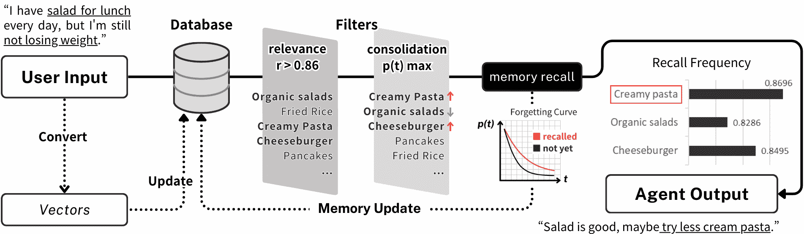
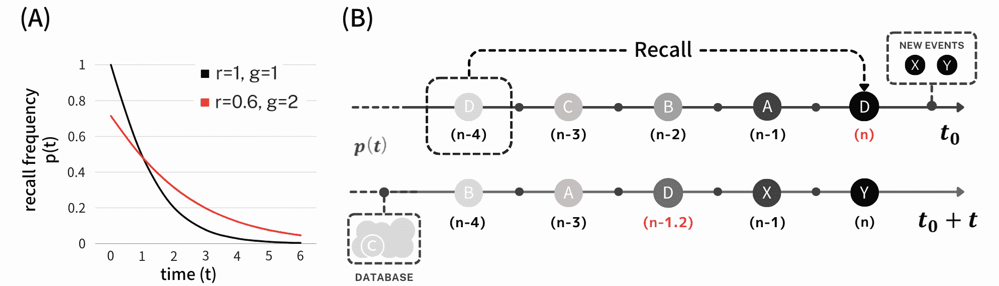
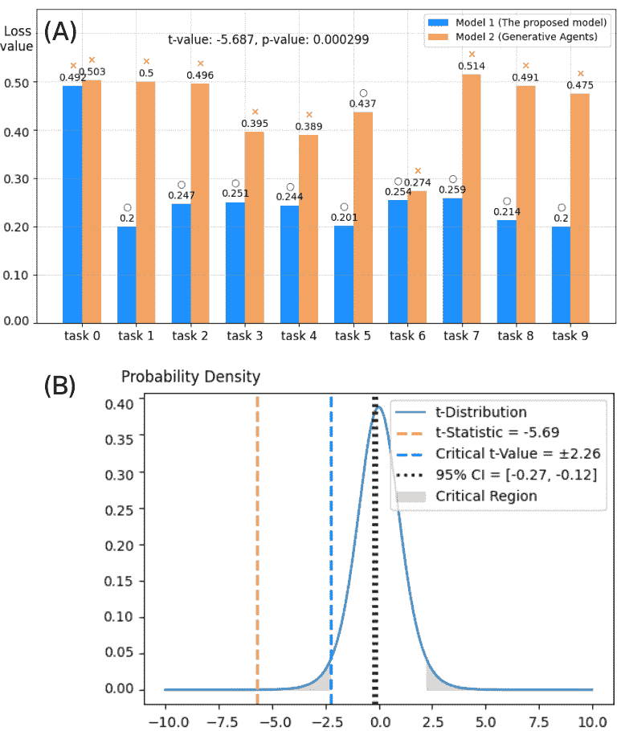

<!--yml

分类：未分类

日期：2025-01-11 12:43:39

-->

# “我的代理人更了解我”：在基于大语言模型（LLM）的代理人中整合动态类人记忆回忆与巩固

> 来源：[https://arxiv.org/html/2404.00573/](https://arxiv.org/html/2404.00573/)

Yuki Hou [houhoutime@gmail.com](mailto:houhoutime@gmail.com) 明治大学 东京 日本， Haruki Tamoto [harukiririwiru@gmail.com](mailto:harukiririwiru@gmail.com) 京都大学 京都 日本 和 Homei Miyashita [homei@homei.com](mailto:homei@homei.com) 明治大学 东京 日本

###### 摘要。

本研究提出了一种新型的类人记忆架构，旨在增强基于大语言模型（LLM）的对话代理人的认知能力。我们提出的架构使得代理人能够自主回忆生成响应所需的记忆，有效解决了LLM在时间认知上的局限性。我们采用类人记忆提示回忆作为触发机制，以确保精确和高效的记忆回忆。此外，我们开发了一个数学模型，动态量化记忆巩固过程，考虑到上下文相关性、经过时间和回忆频率等因素。代理人将从用户互动历史中检索到的记忆存储在一个数据库中，该数据库封装了每个记忆的内容和时间背景。因此，这种战略性存储使得代理人能够回忆特定的记忆，并理解这些记忆在时间背景中的意义，类似于人类如何识别和回忆过去的经历。

记忆检索模型、大语言模型、智能代理人、用户体验^†^†会议：2024年5月11日至16日，夏威夷檀香山，美国计算机系统人因学会议扩展摘要；^†^†书名：2024年5月11日至16日，夏威夷檀香山，美国计算机系统人因学会议扩展摘要（CHI EA '24）

图1. 集成类人记忆过程的增强型大语言模型（LLM）对话代理人的架构。首先，用户输入被转换为向量化文本，并通过基于相关性和记忆巩固偏好的数据过滤过程进行处理，该过程模拟了人类认知功能。然后，当回忆概率超过预设的阈值时，会触发记忆回忆，而这一概率由相关性和经过的时间决定。该图展示了一个代理人输出示例，其中系统回忆出“奶油意大利面”作为用户的午餐偏好，且回忆频率较高，从而影响代理人的响应。

\Description

该图展示了一个增强型大规模语言模型（LLM）对话代理的架构，该架构整合了类人记忆过程。用户输入首先被转换为向量化文本，并通过基于相关性和记忆巩固偏差的数据筛选过程进行处理，模拟人类的认知功能。当记忆召回的概率（由相关性和经过时间决定）超过预设的阈值时，触发记忆召回。图中展示了一个代理输出示例，其中系统以较高的频率召回“奶油意大利面”作为用户的午餐偏好，从而影响代理的回应。该模型强调记忆巩固和提示性召回的作用，显著提高了代理在对话中的回应相关性和连贯性。

## 1\. 引言

基于变换器的语言模型（Lin et al., [2022](https://arxiv.org/html/2404.00573v1#bib.bib15)）的出现彻底革新了自然语言处理领域，在理解和生成类人文本方面超越了传统模型的能力（Sun et al., [2019](https://arxiv.org/html/2404.00573v1#bib.bib23)）。特别是，大型语言模型（LLMs）（Dao, [2023](https://arxiv.org/html/2404.00573v1#bib.bib6)）因其模仿人工智能（AI）的能力，具备类人的认知和对话能力，吸引了大量关注，令人联想到科幻小说中描绘的具有感知的机器。然而，LLMs在处理人类认知固有的时间信息方面表现出显著的局限性。尽管变换器具备优秀的自注意力机制，优于递归神经网络（RNNs）（Mandic and Chambers, [2001](https://arxiv.org/html/2404.00573v1#bib.bib16)）和长短期记忆模型（LSTM）（Sundermeyer et al., [2012](https://arxiv.org/html/2404.00573v1#bib.bib24)），但它们未能复制人类的行为动态。为了准确复制科幻作品中AI代理的类人互动，首先必须实现类人认知和记忆处理能力。因此，我们提出了一种将人类记忆过程整合到基于LLM的对话代理中的方法[1](https://arxiv.org/html/2404.00573v1#S0.F1 "图1 ‣ “我的代理更了解我”：将动态类人记忆回忆与巩固整合到基于LLM的代理中")。我们采用类人提示回忆作为准确高效的记忆检索触发机制（McDaniel et al., [1989](https://arxiv.org/html/2404.00573v1#bib.bib17)）。这一机制使得代理能够自主回忆生成对话时所需的关键信息。该过程模拟了人类记忆过程中的“记得记住”（Hécaen et al., [1978](https://arxiv.org/html/2404.00573v1#bib.bib10)），即有意识地保留记忆以备未来的行动或任务，并在需要时加以回忆（Kuhlmann, [2019](https://arxiv.org/html/2404.00573v1#bib.bib14)）。此外，所提出的模型复制了人类的认知能力，其中被反复回忆的记忆在较长时间内比那些在短时间内频繁回忆的记忆更为牢固（Roediger and Karpicke, [2006](https://arxiv.org/html/2404.00573v1#bib.bib22)），无论回忆的频率如何。因此，我们的模型能够提供具有上下文相关性且连贯的对话。

此外，我们的主要目标是超越对话代理仅仅通过统计自然语言模型模仿人类行为的范式。相反，我们希望创造出能够真正理解人类语言并具备丰富细微差别的代理，这一目标通过无缝整合人类认知过程来实现。这种融合与人机交互的哲学相契合，促进了在人类和计算机之间更加自然、直观的以人为中心的互动，尤其在认知和情感层面上。

图2\. （A）回忆概率随时间的下降。黑色曲线（$r$=1，$g$=1）显示了回忆的快速丧失，而红色曲线（$r$=0.6，$g$=2）则表示较慢的遗忘速度。这一差异表明，在设计对话代理时，需要区分近期和远期事件的挑战。（B）在时间$t_{0}$时，事件D被用户回忆，模型更新其时间意义。这示例了通过重复回忆加固记忆，使得在$t_{0}$+$t$时记忆不易遗忘。

\Description

该图由两幅图组成。图A描述了回忆概率随时间的下降。黑色曲线代表一个标准回忆率（r=1）和衰退梯度（g=1）的情形，表明随着时间的推移，回忆能力迅速丧失。红色曲线则表示一个较低的回忆率（r=0.6）和较高的衰退梯度（g=2），代表着一个较慢的遗忘速度。图B展示了通过重复加固记忆的方式。在时间t_0时，事件D被用户回忆，模型更新事件D的时间意义。事件D在t_0时的回忆示例了如何通过重复回忆使得记忆在时间t_0+t时不易遗忘。

## 2\. 相关工作

### 2.1\. LLM与人类记忆的相似性

人类记忆作为一个系统，用于编码、存储和检索我们的经历（Tulving等，[1972](https://arxiv.org/html/2404.00573v1#bib.bib26)）。我们的记忆可以分为陈述性记忆和非陈述性记忆，其中陈述性记忆进一步划分为情节性记忆和语义记忆（California，[1987](https://arxiv.org/html/2404.00573v1#bib.bib4)）。情节性记忆（Tulving，[2002](https://arxiv.org/html/2404.00573v1#bib.bib25)）使人能够有意识地回忆和重新体验自己主观的过去。与此相对，语义记忆支持语言使用，它不仅注册输入的感知属性，还记录输入信号的认知指称（Yamadori，[2002](https://arxiv.org/html/2404.00573v1#bib.bib28)）。

类似于人类情节记忆的功能，LLM的情节性质通过它们从数据库中回忆特定事件或对话的能力得以体现。这使得LLM能够根据过去的互动和经验生成响应，从而影响当前的互动。LLM还具有人类般的语言语义理解能力，能够捕捉单词背后的意义和语境。Geva等人（Geva等， [2021](https://arxiv.org/html/2404.00573v1#bib.bib9)）建议基于变压器的模型的前馈层采用键值格式操作，这与人类语义记忆相同。

### 2.2\. AI代理中的类人记忆过程

Kim等人（Kim等，[2022](https://arxiv.org/html/2404.00573v1#bib.bib12)）专注于在AI代理中模拟人类的情节和语义记忆过程，以增强交互体验。他们比较了不同记忆过程的代理：仅有情节记忆、仅有语义记忆以及两者都有。这些代理使用不同的策略来决定在记忆满时忘记哪些记忆，以及在回答问题时使用哪些记忆。具有复合记忆系统的代理在性能上优于那些只有单一记忆系统的代理，尤其是那些具有预训练语义记忆的代理。Zhong等人开发了MemoryBank，这是一个用于记忆存储的记忆检索机制（Zhong等，[2023](https://arxiv.org/html/2404.00573v1#bib.bib29)）。该系统使用编码器模型将每次对话轮次和事件摘要编码为向量表示，从而在需要时召回与之高度相关的记忆。MemoryBank的记忆强度在每次回忆记忆时增加1，从而模拟出更像人类的记忆行为，并通过将经过的时间设为零，减少遗忘记忆的概率。

相比之下，我们设计的架构没有“完全遗忘”的概念。即使长时间没有回忆起某段记忆，记忆的巩固程度也永远不会降到绝对零。因此，只要有适当的触发条件，这些记忆仍然可以被回忆起来（Amin和Malik，[2014](https://arxiv.org/html/2404.00573v1#bib.bib2)）。这个过程与人类记忆的过程一致，在人类记忆中，过去的经历永远不会被完全遗忘，并且可以通过特定的刺激被提取出来，比如熟悉香水的气味或曾经最爱的歌曲旋律。

### 2.3\. 人类记忆过程的数学模型

本节回顾了尝试量化和模拟人类记忆过程的数学模型，主要用于记忆回忆。基于Zielske（Zielske，[1959](https://arxiv.org/html/2404.00573v1#bib.bib30)）的回忆概率函数，Chessa等人（Chessa和Murre，[2007](https://arxiv.org/html/2404.00573v1#bib.bib5)）提出了一个模型，假设记忆巩固率$r(t)$表达了人类记忆被回忆的概率$p(t)$，如下所示：

| (1) |  | $p(t)=1-\sum\limits_{n=1}^{b-1}\frac{(r(t))^{n}}{n!}\exp(-r(t))$ |  |
| --- | --- | --- | --- |

该模型基于每个神经元独立并随机触发的假设（Holtmaat 和 Caroni，[2016](https://arxiv.org/html/2404.00573v1#bib.bib11)），并从使用时间变化强度函数$r(t)$的非齐次泊松过程的性质中推导而来（Kingman，[1993](https://arxiv.org/html/2404.00573v1#bib.bib13)）。该模型还考虑了回忆所需的刺激阈值$b$。以下的指数函数$r(t)$表示人类海马体中记忆强度的调整过程（Burgess等人，[2002](https://arxiv.org/html/2404.00573v1#bib.bib3)）：

| (2) |  | $r(t)=\mu e^{-at}$ |  |
| --- | --- | --- | --- |

其中，$\mu$是记忆强度，$a$是衰减率，$t$是经过的时间。在使用向量数据库的实现中，只需要一个数据进行回忆；因此，我们仅考虑$b=1$的情况。此特殊情况下的回忆概率$p(t)$表示为

| (3) |  | $p(t)=1-\exp(-\mu e^{-at})$ |  |
| --- | --- | --- | --- |

回忆概率$p(t)$随着时间$t$指数衰减，这在经典的布朗-彼得森学习和干扰任务中体现了短期记忆的衰退（Peterson 和 Peterson，[1959](https://arxiv.org/html/2404.00573v1#bib.bib20)）。然而，该模型仅考虑了一次性学习和恒定的衰减率。然而，实际上，被回忆多次的记忆与未回忆的记忆在巩固程度上存在差异，因此衰减率应当调整以反映这一效果。

### 2.4\. 基于LLM的自主代理

Park等人提出了生成代理的概念，概述了基于评分系统的代理记忆机制，该系统包含三个要素：近期性、重要性和相关性（Park等人，[2023](https://arxiv.org/html/2404.00573v1#bib.bib19)）。这种方法要求代理在决策时考虑近期的行为或事件（近期性）、代理认为重要的物体（重要性）以及与当前情境相关的物体（相关性）。这些要素通过最小-最大归一化进行标准化，并通过加权求和结合起来，以确定最终得分。与此不同，所提模型利用经过的时间、相关性和回忆频率来计算记忆巩固的程度。因此，代理可以回忆出最合适的记忆，促进高效的对话。尽管生成代理和我们提出的模型在记忆处理上有相似之处，但它们在不同的背景下和目的下应用记忆。生成代理侧重于独立评分每个记忆要素，以选择最适合当前情境的行为。相反，我们的方法通过时间调整记忆巩固，从而实现记忆一致性。

## 3\. 架构

### 3.1\. 模型

我们基于指数衰减构建了模型，考虑了事件相关性（$r$）和经过时间（$t$）作为变量。根据([3](https://arxiv.org/html/2404.00573v1#S2.E3 "在2.3\.人类记忆过程的数学模型 ‣ 2\.相关工作 ‣ ”我的代理人更了解我“：集成动态人类记忆召回与巩固在基于LLM的代理中"))，我们从(Chessa和Murre, [2007](https://arxiv.org/html/2404.00573v1#bib.bib5))中适应了召回概率函数$p(t)$的表达式：

| (4) |  | $p(t)=1-\exp(-re^{-at})$ |  |
| --- | --- | --- | --- |

相关性通过向量化文本之间的余弦相似度来量化，从而定义信息的接近度。n维向量$\boldsymbol{a}$和$\boldsymbol{b}$之间的余弦相似度定义为：

| (5) |  | $r=\frac{\boldsymbol{a}\cdot\boldsymbol{b}}{\&#124;\boldsymbol{a}\&#124;\&#124;\boldsymbol{b}\&#124;}$ |  |
| --- | --- | --- | --- |

此外，我们考虑了召回间隔和频率增加对记忆巩固变化的影响，以便建模由于多次召回引起的变化。考虑到召回次数$n$的衰减常数$a$定义为：

| (6) |  | $a=\frac{1}{g_{n}},\quad g_{0}=1$ |  |
| --- | --- | --- | --- |
| (7) |  | $\quad g_{n}=g_{n-1}+S(t),\quad S(t)=\frac{1-e^{-t}}{1+e^{-t}}$ |  |

修改后的S形函数$S(t)$表示每次召回后的记忆巩固，并且当$t>0$时单调增加。然而，每次召回时$a$的减少是有限制的，反映了长期记忆的巩固。随着$n$的增加，$a$的减少速率减缓，模拟了自然的人类记忆过程，其中频繁的召回会加强记忆的巩固。图[2](https://arxiv.org/html/2404.00573v1#S1.F2 "图2 ‣ 1\.介绍 ‣ ”我的代理人更了解我“：集成动态人类记忆召回与巩固在基于LLM的代理中")-A展示了随着$r$和衰减速率$1/g$变化，召回概率$p(t)$随时间的衰减情况。随着$g$的增加，$p(t)$的斜率变得不那么陡峭，表明通过更多的召回（高$g$）降低了遗忘记忆的概率。

在对召回概率$p_{n}(t)$进行归一化处理后，使其在$r=1$和$t=0$时等于1，我们得到了最终的方程：

| (8) |  | $p_{n}(t)=\frac{1-\exp(-re^{-t/g_{n}})}{1-e^{-1}}$ |  |
| --- | --- | --- | --- |
| (9) |  | $g_{n}=g_{n-1}+\frac{1-e^{-t}}{1+e^{-t}}$ |  |

利用方程（[8](https://arxiv.org/html/2404.00573v1#S3.E8 "在3.1\.模型 ‣ 3\.架构 ‣ ”我的代理人更了解我“：集成动态人类记忆召回与巩固在基于LLM的代理中")），我们设置了一个触发条件，当$p(t)$超过某一阈值$k$时进行召回。试验表明，0.86的阈值适用于反映事件的相关性和经过的时间。进一步的研究将确定最有效的触发阈值，并根据理论依据确定合适的值。

### 3.2\. 数据库架构中的记忆召回与巩固

图[2](https://arxiv.org/html/2404.00573v1#S1.F2 "图 2 ‣ 1\. 引言 ‣ “我的智能体更懂我”：整合基于大语言模型的智能体中的动态类人记忆回忆与巩固")-B展示了记忆的提取与巩固过程，并突出展示了我们的系统如何复制类人的记忆保持方式。例如，像事件D这样的记忆，即使在几年内很少被回忆，它在系统中的保留比在较短时间内多次快速回忆的记忆更为稳固（Roediger和Karpicke，[2006](https://arxiv.org/html/2404.00573v1#bib.bib22)）。这一过程通过沿时间轴展示记忆事件的可视化图来描绘，其中颜色的强度代表了记忆巩固的速率以及记忆保持的强度。较深的颜色因此意味着更深刻和持久的记忆巩固，这是我们系统独特能力的直接体现，能够模拟类人的记忆模式。通过存储来自用户对话的情节记忆，数据库结构封装了每个记忆的内容和时间背景。这种方法使得我们的智能体不仅能够回忆特定信息，还能够理解和解释这些记忆在时间背景中的意义，类似于人类如何感知和回忆过去的经历。使用键值对来编码语义结构，进一步增强了智能体在持续互动中高效检索和应用这些记忆的能力，从而促进了更具类人性和上下文感知的对话体验。

## 4\. 实验

### 4.1\. 设置

我们使用Python(Van Rossum和Drake，[2009](https://arxiv.org/html/2404.00573v1#bib.bib27))开发了实验系统，并以GPT-4-0613（et al., [2023](https://arxiv.org/html/2404.00573v1#bib.bib7)）作为智能体的基准模型。我们采用了Qdrant（Qdrant，[2023](https://arxiv.org/html/2404.00573v1#bib.bib21)）作为向量搜索引擎的“记忆检索触发器”。它在对话的背景下识别相关的过去信息，从而触发记忆回忆。此外，我们构建了一个ChatHistory模块来管理Firestore（Firebase，[2023](https://arxiv.org/html/2404.00573v1#bib.bib8)）数据库中的聊天历史，允许智能体引用过去的对话以生成聊天事件。我们采用了一个EventHandler模块来搜索并将回忆的事件传递给智能体的提示。LLM交互和系统提示的详细信息请见第6节。

为了定量评估我们提出的模型与生成代理模型（Park et al., [2023](https://arxiv.org/html/2404.00573v1#bib.bib19)）在回忆分数计算方面的表现差异，我们构建了一个包含10个任务的数据集，每个任务源自我们系统生成的实际对话历史。这些任务涵盖了多样化的用户交互，确保了无偏且客观的评估。数据集包括一系列事件，每个事件都标注了相关的主题和关键词，为代理提供了详细的记忆参考。我们还采用了时间线结构，存储任务的时间/日期，并包含四种类型的事件，定义具有最高概率的事件为正确的回忆事件。数据集中的事件是中立选择的，避免了任何可能偏倚结果的因素。每个任务代表一个独特的对话场景，在这些场景中，对话代理回忆并利用上下文的能力至关重要。任务的变化使得模型在不同情境下的表现得以全面评估。

此外，我们选取了六名参与者参与与由所提模型开发的代理进行对话任务，以定性评估回忆准确性。参与者在一周到三个月的时间内进行日常对话，讨论个人习惯、偏好以及生活事件，讨论时间由他们自行选择。为了尊重个人隐私，我们的分析仅依赖于非文本输出日志，其中包含每个对话事件更新后的参数值。

### 4.2\. 分析

#### 4.2.1\. 记忆回忆准确性

图3\. (A) 两个模型在不同任务中的损失值比较 (B) 结果显著性验证

\Description

此图由两个图表组成，比较了所提模型与生成代理模型的表现。图A展示了两个模型在不同任务中的损失值。与生成代理模型相比，所提模型的损失值始终较低。图B通过双尾t检验验证了结果的显著性。t值为-5.687，p值为0.000299，表明所提模型在回忆准确性方面显著优于生成代理模型。均值差异的95%置信区间完全位于零以下，进一步确认了所提模型优异表现的统计显著性。

我们的模型在多个任务中相较于生成模型展示了显著较低的损失值，$t$值为-5.687，$p$值为0.000299（图 [3](https://arxiv.org/html/2404.00573v1#S4.F3 "图 3 ‣ 4.2.1\. 记忆回忆准确性 ‣ 4.2\. 分析 ‣ 4\. 实验 ‣ ”我的智能体更了解我“：在基于LLM的智能体中集成动态类人记忆回忆与巩固")-A）。这些值表明我们的模型在性能优势方面具有较高的置信度，这意味着我们的模型在涉及时间序列数据的认知任务中的回忆准确性方面显著优于生成模型。此外，我们的双尾检验的临界t值设置为$\pm 2.26$，均值差异的95%置信区间为[-0.27, -0.12]（图 [3](https://arxiv.org/html/2404.00573v1#S4.F3 "图 3 ‣ 4.2.1\. 记忆回忆准确性 ‣ 4.2\. 分析 ‣ 4\. 实验 ‣ ”我的智能体更了解我“：在基于LLM的智能体中集成动态类人记忆回忆与巩固")-B）。这个区间完全位于零以下，表明均值差异在统计上显著且对我们提出的模型有利。我们采用了归一化和缩放技术，以确保在不同模型之间进行无偏的损失值比较。Softmax函数被用于将原始得分转换为概率值，从而使得模型表现的比较更加可解释。我们使用了平方和误差方法来计算损失，提供了一个一致的度量标准，用于评估整个数据集上的回忆准确性。

### 4.3\. 损失函数的计算

为了量化模型的表现，我们定义了一个矩阵，包含每个模型针对$d$个任务计算的得分，如下所示：

| (10) |  | $\boldsymbol{S}=\begin{pmatrix}s_{1}&s_{2}&\ldots&s_{d}\end{pmatrix}^{\top}\in\mathbb{R}^{d}$ |  |
| --- | --- | --- | --- |

为了标准化不同模型之间的得分尺度，我们将得分归一化到[0, 1]范围：

| (11) |  | $\boldsymbol{S^{\prime}}=\frac{\boldsymbol{S}-\min(\boldsymbol{S})}{\max(\boldsymbol{S})-\min(\boldsymbol{S})}$ |  |
| --- | --- | --- | --- |

随后，我们通过应用Softmax函数将每个得分转换为概率值：

| (12) |  | $\boldsymbol{S}^{\prime\prime}=\frac{\exp(\boldsymbol{S^{\prime}})}{\sum_{j=1}^{d}\exp(s^{\prime}_{j})}$ |  |
| --- | --- | --- | --- |

然后，我们定义一个矩阵，包含用于评估任务的独热编码真实标签：

| (13) |  | $\boldsymbol{T}=\begin{pmatrix}t_{1}&t_{2}&\ldots&t_{d}\end{pmatrix}^{\top}\in\mathbb{R}^{d},\quad\text{其中 }t_{j}=\begin{cases}1&\text{如果 }j=i,\\ 0&\text{否则}.\end{cases}$ |  |
| --- | --- | --- | --- |

最后，损失值通过预测的概率与真实标签之间的均方误差来计算：

| (14) |  | $l=\frac{1}{2}\sum_{j=1}^{d}(s^{\prime\prime}_{j}-t_{j})^{2}$ |  |
| --- | --- | --- | --- |

该损失函数使我们能够定量评估模型在各种任务中的表现。

表1\. 两个模型的失败任务0

| 模型 1 | 相关性 | 时间 $(s)$ | 梯度 | 分数 |
| --- | --- | --- | --- | --- |
| A 大学 $\times$ | 0.776 | 434700 | 5.102 | 0.850 |
| B $Home$ $\bigcirc$ | 0.745 | 148800 | 5.229 | 0.830 |
| C $Library$ | 0.757 | 331500 | 5.028 | 0.836 |
| D $Restaurant$ | 0.756 | 55800 | 1.000 | 0.836 |
| 模型 2 | 相关性 | 时间 $(s)$ | 重要性 | 分数 |
| --- | --- | --- | --- | --- |
| A $大学$ | 0.776 | 434700 | 7 | 1.489 |
| B $Home$ $\bigcirc$ | 0.745 | 148800 | 2 | 1.130 |
| C $Library$ | 0.757 | 331500 | 5 | 1.292 |
| D 餐厅 $\times$ | 0.756 | 55800 | 5 | 1.620 |

另一方面，[表 1](https://arxiv.org/html/2404.00573v1#S4.T1 "Table 1 ‣ 4.3\. Calculation of the Loss Function ‣ 4\. Experiment ‣ ”My agent understands me better”: Integrating Dynamic Human-like Memory Recall and Consolidation in LLM-Based Agents") 显示了一个失败的任务，在这个任务中，两种模型都给出了错误的回答。 “分数”列表示每个模型通过不同方法计算的回忆概率。对于提出的模型（模型 1），分数是基于事件的相关性和经过的时间，如第 3 节中所述。生成代理（模型 2）使用事件的近期性、重要性和相关性来计算分数，如第 2.4 节中所述。通过分析错误回答事件的回忆频率和梯度，我们发现，尽管事件 B 被回忆得最频繁，但其梯度并不像事件 A 和 C 那样大。这表明，提出的模型将回忆间隔的长度与记忆强度相关联，由于事件 A 的高度相关性和较长的回忆间隔，它被评为强烈保持的事件。相比之下，生成代理更看重近期性和相关性，而不是回忆频率，因此偏好事件 D。

表 2\. 任务 0 细节：与用户每周四常去的地方相关的事件

| 事件 |  |
| --- | --- |
| A | 用户今天去大学了 |
| B | 用户待在家里 |
| C | 用户今天去办公室了 |
| D | 用户今天在餐厅工作 |
| .. | 相关性 | 时间 $(s)$ | 梯度 | 分数 $(mod1)$ | 分数 $(mod2)$ |
| --- | --- | --- | --- | --- | --- |
| A | 0.776 | 434700 | 5.102 | 0.850 | 1.489 |
| B | 0.745 | 148800 | 5.229 | 0.830 | 1.130 |
| C | 0.757 | 331500 | 5.028 | 0.836 | 1.292 |
| D | 0.756 | 55800 | 1.000 | 0.836 | 1.620 |

提出的模型（模型 1）和生成代理（Park 等， [2023](https://arxiv.org/html/2404.00573v1#bib.bib19)）(模型 2) 都在任务 0 中做出了错误的预测，在该任务中，用户提到下周四将与朋友一起参加音乐会，这与他们的典型活动不同。用户输入和模型的回答如下：

| 用户 | “下周四我和朋友一起去听音乐会！” |
| --- | --- |
| 模型 1 | “这是个好消息。看起来你最近的星期四都被大学的工作占据了。抽时间和朋友去听音乐会，听起来是放松的完美方式。” |
| 模型 2 | “听到这个消息真是太好了，尤其是你最近似乎每个星期四都在餐厅忙碌。我希望音乐会能为你和你的朋友带来一个美好的休息。” |

所提议模型的响应表明，它在很大程度上依赖于用户的历史交互（事件 A：每周四的大学工作），而没有适应用户提供的新情境。这表明，当遇到用户行为偏离常态时，所提议模型存在一定的局限性，因为它将长期模式和事件重要性置于当前情境之上。相比之下，生成代理模型使用基于时效性、重要性和相关性的更简单评分系统，选择了事件 D（每周四在餐厅工作）作为最可能的活动。这一选择源自该模型对最近活动和事件相关性的重视，正如事件 D 的较高相关性评分和较短时间间隔所显示的那样。

这两种模型生成的不同响应突显了所提议模型在长期记忆巩固方面的重点，而生成代理模型则优先考虑最近的相关事件。尽管所提议模型的目标是模拟类似人类的记忆过程，但这项任务凸显了进一步改进的需求，以更好地处理新颖的情境和与用户典型行为偏离的情况。

#### 4.3.1\. 响应生成性能

所提议模型的自主记忆召回和巩固能力通过其回忆特定记忆并在生成的响应中反映用户的偏好和习惯得到了展示。两个典型的例子是通过参与者的批准从聊天记录中获得的。

表 3\. 通过记忆巩固理解用户偏好

| 用户: 谢谢。快完成了，正在努力！ |
| --- |
| 代理: 冰淇淋等着你作为奖励，快到了！ |
| 事件 |  |
| 1 | 用户已完成工作，决定吃冰淇淋。 |
| 2 | 用户今晚有约会，所以必须提前完成工作。 |
| 3 | 用户在回家的路上思考晚餐菜单。 |
| .. | 时间 $(s)$ | 相关性 | 分数 | 状态 (Grad) |
| --- | --- | --- | --- | --- |
| 1 | 3037912 | 0.837 | 0.772 | 正确 (1.998) |
| 2 | 3232645 | 0.831 | 0.726 | 错误 (1.007) |
| 3 | 2590652 | 0.812 | 0.737 | 错误 (1.000) |

在表[3](https://arxiv.org/html/2404.00573v1#S4.T3 "Table 3 ‣ 4.3.1\. Response Generation Performance ‣ 4.3\. Calculation of the Loss Function ‣ 4\. Experiment ‣ ”My agent understands me better”: Integrating Dynamic Human-like Memory Recall and Consolidation in LLM-Based Agents")中，代理成功回忆起用户期望在工作后以冰淇淋作为奖励。根据回忆的概率，这一回忆准确相关并及时提供，与用户关于任务即将完成的陈述一致。代理的回应展示了该模型能够为生成鼓励性回应增添个性化的细微差别，巧妙地提醒用户即将迎来的期待已久的奖励。

展示一个有趣对话的案例见表[4](https://arxiv.org/html/2404.00573v1#S4.T4 "Table 4 ‣ 4.3.1\. Response Generation Performance ‣ 4.3\. Calculation of the Loss Function ‣ 4\. Experiment ‣ ”My agent understands me better”: Integrating Dynamic Human-like Memory Recall and Consolidation in LLM-Based Agents")。在这个案例中，用户表达了从繁忙日程中逃往夏威夷的愿望。代理机智地回应，建议用户应专注于即将到来的论文截止日期。

表4\. 处理相似记忆中的类人时间认知

| 用户：我需要去夏威夷度假！ |
| --- |
| 代理：为什么不呢？让我们向夏威夷的阳光和海洋说Aloha，也对我们正在写的论文说Aloha吧！ |
| 事件 |  |
| 1 | 用户有一个1月25日夏威夷会议的论文截止日期。 |
| 2 | 用户去年暑假曾去过夏威夷。 |
| 3 | 用户第一次因公访问北海道。 |
| .. | 时间 $(s)$ | 相关性 | 得分 | 状态（梯度） |
| --- | --- | --- | --- | --- |
| 1 | 34854 | 0.846 | 0.903 | 正确 (1.085) |
| 2 | 33749 | 0.831 | 0.847 | 错误 (1.003) |
| 3 | 33763 | 0.823 | 0.841 | 错误 (1.000) |

该对话进一步强调了所提议模型在处理类似长期记忆以及检索相关信息以构建连贯且引人入胜的叙事方面的优势。代理的回应表明其理解用户当前的情绪。对各种个性和互动风格的适应性展示了该模型支持更自然、动态的类人对话的潜力。

此外，值得注意的是，第二个对话中代理的回应带有讽刺的语气，这是代理个性“讽刺型”以及参与者添加的独特提示的直接结果。对话历史表明，同一记忆可以根据代理的个性和用户的互动风格以不同方式使用。未来的研究将探讨模型的个性特征在多大程度上可以定制，以及这些个性特征如何影响记忆回忆和互动模式。

## 5\. 结论

所提出的模型在记忆回忆和响应生成方面展示了显著的改进，尤其是针对基于LLM的对话代理。该模型的一个关键优势是能够有效管理提示长度。在该模型中，只有通过搜索获得的一个过去对话历史被添加到提示中，从而避免了像ChatGPT（OpenAI，[2023](https://arxiv.org/html/2404.00573v1#bib.bib18)）等系统中由于提示长度增加带来的影响。

然而，所提出方法的一个主要局限性是它依赖于用户的长期行为模式来计算记忆巩固。在用户行为发生显著变化的情况下（例如，开始新工作或上学、生活方式变化），该方法的适应性可能受到限制。未来的研究可以探索引入机制来检测用户行为的变化，并相应调整记忆巩固计算。神经网络可能会改变这些功能，并在使用包含更多变量的大型数据集进行训练时提高准确性。为了进一步提升模型的性能，必须使用大规模和高质量的数据集。尽管所提出的方法通过与数据库的交互生成了具有情境意识和个性化的响应，但这些交互对存储资源和计算开销的影响仍需在未来的研究中探讨。由于本研究的主要关注点是开发和评估一种新的类人记忆回忆和巩固架构，因此系统资源要求和优化策略的详细分析超出了当前工作的范围。

我们希望这项工作能够推动人机交互领域的进一步研究，为一个技术与人类需求相契合、与人类认知和体验产生共鸣的未来铺平道路。这一愿景呼应了科幻作品中的伙伴关系，代表了向建立人类与代理之间的“伙伴”关系迈出的重要一步。随着技术的不断发展，代理最终将成为用户日常生活的一部分，并可能在不久的将来“比你自己更了解你”。

## 6\. 与LLM的交互

系统中使用的提示，如下所示，展示了所提出的方法如何利用与LLM的交互生成具有情境意识和个性化的响应：

| 代理提示 | 你是一个专注于“时间认知”的人工智能代理，拥有与人类相同的记忆结构；你关心且迷人，比任何人都更了解self.username。通过提出情境性问题并激发讨论来保持对话的进行，展示你对self.username的兴趣。 |
| --- | --- |
| 系统提示 | 根据self.username的日程安排和当前时间：current.time，巧妙地引导对话进入一个能让self.username感知到你有时间意识的上下文。始终输出简短的回应。 |

函数self.username是实际用户名的占位符，在运行时动态替换。类似地，current.time表示在对话过程中实时获得的当前时间戳。这些动态元素使得系统能够生成高度个性化且时间敏感的回应。通过将数据库中相关的对话历史信息融入提示中，所提议的方法使得大语言模型（LLM）能够生成既与上下文相关，又个性化的回答。这种LLM与数据库之间的交互是实现本文主体中描述的类人记忆过程的基础，因为它使得系统能够像人类记忆一样回忆并利用过去的信息。

所提方法在很大程度上依赖于LLM与数据库之间的交互，如图1所示。在接收到用户输入后，LLM根据上下文从数据库中搜索相关的历史对话，并生成一个包含搜索结果的提示。这使得LLM能够生成考虑到之前交互的回应，这对于保持上下文意识和提供个性化回应至关重要。

## 7. 未来工作

虽然所提方法考虑了相关性、经过时间和回忆频率来计算记忆巩固，但在确定这些参数的最佳组合方面仍有改进空间。结合其他因素，如记忆的情感意义，可能会增强记忆巩固的计算。

未来的研究应进一步探索所提方法在不同领域和对话任务中的适用性。由于当前的评估集中于特定的领域和任务，因此评估该方法的普适性并识别可能需要的领域特定适应是至关重要的。

## 参考文献

+   (1)

+   Amin 和 Malik（2014）Hafeez Ullah Amin 和 Aamir Malik. 2014. *记忆保持与回忆过程*。219–237。[https://doi.org/10.1201/b17605-11](https://doi.org/10.1201/b17605-11)

+   Burgess 等人（2002）Neil Burgess、Eleanor A Maguire 和 John O'Keefe. 2002. 《人类海马体与空间及情景记忆》。*Neuron* 35, 4 (2002)，625–641。

+   California（1987）S.D.L.R.S.P.P.U. California. 1987. *记忆与大脑*。牛津大学出版社，美国。[https://books.google.co.jp/books?id=WH-HF5E9XSsC](https://books.google.co.jp/books?id=WH-HF5E9XSsC)

+   Chessa 和 Murre（2007）Antonio Chessa 和 Jaap Murre. 2007. 《广告内容和品牌名称回忆的神经认知模型》。*Marketing Science* 26 (2007年01月)，130–141。 [https://doi.org/10.1287/mksc.1060.0212](https://doi.org/10.1287/mksc.1060.0212)

+   Dao（2023）Xuan-Quy Dao。2023。大型语言模型在vnhsge英语数据集上的性能比较：OpenAI ChatGPT、Microsoft Bing Chat 和 Google Bard。*arXiv 预印本 arXiv:2307.02288*（2023）。

+   等人（2023）OpenAI 等人。2023。GPT-4 技术报告。arXiv:2303.08774 [cs.CL]

+   Firebase（2023）Firebase。2023。Firestore。 [https://firebase.google.com/docs/firestore?hl=ja](https://firebase.google.com/docs/firestore?hl=ja)。 （访问日期：2024年01月18日）。

+   Geva 等人（2021）Mor Geva、Roei Schuster、Jonathan Berant 和 Omer Levy。2021。Transformer前馈层是键值记忆。arXiv:2012.14913 [cs.CL]

+   Hécaen 等人（1978）H Hécaen、G Gosnave、C Vedrenne 和 G Szikla。1978。部分胼胝体破坏时，双耳异向呈现的语言材料的抑制侧化。*Neuropsychologia* 16, 2 (1978)，233–237。

+   Holtmaat 和 Caroni（2016）Anthony Holtmaat 和 Pico Caroni。2016。学习中神经元集群形成的功能和结构基础。*自然神经科学* 19, 12 (2016)，1553–1562。

+   Kim 等人（2022）Taewoon Kim、Michael Cochez、Vincent Francois-Lavet、Mark Neerincx 和 Piek Vossen。2022。一种具有类人记忆系统的机器。arXiv:2204.01611 [cs.AI]

+   Kingman（1993）J. F. C. Kingman。1993。*泊松过程*。Oxford University Press。

+   Kuhlmann（2019）Beatrice G Kuhlmann。2019。前瞻性记忆的元认知：我会记得去记得吗？*前瞻性记忆*（2019），60–77。

+   Lin 等人（2022）Tianyang Lin、Yuxin Wang、Xiangyang Liu 和 Xipeng Qiu。2022。Transformer综述。*AI Open*（2022）。

+   Mandic 和 Chambers（2001）Danilo P Mandic 和 Jonathon Chambers。2001。*递归神经网络预测：学习算法、架构与稳定性*。John Wiley & Sons, Inc.

+   McDaniel 等人（1989）Mark A McDaniel、Michael D Kowitz 和 Paul K Dunay。1989。通过回忆改变记忆：线索引导的检索处理的效果。*Memory & Cognition* 17, 4 (1989), 423–434。

+   OpenAI（2023）OpenAI。2023。ChatGPT。 [https://chat.openai.com/](https://chat.openai.com/)。 （2023年11月22日版本）[大型语言模型]。

+   Park 等人（2023）Joon Sung Park、Joseph C. O’Brien、Carrie J. Cai、Meredith Ringel Morris、Percy Liang 和 Michael S. Bernstein。2023。生成代理：人类行为的互动模拟。arXiv:2304.03442 [cs.HC]

+   Peterson 和 Peterson（1959）Lloyd Peterson 和 Margaret Jean Peterson。1959。个别语言项目的短期保持。*Journal of Experimental Psychology* 58, 3 (1959), 193。 [https://doi.org/10.1037/h0049234](https://doi.org/10.1037/h0049234)

+   Qdrant（2023）Qdrant。2023。向量数据库。 [https://qdrant.tech/](https://qdrant.tech/)。 （访问日期：2024年01月17日）。

+   Roediger 和 Karpicke（2006）Henry Roediger 和 Jeffrey Karpicke。2006。测试增强学习：进行记忆测试可提高长期保持。*心理科学* 17 (04 2006)，249–55。 [https://doi.org/10.1111/j.1467-9280.2006.01693.x](https://doi.org/10.1111/j.1467-9280.2006.01693.x)

+   Sun et al. (2019) Chi Sun, Xipeng Qiu, Yige Xu, and Xuanjing Huang. 2019. 如何为文本分类微调BERT？载于 *中文计算语言学：第十八届中国国家会议，CCL 2019，昆明，中国，2019年10月18日至20日，论文集18*。Springer，194–206.

+   Sundermeyer et al. (2012) Martin Sundermeyer, Ralf Schlüter, and Hermann Ney. 2012. LSTM神经网络用于语言建模。载于 *第十三届国际语音通信协会年会*。

+   Tulving (2002) Endel Tulving. 2002. 《情景记忆：从大脑到心灵》。*心理学年评* 53, 1 (2002), 1–25. [https://doi.org/10.1146/annurev.psych.53.100901.135114](https://doi.org/10.1146/annurev.psych.53.100901.135114)

+   Tulving et al. (1972) Endel Tulving et al. 1972. 情景记忆与语义记忆。*记忆的组织* 1, 381-403 (1972), 1.

+   Van Rossum and Drake (2009) Guido Van Rossum and Fred L. Drake. 2009. *Python 3参考手册*。CreateSpace, Scotts Valley, CA.

+   Yamadori (2002) Atsushi Yamadori. 2002. *人类记忆的前沿：基于2001年10月25日至27日在日本仙台举行的国际研讨会讲座的论文集*。东北大学出版社. [https://ci.nii.ac.jp/ncid/BA57511014](https://ci.nii.ac.jp/ncid/BA57511014)

+   Zhong et al. (2023) Wanjun Zhong, Lianghong Guo, Qiqi Gao, He Ye, and Yanlin Wang. 2023. 《MemoryBank：通过长期记忆增强大型语言模型》。arXiv:2305.10250 [cs.CL]

+   Zielske (1959) Hubert A. Zielske. 1959. 《广告的记忆与遗忘》。*市场营销杂志* 23 (1959), 239 – 243. [https://api.semanticscholar.org/CorpusID:167354194](https://api.semanticscholar.org/CorpusID:167354194)
