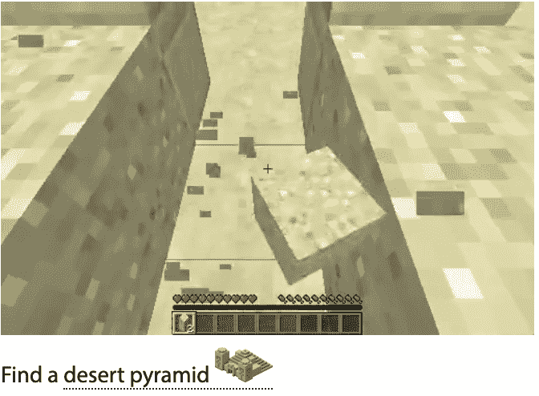

<!--yml

分类：未分类

日期：2025-01-11 13:05:50

-->

# \benchmarkname：LLM作为智能代理的基准

> 来源：[https://arxiv.org/html/2310.01557/](https://arxiv.org/html/2310.01557/)

吴跃${}^{12}$，唐轩${}^{1}$，汤姆·米切尔${}^{1}$，李元志${}^{12}$

${}^{1}$卡内基梅隆大学，${}^{2}$微软研究院，工作期间在微软研究院实习。通信联系：[ywu5@andrew.cmu.edu](mailto:ywu5@andrew.cmu.edu)

###### 摘要

最近的大型语言模型（LLMs）展示了在智能代理和下一代自动化方面的巨大潜力，但目前缺乏一个系统的基准来评估LLM作为代理的能力。我们介绍了\benchmarkname：一个具有挑战性的基准和评估LLM作为代理的方法论。\benchmarkname由6个不同的游戏组成，包括石头剪子布、河内塔、Minecraft。每个游戏都有独特的设置，提供最多20种评估设置和无限的环境变化。 \benchmarkname中的每个游戏独特地挑战了智能LLM代理的9种重要能力的子集，包括与对象依赖的推理、提前规划、空间推理、从历史中学习以及理解随机性。每个游戏测试的能力集之间的区别使我们能够单独分析每种能力。\benchmarkname不仅作为评估LLM代理整体表现的严格测试平台，还作为识别当前方法论差距的路线图。我们将在[github.com/microsoft/SmartPlay](https://github.com/microsoft/SmartPlay)发布我们的基准。

## 1 引言


图1：\benchmarkname提供了一个统一且可扩展的API，具有文本观察和指导功能，可以逐步执行LLM推理，适用于双臂赌博机、石头剪子布、Messenger（Hanjie等， [2021](https://arxiv.org/html/2310.01557v5#bib.bib21)），Crafter（Hafner，[2021](https://arxiv.org/html/2310.01557v5#bib.bib19)）和Minecraft（Fan等，[2022](https://arxiv.org/html/2310.01557v5#bib.bib15)）的创造性导航任务。

创建智能代理（Wooldridge & Jennings, [1995](https://arxiv.org/html/2310.01557v5#bib.bib54)），使其感知环境并执行自主行动，一直是人工智能的核心目标之一（Laird et al., [1987](https://arxiv.org/html/2310.01557v5#bib.bib26); Russell, [2010](https://arxiv.org/html/2310.01557v5#bib.bib37)）。最近，大型语言模型（LLMs）（Smith et al., [2022](https://arxiv.org/html/2310.01557v5#bib.bib44); Chowdhery et al., [2022](https://arxiv.org/html/2310.01557v5#bib.bib9); OpenAI, [2023](https://arxiv.org/html/2310.01557v5#bib.bib32); [Manyika,](https://arxiv.org/html/2310.01557v5#bib.bib30); Driess et al., [2023](https://arxiv.org/html/2310.01557v5#bib.bib12); Touvron et al., [2023](https://arxiv.org/html/2310.01557v5#bib.bib47)) 在各类任务中取得了显著进展（Bubeck et al., [2023](https://arxiv.org/html/2310.01557v5#bib.bib7)）。一些语言模型展示了卓越的规划能力（Ahn et al., [2022](https://arxiv.org/html/2310.01557v5#bib.bib2); Wu et al., [2023b](https://arxiv.org/html/2310.01557v5#bib.bib56)）、推理能力（Wu et al., [2023a](https://arxiv.org/html/2310.01557v5#bib.bib55); Shinn et al., [2023](https://arxiv.org/html/2310.01557v5#bib.bib40)）以及问题解决能力（Madaan et al., [2023](https://arxiv.org/html/2310.01557v5#bib.bib29); Kim et al., [2023](https://arxiv.org/html/2310.01557v5#bib.bib23)），使其有潜力成为虚拟现实（Park et al., [2023](https://arxiv.org/html/2310.01557v5#bib.bib33)）或现实世界问题解决的通用代理。

这种潜力引起了人们对大型语言模型系统在主动调用工具和API以完成广泛任务目标的应用的强烈兴趣（[Significant-Gravitas,](https://arxiv.org/html/2310.01557v5#bib.bib43); [Yoheinakajima,](https://arxiv.org/html/2310.01557v5#bib.bib58); [Reworkd,](https://arxiv.org/html/2310.01557v5#bib.bib36); Wang et al., [2023a](https://arxiv.org/html/2310.01557v5#bib.bib50); Qin et al., [2023](https://arxiv.org/html/2310.01557v5#bib.bib35))，并且能够主动与环境互动并做出改变以实现特定结果（Wang et al., [2023b](https://arxiv.org/html/2310.01557v5#bib.bib51); [a](https://arxiv.org/html/2310.01557v5#bib.bib50); Wu et al., [2023b](https://arxiv.org/html/2310.01557v5#bib.bib56); [c](https://arxiv.org/html/2310.01557v5#bib.bib57)）。将LLMs作为代理视为迈向下一代自动化的重要一步。

尽管受到了广泛的公众关注，但作为智能体的LLMs（大语言模型）的能力尚未得到系统研究，部分原因是缺乏标准化的LLM基准用于智能体与环境的互动。目前的LLM基准主要设计用于静态知识和推理（Hendrycks等人，[2020](https://arxiv.org/html/2310.01557v5#bib.bib22)；Liang等人，[2022](https://arxiv.org/html/2310.01557v5#bib.bib28)；Srivastava等人，[2022a](https://arxiv.org/html/2310.01557v5#bib.bib45)；Zhong等人，[2023](https://arxiv.org/html/2310.01557v5#bib.bib63)），或有益且无害的对话（Bai等人，[2022](https://arxiv.org/html/2310.01557v5#bib.bib3)；Zheng等人，[2023a](https://arxiv.org/html/2310.01557v5#bib.bib60)；Dubois等人，[2023](https://arxiv.org/html/2310.01557v5#bib.bib13)），忽视了智能体的应用。

我们注意到智能LLM智能体面临的4个关键挑战，这些挑战在之前的基准中未被涵盖。首先，许多现实世界的任务要求智能体进行长期规划。其次，许多事件具有概率性，智能体需要理解事件发生的概率。第三，智能体需要进行空间推理，以理解我们三维的世界。第四，当遇到未见过的情况时，智能体应该能够通过互动或从错误中学习。

另一方面，游戏长期以来被认为是智能通用智能体的理想基准（Pell，[2011](https://arxiv.org/html/2310.01557v5#bib.bib34)；Genesereth等人，[2005](https://arxiv.org/html/2310.01557v5#bib.bib16)；Whiteson等人，[2010](https://arxiv.org/html/2310.01557v5#bib.bib52)；Schaul等人，[2011](https://arxiv.org/html/2310.01557v5#bib.bib39)；Bellemare等人，[2013](https://arxiv.org/html/2310.01557v5#bib.bib5)；Côté等人，[2019](https://arxiv.org/html/2310.01557v5#bib.bib11)；Hafner，[2021](https://arxiv.org/html/2310.01557v5#bib.bib19)；Guss等人，[2021](https://arxiv.org/html/2310.01557v5#bib.bib18)；Fan等人，[2022](https://arxiv.org/html/2310.01557v5#bib.bib15)））。游戏设计的核心（Koster，[2013](https://arxiv.org/html/2310.01557v5#bib.bib24)）中，成功的游戏通常涉及“解决问题”、“计算概率”、“空间推理”、“难度变化”和“明确且可量化的结果”，因此它们是现有LLM基准的完美补充。最后，一些游戏环境是程序生成的，游戏状态随着时间的推移呈指数增长，使得游戏对评估数据集污染更加鲁棒，这一点在最近的研究中得到了验证（Touvron等人，[2023](https://arxiv.org/html/2310.01557v5#bib.bib47)）。在实验中，我们观察到LLM在记忆简单的三盘河内塔游戏的中间状态时表现困难。

从独特的代理角度对LLM进行基准测试，我们引入了\benchmarkname，这是一个来自6个不同游戏的基准，增强了视觉观察的语言描述符（图[1](https://arxiv.org/html/2310.01557v5#S1.F1 "图 1 ‣ 1 引言 ‣ \benchmarkname : LLM智能代理基准")），提供最多20种不同设置和无限的环境变化。每个游戏都有独特的挑战，涵盖了智能代理的多个维度，具体如表[3](https://arxiv.org/html/2310.01557v5#A1.T3 "表 3 ‣ 附录A 研究挑战 ‣ \benchmarkname : LLM智能代理基准")所述。游戏的复杂性从Bandits中要求简单的一步推理和规则遵循，到Crafter（Hafner, [2021](https://arxiv.org/html/2310.01557v5#bib.bib19)）和汉诺塔中复杂的长期规划、多跳依赖关系以及从交互中学习。\benchmarkname使LLM代理参与到确定性和随机性环境中，要求具备从基础文本理解到3D空间推理的各种技能。

\benchmarkname中的游戏已经建立了明确的目标和评估指标：完成率、奖励、得分。因此，\benchmarkname提供了一个完全自动化的管道，用于对LLM进行标准化评估。我们使用\benchmarkname来比较近期LLM的代理表现，并识别出将LLM作为代理应用的几个研究空白。我们相信，\benchmarkname设定了一个能够在短时间内达成但又足够艰巨、需要新突破的目标。

## 智能代理所需的2项能力

借鉴游戏设计的概念（Koster, [2013](https://arxiv.org/html/2310.01557v5#bib.bib24)），我们识别了智能LLM代理所需的$9$项关键能力，并为每项能力定义了多个层级：

1.  a)

    长文本理解：一般LLM能力。

    +   •

        我们根据文档长度和句法变化定义了4个层级：1）少量固定行，2）少量固定段落，3）具有句法变化，4）超过1页（500字）。

1.  b)

    推理：多跳逻辑推理和推断，通常用于分析游戏中物体或行动条件/依赖关系的交互。

    +   •

        我们根据推理跳跃定义了3个层级：1）$(0\sim 1)$， 2）$(2\sim 3)$， 3）$(>3)$。

1.  c)

    指令/规则遵循：遵循环境或用户设定的规则和指令。

    +   •

        我们根据游戏规则的数量定义了3个层级：1）单一规则， 2）$(<5)$， 3）$(5+)$

1.  d)

    规划：长期视角的上下文规划以实现复杂目标。

    +   •

        我们根据规划步骤和需要目标优先排序的并发目标定义了3个层级：1）$<5$个规划步骤，2）$5+$个规划步骤，3）并发目标

1.  e)

    泛化：在广泛的任务中表现出色。

    +   •

        我们根据游戏提供的可变性定义了3个层级：1）固定环境，2）固定游戏世界与随机目标，3）程序生成的游戏世界

1.  f)

    理解赔率：分析和估算随机事件的概率。

    +   •

        我们根据环境中随机性的的重要性定义3个级别：1）没有随机性，2）游戏中存在随机性，3）随机性是核心游戏机制

1.  g)

    从交互中学习：从实时交互中获取环境知识。

    +   •

        我们根据从中学习的独特交互次数定义4个级别：1）不需要学习，2）单次交互，3）少于5次交互，4）5次及以上交互

1.  h)

    错误/失误处理：从错误中恢复（例如，从错误的轨迹中纠正）。

    +   •

        我们根据是否需要错误处理以及是否需要额外的推理和重新规划来定义3个级别：1）不需要，2）简单回滚可以纠正错误，3）需要推理和重新规划来纠正错误。

1.  i)

    空间推理：理解我们在二维/三维世界中的位置。空间推理通常需要理解方向并在游戏世界中导航（例如，导航二维/三维世界）。

    1.  (a)

        我们根据维度定义3个级别：1）$0\sim 1$维， 2）2维， 3）3维

## \benchmarkname中的3个游戏

### 3.1 研究挑战

\benchmarkname基准测试涵盖了一系列多样化的挑战，评估了各种AI能力，具体列举在图[2](https://arxiv.org/html/2310.01557v5#S3.F2 "图 2 ‣ 3.1 研究挑战 ‣ \benchmarkname中的3个游戏 ‣ \benchmarkname：一个针对LLM的智能体基准")中。例如，Bandits主要关注理解赔率，要求最少的文本理解和规则遵循。另一方面，剪刀石头布独特地强调了理解赔率和多种游戏规则。河内塔提供了一个更高级的设置，用于物体依赖推理、战略规划和错误处理。Messenger对二维空间推理、读取句法变化和进行多跳推理提出了挑战。与此同时，Minecraft在三维空间推理和程序生成的世界中的泛化能力方面提出了独特的挑战。我们希望\benchmarkname基准测试能够作为识别这些细微差距并指导未来研究的工具。

尽管每个游戏都有其独特的挑战，\benchmarkname基准测试还评估了一个智能体整合这些技能的能力。例如，Crafter作为最全面的测试平台，结合了长文本、多重交互、并行目标和错误处理，形成一个单一的环境。Crafter突出了未来研究需要关注的不仅是孤立的技能，还需要将这些技能结合成一个统一、适应性强的智能体。

| 长文本理解 1. 少量预定义行 2. 少量段落 3. 句法变化 4. 长度超过1页 |
| --- |
| 多跳推理 1. $0\sim 1$跳 2. $2\sim 3$跳 3. 多跳 |
| 指令/规则遵循 1. 单一游戏规则 2. 少于5条游戏规则 3. 5条及以上游戏规则 |
| 计划 1. $<5$ 步计划 2. $5+$ 步计划 3. 同时进行目标 |
| 泛化 1. 固定环境 2. 固定世界，随机目标 3. 程序化生成的世界 |
| 理解几率 1. 无随机性 2. 游戏中存在随机性 3. 随机性为核心机制 |
| 交互学习 1. 不需要学习 2. 单次交互 3. $<5$ 次交互 4. $5+$ 次交互 |
| 错误/失误处理 1. 不需要 2. 仅回滚 3. 推理并重新规划 |
| 空间推理 1. 无$\sim$1D推理 2. 需要2D推理 3. 需要3D推理 |

  

图 2：我们为智能体识别了一组9个重要能力（第[2](https://arxiv.org/html/2310.01557v5#S2 "2 Capabilities Necessary for Intelligent Agents ‣ \benchmarkname : A Benchmark for LLMs as Intelligent Agents")节）。我们为每项能力识别了不同程度的挑战，如左侧所示。\benchmarkname中的每个游戏都在不同程度上挑战一组独特的能力，如蛛网图所示。我们将在表[3](https://arxiv.org/html/2310.01557v5#A1.T3 "Table 3 ‣ Appendix A Research Challenges ‣ \benchmarkname : A Benchmark for LLMs as Intelligent Agents")中列出蛛网图的数值。

### 3.2 双臂强盗

双臂强盗基准测试的灵感来源于流行的实现¹¹1[github.com/JKCooper2/gym-bandits](https://github.com/JKCooper2/gym-bandits)的强盗问题。

LLM智能体被提供了两个老虎机，具有隐藏的预定义奖励概率$p_{1},p_{2}$。对于老虎机$i$，两种可能结果的奖励分别为：支付事件的奖励为$r_{i}$，无支付事件的奖励为$-r_{i}$。游戏的目标是找到回报更好的臂，并在50轮中最大化奖励。人工编写的手册告知LLM有多少个老虎机（两个）以及目标是什么。

智能体必须跟踪其过去的尝试的胜负，并在探索这两个老虎机与利用回报更高的那个之间进行平衡。总体而言，挑战包括：1) 长期上下文理解，2) 理解随机性，3) 从交互中学习。

为了防止由于偏向性动作而导致的游戏利用，我们通过打乱配对列表的顺序来随机化每个动作的得分和概率：$[(p_{1},r_{1}),(p_{2},r_{2})]$。

### 3.3 石头剪子布

与著名的零和游戏石头剪子布相同的规则²²2[维基百科: 石头剪子布](https://en.wikipedia.org/wiki/Rock_paper_scissors)。

LLM代理与一个手工编写的对手对战，该对手遵循一个隐藏的预定义策略，针对石头、剪子、布的概率分别为$p_{1}$、$p_{2}$和$p_{3}$。每种动作获胜的得分是预定义的，并作为$s_{1}$、$s_{2}$、$s_{3}$透露给LLM。人工编写的手册提供了关于可能动作的说明，以及如何计算每回合的胜/平/负结果。

代理必须跟踪过去的滚动结果中的胜负情况，以分析对手的行为，然后利用对手最大化回报。总体挑战包括：1）长文本理解，2）理解概率，3）从互动中学习，4）遵循指令。

为了防止由于偏向性动作而导致的游戏利用，我们通过打乱配对列表的顺序来随机化每个动作的得分和概率：$[(p_{1},s_{1}),(p_{2},s_{2}),(p_{3},s_{3})]$。

### 3.4 河内塔

[河内塔](https://github.com/RobertTLange/gym-hanoi/tree/master)是一个经典的益智游戏，挑战玩家将一堆盘子从一个杆子移动到另一个杆子，使用第三根杆子作为辅助。游戏有两个规则：一次只能移动一个盘子，且较大的盘子不能放在较小的盘子上面。

游戏的目标是将所有盘子从第一个杆移动到最后一个杆，且在最少的步数内完成，游戏可以通过一个递归算法来解决，算法步骤如下：

1.  1.

    将n - 1个盘子从源杆移动到辅助杆，使用目标杆作为中介。

1.  2.

    将最大的盘子从源杆移动到目标杆。

1.  3.

    将n - 1个盘子从辅助杆移动到目标杆，使用源杆作为中介。

人工编写的手册包含了游戏设置和允许动作的描述。此外，我们还包括了起始配置和目标配置的示例插图，以及允许/不允许的动作示例。

河内塔要求代理进行战略思考并提前规划，并对LLM代理理解和遵循游戏规则的能力提出严格要求。如果代理犯错，游戏可能变得更加具有挑战性。有时，代理可能需要撤销若干步来纠正错误。总体挑战包括：1）规划，2）推理，3）错误处理。

### 3.5 信使

MESSENGER（Hanjie等人，[2021](https://arxiv.org/html/2310.01557v5#bib.bib21)）具有多种游戏变体，包含程序生成的游戏动态和配套文本手册。MESSENGER的整体游戏机制涉及获取信息并将其传递到目标。该基准包含3个难度级别（在Hanjie等人（[2021](https://arxiv.org/html/2310.01557v5#bib.bib21)）中称为阶段）。

要在MESSENGER中成功，代理必须首先将环境中的实体和动态与手册中的参考同义词关联起来，识别信息和目标对象，并导航以将信息传递到目标，同时避免敌人的干扰。该手册设计上即便对人类读者而言也很难理解。第1级主要考验代理的1）长文本理解和2）概括能力。第2级增加了对代理的3）推理能力和4）2D空间推理的挑战。第3级通过增加干扰物体进一步提高难度。

Hanjie等人（[2021](https://arxiv.org/html/2310.01557v5#bib.bib21)）提供的原始手册包含了通过众包人类写作者获得的实体和世界动态描述。我们在手册中增加了关于游戏目标的说明，并为LLM代理提供了一条“建议”，即首先识别目标对象，然后接近其目标。该“建议”减少了手册中难以解析部分的难度。

### 3.6 Crafter

Crafter环境（Hafner，[2021](https://arxiv.org/html/2310.01557v5#bib.bib19)）是一款程序生成的开放世界生存游戏，旨在测试强化学习（RL）算法。受Minecraft启发，它具有一个网格世界，采用自上而下的观察视角，并且拥有一个17个离散动作空间。游戏包括一个深度为7的技术树和22项成就，并提供关于玩家的健康、食物、水、休息水平以及库存的信息。Crafter捕捉了Minecraft的许多关键研究挑战，为进行实验和收集结果提供了一个更加精简和快速的环境。

我们提供了来自Wu等人（[2023c](https://arxiv.org/html/2310.01557v5#bib.bib57)）的“上下文”字符串作为手册，生成方式是通过解析(Hafner，[2021](https://arxiv.org/html/2310.01557v5#bib.bib19))的LATEX源代码。已经证明，“上下文”字符串能显著提高GPT-4和text-davinci-003在Crafter上的表现（Wu等人，[2023c](https://arxiv.org/html/2310.01557v5#bib.bib57)）。

要在Crafter中取得成功，一个LLM代理必须首先理解并掌握由17个动作组成的各种可重用技能。该代理需要学习如何在最多5种2D地形（生物群落）中导航，避开障碍物和危险生物。代理还需要收集不同的资源，并制作更先进的武器/工具以解锁更多的技能和成就，同时平衡制作目标与生存目标，如保持健康、口渴、食物和休息（Hafner，[2021](https://arxiv.org/html/2310.01557v5#bib.bib19)）。总体挑战包括：1）2D空间推理，2）错误处理，3）长文本理解，4）规划，5）泛化，6）从错误中改正。有趣的是，“上下文”字符串并未捕捉到成功游戏所需的所有信息，即，制作工作台需要2块木材，制作熔炉需要8块石头。代理必须7）通过互动来学习。

### 3.7 《Minecraft》

《Minecraft》是历史上最受欢迎的游戏之一⁴⁴4[维基百科](https://en.wikipedia.org/wiki/Minecraft)。游戏世界几乎是无限的，并且是程序化生成的。游戏观察由粗略的3D物体组成，这些物体代表着各种材料，如泥土、石头、矿石、树干、水和熔岩。《Minecraft》已经被广泛研究，作为智能多任务代理的基准（Guss等人，[2021](https://arxiv.org/html/2310.01557v5#bib.bib18)；Fan等人，[2022](https://arxiv.org/html/2310.01557v5#bib.bib15)；Hafner等人，[2023](https://arxiv.org/html/2310.01557v5#bib.bib20)；Yuan等人，[2023](https://arxiv.org/html/2310.01557v5#bib.bib59)；Wang等人，[2023b](https://arxiv.org/html/2310.01557v5#bib.bib51)；[a](https://arxiv.org/html/2310.01557v5#bib.bib50)）。然而，由于大多数当前的LLM缺乏视觉能力，我们简化了《Minecraft》基准（Fan等人，[2022](https://arxiv.org/html/2310.01557v5#bib.bib15)），仅考虑一小部分创意任务，其主要目标是找到特定的生物群落，因此LLM可以控制一个手工编码的代理在3D世界中进行导航。

对于人工编写的说明手册，我们通知代理它的目标是找到《Minecraft》中的特定生物群落$g$，并提供关于如何解读《Minecraft》视觉描述输出的建议。

要在创意“寻找”任务中取得成功，一个LLM代理必须具备足够的《Minecraft》不同生物群落的领域知识，并能够将视觉观察（视觉世界的文本描述）与领域知识关联，并在3D环境中导航。总体挑战包括：1）规划，2）领域知识，3）3D空间推理，4）泛化。

## 4 使用\benchmarkname

### 4.1 环境接口与评估协议

| 环境 | 输入 | 手册 | 历史 | 投放 | 动作空间 | 试验 |
| --- | --- | --- | --- | --- | --- | --- |
| 匪徒 | 文本 | 背景 | 50 | 50 | 2 | 20 |
| RockPaperScissors | 文本 | 背景、规则 | 50 | 50 | 3 | 20 |
| Hanoi | 文本 | 背景、规则、示例 | 30 | 30 | 6 | 10 |
| Messenger | 视觉描述 | 背景、规则、建议 | 2 | 4$\sim$128 | 5 | 100 |
| Crafter | 视觉描述 | 背景、规则、建议 | 5 | 10k | 17 | 10 |
| Minecraft | 视觉描述 | 目标 | 2 | 200 | 4 | 20 |

表格1：SmartPlay中每个游戏的规格。除了表格外，手动输入还包含所有游戏可用动作的列表。输入、手动、动作空间和回合长度不应修改。历史长度和试验次数可以增加，以适应未来的需求。

为了便于使用和广泛兼容，\benchmarkname遵循统一的OpenAI Gym接口（Brockman等，[2016](https://arxiv.org/html/2310.01557v5#bib.bib6)），适用于所有游戏，包含基于文本的观察、如表格[1](https://arxiv.org/html/2310.01557v5#S4.T1 "Table 1 ‣ 4.1 Environment Interface and Evaluation Protocol ‣ 4 Using \benchmarkname ‣ \benchmarkname : A Benchmark for LLMs as Intelligent Agents")中描述的内容的基于文本的手册、描述历史动作和观察的文本，涵盖长度为“历史长度”的过去步骤，以及平坦的类别化动作。由于某些游戏的随机性，我们建议多次运行每个游戏并报告平均指标。

输入、手动、动作空间、回合长度（每个游戏允许的最大环境步骤）和每个游戏的试验次数在表格[1](https://arxiv.org/html/2310.01557v5#S4.T1 "Table 1 ‣ 4.1 Environment Interface and Evaluation Protocol ‣ 4 Using \benchmarkname ‣ \benchmarkname : A Benchmark for LLMs as Intelligent Agents")中已指定。这些设置是固定的，不应修改。然而，未来的研究可能需要更长的历史长度或更多的试验次数来适应某些游戏的需求。可以根据具体需求调整这些参数，但必须明确说明所做的更改。我们在表格[1](https://arxiv.org/html/2310.01557v5#S4.T1 "Table 1 ‣ 4.1 Environment Interface and Evaluation Protocol ‣ 4 Using \benchmarkname ‣ \benchmarkname : A Benchmark for LLMs as Intelligent Agents")中提供了推荐值（我们实验中也使用了这些值）。

为了完整性，我们在附录[C](https://arxiv.org/html/2310.01557v5#A3 "Appendix C Example Inputs ‣ \benchmarkname : A Benchmark for LLMs as Intelligent Agents")中提供了每个游戏的示例输入。请注意，SmartPlay中的所有方向描述为“东、南、西、北、上、下”。在实际游戏中，\benchmarkname API还包括供LLM代理选择的动作列表。

### 4.2 评估指标

我们定义了三个度量指标：奖励、完成率、分数。为了确保与先前工作的兼容性，奖励与原本为强化学习（RL）设计的游戏中的分数/奖励定义对齐（即，强盗、石头剪刀布、Messenger、Crafter（Hanjie 等，[2021](https://arxiv.org/html/2310.01557v5#bib.bib21)；Hafner，[2021](https://arxiv.org/html/2310.01557v5#bib.bib19)））。完成率衡量具有可量化目标的游戏的成功完成率（即，河内塔、Messenger、我的世界）。最后，我们为基准中的每个游戏引入了分数，以提供性能的总结。对于强盗和石头剪刀布，分数定义为LLM的动作与环境最佳动作匹配的次数；对于河内塔，分数定义为成功将盘子移动到目标柱子的次数；对于Messenger，分数与每轮游戏的奖励相同（Hanjie 等，[2021](https://arxiv.org/html/2310.01557v5#bib.bib21)）；对于Crafter，分数定义为每个步骤解锁的成就数量，按整个游戏的总和计算；对于我的世界，分数定义为“寻找”目标是否已完成的指标。

## 5 实验结果

使用\benchmarkname API，我们遵循Wu 等人（[2023c](https://arxiv.org/html/2310.01557v5#bib.bib57)）的方法，直接向LLM发出提示：“接下来该采取什么行动，逐步思考。”，并以手动操作、历史记录和当前观察作为上下文。然后我们询问LLM：“从所有可执行动作列表中选择最佳的动作。写出准确的选择动作。”以获得直接映射到环境动作之一的答案。

### 5.1 定量分析

| LLM | 强盗 | 石头剪刀布 | 河内塔 | MessengerL1 | MessengerL2 | Crafter | 我的世界 |
| --- | --- | --- | --- | --- | --- | --- | --- |
| 人类基线 | 1.00 | 1.00 | 1.00 | 1.00 | 1.00 | 1.00 | 1.00 |
| --- | --- | --- | --- | --- | --- | --- | --- |
| GPT-4-0613 | 1.00 | 0.91 | 0.83 | 0.90 | 0.93 | 0.26 | 0.61 |
| GPT-4-0314 | 0.97 | 0.98 | 0.90 | 0.87 | 0.97 | 0.32 | 0.59 |
| text-davinci-003 | 1.04 | 0.40 | 0.50 | 0.62 | 0.46 | 0.07 | 0.45 |
| Claude | 0.72 | 0.47 | 0.67 | 0.44 | 0.60 | 0.05 | 0.50 |
| Bard | 0.86 | 0.30 | 0.67 | 0.61 | 0.40 | 0.04 | 0.54 |
| llama-2-13b | 0.50 | 0.35 | 0.37 | 0.12 | 0.13 | 0.04 | 0.61 |
| llama-13b | 0.68 | 0.50 | 0.33 | 0.16 | 0.06 | 0.04 | 0.50 |
| vicuna-13b | 0.64 | 0.17 | 0.07 | 0.00 | 0.12 | 0.02 | 0.43 |

表2：不同LLM在BanditTwoArmedHighLowFixed-v0、RockPaperScissorBasic-v0、Hanoi3Disk-v0、MessengerL1-v0、MessengerL2-v0、Crafter-v0、MinedojoCreative0-v0等任务中的平均得分比较。所有得分均已相对于人类表现进行归一化（未归一化版本请参见表[4](https://arxiv.org/html/2310.01557v5#A4.T4 "Table 4 ‣ D.3 Raw scores ‣ Appendix D Additional Experimental Results ‣ \benchmarkname : A Benchmark for LLMs as Intelligent Agents")）。GPT-4变体在所有其他LLM中表现突出，但仍远远低于人类基准。我们观察到，SOTA LLM与人类基准在Hanoi、Crafter和Minecraft任务中的表现差距明显。Hanoi和Crafter任务挑战的是规划和推理能力，而Minecraft任务则挑战3D空间推理能力。

为了减少查询成本，我们选择了7种设置，这些设置需要最少的实验，但能全面覆盖重要的智能体能力。我们实验了9种最近流行的开源和专有LLM，并在表[2](https://arxiv.org/html/2310.01557v5#S5.T2 "Table 2 ‣ 5.1 Quantitative Analysis ‣ 5 Experimental Results ‣ \benchmarkname : A Benchmark for LLMs as Intelligent Agents")中报告了平均得分。

总体而言，GPT-4变体显著优于其他专有模型，而其他专有模型则明显优于开源模型。

LLM作为智能体仍有显著改进空间：尽管GPT-4变体的表现令人印象深刻，但在更具挑战性的基准测试中，GPT-4与人类基准性能之间仍然存在显著差距，在3DiskHanoi任务中差距为10%，在Minecraft创意任务中为40%，在Crafter任务中为70%。

其他专有LLM难以跟上GPT-4的步伐：我们观察到，GPT-4与其他专有模型（如Claude、Bard和text-davinci-003）之间在所有游戏中的差距超过了20%，除了Minecraft外。此外，在综合基准测试如Crafter上，GPT-4变体的得分是其他专有模型的3倍。

开源LLM仍然有很长的路要走：开源LLM在简单的Bandit和石头剪子布任务上的表现不到GPT-4变体的一半，而在更具挑战性的任务中表现为其1/8。经过微调的Vicuna-13b模型的表现远逊色于基础版LLAMA-13b。

3D空间推理仍然是LLM的一大挑战：由于Minecraft任务要求独特的3D空间推理，所有LLM在该任务中的表现都同样具有挑战性。在Minecraft创意任务中，所有LLM的表现相似，最好的模型也仅达到了人类基准性能的60%。


图3：左侧：将两个GPT-4变体与人类基准性能进行比较。中间：比较text-davinci-003、Claude和Bard。右侧：比较开源的llama-2-13b、llama-13b、vicuna-13b模型。

为了进一步深入了解图[2](https://arxiv.org/html/2310.01557v5#S3.F2 "图2 ‣ 3.1 研究挑战 ‣ 3 游戏 \benchmarkname ‣ \benchmarkname：LLMs作为智能代理的基准")中所示的LLM个体代理能力，我们计算了每个能力$c$的能力得分$p_{LLM}^{c}$，该得分为每个游戏$g$上经过人类标准化得分$s_{g}$的平均值，并按照游戏$g$呈现挑战$c$的程度$d_{c}^{g}$进行加权：$p_{LLM}^{c}=\frac{\sum_{g}d_{c}^{g}s_{g}}{\sum_{g}d_{c}^{g}}$。我们将在图[3](https://arxiv.org/html/2310.01557v5#S5.F3 "图3 ‣ 5.1 定量分析 ‣ 5 实验结果 ‣ \benchmarkname：LLMs作为智能代理的基准")中将能力得分分为三组：GPT-4变体、其他专有模型和开源模型。

两个GPT-4变体的整体表现相似，其中GPT-0614在规划和推理方面稍逊一筹。我们还发现GPT-4变体在从互动中学习、错误/失误处理和空间推理方面的得分较低。

Claude整体表现优于Bard，特别是在规划、推理和遵循指令方面。与其他两个专有模型相比，text-davinci-003似乎偏向于从互动和随机性中学习，尤其在指令跟随、规划和推理方面较弱。

LLAMA-2-13b和LLAMA-1-13b在高层次上的表现相似，LLAMA-2-13b在规划、推理和错误处理方面表现更好，但在从随机性和互动中学习方面表现较差。经过微调后，Vicuna-13b在推理、规划、长文本理解和错误/失误处理能力方面失去了很多。

### 5.2 定性分析

从互动中学习：在"Bandits"和"Rock Paper Scissors"中，专有LLMs展示了从历史和互动中学习的良好潜力。我们观察到代理首先遵循探索性策略，然后基于过去的观察利用偏向对手。在"Crafte"中，GPT-4变体持续尝试用1个木材建立工作台，并在无法用2个木材建立工作台后恢复尝试。

数据/环境污染：对于汉诺塔问题，预计LLMs已经在完全相同的问题上进行了训练。令人惊讶的是，尽管所有LLMs都能在所有盘子都在第一根柱子上的起始配置下提供解决方案（有些甚至可以写出递推式来求解），但大多数LLMs在几个动作后，盘子分布在三根柱子上时无法解决问题，并且很快就会感到困惑。我们怀疑这是因为中间状态在LLM的训练集中并不常见。这样的观察验证了我们认为游戏对于数据集污染可能更具鲁棒性的观点。

空间推理：我们观察到LLM通常对空间位置的感知较差，并且在导航到新位置时常常遇到困难。例如，在Minecraft中，我们经常看到LLM采取相互矛盾的行动，即一系列“向北移动”后紧跟着一系列“向南移动”，从而撤销了其在探索过程中的很多努力。

## 6 相关工作

### 6.1 LLM 评估

由于大语言模型（LLM）的快速发展，评估其性能的任务变得越来越具有挑战性。通用基准测试通常使用广泛的任务和语言来测试通识知识和推理能力 （Hendrycks et al., [2020](https://arxiv.org/html/2310.01557v5#bib.bib22); Liang et al., [2022](https://arxiv.org/html/2310.01557v5#bib.bib28); Srivastava et al., [2022a](https://arxiv.org/html/2310.01557v5#bib.bib45); Zhong et al., [2023](https://arxiv.org/html/2310.01557v5#bib.bib63)），其中一些小型语言模型的性能接近当前最先进的大型语言模型 Li et al. ([2023](https://arxiv.org/html/2310.01557v5#bib.bib27)); Gunasekar et al. ([2023](https://arxiv.org/html/2310.01557v5#bib.bib17)); Eldan & Li ([2023](https://arxiv.org/html/2310.01557v5#bib.bib14))。然而，这些基准测试难以涵盖像指令跟随 Ziegler et al. ([2019](https://arxiv.org/html/2310.01557v5#bib.bib64)) 或对话 Bai et al. ([2022](https://arxiv.org/html/2310.01557v5#bib.bib3)) 这样的互动风格。评估对话能力的常用方法是模型对比，通过将LLM的输出与参考LLM进行配对比较，以生成排名 (Zheng et al., [2023b](https://arxiv.org/html/2310.01557v5#bib.bib61))。这个排名最初是由人类执行的，但可以通过一个更强大的LLM来自动化 (Chiang & Lee, [2023](https://arxiv.org/html/2310.01557v5#bib.bib8); Zheng et al., [2023a](https://arxiv.org/html/2310.01557v5#bib.bib60); Dubois et al., [2023](https://arxiv.org/html/2310.01557v5#bib.bib13))。然而，这种评估技术依赖于专家模型或能够可靠比较不同LLM性能的人工评估者，这限制了其在如Claude-2或GPT-4等最先进LLM上的应用。此外，现有的基准测试未能捕捉智能体的关键特征，如对随机性的理解、空间推理和错误处理。

### 6.2 使用游戏评估通用智能体

使用游戏来评估智能体表现的想法在人工智能领域有着悠久的历史。Pell（[2011](https://arxiv.org/html/2310.01557v5#bib.bib34)）；Schaul 等人（[2011](https://arxiv.org/html/2310.01557v5#bib.bib39)）；Whiteson 等人（[2011](https://arxiv.org/html/2310.01557v5#bib.bib53)）提出了使用游戏来衡量智能体一般能力的早期想法和动机，并讨论了衡量人工智能智能体表现的挑战。一系列流行的基准（Brockman 等人，[2016](https://arxiv.org/html/2310.01557v5#bib.bib6)；Vinyals 等人，[2017](https://arxiv.org/html/2310.01557v5#bib.bib49)；Tunyasuvunakool 等人，[2020](https://arxiv.org/html/2310.01557v5#bib.bib48)）被创建，包括 Atari（Bellemare 等人，[2013](https://arxiv.org/html/2310.01557v5#bib.bib5)）和 DeepMind 实验室（Beattie 等人，[2016](https://arxiv.org/html/2310.01557v5#bib.bib4)）。随着人工智能智能体能力的提升，研究人员开发了开放式通用游戏（Savva 等人，[2019](https://arxiv.org/html/2310.01557v5#bib.bib38)；Abramson 等人，[2020](https://arxiv.org/html/2310.01557v5#bib.bib1)；Hafner，[2021](https://arxiv.org/html/2310.01557v5#bib.bib19)；Srivastava 等人，[2022b](https://arxiv.org/html/2310.01557v5#bib.bib46)），例如 NetHack（Küttler 等人，[2020](https://arxiv.org/html/2310.01557v5#bib.bib25)）或 Minecraft（Guss 等人，[2021](https://arxiv.org/html/2310.01557v5#bib.bib18)；Fan 等人，[2022](https://arxiv.org/html/2310.01557v5#bib.bib15)）。

\benchmarkname

它采用了一套基准（Brockman 等人，[2016](https://arxiv.org/html/2310.01557v5#bib.bib6)；Hafner，[2021](https://arxiv.org/html/2310.01557v5#bib.bib19)；Fan 等人，[2022](https://arxiv.org/html/2310.01557v5#bib.bib15)），这些基准是在不同的时间开发的，旨在最好地代表广泛的难度和技能范围。

### 6.3 创建/转换为文字游戏

文字游戏（Côté 等人，[2018](https://arxiv.org/html/2310.01557v5#bib.bib10)；Küttler 等人，[2020](https://arxiv.org/html/2310.01557v5#bib.bib25)；Zhong 等人，[2019](https://arxiv.org/html/2310.01557v5#bib.bib62)；Hanjie 等人，[2021](https://arxiv.org/html/2310.01557v5#bib.bib21)）是互动模拟游戏，其中游戏状态和行动空间是自然语言，通常用于基准测试如规划、探索和记忆等技能。\benchmarkname 特征包括一个文字游戏（Messenger），该游戏具有程序化的游戏规则生成（Hanjie 等人，[2021](https://arxiv.org/html/2310.01557v5#bib.bib21)），用于测试大型语言模型智能体在语言理解和规划方面的泛化能力。

为了捕捉像空间推理这样的现实挑战，我们研究了将 2D/3D 游戏转化为文字游戏。Shridhar 等人（[2020b](https://arxiv.org/html/2310.01557v5#bib.bib42)）展示了将 3D 具身室内环境（Shridhar 等人，[2020a](https://arxiv.org/html/2310.01557v5#bib.bib41)）转化为 TextWorld（Côté 等人，[2018](https://arxiv.org/html/2310.01557v5#bib.bib10)）游戏的可能性，通过“列出”所有的物体以文本形式呈现。然而，这种转化依赖于低级控制器和瞬移，使得当前 LLM 环境变得过于简单（Micheli & Fleuret，[2021](https://arxiv.org/html/2310.01557v5#bib.bib31)；Wu 等人，[2023b](https://arxiv.org/html/2310.01557v5#bib.bib56)）。因此，我们遵循 Wu 等人（[2023c](https://arxiv.org/html/2310.01557v5#bib.bib57)）的方法，提供带有方向关系的物体/观察列表：“在你东南方”。这种描述方式使 LLM 能够在没有低级控制器的情况下取得有意义的进展（Wu 等人，[2023c](https://arxiv.org/html/2310.01557v5#bib.bib57)）。

## 7 结论

在这项工作中，我们介绍了 \benchmarkname，既是一个具有挑战性的基准测试，也是评估 LLM 作为代理表现的方法论。我们首次发布的 \benchmarkname 包含了双臂赌博机、石头剪子布、信使（Hanjie 等人，[2021](https://arxiv.org/html/2310.01557v5#bib.bib21)）、工匠（Hafner，[2021](https://arxiv.org/html/2310.01557v5#bib.bib19)）和《我的世界》（Fan 等人，[2022](https://arxiv.org/html/2310.01557v5#bib.bib15)）的创造性导航任务。\benchmarkname 不仅基准测试基本能力，如指令跟随和上下文推理，还评估诸如规划、随机性理解、2D/3D 空间推理和错误处理等能力，而这些在现有 LLM 基准测试中往往被低估。为了实现下一代自动化，我们认为语言模型应该超越流利语言表达（Eldan & Li，[2023](https://arxiv.org/html/2310.01557v5#bib.bib14)），成为能够与世界和人类用户互动的更智能的代理。我们希望 \benchmarkname 能够催化研究，帮助构建更强大和可靠的 LLM 代理。

最后，\benchmarkname 提供了轻松将游戏添加到基准测试套件的指南。\benchmarkname 将不断改进，以提供最新的挑战给下一代 LLM。

## 参考文献

+   Abramson 等人（2020）Josh Abramson, Arun Ahuja, Iain Barr, Arthur Brussee, Federico Carnevale, Mary Cassin, Rachita Chhaparia, Stephen Clark, Bogdan Damoc, Andrew Dudzik 等人。Imitating interactive intelligence. *arXiv 预印本 arXiv:2012.05672*，2020。

+   Ahn 等人（2022）Michael Ahn, Anthony Brohan, Noah Brown, Yevgen Chebotar, Omar Cortes, Byron David, Chelsea Finn, Keerthana Gopalakrishnan, Karol Hausman, Alex Herzog 等人。Do as i can, not as i say: Grounding language in robotic affordances. *arXiv 预印本 arXiv:2204.01691*，2022。

+   Bai 等人 (2022) Yuntao Bai, Andy Jones, Kamal Ndousse, Amanda Askell, Anna Chen, Nova DasSarma, Dawn Drain, Stanislav Fort, Deep Ganguli, Tom Henighan 等人。通过人类反馈的强化学习训练一个有帮助且无害的助手。*arXiv 预印本 arXiv:2204.05862*，2022年。

+   Beattie 等人 (2016) Charles Beattie, Joel Z Leibo, Denis Teplyashin, Tom Ward, Marcus Wainwright, Heinrich Küttler, Andrew Lefrancq, Simon Green, Víctor Valdés, Amir Sadik 等人。Deepmind 实验室。*arXiv 预印本 arXiv:1612.03801*，2016年。

+   Bellemare 等人 (2013) Marc G Bellemare, Yavar Naddaf, Joel Veness, 和 Michael Bowling。街机学习环境：通用智能体的评估平台。*人工智能研究杂志*，47:253–279，2013年。

+   Brockman 等人 (2016) Greg Brockman, Vicki Cheung, Ludwig Pettersson, Jonas Schneider, John Schulman, Jie Tang 和 Wojciech Zaremba。OpenAI Gym。*arXiv 预印本 arXiv:1606.01540*，2016年。

+   Bubeck 等人 (2023) Sébastien Bubeck, Varun Chandrasekaran, Ronen Eldan, Johannes Gehrke, Eric Horvitz, Ece Kamar, Peter Lee, Yin Tat Lee, Yuanzhi Li, Scott Lundberg 等人。人工通用智能的火花：与 GPT-4 的早期实验。*arXiv 预印本 arXiv:2303.12712*，2023年。

+   Chiang & Lee (2023) Cheng-Han Chiang 和 Hung-yi Lee。大型语言模型能否成为人类评估的替代方案？ *arXiv 预印本 arXiv:2305.01937*，2023年。

+   Chowdhery 等人 (2022) Aakanksha Chowdhery, Sharan Narang, Jacob Devlin, Maarten Bosma, Gaurav Mishra, Adam Roberts, Paul Barham, Hyung Won Chung, Charles Sutton, Sebastian Gehrmann 等人。Palm：通过路径扩展语言建模。*arXiv 预印本 arXiv:2204.02311*，2022年。

+   Côté 等人 (2018) Marc-Alexandre Côté, Akos Kádár, Xingdi Yuan, Ben Kybartas, Tavian Barnes, Emery Fine, James Moore, Matthew Hausknecht, Layla El Asri, Mahmoud Adada 等人。Textworld: 一种基于文本游戏的学习环境。在 *计算机游戏研讨会*，第41–75页。Springer，2018年。

+   Côté 等人 (2019) Marc-Alexandre Côté, Akos Kádár, Xingdi Yuan, Ben Kybartas, Tavian Barnes, Emery Fine, James Moore, Matthew Hausknecht, Layla El Asri, Mahmoud Adada 等人。Textworld: 一种基于文本游戏的学习环境。在 *计算机游戏：第七届研讨会，CGW 2018，IJCAI 2018国际人工智能大会联合举办，2018年7月13日，瑞典斯德哥尔摩，修订版精选论文7*，第41–75页。Springer，2019年。

+   Driess 等人 (2023) Danny Driess, Fei Xia, Mehdi SM Sajjadi, Corey Lynch, Aakanksha Chowdhery, Brian Ichter, Ayzaan Wahid, Jonathan Tompson, Quan Vuong, Tianhe Yu 等人。Palm-e：一种具身的多模态语言模型。*arXiv 预印本 arXiv:2303.03378*，2023年。

+   Dubois 等人 (2023) Yann Dubois, Xuechen Li, Rohan Taori, Tianyi Zhang, Ishaan Gulrajani, Jimmy Ba, Carlos Guestrin, Percy Liang 和 Tatsunori B. Hashimoto。Alpacafarm：一个模拟框架，用于学习人类反馈的方法，2023年。

+   Eldan & Li（2023年）Ronen Eldan和Yuanzhi Li。Tinystories：语言模型可以小到多小仍能讲出连贯的英语？*arXiv预印本 arXiv:2305.07759*，2023年。

+   Fan等人（2022年）Linxi Fan、Guanzhi Wang、Yunfan Jiang、Ajay Mandlekar、Yuncong Yang、Haoyi Zhu、Andrew Tang、De-An Huang、Yuke Zhu和Anima Anandkumar。Minedojo：构建具有互联网规模知识的开放式具身智能体。*arXiv预印本 arXiv:2206.08853*，2022年。

+   Genesereth等人（2005年）Michael Genesereth、Nathaniel Love和Barney Pell。通用游戏玩法：AAAI竞赛概述。*人工智能杂志*，26(2):62–62，2005年。

+   Gunasekar等人（2023年）Suriya Gunasekar、Yi Zhang、Jyoti Aneja、Caio César Teodoro Mendes、Allie Del Giorno、Sivakanth Gopi、Mojan Javaheripi、Piero Kauffmann、Gustavo de Rosa、Olli Saarikivi等人。教科书就是你所需要的。*arXiv预印本 arXiv:2306.11644*，2023年。

+   Guss等人（2021年）William H Guss、Mario Ynocente Castro、Sam Devlin、Brandon Houghton、Noboru Sean Kuno、Crissman Loomis、Stephanie Milani、Sharada Mohanty、Keisuke Nakata、Ruslan Salakhutdinov等人。2020年Minerl竞赛：使用人类先验的样本高效强化学习。*arXiv预印本 arXiv:2101.11071*，2021年。

+   Hafner（2021年）Danijar Hafner。代理能力谱的基准测试。*arXiv预印本 arXiv:2109.06780*，2021年。

+   Hafner等人（2023年）Danijar Hafner、Jurgis Pasukonis、Jimmy Ba和Timothy Lillicrap。通过世界模型掌握多样化领域。*arXiv预印本 arXiv:2301.04104*，2023年。

+   Hanjie等人（2021年）Austin W Hanjie、Victor Y Zhong和Karthik Narasimhan。将语言与实体和动态结合以便于强化学习中的泛化。发表于*国际机器学习会议*，页码4051–4062。PMLR，2021年。

+   Hendrycks等人（2020年）Dan Hendrycks、Collin Burns、Steven Basart、Andy Zou、Mantas Mazeika、Dawn Song和Jacob Steinhardt。衡量大规模多任务语言理解。*arXiv预印本 arXiv:2009.03300*，2020年。

+   Kim等人（2023年）Geunwoo Kim、Pierre Baldi和Stephen McAleer。语言模型可以解决计算机任务。*arXiv预印本 arXiv:2303.17491*，2023年。

+   Koster（2013年）Raph Koster。*游戏设计的趣味理论*。”O'Reilly Media, Inc.”，2013年。

+   Küttler等人（2020年）Heinrich Küttler、Nantas Nardelli、Alexander Miller、Roberta Raileanu、Marco Selvatici、Edward Grefenstette和Tim Rocktäschel。Nethack学习环境。*神经信息处理系统进展*，33:7671–7684，2020年。

+   Laird等人（1987年）John E Laird、Allen Newell和Paul S Rosenbloom。Soar：一种通用智能架构。*人工智能*，33(1):1–64，1987年。

+   Li等人（2023年）Yuanzhi Li、Sébastien Bubeck、Ronen Eldan、Allie Del Giorno、Suriya Gunasekar和Yin Tat Lee。教科书就是你所需要的II：phi-1.5技术报告。*arXiv预印本 arXiv:2309.05463*，2023年。

+   Liang等人（2022）Percy Liang, Rishi Bommasani, Tony Lee, Dimitris Tsipras, Dilara Soylu, Michihiro Yasunaga, Yian Zhang, Deepak Narayanan, Yuhuai Wu, Ananya Kumar等人。语言模型的全面评估。*arXiv预印本arXiv:2211.09110*，2022年。

+   Madaan等人（2023）Aman Madaan, Niket Tandon, Prakhar Gupta, Skyler Hallinan, Luyu Gao, Sarah Wiegreffe, Uri Alon, Nouha Dziri, Shrimai Prabhumoye, Yiming Yang等人。Self-refine：自反馈的迭代优化。*arXiv预印本arXiv:2303.17651*，2023年。

+   （30）James Manyika。Bard概述：生成式AI的早期实验。[https://ai.google/static/documents/google-about-bard.pdf](https://ai.google/static/documents/google-about-bard.pdf)。访问时间：2023年5月27日。

+   Micheli & Fleuret（2021）Vincent Micheli和François Fleuret。语言模型是少量样本的管家。*arXiv预印本arXiv:2104.07972*，2021年。

+   OpenAI（2023）OpenAI。GPT-4技术报告，2023年。

+   Park等人（2023）Joon Sung Park, Joseph C O’Brien, Carrie J Cai, Meredith Ringel Morris, Percy Liang, 和Michael S Bernstein。生成代理：人类行为的互动模拟。*arXiv预印本arXiv:2304.03442*，2023年。

+   Pell（2011）Barney Pell。元游戏策略生成与评估。*KI-Künstliche Intelligenz*，25(1):71–72，2011年。

+   Qin等人（2023）Yujia Qin, Shihao Liang, Yining Ye, Kunlun Zhu, Lan Yan, Yaxi Lu, Yankai Lin, Xin Cong, Xiangru Tang, Bill Qian, Sihan Zhao, Runchu Tian, Ruobing Xie, Jie Zhou, Mark Gerstein, Dahai Li, Zhiyuan Liu, 和Maosong Sun。Toolllm：帮助大型语言模型掌握16000+个真实世界的API，2023年。

+   （36）Reworkd。reworkd/agentgpt：在浏览器中组装、配置并部署自主AI代理。网址 [https://github.com/reworkd/AgentGPT](https://github.com/reworkd/AgentGPT)。

+   Russell（2010）Stuart J Russell。*人工智能：现代方法*。Pearson Education, Inc.，2010年。

+   Savva等人（2019）Manolis Savva, Abhishek Kadian, Oleksandr Maksymets, Yili Zhao, Erik Wijmans, Bhavana Jain, Julian Straub, Jia Liu, Vladlen Koltun, Jitendra Malik等人。Habitat：一种用于具身AI研究的平台。载于*IEEE/CVF国际计算机视觉会议论文集*，第9339–9347页，2019年。

+   Schaul等人（2011）Tom Schaul, Julian Togelius, 和Jürgen Schmidhuber。通过游戏衡量智能。*arXiv预印本arXiv:1109.1314*，2011年。

+   Shinn等人（2023）Noah Shinn, Beck Labash和Ashwin Gopinath。Reflexion：具有动态记忆和自我反思的自主代理。*arXiv预印本arXiv:2303.11366*，2023年。

+   Shridhar等人（2020a）Mohit Shridhar, Jesse Thomason, Daniel Gordon, Yonatan Bisk, Winson Han, Roozbeh Mottaghi, Luke Zettlemoyer, 和Dieter Fox。Alfred：用于解释日常任务中有依据指令的基准测试。载于*IEEE/CVF计算机视觉与模式识别会议论文集*，第10740–10749页，2020年。

+   Shridhar 等人（2020b）Mohit Shridhar, Xingdi Yuan, Marc-Alexandre Côté, Yonatan Bisk, Adam Trischler, 和 Matthew Hausknecht。《Alfworld：为互动学习对齐文本和具象环境》.*arXiv 预印本 arXiv:2010.03768*，2020b年。

+   (43) Significant-Gravitas. Significant-gravitas/auto-gpt：一种使 GPT-4 完全自主的实验性开源尝试。URL [https://github.com/Significant-Gravitas/Auto-GPT](https://github.com/Significant-Gravitas/Auto-GPT)。

+   Smith 等人（2022）Shaden Smith, Mostofa Patwary, Brandon Norick, Patrick LeGresley, Samyam Rajbhandari, Jared Casper, Zhun Liu, Shrimai Prabhumoye, George Zerveas, Vijay Korthikanti, Elton Zheng, Rewon Child, Reza Yazdani Aminabadi, Julie Bernauer, Xia Song, Mohammad Shoeybi, Yuxiong He, Michael Houston, Saurabh Tiwary 和 Bryan Catanzaro。《使用 DeepSpeed 和 Megatron 训练 Megatron-Turing NLG 530B，一种大规模生成语言模型》.*CoRR*, abs/2201.11990，2022年。URL [https://arxiv.org/abs/2201.11990](https://arxiv.org/abs/2201.11990)。

+   Srivastava 等人（2022a）Aarohi Srivastava, Abhinav Rastogi, Abhishek Rao, Abu Awal Md Shoeb, Abubakar Abid, Adam Fisch, Adam R Brown, Adam Santoro, Aditya Gupta, Adrià Garriga-Alonso 等人。《超越模仿游戏：量化和推断语言模型的能力》.*arXiv 预印本 arXiv:2206.04615*，2022a年。

+   Srivastava 等人（2022b）Sanjana Srivastava, Chengshu Li, Michael Lingelbach, Roberto Martín-Martín, Fei Xia, Kent Elliott Vainio, Zheng Lian, Cem Gokmen, Shyamal Buch, Karen Liu 等人。《行为：虚拟、互动和生态环境中的日常家务活动基准》。《机器人学习会议》, 第477–490页。PMLR，2022b年。

+   Touvron 等人（2023）Hugo Touvron, Louis Martin, Kevin Stone, Peter Albert, Amjad Almahairi, Yasmine Babaei, Nikolay Bashlykov, Soumya Batra, Prajjwal Bhargava, Shruti Bhosale 等人。《Llama 2：开放基础和微调聊天模型》.*arXiv 预印本 arXiv:2307.09288*，2023年。

+   Tunyasuvunakool 等人（2020）Saran Tunyasuvunakool, Alistair Muldal, Yotam Doron, Siqi Liu, Steven Bohez, Josh Merel, Tom Erez, Timothy Lillicrap, Nicolas Heess 和 Yuval Tassa。《dm_control：用于连续控制的软件和任务》.*Software Impacts*, 6:100022，2020年。ISSN 2665-9638。doi: [https://doi.org/10.1016/j.simpa.2020.100022](https://doi.org/10.1016/j.simpa.2020.100022)。URL [https://www.sciencedirect.com/science/article/pii/S2665963820300099](https://www.sciencedirect.com/science/article/pii/S2665963820300099)。

+   Vinyals 等人（2017）Oriol Vinyals, Timo Ewalds, Sergey Bartunov, Petko Georgiev, Alexander Sasha Vezhnevets, Michelle Yeo, Alireza Makhzani, Heinrich Küttler, John Agapiou, Julian Schrittwieser 等人。《星际争霸 II：强化学习的新挑战》.*arXiv 预印本 arXiv:1708.04782*，2017年。

+   Wang 等人 (2023a) Guanzhi Wang, Yuqi Xie, Yunfan Jiang, Ajay Mandlekar, Chaowei Xiao, Yuke Zhu, Linxi Fan 和 Anima Anandkumar. Voyager：一个开放式的具身智能体，采用大型语言模型。*arXiv 预印本 arXiv:2305.16291*，2023a。

+   Wang 等人 (2023b) Zihao Wang, Shaofei Cai, Anji Liu, Xiaojian Ma 和 Yitao Liang. 描述、解释、计划与选择：大型语言模型的互动规划使得开放世界多任务智能体成为可能。*arXiv 预印本 arXiv:2302.01560*，2023b。

+   Whiteson 等人 (2010) Shimon Whiteson, Brian Tanner 和 Adam White. 2008 年强化学习竞赛报告。*AI Magazine*，31(2)：81–81，2010。

+   Whiteson 等人 (2011) Shimon Whiteson, Brian Tanner, Matthew E Taylor 和 Peter Stone. 防止经验强化学习中的评估过拟合。在 *2011 IEEE 自适应动态编程与强化学习研讨会 (ADPRL)*，第120–127页。IEEE，2011。

+   Wooldridge & Jennings (1995) Michael Wooldridge 和 Nicholas R Jennings. 智能体：理论与实践。*知识工程评论*，10(2)：115–152，1995。

+   Wu 等人 (2023a) Yue Wu, Yewen Fan, Paul Pu Liang, Amos Azaria, Yuanzhi Li 和 Tom M Mitchell. 阅读并收获回报：通过使用说明书学习玩 Atari 游戏。*arXiv 预印本 arXiv:2302.04449*，2023a。

+   Wu 等人 (2023b) Yue Wu, So Yeon Min, Yonatan Bisk, Ruslan Salakhutdinov, Amos Azaria, Yuanzhi Li, Tom Mitchell 和 Shrimai Prabhumoye. 计划、消除和追踪——语言模型是具身智能体的良师。*arXiv 预印本 arXiv:2305.02412*，2023b。

+   Wu 等人 (2023c) Yue Wu, So Yeon Min, Shrimai Prabhumoye, Yonatan Bisk, Ruslan Salakhutdinov, Amos Azaria, Tom Mitchell 和 Yuanzhi Li. Spring：GPT-4 通过阅读论文和推理超越强化学习算法。*arXiv 预印本 arXiv:2305.15486*，2023c。

+   (58) Yoheinakajima. yoheinakajima/babyagi. URL [https://github.com/yoheinakajima/babyagi](https://github.com/yoheinakajima/babyagi)。

+   Yuan 等人 (2023) Haoqi Yuan, Chi Zhang, Hongcheng Wang, Feiyang Xie, Penglin Cai, Hao Dong 和 Zongqing Lu. Plan4mc：面向开放世界 Minecraft 任务的技能强化学习与规划。*arXiv 预印本 arXiv:2303.16563*，2023。

+   Zheng 等人 (2023a) Lianmin Zheng, Wei-Lin Chiang, Ying Sheng, Siyuan Zhuang, Zhanghao Wu, Yonghao Zhuang, Zi Lin, Zhuohan Li, Dacheng Li, Eric Xing 等人. 使用 mt-bench 和 chatbot arena 判断 llm 作为法官的表现。*arXiv 预印本 arXiv:2306.05685*，2023a。

+   Zheng 等人 (2023b) Lianmin Zheng, Wei-Lin Chiang, Ying Sheng, Siyuan Zhuang, Zhanghao Wu, Yonghao Zhuang, Zi Lin, Zhuohan Li, Dacheng Li, Eric Xing 等人. 使用 mt-bench 和 chatbot arena 判断 llm 作为法官的表现。*arXiv 预印本 arXiv:2306.05685*，2023b。

+   Zhong 等人 (2019) Victor Zhong, Tim Rocktäschel 和 Edward Grefenstette. Rtfm：通过阅读将一般化应用于新环境动态。*arXiv 预印本 arXiv:1910.08210*，2019。

+   Zhong等（2023）Wanjun Zhong, Ruixiang Cui, Yiduo Guo, Yaobo Liang, Shuai Lu, Yanlin Wang, Amin Saied, Weizhu Chen, 和 Nan Duan。Agieval：一个以人为中心的基准，用于评估基础模型。*arXiv预印本arXiv:2304.06364*，2023。

+   Ziegler等（2019）Daniel M Ziegler, Nisan Stiennon, Jeffrey Wu, Tom B Brown, Alec Radford, Dario Amodei, Paul Christiano, 和 Geoffrey Irving。根据人类偏好对语言模型进行微调。*arXiv预印本arXiv:1909.08593*，2019。

## 附录A 研究挑战

| 游戏 | 强盗问题 | 石头剪子布 | 汉诺塔 | MessengerL2+ | Crafter | Minecraft |
| --- | --- | --- | --- | --- | --- | --- |
| 长文本理解 1. 少量预定义行 2. 少量段落 3. 语法变体 4. 超过1页 | 1 | 2 | 2 | 3 | 4 | 1 |
| 推理 1. $0\sim 1$跳 2. $2\sim 3$跳 3. 多跳 | 1 | 1 | 3 | 2 | 3 | 1 |
| 指令/规则遵循 1. 单一游戏规则 2. 少于5条游戏规则 3. 5条及以上游戏规则 | 1 | 3 | 2 | 2 | 3 | 2 |
| 规划 1. 少于5步规划 2. 5步及以上规划 3. 并发目标 | 1 | 1 | 3 | 2 | 3 | 1 |
| 泛化 1. 固定环境 2. 固定世界，随机目标 3. 程序生成的世界 | 2 | 2 | 1 | 2 | 3 | 3 |
| 理解概率 1. 无随机性 2. 游戏中存在随机性 3. 随机性作为核心机制 | 3 | 3 | 1 | 2 | 2 | 2 |
| 从互动中学习 1. 无学习 2. 单次互动 3. 少于5次互动 4. 5次及以上互动 | 2 | 3 | 1 | 1 | 4 | 1 |
| 错误/失误处理 1. 不要求 2. 仅回滚 3. 推理并重新规划 | 1 | 1 | 2 | 1 | 3 | 2 |
| 空间推理 1. 1D – 无空间推理 2. 需要2D推理 3. 需要3D推理 | 1 | 1 | 1 | 2 | 2 | 3 |

表3：与6个游戏相关的研究挑战。由于MessengerL1不涉及多跳推理，因此仅包括L2+。

## 附录B Minecraft视觉描述符


图4：左：原始Minecraft环境观察 右：通过MineDojo（Fan等， [2022](https://arxiv.org/html/2310.01557v5#bib.bib15)）的激光雷达光线检测到的环境观察分割图。

原始的地面真相 MineDojo（Fan 等人，[2022](https://arxiv.org/html/2310.01557v5#bib.bib15)）是一个块级矩阵（激光雷达射线的二维矩阵和周围块的三维矩阵），这对于人类或大语言模型（LLMs）来说非常难以理解。受到 Wu 等人（[2023c](https://arxiv.org/html/2310.01557v5#bib.bib57)）的启发，我们采用了一种定向视觉描述方案来将场景观察编码为文本。具体来说，我们首先运行连接组件算法，将相同的块连接成组，然后基于该组中最靠近的块描述该组相对于智能体的位置。例如，图[4](https://arxiv.org/html/2310.01557v5#A2.F4 "Figure 4 ‣ Appendix B Minecraft Visual Descriptor ‣ \benchmarkname : A Benchmark for LLMs as Intelligent Agents")中的观察将被描述为：

```
You see:
 - grass, 3.87 blocks away to your bottom, taking 38% of screen
 - plant, 22.10 blocks away to your bottom-right, taking 2% of screen
 - water, 33.88 blocks away to your bottom-left, taking 1% of screen
 - wood, 18.76 blocks away to your bottom-left, taking 0% of screen
 - flower, 32.98 blocks away to your right, taking 0% of screen
 - wood, 24.50 blocks away to your left, taking 0% of screen
 - leaves, 11.63 blocks away to your left, taking 6% of screen
 - leaves, 56.55 blocks away to your right, taking 1% of screen

```

## 附录C 示例输入

### C.1 强盗

#### 示例输入

```
Instruction Manual:
You are in the casino with 2 slot machines in front of you.
Your goal is to try to earn the most from those slot machines.

Observation Example:
You pulled slot machine $i$, you received reward $r_i$.

```

### C.2 剪刀石头布

#### 示例输入

```
Instruction Manual:
For the game Rock Paper Scissors, you and the opponent choose one of three options: rock, paper, or scissors.
After both players have chosen, the winner is determined as follows:
Rock crushes scissors (Rock wins, score $s_1$)
Scissors cut paper (Scissors win, score $s_2$)
Paper covers rock (Paper wins, score $s_3$)
If you lose, your score is the negative of the winner’s score.
If both players choose the same option, it’s a draw (score 0).
Your goal is to maximize your score.

Observation Example:
You chose $Rock$, and the opponent chose $Scissor$. You $won$ and received score $s_1$.
New round begins.

```

### C.3 汉诺塔

#### 示例输入

```
Instruction Manual:
The game consists of three rods (A,B,C) and a number of disks of various sizes, which can go onto any rod.
The game begins with the disks stacked on rod A in order of decreasing size, the smallest at the top (righthand side).
The objective is to move the entire stack to rod C, obeying the following rules:

 - Only one disk may be moved at a time.
 - Each move consists of taking the top disk from one of the stacks and placing it on top of another stack
or on an empty rod.
 - You cannot place a bigger disk on top of a smaller disk.

For example, considering movements from B under the following setting:
- A: |bottom, [0], top|
- B: |bottom, [1], top|
- C: |bottom, [2], top|
You are only allowed to move from B to C but not A, since the top of B (1) is smaller than the top of C (2)
but bigger than the top of A (0).

Finally, the starting configuration is:
- A: |bottom, [2,1,0], top|
- B: |bottom, [], top|
- C: |bottom, [], top|

and the goal configuration is:
- A: |bottom, [], top|
- B: |bottom, [], top|
- C: |bottom, [2,1,0], top|
with top on the right and bottom on the left

Observation Example:
You tried to move top disk of rod b to top of rod a. Current configuration:
- A: |bottom, [2, 1, 0], top|
- B: |bottom, [], top|
- C: |bottom, [], top|

```

### C.4 信使

#### 示例输入

```
Instruction Manual:
In the game, MESSENGER, each entity can take on one of three roles: an enemy, message, or goal.
The agents objective is to bring the message to the goal while avoiding the enemies.
If the agent encounters an enemy at any point in the game, or the goal without first obtaining the message,
it loses the game and obtains a reward of -1.

the dangerous enemy can be found next to the plane, which can not be moved.
you are being approached by a restricted document that is a robot.
the whale is the main objective.

To solve a game, you may find it helpful to list the objects that you see. Then for each object, match it with
an entity description, and identify whether it is good or bad to interact with the object.
The name specifications of in-game objects may not be exact matches. Please try identifying with synonyms.

Observation Example:
You took action Move South.

You (agent) don’t have the message.

You see:
- airplane 7 steps to your south
- fish 13 steps to your south-east
- robot 5 steps to your south-east

```

### C.5 Crafter

#### 示例输入

```
Instruction Manual:
Write all information helpful for the game in a numbered list.
1\. Collect resources such as wood, stone, and iron to craft tools and weapons.
2\. Build shelters to protect yourself from monsters at night.
3\. Use tools and weapons to defend yourself against monsters.
4\. Build bridges to cross lakes and rivers.
5\. Dig tunnels to surprise monsters and outsmart them.
6\. Plant saplings and defend them against monsters to ensure a steady food supply.
7\. Eat Cow to restore health.
8\. Collect Drink to restore thirst.
9\. Place a Plant to eat for health.
10\. Make a Wood Pickaxe to collect Stone.
11\. Make a Wood Sword to defeat Zombies.
12\. Make a Stone Pickaxe to collect Iron.
13\. Make a Stone Sword to defeat Skeletons.
14\. Place a Furnace to smelt Iron.
15\. Collect Coal to smelt Iron.
16\. Collect Iron to make an Iron Pickaxe and Sword.
17\. Make an Iron Pickaxe to collect Diamond.
18\. Make an Iron Sword to defeat Zombies and Skeletons.
19\. Collect Diamond to progress further.
20\. Unlock achievements to receive rewards.
21\. Wake Up to start the episode.

In plain text. List all objects I need to interact/avoid to survive in the game.
Use "I would like to X object Y" in each step. Replace Y by the actual object, X by the actual interaction.
I would like to avoid zombies, skeletons, and spiders.
I would like to collect saplings.
I would like to craft a wood pickaxe.
I would like to collect wood.
I would like to craft a stone pickaxe.
I would like to collect stone.
I would like to craft a furnace.
I would like to collect coal.
I would like to collect iron.
I would like to craft an iron pickaxe.
I would like to collect diamonds.
I would like to craft an iron sword.
I would like to chase cows.
I would like to grow fruits.
I would like to drink from a lake.
I would like to sleep in a safe place.
I would like to craft a table.
I would like to eat food.
I would like to drink water.
I would like to rest.
I would like to build stone tools to defend myself against monsters.
I would like to build bridges to cross lakes.
I would like to dig tunnels to hide from monsters.
I would like to block arrows with stones.
I would like to dig through walls to surprise skeletons.
I would like to seek shelter in caves.
I would like to build plantations of saplings and defend them against monsters.
I would like to eat the growing fruits to ensure a steady food supply.
I would like to place a table.
I would like to eat a cow.
I would like to place a plant.
I would like to defeat a zombie.
I would like to place stone.
I would like to eat a plant.
I would like to defeat a skeleton.
I would like to wake up.
I would like to place a furnace.

Write all game objectives numbered list. For each objective, list its requirements.
1\. Collect Wood: No requirements
2\. Place Table: Requires Collect Wood
3\. Eat Cow: No requirements
4\. Collect Sampling: No requirements
5\. Collect Drink: No requirements
6\. Make Wood Pickaxe: Requires Place Table
7\. Make Wood Sword: Requires Place Table
8\. Place Plant: Requires Collect Sampling
9\. Defeat Zombie: No requirements
10\. Collect Stone: Requires Make Wood Pickaxe
11\. Place Stone: Requires Collect Stone
12\. Eat Plant: Requires Place Plant
13\. Defeat Skeleton: No requirements
14\. Make Stone Pickaxe: Requires Collect Stone
15\. Make Stone Sword: Requires Collect Stone
16\. Wake Up: No requirements
17\. Place Furnace: Requires Collect Stone
18\. Collect Coal: Requires Make Wood Pickaxe
19\. Collect Iron: Requires Make Stone Pickaxe
20\. Make Iron Pickaxe: Requires Place Furnace, Collect Coal, and Collect Iron
21\. Make Iron Sword: Requires Place Furnace, Collect Coal, and Collect Iron
22\. Collect Diamond: Requires Make Iron Pickaxe

Write all actions as a numbered list. For each action, list its requirements.
1\. Move West: Flat ground west of the agent.
2\. Move East: Flat ground east of the agent.
3\. Move North: Flat ground north of the agent.
4\. Move South: Flat ground south of the agent.
5\. Do: Facing creature or material; have necessary tool.
6\. Sleep: Energy level is below maximum.
7\. Place Stone: Stone in inventory.
8\. Place Table: Wood in inventory.
9\. Place Furnace: Stone in inventory.
10\. Place Plant: Sapling in inventory.
11\. Make Wood Pickaxe: Nearby table; wood in inventory.
12\. Make Stone Pickaxe: Nearby table; wood, stone in inventory.
13\. Make Iron Pickaxe: Nearby table, furnace; wood, coal, iron an inventory.
14\. Make Wood Sword: Nearby table; wood in inventory.
15\. Make Stone Sword: Nearby table; wood, stone in inventory.
16\. Make Iron Sword: Nearby table, furnace; wood, coal, iron in inventory.
17\. Noop: Always applicable.

Observation Example:
You took action move_west.

You see:
- water 5 steps to your south-west
- grass 1 steps to your west
- sand 4 steps to your south-west

You face grass at your front.

Your status:
- health: 9/9
- food: 9/9
- drink: 9/9
- energy: 9/9

You have nothing in your inventory.

```

### C.6 Minecraft

#### 示例输入

```
Instruction Manual:
You are in Minecraft and your goal is to find a forest biome. You are not allowed to craft anything.

In your observation, you are provided the amount of space an object takes in your field of view.
Note that objects of the same size takes more space when they are closer to you.

Observation Example:
You took action Move East.

Coordinate (-253.12,71.75,248.64). Facing east.

You’re not aiming at any block.
Around you:
 - leaves, 3.96 blocks away, above you to north-west
 - wood, 4.24 blocks away, to north-west
 - grass block, 1.34 blocks away, below you to north-east
 - dirt, 3.33 blocks away, below you to north-east
 - stone, 4.67 blocks away, below you to north-east

You see:
 - grass block, 1.36 blocks away, below you to north-west, taking 51% of screen
 - sand, 8.29 blocks away, below you to south-west, taking 4% of screen
 - leaves, 4.47 blocks away, above you to north-west, taking 17% of screen
 - grass, 5.49 blocks away, above you to north-west, taking 1% of screen
 - wood, 11.07 blocks away, above you to north-west, taking 0% of screen

```

## 附录D 额外实验结果

### D.1 人类基准

3个玩家（包括作者）非常熟悉环境和API，通过\benchmarkname接口进行游戏。每个玩家进行了3轮强盗、RPS游戏；1轮汉诺塔、Crafter、Minecraft游戏；5轮MessengerL1、MessengerL2游戏。我们报告了所有试验和所有玩家的最终平均分数。

### D.2 标准化人类分数

给定一个LLM在游戏$g$上的得分$s_{g}^{\text{(raw)}}$，我们从人类基准$s_{g}^{\text{(human)}}$和最小可能得分$s_{g}^{\text{(min)}}$计算标准化的人类得分$s_{g}$：

|  | $s_{g}=\frac{s_{g}^{\text{(human)}}-s_{g}^{\text{(raw)}}}{s_{g}^{\text{(human)}}-s_{g}^{\text{(min)}}}$ |  |
| --- | --- | --- |

### D.3 原始分数

| LLM | 强盗 | 剪刀石头布 | 汉诺塔 | MessengerL1 | MessengerL2 | Crafter | Minecraft |
| --- | --- | --- | --- | --- | --- | --- | --- |
| 人类基准 | 45 | 43 | 3 | 1 | 1 | 2680 | 1 |
| GPT-4-0613 | 45.09 | 39.25 | 2.5 | 0.8 | 0.85 | 700 | 0.61 |
| GPT-4-0314 | 43.86 | 42.05 | 2.7 | 0.74 | 0.93 | 845.6 | 0.592 |
| text-davinci-003 | 46.92 | 17.0 | 1.5 | 0.24 | -0.07 | 186.25 | 0.449 |
| Claude | 32.43 | 20.3 | 2 | -0.12 | 0.2 | 143.3 | 0.5 |
| Bard | 38.85 | 12.9 | 2 | 0.22 | -0.21 | 112.3 | 0.54 |
| llama-2-13b | 22.33 | 15.05 | 1.1 | -0.76 | -0.745 | 115.3 | 0.606 |
| llama-13b | 30.5 | 21.4 | 1 | -0.68 | -0.885 | 100.2 | 0.5 |
| vicuna-13b | 28.81 | 7.1 | 0.2 | -1 | -0.76 | 56.7 | 0.43 |

表4：不同大语言模型在BanditTwoArmedHighLowFixed-v0、RockPaperScissorBasic-v0、Hanoi3Disk-v0、MessengerL1-v0、MessengerL2-v0、Crafter-v0、MinedojoCreative0-v0上的平均分数表现比较。
