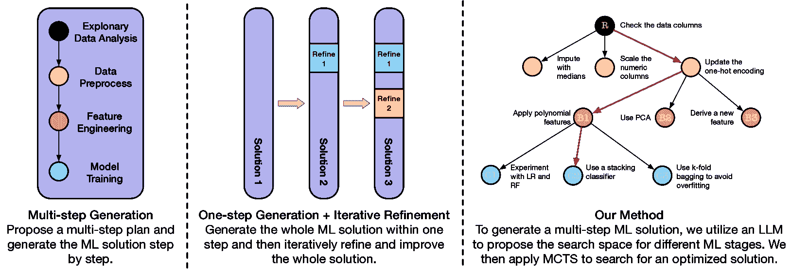
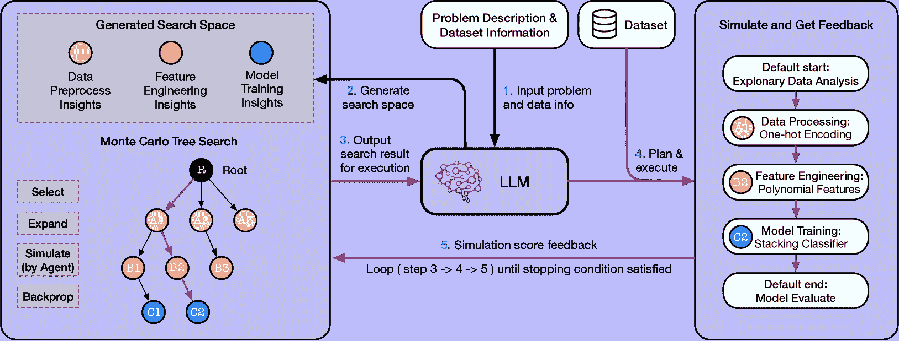
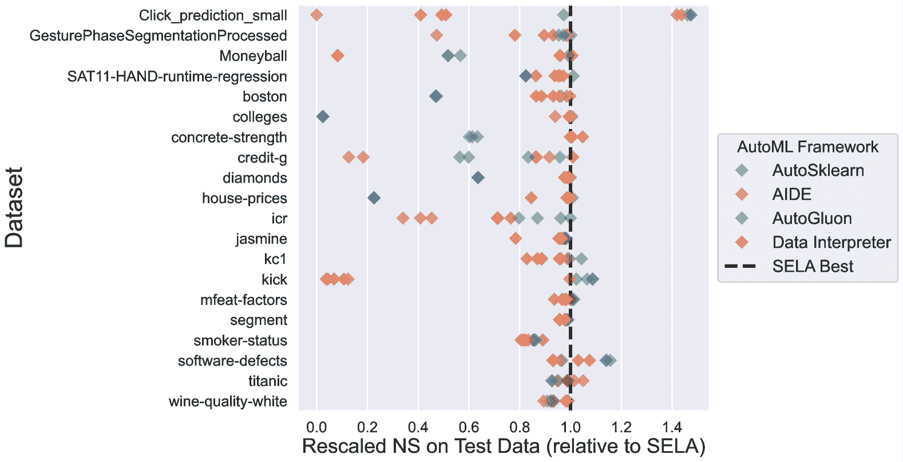
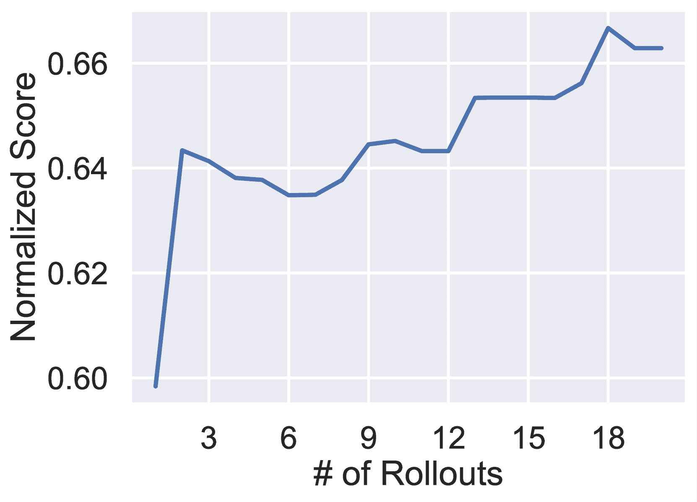
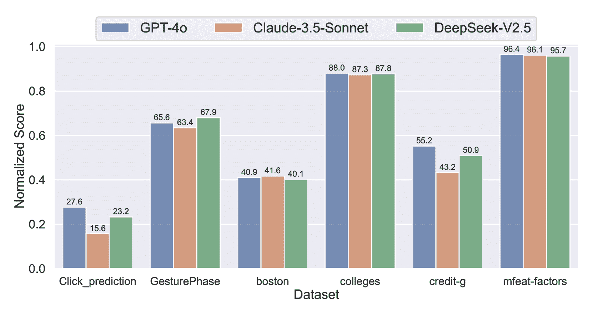

<!--yml

分类：未分类

日期：2025-01-11 12:03:06

-->

# \methodname：树搜索增强型LLM代理用于自动化机器学习

> 来源：[https://arxiv.org/html/2410.17238/](https://arxiv.org/html/2410.17238/)

祁逸舟^(1,2)，林怡璋¹¹¹脚注标记：1，洪思锐¹，潘杜毅³，费亚莹，梅广浩⁴，

刘邦邦¹，庞天奇⁵，郭杰基⁶，张策耀⁷，刘邦⁸，吴承霖¹²²脚注标记：2

¹DeepWisdom，²加利福尼亚大学伯克利分校，

³香港科技大学（广州），

⁴加利福尼亚大学圣地亚哥分校，⁵华南师范大学，

⁶斯坦福大学，⁷香港中文大学（深圳），

⁸蒙特利尔大学 & Mila 这些作者对本研究做出了同等贡献。刘邦（电子邮件：bang.liu@umontreal.ca）和吴承霖（电子邮件：alexanderwu@deepwisdom.ai）是通讯作者。

###### 摘要

自动化机器学习（AutoML）方法包括优化固定模型选择和集成管道的传统方法，以及基于最新大语言模型（LLM）的框架，这些框架能够自主构建管道。虽然基于LLM的代理在自动化机器学习任务中显示出了潜力，但它们往往生成低多样性和次优的代码，即使经过多次迭代也未能改善。为克服这些局限性，我们提出了树搜索增强型LLM代理（\methodname），这是一种创新的基于代理的系统，利用蒙特卡洛树搜索（MCTS）来优化AutoML过程。通过将管道配置表示为树形结构，我们的框架使代理能够智能地进行实验，并通过迭代不断优化策略，从而更有效地探索机器学习解决方案空间。这种新颖的方法使得\methodname能够根据实验反馈发现最优路径，从而提高解决方案的整体质量。在对20个机器学习数据集进行的广泛评估中，我们比较了传统方法和基于代理的AutoML方法的表现，结果表明\methodname在所有数据集上与每个基准方法相比，胜率达到65%到80%。这些结果突显了基于代理的策略在AutoML中的巨大潜力，为应对复杂的机器学习挑战提供了全新的视角¹¹1代码可通过[https://github.com/geekan/MetaGPT](https://github.com/geekan/MetaGPT)获取。

## 1 引言

自动化机器学习（AutoML）是一个快速发展的领域，旨在通过最小化人工干预，自动化设计可靠的机器学习解决方案的过程。传统的AutoML框架，如Auto-WEKA（Thornton等，[2013](https://arxiv.org/html/2410.17238v1#bib.bib34)）、Auto-Sklearn（Feurer等，[2015](https://arxiv.org/html/2410.17238v1#bib.bib10)；[2020](https://arxiv.org/html/2410.17238v1#bib.bib11)）、AutoGluon（Tang等，[2024b](https://arxiv.org/html/2410.17238v1#bib.bib33)）和H2O AutoML（LeDell & Poirier，[2020](https://arxiv.org/html/2410.17238v1#bib.bib22)）依赖于预定义的搜索空间和常规流程。这些框架主要侧重于优化超参数和模型集成，以找到最佳的模型配置。然而，这种固定且静态的方法通常缺乏应对多样化和动态数据场景所需的适应性，导致在更复杂的环境中表现不佳。此外，传统的关注点集中在模型训练上，其他机器学习流程中的关键阶段，如数据预处理和特征工程，未得到充分探索，从而限制了这些系统的整体效能。

最近，基于大型语言模型（LLM）的代理作为一种有前景的工具，开始通过利用自然语言处理能力生成代码来自动化机器学习任务。这些系统通常从描述数据集和问题的自然语言提示开始，之后LLM生成一个端到端的解决方案。早期的尝试，如张等人（[2024](https://arxiv.org/html/2410.17238v1#bib.bib38)）尝试通过提示LLM生成机器学习解决方案，而洪等人（[2024a](https://arxiv.org/html/2410.17238v1#bib.bib15)）则引入了配备层次图建模和可编程节点生成的代理来解决复杂和动态的工作流。尽管取得了这些进展，基于LLM的解决方案往往难以生成多样化和高度优化的工作流，因为它们的搜索过程仍然局限于单次尝试或试探。在没有迭代改进或探索替代策略的能力下，即使允许多次尝试，这些解决方案也常常会趋向于次优结果。

传统的AutoML和基于大型语言模型（LLM）的框架的一个重要缺点在于它们无法模仿人类专家的细致问题解决方法。在处理机器学习任务时，专家并非简单地执行固定的流程或依赖单次尝试。相反，他们会探索各种可能的配置，系统性地进行实验，分析结果，并迭代地完善对每个组件有效性的理解。这种迭代、反馈驱动的过程使专家能够探索多样的解决方案，并不断改进，直到找到最佳配置。

图 1：\methodname 与其他基于代理的 AutoML 框架的抽象比较。基于代理的 AutoML 方法主要有两种类型。第一种方法（Hong 等，[2024a](https://arxiv.org/html/2410.17238v1#bib.bib15)）将机器学习任务分解为多个阶段，为每个阶段提出计划，并根据计划一步步生成和执行代码，完成解决方案后不再进行优化。第二种方法（Schmidt 等，[2024](https://arxiv.org/html/2410.17238v1#bib.bib28)）一步生成整个解决方案，并作为一个整体进行迭代优化。 \methodname 将这两种方法结合起来，既支持分阶段规划，又能在每个阶段层次上迭代探索更好的解决方案。

受这种以人为本的方法启发，我们提出了树搜索增强型 LLM 代理（\methodname）用于自动化机器学习，这是一种新颖的框架，融合了 LLM 代理的优势与基于专家解决机器学习问题的结构化搜索和优化过程。如图 [1](https://arxiv.org/html/2410.17238v1#S1.F1 "Figure 1 ‣ 1 Introduction ‣ \methodname: Tree-Search Enhanced LLM Agents for Automated Machine Learning") 所示，我们的框架结合了分阶段规划的优势，每个阶段（如探索性数据分析、数据预处理、特征工程和模型训练）按顺序处理，同时具有迭代优化机制。

在 \methodname 中，机器学习问题的搜索空间被提出并构思为一棵树，每个分支代表一个潜在的解决路径。为了在这个搜索空间中进行导航，我们采用了蒙特卡洛树搜索（MCTS）（Coulom，[2007](https://arxiv.org/html/2410.17238v1#bib.bib5)）作为核心决策引擎，利用其在平衡探索（测试新策略）与利用（改进已知有效策略）方面的能力。MCTS 使得代理能够高效地探索广泛的决策空间，收集和处理实验结果，并智能地选择下一个有前景的配置进行测试。通过反复进行这一实验和优化的循环，\methodname 会逐步改进其解决方案，就像专家根据持续反馈测试和优化其策略一样。

我们使用来自 AutoML 基准测试（Gijsbers 等，[2024](https://arxiv.org/html/2410.17238v1#bib.bib12)）的 20 个不同数据集，严格评估了\methodname，并将其性能与传统的 AutoML 系统和基于代理的 AutoML 方法进行了比较。结果表明，\methodname 在各种机器学习任务中始终表现出色，验证了其有效性和适应性。

总结来说，我们的研究做出了以下贡献：

1.  1.

    我们引入了一种反馈驱动的方法，使 LLM 代理能够迭代探索机器学习配置，通过多轮实验优化解决方案。

1.  2.

    使用蒙特卡洛树搜索，我们的系统在树状搜索空间中导航，适应性地通过反馈识别高性能的管道。

1.  3.

    我们比较了基于智能体的方法与传统 AutoML，强调了基于智能体的方法在机器学习中更高的灵活性和潜在的性能提升。

|  | 动态管道 | 特征工程 | 模型训练 | 模型改进 | 管道优化 |
| --- | --- | --- | --- | --- | --- |
| AutoGluon (Erickson 等人, [2020](https://arxiv.org/html/2410.17238v1#bib.bib8)) | ✗ | ✗ | 固定模型 | 多层堆叠 + 集成 | ✗ |
| AutoSklearn (Feurer 等人, [2020](https://arxiv.org/html/2410.17238v1#bib.bib11)) | ✗ | ✗ | 固定模型 | 贝叶斯优化 + 元学习 + 集成 | ✗ |
| 数据解释器 (Hong 等人, [2024a](https://arxiv.org/html/2410.17238v1#bib.bib15)) | ✓ | 直观 | 直观 | 直观 | ✗ |
| AIDE (Schmidt 等人, [2024](https://arxiv.org/html/2410.17238v1#bib.bib28)) | ✓ | 直观 | 动态与多样 | 动态与多样 | 一步精炼 + 大型语言模型 |
| \methodname (我们的方法) | ✓ | 动态与多样 | 动态与多样 | 动态与多样 | 分步蒙特卡洛树搜索 + 大型语言模型 |

表 1：不同 AutoML 方法的关键能力比较。动态表示系统根据中间结果调整工作流程的能力，允许其在新信息出现时进行适应。多样指的是在任务中采用多种策略或方法，帮助捕捉不同的建模需求。直观意味着系统直接依赖于大型语言模型生成的决策，并且高度依赖模型的倾向。

## 2 相关工作

树搜索及其与大语言模型（LLMs）的结合。树搜索算法在人工智能中的问题解决方面取得了显著进展，其中蒙特卡洛树搜索（MCTS）作为一种领先技术脱颖而出。这些算法已成功应用于多个领域，包括机器人技术（Wu 等，[2015](https://arxiv.org/html/2410.17238v1#bib.bib37); Clary 等，[2018](https://arxiv.org/html/2410.17238v1#bib.bib4); Best 等，[2019](https://arxiv.org/html/2410.17238v1#bib.bib2)），化学（Segler 等，[2018](https://arxiv.org/html/2410.17238v1#bib.bib29)），以及游戏（Silver 等，[2016](https://arxiv.org/html/2410.17238v1#bib.bib30); [2017](https://arxiv.org/html/2410.17238v1#bib.bib31)），其中 MCTS 用于在广泛的解空间中导航并解决复杂问题。最近的研究集中在将树搜索与大语言模型（LLMs）结合，以增强推理和决策能力。Krishnamurthy 等（[2024](https://arxiv.org/html/2410.17238v1#bib.bib21)）和 Dwaracherla 等（[2024](https://arxiv.org/html/2410.17238v1#bib.bib7)）的研究探索了 LLMs 在高效探索中的能力，而 Tang 等（[2024a](https://arxiv.org/html/2410.17238v1#bib.bib32)）和 Hui & Tu（[2024](https://arxiv.org/html/2410.17238v1#bib.bib17)）则开发了利用先前学到的知识的策略。Zhou 等（[2024](https://arxiv.org/html/2410.17238v1#bib.bib39)）和 Chi 等（[2024](https://arxiv.org/html/2410.17238v1#bib.bib3)）应用了 MCTS 进行外部或自我评估反馈的规划，而 Feng 等（[2023](https://arxiv.org/html/2410.17238v1#bib.bib9)）；Wang 等（[2024](https://arxiv.org/html/2410.17238v1#bib.bib35)）则将 AlphaZero 风格的树搜索方法适配到基于 LLM 的任务中。这些进展突显了将树搜索方法与 LLMs 结合的潜力，平衡了新解的探索与先前知识的利用，从而增强了决策能力。

AutoML系统的进展与局限 自动化机器学习（AutoML）框架的引入旨在减少设计机器学习管道时对专家知识的依赖。早期的AutoML研究，如（Thornton等人，[2013](https://arxiv.org/html/2410.17238v1#bib.bib34)；Olson & Moore，[2016](https://arxiv.org/html/2410.17238v1#bib.bib26)；Jin等人，[2019](https://arxiv.org/html/2410.17238v1#bib.bib18)；Feurer等人，[2020](https://arxiv.org/html/2410.17238v1#bib.bib11)；Erickson等人，[2020](https://arxiv.org/html/2410.17238v1#bib.bib8)；LeDell & Poirier，[2020](https://arxiv.org/html/2410.17238v1#bib.bib22)；Wang等人，[2021](https://arxiv.org/html/2410.17238v1#bib.bib36)）主要聚焦于自动化管道中的关键组件，如超参数优化、模型选择、堆叠和集成。这些框架通过结合元学习和超参数搜索策略，在自动选择和调优机器学习模型方面取得了显著进展。此外，针对多模态数据的拓展（Tang等人，[2024b](https://arxiv.org/html/2410.17238v1#bib.bib33)；Jin等人，[2023](https://arxiv.org/html/2410.17238v1#bib.bib19)）进一步扩大了AutoML的应用范围。

最近，越来越多的研究开始关注在自动化机器学习（AutoML）系统中利用大型语言模型（LLMs）来增强管道的灵活性。像Hollmann等人（[2024](https://arxiv.org/html/2410.17238v1#bib.bib14)）；Li等人（[2024](https://arxiv.org/html/2410.17238v1#bib.bib23)）将LLMs应用于自动化特征工程，而Liu等人（[2024](https://arxiv.org/html/2410.17238v1#bib.bib24)）则引入了LLMs用于超参数调优。此外，Luo等人（[2024](https://arxiv.org/html/2410.17238v1#bib.bib25)）提出了在机器学习工作流的每个阶段嵌入LLMs的方法。尽管取得了这些进展，传统的AutoML系统仍然受到僵化管道的限制，缺乏灵活性，难以适应独特的数据集或特定的任务需求。

动态机器学习流水线中的LLM代理 与静态流水线不同，基于LLM的代理为解决复杂机器学习挑战提供了更具动态性的解决方案。Hong等人([2024a](https://arxiv.org/html/2410.17238v1#bib.bib15); [b](https://arxiv.org/html/2410.17238v1#bib.bib16))提出了一种具有层次图建模和可编程节点生成的LLM代理，使得能够为多样化的数据场景创建复杂且具有适应性的流水线。同样，Zhang等人([2024](https://arxiv.org/html/2410.17238v1#bib.bib38))展示了LLM能够有效地解读结构化输入，并利用过往经验解决新的机器学习任务。Guo等人([2024](https://arxiv.org/html/2410.17238v1#bib.bib13))在此基础上引入了一个利用案例推理的数据科学代理；然而，由于依赖于现有代码库，它在从零开始生成解决方案时面临挑战。Schmidt等人([2024](https://arxiv.org/html/2410.17238v1#bib.bib28))提出了一种迭代方法，其中整个流水线在一步中生成，并通过增量修改进行迭代优化。

在这些工作的基础上，\methodname引入了一种代理，整合了两种方法的优势——阶段性规划和迭代优化——使其能够从头开始自主探索并生成机器学习解决方案。这种方法在搜索过程中提供了更大的灵活性和控制力，使得能够在每个阶段生成优化的解决方案。表[1](https://arxiv.org/html/2410.17238v1#S1.T1 "Table 1 ‣ 1 Introduction ‣ \methodname: Tree-Search Enhanced LLM Agents for Automated Machine Learning")展示了不同AutoML系统所提供的功能。

## 3 方法

如图[2](https://arxiv.org/html/2410.17238v1#S3.F2 "Figure 2 ‣ 3 Method ‣ \methodname: Tree-Search Enhanced LLM Agents for Automated Machine Learning")所示，\methodname由三个关键组件组成：基于LLM的洞察生成器、使用MCTS的搜索模块和作为实验执行者的LLM代理。首先，LLM根据问题描述和数据集生成洞察，定义搜索空间。然后，搜索模块将这个空间组织成树状结构，并使用MCTS探索有前景的路径。在每个周期中，选定的路径会传递给LLM代理，后者将配置转化为可执行的流水线。代理进行规划、编码并执行实验，将结果反馈以优化未来的搜索。这个迭代过程持续进行，直到满足终止标准。以下章节将详细解释每个组件。

图2：\methodname的管道流程如下：系统首先将问题描述和数据集信息输入到大语言模型（LLM），该模型生成潜在解决方案的搜索空间，包括数据预处理、特征工程和模型训练。由蒙特卡罗树搜索（MCTS）驱动的搜索模块通过选择、扩展和模拟潜在配置来探索这个空间。然后，LLM代理模拟所选配置，进行规划、编码并执行实验。模拟结果的反馈被输入回搜索模块，在反向传播步骤中用于优化未来的搜索。这个迭代过程持续进行，直到达到预定的停止准则，最终得到一个优化的实验管道。

### 3.1 见解提案与搜索空间创建

为了使\methodname能够探索广泛的机器学习策略，我们引入了一个见解提案器，它生成适应机器学习工作流不同阶段的多种方法。每个提案的见解都建议使用单一技术或多种方法的组合，旨在提升性能。例如，一个特征工程的见解可能建议从现有变量中创建交互特征，而一个模型训练的见解则可能提议使用某种特定算法，或建议进行网格搜索以提高准确性。

见解提案器以问题描述$p$和数据集信息$d$（如元数据和样本记录）为输入，并使用大语言模型$M$为机器学习过程的每个阶段生成$m$个见解$\lambda$。这些见解存储在一个见解池中，形成\methodname要探索的搜索空间$\Lambda$。我们将机器学习过程分解为五个阶段：探索性数据分析（$\tau_{1}$）、数据预处理（$\tau_{2}$）、特征工程（$\tau_{3}$）、模型训练（$\tau_{4}$）和模型评估（$\tau_{5}$）。为了简化起见，我们将整个阶段集合记作$T$，并将任何特定阶段表示为$\tau$。

|  | $\displaystyle\text{InsightProposer}(p,d,M)\rightarrow\Lambda:=\{\lambda_{i}^{% \tau}\mid\tau\in T,i=1,\dots,m\}$ |  | (1) |
| --- | --- | --- | --- |

### 3.2 管道执行与代码生成

我们使用一个 LLM 代理，称为实验执行器 $E$，通过从自然语言需求中构建实际的实验管道来进行每次实验。该代理在此过程中执行两个主要步骤。首先，给定实验配置 $c$，即由搜索模块提供的一组见解（在第 [3.3.2](https://arxiv.org/html/2410.17238v1#S3.SS3.SSS2 "3.3.2 Tree Search for ML Experiments ‣ 3.3 Tree Search in Machine Learning Experiments ‣ 3 Method ‣ \methodname: Tree-Search Enhanced LLM Agents for Automated Machine Learning") 节中介绍），实验执行器将这些见解转化为详细计划。该计划由一系列任务指令 $I^{\tau\in T}$ 组成，分别对应机器学习过程的每个阶段。此步骤称为 $E_{\text{plan}}$。

接下来，按照计划，代理根据各自的指令 $I^{\tau}$ 为每个任务 $\tau$ 编写并执行代码 $\sigma^{\tau}$，生成完整管道的代码 $\sigma^{\tau\in T}$，并输出最终的执行评分 $s$。完整的代码输出集合 $\sigma^{\tau\in T}$ 被拼接成一个完整的解决方案 $\sigma_{sol}$，以解决问题。这个阶段称为 $E_{\text{code \& execute}}$。

|  | $\displaystyle E_{\text{plan}}(p,d,c,M)$ | $\displaystyle\rightarrow I^{\tau\in T}$ |  | (2) |
| --- | --- | --- | --- | --- |
|  | $\displaystyle E_{\text{code \& execute}}(I^{\tau\in T},D,M)$ | $\displaystyle\rightarrow(\sigma^{\tau\in T},s)$ |  | (3) |

### 3.3 机器学习实验中的树搜索

为了系统地探索机器学习实验中的不同配置，我们将搜索空间建模为一个层次树结构。这种结构使我们能够应用树搜索算法，其中每一条树路径代表一个不同的实验配置。[算法 1](https://arxiv.org/html/2410.17238v1#alg1 "Algorithm 1 ‣ 3.3.2 Tree Search for ML Experiments ‣ 3.3 Tree Search in Machine Learning Experiments ‣ 3 Method ‣ \methodname: Tree-Search Enhanced LLM Agents for Automated Machine Learning") 还概述了这个搜索过程。

#### 3.3.1 实验节点

为了促进各种策略的探索，我们将提出的搜索空间建模为一个层次树结构，适合应用搜索算法。树中的每个节点，表示为 $x$，代表搜索空间 $\Lambda$ 中的一个见解 $\lambda$，并包含以下属性：

+   •

    见解 $\lambda(x)$：表示与该节点相关的特定见解 $\lambda_{i}^{\tau}\in\Lambda$，其中 $\tau$ 表示机器学习管道的阶段。

+   •

    深度 $\delta(x)$：表示节点对应的机器学习过程的阶段（例如，深度 1 可能代表数据预处理，深度 2 代表特征工程，深度 3 代表模型训练）。

+   •

    值 $v(x)$：此节点及其所有后代的模拟累积分数。

+   •

    访问次数 $n_{\text{visits}}(x)$：为此节点及其后代进行的仿真总次数。

+   •

    仿真得分 $s(x)$：仿真此节点的得分。

+   •

    解代码 $\sigma_{\text{sol}}(x)$：节点仿真后生成的最终代码。

+   •

    阶段代码 $\sigma_{\text{stage}}(x)$：生成到当前节点阶段的代码，是解的代码的一部分

通过将搜索空间建模为树形结构，从根节点到节点 $x$ 的每条路径代表一个实验配置 $c(x)=\{\lambda(x_{1}),\lambda(x_{2}),\dots,\lambda(x)\}\subset\Lambda$，其中 $x_{1},x_{2},\dots,x$ 是路径上的节点。因此，寻找最佳解的任务可以视为树内的路径搜索，每条路径对应于实验的潜在配置。

#### 3.3.2 机器学习实验的树搜索

我们应用蒙特卡洛树搜索（MCTS）来系统地探索并识别框架中的最佳机器学习解。MCTS 使我们能够高效地在机器学习管道的多个阶段之间导航搜索空间，从数据预处理到模型选择，通过平衡探索和开发。

算法 1 \methodname 使用 MCTS

0:  问题描述 $p$，数据信息 $d$，数据 $D$，LLM $M$，回合次数 $k$。1:  $\Lambda\leftarrow\text{InsightProposer}(p,d,M)$2:  使用 $\Lambda$ 初始化树结构3:  对于 $i$ = 1 到 $k$ 循环4:     节点 $x\leftarrow$ 选择(Tree)5:     $X_{\text{child}}\leftarrow$ 扩展(Tree, $x$)6:     随机从 $X_{\text{child}}$ 中选择一个节点 $x_{\text{sample}}$7:     获取实验配置 $c(x_{\text{sample}})$8:     $\sigma_{sol},s\leftarrow\text{simulate}(c(x_{\text{sample}}),p,d,D,M)$9:     将仿真结果 $\sigma_{sol},s$ 附加到 $x_{\text{sample}}$ 以供最终解的选择10:     反向传播(Tree, $s$)11:  结束 循环12:  $x_{\text{dev best}}\leftarrow\underset{x\in\text{Tree}}{\text{argmax}}(s(x))$12:  $\sigma_{sol}(x_{\text{dev best}})$

算法 2 仿真

0:  实验配置 $c$，问题描述 $p$，数据信息 $d$，数据 $D$，LLM $M$。1:  草拟计划 $I^{\tau\in T}\leftarrow E_{\text{plan}}(p,d,c,M)$2:  按顺序编写并执行 $\sigma^{\tau\in T},s\leftarrow E_{\text{code \& execute}}(I^{\tau\in T},D,M)$3:  $\sigma_{sol}\leftarrow\text{concatenate}(\sigma^{\tau\in T})$3:  $\sigma_{sol},s$

搜索过程包括执行多个回合，这些回合包括选择、扩展、仿真和反向传播步骤。我们进行 $k$ 次回合来探索不同路径，目的是识别最佳解。

选择 在每次迭代中，我们使用修改版的 UCT（树的上置信界）算法（Kocsis & Szepesvári，[2006](https://arxiv.org/html/2410.17238v1#bib.bib20)），称为 UCT-DP（深度优先），从搜索树中选择一个节点。与传统的 MCTS（蒙特卡洛树搜索）不同，传统方法由于固定的动作空间和可忽略的动作时间，模拟往往很快完成，但机器学习任务的背景提出了不同的挑战。诸如模型训练等过程引入了显著的计算时间，使得高效的节点探索变得至关重要。由于模型选择会极大地影响整体的机器学习性能，因此我们优先在早期探索更深层的节点。

这一修改减少了探索每个未访问节点的需求，从而使得能够在更少的迭代中到达更深的节点——使得该方法更适合大规模的机器学习实验。修改后的选择算法表示为：

|  | $\displaystyle\text{UCT-DP}(x)=\frac{v(x)}{n(x)}+\alpha_{\text{explore}}\sqrt{% \frac{\ln n_{\text{visits}}(x_{\text{parent}})}{n(x)}}$ |  | (4) |
| --- | --- | --- | --- |
|  | $\displaystyle n(x)=\begin{cases}\alpha_{\text{unvisted}}&\text{如果 }n_{\text{% visits}}(x)=0\\ n_{\text{visits}}(x)&\text{否则。}\end{cases}$ |  | (5) |

在这里，$\alpha_{\text{unvisted}}$ 是一个介于 0 和 1 之间的常数，用于控制未访问节点的选择偏好，平衡完全探索与计算效率之间的关系。此调整使我们能够更专注于树的深层部分，这些部分更可能产生更好的解。

扩展 在扩展阶段，从选定的节点 $x$ 实例化一组子节点 $X_{\text{child}}$ 以进行潜在的模拟。请注意，来自节点 $x$ 且深度为 $\delta$ 的子节点 $x_{\text{child}}$ 继承了 $x$ 的属性，并具有 $\lambda(x_{\text{child}})\rightarrow\lambda^{\tau_{\delta+1}}$，这是来自搜索空间的阶段 $\tau_{\delta+1}$ 的洞察。

仿真 一旦节点扩展完成，节点 $x_{\text{sample}}$ 将从 $X_{\text{child}}$ 中随机抽取进行仿真。从根节点到抽取节点的路径形成一组洞察 $c(x_{\text{sample}})=\{\lambda(x_{1}),\lambda(x_{2}),...,\lambda(x_{\text{% sample}})\}\subset\Lambda$，表示将要仿真的实验配置，其中 $x_{1},x_{2},..,x_{\text{sample}}$ 是路径上的节点。然后将配置 $c(x_{\text{sample}})$ 提供给实验者 $E$ 进行执行，遵循 $E_{\text{plan}}$ 和 $E_{\text{code \& execute}}$，生成仿真得分 $s$，如第 [3.3.1](https://arxiv.org/html/2410.17238v1#S3.SS3.SSS1 "3.3.1 实验节点 ‣ 3.3 树搜索在机器学习实验中的应用 ‣ 3 方法 ‣ \methodname: 基于树搜索的 LLM 代理用于自动化机器学习") 节中所示。该得分作为反向传播的反馈。算法 [2](https://arxiv.org/html/2410.17238v1#alg2 "算法 2 ‣ 3.3.2 机器学习实验中的树搜索 ‣ 3.3 树搜索在机器学习实验中的应用 ‣ 3 方法 ‣ \methodname: 基于树搜索的 LLM 代理用于自动化机器学习") 概述了仿真过程。

反向传播 在仿真结束后，性能得分（例如，基于开发集）会被检索并反向传播通过树。得分从仿真节点传递到根节点，更新每个父节点的值和访问计数。这使得表示更有前景解决方案的节点在未来的展开中得到优先考虑。此外，解决方案代码也会被反向传播到树上，并可以根据更新过程中的父节点进行处理和保存为阶段代码。

反向传播确保算法能够学习哪些路径产生更好的结果，并在进行更多展开时，指导搜索朝向更高性能的节点。

#### 3.3.3 实验状态保存与加载

为了提高实验效率并减少令牌使用，\methodname 实现了通过在阶段级别缓存每个尝试配置 $c$ 的代码来细粒度地重用代码。这使得框架在新配置 $c_{\text{new}}$ 与现有配置共享组件时，可以尽可能地重用已保存的代码。此外，该技术还解决了大语言模型（LLM）非确定性的挑战，因为相同的指令可能会生成不同的代码，从而增加最终性能的方差。具体来说，每当选择一个节点执行时，实验者会加载并重新运行已保存的阶段代码（如果有的话），确保在进入下一阶段之前的一致性。该方法有效地节省了资源，同时保持跨阶段的稳定表现。在附录 [D](https://arxiv.org/html/2410.17238v1#A4 "附录 D 成本效益分析 ‣ \methodname: 基于树搜索的 LLM 代理用于自动化机器学习") 中，我们研究了这一状态保存和加载机制的成本效率。

## 4 实验

### 4.1 实验设置

##### 数据集

我们在20个数据集上评估\methodname与多个基准方法，包括来自自动化机器学习基准（AMLB）（Gijsbers等，[2024](https://arxiv.org/html/2410.17238v1#bib.bib12)）和Kaggle竞赛的13个分类任务和7个回归任务。

表格[4](https://arxiv.org/html/2410.17238v1#A1.T4 "表格 4 ‣ 附录 A 数据集 ‣ \methodname: 基于树搜索的增强型大语言模型代理用于自动化机器学习")提供了所使用数据集的详细信息。所有数据集被分为训练集、验证集和测试集，比例为6:2:2。每个框架利用训练集和验证集训练模型，并在测试集标签上进行预测。

##### 评估指标

对于AMLB数据集，我们使用OpenML提供的默认目标列。对于Kaggle竞赛数据集，我们依赖于竞赛描述中指定的目标列。性能评估使用均方根误差（RMSE）用于回归任务，F1得分用于二分类，F1加权得分用于多分类。为了确保跨数据集的可比性，我们引入了归一化得分（NS），将RMSE映射到0到1的范围。

|  | $\displaystyle\text{NS}(s_{\text{raw}})=\begin{cases}\frac{1}{1+\log{(1+s_{% \text{raw}})}}&\text{如果度量标准是RMSE。}\\ s_{\text{raw}}&\text{否则。}\end{cases}$ |  | (6) |
| --- | --- | --- | --- |

这里，$s_{raw}$表示归一化前的原始得分。为了将\methodname与其他框架进行评估，我们采用三个关键指标：平均归一化得分（NS），平均排名和平均最佳排名。平均排名是通过考虑方法在所有数据集上的排名来计算的，而平均最佳排名则关注方法在每个数据集中的最佳表现。我们还希望量化其他基准方法相对于\methodname的表现。“归一化得分”定义为：

|  | $\displaystyle\text{Rescaled NS}(f)=\frac{\text{NS}_{f}}{\text{NS}_{\methodname% {}}}$ |  | (7) |
| --- | --- | --- | --- |

其中 $f$ 表示与\methodname进行比较的基准方法。

##### 方法和基准设置

我们将\methodname与几个基准方法进行比较，包括数据解释器（Hong等，[2024a](https://arxiv.org/html/2410.17238v1#bib.bib15)），AIDE（Schmidt等，[2024](https://arxiv.org/html/2410.17238v1#bib.bib28)），AutoGluon（Erickson等，[2020](https://arxiv.org/html/2410.17238v1#bib.bib8)），和AutoSklearn（Feurer等，[2015](https://arxiv.org/html/2410.17238v1#bib.bib10)；[2020](https://arxiv.org/html/2410.17238v1#bib.bib11)）。

对于基于LLM的方法（\methodname、数据解释器和AIDE），我们在所有方法中采用一致的初始任务提示。该提示包括数据集名称、目标列和评估指标。我们选择DeepSeek v2.5（DeepSeek-AI，[2024](https://arxiv.org/html/2410.17238v1#bib.bib6)）作为我们的基础LLM，原因是其开源特性、强大的编码能力和高性价比的令牌使用。为了促进输出的多样性，我们为所有基于LLM的方法将温度参数设置为0.5。AIDE每次执行进行10次迭代，而\methodname进行10次回滚。

对于\methodname，我们使用数据解释器作为实验者，利用其多步骤生成能力。我们将UCT-DP的超参数配置如下：$\alpha_{\text{unvisited}}$ 设置为0.8，$\alpha_{\text{explore}}$ 设置为1.4。这些设置旨在平衡该方法搜索策略中的探索与利用。

除了AutoGluon外，每个方法在每个数据集上运行三次。AutoGluon是确定性的，只运行一次，使用默认设置。AutoSklearn也使用默认设置，每个任务限制为600秒。

| 方法 | 胜场数 | 败场数 | 第一名 | 平均标准化得分（NS）$\uparrow$ | 平均最佳标准化得分（NS）$\uparrow$ | 平均排名 $\downarrow$ | 平均最佳排名 $\downarrow$ |
| --- | --- | --- | --- | --- | --- | --- | --- |
| AutoGluon | 7 | 13 | 4 | 53.2 | 53.2 | 4.4 | 4.4 |
| AutoSklearn | 5 | 15 | 5 | 46.1 | 47.5 | 7.6 | 6.1 |
| AIDE | 5 | 15 | 2 | 47.1 | 51.8 | 7.8 | 5.3 |
| 数据解释器 | 4 | 16 | 2 | 47.4 | 50.2 | 8.8 | 6.4 |
| \methodname | - | - | 7 | 53.3 | 54.7 | 4.8 | 2.7 |

表2：每个AutoML框架在20个表格数据集上的结果。“胜场数”列表示该方法优于\methodname的数据显示的次数，而“败场数”则显示该方法表现不如\methodname的次数。“第一名”列表示该方法在所有方法中产生最佳预测的次数。

### 4.2 结果

图3：相对于\methodname，在表格数据集上的AutoML框架的标准化得分（NS）重新缩放后的比较。垂直线左侧的点表示与\methodname相比，预测效果较差。值得注意的是，\methodname在所有数据集上通常占据领先位置。

如表[2](https://arxiv.org/html/2410.17238v1#S4.T2 "表2 ‣ 方法和基准设置 ‣ 4.1 实验设置 ‣ 4 实验 ‣ \methodname：树搜索增强的LLM代理用于自动化机器学习")所示，\methodname在所有框架中获得了最高的平均标准化得分（NS）和平均最佳排名。值得注意的是，\methodname在所有数据集上都表现出最佳的预测次数，如“第一名”列所示。此外，“败场数”列显示，每个竞争方法在65%-80%的数据集上都不及\methodname。

有趣的是，AutoGluon的平均排名略高于\methodname。这一微小差异可能归因于LLM和模型训练过程中的固有随机性，这可能影响机器学习解决方案的探索。然而，\methodname较高的平均NS表明，它在擅长的数据集上表现强劲，而在其他数据集上的损失相对较小。这意味着，即使\methodname产生了较低排名的解决方案，性能差距也很小，能够在其表现良好的数据集上完全弥补。

另外两种基于代理的方法表现相对较低。第一种方法，数据解释器，在多次尝试后无法显著提升其得分，因为它无法在完成机器学习任务后细化其解决方案。第二种方法，AIDE，没有特定阶段的规划模块，限制了其在一系列贪婪的开发后改善结果的能力，这使得它容易陷入局部最优解。这些局限性可能是它们表现较弱的原因。

图 [3](https://arxiv.org/html/2410.17238v1#S4.F3 "Figure 3 ‣ 4.2 Results ‣ 4 Experiments ‣ \methodname: Tree-Search Enhanced LLM Agents for Automated Machine Learning") 进一步验证了\methodname的有效性，揭示了其最佳解决方案经常在不同数据集上占据领先位置。此图展示了该方法在不同机器学习数据集上的一致性高性能和适应性。我们还在附录[C](https://arxiv.org/html/2410.17238v1#A3 "Appendix C Results ‣ \methodname: Tree-Search Enhanced LLM Agents for Automated Machine Learning")中包含了每种方法的详细结果。

### 4.3 消融研究

在接下来的研究中，我们使用一部分数据集来评估\methodname在不同设置下的表现。我们的选择过程涉及按字母顺序选择每个机器学习任务的前两个数据集。具体来说，我们使用boston、colleges、credit-g、Click_prediction_small、GesturePhaseSegmentationProcessed和mfeat-factors进行消融研究。

|  | 数据解释器 | \methodname (随机搜索) | \methodname (MCTS) |
| --- | --- | --- | --- |
| 平均NS $\uparrow$ | 56.4 | 58.6 | 60.9 |
| 平均最佳NS $\uparrow$ | 59.0 | 61.4 | 62.4 |
| 平均排名 $\downarrow$ | 6.9 | 4.8 | 3.3 |
| 平均最佳排名 $\downarrow$ | 4.8 | 2.8 | 1.5 |

表格 3：在所选数据集上，各种搜索设置的性能结果。使用MCTS的\methodname始终优于使用随机搜索的\methodname。

##### 搜索有效性

为了评估蒙特卡洛树搜索（MCTS）在改进解空间搜索过程中的有效性，我们进行了一个消融研究。在这项研究中，我们比较了使用MCTS的方法与一个随机从每个阶段的见解池中抽取见解的变体的性能。如表[3](https://arxiv.org/html/2410.17238v1#S4.T3 "Table 3 ‣ 4.3 Ablation Study ‣ 4 Experiments ‣ \methodname: Tree-Search Enhanced LLM Agents for Automated Machine Learning")所示，MCTS版本在数据集上的平均标准化得分更高，并且整体排名优于随机抽样方法。此外，即使是我们方法的随机抽样变体，也优于数据解释器，即基础实验者。这表明，合适的搜索空间和实验议程对于提升机器学习代理的表现至关重要。我们的见解生成器能够生成相关且有用的见解，促进这种改进，无论选择方法如何。

##### 回滚次数

图[5](https://arxiv.org/html/2410.17238v1#S4.F5 "Figure 5 ‣ Number of Rollouts ‣ 4.3 Ablation Study ‣ 4 Experiments ‣ \methodname: Tree-Search Enhanced LLM Agents for Automated Machine Learning")展示了\methodname的平均性能随着允许的回滚次数增加而提高。这个趋势表明，\methodname具有强大的可扩展性，因为它有效利用了额外的机会来探索搜索空间，在进行10次回滚后，标准化得分提高了4.7%，在进行20次回滚后，得分提高了6.4%，相比初始回滚。

图4：\methodname在六个选定数据集上，随着回滚次数增加的平均性能表现。

图5：不同基础LLM在六个选定数据集上的标准化得分比较。

##### LLM适应性

为了评估我们框架的稳健性，我们使用不同的大型语言模型（LLMs）进行实验。具体来说，我们将\methodname与Claude-3.5-Sonnet（Anthropic，[2024](https://arxiv.org/html/2410.17238v1#bib.bib1)）和GPT-4o（OpenAI，[2024](https://arxiv.org/html/2410.17238v1#bib.bib27)）与DeepSeek V2.5进行性能比较，后者是我们主要用于评估的模型。这个比较使我们能够评估LLM的选择如何影响我们方法的整体效果。

如图[5](https://arxiv.org/html/2410.17238v1#S4.F5 "图5 ‣ 推理次数 ‣ 4.3 消融研究 ‣ 4 实验 ‣ \methodname: 树搜索增强的LLM代理用于自动化机器学习")所示，\methodname 在不同的LLM之间表现出相似的结果，表明它具有根据用户偏好和可用性灵活适应不同模型的能力。我们还在附录[C.2](https://arxiv.org/html/2410.17238v1#A3.SS2 "C.2 使用不同LLM的性能 ‣ 附录C 结果 ‣ \methodname: 树搜索增强的LLM代理用于自动化机器学习")中报告了数值结果。

## 5 结论

本文介绍了\methodname，一种将基于LLM的代理与蒙特卡洛树搜索（MCTS）集成以自动化机器学习工作流的创新框架。我们在20个机器学习数据集上进行的实验结果证明了\methodname的有效性，并突出了其相对于传统AutoML框架和现有LLM方法的独特优势。该方法不仅限于机器学习，还可以适应广泛的顺序决策问题，只要它们能够表示为具有从叶节点推导出的标量奖励的树形结构。展望未来，后续工作可以探索将此框架扩展到其他领域，包括软件工程、科学发现、游戏和机器人技术。此外，提升树搜索过程的效率和可扩展性，以应对更大的解空间，仍然是一个重要的研究方向。另一个有前景的方向是开发技术，为搜索过程和解决方案理由提供可解释的解释，从而增强系统的透明性和可信度。\methodname代表了自动化机器学习的重要进展，展示了将传统搜索算法与LLM的灵活性结合的潜力。

## 参考文献

+   Anthropic (2024) Anthropic. 介绍Claude 3.5 Sonnet — anthropic.com. [https://www.anthropic.com/news/claude-3-5-sonnet](https://www.anthropic.com/news/claude-3-5-sonnet), 2024.

+   Best等（2019）Graeme Best, Oliver M Cliff, Timothy Patten, Ramgopal R Mettu, 和 Robert Fitch. Dec-mcts: 多机器人主动感知的去中心化规划. *国际机器人研究期刊*, 38(2-3):316–337, 2019. doi: 10.1177/0278364918755924.

+   Chi等（2024）Yizhou Chi, Kevin Yang, 和 Dan Klein. Thoughtsculpt: 通过中间修订和搜索进行推理, 2024.

+   Clary等（2018）Patrick Clary, Pedro Morais, Alan Fern, 和 Jonathan Hurst. 蒙特卡洛规划用于灵活的四足运动. *自动化规划与调度国际会议论文集*, 28(1):446–450, 2018年6月. doi: 10.1609/icaps.v28i1.13933.

+   Coulom (2007) Rémi Coulom. 《蒙特卡洛树搜索中的高效选择性和备份操作符》。收录于 H. Jaap van den Herik, Paolo Ciancarini, 和 H. H. L. M. (Jeroen) Donkers（编辑），*Computers and Games*，第72-83页，柏林，海德堡，2007年。Springer Berlin Heidelberg。ISBN 978-3-540-75538-8。

+   DeepSeek-AI (2024) DeepSeek-AI. 《Deepseek-v2：一种强大、经济且高效的专家混合语言模型》，2024年。

+   Dwaracherla et al. (2024) Vikranth Dwaracherla, Seyed Mohammad Asghari, Botao Hao, 和 Benjamin Van Roy. 《大型语言模型的高效探索》，2024年。

+   Erickson et al. (2020) Nick Erickson, Jonas Mueller, Alexander Shirkov, Hang Zhang, Pedro Larroy, Mu Li, 和 Alexander Smola. 《Autogluon-tabular：结构化数据的强大而精确的自动化机器学习》，2020年。

+   Feng et al. (2023) Xidong Feng, Ziyu Wan, Muning Wen, Ying Wen, Weinan Zhang, 和 Jun Wang. 《类似Alphazero的树搜索可以指导大型语言模型的解码与训练》，2023年。

+   Feurer et al. (2015) Matthias Feurer, Aaron Klein, Katharina Eggensperger, Jost Springenberg, Manuel Blum, 和 Frank Hutter. 《高效且稳健的自动化机器学习》。收录于 *Advances in Neural Information Processing Systems 28 (2015)*，第2962-2970页，2015年。

+   Feurer et al. (2020) Matthias Feurer, Katharina Eggensperger, Stefan Falkner, Marius Lindauer, 和 Frank Hutter. 《Auto-sklearn 2.0：通过元学习实现免手动的自动化机器学习》，2020年。

+   Gijsbers et al. (2024) Pieter Gijsbers, Marcos L. P. Bueno, Stefan Coors, Erin LeDell, Sébastien Poirier, Janek Thomas, Bernd Bischl, 和 Joaquin Vanschoren. 《Amlb：一个自动化机器学习基准》。*Journal of Machine Learning Research*，25(101)：1-65，2024年。

+   Guo et al. (2024) Siyuan Guo, Cheng Deng, Ying Wen, Hechang Chen, Yi Chang, 和 Jun Wang. 《Ds-agent：通过赋能大型语言模型进行基于案例的推理实现自动化数据科学》，2024年。

+   Hollmann et al. (2024) Noah Hollmann, Samuel Müller, 和 Frank Hutter. 《大型语言模型在自动化数据科学中的应用：引入针对上下文感知的自动特征工程的caafe》，2024年。

+   Hong et al. (2024a) Sirui Hong, Yizhang Lin, Bang Liu, Bangbang Liu, Binhao Wu, Danyang Li, Jiaqi Chen, Jiayi Zhang, Jinlin Wang, Li Zhang, Lingyao Zhang, Min Yang, Mingchen Zhuge, Taicheng Guo, Tuo Zhou, Wei Tao, Wenyi Wang, Xiangru Tang, Xiangtao Lu, Xiawu Zheng, Xinbing Liang, Yaying Fei, Yuheng Cheng, Zongze Xu, 和 Chenglin Wu. 《数据解释器：一个面向数据科学的LLM代理》，2024a年。

+   Hong et al. (2024b) Sirui Hong, Mingchen Zhuge, Jonathan Chen, Xiawu Zheng, Yuheng Cheng, Jinlin Wang, Ceyao Zhang, Zili Wang, Steven Ka Shing Yau, Zijuan Lin, Liyang Zhou, Chenyu Ran, Lingfeng Xiao, Chenglin Wu, 和 Jürgen Schmidhuber. 《MetaGPT：用于多智能体协作框架的元编程》。收录于 *The Twelfth International Conference on Learning Representations*，2024b年。

+   Hui & Tu (2024) Wenyang Hui 和 Kewei Tu. 《Rot：通过反思搜索树增强大型语言模型》，2024年。

+   Jin et al. (2019) Haifeng Jin、Qingquan Song 和 Xia Hu. Auto-keras：一种高效的神经架构搜索系统. 见 *第25届ACM SIGKDD国际知识发现与数据挖掘会议论文集*，第1946–1956页，2019年。

+   Jin et al. (2023) Haifeng Jin、François Chollet、Qingquan Song 和 Xia Hu. Autokeras：一个深度学习的自动化机器学习库。*机器学习研究期刊*，24(6):1–6，2023年。

+   Kocsis & Szepesvári (2006) Levente Kocsis 和 Csaba Szepesvári. 基于强盗算法的蒙特卡罗规划. 见 Johannes Fürnkranz、Tobias Scheffer 和 Myra Spiliopoulou（编辑），*机器学习：ECML 2006*，第282–293页，柏林，海德堡，2006年。施普林格柏林海德堡出版社。ISBN 978-3-540-46056-5。

+   Krishnamurthy et al. (2024) Akshay Krishnamurthy、Keegan Harris、Dylan J. Foster、Cyril Zhang 和 Aleksandrs Slivkins. 大型语言模型能在上下文中进行探索吗？，2024年。

+   LeDell & Poirier (2020) Erin LeDell 和 Sebastien Poirier. H2O AutoML：可扩展的自动化机器学习。*第7届ICML自动化机器学习（AutoML）研讨会*，2020年7月。

+   Li et al. (2024) Dawei Li、Zhen Tan 和 Huan Liu. 从数据中心视角探索大型语言模型进行特征选择，2024年。

+   Liu et al. (2024) Siyi Liu、Chen Gao 和 Yong Li. 大型语言模型代理用于超参数优化。*arXiv 预印本 arXiv:2402.01881*，2024年。

+   Luo et al. (2024) Daqin Luo、Chengjian Feng、Yuxuan Nong 和 Yiqing Shen. Autom3l：一种自动化的多模态机器学习框架，结合大型语言模型。*arXiv 预印本 arXiv:2408.00665*，2024年。

+   Olson & Moore (2016) Randal S Olson 和 Jason H Moore. Tpot：一种基于树的管道优化工具，用于自动化机器学习。见 *自动化机器学习研讨会*，第66–74页，PMLR，2016年。

+   OpenAI (2024) OpenAI. 你好 GPT-4o. [https://openai.com/index/hello-gpt-4o/](https://openai.com/index/hello-gpt-4o/)，2024年。

+   Schmidt et al. (2024) Dominik Schmidt、Yuxiang Wu 和 Zhengyao Jiang. Aide：数据科学竞赛中的人类水平表现，2024年。网址 [https://www.weco.ai/blog/technical-report](https://www.weco.ai/blog/technical-report)。

+   Segler et al. (2018) Marwin Segler、Mike Preuss 和 Mark Waller. 利用深度神经网络和符号 AI 规划化学合成。*自然*，555:604–610，2018年3月。doi: 10.1038/nature25978。

+   Silver et al. (2016) David Silver、Aja Huang、Chris J. Maddison、Arthur Guez、L. Sifre、George van den Driessche、Julian Schrittwieser、Ioannis Antonoglou、Vedavyas Panneershelvam、Marc Lanctot、Sander Dieleman、Dominik Grewe、John Nham、Nal Kalchbrenner、Ilya Sutskever、Timothy P. Lillicrap、Madeleine Leach、Koray Kavukcuoglu、Thore Graepel 和 Demis Hassabis. 利用深度神经网络和树搜索掌握围棋游戏。*自然*，2016年。

+   Silver等人（2017）David Silver、Julian Schrittwieser、Karen Simonyan、Ioannis Antonoglou、Aja Huang、Arthur Guez、Thomas Hubert、Lucas Baker、Matthew Lai、Adrian Bolton、Yutian Chen、Timothy P. Lillicrap、Fan Hui、L. Sifre、George van den Driessche、Thore Graepel和Demis Hassabis。没有人类知识的围棋游戏制胜。*自然*，2017年。

+   Tang等人（2024a）Hao Tang、Keya Hu、Jin Peng Zhou、Sicheng Zhong、Wei-Long Zheng、Xujie Si和Kevin Ellis。使用LLMs进行代码修复提供了探索与开发的权衡，2024a。

+   Tang等人（2024b）Zhiqiang Tang、Haoyang Fang、Su Zhou、Taojiannan Yang、Zihan Zhong、Tony Hu、Katrin Kirchhoff和George Karypis。Autogluon-multimodal（automm）：通过基础模型超级增强多模态自动机器学习。*arXiv预印本arXiv:2404.16233*，2024b。

+   Thornton等人（2013）Chris Thornton、Frank Hutter、Holger H Hoos和Kevin Leyton-Brown。Auto-weka：分类算法的组合选择与超参数优化。在*第19届ACM SIGKDD国际知识发现与数据挖掘会议论文集*，第847-855页，2013年。

+   Wang等人（2024）Ante Wang、Linfeng Song、Ye Tian、Baolin Peng、Dian Yu、Haitao Mi、Jinsong Su和Dong Yu。Litesearch：高效的LLM树搜索，2024。

+   Wang等人（2021）Chi Wang、Qingyun Wu、Markus Weimer和Erkang Zhu。Flaml：一个快速且轻量级的自动机器学习库。在*MLSys*，2021。

+   Wu等人（2015）Feng Wu、Sarvapali D. Ramchurn、Wenchao Jiang、Jeol E. Fischer、Tom Rodden和Nicholas R. Jennings。现实灾难响应的敏捷规划。在*第24届国际人工智能会议论文集*，IJCAI’15，第132-138页。AAAI出版社，2015年。ISBN 9781577357384。

+   Zhang等人（2024）Lei Zhang、Yuge Zhang、Kan Ren、Dongsheng Li和Yuqing Yang。Mlcopilot：释放大型语言模型在解决机器学习任务中的强大能力，2024。

+   Zhou等人（2024）Andy Zhou、Kai Yan、Michal Shlapentokh-Rothman、Haohan Wang和Yu-Xiong Wang。语言代理树搜索统一了语言模型中的推理、行为和规划，2024。

## 附录A 数据集

表格[4](https://arxiv.org/html/2410.17238v1#A1.T4 "表4 ‣ 附录A 数据集 ‣ \methodname: 树搜索增强LLM代理用于自动化机器学习")概述了用于评估的数据集的详细信息。

| 数据集名称 | 特征数 | 行数 | 类别数 | 任务类型 | 评估指标 | 数据来源 |
| --- | --- | --- | --- | --- | --- | --- |
| boston | 14 | 506 | N/A | 回归 | RMSE | OpenML（数据集ID：531） |
| colleges | 48 | 7063 | N/A | 回归 | RMSE | OpenML（数据集ID：42727） |
| concrete-strength | 9 | 4866 | N/A | 回归 | RMSE | Kaggle（playground-series-s3e9） |
| diamonds | 10 | 53940 | N/A | 回归 | RMSE | OpenML（数据集ID：42225） |
| house-prices | 81 | 1460 | N/A | 回归 | RMSE | Kaggle（house-prices-advanced-regression-techniques） |
| Moneyball | 15 | 1232 | N/A | 回归 | RMSE | OpenML（数据集ID：41021） |
| SAT11-HAND-runtime-regression | 118 | 4440 | 不适用 | 回归 | RMSE | OpenML（数据集ID：41980） |
| credit-g | 21 | 1000 | 2 | 分类 | F1 | OpenML（数据集ID：31） |
| Click_prediction_small | 12 | 39948 | 2 | 分类 | F1 | OpenML（数据集ID：42733） |
| icr | 58 | 617 | 2 | 分类 | F1 | Kaggle（icr-identify-age-related-conditions） |
| jasmine | 145 | 2984 | 2 | 分类 | F1 | OpenML（数据集ID：41143） |
| kc1 | 21 | 2109 | 2 | 分类 | F1 | OpenML（数据集ID：1067） |
| kick | 33 | 72983 | 2 | 分类 | F1 | OpenML（数据集ID：41162） |
| smoker-status | 23 | 143330 | 2 | 分类 | F1 | Kaggle（playground-series-s3e24） |
| software-defects | 22 | 91586 | 2 | 分类 | F1 | Kaggle（playground-series-s3e23） |
| titanic | 12 | 891 | 2 | 分类 | F1 | Kaggle（titanic） |
| GesturePhaseSegmentationProcessed | 33 | 9873 | 5 | 多分类 | F1加权 | OpenML（数据集ID：4538） |
| mfeat-factors | 217 | 2000 | 10 | 多分类 | F1加权 | OpenML（数据集ID：12） |
| segment | 20 | 2310 | 7 | 多分类 | F1加权 | OpenML（数据集ID：40984） |
| wine-quality-white | 12 | 4898 | 7 | 多分类 | F1加权 | OpenML（数据集ID：40498） |

表4：实验中使用的机器学习数据集汇总。可以使用各自的数据集ID访问OpenML数据集。Kaggle数据集可通过 https://www.kaggle.com/competitions/{source} 获取。

## 附录B 提示

### B.1 任务提示

所有基于LLM的方法都从任务开始时接收相同的基本要求提示。提示中指定了数据集的名称、目标标签列、评估指标以及数据集的文件路径。此外，提示还包括指向包含数据集元数据的文本文件的路径。

[⬇](data:text/plain;base64,VEFTS19QUk9NUFQgPSAiIiIKIyBVc2VyIHJlcXVpcmVtZW50ClRoaXMgaXMgYSB7ZGF0YXNldG5hbWV9IGRhdGFzZXQuCllvdXIgZ29hbCBpcyB0byBwcmVkaWN0IHRoZSB0YXJnZXQgY29sdW1uIGB7dGFyZ2V0X2NvbH1gLgpQZXJmb3JtIGRhdGEgYW5hbHlzaXMsIGRhdGEgcHJlcHJvY2Vzc2luZywgZmVhdHVyZSBlbmdpbmVlcmluZywgYW5kIG1vZGVsaW5nIHRvIHByZWRpY3QgdGhlIHRhcmdldC4gUmVwb3J0IHttZXRyaWN9IG9uIHRoZSBldmFsIGRhdGEuIERvIG5vdCBwbG90IG9yIG1ha2UgYW55IHZpc3VhbGl6YXRpb25zLgoKIyBEYXRhIGRpcgp0cmFpbiBzZXQgKHdpdGggbGFiZWxzKToge3RyYWluX3BhdGh9CmRldiBzZXQgKHdpdGggbGFiZWxzKToge2Rldl9wYXRofQp0ZXN0IHNldCAod2l0aG91dCBsYWJlbHMpOiB7dGVzdF9wYXRofQpkYXRhc2V0IGRlc2NyaXB0aW9uOiB7ZGF0YV9pbmZvX3BhdGh9CihEdXJpbmcgRURBLCB5b3UgY2FuIHVzZSB0aGlzIGZpbGUKdG8gZ2V0IGFkZGl0aW9uYWwgaW5mb3JtYXRpb24gYWJvdXQgdGhlIGRhdGFzZXQpCiIiIg==)1TASK_PROMPT  =  """2#␣用户␣需求3这是␣一个␣{datasetname}␣数据集。4您的␣目标␣是␣预测␣目标␣列‘{target_col}’。5进行␣数据␣分析、␣数据␣预处理、␣特征␣工程和␣建模␣以␣预测␣目标。␣报告␣{metric}␣在␣评估␣数据上的结果。␣不要␣绘制␣图表␣或␣进行␣任何␣可视化。67#␣数据␣目录8训练␣集␣(含␣标签)：␣{train_path}9验证␣集␣(含␣标签)：␣{dev_path}10测试␣集␣(无␣标签)：␣{test_path}11数据集␣描述：␣{data_info_path}12(在␣EDA阶段，␣您␣可以␣使用␣此␣文件13获取␣关于␣数据集的␣更多␣信息)14"""

由于 AIDE 会自动将训练数据拆分为新的训练集和验证集，我们将原始的训练集和验证集合并，并将其作为输入提供给 AIDE。在配置文件中，我们将 k_fold_validation 设置为 1，以强制进行单次训练-验证集划分，以便与我们的设置更好地对齐。在这两种设置中，框架都可以访问训练集和验证集的标签。

### B.2 指令提示

指令提示将引导框架保存最终的预测文件以进行评估。

[⬇](data:text/plain;base64,RElfSU5TVFJVQ1RJT04gPSAiIiIKIyMgQXR0ZW50aW9uCjEuIFBsZWFzZSBkbyBub3QgbGVhayB0aGUgdGFyZ2V0IGxhYmVsIGluIGFueSBmb3JtIGR1cmluZyB0cmFpbmluZy4KMi4gVGVzdCBzZXQgZG9lcyBub3QgaGF2ZSB0aGUgdGFyZ2V0IGNvbHVtbi4KMy4gV2hlbiBjb25kdWN0aW5nIGRhdGEgZXhwbG9yYXRpb24gb3IgYW5hbHlzaXMsIHByaW50IG91dCB0aGUgcmVzdWx0cyBvZiB5b3VyIGZpbmRpbmdzLgo0LiBZb3Ugc2hvdWxkIHBlcmZvcm0gdHJhbnNmb3JtYXRpb25zIG9uIHRyYWluLCBkZXYsIGFuZCB0ZXN0IHNldHMgYXQgdGhlIHNhbWUgdGltZSAoaXQncyBhIGdvb2QgaWRlYSB0byBkZWZpbmUgZnVuY3Rpb25zIGZvciB0aGlzIGFuZCBhdm9pZCBjb2RlIHJlcGV0aXRpb24pLgo1LiBXaGVuIHNjYWxpbmcgb3IgdHJhbnNmb3JtaW5nIGZlYXR1cmVzLCBtYWtlIHN1cmUgdGhlIHRhcmdldCBjb2x1bW4gaXMgbm90IGluY2x1ZGVkLgo2LiBZb3UgY291bGQgdXRpbGl6ZSBkZXYgc2V0IHRvIHZhbGlkYXRlIGFuZCBpbXByb3ZlIG1vZGVsIHRyYWluaW5nLiB7c3BlY2lhbF9pbnN0cnVjdGlvbn0KCiMjIFNhdmluZyBEZXYgYW5kIFRlc3QgUHJlZGljdGlvbnMKMS4gU2F2ZSB0aGUgcHJlZGljdGlvbiByZXN1bHRzIG9mIEJPVEggdGhlIGRldiBzZXQgYW5kIHRlc3Qgc2V0IGluIGBkZXZfcHJlZGljdGlvbnMuY3N2YCBhbmQgYHRlc3RfcHJlZGljdGlvbnMuY3N2YCByZXNwZWN0aXZlbHkgaW4gdGhlIG91dHB1dCBkaXJlY3RvcnkuCi0gQm90aCBmaWxlcyBzaG91bGQgY29udGFpbiBhIHNpbmdsZSBjb2x1bW4gbmFtZWQgYHRhcmdldGAgd2l0aCB0aGUgcHJlZGljdGVkIHZhbHVlcy4KMi4gTWFrZSBzdXJlIHRoZSBwcmVkaWN0aW9uIHJlc3VsdHMgYXJlIGluIHRoZSBzYW1lIGZvcm1hdCBhcyB0aGUgdGFyZ2V0IGNvbHVtbiBpbiB0aGUgdHJhaW5pbmcgc2V0LgotIEZvciBpbnN0YW5jZSwgaWYgdGhlIHRhcmdldCBjb2x1bW4gaXMgY2F0ZWdvcmljYWwsIHRoZSBwcmVkaWN0aW9uIHJlc3VsdHMgc2hvdWxkIGJlIGNhdGVnb3JpY2FsIGFzIHdlbGwuCgojIyBPdXRwdXQgUGVyZm9ybWFuY2UKUHJpbnQgdGhlIHRyYWluIGFuZCBkZXYgc2V0IHBlcmZvcm1hbmNlIGluIHRoZSBsYXN0IHN0ZXAuCgojIE91dHB1dCBkaXIKe291dHB1dF9kaXJ9CiIiIg==)1DI_INSTRUCTION  =  """2##␣Attention31.␣Please␣do␣not␣leak␣the␣target␣label␣in␣any␣form␣during␣training.42.␣Test␣set␣does␣not␣have␣the␣target␣column.53.␣When␣conducting␣data␣exploration␣or␣analysis,␣print␣out␣the␣results␣of␣your␣findings.64.␣You␣should␣perform␣transformations␣on␣train,␣dev,␣and␣test␣sets␣at␣the␣same␣time␣(it’s␣a␣good␣idea␣to␣define␣functions␣for␣this␣and␣avoid␣code␣repetition).75.␣When␣scaling␣or␣transforming␣features,␣make␣sure␣the␣target␣column␣is␣not␣included.86.␣You␣could␣utilize␣dev␣set␣to␣validate␣and␣improve␣model␣training.␣{special_instruction}910##␣Saving␣Dev␣and␣Test␣Predictions111.␣Save␣the␣prediction␣results␣of␣BOTH␣the␣dev␣set␣and␣test␣set␣in␣‘dev_predictions.csv‘␣and␣‘test_predictions.csv‘␣respectively␣in␣the␣output␣directory.12-␣Both␣files␣should␣contain␣a␣single␣column␣named␣‘target‘␣with␣the␣predicted␣values.132.␣Make␣sure␣the␣prediction␣results␣are␣in␣the␣same␣format␣as␣the␣target␣column␣in␣the␣training␣set.14-␣For␣instance,␣if␣the␣target␣column␣is␣categorical,␣the␣prediction␣results␣should␣be␣categorical␣as␣well.1516##␣Output␣Performance17Print␣the␣train␣and␣dev␣set␣performance␣in␣the␣last␣step.1819#␣Output␣dir20{output_dir}21"""

### B.3 深度洞察提案提示

洞察提案者使用此提示生成机器学习任务不同阶段的洞察搜索空间。

[⬇](data:text/plain;base64,REFUQVNFVF9JTlNJR0hUX1BST01QVCA9ICIiIgojIERhdGFzZXQgRGVzY3JpcHRpb24Ke2RhdGFzZXR9CgojIERhdGFzZXQgTWV0YXRhdGEKe21ldGFkYXRhfQoKIyBEYXRhc2V0IEhlYWQKe2hlYWR9CgojIEluc3RydWN0aW9uClByb3Bvc2UgaW5zaWdodHMgdG8gaGVscCBpbXByb3ZlIHRoZSBwZXJmb3JtYW5jZSBvZiB0aGUgbW9kZWwgb24gdGhpcyBkYXRhc2V0LgpUaGUgaW5zaWdodHMgc2hvdWxkIGJlIHByb3Bvc2VkIGJhc2VkIG9uIHRoZSBkYXRhc2V0IGRlc2NyaXB0aW9uIHdpdGggZGlmZmVyZW50IHRhc2sgdHlwZXMuCkVhY2ggdGFzayB0eXBlIHNob3VsZCBoYXZlIGF0IGxlYXN0IDUgaW5zaWdodHMuCk1ha2Ugc3VyZSBlYWNoIG1ldGhvZCBpcyBkaXZlcnNlIGVub3VnaCBhbmQgY2FuIGJlIGltcGxlbWVudGVkIHNlcGFyYXRlbHkuCkJlIHNwZWNpZmljIGFib3V0IG1vZGVscycgY2hvaWNlcywgZW5zZW1ibGUgYW5kIHR1bmluZyB0ZWNobmlxdWVzLCBhbmQgcHJlcHJvY2Vzc2luZyAmIGZlYXR1cmUgZW5naW5lZXJpbmcgdGVjaG5pcXVlcy4KCiMgRm9ybWF0CmBgYGpzb24KWwogICAge3sKICAgICAgICAidGFza190eXBlIjogIkVEQSIsCiAgICAgICAgImluc2lnaHRzIjogWwogICAgICAgICAgICAiaW5zaWdodDEiLAogICAgICAgICAgICAiaW5zaWdodDIiLAogICAgICAgICAgICAiaW5zaWdodDMiLAogICAgICAgICAgICAuLi4KICAgICAgICAgICAgImluc2lnaHROIgogICAgICAgIF0KICAgIH19LAogICAge3sKICAgICAgICAidGFza190eXBlIjogIkRhdGEgUHJlcHJvY2Vzc2luZyIsCiAgICAgICAgImluc2lnaHRzIjogWwogICAgICAgICAgICAiaW5zaWdodDEiLAogICAgICAgICAgICAiaW5zaWdodDIiLAogICAgICAgICAgICAiaW5zaWdodDMiLAogICAgICAgICAgICAuLi4KICAgICAgICAgICAgImluc2lnaHROIgogICAgICAgIF0KICAgIH19LAogICAge3sKICAgICAgICAidGFza190eXBlIjogIkZlYXR1cmUgRW5naW5lZXJpbmciLAogICAgICAgICJpbnNpZ2h0cyI6IFsKICAgICAgICAgICAgImluc2lnaHQxIiwKICAgICAgICAgICAgImluc2lnaHQyIiwKICAgICAgICAgICAgImluc2lnaHQzIiwKICAgICAgICAgICAgLi4uCiAgICAgICAgICAgICJpbnNpZ2h0TiIKICAgICAgICBdCiAgICB9fSwKICAgIHt7CiAgICAgICAgInRhc2tfdHlwZSI6ICJNb2RlbCBUcmFpbmluZyIsCiAgICAgICAgImluc2lnaHRzIjogWwogICAgICAgICAgICAiaW5zaWdodDEiLAogICAgICAgICAgICAiaW5zaWdodDIiLAogICAgICAgICAgICAiaW5zaWdodDMiLAogICAgICAgICAgICAuLi4KICAgICAgICAgICAgImluc2lnaHROIgogICAgICAgIF0KICAgIH19Cl0KYGBgCiIiIg==)1数据集概述  =  """2# 数据集描述3{dataset}45# 数据集元数据6{metadata}78# 数据集头9{head}1011# 指令12提出见解以帮助提高模型在此数据集上的表现。13见解应基于数据集描述提出，并结合不同的任务类型。14每个任务类型至少应有5个见解。15确保每个方法具有足够的多样性，并且可以独立实现。16具体说明模型选择、集成方法与调优技术，以及预处理与特征工程技术。1718# 格式19‘‘‘json20[21   {{22   "task_type": "EDA",23   "insights": [24   "insight1",25   "insight2",26   "insight3",27   ...28   "insightN"29   ]30   }},31   {{32   "task_type": "Data  Preprocessing",33   "insights": [34   "insight1",35   "insight2",36   "insight3",37   ...38   "insightN"39   ]40   }},41   {{42   "task_type": "Feature  Engineering",43   "insights": [44   "insight1",45   "insight2",46   "insight3",47   ...48   "insightN"49   ]50   }},51   {{52   "task_type": "Model  Training",53   "insights": [54   "insight1",55   "insight2",56   "insight3",57   ...58   "insightN"59   ]60   }}61]62‘‘‘63"""

## 附录C 结果

### C.1 主要结果

|  | AutoGluon | AutoSklearn | AIDE | DI | \methodname |
| --- | --- | --- | --- | --- | --- |
| 数据集 | 平均值 | 最佳值 | 平均值 | 最佳值 | 平均值 | 最佳值 | 平均值 | 最佳值 | 平均值 | 最佳值 |
| Click_prediction_small | 7 | 7 | 2 | 1 | 7.3 | 4 | 11 | 10 | 7.7 | 6 |
| GesturePhaseSegmentationProcessed | 1 | 1 | 6.3 | 3 | 7.3 | 4 | 11 | 10 | 5.3 | 2 |
| Moneyball | 4 | 4 | 10 | 9 | 4 | 1 | 9 | 2 | 6 | 3 |
| SAT11-HAND-runtime-regression | 1 | 1 | 12 | 11 | 5.3 | 3 | 9 | 8 | 3.7 | 2 |
| boston | 5 | 5 | 12 | 11 | 3.7 | 2 | 9 | 8 | 4 | 1 |
| colleges | 1 | 1 | 12 | 11 | 6 | 2 | 8 | 7 | 4 | 3 |
| concrete-strength | 5 | 5 | 12 | 11 | 6.3 | 4 | 2 | 1 | 8.3 | 6 |
| credit-g | 4 | 4 | 10 | 9 | 10 | 5 | 5.3 | 1 | 3.7 | 2 |
| diamonds | 2 | 2 | 12 | 11 | 6 | 4 | 8.7 | 7 | 3 | 1 |
| house-prices | 1 | 1 | 12 | 11 | 6.7 | 5 | 7.3 | 3 | 4 | 2 |
| icr | 5 | 5 | 5.3 | 3 | 12 | 11 | 9 | 8 | 2.3 | 1 |
| jasmine | 7 | 7 | 6 | 4 | 8.7 | 5 | 11.3 | 9 | 2 | 1 |
| kc1 | 10 | 10 | 2.7 | 1 | 8 | 5 | 11.3 | 9 | 5 | 2 |
| kick | 4 | 4 | 2 | 1 | 9.3 | 6 | 11 | 10 | 6.7 | 5 |
| mfeat-factors | 4 | 4 | 2 | 1 | 10 | 9 | 10.3 | 6 | 6.7 | 5 |
| segment | 3 | 3 | 6.3 | 5 | 11 | 10 | 9.7 | 7 | 2.3 | 1 |
| smoker-status | 7 | 7 | 4.7 | 3 | 11.3 | 9 | 7.7 | 2 | 4.3 | 1 |
| software-defects | 8 | 8 | 2 | 1 | 12 | 11 | 6 | 4 | 7.7 | 6 |
| titanic | 7 | 7 | 9.7 | 6 | 2.7 | 1 | 10.3 | 8 | 5.3 | 3 |
| wine-quality-white | 2 | 2 | 10 | 8 | 7.3 | 4 | 9 | 7 | 3.3 | 1 |
| 总体排名 $\downarrow$ | 4.4 | 4.4 | 7.6 | 6.1 | 7.8 | 5.3 | 8.8 | 6.4 | 4.8 | 2.7 |

表5：每个表格数据集的方法排名

|  | AutoGluon | AutoSklearn | AIDE | DI | \methodname |
| --- | --- | --- | --- | --- | --- |
| 数据集 | 平均值 | 最佳值 | 平均值 | 最佳值 | 平均值 | 最佳值 | 平均值 | 最佳值 | 平均值 | 最佳值 |
| --- | --- | --- | --- | --- | --- | --- | --- | --- | --- | --- |
| Click_prediction_small | 26.6 | 26.6 | 40.2 | 40.3 | 26.1 | 39.4 | 12.9 | 13.9 | 23.2 | 27.4 |
| GesturePhaseSegmentationProcessed | 69.3 | 69.3 | 67.2 | 68.4 | 56.3 | 68.1 | 60.1 | 64.4 | 67.9 | 69.2 |
| Moneyball | 24.3 | 24.3 | 13.1 | 13.8 | 23.8 | 24.6 | 9.5 | 24.5 | 21.9 | 24.5 |
| SAT11-HAND-runtime-regression | 12.6 | 12.6 | 10.3 | 10.3 | 12.0 | 12.1 | 11.4 | 11.9 | 12.2 | 12.5 |
| boston | 39.8 | 39.8 | 19.5 | 19.6 | 40.5 | 41.3 | 37.0 | 38.6 | 40.1 | 41.4 |
| colleges | 88.3 | 88.3 | 2.1 | 2.1 | 86.0 | 87.8 | 87.5 | 87.7 | 87.8 | 87.8 |
| concrete-strength | 28.3 | 28.3 | 17.4 | 17.9 | 28.3 | 28.3 | 28.8 | 29.6 | 28.2 | 28.2 |
| credit-g | 50.5 | 50.5 | 35.1 | 44.0 | 21.6 | 48.4 | 48.1 | 53.2 | 50.9 | 52.7 |
| diamonds | 13.8 | 13.8 | 8.7 | 8.7 | 13.7 | 13.7 | 13.5 | 13.6 | 13.7 | 13.8 |
| house-prices | 9.0 | 9.0 | 2.0 | 2.0 | 8.9 | 8.9 | 8.5 | 9.0 | 8.9 | 9.0 |
| icr | 76.2 | 76.2 | 70.4 | 79.2 | 31.7 | 35.9 | 57.8 | 60.6 | 78.7 | 79.2 |
| jasmine | 84.3 | 84.3 | 84.4 | 84.7 | 83.6 | 84.6 | 77.8 | 83.5 | 85.4 | 86.2 |
| kc1 | 38.3 | 38.3 | 43.5 | 45.0 | 40.8 | 42.6 | 38.1 | 41.2 | 42.2 | 43.1 |
| 踢球（kick） | 39.6 | 39.6 | 41.8 | 42.1 | 14.9 | 38.6 | 2.8 | 4.2 | 35.9 | 38.7 |
| mfeat-factors | 96.7 | 96.7 | 97.1 | 97.5 | 94.4 | 94.5 | 93.0 | 96.0 | 95.7 | 96.2 |
| 分段（segment） | 93.5 | 93.5 | 92.7 | 93.1 | 91.7 | 92.2 | 91.7 | 92.6 | 93.8 | 94.4 |
| 吸烟状态（smoker-status） | 78.0 | 78.0 | 78.6 | 78.9 | 74.8 | 76.3 | 77.3 | 81.5 | 82.4 | 91.5 |
| 软件缺陷（software-defects） | 51.5 | 51.5 | 61.1 | 61.7 | 49.7 | 49.8 | 54.5 | 57.3 | 52.2 | 53.3 |
| titanic | 78.9 | 78.9 | 76.2 | 78.9 | 81.2 | 83.7 | 76.0 | 78.5 | 78.8 | 79.7 |
| 葡萄酒质量（白葡萄酒） | 65.4 | 65.4 | 60.7 | 61.4 | 62.9 | 65.1 | 61.2 | 61.6 | 65.3 | 66.0 |
| 总体 NS 百分比 $\uparrow$ | 53.2 | 53.2 | 46.1 | 47.5 | 45.5 | 51.8 | 47.4 | 50.2 | 53.3 | 54.7 |

表 6：每个表格数据集的NS百分比结果

### C.2 使用不同LLM的性能

|  | GPT-4o | Claude 3.5 Sonnet | DeepSeek V2.5 |
| --- | --- | --- | --- |
| 平均 NS $\uparrow$ | 62.3 | 57.9 | 60.9 |
| 平均最佳 NS $\uparrow$ | 65.5 | 59.2 | 62.4 |
| 平均排名 $\downarrow$ | 3.7 | 6.3 | 5.0 |
| 平均最佳排名 $\downarrow$ | 1.5 | 4.8 | 3.2 |

表 7：\methodname 在不同基础LLM上的表现（在所选表格数据集上）

## 附录 D 成本效益分析

我们对每种方法进行多次试验，以估算基于LLM的基准模型的平均运行成本。如表[8](https://arxiv.org/html/2410.17238v1#A4.T8 "Table 8 ‣ Appendix D Cost-effectiveness Analysis ‣ \methodname: Tree-Search Enhanced LLM Agents for Automated Machine Learning")所示，所有方法完成单个机器学习任务的成本都相对较低。在这些方法中，AIDE展示了最低的执行成本，因为它没有逐步规划，生成的token数量较其他方法少。此外，采用数据解释器（Data Interpreter）作为基本实验者的\methodname，其成本低于数据解释器本身。这种效率主要得益于\methodname的状态保存和加载机制，减少了重复任务和代码的生成。

|  | 每个机器学习任务的成本（$） |  |  |
| --- | --- | --- | --- |
| 数据解释器 (Data Interpreter) ($k$=10) | 0.07 |  |  |
| AIDE ($k$=10) | 0.01 |  |  |
| \methodname ($k$=10) | 0.05 |  |  |

表 8：使用DeepSeekV2.5的基于代理的框架在单个机器学习数据集上的估算成本，经过$k$次迭代/执行。

## 附录 E 案例研究

### E.1 SELA 搜索过程概述

[⬇](data:text/plain;base64,TnVtYmVyIG9mIHNpbXVsYXRpb25zOiAxMApbTm9kZSAwXQpQbGFuczoKMS4gUGVyZm9ybSBleHBsb3JhdG9yeSBkYXRhIGFuYWx5c2lzIG9uIHRoZSB0cmFpbiBhbmQgZGV2IGRhdGFzZXRzCjIuIFByZXByb2Nlc3MgdGhlIHRyYWluLCBkZXYsIGFuZCB0ZXN0IGRhdGFzZXRzCjMuIFBlcmZvcm0gZmVhdHVyZSBlbmdpbmVlcmluZyBvbiB0aGUgdHJhaW4sIGRldiwgYW5kIHRlc3QgZGF0YXNldHMKNC4gVHJhaW4gbXVsdGlwbGUgbW9kZWxzIGFuZCBldmFsdWF0ZSB0aGVpciBwZXJmb3JtYW5jZQo1LiBUcmFpbiBhIHdlaWdodGVkIGVuc2VtYmxlIG1vZGVsIHVzaW5nIHRoZSBiZXN0IHBlcmZvcm1pbmcgbW9kZWxzCjYuIEV2YWx1YXRlIHRoZSBlbnNlbWJsZSBtb2RlbCBvbiB0aGUgZGV2IHNldCBhbmQgc2F2ZSBwcmVkaWN0aW9ucwo3LiBHZW5lcmF0ZSBwcmVkaWN0aW9ucyBmb3IgdGhlIHRlc3Qgc2V0IGFuZCBzYXZlIHRoZW0KU2ltdWxhdGVkOiBUcnVlClNjb3JlOiBhdmcgc2NvcmU6IDAuNjE1MDIwNjg0MDY4NTczMSwgc2ltdWxhdGVkIHNjb3JlOiB7J3RyYWluX3Njb3JlJzogMS4wLCAnZGV2X3Njb3JlJzogMC42ODU1ODQxODU3MjQwNTk0LCAndGVzdF9zY29yZSc6IDAuNjgxNDgxODc3MjE1MDY5NywgJ3Njb3JlJzogMC42ODU1ODQxODU3MjQwNTk0fSwgVmlzaXRzOiAxMAoKCVtOb2RlIDAtMF0KCVBsYW5zOgoJMy4gUGVyZm9ybSBmZWF0dXJlIGVuZ2luZWVyaW5nIG9uIHRoZSB0cmFpbiwgZGV2LCBhbmQgdGVzdCBkYXRhc2V0cyBieSBjcmVhdGluZyBuZXcgZmVhdHVyZXMgdGhhdCBjYWxjdWxhdGUgdGhlIG1hZ25pdHVkZSBvZiB0aGUgdmVjdG9yaWFsIHZlbG9jaXRpZXMgYW5kIGFjY2VsZXJhdGlvbnMgdG8gY2FwdHVyZSB0aGUgb3ZlcmFsbCBtb3ZlbWVudCBpbnRlbnNpdHkuCglTaW11bGF0ZWQ6IFRydWUKCVNjb3JlOiBhdmcgc2NvcmU6IDAuNjUwNzI0OTk4NTU2ODE3NSwgc2ltdWxhdGVkIHNjb3JlOiB7J3RyYWluX3Njb3JlJzogMC45ODI5MjA5NjQ4MzA3ODIsICdkZXZfc2NvcmUnOiAwLjY0MjAyMzMxNjY3NTU4NDEsICd0ZXN0X3Njb3JlJzogMC.5ODU1ODQxODU3MjQwNTk0LCAndGVzdF9zY29yZSc6IDAuNj81NzM3OTYyNjQxOTcxOSwgJ3Njb3JlJzogMC42NTk0MjY2ODA0MzgwNTExfSwgVmlzaXRzOiAxCgoJCVtOb2RlIDAtMC0zXQoJCVBsYW5zOgoJCTQuIFRyYWluIG11bHRpcGxlIG1vZGVscywgYXBwbHkgYW4gZW5zZW1ibGUgbWV0aG9kIGxpa2UgR3JhZGllbnQgQm9vc3RpbmcgdG8gY29tYmluZSB0aGVtLCBhbmQgZXZhbHVhdGUgdGhlaXIgcGVyZm9ybWFuY2UKCQlTaW11bGF0ZWQ6IEZhbHNlCgkJU2NvcmU6IGF2ZyBzY29yZTogMCwgc2ltdWxhdGVkIHNjb3JlOiB7fSwgVmlzaXRzOiAwCgoJCVlbTm9kZSAwLTItMS0xXQoJCVBsYW5zOgoJCTQuIFRyYWluIGEgUmFuZG9tIEZvcmVzdCBjbGFzc2lmaWVyIHRvIGxldmVyYWdlIGl0cyBhZGp1c3QgdGhlIHdlaWdodGVkIGVuc2VtYmxlIG1vZGVsIGJhc2lzIGZ1bmN0aW9uIChSQkYpIGtlcm5lbCwgYW5kIGV2YWx1YXRlIHRoZWlyIHBlcmZvcm1hbmNlIHRvIG1vZGVsIHRoZSBjb21wbGV4IGRlY2lzaW9uIGJvdW5kYXJpZXMgYmV0d2VlbiBkaWZmZXJlbnQgZ2VzdHVyZSBwaGFzZXMuCgkJU2ltdWxhdGVkOiBUcnVlCgkJU2NvcmU6IGF2ZyBzY29yZTogMC42OTQ0MjY2ODMzMTg3NzI2LCBzaW11bGF0ZWQgc2NvcmU6IHsndHJhaW5fc2NvcmUnOiAxLjAsICdkZXZfc2NvcmUnOiAwLjU5ODU2MTQ2MDQ3NTY5NDgsICd0ZXN0X3Njb3JlJzogMC41ODU3Mzc5NjI2NDE5NzE5LCAnc2NvcmUnOiAwLjU5ODU2MTQ2MDQ3NTY5NDh9LCBWaXNpdHM6IDIKCgkJW05vZGUgMC0xLTBdCgkJUGxhbnM6CgkJNC4gVHJhaW4gYSBSYW5kb20gRm9yZXN0IGNsYXNzaWZpZXIgdG8gbGV2ZXJhZ2UgaXRzIGFiaWxpdHkgdG8gaGFuZGxlIGhpZ2gtZGltZW5zaW9uYWwgZGF0YSBhbmQgY2FwdHVyZSBub24tbGluZWFyIHJlbGF0aW9uc2hpcHMKCQlTaW11bGF0ZWQ6IEZhbHNlCgkJU2NvcmU6IGF2ZyBzY29yZTogMCwgc2ltdWxhdGVkIHNjb3JlOiB7fSwgVmlzaXRzOiAwCgoJCVlbTm9kZSAwLTItMS0yXQoJCVBsYW5zOgoJCTQuIEV2YWx1YXRlIHRoZSBlbnNlbWJsZSBtb2RlbCBvbiB0aGUgZGV2IHNldCBhbmQgc2F2ZSBwcmVkaWN0aW9ucwo3LiBHZW5lcmF0ZSBwcmVkaWN0aW9ucyBmb3IgdGhlIHRlc3Qgc2V0IGFuZCBzYXZlIHRoZW0KU2ltdWxhdGVkOiBUcnVlClNjb3JlOiBhdmcgc2NvcmU6IDAuNjI5NjgzNjE1OTE2NTQ4OSwgc2ltdWxhdGVkIHNjb3JlOiB7J3RyYWluX3Njb3JlJzogMC.5ODI5MjA5NjQ4MzA3ODIsICdkZXZfc2NvcmUnOiAwLjY0MjAyMzMxNjY3NTU4NDEsICd0ZXN0X3Njb3JlJzogMC.5ODI5MjA5NjQ4MzA3ODJ9LCAndGVzdF9zY29yZSc6IDAuNj81NzM3OTYyNjQxOTcxOSwgJ3Njb3JlJzogMC42NTk0MjY2ODA0MzgwNTExfSwgVmlzaXRzOiAxCgoJCVtOb2RlIDAtM10KCVBsYW5zOgoJMy4gUGVyZm9ybSBmZWF0dXJlIGVuZ2luZWVyaW5nIG9uIHRoZSB0cmFpbiwgZGV2LCBhbmQgdGVzdCBkYXRhc2V0cyBieSBnZW5lcmF0aW5nIHRpbWUtYmFzZWQgZmVhdHVyZXMsIHN1Y2ggYXMgdGhlIGRpZmZlcmVuY2UgYmV0d2VlbiBjb25zZWN

在这个案例研究中，我们展示了 SELA 如何使用 MCTS 执行搜索循环：

搜索前步骤：初始化 SELA 首先定义高层次的阶段，例如探索性数据分析、数据预处理、特征工程和模型训练，这些阶段构建了整体机器学习工作流。在搜索过程中，SELA 会为这些阶段提供具体的洞察，作为模拟的实验配置。

步骤 1 和 2：选择与扩展 SELA 利用 MCTS 来探索特定的阶段，如特征工程和模型训练。例如，在一次迭代中，SELA 选择了节点 0-1。该节点对应于生成基于时间的特征的阶段洞察，并扩展为五个子节点，代表不同的模型规格和训练策略，如随机森林、支持向量机、神经网络、梯度提升或网格搜索。

步骤 3：模拟 接下来，SELA 会从扩展的子节点中抽取一个进行模拟。例如，当选择节点 0-1-1 时，SELA 会运行一个完整的实验，其中时间特征工程（节点 0-1）之后，使用节点 0-1-1 指定的核函数训练支持向量机（SVM）。该模拟会产生一个评估分数。

步骤 4：反向传播 模拟之后，结果性能评分通过树形结构反向传播。例如，在模拟完节点 0-1-1 后，MCTS 会更新其父节点（如节点 0-1 和节点 0）的数值反馈。搜索循环从步骤 1 到步骤 4 重复，直到达到停止条件。

搜索后步骤：最佳节点选择 在最后阶段，SELA 选择代表最佳解决方案的节点。在这个示例中，节点 0-1-1 使用带有 RBF 核的 SVM，在当前数据集中通过将有效的特征工程与高级模型训练相结合，达到了最高的分数。然后，SELA 将与该节点相关的代码呈现为最优解。
