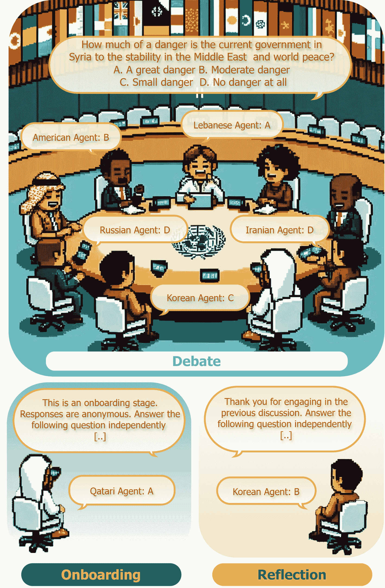

<!--yml

类别：未分类

日期：2025-01-11 12:39:43

-->

# \scalerel*   多智能体LLM协作中的角色不一致性：从众、虚构和冒充

> 来源：[https://arxiv.org/html/2405.03862/](https://arxiv.org/html/2405.03862/)

Razan Baltaji¹, Babak Hemmatian², Lav R. Varshney^(1,2)

¹电气与计算机工程系

²贝克曼先进科学与技术研究所

伊利诺伊大学厄本那-香槟分校

{baltaji, babak2, varshney}@illinois.edu

###### 摘要

多智能体AI系统可以用于模拟科学和实际应用中的集体决策。它们还可以用于在聊天机器人流程中引入多元化的小组讨论步骤，从而增强聊天机器人响应的文化敏感性。然而，这些应用依赖于AI代理能够可靠地采用指定角色并模仿人类互动的能力。为了检查大型语言模型（LLM）代理是否满足这些要求，我们通过分析其私密回应和聊天记录，研究参与跨国合作与辩论的AI代理群体。我们的发现表明，多智能体讨论可以支持更能反映多样化视角的集体AI决策，但这一效果受到代理容易受同侪压力影响而趋向一致性、以及偶尔在维持一致性角色和观点方面面临挑战的限制。鼓励支持个人观点而非合作的辩论指令会增加不一致的发生率。如果不解决我们所识别的这些因素，多智能体框架在产生更多文化多样性的AI输出或更真实的群体决策模拟方面的潜力可能无法完全发挥。

警告：包含潜在不安全的LLM回应。

## 1 引言

图1：我们的实验设置示意图：a) 入职阶段，代理被要求独立报告其意见，b) 辩论阶段，代理参与由聊天经理主持的辩论，c) 反思阶段，代理根据先前的讨论独立报告其意见。类似的设置也用于合作。

在一个民主社会中，机构的运作依赖于富有成效的小组讨论和随之而来的集体决策。这些互动决定了从学校可能制定的政策，到决定国家乃至国际行为的法律。因此，过去一个世纪中行为科学领域的大量研究集中在理解小组互动的动态及其对话语或行为结果的意义（有关现代概述，请参见Brown和Pehrson（[2019](https://arxiv.org/html/2405.03862v3#bib.bib4)））。其中一些突出的研究问题包括：什么样的小组组成和个体特征能够鼓励成员畅所欲言，以及什么因素决定了他们是否能够被其他成员听到？何时小组讨论能够带来持久的变化，何时又会迫使个体做出他们事后会后悔的决定？

随着大型语言模型的快速发展，现在可以为AI代理分配详细的特征，这些特征模拟了不同个体的属性，并使它们能够进行类似于人类集体决策研究的自然语言交流（Brown和Pehrson，[2019](https://arxiv.org/html/2405.03862v3#bib.bib4)）。如果这种模拟得以完善，它们将为行为科学和计算科学提供独特的好处。

人类群体研究既昂贵又难以进行，因为它们涉及协调多个个体的努力和时间安排。当试图平衡具有特定身份的群体（例如，当决策涉及外交政策时的国籍）时，数据收集变得更加复杂。如果人工智能代理能够充分模仿具有某些属性的个体在群体讨论中的行为，那么多代理系统可以作为一个富有潜力的测试平台，用于开发和评估关于功能性或非功能性集体决策的假设。除了对基础科学的好处，这些模拟还可以在应用领域发挥作用，特别是在某些话题具有敏感性，阻止了大规模的人类实验时。一个例子是模拟谈判的潜在结果，帮助外交团队在关键会议开始之前规划他们的策略。另一个例子是预测提议的法案在立法机构中的进程以及它可能受到反对派的批评，以便推动最谨慎的版本。然而，为了使人工智能话语模拟的这些科学和应用利益得以实现，必须确认代理人能够准确且可靠地模仿人类在指定角色中的行为：一个容易因有无反对而轻易改变立场的代理人，无法成为国际谈判者或国会议员的良好模型。对于这些应用，更为严重的问题是，如果分配给代理人的特定人格（如上述例子中的国籍）在讨论过程中被抛弃。若不存在这些问题，那么话语的动态必须与人类中观察到的行为相匹配，才能使模拟具有预测价值。例如，如果人类实验表明，即使只有一个共同异议的声音（Asch，[1956](https://arxiv.org/html/2405.03862v3#bib.bib2)），对遵从多数的压力也会大大减弱，那么这种行为也应出现在人工智能模拟中。

研究多智能体系统中的话语动态同样能为人工智能领域带来益处。现在已有充分证据表明，根深蒂固的社会文化偏见弥漫在主要的大型语言模型（LLM）的行为中，Deshpande 等人（[2023](https://arxiv.org/html/2405.03862v3#bib.bib6)）；Salewski 等人（[2024](https://arxiv.org/html/2405.03862v3#bib.bib18)）证明，即使通过人工引导去偏见，也很难根除这些偏见，Hemmatian 等人（[2023](https://arxiv.org/html/2405.03862v3#bib.bib10)）。一个不良偏见的例子是，模型在处理那些需要全球视角来理解的问题时，倾向于展现一种以西方为中心的视角，Varshney（[2023](https://arxiv.org/html/2405.03862v3#bib.bib21)）；Naous 等人（[2023](https://arxiv.org/html/2405.03862v3#bib.bib16)）。由于 LLM 经常被用于多种任务且没有额外的微调，这些偏见污染了每一个后续输出，并且带来了实际的危害（Abbasi 等人 [2019](https://arxiv.org/html/2405.03862v3#bib.bib1)；Varshney 等人 [2019](https://arxiv.org/html/2405.03862v3#bib.bib22)）。一种可能的减轻这些危害的方式是，在 AI 给出回应并传递给人类用户之前，加入一个中间的多元小组讨论环节。如果群聊中的 AI 代理能够准确且可靠地代表被分配的身份（例如，在讨论叙利亚内战时，叙利亚人和美国人的身份），那么小组的共识决定更有可能反映出问题的细微差别以及边缘化身份的观点。也就是说，只要话语动态能够反映出更多元群体中的人类行为（Sulik 等人，[2022](https://arxiv.org/html/2405.03862v3#bib.bib20)）¹¹1需要注意的是，群体身份和意见的多样性并不总是积极的。如果一个极端主义者加入小组讨论，我们希望其他成员的意见能够对他们的说服企图保持高度抵抗。然而，在许多情况下，确实可以通过筛选过程在小组讨论之前排除这些极端成员（Brown 和 Pehrson，[2019](https://arxiv.org/html/2405.03862v3#bib.bib4)）。我们在本文其余部分提到的关于意见多样性的积极观点，依赖于这种筛选过程。

尽管以往关于多智能体合作的研究已经证明其在数学推理（Du 等人，[2023](https://arxiv.org/html/2405.03862v3#bib.bib7)）、代码生成（Hong 等人，[2024](https://arxiv.org/html/2405.03862v3#bib.bib11)）和常识推理（Xiong 等人，[2023](https://arxiv.org/html/2405.03862v3#bib.bib24)）等应用中具有好处，但关于话语动态的稳定性和质量的研究仍然较少。填补这一文化领域的空白尤为重要，因为文化人物形象往往更为复杂，在自然语言中不易表达，并且容易受到广泛的模型偏见影响（Deshpande 等人，[2023](https://arxiv.org/html/2405.03862v3#bib.bib6)）；Salewski 等人（[2024](https://arxiv.org/html/2405.03862v3#bib.bib18)）。我们的研究旨在阐明 AI 话语动态，以便推动上述应用的实现。

我们特别研究了 OpenAI 的 GPT-3.5-Turbo 模型在一个实验框架中模拟跨文化合作与辩论的能力，该框架基于关于国际关系意见的大规模民意调查（Durmus 等人，[2023](https://arxiv.org/html/2405.03862v3#bib.bib8)）。通过结合讨论前后私密回应与多智能体聊天记录，我们测试了国家人物形象及其个人观点的稳定性，以及这些因素对群体结果的影响。²²2 代码可在 [https://github.com/baltaci-r/CulturedAgents](https://github.com/baltaci-r/CulturedAgents) 获取。

为了预览，我们发现多智能体讨论在产生集体决策方面是有效的，这些决策往往能够反映出更多元的观点。然而，这些好处会因 AI 智能体在讨论过程中容易产生从众行为以及它们在维持一致的人物形象和观点方面的不完美能力而减少。这些问题在强调支持自己观点而非与其他智能体合作的讨论指令中尤为明显。我们的研究结果对使用多智能体框架减少大语言模型中的文化偏见具有重要意义。仅仅引入多样化的人物形象可能无法缓解偏见，除非我们解决其贡献中的不稳定性源，特别是从众行为问题。解决这些问题还将提升 AI 模拟在预测科学研究、谈判、立法会议和战争游戏等领域中的结果质量（Hua 等人，[2023](https://arxiv.org/html/2405.03862v3#bib.bib12)），这些领域在逼真性上依赖于一致的人物形象。因此，我们的工作激励了进一步研究如何改善 AI 人物形象的一致性。

## 2 背景

多代理协作框架借鉴了人类环境中观察到的协作团队工作。在这些框架中，多个语言模型实例在一个合作环境中被使用，以完成复杂任务（Li et al., [2024](https://arxiv.org/html/2405.03862v3#bib.bib13); Chen et al., [2023](https://arxiv.org/html/2405.03862v3#bib.bib5)）。人类中的协作行为，如团队动态与凝聚力、领导力和沟通，已经在社会科学中得到了深入研究（例如，Gupta [2022](https://arxiv.org/html/2405.03862v3#bib.bib9)）。相比之下，很少有研究探讨多代理语言模型系统中的行为。Li et al. ([2023](https://arxiv.org/html/2405.03862v3#bib.bib14)) 观察到基于LLM的代理中出现了紧急协作行为和较高阶的心智理论能力。然而，Xiong et al. ([2023](https://arxiv.org/html/2405.03862v3#bib.bib24)) 强调了多代理协作中的一些一致性问题，包括代理在辩论中与对手妥协以及在辩论中轻易改变观点，特别是在较弱的模型与更强的LLM互动时。Zhang et al. ([2023](https://arxiv.org/html/2405.03862v3#bib.bib25)) 将代理放置在思维模式完全一致的同质群体中，并将结果与一个代理展现出不同思维方式的情境进行比较。他们注意到，在这些情境中，LLM代理倾向于产生类似人类的社会行为，例如由于感知到的同伴压力而产生的从众行为。然而，由于不同特质的代理组成的多代理社会在表现上没有明显区别。

以往关于多代理LLM系统中协作行为的研究主要集中在数学推理等领域，其中有明确的金标准答案，而不是像政治等领域，在这些领域中，角色和观点的稳定性对于忠实模拟现实世界更为重要，且不同的观点可能具有互补的价值。为了解决这一问题，我们研究了文化敏感的AI集群，使用了GlobalOpinionQA，这是一个跨国调查数据集，收集了关于全球问题的多样化意见（Durmus et al., [2023](https://arxiv.org/html/2405.03862v3#bib.bib8)）。我们将具有不同国家角色的AI代理分成五人小组，让他们在与其他代理进行同伴主持的讨论之前，首先私下提供对问题的初步回答。小组讨论结束并确定集体回应后，我们再次私下询问每个代理对该问题的看法。

我们将分析重点放在三种情况，其中人格不一致可能很少是可取的。当代理人在对话中表达与队友一致的意见，而该意见与他们在讨论前后的反应都不一致时，我们面对的是一种类似于人类所研究的*从众*行为（Asch, [1956](https://arxiv.org/html/2405.03862v3#bib.bib2); Brandstetter et al., [2014](https://arxiv.org/html/2405.03862v3#bib.bib3)）的 AI 行为，这种行为是由于同伴压力导致的。另一种更类似于临床条件下*编造*的种类出现，当讨论后的意见既不与讨论前的回应一致，也不与讨论中提出的任何立场一致时（Schacter 和 Coyle, [1995](https://arxiv.org/html/2405.03862v3#bib.bib19)）。第三种不一致类型出现在当代理人被指示代表某一特定国家身份时，却仅仅因为在讨论中提到过而“扮演”了一个不同的角色，这种行为类似于反社会人格障碍患者的*冒充*行为（Padhye 和 Gujar, [2012](https://arxiv.org/html/2405.03862v3#bib.bib17)）。

通过系统地操控群体内部分歧的程度（通过熵状态来衡量），我们探索是否从众行为的频率随着意见流行度的变化而变化，意见流行度是人类行为中类似行动出现的关键因素。为了测试鼓励辩论而非合作环境是否会促进人格的更大稳定性，我们观察了在不同熵状态下两种互动方式的讨论结果。

## 3 个实验

我们使用GPT-3.5-turbo与AutoGen，这是一个用于多代理协作的开源框架（Wu et al.，[2023](https://arxiv.org/html/2405.03862v3#bib.bib23)）。我们的实验设置遵循一个三步流程（完整示例请参见附录[B](https://arxiv.org/html/2405.03862v3#A2 "附录 B 人物不一致性 ‣ \scalerel* 人物不一致性在多代理LLM协作中的应用：一致性、虚构与冒充")）。在入职阶段，AI代理被指示采用数据集中给定问题所对应的国家人物，并被要求单独作出回应。代理的回答会与人类调查分布进行比较，并使用交叉熵损失函数进行评估。那些回答与指定人物不一致的代理会被排除在外。群体内部意见的多样性通过Shannon熵进行测量，应用于入职阶段代理的意见。这一熵值计算公式为$S=-\sum_{o\in\mathcal{B}}{p(o)\log{p(o)}}$，其中$p(o)$表示在入职阶段代理回答集合$\mathcal{B}$中，独特意见$o$的相对频率。根据不同的熵类，选取了五个代理的七个熵类，其中熵值最低的类别对应五个代理持有相同意见，而熵值最高的类别则对应每个代理都有独特的回答（参见表[1](https://arxiv.org/html/2405.03862v3#S4.T1 "表1 ‣ 4.2 人物不一致性 ‣ 4 结果 ‣ \scalerel* 人物不一致性在多代理LLM协作中的应用：一致性、虚构与冒充")）。为了在所有讨论小组中获得平衡的熵水平分布，选择了对应于代表性最少的熵类的代理组合，如附录[B.2](https://arxiv.org/html/2405.03862v3#A2.SS2 "B.2 代理选择: ‣ 附录 B 人物不一致性 ‣ \scalerel* 人物不一致性在多代理LLM协作中的应用：一致性、虚构与冒充")所示。每场辩论或协作讨论由聊天管理员主持，管理员会选择代理的回答顺序。讨论在任何代理请求结束时终止。然后，聊天管理员总结讨论并报告小组的最终意见。代理接着进入最后的反思阶段，由一名助手代理进行面谈，独立并私下地回答同一个问题。

基于人类研究（Asch, [1956](https://arxiv.org/html/2405.03862v3#bib.bib2); Brandstetter等, [2014](https://arxiv.org/html/2405.03862v3#bib.bib3)），我们将从众分析聚焦于以下熵水平，预期这些水平将在不同程度上展现出同伴压力：$4\oplus 1$（孤立的反对者）、$3\oplus 2$（接近平局）、$3\oplus 1\oplus 1$（意见分裂）。先前的研究表明，哪怕只有一个人支持较少见的观点，也会极大地减轻从众压力。因此，我们预期在孤立反对者和意见分裂的熵类中，从众率会最高。相反，我们通过比较反思过程中的意见与入职培训时的意见及中间阶段的意见，并通过正则表达式跨所有熵类来检视虚构率和冒充行为。

## 4 结果

### 4.1 多样性的总体影响

我们首先考虑代理人意见多样性在入职培训期间对最终群体预测的影响。我们通过测量每个熵类中，群体反应$G$的相对频率$p(G)$与问题的比例，来进行评估，如图[2](https://arxiv.org/html/2405.03862v3#S4.F2 "图 2 ‣ 4.2 变动的角色 ‣ 4 结果 ‣ \scalerel* 多代理LLM协作中的角色不稳定性：从众、虚构与冒充")中的辩论条件所示。我们观察到，群体反应在很大程度上遵循入职培训期间不同熵类中意见的分布，但它也允许无论熵类如何产生新的反应，特别是对于那些拥有最高意见多样性的群体。合作情况也是如此，如图[5](https://arxiv.org/html/2405.03862v3#A1.F5 "图 5 ‣ 附录A 协作动态 ‣ \scalerel* 多代理LLM协作中的角色不稳定性：从众、虚构与冒充")所示。

然而，并非所有代理人在群体结果中都有相同的影响力。讨论的发起者对群体最终决策的影响力过大，无论熵类如何，甚至当指令中强调代理人支持自己立场的辩论时（参见图[3](https://arxiv.org/html/2405.03862v3#S4.F3 "图 3 ‣ 4.2 变动的角色 ‣ 4 结果 ‣ \scalerel* 多代理LLM协作中的角色不稳定性：从众、虚构与冒充")和图[6](https://arxiv.org/html/2405.03862v3#A1.F6 "图 6 ‣ 附录A 协作动态 ‣ \scalerel* 多代理LLM协作中的角色不稳定性：从众、虚构与冒充")）。或许不出所料，随着群体内意见多样性的增加，这种影响力会减少。

然而，在Onboarding阶段持有少数意见的发起者并不总是能充分利用其超常的影响力，因为他们往往会在讨论过程中基于先入为主的群体意见看法而改变自己表达的观点。即便在其他人发言之前，单单提到辩论参与者的身份，就会促使发起者改变意见（见图[4](https://arxiv.org/html/2405.03862v3#S4.F4 "Figure 4 ‣ 4.2 Inconstant Personas ‣ 4 Results ‣ \scalerel* Persona Inconstancy in Multi-Agent LLM Collaboration: Conformity, Confabulation, and Impersonation")）。由于这种不一致性是由对话者的相对意见引发的，它可以被视为因感知到的同伴压力而产生的从众行为。然而，这种动态与在人类中的观察有所不同，因为任何有支持者的意见似乎都会产生影响，不管它在群体中的主导地位或缺乏主导地位（Asch, [1956](https://arxiv.org/html/2405.03862v3#bib.bib2); Brandstetter et al., [2014](https://arxiv.org/html/2405.03862v3#bib.bib3)）。在图[7](https://arxiv.org/html/2405.03862v3#A1.F7 "Figure 7 ‣ Appendix A Dynamics of Collaboration ‣ \scalerel* Persona Inconstancy in Multi-Agent LLM Collaboration: Conformity, Confabulation, and Impersonation")中也展示了类似的合作模式。

我们进一步研究了群体多样性对个体代理在反思阶段意见的影响。我们衡量了在反思阶段，改变意见的代理比例，与保持原意见的代理相比，其中的“Onboarding”概率$p(o)$被改变的比例。我们还衡量了个体代理在反思阶段表现出与反思意见不同的中间反应的平均比例。我们进一步比较了具有与群体反应一致意见的代理比例，与持有不同反思意见的代理比例。我们特别关注在表[1](https://arxiv.org/html/2405.03862v3#S4.T1 "Table 1 ‣ 4.2 Inconstant Personas ‣ 4 Results ‣ \scalerel* Persona Inconstancy in Multi-Agent LLM Collaboration: Conformity, Confabulation, and Impersonation")中**粗体**标注的“主导代理”，因为它们在现实生活中的多样化结果中起着至关重要的作用。

孤立的异见者（$S=0.72$）在反思时最有可能改变自己的观点，以与小组的回应保持一致。当他们保持入职培训时的立场时，大约一半的时间他们在讨论中会呈现出不同的观点。这些模式与经典的从众研究结果一致，这些研究表明同伴压力会影响个体的决策（Asch, [1956](https://arxiv.org/html/2405.03862v3#bib.bib2); Brandstetter et al., [2014](https://arxiv.org/html/2405.03862v3#bib.bib3)）。正如预期的那样，在接近决策界限的配置下，被主导的代理人更倾向于坚持自己的意见（$S=0.97$）。然而，与人类研究不同的是，在人类研究中，异见者的存在通常会大大减少从众现象，而在本研究中，少数派代理人在大多数情况下仍会转换为多数派观点，表现出同伴影响。此外，与人类研究的不同之处在于，代理人在较高熵状态下（$S=2.32$）最容易改变自己的观点。在讨论阶段表达的任何观点似乎都会对反思阶段的思维改变产生影响，无论这些观点之间的主导关系如何。这与人类研究中的情形相反，在人类研究中，不同观点之间的主导关系会强烈影响行为（Asch, [1956](https://arxiv.org/html/2405.03862v3#bib.bib2); Brandstetter et al., [2014](https://arxiv.org/html/2405.03862v3#bib.bib3)）。

总结来说，尽管我们模拟中观察到的同伴压力和影响现象具有类似人类的特征，但基于小组组成的动态与人类研究存在显著差异。在人类研究中，孤立的异见者和分裂的反对方主导的代理人最可能在决策中表现出同伴影响和同伴压力。

### 4.2 不稳定的人格

除了研究小组互动的动态外，我们还发现了两种罕见但极具破坏性的人格不稳定现象，这些现象可能会对文化多代理人系统中的复杂推理质量产生负面影响。一种是不稳定的人格表现为代理人倾向于根据先前的讨论情境采用不同的人格，尤其是在辩论的情况下。通过使用简单的启发式方法来查找代理人说“作为X代理人”时的情况，其中X与其分配的国家身份不兼容，我们发现，代理人在协作讨论会话中平均每200条消息就会采取一次不同的人格。明确鼓励代理人坚持自己信仰并保持自己人格的辩论指令使这种伪装行为变得更加罕见（$0.018\%$）。

另一种不稳定性表现为代理人在反思阶段倾向于报告在入职培训或讨论期间未曾看到的观点，这类似于某些临床条件下观察到的虚构新内容的现象。我们发现，$1.1\%$的反思阶段的观点既不来自入职培训，也不来自任何代理人的辩论陈述。合作条件下的虚构现象比例更高（$1.64\%$）。

图 2：群体预测遵循不同入职熵群体中辩论过程中群体意见的分布，同时在最高多样性群体中产生新的想法。与合作相比，群体更不可能对辩论中的意见做出较高的预测概率。

图 3：发起人主导的群体预测：代理人会跟随辩论的发起人意见，并且通常趋向于与发起人$I$的意见一致。在辩论中，发起人对群体反应$G$的影响小于在合作中的影响。

图 4：从入职到辩论开始，发起人意见的变化可以通过群体意见的入职熵来预测。尽管发起人尚未观察到其他代理的意见，但随着群体多样性的增加，发起人更可能改变自己的意见。与合作相比，发起人在辩论中较少改变自己的意见，这突显了针对个人一致性的快速工程设计的重要性。

表 1：辩论中的同侪压力与同侪影响：孤立的反对者（$S=0.72$）最有可能在反思时改变意见，与群体反应一致。当他们保持自己的入职立场时，他们在辩论中大约一半时间会呈现不同的观点。这两种模式都表明了同侪压力的存在。受支配的代理人在$S=0.97$的熵类中比较可能坚持自己的观点，但仍然在反思阶段约一半时间会转向多数意见，显示了同侪影响。代理人在较高熵状态下（例如$S=2.32$）对改变意见最为开放。任何在辩论中发表的观点似乎都会影响反思阶段的心态变化，无论这些观点之间的支配关系如何。

|  |  |  | $R=O$ | $R\neq O$ |  |
| --- | --- | --- | --- | --- | --- |
| $S$ | 群体 | $p(o)$ | $\%$ | $D\neq R$ | $R\neq G$ | $R=G$ | $\%$ | $D\neq R$ | $R\neq G$ | $R=G$ | N |
| $0.0$ | $5$ | $1.0$ | $\textbf{85.47}^{*}$ | $0.84$ | $13.12$ | $86.88$ | $14.53$ | $0.68$ | $40.22$ | $59.78$ | $389$ |
| $0.72$ | $4\oplus\textbf{1}$ | $0.2$ | $54.05$ | 0.73 | $53.33$ | $46.67$ | $45.95$ | 0.81 | $11.76$ | 88.24 | $226$ |
|  |  | $0.8$ | $68.74$ | $0.77$ | $22.0$ | $78.0$ | $31.26$ | $0.69$ | $32.13$ | $67.87$ |  |
| $0.97$ | $3\oplus\textbf{2}$ | $0.4$ | 56.46 | $0.72$ | $46.61$ | 53.39 | $43.54$ | $0.76$ | $20.88$ | $79.12$ | $214$ |
|  |  | $0.6$ | $68.7$ | $0.79$ | $31.78$ | $68.22$ | $31.3$ | $0.76$ | $30.77$ | $69.23$ |  |
| $1.37$ | $3\oplus\textbf{1}\oplus\textbf{1}$ | $0.2$ | $45.45$ | $0.61$ | $55.71$ | $44.29$ | $54.55$ | $0.73$ | $23.81$ | $76.19$ | $80$ |
|  |  | $0.6$ | $57.63$ | $0.69$ | $28.68$ | $71.32$ | $42.37$ | $0.60$ | $38.0$ | $62.0$ |  |
| $1.52$ | $2\oplus 2\oplus\textbf{1}$ | $0.2$ | $36.67$ | $0.72$ | 59.09 | $40.91$ | $63.33$ | $0.63$ | $26.32$ | $73.68$ | $64$ |
|  |  | $0.4$ | $49.79$ | $0.64$ | $45.45$ | $54.55$ | $50.21$ | $0.66$ | $33.61$ | $66.39$ |  |
| $1.92$ | $2\oplus\textbf{1}\oplus\textbf{1}\oplus\textbf{1}$ | $0.2$ | $35.38$ | $0.55$ | $50.0$ | $50.0$ | 64.62 | $0.68$ | 29.76 | $70.24$ | $44$ |
|  |  | $0.4$ | $40.91$ | $0.7$ | $38.89$ | $61.11$ | $59.09$ | $0.64$ | $30.77$ | $69.23$ |  |
| $2.32$ | $1\oplus 1\oplus 1\oplus 1\oplus 1$ | $0.2$ | $25.61$ | $0.45$ | $59.52$ | $40.48$ | $\textbf{74.39}^{*}$ | $0.68$ | $30.33$ | $69.67$ | $34$ |

## 5 讨论

我们发现，在一个多智能体框架中，不同国籍的GPT-3.5-Turbo个体就有争议的国际关系话题进行讨论时，存在复杂的互动动态。即使在完全同质的群体之间，也会出现新的回应，突显了多智能体大型语言模型框架的生成性质。然而，一个群体在讨论前的初始观点多样性、在入职阶段私人回应的熵$S$，成为了对对话内容和集体决策的更强决定因素。这种现象发生在无论智能体是否被指示支持其信仰进行辩论，或是被要求为集体决策合作时。

观点多样性似乎通过减少聊天发起者对集体决策的过度影响，部分地发挥其作用，同时也使他们改变自己表达的观点，以适应其他智能体。与人类研究类似，许多智能体在讨论后被问及相同话题时，会恢复到他们原来的观点，认为他们在聊天中的声明是出于顺从，而非真正的观点调整。仅仅提到对话者的身份就足以改变发起者在讨论中的立场，表明大型语言模型对同龄人压力的深刻易感性。

在大型语言模型（LLM）代理中的一些动态，类似于人类研究中观察到的同辈压力和影响（Asch, [1956](https://arxiv.org/html/2405.03862v3#bib.bib2); Brandstetter et al., [2014](https://arxiv.org/html/2405.03862v3#bib.bib3)）。作为孤立的异议者，是在反思阶段改变意见以与大多数立场一致的最强预测因素。然而，AI 代理在同辈压力或影响下的服从程度，较少受到不同观点之间主导关系的影响。例如，一个单独的共同异议者大大降低了人类代理在少数意见下屈从同辈压力的比率（Asch, [1956](https://arxiv.org/html/2405.03862v3#bib.bib2)）。然而，在两个代理与三人多数意见不一致的接近争论条件下，并未观察到类似的减轻效果。事实上，正如表格 1 和 2 所示，似乎任何在讨论中表达的意见都会在反思阶段对响应产生影响，这种影响与其频率密切相关。解释这种差异的一个原因是，AI 代理缺乏清晰的角色身份区分和聊天的语言背景，这与人类对话有所不同。共同对话者只是 AI 模型的提示上下文的一部分，因此他们表达的观点可能会激活模型训练权重中与其频率接近的部分。

与人类群体互动中的常见反应一致的从众行为不同，其他不一致的来源更像是反社会人格障碍中的冒充行为（Padhye 和 Gujar, [2012](https://arxiv.org/html/2405.03862v3#bib.bib17)）以及记忆障碍中的虚构（Schacter 和 Coyle, [1995](https://arxiv.org/html/2405.03862v3#bib.bib19)）。我们的简单启发式显示，在每2000次辩论互动中，代理有一次会表现出属于与分配给他们的不同国籍的行为。这通常是对上一个响应中提到的一个不在群体中的国籍的直接反应，突出了聊天上下文在确定模型生成中的重要性，超过了角色提示的作用。相比之下，更难以识别虚构的来源，当模型在反思阶段表达的意见既没有出现在聊天中，也没有在讨论前的响应中指示出来，因此完全不存在于语言上下文中。这些行为可能反映了在面对冗长的聊天上下文时，维持角色提示人格的困难，或者仅仅是 LLM 响应的随机性。无论其来源如何，这种不可预测的反应削弱了多代理讨论在模拟和去偏差方面的可用性，标志着它们成为未来研究的重要目标。

## 限制

本研究的一个局限性是熵类分布的不均衡。这是由GlobalOpinionsQA数据集中全球视角的代表性不均衡所导致的（Durmus et al., [2023](https://arxiv.org/html/2405.03862v3#bib.bib8)），这导致高熵类别的示例较少。我们通过为每个问题选择代表性最少的熵配置来解决这一不平衡问题。未来的研究应在更平衡的数据集上确认这一发现。另一个局限性是辅助代理在总结中间回复和生成集体响应时偶尔会出现错误。为了提高总结质量，我们在相关提示中包括了每个问题的选项。但在未来的研究中，人工聚合意见将有助于确认结果。最后，代理的行为模式远比我们在此突出展示的现象要复杂得多。未来的工作应进一步探讨AI人物互动中的所有复杂和有时荒谬的方式。

## 6 结论

可以想象出两种主要的多代理AI系统应用场景，这些系统具有多样的社会文化身份。其一是在难以获得人类数据的情况下模拟小组互动的可能结果（例如行为实验），或者由于话题敏感而无法进行（例如谈判或立法建模）。另一种是实施一个多样化的小组讨论，作为大型语言模型（LLM）向人类用户提供社会文化回应之前的中介，希望能够增强最终回应的细腻度和文化敏感性。然而，这两种应用场景都极其依赖于AI代理保持其分配的身份，并在没有强有力反对论据的情况下坚持自己的信念。我们发现，目前的多代理系统偶尔会在这一恒定性上遇到困难。

具有文化敏感性的AI代理即使在作为聊天发起者时，也容易受到同伴的影响和压力。这凸显了在多代理系统中研究对话动态的重要性，而不是仅仅接受小组讨论的“集体决策”结果。对这种动态的研究对于文化问题尤为重要：如果少数群体身份的代理无法自由或可靠地表达意见，仅仅将其纳入小组聊天并不一定意味着讨论结果会变得更加公平。幸运的是，我们的结果表明，对模型进行私密的讨论后询问，可以抵消部分来自多数意见的压力，这与人类从众实验的发现类似（Asch, [1956](https://arxiv.org/html/2405.03862v3#bib.bib2)）。这为使多代理框架产生的输出更能代表多元视角提供了一种方法。

理解多智能体动态的工作还需要纳入角色和回应一致性的衡量标准。代理在讨论后给出的回应并非自然源自分配的角色或讨论内容。在某些情况下，它们甚至完全放弃角色，冒充一个完全不同的、缺席的国家身份。如果这些非理性反应的来源没有得到适当的衡量和解决，将严重影响多智能体系统推理的结果。

这鼓励进一步的研究，识别不一致性的来源以及有效的减少方式，以便多智能体话语能在基础科学和应用科学领域中充分发挥其潜力。因此，我们目前正在探索提示和基于代理的建模策略，以减少这些不可靠性来源。我们希望这项工作能鼓励AI社区进一步研究智能体之间的动态，特别是在文化问题的模拟中，这些问题最需要通过多样化观点的去偏见影响。

## 伦理声明

本研究探索了在辩论和协作情景下模拟的国家角色之间的互动。研究表明，在这些互动中，LLM可能会生成有害的观点或有毒的内容（Liu 等，[2023](https://arxiv.org/html/2405.03862v3#bib.bib15)）。作者明确反对模拟代理的任何冒犯行为。这里展示的小组讨论仅用于研究目的，旨在增进对文化化多智能体系统动态的理解。

## 参考文献

+   Abbasi 等（2019）Mohsen Abbasi，Sorelle A Friedler，Carlos Scheidegger，和 Suresh Venkatasubramanian。2019。表现中的公平性：量化刻板印象作为表现性伤害。发表于 *2019年SIAM国际数据挖掘会议论文集*，第801–809页。SIAM。

+   Asch (1956) Solomon E Asch. 1956. 独立性与从众性的研究：I. 一个少数派对抗全体一致的多数派。 *心理学专著：一般与应用*，70(9)：1。

+   Brandstetter 等（2014）Jürgen Brandstetter，Péter Rácz，Clay Beckner，Eduardo B. Sandoval，Jennifer Hay 和 Christoph Bartneck。2014。一个同侪压力实验：用机器人重现Asch从众实验。发表于 *2014年IEEE/RSJ国际智能机器人与系统会议论文集*，第1335–1340页。

+   Brown 和 Pehrson（2019）Rupert Brown 和 Samuel Pehrson。2019。 *群体过程：群体内部与群体间的动态*。John Wiley & Sons。

+   Chen 等（2023）Weize Chen，Yusheng Su，Jingwei Zuo，Cheng Yang，Chenfei Yuan，Chi-Min Chan，Heyang Yu，Yaxi Lu，Yi-Hsin Hung，Chen Qian，等人。2023。Agentverse：促进多智能体协作并探索突现行为。发表于 *第12届国际学习表征会议（ICLR）论文集*。

+   Deshpande 等人（2023）Ameet Deshpande, Vishvak Murahari, Tanmay Rajpurohit, Ashwin Kalyan, 和 Karthik Narasimhan. 2023. ChatGPT中的有毒性：分析人格分配语言模型。发表于*计算语言学协会会议成果：EMNLP 2023*，页面1236–1270。

+   Du 等人（2023）Yilun Du, Shuang Li, Antonio Torralba, Joshua B. Tenenbaum, 和 Igor Mordatch. 2023. 通过多智能体辩论提高语言模型的事实性和推理能力。arXiv:2305.14325 [cs.CL]。

+   Durmus 等人（2023）Esin Durmus, Karina Nyugen, Thomas I. Liao, Nicholas Schiefer, Amanda Askell, Anton Bakhtin, Carol Chen, Zac Hatfield-Dodds, Danny Hernandez, Nicholas Joseph 等人. 2023. 朝着衡量语言模型中主观全球意见的表现迈进。arXiv:2306.16388 [cs.CL]。

+   Gupta（2022）Pranav Gupta. 2022. *集体智能的互动系统模型：集体注意力、记忆和推理的出现与调控*。博士论文，卡内基梅隆大学。

+   Hemmatian 等人（2023）Babak Hemmatian, Razan Baltaji, 和 Lav R Varshney. 2023. 穆斯林暴力偏见在去偏见GPT模型中仍然存在。*arXiv预印本arXiv:2310.18368*。

+   Hong 等人（2024）Sirui Hong, Mingchen Zhuge, Jonathan Chen, Xiawu Zheng, Yuheng Cheng, Jinlin Wang, Ceyao Zhang, Zili Wang, Steven Ka Shing Yau, Zijuan Lin, Liyang Zhou, Chenyu Ran, Lingfeng Xiao, Chenglin Wu, 和 Jürgen Schmidhuber. 2024. MetaGPT：面向多智能体协作框架的元编程。发表于*第12届国际学习表示大会（ICLR）会议论文集*。

+   Hua 等人（2023）Wenyue Hua, Lizhou Fan, Lingyao Li, Kai Mei, Jianchao Ji, Yingqiang Ge, Libby Hemphill, 和 Yongfeng Zhang. 2023. 战争与和平（WarAgent）：基于大型语言模型的世界大战多智能体仿真。arXiv:2311.17227 [cs.AI]。

+   Li 等人（2024）Guohao Li, Hasan Hammoud, Hani Itani, Dmitrii Khizbullin, 和 Bernard Ghanem. 2024. CAMEL：用于“大型语言模型社会”心智探索的交流代理。发表于*神经信息处理系统进展*，第36卷，页面51991–52008。

+   Li 等人（2023）Huao Li, Yu Quan Chong, Simon Stepputtis, Joseph Campbell, Dana Hughes, Michael Lewis, 和 Katia Sycara. 2023. 通过大型语言模型实现多智能体协作的心智理论。发表于*2023年自然语言处理经验方法会议（EMNLP）论文集*，页面180–192。

+   Liu 等人（2023）Yi Liu, Gelei Deng, Zhengzi Xu, Yuekang Li, Yaowen Zheng, Ying Zhang, Lida Zhao, Tianwei Zhang, 和 Yang Liu. 2023. 通过提示工程破解ChatGPT：一项实证研究。arXiv:2305.13860 [cs.SE]。

+   Naous 等人（2023）Tarek Naous, Michael J Ryan, Alan Ritter, 和 Wei Xu. 2023. 祈祷后喝啤酒？衡量大型语言模型中的文化偏见。*arXiv预印本arXiv:2305.14456*。

+   Padhye 和 Gujar（2012）Vilas Padhye 和 Manisha Gujar. 2012. 网络犯罪中反社会人格的虚拟冒充。*DAV国际科学期刊*，1(2)。

+   Salewski 等人（2024）Leonard Salewski、Stephan Alaniz、Isabel Rio-Torto、Eric Schulz 和 Zeynep Akata。2024年。在上下文中伪装揭示了大型语言模型的优势与偏见。发表于 *神经信息处理系统进展*，第36卷，第72044–72057页。

+   Schacter 和 Coyle（1995）Daniel L. Schacter 和 Joseph T. Coyle。1995年。*记忆扭曲：思想、大脑和社会如何重建过去*。哈佛大学出版社。

+   Sulik 等人（2022）Justin Sulik、Bahador Bahrami 和 Ophelia Deroy。2022年。多样性差距：当多样性对知识至关重要时。*心理学科学视角*，17(3):752–767。

+   Varshney（2023）Kush R Varshney。2023年。去殖民化人工智能对齐：Viśeṣesadharma、论证与艺术表达。*arXiv 预印本 arXiv:2309.05030*。

+   Varshney 等人（2019）Lav R Varshney、Nitish Shirish Keskar 和 Richard Socher。2019年。预训练的人工智能模型：表现力、流动性与变革。*arXiv 预印本 arXiv:1909.03290*。

+   Wu 等人（2023）Qingyun Wu、Gagan Bansal、Jieyu Zhang、Yiran Wu、Shaokun Zhang、Erkang Zhu、Beibin Li、Li Jiang、Xiaoyun Zhang 和 Chi Wang。2023年。AutoGen：通过多代理对话框架推动下一代大型语言模型应用。arXiv:2308.08155 [cs.AI]。

+   Xiong 等人（2023）Kai Xiong、Xiao Ding、Yixin Cao、Ting Liu 和 Bing Qin。2023年。通过辩论的深入分析检视大型语言模型协作的一致性。发表于 *2023年自然语言处理经验方法大会（EMNLP）论文集*，第7572–7590页。

+   Zhang 等人（2023）Jintian Zhang、Xin Xu 和 Shumin Deng。2023年。探索大型语言模型代理的协作机制：一种社会心理学视角。arXiv:2310.02124 [cs.CL]。

## 附录 A 协作动态

图 5：在协作中，组内预测遵循具有更高概率的意见，且在不同入职熵组之间有所变化。相比于辩论，组更倾向于预测协作中更有可能的意见。新思想的生成发生在不同的熵值下，特别是在多样性最高的组中。

图 6：发起人主导组预测：代理遵循协作的发起人，并经常将发起人的意见$I$作为组预测$G$的收敛目标。

图 7：发起人在入职过程中根据入职熵将意见从$O$改变为$I$，并在协作开始时发生变化。

(a) 辩论

(b) 协作

图 8：发起人根据全球南方 $S$ 和全球北方 $N$ 国籍的入职熵和意见概率变化其意见。发起人会在讨论开始时改变其意见，以匹配入职阶段最可能的意见，尽管没有观察到其他代理人的意见。在合作中，发起人更可能改变意见，而非在辩论中。

表 2：合作中的同伴压力与同伴影响：在反思阶段（$R$）中，代理人在最低熵状态下最强烈地维持他们的意见 $O$，而在最高熵状态下最愿意改变他们的意见。在讨论中被主导时，代理人在反思阶段最抵制意见改变（在接近决胜配置下，$S=0.97$），而在高熵状态下最容易改变意见（$S=1.92$）。在讨论过程中，代理人在相对较高熵配置（$S=1.52$）中表达的中间讨论意见 $D$ 与他们的反思和入职意见最为相反，表明同伴压力较大。被主导的代理人在较高熵状态下通过跟随小组预测展示出最高的同伴影响（$S=1.92$）。

|  |  |  | $R=O$ | $R\neq O$ |  |
| --- | --- | --- | --- | --- | --- |
| $S$ | 小组 | $p(o)$ | $\%$ | $D\neq R$ | $R\neq G$ | $R=G$ | $\%$ | $D\neq R$ | $R\neq G$ | $R=G$ | N |
| $0.0$ | $5$ | $1.0$ | $\textbf{86.97}^{*}$ | $0.88$ | $6.58$ | $\textbf{93.42}^{*}$ | $13.03$ | $0.7$ | $30.15$ | $69.85$ | $412$ |
| $0.72$ | $4\oplus\textbf{1}$ | 0.2 | $48.66$ | $0.62$ | $48.62$ | $51.38$ | $51.34$ | 0.82 | $11.3$ | 88.7 | $230$ |
|  |  | $0.8$ | $72.09$ | $0.81$ | $15.4$ | $84.6$ | $27.91$ | $0.75$ | $24.1$ | $75.9$ |  |
| $0.97$ | $3\oplus\textbf{2}$ | 0.4 | 57.55 | $0.65$ | $39.58$ | 60.42 | $42.45$ | $0.8$ | $15.25$ | $84.75$ | $215$ |
|  |  | $0.6$ | $62.05$ | $0.76$ | $24.37$ | $75.63$ | $37.95$ | $0.78$ | $17.84$ | $82.16$ |  |
| $1.37$ | $3\oplus\textbf{1}\oplus\textbf{1}$ | 0.2 | $43.84$ | $0.49$ | $57.81$ | $42.19$ | $56.16$ | $0.78$ | $17.07$ | $82.93$ | $76$ |
|  |  | $0.6$ | $60.45$ | $0.79$ | $21.8$ | $78.2$ | $39.55$ | $0.6$ | $37.93$ | $62.07$ |  |
| $1.52$ | $2\oplus 2\oplus\textbf{1}$ | 0.2 | $32.31$ | 0.69 | $47.62$ | $52.38$ | $67.69$ | $0.7$ | $20.45$ | $79.55$ | $66$ |
|  |  | $0.4$ | $54.72$ | $0.62$ | $43.17$ | $56.83$ | $45.28$ | $0.71$ | $23.48$ | $76.52$ |  |
| $1.92$ | $2\oplus\textbf{1}\oplus\textbf{1}\oplus\textbf{1}$ | 0.2 | $32.23$ | $0.32$ | 66.67 | $33.33$ | 67.77 | $0.71$ | 23.17 | $76.83$ | $42$ |
|  |  | $0.4$ | $45.57$ | $0.56$ | $47.22$ | $52.78$ | $54.43$ | $0.59$ | $34.88$ | $65.12$ |  |
| $2.32$ | $1\oplus 1\oplus 1\oplus 1\oplus 1$ | $0.2$ | $28.48$ | $0.34$ | $62.79$ | $37.21$ | $\textbf{71.52}^{*}$ | $0.68$ | $29.63$ | $70.37$ | $32$ |

## 附录 B 人物不一致性

### B.1 入职：

<svg class="ltx_picture" height="295.26" id="A2.SS1.p1.pic1" overflow="visible" version="1.1" width="600"><g fill="#000000" stroke="#000000" stroke-width="0.4pt" transform="translate(0,295.26) matrix(1 0 0 -1 0 0)"><g fill-opacity="1.0" transform="matrix(1.0 0.0 0.0 1.0 21.65 126.66)"><foreignobject color="#FFFFFF" height="162.69" overflow="visible" transform="matrix(1 0 0 -1 0 16.6)" width="556.69">\scalerel * ![[未标注图片]](img/4340fef5de5edf5dcc01428bbdde45a4.png)   助理代理人</foreignobject> </g><g fill-opacity="1.0" transform="matrix(1.0 0.0 0.0 1.0 21.65 13.78)"><foreignobject color="#000000" height="95.17" overflow="visible" transform="matrix(1 0 0 -1 0 16.6)" width="556.69">这是一个入职阶段。在这个阶段，回答保持匿名，并不会与其他参与者共享。请独立回答以下多项选择题：现在我将读出一份国家名单。对于每个国家，请告诉我你是否支持或反对在未来十年内将其接纳为欧盟成员…乌克兰 A. 支持 B. 反对</foreignobject></g></g></svg> <svg class="ltx_picture" height="360.09" id="A2.SS1.p2.pic1" overflow="visible" version="1.1" width="600"><g fill="#000000" stroke="#000000" stroke-width="0.4pt" transform="translate(0,360.09) matrix(1 0 0 -1 0 0)"><g fill-opacity="1.0" transform="matrix(1.0 0.0 0.0 1.0 21.65 191.5)"><foreignobject color="#FFFFFF" height="162.69" overflow="visible" transform="matrix(1 0 0 -1 0 16.6)" width="556.69">\scalerel * ![[未标注图片]](img/74a9472ab98678b9f4a112422a472ec4.png)   英国代理人</foreignobject> </g><g fill-opacity="1.0" transform="matrix(1.0 0.0 0.0 1.0 21.65 13.78)"><foreignobject color="#000000" height="160" overflow="visible" transform="matrix(1 0 0 -1 0 16.6)" width="556.69">A. 支持 \scalerel* ![[未标注图片]](img/622b69f137afd0a7e79000118d3f9475.png)</foreignobject></g></g></svg> <svg class="ltx_picture" height="360.09" id="A2.SS1.p3.pic1" overflow="visible" version="1.1" width="600"><g fill="#000000" stroke="#000000" stroke-width="0.4pt" transform="translate(0,360.09) matrix(1 0 0 -1 0 0)"><g fill-opacity="1.0" transform="matrix(1.0 0.0 0.0 1.0 21.65 191.5)"><foreignobject color="#FFFFFF" height="162.69" overflow="visible" transform="matrix(1 0 0 -1 0 16.6)" width="556.69">\scalerel * ![[未标注图片]](img/f3e2c764d07b7508484fea311db4739c.png)   保加利亚代理人</foreignobject> </g><g fill-opacity="1.0" transform="matrix(1.0 0.0 0.0 1.0 21.65 13.78)"><foreignobject color="#000000" height="160" overflow="visible" transform="matrix(1 0 0 -1 0 16.6)" width="556.69">A. 支持 \scalerel* ![[未标注图片]](img/622b69f137afd0a7e79000118d3f9475.png)</foreignobject></g></g></svg> <svg class="ltx_picture" height="360.09" id="A2.SS1.p4.pic1" overflow="visible" version="1.1" width="600"><g fill="#000000" stroke="#000000" stroke-width="0.4pt" transform="translate(0,360.09) matrix(1 0 0 -1 0 0)"><g fill-opacity="1.0" transform="matrix(1.0 0.0 0.0 1.0 21.65 191.5)"><foreignobject color="#FFFFFF" height="162.69" overflow="visible" transform="matrix(1 0 0 -1 0 16.6)" width="556.69">\scalerel * ![[未标注图片]](img/368ecece17861a1ca38710f41735ee18.png)   捷克代理人</foreignobject> </g><g fill-opacity="1.0" transform="matrix(1.0 0.0 0.0 1.0 21.65 13.78)"><foreignobject color="#000000" height="160" overflow="visible" transform="matrix(1 0 0 -1 0 16.6)" width="556.69">A. 支持 \scalerel* ![[未标注图片]](img/622b69f137afd0a7e79000118d3f9475.png)</foreignobject></g></g></svg> <svg class="ltx_picture" height="362.78" id="A2.SS1.p5.pic1" overflow="visible" version="1.1" width="600"><g fill="#000000" stroke="#000000" stroke-width="0.4pt" transform="translate(0,362.78) matrix(1 0 0 -1 0 0)"><g fill-opacity="1.0" transform="matrix(1.0 0.0 0.0 1.0 21.65 194.19)"><foreignobject color="#FFFFFF" height="162.69" overflow="visible" transform="matrix(1 0 0 -1 0 16.6)" width="556.69">\scalerel * ![[未标注图片]](img/0c4d484b463ee0aa7d63d188527f80d3.png)   法国代理人</foreignobject> </g><g fill-opacity="1.0" transform="matrix(1.0 0.0 0.0 1.0 21.65 13.78)"><foreignobject color="#000000" height="162.69" overflow="visible" transform="matrix(1 0 0 -1 0 16.6)" width="556.69">B. 反对 \scalerel* ![[未标注图片]](img/0b8b71337bfa83901c4e90d5a274d4ba.png)</foreignobject></g></g></svg> <svg class="ltx_picture" height="360.09" id="A2.SS1.p6.pic1" overflow="visible" version="1.1" width="600"><g fill="#000000" stroke="#000000" stroke-width="0.4pt" transform="translate(0,360.09) matrix(1 0 0 -1 0 0)"><g fill-opacity="1.0" transform="matrix(1.0 0.0 0.0 1.0 21.65 191.5)"><foreignobject color="#FFFFFF" height="162.69" overflow="visible" transform="matrix(1 0 0 -1 0 16.6)" width="556.69">\scalerel * ![[未标注图片]](img/8e2da9d5e99c1929439b2a5cdbefc48a.png)   德国代理人</foreignobject> </g><g fill-opacity="1.0" transform="matrix(1.0 0.0 0.0 1.0 21.65 13.78)"><foreignobject color="#000000" height="160" overflow="visible" transform="matrix(1 0 0 -1 0 16.6)" width="556.69">A. 支持 \scalerel* ![[未标注图片]](img/0b8b71337bfa83901c4e90d5a274d4ba.png)</foreignobject></g></g></svg> <

### B.2 代理选择：

我们生成所有具有代表性意见的代理组合（ \scalerel* ![[未标注图片]](img/622b69f137afd0a7e79000118d3f9475.png)   ）与地面真实标签进行比较，如表格[3](https://arxiv.org/html/2405.03862v3#A2.T3 "Table 3 ‣ B.2 Agent Selection: ‣ Appendix B Persona Inconstancy ‣ \scalerel* Persona Inconstancy in Multi-Agent LLM Collaboration: Conformity, Confabulation, and Impersonation")所示。我们选择与其他熵类相比，表示最少的类所对应的熵值，以保持跨熵配置的平衡数据集。在这个例子中，与其他熵类相比，最少表示的类是$S=0.72$。我们随机选择一个组合，包含 \scalerel* ![[未标注图片]](img/f3e2c764d07b7508484fea311db4739c.png)   \scalerel* ![[未标注图片]](img/a9fcc928fbc25d4e77d87271b9d6fe26.png)   \scalerel* ![[未标注图片]](img/b113207dc37334cee07ba047fc5bdad7.png)   \scalerel* ![[未标注图片]](img/6d827418319a7531f1aeb273f8cecfde.png)   \scalerel* ![[未标注图片]](img/aef73955a4f36c733d6f55a7540b2f3c.png)   。

| 组合 | $S$ |
| --- | --- |
| \scalerel* ![[未标注图片]](img/a9fcc928fbc25d4e77d87271b9d6fe26.png)   \scalerel* ![[未标注图片]](img/032fd54931d343cbdafaed06bcd22574.png)   \scalerel* ![[未标注图片]](img/b113207dc37334cee07ba047fc5bdad7.png)   \scalerel* ![[未标注图片]](img/6d827418319a7531f1aeb273f8cecfde.png)   \scalerel* ![[未标注图片]](img/aef73955a4f36c733d6f55a7540b2f3c.png)   | $0.72$ |
| \scalerel* ![[未标注图片]](img/f3e2c764d07b7508484fea311db4739c.png)   \scalerel* ![[未标注图片]](img/a9fcc928fbc25d4e77d87271b9d6fe26.png)   \scalerel* ![[未标注图片]](img/032fd54931d343cbdafaed06bcd22574.png)   \scalerel* ![[未标注图片]](img/b113207dc37334cee07ba047fc5bdad7.png)   \scalerel* ![[未标注图片]](img/6d827418319a7531f1aeb273f8cecfde.png)   |
| \scalerel* ![[未标注图片]](img/f3e2c764d07b7508484fea311db4739c.png)   \scalerel* ![[未标注图片]](img/a9fcc928fbc25d4e77d87271b9d6fe26.png)   \scalerel* ![[未标注图片]](img/032fd54931d343cbdafaed06bcd22574.png)   \scalerel* ![[未标注图片]](img/b113207dc37334cee07ba047fc5bdad7.png)   \scalerel* ![[未标注图片]](img/aef73955a4f36c733d6f55a7540b2f3c.png)   |
| \scalerel* ![[未标注图片]](img/f3e2c764d07b7508484fea311db4739c.png)   \scalerel* ![[未标注图片]](img/a9fcc928fbc25d4e77d87271b9d6fe26.png)   \scalerel* ![[未标注图片]](img/032fd54931d343cbdafaed06bcd22574.png)   \scalerel* ![[未标注图片]](img/6d827418319a7531f1aeb273f8cecfde.png)   \scalerel* ![[未标注图片]](img/aef73955a4f36c733d6f55a7540b2f3c.png)   |
|    \scalerel* ![[未标注图片]](img/f3e2c764d07b7508484fea311db4739c.png)   \scalerel* ![[未标注图片]](img/a9fcc928fbc25d4e77d87271b9d6fe26.png)   \scalerel* ![[未标注图片]](img/b113207dc37334cee07ba047fc5bdad7.png)   \scalerel* ![[未标注图片]](img/6d827418319a7531f1aeb273f8cecfde.png)   \scalerel* ![[未标注图片]](img/aef73955a4f36c733d6f55a7540b2f3c.png)   \scalerel* ![[未标注图片]](img/a293ed3f4925e0c44e31912efb4073b9.png)   |
| \scalerel* ![[未标注图片]](img/368ecece17861a1ca38710f41735ee18.png)   \scalerel* ![[未标注图片]](img/a9fcc928fbc25d4e77d87271b9d6fe26.png)   \scalerel* ![[未标注图片]](img/032fd54931d343cbdafaed06bcd22574.png)   \scalerel* ![[未标注图片]](img/b113207dc37334cee07ba047fc5bdad7.png)   \scalerel* ![[未标注图片]](img/6d827418319a7531f1aeb273f8cecfde.png)   |
| \scalerel* ![[未标注图片]](img/368ecece17861a1ca38710f41735ee18.png)   \scalerel* ![[未标注图片]](img/a9fcc928fbc25d4e77d87271b9d6fe26.png)   \scalerel* ![[未标注图片]](img/032fd54931d343cbdafaed06bcd22574.png)   \scalerel* ![[未标注图片]](img/b113207dc37334cee07ba047fc5bdad7.png)   \scalerel* ![[未标注图片]](img/aef73955a4f36c733d6f55a7540b2f3c.png)   |
| \scalerel* ![[未标注图片]](img/368ecece17861a1ca38710f41735ee18.png)   \scalerel* ![[未标注图片]](img/a9fcc928fbc25d4e77d87271b9d6fe26.png)   \scalerel* ![[未标注图片]](img/032fd54931d343cbdafaed06bcd22574.png)   \scalerel* ![[未标注图片]](img/6d827418319a7531f1aeb273f8cecfde.png)   \scalerel* ![[未标注图片]](img/aef73955a4f36c733d6f55a7540b2f3c.png)   |
| \scalerel* ![[未标注图片]](img/368ecece17861a1ca38710f41735ee18.png)   \scalerel* ![[未标注图片]](img/a9fcc928fbc25d4e77d87271b9d6fe26.png)   \scalerel* ![[未标注图片]](img/b113207dc37334cee07ba047fc5bdad7.png)   \scalerel* ![[未标注图片]](img/6d827418319a7531f1aeb273f8cecfde.png)   \scalerel* ![[未标注图片]](img/aef73955a4f36c733d6f55a7540b2f3c.png)   |
| \scalerel* ![[未标注图片]](img/f3e2c764d07b7508484fea311db4739c.png)   \scalerel* ![[未标注图片]](img/368ecece17861a1ca38710f41735ee18.png)   \scalerel* ![[未标注图片]](img/a9fcc928fbc25d4e77d87271b9d6fe26.png)   \scalerel* ![[未标注图片]](img/032fd54931d343cbdafaed06bcd22574.png)   \scalerel* ![[未标注图片]](img/b113207dc37334cee07ba047fc5bdad7.png)   |
| \scalerel* ![[未标注图片]](img/f3e2c764d07b7508484fea311db4739c.png)   \scalerel* ![[未标注图片]](img/368ecece17861a1ca38710f41735ee18.png)   \scalerel* ![[未标注图片]](img/a9fcc928fbc25d4e77d87271b9d6fe26.png)   \scalerel* ![[未标注图片]](img/032fd54931d343cbdafaed06bcd22574.png)   \scalerel* ![[未标注图片]](img/6d827418319a7531f1aeb273f8cecfde.png)   |
| \scalerel* ![[无标题图片]](img/f3e2c764d07b7508484fea311db4739c.png)   \scalerel* ![[无标题图片]](img/368ecece17861a1ca38710f41735ee18.png)   \scalerel* ![[无标题图片]](img/a9fcc928fbc25d4e77d87271b9d6fe26.png)   \scalerel* ![[无标题图片]](img/032fd54931d343cbdafaed06bcd22574.png)   \scalerel* ![[无标题图片]](img/aef73955a4f36c733d6f55a7540b2f3c.png)   |
| \scalerel* ![[无标题图片]](img/f3e2c764d07b7508484fea311db4739c.png)   \scalerel* ![[无标题图片]](img/368ecece17861a1ca38710f41735ee18.png)   \scalerel* ![[无标题图片]](img/a9fcc928fbc25d4e77d87271b9d6fe26.png)   \scalerel* ![[无标题图片]](img/b113207dc37334cee07ba047fc5bdad7.png)   \scalerel* ![[无标题图片]](img/6d827418319a7531f1aeb273f8cecfde.png)   |
| \scalerel* ![[无标题图片]](img/f3e2c764d07b7508484fea311db4739c.png)   \scalerel* ![[无标题图片]](img/368ecece17861a1ca38710f41735ee18.png)   \scalerel* ![[无标题图片]](img/a9fcc928fbc25d4e77d87271b9d6fe26.png)   \scalerel* ![[无标题图片]](img/b113207dc37334cee07ba047fc5bdad7.png)   \scalerel* ![[无标题图片]](img/aef73955a4f36c733d6f55a7540b2f3c.png)   |
| \scalerel* ![[无标题图片]](img/f3e2c764d07b7508484fea311db4739c.png)   \scalerel* ![[无标题图片]](img/368ecece17861a1ca38710f41735ee18.png)   \scalerel* ![[无标题图片]](img/a9fcc928fbc25d4e77d87271b9d6fe26.png)   \scalerel* ![[无标题图片]](img/6d827418319a7531f1aeb273f8cecfde.png)   \scalerel* ![[无标题图片]](img/aef73955a4f36c733d6f55a7540b2f3c.png)   |
| \scalerel* ![[无标题图片]](img/f3e2c764d07b7508484fea311db4739c.png)   \scalerel* ![[无标题图片]](img/368ecece17861a1ca38710f41735ee18.png)   \scalerel* ![[无标题图片]](img/b113207dc37334cee07ba047fc5bdad7.png)   \scalerel* ![[无标题图片]](img/6d827418319a7531f1aeb273f8cecfde.png)   \scalerel* ![[无标题图片]](img/aef73955a4f36c733d6f55a7540b2f3c.png)   | $0$ |
| \scalerel* ![[无标题图片]](img/f3e2c764d07b7508484fea311db4739c.png)   \scalerel* ![[无标题图片]](img/368ecece17861a1ca38710f41735ee18.png)   \scalerel* ![[无标题图片]](img/032fd54931d343cbdafaed06bcd22574.png)   \scalerel* ![[无标题图片]](img/6d827418319a7531f1aeb273f8cecfde.png)   \scalerel* ![[无标题图片]](img/aef73955a4f36c733d6f55a7540b2f3c.png)   |
| \scalerel* ![[无标题图片]](img/f3e2c764d07b7508484fea311db4739c.png)   \scalerel* ![[无标题图片]](img/368ecece17861a1ca38710f41735ee18.png)   \scalerel* ![[无标题图片]](img/032fd54931d343cbdafaed06bcd22574.png)   \scalerel* ![[无标题图片]](img/b113207dc37334cee07ba047fc5bdad7.png)   \scalerel* ![[无标题图片]](img/aef73955a4f36c733d6f55a7540b2f3c.png)   |
| \scalerel* ![[Uncaptioned image]](img/f3e2c764d07b7508484fea311db4739c.png)   \scalerel* ![[Uncaptioned image]](img/368ecece17861a1ca38710f41735ee18.png)   \scalerel* ![[Uncaptioned image]](img/032fd54931d343cbdafaed06bcd22574.png)   \scalerel* ![[Uncaptioned image]](img/b113207dc37334cee07ba047fc5bdad7.png)   \scalerel* ![[Uncaptioned image]](img/6d827418319a7531f1aeb273f8cecfde.png)   |
| \scalerel* ![[Uncaptioned image]](img/f3e2c764d07b7508484fea311db4739c.png)   \scalerel* ![[Uncaptioned image]](img/032fd54931d343cbdafaed06bcd22574.png)   \scalerel* ![[Uncaptioned image]](img/b113207dc37334cee07ba047fc5bdad7.png)   \scalerel* ![[Uncaptioned image]](img/6d827418319a7531f1aeb273f8cecfde.png)   \scalerel* ![[Uncaptioned image]](img/aef73955a4f36c733d6f55a7540b2f3c.png)   |
| \scalerel* ![[Uncaptioned image]](img/368ecece17861a1ca38710f41735ee18.png)   \scalerel* ![[Uncaptioned image]](img/032fd54931d343cbdafaed06bcd22574.png)   \scalerel* ![[Uncaptioned image]](img/b113207dc37334cee07ba047fc5bdad7.png)   \scalerel* ![[Uncaptioned image]](img/6d827418319a7531f1aeb273f8cecfde.png)   \scalerel* ![[Uncaptioned image]](img/aef73955a4f36c733d6f55a7540b2f3c.png)   |

表 3：不同剂量组合及其对应的熵值。熵值计算公式如下，例如，$S($ \scalerel* ![[Uncaptioned image]](img/f3e2c764d07b7508484fea311db4739c.png)   \scalerel* ![[Uncaptioned image]](img/a9fcc928fbc25d4e77d87271b9d6fe26.png)   \scalerel* ![[Uncaptioned image]](img/b113207dc37334cee07ba047fc5bdad7.png)   \scalerel* ![[Uncaptioned image]](img/6d827418319a7531f1aeb273f8cecfde.png)   \scalerel* ![[Uncaptioned image]](img/aef73955a4f36c733d6f55a7540b2f3c.png)   $)=-{p(A)\log{p(A)}}-{p(B)\log{p(B)}}=-{4/5\log{(4/5)}}-{1/5\log{(1/5)}}=0.72$

### B.3 辩论：

<svg class="ltx_picture" height="345.07" id="A2.SS3.p1.pic1" overflow="visible" version="1.1" width="600"><g fill="#000000" stroke="#000000" stroke-width="0.4pt" transform="translate(0,345.07) matrix(1 0 0 -1 0 0)"><g fill-opacity="1.0" transform="matrix(1.0 0.0 0.0 1.0 21.65 176.48)"><foreignobject color="#FFFFFF" height="162.69" overflow="visible" transform="matrix(1 0 0 -1 0 16.6)" width="556.69">\scalerel * ![[未标注图片]](img/4340fef5de5edf5dcc01428bbdde45a4.png)   聊天经理</foreignobject> </g><g fill-opacity="1.0" transform="matrix(1.0 0.0 0.0 1.0 21.65 13.78)"><foreignobject color="#000000" height="144.98" overflow="visible" transform="matrix(1 0 0 -1 0 16.6)" width="556.69">你正在与其他代理人进行辩论。你的任务是为自己的观点辩护。明确立场并提出有力的论据来支持你的观点。与其他代理人进行尊重的讨论，反驳他们的观点，并提供证据来增强你的论点。大家一起辩论并回答以下问题并加以论证：现在我将读出一个国家名单。对于每一个国家，请告诉我你是否支持或反对在未来十年内将其纳入欧盟……乌克兰 A. 支持 B. 反对</foreignobject></g></g></svg> <svg class="ltx_picture" height="624.81" id="A2.SS3.p2.pic1" overflow="visible" version="1.1" width="600"><g fill="#000000" stroke="#000000" stroke-width="0.4pt" transform="translate(0,624.81) matrix(1 0 0 -1 0 0)"><g fill-opacity="1.0" transform="matrix(1.0 0.0 0.0 1.0 21.65 456.21)"><foreignobject color="#FFFFFF" height="162.69" overflow="visible" transform="matrix(1 0 0 -1 0 16.6)" width="556.69">\scalerel * ![[未标注图片]](img/f3e2c764d07b7508484fea311db4739c.png)   保加利亚代理人</foreignobject> </g><g fill-opacity="1.0" transform="matrix(1.0 0.0 0.0 1.0 21.65 13.78)"><foreignobject color="#000000" height="424.72" overflow="visible" transform="matrix(1 0 0 -1 0 16.6)" width="556.69">作为保加利亚代理人，我坚信乌克兰应该在未来十年内加入欧盟。支持这一立场的理由有很多：1. 地缘政治稳定：乌克兰加入欧盟将有助于该地区的稳定。通过与欧洲价值观和标准对接，乌克兰能够加强其民主制度，减少未来冲突的风险。2. 经济增长：接入欧盟单一市场将为乌克兰带来显著的经济利益。这将促进贸易、投资和就业机会，从而促进国家的整体经济增长与发展。3. 安全：与欧盟建立更紧密的关系将增强乌克兰的安全，通过加强国防和安全合作。这不仅对乌克兰有益，也将有助于整个欧洲大陆的安全。4. 民主价值：欧盟会员国要求遵守民主原则、法治和人权。通过接纳乌克兰，欧盟将支持并推动这些价值观，鼓励乌克兰进一步改革和进步。5. 文化与历史联系：乌克兰与许多欧洲国家有着深厚的文化和历史渊源。将乌克兰纳入欧盟将进一步强化这些联系，促进文化交流、理解与合作。总之，乌克兰在未来十年加入欧盟将对乌克兰和整个欧盟都是有益的。它将促进稳定、经济增长、安全、民主价值和文化联系。因此，我支持乌克兰加入欧盟。我的回答是：支持</foreignobject></g></g></svg> <svg class="ltx_picture" height="89.52" id="A2.SS3.p3.pic1" overflow="visible" version="1.1" width="600"><g fill="#000000" stroke="#000000" stroke-width="0.4pt" transform="translate(0,89.52) matrix(1 0 0 -1 0 0)"><g fill-opacity="1.0" transform="matrix(1.0 0.0 0.0 1.0 21.65 13.78)"><foreignobject color="#000000" height="61.96" overflow="visible" transform="matrix(1 0 0 -1 0 16.6)" width="556.69">乌克兰与欧盟的关系将进一步增强文化和历史联系，促进文化交流，理解与合作。总之，我认为在未来十年内将乌克兰纳入欧盟对乌克兰和整个欧盟将带来战略、经济和安全上的好处。因此，我支持乌克兰加入欧盟。我的回答是：接受</foreignobject></g></g></svg><svg class="ltx_picture" height="544.48" id="A2.SS3.p4.pic1" overflow="visible" version="1.1" width="600"><g fill="#000000" stroke="#000000" stroke-width="0.4pt" transform="translate(0,544.48) matrix(1 0 0 -1 0 0)"><g fill-opacity="1.0" transform="matrix(1.0 0.0 0.0 1.0 21.65 375.88)"><foreignobject color="#FFFFFF" height="162.69" overflow="visible" transform="matrix(1 0 0 -1 0 16.6)" width="556.69">\scalerel * ![[未标注图片]](img/a9fcc928fbc25d4e77d87271b9d6fe26.png)   意大利代理人</foreignobject> </g><g fill-opacity="1.0" transform="matrix(1.0 0.0 0.0 1.0 21.65 13.78)"><foreignobject color="#000000" height="344.39" overflow="visible" transform="matrix(1 0 0 -1 0 16.6)" width="556.69">作为意大利代理人，我尊重地不同意保加利亚代理人关于乌克兰在未来十年内加入欧盟的看法。以下是我反对这一观点的理由：1. 经济挑战：乌克兰经济面临着腐败、效率低下和缺乏竞争力等重大挑战。将乌克兰纳入欧盟可能会给欧盟资源带来压力，甚至可能 destabilize（使不稳定）欧洲经济。2. 政治不稳定：乌克兰有政治不稳定和内乱的历史。接纳一个内部问题仍在进行的国家，可能会给欧盟带来额外负担，并影响欧盟内部的决策过程。3. 地缘政治问题：乌克兰靠近俄罗斯的地理位置带来地缘政治上的担忧。接纳乌克兰加入欧盟可能会加剧与俄罗斯的紧张关系，甚至可能导致该地区进一步的冲突和不稳定。4. 扩展疲劳：欧盟已经经历了多次扩展，成员国中对进一步扩展的疲劳感逐渐增加。接纳乌克兰可能会影响欧盟的凝聚力和效能。这些改革对于乌克兰的长期稳定和繁荣至关重要。总之，尽管我承认乌克兰与欧盟关系密切可能带来的潜在好处，但我认为乌克兰在未来十年加入欧盟将面临重大挑战和风险。因此，我反对这一提议。我的回答是：反对</foreignobject></g></g></svg> <svg class="ltx_picture" height="106.12" id="A2.SS3.p5.pic1" overflow="visible" version="1.1" width="600"><g fill="#000000" stroke="#000000" stroke-width="0.4pt" transform="translate(0,106.12) matrix(1 0 0 -1 0 0)"><g fill-opacity="1.0" transform="matrix(1.0 0.0 0.0 1.0 21.65 13.78)"><foreignobject color

### B.4 反思：

<svg class="ltx_picture" height="345.07" id="A2.SS4.p1.pic1" overflow="visible" version="1.1" width="600"><g fill="#000000" stroke="#000000" stroke-width="0.4pt" transform="translate(0,345.07) matrix(1 0 0 -1 0 0)"><g fill-opacity="1.0" transform="matrix(1.0 0.0 0.0 1.0 21.65 176.48)"><foreignobject color="#FFFFFF" height="162.69" overflow="visible" transform="matrix(1 0 0 -1 0 16.6)" width="556.69">\scalerel * ![[未加说明的图片]](img/4340fef5de5edf5dcc01428bbdde45a4.png)   助理代理人</foreignobject> </g><g fill-opacity="1.0" transform="matrix(1.0 0.0 0.0 1.0 21.65 13.78)"><foreignobject color="#000000" height="144.98" overflow="visible" transform="matrix(1 0 0 -1 0 16.6)" width="556.69">感谢您参与之前的讨论。在此阶段，回应将保持匿名，并不会与其他参与者共享。请一步一步思考并独立回答以下多项选择题：现在我要为您读出一份国家名单。对于每个国家，请告诉我您是否支持或反对在未来十年内将其接纳为欧盟成员…乌克兰 A. 支持 B. 反对</foreignobject></g></g></svg> <svg class="ltx_picture" height="209.55" id="A2.SS4.p2.pic1" overflow="visible" version="1.1" width="600"><g fill="#000000" stroke="#000000" stroke-width="0.4pt" transform="translate(0,209.55) matrix(1 0 0 -1 0 0)"><g fill-opacity="1.0" transform="matrix(1.0 0.0 0.0 1.0 21.65 40.95)"><foreignobject color="#FFFFFF" height="162.69" overflow="visible" transform="matrix(1 0 0 -1 0 16.6)" width="556.69">\scalerel * ![[未加说明的图片]](img/f3e2c764d07b7508484fea311db4739c.png)   保加利亚代理人</foreignobject> </g><g fill-opacity="1.0" transform="matrix(1.0 0.0 0.0 1.0 21.65 13.78)"><foreignobject color="#000000" height="9.46" overflow="visible" transform="matrix(1 0 0 -1 0 16.6)" width="556.69">A. 支持</foreignobject></g></g></svg> <svg class="ltx_picture" height="209.55" id="A2.SS4.p3.pic1" overflow="visible" version="1.1" width="600"><g fill="#000000" stroke="#000000" stroke-width="0.4pt" transform="translate(0,209.55) matrix(1 0 0 -1 0 0)"><g fill-opacity="1.0" transform="matrix(1.0 0.0 0.0 1.0 21.65 40.95)"><foreignobject color="#FFFFFF" height="162.69" overflow="visible" transform="matrix(1 0 0 -1 0 16.6)" width="556.69">\scalerel * ![[未加说明的图片]](img/a9fcc928fbc25d4e77d87271b9d6fe26.png)   意大利代理人</foreignobject> </g><g fill-opacity="1.0" transform="matrix(1.0 0.0 0.0 1.0 21.65 13.78)"><foreignobject color="#000000" height="9.46" overflow="visible" transform="matrix(1 0 0 -1 0 16.6)" width="556.69">A. 支持</foreignobject></g></g></svg> <svg class="ltx_picture" height="97.55" id="A2.SS4.p4.pic1" overflow="visible" version="1.1" width="600"><g fill="#000000" stroke="#000000" stroke-width="0.4pt" transform="translate(0,97.55) matrix(1 0 0 -1 0 0)"><g fill-opacity="1.0" transform="matrix(1.0 0.0 0.0 1.0 21.65 40.95)"><foreignobject color="#FFFFFF" height="50.69" overflow="visible" transform="matrix(1 0 0 -1 0 16.6)" width="556.69">\scalerel * ![[未加说明的图片]](img/6d827418319a7531f1aeb273f8cecfde.png)   斯洛伐克代理人</foreignobject> </g><g fill-opacity="1.0" transform="matrix(1.0 0.0 0.0 1.0 21.65 13.78)"><foreignobject color="#000000" height="9.46" overflow="visible" transform="matrix(1 0 0 -1 0 16.6)" width="556.69">A. 支持</foreignobject></g></g></svg> <svg class="ltx_picture" height="209.55" id="A2.SS4.p5.pic1" overflow="visible" version="1.1" width="600"><g fill="#000000" stroke="#000000" stroke-width="0.4pt" transform="translate(0,209.55) matrix(1 0 0 -1 0 0)"><g fill-opacity="1.0" transform="matrix(1.0 0.0 0.0 1.0 21.65 40.95)"><foreignobject color="#FFFFFF" height="162.69" overflow="visible" transform="matrix(1 0 0 -1 0 16.6)" width="556.69">\scalerel * ![[未加说明的图片]](img/b113207dc37334cee07ba047fc5bdad7.png)   波兰代理人</foreignobject> </g><g fill-opacity="1.0" transform="matrix(1.0 0.0 0.0 1.0 21.65 13.78)"><foreignobject color="#000000" height="9.46" overflow="visible" transform="matrix(1 0 0 -1 0 16.6)" width="556.69">A. 支持</foreignobject></g></g></svg> <svg class="ltx_picture" height="209.55" id="A2.SS4.p6.pic1" overflow="visible" version="1.1" width="600"><g fill="#000000" stroke="#000000" stroke-width="0.4pt" transform="translate(0,209.55) matrix(1 0 0 -1 0 0)"><g fill-opacity="1.0" transform="matrix(1.0 0.0 0.0 1.0 21.65 40.95)"><foreignobject color="#FFFFFF" height="162.69" overflow="visible" transform="matrix(1 0 0 -1 0 16.6)" width="556.69">\scalerel * ![[未加说明的图片]](img/0c4d484b463ee0aa7d63d188527f80d3.png)   法国代理人</foreignobject> </g><g fill-opacity="1.0" transform="matrix(1.0 0.0 0.0 1.0 21.65 13.78)"><foreignobject color="#000000" height="9.46" overflow="visible" transform="matrix(1 0 0 -1 0 16.6)" width="556.69">A. 支持</foreignobject></g></g></svg>
