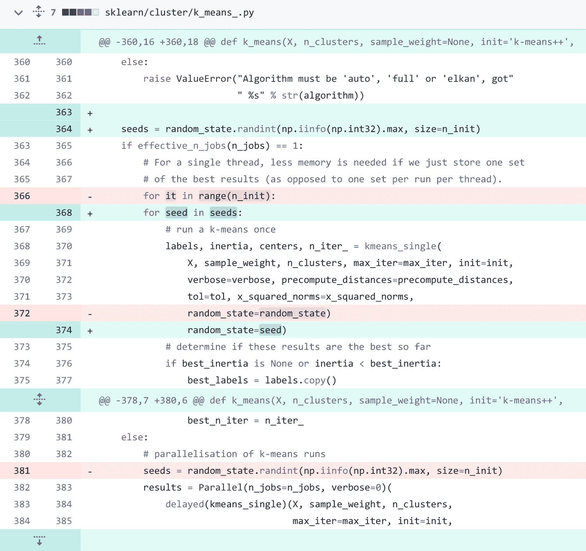

<!--yml

类别：未分类

日期：2025-01-11 12:44:11

-->

# \stackon[0pt]MAGIS      ：基于LLM的GitHub问题解决多智能体框架

> 来源：[https://arxiv.org/html/2403.17927/](https://arxiv.org/html/2403.17927/)

Wei Tao

复旦大学

wtao18@fudan.edu.cn

&Yucheng Zhou

澳门大学

yucheng.zhou@connect.um.edu.mo

&Yanlin Wang

中山大学

wangylin36@mail.sysu.edu.cn &Wenqiang Zhang

复旦大学

wqzhang@fudan.edu.cn

&Hongyu Zhang

重庆大学

hyzhang@cqu.edu.cn &Yu Cheng

香港中文大学

chengyu@cse.cuhk.edu.hk

###### 摘要

在软件开发中，解决GitHub仓库中的突发问题是一个复杂的挑战，不仅涉及到新代码的集成，还涉及到现有代码的维护。大型语言模型（LLMs）在代码生成中展现了潜力，但在解决GitHub问题时，尤其是在仓库级别上，仍然面临困难。为了克服这一挑战，我们通过实证研究分析了LLMs在解决GitHub问题时失败的原因，并分析了主要因素。根据实证发现，我们提出了一种新的基于LLM的GitHub问题解决多智能体框架——MAGIS，该框架由四个定制化的智能体组成，用于软件演化：管理者、仓库管理员、开发者和质量保证工程师。这一框架通过不同智能体在规划和编码过程中的协作，释放了LLM解决GitHub问题的潜力。在实验中，我们采用SWE-bench基准测试，将MAGIS与流行的LLM（包括GPT-3.5、GPT-4和Claude-2）进行比较。MAGIS能够解决13.94%的GitHub问题，显著优于基准模型。具体而言，MAGIS在解决问题的比例上比直接应用GPT-4这一先进LLM提高了八倍。

## 1 引言

在实际的软件开发中，项目的代码仓库很少是固定不变的。高质量且受欢迎的软件总是会随着新兴的漏洞或需求的出现而不断演化。在像GitHub这样的平台注册的项目中[[21](https://arxiv.org/html/2403.17927v2#bib.bib21)]，问题通常代表着软件演化的需求。然而，解决这些问题面临着重大挑战，因为它需要在整个仓库中实施代码更改，同时保持现有功能并集成新的功能。例如，django是一个超过160万个项目使用的框架，它有34000个问题[[19](https://arxiv.org/html/2403.17927v2#bib.bib19)]。因此，解决GitHub问题在学术界和工业界仍然是一个重大挑战[[27](https://arxiv.org/html/2403.17927v2#bib.bib27), [5](https://arxiv.org/html/2403.17927v2#bib.bib5)]。

大型语言模型（LLMs）在多个任务上展现了卓越的能力[[8](https://arxiv.org/html/2403.17927v2#bib.bib8)]，包括代码生成和代码理解[[65](https://arxiv.org/html/2403.17927v2#bib.bib65)，[48](https://arxiv.org/html/2403.17927v2#bib.bib48)]。具体来说，LLMs在生成函数级别的代码方面表现优异，这一点从它们在多个基准数据集上的表现可以看出，如MBPP[[2](https://arxiv.org/html/2403.17927v2#bib.bib2)]和HumanEval[[12](https://arxiv.org/html/2403.17927v2#bib.bib12)]。尽管取得了成功，LLMs在需要高级代码生成能力的任务上仍面临挑战，如类级别的代码生成[[14](https://arxiv.org/html/2403.17927v2#bib.bib14)]。此外，LLMs在处理过长的上下文输入时存在局限性，且其输入上下文长度受到限制[[33](https://arxiv.org/html/2403.17927v2#bib.bib33)]。这种限制在存储库级别的编码任务中尤为明显，例如解决GitHub问题，其中上下文包括整个存储库，这就限制了直接将完整存储库作为输入传递给LLMs的可行性。

为了充分发挥LLMs的潜力，许多基于LLM的多智能体系统应运而生[[23](https://arxiv.org/html/2403.17927v2#bib.bib23)，[44](https://arxiv.org/html/2403.17927v2#bib.bib44)，[53](https://arxiv.org/html/2403.17927v2#bib.bib53)]。这些方法显著提高了LLMs在代码生成方面的效果，使得这些系统能够基于LLM构建代码存储库。尽管这些方法解决了从代码存储库创建到建立的过程，但它们很少考虑如何处理软件演进问题，例如解决GitHub问题。对于GitHub存储库，尤其是流行的存储库，每天都会推送大量的提交。这些提交来源于一系列演进需求，包括修复漏洞、添加新功能、性能优化等[[50](https://arxiv.org/html/2403.17927v2#bib.bib50)]。对于开源软件而言，新的需求经常以问题的形式出现在项目的存储库中。

最近，Jimenez等人[[27](https://arxiv.org/html/2403.17927v2#bib.bib27)]开发了一个基准，名为SWE-bench，用于调查流行LLMs在解决GitHub问题方面的能力。他们的研究表明，即使提供了需要修改的文件路径，LLMs仍未能解决超过$95\%$的实例。这一极低的解决率凸显了理解它们表现不佳的原因的重要性。

在本研究中，我们分析了影响LLMs在解决GitHub问题中有效性的因素。此外，我们的实证分析得出了文件/行定位与GitHub问题解决表现之间的相关性。基于这些洞察，我们提出了一种新颖的基于LLM的多代理框架，命名为MAGIS，包含四类代理：经理、仓库管理员、开发者和质量保证（QA）工程师。我们的方法通过代理之间的协作促进GitHub问题的解决，每个代理都履行独特的角色：经理协调整个过程，仓库管理员增强文件定位，开发者在定位行后进行代码更改，QA工程师审查代码更改。

在我们的实验中，我们在SWE-bench上评估了我们的框架，并将其表现与现有流行LLMs（如ChatGPT-3.5 [[37](https://arxiv.org/html/2403.17927v2#bib.bib37)]、GPT-4 [[38](https://arxiv.org/html/2403.17927v2#bib.bib38)]和Claude-2 [[1](https://arxiv.org/html/2403.17927v2#bib.bib1)]）进行比较。结果表明，利用GPT-4作为基础模型的我们的框架显著优于基准，并且相比于直接应用GPT-4，性能提高了八倍。进一步分析揭示了其他因素，如代码更改的规划、在代码文件中定位行以及代码审查过程，可能显著影响解决率。

我们的主要贡献总结如下：

+   •

    我们对LLMs在解决GitHub问题中的表现进行了实证分析，并探讨了代码文件/行定位、代码更改复杂度与解决成功率之间的相关性。

+   •

    我们提出了一种基于LLM的全新多代理框架MAGIS，以缓解现有LLMs在GitHub问题解决中的局限性。我们设计的四类代理及其在规划和编码中的协作，释放了LLMs在仓库级编码任务中的潜力。

+   •

    我们在SWE-bench数据集上比较了我们的框架与其他强大LLM竞争者（如GPT-3.5、GPT-4和Claude-2）的表现。结果表明，MAGIS显著优于这些竞争者。进一步分析确认了我们框架设计的有效性和必要性。

## 2 实证研究

SWE-bench [[27](https://arxiv.org/html/2403.17927v2#bib.bib27)]揭示了LLMs在解决GitHub问题中面临的挑战。例如，在他们的评估中，GPT-4仅能解决测试集中的不到2%的问题。相比之下，在函数级代码生成等任务中，LLMs表现优异（例如，GPT-4在HumanEval [[36](https://arxiv.org/html/2403.17927v2#bib.bib36)]中的得分为67.0）。考虑到GitHub问题解决的复杂性类似于仓库级编码，我们旨在探讨为什么直接使用LLMs解决GitHub问题的表现有限？（RQ 1）。我们从以下三个方面回答了这个问题：

##### 定位要修改的文件。

GitHub 问题解决是一个仓库级别的编码任务，与文件级别的编码任务的主要区别在于定位需要修改的文件的挑战。Jimenez 等人[[27](https://arxiv.org/html/2403.17927v2#bib.bib27)]采用 BM25 方法[[46](https://arxiv.org/html/2403.17927v2#bib.bib46)]来检索相关代码文件，然后将这些文件作为输入传递给 LLM。使用检索方法后，需要选择前 $K$ 个文件或根据 LLM 的最大上下文长度截断内容。增加更多的文件可以提高召回得分，但也对 LLM 的能力提出了更高要求。正如研究[[27](https://arxiv.org/html/2403.17927v2#bib.bib27)]所示，当召回得分从 29.58 增加到 51.06 时，Claude-2 解决的比率却从 1.96 降低到 1.22。这一下降可能归因于引入了不相关的文件，或者 LLM 在处理更长上下文时的能力有限。因此，通过选择较少的文件并优化召回得分，可能会更好地提高 LLM 的性能，这表明召回优化与选择文件数量之间需要进行战略平衡。

##### 定位要修改的行。

除了文件定位的影响外，我们还深入探讨了在提供了正确修改文件的情况下生成失败实例的问题。一个典型的代码修改由多个块（hunks）组成，每个块指定了要修改的行号，并详细说明了这些位置的变更内容。为了定量分析行定位的准确性，我们使用参考代码变更中修改内容的行号范围作为基础，假设在大多数情况下，代码变更的正确修改位置是唯一确定的。通过计算生成的和参考行号范围的覆盖率，我们可以估计生成过程中文件定位的准确性，即：

|  | $\displaystyle\text{覆盖率}=\frac{\sum_{i=0}^{n}\sum_{j=0}^{m}\left&#124;[s_% {i},e_{i}]\cap[s_{j}^{\prime},e_{j}^{\prime}]\right&#124;}{\sum_{i=0}^{n}(e_{i}-s_{% i}+1)},~{}$ |  | (1) |
| --- | --- | --- | --- |

其中，分子是参考中按 $n$ 个块分割的修改行与生成中按 $m$ 个块分割的修改行交集的长度，分母是参考中修改行的数量。关于公式 [1](https://arxiv.org/html/2403.17927v2#S2.E1 "定位要修改的行 ‣ 2 实证研究 ‣ \stackon[0pt]MAGIS : 基于 LLM 的 GitHub 问题解决多代理框架") 的更多细节可以在附录 [A.1](https://arxiv.org/html/2403.17927v2#A1.SS1 "A.1 覆盖率 ‣ 附录 A 实证研究中详细说明 ‣ \stackon[0pt]MAGIS : 基于 LLM 的 GitHub 问题解决多代理框架") 中找到。

图 1：三种LLM之间的代码行定位覆盖率比较。纵轴表示每组代码行定位覆盖率范围的频率，横轴表示覆盖率。

对于SWE-bench中的$574$个实例，实验使用了GPT-4 [[27](https://arxiv.org/html/2403.17927v2#bib.bib27)]，图[1](https://arxiv.org/html/2403.17927v2#S2.F1 "图 1 ‣ 定位待修改的代码行。 ‣ 2 实证研究 ‣ \stackon[0pt]MAGIS : 基于LLM的GitHub问题解决多智能体框架")展示了三种LLM生成的结果与参考代码之间的覆盖率分布。从中我们观察到，LLM在生成代码更改时的表现可能与其准确定位代码行的能力相关（详细解释见附录[A.2](https://arxiv.org/html/2403.17927v2#A1.SS2 "A.2 图 1 观察 ‣ 附录A 实证研究中的详细解释 ‣ \stackon[0pt]MAGIS : 基于LLM的GitHub问题解决多智能体框架")）。

此外，我们通过计算覆盖率与问题解决之间的相关系数来评估它们之间的关系。考虑到这些变量的分布存在偏态，而且解决结果是二元的（已解决或未解决），因此在三个大语言模型（LLM）中采用了逻辑回归进行分析。然而，由于在GPT-4和GPT-3.5上成功生成的实例数量有限，只有在Claude-2生成的结果中检测到了统计显著的关系。结果，即P值< $0.05$，显示出统计学意义。具体来说，在Claude-2上的系数为$0.5997$，覆盖率的提升与成功解决问题的概率之间存在显著且正向的关系，这表明定位代码行是GitHub问题解决的关键因素。

##### 代码更改的复杂度。

代码更改的复杂度体现在多个指标上：修改的文件数、函数数、代码块数，以及添加或删除的代码行数。首先，我们通过计算与参考代码更改相对应的各项指标的数值来定量评估复杂度。其次，我们计算每个指标中的数字与问题解决之间的系数。表[1](https://arxiv.org/html/2403.17927v2#S2.T1 "表 1 ‣ 代码更改的复杂度 ‣ 2 实证研究 ‣ \stackon[0pt]MAGIS : 基于LLM的GitHub问题解决多智能体框架")展示了逻辑回归下的相关性评分。

表 1：复杂度指标与问题解决之间的相关性。

| LLM | # 文件 | # 函数 | # 代码块 | # 增加的代码行 | # 删除的代码行 | # 修改的代码行 |
| --- | --- | --- | --- | --- | --- | --- |
| GPT-3.5 | $-17.57$^* | $-17.57$^* | $-0.06$^* | $-0.02$ | $-0.03$ | $-0.53$^* |
| GPT-4 | $-25.15$^* | $-25.15$^* | $-0.06$ | $-0.10$ | $-0.04$ | $-0.21$ |
| Claude-2 |   $-1.47$^* |   $-1.47$^* | $-0.11$^* | $-0.09$^* | $-0.07$^* | $-0.44$^* |

+   *

    指数与问题解决之间的相关性显著（P值 $<$ $0.05$）。

如表[1](https://arxiv.org/html/2403.17927v2#S2.T1 "表1 ‣ 代码更改的复杂性 ‣ 2 经验研究 ‣ \stackon[0pt]MAGIS : 基于LLM的GitHub问题解决多智能体框架")所示，所有三种LLM在多个指标上与问题解决表现出统计学上的显著相关性。文件和函数修改数量的相关性得分在所有模型中均显著为负，表明这些指标的增加与问题解决的可能性下降相关。这表明，代码更改的复杂性（通过修改的文件和函数数量来衡量）可能会阻碍问题的解决。更多分析请参见附录[A.3](https://arxiv.org/html/2403.17927v2#A1.SS3 "A.3 代码更改复杂性分析 ‣ 附录A 经验研究详细说明 ‣ \stackon[0pt]MAGIS : 基于LLM的GitHub问题解决多智能体框架")。分析结果揭示了复杂性（通过多个指标衡量）与软件演进中是否能成功解决问题之间的关系。负相关表明，尤其是文件和函数的更改数量增加时，复杂性增加往往会阻碍问题的解决。

## 3 方法论

基于经验研究，识别出影响LLM解决问题的关键因素，我们设计了如图[2](https://arxiv.org/html/2403.17927v2#S3.F2 "图2 ‣ 3 方法论 ‣ \stackon[0pt]MAGIS : 基于LLM的GitHub问题解决多智能体框架")所示的框架。该框架旨在通过将复杂的GitHub问题解决任务转化为协作努力，从而减轻负面影响。它包含四个关键角色，这些角色基于LLM的智能体在工作流中协同合作：① 管理者：负责组建团队、组织会议和制定计划。② 仓库管理员：根据GitHub问题定位相关文件，并记录仓库的变化。③ 开发人员：参与计划讨论并完成管理者分配的任务。④ 质量保证（QA）工程师：审核开发人员提交的代码更改，确保整个仓库的质量。

图2：我们框架MAGIS的概览。详细版本可以在图[14](https://arxiv.org/html/2403.17927v2#A8.F14 "图14 ‣ 附录H 案例研究 ‣ \stackon[0pt]MAGIS : 基于LLM的GitHub问题解决多智能体框架")中找到。

协作过程包括规划和编码。在规划阶段，问题被分配给经理和仓库管理者。管理者识别与问题相关的候选文件进行修改。通过问题描述和候选文件列表，经理定义任务并组建团队，每个团队成员是专门为定义的任务设计的开发者。经理与开发者召开启动会议并制定计划。在编码过程中，开发者执行经理分配的任务，质量保证工程师（QA Engineer）审查每次代码变更。如果某次变更未达到质量标准，QA工程师将提供反馈，促使进一步修订，直到QA工程师批准或达到设定的迭代限制。

### 3.1 代理角色设计

我们的工作流程借鉴了GitHub Flow[[22](https://arxiv.org/html/2403.17927v2#bib.bib22)]，这是一种被许多软件团队采纳的高效人类工作流程范式。无论是人类工作流程还是我们的基于LLM的代理框架，都优先考虑具有不同技能的个体之间的协作。尽管其基本原则相似，但也存在显著差异。因此，我们根据以下方式定制了角色：

+   •

    ![[未标注图片]](img/274f3d79fcdedc0e0ff835cbe2c0cccd.png) 经理。经理的角色在规划中至关重要。在传统设置中，经理根据预先形成的团队将问题分解为任务，并将这些任务分配给不同技能的成员。相比之下，我们的经理代理首先可以将问题分解为任务，然后设计开发者代理组成团队。这种设置提高了团队的灵活性和适应性，使团队能够高效地应对各种问题。

+   •

    ![[未标注图片]](img/cdc588f8f05b625a3d671b18ddbbc3c7.png) 仓库管理者。考虑到仓库中包含大量文件，管理者代理的任务是定位与问题相关的文件。与可以浏览整个仓库的人类不同，基于LLM的代理在浏览时面临挑战。尽管LLM具有扩展的上下文限制，但其应用仍受到两个方面的制约。首先，对于每次更新，查询整个仓库中每个文件的计算成本较高，尤其是在某些仓库频繁更新时。其次，当输入的上下文过长时，LLM的性能会下降[[31](https://arxiv.org/html/2403.17927v2#bib.bib31), [33](https://arxiv.org/html/2403.17927v2#bib.bib33), [68](https://arxiv.org/html/2403.17927v2#bib.bib68)]。

+   •

    ![[未标注的图片]](img/b1e9d9e19b4bfc187bb60edef5ef1193.png) 开发者。与人类开发者相比，开发者代理可以持续高效地工作。因此，安排代理并行工作比安排需要考虑任务以外因素的人类开发者更为容易。此外，尽管许多开发者代理能够生成代码[[23](https://arxiv.org/html/2403.17927v2#bib.bib23), [44](https://arxiv.org/html/2403.17927v2#bib.bib44)]，但它们修改现有代码的能力并不一样高。为了解决这个问题，我们的框架将代码修改过程分解为多个子操作，包括代码生成。通过这种方法，开发者能够利用自动代码生成的优势，从而生成适用的代码更改。

+   •

    ![[未标注的图片]](img/9faee8d8150863a5879d9814001cde11.png) QA工程师。在软件演化过程中，QA工程师通过代码审查在维护软件质量方面发挥着至关重要的作用[[34](https://arxiv.org/html/2403.17927v2#bib.bib34), [30](https://arxiv.org/html/2403.17927v2#bib.bib30)]。尽管他们的重要性不言而喻，代码审查的实践往往被低估，甚至被忽视[[4](https://arxiv.org/html/2403.17927v2#bib.bib4)]。这种忽视可能会阻碍软件开发，例如开发者可能会因为等待代码审查反馈而导致最多96小时的延误[[6](https://arxiv.org/html/2403.17927v2#bib.bib6)]。为了解决这个问题，我们的框架将每个开发者代理与QA工程师代理配对，旨在提供任务特定的、及时的反馈。这种个性化的QA方法旨在提升审查过程，从而更好地确保软件质量。

### 3.2 协作过程

#### 3.2.1 规划

三种角色代理参与规划：仓库管理员、经理和开发者。这个过程包括三个阶段：定位代码文件、团队建设和启动会议。

算法 1 定位。

1: 输入：代码库：${\mathcal{R}}_{i}$ 包含文件 $\{f_{i}\}$，GitHub 问题：$q_{x}$，LLM：${\mathcal{L}}$  

##### 定位代码文件。

首先，代码库管理者使用 BM25 算法[[46](https://arxiv.org/html/2403.17927v2#bib.bib46)]，根据 GitHub 问题描述对代码库中的文件进行排名。随后，选择排名前 $k$ 的文件作为进一步编码的候选。然而，正如在 §[2](https://arxiv.org/html/2403.17927v2#S2 "2 Empirical Study ‣ \stackon[0pt]MAGIS : LLM-Based Multi-Agent Framework for GitHub Issue ReSolution") 中所描述，这种简单的检索方法可能会引入无关文件，从而增加成本并降低后续编码过程的效率。因此，我们基于相关性对这些文件进行过滤，以尽量减少其数量。虽然通过 LLM 直接评估每个文件与问题之间的相关性是可行的，但查询 LLM 时可能包含与之前相同的代码片段，导致不必要的计算成本。考虑到代码更改通常修改文件的特定部分而非整个文件，我们提出了一种记忆机制，用于重用之前查询的信息。

算法[1](https://arxiv.org/html/2403.17927v2#alg1 "算法 1 ‣ 3.2.1 规划 ‣ 3.2 协作过程 ‣ 3 方法论 ‣ \stackon[0pt]MAGIS：基于LLM的GitHub问题解决多代理框架")概述了使用我们设计的记忆${\mathcal{M}}$定位文件的过程。如果一个文件$f_{i}$第一次与一个问题$q_{x}$进行比较，带有提示${\mathcal{P}}_{2}$的LLM${\mathcal{L}}$会将其压缩为摘要$s_{i}$，其中$i$表示文件的版本。这个摘要比文件中的代码内容要短，并且它会被存储在记忆中以便未来重用。如果文件$f_{i}$已经被比较过，则可以通过脚本$find$找到文件$f_{h}$的最新版本($h$)。由于$f_{i}$可以表示为$f_{h}$和它们之间差异($\Delta d$，可以通过“git diff”命令获得)的组合，LLM可以通过使用$f_{h}$和$\Delta d$来理解$f_{i}$。如果差异较小且文件$f_{i}$较长，那么重用存储在记忆中的以前的摘要$s_{h}$而不是$f_{i}$的内容是有价值的。具体来说，如果$s_{h}$的长度小于$f_{i}$，则带有提示${\mathcal{P}}_{1}$的LLM${\mathcal{L}}$可以将代码变化$\Delta d$总结为“提交消息”$m$。$s_{h}$和$m$的组合形成了新版本$f_{i}$的描述，使得带有提示${\mathcal{P}}_{3}$的LLM${\mathcal{L}}$能够在较少的上下文长度下判断它是否与问题相关。根据相关性，管理员代理过滤掉无关的文件，使得管理代理能够使用剩余的相关文件定义任务。

##### 团队建设。

在此过程中，管理代理可以根据问题的需要灵活地“招募”团队成员。首先，在接收到定位的文件后，管理代理开始分析GitHub仓库中的问题，并将其拆解为详细的文件级任务。具体来说，对于候选集${\mathcal{C}}_{i}^{k}$中的每个代码文件$f_{i}$，管理代理利用带有提示${\mathcal{P}}_{4}$的LLM${\mathcal{L}}$和问题描述$q_{x}$来定义相应的文件级任务$t_{i}$。一个问题可以转化为多个任务。这些任务以及相关的代码文件被存储在任务集${\mathcal{T}}_{i}^{k}$中。

算法 2 制定计划。

1:  输入：候选文件：${\mathcal{C}}_{i}^{k}$，问题：$q_{x}$，LLM：${\mathcal{L}}$  

一旦任务被明确，经理通过调用LLM ${\mathcal{L}}$，使用提示${\mathcal{P}}_{5}$和任务$t_{i}$来定义开发者的个性化角色$r_{i}$。通过迭代这些候选代码文件，经理代理最终设计出一组开发者代理角色描述${\mathcal{D}}_{i}^{k}$，从而形成开发团队。团队建设的详细内容见算法[2](https://arxiv.org/html/2403.17927v2#alg2 "Algorithm 2 ‣ Team Building. ‣ 3.2.1 Planning ‣ 3.2 Collaborative Process ‣ 3 Methodology ‣ \stackon[0pt]MAGIS : LLM-Based Multi-Agent Framework for GitHub Issue ReSolution")。这种方法简化了LLM的任务，因为每个团队成员只需处理一个子任务，而不是解决整个复杂问题。

##### 启动会议

在组建团队之后，经理组织了一个启动会议。这个会议有两个目的：① 确认经理分配的任务是否合理，确保团队中的所有开发者能够协作解决问题 $q_{x}$，② 确定哪些开发者的任务可以并行执行，哪些任务有依赖关系需要排序。会议采取圆桌发言的形式：经理负责开场发言、引导讨论并总结结果，开发者依次基于之前的讨论发表意见。会议的一个例子可以在附录 [B](https://arxiv.org/html/2403.17927v2#A2 "附录 B 启动会议示例 ‣ \stackon[0pt]MAGIS : 基于 LLM 的多智能体框架用于 GitHub 问题解决") 中找到。会议结束后，开发者根据讨论记录调整他们的角色描述 ${\mathcal{D}}_{i}^{k}$，经理利用 LLM ${\mathcal{L}}$ 和提示语 ${\mathcal{P}}_{7}$ 生成主要工作计划 $c_{main}$。该计划以代码形式呈现，并嵌入到程序中执行。会议使开发者之间的协作更为高效，避免了潜在的冲突。

#### 3.2.2 编码

算法 3 编码任务执行

1:  输入：文件-任务对集：${\mathcal{T}}_{i}^{k}$, LLM: ${\mathcal{L}}$  

基于对行定位和复杂性进行的实证研究（§[2](https://arxiv.org/html/2403.17927v2#S2 "2 Empirical Study ‣ \stackon[0pt]MAGIS : LLM-Based Multi-Agent Framework for GitHub Issue ReSolution")），我们将代码更改生成转化为一个多步骤编码过程，该过程旨在利用LLM在代码生成中的优势，同时缓解其在代码更改生成中的不足。在编码过程中，有两种类型的代理参与：开发人员和QA工程师。正如算法[3](https://arxiv.org/html/2403.17927v2#alg3 "Algorithm 3 ‣ 3.2.2 Coding ‣ 3.2 Collaborative Process ‣ 3 Methodology ‣ \stackon[0pt]MAGIS : LLM-Based Multi-Agent Framework for GitHub Issue ReSolution")所述，对于每个任务$t_{i}$及其相关的代码文件$f_{i}$，在${\mathcal{T}}_{i}^{k}$中，开发人员代理通过LLM ${\mathcal{L}}$生成QA工程师的角色描述$a_{i}$，并使用提示${\mathcal{P}}_{8}$。随后，开发人员与其QA工程师合作执行编码任务。在每次开发人员执行过程中，首先确定需要修改的代码行范围，作为一组区间$\{[s_{i}^{\prime},e_{i}^{\prime}]\}$，其中$s_{i}^{\prime}$表示第$i$个块的起始行号，$e_{i}^{\prime}$为结束行号。这个判断是通过分析任务内容$t_{i}$和文件内容$f_{i}$，并使用LLM ${\mathcal{L}}$与提示${\mathcal{P}}_{9}$生成的。这些区间将原始代码文件$f_{i}$分割为待修改部分（old_part）和保留部分。然后，开发人员通过LLM ${\mathcal{L}}$和提示${\mathcal{P}}_{10}$生成新的代码片段，新部分(new_part)。这些代码片段替代old_part，从而生成新版本的代码文件$f_{i}^{\prime}$。利用Git工具，为该文件$f_{i}$生成代码更改$\Delta d_{i}$。有了代码更改$\Delta d_{i}$，QA工程师通过LLM ${\mathcal{L}}$和提示${\mathcal{P}}_{11}$生成审查评论(review_comment)和审查决定(review_decision)。如果决定(review_decision)为负（即$false$），审查评论(review_comment)将促使开发人员在下次尝试中修改代码。这个迭代过程会持续进行，直到代码更改符合质量标准（即review_decision为$true$）或达到预定义的最大迭代次数。迭代完成后，最终版本的代码更改$\Delta d$被固定，这是对每个文件的最终修改结果。这个过程中生成的所有最终版本的代码更改都会合并为库级别的代码更改${\mathcal{D}}$，作为问题解决方案。

## 4 实验与分析

### 4.1 设置

在实验中，我们使用SWE-bench数据集作为评估基准，因为它是最新的、专门设计用于评估GitHub问题解决性能的数据集。SWE-bench包含$2,294$个问题，这些问题从$12$个流行的Python仓库中提取，代表了真实的软件演化需求。鉴于观察到在SWE-bench的$25\%$子集上的实验结果与整个数据集的结果一致 [[27](https://arxiv.org/html/2403.17927v2#bib.bib27)]，我们选择了先前在GPT-4实验中使用的相同$25\%$子集，依据他们的资料 [[13](https://arxiv.org/html/2403.17927v2#bib.bib13)]。此外，五种LLM的实验评分已经由他们公开 [[28](https://arxiv.org/html/2403.17927v2#bib.bib28)]。

我们的框架具有很强的灵活性，可以集成各种LLM。为了与SWE-bench报告的评分进行对比，我们选择GPT-4作为基础LLM。选择GPT-4的另一个原因是，GPT-4在代码生成和理解方面表现出色，这一点在MBPP [[2](https://arxiv.org/html/2403.17927v2#bib.bib2)]和HumanEval [[12](https://arxiv.org/html/2403.17927v2#bib.bib12)]等基准测试中已有展示。由于无法访问API，Claude-2未被选中。

根据SWE-bench [[27](https://arxiv.org/html/2403.17927v2#bib.bib27)]，应用和解决比率用于评估在提供需要修改的文件设置下的性能。应用比率表示成功生成并可以通过Git应用到代码仓库的代码更改的实例比例。解决比率则表示成功应用并通过一系列测试的代码更改实例比例。附录[C](https://arxiv.org/html/2403.17927v2#A3 "附录 C 评分 ‣ \stackon[0pt]MAGIS : 基于LLM的GitHub问题解决多代理框架")中提供了更多详细说明。

### 4.2 我们的框架有多有效？（RQ 2）

我们框架与其他LLM在同一数据集上的比较性能分析见表[2](https://arxiv.org/html/2403.17927v2#S4.T2 "表 2 ‣ 4.2 我们的框架有多有效？（RQ 2） ‣ 4 实验与分析 ‣ \stackon[0pt]MAGIS : 基于LLM的GitHub问题解决多代理框架")。结果表明，我们的框架明显优于其他LLM。特别是，凭借$13.94\%$的解决比率，我们框架的有效性是基础LLM GPT-4的八倍。这一显著提升强调了我们框架更有效利用LLM潜力的能力。此外，与先前的最先进LLM，Claude-2相比，我们框架的解决比率超过了该基准的两倍以上。这一卓越表现毫无疑问地证明了我们方法的先进性。

表 2：MAGIS 与基准方法在 SWE-bench 上的整体性能比较。

| 方法 | % 应用 | % 解决 |
| --- | --- | --- |
| GPT-3.5 | $11.67$ | $0.84$ |
| Claude-2 | $49.36$ | $4.88$ |
| GPT-4 | $13.24$ | $1.74$ |
| SWE-Llama 7b | $51.56$ | $2.12$ |
| SWE-Llama 13b | $49.13$ | $4.36$ |
| MAGIS | 97.39 | 13.94 |
| MAGIS (无 QA) | $92.71$ | $10.63$ |
| MAGIS (无提示) | $94.25$ | $10.28$ |
| MAGIS (无提示，无 QA) | $91.99$ | $8.71$ |

消融研究旨在模拟两种场景：① 无 QA（无 QA）：将 QA 工程师代理视为框架中的可选项，我们直接评估开发者代理生成的代码更改，跳过 QA 过程。该场景旨在探讨 QA 工程师审核的有效性和必要性。② 无提示（无提示）：提示指的是在拉取请求的评论部分找到的文本内容，这些内容通常在拉取请求的第一次提交之前创建。此设置意味着我们的框架在没有任何澄清的情况下运行，尽管在问题解决过程开始之前，这些信息已在 GitHub 上可用。该分析旨在探索人类的参与是否可能提高问题解决的成功率。

我们的框架在问题解决方面显示出显著的改进，即使没有 QA 或提示。它实现了 $8.71$ 的解决比率，是基础 LLM 的五倍。这一增长突显了 MAGIS 中其他代理对其整体性能的贡献。此外，分别与 QA 或提示的合作可以进一步提高解决比率，分别为 $1.92$ 或 $1.57$。这些发现突显了 QA 工程师和人类参与的价值，正如通过其集成所取得的解决率所展示的那样。

例如，为了解决来自 Django 仓库的 issue [[17](https://arxiv.org/html/2403.17927v2#bib.bib17)]，开发者修改了两个文件中的四个 hunk [[16](https://arxiv.org/html/2403.17927v2#bib.bib16)]，如图 [15](https://arxiv.org/html/2403.17927v2#A8.F15 "图 15 ‣ 附录 H 案例研究 ‣ \stackon[0pt]MAGIS : 基于 LLM 的 GitHub 问题解决框架") 所示。尽管提供了两个文件，我们的方法只在一个文件中进行了修改，如图 [16](https://arxiv.org/html/2403.17927v2#A8.F16 "图 16 ‣ 附录 H 案例研究 ‣ \stackon[0pt]MAGIS : 基于 LLM 的 GitHub 问题解决框架") 所示。值得注意的是，这种更简单的代码更改使得仓库能够通过所有必要的测试用例。

额外的比较可以在附录[D](https://arxiv.org/html/2403.17927v2#A4 "附录D SWE-bench Lite上的比较结果 ‣ \stackon[0pt]MAGIS : 基于LLM的GitHub问题解决多代理框架") 和 [E](https://arxiv.org/html/2403.17927v2#A5 "附录E 与Devin的比较 ‣ \stackon[0pt]MAGIS : 基于LLM的GitHub问题解决多代理框架") 中找到，详细的案例研究请参见附录[H](https://arxiv.org/html/2403.17927v2#A8 "附录H 案例研究 ‣ \stackon[0pt]MAGIS : 基于LLM的GitHub问题解决多代理框架")。此外，生成的代码更改的统计信息可以在附录[F](https://arxiv.org/html/2403.17927v2#A6 "附录F 生成代码更改的统计信息 ‣ \stackon[0pt]MAGIS : 基于LLM的GitHub问题解决多代理框架") 中找到。

### 4.3 我们的规划过程有多有效？（RQ 3）

图3：我们方法与BM25的召回得分比较。

图4：生成的任务描述与参考代码更改之间的相关性得分分布。

为了调查规划过程的有效性，我们分析了Repository Custodian和Manager代理。Repository Custodian代理的性能通过召回得分与文件数量曲线来观察，如图[4](https://arxiv.org/html/2403.17927v2#S4.F4 "图4 ‣ 4.3 我们的规划过程有多有效？(RQ 3) ‣ 4 实验与分析 ‣ \stackon[0pt]MAGIS : 基于LLM的GitHub问题解决多代理框架")所示。该曲线表明，我们的方法在不同数量的选定文件中始终优于BM25基准，表明我们的方法可以在最小选择下识别出最大数量的相关代码文件。

对于经理代理，我们检查了其生成的任务描述与LLM参考代码变化之间的一致性。根据研究[[64](https://arxiv.org/html/2403.17927v2#bib.bib64)]，我们选择GPT-4作为评估者，以评分参考代码变化与生成的任务描述之间的相关性。这些相关性评分是基于表[6](https://arxiv.org/html/2403.17927v2#A7.T6 "Table 6 ‣ Appendix G Evaluation on Task Description ‣ \stackon[0pt]MAGIS : LLM-Based Multi-Agent Framework for GitHub Issue ReSolution")中定义的一组标准来确定的。较高的相关性评分表示更好的对齐，因此也意味着更准确有效的规划方向。这些相关性评分的分布呈现于图[4](https://arxiv.org/html/2403.17927v2#S4.F4 "Figure 4 ‣ 4.3 How Effective is Our Planning Process? (RQ 3) ‣ 4 Experiments and Analysis ‣ \stackon[0pt]MAGIS : LLM-Based Multi-Agent Framework for GitHub Issue ReSolution")中。值得注意的是，大多数得分为$3$或以上，这意味着大多数任务描述在规划方面是朝着正确方向发展的。此外，较高的得分与更高的解决问题的概率相关，得分为$4$和$5$时，“已解决”结果的比例较大。这表明，当生成的任务描述与参考描述紧密对齐时，解决问题的可能性更高。上述分析展示了我们的框架中存储库看管员和经理代理在规划过程中的有效性。

### 4.4 我们的编码过程有多有效？（RQ 4）

为了评估我们框架中编码过程的有效性，我们分析了开发者在定位代码行和解决不同复杂度问题方面的表现。

图[6](https://arxiv.org/html/2403.17927v2#S4.F6 "Figure 6 ‣ 4.4 How Effective is Our Coding Process? (RQ 4) ‣ 4 Experiments and Analysis ‣ \stackon[0pt]MAGIS : LLM-Based Multi-Agent Framework for GitHub Issue ReSolution")展示了MAGIS与基准方法的代码行定位覆盖率的分布情况。该可视化结果表明，我们的开发者代理通常能够达到接近$1$的代码行定位覆盖率。与基准方法相比，开发者代理明显倾向于更高的分布值，接近$1$，而对低分布值接近$0$的偏好较少。这一分布验证了MAGIS在代码行定位方面的卓越表现。

进一步分析见图 [6](https://arxiv.org/html/2403.17927v2#S4.F6 "图 6 ‣ 4.4 我们的编码过程有多有效？（RQ 4） ‣ 4 实验与分析 ‣ \stackon[0pt]MAGIS：基于大语言模型的GitHub问题解决多代理框架")，该图展示了行定位覆盖率与问题解决比例之间的关系。如图 [6](https://arxiv.org/html/2403.17927v2#S4.F6 "图 6 ‣ 4.4 我们的编码过程有多有效？（RQ 4） ‣ 4 实验与分析 ‣ \stackon[0pt]MAGIS：基于大语言模型的GitHub问题解决多代理框架") 所示，右侧四根柱状图高于左侧五根柱状图，表明解决比例可以随着行定位覆盖率的增加而提高。这一观察结果还表明，准确定位行对于问题解决至关重要。橙色的累积频率曲线提供了额外的分析，显示了沿着行定位覆盖率每个点的已解决问题比例的累积比例。随着行定位覆盖率的增加，累积频率稳步增加，这进一步强调了在高覆盖率区域内解决问题更为成功的观点。曲线左半部分的坡度低于右半部分，表明在较低的覆盖率下，增加覆盖率所带来的好处不如在较高的覆盖率下明显。因此，开发者代理应优先提高其定位代码行的能力。

此外，如表 [3](https://arxiv.org/html/2403.17927v2#S4.T3 "表 3 ‣ 4.4 我们的编码过程有多有效？（RQ 4） ‣ 4 实验与分析 ‣ \stackon[0pt]MAGIS：基于大语言模型的GitHub问题解决多代理框架") 所示，我们展示了一个逻辑回归分析，量化了几个复杂性指数与问题解决之间的相关性。结果显示，GPT-4在文件数量和函数数量上具有显著的负相关性，表明随着这些指数的增加，问题解决的可能性会下降。相反，我们的模型MAGIS的负相关性较弱，尤其是在文件数量和函数数量上，表明其在应对这些复杂性指数所对应的挑战方面有所缓解。

表 3：复杂性指数与问题解决之间的相关性。

| 方法 | 文件数量 | 函数数量 | 代码块数量 | 增加的代码行数 | 删除的代码行数 | 修改的代码行数 |
| --- | --- | --- | --- | --- | --- | --- |
| GPT-4 | $-25.15$^* | $-25.15$^* | $-0.06$ | $-0.10$ | $-0.04$ | $-0.21$ |
| MAGIS |   $-1.55$^* |   $-1.55$^* | $-0.12$^* | $-0.04$^* | $-0.06$^* | $-0.57$^* |

+   *

    该指数与问题解决之间的相关性显著（P值 $<$ $0.05$）。

图 5：MAGIS（我们的模型）与基准模型在行定位覆盖率方面的比较。

图6：不同代码定位覆盖区间的解决率。

为了评估QA工程师的表现，进行了消融实验，结果如表[2](https://arxiv.org/html/2403.17927v2#S4.T2 "Table 2 ‣ 4.2 How Effective is Our Framework? (RQ 2) ‣ 4 Experiments and Analysis ‣ \stackon[0pt]MAGIS : LLM-Based Multi-Agent Framework for GitHub Issue ReSolution")所示。正如表中所示，在有无提示的设置中，QA工程师的存在分别可以将解决率提高$1.57\%$和$3.31\%$。这一整体提升证明了QA工程师对改善结果的贡献。此外，附录[I](https://arxiv.org/html/2403.17927v2#A9 "Appendix I The performance of the QA Engineer Agent ‣ \stackon[0pt]MAGIS : LLM-Based Multi-Agent Framework for GitHub Issue ReSolution")中的一个案例进一步强调了QA工程师的有效性。

## 5 相关工作

研究人员开发了基于LLM的多智能体系统，使得更复杂的任务得以完成。例如，MetaGPT [[23](https://arxiv.org/html/2403.17927v2#bib.bib23), [24](https://arxiv.org/html/2403.17927v2#bib.bib24)]模拟了编程团队的标准操作程序(SOP)，并在如HumanEval [[12](https://arxiv.org/html/2403.17927v2#bib.bib12)]和MBPP [[2](https://arxiv.org/html/2403.17927v2#bib.bib2)]等基准测试中取得了领先成绩。同样，ChatDev [[44](https://arxiv.org/html/2403.17927v2#bib.bib44)]充当虚拟开发公司，将需求分解为原子任务，并通过相互沟通和自我反思来减轻LLM幻觉。虽然这些系统在将需求转化为代码方面表现出色，但它们通常忽视了软件演化过程中代码更改生成的挑战 [[25](https://arxiv.org/html/2403.17927v2#bib.bib25)]。GitHub问题包含不同类型的需求，其中大多数属于Bug修复。之前的研究者提出了定位Bug的方法 [[66](https://arxiv.org/html/2403.17927v2#bib.bib66), [43](https://arxiv.org/html/2403.17927v2#bib.bib43)]，一些研究者探索了各种自动程序修复的方法 [[58](https://arxiv.org/html/2403.17927v2#bib.bib58), [7](https://arxiv.org/html/2403.17927v2#bib.bib7), [56](https://arxiv.org/html/2403.17927v2#bib.bib56), [3](https://arxiv.org/html/2403.17927v2#bib.bib3), [60](https://arxiv.org/html/2403.17927v2#bib.bib60), [54](https://arxiv.org/html/2403.17927v2#bib.bib54)]。相关工作的完整版可以在附录[J](https://arxiv.org/html/2403.17927v2#A10 "Appendix J Related Work (Detailed) ‣ \stackon[0pt]MAGIS : LLM-Based Multi-Agent Framework for GitHub Issue ReSolution")中找到。

## 6 结论

本文阐明了大型语言模型（LLMs）在软件开发中的潜力，特别是在解决GitHub问题方面。我们的实证研究识别了直接应用LLM面临的挑战。为了解决这些挑战，我们提出了一种基于LLM的多代理框架MAGIS，通过精心设计的代理协作来增强问题解决能力。MAGIS在SWE-bench上相较于流行的LLM展现出的优越性，突显了其有效性，指向了将LLM整合到软件演化工作流中的一条有前景的方向。

## 参考文献

+   Anthropic [2023] Anthropic. Claude 2. [https://www.anthropic.com/news/claude-2](https://www.anthropic.com/news/claude-2)，2023年。

+   Austin等人 [2021] Jacob Austin, Augustus Odena, Maxwell I. Nye, Maarten Bosma, Henryk Michalewski, David Dohan, Ellen Jiang, Carrie J. Cai, Michael Terry, Quoc V. Le, 和 Charles Sutton. 使用大型语言模型进行程序合成。*arXiv预印本*，abs/2108.07732，2021年。网址 [https://arxiv.org/abs/2108.07732](https://arxiv.org/abs/2108.07732)。

+   Austin等人 [2017] Thomas H. Austin, Thomas Schmitz, 和 Cormac Flanagan. 带异常的动态信息流的多个方面。*ACM程序语言系统交易*，39(3)：10:1–10:56，2017年。doi: 10.1145/3024086。网址 [https://doi.org/10.1145/3024086](https://doi.org/10.1145/3024086)。

+   Baum等人 [2016] Tobias Baum, Olga Liskin, Kai Niklas, 和 Kurt Schneider. 影响工业界代码审查过程的因素。在Thomas Zimmermann、Jane Cleland-Huang 和 Zhendong Su 编辑的*第24届ACM SIGSOFT国际软件工程基础研讨会，FSE 2016，美国华盛顿州西雅图，2016年11月13-18日*中，第85-96页。ACM，2016年。doi: 10.1145/2950290.2950323。网址 [https://doi.org/10.1145/2950290.2950323](https://doi.org/10.1145/2950290.2950323)。

+   Bissyandé等人 [2013] Tegawendé F. Bissyandé, David Lo, Lingxiao Jiang, Laurent Réveillère, Jacques Klein, 和 Yves Le Traon. 有问题吗？谁在乎？对GitHub问题跟踪器的大规模调查。发表于*IEEE第24届国际软件可靠性工程研讨会，ISSRE 2013，美国加利福尼亚州帕萨迪纳，2013年11月4-7日*，第188-197页。IEEE计算机协会，2013年。doi: 10.1109/ISSRE.2013.6698918。网址 [https://doi.org/10.1109/ISSRE.2013.6698918](https://doi.org/10.1109/ISSRE.2013.6698918)。

+   Bosu和Carver [2014] Amiangshu Bosu 和 Jeffrey C. Carver. 开发者声誉对开源软件项目中代码审查结果的影响：一项实证研究。在Maurizio Morisio、Tore Dybå 和 Marco Torchiano 编辑的*2014年ACM-IEEE国际实证软件工程与度量研讨会，ESEM '14，意大利都灵，2014年9月18-19日*中，第33:1–33:10页。ACM，2014年。doi: 10.1145/2652524.2652544。网址 [https://doi.org/10.1145/2652524.2652544](https://doi.org/10.1145/2652524.2652544)。

+   Bouzenia 等人 [2024] Islem Bouzenia, Premkumar T. Devanbu, 和 Michael Pradel. Repairagent: 一种基于 LLM 的自主程序修复代理. *arXiv 预印本*, abs/2403.17134, 2024. doi: 10.48550/ARXIV.2403.17134. URL [https://doi.org/10.48550/arXiv.2403.17134](https://doi.org/10.48550/arXiv.2403.17134).

+   Bubeck 等人 [2023] Sébastien Bubeck, Varun Chandrasekaran, Ronen Eldan, Johannes Gehrke, Eric Horvitz, Ece Kamar, Peter Lee, Yin Tat Lee, Yuanzhi Li, Scott M. Lundberg, Harsha Nori, Hamid Palangi, Marco Túlio Ribeiro, 和 Yi Zhang. 人工通用智能的火花：与 GPT-4 的早期实验. *arXiv 预印本*, abs/2303.12712, 2023. doi: 10.48550/ARXIV.2303.12712. URL [https://doi.org/10.48550/arXiv.2303.12712](https://doi.org/10.48550/arXiv.2303.12712).

+   Carlos E. Jimenez [2024] Jiayi Geng Carlos E. Jimenez, John Yang. Swe-bench lite. [https://www.swebench.com/lite.html](https://www.swebench.com/lite.html), 2024.

+   Chan 等人 [2023] Chi-Min Chan, Weize Chen, Yusheng Su, Jianxuan Yu, Wei Xue, Shanghang Zhang, Jie Fu, 和 Zhiyuan Liu. Chateval: 通过多代理辩论推动更好的基于 LLM 的评估器. *arXiv 预印本*, abs/2308.07201, 2023. doi: 10.48550/ARXIV.2308.07201. URL [https://doi.org/10.48550/arXiv.2308.07201](https://doi.org/10.48550/arXiv.2308.07201).

+   陈等人 [2023] Lichang Chen, Jiuhai Chen, Heng Huang, 和 Minhao Cheng. PTP: 通过基于扰动的正则化方法提升提示调优的稳定性和性能. 收录于 Houda Bouamor, Juan Pino, 和 Kalika Bali 编辑的 *2023年自然语言处理实证方法会议论文集，EMNLP 2023，新加坡，2023年12月6-10日*, 第13512–13525页。计算语言学协会，2023. URL [https://aclanthology.org/2023.emnlp-main.833](https://aclanthology.org/2023.emnlp-main.833).

+   陈等人 [2021] Mark Chen, Jerry Tworek, Heewoo Jun, Qiming Yuan, Henrique Pondé de Oliveira Pinto, Jared Kaplan, Harrison Edwards, Yuri Burda, Nicholas Joseph, Greg Brockman, Alex Ray, Raul Puri, Gretchen Krueger, Michael Petrov, Heidy Khlaaf, Girish Sastry, Pamela Mishkin, Brooke Chan, Scott Gray, Nick Ryder, Mikhail Pavlov, Alethea Power, Lukasz Kaiser, Mohammad Bavarian, Clemens Winter, Philippe Tillet, Felipe Petroski Such, Dave Cummings, Matthias Plappert, Fotios Chantzis, Elizabeth Barnes, Ariel Herbert-Voss, William Hebgen Guss, Alex Nichol, Alex Paino, Nikolas Tezak, Jie Tang, Igor Babuschkin, Suchir Balaji, Shantanu Jain, William Saunders, Christopher Hesse, Andrew N. Carr, Jan Leike, Joshua Achiam, Vedant Misra, Evan Morikawa, Alec Radford, Matthew Knight, Miles Brundage, Mira Murati, Katie Mayer, Peter Welinder, Bob McGrew, Dario Amodei, Sam McCandlish, Ilya Sutskever, 和 Wojciech Zaremba. 评估基于代码训练的大型语言模型. *arXiv 预印本*, abs/2107.03374, 2021. URL [https://arxiv.org/abs/2107.03374](https://arxiv.org/abs/2107.03374).

+   Drive [2024] Google Drive。Swe-bench_api_generation。[https://drive.google.com/drive/folders/1EnrKzGAnsb_NmZKyECGmA2DrAc8ZuJ80](https://drive.google.com/drive/folders/1EnrKzGAnsb_NmZKyECGmA2DrAc8ZuJ80)，2024。

+   Du et al. [2023] Xueying Du、Mingwei Liu、Kaixin Wang、Hanlin Wang、Junwei Liu、Yixuan Chen、Jiayi Feng、Chaofeng Sha、Xin Peng 和 Yiling Lou。Classeval：一个用于评估 LLM 在类级代码生成方面表现的手工制作基准，2023年。

+   Foundation [2024a] Django 软件基金会。Django。[https://github.com/django/django](https://github.com/django/django)，2024a。

+   Foundation [2024b] Django 软件基金会。修复 #30255 – 修复了在渲染没有前导换行的文档字符串时的 admindocs 错误。[https://github.com/django/django/pull/12155/files](https://github.com/django/django/pull/12155/files)，2024b。

+   Foundation [2024c] Django 软件基金会。#30255（当第一行不为空时，docutils 在渲染视图文档字符串时报告错误）。[https://code.djangoproject.com/ticket/30255](https://code.djangoproject.com/ticket/30255)，2024c。

+   Foundation [2024d] Django 软件基金会。#30664（当使用带引号的 db_table 时，sqlite3 迁移可能失败）。[https://code.djangoproject.com/ticket/30664](https://code.djangoproject.com/ticket/30664)，2024d。

+   Foundation [2024e] Django 软件基金会。自定义查询 - django。[https://code.djangoproject.com/query](https://code.djangoproject.com/query)，2024年5月11日，2024e。

+   Geng and Liu [2023] Xinyang Geng 和 Hao Liu。Openllama：Llama 的开源复现，2023年5月。URL [https://github.com/openlm-research/open_llama](https://github.com/openlm-research/open_llama)。

+   GitHub [2024a] Inc. GitHub。GitHub。[https://github.com](https://github.com)，2024a。

+   GitHub [2024b] Inc. GitHub。GitHub 流程。[https://docs.github.com/en/get-started/using-github/github-flow](https://docs.github.com/en/get-started/using-github/github-flow)，2024b。

+   Hong et al. [2023] Sirui Hong、Mingchen Zhuge、Jonathan Chen、Xiawu Zheng、Yuheng Cheng、Ceyao Zhang、Jinlin Wang、Zili Wang、Steven Ka Shing Yau、Zijuan Lin、Liyang Zhou、Chenyu Ran、Lingfeng Xiao、Chenglin Wu 和 Jürgen Schmidhuber。Metagpt：多代理协作框架的元编程，2023年。URL [https://doi.org/10.48550/arXiv.2308.00352](https://doi.org/10.48550/arXiv.2308.00352)。

+   Hong et al. [2024] Sirui Hong、Yizhang Lin、Bang Liu、Bangbang Liu、Binhao Wu、Danyang Li、Jiaqi Chen、Jiayi Zhang、Jinlin Wang、Li Zhang、Lingyao Zhang、Min Yang、Mingchen Zhuge、Taicheng Guo、Tuo Zhou、Wei Tao、Wenyi Wang、Xiangru Tang、Xiangtao Lu、Xiawu Zheng、Xinbing Liang、Yaying Fei、Yuheng Cheng、Zongze Xu 和 Chenglin Wu。数据解释器：一个用于数据科学的 LLM 代理。*arXiv 预印本*，abs/2402.18679，2024。doi: 10.48550/ARXIV.2402.18679。URL [https://doi.org/10.48550/arXiv.2402.18679](https://doi.org/10.48550/arXiv.2402.18679)。

+   Hou 等人 [2023] Xinyi Hou, Yanjie Zhao, Yue Liu, Zhou Yang, Kailong Wang, Li Li, Xiapu Luo, David Lo, John C. Grundy, 和 Haoyu Wang. 大型语言模型在软件工程中的应用：一项系统的文献综述。*arXiv 预印本*, abs/2308.10620, 2023. doi: 10.48550/ARXIV.2308.10620. 网址 [https://doi.org/10.48550/arXiv.2308.10620](https://doi.org/10.48550/arXiv.2308.10620).

+   Hu 等人 [2022] Xing Hu, Xin Xia, David Lo, Zhiyuan Wan, Qiuyuan Chen, 和 Thomas Zimmermann. 从业者对自动化代码注释生成的期望。在 *第44届 IEEE/ACM 国际软件工程大会，ICSE 2022，美国宾夕法尼亚州匹兹堡，2022年5月25日至27日*，第1693-1705页。ACM，2022。doi: 10.1145/3510003.3510152. 网址 [https://doi.org/10.1145/3510003.3510152](https://doi.org/10.1145/3510003.3510152).

+   Jimenez 等人 [2024a] Carlos E. Jimenez, John Yang, Alexander Wettig, Shunyu Yao, Kexin Pei, Ofir Press, 和 Karthik Narasimhan. Swe-bench: 语言模型能解决真实世界的 GitHub 问题吗？在 *第十二届国际学习表示大会，ICLR 2024，奥地利维也纳，2024年5月7日至11日*。OpenReview.net，2024a。网址 [https://openreview.net/forum?id=VTF8yNQM66](https://openreview.net/forum?id=VTF8yNQM66).

+   Jimenez 等人 [2024b] Carlos E. Jimenez, John Yang, Alexander Wettig, Shunyu Yao, Kexin Pei, Ofir Press, 和 Karthik Narasimhan. 对审稿人 bfzn 的官方评论，关于 swe-bench: 语言模型能解决真实世界的 GitHub 问题吗？[https://openreview.net/forum?id=VTF8yNQM66&noteId=lfJF38VxJr](https://openreview.net/forum?id=VTF8yNQM66&noteId=lfJF38VxJr), 2024b.

+   Johnsson [1987] Thomas Johnsson. 属性文法作为一种函数式编程范式。在 Gilles Kahn 主编的 *函数式编程语言与计算机架构，1987年9月14日至16日，美国俄勒冈州波特兰，会议论文集*，*Lecture Notes in Computer Science* 第274卷，第154-173页。Springer，1987。doi: 10.1007/3-540-18317-5\_10. 网址 [https://doi.org/10.1007/3-540-18317-5_10](https://doi.org/10.1007/3-540-18317-5_10).

+   Kononenko 等人 [2015] Oleksii Kononenko, Olga Baysal, Latifa Guerrouj, Yaxin Cao, 和 Michael W. Godfrey. 研究代码评审质量：人和参与是否重要？在 Rainer Koschke, Jens Krinke, 和 Martin P. Robillard 主编的 *2015 IEEE 软件维护与演化国际会议，ICSM 2015，德国不来梅，2015年9月29日至10月1日*，第111-120页。IEEE 计算机学会，2015。doi: 10.1109/ICSM.2015.7332457. 网址 [https://doi.org/10.1109/ICSM.2015.7332457](https://doi.org/10.1109/ICSM.2015.7332457).

+   Li 等人 [2024] Tianle Li, Ge Zhang, Quy Duc Do, Xiang Yue, 和 Wenhu Chen. 长上下文的语言模型在长时间上下文学习中遇到困难。*arXiv 预印本*, abs/2404.02060, 2024. doi: 10.48550/ARXIV.2404.02060. 网址 [https://doi.org/10.48550/arXiv.2404.02060](https://doi.org/10.48550/arXiv.2404.02060).

+   Liu等人 [2023a] 刘家伟、夏春秋·史蒂文、王宇尧、张凌铭。《你的代码是由ChatGPT生成的，真的正确吗？对大型语言模型在代码生成中的严格评估》。在Alice Oh、Tristan Naumann、Amir Globerson、Kate Saenko、Moritz Hardt和Sergey Levine主编的*《神经信息处理系统进展 36：2023年神经信息处理系统年会，NeurIPS 2023，美国路易斯安那州新奥尔良，2023年12月10日-16日》*中，2023a。网址：[http://papers.nips.cc/paper_files/paper/2023/hash/43e9d647ccd3e4b7b5baab53f0368686-Abstract-Conference.html](http://papers.nips.cc/paper_files/paper/2023/hash/43e9d647ccd3e4b7b5baab53f0368686-Abstract-Conference.html)。

+   Liu等人 [2023b] 刘Nelson F.、林凯文、约翰·休伊特、阿什温·帕兰贾佩、米歇尔·贝维拉夸、法比奥·佩特罗尼和帕西·梁。《迷失在其中：语言模型如何使用长上下文》。*arXiv预印本*，abs/2307.03172，2023b。doi: 10.48550/ARXIV.2307.03172。网址：[https://doi.org/10.48550/arXiv.2307.03172](https://doi.org/10.48550/arXiv.2307.03172)。

+   McIntosh等人 [2014] Shane McIntosh、Yasutaka Kamei、Bram Adams和Ahmed E. Hassan。《代码审查覆盖率和代码审查参与对软件质量的影响：Qt、VTK和ITK项目的案例研究》。在Premkumar T. Devanbu、Sung Kim和Martin Pinzger主编的*《第11届软件挖掘工作会议，MSR 2014，会议论文集，2014年5月31日-6月1日，印度海得拉巴》*中，页码192–201，ACM，2014。doi: 10.1145/2597073.2597076。网址：[https://doi.org/10.1145/2597073.2597076](https://doi.org/10.1145/2597073.2597076)。

+   Mu等人 [2023] 穆方文、陈晓、施林、王松和王庆。《基于开发者意图的代码注释生成》。在*《第45届IEEE/ACM国际软件工程大会，ICSE 2023，澳大利亚墨尔本，2023年5月14日-20日》*中，页码768–780，IEEE，2023。doi: 10.1109/ICSE48619.2023.00073。网址：[https://doi.org/10.1109/ICSE48619.2023.00073](https://doi.org/10.1109/ICSE48619.2023.00073)。

+   OpenAI [2023] OpenAI。GPT-4技术报告。*Arxiv预印本*，abs/2303.08774，2023。doi: 10.48550/ARXIV.2303.08774。网址：[https://doi.org/10.48550/arXiv.2303.08774](https://doi.org/10.48550/arXiv.2303.08774)。

+   OpenAI [2023a] OpenAI。Gpt-3.5 turbo微调与API更新。[https://openai.com/blog/gpt-3-5-turbo-fine-tuning-and-api-updates](https://openai.com/blog/gpt-3-5-turbo-fine-tuning-and-api-updates)，2023a。

+   OpenAI [2023b] OpenAI。Gpt-4。[https://openai.com/research/gpt-4](https://openai.com/research/gpt-4)，2023b。

+   OpenDevin团队 [2024] OpenDevin团队。OpenDevin：一个为AI软件开发者提供通用代理的开放平台。[https://github.com/OpenDevin/OpenDevin](https://github.com/OpenDevin/OpenDevin)，2024。访问日期：请输入您访问该项目的日期。

+   Pedregosa 等人 [2024a] F. Pedregosa, G. Varoquaux, A. Gramfort, V. Michel, B. Thirion, O. Grisel, M. Blondel, P. Prettenhofer, R. Weiss, V. Dubourg, J. Vanderplas, A. Passos, D. Cournapeau, M. Brucher, M. Perrot, 和 E. Duchesnay. scikitlearn。[https://github.com/scikit-learn/scikit-learn](https://github.com/scikit-learn/scikit-learn)，2024年。

+   Pedregosa 等人 [2024b] F. Pedregosa, G. Varoquaux, A. Gramfort, V. Michel, B. Thirion, O. Grisel, M. Blondel, P. Prettenhofer, R. Weiss, V. Dubourg, J. Vanderplas, A. Passos, D. Cournapeau, M. Brucher, M. Perrot, 和 E. Duchesnay. [mrg] 在 n_jobs=1 时添加种子，并将种子用作 random_state。[https://github.com/scikit-learn/scikit-learn/pull/9288](https://github.com/scikit-learn/scikit-learn/pull/9288)，2024年。

+   Pedregosa 等人 [2024c] F. Pedregosa, G. Varoquaux, A. Gramfort, V. Michel, B. Thirion, O. Grisel, M. Blondel, P. Prettenhofer, R. Weiss, V. Dubourg, J. Vanderplas, A. Passos, D. Cournapeau, M. Brucher, M. Perrot, 和 E. Duchesnay. Kmeans 在 n_jobs=1 与 n_jobs ≠ 1 时给出的结果略有不同。[https://github.com/scikit-learn/scikit-learn/issues/9784](https://github.com/scikit-learn/scikit-learn/issues/9784)，2024年。

+   Qi 等人 [2022] Binhang Qi, Hailong Sun, Wei Yuan, Hongyu Zhang, 和 Xiangxin Meng. Dreamloc：一种基于深度相关匹配的框架用于定位 bug。*IEEE 可靠性杂志*，71(1)：235-249，2022年。DOI: 10.1109/TR.2021.3104728。网址 [https://doi.org/10.1109/TR.2021.3104728](https://doi.org/10.1109/TR.2021.3104728)。

+   Qian 等人 [2023] Chen Qian, Xin Cong, Wei Liu, Cheng Yang, Weize Chen, Yusheng Su, Yufan Dang, Jiahao Li, Juyuan Xu, Dahai Li, Zhiyuan Liu, 和 Maosong Sun. 面向软件开发的沟通型智能体。*arXiv 预印本*，2023年。

+   Radford 等人 [2018] Alec Radford, Karthik Narasimhan, Tim Salimans, Ilya Sutskever 等人. 通过生成性预训练提高语言理解，2018年。

+   Robertson 等人 [1994] Stephen E. Robertson, Steve Walker, Susan Jones, Micheline Hancock-Beaulieu, 和 Mike Gatford. Okapi 在 TREC-3 中的表现。见 Donna K. Harman 主编，*第三届文本检索会议（TREC 1994），美国马里兰州盖瑟斯堡，1994年11月2日至4日会议录*，*NIST 特刊* 500-225 卷，第109-126页。美国国家标准与技术研究院（NIST），1994年。网址 [http://trec.nist.gov/pubs/trec3/papers/city.ps.gz](http://trec.nist.gov/pubs/trec3/papers/city.ps.gz)。

+   Shieh [2023] Jessica Shieh. 使用 OpenAI API 进行提示工程的最佳实践。*OpenAI, 2023年2月* [https://help.openai.com/en/articles/6654000-best-practices-for-prompt-engineering-with-openai-api](https://help.openai.com/en/articles/6654000-best-practices-for-prompt-engineering-with-openai-api)。

+   Sun 等人 [2024] Qiushi Sun, Zhirui Chen, Fangzhi Xu, Kanzhi Cheng, Chang Ma, Zhangyue Yin, Jianing Wang, Chengcheng Han, Renyu Zhu, Shuai Yuan, Qipeng Guo, Xipeng Qiu, Pengcheng Yin, Xiaoli Li, Fei Yuan, Lingpeng Kong, Xiang Li, 和 Zhiyong Wu. 神经代码智能调查：范式、进展及其未来，2024年。

+   Talebirad和Nadiri[2023] Yashar Talebirad 和 Amirhossein Nadiri。多智能体协作：利用智能LLM代理的力量。*arXiv预印本*，abs/2306.03314，2023年。doi: 10.48550/ARXIV.2306.03314。网址 [https://doi.org/10.48550/arXiv.2306.03314](https://doi.org/10.48550/arXiv.2306.03314)。

+   Tao等[2024] Wei Tao, Yucheng Zhou, Yanlin Wang, Hongyu Zhang, Haofen Wang, 和 Wenqiang Zhang。Kadel：基于知识的去噪学习用于提交信息生成。*ACM软件工程方法学报*，2024年1月。ISSN 1049-331X。doi: 10.1145/3643675。网址 [https://doi.org/10.1145/3643675](https://doi.org/10.1145/3643675)。

+   团队[2024] 认知团队。Swe-bench技术报告，2024年。网址 [https://www.cognition-labs.com/post/swe-bench-technical-report](https://www.cognition-labs.com/post/swe-bench-technical-report)。

+   Touvron等[2023] Hugo Touvron, Thibaut Lavril, Gautier Izacard, Xavier Martinet, Marie-Anne Lachaux, Timothée Lacroix, Baptiste Rozière, Naman Goyal, Eric Hambro, Faisal Azhar, Aurélien Rodriguez, Armand Joulin, Edouard Grave, 和 Guillaume Lample。Llama：开放且高效的基础语言模型。*arXiv预印本*，abs/2302.13971，2023年。doi: 10.48550/ARXIV.2302.13971。网址 [https://doi.org/10.48550/arXiv.2302.13971](https://doi.org/10.48550/arXiv.2302.13971)。

+   Tufano等[2024] Michele Tufano, Anisha Agarwal, Jinu Jang, Roshanak Zilouchian Moghaddam, 和 Neel Sundaresan。Autodev：自动化的AI驱动开发，2024年。网址 [https://doi.org/10.48550/arXiv.2403.08299](https://doi.org/10.48550/arXiv.2403.08299)。

+   Wang等[2023] Weishi Wang, Yue Wang, Shafiq Joty, 和 Steven C. H. Hoi。Rap-gen：基于Codet5的检索增强补丁生成用于自动程序修复。在Satish Chandra, Kelly Blincoe, 和 Paolo Tonella主编的*第31届ACM联合欧洲软件工程会议与软件工程基础研讨会ESEC/FSE 2023，2023年12月3-9日，美国加利福尼亚州旧金山*，第146-158页。ACM，2023年。doi: 10.1145/3611643.3616256。网址 [https://doi.org/10.1145/3611643.3616256](https://doi.org/10.1145/3611643.3616256)。

+   Wang等[2021] Yue Wang, Weishi Wang, Shafiq R. Joty, 和 Steven C. H. Hoi。Codet5：面向标识符的统一预训练编码器-解码器模型，用于代码理解和生成。在Marie-Francine Moens, Xuanjing Huang, Lucia Specia, 和 Scott Wen-tau Yih主编的*2021年自然语言处理实证方法会议EMNLP 2021，虚拟活动/多米尼加共和国蓬塔卡纳，2021年11月7-11日*，第8696-8708页。计算语言学协会，2021年。doi: 10.18653/v1/2021.emnlp-main.685。网址 [https://doi.org/10.18653/v1/2021.emnlp-main.685](https://doi.org/10.18653/v1/2021.emnlp-main.685)。

+   Wong 等人 [2021] Chu-Pan Wong, Priscila Santiesteban, Christian Kästner 和 Claire Le Goues. Varfix: 在自动程序修复中平衡编辑表达力和搜索有效性. 载于 Diomidis Spinellis, Georgios Gousios, Marsha Chechik 和 Massimiliano Di Penta 编, *ESEC/FSE ’21: 第29届ACM欧洲软件工程联合会议暨软件工程基础研讨会，希腊雅典，2021年8月23日至28日*，第354–366页. ACM, 2021. doi: 10.1145/3468264.3468600. 网址 [https://doi.org/10.1145/3468264.3468600](https://doi.org/10.1145/3468264.3468600).

+   Wu 等人 [2023] Qingyun Wu, Gagan Bansal, Jieyu Zhang, Yiran Wu, Shaokun Zhang, Erkang Zhu, Beibin Li, Li Jiang, Xiaoyun Zhang 和 Chi Wang. Autogen: 通过多代理对话框架实现下一代LLM应用. *arXiv 预印本*, abs/2308.08155, 2023. doi: 10.48550/ARXIV.2308.08155. 网址 [https://doi.org/10.48550/arXiv.2308.08155](https://doi.org/10.48550/arXiv.2308.08155).

+   Xia 等人 [2023] Chunqiu Steven Xia, Yuxiang Wei 和 Lingming Zhang. 在大型预训练语言模型时代的自动化程序修复. 载于 *第45届IEEE/ACM国际软件工程会议，ICSE 2023，澳大利亚墨尔本，2023年5月14日至20日*，第1482–1494页. IEEE, 2023. doi: 10.1109/ICSE48619.2023.00129. 网址 [https://doi.org/10.1109/ICSE48619.2023.00129](https://doi.org/10.1109/ICSE48619.2023.00129).

+   Yang 等人 [2024] John Yang, Carlos E. Jimenez, Alexander Wettig, Kilian Lieret, Shunyu Yao, Karthik Narasimhan 和 Ofir Press. Swe-agent: 代理计算机接口使软件工程语言模型成为可能, 2024.

+   Ye 和 Monperrus [2024] He Ye 和 Martin Monperrus. ITER: 用于多位置补丁的迭代神经修复. 载于 *第46届IEEE/ACM国际软件工程会议，ICSE 2024，葡萄牙里斯本，2024年4月14日至20日*，第10:1–10:13页. ACM, 2024. doi: 10.1145/3597503.3623337. 网址 [https://doi.org/10.1145/3597503.3623337](https://doi.org/10.1145/3597503.3623337).

+   Zhang 等人 [2024a] Yuntong Zhang, Haifeng Ruan, Zhiyu Fan 和 Abhik Roychoudhury. Autocoderover: 自主程序改进. *arXiv 预印本*, abs/2404.05427, 2024a. doi: 10.48550/ARXIV.2404.05427. 网址 [https://doi.org/10.48550/arXiv.2404.05427](https://doi.org/10.48550/arXiv.2404.05427).

+   Zhang 等人 [2024b] Ziyin Zhang, Chaoyu Chen, Bingchang Liu, Cong Liao, Zi Gong, Hang Yu, Jianguo Li 和 Rui Wang. 统一NLP和软件工程的视角：关于代码语言模型的调查, 2024b. 网址 [https://arxiv.org/abs/2311.07989](https://arxiv.org/abs/2311.07989).

+   Zhao 等人 [2023] Wayne Xin Zhao, Kun Zhou, Junyi Li, Tianyi Tang, Xiaolei Wang, Yupeng Hou, Yingqian Min, Beichen Zhang, Junjie Zhang, Zican Dong, Yifan Du, Chen Yang, Yushuo Chen, Zhipeng Chen, Jinhao Jiang, Ruiyang Ren, Yifan Li, Xinyu Tang, Zikang Liu, Peiyu Liu, Jian-Yun Nie 和 Ji-Rong Wen。一项关于大语言模型的调查。*arXiv 预印本*，abs/2303.18223，2023。doi: 10.48550/ARXIV.2303.18223。网址 [https://doi.org/10.48550/arXiv.2303.18223](https://doi.org/10.48550/arXiv.2303.18223)。

+   Zheng 等人 [2023a] Lianmin Zheng, Wei-Lin Chiang, Ying Sheng, Siyuan Zhuang, Zhanghao Wu, Yonghao Zhuang, Zi Lin, Zhuohan Li, Dacheng Li, Eric P. Xing, Hao Zhang, Joseph E. Gonzalez 和 Ion Stoica。通过 mt-bench 和 chatbot arena 评判 llm-as-a-judge。在 Alice Oh、Tristan Naumann、Amir Globerson、Kate Saenko、Moritz Hardt 和 Sergey Levine 编辑的 *《神经信息处理系统进展 36：2023 年神经信息处理系统年会，NeurIPS 2023，美国路易斯安那州新奥尔良，2023 年 12 月 10 日 - 16 日》* 中，2023a。网址 [http://papers.nips.cc/paper_files/paper/2023/hash/91f18a1287b398d378ef22505bf41832-Abstract-Datasets_and_Benchmarks.html](http://papers.nips.cc/paper_files/paper/2023/hash/91f18a1287b398d378ef22505bf41832-Abstract-Datasets_and_Benchmarks.html)。

+   Zheng 等人 [2023b] Zibin Zheng, Kaiwen Ning, Jiachi Chen, Yanlin Wang, Wenqing Chen, Lianghong Guo 和 Weicheng Wang。面向软件工程任务的大语言模型理解。*arXiv 预印本*，abs/2308.11396，2023b。doi: 10.48550/ARXIV.2308.11396。网址 [https://doi.org/10.48550/arXiv.2308.11396](https://doi.org/10.48550/arXiv.2308.11396)。

+   Zhou 等人 [2012] Jian Zhou, Hongyu Zhang 和 David Lo。应该修复哪些 bug？基于 bug 报告的更精确的信息检索方法进行 bug 定位。在 Martin Glinz、Gail C. Murphy 和 Mauro Pezzè 编辑的 *《第 34 届国际软件工程大会，ICSE 2012，2012 年 6 月 2 日 - 9 日，瑞士苏黎世》* 中，页面 14–24。IEEE 计算机学会，2012。doi: 10.1109/ICSE.2012.6227210。网址 [https://doi.org/10.1109/ICSE.2012.6227210](https://doi.org/10.1109/ICSE.2012.6227210)。

+   Zhou 等人 [2021] Xiang Zhou, Xin Peng, Tao Xie, Jun Sun, Chao Ji, Wenhai Li 和 Dan Ding。微服务系统的故障分析与调试：工业调查、基准系统和实证研究。*IEEE 软件工程学报*，47(2)：243–260，2021。doi: 10.1109/TSE.2018.2887384。网址 [https://doi.org/10.1109/TSE.2018.2887384](https://doi.org/10.1109/TSE.2018.2887384)。

+   Zhou 等人 [2023] Yucheng Zhou, Xiubo Geng, Tao Shen, Chongyang Tao, Guodong Long, Jian-Guang Lou 和 Jianbing Shen。解开混乱语境中的思维线索。*arXiv 预印本*，abs/2311.08734，2023。doi: 10.48550/ARXIV.2311.08734。网址 [https://doi.org/10.48550/arXiv.2311.08734](https://doi.org/10.48550/arXiv.2311.08734)。

+   Zhu等人[2024]：Tong Zhu, Xiaoye Qu, Daize Dong, Jiacheng Ruan, Jingqi Tong, Conghui He, 和Yu Cheng. Llama-moe：基于Llama构建专家混合模型并持续预训练。*arXiv预印本 arXiv:2406.16554*，2024。网址[https://arxiv.org/abs/2406.16554](https://arxiv.org/abs/2406.16554)。

## 附录A 经验研究中的详细说明

### A.1 覆盖率

计算覆盖率的公式为公式[1](https://arxiv.org/html/2403.17927v2#S2.E1 "In Locating the Lines to be Modified. ‣ 2 Empirical Study ‣ \stackon[0pt]MAGIS : LLM-Based Multi-Agent Framework for GitHub Issue ReSolution")。如公式所示，对于每一个GitHub问题解决实例，参考中的代码修改范围（以行数为单位）表示为一组区间${\bm{L}}_{r}=\{[s_{0},e_{0}],...,[s_{n},e_{n}]\}$，而生成的代码修改的行范围为${\bm{L}}_{g}=\{[s_{0}^{\prime},e_{0}^{\prime}],...,[s_{m}^{\prime},e_{m}^{\prime}]\}$，其中$s$和$e$分别表示文件中每个修改块的起始和结束行号，参考代码修改中有$n$个修改块，生成的代码修改中有$m$个修改块。

### A.2 对图[1](https://arxiv.org/html/2403.17927v2#S2.F1 "Figure 1 ‣ Locating the Lines to be Modified. ‣ 2 Empirical Study ‣ \stackon[0pt]MAGIS : LLM-Based Multi-Agent Framework for GitHub Issue ReSolution")的观察

如图[1](https://arxiv.org/html/2403.17927v2#S2.F1 "Figure 1 ‣ Locating the Lines to be Modified. ‣ 2 Empirical Study ‣ \stackon[0pt]MAGIS : LLM-Based Multi-Agent Framework for GitHub Issue ReSolution")所示，我们观察到：① 在覆盖率接近$0$的区域（图的左侧），三种LLM模型的分布最高，表明在大多数情况下，这些模型生成的内容与参考内容在定位代码行方面的覆盖率非常低。这意味着这些LLM在生成代码修改的过程中，很可能无法准确定位需要修改的代码行。② 在接近$1$的行定位覆盖率区域（图的右侧），三种模型表现出一致的排名（即Claude-2 $>$ GPT-4 $>$ GPT-3.5），这一排名与三种模型解决问题的实例比例一致。这一现象表明，LLM在生成代码修改时的表现，可能与它们准确定位代码行的能力有关。

### A.3 对代码修改复杂度的分析

如图 [1](https://arxiv.org/html/2403.17927v2#S2.T1 "Table 1 ‣ Complexity of the Code Changes. ‣ 2 Empirical Study ‣ \stackon[0pt]MAGIS : LLM-Based Multi-Agent Framework for GitHub Issue ReSolution") 所示，与 GPT-3.5 和 GPT-4 相比，Claude-2 展示了不同的模式，在文件和函数数量上呈现出更低的负相关性，这表明它是一种更高效的生成代码更改的方法，用于解决 GitHub 问题。然而，它也在其他指标上表现出显著的负相关性，例如文件块数量、增加的代码行数（LoC）、删除的 LoC 和更改的 LoC。

## 附录 B 启动会议示例

图 [7](https://arxiv.org/html/2403.17927v2#A2.F7 "Figure 7 ‣ Appendix B Kick-off Meeting Example ‣ \stackon[0pt]MAGIS : LLM-Based Multi-Agent Framework for GitHub Issue ReSolution") 展示了一个启动会议。在这个会议中，三位参与者出席：经理代理、Oliver CodeLead，以及两位开发者代理，Django 数据库专家和 Alex Rossini。他们讨论了一个具体的问题¹¹1[https://code.djangoproject.com/ticket/30664](https://code.djangoproject.com/ticket/30664)，分配了任务，并确定了工作流程顺序。

图 7：解决问题的启动会议 [[18](https://arxiv.org/html/2403.17927v2#bib.bib18)]。

## 附录 C 指标

应用比例表示代码更改成功生成并可以使用 Git 工具应用于现有代码库的实例比例，即：

|  | $\displaystyle\text{应用比例}=\frac{\left&#124;{\mathcal{D}}\right&#124;}{\left&#124;{% \mathcal{I}}\right&#124;},~{}$ |  | (2) |
| --- | --- | --- | --- |

其中 ${\mathcal{D}}$ 表示生成的代码更改集中可以使用“git apply”操作应用到原始代码库的实例集合，而 ${\mathcal{I}}$ 是测试集中的所有实例集合。已解决比例指的是代码更改成功应用并通过一系列测试的实例比例，即：

|  | $\displaystyle\text{已解决比例}=\frac{\left&#124;\sum_{i=0}^{l}(\{T_{old}(d_{i})% \}\cap\{T_{new}(d_{i})\})\right&#124;}{\left&#124;\mathcal{I}\right&#124;},~{}$ |  | (3) |
| --- | --- | --- | --- |

其中 $T_{old}$ 表示旧版本代码库可以通过的所有测试用例，$T_{new}$ 表示针对新需求设计的所有测试用例，$d_{i}$ 表示为解决第 $i$ 个实例中的问题生成的代码更改。此外，$T(d)=\operatorname*{True}$ 表示代码更改 $d$ 可以通过 $T$ 中的所有测试用例。

查全率与文件数量的曲线用于衡量定位待修改代码文件的有效性。查全率指的是成功定位到需要修改的文件的比例。计算第$i$个实例文件定位查全率的公式如下：

|  | $\displaystyle\text{Recall}=\frac{\left&#124;{\mathcal{G}}_{i}\cap{\mathcal{R}}_{i}% \right&#124;}{\left&#124;{\mathcal{R}}_{i}\right&#124;}\times 100\%,~{}$ |  | (4) |
| --- | --- | --- | --- |

其中，${\mathcal{G}}_{i}=\sum_{j=0}^{n}{g_{i,j}}$表示我们框架定位到的文件路径集合，每个文件路径用$g_{i,j}$表示，总文件数为$n$；${\mathcal{R}}_{i}=\sum_{k=0}^{m}{r_{i,k}}$表示需要修改的文件路径集合，每个参考文件路径用$r_{i,k}$表示，总文件数为$m$。在这条曲线中，“文件数量”指的是在所有实例中，为达到给定查全率所需处理的文件平均数。具体来说，它说明了在达到曲线所示的任何一点的查全率之前，我们的框架平均需要定位多少个文件。这个度量表示了文件定位的有效性和效率。

## 附录D 在SWE-bench Lite上的比较结果

最近，一些同类研究[[39](https://arxiv.org/html/2403.17927v2#bib.bib39)]，例如AutoCodeRover[[61](https://arxiv.org/html/2403.17927v2#bib.bib61)]和SWE-Agent[[59](https://arxiv.org/html/2403.17927v2#bib.bib59)]，已经提出用于该任务。这些方法使用SWE-bench lite进行评估，SWE-bench lite是SWE-bench的标准子集，推荐用于评估[[9](https://arxiv.org/html/2403.17927v2#bib.bib9)]。考虑到预算限制，我们在SWE-bench lite上进行实验，并与它们在相同问题的解决方案上进行了比较。

实验结果见表[4](https://arxiv.org/html/2403.17927v2#A4.T4 "Table 4 ‣ Appendix D Comparison Result on SWE-bench Lite ‣ \stackon[0pt]MAGIS : LLM-Based Multi-Agent Framework for GitHub Issue ReSolution")。MAGIS的解决比率为$25.33\%$，高于其他基准方法。当没有QA时，MAGIS的性能略有下降，降至$23.33\%$，并在其他两个去除设置下进一步下降。这项对比研究强调了MAGIS的鲁棒性，尤其是在提供全面输入时，并突出了QA和提示对其性能的影响。结果表明，尽管像AutoCodeRover和SWE-Agent这样的新方法有潜力，MAGIS仍然是解决GitHub问题的有效方法。

表 4：MAGIS与基准方法在SWE-bench lite上的整体性能比较。

| 方法 | AutoCodeRover | SWE-Agent | MAGIS |
| --- | --- | --- | --- |
| 完整 | 无QA | 无提示 | 无（提示、QA） |
| 解决 | $16.11\%$ ($22.33\%$*) | $18.00\%$ | 25.33% | $23.33\%$ | $16.67\%$ | $16.00\%$ |

+   *

    请注意，$16.11$是3次运行的平均得分，而$22.33$则是来自3次运行合并后的得分。

## 附录E 与Devin的比较

Devin是一个用于软件开发的新型代理[[51](https://arxiv.org/html/2403.17927v2#bib.bib51)]，其性能也通过SWE-bench进行了评估。然而，Devin使用的评估数据集与SWE-bench论文中针对GPT-4实验使用的子集不同[[27](https://arxiv.org/html/2403.17927v2#bib.bib27)]。对每个实例的仓库名称和拉取请求ID进行分析表明，两个数据集之间仅有$140$个实例是重合的。

在共享的$140$个实例池中，我们的框架成功解决了$21$个（$15\%$）问题，超越了Devin解决$18$个（$12.86\%$）问题²²2[https://github.com/CognitionAI/devin-swebench-results/tree/main/output_diffs/pass](https://github.com/CognitionAI/devin-swebench-results/tree/main/output_diffs/pass)。然而，这一比较可能并不完全公平。Devin可能使用的底层LLM未知，且它具有整合环境反馈的能力。此外，Devin报告的得分是在整个代码库的设定下进行的，它使用了“包括shell、代码编辑器和浏览器在内的常见开发工具”，并且“能够通过其他方法，借助互联网访问来寻找外部信息”，如报告中详细描述³³3[https://www.cognition-labs.com/introducing-devin](https://www.cognition-labs.com/introducing-devin)。相比之下，我们的方法仅依赖于shell，而不需要任何额外的外部工具。

就运行时间而言，Devin解决的72%的实例需要超过$10$分钟来完成。相比之下，我们的框架在大约3分钟内解决每个问题。平均而言，我们的框架在不到5分钟的时间内完成每个实例的处理，展示了它在最小时间开销下帮助解决GitHub问题的能力。

## 附录F 生成的代码更改统计数据

本节提供了与已解决问题相关的代码更改统计数据，以及那些适用但尚未解决的问题，使用我们框架的情况。

已解决问题实例的代码修改统计信息见表[5](https://arxiv.org/html/2403.17927v2#A6.T5 "Table 5 ‣ Appendix F Statistics on the Generated Code Changes ‣ \stackon[0pt]MAGIS : LLM-Based Multi-Agent Framework for GitHub Issue ReSolution")。总体而言，这些实例生成的代码修改的统计信息，如代码文件、函数、代码块（hunks）和删除行的平均数量，都与人类编写的参考解决方案略有不同（不超过$0.3$）。这表明，在这些实例中，我们框架生成的代码修改复杂度与人类相似。此外，表中观察到的最大值揭示了我们的框架可以实施涉及两个文件、四个代码块和$1,655$行修改的代码修改，单次修改最多达到$190$行。结果表明，我们的方法在解决需要修改多个位置并涉及长上下文的复杂问题时具有有效性。

具体来说，解决实例的修改行数分布如图[9](https://arxiv.org/html/2403.17927v2#A6.F9 "Figure 9 ‣ Appendix F Statistics on the Generated Code Changes ‣ \stackon[0pt]MAGIS : LLM-Based Multi-Agent Framework for GitHub Issue ReSolution")所示。我们观察到，在我们框架下，解决实例的修改行数分布超出了参考解决方案，尤其是在添加行数方面明显高于参考方案。通过人工检查，我们发现我们框架生成的结果通常包含更多的注释信息，这导致了修改行数的增加。例如，图[11](https://arxiv.org/html/2403.17927v2#A6.F11 "Figure 11 ‣ Appendix F Statistics on the Generated Code Changes ‣ \stackon[0pt]MAGIS : LLM-Based Multi-Agent Framework for GitHub Issue ReSolution")展示了我们框架的生成结果。新版本文件中的第$365,368,371,374,383$行对应于新增代码的注释。这些自然语言描述在实际的软件演化中具有重要价值[[26](https://arxiv.org/html/2403.17927v2#bib.bib26), [35](https://arxiv.org/html/2403.17927v2#bib.bib35)]。相比之下，图[13](https://arxiv.org/html/2403.17927v2#A6.F13 "Figure 13 ‣ Appendix F Statistics on the Generated Code Changes ‣ \stackon[0pt]MAGIS : LLM-Based Multi-Agent Framework for GitHub Issue ReSolution")展示了缺乏这种解释性注释的人工编写解决方案，这可能会使软件维护人员在阅读和理解时处于不利地位。

图8：已解决实例中代码行数（LoC）的分布。

图 9：在已应用但未解决的实例中，LoC（代码行数）的分布。

关于未解决问题实例中代码变化的统计数据如表[5](https://arxiv.org/html/2403.17927v2#A6.T5 "Table 5 ‣ Appendix F Statistics on the Generated Code Changes ‣ \stackon[0pt]MAGIS : LLM-Based Multi-Agent Framework for GitHub Issue ReSolution")所示。从表中可以看出，我们的框架能够生成适用的代码变化，包括最多 $13$ 个文件和 $28$ 个补丁（hunk），修改位置最远可达到第 $7,150$ 行，单次修改最多可达到 $9,367$ 行。这些结果表明，我们的方法在生成适用的代码变化方面具有较强的适应性。然而，考虑到这些代码变化尚未通过所有潜在的测试用例，这表明仍有改进的空间。

图 10：来自 scikit-learn（我们的版本，审查后）的问题 [[42](https://arxiv.org/html/2403.17927v2#bib.bib42)]。

图 11：来自 scikit-learn（我们的版本，审查前）的问题 [[42](https://arxiv.org/html/2403.17927v2#bib.bib42)]。

图 12：来自 scikit-learn（金标准）[[41](https://arxiv.org/html/2403.17927v2#bib.bib41)]。

图 13：不同代码库中应用和解决的实例数量。

为了进一步分析这些实例中测试用例失败的原因，我们量化了未解决实例中代码变化的长度分布，如图[9](https://arxiv.org/html/2403.17927v2#A6.F9 "Figure 9 ‣ Appendix F Statistics on the Generated Code Changes ‣ \stackon[0pt]MAGIS : LLM-Based Multi-Agent Framework for GitHub Issue ReSolution")所示。从图中可以观察到，在未解决的实例中，框架倾向于删除更多的代码行，而添加的代码行较少，这与人工编写的修改分布不同。这种差异可能指示了不同的修复策略或解决问题的态度，其中本框架可能更倾向于通过删除潜在有问题的代码来减少错误，而人工开发者则可能更倾向于添加新代码来解决问题。

此外，表[5](https://arxiv.org/html/2403.17927v2#A6.T5 "Table 5 ‣ Appendix F Statistics on the Generated Code Changes ‣ \stackon[0pt]MAGIS : LLM-Based Multi-Agent Framework for GitHub Issue ReSolution")中显示的已解决实例与未解决实例的对比表明，后者包含更多的文件、补丁和变更行数。这些实例涉及更多的修改位置，对应着更复杂的场景。这一现象表明，我们框架在解决此类复杂问题上的性能需要进一步提升。

此外，不同软件仓库之间的难度差异可能会影响代码变更的效果。为此，我们汇编了不同软件仓库中已解决比例的统计数据，如图[13](https://arxiv.org/html/2403.17927v2#A6.F13 "Figure 13 ‣ Appendix F Statistics on the Generated Code Changes ‣ \stackon[0pt]MAGIS : LLM-Based Multi-Agent Framework for GitHub Issue ReSolution")所示。从图中可以看出，我们框架在不同仓库中的已解决比例差异显著。一些仓库的已解决比例高达$40\%$，而其他仓库则接近$0\%$。这表明，不同软件之间的差异，如代码结构和编码风格，可能会影响代码变更的生成和应用。

表 5：我们框架在已解决和已应用但未解决实例上的统计分析。

|  | 已解决实例 | 已应用但未解决实例 |
| --- | --- | --- |
|  | MAGIS | Gold | MAGIS | Gold |
|  | 最小值 | 最大值 | 平均值 | 最小值 | 最大值 | 平均值 | 最小值 | 最大值 | 平均值 | 最小值 | 最大值 | 平均值 |
| # 代码文件 | 1 | 2 | 1.02 | 1 | 2 | 1.04 | 1 | 13 | 1.50 | 1 | 18 | 1.61 |
| # 函数 | 1 | 2 | 1.02 | 1 | 2 | 1.04 | 1 | 13 | 1.50 | 1 | 18 | 1.61 |
| # 补丁 | 1 | 4 | 1.45 | 1 | 6 | 1.66 | 1 | 28 | 2.52 | 1 | 52 | 3.72 |
| # 新增行数 | 1 | 146 | 9.75 | 0 | 38 | 4.34 | 1 | 920 | 40.38 | 0 | 3,050 | 28.27 |
| # 删除行数 | 0 | 77 | 5.27 | 0 | 115 | 5.16 | 0 | 9,160 | 327.27 | 0 | 2,975 | 14.51 |
| 变更开始索引 | 1 | 1,655 | 270.12 | 1 | 1,657 | 256.09 | 1 | 4,568 | 424.84 | 0 | 6,651 | 485.01 |
| 变更结束索引 | 22 | 1,665 | 301.68 | 0 | 1,666 | 315.05 | 9 | 7,150 | 513.13 | 0 | 6,658 | 728.96 |
| # 变更行数 | 2 | 190 | 15.02 | 1 | 115 | 9.50 | 1 | 9,367 | 367.65 | 1 | 6,025 | 42.79 |

## 附录 G 任务描述评估

由于经理生成的任务描述没有“真实标准”，我们利用GPT-4模拟人工评估并根据其对应的参考代码更改为每个任务描述打分。表[6](https://arxiv.org/html/2403.17927v2#A7.T6 "表6 ‣ 附录G任务描述评估 ‣ \stackon[0pt]MAGIS：基于LLM的GitHub问题解决框架")展示了GPT-4用于评估任务描述与代码更改之间相关性的标准。GPT-4给出的得分被视为任务描述的表现指标。

表6：GPT-4评估生成的任务描述与参考代码更改之间相关性的得分含义。

| 得分 | 含义 |
| --- | --- |
| 1 | 代码更改与任务描述无关。 |
| 2 | 代码更改仅解决了任务的一小部分，且大部分不相关。 |
| 3 | 代码更改部分满足任务要求，但缺乏完整性或准确性。 |
| 4 | 代码更改与任务描述相关且大部分完整，存在轻微差异 |
| 任务描述。 |
| 5 | 代码更改完全符合任务描述，充分解决了所有指定的要求 |
| 高准确性和完整性的要求。 |

## 附录 H 案例研究

图[14](https://arxiv.org/html/2403.17927v2#A8.F14 "图 14 ‣ 附录 H 案例研究 ‣ \stackon[0pt]MAGIS：基于LLM的GitHub问题解决框架")展示了我们框架用于解决Django仓库问题的详细过程[[15](https://arxiv.org/html/2403.17927v2#bib.bib15)]，该问题如以下工单所描述 ⁴⁴4[https://code.djangoproject.com/ticket/30664](https://code.djangoproject.com/ticket/30664)。为了解决这个问题，确定了两个候选文件进行修改。基于问题描述和候选文件，经理定义了两个文件级任务。为这些任务分配了两位开发者：Django数据库专家（开发者I）和Alex Rossini（开发者II）。在开发者和经理参加的启动会议后，Django数据库专家首先开始工作，随后是Alex Rossini。在编码阶段，开发者I确定了需要修改的代码行并生成了替换它们的新代码。开发者I所做的初步代码更改得到了QA工程师的批准。开发者II在编码过程中进行了三次尝试。QA工程师对前两次尝试提供了审查意见。最终，两位开发者完成了各自的编码任务，他们的代码更改合并结果通过了所有必要的测试。

图14：我们的框架MAGIS的详细概览（启动会议参见图[7](https://arxiv.org/html/2403.17927v2#A2.F7 "图7 ‣ 附录B 启动会议示例 ‣ \stackon[0pt]MAGIS : 基于LLM的GitHub问题解决多智能体框架")）。

图[15](https://arxiv.org/html/2403.17927v2#A8.F15 "图15 ‣ 附录H 案例研究 ‣ \stackon[0pt]MAGIS : 基于LLM的GitHub问题解决多智能体框架")展示了一个参考问题解决结果，该结果解决了来自Django仓库的问题⁵⁵5[https://code.djangoproject.com/ticket/30255](https://code.djangoproject.com/ticket/30255)，人类开发者修改了两个文件中的四个代码块[[15](https://arxiv.org/html/2403.17927v2#bib.bib15)]。尽管两个文件中都有修改，我们的方法仅关注其中一个文件的更改，如图[16](https://arxiv.org/html/2403.17927v2#A8.F16 "图16 ‣ 附录H 案例研究 ‣ \stackon[0pt]MAGIS : 基于LLM的GitHub问题解决多智能体框架")所示。值得注意的是，这种更简单的修改使得仓库通过了所有必要的测试用例。

图15：来自Django的案例（黄金案例）[[16](https://arxiv.org/html/2403.17927v2#bib.bib16)]。

图16：来自Django的案例（我们的案例）针对问题[[17](https://arxiv.org/html/2403.17927v2#bib.bib17)]。

## 附录I QA工程师代理的性能

图 [13](https://arxiv.org/html/2403.17927v2#A6.F13 "图 13 ‣ 附录 F 生成的代码更改统计 ‣ \stackon[0pt]MAGIS : 基于LLM的GitHub问题解决多代理框架") 显示了来自 scikit-learn 仓库的一个问题 [[42](https://arxiv.org/html/2403.17927v2#bib.bib42)] 和参考代码更改 [[41](https://arxiv.org/html/2403.17927v2#bib.bib41)]。在我们框架的流程中，开发者首先按照图 [11](https://arxiv.org/html/2403.17927v2#A6.F11 "图 11 ‣ 附录 F 生成的代码更改统计 ‣ \stackon[0pt]MAGIS : 基于LLM的GitHub问题解决多代理框架") 所示修改代码，但函数 kmeans_single 的参数 random_state（新版本代码中的第 371 行）在种子中未被分配正确的数字。在错误修改完成后，质量保证工程师识别出这个问题并提供了反馈。他们的评论指出了这个问题：“此代码更改修改了 K-means 算法的实现，看起来并不完全正确”。他们进一步阐述道：“仅运行算法一次可能会导致比多次运行（n_init 次）并选择最佳结果的效果更差，这在原始实现中是这样做的”。这条批评特别针对与迭代过程（“运行次数”）相关的缺陷。在质量保证工程师的帮助下，开发者进一步修改了代码，最终的代码更改如图 [11](https://arxiv.org/html/2403.17927v2#A6.F11 "图 11 ‣ 附录 F 生成的代码更改统计 ‣ \stackon[0pt]MAGIS : 基于LLM的GitHub问题解决多代理框架") 所示。应用此代码更改后，所有必要的测试用例均通过。

## 附录 J 相关工作（详细）

### J.1 大型语言模型

大型语言模型（LLMs）指的是包含大量参数的预训练语言模型[[63](https://arxiv.org/html/2403.17927v2#bib.bib63)]。这些模型的参数数量通常在几十亿到几百亿之间。流行的LLM包括生成预训练变换器（GPT）系列，如GPT-3[[45](https://arxiv.org/html/2403.17927v2#bib.bib45)]、GPT-4[[38](https://arxiv.org/html/2403.17927v2#bib.bib38)]，以及公开分享其权重信息的开源LLaMA[[52](https://arxiv.org/html/2403.17927v2#bib.bib52)]。开源模型LLaMA的第一个版本参数数量从70亿到650亿不等。许多研究人员[[69](https://arxiv.org/html/2403.17927v2#bib.bib69)，[20](https://arxiv.org/html/2403.17927v2#bib.bib20)]在LLaMA的基础上进行了扩展和改进，开发出了新的LLM。这些LLM在一般场景下展示了强大的自然语言生成能力，尤其是GPT-4，表现尤为突出[[32](https://arxiv.org/html/2403.17927v2#bib.bib32)，[64](https://arxiv.org/html/2403.17927v2#bib.bib64)]。它在多个排行榜中始终保持领先地位，包括代码生成，反映了其在与软件工程相关任务中的巨大潜力[[25](https://arxiv.org/html/2403.17927v2#bib.bib25)]。

### J.2 基于LLM的多智能体系统

利用大型语言模型（LLMs）强大的文本生成能力，许多研究者[[23](https://arxiv.org/html/2403.17927v2#bib.bib23), [49](https://arxiv.org/html/2403.17927v2#bib.bib49), [10](https://arxiv.org/html/2403.17927v2#bib.bib10), [57](https://arxiv.org/html/2403.17927v2#bib.bib57), [44](https://arxiv.org/html/2403.17927v2#bib.bib44), [53](https://arxiv.org/html/2403.17927v2#bib.bib53), [62](https://arxiv.org/html/2403.17927v2#bib.bib62)] 探索了基于LLM的多智能体系统的构建，使其能够完成超出LLM本身能力范围的任务。例如，MetaGPT [[23](https://arxiv.org/html/2403.17927v2#bib.bib23)]模拟了编程团队的标准操作程序（SOP），通过构建角色（如产品经理、架构师、项目经理等）完成包括定义、设计、规划、编码和测试等任务。该框架在HumanEval [[12](https://arxiv.org/html/2403.17927v2#bib.bib12)]和MBPP [[2](https://arxiv.org/html/2403.17927v2#bib.bib2)]上取得了领先的分数，超过了许多LLM，研究人员展示了它在完成软件构建（例如，一个用于下五子棋游戏的代码库）方面的能力，表明多智能体框架可以更好地利用LLM在代码生成任务中的能力。此外，Qian等人[[44](https://arxiv.org/html/2403.17927v2#bib.bib44)]设计了ChatDev，一个虚拟开发公司，模拟人类开发团队，该团队将需求分解为分配给开发者代理的原子任务。开发者通过相互沟通和自我反思机制减轻了LLM可能产生的幻觉。实验结果表明，ChatDev可以在相对较短的时间内（每个项目平均不到$7$分钟）完成一些小项目的建立（每个项目平均不超过$5$个文件）。然而，这些研究集中于从需求到代码的转化，忽视了软件演化过程中代码变更的生成，而这不仅需要理解需求，还需要处理庞大的代码库。

### J.3 自动化错误修复

GitHub 问题解决是软件演化的一个基本方面，其中修复 bug 是最常见的场景之一。修复 bug 包括 bug 定位和修复。先前的研究者 [[66](https://arxiv.org/html/2403.17927v2#bib.bib66), [43](https://arxiv.org/html/2403.17927v2#bib.bib43)] 开发了在修改代码之前定位 bug 的方法。Qi 等人 [[43](https://arxiv.org/html/2403.17927v2#bib.bib43)] 提出的 DreamLoc 有效地建模了 bug 报告和源代码文件的特征。对于自动程序修复，Wong 等人 [[56](https://arxiv.org/html/2403.17927v2#bib.bib56)] 探索了一种基于检索的方法，而 Ye 和 Monperrus [[60](https://arxiv.org/html/2403.17927v2#bib.bib60)] 提出了 ITER，一种处理故障定位重新执行的基于生成的方法。此外，一些研究者 [[54](https://arxiv.org/html/2403.17927v2#bib.bib54), [55](https://arxiv.org/html/2403.17927v2#bib.bib55)] 将检索技术与生成模型结合了起来。最近，Xia 等人 [[58](https://arxiv.org/html/2403.17927v2#bib.bib58)] 表明，直接应用流行的 LLM 显著超越了现有的 APR 方法，展示了其生成多样且有效补丁的潜力。Bouzenia 等人 [[7](https://arxiv.org/html/2403.17927v2#bib.bib7)] 介绍了 RepairAgent，一种基于 LLM 的自主代理，通过与各种工具动态互动来规划和执行 bug 修复。

## 附录 K 限制

##### 提示

提示词的设计可能会影响 LLM 的性能，从而影响结果的有效性和公平性 [[11](https://arxiv.org/html/2403.17927v2#bib.bib11)]。尽管本文重点介绍了所提框架设计的创新方面，并依赖于提示词模板设计的实际指南 [[47](https://arxiv.org/html/2403.17927v2#bib.bib47)] 以减少设计偏差的出现，但由于数据集实例中的固有偏差和 API 资源的限制，完全消除提示偏差是极其困难的。

##### 数据集

该数据集包含了有限种类的软件类型。评估数据集SWE-bench包括了$12$个代码库，这些代码库涵盖了Python编程语言。然而，与GitHub上可用的各种软件项目相比，这一数量仍然不足。这些选定代码库的代码风格、架构设计和实现技术，尽管具有代表性，但无法完全反映所有代码库的多样性。特别是，目前的数据集可能未能涵盖某些专业领域或不同的编程范式，如微服务架构[[67](https://arxiv.org/html/2403.17927v2#bib.bib67)]和函数式编程[[29](https://arxiv.org/html/2403.17927v2#bib.bib29)]。这一局限性意味着，尽管我们的框架设计时独立于任何特定软件，但其有效性和通用适用性的验证可能会受到这一有限样本范围的影响。因此，将本文的研究结果应用于其他代码库时，可能需要进一步验证。
