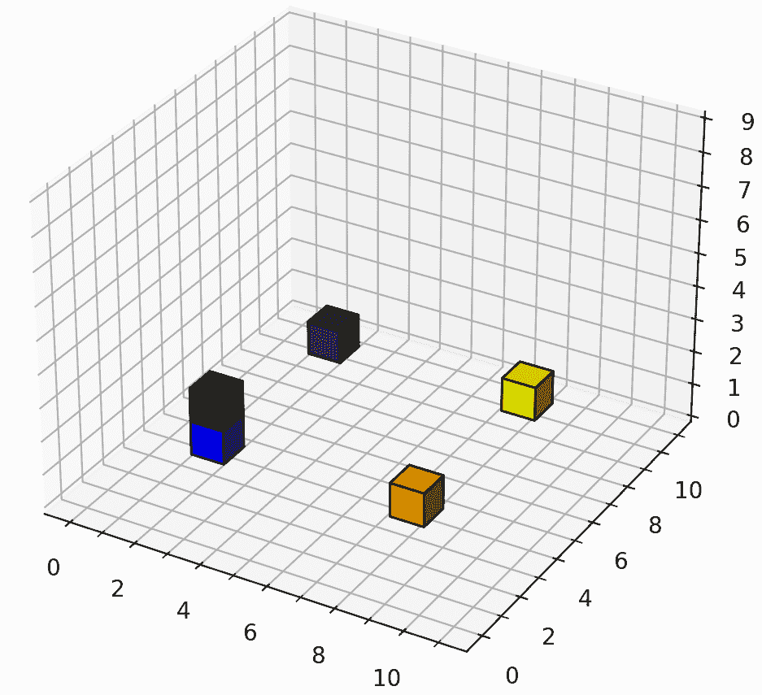

<!--yml
category: 未分类
date: 2025-01-11 12:24:23
-->

# A LLM Benchmark based on the Minecraft Builder Dialog Agent Task

> 来源：[https://arxiv.org/html/2407.12734/](https://arxiv.org/html/2407.12734/)

Chris Madge
Queen Mary University of London
c.j.madge@qmul.ac.uk
\AndMassimo Poesio
Queen Mary University of London
m.poesio@qmul.ac.uk 

###### Abstract

In this work we proposing adapting the Minecraft builder task into an LLM benchmark suitable for evaluating LLM ability in spatially orientated tasks, and informing builder agent design. Previous works have proposed corpora with varying complex structures, and human written instructions. We instead attempt to provide a comprehensive synthetic benchmark for testing builder agents over a series of distinct tasks that comprise of common building operations. We believe this approach allows us to probe specific strengths and weaknesses of different agents, and test the ability of LLMs in the challenging area of spatial reasoning and vector based math.

## 1 Introduction

The development of conversational agents able to operate in virtual world environments has long been of interest in AI Winograd ([1972](https://arxiv.org/html/2407.12734v1#bib.bib20)). In recent years, much of this research has focused on developing agents able to operate in game environments. Game environments provide an ideal sandbox for studying task-oriented conversational agents in games Szlam et al. ([2019](https://arxiv.org/html/2407.12734v1#bib.bib16)), which has motivated the development of multiple platforms in which such research can be carried out Johnson et al. ([2016](https://arxiv.org/html/2407.12734v1#bib.bib5)); Urbanek et al. ([2019](https://arxiv.org/html/2407.12734v1#bib.bib17)); Callison-Burch et al. ([2022](https://arxiv.org/html/2407.12734v1#bib.bib2)) Gray et al. ([2019](https://arxiv.org/html/2407.12734v1#bib.bib3)); Ogawa et al. ([2020](https://arxiv.org/html/2407.12734v1#bib.bib13)); Köhn et al. ([2020](https://arxiv.org/html/2407.12734v1#bib.bib7)), data gathering exercises Narayan-Chen et al. ([2019](https://arxiv.org/html/2407.12734v1#bib.bib12)); Jayannavar et al. ([2020](https://arxiv.org/html/2407.12734v1#bib.bib4)); Mohanty et al. ([2022](https://arxiv.org/html/2407.12734v1#bib.bib11)) and competitions Kiseleva et al. ([2022](https://arxiv.org/html/2407.12734v1#bib.bib6)).

The goal of this work is to propose a synthetic benchmark like dataset for testing LLMs on text-based spatial reasoning and vector based math. Existing work has designed a series of benchmarks to test how LLMs perform on tasks that are outside the scope of ordinary token prediction Srivastava et al. ([2022](https://arxiv.org/html/2407.12734v1#bib.bib15)); Wu et al. ([2023](https://arxiv.org/html/2407.12734v1#bib.bib21)). However, to our knowledge, the requirement for spatial reasoning is uncommon, and does not feature the requirement for 3D construction. Prior to LLM benchmarking, other tasks have been proposed for testing text-based spatial reasoning however, these are unlikely to motivate the combined vector mathematics, disambiguation or structure required by this task Weston et al. ([2015](https://arxiv.org/html/2407.12734v1#bib.bib19)); Shi et al. ([2022](https://arxiv.org/html/2407.12734v1#bib.bib14)); Mirzaee and Kordjamshidi ([2022](https://arxiv.org/html/2407.12734v1#bib.bib10)).

Our particular benchmark is inspired by the virtual world environment “Minecraft Builder Task” proposed in Jayannavar et al. ([2020](https://arxiv.org/html/2407.12734v1#bib.bib4)), in which, given text based instructions from an architect, a builder must take actions to complete a structure, without being able to see the target structure. Previous work has looked at using LLMs in this setting Madge and Poesio ([2024](https://arxiv.org/html/2407.12734v1#bib.bib9)); Kranti et al. ([2024](https://arxiv.org/html/2407.12734v1#bib.bib8)), and while the performance looks promising, spatial reasoning and vector mathematics remain a challenging task for LLMs Bang et al. ([2023](https://arxiv.org/html/2407.12734v1#bib.bib1)).

Aside from being an interesting benchmark of ever evolving LLM ability outside text-based tasks, we hope this may also inform builder agent designers on specific strengths and weaknesses of their approach. Looking through the datasets we have identified some common patterns that occur and produced scenarios to test against those.

Beyond proposing this benchmark, we provide some early discussions over our experience on testing them with *Llama-3-70b-Instruct*, our methods of addressing those challenges, and an evaluation of those methods.

## 2 Our Approach

Previous corpora have shapes that typically represent objects. However, it would appear that the final description of the object the structure represents has little utility in communicating the desired structure. We identify common patterns used to deliver instructions, and take a rule driven approach to produce architect instructions for the builder around varied set of arrangements of blocks within the context of those patterns.

To validate our benchmark, we test it against a few different prompting approaches. We take a zero shot approach, a few shot approach, and finally, Chain of Thought Wei et al. ([2022](https://arxiv.org/html/2407.12734v1#bib.bib18)).

As we further describe our approach in this section, we motivate it through existing examples taken from a previous corpus Narayan-Chen et al. ([2019](https://arxiv.org/html/2407.12734v1#bib.bib12)). Naturally, there are multiple ways of representing an object in voxel form, and as the representation is somewhat abstract, given that it is in voxel form, it may not be evident to both parties what object the structure is intended to represent (e.g. [A.1](https://arxiv.org/html/2407.12734v1#A1.SS1 "A.1 B1-A3-C8-1522432497234 ‣ Appendix A Appendix ‣ A LLM Benchmark based on the Minecraft Builder Dialog Agent Task")). When the final label is used, it tends to be used by the builder to verify the architects instructions in the conclusion of the conversation, rather than by the architect as part of the instruction (e.g. [A.2](https://arxiv.org/html/2407.12734v1#A1.SS2 "A.2 B1-A3-C4-1522432009099 ‣ Appendix A Appendix ‣ A LLM Benchmark based on the Minecraft Builder Dialog Agent Task")). When the structure is likened to an object, it is almost always accompanied by specific block by block instructions, and not in isolation (e.g. [A.3](https://arxiv.org/html/2407.12734v1#A1.SS3 "A.3 B1-A3-C1-1522435497386 ‣ Appendix A Appendix ‣ A LLM Benchmark based on the Minecraft Builder Dialog Agent Task")).

We find more commonly, the instructions take one of three forms, that we discuss in the following subsections.

### 2.1 Absolute Addressing

At the beginning of the dialog for a task, or when creating a new separated substructure, an architect will need to refer to a space in the grid without the use of an existing reference point, so the references are given to the extent of the grid itself, e.g. [A.4](https://arxiv.org/html/2407.12734v1#A1.SS4 "A.4 B3-A2-C12-1522445699382 ‣ Appendix A Appendix ‣ A LLM Benchmark based on the Minecraft Builder Dialog Agent Task"). We refer to this as absolute addressing. To benchmark this ability, we produce a test in which the agent is challenged to place a block in every single position in the grid on the first three levels.

### 2.2 Relative Addressing

Relative addresses are possibly the most common type, given throughout the dialog in reference to existing block positions (e.g. [A.5](https://arxiv.org/html/2407.12734v1#A1.SS5 "A.5 B3-A2-C23-1522447244858 ‣ Appendix A Appendix ‣ A LLM Benchmark based on the Minecraft Builder Dialog Agent Task")). To test this, we require the builder place a block in every direction adjacent to an existing block (as shown in Figure [1](https://arxiv.org/html/2407.12734v1#S2.F1 "Figure 1 ‣ 2.2 Relative Addressing ‣ 2 Our Approach ‣ A LLM Benchmark based on the Minecraft Builder Dialog Agent Task")). Three other blocks are always present in different colours to serve as distractors. We repeat this test with removal, instead of addition.

Figure 1: Relative positioning task, placing a green block on top of an existing blue block

### 2.3 Primitive Shapes

When commands to build structures comprising of multiple blocks are given, they are typically primitive shapes, such as rows of blocks, or towers, e.g. [A.6](https://arxiv.org/html/2407.12734v1#A1.SS6 "A.6 B1-A3-C3-1522431780184 ‣ Appendix A Appendix ‣ A LLM Benchmark based on the Minecraft Builder Dialog Agent Task"). We test four separate primitives, a row, a tower/stack, a cube and a rectangle.

## 3 Results

Table [1](https://arxiv.org/html/2407.12734v1#S3.T1 "Table 1 ‣ 3 Results ‣ A LLM Benchmark based on the Minecraft Builder Dialog Agent Task") shows a range of scores between approaches, representing what might be expected from applying the different prompting techniques.

|  | Zero Shot | CoT |
| --- | --- | --- |
| Absolute Addressing | 42.98 | 76.5 |
| Relative Addressing | 82.02 | 95.8 |
| Primitive Shapes | 59.02 | 60.3 |

Table 1: Results

We believe this methodology may be useful in discovering the weak points in agents, and informing the method of addressing them. For example, one of the main points identified, is without the Chain of Thought approach, the LLM often neglects to compute one of the axis. In addition, despite the LLM being instructed to apply the right handed 3d coordinate convention, were $Z$ positive for south, south is frequently associated with negative (left handed). This can be avoided by reinforcing this notion through a few shot example.

## 4 Conclusion

In this work we propose a new LLM benchmark based around a Minecraft-like task. We test the validity of this benchmark by applying a few basic strategies to see how this challenges a current LLM.

## Acknowledgements

This research was funded by ARCIDUCA, EPSRC EP/W001632/1

## References

*   Bang et al. (2023) Yejin Bang, Samuel Cahyawijaya, Nayeon Lee, Wenliang Dai, Dan Su, Bryan Wilie, Holy Lovenia, Ziwei Ji, Tiezheng Yu, Willy Chung, et al. 2023. A multitask, multilingual, multimodal evaluation of chatgpt on reasoning, hallucination, and interactivity. *arXiv preprint arXiv:2302.04023*.
*   Callison-Burch et al. (2022) Chris Callison-Burch, Gaurav Singh Tomar, Lara J Martin, Daphne Ippolito, Suma Bailis, and David Reitter. 2022. Dungeons and dragons as a dialog challenge for artificial intelligence. *arXiv preprint arXiv:2210.07109*.
*   Gray et al. (2019) Jonathan Gray, Kavya Srinet, Yacine Jernite, Haonan Yu, Zhuoyuan Chen, Demi Guo, Siddharth Goyal, C Lawrence Zitnick, and Arthur Szlam. 2019. Craftassist: A framework for dialogue-enabled interactive agents. *arXiv preprint arXiv:1907.08584*.
*   Jayannavar et al. (2020) Prashant Jayannavar, Anjali Narayan-Chen, and Julia Hockenmaier. 2020. Learning to execute instructions in a minecraft dialogue. In *Proceedings of the 58th annual meeting of the association for computational linguistics*, pages 2589–2602.
*   Johnson et al. (2016) Matthew Johnson, Katja Hofmann, Tim Hutton, and David Bignell. 2016. The malmo platform for artificial intelligence experimentation. In *Ijcai*, pages 4246–4247.
*   Kiseleva et al. (2022) Julia Kiseleva, Ziming Li, Mohammad Aliannejadi, Shrestha Mohanty, Maartje ter Hoeve, Mikhail Burtsev, Alexey Skrynnik, Artem Zholus, Aleksandr Panov, Kavya Srinet, et al. 2022. Interactive grounded language understanding in a collaborative environment: Iglu 2021. In *NeurIPS 2021 Competitions and Demonstrations Track*, pages 146–161\. PMLR.
*   Köhn et al. (2020) Arne Köhn, Julia Wichlacz, Christine Schäfer, Alvaro Torralba, Jörg Hoffmann, and Alexander Koller. 2020. Mc-saar-instruct: a platform for minecraft instruction giving agents. In *Proceedings of the 21th Annual Meeting of the Special Interest Group on Discourse and Dialogue*, pages 53–56.
*   Kranti et al. (2024) Chalamalasetti Kranti, Sherzod Hakimov, and David Schlangen. 2024. [Retrieval-augmented code generation for situated action generation: A case study on minecraft](http://arxiv.org/abs/2406.17553).
*   Madge and Poesio (2024) Chris Madge and Massimo Poesio. 2024. [Large language models as minecraft agents](http://arxiv.org/abs/2402.08392).
*   Mirzaee and Kordjamshidi (2022) Roshanak Mirzaee and Parisa Kordjamshidi. 2022. Transfer learning with synthetic corpora for spatial role labeling and reasoning. *arXiv preprint arXiv:2210.16952*.
*   Mohanty et al. (2022) Shrestha Mohanty, Negar Arabzadeh, Milagro Teruel, Yuxuan Sun, Artem Zholus, Alexey Skrynnik, Mikhail Burtsev, Kavya Srinet, Aleksandr Panov, Arthur Szlam, et al. 2022. Collecting interactive multi-modal datasets for grounded language understanding. *arXiv preprint arXiv:2211.06552*.
*   Narayan-Chen et al. (2019) Anjali Narayan-Chen, Prashant Jayannavar, and Julia Hockenmaier. 2019. Collaborative dialogue in minecraft. In *Proceedings of the 57th Annual Meeting of the Association for Computational Linguistics*, pages 5405–5415.
*   Ogawa et al. (2020) Haruna Ogawa, Hitoshi Nishikawa, Takenobu Tokunaga, and Hikaru Yokono. 2020. Gamification platform for collecting task-oriented dialogue data. In *Proceedings of the Twelfth Language Resources and Evaluation Conference*, pages 7084–7093.
*   Shi et al. (2022) Zhengxiang Shi, Qiang Zhang, and Aldo Lipani. 2022. Stepgame: A new benchmark for robust multi-hop spatial reasoning in texts. In *Proceedings of the AAAI conference on artificial intelligence*, volume 36, pages 11321–11329.
*   Srivastava et al. (2022) Aarohi Srivastava, Abhinav Rastogi, Abhishek Rao, Abu Awal Md Shoeb, Abubakar Abid, Adam Fisch, Adam R Brown, Adam Santoro, Aditya Gupta, Adrià Garriga-Alonso, et al. 2022. Beyond the imitation game: Quantifying and extrapolating the capabilities of language models. *arXiv preprint arXiv:2206.04615*.
*   Szlam et al. (2019) Arthur Szlam, Jonathan Gray, Kavya Srinet, Yacine Jernite, Armand Joulin, Gabriel Synnaeve, Douwe Kiela, Haonan Yu, Zhuoyuan Chen, Siddharth Goyal, et al. 2019. Why build an assistant in minecraft? *arXiv preprint arXiv:1907.09273*.
*   Urbanek et al. (2019) Jack Urbanek, Angela Fan, Siddharth Karamcheti, Emily Dinan Saachi Jain, Samuel Humeau, Tim Rocktäschel, Douwe Kiela, Arthur Szlam, and Jason Weston. 2019. Learning to speak and act in a fantasy text adventure game.
*   Wei et al. (2022) Jason Wei, Xuezhi Wang, Dale Schuurmans, Maarten Bosma, Fei Xia, Ed Chi, Quoc V Le, Denny Zhou, et al. 2022. Chain-of-thought prompting elicits reasoning in large language models. *Advances in neural information processing systems*, 35:24824–24837.
*   Weston et al. (2015) Jason Weston, Antoine Bordes, Sumit Chopra, Alexander M Rush, Bart Van Merriënboer, Armand Joulin, and Tomas Mikolov. 2015. Towards ai-complete question answering: A set of prerequisite toy tasks. *arXiv preprint arXiv:1502.05698*.
*   Winograd (1972) Terry Winograd. 1972. Understanding natural language. *Cognitive psychology*, 3(1):1–191.
*   Wu et al. (2023) Yue Wu, Xuan Tang, Tom M Mitchell, and Yuanzhi Li. 2023. Smartplay: A benchmark for llms as intelligent agents. *arXiv preprint arXiv:2310.01557*.

## Appendix A Appendix

### A.1 B1-A3-C8-1522432497234

> Builder
> 
> its a table?
> 
> Architect
> 
> i don’t know what it is

### A.2 B1-A3-C4-1522432009099

> Builder
> 
> its a flower!
> 
> Architect
> 
> yes it is, you are very observant builder

### A.3 B1-A3-C1-1522435497386

> Architect
> 
> now we must create the bell. please start by extending 4 orange blocks down from the middle purple block, as if it were hanging

### A.4 B3-A2-C12-1522445699382

> Architect
> 
> In the upper left corner place a purple block

### A.5 B3-A2-C23-1522447244858

> Architect
> 
> add another green block below each red one you added

### A.6 B1-A3-C3-1522431780184

Architect

build a 2x1 structure that is blue