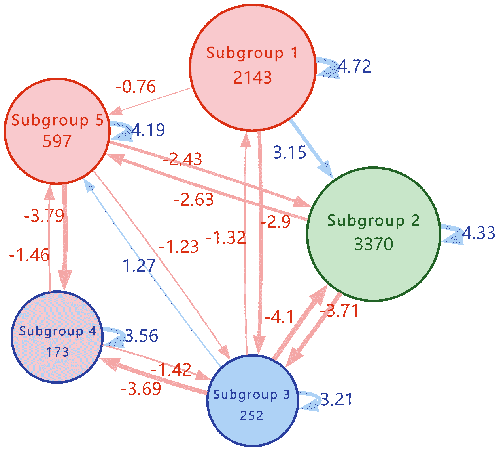
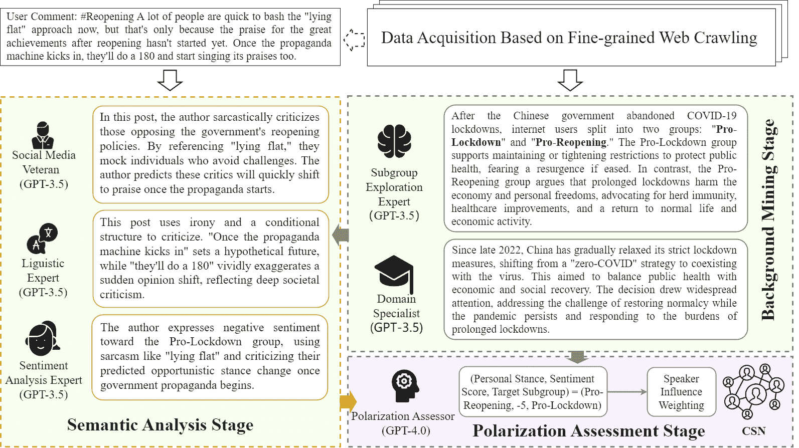

<!--yml

类别：未分类

日期：2025-01-11 11:55:30

-->

# 基于LLM智能体和图结构的群体极化测量方法

> 来源：[https://arxiv.org/html/2411.12196/](https://arxiv.org/html/2411.12196/)

¹¹institutetext: 武汉大学，武汉，湖北 430072，中国 Zixin Liu^∗ \orcidlink0009-0003-2353-7847   Ji Zhang \orcidlink0009-0000-1759-5184   Yiran Ding \orcidlink0009-0005-8624-8545

武汉大学

武汉 文章来源：前两位作者贡献相等。   湖北省  中华人民共和国 430072

jizhang@whu.edu.cn, yrding@whu.edu.cn, liuzixin@whu.edu.cn

###### 摘要

群体极化是社交媒体内容分析中的一个重要研究方向，吸引了许多研究人员探索这一领域。因此，如何有效测量群体极化已成为一个关键问题。社交媒体上的群体极化测量面临许多现有解决方案尚未解决的挑战。首先，社交媒体群体极化测量涉及处理大量文本，这对信息提取构成了巨大挑战。其次，社交媒体文本常常包含难以理解的内容，包括讽刺、表情包和网络俚语。此外，群体极化研究通常侧重于整体分析，而文本通常是碎片化的。为了应对这些挑战，我们设计了一种基于多智能体系统的解决方案，并使用图结构的社区情感网络（CSN）表示极化状态。此外，我们开发了一种名为社区对立指数（COI）的度量，基于CSN量化极化。最后，我们通过零样本立场检测任务测试了我们的多智能体系统，并取得了卓越的成果。总之，所提出的方法在可用性、准确性和可解释性方面具有重要价值。

###### 关键词：

多智能体系统 组极化 基于LLM的智能体 社交媒体

## 1 引言

随着互联网技术的发展，社交媒体已获得广泛普及。《全球数字报告》[[11](https://arxiv.org/html/2411.12196v2#bib.bib11)]指出，Facebook、YouTube和TikTok等平台在全球拥有数十亿用户。社交媒体已成为公众表达意见和参与讨论的关键渠道。其匿名性和便利性使得用户能够自由表达真实看法，从而塑造社交媒体上的公众舆论。因此，该领域的研究也蓬勃发展。

在这些研究中，从群体极化角度进行的研究占据了重要地位。群体极化的概念最早由斯托纳（Stoner）提出[[37](https://arxiv.org/html/2411.12196v2#bib.bib37)]，他观察到群体决策往往比个人决策更加极端[[16](https://arxiv.org/html/2411.12196v2#bib.bib16)]。在互联网时代，群体极化通常被定义为公众意见或立场的分化。基于这一定义，研究人员已经在群体极化相关的多个问题上进行了广泛且深入的研究。社交媒体群体极化领域的一个基本研究问题就是如何对其进行测量。早期基于统计方法的测量方式[[5](https://arxiv.org/html/2411.12196v2#bib.bib5), [13](https://arxiv.org/html/2411.12196v2#bib.bib13), [15](https://arxiv.org/html/2411.12196v2#bib.bib15), [20](https://arxiv.org/html/2411.12196v2#bib.bib20), [38](https://arxiv.org/html/2411.12196v2#bib.bib38)]存在过于简单化社交媒体动态复杂性的弊端。当前的主流方法，如文本聚类或情感分类[[4](https://arxiv.org/html/2411.12196v2#bib.bib4), [22](https://arxiv.org/html/2411.12196v2#bib.bib22), [35](https://arxiv.org/html/2411.12196v2#bib.bib35), [39](https://arxiv.org/html/2411.12196v2#bib.bib39)]，在效率和准确性之间存在平衡困难。虽然一些研究人员通过关注不同观点之间的关系取得了显著进展[[7](https://arxiv.org/html/2411.12196v2#bib.bib7), [17](https://arxiv.org/html/2411.12196v2#bib.bib17), [21](https://arxiv.org/html/2411.12196v2#bib.bib21), [26](https://arxiv.org/html/2411.12196v2#bib.bib26), [32](https://arxiv.org/html/2411.12196v2#bib.bib32)]，但这些研究在理解立场的深层次细微差别及其演变方面仍显不足。

为了解决在测量群体极化方面存在的问题，并提高效率、准确性和可解释性，我们提出了一种基于LLM（大语言模型）代理和图结构的新型群体极化测量方法。该方法借鉴了自然语言处理（NLP）中的立场检测任务以及早期的“情感温度计”方法。我们使用一个由图结构表示的社区情感网络（CSN）来建模极化状态，其中采用LLM代理来构建该网络。此外，我们基于CSN设计了极化测量指标。为了验证我们方法的有效性，我们在零样本立场检测任务中测试了负责构建CSN的模块，结果显示该模块在捕捉群体极化的细微差别方面具有优越性。

总结来说，我们的贡献如下：（1）我们提出了一个时间序列社区情感网络（CSN）来表示随时间变化的极化状态。（2）我们引入基于LLM的代理进行立场检测，显著提高了群体极化测量的效率和准确性。（3）我们提出了基于CSN的更强健指标——社区反对指数（COI）。

## 2 相关工作

### 2.1 意见极化测量

随着群体极化研究的深入，关于群体极化的测量也进行了广泛的探索，形成了一个相对全面的测量方法体系。现有研究[[5](https://arxiv.org/html/2411.12196v2#bib.bib5), [20](https://arxiv.org/html/2411.12196v2#bib.bib20)]表明，当前主流的群体极化测量方案主要可以分为三类：基于数量的、基于情感的和基于网络的。我们将讨论这三种测量方案的特点以及它们在应用于社交媒体上群体极化测量任务时的不足。

基于数量的方法主要依赖统计方法，并且在群体极化的早期研究中得到了广泛应用。早期的研究者通过调查和实验收集数据，使用统计分析获得相关的极化结果。在当前通过社交媒体探索群体极化的趋势中，基于数量的方案更加注重各种数据指标，并在研究中采用统计方法。值得注意的例子包括Gaurav等人[[13](https://arxiv.org/html/2411.12196v2#bib.bib13)]基于移动平均聚合概率方法的政治极化研究，Tumasjan等人[[38](https://arxiv.org/html/2411.12196v2#bib.bib38)]使用LIWC工具分析政治极化，以及Hart等人[[15](https://arxiv.org/html/2411.12196v2#bib.bib15)]使用多维统计分析研究COVID-19期间的极化。

然而，现有研究表明，基于数量的方案在捕捉信息和分析大数据集方面存在局限性。它们未能准确理解文本中传达的意见和情感，通常依赖于广泛的统计指标（例如词频、点赞、书签等）来收集有限的信息。缺乏快速信息捕捉和深入理解使得这些技术在追踪和实时分析群体极化方面效果较差，而且在测量极化的精度上也存在不足。

与基于体量的方法相比，基于情感的方法更注重文本中传达的意义和情感。通常，基于情感的方法依托自然语言处理（NLP），从观点和情感的角度分析社交媒体文本。这些方法通常遵循两种主要策略。第一种方法基于情感的相似性对文本进行聚类，例如Belcastro提出的IOM-NN方法[[4](https://arxiv.org/html/2411.12196v2#bib.bib4)]，旨在准确检测政治极化中的情感信息。第二种策略利用深度学习进行直接情感分类，例如Tyagi等人[[39](https://arxiv.org/html/2411.12196v2#bib.bib39)]关于气候变化驱动的极化研究，以及Ribeiro等人[[35](https://arxiv.org/html/2411.12196v2#bib.bib35)]和Jiang等人[[22](https://arxiv.org/html/2411.12196v2#bib.bib22)]关于错误信息与极化之间关系的探索。

不幸的是，这两种策略在实际应用中面临显著挑战。对于文本聚类，目前的聚类算法相对粗糙且简单，难以区分破坏性信息（例如广告或中立陈述）与重要内容。此外，它们没有考虑子群体之间的具体关系或它们对极化的贡献，导致结果缺乏精准性和可解释性。在情感分类方面，当前方法通常依赖于二分类，无法捕捉情感的强度。这种过于简化的方法对极化测量的可解释性和准确性产生负面影响。

另请注意，在政治极化研究中，一种名为“情感温度计”的方法已被广泛采用 [[7](https://arxiv.org/html/2411.12196v2#bib.bib7), [17](https://arxiv.org/html/2411.12196v2#bib.bib17), [18](https://arxiv.org/html/2411.12196v2#bib.bib18), [26](https://arxiv.org/html/2411.12196v2#bib.bib26), [41](https://arxiv.org/html/2411.12196v2#bib.bib41)]。这种方法通过调查收集选民对各种政党的情感评分，从而提高分析的精准度和可解释性。然而，这种方法成本较高，受限于样本量较小，并且不太适合用于衡量社交媒体中的极化现象。

基于网络的方法代表了一种通过考虑群体间的社会位置和关系来评估群体极化的方式，重点关注子群体之间的情感方向和立场，以更好地衡量极化水平。传统的群体极化研究中的社会网络分析探索了围绕核心观点的外围连接，以评估子群体的位置和情感[[8](https://arxiv.org/html/2411.12196v2#bib.bib8)，[10](https://arxiv.org/html/2411.12196v2#bib.bib10)，[12](https://arxiv.org/html/2411.12196v2#bib.bib12)，[14](https://arxiv.org/html/2411.12196v2#bib.bib14)，[33](https://arxiv.org/html/2411.12196v2#bib.bib33)，[40](https://arxiv.org/html/2411.12196v2#bib.bib40)]。一些研究者进一步通过动态模拟群体极化的过程，探索其演变路径[[32](https://arxiv.org/html/2411.12196v2#bib.bib32)，[36](https://arxiv.org/html/2411.12196v2#bib.bib36)]。随着图神经网络（GNNs）的发展，基于网络的方法得到了增强，正如像肖等人[[42](https://arxiv.org/html/2411.12196v2#bib.bib42)]、张等人[[46](https://arxiv.org/html/2411.12196v2#bib.bib46)]和姜等人[[21](https://arxiv.org/html/2411.12196v2#bib.bib21)]等研究者的宝贵探索所展示的，他们在研究中利用了情感网络和GNNs。虽然这些研究在提高群体极化研究的科学性和可解释性方面取得了有希望的结果，但它们普遍缺乏对文本内容的详细分析。此外，纯粹的社交网络中的社会分裂不一定是群体极化的结果，这也引发了对这些方法得出的一些结论的准确性的质疑。

### 2.2 LLM基础代理

随着OpenAI的GPT系列大语言模型（LLMs）的出现[[9](https://arxiv.org/html/2411.12196v2#bib.bib9)]，许多研究领域已经开始或研究了GPT的能力。在群体极化研究领域，一些研究者也探讨了其应用。例如，陆等人[[31](https://arxiv.org/html/2411.12196v2#bib.bib31)]使用基于代理的模拟来模拟群体极化动态，而张等人[[44](https://arxiv.org/html/2411.12196v2#bib.bib44)]则使用LLM基础的代理来检测极化群体中的立场。这些研究取得了有希望的结果，展示了在该领域应用大语言模型的可行性和价值。

## 3 方法

正如我们在第1节中提到的，为了实现群体极化的准确测量，我们提出的方法包括三个部分，具体如下：

1.  (i)

    一个社区情感网络（CSN），用于表示子群体及其之间和内部的情感。

1.  (ii)

    一个高效的多代理系统用于CSN构建。

1.  (iii)

    基于CSN的群体极化度量，社区对立指数（COI）。

意见文本集将用于识别子群体并通过多智能体系统进行情感分析，从而形成一个CSN。然后，可以使用COI计算该时间片的当前极化测量结果。

### 3.1 社区情感网络

社区情感网络（CSN，见图[1](https://arxiv.org/html/2411.12196v2#S3.F1 "Figure 1 ‣ 3.1 Community Sentiment Network ‣ 3 Method ‣ A More Advanced Group Polarization Measurement Approach Based on LLM-Based Agents and Graphs")）是“情感温度计”方法的扩展。传统的“情感温度计”只能应用于两个子群体[[18](https://arxiv.org/html/2411.12196v2#bib.bib18)]。CSN将“情感温度计”扩展为一个有向循环图，涉及多个子群体之间的情感（见图1）。令$G=(V,E)$为图，其中$V$是包含子群体的顶点集，$E$是表示子群体之间情感关系的边集。每条边$e\in E$定义为$(u,v,s)$，其中$u,v\in V$且$s$为情感分数。需要注意的是，节点$v$和$u$可以是同一个节点，意味着自环是允许的。分数$s$可以是正值或负值，反映了情感的正面或负面性质。

与传统的社交网络不同，CSN使用情感而非互动作为构建连接的基础。此外，CSN清晰地展示了目标时间段内具有不同立场的各个子群体，并揭示了子群体之间的情感状态以及每个子群体的内部凝聚力。因此，与聚类结果或社交网络相比，CSN显著突出了不同子群体对极化的贡献，提供了更强的极化状态可解释性。

图1：由Graphviz生成的CSN示例。该CSN是基于俄罗斯-乌克兰冲突期间的评论生成的。

### 3.2 基于多智能体系统的CSN构建

CSN的构建涉及多个问题，例如子群体识别、观点信息的立场检测和情感识别。然而，现有的群体极化研究尚不足以为这些问题提供有效的解决方案。因此，受到立场检测任务的进展启发[[42](https://arxiv.org/html/2411.12196v2#bib.bib42)]，我们设计了一个基于LLM代理的多智能体系统（见图[2](https://arxiv.org/html/2411.12196v2#S3.F2 "Figure 2 ‣ 3.2 A Multi-Agent System For CSN Construction ‣ 3 Method ‣ A More Advanced Group Polarization Measurement Approach Based on LLM-Based Agents and Graphs")）。

图 2：用于CSN构建的多智能体系统结构，包含背景挖掘阶段、语义分析阶段和极化评估阶段。

总结来说，我们的多智能体系统由三个阶段组成：背景挖掘阶段、语义分析阶段和极化评估阶段。背景挖掘阶段包括子组探索专家和领域专家，语义分析阶段包括社交媒体资深专家、语言学专家和情感分析专家。极化评估阶段由极化评估专家组成。各个智能体通过一系列的交互合作，提供准确的子组划分结果和可靠的情感评分（参见算法 [1](https://arxiv.org/html/2411.12196v2#alg1 "Algorithm 1 ‣ 3.2 A Multi-Agent System For CSN Construction ‣ 3 Method ‣ A More Advanced Group Polarization Measurement Approach Based on LLM-Based Agents and Graphs")）。我们将在接下来的段落中详细解释每个阶段及其对应智能体的功能。

算法 1 三元组构建算法

1: 输入：指定时间范围内的评论数据2: 输出：作为分析结果的三元组集合3: 过程 AnalyzeComments($comments$)4:     $bg\leftarrow$ 领域专家($comments$) $\triangleright$ bg 代表背景5:     $sg\leftarrow\emptyset$ $\triangleright$ sg 代表子组6:     $uncertainComments\leftarrow[]$7:     子组探索专家($bg$)8:     对于每个 $comment$ 在 $comments$ 中 执行9:         $grp\leftarrow$ 子组探索专家($comment$)10:         如果 $grp$ 不存在 则11:              $uncertainComments.add(comment)$12:              如果 $uncertainComments$ 的长度达到阈值 则13:                  $grp\leftarrow$ 人类专家帮助($uncertainComments$)14:                  $sg.add(grp)$15:                  $uncertainComments\leftarrow[]$16:              结束 如果17:          否则18:              $sg.add(grp)$19:          结束 如果20:     结束 对于21:     初始化专家：22:     社交媒体资深专家($sg,bg$)23:     语言学专家($bg$)24:     情感分析专家($sg$)25:     极化评估($sg,bg$)26:     $triplets\leftarrow\emptyset$27:     对于每个 $comment$ 在 $comments$ 中 执行28:         $out1\leftarrow$ 社交媒体资深专家($comment$)29:         $out2\leftarrow$ 语言学专家($comment$)30:         $out3\leftarrow$ 情感分析专家($comment,out1,out2$)31:         $out4\leftarrow$ 极化评估($comment,out3$)32:         如果 $out4.group$ 存在 则33:              $triplet\leftarrow(out4.group,out4.score,out4.targetGroup)$34:          否则35:              $triplet\leftarrow(\text{null},out4.score,out4.targetGroup)$36:          结束 如果37:         $triplets.add(triplet)$38:     结束 对于39:     返回 $triplets$40: 结束 过程

#### 3.2.1 背景挖掘阶段

在构建CSN时，我们需要首先解决的问题是多智能体系统如何在事件的上下文中理解整体事件。为了解决这个问题，我们提出了背景挖掘阶段，利用文本信息理解事件并识别潜在的子组。其功能可以描述如下：

输入：与目标话题相关的所有评论文本（如有必要可进行抽样）。

输出：事件背景描述、话题中所有潜在子组的描述以及每个子组的详细描述。

##### 域专家

域专家主要负责提取评论文本中描述的事件背景。他们的主要任务包括探索话题的核心事件及关键利益相关者。域专家会制定事件时间线和相关方的全面描述，并将这些背景信息提供给子组探索专家以及后续阶段的处理人员。

##### 子组探索专家

子组探索专家的任务是利用域专家提供的背景信息和源文本，识别事件中涉及的潜在子组，并总结每个子组成员的可能言论模式。这要求专家探索文本中提到的组织、立场、宗教及其他社会身份，并根据其表达的相似性形成子组。需要特别注意的是，如果存在大量无法分类的内容，专家可以咨询人工专家以求得进一步的澄清。

#### 3.2.2 语义分析阶段

基于背景信息，语义分析阶段需要解决的主要挑战是准确解读文本中传达的情感，尤其是在有俚语、同音词、讽刺和其他细微表达的情况下。为了在这一复杂任务上取得更好的结果，我们设计了一个考虑到社交媒体特定属性的系统。其功能可以描述如下：

输入：目标话题下的评论文本及背景挖掘阶段的结果。

输出：情感分析结果。

##### 社交媒体资深专家

社交媒体资深专家是负责社交媒体内容语义理解的关键智能体之一。其主要作用是探索社交媒体平台上语言表达的模式和特点。该智能体需要解读标签、网络用语、迷因以及其他社交媒体上常用的独特表达形式的实际含义。在此分析之后，社交媒体资深专家将所理解的信息传递给情感分析专家进行进一步处理。

##### 语言学专家

语言专家是另一个负责社交媒体内容语义理解的关键角色。与社交媒体资深专家不同，语言专家专注于从语言学角度分析文本，检查语法结构、修辞手法、词汇选择和时态等方面。分析结果也会传递给情感分析专家。需要注意的是，语言专家的分析并非孤立进行；领域专家提供的背景信息支持并辅助语言分析。

##### 情感分析专家

情感分析专家是负责综合各种输入以确定最终情感及其方向的角色。它结合文本中的情感语言与其他角色提供的语义分析结果，如社交媒体资深专家和语言专家，推导出文本的情感。此外，它还利用子群体探索专家提供的子群体信息，识别情感的潜在目标。情感分析的结果将作为情感分析阶段的输出，并传递给下一个阶段。

#### 3.2.3 极化评估阶段

极化评估阶段的主要任务是利用背景挖掘阶段和语义分析阶段的信息生成三元组形式的CSN。其功能可以描述如下：

输入：来自背景挖掘阶段的所有信息（包括潜在子群体和事件背景），目标话题的每一条文本及其情感分析结果。

输出：以三元组形式表达的每条评论的情感（个人立场，情感得分，目标子群体）。

##### 极化评估员

极化评估员是极化评估阶段的核心角色。它负责基于从其他阶段传递来的信息，分析每条评论的作者立场、情感得分和情感的目标群体。极化评估员将这些信息整合成三元组。通过其他阶段提供的多维度和深入分析，极化评估员可以做出准确的判断，并给出可信的情感得分。

##### CSN 构建

为了基于现有评论中的情感三元组构建最终的社区情感网络（CSN），我们设计了相关算法（见算法[2](https://arxiv.org/html/2411.12196v2#alg2 "算法 2 ‣ CSN 构建 ‣ 3.2.3 极化评估阶段 ‣ 3.2 基于多智能体系统的 CSN 构建 ‣ 3 方法 ‣ 基于 LLM 的智能体和图的更先进的群体极化测量方法")，表[1](https://arxiv.org/html/2411.12196v2#S3.T1 "表 1 ‣ CSN 构建 ‣ 3.2.3 极化评估阶段 ‣ 3.2 基于多智能体系统的 CSN 构建 ‣ 3 方法 ‣ 基于 LLM 的智能体和图的更先进的群体极化测量方法")解释了一些变量）。我们使用一个邻接矩阵$adjMatrix$来表示CSN，其中$adjMatrix[i][j]$表示子群体$i$对子群体$j$的情感得分。我们首先使用所有的三元组构建一个初始网络，然后合并属于同一子群体的节点。在合并过程中，我们使用评论的点赞数作为加权因子，对涉及情感的子群体之间的情感得分进行加权计算，从而得到子群体之间的总情感得分。由于并非所有三元组都有个人立场，我们通过近似所有已知个人立场的出现频率作为概率来补充它们，并使用这些概率填充不完整的三元组。这些操作最终得到最终的CSN。

表 1：算法[2](https://arxiv.org/html/2411.12196v2#alg2 "算法 2 ‣ CSN 构建 ‣ 3.2.3 极化评估阶段 ‣ 3.2 基于多智能体系统的 CSN 构建 ‣ 3 方法 ‣ 基于 LLM 的智能体和图的更先进的群体极化测量方法")中某些变量的解释。

| 变量 | 解释 |
| --- | --- |
| $weightSum$ | 三元组的权重 |
| $countMatrix[i][j]$ | 个人立场为$i$，目标子群体为$j$的三元组数量 |
| $incompleteTriplets$ | 存储不完整三元组的变量 |
| $commentCount$ | 每个子群体中的评论数量 |

算法 2 社区情感网络构建

1:初始化:2:初始化 10x10 矩阵 $adjMatrix$、$weightSum$ 和 $countMatrix$ 为零3:初始化 1x10 向量 $commentCount$ 为零4:$incompleteTriplets\leftarrow[]$5:处理完整三元组：6:对于每个 $triplet$ 在 $triplets$ 中7:     如果 $triplet.group$ 不为空 则8:         $src\leftarrow triplet.group$9:         $tgt\leftarrow triplet.targetGroup$10:         $weightedScore\leftarrow triplet.score\times\max(triplet.likes,1)$11:         $adjMatrix[src][tgt]\leftarrow adjMatrix[src][tgt]+weightedScore$12:         $weightSum[src][tgt]\leftarrow weightSum[src][tgt]+\max(triplet.likes,1)$13:         $countMatrix[src][tgt]\leftarrow countMatrix[src][tgt]+1$14:         $commentCount[src]\leftarrow commentCount[src]+1$15:     否则16:         $incompleteTriplets.add(triplet)$17:     结束 如果18:结束 对于19:处理不完整三元组：20:对于每个 $triplet$ 在 $incompleteTriplets$ 中21:     $tgt\leftarrow triplet.targetGroup$22:     $probabilities\leftarrow[]$23:     对于 $i\leftarrow 1$ 到 $10$ 执行24:         $probabilities[i]\leftarrow countMatrix[i][tgt]/\sum_{j=1}^{10}countMatrix[j][tgt]$25:     结束 对于26:     $src\leftarrow$ 根据 $probabilities$ 采样一个组27:     $weightedScore\leftarrow triplet.score\times\max(triplet.likes,1)$28:     $adjMatrix[src][tgt]\leftarrow adjMatrix[src][tgt]+weightedScore$29:     $weightSum[src][tgt]\leftarrow weightSum[src][tgt]+\max(triplet.likes,1)$30:     $countMatrix[src][tgt]\leftarrow countMatrix[src][tgt]+1$31:     $commentCount[src]\leftarrow commentCount[src]+1$32:结束 对于33:计算平均值：34:对于 $i\leftarrow 1$ 到 $10$ 执行35:     对于 $j\leftarrow 1$ 到 $10$ 执行36:         如果 $weightSum[i][j]>0$ 则37:              $adjMatrix[i][j]\leftarrow adjMatrix[i][j]/weightSum[i][j]$38:         结束 如果39:     结束 对于40:结束 对于41:输出：使用 $adjMatrix$ 绘制群体影响网络

### 3.3 社区反对指数（COI）

我们为 CSN 设计了专门的群体极化度量指标，用以从其复杂的图结构中导出一个可比且可解释的极化指数。在基于情感的极化测量的早期研究中，一个广泛接受的观点是：子群体内部的凝聚力越强，子群体之间的敌意越大，极化水平就越高[[18](https://arxiv.org/html/2411.12196v2#bib.bib18), [19](https://arxiv.org/html/2411.12196v2#bib.bib19), [26](https://arxiv.org/html/2411.12196v2#bib.bib26), [41](https://arxiv.org/html/2411.12196v2#bib.bib41), [43](https://arxiv.org/html/2411.12196v2#bib.bib43)]。基于这一观点，开发了“情感温度计”，其通过计算情感温度差异的方法获得了广泛的认可和实际应用[[7](https://arxiv.org/html/2411.12196v2#bib.bib7), [17](https://arxiv.org/html/2411.12196v2#bib.bib17), [18](https://arxiv.org/html/2411.12196v2#bib.bib18), [26](https://arxiv.org/html/2411.12196v2#bib.bib26), [41](https://arxiv.org/html/2411.12196v2#bib.bib41)]。然而，正如我们之前提到的，这种方法仅适用于涉及两个子群体的群体极化。因此，我们将这种计算方法扩展到了多群体领域，并提出了社区对立指数（COI）。

首先，我们计算一个子群体对其他子群体的情感得分：

|  | $(-e_{ij})\cdot 1_{e_{ij}\leq 0}$ |  | (1) |
| --- | --- | --- | --- |

这里，$e_{ij}$ 代表子群体 $i$ 对子群体 $j$ 的情感得分。$1_{e_{ij}\leq 0}$ 表示我们认为友好的子群体对整体群体极化没有贡献。

然后，我们将子群体 $i$ 对所有其他相关子群体的情感得分相加，并考虑每个子群体内部的凝聚力。因此，我们得到了子群体 $i$ 的极化得分。这里，$t_{i}$ 代表子群体 $i$ 的内部凝聚力。

|  | $t_{i}\cdot\sum_{j}{(-e_{ij})\cdot 1_{e_{ij}\leq 0}}$ |  | (2) |
| --- | --- | --- | --- |

最后，我们根据每个子群体的大小对其整体情感得分进行加权，并计算最终的极化得分。

|  | $\sum_{i}({\frac{n_{i}}{N}\cdot t_{i}\cdot\sum_{j}{(-e_{ij})\cdot 1_{e_{ij}\leq 0% }}})$ |  | (3) |
| --- | --- | --- | --- |

这里，$N$ 代表目标话题的评论总数，$n_{i}$ 代表子群体 $i$ 在该话题下的评论数量。

需要强调的是，由于我们的度量指标是一个相对指标，它能够避免由于评论数量差异对极化测量结果的干扰。此外，通过关注子群体内部和外部的情感，该度量指标提供了更好的可解释性。

## 4 零样本实验

我们的实验将在多智能体系统上进行。由于群体极化研究领域尚无公认的基准，我们选择通过立场检测任务来测试系统，因为这些任务具有相似的性质。我们将具体描述实验的设置如下。

### 4.1 数据集

基于现有的立场检测领域的研究[[3](https://arxiv.org/html/2411.12196v2#bib.bib3)，[27](https://arxiv.org/html/2411.12196v2#bib.bib27)，[28](https://arxiv.org/html/2411.12196v2#bib.bib28)]，我们将在以下三个数据集上进行实验：

SEM16 [[34](https://arxiv.org/html/2411.12196v2#bib.bib34)]。该数据集包含从多个领域中选择的六个不同目标，分别是唐纳德·特朗普（DT）、希拉里·克林顿（HC）、女权运动（FM）、堕胎合法化（LA）、无神论（A）和气候变化是真实关切（CC）。它包括三种立场类型：支持、反对和无。

P-Stance [[30](https://arxiv.org/html/2411.12196v2#bib.bib30)]。该数据集包含从政治领域中选择的三个不同目标，分别是唐纳德·特朗普（Trump）、乔·拜登（Biden）和伯尼·桑德斯（Sanders）。它包括两种立场类型：支持和反对。

VAST [[1](https://arxiv.org/html/2411.12196v2#bib.bib1)]。该数据集包含大量不同的目标，并且包括三种立场类型：支持、反对和中立。

我们所使用的数据集的统计信息见表[2](https://arxiv.org/html/2411.12196v2#S4.T2 "表 2 ‣ 4.1 数据集 ‣ 4 零样本实验 ‣ 基于LLM代理和图的更先进的群体极化测量方法")。由于我们模型的应用几乎是零样本的，因此我们将使用这三个数据集进行零样本立场检测。我们将严格遵守各自数据集的许可要求。

为了更好地评估模型的性能，我们根据现有文献[[2](https://arxiv.org/html/2411.12196v2#bib.bib2)，[25](https://arxiv.org/html/2411.12196v2#bib.bib25)，[29](https://arxiv.org/html/2411.12196v2#bib.bib29)]选择了合适的评估指标。对于SEM16和P-Stance数据集，我们选择了$F_{avg}$，表示支持和反对的F1分数平均值。对于VAST数据集，我们选择了Macro-F1作为评估指标。

表 2：我们所使用的数据集的统计信息。

| 数据集 | 目标 | 支持 | 反对 | 中立 |
| --- | --- | --- | --- | --- |
| SEM16 | DT | 148 (20.9%) | 299 (42.3%) | 260 (36.8%) |
| HC | 163 (16.6%) | 565 (57.4%) | 256 (26.0%) |
| FM | 268 (28.2%) | 511 (53.8%) | 170 (17.9%) |
| LA | 167 (17.9%) | 544 (58.3%) | 222 (23.8%) |
| A | 124 (16.9%) | 464 (63.3%) | 145 (19.8%) |
|  | CC | 335 (59.4%) | 26 (4.6%) | 203 (36.0%) |
| P-Stance | Biden | 3217 (44.1%) | 4079 (55.9%) | - |
| Sanders | 3551 (56.1%) | 2774 (43.9%) | - |
| Trump | 3663 (46.1%) | 4290 (53.9%) | - |
| VAST | - | 6952 (37.5%) | 7297 (39.3%) | 4296 (23.2%) |

### 4.2 模型调整

由于我们设计的多智能体系统的主要目的是构建 CSN，因此我们需要调整模型以进行实验。我们移除了子群探索专家，并消除了子群探索过程。相反，我们将带有预定义目标群体的文本输入到剩余的五个智能体中，并从极化评估器获取输出。调整后的模型输出仅包括情感分数和目标群体，使其适合执行立场检测任务。

关于模型配置的具体细节，我们使用了由 OpenAI 提供的多个 GPT-3.5 Turbo 模型作为背景挖掘阶段和语义分析阶段的智能体，而 GPT-4 被用作极化评估器。此选择主要基于成本与期望最终性能之间的平衡。

### 4.3 比较方法

我们将我们的方法与各种方法进行零-shot 立场检测比较。包括对抗学习方法：TOAD [[2](https://arxiv.org/html/2411.12196v2#bib.bib2)]，对比学习方法：PT-HCL [[28](https://arxiv.org/html/2411.12196v2#bib.bib28)]，基于Bert的技术：TGANet [[1](https://arxiv.org/html/2411.12196v2#bib.bib1)] 和 Bert-GCN [[29](https://arxiv.org/html/2411.12196v2#bib.bib29)]，基于LLM的技术：GPT-3.5 Turbo [[44](https://arxiv.org/html/2411.12196v2#bib.bib44)]，GPT-3.5 Turbo+链式推理（COT）[[45](https://arxiv.org/html/2411.12196v2#bib.bib45)] 和 COLA [[25](https://arxiv.org/html/2411.12196v2#bib.bib25)]。

### 4.4 零-shot 立场检测结果

在表 3 中，我们展示了我们的方法在零-shot 立场检测任务中的表现，并与其他基准方法进行了比较。结果表明，我们的方法在该任务中表现出色，在 VAST 数据集上相较于当前最佳结果提高了 8.4%。尽管我们的方法在所有指标上并未达到最先进的（SOTA）结果，但其接近或超越当前最先进算法的能力表明，在群体极化研究中的应用具有重要价值。

表 3：我们的算法与基准方法在零-shot 立场检测任务中的比较，所有值均为百分比。粗体表示最佳表现。*表示我们的方法在配对 t 检验下，p < 0.05 时显著提高了最佳基准的性能。

| Model | SEM16 | P-Stance | VAST |
| --- | --- | --- | --- |
| DT | HC | FM | LA | A | CC | Trump | Biden | Sanders | All |
| --- | --- | --- | --- | --- | --- | --- | --- | --- | --- |
| TOAD | 49.5 | 51.2 | 54.1 | 46.2 | 46.1 | 30.9 | 53.0 | 68.4 | 62.9 | 41.0 |
| TGA Net | 40.7 | 49.3 | 46.6 | 45.2 | 52.7 | 36.6 | - | - | - | 65.7 |
| BERT-GCN | 42.3 | 50.0 | 44.3 | 44.2 | 53.6 | 35.5 | - | - | - | 68.6 |
| PT-HCL | 50.1 | 54.5 | 54.6 | 50.9 | 56.5 | 38.9 | - | - | - | 71.6 |
| GPT-3.5 | 62.5 | 68.7 | 44.7 | 51.5 | 9.1 | 31.1 | 62.9 | 80.0 | 71.5 | 62.3 |
| GPT-3.5+COT | 63.3 | 70.9 | 47.7 | 53.4 | 13.3 | 34.0 | 63.9 | 81.2 | 73.2 | 68.9 |
| COLA | 68.5 | 81.7 | 63.4 | 71.0 | 70.8 | 65.5 | 86.6 | 84.0 | 79.7 | 73.0 |
| 我们的 | 74.4* | 81.9 | 70.3* | 75.8* | 76.9* | 70.7 | 87.9 | 83.2 | 86.2* | 81.4* |

## 5 结论

本文讨论了当前群体极化测量方法的不足，并提出了我们的多代理和基于图的测量方案。我们的解决方案创新性地引入了基于大语言模型的多代理系统来测量群体极化，并利用社区情感网络（CSN）来表示极化状态。此外，我们提供了一种指标（社区反对指数）用于通过CSN计算极化水平，从而使极化状态得以量化。最后，我们通过一个零样本立场检测任务测试了我们的多代理系统，结果证明了其可用性和价值。

## 参考文献

+   [1] Allaway, E., McKeown, K.: 零样本立场检测：一个使用泛化主题表示的数据集和模型。arXiv 预印本 arXiv:2010.03640 (2020)

+   [2] Allaway, E., Srikanth, M., McKeown, K.: 用于社交媒体零样本立场检测的对抗学习。arXiv 预印本 arXiv:2105.06603 (2021)

+   [3] Augenstein, I., Rocktäschel, T., Vlachos, A., Bontcheva, K.: 基于双向条件编码的立场检测。arXiv 预印本 arXiv:1606.05464 (2016)

+   [4] Belcastro, L., Cantini, R., Marozzo, F., Talia, D., Trunfio, P.: 使用神经网络学习社交媒体中的政治极化。IEEE Access 8, 47177–47187 (2020)

+   [5] Bilal, M., Gani, A., Marjani, M., Malik, N.: 预测选举：社交媒体数据与技术。2019年国际工程与新兴技术会议（ICEET），第1-6页。Springer，2019。\doi10.1109/CEET1.2019.8711854

+   [6] Bomsdorf, E., Otto, C.: 一种用于分组数据偏振测量的新方法。AStA 统计分析进展 91, 181–196 (2007)

+   [7] Boxell, L., Conway, J., Druckman, J.N., Gentzkow, M.: 情感偏振在冠状病毒大流行期间没有增加。国家经济研究局，(2020)

+   [8] Bravo, R.B., Del Valle, M.E., Gavidia, À.R.: 加泰罗尼亚议会成员 Twitter 网络中的极化和领导力的多层次分析。2015年第十五届国际信息与通信技术进展会议（ICTer），第200–206页。IEEE (2015)。\doi10.1109/ICTER.2015.7377689

+   [9] Brown, T.B., Mann, B., Ryder, N., Subbiah, M., Kaplan, J., Dhariwal, P., Neelakantan, A., Shyam, P., Sastry, G., Askell, A., Agarwal, S., Herbert-Voss, A., Krueger, G., Henighan, T., Child, R., Ramesh, A., Ziegler, D.M., Wu, J., Winter, C., Hesse, C., Chen, M., Sigler, E., Litwin, M., Gray, S., Chess, B., Clark, J., Berner, C., McCandlish, S., Radford, A., Sutskever, I., Amodei, D.: 语言模型是少样本学习者。arXiv 预印本 arXiv:2005.14165 (2020)

+   [10] Conover, M., Ratkiewicz, J., Francisco, M., Gonçalves, B., Menczer, F., Flammini, A.：Twitter上的政治极化。载于：《国际AAAI会议：网络与社交媒体会议录》，第5卷，第1期，89–96页（2011）。\doi10.1609/icwsm.v5i1.14126

+   [11] DIGITAL 2024: GLOBAL OVERVIEW REPORT, [https://datareportal.com/global-digital-overview](https://datareportal.com/global-digital-overview)，最后访问日期：2024/09/14

+   [12] Garcia, D., Abisheva, A., Schweighofer, S., Serdült, U., Schweitzer, F.：在线政治参与媒体中网络极化的意识形态和时间成分。《政策与互联网》7(1)，46–79（2015）

+   [13] Gaurav, M., Srivastava, A., Kumar, A., Miller, S.：利用候选人Twitter上的人气预测选举结果。载于：《第七届社交网络挖掘与分析研讨会论文集》，文章编号：7，1-8页。计算机学会，纽约（2013）。\doi10.1145/2501025.2501038

+   [14] Guerra, P., Meira Jr, W., Cardie, C., Kleinberg, R.：基于社区边界的社交媒体网络极化度量。载于：《国际AAAI会议：网络与社交媒体会议录》，第7卷，第1期，215–224页（2013）。\doi10.1609/icwsm.v7i1.14421

+   [15] Hart, P.S., Chinn, S., Soroka, S.：COVID-19新闻报道中的政治化与极化。《科学传播》42(5)，679–697（2020）

+   [16] Isenberg, D.J.：群体极化：一项批判性回顾与元分析。《人格与社会心理学杂志》50(6)，1141–1151（1986）

+   [17] Iyengar, S., Lelkes, Y., Levendusky, M., Malhotra, N., Westwood, S.J.：美国情感极化的起源与后果。《政治科学年评》22(1)，129–146（2019）

+   [18] Iyengar, S., Sood, G., Lelkes, Y.：情感，而非意识形态：从社会身份角度看极化。《公共舆论季刊》76(3)，405–431（2012）

+   [19] Iyengar, S., Westwood, S.J.：跨党派的恐惧与厌恶：关于群体极化的新证据。《美国政治科学杂志》59(3)，690–707（2015）

+   [20] Jaidka, K., Ahmed, S., Skoric, M., Hilbert, M.：通过社交媒体预测选举：三国三方法的比较研究。《亚洲传播学杂志》29(3)，252–273（2018）

+   [21] Jiang, J., Ren, X., Ferrara, E.：Retweet-BERT：基于语言特征和信息传播检测政治倾向。载于：《国际AAAI会议：网络与社交媒体会议录》，第17卷，459–469页（2023）。\doi10.1609/icwsm.v17i1.22160

+   [22] Jiang, S., Wilson, C.：在虚假信息和事实核查下的语言信号：来自社交媒体用户评论的证据。《ACM人机交互会议录》2(CSCW)，1–23（2018）

+   [23] Knox, R.E., Inkster, J.A.：决策后认知失调。 《人格与社会心理学杂志》8(4，第一部分)，319（1968）

+   [24] Kogan, N., Wallach, M.A.：小型决策小组中的风险转移现象：信息交换假设的检验。《实验社会心理学杂志》3(1)，75–84（1967）

+   [25] Lan, X., Gao, C., Jin, D., 等人：通过协作角色注入的基于LLM的代理进行立场检测。arXiv预印本arXiv:2310.10467（2023）

+   [26] Lelkes, Y., Westwood, S.J.：党派偏见的界限。《政治学期刊》79(2)，485–501（2017）

+   [27] Li, A., Liang, B., Zhao, J., Zhang, B., Yang, M., Xu, R.：具有背景知识的社交媒体立场检测。载于《2023年自然语言处理实证方法会议论文集》，第15703–15717页（2023）。\doi10.18653/v1/2023.emnlp-main.972

+   [28] Liang, B., Chen, Z., Gui, L., He, Y., Yang, M., Xu, R.：通过对比学习进行零样本立场检测。载于《2022年ACM Web会议论文集》，第2738–2747页（2022）。\doi10.1145/3485447.3511994

+   [29] Liu, R., Lin, Z., Tan, Y., 等人：通过常识知识图谱增强零样本和少样本立场检测。载于《计算语言学协会发现：ACL-IJCNLP 2021论文集》，第3152–3157页（2021）。\doi10.18653/v1/2021.findings-acl.278

+   [30] Li, Y., Sosea, T., Sawant, A., Nair, A.J., Inkpen, D., Caragea, C.：P-stance：一个用于政治领域立场检测的大型数据集。载于《计算语言学协会发现：ACL-IJCNLP 2021论文集》，第2355–2365页（2021）。\doi10.18653/v1/2021.findings-acl.208

+   [31] Lu, H.C., Lee, H.W.：Discord的代理：模拟政治机器人对社交网络意见极化的影响。《社会科学计算机评论》（2024）。\doi10.1177/08944393241270382

+   [32] Maia, H.P., Ferreira, S.C., Martins, M.L.：寻求争议推动极化意见网络中的谣言传播活动。《混沌、孤立子与分形》169，113287（2023）

+   [33] Medaglia, R., Zhu, D.：政府管理的社交媒体上的公众辩论：中国微博用户研究。《政府信息季刊》34(3)，533–544（2017）

+   [34] Mohammad, S., Kiritchenko, S., Sobhani, P., Zhu, X., Cherry, C.：SemEval-2016任务6：推特中立场的检测。载于《第十届国际语义评估研讨会论文集》（SemEval-2016），第31–41页（2016）。\doi10.18653/v1/S16-1003

+   [35] Ribeiro, M.H., Calais, P.H., Almeida, V.A., Meira Jr, W.："我不同意的一切都是#假新闻"：政治极化与虚假信息传播的相关性。arXiv预印本arXiv:1706.05924（2017）。

+   [36] Santos, F.P., Lelkes, Y., Levin, S.A.：链接推荐算法与在线社交网络中的极化动态。《美国国家科学院院刊》118(50)，e2102141118（2021）。\doi10.1073/pnas.2102141118

+   [37] Stoner, J.A.：个人与群体在风险决策中的比较（博士学位论文，麻省理工学院）（1961）

+   [38] Tumasjan, A., Sprenger, T., Sandner, P., Welpe, I.: 使用Twitter预测选举：140个字符揭示的政治情感。在：国际AAAI网络与社交媒体会议论文集，第4卷，第1期，第178–185页（2010）。 \doi10.1609/icwsm.v4i1.14009

+   [39] Tyagi, A., Uyheng, J., Carley, K.M.: Twitter上的在线气候变化话语中的情感极化。在：2020 IEEE/ACM国际社交网络分析与挖掘进展会议（ASONAM），第443–447页\. IEEE，海牙（2020）。 \doi10.1109/ASONAM49781.2020.9381419

+   [40] Vicario, M.D., Gaito, S., Quattrociocchi, W., Zignani, M., Zollo, F.: 意大利公投期间的新闻消费：Facebook和Twitter上的跨平台分析。在：2017 IEEE国际数据科学与高级分析会议（DSAA），第648–657页\. IEEE，东京（2017）。 \doi10.1109/DSAA.2017.33

+   [41] Wakefield, R.L., Wakefield, K.: 社交媒体上群体间情感极化的前因与后果。信息系统期刊 33(3)，640–668（2023）

+   [42] Xiao, Z., Song, W., Xu, H., Ren, Z., Sun, Y.: TIMME：通过多任务多关系嵌入进行Twitter意识形态检测。在：第26届ACM SIGKDD国际知识发现与数据挖掘大会论文集，第2258–2268页（2020）。 \doi10.1145/3394486.3403275

+   [43] Yarchi, M., Baden, C., Kligler-Vilenchik, N.: 数字领域的政治极化：社交媒体上互动、立场和情感极化的跨平台、跨时间分析。政治传播 38(1-2)，98–139（2021）

+   [44] Zhang, B., Ding, D., Jing, L.: ChatGPT发布后，立场检测技术将如何发展？arXiv 预印本 arXiv:2212.14548（2022）

+   [45] Zhang, B., Fu, X., Ding, D., Huang, H., Li, Y., Jing, L.: 通过ChatGPT探讨社交媒体上立场检测的链式思维。arXiv 预印本 arXiv:2304.03087（2023）

+   [46] Zhang, C., Song, D., Huang, C., Swami, A., Chawla, N.V.: 异构图神经网络。在：第25届ACM SIGKDD国际知识发现与数据挖掘大会论文集，第793–803页（2019）。 \doi10.1145/3292500.3330961
