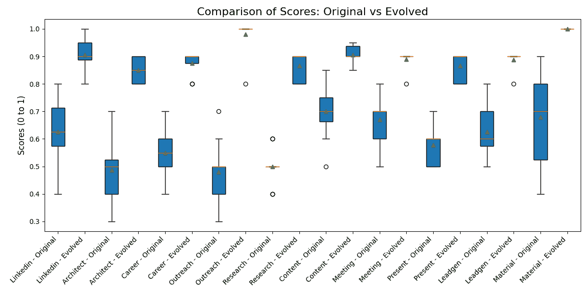

<!--yml

分类：未分类

日期：2025-01-11 11:44:21

-->

# 一个多智能体系统，用于通过迭代优化和LLM驱动的反馈循环，自主优化代理AI解决方案

> 来源：[https://arxiv.org/html/2412.17149/](https://arxiv.org/html/2412.17149/)

Kamer Ali Yuksel    Hassan Sawaf

aiXplain Inc., 美国加利福尼亚州圣荷西

{kamer, hassan}@aixplain.com

###### 摘要

代理AI系统使用专门的智能体处理复杂工作流中的任务，实现自动化和高效性。然而，优化这些系统通常需要劳动密集型的手动调整，以精细化角色、任务和交互。本文介绍了一种框架，用于自主优化代理AI解决方案，适用于多个行业，如基于NLP的企业应用。该系统采用智能体进行精炼、执行、评估、修改和文档管理，利用由LLM（*Llama 3.2-3B*）驱动的迭代反馈循环。该框架通过自主生成和测试假设来改进系统配置，达到了无需人工输入的最佳性能。这种方法增强了系统的可扩展性和适应性，为动态环境中的实际应用提供了强大的解决方案。来自多个领域的案例研究展示了该框架的变革性影响，显著提升了输出质量、相关性和可操作性。这些案例研究的所有数据，包括原始和演化后的智能体代码及其输出，可以在此查看：[anonymous.4open.science/r/evolver-1D11/](https://anonymous.4open.science/r/evolver-1D11/)

一个多智能体系统，用于通过迭代优化和LLM驱动的反馈循环，自主优化代理AI解决方案

Kamer Ali Yuksel 和 Hassan Sawaf aiXplain Inc., 美国加利福尼亚州圣荷西 {kamer, hassan}@aixplain.com

## 1 引言

代理AI系统由专门的智能体协同工作，以实现复杂的目标，已经改变了市场研究、业务流程优化和产品推荐等行业。这些系统在自动化决策和简化工作流方面表现出色。然而，由于智能体之间的交互复杂性以及对手动配置的依赖，它们的优化仍然具有挑战性。

最近，大型语言模型（LLMs）的进展提供了解决方案，能够实现代理AI系统的自动化精炼。LLMs可以自主生成和评估复杂的假设，促进智能体角色和工作流的迭代改进，且只需最少的人工监督。进行的案例研究展示了这些进展如何解决特定领域的挑战。这些示例突出显示了该框架的可扩展性和适应性，使其在动态、不断发展的环境中尤为有效。

本文提出了一个框架，用于利用LLM驱动的反馈循环自主优化代理AI系统。该框架通过基于定性和定量指标精炼代理配置，从而提高了效率和可扩展性。多个领域的案例研究为该框架克服特定领域挑战的能力提供了证据。该框架旨在企业系统中部署，解决了在现实环境中优化复杂工作流的持续性挑战。

本研究建立了一个可扩展的自主系统，用于优化代理AI，广泛适用于各个行业。主要贡献：

+   •

    演化优化：无需人工干预即可演化代理配置。

+   •

    自主优化：通过迭代反馈循环实现完全自动化的优化。

+   •

    验证案例研究：来自各个领域的实证结果，展示了显著的性能提升。

## 2 背景

代理AI系统自动化了跨行业的复杂流程，带来了显著的效率提升。然而，它们的优化需要解决代理交互的复杂性，尤其是在目标不断变化的动态环境中。近期大语言模型（LLM）的进展提供了变革性的能力，通过使自动生成和评估假设来改善工作流。本框架的独特之处在于，它能够实现代理AI系统的完全自主优化。该系统通过LLM驱动的反馈循环、假设生成和迭代修改，提高了可扩展性、适应性和领域独立性，为优化复杂的AI工作流设立了新的标准。与之前依赖于预定义任务或人工干预的方法不同，这种方法为现实世界的动态环境提供了更优的解决方案。

先前的研究探索了代理系统优化和大语言模型（LLM）集成的多个方面。例如，黄等人（[2024](https://arxiv.org/html/2412.17149v1#bib.bib2)）提出了MLAgentBench，这是一个用于评估语言代理在不同任务中的基准测试。虽然该框架提供了有价值的见解，但它主要侧重于性能评估，而非迭代工作流优化，而这是我们研究的重点。同样，史密斯等人（[2023](https://arxiv.org/html/2412.17149v1#bib.bib9)）探讨了使用大型模型代理（LMA）通过LLM促进代理之间合作的方式，强调了LLM在代理间迭代反馈循环中的潜力。这与当前研究强调自主优化过程的主题紧密契合。

约翰逊和刘（[2023](https://arxiv.org/html/2412.17149v1#bib.bib3)）展示了LLM如何使代理自主地优化其角色和工作流程，强调了优化代理AI系统的重要性。与此同时，潘和张（[2024](https://arxiv.org/html/2412.17149v1#bib.bib8)）提出了使用自动化评估器来优化代理在网页导航等任务中的表现。尽管在该领域有效，但缺乏当前框架所关注的可扩展性和领域独立性。类似地，王等人（[2024](https://arxiv.org/html/2412.17149v1#bib.bib11)）介绍了一个基于LLM的技能发现框架，与本研究中讨论的迭代任务提案相呼应。此外，胡等人（[2024](https://arxiv.org/html/2412.17149v1#bib.bib1)）强调了模块化组件和基础模型在规划和执行代理系统中的重要性，侧重于设计阶段，而当前研究则强调持续的优化和工作流程的精炼。

马斯特曼等人（[2024](https://arxiv.org/html/2412.17149v1#bib.bib4)）回顾了新兴的AI代理架构，重点讨论了模块化和可扩展性，这也是本框架优化方法的核心。米特拉等人（[2024](https://arxiv.org/html/2412.17149v1#bib.bib6)）提出了一个生成合成数据的框架，展示了代理通过反馈循环精炼输出的潜力。余等人（[2024](https://arxiv.org/html/2412.17149v1#bib.bib12)）介绍了用于多步骤决策的反射树，与本研究中的迭代设计相一致。潘等人（[2024](https://arxiv.org/html/2412.17149v1#bib.bib7)）处理了反馈循环中如奖励黑客攻击等风险，本框架通过强有力的评估来缓解这些风险。最后，米勒等人（[2024](https://arxiv.org/html/2412.17149v1#bib.bib5)）强调了代理基准，强化了本框架对定性指标的关注。

最近，胡等人（[2024](https://arxiv.org/html/2412.17149v1#bib.bib1)）提出了自动化代理系统设计（ADAS），该方法专注于通过元代理创建新的代理设计，元代理通过组合和优化构建模块来编程新代理。尽管ADAS旨在发明新的代理，但本研究中提出的框架专注于优化现有的代理系统。通过迭代的基于大语言模型（LLM）的反馈循环，代理的角色、任务和工作流程得以优化，以增强在动态环境中的适应性和可扩展性。与优先创建代理的ADAS不同，本研究的重点是持续改进和优化已建立的系统。

算法1 代理AI优化过程

1:输入:2:       $C_{0}$: 初始代码3:       标准: 定性评估标准4:       $\epsilon$: 改进阈值5:       max_iterations: 最大迭代次数6:输出:7:       $C_{\text{best}}$: 最佳已知代码变体8:       $O_{\text{best}}$: 最佳已知代码变体的输出9:初始化:10:$C_{\text{best}}\leftarrow C_{0}$11:$O_{\text{best}}\leftarrow\text{execute}(C_{0})$12:$S_{\text{best}}\leftarrow f(O_{\text{best}},\text{criteria})$13:$\text{iteration}\leftarrow 0$14:当 $\text{iteration}<\text{max\_iterations}$ 时15:     $\text{iteration}\leftarrow\text{iteration}+1$16:     $E_{\text{best}}\leftarrow\text{evaluate}(O_{\text{best}},\text{criteria})$17:     $\mathcal{H}_{i}\leftarrow\text{generate\_hypotheses}(E_{\text{best}})$18:     $C_{i+1}\leftarrow M(\mathcal{H}_{i},C_{\text{best}})$19:     $O_{i+1}\leftarrow\text{execute}(C_{i+1})$20:     $S_{i+1}\leftarrow f(O_{i+1},\text{criteria})$21:     如果 $S_{i+1}>S_{\text{best}}$ 则22:         $C_{\text{best}}\leftarrow C_{i+1}$23:         $O_{\text{best}}\leftarrow O_{i+1}$24:         $S_{\text{best}}\leftarrow S_{i+1}$25:         保存最佳已知变体和输出26:     结束 如果27:     如果 $|S_{i+1}-S_{\text{best}}|<\epsilon$ 则28:         停止 $\triangleright$ 如果改进小于阈值则停止29:     结束 如果30:结束 当31:返回 $C_{\text{best}},O_{\text{best}}$

## 3 架构

提出的自主细化和优化 Agentic AI 系统的方法利用了多个专门的代理，每个代理负责细化过程中的一个特定阶段。该方法以迭代循环的方式运作，基于定性和定量输出评估，不断细化代理角色、目标、任务、工作流程和依赖关系。此外，系统设计具有可扩展性，确保其能够在各行业部署。由大型语言模型驱动的反馈循环提供了一个基础架构，使系统能够适应各种 NLP 应用，确保在各个领域的广泛适用性。该方法的优化过程由两个核心框架指导：合成框架和评估框架。合成框架根据系统的输出生成假设。假设代理和修改代理协作，合成新的 Agentic AI 系统配置，提出对代理角色、目标和任务的修改，供评估框架进行测试。

精炼和优化过程被构建在这些框架中，促使Agentic AI解决方案的持续改进。提出的方法是自主运行的，经过假设生成、执行、评估和修改的循环迭代，直到达到最佳性能为止。精炼迭代的详细报告请参见附录[A](https://arxiv.org/html/2412.17149v1#A1 "Appendix A Report for a Refinement Iteration ‣ A Multi-AI Agent System for Autonomous Optimization of Agentic AI Solutions via Iterative Refinement and LLM-Driven Feedback Loops")。该方法从部署Agentic AI系统的基准版本开始。代理被分配预定义的角色、任务和工作流，系统根据目标生成初始的定性和定量标准。使用LLM分析系统代码并提取评估指标，这些指标作为评估未来输出的基准。可以引入人工输入来修订或调整评估标准，以更好地与项目目标对齐；这一步骤是可选的，因为该方法旨在自主运行。

提出的方式从Agentic AI系统的基准版本开始，分配初始的代理角色、目标和工作流。第一次执行运行后，生成初始输出并建立对比的基准。在评估初始输出后，假设代理基于评估反馈生成修改代理角色、任务或工作流的假设。这些假设随后传递给修改代理，修改代理综合了代理逻辑、交互或依赖关系的变更，生成新的系统变体。执行代理执行新修改版本的系统，并收集性能指标。生成的输出使用定性和定量标准（例如，清晰度、相关性、执行时间）进行评估。选择代理将新生成的输出与已知的最佳变体进行比较，对变体进行排序，并判断新的输出是否更优。记忆模块存储最佳表现的变体，供未来迭代使用。该循环不断重复，提出的方法持续精炼代理工作流，提升整体性能，直到满足预定义或生成的（并可选地修订的）标准。

### 3.1 综合框架

精炼代理管理着迭代优化过程，负责将任务委派给其他代理并合成假设，以改善系统。它根据定性和定量标准评估代理输出，识别出代理角色、任务或工作流可以改进的领域。精炼代理利用评估指标，如清晰度、相关性、分析深度和可操作性，提出修改建议以提高系统输出。假设生成代理根据输出分析提出对代理系统的具体变更。这一模块根据评估反馈生成改进代理角色、任务和互动的假设。例如，如果代理由于任务委派效率低下而表现不佳，假设模块可能会建议调整任务层级或重新分配特定角色。

修改代理根据精炼代理生成的假设实施变更。这些变更可能涉及调整代理逻辑、修改工作流或改变代理依赖关系。通过整合这些变更，我们的方法创建了多个代理智能解决方案的变体。每个变体都会被存储并记录，包含关于预期改进的详细信息。执行代理运行系统的修改版本，执行新生成的变体并收集性能数据以供后续评估。它确保代理按照新配置执行其任务，并在出现问题时进行调试。执行代理追踪定性和定量输出，并将这些信息输入到评估过程中。

### 3.2 评估框架

评估框架负责评估每个系统变体的输出。评估代理使用Llama 3.2-3B来评估系统性能的定性和定量方面。评估框架确保每次迭代都与系统的总体目标对齐，专注于持续改进。评估代理使用大型语言模型（LLM）评估每个系统变体的输出。LLM根据预定义或生成的定性标准评估输出，包括清晰度、与任务的相关性、分析深度、可操作性，以及执行时间、成功率等定量指标。评估代理提供全面的系统性能分析，识别进一步改进的领域。在每次迭代后，选择代理将修改后的系统输出与已知最佳配置进行比较。它根据评估代理提供的评估分数对新变体进行排名，确定哪个配置带来最高的性能。排名最高的变体将被存储，以便用于未来的迭代，确保持续改进。

### 3.3 精炼过程

Agentic AI 的优化过程始于初始化最佳已知代码变体，记作 $C_{0}$，并生成其对应的输出 $O_{C_{0}}$。输出的性能通过一组定性标准（例如清晰度、相关性、分析深度）进行评估，其中评估函数 $f(O_{C},\text{criteria})$ 根据这些标准生成得分 $S(C_{0})=f(O_{C_{0}},\text{criteria})$。这个初始得分 $S(C_{0})$ 是后续迭代比较的基准。在每次迭代 $i$ 中，当前最佳已知输出 $O_{C_{i}}$ 会被评估，并从定性评估 $E_{C_{i}}$ 中生成一组假设 $\mathcal{H}_{i}=\text{generate\_hypotheses}(E_{C_{i}})$ 以提出改进建议。假设 $\mathcal{H}_{i}$ 随后被应用到代码 $C_{i}$ 上，生成新的变体 $C_{i+1}=M(\mathcal{H}_{i},C_{i})$。新的代码变体 $C_{i+1}$ 被执行，产生新的输出 $O_{C_{i+1}}$。新的输出使用相同的评估函数 $f(O_{C},\text{criteria})$ 进行评估，得出新的得分 $S_{i+1}=f(O_{C_{i+1}},\text{criteria})$。如果新的得分 $S_{i+1}$ 大于最佳已知得分 $S_{\text{best}}=\max(S_{i+1},S_{\text{best}})$，则新的变体被认为是优越的，并且最佳已知变体会按以下方式更新。该过程会继续迭代，直到满足停止条件：要么迭代之间的改进小于预定义的阈值 $|S_{i+1}-S_{\text{best}}|<\epsilon$，要么达到最大迭代次数。终止时，提出的方法返回最佳已知变体 $C_{\text{best}}$ 及其输出 $O_{\text{best}}$。

一旦初始化完成，所提出的方法进入执行阶段，在该阶段，代理按照基准配置执行分配的任务。执行代理运行系统，产生初步输出，这些输出作为后续迭代中的比较基准。执行阶段的结果将被存储，供未来分析和比较。评估代理评估在执行阶段产生的输出。所提方法采用定性和定量标准评估输出质量。定性指标包括相关性、清晰度、分析深度和可操作性，定量指标包括执行时间、任务完成率和整体系统效率。评估代理使用 LLM 生成详细反馈，指出系统可以改进的地方。假设生成代理分析评估数据，生成改进代理角色、任务和工作流程的假设。这些假设可能包括更改任务分配、修改代理目标或重构代理之间的相互依赖关系。一旦假设生成，修改代理就会实施这些建议的更改，基于这些修改创建新的系统变体。系统的修改版本由执行代理重新执行，评估代理再次评估其输出。这个迭代过程持续进行，每个新变体都与之前已知的最佳配置进行比较。选择代理根据性能对系统变体进行排名，确保记忆模块只存储表现最好的版本。

## 4 案例研究

在各个领域中，代理系统的演变凸显了不断改进以满足行业标准和用户期望的动态需求的必要性。本节概述了若干案例研究，展示了在市场调研、人工智能架构设计、职业转型、外联策略、LinkedIn 帖子、会议促进、潜在客户生成、内容创作和演示文稿开发等多个应用领域中，代理系统不断优化的转型过程。每个案例研究展示了原始系统所面临的挑战、所实施的战略性调整，以及最终输出质量的改善。研究结果强调了专业化和数据驱动决策在提升代理系统性能方面的重要性。所有这些案例研究的数据，包括原始和演变后的代理代码、其输出和评估报告，都可以在这里查看：[anonymous.4open.science/r/evolver-1D11/](https://anonymous.4open.science/r/evolver-1D11/)

### 4.1 市场调研代理

原始的市场调研代理系统旨在提供战略洞察。然而，它面临着多个挑战，包括市场调研深度不足、战略发展不力以及输出质量有限。这些缺陷阻碍了系统与用户需求的有效对接，导致评估标准得分较低。进化后的代理系统引入了专门化角色，如市场调研分析师、数据分析师和用户体验专家，以解决这些问题。这些变化旨在增强市场分析的深度，创建数据驱动的决策框架，并优先考虑以用户为中心的设计原则。通过加入专业化代理，系统更好地理解了新兴趋势，并提供了可操作的洞察。优化后的代理系统在输出质量方面取得了显著进展，得分为0.9，涵盖对齐度与相关性、准确性与完整性，以及清晰度与可操作性。进化后的输出提供了一个连贯的战略框架，显著提升了市场调研代理的整体效能。

图1：市场调研代理系统优化

### 4.2 医学人工智能架构代理

医学影像的架构代理系统面临着与监管合规、患者参与以及基于人工智能的决策过程可解释性相关的挑战。这些局限性导致了系统在评估中获得中等分数，从而削弱了其在解决关键医疗需求方面的有效性。作为回应，进化后的系统加入了专业化代理角色，包括监管合规专家和患者倡导者，以确保遵守标准并优先考虑患者需求。开发透明度框架加强了对可解释性的关注，同时建立了持续监控机制，用于持续的性能评估。进化后的系统在多个评估标准上显示出显著的改进，包括监管合规性（0.9）、以患者为中心的设计（0.8）以及可解释性（0.8）。这些改进凸显了专业化在开发满足复杂医疗需求的系统中的重要性，最终提高了患者护理质量和治疗效果。

图2：人工智能架构代理系统优化

### 4.3 职业转型代理

最初的 AI 转型代理系统旨在帮助软件工程师转型为 AI 专家角色。然而，该系统在与行业专业知识对接和职业发展目标的清晰度方面存在困难。这种脱节导致了低效的行动计划和沟通不清晰。经过优化的系统采取了多元化的方法，引入了新的代理角色，如领域专家和技能开发者。任务经过精细化调整，确保了具体性和清晰度，通过详细的时间表和结构化输出增强了沟通。改动导致了评估分数的显著提升，特别是在与 AI 领域专业知识的对接（91%）和沟通清晰度（90%）方面取得了显著进展。优化后的系统提供了清晰、可操作的目标，促进了软件工程师向 AI 角色的有效转型，突显了代理系统优化的重要性。

图 3：职业转型代理优化

### 4.4 外展代理

最初为供应链设计的外展代理系统，由于其过于狭窄的焦点和较差的输出质量，面临着局限性。原始系统的角色较为基础，如电子邮件撰写员，未能应对供应链管理中的复杂问题。为了增强系统，新增了五个专门化角色，重点关注供应链分析、优化和可持续性。这一综合方法使得对供应链挑战和运营低效的分析更为深入。经过改进的代理系统显示出显著的提升，输出在清晰度、准确性和可操作性方面得到增强。这些改动使得输出超越了精细化评估标准，确立了该系统作为寻求有效供应链解决方案的电子商务公司有价值工具的地位。

图 4：外展代理优化

### 4.5 LinkedIn 代理

最初的生成型 AI 代理系统在创建关于生成型 AI 趋势的 LinkedIn 帖子时，面临着深度、受众参与和来源可信度等方面的局限性。这些挑战影响了系统生成有洞察力和吸引人的内容的能力。经过优化后的系统融入了四个专门化角色，包括受众参与专家，以增强内容开发和受众互动。为了确保内容的相关性，实施了一个强调受众指标和适应性的动态内容策略。经过精细调整后的输出大大提升了上下文相关性、准确性、受众参与潜力和清晰度。经过改进的系统将自己定位为生成型 AI 趋势领域的有价值资源，突显了专门化角色在内容创作中的重要性。

图 5：LinkedIn 代理优化

### 4.6 会议代理

为AI驱动的药物发现设计的会议代理系统未能满足定性评估标准，原因是与行业趋势对齐度差且分析深度不足。这些不足限制了其在支持制药行业利益相关者方面的效果。进化后的系统引入了专业化角色，包括AI行业专家和合规监管负责人，以提供全面的见解，并确保输出与利益相关者需求对齐。这一改革旨在提高系统的相关性和可操作性。输出比较表明，进化后的系统在所有评估类别中均获得了0.9或更高的得分，显示出有针对性的修改措施的影响。优化后的系统有效解决了制药行业的需求，证明了定向修改的成效。

图 6：会议代理优化

### 4.7 潜在客户生成代理

针对“个性化学习的AI平台”的潜在客户生成代理面临着与商业目标对齐度差和数据准确性不足的问题。这些局限性阻碍了该系统为教育科技行业生成有价值潜在客户的能力。为提升系统，创建了新的专业化角色，包括市场分析师和商务发展专家，以改进潜在客户资格认证流程和数据完整性。任务结构也得到了扩展，加入了详细的分析和可操作的建议。进化后的代理系统在评估标准上显著改善，包括与商业目标对齐度（91%）和数据准确性（90%）。这些改进突显了专业化角色和结构化方法在潜在客户识别与资格认证流程中的重要性。

图 7：潜在客户生成代理优化

图 8：多个案例研究中的原始系统与进化系统比较：每对柱状图代表原始系统与进化系统的评估得分，突显了通过优化代理、任务和工作流所取得的显著对齐度、清晰度、相关性和可操作性改进。进化系统始终表现出更高的得分，表明引入专业化角色和有针对性的修改措施的有效性。

### 4.8 评估结果

图 [8](https://arxiv.org/html/2412.17149v1#S4.F8 "图 8 ‣ 4.7 潜在生成代理 ‣ 4 个案研究 ‣ 通过迭代精炼和LLM驱动的反馈循环优化代理AI解决方案的多AI代理系统") 展示了在各种代理应用中的原始系统与进化系统的比较评估，包括客户支持、医学影像、供应链管理等。箱线图展示了在对齐性、清晰度、相关性和可操作性等关键标准上的评估得分分布，提供了以下重要见解：

+   •

    一致性改进：进化后的系统在所有案例研究中都取得了显著更高的得分，中位数值接近或超过0.9，展示了这些系统的优势。

+   •

    变异性减少：进化系统得分的分布缩小，反映出更一致且可靠的输出，这归因于专门化的代理角色和任务。

+   •

    目标性增强：如外联代理、市场研究代理和医疗AI架构师等系统展示了显著的改进，突出了以用户为中心和数据驱动方法的价值。

这些发现强调了在代理系统中持续精炼的变革性影响，突出了领域特定角色、战略性修改和适应性的重要性，以满足行业和用户的动态需求。

## 5 讨论

来自案例研究的集体发现表明，目标性修改和引入专门角色对代理系统产生了变革性影响。每个系统的进化在多个评估标准上都取得了显著改进，包括对齐性、准确性、相关性、清晰度和可操作性。这些改进不仅解决了原始系统面临的初步挑战，还使进化后的代理系统成为各自领域的宝贵工具。跨这些多样化案例研究所进行的实验强调了在代理系统中持续精炼的必要性，以满足行业和用户不断变化的需求。引入专门角色和以用户为中心的设计重点在提高输出质量和有效性方面发挥了重要作用。从案例研究中获得的见解将为未来的代理系统提供基础，强调专门化和适应性在实现最佳结果中的重要性。Sulc等人（[2024](https://arxiv.org/html/2412.17149v1#bib.bib10)）的一个关键见解是，自我改善代理的重要性，代理能够通过反馈循环自主调整角色和互动。实验结果展示了动态适应和持续提升的潜力，使其非常适合在目标和条件不断变化的环境中使用。

## 6 结论

本文提出了一种强大的方法，用于代理智能解决方案的自主优化与改进。该方法通过利用迭代反馈循环、假设生成和自动修改，持续改进基于代理的工作流程，从而提高效率和效果。该方法的自主性最小化了人类干预，非常适合需要持续改进的大规模应用。该方法的可扩展性、灵活性以及适应不断变化目标的能力，使其成为优化复杂AI代理的有力工具。

尽管该方法在代理智能（Agentic AI）方面展示了有前景的进展，但仍有若干未来探索的方向可以进一步增强其能力。研究人类在环（human-in-the-loop）策略的作用，可以弥合完全自主操作与需要细致人类判断的场景之间的差距，尤其是在初期部署或不确定性较高的环境中。这可能会导致混合系统，其中人类专业知识增强了自主代理的决策制定，确保安全性和可靠性，同时不妥协自主性。与行业合作伙伴的合作也将有助于将该方法量身定制为满足实际需求，确保其适应性和影响力。

## 7 限制

提出的自主优化代理智能系统框架存在一些限制，值得注意。使用大语言模型（LLMs）进行反馈、假设生成和评估可能会导致不准确、缺乏可解释性以及来自其训练数据的偏差。该框架的有效性依赖于明确定义的评估标准。糟糕或有偏的标准可能导致次优的优化结果，因为代理无法独立识别缺失的维度。在高风险或模糊任务中，最小化人类干预可能会带来问题，因为细致的判断和伦理考虑（例如隐私或意外后果）至关重要。像假设生成和评估这样的迭代过程计算量大，可能限制了在资源受限环境中的应用。

## 参考文献

+   Hu 等人（2024）盛然·胡（Shengran Hu）、聪·陆（Cong Lu）和杰夫·克鲁恩（Jeff Clune）。2024年。代理系统的自动化设计。*arXiv 预印本 arXiv:2408.08435*。

+   Huang 等人（2024）黄乾、简·沃拉（Jian Vora）、珀西·梁（Percy Liang）和朱尔·莱斯科维茨（Jure Leskovec）。2024年。Mlagentbench：评估语言代理在机器学习实验中的表现。在 *第41届国际机器学习会议（ICML）论文集*，机器学习研究论文集第235卷，页码20271–20309。PMLR。

+   Johnson 和 Liu（2023）莎拉·约翰逊（Sarah Johnson）和明·刘（Ming Liu）。2023年。专业代理：发展大型语言模型。在 *第36届神经信息处理系统会议（NeurIPS）论文集*。

+   Masterman 等人 (2024) Tula Masterman, Sandi Besen, Mason Sawtell, 和 Alex Chao. 2024. 新兴 AI 代理架构在推理、规划和工具调用中的应用：一项调查。*arXiv 预印本 arXiv:2404.11584*。

+   Miller 等人 (2024) Jason Miller, Kate O'Neill, 和 Deepak Ranjan. 2024. 重要的 AI 代理：代理系统中的性能、可扩展性和适应性。发表于 *第40届国际自主系统大会论文集*。Springer。

+   Mitra 等人 (2024) Arindam Mitra, Luciano Del Corro, Guoqing Zheng, Shweti Mahajan, Dany Rouhana, Andres Codas, Yadong Lu, Wei ge Chen, Olga Vrousgos, Corby Rosset, Fillipe Silva, Hamed Khanpour, Yash Lara, 和 Ahmed Awadallah. 2024. [Agentinstruct: 朝着具有代理流的生成式教学](https://arxiv.org/abs/2407.03502)。 *预印本*，arXiv:2407.03502。

+   Pan 等人 (2024) Alexander Pan, Erik Jones, Meena Jagadeesan, 和 Jacob Steinhardt. 2024. [语言模型的反馈回路驱动上下文奖励破解](https://arxiv.org/abs/2402.06627)。 *预印本*，arXiv:2402.06627。

+   Pan 和 Zhang (2024) Wei Pan 和 Lei Zhang. 2024. 数字代理的自主评估与优化。发表于 *第38届AAAI人工智能大会论文集*。

+   Smith 等人 (2023) Jordan Smith, Liam O'Connor, 和 Divya Patel. 2023. 大型模型代理：最先进的合作方法。发表于 *第31届国际学习表征大会 (ICLR) 论文集*。

+   Sulc 等人 (2024) Antonin Sulc, Thorsten Hellert, Raimund Kammering, Hayden Houscher, 和 Jason St John. 2024. 朝着粒子加速器上的代理 AI 发展。*arXiv 预印本 arXiv:2409.06336*。

+   Wang 等人 (2024) Tao Wang, Jing Li, 和 Rui Huang. 2024. 大型语言模型的代理技能发现。*人工智能研究期刊*，72:145–178。

+   Yu 等人 (2024) Xiao Yu, Baolin Peng, Vineeth Vajipey, Hao Cheng, Michel Galley, Jianfeng Gao, 和 Zhou Yu. 2024. [通过反思树搜索和自我学习改善自主 AI 代理](https://arxiv.org/abs/2410.02052)。 *预印本*，arXiv:2410.02052。

## 附录 A 精炼迭代报告

### A.1 初步假设和理由

#### A.1.1 引入专业化代理

假设：为不同任务创建专门的代理将增强深度和专业化，从而产生更全面和更专业的分析。

+   •

    市场识别专家代理

    +   –

        角色：市场识别专家

    +   –

        目标：使用先进的搜索工具识别广泛的潜在市场。

    +   –

        工具：SerperDevTool, WebsiteSearchTool

+   •

    消费者需求分析师代理

    +   –

        角色：消费者需求分析师

    +   –

        目标：使用网页抓取工具分析消费者需求。

    +   –

        工具：ScrapeWebsiteTool

原因：专注于特定任务的专业化代理将带来更深入的知识和更有针对性的方法，提高市场研究的精准性和质量。

#### A.1.2 工具集成

假设：通过专门代理人更好地利用现有工具（SerperDevTool, WebsiteSearchTool, ScrapeWebsiteTool），将带来更全面且数据驱动的分析结果。

理由：利用为特定目的（搜索和抓取）设计的工具，将提供更丰富的数据集和洞察，产生更强大的市场分析。

#### A.1.3 重新定义现有任务

假设：将任务重新定义为与专门角色对齐，将提高工作流程的效率和清晰度，从而带来更好的结果。

+   •

    市场识别任务（分配给市场识别专家代理人）

    +   –

        描述：使用搜索工具识别新产品的潜在市场。

    +   –

        预期输出：一份经过充分研究的潜在市场清单。

+   •

    消费者需求分析任务（分配给消费者需求分析师代理人）

    +   –

        描述：使用网页抓取分析已识别市场中的消费者需求。

    +   –

        预期输出：一份基于网页抓取数据支持的消费者需求的详细报告。

理由：明确任务的定义和重新分配，将确保每个专门代理人能够专注于其核心活动，提升生产力和效能。

#### A.1.4 创建一个用于全面验证的新任务

假设：增加一个验证任务，将专门代理人的发现进行汇总和确认，确保最终输出准确且一致。

+   •

    市场确认任务（依赖于市场识别和消费者需求分析）

    +   –

        描述：验证并汇总潜在市场及其需求的最终清单。

    +   –

        预期输出：一份全面且经过验证的关于潜在市场和消费者需求的报告。

理由：最终的验证和汇总步骤将整合来自专门代理人的洞察，确保报告在逻辑结构上连贯且一致，从而提升整体输出质量。

### A.2 修订工作流程

1.  1.

    市场识别专家代理人执行市场识别任务。

1.  2.

    消费者需求分析师代理人执行消费者需求分析任务。

1.  3.

    市场研究代理人通过市场确认任务整合发现，并生成最终报告。

### A.3 详细报告概述理由

#### A.3.1 引入专门代理人

+   •

    市场识别专家代理人

    +   –

        角色：市场识别专家

    +   –

        目标：使用先进的搜索工具识别广泛的潜在市场。

    +   –

        工具：SerperDevTool, WebsiteSearchTool

    +   –

        理由：该代理人专注于使用先进的搜索工具识别市场，将增强市场识别的深度和精准度，为后续分析提供更强的基础。

+   •

    消费者需求分析师代理人

    +   –

        角色：消费者需求分析师

    +   –

        目标：使用网页抓取工具分析消费者需求。

    +   –

        工具：ScrapeWebsiteTool

    +   –

        理由：通过专注于使用网页抓取工具分析消费者需求，该代理人能够生成更详细、基于数据的消费者行为和偏好洞察。

#### A.3.2 重新定义现有任务

+   •

    市场识别任务

    +   –

        描述：使用搜索工具识别新产品的潜在市场。

    +   –

        预期输出：经过深入研究的潜在市场清单。

    +   –

        代理人：市场识别专家代理人

    +   –

        工具：SerperDevTool, WebsiteSearchTool

    +   –

        理由：将此任务分配给专业代理人可以确保使用适当的工具进行专注和全面的市场识别。

+   •

    消费者需求分析任务

    +   –

        描述：使用网页抓取分析已识别市场中的消费者需求。

    +   –

        预期输出：一份详细的消费者需求报告，支持来自网页抓取的数据。

    +   –

        代理人：消费者需求分析师代理人

    +   –

        依赖关系：市场识别任务

    +   –

        工具：ScrapeWebsiteTool

    +   –

        理由：这个专业任务利用网页抓取提供深入的消费者洞察，确保数据准确识别并支持消费者需求。

#### A.3.3 创建一个用于全面验证的新任务

+   •

    市场确认任务

    +   –

        描述：验证并编制最终的潜在市场清单及其需求。

    +   –

        预期输出：一份全面且经过验证的潜在市场和消费者需求报告。

    +   –

        代理人：市场识别专家代理人

    +   –

        依赖关系：市场识别任务、消费者需求分析任务

    +   –

        工具：无

    +   –

        理由：此最终验证任务确保了两个专业代理人集成见解的一致性和逻辑结构，从而生成更可靠、更连贯的报告。

### A.4 综合比较报告

#### A.4.1 新输出与已知最佳输出的评估

+   •

    潜在市场识别：

    +   –

        已知最佳输出：识别出两个市场（印度B2C电子商务、可持续钢铁）。

    +   –

        新输出：识别出七个市场（健康与健身、可持续产品、智能家居、老年护理、宠物护理、远程工作、教育技术）。

    +   –

        评估：新输出更全面，涵盖了更广泛的市场。

+   •

    消费者需求分析：

    +   –

        已知最佳输出：详细描述两个市场。

    +   –

        新输出：对七个市场的详细描述，包括市场需求、增长驱动因素和潜在产品。

    +   –

        评估：新输出提供了更全面和结构化的分析。

+   •

    可操作性：

    +   –

        已知最佳输出：为两个市场提供可操作的见解。

    +   –

        新输出：为七个市场提供可操作的见解。

    +   –

        评估：新输出因其更广泛的范围，提供了更多可操作的见解。

+   •

    产品开发建议：

    +   –

        已知最佳输出：为两个市场提供了明确的建议。

    +   –

        新输出：为七个市场提供了明确的建议。

    +   –

        评估：新输出提供了更全面的建议。

+   •

    完整性与一致性：

    +   –

        已知最佳输出：完成了两个市场的基本步骤。

    +   –

        新输出：完成了七个市场的基本步骤。

    +   –

        评估：新输出更完整。

结论：新输出优于已知最佳输出，因为它提供了：

1.  1.

    更广泛且更清晰的潜在市场识别。

1.  2.

    更加全面和结构化的消费者需求分析。

1.  3.

    为产品开发提供更多可操作的见解和建议。

1.  4.

    市场调研过程中的更高完整性和一致性。

因此，新的变体（其代码和输出）已被保存为最知名的变体。
