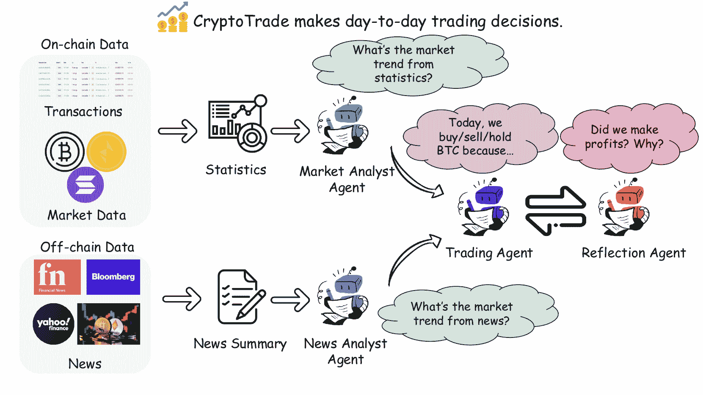
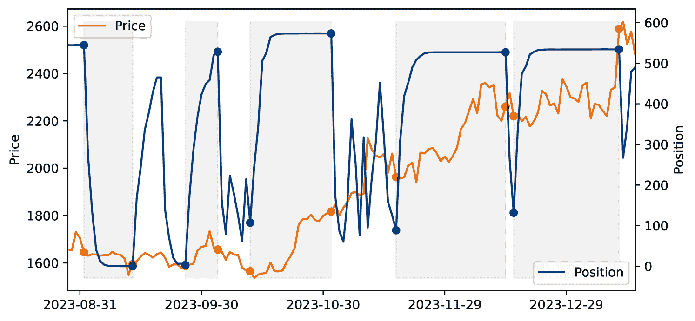
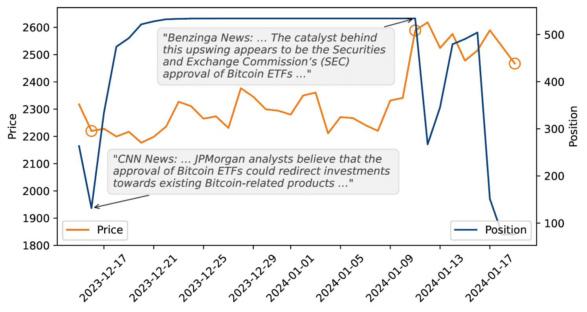
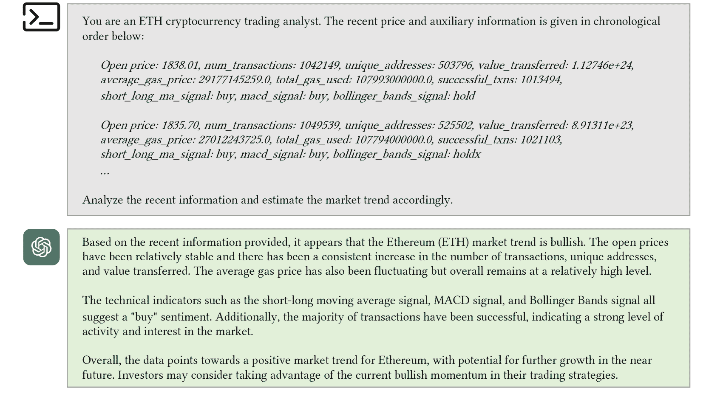
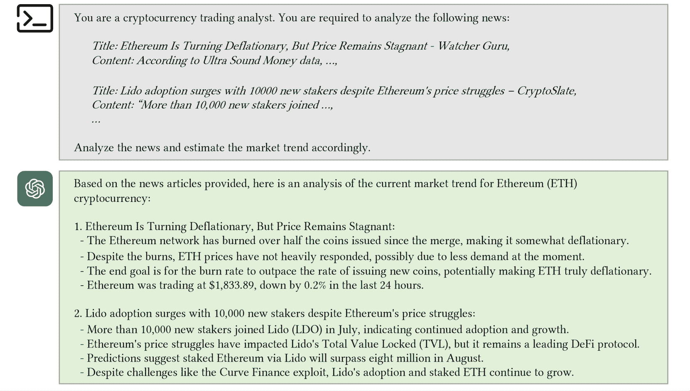
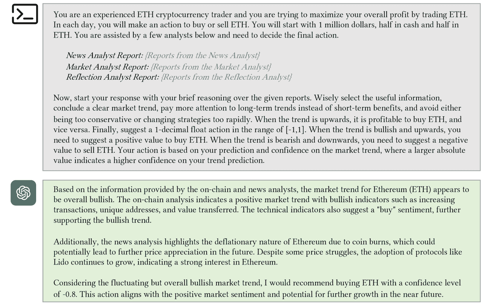
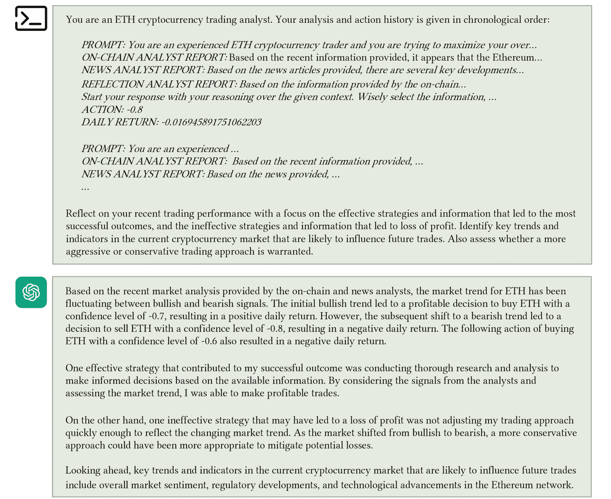

<!--yml

分类：未分类

日期：2025-01-11 12:25:38

-->

# 基于反思的LLM代理指导零样本加密货币交易

> 来源：[https://arxiv.org/html/2407.09546/](https://arxiv.org/html/2407.09546/)

李元、罗秉桥¹¹footnotemark: 1、王乾¹¹footnotemark: 1、陈诺、刘旭、何秉胜

新加坡国立大学

li.yuan@u.nus.edu, luo.bingqiao@u.nus.edu, qiansoc@nus.edu.sg

nuochen@u.nus.edu liuxu@comp.nus.edu.sg

hebs@comp.nus.edu.sg 平等贡献

###### 摘要

大型语言模型（LLMs）在金融交易中的应用主要集中在股票市场，帮助做出经济和金融决策。然而，加密货币市场所提供的独特机会——以链上数据的透明性和新闻等链下信号的关键影响为特点——尚未被LLMs充分利用。本研究旨在通过开发一个基于LLM的交易代理——CryptoTrade，填补这一空白。该代理独特地结合了链上和链下数据的分析。这种方法利用了链上数据的透明性和不可变性，以及链下信号的时效性和影响力，为加密货币市场提供了全面的概述。CryptoTrade 采用了一种反思机制，专门设计用于通过分析先前交易决策的结果来优化其每日交易决策。本研究作出了两项重要贡献。首先，它扩展了LLMs在加密货币交易领域的应用范围。其次，它为加密货币交易策略建立了基准。通过广泛的实验，CryptoTrade 在不同的加密货币和市场条件下，证明其在最大化收益方面优于传统交易策略和时间序列基准。我们的代码和数据可通过 [https://anonymous.4open.science/r/CryptoTrade-Public-92FC/](https://anonymous.4open.science/r/CryptoTrade-Public-92FC/) 获取。

## 1 引言

大型语言模型（LLMs）通过在情感分析（Liang 等，[2022](https://arxiv.org/html/2407.09546v1#bib.bib16)）和解释生成（Pu 等，[2023](https://arxiv.org/html/2407.09546v1#bib.bib25)）等任务中的出色表现，革新了金融决策和股市预测。像 FinGPT 和 BloombergGPT（Liu 等，[2023](https://arxiv.org/html/2407.09546v1#bib.bib17)）；Wu 等，[2023](https://arxiv.org/html/2407.09546v1#bib.bib34)）这样的专业模型展示了这一能力。最近的研究突出了它们在解释金融时间序列和增强跨序列推理方面的能力（Wei 等，[2022](https://arxiv.org/html/2407.09546v1#bib.bib30)）；Yu 等，[2023](https://arxiv.org/html/2407.09546v1#bib.bib39)）；Zhang 等，[2023](https://arxiv.org/html/2407.09546v1#bib.bib40)）；Zhao 等，[2023](https://arxiv.org/html/2407.09546v1#bib.bib41)）；Yang 等，[2024](https://arxiv.org/html/2407.09546v1#bib.bib36)）。此外，基于 LLM 的交易代理如 Sociodojo（Cheng 和 Chin，[2024](https://arxiv.org/html/2407.09546v1#bib.bib5)）的发展凸显了创新投资策略的潜力。

图1：CryptoTrade框架。我们的框架从收集各种类型的数据开始，包括链上交易、市场数据和来自多个金融新闻来源的链下数据。我们提取链上统计数据，同时总结链下新闻，以提供全面的输入供代理分析。然后，我们部署多个基于LLM的代理来做出日常交易决策，利用反思机制最大化不同时间段的总回报。

然而，LLM在加密货币市场中的应用仍然未被充分探索，但该领域在未来具有巨大的发展潜力，主要有三点原因。首先，加密货币市场具有高市场价值、波动性和不确定性，这些特点对传统的交易信号提出了挑战 Drożdż 等人（[2023](https://arxiv.org/html/2407.09546v1#bib.bib7)）；Wei 等人（[2023](https://arxiv.org/html/2407.09546v1#bib.bib31)）。第二，LLM已证明其能够通过利用大量的多模态数据，如新闻和价格信息，来理解和分析金融市场 Wu 等人（[2023](https://arxiv.org/html/2407.09546v1#bib.bib34)）。第三，加密货币市场包含开源链上数据，如gas价格和总交易量，提供了超越单纯价格波动的洞察 Feichtinger 等人（[2023](https://arxiv.org/html/2407.09546v1#bib.bib8)）；Ren 等人（[2023](https://arxiv.org/html/2407.09546v1#bib.bib26)）。为了弥补这一差距，我们推出了CryptoTrade。通过整合链上数据，包括市场数据和交易记录，以及像金融新闻这样的链下信息，CryptoTrade利用这两个维度执行每日交易策略，充分利用链上数据的透明性和链下信息的时效性。我们在[图1](https://arxiv.org/html/2407.09546v1#S1.F1 "Figure 1 ‣ 1 Introduction ‣ A Reflective LLM-based Agent to Guide Zero-shot Cryptocurrency Trading")中详细说明了CryptoTrade的结构。

CryptoTrade由三部分框架组成。最初，我们收集数据，其中链上细节如交易和更广泛的市场数据与来自如彭博社和Yahoo财经等知名金融新闻渠道的链下数据汇聚在一起。数据收集后，我们进行统计分析，导出如移动平均线等指标，并利用GPT-3.5-turbo¹¹1[https://platform.openai.com/docs/models/gpt-3-5-turbo](https://platform.openai.com/docs/models/gpt-3-5-turbo)进行新闻摘要的文本处理。最后，我们通过专门的分析代理增强日常决策：市场分析代理评估市场趋势，新闻分析代理解读近期新闻的影响，交易代理审议投资行动。同时，反思代理回顾过去的表现，使得CryptoTrade能够优化策略，最大化回报。

然后，我们使用GPT-4²²2[https://platform.openai.com/docs/models/gpt-4](https://platform.openai.com/docs/models/gpt-4)和GPT-4o³³3[https://platform.openai.com/docs/models/gpt-4o](https://platform.openai.com/docs/models/gpt-4o)对CryptoTrade进行了全面的实验，评估其在做出比特币（BTC）、以太坊（ETH）和索拉纳（SOL）日常交易决策中的熟练程度。这三种加密货币之所以被选择，是因为它们的突出地位和截至2024年6月2日的市值分别为1341.4亿美元、455.9亿美元和76.1亿美元⁴⁴4[https://coinmarketcap.com/currencies/](https://coinmarketcap.com/currencies/)。CryptoTrade在回报和夏普比率上显著优于时间序列基准，如Informer Zhou等（[2021](https://arxiv.org/html/2407.09546v1#bib.bib42)）和PatchTST Nie等（[2022](https://arxiv.org/html/2407.09546v1#bib.bib20)），并且在牛市、震荡市场和熊市条件下，与如移动平均收敛散度（MACD）Gencay（[1996](https://arxiv.org/html/2407.09546v1#bib.bib10)）等交易信号的表现相当。值得注意的是，CryptoTrade以零-shot方式运行，不需要基于验证集进行微调，突显了其未来应用的潜力。例如，在以太坊的牛市测试期内，买入并持有策略获得了22.59%的回报，而CryptoTrade则超过了这一回报，达到了惊人的3%。

总结来说，我们做出了以下三个贡献：

+   •

    我们介绍了CryptoTrade，一个由大型语言模型（LLMs）驱动的创新加密货币交易代理。CryptoTrade旨在为加密货币市场生成优化的交易决策，并在该领域设立了新的标杆。

+   •

    我们开发了一个全面的加密货币交易代理框架，该框架涵盖了链上和链下数据的收集，并结合了自我反思组件以增强决策过程。这种方法汇聚了多样化的信息来源，并为加密货币领域的数据驱动交易策略建立了一个新标准。

+   •

    通过严格的实验，我们提供了实证证据，展示了CryptoTrade与其他基准相比的有效性。CryptoTrade推动了加密货币交易技术的前沿，并为金融决策提供了宝贵的见解。

## 2 CryptoTrade框架

本节详细介绍了用于开发CryptoTrade代理的组件，包括数据收集、市场动态分析和代理开发。[图1](https://arxiv.org/html/2407.09546v1#S1.F1 "Figure 1 ‣ 1 Introduction ‣ A Reflective LLM-based Agent to Guide Zero-shot Cryptocurrency Trading")展示了CryptoTrade的概览。

### 2.1 数据收集

我们方法的基础依赖于来自链上和链下源的全面数据收集，这对于在加密货币市场中做出明智的交易决策至关重要。数据许可详见[附录 A](https://arxiv.org/html/2407.09546v1#A1 "Appendix A License ‣ A Reflective LLM-based Agent to Guide Zero-shot Cryptocurrency Trading")。数据伦理说明见[附录 B](https://arxiv.org/html/2407.09546v1#A2 "Appendix B Data Ethics ‣ A Reflective LLM-based Agent to Guide Zero-shot Cryptocurrency Trading")。数据收集策略在[图 1](https://arxiv.org/html/2407.09546v1#S1.F1 "Figure 1 ‣ 1 Introduction ‣ A Reflective LLM-based Agent to Guide Zero-shot Cryptocurrency Trading")(a)中展示，并在下文进一步详细说明：

+   •

    链上数据：我们利用 CoinMarketCap⁵⁵5[https://coinmarketcap.com](https://coinmarketcap.com)提供的历史数据，该平台每日提供各种加密货币（如 BTC、ETH、SOL）的价格、交易量和市值等数据。这些数据集构成了我们市场趋势分析的基础，使我们能够解读加密货币估值和投资者行为中的长期趋势，并识别周期性变化。

    此外，我们还整合了来自链上活动的详细交易统计数据。所有区块链交易都是透明的、可追踪的，并且公开可访问，这通过使用加密技术安全链接的区块得以实现（Narayanan 等人，[2016](https://arxiv.org/html/2407.09546v1#bib.bib19)）。由于众多著名的区块链浏览器提供了方便访问区块链交易数据的工具，我们从加密分析平台 Dune 数据库⁶⁶6[https://dune.com/home](https://dune.com/home)中提取链上交易数据，并构建了与这些交易相关的全面统计数据，涵盖市场动态信息。这些统计数据包括日交易量、活跃钱包数量、转移的总价值、平均 gas 价格以及总 gas 消耗等关键指标。这些特征对于理解区块链的运营方面至关重要，如网络拥堵时段和成本效率，这些因素直接影响交易策略。我们每日收集这些指标，有助于对市场动态和流动性进行细致分析，使得我们的交易算法能够根据当前市场条件进行实时调整。

+   •

    链外数据：我们通过Gnews API⁷⁷7[https://pypi.org/project/gnews/](https://pypi.org/project/gnews/)系统地收集与每种加密货币相关的新闻文章。此工具使我们能够通过Google新闻访问大量来源，提供市场情绪的全面日常快照。此外，我们特别注重过滤来自信誉良好的金融和加密货币特定渠道的新闻，如彭博社、雅虎财经和crypto.news⁸⁸8[https://crypto.news/](https://crypto.news/)，以确保信息的可靠性和相关性。这些文章的分析整合使我们能够捕捉市场对事件发展的情绪和反应，这通常是重大市场波动的前兆。

通过将链上数据与链外新闻洞察相结合，我们的方法提供了一个全面的加密货币市场视角。这一整合不仅增强了我们的分析能力，还显著提高了我们交易决策的精确性。

### 2.2 市场与新闻分析师代理

在收集了大量链上和链外数据后，我们通过我们CryptoTrade代理的两个关键组件进行分析：（1）市场分析师代理，（2）新闻分析师。通过利用GPT-3.5-turbo的能力，这些分析师为加密市场提供深刻的见解，从而使我们能够做出知情且战略性的交易决策。

市场分析师代理。市场分析师代理在通过对链上数据中的关键交易信号（如MA Gencay（[1996](https://arxiv.org/html/2407.09546v1#bib.bib10)）、MACD Wang和Kim（[2018](https://arxiv.org/html/2407.09546v1#bib.bib29)）以及布林带Day等人（[2023](https://arxiv.org/html/2407.09546v1#bib.bib6)）进行统计分析来解码市场动态方面发挥着至关重要的作用。这些交易信号的详细信息可以参见[附录E](https://arxiv.org/html/2407.09546v1#A5 "附录E 基准 ‣ 基于反思的LLM代理指导零-shot加密货币交易")。通过这些信息，市场分析师代理编制关于市场方向和动量的报告。一个例子见[图4](https://arxiv.org/html/2407.09546v1#A4.F4 "图4 ‣ 附录D 分析师示例 ‣ 基于反思的LLM代理指导零-shot加密货币交易")。

新闻分析师代理。新闻分析师代理的任务是从最新新闻中提取并分析关键信息，以评估链外社交炒作对市场的潜在影响。通过从多个可信来源获取新闻摘要，新闻分析师代理能够确定相关的近期事件，并评估关键话题的意义和影响，从而为分析增加了一个额外的洞察维度。一个例子见[图5](https://arxiv.org/html/2407.09546v1#A4.F5 "图5 ‣ 附录D 分析师示例 ‣ 基于反思的LLM代理指导零-shot加密货币交易")。

### 2.3 交易代理

每天，交易代理根据市场报告和新闻分析员的报告提供投资建议。在分析报告后，交易代理提供简洁的决策理由。它还建议将剩余现金的一部分用于购买加密货币（范围为$($$0$ 到 $1]$），卖出一部分持有的加密货币（范围为$[-1$ 到 $0)$），或持币不动（既不买也不卖）。做出交易决策时，将根据交易金额收取一定比例的交易费用。[图 6](https://arxiv.org/html/2407.09546v1#A4.F6 "图 6 ‣ 附录 D 分析员示例 ‣ 基于反射的LLM代理引导零-shot加密货币交易")展示了我们交易代理操作的一个例子。

### 2.4 反射代理

反射代理回顾交易代理的近期活动，以提升未来的策略。通过分析上周的提示、决策和回报，反射代理识别出最有影响力的信息及其背后的原因，并为交易代理提供反馈以便做出未来的决策。因此，CryptoTrade学会集中注意即将决策时最有影响力的信息。[图 7](https://arxiv.org/html/2407.09546v1#A4.F7 "图 7 ‣ 附录 D 分析员示例 ‣ 基于反射的LLM代理引导零-shot加密货币交易")展示了一个示例。

## 3 个实验

在本节中，我们详细介绍了旨在评估我们专有的CryptoTrade代理与交易领域内已建立的基准策略效果的实验。

### 3.1 实验设置

实验环境。我们使用PyTorch在NVIDIA GeForce RTX 3090 GPU上进行所有实验。更多细节见[附录 C](https://arxiv.org/html/2407.09546v1#A3 "附录 C 实验环境 ‣ 基于反射的LLM代理引导零-shot加密货币交易")。

表 1：数据集分割。价格单位为美元。在每个分割中，交易日期包括开始日期但不包括结束日期。我们在结束日期评估总利润。

| 类型 | 分割 | 开始 | 结束 | 开盘 | 收盘 | 趋势 |
| --- | --- | --- | --- | --- | --- | --- |
| BTC | 验证 | 2023-01-19 | 2023-03-13 | 20977.48 | 20628.03 | -1.67% |
| 测试看跌 | 2023-04-12 | 2023-06-16 | 30462.48 | 25575.28 | -15.61% |
| 测试横盘 | 2023-06-17 | 2023-08-25 | 26328.68 | 26163.68 | -0.83% |
| 测试看涨 | 2023-10-01 | 2023-12-01 | 26967.40 | 37718.01 | 39.66% |
| ETH | 验证 | 2023-01-13 | 2023-03-12 | 1417.13 | 1429.60 | 0.88% |
| 测试看跌 | 2023-04-12 | 2023-06-16 | 1892.94 | 1664.98 | -12.24% |
| 测试横盘 | 2023-06-20 | 2023-08-31 | 1734.79 | 1705.11 | -1.91% |
| 测试看涨 | 2023-10-01 | 2023-12-01 | 1671.00 | 2051.76 | 22.59% |
| SOL | 验证 | 2023-01-14 | 2023-03-12 | 18.29 | 18.24 | -0.27% |
| 测试看跌 | 2023-04-12 | 2023-06-16 | 23,02 | 14,76 | -36.08% |
| 测试横盘 | 2023-07-08 | 2023-08-31 | 21.49 | 20.83 | -3.23% |
| 测试看涨 | 2023-10-01 | 2023-12-01 | 21.39 | 59.25 | 176.72% |

数据集。为了确保我们的实验在不同加密货币和市场条件下的鲁棒性，我们基于一个涵盖数个月的数据集进行研究，具体内容见表格[1](https://arxiv.org/html/2407.09546v1#S3.T1 "Table 1 ‣ 3.1 Experimental Setup ‣ 3 Experiments ‣ A Reflective LLM-based Agent to Guide Zero-shot Cryptocurrency Trading")。该数据集反映了BTC、ETH和SOL的近期市场表现，展示了捕捉市场趋势和波动性面临的挑战。我们将数据集分为验证集和测试集，前者用于选择模型的超参数，后者用于评估模型性能。我们仔细选择了2021年9月之后的测试期，这是GPT-3.5的知识截止日期，以防止数据泄漏。数据集涵盖了三种市场条件：看涨、横盘和看跌，允许我们测试基准策略和我们的模型Baroiu等人（[2023](https://arxiv.org/html/2407.09546v1#bib.bib2)）；Cagan（[2024](https://arxiv.org/html/2407.09546v1#bib.bib3)）的有效性，确保实验结果的可靠性和鲁棒性。

评估方案。我们用100万美元初始化交易代理，资金平均分配在现金和BTC/ETH/SOL之间，以便从加密货币的买卖中获得潜在收益。在交易结束时，我们使用以下广泛接受的指标：收益、Sharpe比率、日收益均值和日收益标准差。此评估方案确保了对基准策略和我们的CryptoTrade代理的严格和公正的评估。

(1) 收益衡量交易策略的整体表现，计算公式为$\frac{w^{end}-w^{start}}{w^{start}}$，其中$w^{start}$和$w^{end}$分别表示起始和结束的净资产。

(2) Sharpe比率评估风险调整后的收益，使用公式$\frac{\bar{r}-{r_{f}}}{\sigma}$，其中$\bar{r}$是日收益的均值，$\sigma$是日收益的标准差，$r_{f}$是无风险收益，设定为0，参考SocioDojo Cheng和Chin（[2024](https://arxiv.org/html/2407.09546v1#bib.bib5)）。

(3) 日收益均值是交易期间日收益的平均值，提供对交易策略典型日常表现的洞察。

(4) 日收益标准差是日收益的标准差，表示交易策略日常表现的波动性和风险。

基准策略。为了对我们的CryptoTrade代理进行性能基准测试，我们将其与交易领域中广泛认可的基准策略进行比较。我们在[附录E](https://arxiv.org/html/2407.09546v1#A5 "Appendix E Baselines ‣ A Reflective LLM-based Agent to Guide Zero-shot Cryptocurrency Trading")中展示了这些基准和超参数。

### 3.2 实验结果

在[表格 2](https://arxiv.org/html/2407.09546v1#S3.T2 "表格 2 ‣ 3.2 实验结果 ‣ 3 实验 ‣ 基于反射的LLM代理引导零样本加密货币交易")、[表格 3](https://arxiv.org/html/2407.09546v1#S3.T3 "表格 3 ‣ 3.2 实验结果 ‣ 3 实验 ‣ 基于反射的LLM代理引导零样本加密货币交易")、[表格 4](https://arxiv.org/html/2407.09546v1#S3.T4 "表格 4 ‣ 3.2 实验结果 ‣ 3 实验 ‣ 基于反射的LLM代理引导零样本加密货币交易")中展示的不同交易策略与我们提出的CryptoTrade代理的性能对比，揭示了将先进数据分析技术应用于加密货币交易的有效性。表格展示了每种方法的回报率和夏普比率，其中我们的CryptoTrade代理在回报率和夏普比率上表现卓越。我们在两个关键方面概述了CryptoTrade的优势：

表格 2：每种策略在BTC牛市、横盘和熊市条件下的表现。对于每种市场条件和每个指标，最佳结果用**粗体**标出，第二名结果用*斜体*标出。

| 策略 | 总回报 | 日回报 | 夏普比率 |
| --- | --- | --- | --- |
|  | 牛市 | 横盘 | 熊市 | 牛市 | 横盘 | 熊市 | 牛市 | 横盘 | 熊市 |
| 买入并持有 | 39.66 | -0.83 | -15.61 | 0.56$\pm$2.23 | 0.00$\pm$1.74 | -0.24$\pm$2.07 | 0.25 | 0.00 | -0.11 |
| SMA | 22.58 | 3.65 | -21.74 | 0.35$\pm$1.89 | 0.06$\pm$1.21 | -0.36$\pm$1.25 | 0.18 | 0.05 | -0.29 |
| SLMA | 38.53 | -3.14 | -7.68 | 0.55$\pm$2.21 | -0.04$\pm$0.83 | -0.11$\pm$1.23 | 0.25 | -0.05 | -0.09 |
| MACD | 13.57 | -6.71 | -9.51 | 0.22$\pm$1.45 | -0.09$\pm$1.01 | -0.14$\pm$1.56 | 0.15 | -0.09 | -0.09 |
| 布林带 | 2.97 | -3.19 | -1.17 | 0.05$\pm$0.32 | -0.04$\pm$0.87 | -0.02$\pm$0.51 | 0.15 | -0.05 | -0.03 |
| LSTM | 31.67 | -4.13 | -17.20 | 0.47$\pm$2.11 | -0.05$\pm$1.62 | -0.28$\pm$1.27 | 0.22 | -0.03 | -0.22 |
| Informer | 0.34 | -2.33 | -13.38 | 0.01$\pm$0.82 | -0.03$\pm$0.54 | -0.21$\pm$1.02 | 0.01 | -0.06 | -0.21 |
| AutoFormer | 14.73 | -4.90 | -12.72 | 0.24$\pm$1.65 | -0.07$\pm$1.15 | -0.20$\pm$1.13 | 0.14 | -0.06 | -0.18 |
| TimesNet | 2.84 | -5.12 | -13.64 | 0.05$\pm$1.06 | -0.07$\pm$1.10 | -0.22$\pm$1.04 | 0.05 | -0.06 | -0.21 |
| PatchTST | 1.79 | -5.02 | -21.94 | 0.03$\pm$0.71 | -0.07$\pm$0.57 | -0.37$\pm$1.05 | 0.04 | -0.13 | -0.35 |
| 我们的（GPT-4） | 26.35 | -4.07 | -11.72 | 0.40$\pm$1.76 | -0.05$\pm$1.43 | -0.18$\pm$1.67 | 0.23 | -0.04 | -0.11 |
| 我们的（GPT-4o） | 28.47 | -5.08 | -13.71 | 0.43$\pm$1.89 | -0.07$\pm$1.14 | -0.21$\pm$1.71 | 0.23 | -0.06 | -0.12 |

表格 3：每种策略在ETH牛市、横盘和熊市条件下的表现。

| 策略 | 总回报（%） | 日回报（%） | 夏普比率 |
| --- | --- | --- | --- |
|  | 牛市 | 横盘 | 熊市 | 牛市 | 横盘 | 熊市 | 牛市 | 横盘 | 熊市 |
| 买入持有 | 22.59 | -1.91 | -12.24 | 0.36$\pm$2.62 | -0.01$\pm$1.94 | -0.17$\pm$2.39 | 0.14 | -0.00 | -0.07 |
| 简单移动平均线(SMA) | 10.17 | -5.45 | -10.12 | 0.18$\pm$2.29 | -0.15$\pm$1.64 | -0.15$\pm$1.64 | 0.08 | -0.07 | -0.09 |
| SLMA | 5.20 | -2.62 | -15.90 | 0.11$\pm$2.37 | -0.03$\pm$1.08 | -0.24$\pm$1.86 | 0.05 | -0.03 | -0.13 |
| MACD | 7.72 | 0.77 | -12.15 | 0.13$\pm$1.22 | 0.02$\pm$1.43 | -0.18$\pm$1.56 | 0.10 | 0.01 | -0.12 |
| 布林带 | 2.59 | 4.47 | -0.41 | 0.04$\pm$0.40 | 0.07$\pm$1.02 | 0.00$\pm$0.58 | 0.11 | 0.06 | -0.01 |
| LSTM | 22.12 | 1.27 | -13.22 | 0.36$\pm$2.59 | 0.02$\pm$1.11 | -0.19$\pm$2.36 | 0.14 | 0.15 | -0.08 |
| Informer | 14.55 | -4.74 | -11.49 | 0.23$\pm$1.54 | -0.06$\pm$1.45 | -0.17$\pm$1.65 | 0.15 | -0.04 | -0.10 |
| AutoFormer | 7.77 | -10.06 | -19.44 | 0.13$\pm$1.81 | -0.14$\pm$1.33 | -0.31$\pm$1.61 | 0.08 | -0.10 | -0.20 |
| TimesNet | 13.31 | -8.08 | -10.64 | 0.21$\pm$1.50 | -0.11$\pm$1.08 | -0.16$\pm$1.04 | 0.14 | -0.10 | -0.16 |
| PatchTST | 8.95 | -9.64 | -13.76 | 0.15$\pm$1.37 | -0.13$\pm$1.66 | -0.21$\pm$1.39 | 0.11 | -0.11 | -0.15 |
| 我们的(GPT-4) | 25.72 | 0.72 | -13.72 | 0.41$\pm$2.45 | 0.03$\pm$1.67 | -0.21$\pm$2.02 | 0.17 | 0.02 | -0.10 |
| 我们的(GPT-4o) | 25.47 | -6.59 | -15.35 | 0.40$\pm$2.25 | -0.07$\pm$1.81 | -0.23$\pm$2.16 | 0.18 | -0.04 | -0.11 |

表 4: 每种策略在牛市、震荡市和熊市条件下的表现。

| 策略 | 总回报 (%) | 日回报 (%) | 夏普比率 |
| --- | --- | --- | --- |
|  | 牛市 | 震荡市 | 熊市 | 牛市 | 震荡市 | 熊市 | 牛市 | 震荡市 | 熊市 |
| 买入持有 | 176.72 | -3.23 | -36.08 | 1.83$\pm$6.00 | 0.01$\pm$3.92 | -0.61$\pm$3.45 | 0.30 | 0.00 | -0.18 |
| 简单移动平均线(SMA) | 119.37 | -0.62 | 1.04 | 1.43$\pm$5.67 | 0.03$\pm$3.06 | 0.02$\pm$0.10 | 0.25 | 0.01 | 0.16 |
| SLMA | 169.98 | 6.22 | -8.11 | 1.78$\pm$5.93 | 0.16$\pm$3.23 | -0.11$\pm$1.88 | 0.30 | 0.05 | -0.06 |
| MACD | 23.25 | -9.78 | -21.07 | 0.35$\pm$1.76 | -0.16$\pm$2.38 | -0.33$\pm$2.44 | 0.20 | -0.07 | -0.13 |
| 布林带 | 2.92 | -0.46 | -21.69 | 0.05$\pm$0.35 | 0.00$\pm$1.23 | -0.35$\pm$1.75 | 0.13 | -0.00 | -0.20 |
| LSTM | 144.69 | -3.56 | -36.75 | 1.61$\pm$5.69 | 0.01$\pm$3.90 | -0.63$\pm$3.43 | 0.28 | 0.00 | -0.18 |
| Informer | 41.85 | -6.55 | -26.13 | 0.58$\pm$1.90 | -0.10$\pm$2.00 | -0.43$\pm$2.36 | 0.31 | -0.05 | -0.18 |
| AutoFormer | 35.86 | -6.17 | -23.56 | 0.51$\pm$1.97 | -0.10$\pm$1.90 | -0.38$\pm$2.35 | 0.26 | -0.05 | -0.16 |
| TimesNet | 45.28 | -10.63 | -21.60 | 0.64$\pm$2.66 | -0.18$\pm$2.01 | -0.35$\pm$1.75 | 0.24 | -0.09 | -0.20 |
| PatchTST | 18.45 | -7.10 | -27.86 | 0.29$\pm$1.57 | -0.11$\pm$1.98 | -0.46$\pm$2.49 | 0.18 | -0.06 | -0.19 |
| 我们的(GPT-4) | 99.84 | -2.16 | -19.55 | 1.24$\pm$4.53 | 0.01$\pm$3.33 | -0.31$\pm$2.35 | 0.27 | 0.00 | -0.13 |
| 我们的(GPT-4o) | 115.18 | 3.09 | -16.32 | 1.38$\pm$4.98 | 0.11$\pm$3.31 | -0.25$\pm$2.35 | 0.28 | 0.03 | -0.10 |

在不同市场条件下的优越表现。值得注意的是，即使没有进行微调，CryptoTrade在大多数基准测试中也超越了基于Transformer的时间序列基线，展示了大型语言模型（LLMs）强大的能力。此外，其表现与传统的交易信号（如“买入并持有”和MACD）相当，进一步验证了基于LLM的方法的潜力。例如，CryptoTrade（GPT-4o）在以太坊牛市期间，在总回报和夏普比率上超越了其他策略3%。尽管CryptoTrade（GPT-4o）在每种场景下可能并非总是表现最佳，但即便没有进行微调，它在不同市场条件下始终能超越超过一半的交易信号。这突显了CryptoTrade在利用LLM技术应对加密货币市场复杂性方面的有效性和多样性。

图2：CryptoTrade代理利用的显著盈利期。黄色线显示了以太坊的每日开盘价（美元）。蓝色线追踪每日仓位，表示每一天所持有的以太坊数量。蓝色点表示交易决策，当代理通过交易以太坊大幅调整仓位时标出。红色点表示相应的交易价格。代理成功预测了价格变化，通过低价购买和高价卖出获得了可观的利润。

成功的趋势预测。我们绘制了[图2](https://arxiv.org/html/2407.09546v1#S3.F2 "Figure 2 ‣ 3.2 Experimental Results ‣ 3 Experiments ‣ A Reflective LLM-based Agent to Guide Zero-shot Cryptocurrency Trading")，展示了以太坊开盘价与CryptoTrade代理所持仓位之间的相关性，其中黄色和蓝色线条分别表示每日开盘价和以太坊仓位。观察到的波动突显了市场的波动性，而仓位调整与价格波动之间的一致性则展示了该代理在预测市场趋势方面的熟练程度。与静态的“买入并持有”策略不同，CryptoTrade采取了动态方法，根据市场分析优化交易——在低价时购买，在高价时卖出。这种战略适应性，尤其在阴影区间的前瞻性仓位变动（预示价格变化）中表现得尤为明显，凸显了该代理在风险管理方面的能力，以及其在利用市场波动赚取利润方面的娴熟技巧，标志着其相较传统交易策略的显著进步。

### 3.3 消融研究

[表格5](https://arxiv.org/html/2407.09546v1#S3.T5 "Table 5 ‣ 3.3 Ablation Study ‣ 3 Experiments ‣ A Reflective LLM-based Agent to Guide Zero-shot Cryptocurrency Trading")中展示的消融研究，深入分析了CryptoTrade（GPT-4o）代理所使用提示的各个组成部分。通过系统地移除完整提示中的关键元素，并观察在ETH牛市期间回报率和夏普比率的变化，我们能够识别每个组成部分对交易策略整体表现的贡献。我们从结果中突出了以下两个洞见：

表格5：CryptoTrade代理的提示组成部分消融研究。基础提示包括必要的上下文，包括交易规则、有效操作空间、当前现金和ETH持仓，以及近期ETH价格。

| 提示组成部分 | 回报率 (%) | 夏普比率 |
| --- | --- | --- |
| 完整 | 28.47 | 0.23 |
| 无反思 | 17.14 | 0.06 |
| 无新闻 | 19.69 | 0.06 |
| 无交易统计 | 12.70 | 0.05 |
| 无技术 | 17.27 | 0.05 |
| 基础 | 8.40 | 0.03 |

完整提示的优越性。完整提示明显优于所有去除部分的配置。采用完整提示相较于所有被删减的变体，其优势在于整合了多样的数据源。完整提示包含了全面的价格数据、新闻分析、技术指标、链上交易统计以及反思分析，从而为市场提供了一个全面的视角。这种全面的方法使得CryptoTrade代理能够利用广泛的信息，从而在加密货币市场的复杂性中做出更为细致和有根据的交易决策。

加密交易统计的优势。省略以太坊交易统计会导致结果显著下降，约为16%，这突显了链上统计在提升交易策略中的不可或缺作用。这个观察结果强调了整合链上交易数据的必要性，揭示了它在丰富加密货币交易任务决策过程中的独特价值。

### 3.4 案例研究

图3：CryptoTrade在面对关于比特币ETF批准的早期谣言和实际事件的新闻报道时的行动案例研究，事件发生在2024年1月11日。红圈表示交易价格。代理成功地从“买谣言，卖新闻”的策略中获利。

为了评估CryptoTrade代理的适应性和响应性，我们进行了一个案例研究，重点分析了其在加密货币市场重大事件中的响应行动，具体如[图3](https://arxiv.org/html/2407.09546v1#S3.F3 "Figure 3 ‣ 3.4 Case Study ‣ 3 Experiments ‣ A Reflective LLM-based Agent to Guide Zero-shot Cryptocurrency Trading")所示。研究表明，CryptoTrade的策略符合“买谣言，卖新闻”原则，成功地利用比特币ETF批准事件的早期迹象进行交易，而这一事件通常会因为投机交易而引发市场反弹。通过提前进入市场，CryptoTrade在反弹前以较低的成本锁定了头寸。

随着比特币ETF的批准逐渐成为现实，市场情绪达到了高潮，需求激增导致资产价格膨胀。CryptoTrade遵循其战略动机，将这一峰值视为卖出的最佳时机，这一点在随后的以太坊价格下跌中得到了验证。通过这种战略退出，CryptoTrade能够在市场调整至新平衡之前实现盈利，这也导致了价格回调，因为早期的投机者开始获利了结，市场情绪逐渐恢复正常。

总结来说，CryptoTrade的远见和谨慎行动凸显了交易策略中远见与时机的微妙平衡。本案例研究表明，及时且知情地响应市场信号——无论是谣言还是确凿的新闻——都能带来有利的结果。同时，它还强调了CryptoTrade代理对市场心理的理解，以及将这一理解转化为有利交易决策的能力。

## 4 相关工作

LLMs在经济学和金融决策中的应用 最近，LLM的进展显著影响了经济学和金融决策。像FinGPT、BloombergGPT、FinMA等专门化LLM（Liu et al.（[2023](https://arxiv.org/html/2407.09546v1#bib.bib17)）；Wu et al.（[2023](https://arxiv.org/html/2407.09546v1#bib.bib34)）；Xie et al.（[2023](https://arxiv.org/html/2407.09546v1#bib.bib35)））被量身定制用于金融领域，处理如情感分析、实体识别和问答等任务。另一个研究方向是使用LLM进行金融时间序列预测。Yu et al.（[2023](https://arxiv.org/html/2407.09546v1#bib.bib39)）的一个显著贡献是，采用零-shot或少-shot推理与GPT-4结合，并通过LlaMA进行基于指令的微调，以增强跨序列推理和多模态信号整合。此外，基于LLM的金融交易代理的开发也引起了关注。Sociodojo Cheng和Chin（[2024](https://arxiv.org/html/2407.09546v1#bib.bib5)）为股票投资组合管理创建了分析代理，展示了生成“超投资组合”的潜力。尽管有这些进展，研究的重点仍然主要集中在股市（Koa et al.（[2024](https://arxiv.org/html/2407.09546v1#bib.bib13)）；Chen et al.（[2023](https://arxiv.org/html/2407.09546v1#bib.bib4)）），在加密货币市场的探索仍然存在空白，而加密货币市场的链上数据更易接触且信息量庞大。我们的工作旨在通过结合链上和链下数据，填补这一空白，以应对动态的加密货币市场。

金融市场的时间序列预测 时间序列预测一直是经济学和金融市场研究的基石。早期的研究集中在使用机器学习等方法预测股市价格，如 Leung 等人（[2021](https://arxiv.org/html/2407.09546v1#bib.bib15)）；Patel 和 Yalamalle（[2014](https://arxiv.org/html/2407.09546v1#bib.bib22)），强化学习 Lee（[2001](https://arxiv.org/html/2407.09546v1#bib.bib14)），以及传统的时间序列模型 Herwartz（[2017](https://arxiv.org/html/2407.09546v1#bib.bib11)）。长短期记忆（LSTM）模型因其处理和分析时间序列数据的能力，已经成为特别有影响力的模型，如 Sunny 等人（[2020](https://arxiv.org/html/2407.09546v1#bib.bib28)）。随着区块链技术和加密货币的兴起，这些技术已经被扩展到加密资产领域，Khedr 等人（[2021](https://arxiv.org/html/2407.09546v1#bib.bib12)）。近期的研究评估了各种预测因子对加密货币定价和收益的影响，使用了链上数据——如历史交易和市场交易量，Ferdiansyah 等人（[2019](https://arxiv.org/html/2407.09546v1#bib.bib9)）——以及链下因素，如社交媒体趋势和新闻情绪，Abraham 等人（[2018](https://arxiv.org/html/2407.09546v1#bib.bib1)）；Pang 等人（[2019](https://arxiv.org/html/2407.09546v1#bib.bib21)）。这些研究强调了整合多种数据源对于预测加密货币市场波动动态的有效性。除此之外，基于 Transformer 的模型在这一领域显示出了特别的前景，像 Informer Zhou 等人（[2021](https://arxiv.org/html/2407.09546v1#bib.bib42)）、AutoFormer Wu 等人（[2021](https://arxiv.org/html/2407.09546v1#bib.bib33)）、PatchTST Nie 等人（[2022](https://arxiv.org/html/2407.09546v1#bib.bib20)）和 TimesNet Wu 等人（[2022](https://arxiv.org/html/2407.09546v1#bib.bib32)）等最先进的模型，进一步推动了时间序列预测的发展。

自我反思语言代理 自我完善框架通过自我评估和迭代自我改进引入了一种先进的方法，旨在实现自主进步（Madaan et al. [2024](https://arxiv.org/html/2407.09546v1#bib.bib18)）。这种方法与自动优化提示的努力（Pryzant et al. [2023](https://arxiv.org/html/2407.09546v1#bib.bib24)；Ye et al. [2024](https://arxiv.org/html/2407.09546v1#bib.bib37)）以及提供自动反馈以增强推理能力（Paul et al. [2023](https://arxiv.org/html/2407.09546v1#bib.bib23)）相结合，标志着该领域的重大进展。特别是Shinn等人提出的“反射”（Reflexion）框架（[2024](https://arxiv.org/html/2407.09546v1#bib.bib27)）通过利用语言反馈和反思性文本，在情节记忆缓冲区内增强语言代理，突破了传统权重更新方法的局限。这些进展凸显了大语言模型（LLM）从错误中学习并通过自我反思进化的潜力。尽管取得了这些进展，但将自我反思语言代理应用于金融决策，特别是加密货币市场，仍然存在尚未开发的潜力。本研究旨在通过探索自我反思机制在加密货币交易中的应用，弥补这一空白，从而增强金融决策过程。

## 5 结论

我们提出了CryptoTrade代理，一种创新的加密货币交易方法，利用先进的数据分析和LLM。通过整合链上和链下数据，以及自我反思组件，CryptoTrade代理展现了对市场动态的深刻理解，并在加密货币交易中获得了相对较高的回报。我们全面的实验比较了CryptoTrade代理与传统交易策略和时间序列模型，揭示了它在应对波动的加密货币市场中的卓越能力，在不同市场条件下始终能够实现相对较高的投资回报。本研究强调了LLM驱动的策略在提升交易表现方面的巨大潜力，并为LLM在加密货币交易中的应用设定了新的标杆。

## 6 限制

当前CryptoTrade框架的一个限制是依赖于相对有限的数据集。为了解决这个问题，我们计划通过增加额外的链外数据来丰富数据集。另一个限制是交易行为的频率，目前设置为每日交易。我们计划将其调整为每小时或每分钟进行交易，以进一步优化加密货币市场的回报。此外，我们发现未使用验证集对LLM进行微调，可能是LLM驱动的代理与传统交易信号相比表现不佳的重要原因。为了提高预测的可靠性，我们计划使用验证集对LLM进行微调。

## 7 更广泛的影响

我们研究的一个潜在广泛影响是，个人可能会跟随我们提供的交易策略，从而遭受财务损失。需要强调的是，这些策略仅用于学术研究。CryptoTrade 并非投资建议。

## 参考文献

+   Abraham 等人 (2018) Jethin Abraham, Daniel Higdon, John Nelson, 和 Juan Ibarra. 2018. 使用推文量和情感分析预测加密货币价格。*SMU 数据科学评论*，1(3):1。

+   Baroiu 等人 (2023) Alexandru Costin Baroiu, Vlad Diaconita, 和 Simona Vasilica Oprea. 2023. 牛市与熊市中的比特币波动性——通过分析链上指标和推特帖文获得的见解。*PeerJ 计算机科学*，9:e1750。

+   Cagan (2024) Michele Cagan. 2024. *股市入门 101：从牛市与熊市到股息、股份与保证金——您的股市必备指南*。Simon and Schuster。

+   Chen 等人 (2023) Zihan Chen, Lei Nico Zheng, Cheng Lu, Jialu Yuan, 和 Di Zhu. 2023. 基于 ChatGPT 的图神经网络股票走势预测。*arXiv 预印本 arXiv:2306.03763*。

+   Cheng 和 Chin (2024) Junyan Cheng 和 Peter Chin. 2024. [Sociodojo: 利用真实世界文本和时间序列构建终身分析代理](https://openreview.net/forum?id=s9z0HzWJJp)。发表于 *第十二届国际学习表征会议*。

+   Day 等人 (2023) Min-Yuh Day, Yirung Cheng, Paoyu Huang, 和 Yensen Ni. 2023. Bollinger 带交易比特币期货的盈利性。*应用经济学通讯*，30(11):1437–1443。

+   Drożdż 等人 (2023) Stanisław Drożdż, Jarosław Kwapień, 和 Marcin Wątorek. 2023. 加密货币市场中成熟与新兴的区别是什么？*熵*，25(5):772。

+   Feichtinger 等人 (2023) Rainer Feichtinger, Robin Fritsch, Yann Vonlanthen, 和 Roger Wattenhofer. 2023. (d) aos 的隐性缺陷——一项关于链上治理的实证研究。发表于 *国际金融密码学与数据安全会议*，第165–185页。Springer。

+   Ferdiansyah 等人 (2019) Ferdiansyah Ferdiansyah, Siti Hajar Othman, Raja Zahilah Raja Md Radzi, Deris Stiawan, Yoppy Sazaki, 和 Usman Ependi. 2019. 一种用于比特币价格预测的 LSTM 方法：以 Yahoo Finance 股市为例。发表于 *2019年国际电气工程与计算机科学会议 (ICECOS)*，第206–210页。IEEE。

+   Gencay (1996) Ramazan Gencay. 1996. 使用移动平均规则对证券收益进行非线性预测。*预测学杂志*，15(3):165–174。

+   Herwartz (2017) Helmut Herwartz. 2017. 基于 GARCH 的股票收益预测——一项实证评估。*国际预测学杂志*，33(3):569–580。

+   Khedr 等人 (2021) Ahmed M Khedr, Ifra Arif, Magdi El-Bannany, Saadat M Alhashmi, 和 Meenu Sreedharan. 2021. 使用传统统计和机器学习技术预测加密货币价格：一项综述。*会计、金融与管理中的智能系统*，28(1):3–34。

+   Koa 等人 (2024) Kelvin JL Koa, Yunshan Ma, Ritchie Ng 和 Tat-Seng Chua. 2024. 利用自我反思的大型语言模型生成可解释的股票预测。收录于 *2024年 ACM Web 会议论文集*，第4304–4315页。

+   Lee (2001) Jae Won Lee. 2001. 使用强化学习进行股票价格预测。收录于 *ISIE 2001\. 2001 IEEE 国际工业电子学会议论文集 (编号 01TH8570)*，第1卷，第690–695页。IEEE。

+   Leung 等人 (2021) Edward Leung, Harald Lohre, David Mischlich, Yifei Shea 和 Maximilian Stroh. 2021. 机器学习在股票收益预测中的前景与挑战。*金融数据科学期刊*。

+   Liang 等人 (2022) Percy Liang, Rishi Bommasani, Tony Lee, Dimitris Tsipras, Dilara Soylu, Michihiro Yasunaga, Yian Zhang, Deepak Narayanan, Yuhuai Wu, Ananya Kumar 等人. 2022. 语言模型的整体评估。*arXiv 预印本 arXiv:2211.09110*。

+   Liu 等人 (2023) Xiao-Yang Liu, Guoxuan Wang 和 Daochen Zha. 2023. Fingpt：为金融大型语言模型民主化互联网规模数据。*arXiv 预印本 arXiv:2307.10485*。

+   Madaan 等人 (2024) Aman Madaan, Niket Tandon, Prakhar Gupta, Skyler Hallinan, Luyu Gao, Sarah Wiegreffe, Uri Alon, Nouha Dziri, Shrimai Prabhumoye, Yiming Yang 等人. 2024. Self-refine：自反馈的迭代精炼。*神经信息处理系统进展*，第36卷。

+   Narayanan 等人 (2016) Arvind Narayanan, Joseph Bonneau, Edward Felten, Andrew Miller 和 Steven Goldfeder. 2016. *比特币与加密货币技术：全面介绍*。普林斯顿大学出版社。

+   Nie 等人 (2022) Yuqi Nie, Nam H Nguyen, Phanwadee Sinthong 和 Jayant Kalagnanam. 2022. 一个时间序列值64个词：使用变换器的长期预测。*arXiv 预印本 arXiv:2211.14730*。

+   Pang 等人 (2019) Yan Pang, Ganeshkumar Sundararaj 和 Jiewen Ren. 2019. 使用时间序列和社交情感数据进行加密货币价格预测。收录于 *第六届 IEEE/ACM 国际大数据计算、应用与技术会议论文集*，第35–41页。

+   Patel 和 Yalamalle (2014) Mayankkumar B Patel 和 Sunil R Yalamalle. 2014. 使用人工神经网络进行股票价格预测。*国际科学、工程与技术创新研究期刊*，3(6)：13755–13762。

+   Paul 等人 (2023) Debjit Paul, Mete Ismayilzada, Maxime Peyrard, Beatriz Borges, Antoine Bosselut, Robert West 和 Boi Faltings. 2023. Refiner：中间表示的推理反馈。*arXiv 预印本 arXiv:2304.01904*。

+   Pryzant 等人 (2023) Reid Pryzant, Dan Iter, Jerry Li, Yin Tat Lee, Chenguang Zhu 和 Michael Zeng. 2023. 使用“梯度下降”和束搜索的自动提示优化。*arXiv 预印本 arXiv:2305.03495*。

+   Pu 等人 (2023) Xiao Pu, Mingqi Gao 和 Xiaojun Wan. 2023. 摘要（几乎）已死。*arXiv 预印本 arXiv:2309.09558*。

+   Ren等人（2023）Kunpeng Ren, Nhut-Minh Ho, Dumitrel Loghin, Thanh-Toan Nguyen, Beng Chin Ooi, Quang-Trung Ta, 和 Feida Zhu. 2023. 区块链中的互操作性：一项调查。*IEEE知识与数据工程学报*。

+   Shinn等人（2024）Noah Shinn, Federico Cassano, Ashwin Gopinath, Karthik Narasimhan, 和 Shunyu Yao. 2024. Reflexion：带有语言强化学习的语言代理。*神经信息处理系统进展*，36。

+   Sunny等人（2020）Md Arif Istiake Sunny, Mirza Mohd Shahriar Maswood, 和 Abdullah G Alharbi. 2020. 基于深度学习的股票价格预测，使用LSTM和双向LSTM模型。在*2020年第二届新型智能与领先新兴科学会议（NILES）*，第87–92页。IEEE。

+   Wang和Kim（2018）Jian Wang 和 Junseok Kim. 2018. 使用通过历史波动率优化的MACD预测股票价格趋势。*工程中的数学问题*，2018:1–12。

+   Wei等人（2022）Jason Wei, Xuezhi Wang, Dale Schuurmans, Maarten Bosma, Fei Xia, Ed Chi, Quoc V Le, Denny Zhou, 等人. 2022. 连锁思维提示引发大语言模型中的推理。*神经信息处理系统进展*，35:24824–24837。

+   Wei等人（2023）Yu Wei, Yizhi Wang, Brian M Lucey, 和 Samuel A Vigne. 2023. 贵金属期货市场的加密货币不确定性和波动性预测。*商品市场杂志*，29:100305。

+   吴等人（2022）Haixu Wu, Tengge Hu, Yong Liu, Hang Zhou, Jianmin Wang, 和 Mingsheng Long. 2022. Timesnet：用于通用时间序列分析的时间2D变化建模。在*第十一届国际学习表征会议*上。

+   Wu等人（2021）Haixu Wu, Jiehui Xu, Jianmin Wang, 和 Mingsheng Long. 2021. Autoformer：使用自相关的分解变换器进行长期系列预测。*神经信息处理系统进展*，34:22419–22430。

+   Wu等人（2023）Shijie Wu, Ozan Irsoy, Steven Lu, Vadim Dabravolski, Mark Dredze, Sebastian Gehrmann, Prabhanjan Kambadur, David Rosenberg, 和 Gideon Mann. 2023. Bloomberggpt：一个用于金融的大型语言模型。*arXiv预印本 arXiv:2303.17564*。

+   Xie等人（2023）Qianqian Xie, Weiguang Han, Xiao Zhang, Yanzhao Lai, Min Peng, Alejandro Lopez-Lira, 和 Jimin Huang. 2023. Pixiu：一个用于金融的大型语言模型、指令数据和评估基准。*arXiv预印本 arXiv:2306.05443*。

+   Yang等人（2024）Jingfeng Yang, Hongye Jin, Ruixiang Tang, Xiaotian Han, Qizhang Feng, Haoming Jiang, Shaochen Zhong, Bing Yin, 和 Xia Hu. 2024. 在实践中利用大型语言模型的力量：关于ChatGPT及其扩展的调查。*ACM数据发现知识学报*，18(6):1–32。

+   Ye等人（2024）Seonghyeon Ye, Hyeonbin Hwang, Sohee Yang, Hyeongu Yun, Yireun Kim, 和 Minjoon Seo. 2024. 探讨任务无关前缀提示在指令跟随中的有效性。在*AAAI人工智能会议论文集*，第38卷，第19386–19394页。

+   Yi等人（2024）Kun Yi, Qi Zhang, Wei Fan, Shoujin Wang, Pengyang Wang, Hui He, Ning An, Defu Lian, Longbing Cao, 和 Zhendong Niu. 2024. 频域MLP在时间序列预测中的学习效果更佳。*神经信息处理系统进展*, 36.

+   Yu等人（2023）Xinli Yu, Zheng Chen, Yuan Ling, Shujing Dong, Zongyi Liu, 和 Yanbin Lu. 2023. 时间数据与大语言模型相遇——可解释的金融时间序列预测。*arXiv预印本 arXiv:2306.11025*.

+   Zhang等人（2023）Zhuosheng Zhang, Aston Zhang, Mu Li, Hai Zhao, George Karypis, 和 Alex Smola. 2023. 语言模型中的多模态链式思维推理。*arXiv预印本 arXiv:2302.00923*.

+   Zhao等人（2023）Wayne Xin Zhao, Kun Zhou, Junyi Li, Tianyi Tang, Xiaolei Wang, Yupeng Hou, Yingqian Min, Beichen Zhang, Junjie Zhang, Zican Dong, 等人. 2023. 大型语言模型综述。*arXiv预印本 arXiv:2303.18223*.

+   Zhou等人（2021）Haoyi Zhou, Shanghang Zhang, Jieqi Peng, Shuai Zhang, Jianxin Li, Hui Xiong, 和 Wancai Zhang. 2021. Informer: 超越高效变换器的长序列时间序列预测。收录于*人工智能学会会议论文集*，第35卷，第11106-11115页。

## 附录

## 附录A 许可证

CryptoTrade的数据集根据知识共享署名-非商业性使用-相同方式共享（CC BY-NC-SA）许可证发布。这意味着任何人可以在不用于商业目的的情况下使用、分发和修改数据，只要他们给出适当的署名并根据相同的许可证条款共享衍生作品。

## 附录B 数据伦理

### B.1 链上数据

我们从CoinMarketCap⁹⁹9[https://coinmarketcap.com](https://coinmarketcap.com) 和 Dune^(10)^(10)10[https://dune.com/home](https://dune.com/home)收集链上数据。根据CoinMarketCap的服务条款^(11)^(11)11[https://coinmarketcap.com/terms/](https://coinmarketcap.com/terms/)，我们获得了一项有限的、个人的、非独占的、不可再许可和不可转让的许可证，仅限于个人使用。我们同意不将该服务或任何内容用于商业目的，并且遵守这些要求。关于Dune的服务条款^(12)^(12)12[https://dune.com/terms](https://dune.com/terms)，我们被允许访问Dune的应用程序编程接口（“API”），以对区块链数据执行SQL查询。

### B.2 链外新闻

我们使用 Gnews^(13)^(13)13[https://pypi.org/project/gnews/](https://pypi.org/project/gnews/) 系统地收集与每种加密货币相关的新闻文章。根据 Gnews 的服务条款^(14)^(14)14[https://gnews.io/terms/](https://gnews.io/terms/)，我们仅可下载新闻进行非商业性短期查看，并且不能修改或复制材料，不能将材料用于任何商业目的或公开展示，不能尝试反向工程 Gnews API 网站上包含的任何软件，不能删除任何版权或其他专有标记，也不能将材料转移给其他人或在任何其他服务器上“镜像”材料。在我们的 CryptoTrade 数据集中，我们遵守这些条件。

## 附录 C 实验环境

我们实验中的所有模型均在 Python 3.9.16 环境下使用 Pytorch 2.0.0 实现，并运行在一台强大的 Linux 工作站上。该系统配备了两颗 Intel(R) Xeon(R) Gold 6226R 处理器，每颗处理器的基础频率为 2.90 GHz，最大涡轮频率为 3.90 GHz。每颗处理器具有 16 核，支持 32 线程，这使得该系统总共有 64 个逻辑 CPU，可有效进行多任务处理和并行计算。工作站还配备了强大的 GPU 配置，包含八块 NVIDIA GeForce RTX 3090 GPU，每块 GPU 提供 24.576 GB 的内存。这些 GPU 的运行由 NVIDIA-SMI 525.60.13 驱动程序和 CUDA 12.0 管理，确保了任务的最佳计算性能。

## 附录 D 分析师示例

在本节中，我们提供了新闻分析师、市场分析师、反射分析师和交易分析师的示例。

图 4：市场分析师的示例。

图 5：新闻分析师的示例。

图 6：交易分析师的示例。

图 7：反射分析师的示例。

## 附录 E 基准线

1.  1.

    买入并持有：一种简单的策略，即在期初购买资产并持有至期末。

1.  2.

    SMA Gencay ([1996](https://arxiv.org/html/2407.09546v1#bib.bib10))：SMA 根据资产价格相对于其移动平均线的变化触发买入或卖出决策。我们通过测试不同的窗口大小 $[5,10,15,20,30]$ 来微调SMA周期。根据在验证集上的最佳表现选择最佳周期。

1.  3.

    SLMA Wang 和 Kim ([2018](https://arxiv.org/html/2407.09546v1#bib.bib29))：SLMA 涉及两个不同长度的移动平均线，当它们交叉时产生交易信号。我们使用不同组合的短期和长期SMA周期，根据验证集上的表现选择最佳周期。

1.  4.

    MACD Wang and Kim ([2018](https://arxiv.org/html/2407.09546v1#bib.bib29)): 一种利用MACD指标根据资产的动量识别潜在买卖机会的策略。MACD是通过12日EMA与26日EMA的差值计算得出，9日EMA的MACD线作为信号线。EMA代表指数移动平均线。这是一种移动平均线，它对最近的数据点赋予更大的权重和重要性。

1.  5.

    Bollinger Bands Day et al. ([2023](https://arxiv.org/html/2407.09546v1#bib.bib6)): 该策略根据价格相对于中、下和上Bollinger Bands的波动生成交易信号。Bollinger Bands是通过20日SMA和一个乘数（通常设置为2）来计算标准差。我们使用该策略推荐的周期和乘数设置。

1.  6.

    LSTM Ferdiansyah et al. ([2019](https://arxiv.org/html/2407.09546v1#bib.bib9))): 该策略通过比较今天的价格与预测的明天价格，来识别潜在的买入和卖出机会。我们通过使用$[1,3,5,10,20,30]$中的值来微调回顾窗口大小，并选择在验证集上表现最好的参数。

1.  7.

    Informer Zhou et al. ([2021](https://arxiv.org/html/2407.09546v1#bib.bib42)): Informer利用了一种高效的自注意力机制来捕捉变量之间的依赖关系。我们采纳了推荐的配置作为我们的实验设置：dropout率为0.05，两个编码器层，一个解码器层，学习率为0.0001，Adam优化器 Yi et al. ([2024](https://arxiv.org/html/2407.09546v1#bib.bib38))。回顾窗口大小使用与LSTM相同的程序选择。

1.  8.

    AutoFormer Wu et al. ([2021](https://arxiv.org/html/2407.09546v1#bib.bib33)): AutoFormer通过将序列分解块作为内部操作符嵌入，引入了一种分解架构，允许从中间预测中逐步聚合长期趋势。我们使用推荐的配置作为我们的实验设置 Yi et al. ([2024](https://arxiv.org/html/2407.09546v1#bib.bib38))。回顾窗口大小使用与LSTM相同的程序选择。

1.  9.

    TimesNet Wu et al. ([2022](https://arxiv.org/html/2407.09546v1#bib.bib32)): TimesNet提供了一个适用于各种时间序列预测任务的通用框架。我们采纳了推荐的配置作为我们的实验设置 Wu et al. ([2022](https://arxiv.org/html/2407.09546v1#bib.bib32))。回顾窗口大小使用与LSTM相同的程序选择。

1.  10.

    PatchTST Nie 等人（[2022](https://arxiv.org/html/2407.09546v1#bib.bib20)）：PatchTST通过引入两个关键组件——patching和通道独立结构，为基于Transformer的时间序列预测模型提出了一种有效的设计。Yi 等人（[2024](https://arxiv.org/html/2407.09546v1#bib.bib38)）采用了推荐的配置作为我们的实验设置。回顾窗口大小的选择与LSTM相同，采用了相同的程序。

## 附录 F：作者声明

作为CryptoTrade的作者，我们在此声明，对于因使用我们的数据而可能引发的任何责任或侵犯第三方权利的情况，我们将承担全部责任。我们确认，已经获得了分享此数据所需的所有必要许可和/或授权，以供他人使用。在此过程中，我们同意赔偿并保护因我们的行为而遭受损失的任何个人或实体。

此外，我们确认我们的CryptoTrade数据集是根据创作共用署名-非商业性使用-相同方式共享（CC BY-NC-SA）许可发布的。该许可允许任何人出于非商业目的使用、分发和修改我们的数据，只要他们给予适当的署名并在相同的许可条款下分享衍生作品。我们相信，这种许可模式与我们推动高质量数据开放访问的目标一致，同时尊重所有相关方的知识产权。

## 附录 G：托管计划

在经过慎重考虑后，我们决定将我们的代码和数据托管在GitHub上。这个决定基于多方面的因素，包括平台的易用性、成本效益和可扩展性。我们理解在数据管理中可访问性至关重要，这也是我们将确保通过精心设计的界面让我们的数据易于访问的原因。我们还认识到维护平台的稳定性和功能性的重要性，因此，我们将提供必要的维护，确保其保持最新、无BUG并顺利运行。

我们项目的核心信念是数据的开放访问，我们致力于为需要数据的用户提供数据。作为这一承诺的一部分，我们将定期更新我们的GitHub存储库，以便用户可以依赖及时访问最新的信息。我们希望，通过将GitHub作为托管平台，我们能够提供一个用户友好且可靠的解决方案，便于与他人共享我们的数据。
