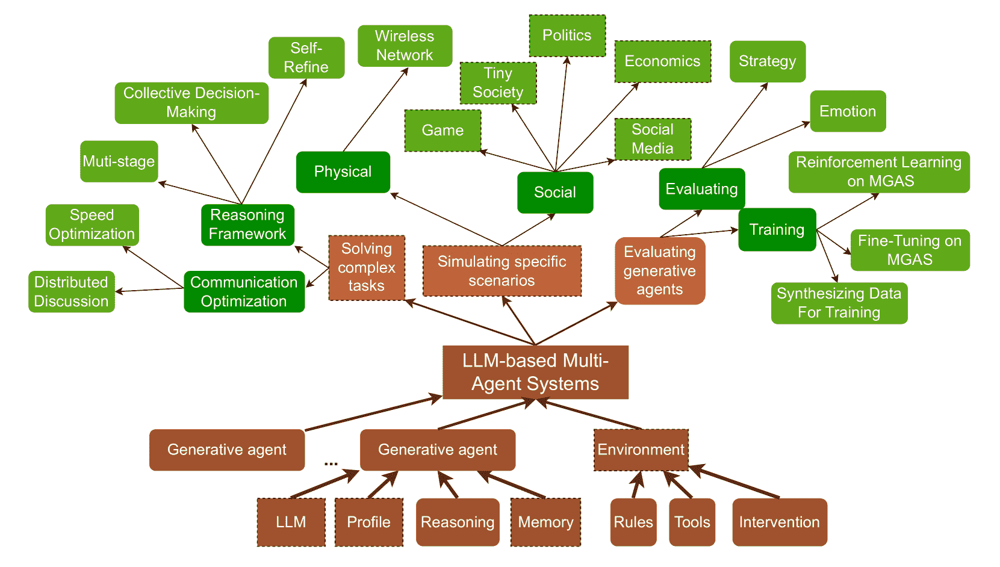

<!--yml
category: 未分类
date: 2025-01-11 11:44:02
-->

# A Survey on LLM-based Multi-Agent System: Recent Advances and New Frontiers in Application

> 来源：[https://arxiv.org/html/2412.17481/](https://arxiv.org/html/2412.17481/)

Shuaihang Chen¹  Yuanxing Liu¹  Wei Han¹  Weinan Zhang¹²²2Corresponding author.  Ting Liu¹  
¹Research Center for Social Computing and Information Retrieval
Harbin Institute of Technology, China
{shchen, yxliu, whan, wnzhang, tliu}@ir.hit.edu.cn 

###### Abstract

\Acf

LLM-MAS have become a research hotspot since the rise of large language models (LLMs). However, with the continuous influx of new related works, the existing reviews struggle to capture them comprehensively. This paper presents a comprehensive survey of these studies. We first discuss the definition of LLM-based Multi-Agent Systems (LLM-MAS), a framework encompassing much of previous work. We provide an overview of the various applications of LLM-MAS in (i) solving complex tasks, (ii) simulating specific scenarios, and (iii) evaluating generative agents. Building on previous studies, we also highlight several challenges and propose future directions for research in this field.

A Survey on LLM-based Multi-Agent System:
Recent Advances and New Frontiers in Application

Shuaihang Chen¹  Yuanxing Liu¹  Wei Han¹  Weinan Zhang¹²²2Corresponding author.  Ting Liu¹ ¹Research Center for Social Computing and Information Retrieval Harbin Institute of Technology, China {shchen, yxliu, whan, wnzhang, tliu}@ir.hit.edu.cn

## 1 Introduction

\Acf

MAS have seen significant expansion owing to its adaptability and ability to address complex, distributed challenges Balaji and Srinivasan ([2010](https://arxiv.org/html/2412.17481v2#bib.bib4)). Compared to single-agent settings Gronauer and Diepold ([2022](https://arxiv.org/html/2412.17481v2#bib.bib26)), Multi-Agent Systems (MAS) provide a more accurate representation of the real world, as many real-world applications naturally involve multiple decision-makers interacting simultaneously. However, constrained by traditional  reinforcement learning (RL) agent parameters and the absence of general knowledge and capabilities, agents are unable to tackle complex decision-making tasks, such as collaborating with other agents for the development Qian et al. ([2024b](https://arxiv.org/html/2412.17481v2#bib.bib57)). In recent years, large language models (LLMs), e.g. Llama 3 Dubey et al. ([2024](https://arxiv.org/html/2412.17481v2#bib.bib20)), and GPT-4 OpenAI et al. ([2024](https://arxiv.org/html/2412.17481v2#bib.bib50)), have achieved notable successes, training on a massive web corpus [Radford et al.](https://arxiv.org/html/2412.17481v2#bib.bib59) . Compared with RL, generative agents, with large language model (LLM) as the core control agents, can be better at reasoning, long-trajectory decision-making, etc., even without training Shinn et al. ([2023](https://arxiv.org/html/2412.17481v2#bib.bib62)). Furthermore, generative agents offer natural language interfaces for interacting with humans, making these interactions more flexible and easier to explain Park et al. ([2023](https://arxiv.org/html/2412.17481v2#bib.bib53)). Based on these advantages, LLM-based Multi-Agent Systems (LLM-MAS) emerged. Researchers have surveyed these emerging works and proposed a general framework Guo et al. ([2024](https://arxiv.org/html/2412.17481v2#bib.bib27)). However, as the number of related studies continues to grow, some works have emerged that fall outside the scope of the original framework. In this paper, we provide a new perspective based on previous reviews of LLM-based Multi-Agent Systems (LLM-MAS) with a focus on recent advancements and discuss potential research directions. We collected 125 papers published in top artificial intelligence conferences, such as *ACL, NeurIPS, AAAI, and ICLR, in 2023 and 2024, along with some unpublished yet valuable papers from arXiv.¹¹1The list of papers included in this survey can be found in [https://github.com/bianhua-12/Multi-generative_Agent_System_survey](https://github.com/bianhua-12/Multi-generative_Agent_System_survey) Based on the purpose of LLM-MAS, we summarize the application of LLM-MAS as task-solving, simulation for specific problems, and evaluation of generative agents. Figure [1](https://arxiv.org/html/2412.17481v2#S1.F1 "Figure 1 ‣ 1 Introduction ‣ A Survey on LLM-based Multi-Agent System: Recent Advances and New Frontiers in Application") illustrates the framework we propose for LLM-MAS application. (i) Solving complex tasks. Multi-agents will naturally split tasks into subtasks, which will improve task performance. (ii) Simulating for specific scenarios. Researchers see LLM-MAS as a sandbox for simulating problems in a specific domain. (iii) Evaluating generative agents. Compared with traditional task evaluation, LLM-MAS has the capability of dynamic assessment, which is more flexible and harder for data leakage. For each category, we will discuss representative LLM-MAS, resources, and their evaluation.

Figure 1: Overview of the application framework and relationship of LLM-MAS, generative agent, and LLM. Dashed-bordered right-angled rectangles represent content aligned with previous surveys, while rounded rectangles indicate original contributions introduced in this study.

Compared to the previous survey Guo et al. ([2024](https://arxiv.org/html/2412.17481v2#bib.bib27)); Li et al. ([2024d](https://arxiv.org/html/2412.17481v2#bib.bib39)); Han et al. ([2024](https://arxiv.org/html/2412.17481v2#bib.bib28)); Gronauer and Diepold ([2022](https://arxiv.org/html/2412.17481v2#bib.bib26)), this survey has the following distinctive contributions: (i) A Taxonomy focusing on application of LLM-MAS: we introduce a more recent taxonomy (taxonomy and difference are shown in Figure [1](https://arxiv.org/html/2412.17481v2#S1.F1 "Figure 1 ‣ 1 Introduction ‣ A Survey on LLM-based Multi-Agent System: Recent Advances and New Frontiers in Application")) based on the purpose of the application of LLM-MAS. (ii) More Resources: we analyze open-source frameworks and research works with benchmarks or datasets to facilitate the research community. (iii) Challenges and Future: we discuss the challenges in LLM-MAS, and shed light on future research.

## 2 Core Components of LLM-MAS

LLM-MAS refer to a system that includes a collection of generative agents capable of interacting and collaborating within a shared environmental setting Wang et al. ([2024c](https://arxiv.org/html/2412.17481v2#bib.bib66)). We will discuss generative agents and the environment in the following.

### 2.1 Generative Agents

Generative agents refer to the components of LLM-MAS that have role definitions, can perceive the environment, make decisions, and perform complex actions to change the environment Wang et al. ([2024a](https://arxiv.org/html/2412.17481v2#bib.bib64)). They can be a player in a game or a user on social media and have the role of driving the development of LLM-MAS and influencing its results.

Compared to traditional agents, generative agents need to be able to perform more complex behaviors, such as generating complete personalized blog posts based on historical information Park et al. ([2022](https://arxiv.org/html/2412.17481v2#bib.bib54)). Therefore, in addition to using LLMs as the core, generative agents also require the following characteristics: (i) *Profiling*is used to link their behavior by describing roles in natural language Gao et al. ([2023b](https://arxiv.org/html/2412.17481v2#bib.bib22)), or customizing the prompts for each generative agent based on their tasks Xu et al. ([2023c](https://arxiv.org/html/2412.17481v2#bib.bib71)). (ii) *Memory*is used to store historical trajectories and retrieve relevant memories for subsequent agent actions, enabling the ability to take long-term actions while solving the problem of limited LLM context windows. There usually include three layers of memory: long-term, short-term, and sensory memory Park et al. ([2023](https://arxiv.org/html/2412.17481v2#bib.bib53)). (iii) *Planning*is to formulate general behavior for a longer period of time in the future Yao et al. ([2023](https://arxiv.org/html/2412.17481v2#bib.bib72)). (iv) *Action*executes the interaction between the generative agent and the environment Wang et al. ([2024a](https://arxiv.org/html/2412.17481v2#bib.bib64)). Generative agents may be required to choose one of several candidate behaviors to execute, such as voting for whom Xu et al. ([2024](https://arxiv.org/html/2412.17481v2#bib.bib70)), or generate behaviors without mandatory constraints, such as generating a paragraph of text Li et al. ([2023](https://arxiv.org/html/2412.17481v2#bib.bib40)).

Generative agents can communicate with each other to achieve cooperation within the system. The communication of generative agents can be roughly divided into two purposes. (i) The first purpose is to achieve collaboration, share the information obtained by themselves with other intelligent agents, and to some extent, aggregate multiple intelligent agents into a complete system, achieving performance beyond independent intelligent agents Yuan et al. ([2023](https://arxiv.org/html/2412.17481v2#bib.bib75)); (ii) The second purpose is to achieve consensus, allowing for greater similarity in behavior or strategy among some agents, thereby enabling faster convergence to Nash equilibrium Oroojlooy and Hajinezhad ([2023](https://arxiv.org/html/2412.17481v2#bib.bib51)).

The type of communication content can be roughly divided into two types: natural language and custom content. Natural language forms of communication have high interpretability and flexibility. Still, they are difficult to optimize, making them more suitable for pursuing consensus, such as Chatdev Qian et al. ([2024b](https://arxiv.org/html/2412.17481v2#bib.bib57)) and job fair systems Li et al. ([2023](https://arxiv.org/html/2412.17481v2#bib.bib40)). Custom content may be a vector or a discrete signal that no one can understand except for the generative agent in the system. But this form is easy to optimize using policy gradients, so it is commonly used for achieving cooperative purposes, such as the DIAL Hausknecht and Stone ([2015](https://arxiv.org/html/2412.17481v2#bib.bib29)) algorithm and its variables.

### 2.2 Environment

Environmental settings include rules, tools, and intervention interfaces: (i) *Tools*are responsible for translating the agent’s action instruction into specific outcomes. Generative agents send action instructions to the environment and the environment converts the instruction into a record that the action was taken. There are different action spaces in different scenes. In the social media scene, the action space concludes “like”, “comment”, “follow”, etc. Wang et al. ([2024b](https://arxiv.org/html/2412.17481v2#bib.bib65)). In the development scene, the action space closes the chat chain Qian et al. ([2024b](https://arxiv.org/html/2412.17481v2#bib.bib57)), which is larger than social networks. (ii) *Rules*define the mode of communication between generative agents or the interaction with the environment, directly defining the behavioral structure of the entire system. Based on the scene, there are some special rules for the system, such as rules of the game Xu et al. ([2024](https://arxiv.org/html/2412.17481v2#bib.bib70)); Chen et al. ([2024c](https://arxiv.org/html/2412.17481v2#bib.bib9)) and the norm of social behavior Park et al. ([2023](https://arxiv.org/html/2412.17481v2#bib.bib53)); Wang et al. ([2024b](https://arxiv.org/html/2412.17481v2#bib.bib65)). Normally, a generative agent in the large-scale system has a smaller action space and is more easily replaced by a rule-based model Mou et al. ([2024](https://arxiv.org/html/2412.17481v2#bib.bib49)). (iii) *Intervention*provides an interface for external intervention systems. This intervention can come from any external source, human Wang et al. ([2024b](https://arxiv.org/html/2412.17481v2#bib.bib65)), or a supervision model Chen et al. ([2024c](https://arxiv.org/html/2412.17481v2#bib.bib9)), even a generative agent Qian et al. ([2024b](https://arxiv.org/html/2412.17481v2#bib.bib57)). The purpose of an intervention may be to actively read information from the system Wang et al. ([2024b](https://arxiv.org/html/2412.17481v2#bib.bib65)), or passively interrupt the system to prevent uncontrolled behavior from occurring Qian et al. ([2024b](https://arxiv.org/html/2412.17481v2#bib.bib57)).

## 3 LLM-MAS for Solving Complex Tasks

Completing a complex task usually requires multiple roles, multiple steps, and so on. This is difficult for a single agent, but multiple agents working together will be well suited to this task Islam et al. ([2024](https://arxiv.org/html/2412.17481v2#bib.bib33)). Further, each of these agents can be trained independently Shen et al. ([2024](https://arxiv.org/html/2412.17481v2#bib.bib60)); Yu et al. ([2024](https://arxiv.org/html/2412.17481v2#bib.bib74)). Compared with a single agent, LLM-MAS can achieve better results. That is, the multi-agent collaboration will improve the overall performance Du et al. ([2023](https://arxiv.org/html/2412.17481v2#bib.bib18)).

### 3.1 Representative LLM-MAS for Solving Complex Tasks

This field is currently a hot research topic. Recently, researchers mainly focus on multi-agent reasoning frameworks and multi-agent communication optimization, which will be discussed below.

LLM-MAS reasoning framework. We summarize three aspects by the pipeline of reasoning, including: (i) multi-stage framework, (ii) collective decision-making framework, and (iii) self-refine framework. That is, the multi-stage framework refers to a pipeline where agents act as serial problem solvers at different stages Qian et al. ([2024b](https://arxiv.org/html/2412.17481v2#bib.bib57)), while collective decision-making Zhao et al. ([2024c](https://arxiv.org/html/2412.17481v2#bib.bib83)) refers to different agents voting or debating for one goal. Self-Refine refers to the mechanism of self-reflection in LLM-MAS. Researchers propose a framework for applying multi-agents to the natural sciences Chen et al. ([2024a](https://arxiv.org/html/2412.17481v2#bib.bib7)) to enhance data analysis, model simulations, and decision-making processes Yin et al. ([2024](https://arxiv.org/html/2412.17481v2#bib.bib73)). Zhang et al. ([2023a](https://arxiv.org/html/2412.17481v2#bib.bib77)) propose a framework to achieve self-adaptation and adaptive cooperation. Scaling law in agent cooperation is also explored Qian et al. ([2024c](https://arxiv.org/html/2412.17481v2#bib.bib58)), finding that there is no significant pattern.

LLM-MAS communication optimization. The fully connected communication in LLM-MAS can lead to issues such as combinatorial explosion and privacy disclosure. Based on this, we summarize two aspects in Communication Optimization, including: (i) speed optimization and (ii) distributed discussion. Speed optimization refers to researchers trying to speed up the communication of agents, for example, with non-verbal communication Liu et al. ([2024b](https://arxiv.org/html/2412.17481v2#bib.bib47)) or shorter generation Chen et al. ([2024g](https://arxiv.org/html/2412.17481v2#bib.bib13)). While distributed discussion refers to agents trying to solve tasks without enough information Liu et al. ([2024a](https://arxiv.org/html/2412.17481v2#bib.bib45)). Agents need to communicate with each other to achieve their goals Zhang et al. ([2023a](https://arxiv.org/html/2412.17481v2#bib.bib77)), even without complete information in one agentLiu et al. ([2024a](https://arxiv.org/html/2412.17481v2#bib.bib45)).

### 3.2 Resources of LLM-MAS for Solving Complex Tasks

We summarize common and open-source LLM-MAS for simulation in Table [1](https://arxiv.org/html/2412.17481v2#S3.T1 "Table 1 ‣ 3.2 Resources of LLM-MAS for Solving Complex Tasks ‣ 3 LLM-MAS for Solving Complex Tasks ‣ A Survey on LLM-based Multi-Agent System: Recent Advances and New Frontiers in Application"), including code, dataset, and benchmark.

Table 1: Codes and Benchmarks in LLM-MAS for solving tasks studies. “No Code” or “No Benchmark” means the code or benchmark is unavailable.

 | Field | SubField | Paper | Code | Dataset and Benchmark |
| Reasoning Framework | Muti-stage | Qian et al. ([2024b](https://arxiv.org/html/2412.17481v2#bib.bib57)) | [Code Link](https://github.com/OpenBMB/ChatDev) | SRDD |
| Du et al. ([2024](https://arxiv.org/html/2412.17481v2#bib.bib19)) | [Code Link](https://github.com/OpenBMB/ChatDev) | SRDD |
| Yue et al. ([2024](https://arxiv.org/html/2412.17481v2#bib.bib76)) | [Code Link](https://github.com/yueshengbin/SMART) | SMART (self) |
| Liu et al. ([2023c](https://arxiv.org/html/2412.17481v2#bib.bib48)) | [Code Link](https://github.com/salesforce/BOLAA) | WebShop |
| Lin et al. ([2024](https://arxiv.org/html/2412.17481v2#bib.bib43)) | [Code Link](https://anonymous.4open.science/r/MAO-1074) | FG-C, CG-O |
| Islam et al. ([2024](https://arxiv.org/html/2412.17481v2#bib.bib33)) | [Code Link](https://github.com/Md-Ashraful-Pramanik/MapCoder) | HumanEval, EvalPlus, MBPP, APPS, xCodeEval, CodeContest |
| Shen et al. ([2024](https://arxiv.org/html/2412.17481v2#bib.bib60)) | [Code Link](https://github.com/X-PLUG/Multi-LLM-Agent) | ToolBench, ToolAlpaca |
| Collective Decision-Making | Zhao et al. ([2024c](https://arxiv.org/html/2412.17481v2#bib.bib83)) | [Code Link](https://github.%20com/xiutian/GEDI) | MCQA |
| Cheng et al. ([2024](https://arxiv.org/html/2412.17481v2#bib.bib14)) | [Code Link](https://github.com/YiCheng98/Cooper) | ESConv dataset, P4G dataset |
| Liang et al. ([2024](https://arxiv.org/html/2412.17481v2#bib.bib41)) | [Code Link](https://github.com/Skytliang/Multi-Agents-Debate) | MT-Bench |
| Lei et al. ([2024](https://arxiv.org/html/2412.17481v2#bib.bib35)) | [Code Link](https://github.com/bin123apple/MACM) | MATH |
| Zhang et al. ([2024a](https://arxiv.org/html/2412.17481v2#bib.bib79)) | [Code Link](https://github.com/zjunlp/MachineSoM) | MMLU, MATH, Chess Move Validity |
| Wang et al. ([2024d](https://arxiv.org/html/2412.17481v2#bib.bib67)) | [Code Link](https://github.com/MikeWangWZHL/Solo-Performance-Prompting.git) | TriviaQA |
| Self-Refine | Wang et al. ([2024c](https://arxiv.org/html/2412.17481v2#bib.bib66)) | [Code Link](https://github.com/HKUST-KnowComp/LLM-discussion) | FOLIO-wiki |
| Chen et al. ([2024e](https://arxiv.org/html/2412.17481v2#bib.bib11)) | [Code Link](https://github.com/dinobby/ReConcile) | StrategyQA, CSQA, GSM8K, AQuA, MATH, Date Understanding, ANLI |
| Chen et al. ([2024a](https://arxiv.org/html/2412.17481v2#bib.bib7)) | [Code Link](https://github.com/Link-AGI/AutoAgents) | TriviaQA |
| Tang et al. ([2024](https://arxiv.org/html/2412.17481v2#bib.bib63)) | [Code Link](https://github.com/Code4Agent/codeagent) | Trans-Review,AutoTransform,T5-Review |
| Zhang et al. ([2023a](https://arxiv.org/html/2412.17481v2#bib.bib77)) | [Code Link](https://pku-proagent.github.io/) | Overcooked-AI |
| Communication Optimization | Speed Optimization | Liu et al. ([2024b](https://arxiv.org/html/2412.17481v2#bib.bib47)) | No Code | HotpotQA,NarrativeQA,MultifieldQA |
| Distributed | Chen et al. ([2024f](https://arxiv.org/html/2412.17481v2#bib.bib12)) | [Code Link](https://github.com/OpenBMB/IoA) | TriviaQA, Natural Questions, HotpotQA, 2WikiMultiHopQA |
| Liu et al. ([2024a](https://arxiv.org/html/2412.17481v2#bib.bib45)) | [Code Link](https://github.com/thinkwee/iAgents) | InformativeBench | 

Data set. All datasets of traditional NLP tasks are available. In addition, following ECL Qian et al. ([2024a](https://arxiv.org/html/2412.17481v2#bib.bib56)), Qian et al. ([2024b](https://arxiv.org/html/2412.17481v2#bib.bib57)) evaluate the quality of generated software on the SRDD dataset and systematically evaluate agent capabilities in the domain of software development.

Open source community. The open-source and industrial communities have also contributed significantly to the development of LLM-MAS. MetaGPT Hong et al. ([2023](https://arxiv.org/html/2412.17481v2#bib.bib30)) assigns different roles to generative agents to form a collaborative entity for complex tasks. Gao et al. ([2024](https://arxiv.org/html/2412.17481v2#bib.bib23)) propose AgentScope with message exchange as its core communication mechanism. In the meantime, this work develops a distribution framework that facilitates seamless switching between local and distributed deployments and automatic parallel optimization with minimal effort. Open AI proposes Swarm Ope ([2024](https://arxiv.org/html/2412.17481v2#bib.bib2)), an experimental multi-agent orchestration framework that is ergonomic and lightweight. Unlike the previously released Assistants API, Swarm gives developers fine-grained control over context, steps, and tool calls rather than being hosted.

### 3.3 Evaluation of LLM-MAS for solving complex task

Performance on specific tasks. Shown as Table [1](https://arxiv.org/html/2412.17481v2#S3.T1 "Table 1 ‣ 3.2 Resources of LLM-MAS for Solving Complex Tasks ‣ 3 LLM-MAS for Solving Complex Tasks ‣ A Survey on LLM-based Multi-Agent System: Recent Advances and New Frontiers in Application"), the performance of LLM-MAS can be evaluated by specific tasks, which is intuitive and convenient. For example, in an APP system Zhang et al. ([2023b](https://arxiv.org/html/2412.17481v2#bib.bib78)), the average number of steps and tools used by an agent to complete a specific task are considered as indicators; in BOLAA Liu et al. ([2023c](https://arxiv.org/html/2412.17481v2#bib.bib48)), the recall and QA accuracy of intelligent physical examination retrieval are also considered as evaluation indicators; in the Werewolf game Xu et al. ([2023c](https://arxiv.org/html/2412.17481v2#bib.bib71)), the win rate of virtual players is naturally also an evaluation indicator; in the job fair system Li et al. ([2023](https://arxiv.org/html/2412.17481v2#bib.bib40)) , the proportion of correctly recruited target job seekers by the recruiting party is also an evaluation indicator; in the auction system Chen et al. ([2024c](https://arxiv.org/html/2412.17481v2#bib.bib9)), the Spearman correlation coefficient between the predicted and actual prices of goods, as well as the skills of bidders, are also measured by TrueSkill scores Graepel et al. ([2007](https://arxiv.org/html/2412.17481v2#bib.bib25)); in Stanford Town Park et al. ([2023](https://arxiv.org/html/2412.17481v2#bib.bib53)), the quality of behaviors generated by virtual agents and human agents is manually sorted and evaluated using TrueSkill; in urban simulation systems Xu et al. ([2023a](https://arxiv.org/html/2412.17481v2#bib.bib68)), the success rate of completing specific tasks such as navigation is also an evaluation metric.

Communication cost analysis. The paramount concern lies in the operational cost of the system. Given that a substantial proportion of contemporary systems incorporate LLMs as a pivotal module, the additional expenditure incurred during system operation has emerged as a pivotal area of interest. As an illustrative example, Mou et al. ([2024](https://arxiv.org/html/2412.17481v2#bib.bib49)) utilize the actual runtime of the system as a pivotal metric, underscoring the significance of managing this operational overhead.

## 4 LLM-MAS for Simulating Specific Scenarios

This section will illustrate the application for LLM-MAS in simulation. Researchers apply agents to simulate a certain scenario to study its impact on a specific subject like social science. On the one hand, compared with rule-based methods Chuang and Rogers ([2023](https://arxiv.org/html/2412.17481v2#bib.bib16)), generative agents with natural language communication can be more intuitive for humans. On the other hand, environment determines the properties of the simulation, which is the core of the entire simulation.

### 4.1 Representative LLM-MAS for Simulating Specific Scenarios

The typical scenarios for LLM-MAS simulations are described as follows. We will introduce the following work according to the subject.

Social domain. Social large-scale experiments in the real world have high costs, and the sheer scale of social participation can sometimes escalate into violence and destruction, posing potential ramifications Mou et al. ([2024](https://arxiv.org/html/2412.17481v2#bib.bib49)). Therefore, it is necessary to simulate in the virtual environment; simulation can solve the problem of excessive overhead in the real environment and can simulate the process in the real world for a long time at a faster speed Li et al. ([2024a](https://arxiv.org/html/2412.17481v2#bib.bib36)). At the same time, the whole process can be easily repeated, which is conducive to further research. Researchers have done a lot of work to simulate social media scenarios. Based on the social media simulation archetype Park et al. ([2022](https://arxiv.org/html/2412.17481v2#bib.bib54)), Park et al. ([2023](https://arxiv.org/html/2412.17481v2#bib.bib53)) propose Stanford Town, which leads to a one-day simulation of the life of 25 agents with different occupations in a small American town. At the same time, there was work on emotional propagation influence Gao et al. ([2023b](https://arxiv.org/html/2412.17481v2#bib.bib22)), information cocoon room based on recommendation scenario research Wang et al. ([2024b](https://arxiv.org/html/2412.17481v2#bib.bib65)), and study of social movements Mou et al. ([2024](https://arxiv.org/html/2412.17481v2#bib.bib49)). Researchers propose Urban Generative Intelligence (UGI) Xu et al. ([2023a](https://arxiv.org/html/2412.17481v2#bib.bib68)) to address specific urban issues and simulate complex urban systems, providing a multidisciplinary approach to understanding and managing urban complexity. Li et al. ([2024a](https://arxiv.org/html/2412.17481v2#bib.bib36)) study doctor agent evolution method by hospital simulation. Because doctor agent training is both inexpensive and highly effective, this work can quickly scale up the agent to handle tens of thousands of cases in just a few days, a task that would take a human doctor years to complete. Pan et al. ([2024](https://arxiv.org/html/2412.17481v2#bib.bib52)) propose a huge scale of agent simulation, increasing the number of agents to $10^{6}$. In social game,like Werewolf Xu et al. ([2024](https://arxiv.org/html/2412.17481v2#bib.bib70)) , Avalon Lan et al. ([2024](https://arxiv.org/html/2412.17481v2#bib.bib34)) , and Minecraft Gong et al. ([2024](https://arxiv.org/html/2412.17481v2#bib.bib24)) for LLM-MAS simulation are attempted. Further, some game companies like Netease are also actively experimenting with LLM-MAS in their games.

Physical domain. For the physical domain, the applications for generative agent simulation include mobility behaviors, transportation Gao et al. ([2023a](https://arxiv.org/html/2412.17481v2#bib.bib21)), wireless networks, etc. However, there is limited research in the area of multi-generative agents. Zou et al. ([2023](https://arxiv.org/html/2412.17481v2#bib.bib84)) explore the application of multiple agents in the wireless field, proposing a framework where multiple on-device agents can interact with the environment and exchange knowledge to solve a complex task together.

### 4.2 Resources for LLM-MAS simulation

We summarize common and open-source LLM-MAS for simulation in Table [2](https://arxiv.org/html/2412.17481v2#S4.T2 "Table 2 ‣ 4.2 Resources for LLM-MAS simulation ‣ 4 LLM-MAS for Simulating Specific Scenarios ‣ A Survey on LLM-based Multi-Agent System: Recent Advances and New Frontiers in Application"), including code and benchmarks.

To prove the effectiveness of the simulation, that is, to fit the reality, researchers usually evaluate the simulation system by simulating real data. Therefore, a realistic dataset with dense users and records is very important for evaluation simulation Mou et al. ([2024](https://arxiv.org/html/2412.17481v2#bib.bib49)). An ideal dataset will be dense: that is, data with a smaller number of users on the same scale can better evaluate the simulation capability of the LLM-MAS.

For Benchmark, Du and Zhang ([2024](https://arxiv.org/html/2412.17481v2#bib.bib17)) propose WWQA based on werewolf scenarios to evaluate the agent’s capability in a werewolf scenario. SoMoSiMu-Bench Mou et al. ([2024](https://arxiv.org/html/2412.17481v2#bib.bib49)) provides evaluation benchmarks focusing on individual user behavior and social simulation system results.

Table 2: Codes and Benchmarks in LLM-MAS for simulation studies. “No Code” or “No Benchmark” means the code or benchmark is unavailable.

 | Domain | Subdomain | Paper | Code | Dataset and Benchmark |
| Social | Tiny Society | Huang et al. ([2024b](https://arxiv.org/html/2412.17481v2#bib.bib32)) | No Code | AdaSociety |
| Chen et al. ([2024b](https://arxiv.org/html/2412.17481v2#bib.bib8)) | [Code Link](https://github.com/relic-yuexi/AgentCourt) | AgentCourt |
| Park et al. ([2023](https://arxiv.org/html/2412.17481v2#bib.bib53)) | [Code Link](https://github.com/joonspk-research/generative_agents) | No Benchmark or Dataset |
| Piatti et al. ([2024](https://arxiv.org/html/2412.17481v2#bib.bib55)) | [Code Link](https://github.com/giorgiopiatti/govsim) | No Benchmark |
| Chuang et al. ([2024](https://arxiv.org/html/2412.17481v2#bib.bib15)) | [Code Link](https://github.com/yunshiuan/llm-agent-opinion-dynamics) | No Benchmark or Dataset |
| Economics | Li et al. ([2024b](https://arxiv.org/html/2412.17481v2#bib.bib37)) | [Code Link](https://github.com/tsinghua-fib-lab/ACL24-EconAgent) | No Benchmark or Dataset |
| Social Media | Wang et al. ([2024b](https://arxiv.org/html/2412.17481v2#bib.bib65)) | [Code Link](https://github.com/RUC-GSAI/YuLan-Rec) | Movielens-1M |
| Gao et al. ([2023b](https://arxiv.org/html/2412.17481v2#bib.bib22)) | No Code | Blog Authorship Corpus |
| Mou et al. ([2024](https://arxiv.org/html/2412.17481v2#bib.bib49)) | [Code Link](https://github.com/xymou/social_simulation) | SoMoSiMu-Bench(self) |
| Game | Du and Zhang ([2024](https://arxiv.org/html/2412.17481v2#bib.bib17)) | [Code Link](https://github.com/doslim/Evaluate-the-Opinion-Leadership-of-LLMs) | WWQA |
| Pan et al. ([2024](https://arxiv.org/html/2412.17481v2#bib.bib52)) | [Code Link](https://github.com/modelscope/agentscope/tree/main/examples/paper_large_scale_simulation) | No Benchmark or Dataset |
| Physical | Wireless | Zou et al. ([2023](https://arxiv.org/html/2412.17481v2#bib.bib84)) | No Code | No Benchmark or Dataset | 

### 4.3 Evaluation of LLM-MAS simulation

We will discuss the evaluation based on indicators used for assessing LLM-MAS as a whole, rather than the capabilities of individual agents.

Consistency. LLM-MAS necessitate a robust congruence with the real world to ensure the derivation of meaningful and insightful experimental outcomes. In the context of simulation systems, exemplified by UGI Xu et al. ([2023a](https://arxiv.org/html/2412.17481v2#bib.bib68)), the primary objective lies in faithfully replicating specific real-world scenarios. When employed for training agents like SMART Yue et al. ([2024](https://arxiv.org/html/2412.17481v2#bib.bib76)), only those agents that have undergone rigorous training within a virtual environment that closely mirrors the real environment can be deemed suitable for deployment in real-world settings. Similarly, when utilized for evaluation purposes, such as in AgentSims Lin et al. ([2023](https://arxiv.org/html/2412.17481v2#bib.bib42)), the attainment of authentic and reliable evaluation results is contingent upon the virtual environment maintaining a high degree of consistency with its real-world counterpart. Finally, in the system for collecting data such as BOLAA Liu et al. ([2023c](https://arxiv.org/html/2412.17481v2#bib.bib48)), consistency also ensures the validity of the data. Therefore, an important performance measure of LLM-MAS is its consistency with the real situation.

Information dissemination. Compare the differences between information dissemination behavior in the system and reality using time series analysis methods. Information dissemination can to some extent reflect the nature of media; therefore, a realistic multi-agent system should have a similar information dissemination trend to the real world. Abdelzaher et al. ([2020](https://arxiv.org/html/2412.17481v2#bib.bib3)) compare the changes in the number of events occurring each day in an online social media simulation environment; S3 Gao et al. ([2023b](https://arxiv.org/html/2412.17481v2#bib.bib22)) compare the number of users who are aware of a certain event every day, as well as the changes in emotional density and support rate for that event every day; a similar approach is also used in Stanford Town Park et al. ([2023](https://arxiv.org/html/2412.17481v2#bib.bib53)).

## 5 LLM-MAS for Evaluating Generative Agents

With LLMs prevailing in the community, how to evaluate the ability of LLMs is an open question. Existing evaluation methods suffer from the following shortcomings: (i) constrained evaluation abilities, (ii) vulnerable benchmarks, and (iii) unobjective metrics. The complexity and diversity of LLM-MAS have indicated that LLM-MAS can evaluate LLMs. However, how to design specific evaluation indicators and evaluation methods has puzzled researchers. Similarly, LLM-MAS can also be used in training generative agents. We summarize three aspects of training: (i) Supervised Fine-Tuning (SFT) (ii) reinforcement learning (RL) (iii) Synthesizing data for training.

### 5.1 Representative LLM-MAS for Evaluating Generative Agents

LLM-MAS can provide rewards to agents, and these rewards can be used to evaluate or train generative agents, which will be discussed below.

Evaluation of generative agents. Researchers study generative agents by putting them into LLM-MAS. In LLM-MAS, researchers can further study the LLM’s strategic capabilities in different scenes, such as long strategic ability Chen et al. ([2024c](https://arxiv.org/html/2412.17481v2#bib.bib9)), leadership strategy Xu et al. ([2023c](https://arxiv.org/html/2412.17481v2#bib.bib71)) and competitiveness strategy Zhao et al. ([2024b](https://arxiv.org/html/2412.17481v2#bib.bib82)). In the emotional field, MuMA-ToM Shi et al. ([2024](https://arxiv.org/html/2412.17481v2#bib.bib61)) is used to evaluate the ability of agents to understand and reason about human interactions in a real home environment through video and text descriptions.

Training on generative agents. Li et al. ([2024c](https://arxiv.org/html/2412.17481v2#bib.bib38)) enhance the data to Supervised Fine-Tuning (SFT) generative agents with LLM-MAS. Xu et al. ([2023c](https://arxiv.org/html/2412.17481v2#bib.bib71)) have created generative agents to overcome the intrinsic bias from LLMs by proposing a novel framework that powers generative agents with multi-agent reinforcement learning Xu et al. ([2023c](https://arxiv.org/html/2412.17481v2#bib.bib71)). For LLM-MAS, Yue et al. ([2024](https://arxiv.org/html/2412.17481v2#bib.bib76)) split complex trajectories in knowledge-intensive tasks into subtasks, proposing a co-training paradigm of the multi-agent framework, Long- and Short-Trajectory Learning, which ensures synergy while keeping the fine-grained performance of each agent. RLHF has been criticized for its high cost. Liu et al. ([2023a](https://arxiv.org/html/2412.17481v2#bib.bib44)) propose an alignment scheme based on a multi-agent system, effectively addressing instability and reward gaming concerns associated with reward-based RL optimization. Either way, LLM-MAS are essentially viewed as an environment in RL with different ways of getting rewards from the environment.

### 5.2 Resources of LLM-MAS for evaluations

Table [3](https://arxiv.org/html/2412.17481v2#S5.T3 "Table 3 ‣ 5.2 Resources of LLM-MAS for evaluations ‣ 5 LLM-MAS for Evaluating Generative Agents ‣ A Survey on LLM-based Multi-Agent System: Recent Advances and New Frontiers in Application") shows the work with code, dataset, and benchmark we summarize, serving as a reference for future researchers.

Table 3: Codes and Benchmarks in LLM-MAS for evaluation studies. “No Code” or “No Benchmark” means the code or benchmark is unavailable.

 | Domain | Subdomain | Paper | Code | Dataset and Benchmark |
| Evaluation of generative agents | Strategy | Liu et al. ([2023b](https://arxiv.org/html/2412.17481v2#bib.bib46)) | [Code Link](https://github.com/THUDM/AgentBench) | AGENTBENCH |
| Bandi and Harrasse ([2024](https://arxiv.org/html/2412.17481v2#bib.bib5)) | No Code | MT-Bench |
| Chan et al. ([2023](https://arxiv.org/html/2412.17481v2#bib.bib6)) | [Code Link](https://github.com/thunlp/ChatEval) | ChatEval |
| Chen et al. ([2024d](https://arxiv.org/html/2412.17481v2#bib.bib10)) | [Code Link](https://github.com/THU-BPM/LLMArena.) | LLMARENA |
| Xu et al. ([2023b](https://arxiv.org/html/2412.17481v2#bib.bib69)) | [Code Link](https://github.com/cathyxl/MAgIC) | MAgIC |
| Huang et al. ([2024a](https://arxiv.org/html/2412.17481v2#bib.bib31)) | [Code Link](https://github.com/snap-stanford/MLAgentBench) | MLAgentBench |
| Chen et al. ([2024c](https://arxiv.org/html/2412.17481v2#bib.bib9)) | [Code Link](https://github.com/jiangjiechen/auction-arena) | AUCARENA |
| Emotion | Zhang et al. ([2024b](https://arxiv.org/html/2412.17481v2#bib.bib80)) | [Code Link](https://github.com/AI4Good24/PsySafe) | PsySafe |
| Shi et al. ([2024](https://arxiv.org/html/2412.17481v2#bib.bib61)) | [Code Link](https://github.com/SCAI-JHU/MuMMA-ToM) | MuMA-ToM |
| Training on generative agents | SFT on LLM-MAS | Li et al. ([2024c](https://arxiv.org/html/2412.17481v2#bib.bib38)) | [Code Link](https://github.com/lirenhao1997/CoEvol) | MT-Bench, AlpacaEval |
| MARL on LLM-MAS | Xu et al. ([2023c](https://arxiv.org/html/2412.17481v2#bib.bib71)) | No Code | No dataset or benchmark |
| Synthesized Ddata | Liu et al. ([2023a](https://arxiv.org/html/2412.17481v2#bib.bib44)) | [Code Link](https://github.com/agi-templar/Stable-Alignment) | HH, Moral Stories, MIC, ETHICS-Deontology, TruthfulQA | 

## 6 Challenges and Future Directions

While previous work on LLM-MAS has obtained many remarkable successes, this field is still at its initial stage, and there are several significant challenges that need to be addressed in its development. In the following, we outline several key challenges along with potential future directions.

### 6.1 Challenges posed by generative agents

Generative agents are an integral part of LLM-MAS. However, the generative agents have some shortcomings due to the inherent characteristics of the base model LLMs, which will be carefully discussed below.

Challenges. (i) Generalized alignment for simulation Liu et al. ([2023a](https://arxiv.org/html/2412.17481v2#bib.bib44)). When the agents are leveraged for real-world simulation, a perfect generative agent should be able to depict diverse traits Wang et al. ([2024a](https://arxiv.org/html/2412.17481v2#bib.bib64)) honestly. However, due to the training method of the foundation model OpenAI et al. ([2024](https://arxiv.org/html/2412.17481v2#bib.bib50)), generative agents usually cannot be aligned with mock objects. (ii) Hallucination. Generative agents have a certain probability of hallucination in their interaction with other agents Du et al. ([2023](https://arxiv.org/html/2412.17481v2#bib.bib18)). Various enhancement methods can alleviate this problem but cannot solve it (iii) Lack of sufficient long text capability. When processing complex information, generative agents forget the input information because of the lack of long-text ability Zhao et al. ([2024a](https://arxiv.org/html/2412.17481v2#bib.bib81)).

Future directions. The improvement of the ability of a single agent or the ability of the base model has always been a hot topic. Researchers have focused on enhancing alignment, reducing hallucination, and improving the ability of long text. The proposal of the new generation of Open AI model o1 Int ([2024](https://arxiv.org/html/2412.17481v2#bib.bib1)), provides researchers with new ideas, that is, to use more complex reasoning to enhance the ability of the model.

### 6.2 Challenges posed by interactions

Due to the complexity, autoregressive, and other characteristics of LLM-MAS, there are many problems in the practical application of the system. Two main problems, *Efficiency explosion*, and *Accumulative Effect*, are listed in the following.

Efficiency explosion. Due to their autoregressive architecture, LLMs typically have slow inference speeds. However, generative agents need to query LLMs for each action multiple times, such as extracting information from memory, making plans before taking actions, and so on. When the LLM-MAS scales up, this problem will be magnified, especially for generative agents that have a large action space. SoMoSiMu-Bench Mou et al. ([2024](https://arxiv.org/html/2412.17481v2#bib.bib49)) replaces the edge generative agents with rule-based agents, alleviating this problem. However, for LLM-MAS with a complex action space in generative agents, this problem remains unsolved.

Accumulative Effect. Since each round of LLM-MAS is based on the results of the previous round, and LLM-MAS have a great impact on the subsequent results. Researchers have used a rule-based model for intermediate error correction Chen et al. ([2024c](https://arxiv.org/html/2412.17481v2#bib.bib9)), but there is still a lot of room for improvement. IOA Chen et al. ([2024f](https://arxiv.org/html/2412.17481v2#bib.bib12)) proposed an Internet-like communication architecture, which made LLM-MAS more scalable and enhanced the adaptability to dynamic tasks.

Future directions. Industry academia has been making efforts to reduce the communication cost of LLM-MAS, such as alignment-based method OPTIMA Chen et al. ([2024g](https://arxiv.org/html/2412.17481v2#bib.bib13)) and Industrialized parallel message method AgentScope Gao et al. ([2024](https://arxiv.org/html/2412.17481v2#bib.bib23)), but it is still in the basic stage and has a large research space.

### 6.3 Challenges of Evaluating for LLM-MAS

Lack of Objective metrics for group behavior. As shown in Section [4.3](https://arxiv.org/html/2412.17481v2#S4.SS3 "4.3 Evaluation of LLM-MAS simulation ‣ 4 LLM-MAS for Simulating Specific Scenarios ‣ A Survey on LLM-based Multi-Agent System: Recent Advances and New Frontiers in Application"), due to the diversity, complexity, and unpredictability of multi-agent environments, it is difficult to obtain sufficiently detailed, specific, and direct system evaluation indicators from current work at the population level. At present, researchers mainly compare the distribution of the system and real environments to evaluate LLM-MAS, which lacks details for the LLM-MAS running process.

Automated evaluation and benchmark. Different LLM-MAS of the same kind cannot be compared because of the lack of a benchmark for LLM-MAS. Further, there is a lack of a common benchmark framework for both individual and total-based evaluation, that can be used to evaluate most LLM-MAS.

Future directions. Studying large-scale LLM-MAS will be a new research hotspot, from which researchers will evaluate and discover new scale effects. In the meantime, common test benchmarks and evaluation methods will also emerge in future research.

## 7 Conclusion

In this survey, we systematically summarize existing research in the LLM-based Multi-Agent Systems (LLM-MAS) field. We present and review these studies from three application aspects: task-solving, simulation, and evaluation of the LLM-MAS. We provide a detailed taxonomy to draw connections among the existing research, summarizing the major techniques and their development histories for each of these aspects. In addition to reviewing the previous work, we also propose several challenges in this field, which are expected to guide potential future directions.

## Limitations

We have made our best effort, but some limitations may still exist. Due to page limitations, we can only provide a brief summary of each method without exhaustive technical details. On the other hand, we primarily collect studies from *ACL, NeurIPS, ICLR, AAAI, and arXiv, and there is a chance that we may have missed some important work published in other venues. In application, we primarily list representative LLM-MAS resources with open code in Table [1](https://arxiv.org/html/2412.17481v2#S3.T1 "Table 1 ‣ 3.2 Resources of LLM-MAS for Solving Complex Tasks ‣ 3 LLM-MAS for Solving Complex Tasks ‣ A Survey on LLM-based Multi-Agent System: Recent Advances and New Frontiers in Application"), Table [2](https://arxiv.org/html/2412.17481v2#S4.T2 "Table 2 ‣ 4.2 Resources for LLM-MAS simulation ‣ 4 LLM-MAS for Simulating Specific Scenarios ‣ A Survey on LLM-based Multi-Agent System: Recent Advances and New Frontiers in Application"), and Table [3](https://arxiv.org/html/2412.17481v2#S5.T3 "Table 3 ‣ 5.2 Resources of LLM-MAS for evaluations ‣ 5 LLM-MAS for Evaluating Generative Agents ‣ A Survey on LLM-based Multi-Agent System: Recent Advances and New Frontiers in Application"). More complete papers can be found in [https://github.com/bianhua-12/Multi-generative_Agent_System_survey](https://github.com/bianhua-12/Multi-generative_Agent_System_survey). We recognize the timeliness of our work, and we will stay abreast of discussions within the research community, updating opinions and supplementing overlooked work in the future.

## Acknowledgments

This research was supported by the National Key Research and Development Program (No. 2022YFF0902100), and the Nature Scientific Foundation of Heilongjiang Province (YQ2021F006).

## References

*   Int (2024) 2024. Introducing OpenAI o1. https://openai.com/o1/.
*   Ope (2024) 2024. Openai/swarm. OpenAI.
*   Abdelzaher et al. (2020) Tarek Abdelzaher, Jiawei Han, Yifan Hao, Andong Jing, Dongxin Liu, Shengzhong Liu, Hoang Hai Nguyen, David M Nicol, Huajie Shao, Tianshi Wang, et al. 2020. Multiscale online media simulation with socialcube. *Computational and Mathematical Organization Theory*, 26:145–174.
*   Balaji and Srinivasan (2010) P. G. Balaji and D. Srinivasan. 2010. [An Introduction to Multi-Agent Systems](https://doi.org/10.1007/978-3-642-14435-6_1). In Dipti Srinivasan and Lakhmi C. Jain, editors, *Innovations in Multi-Agent Systems and Applications - 1*, pages 1–27\. Springer, Berlin, Heidelberg.
*   Bandi and Harrasse (2024) Chaithanya Bandi and Abir Harrasse. 2024. [Adversarial Multi-Agent Evaluation of Large Language Models through Iterative Debates](https://doi.org/10.48550/arXiv.2410.04663). *Preprint*, arXiv:2410.04663.
*   Chan et al. (2023) Chi-Min Chan, Weize Chen, Yusheng Su, Jianxuan Yu, Wei Xue, Shanghang Zhang, Jie Fu, and Zhiyuan Liu. 2023. [ChatEval: Towards Better LLM-based Evaluators through Multi-Agent Debate](https://doi.org/10.48550/arXiv.2308.07201). *Preprint*, arXiv:2308.07201.
*   Chen et al. (2024a) Guangyao Chen, Siwei Dong, Yu Shu, Ge Zhang, Jaward Sesay, Börje F. Karlsson, Jie Fu, and Yemin Shi. 2024a. [AutoAgents: A Framework for Automatic Agent Generation](https://doi.org/10.48550/arXiv.2309.17288). *Preprint*, arXiv:2309.17288.
*   Chen et al. (2024b) Guhong Chen, Liyang Fan, Zihan Gong, Nan Xie, Zixuan Li, Ziqiang Liu, Chengming Li, Qiang Qu, Shiwen Ni, and Min Yang. 2024b. [AgentCourt: Simulating Court with Adversarial Evolvable Lawyer Agents](https://doi.org/10.48550/arXiv.2408.08089). *Preprint*, arXiv:2408.08089.
*   Chen et al. (2024c) Jiangjie Chen, Siyu Yuan, Rong Ye, Bodhisattwa Prasad Majumder, and Kyle Richardson. 2024c. [Put Your Money Where Your Mouth Is: Evaluating Strategic Planning and Execution of LLM Agents in an Auction Arena](https://doi.org/10.48550/arXiv.2310.05746). *Preprint*, arXiv:2310.05746.
*   Chen et al. (2024d) Junzhe Chen, Xuming Hu, Shuodi Liu, Shiyu Huang, Wei-Wei Tu, Zhaofeng He, and Lijie Wen. 2024d. [LLMArena: Assessing Capabilities of Large Language Models in Dynamic Multi-Agent Environments](https://doi.org/10.18653/v1/2024.acl-long.705). In *Proceedings of the 62nd Annual Meeting of the Association for Computational Linguistics (Volume 1: Long Papers)*, pages 13055–13077.
*   Chen et al. (2024e) Justin Chen, Swarnadeep Saha, and Mohit Bansal. 2024e. [ReConcile: Round-Table Conference Improves Reasoning via Consensus among Diverse LLMs](https://doi.org/10.18653/v1/2024.acl-long.381). In *Proceedings of the 62nd Annual Meeting of the Association for Computational Linguistics (Volume 1: Long Papers)*, pages 7066–7085, Bangkok, Thailand. Association for Computational Linguistics.
*   Chen et al. (2024f) Weize Chen, Ziming You, Ran Li, Yitong Guan, Chen Qian, Chenyang Zhao, Cheng Yang, Ruobing Xie, Zhiyuan Liu, and Maosong Sun. 2024f. [Internet of Agents: Weaving a Web of Heterogeneous Agents for Collaborative Intelligence](https://doi.org/10.48550/arXiv.2407.07061). *Preprint*, arXiv:2407.07061.
*   Chen et al. (2024g) Weize Chen, Jiarui Yuan, Chen Qian, Cheng Yang, Zhiyuan Liu, and Maosong Sun. 2024g. [Optima: Optimizing Effectiveness and Efficiency for LLM-Based Multi-Agent System](https://doi.org/10.48550/arXiv.2410.08115). *Preprint*, arXiv:2410.08115.
*   Cheng et al. (2024) Yi Cheng, Wenge Liu, Jian Wang, Chak Tou Leong, Yi Ouyang, Wenjie Li, Xian Wu, and Yefeng Zheng. 2024. [Cooper: Coordinating Specialized Agents towards a Complex Dialogue Goal](https://doi.org/10.1609/aaai.v38i16.29739). *Proceedings of the AAAI Conference on Artificial Intelligence*, 38(16):17853–17861.
*   Chuang et al. (2024) Yun-Shiuan Chuang, Agam Goyal, Nikunj Harlalka, Siddharth Suresh, Robert Hawkins, Sijia Yang, Dhavan Shah, Junjie Hu, and Timothy Rogers. 2024. [Simulating Opinion Dynamics with Networks of LLM-based Agents](https://doi.org/10.18653/v1/2024.findings-naacl.211). In *Findings of the Association for Computational Linguistics: NAACL 2024*, pages 3326–3346, Mexico City, Mexico. Association for Computational Linguistics.
*   Chuang and Rogers (2023) Yun-Shiuan Chuang and Timothy T. Rogers. 2023. [Computational Agent-based Models in Opinion Dynamics: A Survey on Social Simulations and Empirical Studies](https://doi.org/10.48550/arXiv.2306.03446). *Preprint*, arXiv:2306.03446.
*   Du and Zhang (2024) Silin Du and Xiaowei Zhang. 2024. Helmsman of the Masses? Evaluate the Opinion Leadership of Large Language Models in the Werewolf Game. In *First Conference on Language Modeling*.
*   Du et al. (2023) Yilun Du, Shuang Li, Antonio Torralba, Joshua B. Tenenbaum, and Igor Mordatch. 2023. [Improving Factuality and Reasoning in Language Models through Multiagent Debate](https://doi.org/10.48550/arXiv.2305.14325). *Preprint*, arXiv:2305.14325.
*   Du et al. (2024) Zhuoyun Du, Chen Qian, Wei Liu, Zihao Xie, Yifei Wang, Yufan Dang, Weize Chen, and Cheng Yang. 2024. [Multi-Agent Software Development through Cross-Team Collaboration](https://doi.org/10.48550/arXiv.2406.08979). *Preprint*, arXiv:2406.08979.
*   Dubey et al. (2024) Abhimanyu Dubey, Abhinav Jauhri, Abhinav Pandey, Abhishek Kadian, Ahmad Al-Dahle, Aiesha Letman, Akhil Mathur, et al. 2024. [The Llama 3 Herd of Models](https://doi.org/10.48550/arXiv.2407.21783). *Preprint*, arXiv:2407.21783.
*   Gao et al. (2023a) Chen Gao, Xiaochong Lan, Nian Li, Yuan Yuan, Jingtao Ding, Zhilun Zhou, Fengli Xu, and Yong Li. 2023a. [Large Language Models Empowered Agent-based Modeling and Simulation: A Survey and Perspectives](https://doi.org/10.48550/arXiv.2312.11970). *Preprint*, arXiv:2312.11970.
*   Gao et al. (2023b) Chen Gao, Xiaochong Lan, Zhihong Lu, Jinzhu Mao, Jinghua Piao, Huandong Wang, Depeng Jin, and Yong Li. 2023b. [S3: Social-network Simulation System with Large Language Model-Empowered Agents](https://doi.org/10.48550/arXiv.2307.14984). *Preprint*, arXiv:2307.14984.
*   Gao et al. (2024) Dawei Gao, Zitao Li, Xuchen Pan, Weirui Kuang, Zhijian Ma, Bingchen Qian, Fei Wei, Wenhao Zhang, Yuexiang Xie, Daoyuan Chen, Liuyi Yao, Hongyi Peng, Zeyu Zhang, Lin Zhu, Chen Cheng, Hongzhu Shi, Yaliang Li, Bolin Ding, and Jingren Zhou. 2024. [AgentScope: A Flexible yet Robust Multi-Agent Platform](https://doi.org/10.48550/arXiv.2402.14034). *Preprint*, arXiv:2402.14034.
*   Gong et al. (2024) Ran Gong, Qiuyuan Huang, Xiaojian Ma, Yusuke Noda, Zane Durante, Zilong Zheng, Demetri Terzopoulos, Li Fei-Fei, Jianfeng Gao, and Hoi Vo. 2024. [MindAgent: Emergent Gaming Interaction](https://doi.org/10.18653/v1/2024.findings-naacl.200). In *Findings of the Association for Computational Linguistics: NAACL 2024*, pages 3154–3183, Mexico City, Mexico. Association for Computational Linguistics.
*   Graepel et al. (2007) Thore Graepel, Tom Minka, and R TrueSkill Herbrich. 2007. A bayesian skill rating system. *Advances in Neural Information Processing Systems*, 19(569-576):7.
*   Gronauer and Diepold (2022) Sven Gronauer and Klaus Diepold. 2022. [Multi-agent deep reinforcement learning: A survey](https://doi.org/10.1007/s10462-021-09996-w). *Artificial Intelligence Review*, 55(2):895–943.
*   Guo et al. (2024) Taicheng Guo, Xiuying Chen, Yaqi Wang, Ruidi Chang, Shichao Pei, Nitesh V. Chawla, Olaf Wiest, and Xiangliang Zhang. 2024. [Large Language Model Based Multi-agents: A Survey of Progress and Challenges](https://doi.org/10.24963/ijcai.2024/890). In *Thirty-Third International Joint Conference on Artificial Intelligence*, volume 9, pages 8048–8057.
*   Han et al. (2024) Shanshan Han, Qifan Zhang, Yuhang Yao, Weizhao Jin, Zhaozhuo Xu, and Chaoyang He. 2024. [LLM Multi-Agent Systems: Challenges and Open Problems](https://doi.org/10.48550/arXiv.2402.03578). *Preprint*, arXiv:2402.03578.
*   Hausknecht and Stone (2015) Matthew Hausknecht and Peter Stone. 2015. Deep recurrent q-learning for partially observable mdps. *Computer Science*.
*   Hong et al. (2023) Sirui Hong, Mingchen Zhuge, Jonathan Chen, Xiawu Zheng, Yuheng Cheng, Ceyao Zhang, Jinlin Wang, Zili Wang, Steven Ka Shing Yau, Zijuan Lin, Liyang Zhou, Chenyu Ran, Lingfeng Xiao, Chenglin Wu, and Jürgen Schmidhuber. 2023. [MetaGPT: Meta Programming for A Multi-Agent Collaborative Framework](https://doi.org/10.48550/arXiv.2308.00352). *Preprint*, arXiv:2308.00352.
*   Huang et al. (2024a) Qian Huang, Jian Vora, Percy Liang, and Jure Leskovec. 2024a. [MLAgentBench: Evaluating Language Agents on Machine Learning Experimentation](https://doi.org/10.48550/arXiv.2310.03302). *Preprint*, arXiv:2310.03302.
*   Huang et al. (2024b) Yizhe Huang, Xingbo Wang, Hao Liu, Fanqi Kong, Aoyang Qin, Min Tang, Xiaoxi Wang, Song-Chun Zhu, Mingjie Bi, Siyuan Qi, and Xue Feng. 2024b. [AdaSociety: An Adaptive Environment with Social Structures for Multi-Agent Decision-Making](https://doi.org/10.48550/arXiv.2411.03865). *Preprint*, arXiv:2411.03865.
*   Islam et al. (2024) Md. Ashraful Islam, Mohammed Eunus Ali, and Md Rizwan Parvez. 2024. [MapCoder: Multi-Agent Code Generation for Competitive Problem Solving](https://doi.org/10.18653/v1/2024.acl-long.269). In *Proceedings of the 62nd Annual Meeting of the Association for Computational Linguistics (Volume 1: Long Papers)*, pages 4912–4944, Bangkok, Thailand. Association for Computational Linguistics.
*   Lan et al. (2024) Yihuai Lan, Zhiqiang Hu, Lei Wang, Yang Wang, Deheng Ye, Peilin Zhao, Ee-Peng Lim, Hui Xiong, and Hao Wang. 2024. [LLM-Based Agent Society Investigation: Collaboration and Confrontation in Avalon Gameplay](https://doi.org/10.48550/arXiv.2310.14985). *Preprint*, arXiv:2310.14985.
*   Lei et al. (2024) Bin Lei, Yi Zhang, Shan Zuo, Ali Payani, and Caiwen Ding. 2024. [MACM: Utilizing a Multi-Agent System for Condition Mining in Solving Complex Mathematical Problems](https://doi.org/10.48550/arXiv.2404.04735). *Preprint*, arXiv:2404.04735.
*   Li et al. (2024a) Junkai Li, Siyu Wang, Meng Zhang, Weitao Li, Yunghwei Lai, Xinhui Kang, Weizhi Ma, and Yang Liu. 2024a. [Agent Hospital: A Simulacrum of Hospital with Evolvable Medical Agents](https://doi.org/10.48550/arXiv.2405.02957). *Preprint*, arXiv:2405.02957.
*   Li et al. (2024b) Nian Li, Chen Gao, Mingyu Li, Yong Li, and Qingmin Liao. 2024b. [EconAgent: Large Language Model-Empowered Agents for Simulating Macroeconomic Activities](https://doi.org/10.18653/v1/2024.acl-long.829). In *Proceedings of the 62nd Annual Meeting of the Association for Computational Linguistics (Volume 1: Long Papers)*, pages 15523–15536, Bangkok, Thailand. Association for Computational Linguistics.
*   Li et al. (2024c) Renhao Li, Minghuan Tan, Derek F. Wong, and Min Yang. 2024c. [CoEvol: Constructing Better Responses for Instruction Finetuning through Multi-Agent Cooperation](https://doi.org/10.48550/arXiv.2406.07054). *Preprint*, arXiv:2406.07054.
*   Li et al. (2024d) Xinyi Li, Sai Wang, Siqi Zeng, Yu Wu, and Yi Yang. 2024d. [A survey on LLM-based multi-agent systems: Workflow, infrastructure, and challenges](https://doi.org/10.1007/s44336-024-00009-2). *Vicinagearth*, 1(1):9.
*   Li et al. (2023) Yuan Li, Yixuan Zhang, and Lichao Sun. 2023. [MetaAgents: Simulating Interactions of Human Behaviors for LLM-based Task-oriented Coordination via Collaborative Generative Agents](https://doi.org/10.48550/arXiv.2310.06500). *Preprint*, arXiv:2310.06500.
*   Liang et al. (2024) Tian Liang, Zhiwei He, Wenxiang Jiao, Xing Wang, Yan Wang, Rui Wang, Yujiu Yang, Shuming Shi, and Zhaopeng Tu. 2024. [Encouraging Divergent Thinking in Large Language Models through Multi-Agent Debate](https://doi.org/10.48550/arXiv.2305.19118). *Preprint*, arXiv:2305.19118.
*   Lin et al. (2023) Jiaju Lin, Haoran Zhao, Aochi Zhang, Yiting Wu, Huqiuyue Ping, and Qin Chen. 2023. [AgentSims: An Open-Source Sandbox for Large Language Model Evaluation](https://doi.org/10.48550/arXiv.2308.04026). *Preprint*, arXiv:2308.04026.
*   Lin et al. (2024) Leilei Lin, Yumeng Jin, Yingming Zhou, Wenlong Chen, and Chen Qian. 2024. [MAO: A Framework for Process Model Generation with Multi-Agent Orchestration](https://doi.org/10.48550/arXiv.2408.01916). *Preprint*, arXiv:2408.01916.
*   Liu et al. (2023a) Ruibo Liu, Ruixin Yang, Chenyan Jia, Ge Zhang, Diyi Yang, and Soroush Vosoughi. 2023a. Training Socially Aligned Language Models on Simulated Social Interactions. In *The Twelfth International Conference on Learning Representations*.
*   Liu et al. (2024a) Wei Liu, Chenxi Wang, Yifei Wang, Zihao Xie, Rennai Qiu, Yufan Dang, Zhuoyun Du, Weize Chen, Cheng Yang, and Chen Qian. 2024a. [Autonomous Agents for Collaborative Task under Information Asymmetry](https://doi.org/10.48550/arXiv.2406.14928). *Preprint*, arXiv:2406.14928.
*   Liu et al. (2023b) Xiao Liu, Hao Yu, Hanchen Zhang, Yifan Xu, Xuanyu Lei, Hanyu Lai, Yu Gu, Hangliang Ding, Kaiwen Men, Kejuan Yang, Shudan Zhang, Xiang Deng, Aohan Zeng, Zhengxiao Du, Chenhui Zhang, Sheng Shen, Tianjun Zhang, Yu Su, Huan Sun, Minlie Huang, Yuxiao Dong, and Jie Tang. 2023b. [AgentBench: Evaluating LLMs as Agents](https://doi.org/10.48550/arXiv.2308.03688). *Preprint*, arXiv:2308.03688.
*   Liu et al. (2024b) Yuhan Liu, Esha Choukse, Shan Lu, Junchen Jiang, and Madan Musuvathi. 2024b. [DroidSpeak: Enhancing Cross-LLM Communication](https://doi.org/10.48550/arXiv.2411.02820). *Preprint*, arXiv:2411.02820.
*   Liu et al. (2023c) Zhiwei Liu, Weiran Yao, Jianguo Zhang, Le Xue, Shelby Heinecke, Rithesh Murthy, Yihao Feng, Zeyuan Chen, Juan Carlos Niebles, Devansh Arpit, Ran Xu, Phil Mui, Huan Wang, Caiming Xiong, and Silvio Savarese. 2023c. [BOLAA: Benchmarking and Orchestrating LLM-augmented Autonomous Agents](https://doi.org/10.48550/arXiv.2308.05960). *Preprint*, arXiv:2308.05960.
*   Mou et al. (2024) Xinyi Mou, Zhongyu Wei, and Xuanjing Huang. 2024. [Unveiling the Truth and Facilitating Change: Towards Agent-based Large-scale Social Movement Simulation](https://doi.org/10.18653/v1/2024.findings-acl.285). In *Findings of the Association for Computational Linguistics ACL 2024*, pages 4789–4809, Bangkok, Thailand and virtual meeting. Association for Computational Linguistics.
*   OpenAI et al. (2024) OpenAI, Josh Achiam, Steven Adler, Sandhini Agarwal, Lama Ahmad, Ilge Akkaya, Florencia Leoni Aleman, Diogo Almeida, Janko Altenschmidt, Sam Altman, et al. 2024. [GPT-4 Technical Report](https://doi.org/10.48550/arXiv.2303.08774). *Preprint*, arXiv:2303.08774.
*   Oroojlooy and Hajinezhad (2023) Afshin Oroojlooy and Davood Hajinezhad. 2023. A review of cooperative multi-agent deep reinforcement learning. *Applied Intelligence*, 53(11):13677–13722.
*   Pan et al. (2024) Xuchen Pan, Dawei Gao, Yuexiang Xie, Yushuo Chen, Zhewei Wei, Yaliang Li, Bolin Ding, Ji-Rong Wen, and Jingren Zhou. 2024. [Very Large-Scale Multi-Agent Simulation in AgentScope](https://doi.org/10.48550/arXiv.2407.17789). *Preprint*, arXiv:2407.17789.
*   Park et al. (2023) Joon Sung Park, Joseph C. O’Brien, Carrie J. Cai, Meredith Ringel Morris, Percy Liang, and Michael S. Bernstein. 2023. [Generative Agents: Interactive Simulacra of Human Behavior](https://doi.org/10.48550/arXiv.2304.03442). *Preprint*, arXiv:2304.03442.
*   Park et al. (2022) Joon Sung Park, Lindsay Popowski, Carrie J. Cai, Meredith Ringel Morris, Percy Liang, and Michael S. Bernstein. 2022. [Social Simulacra: Creating Populated Prototypes for Social Computing Systems](https://doi.org/10.48550/arXiv.2208.04024). *Preprint*, arXiv:2208.04024.
*   Piatti et al. (2024) Giorgio Piatti, Zhijing Jin, Max Kleiman-Weiner, Bernhard Schölkopf, Mrinmaya Sachan, and Rada Mihalcea. 2024. [Cooperate or Collapse: Emergence of Sustainable Cooperation in a Society of LLM Agents](https://doi.org/10.48550/arXiv.2404.16698). *Preprint*, arXiv:2404.16698.
*   Qian et al. (2024a) Chen Qian, Yufan Dang, Jiahao Li, Wei Liu, Zihao Xie, YiFei Wang, Weize Chen, Cheng Yang, Xin Cong, Xiaoyin Che, Zhiyuan Liu, and Maosong Sun. 2024a. [Experiential Co-Learning of Software-Developing Agents](https://doi.org/10.18653/v1/2024.acl-long.305). In *Proceedings of the 62nd Annual Meeting of the Association for Computational Linguistics (Volume 1: Long Papers)*, pages 5628–5640, Bangkok, Thailand. Association for Computational Linguistics.
*   Qian et al. (2024b) Chen Qian, Wei Liu, Hongzhang Liu, Nuo Chen, Yufan Dang, Jiahao Li, Cheng Yang, Weize Chen, Yusheng Su, Xin Cong, Juyuan Xu, Dahai Li, Zhiyuan Liu, and Maosong Sun. 2024b. [ChatDev: Communicative Agents for Software Development](https://doi.org/10.18653/v1/2024.acl-long.810). In *Proceedings of the 62nd Annual Meeting of the Association for Computational Linguistics (Volume 1: Long Papers)*, pages 15174–15186, Bangkok, Thailand. Association for Computational Linguistics.
*   Qian et al. (2024c) Chen Qian, Zihao Xie, Yifei Wang, Wei Liu, Yufan Dang, Zhuoyun Du, Weize Chen, Cheng Yang, Zhiyuan Liu, and Maosong Sun. 2024c. [Scaling Large-Language-Model-based Multi-Agent Collaboration](https://doi.org/10.48550/arXiv.2406.07155). *Preprint*, arXiv:2406.07155.
*   (59) Alec Radford, Jeffrey Wu, Rewon Child, David Luan, Dario Amodei, and Ilya Sutskever. Language Models are Unsupervised Multitask Learners.
*   Shen et al. (2024) Weizhou Shen, Chenliang Li, Hongzhan Chen, Ming Yan, Xiaojun Quan, Hehong Chen, Ji Zhang, and Fei Huang. 2024. [Small LLMs Are Weak Tool Learners: A Multi-LLM Agent](https://doi.org/10.48550/arXiv.2401.07324). *Preprint*, arXiv:2401.07324.
*   Shi et al. (2024) Haojun Shi, Suyu Ye, Xinyu Fang, Chuanyang Jin, Leyla Isik, Yen-Ling Kuo, and Tianmin Shu. 2024. [MuMA-ToM: Multi-modal Multi-Agent Theory of Mind](https://doi.org/10.48550/arXiv.2408.12574). *Preprint*, arXiv:2408.12574.
*   Shinn et al. (2023) Noah Shinn, Federico Cassano, Ashwin Gopinath, Karthik Narasimhan, and Shunyu Yao. 2023. Reflexion: Language agents with verbal reinforcement learning. *Advances in Neural Information Processing Systems*, 36:8634–8652.
*   Tang et al. (2024) Xunzhu Tang, Kisub Kim, Yewei Song, Cedric Lothritz, Bei Li, Saad Ezzini, Haoye Tian, Jacques Klein, and Tegawende F. Bissyande. 2024. [CodeAgent: Autonomous Communicative Agents for Code Review](https://doi.org/10.48550/arXiv.2402.02172). *Preprint*, arXiv:2402.02172.
*   Wang et al. (2024a) Lei Wang, Chen Ma, Xueyang Feng, Zeyu Zhang, Hao Yang, Jingsen Zhang, Zhiyuan Chen, Jiakai Tang, Xu Chen, Yankai Lin, Wayne Xin Zhao, Zhewei Wei, and Jirong Wen. 2024a. [A survey on large language model based autonomous agents](https://doi.org/10.1007/s11704-024-40231-1). *Frontiers of Computer Science*, 18(6):186345.
*   Wang et al. (2024b) Lei Wang, Jingsen Zhang, Hao Yang, Zhiyuan Chen, Jiakai Tang, Zeyu Zhang, Xu Chen, Yankai Lin, Ruihua Song, Wayne Xin Zhao, Jun Xu, Zhicheng Dou, Jun Wang, and Ji-Rong Wen. 2024b. [User Behavior Simulation with Large Language Model based Agents](https://doi.org/10.48550/arXiv.2306.02552). *Preprint*, arXiv:2306.02552.
*   Wang et al. (2024c) Qineng Wang, Zihao Wang, Ying Su, Hanghang Tong, and Yangqiu Song. 2024c. [Rethinking the Bounds of LLM Reasoning: Are Multi-Agent Discussions the Key?](https://doi.org/10.18653/v1/2024.acl-long.331) In *Proceedings of the 62nd Annual Meeting of the Association for Computational Linguistics (Volume 1: Long Papers)*, pages 6106–6131, Bangkok, Thailand. Association for Computational Linguistics.
*   Wang et al. (2024d) Zhenhailong Wang, Shaoguang Mao, Wenshan Wu, Tao Ge, Furu Wei, and Heng Ji. 2024d. [Unleashing the Emergent Cognitive Synergy in Large Language Models: A Task-Solving Agent through Multi-Persona Self-Collaboration](https://doi.org/10.18653/v1/2024.naacl-long.15). In *Proceedings of the 2024 Conference of the North American Chapter of the Association for Computational Linguistics: Human Language Technologies (Volume 1: Long Papers)*, pages 257–279, Mexico City, Mexico. Association for Computational Linguistics.
*   Xu et al. (2023a) Fengli Xu, Jun Zhang, Chen Gao, Jie Feng, and Yong Li. 2023a. [Urban Generative Intelligence (UGI): A Foundational Platform for Agents in Embodied City Environment](https://doi.org/10.48550/arXiv.2312.11813). *Preprint*, arXiv:2312.11813.
*   Xu et al. (2023b) Lin Xu, Zhiyuan Hu, Daquan Zhou, Hongyu Ren, Zhen Dong, Kurt Keutzer, See Kiong Ng, and Jiashi Feng. 2023b. [MAgIC: Investigation of Large Language Model Powered Multi-Agent in Cognition, Adaptability, Rationality and Collaboration](https://doi.org/10.48550/arXiv.2311.08562). *Preprint*, arXiv:2311.08562.
*   Xu et al. (2024) Yuzhuang Xu, Shuo Wang, Peng Li, Fuwen Luo, Xiaolong Wang, Weidong Liu, and Yang Liu. 2024. [Exploring Large Language Models for Communication Games: An Empirical Study on Werewolf](https://doi.org/10.48550/arXiv.2309.04658). *Preprint*, arXiv:2309.04658.
*   Xu et al. (2023c) Zelai Xu, Chao Yu, Fei Fang, Yu Wang, and Yi Wu. 2023c. Language Agents with Reinforcement Learning for Strategic Play in the Werewolf Game.
*   Yao et al. (2023) Shunyu Yao, Jeffrey Zhao, Dian Yu, Nan Du, Izhak Shafran, Karthik Narasimhan, and Yuan Cao. 2023. [ReAct: Synergizing Reasoning and Acting in Language Models](https://doi.org/10.48550/arXiv.2210.03629). *Preprint*, arXiv:2210.03629.
*   Yin et al. (2024) Xiangyu Yin, Chuqiao Shi, Yimo Han, and Yi Jiang. 2024. [PEAR: A Robust and Flexible Automation Framework for Ptychography Enabled by Multiple Large Language Model Agents](https://doi.org/10.48550/arXiv.2410.09034). *Preprint*, arXiv:2410.09034.
*   Yu et al. (2024) Xiaoyan Yu, Tongxu Luo, Yifan Wei, Fangyu Lei, Yiming Huang, Hao Peng, and Liehuang Zhu. 2024. [Neeko: Leveraging Dynamic LoRA for Efficient Multi-Character Role-Playing Agent](https://doi.org/10.48550/arXiv.2402.13717). *Preprint*, arXiv:2402.13717.
*   Yuan et al. (2023) Haoqi Yuan, Chi Zhang, Hongcheng Wang, Feiyang Xie, Penglin Cai, Hao Dong, and Zongqing Lu. 2023. [Skill Reinforcement Learning and Planning for Open-World Long-Horizon Tasks](https://doi.org/10.48550/arXiv.2303.16563). *Preprint*, arXiv:2303.16563.
*   Yue et al. (2024) Shengbin Yue, Siyuan Wang, Wei Chen, Xuanjing Huang, and Zhongyu Wei. 2024. [Synergistic Multi-Agent Framework with Trajectory Learning for Knowledge-Intensive Tasks](https://doi.org/10.48550/arXiv.2407.09893). *Preprint*, arXiv:2407.09893.
*   Zhang et al. (2023a) Ceyao Zhang, Kaijie Yang, Siyi Hu, Zihao Wang, Guanghe Li, Yihang Sun, Cheng Zhang, Zhaowei Zhang, Anji Liu, Song-Chun Zhu, Xiaojun Chang, Junge Zhang, Feng Yin, Yitao Liang, and Yaodong Yang. 2023a. ProAgent: Building Proactive Cooperative AI with Large Language Models. *CoRR*.
*   Zhang et al. (2023b) Chi Zhang, Zhao Yang, Jiaxuan Liu, Yucheng Han, Xin Chen, Zebiao Huang, Bin Fu, and Gang Yu. 2023b. [AppAgent: Multimodal Agents as Smartphone Users](https://doi.org/10.48550/arXiv.2312.13771). *Preprint*, arXiv:2312.13771.
*   Zhang et al. (2024a) Jintian Zhang, Xin Xu, Ningyu Zhang, Ruibo Liu, Bryan Hooi, and Shumin Deng. 2024a. [Exploring Collaboration Mechanisms for LLM Agents: A Social Psychology View](https://doi.org/10.18653/v1/2024.acl-long.782). In *Proceedings of the 62nd Annual Meeting of the Association for Computational Linguistics (Volume 1: Long Papers)*, pages 14544–14607, Bangkok, Thailand. Association for Computational Linguistics.
*   Zhang et al. (2024b) Zaibin Zhang, Yongting Zhang, Lijun Li, Jing Shao, Hongzhi Gao, Yu Qiao, Lijun Wang, Huchuan Lu, and Feng Zhao. 2024b. [PsySafe: A Comprehensive Framework for Psychological-based Attack, Defense, and Evaluation of Multi-agent System Safety](https://doi.org/10.18653/v1/2024.acl-long.812). In *Proceedings of the 62nd Annual Meeting of the Association for Computational Linguistics (Volume 1: Long Papers)*, pages 15202–15231, Bangkok, Thailand. Association for Computational Linguistics.
*   Zhao et al. (2024a) Jun Zhao, Can Zu, Hao Xu, Yi Lu, Wei He, Yiwen Ding, Tao Gui, Qi Zhang, and Xuanjing Huang. 2024a. [LongAgent: Scaling Language Models to 128k Context through Multi-Agent Collaboration](https://doi.org/10.48550/arXiv.2402.11550). *Preprint*, arXiv:2402.11550.
*   Zhao et al. (2024b) Qinlin Zhao, Jindong Wang, Yixuan Zhang, Yiqiao Jin, Kaijie Zhu, Hao Chen, and Xing Xie. 2024b. [CompeteAI: Understanding the Competition Dynamics in Large Language Model-based Agents](https://doi.org/10.48550/arXiv.2310.17512). *Preprint*, arXiv:2310.17512.
*   Zhao et al. (2024c) Xiutian Zhao, Ke Wang, and Wei Peng. 2024c. [An Electoral Approach to Diversify LLM-based Multi-Agent Collective Decision-Making](https://doi.org/10.48550/arXiv.2410.15168). *Preprint*, arXiv:2410.15168.
*   Zou et al. (2023) Hang Zou, Qiyang Zhao, Lina Bariah, Mehdi Bennis, and Merouane Debbah. 2023. [Wireless Multi-Agent Generative AI: From Connected Intelligence to Collective Intelligence](https://doi.org/10.48550/arXiv.2307.02757). *Preprint*, arXiv:2307.02757.