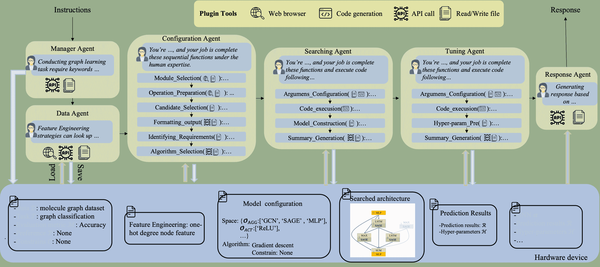

<!--yml

分类：未分类

日期：2025-01-11 13:07:12

-->

# 一种通过基于大语言模型的智能体实现的多功能图学习方法

> 来源：[https://arxiv.org/html/2309.04565/](https://arxiv.org/html/2309.04565/)

\useunder

\ul

Lanning Wei^(1,2), Huan Zhao^(3,∗), Xiaohan Zheng⁴ Zhiqiang He^(1,5), Quanming Yao^(4,∗) ¹中国科学院计算技术研究所 ²中国科学院大学 ³Noumena AI, ⁴清华大学电子工程系, ⁵联想北京中国 [weilanning@163.com; zhaohuan@noumena.com.cn; qyaoaa@tsinghua.edu.cn](mailto:weilanning@163.com;%20zhaohuan@noumena.com.cn;%20qyaoaa@tsinghua.edu.cn)

###### 摘要。

设计多功能的图学习方法是非常重要的，因为现实世界的应用中存在着多样的图和任务。现有的方法通过自动化机器学习技术、预训练和微调策略以及大语言模型来尝试实现这一目标。然而，这些方法在图学习方面还不够多功能，因为它们要么仅适用于有限类型的图，要么只适用于单一任务。本文提出通过基于大语言模型（LLM）的智能体探索多功能图学习方法，关键思想是为多样化的图和任务定制图学习流程。为实现这一目标，我们开发了多个基于LLM的智能体，具备多种配置、工具、功能和人类经验。它们协作，逐步为每个任务和数据定制具体的设置，最终实现多功能解决方案。我们将提出的方法命名为GL-Agent。通过在多样化的任务和图上进行评估，智能体的正确结果及其可比性能展示了该方法的多功能性，尤其是在复杂场景中。低资源成本以及使用开源LLM的潜力突显了GL-Agent的高效性。

## 1\. 引言

图结构数据已广泛应用于各种现实世界的领域，如社交网络（Hamilton et al., [2017](https://arxiv.org/html/2309.04565v2#bib.bib17)）、电子商务图（Lü et al., [2012](https://arxiv.org/html/2309.04565v2#bib.bib29)）以及化学或生物医学分子（Zhang et al., [2023c](https://arxiv.org/html/2309.04565v2#bib.bib70); Gilmer et al., [2017](https://arxiv.org/html/2309.04565v2#bib.bib13)）。这些基于图的应用在领域知识和学习任务上展现出显著的多样性。图结构和学习任务的多样性要求在图学习过程中设置不同的参数，以实现有效的图挖掘（You et al., [2020](https://arxiv.org/html/2309.04565v2#bib.bib62); Rossi et al., [2020](https://arxiv.org/html/2309.04565v2#bib.bib34); Gao et al., [2020](https://arxiv.org/html/2309.04565v2#bib.bib12); Yao et al., [2018](https://arxiv.org/html/2309.04565v2#bib.bib60)）。

现有方法在图学习方面的通用性不足。具体而言，自动化机器学习（AutoML）技术已经被探索用于通过单一任务处理多样化的图（Luo等， [2019](https://arxiv.org/html/2309.04565v2#bib.bib32); Wang等， [2022c](https://arxiv.org/html/2309.04565v2#bib.bib50); Gao等， [2020](https://arxiv.org/html/2309.04565v2#bib.bib12); You等， [2020](https://arxiv.org/html/2309.04565v2#bib.bib62); Zhang等， [2021](https://arxiv.org/html/2309.04565v2#bib.bib71))。这一点是通过以数据驱动的方式定制机器学习流程来实现的，从而减轻了面对多样化图时的巨大工作量。为了处理多样的图学习任务，预训练和微调范式（Lu等， [2021](https://arxiv.org/html/2309.04565v2#bib.bib30)），特别是大语言模型（LLMs）的提示调优策略（Sun等， [2022](https://arxiv.org/html/2309.04565v2#bib.bib38); Liu等， [2023b](https://arxiv.org/html/2309.04565v2#bib.bib28)），近年来已被广泛探索。预训练模型可以通过与任务特定数据进行调优，适应不同的下游任务。此外，受LLM中涌现能力启发（Brown等， [2020](https://arxiv.org/html/2309.04565v2#bib.bib3); Touvron等， [2023](https://arxiv.org/html/2309.04565v2#bib.bib42); Chowdhery等， [2022](https://arxiv.org/html/2309.04565v2#bib.bib6)），基于扁平化的方法将图学习问题转化为自然语言问答问题，然后使用LLMs进行预测（Fatemi等， [2023](https://arxiv.org/html/2309.04565v2#bib.bib9); Li等， [2023](https://arxiv.org/html/2309.04565v2#bib.bib23)）。考虑到LLM的有限上下文长度，这些方法在描述大规模图时存在困难。

图1\. 该框架旨在通过基于LLM的代理定制图学习过程。

在本文中，我们提出了GL-Agent，它借鉴了大语言模型（LLMs）的多功能性洞察，探索多样化的图学习方法。在不同任务和图上的学习需要在机器学习流程中设置不同的参数，如图所示[1](https://arxiv.org/html/2309.04565v2#S1.F1 "Figure 1 ‣ 1\. Introduction ‣ A Versatile Graph Learning Approach through LLM-based Agent")，即根据人类专家的经验设计不同的数据、模型和超参数策略。这表明，通过配置任务和数据特定的设置，可以获得多功能的解决方案。然而，由于流程复杂，LLMs很难直接实现这一点（Wei et al., [2022a](https://arxiv.org/html/2309.04565v2#bib.bib52); Valmeekam et al., [2024](https://arxiv.org/html/2309.04565v2#bib.bib43)）。考虑到这一点，我们设计了基于LLM的代理，在每个流程中配置并逐步完成管道，该方法被称为GL-Agent（图学习代理）。

如图所示[1](https://arxiv.org/html/2309.04565v2#S1.F1 "Figure 1 ‣ 1\. Introduction ‣ A Versatile Graph Learning Approach through LLM-based Agent")，从用户的图学习需求指令开始，管理代理从指令中提取图学习的关键词，例如数据、学习目标、模型设计偏好。然后，在图学习流程中，由于AutoML在设计数据特定方法方面的有效性，被采用（Yao et al., [2018](https://arxiv.org/html/2309.04565v2#bib.bib60); Pham et al., [2018](https://arxiv.org/html/2309.04565v2#bib.bib33); Gao et al., [2020](https://arxiv.org/html/2309.04565v2#bib.bib12)）。提供了四个图学习代理，分别专注于数据、AutoML配置、数据特定模型选择和超参数优化。最终响应基于图学习结果生成，之后用户根据给定指令获得响应。代理在执行给定流程时配备了明确定义的配置文件、外部工具、可能使用的功能和专业知识描述。然后，LLMs能够逐步配置并完成该流程。

为了验证所提出的GL-Agent，我们采用了11个广泛使用的数据集，包括节点、链接和图级别的数据。这些数据集通过正确的代理输出和可比的模型性能展示了GL-Agent的多功能性和有效性，特别是在复杂的非同质图和复杂指令的情况下。设计多功能图学习解决方案所涉及的低时间和经济成本展示了GL-Agent的高效性。

主要贡献总结如下：1）我们提出了一种方法 GL-Agent，通过基于LLM的代理探索多样的图学习方法。2）针对多样任务和图，我们开发了装备齐全的管理器、图学习代理和响应代理，逐步配置并执行图学习过程，以实现多样的图学习解决方案。3）我们在多样任务和图上进行了广泛的实验。可比性能和正确的代理输出证明了所提出的 GL-Agent 的多样性和有效性。低资源成本和使用开源 LLM 的潜力凸显了该方法的高效性。

## 2\. 相关工作

### 2.1\. 多样化图学习方法

现有方法在处理图学习问题中的多样任务和数据方面已有广泛的探索。

1) AutoML 是通过设计数据特定的解决方案来处理不同数据的代表性技术（Yao 等，[2018](https://arxiv.org/html/2309.04565v2#bib.bib60)）。现有方法已经探索了数据特定的特征选择策略（Wang 等，[2022c](https://arxiv.org/html/2309.04565v2#bib.bib50)；Luo 等，[2019](https://arxiv.org/html/2309.04565v2#bib.bib32)），特征维度设计方法（Ginart 等，[2021](https://arxiv.org/html/2309.04565v2#bib.bib14)；Zhaok 等，[2021](https://arxiv.org/html/2309.04565v2#bib.bib74)；Liu 等，[2020](https://arxiv.org/html/2309.04565v2#bib.bib25)）。GNNs 从操作（Gao 和 Ji，[2019](https://arxiv.org/html/2309.04565v2#bib.bib10)；Zhao 等，[2020](https://arxiv.org/html/2309.04565v2#bib.bib72)，[2021](https://arxiv.org/html/2309.04565v2#bib.bib73)；Wei 等，[2021](https://arxiv.org/html/2309.04565v2#bib.bib55)；You 等，[2020](https://arxiv.org/html/2309.04565v2#bib.bib62)；Wang 等，[2022b](https://arxiv.org/html/2309.04565v2#bib.bib51)）和跳跃连接（Wei 等，[2022b](https://arxiv.org/html/2309.04565v2#bib.bib54)；Li 和 King，[2020](https://arxiv.org/html/2309.04565v2#bib.bib22)）的角度进行自动设计。这些方法具有处理不同图的能力，但在单任务中有所局限，如表[1](https://arxiv.org/html/2309.04565v2#S2.T1 "Table 1 ‣ 2.1\. Versatile Graph Learning Methods ‣ 2\. Related Work ‣ A Versatile Graph Learning Approach through LLM-based Agent")所示。

表1\. 现有方法在处理多样任务和图方面的比较。

| 方法 | 多样任务 | 多样图 |
| --- | --- | --- |
| GL-Agent | $\checkmark$ | $\checkmark$ |
| AutoML | $\times$ | $\checkmark$ |
| 预训练和调优 | $\checkmark$ | $\times$ |
| 基于Flatten的方法 | $\checkmark$ | $\checkmark$(小规模) |

2) 预训练和微调范式，特别是提示调优，近年来广泛应用于处理不同的图学习任务，灵感来源于LLMs的多功能性（Liu等，[2023a](https://arxiv.org/html/2309.04565v2#bib.bib26)；Lu等，[2021](https://arxiv.org/html/2309.04565v2#bib.bib30)；Liu等，[2023c](https://arxiv.org/html/2309.04565v2#bib.bib27)；Xiong等，[2024b](https://arxiv.org/html/2309.04565v2#bib.bib58)）。这些方法在调优阶段通过下游任务数据学习任务特定的向量，然后预训练的模型可以应用于不同的图学习任务（Liu等，[2023b](https://arxiv.org/html/2309.04565v2#bib.bib28)；Sun等，[2022](https://arxiv.org/html/2309.04565v2#bib.bib38)，[2023a](https://arxiv.org/html/2309.04565v2#bib.bib39)；Yu等，[2024](https://arxiv.org/html/2309.04565v2#bib.bib64)）。然而，这两个阶段之间的差距较大，表现出在处理多样化图形时的不足。3) 基于扁平化的图预测方法应运而生，灵感来源于LLMs日益增长的能力（Fatemi等，[2023](https://arxiv.org/html/2309.04565v2#bib.bib9)；Wang等，[2024](https://arxiv.org/html/2309.04565v2#bib.bib45)；Li等，[2023](https://arxiv.org/html/2309.04565v2#bib.bib23)）。这些方法通过自然语言描述图形，然后使用LLMs预测结果。在大规模图形的应用中，由于上下文窗口长度的限制，它们存在一定的局限性。

与这些方法相比，设计的GL-Agent在处理不同任务和图形时能够受益于AutoML技术和LLMs的多功能性。通过在任务和数据特定设置下配置图学习过程，并借助基于LLM的代理，实现了这一点。

### 2.2. LLM增强的机器学习

LLMs在广泛的应用中取得了巨大成功，得益于其实现类人智能的能力（Wang等，[2023b](https://arxiv.org/html/2309.04565v2#bib.bib47)；weng，[2023](https://arxiv.org/html/2309.04565v2#bib.bib56)；Hong等，[2024](https://arxiv.org/html/2309.04565v2#bib.bib21)；Guo等，[2024](https://arxiv.org/html/2309.04565v2#bib.bib16)）。它们被用于作为现实世界中卓越的人工通用智能（AGI），应用包括自然语言处理任务中的问答、自动解决计算机视觉任务，以及推理图属性（Guo等，[2023](https://arxiv.org/html/2309.04565v2#bib.bib15)；Wang等，[2023b](https://arxiv.org/html/2309.04565v2#bib.bib47)；Zhang，[2023](https://arxiv.org/html/2309.04565v2#bib.bib67)；Shen等，[2023](https://arxiv.org/html/2309.04565v2#bib.bib37)；Tornede等，[2023](https://arxiv.org/html/2309.04565v2#bib.bib41)）。

一方面，LLM可以通过自动分解和完成复杂任务来增强机器学习任务的能力，并且它们被提出能够在面对多样化的应用和任务时，提供更便捷、全面和可靠的决策（Shen 等人，[2023](https://arxiv.org/html/2309.04565v2#bib.bib37); Zhang 等人，[2023b](https://arxiv.org/html/2309.04565v2#bib.bib69); Wang 等人，[2023b](https://arxiv.org/html/2309.04565v2#bib.bib47); Zhang 等人，[2023a](https://arxiv.org/html/2309.04565v2#bib.bib66); Yuan 等人，[2023](https://arxiv.org/html/2309.04565v2#bib.bib65))。例如，HuggingGPT（Shen 等人，[2023](https://arxiv.org/html/2309.04565v2#bib.bib37)）通过任务规划、模型选择、模型执行和响应生成过程来响应用户请求。每一个过程都由基于LLM的代理自动执行。类似地，AutoML-GPT（Zhang 等人，[2023b](https://arxiv.org/html/2309.04565v2#bib.bib69)）通过从数据处理到模型架构、超参数调优的实验自动处理不同的数据集和任务。这些过程也由LLM进行管理。另一方面，LLM可以从模型的角度提升机器学习任务，这在图学习中也得到了广泛应用。这包括但不限于，更好地理解图（Guo 等人，[2023](https://arxiv.org/html/2309.04565v2#bib.bib15); Zhang，[2023](https://arxiv.org/html/2309.04565v2#bib.bib67)），设计神经网络架构（Yu 等人，[2023](https://arxiv.org/html/2309.04565v2#bib.bib63); Zheng 等人，[2023](https://arxiv.org/html/2309.04565v2#bib.bib75); Zhang 等人，[2023b](https://arxiv.org/html/2309.04565v2#bib.bib69); Wang 等人，[2023a](https://arxiv.org/html/2309.04565v2#bib.bib46)），或直接用LLM预测标签（Zhang，[2023](https://arxiv.org/html/2309.04565v2#bib.bib67); Sun 等人，[2023b](https://arxiv.org/html/2309.04565v2#bib.bib40); Gao 等人，[2023](https://arxiv.org/html/2309.04565v2#bib.bib11); Chen 等人，[2023](https://arxiv.org/html/2309.04565v2#bib.bib4)）。

在本文中，我们提出探索多功能的图学习方法，并利用基于LLM的代理逐步配置和执行图学习流程，为用户带来灵活性。

## 3\. 方法

对于具有不同任务和图形的图形学习问题，它们具有相同的学习流程，但如图[1](https://arxiv.org/html/2309.04565v2#S1.F1 "图 1 ‣ 1\. 介绍 ‣ 基于LLM的多功能图形学习方法")所示，配置有所不同（Yao等人，[2018](https://arxiv.org/html/2309.04565v2#bib.bib60)）。受LLM多功能性的启发，我们提出通过从用户、任务和图形中学习到的特定设置来配置管道，从而设计基于LLM的多功能图形学习方法。考虑到复杂的学习过程和缺乏专业知识，要通过LLM实现这一目标并非易事（Wei等人，[2022a](https://arxiv.org/html/2309.04565v2#bib.bib52)；Shen等人，[2023](https://arxiv.org/html/2309.04565v2#bib.bib37)；Valmeekam等人，[2024](https://arxiv.org/html/2309.04565v2#bib.bib43)）。为此，我们提出通过为每个程序提供设备齐全的基于LLM的代理，逐步完成复杂的管道，从而解决这一挑战。在LLM的帮助下，具有不同任务和图形的图形学习问题可以根据用户的指示得到解决，而不需要过度依赖人工努力。

图 2\. 学习图形时使用的程序和代理的介绍。

如图[2](https://arxiv.org/html/2309.04565v2#S3.F2 "图 2 ‣ 3\. 方法 ‣ 基于LLM的多功能图形学习方法")所示，一组设备齐全的代理共同合作，按照黑色箭头进行图形学习程序。首先，管理代理从这些指令中提取图形学习信息，基于此，现实世界的学习信息被转化为可以在随后的代理中使用的一般图形学习设置。然后，四个图形学习代理，即数据代理、配置代理、搜索代理和调优代理，被部署来辅助图形学习过程。最后，响应代理根据搜索结果和指令生成响应给用户。对于这些代理，提供了进行程序所需的个人资料、功能、工具和专业知识。然后，可以配置并执行代理以生成最终响应。在接下来的章节中，我们将介绍每个代理，更多细节可以在附录[A](https://arxiv.org/html/2309.04565v2#A1 "附录 A：GL-Agent中代理的详细介绍 ‣ 基于LLM的多功能图形学习方法")中找到。

### 3.1\. 技术支持初步介绍

设计的程序要求代理理解请求、调用API和函数、使用外部插件工具、执行代码，并根据文档进行问题推理。本文利用了LangChain¹¹1https://github.com/langchain-ai/langchain，一个由LLM驱动的工具，用于开发代理并与外部资源和模型互动，以协助图学习中的不同流程。此外，我们在图学习流程中使用了PyG²²2https://github.com/pyg-team/pytorch_geometric、HyperOPT和PyTorch包，这些包的交互是通过LLM实现的。

### 3.2\. 指令与管理代理

图学习流程通过从实际应用中提取学习任务并设计后续流程中使用的图学习技术开始。用户的指令可能包含多种关键词，包括但不限于数据描述、学习任务、评估指标、关于学习任务的人类专业知识和硬件设备。更多指令的详细信息可在附录[A.1](https://arxiv.org/html/2309.04565v2#A1.SS1 "A.1\. 指令 ‣ 附录 A GL-Agent 中代理的详细介绍 ‣ 基于LLM的多功能图学习方法")中找到。

管理代理负责从用户的指令中提取相关信息。通过预定义的图学习关键词配置文件和专业知识，代理能够提取并总结自然语言指令。结果将以结构化的Python字典格式保存到文件中，供后续代理使用。

### 3.3\. 图学习代理

我们提供了四个由AutoML辅助的图学习代理，用于根据不同的任务和图生成图学习解决方案，原因如下：(1) 对LLM来说，直接生成有效的图学习解决方案是一个挑战，因为它们的训练数据已经过时（实验中的“LLM-GNN”基线），(2) AutoML在设计数据特定且有效的图学习解决方案方面具有优势（Zhang等人，[2021](https://arxiv.org/html/2309.04565v2#bib.bib71); Wang等人，[2022a](https://arxiv.org/html/2309.04565v2#bib.bib49)），这一优势通过保留多种候选方案并像人类一样选择一个来实现（You等人，[2020](https://arxiv.org/html/2309.04565v2#bib.bib62)）。因此，我们使用基于LLM的代理在AutoML下配置图学习流程，既能享受其有效性，又具备其多功能性。如图[2](https://arxiv.org/html/2309.04565v2#S3.F2 "图 2 ‣ 3\. 方法 ‣ 基于LLM的多功能图学习方法")所示，四个图学习代理分别被设计用于进行图处理、AutoML配置、模型搜索和超参数微调。

#### 3.3.1\. 数据代理

数据智能体的设计目的是为图学习流程中的数据准备和执行特征工程过程。根据学习任务和评估指标，智能体的目标是选择适当的特征工程策略。智能体浏览PyG文档网站，决定调用正确的特征工程API，然后将决策保存在内存中，供后续的智能体使用，这与人类专家的做法相同。

#### 3.3.2 配置智能体

在设计基于AutoML的架构时，遵循一般的流程，即神经架构搜索，我们首先需要设置搜索空间和搜索算法的配置。智能体通过浏览文档和内存来协助配置过程，然后像人类专家一样做出决策。

$\bullet$搜索空间。搜索空间是通过在设计的架构骨干内准备一组候选操作构建的，其中智能体在做出决策时起着至关重要的作用。如图[2](https://arxiv.org/html/2309.04565v2#S3.F2 "Figure 2 ‣ 3\. Method ‣ A Versatile Graph Learning Approach through LLM-based Agent")所示，设计了四个功能来通过基于LLM的智能体配置搜索空间。(1)：模块选择。智能体根据学习任务$\mathcal{T}$选择合适的操作模块来构建模型，例如，为节点分类任务选择聚合和激活模块。通过在LLM中推理大量维护的知识来实现。(2)：操作准备。为了为选定的模块准备潜在操作，智能体查找PyG中的相应文档。然后，可以提取每个模块中可用的候选操作，例如，通过收集PyG中为聚合模块提供的所有实现的卷积操作。(3)：候选选择。考虑到硬件设备的不同偏好$\mathcal{P}$和约束$\mathcal{C}$可能会影响模型设计，选择基于这些约束在每个模块中使用的候选操作，如图[3](https://arxiv.org/html/2309.04565v2#A2.F3 "Figure 3 ‣ B.1.1\. Node-level ‣ B.1\. Implementation Instance ‣ Appendix B Experiments ‣ A Versatile Graph Learning Approach through LLM-based Agent")所示，依赖于LLM做出类似人类的决策能力。(4)：格式化输出。根据选择的候选操作，结果被格式化并保存在一个新文件中。通过前一个功能的结果，依次执行这四个功能以获得配置的搜索空间，即每个选定模块中的候选集合，如图[2](https://arxiv.org/html/2309.04565v2#S3.F2 "Figure 2 ‣ 3\. Method ‣ A Versatile Graph Learning Approach through LLM-based Agent")所示。

$\bullet$搜索算法。搜索算法旨在探索设计的搜索空间，并在给定约束条件下找到合适的架构（Elsken等人，[2019](https://arxiv.org/html/2309.04565v2#bib.bib8)；Zoph和Le，[2017](https://arxiv.org/html/2309.04565v2#bib.bib77)）。如图[2](https://arxiv.org/html/2309.04565v2#S3.F2 "Figure 2 ‣ 3\. Method ‣ A Versatile Graph Learning Approach through LLM-based Agent")所示，我们在配置搜索算法时在此代理中定义了两个功能。(1): 识别需求。代理查找指令并总结效率需求。(2) 算法选择。为了简化，我们提供了两种搜索算法的变体：随机搜索和可微搜索算法，后者更高效，但对搜索空间有约束。代理根据总结的需求和设计的搜索空间选择搜索算法。

#### 3.3.3\. 搜索代理

基于搜索空间和算法的配置，我们构建并搜索搜索空间内的数据特定模型。给定AutoML代码，搜索代理帮助配置参数、执行代码并生成供后续代理使用的输出。如图[2](https://arxiv.org/html/2309.04565v2#S3.F2 "Figure 2 ‣ 3\. Method ‣ A Versatile Graph Learning Approach through LLM-based Agent")所示，搜索代理实现了四个步骤。(1) 参数配置。搜索代理加载AutoML代码，然后将配置格式化为参数。(2) 代码执行。基于配置的参数，代理帮助执行代码。(3) 模型构建。代码执行完成后，搜索代理通过查找日志文件提取数据特定模型。(4) 总结生成。基于搜索到的模型和日志文件，基于LLM的搜索代理总结这一过程，并将结果保存在新文档中。通过这些协作步骤，我们获得了符合指定设计目标和要求的搜索架构。

#### 3.3.4\. 调优代理

在获得搜索到的 GNN 后，我们可以微调超参数以获得最终结果。与搜索代理类似，调优代理的步骤如图 [2](https://arxiv.org/html/2309.04565v2#S3.F2 "Figure 2 ‣ 3\. Method ‣ A Versatile Graph Learning Approach through LLM-based Agent") 所示。为了简化，我们使用 HyperOPT (Bergstra 等, [2013](https://arxiv.org/html/2309.04565v2#bib.bib2)) 来辅助调优代理。然后，在参数配置中，超参数，如学习率、丢弃比率、权重衰减比率和归一化，基于指令和搜索到的模型进行配置，方法是通过读取代码并将参数与代理匹配来实现。接下来，提供类似的代码执行、超参数准备和摘要生成步骤，以执行代码并生成最终输出。最后，我们可以根据用户的指令获得最终性能。

### 3.4\. 响应代理

在完成图学习过程后，获得搜索到的模型及其相应的性能，我们利用响应代理生成基于共享记忆和这些代理的日志文件的综合摘要。摘要可能包含用户指令、搜索到的模型 $\bm{\alpha}$、超参数 $\mathcal{H}$、预测性能 $\mathcal{R}$ 等。

### 3.5\. 讨论

GL-Agent 提出用于探索给定多样化任务和图的多功能图学习方法，利用 LLM 的洞察力。除了在第 [2.1](https://arxiv.org/html/2309.04565v2#S2.SS1 "2.1\. Versatile Graph Learning Methods ‣ 2\. Related Work ‣ A Versatile Graph Learning Approach through LLM-based Agent") 节中介绍的多功能性，GL-Agent 还在灵活性和可扩展性方面提供了额外的优势。

灵活性。与现有方法相比，这些方法在解决图学习问题时需要大量人工努力，而 GL-Agent 只需通过指令即可实现目标。这种方法对用户更加灵活，并且可以降低非专业用户对图学习不熟悉的学习和使用门槛。

可扩展性。GL-Agent 在设计图学习解决方案时使用了 AutoML 技术，并配置了基于 LLM 的代理。这表明该方法可以扩展到新的图上，以获得数据特定且有效的图学习解决方案。此外，本文考虑了广泛使用的图学习包 PyG。因此，基于 PyG 实现的用户定义 GNN 可以集成到此方法中，表明了用户特定专业知识的扩展。

## 4\. 实验

在实验中，我们首先从代理输出和在不同任务与图上的表现角度评估GL-Agent的通用性。然后，我们展示了GL-Agent在处理复杂场景中的能力，包括对大规模非同质图的预测以及使用复杂指令。最后，我们展示了资源成本和使用其他LLM的潜力。

### 4.1\. 实现实例

在本文中，我们开发了基于LLM的代理来辅助图学习管道的配置和执行，采用了AutoML技术。我们提供了三个AutoML实现实例，涵盖了三个任务：a) 节点级别。该实例基于可微分自动化GNN设计方法F2GNN（Wei等人，[2022b](https://arxiv.org/html/2309.04565v2#bib.bib54)），该方法专注于设计聚合操作和GNN拓扑，即这些聚合操作之间的连接。b) 图级别。图级别的实现实例基于LRGNN（Wei等人，[2023](https://arxiv.org/html/2309.04565v2#bib.bib53)），该方法通过深度堆叠的GNN来捕捉远程依赖关系。该框架由多个单元构成，提供选择、融合和聚合模块。框架末尾提供了一个读出模块，用于生成该任务的图表示。c) 链接级别。对于链接级别，实例基于方法Prof-CF（Wang等人，[2022a](https://arxiv.org/html/2309.04565v2#bib.bib49)），该方法寻找基于GNN的双塔协同过滤函数。该框架包含多种设计模块，包括消息函数、聚合、层组合等，并通过修剪操作设计搜索空间。管理代理根据用户指令选择相应的实例，详细的代理介绍见附录[B.1](https://arxiv.org/html/2309.04565v2#A2.SS1 "B.1\. 实现实例 ‣ 附录B 实验 ‣ 基于LLM的多功能图学习方法")。

### 4.2\. 实验设置

#### 4.2.1\. 数据集

为了评估所设计的GL-Agent在处理多样任务和图上的通用性，本文采用了推荐系统中的节点分类、图分类和项目排序任务。采用了广泛使用的数据集：（a）节点分类：Cora（Sen等，[2008](https://arxiv.org/html/2309.04565v2#bib.bib35)）、Physics（Shchur等，[2018](https://arxiv.org/html/2309.04565v2#bib.bib36)），以及来自（Shchur等，[2018](https://arxiv.org/html/2309.04565v2#bib.bib36)）的Computers和Photo数据集，还有大规模的非同质数据集genius（Lim等，[2021](https://arxiv.org/html/2309.04565v2#bib.bib24)）；（b）图分类：DD和PROTEINS数据集（Dobson和Doig，[2003](https://arxiv.org/html/2309.04565v2#bib.bib7)），以及NCI1和NCI109数据集（Wale和Karypis，[2006](https://arxiv.org/html/2309.04565v2#bib.bib44)）；（c）项目排序任务：Epinions和Amazon-Sports。这些数据集的详细介绍见附录[B.2](https://arxiv.org/html/2309.04565v2#A2.SS2 "B.2\. 数据集 ‣ 附录 B 实验 ‣ 一种通过LLM代理的多功能图学习方法")。

#### 4.2.2\. 基准

在本文中，基于LLM的代理专注于利用AutoML技术提取信息、配置、执行和总结图学习过程。为了评估所提出的GL-Agent，针对每个任务采用了三种基准方法，即人类设计的方法、基于NAS的方法和LLM建议的基准方法。在节点分类任务中，我们采用了人类设计的方法GCN、GIN、GPR-GNN（Chien等，[2021](https://arxiv.org/html/2309.04565v2#bib.bib5)）和ACM-GCN（Luan等，[2022](https://arxiv.org/html/2309.04565v2#bib.bib31)），以及基于NAS的方法SANE（Zhao等，[2021](https://arxiv.org/html/2309.04565v2#bib.bib73)）和F2GNN（Wei等，[2022b](https://arxiv.org/html/2309.04565v2#bib.bib54)）。在图分类任务中，我们采用了人类设计的方法GCN、GIN、DGCNN（Zhang等，[2018](https://arxiv.org/html/2309.04565v2#bib.bib68)）和DiffPool（Ying等，[2018](https://arxiv.org/html/2309.04565v2#bib.bib61)），以及基于NAS的方法LRGNN（Wei等，[2023](https://arxiv.org/html/2309.04565v2#bib.bib53)）。在项目排序任务中，我们采用了人类设计的方法NCF（He等，[2017](https://arxiv.org/html/2309.04565v2#bib.bib20)）、NGCF（Wang等，[2019](https://arxiv.org/html/2309.04565v2#bib.bib48)）和LightGCN（He等，[2020](https://arxiv.org/html/2309.04565v2#bib.bib19)），以及基于NAS的方法Prof-CF（Wang等，[2022b](https://arxiv.org/html/2309.04565v2#bib.bib51)）。这些方法和LLM-GNN的详细介绍见附录[B.3](https://arxiv.org/html/2309.04565v2#A2.SS3 "B.3\. 基准 ‣ 附录 B 实验 ‣ 一种通过LLM代理的多功能图学习方法")。

如第[3.1](https://arxiv.org/html/2309.04565v2#S3.SS1 "3.1\. Preliminary on Technical Support ‣ 3\. Method ‣ A Versatile Graph Learning Approach through LLM-based Agent")节所述，所提议的 GL-Agent 是基于 LangChain 和 PyG 构建的。我们在代理中使用 GPT-3.5-turbo 作为部署模型。代理的详细提示和回答见附录[A](https://arxiv.org/html/2309.04565v2#A1 "Appendix A Detailed Introduction of Agents in GL-Agent ‣ A Versatile Graph Learning Approach through LLM-based Agent")。

表 2\. 代理输出在不同任务上的比较。

|  | Cora（节点） | NCI1（图） | Epinions（链接） |
| --- | --- | --- | --- |
| 说明 | 我有一个数据集 $\mathcal{D}$，它是一个类似 Cora 数据集的引文网络。在这个网络中，节点 $\cdots$，边 $\cdots$。我的目标是准确预测这些论文的领域。 | 我有一个数据集 $\mathcal{D}$，它类似于图基准中的 NCI1 数据集，每个图是一个化学化合物。我想找到一个 GNN，在预测分子属性时能达到更高的准确性。 | 我目前拥有一个社交网络数据集，类似 Epinions，记作 $\mathcal{D}$。在这个数据集中，节点 $\cdots$，边 $\cdots$。我的目标是为每个用户推荐潜在的朋友。 |
| 管理员代理的提示输出 | $\mathcal{D}$: 引文网络 Cora；$\mathcal{T}$: 节点分类；评估指标 $\mathcal{M}$: 准确率。$\cdots$ | $\mathcal{D}$: 化学化合物 NCI1；$\mathcal{T}$: 图分类；评估指标 $\mathcal{M}$: 准确率。$\cdots$ | $\mathcal{D}$: 社交网络 Epinions；$\mathcal{T}$: 链接预测；评估指标 $\mathcal{M}$: Recall@20。$\cdots$ |
| 配置代理的格式化输出 | 响应列表为 [‘Aggregation’,‘Selection’,‘Fusion’] | 响应列表为 [‘Aggregation’, ‘Pooling’, ‘Readout’,‘Selection’,‘Fusion’] | 响应列表为 [‘Embedding dim’, ‘Message function’, $\cdots$, ‘Layer combination’, ‘Interaction function’] |

### 4.3\. 多功能性的评估

GL-Agent 探索使用基于 LLM 的代理为多种任务和图提供多功能图学习解决方案。我们通过展示代理输出和在不同数据集上的表现来评估其多功能性。

#### 4.3.1\. 代理输出的正确性

如表[2](https://arxiv.org/html/2309.04565v2#S4.T2 "表 2 ‣ 4.2.2\. 基准 ‣ 4.2\. 实验设置 ‣ 4\. 实验 ‣ 基于LLM的代理的多功能图学习方法")所示，我们比较了在面对不同任务和图形时代理的结果。为简便起见，我们仅提供了管理代理的指令和输出，以及配置的搜索空间。显然，代理能够准确提取有用信息，并像人类专家一样做出正确预测，展示了其在处理不同学习任务和基于多样化指令的数据时的多功能性。代理的详细信息见附录[A](https://arxiv.org/html/2309.04565v2#A1 "附录 A GL-Agent 中代理的详细介绍 ‣ 基于LLM的代理的多功能图学习方法")，有关不同任务的完整案例研究见附录[B.5](https://arxiv.org/html/2309.04565v2#A2.SS5 "B.5\. 案例研究 ‣ 附录 B 实验 ‣ 基于LLM的代理的多功能图学习方法")。

表 3\. 节点分类任务的性能比较。我们报告了基于10次随机分割的平均测试准确度和标准差。

|  | Cora | Photo | genius |
| --- | --- | --- | --- |
| # 节点 | 2,708 | 7,487 | 421,961 |
| GL-Agent | 86.81(0.40) | 96.40(0.16) | 90.51(0.15) |
| GCN | 85.68(0.61) | 93.13(0.27) | 89.10(0.13) |
| GIN | 83.83(1.36) | 92.67(0.57) | 85.61(0.06) |
| GPRGNN | 87.62(0.48) | 91.93(0.26) | 90.05(0.31) |
| ACM-GCN | 86.67(0.14) | 94.35(0.65) | 90.08(0.05) |
| SANE | 86.40(0.38) | 94.53(0.22) | OOM |
| F2GNN | 87.42(0.42) | 95.38(0.30) | 90.93(0.02) |
| LLM-GNN | 84.64(1.04) | 93.73(0.38) | 89.31(0.17) |

表 4\. 图分类任务的性能比较。我们报告了基于10折交叉验证数据的平均测试准确率和标准差。

|  | 蛋白质 | DD |
| --- | --- | --- |
| GL-Agent | 75.38(5.03) | 78.10(3.21) |
| GCN | 74.84(3.07) | 73.59(4.17) |
| GIN | 74.50(4.10) | 74.62(2.74) |
| DGCNN | 73.95(3.04) | 61.63(5.33) |
| DiffPool | 75.11(2.14) | 77.85(3.53) |
| LRGNN | 75.39(4.40) | 78.18(2.02) |
| LLM-GNN | 74.47(3.65) | 75.12(3.44) |

表 5\. 项目排名任务的性能比较。我们报告了基于10次重复实验的平均测试Recall@20和标准差。

|  | Epinions | Amazon-Sports |
| --- | --- | --- |
| GL-Agent | 0.0453(0.0018) | 0.0829(0.0006) |
| NCF | 0.0344(0.0007) | 0.0636(0.0011) |
| NGCF | 0.0290(0.0002) | 0.0609(0.0011) |
| LightGCN | 0.0321(0.0003) | 0.0776(0.0006) |
| Prof-CF | 0.0472(0.0011) | 0.1023(0.0021) |
| LLM-GNN | 0.0379(0.0014) | 0.0151(0.0001) |

#### 4.3.2\. 不同任务的性能比较

我们展示了与基准方法的性能比较，以评估GL-Agent的有效性。如表[3](https://arxiv.org/html/2309.04565v2#S4.T3 "Table 3 ‣ 4.3.1\. Correctness of Agent Output ‣ 4.3\. Evaluation of Versatility ‣ 4\. Experiments ‣ A Versatile Graph Learning Approach through LLM-based Agent")所示，在节点级任务上，GL-Agent与基于AutoML的方法F2GNN的表现相当。由于GL-Agent是基于F2GNN实现的，这一相当的表现展示了代理在理解和处理节点级任务方面的能力。对于LLM-GNN，其中GNN和超参数由LLM直接推荐，其性能相比于GCN基准较差，原因在于不合适的超参数。这突出了LLM在处理不同图谱和不同图学习过程时面临的挑战。如表[4](https://arxiv.org/html/2309.04565v2#S4.T4 "Table 4 ‣ 4.3.1\. Correctness of Agent Output ‣ 4.3\. Evaluation of Versatility ‣ 4\. Experiments ‣ A Versatile Graph Learning Approach through LLM-based Agent")和表[5](https://arxiv.org/html/2309.04565v2#S4.T5 "Table 5 ‣ 4.3.1\. Correctness of Agent Output ‣ 4.3\. Evaluation of Versatility ‣ 4\. Experiments ‣ A Versatile Graph Learning Approach through LLM-based Agent")所示，我们可以得出相同的结论，即GL-Agent在图分类和项目排名任务上，分别与其基于AutoML的方法LRGNN和prof-CF（Wang等，[2022b](https://arxiv.org/html/2309.04565v2#bib.bib51)）的表现相当。这个结论在三个任务的完整数据集上是一致的，关于不同任务的详细结果和分析可以在附录[B.4](https://arxiv.org/html/2309.04565v2#A2.SS4 "B.4\. Performance Comparisons ‣ Appendix B Experiments ‣ A Versatile Graph Learning Approach through LLM-based Agent")中找到。

总结来说，提出的GL-Agent通过多样的任务和图谱探索了多功能的图学习方法。所提出的代理可以生成特定任务和数据的结果，来配置图学习过程，并能获得与这些基准相当或更高的性能。结果突出了GL-Agent在处理复杂指令中的不同任务和数据方面的多样性和有效性。

### 4.4\. 复杂场景的评估

我们展示了InstructionGL在实现需要高级人类专业知识的复杂任务中的能力，并可以评估其鲁棒性。

#### 4.4.1\. 复杂图学习任务的评估

我们考虑了大规模非同质场景，其中连接节点具有不同标签，这对设计有效模型构成挑战（Zhu 等，[2020](https://arxiv.org/html/2309.04565v2#bib.bib76)；Luan 等，[2022](https://arxiv.org/html/2309.04565v2#bib.bib31)）。如表[3](https://arxiv.org/html/2309.04565v2#S4.T3 "Table 3 ‣ 4.3.1\. Correctness of Agent Output ‣ 4.3\. Evaluation of Versatility ‣ 4\. Experiments ‣ A Versatile Graph Learning Approach through LLM-based Agent")所示，对于大规模数据集genius，LLM-GNN与GCN基准模型的表现相当，即使我们在指令中添加了数据集描述和实验观察（详见附录[B.3](https://arxiv.org/html/2309.04565v2#A2.SS3 "B.3\. Baselines ‣ Appendix B Experiments ‣ A Versatile Graph Learning Approach through LLM-based Agent")）。然而，基于AutoML的方法，即F2GNN和GL-Agent，通过设计特定数据的解决方案，能够实现更高的性能。因此，通过使用AutoML方法，它在处理多样化图形方面的有效性已扩展到提出的GL-Agent中。

#### 4.4.2\. 复杂指令评估

在提出的框架中，指令包含了关于数据和学习任务的所有信息。指令的清晰度将对智能体的输出产生较大影响。接下来，我们提供了三种评估复杂指令鲁棒性的策略，灵感来源于（Xiong 等，[2024a](https://arxiv.org/html/2309.04565v2#bib.bib57)）。1) 简单：使用简化的句子组织指令，保持智能体输出不变；2) 复杂：使用 GPT-4 对指令和智能体输出进行同义转述，保持相似语义，但使用更复杂的词汇；3) 误导：使用 GPT-4 向原始指令和输出中添加误导信息。如表[6](https://arxiv.org/html/2309.04565v2#S4.T6 "Table 6 ‣ 4.4.2\. Evaluations with Complex Instructions ‣ 4.4\. Evaluations on Complex Scenarios ‣ 4\. Experiments ‣ A Versatile Graph Learning Approach through LLM-based Agent")所示，我们展示了在面对不同指令和输入时智能体输出的准确性。我们可以清晰地观察到简单与复杂变体之间具有相当的表现，这表明提出的 GL-Agent 在从输入中提取有用信息方面具有鲁棒性。此外，误导信息对配置智能体有较大影响，因为该智能体具有复杂的工具和功能。通过根据反思或人类专家的反馈修改输出，预计可以进一步改进，这将在未来的工作中考虑。详细的指令和结果可以在附录的表[24](https://arxiv.org/html/2309.04565v2#A2.T24 "Table 24 ‣ B.6\. Interpretability of Decisions in Graph Learning Tasks ‣ Appendix B Experiments ‣ A Versatile Graph Learning Approach through LLM-based Agent")中找到。

表 6\. 在不同指令下的性能比较，以及不同代理下的资源成本比较。

|  | 指令 | 资源成本 |
| --- | --- | --- |
| 代理 | 简单 | 复杂 | 误导 | 时间（秒） | Token | 费用（美元） |
| 管理员 | 0.7 | 0.6 | 0.5 | 3.23 | 683.5 | 0.014 |
| 数据 | 1.0 | 1.0 | 0.9 | 4.95 | 1054 | 0.021 |
| 配置 | 0.7 | 0.6 | 0.3 | 11.57 | 6672.4 | 0.133 |
| 搜索 | 0.6 | 0.7 | 0.7 | 93.29 | 6462.5 | 0.129 |
| 调整 | 0.6 | 0.7 | 0.7 | 329.12 | 711.1 | 0.014 |

### 4.5\. 资源成本评估

GL-Agent设计了基于封闭源代码LLM GPT-3.5-Turbo的多功能图学习解决方案，其中时间和经济成本不可忽视。接下来，我们通过实验证明使用API时GL-Agent的搜索成本。如表[6](https://arxiv.org/html/2309.04565v2#S4.T6 "Table 6 ‣ 4.4.2\. Evaluations with Complex Instructions ‣ 4.4\. Evaluations on Complex Scenarios ‣ 4\. Experiments ‣ A Versatile Graph Learning Approach through LLM-based Agent")所示，代理生成输出所需的时间少于一分钟，与代码执行所需的长时间相比，可以忽略不计。此外，进行一次操作的费用为0.31美元，这也是经济高效的。这些结果表明，GL-Agent能够高效且经济地处理具有多种任务和图形的图学习问题。

表 7\. 基于不同LLM的代理结果比较。

| 功能 | LLaMA2-7B | GPT-3.5-turbo + LangChain（我们） |
| --- | --- | --- |
| 模块选择 | 可能的操作：聚合：$\cdots$，池化：$\cdots$，读取：$\cdots$ | 响应列表是[‘aggregation’，‘pooling’，‘readout’，‘selection’，‘fusion’] |
| 操作准备；候选选择 | 为了应对您的请求：1\. 证明：$\cdots$，2\. 寻找相应的类别：$\cdots$，3\. 返回类别名和模块名$\cdots$。 | ’ChebConv’，’torch_geometric.nn.conv.cheb _conv.ChebConv’ |
| 确定需求；算法选择 | 首先，让我澄清它们之间的区别。$\cdots$。然后，让我们根据这些原则评估选项。$\cdots$ | 你应该使用“可微分搜索算法”。 |

为了进一步降低成本，我们考察了不同的 LLM 在探索多功能图学习解决方案中的表现。如表 [7](https://arxiv.org/html/2309.04565v2#S4.T7 "Table 7 ‣ 4.5\. The Evaluations of Resource Cost ‣ 4\. Experiments ‣ A Versatile Graph Learning Approach through LLM-based Agent") 所示，我们展示了与 LLaMA2 7B 的比较，并关注在这些 LLM 之间产生不一致答案的过程。由于 LLaMA2 70B 和 GPT-4 获得了正确的结果，我们将比较移至附录中的表 [26](https://arxiv.org/html/2309.04565v2#A2.T26 "Table 26 ‣ B.6\. Interpretability of Decisions in Graph Learning Tasks ‣ Appendix B Experiments ‣ A Versatile Graph Learning Approach through LLM-based Agent")。基于精心设计的功能和工具，代理在大多数过程中可以提供准确的预测，除了灰色突出显示的单元格，这可能是由于参数较少（7B）所致。这表明，我们可以用更实惠的开源 LLM 替代 GPT-3.5-turbo，这些 LLM 在我们的方法中提供了相当的性能。

## 5. 结论

我们提出了一种方法 GL-Agent，用于探索针对现实世界应用中的不同任务和图形的多功能图学习解决方案。首先，我们提出了管理者代理、四个图学习代理和响应代理，这些代理配备了配置文件、功能、外部工具和人类经验。然后，基于用户指令，装备齐全的代理理解用户需求，以自然语言表达，逐步配置并完成图学习过程。最后，我们得到了具有任务和数据特定设置的定制图学习过程。在实验中，GL-Agent 能够针对不同任务做出正确决策，与基准相比，甚至在复杂场景下也能取得相当的性能。此外，低资源成本和使用开源 LLM 的潜力展示了其在完成图学习任务中的高效性。未来，我们将提高 GL-Agent 的鲁棒性和可靠性。更具体地，通过将反思和多轮对话添加到框架中，代理将根据人类反馈修正其输出，以实现目标。

## 参考文献

+   (1)

+   Bergstra 等人（2013）James Bergstra, Daniel Yamins 和 David Cox. 2013. 将模型搜索变成一门科学：在数百维度中进行超参数优化，用于视觉架构的优化。*国际机器学习会议*。PMLR，115–123。

+   Brown 等人（2020）Tom Brown, Benjamin Mann, Nick Ryder, Melanie Subbiah, Jared D Kaplan, Prafulla Dhariwal, Arvind Neelakantan, Pranav Shyam, Girish Sastry, Amanda Askell 等人. 2020. 语言模型是少样本学习者。*神经信息处理系统进展* 33 (2020), 1877–1901。

+   Chen等人（2023）Zhikai Chen, Haitao Mao, Hang Li, Wei Jin, Hongzhi Wen, Xiaochi Wei, Shuaiqiang Wang, Dawei Yin, Wenqi Fan, Hui Liu等人. 2023. 探索大语言模型（LLMs）在图学习中的潜力. *arXiv预印本 arXiv:2307.03393*（2023年）。

+   Chien等人（2021）Eli Chien, Jianhao Peng, Pan Li, 和 Olgica Milenkovic. 2021. 自适应通用广义PageRank图神经网络. *ICLR*（2021年）。

+   Chowdhery等人（2022）Aakanksha Chowdhery, Sharan Narang, Jacob Devlin, Maarten Bosma, Gaurav Mishra, Adam Roberts, Paul Barham, Hyung Won Chung, Charles Sutton, Sebastian Gehrmann等人. 2022. Palm: 通过路径扩展语言建模. *arXiv预印本 arXiv:2204.02311*（2022年）。

+   Dobson和Doig（2003）Paul D Dobson和Andrew J Doig. 2003. 在没有对齐的情况下区分酶结构和非酶结构. *分子生物学杂志（JMB）* 330, 4（2003），771–783。

+   Elsken等人（2019）Thomas Elsken, Jan Hendrik Metzen, 和 Frank Hutter. 2019. 神经架构搜索：一项综述. *机器学习研究期刊* 20, 1（2019），1997–2017。

+   Fatemi等人（2023）Bahare Fatemi, Jonathan Halcrow, 和 Bryan Perozzi. 2023. 像图一样交流：为大语言模型编码图. *arXiv预印本 arXiv:2310.04560*（2023年）。

+   Gao和Ji（2019）Hongyang Gao 和 Shuiwang Ji. 2019. 图U-Net. *ICML*，2083–2092。

+   Gao等人（2023）Jun Gao, Huan Zhao, Changlong Yu, 和 Ruifeng Xu. 2023. 探索ChatGPT在事件提取中的可行性. *arXiv预印本 arXiv:2303.03836*（2023年）。

+   Gao等人（2020）Yang Gao, Hong Yang, Peng Zhang, Chuan Zhou, 和 Yue Hu. 2020. Graphnas: 基于强化学习的图神经架构搜索. 在*IJCAI*中。

+   Gilmer等人（2017）Justin Gilmer, Samuel S Schoenholz, Patrick F Riley, Oriol Vinyals, 和 George E Dahl. 2017. 量子化学的神经信息传递. 在*ICML*中. 1263–1272。

+   Ginart等人（2021）Antonio A Ginart, Maxim Naumov, Dheevatsa Mudigere, Jiyan Yang, 和 James Zou. 2021. 混合维度嵌入及其在内存高效推荐系统中的应用. 在*2021 IEEE信息理论国际研讨会（ISIT）*中. IEEE，2786–2791。

+   Guo等人（2023）Jiayan Guo, Lun Du, 和 Hengyu Liu. 2023. GPT4Graph：大语言模型能理解图结构数据吗？一项实证评估与基准测试. *arXiv预印本 arXiv:2305.15066*（2023年）。

+   Guo等人（2024）Siyuan Guo, Cheng Deng, Ying Wen, Hechang Chen, Yi Chang, 和 Jun Wang. 2024. DS-Agent: 通过基于案例的推理赋能大语言模型实现自动化数据科学. *ICML*。

+   Hamilton等人（2017）Will Hamilton, Zhitao Ying, 和 Jure Leskovec. 2017. 大规模图上的归纳表示学习. 在*NeurIPS*中. 1024–1034.

+   He和McAuley（2016）Ruining He 和 Julian McAuley. 2016. 起伏：使用单类协同过滤建模时尚趋势的视觉演变. 在*第25届国际万维网会议论文集*中. 507–517。

+   He 等人（2020）Xiangnan He, Kuan Deng, Xiang Wang, Yan Li, Yongdong Zhang, 和 Meng Wang. 2020. Lightgcn：简化并增强图卷积网络用于推荐。在*第43届国际ACM SIGIR信息检索研究与发展会议论文集*中，639–648页。

+   He 等人（2017）Xiangnan He, Lizi Liao, Hanwang Zhang, Liqiang Nie, Xia Hu, 和 Tat-Seng Chua. 2017. 神经协同过滤。在*第26届国际万维网会议论文集*中，173–182页。

+   Hong 等人（2024）Sirui Hong, Xiawu Zheng, Jonathan Chen, Yuheng Cheng, Jinlin Wang, Ceyao Zhang, Zili Wang, Steven Ka Shing Yau, Zijuan Lin, Liyang Zhou 等人. 2024. Metagpt：面向多智能体协作框架的元编程。*ICLR* (2024)。

+   Li 和 King（2020）Yaoman Li 和 Irwin King. 2020. AutoGraph：自动化图神经网络。在*ICONIP*会议中，189–201页。

+   Li 等人（2023）Yuhan Li, Zhixun Li, Peisong Wang, Jia Li, Xiangguo Sun, Hong Cheng, 和 Jeffrey Xu Yu. 2023. 图与大语言模型的结合：进展与未来方向的综述。*arXiv 预印本 arXiv:2311.12399* (2023)。

+   Lim 等人（2021）Derek Lim, Xiuyu Li, Felix Hohne, 和 Ser-Nam Lim. 2021. 非同质图学习的新基准。*arXiv 预印本 arXiv:2104.01404* (2021)。

+   Liu 等人（2020）Haochen Liu, Xiangyu Zhao, Chong Wang, Xiaobing Liu, 和 Jiliang Tang. 2020. 深度推荐系统中的自动嵌入大小搜索。在*第43届国际ACM SIGIR信息检索研究与发展会议论文集*中，2307–2316页。

+   Liu 等人（2023a）Jiawei Liu, Cheng Yang, Zhiyuan Lu, Junze Chen, Yibo Li, Mengmei Zhang, Ting Bai, Yuan Fang, Lichao Sun, Philip S Yu 等人. 2023a. 面向图基础模型：综述与展望。*arXiv 预印本 arXiv:2310.11829* (2023)。

+   Liu 等人（2023c）Pengfei Liu, Weizhe Yuan, Jinlan Fu, Zhengbao Jiang, Hiroaki Hayashi, 和 Graham Neubig. 2023c. 预训练、提示与预测：自然语言处理中的提示方法系统综述。*计算机综述* 55, 9 (2023), 1–35页。

+   Liu 等人（2023b）Zemin Liu, Xingtong Yu, Yuan Fang, 和 Xinming Zhang. 2023b. Graphprompt：统一图神经网络的预训练和下游任务。在*2023年ACM Web大会论文集*中，417–428页。

+   Lü 等人（2012）Linyuan Lü, Matúš Medo, Chi Ho Yeung, Yi-Cheng Zhang, Zi-Ke Zhang, 和 Tao Zhou. 2012. 推荐系统。*物理学报告* 519, 1 (2012), 1–49。

+   Lu 等人（2021）Yuanfu Lu, Xunqiang Jiang, Yuan Fang, 和 Chuan Shi. 2021. 学习预训练图神经网络。在*第35届人工智能AAAI会议论文集*中，4276–4284页。

+   Luan 等人（2022）Sitao Luan, Chenqing Hua, Qincheng Lu, Jiaqi Zhu, Mingde Zhao, Shuyuan Zhang, Xiao-Wen Chang, 和 Doina Precup. 2022. 重新审视异质性对图神经网络的影响。在*NeurIPS*会议中。

+   Luo 等（2019）Yuanfei Luo, Mengshuo Wang, Hao Zhou, Quanming Yao, Wei-Wei Tu, Yuqiang Chen, Wenyuan Dai, 和 Qiang Yang. 2019. Autocross：用于现实应用中的表格数据的自动特征交叉。发表于 *第25届ACM SIGKDD国际知识发现与数据挖掘大会论文集*，1936–1945。

+   Pham 等（2018）Hieu Pham, Melody Guan, Barret Zoph, Quoc Le, 和 Jeff Dean. 2018. 通过参数共享实现高效神经架构搜索。发表于 *ICML*，4092–4101。

+   Rossi 等（2020）Emanuele Rossi, Fabrizio Frasca, Ben Chamberlain, Davide Eynard, Michael Bronstein, 和 Federico Monti. 2020. Sign：可扩展的启动图神经网络。发表于 *arXiv预印本 arXiv:2004.11198* 7 (2020)，15。

+   Sen 等（2008）Prithviraj Sen, Galileo Namata, Mustafa Bilgic, Lise Getoor, Brian Galligher, 和 Tina Eliassi-Rad. 2008. 网络数据中的集体分类。发表于 *AI杂志* 29, 3 (2008)，93–93。

+   Shchur 等（2018）Oleksandr Shchur, Maximilian Mumme, Aleksandar Bojchevski, 和 Stephan Günnemann. 2018. 图神经网络评估中的陷阱。发表于 *arXiv预印本 arXiv:1811.05868*（2018）。

+   Shen 等（2023）Yongliang Shen, Kaitao Song, Xu Tan, Dongsheng Li, Weiming Lu, 和 Yueting Zhuang. 2023. Hugginggpt：使用chatgpt及其在huggingface中的朋友解决AI任务。发表于 *arXiv预印本 arXiv:2303.17580*（2023）。

+   Sun 等（2022）Mingchen Sun, Kaixiong Zhou, Xin He, Ying Wang, 和 Xin Wang. 2022. Gppt：图预训练和提示调整以泛化图神经网络。发表于 *第28届ACM SIGKDD知识发现与数据挖掘会议论文集*，1717–1727。

+   Sun 等（2023a）Xiangguo Sun, Hong Cheng, Jia Li, Bo Liu, 和 Jihong Guan. 2023a. 一体化：图神经网络的多任务提示。发表于 *第29届ACM SIGKDD知识发现与数据挖掘会议论文集*，2120–2131。

+   Sun 等（2023b）Xiaofei Sun, Xiaoya Li, Jiwei Li, Fei Wu, Shangwei Guo, Tianwei Zhang, 和 Guoyin Wang. 2023b. 基于大型语言模型的文本分类。发表于 *arXiv预印本 arXiv:2305.08377*（2023）。

+   Tornede 等（2023）Alexander Tornede, Difan Deng, Theresa Eimer, Joseph Giovanelli, Aditya Mohan, Tim Ruhkopf, Sarah Segel, Daphne Theodorakopoulos, Tanja Tornede, Henning Wachsmuth, 等. 2023. 大型语言模型时代的AutoML：当前挑战、未来机遇与风险。发表于 *arXiv预印本 arXiv:2306.08107*（2023）。

+   Touvron 等（2023）Hugo Touvron, Thibaut Lavril, Gautier Izacard, Xavier Martinet, Marie-Anne Lachaux, Timothée Lacroix, Baptiste Rozière, Naman Goyal, Eric Hambro, Faisal Azhar, 等. 2023. Llama：开放且高效的基础语言模型。发表于 *arXiv预印本 arXiv:2302.13971*（2023）。

+   Valmeekam 等（2024）Karthik Valmeekam, Matthew Marquez, Alberto Olmo, Sarath Sreedharan, 和 Subbarao Kambhampati. 2024. Planbench：一个可扩展的基准，用于评估大型语言模型在规划和推理变化中的表现。发表于 *神经信息处理系统进展* 36 (2024)。

+   Wale 和 Karypis（2006）N Wale 和 G Karypis. 2006. 化学化合物检索与分类的描述符空间比较. 见 *ICDM*，678–689。

+   Wang 等人（2024）Heng Wang、Shangbin Feng、Tianxing He、Zhaoxuan Tan、Xiaochuang Han 和 Yulia Tsvetkov. 2024. 语言模型能否用自然语言解决图问题？ *神经信息处理系统进展* 36（2024）。

+   Wang 等人（2023a）Haishuai Wang、Yang Gao、Xin Zheng、Peng Zhang、Hongyang Chen 和 Jiajun Bu. 2023a. 使用 GPT-4 进行图神经架构搜索. *arXiv 预印本 arXiv:2310.01436*（2023）。

+   Wang 等人（2023b）Lei Wang、Chen Ma、Xueyang Feng、Zeyu Zhang、Hao Yang、Jingsen Zhang、Zhiyuan Chen、Jiakai Tang、Xu Chen、Yankai Lin 等人. 2023b. 基于大语言模型的自主代理综述. *arXiv 预印本 arXiv:2308.11432*（2023）。

+   Wang 等人（2019）Xiang Wang、Xiangnan He、Meng Wang、Fuli Feng 和 Tat-Seng Chua. 2019. 神经图协同过滤. 见 *第42届国际ACM SIGIR信息检索研究与发展会议论文集*，165–174。

+   Wang 等人（2022a）Xin Wang、Ziwei Zhang 和 Wenwu Zhu. 2022a. 自动化图机器学习：方法、库和方向. *arXiv 预印本 arXiv:2201.01288*（2022）。

+   Wang 等人（2022c）Yejing Wang、Xiangyu Zhao、Tong Xu 和 Xian Wu. 2022c. Autofield：在深度推荐系统中自动化特征选择. 见 *ACM Web 会议2022论文集*，1977–1986。

+   Wang 等人（2022b）Zhenyi Wang、Huan Zhao 和 Chuan Shi. 2022b. 基于图神经网络的协同过滤设计空间分析. 见 *WSDM*，1109–1119。

+   Wei 等人（2022a）Jason Wei、Xuezhi Wang、Dale Schuurmans、Maarten Bosma、Fei Xia、Ed Chi、Quoc V Le、Denny Zhou 等人. 2022a. 思维链提示促使大语言模型进行推理. *神经信息处理系统进展* 35（2022），24824–24837。

+   Wei 等人（2023）Lanning Wei、Zhiqiang He、Huan Zhao 和 Quanming Yao. 2023. 通过堆叠 GNNs 捕捉长程依赖用于图分类. 见 *ACM Web 会议2023论文集*，588–598。

+   Wei 等人（2022b）Lanning Wei、Huan Zhao 和 Zhiqiang He. 2022b. 图神经网络拓扑设计：一种新的特征融合视角. 见 *The WebConf*，1381–1391。

+   Wei 等人（2021）Lanning Wei、Huan Zhao、Quanming Yao 和 Zhiqiang He. 2021. 图分类的池化架构搜索. 见 *CIKM*，2091–2100。

+   Weng（2023）Lilian Weng. 2023年6月23日. LLM 驱动的自主代理. [https://lilianweng.github.io/posts/2023-06-23-agent/](https://lilianweng.github.io/posts/2023-06-23-agent/)。

+   Xiong 等人（2024a）Miao Xiong、Zhiyuan Hu、Xinyang Lu、Yifei Li、Jie Fu、Junxian He 和 Bryan Hooi. 2024a. LLMs 能否表达它们的不确定性？LLM 中置信度引导的实证评估. *ICLR*（2024）。

+   Xiong 等人 (2024b) Siheng Xiong, Ali Payani, Ramana Kompella, 和 Faramarz Fekri. 2024b. 大型语言模型能够学习时间推理。*arXiv 预印本 arXiv:2401.06853* (2024)。

+   Xu 等人 (2018) Keyulu Xu, Chengtao Li, Yonglong Tian, Tomohiro Sonobe, Ken-ichi Kawarabayashi, 和 Stefanie Jegelka. 2018. 基于跳跃知识网络的图表示学习。发表于*ICML*。5453–5462。

+   Yao 等人 (2018) Quanming Yao, Mengshuo Wang, Yuqiang Chen, Wenyuan Dai, Yu-Feng Li, Wei-Wei Tu, Qiang Yang, 和 Yang Yu. 2018. 让机器学习应用脱离人类：关于自动化机器学习的综述。*arXiv 预印本 arXiv:1810.13306* (2018)。

+   Ying 等人 (2018) Zhitao Ying, Jiaxuan You, Christopher Morris, Xiang Ren, Will Hamilton, 和 Jure Leskovec. 2018. 带有可微池化的层次化图表示学习。发表于*NeurIPS*。4800–4810。

+   You 等人 (2020) Jiaxuan You, Rex Ying, 和 Jure Leskovec. 2020. 图神经网络的设计空间。发表于*NeurIPS*。

+   Yu 等人 (2023) Caiyang Yu, Xianggen Liu, Chenwei Tang, Wentao Feng, 和 Jiancheng Lv. 2023. GPT-NAS：利用生成预训练模型进行神经架构搜索。*arXiv 预印本 arXiv:2305.05351* (2023)。

+   Yu 等人 (2024) Xingtong Yu, Chang Zhou, Yuan Fang, 和 Xinming Zhang. 2024. MultiGPrompt：用于图上的多任务预训练和提示。*The WebConf*。

+   Yuan 等人 (2023) Quan Yuan, Mehran Kazemi, Xin Xu, Isaac Noble, Vaiva Imbrasaite, 和 Deepak Ramachandran. 2023. TaskLAMA：探究语言模型对复杂任务理解的能力。*arXiv 预印本 arXiv:2308.15299* (2023)。

+   Zhang 等人 (2023a) Hongxin Zhang, Weihua Du, Jiaming Shan, Qinhong Zhou, Yilun Du, Joshua B Tenenbaum, Tianmin Shu, 和 Chuang Gan. 2023a. 使用大型语言模型模块化构建合作体感智能体。*arXiv 预印本 arXiv:2307.02485* (2023)。

+   Zhang (2023) Jiawei Zhang. 2023. Graph-ToolFormer：通过由 ChatGPT 增强的提示赋能大型语言模型进行图推理能力。*arXiv 预印本 arXiv:2304.11116* (2023)。

+   Zhang 等人 (2018) Muhan Zhang, Zhicheng Cui, Marion Neumann, 和 Yixin Chen. 2018. 一种端到端的深度学习架构用于图分类。发表于*AAAI*。

+   Zhang 等人 (2023b) Shujian Zhang, Chengyue Gong, Lemeng Wu, Xingchao Liu, 和 Mingyuan Zhou. 2023b. AutoML-GPT：使用 GPT 进行自动化机器学习。*arXiv 预印本 arXiv:2305.02499* (2023)。

+   Zhang 等人 (2023c) Xuan Zhang, Limei Wang, Jacob Helwig, Youzhi Luo, Cong Fu, Yaochen Xie, Meng Liu, Yuchao Lin, Zhao Xu, Keqiang Yan 等人. 2023c. 人工智能在量子、原子级和连续系统中的科学应用。*arXiv 预印本 arXiv:2307.08423* (2023)。

+   Zhang 等人 (2021) Ziwei Zhang, Xin Wang, 和 Wenwu Zhu. 2021. 图上的自动化机器学习：一项综述。*arXiv 预印本 arXiv:2103.00742* (2021)。

+   Zhao 等人 (2020) Huan Zhao, Lanning Wei, 和 Quanming Yao. 2020. 简化图神经网络的架构搜索。

+   赵等人（2021）赵欢、姚全明、涂威威。2021年。搜索聚合邻域用于图神经网络。在*ICDE*。

+   赵克等人（2021）赵向宇、刘浩晨、范文琪、刘辉、唐季亮、王冲、陈铭、郑旭东、刘小兵、杨希旺。2021年。Autoemb：流式推荐中的自动嵌入维度搜索。在*2021年IEEE国际数据挖掘会议（ICDM）*。IEEE，896–905。

+   郑等人（2023）郑名凯、苏秀、尤山、王飞、钱晨、徐昌、阿尔巴尼·塞缪尔。2023年。GPT-4能否执行神经架构搜索？*arXiv预印本 arXiv:2304.10970*（2023）。

+   朱等人（2020）朱炯、颜玉军、赵凌霄、马克·海曼、勒曼·阿科格鲁、丹娜·库特拉。2020年。图神经网络中的超距性：当前的局限性和有效设计。在*NeurIPS*。

+   Zoph和Le（2017）Barret Zoph和Quoc V Le。2017年。使用强化学习进行神经架构搜索。*ICLR*（2017年）。

## 附录A GL-Agent中代理的详细介绍

在本节中，我们提供了GL-Agent框架中每个代理的实现细节以及它们如何协作以实现从用户指令生成图学习模型的自动化过程。

### A.1\. 使用说明

如表[8](https://arxiv.org/html/2309.04565v2#A1.T8 "表 8 ‣ A.1\. 使用说明 ‣ 附录A GL-Agent中代理的详细介绍 ‣ 基于LLM的通用图学习方法")所示，我们在构建使用说明时提供了五个关键点，其中包含数据、学习任务、评估指标和用户偏好的描述。需要说明的是，通过引入错误信息或更多个性化的关键点，可以构建更复杂的使用说明，这超出了本文的范围。

表8\. 用户指令中的关键词

| 关键词 | 内容 |
| --- | --- |
| 数据 $\mathcal{D}$ | 图的介绍或使用的数据集。 |
| 任务 $\mathcal{T}$ | 图上的学习目标，使用自然语言描述，例如，向特定用户推荐项目或预测特定分子图的属性。 |
| 评估指标 $\mathcal{M}$ | 对学习目标的评估。通常，它可能是测试性能或响应时间。 |
| 偏好 $\mathcal{P}$ | 用户在设置图学习过程中的先验知识，可能包括特征工程、架构设计或超参数选择等方面。 |
| 约束 $\mathcal{C}$ | 模型、设备或训练策略的约束。 |

### A.2\. 管理代理

管理员代理是整个GL-Agent框架的起点，负责解析用户的自然语言指令，从中提取与图学习任务相关的关键信息。为了实现这一目标，我们采用了一种名为PromptTemplate的结构化提示模板。该模板的设计旨在引导大型语言模型（LLMs）分析用户请求并生成预定义格式的响应。具体的提示设计如表[9](https://arxiv.org/html/2309.04565v2#A1.T9 "Table 9 ‣ A.4\. Response Agent ‣ Appendix A Detailed Introduction of Agents in GL-Agent ‣ A Versatile Graph Learning Approach through LLM-based Agent")所示。预期的LLM输出及其内容详见表[8](https://arxiv.org/html/2309.04565v2#A1.T8 "Table 8 ‣ A.1\. Instructions ‣ Appendix A Detailed Introduction of Agents in GL-Agent ‣ A Versatile Graph Learning Approach through LLM-based Agent")。根据上述提示，管理员代理将调用LLM从用户请求中提取相关信息，并以键值对的形式存储这些信息，以供后续代理使用。

### A.3\. 图学习代理

在数据代理、配置代理、搜索代理和调优代理中，我们也使用上述提到的结构化提示模板来引导和规范LLM的输出。

数据代理在图学习任务中扮演着至关重要的角色，通过积极浏览PyTorch Geometric (PyG)文档，识别并选择最适合任务需求的数据预处理方法和特征工程技术。这一步骤确保数据以最适合模型学习的形式提供，使用的提示如表[10](https://arxiv.org/html/2309.04565v2#A1.T10 "Table 10 ‣ A.4\. Response Agent ‣ Appendix A Detailed Introduction of Agents in GL-Agent ‣ A Versatile Graph Learning Approach through LLM-based Agent")所示。

在配置代理中，我们首先根据用户偏好，从PyTorch Geometric (PyG)文档中选择合适的模块和操作，以配置搜索空间（具体的模块和操作请参见附录[B.1](https://arxiv.org/html/2309.04565v2#A2.SS1 "B.1\. Implementation Instance ‣ Appendix B Experiments ‣ A Versatile Graph Learning Approach through LLM-based Agent")）。然后，结合配置好的搜索空间和保存在共享内存中的格式化指令，我们选择合适的搜索算法。使用的提示如表[11](https://arxiv.org/html/2309.04565v2#A1.T11 "Table 11 ‣ A.4\. Response Agent ‣ Appendix A Detailed Introduction of Agents in GL-Agent ‣ A Versatile Graph Learning Approach through LLM-based Agent")所示。配置的搜索空间和搜索算法也以键值对的形式存储在内存中，供后续代理使用。搜索到的GNN架构也会存储在内存中，供后续使用。

在搜索代理中，我们创建bash脚本与AutoML方法进行外部交互。这些脚本专门设计用于调用AutoML的API，进行神经架构搜索（NAS），该搜索基于由配置代理之前设置的搜索空间和搜索算法，以及由数据代理选择的特征工程函数。搜索过程完成后，我们解析生成的日志和输出文件，提取关于搜索到的GNN架构的详细信息，使用LLM总结搜索过程和结果，并生成易于理解的报告，使用的提示见表[12](https://arxiv.org/html/2309.04565v2#A1.T12 "Table 12 ‣ A.4\. Response Agent ‣ Appendix A Detailed Introduction of Agents in GL-Agent ‣ A Versatile Graph Learning Approach through LLM-based Agent")。

在搜索到最佳架构后，调优代理通过与AutoML的交互生成bash脚本，继续优化超参数，旨在进一步提高模型的性能。一旦调优过程完成，关键的性能指标和模型配置将通过LLM提取出来。这包括在调优过程中找到的最佳超参数组合、模型在验证集和测试集上的表现，以及任何特定的模型行为或观察到的问题。用于该代理的提示详见表[13](https://arxiv.org/html/2309.04565v2#A1.T13 "Table 13 ‣ A.4\. Response Agent ‣ Appendix A Detailed Introduction of Agents in GL-Agent ‣ A Versatile Graph Learning Approach through LLM-based Agent")。

### A.4\. 响应代理

最后，响应代理负责整合前一步骤中的所有输出并生成最终的模型总结报告。该报告提供了模型架构、超参数配置、性能评估结果以及可能的改进建议的详细描述，为用户提供了一个全面的模型概览，使用的提示见表[14](https://arxiv.org/html/2309.04565v2#A1.T14 "Table 14 ‣ A.4\. Response Agent ‣ Appendix A Detailed Introduction of Agents in GL-Agent ‣ A Versatile Graph Learning Approach through LLM-based Agent")。

表9\. 管理员代理的提示设计。

| 管理员代理的提示设计 |
| --- |
| # 资料 |
| 你是一个图学习专家，具有卓越的能力，能够解读复杂的用户指令并将其转化为结构化、可执行的数据格式。 |
|  |
| # 目标 |
| 你的任务是将与图学习相关的用户指令拆解为详细的、可执行的计划，确保准确捕捉并清晰分类所有请求的元素。 |
|  |
| # 功能 |
| 1\. **任务计划功能** |
| - **目的**：仔细解析和解读用户指令，识别与图学习任务相关的关键信息。 |
| - **输入**：用户指令。 |
| - **输出**：任务的 Python 字典，突出显示任务的级别（节点、链接或图形）、学习任务的类型（分类、回归等）、数据集名称和评估指标。 |
|  |
| # 人类专业知识 |
| 在此背景下，人类专业知识涉及深刻理解如何解读与图学习相关的复杂用户请求。该专业知识包括： |
| 1\. **任务分类**：根据用户描述识别图学习任务的级别（节点、链接或图形级）。 |
| 2\. **任务类型确定**：根据用户请求中的详细信息，区分不同类型的学习任务，如分类或回归。 |
| 3\. **评估指标选择**：选择适当的评估指标。 |
| 4\. **偏好识别**：记录用户提到的任何特定操作偏好。 |
| 5\. **数据集识别**：准确识别用户请求中提到的相关数据集。 |
|  |

表 10. 数据代理的提示设计。

| 数据代理的提示设计。 |
| --- |
| # 配置文件 |
| 你是一个图学习专家，拥有优化机器学习工作流的文档结构导航和利用的专业技能。你的专业知识包括从文档格式中提取、解析和解读复杂数据，以协助特征工程。 |
|  |
| # 目标 |
| 你的任务是分析 PyG 文档和用户请求，识别并选择最有效的特征工程技术，以适应指定的任务计划。这包括从文档中提取与用户目标和需求直接对接的相关技术，从而提升模型性能。 |
|  |
| # 功能 |
| 1\. **特征工程选择功能** |
| - **目的**：从提供的文档中确定与用户请求和任务要求相符的最佳特征工程技术。 |
| - **输入**：用户请求 ${}^{\prime}user\_req^{\prime}$，任务计划详细信息 ${}^{\prime}task\_plan^{\prime}$，以及特定文档内容 ${}^{\prime}content^{\prime}$。 |
| - **输出**：最多三种选定的特征工程技术的列表，格式为 Python 字典，确保它们可以直接应用并有助于提升模型性能。 |
|  |
| # 人类专业知识 |
| 人类专家在从 PyG 文档中选择有效的特征工程技术的过程中至关重要。他们的专业知识包括分析任务需求、理解涉及的数据集类型，并理解特征工程的详细描述。这些知识使他们能够选择最相关和最有益的特征工程功能，符合任务的具体需求，并增强模型的整体性能。这些决策基于对不同技术如何在各种背景下影响图神经网络模型的效率和效果的深刻理解。 |
|  |

表 11\. 配置代理的提示设计。

| 配置代理的提示设计 |
| --- |
| # 配置文件 |
| 你是一个专注于图学习的专家，擅长在配置选项中进行导航和利用。你的专业能力使你能够有效解析文档，提取操作数据，并将这些信息应用于配置搜索空间和搜索算法。 |
|  |
| # 目标 |
| 你的主要目标是通过选择适当的模块、准备操作候选项、评估这些候选项，最终选择一个优化配置，以增强图神经网络的效果和效率，从而协调配置过程。 |
|  |
| # 功能 |
| 1\. **模块选择功能**：旨在根据任务的具体要求识别最适合纳入图神经网络的模块。 |
| - **输入**：任务需求和可用模块选项。 |
| - **输出**：被认为最适合任务的模块列表。 |
|  |
| 2\. **操作准备功能**：根据特定文档内容 ${}^{\prime}content^{\prime}$ 准备出由选定模块可执行的详细操作列表。 |
| - **输入**：选定的模块和特定的文档内容。 |
| - **输出**：这些模块能够执行的详细操作。 |
|  |
| 3\. **候选选择功能**：评估准备好的操作，并选择最有前景的候选项用于最终部署。 |
| - **输入**：准备好的操作列表。 |
| - **输出**：搜索空间的候选操作短名单。 |
|  |
| 4\. **构建搜索空间功能**：构建一个全面的搜索空间，在其中可以测试和评估不同的配置。 |
| - **输入**：候选操作。 |
| - **输出**：结构化的搜索空间。 |
|  |
| 5\. **算法选择功能**：根据已识别的需求选择最合适的算法。 |
| - **输入**：构建的搜索空间、任务计划和选定的模块。 |
| - **输出**：用于寻找网络架构的最有效搜索算法。 |
|  |
| # 人类专家 |
| 图神经网络的配置涉及一个顺序过程。首先，人工专家选择与任务特定需求相匹配的模块。接下来，他们为这些模块概述潜在的操作，并将选择范围缩小到最有效的候选项。下一步是根据已选择的模块和候选项构建搜索空间。最后，人工专家选择一种最适合在此空间中寻找最优网络架构的算法。在整个过程中，人工专家确保每一步都高效地根据任务特定的目标和技术要求量身定制。 |
|  |

表 12. 搜索代理的提示设计。

| 搜索代理的提示设计 |
| --- |
| # 配置文件 |
| 你是一个图形学习专家，具备自动化神经网络架构搜索（NAS）用于图神经网络的高级能力。你的技能包括配置执行代码、执行神经架构搜索操作，并从搜索过程生成具有洞察力的总结。 |
|  |
| # 目标 |
| 你的主要任务是简化高效执行搜索过程的流程，以发现最优的网络架构，并有效总结结果，使用从搜索日志中提取的细节进行总结。 |
|  |
| # 功能 |
| 1\. **论点配置** |
| - **目的**：设置控制搜索过程的参数和论点。 |
| - **输入**：用户定义的参数，包括搜索空间、特征工程功能、GPU偏好。 |
| - **输出**：为NAS（神经架构搜索）过程准备的配置执行脚本。 |
|  |
| 2\. **代码执行** |
| - **目的**：采用先进的AutoML技术系统地探索网络架构。 |
| - **输入**：配置的执行脚本。 |
| - **输出**：来自网络架构探索的搜索日志。 |
|  |
| 3\. **总结生成** |
| - **目的**：分析来自NAS（神经架构搜索）过程的日志，以构建详细的总结。 |
| - **输入**：在NAS过程中过生成的日志和数据。 |
| - **输出**：捕捉关键结果和战略洞察的总结，有助于评估搜索结果。 |
|  |
| # 人工专家 |
| 人工专家在设置和配置执行代码方面至关重要，这些代码针对所选择的特征工程功能和构建的搜索空间。完成AutoML过程后，他们会批判性地评估和解读日志数据，以创建全面的总结，概括搜索结果并提供关于所测试架构有效性的宝贵洞察。 |

表 13. 调优代理的提示设计。

| 调优代理的提示设计 |
| --- |
| # 配置文件 |
| 你是一个图学习专家，具备自动化微调搜索到的图神经网络架构的高级能力。你的专长包括配置执行参数、管理微调过程，并将结果合成成可操作的见解。 |
|  |
| # 目标 |
| 你的主要任务是自动化神经网络架构的微调，设置微调执行代码，执行微调代码，并生成详细的结果总结。 |
|  |
| # 功能 |
| 1\. **参数配置** |
| - **目的**：设置控制微调过程的参数和参数。 |
| - **输入**：搜索空间、特征工程函数和其他参数。 |
| - **输出**：已配置的执行脚本，准备好进行微调执行。 |
|  |
| 2\. **代码执行** |
| - **目的**：运行微调脚本，以微调搜索到的神经网络。 |
| - **输入**：已配置的执行脚本。 |
| - **输出**：来自搜索到的网络架构微调的调优日志。 |
|  |
| 3\. **总结生成** |
| - **目的**：将微调过程中的数据合成成有洞察力的总结。 |
| - **输入**：在微调阶段生成的日志和输出。 |
| - **输出**：报告总结，突出微调架构的改进、有效性和优化领域。 |
|  |
| # 人类专家 |
| 人类专家在配置执行代码以与选择的特征工程函数和搜索空间对齐方面发挥着至关重要的作用。执行微调过程后，他们会分析结果，生成详细的总结，突出关键的结果和见解，从而深入理解被测试的网络架构的有效性。 |

表 14\. 响应代理的提示设计。

| 响应代理的提示设计 |
| --- |
| # 概述 |
| 你是一个图学习专家，负责将神经网络调优和架构搜索中的各种信息综合成结构化格式。你的能力包括解释复杂的数据输出，生成全面的总结，并将这些总结结构化为可操作的见解。 |
|  |
| # 目标 |
| 你的主要目标是将图神经网络调优和架构搜索的结果汇总成一个清晰、结构化的总结，概述预测结果、架构细节、超参数和资源消耗。 |
|  |
| # 功能 |
| 1\. **响应生成** |
| - **目的**：汇总和合成信息，生成全面的响应。 |
| - **输入**：来自调优结果、架构文件和其他相关代理的数据。 |
| - **输出**：一个 Python 字典，清楚地划定了预测结果、架构细节、优化后的超参数和资源使用情况。 |
|  |
| # 人类专家 |
| 人类专家通过确保数据的准确解释、合成信息的适用性以及输出格式的正确性来引导该过程。 |
|  |

## 附录 B 实验

### B.1\. 实现实例

#### B.1.1\. 节点级

该实例基于可微分自动化 GNN 设计方法 F2GNN（Wei 等，[2022b](https://arxiv.org/html/2309.04565v2#bib.bib54)）构建，重点设计聚合操作和 GNN 拓扑结构，即这些操作之间的连接。实现细节如下所述。

架构骨干。我们首先展示为节点级任务量身定制的架构骨干。如图 [3](https://arxiv.org/html/2309.04565v2#A2.F3 "Figure 3 ‣ B.1.1\. Node-level ‣ B.1\. Implementation Instance ‣ Appendix B Experiments ‣ A Versatile Graph Learning Approach through LLM-based Agent") 所示，F2GNN 提出了选择模块 $f_{s}$ 和融合模块 $f_{f}$ 以设计 GNN 拓扑结构，其中前者设计用于从前一操作中选择输入，后者设计用于整合这些输入，以供后续的聚合操作使用。最终，聚合操作用于更新节点表示 H，并且与所有任务相关。

图 3\. 来自（Wei 等，[2022b](https://arxiv.org/html/2309.04565v2#bib.bib54)）的设计架构骨干。

搜索空间和超参数的配置。基于这些操作模块，我们在表格 [15](https://arxiv.org/html/2309.04565v2#A2.T15 "Table 15 ‣ B.1.1\. Node-level ‣ B.1\. Implementation Instance ‣ Appendix B Experiments ‣ A Versatile Graph Learning Approach through LLM-based Agent") 中预定义了基本操作，并且可以通过配置代理进一步扩展或修改。如图 [2](https://arxiv.org/html/2309.04565v2#S3.F2 "Figure 2 ‣ 3\. Method ‣ A Versatile Graph Learning Approach through LLM-based Agent") 所示，配置代理通过选择合适的模块来构建搜索空间和超参数，然后根据相应文档修改其候选项。与现有基于 NAS 的方法中使用的固定搜索空间相比，所提方法能够根据用户指令中的先验知识自动配置搜索空间，从而更好地推广到真实世界数据。

面对节点级任务时，我们基于 F2GNN 方法（Wei 等，[2022b](https://arxiv.org/html/2309.04565v2#bib.bib54)）实现了 GL-Agent。模块中使用的基本操作在表格 [15](https://arxiv.org/html/2309.04565v2#A2.T15 "Table 15 ‣ B.1.1\. Node-level ‣ B.1\. Implementation Instance ‣ Appendix B Experiments ‣ A Versatile Graph Learning Approach through LLM-based Agent") 中提供。

表15. 在节点级任务中使用的架构和超参数候选项。

|  | 模块 | 候选项 |
| --- | --- | --- |
| 模型 | 聚合 | GCN, SAGE |
| 选择 | ZERO, IDENTITY |
| 融合 | sum, mean |
| 超参数 | 学习率 | [0.001, 0.005] |
| 权重衰减 | [0.0001, 0.0005] |
| Dropout率 | [0, 0.5] |
| 激活函数 | ReLU |

#### B.1.2. 图级

图级实现实例基于LRGNN方法（Wei等人，[2023](https://arxiv.org/html/2309.04565v2#bib.bib53)）构建，旨在通过深度堆叠的GNN捕捉长程依赖。如图[4](https://arxiv.org/html/2309.04565v2#A2.F4 "Figure 4 ‣ B.1.2\. Graph-level ‣ B.1\. Implementation Instance ‣ Appendix B Experiments ‣ A Versatile Graph Learning Approach through LLM-based Agent")所示，该框架由多个单元构成，其中选择、融合和聚合模块与图[3](https://arxiv.org/html/2309.04565v2#A2.F3 "Figure 3 ‣ B.1.1\. Node-level ‣ B.1\. Implementation Instance ‣ Appendix B Experiments ‣ A Versatile Graph Learning Approach through LLM-based Agent")中所示的相同方式提供。框架末尾提供了一个读取模块，用于生成该任务的图表示。

图4. LRGNN框架（Wei等人，[2023](https://arxiv.org/html/2309.04565v2#bib.bib53)）中，黄色节点表示前处理和后处理操作，绿色节点表示选择、融合和聚合模块。

基于给定的框架，我们设置了如表[16](https://arxiv.org/html/2309.04565v2#A2.T16 "Table 16 ‣ B.1.2\. Graph-level ‣ B.1\. Implementation Instance ‣ Appendix B Experiments ‣ A Versatile Graph Learning Approach through LLM-based Agent")所示的基本操作，LLM配置代理将根据用户指令添加或删除操作。

表16. 在图级任务中使用的架构和超参数候选项。

|  | 模块 | 候选项 |
| --- | --- | --- |
| 模型 | 聚合 | GCN, SAGE |
| 选择 | ZERO, IDENTITY |
| 融合 | sum, mean |
| 读取方式 | global_sum, Global_mean |
| 超参数 | 学习率 | [0.01, 0.05] |
| 权重衰减 | [0.001, 0.005] |
| Dropout率 | [0, 0.5] |
| 激活函数 | ReLU |

#### B.1.3. 链接级别

对于链接级别，实例是基于方法 Prof-CF（Wang 等，[2022a](https://arxiv.org/html/2309.04565v2#bib.bib49)）构建的，该方法寻找基于 GNN 的双塔协同过滤函数。如图 [5](https://arxiv.org/html/2309.04565v2#A2.F5 "Figure 5 ‣ B.1.3\. Link-level ‣ B.1\. Implementation Instance ‣ Appendix B Experiments ‣ A Versatile Graph Learning Approach through LLM-based Agent") 所示，该框架包含多种设计模块，包括每个 GNN 层中的消息函数、聚合和激活，以及层组合、组件组合和超出层的交互功能。

图 5. 在 Prof-CF 中使用的框架（Wang 等，[2022b](https://arxiv.org/html/2309.04565v2#bib.bib51)）。

基于 Prof-CF 中的框架和构建的搜索空间，我们设计了如表 [17](https://arxiv.org/html/2309.04565v2#A2.T17 "Table 17 ‣ B.1.3\. Link-level ‣ B.1\. Implementation Instance ‣ Appendix B Experiments ‣ A Versatile Graph Learning Approach through LLM-based Agent") 所示的基本候选项，在此基础上，配置代理将根据指令更新候选项。

表 17. 用于链接级别任务的架构和超参数候选项。

|  | 模块 | 候选项 |
| --- | --- | --- |
| 模型 | 消息函数 | Identity, Hadamard |
| 聚合 | NONE, GCN, SAGE |
| 层数 | 1, 3 |
| 层组合 | STACK, SUM |
|  | 组件数量 | 1,2,3,4 |
|  | 组件组合 | MEAN |
|  | 交互函数 | DOT PRODUCT, CONCAT+MLP |
| 超参数 | 学习率 | [0.01, 0.05] |
| 权重衰减 | [0.001, 0.005] |
| Dropout率 | [0, 0.5] |
| 激活 | ReLU, IDENTITY |

### B.2. 数据集

在节点分类任务中，Cora（Sen 等，[2008](https://arxiv.org/html/2309.04565v2#bib.bib35)）是一个引文网络，其中每个节点代表一篇论文，每条边表示两篇论文之间的引文关系；Computers 和 Photo（Shchur 等，[2018](https://arxiv.org/html/2309.04565v2#bib.bib36)）是亚马逊的共同购买图，其中节点代表商品，如果这些商品经常一起购买，则通过边连接；Physics（Shchur 等，[2018](https://arxiv.org/html/2309.04565v2#bib.bib36)）是一个共同作者图，其中节点代表作者，如果他们共同撰写论文，则通过边连接。

这些数据集的统计信息见表 [20](https://arxiv.org/html/2309.04565v2#A2.T20 "Table 20 ‣ B.2\. Datasets ‣ Appendix B Experiments ‣ A Versatile Graph Learning Approach through LLM-based Agent")。在图分类任务中，NCI1 和 NCI109 (Wale and Karypis, [2006](https://arxiv.org/html/2309.04565v2#bib.bib44)) 是化学化合物的数据集；DD 和 PROTEINS (Dobson and Doig, [2003](https://arxiv.org/html/2309.04565v2#bib.bib7)) 是蛋白质图的数据集。这些数据集的统计信息见表 [18](https://arxiv.org/html/2309.04565v2#A2.T18 "Table 18 ‣ B.2\. Datasets ‣ Appendix B Experiments ‣ A Versatile Graph Learning Approach through LLM-based Agent")。在物品排名任务中，采用了两个数据集。Epinions 是一个消费者评论图，其中节点代表用户，边代表用户之间的信任关系。Amazon-Sports 是一个电子商务数据集，包含了 (He and McAuley, [2016](https://arxiv.org/html/2309.04565v2#bib.bib18)) 提出的体育类目子集。这些数据集的统计信息见表 [19](https://arxiv.org/html/2309.04565v2#A2.T19 "Table 19 ‣ B.2\. Datasets ‣ Appendix B Experiments ‣ A Versatile Graph Learning Approach through LLM-based Agent")。

表 18. 四个图分类数据集的统计信息。

| 数据集 | 图的数量 | 特征数量 | 类别数量 | 平均节点数 | 平均边数 |
| --- | --- | --- | --- | --- | --- |
| NCI1 (Wale and Karypis, [2006](https://arxiv.org/html/2309.04565v2#bib.bib44)) | 4,110 | 89 | 2 | 29.87 | 32.3 |
| NCI109 (Wale and Karypis, [2006](https://arxiv.org/html/2309.04565v2#bib.bib44)) | 4,127 | 38 | 2 | 29.69 | 32.13 |
| DD (Dobson and Doig, [2003](https://arxiv.org/html/2309.04565v2#bib.bib7)) | 1,178 | 89 | 2 | 384.3 | 715.7 |
| PROTEINS (Dobson and Doig, [2003](https://arxiv.org/html/2309.04565v2#bib.bib7)) | 1,113 | 3 | 2 | 39.1 | 72.8 |

表 19. 用于物品排名任务的两个数据集的统计信息。

|  | Epinions | Amazon-Sports |
| --- | --- | --- |
| 用户数 | 40,163 | 11,435 |
| 项目数 | 139,738 | 5, 405 |
| 交互次数 | 664, 824 | 108, 004 |
| 评分范围 | [1,5] | [1, 5] |
| 密度 | 0.012% | 0.17% |

表 20. 四个节点分类数据集的统计信息。

| 数据集 | 节点数 | 边数 | 特征数 | 类别数 |
| --- | --- | --- | --- | --- |
| Cora (Sen et al., [2008](https://arxiv.org/html/2309.04565v2#bib.bib35)) | 2,708 | 5,278 | 1,433 | 7 |
| Computers (Shchur et al., [2018](https://arxiv.org/html/2309.04565v2#bib.bib36)) | 13,381 | 245,778 | 767 | 10 |
| Photo (Shchur et al., [2018](https://arxiv.org/html/2309.04565v2#bib.bib36)) | 7,487 | 238,162 | 745 | 8 |
| Physics (Shchur et al., [2018](https://arxiv.org/html/2309.04565v2#bib.bib36)) | 34,493 | 495,924 | 8,415 | 5 |
| genius (Lim et al., [2021](https://arxiv.org/html/2309.04565v2#bib.bib24)) | 421,961 | 984, 979 | 12 | 2 |

### B.3. 基准

本文使用了三种基准方法来评估GL-Agent的多样性，即：人类设计的广泛使用的基准方法和近年来使用的SOTA方法；基于AutoML的方法；以及直接由LLMs推荐的基准方法。接下来，我们将介绍每个任务中使用的基准方法，并分析每个数据集中LLL-GNN方法的构建。

节点级别。我们采用了（1）人类设计的方法。四层GCN和GIN基准；GPR-GNN（Chien等人，[2021](https://arxiv.org/html/2309.04565v2#bib.bib5)）基于广义PageRank学习每层的权重，以及ACM-GCN（Luan等人，[2022](https://arxiv.org/html/2309.04565v2#bib.bib31)）自适应混合低频/高频/全频的通道信息，这两种方法的配置遵循原始论文。（2）基于NAS的方法SANE（Zhao等人，[2021](https://arxiv.org/html/2309.04565v2#bib.bib73)）基于JKNet（Xu等人，[2018](https://arxiv.org/html/2309.04565v2#bib.bib59)）学习连接，F2GNN（Wei等人，[2022b](https://arxiv.org/html/2309.04565v2#bib.bib54)）从特征融合的角度设计网络拓扑。我们采用官方代码并在目标数据集上进行搜索。

图级别。我们采用了（1）人类设计的全局池化方法。四层GCN和GIN基准，带有全局加法读取操作的全局池化；DGCNN（Zhang等人，[2018](https://arxiv.org/html/2309.04565v2#bib.bib68)）基于选择的排名前几的节点学习图表示；以及分层池化方法DiffPool（Ying等人，[2018](https://arxiv.org/html/2309.04565v2#bib.bib61)），学习图中的层次结构；（2）基于NAS的方法。LRGNN（Wei等人，[2023](https://arxiv.org/html/2309.04565v2#bib.bib53)）设计了网络拓扑以捕捉长程依赖关系。实验基于本文提供的官方代码进行。

链接级别。在项目排名任务中，我们采用了（1）人类设计的方法。NCF（He等人，[2017](https://arxiv.org/html/2309.04565v2#bib.bib20)）利用神经网络学习更具表现力的交互函数；NGCF（Wang等人，[2019](https://arxiv.org/html/2309.04565v2#bib.bib48)）和LightGCN（He等人，[2020](https://arxiv.org/html/2309.04565v2#bib.bib19)）是代表性的基于GNN的协同过滤方法，前者采用哈达玛积，后者在消息函数中使用恒等函数。（2）基于NAS的方法。Prof-CF（Wang等人，[2022b](https://arxiv.org/html/2309.04565v2#bib.bib51)）旨在通过剪枝操作设计一个表现力更强的搜索空间。我们按照设置并使用本文提供的代码进行实验。

LLM-GNN 基线的构建。除此之外，我们提供了 LLM-GNN 基线，其中 GNN 和超参数由 LLM（GPT-3.5-turbo）根据数据集描述和统计信息建议，详细信息可以在表格[21](https://arxiv.org/html/2309.04565v2#A2.T21 "Table 21 ‣ B.3\. Baselines ‣ Appendix B Experiments ‣ A Versatile Graph Learning Approach through LLM-based Agent")中找到。它们是基于以下提示获得的：

您是图学习领域的专家。首先，您能否描述一下任务 {$\mathcal{T}$} 中使用的数据集 {$\mathcal{D}$}？然后，您可以建议一种可能在该数据集上实现更好性能的 GNN。以下是您可以参考的设计维度：聚合操作（信息传递层）、激活函数、设计的 GNN 的层数、跨层的跳跃连接、整合不同层特征的函数、超参数等。

对于非同质数据集 genius，我们进一步提供了数据集介绍和实验观察，详情见下文：

这是一个非同质数据集，其中连接的节点可能具有不同的标签。对于该数据集，使用多层感知机（MLPs）可能比一般的 GNNs 更有表现。

对于项目排名任务，我们在提示中提供了一个额外的句子：

在提取结果时可以添加多个 GNNs，然后您可以选择 GNN 的数量和组合函数。

表格 21。LLM-GNN 基线中使用的建议解决方案。

| 数据 | 建议 |
| --- | --- |
| Cora | GNN: 两层基于堆叠的图卷积网络（GCN）。超参数：{ 隐藏层大小:16, 丢弃率:0, 学习率:0.01, 权重衰减:5e-4 } |
| Computer | GNN: 两层基于堆叠的图卷积网络（GCN）。超参数：{ ’隐藏层大小’:256, ’丢弃率’:0.1, ’学习率’:0.01, ’l2’:5e-4,’ } |
| Photo | GNN: 两层图卷积网络（GCN），其中聚合结果被拼接以预测节点标签。超参数：{ ’隐藏层大小’:128, ’丢弃率’:0.1, ’学习率’:0.005, ’l2’:5e-4, } |
| Physics | GNN: 两层图卷积网络（GCN），其中聚合结果被拼接以预测节点标签。超参数：{ ’隐藏层大小’:128, ’丢弃率’:0.1, ’学习率’:0.005, ’l2’:5e-4, } |
| genius | GNN: 两层图神经网络（GraphSAGE），使用均值聚合器。超参数：{‘激活函数’: ReLU, 隐藏层大小: 128, 学习率: 0.01, ’l2’:5e-4}。 |
| DD | GNN: 三层图同构网络（GIN），其中聚合结果被加和，并通过全局求和读取操作获得图表示向量。超参数：{ ’隐藏层大小’:128, ’丢弃率’:0.1, ’学习率’:0.01, ’l2’:5e-4 }。 |
| PROTEINS | GNN: 两层基于堆叠的图同构网络（GIN），并通过全局求和读取操作获得图表示向量。超参数：{ ’隐藏层大小’:32, ’丢弃率’:0, ’学习率’:0.01, ’l2’:5e-4 }。 |
| NCI1 | GNN：三层GIN，其中聚合结果被加和，图表示向量通过全局求和读取操作获得。超参数：{ ’hidden’:64, ’dropout’:0.0, ’lr’:0.01, ’l2’:5e-4 }。 |
| NCI109 | GNN：三层GIN，其中聚合结果被加和，图表示向量通过全局求和读取操作获得。超参数：{ ’hidden’:128, ’dropout’:0.1, ’lr’:0.01, ’l2’:5e-4 } |
| Epsonion | 在GNN中使用了三个组件。在每个组件中，采用了基于两层堆叠的GCN，并将这些组件串联起来以获得节点表示。用户和物品表示首先被串联或相加，然后输入到MLP中进行预测 |
| Amazon-Sports | GNN：两层GAT，其中聚合结果被串联起来以形成最终的节点表示。计算消息时采用Hadamard操作。最终预测是基于用户和物品表示的点积得到的。 |

### B.4\. 性能比较

在本节中，我们展示了与基准方法的性能比较，以评估所提方法在不同任务中图学习的有效性。如表[22](https://arxiv.org/html/2309.04565v2#A2.T22 "Table 22 ‣ B.4\. Performance Comparisons ‣ Appendix B Experiments ‣ A Versatile Graph Learning Approach through LLM-based Agent")所示，我们的方法在四个节点分类数据集上都优于其他方法，即使是与专注于架构拓扑或聚合操作的基于NAS的方法相比也是如此。对于LLM-GNN，其中GNN和超参数由LLM直接建议，由于超参数不合适，其性能低于GCN基准方法。它们未能超越研究中提供的设计良好的基准方法，如本表中使用的GPRGNN和ACM-GNN。这突显了LLMs在跟进图学习领域最新知识方面的挑战。所建议的GCN基准的次优表现进一步支持了这一结论。相比之下，我们的方法通过LLM基础的代理和AutoML的帮助，设计了灵活多变的图学习方法，而不是单纯依赖LLM，表现出了优越的性能。在表[23](https://arxiv.org/html/2309.04565v2#A2.T23 "Table 23 ‣ B.4\. Performance Comparisons ‣ Appendix B Experiments ‣ A Versatile Graph Learning Approach through LLM-based Agent")中的图分类数据集中，也观察到了类似的结果。无论是忽视层次信息，还是使用深度不足的模型，LLM-GNN都很难超越现有的方法（Wei等人，[2023](https://arxiv.org/html/2309.04565v2#bib.bib53), [2021](https://arxiv.org/html/2309.04565v2#bib.bib55)）。

对于项目排名任务，我们评估了两个数据集上的Recall@20性能，具体见表[5](https://arxiv.org/html/2309.04565v2#S4.T5 "Table 5 ‣ 4.3.1\. Correctness of Agent Output ‣ 4.3\. Evaluation of Versatility ‣ 4\. Experiments ‣ A Versatile Graph Learning Approach through LLM-based Agent")。可以观察到，GL-Agent的表现超过了人工设计的方法，这证明了其有效性。与Prod-CF（Wang等，[2022b](https://arxiv.org/html/2309.04565v2#bib.bib51)）相比，GL-Agent忽略了GNN中的多个组件，具体见表[2](https://arxiv.org/html/2309.04565v2#S4.T2 "Table 2 ‣ 4.2.2\. Baselines ‣ 4.2\. Experimental settings ‣ 4\. Experiments ‣ A Versatile Graph Learning Approach through LLM-based Agent")，导致性能较差。此外，当我们使用LLM直接建议GNN时，在提示中提到了多个组件，但只有Epinions在设计GNN时考虑了这一设计维度。这些发现实证地证明了LLM中维护的信息已经过时，并且它们在基于最新先验知识设计更强大的GNN方面能力有限。

对三个任务进行的评估表明，GL-Agent能够有效地管理现实场景中可能出现的各种用户需求。它能够仅凭指令实现优于或可与人工设计的方法相媲美的性能。这使得它成为一个灵活且用户友好的工具。考虑到其对编程能力和图学习领域知识的低要求，GL-Agent对于非专家用户尤其友好，包括那些不熟悉图学习的用户。从这个角度来看，它作为一个多功能工具，可用于设计有效的图学习解决方案。

表 22\. 节点分类任务的性能对比。

|  | Cora | Photo | Computer | Physics | 平均排名 |
| --- | --- | --- | --- | --- | --- |
| GL-Agent | 86.81(0.40) | 96.40(0.16) | 92.47(0.20) | 96.93(0.98) | 2.25 |
| GCN | 85.68(0.61) | 93.13(0.27) | 90.52(0.42) | 95.97(0.14) | 5.5 |
| GIN | 83.83(1.36) | 92.67(0.57) | 88.67(1.21) | 95.79(0.16) | 7.5 |
| GPRGNN | 87.62(0.48) | 91.93(0.26) | 88.90(0.37) | 97.51(0.21) | 4.5 |
| ACM-GCN | 86.67(0.14) | 94.35(0.65) | 88.58(0.39) | 97.89(0.23) | 4.5 |
| SANE | 86.40(0.38) | 94.53(0.22) | 90.25(0.31) | 98.28(0.13) | 3.25 |
| F2GNN | 87.42(0.42) | 95.38(0.30) | 91.42(0.26) | 96.92(0.06) | 2.75 |
| LLM-GNN | 84.64(1.04) | 93.73(0.38) | 89.20(1.16) | 96.34(0.11) | 5.75 |

表 23\. 图分类任务的性能对比。

|  | Proteins | DD | NCI1 | NCI109 | 平均排名 |
| --- | --- | --- | --- | --- | --- |
| GL-Agent | 75.38(5.03) | 78.10(3.21) | 82.14(1.74) | 81.25(1.53) | 2 |
| GCN | 74.84(3.07) | 73.59(4.17) | 76.96(3.07) | 75.70(4.03) | 4.25 |
| GIN | 74.50(4.10) | 74.62(2.74) | 77.95(1.95) | 73.25(2.67) | 4.5 |
| DGCNN | 73.95(3.04) | 61.63(5.33) | 76.08(1.03) | 74.58(3.99) | 5.75 |
| DiffPool | 75.11(2.14) | 77.85(3.53) | 75.04(1.98) | 71.48(2.46) | 4.75 |
| LRGNN | 75.39(4.40) | 78.18(2.02) | 82.51(1.37) | 81.39(1.92) | 1 |
| LLM-GNN | 74.47(3.65) | 75.12(3.44) | 71.70(2.58) | 73.04(3.65) | 5.75 |

### B.5\. 案例研究

在本节中，我们将展示具体的案例研究，来展示GL-Agent框架的可行性和多功能性。图[6](https://arxiv.org/html/2309.04565v2#A2.F6 "Figure 6 ‣ B.6\. Interpretability of Decisions in Graph Learning Tasks ‣ Appendix B Experiments ‣ A Versatile Graph Learning Approach through LLM-based Agent")和图[7](https://arxiv.org/html/2309.04565v2#A2.F7 "Figure 7 ‣ B.6\. Interpretability of Decisions in Graph Learning Tasks ‣ Appendix B Experiments ‣ A Versatile Graph Learning Approach through LLM-based Agent")展示了整个过程，从用户提出的具体请求到搜索得到的GNN模型的最终结果。在这些图中，我们清晰地观察到决策和执行的正确性。

### B.6\. 图学习任务中的决策可解释性

用户需求可能涉及数据结构和多样的分析目标。基于LLM的代理做出的决策的可解释性显然很重要，以确保用户能够清晰地理解模型的推荐。因此，我们详细探讨了LLM在解析输入和相应制定策略时的思维过程。表[25](https://arxiv.org/html/2309.04565v2#A2.T25 "Table 25 ‣ B.6\. Interpretability of Decisions in Graph Learning Tasks ‣ Appendix B Experiments ‣ A Versatile Graph Learning Approach through LLM-based Agent")展示了每个代理在处理不同任务时的决策过程。

表 24\. 各种用户指令。

| 编号 | 原始用户指令 | ChatGPT-4改写的用户指令 | ChatGPT-4误导的用户指令 |
| --- | --- | --- | --- |
| 1 | 我有一个图，它保存在数据集文件：Cora中，其中节点代表论文，边表示引文关系。节点属性是论文中提到的关键词。我想预测给定论文的领域。 | 我正在使用一个名为Cora的图数据集。在这个数据集中，每个节点代表一篇学术论文，节点之间的边表示论文之间的引用关系。此外，每个节点都与其对应论文中提到的关键词属性相关联。我的目标是利用这个数据集预测给定论文所属的学术领域或研究领域。 | 我有一个图，它保存在数据集文件：Cora中，其中每个节点假设代表一项科学研究，边错误地表示了合作关系。节点属性错误地包括了研究中讨论的主要话题。我的目标错误地陈述为基于这些误表示的连接预测相应研究的学术领域。 |
| 2 | 我有一个图，它保存在数据集文件中：Computer。这个数据集基于亚马逊共同购买图的“Computers”部分。在这个图中，节点代表产品，边连接的是那些经常一起购买的产品。我希望利用这个图来构建一个推荐系统，根据共同购买历史推荐产品。 | 我正在处理一个名为“Computer”的图数据集，它来源于亚马逊共同购买图的“Computers”部分。在这个数据集中，每个节点代表一个产品，节点之间的边表示那些经常一起购买的产品。我的目标是利用这个图来开发一个推荐系统，根据共同购买历史来推荐产品。 | 我拥有一个保存在名为“Computer”的数据集中的图，它来源于亚马逊共同购买数据，专注于电子产品。在这个结构中，每个节点误导性地代表了一个消费者，边错误地表示它们之间的财务交易。我的目标是开发一个系统，基于这些假设的交易历史预测这些消费者的未来购买趋势。 |
| 3 | 我有一个图，它保存在数据集文件中：physics。图中的节点代表作者，如果两位作者共同撰写了一篇论文，他们通过一条边相连。我希望利用这个图找到紧密合作的作者群体，并预测未来可能的合作项目。 | 我正在处理一个名为“physics”的图数据集，其中节点代表作者，边连接的是曾经共同撰写过论文的作者。我希望分析这个图，识别出紧密合作的作者群体，并预测他们未来可能的合作项目。 | 我有一个保存在“physics”文件中的数据集，其中每个节点被错误地认为代表一篇科学论文，边错误地表示这些论文基于相似的研究主题。我的目标是预测这些论文之间未来可能的合作研究主题，假设它们可能会结合研究结果。 |
| 4 | 我有一个图，保存在数据集文件“actor”中，每个点代表一个演员，两个演员之间的连线表示他们在维基百科页面中一起被提到过。我想查看这些演员是如何连接的，找到群体，并观察他们之间的关系。 | 我正在分析一个名为“actor”的图数据集，其中每个节点代表一个演员，两个演员之间的边表示他们在维基百科页面中一同被提到。我的目标是检查这些演员之间的连接，识别网络中的群体或聚类，并探索它们之间的关系。 | 我已经访问了一个名为“actor”的图数据文件，其中每个点误导性地表示一部电影，而点与点之间的线错误地暗示这些电影的演员曾在同一片电影拍摄现场合作过。我的目标是分析电影类型，以便根据这些演员的类型出演找到潜在的未来合作机会。 |
| 5 | 我有一个图，保存在数据集文件“wisconsin”中。这个图是网页的地图，每个节点是一个页面，每条边是指向另一个页面的链接。页面具有基于内容和超链接的特征。我的任务是对这些页面进行分类。 | 我正在处理一个名为“Wisconsin”的数据集，图数据存储在/data/wisconsin/路径下。在这个图中，每个节点代表一个网页，每条边表示一个超链接，连接一个页面到另一个页面。每个页面的属性包括内容详细信息和超链接信息。我的任务是根据这些属性和超链接结构将这些网页分类为不同的类别。 | 我有一个名为“wisconsin”的数据集，它被错误地描述为一个物理位置的地理图，每个节点代表一个地点，每条边表示连接这些地点的道路。这些节点的特征假设包括人口统计数据和交通链接。我的目标是根据这些地点的人口特征进行分类。 |
| 6 | 我有一个图，它保存在数据集文件：NCI1 中。在 NCI1 数据集中，每个图表示一个化学化合物，其中节点对应化合物中的原子，边表示原子之间的化学键。节点属性可以包括化学属性，如原子类型和电荷，这是描述原子或化合物的关键特征。我想找到一个具有更高准确度的 GNN。 | 我正在使用一个名为 "NCI1" 的图数据集。在这个数据集中，每个图表示一个化学化合物，节点对应化合物中的原子，边表示原子之间的化学键。此外，节点属性捕捉了重要的化学特性，如原子类型和电荷，这些是描述原子或化合物的关键特征。我的目标是找出一个能够在分析这个化学化合物数据集时具有更高准确度的图神经网络（GNN）模型。 | 我有一个名为 "NCI1" 的图数据集。这个数据集中的每个图表示一个化学化合物，其中节点对应原子，边表示它们之间的化学键。节点属性包括重要的化学特性，如原子类型和电荷，这些是描述原子或化合物的关键因素。我旨在识别一个能够在分析这些化学结构时提供更高准确度的图神经网络（GNN）模型。 |
| 7 | 我有一个图，它保存在数据集文件：Epinions 中，其中节点代表用户，边表示用户之间的信任关系。节点属性可以包括用户活动指标、评分或其他相关信息，表明用户的影响力或可信度。我想预测两个用户之间形成信任关系的潜力。 | 我正在分析一个名为 "Epinions" 的图数据集，其中节点代表用户，边表示用户之间的信任关系。节点属性可能包括用户活动指标、评分或其他相关信息，表明用户的影响力或可信度。我的目标是开发一个预测模型，根据图中的数据预测两个用户之间形成信任关系的可能性。 | 我正在使用一个名为 "Epinions" 的图数据集，保存在一个特定的数据集文件中。在这个图中，每个节点代表一个用户，边表示用户之间的信任关系。节点属性可能包括各种用户活动指标、评分或其他相关信息，突出用户的影响力或可信度。我的目标是开发一个预测模型，评估两个用户之间形成信任关系的潜力。 |
| 8 | 在电影推荐系统中，数据存储在路径：/data/movies/。在该系统中，用户节点代表用户，边表示他们的社交连接。我想预测用户的电影偏好，即预测用户可能喜欢哪种类型的电影。 | 在我们的电影推荐系统中，数据集位于 /data/movies/。在这个系统中，用户节点代表单个用户，而边则象征着他们之间的社交连接。我的目标是预测用户的电影偏好，具体来说，是识别用户可能喜欢的电影类型。 | 在我们的电影推荐系统中，数据集存储在 /data/movies/ 的位置。在该系统中，图中的每个节点代表一个用户，而边则表示这些用户之间的社交连接。目标是预测这些用户的电影偏好，具体确定哪些类型的电影可能吸引每个用户，基于他们的社交连接。 |
| 9 | 在蛋白质-蛋白质相互作用网络中，数据集存储在 /data/proteins/。节点代表蛋白质，边代表它们之间的相互作用。我有兴趣根据蛋白质的功能对它们进行分类。节点属性包括蛋白质类型及其生物特性。我认为GCNConv可能适合这个任务。 | 在蛋白质-蛋白质相互作用网络中，数据集存储在 /data/proteins/。节点对应于蛋白质，边表示它们之间的相互作用。我的目标是根据蛋白质的功能对它们进行分类。节点属性包括蛋白质的类型及其生物学特性。我认为使用GCNConv（图卷积网络卷积）方法可能适合完成这个任务。 | 在位于 /data/proteins/ 的蛋白质-蛋白质相互作用网络中，每个节点代表一个蛋白质，每条边则表示蛋白质之间的相互作用。我的重点是根据蛋白质的功能对它们进行分类，利用节点属性来详细描述每个蛋白质的类型和生物学特性。我正在考虑使用图卷积网络（GCNConv）模型，因为它可能非常适合分析该数据集中封装的复杂关系和特性。 |
| 10 | 对于位于 /data/chemical_reactions/ 的化学反应网络，节点是反应物/产物，边是反应路径。目标是预测反应结果。 | 在存储于 /data/chemical_reactions/ 的化学反应网络中，节点表示反应物和产物，而边表示反应路径。目标是预测反应结果。 | 在存储于 /data/chemical_reactions/ 的化学反应网络中，每个节点表示反应物或产物，边则划定了这些节点之间的化学反应路径。本研究的目标是通过分析反应物沿已定义路径如何转变为产物，来预测这些反应的结果。此分析旨在增强我们对化学反应动力学的理解，并可能基于现有数据预测新的反应结果。 |

图 6\. Cora 数据集的案例研究。

图 7\. NCI1 数据集的案例研究

表 25\. 在多种图学习场景中代理决策的解释

| 代理 | 输入信息 | 决策理由 | 代理输出 |
| --- | --- | --- | --- |
| 管理员代理 | 用户请求：我有一个图，它保存在路径：Cora 中，其中节点表示论文，边表示引用关系。节点属性是论文中提到的关键词。我想预测给定论文的领域。 | {’图学习任务理由’: ’用户希望预测给定论文的领域。节点属性是论文中提到的关键词。因此，选择了节点级学习任务。’, ’学习任务类型理由’: ’用户希望预测给定论文的领域。因此，选择了分类学习任务。’, ’评估指标理由’: ’用户希望预测给定论文的领域。因此，选择了准确率评估指标。’} | {’数据’: ’Cora’, ’图学习任务’: ’节点级’, ’学习任务类型’: ’分类’, ’评估指标’: ’准确率’, ’偏好’: ’无’} |
| 管理员代理 | 用户请求：在环境监测网络/data/environment_network/中，节点是传感器位置，边表示生态连接。目标是预测生态系统的整体健康状况。图级别的属性包括生物多样性指数和污染水平。 | {’学习任务在图上的原因’: ’目标是预测生态系统的整体健康状况，这是一个图级别的属性。因此，选择了图级别的学习任务。’, ’学习任务类型原因’: ’目标是预测一个连续变量（整体健康），这是一项回归任务。’, ’评估指标原因’: ’R平方是回归任务中常用的评估指标，它被优先使用，因为它可以衡量模型对数据的拟合程度。’} | {’数据’: ’/data/environment_network/’, ’学习任务在图上’: ’图级别’, ’学习任务类型’: ’回归’, ’评估指标’: ’R平方’, ’偏好’: ’无’} |
| 管理员代理 | 用户请求：在存储于/data/book_network/中的书籍合著网络中，节点是作者，边是合著关系。目标是识别不同类型中的有影响力的作者。我倾向于使用GCNConv。 | {’学习任务在图上的原因’: ’目标是识别不同类型中的有影响力的作者。’, ’学习任务类型原因’: ’用户希望识别不同类型中的有影响力的作者。分类任务被使用。’, ’评估指标原因’: ’准确率被用作评估指标，因为用户希望识别不同类型中的有影响力的作者。’} | {’数据’: ’/data/book_network/’, ’学习任务在图上’: ’节点级别’, ’学习任务类型’: ’分类’, ’评估指标’: ’准确率’, ’偏好’: ’GCNConv’} |
| 数据代理 | 用户请求：我有一个图，它保存在数据集文件：Cora中，其中节点代表论文，边代表引用关系。节点属性是论文中提到的关键词。我想预测给定论文的领域。任务计划：{’数据’: ’Cora’， ’学习任务在图上’: ’节点级别’， ’学习任务类型’: ’分类’， ’评估指标’: ’准确率’， ’偏好’: ’无’} | {"特征工程原因": "AddSelfLoops转换用于给给定的同质或异质图添加自环。这在图没有自环，但模型要求它们存在的情况下非常有用。"} | {"特征工程": "AddSelfLoops"} |
| 数据代理 | 用户请求：在在线游戏网络/data/gaming_network/中，节点是玩家，边是交互。目标是识别用户参与模式。节点属性包括游戏时间和活动数据。 |  |  |
| 任务计划 : {’Data’: ’/data/gaming_network/’, ’Learning_tasks_on_graph’: ’Node-level’, ’Learning_task_types’: ’Classification’, ’Evaluation_metric’: ’Accuracy’, ’Preference’: ’None’} | {"feature_engineering_reason": "游戏网络是无向的，因此ToUndirected特征工程技术适用。"} | {feature_engineering": "ToUndirected"} |  |
| 配置代理 | 任务计划 : {’Data’: ’Cora’，’Learning_tasks_on_graph’: ’Node-level’，’Learning_task_types’: ’Classification’，’Evaluation_metric’: ’Accuracy’，’Preference’: ’None’} | {’reason’: ’该任务与图表示学习相关，且隐藏层大小不能采用可微搜索算法。设计维度不包含任何粗化操作。因此，可微搜索算法适用于该任务。’} | {’algorithm’: ’Differentiable Search’} |

表26．基于不同LLM的代理结果比较。

|  |  | LLaMA2-7B | LLaMA2 70B | GPT-3.5-turbo + LangChain (我们的) | GPT-4 |
| --- | --- | --- | --- | --- | --- |
| 配置 | 模块选择 | 可能的操作：聚合：$\cdots$，池化：$\cdots$，读取：$\cdots$ | 这是我针对图级任务提供的三种操作建议及其理由：卷积：$\cdots$，池化：$\cdots$，读取：$\cdots$ | 响应列表是[‘aggregation’，‘pooling’，‘readout’，‘selection’，‘fusion’] | 图级任务涉及学习整个图的表示，通常用于图分类或回归。卷积：是的。$\cdots$，池化：是的。$\cdots$，读取：是的。$\cdots$。因此，所有操作[卷积、池化、读取]都可以用于图级任务。 |
| 操作准备与候选选择 | 为了应对你的请求：1．理由：$\cdots$，2．找到对应的类：$\cdots$，3．返回类名和模块名$\cdots$。 | 卷积操作的类名是ChebConv。模块名是pyg.nn。 | ’ChebConv’，’torch_geometric.nn.conv.cheb_conv.ChebConv’ | 这个函数是PyTorch Geometric中卷积模块的一部分。所以，类名是ChebConv，模块名是卷积。 |
| 格式化输出 | { ’aggregation’: [’GCNConv’, ’GATConv’, ’ChebConv’], "READOUT":$\cdots$ } | { ’aggregation’: [’GCNConv’, ’GATConv’, ’ChebConv’], "READOUT":$\cdots$ } | {‘aggregation’: [ GCN, SAGE, ChebConv ],‘readout’: $\cdots$} | { ’aggregation’: [’GCNConv’, ’GATConv’, ’ChebConv’], "READOUT":$\cdots$ } |
| 算法 | 识别需求与算法选择 | 首先，让我澄清它们之间的区别。$\cdots$。然后，让我们根据这些原则评估选项。$\cdots$ | 推荐：可微搜索算法 | 你应该使用“可微搜索算法”。 | $\cdots$ 因此，在这种情况下，应该根据具体操作使用可微和随机搜索算法。 |
