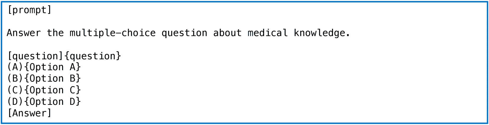

<!--yml

category: 未分类

日期：2025-01-11 12:37:40

-->

# AGILE: 一种新型的LLM智能体强化学习框架

> 来源：[https://arxiv.org/html/2405.14751/](https://arxiv.org/html/2405.14751/)

冯培元^∗¹ 何一辰^∗¹  黄冠华^∗^†²  林元^∗¹

张涵冲^∗^†³ 张宇晨^∗¹ 李航¹

¹字节跳动研究  ²中国科学技术大学

³上海交通大学

{fpy,hyc,linyuan.0,zhangyuchen.zyc,lihang.lh}@bytedance.com,

guanhuahuang@mail.ustc.edu.cn, zhanghanchong@sjtu.edu.cn

###### 摘要

我们介绍了一种新的强化学习框架，名为AGILE（与环境交互并学习的智能体），旨在利用LLM、记忆、工具和与专家的互动，执行与用户的复杂对话任务。该智能体具有超越对话的能力，包括反思、工具使用和专家咨询。我们将这种LLM智能体的构建形式化为一个强化学习（RL）问题，其中LLM作为策略模型。我们通过使用带标签的动作数据和PPO算法对LLM进行微调。我们重点关注问答任务，并发布了一个名为ProductQA的数据集，其中包含在线购物中的挑战性问题。我们在ProductQA、MedMCQA和HotPotQA上的广泛实验表明，基于7B和13B LLM并使用PPO训练的AGILE智能体能够超越GPT-4智能体。我们的消融研究强调了记忆、工具、咨询、反思和强化学习在实现智能体强大性能中的不可或缺性。数据集和代码可在[https://github.com/bytarnish/AGILE](https://github.com/bytarnish/AGILE)上获取。

^($*$)^($*$)footnotetext: 等贡献。按字母顺序排列。^($\dagger$)^($\dagger$)footnotetext: 本研究在字节跳动研究实习期间完成。

## 1 引言

大型语言模型（LLMs）展示了出色的能力，例如遵循指令、推理和零-shot学习[[3](https://arxiv.org/html/2405.14751v2#bib.bib3), [45](https://arxiv.org/html/2405.14751v2#bib.bib45), [20](https://arxiv.org/html/2405.14751v2#bib.bib20), [26](https://arxiv.org/html/2405.14751v2#bib.bib26)]，这些能力极大地推动了基于LLM的自主体（即LLM代理）的发展[[28](https://arxiv.org/html/2405.14751v2#bib.bib28), [30](https://arxiv.org/html/2405.14751v2#bib.bib30), [2](https://arxiv.org/html/2405.14751v2#bib.bib2)]。最近的研究提出了若干重要的组成部分或工作流程，以增强LLM代理的能力，如规划[[45](https://arxiv.org/html/2405.14751v2#bib.bib45), [51](https://arxiv.org/html/2405.14751v2#bib.bib51), [39](https://arxiv.org/html/2405.14751v2#bib.bib39)]、反思[[21](https://arxiv.org/html/2405.14751v2#bib.bib21), [40](https://arxiv.org/html/2405.14751v2#bib.bib40)]、工具使用[[29](https://arxiv.org/html/2405.14751v2#bib.bib29), [36](https://arxiv.org/html/2405.14751v2#bib.bib36), [48](https://arxiv.org/html/2405.14751v2#bib.bib48)]和终身学习[[42](https://arxiv.org/html/2405.14751v2#bib.bib42)]。然而，如何将所有这些组件整合到一个统一的框架中，并对其进行端到端的优化，仍然不明确。

图1：（a）我们的代理系统架构，包括LLM、记忆、工具和执行器。（b）AGILE在客户服务问答环境中的运行示例。LLM生成的标记（动作）为橙色，执行器附加的标记为蓝色。

在本文中，我们提出了一种新颖的强化学习框架，旨在统一LLM智能体的各个组件，并简化其学习和操作过程。如图[1](https://arxiv.org/html/2405.14751v2#S1.F1 "Figure 1 ‣ 1 Introduction ‣ AGILE: A Novel Reinforcement Learning Framework of LLM Agents")（a）所示，智能体系统架构，名为AGILE，包含四个模块：LLM、记忆、工具和执行器。此外，智能体可以与用户和专家进行互动。LLM作为所有行动的预测器，生成指令并处理响应。执行器作为所有行动的控制器，解释LLM指令以激活相应模块，并收集模块的响应供LLM使用。例如，执行器可以从记忆中提取一段文本并将其添加到LLM的上下文中，或者从上下文中提取摘录并将其添加到记忆中。执行器还可以根据LLM的指令使用搜索工具。除了推理、规划和反思等技能外，我们提出了一种新能力，称为*寻求建议*，即智能体在遇到无法解决的问题时主动咨询人类专家。智能体可以反思专家的反馈，并将其记忆以便将来使用。此外，我们提出了一种基于强化学习（RL）的训练方法，它以端到端的方式同时训练调用不同模块的策略和LLM智能体的推理、规划、反思及寻求建议的能力。

尽管所提出的智能体框架是通用的，但在本文中，我们将其应用于复杂的问答（QA）任务。这是一个LLM智能体有潜力超越现有解决方案（例如仅使用LLM）表现的任务。然而，现有的QA基准测试[[12](https://arxiv.org/html/2405.14751v2#bib.bib12)，[49](https://arxiv.org/html/2405.14751v2#bib.bib49)，[11](https://arxiv.org/html/2405.14751v2#bib.bib11)，[27](https://arxiv.org/html/2405.14751v2#bib.bib27)]是为特定能力子集（例如反思、记忆检索等）设计的，无法同时考察智能体各模块和能力的结合能力。

为了解决这个问题，我们开发了一个新的基准测试，称为ProductQA。ProductQA包含了88,229对客户服务问答，分为26个QA任务，每个任务对应一个不同的亚马逊产品类别。该基准测试基于真实的亚马逊用户查询，涵盖了事实性问题、推理问题和产品推荐查询。它全面评估了智能体处理历史信息和积累知识、利用工具、与人类互动、进行自我评估和反思的能力。此外，训练和测试任务是相互独立的，旨在评估智能体适应新产品类别的能力。

我们在三个任务上评估了我们的智能体框架，分别是ProductQA、MedMCQA [[27](https://arxiv.org/html/2405.14751v2#bib.bib27)] 和HotPotQA [[49](https://arxiv.org/html/2405.14751v2#bib.bib49)]。对于ProductQA，我们使用基于Vicuna-13b的两阶段训练方法[[6](https://arxiv.org/html/2405.14751v2#bib.bib6)]。在第一阶段，采用模仿学习创建了agile-vic13b-sft。在第二阶段，使用PPO的策略梯度算法[[37](https://arxiv.org/html/2405.14751v2#bib.bib37)]生成了agile-vic13b-ppo。实验结果表明，agile-vic13b-ppo相较于GPT-4提高了9.2%的相对总性能评分，相较于GPT-3.5提高了90.8%。消融研究确认了图[1](https://arxiv.org/html/2405.14751v2#S1.F1 "Figure 1 ‣ 1 Introduction ‣ AGILE: A Novel Reinforcement Learning Framework of LLM Agents")中所有模块都是不可或缺的。具体来说，移除工具或内存使用会对智能体的表现产生负面影响，分别导致寻求建议的比例增加25.9%或17.4%，或总评分相对下降9.3%或4.0%。禁用寻求建议功能会导致准确率下降10.7%。最后，agile-vic13b-ppo相较于agile-vic13b-sft实现了2.3%的相对总评分提升，证明了PPO训练的必要性。在MedMCQA任务上，我们训练了一个agile-mek7b-ppo智能体，初始自Meerkat-7b [[17](https://arxiv.org/html/2405.14751v2#bib.bib17)]，并采用相同的两阶段程序。我们的智能体通过在31.6%的实例中寻求建议，将基础LLM的准确率从53.4%提高到85.2%。这一准确率超越了GPT4-MedPrompt的SOTA准确率79.1%[[25](https://arxiv.org/html/2405.14751v2#bib.bib25)]。当所有智能体都能寻求建议时，我们的智能体在总评分上也超越了GPT-4智能体。对于HotPotQA，我们使用相同的两阶段方法，从Vicuna-13b训练了agile-vic13b-ppo。我们的智能体在15.6%的实例中寻求建议，达到了67.5%的准确率，超越了最强基线的48.2%。当所有智能体都能寻求建议时，我们的智能体在总评分上超越了GPT-4 10.8%。

本文的主要贡献总结如下：

+   •

    我们提出了一种新颖的LLM智能体强化学习框架。该框架促进了智能体的端到端学习。特别地，该框架使得智能体能够主动寻求来自人类专家的建议，带来两个优势：1）在处理复杂和具有挑战性的问题时，能够确保高水平的准确性；2）能够从人类学习，从而增强其适应新任务的能力。

+   •

    我们开发了一个基准测试，ProductQA，用于全面评估智能体在复杂问题解答中的能力。

+   •

    我们在多个任务上进行实验，以验证我们的框架，并展示基于13B和7B LLM且使用PPO训练的AGILE智能体能够超越GPT-4智能体。

## 2 方法

### 2.1 智能体的RL公式化

我们的代理框架包含四个元素：LLM、记忆、工具和执行者，参见图[1](https://arxiv.org/html/2405.14751v2#S1.F1 "图1 ‣ 1 介绍 ‣ AGILE：LLM代理的一个新型强化学习框架")(a)。LLM拥有一个*上下文*，定义为它用来生成下一个令牌的令牌序列。在强化学习术语中，代理进行的是令牌级的马尔可夫决策过程（MDP）。动作空间$\mathcal{A}$对应于LLM的词汇，每个令牌代表一个动作。因此，LLM充当了*策略模型*。代理的状态由（上下文，记忆）对组成。在预测新动作$a_{t}$（即新令牌）后，LLM将控制权转交给执行者。执行者应用预定义的逻辑，从当前状态$s_{t}$转换到下一个状态$s_{t+1}$，实现强化学习中的状态转换函数$\mathcal{S}\times\mathcal{A}\to\mathcal{S}$，然后将控制权返回给LLM以预测下一个动作。同时，环境发出奖励$r(s_{t},a_{t})$。

让我们更仔细地检查状态转换。对于每个动作，执行者的第一个操作是将令牌附加到上下文中，为LLM生成下一个令牌做准备。然后，执行者检查已注册的*函数*列表。每个函数都设计为执行一组操作，包括记忆I/O、工具使用和与环境的互动。如果动作（即令牌）与某个函数名称匹配，执行者将执行该函数的实现，从而进一步改变代理的状态。例如，如果令牌是[GetQuestion]，执行者将提示用户输入新问题并将其附加到上下文中；如果令牌是[UpdateMemory]，执行者将把上下文中的特定片段写入记忆中；如果令牌是[ClearContext]，执行者将重置上下文为[BOS]。总之，LLM通过预测函数名称与记忆和工具进行交互，依靠执行者来执行这些函数。有关QA代理定义的完整功能列表，请参见表[1](https://arxiv.org/html/2405.14751v2#S2.T1 "表1 ‣ 2.1 代理的强化学习形式化 ‣ 2 方法 ‣ AGILE：LLM代理的一个新型强化学习框架")，有关运行示例，请参见图[1](https://arxiv.org/html/2405.14751v2#S1.F1 "图1 ‣ 1 介绍 ‣ AGILE：LLM代理的一个新型强化学习框架")(b)。

表1：示例客服QA代理的功能。其中，[Reflection]和[PredictAnswer]是简单的功能，因为执行者会立即将控制权交还给LLM以开始生成结果令牌。

| 功能名称 | 功能实现 |
| --- | --- |
|  [GetQuestion] | 提示用户输入问题并将其附加到上下文中。 |
|  [RetrieveMemory] | 从记忆中检索相关条目并将其附加到上下文中。 |
|  [SeekAdvice] | 向人类专家请求建议并将其附加到上下文中。 |
|  [Reflection] | $\emptyset$ |
|  [UpdateMemory] | 将特定的上下文片段写入记忆。 |
|  [SearchProduct] | 从上下文中提取搜索查询，然后调用搜索工具并将结果附加到上下文中。 |
|  [PredictAnswer] | $\emptyset$ |
|  [SubmitAnswer] | 从上下文中提取预测的答案并提交给用户。 |
|  [ClearContext] | 将上下文重置为单一标记 [BOS]。 |

### 2.2 策略学习

我们将策略学习问题框架化为训练语言模型的任务。考虑一个代理轨迹 $\tau=(s_{1},a_{1},...,s_{n},a_{n})$，我们推导出一个*训练序列*，记为 $(e_{1},...,e_{n})$，其中 $e_{i}$ 表示执行者在第 $i$ 步将标记附加到上下文中的内容。如果 $a_{i}$ 是一个函数名标记，那么 $e_{i}$ 就是 $a_{i}$ 和函数执行附加的额外标记的连接；否则，$e_{i}=a_{i}$。在这个序列中，$\{a_{1},...,a_{n}\}$（每个 $e_{i}$ 的第一个标记）被称为动作标记。第 $i$ 步的LLM上下文，记为 $c_{i}$，是前缀 $(e_{1},...,e_{i-1})$ 的一个子序列；$c_{i}$ 可能比 $(e_{1},...,e_{i-1})$ 更短，因为执行者可以删除上下文标记。

在模仿学习（IL）中，我们通过观察人类专家或更熟练的代理生成轨迹，然后推导出训练序列来微调LLM。需要指出的是，（1）损失仅计算在动作标记上，和（2）$c_{i}$ 应该作为 $e_{i}$ 中标记的注意力掩码，因为它反映了LLM在进行动作预测时感知到的真实上下文。在强化学习（RL）中，我们将LLM视为策略模型，从中可以采样训练序列，并为每个动作标记分配奖励。因此，可以使用策略梯度方法（如PPO [[37](https://arxiv.org/html/2405.14751v2#bib.bib37)]）对LLM进行优化。类似于IL设置，我们仅对动作标记应用策略梯度更新，并使用 $c_{i}$ 作为注意力掩码。

在某些情况下，代理可能会产生非常长的轨迹，可能会生成跨越数百万个标记的训练序列，这对训练来说是不可行的。我们可以利用轨迹的结构将其划分为较小的片段。例如，如果代理在每个问答会话开始时重置其LLM上下文，那么我们可以根据会话边界进行划分。然而，这些会话并不是完全独立的；早期会话中的行动可能会影响记忆，从而对后续会话产生持久的影响。为了应对这种长程依赖问题，我们提出了一种训练算法，详见附录 [A](https://arxiv.org/html/2405.14751v2#A1 "附录 A 会话级优化算法 ‣ AGILE：一种新颖的LLM代理强化学习框架")。

### 2.3 与人类专家的互动

我们的智能体框架使智能体能够主动向人类专家寻求建议。例如，智能体可以调用[SeekAdvice]函数来请求专家的建议。这种方法有两个方面的好处。首先，当智能体的自信度较低时，它可以请求正确的答案，从而确保应用的足够准确性。其次，智能体可以使用[Reflection]功能从专家建议中提取一般性知识，并将其存储在记忆中。知识的积累使得智能体能够适应训练过程中未遇到的新任务。

寻求建议涉及复杂的决策过程。智能体必须估计当前会话中的自信度，预测该建议对未来会话的潜在价值，并考虑人力资源的成本。最佳的权衡难以手动标注，但与我们的强化学习框架非常契合。具体来说，目前的风险、未来的价值和行动的成本都可以表示为强化学习的奖励，这使得该技能能够作为策略模型的一部分进行端到端训练。

## 3 产品问答数据集

我们认为，在真实的在线购物环境中进行产品问答为评估大型语言模型（LLM）智能体提供了一个全面的挑战。首先，这要求具有关于数百万种产品的专家知识，包括它们的技术规格、在特定场景中的使用以及与其他产品的兼容性。其次，回答某些问题需要使用工具，例如产品搜索工具。第三，新产品的不断涌现要求智能体具有适应性。这促使我们创建了产品问答数据集。与现有的在线购物问答数据集[[38](https://arxiv.org/html/2405.14751v2#bib.bib38), [8](https://arxiv.org/html/2405.14751v2#bib.bib8)]，主要集中在产品元数据或页面信息的问题不同，产品问答数据集涉及更为复杂的查询，包含推理、专家知识和工具使用（例如SQL），为评估智能体的能力提供了全面的测评。

产品问答数据集由26个问答任务组成，每个任务代表一个特定类别中的不同产品组。每个组包含17到20种产品。我们收集了20组用于训练，6组用于测试，以评估智能体对新任务的适应能力。我们为每个产品组收集了平均3,393个问答对。同一组内的问题是相关的，因为一个答案中的知识可能有助于解决其他问题。数据集的统计信息见表[12](https://arxiv.org/html/2405.14751v2#A4.T12 "表 12 ‣ 附录 D 表格 ‣ AGILE：一种新的LLM智能体强化学习框架")。

数据集由20名专业标注员标注，每位标注员至少拥有大学学位，均由一家商业数据标注公司雇佣。我们按市场价格支付该公司专业标注费用。请参阅附录[F.2](https://arxiv.org/html/2405.14751v2#A6.SS2 "F.2 Annotation guidelines ‣ Appendix F Development of the ProductQA dataset ‣ AGILE: A Novel Reinforcement Learning Framework of LLM Agents")中的标注指南。此外，我们将在人工标注前发布数据预处理的代码。

### 3.1 产品收集

我们从Amazon Review Data中收集产品[[23](https://arxiv.org/html/2405.14751v2#bib.bib23)]，其中包括产品元数据以及评论。我们首先筛选Amazon Review Data，只保留至少有100条评论的热门产品，然后按类别标签对其进行聚类。从这些聚类中，我们根据聚类的大小选择26个，每个都被定义为*产品组*。随后，我们从每个产品组中抽取产品。有关产品组和产品选择的更多细节，请参阅附录[F.1](https://arxiv.org/html/2405.14751v2#A6.SS1 "F.1 Product collection ‣ Appendix F Development of the ProductQA dataset ‣ AGILE: A Novel Reinforcement Learning Framework of LLM Agents")。

产品收集完成后，标注员为每个产品组编制信息表。表2中展示了一个这样的表格示例。为了提高标注过程的效率，我们使用GPT-4从评论中提取尽可能多的产品特征。这些特征与产品元数据一起提供给标注员，以便他们创建表格。

表2：耳机组信息表的示例。

| 产品ID | 标题 | 价格 | 品牌 | 耳机类型 | 电缆类型 | 音频 | 音频 | … |
| --- | --- | --- | --- | --- | --- | --- | --- | --- |
| 类型 | 传输方式 | 输出模式 |
| B00WSLZFTK | Sennheiser RS 170 | $11.03 | Sennheiser | 头戴式 | 蓝牙 | kleer | 立体声 | … |
| B003AIL2HE | JVC HAEB75B | $9.99 | JVC | 入耳式 | 3.5mm插孔 | 模拟 | 增强低音 | … |
| B01C22IJV0 | Phaiser BHS-530 | $6.04 | Phaiser | 入耳式 | 蓝牙 | 蓝牙 | 立体声 | … |
| B0013OWPV4 | JVC HARX700 | $2.00 | JVC | 头戴式 | 3.5mm插孔 | 模拟 | 立体声 | … |
| … | … | … | … | … | … | … | … | … |

表3：ProductQA中的Fact-QA、Search-QA和Reasoning-QA示例。

| 类型 | 问题 | 长答案 | 短答案 |
| --- | --- | --- | --- |
| Fact-QA | JVC HA-EB75耳机使用的钕磁铁驱动单元大小是多少？ | JVC HA-EB75耳机在每个耳塞中包含一个13.5毫米的钕磁铁驱动单元，这有助于增强音质。 | 13.5毫米 |
| 搜索问答 | 我是一个音响发烧友，经常在外奔波，所以我需要不断播放我的音乐。告诉我，你们有什么耳机是播放时间最长的，不论是头戴式还是入耳式的？ | 我找到了符合你要求的产品。‘ABCShopUSA无线耳塞True’，asin: B00LJT2EPK | B00LJT2EPK |
| 推理问答 | 当我编辑音乐时，这些耳机能提供与有线耳机相当的音质吗？ | 不，这些耳机可能不适合你的音乐编辑需求，因为它们是无线的，可能会引入音频压缩和轻微的延迟。这些问题可能会影响专业音频编辑任务中对精确听觉体验的要求。 | 不 |

### 3.2 问答收集

我们在在线购物环境中识别出了三种主要类型的问题：1) Fact-QA：关于具体产品细节的问题；2) 搜索问答：根据用户偏好进行的产品推荐搜索；3) 推理问答：需要领域特定推理的问题，例如某个产品功能的影响。因此，我们为这些类型的问答对进行标注。每个问题都标注有详细的长答案和简短的短答案。长答案应类似于人工客服的回复，而短答案则是简洁的几句话。我们训练模型预测这两种答案类型。长答案的准确性使用GPT-4进行评估（见附录[J](https://arxiv.org/html/2405.14751v2#A10 "附录 J 提示模板 ‣ AGILE: 一种新的LLM代理强化学习框架")）；短答案则通过精确匹配进行评估，并用于定义强化学习训练的奖励。

#### Fact-QA

Fact-QA 是由产品评论构建的。对于每个产品，我们向GPT-4提供一批30条评论，促使其生成20个问题及其对应的答案，然后再处理下一批。我们鼓励GPT-4创造多样化的问题。然后，结果会交给标注员进行精修和最终确认。

#### 搜索问答

从给定产品组的信息表开始，我们使用一组预定义的规则生成随机的SQL表达式。然后，这些表达式通过GPT-4转化为自然语言问题。答案通过执行SQL查询获得。随后，人工标注人员会对问答对进行彻底的修订。

#### 推理问答

作为第一步，我们为每个产品组收集专业知识。为了提高效率，我们利用 GPT-4 根据信息表中的技术规格生成候选知识条目。然后，这些条目由人工标注员进行整理和完善。以下是一个知识条目的示例：*采用 ATX 形态因素的主板非常适合高性能计算任务和游戏，因为它们具有足够的扩展插槽，可以容纳显卡和其他外设，从而增强计算能力。* 最后，标注员从这些知识条目中开发问答对。

## 4 实验

### 4.1 实验设置

#### 数据集

我们在三个复杂的问答任务上评估我们的智能体：ProductQA、MedMCQA 和 HotPotQA。MedMCQA [[27](https://arxiv.org/html/2405.14751v2#bib.bib27)] 是一个多项选择问答数据集，包含来自医学院入学考试的问题。HotPotQA [[49](https://arxiv.org/html/2405.14751v2#bib.bib49)] 包含自然的多跳问题，挑战智能体进行推理并使用搜索工具的能力。对于 MedMCQA 和 HotPotQA，我们报告了它们各自完整开发集上的结果。

#### 智能体定义

我们的智能体可以调用表 [1](https://arxiv.org/html/2405.14751v2#S2.T1 "Table 1 ‣ 2.1 RL formulation of agent ‣ 2 Methods ‣ AGILE: A Novel Reinforcement Learning Framework of LLM Agents") 中定义的功能。在典型的工作流中，智能体会在会话开始时提示用户提出新问题。然后，它可以检索记忆以获取相关信息。记忆可以初始化为空（ProductQA）或包含领域知识（来自 MedMCQA 训练数据集的问答对）。智能体可以选择使用外部工具，如在 ProductQA 中进行产品搜索或在 HotPotQA 中进行文章搜索，来收集更多信息。最后，智能体决定是直接预测答案还是寻求人工建议。如果智能体寻求建议，它会获取一个人类答案（在我们设置中为真实答案）。然后，智能体可以选择使用反思环节从人类答案中提取一般知识，将人类答案和反思后的知识写入其记忆。最后，智能体向用户提交答案。在我们的设置中，提交正确答案会获得 $+1$ 奖励，而提交错误答案会获得 $0$ 奖励。寻求人工建议的奖励固定为 $-c$，其中 $c$ 代表 *寻求建议的成本*。假设人类建议总是包含正确答案，那么可能的总奖励为 $\{0,1,1-c\}$。

#### 训练

训练分为两个阶段。首先，我们从训练数据中构建轨迹，并使用模仿学习训练代理。然后，我们应用算法[1](https://arxiv.org/html/2405.14751v2#alg1 "算法 1 ‣ 附录 A 会话级优化算法 ‣ AGILE: 一种新的大型语言模型代理强化学习框架")通过强化学习进行进一步优化。实现细节请参见附录[B](https://arxiv.org/html/2405.14751v2#A2 "附录 B AGILE的实现细节 ‣ AGILE: 一种新的大型语言模型代理强化学习框架")。对于ProductQA和HotPotQA，代理的LLM初始化自Vicuna-13b-1.5。对于MedMCQA，我们使用Meerkat-7b[[17](https://arxiv.org/html/2405.14751v2#bib.bib17)]，这是一种经过高质量CoT推理路径训练的医学LLM，数据来源于18本医学教科书和各种遵循指令的数据集。我们对模型进行2轮微调，学习率为1e-5，批量大小为64。我们用PPO进行1轮训练，学习率为1e-6，批量大小为64。训练在NVIDIA-H800上进行。每个实验的训练时间和GPU数量见表[13](https://arxiv.org/html/2405.14751v2#A4.T13 "表 13 ‣ 附录 D 表 ‣ AGILE: 一种新的大型语言模型代理强化学习框架")。该LLM是完全训练的，未使用LoRA。

#### 评估和基准

我们报告了代理的三个指标：（a）建议率：寻求人类建议的比率；（b）准确率：预测正确答案的比率；（c）总得分：考虑建议率和准确率的所有会话的平均奖励。

我们将代理与两种类型的基准进行比较：1）提示GPT-3.5（gpt-3.5-turbo-0301）和GPT-4（gpt-4-0613）[[26](https://arxiv.org/html/2405.14751v2#bib.bib26)]以直接回答问题，而不以代理方式工作，记为gpt3.5-prompt和gpt4-prompt。2）在AGILE框架内提示GPT-3.5和GPT-4，记为agile-gpt3.5-prompt和agile-gpt4-prompt。我们为所有基准精心设计了提示，提示内容请参见附录[J](https://arxiv.org/html/2405.14751v2#A10 "附录 J 提示模板 ‣ AGILE: 一种新的大型语言模型代理强化学习框架")。

表4：ProductQA上的结果。这里，X-prompt表示直接对模型X进行提示；agile-X-Y将模型X纳入AGILE框架，其中Y表示提示或PPO训练。我们分别报告短答案和长答案的结果。寻求建议的成本为$c=0.3$。结果是六个测试任务的平均值。有关单独产品组的表现，请参见表[14](https://arxiv.org/html/2405.14751v2#A4.T14 "表 14 ‣ 附录 D 表 ‣ AGILE: 一种新的大型语言模型代理强化学习框架")。

| 方法 | 建议率 $\downarrow$ | 准确率 $\uparrow$ | 总得分 $\uparrow$ |
| --- | --- | --- | --- |
| 短 | 长 | 短 | 长 |
| gpt3.5-prompt | - | 0.202 | 0.322 | - | - |
| gpt4-prompt | - | 0.464 | 0.571 | - | - |
| agile-vic13b-prompt | 0.174 | 0.174 | 0.294 | 0.122 | 0.242 |
| agile-gpt3.5-prompt | 0.323 | 0.508 | 0.644 | 0.411 | 0.547 |
| agile-gpt4-prompt | 0.208 | 0.780 | 0.809 | 0.718 | 0.747 |
| agile-vic7b-ppo（我们的） | 0.179 | 0.818 | 0.800 | 0.764 | 0.746 |
| agile-vic13b-ppo（我们的） | 0.233 | 0.854 | 0.854 | 0.784 | 0.784 |

### 4.2 ProductQA 结果

如表[4](https://arxiv.org/html/2405.14751v2#S4.T4 "表 4 ‣ 评估和基线 ‣ 4.1 实验设置 ‣ 4 实验 ‣ AGILE：一种新型大语言模型代理强化学习框架")所示，我们的 AGILE 代理在 ProductQA 上超越了所有基准模型。值得注意的是，agile-vic13b-ppo 在六个测试组中的平均总分相比于 agile-gpt4-prompt（其中将寻求建议成本加入了提示中）在简短答案上提高了 9.2%，在长答案上提高了 5.0%。具体来说，agile-vic13b-ppo 使用了相似数量的寻求建议，在简短答案中比 agile-gpt4-prompt 的准确率高出 7.4%，而如图[3](https://arxiv.org/html/2405.14751v2#S4.F3 "图 3 ‣ 4.2 ProductQA 结果 ‣ 4 实验 ‣ AGILE：一种新型大语言模型代理强化学习框架")所示，这一准确率的提高在整个过程中是一致的。我们的 agile-vic7b-ppo 代理在平均总分上也超越了 agile-gpt4-prompt。请注意，GPT-4 代理通过其提示知道寻求建议的成本（见图[7](https://arxiv.org/html/2405.14751v2#A10.F7 "图 7 ‣ HotPotQA 提示模板 ‣ 附录 J 提示模板 ‣ AGILE：一种新型大语言模型代理强化学习框架")）。

我们研究了变化的寻求建议成本的影响。如图[3](https://arxiv.org/html/2405.14751v2#S4.F3 "图 3 ‣ 4.2 ProductQA 结果 ‣ 4 实验 ‣ AGILE：一种新型大语言模型代理强化学习框架")所示，当成本降低时，建议率和准确率都增加，表明人类协助的使用增加。具体来说，当成本为 0.5 时，建议率接近 0，而当成本为 0.1 时，准确率接近 1。这一结果表明，通过调整成本并通过 RL 训练，我们可以有效地管理准确率和人类成本之间的权衡。例如，在寻求建议成本为 $c=0.1$ 的情况下，代理在主板任务上可以达到 94.1% 的准确率（参见表[16](https://arxiv.org/html/2405.14751v2#A4.T16 "表 16 ‣ 附录 D 表格 ‣ AGILE：一种新型大语言模型代理强化学习框架")）。这种能力在要求高准确率的实际场景中尤为重要。在大多数实验中，我们将成本设置为中等水平，$c=0.3$。

图 2：接下来的 200 次会话中的准确率和建议率（$c=0.3$）。

图 3：建议率、准确率以及在 ProductQA 上寻求建议的成本 $c$。

为了验证GPT-4评估器在评估长答案结果中的准确性，我们随机选择了100个三元组（问题、参考长答案、模型预测长答案），并手动标注了正确性。结果显示，GPT-4评估器与作者的准确率为94%。

#### 消融研究

表5：关于禁用反思、记忆、寻求建议、工具使用或RL训练的消融研究。这里，非自适应建议指的是在轨迹的前$K$个会话中调用寻求建议，其中$K$等于agile-vic13b-ppo执行的[SeekAdvice]次数。关于单独产品组的消融结果，请参见表 [15](https://arxiv.org/html/2405.14751v2#A4.T15 "Table 15 ‣ Appendix D Tables ‣ AGILE: A Novel Reinforcement Learning Framework of LLM Agents")。

| 方法 | 建议率 $\downarrow$ | 准确率 $\uparrow$ | 总分 $\uparrow$ |
| --- | --- | --- | --- |
| 无反思 | 0.270 | 0.852 | 0.771(-1.7%) |
| 无记忆 | 0.407 | 0.876 | 0.754(-4.0%) |
| 无建议 | 0.000 | 0.747 | 0.747(-5.0%) |
| 非自适应建议 | 0.233 | 0.812 | 0.742(-5.7%) |
| 无工具使用 | 0.492 | 0.864 | 0.717(-9.3%) |
| 无RL | 0.256 | 0.843 | 0.766(-2.3%) |
| agile-vic13b-ppo（我们的） | 0.233 | 0.854 | 0.784 |

我们在表 [5](https://arxiv.org/html/2405.14751v2#S4.T5 "Table 5 ‣ Ablation study ‣ 4.2 Results on ProductQA ‣ 4 Experiments ‣ AGILE: A Novel Reinforcement Learning Framework of LLM Agents")中展示了消融研究，以评估各个代理组件的贡献和RL训练的效果。该表明禁用寻求建议选项（无建议）会导致准确率下降10.7%，总分相对降低5.0%。强制代理在轨迹初期寻求建议（非自适应建议）会导致准确率下降4.2%，强调了自适应决策的重要性。移除反思和记忆功能（无记忆和无反思）都会增加寻求建议的频率，因为代理难以积累或利用有价值的知识，导致总分下降。此外，禁用工具使用（无工具使用）会导致寻求建议率大幅上升25.9%，因为代理的能力受限，更依赖外部建议。最后，RL训练将总分相对提高2.3%，降低了寻求建议的频率，并提升了准确率，表明RL训练有效地优化了策略。关于RL训练的更多结果，请参见附录 [C](https://arxiv.org/html/2405.14751v2#A3 "Appendix C Supplementary experimental results on RL training ‣ AGILE: A Novel Reinforcement Learning Framework of LLM Agents")。

在附录 [E](https://arxiv.org/html/2405.14751v2#A5 "Appendix E Case study ‣ AGILE: A Novel Reinforcement Learning Framework of LLM Agents")中，我们展示了agile-vic13b-ppo的详细示例，说明了记忆、工具、寻求建议和反思如何增强代理的工作流程。

图 4：在接下来的 200 次会话中，ProductQA 上的建议率（$c=0.3$）。

#### 建议率趋势

图 [4](https://arxiv.org/html/2405.14751v2#S4.F4 "图 4 ‣ 消融研究 ‣ 4.2 ProductQA 上的结果 ‣ 4 实验 ‣ AGILE：一种新型的 LLM 代理强化学习框架") 展示了随着更多会话加入轨迹，agile-vic13b-ppo 的建议率持续下降。这一下降可以归因于代理逐渐积累知识并变得更加独立。此外，图中还显示，禁用强化学习训练或反思会导致建议率显著增加，这突显了强化学习训练和反思在减少人工成本中的重要性。

### 4.3 在 MedMCQA 上的结果

表 6：在 MedMCQA 开发数据集上的结果。X-prompt 表示直接提示模型 X；agile-X-Y 表示将模型 X 融入 AGILE 框架中，其中 Y 表示提示、消融研究或标准 PPO 训练。寻求建议的成本为 $c=0.4$。

| 方法 | 建议率 $\downarrow$ | 准确率 $\uparrow$ | 总分 $\uparrow$ |
| --- | --- | --- | --- |
| Meerkat-7b-prompt | - | 0.534 | - |
| gpt3.5-prompt[[24](https://arxiv.org/html/2405.14751v2#bib.bib24)] | - | 0.501 | - |
| gpt4-prompt[[24](https://arxiv.org/html/2405.14751v2#bib.bib24)] | - | 0.695 | - |
| gpt4-Medprompt[[25](https://arxiv.org/html/2405.14751v2#bib.bib25)] | - | 0.791 | - |
| agile-gpt3.5-prompt | 0.194 | 0.697 | 0.619 |
| agile-gpt4-prompt | 0.421 | 0.884 | 0.721 |
| agile-mek7b-w/o 反思 | 0.368 | 0.790 | 0.643 |
| agile-mek7b-w/o 记忆 | 0.506 | 0.741 | 0.539 |
| agile-mek7b-w/o 建议 | 0.000 | 0.620 | 0.620 |
| agile-mek7b-w/o 强化学习 | 0.322 | 0.837 | 0.708 |
| agile-mek7b-ppo（我们的） | 0.316 | 0.852 | 0.726 |

我们的 agile-mek7b-ppo 智能体，基于较小的 Meerkat-7b [[17](https://arxiv.org/html/2405.14751v2#bib.bib17)] 模型，达到了 85.2% 的准确率和 31.6% 的建议率。如表 [6](https://arxiv.org/html/2405.14751v2#S4.T6 "表 6 ‣ 4.3 在 MedMCQA 上的结果 ‣ 4 实验 ‣ AGILE：一种新的 LLM 智能体强化学习框架")所示，这相比基础模型 Meerkat-7b-prompt 提高了 31.8% 的准确率，相比当前最先进的 gpt4-Medprompt [[25](https://arxiv.org/html/2405.14751v2#bib.bib25)] 提高了 6.1%。表 [6](https://arxiv.org/html/2405.14751v2#S4.T6 "表 6 ‣ 4.3 在 MedMCQA 上的结果 ‣ 4 实验 ‣ AGILE：一种新的 LLM 智能体强化学习框架")还显示，单独寻求建议对准确率的提升贡献了 23.2%，这意味着每次寻求建议可以纠正平均 0.73 个预测错误。这表明 PPO 训练有效地帮助智能体识别其错误。为了公平比较，我们还评估了将 GPT-3.5 和 GPT-4 纳入我们 AGILE 框架的 agile-gpt3.5-prompt 和 agile-gpt4-prompt。这些智能体也利用寻求建议来提高准确率，但没有 RL 训练，它们的总分低于 agile-mek7b-ppo。最后，通过消融研究，我们确认了记忆、反思、寻求建议和 RL 训练在实现高性能中的重要作用。移除这些组件会导致总分显著下降，具体内容详见表 [6](https://arxiv.org/html/2405.14751v2#S4.T6 "表 6 ‣ 4.3 在 MedMCQA 上的结果 ‣ 4 实验 ‣ AGILE：一种新的 LLM 智能体强化学习框架")。

### 4.4 HotPotQA 上的结果

我们将我们的方法与几种基准进行了比较。具体来说，我们发现原始 ReAct 基准实现[[51](https://arxiv.org/html/2405.14751v2#bib.bib51)]是次优的。通过使用 GPT-4 复现他们的结果（ReAct-gpt4-prompt），我们观察到性能有所提升。如表 [7](https://arxiv.org/html/2405.14751v2#S4.T7 "表 7 ‣ 4.4 在 HotPotQA 上的结果 ‣ 4 实验 ‣ AGILE：一种新的 LLM 智能体强化学习框架")所示，我们的敏捷智能体在准确率上超越了所有基准，较最强基准 ReAct-gpt4-prompt 提高了 40.0% 的相对提升。此外，与 agile-gpt4-prompt 相比，训练后的 agile-vic13b-ppo 展示了更高的准确率和更低的建议率，导致总分相对提高了 10.8%。消融研究确认，移除寻求建议或 PPO 训练会导致总分显著下降。

表 7：在 HotPotQA 完整开发数据集上的结果。X-prompt 代表直接提示模型 X；agile-X-Y 代表将模型 X 纳入 AGILE 框架，其中 Y 代表提示、消融研究或标准 PPO 训练。寻求建议的成本为 $c=0.3$。

| 方法 | 建议率 $\downarrow$ |
| --- | --- |

&#124; 准确率 $\uparrow$ &#124;

&#124; （完全匹配） &#124;

|

&#124; 准确度 $\uparrow$ &#124;

&#124; （GPT-4 评估器） &#124;

|

&#124; 总分 $\uparrow$ &#124;

&#124; （完全匹配） &#124;

|

| ReAct [[51](https://arxiv.org/html/2405.14751v2#bib.bib51)] | - | 0.351 | - | - |
| --- | --- | --- | --- | --- |
| ReAct-gpt4-prompt | - | 0.482 | - | - |
| CRITIC [[9](https://arxiv.org/html/2405.14751v2#bib.bib9)] | - | 0.443 | - | - |
| Expel [[54](https://arxiv.org/html/2405.14751v2#bib.bib54)] | - | 0.390 | - | - |
| AutoAct [[32](https://arxiv.org/html/2405.14751v2#bib.bib32)] | - | 0.384 | - | - |
| agile-gpt4-prompt | 0.194 | 0.664 | 0.842 | 0.567 |
| agile-vic13b-w/o Advice | 0.000 | 0.553 | 0.751 | 0.553 |
| agile-vic13b-w/o RL | 0.171 | 0.668 | 0.857 | 0.617 |
| agile-vic13b-ppo (我们的) | 0.156 | 0.675 | 0.858 | 0.628 |

## 5 相关工作

表 8：LLM 代理的相关工作。AGILE 脱颖而出，成为首个通过强化学习训练整个代理，并结合主动的人类建议寻求的开创性工作。

| LLM 代理 | LLM | SFT | RL | 内存 | 工具 | 反思 |
| --- | --- | --- | --- | --- | --- | --- |

&#124; 积极主动 &#124;

&#124; 人类-代理 &#124;

&#124; 交互 &#124;

|

| WebGPT [[22](https://arxiv.org/html/2405.14751v2#bib.bib22)] | GPT-3 | ✓ | ✓ | ✗ | ✓ | ✗ | ✗ |
| --- | --- | --- | --- | --- | --- | --- | --- |
| ReAct [[51](https://arxiv.org/html/2405.14751v2#bib.bib51)] | PaLM-540b | ✓ | ✗ | ✓ | ✓ | ✗ | ✗ |
| Reflexion [[40](https://arxiv.org/html/2405.14751v2#bib.bib40)] | GPT-3/3.5/4 | ✗ | ✗ | ✓ | ✓ | ✓ | ✗ |
| ChatDev [[30](https://arxiv.org/html/2405.14751v2#bib.bib30)] | ChatGPT-turbo-16k | ✗ | ✗ | ✓ | ✓ | ✓ | ✗ |
| RAP [[14](https://arxiv.org/html/2405.14751v2#bib.bib14)] | LLaMA-33b | ✗ | ✗ | ✓ | ✗ | ✗ | ✗ |
| AutoAct [[32](https://arxiv.org/html/2405.14751v2#bib.bib32)] | LLaMA2-70b | ✓ | ✗ | ✓ | ✓ | ✓ | ✗ |
| TPTU [[35](https://arxiv.org/html/2405.14751v2#bib.bib35)] | ChatGPT/InternLM | ✗ | ✗ | ✓ | ✓ | ✓ | ✗ |
| AGILE (我们的) | Vicuna-13b/Meerkat-7b | ✓ | ✓ | ✓ | ✓ | ✓ | ✓ |

#### LLM 代理

大型语言模型（LLMs）在执行指令、推理和规划方面展现了巨大的能力。许多研究工作，如表格[8](https://arxiv.org/html/2405.14751v2#S5.T8 "表格 8 ‣ 5 相关工作 ‣ AGILE：一种新型的强化学习框架针对LLM代理")所示，利用提示工程，构建了能够在不同环境中自主解决复杂任务的出色LLM代理[[28](https://arxiv.org/html/2405.14751v2#bib.bib28), [44](https://arxiv.org/html/2405.14751v2#bib.bib44), [2](https://arxiv.org/html/2405.14751v2#bib.bib2), [30](https://arxiv.org/html/2405.14751v2#bib.bib30), [4](https://arxiv.org/html/2405.14751v2#bib.bib4)]。此外，大量研究确定了LLM代理设计中的关键组件，包括规划[[22](https://arxiv.org/html/2405.14751v2#bib.bib22), [39](https://arxiv.org/html/2405.14751v2#bib.bib39), [10](https://arxiv.org/html/2405.14751v2#bib.bib10), [32](https://arxiv.org/html/2405.14751v2#bib.bib32), [51](https://arxiv.org/html/2405.14751v2#bib.bib51), [35](https://arxiv.org/html/2405.14751v2#bib.bib35)]、工具使用[[19](https://arxiv.org/html/2405.14751v2#bib.bib19), [29](https://arxiv.org/html/2405.14751v2#bib.bib29), [48](https://arxiv.org/html/2405.14751v2#bib.bib48), [36](https://arxiv.org/html/2405.14751v2#bib.bib36)]和反思[[40](https://arxiv.org/html/2405.14751v2#bib.bib40), [21](https://arxiv.org/html/2405.14751v2#bib.bib21)]。在本研究中，我们使代理能够利用记忆、工具，并主动从环境中学习。随后，我们将整个过程框定在强化学习（RL）框架内，以便所有代理技能可以端到端地共同优化。

#### 人类-代理交互

尽管LLM面临实际挑战，如幻觉[[53](https://arxiv.org/html/2405.14751v2#bib.bib53)]和缺乏长尾知识[[16](https://arxiv.org/html/2405.14751v2#bib.bib16)]，但咨询人类专家可以帮助减轻这些问题。一些研究[[52](https://arxiv.org/html/2405.14751v2#bib.bib52), [46](https://arxiv.org/html/2405.14751v2#bib.bib46)]将人类专家融入依赖被动反馈或预定义规则的代理工作流中。然而，这些方法并没有主动寻求建议，而这是一个需要更复杂决策的过程。虽然[[5](https://arxiv.org/html/2405.14751v2#bib.bib5), [31](https://arxiv.org/html/2405.14751v2#bib.bib31)]通过行为克隆训练模型提出问题，但它们忽略了这样一个事实，即寻求建议的决策必须基于LLM自身的知识和能力[[55](https://arxiv.org/html/2405.14751v2#bib.bib55), [18](https://arxiv.org/html/2405.14751v2#bib.bib18), [13](https://arxiv.org/html/2405.14751v2#bib.bib13)]。[[34](https://arxiv.org/html/2405.14751v2#bib.bib34)]使用LLM的令牌概率的校准版本作为信心度量，然而令牌概率往往过于自信[[47](https://arxiv.org/html/2405.14751v2#bib.bib47)]，且现有的校准方法在LLM进行多次决策时无法很好地推广到我们的代理设置中。最终，寻求建议的挑战与LLM的自我评估密切相关，而这一点很难通过SFT来验证或优化。在我们的RL框架中，寻求建议的价值和成本可以直接表示为RL奖励，从而使得寻求建议的主动技能可以作为策略模型的一部分，在端到端RL训练中得到优化。

#### LLM代理基准

设计了多个基准来评估代理的能力。例如，Webshop [[50](https://arxiv.org/html/2405.14751v2#bib.bib50)] 和 Mind2Web [[7](https://arxiv.org/html/2405.14751v2#bib.bib7)] 数据集评估了代理在网页环境中的工具使用和规划能力。HotPotQA [[49](https://arxiv.org/html/2405.14751v2#bib.bib49)] 和 TriviaQA [[12](https://arxiv.org/html/2405.14751v2#bib.bib12)] 侧重于代理在问答中的推理和工具使用。ALFWorld [[41](https://arxiv.org/html/2405.14751v2#bib.bib41)] 检验了代理的规划和导航能力，而ScienceWorld [[43](https://arxiv.org/html/2405.14751v2#bib.bib43)] 提供了一个基于文本的互动环境，用于评估代理的科学能力。如表[9](https://arxiv.org/html/2405.14751v2#S5.T9 "表9 ‣ LLM代理基准 ‣ 5 相关工作 ‣ AGILE：一种新的LLM代理强化学习框架")所示，尽管已有这些基准，但没有一个能够全面解决现实世界代理应用的所有核心挑战，如处理长尾知识、人类与代理的互动、长期记忆使用、工具使用、自我评估和反思等。这激励我们开发了ProductQA。

表 9：用于评估LLM代理的基准。ProductQA特征包括长期轨迹、工具使用、长期知识积累和跨任务能力。

| 数据集 | 类型 | 领域 | 大小 |
| --- | --- | --- | --- |

&#124; 长期 &#124;

&#124; 轨迹 &#124;

|

&#124; 工具 &#124;

&#124; 使用 &#124;

|

&#124; 长期 &#124;

&#124; 知识 &#124;

|

&#124; 跨 &#124;

&#124; 任务 &#124;

|

| 网店 [[50](https://arxiv.org/html/2405.14751v2#bib.bib50)] | 模拟器 | 网页 | 12,087 | ✗ | ✗ | ✗ | ✗ |
| --- | --- | --- | --- | --- | --- | --- | --- |
| Mind2Web [[7](https://arxiv.org/html/2405.14751v2#bib.bib7)] | 模拟器 | 网页 | 2,350 | ✗ | ✗ | ✗ | ✓ |
| ALFWorld [[41](https://arxiv.org/html/2405.14751v2#bib.bib41)] | 模拟器 | 导航 | 3,827 | ✗ | ✗ | ✗ | ✓ |
| ScienceWorld [[43](https://arxiv.org/html/2405.14751v2#bib.bib43)] | 模拟器 | 科学 | 7,207 | ✗ | ✗ | ✗ | ✗ |
| HotPotQA [[49](https://arxiv.org/html/2405.14751v2#bib.bib49)] | QA | 维基百科 | 112,779 | ✗ | ✓ | ✗ | ✗ |
| TriviaQA [[12](https://arxiv.org/html/2405.14751v2#bib.bib12)] | QA | 网页 | 95,956 | ✗ | ✓ | ✓ | ✗ |
| ProductQA（我们的） | QA | 电子商务 | 88,229 | ✓ | ✓ | ✓ | ✓ |

## 6 结论与未来工作

在这项工作中，我们介绍了一种新颖的LLM代理强化学习框架，称为AGILE。首先，AGILE的整个系统通过强化学习进行端到端训练。其次，AGILE具有向外部人类专家寻求建议的能力。此外，我们开发了一个复杂的QA数据集——ProductQA，用于全面评估代理的能力。大量实验表明，在我们的框架下，一个经过强化学习训练的小型模型代理可以超过GPT-4的表现。

AGILE是一个通用的智能体框架，我们当然可以考虑对其进行多种扩展。一个智能体可以配备更多的工具，例如多模态感知、物理环境中的操作、逻辑推理等。我们认为，AGILE的活动可以分为两种不同类型：单独利用其LLM，以及将LLM与其他工具结合使用。这两种方法在概念上与人类认知过程中的系统1和系统2相符[[15](https://arxiv.org/html/2405.14751v2#bib.bib15), [1](https://arxiv.org/html/2405.14751v2#bib.bib1)]。此外，AGILE的记忆作为经验和知识的积累库，对于自我改进至关重要。因此，AGILE为一个非常强大的智能体提供了一种架构，具有实现人类水平智能的潜力。

AGILE还包括智能体与外部人类专家之间的互动。该框架可以扩展，以允许与人类或机器智能体之间的互动，这些智能体可以扮演学生或教师等不同角色，并采用辩论或协调等不同形式。此外，AGILE还可以应用于多智能体系统。

## 致谢

作者感谢匿名审稿人提供的宝贵建议。

## 参考文献

+   [1] Yoshua Bengio, Yann Lecun, 和 Geoffrey Hinton. 人工智能的深度学习. 《ACM通讯》，64(7):58–65，2021年。

+   [2] Andres M Bran, Sam Cox, Oliver Schilter, Carlo Baldassari, Andrew D White, 和 Philippe Schwaller. Chemcrow: 用化学工具增强大型语言模型. arXiv预印本 arXiv:2304.05376，2023年。

+   [3] Tom Brown, Benjamin Mann, Nick Ryder, Melanie Subbiah, Jared D Kaplan, Prafulla Dhariwal, Arvind Neelakantan, Pranav Shyam, Girish Sastry, Amanda Askell 等. 语言模型是少样本学习者. 《神经信息处理系统进展》，第33卷：1877–1901，2020年。

+   [4] Guangyao Chen, Siwei Dong, Yu Shu, Ge Zhang, Jaward Sesay, Börje F Karlsson, Jie Fu, 和 Yemin Shi. Autoagents: 一种自动智能体生成框架. arXiv预印本 arXiv:2309.17288，2023年。

+   [5] Xiaoyu Chen, Shenao Zhang, Pushi Zhang, Li Zhao, 和 Jianyu Chen. 行动前的询问：通过语言模型收集信息以进行具身决策. arXiv预印本 arXiv:2305.15695，2023年。

+   [6] Wei-Lin Chiang, Zhuohan Li, Zi Lin, Ying Sheng, Zhanghao Wu, Hao Zhang, Lianmin Zheng, Siyuan Zhuang, Yonghao Zhuang, Joseph E. Gonzalez, Ion Stoica, 和 Eric P. Xing. Vicuna: 一款开源聊天机器人，以90%* ChatGPT质量令GPT-4印象深刻，2023年3月。

+   [7] Xiang Deng, Yu Gu, Boyuan Zheng, Shijie Chen, Sam Stevens, Boshi Wang, Huan Sun, 和 Yu Su. Mind2web: 迈向通用的网络智能体. 《神经信息处理系统进展》，第36卷，2024年。

+   [8] Yang Deng, Wenxuan Zhang, Qian Yu, 和 Wai Lam. 电子商务中的产品问答：一项调查. 《计算语言学协会第61届年会论文集》（卷1：长篇论文），页11951–11964，2023年。

+   [9] Zhibin Gou, Zhihong Shao, Yeyun Gong, Yujiu Yang, Nan Duan, Weizhu Chen，等人。Critic：大语言模型可以通过工具交互式批评自我纠错。发表于第十二届国际学习表示会议，2024。

+   [10] Shibo Hao, Yi Gu, Haodi Ma, Joshua Jiahua Hong, Zhen Wang, Daisy Zhe Wang, 和 Zhiting Hu。与语言模型推理即通过世界模型进行规划。arXiv预印本 arXiv:2305.14992，2023。

+   [11] Di Jin, Eileen Pan, Nassim Oufattole, Wei-Hung Weng, Hanyi Fang, 和 Peter Szolovits。这个病人得了什么病？一个来自医学考试的大规模开放领域问答数据集。《应用科学》，11(14):6421，2021。

+   [12] Mandar Joshi, Eunsol Choi, Daniel S Weld, 和 Luke Zettlemoyer。Triviaqa：一个大规模的远程监督挑战数据集，用于阅读理解。arXiv预印本 arXiv:1705.03551，2017。

+   [13] Saurav Kadavath, Tom Conerly, Amanda Askell, Tom Henighan, Dawn Drain, Ethan Perez, Nicholas Schiefer, Zac Hatfield-Dodds, Nova DasSarma, Eli Tran-Johnson，等人。语言模型（大多数情况下）知道它们知道什么。arXiv预印本 arXiv:2207.05221，2022。

+   [14] Tomoyuki Kagaya, Thong Jing Yuan, Yuxuan Lou, Jayashree Karlekar, Sugiri Pranata, Akira Kinose, Koki Oguri, Felix Wick, 和 Yang You。Rap：具有上下文记忆的检索增强规划用于多模态LLM代理。arXiv预印本 arXiv:2402.03610，2024。

+   [15] Daniel Kahneman。有限理性地图：行为经济学的心理学。《美国经济评论》，93(5):1449–1475，2003。

+   [16] Nikhil Kandpal, Haikang Deng, Adam Roberts, Eric Wallace, 和 Colin Raffel。大语言模型在学习长尾知识方面存在困难。发表于《国际机器学习会议》，第15696–15707页。PMLR，2023。

+   [17] Hyunjae Kim, Hyeon Hwang, Jiwoo Lee, Sihyeon Park, Dain Kim, Taewhoo Lee, Chanwoong Yoon, Jiwoong Sohn, Donghee Choi, 和 Jaewoo Kang。小型语言模型从医学教材中学习增强的推理能力。arXiv预印本 arXiv:2404.00376，2024。

+   [18] Lorenz Kuhn, Yarin Gal, 和 Sebastian Farquhar。语义不确定性：自然语言生成中的不确定性估计的语言不变性。发表于第十一届国际学习表示会议，2022。

+   [19] Patrick Lewis, Ethan Perez, Aleksandra Piktus, Fabio Petroni, Vladimir Karpukhin, Naman Goyal, Heinrich Küttler, Mike Lewis, Wen-tau Yih, Tim Rocktäschel，等人。用于知识密集型NLP任务的检索增强生成。神经信息处理系统进展，33:9459–9474，2020。

+   [20] Percy Liang, Rishi Bommasani, Tony Lee, Dimitris Tsipras, Dilara Soylu, Michihiro Yasunaga, Yian Zhang, Deepak Narayanan, Yuhuai Wu, Ananya Kumar，等人。语言模型的整体评估。arXiv预印本 arXiv:2211.09110，2022。

+   [21] Aman Madaan, Niket Tandon, Prakhar Gupta, Skyler Hallinan, Luyu Gao, Sarah Wiegreffe, Uri Alon, Nouha Dziri, Shrimai Prabhumoye, Yiming Yang 等. Self-refine: 通过自我反馈的迭代优化。神经信息处理系统进展，36，2024年。

+   [22] Reiichiro Nakano, Jacob Hilton, Suchir Balaji, Jeff Wu, Long Ouyang, Christina Kim, Christopher Hesse, Shantanu Jain, Vineet Kosaraju, William Saunders 等. Webgpt: 带有人工反馈的浏览器辅助问答。arXiv预印本 arXiv:2112.09332，2021年。

+   [23] Jianmo Ni, Jiacheng Li, 和 Julian McAuley. 使用远程标注的评论和细粒度方面来为推荐提供正当性。发表于2019年自然语言处理经验方法会议及第九届国际联合自然语言处理会议（EMNLP-IJCNLP），页码188-197，2019年。

+   [24] Harsha Nori, Nicholas King, Scott Mayer McKinney, Dean Carignan, 和 Eric Horvitz. GPT-4在医学挑战问题上的能力。arXiv预印本 arXiv:2303.13375，2023年。

+   [25] Harsha Nori, Yin Tat Lee, Sheng Zhang, Dean Carignan, Richard Edgar, Nicolo Fusi, Nicholas King, Jonathan Larson, Yuanzhi Li, Weishung Liu, Renqian Luo, Scott Mayer McKinney, Robert Osazuwa Ness, Hoifung Poon, Tao Qin, Naoto Usuyama, Chris White, 和 Eric Horvitz. 通用基础模型能否超越专用调优？医学领域的案例研究，2023年。

+   [26] OpenAI. GPT-4技术报告。arXiv预印本 arXiv:2303.08774，2023年。

+   [27] Ankit Pal, Logesh Kumar Umapathi, 和 Malaikannan Sankarasubbu. Medmcqa: 一个用于医学领域问答的大规模多学科多选数据集。发表于健康、推理与学习会议，页码248-260。PMLR，2022年。

+   [28] Joon Sung Park, Joseph O’Brien, Carrie Jun Cai, Meredith Ringel Morris, Percy Liang, 和 Michael S Bernstein. 生成型智能体：人类行为的交互式模拟。发表于第36届ACM用户界面软件与技术年会论文集，页码1-22，2023年。

+   [29] Shishir G Patil, Tianjun Zhang, Xin Wang, 和 Joseph E Gonzalez. Gorilla: 与大量API连接的大型语言模型。arXiv预印本 arXiv:2305.15334，2023年。

+   [30] Chen Qian, Xin Cong, Cheng Yang, Weize Chen, Yusheng Su, Juyuan Xu, Zhiyuan Liu, 和 Maosong Sun. 用于软件开发的交互式智能体。arXiv预印本 arXiv:2307.07924，2023年。

+   [31] Cheng Qian, Bingxiang He, Zhong Zhuang, Jia Deng, Yujia Qin, Xin Cong, Yankai Lin, Zhong Zhang, Zhiyuan Liu, 和 Maosong Sun. 告诉我更多！面向语言模型驱动智能体的隐式用户意图理解。arXiv预印本 arXiv:2402.09205，2024年。

+   [32] Shuofei Qiao, Ningyu Zhang, Runnan Fang, Yujie Luo, Wangchunshu Zhou, Yuchen Eleanor Jiang, Chengfei Lv, 和 Huajun Chen. Autoact: 通过自我规划从零开始自动学习智能体。arXiv预印本 arXiv:2401.05268，2024年。

+   [33] Nils Reimers 和 Iryna Gurevych. Sentence-bert: 使用双胞胎BERT网络的句子嵌入，2019年。

+   [34] Allen Z Ren, Anushri Dixit, Alexandra Bodrova, Sumeet Singh, Stephen Tu, Noah Brown, Peng Xu, Leila Takayama, Fei Xia, Jake Varley 等。请求帮助的机器人：大语言模型规划者的不确定性对齐。arXiv预印本 arXiv:2307.01928，2023。

+   [35] Jingqing Ruan, Yihong Chen, Bin Zhang, Zhiwei Xu, Tianpeng Bao, Guoqing Du, Shiwei Shi, Hangyu Mao, Xingyu Zeng, 和 Rui Zhao。Tptu: 基于大语言模型的AI代理的任务规划与工具使用。arXiv预印本 arXiv:2308.03427，2023。

+   [36] Timo Schick, Jane Dwivedi-Yu, Roberto Dessì, Roberta Raileanu, Maria Lomeli, Eric Hambro, Luke Zettlemoyer, Nicola Cancedda, 和 Thomas Scialom。Toolformer: 语言模型可以自学使用工具。神经信息处理系统进展，36，2024。

+   [37] John Schulman, Filip Wolski, Prafulla Dhariwal, Alec Radford, 和 Oleg Klimov。邻近策略优化算法。arXiv预印本 arXiv:1707.06347，2017。

+   [38] Xiaoyu Shen, Akari Asai, Bill Byrne, 和 Adrià de Gispert。xpqa: 跨12种语言的产品问答。arXiv预印本 arXiv:2305.09249，2023。

+   [39] Yongliang Shen, Kaitao Song, Xu Tan, Dongsheng Li, Weiming Lu, 和 Yueting Zhuang。Hugginggpt: 使用ChatGPT和Hugging Face的朋友们解决AI任务。神经信息处理系统进展，36，2024。

+   [40] Noah Shinn, Federico Cassano, Ashwin Gopinath, Karthik Narasimhan, 和 Shunyu Yao。Reflexion: 具有语言强化学习的语言代理。神经信息处理系统进展，36，2024。

+   [41] Mohit Shridhar, Xingdi Yuan, Marc-Alexandre Cote, Yonatan Bisk, Adam Trischler, 和 Matthew Hausknecht。Alfworld: 对齐文本和具象环境以实现互动学习。国际学习表征会议，2020年。

+   [42] Guanzhi Wang, Yuqi Xie, Yunfan Jiang, Ajay Mandlekar, Chaowei Xiao, Yuke Zhu, Linxi Fan, 和 Anima Anandkumar。Voyager: 一个开放式具象代理与大语言模型结合。arXiv预印本 arXiv:2305.16291，2023。

+   [43] Ruoyao Wang, Peter Jansen, Marc-Alexandre Côté, 和 Prithviraj Ammanabrolu。ScienceWorld: 你的代理比五年级学生更聪明吗？在 Yoav Goldberg, Zornitsa Kozareva, 和 Yue Zhang 编辑的《2022年自然语言处理实证方法会议论文集》中，第11279–11298页，阿布扎比，阿联酋，2022年12月。计算语言学协会。

+   [44] Zihao Wang, Shaofei Cai, Guanzhou Chen, Anji Liu, Xiaojian Ma, 和 Yitao Liang。描述、解释、规划与选择：大语言模型的互动规划使开放世界多任务代理成为可能。arXiv预印本 arXiv:2302.01560，2023。

+   [45] Jason Wei, Xuezhi Wang, Dale Schuurmans, Maarten Bosma, Fei Xia, Ed Chi, Quoc V Le, Denny Zhou 等。Chain-of-thought 提示引发大语言模型的推理。神经信息处理系统进展，35:24824–24837，2022。

+   [46] 肖恒佳, 王鹏. LLM A*: 人类参与的大型语言模型支持的A*搜索在机器人学中的应用. arXiv预印本 arXiv:2312.01797, 2023.

+   [47] 熊淼, 胡志远, 陆新阳, 李一飞, 傅杰, 何俊贤, 胡瑞安. LLM能否表达它们的不确定性？LLM中信心引导的实证评估. arXiv预印本 arXiv:2306.13063, 2023.

+   [48] 杨正远, 李琳杰, 王剑峰, 林凯文, 艾哈桑·阿扎尔纳萨布, 法伊萨尔·艾哈迈德, 刘子程, 刘策, 曾迈克尔, 王丽娟. Mm-react: 通过提示ChatGPT进行多模态推理和行动. arXiv预印本 arXiv:2303.11381, 2023.

+   [49] 杨志林, 龚鹏, 张赛征, 约书亚·本吉奥, 威廉·W·科恩, 鲁斯兰·萨拉赫图丁诺夫, 克里斯托弗·D·曼宁. Hotpotqa: 一个用于多跳问答的多样化、可解释数据集. arXiv预印本 arXiv:1809.09600, 2018.

+   [50] 姚顺宇, 陈霍华德, 杨约翰, 卡尔提克·纳拉西姆汉. Webshop: 迈向可扩展的现实世界网络交互与有据语言代理. 神经信息处理系统进展, 第35卷, 第20744–20757页, 2022.

+   [51] 姚顺宇, 赵杰弗里, 余典, 杜楠, 伊扎克·沙夫兰, 卡尔提克·纳拉西姆汉, 高元. React: 在语言模型中协同推理与行动. arXiv预印本 arXiv:2210.03629, 2022.

+   [52] 张强, 杰森·纳拉多夫斯基, 宫尾雄介. 请教专家: 利用语言模型改善目标导向对话模型中的战略推理. arXiv预印本 arXiv:2305.17878, 2023.

+   [53] 张越, 李亚甫, 崔乐阳, 蔡邓, 刘乐茂, 傅廷晨, 黄新婷, 赵恩博, 张宇, 陈宇龙, 等. AI海洋中的海妖之歌: 大型语言模型幻觉的调查. arXiv预印本 arXiv:2309.01219, 2023.

+   [54] 赵安德鲁, 黄丹尼尔, 许昆廷, 林马修, 刘永进, 黄高. Expel: LLM代理是经验型学习者. 在2024年人工智能AAAI会议论文集中，第38卷，第19632–19642页, 2024.

+   [55] 周凯婷, 朱丹, 橋本辰則. 穿越灰色地带: 语言模型中过度自信与不确定性的表达. arXiv电子预印本, 页面arXiv–2302, 2023.

附录

\startcontents

[sections] \printcontents[sections]l1

## 附录A 会话级别优化算法

假设整个轨迹$\tau$可以被划分为子轨迹$(\tau_{1}, \tau_{2}, \cdots, \tau_{n})$，每个子轨迹被称为一个*会话*。对于会话$i$，设$\mathcal{S}_{i}$表示其初始状态，其中$c_{i}$是会话开始前的LLM上下文，$m_{i}$是会话开始前的记忆。在本节中，我们将解释如何将一个轨迹级别的RL优化算法转化为会话级别的RL优化算法。

设$r(\tau)$表示轨迹$\tau$的总奖励，$\pi_{\theta}$为由$\theta$参数化的策略。优化目标是最大化以下期望值：

|  | $R(\theta)=\mathbb{E}_{\tau\sim\pi_{\theta}}[r(\tau)].$ |  | (1) |
| --- | --- | --- | --- |

对于任意的会话索引 $i$，可以在三个阶段采样轨迹 $\tau\sim\pi_{\theta}$：$\tau_{1:i-1}$、$\tau_{i}$ 和 $\tau_{i+1:n}$。这些阶段分别表示从会话 $1$ 到 $i-1$ 的子轨迹、会话 $i$ 的子轨迹，以及从会话 $i+1$ 到 $n$ 的子轨迹。因此，我们有

|  | $\displaystyle R(\theta)$ | $\displaystyle=$ | $\displaystyle\mathbb{E}_{\tau_{1:i-1}\sim\pi_{\theta}}\left[\mathbb{E}_{\tau_{% i}\sim\pi_{\theta}(\cdot&#124;\mathcal{S}_{i})}\left[\mathbb{E}_{\tau_{i+1:n}\sim% \pi_{\theta}(\cdot&#124;\mathcal{S}_{i+1})}[r(\tau_{1:i-1})+r(\tau_{i})+r(\tau_{i+1% :n})]\right]\right]$ |  | (2) |
| --- | --- | --- | --- | --- | --- |
|  |  | $\displaystyle=$ | $\displaystyle\mathbb{E}_{\tau_{1:i-1}\sim\pi_{\theta}}\left[r(\tau_{1:i-1})+% \mathbb{E}_{\tau_{i}\sim\pi_{\theta}(\cdot&#124;\mathcal{S}_{i})}\left[r(\tau_{i})+% V_{\pi_{\theta}}\left(\mathcal{S}_{i+1}\right)\right]\right].$ |  |

这里，$\mathcal{S}_{i}$ 和 $\mathcal{S}_{i+1}$ 分别表示会话 $i$ 和 $i+1$ 的初始状态。术语 $r(\tau_{1:i-1})$ 表示从会话 $1$ 到 $i-1$ 累积的总奖励，而 $r(\tau_{i})$ 是在会话 $i$ 中获得的奖励。此外，$V_{\pi_{\theta}}\left(\mathcal{S}_{i+1}\right)$ 表示在状态 $\mathcal{S}_{i+1}$ 下，相对于策略 $\pi_{\theta}$ 的价值函数，表示智能体预期未来将获得的总奖励。对所有会话索引取平均，公式 ([2](https://arxiv.org/html/2405.14751v2#A1.E2 "附录 A 会话级优化算法 ‣ AGILE：一种新的 LLM 智能体强化学习框架")) 给出：

|  | $R(\theta)=\frac{1}{n}\sum_{i=1}^{n}\mathbb{E}_{\tau_{1:i-1}\sim\pi_{\theta}}% \left[r(\tau_{1:i-1})+\mathbb{E}_{\tau_{i}\sim\pi_{\theta}(\cdot&#124;\mathcal{S}_{% i})}\left[r(\tau_{i})+V_{\pi_{\theta}}\left(\mathcal{S}_{i+1}\right)\right]% \right].$ |  | (3) |
| --- | --- | --- | --- |

在公式 ([3](https://arxiv.org/html/2405.14751v2#A1.E3 "附录 A 会话级优化算法 ‣ AGILE：一种新的 LLM 智能体强化学习框架")) 中，参数 $\theta$ 出现在三个位置——两个期望和一个价值函数——使得优化变得具有挑战性。为了简化问题，我们假设一个基础策略 $\theta_{k}$ 并定义一个邻近目标 $R(\theta|\theta_{k})$，其中 $\theta$ 只出现在会话级期望中：

|  | $R(\theta&#124;\theta_{k})=\frac{1}{n}\sum_{i=1}^{n}\mathbb{E}_{\tau_{1:i-1}\sim\pi_% {\theta}}\left[r(\tau_{1:i-1})+\mathbb{E}_{\tau_{i}\sim\pi_{\theta}(\cdot&#124;% \mathcal{S}_{i})}\left[r(\tau_{i})+V_{\pi_{\theta_{k}}}\left(\mathcal{S}_{i+1}% \right)\right]\right].$ |  | (4) |
| --- | --- | --- | --- |

$R(\theta|\theta_{k})$ 是 $R(\theta)$ 在 $\theta_{k}$ 邻域的近似值。如果我们采用迭代优化过程：

1.  1.

    从参考策略初始化 $\theta_{0}$（通过 SFT 获得）。

1.  2.

    对于 $k=0,1,2,\cdots$，计算 $\theta_{k+1}\leftarrow\arg\max_{\theta}R(\theta|\theta_{k})$。

然后 $\theta$ 将收敛到（至少局部）最优策略。

现在我们准备说明为何 $R(\theta|\theta_{k})$ 的优化可以在会话级别进行解决。注意到

|  | $\displaystyle R(\theta&#124;\theta_{k})$ | $\displaystyle=\frac{1}{n}\sum_{i=1}^{n}\mathbb{E}_{\tau_{1:i-1}\sim\pi_{\theta% _{k}}}\left[\mathbb{E}_{\tau_{i}\sim\pi_{\theta}(\cdot&#124;\mathcal{S}_{i})}[r(% \tau_{i})+V_{\pi_{\theta_{k}}}(\mathcal{S}_{i+1})-V_{\pi_{\theta_{k}}}(% \mathcal{S}_{i})]\right]$ |  |
| --- | --- | --- | --- |
|  |  | $\displaystyle\quad\quad\quad\quad+\mathbb{E}_{\tau_{1:i-1}\sim\pi_{\theta_{k}}% }[r(\tau_{1:i-1})+V_{\pi_{\theta_{k}}}(\mathcal{S}_{i})]$ |  |
|  |  | $\displaystyle=\frac{1}{n}\sum_{i=1}^{n}\mathbb{E}_{\tau_{1:i-1}\sim\pi_{\theta% _{k}}}\left[\mathbb{E}_{\tau_{i}\sim\pi_{\theta}(\cdot&#124;\mathcal{S}_{i})}[r(% \tau_{i})+V_{\pi_{\theta_{k}}}(\mathcal{S}_{i+1})-V_{\pi_{\theta_{k}}}(% \mathcal{S}_{i})]\right]+\mathbb{E}_{\tau_{i}\sim\pi_{\theta_{k}}}[r(\tau)]$ |  |

在右侧，第一项涉及两个采样步骤。第一步采样 $\tau_{1:i-1}\sim\pi_{\theta_{k}}$。期望中的内项只依赖于 $\mathcal{S}_{i}$，因此我们可以用 $\mathcal{S}_{i}\sim\pi_{\theta_{k}}$ 来替代它。右侧的第二项是一个与 $\theta$ 无关的常数。因此，如果我们定义一个 *代理奖励*：

|  | $\tilde{r}_{k}(\tau_{i}):=r(\tau_{i})+(V_{\pi_{\theta_{k}}}(\mathcal{S}_{i+1})-% V_{\pi_{\theta_{k}}}(\mathcal{S}_{i})).$ |  | (5) |
| --- | --- | --- | --- |

然后，我们得到

|  | $R(\theta&#124;\theta_{k})=\frac{1}{n}\sum_{i=1}^{n}\mathbb{E}_{\mathcal{S}_{i}\sim% \pi_{\theta_{k}}}\left[\mathbb{E}_{\tau_{i}\sim\pi_{\theta}(\cdot&#124;\mathcal{S}_% {i})}[\tilde{r}_{k}(\tau_{i})]\right]+\text{常数}.$ |  | (6) |
| --- | --- | --- | --- |

根据公式 ([6](https://arxiv.org/html/2405.14751v2#A1.E6 "附录A 会话级优化算法 ‣ AGILE：一种新型的强化学习框架")), $R(\theta|\theta_{k})$ 可以通过最大化每个会话的平均期望代理奖励来优化。项 $A_{i}:=V_{\pi_{\theta_{k}}}(\mathcal{S}_{i+1})-V_{\pi_{\theta_{k}}}(\mathcal{S% }_{i})$ 衡量了状态 $\mathcal{S}_{i+1}$ 相对于状态 $\mathcal{S}_{i}$ 在策略下的优势；因此，我们称之为 *状态优势函数*。该函数可以通过启发式定义，也可以通过神经网络拟合。在后者的情况下，需要从 $\pi_{\theta_{k}}$ 中采样轨迹，评估它们的奖励，然后使用（状态，未来奖励）对来训练价值函数 $V_{\pi_{\theta_{k}}}$ 的估计器。

算法 1 会话级优化

1: 从参考策略（通过SFT获得）初始化$\theta_{0}$。2: 对于$k\leftarrow 0,1,2,\cdots$，执行3:     从$\pi_{\theta_{k}}$中采样一组轨迹，记为$T$。4:     从$T$中定义或拟合一个状态优势函数。5:     对于每个$\tau\in T$，执行6:         将其分割成若干会话$(\tau_{1},\tau_{2},\cdots,\tau_{n})$。7:         对于每个$\tau_{i}$，执行8:              通过式([5](https://arxiv.org/html/2405.14751v2#A1.E5 "附录A 会话级优化算法 ‣ AGILE: 一种新型大语言模型强化学习框架"))和上述状态优势函数来评估$\tilde{r}_{k}(\tau_{i})$。9:         结束for循环10:     结束for循环11:     将所有会话视为独立的，然后使用优化算法（如PPO）通过最大化式([6](https://arxiv.org/html/2405.14751v2#A1.E6 "附录A 会话级优化算法 ‣ AGILE: 一种新型大语言模型强化学习框架")）来获得新的策略$\theta_{k+1}$。12: 结束for循环

最后，我们展示了会话级优化算法，作为算法[1](https://arxiv.org/html/2405.14751v2#alg1 "算法1 ‣ 附录A 会话级优化算法 ‣ AGILE: 一种新型大语言模型强化学习框架")。在此算法中，状态优势函数是唯一关注会话间相关性的组件。尽管该算法是迭代的，但我们预期在实践中，外层循环只需要几次迭代即可收敛。

## 附录B AGILE的实现细节

### B.1 产品QA

#### [GetQuestion]的实现

该函数提示用户提问并将问题附加到LLM上下文中。每个问题都与特定的产品相关，因此它具有一个关联的产品ID。基于此ID，函数还会将产品信息表的模式和产品元数据附加到上下文中。

#### [RetrieveMemory]的实现

该函数将提供的问题作为查询，检索代理记忆中最相关的历史QA对和最相关的知识条目。为了保护卖家的敏感数据，代理只能访问与查询产品相关的历史交互中的QA记录。然而，它可以检索来自整个轨迹的一般知识，因为这些信息并不特定于某个卖家。我们采用基于嵌入的检索方法，特别是使用all-MiniLM-L6-v2模型[[33](https://arxiv.org/html/2405.14751v2#bib.bib33)]作为嵌入模型。

#### [SearchProdcut]的实现

该函数利用LLM根据上下文预测SQL查询，并调用MySQL执行引擎。然后将结果附加到LLM上下文中。如果发生执行错误，错误信息也会被附加到上下文中。

#### [SeekAdvice]的实现

该请求获取人类专家的建议，并将其附加到LLM上下文中。在我们的实现中，人类专家只是返回来自ProductQA数据集的真实长答案。

#### [PredictAnswer]的实现

这个函数将控制权交给LLM，以继续生成长答案和短答案。

#### [Reflection]的实现

这个函数将控制权交给LLM，以继续生成反思结果。

#### 训练数据生成

我们按会话逐一生成训练数据，每个会话由一个QA对组成。会话以初始记忆开始，初始记忆由来自先前会话的历史QA对和知识条目组成。回顾一下，[RetrieveMemory]函数每次仅检索与会话最相关的QA对和知识条目。因此，在构建训练记忆时，足以将检索到的QA对和知识条目放入记忆中。我们通过以下随机方式选择它们：检索到的QA对可以是来自训练集的最相关QA对，或者是一个随机的QA对，或者完全省略；对于检索到的知识条目也是如此。

基于初始记忆，我们通过遵循第[4.1](https://arxiv.org/html/2405.14751v2#S4.SS1 "4.1 Experimental setting ‣ 4 Experiments ‣ AGILE: A Novel Reinforcement Learning Framework of LLM Agents")节中详细介绍的代理工作流来生成轨迹。每条轨迹从[GetUserQuestion]和[RetrieveMemory]开始。对于分类为Search-QA的QA，一个[SearchProduct]函数被附加，随后是相应的SQL查询及其执行结果。对于其他类型的QA，如果存在相关的知识条目并且成功检索到，则轨迹将通过[PredictAnswer]调用，结果为真实答案。如果知识条目没有被检索到或不存在，我们使用GPT-4来评估是否可以利用现有上下文回答问题。如果可以，附加一个带有真实答案的[PredictAnswer]。否则，轨迹将扩展为调用[SeekAdvice]，其中真实答案作为建议，接着是[Reflection]调用，反思结果如果存在就是知识条目，否则为“no information”。然后，通过[UpdateMemory]将反思结果附加到记忆中。最后，轨迹通过[SubmitAnswer]结束。

通过这种方式，我们总共构建了55,772个会话级别的轨迹，来自ProductQA中的6个训练任务。这些数据用于模仿学习。在PPO训练中，我们重用了初始记忆数据，而会话级别的轨迹则由模型自身生成。

### B.2 MedMCQA

对于MedMCQA，内存初始化时包含所有来自训练集的QA对，模拟智能体在到达测试集之前已经处理过训练集。我们还为每个QA对添加了一个知识条目，该条目是通过GPT-4反思获得的（参见图[12](https://arxiv.org/html/2405.14751v2#A10.F12 "Figure 12 ‣ Prompt templates for HotPotQA ‣ Appendix J Prompt templates ‣ AGILE: A Novel Reinforcement Learning Framework of LLM Agents")中的提示）。

#### 训练数据生成

我们从MedMCQA中抽取一个训练数据子集来构建会话级轨迹。每个轨迹以[获取用户问题]和[检索记忆]开始。[检索记忆]功能从初始记忆中检索五个最相关的QA对和知识条目，使用与ProductQA中相同的嵌入相似度搜索方法。然后，我们提示GPT-4通过链式推理预测答案。如果GPT-4的答案正确，我们将[预测答案]调用、GPT-4的链式推理过程和真实答案附加到轨迹中。如果GPT-4的答案错误，表明问题较难，我们将附加一个[寻求建议]调用，后面跟上真实答案，再进行一个[反思]调用，附带由GPT-4生成的反思结果。然后，通过[更新记忆]将反思结果附加到记忆中。最后，轨迹以[提交答案]结束。通过这种方式，我们总共获得了23,015个会话级轨迹。

### B.3 HotPotQA

在HotPotQA任务中，智能体在每一轮中可以选择[搜索]、[寻求建议]或[预测答案]。遵循ReAct[[51](https://arxiv.org/html/2405.14751v2#bib.bib51)]，智能体首先进行推理，然后选择一个动作。

#### [搜索]的实现

该功能使用LLM生成搜索查询并调用搜索API。选择第一个未在LLM上下文中出现的结果，并将其附加到现有的上下文中。

#### 训练数据生成

我们使用HotPotQA训练集构建会话级轨迹。每个轨迹以[获取用户问题]提示开始。然后我们反复提示GPT-4预测[搜索]和[预测答案]之间的动作。如果GPT-4预测为[搜索]，我们提示它生成一个搜索查询，并将相应的搜索结果附加到轨迹中，继续这个循环。该过程会一直进行，直到GPT-4预测为[预测答案]。如果答案正确（由GPT-4评估员评估），我们用真实答案替换预测的答案；否则，丢弃该数据。此外，如果GPT-4在一个会话中连续预测五次[搜索]，我们会终止该会话并丢弃数据。

接下来，对于每个轨迹，其中有$k$轮，我们使用前$k-1$轮作为上下文提示GPT-3.5来决定最后一轮的动作：[PredictAnswer]或[SeekAdvice]。如果GPT-3.5选择[SeekAdvice]，我们将最后一步替换为[SeekAdvice]及其相应的思考过程。否则，原始轨迹保持不变。

该过程生成了10,240个会话级轨迹，用于模仿学习阶段。在强化学习阶段，我们直接使用原始的HotPotQA训练集，其中包含90,447个样本。

### B.4 为强化学习定义代理奖励

在问答任务中，会话并非独立的。早期会话中采取的行动会影响记忆，并对后续会话产生持久的影响。如公式([5](https://arxiv.org/html/2405.14751v2#A1.E5 "附录A 会话级优化算法 ‣ AGILE：LLM代理的创新强化学习框架"))所示，术语$A_{i}:=V_{\pi_{\theta_{k}}}(\mathcal{S}_{i+1})-V_{\pi_{\theta_{k}}}(\mathcal{S}_{i})$衡量状态$\mathcal{S}_{i+1}$相对于状态$\mathcal{S}_{i}$的优势（注意，这里$\mathcal{S}_{i}$表示会话$i$的初始状态）。在我们的实验设置中，如果代理选择[SeekAdvice]，它将获得专家建议，通过反思提取一些知识，并将这些知识写入记忆。直观地，若新知识在后续会话中有用，则$A_{i}$应增加；如果会话$i$开始时记忆中已有大量相似知识，则$A_{i}$应减少。因此，我们使用以下启发式定义，

|  | $A_{i}=\beta\frac{\mathbbm{I}(N_{i+1:n}(q_{i})>0)}{M_{1:i-1}(q_{i})+1},$ |  | (7) |
| --- | --- | --- | --- |

其中，$q_{i}$表示第$i$个会话中的用户问题；$N_{i+1:n}(q_{i})$表示从会话$i+1$到会话$n$中，与$q_{i}$相似的用户问题的数量；$M_{0:i-1}(q_{i})$表示从会话$1$到会话$i-1$中，与$q_{i}$相似并且已被加入记忆中的用户问题的数量；$\mathbbm{I}(\cdot)$是指示函数。$\beta$是一个超参数，默认设置为$\beta=0.1$。

## 附录C 强化学习训练的补充实验结果

在本节中，我们展示了在ProductQA上进行的强化学习训练的详细实验结果。

### C.1 训练曲线

在图[5](https://arxiv.org/html/2405.14751v2#A3.F5 "图5 ‣ C.1 训练曲线 ‣ 附录C 强化学习训练的补充实验结果 ‣ AGILE：LLM代理的创新强化学习框架")中，我们提供了训练曲线，表明强化学习训练在500步后收敛。

图5：在ProductQA上PPO训练过程中的奖励和价值函数损失曲线。

### C.2 训练的鲁棒性

我们进行了多次独立的 PPO 训练试验，以研究结果的变化，如表[10](https://arxiv.org/html/2405.14751v2#A3.T10 "表 10 ‣ C.2 训练的稳健性 ‣ 附录 C RL 训练的补充实验结果 ‣ AGILE：LLM 智能体的一个新型强化学习框架")所示。平均而言，RL 训练使总分提高了 2.6%，标准差为 0.3%，这证明了 RL 改进的重要性。

表 10：RL 训练的稳健性。这里，"无 RL" 表示仅通过模仿学习训练的智能体。agile-vic13b-ppo-X 代表第 X 次 RL 实验。表格展示了多次 RL 训练运行的平均值和标准差。

| 方法 | 建议率 $\downarrow$ | 准确率 $\uparrow$ | 总分 $\uparrow$ | 相对提升 |
| --- | --- | --- | --- | --- |
| 无 RL |
| 无 RL | 0.256 | 0.843 | 0.766 | - |
| agile-vic13b-ppo-1 | 0.233 | 0.854 | 0.784 | 2.3% |
| agile-vic13b-ppo-2 | 0.226 | 0.855 | 0.787 | 2.7% |
| agile-vic13b-ppo-3 | 0.209 | 0.851 | 0.788 | 2.9% |
| 平均值 | 0.223 | 0.853 | 0.786 | 2.6% |
| 标准差 | 0.012 | 0.002 | 0.002 | 0.3% |

### C.3 PPO 训练的影响

为了进一步研究 PPO 训练在更广泛和多样化场景中的影响，我们进行了两种不同设置下的额外实验。

首先，我们重新生成了用于 agile-vic13b-sft 的 SFT 训练数据，使得智能体在 25% 的情况下随机执行[SeekAdvice]。这一初始策略较为简单，但更具普适性。在这种设置下，我们将 SFT 模型命名为 agile-vic13b-sft-random，而最终在其基础上通过 RL 训练得到的模型命名为 agile-vic13b-ppo-random。如表[11](https://arxiv.org/html/2405.14751v2#A3.T11 "表 11 ‣ C.3 PPO 训练的影响 ‣ 附录 C RL 训练的补充实验结果 ‣ AGILE：LLM 智能体的一个新型强化学习框架")所示，RL 训练在这种设置下带来了 7.1% 的提升。有趣的是，agile-vic13b-ppo-random 的表现优于 agile-vic13b-ppo。我们推测，随机的求助策略是一种更好的初始策略，因为它能够在各个方向进行探索。

在第二个实验中，我们将建议成本降低至 0.1。在 PPO 训练后，如表[11](https://arxiv.org/html/2405.14751v2#A3.T11 "表 11 ‣ C.3 PPO 训练的影响 ‣ 附录 C RL 训练的补充实验结果 ‣ AGILE：LLM 智能体的一个新型强化学习框架")所示，agile-vic13b-ppo-random 智能体迅速适应了新的成本，相比于最初通过 SFT 训练的智能体，它更为积极地执行[SeekAdvice]。在这种情况下，RL 训练带来了 22.3% 的提升。

表 11：PPO 训练改进。agile-vic13b-sft 的训练数据包括来自 GPT-4 代理的轨迹。agile-vic13b-random 的训练数据通过将 [SeekAdvice] 随机分配给 25% 的数据构建。agile-vic13b-ppo 和 agile-vic13b-ppo-random 分别从 agile-vic13b-sft 和 agile-vic13b-sft-random 初始化，并都使用 PPO 进行训练。

| 方法 | 寻求建议的成本 | 建议率 $\downarrow$ | 准确率 $\uparrow$ | 总分 $\uparrow$ |
| --- | --- | --- | --- | --- |
| agile-vic13b-sft | 0.3 | 0.256 | 0.843 | 0.766 |
| agile-vic13b-ppo | 0.3 | 0.233 | 0.854 | 0.784(+2.3%) |
| agile-vic13b-sft-random | 0.3 | 0.014 | 0.749 | 0.745 |
| agile-vic13b-ppo-random | 0.3 | 0.306 | 0.89 | 0.798(+7.1%) |
| agile-vic13b-sft-random | 0.1 | 0.014 | 0.749 | 0.748 |
| agile-vic13b-ppo-random | 0.1 | 0.671 | 0.981 | 0.914(+22.3%) |

## 附录 D 表格

表 12：ProductQA 数据集的统计信息。# Products 表示每组中的产品数量。# Fact-QA、# Search-QA 和 # Reasoning-QA 显示分别作为 Fact-QA、Search-QA 和 Reasoning-QA 分类的 QA 对的数量。

| 组别 | # 产品数量 | # Fact-QA | # Search-QA | # Reasoning-QA | 总计 |
| --- | --- | --- | --- | --- | --- |
| 刀片 | 20 | 2,147 | 769 | 631 | 3,547 |
| 车头灯泡 | 20 | 1,767 | 644 | 463 | 2,874 |
| 手机 | 20 | 1,636 | 761 | 374 | 2,771 |
| 便携式电源银行 | 20 | 3,344 | 673 | 500 | 4,517 |
| 连衣裙 | 20 | 2,287 | 738 | 263 | 3,288 |
| 日常文胸 | 20 | 1,942 | 684 | 336 | 2,962 |
| 手表 | 20 | 2,169 | 757 | 389 | 3,315 |
| 蓝光播放器 | 20 | 1,630 | 688 | 572 | 2,890 |
| 相机镜头 | 20 | 1,859 | 769 | 1,025 | 3,653 |
| 耳机 | 20 | 5,432 | 766 | 583 | 6,781 |
| 鼠标 | 20 | 5,653 | 490 | 294 | 6,437 |
| 数码相机 | 20 | 1,696 | 722 | 565 | 2,983 |
| 咖啡机 | 20 | 4,184 | 681 | 638 | 5,503 |
| 数字秤 | 20 | 2,724 | 391 | 682 | 3,797 |
| 空气加热器 | 20 | 2,283 | 674 | 498 | 3,455 |
| 打印机 | 20 | 1,431 | 760 | 489 | 2,680 |
| 垃圾 | 20 | 1,860 | 753 | 507 | 3,120 |
| 握把 | 20 | 1,771 | 713 | 413 | 2,897 |
| 枪套 | 20 | 1,679 | 94 | 1,362 | 3,135 |
| 手持式手电筒 | 20 | 2,009 | 768 | 482 | 3,259 |
| 总计 | 400 | 49,503 | 13,295 | 11,066 | 73,864 |
| 测试 | 紧身裤 | 20 | 969 | 743 | 527 | 2,239 |
| 相机箱 | 20 | 975 | 706 | 898 | 2,579 |
| 主板 | 20 | 989 | 736 | 826 | 2,551 |
| 所有锅具 | 20 | 973 | 747 | 275 | 1,995 |
| 滚珠钢笔 | 20 | 967 | 760 | 603 | 2,330 |
| 步枪瞄准镜 | 17 | 979 | 714 | 978 | 2,671 |
| 总计 | 117 | 5,852 | 4,406 | 4,107 | 14,365 |

表 13：每个实验的训练统计信息。

| 任务 | H800 GPU 数量 | SFT 训练时间 | RL 训练时间 |
| --- | --- | --- | --- |
| ProductQA | 8 | 3.6 小时 | 5.5 小时 |
| MedMCQA | 8 | 0.9 小时 | 2.0 小时 |
| HotPotQA | 8 | 7.9 小时 | 27.5 小时 |

表 14：我们的方法与其他基准在 ProductQA 的六个测试产品组上的详细表现。X-提示表示直接对模型进行提示；agile-X-Y 表示将模型 X 融入 AGILE 框架中，其中 Y 代表提示或 PPO 训练。Short 和 Long 分别表示在短答案和长答案上的评估结果。寻求建议的成本为 $c=0.3$。最佳总分已用粗体标出。

| 组别 | gpt3.5- | gpt4- | agile-vicuna- | agile-gpt3.5- | agile-gpt4- | agile-vic7b- | agile-vic13b- |
| --- | --- | --- | --- | --- | --- | --- | --- |
| 提示 | 提示 | 13b-提示 | 提示 | 提示 | ppo（我们的） | ppo（我们的） |
| 短答案 | 长答案 | 短答案 | 长答案 | 短答案 | 长答案 | 短答案 | 长答案 | 短答案 | 长答案 | 短答案 | 长答案 | 短答案 | 长答案 |
| 相机包 | 建议率 $\downarrow$ | - | - | - | - | 0.182 | 0.182 | 0.313 | 0.313 | 0.175 | 0.175 | 0.199 | 0.199 | 0.263 | 0.263 |
| 准确率 $\uparrow$ | 0.200 | 0.320 | 0.385 | 0.495 | 0.182 | 0.330 | 0.537 | 0.644 | 0.775 | 0.791 | 0.818 | 0.776 | 0.860 | 0.841 |
| 总分 $\uparrow$ | - | - | - | - | 0.127 | 0.275 | 0.443 | 0.550 | 0.722 | 0.738 | 0.758 | 0.716 | 0.781 | 0.762 |
| 紧身裤 | 建议率 $\downarrow$ | - | - | - | - | 0.154 | 0.154 | 0.359 | 0.359 | 0.200 | 0.200 | 0.201 | 0.201 | 0.251 | 0.251 |
| 准确率 $\uparrow$ | 0.181 | 0.306 | 0.503 | 0.594 | 0.154 | 0.267 | 0.497 | 0.646 | 0.766 | 0.790 | 0.837 | 0.834 | 0.876 | 0.885 |
| 总分 $\uparrow$ | - | - | - | - | 0.108 | 0.221 | 0.389 | 0.538 | 0.706 | 0.730 | 0.777 | 0.774 | 0.801 | 0.810 |
| 所有锅具 | 建议率 $\downarrow$ | - | - | - | - | 0.167 | 0.167 | 0.336 | 0.336 | 0.220 | 0.220 | 0.184 | 0.184 | 0.220 | 0.220 |
| 准确率 $\uparrow$ | 0.201 | 0.297 | 0.470 | 0.538 | 0.167 | 0.272 | 0.506 | 0.605 | 0.784 | 0.804 | 0.843 | 0.831 | 0.866 | 0.869 |
| 总分 $\uparrow$ | - | - | - | - | 0.117 | 0.222 | 0.405 | 0.504 | 0.718 | 0.738 | 0.788 | 0.776 | 0.800 | 0.803 |
| 滚珠笔 | 建议率 $\downarrow$ | - | - | - | - | 0.130 | 0.130 | 0.333 | 0.333 | 0.231 | 0.231 | 0.162 | 0.162 | 0.212 | 0.212 |
| 准确率 $\uparrow$ | 0.193 | 0.271 | 0.449 | 0.573 | 0.130 | 0.242 | 0.482 | 0.627 | 0.767 | 0.808 | 0.776 | 0.769 | 0.816 | 0.824 |
| 总分 $\uparrow$ | - | - | - | - | 0.091 | 0.203 | 0.382 | 0.527 | 0.698 | 0.739 | 0.727 | 0.720 | 0.752 | 0.760 |
| 主板 | 建议率 $\downarrow$ | - | - | - | - | 0.214 | 0.214 | 0.303 | 0.303 | 0.225 | 0.225 | 0.162 | 0.162 | 0.235 | 0.235 |
| 准确率 $\uparrow$ | 0.253 | 0.431 | 0.511 | 0.637 | 0.215 | 0.337 | 0.525 | 0.686 | 0.815 | 0.855 | 0.835 | 0.831 | 0.877 | 0.882 |
| 总分 $\uparrow$ | - | - | - | - | 0.151 | 0.273 | 0.434 | 0.595 | 0.747 | 0.788 | 0.786 | 0.782 | 0.806 | 0.812 |
| 步枪瞄准镜 | 建议率 $\downarrow$ | - | - | - | - | 0.197 | 0.197 | 0.293 | 0.293 | 0.198 | 0.198 | 0.167 | 0.167 | 0.216 | 0.216 |
| 准确度 $\uparrow$ | 0.187 | 0.306 | 0.463 | 0.587 | 0.197 | 0.313 | 0.502 | 0.657 | 0.770 | 0.806 | 0.802 | 0.760 | 0.828 | 0.822 |
| 总得分 $\uparrow$ | - | - | - | - | 0.138 | 0.254 | 0.414 | 0.569 | 0.711 | 0.747 | 0.752 | 0.710 | 0.763 | 0.757 |
| 平均值 | 建议率 $\downarrow$ | - | - | - | - | 0.174 | 0.174 | 0.323 | 0.323 | 0.208 | 0.208 | 0.179 | 0.179 | 0.233 | 0.233 |
| 准确度 $\uparrow$ | 0.202 | 0.322 | 0.464 | 0.571 | 0.174 | 0.294 | 0.508 | 0.644 | 0.780 | 0.809 | 0.818 | 0.800 | 0.854 | 0.854 |
| 总得分 $\uparrow$ | - | - | - | - | 0.122 | 0.242 | 0.411 | 0.547 | 0.718 | 0.747 | 0.764 | 0.746 | 0.784 | 0.784 |

表 15：ProductQA 测试任务的消融研究。w/o 反思表示去除反思功能。w/o 记忆表示禁止记忆组件。w/o 建议表示去除寻求建议功能。非适应建议表示在轨迹开始时与 agile-vic13b-ppo 进行相同数量的寻求建议。w/o 工具使用表示去除搜索产品功能。w/o 强化学习表示 agile-vic13b-sft。最佳得分以**粗体**标出。

| 组别 | 无 | 无 | 无 | 非适应 | 无 | 无 | 敏捷-vic- |
| --- | --- | --- | --- | --- | --- | --- | --- |
| 反思 | 记忆 | 建议 | 建议 | 工具使用 | 强化学习 | 13b-ppo |
| 相机包 | 建议率 $\downarrow$ | 0.335 | 0.459 | 0.000 | 0.263 | 0.452 | 0.295 | 0.263 |
| 准确度 $\uparrow$ | 0.851 | 0.869 | 0.735 | 0.827 | 0.870 | 0.849 | 0.860 |
| 总得分 $\uparrow$ | 0.750(-4.1%) | 0.731(-6.8%) | 0.735(-6.3%) | 0.748(-4.4%) | 0.734(-6.4%) | 0.760(-2.8%) | 0.781 |
| 打底裤 | 建议率 $\downarrow$ | 0.276 | 0.437 | 0.000 | 0.251 | 0.529 | 0.290 | 0.251 |
| 准确度 $\uparrow$ | 0.874 | 0.902 | 0.762 | 0.828 | 0.880 | 0.867 | 0.876 |
| 总得分 $\uparrow$ | 0.791(-1.3%) | 0.771(-3.9%) | 0.762(-5.1%) | 0.753(-6.4%) | 0.721(-11.1%) | 0.780(-2.7%) | 0.801 |
| 所有锅具 | 建议率 $\downarrow$ | 0.263 | 0.413 | 0.000 | 0.220 | 0.550 | 0.225 | 0.220 |
| 准确度 $\uparrow$ | 0.867 | 0.900 | 0.759 | 0.818 | 0.877 | 0.855 | 0.866 |
| 总得分 $\uparrow$ | 0.788(-1.5%) | 0.776(-3.1%) | 0.759(-5.4%) | 0.752(-6.4%) | 0.712(-12.4%) | 0.788(-1.5%) | 0.800 |
| 中性笔 | 建议率 $\downarrow$ | 0.237 | 0.378 | 0.000 | 0.212 | 0.501 | 0.220 | 0.212 |
| 准确度 $\uparrow$ | 0.818 | 0.843 | 0.727 | 0.785 | 0.868 | 0.812 | 0.816 |
| 总得分 $\uparrow$ | 0.747(-0.7%) | 0.730(-3.0%) | 0.727(-3.4%) | 0.721(-4.3%) | 0.718(-4.7%) | 0.746(-0.8%) | 0.752 |
| 主板 | 建议率 $\downarrow$ | 0.270 | 0.368 | 0.000 | 0.235 | 0.483 | 0.285 | 0.235 |
| 准确度 $\uparrow$ | 0.878 | 0.886 | 0.766 | 0.829 | 0.873 | 0.871 | 0.877 |
| 总得分 $\uparrow$ | 0.797(-1.1%) | 0.776(-3.9%) | 0.766(-5.2%) | 0.758(-6.3%) | 0.728(-10.7%) | 0.786(-2.5%) | 0.806 |
| 步枪瞄准镜 | 建议率 $\downarrow$ | 0.237 | 0.385 | 0.000 | 0.216 | 0.440 | 0.221 | 0.216 |
| 准确度 $\uparrow$ | 0.824 | 0.858 | 0.733 | 0.783 | 0.824 | 0.805 | 0.828 |
| 总得分 $\uparrow$ | 0.753(-1.3%) | 0.742(-2.8%) | 0.733(-4.1%) | 0.718(-6.3%) | 0.692(-10.3%) | 0.739(-3.2%) | 0.763 |
| 平均 | 建议率 $\downarrow$ | 0.270 | 0.407 | 0.000 | 0.233 | 0.492 | 0.256 | 0.233 |
| 准确率 $\uparrow$ | 0.852 | 0.876 | 0.747 | 0.812 | 0.865 | 0.843 | 0.854 |
| 总得分 $\uparrow$ | 0.771(-1.7%) | 0.754(-4.0%) | 0.747(-5.0%) | 0.742(-5.7%) | 0.717(-9.3%) | 0.766(-2.3%) | 0.784 |

表格16：在不同寻求建议成本设置下，模型（agile-vic13b-ppo）的表现。

| 小组 | 寻求建议成本 |
| --- | --- |
| 0.5 | 0.4 | 0.3 | 0.2 | 0.1 |
| 相机包 | 建议率 | 0.108 | 0.189 | 0.263 | 0.339 | 0.458 |
| 准确率 | 0.806 | 0.829 | 0.860 | 0.885 | 0.929 |
| 打底裤 | 建议率 | 0.098 | 0.188 | 0.251 | 0.317 | 0.464 |
| 准确率 | 0.824 | 0.844 | 0.876 | 0.877 | 0.921 |
| 所有盘 | 建议率 | 0.094 | 0.163 | 0.220 | 0.262 | 0.384 |
| 准确率 | 0.813 | 0.845 | 0.866 | 0.889 | 0.926 |
| 滚珠笔 | 建议率 | 0.100 | 0.163 | 0.212 | 0.264 | 0.406 |
| 准确率 | 0.780 | 0.799 | 0.816 | 0.829 | 0.891 |
| 主板 | 建议率 | 0.103 | 0.162 | 0.235 | 0.307 | 0.443 |
| 准确率 | 0.825 | 0.839 | 0.877 | 0.901 | 0.941 |
| 步枪瞄准镜 | 建议率 | 0.087 | 0.144 | 0.216 | 0.257 | 0.385 |
| 准确率 | 0.780 | 0.797 | 0.828 | 0.845 | 0.897 |
| 平均 | 建议率 | 0.098 | 0.168 | 0.233 | 0.291 | 0.423 |
| 准确率 | 0.805 | 0.825 | 0.854 | 0.871 | 0.918 |

## 附录E 案例研究

案例 #1，如表格[17](https://arxiv.org/html/2405.14751v2#A5.T17 "Table 17 ‣ Appendix E Case study ‣ AGILE: A Novel Reinforcement Learning Framework of LLM Agents")所示，提供了一个具体示例，展示了agile-vic13b-ppo如何主动向人类专家寻求无法回答的问题的建议。此外，它通过反思从专家的回答中提取一般知识，然后在未来的问答中加以应用。

案例 #2，如表格[18](https://arxiv.org/html/2405.14751v2#A5.T18 "Table 18 ‣ Appendix E Case study ‣ AGILE: A Novel Reinforcement Learning Framework of LLM Agents")所示，展示了agile-vic13b-ppo如何利用工具来解答产品推荐问题。

表格17：agile-vic13b-ppo在测试任务中的案例 #1，针对产品QA中的相机包组。✓表示正确的回答。我们的代理在313会话时主动向人类专家寻求建议，并通过反思总结了一条通用知识。在随后的会话中，代理利用这条知识分别在721、1265和1364会话中成功回答了不同产品的三个问题。这展示了寻求建议和反思的有效性。

| 会话 | 上下文 | 行动 | 反思 / 答案 |
| --- | --- | --- | --- |
| 313 | 回答用户关于产品B00PV0IEDY的[问题]，基于以下三类信息：1\. [产品元数据] … ‘携带选项’：‘背包带’ … 2\. [记忆] 关于相机包的现有知识。没有三脚架支架的相机包不适合需要稳定相机的场景 | 寻求建议 | 人类专家：当然，相机包上的背包带旨在即使在携带较重物品时也能保持舒适。这些背包带能够实现符合人体工学的重量分配，使得相机包特别适合长时间旅行。✓ |
| setup is crucial, such as long-exposure photography or macro work where camera shake can significantly impact image quality. 3.[历史] … 问题：这款相机包是否适合长期旅行，并能承受重负荷？ | 反思：带背包带的相机包具有符合人体工学的设计，帮助将相机设备的重量均匀分布到用户的背部，减少压力并增加运输过程中的舒适度。 |
| 721 | 回答用户关于产品B000WH86BQ的[问题]… 1\. [产品元数据] … ‘携带选项’：‘背包带’ … 2\. [记忆] 关于相机包的现有知识。带背包带的相机包具有符合人体工学的设计，帮助将相机设备的重量均匀分布到用户的背部… 3.[历史] … 问题：这款相机包适合长途旅行和可能的重负荷吗？ | 预测答案 | 答案：这款包的设计具有可调节功能，并且带有加厚肩带，适合长期使用且可承受重型设备。✓ |
| 1265 | 回答用户关于产品B005J09OXU的[问题]… 1\. [产品元数据] … ‘携带选项’：‘背包带’ … 2\. [记忆] 关于相机包的现有知识。带背包带的相机包具有符合人体工学的设计，帮助将相机设备的重量均匀分布到用户的背部… 3.[历史] … 问题：这款相机包能提高我在长途旅行中运输设备的舒适度吗？ | 预测答案 | 答案：当然，带背包带的相机包设计用于将重量均匀分配到肩部，改善人体工学和舒适度。这对于减少长时间活动（如远足）中的疲劳和压力尤为有益。✓ |
| 1364 | 基于以下三种信息回答用户关于产品B000YA33DC的[问题]：1\. [产品元数据] … ‘携带选项’：‘背包肩带’ … 2\. [内存] 关于相机包的现有知识。带有背包肩带的相机包具有符合人体工程学的设计，帮助将相机设备的重量均匀分布到用户的背部 …  3.[历史] … 问题：这款相机包能否在我频繁出差时简化携带？ | 预测答案 | 答案：当然，这款相机包的背包肩带不仅简化了携带过程，还能均匀分配重量，是那些频繁出行并且偏好更舒适平衡携带解决方案的人的理想选择。✓ |

表18：来自agile-vic13b-ppo在ProductQA测试集中的案例#2。✓表示正确的响应。通过利用SQL搜索工具，代理成功找到正确的产品并推荐给用户。

| 会话 | 上下文 | 操作 | 输出 |
| --- | --- | --- | --- |

| 918 | 基于以下三种信息回答用户关于产品B00FUHWE5M的[问题]：1\. [产品元数据]提供来自紧身裤数据库的关于产品B00FUHWE5M的元数据。紧身裤数据库的架构如下（格式：字段[单位](值1, 值2, …)）。价格[美元] 品牌(Jescakoo, QZUnique, …) 保暖(热, 中等, 凉) … 2\. [内存] … 3\. [历史] … … 问题：我听说过QZUnique的好评，快给我找出它们的第一款紧身裤。 … | 搜索产品 | SQL: SELECT product_id FROM “leggings” WHERE brand = “QZUnique” LIMIT 1;

答案：符合您要求的产品如下：‘QZUnique 女士经典复古印花休闲图案脚踝长度弹力紧身裤’ ，asin: B012IKGF62 ✓ |

| 1298 | 基于以下三种信息回答用户关于产品B012AQGKXC的[问题]：1\. [产品元数据]提供来自主板数据库的关于产品B012AQGKXC的元数据。主板数据库的架构如下（格式：字段[单位](值1, 值2, …)）。价格[美元] 品牌(ASRock, Gigabyte, …) 内存支持[GB] … 2\. [内存] … 3\. [历史] … … 问题：我正在寻找一款至少支持32GB内存的ASRock主板。别让我等太久，快点帮我找到它。 … | 搜索产品 | SQL: SELECT product_id FROM “motherboards” WHERE brand = “ASRock” AND memory_support >= 32 LIMIT 1;

答案：符合您需求的产品是：‘AS Rock LGA1155 DDR3 SATA3 USB3.0 四核CrossFireX和Quad SLI A E ATX主板 Z77 EXTREME4’，asin: B007KTY4A6 ✓ |

## 附录F 产品QA数据集的开发

### F.1 产品收集

通过以下步骤收集产品组和相应的产品。

1.  1.

    过滤Amazon评论数据，仅保留至少有100条评论的产品，然后按类别标签进行聚类。

1.  2.

    按照大小对集群进行排序，从最大到最小。逐个手动审查每个集群：我们保留那些涉及多样化技术细节和长尾领域知识的产品集群，比如电子产品，从中我们可能构建出多样的用户问题。手动审查在收集到26个集群后结束。每个集群被称为*产品组*。

1.  3.

    对于每个产品组，我们删除评论数量最多的前10%的产品。我们从数据集中排除这些最受欢迎的产品，以防止数据泄露，因为关于它们的信息很可能已经包含在LLM的预训练集中。从剩余的产品中，我们随机选择最多20个产品，形成最终的产品集。

### F.2 注释指南

这里有两个注释任务，分别是产品表格创建和问答收集。我们在本节中提供了注释指南。

#### 任务1：产品表格创建

对于每个产品组，我们为组内每个产品提供一系列特性及其对应的值。这些信息通过提示GPT-4从每个产品的评论中提取数据获得。注释员的任务是构建一个仅包含元数据的产品表格。请按照以下步骤操作：

1.  1.

    选择最多15个与产品组相关的常见特性。这些特性必须包括产品ID、产品标题、品牌和价格。根据它们在产品组中的常见性和必要性，选择其他特性。

1.  2.

    对于产品组中的每个产品，验证每个选定特性的特征值。

最终，产品表格将由作者进行审查和完善。

#### 任务2：问答收集

注释员需要填写一个表格，如表[19](https://arxiv.org/html/2405.14751v2#A6.T19 "表19 ‣ 任务2：问答收集 ‣ F.2 注释指南 ‣ 附录F 产品QA数据集的开发 ‣ AGILE：一种新的强化学习框架，针对LLM代理")所示。每一行包含一个三元组，由*问题*、*长答案*和*短答案*组成，所有这些都是由GPT-4生成的。注释员应填写以下列：*问题是否合理*，*长答案是否正确*，*精炼的长答案*，*短答案是否正确*和*精炼的短答案*。请按照以下步骤操作：

1.  1.

    评估问题：验证*问题*是否类似于在实际产品对话中常见的查询，尤其是在在线购物中。 在*问题是否合理*栏中选择‘是’或‘否’。任何包含有害信息的问题都被认为是不合理的，应标记为‘否’。如果选择‘否’，则该行将被删除，并且您无需继续执行该行的后续步骤。

1.  2.

    评估长答案：检查*长答案*是否正确回答了*问题*。在*长答案是否正确*栏中选择‘是’，‘否’或‘我不知道’。请考虑以下特殊情况：

    +   •

        如果长答案含糊不清（例如：“该产品设计为防水，而有些用户并不这么认为。”），请标记为不正确。

    +   •

        对于数值问题，如果答案符合实际场景并且结论明确，则认为其正确。具体的数值或范围（例如：5厘米、5厘米-10厘米、几个月）是可以接受的，只要它们与实际场景相符。

    +   •

        如果长答案包含特定知识点，请验证其准确性。

    +   •

        如果长答案不正确或没有回答问题，并且在检查了产品信息表、查找了产品网址并进行了在线搜索后仍然不知道正确答案，请选择“我不知道”。

    +   •

        任何包含有害信息的长答案应标记为“我不知道”。

    如果选择了“我不知道”，该行将被删除，且不需要对该行执行后续步骤。

1.  3.

    精炼长答案：如果在步骤 2 中选择了“否”，请在*精炼后的长答案*列中提供正确的长答案。

1.  4.

    评估简短答案：确定*简短答案*是否正确。简短答案必须是“是”、“否”或一个实体。在*简短答案是否正确*列中选择“是”或“否”。考虑以下特殊情况：

    +   •

        如果问题是选择题，并且简短答案是“是”或“否”，则为不正确。

    +   •

        如果问题涉及度量（例如：“多耐用……？”），并且简短答案是“是”或“否”，则为不正确。

    +   •

        如果简短答案与长答案不一致，则为不正确。

1.  5.

    精炼简短答案：如果在步骤 4 中选择了“否”，请在*精炼后的简短答案*列中提供正确的简短答案。

作者将批量审查注释。具体来说，每批次的 5% 将进行检查。如果检查的注释准确率低于 98%，则整个批次将重新标注。

表 19：ProductQA 注释表的示例。

| 问题 | 是否为问题 | 长答案 | 是否为长答案 | 精炼 | 简短答案 | 是否为简短答案 | 精炼 |
| --- | --- | --- | --- | --- | --- | --- | --- |
| 合理 | 正确 | 长答案 | 正确 | 简短答案 |
| JVC HA-EB75 耳机使用的钕驱动单元的尺寸是多少？ | [待填写] | JVC HA-EB75 耳机每个耳塞包含一个 13.5 毫米的钕驱动单元，有助于增强音质。 | [待填写] | [待填写] | 13.5 毫米 | [待填写] | [待填写] |

## 附录 G 更广泛的影响

### G.1 积极的更广泛影响

(1) 我们创建了 ProductQA，这是一个包含 88,229 对 QA 数据的数据库，涵盖 26 个产品组。该数据集为 LLM 代理提供了一个全面的评估环境，解决了现实世界中的挑战，如管理历史信息和积累的知识、使用工具、与人类互动、进行自我评估、进行反思以及适应新任务。我们认为 ProductQA 能够推动 LLM 代理的研究进展。

(2) AGILE作为一个通用框架，支持广泛的扩展。框架中的代理可以使用更多工具，进行复杂的推理，单独使用LLM或与其他工具结合使用，并通过积累经验和知识自我改进。AGILE提供了一个架构，可以创造出具有实现人类智能潜力的强大代理。

(3) AGILE支持主动向人类专家寻求建议，确保应用的高准确度，即使面对挑战性问题。在这个框架下，我们可以管理准确性与人力成本之间的权衡。这些特性使得AGILE代理能够应用于现实场景中。

### G.2 负面广泛影响

在实际应用中，LLM代理展现出比单独的LLM更强大的能力。我们的研究验证了AGILE框架是优化LLM代理的一个高效方法。然而，这种改进也增加了有害应用的潜在风险。因此，加强对LLM代理安全性和负责任使用的研究至关重要。

## 附录H 限制

(1) 由于资源限制，我们的实验主要使用AGILE框架下的7B或13B参数的LLM。我们预计将AGILE框架应用于更大的模型将产生更强大的代理，特别是在规划和推理方面。将AGILE扩展到更大的LLM是我们的未来工作。

(2) 我们的ProductQA数据集包括来自20个产品组的问答对作为训练集。由于资源限制，我们随机选择了这20个组中的6个用于训练我们的AGILE代理。尽管只使用了部分训练数据，我们的agile-vic13b-ppo在准确性和总分上相较于GPT-4代理显示出显著的改进。未来的工作可以通过在更大和更多样化的数据集上进行训练，进一步提升代理的能力，可能会进一步提高性能和效果。

## 附录I 伦理考虑

ProductQA是基于亚马逊评论数据集构建的。我们仅使用每个产品的评论数据，不包含任何用户个人信息，例如评论者的身份。

ProductQA中的所有数据均由人类注释员进行注释，如附录[F.2](https://arxiv.org/html/2405.14751v2#A6.SS2 "F.2 Annotation guidelines ‣ Appendix F Development of the ProductQA dataset ‣ AGILE: A Novel Reinforcement Learning Framework of LLM Agents")所述。任何包含有害信息的数据都在注释过程中被删除。

注释团队共有20名注释员，每位至少持有大学学位，并受雇于一家商业数据注释公司。我们与该公司签订了合同，并按市场价格支付了注释工作费用。

## 附录J 提示模板

#### ProductQA的提示模板

图[6](https://arxiv.org/html/2405.14751v2#A10.F6 "图6 ‣ HotPotQA提示模板 ‣ 附录J 提示模板 ‣ AGILE：一种新的强化学习框架")展示了gpt3.5-prompt和gpt4-prompt的提示模板。图[7](https://arxiv.org/html/2405.14751v2#A10.F7 "图7 ‣ HotPotQA提示模板 ‣ 附录J 提示模板 ‣ AGILE：一种新的强化学习框架")提供了agile-vic13b-prompt、agile-gpt3.5-prompt和agile-gpt4-prompt的提示模板。我们在评估gpt3.5-prompt和gpt4-prompt时，留空了"{knowledge}"和"{history}"。

反思提示模板见图[8](https://arxiv.org/html/2405.14751v2#A10.F8 "图8 ‣ HotPotQA提示模板 ‣ 附录J 提示模板 ‣ AGILE：一种新的强化学习框架")。

长答案评估的提示模板见图[9](https://arxiv.org/html/2405.14751v2#A10.F9 "图9 ‣ HotPotQA提示模板 ‣ 附录J 提示模板 ‣ AGILE：一种新的强化学习框架")。

#### MedMCQA的提示模板

图[10](https://arxiv.org/html/2405.14751v2#A10.F10 "图10 ‣ HotPotQA提示模板 ‣ 附录J 提示模板 ‣ AGILE：一种新的强化学习框架")提供了Meerkat-7b-prompt的提示模板。图[11](https://arxiv.org/html/2405.14751v2#A10.F11 "图11 ‣ HotPotQA提示模板 ‣ 附录J 提示模板 ‣ AGILE：一种新的强化学习框架")展示了agile-gpt3.5-prompt和agile-gpt4-prompt的提示模板。在评估gpt3.5-prompt和gpt4-prompt时，我们留空了"{related_question}"和"{related_knowledge}"。反思的提示模板见图[12](https://arxiv.org/html/2405.14751v2#A10.F12 "图12 ‣ HotPotQA提示模板 ‣ 附录J 提示模板 ‣ AGILE：一种新的强化学习框架")。

#### HotPotQA的提示模板

图[13](https://arxiv.org/html/2405.14751v2#A10.F13 "图13 ‣ HotPotQA提示模板 ‣ 附录J 提示模板 ‣ AGILE：一种新的强化学习框架")提供了ReAct-gpt4-prompt的提示模板。图[14](https://arxiv.org/html/2405.14751v2#A10.F14 "图14 ‣ HotPotQA提示模板 ‣ 附录J 提示模板 ‣ AGILE：一种新的强化学习框架")展示了agile-gpt4-prompt的提示模板。答案评估的提示模板见图[15](https://arxiv.org/html/2405.14751v2#A10.F15 "图15 ‣ HotPotQA提示模板 ‣ 附录J 提示模板 ‣ AGILE：一种新的强化学习框架")。

图6：ProductQA中gpt3.5-prompt和gpt4-prompt的提示。

图7：ProductQA上的agile-vic13b-prompt、agile-gpt3.5-prompt和agile-gpt4-prompt提示。

图8：ProductQA的反思提示。

图9：ProductQA上的长答案评估提示。

图10：MedMCQA上的Meerkat-7b-prompt提示。

图11：MedMCQA上的agile-gpt3.5-prompt和agile-gpt4-prompt提示。

图12：MedMCQA的反思提示。

图13：HotPotQA上的ReAct-gpt4-prompt提示。

图14：HotPotQA上的agile-gpt4-prompt提示。

图15：HotPotQA上答案评估的提示。
