<!--yml

类别：未分类

日期：2025-01-11 12:23:49

-->

# AI-Gadget Kit：将群体用户界面与基于大语言模型的代理集成，丰富桌面游戏应用

> 来源：[https://arxiv.org/html/2407.17086/](https://arxiv.org/html/2407.17086/)

郭一杰，清华大学，北京，中国 [guoyijie.sh@gmail.com](mailto:guoyijie.sh@gmail.com)，黄振翰，筑波大学，日本 [zhenhan.email.jp@gmail.com](mailto:zhenhan.email.jp@gmail.com)，王如涵，清华大学，北京，中国 [wangrh22@mails.tsinghua.edu.cn](mailto:wangrh22@mails.tsinghua.edu.cn)，姚志豪，清华大学，北京，30双清路，中国 [yaozh˙h@outlook.com](mailto:yaozh%CB%99h@outlook.com)，余天宇，清华大学，北京，中国 [yty21@mails.tsinghua.edu.cn](mailto:yty21@mails.tsinghua.edu.cn)，徐志凌，清华大学，北京，中国 [xzl23@mails.tsinghua.edu.cn](mailto:xzl23@mails.tsinghua.edu.cn)，赵鑫宇，清华大学，北京，中国 [xyzhao23@mails.tsinghua.edu.cn](mailto:xyzhao23@mails.tsinghua.edu.cn)，李雪清，清华大学，北京，中国 [li-xq23@mails.tsinghua.edu.cn](mailto:li-xq23@mails.tsinghua.edu.cn)，米海鹏，清华大学，北京，中国 [mhp@tsinghua.edu.cn](mailto:mhp@tsinghua.edu.cn)（2018；2007年2月20日；2009年3月12日；2009年6月5日）

###### 摘要。

尽管群体用户界面（SUIs）在丰富有形交互体验方面取得了成功，但它们在自主行动规划方面的局限性限制了桌面游戏中个性化和动态交互生成的潜力。本文基于我们开发的AI-Gadget Kit，探讨了如何将基于大语言模型（LLM）的代理集成到桌面游戏中，以使群体用户界面能够执行复杂的交互任务。在定义该工具包的设计空间之后，我们阐明了设计代理的方法，使其能够将群体用户界面的元动作扩展到复杂的运动规划。此外，我们介绍了一种附加提示方法，简化了桌面游戏中四种交互行为和四种交互关系的设计过程。最后，我们展示了几个应用场景，说明了AI-Gadget Kit在SUI桌面游戏中构建个性化交互的潜力。我们期望以我们的工作为案例，激发关于多代理驱动SUI在其他复杂交互任务场景中的研究。

个性化；有形用户界面；基于大语言模型的代理；桌面游戏；群体用户界面^†^†版权：acm版权^†^†期刊年份：2018^†^†doi：XXXXXXX.XXXXXXX^†^†会议：请确保输入正确的会议标题，来自您的版权确认电子邮件；2018年6月3–5日；美国纽约州伍德斯托克^†^†价格：15.00^†^†ISBN：978-1-4503-XXXX-X/18/06^†^†ccs：以人为中心的计算 交互设备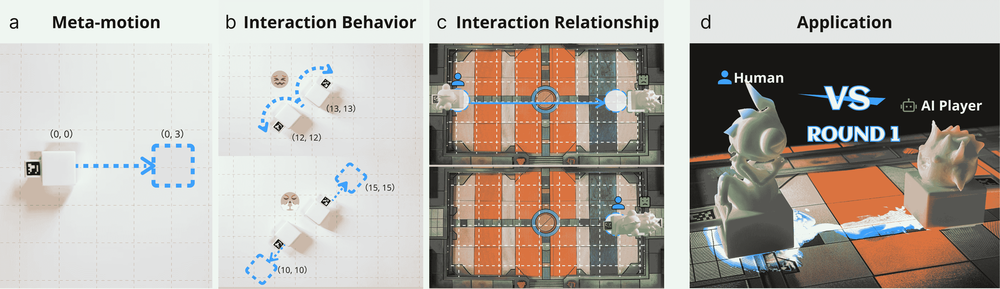

图1. 利用AI-Gaget Kit构建桌面游戏的多智能体系统。a) 将SUI的元动作扩展到小工具的复杂运动规划，b) 互动行为生成，c) 互动关系管理。d) 机器人小工具与人类玩家进行回合制策略游戏。

\描述

利用AI-Gaget Kit构建桌面游戏的多智能体系统。a) 将SUI的元动作扩展到小工具的复杂运动规划，b) 互动行为生成，c) 互动关系管理。d) 机器人小工具与人类玩家进行回合制策略游戏。

## 1. 引言

群体用户界面（SUI）作为一种新兴的界面，已经引起了研究人员的广泛关注。研究人员探索了SUI的多种应用场景，如数据物化（Suzuki et al., [2019](https://arxiv.org/html/2407.17086v1#bib.bib29)）、远程协作（Ihara et al., [2023](https://arxiv.org/html/2407.17086v1#bib.bib10)）和教育用途（Kaimoto et al., [2022](https://arxiv.org/html/2407.17086v1#bib.bib13)），这些应用基于SUI的独特物理交互行为，如协作运动、物体驱动或自形变化。然而，大多数现有的SUI利用一套预编程的行动规划规则来执行使用过程中不同的交互任务，也就是说，用户在面对新的交互任务时需要每次编程动作。这种方法难以适应通常更为复杂、动态且可能超出预编程范围的现实任务。

近年来，大型语言模型（LLM）在机器人运动控制和规划方面展现出了诸多优势。基于LLM中嵌入的知识，它们能够理解并推理不同任务中的复杂背景，从而根据任务中的背景动态生成响应，例如运动规划。传统的机器人运动规划方法包括使用单决策模型，这些模型依赖于对机器人每一步动作的预测（Gan et al., [2020](https://arxiv.org/html/2407.17086v1#bib.bib5); Wang et al., [2020](https://arxiv.org/html/2407.17086v1#bib.bib32)）。近期的研究探索了使用LLM，特别是LLM驱动的代理，来进行更复杂互动任务的机器人运动规划。例如，DiscussNav（Long et al., [2023](https://arxiv.org/html/2407.17086v1#bib.bib18)）使用了多个具有不同专业技能的LLM代理来进行复杂室内场景中的机器人导航决策。然而，这些研究大多集中在单机器人系统上。关于多机器人系统的研究，例如SUI，以及如何使用LLM辅助这些系统在复杂交互任务中的运动规划，仍然是一个尚未探索的领域。

在群体用户界面的各种应用中，桌面游戏是一个典型场景，包含了多种复杂的互动任务。现有研究已经探讨了在桌面游戏中应用有形的和群体用户界面，以增强互动性和娱乐性，例如使用机器人来促进具身人工智能玩家（Matuszek et al., [2011](https://arxiv.org/html/2407.17086v1#bib.bib19); van Breemen et al., [2005](https://arxiv.org/html/2407.17086v1#bib.bib30)）、机器人游戏大师（Gillet et al., [2020](https://arxiv.org/html/2407.17086v1#bib.bib6)）以及自动化小工具（Brock et al., [2021](https://arxiv.org/html/2407.17086v1#bib.bib2); Jariyavajee et al., [2018](https://arxiv.org/html/2407.17086v1#bib.bib11)）。然而，这些研究中机器人行动规划仍然依赖于预先编程的规则，这使得在桌面游戏中执行复杂互动任务变得具有挑战性，例如理解和应对复杂的游戏叙事、玩家的即兴决策或玩家的情感表达。

本文旨在以桌面游戏为案例，探索大规模语言模型（LLMs）在复杂互动任务场景中群体用户界面行动规划的应用。我们提出了AI小工具套件，一个多代理群体用户界面桌面游戏系统，旨在促进桌面游戏中的动态和复杂互动任务。我们首先介绍了AI小工具套件的系统架构，其中包括一组基于现有平台的群体机器人来执行小工具行为，以及一个多代理系统，负责执行游戏并为群体机器人生成行动计划。然后，我们详细阐述了多代理系统的设计，包含了一系列针对个体机器人设计的元运动、两个基于大规模语言模型的代理用于复杂的行动规划、以及一组旨在增强代理理解和反应能力的附加提示。最后，我们展示了四个使用AI小工具套件的应用示例，以展示多代理驱动的群体用户界面在执行桌面游戏复杂互动任务中的效果。通过这项工作，我们旨在激发在其他复杂互动任务场景中进行多代理驱动群体用户界面研究的兴趣。

总结来说，本文的贡献包括：

1.  (1)

    AI小工具套件，一个多代理群体用户界面桌面游戏系统，包含了一系列针对个体机器人设计的元运动、两个基于大规模语言模型的代理用于复杂的行动规划，以及一系列为桌面游戏场景量身定制的附加提示，以增强多代理系统的理解能力。

1.  (2)

    一组使用AI小工具套件在桌面游戏中的应用示例，展示了以代理驱动的群体机器人作为桌面游戏中小工具执行复杂互动任务的效果。

## 2\. 相关工作

### 2.1\. 群体用户界面

与传统的有形用户界面（TUI）相比，群体用户界面（SUI）引入了多个移动机器人，这些机器人能够实现协作运动，提供灵活广泛的物理交互空间和多模态交互体验。

人机交互（HCI）领域的研究人员探索了SUI的各种应用。例如，SwarmHaptic（Kim和Follmer，[2019](https://arxiv.org/html/2407.17086v1#bib.bib14)）利用小型轮式群体机器人在平面表面上移动，构建了一种新型的触觉界面。Rovables（Dementyev等，[2016](https://arxiv.org/html/2407.17086v1#bib.bib3)）提供了一系列能够在可穿戴服饰上自主移动的机器人，为可穿戴设备上的感知和驱动提供了交互空间。ShapeBots（Suzuki等，[2019](https://arxiv.org/html/2407.17086v1#bib.bib29)）使一组自我变形的机器人能够单独或集体地改变其配置，以在物理空间中展示信息。此外，Holobots（Ihara等，[2023](https://arxiv.org/html/2407.17086v1#bib.bib10)）提出了一种混合现实远程协作系统，通过同步移动机器人增强全息远程存在感。除了学术界外，SUI在教育和娱乐场景中也展示了广泛的应用前景。索尼使用可编程小型机器人Toio¹¹1https://toio.io/，让从小学生到成年人都能参与到逻辑思维和编程学习中；Thymo²²2https://www.thymio.org/ 机器人为各个年龄段的学习者提供STEM教育。

然而，现有的大多数SUI都使用预先编程的一组动作规划规则来执行使用过程中的不同交互任务。例如，尽管Holobots创造性地提出了六种远程协作交互类型，但由于受到预定编程的限制，它们在实际使用中难以根据用户灵活的需求动态生成个性化的触觉反馈。因此，一个能够理解并响应复杂交互任务的系统，将显著提高这些作品中SUI交互行为的通用性。

### 2.2. 动作规划的代理

在机器人学领域，研究人员旨在向机器人代理发出高层次指令。这些代理自动将指令转化为低层次的执行动作，消除了人工编程的需求。Skill Transformer（Huang等，[2023a](https://arxiv.org/html/2407.17086v1#bib.bib9)），基于Transformer架构（Vaswani等，[2017](https://arxiv.org/html/2407.17086v1#bib.bib31)）的神经网络模型，预测机器人的低层次动作，使其能够在复杂环境中完成搬运物体到指定目标和位置的具体任务。随着大规模语言模型（LLMs）的出现，研究人员尝试利用LLMs强大的自然语言理解能力来处理基于自然语言的广义指令。例如，Chat中的March（Qiao等，[2023](https://arxiv.org/html/2407.17086v1#bib.bib22)）通过与代理、LLMs和VLMs的互动，根据模糊的自然语言指令在日常活动场景中进行导航。VoxPoser（Huang等，[2023b](https://arxiv.org/html/2407.17086v1#bib.bib8)）使用LLMs估计场景中物体的潜在收益和损失，以完成指令，并生成场景的3D价值图来推导机器人的轨迹。

研究人员还认识到，多代理之间的协作决策能够使机器人在行动时适应更复杂的场景，相较于单个代理的决策。DiscussNav（Long等，[2023](https://arxiv.org/html/2407.17086v1#bib.bib18)）被用来解决复杂场景中的导航问题，在这种情况下，机器人每一步的决策都涉及多个具有不同专长的LLM/VLM代理，从而增强了机器人在导航中的泛化能力。

尽管现有研究在行动规划和机器人控制方面已显示出在具象代理中的可行性，但它们对具象任务的任务规划验证主要局限于日常常规场景中的操作任务（Huang等，[2023a](https://arxiv.org/html/2407.17086v1#bib.bib9)，[b](https://arxiv.org/html/2407.17086v1#bib.bib8)）和导航任务（Long等，[2023](https://arxiv.org/html/2407.17086v1#bib.bib18)），而对其他某些类型任务场景（例如虚构的叙事设置）的关注较少。此外，其在多个机器人驱动的用户界面中的互动规划能力也需要进一步验证。探索基于LLM的代理与SUI的结合，将拓宽机器人学相关工作的应用场景和互动案例。

### 2.3\. 桌面游戏中的机器人

近年来，研究人员探索了在桌面游戏中应用有形和群体用户界面，以增强互动性和娱乐性。

随着机器人变得越来越小巧和多功能，越来越多的机器人被用作桌面游戏中的具象化 AI 玩家或小工具。例如，Brock 等人（Brock et al., [2021](https://arxiv.org/html/2407.17086v1#bib.bib2)）利用机器人 Haru 模拟远程人类玩家的行为。研究人员还使用机器人作为游戏中的机器人小工具，例如创建可以自动移动的棋盘，使得新的、有趣的互动体验成为可能（Jariyavajee et al., [2018](https://arxiv.org/html/2407.17086v1#bib.bib11)）。Sparkybot（Guo et al., [2023](https://arxiv.org/html/2407.17086v1#bib.bib7)）让孩子们在讲故事游戏中使用移动机器人作为不同的角色，来增强孩子们的创造力。

这些使用 SUI（桌面用户界面）进行桌面游戏的研究工作提供了丰富的用户互动空间。然而，这些研究中机器人行动规划仍然依赖于预编程规则，这使得执行桌面游戏中的复杂互动任务变得具有挑战性，例如理解和响应复杂的游戏叙事、玩家的即兴决策或玩家的情感表达。在本研究中，我们旨在利用基于大型语言模型（LLM）的代理来协助 SUI 的行动规划，从而执行桌面游戏中小工具的复杂互动行为。

## 3\. AI-Gadget Kit 的系统架构

AI-Gadget Kit 的系统架构，如图[2](https://arxiv.org/html/2407.17086v1#S3.F2 "Figure 2 ‣ 3\. System Architecture of AI-Gaget Kit ‣ AI-Gadget Kit: Integrating Swarm User Interfaces with LLM-driven Agents for Rich Tabletop Game Applications")所示，包含一个 SUI 平台、一个定位系统、一个服务器和一个基于 LLM 的多代理系统。SUI 平台包括多个独立的机器人，用于在桌面游戏中驱动各种小工具行为。定位系统包括一个摄像头和多个机器人上的标记，用于获取每个机器人的位置和方向。服务器获取用户的文本或语音输入命令以及机器人的位置和方向数据，然后将其发送到基于 LLM 的多代理系统进行信息处理。服务器还接收多代理系统生成的执行动作，播放音效或将动作序列发送到 SUI 平台中的机器人。基于 LLM 的多代理系统负责执行核心的游戏互动。基于游戏规则和知识，多代理系统响应用户命令，推理游戏中的小工具行为，并生成动作序列来控制 SUI 机器人。

在这个项目中，我们利用了一个1m*1m的桌面作为交互空间。该空间被划分为一个30*30的坐标系统，东向和北向分别作为x轴和y轴的正方向。我们使用了Sony的Toio机器人作为SUI平台。每个单独的机器人尺寸为3.2*3.2*2.5厘米。我们使用PC作为服务器，通过蓝牙与Toio机器人通信，并通过WiFi与LLM通信。在我们的定位系统中，我们采用了一台imx415网络IP摄像头，摄像头安装在桌面上方1米的位置，并使用ArUco码作为机器人上的定位标记。服务器使用RTSP协议从摄像头获取视频流，并利用Python OpenCV来跟踪每个机器人的位置和方向。我们基于GPT4 LLM开发了一个多智能体系统。多智能体系统的设计如下所述。

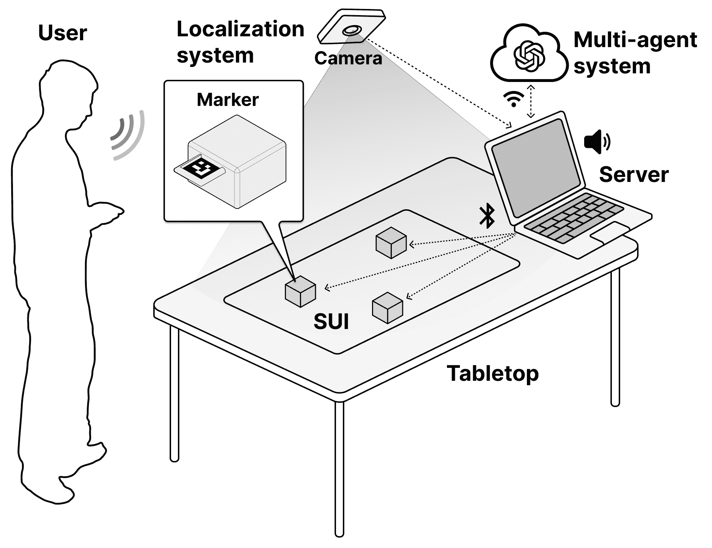

图 2\. AI-Gadget工具包的系统架构。

## 4\. 多智能体系统

在AI-Gadget工具包中，我们利用多智能体系统来计算游戏的核心交互。基于游戏的规则和知识，系统响应用户命令，推理游戏中的设备行为，然后生成控制SUI机器人的动作序列。

为了构建多智能体系统，我们首先为每个单独的机器人定义了一组元动作，然后设计了一个双智能体系统，包括一个协调者智能体和一个控制者智能体，来学习和使用这些元动作进行复杂的运动规划。我们还设计了一套附加提示，包括用于交互行为规划和交互关系规划的提示，以增强智能体在游戏过程中理解和应对复杂交互的能力。

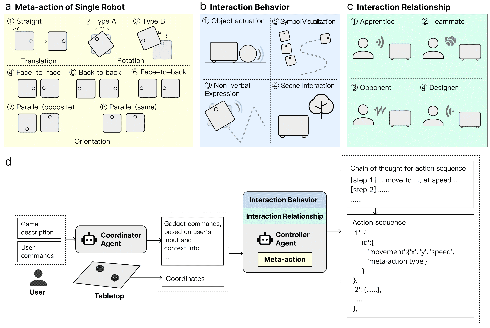

图 3\. 通过我们的工具包在桌面游戏场景中进行SUI动作规划的设计空间。该工具包包括一个双智能体系统(d)，该系统可以基于八种元动作(a)、四种类型的交互行为(b)和四种类型的交互关系(c)生成完成交互任务的动作序列。

### 4.1\. 单个机器人元动作

为了利用基于LLM的智能体来为我们的SUI规划和生成复杂的动作，我们首先定义了单个机器人的原始运动模式，即元动作（图[3](https://arxiv.org/html/2407.17086v1#S4.F3 "图 3 ‣ 4\. 多智能体系统 ‣ AI-Gadget工具包：将群体用户界面与LLM驱动的智能体集成，用于丰富的桌面游戏应用")a））。单个Toio机器人通过控制两个轮子的电机来移动。因此，在本研究中，我们通过控制电机的旋转方向（默认顺时针或逆时针）、速度（Toio平台上有三个级别 - 10、20 或 30³³3 速度值）和每个电机的持续时间（x秒）来控制机器人的元动作。

我们将机器人的元动作分为两种类型的运动：平移和旋转，定义如下：

+   •

    旋转：

    +   –

        旋转A：机器人围绕其中心旋转，通过以相同速度相反方向旋转其轮子若干秒，精确实现一个旋转角度。

    +   –

        旋转B：机器人围绕其一侧旋转，通过只旋转一个轮子若干秒，精确实现一个特定的旋转角度。

+   •

    平移：机器人通过旋转A调整朝向至期望方向，随后以相同的速度和方向旋转两个轮子几秒钟，从而实现沿特定距离的线性平移。

在每次运动过程中，服务器根据预期的平移或旋转位移以及官方的运动学数据，简单计算出持续时间⁴⁴4https://toio.github.io/toio-spec/en/docs/hardware_components。

此外，考虑到多个机器人之间的交互，我们设计了另一种类型的元动作来调整它们的相对朝向，包括面对面、背对背、面背对面、平行和反平行，这些都在图[3](https://arxiv.org/html/2407.17086v1#S4.F3 "图 3 ‣ 4\. 多智能体系统 ‣ AI-Gadget工具包：将群体用户界面与LLM驱动的智能体集成用于丰富的桌面游戏应用")a中定义并说明。进行这些元动作的两个机器人通过执行旋转A一段时间来调整它们的朝向。

通过反复调用并组合这三种类型的元动作，并使用自定义参数，AI-Gadget工具包中的智能体能够生成多个顺序动作，以便为这些机器人在群体用户界面中的复杂运动规划提供支持。

### 4.2\. 复杂运动规划

为了促进群体用户界面在桌面游戏中执行小工具行为的复杂运动规划，我们开发了一个基于LLM的双智能体系统，旨在理解并响应游戏情境，然后生成机器人的动作序列（图[3](https://arxiv.org/html/2407.17086v1#S4.F3 "图 3 ‣ 4\. 多智能体系统 ‣ AI-Gadget工具包：将群体用户界面与LLM驱动的智能体集成用于丰富的桌面游戏应用")d）。具体而言，我们在系统中提出了两个具有专家提示的智能体：协调者和控制者：

(1) 协调员代理。桌面游戏中的操作通常涉及用户的命令和上下文信息的处理。以国际象棋为例，如果用户输入命令“将皇后移到A1”，该命令的执行包括皇后的实际移动，以及处理棋盘的尺寸、皇后移动规则和是否可以吃掉对方棋子的上下文信息。因此，我们设计了一个协调员代理，通过处理玩家的命令和游戏上下文信息来响应，然后对每个交互步骤中的每个设备进行命令推理。在协调员的提示中，我们要求该代理充当游戏中的管理员、协调员和裁判。我们在提示中添加了一系列职责描述，例如解释规则、协调动作和更新游戏状态。我们还将游戏的环境设置输入到提示中，包括地图的大小和坐标系统。

请注意，为了使协调员代理专注于游戏操作，我们采用了“与现实无关”的方法。具体来说，协调员仅促进游戏的执行，不涉及SUI机器人在物理上的参数，如它们的位置或下一个移动。我们旨在通过高效地提示大型语言模型（LLM）来增强协调员的理解和反应能力。协调员的提示详见附录材料。

(2) 控制器代理。为了在桌面游戏中使用SUI，我们需要机器人根据游戏中的设备行为规划它们的运动。为此，我们在系统中提出了控制器代理，它负责体现角色并生成代表这些角色的每个机器人的动作序列。控制器代理的设计是从两个来源收集信息：由协调员代理输出的设备命令，以及在特定时间机器人的物理位置数据。接下来，我们要求控制器使用元动作生成机器人的动作序列，同时考虑游戏的逻辑流程和游戏体验。

为确保这些动作序列能够正确格式化以供机器人执行，我们为控制器设计了一个链式思维（Chain-of-Thought, CoT）提示（Wei et al., [2022](https://arxiv.org/html/2407.17086v1#bib.bib33)）。控制器的CoT提示展开如下：（1）输出一个描述即将移动的机器人动作序列的文本，以及这些机器人当前的位置信息；（2）基于上述文本描述生成一个动作序列，并以Python字典的形式表示。这个Python字典包含机器人的ID，以及每个后续元动作的详细信息，包括目的地位置/角度、速度、运动类型等。此外，我们还采用了上下文学习和少量学习方法（Liu et al., [2021](https://arxiv.org/html/2407.17086v1#bib.bib17)），在提示中提供具体示例，以展示上述CoT提示的过程，帮助代理有效地学习如何生成和规划运动序列。

在使用过程中，用户首先将游戏的描述和规则输入系统，以声明要玩的游戏。系统然后根据大语言模型（LLMs）内在的知识理解并启动游戏。接着，用户持续向系统输入游戏命令，以与游戏进行互动。系统中的两个代理分析这些命令和游戏的上下文信息，推理游戏中小工具的行为，然后生成动作序列以驱动SUI机器人运动，体现小工具与用户的互动。

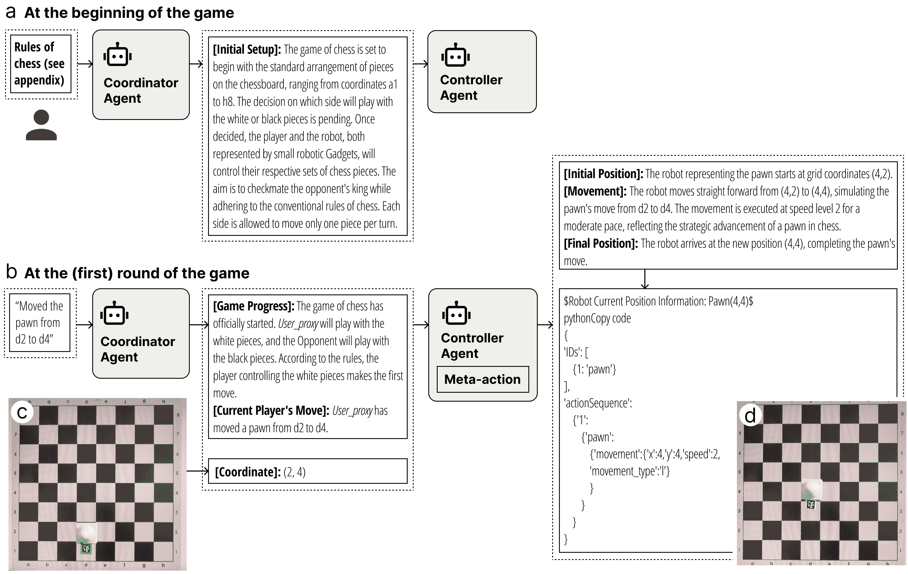

图 4\. 使用我们工具包的示例：（a）用户可以通过输入介绍和规则声明他们正在玩的游戏。（b）然后，他们根据场景输入游戏命令与小工具互动。小工具基于工具包中的双代理系统生成相应的动作序列。

在这里，我们展示了使用双代理系统进行国际象棋游戏的具体案例。互动的综合过程如图[4](https://arxiv.org/html/2407.17086v1#S4.F4 "Figure 4 ‣ 4.2\. Complex Motion Planning ‣ 4\. Multi-agent system ‣ AI-Gadget Kit: Integrating Swarm User Interfaces with LLM-driven Agents for Rich Tabletop Game Applications")所示，包括游戏的启动步骤和游戏一轮中的典型步骤。在启动步骤中，用户首先输入了游戏名称和一段系统介绍（见补充材料）。然后，协调者根据用户的输入初始化游戏并输出响应，如图[4](https://arxiv.org/html/2407.17086v1#S4.F4 "Figure 4 ‣ 4.2\. Complex Motion Planning ‣ 4\. Multi-agent system ‣ AI-Gadget Kit: Integrating Swarm User Interfaces with LLM-driven Agents for Rich Tabletop Game Applications")a所示。请注意，在此步骤中，由于用户没有输入任何具体的游戏命令，控制器代理也没有生成特定的行动序列。随后，随着游戏的开始，用户持续向系统发出指令。例如，在第一轮中，用户输入了一个指令：“将兵从d2移动到d4”。接下来，协调者对指令做出响应，并通知控制器由用户操作的兵器具行为，如图[4](https://arxiv.org/html/2407.17086v1#S4.F4 "Figure 4 ‣ 4.2\. Complex Motion Planning ‣ 4\. Multi-agent system ‣ AI-Gadget Kit: Integrating Swarm User Interfaces with LLM-driven Agents for Rich Tabletop Game Applications")b所示。然后，控制器接收到兵的器具行为以及代表该兵器具的机器人实际位置数据（如图[4](https://arxiv.org/html/2407.17086v1#S4.F4 "Figure 4 ‣ 4.2\. Complex Motion Planning ‣ 4\. Multi-agent system ‣ AI-Gadget Kit: Integrating Swarm User Interfaces with LLM-driven Agents for Rich Tabletop Game Applications")c所示），并通过CoT过程生成对应的行动序列。兵机器人输出的行动序列如图[4](https://arxiv.org/html/2407.17086v1#S4.F4 "Figure 4 ‣ 4.2\. Complex Motion Planning ‣ 4\. Multi-agent system ‣ AI-Gadget Kit: Integrating Swarm User Interfaces with LLM-driven Agents for Rich Tabletop Game Applications")b所示。系统中的服务器随后解码来自控制器的行动序列，向兵器具发送运动命令，然后驱动兵器具的运动，如图[4](https://arxiv.org/html/2407.17086v1#S4.F4 "Figure 4 ‣ 4.2\. Complex Motion Planning ‣ 4\. Multi-agent system ‣ AI-Gadget Kit: Integrating Swarm User Interfaces with LLM-driven Agents for Rich Tabletop Game Applications")d所示。

### 4.3\. 互动行为规划

通常，在利用SUI进行桌面游戏的背景下，具体游戏场景的不同，SUI往往需要控制机器人运动并将各种游戏操作转化为具体的互动行为（Nakagaki等，[2020](https://arxiv.org/html/2407.17086v1#bib.bib20)）。然而，在实际应用中，我们发现，由于各种交互行为的复杂性和特殊性，系统中的代理，特别是控制器，可能无法仅仅依赖通用提示来实现所有这些具体的交互行为。为了解决这个问题，我们通过采用一/少样本学习方案，增强了控制器的能力，加入了几组额外的提示（附加提示）。这种方法帮助控制器理解不同背景下应用于机器人的特定操作（能力）。我们预计这些附加提示将优化系统在不同游戏场景中为Gadget生成动作序列的能力。

为了确定哪些互动行为需要设计额外的提示，我们参考了以往在SUI领域的研究（Nakagaki等，[2020](https://arxiv.org/html/2407.17086v1#bib.bib20)；Suzuki等，[2019](https://arxiv.org/html/2407.17086v1#bib.bib29)；Ihara等，[2023](https://arxiv.org/html/2407.17086v1#bib.bib10)；Guo等，[2023](https://arxiv.org/html/2407.17086v1#bib.bib7)；Peng等，[2020](https://arxiv.org/html/2407.17086v1#bib.bib21)；Yu等，[2023](https://arxiv.org/html/2407.17086v1#bib.bib35)；Li等，[2022](https://arxiv.org/html/2407.17086v1#bib.bib16)）并招募了五名具有人机交互（HCI）背景并在桌面游戏方面有经验的设计师进行非正式访谈和头脑风暴。在此过程中，我们识别了与桌面游戏中Gadget操作相关的四种常见交互行为类型，包括目标激活、符号可视化、非语言表达和场景交互。之后，我们基于每种交互行为类型设计了额外的提示，用于控制器，具体如下所述。

#### 4.3.1. 目标激活

在基于 SUI 的桌面游戏中，系统通过使用机器人设备（Ihara 等人，[2023](https://arxiv.org/html/2407.17086v1#bib.bib10)）自动操控桌面上的物体，使得游戏道具操作实现自动化，或模拟玩家与 AI 对手或远程玩家之间的互动。为此，我们为控制器添加了一组额外的提示，帮助生成操作序列，促使我们的设备“驱动物体”。在这些提示中，我们指定控制器应专注于机器人运动的速度和轨迹，以实现沿预定路径移动物体，并模拟物体的特性，如重量。我们还在提示中包括了一个具体示例，涉及推动重物箱子到指定位置的任务，以及控制器生成的预期动作序列。

在将物体驱动的附加提示整合到控制器原有提示中后，我们通过使用控制器驱动设备在推动重物场景中的有效性进行了测试。我们还测试了使用控制器驱动设备推动轻物体的有效性。例如，规定设备从位置（1, 1）开始，并需要踢一个位于（3, 3）的轻质塑料足球。设备的运动结果以及控制器生成的动作序列如图 [5](https://arxiv.org/html/2407.17086v1#S4.F5 "Figure 5 ‣ 4.3.1\. Object Actuation ‣ 4.3\. Interactive Behavior Planning ‣ 4\. Multi-agent system ‣ AI-Gadget Kit: Integrating Swarm User Interfaces with LLM-driven Agents for Rich Tabletop Game Applications")a-b 所示。

另外，在另一个示例中，两台设备最初位于（1, 1）和（3, 1），我们要求这两台设备将两扇非常重的门从（1, 3）和（3, 3）推到（1, 4）和（3, 4）。设备的移动演示以及控制器生成的动作序列如图 [5](https://arxiv.org/html/2407.17086v1#S4.F5 "Figure 5 ‣ 4.3.1\. Object Actuation ‣ 4.3\. Interactive Behavior Planning ‣ 4\. Multi-agent system ‣ AI-Gadget Kit: Integrating Swarm User Interfaces with LLM-driven Agents for Rich Tabletop Game Applications")c-d 所示。

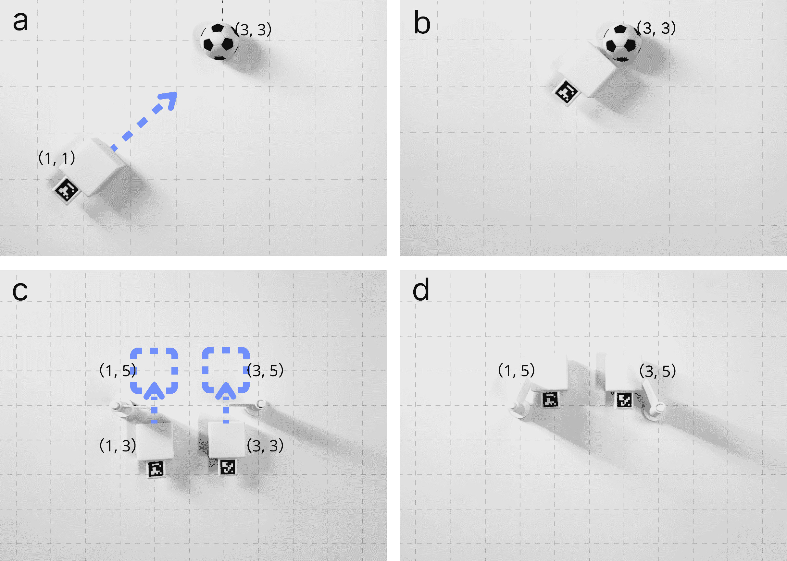

图 5\. 设备从位置（1,1）开始，需要踢一个位于（3,3）的轻质塑料足球。a）设备：以速度3向东北移动，接近足球的位置 b）踢足球，通过向东移动到（3,3）来模拟动作。c-d）两台设备一起移动，向门的方向靠近并开启它。

#### 4.3.2\. 符号可视化

在基于SUI的桌面游戏中，系统通过使用机器人设备来可视化某些图形符号的能力，可以增强游戏中文本或图形信息的呈现[74]。为此，我们为控制器添加了一组附加提示，帮助生成群体机器人（即小工具）执行符号可视化的动作序列。具体来说，我们设计了两种图形符号可视化方法：“轨迹追踪”和“机器人编队”，并为每种方法设计了相应的提示。为了使该可视化功能更加一致，我们还添加了一些规则，比如“符号不能垂直翻转”和“使用大写字母表示英文字母”。我们还为每种可视化方法在附加提示中提供了一个示例，包括一个用自然语言描述的任务，目的是可视化字母“ HCI”，以及控制器应生成的预期动作序列。详细提示见附加材料。

在将符号可视化的附加提示整合到控制器后，我们通过使用控制器驱动某些小工具来测试其有效性，目的是可视化“UIST”。对于“追踪”方法，控制器成功地决定利用四个小工具，并为每个小工具生成了适当的运动轨迹。轨迹模式及形成这些轨迹的动作序列在图[6](https://arxiv.org/html/2407.17086v1#S4.F6 "图6 ‣ 4.3.2\. 符号可视化 ‣ 4.3\. 互动行为规划 ‣ 4\. 多智能体系统 ‣ AI小工具套件：集成群体用户界面与基于LLM的智能体，应用于丰富的桌面游戏")a-g中进行了说明。

对于“编队”方法，控制器决定利用多个机器人分别形成字母“H”和“I”的形状。机器人形成这些字母的有效性及所用动作序列在图[6](https://arxiv.org/html/2407.17086v1#S4.F6 "图6 ‣ 4.3.2\. 符号可视化 ‣ 4.3\. 互动行为规划 ‣ 4\. 多智能体系统 ‣ AI小工具套件：集成群体用户界面与基于LLM的智能体，应用于丰富的桌面游戏")h-i中进行了说明。

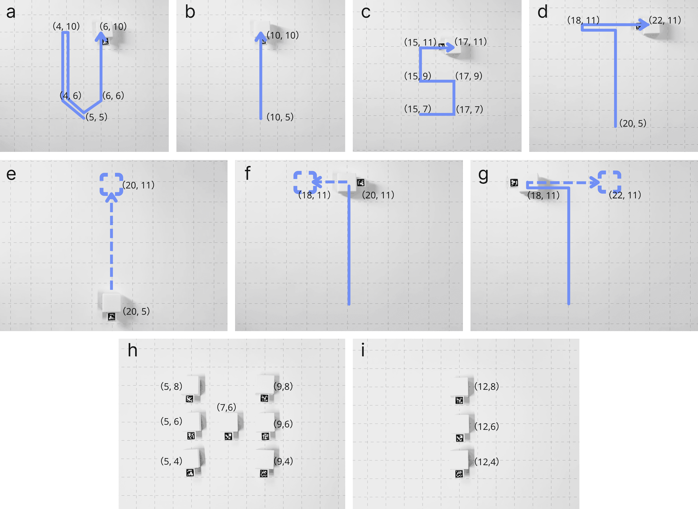

图6\. 小工具被要求呈现单词“UIST”或“HI”。a-d）智能体生成了四个小工具的轨迹，这些小工具被排列成字母“U”，“I”，“S”。e-f）展示了其中一个小工具如何通过其运动轨迹呈现字母“T”的详细过程。h-i）智能体使用7个和3个小工具分别形成字母“H”和“I”。

#### 4.3.3\. 非语言表达

在基于SUI的桌面游戏中，系统利用机器人小工具进行非语言表达的能力，例如展示角色的情绪，可以显著增强桌面游戏的叙事表现力（Peng等人，[2020](https://arxiv.org/html/2407.17086v1#bib.bib21)）。为此，我们为控制器加入了一组附加提示，以协助生成群体机器人用于“非语言表达”的动作序列。具体来说，我们设计了两种非语言表达方式：“情绪表达”和“社交表达”，并为每种方式提供了相应的提示。我们还在提示中提供了每种方式的示例，以及控制器应生成的预期动作序列。示例包括要求小工具表现出悲伤情绪和两个小工具之间的问候。相关提示的详细内容见补充材料。

在将非语言表达的附加提示加入控制器后，我们首先测试了使用控制器驱动单个小工具表现兴奋的效果。该表达及相应的动作序列展示如图[7](https://arxiv.org/html/2407.17086v1#S4.F7 "图7 ‣ 4.3.3\. 非语言表达 ‣ 4.3\. 互动行为规划 ‣ 4\. 多智能体系统 ‣ AI-小工具工具包：将群体用户界面与基于LLM的代理集成用于丰富的桌面游戏应用")a-b所示。

接下来，我们测试了使用控制器驱动两个小工具表现出争执社交行为的效果。该表达及相应的动作序列展示如图[7](https://arxiv.org/html/2407.17086v1#S4.F7 "图7 ‣ 4.3.3\. 非语言表达 ‣ 4.3\. 互动行为规划 ‣ 4\. 多智能体系统 ‣ AI-小工具工具包：将群体用户界面与基于LLM的代理集成用于丰富的桌面游戏应用")c-e所示。

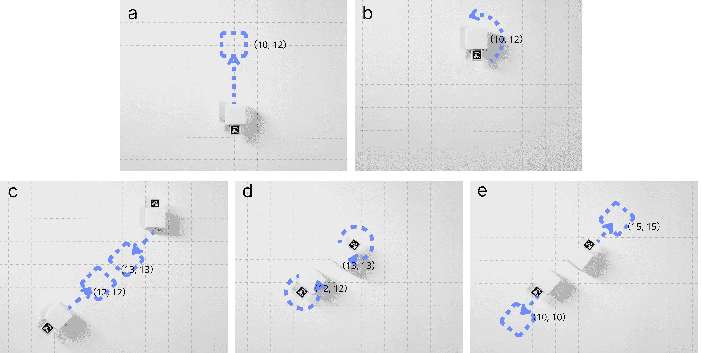

图7\. a-b) 单个小工具表现出兴奋，小工具稍微向上移动并旋转一个圆圈。c-e) 两个小工具表现出争论，它们彼此靠近，在争论过程中每个小工具旋转一个圆圈，争论结束后每个小工具都退后。

#### 4.3.4\. 场景互动

在基于SUI的桌面游戏中，预计机器人装置应该能够在场景中执行讲故事等动作，因此该装置的行为可能需要与地图环境的设置进行交互（Guo等人，[2023](https://arxiv.org/html/2407.17086v1#bib.bib7)）。为此，我们为控制器加入了一组附加提示，帮助生成集群机器人用于“场景交互”的动作序列。具体来说，我们提出控制器在装置的动作规划中应具备“全球视角”，考虑到附加的地图信息、场景道具，甚至是其他装置的位置或状态等因素。我们还为每种方法提供了一个示例，展示了控制器应生成的预期动作序列。附加提示包括一个示例，演示了一个装置如何绕过一定长度的障碍物到达障碍物的另一侧。相关提示在补充材料中有详细说明。

在将用于场景交互的附加提示整合到控制器后，我们通过一个示例测试了如何让装置绕过由三个其他装置形成的障碍物。此表达式的展示及其相应的动作序列如图[8](https://arxiv.org/html/2407.17086v1#S4.F8 "图8 ‣ 4.3.4\. 场景交互 ‣ 4.3\. 互动行为规划 ‣ 4\. 多智能体系统 ‣ AI-装置工具包：集成集群用户界面与LLM驱动的代理，用于丰富的桌面游戏应用")所示。

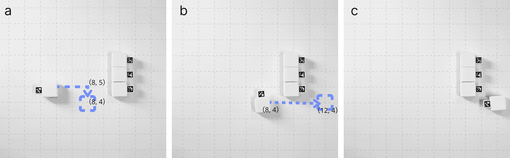

图8\. 该装置绕过由其他三个装置组成的墙壁，在接近障碍物后，移动到障碍物的南侧并向东移动，以克服障碍物。

### 4.4\. 互动关系规划

在游戏中的多轮交互中，代理反思其与玩家互动时所依赖的关系结构至关重要。这包括代理可能与玩家对抗或协作，或者独立调整其回应，以符合正在展开的叙事，从而为主题氛围作出贡献。基于这一前提，研究人员的调查将代理可能采取的立场提炼为四种不同的类别：学徒、竞争者、队友或设计师（Zhu等人，[2021](https://arxiv.org/html/2407.17086v1#bib.bib36)）。为了让代理理解人机互动关系与游戏中互动行为生成之间的联系，我们已通过附加提示（add-on prompt）增强了控制器，使其能够理解不同的互动关系。

#### 4.4.1\. 学徒

在大多数桌面游戏环境中，我们系统中的小工具通常代表玩家的头像或作为玩家控制的实体⁵⁵5http://scruffygrognard.com/。我们认为，系统能够作为“学徒”存在，自动且精确地根据用户的建议调整机器人小工具的动作，将显著增强个性化互动行为。为此，我们为控制器建立了一组附加提示，使其能够尽可能根据用户的指导参考并调整其动作规划。具体提示详见补充材料。

在将“学徒”附加提示融入控制器后，我们用一个请求“加速小工具”的示例进行了测试。以下是控制器控制小工具从网格地图的（5,5）移动到（10,10）时生成的动作序列示例。翻译（移动）速度设置为2。

紧接着，如果我们要求小工具加速移动，控制器会更新并生成如下动作序列，如图[9](https://arxiv.org/html/2407.17086v1#S4.F9 "图9 ‣ 4.4.1. 学徒 ‣ 4.4. 交互关系规划 ‣ 4. 多智能体系统 ‣ AI小工具套件：将群体用户界面与LLM驱动代理整合用于丰富的桌面游戏应用")所示。

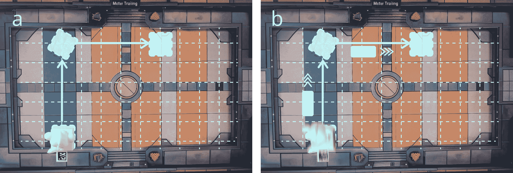

图9. 小工具被要求从（5,5）移动到（10,10），并在被要求加速后，小工具移动得更快。

#### 4.4.2. 对手

许多桌面游戏中都有由非玩家控制的对手角色，它们与玩家进行竞争活动。我们认为，如果我们的系统能够理解“对手”概念，建立非玩家控制的对手角色，并利用小工具来体现它们之间的互动，将能丰富桌面游戏的体验。为此，我们为控制器建立了一组附加提示，帮助它生成并执行单个或多个对手角色，用于游戏中的竞争或比赛。

我们在提示中指定了控制器生成“对手”角色时应遵循的原则和职责（Raman 等，[2022](https://arxiv.org/html/2407.17086v1#bib.bib23)）。例如，我们设定了对手的目标：“…通过战略和决策来挑战对手角色，同时保持游戏公平和有趣。”此外，我们还定义了控制器如何分析玩家行为并动态制定挑战性互动策略的机制。例如，我们在提示中指定控制器“…根据当前的游戏状态和对手角色的行为制定具有挑战性的策略。”这些提示在补充材料中有详细说明。

在将“对手”的附加提示整合到控制器中后，我们通过一个使用小工具进行战斗行为的例子进行了测试。在这个例子中，一个小工具体现了由用户指挥的Monster1角色（其动作序列由控制器生成），而另一个小工具则由系统控制，充当对手Monster2。Monster1被指示使用雷电攻击时，控制器生成了他们战斗的动作序列，如图[10](https://arxiv.org/html/2407.17086v1#S4.F10 "Figure 10 ‣ 4.4.2\. Opponent ‣ 4.4\. Interaction Relationship Planning ‣ 4\. Multi-agent system ‣ AI-Gadget Kit: Integrating Swarm User Interfaces with LLM-driven Agents for Rich Tabletop Game Applications")所示。

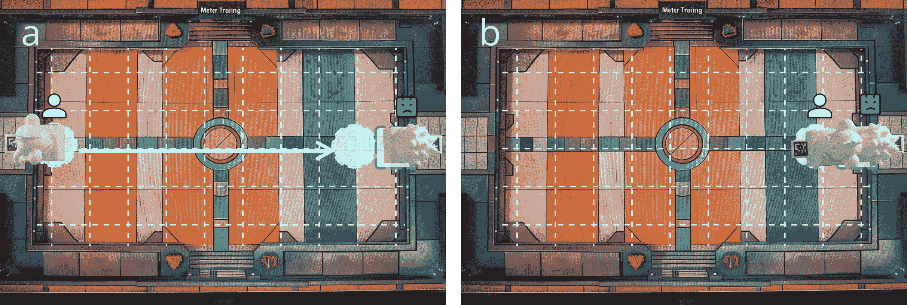

图10\. Monster1被指示攻击Monster2，而Monster2则做出被攻击的反应。

#### 4.4.3\. 队友

类似于对手，在桌面游戏中，存在许多由非玩家控制的角色，通过协作完成任务或与敌人作战，从而支持玩家。如果我们的系统能够理解“队友（盟友）”关系，自动建立这些非玩家控制的队友角色，并通过小工具实现互动，那么丰富游戏体验就变得更加可行。为此，我们还为控制器开发了一套附加提示，帮助其生成和体现一个或多个队友角色。在提示中，我们指定了控制器生成“队友”角色时应遵循的原则和职责（Raman等， [2022](https://arxiv.org/html/2407.17086v1#bib.bib23)）。例如，我们为队友设定了一个目标：“…通过有效的合作和策略支持队友角色，确保整个团队的成功和游戏的乐趣……”此外，我们还在提示中为控制器如何通过有效的合作和战略规划支持队友角色制定了指导方针，例如：“提供必要的支持，帮助队友角色克服挑战，同时确保不抢去他们的风头，保持游戏的平衡性和趣味性。”以确保整个团队的成功并增强游戏的乐趣。提示内容在补充材料中有所说明。

在将“队友”附加提示集成到控制器后，我们通过一个示例进行了测试，展示了使用小工具进行协作战斗行为，如图[11](https://arxiv.org/html/2407.17086v1#S4.F11 "图11 ‣ 4.4.3\. 队友 ‣ 4.4\. 互动关系规划 ‣ 4\. 多代理系统 ‣ AI-小工具套件：集成群体用户界面与基于LLM的代理以丰富桌面游戏应用")所示。在这个场景中，一个小工具扮演了由用户指挥的怪物1（其动作序列由控制器生成），而另外两个小工具由控制器生成并控制，分别扮演队友怪物2和对手怪物3。

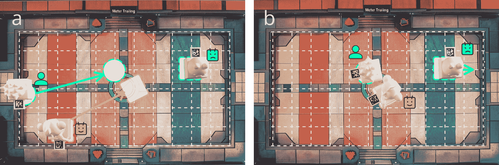

图11\. 能够生成协作行为的小工具充当用户的队友，并与敌人共同作战。

#### 4.4.4\. 设计师

在桌面游戏中，可能还会有更多旨在增强叙事效果的角色，例如NPC（非玩家角色）或道具。例如，当玩家及其队友击败敌人后，村民NPC可以被配置为庆祝玩家的胜利。如果控制器可以作为一个“设计师”，根据游戏的叙事背景生成这些角色，并通过小工具使其行为具体化，那么将提升游戏的戏剧效果和整体体验。为了实现这一点，我们为控制器开发了一套附加提示，使其能够“... 自发生成新的角色、NPC、物品或情节，以及相应的机器人动作序列，从而推动游戏情节的发展。”相关提示已在补充材料中详细说明。

在将“设计师”附加提示集成到控制器后，我们通过一个示例进行了测试，重点是战斗胜利后的关键叙事时刻。具体来说，当用户控制的怪物1和队友怪物2击败怪物3时，控制器生成了一个故事情节，村民NPC出现庆祝胜利。为了让这种庆祝行为栩栩如生，控制器随后调用了三个为此目的设计的新小工具，如图[12](https://arxiv.org/html/2407.17086v1#S4.F12 "图12 ‣ 4.4.4\. 设计师 ‣ 4.4\. 互动关系规划 ‣ 4\. 多代理系统 ‣ AI-小工具套件：集成群体用户界面与基于LLM的代理以丰富桌面游戏应用")所示。

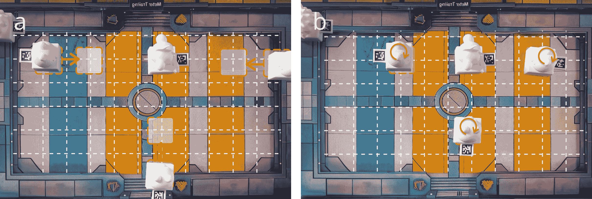

图12\. 三个由代理生成的新NPC一起庆祝用户的胜利，它们围绕玩家，每个角色迈出一步并通过旋转表达兴奋。

## 5\. 示例应用

我们使用 AI-Gadget Kit 设计了几款不同的桌面游戏，展示其在双代理系统中的能力以及八个附加提示的有效性（包括四种互动行为和四种互动关系）。每进行一场游戏，我们都会遵循图 [4](https://arxiv.org/html/2407.17086v1#S4.F4 "图 4 ‣ 4.2\. 复杂运动规划 ‣ 4\. 多代理系统 ‣ AI-Gadget Kit：将群体用户界面与 LLM 驱动的代理整合用于丰富的桌面游戏应用") 中概述的步骤，首先向 AI-Gadget Kit 介绍游戏的基本情况和规则（详细信息见附录材料）。这一初步步骤包括声明正在进行的游戏。接着，根据游戏场景，我们向 Gadgets 提供游戏指令，进行互动式的游戏体验。

### 5.1\. 足球射门游戏

使用 AI-Gadget Kit，我们实现了一款足球射门游戏，如图 [13](https://arxiv.org/html/2407.17086v1#S5.F13 "图 13 ‣ 5.1\. 足球射门游戏 ‣ 5\. 示例应用 ‣ AI-Gadget Kit：将群体用户界面与 LLM 驱动的代理整合用于丰富的桌面游戏应用") 所示。游戏设置包括一个固定的球门，玩家和 Gadget 轮流进行射门。玩家使用两根手指推动足球，而 Gadget 通过击打足球来执行射门。我们首先将游戏规则输入系统（详细信息见附录材料）。一旦协调员理解了规则，它便承担了游戏主持人和裁判的角色。接着，它指派控制器部署对手角色，控制 Gadget 的动作序列。该 Kit 将通过控制器的“物体驱动”附加提示来利用这一能力，基于球门和球的位置进行碰撞规划和执行。当轮到 Gadget 进行射门时，控制器会考虑球到球门的距离、球相对于球门的朝向以及推动球所需的速度等因素，生成对手的射门方向和速度。

图 [13](https://arxiv.org/html/2407.17086v1#S5.F13 "图 13 ‣ 5.1\. 足球射门游戏 ‣ 5\. 示例应用 ‣ AI-Gadget Kit：将群体用户界面与 LLM 驱动的代理整合用于丰富的桌面游戏应用") 展示了系统在这一游戏场景中的表现，突出显示了 Gadget 作为对手的作用。在玩家进行射门后，Gadget 会自动瞄准开球点，向球移动并将球推向球门。

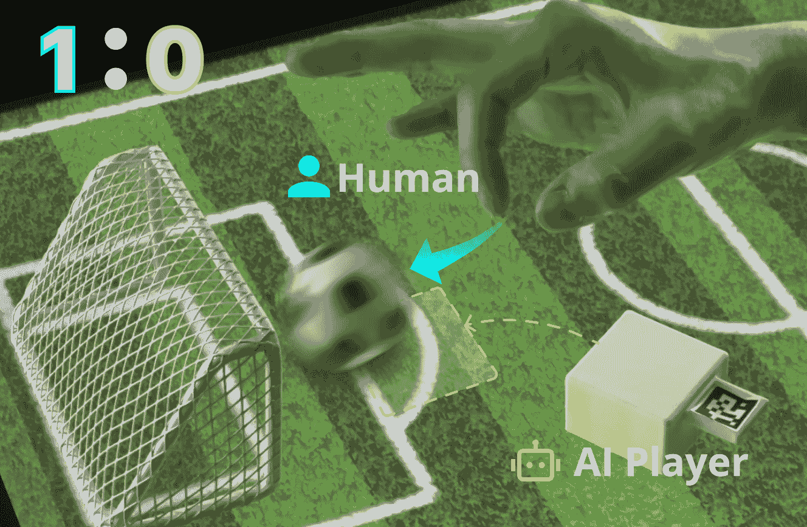

图 13\. 人类玩家和 AI 玩家共同进行足球比赛。

此外，控制器还监控过去的得分情况，以调整策略来增强游戏性和竞争性。例如，在单局游戏中，如果玩家在多次尝试中连续未能得分，随后回合中对手的准确度将会动态降低。这个调整旨在通过保持竞争平衡来丰富用户的游戏体验，确保游戏既能保持吸引力和挑战性，又不会变得令人沮丧地困难。

### 5.2. 回合制策略游戏

在回合制策略（TBS）游戏场景中，系统设计支持玩家间的战斗，这些玩家的指令通过设备控制（玩家对玩家，或 PVP）体现，以及设备本身充当对手的战斗（玩家对环境，或 PVE）。在游戏过程中，机器人设备充当战斗者角色，根据玩家指定的攻击目标和释放的技能生成机器动作指令。根据游戏规则，协调器在互动过程中更新并传递游戏信息，如设备的状态和能力。然后，控制器合成这些信息，生成相应的动作序列。在战斗场景中，我们的工具包主要依赖学徒、对手和非语言表达的附加提示。它遵循玩家的互动指令（如攻击/防御、技能部署等）来生成相应的互动行为。如图[14](https://arxiv.org/html/2407.17086v1#S5.F14 "图 14 ‣ 5.2. 回合制策略游戏 ‣ 5. 示例应用 ‣ AI-设备工具包：将群体用户界面与大型语言模型驱动的代理整合应用于丰富的桌面游戏")所示，当玩家命令其角色“用雷电的力量攻击敌人”时，工具包生成一个指向对方设备的攻击动作。考虑到“雷电”的特性，工具包设计了模拟电荷积聚后迅速前冲的攻击动作，而对于对方设备，则模拟触电后的当场摆动动作。此外，通过我们工具包中队友和设计师的附加提示，TBS 游戏能够容纳更多的设备进行战斗或互动。这可以补充现有的《龙与地下城》(D&D) 类型游戏中的战斗场景。

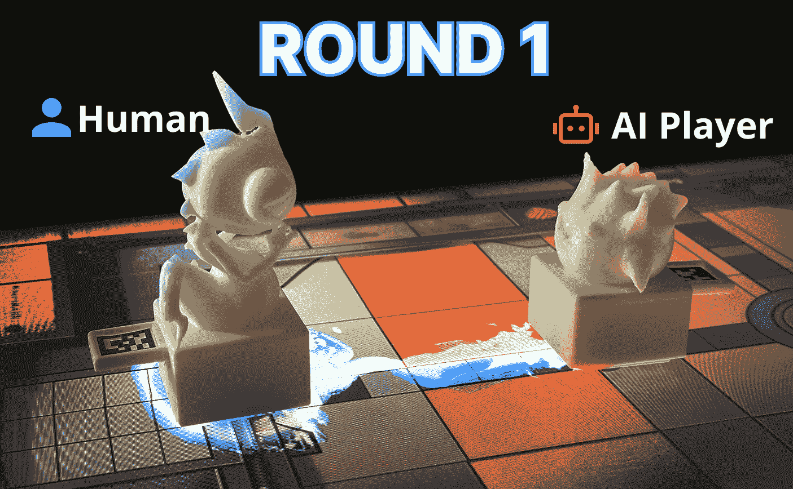

图 14. 机器人设备与人类玩家进行回合制策略游戏。

### 5.3. 是还是否？

在许多游戏中，系统会提供“是”或“否”的回答，例如《龙与地下城》(Dungeons and Dragons, D&D) 游戏中的能力检定和叙事中的提问。我们的工具包增强了这些时刻“是”与“否”答案的呈现，使其更加生动有趣。

例如，我们设计了一个问答游戏[15](https://arxiv.org/html/2407.17086v1#S5.F15 "图 15 ‣ 5.3\. 是或否？ ‣ 5\. 示例应用 ‣ AI-装置套件：将群体用户界面与基于大模型的代理集成，应用于丰富的桌面游戏")（其规则详见补充材料），在该游戏中，协调员接受用户提出的问题并提供相应的答案。

配备设计师功能的控制器利用附加提示进行符号可视化，以控制装置。该装置在纸上写出 Y（是）或 N（否），对用户的问题作出肯定或否定的回答。

为了减少笔尖与纸张之间摩擦对机器人装置运动的影响，我们采用了两个装置共同夹持一支笔进行绘画。这个设计旨在为用户提供更具悬念和沉浸感的游戏体验。

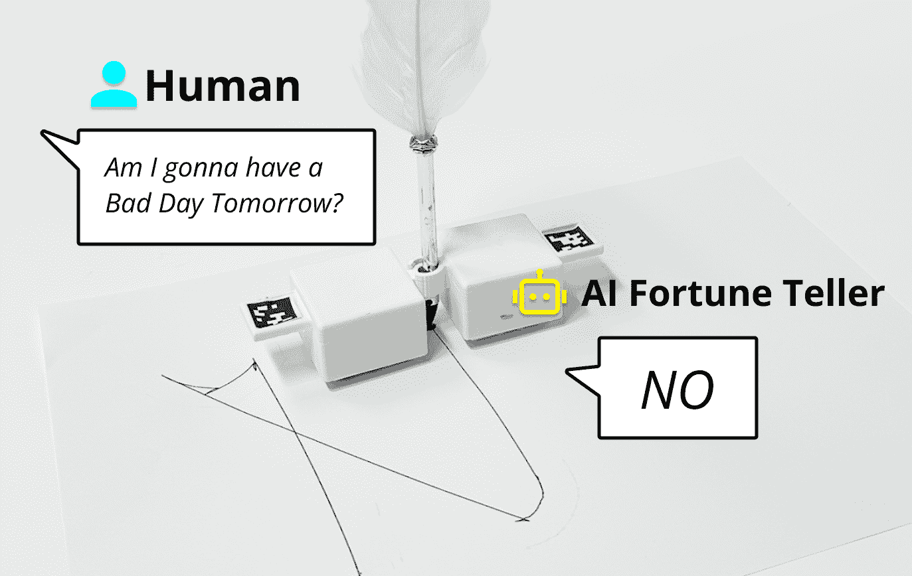

图 15\. 机器人装置通过驱动笔在纸上书写，回答用户的问题“是”或“否”。

### 5.4\. 即兴戏剧

即兴戏剧是一种没有固定剧本的团体戏剧形式，其中大部分内容是由表演者在表演过程中即兴创作的（Johnstone，[2012](https://arxiv.org/html/2407.17086v1#bib.bib12)）。结合 AI-装置套件，我们设计了一个应用，供用户与装置共同进行即兴戏剧表演。在此设置中，装置充当表演者，其中一个装置代表用户。我们要求装置遵循即兴戏剧的核心原则，“是的，而且”，即基于前一个表演者的贡献自由生成后续表演内容，包括语音和动作序列，并从用户和其他装置中随机选择下一个表演者。协调员负责为所有参与者分配角色，记录和传输表演内容，并协调表演的轮次。

在整合非语言表达附加提示后，控制器能够生成符合角色身份和情节发展的对话，同时赋予机器人非语言的“情绪”表达，传达角色的情感状态。此外，通过将特定场景信息分配给场地的不同区域，场景互动能力的附加提示使控制器在生成动作序列时能够考虑到表演地点等信息。在我们的一次即兴戏剧测试中，设置在“哈姆雷特”的世界（详细的游戏规则可见补充材料），我们的工具包最初为一群装置分配了身份（图[16](https://arxiv.org/html/2407.17086v1#S5.F16 "Figure 16 ‣ 5.4\. Improvisational Theater ‣ 5\. Example Application ‣ AI-Gadget Kit: Integrating Swarm User Interfaces with LLM-driven Agents for Rich Tabletop Game Applications")），其中一些角色沿用了原剧中的角色，其他则是根据用户指令创建的原创角色。

一旦表演开始，控制器便会与用户协调，考虑到预设的表演现场信息，继续进行表演。例如，当扮演哈姆雷特的机器人说出“生存还是毁灭，这是个问题”时，完全与原故事情节相对立，用户则由作为哈姆雷特朋友（一个原创角色）的机器人安慰，表达安慰并告知哈姆雷特，奥菲莉娅正在露台等待。根据用户为表演输入的台词，控制器代理指引用户的机器人通过一系列非语言动作表达情感。哈姆雷特随后根据场地信息移动到代表露台的区域，并与奥菲莉娅展开对话与表演。

不难看出，AI-Gadget在表演场景中具备响应高自由度用户输入的能力。我们还测试了完全原创的故事情境，其中AI-Gadget同样展示了接收即兴内容反馈的能力。随着即兴戏剧这一艺术形式在激发想象力和创造力、心理健康及社会情感教育等领域的影响力不断增强（Sawyer, [2000](https://arxiv.org/html/2407.17086v1#bib.bib26)）（Schwenke et al., [2021](https://arxiv.org/html/2407.17086v1#bib.bib27)）（Felsman et al., [2019](https://arxiv.org/html/2407.17086v1#bib.bib4)），结合更专业的紧急故事生成策略，AI-Gadget有潜力为用户提供更丰富的互动与情感体验。

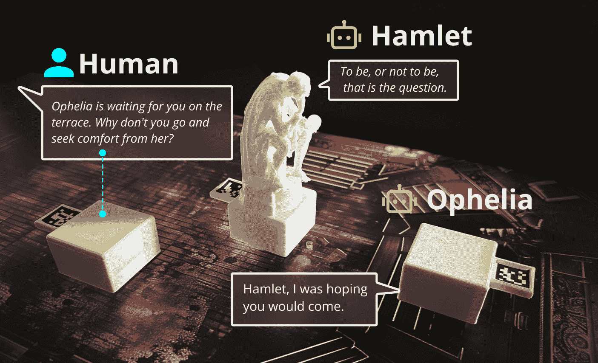

图16\. 在以哈姆雷特为主题的即兴戏剧中，扮演哈姆雷特的装置灵活地根据用户的台词作出回应，超越了剧本的限制。

## 6\. 讨论

### 6.1\. 限制与未来工作

在本研究中，我们采用了Sony Toio机器人作为我们的机器人Gadget。然而，由于Toio机器人的运动依赖于电机差速控制，电机本身的性能可能会影响机器人动作的表现。这对AI-Gadget Kit的功能性提出了限制。例如，在实际应用中，Toio机器人在执行用户的运动命令时表现出随机偏差，这种情况因附加配件导致重心变化而更加严重。

为了缓解上述因素带给Gadget的挑战，我们正在考虑对系统架构进行若干优化。首先，在机器人端引入更精确的运动修正算法，可以支持机器人在运动中的表现。通过Gadget预期的动作序列，并结合基于摄像头的ArUCo实时定位信息，机器人能够在动作过程中实现精确的闭环控制，从而实现实时调整。此外，受Swarm Haptics（Kim和Follmer，[2019](https://arxiv.org/html/2407.17086v1#bib.bib14)）和Hermits（Nakagaki等，[2020](https://arxiv.org/html/2407.17086v1#bib.bib20)）等研究启发，机械改进（如增加轮胎摩擦力）可以解决Gadget在物体推进等场景中，由于群体机器人质量和速度造成的线性驱动能力和性能的局限性。

除了优化机器人运动能力外，我们还认识到，当前机器人端提供的元动作不足以满足更广泛复杂动作的需求。对于Gadget来说，期望提供多样的运动模式（如弯曲运动）来改善机器人在互动中的体验和表现力。因此，封装和提供更多的运动模式将有助于机器人Gadget在桌面游戏中实现复杂和丰富语义的互动。

另一方面，在本研究中，当面临复杂的桌游场景时，如“即兴剧场”，代理人依赖的LLM（即GPT-4）可能会遇到性能瓶颈，原因在于多个附加提示的使用和大量游戏回合，导致处理冗长上下文时的复杂性。这可能导致不准确或错误的结果，或出现所谓的LLM“幻觉”现象，即模型生成的内容与游戏规则和场景描述相关的不准确性。在这种情况下，模型的输出可能需要额外的测试（例如“草堆中的针”测试）来验证其准确性和可靠性。

为了应对这一挑战并提升代理在复杂场景中的表现，未来可以考虑几种策略。首先，引入更强大的LLM（大语言模型）是一个直接的解决方案。通过增强模型理解和检索长上下文的能力，我们可以直接提高代理在复杂互动场景中的表现。然而，这种方法依赖于外部技术的进步。

此外，借鉴AutoGen（Wu et al., [2023](https://arxiv.org/html/2407.17086v1#bib.bib34)）的灵感，我们可以引入多个专门化的代理来处理特定的上下文挑战。这些专门化代理可以设计用于执行不同的功能，例如生成游戏规则和行动序列，以及分析玩家动作的后果。通过隔离特定的上下文，这些专门化的代理有助于主要代理之间的互动。它们可以协同工作，提供更准确、高效和连贯的内容生成。例如，通过分配特定的上下文部分并隔离其他部分，某个代理可以专注于追踪游戏状态和玩家动作之间的逻辑关系，而其他代理则可能专注于生成与特定游戏环境或场景及“Gadgets”的行动序列相一致的描述和反应。

通过这样的双代理协作系统，我们不仅可以提高代理在复杂游戏场景中的表现，提升内容生成速度，减少令牌消耗以降低推理成本，还能使每个代理在其专业领域内提供深入和精确的处理。这使得整个SUI系统能够更好地理解并反映游戏和玩家互动的复杂逻辑。

### 6.2\. 超越行动规划

本文主要关注将SUI（空间用户界面）与基于LLM（大语言模型）的智能体结合应用于桌面游戏场景。然而，HCI（人机交互）领域已经引入了许多将SUI与其他交互场景结合的实例，包括AR（增强现实）游戏（Kaimoto等人，[2022](https://arxiv.org/html/2407.17086v1#bib.bib13)）、严肃游戏（Peng等人，[2020](https://arxiv.org/html/2407.17086v1#bib.bib21)）和远程交互（Ihara等人，[2023](https://arxiv.org/html/2407.17086v1#bib.bib10)）。这揭示了我们的AI小工具套件在复杂交互任务场景中激发进一步研究和SUI应用的潜力。本文通过将基于LLM的智能体应用于SUI中的自动化行动规划迈出了第一步。我们套件的未来扩展可以增强对SUI其他交互模式的理解和生成。例如，通过集成像机械外壳（Nakagaki等人，[2020](https://arxiv.org/html/2407.17086v1#bib.bib20)）这样的附加组件，我们的套件可以将SUI行动规划转变为其他交互活动的规划（例如，多自由度、聚合）。同样，通过生成虚拟信息，我们的套件可以将SUI行动规划扩展到融合虚拟与现实元素的动态交互中（Suzuki等人，[2020](https://arxiv.org/html/2407.17086v1#bib.bib28)）。展望未来，我们旨在探索更多由LLM生成的SUI交互模式，推进SUI在复杂交互任务场景中的研究与应用。  

### 6.3\. 可用性和适用性  

我们提出的AI小工具套件旨在帮助研究人员、桌游设计师和玩家使用自然语言创造性地设计与自动化小工具的互动体验。通过利用套件中包括的双智能体系统和各种附加提示，用户可以轻松修改生成交互行动序列的规则（例如，可以直接在OpenAI GPT-4网页客户端上进行测试）。

然而，我们发现了在尝试快速调试由套件生成的行动序列的动态效果时遇到的障碍。用户必须进行现场测试，并为不同场景配备相应数量的小工具，或者基于行动序列的内容在坐标系上绘制轨迹，以评估智能体生成的内容。这阻碍了用户创造性互动想法的可视化。  

最近，WRLKits（Saberpour Abadian等，[2023](https://arxiv.org/html/2407.17086v1#bib.bib24)）展示了一种基于交互式计算设计方法的工具，它在视觉上帮助设计师快速构建个性化原型。类似的工作，如Habitat-Sim（Savva等，[2019](https://arxiv.org/html/2407.17086v1#bib.bib25)）和AI2-THOR（Kolve等，[2022](https://arxiv.org/html/2407.17086v1#bib.bib15)）已证明仿真平台在机器人交互设计中的可行性。未来，我们计划为AI小工具套件开发仿真和设计工具，支持在网页或客户端平台上进行个性化交互设计的可视化，从而使其更易于为更多人所使用。

此外，我们还注意到，与能够驱动互动小工具的SUI相关的硬件成本，可能会限制这项工作在桌面游戏场景中的广泛应用。因为大多数桌面游戏咖啡馆可能会发现难以负担大规模采购昂贵硬件平台（如Sony Toio平台）的成本。为了进一步推动我们的工作，我们将在未来探索为AI小工具套件开发低成本硬件平台的可能性。

## 7\. 结论

虽然群体用户界面（SUI）在丰富有形交互体验方面取得了一定的成功，但其在自主行动规划方面的局限性限制了其在桌面游戏中生成个性化和动态交互的潜力。本文提出了一种名为AI小工具套件的多代理SUI桌面游戏平台，旨在促进桌面游戏中动态和复杂交互任务的实现。我们首先介绍了AI小工具套件的系统架构，该架构包括一组群体机器人来执行小工具行为，以及一个负责执行游戏并为群体机器人生成行动计划的多代理系统。接着，我们详细阐述了多代理系统的设计，系统包括一系列个体机器人所需的元运动、两个基于大型语言模型（LLM）的代理用于复杂的行动规划，以及一套附加提示，用以增强代理的理解与反应能力。最后，我们展示了四个应用示例，利用AI小工具套件展示多代理驱动的SUI在执行桌面游戏中复杂交互任务时的效果。我们的目标是将这项工作作为案例研究，探索并激发LLM在具有复杂交互任务的SUI行动规划中的应用，尤其是在多个场景中。

## 参考文献

+   (1)

+   Brock等（2021）Heike Brock、Selma Šabanović 和 Randy Gomez。2021年。遥远的你，Haru 和我：探索与机器人代理的远程游戏中的社交互动。在*2021年ACM/IEEE国际人机交互会议（HRI '21 Companion）*（科罗拉多州博尔德，USA）。计算机协会，纽约，NY，USA，283-287。[https://doi.org/10.1145/3434074.3447177](https://doi.org/10.1145/3434074.3447177)

+   Dementyev 等人（2016）Artem Dementyev, Hsin-Liu (Cindy) Kao, Inrak Choi, Deborah Ajilo, Maggie Xu, Joseph A. Paradiso, Chris Schmandt, 和 Sean Follmer. 2016. Rovables：作为移动可穿戴设备的迷你体感机器人。在 *第29届年度用户界面软件与技术研讨会论文集*（东京，日本）（*UIST ’16*）。计算机协会，美国纽约，111–120。 [https://doi.org/10.1145/2984511.2984531](https://doi.org/10.1145/2984511.2984531)

+   Felsman 等人（2019）Peter Felsman, Colleen M. Seifert, 和 Joseph A. Himle. 2019. 使用即兴戏剧训练减少青少年社交焦虑。*艺术与心理治疗* 63（2019），111–117。 [https://doi.org/10.1016/j.aip.2018.12.001](https://doi.org/10.1016/j.aip.2018.12.001)

+   Gan 等人（2020）Chuang Gan, Yiwei Zhang, Jiajun Wu, Boqing Gong, 和 Joshua B Tenenbaum. 2020. 看、听、并行动：面向视听具身导航。 在 *2020 IEEE 国际机器人与自动化会议（ICRA）*。IEEE，9701–9707。

+   Gillet 等人（2020）Sarah Gillet, Wouter van den Bos, Iolanda Leite, 等人。2020. 一种社交机器人调解员，促进儿童之间的协作与包容。在 *机器人学：科学与系统*。

+   Guo 等人（2023）Yijie Guo, Zhenhan Huang, Ruhan Wang, Chih-Heng Li, Ruoyu Wu, Qirui Sun, Zhihao Yao, Haipeng Mi, 和 Yu Peng. 2023. Sparkybot：一种由具身 AI 代理驱动的机器人，具有可定制的角色和互动行为，适用于儿童。在 *第36届年度 ACM 用户界面软件与技术研讨会附录论文集*（¡conf-loc¿，¡city¿旧金山¡/city¿，¡state¿加利福尼亚州¡/state¿，¡country¿美国¡/country¿，¡/conf-loc¿）（*UIST ’23 附录*）。计算机协会，美国纽约，文章 90，3 页。 [https://doi.org/10.1145/3586182.3615804](https://doi.org/10.1145/3586182.3615804)

+   Huang 等人（2023b）Wenlong Huang, Chen Wang, Ruohan Zhang, Yunzhu Li, Jiajun Wu, 和 Li Fei-Fei. 2023b. Voxposer：用于机器人操控的可组合 3D 价值图，结合语言模型。*arXiv 预印本 arXiv:2307.05973*（2023）。

+   Huang 等人（2023a）Xiaoyu Huang, Dhruv Batra, Akshara Rai, 和 Andrew Szot. 2023a. Skill transformer：一种单一的移动操控策略。在 *IEEE/CVF 国际计算机视觉大会论文集*。10852–10862。

+   Ihara 等人（2023）Keiichi Ihara, Mehrad Faridan, Ayumi Ichikawa, Ikkaku Kawaguchi, 和 Ryo Suzuki. 2023. HoloBots：通过移动机器人增强全息遥感，实现混合现实中的可触远程协作。在 *第36届年度 ACM 用户界面软件与技术研讨会论文集*（¡conf-loc¿，¡city¿旧金山¡/city¿，¡state¿加利福尼亚州¡/state¿，¡country¿美国¡/country¿，¡/conf-loc¿）（*UIST ’23*）。计算机协会，美国纽约，文章 119，12 页。 [https://doi.org/10.1145/3586183.3606727](https://doi.org/10.1145/3586183.3606727)

+   Jariyavajee等人（2018）Chattriya Jariyavajee, Arnon Visavakitcharoen, Preeyaphond Sirimaha, Booncharoen Sirinaovakul, 和Jumpol Polvichai. 2018. 一种具有自动运动控制的实用互动棋盘。在*2018全球无线峰会（GWS）*。IEEE，246-250。

+   Johnstone（2012）Keith Johnstone. 2012. *Impro: 即兴创作与戏剧*。Routledge。

+   Kaimoto等人（2022）Hiroki Kaimoto, Kyzyl Monteiro, Mehrad Faridan, Jiatong Li, Samin Farajian, Yasuaki Kakehi, Ken Nakagaki, 和Ryo Suzuki. 2022. 素描现实：用增强现实和驱动的可触交互界面描绘虚拟与物理世界之间的双向互动。在*第35届ACM用户界面软件与技术年会论文集*。1-12。

+   Kim 和 Follmer（2019）Lawrence H. Kim 和 Sean Follmer. 2019. SwarmHaptics：与群体机器人合作的触觉显示。在*2019年CHI计算机系统人因学会议论文集*（英国格拉斯哥）*(CHI ’19)*。美国计算机协会，纽约，NY，美国，1-13。[https://doi.org/10.1145/3290605.3300918](https://doi.org/10.1145/3290605.3300918)

+   Kolve等人（2022）Eric Kolve, Roozbeh Mottaghi, Winson Han, Eli VanderBilt, Luca Weihs, Alvaro Herrasti, Matt Deitke, Kiana Ehsani, Daniel Gordon, Yuke Zhu, Aniruddha Kembhavi, Abhinav Gupta, 和Ali Farhadi. 2022. AI2-THOR：一种用于视觉AI的互动3D环境。arXiv:1712.05474 [cs.CV]

+   Li等人（2022）Jiannan Li, Maurício Sousa, Chu Li, Jessie Liu, Yan Chen, Ravin Balakrishnan, 和Tovi Grossman. 2022. ASTEROIDS：探索用于物理技能展示的小型远程机器人群体。在*2022年CHI计算机系统人因学会议论文集*（美国路易斯安那州新奥尔良）*(CHI ’22)*。美国计算机协会，纽约，NY，美国，第111篇文章，14页。[https://doi.org/10.1145/3491102.3501927](https://doi.org/10.1145/3491102.3501927)

+   Liu等人（2021）Jiachang Liu, Dinghan Shen, Yizhe Zhang, Bill Dolan, Lawrence Carin, 和Weizhu Chen. 2021. 什么样的上下文示例适合GPT-$3$？ *arXiv预印本arXiv:2101.06804*（2021）。

+   Long等人（2023）Yuxing Long, Xiaoqi Li, Wenzhe Cai, 和Hao Dong. 2023. 在移动前讨论：通过多专家讨论进行视觉语言导航。*arXiv预印本arXiv:2309.11382*（2023）。

+   Matuszek等人（2011）Cynthia Matuszek, Brian Mayton, Roberto Aimi, Marc Peter Deisenroth, Liefeng Bo, Robert Chu, Mike Kung, Louis LeGrand, Joshua R Smith, 和Dieter Fox. 2011. Gambit：一种自主象棋机器人系统。在*2011 IEEE国际机器人与自动化会议*。IEEE，4291-4297。

+   中垣等人（2020）中垣健、梁祖恩、乔丹·L·塔帕、若昂·威尔伯特和石井宏。2020年。HERMITS：通过机械外壳附加组件动态重新配置自推动TUI的互动性。在*第33届年度ACM用户界面软件与技术研讨会（UIST ’20）*论文集中（虚拟会议，美国）。Association for Computing Machinery，纽约，NY，美国，882-896。[https://doi.org/10.1145/3379337.3415831](https://doi.org/10.1145/3379337.3415831)

+   彭等人（2020）俞彭、冯元凌、王楠和米海鹏。2020年。儿童如何解读机器人在现场剧场中的情境行为：为多机器人剧场设计提供洞察。在*2020年IEEE第29届国际机器人与人类互动通信会议（RO-MAN）*。IEEE，327-334。

+   乔等人（2023）乔彦源、祁元凯、余正、刘静和吴琪。2023年。在聊天中行进：用于远程具身指称表达的交互提示。在*IEEE/CVF国际计算机视觉大会论文集*。15758-15767。

+   拉曼等人（2022）施雷亚斯·孙达拉·拉曼、瓦尼亚·科恩、埃里克·罗森、伊夫拉·伊德里斯、大卫·保利乌斯和斯蒂芬妮·泰勒克斯。2022年。通过纠正性重新提示与大型语言模型进行规划。在*NeurIPS 2022决策制定基础模型研讨会*。

+   萨贝尔普尔·阿巴迪安等人（2023）阿尔廷·萨贝尔普尔·阿巴迪安、阿塔·欧塔兰、马丁·施密茨、玛丽·缪尔豪斯、里沙布·达布拉尔、迪奥戈·卢维宗、前川安海、稻美正彦、克里斯蒂安·泰奥博尔特和于尔根·施泰梅尔。2023年。个性化可穿戴机器人肢体的计算设计。在*第36届年度ACM用户界面软件与技术研讨会（UIST ’23）*的论文集中，纽约，NY，美国，第68篇文章，13页。[https://doi.org/10.1145/3586183.3606748](https://doi.org/10.1145/3586183.3606748)

+   萨瓦等人（2019）马诺利斯·萨瓦、阿比舍克·卡迪安、奥列克桑德尔·马克西梅茨、赵怡莉、埃里克·威曼斯、巴瓦娜·贾因、朱利安·斯特劳布、刘佳、弗拉德伦·科尔图恩、吉滕德拉·马利克等人。2019年。栖息地：一个用于具身AI研究的平台。在*IEEE/CVF国际计算机视觉大会论文集*。9339-9347。

+   索耶（2000）R·基思·索耶。2000年。即兴文化：在即兴表演中的协作性涌现与创造力。*心智、文化与活动* 7，3（2000），180-185。[https://doi.org/10.1207/S15327884MCA0703_05](https://doi.org/10.1207/S15327884MCA0703_05) arXiv:https://doi.org/10.1207/S15327884MCA0703_05

+   Schwenke 等人 (2021) Diana Schwenke, Maja Dshemuchadse, Lisa Rasehorn, Dominik Klarholter 和 Stefan Scherbaum. 2021. 即兴表演以促进提升：即兴剧场对创造力、接受度和心理健康的影响. *精神健康中的创造力杂志* 16, 1 (2021), 31–48. [https://doi.org/10.1080/15401383.2020.1754987](https://doi.org/10.1080/15401383.2020.1754987) arXiv:https://doi.org/10.1080/15401383.2020.1754987

+   Suzuki 等人 (2020) Ryo Suzuki, Rubaiat Habib Kazi, Li-yi Wei, Stephen DiVerdi, Wilmot Li 和 Daniel Leithinger. 2020. RealitySketch: 通过动态草图在增强现实中嵌入响应式图形和可视化. 在 *第33届年度 ACM 用户界面软件与技术研讨会论文集* (美国虚拟活动) *(UIST ’20)*. 计算机协会，纽约，美国，166–181. [https://doi.org/10.1145/3379337.3415892](https://doi.org/10.1145/3379337.3415892)

+   Suzuki 等人 (2019) Ryo Suzuki, Clement Zheng, Yasuaki Kakehi, Tom Yeh, Ellen Yi-Luen Do, Mark D. Gross 和 Daniel Leithinger. 2019. ShapeBots: 形态变化的群体机器人. 在 *第32届年度 ACM 用户界面软件与技术研讨会论文集* (美国路易斯安那州新奥尔良) *(UIST ’19)*. 计算机协会，纽约，美国，493–505. [https://doi.org/10.1145/3332165.3347911](https://doi.org/10.1145/3332165.3347911)

+   van Breemen 等人 (2005) Albert van Breemen, Xue Yan 和 Bernt Meerbeek. 2005. iCat: 一种具有个性的动画用户界面机器人. 在 *第四届国际自主代理与多代理系统联合会议论文集* (荷兰) *(AAMAS ’05)*. 计算机协会，纽约，美国，143–144. [https://doi.org/10.1145/1082473.1082823](https://doi.org/10.1145/1082473.1082823)

+   Vaswani 等人 (2017) Ashish Vaswani, Noam Shazeer, Niki Parmar, Jakob Uszkoreit, Llion Jones, Aidan N Gomez, Łukasz Kaiser 和 Illia Polosukhin. 2017. 注意力机制才是你所需的. *神经信息处理系统的进展* 30 (2017).

+   Wang 等人 (2020) Xin Eric Wang, Vihan Jain, Eugene Ie, William Yang Wang, Zornitsa Kozareva 和 Sujith Ravi. 2020. 面向环境无关的多任务学习用于自然语言引导的导航. 在 *计算机视觉–ECCV 2020: 第16届欧洲会议，英国格拉斯哥，2020年8月23日至28日，会议论文集，第XXIV部分* 16. Springer，413–430.

+   Wei 等人 (2022) Jason Wei, Xuezhi Wang, Dale Schuurmans, Maarten Bosma, Fei Xia, Ed Chi, Quoc V Le, Denny Zhou 等人. 2022. 连锁思维提示在大语言模型中引发推理. *神经信息处理系统的进展* 35 (2022), 24824–24837.

+   Wu 等人 (2023) Qingyun Wu, Gagan Bansal, Jieyu Zhang, Yiran Wu, Shaokun Zhang, Erkang Zhu, Beibin Li, Li Jiang, Xiaoyun Zhang 和 Chi Wang. 2023. Autogen: 通过多代理对话框架促进下一代大语言模型应用. *arXiv 预印本 arXiv:2308.08155* (2023).

+   Yu 等人（2023）Lilith Yu、Chenfeng Gao、David Wu 和 Ken Nakagaki。2023年。AeroRigUI：通过在日常空间天花板上布置群体机器人进行空间交互的驱动式TUIs。在 *2023年CHI人机交互会议论文集*，第1–18页。

+   Zhu 等人（2021）Jichen Zhu、Jennifer Villareale、Nithesh Javvaji、Sebastian Risi、Mathias Löwe、Rush Weigelt 和 Casper Harteveld。2021年。玩家与人工智能的互动：神经网络游戏揭示了人工智能作为游戏的本质。在 *2021年CHI人机交互会议论文集*，第1–17页。
