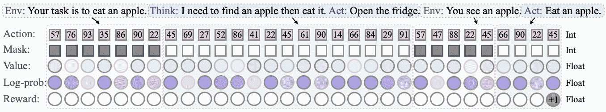
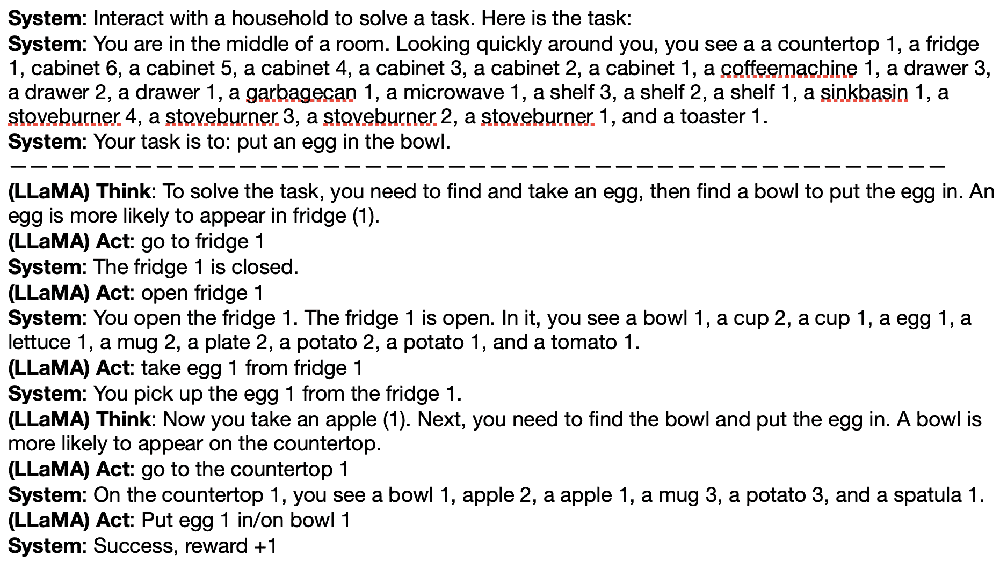

<!--yml
category: 未分类
date: 2025-01-11 13:05:58
-->

# Adapting LLM Agents with Universal Feedback in Communication

> 来源：[https://arxiv.org/html/2310.01444/](https://arxiv.org/html/2310.01444/)

Kuan Wang¹, Yadong Lu ², Michael Santacroce², Yeyun Gong³,
Chao Zhang¹, Yelong Shen²
¹Georgia Institute of Technology   ²Microsoft Azure AI   ³Microsoft Research
{kuanwang, chaozhang}@gatech.edu
{yadonglu, misantac, yegong, yeshe}@microsoft.com

###### Abstract

Recent advances in large language models (LLMs) have demonstrated potential for LLM agents. To facilitate the training for these agents with both linguistic feedback and non-linguistic reward signals, we introduce Learning through Communication (LTC). We design a universal buffer to store all the feedback, and an iterative pipeline to enable an LLM agent to explore and update its policy in an given environment. To utilize our universal buffer for capturing agent interactions in various tasks, we introduce diverse communication patterns tailored for both single-agent and multi-agent environments. We evaluate the effectiveness of our LTC approach on four diverse datasets: ALFWorld (single-agent), HotpotQA (multi-agent collaboration), Chameleon (multi-agent competition), and GSM8k (multi-agent teacher-student). On these datasets, LTC outperforms supervised instruction fine-tuning baselines by 3.6% to 12%. These results demonstrate the versatility and effectiveness of LTC in facilitating online adaptation for LLM agents.

## 1 Introduction

Recent advances in large language models (LLMs) Ouyang et al. ([2022](https://arxiv.org/html/2310.01444v3#bib.bib33)); Bubeck et al. ([2023](https://arxiv.org/html/2310.01444v3#bib.bib6)); Wei et al. ([2022a](https://arxiv.org/html/2310.01444v3#bib.bib63)) have shed light on human-like LLM agents. In addition to design prompting methods Wei et al. ([2022b](https://arxiv.org/html/2310.01444v3#bib.bib64)); Yao et al. ([2023](https://arxiv.org/html/2310.01444v3#bib.bib71)); Wu et al. ([2023a](https://arxiv.org/html/2310.01444v3#bib.bib67)), recent works also focus on how to train the LLMs agent use linguistic feedback and non-linguistic reward signals. The linguistic feedback is usually processed as instruction data to do Instruction Fine-tuning (IFT) Chung et al. ([2022](https://arxiv.org/html/2310.01444v3#bib.bib9)); Lee et al. ([2023](https://arxiv.org/html/2310.01444v3#bib.bib19)); Honovich et al. ([2022](https://arxiv.org/html/2310.01444v3#bib.bib14)); Wang et al. ([2022e](https://arxiv.org/html/2310.01444v3#bib.bib60)), while the non-linguistic reward signals are generally used to do alignment with human preference Ouyang et al. ([2022](https://arxiv.org/html/2310.01444v3#bib.bib33)); Bai et al. ([2022a](https://arxiv.org/html/2310.01444v3#bib.bib3)); Stiennon et al. ([2020](https://arxiv.org/html/2310.01444v3#bib.bib51)); Leike et al. ([2018](https://arxiv.org/html/2310.01444v3#bib.bib20)).

While some scenarios provide agents with heterogeneous feedback, existing methods can only utilize the feedback partially. For instance, in multiplayer board role-playing games, players generate a wealth of linguistic data, and the game concludes with definitive reward signals indicating victory or defeat. Current approaches employ the linguistic data for IFT Li et al. ([2023](https://arxiv.org/html/2310.01444v3#bib.bib21)); Micheli & Fleuret ([2021](https://arxiv.org/html/2310.01444v3#bib.bib28)), while the reward signals serve solely as a filtering criterion to select the ILF data instead of the objective of reinforcement learning.

Figure 1: The LTC framework is adept for both single-agent and multi-agent environments. Within these environments, agents have the capability to persistently engage in exploration and interaction to collect trajectories through various communication patterns. Concurrently, LTC facilitates the training of these agents utilizing the data acquired from their exploratory activities. This process enables the agents to autonomously adapt to their respective environments, negating the necessity for human supervision.

To address this gap, we propose a universal framework, named Learning through Communication (LTC), to train LLM agents with both linguistic feedback and non-linguistic reward signals. We design a universal buffer to store all the feedback, and an iterative pipeline to enable an LLM agent to explore and update its policy in an given environment. Each iteration of LTC comprises two distinct phases: (1) *Exploration*: During this phase, the agent interacts with the environments and other agents to gather diverse trajectories (linguistic) and reward signals (non-linguistic) into the universal buffer. (2) *Updating*: In this phase, the agent’s model is updated based on the collected data in the universal buffer. For updating, LTC combines the language modeling loss and the PPO loss to strike a balance between language consistency and reward signals As the pivot of the iterative pipeline, the replay buffer is updated after each exploration phase, and a subset of the buffer is sampled for the updating phase.

To universally supports linguistic feedback and non-linguistic reward signals during communication, we design the replay buffer structure as a trajectory of tokens sequences (Figure [2](https://arxiv.org/html/2310.01444v3#S2.F2 "Figure 2 ‣ 2.1 Instruction Tuning ‣ 2 Related Work ‣ Adapting LLM Agents with Universal Feedback in Communication")). Such a replay buffer structure is applicable to diverse tasks, including single-agent and multi-agent environments. To facilitate collecting trajectories with linguistic data and reward signals, we devised three communication patterns: (1) *Single-agent Monologue*: This pattern allows a single agent to collect trajectories contain linguistic data and receive reward signals from the environments. (2) *Multi-agent Dialogue*: This pattern enables multiple agents to interact with each other and external tools to collect linguistic data, and utilize reward signals provided by the environments. (3) *Teacher-student Dialogue*: This variant of multi-agent dialogue that collect the linguistic feedback and non-linguistic reward signals provided by a teacher agent instead of the environment.

We evaluate LTC method on several representative datasets: ALFWorld for decision-making, HotpotQA for knowledge-intensive reasoning, and GSM8k for numerical reasoning. Throughout these experiments, LTC consistently outperforms the baselines. In ALFWorld, LTC outperforms the strong instruction tuning baseline by 12% on success rate, even in the challenging Pick 2 task. This shows that our communication mechanism enables the agent to learn from its experiences for task solving. On HotpotQA, LTC outperforms the instruction tuning baseline by 5% on EM score, and our Llama-7B based agent even obtains slightly better (0.6%) performance than the ReAct-Tuning baseline which uses 9$\times$ larger PaLM-62B model. On GSM8k, LTC also beats the CoT-Tuning baseline by 3.6% on accuracy. These results highlight the adaptability and effectiveness of LTC approach across varied domains.

Our key contributions are:

1.  1.

    Learning through Communication (LTC): We propose a universal framework, named Learning through Communication (LTC), to train LLM agents with both linguistic feedback and non-linguistic reward signals. We design a universal buffer to store all the feedback, and an iterative pipeline to enable an LLM agent to explore and update its policy in an given environment.

2.  2.

    Task-specific Communication Patterns: The LTC paradigm allows for flexible design of communication patterns tailored to different tasks. We introduce three specific patterns: Single-agent Monologue, Multi-agent Dialogue, and Teacher-student Dialogue. These patterns can be combined to generate diverse structured interactions and feedback signals for agent training, catering to various task types.

3.  3.

    Empirical Study and Findings: We conduct rigorous experiments on public benchmark tasks to demonstrate the effectiveness of LTC. Our results indicate that LTC can be a superior approach compared to instruction-tuning or prompting baselines.

## 2 Related Work

### 2.1 Instruction Tuning

Figure 2: The buffer data is a serial of integer/float sequences. We treat each token id as the action in our reinforcement learning formula. We also save its corresponding mask indicating the source of the token, the value from the critic model, the log-prob indicating the log-likelihood when sampling the action and the reward from the environment/other agents.

Instruction tuning (IT) is an important technique for improving the capabilities and controllability of LLMs Radford et al. ([2019](https://arxiv.org/html/2310.01444v3#bib.bib38)); Brown et al. ([2020](https://arxiv.org/html/2310.01444v3#bib.bib5)); Wei et al. ([2022a](https://arxiv.org/html/2310.01444v3#bib.bib63)); Qin et al. ([2023](https://arxiv.org/html/2310.01444v3#bib.bib37)); OpenAI ([2023](https://arxiv.org/html/2310.01444v3#bib.bib32)); Chowdhery et al. ([2022](https://arxiv.org/html/2310.01444v3#bib.bib8)); Touvron et al. ([2023](https://arxiv.org/html/2310.01444v3#bib.bib55)). Many studies have been dedicated to instruction data generation and selection Chung et al. ([2022](https://arxiv.org/html/2310.01444v3#bib.bib9)); Wang et al. ([2022e](https://arxiv.org/html/2310.01444v3#bib.bib60)); Lee et al. ([2023](https://arxiv.org/html/2310.01444v3#bib.bib19)). For instance, Unnatural Instructions Honovich et al. ([2022](https://arxiv.org/html/2310.01444v3#bib.bib14)) is created by using the Super-Natural Instructions dataset Wang et al. ([2022f](https://arxiv.org/html/2310.01444v3#bib.bib61)) as a seed to prompt InstructGPT Ouyang et al. ([2022](https://arxiv.org/html/2310.01444v3#bib.bib33)). Self-Instruct Wang et al. ([2022e](https://arxiv.org/html/2310.01444v3#bib.bib60)) employs a recursive pipeline that generates instruction data from hand-crafted seed tasks using ChatGPT OpenAI ([2022](https://arxiv.org/html/2310.01444v3#bib.bib31)). Other studies focus on fine-tuning pre-trained LLMs with instruction data. BLOOMZ Muennighoff et al. ([2022](https://arxiv.org/html/2310.01444v3#bib.bib30)) is initialized with BLOOM Scao et al. ([2022](https://arxiv.org/html/2310.01444v3#bib.bib43)) and then fine-tuned using the xP3 instruction dataset Muennighoff et al. ([2022](https://arxiv.org/html/2310.01444v3#bib.bib30)). Flan-T5 is initialized with T5 Raffel et al. ([2020](https://arxiv.org/html/2310.01444v3#bib.bib40)) and fine-tuned with the FLAN dataset Longpre et al. ([2023](https://arxiv.org/html/2310.01444v3#bib.bib25)). Additionally, after the release of LLaMA Touvron et al. ([2023](https://arxiv.org/html/2310.01444v3#bib.bib55)), many works have utilized it as the base model for instruction tuning, such as Alpaca Taori et al. ([2023](https://arxiv.org/html/2310.01444v3#bib.bib54)), Vicuna Chiang et al. ([2023](https://arxiv.org/html/2310.01444v3#bib.bib7)), and GPT-4-LLM Peng et al. ([2023](https://arxiv.org/html/2310.01444v3#bib.bib35)). Some papers explore alignment fine-tuning using RLHF Ouyang et al. ([2022](https://arxiv.org/html/2310.01444v3#bib.bib33)); Bai et al. ([2022a](https://arxiv.org/html/2310.01444v3#bib.bib3)); Stiennon et al. ([2020](https://arxiv.org/html/2310.01444v3#bib.bib51)); Leike et al. ([2018](https://arxiv.org/html/2310.01444v3#bib.bib20)). InstructGPT Ouyang et al. ([2022](https://arxiv.org/html/2310.01444v3#bib.bib33)) employs GPT-3 for supervised fine-tuning on a human-filtered instruction dataset, followed by training a reward model and using PPO Schulman et al. ([2017](https://arxiv.org/html/2310.01444v3#bib.bib45)) for RLHF. Claude investigates RLHF  Bai et al. ([2022a](https://arxiv.org/html/2310.01444v3#bib.bib3)) and constitutional approaches Bai et al. ([2022b](https://arxiv.org/html/2310.01444v3#bib.bib4)) for making LLMs both harmless and helpful. DPO Rafailov et al. ([2023](https://arxiv.org/html/2310.01444v3#bib.bib39)) fine-tunes the LLMs to align with human preferences by directly optimizing a classification problem on preference data instead of RLHF. While these prominent research works focus on aligning LLMs for general instruction-following, our objective is to adapt LLM agents for specific tasks or environments.

### 2.2 LLM Agents

LLMs have demonstrated the potential to act as advanced agents Ouyang et al. ([2022](https://arxiv.org/html/2310.01444v3#bib.bib33)); Bubeck et al. ([2023](https://arxiv.org/html/2310.01444v3#bib.bib6)); Wei et al. ([2022a](https://arxiv.org/html/2310.01444v3#bib.bib63)), and significant progress has been made in developing versatile LLM agents Weng ([2023](https://arxiv.org/html/2310.01444v3#bib.bib65)); Sumers et al. ([2023](https://arxiv.org/html/2310.01444v3#bib.bib52)); Park et al. ([2023](https://arxiv.org/html/2310.01444v3#bib.bib34)); Liu et al. ([2023a](https://arxiv.org/html/2310.01444v3#bib.bib23)); Lin et al. ([2023](https://arxiv.org/html/2310.01444v3#bib.bib22)); Xu et al. ([2023](https://arxiv.org/html/2310.01444v3#bib.bib69)) and benchmarks  Wang et al. ([2022a](https://arxiv.org/html/2310.01444v3#bib.bib56)); Deng et al. ([2023](https://arxiv.org/html/2310.01444v3#bib.bib11)); Liu et al. ([2023b](https://arxiv.org/html/2310.01444v3#bib.bib24)). For planning, Chain-of-Thought (CoTWei et al. ([2022b](https://arxiv.org/html/2310.01444v3#bib.bib64))) prompts the model to think step by step, by decomposing complex tasks into smaller and simpler steps. Self Consistency (Wang et al., [2022c](https://arxiv.org/html/2310.01444v3#bib.bib58); [d](https://arxiv.org/html/2310.01444v3#bib.bib59)) extends CoT by using ensembles of predictions to improve consistency of the LLM. Inner Monologue Huang et al. ([2022b](https://arxiv.org/html/2310.01444v3#bib.bib17)) leverages environment feedback to enhance LLMs’ planning and processing capabilities in embodied robotics tasks without extra training. ReAct Yao et al. ([2023](https://arxiv.org/html/2310.01444v3#bib.bib71)) integrates reasoning and action taking, expanding the action space to include both task-specific discrete actions and language. Reflexion Shinn et al. ([2023](https://arxiv.org/html/2310.01444v3#bib.bib47)) equips agents with dynamic memory and self-reflection capabilities to improve reasoning by using continuous trials in the same environment as feedback. Recent research has also shown that LLMs can be augmented as an autonomous agent to use *external tools* to solve problems in interactive environments. These techniques include retrieval augmentation Shi et al. ([2023](https://arxiv.org/html/2310.01444v3#bib.bib46)); Yao et al. ([2023](https://arxiv.org/html/2310.01444v3#bib.bib71)); Izacard et al. ([2022](https://arxiv.org/html/2310.01444v3#bib.bib18)), math tools Schick et al. ([2023](https://arxiv.org/html/2310.01444v3#bib.bib44)); Yao et al. ([2023](https://arxiv.org/html/2310.01444v3#bib.bib71)); Lu et al. ([2023](https://arxiv.org/html/2310.01444v3#bib.bib27)), and code interpreters Gao et al. ([2022](https://arxiv.org/html/2310.01444v3#bib.bib12)); Wang et al. ([2022b](https://arxiv.org/html/2310.01444v3#bib.bib57)). Prior works also have explored using multiple LLMs in a collaborative setting to solve complex tasks Hong et al. ([2023](https://arxiv.org/html/2310.01444v3#bib.bib13)); Qian et al. ([2023](https://arxiv.org/html/2310.01444v3#bib.bib36)); Li et al. ([2023](https://arxiv.org/html/2310.01444v3#bib.bib21)); Wang et al. ([2023](https://arxiv.org/html/2310.01444v3#bib.bib62)); Talebirad & Nadiri ([2023](https://arxiv.org/html/2310.01444v3#bib.bib53)); Akata et al. ([2023](https://arxiv.org/html/2310.01444v3#bib.bib1)). Open-source projects like AutoGPT Significant-Gravitas ([2023](https://arxiv.org/html/2310.01444v3#bib.bib50)), GPT-Engineer AntonOsika ([2023](https://arxiv.org/html/2310.01444v3#bib.bib2)), and BabyAGI yoheinakajima ([2023](https://arxiv.org/html/2310.01444v3#bib.bib72)) also showcase the potential of LLM not just in generating content but also as a general problem solver. Most of the above methods are based on either human-designed few-shot prompting examples, or finetuning with pre-collected instruction datasets. Our LTC is not a few-shot prompting method and we focus on adapting the agent by collecting training data automatically by exploration.

## 3 Learning Through Communication

We design Learning Through Communication (LTC), an iterative training method for LLM agents to continuously adapt to new environments. As shown in Figure [3](https://arxiv.org/html/2310.01444v3#S3.F3 "Figure 3 ‣ 3 Learning Through Communication ‣ Adapting LLM Agents with Universal Feedback in Communication"), LTC iterates between two phases: (1) An exploration phase where agents can interact with new environments and other agents to collect trial data with feedback, and (2) a updating phrase to fine-tune the agent to update the policy.

Figure 3: LTC has an iterative two-phase framework. During the exploration phase, the agent proactively explores new environments and communicates with other agents, gathering the trajectories to update the replay buffer. Then the agent is trained for updating the policy in the updating phase.

### 3.1 Exploration Phase

At the start of each iteration, the agent explores the environments to get the trajectories and the reward signal data. We denote these data as a tuple: $\mathcal{S}=(\mathcal{T},\mathcal{M},\mathcal{R})$, where $\mathcal{T}=\{t_{1},t_{2},\dots,t_{n}\}$ represents the text data generated by the communication process during agent exploration, $\mathcal{M}=\{m_{1},m_{2},\dots,m_{n}\}$ with $m_{i}\in\{0,1,2\}$ indicates the source of the text data (system or agents), $\mathcal{R}=\{r_{1},r_{2},\dots,r_{n}\}$ with $r_{i}\in\{-1,0,1\}$ represents the reward signals provided by either the system or the agents. We demonstrate the the details of this data structure in Figure [2](https://arxiv.org/html/2310.01444v3#S2.F2 "Figure 2 ‣ 2.1 Instruction Tuning ‣ 2 Related Work ‣ Adapting LLM Agents with Universal Feedback in Communication"), $\mathcal{M}$ is the mask list, and $\mathcal{R}$ is the reward list. In PPO training, both the value list and the log-prob list correspond directly to the action list. For brevity, we denote these three lists together as $\mathcal{T}$ here. Please see Appendix [A.2](https://arxiv.org/html/2310.01444v3#A1.SS2 "A.2 Buffer Structure ‣ Appendix A Appendix ‣ Adapting LLM Agents with Universal Feedback in Communication") for more detaills.

Figure 4: The toy examples to demonstrate communication patterns: 1) the left figure is the Multi-agent Dialogue pattern, where two agent play different roles to collaborate on the task. The thinker agent is responsible for analyzing the situation and give suggestion to the actor agent who is responsible for making decisions. We can just assign the LTC agent to play the thinker agent when testing without GPT-4 agent. 2) the right figure is the Teacher-student Dialogue pattern, where the student agent starts with an initial answer to the current question, and then the teacher directly corrects the answer with a reward. To help the student improve ability instead of just memorizing the solution, the teacher will generate another analogous question to ask the student. Eventually, the student gives a new answer for this analogous question and gets a new reward signal from the teacher.

To collect the trajectories data $\mathcal{S}=(\mathcal{T},\mathcal{M},\mathcal{R})$ from different types of tasks, we design the communication patterns for these tasks. Here we provide three communication patterns:

*   •

    Single-agent Monologue: Single-agent Monologue is a single-agent soliloquy style communication pattern, designed for general instruction following tasks (Algorithm [1](https://arxiv.org/html/2310.01444v3#alg1 "Algorithm 1 ‣ Appendix A Appendix ‣ Adapting LLM Agents with Universal Feedback in Communication")). It split the tasks into step by step like ReAct and CoT, and their own trajectories with system rewards are collected to train themselves at the same time with their exploration. Figure [1](https://arxiv.org/html/2310.01444v3#S1.F1 "Figure 1 ‣ 1 Introduction ‣ Adapting LLM Agents with Universal Feedback in Communication") left is a toy example of ALFWorld to demonstrate the Monologue pattern with a single agent. This agent soliloquizes to think the situation and take the actions to explore the environment and finally get the reward provided by the environment. This pattern is based on the think and act steps in the ReAct formulation Yao et al. ([2023](https://arxiv.org/html/2310.01444v3#bib.bib71)), we design the training buffer collection process to make it aligh with our reinforcement learning formulation.

*   •

    Multi-agent Dialogue: Multi-agent Dialogue is a multi-agent discussion style pattern (Algorithm [2](https://arxiv.org/html/2310.01444v3#alg2 "Algorithm 2 ‣ A.1 Communication Patterns ‣ Appendix A Appendix ‣ Adapting LLM Agents with Universal Feedback in Communication")). It is designed for multi-agent collaborating and competing tasks, where multiple agents will play their role by speaking or taking actions in a certain order and a final reward will be given by the environment based on the performance of the agents. The left figure of Figure [4](https://arxiv.org/html/2310.01444v3#S3.F4 "Figure 4 ‣ 3.1 Exploration Phase ‣ 3 Learning Through Communication ‣ Adapting LLM Agents with Universal Feedback in Communication") is a toy example of HotpotQA to illustrate this pattern for collaborating, where the GPT-4 agent play as a thinker to analyze the situation and give suggestions to the actor agent who is responsible for making decisions. The reward in HotpotQA is the correctness of the answer obtained by two agents. And we can use their communication data to train the LTC agents do both thinker and actor so that they can learn how to cooperate with each other to solve the task. The right figure of Figure [1](https://arxiv.org/html/2310.01444v3#S1.F1 "Figure 1 ‣ 1 Introduction ‣ Adapting LLM Agents with Universal Feedback in Communication") is a toy example of Multi-agent Dialogue for a competing game task Chameleon, where three agents play different roles. The reward is the win or loss of the game, so they need do with deduction and bluffing in the communication process to win the game. And their games trajectories will be use in LTC iterations to boost the agents.

*   •

    Teacher-student Dialogue: Teacher-student Dialogue is a teacher-student style pattern for powerful agents to teach the novice agents (Algorithm [3](https://arxiv.org/html/2310.01444v3#alg3 "Algorithm 3 ‣ A.1 Communication Patterns ‣ Appendix A Appendix ‣ Adapting LLM Agents with Universal Feedback in Communication")). We design this pattern for complex analytical tasks such as numerical reasoning, which require extensive analytical examples for agents to improve the specific reasoning ability lacking in the pretrained models. Teacher-student Dialogue pattern has two roles (student and teacher) played by two agents, however, in addition to the linguistic feedback, the teacher roles can directly provide the non-linguistic reward signals, which are all provided by the system (environments) in the previous pattern. The right figure of Figure [4](https://arxiv.org/html/2310.01444v3#S3.F4 "Figure 4 ‣ 3.1 Exploration Phase ‣ 3 Learning Through Communication ‣ Adapting LLM Agents with Universal Feedback in Communication") is a toy example with GSM8k to demonstrate how the student agent communicates with the teacher agent in a homework-correcting style. In the math question environment, the student agent starts with an initial answer to the current question, then the teacher directly corrects the answer with a reward. To help the student improve ability instead of just memorizing the solution, the teacher will generate another individual question and provide a new reward to the student.

### 3.2 Updating phase

In the updating phase, the LLM agent model could be optimized through the conversation sessions collected in the exploration stage. Given a example session $\mathcal{S}=(\mathcal{T},\mathcal{M},\mathcal{R})$, we mainly utilize two training objects for model training.

*   •

    Language model Objective: $\mathcal{L}_{\text{LM}}$ encourages the model to learn from the trajectory $\mathcal{T}$, serving as an unsupervised learning schema to help model for behavior cloning from other agents’ response or predicting system feedbacks.

*   •

    Reinforcement Objective: $\mathcal{L}_{\text{reinforce}}$ optimizes the model by maximizing the expectation reward provided by environment or a teacher agent (i.e., GPT-4 OpenAI ([2023](https://arxiv.org/html/2310.01444v3#bib.bib32))). It is an goal-oriented objective, and allows the model to learn through both positive and negative signals in the communication session.

Thus, the overall training objective for LTC combines the above two terms:

|  | $\mathcal{L}_{\text{LTC}}(\mathcal{S})=\beta\mathcal{L}_{\text{LM}}(\mathcal{T}% )+\mathcal{L}_{\text{reinforce}}(\mathcal{S}),$ |  | (1) |

where $\beta$ is a balancing hyper-parameter. The off-policy PPO algorithm Schulman et al. ([2017](https://arxiv.org/html/2310.01444v3#bib.bib45)) is utilized for optimizing $\mathcal{L}_{\text{reinforce}}(\mathcal{S})$, and it can be further breakdown into policy loss, value loss and policy entropy regularization terms in implementation. The vanilla PPO algorithm takes the triplet $(\text{state},\text{action},\text{rewards})$ for training. In this case, we sample from the trajectories $(\mathcal{T}_{<i},t_{i})$ for simulating the state-action pairs, specifically, we only keep the tokens generated by agent model itself as actions for policy updating.

## 4 Experiments

### 4.1 Datasets

We conducted experiments on four datasets: ALFWorld (Shridhar et al., [2020b](https://arxiv.org/html/2310.01444v3#bib.bib49)), HotpotQA (Yang et al., [2018](https://arxiv.org/html/2310.01444v3#bib.bib70)), Chameleon Wu et al. ([2023b](https://arxiv.org/html/2310.01444v3#bib.bib68)) and GSM8k (Cobbe et al., [2021](https://arxiv.org/html/2310.01444v3#bib.bib10)). Each of these datasets represents a different environment type, namely single-agent, multi-agent collaborating, multi-agent competing, and teacher-student, respectively. And different communication patterns are used: Single-agent Monologue for ALFWorld, Multi-agent Dialogue for HotpotQA and Chameleon Wu et al. ([2023b](https://arxiv.org/html/2310.01444v3#bib.bib68)), and Teacher-student Dialogue for GSM8k.

#### ALFWorld

ALFWorld (Figure [1](https://arxiv.org/html/2310.01444v3#S1.F1 "Figure 1 ‣ 1 Introduction ‣ Adapting LLM Agents with Universal Feedback in Communication")) is a text-based game that follows the ALFRED benchmark (Shridhar et al., [2020a](https://arxiv.org/html/2310.01444v3#bib.bib48)). In this game, agents are presented with six types of tasks that involve navigating a simulated household environment using textual actions. With over 50 locations to explore, these tasks demand strategic planning and thorough exploration. Following  (Shridhar et al., [2020b](https://arxiv.org/html/2310.01444v3#bib.bib49)), we utilize the train set that consists of 3553 environments for training our model and the baselines; and we use the unseen test set that comprises 134 environments for evaluatation.

#### HotpotQA

HotpotQA is a question-answering dataset that focuses on multi-hop reasoning based supporting facts, with the goal of improving the explainability of QA systems. In this dataset, agents are required to reason across two or more Wikipedia passages to derive answers. We initialize the environments using only the text of the questions, meaning that agents are provided with the question and task description but do not have access to supporting paragraphs. To support their reasoning, agents must either rely on their internal knowledge or interact with an external Wikipedia tool to retrieve the necessary information. For training, we sample the environments from the training set, which consists of 90,447 QA-pairs. For evaluation, we run 500 random examples from the test set, following (Yao et al., [2023](https://arxiv.org/html/2310.01444v3#bib.bib71)).

#### Chameleon

Chameleon is a multi-player social deduction game environment implemented by the ChatArena Wu et al. ([2023b](https://arxiv.org/html/2310.01444v3#bib.bib68)). There are two roles in the game, chameleon and non-chameleon. The topic of the secret word will be first revealed to all the players. Then the secret word will be revealed to non-chameleons. Non-chameleons try to identify the chameleon without giving away the secret word, while the chameleon tries to blend in and guess the word. The game involves giving clues, voting on who the chameleon might be, and a final guess from the accused chameleon. We use [3, 4, 5] players setting to train and test the agents’ performance.

#### GSM8k

The GSM8k dataset is a collection of 8.5K math problems for grade school students. These problems have been crafted by human experts to ensure linguistic diversity. The dataset is divided into two sets: 7.5K problems for training and 1K problems for testing. Each problem in the dataset requires 2 to 8 steps of reasoning to arrive at the solution. The problems primarily focus on fundamental arithmetic operations like addition, subtraction, multiplication, and division.

### 4.2 Settings

#### Model Architecture

We use a modified version of Llama Touvron et al. ([2023](https://arxiv.org/html/2310.01444v3#bib.bib55)) as the base model. To generate state values corresponding to the action tokens, we introduce an additional linear layer to serve ast the value head. This value head acts as an auxiliary output module, and the output values are processed using the $tanh()$ function to ensure they fall within the range of (-1, 1). This adaptation for RL has also been discussed in prior studies Santacroce et al. ([2023](https://arxiv.org/html/2310.01444v3#bib.bib42)).

#### Agent Pre-training

We use the Llama-7B model (Touvron et al., [2023](https://arxiv.org/html/2310.01444v3#bib.bib55)) for our LLM agent. To enhance the agent’s ability to follow task-specific instructions, we initialize it by instruction fine-tuning (IT). And this initialized agent works as the baseline for a fair comparison. This step is crucial because the original Llama-7B model, without prior instruction fine-tuning, struggled to follow task instructions and generation sensible actions in the environments. To collect data for instruction fine-tuning, we employ GPT3/4 as our agent to explore the environments created from the training set. We then filter out negative examples and retain positive examples to train the initial agent. For both the ALFWorld and HotpotQA datasets, we leverage GPT3 (specifically, text-davinci-003). However, for the GSM8k dataset, we use GPT4 due to GPT3’s inadequate performance in handling mathematical problems, which resulted in a scarcity of positive examples.

#### Training details

We utilize the AdamW optimizer (Loshchilov & Hutter, [2017](https://arxiv.org/html/2310.01444v3#bib.bib26)) with a batch size of 32\. The learning rate is set to 2e-4\. In each iteration, the sizes of new environments for agents to explore are: 256 for ALFWorld, 512 for GSM8k, and 1024 for HotpotQA. For parameter-efficient fine-tuning, we employ LoRA Hu et al. ([2021](https://arxiv.org/html/2310.01444v3#bib.bib15)) with hyperparameters $R=16$ and $\alpha=16$. For distributed training, we utilize 4 nodes with 8$\times$A100 GPUs on HotpotQA and GSM8k. For the experiments on ALFWorld, we use 1 node with 2$\times$A100 GPUs due to the dataset’s small scale.

#### Baselines

We compare the agents trained by LTC with existing prompting and instruction tuning methods, including ReAct (Yao et al., [2023](https://arxiv.org/html/2310.01444v3#bib.bib71)), ReAct-IM (Huang et al., [2022b](https://arxiv.org/html/2310.01444v3#bib.bib17)), CoT (Wei et al., [2022b](https://arxiv.org/html/2310.01444v3#bib.bib64)), CoT-SC (Wang et al., [2022c](https://arxiv.org/html/2310.01444v3#bib.bib58); [d](https://arxiv.org/html/2310.01444v3#bib.bib59)), BUTLER Micheli & Fleuret ([2021](https://arxiv.org/html/2310.01444v3#bib.bib28)). The detailed of these baselines are described in Appendix [A.7](https://arxiv.org/html/2310.01444v3#A1.SS7 "A.7 Baselines ‣ Appendix A Appendix ‣ Adapting LLM Agents with Universal Feedback in Communication"). Most of these methods focus on few-shot prompting, and different pre-trained models are used. To ensure a fair comparison, we include the additional baselines named ReAct-Tuning and CoT-Tuning by fine-tuning the Llama-7B model using the collected trajectories as fine-tuning data. In addition, GPT-4 are not used in the test time, and all the results reported are obtained by the trained agent itself.

### 4.3 Results

#### ALFWorld

 | Method \ Task | Pick | Clean | Heat | Cool | Look | Pick 2 | All |
| --- | --- | --- | --- | --- | --- | --- | --- |
| ReAct (avg) | 65 | 39 | 83 | 76 | 55 | 24 | 57 |
| ReAct (best of 6) | 92 | 58 | 96 | 86 | 78 | 41 | 71 |
| ReAct-IM (avg) | 55 | 59 | 60 | 55 | 23 | 24 | 48 |
| ReAct-IM (best of 6) | 62 | 68 | 87 | 57 | 39 | 33 | 53 |
| BUTLER[g] (best of 8) | 33 | 26 | 70 | 76 | 17 | 12 | 22 |
| BUTLER (best of 8) | 46 | 39 | 74 | 100 | 22 | 24 | 37 |
| ReAct-Tuning (avg) | 83 | 91 | 91 | 90 | 72 | 8 | 77 |
| ReAct-Tuning (best of 3) | 92 | 97 | 96 | 95 | 78 | 24 | 78 |
| LTC (avg) | 89 | 91 | 93 | 97 | 96 | 67 | 90 |
| LTC (best of 3) | 92 | 97 | 96 | 100 | 100 | 76 | 91 | 

Table 1: AlfWorld success rates (%) for 6 tasks. The results of the bottom block are obtained by fine-tuning Llama-7B model.

As shown in Table [1](https://arxiv.org/html/2310.01444v3#S4.T1 "Table 1 ‣ ALFWorld ‣ 4.3 Results ‣ 4 Experiments ‣ Adapting LLM Agents with Universal Feedback in Communication"), LTC outperforms the previous best methods^*^**For ALFWorld, ReAct and ReAct-IM results are from Table 3 of Yao et al. ([2023](https://arxiv.org/html/2310.01444v3#bib.bib71)). BUTLER and BUTLER[g] results are from Table 4 of Shridhar et al. ([2020b](https://arxiv.org/html/2310.01444v3#bib.bib49)), and they are trained with DAgger Ross et al. ([2011](https://arxiv.org/html/2310.01444v3#bib.bib41)). on all of tasks of ALFWorld. We can see that Instruction Fine-tuning is already a strong baseline outperforming others, yet our LTC achieves a success rate of 91%, remarkably outperforming the best Instruction Tuning baseline (78%). Notably, on both Cool and Look tasks, LTC obtains a 100% success rate.

 | Model | Method | EM score |
| PaLM-540B | CoT (Wei et al., [2022b](https://arxiv.org/html/2310.01444v3#bib.bib64)) | 29.4 |
| CoT-SC (Wang et al., [2022c](https://arxiv.org/html/2310.01444v3#bib.bib58)) | 33.4 |
| ReAct (Yao et al., [2023](https://arxiv.org/html/2310.01444v3#bib.bib71)) | 27.4 |
|  | ReAct $\to$ CoT-SC | 35.1 |
| GPT3-175B | ReAct | 30.8 |
| PaLM-62B | ReAct-Tuning | 32.6 |
| CoT-Tuning | 25.2 |
| PaLM-8B | ReAct-Tuning | 25.0 |
| CoT-Tuning | 14.0 |
| Llama-7B | ReAct-Tuning | 28.2 |
| LTC(single-agent monologue) | 31.0 |
|  | LTC(multi-agent dialogue) | 33.2 |
| Llama2-13B | ReAct-Tuning | 33.8 |
| LTC(multi-agent dialogue) | 35.8 | 

Table 2: EM scores on HotpotQA with prompt and tuning methods. Methods that use fine-tuning are marked by “-Tuning”.

Even on the hardest Pick Two & Place task (e.g., “put two pencils in the drawer”), it achieves a decent 76% success rate. The Pick Two task requires the agent to perform two sequences of ”pick and place” actions in one task, while keeping track of the desired type and the location. The combined sequences and the need to remember the previous location make this task challenging. This may be the reason why baselines achieve lower success rates on this task. In contrast, our LTC agent, which further trains the agent with self-exploration significantly outperforms other agents. This underscores the effectiveness of the communication mechanism in LTC.

#### HotpotQA

As shown in Table [2](https://arxiv.org/html/2310.01444v3#S4.T2 "Table 2 ‣ ALFWorld ‣ 4.3 Results ‣ 4 Experiments ‣ Adapting LLM Agents with Universal Feedback in Communication"), LTC outperforms the instruction tuning baseline^†^††For HotPotQA, Prompting method results without fine-tuning are from Table 1&5 of Yao et al. ([2023](https://arxiv.org/html/2310.01444v3#bib.bib71)). PaLM-8B and PaLM-62B scores are estimates from Figure 3 of Yao et al. ([2023](https://arxiv.org/html/2310.01444v3#bib.bib71)). by 5% on Exact Match (EM) score, and it even outperforms ReAct and CoT on their default settings. Note that ReAct and CoT use PaLM-540B and GPT3-175B as the pre-trained LM model, which is 77x and 25x larger than our the Llama-7B model we used. By sampling 21 CoT trajectories during inference and adopting the majority answer, CoT-SC is slightly better (0.2%) than LTC, and their combined method ReAct $\to$ CoT-SC surpasses LTC by 1.9%. Compared to other models with tuning, our Llama-7B based agent even obtains slightly better (0.6%) performance than the ReAct-Tuning baseline with 9$\times$ larger PaLM-62B model.

 | Method \ #players | n=3 | n=4 | n=5 | overall |
| --- | --- | --- | --- | --- |
| Llama-Tuning | 20.8 | 20.3 | 23.8 | 21.9 |
| Llama-LTC | 22.9 | 23.4 | 27.5 | 25.0 | 

Table 3: Chameleon game winning rates (%) of different numbers of players.

#### Chameleon

As shown in Table [3](https://arxiv.org/html/2310.01444v3#S4.T3 "Table 3 ‣ HotpotQA ‣ 4.3 Results ‣ 4 Experiments ‣ Adapting LLM Agents with Universal Feedback in Communication"), LTC outperforms the instruction tuning baselines by 3.1% on winning rate against GPT-4 players. In the training, all the players are played by the same Llama2-7B model that we are training. While in the testing, to get the winning rate of our trained agent against GPT4, only 1 player is randomly picked to use our trained agent as backend, and other players are played by GPT4. We could see that the LTC agents winning rate improves with the increasing of number of players, we explain this by the more players, the higher chance that the GPT4 players carry the game.

#### GSM8k

As shown in Table [4](https://arxiv.org/html/2310.01444v3#S4.T4 "Table 4 ‣ GSM8k ‣ 4.3 Results ‣ 4 Experiments ‣ Adapting LLM Agents with Universal Feedback in Communication"), LTC(teacher-student dialogue) outperforms the instruction fine-tuning baseline by 3.6% on accuracy, and it surpasses the LTC(single-agent monologue) baseline, which does not use the reward and feedback from GPT-4.

 | Model | Method | Accuracy |
| PaLM-540B | CoT (Wei et al., [2022b](https://arxiv.org/html/2310.01444v3#bib.bib64)) | 56.5 |
| CoT-SC (Wang et al., [2022c](https://arxiv.org/html/2310.01444v3#bib.bib58)) | 74.4 |
| GPT3-175B | CoT (Wei et al., [2022b](https://arxiv.org/html/2310.01444v3#bib.bib64)) | 60.1 |
| CoT-SC (Wang et al., [2022c](https://arxiv.org/html/2310.01444v3#bib.bib58)) | 78.0 |
| Llama-7B | CoT (Touvron et al., [2023](https://arxiv.org/html/2310.01444v3#bib.bib55)) | 11.0 |
| CoT-SC (Touvron et al., [2023](https://arxiv.org/html/2310.01444v3#bib.bib55)) | 18.1 |
| Llama-7B | CoT-Tuning | 37.7 |
| LTC(single-agent monologue) | 39.6 |
| LTC(teacher-student dialogue) | 41.3 | 

Table 4: Accuracy on GSM8k. The results of the bottom block are obtained by fine-tuning, while the others are prompting methods.

However, LTC underperforms CoT and CoT-SC with the much larger models (PaLM-540B and GPT3-175B). This phenomenon is because numerical reasoning requires a larger model size and sufficient pretraining data, as observed in OpenAI ([2023](https://arxiv.org/html/2310.01444v3#bib.bib32)). Unfortunately, due to computational resource limitations, we can only train the relatively small Llama-7B model but were unable to train larger-scale models. Nevertheless, we believe that exploring LTC with larger models is promising for future research.

## 5 Discussion

#### Shortcuts

One interesting observation is that the GPT-4 agent sometimes employs ”shortcuts” to solve problems when serving as a teacher to generate new training data. These shortcuts rely on the internal knowledge acquired during its pretraining process. To illustrate this, we present a case study from HotpotQA in Figure [7](https://arxiv.org/html/2310.01444v3#A1.F7 "Figure 7 ‣ A.3 Algorithm of LTC ‣ Appendix A Appendix ‣ Adapting LLM Agents with Universal Feedback in Communication"). In this case, the GPT-4 agent quickly retrieves the answer by leveraging its memorized knowledge about the second entry after receiving the Wikipedia page of the first entry. On the other hand, the bottom of Figure [7](https://arxiv.org/html/2310.01444v3#A1.F7 "Figure 7 ‣ A.3 Algorithm of LTC ‣ Appendix A Appendix ‣ Adapting LLM Agents with Universal Feedback in Communication") demonstrates a comparison with LLaMA-7B, which was trained using our LTC method with the GPT-4 agent in the loop. LLaMA-7B does not employ shortcuts and instead performs a search for the second entry. This case study demonstrates that communication mechanism in LTC provide additional benefits during learning, compared to soley relying on data generated by GPT-4.

#### Efficiency

 | Method | GSM8k | Hotpot-QA | Alfworld |
| --- | --- | --- | --- |
| (CoT) | (ReAct) | (ReAct) |
| --- | --- | --- |
| ICL | 836 | 1937 | 1744 |
| LTC | 107 | 167 | 189 | 

Table 5: Average number of tokens of the input prompts on test sets. LTC does not use any few shot examples in the prompt, hence uses only a fraction of tokens compared to ICL.

As mentioned above, prompting-based methods such as ReAct (Yao et al., [2023](https://arxiv.org/html/2310.01444v3#bib.bib71)) and CoT (Wei et al., [2022b](https://arxiv.org/html/2310.01444v3#bib.bib64)) use a subset of exemplary trajectories from the given task as few-shot prompts during inference. However, these few-shot prompts are often long, which leads to increased inference cost and limited context length for user queries. As shown in Table [5](https://arxiv.org/html/2310.01444v3#S5.T5 "Table 5 ‣ Efficiency ‣ 5 Discussion ‣ Adapting LLM Agents with Universal Feedback in Communication"), we compare the number of input tokens for each task. We compute the CoT prompts for GSM8k, and we use ReAct for the other two tasks. All the few-shot prompts are sourced from the original paper. As shown, our LTC agents used only 12.8%, 8.6%, and 10.8% of the input tokens required by the ICL methods on the three tasks, respectively.

Figure 5: The accuracy curves of training.

Figure 6: The loss curves of training.

#### Ablation

We conducted ablation studies on the loss design of LTC. Figure [6](https://arxiv.org/html/2310.01444v3#S5.F6 "Figure 6 ‣ Efficiency ‣ 5 Discussion ‣ Adapting LLM Agents with Universal Feedback in Communication") illustrates the success rate of agents on the ALFWorld dataset under different loss settings. Without using our communication pattern for interactions and merely sampling pre-collected instruction data for training, the improvement was limited. However, when we incorporated our communication pattern to gather data, the model’s performance quickly surpassed 80%. Furthermore, employing PPO loss to handle positive and negative samples separately resulted in faster and more significant improvement (blue line). In Figure [6](https://arxiv.org/html/2310.01444v3#S5.F6 "Figure 6 ‣ Efficiency ‣ 5 Discussion ‣ Adapting LLM Agents with Universal Feedback in Communication"), we present the separate curves of the three main losses during training. Initially, the LM loss showed a decreasing trend. Interestingly, as training iterations progressed, both the value loss and policy loss gradually decreased, which possibly causes the LM loss to increase temporarily. After the value loss and policy loss reached a certain threshold, the LM loss continued to decrease till convergence.

## 6 Conclusion

We introduced Learning-Through-Communication (LTC), a paradigm that adapts LLM agents to new tasks and environments via communication-based iterative learning. Within this LTC framework, we have designed three communication modes for common tasks including decision-making, knowledge-intensive reasoning, and numeric reasoning. These communication modes facilitate interactions between LLM agents and their environments, as well as other agents such as GPT-4 and humans. The history of these interactions can be autonomously organized into training data for PPO training so that the agent can adapt to the new task. Our approach represents a closed loop where the agent self-interacts with the environment or other agents, and learning to improve itself with minimal human intervention. Empirically, we have demonstrated that LTC performs strongly in success rate and efficiency across four different tasks: AlfWorld, HotpotQA, Chameleon, and GSM8k. It consistently outperforms existing LLM agent and instruction tuning baselines, showing the promise of the LTC paradigm in adapting LLM agents to new tasks and environments with minimal human effort. As for future work, we plan to explore more diverse communication patterns for different tasks, and involve the communication with human during the iterative learning process. We will open source our code to facilitate further research in this line.

## References

*   Akata et al. (2023) Elif Akata, Lion Schulz, Julian Coda-Forno, Seong Joon Oh, Matthias Bethge, and Eric Schulz. Playing repeated games with large language models. *arXiv preprint arXiv:2305.16867*, 2023.
*   AntonOsika (2023) AntonOsika. gpt-engineer. [https://github.com/AntonOsika/gpt-engineer](https://github.com/AntonOsika/gpt-engineer), 2023. GitHub repository.
*   Bai et al. (2022a) Yuntao Bai, Andy Jones, Kamal Ndousse, Amanda Askell, Anna Chen, Nova DasSarma, Dawn Drain, Stanislav Fort, Deep Ganguli, Tom Henighan, et al. Training a helpful and harmless assistant with reinforcement learning from human feedback. *arXiv preprint arXiv:2204.05862*, 2022a.
*   Bai et al. (2022b) Yuntao Bai, Saurav Kadavath, Sandipan Kundu, Amanda Askell, Jackson Kernion, Andy Jones, Anna Chen, Anna Goldie, Azalia Mirhoseini, Cameron McKinnon, et al. Constitutional ai: Harmlessness from ai feedback. *arXiv preprint arXiv:2212.08073*, 2022b.
*   Brown et al. (2020) Tom Brown, Benjamin Mann, Nick Ryder, Melanie Subbiah, Jared D Kaplan, Prafulla Dhariwal, Arvind Neelakantan, Pranav Shyam, Girish Sastry, Amanda Askell, Sandhini Agarwal, Ariel Herbert-Voss, Gretchen Krueger, Tom Henighan, Rewon Child, Aditya Ramesh, Daniel Ziegler, Jeffrey Wu, Clemens Winter, Chris Hesse, Mark Chen, Eric Sigler, Mateusz Litwin, Scott Gray, Benjamin Chess, Jack Clark, Christopher Berner, Sam McCandlish, Alec Radford, Ilya Sutskever, and Dario Amodei. Language models are few-shot learners. In H. Larochelle, M. Ranzato, R. Hadsell, M. F. Balcan, and H. Lin (eds.), *Advances in Neural Information Processing Systems*, volume 33, pp.  1877–1901\. Curran Associates, Inc., 2020.
*   Bubeck et al. (2023) Sébastien Bubeck, Varun Chandrasekaran, Ronen Eldan, Johannes Gehrke, Eric Horvitz, Ece Kamar, Peter Lee, Yin Tat Lee, Yuanzhi Li, Scott Lundberg, et al. Sparks of artificial general intelligence: Early experiments with gpt-4. *arXiv preprint arXiv:2303.12712*, 2023.
*   Chiang et al. (2023) Wei-Lin Chiang, Zhuohan Li, Zi Lin, Ying Sheng, Zhanghao Wu, Hao Zhang, Lianmin Zheng, Siyuan Zhuang, Yonghao Zhuang, Joseph E Gonzalez, et al. Vicuna: An open-source chatbot impressing gpt-4 with 90%* chatgpt quality. *See https://vicuna. lmsys. org (accessed 14 April 2023)*, 2023.
*   Chowdhery et al. (2022) Aakanksha Chowdhery, Sharan Narang, Jacob Devlin, Maarten Bosma, Gaurav Mishra, Adam Roberts, Paul Barham, Hyung Won Chung, Charles Sutton, Sebastian Gehrmann, et al. Palm: Scaling language modeling with pathways. *arXiv preprint arXiv:2204.02311*, 2022.
*   Chung et al. (2022) Hyung Won Chung, Le Hou, Shayne Longpre, Barret Zoph, Yi Tay, William Fedus, Eric Li, Xuezhi Wang, Mostafa Dehghani, Siddhartha Brahma, et al. Scaling instruction-finetuned language models. *arXiv preprint arXiv:2210.11416*, 2022.
*   Cobbe et al. (2021) Karl Cobbe, Vineet Kosaraju, Mohammad Bavarian, Mark Chen, Heewoo Jun, Lukasz Kaiser, Matthias Plappert, Jerry Tworek, Jacob Hilton, Reiichiro Nakano, Christopher Hesse, and John Schulman. Training verifiers to solve math word problems. *arXiv preprint arXiv:2110.14168*, 2021.
*   Deng et al. (2023) Xiang Deng, Yu Gu, Boyuan Zheng, Shijie Chen, Samuel Stevens, Boshi Wang, Huan Sun, and Yu Su. Mind2web: Towards a generalist agent for the web, 2023.
*   Gao et al. (2022) Luyu Gao, Aman Madaan, Shuyan Zhou, Uri Alon, Pengfei Liu, Yiming Yang, Jamie Callan, and Graham Neubig. Pal: Program-aided language models. *arXiv preprint arXiv:2211.10435*, 2022.
*   Hong et al. (2023) Sirui Hong, Xiawu Zheng, Jonathan Chen, Yuheng Cheng, Jinlin Wang, Ceyao Zhang, Zili Wang, Steven Ka Shing Yau, Zijuan Lin, Liyang Zhou, Chenyu Ran, Lingfeng Xiao, and Chenglin Wu. Metagpt: Meta programming for multi-agent collaborative framework, 2023.
*   Honovich et al. (2022) Or Honovich, Thomas Scialom, Omer Levy, and Timo Schick. Unnatural instructions: Tuning language models with (almost) no human labor. *arXiv preprint arXiv:2212.09689*, 2022.
*   Hu et al. (2021) Edward J Hu, Yelong Shen, Phillip Wallis, Zeyuan Allen-Zhu, Yuanzhi Li, Shean Wang, Lu Wang, and Weizhu Chen. Lora: Low-rank adaptation of large language models. *arXiv preprint arXiv:2106.09685*, 2021.
*   Huang et al. (2022a) Jiaxin Huang, Shixiang Shane Gu, Le Hou, Yuexin Wu, Xuezhi Wang, Hongkun Yu, and Jiawei Han. Large language models can self-improve, 2022a.
*   Huang et al. (2022b) Wenlong Huang, Fei Xia, Ted Xiao, Harris Chan, Jacky Liang, Pete Florence, Andy Zeng, Jonathan Tompson, Igor Mordatch, Yevgen Chebotar, Pierre Sermanet, Noah Brown, Tomas Jackson, Linda Luu, Sergey Levine, Karol Hausman, and Brian Ichter. Inner monologue: Embodied reasoning through planning with language models. In *arXiv preprint arXiv:2207.05608*, 2022b.
*   Izacard et al. (2022) Gautier Izacard, Patrick Lewis, Maria Lomeli, Lucas Hosseini, Fabio Petroni, Timo Schick, Jane Dwivedi-Yu, Armand Joulin, Sebastian Riedel, and Edouard Grave. Few-shot learning with retrieval augmented language models. *arXiv preprint arXiv:2208.03299*, 2022.
*   Lee et al. (2023) Harrison Lee, Samrat Phatale, Hassan Mansoor, Kellie Lu, Thomas Mesnard, Colton Bishop, Victor Carbune, and Abhinav Rastogi. Rlaif: Scaling reinforcement learning from human feedback with ai feedback. *arXiv preprint arXiv:2309.00267*, 2023.
*   Leike et al. (2018) Jan Leike, David Krueger, Tom Everitt, Miljan Martic, Vishal Maini, and Shane Legg. Scalable agent alignment via reward modeling: a research direction, 2018.
*   Li et al. (2023) Guohao Li, Hasan Abed Al Kader Hammoud, Hani Itani, Dmitrii Khizbullin, and Bernard Ghanem. Camel: Communicative agents for ”mind” exploration of large scale language model society, 2023.
*   Lin et al. (2023) Bill Yuchen Lin, Yicheng Fu, Karina Yang, Prithviraj Ammanabrolu, Faeze Brahman, Shiyu Huang, Chandra Bhagavatula, Yejin Choi, and Xiang Ren. Swiftsage: A generative agent with fast and slow thinking for complex interactive tasks. *ArXiv preprint*, abs/2305.17390, 2023. URL [https://arxiv.org/abs/2305.17390](https://arxiv.org/abs/2305.17390).
*   Liu et al. (2023a) Ruibo Liu, Ruixin Yang, Chenyan Jia, Ge Zhang, Denny Zhou, Andrew M Dai, Diyi Yang, and Soroush Vosoughi. Training socially aligned language models in simulated human society. *arXiv preprint arXiv:2305.16960*, 2023a.
*   Liu et al. (2023b) Xiao Liu, Hao Yu, Hanchen Zhang, Yifan Xu, Xuanyu Lei, Hanyu Lai, Yu Gu, Hangliang Ding, Kaiwen Men, Kejuan Yang, Shudan Zhang, Xiang Deng, Aohan Zeng, Zhengxiao Du, Chenhui Zhang, Sheng Shen, Tianjun Zhang, Yu Su, Huan Sun, Minlie Huang, Yuxiao Dong, and Jie Tang. Agentbench: Evaluating llms as agents. *arXiv preprint arXiv: 2308.03688*, 2023b.
*   Longpre et al. (2023) Shayne Longpre, Le Hou, Tu Vu, Albert Webson, Hyung Won Chung, Yi Tay, Denny Zhou, Quoc V Le, Barret Zoph, Jason Wei, et al. The flan collection: Designing data and methods for effective instruction tuning. *arXiv preprint arXiv:2301.13688*, 2023.
*   Loshchilov & Hutter (2017) Ilya Loshchilov and Frank Hutter. Decoupled weight decay regularization. *arXiv preprint arXiv:1711.05101*, 2017.
*   Lu et al. (2023) Pan Lu, Baolin Peng, Hao Cheng, Michel Galley, Kai-Wei Chang, Ying Nian Wu, Song-Chun Zhu, and Jianfeng Gao. Chameleon: Plug-and-play compositional reasoning with large language models. *arXiv preprint arXiv:2304.09842*, 2023.
*   Micheli & Fleuret (2021) Vincent Micheli and François Fleuret. Language models are few-shot butlers. *arXiv preprint arXiv:2104.07972*, 2021.
*   Mnih et al. (2016) Volodymyr Mnih, Adria Puigdomenech Badia, Mehdi Mirza, Alex Graves, Timothy Lillicrap, Tim Harley, David Silver, and Koray Kavukcuoglu. Asynchronous methods for deep reinforcement learning. In *International conference on machine learning*, pp.  1928–1937\. PMLR, 2016.
*   Muennighoff et al. (2022) Niklas Muennighoff, Thomas Wang, Lintang Sutawika, Adam Roberts, Stella Biderman, Teven Le Scao, M Saiful Bari, Sheng Shen, Zheng-Xin Yong, Hailey Schoelkopf, et al. Crosslingual generalization through multitask finetuning. *arXiv preprint arXiv:2211.01786*, 2022.
*   OpenAI (2022) OpenAI. Chatgpt. Online, 2022. URL [https://openai.com/blog/chatgpt](https://openai.com/blog/chatgpt).
*   OpenAI (2023) OpenAI. Gpt-4 technical report. *OpenAI blog*, 2023.
*   Ouyang et al. (2022) Long Ouyang, Jeffrey Wu, Xu Jiang, Diogo Almeida, Carroll Wainwright, Pamela Mishkin, Chong Zhang, Sandhini Agarwal, Katarina Slama, Alex Ray, et al. Training language models to follow instructions with human feedback. *Advances in Neural Information Processing Systems*, 35:27730–27744, 2022.
*   Park et al. (2023) Joon Sung Park, Joseph C. O’Brien, Carrie J. Cai, Meredith Ringel Morris, Percy Liang, and Michael S. Bernstein. Generative agents: Interactive simulacra of human behavior. In *In the 36th Annual ACM Symposium on User Interface Software and Technology (UIST ’23)*, UIST ’23, New York, NY, USA, 2023\. Association for Computing Machinery.
*   Peng et al. (2023) Baolin Peng, Chunyuan Li, Pengcheng He, Michel Galley, and Jianfeng Gao. Instruction tuning with gpt-4. *arXiv preprint arXiv:2304.03277*, 2023.
*   Qian et al. (2023) Chen Qian, Xin Cong, Cheng Yang, Weize Chen, Yusheng Su, Juyuan Xu, Zhiyuan Liu, and Maosong Sun. Communicative agents for software development. *arXiv preprint arXiv:2307.07924*, 2023.
*   Qin et al. (2023) Chengwei Qin, Aston Zhang, Zhuosheng Zhang, Jiaao Chen, Michihiro Yasunaga, and Diyi Yang. Is chatgpt a general-purpose natural language processing task solver?, 2023.
*   Radford et al. (2019) Alec Radford, Jeff Wu, Rewon Child, David Luan, Dario Amodei, and Ilya Sutskever. Language models are unsupervised multitask learners. *OpenAI blog*, 1(8):9, 2019.
*   Rafailov et al. (2023) Rafael Rafailov, Archit Sharma, Eric Mitchell, Stefano Ermon, Christopher D. Manning, and Chelsea Finn. Direct preference optimization: Your language model is secretly a reward model, 2023.
*   Raffel et al. (2020) Colin Raffel, Noam Shazeer, Adam Roberts, Katherine Lee, Sharan Narang, Michael Matena, Yanqi Zhou, Wei Li, and Peter J. Liu. Exploring the limits of transfer learning with a unified text-to-text transformer. *Journal of Machine Learning Research*, 21(140):1–67, 2020.
*   Ross et al. (2011) Stéphane Ross, Geoffrey Gordon, and Drew Bagnell. A reduction of imitation learning and structured prediction to no-regret online learning. In *Proceedings of the fourteenth international conference on artificial intelligence and statistics*, pp.  627–635\. JMLR Workshop and Conference Proceedings, 2011.
*   Santacroce et al. (2023) Michael Santacroce, Yadong Lu, Han Yu, Yuanzhi Li, and Yelong Shen. Efficient rlhf: Reducing the memory usage of ppo, 2023.
*   Scao et al. (2022) Teven Le Scao, Angela Fan, Christopher Akiki, Ellie Pavlick, Suzana Ilić, Daniel Hesslow, Roman Castagné, Alexandra Sasha Luccioni, François Yvon, Matthias Gallé, et al. Bloom: A 176b-parameter open-access multilingual language model. *arXiv preprint arXiv:2211.05100*, 2022.
*   Schick et al. (2023) Timo Schick, Jane Dwivedi-Yu, Roberto Dessì, Roberta Raileanu, Maria Lomeli, Luke Zettlemoyer, Nicola Cancedda, and Thomas Scialom. Toolformer: Language models can teach themselves to use tools. *arXiv preprint arXiv:2302.04761*, 2023.
*   Schulman et al. (2017) John Schulman, Filip Wolski, Prafulla Dhariwal, Alec Radford, and Oleg Klimov. Proximal policy optimization algorithms, 2017.
*   Shi et al. (2023) Weijia Shi, Sewon Min, Michihiro Yasunaga, Minjoon Seo, Rich James, Mike Lewis, Luke Zettlemoyer, and Wen-tau Yih. Replug: Retrieval-augmented black-box language models. *arXiv preprint arXiv:2301.12652*, 2023.
*   Shinn et al. (2023) Noah Shinn, Federico Cassano, Beck Labash, Ashwin Gopinath, Karthik Narasimhan, and Shunyu Yao. Reflexion: Language agents with verbal reinforcement learning, 2023.
*   Shridhar et al. (2020a) Mohit Shridhar, Jesse Thomason, Daniel Gordon, Yonatan Bisk, Winson Han, Roozbeh Mottaghi, Luke Zettlemoyer, and Dieter Fox. Alfred: A benchmark for interpreting grounded instructions for everyday tasks. In *Proceedings of the IEEE/CVF conference on computer vision and pattern recognition*, pp.  10740–10749, 2020a.
*   Shridhar et al. (2020b) Mohit Shridhar, Xingdi Yuan, Marc-Alexandre Côté, Yonatan Bisk, Adam Trischler, and Matthew Hausknecht. Alfworld: Aligning text and embodied environments for interactive learning. *arXiv preprint arXiv:2010.03768*, 2020b.
*   Significant-Gravitas (2023) Significant-Gravitas. Autogpt. [https://github.com/Significant-Gravitas/AutoGPT](https://github.com/Significant-Gravitas/AutoGPT), 2023. GitHub repository.
*   Stiennon et al. (2020) Nisan Stiennon, Long Ouyang, Jeffrey Wu, Daniel Ziegler, Ryan Lowe, Chelsea Voss, Alec Radford, Dario Amodei, and Paul F Christiano. Learning to summarize with human feedback. *Advances in Neural Information Processing Systems*, 33:3008–3021, 2020.
*   Sumers et al. (2023) Theodore Sumers, Shunyu Yao, Karthik Narasimhan, and Thomas L Griffiths. Cognitive architectures for language agents. *arXiv preprint arXiv:2309.02427*, 2023.
*   Talebirad & Nadiri (2023) Yashar Talebirad and Amirhossein Nadiri. Multi-agent collaboration: Harnessing the power of intelligent llm agents. *arXiv preprint arXiv:2306.03314*, 2023.
*   Taori et al. (2023) Rohan Taori, Ishaan Gulrajani, Tianyi Zhang, Yann Dubois, Xuechen Li, Carlos Guestrin, Percy Liang, and Tatsunori B Hashimoto. Alpaca: A strong, replicable instruction-following model. *Stanford Center for Research on Foundation Models. https://crfm. stanford. edu/2023/03/13/alpaca. html*, 3(6):7, 2023.
*   Touvron et al. (2023) Hugo Touvron, Thibaut Lavril, Gautier Izacard, Xavier Martinet, Marie-Anne Lachaux, Timothée Lacroix, Baptiste Rozière, Naman Goyal, Eric Hambro, Faisal Azhar, et al. Llama: Open and efficient foundation language models. *arXiv preprint arXiv:2302.13971*, 2023.
*   Wang et al. (2022a) Ruoyao Wang, Peter Jansen, Marc-Alexandre Côté, and Prithviraj Ammanabrolu. Scienceworld: Is your agent smarter than a 5th grader?, 2022a. URL [https://arxiv.org/abs/2203.07540](https://arxiv.org/abs/2203.07540).
*   Wang et al. (2022b) Xingyao Wang, Sha Li, and Heng Ji. Code4struct: Code generation for few-shot structured prediction from natural language. *arXiv preprint arXiv:2210.12810*, 2022b.
*   Wang et al. (2022c) Xuezhi Wang, Jason Wei, Dale Schuurmans, Quoc Le, Ed Chi, Sharan Narang, Aakanksha Chowdhery, and Denny Zhou. Self-consistency improves chain of thought reasoning in language models, 2022c. URL [https://arxiv.org/abs/2203.11171](https://arxiv.org/abs/2203.11171).
*   Wang et al. (2022d) Xuezhi Wang, Jason Wei, Dale Schuurmans, Quoc Le, Ed Chi, and Denny Zhou. Rationale-augmented ensembles in language models. *arXiv preprint arXiv:2207.00747*, 2022d.
*   Wang et al. (2022e) Yizhong Wang, Yeganeh Kordi, Swaroop Mishra, Alisa Liu, Noah A Smith, Daniel Khashabi, and Hannaneh Hajishirzi. Self-instruct: Aligning language model with self generated instructions. *arXiv preprint arXiv:2212.10560*, 2022e.
*   Wang et al. (2022f) Yizhong Wang, Swaroop Mishra, Pegah Alipoormolabashi, Yeganeh Kordi, Amirreza Mirzaei, Anjana Arunkumar, Arjun Ashok, Arut Selvan Dhanasekaran, Atharva Naik, David Stap, et al. Super-naturalinstructions: Generalization via declarative instructions on 1600+ nlp tasks. *arXiv preprint arXiv:2204.07705*, 2022f.
*   Wang et al. (2023) Zhenhailong Wang, Shaoguang Mao, Wenshan Wu, Tao Ge, Furu Wei, and Heng Ji. Unleashing cognitive synergy in large language models: A task-solving agent through multi-persona self-collaboration. *arXiv preprint arXiv:2307.05300*, 2023.
*   Wei et al. (2022a) Jason Wei, Yi Tay, Rishi Bommasani, Colin Raffel, Barret Zoph, Sebastian Borgeaud, Dani Yogatama, Maarten Bosma, Denny Zhou, Donald Metzler, Ed H. Chi, Tatsunori Hashimoto, Oriol Vinyals, Percy Liang, Jeff Dean, and William Fedus. Emergent abilities of large language models, 2022a.
*   Wei et al. (2022b) Jason Wei, Xuezhi Wang, Dale Schuurmans, Maarten Bosma, Ed Chi, Quoc Le, and Denny Zhou. Chain of thought prompting elicits reasoning in large language models. *arXiv preprint arXiv:2201.11903*, 2022b.
*   Weng (2023) Lilian Weng. Llm-powered autonomous agents. *lilianweng.github.io*, Jun 2023. URL [https://lilianweng.github.io/posts/2023-06-23-agent/](https://lilianweng.github.io/posts/2023-06-23-agent/).
*   Williams (1992) Ronald J Williams. Simple statistical gradient-following algorithms for connectionist reinforcement learning. *Machine learning*, 8:229–256, 1992.
*   Wu et al. (2023a) Qingyun Wu, Gagan Bansal, Jieyu Zhang, Yiran Wu, Shaokun Zhang, Erkang Zhu, Beibin Li, Li Jiang, Xiaoyun Zhang, and Chi Wang. Autogen: Enabling next-gen llm applications via multi-agent conversation framework. *arXiv preprint arXiv:2308.08155*, 2023a.
*   Wu et al. (2023b) Yuxiang Wu, Zhengyao Jiang, Akbir Khan, Yao Fu, Laura Ruis, Edward Grefenstette, and Tim Rocktäschel. Chatarena: Multi-agent language game environments for large language models. [https://github.com/chatarena/chatarena](https://github.com/chatarena/chatarena), 2023b.
*   Xu et al. (2023) Binfeng Xu, Zhiyuan Peng, Bowen Lei, Subhabrata Mukherjee, Yuchen Liu, and Dongkuan Xu. Rewoo: Decoupling reasoning from observations for efficient augmented language models. *arXiv preprint arXiv:2305.18323*, 2023.
*   Yang et al. (2018) Zhilin Yang, Peng Qi, Saizheng Zhang, Yoshua Bengio, William W. Cohen, Ruslan Salakhutdinov, and Christopher D. Manning. HotpotQA: A dataset for diverse, explainable multi-hop question answering. In *Conference on Empirical Methods in Natural Language Processing (EMNLP)*, 2018.
*   Yao et al. (2023) Shunyu Yao, Jeffrey Zhao, Dian Yu, Nan Du, Izhak Shafran, Karthik R Narasimhan, and Yuan Cao. React: Synergizing reasoning and acting in language models. In *The Eleventh International Conference on Learning Representations*, 2023. URL [https://openreview.net/forum?id=WE_vluYUL-X](https://openreview.net/forum?id=WE_vluYUL-X).
*   yoheinakajima (2023) yoheinakajima. Babyagi. [https://github.com/yoheinakajima/babyagi](https://github.com/yoheinakajima/babyagi), 2023. GitHub repository.

## Appendix A Appendix

[⬇](data:text/plain;base64,IyBhZ2VudDogTExhTUEgYWdlbnQKIyBpbnB1dDogIFRhc2sgZGVzY3JpcHRpb24KIyBvdXRwdXQ6IFMgID0gKFQsIE0sIFIpCgojIGluaXRpYWxpemF0aW9uClQsIE0sIFIgPSBbaW5wdXRdLCBbMF0sIFswXQoKaSA9IDAKd2hpbGUgaSA8IG1heF9zdGVwczoKICAgIFQgKz0gWyJ0aGluazoiXQogICAgdGhvdWdodCA9IGFnZW50LmFwaShUKQogICAgVC5hcHBlbmQodGhvdWdodCkKICAgIE0uYXBwZW5kKDEpICMgYWdlbnQgbWVzc2FnZSBtYXNrCiAgICBSLmFwcGVuZCgwKQoKCiAgICBUICs9IFsiYWN0OiJdCiAgICBhY3Rpb24gPSBhZ2VudC5hcGkoVCkKICAgIFQuYXBwZW5kKGFjdGlvbikKICAgIE0uYXBwZW5kKDEpICMgYWdlbnQgbWVzc2FnZSBtYXNrCiAgICBSLmFwcGVuZCgwKQoKICAgIHJlc3BvbnNlID0gZW52LmV4Y3V0ZShhY3Rpb24pCiAgICByZXdhcmQgPSBwYXJzZShyZXNwb25zZSkKICAgIFQuYXBwZW5kKHJlc3BvbnNlKQogICAgTS5hcHBlbmQoMCkgIyBzeXN0ZW0gbWVzc2FnZSBtYXNrCiAgICBSLmFwcGVuZChyZXdhcmQpCgogICAgaSArPSAxCiAgICBpZiByZXdhcmQgIT0gMDoKICAgICAgICBicmVhawpTICA9IChULCBNLCBSKQpyZXR1cm4gUw==)#  agent:  LLaMA  agent#  input:  Task  description#  output:  S  =  (T,  M,  R)#  initializationT,  M,  R  =  [input],  [0],  [0]i  =  0while  i  <  max_steps:T  +=  ["think:"]thought  =  agent.api(T)T.append(thought)M.append(1)  #  agent  message  maskR.append(0)T  +=  ["act:"]action  =  agent.api(T)T.append(action)M.append(1)  #  agent  message  maskR.append(0)response  =  env.excute(action)reward  =  parse(response)T.append(response)M.append(0)  #  system  message  maskR.append(reward)i  +=  1if  reward  !=  0:breakS  =  (T,  M,  R)return  S

Algorithm 1 The Python-style algorithm to demonstrate Monologue pattern

### A.1 Communication Patterns

To collect the trajectories and the reward signal data from different types of tasks, we design the communication patterns for these tasks and unified the data format as described in Figure [2](https://arxiv.org/html/2310.01444v3#S2.F2 "Figure 2 ‣ 2.1 Instruction Tuning ‣ 2 Related Work ‣ Adapting LLM Agents with Universal Feedback in Communication"). Here we use three python-sytle algorithms (Algorithm [1](https://arxiv.org/html/2310.01444v3#alg1 "Algorithm 1 ‣ Appendix A Appendix ‣ Adapting LLM Agents with Universal Feedback in Communication") Algorithm [2](https://arxiv.org/html/2310.01444v3#alg2 "Algorithm 2 ‣ A.1 Communication Patterns ‣ Appendix A Appendix ‣ Adapting LLM Agents with Universal Feedback in Communication") Algorithm [3](https://arxiv.org/html/2310.01444v3#alg3 "Algorithm 3 ‣ A.1 Communication Patterns ‣ Appendix A Appendix ‣ Adapting LLM Agents with Universal Feedback in Communication")) to demonstrate how three types of communication patterns help the agent collect exploration data.

[⬇](data:text/plain;base64,IyBhZ2VudDE6IExMYU1BIGFnZW50CiMgYWdlbnQyOiBHUFQtNCBhZ2VudAojIGlucHV0OiAgVGFzayBkZXNjcmlwdGlvbgojIG91dHB1dDogUyAgPSAoVCwgTSwgUikKCiMgaW5pdGlhbGl6YXRpb24KVCwgTSwgUiA9IFtpbnB1dF0sIFswXSwgWzBdCgppID0gMAp3aGlsZSBpIDwgbWF4X3N0ZXBzOgogICAgVCArPSBbInRoaW5rOiJdCiAgICB0aG91Z2h0ID0gYWdlbnQyLmFwaShUKQogICAgVC5hcHBlbmQodGhvdWdodCkKICAgIE0uYXBwZW5kKDIpICMgdGVhY2hlciBhZ2VudCBtZXNzYWdlIG1hc2sKICAgIFIuYXBwZW5kKDApCgoKICAgIFQgKz0gWyJhY3Q6Il0KICAgIGFjdGlvbiA9IGFnZW50MS5hcGkoVCkKICAgIFQuYXBwZW5kKGFjdGlvbikKICAgIE0uYXBwZW5kKDEpICMgc3R1ZGVudCBhZ2VudCBtZXNzYWdlIG1hc2sKICAgIFIuYXBwZW5kKDApCgogICAgcmVzcG9uc2UgPSBlbnYuZXhjdXRlKGFjdGlvbikKICAgIHJld2FyZCA9IHBhcnNlKHJlc3BvbnNlKQogICAgVC5hcHBlbmQocmVzcG9uc2UpCiAgICBNLmFwcGVuZCgwKSAjIHN5c3RlbSBtZXNzYWdlIG1hc2sKICAgIFIuYXBwZW5kKHJld2FyZCkKCiAgICBpICs9IDEKICAgIGlmIHJld2FyZCAhPSAwOgogICAgICAgIGJyZWFrClMgID0gKFQsIE0sIFIpCnJldHVybiBT)#  agent1:  LLaMA  agent#  agent2:  GPT-4  agent#  input:  Task  description#  output:  S  =  (T,  M,  R)#  initializationT,  M,  R  =  [input],  [0],  [0]i  =  0while  i  <  max_steps:T  +=  ["think:"]thought  =  agent2.api(T)T.append(thought)M.append(2)  #  teacher  agent  message  maskR.append(0)T  +=  ["act:"]action  =  agent1.api(T)T.append(action)M.append(1)  #  student  agent  message  maskR.append(0)response  =  env.excute(action)reward  =  parse(response)T.append(response)M.append(0)  #  system  message  maskR.append(reward)i  +=  1if  reward  !=  0:breakS  =  (T,  M,  R)return  S

Algorithm 2 The Python-style algorithm to demonstrate Dialogue pattern

[⬇](data:text/plain;base64,IyBhZ2VudDE6IExMYU1BIGFnZW50CiMgYWdlbnQyOiBHUFQtNCBhZ2VudAojIGlucHV0OiAgUXVlc3Rpb24gZGVzY3JpcHRpb24KIyBvdXRwdXQ6IFMgID0gKFQsIE0sIFIpCgojIGluaXRpYWxpemF0aW9uClQsIE0sIFIgPSBbaW5wdXRdLCBbMF0sIFswXQoKaSA9IDAKd2hpbGUgaSA8IG1heF9zdGVwczoKICAgIFQgKz0gWyJhbnN3ZXIgdGhlIHF1ZXN0aW9uIHN0ZXAgYnkgc3RlcDoiXQogICAgYW5zd2VyMSA9IGFnZW50MS5hcGkoVCkKICAgIHF1ZXJ5ID0gVCArIGFuc3dlcjEgKyBbInRoZSBhbnN3ZXIgaXMgY29ycmVjdCwgeWVzIG9yIG5vPyBhbHNvIGdpdmVzIGEgYmV0dGVyIGFuc3dlciJdCiAgICByZXNwb25zZSA9IGFnZW50Mi5hcGkocXVlcnkpCiAgICByZXdhcmQsIGFuc3dlcjIgPSBwYXJzZShyZXNwb25zZSkKICAgIFQuYXBwZW5kKGFuc3dlcjEpCiAgICBULmFwcGVuZChhbnN3ZXIyKQogICAgTS5hcHBlbmQoMSkgIyBzdHVkZW50IGFnZW50IG1lc3NhZ2UgbWFzawogICAgTS5hcHBlbmQoMikgIyB0ZWFjaGVyIGFnZW50IG1lc3NhZ2UgbWFzawogICAgUi5hcHBlbmQocmV3YXJkKQogICAgUi5hcHBlbmQoKzEpICMgYXNzdW1lIHRlYWNoZXIgaXMgY29ycmVjdAoKCiAgICBxdWVyeSA9IHF1ZXJ5ICsgcmVzcG9uc2UgKyBbInBsZWFzZSBnZW5lcmF0ZSBhIHNpbWlsYXIgcWEgcGFpciB0byB0ZWFjaCB0aGUgc3R1ZGVudDoiXQogICAgcmVzcG9uc2UgPSBhZ2VudDIuYXBpKHF1ZXJ5KQogICAgbmV3X3F1ZXN0aW9uLCB0ZWFjaGVyX2Fuc3dlciA9IHBhcnNlKHJlc3BvbnNlKQogICAgbmV3X3F1ZXN0aW9uICs9ICJhbnN3ZXIgdGhlIHF1ZXN0aW9uIHN0ZXAgYnkgc3RlcDoiCiAgICBzdHVkZW50X2Fuc3dlciA9IGFnZW50MS5hcGkobmV3X3F1ZXN0aW9uKQogICAgcmV3YXJkID0gcGFyc2Uoc3R1ZGVudF9hbnN3ZXIsIHRlYWNoZXJfYW5zd2VyKQogICAgVC5hcHBlbmQobmV3X3F1ZXN0aW9uICsgc3R1ZGVudF9hbnN3ZXIpCiAgICBNLmFwcGVuZCgxKSAjIHN0dWRlbnQgYWdlbnQgbWVzc2FnZSBtYXNrCiAgICBSLmFwcGVuZChyZXdhcmQpCgogICAgaSArPSAxCgpTICA9IChULCBNLCBSKQpyZXR1cm4gUw==)#  agent1:  LLaMA  agent#  agent2:  GPT-4  agent#  input:  Question  description#  output:  S  =  (T,  M,  R)#  initializationT,  M,  R  =  [input],  [0],  [0]i  =  0while  i  <  max_steps:T  +=  ["answer␣the␣question␣step␣by␣step:"]answer1  =  agent1.api(T)query  =  T  +  answer1  +  ["the␣answer␣is␣correct,␣yes␣or␣no?␣also␣gives␣a␣better␣answer"]response  =  agent2.api(query)reward,  answer2  =  parse(response)T.append(answer1)T.append(answer2)M.append(1)  #  student  agent  message  maskM.append(2)  #  teacher  agent  message  maskR.append(reward)R.append(+1)  #  assume  teacher  is  correctquery  =  query  +  response  +  ["please␣generate␣a␣similar␣qa␣pair␣to␣teach␣the␣student:"]response  =  agent2.api(query)new_question,  teacher_answer  =  parse(response)new_question  +=  "answer␣the␣question␣step␣by␣step:"student_answer  =  agent1.api(new_question)reward  =  parse(student_answer,  teacher_answer)T.append(new_question  +  student_answer)M.append(1)  #  student  agent  message  maskR.append(reward)i  +=  1S  =  (T,  M,  R)return  S

Algorithm 3 The Python-style algorithm to demonstrate Analogue pattern

### A.2 Buffer Structure

The communication data will be saved as replay buffers for the updating phase, and the buffer data format is a serial of tokens sequences demonstrated in Figure [2](https://arxiv.org/html/2310.01444v3#S2.F2 "Figure 2 ‣ 2.1 Instruction Tuning ‣ 2 Related Work ‣ Adapting LLM Agents with Universal Feedback in Communication"). We treat each token as the action unit in our reinforcement learning formula, and each exploration trail is processed into 5 data sequences $[\textbf{S}_{\textbf{a}},\textbf{S}_{\textbf{m}},\textbf{S}_{\textbf{v}},% \textbf{S}_{\textbf{l}},\textbf{S}_{\textbf{r}}]$:

*   •

    $\textbf{S}_{\textbf{a}}$: A list of integers representing the generated token ids encoded by the tokenizer. All the valid text trajectories are recorded as a queue, including system texts like environment descriptions, feedback, and agent texts like parsed actions, thinking processes, and hints from other agents. While the invalid generated text of the agent will be skipped, such as nonsense string and action text can not be parsed. These tokens are treated equally as the input for the LLM, but they have different masks to apply different losses.

*   •

    $\textbf{S}_{\textbf{m}}$: The system mask to mask different types of input tokens to control the training loss. We set 0 as the default mask for system texts like environment descriptions, system feedback, and system prompts, the actions encoded from these kinds of texts are not actions we want the agent to learn, so they will be masked out both policy loss and value loss in the PPO algorithm. We set 1 as the mask for agents-generated tokens like the keywords of decisions and the thinking process, which are the main supervising objects of our reinforcement learning pipeline, so they will be assigned full policy loss and value loss. We set 2 as the mask for hints or feedback from other agents, which are the actions we also want our own agent to learn but without instant state values since they are not generated by our agent. So the tokens with mask 2 will be mask out only the value loss and supervised by the policy loss.

*   •

    $\textbf{S}_{\textbf{v}}$: The state values corresponding to the actions obtained by the value head our the agent model. The value head is an addition layer inserted to the original pre-trained LLM architecture, we implement it by inserting a linear layer after the second-to-last LlamaDecoderLayer as the auxiliary output module and the output values are processed by a $tanh()$ function to keep it range inside $(-1,1)$.

*   •

    $\textbf{S}_{\textbf{r}}$: The rewards corresponding to the actions. The rewards are very sparse, most of the actions are zero-reward, and only when the current task is finished or the token length of the current buffer has just overflowed it will be non-zero value: +1 for positive, -1 for negative.

### A.3 Algorithm of LTC

[⬇](data:text/plain;base64,IyBhZ2VudDogUHJlLXRyYWluZWQgTExNIGFnZW50CiMgbl9ncHU6IHRvdGFsIG51bWJlciBvZiBHUFVzCiMgZW52X2NsczogdGhlIGNsYXNzIG9mIGVudmlyb25tZW50cwojIG5fZ2VuOiB0aGUgZ2VuZXJhdGlvbiBzaXplIGZvciBvbmUgaXRlcmF0aW9uCiMgbl90cmFpbjogdGhlIHRyYWluIHNpemUgZm9yIG9uZSBpdGVyYXRpb24KCiMgaW5pdGlhbGl6YXRpb24KYWdlbnQgPSBpbnN0cnVjdGlvbl9maW5ldHVuZShhZ2VudCkKcmVwbGF5X2J1ZmZlciA9IFtdCmkgPSAwCndoaWxlIGkgPCBtYXhfaXRlcmF0aW9uOgogIGkgKz0gMQogICMgRXhwbG9yYXRpb24gUGhhc2UKICBlbnZzID0gZW52X2NscyhzYW1wbGUoZGF0YSwgbl9nZW4vL25fZ3B1KSkKICAjIGFzeW5jaHJvbm91c2x5IGdlbmVyYXRlCiAgbmV3X2J1ZmZlciA9IGdlbmVyYXRlX3RyaWFscyhhZ2VudCwgZW52cykKICAjIGRpc3QuZ2F0aGVyIGFuZCBkaXN0LmJyb2FkY2FzdAogIG5ld19idWZmZXIgPSBzeW5jX2FsbF9ncHVzKG5ld19idWZmZXIpCiAgcmVwbGF5X2J1ZmZlci5hcHBlbmQobmV3X2J1ZmZlcikKCiAgIyBUcmFpbmluZyBQaGFzZQogIHJvbGxvdXRzID0gc2FtcGxlKHJlcGxheV9idWZmZXIsIG5fdHJhaW4pKQogICMgZGlzdHJpYnV0ZWQgdHJhaW5pbmcgd2l0aCBwcG8KICBhZ2VudCA9IHBwb19kZHBfdHJhaW4oYWdlbnQsIHJvbGxvdXRzKQ==)#  agent:  Pre-trained  LLM  agent#  n_gpu:  total  number  of  GPUs#  env_cls:  the  class  of  environments#  n_gen:  the  generation  size  for  one  iteration#  n_train:  the  train  size  for  one  iteration#  initializationagent  =  instruction_finetune(agent)replay_buffer  =  []i  =  0while  i  <  max_iteration:i  +=  1#  Exploration  Phaseenvs  =  env_cls(sample(data,  n_gen//n_gpu))#  asynchronously  generatenew_buffer  =  generate_trials(agent,  envs)#  dist.gather  and  dist.broadcastnew_buffer  =  sync_all_gpus(new_buffer)replay_buffer.append(new_buffer)#  Training  Phaserollouts  =  sample(replay_buffer,  n_train))#  distributed  training  with  ppoagent  =  ppo_ddp_train(agent,  rollouts)

Algorithm 4 Python-style code of LTC

The implementation of LTC can be summarized as Algorithm [4](https://arxiv.org/html/2310.01444v3#alg4 "Algorithm 4 ‣ A.3 Algorithm of LTC ‣ Appendix A Appendix ‣ Adapting LLM Agents with Universal Feedback in Communication"), we unveil the structural framework that embodies the Learning Through Communication (LTC) paradigm, meticulously crafted to facilitate autonomous and progressive learning through iterative cycles. At the outset, the pre-trained Large Language Model (LLM) agent undergoes a fine-tuning phase to align its initial configuration with the intended learning tasks. Following this, an exploration phase is initiated where a batch of training environments is sampled and subsequently engaged by the agent to generate trial data asynchronously, leveraging the power of parallel computing across multiple GPUs to enhance efficiency. This newly generated data is synchronized across all GPUs to foster a cohesive learning base, which is stored in a replay buffer for further utilization. As the agent iterates through this process, it continually samples from this replay buffer during the updating phase, employing the Proximal Policy Optimization (PPO) algorithm in a distributed data parallel (DDP) setting to refine its strategies and adapt dynamically. This code snippet, therefore, encapsulates the innovative asynchronous and distributed nature of the LTC paradigm, marking a significant stride in fostering intelligent, adaptive, and collaborative artificial intelligence agents.

Figure 7: GPT-4 can use shortcuts to solve the problem, while the LLaMA-7B agent cannot mimic it.

### A.4 Training Loss

After exploration in each iteration, we update the replay buffer by incorporating the newly collected trajectories and then sample the most recent trajectories to train the parameters $\pi_{\theta}$ of the LLM agent. We design our training objective to combine: 1) the standard language modeling loss $\mathcal{L}_{\text{LM}}$, 2) the policy loss $\mathcal{L}_{\text{policy}}$, 3) the value loss $\mathcal{L}_{\text{value}}$, and 4) the entropy loss $\mathcal{L}_{\text{entropy}}$. The overall training objective is formulated as:

|  | $\displaystyle\mathcal{L}_{\text{total}}$ | $\displaystyle=\mathcal{L}_{\text{LM}}+\beta(\mathcal{L}_{\text{policy}}+% \lambda\mathcal{L}_{\text{value}}+\mathcal{L}_{\text{entropy}})$ |  |

where $\beta$ and $\lambda$ are weighting hyperparameters.

The different losses in the above are described as follows:

*   •

    The LM loss $\mathcal{L}_{\text{LM}}$ is defined as the cross entropy between the agent and its generations which have a positive reward, akin to self-improving model schemes Huang et al. ([2022a](https://arxiv.org/html/2310.01444v3#bib.bib16)); Rafailov et al. ([2023](https://arxiv.org/html/2310.01444v3#bib.bib39)). By training on these generations, the agent is further encouraged to give generations which yield positive rewards.

*   •

    The policy loss $\mathcal{L}_{\text{policy}}$ is introduced to supervise the agent’s actions. The policy loss $\mathcal{L}_{\text{policy}}$ is calculated using a masked version of the surrogate objective defined in Schulman et al. ([2017](https://arxiv.org/html/2310.01444v3#bib.bib45)) with advantage estimates $\hat{A}$,

    |  | $\mathcal{L}_{\text{policy}}(\theta)=-\mathbb{E}[m_{\text{policy}}*\text{min}(r% (\theta)\hat{A},\text{clip}(r(\theta),1-\epsilon,1+\epsilon)\hat{A}],$ |  |

    where $r(\theta)$ is the output probability ratio $r(\theta)=\frac{\pi_{\theta}(a\>|\>s)}{\pi_{\text{old}}(a\>|\>s)}$ of the agent with its previous version $\pi_{\text{old}}$. We define binary mask $m_{\text{policy}}$ to mask out the encoded system message in PPO loss (marked by $S_{m}=0$ in buffers [A.2](https://arxiv.org/html/2310.01444v3#A1.SS2 "A.2 Buffer Structure ‣ Appendix A Appendix ‣ Adapting LLM Agents with Universal Feedback in Communication")). For example, let $\{x_{1},y_{1},x_{2},y_{2},\dots x_{n},y_{n}\}$ be a token buffer consisting of system messages $x_{n}\in X$ and agents’ messages (include the target trained agent and the other teacher agents) $\pi_{\theta}$ output $y_{n}\in Y$, then the binary mask $m_{\text{policy}}=\{0,1,0,1,\dots 0,1\}$.

*   •

    The value loss is defined in Schulman et al. ([2017](https://arxiv.org/html/2310.01444v3#bib.bib45)) as the mean squared error between calculated value and estimated advantages masked by another binary mask $m_{\text{value}}$ (marked by $S_{m}=1$ in buffers [A.2](https://arxiv.org/html/2310.01444v3#A1.SS2 "A.2 Buffer Structure ‣ Appendix A Appendix ‣ Adapting LLM Agents with Universal Feedback in Communication")). For example, let $\{z_{1},y_{1},z_{2},y_{2},\dots z_{n},y_{n}\}$ be a token buffer consisting of all other messages (except the agent-generated messages) $z_{n}\in X$ and trained agent-generated messages $\pi_{\theta}$ output $y_{n}\in Y$, then the binary mask $m_{\text{policy}}=\{0,1,0,1,\dots 0,1\}$.

*   •

    $\mathcal{L}_{\text{entropy}}$ is an entropy bonus to ensure sufficient exploration, as suggested in past work (Williams, [1992](https://arxiv.org/html/2310.01444v3#bib.bib66); Mnih et al., [2016](https://arxiv.org/html/2310.01444v3#bib.bib29)). This entropy is computed as a small negative factor times the entropy of the policy distribution : $\mathcal{L}_{\text{entropy}}=0.01\times\sum_{a}\pi_{\theta}(a|s)\log\pi_{% \theta}(a|s)$.

### A.5 Implementation detail

### A.6 Asynchronously Distributed Generating

The exploration data is generated in an asynchronous style, so that the agent can handle the environments with open-end exploration space. The training data are pre-processed into interactive environments which are capable for agents to observe the states, take actions, and get immediate feedback. According to the number of GPU threads, these environments are divided into corresponding portions and then distributed to each GPU. Subsequently, these GPUs begin to explore these environments asynchronously in parallel with the same agent trained by the latest data. Since the lengths of the generated contents are varied and the interactions inside the environments are generally open-ended, the time cost for the agent to explore each environment is also varied, some GPU threads may process the data faster than others. A barrier is set for all the GPU threads so that the early finished GPU threads can wait for the others until the total accumulated buffers generated by the environments achieve a preset number $S_{g}$, which is the quantity of the new training buffers we want to add to the replay buffers in one iteration. After all the GPU threads reach the barrier, we get enough buffers then gather the buffers from each GPU thread and merge them together, and broadcast the new buffers to each GPU thread to update their local replay buffers. The updated replay buffers will be used in the updating phase for training the agents of the next iteration.

### A.7 Baselines

ReAct (Yao et al., [2023](https://arxiv.org/html/2310.01444v3#bib.bib71)) uses a subset of training cases as prompts for different tasks, in the format of thought-action-observation sequences. For knowledge-intensive reasoning tasks like HotpotQA, ReAct designs an action space that includes search, lookup, and finish actions, enabling the agent to interact with Wikipedia to retrieve necessary information. On the other hand, ReAct-IM adopts Inner Monologue (IM) (Huang et al., [2022b](https://arxiv.org/html/2310.01444v3#bib.bib17)) style prompting. Chain-of-thought prompting (CoT) (Wei et al., [2022b](https://arxiv.org/html/2310.01444v3#bib.bib64)), enhances the reasoning capabilities of Language and Vision models (LLMs) by generating a sequence of intermediate reasoning steps. This can be considered as a reasoning-only baseline of ReAct, excluding actions and observations. Additionally, CoT-SC (Wang et al., [2022c](https://arxiv.org/html/2310.01444v3#bib.bib58); [d](https://arxiv.org/html/2310.01444v3#bib.bib59)) is a follow-up work of CoT, serving as a self-consistency baseline. It is worth noting that most of these methods employ greedy decoding, except for BUTLER Micheli & Fleuret ([2021](https://arxiv.org/html/2310.01444v3#bib.bib28)), which utilizes beam search. Most of these methods focus on few-shot prompting, and different pre-trained models are used. To ensure a fair comparison, we include the additional baselines named ReAct-Tuning and CoT-Tuning by fine-tuning the LLaMA-7B model using the collected trajectories as fine-tuning data mentioned in [4.2](https://arxiv.org/html/2310.01444v3#S4.SS2.SSS0.Px2 "Agent Pre-training ‣ 4.2 Settings ‣ 4 Experiments ‣ Adapting LLM Agents with Universal Feedback in Communication"). In addition, GPT-4 are not used in the test time, and all the results reported are obtained by the trained agent itself.

### A.8 Losses

We conducted ablation studies on the loss design of LTC. Figure Figure [6](https://arxiv.org/html/2310.01444v3#S5.F6 "Figure 6 ‣ Efficiency ‣ 5 Discussion ‣ Adapting LLM Agents with Universal Feedback in Communication") illustrates the success rate of agents on the ALFWorld dataset under different loss settings. Without using our communication pattern for interactions and merely sampling pre-collected instruction data for training, the improvement was limited. However, when we incorporated our communication pattern to gather data, the model’s performance quickly surpassed 80%. Furthermore, employing PPO loss to handle positive and negative samples separately resulted in faster and more significant improvement (blue line). In Figure Figure [6](https://arxiv.org/html/2310.01444v3#S5.F6 "Figure 6 ‣ Efficiency ‣ 5 Discussion ‣ Adapting LLM Agents with Universal Feedback in Communication"), we present the separate curves of the three main losses during training. Initially, the LM loss showed a decreasing trend. Interestingly, as training iterations progressed, both the value loss and policy loss gradually decreased, which possibly causes the LM loss to increase temporarily. After the value loss and policy loss reached a certain threshold, the LM loss continued to decrease till convergence.

Figure 8: The text version of the toy example in  Figure [1](https://arxiv.org/html/2310.01444v3#S1.F1 "Figure 1 ‣ 1 Introduction ‣ Adapting LLM Agents with Universal Feedback in Communication") for Monologue pattern of ALFWorld.

### A.9 Cases study

One interesting observations is that the GPT-4 agent sometimes employs ”shortcuts” to solve problems when serving as a teacher to generate new training data. These shortcuts rely on the internal knowledge acquired during its pretraining process. To illustrate this, we present a case study from HotpotQA in Figure Figure [7](https://arxiv.org/html/2310.01444v3#A1.F7 "Figure 7 ‣ A.3 Algorithm of LTC ‣ Appendix A Appendix ‣ Adapting LLM Agents with Universal Feedback in Communication"). In this case, the GPT-4 agent quickly retrieves the answer by leveraging its memorized knowledge about the second entry after receiving the Wikipedia page of the first entry. On the other hand, the bottom of Figure Figure [7](https://arxiv.org/html/2310.01444v3#A1.F7 "Figure 7 ‣ A.3 Algorithm of LTC ‣ Appendix A Appendix ‣ Adapting LLM Agents with Universal Feedback in Communication") demonstrates a comparison with LLaMA-7B, which was trained using our LTC method with the GPT-4 agent in the loop. LLaMA-7B does not employ shortcuts and instead performs a search for the second entry. This case study demonstrates that communication mechanism in LTC provide additional benefits during learning, compared to soley relying on data generated by GPT-4.