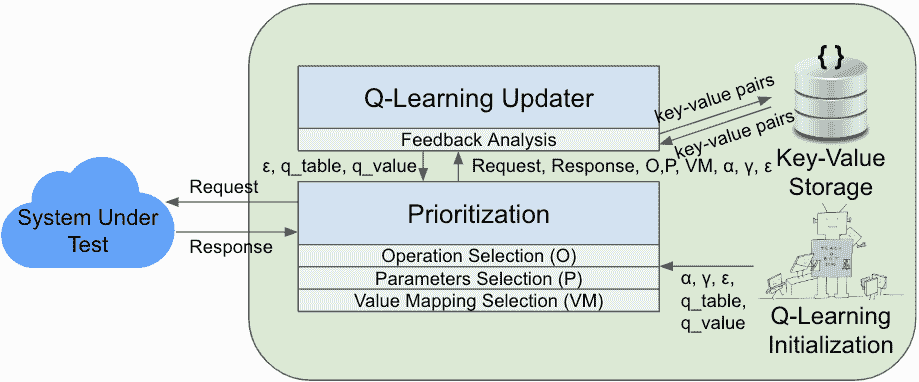

<!--yml

类别：未分类

日期：2025-01-11 11:57:08

-->

# 自适应REST API测试与强化学习

> 来源：[https://arxiv.org/html/2411.07098/](https://arxiv.org/html/2411.07098/)

###### 摘要

现代网络服务日益依赖REST API。有效地测试这些API面临诸多挑战，因为需要探索的搜索空间非常广泛，这涉及选择API操作以创建序列、从潜在的庞大集合中为每个操作选择参数，以及从通常无限的参数输入空间中采样值。目前的测试工具缺乏有效的探索机制，它们对所有操作和参数一视同仁，未考虑其重要性或复杂性，也缺乏优先级策略。此外，当响应模式在规范中缺失或存在变种时，这些工具的表现也较差。为了解决这些局限性，我们提出了一种自适应的REST API测试技术，结合了强化学习来优先探索操作和参数。我们的方法动态分析请求和响应数据，以指导相关参数，并采用基于采样的策略来高效处理动态的API反馈。我们在十个RESTful服务上评估了这一技术，并与现有的最先进工具进行了比较，评估指标包括代码覆盖率、生成请求的数量、覆盖的操作以及触发的服务故障。此外，我们还进行了去除实验，研究了优先级设置、动态反馈分析和采样对测试效果的独立影响。我们的研究结果表明，与现有的REST API测试工具相比，我们的方法在效果、效率和故障发现能力上有显著的优势。

## I 引言

现代网络服务的日益普及促使了对表现状态转移（REpresentational State Transfer，REST）API在通信和数据交换中的依赖 [richardson2013restful, patni2017pro]。REST API遵循一套架构原则，能够通过使用标准的HTTP方法和无状态的客户端-服务器模型，实现不同软件组件之间的可扩展、灵活和高效的交互 [fielding2000architectural]。为了方便客户端的发现和使用，REST API通常通过规范语言进行文档化 [openapi, swagger, raml, apiblueprint]，这些语言让开发者能够以结构化的格式描述API，并提供必要的信息，例如可用的端点、输入参数及其模式、响应模式等。像APIs Guru [apis_guru]这样的平台托管了成千上万的RESTful API文档，强调了这些标准化API规范在行业中的重要性。

标准化的文档格式，如 OpenAPI 规范 [openapi]，不仅有助于 API 的开发及其被客户端使用，还为 REST API 自动化测试技术的开发提供了基础，近年来出现了众多此类技术和工具（例如， [arcuri2019restful, Corradini2022, atlidakis2019restler, martin2020restest, karlsson2020automatic, karlsson2020quickrest, liu2022morest, wu2022combinatorial]）。尽管如此，REST API 的有效测试仍然是一个挑战，工具的高代码覆盖率仍然是一个难以实现的目标 [kim2022automated]。

测试 REST API 可能具有挑战性，因为探索的搜索空间很大，来源于众多操作、潜在的执行顺序、参数之间的依赖关系以及相关的输入参数值约束 [martin2019catalogue]。当前的技术往往难以有效探索这个空间，因为缺乏对操作及其参数的有效探索策略。现有的测试工具往往将所有操作和参数视为同等重要，忽视了它们的重要性或复杂性，导致次优的测试策略，并且未能充分覆盖关键的操作和参数组合。此外，这些工具依赖于发现响应模式和请求参数之间的生产者-消费者关系，当参数和响应模式在规范中详细描述时，这种方式效果良好。然而，如果模式不完整或不精确，这些工具在探索中的效果可能会降低。

在本文中，我们提出了基于强化学习的自适应 REST API 测试方法（arat-rl），这是一种先进的黑盒测试方法，解决了现有工具的这些局限性。我们的方法包含几个创新特性，例如利用强化学习优先探索操作和参数，从响应和请求数据中动态构建键值对，分析这些键值对以指导依赖操作和参数，并利用基于采样的策略高效处理动态 API 反馈。我们方法的主要目标是提高代码覆盖率并改进故障检测能力。

arat-rl的创新核心在于自适应测试策略，该策略由基于强化学习的优先级算法驱动，用于探索操作和参数的空间。该算法最初基于使用的参数及其在其他操作中的频率确定操作的重要性。这种有针对性的探索使得能够高效覆盖关键操作和参数，从而优化代码覆盖率。该技术使用强化学习根据反馈调整操作和参数的优先级权重，通过减少成功响应的重要性，并增加失败响应的重要性。该技术还根据输入值的各种来源（例如随机值、指定值、响应值、请求值和默认值）为参数-值映射分配权重，从而使其能够调整测试策略，并集中精力测试更可能包含故障的区域，最终提高故障检测能力。

arat-rl的另一个创新特点是动态构建键值对。与现有方法过度依赖规范中提供的资源架构不同，我们的技术通过分析POST操作（即资源创建HTTP方法）并检查响应和请求数据，动态构建键值对。例如，假设某个操作将书名和价格作为请求参数，并返回成功状态码以及字符串消息（例如“成功创建”）。我们的技术利用这些信息，在收到成功响应时即使响应中没有此类数据，也会为书名和价格创建键值对。它会考虑请求中使用的输入参数，因为这些参数与创建的资源对应。此外，如果服务返回不完整的资源，我们的技术仍会处理键值对中可用的信息。这种动态方法使我们的工具能够从API的响应和请求中识别资源，并发现仅从规范中无法显现的隐藏依赖关系。

最后，arat-rl采用了一种简单而有效的基于采样的方法，使其能够高效处理动态API反馈，并根据收集到的信息调整探索策略。通过随机采样响应中的键值对，我们的工具减少了处理每个键值对时每个响应的开销，从而实现了更高效的测试和测试资源的优化利用。

为了评估该技术，我们使用了10个RESTful服务进行了实证研究，并将其与三种最先进的REST API测试工具进行了比较：RESTler [atlidakis2019restler]、EvoMaster [arcuri2019restful]和Morest [liu2022morest]。我们从覆盖率和服务失败触发情况两个方面评估了arat-rl的有效性，并从生成有效请求和故障引发请求的效率，以及在给定时间预算内所覆盖的操作方面评估了其效率。我们的结果表明，arat-rl在所有考虑的指标上都优于竞争工具——它在方法、分支和行覆盖率上都达到了最高，并且具有更好的故障检测能力。具体来说，arat-rl比RESTler多覆盖了119.17%、59.83%和52.42%的分支、行和方法；比EvoMaster多覆盖了37.03%、20.87%和14.13%的分支、行和方法；比Morest多覆盖了23.69%、11.87%和9.55%的分支、行和方法。arat-rl还分别比RESTler、EvoMaster和Morest发现了9.2倍、2.5倍和2.4倍更多的漏洞。在效率方面，arat-rl在一小时的测试时间预算内，分别比Morest、EvoMaster和RESTler生成了52.01%、40.79%和1222%更多有效请求和故障引发请求，并覆盖了15.38%、24.14%和282.98%更多的操作。我们还进行了消融实验，以评估优先级、动态反馈分析和采样对arat-rl整体有效性的单独影响。我们的结果表明，基于强化学习的优先级排序对arat-rl的有效性贡献最大，其次是动态反馈分析和采样。

[⬇](data:text/plain;base64,L3Byb2R1Y3RzL3twcm9kdWN0TmFtZX0vY29uZmlndXJhdGlvbnMve2NvbmZpZ3VyYXRpb25OYW1lfS9mZWF0dXJlcy97ZmVhdHVyZU5hbWV9OgogQFxjb2xvcntrZXl3b3JkY29sb3J9cG9zdEA6CiAgICBAXGNvbG9ye2tleXdvcmRjb2xvcn1vcGVyYXRpb25JZEA6IGFkZEZlYXR1cmVUb0NvbmZpZ3VyYXRpb24KICAgIEBcY29sb3J7a2V5d29yZGNvbG9yfXByb2R1Y2VzQDoKICAgICAgLSBhcHBsaWNhdGlvbi9qc29uCiAgICBAXGNvbG9ye2tleXdvcmRjb2xvcn1wYXJhbWV0ZXJzQDoKICAgICAgLSBAXGNvbG9ye2tleXdvcmRjb2xvcn1uYW1lQDogcHJvZHVjdE5hbWUKICAgICAgICBAXGNvbG9ye2tleXdvcmRjb2xvcn1pbkA6IHBhdGgKICAgICAgICBAXGNvbG9ye2tleXdvcmRjb2xvcn1yZXF1aXJlZEA6IHRydWUKICAgICAgICBAXGNvbG9ye2tleXdvcmRjb2xvcn10eXBlQDogc3RyaW5nCiAgICAgIC0gQFxjb2xvcntrZXl3b3JkY29sb3J9bmFtZUA6IGNvbmZpZ3VyYXRpb25OYW1lCiAgICAgICAgQFxjb2xvcntrZXl3b3JkY29sb3J9aW5AOiBwYXRoCiAgICAgICAgQFxjb2xvcntrZXl3b3JkY29sb3J9cmVxdWlyZWRAOiB0cnVlCiAgICAgICAgQFxjb2xvcntrZXl3b3JkY29sb3J9dHlwZUA6IHN0cmluZwogICAgICAtIEBcY29sb3J7a2V5d29yZGNvbG9yfW5hbWVAOiBmZWF0dXJlTmFtZQogICAgICAgIEBcY29sb3J7a2V5d29yZGNvbG9yfWluQDogcGF0aAogICAgICAgIEBcY29sb3J7a2V5d29yZGNvbG9yfXJlcXVpcmVkQDogdHJ1ZQogICAgICAgIEBcY29sb3J7a2V5d29yZGNvbG9yfXR5cGVAOiBzdHJpbmcKICAgIEBcY29sb3J7a2V5d29yZGNvbG9yfXJlc3BvbnNlc0A6CiAgICAgIEBcY29sb3J7a2V5d29yZGNvbG9yfWRlZmF1bHRAOgogICAgICAgIEBcY29sb3J7a2V5d29yZGNvbG9yfWRlc2NyaXB0aW9uQDogc3VjY2Vzc2Z1bCBvcGVyYXRpb24KL3Byb2R1Y3RzL3twcm9kdWN0TmFtZX0vY29uZmlndXJhdGlvbnMve2NvbmZpZ3VyYXRpb25OYW1lfS9mZWF0dXJlczoKICBAXGNvbG9ye2tleXdvcmRjb2xvcn1nZXRAOgogICAgQFxjb2xvcntrZXl3b3JkY29sb3J9b3BlcmF0aW9uSWQAOiBnZXRDb25maWd1cmF0aW9uQWN0aXZlZEZlYXR1cmVzCiAgICBAXGNvbG9ye2tleXdvcmRjb2xvcn1wcm9kdWNlc0A6CiAgICAgIC0gYXBwbGljYXRpb24vanNvbgogICAgQFxjb2xvcntrZXl3b3JkY29sb3J9cGFyYW1ldGVyc0A6CiAgICAgIC0gQFxjb2xvcntrZXl3b3JkY29sb3J9bmFtZUA6IHByb2R1Y3ROYW1lCiAgICAgICAgQFxjb2xvcntrZXl3b3JkY29sb3J9aW5AOiBwYXRoCiAgICAgICAgQFxjb2xvcntrZXl3b3JkY29sb3J9cmVxdWlyZWRAOiB0cnVlCiAgICAgICAgQFxjb2xvcntrZXl3b3JkY29sb3J9dHlwZUA6IHN0cmluZwogICAgICAtIEBcY29sb3J7a2V5d29yZGNvbG9yfW5hbWVAOiBjb25maWd1cmF0aW9uTmFtZQogICAgICAgIEBcY29sb3J7a2V5d29yZGNvbG9yfWluQDogcGF0aAogICAgICAgIEBcY29sb3J7a2V5d29yZGNvbG9yfXJlcXVpcmVkQDogdHJ1ZQogICAgICAgIEBcY29sb3J7a2V5d29yZGNvbG9yfXR5cGVAOiBzdHJpbmcKICAgIEBcY29sb3J7a2V5d29yZGNvbG9yfXJlc3BvbnNlc0A6CiAgICAgIEBcY29sb3J7a2V5d29yZGNvbG9yfScyMDAnQDoKICAgICAgICBAXGNvbG9ye2tleXdvcmRjb2xvcn1kZXNjcmlwdGlvbkA6IHN1Y2Nlc3NmdWwgb3BlcmF0aW9uCiAgICAgICAgQFxjb2xvcntrZXl3b3JkY29sb3J9c2NoZW1hQDoKICAgICAgICAgIEBcY29sb3J7a2V5d29yZGNvbG9yfXR5cGVAOiBhcnJheQogICAgICAgICAgQFxjb2xvcntrZXl3b3JkY29sb3J9aXRlbXNAOgogICAgICAgICAgICBAXGNvbG9ye2tleXdvcmRjb2xvcn10eXBlQDogc3RyaW5n)

图1：Features-Service的OpenAPI规范的一部分。

本工作的主要贡献包括：

+   •

    一种新颖的自适应REST API测试方法，结合了（1）强化学习以优先探索操作和参数，（2）对请求和响应数据的动态分析以提供依赖参数的信息，以及（3）一种基于采样的策略，用于高效处理动态API反馈。

+   •

    实证结果表明，arat-rl在生成请求、实现代码覆盖率和触发服务故障方面优于最先进的REST API测试工具。

+   •

    一个包含工具、基准服务和实证数据的制品 [artifact]。

## II 背景与激励示例

我们简要介绍了REST API、OpenAPI规范和强化学习，然后通过一个运行示例来说明我们方法的新特性。

### II-A REST API

REST API是遵循REST架构风格的Web API [fielding2000architectural]。REST API通过标准化的协议（如HTTP）促进客户端与服务器之间的数据交换 [rodriguez2008restful]。客户端通过发送HTTP请求与Web服务进行通信。这些请求访问和/或操作由服务管理的资源，其中资源表示客户端可能希望创建、删除、更新或访问的数据。请求发送到一个API端点，该端点由资源路径和指定要对资源执行的操作的HTTP方法标识。最常用的方法是POST、GET、PUT和DELETE，分别用于创建、读取、更新和删除资源。端点和HTTP方法的组合称为操作。除了指定操作外，请求还可以选择性地包含包含元数据的HTTP头和包含请求负载的主体。在接收和处理请求后，Web服务返回包含头信息、可能的主体以及HTTP状态码的响应——这是一个三位数，表示请求的结果。

### II-B OpenAPI规范

OpenAPI 规范（OAS）[openapi] 是一种广泛采用的 RESTful API 描述格式，提供了一种标准化且易于人类阅读的方式来描述 API 的结构、功能和预期行为。图 [1](https://arxiv.org/html/2411.07098v1#S1.F1 "图 1 ‣ I 引言 ‣ 使用强化学习的自适应 REST API 测试") 展示了一个描述 Features-Service API 部分的示例 OAS 文件。此示例展示了两个 API 操作。第一个操作是一个 POST 请求，旨在将特性名称添加到产品的配置中。它需要三个参数：产品名称、配置名称和特性名称，所有这些都在路径中指定。成功执行后，API 返回一个 JSON 对象，表示该特性已添加到配置中。第二个操作是一个 GET 请求，用于检索产品配置中的活动特性。与第一个操作类似，它需要产品名称和配置名称作为路径参数。API 返回 200 状态码，并返回一个表示指定配置中活动特性的字符串数组。

### II-C 强化学习与 Q-learning

强化学习（RL）是一种机器学习类型，智能体通过与环境交互学习做出决策[sutton2018reinforcement]。智能体在各种情境（状态）下选择动作，观察结果（奖励），并学习选择最佳动作，以便随着时间的推移最大化累计奖励。RL 中的学习过程是基于试错的，即智能体通过尝试不同的选项并根据观察到的奖励不断优化其策略，从而发现最佳动作。

Q-learning 是一种广泛使用的无模型强化学习算法，它估计最优的动作值函数 $Q(s,a)$ [watkins1992q]。Q 函数表示智能体在状态 $s$ 下采取动作 $a$ 后，遵循最优策略所能获得的预期累计奖励。Q-learning 使用表格存储 Q 值，并根据智能体的经验对其进行迭代更新。学习过程包括智能体执行动作、接收奖励，并根据以下更新规则更新 Q 值：

|  | $Q(s,a)\leftarrow Q(s,a)+\alpha[r+\gamma\max_{a^{\prime}}Q(s^{\prime},a^{\prime% })-Q(s,a)]$ |  | (1) |
| --- | --- | --- | --- |

其中 $\alpha$ 是学习率，$\gamma$ 是折扣因子，$s^{\prime}$ 是执行动作 $a$ 后的新状态，$r$ 是获得的即时奖励。智能体通过更新 Q 值，使其收敛到最优值，这些 Q 值代表了在每个状态下采取每个动作的预期长期奖励。

### II-D 激励示例

接下来，我们通过使用 Feature-Service 规范作为示例，展示 arat-rl 的显著特点。

基于RL的自适应探索。以图[1](https://arxiv.org/html/2411.07098v1#S1.F1 "Figure 1 ‣ I Introduction ‣ Adaptive REST API Testing with Reinforcement Learning")中的示例为例，执行addFeatureToConfiguration操作时，我们必须首先使用单独的操作创建一个产品，并使用另一个操作为该产品建立配置。因此，操作序列应为：创建产品、创建配置，并为具有指定配置名称的产品创建特性名称。这个示例强调了确定操作顺序的重要性。我们的方法初步根据操作和参数在规范中的使用频率分配权重。在这种情况下，productName是所有操作中最常用的参数；因此，我们的方法将更高的权重分配给涉及productName的操作。具体来说，创建产品的操作获得最高优先级。

此外，一旦执行某个操作，其优先级必须进行调整，以避免重复探索，避免不必要地创建新的产品实例。在处理完优先级操作后，我们的方法通过RL调整权重，以响应收到的API响应。如果获得成功响应，处理过的参数将获得负奖励，因为我们的目标是探索其他未覆盖的操作。这种方法自然会导致选择下一个优先级的操作和参数，从而促进有效的调用顺序调整。

参数间依赖关系[martin2019catalogue]可能增加测试过程的复杂性，因为某些参数可能具有互斥性或其他约束（例如，仅需指定其中一个参数）。基于接收到的反馈的RL探索也有助于处理这种复杂性。

动态构建键值对。在最近的REST API测试技术中，[Corradini2022, atlidakis2019restler, liu2022morest]的一个关键步骤是识别响应模式和请求参数之间的生产者-消费者关系。然而，当操作产生非结构化输出（例如，纯文本）或其规范中响应模式不完整时，当前工具面临一定的限制。例如，addFeatureToConfiguration操作缺少结构化的响应数据（如JSON格式）。尽管如此，我们的方法仍然能够处理并从请求数据中生成键值数据{productName: value, configurationName: value, featureName: value}，因为POST HTTP方法表示使用提供的输入创建了一个资源。

通过分析和存储从请求和响应数据中识别出的键值对，即使响应模式未明确提供或不完整，我们的动态键值对构建方法在响应包含纯文本描述或响应模式不完整的情况下尤其有益。该技术能够有效揭示在规范中未明确的隐藏依赖关系。

为了高效地动态构建键值对进行采样。API 响应数据有时可能非常大，为每个键值对处理每个响应可能会消耗大量计算资源。为了解决这个问题，我们在动态键值对构建方法中加入了一种基于采样的策略。该策略高效处理动态的 API 反馈，并根据收集到的信息调整探索，同时最小化处理每个响应的开销。

图 2：我们方法的概述。

## III 我们的方法

在本节中，我们介绍了一种基于 Q-Learning 的 REST API 测试方法，该方法智能地优先选择并选择操作、参数和值映射来源，同时动态构建键值对。图 [2](https://arxiv.org/html/2411.07098v1#S2.F2 "图 2 ‣ II-D 动机示例 ‣ II 背景和动机示例 ‣ 基于强化学习的自适应 REST API 测试") 提供了我们方法的高级概述。最初，Q-Learning 初始化模块设置 Q-Learning 过程所需的变量和表格。随后，Q-Learning 更新器接收这些变量和表格，并将其传递给优先级模块，后者负责选择操作、参数和值映射来源。

随后，arat-rl 向被测系统（SUT）发送请求并接收响应。它还将请求、响应、选定操作、参数、映射的值来源、$\alpha$、$\gamma$ 和 $\epsilon$ 传递给 Q-Learning 更新器。反馈与请求和响应一起进行分析，存储从中提取的键值对以供将来使用。然后，更新器根据结果调整 Q-值，使得该方法能够随着时间的推移适应并完善其决策过程。arat-rl 将在此过程中进行多次迭代，直到达到指定的时间限制。本节的其余部分将介绍算法的详细信息。

### III-A Q-Learning 表格初始化

Q-Learning 表格初始化组件，如算法 [1](https://arxiv.org/html/2411.07098v1#alg1 "算法 1 ‣ III-A Q-Learning 表格初始化 ‣ III 我们的方法 ‣ 基于强化学习的自适应 REST API 测试") 所示，负责设置初始的 Q-表和 Q-值数据结构，这些结构在整个 API 测试过程中引导决策过程。关键的是，这个过程是在不进行任何 API 调用的情况下完成的。

该算法首先将学习率（$\alpha$）设置为0.1，折扣因子（$\gamma$）设置为0.99，探索率（$\epsilon$）设置为0.1（第2–4行）。这些参数控制Q-Learning算法的学习和探索过程。然后，算法初始化空字典用于Q表和Q值（第5–6行）。这些参数控制Q-Learning过程，选择的值是常用的推荐值（例如，[qlearningex1, qlearningex2, masadeh2018reinforcement]）。

算法1 Q-Learning表初始化

1: procedure InitializeQLearning(operations)  

算法遍历API中的每个操作（第7–24行）。对于每个操作，它提取操作的唯一标识符（operation_id），并在Q值字典中为operation_id初始化一个新字典（第8–9行）。接着，它为每个映射源（1到5）的Q值初始化为0（第10–12行）。

算法接下来会遍历操作中的每个参数（第13–16行）。它提取参数的名称（param_name），如果param_name已经存在于Q表中，它将相应条目的值加1。如果该条目不存在，则初始化为1。此步骤通过统计每个参数的出现次数来构建Q表。

随后，算法遍历每个操作的响应数据（第17–23行）。它从响应数据中提取键，并检查该键是否存在于Q表中对应的operation_id条目中（第18行）。如果该键存在于Q表中，它将对应的条目值加1（第19–21行）。此步骤还将根据每个响应键的出现频率填充Q表。

最终，算法返回学习率（$\alpha$）、折扣因子（$\gamma$）、探索率（$\epsilon$）、Q表和Q值字典（第25行）。这个初始设置为Q学习算法提供了对API操作及其关系的基础理解，并在测试过程中进一步优化。

算法 2 基于Q学习的优先级排序

1:过程 SelectOperation2:初始化 $\text{max\_avg\_q\_value}\leftarrow-\infty$3:初始化 $\text{best\_operation}\leftarrow\text{None}$4:    对于操作操作在操作集合中循环5:操作_id $\leftarrow$ 操作[’operationId’]6:初始化 $\text{sum\_q\_value}\leftarrow 0$7:初始化 $\text{num\_params}\leftarrow\text{len(operation['parameters'])}$8:       对于参数参数在操作[’parameters’]中循环9:参数名 $\leftarrow$ 参数[’name’]10:          $\text{sum\_q\_value}\leftarrow\text{sum\_q\_value}+q\_table[\text{param\_name}]$11:       结束 循环12:       $\text{avg\_q\_value}\leftarrow\text{sum\_q\_value}/\text{num\_params}$13:       如果 $\text{avg\_q\_value}>\text{max\_avg\_q\_value}$ 则14:          $\text{max\_avg\_q\_value}\leftarrow\text{avg\_q\_value}$15:          $\text{best\_operation}\leftarrow\text{operation}$16:       结束 如果17:    结束 循环18:    返回  best_operation19:结束 过程20:过程 SelectParameters(操作, $\epsilon$)21:设置 $n$ 随机生成 ($0\leq n\leq\text{length of operation['parameters']}$)22:初始化空列表 $selected\_parameters$23:    如果 $\text{random.random()}>\epsilon$ 则24:       按Q值降序排序操作[’parameters’]25:       对于 $i\leftarrow 0$ 到 $n-1$ 循环26:将操作[’parameters’][i] 添加到 $selected\_parameters$27:       结束 循环28:    否则29:       对于参数在 $\text{random.sample}(operation[^{\prime}parameters^{\prime}],n)$ 循环30:将参数添加到 $selected\_parameters$31:       结束 循环32:    结束 如果33:    返回  $selected\_parameters$34:结束 过程35:过程 SelectValueMappingSource(操作, $\epsilon$)

Source1:

规范中的示例值

Source2:

由参数类型和格式生成的随机值

Source3:

从请求动态构建的键值对

Source4:

从响应动态构建的键值对

Source5:

默认值（字符串: 字符串，数字: 1.1，整数: 1，数组: []，对象: {}）

36:操作_id $\leftarrow$ 操作[’operationId’]37:    $sources\leftarrow[1,2,3,4,5]$38:    如果 $\text{random.random()}>\epsilon$ 则39:       $max\_q\leftarrow\arg\max_{\text{source}\in sources}q\_value[\text{operation\_% id}][\text{source}]$40:       返回  $max\_q$41:    否则42:       返回 random.randint(1, 5)43:    结束 如果44:结束 过程

算法 3 基于Q学习的API测试

1:procedure QLearningUpdater(response, $q\_table$, $q\_value$, selected_operation, selected_parameters, $\alpha$, $\gamma$)  

### III-B 基于Q学习的优先排序

在这一步中，我们根据操作的Q值优先排序API操作，并选择最佳的参数和值映射源。我们展示了算法[2](https://arxiv.org/html/2411.07098v1#alg2 "Algorithm 2 ‣ III-A Q-Learning Table Initialization ‣ III Our Approach ‣ Adaptive REST API Testing with Reinforcement Learning")（SelectOperation、SelectParameters和SelectValueMappingSource）来描述优先排序过程。

SelectOperation过程（第1-19行）负责选择要测试的最佳API操作。该算法初始化变量以存储最大平均Q值和最佳操作（第2-3行）。它遍历每个操作，计算该操作参数的平均Q值（第4-17行）。具有最高平均Q值的操作被选为最佳操作（第15行）。

SelectParameters 程序（第 20 至 34 行）负责为选择的 API 操作选择一组参数。该选择由探索率（$\epsilon$）引导。如果随机值大于 $\epsilon$，算法会选择按 Q 值降序排列的前 $n$ 个参数（第 23 至 27 行）。否则，算法会从操作的参数中随机选择 $n$ 个参数（第 28 至 31 行）。然后返回所选择的参数（第 33 行）。

SelectValueMappingSource 程序（第 35 至 44 行）负责为选择的 API 操作选择值映射来源。该技术利用五种类型的值映射来源。

+   •

    来源 1（规范中的示例值）：这些值在 API 文档中作为参数的示例值提供。我们考虑三种类型的 OpenAPI 关键字来指定示例值：enum、example 和 description [openapi]。尽管 OpenAPI 网站提到用户可以在描述字段中指定示例值，但这些示例通常没有以结构化格式提供，而是作为自然语言文本。为了从描述字段中提取示例值，我们创建一个列表，包含文本中的每个单词，以及每个引用的短语。

+   •

    来源 2（根据参数的类型、格式和约束生成的随机值）：此来源根据每个参数的类型、格式和约束生成随机值。为了生成随机值，我们使用 Python 内建的 random 库。对于日期和日期时间格式，我们使用 datetime 库随机选择日期和时间。如果参数在 API 文档中指定了正则表达式模式，我们使用 rstr 库 [rstr] 来随机生成值。当存在最小或最大约束时，我们将其传递给 random 库，以确保生成的值符合指定的约束。这种方法使我们能够探索比 API 规范中提供的示例值更广泛的值范围。

+   •

    来源 3（来自请求的动态构造的键值对）：此来源从动态构造的请求键值对中提取键值对。我们采用格式塔模式匹配 [difflib] 来识别与参数名称最相似的键。这种技术有助于发现生产者-消费者关系。

+   •

    来源 4（来自响应的动态构造的键值对）：与来源 3 类似，此来源从动态构造的响应键值对中获取键值对。我们使用相同的格式塔模式匹配方法来识别键，进一步帮助识别生产者-消费者关系。

+   •

    来源 5（默认值）：此来源使用每种数据类型的预定义默认值（字符串：string，数字：1.1，整数：1，数组：[]，对象：{}）。这些默认值对于测试API在接收到最简单或最常见的输入值时的行为非常有用。

类似于SelectParameters过程，值映射源的选择受探索率（$\epsilon$）的指导。如果随机值大于$\epsilon$，则算法选择具有最高Q值的映射源（第38–40行）。这有助于算法根据先前的经验专注于最有前景的映射源。否则，算法随机选择一个映射源（第42行）。这种随机性确保了算法偶尔探索不太有前景的映射源，以避免陷入次优解。

### III-C 基于Q学习的API测试

在此步骤中，我们使用选定的参数和值映射源执行选定的API操作，并根据响应状态码更新Q值。算法[3](https://arxiv.org/html/2411.07098v1#alg3 "Algorithm 3 ‣ III-A Q-Learning Table Initialization ‣ III Our Approach ‣ Adaptive REST API Testing with Reinforcement Learning")（QLearningUpdater和Main）描述了API测试过程以及使用学习率（$\alpha$）和折扣因子（$\gamma$）更新Q值的过程。

QLearningUpdater过程（第1–19行）负责根据响应状态码更新Q值。它首先从选定的操作中提取操作ID（第2行）。如果响应状态码表示请求成功（2xx），则算法从请求和响应中提取键值对，赋予奖励-1，并负向更新Q值（第3–6行）。如果响应状态码表示请求失败（4xx或500），则算法赋予奖励1，并正向更新Q值（第7–10行）。使用贝尔曼方程（第11–16行）为选定参数中的每个参数更新Q值，并返回更新后的Q值（第18行）。

主过程（第20–34行）协调基于Q学习的API测试过程。它初始化探索率（$\epsilon$）、最大值（$\epsilon_{max}$）、适应因子（$\epsilon_{adapt}$）以及期望的测试时间限制（第21–23行）。加载API规范并初始化Q学习表（第24–25行）。然后，算法进入一个循环，直到达到时间限制为止（第26行）。在每次迭代中，确定最佳操作、选择的参数和选择的映射源（第27–29行）。使用选定的参数和映射源执行API操作，并获得响应（第30行）。然后，根据响应更新Q值（第31行），并更新探索率（$\epsilon$）（第32行）。

通过根据响应状态码持续更新Q值，并调整探索率，基于Q学习的API测试过程旨在有效地探索API操作和参数，识别API实现中的潜在问题。

## IV 评估

图3：工具在基准服务上实现的分支、行和方法覆盖率。

在本节中，我们展示了为评估arat-rl所进行的实证研究结果。我们的评估旨在解决以下研究问题：

1.  1.

    RQ1：在代码覆盖率方面，arat-rl与当前最先进的REST API测试工具相比如何？

1.  2.

    RQ2：在给定的时间预算内，arat-rl生成的有效请求和故障引发请求及覆盖的操作的效率，与其他REST API测试工具相比如何？

1.  3.

    RQ3：在错误检测方面，我们的方法在识别REST API中的500响应时，与最先进的REST API测试工具相比表现如何？

1.  4.

    RQ4：arat-rl的主要组件——优先级排序、动态键值对构建和采样——如何对其整体性能作出贡献？

### IV-A 实验设置

我们使用Google Cloud E2机器进行实验，每台机器配备了24核CPU和96GB内存。我们创建了一个包含基准中所有服务和工具的机器镜像。对于每个实验，我们删除并重新创建这些机器，使用此镜像以最小化潜在的依赖问题。每台机器都托管了所有待测试的服务和工具，但我们在实验过程中一次只运行一个工具。我们在整个测试过程中监控CPU和内存使用情况，以确保测试工具不会因内存或CPU资源不足而受到影响。

为了评估我们方法的有效性和效率，我们将其与三种最先进的工具进行了比较：EvoMaster [arcuri2019restful]、RESTler [atlidakis2019restler]和Morest [liu2022morest]。我们从最近的REST API测试研究中选择了10个RESTful服务作为基准。接下来，我们将解释这些工具和服务的选择过程。

#### 测试工具选择

作为初步说明，由于arat-rl是黑盒方法，我们只考虑了黑盒工具进行比较。我们认为将白盒工具加入比较会导致不公平的对比，因为这些工具利用代码中的信息，而不仅仅是规范中的信息来生成测试输入。

我们根据一项最近的研究[kim2022automated]确定了一个初始的10个工具集。从这个列表中，我们选择了（黑盒版本的）EvoMaster [arcuri2019restful]和RESTler [atlidakis2019restler]。EvoMaster采用进化算法进行自动化测试用例生成，是该研究和另一项最近对比研究[zhang2022open]中的最佳表现工具。其强大的性能使其成为一个合适的对比候选工具。RESTler采用基于语法的模糊测试方法来探索API。它是该领域一个成熟的工具，事实上，它是GitHub上最受欢迎的REST API测试工具。

最近发布了两个新工具。Morest [liu2022morest]已被证明相比EvoMaster具有更优的结果。因此，我们将Morest纳入了我们的对比工具集，因为它有可能超越其他工具。另一个新工具RestCT也被考虑纳入我们的评估。但在运行时我们遇到了失败。我们联系了作者，他们确认了问题并表示将致力于解决它们。

#### RESTful 服务选择

作为我们评估的基准，我们从Kim等人的一项最新研究[kim2022automated]中选择了20个RESTful服务中的10个。我们不得不因各种原因排除10个服务。具体来说，我们排除了由基准EvoMaster的作者开发的新闻服务，以避免可能的偏差。Problem Controller和Spring Batch REST被排除，因为它们需要特定的领域知识来生成有意义的测试，因此使用它们提供的信息有限。我们排除了Erc20-rest-service和Spring Boot Actuator，因为这些服务中的一些API由于外部依赖项的更新未同步更新到服务代码，导致无法提供有效的响应。我们还排除了Proxyprint、OCVN和Scout API，因为认证问题阻止它们生成有意义的响应。最后，我们排除了CatWatch和Cwa-verification，因为它们的限制性速率限制减慢了测试过程，无法在合理的时间内收集结果。

我们最终的服务集包括了Features Service、LanguageTool、NCS、REST Countries、SCS、Genome Nexus、Person Controller、User Management Microservice、Simple Internet-Market和Project Tracking System。

表I：arat-rl、Morest、EvoMaster和RESTler所涵盖的操作和请求（2xx和500状态码）的对比。

ARAT-RL Morest EvoMaster RESTler #操作 #请求 #操作 #请求 #操作 #请求 #操作 #请求 服务覆盖了 2xx&500 2xx 500 覆盖了 2xx&500 2xx 500 覆盖了 2xx&500 2xx 500 覆盖了 2xx&500 2xx 500 特性 服务 18 95,479 43,460 52,019 18 103,475 4,920 98,555 18 113,136 33,271 79,865 17 4,671 1,820 2,851 语言工具 2 77,221 67,681 9,540 1 1,273 1,273 0 2 22,006 17,838 4,168 1 32,796 32,796 0 NCS 6 62,618 62,618 0 5 18,389 18,389 0 2 61,282 61,282 0 2 140 140 0 REST 国家 22 36,297 35,486 811 22 8,431 7,810 621 16 9,842 9,658 184 6 259 255 4 SCS 11 115,328 115,328 0 11 110,147 110,147 0 10 66,313 66,313 0 10 5,858 5,857 1 基因组 Nexus 23 15,819 14,010 1,809 23 32,598 10,661 21,937 19 8,374 8,374 0 1 182 182 0 Person Controller 12 101,083 47,737 53,346 11 104,226 10,036 94,190 12 91,316 37,544 53,772 1 167 102 65 用户管理 21 44,121 13,356 30,765 17 1,111 948 163 18 29,064 13,003 16,061 4 79 64 15 市场服务 12 29,393 6,295 23,098 6 1,399 394 1,005 5 10,697 4,302 6,395 2 1,278 0 1,278 项目跟踪 53 23,958 21,858 2,100 42 14,906 12,904 2,002 43 15,073 13,470 1,603 3 72 65 7 平均值 18 60,132 42,783 17,349 15.6 39,595 17,748 21,847 14.5 42,710 26,505 16,205 4.7 4,550 4,128 422

#### 结果收集

我们对每个测试工具进行了每次执行一小时的时间预算测试，之前的研究[kim2022automated]表明，这些工具在此时长内的代码覆盖率通常会趋于平稳。为了适应变动性，我们将实验重复进行了十次，并计算了这些运行的平均度量。

代码覆盖率和状态码的数据收集分别使用了JaCoCo [jacoco]和Mitmproxy [mitmproxy]。我们重点识别500错误的唯一实例，这通常表示服务器端故障。其方法如下：

1.  1.

    堆栈跟踪收集：对于提供伴随500错误的堆栈跟踪的服务，我们收集了这些跟踪，将每个唯一的堆栈跟踪视为单独的故障。在大多数情况下，我们收集到的错误都属于这一类。

1.  2.

    响应文本分析：在没有堆栈跟踪的情况下，我们分析了响应文本。去除无关组件（如时间戳）后，我们将与500状态码相关的唯一响应文本实例分类为单独的故障。

这种系统化的方法使我们能够编制出一份全面且独特的故障统计，用于我们的分析。

### IV-B RQ1: 效果

为了回答RQ1，我们比较了各工具在分支、行和方法覆盖率方面的表现。图[3](https://arxiv.org/html/2411.07098v1#S4.F3 "图 3 ‣ IV 评估 ‣ 使用强化学习的自适应REST API测试")展示了研究结果。柱状图表示每个工具在每个RESTful服务上的覆盖率，而底部的箱形图则总结了每个工具在所有服务中的三个覆盖度量的表现。

如图[3](https://arxiv.org/html/2411.07098v1#S4.F3 "Figure 3 ‣ IV Evaluation ‣ Adaptive REST API Testing with Reinforcement Learning")所示，arat-rl在所有三个覆盖度指标中，在所选的RESTful服务中始终优于其他工具。我们的工具表现更好，得益于操作、参数和数值映射优先级的设置，正如在动机示例中所见。arat-rl尤其在存在操作依赖、参数依赖和数值映射依赖时表现出色。例如，最大覆盖率增益发生在Language-tool上，如图所示，它具有一组复杂的参数间依赖和数值映射依赖。与此同时，arat-rl在处理语义参数时表现不佳。例如，它在Market-service上表现最差。原因在于Market-service要求输入特定格式的地址、电子邮件、姓名、密码和电话号码等数据，而arat-rl未能为这些数据生成有效的值。因此，它未能创建市场用户，也无法在生产者-消费者关系中使用用户信息进行其他操作。

平均而言，arat-rl达到了36.25%的分支覆盖率，58.47%的行覆盖率和59.42%的方法覆盖率。相比之下，表现第二好的Morest平均达到了29.31%的分支覆盖率，52.27%的行覆盖率和54.24%的方法覆盖率。因此，arat-rl相比Morest的覆盖率提升分别为分支覆盖率23.69%，行覆盖率11.87%，方法覆盖率9.55%。EvoMaster和RESTler在所有三个指标上的平均覆盖率较低，EvoMaster的分支、行和方法覆盖率分别为26.45%、48.37%和52.07%，而RESTler的分支、行和方法覆盖率分别为16.54%、36.58%和38.99%。与EvoMaster相比，arat-rl的覆盖率增益分别为分支覆盖率37.03%，行覆盖率20.87%，方法覆盖率14.13%；而与RESTler相比，分别为分支覆盖率119.17%，行覆盖率59.83%，方法覆盖率52.42%。

这些结果为我们的技术能够有效探索RESTful服务提供了证据，证明其在代码覆盖率方面优于现有工具，并展示了它在解决REST API测试中的挑战和提升依赖于RESTful服务的软件应用整体质量的潜力。

<svg class="ltx_picture" height="73.07" id="S4.SS2.p5.pic1" overflow="visible" version="1.1" width="600"><g fill="#000000" stroke="#000000" stroke-width="0.4pt" transform="translate(0,73.07) matrix(1 0 0 -1 0 0)"><g fill-opacity="1.0" transform="matrix(1.0 0.0 0.0 1.0 21.65 13.78)"><foreignobject color="#000000" height="45.51" overflow="visible" transform="matrix(1 0 0 -1 0 16.6)" width="556.69">arat-rl consistently outperforms RESTler, EvoMaster, and Morest in terms of branch, line, and method coverage across the selected RESTful services. However, arat-rl can struggle with parameters that require inputs in specific formats.</foreignobject></g></g></svg>

表 II：工具在10次运行中检测到的故障。

|  | RESTler | EvoMaster | Morest | ARAT-RL |
| --- | --- | --- | --- | --- |
| 特征服务 | 010 | 010 | 010 | 010 |
| 语言工具 | 000 | 048 | 000 | 122 |
| NCS | 000 | 000 | 000 | 000 |
| REST国家 | 009 | 010 | 010 | 010 |
| SCS | 003 | 000 | 000 | 000 |
| Genome-Nexus | 000 | 000 | 005 | 010 |
| 人员控制器 | 058 | 221 | 274 | 943 |
| 用户管理 | 010 | 010 | 008 | 010 |
| 市场服务 | 010 | 010 | 010 | 010 |
| 项目跟踪 | 010 | 010 | 010 | 010 |
| 总计 | 110 | 319 | 327 | 1125 |

### IV-C RQ2：效率

为了回答RQ2，我们将arat-rl与Morest、EvoMaster和RESTler进行了比较，比较内容包括（1）生成的有效和引发故障的请求数（通过HTTP状态码2xx和500表示）和（2）在给定时间预算内覆盖的操作数。尽管效率不仅仅依赖于这些指标，因为还受到API响应时间等因素的影响，但我们认为这些指标仍然具有代表性，因为它们反映了工具在探索API和成功识别故障方面的程度。

表[I](https://arxiv.org/html/2411.07098v1#S4.T1 "TABLE I ‣ RESTful Services Selection ‣ IV-A Experimental Setup ‣ IV Evaluation ‣ Adaptive REST API Testing with Reinforcement Learning")展示了十个不同服务的这些指标：功能服务、语言工具、NCS、REST国家、SCS、基因组联接、人员控制器、用户管理、市场服务和项目跟踪。对于每个服务，表格列出了在2xx&500（2xx状态码和500状态码的总和）、2xx和500类别下，每个工具覆盖的操作数和生成的请求数。在最后一行，表格展示了每个工具在所有测试服务中覆盖的操作数和生成的请求数的平均值。

在给定的一小时测试时间预算内，arat-rl生成了更多有效且引发故障的请求，从而更充分地探索了测试搜索空间。具体而言，arat-rl平均生成了60,132个有效且引发故障的请求，比Morest（39,595个请求）多52.01%，比EvoMaster（42,710个请求）多40.79%，比RESTler（4,550个请求）多了1222%。

请求数量的差异可以归因于arat-rl通过只处理响应中的一部分键值对，而不是整个响应的方式。通过聚焦于键值对的抽样，arat-rl高效地识别潜在的改进领域，从而促进了更有效的REST API测试过程。

此外，arat-rl在平均操作数上覆盖了更多操作（18个操作），相比于Morest（15.6个操作）、EvoMaster（14.5个操作）和RESTler（4.7个操作）。这表明arat-rl在给定的时间预算内高效生成了更多请求，从而覆盖了更多的API操作，促进了更全面的测试过程。

<svg class="ltx_picture" height="73.84" id="S4.SS3.p6.pic1" overflow="visible" version="1.1" width="600"><g fill="#000000" stroke="#000000" stroke-width="0.4pt" transform="translate(0,73.84) matrix(1 0 0 -1 0 0)"><g fill-opacity="1.0" transform="matrix(1.0 0.0 0.0 1.0 21.65 13.78)"><foreignobject color="#000000" height="46.28" overflow="visible" transform="matrix(1 0 0 -1 0 16.6)" width="556.69">In a one-hour testing time budget, arat-rl outperforms Morest, EvoMaster, and RESTler by generating 52.01%, 40.79%, and 1222% more valid and fault-inducing requests respectively, and covering 15.38%, 24.14%, and 282.98% more operations.</foreignobject></g></g></svg>

### IV-D RQ3：故障检测能力

表[II](https://arxiv.org/html/2411.07098v1#S4.T2 "TABLE II ‣ IV-B RQ1: Effectiveness ‣ IV Evaluation ‣ Adaptive REST API Testing with Reinforcement Learning")展示了每个工具在选定的RESTful服务中发现的故障数量。如表[II](https://arxiv.org/html/2411.07098v1#S4.T2 "TABLE II ‣ IV-B RQ1: Effectiveness ‣ IV Evaluation ‣ Adaptive REST API Testing with Reinforcement Learning")所示，arat-rl具有最高的故障检测能力，在选定的RESTful服务中共发现了112.5个故障。相比之下，Morest和EvoMaster分别发现了32.7和31.9个故障，而RESTler检测到的故障最少，仅为11.0个。arat-rl发现的故障比RESTler多了9.2倍，比EvoMaster多了2.5倍，比Morest多了2.4倍。

将这些数据与表[I](https://arxiv.org/html/2411.07098v1#S4.T1 "TABLE I ‣ RESTful Services Selection ‣ IV-A Experimental Setup ‣ IV Evaluation ‣ Adaptive REST API Testing with Reinforcement Learning")中的500响应代码数据进行比较，我们可以看到，尽管arat-rl生成了20.59%的500响应更少，但它发现的故障数量比Morest多了250%。与EvoMaster相比，arat-rl生成的500响应多了7.06%，但故障检测量也多了240%。这表明，arat-rl在通过探索多样的API状态来发现故障方面更为高效，而这些工具则倾向于更频繁地触发相同的故障。

arat-rl在语言工具和人员控制服务中展现出了优越的故障检测能力，分别检测到了12.2个和94.3个故障。这些服务有更多的参数集。例如，Language-Tool的主要操作/check，用于检查文本语法，拥有11个参数。类似地，Person-Controller的主要操作/api/person，用于创建/修改人员实例，拥有8个参数。相比之下，其他服务的操作参数不超过三个。

arat-rl通过Q学习中的奖励系统智能地尝试各种参数组合，因为我们对成功请求中的参数给予负奖励。这种探索多种参数组合的能力是发现更多BUG的一个重要因素，尤其是在参数较多的服务中。这些结果表明，arat-rl基于强化学习的方法能够有效地发现RESTful服务中的故障，为开发人员提供有价值的反馈，从而提高软件质量。

<svg class="ltx_picture" height="89.67" id="S4.SS4.p5.pic1" overflow="visible" version="1.1" width="600"><g fill="#000000" stroke="#000000" stroke-width="0.4pt" transform="translate(0,89.67) matrix(1 0 0 -1 0 0)"><g fill-opacity="1.0" transform="matrix(1.0 0.0 0.0 1.0 21.65 13.78)"><foreignobject color="#000000" height="62.11" overflow="visible" transform="matrix(1 0 0 -1 0 16.6)" width="556.69">arat-rl exhibits a superior fault-detection capability, uncovering 9.2x, 2.5x, and 2.4x more bugs than RESTler, EvoMaster, and Morest, respectively. This is mainly attributed to its intelligent RL-based exploration of various parameter combinations in services with a larger number of parameters.</foreignobject></g></g></svg>

表III：消融研究结果

分支线方法 检测到的故障 ARAT-RL 36.25 58.47 59.42 112.10 ARAT-RL（无优先级）28.70（+26.3%）53.27（+9.8%）55.51 0（+7%）100.10（+12%）ARAT-RL（无反馈）32.69（+10.9%）54.80（+6.9%）56.09（+5.9%）110.80（+1.2%）ARAT-RL（无采样）34.10 0（+6.3%）56.39（+3.7%）57.20（+3.9%）112.50（-0.4%）

### IV-E RQ4: 消融研究

为了回答RQ4，我们进行了一个消融研究，评估arat-rl中主要新颖组件对其性能的影响。我们将arat-rl的性能与三个变体进行了比较：（1）没有优先级机制的arat-rl，（2）没有基于反馈的动态键值构建的arat-rl，以及（3）没有采样的arat-rl。结果见表[III](https://arxiv.org/html/2411.07098v1#S4.T3 "TABLE III ‣ IV-D RQ3: Fault-Detection Capability ‣ IV Evaluation ‣ Adaptive REST API Testing with Reinforcement Learning")。

如表[III](https://arxiv.org/html/2411.07098v1#S4.T3 "TABLE III ‣ IV-D RQ3: Fault-Detection Capability ‣ IV Evaluation ‣ Adaptive REST API Testing with Reinforcement Learning")所示，去除任何组件都会导致分支、行和方法覆盖率的降低，以及发现故障数量的减少。去除优先级机制会导致性能显著下降，分支、行和方法覆盖率分别降至28.70%、53.27%和55.51%，而发现的故障数量降至100个。这一证据突显了优先级机制在arat-rl有效性中的关键作用。

缺少反馈和采样组件同样会对性能产生负面影响。没有反馈时，arat-rl的分支、行和方法覆盖率分别降至32.69%、54.80%和56.09%，而发现的故障数量降至110.80个。同样，没有采样时，分支、行和方法覆盖率分别降至34.10%、56.39%和57.20%，而发现的故障数量略微增加至112.50个，这可能归因于随机变动。

这些发现强调了arat-rl的每个组件对其整体有效性的重要性。优先级机制、反馈环路和采样策略共同作用，优化了工具在代码覆盖率和故障检测能力方面的表现。

<svg class="ltx_picture" height="73.07" id="S4.SS5.p5.pic1" overflow="visible" version="1.1" width="600"><g fill="#000000" stroke="#000000" stroke-width="0.4pt" transform="translate(0,73.07) matrix(1 0 0 -1 0 0)"><g fill-opacity="1.0" transform="matrix(1.0 0.0 0.0 1.0 21.65 13.78)"><foreignobject color="#000000" height="45.51" overflow="visible" transform="matrix(1 0 0 -1 0 16.6)" width="556.69">Each component of arat-rl–prioritization, feedback, and sampling—contributes to arat-rl’s overall effectiveness. The prioritization mechanism, in particular, plays a significant role in enhancing arat-rl’s performance in code coverage achieved and faults detected.</foreignobject></g></g></svg>

### IV-F 有效性威胁

在本节中，我们讨论了可能影响研究有效性的威胁以及为减轻这些威胁所采取的措施。内部有效性受到工具实现和配置的影响，以及所选的RESTful服务。为了尽量减少这些威胁，我们使用了最新的工具版本，采用了默认选项，并选择了10个多样化的服务，以便与最先进的工具进行公平比较。某些测试工具可能存在随机性，但我们通过每个工具运行10次并计算平均结果来解决这一问题。

外部效度受到测试的 RESTful 服务数量有限的影响，从而影响我们研究结果的普适性。我们尽力通过选择多样化的服务集来确保公正的评估，但未来的工作应测试更大规模和更具多样性的服务集。构造效度关注所使用的度量标准和工具比较。常见的度量标准，如分支覆盖、行覆盖、方法覆盖、请求次数和将 500 状态码视为故障的数量，虽然常用，但可能无法全面反映测试工具的质量。额外的度量标准，如突变得分，可能能提供更好的理解。未来研究中加入更多工具或方法，将有助于对我们技术性能进行更全面的评估。

此外，我们通过考虑工具生成的有意义请求的数量（包括有效请求和故障诱发请求），以及每个工具在给定时间预算内覆盖的操作数量来衡量效率。尽管这些度量标准为我们提供了工具性能的一些视角，但它们并未考虑所有可能的因素。其他方面，如服务的响应时间，也可能显著影响整体效率。

## V 相关工作

在本节中，我们概述了自动化 REST API 测试、基于需求的测试用例生成和基于强化学习的测试用例生成的相关工作。

自动化 REST API 测试：EvoMaster [arcuri2019restful] 是一种白盒技术，使用进化算法生成测试用例，通过适应度进行测试优化并检查 500 状态码。相比之下，黑盒技术包括各种具有不同策略的工具。RESTler [atlidakis2019restler] 通过推断生产者-消费者依赖关系生成有状态测试用例，并针对 500 错误进行测试。RestTestGen [Corradini2022] 利用数据依赖关系，并使用预言机检查状态码和架构符合性。QuickREST [karlsson2020quickrest] 是一种基于属性的技术，进行有状态测试，检查非 500 状态码和架构符合性。RESTest [martin2020restest] 考虑了参数之间的相互依赖，生成具有五种类型预言机的正常和故障测试。Morest [liu2022morest] 使用动态更新的 RESTful 服务属性图生成有意义的测试用例。RestCT [wu2022combinatorial] 使用组合测试法进行 RESTful API 测试，根据 Swagger 规范生成测试用例。

开源黑盒工具，如 Schemathesis [Zac2021schemathesis]、Dredd [dredd] 和 Tcases [tcases] 提供了多种测试功能。Schemathesis 根据输入规范生成请求，提供五种类型的预言器来检查响应的符合性。Dredd 通过将响应与预期结果进行比较，测试 REST API，验证状态码、头信息和正文内容。Tcases 是一个基于模型的工具，从 OpenAPI 规范构建输入空间模型，生成涵盖有效输入维度的测试用例，并检查响应状态码以进行验证。

基于需求的测试用例生成：在基于需求的测试中，值得注意的工作包括 ucsCNL [barros2011ucscnl]，该方法使用受控自然语言进行用例规范编写，以及 UML 协作图 [badri2004use]。需求契约 [nebut2003requirements] 提出了一个用于功能需求的定制语言，而 SCENT-Method [ryser1999scenario] 采用了基于情境的方式，结合状态图进行测试。基于 SDL 的测试生成 [tahat2001requirement] 将 SDL 需求转化为 EFSMs，RTCM [yue2015rtcm] 引入了一个基于自然语言的框架，利用模板、规则和关键词。通常，这些方法处理的是较少正式化的需求，目的是尽可能准确地根据预期需求生成测试用例。相比之下，arat-rl 专注于更正式规范的 REST API，这为测试提供了结构化的基础，并在测试过程中有效地探索和适应，以发现缺陷。

基于强化学习的测试用例生成：近年来，多个研究探讨了强化学习在软件测试中的应用，主要聚焦于 Web 应用和移动应用。这些挑战通常源于隐藏状态，而在我们的方法中，通过 API 规范可以访问所有状态，但面临着操作、参数和映射值的更多约束。Zheng 等人 [zheng2021webrl] 提出了一个利用好奇心驱动的强化学习进行自动化 Web 客户端测试的方法。Pan 等人 [pan2020androidrl] 为 Android 应用测试引入了类似的好奇心驱动方法。Koroglu 等人 [koroglu2018qbe] 提出了 QBE，一种基于 Q-learning 的 Android 应用探索方法。Mariani 等人 [mariani2021autoblacktest] 提出了 AutoBlackTest，一种用于交互式应用的自动黑盒测试方法。Adamo 等人 [adamo2018androidrl] 针对 Android 图形用户界面（GUI）测试开发了一种基于强化学习的技术。Vuong 和 Takada [vuong2018androidrl] 也将强化学习应用于 Android 应用的自动化测试。Köroğlu 和 Sen [koroglu2020androidrl] 提出了一个通过强化学习从 UI 测试场景生成功能测试的方法，专门用于 Android 应用。

## VI 结论与未来工作

本文介绍了arat-rl，一种基于强化学习的方法，用于自动化测试REST API。我们评估了其与最先进工具（如Morest、EvoMaster和RESTler）的效果、效率和故障检测能力。我们的实验结果表明，arat-rl在分支、行和方法覆盖率、生成的请求数量以及检测到的故障方面表现优异。我们还进行了消融研究，突出展示了arat-rl的新颖特性——优先级排序、基于响应数据的动态键值构建以及从响应数据中抽样以加速键值构建——在提升arat-rl性能方面的重要作用。

在未来的工作中，我们将通过解决arat-rl在识别语义约束和生成具有特定格式要求的输入（例如电子邮件、地址或电话号码）方面的局限性来提高其性能，正如我们在基准测试中所观察到的那样。我们还计划研究如何模拟复杂的依赖关系，例如我们在Morest中观察到的那些关系。我们还将研究强化学习（RL）优先级随时间变化的影响，并调查使用不同模式匹配方法的效果。此外，我们计划通过调整我们的算法和测试框架，以适应GraphQL或gRPC等其他类型的Web API，来扩展我们的方法以支持这些API。最后，结合额外的度量标准和评估技术（例如突变测试）将有助于更全面地评估测试用例的质量。

## 数据可用性

与本次提交相关的文档包括代码、数据集以及其他相关材料[artifact]。它可以用于重现本文中的实验，并促进该领域的进一步研究。
