<!--yml

类别：未分类

日期：2025-01-11 13:00:59

-->

# Agent-OM：利用LLM代理进行本体匹配

> 来源：[https://arxiv.org/html/2312.00326/](https://arxiv.org/html/2312.00326/)

张承强 澳大利亚国立大学 堪培拉 ACT 澳大利亚 [qzc438@gmail.com](mailto:qzc438@gmail.com)， 王维清 莫纳什大学 墨尔本 VIC 澳大利亚 [teresa.wang@monash.edu](mailto:teresa.wang@monash.edu)， 以及 凯瑞·泰勒 澳大利亚国立大学 堪培拉 ACT 澳大利亚 [kerry.taylor@anu.edu.au](mailto:kerry.taylor@anu.edu.au)

###### 摘要。

本体匹配（OM）通过对齐相关实体，促进不同本体之间的语义互操作性，解决其概念异质性。目前，OM系统有两种主流设计范式：传统的基于知识的专家系统和较新的基于机器学习的预测系统。虽然大规模语言模型（LLMs）和LLM代理已经革新了数据工程，并在许多领域得到了创造性的应用，但它们在OM中的潜力仍然未被充分探索。本研究提出了一种基于代理的LLM新型设计范式，用于OM系统。在考虑到利用LLM代理进行OM时面临的几个具体挑战后，我们提出了一个通用框架——Agent-OM（用于本体匹配的代理），该框架由两个用于检索和匹配的孪生代理以及一组OM工具组成。我们的框架已在概念验证系统中实现。对三个本体对齐评估倡议（OAEI）任务的评估显示，与最先进的OM系统相比，我们的系统在简单的OM任务上能够达到接近长期最佳性能的结果，并且能够显著提高复杂和少样本OM任务的性能。

PVLDB 引用格式：PVLDB, 18(3): XXX-XXX, 2024.

[doi:XX.XX/XXX.XX](https://doi.org/XX.XX/XXX.XX)  ^†^†本工作采用创意共享BY-NC-ND 4.0国际许可协议。访问[https://creativecommons.org/licenses/by-nc-nd/4.0/](https://creativecommons.org/licenses/by-nc-nd/4.0/)查看该许可证副本。若需超出该许可证涵盖的用途，请通过电子邮件联系[info@vldb.org](mailto:info@vldb.org)获取许可。版权所有归所有者/作者（们）所有。出版权已授权给VLDB基金会。

《VLDB 会议录》，第18卷，第3期 ISSN 2150-8097\.

[doi:XX.XX/XXX.XX](https://doi.org/XX.XX/XXX.XX)

PVLDB 工件可用性：源代码、数据和/或其他工件已在[https://github.com/qzc438/ontology-llm](https://github.com/qzc438/ontology-llm)处提供。

## 1\. 引言

大型语言模型（LLMs）通过对大量通用知识的预训练，因而具备强大的生成能力。尽管LLMs在广泛应用中取得了成功，但将LLMs用于下游任务仍然面临若干挑战。（1）LLMs是预训练模型，无法捕捉到最新的信息。（2）LLMs的幻觉现象在特定领域任务中时常出现，影响了其可靠性。LLMs经常生成语法正确但事实错误的无效回应（Ji et al., [2023](https://arxiv.org/html/2312.00326v6#bib.bib34)）。 （3）LLMs是语言能力的良好模型，但在非语言任务中显示出有限的能力，例如规划和路线安排（Valmeekam et al., [2022](https://arxiv.org/html/2312.00326v6#bib.bib73)）。LLMs最初是为顺序问答设计的，但大多数现实世界的任务需要复杂的逻辑设计，而非单一路径。

为了克服LLM定制化在下游任务中的局限性，基于LLM的自主代理已成为一个重要的研究领域。在人工智能（AI）领域，代理的概念最早在著名的图灵测试中被提出（Turing, [2009](https://arxiv.org/html/2312.00326v6#bib.bib72)），指的是能够展示类人行为的智能计算实体。这些AI代理未能达到人类水平的能力，因为它们只能在有限环境中基于简单的启发式策略函数进行操作，且缺乏高效的中央控制来模拟人类学习过程（Wang et al., [2024](https://arxiv.org/html/2312.00326v6#bib.bib76)）。LLMs在展示自主性、反应性、主动性和社交能力方面取得了显著成功，吸引了越来越多的研究努力，旨在构建AI代理，也就是所谓的LLM代理（Xi et al., [2023](https://arxiv.org/html/2312.00326v6#bib.bib80)）。

LLM 代理的核心概念是将 LLM 作为控制器或“大脑”来使用，而不仅仅是作为预测模型（即“模型即服务”）。LLM 代理通过先进的规划、记忆和可插拔工具扩展了 LLM 的能力，使其能够与开放世界知识进行交互（Weng，[2023](https://arxiv.org/html/2312.00326v6#bib.bib79)）。(1) 规划将复杂任务分解为更简单、更易于管理的子任务。LLMs 还可以接收关于计划的反馈并进行反思和优化。LLM 规划中最常用的技术是思维链（Chain of Thought，CoT）（Wei 等，[2022](https://arxiv.org/html/2312.00326v6#bib.bib78)）。(2) 工具使 LLM 能够调用外部资源获取更多信息。这些工具通常通过 LLM 的动作来调用。(3) 记忆为本来无状态的 LLM 提供了上下文，包括短期记忆和长期记忆。短期记忆可以视为通过上下文学习（ICL）从规划和工具中获得的上下文信息（Brown 等，[2020](https://arxiv.org/html/2312.00326v6#bib.bib12)）。长期记忆通常使用数据库存储并结合检索增强生成（RAG）（Lewis 等，[2020](https://arxiv.org/html/2312.00326v6#bib.bib40)）来保留信息。与微调不同，微调需要重新训练模型以学习新的上下文数据，而 ICL/RAG 通过向 LLM 提示中添加新的信息来增强模型的能力。ICL/RAG 对于处理动态信息更具可扩展性。几乎 90% 的使用案例可以通过基于 ICL/RAG 的搜索和检索来实现（Microsoft Azure，[n.d.](https://arxiv.org/html/2312.00326v6#bib.bib48)）。一篇近期的论文（Ovadia 等，[2024](https://arxiv.org/html/2312.00326v6#bib.bib59)）表明，RAG 在广泛的知识密集型任务中超越了微调。

本体匹配（Ontology matching，OM）是一个经典的对齐任务，旨在找出一对本体之间的可能对应关系（Euzenat 和 Shvaiko，[2013](https://arxiv.org/html/2312.00326v6#bib.bib21)）。OM 系统被开发出来以自动化这一匹配过程。OM 系统有两种主要的设计范式：传统的基于知识的 OM 系统，实施预定义的逻辑和专家知识；以及较新的基于机器学习的 OM 系统，将匹配任务转化为机器增强的学习和预测。前者的专家系统需要大量的专家知识，而后者的预测系统则需要大量高质量的数据来训练模型。大型语言模型（LLMs）和 LLM 代理的流行促进了许多成功的领域特定应用。然而，在 OM 的背景下，使用 LLMs 和 LLM 代理目前仍未得到充分探索。利用 LLMs 和 LLM 代理执行 OM 任务并非直观的任务；相关的挑战将在“相关工作”部分介绍。

本文介绍了一种基于LLM的新型智能体驱动的OM系统设计范式。我们提出了一个通用框架，并通过概念验证系统实现了该框架。该系统将LLM的能力扩展到一般问答之外，为OM任务提供了强大的问题解决工具。系统包含促进信息检索、实体匹配和内存存储的工具。与现有最先进的OM系统相比，该系统在三个对齐评估倡议（OAEI）赛道上取得了显著的匹配性能提升。具体而言，本文做出了以下贡献：

+   •

    我们引入了一种新的智能体驱动的LLM-based设计范式，用于OM系统，并提出了一个新颖的Agent-OM框架。该框架由以下关键组件组成：

    +   –

        一个LLM作为中央“大脑”，通过提示工程将不同模块连接并指导其功能；

    +   –

        一对规划模块使用CoT进行OM分解；

    +   –

        一套OM工具使用ICL/RAG来缓解LLM幻觉；

    +   –

        一个共享内存模块使用对话和混合数据存储来支持实体映射的搜索和检索。

+   •

    我们在一个概念验证系统中实现了我们提出的Agent-OM框架。该系统处理了在利用LLM智能体进行OM时的一些关键下游挑战，如经济高效的实体信息检索、匹配候选选择和基于搜索的匹配功能。

+   •

    系统的实验结果表明，Agent-OM在简单OM任务上取得了接近最优的长期表现，并在复杂和少量样本的OM任务上显著提高了匹配性能。

本文中，本体包含类、属性和个体。我们只考虑类和属性，个体被排除在外。类之间（分别是属性）可能的逻辑关系包括等价（$\equiv$）和包含关系（$\subseteq$或$\supseteq$）。在本研究中，我们仅考虑类和属性之间的等价逻辑关系（$\equiv$）。

本文的其余部分组织如下。第[2](https://arxiv.org/html/2312.00326v6#S2 "2\. Related Work ‣ Agent-OM: Leveraging LLM Agents for Ontology Matching")节回顾了相关工作。我们在第[3](https://arxiv.org/html/2312.00326v6#S3 "3\. Matching with LLM Agents ‣ Agent-OM: Leveraging LLM Agents for Ontology Matching")节中阐述了基于代理的LLM框架设计，并在第[4](https://arxiv.org/html/2312.00326v6#S4 "4\. Implementation Details ‣ Agent-OM: Leveraging LLM Agents for Ontology Matching")节中呈现了实现细节。第[5](https://arxiv.org/html/2312.00326v6#S5 "5\. Evaluation ‣ Agent-OM: Leveraging LLM Agents for Ontology Matching")节和第[6](https://arxiv.org/html/2312.00326v6#S6 "6\. Ablation Study ‣ Agent-OM: Leveraging LLM Agents for Ontology Matching")节评估了该系统，第[7](https://arxiv.org/html/2312.00326v6#S7 "7\. Discussion ‣ Agent-OM: Leveraging LLM Agents for Ontology Matching")节进行了讨论。我们在第[8](https://arxiv.org/html/2312.00326v6#S8 "8\. Limitations ‣ Agent-OM: Leveraging LLM Agents for Ontology Matching")节和第[9](https://arxiv.org/html/2312.00326v6#S9 "9\. Future Work ‣ Agent-OM: Leveraging LLM Agents for Ontology Matching")节中分别讨论了局限性和未来的工作。第[10](https://arxiv.org/html/2312.00326v6#S10 "10\. Conclusion ‣ Agent-OM: Leveraging LLM Agents for Ontology Matching")节总结了全文。

## 2\. 相关工作

本体匹配（OM）通常是一个非平凡但至关重要的数据集成、信息共享和知识发现任务（Shvaiko 和 Euzenat，[2013](https://arxiv.org/html/2312.00326v6#bib.bib69)）。虽然匹配是实现异构本体的应用互操作性的前提，但OM系统旨在部分或完全自动化匹配。传统的基于知识的OM系统方法，如LogMap（Jiménez-Ruiz 和 Cuenca Grau，[2011](https://arxiv.org/html/2312.00326v6#bib.bib35)；Jiménez-Ruiz 等，[2011](https://arxiv.org/html/2312.00326v6#bib.bib36)），AgreementMakerLight (AML)（Faria 等，[2013](https://arxiv.org/html/2312.00326v6#bib.bib24)，[2014](https://arxiv.org/html/2312.00326v6#bib.bib23)），以及 FCA-Map（Zhao 等，[2018](https://arxiv.org/html/2312.00326v6#bib.bib87)；Li 等，[2021](https://arxiv.org/html/2312.00326v6#bib.bib41)）已被证明是精确且有效的。然而，它们资源消耗大且劳动密集。通常很难找到领域专家来评估匹配结果，而且任何一组专家可能无法涵盖专家系统所需的所有领域概念。一种新的方法使用机器学习（ML），该方法已在如BERTMap（He 等，[2022](https://arxiv.org/html/2312.00326v6#bib.bib28)）和LogMap扩展LogMap-ML（Chen 等，[2021](https://arxiv.org/html/2312.00326v6#bib.bib14)）等系统中实现。基于ML的OM系统采用机器学习中的训练和测试概念，使用本体实体作为模型训练的特征或进行微调，然后利用模型预测额外的对应关系。具体来说，领先的系统BERTMap使用源自自然语言处理（NLP）的通用语言模型（即BERT（Devlin 等，[2019](https://arxiv.org/html/2312.00326v6#bib.bib17)））。

尽管基于机器学习的方法在匹配性能上已有显著改进，但其训练-测试范式对于大型语言模型（LLM）来说并不可行。LLM使用的参数数量远大于常见语言模型的数量。这意味着重新训练整个LLM通常不可行，微调这样一个庞大的模型需要的样本数量对于OM来说可能过于庞大。Zong 和 Krishnamachari（[2022](https://arxiv.org/html/2312.00326v6#bib.bib89)）的调查表明，1000个训练样本是微调GPT-3的合理样本数，但一般来说，一个领域本体只有大约100-200个实体。此外，目前一些LLM仅通过网络服务提供。这意味着训练或微调LLM有泄露敏感信息的风险，而合成数据则使得确保训练质量变得困难。

使用 LLM 进行 OM 的早期研究可见于（He 等，[2023a](https://arxiv.org/html/2312.00326v6#bib.bib29)）和（Norouzi 等，[2023](https://arxiv.org/html/2312.00326v6#bib.bib53)）。这两项工作均采用完全基于提示的方法。提示的结构是一个二元问题：给定来自源本体的实体和来自目标本体的实体，LLM 执行分类任务，以确定这两个实体是否相同。类似的方法也被 OLaLa（Hertling 和 Paulheim，[2023](https://arxiv.org/html/2312.00326v6#bib.bib32)）和 LLMs4OM（Giglou 等，[2024](https://arxiv.org/html/2312.00326v6#bib.bib25)）使用，但它们的候选生成与文本嵌入提取模型集成。 （Amini 等，[2024](https://arxiv.org/html/2312.00326v6#bib.bib3)）的作者探索了使用 LLM 解决复杂本体 OM 挑战的潜力。

LLM 代理在 AutoGPT（Richards, [[n.d.]](https://arxiv.org/html/2312.00326v6#bib.bib67)）和 BabyAGI（Nakajima, [[n.d.]](https://arxiv.org/html/2312.00326v6#bib.bib51)）中被引入。最近发布的*OpenAI GPTs*（OpenAI, [[n.d.]a](https://arxiv.org/html/2312.00326v6#bib.bib55)）、*Microsoft Copilot*（Microsoft, [[n.d.]a](https://arxiv.org/html/2312.00326v6#bib.bib46)）和*Copilot Studio*（Microsoft, [[n.d.]b](https://arxiv.org/html/2312.00326v6#bib.bib47)）激发了人们对“LLM 代理世界”的兴趣。通过 LLM 代理构建应用程序，用户可以创建自己的定制 GPT，以支持定制的业务场景。在本体相关任务中，LLM 驱动的代理在自动化本体工程中手动活动方面展现了令人印象深刻的表现。这些工作关注通过对话交流，结合人工反馈来增强代理的能力。虽然这种方式适用于需要人工干预的任务，如在本体工程中收集能力问题（Zhang 等， [2024a](https://arxiv.org/html/2312.00326v6#bib.bib85)）或验证本体学习中的扩展术语（Babaei Giglou 等，[2023](https://arxiv.org/html/2312.00326v6#bib.bib8)），但现代本体管理（OM）旨在尽量减少人工干预，自动化复杂任务。与这些工作相对比，我们的目标是设计一个新的基础设施，能够指导 LLM 代理使用规划将复杂任务分解为步骤，并使用工具促进自动匹配（即函数调用），而不是单纯依赖基于代理的对话交流，即使是像（Payne 和 Tamma，[2014](https://arxiv.org/html/2312.00326v6#bib.bib60); Zhang 等，[2024b](https://arxiv.org/html/2312.00326v6#bib.bib86)）这样专门面向本体的对话。

我们介绍了一个创新的基于LLM的代理驱动设计范式，用于OM系统。我们有两个通用代理，每个代理都是自包含的，旨在指示LLM使用广泛的规划、内存和工具，从而释放它们的生成能力来处理不同上下文中的各种OM任务。同时，作为精确决策的关键支持工具，我们还限制了当前LLM在幻觉、上下文理解和非语言推理方面的缺陷。为此，我们创建了多个与OM相关的工具。这些工具使得LLM代理能够模拟传统的OM系统，自动化整个匹配过程，无需人工干预。整体基础设施提供了高扩展性，并允许广泛的定制化。据我们所知，本研究首次提出了一个基于LLM代理的OM任务框架。

## 3\. 使用LLM代理进行匹配

给定源本体（$O_{s}$）和目标本体（$O_{t}$），OM旨在找到一个包含一组配对实体的对齐（A）：$\{(e_{i},e_{j})|e_{i}\in O_{s},e_{j}\in O_{t}\}$。一个经典的匹配过程主要包括两个步骤：检索和匹配。检索步骤涉及从本体本身（$R_{int}$）和领域特定的词库（$R_{ext}$）中检索内部信息和外部信息。匹配步骤涉及选择匹配候选项（$M_{sel}$），运行匹配算法（$M_{alg}$），并优化匹配结果（$M_{ref}$）。一个经典的OM可以表示为：

| (1) |  | $R_{int}\Rightarrow R_{ext}\Rightarrow M_{sel}\Rightarrow M_{alg}\Rightarrow M_% {ref}$ |  |
| --- | --- | --- | --- |

图[1](https://arxiv.org/html/2312.00326v6#S3.F1 "图1 ‣ 3\. 使用LLM代理进行匹配 ‣ Agent-OM：利用LLM代理进行本体匹配")展示了*Agent-OM*的架构，它是我们基于LLM的代理驱动的OM框架。它保留了经典OM的原始输入和输出，但通过自治LLM代理对两个主要步骤进行了模块化，分别是检索代理（$Agent\_{R}$）和匹配代理（$Agent\_{M}$）。我们称这两个LLM代理为“孪生”的，因为它们拥有自己的规划模块和相关工具，但共享内存。内存负责存储从检索代理（$R_{sto}$）中获取的信息，并促进匹配代理（$M_{sea}$）对存储信息的搜索。因此，基于代理的OM可以表示为：

| (2) |  | $Agent\_R_{(R_{int}\Rightarrow R_{ext}\Rightarrow R_{sto})}\Rightarrow Agent\_M% _{(M_{sea}\Rightarrow M_{sel}\Rightarrow M_{alg}\Rightarrow M_{ref})}$ |  |
| --- | --- | --- | --- |

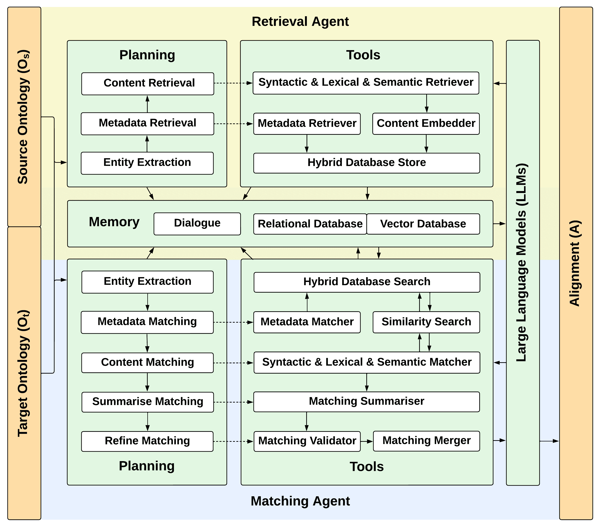

图1\. Agent-OM架构。所有组件都执行两次，分别针对源本体和目标本体，匹配合并工具将每次运行的结果合并在一起。

对于每个自主代理，工作流程描述如下。规划模块将一个复杂任务分解成多个子任务，并定义子任务的顺序和需要调用的工具。该计划被存储在对话中，并传递给LLM。LLM随后调用工具来执行子任务。工具之间可以相互通信，中间结果存储在对话中。工具还可以通过提供的CRUD（创建、读取、更新和删除）功能访问数据库。整个工作流程由LLM提示驱动。我们使用实线表示LLM控制的实际工作流程，使用虚线表示子任务与LLM激活的相应工具之间的隐性联系。

### 3.1\. 检索代理

检索代理负责从本体中提取实体，获取其元数据和本体上下文信息，并将其存储在混合数据库中。对于从源本体和目标本体中提取的每个实体，规划模块生成检索相关信息的指令，并将其输入LLM，进而调用相应的检索工具。检索代理使用的工具包括元数据检索器、句法&词汇&语义检索器和带有内容嵌入器的混合数据库存储，具体描述如下。

+   •

    元数据检索器 ($R_{int}$)：元数据检索器从本体中收集输入实体的元数据，包括其*类别*（即来自*源*本体或*目标*本体）和*类型*（即*命名类*或*属性*）。

+   •

    句法检索器 ($R_{int}$)：句法检索器负责提供统一的文本预处理结果。一个常见的文本预处理流程包括分词、标准化、去除停用词和词干提取/词形还原（Manning et al., [2008](https://arxiv.org/html/2312.00326v6#bib.bib44)）。根据我们之前的研究（Qiang et al., [2024](https://arxiv.org/html/2312.00326v6#bib.bib64)），只有分词和标准化有助于匹配的完整性和正确性。其他两个流程方法，去除停用词和词干提取/词形还原，可能会导致不必要的错误映射。基于此，我们的句法检索器只考虑分词和标准化。我们选择使用空格来分隔单词，以便输出的是简短的句子，LLM更容易解释。

+   •

    词汇检索器 ($R_{int}$ & $R_{ext}$)：我们考虑实体词汇信息的三个关键方面：一般意义 ($R_{ext}$)、上下文意义 ($R_{ext}$) 和内容意义 ($R_{int}$)。在OM的语境下，一般意义传统上来自Wikidata (Vrandečić 和 Krötzsch, [2014](https://arxiv.org/html/2312.00326v6#bib.bib74)) 或类似的基于语料库的知识库 (KBs)。由于LLM是从这些知识库中训练的，我们使用提示语句“What is the meaning of {entity_name}?”来获取相同的功能。然而，仅使用一般意义是不够的。使用上下文约束“in the context of {context}”在特定领域任务中是有效的。流行的基于GPT的领域应用，如LawGPT (Zhou et al., [2024](https://arxiv.org/html/2312.00326v6#bib.bib88)) 和MedicalGPT (Wang et al., [2023a](https://arxiv.org/html/2312.00326v6#bib.bib75))，采用了类似的方法。此外，我们还从rdfs:label、rdfs:comment、skos:prefLabel和skos:definition属性中检索内容信息，其中本体创建者可能会添加注释或解释，这些对于检索实体的意义也很有用。

+   •

    语义检索器 ($R_{int}$)：实体的语义信息包括其基本的三元组关系以及更复杂的基于逻辑的公理。本文仅考虑能够通过基于提示的表述工具转换为更自然语言呈现的三元组关系。这些表述工具无法处理复杂的基于逻辑的公理。实现这些功能只能通过外部软件包，如OWL Verbaliser (Kaljurand, [2007](https://arxiv.org/html/2312.00326v6#bib.bib37))，Sydney OWL Syntax (Cregan et al., [2007](https://arxiv.org/html/2312.00326v6#bib.bib16))，以及DeepOnto (He et al., [2024](https://arxiv.org/html/2312.00326v6#bib.bib30)) 表述模块 (He et al., [2023b](https://arxiv.org/html/2312.00326v6#bib.bib31))。

+   •

    混合数据库存储与内容嵌入器 ($R_{sto}$)：我们使用由传统关系数据库和先进的向量数据库组成的混合数据库系统。实体元数据，如实体的类别和类型，存储在传统的关系数据库中。相比之下，基于自然语言的内容信息，如实体的句法、词汇和语义信息，通过嵌入模型向量化后存储在向量数据库中，以便基于嵌入空间中的相对距离进行相似度搜索。一个唯一的键将这两个数据库连接起来。

### 3.2\. 匹配代理

匹配代理负责寻找可能的对应关系，按照不同标准对结果进行排序和优化，并选择最相关的候选项。对于从本体中提取的每个实体，规划模块生成考虑的匹配类型的指令，并将其输入到大语言模型（LLMs）中，以调用相应的匹配工具。规划模块首先选择源本体作为起点，从本体中提取实体。然后，不同的匹配器执行句法、词汇或语义匹配功能，通过跨关系数据库和向量数据库的混合数据库搜索，找到与输入实体最相关的映射。预测的映射是基于句法匹配、词汇匹配和语义匹配的摘要度量，并进行匹配验证。相同的过程也适用于以目标本体为起点，最后将共同候选项的结果进行合并。匹配代理中使用的工具包括混合数据库搜索、元数据匹配器、句法和词汇和语义匹配器、匹配汇总器、匹配验证器和匹配合并器，具体描述如下。

+   •

    混合数据库搜索（$M_{sea}$）：混合数据库搜索作为元数据匹配器和句法和词汇和语义匹配器可访问的数据库的接口。

+   •

    元数据匹配器（$M_{sel}$）：给定输入实体，元数据匹配器从关系数据库中收集输入实体的类型和类别。

+   •

    句法和词汇和语义匹配器（$M_{sel}$）：给定输入实体，句法和词汇和语义匹配器分别在向量数据库中使用余弦相似度搜索类似的句法/词汇/语义信息，定义如下：对于实体$\mathbf{A}$和$\mathbf{B}$：

    | (3) |  | $S_{C}(\mathbf{A},\mathbf{B})=\frac{\mathbf{A}\cdot\mathbf{B}}{\&#124;\mathbf{A}\&#124;\&#124;% \mathbf{B}\&#124;}=\frac{\sum_{i=1}^{n}\mathbf{A}_{i}\mathbf{B}_{i}}{\sqrt{\sum_{i=% 1}^{n}\mathbf{A}_{i}^{2}}\cdot\sqrt{\sum_{i=1}^{n}\mathbf{B}_{i}^{2}}}$ |  |
    | --- | --- | --- | --- |

    然后，使用关系数据库中的扩展搜索根据实体的元数据过滤结果。

+   •

    匹配汇总器（$M_{alg}$）：我们使用倒排排名融合（RRF）（Cormack 等，[2009](https://arxiv.org/html/2312.00326v6#bib.bib15)）来总结匹配结果。将句法、词汇和语义描述视为文档，倒排排名的目的是通过句法、词汇和语义匹配的三种排名结果，累加文档$d$的排名$r$的倒数，定义为：

    | (4) |  | $RRF(d\in D)=\sum_{r\in R}\frac{1}{k+r(d)}$ |  |
    | --- | --- | --- | --- |

    $k$ 是一个常量参数，通常设置为 0，如我们在这里所做的。这确保了公式对排名较高的实体给予最大奖励。在我们的案例中，我们评估在三种排名（即句法匹配、词汇匹配和语义匹配）中出现在 top@k 的每个实体，并将它们的结果合并为整体匹配摘要。

+   •

    匹配验证器（$M_{ref}$）：验证是减少 LLM 错误的关键步骤，正如 SelfCheckGPT（Manakul 等人，[2023](https://arxiv.org/html/2312.00326v6#bib.bib43)）和 Self-RAG（Asai 等人，[2024](https://arxiv.org/html/2312.00326v6#bib.bib6)）中所展示的那样。我们也将此方法应用于汇总结果。我们向 LLM 提出一个二元问题：“{entity} 是否等于 {predicted_entity}？请在 {context} 的背景下回答此问题。回答是或否，并给出简短的解释。”以检查预测实体是否与输入实体在提供的上下文中相等。为了提高计算效率，我们从第 1 排到第 $n$ 排迭代比较，并选择得到“是”回答的最高排名匹配，进行匹配合并步骤。

+   •

    匹配合并器（$M_{ref}$）：匹配合并器负责将源本体搜索和目标本体搜索的结果进行合并。在本研究中，我们仅选择在两侧都找到的对应关系。作为一个基于代理的系统，它可以扩展为通过对应关系包含对话（Payne 和 Tamma，[2014](https://arxiv.org/html/2312.00326v6#bib.bib60)）使用多代理协商。

## 4\. 实施细节

我们在一个概念验证系统中实现了框架设计。其组件及其实现如下：

+   •

    LLMs：我们的系统支持多种 LLM，包括 OpenAI GPT（OpenAI，[[n.d.]c](https://arxiv.org/html/2312.00326v6#bib.bib57)），Anthropic Claude（Anthropic，[[n.d.]a](https://arxiv.org/html/2312.00326v6#bib.bib4)），Meta Llama（Meta，[[n.d.]](https://arxiv.org/html/2312.00326v6#bib.bib45)），Alibaba Qwen（Alibaba Qwen Team，[[n.d.]](https://arxiv.org/html/2312.00326v6#bib.bib2)），Google Gemma（Google Gemma Team 和 Google DeepMind，[[n.d.]](https://arxiv.org/html/2312.00326v6#bib.bib27)），以及 ChatGLM（Zeng 等人，[2024](https://arxiv.org/html/2312.00326v6#bib.bib84)）。我们为本研究选择了 10 个模型。4 个模型是 API 访问的商业 LLM，而另外 6 个是开源 LLM。表 [1](https://arxiv.org/html/2312.00326v6#S4.T1 "表 1 ‣ 第 1 项 ‣ 4\. 实施细节 ‣ Agent-OM: 利用 LLM 代理进行本体匹配") 给出了详细信息。对于 API 访问的 LLM，我们为每个类别选择了两种不同规模的模型。对于开源 LLM，我们从不同类别中选择了规模相似（70 亿到 90 亿参数）的模型。它们通过 Ollama 库（Ollama，[[n.d.]](https://arxiv.org/html/2312.00326v6#bib.bib54)）进行访问。

    表 1\. 本研究中使用的 LLM 详情。

    家族模型大小版本 GPT gpt-4o 无 N/A gpt-4o-2024-05-13 gpt-4o-mini 无 N/A gpt-4o-mini-2024-07-18 Claude claude-3-sonnet 无 N/A claude-3-sonnet-20240229 claude-3-haiku 无 N/A claude-3-haiku-20240307 Llama llama-3-8b* 4.7 GB Ollama模型ID：365c0bd3c000 llama-3.1-8b* 4.9 GB Ollama模型ID：46e0c10c039e Qwen qwen-2-7b* 4.4 GB Ollama模型ID：dd314f039b9d qwen-2.5-7b* 4.7 GB Ollama模型ID：845dbda0ea48 Gemma gemma-2-9b* 5.4 GB Ollama模型ID：ff02c3702f32 GLM glm-4-9b* 5.5 GB Ollama模型ID：5b699761eca5 * 开源LLM（检索日期：2024年12月1日）。

+   •

    规划：我们选择了LangChain库（LangChain, Inc.，[[n.d.]](https://arxiv.org/html/2312.00326v6#bib.bib39)）。该库提供了广泛的代理。我们选择了工具调用代理（又称函数调用代理）。截至目前，LangChain包仅支持与商业API访问的LLM一起使用的此类型代理。为了将我们的框架扩展到开源LLM，我们采用了类似的“链”概念来模拟开源LLM的工具调用代理。

+   •

    内存：（1）短期记忆：我们使用会话对话来存储每个操作过程中的原始中间输出，未应用map-reduce。 （2）长期记忆：我们选择了一个混合数据库，包含传统的关系数据库和先进的向量数据库。PostgreSQL（PostgreSQL全球开发组，[[n.d.]b](https://arxiv.org/html/2312.00326v6#bib.bib63)）支持使用pgvector（PostgreSQL全球开发组，[[n.d.]a](https://arxiv.org/html/2312.00326v6#bib.bib62)）将传统关系数据库和扩展的向量数据库独立集成。我们选择OpenAI嵌入（OpenAI，[[n.d.]b](https://arxiv.org/html/2312.00326v6#bib.bib56)）用于向量数据库中的内容嵌入。替代方案包括VertexAIEmbeddings（Google Cloud，[[n.d.]](https://arxiv.org/html/2312.00326v6#bib.bib26)）或Sentence-BERT（Reimers和Gurevych，[2019](https://arxiv.org/html/2312.00326v6#bib.bib66)），但不同嵌入模型之间的嵌入维度有所不同。

+   •

    工具：为了展示我们框架的灵活性，我们展示了基于提示的工具和基于编程的工具的使用，以及结合基于提示和基于编程的工具的混合工具。

### 4.1 本体命名规范

在本研究中，术语“实体”是本体类或属性的通用表达（未指定具体是哪一类）。我们使用“实体uri”表示与其前缀相关的完全展开的类名或属性名。我们使用“实体名称”表示没有前缀的类名或属性名。例如，实体uri为“http://cmt#ProgramCommitteeChair”，实体名称为“ProgramCommitteeChair”。

实体名称的命名约定分为两类：名称具有自然语言意义（类型1）；或名称是一个代码（类型2）。我们观察到，LLM在处理有意义的实体名称时表现良好（例如，ProgramCommitteeChair和Chair_PC）。通常在更大的生物医学本体中，每个实体名称都是唯一的标识符或代码，而实体的有意义描述则位于其标签或注释中（例如，MA_0000270和NCI_C33736）。对于这种命名约定，当前的LLM往往会生成错误的合成标签或注释与代码对应。例如，LLM可能会错误地将代码“MA_0000270”和“NCI_C33736”解释为“limb”和“Extremity”，而这两个代码的实际含义是“eyelid tarsus”和“Tarsal_Plate”。

为了处理本体命名约定的多样性并规范其在基于LLM的本体匹配中的使用，我们在本研究中采用了统一的命名约定。对于具有唯一标识符或代码的实体，我们改为使用其标签或注释。例如，我们使用“eyelid tarsus”和“Tarsal_Plate”来代替“MA_0000270”和“NCI_C33736”。如果两个本体重用了相同的实体名称，我们会为每个实体添加类型前缀。例如，如果“ProgramCommitteeChair”出现在源本体和目标本体中，则每个实体的唯一标识符将类似于“026-Source-Class-ProgramCommitteeChair”和“042-Target-Class-ProgramCommitteeChair”。

### 4.2\. 运行示例

为了展示我们框架的可用性，我们选择CMT-ConfOf对齐作为示例对齐。CMT本体是源，本体ConfOf是目标。这两个本体包含与会议组织相关的相似概念。运行示例的目标是找到与源中的实体“http://cmt#ProgramCommitteeChair”对应的目标中最匹配的实体。

#### 4.2.1\. 检索代理

表[2](https://arxiv.org/html/2312.00326v6#S4.T2 "Table 2 ‣ 4.2.1\. Retrieval Agent ‣ 4.2\. Running Example ‣ 4\. Implementation Details ‣ Agent-OM: Leveraging LLM Agents for Ontology Matching")展示了检索代理中工具的调用。对于来自源本体的输入“http://cmt#ProgramCommitteeChair”，句法检索器的输出为“program committee chair”。代理进一步调用词汇检索器生成详细描述：“在会议的上下文中，‘ProgramCommitteeChair’指的是……”。语义检索器生成相关的三元组关系，例如“ProgramCommitteeChair rdfs:subClassOf ProgramCommitteeMember”。这些三元组使用自然语言进行表达：“ProgramCommitteeChair”是“ProgramCommitteeMember”的子类。

虽然每个实体都有自己的句法、词汇和语义信息，但一种简单的判断两个实体是否相同的方法是为每对实体生成一个二元问题作为大语言模型（LLM）的提示：“实体1是否等同于实体2？请考虑以下内容：实体1的句法信息是……实体1的词汇信息是……实体1的语义信息是……实体2的句法信息是……实体2的词汇信息是……实体2的语义信息是……”这种方法有两个局限性。（1）LLM有令牌限制，限制了每次交互中处理的令牌数量。将所有检索到的信息组合在一起可能会超过令牌限制。（2）二元比较代价高，因为比较的复杂度是源本体和目标本体中实体数量的笛卡尔积。我们通过以下方式绕过这些局限性：（1）改用开放性问题，和（2）将有用的信息存储在可搜索的数据库中。图[2](https://arxiv.org/html/2312.00326v6#S4.F2 "图2 ‣ 4.2.1\. 检索代理 ‣ 4.2\. 运行示例 ‣ 4\. 实现细节 ‣ Agent-OM: 利用LLM代理进行本体匹配")展示了分别存储在关系数据库和向量数据库中的实体元数据和内容信息。一方面，实体的元数据用于找到精确匹配。换句话说，匹配的实体需要与目标实体具有相同的元数据。例如，“http://cmt#ProgramCommitteeChair”是源本体中的一个类，因此匹配的实体应该是目标本体中的一个类。另一方面，包括实体的句法、词汇和语义信息的内容信息用于基于相似度的匹配，因为它们通常以自然语言形式检索，这比元数据更具模糊性。自然语言术语之间的相似度通常基于嵌入向量，而向量数据库则支持快速的相似度搜索。

表 2. 检索代理中的工具调用。

工具：元数据检索器 输入：{entity_uri} = “http://cmt#ProgramCommitteeChair” 提取：{source_or_target} = “Source”, {entity_type} = “Class” 工具：句法检索器 输入：{entity_uri} = “http://cmt#ProgramCommitteeChair” 提取：{entity_name} = “ProgramCommitteeChair” 基于 {entity_uri}。方法：清理(entity_name) 输出：“program committee chair” （AI生成内容） 工具：词汇检索器 输入：{entity_uri} = “http://cmt#ProgramCommitteeChair”, {context} = “conference” 提取：{entity_name} = “ProgramCommitteeChair” 基于 {entity_uri}。{extra_information} 基于 {entity_name} 相关的 rdfs:label, rdfs:comment, skos:prefLabel 和 skos:definition。提示：问题：{entity_name} 的含义是什么？上下文：{context} 额外信息：{extra_information} 在上下文中并结合额外信息回答该问题。输出：“在会议的上下文中，‘ProgramCommitteeChair’ 指的是……”（AI生成内容） 工具：语义检索器 输入：{entity_uri} = “http://cmt#ProgramCommitteeChair” 方法：生成子图(entity_uri) 输出：子图 提示：将三元组转化为短语：{subgraph} 输出：“‘ProgramCommitteeChair’ 类是‘ProgramCommitteeMember’ 类的子类……”（AI生成内容） 工具：混合数据库存储与内容嵌入器 输入：{entity_uri} = “http://cmt#ProgramCommitteeChair”, {source_or_target} = “Source”, {entity_type} = “Class” 提取：{entity_id} = “023-Source-Class-ProgramCommitteeChair” 查询：创建关系型数据库并存储实体的元数据 [⬇](data:text/plain;base64,RFJPUCBUQUJMRSBJRiBFWElTVFMgb250b2xvZ3lfbWF0Y2hpbmcgQ0FTQ0FERTsKQ1JFQVRFIFRBQkxFIChlbnRpdHlfaWQgVkFSQ0hBUigxMDI0KSBQUklNQVJZIEtFWSwgZW50aXR5IFRFWFQsIHNvdXJjZV9vcl90YXJnZXQgVEVYVCwgZW50aXR5X3R5cGUgVEVYVCk7CklOU0VSVCBJTlRPIG9udG9sb2d5X21hdGNoaW5nIChlbnRpdHlfaWQsIGVudGl0eSwgc291cmNlX29yX3RhcmdldCwgZW50aXR5X3R5cGUpClZBTFVFUyAoe2VudGl0eV9pZH0sIHtlbnRpdHlfdXJpfSwge3NvdXJjZV9vcl90YXJnZXR9LCB7ZW50aXR5X3R5cGV9KTs=) 删除表格 IF EXISTS ontology_matching CASCADE; 创建表格（entity_id VARCHAR(1024) PRIMARY KEY, entity TEXT, source_or_target TEXT, entity_type TEXT); 插入 INTO ontology_matching （entity_id, entity, source_or_target, entity_type）VALUES（{entity_id}, {entity_uri}, {source_or_target}, {entity_type}）； 输入：{entity_syntactic} = “program committee chair”, {entity_lexical} = “在会议的上下文中，‘ProgramCommitteeChair’ 指的是…”，{entity_semantic} = “‘ProgramCommitteeChair’ 类是‘ProgramCommitteeMember’ 类的子类…”，{matching_table} = ”syntactic_matching/lexical_matching/semantic_matching” 提取：{entity_embedding} 基于 {entity_syntactic}/{entity_lexical}/{entity_semantic}。查询：创建向量数据库并存储实体的句法、词汇和语义信息 [⬇](data:text/plain;base64,Q1JFQVRFIEVYVEVOU0lPTiBJRiBOT1QgRVhJU1RTIHZlY3RvcjsKRFJPUCBUQUJMRSBJRiBFWElTVFMge21hdGNoaW5nX3RhYmxlfTsKQ1JFQVRFIFRBQkxFIHttYXRjaGluZ190YWJsZX0KKGVudGl0eV9pZCBWQVJDSEFSKDEwMjQpIE5PVCBOVUxMIFJFRkVSRU5DRVMgb250b2xvZ3lfbWF0Y2hpbmcoZW50aXR5X2lkKSwgY29udGVudCBURVhULCBlbWJlZGRpbmcgdmVjdG9yKDE1MzYpKTsKSU5TRVJUIElOVE8ge21hdGNoaW5nX3RhYmxlfQooZW50aXR5X2lkLCBjb250ZW50LCBlbWJlZGRpbmcpIFZBTFVFUyAoe2VudGl0eV9pZH0sIHtlbnRpdHlfc3ludGFjdGljfS97ZW50aXR5X2xleGljYWx9L3tlbnRpdHlfc2VtYW50aWN9LCB7ZW50aXR5X2VtYmVkZGluZ30pOw==) 创建扩展 IF NOT EXISTS vector; 删除表格 IF EXISTS {matching_table}; 创建表格 {matching_table}（entity_id VARCHAR(1024) NOT NULL REFERENCES ontology_matching(entity_id), 内容 TEXT, embedding 向量(1536)）；插入 INTO {matching_table}（entity_id, 内容, embedding）VALUES（{entity_id}, {entity_syntactic}/{entity_lexical}/{entity_semantic}, {entity_embedding}）； 输出：一个关系型数据库表（ontology_matching）和三个向量数据库表（syntactic_matching, lexical_matching, 和 semantic_matching）。

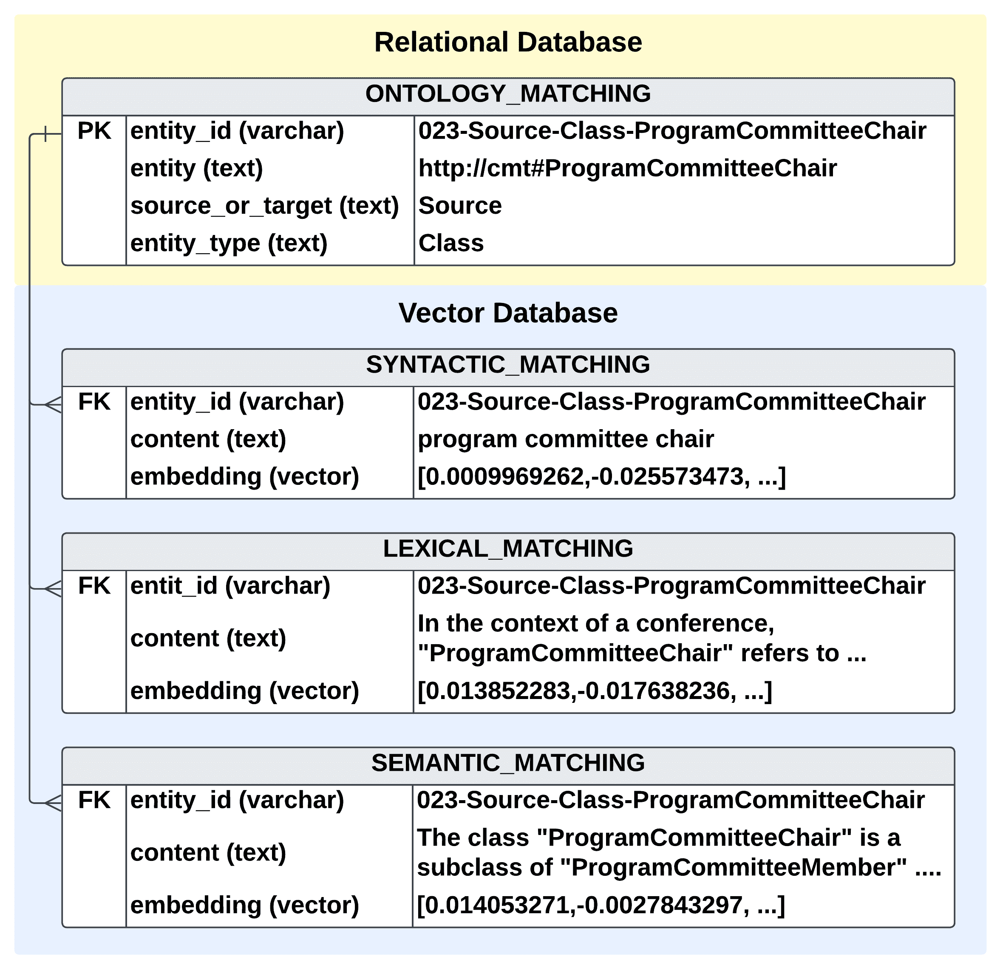

图 2\. 存储“http://cmt#ProgramCommitteeChair”。

#### 4.2.2\. 匹配代理

表格 [3](https://arxiv.org/html/2312.00326v6#S4.T3 "Table 3 ‣ 4.2.2\. Matching Agent ‣ 4.2\. Running Example ‣ 4\. Implementation Details ‣ Agent-OM: Leveraging LLM Agents for Ontology Matching") 展示了匹配代理中的工具调用。给定源本体中的“http://cmt#ProgramCommitteeChair”，每个匹配器找到的最相关实体会存储在短期记忆中，并使用 RRF 函数进行合并。匹配总结器的结果是一个预测映射的列表。最后一步是优化预测映射。匹配验证器提出一个二元问题，比较给定实体与 RRF 升序排序中的预测相关实体是否相同或不同。由于验证器在第一次迭代时收到“是”的回答（对于实体“http://confOf#Chair_PC”），匹配代理输出“http://confOf#Chair_PC”作为在目标本体中找到的最佳匹配实体。匹配合并器结合了在目标本体中搜索“http://confOf#Chair_PC”时应用的相同过程的结果。只有在映射能够双向找到时，这两个术语才会被认为是匹配的实体（即“http://cmt#ProgramCommitteeChair”也被认为是从目标本体中搜索“http://confOf#Chair_PC”时，在源本体中找到的最佳匹配实体）。

表 3\. 匹配代理中的工具调用。

工具：元数据匹配器与混合数据库搜索 输入：{entity_uri} = “http://cmt#ProgramCommitteeChair”，{source_or_target} = “Source” {matching_table} = “syntactic_matching/lexical_matching/semantic_matching” 查询：获取实体 ID [⬇](data:text/plain;base64,U0VMRUNUIG8uZW50aXR5X2lkIEZST00gb250b2xvZ3lfbWF0Y2hpbmcgbwpXSEVSRSBvLmVudGl0eSA9IHtlbnRpdHlfdXJpfSBhbmQgby5zb3VyY2Vfb3JfdGFyZ2V0ID0ge3NvdXJjZV9vcl90YXJnZXR9) SELECT  o.entity_id  FROM  ontology_matching  o WHERE  o.entity  =  {entity_uri}  and  o.source_or_target  =  {source_or_target} 输出：{entity_id} = “023-Source-Class-ProgramCommitteeChair” 查询：获取实体元数据 [⬇](data:text/plain;base64,U0VMRUNUIG8uZW50aXR5X3R5cGUsIG0uY29udGVudF9lbWJlZGRpbmcKRnJvbSBvbnRvbG9neV9tYXRjaGluZyBvLCB7bWF0Y2hpbmdfdGFibGV9IG0KV0hFUkUgby5lbnRpdHlfaWQgPSBtLmVudGl0eV9pZCBBTkQgby5lbnRpdHlfaWQgPSB7ZW50aXR5X2lkfTs=) SELECT  o.entity_type,  m.content_embedding From  ontology_matching  o,  {matching_table}  m WHERE  o.entity_id  =  m.entity_id  AND  o.entity_id  =  {entity_id}; 输出：{entity_type} = “Class”，{content_embedding} = […] 工具：句法与词汇与语义匹配器与相似度搜索 输入：{content_embedding} = […], {matching_table} = “syntactic_matching/lexical_matching/semantic_matching”，{similarity_threshold} = 0.90，{top_k} = 3，{source_or_target} = “Source”，{entity_type} = “Class” 查询：搜索相似实体 [⬇](data:text/plain;base64,V0lUSCB2ZWN0b3JfbWF0Y2hlcyBBUyAoClNFTEVDVCBlbnRpdHlfaWQsIDEgLSAoY29udGVudF9lbWJlZGRpbmcgPD0+IGB7Y29udGVudF9lbWJlZGRpbmd9JykgQVMgc2ltaWxhcml0eQpGUk9NIHttYXRjaGluZ190YWJsZX0KV0hFUkUgMSAtIChjb250ZW50X2VtYmVkZGluZyA8PT4gYHtjb250ZW50X2VtYmVkZGluZ30nKSA+PSB7c2ltaWxhcml0eV90aHJlc2hvbGR9KQpTRUxFQ1Qgby5lbnRpdHlfaWQsIHYuc2ltaWxhcml0eSBhcyBzaW1pbGFyaXR5CkZST00gb250b2xvZ3lfbWF0Y2hpbmcgbywgdmVjdG9yX21hdGNoZXMgdgpXSEVSRSBvLmVudGl0eV9pZCBJTiAoU0VMRUNUIGVudGl0eV9pZCBGUk9NIHZlY3Rvcl9tYXRjaGVzKQpBTkQgby5lbnRpdHlfaWQgPSAgdi5lbnRpdHlfaWQgQU5EIG8uc291cmNlX29yX3RhcmdldCAhPSB7c291cmNlX29yX3RhcmdldH0gQU5EIG8uZW50aXR5X3R5cGUgPSB7ZW50aXR5X3R5cGV9Ck9SREVSIEJZIHYuc2ltaWxhcml0eSBERVNDCkxJTUlUIHt0b3Bfa307) WITH  vector_matches  AS  ( SELECT  entity_id,  1  -  (content_embedding  <=>  ‘{content_embedding}’)  AS  similarity FROM  {matching_table} WHERE  1  -  (content_embedding  <=>  ‘{content_embedding}’)  >=  {similarity_threshold}) SELECT  o.entity_id,  v.similarity  as  similarity FROM  ontology_matching  o,  vector_matches  v WHERE  o.entity_id  IN  (SELECT  entity_id  FROM  vector_matches) AND  o.entity_id  =  v.entity_id  AND  o.source_or_target  !=  {source_or_target}  AND  o.entity_type  =  {entity_type} ORDER  BY  v.similarity  DESC LIMIT  {top_k}; 输出：{rankings} = [句法匹配: [], 词汇匹配: [‘095-Target-Class-Chair_PC’], 语义匹配: [‘103-Target-Class-Member_PC’, ‘092-Target-Class-Author’, ‘123-Target-Class-University’]]（AI生成内容） 工具：匹配总结器 方法：倒排排名融合(rankings) 输出：{matching_summary} = [(1.0, [“095-Target-Class-Chair_PC”, “103-Target-Class-Member_PC”]), (0.5, [“092-Target-Class-Author”]), (0.33, [“123-Target-Class-University”])]（AI生成内容） 工具：匹配验证器 输入：{context} = “会议”，{matching_summary} = […] 提取：每个{predicted_entity} 从{matching_summary} 中。 提问：问题：{entity} 是否等同于{predicted_entity}？ 上下文：{context} 在此上下文中回答问题。回答是或否。简短解释。 输出：{entity_id} = “095-Target-Class-Chair_PC” “095-Target-Class-Chair_PC”： “是。在会议的上下文中，“程序委员会主席”与“主席PC”是等同的。两者都指负责领导程序委员会的个人，程序委员会负责组织和监督会议提交的评审和选拔。” “103-Target-Class-Member_PC”： “否。程序委员会主席与程序委员会成员（PC）并不等同。主席负责监督整个评审过程，协调PC成员的活动，并就会议程序做出最终决定。相反，PC成员主要负责评审和评估提交的论文。”（AI生成内容） 查询：获取实体 [⬇](data:text/plain;base64,U0VMRUNUIG8uZW50aXR5IEZST00gb250b2xvZ3lfbWF0Y2hpbmcgbwpXSEVSRSBvLmVudGl0eV9pZCA9IHtlbnRpdHlfaWR9) SELECT  o.entity  FROM  ontology_matching  o WHERE  o.entity_id  =  {entity_id} 输出：{entity} = “http://confOf#Chair_PC” 工具：匹配合并器 输出：合并在目标本体中找到的等同于源本体中“http://confOf#Chair_PC”的实体。

## 5\. 评估

### 5.1\. 评估标准

在信息检索中，匹配任务的常见评估方法是通过将预测结果与预期输出进行比较来实现的。精确度和召回率分别用于衡量匹配的正确性和完整性。当将这些度量标准应用于OM时，系统生成的预测结果表示为对齐（A），而领域专家提供的预期结果表示为参考（R）(Do et al., [2003](https://arxiv.org/html/2312.00326v6#bib.bib18))。因此，OM任务的精确度和召回率定义为：

| (5) |  | $Precision=\frac{ | A\cap R | }{ | A | }\qquad Recall=\frac{ | A\cap R | }{ | R | }$ |  |
| --- | --- | --- | --- | --- | --- | --- | --- | --- | --- | --- | --- |

精确度和召回率通常结合为一个单一的度量F1分数，定义为：

| (6) |  | $F_{1}\ Score=\frac{2}{Precision^{-1}+Recall^{-1}}$ |  |
| --- | --- | --- | --- |

### 5.2\. 三个OAEI轨道的评估

在本节中，我们测试了我们的概念验证系统，该系统包含三个OAEI赛道，涉及不同类型的本体匹配（OM）任务。这些任务包括少量样本任务，包含少量琐碎的对应关系（[5.2.1](https://arxiv.org/html/2312.00326v6#S5.SS2.SSS1 "5.2.1\. OAEI Conference Track ‣ 5.2\. Evaluation of Three OAEI Tracks ‣ 5\. Evaluation ‣ Agent-OM: Leveraging LLM Agents for Ontology Matching") 测试案例），简单任务，包含大量琐碎的对应关系（[5.2.2](https://arxiv.org/html/2312.00326v6#S5.SS2.SSS2 "5.2.2\. OAEI Anatomy Track ‣ 5.2\. Evaluation of Three OAEI Tracks ‣ 5\. Evaluation ‣ Agent-OM: Leveraging LLM Agents for Ontology Matching") 测试案例1和[5.2.3](https://arxiv.org/html/2312.00326v6#S5.SS2.SSS3 "5.2.3\. OAEI MSE Track ‣ 5.2\. Evaluation of Three OAEI Tracks ‣ 5\. Evaluation ‣ Agent-OM: Leveraging LLM Agents for Ontology Matching") 测试案例3），复杂任务，包含大量非琐碎的对应关系（[5.2.2](https://arxiv.org/html/2312.00326v6#S5.SS2.SSS2 "5.2.2\. OAEI Anatomy Track ‣ 5.2\. Evaluation of Three OAEI Tracks ‣ 5\. Evaluation ‣ Agent-OM: Leveraging LLM Agents for Ontology Matching") 测试案例2），具有复杂引用（[5.2.3](https://arxiv.org/html/2312.00326v6#S5.SS2.SSS3 "5.2.3\. OAEI MSE Track ‣ 5.2\. Evaluation of Three OAEI Tracks ‣ 5\. Evaluation ‣ Agent-OM: Leveraging LLM Agents for Ontology Matching") 测试案例1），或需要特定领域知识（[5.2.3](https://arxiv.org/html/2312.00326v6#S5.SS2.SSS3 "5.2.3\. OAEI MSE Track ‣ 5.2\. Evaluation of Three OAEI Tracks ‣ 5\. Evaluation ‣ Agent-OM: Leveraging LLM Agents for Ontology Matching") 测试案例2）。我们报告了最佳表现的单一模型gpt-4o的评估指标以及其超参数设置，这些设置是在单次运行中得出的。我们进行了多次试验，并发现由于大语言模型（LLM）的非确定性，结果存在轻微的差异，但这些差异对于我们报告的结果精度来说并不显著。对于所有三个OAEI赛道的测试案例，我们选择了相似度阈值（similarity_threshold）= 0.90和top@k = 3的超参数设置。关于Agent-OM的超参数设置的讨论，请参见[6.2](https://arxiv.org/html/2312.00326v6#S6.SS2 "6.2\. Hyperparameter Settings ‣ 6\. Ablation Study ‣ Agent-OM: Leveraging LLM Agents for Ontology Matching")节。

#### 5.2.1\. OAEI会议赛道

OAEI 会议赛道包含了 7 个中小型与会议相关的本体的成对对齐任务，共有 21 个匹配任务（Cheatham 和 Hitzler，[2014](https://arxiv.org/html/2312.00326v6#bib.bib13)；Solimando 等，[2014](https://arxiv.org/html/2312.00326v6#bib.bib70)，[2017](https://arxiv.org/html/2312.00326v6#bib.bib71)；Zamazal 和 Svátek，[2017](https://arxiv.org/html/2312.00326v6#bib.bib83)）。在每个对齐中，可以用于训练模型的试验对应关系非常有限（通常少于 10 个）。此赛道中的所有会议本体都使用 Type 1 命名约定，其中类和属性的名称具有含义。在本研究中，我们使用公开可用的参考 ra1-M3 作为参考（R），包括类和属性映射。

图[3](https://arxiv.org/html/2312.00326v6#S5.F3 "图 3 ‣ 5.2.1\. OAEI 会议赛道 ‣ 5.2\. 三个 OAEI 赛道的评估 ‣ 5\. 评估 ‣ Agent-OM: 利用 LLM 代理进行本体匹配") 将 Agent-OM 与 OAEI 2022 和 OAEI 2023 中的 15 个 OM 系统进行了比较。Agent-OM 的表现超过了平均水平。其整体 F1 分数在 2022 年排名第 3/13，在 2023 年排名第 5/12。我们注意到，ra1-M3 被认为缺少有效的等价映射。我们认为，Agent-OM 如果使用完整的参考，如 ra2-M3 或 rar2-M3，可能会取得更好的表现。目前，这些参考在撰写本文时尚未公开。

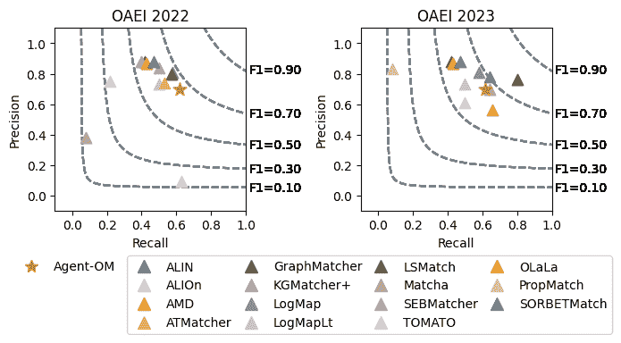

图 3\. OAEI 会议赛道测试案例。

#### 5.2.2\. OAEI 解剖学赛道

OAEI 解剖学赛道仅包含人类和小鼠解剖学的参考对齐，该对齐由以下文献创建并演化而来（Bodenreider 等，[2005](https://arxiv.org/html/2312.00326v6#bib.bib11)；Beisswanger 和 Hahn，[2012](https://arxiv.org/html/2312.00326v6#bib.bib9)；Euzenat, Jérôme 和 Meilicke, Christian 和 Stuckenschmidt, Heiner 和 Shvaiko, Pavel 和 Trojahn, Cássia，[2011](https://arxiv.org/html/2312.00326v6#bib.bib22)；Dragisic 等，[2017](https://arxiv.org/html/2312.00326v6#bib.bib19)）。两个本体都使用 Type 2 命名约定，其中类和属性的名称是生物医学代码。我们在两个测试案例中报告了我们的评估结果：与平凡对应关系的对齐和与非平凡对应关系的对齐。

1.  (1)

    测试用例 1：该路线最初包含大量标准化标签相同的琐碎对应项（例如，“femoral artery”和“Femoral_Artery”）。图 [4](https://arxiv.org/html/2312.00326v6#S5.F4 "Figure 4 ‣ item 1 ‣ 5.2.2\. OAEI Anatomy Track ‣ 5.2\. Evaluation of Three OAEI Tracks ‣ 5\. Evaluation ‣ Agent-OM: Leveraging LLM Agents for Ontology Matching") 比较了 Agent-OM 与 OAEI 2022 和 OAEI 2023 中 12 个 OM 系统在琐碎对应项对齐方面的结果。在与琐碎对应项匹配时，几乎所有 OM 系统都达到了相对较高的精确度和召回率。对于 Agent-OM，其整体 F1 得分在 2022 年和 2023 年排名第二。

    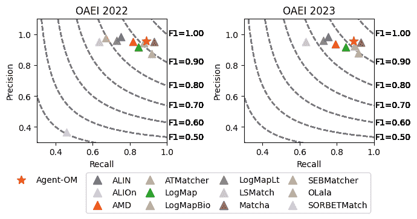

    图 4\. OAEI 解剖学路线 测试用例 1。

1.  (2)

    测试用例 2：我们从参考（R）和对齐（A）中移除这些琐碎的对应项，集中比较非琐碎对应项的匹配性能。图 [5](https://arxiv.org/html/2312.00326v6#S5.F5 "Figure 5 ‣ item 2 ‣ 5.2.2\. OAEI Anatomy Track ‣ 5.2\. Evaluation of Three OAEI Tracks ‣ 5\. Evaluation ‣ Agent-OM: Leveraging LLM Agents for Ontology Matching") 比较了 Agent-OM 与 OAEI 2022 和 OAEI 2023 中 12 个 OM 系统在非琐碎对应项对齐方面的结果。我们观察到 Agent-OM 在性能上更为优秀。Agent-OM 的整体 F1 得分优于 9 个传统的 OM 系统，优于两个基于 LLM 的系统（OLaLa 和 SORBETMatch），仅次于一个深度学习（DL）基础的 OM 系统（Matcha），后者可能受益于这个案例中可用的大型训练集。

    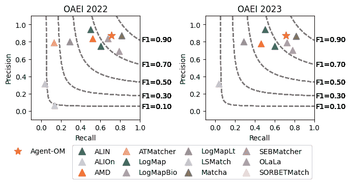

    图 5\. OAEI 解剖学路线 测试用例 2。

#### 5.2.3\. OAEI MSE 路线

OAEI MSE 路线提供了材料科学与工程本体的参考对齐（Nasr，[2020](https://arxiv.org/html/2312.00326v6#bib.bib52)）。该路线包含三个测试用例，对齐 MaterialInformation（Ashino，[2010](https://arxiv.org/html/2312.00326v6#bib.bib7)）、MatOnto（iNovex IRAD，[未注明日期](https://arxiv.org/html/2312.00326v6#bib.bib33)）和 EMMO（欧洲材料建模委员会，[未注明日期](https://arxiv.org/html/2312.00326v6#bib.bib20)）。MaterialInformation 和 MatOnto 使用 Type 1 命名约定，而 EMMO 使用 Type 2 命名约定。

1.  (1)

    测试用例 1：此用例提供了一个小版本的 MaterialInformation 和中等大小的 MatOnto 的参考对齐。该任务的挑战在于，参考故意包括了几个包含关系对齐点，而 OM 系统可能会错误地将包含关系映射为等价关系。图 [6](https://arxiv.org/html/2312.00326v6#S5.F6 "图 6 ‣ 项目 1 ‣ 5.2.3\. OAEI MSE 路径 ‣ 5.2\. 三个 OAEI 路径的评估 ‣ 5\. 评估 ‣ Agent-OM：利用 LLM 代理进行本体匹配") 将 Agent-OM 与 OAEI 2022 和 OAEI 2023 中 4 个 OM 系统的结果进行了比较。Agent-OM 实现了最佳性能，具有最高的 F1 分数。

    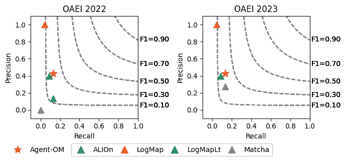

    图 6\. OAEI MSE 路径测试用例 1。

1.  (2)

    测试用例 2：此用例提供了大版本的 MaterialInformation 和中等大小的 MatOnto 的参考对齐。该任务的挑战在于对材料科学中使用的许多特定术语、缩写和首字母缩略词进行对齐。例如，“Au”代表“金”，“Ag”代表“银”，“Cu”代表“铜”。图 [7](https://arxiv.org/html/2312.00326v6#S5.F7 "图 7 ‣ 项目 2 ‣ 5.2.3\. OAEI MSE 路径 ‣ 5.2\. 三个 OAEI 路径的评估 ‣ 5\. 评估 ‣ Agent-OM：利用 LLM 代理进行本体匹配") 将 Agent-OM 与 OAEI 2022 和 OAEI 2023 中 4 个 OM 系统的结果进行了比较。Agent-OM 在 OAEI 2022 和 OAEI 2023 的精度、召回率和总体 F1 分数上都表现最好。由于 LLM 模型能够访问大量的训练文献，因此我们预计基于 LLM 的匹配器在此测试用例中会有较高的召回率。

    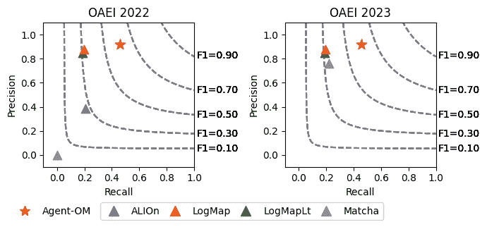

    图 7\. OAEI MSE 路径测试用例 2。

1.  (3)

    测试用例 3：此用例提供了大版本的 MaterialInformation 和中等大小的 EMMO 的参考对齐。与测试用例 1 和测试用例 2 中使用的 MatOnto 不同，EMMO 扩展了名为基本形式本体（BFO）的上层本体。这意味着 EMMO 中的类根据 BFO 类进行了某种程度的标准化。图 [8](https://arxiv.org/html/2312.00326v6#S5.F8 "图 8 ‣ 项目 3 ‣ 5.2.3\. OAEI MSE 路径 ‣ 5.2\. 三个 OAEI 路径的评估 ‣ 5\. 评估 ‣ Agent-OM：利用 LLM 代理进行本体匹配") 将 Agent-OM 与 OAEI 2022 和 OAEI 2023 中 4 个 OM 系统的结果进行了比较。Agent-OM 的表现与 OAEI 2022 最佳结果相当，而在 OAEI 2023 中被基于 DL 的 OM 系统 Matcha 超越。

    

    图 8\. OAEI MSE 路径测试用例 3。

## 6\. 消融研究

### 6.1\. 系统组件

#### 6.1.1\. 架构

我们将Agent-OM与两种更简单的架构进行比较，其中OM更多依赖于直接使用LLM。 (1) 仅LLM：给定$O_{s}$和$O_{t}$，该方法提取每个$e1\in O_{s}$和$e2\in O_{t}$。匹配决策完全基于LLM，而没有任何额外信息。 (2) 带上下文的LLM：给定$O_{s}$和$O_{t}$，该方法提取每个$e1\in O_{s},e2\in O_{t}$及其句法、词汇和语义信息。匹配决策使用LLM来判断两个概念是否相同，基于提供的信息。

实验是在第[4.2](https://arxiv.org/html/2312.00326v6#S4.SS2 "4.2\. 运行示例 ‣ 4\. 实现细节 ‣ Agent-OM: 利用LLM代理进行本体匹配")节中演示的CMT-ConfOf对齐上进行的。我们使用GPT模型gpt-4o，设置similarity_threshold=0.90。图[9](https://arxiv.org/html/2312.00326v6#S6.F9 "图 9 ‣ 6.1.1\. 架构 ‣ 6.1\. 系统组件 ‣ 6\. 消融研究 ‣ Agent-OM: 利用LLM代理进行本体匹配")比较了Agent-OM与仅LLM和带上下文的LLM。仅LLM的精度和召回率较低。带上下文的LLM通过提供额外的信息在一定程度上克服了这一不足，但在没有优化匹配候选选择的情况下，令牌消耗极高。我们的Agent-OM架构通过工具调用代理和混合数据库搜索解决了这两个主要挑战。需要注意的是，这里演示的CMT-ConfOf对齐是一个小规模对齐任务，而Agent-OM在大规模OM任务中预计会更有效和高效。

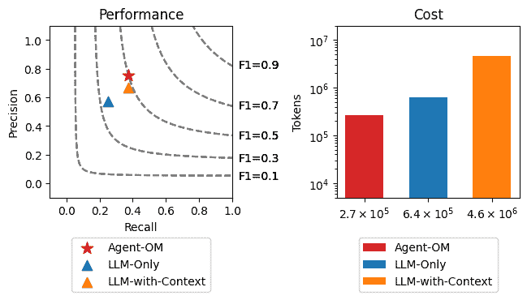

图9\. 与基于LLM的架构比较。

#### 6.1.2\. LLMs

图[10](https://arxiv.org/html/2312.00326v6#S6.F10 "图 10 ‣ 6.1.2\. LLMs ‣ 6.1\. 系统组件 ‣ 6\. 消融研究 ‣ Agent-OM: 利用LLM代理进行本体匹配")展示了Agent-OM在OAEI解剖学赛道上使用不同LLM的表现。一般而言，API访问的模型表现优于开源模型。领先的模型gpt-4o和claude-3-sonnet都是大型API访问模型。在开源模型中，gemma-2-9b表现最佳，而llama-3-8b相对较差。值得注意的是，尽管我们看到llama-3.1-8b比其前一个版本有所提升，但qwen-2.5-7b并没有表现出相对于其前一版本的优势。这可能是LLM开发者针对本体匹配之外的任务进行优化的副作用。我们还尝试了从Llama和Qwen系列派生的其他LLM，通常发现其表现较差，这可能是由于针对特定任务的微调。

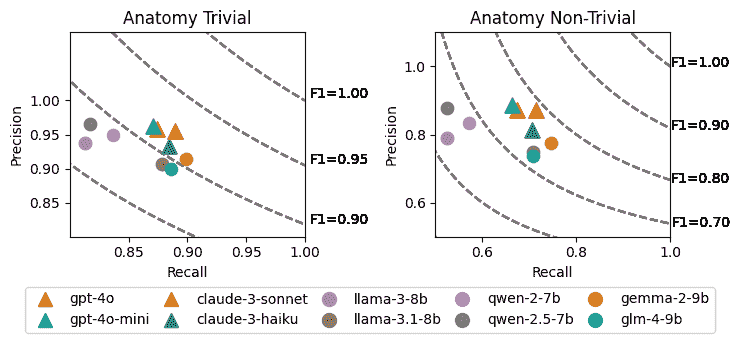

图10\. 不同LLM的比较。API访问的模型以三角形表示，开源模型以圆圈表示。

#### 6.1.3\. 文本嵌入模型

我们还在OAEI解剖学赛道上测试了三种不同的文本嵌入（OpenAI, [[n.d.]b](https://arxiv.org/html/2312.00326v6#bib.bib56)）。文本嵌入向量的默认长度为1536（对于text-embedding-ada-002和text-embedding-3-small）以及3072（对于text-embedding-3-large）。我们没有观察到从text-embedding-3-small到text-embedding-3-large改变文本嵌入向量时有显著的差异。我们没有发现text-embedding-3-small和text-embedding-3-large的性能优于text-embedding-ada-002。

#### 6.1.4\. 混合数据库

使用混合数据库为基于搜索的本体匹配（OM）解锁了潜力。我们将$N_{s}$和$N_{t}$分别定义为从源本体（$O_{s}$）和目标本体（$O_{t}$）中提取的实体数量。在传统的基于LLM的OM中，匹配是基于二元问题，通过比较$O_{s}$和$O_{t}$中每对实体的相关信息来进行的。所消耗的标记数量为$N_{s}*N_{t}$（用于检索和匹配）。在基于搜索的OM中，我们首先从$O_{s}$和$O_{t}$中检索实体信息，并将其存储在混合数据库中。根据我们在第[4](https://arxiv.org/html/2312.00326v6#S4 "4\. 实现细节 ‣ Agent-OM: 利用LLM代理进行本体匹配")节中的方法，所消耗的标记数量为$N_{s}+N_{t}$（用于检索）+ 0（用于搜索）+ $k(N_{s}+N_{t})$（用于验证）+ 0（用于合并）。基于搜索的OM具有成本效益，因为在常见的OM任务设置中，$N_{s}, N_{t} >> k+1$时，$(k+1)(N_{s}+N_{t}) < N_{s}*N_{t}$这一不等式始终成立。我们还应用了两种方法来减少LLM的幻觉（即搜索结果中的假阳性映射）：验证器和合并器。

#### 6.1.5\. 匹配验证器

我们通过要求LLM自我检查候选对应关系来使用验证器。这有助于检测两种常见类型的假阳性映射：（1）不存在的映射和（2）反直觉的映射。图[11](https://arxiv.org/html/2312.00326v6#S6.F11 "图11 ‣ 6.1.5\. 匹配验证器 ‣ 6.1\. 系统组件 ‣ 6\. 消融研究 ‣ Agent-OM: 利用LLM代理进行本体匹配")比较了我们分析的三个OAEI赛道中，使用和不使用验证的精确度、召回率和F1分数。使用验证的匹配结果通常在精确度和F1分数上有所提高，但召回率略有下降。这与CoT自一致性（CoT-SC）（Wang等，[2023b](https://arxiv.org/html/2312.00326v6#bib.bib77)）中的发现一致，在这些研究中，提供自我检查能够减少LLM的幻觉。请注意，我们的实验设置了相似度阈值$T\in[0.90,0.95]$，因此匹配性能的提高在统计上并不显著，但当相似度阈值较低时，匹配验证器将对性能产生重大影响。

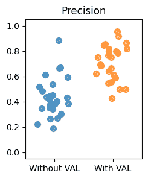

(a)

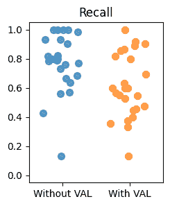

(b)

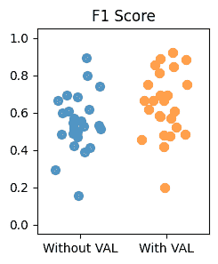

(c)

图 11\. 无匹配验证器与有匹配验证器的比较。

#### 6.1.6\. 匹配合并器

我们应用了一个合并函数 $O_{s}\Leftrightarrow O_{t}$，将 $O_{s}\Rightarrow O_{t}$ 和 $O_{s}\Leftarrow O_{t}$ 的结果结合，以提高匹配性能。图 [12](https://arxiv.org/html/2312.00326v6#S6.F12 "Figure 12 ‣ 6.1.6\. Matching Merger ‣ 6.1\. System Components ‣ 6\. Ablation Study ‣ Agent-OM: Leveraging LLM Agents for Ontology Matching") 显示了我们分析的三个 OAEI 路径中 $O_{s}\Rightarrow O_{t}$、$O_{t}\Leftarrow O_{s}$ 和 $O_{s}\Leftrightarrow O_{t}$ 的精度、召回率和 F1 分数的比较。合并后的匹配结果通常在精度和 F1 分数上有显著提升，而召回率略有下降。结果与 RAG-Fusion（Raudaschl, [[n.d.]](https://arxiv.org/html/2312.00326v6#bib.bib65)）中的发现一致，其中提供两条不同路径执行相同的匹配任务可以减少 LLM 的幻觉现象。

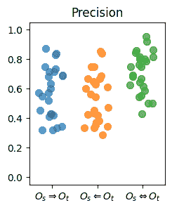

(a)

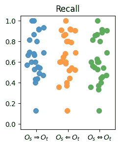

(b)

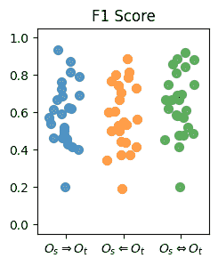

(c)

图 12\. 比较 $O_{s}\Rightarrow O_{t}$、$O_{t}\Leftarrow O_{s}$ 和 $O_{s}\Leftrightarrow O_{t}$

### 6.2\. 超参数设置

#### 6.2.1\. 相似度阈值

我们在分析的三个 OAEI 路径中测试了相似度阈值 $T\in[0.50,0.55,0.60,...,0.90,0.95,1.00]$。最佳的相似度阈值似乎是 $T\in[0.90,0.95]$，它在精度和召回率之间取得了良好的平衡，从而实现了更高的总体 F1 分数。如果我们将相似度阈值视为等价匹配候选项所需的置信区间（CI），则该设置反映了接受 5%-10% 可能性值偏离估计的常规做法。对于大规模 OM 任务（如解剖学路径），结果对第三个值的敏感度不大。

#### 6.2.2\. Top@k

我们还在我们分析的三个 OAEI 路径中测试了 top@k 值 $k\in[1,2,3,...,8,9,10]$。我们观察到，$k=1$ 和 $k=2$ 无法提供足够的候选项供 LLM 选择，而当 $k>5$ 时，适当的匹配很少被找到。我们建议将 $k\in[3,4,5]$ 设置为平衡计算复杂度和结果精度的最佳选择。请注意，我们处理了多个实体具有相同 RRF 分数的平局情况。在这种情况下，测试的实体总数可能大于 $k$，因为这些得分相同的实体共享相同的排名。

#### 6.2.3\. 如何选择相似度阈值和 Top@k？

本体是依赖上下文的概念模型，遵循不同的约定和限制，以反映不同应用层级的需求（Shenghui Wang，[2021](https://arxiv.org/html/2312.00326v6#bib.bib68)）。超参数设置可以通过参考映射为每个特定的 OM 任务进行调整，以实现最佳结果。我们观察到，较高的相似性阈值和较低的 top@k 值可能会导致高精度，在这种情况下，大多数琐碎的映射可以找到，但一些较为晦涩的真实映射可能会被遗漏，从而降低召回率。另一方面，较低的相似性阈值和较高的 top@k 值可能会导致高召回率，但精度可能较低，因为在匹配过程中会生成更多的错误映射。这表明，在较低相似性阈值和较高 top@k 值的设置下，应用的匹配优化（验证器和合并器）会更强大。我们在广泛的 OAEI 实验中发现，阈值 $T\in[0.90,0.95]$ 和 top@k $k\in[3,4,5]$ 是最优的。在将 Agent-OM 应用于没有参考的匹配问题的实际应用中，我们建议选择 $T$ 和 $k$ 在这些范围内。

## 7. 讨论

Google DeepMind 将人工智能的自主性分为 6 个等级（Morris 等人，[2024](https://arxiv.org/html/2312.00326v6#bib.bib50)）。我们认为，大型语言模型（LLM）的潜力不仅仅是作为顾问、协作者或专家来回答 OM 任务中的二分类问题，它还可以作为代理人来模拟人类行为执行 OM 任务，包括数据预处理、数据准备、数据分析和数据验证。更高的自主性减少了在 OM 任务中使用 LLM 的障碍。

1.  (1)

    基于代理的 OM 比基于 LLM 的 OM 更高效。LLM 计算成本较高。尽管基于 LLM 的 OM 使用二分类问题时存在重复的 LLM 提示，但基于代理的 OM 利用向量数据库存储本体检索结果，从而减少了令牌消耗的财务成本。

1.  (2)

    基于代理的 OM 也比基于 LLM 的 OM 更有效。基于 LLM 的 OM 通常表现为高召回率和低精度。由于其庞大的知识库，它能够发现正向匹配，但也不可避免地存在假阳性映射。LLM 是零样本推理器（Kojima 等人，[2022](https://arxiv.org/html/2312.00326v6#bib.bib38)），但它们也是少样本学习者（Brown 等人，[2020](https://arxiv.org/html/2312.00326v6#bib.bib12)）。它们的推理能力取决于所提供信息的丰富程度。在自主代理人的协助下，进行广泛的规划、工具使用和记忆管理，基于代理的 LLM 驱动的 OM 系统能够访问更多的详细信息，从而具有以下优势：

    1.  (a)

        上下文学习：LLM 拥有大量的背景知识。给定一个上下文，LLM 可以选择相关的背景知识，从而在词汇匹配方面表现得更好。

    1.  (b)

        传递推理：LLM可以推理传递关系。它们还能够理解一般性和特定领域的场景，并在必要时应用词汇验证。

    1.  (c)

        自我修正：LLM具有强大的自我修正能力。即使给定一个错误的陈述，LLM也能做出良好的判断，自动删除错误的映射。例如，语义匹配可能会导致错误的映射，因为它只考虑数据结构，而忽略了实体的语言意义。然而，这种小片段的错误信息并不会影响LLM仍然学习到的正确真理。

尽管基于代理的LLM驱动OM系统有几个成功因素，我们也观察到：

1.  (1)

    匹配过程可能更加复杂。尽管CoT可能模拟人类如何规划和执行任务，但它仍然是人类思维的不完全模型。人类推理使用更复杂的思维网络，因为人类倾向于尝试不同的孤立路径（即ToT，思维树（Yao等人，[2023](https://arxiv.org/html/2312.00326v6#bib.bib81); Long，[2023](https://arxiv.org/html/2312.00326v6#bib.bib42)）），探索多条路径（即GoT，思维图（Besta等人，[2024](https://arxiv.org/html/2312.00326v6#bib.bib10); Yao等人，[2024](https://arxiv.org/html/2312.00326v6#bib.bib82)）），并回溯、分裂或合并，以找到问题的最优解决方案。例如，人们可能会将已发现的映射作为输入进行下一次迭代。

1.  (2)

    提示工程是指导高效LLM代理的关键。这些提示目前是手工制作的。对于基于提示的工具，不同的LLM可能有不同的默认聊天模板。在所有LLM中找到通用的硬提示几乎是不可能的。然而，我们提供了来自实验的最简单标准化版本的提示。我们系统中使用的提示目前支持主流的LLM，如OpenAI GPT模型、Anthropic Claude模型、Meta Llama 3、阿里巴巴Qwen 2、Google Gemma 2和ChatGLM 4。对于列表中未包含的模型，我们还提供了一个接口，可以将新的LLM添加到我们的系统中，但可能需要对代码进行小幅定制，以适应所使用的LLM。我们预计未来通过开源社区的努力，我们的系统将支持更多的模型。我们追求自动化的提示工程，并将在未来版本中考虑使用软提示。

1.  (3)

    LLM的幻觉现象可以减轻，但无法消除。RAG的准确性仍然是一个未解的问题。人类参与可能仍然是必要的（Ouyang等人，[2022](https://arxiv.org/html/2312.00326v6#bib.bib58)）。先进的RAG技术，例如在RAG过程中包含解释性上下文（Anthropic, [[n.d.]b](https://arxiv.org/html/2312.00326v6#bib.bib5)），是有前景的方向。

1.  (4)

    精度和召回率之间存在权衡。严格的规则可能导致高精度，其中大多数隐性真实映射可以找到，但它们可能会错过一些显性真实映射。另一方面，宽松的规则可能会导致较高的召回率，但随着匹配过程生成更多映射，精度得分可能会变得非常低。

1.  (5)

    用于本体匹配（OM）的LLMs，我们发现Moravec悖论（Moravec，[1988](https://arxiv.org/html/2312.00326v6#bib.bib49)）：“困难的问题是容易的，简单的问题是困难的”（第192页）（Pinker，[1994](https://arxiv.org/html/2312.00326v6#bib.bib61)）。尽管Agent-OM在复杂和少样本的OM任务中表现良好，但在简单的OM任务中表现并不突出。我们还将考虑将基于LLM的方法与传统的基于知识和基于机器学习的方法结合起来。

## 8\. 限制

1.  (1)

    我们仅评估匹配命名类、对象属性和数据类型属性的T-Box匹配数据集。由于我们目标应用领域的隐私问题，A-Box匹配数据集（包括个体数据实例）未被考虑。为了避免个人和敏感信息的暴露，可能需要额外的数据工程（例如数据去标识化和模糊处理）来将LLMs应用于A-Box匹配数据集。

1.  (2)

    由于API访问的商业LLMs调用API的高成本，本研究未包含最新商业模型（例如gpt-o1-preview和claude-3-opus）的实验。根据我们在第[6.1.2](https://arxiv.org/html/2312.00326v6#S6.SS1.SSS2 "6.1.2\. LLMs ‣ 6.1\. System Components ‣ 6\. Ablation Study ‣ Agent-OM: Leveraging LLM Agents for Ontology Matching")节的发现，我们假设这些模型在OM任务中可能会表现得更好。

1.  (3)

    本地运行开源LLMs可能需要额外的资源。API访问的商业LLMs的运行时间由LLM提供者控制。

## 9\. 未来工作

1.  (1)

    多模态OM：我们已经将我们的系统打包成几个基于自然语言的命令。它可以与先进的LLM功能集成，支持多模态输入，如本体图和在线研讨会。更丰富的信息源可能会提高OM的性能。

1.  (2)

    多语言OM：Agent-OM支持多语言本体。我们已经在OAEI 2022和2023的Multifarm Track上进行了测试，这是一个经过修改的会议数据集，已翻译成九种不同的语言。由于基准数据较少，结果未在此处包含；只有两个传统系统的结果可用。

1.  (3)

    小型语言模型（SLM）用于OM：SLM（例如gemma-2-2b）在资源受限的设备中非常有用，但目前它们的工具接口存在问题。

## 10\. 结论

本文介绍了一种基于大型语言模型（LLM）的新设计范式，用于本体匹配（OM）系统。我们提出并实现了一个基于LLM的代理驱动框架——Agent-OM，并提供了一个概念验证系统。我们将我们的系统与当前先进的OM系统进行了比较，执行了不同类型的OM任务。该系统展示了在不同复杂度级别下执行OM任务的强大能力，充分利用了LLM代理在OM中的潜力。我们还讨论了使用LLM和LLM代理执行OM任务的优势和当前的局限性。

我们的工作聚焦于那些无法再训练且难以微调的预训练大型基础模型。我们的方法通过利用CoT、ICL/RAG和提示工程技术，在不改变LLM模型本身的情况下，取得了良好的OM任务效果。这是一种简单、轻量、基于自然语言的驱动方法，具有很高的可扩展性。Agent-OM是你所需要的一切。虽然OM的研究已经有二十多年历史，但我们现在已经接近实现100%准确、完全自动化和领域独立的OM目标。

## 伦理考虑

Agent-OM未参与OAEI 2022和2023年的竞赛。根据OAEI数据政策（检索日期：2024年12月1日），“OAEI结果和数据集是公开的，但需遵循类似于[NIST为TREC定义的使用政策](https://trec.nist.gov/results.html)的使用政策。这些规则适用于所有使用这些数据的人。”请从官方网站获取更多详细信息：[https://oaei.ontologymatching.org/doc/oaei-deontology.2.html](https://oaei.ontologymatching.org/doc/oaei-deontology.2.html)。人工智能生成内容（AIGC）可能包含有害、不道德、偏见或负面的内容（[https://docs.mistral.ai/capabilities/guardrailing/](https://docs.mistral.ai/capabilities/guardrailing/))。然而，本体匹配任务仅检查特定领域术语的含义，我们未观察到生成此类内容。

###### 致谢。

作者感谢审稿人提供的有见地的评论。感谢Sven Hertling整理了存储在匹配评估工具包中的OAEI数据集。感谢会议分会（Ondřej Zamazal、Jana Vataščinová和Lu Zhou）、解剖学分会（Mina Abd Nikooie Pour、Huanyu Li、Ying Li和Patrick Lambrix）以及MSE分会（Engy Nasr和Martin Huschka）组织者提供的有关重现基准的有益建议。感谢澳大利亚国立大学（ANU）的Jing Jiang提供的有关语义检索器中使用的动词化器的有益建议。感谢ANU统计支持网络的Alice Richardson提供的关于统计分析的有益建议。感谢澳大利亚联邦科学与工业研究组织（CSIRO）对本项目的支持。

## 参考文献

+   (1)

+   Alibaba Qwen Team（[n.d.]）Alibaba Qwen Team。[n.d.]。Qwen 模型。检索日期：2024年12月1日，来自 [https://qwenlm.github.io](https://qwenlm.github.io)

+   Amini 等（2024）Reihaneh Amini、Sanaz Saki Norouzi、Pascal Hitzler 和 Reza Amini。2024年。朝着使用大型语言模型的复杂本体对齐。arXiv:2404.10329 [cs.AI] [https://arxiv.org/abs/2404.10329](https://arxiv.org/abs/2404.10329)

+   Anthropic（[n.d.]a）Anthropic。[n.d.]a。Claude 模型。检索日期：2024年12月1日，来自 [https://docs.anthropic.com/en/docs/about-claude/models](https://docs.anthropic.com/en/docs/about-claude/models)

+   Anthropic（[n.d.]b）Anthropic。[n.d.]b。介绍上下文检索。检索日期：2024年12月1日，来自 [https://www.anthropic.com/news/contextual-retrieval](https://www.anthropic.com/news/contextual-retrieval)

+   Asai 等（2024）Akari Asai、Zeqiu Wu、Yizhong Wang、Avirup Sil 和 Hannaneh Hajishirzi。2024年。Self-RAG：通过自我反思学习检索、生成和批判。在*第十二届国际学习表征大会*。OpenReview.net，奥地利维也纳。

+   Ashino（2010）Toshihiro Ashino。2010年。材料本体：一个用于交换材料信息和知识的基础设施。*数据科学杂志* 9（2010），54–61。[https://doi.org/10.2481/dsj.008-041](https://doi.org/10.2481/dsj.008-041)

+   Babaei Giglou 等（2023）Hamed Babaei Giglou、Jennifer D’Souza 和 Sören Auer。2023年。LLMs4OL：用于本体学习的大型语言模型。在*语义网 – ISWC 2023*。Springer，希腊雅典，408–427。[https://doi.org/10.1007/978-3-031-47240-4_22](https://doi.org/10.1007/978-3-031-47240-4_22)

+   Beisswanger 和 Hahn（2012）Elena Beisswanger 和 Udo Hahn。2012年。朝着有效且可重用的参考对齐—本体对齐的十项基本质量检查及其在三种不同参考数据集中的应用。*生物医学语义学杂志* 3，文章 S4（2012），14 页。[https://doi.org/10.1186/2041-1480-3-S1-S4](https://doi.org/10.1186/2041-1480-3-S1-S4)

+   Besta 等（2024）Maciej Besta、Nils Blach、Ales Kubicek、Robert Gerstenberger、Michal Podstawski、Lukas Gianinazzi、Joanna Gajda、Tomasz Lehmann、Hubert Niewiadomski、Piotr Nyczyk 和 Torsten Hoefler。2024年。思想图：用大型语言模型解决复杂问题。在*人工智能协会年会论文集*，第38卷。AAAI Press，美国华盛顿，17682–17690。[https://doi.org/10.1609/aaai.v38i16.29720](https://doi.org/10.1609/aaai.v38i16.29720)

+   Bodenreider 等（2005）Olivier Bodenreider、Terry F Hayamizu、Martin Ringwald、Sherri De Coronado 和 Songmao Zhang。2005年。老鼠与人：对齐小鼠与人类的解剖学。在*美国医学信息学协会年会 – AMIA 2005*。AMIA，美国华盛顿，61–65。

+   Brown 等人（2020）Tom Brown、Benjamin Mann、Nick Ryder、Melanie Subbiah、Jared D Kaplan、Prafulla Dhariwal、Arvind Neelakantan、Pranav Shyam、Girish Sastry、Amanda Askell、Sandhini Agarwal、Ariel Herbert-Voss、Gretchen Krueger、Tom Henighan、Rewon Child、Aditya Ramesh、Daniel Ziegler、Jeffrey Wu、Clemens Winter、Chris Hesse、Mark Chen、Eric Sigler、Mateusz Litwin、Scott Gray、Benjamin Chess、Jack Clark、Christopher Berner、Sam McCandlish、Alec Radford、Ilya Sutskever 和 Dario Amodei。2020年。语言模型是少样本学习者。发表于 *第34届神经信息处理系统年会论文集*，卷33。Curran Associates, Inc.，温哥华，加拿大，第159号文章，25页。

+   Cheatham 和 Hitzler（2014）Michelle Cheatham 和 Pascal Hitzler。2014年。会议v2.0：OAEI会议基准的不确定版本。发表于 *语义网 – ISWC 2014*。Springer，意大利里瓦 del Garda，33–48。[https://doi.org/10.1007/978-3-319-11915-1_3](https://doi.org/10.1007/978-3-319-11915-1_3)

+   Chen 等人（2021）Jiaoyan Chen、Ernesto Jiménez-Ruiz、Ian Horrocks、Denvar Antonyrajah、Ali Hadian 和 Jaehun Lee。2021年。通过语义嵌入和远程监督增强本体对齐。发表于 *语义网 – ESWC 2021*。Springer，虚拟会议，392–408。[https://doi.org/10.1007/978-3-030-77385-4_23](https://doi.org/10.1007/978-3-030-77385-4_23)

+   Cormack 等人（2009）Gordon V. Cormack、Charles L. A Clarke 和 Stefan Buettcher。2009年。互惠排序融合优于康多塞方法和个别排序学习方法。发表于 *第32届国际ACM SIGIR信息检索研究与发展会议论文集*。ACM，波士顿，美国，758–759。[https://doi.org/10.1145/1571941.1572114](https://doi.org/10.1145/1571941.1572114)

+   Cregan 等人（2007）Anne Cregan、Rolf Schwitter 和 Thomas Meyer。2007年。悉尼OWL语法——面向OWL 1.1的受控自然语言语法。发表于 *OWLED 2007研讨会：OWL的经验与发展*，卷258。CEUR-WS.org，因斯布鲁克，奥地利。

+   Devlin 等人（2019）Jacob Devlin、Ming-Wei Chang、Kenton Lee 和 Kristina Toutanova。2019年。BERT：用于语言理解的深度双向变换器的预训练。发表于 *2019年北美计算语言学协会：人类语言技术会议论文集*。ACL，明尼阿波利斯，美国，4171–4186。[https://doi.org/10.18653/v1/N19-1423](https://doi.org/10.18653/v1/N19-1423)

+   Do 等人（2003）Hong-Hai Do、Sergey Melnik 和 Erhard Rahm。2003年。模式匹配评估的比较。发表于 *Web、Web服务和数据库系统*。Springer，厄尔富特，德国，221–237。[https://doi.org/10.1007/3-540-36560-5_17](https://doi.org/10.1007/3-540-36560-5_17)

+   Dragisic等人（2017）Zlatan Dragisic、Valentina Ivanova、Huanyu Li和Patrick Lambrix。2017年。《本体对齐评估倡议中的解剖学轨迹经验》。*生物医学语义学杂志* 8，文章56（2017），28页。[https://doi.org/10.1186/s13326-017-0166-5](https://doi.org/10.1186/s13326-017-0166-5)

+   欧洲材料建模委员会（[n.d.]）欧洲材料建模委员会。[n.d.]。《EMMO》。于2024年12月1日从[https://github.com/emmo-repo/EMMO](https://github.com/emmo-repo/EMMO)获取

+   Euzenat和Shvaiko（2013）Jérôme Euzenat和Pavel Shvaiko。2013年。《*本体匹配（第2版）*》。Springer，德国柏林，海德堡。[https://doi.org/10.1007/978-3-642-38721-0](https://doi.org/10.1007/978-3-642-38721-0)

+   Euzenat，Jérôme和Meilicke，Christian和Stuckenschmidt，Heiner和Shvaiko，Pavel和Trojahn，Cássia（2011）Euzenat，Jérôme和Meilicke，Christian和Stuckenschmidt，Heiner和Shvaiko，Pavel和Trojahn，Cássia。2011年。《*本体对齐评估倡议：六年的经验*》。Springer，德国柏林，海德堡，158-192。[https://doi.org/10.1007/978-3-642-22630-4_6](https://doi.org/10.1007/978-3-642-22630-4_6)

+   Faria等人（2014）Daniel Faria、Catia Pesquita、Emanuel Santos、Isabel F Cruz和Francisco M Couto。2014年。《AgreementMakerLight 2.0：面向高效的大规模本体匹配》。载于*ISWC 2014海报和演示轨道论文集*，第1272卷。CEUR-WS.org，意大利里瓦德尔加尔达，457-460。

+   Faria等人（2013）Daniel Faria、Catia Pesquita、Emanuel Santos、Matteo Palmonari、Isabel F. Cruz和Francisco M Couto。2013年。《AgreementMakerLight本体匹配系统》。载于*On the Move to Meaningful Internet Systems: OTM 2013 Conferences*。Springer，奥地利格拉茨，527-541。[https://doi.org/10.1007/978-3-642-41030-7_38](https://doi.org/10.1007/978-3-642-41030-7_38)

+   Giglou等人（2024）Hamed Babaei Giglou、Jennifer D’Souza、Felix Engel和Sören Auer。2024年。《LLMs4OM：使用大型语言模型进行本体匹配》。arXiv:2404.10317 [cs.AI] [https://arxiv.org/abs/2404.10317](https://arxiv.org/abs/2404.10317)

+   Google Cloud（[n.d.]）Google Cloud。[n.d.]。《Google Vertex AI嵌入》。于2024年12月1日从[https://cloud.google.com/vertex-ai/docs/generative-ai/embeddings/get-text-embeddings](https://cloud.google.com/vertex-ai/docs/generative-ai/embeddings/get-text-embeddings)获取

+   Google Gemma团队和Google DeepMind（[n.d.]）Google Gemma团队和Google DeepMind。[n.d.]。《Google Gemma模型》。于2024年12月1日从[https://ai.google.dev/gemma](https://ai.google.dev/gemma)获取

+   He等人（2022）Yuan He、Jiaoyan Chen、Denvar Antonyrajah和Ian Horrocks。2022年。《BERTMap：一个基于BERT的本体对齐系统》。载于*第36届人工智能AAAI大会论文集*，第36卷。AAAI Press，虚拟会议，5684-5691。[https://doi.org/10.1609/aaai.v36i5.20510](https://doi.org/10.1609/aaai.v36i5.20510)

+   He 等人 (2023a) Yuan He, Jiaoyan Chen, Hang Dong, 和 Ian Horrocks. 2023a. 探索大型语言模型在本体对齐中的应用. 收录于 *ISWC 2023 海报、演示和产业轨道会议论文集*，第 3632 卷。CEUR-WS.org，希腊雅典。

+   He 等人 (2024) Yuan He, Jiaoyan Chen, Hang Dong, Ian Horrocks, Carlo Allocca, Taehun Kim, 和 Brahmananda Sapkota. 2024. DeepOnto: 一个用于本体工程的深度学习 Python 包. *语义网* 15, 5 (2024)，1991–2004。 [https://doi.org/10.3233/SW-243568](https://doi.org/10.3233/SW-243568)

+   He 等人 (2023b) Yuan He, Jiaoyan Chen, Ernesto Jimenez-Ruiz, Hang Dong, 和 Ian Horrocks. 2023b. 用于本体包容推理的语言模型分析. 收录于 *计算语言学协会会议论文集：ACL 2023*。ACL，加拿大多伦多，3439–3453。 [https://doi.org/10.18653/v1/2023.findings-acl.213](https://doi.org/10.18653/v1/2023.findings-acl.213)

+   Hertling 和 Paulheim (2023) Sven Hertling 和 Heiko Paulheim. 2023. OLaLa: 基于大型语言模型的本体匹配. 收录于 *第12届知识捕获会议论文集 2023*。ACM，美国佛罗里达州彭萨科拉，131–139。 [https://doi.org/10.1145/3587259.3627571](https://doi.org/10.1145/3587259.3627571)

+   iNovex IRAD ([n.d.]) iNovex IRAD. [n.d.]. MatOnto 项目的本体. 取自 2024年12月1日 [https://github.com/inovexcorp/MatOnto-Ontologies](https://github.com/inovexcorp/MatOnto-Ontologies)

+   Ji 等人 (2023) Ziwei Ji, Nayeon Lee, Rita Frieske, Tiezheng Yu, Dan Su, Yan Xu, Etsuko Ishii, Ye Jin Bang, Andrea Madotto, 和 Pascale Fung. 2023. 自然语言生成中的幻觉问题调研. *ACM 计算机调查* 55, 12, 文章 248 (2023)，38 页。 [https://doi.org/10.1145/3571730](https://doi.org/10.1145/3571730)

+   Jiménez-Ruiz 和 Cuenca Grau (2011) Ernesto Jiménez-Ruiz 和 Bernardo Cuenca Grau. 2011. LogMap: 基于逻辑且可扩展的本体匹配. 收录于 *语义网 – ISWC 2011*。Springer，德国波恩，273–288。 [https://doi.org/10.1007/978-3-642-25073-6_18](https://doi.org/10.1007/978-3-642-25073-6_18)

+   Jiménez-Ruiz 等人 (2011) Ernesto Jiménez-Ruiz, Bernardo Cuenca Grau, 和 Yujiao Zhou. 2011. LogMap 2.0: 基于逻辑、可扩展且互动的本体匹配. 收录于 *第4届生命科学语义网络应用与工具国际研讨会论文集*。ACM，英国伦敦，45–46。 [https://doi.org/10.1145/2166896.2166911](https://doi.org/10.1145/2166896.2166911)

+   Kaljurand (2007) Kaarel Kaljurand. 2007. OWL Verbalizer. 取自 2024年12月1日 [https://github.com/Kaljurand/owl-verbalizer](https://github.com/Kaljurand/owl-verbalizer)

+   Kojima 等人 (2022) Takeshi Kojima, Shixiang (Shane) Gu, Machel Reid, Yutaka Matsuo, 和 Yusuke Iwasawa. 2022. 大型语言模型是零-shot 推理器. 收录于 *第36届神经信息处理系统年会论文集*，第35卷。Curran Associates, Inc.，美国路易斯安那州新奥尔良，第1613号文章，15页。

+   LangChain, Inc. ([n.d.]) LangChain, Inc. [n.d.]. LangChain. 检索于 2024年12月1日, 来源于 [https://www.langchain.com](https://www.langchain.com)

+   Lewis 等人（2020年）Patrick Lewis、Ethan Perez、Aleksandra Piktus、Fabio Petroni、Vladimir Karpukhin、Naman Goyal、Heinrich Küttler、Mike Lewis、Wen-tau Yih、Tim Rocktäschel、Sebastian Riedel 和 Douwe Kiela. 2020年. 针对知识密集型自然语言处理任务的检索增强生成. 见于 *神经信息处理系统第34届年会论文集*，第33卷. Curran Associates Inc., 加拿大温哥华，文章793，16页.

+   Li 等人（2021年）Guoxuan Li、Songmao Zhang、Jiayi Wei 和 Wenqian Ye. 2021年. 结合 FCA-Map 和表示学习对齐大型生物医学本体. 见于 *第16届国际本体匹配研讨会论文集 – ISWC 2021*，第3063卷. CEUR-WS.org, 虚拟会议, 207–208页.

+   Long（2023年）Jieyi Long. 2023年. 大型语言模型引导的思维树. arXiv:2305.08291 [cs.AI] [https://arxiv.org/abs/2305.08291](https://arxiv.org/abs/2305.08291)

+   Manakul 等人（2023年）Potsawee Manakul、Adian Liusie 和 Mark Gales. 2023年. SelfCheckGPT：生成性大语言模型的零资源黑盒幻觉检测. 见于 *2023年自然语言处理实证方法会议论文集*. ACL, 新加坡, 9004–9017页. [https://doi.org/10.18653/v1/2023.emnlp-main.557](https://doi.org/10.18653/v1/2023.emnlp-main.557)

+   Manning 等人（2008年）Christopher D. Manning、Prabhakar Raghavan 和 Hinrich Schütze. 2008年. *信息检索导论*. 剑桥大学出版社, 英国剑桥. [https://doi.org/10.1017/CBO9780511809071](https://doi.org/10.1017/CBO9780511809071)

+   Meta ([n.d.]) Meta. [n.d.]. Meta Llama 模型. 检索于 2024年12月1日, 来源于 [https://www.llama.com](https://www.llama.com)

+   微软 ([n.d.]a) 微软. [n.d.]a. Copilot. 检索于 2024年12月1日, 来源于 [https://www.microsoft.com/en-us/microsoft-copilot/personal-ai-assistant](https://www.microsoft.com/en-us/microsoft-copilot/personal-ai-assistant)

+   微软 ([n.d.]b) 微软. [n.d.]b. Copilot Studio. 检索于 2024年12月1日, 来源于 [https://www.microsoft.com/en-us/microsoft-copilot/microsoft-copilot-studio](https://www.microsoft.com/en-us/microsoft-copilot/microsoft-copilot-studio)

+   微软 Azure ([n.d.]) 微软 Azure. [n.d.]. GPT-RAG. 检索于 2024年12月1日, 来源于 [https://github.com/Azure/GPT-RAG/blob/main/docs/RAG_CONCEPTS.md](https://github.com/Azure/GPT-RAG/blob/main/docs/RAG_CONCEPTS.md)

+   Moravec（1988年）Hans Moravec. 1988年. *心灵之子：机器人与人类智能的未来*. 哈佛大学出版社，美国马萨诸塞州剑桥.

+   Morris et al. (2024) Meredith Ringel Morris, Jascha Sohl-Dickstein, Noah Fiedel, Tris Warkentin, Allan Dafoe, Aleksandra Faust, Clement Farabet, 和 Shane Legg. 2024. 为实现AGI进展设定的AGI级别。见 *第41届国际机器学习大会论文集*，第235卷。ML Research Press，奥地利维也纳，36308–36321。

+   Nakajima ([n.d.]) Yohei Nakajima. [n.d.]. BabyAGI. 取自 2024年12月1日，[https://github.com/yoheinakajima/babyagi](https://github.com/yoheinakajima/babyagi)

+   Nasr (2020) Engy Nasr. 2020. *自动本体匹配在材料科学与工程中的评估（硕士论文）*。硕士论文。弗赖堡大学（Albert Ludwig University of Freiburg），德国弗赖堡。

+   Norouzi et al. (2023) Sanaz Saki Norouzi, Mohammad Saeid Mahdavinejad, 和 Pascal Hitzler. 2023. 与ChatGPT进行对话式本体对齐。见 *第18届国际本体对齐研讨会 – ISWC 2023论文集*，第3591卷。CEUR-WS.org，希腊雅典，61–66。

+   Ollama ([n.d.]) Ollama. [n.d.]. Ollama. 取自 2024年12月1日，[https://ollama.com/](https://ollama.com/)

+   OpenAI ([n.d.]a) OpenAI. [n.d.]a. GPTs。取自 2024年12月1日，[https://openai.com/blog/introducing-gpts](https://openai.com/blog/introducing-gpts)

+   OpenAI ([n.d.]b) OpenAI. [n.d.]b. OpenAI Embeddings. 取自 2024年12月1日，[https://platform.openai.com/docs/guides/embeddings/embedding-models](https://platform.openai.com/docs/guides/embeddings/embedding-models)

+   OpenAI ([n.d.]c) OpenAI. [n.d.]c. OpenAI Models. 取自 2024年12月1日，[https://platform.openai.com/docs/models](https://platform.openai.com/docs/models)

+   Ouyang et al. (2022) Long Ouyang, Jeffrey Wu, Xu Jiang, Diogo Almeida, Carroll Wainwright, Pamela Mishkin, Chong Zhang, Sandhini Agarwal, Katarina Slama, Alex Ray, John Schulman, Jacob Hilton, Fraser Kelton, Luke Miller, Maddie Simens, Amanda Askell, Peter Welinder, Paul F Christiano, Jan Leike, 和 Ryan Lowe. 2022. 训练语言模型以遵循带有人类反馈的指令。见 *第36届神经信息处理系统年会论文集*，第35卷。Curran Associates, Inc.，美国路易斯安那州新奥尔良，27730–27744。

+   Ovadia et al. (2024) Oded Ovadia, Menachem Brief, Moshik Mishaeli, 和 Oren Elisha. 2024. 微调还是检索？比较LLMs中的知识注入。见 *2024年自然语言处理实证方法会议论文集*。ACL，迈阿密，佛罗里达州，美国，237–250。[https://doi.org/10.18653/v1/2024.emnlp-main.15](https://doi.org/10.18653/v1/2024.emnlp-main.15)

+   Payne 和 Tamma (2014) Terry R. Payne 和 Valentina Tamma. 2014. 使用不对称和不完整知识进行本体对应的谈判。见 *2014年国际自主代理和多代理系统会议论文集*。IFAAMAS，法国巴黎，517–524。

+   Pinker (1994) Steven Pinker. 1994. *语言本能：心智如何创造语言*。William Morrow and Company，纽约，NY，美国。

+   PostgreSQL Global Development Group ([n.d.]a) PostgreSQL Global Development Group. [n.d.]a. pgvector。2024年12月1日检索自 [https://github.com/pgvector/pgvector](https://github.com/pgvector/pgvector)

+   PostgreSQL Global Development Group ([n.d.]b) PostgreSQL Global Development Group. [n.d.]b. PostgreSQL。2024年12月1日检索自 [https://www.postgresql.org](https://www.postgresql.org)

+   Qiang 等 (2024) Zhangcheng Qiang, Kerry Taylor 和 Weiqing Wang. 2024. 文本预处理管道如何影响本体句法匹配？arXiv:2411.03962 [cs.CL] [https://arxiv.org/abs/2411.03962](https://arxiv.org/abs/2411.03962)

+   Raudaschl ([n.d.]) Adrian Raudaschl. [n.d.]. RAG-Fusion。2024年12月1日检索自 [https://github.com/Raudaschl/rag-fusion](https://github.com/Raudaschl/rag-fusion)

+   Reimers 和 Gurevych (2019) Nils Reimers 和 Iryna Gurevych. 2019. Sentence-BERT: 使用 Siamese BERT 网络进行句子嵌入。在 *2019 年自然语言处理经验方法会议和第九届国际联合自然语言处理会议 (EMNLP-IJCNLP) 论文集* 中。ACL，香港，中国，3982–3992。 [https://doi.org/10.18653/v1/D19-1410](https://doi.org/10.18653/v1/D19-1410)

+   Richards ([n.d.]) Toran Bruce Richards. [n.d.]. Auto-GPT。2024年12月1日检索自 [https://github.com/Significant-Gravitas/AutoGPT](https://github.com/Significant-Gravitas/AutoGPT)

+   Shenghui Wang (2021) Shenghui Wang. 2021. 链接数据与语义网 (2021-2A)：本体匹配。2024年12月1日检索自 [https://www.utwente.nl/en/ces/sal/exams/Linked-Data-and-Semantic-Web/ldsw-lecture6-om-2021-2a.pdf](https://www.utwente.nl/en/ces/sal/exams/Linked-Data-and-Semantic-Web/ldsw-lecture6-om-2021-2a.pdf)

+   Shvaiko 和 Euzenat (2013) Pavel Shvaiko 和 Jérôme Euzenat. 2013. 本体匹配：现状与未来挑战。*IEEE 知识与数据工程学报* 25, 1 (2013)，158–176。 [https://doi.org/10.1109/TKDE.2011.253](https://doi.org/10.1109/TKDE.2011.253)

+   Solimando 等 (2014) Alessandro Solimando, Ernesto Jiménez-Ruiz 和 Giovanna Guerrini. 2014. 在本体到本体映射中检测与纠正保守性原则违反。在 *语义网 – ISWC 2014* 中。Springer，意大利 Riva del Garda，1–16。 [https://doi.org/10.1007/978-3-319-11915-1_1](https://doi.org/10.1007/978-3-319-11915-1_1)

+   Solimando 等 (2017) Alessandro Solimando, Ernesto Jimenez-Ruiz 和 Giovanna Guerrini. 2017. 最小化本体对齐中的保守性违反：算法与评估。*知识与信息系统* 51 (2017)，775–819。 [https://doi.org/10.1007/s10115-016-0983-3](https://doi.org/10.1007/s10115-016-0983-3)

+   Turing（2009）Alan M. Turing. 2009. *计算机械与智能*. Springer, 多德雷赫特，荷兰, 23–65. [https://doi.org/10.1007/978-1-4020-6710-5_3](https://doi.org/10.1007/978-1-4020-6710-5_3)

+   Valmeekam 等人（2022）Karthik Valmeekam, Alberto Olmo, Sarath Sreedharan, 和 Subbarao Kambhampati. 2022. 大语言模型仍无法进行规划（大语言模型在规划和推理变化方面的基准测试）。在 *NeurIPS 2022 决策制定基础模型研讨会* 中. Curran Associates, Inc., 新奥尔良，路易斯安那州，美国。

+   Vrandečić 和 Krötzsch（2014）Denny Vrandečić 和 Markus Krötzsch. 2014. Wikidata: 一个自由协作的知识库. *ACM 通讯* 57, 10（2014），78–85. [https://doi.org/10.1145/2629489](https://doi.org/10.1145/2629489)

+   Wang 等人（2023a）Haochun Wang, Chi Liu, Nuwa Xi, Zewen Qiang, Sendong Zhao, Bing Qin, 和 Ting Liu. 2023a. HuaTuo: 使用中文医学知识调优 LLaMA 模型. arXiv:2304.06975 [cs.CL] [https://arxiv.org/abs/2304.06975](https://arxiv.org/abs/2304.06975)

+   Wang 等人（2024）Lei Wang, Chen Ma, Xueyang Feng, Zeyu Zhang, Hao Yang, Jingsen Zhang, Zhiyuan Chen, Jiakai Tang, Xu Chen, Yankai Lin, Wayne Xin Zhao, Zhewei Wei, 和 Jirong Wen. 2024. 基于大语言模型的自主智能体调查. *计算机科学前沿* 18, 6, 文章186345（2024），26页. [https://doi.org/10.1007/s11704-024-40231-1](https://doi.org/10.1007/s11704-024-40231-1)

+   Wang 等人（2023b）Xuezhi Wang, Jason Wei, Dale Schuurmans, Quoc V. Le, Ed H. Chi, Sharan Narang, Aakanksha Chowdhery, 和 Denny Zhou. 2023b. 自一致性提高语言模型中的思维链推理. 在 *第十一届国际学习表征会议* 中. OpenReview.net, 基加利，卢旺达。

+   Wei 等人（2022）Jason Wei, Xuezhi Wang, Dale Schuurmans, Maarten Bosma, Brian Ichter, Fei Xia, Ed H. Chi, Quoc V. Le, 和 Denny Zhou. 2022. 思维链提示促使大语言模型进行推理. 在 *第36届神经信息处理系统年会论文集* 中, 第35卷. Curran Associates, Inc., 新奥尔良，路易斯安那州，美国, 文章1800, 14页。

+   Weng（2023）Lilian Weng. 2023. 基于LLM的自主智能体. 2024年12月1日检索自 [https://lilianweng.github.io/posts/2023-06-23-agent/](https://lilianweng.github.io/posts/2023-06-23-agent/)

+   Xi 等人（2023）Zhiheng Xi, Wenxiang Chen, Xin Guo, Wei He, Yiwen Ding, Boyang Hong, Ming Zhang, Junzhe Wang, Senjie Jin, Enyu Zhou, Rui Zheng, Xiaoran Fan, Xiao Wang, Limao Xiong, Yuhao Zhou, Weiran Wang, Changhao Jiang, Yicheng Zou, Xiangyang Liu, Zhangyue Yin, Shihan Dou, Rongxiang Weng, Wensen Cheng, Qi Zhang, Wenjuan Qin, Yongyan Zheng, Xipeng Qiu, Xuanjing Huang, 和 Tao Gui. 2023. 基于大语言模型的智能体的崛起与潜力：一项调查. arXiv:2309.07864 [cs.AI] [https://arxiv.org/abs/2309.07864](https://arxiv.org/abs/2309.07864)

+   Yao 等人（2023）姚顺宇、余典、赵杰弗里、伊扎克·沙弗兰、汤姆·格里菲思、曹远和卡尔提克·纳拉辛汉。2023年。思维树：使用大型语言模型进行深思熟虑的问题解决。发表于*第37届年度神经信息处理系统会议论文集*，第36卷。Curran Associates, Inc.，美国路易斯安那州新奥尔良，文章517，14页。

+   Yao 等人（2024）姚跃、李祖超和赵海。2024年。GoT：语言模型中的有效思维图推理。发表于*计算语言学协会成果：NAACL 2024*。ACL，墨西哥城，墨西哥，2901–2921。[https://doi.org/10.18653/v1/2024.findings-naacl.183](https://doi.org/10.18653/v1/2024.findings-naacl.183)

+   Zamazal 和 Svátek（2017）翁德雷·扎马扎尔和沃伊捷赫·斯瓦特克。2017年。十年OntoFarm及其在Onto-Sphere中的肥料化。*网页语义学杂志* 43（2017年），46–53。[https://doi.org/10.1016/j.websem.2017.01.001](https://doi.org/10.1016/j.websem.2017.01.001)

+   Zeng 等人（2024）曾傲寒、徐彬、王博文、张晨辉、尹达、张丹、迭戈·罗哈斯、冯冠宇、赵涵琳、赖瀚宇、于浩、王洪宁、孙佳代、张佳杰、程佳乐、桂嘉怡、唐杰、张晶、孙晶瑜、李娟子、赵磊、吴林东、钟路岑、刘名道、黄敏磊、张鹏、郑琴凯、鲁瑞、段帅琦、张姝丹、曹树林、杨书勋、谭文楠、赵文毅、刘晓、夏晓、张晓寒、顾晓涛、吕鑫、刘兴汉、刘心怡、杨欣悦、宋西轩、张寻凯、安一凡、徐一凡、牛一霖、杨元涛、李月岩、白宇时、董宇霄、齐泽涵、王钊宇、杨震、杜郑晓、侯震宇和王子涵。2024年。ChatGLM：从GLM-130B到GLM-4所有工具的大型语言模型家族。arXiv:2406.12793 [cs.CL] [https://arxiv.org/abs/2406.12793](https://arxiv.org/abs/2406.12793)

+   Zhang 等人（2024a）张博辉、瓦伦蒂娜·安妮塔·卡里耶罗、卡特琳·施雷贝尔胡伯、斯特凡妮·察内瓦、卢西亚·桑切斯·冈萨雷斯、金宗模和雅各波·德·贝拉尔迪尼斯。2024a年。OntoChat：一个基于语言模型的对话本体工程框架。arXiv:2403.05921 [cs.AI] [https://arxiv.org/abs/2403.05921](https://arxiv.org/abs/2403.05921)

+   Zhang 等人（2024b）张世尧、董宇吉、张一川、Terry R. Payne和张杰。2024b年。大型语言模型辅助的多智能体对话进行本体对齐。发表于*2024年国际自治代理与多智能体系统会议论文集*。IFAAMAS，奥克兰，新西兰，2594–2596。

+   Zhao 等人（2018）孟毅赵、张松茂、李伟卓和陈国伟。2018年。基于形式概念分析的生物医学本体匹配。*生物医学语义学杂志* 9，文章11（2018年），27页。[https://doi.org/10.1186/s13326-018-0178-9](https://doi.org/10.1186/s13326-018-0178-9)

+   Zhou 等人 (2024) Zhi Zhou, Jiang-Xin Shi, Peng-Xiao Song, Xiao-Wen Yang, Yi-Xuan Jin, Lan-Zhe Guo, 和 Yu-Feng Li. 2024. LawGPT: A Chinese Legal Knowledge-Enhanced Large Language Model. arXiv:2406.04614 [cs.CL] [https://arxiv.org/abs/2406.04614](https://arxiv.org/abs/2406.04614)

+   Zong 和 Krishnamachari (2022) Mingyu Zong 和 Bhaskar Krishnamachari. 2022. A Survey on GPT-3. arXiv:2212.00857 [cs.CL] [https://arxiv.org/abs/2212.00857](https://arxiv.org/abs/2212.00857)

## 附录 A 可复现性

+   •

    论文的预印本目前可以在 arXiv 上找到：[https://arxiv.org/abs/2312.00326](https://arxiv.org/abs/2312.00326)。

+   •

    源代码、数据和/或其他文件可以在 GitHub 上找到：[https://github.com/qzc438/ontology-llm](https://github.com/qzc438/ontology-llm)。

## 附录 B 使用说明

+   •

    我们的实验在戴尔 Alienware Aurora R15 上运行。

    +   –

        内存：64.0 GiB

    +   –

        处理器：第 13 代 Intel® Core™ i9-13900KF × 32

    +   –

        图形卡：NVIDIA GeForce RTX™ 4090

    +   –

        磁盘容量：6.1 TB

+   •

    操作系统是 Ubuntu 24.04.1 LTS。

+   •

    CUDA 版本是 12.2。

### B.1\. 安装 PostgreSQL 数据库：

+   •

    安装 PostgreSQL：[https://www.postgresql.org/download/](https://www.postgresql.org/download/)

+   •

    安装 pgAdmin：[https://www.pgadmin.org/download/](https://www.pgadmin.org/download/)（可选，用于图形界面访问数据库）

+   •

    安装 pgvector：[https://github.com/pgvector/pgvector](https://github.com/pgvector/pgvector)

+   •

    创建一个数据库并命名为 ‘‘ontology’’。

### B.2\. 安装 Python 环境：

+   •

    安装 Python：[https://www.python.org/downloads/](https://www.python.org/downloads/)

+   •

    我们报告的结果使用的是 Python 3.10.12：[https://www.python.org/downloads/release/python-31012/](https://www.python.org/downloads/release/python-31012/)

### B.3\. 安装 Python 包：

+   •

    安装 LangChain 包：

    [⬇](data:text/plain;base64,cGlwIGluc3RhbGwgbGFuZ2NoYWluPT0wLjIuMTAKcGlwIGluc3RhbGwgbGFuZ2NoYWluLW9wZW5haT09MC4xLjE3CnBpcCBpbnN0YWxsIGxhbmdjaGFpbi1hbnRocm9waWM9PTAuMS4yMApwaXAgaW5zdGFsbCBsYW5nY2hhaW5fY29tbXVuaXR5PT0wLjIuOQ==)pip install langchain==0.2.10pip install langchain-openai==0.1.17pip install langchain-anthropic==0.1.20pip install langchain_community==0.2.9

+   •

    安装其他包：

    [⬇](data:text/plain;base64,cGlwIGluc3RhbGwgcGFuZGFzPT0yLjAuMwpwaXAgaW5zdGFsbCByZGZsaWI9PTcuMC4wCnBpcCBpbnN0YWxsIG5sdGs9PTMuOS4xCnBpcCBpbnN0YWxsIHB5dGhvbi1kb3RlbnY9PTEuMC4xCnBpcCBpbnN0YWxsIHB5ZW5jaGFudD09My4yLjIKcGlwIGluc3RhbGwgdGlrdG9rZW49PTAuNy4wCnBpcCBpbnN0YWxsIGFzeW5jcGc9PTAuMjguMApwaXAgaW5zdGFsbCBwc3ljb3BnMl9iaW5hcnk9PTIuOS45CnBpcCBpbnN0YWxsIHBndmVjdG9yPT0wLjEuOApwaXAgaW5zdGFsbCBjb21tZW50anNvbj09MC45LjAKcGlwIGluc3RhbGwgdHJhbnNmb3JtZXJzPT00LjQxLjEKcGlwIGluc3RhbGwgY29sb3JhbWE9PTAuNC42)pip  install  pandas==2.0.3pip  install  rdflib==7.0.0pip  install  nltk==3.9.1pip  install  python-dotenv==1.0.1pip  install  pyenchant==3.2.2pip  install  tiktoken==0.7.0pip  install  asyncpg==0.28.0pip  install  psycopg2_binary==2.9.9pip  install  pgvector==0.1.8pip  install  commentjson==0.9.0pip  install  transformers==4.41.1pip  install  colorama==0.4.6

+   •

    安装可视化包：

    [⬇](data:text/plain;base64,cGlwIGluc3RhbGwgbWF0cGxvdGxpYj09My44LjQKcGlwIGluc3RhbGwgbm90ZWJvb2sKcGlwIGluc3RhbGwgaXB5cGFyYWxsZWw=)pip  install  matplotlib==3.8.4pip  install  notebookpip  install  ipyparallel

### B.4\. 安装 Ollama：

+   •

    GitHub 链接：[https://github.com/ollama/ollama](https://github.com/ollama/ollama)

+   •

    安装 Ollama: [https://ollama.com/download](https://ollama.com/download)

+   •

    安装 PyTorch: [https://pytorch.org/get-started/locally/](https://pytorch.org/get-started/locally/)

+   •

    Ollama 模型：[https://ollama.com/library](https://ollama.com/library)

    +   –

        添加模型：

        [⬇](data:text/plain;base64,b2xsYW1hIHB1bGwgPE1PREVMX05BTUU+)ollama  pull  <MODEL_NAME>

    +   –

        查找模型的元数据：

        [⬇](data:text/plain;base64,b2xsYW1hIHNob3cgPE1PREVMX05BTUU+)ollama  show  <MODEL_NAME>

    +   –

        删除模型：

        [⬇](data:text/plain;base64,b2xsYW1hIHJtIDxNT0RFTF9OQU1FPg==)ollama  rm  <MODEL_NAME>

    +   –

        检查本地模型：

        [⬇](data:text/plain;base64,b2xsYW1hIGxpc3Q=)ollama  list

    +   –

        更新本地模型：

        [⬇](data:text/plain;base64,b2xsYW1hIGxpc3QgfCBhd2sgJ05SPjEge3ByaW50ICQxfScgfCB4YXJncyAtSSB7fSBzaCAtYyAnZWNobyAiVXBkYXRpbmcgbW9kZWw6IHt9Ijsgb2xsYW1hIHB1bGwge307IGVjaG8gIi0tIicgJiYgZWNobyAiQWxsIG1vZGVscyB1cGRhdGVkLiI=)ollama  list  |  awk  ’NR>1  {print  $1}’  |  xargs  -I  {}  sh  -c  ’echo  "Updating  model:  {}";  ollama  pull  {};  echo  "--"’  &&  echo  "All  models  updated."

        请访问此链接以获取更多更新：[https://github.com/ollama/ollama/issues/2633](https://github.com/ollama/ollama/issues/2633)

### B.5\. 设置大型语言模型（LLMs）：

当前，实验中使用了多个 LLM 模型。请参阅 README.md 了解当前使用的模型，并参考其中关于每个模型的 API 访问或下载、定价和许可的内容。

+   •

    您需要 API 密钥才能与 API 访问的商业 LLM 进行交互。

    +   –

        OpenAI: [https://platform.openai.com/account/api-keys](https://platform.openai.com/account/api-keys)

    +   –

        Anthropic: [https://console.anthropic.com/settings/keys](https://console.anthropic.com/settings/keys)

+   •

    创建一个名为 .env 的文件并写入：

    [⬇](data:text/plain;base64,T1BFTkFJX0FQSV9LRVkgPSA8WU9VUl9PUEVOQUlfQVBJX0tFWT4KQU5USFJPUElDX0FQSV9LRVkgPSA8WU9VUl9BTlRIUk9QSUNfQVBJX0tFWT4=)OPENAI_API_KEY  =  <YOUR_OPENAI_API_KEY>ANTHROPIC_API_KEY  =  <YOUR_ANTHROPIC_API_KEY>

+   •

    为了保护你的 API 密钥，请将 .env 添加到 .gitignore 文件中：

    [⬇](data:text/plain;base64,LmVudg==).env

+   •

    将 API 密钥加载到文件 run_config.py 中：

    [⬇](data:text/plain;base64,aW1wb3J0IG9zCmltcG9ydCBkb3RlbnYKCmRvdGVudi5sb2FkX2RvdGVudigpCm9zLmVudmlyb25bIk9QRU5BSV9BUElfS0VZIl0gPSBvcy5nZXRlbnYoIk9QRU5BSV9BUElfS0VZIikKb3MuZW52aXJvblsiQU5USFJPUElDX0FQSV9LRVkiXSA9IG9zLmdldGVudigiQU5USFJPUElDX0FQSV9LRVkiKQ==)import  osimport  dotenvdotenv.load_dotenv()os.environ["OPENAI_API_KEY"]  =  os.getenv("OPENAI_API_KEY")os.environ["ANTHROPIC_API_KEY"]  =  os.getenv("ANTHROPIC_API_KEY")

+   •

    在文件 run_config.py 中选择一个 LLM：

    [⬇](data:text/plain;base64,ZnJvbSBsYW5nY2hhaW5fb3BlbmFpIGltcG9ydCBDaGF0T3BlbkFJCmZyb20gbGFuZ2NoYWluX2FudGhyb3BpYyBpbXBvcnQgQ2hhdEFudGhyb3BpYwpmcm9tIGxhbmdjaGFpbl9jb21tdW5pdHkuY2hhdF9tb2RlbHMgaW1wb3J0IENoYXRPbGxhbWEKCiMgbG9hZCBHUFQgbW9kZWxzOiBodHRwczovL3BsYXRmb3JtLm9wZW5haS5jb20vZG9jcy9tb2RlbHMvCiMgcHJpY2luZzogaHR0cHM6Ly9vcGVuYWkuY29tL2FwaS9wcmljaW5nLwpsbG0gPSBDaGF0T3BlbkFJKG1vZGVsX25hbWU9J2dwdC00by0yMDI0LTA1LTEzJywgdGVtcGVyYXR1cmU9MCkKbGxtID0gQ2hhdE9wZW5BSShtb2RlbF9uYW1lPSdncHQtNG8tbWluaS0yMDI0LTA3LTE4JywgdGVtcGVyYXR1cmU9MCkKbGxtID0gQ2hhdE9wZW5BSShtb2RlbF9uYW1lPSdncHQtMy41LXR1cmJvLTAxMjUnLCB0ZW1wZXJhdXRlPTApICMgZXhwZW5zaXZlLCBub3QgaW5jbHVkZWQKbGxtID0gQ2hhdEFudGhyb3BpYyhtb2RlbD0iY2xhdWRlLTMtb3B1cy0yMDI0MDIyOSIsIHRlbXBlcmF0dXJlPTApICMgZXhwZW5zaXZlLCBub3QgaW5jbHVkZWQKbGxtID0gQ2hhdEFudGhyb3BpYyhtb2RlbD0iY2xhdWRlLTMtc29ubmV0LTIwMjQwMjI5IiwgdGVtcGVyYXR1cmU9MCkKbGxtID0gQ2hhdEFudGhyb3BpYyhtb2RlbD0iY2xhdWRlLTMtaGFpa3UtMjAyNDAzMDciLCB0ZW1wZXJhdXRlPTApCgojIGxvYWQgQW50aHJvcGljIG1vZGVsczogaHR0cHM6Ly9kb2NzLmFudGhyb3BpYy5jb20vZW4vZG9jcy9hYm91dC1jbGF1ZGUvbW9kZWxzCiMgcHJpY2luZzogaHR0cHM6Ly93d3cuYW50aHJvcGljLmNvbS9wcmljaW5nI2FudGhyb3BpYy1hcGkKbGxtID0gQ2hhdEFudGhyb3BpYyhtb2RlbD0iY2xhdWRlLTMtb3B1cy0yMDI0MDIyOSIsIHRlbXBlcmF0dXJlPTApICMgZXhwZW5zaXZlLCBub3QgaW5jbHVkZWQKbGxtID0gQ2hhdEFudGhyb3BpYyhtb2RlbD0iY2xhdWRlLTMtc29ubmV0LTIwMjQwMjI5IiwgdGVtcGVyYXR1cmU9MCkKbGxtID0gQ2hhdEFudGhyb3BpYyhtb2RlbD0iY2xhdWRlLTMtaGFpa3UtMjAyNDAzMDciLCB0ZW1wZXJhdXRlPTApCgojIGxvYWQgUXdlbiBtb2RlbHMKbGxtID0gQ2hhdE9sbGFtYShtb2RlbD0icXdlbjI6N2IiLCB0ZW1wZXJhdXRlPTApCmxsbSA9IENoYXRPbGxhbWEobW9kZWw9ImdsbTQ6OWIiLCB0ZW1wZXJhdXRlPTApCg==)from  langchain_openai  import  ChatOpenAIfrom  langchain_anthropic  import  ChatAnthropicfrom  langchain_community.chat_models  import  ChatOllama#  load  GPT  models:  https://platform.openai.com/docs/models/#  pricing:  https://openai.com/api/pricing/llm  =  ChatOpenAI(model_name=’gpt-4o-2024-05-13’,  temperature=0)llm  =  ChatOpenAI(model_name=’gpt-4o-mini-2024-07-18’,  temperature=0)llm  =  ChatOpenAI(model_name=’gpt-3.5-turbo-0125’,  temperature=0)  #  old,  not  included#  load  Anthropic  models:  https://docs.anthropic.com/en/docs/about-claude/models#  pricing:  https://www.anthropic.com/pricing#anthropic-apillm  =  ChatAnthropic(model="claude-3-opus-20240229",  temperature=0)  #  expensive,  not  includedllm  =  ChatAnthropic(model="claude-3-sonnet-20240229",  temperature=0)llm  =  ChatAnthropic(model="claude-3-haiku-20240307",  temperature=0)#  load  Llama  modelsllm  =  ChatOllama(model="llama3:8b",  temperature=0)llm  =  ChatOllama(model="llama3.1:8b",  temperature=0)#  load  Qwen  modelsllm  =  ChatOllama(model="qwen2:7b",  temperature=0)llm  =  ChatOllama(model="qwen2.5:7b",  temperature=0)#  load  Gemma  modelsllm  =  ChatOllama(model="gemma2:9b",  temperature=0)#  load  GLM  modelsllm  =  ChatOllama(model="glm4:9b",  temperature=0)

+   •

    在文件 `run_config.py` 中选择一个嵌入服务：

    [⬇](data:text/plain;base64,IyBodHRwczovL3BsYXRmb3JtLm9wZW5haS5jb20vZG9jcy9ndWlkZXMvZW1iZWRkaW5ncy9lbWJlZGRpbmctbW9kZWxzCmVtYmVkZGluZ3Nfc2VydmljZSA9 IE9wZW5BSUVtYmVkZGluZ3MobW9kZWw9InRleHQtZW1iZWRkaW5nLWFkYS0wMDIiKQp2ZWN0b3JfbGVuZ3RoID0gMTUzNgplbWJlZGRpbmdzX3NlcnZpY2UgPSBPcGVuQUlFbWJlZGRpbmdzKG1vZGVsPSJ0ZXh0LWVtYmVkZGluZy0zLXNtYWxsIikKdmVjdG9yX2xlbmd0aCA9 IDE1MzYKZW1iZWRkaW5nc19zZXJ2aWNlID0gT3BlbkFJRW1iZWRkaW5ncyhtb2RlbD0idGV4dC1lbWJlZGRpbmctMy1sYXJnZSIpCnZlY3Rvcl9sZW5ndGggPSAzMDcy)#  https://platform.openai.com/docs/guides/embeddings/embedding-modelsembeddings_service  =  OpenAIEmbeddings(model="text-embedding-ada-002")vector_length  =  1536embeddings_service  =  OpenAIEmbeddings(model="text-embedding-3-small")vector_length  =  1536embeddings_service  =  OpenAIEmbeddings(model="text-embedding-3-large")vector_length  =  3072

### B.6\. 设置匹配任务：

+   •

    在文件 run_config.py 中设置你的对齐。如果你想运行 CMT-ConfOf 对齐，那么设置如下：

    [⬇](data:text/plain;base64,Y29udGV4dCA9ICJjb25mZXJlbmNlIgpvMV9pc19jb2RlID0gRmFsc2UKbzJfaXNfY29kZSA9 IEZhbHNlCmFsaWdubWVudCA9ICJjb25mZXJlbmNlL2NtdC1jb25mb2YvY29tcG9uZW50LyI=)context  =  "conference"o1_is_code  =  Falseo2_is_code  =  Falsealignment  =  "conference/cmt-confof/component/"

+   •

    在文件 run_config.py 中设置你的匹配超参数。例如，如果你想将 similarity_threshold 设置为 0.90，top_k 设置为 3，那么设置如下：

    [⬇](data:text/plain;base64,c2ltaWxhcml0eV90aHJlc2hvbGQgPSAwLjkwCnRvcF9rID0gMw==)similarity_threshold  =  0.90top_k  =  3

+   •

    （可选）在文件 run_config.py 中设置 num_matches。num_matches 是一个对数据库查询执行“限制”功能的参数。我们在这里设置为 50，但你可以根据你的数据库内存调整这个数字。

    [⬇](data:text/plain;base64,bnVtX21hdGNoZXMgPSA1MA==)num_matches  =  50

### B.7\. 运行实验：

+   •

    运行脚本：

    [⬇](data:text/plain;base64,cHl0aG9uIHJ1bl9jb25maWcucHk=)python  run_config.py

+   •

    实验的结果将保存在文件夹 alignment 中。

+   •

    实验的性能评估将保存在文件 result.csv 中。

+   •

    实验的成本评估将保存在文件 cost.csv 中。

+   •

    匹配日志将保存在文件 agent.log 中。

## 附录 C 存储库结构

### C.1\. 数据：

+   •

    data/：来自三个 OAEI 路径的数据。

### C.2\. 实验：

+   •

    alignment/：实验结果。

+   •

    om_ontology_to_csv.py：检索代理部分 1。

+   •

    om_csv_to_database.py：检索代理部分 2。

+   •

    om_database_matching.py：匹配代理。

+   •

    run_config.py：项目的主函数。

+   •

    run_series_conference.py：一次性运行所有的会议对齐。

+   •

    run_series_similarity.py：一次性运行不同的相似度阈值进行对齐。

+   •

    llm_matching.py：使用纯粹的 LLMs 进行通用匹配任务的示例。

+   •

    llm_om_only.py：仅使用 LLMs 进行本体匹配的示例。

+   •

    `llm_om_with_context.py`：使用上下文信息进行本体匹配的LLM示例。

+   •

    `util.py`：项目的工具组件。

### 常见问题解答（FAQ）：

1.  (1)

    为什么检索代理有两个部分 `om_ontology_to_csv.py` 和 `om_csv_to_database.py`？

    答：你可以将这两个部分合并在一起。我们将其分解为两部分，以便更容易调试可能在数据库存储中出现的问题。

1.  (2)

    为什么 `om_csv_to_database.py` 在 `ontology_matching` 表中创建了三个额外的列？

    答：你可以忽略这些列。我们添加这些列是为了调试可能在数据库存储中出现的问题。

1.  (3)

    为什么我每次运行时结果会有轻微的差异？

    答：这是因为 [https://community.openai.com/t/run-same-query-many-times-different-results/140588](https://community.openai.com/t/run-same-query-many-times-different-results/140588)

1.  (4)

    如何使用文件 `run_series_conference.py`？

    答：请在文件 `run_config.py` 中取消注释以下代码。

    [⬇](data:text/plain;base64,aW1wb3J0IG9zCmlmIG9zLmVudmlyb24uZ2V0KCdhbGlnbm1lbnQnKToKICAgIGFsaWdubWVudCA9IG9zLmVudmlyb25bJ2FsaWdubWVudCdd)import  osif  os.environ.get(’alignment’):alignment  =  os.environ[’alignment’]

1.  (5)

    如何使用文件 `run_series_similarity.py`？

    答：请在文件 `run_series_similarity.py` 中设置变量。

    例如，如果你想检查相似度为 [1.00, 0.95, …, 0.55, 0.50]，则设置如下：

    [⬇](data:text/plain;base64,c3RhcnQgPSAxLjAwCmVuZCA9IDAuNTAKc3RlcCA9IC0wLjA1)start  =  1.00end  =  0.50step  =  -0.05

### C.3\. 评估：

+   •

    `generate_conference_benchmark.py`：生成OAEI会议赛道的结果。

+   •

    `generate_anatomy_mse_benchmark.py`：生成OAEI解剖学赛道和OAEI MSE赛道的结果。

+   •

    `fix_inconsistent_reference.py`：修复OAEI赛道的URI问题。

+   •

    `benchmark_2022/`：OAEI 2022年的结果。

+   •

    `benchmark_2023/`：OAEI 2023年的结果。

### C.4\. 可视化：

+   •

    `draw_benchmark.ipynb`：可视化评估结果。

+   •

    `draw_ablation_study.ipynb`：可视化消融研究的结果。

+   •

    `result_csv/`：结果的原始数据。

+   •

    `result_fig/`：结果的可视化。

+   •

    我们的可视化灵感来自以下参考资料：

    +   –

        [https://joernhees.de/blog/2010/07/22/precision-recall-diagrams-including-fmeasure/](https://joernhees.de/blog/2010/07/22/precision-recall-diagrams-including-fmeasure/)

    +   –

        [https://towardsai.net/p/l/precision-recall-curve](https://towardsai.net/p/l/precision-recall-curve)

## 附录 D 伦理考虑

+   •

    Agent-OM没有参加OAEI 2022和2023年的竞赛。

+   •

    根据 OAEI 数据政策（检索日期：2024年12月1日），“OAEI 结果和数据集是公开的，但使用政策与 [NIST 为 TREC 定义的使用政策](https://trec.nist.gov/results.html)相似。这些规则适用于任何使用这些数据的人。” 更多细节请见官方网站：[https://oaei.ontologymatching.org/doc/oaei-deontology.2.html](https://oaei.ontologymatching.org/doc/oaei-deontology.2.html)

+   •

    AI 生成的内容（AIGC）可能包含有害、不道德、偏见或负面的内容（[https://docs.mistral.ai/capabilities/guardrailing/](https://docs.mistral.ai/capabilities/guardrailing/)）。然而，本体匹配任务仅检查特定领域术语的含义，我们尚未观察到生成此类内容。

## 附录 E 代码致谢

+   •

    我们使用 LangChain Python 包生成 LLM 代理：[https://api.python.langchain.com/en/latest/langchain_api_reference.html](https://api.python.langchain.com/en/latest/langchain_api_reference.html)

+   •

    我们的数据驱动应用架构灵感来源于：[https://colab.research.google.com/github/GoogleCloudPlatform/python-docs-samples/blob/main/cloud-sql/postgres/pgvector/notebooks/pgvector_gen_ai_demo.ipynb](https://colab.research.google.com/github/GoogleCloudPlatform/python-docs-samples/blob/main/cloud-sql/postgres/pgvector/notebooks/pgvector_gen_ai_demo.ipynb)

## 附录 F 许可证

本作品采用 [创意共享署名-非商业性使用-相同方式共享 4.0 国际许可协议](https://creativecommons.org/licenses/by-nc-sa/4.0/) 进行许可。
