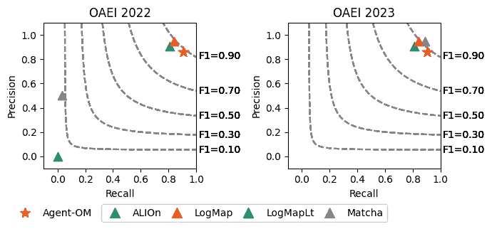

<!--yml
category: 未分类
date: 2025-01-11 13:00:59
-->

# Agent-OM: Leveraging LLM Agents for Ontology Matching

> 来源：[https://arxiv.org/html/2312.00326/](https://arxiv.org/html/2312.00326/)

Zhangcheng Qiang Australian National UniversityCanberraACTAustralia [qzc438@gmail.com](mailto:qzc438@gmail.com) ,  Weiqing Wang Monash UniversityMelbourneVICAustralia [teresa.wang@monash.edu](mailto:teresa.wang@monash.edu)  and  Kerry Taylor Australian National UniversityCanberraACTAustralia [kerry.taylor@anu.edu.au](mailto:kerry.taylor@anu.edu.au)

###### Abstract.

Ontology matching (OM) enables semantic interoperability between different ontologies and resolves their conceptual heterogeneity by aligning related entities. OM systems currently have two prevailing design paradigms: conventional knowledge-based expert systems and newer machine learning-based predictive systems. While large language models (LLMs) and LLM agents have revolutionised data engineering and have been applied creatively in many domains, their potential for OM remains underexplored. This study introduces a novel agent-powered LLM-based design paradigm for OM systems. With consideration of several specific challenges in leveraging LLM agents for OM, we propose a generic framework, namely Agent-OM (Agent for Ontology Matching), consisting of two Siamese agents for retrieval and matching, with a set of OM tools. Our framework is implemented in a proof-of-concept system. Evaluations of three Ontology Alignment Evaluation Initiative (OAEI) tracks over state-of-the-art OM systems show that our system can achieve results very close to the long-standing best performance on simple OM tasks and can significantly improve the performance on complex and few-shot OM tasks.

PVLDB Reference Format: PVLDB, 18(3): XXX-XXX, 2024.
[doi:XX.XX/XXX.XX](https://doi.org/XX.XX/XXX.XX)  ^†^†This work is licensed under the Creative Commons BY-NC-ND 4.0 International License. Visit [https://creativecommons.org/licenses/by-nc-nd/4.0/](https://creativecommons.org/licenses/by-nc-nd/4.0/) to view a copy of this license. For any use beyond those covered by this license, obtain permission by emailing [info@vldb.org](mailto:info@vldb.org). Copyright is held by the owner/author(s). Publication rights licensed to the VLDB Endowment.
Proceedings of the VLDB Endowment, Vol. 18, No. 3 ISSN 2150-8097\.
[doi:XX.XX/XXX.XX](https://doi.org/XX.XX/XXX.XX) 

PVLDB Artifact Availability: The source code, data, and/or other artifacts have been made available at [https://github.com/qzc438/ontology-llm](https://github.com/qzc438/ontology-llm).

## 1\. Introduction

Large language models (LLMs) are pre-trained with an enormous corpus of common knowledge and therefore have powerful generative capabilities. Despite the success of using LLMs in a wide range of applications, leveraging LLMs for downstream tasks still has several challenges. (1) LLMs are pre-trained models that do not capture late-breaking information. (2) LLM hallucinations are often observed in domain-specific tasks and hamper their reliability. LLMs often generate unsound responses that are syntactically sound but factually incorrect (Ji et al., [2023](https://arxiv.org/html/2312.00326v6#bib.bib34)). (3) LLMs are good models of linguistic competence, but have shown limited capabilities in non-linguistic tasks, such as planning and routing (Valmeekam et al., [2022](https://arxiv.org/html/2312.00326v6#bib.bib73)). LLMs are originally designed for sequential question-answering, but most real-world tasks are designed with complex logic rather than following a single path.

To overcome the limitations of LLM customisation for downstream tasks, LLM-based autonomous agents have become a prominent research area. In the field of artificial intelligence (AI), the notion of agents was first introduced in the famous Turing Test (Turing, [2009](https://arxiv.org/html/2312.00326v6#bib.bib72)), referring to intelligent computational entities that can display human-like behaviours. Such AI agents have fallen short of human-level capabilities, as they can only act on simple and heuristic policy functions learnt from constrained environments and they lack efficient central control to simulate the human learning process (Wang et al., [2024](https://arxiv.org/html/2312.00326v6#bib.bib76)). LLMs, with remarkable success in demonstrating autonomy, reactivity, proactivity, and social ability, have attracted growing research efforts aiming to construct AI agents, so-called LLM agents (Xi et al., [2023](https://arxiv.org/html/2312.00326v6#bib.bib80)).

The core concept of LLM agents is to employ the LLM as a controller or “brain” rather than as a predictive model only (a.k.a Model as a Service). LLM agents extend LLM’s capability with advanced planning, memory, and pluggable tools, and allow LLMs to communicate with open-world knowledge (Weng, [2023](https://arxiv.org/html/2312.00326v6#bib.bib79)). (1) Planning breaks down a complex task into simpler and more manageable subtasks. LLMs can also receive feedback on plans and perform reflection and refinement. The most practical technique used for LLM planning is chain of thought (CoT) (Wei et al., [2022](https://arxiv.org/html/2312.00326v6#bib.bib78)). (2) Tools allow LLMs to call external resources for additional information. They are often invoked by LLM actions. (3) Memory provides context to inherently stateless LLMs, including short-term memory and long-term memory. Short-term memory can be considered as context information obtained from planning and tools via in-context learning (ICL) (Brown et al., [2020](https://arxiv.org/html/2312.00326v6#bib.bib12)). Long-term memory often uses database storage with retrieval-augmented generation (RAG) (Lewis et al., [2020](https://arxiv.org/html/2312.00326v6#bib.bib40)) to retain information. Unlike fine-tuning, where models need to be retrained to learn new context data, ICL/RAG instead augments the LLM prompts with new information. ICL/RAG is more scalable for working with dynamic information. Almost 90% of use cases can be achieved by ICL/RAG-based search and retrieval (Microsoft Azure, [[n.d.]](https://arxiv.org/html/2312.00326v6#bib.bib48)). A recent paper (Ovadia et al., [2024](https://arxiv.org/html/2312.00326v6#bib.bib59)) demonstrates that RAG surpasses fine-tuning across a wide spectrum of knowledge-intensive tasks.

Ontology matching (OM) is a classic alignment task, aiming to find possible correspondences between a pair of ontologies (Euzenat and Shvaiko, [2013](https://arxiv.org/html/2312.00326v6#bib.bib21)). OM systems are developed to automate this matching process. There are two dominant design paradigms for OM systems: traditional knowledge-based OM systems that implement pre-defined logic and expert knowledge; and more recent machine learning-based OM systems that transform the matching task into machine-enhanced learning and prediction. The former expert systems require intensive expert knowledge, while the latter predictive systems need a large amount of high-quality data to train the model. The prevalence of LLMs and LLM agents has driven many successful domain-specific applications. However, in the context of OM, using LLMs and LLM agents is currently under-explored. Leveraging LLMs and LLM agents for OM tasks is not an intuitive task; the challenges will be presented in the Related Work section.

This paper introduces a novel agent-powered LLM-based design paradigm for OM systems. We propose a generic framework and implement it with a proof-of-concept system. The system extends the LLM capability beyond general question-answering, offering a powerful problem solver for OM tasks. The system includes tools that facilitate information retrieval, entity matching, and memory storage. The system is compared to state-of-the-art OM systems, achieving considerable matching performance improvements across three Alignment Evaluation Initiative (OAEI) tracks. Specifically, this paper makes the following contributions:

*   •

    We introduce a new agent-powered LLM-based design paradigm for OM systems and propose a novel Agent-OM framework. It consists of the following key components:

    *   –

        A LLM acts as a central “brain” to link different modules and instruct their functions via prompt engineering;

    *   –

        A pair of planning modules use CoT for OM decomposition;

    *   –

        A set of OM tools use ICL/RAG to mitigate LLM hallucinations;

    *   –

        A shared memory module uses dialogue and hybrid data storage to support the search and retrieval of entity mappings.

*   •

    We implement our proposed Agent-OM framework in a proof-of-concept system. The system deals with several critical downstream challenges in leveraging LLM agents for OM, such as cost-effective entity information retrieval, matching candidate selection, and search-based matching functions.

*   •

    The experimental results of the system show that Agent-OM achieves results very close to the best long-standing performance on simple OM tasks and significantly improves matching performance on complex and few-shot OM tasks.

An ontology contains classes, properties, and individuals. In this paper, we consider only classes and properties, and individuals are excluded. Possible logical relations between classes (respectively properties) can be equivalence ($\equiv$) and subsumption (either $\subseteq or\supseteq$). In this study, we only consider the logical relation of equivalence ($\equiv$) between classes and properties.

The rest of the paper is organised as follows. Section [2](https://arxiv.org/html/2312.00326v6#S2 "2\. Related Work ‣ Agent-OM: Leveraging LLM Agents for Ontology Matching") reviews related work. We illustrate the design of our agent-powered LLM-based OM framework in Section [3](https://arxiv.org/html/2312.00326v6#S3 "3\. Matching with LLM Agents ‣ Agent-OM: Leveraging LLM Agents for Ontology Matching") and present implementation details in Section [4](https://arxiv.org/html/2312.00326v6#S4 "4\. Implementation Details ‣ Agent-OM: Leveraging LLM Agents for Ontology Matching"). Section [5](https://arxiv.org/html/2312.00326v6#S5 "5\. Evaluation ‣ Agent-OM: Leveraging LLM Agents for Ontology Matching") and [6](https://arxiv.org/html/2312.00326v6#S6 "6\. Ablation Study ‣ Agent-OM: Leveraging LLM Agents for Ontology Matching") evaluate the system, with a discussion in Section [7](https://arxiv.org/html/2312.00326v6#S7 "7\. Discussion ‣ Agent-OM: Leveraging LLM Agents for Ontology Matching"). We discuss the limitations and future work in Section [8](https://arxiv.org/html/2312.00326v6#S8 "8\. Limitations ‣ Agent-OM: Leveraging LLM Agents for Ontology Matching") and [9](https://arxiv.org/html/2312.00326v6#S9 "9\. Future Work ‣ Agent-OM: Leveraging LLM Agents for Ontology Matching"), respectively. Section [10](https://arxiv.org/html/2312.00326v6#S10 "10\. Conclusion ‣ Agent-OM: Leveraging LLM Agents for Ontology Matching") concludes the paper.

## 2\. Related Work

OM is typically a non-trivial but essential alignment task for data integration, information sharing, and knowledge discovery (Shvaiko and Euzenat, [2013](https://arxiv.org/html/2312.00326v6#bib.bib69)). While matching is a prerequisite for interoperating applications with heterogeneous ontologies, OM systems are designed to partially or fully automate matching. The traditional approach using knowledge-based OM systems, such as LogMap (Jiménez-Ruiz and Cuenca Grau, [2011](https://arxiv.org/html/2312.00326v6#bib.bib35); Jiménez-Ruiz et al., [2011](https://arxiv.org/html/2312.00326v6#bib.bib36)), AgreementMakerLight (AML) (Faria et al., [2013](https://arxiv.org/html/2312.00326v6#bib.bib24), [2014](https://arxiv.org/html/2312.00326v6#bib.bib23)), and FCA-Map (Zhao et al., [2018](https://arxiv.org/html/2312.00326v6#bib.bib87); Li et al., [2021](https://arxiv.org/html/2312.00326v6#bib.bib41)) has been shown to be precise and effective. However, it is resource-hungry and labour-intensive. It is often difficult to find domain experts to evaluate the matches, and any group of experts may not be able to cover all domain concepts that an expert system requires. A new approach uses machine learning (ML), implemented in systems such as BERTMap (He et al., [2022](https://arxiv.org/html/2312.00326v6#bib.bib28)) and LogMap extension LogMap-ML (Chen et al., [2021](https://arxiv.org/html/2312.00326v6#bib.bib14)). ML-based OM systems employ the concept of training and testing in ML, using ontology entities as features for model training or for fine-tuning and then using the model to predict additional correspondences. Specifically, the leading system BERTMap uses a common language model originating from natural language processing (NLP) (i.e. BERT (Devlin et al., [2019](https://arxiv.org/html/2312.00326v6#bib.bib17))).

Although ML-based approaches have shown a significant improvement in matching performance, their training-testing paradigm is not feasible for LLMs. The number of parameters used in LLMs is much larger than those of common language models. This means re-training the entire LLM is usually infeasible, and fine-tuning such a large model requires a number of samples that may be infeasibly large for OM. A survey in (Zong and Krishnamachari, [2022](https://arxiv.org/html/2312.00326v6#bib.bib89)) implies that 1000 is a reasonable number of training samples to fine-tune GPT-3, but generally speaking, a domain ontology has only around 100-200 entities. Furthermore, currently some LLMs are only accessible through a web service. This means that training or fine-tuning LLMs risks leaking sensitive information, while synthetic data, on the other hand, makes it difficult to ensure training quality.

Early studies using LLMs for OM can be found in (He et al., [2023a](https://arxiv.org/html/2312.00326v6#bib.bib29)) and (Norouzi et al., [2023](https://arxiv.org/html/2312.00326v6#bib.bib53)). Both works use a purely prompt-based approach. The prompts are structured as a binary question: given an entity from the source ontology and an entity from the target ontology, the LLMs perform a classification task to determine whether these two entities are identical or not. A similar approach is also used in OLaLa (Hertling and Paulheim, [2023](https://arxiv.org/html/2312.00326v6#bib.bib32)) and LLMs4OM (Giglou et al., [2024](https://arxiv.org/html/2312.00326v6#bib.bib25)), but their candidate generation is integrated with text embedding extractor models. The authors of (Amini et al., [2024](https://arxiv.org/html/2312.00326v6#bib.bib3)) explore the potential of using LLMs for complex ontology OM challenges.

LLM agents were introduced in AutoGPT (Richards, [[n.d.]](https://arxiv.org/html/2312.00326v6#bib.bib67)) and BabyAGI (Nakajima, [[n.d.]](https://arxiv.org/html/2312.00326v6#bib.bib51)). The recent release of *OpenAI GPTs* (OpenAI, [[n.d.]a](https://arxiv.org/html/2312.00326v6#bib.bib55)), *Microsoft Copilot* (Microsoft, [[n.d.]a](https://arxiv.org/html/2312.00326v6#bib.bib46)), and *Copilot Studio* (Microsoft, [[n.d.]b](https://arxiv.org/html/2312.00326v6#bib.bib47)) sparked an interest in “the world of LLM agents”. Building applications with LLM agents allows users to build their own custom GPTs to support custom business scenarios. In ontology-related tasks, LLM-driven agents have shown impressive performance in automating manual activities in the broader task of ontology engineering. These works pay attention to the use of conversational dialogue to enhance the agent’s capability with human feedback. While this is suitable for tasks that require humans to be in the loop, such as collecting competency questions in ontology engineering (Zhang et al., [2024a](https://arxiv.org/html/2312.00326v6#bib.bib85)) or validating extended terms in ontology learning (Babaei Giglou et al., [2023](https://arxiv.org/html/2312.00326v6#bib.bib8)), modern OM seeks to automate a complex task with minimal human intervention. Contrasting with these works, our aim is to design a new infrastructure that is able to instruct LLM agents to use planning to decompose a complex task into steps and to use tools to facilitate automated matching (a.k.a. function calling), instead of purely using agent-based conversational dialogue, even when specialised as ontology-oriented dialogue like (Payne and Tamma, [2014](https://arxiv.org/html/2312.00326v6#bib.bib60); Zhang et al., [2024b](https://arxiv.org/html/2312.00326v6#bib.bib86)).

We introduce our novel agent-powered LLM-based design paradigm for OM systems. We have two generic agents; each one is self-contained and designed to instruct LLMs to use extensive planning, memory, and tools, thus unlocking their generative capacity to handle various types of OM tasks in different contexts. Meanwhile, as a key enabler for precise decision-making, we also limit the current LLM’s flaws in hallucination, context understanding, and non-linguistic reasoning. Several OM-related tools have been created for this purpose. These tools enable LLM agents to simulate a traditional OM system, automating the entire matching process without human intervention. The overall infrastructure offers high scalability and allows extensive customisation. To the best of our knowledge, this study is the first to introduce an LLM-agent-based framework for OM tasks.

## 3\. Matching with LLM Agents

Given a source ontology ($O_{s}$) and a target ontology ($O_{t}$), OM aims to find an alignment (A) that contains a set of pairs-matched entities $\{(e_{i},e_{j})|e_{i}\in O_{s},e_{j}\in O_{t}\}$. A classical matching process has two main steps: retrieval and matching. The retrieval step involves retrieving internal information from the ontology itself ($R_{int}$) and external information from a domain-specific thesaurus ($R_{ext}$). The matching step involves selecting the matching candidates ($M_{sel}$), running the matching algorithms ($M_{alg}$), and refining the matching results ($M_{ref}$). A classical OM can be formulated as:

| (1) |  | $R_{int}\Rightarrow R_{ext}\Rightarrow M_{sel}\Rightarrow M_{alg}\Rightarrow M_% {ref}$ |  |

Figure [1](https://arxiv.org/html/2312.00326v6#S3.F1 "Figure 1 ‣ 3\. Matching with LLM Agents ‣ Agent-OM: Leveraging LLM Agents for Ontology Matching") shows the architecture of *Agent-OM*, our LLM-based agent-powered OM framework. It retains the original input and output of the classical OM but modularises the two main steps with autonomous LLM agents, namely Retrieval Agent ($Agent\_{R}$) and Matching Agent ($Agent\_{M}$). We call these two LLM agents “Siamese” because they have their own planning modules and related tools but share memory. The memory is responsible for storing the information retrieved from the Retrieval Agent ($R_{sto}$) and facilitating the search of the stored information by the Matching Agent ($M_{sea}$). Therefore, an agent-based OM is formulated as:

| (2) |  | $Agent\_R_{(R_{int}\Rightarrow R_{ext}\Rightarrow R_{sto})}\Rightarrow Agent\_M% _{(M_{sea}\Rightarrow M_{sel}\Rightarrow M_{alg}\Rightarrow M_{ref})}$ |  |

Figure 1\. Architecture of Agent-OM. All components are executed twice, once for each of the source and target ontologies, apart from the matching merger tool that combines the results from each pass.

For each autonomous agent, the workflow is described as follows. The planning module decomposes a complex task into several subtasks and defines the order of subtasks and tools to be invoked. The plan is stored in the dialogue and passed to the LLMs. LLMs then invoke the tools to perform the subtasks. The tools may communicate with each other, with intermediate results stored in the dialogue. The tools can also access the database via the CRUD (create, read, update, and delete) functions provided. The entire workflow is driven by LLM prompts. We use solid lines to show the actual workflow controlled by the LLMs, and dotted lines to show the implicit link between a subtask and its corresponding tool activated by the LLMs.

### 3.1\. Retrieval Agent

The Retrieval Agent is responsible for extracting entities from the ontologies, eliciting their metadata and ontology context information, and storing them in the hybrid database. For each entity extracted from the source and target ontologies, the planning module generates the instruction for retrieving the relevant information and feeding it into the LLMs to invoke the corresponding retrieval tools. The tools used in the Retrieval Agent include Metadata Retriever, Syntactic & Lexical & Semantic Retriever, and Hybrid Database Store with Content Embedder, described as follows.

*   •

    Metadata Retriever ($R_{int}$): The metadata retriever collects the metadata of the input entity from the ontology, including its *category* (i.e. either from the *source* ontology or from the *target* ontology) and *type* (i.e. *named class* or *property*).

*   •

    Syntactic Retriever ($R_{int}$): The syntactic retriever is responsible for providing a unified text preprocessing result. A common text preprocessing pipeline consists of tokenisation, normalisation, stop words removal, and stemming/lemmatisation (Manning et al., [2008](https://arxiv.org/html/2312.00326v6#bib.bib44)). According to our prior study in (Qiang et al., [2024](https://arxiv.org/html/2312.00326v6#bib.bib64)), only tokenisation and normalisation help both matching completeness and correctness. The other two pipeline methods, stop words removal and stemming/lemmatisation, could cause unwanted false mappings. For this reason, our syntactic retriever considers only tokenisation and normalisation. We select white spaces to separate the words so that the outputs are short sentences that are easier for LLMs to interpret.

*   •

    Lexical Retriever ($R_{int}$ & $R_{ext}$): We consider three key aspects of the entity’s lexical information: the general meaning ($R_{ext}$), the context meaning ($R_{ext}$), and the content meaning ($R_{int}$). In the context of OM, the general meaning is traditionally generated from Wikidata (Vrandečić and Krötzsch, [2014](https://arxiv.org/html/2312.00326v6#bib.bib74)) or similar corpus-based knowledge bases (KBs). As LLMs are trained from these KBs, we use the prompt “What is the meaning of {entity_name}?” for the same function. However, using only the general meaning is not sufficient. Using the context constraint “in the context of {context}” is effective in domain-specific tasks. Popular GPT-based domain applications, such as LawGPT (Zhou et al., [2024](https://arxiv.org/html/2312.00326v6#bib.bib88)) and MedicalGPT (Wang et al., [2023a](https://arxiv.org/html/2312.00326v6#bib.bib75)), use similar approaches. Additionally, we also retrieve content information from rdfs:label, rdfs:comment, skos:prefLabel, and skos:definition properties, where the ontology creators may add comments or explanations. These are also useful for retrieving the meaning of the entity.

*   •

    Semantic Retriever ($R_{int}$): The entity’s semantic information includes its basic triple-based relations and more complex logic-based axioms. In this paper, we only consider triple-based relations that can be verbalised into a more natural language-like presentation via a prompt-based verbalisation tool. Such verbalisation tools are not capable of handling complex logic-based axioms. These functions can only be achieved with external packages, such as OWL Verbaliser (Kaljurand, [2007](https://arxiv.org/html/2312.00326v6#bib.bib37)), Sydney OWL Syntax (Cregan et al., [2007](https://arxiv.org/html/2312.00326v6#bib.bib16)), and the DeepOnto (He et al., [2024](https://arxiv.org/html/2312.00326v6#bib.bib30)) verbalisation module (He et al., [2023b](https://arxiv.org/html/2312.00326v6#bib.bib31)).

*   •

    Hybrid Database Store with Content Embedder ($R_{sto}$): We use a hybrid database system consisting of a traditional relational database and an advanced vector database. Entity metadata, such as the entity’s category and type, are stored in the traditional relational database. In contrast, natural language-based content information, such as the entity’s syntactic, lexical, and semantic information, is vectorised via an embedding model and then stored in the vector database to enable similarity search based on relative distance in the embedding space. A unique key links these two databases.

### 3.2\. Matching Agent

The Matching Agent is responsible for finding possible correspondences, ranking and refining the results according to different criteria, and selecting the most relevant candidate. For each entity extracted from the ontologies, the planning module generates the instruction for the matching types to be considered and feeds it into the LLMs to invoke the corresponding matching tools. The planning module first selects the source ontology as a starting point, extracting the entities from the ontology. Then, different matchers perform syntactic, lexical, or semantic matching functions to find the most relevant mappings to the input entity, using a hybrid database search across the relational and vector databases. A predicted mapping is based on a summarised profile measure of syntactic matching, lexical matching, and semantic matching, with matching validation. The same procedure applies to the target ontology as a starting point, and the results of the common candidates are combined. The tools used in the Matching Agent include Hybrid Database Search, Metadata Matcher, Syntactic & Lexical & Semantic Matcher, Matching Summariser, Matching Validator, and Matching Merger, described as follows.

*   •

    Hybrid Database Search ($M_{sea}$): The hybrid database search serves as an interface for the database accessible by the Metadata Matcher and Syntactic & Lexical & Semantic Matcher.

*   •

    Metadata Matcher ($M_{sel}$): Given an input entity, the metadata matcher collects the type and category of the input entity from the relational database.

*   •

    Syntactic & Lexical & Semantic Matcher ($M_{sel}$): Given an input entity, the syntactic & lexical & semantic matchers search for similar syntactic/lexical/semantic information respectively in the vector database using cosine similarity, defined for entities $\mathbf{A}$ and $\mathbf{B}$ as:

    | (3) |  | $S_{C}(\mathbf{A},\mathbf{B})=\frac{\mathbf{A}\cdot\mathbf{B}}{\&#124;\mathbf{A}\&#124;\&#124;% \mathbf{B}\&#124;}=\frac{\sum_{i=1}^{n}\mathbf{A}_{i}\mathbf{B}_{i}}{\sqrt{\sum_{i=% 1}^{n}\mathbf{A}_{i}^{2}}\cdot\sqrt{\sum_{i=1}^{n}\mathbf{B}_{i}^{2}}}$ |  |

    An extended search in the relational database is then used to filter the results based on the entity’s metadata.

*   •

    Matching Summariser ($M_{alg}$): We use reciprocal rank fusion (RRF) (Cormack et al., [2009](https://arxiv.org/html/2312.00326v6#bib.bib15)) to summarise the matching results. Viewing each of the syntactic, lexical, and semantic descriptions as a document, the purpose of reciprocal rank is to accumulate the inverse of the ranks $r$ of documents $d$ over three ranking results from syntactic, lexical, and semantic matching, defined as:

    | (4) |  | $RRF(d\in D)=\sum_{r\in R}\frac{1}{k+r(d)}$ |  |

    $k$ is a constant parameter that is conventionally set to 0 as we do here. This ensures that the formula most highly rewards highly ranked entities. In our case, we are evaluating each entity that occurs in the top@k of each of the three rankings (i.e. syntactic matching, lexical matching, and semantic matching), and combining their results as an overall matching summary.

*   •

    Matching Validator ($M_{ref}$): Validation is a critical step in minimising LLM hallucinations, as illustrated in SelfCheckGPT (Manakul et al., [2023](https://arxiv.org/html/2312.00326v6#bib.bib43)) and Self-RAG (Asai et al., [2024](https://arxiv.org/html/2312.00326v6#bib.bib6)). We also apply this method to the summarised results. We ask the LLM a binary question “Is {entity} equivalent to {predicted_entity}? Answer the question within the context of {context}. Answer yes or no. Give a short explanation.” to check whether the predicted entity is equivalent to the input entity in the provided context. For computational efficiency, we iterate the comparison from rank 1 to $n$ and select the highest-ranked match with a ”yes” answer for the matching merger step.

*   •

    Matching Merger ($M_{ref}$): The matching merger is responsible for combining the results from a search of the source ontology and a search of the target ontology. In this study, we select only the correspondences found on both sides. As an agent-based system, this can be extended to use multi-agent negotiation via the correspondence inclusion dialogue (Payne and Tamma, [2014](https://arxiv.org/html/2312.00326v6#bib.bib60)).

## 4\. Implementation Details

We implement our design of the framework in a proof-of-concept system. The components and their implementation are as follows:

*   •

    LLMs: Our system supports a wide range of LLMs, including OpenAI GPT (OpenAI, [[n.d.]c](https://arxiv.org/html/2312.00326v6#bib.bib57)), Anthropic Claude (Anthropic, [[n.d.]a](https://arxiv.org/html/2312.00326v6#bib.bib4)), Meta Llama (Meta, [[n.d.]](https://arxiv.org/html/2312.00326v6#bib.bib45)), Alibaba Qwen (Alibaba Qwen Team, [[n.d.]](https://arxiv.org/html/2312.00326v6#bib.bib2)), Google Gemma (Google Gemma Team and Google DeepMind, [[n.d.]](https://arxiv.org/html/2312.00326v6#bib.bib27)), and ChatGLM (Zeng et al., [2024](https://arxiv.org/html/2312.00326v6#bib.bib84)). We select 10 models for this study. 4 models are API-accessed commercial LLMs, while the other 6 are open-source LLMs. Table [1](https://arxiv.org/html/2312.00326v6#S4.T1 "Table 1 ‣ 1st item ‣ 4\. Implementation Details ‣ Agent-OM: Leveraging LLM Agents for Ontology Matching") gives the details. For API-accessed LLMs, we include two models of different sizes for each category. For open-source LLMs, we select models with similar sizes (7-9 billion parameters) from different categories. They are accessed via the Ollama library (Ollama, [[n.d.]](https://arxiv.org/html/2312.00326v6#bib.bib54)).

    Table 1\. Details of LLMs used in this study.

    Family Model Size Version GPT gpt-4o N/A gpt-4o-2024-05-13 gpt-4o-mini N/A gpt-4o-mini-2024-07-18 Claude claude-3-sonnet N/A claude-3-sonnet-20240229 claude-3-haiku N/A claude-3-haiku-20240307 Llama llama-3-8b* 4.7 GB Ollama Model ID: 365c0bd3c000 llama-3.1-8b* 4.9 GB Ollama Model ID: 46e0c10c039e Qwen qwen-2-7b* 4.4 GB Ollama Model ID: dd314f039b9d qwen-2.5-7b* 4.7 GB Ollama Model ID: 845dbda0ea48 Gemma gemma-2-9b* 5.4 GB Ollama Model ID: ff02c3702f32 GLM glm-4-9b* 5.5 GB Ollama Model ID: 5b699761eca5 * Open-source LLM (retrieved December 1, 2024).

*   •

    Planning: We select the LangChain library (LangChain, Inc., [[n.d.]](https://arxiv.org/html/2312.00326v6#bib.bib39)). The library provides a wide range of agents. We select the tool calling agent (a.k.a function calling agent). At the time of writing, the LangChain package only supports this type of agent used with commercial API-accessed LLMs. To extend our framework to open-source LLMs, we employ the similar concept of “chain” to simulate tool calling agents for open-source LLMs.

*   •

    Memory: (1) Short-term memory: We use a conversational dialogue to store the original intermediate output of each operating process, with no map-reduce applied. (2) Long-term memory: We select a hybrid database consisting of a traditional relational database and an advanced vector database. PostgreSQL (PostgreSQL Global Development Group, [[n.d.]b](https://arxiv.org/html/2312.00326v6#bib.bib63)) supports a standalone integration of the traditional relational database and the extended vector database using pgvector (PostgreSQL Global Development Group, [[n.d.]a](https://arxiv.org/html/2312.00326v6#bib.bib62)). We select OpenAI Embedding (OpenAI, [[n.d.]b](https://arxiv.org/html/2312.00326v6#bib.bib56)) for the content embedding in the vector database. Alternatives are VertexAIEmbeddings (Google Cloud, [[n.d.]](https://arxiv.org/html/2312.00326v6#bib.bib26)) or Sentence-BERT (Reimers and Gurevych, [2019](https://arxiv.org/html/2312.00326v6#bib.bib66)), but the dimension of the embedding changes between different embedding models.

*   •

    Tools: To demonstrate the flexibility of our framework, we present the usage of prompt-based tools and programming-based tools, as well as the tools that combine a mixture of prompt-based and programming-based tools.

### 4.1\. Ontology Naming Conventions

In this work, the term entity is a general expression for ontology classes or properties (without specifying which). We use entity uri to mean a fully expanded class name or property name with respect to its prefix. We use entity name to mean a class name or property name without its prefix. For example, the entity uri is “http://cmt#ProgramCommitteeChair” and the entity name is “ProgramCommitteeChair”.

Naming conventions for entity names fall into two categories: the name has a natural language meaning (Type 1); or the name is a code (Type 2). We observe that LLMs can perform well with meaningful entity names (e.g. ProgramCommitteeChair and Chair_PC). Often in larger biomedical ontologies each entity name is a unique identifier or code, and the meaningful description of the entity is in its label or comment (e.g. MA_0000270 and NCI_C33736). For this type of naming convention, current LLMs tend to generate the wrong synthesised label or comment corresponding to the code. For example, LLMs can mistakenly interpret the codes “MA_0000270” and “NCI_C33736” to be“limb” and “Extremity”, while the intended meanings of these two codes are “eyelid tarsus” and “Tarsal_Plate”.

To handle the variety of ontology naming conventions and standardise their usage in LLM-based OM, we use a unified naming convention in this study. For an entity with a unique identifier or code, we use its label or comment instead. For example, we use “eyelid tarsus” and “Tarsal_Plate” instead of “MA_0000270” and “NCI_C33736” respectively. In case the two ontologies reuse the same entity name, we add the type as a prefix for each entity. For example, if it were the case that ”ProgramCommitteeChair” appears in both the source ontology and the target ontology, the unique identifier for each entity would be like “026-Source-Class-ProgramCommitteeChair” and “042-Target-Class-ProgramCommitteeChair”.

### 4.2\. Running Example

To demonstrate the usability of our framework, we choose the CMT-ConfOf alignment as a sample alignment. The CMT Ontology is the source and the ConfOf Ontology is the target. These two ontologies contain similar concepts related to conference organisation. The running example aims to find the best matching entity in the target corresponding to the entity “http://cmt#ProgramCommitteeChair” in the source.

#### 4.2.1\. Retrieval Agent

Table [2](https://arxiv.org/html/2312.00326v6#S4.T2 "Table 2 ‣ 4.2.1\. Retrieval Agent ‣ 4.2\. Running Example ‣ 4\. Implementation Details ‣ Agent-OM: Leveraging LLM Agents for Ontology Matching") illustrates the tool calling in the Retrieval Agent. For the input “http://cmt#ProgramCommitteeChair” from the source ontology, the output of the Syntactic Retriever is “program committee chair”. The agent further invokes the Lexical Retriever to generate a detailed description: “In the context of a conference, ‘ProgramCommitteeChair’ refers to …”. The Semantic Retriever generates related triple relations, such as “ProgramCommitteeChair rdfs:subClassOf ProgramCommitteeMember”. These triples are verbalised using natural language: “ProgramCommitteeChair” is a subclass of “ProgramCommitteeMember”.

While each entity has its own syntactic, lexical, and semantic information, a naive approach to deciding if two entities are the same is to generate a binary question for every pair of entities as a prompt to the LLM: “Is Entity1 equivalent to Entity2? Consider the following: The syntactic information of Entity1 is… The lexical information of Entity1 is… The semantic information of Entity1 is… The syntactic information of Entity2 is… The lexical information of Entity2 is… The semantic information of Entity2 is… ” This approach has two limitations. (1) LLMs have token limits that restrict the number of tokens processed for each interaction. Combining all the retrieved information may exceed token limits. (2) The binary comparison is costly because the complexity of the comparison is the Cartesian product of the number of entities in the source ontology and the target ontology. We bypass these limitations by (1) using an open question instead and (2) storing useful information in a searchable database. Figure [2](https://arxiv.org/html/2312.00326v6#S4.F2 "Figure 2 ‣ 4.2.1\. Retrieval Agent ‣ 4.2\. Running Example ‣ 4\. Implementation Details ‣ Agent-OM: Leveraging LLM Agents for Ontology Matching") shows the entity metadata and content information stored in the relational database and the vector database, respectively. On one hand, the entity’s metadata is needed to find an exact match. In other words, the matched entity needs to have the same metadata as the target entity. For example, “http://cmt#ProgramCommitteeChair” is a class in the source ontology, so the matched entity should be a class in the target ontology. On the other hand, content information including an entity’s syntactic, lexical, and semantic information is used for a similarity-based match because they are usually retrieved as natural language, which can be more ambiguous than metadata. Similarity between natural language terms is commonly based on embedding vectors, for which the vector database enables fast similarity searches.

Table 2\. Tool Calling in the Retrieval Agent.

Tool: Metadata Retriever Input: {entity_uri} = “http://cmt#ProgramCommitteeChair” Extract: {source_or_target} = “Source”, {entity_type} = “Class” Tool: Syntactic Retriever Input: {entity_uri} = “http://cmt#ProgramCommitteeChair” Extract: {entity_name} = “ProgramCommitteeChair” based on {entity_uri}. Method: cleaning(entity_name) Output: “program committee chair” (AI-generated content) Tool: Lexical Retriever Input: {entity_uri} = “http://cmt#ProgramCommitteeChair”, {context} = “conference” Extract: {entity_name} = “ProgramCommitteeChair” based on {entity_uri}. {extra_information} based on {entity_name} related rdfs:label, rdfs:comment, skos:prefLabel, and skos:definition. Prompt: Question: What is the meaning of {entity_name}? Context: {context} Extra Information: {extra_information} Answer the question within the context and using the extra information. Output: “In the context of a conference, ‘ProgramCommitteeChair’ refers to…” (AI-generated content) Tool: Semantic Retriever Input: {entity_uri} = “http://cmt#ProgramCommitteeChair” Method: generate_subgraph(entity_uri) Output: subgraph Prompt: Verbalise triples into phrases: {subgraph} Output: “The class ‘ProgramCommitteeChair’ is a subclass of ‘ProgramCommitteeMember’…” (AI-generated content) Tool: Hybrid Database Store with Content Embedder Input: {entity_uri} = “http://cmt#ProgramCommitteeChair”, {source_or_target} = “Source”, {entity_type} = “Class” Extract: {entity_id} = “023-Source-Class-ProgramCommitteeChair” Query: Create a relational database and store entity’s metadata [⬇](data:text/plain;base64,RFJPUCBUQUJMRSBJRiBFWElTVFMgb250b2xvZ3lfbWF0Y2hpbmcgQ0FTQ0FERTsKQ1JFQVRFIFRBQkxFIChlbnRpdHlfaWQgVkFSQ0hBUigxMDI0KSBQUklNQVJZIEtFWSwgZW50aXR5IFRFWFQsIHNvdXJjZV9vcl90YXJnZXQgVEVYVCwgZW50aXR5X3R5cGUgVEVYVCk7CklOU0VSVCBJTlRPIG9udG9sb2d5X21hdGNoaW5nIChlbnRpdHlfaWQsIGVudGl0eSwgc291cmNlX29yX3RhcmdldCwgZW50aXR5X3R5cGUpClZBTFVFUyAoe2VudGl0eV9pZH0sIHtlbnRpdHlfdXJpfSwge3NvdXJjZV9vcl90YXJnZXR9LCB7ZW50aXR5X3R5cGV9KTs=) DROP  TABLE  IF  EXISTS  ontology_matching  CASCADE; CREATE  TABLE  (entity_id  VARCHAR(1024)  PRIMARY  KEY,  entity  TEXT,  source_or_target  TEXT,  entity_type  TEXT); INSERT  INTO  ontology_matching  (entity_id,  entity,  source_or_target,  entity_type) VALUES  ({entity_id},  {entity_uri},  {source_or_target},  {entity_type}); Input: {entity_syntactic} = “program committee chair”, {entity_lexical} = “In the context of conference, ‘ProgramCommitteeChair’ refers to…”, {entity_semantic} = “The class ‘ProgramCommitteeChair’ is a subclass of ‘ProgramCommitteeMember’…”, {matching_table} = ”syntactic_matching/lexical_matching/semantic_matching” Extract: {entity_embedding} based on {entity_syntactic}/{entity_lexical}/{entity_semantic}. Query: Create a vector database and store entity’s syntactic, lexical, and semantic information [⬇](data:text/plain;base64,Q1JFQVRFIEVYVEVOU0lPTiBJRiBOT1QgRVhJU1RTIHZlY3RvcjsKRFJPUCBUQUJMRSBJRiBFWElTVFMge21hdGNoaW5nX3RhYmxlfTsKQ1JFQVRFIFRBQkxFIHttYXRjaGluZ190YWJsZX0KKGVudGl0eV9pZCBWQVJDSEFSKDEwMjQpIE5PVCBOVUxMIFJFRkVSRU5DRVMgb250b2xvZ3lfbWF0Y2hpbmcoZW50aXR5X2lkKSwgY29udGVudCBURVhULCBlbWJlZGRpbmcgdmVjdG9yKDE1MzYpKTsKSU5TRVJUIElOVE8ge21hdGNoaW5nX3RhYmxlfQooZW50aXR5X2lkLCBjb250ZW50LCBlbWJlZGRpbmcpIFZBTFVFUyAoe2VudGl0eV9pZH0sIHtlbnRpdHlfc3ludGFjdGljfS97ZW50aXR5X2xleGljYWx9L3tlbnRpdHlfc2VtYW50aWN9LCB7ZW50aXR5X2VtYmVkZGluZ30pOw==) CREATE  EXTENSION  IF  NOT  EXISTS  vector; DROP  TABLE  IF  EXISTS  {matching_table}; CREATE  TABLE  {matching_table} (entity_id  VARCHAR(1024)  NOT  NULL  REFERENCES  ontology_matching(entity_id),  content  TEXT,  embedding  vector(1536)); INSERT  INTO  {matching_table} (entity_id,  content,  embedding)  VALUES  ({entity_id},  {entity_syntactic}/{entity_lexical}/{entity_semantic},  {entity_embedding}); Output: One relational database table (ontology_matching) and three vector database tables (syntactic_matching, lexical_matching, and semantic_matching).

Figure 2\. Storing “http://cmt#ProgramCommitteeChair”.

#### 4.2.2\. Matching Agent

Table [3](https://arxiv.org/html/2312.00326v6#S4.T3 "Table 3 ‣ 4.2.2\. Matching Agent ‣ 4.2\. Running Example ‣ 4\. Implementation Details ‣ Agent-OM: Leveraging LLM Agents for Ontology Matching") demonstrates the tool calling in the Matching Agent. Given “http://cmt#ProgramCommitteeChair” from the source ontology, the most relevant entity found by each matcher is stored in short-term memory and combined using the RRF function. The result of the Matching Summariser is a list of predicted mappings. The last step is to refine the predicted mappings. The Matching Validator asks a binary question to compare whether the given entity is the same or different to the predicted relevant entity in RRF-ascending order. Because the validator receives a “yes” answer for the first iteration of the entity “http://confOf#Chair_PC”, the Matching Agent outputs “http://confOf#Chair_PC” as the best matching entity found in the target ontology. The Matching Merger combines the results from the same procedure applied in the search from “http://confOf#Chair_PC” in the target ontology. These two terms are considered as matched entities only if the mapping can be found bidirectionally (i.e. “http://cmt#ProgramCommitteeChair” is also found to be the best matching entity in the source ontology for the search from “http://confOf#Chair_PC” in the target ontology).

Table 3\. Tool Calling in the Matching Agent.

Tool: Metadata Matcher with Hybrid Database Search Input: {entity_uri} = “http://cmt#ProgramCommitteeChair”, {source_or_target} = “Source” {matching_table} = “syntactic_matching/lexical_matching/semantic_matching” Query: Get entity id [⬇](data:text/plain;base64,U0VMRUNUIG8uZW50aXR5X2lkIEZST00gb250b2xvZ3lfbWF0Y2hpbmcgbwpXSEVSRSBvLmVudGl0eSA9IHtlbnRpdHlfdXJpfSBhbmQgby5zb3VyY2Vfb3JfdGFyZ2V0ID0ge3NvdXJjZV9vcl90YXJnZXR9) SELECT  o.entity_id  FROM  ontology_matching  o WHERE  o.entity  =  {entity_uri}  and  o.source_or_target  =  {source_or_target} Output: {entity_id} = “023-Source-Class-ProgramCommitteeChair” Query: Get entity metadata [⬇](data:text/plain;base64,U0VMRUNUIG8uZW50aXR5X3R5cGUsIG0uY29udGVudF9lbWJlZGRpbmcKRnJvbSBvbnRvbG9neV9tYXRjaGluZyBvLCB7bWF0Y2hpbmdfdGFibGV9IG0KV0hFUkUgby5lbnRpdHlfaWQgPSBtLmVudGl0eV9pZCBBTkQgby5lbnRpdHlfaWQgPSB7ZW50aXR5X2lkfTs=) SELECT  o.entity_type,  m.content_embedding From  ontology_matching  o,  {matching_table}  m WHERE  o.entity_id  =  m.entity_id  AND  o.entity_id  =  {entity_id}; Output: {entity_type} = “Class”, {content_embedding} = […] Tool: Syntactic & Lexical & Semantic Matcher with Similarity Search Input: {content_embedding} = […], {matching_table} = “syntactic_matching/lexical_matching/semantic_matching”, {similarity_threshold} = 0.90, {top_k} = 3, {source_or_target} = “Source”, {entity_type} = “Class” Query: Search for similar entities [⬇](data:text/plain;base64,V0lUSCB2ZWN0b3JfbWF0Y2hlcyBBUyAoClNFTEVDVCBlbnRpdHlfaWQsIDEgLSAoY29udGVudF9lbWJlZGRpbmcgPD0+IGB7Y29udGVudF9lbWJlZGRpbmd9JykgQVMgc2ltaWxhcml0eQpGUk9NIHttYXRjaGluZ190YWJsZX0KV0hFUkUgMSAtIChjb250ZW50X2VtYmVkZGluZyA8PT4gYHtjb250ZW50X2VtYmVkZGluZ30nKSA+PSB7c2ltaWxhcml0eV90aHJlc2hvbGR9KQpTRUxFQ1Qgby5lbnRpdHlfaWQsIHYuc2ltaWxhcml0eSBhcyBzaW1pbGFyaXR5CkZST00gb250b2xvZ3lfbWF0Y2hpbmcgbywgdmVjdG9yX21hdGNoZXMgdgpXSEVSRSBvLmVudGl0eV9pZCBJTiAoU0VMRUNUIGVudGl0eV9pZCBGUk9NIHZlY3Rvcl9tYXRjaGVzKQpBTkQgby5lbnRpdHlfaWQgPSAgdi5lbnRpdHlfaWQgQU5EIG8uc291cmNlX29yX3RhcmdldCAhPSB7c291cmNlX29yX3RhcmdldH0gQU5EIG8uZW50aXR5X3R5cGUgPSB7ZW50aXR5X3R5cGV9Ck9SREVSIEJZIHYuc2ltaWxhcml0eSBERVNDCkxJTUlUIHt0b3Bfa307) WITH  vector_matches  AS  ( SELECT  entity_id,  1  -  (content_embedding  <=>  ‘{content_embedding}’)  AS  similarity FROM  {matching_table} WHERE  1  -  (content_embedding  <=>  ‘{content_embedding}’)  >=  {similarity_threshold}) SELECT  o.entity_id,  v.similarity  as  similarity FROM  ontology_matching  o,  vector_matches  v WHERE  o.entity_id  IN  (SELECT  entity_id  FROM  vector_matches) AND  o.entity_id  =  v.entity_id  AND  o.source_or_target  !=  {source_or_target}  AND  o.entity_type  =  {entity_type} ORDER  BY  v.similarity  DESC LIMIT  {top_k}; Output: {rankings} = [syntactic_matching: [], lexical_matching: [‘095-Target-Class-Chair_PC’], semantic_matching: [‘103-Target-Class-Member_PC’, ‘092-Target-Class-Author’, ‘123-Target-Class-University’]] (AI-generated content) Tool: Matching Summariser Method: reciprocal_rank_fusion(rankings) Output: {matching_summary} = [(1.0, [“095-Target-Class-Chair_PC”, “103-Target-Class-Member_PC”]), (0.5, [“092-Target-Class-Author”]), (0.33, [“123-Target-Class-University”])] (AI-generated content) Tool: Matching Validator Input: {context} = “conference”, {matching_summary} = […] Extract: Each {predicted_entity} from {matching_summary}. Prompt: Question: Is {entity} equivalent to {predicted_entity}? Context: {context} Answer the question within the context. Answer yes or no. Give a short explanation. Output: {entity_id} = “095-Target-Class-Chair_PC” “095-Target-Class-Chair_PC”: “Yes. In the context of a conference, the term ”program committee chair” is equivalent to ”chair PC.” Both refer to the individual responsible for leading the program committee, which is in charge of organizing and overseeing the review and selection of conference submissions.” “103-Target-Class-Member_PC”: “No. The program committee chair is not equivalent to a member of the program committee (PC). The chair is responsible for overseeing the entire review process, coordinating the activities of the PC members, and making final decisions on the conference program. In contrast, a PC member primarily reviews and evaluates submitted papers.” (AI-generated content) Query: Get entity [⬇](data:text/plain;base64,U0VMRUNUIG8uZW50aXR5IEZST00gb250b2xvZ3lfbWF0Y2hpbmcgbwpXSEVSRSBvLmVudGl0eV9pZCA9IHtlbnRpdHlfaWR9) SELECT  o.entity  FROM  ontology_matching  o WHERE  o.entity_id  =  {entity_id} Output: {entity} = “http://confOf#Chair_PC” Tool: Matching Merger Output: Merge entities found in the target ontology that are equivalent to “http://confOf#Chair_PC” in the source ontology.

## 5\. Evaluation

### 5.1\. Evaluation Criteria

In information retrieval, a common assessment for matching tasks is based on comparing predicted results with expected output. Precision and recall are used to measure the correctness and completeness of the matching, respectively. When adapting these measures to OM, the predicted results generated by the system are denoted Alignment (A), and the expected results provided by the domain experts are denoted Reference (R) (Do et al., [2003](https://arxiv.org/html/2312.00326v6#bib.bib18)). Therefore, precision and recall for OM tasks are defined as:

| (5) |  | $Precision=\frac{&#124;A\cap R&#124;}{&#124;A&#124;}\qquad Recall=\frac{&#124;A\cap R&#124;}{&#124;R&#124;}$ |  |

Precision and recall are commonly combined into a single measure F1 score, defined as:

| (6) |  | $F_{1}\ Score=\frac{2}{Precision^{-1}+Recall^{-1}}$ |  |

### 5.2\. Evaluation of Three OAEI Tracks

In this section, we test our proof-of-concept system with three OAEI tracks containing different types of OM tasks. These include few-shot tasks with a small proportion of trivial correspondences ([5.2.1](https://arxiv.org/html/2312.00326v6#S5.SS2.SSS1 "5.2.1\. OAEI Conference Track ‣ 5.2\. Evaluation of Three OAEI Tracks ‣ 5\. Evaluation ‣ Agent-OM: Leveraging LLM Agents for Ontology Matching") Test Case), simple tasks with a large proportion of trivial correspondences ([5.2.2](https://arxiv.org/html/2312.00326v6#S5.SS2.SSS2 "5.2.2\. OAEI Anatomy Track ‣ 5.2\. Evaluation of Three OAEI Tracks ‣ 5\. Evaluation ‣ Agent-OM: Leveraging LLM Agents for Ontology Matching") Test Case 1 and [5.2.3](https://arxiv.org/html/2312.00326v6#S5.SS2.SSS3 "5.2.3\. OAEI MSE Track ‣ 5.2\. Evaluation of Three OAEI Tracks ‣ 5\. Evaluation ‣ Agent-OM: Leveraging LLM Agents for Ontology Matching") Test Case 3), complex tasks with a large proportion of non-trivial correspondences ([5.2.2](https://arxiv.org/html/2312.00326v6#S5.SS2.SSS2 "5.2.2\. OAEI Anatomy Track ‣ 5.2\. Evaluation of Three OAEI Tracks ‣ 5\. Evaluation ‣ Agent-OM: Leveraging LLM Agents for Ontology Matching") Test Case 2), with complex references ([5.2.3](https://arxiv.org/html/2312.00326v6#S5.SS2.SSS3 "5.2.3\. OAEI MSE Track ‣ 5.2\. Evaluation of Three OAEI Tracks ‣ 5\. Evaluation ‣ Agent-OM: Leveraging LLM Agents for Ontology Matching") Test Case 1), or requiring domain-specific knowledge ([5.2.3](https://arxiv.org/html/2312.00326v6#S5.SS2.SSS3 "5.2.3\. OAEI MSE Track ‣ 5.2\. Evaluation of Three OAEI Tracks ‣ 5\. Evaluation ‣ Agent-OM: Leveraging LLM Agents for Ontology Matching") Test Case 2). We report the evaluation metrics for the best-performing singular model gpt-4o and its hyperparameter settings over a single run. We ran multiple trials and found slight differences in the results due to the non-determinism of LLMs, but these differences are not significant with respect to the precision of the results we report. For all test cases in the three OAEI tracks, we select the hyperparameter settings of similarity_threshold = 0.90 and top@k = 3\. See Section [6.2](https://arxiv.org/html/2312.00326v6#S6.SS2 "6.2\. Hyperparameter Settings ‣ 6\. Ablation Study ‣ Agent-OM: Leveraging LLM Agents for Ontology Matching") for discussion on the hyperparameter settings of Agent-OM.

#### 5.2.1\. OAEI Conference Track

The OAEI conference track contains a pairwise alignment of 7 small and medium-sized conference-related ontologies with a total of 21 matching tasks (Cheatham and Hitzler, [2014](https://arxiv.org/html/2312.00326v6#bib.bib13); Solimando et al., [2014](https://arxiv.org/html/2312.00326v6#bib.bib70), [2017](https://arxiv.org/html/2312.00326v6#bib.bib71); Zamazal and Svátek, [2017](https://arxiv.org/html/2312.00326v6#bib.bib83)). In each alignment, the trial correspondences that can be used to train the models are very limited (commonly less than 10). All conference ontologies in this track use the Type 1 naming convention, where the names of classes and properties have meanings. In this study, we use the publicly available reference ra1-M3 as the reference (R), including class and property mappings.

Figure [3](https://arxiv.org/html/2312.00326v6#S5.F3 "Figure 3 ‣ 5.2.1\. OAEI Conference Track ‣ 5.2\. Evaluation of Three OAEI Tracks ‣ 5\. Evaluation ‣ Agent-OM: Leveraging LLM Agents for Ontology Matching") compares Agent-OM with the 15 OM systems in OAEI 2022 and OAEI 2023\. Agent-OM achieves above-average performance. Its overall F1 score ranks 3/13 in 2022 and 5/12 in 2023\. We note that ra1-M3 is known to be missing valid equivalence mappings. We believe that Agent-OM could achieve better performance over a complete reference such as ra2-M3 or rar2-M3\. These are not publicly available at the time of writing.

Figure 3\. OAEI Conference Track Test Case.

#### 5.2.2\. OAEI Anatomy Track

The OAEI anatomy track contains only a reference alignment of human and mouse anatomy, created and evolved from (Bodenreider et al., [2005](https://arxiv.org/html/2312.00326v6#bib.bib11); Beisswanger and Hahn, [2012](https://arxiv.org/html/2312.00326v6#bib.bib9); Euzenat, Jérôme and Meilicke, Christian and Stuckenschmidt, Heiner and Shvaiko, Pavel and Trojahn, Cássia, [2011](https://arxiv.org/html/2312.00326v6#bib.bib22); Dragisic et al., [2017](https://arxiv.org/html/2312.00326v6#bib.bib19)). Both ontologies use the Type 2 naming convention, where the names of classes and properties are biomedical codes. We report the results of our evaluation in two test cases: alignment with trivial correspondences and alignment with non-trivial correspondences.

1.  (1)

    Test Case 1: The track originally contains a large proportion of trivial correspondences that have the same standardised labels (e.g. “femoral artery” and “Femoral_Artery”). Figure [4](https://arxiv.org/html/2312.00326v6#S5.F4 "Figure 4 ‣ item 1 ‣ 5.2.2\. OAEI Anatomy Track ‣ 5.2\. Evaluation of Three OAEI Tracks ‣ 5\. Evaluation ‣ Agent-OM: Leveraging LLM Agents for Ontology Matching") compares Agent-OM with the results of the 12 OM systems in OAEI 2022 and OAEI 2023 for alignment with trivial correspondences. Almost all OM systems achieve relatively high precision and recall when matching with trivial correspondences. For Agent-OM, its overall F1 score ranks the second highest in 2022 and 2023.

    

    Figure 4\. OAEI Anatomy Track Test Case 1.

2.  (2)

    Test Case 2: We remove these trivial correspondences from both the reference (R) and alignment (A) to focus the matching performance comparison on non-trivial correspondences. Figure [5](https://arxiv.org/html/2312.00326v6#S5.F5 "Figure 5 ‣ item 2 ‣ 5.2.2\. OAEI Anatomy Track ‣ 5.2\. Evaluation of Three OAEI Tracks ‣ 5\. Evaluation ‣ Agent-OM: Leveraging LLM Agents for Ontology Matching") compares Agent-OM with the results of the 12 OM systems in OAEI 2022 and OAEI 2023 for alignment with non-trivial correspondences. We observe better performance by Agent-OM. The overall F1 score of Agent-OM is superior to the 9 traditional OM systems, better than the two LLM-based systems (OLaLa and SORBETMatch), and only behind one deep learning (DL)-based OM system (Matcha), which could have benefited from an unusual large training set available for this case.

    

    Figure 5\. OAEI Anatomy Track Test Case 2.

#### 5.2.3\. OAEI MSE Track

The OAEI MSE track provides a reference alignment of ontologies in materials science and engineering (Nasr, [2020](https://arxiv.org/html/2312.00326v6#bib.bib52)). The track contains three test cases aligning MaterialInformation (Ashino, [2010](https://arxiv.org/html/2312.00326v6#bib.bib7)), MatOnto (iNovex IRAD, [[n.d.]](https://arxiv.org/html/2312.00326v6#bib.bib33)), and EMMO (European Materials Modelling Council, [[n.d.]](https://arxiv.org/html/2312.00326v6#bib.bib20)). MaterialInformation and MatOnto use the Type 1 naming convention, while EMMO uses the Type 2 naming convention.

1.  (1)

    Test Case 1: This case provides a reference alignment for a small version of MaterialInformation and the medium-sized MatOnto. The challenge of this task arises due to the reference intentionally including several subsumption correspondences, when OM systems may mistakenly map subsumptions into equivalence relations. Figure [6](https://arxiv.org/html/2312.00326v6#S5.F6 "Figure 6 ‣ item 1 ‣ 5.2.3\. OAEI MSE Track ‣ 5.2\. Evaluation of Three OAEI Tracks ‣ 5\. Evaluation ‣ Agent-OM: Leveraging LLM Agents for Ontology Matching") compares Agent-OM with the results of the 4 OM systems in OAEI 2022 and OAEI 2023\. Agent-OM achieves the best performance, with the highest F1 score.

    

    Figure 6\. OAEI MSE Track Test Case 1.

2.  (2)

    Test Case 2: This case provides the reference alignment of the full version of the large MaterialInformation and the medium-sized MatOnto. The challenge of this task is to align many examples of specific terminology, abbreviations, and acronyms used in materials science. For example, “Au” stands for “Gold”, “Ag” stands for “Silver”, and “Cu” stands for “Copper”. Figure [7](https://arxiv.org/html/2312.00326v6#S5.F7 "Figure 7 ‣ item 2 ‣ 5.2.3\. OAEI MSE Track ‣ 5.2\. Evaluation of Three OAEI Tracks ‣ 5\. Evaluation ‣ Agent-OM: Leveraging LLM Agents for Ontology Matching") compares Agent-OM with the results of the 4 OM systems in OAEI 2022 and OAEI 2023\. Agent-OM achieves the best performance in precision, recall, and overall F1 score across the OAEI 2022 and OAEI 2023 results. We should expect an LLM-based matcher to have high recall on this test case due to its access to extensive training literature.

    

    Figure 7\. OAEI MSE Track Test Case 2.

3.  (3)

    Test Case 3: This case provides the reference alignment of the full version of the large MaterialInformation and medium-sized EMMO. Unlike MatOnto used in Test Case 1 and Test Case 2, EMMO extends the upper ontology called Basic Formal Ontology (BFO). This means that the classes in EMMO are somewhat standardised according to the BFO classes. Figure [8](https://arxiv.org/html/2312.00326v6#S5.F8 "Figure 8 ‣ item 3 ‣ 5.2.3\. OAEI MSE Track ‣ 5.2\. Evaluation of Three OAEI Tracks ‣ 5\. Evaluation ‣ Agent-OM: Leveraging LLM Agents for Ontology Matching") compares Agent-OM with the results of the 4 OM systems in OAEI 2022 and OAEI 2023\. The performance of Agent-OM is competitive with the best of the OAEI 2022 results and in OAEI 2023 is bettered by the DL-based OM system Matcha.

    

    Figure 8\. OAEI MSE Track Test Case 3.

## 6\. Ablation Study

### 6.1\. System Components

#### 6.1.1\. Architectures

We compare Agent-OM with two simpler architectures where the OM is much more reliant on straightforward LLM use. (1) LLM only: Given $O_{s}$ and $O_{t}$, this approach extracts each $e1\in O_{s}$ and $e2\in O_{t}$. The matching decision is purely based on LLMs without any additional information. (2) LLM with context: Given $O_{s}$ and $O_{t}$, this approach extracts each $e1\in O_{s},e2\in O_{t}$ and their syntactic, lexical, and semantic information. The matching decision uses LLMs to determine whether two concepts are identical or not based on the information provided.

The experiment is run on the CMT-ConfOf alignment demonstrated in Section [4.2](https://arxiv.org/html/2312.00326v6#S4.SS2 "4.2\. Running Example ‣ 4\. Implementation Details ‣ Agent-OM: Leveraging LLM Agents for Ontology Matching"). We use the GPT model gpt-4o with similarity_threshold=0.90\. Figure [9](https://arxiv.org/html/2312.00326v6#S6.F9 "Figure 9 ‣ 6.1.1\. Architectures ‣ 6.1\. System Components ‣ 6\. Ablation Study ‣ Agent-OM: Leveraging LLM Agents for Ontology Matching") compares Agent-OM with LLM Only and LLM with Context. LLM Only shows low precision and recall. LLM with Context partially overcomes this deficiency by providing additional information, but token consumption is extremely high without optimising the matching candidate selection. Our Agent-OM architecture handles these two main challenges with tool calling agents and hybrid database searches. Note that the CMT-ConfOf alignment demonstrated here is a small alignment task, while Agent-OM is expected to be relatively more effective and efficient in large-scale OM tasks.

Figure 9\. Comparison with LLM-based architectures.

#### 6.1.2\. LLMs

Figure [10](https://arxiv.org/html/2312.00326v6#S6.F10 "Figure 10 ‣ 6.1.2\. LLMs ‣ 6.1\. System Components ‣ 6\. Ablation Study ‣ Agent-OM: Leveraging LLM Agents for Ontology Matching") varies LLMs in Agent-OM on the OAEI Anatomy Track. In general, API-accessed models perform better than open-source models. The leading models, gpt-4o and claude-3-sonnet are both large API-accessed models. Among open-source models, gemma-2-9b achieves the best performance, while llama-3-8b is relatively poor. Curiously, although we see improved performance with llama-3.1-8b over its previous version, qwen-2.5-7b does not show an advantage over its previous version. This may be a side-effect of LLM developers optimising for tasks other than OM. We experimented with other LLMs derived from the Llama and Qwen families and generally found poor performance, possibly due to the fine-tuning for specific tasks.

Figure 10\. Comparison of different LLMs. API-accessed models are shown as triangles and open-source models as circles.

#### 6.1.3\. Text Embedding Models

We also test three different text embeddings in (OpenAI, [[n.d.]b](https://arxiv.org/html/2312.00326v6#bib.bib56)) on the OAEI Anatomy Track. The default length of the embedding vector is 1536 for text-embedding-ada-002 and text-embedding-3-small, and 3072 for text-embedding-3-large. We do not observe a significant difference arising from varying the text embeddings from text-embedding-3-small to text-embedding-3-large. We do not see that text-embedding-3-small and text-embedding-3-large perform better than text-embedding-ada-002.

#### 6.1.4\. Hybrid Database

The use of a hybrid database unlocks the potential for search-based OM. We define $N_{s}$ and $N_{t}$ as the number of entities extracted from the source ontology ($O_{s}$) and the target ontology ($O_{t}$) respectively. In naive LLM-based OM, the matching is based on binary questions to compare each pair of entities from $O_{s}$ and $O_{t}$ based on their relevant information. The number of tokens consumed is $N_{s}*N_{t}$ (for retrieval and matching). In search-based OM, we first retrieve entity information from $O_{s}$ and $O_{t}$ and store it in a hybrid database. Following our methods in Section [4](https://arxiv.org/html/2312.00326v6#S4 "4\. Implementation Details ‣ Agent-OM: Leveraging LLM Agents for Ontology Matching"), the number of tokens consumed is $N_{s}+N_{t}$ (for retrieval) + 0 (for search) + $k(N_{s}+N_{t})$ (for validation) + 0 (for merge). Search-based OM is cost-effective because the inequality $(k+1)(N_{s}+N_{t})<N_{s}*N_{t}$ always holds in common OM task settings where $N_{s},N_{t}>>k+1$. We also apply two approaches to reduce LLM hallucinations (i.e. false positive mappings in search results): validator and merger.

#### 6.1.5\. Matching Validator

We employ a validator by asking the LLM to self-check the candidate correspondences. It is helpful in detecting two common types of false positive mappings: (1) non-existent mappings and (2) counter-intuitive mappings. Figure [11](https://arxiv.org/html/2312.00326v6#S6.F11 "Figure 11 ‣ 6.1.5\. Matching Validator ‣ 6.1\. System Components ‣ 6\. Ablation Study ‣ Agent-OM: Leveraging LLM Agents for Ontology Matching") compares precision, recall, and F1 score with and without validation in the three OAEI tracks we analysed. The matching results with validation generally achieved an improvement in precision and F1 score, with a slight decrease in recall. This is in line with the findings in CoT with self-consistency (CoT-SC) (Wang et al., [2023b](https://arxiv.org/html/2312.00326v6#bib.bib77)), where the provision of a self-check can reduce LLM hallucinations. Note that our experiment set the similarity_threshold $T\in[0.90,0.95]$, so the improvement in matching performance is not statistically significant, but the matching validator will have a great impact on performance with lower similarity thresholds.

(a)

(b)

(c)

Figure 11\. Comparison of without/with matching validator.

#### 6.1.6\. Matching Merger

We apply a merge function $O_{s}\Leftrightarrow O_{t}$ combining the results of $O_{s}\Rightarrow O_{t}$ and $O_{s}\Leftarrow O_{t}$ to improve the matching performance. Figure [12](https://arxiv.org/html/2312.00326v6#S6.F12 "Figure 12 ‣ 6.1.6\. Matching Merger ‣ 6.1\. System Components ‣ 6\. Ablation Study ‣ Agent-OM: Leveraging LLM Agents for Ontology Matching") shows the comparison of precision, recall, and F1 score in $O_{s}\Rightarrow O_{t}$, $O_{t}\Leftarrow O_{s}$, and $O_{s}\Leftrightarrow O_{t}$ in the three OAEI tracks we analysed. The merged matching results generally achieved a significant improvement in precision and F1 score, with a slight decrease in recall. The results are in line with the findings in RAG-Fusion (Raudaschl, [[n.d.]](https://arxiv.org/html/2312.00326v6#bib.bib65)), where providing two different paths to perform the same matching task can reduce LLM hallucinations.

(a)

(b)

(c)

Figure 12\. Comparison of $O_{s}\Rightarrow O_{t}$, $O_{t}\Leftarrow O_{s}$, and $O_{s}\Leftrightarrow O_{t}$

### 6.2\. Hyperparameter Settings

#### 6.2.1\. Similarity Threshold

We test the similarity threshold $T\in[0.50,0.55,0.60,...,0.90,0.95,1.00]$ in the three OAEI tracks we analysed. The optimal similarity threshold appears to be $T\in[0.90,0.95]$, balancing the trade-off between precision and recall, thus achieving a higher overall F1 score. If we consider the similarity threshold as the required confidence interval (CI) for candidates for equivalence matching, this setting reflects the convention of accepting a 5%-10% probability of observing values outside the estimation. The insensitivity of the results to the third value is more apparent in large-scale OM tasks, such as the Anatomy Track.

#### 6.2.2\. Top@k

We also test the top@k values $k\in[1,2,3,...,8,9,10]$ in the three OAEI tracks we analysed. We observe that $k=1$ and $k=2$ do not provide enough candidates for the LLM to select, while appropriate correspondences are rarely found where $k>5$. We recommend setting $k\in[3,4,5]$ to balance the computational complexity and precision of the results. Note that we deal with the tie-break case where multiple entities have the same RRF scores. In such cases, the total number of entities tested may be greater than $k$ because these equally-scored entities share the same ranking.

#### 6.2.3\. How to choose Similarity Threshold and Top@k?

Ontologies are context-dependent conceptual models that follow different conventions and restrictions to reflect different application-level requirements (Shenghui Wang, [2021](https://arxiv.org/html/2312.00326v6#bib.bib68)). The hyperparameter settings can be adjusted for each specific OM task using reference mapping to achieve an optimal result. We observe that higher similarity thresholds and lower top@k values could result in high precision where most of the trivial mappings can be found, but some more obscure true mappings may be missed, lowering recall. On the other hand, lower similarity thresholds and higher top@k values could result in high recall, but the precision may be low as more false mappings are generated during the matching process. This indicates that the applied matching refinements (validator and merger) would be more powerful in settings with lower similarity thresholds and higher top@k values. We found in our extensive OAEI experiments that threshold $T\in[0.90,0.95]$ and top@k $k\in[3,4,5]$ was optimal. In the real-world application of Agent-OM to a matching problem with no reference, we advise choosing $T$ and $k$ within these ranges.

## 7\. Discussion

Google DeepMind classifies AI autonomy into 6 levels (Morris et al., [2024](https://arxiv.org/html/2312.00326v6#bib.bib50)). We believe that the potential of LLM is not only as a consultant, a collaborator, or an expert to answer binary classification questions in OM tasks, but it can also be an agent to simulate human behaviour in performing OM tasks, including data preprocessing, data preparation, data analysis, and data validation. Higher autonomy reduces barriers to accessing LLMs in OM tasks.

1.  (1)

    Agent-based OM is more efficient than LLM-based OM. LLMs are computationally expensive. While LLM-based OM using binary classification questions has repetitive LLM prompting, agent-based OM leverages the vector database to store ontology retrieval results, reducing the financial cost of token consumption.

2.  (2)

    Agent-based OM is also more effective than LLM-based OM. LLM-based OM is commonly observed to have high recall and low precision. Due to the nature of its large knowledge base, it is possible to discover positive correspondences but also unavoidable false positive mappings. LLMs are zero-shot reasoners (Kojima et al., [2022](https://arxiv.org/html/2312.00326v6#bib.bib38)), but they are also few-shot learners (Brown et al., [2020](https://arxiv.org/html/2312.00326v6#bib.bib12)). Their capacity for reasoning depends on the richness of the information provided. With the assistance of autonomous agents for extensive planning, tools, and memory, agent-powered LLM-based OM systems can access more detailed information and therefore feature the following advantages:

    1.  (a)

        Context Learning: LLMs have a large corpus of background knowledge. Given a context, LLMs can select relevant background knowledge and therefore perform better in lexical matching.

    2.  (b)

        Transitive Reasoning: LLMs can reason on transitive relationships. They can also understand general and domain-specific scenarios and apply lexical validation when necessary.

    3.  (c)

        Self Correction: LLMs have a strong capacity for self correction. Even given a wrong statement, LLMs have good judgment to automatically remove false mappings. For example, semantic matching can cause false mappings because it considers only the data structure and ignores the linguistic meaning of the entity. However, such a small piece of false information does not influence the correct truth that LLMs nevertheless learn.

Despite the several success factors of agent-powered LLM-based OM systems, we also observe that:

1.  (1)

    A matching process could be more complex. Although CoT may simulate how humans plan and perform tasks, it is still an incomplete model of human thought. Human reasoning employs a more complex network of thoughts, as humans tend to try different isolated paths (i.e. ToT, tree-of-thoughts (Yao et al., [2023](https://arxiv.org/html/2312.00326v6#bib.bib81); Long, [2023](https://arxiv.org/html/2312.00326v6#bib.bib42))), explore multiple paths (i.e. GoT, graph-of-thoughts (Besta et al., [2024](https://arxiv.org/html/2312.00326v6#bib.bib10); Yao et al., [2024](https://arxiv.org/html/2312.00326v6#bib.bib82))), and backtrack, split, or merge to find the optimal solution to the problem. For example, people may use discovered mappings as input to the next iteration.

2.  (2)

    Prompt engineering is the key to instructing efficient LLM agents. These prompts are currently hand-crafted. For prompt-based tools, different LLMs may have varying default chat templates. Finding generic hard prompts across all LLMs is almost impossible. However, we provide the simplest standardised version of the prompts from our experiments. The prompts used in our system currently support mainstream LLMs, such as OpenAI GPT models, Authropic Claude models, Meta Llama 3, Alibaba Qwen 2, Google Gemma 2, and ChatGLM 4\. For those models not included in the list, we also provide an interface to add new LLMs to our system, but it may require minor code customisation to fit the LLMs used. We expect that our system will support more models via open-source community efforts in the future. We seek automatic prompt engineering and will consider using soft prompts in future versions.

3.  (3)

    LLM hallucinations can be mitigated, but cannot be eliminated. The accuracy of the RAG remains an open question. Human-in-the-loop may remain necessary (Ouyang et al., [2022](https://arxiv.org/html/2312.00326v6#bib.bib58)). Advanced RAG techniques, such as including the explanatory context in the RAG process (Anthropic, [[n.d.]b](https://arxiv.org/html/2312.00326v6#bib.bib5)), are promising directions.

4.  (4)

    There is a trade-off between precision and recall. Strict rules could result in high precision where most of the implicit true mappings can be found, but they may miss some explicit true mappings. On the other hand, loose rules could result in a high recall score, but the precision score may become very low as more mappings are generated during the matching process.

5.  (5)

    For LLMs used for OM, we find Moravec’s paradox (Moravec, [1988](https://arxiv.org/html/2312.00326v6#bib.bib49)): “the hard problems are easy and the easy problems are hard”(p192) (Pinker, [1994](https://arxiv.org/html/2312.00326v6#bib.bib61)). Although Agent-OM performs well in complex and few-shot OM tasks, it is not outstanding on simple OM tasks. We will also consider integrating the LLM-based approach with traditional knowledge-based and machine learning-based approaches.

## 8\. Limitations

1.  (1)

    We evaluate only the T-Box matching datasets that match named classes, object properties, and data type properties. A-Box matching datasets (including individual data instances) are not considered due to privacy concerns in our targeted application domain. Additional data engineering (e.g. data de-identification and fuzzing) may be required to apply LLMs to A-Box matching datasets to avoid personal and sensitive information exposure.

2.  (2)

    Due to the high cost of API calls for API-accessed commercial LLMs, experiments with the newest commercial models (e.g. gpt-o1-preview and claude-3-opus) are not included in this study. According to our findings in Section [6.1.2](https://arxiv.org/html/2312.00326v6#S6.SS1.SSS2 "6.1.2\. LLMs ‣ 6.1\. System Components ‣ 6\. Ablation Study ‣ Agent-OM: Leveraging LLM Agents for Ontology Matching"), we hypothesise that these models could achieve better performance in OM tasks.

3.  (3)

    There may be additional resource requirements for running open-source LLMs locally. The run time for API-accessed commercial LLMs is controlled by the LLM providers.

## 9\. Future Work

1.  (1)

    Multimodal OM: We have packaged our system into several natural language-based commands. It could be integrated with advanced LLM functions to support multimodal input, such as ontology diagrams and online seminars. The richer information sources might improve OM performance.

2.  (2)

    Multilingual OM: Agent-OM supports ontologies in multiple languages. We have tested it in the OAEI 2022 and 2023 Multifarm Track, a modified conference dataset translated into nine different languages. Results are not included here because there are few benchmarks; only two traditional systems’ results are available.

3.  (3)

    Small language models (SLM) for OM: SLM (e.g. gemma-2-2b) are useful in resource-constrained devices, but they have problematic tool interfaces at present.

## 10\. Conclusion

In this paper, we introduce a new LLM-based design paradigm for OM systems. Agent-OM, an agent-powered LLM-based framework, is proposed and implemented with a proof-of-concept system. We compare our systems with state-of-the-art OM systems to perform different types of OM tasks. The system has shown a powerful capability to perform OM tasks at different levels of complexity, leveraging the potential of using LLM agents for OM. We also discuss our observations on the advantages and current limitations of using LLMs and LLM agents for OM tasks.

Our work focuses on pre-trained large foundation models that are impossible to retrain and hard to fine-tune. Our approach yields good results on LLMs for OM tasks without changing the LLM model itself, but by utilising CoT, ICL/RAG, and prompt engineering techniques. It is a simple, lightweight, and natural language-driven approach with high scalability. Agent-OM is all you need. While OM has been studied for two decades or more, we are now at a point where the goal of 100% accurate, fully-automated, and domain-independent OM seems to be within reach.

## Ethical Considerations

Agent-OM does not participate in the OAEI 2022 and 2023 campaigns. According to the OAEI data policy (retrieved December 1, 2024), “OAEI results and datasets, are publicly available, but subject to a use policy similar to [the one defined by NIST for TREC](https://trec.nist.gov/results.html). These rules apply to anyone using these data.” Please find more details from the official website: [https://oaei.ontologymatching.org/doc/oaei-deontology.2.html](https://oaei.ontologymatching.org/doc/oaei-deontology.2.html). AI-generated content (AIGC) can contain harmful, unethical, prejudiced, or negative content ([https://docs.mistral.ai/capabilities/guardrailing/](https://docs.mistral.ai/capabilities/guardrailing/)). However, ontology matching tasks only check the meaning of domain-specific terminologies, and we have not observed such content being generated.

###### Acknowledgements.

The authors thank the reviewers for providing insightful comments. The authors thank Sven Hertling for curating the OAEI datasets stored in the Matching EvaLuation Toolkit. The authors thank the organisers of Conference Track (Ondřej Zamazal, Jana Vataščinová, and Lu Zhou), Anatomy Track (Mina Abd Nikooie Pour, Huanyu Li, Ying Li, and Patrick Lambrix), and MSE Track (Engy Nasr and Martin Huschka), for helpful advice on reproducing benchmarks. The authors thank Jing Jiang from the Australian National University (ANU) for helpful advice on the verbaliser used in the semantic retriever. The authors thank Alice Richardson from the ANU Statistical Support Network for helpful advice on the statistical analysis. The authors thank the Commonwealth Scientific and Industrial Research Organisation (CSIRO) for supporting this project.

## References

*   (1)
*   Alibaba Qwen Team ([n.d.]) Alibaba Qwen Team. [n.d.]. Qwen Models. Retrieved December 1, 2024 from [https://qwenlm.github.io](https://qwenlm.github.io)
*   Amini et al. (2024) Reihaneh Amini, Sanaz Saki Norouzi, Pascal Hitzler, and Reza Amini. 2024. Towards Complex Ontology Alignment using Large Language Models. arXiv:2404.10329 [cs.AI] [https://arxiv.org/abs/2404.10329](https://arxiv.org/abs/2404.10329)
*   Anthropic ([n.d.]a) Anthropic. [n.d.]a. Claude Models. Retrieved December 1, 2024 from [https://docs.anthropic.com/en/docs/about-claude/models](https://docs.anthropic.com/en/docs/about-claude/models)
*   Anthropic ([n.d.]b) Anthropic. [n.d.]b. Introducing Contextual Retrieval. Retrieved December 1, 2024 from [https://www.anthropic.com/news/contextual-retrieval](https://www.anthropic.com/news/contextual-retrieval)
*   Asai et al. (2024) Akari Asai, Zeqiu Wu, Yizhong Wang, Avirup Sil, and Hannaneh Hajishirzi. 2024. Self-RAG: Learning to Retrieve, Generate, and Critique through Self-Reflection. In *The Twelfth International Conference on Learning Representations*. OpenReview.net, Vienna, Austria.
*   Ashino (2010) Toshihiro Ashino. 2010. Materials Ontology: An Infrastructure for Exchanging Materials Information and Knowledge. *Data Science Journal* 9 (2010), 54–61. [https://doi.org/10.2481/dsj.008-041](https://doi.org/10.2481/dsj.008-041)
*   Babaei Giglou et al. (2023) Hamed Babaei Giglou, Jennifer D’Souza, and Sören Auer. 2023. LLMs4OL: Large Language Models for Ontology Learning. In *The Semantic Web – ISWC 2023*. Springer, Athens, Greece, 408–427. [https://doi.org/10.1007/978-3-031-47240-4_22](https://doi.org/10.1007/978-3-031-47240-4_22)
*   Beisswanger and Hahn (2012) Elena Beisswanger and Udo Hahn. 2012. Towards Valid and Reusable Reference Alignments—Ten Basic Quality Checks for Ontology Alignments and Their Application to Three Different Reference Data Sets. *Journal of biomedical semantics* 3, Article S4 (2012), 14 pages. [https://doi.org/10.1186/2041-1480-3-S1-S4](https://doi.org/10.1186/2041-1480-3-S1-S4)
*   Besta et al. (2024) Maciej Besta, Nils Blach, Ales Kubicek, Robert Gerstenberger, Michal Podstawski, Lukas Gianinazzi, Joanna Gajda, Tomasz Lehmann, Hubert Niewiadomski, Piotr Nyczyk, and Torsten Hoefler. 2024. Graph of Thoughts: Solving Elaborate Problems with Large Language Models. In *Proceedings of the AAAI Conference on Artificial Intelligence*, Vol. 38\. AAAI Press, Washington, DC, USA, 17682–17690. [https://doi.org/10.1609/aaai.v38i16.29720](https://doi.org/10.1609/aaai.v38i16.29720)
*   Bodenreider et al. (2005) Olivier Bodenreider, Terry F Hayamizu, Martin Ringwald, Sherri De Coronado, and Songmao Zhang. 2005. Of Mice and Men: Aligning Mouse and Human Anatomies. In *American Medical Informatics Association Annual Symposium – AMIA 2005*. AMIA, Washington, DC, USA, 61–65.
*   Brown et al. (2020) Tom Brown, Benjamin Mann, Nick Ryder, Melanie Subbiah, Jared D Kaplan, Prafulla Dhariwal, Arvind Neelakantan, Pranav Shyam, Girish Sastry, Amanda Askell, Sandhini Agarwal, Ariel Herbert-Voss, Gretchen Krueger, Tom Henighan, Rewon Child, Aditya Ramesh, Daniel Ziegler, Jeffrey Wu, Clemens Winter, Chris Hesse, Mark Chen, Eric Sigler, Mateusz Litwin, Scott Gray, Benjamin Chess, Jack Clark, Christopher Berner, Sam McCandlish, Alec Radford, Ilya Sutskever, and Dario Amodei. 2020. Language Models are Few-Shot Learners. In *Proceedings of the 34th Annual Conference on Neural Information Processing Systems*, Vol. 33\. Curran Associates, Inc., Vancouver, BC, Canada, Article 159, 25 pages.
*   Cheatham and Hitzler (2014) Michelle Cheatham and Pascal Hitzler. 2014. Conference v2.0: An Uncertain Version of the OAEI Conference Benchmark. In *The Semantic Web – ISWC 2014*. Springer, Riva del Garda, Italy, 33–48. [https://doi.org/10.1007/978-3-319-11915-1_3](https://doi.org/10.1007/978-3-319-11915-1_3)
*   Chen et al. (2021) Jiaoyan Chen, Ernesto Jiménez-Ruiz, Ian Horrocks, Denvar Antonyrajah, Ali Hadian, and Jaehun Lee. 2021. Augmenting Ontology Alignment by Semantic Embedding and Distant Supervision. In *The Semantic Web – ESWC 2021*. Springer, Virtual Conference, 392–408. [https://doi.org/10.1007/978-3-030-77385-4_23](https://doi.org/10.1007/978-3-030-77385-4_23)
*   Cormack et al. (2009) Gordon V. Cormack, Charles L A Clarke, and Stefan Buettcher. 2009. Reciprocal Rank Fusion Outperforms Condorcet and Individual Rank Learning Methods. In *Proceedings of the 32nd international ACM SIGIR conference on Research and Development in Information Retrieval*. ACM, Boston, MA, USA, 758–759. [https://doi.org/10.1145/1571941.1572114](https://doi.org/10.1145/1571941.1572114)
*   Cregan et al. (2007) Anne Cregan, Rolf Schwitter, and Thomas Meyer. 2007. Sydney OWL Syntax-towards a Controlled Natural Language Syntax for OWL 1.1\. In *Proceedings of the OWLED 2007 Workshop on OWL: Experiences and Directions*, Vol. 258\. CEUR-WS.org, Innsbruck, Austria.
*   Devlin et al. (2019) Jacob Devlin, Ming-Wei Chang, Kenton Lee, and Kristina Toutanova. 2019. BERT: Pre-training of Deep Bidirectional Transformers for Language Understanding. In *Proceedings of the 2019 Conference of the North American Chapter of the Association for Computational Linguistics: Human Language Technologies*. ACL, Minneapolis, MN, USA, 4171–4186. [https://doi.org/10.18653/v1/N19-1423](https://doi.org/10.18653/v1/N19-1423)
*   Do et al. (2003) Hong-Hai Do, Sergey Melnik, and Erhard Rahm. 2003. Comparison of Schema Matching Evaluations. In *Web, Web-Services, and Database Systems*. Springer, Erfurt, Germany, 221–237. [https://doi.org/10.1007/3-540-36560-5_17](https://doi.org/10.1007/3-540-36560-5_17)
*   Dragisic et al. (2017) Zlatan Dragisic, Valentina Ivanova, Huanyu Li, and Patrick Lambrix. 2017. Experiences from the Anatomy Track in the Ontology Alignment Evaluation Initiative. *Journal of biomedical semantics* 8, Article 56 (2017), 28 pages. [https://doi.org/10.1186/s13326-017-0166-5](https://doi.org/10.1186/s13326-017-0166-5)
*   European Materials Modelling Council ([n.d.]) European Materials Modelling Council. [n.d.]. EMMO. Retrieved December 1, 2024 from [https://github.com/emmo-repo/EMMO](https://github.com/emmo-repo/EMMO)
*   Euzenat and Shvaiko (2013) Jérôme Euzenat and Pavel Shvaiko. 2013. *Ontology Matching (2nd ed.)*. Springer, Berlin, Heidelberg, Germany. [https://doi.org/10.1007/978-3-642-38721-0](https://doi.org/10.1007/978-3-642-38721-0)
*   Euzenat, Jérôme and Meilicke, Christian and Stuckenschmidt, Heiner and Shvaiko, Pavel and Trojahn, Cássia (2011) Euzenat, Jérôme and Meilicke, Christian and Stuckenschmidt, Heiner and Shvaiko, Pavel and Trojahn, Cássia. 2011. *Ontology Alignment Evaluation Initiative: Six Years of Experience*. Springer, Berlin, Heidelberg, Germany, 158–192. [https://doi.org/10.1007/978-3-642-22630-4_6](https://doi.org/10.1007/978-3-642-22630-4_6)
*   Faria et al. (2014) Daniel Faria, Catia Pesquita, Emanuel Santos, Isabel F Cruz, and Francisco M Couto. 2014. AgreementMakerLight 2.0: Towards Efficient Large-Scale Ontology Matching. In *Proceedings of the ISWC 2014 Posters and Demonstrations Track*, Vol. 1272\. CEUR-WS.org, Riva del Garda, Italy, 457–460.
*   Faria et al. (2013) Daniel Faria, Catia Pesquita, Emanuel Santos, Matteo Palmonari, Isabel F. Cruz, and Francisco M Couto. 2013. The AgreementMakerLight Ontology Matching System. In *On the Move to Meaningful Internet Systems: OTM 2013 Conferences*. Springer, Graz, Austria, 527–541. [https://doi.org/10.1007/978-3-642-41030-7_38](https://doi.org/10.1007/978-3-642-41030-7_38)
*   Giglou et al. (2024) Hamed Babaei Giglou, Jennifer D’Souza, Felix Engel, and Sören Auer. 2024. LLMs4OM: Matching Ontologies with Large Language Models. arXiv:2404.10317 [cs.AI] [https://arxiv.org/abs/2404.10317](https://arxiv.org/abs/2404.10317)
*   Google Cloud ([n.d.]) Google Cloud. [n.d.]. Google Vertex AI Embeddings. Retrieved December 1, 2024 from [https://cloud.google.com/vertex-ai/docs/generative-ai/embeddings/get-text-embeddings](https://cloud.google.com/vertex-ai/docs/generative-ai/embeddings/get-text-embeddings)
*   Google Gemma Team and Google DeepMind ([n.d.]) Google Gemma Team and Google DeepMind. [n.d.]. Google Gemma Models. Retrieved December 1, 2024 from [https://ai.google.dev/gemma](https://ai.google.dev/gemma)
*   He et al. (2022) Yuan He, Jiaoyan Chen, Denvar Antonyrajah, and Ian Horrocks. 2022. BERTMap: A BERT-based Ontology Alignment System. In *Proceedings of the 36th AAAI Conference on Artificial Intelligence*, Vol. 36\. AAAI Press, Virtual Conference, 5684–5691. [https://doi.org/10.1609/aaai.v36i5.20510](https://doi.org/10.1609/aaai.v36i5.20510)
*   He et al. (2023a) Yuan He, Jiaoyan Chen, Hang Dong, and Ian Horrocks. 2023a. Exploring Large Language Models for Ontology Alignment. In *Proceedings of the ISWC 2023 Posters, Demos and Industry Tracks*, Vol. 3632\. CEUR-WS.org, Athens, Greece.
*   He et al. (2024) Yuan He, Jiaoyan Chen, Hang Dong, Ian Horrocks, Carlo Allocca, Taehun Kim, and Brahmananda Sapkota. 2024. DeepOnto: A Python Package for Ontology Engineering with Deep Learning. *Semantic Web* 15, 5 (2024), 1991–2004. [https://doi.org/10.3233/SW-243568](https://doi.org/10.3233/SW-243568)
*   He et al. (2023b) Yuan He, Jiaoyan Chen, Ernesto Jimenez-Ruiz, Hang Dong, and Ian Horrocks. 2023b. Language Model Analysis for Ontology Subsumption Inference. In *Findings of the Association for Computational Linguistics: ACL 2023*. ACL, Toronto, Canada, 3439–3453. [https://doi.org/10.18653/v1/2023.findings-acl.213](https://doi.org/10.18653/v1/2023.findings-acl.213)
*   Hertling and Paulheim (2023) Sven Hertling and Heiko Paulheim. 2023. OLaLa: Ontology Matching with Large Language Models. In *Proceedings of the 12th Knowledge Capture Conference 2023*. ACM, Pensacola, FL, USA, 131–139. [https://doi.org/10.1145/3587259.3627571](https://doi.org/10.1145/3587259.3627571)
*   iNovex IRAD ([n.d.]) iNovex IRAD. [n.d.]. Ontologies for the MatOnto Project. Retrieved December 1, 2024 from [https://github.com/inovexcorp/MatOnto-Ontologies](https://github.com/inovexcorp/MatOnto-Ontologies)
*   Ji et al. (2023) Ziwei Ji, Nayeon Lee, Rita Frieske, Tiezheng Yu, Dan Su, Yan Xu, Etsuko Ishii, Ye Jin Bang, Andrea Madotto, and Pascale Fung. 2023. Survey of Hallucination in Natural Language Generation. *ACM Computing Surveys* 55, 12, Article 248 (2023), 38 pages. [https://doi.org/10.1145/3571730](https://doi.org/10.1145/3571730)
*   Jiménez-Ruiz and Cuenca Grau (2011) Ernesto Jiménez-Ruiz and Bernardo Cuenca Grau. 2011. LogMap: Logic-Based and Scalable Ontology Matching. In *The Semantic Web – ISWC 2011*. Springer, Bonn, Germany, 273–288. [https://doi.org/10.1007/978-3-642-25073-6_18](https://doi.org/10.1007/978-3-642-25073-6_18)
*   Jiménez-Ruiz et al. (2011) Ernesto Jiménez-Ruiz, Bernardo Cuenca Grau, and Yujiao Zhou. 2011. LogMap 2.0: Towards Logic-Based, Scalable and Interactive Ontology Matching. In *Proceedings of the 4th International Workshop on Semantic Web Applications and Tools for the Life Sciences*. ACM, London, UK, 45–46. [https://doi.org/10.1145/2166896.2166911](https://doi.org/10.1145/2166896.2166911)
*   Kaljurand (2007) Kaarel Kaljurand. 2007. OWL Verbalizer. Retrieved December 1, 2024 from [https://github.com/Kaljurand/owl-verbalizer](https://github.com/Kaljurand/owl-verbalizer)
*   Kojima et al. (2022) Takeshi Kojima, Shixiang (Shane) Gu, Machel Reid, Yutaka Matsuo, and Yusuke Iwasawa. 2022. Large Language Models are Zero-Shot Reasoners. In *Proceedings of the 36th Annual Conference on Neural Information Processing Systems*, Vol. 35\. Curran Associates, Inc., New Orleans, LA, USA, Article 1613, 15 pages.
*   LangChain, Inc. ([n.d.]) LangChain, Inc. [n.d.]. LangChain. Retrieved December 1, 2024 from [https://www.langchain.com](https://www.langchain.com)
*   Lewis et al. (2020) Patrick Lewis, Ethan Perez, Aleksandra Piktus, Fabio Petroni, Vladimir Karpukhin, Naman Goyal, Heinrich Küttler, Mike Lewis, Wen-tau Yih, Tim Rocktäschel, Sebastian Riedel, and Douwe Kiela. 2020. Retrieval-Augmented Generation for Knowledge-Intensive NLP Tasks. In *Proceedings of the 34th Annual Conference on Neural Information Processing Systems*, Vol. 33\. Curran Associates Inc., Vancouver, BC, Canada, Article 793, 16 pages.
*   Li et al. (2021) Guoxuan Li, Songmao Zhang, Jiayi Wei, and Wenqian Ye. 2021. Combining FCA-Map with representation learning for aligning large biomedical ontologies. In *Proceedings of the 16th International Workshop on Ontology Matching – ISWC 2021*, Vol. 3063\. CEUR-WS.org, Virtual Conference, 207–208.
*   Long (2023) Jieyi Long. 2023. Large Language Model Guided Tree-of-Thought. arXiv:2305.08291 [cs.AI] [https://arxiv.org/abs/2305.08291](https://arxiv.org/abs/2305.08291)
*   Manakul et al. (2023) Potsawee Manakul, Adian Liusie, and Mark Gales. 2023. SelfCheckGPT: Zero-Resource Black-Box Hallucination Detection for Generative Large Language Models. In *Proceedings of the 2023 Conference on Empirical Methods in Natural Language Processing*. ACL, Singapore, 9004–9017. [https://doi.org/10.18653/v1/2023.emnlp-main.557](https://doi.org/10.18653/v1/2023.emnlp-main.557)
*   Manning et al. (2008) Christopher D. Manning, Prabhakar Raghavan, and Hinrich Schütze. 2008. *Introduction to Information Retrieval*. Cambridge University Press, Cambridge, UK. [https://doi.org/10.1017/CBO9780511809071](https://doi.org/10.1017/CBO9780511809071)
*   Meta ([n.d.]) Meta. [n.d.]. Meta Llama Models. Retrieved December 1, 2024 from [https://www.llama.com](https://www.llama.com)
*   Microsoft ([n.d.]a) Microsoft. [n.d.]a. Copilot. Retrieved December 1, 2024 from [https://www.microsoft.com/en-us/microsoft-copilot/personal-ai-assistant](https://www.microsoft.com/en-us/microsoft-copilot/personal-ai-assistant)
*   Microsoft ([n.d.]b) Microsoft. [n.d.]b. Copilot Studio. Retrieved December 1, 2024 from [https://www.microsoft.com/en-us/microsoft-copilot/microsoft-copilot-studio](https://www.microsoft.com/en-us/microsoft-copilot/microsoft-copilot-studio)
*   Microsoft Azure ([n.d.]) Microsoft Azure. [n.d.]. GPT-RAG. Retrieved December 1, 2024 from [https://github.com/Azure/GPT-RAG/blob/main/docs/RAG_CONCEPTS.md](https://github.com/Azure/GPT-RAG/blob/main/docs/RAG_CONCEPTS.md)
*   Moravec (1988) Hans Moravec. 1988. *Mind Children: The Future of Robot and Human Intelligence*. Harvard University Press, Cambridge, MA, USA.
*   Morris et al. (2024) Meredith Ringel Morris, Jascha Sohl-Dickstein, Noah Fiedel, Tris Warkentin, Allan Dafoe, Aleksandra Faust, Clement Farabet, and Shane Legg. 2024. Levels of AGI for Operationalizing Progress on the Path to AGI. In *Proceedings of the 41st International Conference on Machine Learning*, Vol. 235\. ML Research Press, Vienna, Austria, 36308–36321.
*   Nakajima ([n.d.]) Yohei Nakajima. [n.d.]. BabyAGI. Retrieved December 1, 2024 from [https://github.com/yoheinakajima/babyagi](https://github.com/yoheinakajima/babyagi)
*   Nasr (2020) Engy Nasr. 2020. *Evaluation of Automatic Ontology Matching for Materials Sciences and Engineering (Master’s thesis)*. Master’s thesis. Albert Ludwig University of Freiburg, Freiburg, Germany.
*   Norouzi et al. (2023) Sanaz Saki Norouzi, Mohammad Saeid Mahdavinejad, and Pascal Hitzler. 2023. Conversational Ontology Alignment with ChatGPT. In *Proceedings of the 18th International Workshop on Ontology Matching – ISWC 2023*, Vol. 3591\. CEUR-WS.org, Athens, Greece, 61–66.
*   Ollama ([n.d.]) Ollama. [n.d.]. Ollama. Retrieved December 1, 2024 from [https://ollama.com/](https://ollama.com/)
*   OpenAI ([n.d.]a) OpenAI. [n.d.]a. GPTs. Retrieved December 1, 2024 from [https://openai.com/blog/introducing-gpts](https://openai.com/blog/introducing-gpts)
*   OpenAI ([n.d.]b) OpenAI. [n.d.]b. OpenAI Embeddings. Retrieved December 1, 2024 from [https://platform.openai.com/docs/guides/embeddings/embedding-models](https://platform.openai.com/docs/guides/embeddings/embedding-models)
*   OpenAI ([n.d.]c) OpenAI. [n.d.]c. OpenAI Models. Retrieved December 1, 2024 from [https://platform.openai.com/docs/models](https://platform.openai.com/docs/models)
*   Ouyang et al. (2022) Long Ouyang, Jeffrey Wu, Xu Jiang, Diogo Almeida, Carroll Wainwright, Pamela Mishkin, Chong Zhang, Sandhini Agarwal, Katarina Slama, Alex Ray, John Schulman, Jacob Hilton, Fraser Kelton, Luke Miller, Maddie Simens, Amanda Askell, Peter Welinder, Paul F Christiano, Jan Leike, and Ryan Lowe. 2022. Training Language Models to Follow Instructions with Human Feedback. In *Proceedings of the 36th Annual Conference on Neural Information Processing Systems*, Vol. 35\. Curran Associates, Inc., New Orleans, LA, USA, 27730–27744.
*   Ovadia et al. (2024) Oded Ovadia, Menachem Brief, Moshik Mishaeli, and Oren Elisha. 2024. Fine-Tuning or Retrieval? Comparing Knowledge Injection in LLMs. In *Proceedings of the 2024 Conference on Empirical Methods in Natural Language Processing*. ACL, Miami, FL, USA, 237–250. [https://doi.org/10.18653/v1/2024.emnlp-main.15](https://doi.org/10.18653/v1/2024.emnlp-main.15)
*   Payne and Tamma (2014) Terry R. Payne and Valentina Tamma. 2014. Negotiating over Ontological Correspondences with Asymmetric and Incomplete Knowledge. In *Proceedings of the 2014 International Conference on Autonomous Agents and Multi-Agent Systems*. IFAAMAS, Paris, France, 517–524.
*   Pinker (1994) Steven Pinker. 1994. *The Language Instinct: How the Mind Creates Language*. William Morrow and Company, New York, NY, USA.
*   PostgreSQL Global Development Group ([n.d.]a) PostgreSQL Global Development Group. [n.d.]a. pgvector. Retrieved December 1, 2024 from [https://github.com/pgvector/pgvector](https://github.com/pgvector/pgvector)
*   PostgreSQL Global Development Group ([n.d.]b) PostgreSQL Global Development Group. [n.d.]b. PostgreSQL. Retrieved December 1, 2024 from [https://www.postgresql.org](https://www.postgresql.org)
*   Qiang et al. (2024) Zhangcheng Qiang, Kerry Taylor, and Weiqing Wang. 2024. How Does A Text Preprocessing Pipeline Affect Ontology Syntactic Matching? arXiv:2411.03962 [cs.CL] [https://arxiv.org/abs/2411.03962](https://arxiv.org/abs/2411.03962)
*   Raudaschl ([n.d.]) Adrian Raudaschl. [n.d.]. RAG-Fusion. Retrieved December 1, 2024 from [https://github.com/Raudaschl/rag-fusion](https://github.com/Raudaschl/rag-fusion)
*   Reimers and Gurevych (2019) Nils Reimers and Iryna Gurevych. 2019. Sentence-BERT: Sentence Embeddings using Siamese BERT-Networks. In *Proceedings of the 2019 Conference on Empirical Methods in Natural Language Processing and the 9th International Joint Conference on Natural Language Processing (EMNLP-IJCNLP)*. ACL, Hong Kong, China, 3982–3992. [https://doi.org/10.18653/v1/D19-1410](https://doi.org/10.18653/v1/D19-1410)
*   Richards ([n.d.]) Toran Bruce Richards. [n.d.]. Auto-GPT. Retrieved December 1, 2024 from [https://github.com/Significant-Gravitas/AutoGPT](https://github.com/Significant-Gravitas/AutoGPT)
*   Shenghui Wang (2021) Shenghui Wang. 2021. Linked Data and Semantic Web (2021-2A): Ontology Matching. Retrieved December 1, 2024 from [https://www.utwente.nl/en/ces/sal/exams/Linked-Data-and-Semantic-Web/ldsw-lecture6-om-2021-2a.pdf](https://www.utwente.nl/en/ces/sal/exams/Linked-Data-and-Semantic-Web/ldsw-lecture6-om-2021-2a.pdf)
*   Shvaiko and Euzenat (2013) Pavel Shvaiko and Jérôme Euzenat. 2013. Ontology Matching: State of the Art and Future Challenges. *IEEE Transactions on Knowledge and Data Engineering* 25, 1 (2013), 158–176. [https://doi.org/10.1109/TKDE.2011.253](https://doi.org/10.1109/TKDE.2011.253)
*   Solimando et al. (2014) Alessandro Solimando, Ernesto Jiménez-Ruiz, and Giovanna Guerrini. 2014. Detecting and Correcting Conservativity Principle Violations in Ontology-to-Ontology Mappings. In *The Semantic Web – ISWC 2014*. Springer, Riva del Garda, Italy, 1–16. [https://doi.org/10.1007/978-3-319-11915-1_1](https://doi.org/10.1007/978-3-319-11915-1_1)
*   Solimando et al. (2017) Alessandro Solimando, Ernesto Jimenez-Ruiz, and Giovanna Guerrini. 2017. Minimizing Conservativity Violations in Ontology Alignments: Algorithms and Evaluation. *Knowledge and Information Systems* 51 (2017), 775–819. [https://doi.org/10.1007/s10115-016-0983-3](https://doi.org/10.1007/s10115-016-0983-3)
*   Turing (2009) Alan M. Turing. 2009. *Computing Machinery and Intelligence*. Springer, Dordrecht, Netherlands, 23–65. [https://doi.org/10.1007/978-1-4020-6710-5_3](https://doi.org/10.1007/978-1-4020-6710-5_3)
*   Valmeekam et al. (2022) Karthik Valmeekam, Alberto Olmo, Sarath Sreedharan, and Subbarao Kambhampati. 2022. Large Language Models Still Can’t Plan (A Benchmark for LLMs on Planning and Reasoning about Change). In *NeurIPS 2022 Foundation Models for Decision Making Workshop*. Curran Associates, Inc., New Orleans, LA, USA.
*   Vrandečić and Krötzsch (2014) Denny Vrandečić and Markus Krötzsch. 2014. Wikidata: A Free Collaborative Knowledge Base. *Communications of the ACM* 57, 10 (2014), 78–85. [https://doi.org/10.1145/2629489](https://doi.org/10.1145/2629489)
*   Wang et al. (2023a) Haochun Wang, Chi Liu, Nuwa Xi, Zewen Qiang, Sendong Zhao, Bing Qin, and Ting Liu. 2023a. HuaTuo: Tuning LLaMA Model with Chinese Medical Knowledge. arXiv:2304.06975 [cs.CL] [https://arxiv.org/abs/2304.06975](https://arxiv.org/abs/2304.06975)
*   Wang et al. (2024) Lei Wang, Chen Ma, Xueyang Feng, Zeyu Zhang, Hao Yang, Jingsen Zhang, Zhiyuan Chen, Jiakai Tang, Xu Chen, Yankai Lin, Wayne Xin Zhao, Zhewei Wei, and Jirong Wen. 2024. A Survey on Large Language Model Based Autonomous Agents. *Frontiers of Computer Science* 18, 6, Article 186345 (2024), 26 pages. [https://doi.org/10.1007/s11704-024-40231-1](https://doi.org/10.1007/s11704-024-40231-1)
*   Wang et al. (2023b) Xuezhi Wang, Jason Wei, Dale Schuurmans, Quoc V. Le, Ed H. Chi, Sharan Narang, Aakanksha Chowdhery, and Denny Zhou. 2023b. Self-Consistency Improves Chain of Thought Reasoning in Language Models. In *The Eleventh International Conference on Learning Representations*. OpenReview.net, Kigali, Rwanda.
*   Wei et al. (2022) Jason Wei, Xuezhi Wang, Dale Schuurmans, Maarten Bosma, Brian Ichter, Fei Xia, Ed H. Chi, Quoc V. Le, and Denny Zhou. 2022. Chain-of-Thought Prompting Elicits Reasoning in Large Language Models. In *Proceedings of the 36th Annual Conference on Neural Information Processing Systems*, Vol. 35\. Curran Associates, Inc., New Orleans, LA, USA, Article 1800, 14 pages.
*   Weng (2023) Lilian Weng. 2023. LLM Powered Autonomous Agents. Retrieved December 1, 2024 from [https://lilianweng.github.io/posts/2023-06-23-agent/](https://lilianweng.github.io/posts/2023-06-23-agent/)
*   Xi et al. (2023) Zhiheng Xi, Wenxiang Chen, Xin Guo, Wei He, Yiwen Ding, Boyang Hong, Ming Zhang, Junzhe Wang, Senjie Jin, Enyu Zhou, Rui Zheng, Xiaoran Fan, Xiao Wang, Limao Xiong, Yuhao Zhou, Weiran Wang, Changhao Jiang, Yicheng Zou, Xiangyang Liu, Zhangyue Yin, Shihan Dou, Rongxiang Weng, Wensen Cheng, Qi Zhang, Wenjuan Qin, Yongyan Zheng, Xipeng Qiu, Xuanjing Huang, and Tao Gui. 2023. The Rise and Potential of Large Language Model Based Agents: A Survey. arXiv:2309.07864 [cs.AI] [https://arxiv.org/abs/2309.07864](https://arxiv.org/abs/2309.07864)
*   Yao et al. (2023) Shunyu Yao, Dian Yu, Jeffrey Zhao, Izhak Shafran, Tom Griffiths, Yuan Cao, and Karthik Narasimhan. 2023. Tree of Thoughts: Deliberate Problem Solving with Large Language Models. In *Proceedings of the 37th Annual Conference on Neural Information Processing Systems*, Vol. 36\. Curran Associates, Inc., New Orleans, LA, USA, Article 517, 14 pages.
*   Yao et al. (2024) Yao Yao, Zuchao Li, and Hai Zhao. 2024. GoT: Effective Graph-of-Thought Reasoning in Language Models. In *Findings of the Association for Computational Linguistics: NAACL 2024*. ACL, Mexico City, Mexico, 2901–2921. [https://doi.org/10.18653/v1/2024.findings-naacl.183](https://doi.org/10.18653/v1/2024.findings-naacl.183)
*   Zamazal and Svátek (2017) Ondřej Zamazal and Vojtěch Svátek. 2017. The Ten-Year OntoFarm and its Fertilization within the Onto-Sphere. *Journal of Web Semantics* 43 (2017), 46–53. [https://doi.org/10.1016/j.websem.2017.01.001](https://doi.org/10.1016/j.websem.2017.01.001)
*   Zeng et al. (2024) Aohan Zeng, Bin Xu, Bowen Wang, Chenhui Zhang, Da Yin, Dan Zhang, Diego Rojas, Guanyu Feng, Hanlin Zhao, Hanyu Lai, Hao Yu, Hongning Wang, Jiadai Sun, Jiajie Zhang, Jiale Cheng, Jiayi Gui, Jie Tang, Jing Zhang, Jingyu Sun, Juanzi Li, Lei Zhao, Lindong Wu, Lucen Zhong, Mingdao Liu, Minlie Huang, Peng Zhang, Qinkai Zheng, Rui Lu, Shuaiqi Duan, Shudan Zhang, Shulin Cao, Shuxun Yang, Weng Lam Tam, Wenyi Zhao, Xiao Liu, Xiao Xia, Xiaohan Zhang, Xiaotao Gu, Xin Lv, Xinghan Liu, Xinyi Liu, Xinyue Yang, Xixuan Song, Xunkai Zhang, Yifan An, Yifan Xu, Yilin Niu, Yuantao Yang, Yueyan Li, Yushi Bai, Yuxiao Dong, Zehan Qi, Zhaoyu Wang, Zhen Yang, Zhengxiao Du, Zhenyu Hou, and Zihan Wang. 2024. ChatGLM: A Family of Large Language Models from GLM-130B to GLM-4 All Tools. arXiv:2406.12793 [cs.CL] [https://arxiv.org/abs/2406.12793](https://arxiv.org/abs/2406.12793)
*   Zhang et al. (2024a) Bohui Zhang, Valentina Anita Carriero, Katrin Schreiberhuber, Stefani Tsaneva, Lucía Sánchez González, Jongmo Kim, and Jacopo de Berardinis. 2024a. OntoChat: a Framework for Conversational Ontology Engineering using Language Models. arXiv:2403.05921 [cs.AI] [https://arxiv.org/abs/2403.05921](https://arxiv.org/abs/2403.05921)
*   Zhang et al. (2024b) Shiyao Zhang, Yuji Dong, Yichuan Zhang, Terry R. Payne, and Jie Zhang. 2024b. Large Language Model Assisted Multi-Agent Dialogue for Ontology Alignment. In *Proceedings of the 2024 International Conference on Autonomous Agents and Multiagent Systems*. IFAAMAS, Auckland, New Zealand, 2594–2596.
*   Zhao et al. (2018) Mengyi Zhao, Songmao Zhang, Weizhuo Li, and Guowei Chen. 2018. Matching Biomedical Ontologies Based on Formal Concept Analysis. *Journal of Biomedical Semantics* 9, Article 11 (2018), 27 pages. [https://doi.org/10.1186/s13326-018-0178-9](https://doi.org/10.1186/s13326-018-0178-9)
*   Zhou et al. (2024) Zhi Zhou, Jiang-Xin Shi, Peng-Xiao Song, Xiao-Wen Yang, Yi-Xuan Jin, Lan-Zhe Guo, and Yu-Feng Li. 2024. LawGPT: A Chinese Legal Knowledge-Enhanced Large Language Model. arXiv:2406.04614 [cs.CL] [https://arxiv.org/abs/2406.04614](https://arxiv.org/abs/2406.04614)
*   Zong and Krishnamachari (2022) Mingyu Zong and Bhaskar Krishnamachari. 2022. A Survey on GPT-3. arXiv:2212.00857 [cs.CL] [https://arxiv.org/abs/2212.00857](https://arxiv.org/abs/2212.00857)

## Appendix A Reproducibility

*   •

    The preprint of the paper is currently available at arXiv: [https://arxiv.org/abs/2312.00326](https://arxiv.org/abs/2312.00326).

*   •

    The source code, data, and/or other artifacts are available at GitHub: [https://github.com/qzc438/ontology-llm](https://github.com/qzc438/ontology-llm).

## Appendix B Instructions

*   •

    Our experiment was run on a Dell Alienware Aurora R15.

    *   –

        Memory: 64.0 GiB

    *   –

        Processor: 13th Gen Intel® Core™ i9-13900KF × 32

    *   –

        Graphics: NVIDIA GeForce RTX™ 4090

    *   –

        Disk Capacity: 6.1 TB

*   •

    The operating system is Ubuntu 24.04.1 LTS.

*   •

    The CUDA version is 12.2.

### B.1\. Install PostgreSQL Database:

*   •

    Install PostgreSQL: [https://www.postgresql.org/download/](https://www.postgresql.org/download/)

*   •

    Install pgAdmin: [https://www.pgadmin.org/download/](https://www.pgadmin.org/download/) (optional for GUI access to the database)

*   •

    Install pgvector: [https://github.com/pgvector/pgvector](https://github.com/pgvector/pgvector)

*   •

    Create a database and name it ‘‘ontology’’.

### B.2\. Install Python Environment:

*   •

    Install Python: [https://www.python.org/downloads/](https://www.python.org/downloads/)

*   •

    We report our results with Python 3.10.12: [https://www.python.org/downloads/release/python-31012/](https://www.python.org/downloads/release/python-31012/)

### B.3\. Install Python Packages:

*   •

    Install LangChain packages:

    [⬇](data:text/plain;base64,cGlwIGluc3RhbGwgbGFuZ2NoYWluPT0wLjIuMTAKcGlwIGluc3RhbGwgbGFuZ2NoYWluLW9wZW5haT09MC4xLjE3CnBpcCBpbnN0YWxsIGxhbmdjaGFpbi1hbnRocm9waWM9PTAuMS4yMApwaXAgaW5zdGFsbCBsYW5nY2hhaW5fY29tbXVuaXR5PT0wLjIuOQ==)pip  install  langchain==0.2.10pip  install  langchain-openai==0.1.17pip  install  langchain-anthropic==0.1.20pip  install  langchain_community==0.2.9
*   •

    Install other packages:

    [⬇](data:text/plain;base64,cGlwIGluc3RhbGwgcGFuZGFzPT0yLjAuMwpwaXAgaW5zdGFsbCByZGZsaWI9PTcuMC4wCnBpcCBpbnN0YWxsIG5sdGs9PTMuOS4xCnBpcCBpbnN0YWxsIHB5dGhvbi1kb3RlbnY9PTEuMC4xCnBpcCBpbnN0YWxsIHB5ZW5jaGFudD09My4yLjIKcGlwIGluc3RhbGwgdGlrdG9rZW49PTAuNy4wCnBpcCBpbnN0YWxsIGFzeW5jcGc9PTAuMjguMApwaXAgaW5zdGFsbCBwc3ljb3BnMl9iaW5hcnk9PTIuOS45CnBpcCBpbnN0YWxsIHBndmVjdG9yPT0wLjEuOApwaXAgaW5zdGFsbCBjb21tZW50anNvbj09MC45LjAKcGlwIGluc3RhbGwgdHJhbnNmb3JtZXJzPT00LjQxLjEKcGlwIGluc3RhbGwgY29sb3JhbWE9PTAuNC42)pip  install  pandas==2.0.3pip  install  rdflib==7.0.0pip  install  nltk==3.9.1pip  install  python-dotenv==1.0.1pip  install  pyenchant==3.2.2pip  install  tiktoken==0.7.0pip  install  asyncpg==0.28.0pip  install  psycopg2_binary==2.9.9pip  install  pgvector==0.1.8pip  install  commentjson==0.9.0pip  install  transformers==4.41.1pip  install  colorama==0.4.6
*   •

    Install visualisation packages:

    [⬇](data:text/plain;base64,cGlwIGluc3RhbGwgbWF0cGxvdGxpYj09My44LjQKcGlwIGluc3RhbGwgbm90ZWJvb2sKcGlwIGluc3RhbGwgaXB5cGFyYWxsZWw=)pip  install  matplotlib==3.8.4pip  install  notebookpip  install  ipyparallel

### B.4\. Install Ollama:

*   •

    GitHub link: [https://github.com/ollama/ollama](https://github.com/ollama/ollama)

*   •

    Install Ollama: [https://ollama.com/download](https://ollama.com/download)

*   •

    Install PyTorch: [https://pytorch.org/get-started/locally/](https://pytorch.org/get-started/locally/)

*   •

    Ollama models: [https://ollama.com/library](https://ollama.com/library)

    *   –

        Add a model:

        [⬇](data:text/plain;base64,b2xsYW1hIHB1bGwgPE1PREVMX05BTUU+)ollama  pull  <MODEL_NAME>
    *   –

        Find a model’s metadata:

        [⬇](data:text/plain;base64,b2xsYW1hIHNob3cgPE1PREVMX05BTUU+)ollama  show  <MODEL_NAME>
    *   –

        Remove a model:

        [⬇](data:text/plain;base64,b2xsYW1hIHJtIDxNT0RFTF9OQU1FPg==)ollama  rm  <MODEL_NAME>
    *   –

        Check local models:

        [⬇](data:text/plain;base64,b2xsYW1hIGxpc3Q=)ollama  list
    *   –

        Update local models:

        [⬇](data:text/plain;base64,b2xsYW1hIGxpc3QgfCBhd2sgJ05SPjEge3ByaW50ICQxfScgfCB4YXJncyAtSSB7fSBzaCAtYyAnZWNobyAiVXBkYXRpbmcgbW9kZWw6IHt9Ijsgb2xsYW1hIHB1bGwge307IGVjaG8gIi0tIicgJiYgZWNobyAiQWxsIG1vZGVscyB1cGRhdGVkLiI=)ollama  list  |  awk  ’NR>1  {print  $1}’  |  xargs  -I  {}  sh  -c  ’echo  "Updating  model:  {}";  ollama  pull  {};  echo  "--"’  &&  echo  "All  models  updated."

        Please check this link for further updates: [https://github.com/ollama/ollama/issues/2633](https://github.com/ollama/ollama/issues/2633)

### B.5\. Setup Large Language Models (LLMs):

At present, multiple LLM models are used in the experiments. The reader is referred to README.md for models currently used and references therein to the API access or download, pricing, and licensing for each model.

*   •

    You will need API keys to interact with API-accessed commercial LLMs.

    *   –

        OpenAI: [https://platform.openai.com/account/api-keys](https://platform.openai.com/account/api-keys)

    *   –

        Anthropic: [https://console.anthropic.com/settings/keys](https://console.anthropic.com/settings/keys)

*   •

    Create a file named as .env and write:

    [⬇](data:text/plain;base64,T1BFTkFJX0FQSV9LRVkgPSA8WU9VUl9PUEVOQUlfQVBJX0tFWT4KQU5USFJPUElDX0FQSV9LRVkgPSA8WU9VUl9BTlRIUk9QSUNfQVBJX0tFWT4=)OPENAI_API_KEY  =  <YOUR_OPENAI_API_KEY>ANTHROPIC_API_KEY  =  <YOUR_ANTHROPIC_API_KEY>
*   •

    To protect your API keys, please add .env into the file .gitignore:

    [⬇](data:text/plain;base64,LmVudg==).env
*   •

    Load API keys into the file run_config.py:

    [⬇](data:text/plain;base64,aW1wb3J0IG9zCmltcG9ydCBkb3RlbnYKCmRvdGVudi5sb2FkX2RvdGVudigpCm9zLmVudmlyb25bIk9QRU5BSV9BUElfS0VZIl0gPSBvcy5nZXRlbnYoIk9QRU5BSV9BUElfS0VZIikKb3MuZW52aXJvblsiQU5USFJPUElDX0FQSV9LRVkiXSA9IG9zLmdldGVudigiQU5USFJPUElDX0FQSV9LRVkiKQ==)import  osimport  dotenvdotenv.load_dotenv()os.environ["OPENAI_API_KEY"]  =  os.getenv("OPENAI_API_KEY")os.environ["ANTHROPIC_API_KEY"]  =  os.getenv("ANTHROPIC_API_KEY")
*   •

    Select one LLM in the file run_config.py:

    [⬇](data:text/plain;base64,ZnJvbSBsYW5nY2hhaW5fb3BlbmFpIGltcG9ydCBDaGF0T3BlbkFJCmZyb20gbGFuZ2NoYWluX2FudGhyb3BpYyBpbXBvcnQgQ2hhdEFudGhyb3BpYwpmcm9tIGxhbmdjaGFpbl9jb21tdW5pdHkuY2hhdF9tb2RlbHMgaW1wb3J0IENoYXRPbGxhbWEKCiMgbG9hZCBHUFQgbW9kZWxzOiBodHRwczovL3BsYXRmb3JtLm9wZW5haS5jb20vZG9jcy9tb2RlbHMvCiMgcHJpY2luZzogaHR0cHM6Ly9vcGVuYWkuY29tL2FwaS9wcmljaW5nLwpsbG0gPSBDaGF0T3BlbkFJKG1vZGVsX25hbWU9J2dwdC00by0yMDI0LTA1LTEzJywgdGVtcGVyYXR1cmU9MCkKbGxtID0gQ2hhdE9wZW5BSShtb2RlbF9uYW1lPSdncHQtNG8tbWluaS0yMDI0LTA3LTE4JywgdGVtcGVyYXR1cmU9MCkKbGxtID0gQ2hhdE9wZW5BSShtb2RlbF9uYW1lPSdncHQtMy41LXR1cmJvLTAxMjUnLCB0ZW1wZXJhdHVyZT0wKSAjIG9sZCwgbm90IGluY2x1ZGVkCgojIGxvYWQgQW50aHJvcGljIG1vZGVsczogaHR0cHM6Ly9kb2NzLmFudGhyb3BpYy5jb20vZW4vZG9jcy9hYm91dC1jbGF1ZGUvbW9kZWxzCiMgcHJpY2luZzogaHR0cHM6Ly93d3cuYW50aHJvcGljLmNvbS9wcmljaW5nI2FudGhyb3BpYy1hcGkKbGxtID0gQ2hhdEFudGhyb3BpYyhtb2RlbD0iY2xhdWRlLTMtb3B1cy0yMDI0MDIyOSIsIHRlbXBlcmF0dXJlPTApICMgZXhwZW5zaXZlLCBub3QgaW5jbHVkZWQKbGxtID0gQ2hhdEFudGhyb3BpYyhtb2RlbD0iY2xhdWRlLTMtc29ubmV0LTIwMjQwMjI5IiwgdGVtcGVyYXR1cmU9MCkKbGxtID0gQ2hhdEFudGhyb3BpYyhtb2RlbD0iY2xhdWRlLTMtaGFpa3UtMjAyNDAzMDciLCB0ZW1wZXJhdHVyZT0wKQoKIyBsb2FkIExsYW1hIG1vZGVscwpsbG0gPSBDaGF0T2xsYW1hKG1vZGVsPSJsbGFtYTM6OGIiLCB0ZW1wZXJhdHVyZT0wKQpsbG0gPSBDaGF0T2xsYW1hKG1vZGVsPSJsbGFtYTMuMTo4YiIsIHRlbXBlcmF0dXJlPTApCgojIGxvYWQgUXdlbiBtb2RlbHMKbGxtID0gQ2hhdE9sbGFtYShtb2RlbD0icXdlbjI6N2IiLCB0ZW1wZXJhdHVyZT0wKQpsbG0gPSBDaGF0T2xsYW1hKG1vZGVsPSJxd2VuMi41OjdiIiwgdGVtcGVyYXR1cmU9MCkKCiMgbG9hZCBHZW1tYSBtb2RlbHMKbGxtID0gQ2hhdE9sbGFtYShtb2RlbD0iZ2VtbWEyOjliIiwgdGVtcGVyYXR1cmU9MCkKCiMgbG9hZCBHTE0gbW9kZWxzCmxsbSA9IENoYXRPbGxhbWEobW9kZWw9ImdsbTQ6OWIiLCB0ZW1wZXJhdHVyZT0wKQ==)from  langchain_openai  import  ChatOpenAIfrom  langchain_anthropic  import  ChatAnthropicfrom  langchain_community.chat_models  import  ChatOllama#  load  GPT  models:  https://platform.openai.com/docs/models/#  pricing:  https://openai.com/api/pricing/llm  =  ChatOpenAI(model_name=’gpt-4o-2024-05-13’,  temperature=0)llm  =  ChatOpenAI(model_name=’gpt-4o-mini-2024-07-18’,  temperature=0)llm  =  ChatOpenAI(model_name=’gpt-3.5-turbo-0125’,  temperature=0)  #  old,  not  included#  load  Anthropic  models:  https://docs.anthropic.com/en/docs/about-claude/models#  pricing:  https://www.anthropic.com/pricing#anthropic-apillm  =  ChatAnthropic(model="claude-3-opus-20240229",  temperature=0)  #  expensive,  not  includedllm  =  ChatAnthropic(model="claude-3-sonnet-20240229",  temperature=0)llm  =  ChatAnthropic(model="claude-3-haiku-20240307",  temperature=0)#  load  Llama  modelsllm  =  ChatOllama(model="llama3:8b",  temperature=0)llm  =  ChatOllama(model="llama3.1:8b",  temperature=0)#  load  Qwen  modelsllm  =  ChatOllama(model="qwen2:7b",  temperature=0)llm  =  ChatOllama(model="qwen2.5:7b",  temperature=0)#  load  Gemma  modelsllm  =  ChatOllama(model="gemma2:9b",  temperature=0)#  load  GLM  modelsllm  =  ChatOllama(model="glm4:9b",  temperature=0)
*   •

    Select one embeddings service in the file run_config.py:

    [⬇](data:text/plain;base64,IyBodHRwczovL3BsYXRmb3JtLm9wZW5haS5jb20vZG9jcy9ndWlkZXMvZW1iZWRkaW5ncy9lbWJlZGRpbmctbW9kZWxzCmVtYmVkZGluZ3Nfc2VydmljZSA9IE9wZW5BSUVtYmVkZGluZ3MobW9kZWw9InRleHQtZW1iZWRkaW5nLWFkYS0wMDIiKQp2ZWN0b3JfbGVuZ3RoID0gMTUzNgplbWJlZGRpbmdzX3NlcnZpY2UgPSBPcGVuQUlFbWJlZGRpbmdzKG1vZGVsPSJ0ZXh0LWVtYmVkZGluZy0zLXNtYWxsIikKdmVjdG9yX2xlbmd0aCA9IDE1MzYKZW1iZWRkaW5nc19zZXJ2aWNlID0gT3BlbkFJRW1iZWRkaW5ncyhtb2RlbD0idGV4dC1lbWJlZGRpbmctMy1sYXJnZSIpCnZlY3Rvcl9sZW5ndGggPSAzMDcy)#  https://platform.openai.com/docs/guides/embeddings/embedding-modelsembeddings_service  =  OpenAIEmbeddings(model="text-embedding-ada-002")vector_length  =  1536embeddings_service  =  OpenAIEmbeddings(model="text-embedding-3-small")vector_length  =  1536embeddings_service  =  OpenAIEmbeddings(model="text-embedding-3-large")vector_length  =  3072

### B.6\. Setup Matching Task:

*   •

    Set your alignment in the file run_config.py. For example, if you would like to run the CMT-ConfOf alignment, then the settings are:

    [⬇](data:text/plain;base64,Y29udGV4dCA9ICJjb25mZXJlbmNlIgpvMV9pc19jb2RlID0gRmFsc2UKbzJfaXNfY29kZSA9IEZhbHNlCmFsaWdubWVudCA9ICJjb25mZXJlbmNlL2NtdC1jb25mb2YvY29tcG9uZW50LyI=)context  =  "conference"o1_is_code  =  Falseo2_is_code  =  Falsealignment  =  "conference/cmt-confof/component/"
*   •

    Set your matching hyperparameters in the file run_config.py. For example, if you would like to set the similarity_threshold = 0.90 and top_k = 3, then the settings are:

    [⬇](data:text/plain;base64,c2ltaWxhcml0eV90aHJlc2hvbGQgPSAwLjkwCnRvcF9rID0gMw==)similarity_threshold  =  0.90top_k  =  3
*   •

    (Optional) Set num_matches in the file run_config.py. num_matches is a parameter that performs a “limit” function on the database queries. We set 50 here, but you can adjust this number to fit your database memory.

    [⬇](data:text/plain;base64,bnVtX21hdGNoZXMgPSA1MA==)num_matches  =  50

### B.7\. Run Experiment:

*   •

    Run the script:

    [⬇](data:text/plain;base64,cHl0aG9uIHJ1bl9jb25maWcucHk=)python  run_config.py
*   •

    The result of the experiment will be stored in the folder alignment.

*   •

    The performance evaluation of the experiment will be stored in the file result.csv.

*   •

    The cost evaluation of the experiment will be stored in the file cost.csv.

*   •

    The matching log will be stored in the file agent.log.

## Appendix C Repository Structure

### C.1\. Data:

*   •

    data/: data from three OAEI tracks.

### C.2\. Experiments:

*   •

    alignment/: experiment results.

*   •

    om_ontology_to_csv.py: Retrieval Agent Part 1.

*   •

    om_csv_to_database.py: Retrieval Agent Part 2.

*   •

    om_database_matching.py: Matching Agent.

*   •

    run_config.py: main function of the project.

*   •

    run_series_conference.py: run all the conference alignments at one time.

*   •

    run_series_similarity.py: run different similarity thresholds for one alignment at one time.

*   •

    llm_matching.py: examples using purely LLMs for general matching tasks.

*   •

    llm_om_only.py: examples of using LLMs only for ontology matching.

*   •

    llm_om_with_context.py: examples of using LLMs with context information for ontology matching.

*   •

    util.py: util component of the project.

### Frequently Asked Questions (FAQs):

1.  (1)

    Why does the Retrieval Agent have two parts om_ontology_to_csv.py and om_csv_to_database.py?
    Answer: You can simply combine these two parts together. We decompose this into two parts to make it easy to debug any issues that may occur in the database storage.

2.  (2)

    Why om_csv_to_database.py create three additional columns in the table ontology_matching?
    Answer: You can simply ignore these columns. We add these columns to debug any issues that may occur in the database storage.

3.  (3)

    Why do I find a slight difference for each run?
    Answer: It is because [https://community.openai.com/t/run-same-query-many-times-different-results/140588](https://community.openai.com/t/run-same-query-many-times-different-results/140588)

4.  (4)

    How do I use the filerun_series_conference.py?
    Answer: Please uncomment the following code in the file run_config.py.

    [⬇](data:text/plain;base64,aW1wb3J0IG9zCmlmIG9zLmVudmlyb24uZ2V0KCdhbGlnbm1lbnQnKToKICAgIGFsaWdubWVudCA9IG9zLmVudmlyb25bJ2FsaWdubWVudCdd)import  osif  os.environ.get(’alignment’):alignment  =  os.environ[’alignment’]
5.  (5)

    How do I use the file run_series_similarity.py?
    Answer: Please set the variables in the file run_series_similarity.py.
    For example, if you would like to check the similarities [1.00, 0.95, …, 0.55, 0.50], then the settings are:

    [⬇](data:text/plain;base64,c3RhcnQgPSAxLjAwCmVuZCA9IDAuNTAKc3RlcCA9IC0wLjA1)start  =  1.00end  =  0.50step  =  -0.05

### C.3\. Evaluation:

*   •

    generate_conference_benchmark.py: generate the results of OAEI Conference Track.

*   •

    generate_anatomy_mse_benchmark.py: generate the results of OAEI Anatomy Track and OAEI MSE Track.

*   •

    fix_inconsistent_reference.py: fix the URI issue of OAEI tracks.

*   •

    benchmark_2022/: results of OAEI 2022.

*   •

    benchmark_2023/: results of OAEI 2023.

### C.4\. Visualisation:

*   •

    draw_benchmark.ipynb: visualise the results of the evaluation.

*   •

    draw_ablation_study.ipynb: visualise the results of the ablation study.

*   •

    result_csv/: original data of the results.

*   •

    result_fig/: visualisation of the results.

*   •

    Our visualisation is inspired by the following references:

    *   –

        [https://joernhees.de/blog/2010/07/22/precision-recall-diagrams-including-fmeasure/](https://joernhees.de/blog/2010/07/22/precision-recall-diagrams-including-fmeasure/)

    *   –

        [https://towardsai.net/p/l/precision-recall-curve](https://towardsai.net/p/l/precision-recall-curve)

## Appendix D Ethical Considerations

*   •

    Agent-OM does not participate in the OAEI 2022 and 2023 campaigns.

*   •

    According to the OAEI data policy (retrieved December 1, 2024), “OAEI results and datasets, are publicly available, but subject to a use policy similar to [the one defined by NIST for TREC](https://trec.nist.gov/results.html). These rules apply to anyone using these data.” Please find more details from the official website: [https://oaei.ontologymatching.org/doc/oaei-deontology.2.html](https://oaei.ontologymatching.org/doc/oaei-deontology.2.html)

*   •

    AI-generated content (AIGC) can contain harmful, unethical, prejudiced, or negative content ([https://docs.mistral.ai/capabilities/guardrailing/](https://docs.mistral.ai/capabilities/guardrailing/)). However, ontology matching tasks only check the meaning of domain-specific terminologies, and we have not observed such content being generated.

## Appendix E Code Acknowledgements

*   •

    We use the LangChain Python package to generate LLM agents: [https://api.python.langchain.com/en/latest/langchain_api_reference.html](https://api.python.langchain.com/en/latest/langchain_api_reference.html)

*   •

    Our data-driven application architecture is inspired by: [https://colab.research.google.com/github/GoogleCloudPlatform/python-docs-samples/blob/main/cloud-sql/postgres/pgvector/notebooks/pgvector_gen_ai_demo.ipynb](https://colab.research.google.com/github/GoogleCloudPlatform/python-docs-samples/blob/main/cloud-sql/postgres/pgvector/notebooks/pgvector_gen_ai_demo.ipynb)

## Appendix F License

This work is licensed under a [Creative Commons Attribution-NonCommercial-ShareAlike 4.0 International License](https://creativecommons.org/licenses/by-nc-sa/4.0/).