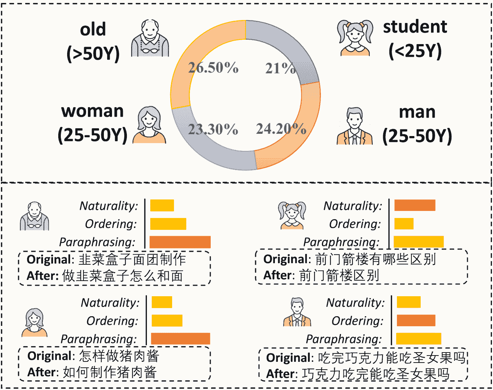
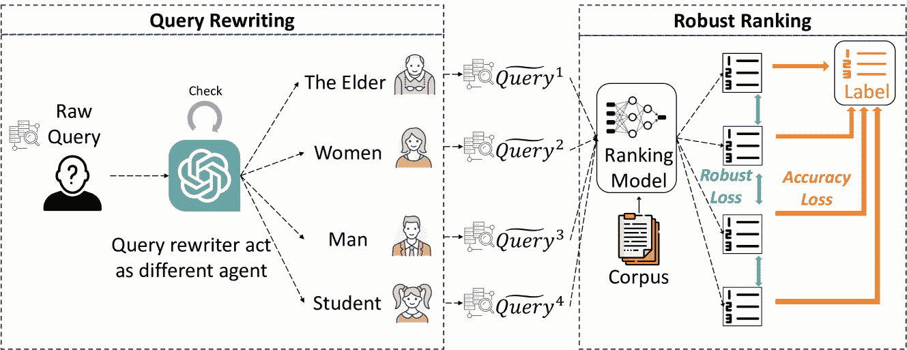
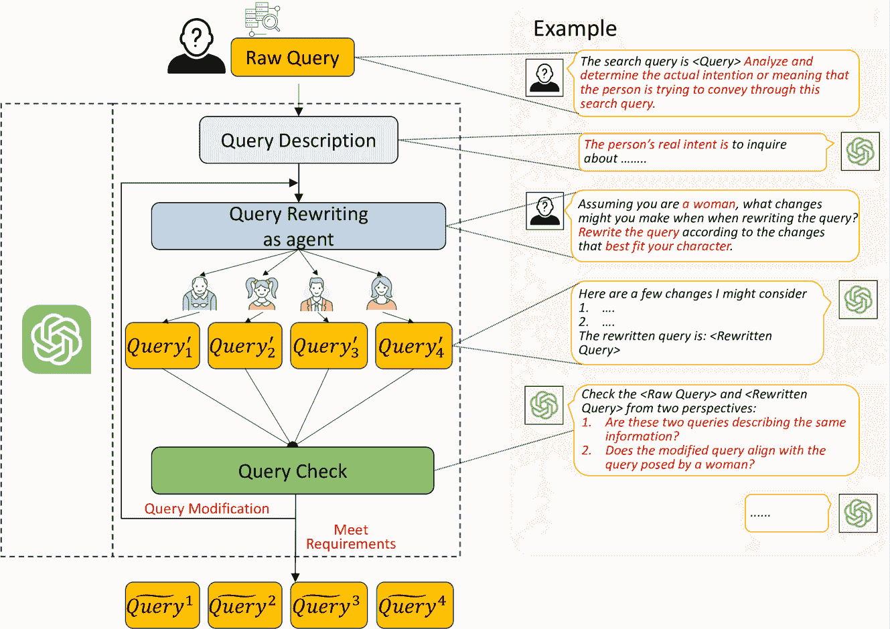
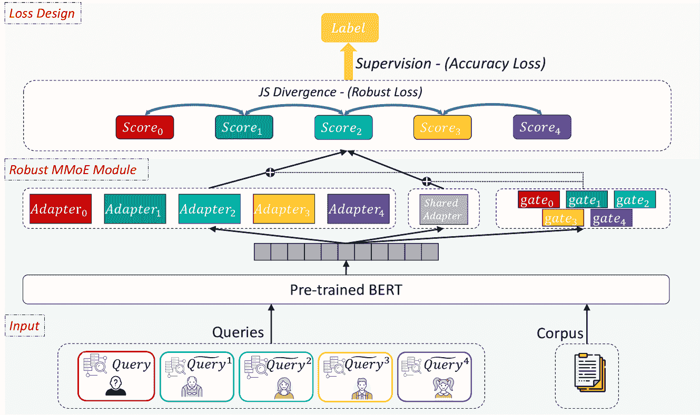
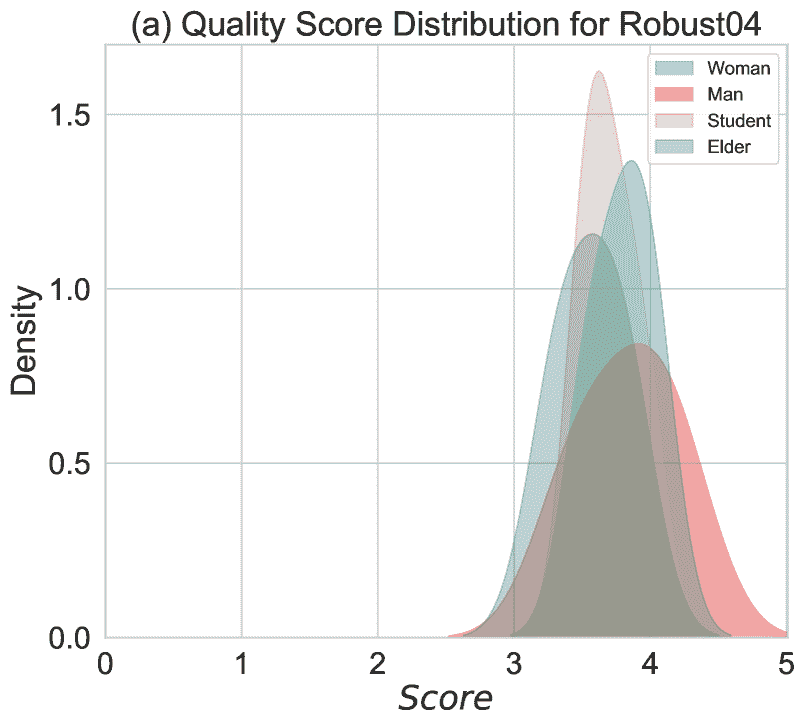
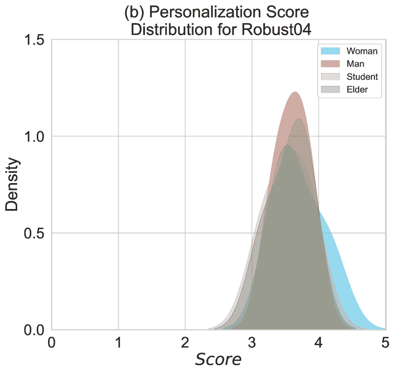
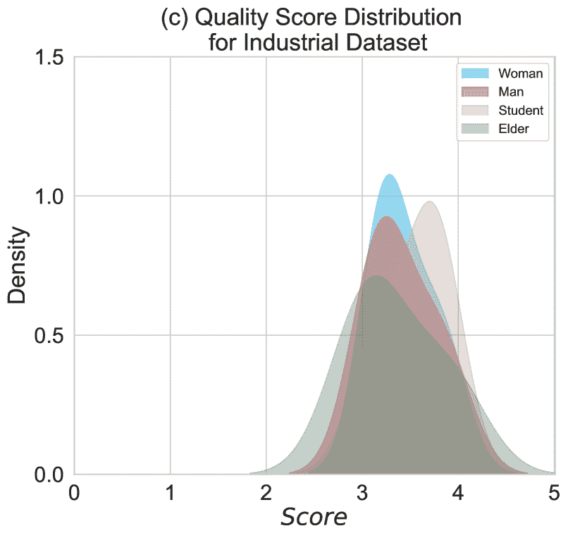
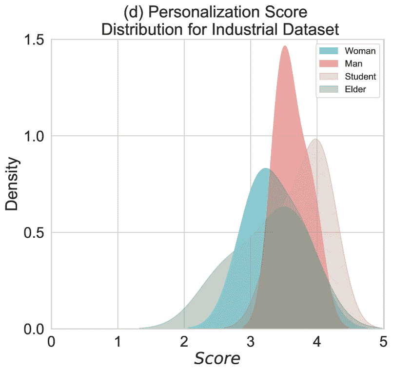
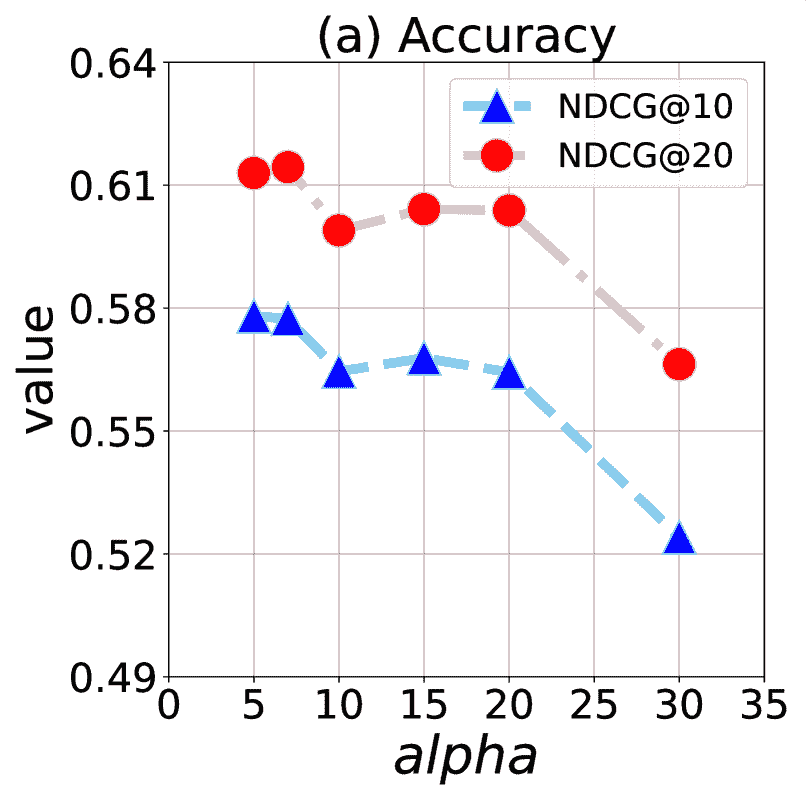
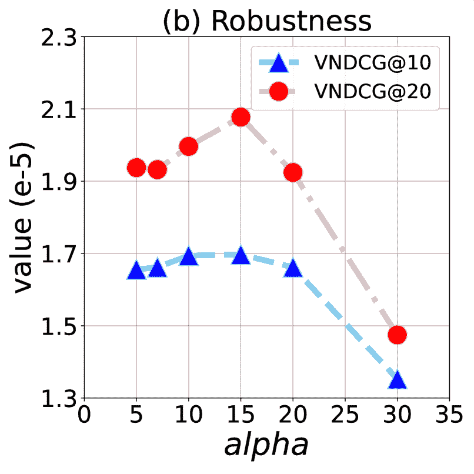

<!--yml

分类：未分类

日期：2025-01-11 12:59:23

-->

# Agent4Ranking: 通过个性化查询重写和多代理LLM实现语义鲁棒排名

> 来源：[https://arxiv.org/html/2312.15450/](https://arxiv.org/html/2312.15450/)

Xiaopeng Li${}^{\dagger}$, Lixin Su${}^{\ddagger}$, Pengyue Jia${}^{\dagger}$, Xiangyu Zhao${}^{\dagger}$, Suqi Cheng${}^{\ddagger}$, Junfeng Wang${}^{\ddagger}$, Dawei Yin${}^{\ddagger}$ ${}^{\dagger}$ 香港城市大学 ${}^{\ddagger}$ 百度公司 {xiaopli2-c, jia.pengyue}@my.cityu.edu.hk, xianzhao@cityu.edu.hk,

{sulixin, chengsuqi, wangjunfeng}@baidu.com, yindawei@acm.org

###### 摘要

搜索引擎至关重要，因为它们为用户提供了一种高效且便捷的方式，可以访问互联网中大量的信息，满足各种信息需求。用户的查询即使在特定需求下，也可能存在显著的差异。已有研究探讨了排名模型对常见查询变异（如同义改写、拼写错误和顺序变化）的鲁棒性。然而，这些研究忽略了不同人群如何独特地构造相同的查询。例如，老年人倾向于以更加自然的方式构建查询，并且顺序更加多样化。人口统计学的多样性要求提高排名模型对各种查询构造的适应性。因此，本文提出了一个框架，整合了一个创新的重写管道，该管道从不同的人群视角重写查询，并且提出了一个新的框架以增强排名的鲁棒性。具体而言，我们使用思维链（CoT）技术，利用大型语言模型（LLM）作为代理，模拟不同的人群特征，进而实现高效的查询重写。我们还创新了一种鲁棒的多门混合专家（MMoE）架构，并结合了混合损失函数，从而集体增强了排名模型的鲁棒性。通过在公共和工业数据集上的广泛实验，我们评估了查询重写方法的有效性以及排名模型的准确性和鲁棒性提升。实验结果突出显示了我们提出的模型的复杂性和有效性。

###### 关键词：

数据挖掘，信息检索，查询处理，鲁棒排名

## I 引言

搜索引擎在计算机科学和数据管理中发挥着重要作用，专注于高效地从庞大的数据存储库中搜索和检索相关信息[[1](#bib.bib1)]。搜索引擎技术中的一个核心挑战是解决排名问题，涉及根据搜索结果与用户查询的相关性来优先排序。排名模型已经经历了显著的发展，主要包括三种类型：传统的概率模型[[2](#bib.bib2), [3](#bib.bib3)]，由于其以关键词为中心的设计，在大规模应用中存在不足；利用深度学习提升性能的神经排名模型[[4](#bib.bib4), [5](#bib.bib5), [6](#bib.bib6)]；以及近年来的预训练模型[[7](#bib.bib7), [8](#bib.bib8)]，能够在数据有限的情况下理解复杂的查询。大多数研究主要集中在评估和增强排名模型的效果。然而，排名模型的鲁棒性，即在查询扰动的影响下，文档排名的稳定性，较少受到关注。

在实际的搜索场景中，搜索系统在排名中的鲁棒性至关重要。理想情况下，一个鲁棒的搜索引擎应该为语义一致的查询返回一致的结果[[9](#bib.bib9)]。然而，缺乏鲁棒性可能导致结果的显著变化，从而对用户体验产生不利影响。现有的研究探讨了查询变体对搜索引擎管道鲁棒性的影响。例如，Penha等人[[10](#bib.bib10)]研究了拼写错误和同义替换等变化的影响，发现检索效果明显下降了20%，表明当前系统在鲁棒性方面存在缺陷。CAPOT[[11](#bib.bib11)]通过对比学习解决了包括拼写错误和错别字在内的噪声查询影响。Zhuang等人研究了使用Character-Bert和自我教学技术[[12](#bib.bib12)]来有效处理充满拼写错误的查询。然而，这些研究大多集中在检索过程，缺乏对排名过程的探索，更重要的是，这些研究通过启发式方法定义了查询变体的类型并解决了鲁棒性不足的问题。实际上，搜索引擎常常面临由多种类型的查询变体组成的混合查询。直观地说，不同的人群可能有相同的信息需求，但由于他们不同的个人知识背景，他们会表达出不同的查询。因此，一种更直接的方法是模拟不同人群根据信息需求重写查询。

图 1：上图：CNNIC提供的四个群体的统计数据[[13](#bib.bib13)]。下图：四个群体的查询变体统计分类。所有查询均来自百度的工业数据集。红色条形表示该群体的最显著特征。

为了解决上述问题，本文提出从人口统计学角度研究大语言模型（LLMs）在查询重写中的应用，旨在增强针对不同用户群体的排名模型的鲁棒性。LLMs作为强大的工具，因其卓越的上下文感知和生成能力而广受关注，在查询重写中尤为有效，既能确保语义完整性，又能同时提升模型的鲁棒性[[14](#bib.bib14)]。然而，将LLMs应用于从人口统计学角度进行查询重写并非易事。首先，如何使用LLMs（如ChatGPT）从不同角度准确地重写查询。尽管这些模型因其上下文理解和语义理解而广受关注，但它们的输出不可预测，常导致生成的不准确或“幻觉”[[15](#bib.bib15)]。指导LLMs生成上下文相关且多样化的查询重写的提示设计复杂性加剧了这一问题。其次，如何通过多种查询变体增强排名模型的鲁棒性。现有文献主要关注单一角度的变体，如拼写错误或排序问题，往往忽略了实际场景中混合查询重写的复杂性[[10](#bib.bib10)]。因此，开发一个能够处理多种语义相似查询并始终产生相似排名结果而不牺牲准确性的鲁棒模型至关重要。

最近，使用LLM进行查询重写的研究主要分为两类。第一类是结合语料库的方法，例如HyDE[[16](#bib.bib16)]，它通过从原始查询生成假设文档来增强检索，和Query2doc[[17](#bib.bib17)]，它利用LLM中的少样本学习创建伪文档进行查询重写。沈等人提出了一种方法[[18](#bib.bib18)]，通过将潜在相关文档融入LLM提示中来修改查询。第二类是生成式重写方法，它利用LLM的语言理解和预先存在的知识进行查询再生，例如使用提示[[14](#bib.bib14), [19](#bib.bib19), [20](#bib.bib20)]和领域特定的微调方法[[21](#bib.bib21), [22](#bib.bib22)]来执行重写任务。然而，这些方法通常专注于单一视角的重写，且未广泛探讨多视角重写问题。同时，它们在处理重写查询的质量方面也存在不足，尤其是在幻觉效应及其缓解策略方面。此外，现有研究尚未系统性地探讨如何利用这些重写查询共同增强排名模型的鲁棒性。

针对上述挑战，本文介绍了一种创新的查询重写流程和一个增强搜索引擎排名鲁棒性的框架。为了从多种语义角度提升查询重写的效果，我们利用大语言模型（LLMs）的潜力，模拟四种不同的角色——女性、男性、学生和老人，并根据这些角色对查询进行重写。我们根据政府的统计数据[[13](#bib.bib13)]仔细选择了这四个角色，这些统计数据涵盖了大多数中国互联网用户，如图[1](#S1.F1 "图1 ‣ I 引言 ‣ Agent4Ranking：通过多智能体LLM个性化查询重写实现语义鲁棒排名")所示。我们将思维链（Chain of Thought, CoT）技术与严格的查询验证程序相结合，以对抗幻觉效应，并提升查询生成的精确度。该方法封装在一个循环生成框架中，通过评估和迭代优化查询，直到其满足预定义的质量标准。根据我们的结果分析，该方法展示了卓越的性能，并与角色的个性高度契合。此外，为了强化排名模型的鲁棒性，我们引入了一种鲁棒MMoE结构。该结构动态识别各种重写查询之间的语义共性，从而促进了更加稳定的排名过程。此外，我们开发了一种新颖的损失函数，利用Jensen-Shannon散度来衡量不同智能体视角之间的分布差异，从而增强了结果的鲁棒性。本文的主要贡献如下：

+   [leftmargin=*]

+   •

    我们提出了一种新颖的查询重写方法，利用大语言模型（LLMs）在各种代理角色中进行重写。该方法通过一个查询验证过程进行补充，严格评估并迭代改进查询，提高精度，直到它们符合我们的高标准；

+   •

    为了增强排名模型的鲁棒性，我们设计了一种鲁棒排名模型，该模型结合了具有多个适配器的专家混合（MoE）结构。该架构擅长捕捉语义相似性，从而增强了模型的鲁棒性。同时，我们还开发了一种新颖的损失函数，通过约束输出分布战略性地增强模型的鲁棒性。

+   •

    我们在两个不同的数据集上执行实验：一个是公开数据集，另一个是来自百度的工业数据集。我们广泛的实验设置包括查询评估、效果评估和鲁棒性性能测试，这些测试共同验证了我们提出的框架的优势。

图2：我们提出的模型整体架构的示意图。

## II 初步工作

在本节中，我们阐明了研究问题的主要符号和数学公式，该问题涵盖了查询重写和排名任务。

考虑一组原始用户查询$\mathcal{Q}={q_{0},...,q_{i},...,q_{n}}$，其中$n$表示查询的总数。我们的目标是从$K$个不同的角度重写这些查询。我们定义第$k$个重写函数为$\mathcal{F}_{\theta_{k}}$，其中$\theta_{k}$对重写过程进行参数化。与第$k$个角度对应的重写查询集表示为$\widetilde{\mathcal{Q}}^{k}={\widetilde{q}^{k}_{0},...,\widetilde{q}^{k}_{i},...,\widetilde{q}^{k}_{n}}$。这个过程可以形式化为：

|  | $\mathcal{F}_{\theta_{k}}:\mathcal{Q}\rightarrow\widetilde{\mathcal{Q}}^{k},~{}k\in[1,...,K]$ |  |
| --- | --- | --- |

假设每个查询$q_{i}$在$\mathcal{Q}$中与文档列表$\mathcal{D}_{i}=\{d_{i,1},d_{i,2},...,d_{i,n_{q_{i}}}\}$相关联，且对应的标签列表为$\boldsymbol{Y}_{i}=\{\boldsymbol{y}_{i,1},\boldsymbol{y}_{i,2},...,\boldsymbol{y}_{i,n_{q_{i}}}\}$，其中$n_{q_{i}}$表示文档列表$\mathcal{D}_{i}$的长度，$d_{i,j}$表示查询$q_{i}$对应文档列表$\mathcal{D}_{i}$中的第$j$个文档。我们考虑一个排名模型$\mathcal{R}$，它在从训练数据集分布$\mathcal{G}$中抽取的样本$\{q_{i},\mathcal{D}_{i},\boldsymbol{Y}_{i}\}_{i=1}^{t}$上进行训练。排名过程定义为，给定查询$q_{i}$和相应的文档列表$\mathcal{D}_{i}$，利用排名模型$\mathcal{R}$产生一个排列$\pi(q_{i},\mathcal{D}_{i},\mathcal{R})$。

排名模型效果的评估可以表示为：

|  | $\mathbb{E}_{(q_{c},\mathcal{D}_{c},\boldsymbol{Y}_{c})}\sim\mathcal{M}\left(% \pi\left(q_{c},\mathcal{D}_{c},\mathcal{R}\right),\boldsymbol{Y}_{c}\right)$ |  | (1) |
| --- | --- | --- | --- |

这里，$\mathcal{M}$表示评估有效性的度量，元组$(q_{c},\mathcal{D}_{c},\boldsymbol{Y}_{c})$表示测试查询、它们相关的文档列表和排名标签。值得注意的是，测试数据集来源于与训练集相同分布$\mathcal{G}$。排名模型的性能通过测试数据集的平均有效性来量化。

排名模型的鲁棒性量化为

|  | $\begin{split}\mathbb{V}_{(q_{c},\mathcal{D}_{c})}\sim\mathcal{M}([\pi^{k}(q^{k% }_{c},\mathcal{D}_{c},\mathcal{R})]),k\in[1,..,K]\end{split}$ |  | (2) |
| --- | --- | --- | --- |

在这种情况下，$\pi^{k}(q^{k}_{c},\mathcal{D}_{c},\mathcal{R})$表示使用排名模型对第$k$个重写查询及其对应文档的排名标签列表。鲁棒性通过不同重写查询的排名排列方差来评估。

## III 方法论

本节将全面阐述我们研究中采用的方法论。首先，我们将展示所提出的架构框架的概念性概述。随后，我们将深入探讨两个组成子任务：查询重写和鲁棒排名，并依次进行详细解释。

图 3：我们提出的模型的重写流程图。

### III-A 框架概述

我们研究的框架如图[2](#S1.F2 "图 2 ‣ I 引言 ‣ Agent4Ranking: 通过个性化查询重写使用多智能体LLM实现语义鲁棒排名")所示。我们的研究包含了两个不同但相互关联的子任务。第一个任务是查询重写。与传统方法仅强调重写查询的质量不同，我们将重写从多种语义视角进行扩展。最近在LLM智能体领域的发展提供了一个机会，使得不同角色的智能体可以执行不同的任务。我们的研究探讨了这些不同角色的智能体如何以符合相应人口群体特征的方式重写查询。第二个子任务是鲁棒排名。当前的排名模型在面对语义相同的查询时不能返回一致的结果，这证明了现有排名模型的非鲁棒性。这主要是由于排名模块在查询和文档之间的语义理解较弱。为了增强鲁棒性，我们提出了一种鲁棒的MMoE排名模型，能够有效地捕捉不同查询之间共享的语义信息。此外，我们设计了一个损失函数，在提高鲁棒性的同时，施加对准确性和鲁棒性的约束，从而确保排名的准确性并提升鲁棒性。

+   •

    查询重写：查询重写的优化始于应用ChatGPT-3.5，其中提示被精心设计以提炼用户查询的核心意图，从而揭示其潜在的信息需求。随后，四个代表不同人群的个性化角色——老年人、中年女性、中年男性和学生——被分配给大型语言模型（LLM）。我们精心选择这四个角色，模拟真实用户在互联网上的行为。接着，LLM在这些指定角色下进行查询重写。然而，由于LLM固有的幻觉限制，生成的查询可能会显著偏离原始语义。为了应对这一问题，我们实施了对重写内容的严格评估，包括两个方面：语义忠实度和重写语气与指定角色的一致性。不符合我们标准的查询将进行额外的优化，采用迭代方式，直到达到期望的质量标准。评估和优化的循环持续进行，直到重写后的查询在语义上与原始意图一致，并且与分配的角色语气相符，从而确保最终输出的最高质量和适当性。

+   •

    强健排序：为了增强在语义相似查询中文档排序的强健性，我们的方法包含两个主要方面。首先，我们旨在从结构上增强强健性。现有的跨编码器普遍存在的一个问题是，它们在不同查询之间辨识相似语义内容的能力有限。为了解决这个问题，我们提出了强健MMoE，这是一种创新结构，集成在变换器模型之上。该模型由两个主要组件组成：一个查询特定的专家和一个查询共享的专家，分别设计用于捕捉查询独立的语义表示和共享的语义表示。其次，关于损失函数，我们主张采用一种旨在优化准确性和强健性的损失函数。强健损失部分计算不同查询的文档排序分数之间的詹森–香农散度，从而增强强健性。同时，准确性损失部分侧重于保持排序的精确度，从而确保准确性。

### III-B 查询重写

本小节深入探讨了我们重写流程的详细方法论。大语言模型（LLMs）最近在搜索引擎中作为有效的查询重写工具变得越来越突出[[23](#bib.bib23), [24](#bib.bib24)]。虽然现有的大多数研究集中于单一视角的变体，例如拼写错误或打字错误[[12](#bib.bib12)]，但在现实场景中多语义查询重写的复杂性往往被忽视[[10](#bib.bib10)]。在我们的研究中，我们利用LLMs作为代理，采用多种角色，从多个语义角度巧妙地重写查询，并通过迭代过程提高这些重写的质量。该过程的工作流如图[3](#S3.F3 "Figure 3 ‣ III Methodology ‣ Agent4Ranking: Semantic Robust Ranking via Personalized Query Rewriting Using Multi-agent LLM")所示，便于全面理解。

查询重写任务的本质在于理解用户的意图并辨别他们真正寻求的信息，这对于有效的查询重写至关重要。为实现这一目标，我们利用LLMs的高级语义理解能力，准确识别查询中的潜在信息需求。在实际操作中，给定一组初始的原始查询，记作$\mathcal{Q}^{r}$，我们采用提示工程技术来设计提示(a)，具体细节见表格[I](#S3.T1 "TABLE I ‣ III-B Query Rewriting ‣ III Methodology ‣ Agent4Ranking: Semantic Robust Ranking via Personalized Query Rewriting Using Multi-agent LLM")。该方法对于从查询中提取相关信息并精确捕捉用户真实意图至关重要。

在初步信息提取之后，我们将LLM分配到不同的代理角色中进行查询重写。为此，我们提供了提示(b)来指导LLMs。这些代理角色经过精心设计，反映了四个不同的人群组：中年男性、中年女性、老年人和学生，重写后的查询表示为$\mathcal{Q}^{\prime}_{k},k\in[1,2,3,4]$。根据互联网上的人群调查[[13](#bib.bib13)]，这四个群体的选择旨在提供跨年龄段的平衡代表，其中50岁以上的群体被归类为老年人，25岁以下的群体为学生，其他群体按性别进行划分，具体结果如图[1](#S1.F1 "Figure 1 ‣ I Introduction ‣ Agent4Ranking: Semantic Robust Ranking via Personalized Query Rewriting Using Multi-agent LLM")所示。此外，这些群体在查询中展示了独特的语义表达方式，涵盖了自然性、排序和释义等方面[[19](#bib.bib19)]。例如，老年人偏好口语化的语言，而学生则更擅长使用搜索工具，倾向于使用关键词驱动的查询。因此，每个人群组的查询表达模式展示了受年龄和性别特征影响的独特性。

在获得四个不同代理角色重写的查询后，进行严格的质量评估是至关重要的。这一步骤对于确认重新生成的查询的忠实度至关重要。鉴于大型语言模型中的幻觉问题尚未完全解决，仍然存在一些查询未能达到设定标准的可能性。例如，一些查询可能会经历较大的语义变化，偏离其原始意图，或者可能未能根据分配的代理角色适当重述。

为了缓解这些问题，我们从两个不同的角度评估重写后的查询。首先，评估原始查询与重写查询之间的语义相似度。其次，评估重写查询与其指定代理角色的符合度。对于这两项评估，我们实施了一个三级评分机制：完全符合要求、部分符合要求和不符合要求。相关提示的详细信息如表 [I](#S3.T1 "TABLE I ‣ III-B Query Rewriting ‣ III Methodology ‣ Agent4Ranking: Semantic Robust Ranking via Personalized Query Rewriting Using Multi-agent LLM") 中的提示 (c) 所示。

当查询未达到设定标准时，我们将引导其进入查询重写阶段，并为大型语言模型（LLMs）提供修改后的指令。在查询质量不达标的情况下，特别是在语义忠实度方面，我们要求重新生成的查询更紧密地与原始语义对齐，如提示 (d) 中所述。在查询未能充分符合指定代理角色的情况下，我们会设计提示，强调需要更好地遵守代理角色，如提示 (e) 中所述。为有效同时解决质量和角色符合度问题，我们制定了一个量身定制的提示 (f)，以全面缓解这些问题。

表 I：公共数据集查询重写提示

| 方法 | 提示 |
| --- | --- |
| 查询生成 | (a). 搜索查询是 {query}。请分析并确定这个搜索查询试图传达的实际意图或含义。 |
| (b). 假设你是女性，在重写查询时你会做哪些改变？请根据你的角色重写查询。 |
| 查询检查 | (c). 原始查询是：{query}。重写后的查询是：{rewriting query}。请评估以下内容：1\. 这两个查询是否描述了相同的信息？ 2\. 修改后的查询是否与 {agent} 提出的查询一致？请赋予判断分数：-1、0 或 1。-1 表示完全不匹配，0 表示大致匹配，1 表示完全匹配。 |
| 查询修改 | (d). 假设你是一个 {agent}，请根据你的角色重述查询，同时保留问题的原始含义。 |
|  | (e). 假设你是一个{agent}，请根据你的角色重述查询，使其更符合角色的属性。 |
|  | (f). 假设你是一个{agent}，请根据你的角色重述问题，保持原始查询的核心内容，并使其符合角色的属性。 |

这个迭代过程会持续进行，直到生成满足既定要求的查询，记作 $\widetilde{\mathcal{Q}}^{k}$。整个重写过程的算法如算法 [1](#alg1 "1 ‣ III-B 查询重写 ‣ III 方法论 ‣ Agent4Ranking: 通过使用多代理LLM进行个性化查询重写的语义鲁棒排序") 中所示。

该过程会重复进行，直到生成符合要求的查询，记作 $\widetilde{\mathcal{Q}}^{k}$。整个重写过程的算法如算法 [1](#alg1 "1 ‣ III-B 查询重写 ‣ III 方法论 ‣ Agent4Ranking: 通过使用多代理LLM进行个性化查询重写的语义鲁棒排序") 中所示。

输入：输入查询 $\mathcal{Q}^{r}$，提示符 $\mathcal{P}_{a},\mathcal{P}_{b},\mathcal{P}_{c},\mathcal{P}_{d},\mathcal{P}_{e}$，代理列表 $K$。输出：重写查询 $\widetilde{\mathcal{Q}}^{k},k\in K$  

算法 1 查询重写的算法。

### III-C 鲁棒排序

在本小节中，我们将介绍如何增强现有排序模型的鲁棒性。

图 4：我们提出的模型鲁棒排序架构的示意图。

传统的交叉编码器[[25](#bib.bib25)]接收一对文本，通常是搜索查询和文档，并将文本编码为一个单一的上下文向量。这个向量随后被压缩成一个单一的值，作为评估查询与文档之间关系或相似性的度量标准。尽管其被广泛使用，但我们认为现有的交叉编码器框架在鲁棒性上存在不足，主要有两个原因。一个主要的缺点在于其提取共享语义信息的能力不足。在输入语义上完全相同的情况下，现有的交叉编码器架构未能充分捕捉共享的语义细微差异，从而导致排序结果不鲁棒，影响模型的整体性能。另一个影响鲁棒性的关键因素是训练过程中缺乏严格的约束。因此，模型未能有效地在语义相似的实例之间进行泛化，导致在真实世界排序场景中的鲁棒性不足。

针对上述两点，我们的方法首先在结构和损失函数设计上进行增强，以提高鲁棒性。具体而言，我们开发了一个强大的多门专家混合（MMoE）适配器结构，并结合了一个强大的损失函数，协同设计以增强排序器的鲁棒性。

具体结构如图[4](#S3.F4 "图 4 ‣ III-C 鲁棒排序 ‣ III 方法论 ‣ Agent4Ranking: 通过多代理LLM个性化查询重写进行语义鲁棒排序")所示。在接下来的内容中，我们将首先介绍输入数据，然后详细讨论两个主要模块：鲁棒的混合专家模型（MMoE）适配器和该模块的损失设计。

#### III-C1 数据输入

对于不同的代理查询$\widetilde{\mathcal{Q}}^{k},k\in[1,...,4]$，其中$k$表示第$k$个代理，以及原始查询列表$Q^{r}$。我们有一个$i$-th查询所需排序的文档列表$\mathcal{D}_{i}$。我们将上述数据组合成候选对，并将输入对表述如下：

|  | $\text{Input}:~{}<q^{r}_{i},d_{i,j}>,<q^{1}_{i},d_{i,j}>,...,<q^{4}_{i},d_{i,j}>$ |  |
| --- | --- | --- |

其中$q^{r}_{i}\in Q^{r}$，$q^{k}_{i}\in\widetilde{\mathcal{Q}}^{k}$，$d_{i,j}$表示文档列表$\mathcal{D}_{i}$中的第$j$个文档。对于每一对，我们将其建模为格式$\boldsymbol{s}_{i,j}=<[\text{CLS}]~{}q_{i}~{}[\text{SEP}]~{}d_{i,j}~{}[\text{% SEP}]>$，并将其输入预训练的变换器模型，以获得每对的中间密集表示，具体形式如下：

|  | $\displaystyle\boldsymbol{e}^{r}_{i}$ | $\displaystyle=\text{PLM}(\boldsymbol{s}^{r}_{i,j})$ |  | (3) |
| --- | --- | --- | --- | --- |
|  | $\displaystyle\boldsymbol{e}^{k}_{i}=\text{PLM}$ | $\displaystyle(\boldsymbol{s}^{k}_{i,j}),k\in[1,2,3,4]$ |  |

其中，$\boldsymbol{e}^{r}_{i}$表示原始的查询-文档表示，$\boldsymbol{e}^{k}_{i}$表示第$k$个代理重写后的查询-文档表示。我们选择了三种不同的transformer模型进行实验：BERT[[26](#bib.bib26)]、RoBERTa[[27](#bib.bib27)]和ERNIE[[28](#bib.bib28)]。为了实现最佳性能，首先对这些预训练语言模型（PLMs）进行初步训练，然后对整个模型进行微调，以增强其鲁棒性。整个模型设计和实验流程的详细描述将在后续章节中呈现。

#### III-C2 鲁棒MMoE模块

在本部分，我们介绍了设计MMoE适配器结构的方法，将其作为现有模型的扩展，以增强在多种一致语义查询输入下的鲁棒性。

多门混合专家（MMoE）模型最初由Ma等人[[29](#bib.bib29)]提出，旨在通过引入混合专家（MoE）架构来解决多任务学习中的挑战。这一创新方法显式建模了各个任务之间的关系，并采用门控网络来优化结果。在我们的任务背景下，我们旨在使用MoE模块同时捕获查询无关的语义信息和查询共享的信息。这些捕获的表示随后将融合在一起，以增强整体鲁棒性。

对于每个代理角色，我们构建一个独立的“专家”网络，用于捕获特定于代理的表示，同时构建一个代理共享的“专家”网络，用于捕获不同代理之间共享的表示。为了实现这一点，我们为每个专家使用适配器结构，这一灵感来源于[[30](#bib.bib30)]的工作。适配器调优是自然语言处理领域广泛采用的策略，它通过仅更新少量参数，同时在各种下游任务中显著提高泛化能力[[31](#bib.bib31), [32](#bib.bib32)]。适配器模块遵循瓶颈设计，包括一个下投影层、一个非线性层、一个上投影层以及一个跳跃连接。该模块作为插件直接集成到transformer架构中。

在我们的模型中，对于每个代理，我们构建一个与代理无关的适配器$\mathcal{A}^{d}_{k}$单元，其中$k\in[0,...,4]$。此外，还构建了一个代理共享的适配器单元$\mathcal{A}^{s}$，用于捕获不同查询之间共享的信息。从数学上讲，我们可以将其表示如下：

|  | $\displaystyle\boldsymbol{v}^{k}_{i}$ | $\displaystyle=\mathcal{A}^{d}_{k}(\boldsymbol{e}^{k}_{i})$ |  | (4) |
| --- | --- | --- | --- | --- |
|  | $\displaystyle\boldsymbol{w}^{k}_{i}$ | $\displaystyle=\mathcal{A}^{s}(\boldsymbol{e}^{k}_{i})$ |  |

其中$\boldsymbol{v}^{k}_{i}$表示第$k$个适配器和第$i$个查询的代理无关表示，$\boldsymbol{w}^{k}_{i}$表示代理共享表示，所有不同的代理共享相同的适配器单元$\mathcal{A}^{s}$。当$k$设置为0时，特别指代原始查询的处理。这些表示的集成通过门控网络高效执行。

门控网络的设计目的是平衡模型中个体组件和共享组件的比例。上述操作将表示$\boldsymbol{e}_{i}$分解为独立的嵌入$\boldsymbol{v}_{i}$和共享嵌入$\boldsymbol{w}_{i}$，其中共享嵌入捕获了共同的语义信息。通过门控网络重新整合这些组件，从而有效增强模型的整体鲁棒性。门控网络被设计为一个多层感知器（MLP）模块。融合过程的具体步骤如下所示：

|  | $\boldsymbol{g}^{k}_{i}=\text{softmax}(W^{k}\boldsymbol{e}^{k}_{i})$ |  | (5) |
| --- | --- | --- | --- |

其中$\boldsymbol{W}^{k}\in\mathbb{R}^{2\times d}$是门控网络的可训练矩阵，$d$表示特征维度，接着我们通过门控网络将$v^{k}_{i}$和$w^{k}_{i}$进行融合，表示为

|  | $\boldsymbol{h}^{k}_{i}=\boldsymbol{g}^{k}_{i}[\boldsymbol{v}^{k}_{i},% \boldsymbol{w}^{k}_{i}]$ |  | (6) |
| --- | --- | --- | --- |

其中$[\cdot]$表示连接操作，$h^{k}_{i}$是聚合结果。然后，我们将融合结果$h^{k}_{i}$通过分类器映射，表示为

|  | $\boldsymbol{\hat{y}}^{k}_{i}=\mathcal{C}(\boldsymbol{h}^{k}_{i})$ |  | (7) |
| --- | --- | --- | --- |

其中$\mathcal{C}$是一个分类器，我们将对结果进行归一化并分类到不同的分类等级中。

#### III-C3 损失设计

在这一部分，我们提出了一种新型的损失函数，通过在损失函数中加入特定的约束，既优化了准确性，又增强了模型的鲁棒性。我们的设计包括两个核心组成部分：准确性损失和鲁棒性损失。

为了应对准确性损失的问题，我们采用了逐点交叉熵损失函数，该函数是基于每对查询-文档对计算的，每一对都被独立处理。在我们的实验设置中，工业数据集包含五个相关性等级的标签，而我们使用的公共数据集则是三等级相关性分类。为了协调这两种不同的标签结构，我们首先将原始值标签转换为与独热编码方案兼容的格式，表示为$\hat{y}$。接下来，我们应用交叉熵计算，将预测标签与真实标签进行对比。该计算的详细步骤如下所示。

在处理准确度损失时，我们选择了点对点交叉熵损失。这种损失函数是在查询-文档对的基础上计算的，每一对独立计算。在我们的实验框架中，工业数据集包含的标签最初分为五个相关性等级，而我们使用的公共数据集则采用三层相关性分类。从数学角度来看，计算过程如下所示：

因此，在初始阶段，我们将原始值标签编码为对应于独热编码方案的形式，记作$\boldsymbol{y}^{k}_{i}$。随后，我们使用交叉熵计算来比较预测标签与真实标签。计算过程可以详细描述如下：

|  | $\mathcal{L}_{\text{acc}}=-\frac{1}{N}\frac{1}{K}\sum_{i}^{N}\sum_{k}^{K}(% \boldsymbol{y}^{k}_{i}\cdot\log\boldsymbol{\hat{y}}^{k}_{i}+(1-\boldsymbol{y}^% {k}_{i})\cdot\log(1-\boldsymbol{\hat{y}}^{k}_{i}))$ |  | (8) |
| --- | --- | --- | --- |

其中，$\boldsymbol{y}^{k}_{i}$表示数据集的黄金标签，而$\hat{y}^{k}_{i}$表示第$i$个查询和第$k$个代理的预测标签。这里，$N$和$K$分别代表训练样本的总数和代理的总数。损失函数专门设计用来计算预测标签与实际相关性标签之间的对数差异。这个度量作为模型在点对点排名范围内准确度的衡量标准。

除了处理准确度损失外，考虑排名性能的鲁棒性也是至关重要的，这是本文的主要关注点之一。为了增强鲁棒性，我们的设计策略涉及最小化不同代理之间的散度。尽管像[[12](#bib.bib12)，[33](#bib.bib33)]这样的先前研究已经将KL散度纳入损失函数中，以减少两者预测之间的分布差异，但这种方法并非没有局限性。具体来说，KL散度是一个不对称的度量，可能导致不平衡的问题。鉴于我们的场景涉及多个代理组，每个代理都应保持平等的地位，因此我们选择了Jensen-Shannon（JS）散度作为一种更为公平的度量，记作

|  | $\mathcal{L}_{JS}(\boldsymbol{y}^{a},\boldsymbol{y}^{b})=\frac{1}{2}\mathcal{L}% _{KL}(\boldsymbol{y}^{a},\boldsymbol{y}^{b})+\frac{1}{2}\mathcal{L}_{KL}(% \boldsymbol{y}^{b},\boldsymbol{y}^{a})$ |  | (9) |
| --- | --- | --- | --- |

然后我们使用JS散度来最小化所有代理对分布之间的差距，公式如下：

|  | $\mathcal{L}_{\text{rbt}}=-\frac{1}{N}\sum_{m}^{K}\sum_{n}^{K}\mathcal{L}_{JS}(% \boldsymbol{\hat{y}}^{m}_{i},\boldsymbol{\hat{y}}^{n}_{i}),m<n$ |  | (10) |
| --- | --- | --- | --- |

最小化 $\mathcal{L}_{\text{rbt}}$ 将减少每对代理分布之间的差异。通过这种方式，我们隐式地对齐了每个代理的表示，并满足了鲁棒性属性。

然后我们将 $\mathcal{L}_{\text{rbt}}$ 和 $\mathcal{L}_{\text{acc}}$ 结合，得到总损失

|  | $\mathcal{L}_{\text{total}}=\mathcal{L}_{\text{acc}}+\alpha\mathcal{L}_{\text{% rbt}}$ |  | (11) |
| --- | --- | --- | --- |

参数 $\alpha$ 代表一个可调的超参数，用于平衡准确性和鲁棒性损失。通过这种损失的协同组合，我们成功实现了模型的所有目标属性。

## IV 实验

我们进行了详细的实验来评估我们提出的框架。本节将首先描述数据集，概述基准模型，并明确用于评估的指标。接下来，我们将深入评估查询和检查模型性能。此外，我们还将呈现消融实验的结果及超参数的影响。

### IV-A 数据集描述

我们在两个数据集上进行了实验：一个是公开数据集 Robust04，另一个是来自百度的工业数据集。

+   •

    Robust04¹¹1https://trec.nist.gov/data/robust/04.guidelines.html：Robust04 数据集是专为 TREC 2004 Robust Track 开发的，这是文本检索会议（TREC）系列中的一个组成部分。该数据集包含 249 个查询，每个查询与 528K 文档集合上的相关性判断相关联。

+   •

    工业数据集：我们使用的工业数据集是中文数据集，来源于百度收集的用户视频搜索数据，百度是中国最大的搜索引擎平台。在该数据集中，查询和文档是从真实的搜索日志中提取的，语料库对应于通过 OCR 识别相关视频 URL 生成的文档。该数据集包含 16K 查询和 430K 文档。

### IV-B 基准

在我们的实验中，我们使用以下基准：

+   •

    BM25 [[34](#bib.bib34)]：BM25 是一个简单而强大的词袋检索模型，通过查询词频、逆文档频率和文档长度来计算相关性得分。

+   •

    ANCE [[35](#bib.bib35)]：ANCE 使用近似最近邻索引进行困难负样本选择，并结合模型微调进行动态训练更新，从而加速收敛、提高检索性能并有效利用计算资源。

### IV-C 评估指标

为了全面评估我们的结果，我们使用了有效性和鲁棒性评估指标。

#### IV-C1 有效性指标

为了评估有效性，我们选择了 NDCG@N 和 MAP 来进行评估。

#### IV-C2 鲁棒性指标

继承先前的工作[[36](#bib.bib36)]，我们选择归一化平均精度方差（VNAP）作为稳健性评估指标。此外，我们引入了归一化折扣累计增益方差（VNDCG）进行综合联合评估。我们使用这两个指标来评估不同代理之间的稳健性表现。从数学角度来看，这些指标可以阐明如下：

|  | $NAP(q)=\frac{AP(q)}{E(AP(q))}$ |  |
| --- | --- | --- |
|  | $VNAP=\mathbb{V}(NAP_{1}(q),...,NAP_{K}(q))$ |  | (12) |

其中，AP表示与查询$q$相关的平均精度，NAP表示归一化平均精度，VNAP表示不同$K$代理之间的NAP列表的方差，而对于VNDCG，它的定义如下：

|  | $VNDCG@N=\mathbb{V}(NDCG_{1}@N,...,NDCG_{K}@N)$ |  | (13) |
| --- | --- | --- | --- |

其中，NDCG@N表示在$N$处的归一化折扣累计增益，而VNDCG@N表示从不同$K$代理获得的NDCG@N值序列的方差。

### IV-D 实现细节

在我们的实验中，我们利用了多种预训练模型进行实验执行（[3](#S3.E3 "3 ‣ III-C1 数据输入 ‣ III-C 稳健排名 ‣ III 方法论 ‣ Agent4Ranking：通过多代理LLM的个性化查询重写实现语义稳健排名")），包括BERT、ERNIE和RoBERTa，它们作为我们的基础模型。具体来说，对于BERT-CE²²2https://huggingface.co/bert-base-chinese³³3https://huggingface.co/bert-base-uncased，ERNIE-CE⁴⁴4https://huggingface.co/nghuyong/ernie-3.0-base-zh⁵⁵5https://huggingface.co/nghuyong/ernie-2.0-base-en，以及RoBERTa-CE⁶⁶6https://huggingface.co/hfl/chinese-roberta-wwm-ext⁷⁷7https://huggingface.co/deepset/roberta-base-squad2，我们根据语言类型使用了来自Hugging Face的不同检查点，并在训练数据集上将它们微调为跨编码器。我们的实验方法，例如在BERT+ours中，遵循了两阶段范式。在第一阶段，我们加载BERT-CE PLM检查点，然后在第二阶段冻结预训练模型。我们将插入的PLM集成到稳健排名结构中，并在训练数据集上执行微调任务。所有实验都在单个Tesla V100 32G GPU上使用AdamW优化器进行。为了进行基准比较，我们采用了BEIR提供的开源BM25实现[[37](#bib.bib37)]。我们实现的ANCE利用RoBERTa作为基础预训练语言模型。关于CharacterBert，我们遵循了[[12](#bib.bib12)]中的配置，并针对公平比较对损失函数进行了点对点修改，以适应我们的设置。

### IV-E 查询质量实验

重写查询结果的评估至关重要，因为它们对整体表现有显著影响。目前的评估挑战主要来自于语义信息的变化以及对性格特征的评估，这些领域缺乏可靠的评估方法。为了解决这一问题，我们采用大型语言模型来评估重写后的查询。我们的评估重点关注两个关键指标：重写查询的语义保真度和与定义角色的契合度。我们使用多种公开的中文和英文LLM进行查询评估。我们为评估设计了特定的提示，允许模型在0到5的范围内对每个指标进行评分，其中0表示最差，5表示最佳表现。

图5：查询评估

作为中文的LLM（大语言模型），我们选择：

+   •

    ChatGLM2-6B⁸⁸8https://huggingface.co/THUDM/chatglm2-6b：清华大学的第二代双语聊天模型，属于ChatGLM系列。

+   •

    Atom-7B⁹⁹9https://huggingface.co/FlagAlpha/Atom-7B：由Llama中文社区共同开发，Atom-7B基于Llama2-7B，并且进一步使用大量中文数据进行预训练。

+   •

    ERNIE-Bot^(10)^(10)10https://yiyan.baidu.com/：百度的ERNIE Bot，2023年发布的知识增强生成式人工智能，旨在提供准确流畅的类人回应，能够有效理解人类意图。

作为英文的LLM（大语言模型），我们选择：

+   •

    vicuna-13B^(11)^(11)11https://https//huggingface.co/lmsys/vicuna-13b-v1.3：一个开源对话模型，通过在ShareGPT平台上共享的用户对话数据微调Llama 13B模型而构建。

+   •

    Claude^(12)^(12)12www.anthropic.com：由Anthropic开发的大型对话型语言模型。

+   •

    Llama-2-13b^(13)^(13)13https://huggingface.co/meta-llama/Llama-2-13b-chat-hf：Meta和微软共同发布的开源Llama 2，适用于研究和商业用途，具有优化的变换器架构。

表II：性能对比结果。

| Models / NDCG@10 | Robust04 | Industrial Dataset |
| --- | --- | --- |
| original | woman | man | student | old | original | woman | man | student | old |
| BM25 | 0.4262 | 0.4062 | 0.3798 | 0.4259 | 0.3792 | 0.5380 | 0.5259 | 0.5264 | 0.5392 | 0.5183 |
| ANCE | 0.4037 | 0.3905 | 0.3774 | 0.3802 | 0.3723 | 0.5640 | 0.5595 | 0.5588 | 0.5492 | 0.5587 |
| CharacterBert | 0.4489 | 0.4192 | 0.4332 | 0.4274 | 0.4195 | 0.5860 | 0.5799 | 0.5859 | 0.5802 | 0.5733 |
| BERT-CE | 0.4423 | 0.4129 | 0.4084 | 0.4082 | 0.4010 | 0.5821 | 0.5602 | 0.5637 | 0.5656 | 0.5679 |
| ERNIE-CE | 0.4362 | 0.4021 | 0.3923 | 0.3993 | 0.4283 | 0.5888 | 0.5664 | 0.5687 | 0.5663 | 0.5699 |
| RoBERTa-CE | 0.4562 | 0.4272 | 0.3997 | 0.4098 | 0.4194 | 0.5987 | 0.5740 | 0.5758 | 0.5809 | 0.5828 |
| BERT+ours | 0.4353 | 0.4102 | 0.4207 | 0.4178 | 0.4265 | 0.5924 | 0.5911* | 0.5854 | 0.5821 | 0.5837 |
| ERNIE+ours | 0.4408 | 0.4305 | 0.4252 | 0.4365 | 0.4124 | 0.5896 | 0.5805 | 0.5829 | 0.5843 | 0.5870 |
| RoBERTa+ours | 0.4598* | 0.4365* | 0.4423* | 0.4398* | 0.4292* | 0.5962* | 0.5892 | 0.5879* | 0.5843* | 0.5877* |
| 模型 / MAP | Robust04 | 工业数据集 |
| 原始 | 女性 | 男性 | 学生 | 老年 | 原始 | 女性 | 男性 | 学生 | 老年 |
| BM25 | 0.2652 | 0.2528 | 0.2332 | 0.2643 | 0.2383 | 0.3584 | 0.3431 | 0.3571 | 0.3407 | 0.3391 |
| ANCE | 0.2512 | 0.2453 | 0.2389 | 0.2592 | 0.2364 | 0.3753 | 0.3695 | 0.3698 | 0.3604 | 0.3674 |
| CharacterBert | 0.2851 | 0.2623 | 0.2752 | 0.2589 | 0.2607 | 0.3950 | 0.3892 | 0.3932 | 0.3878 | 0.3821 |
| BERT-CE | 0.2952 | 0.2694 | 0.2595 | 0.258 | 0.2572 | 0.3913 | 0.3797 | 0.3850 | 0.3874 | 0.3982 |
| ERNIE-CE | 0.2864 | 0.2664 | 0.2659 | 0.2495 | 0.2722 | 0.4009 | 0.3876 | 0.3920 | 0.3968 | 0.3995 |
| RoBERTa-CE | 0.2892 | 0.2467 | 0.2574 | 0.2503 | 0.2490 | 0.4081 | 0.3840 | 0.3894 | 0.3836 | 0.3855 |
| BERT+ours | 0.2887 | 0.2668 | 0.2792 | 0.2684 | 0.2809* | 0.3947 | 0.3912 | 0.3896 | 0.3920 | 0.3974 |
| ERNIE+ours | 0.2895 | 0.2858 | 0.2748 | 0.2793 | 0.2673 | 0.4072 | 0.4059* | 0.4039* | 0.3952 | 0.4018 |
| RoBERTa+ours | 0.2961* | 0.2797 | 0.2849* | 0.2809* | 0.2704 | 0.4083* | 0.3921 | 0.3904 | 0.4021* | 0.4037* |

“*”表示显著性水平测试$p<0.05$。

为了进行公平评估，我们从每个数据集中为每个角色抽取了100个查询，并通过之前提到的三种大型语言模型（LLM）对其进行评估。图[5](#S4.F5 "图 5 ‣ IV-E 查询质量实验 ‣ IV 实验 ‣ Agent4Ranking：通过个性化查询重写使用多智能体LLM实现语义稳健排名")展示了得分分布结果。结果表明，无论是重写查询还是个性化查询，其质量都很高，得分大部分超过了5分制的3分。特别地，英语重写查询的质量超过了中文查询。我们推测这种差异源于ChatGPT在英语任务上的较高能力，这与我们在角色质量评估中的发现一致。此外，分布没有表明ChatGPT在不同角色间有任何偏好，因为其分布在不同角色间相对均匀。这些结果强有力地验证了使用LLM进行查询重写在不同角色间的有效性。

表 III: 稳健性性能对比结果。

| 指标 | Robust04 | 工业数据集 |
| --- | --- | --- |
| VNDCG@10 (e-5)$\downarrow$ | VNAP $\downarrow$ | VNDCG@10 (e-5)$\downarrow$ | VNAP $\downarrow$ |
| BM25 | 43.53 | 1.1823 | 6.287 | 1.0372 |
| ANCE | 12.43 | 0.9827 | 2.336 | 0.8764 |
| CharacterBert | 12.01 | 0.9723 | 2.209 | 0.8394 |
| BERT-CE | 20.69 | 1.0212 | 5.625 | 1.0360 |
| ERNIE-CE | 29.96 | 1.0519 | 7.210 | 1.0142 |
| RoBERTa-CE | 36.97 | 1.0745 | 7.635 | 1.0284 |
| BERT+ours | 8.841*(-26.3%) | 0.9082*(-6.6%) | 1.650(-25.3%) | 0.7176(-14.4%) |
| ERNIE+ours | 9.754(-16.9%) | 0.9242(4.9%) | 1.518(-31.2%) | 0.6350(-11.5%) |
| RoBERTa+ours | 10.29(-14.3%) | 0.9473(2.6%) | 1.427*(-35.4%) | 0.6165*(-26.5%) |

最优结果以粗体显示，次优结果以下划线标注。$\downarrow$: 数值越低越好。

“*”表示显著性水平测试 $p<0.05$。

### IV-F 性能实验

在这一部分，我们将展示在两个数据集上结果的表现，包括效能和鲁棒性。我们将我们的结果与各种基准模型进行了比较，并引入了三种基于变换器的交叉编码器进行对比：BERT-CE、ERNIE-CE 和 RoBERTa-CE。在我们的模型中，我们采用了相同的三种变换器骨干网，并在其上集成了我们增强鲁棒性的模块。我们记录了在公共数据集和工业数据集上所有角色的结果。表格 [II](#S4.T2 "TABLE II ‣ IV-E Query Quality Experiment ‣ IV Experiment ‣ Agent4Ranking: Semantic Robust Ranking via Personalized Query Rewriting Using Multi-agent LLM") 和 [III](#S4.T3 "TABLE III ‣ IV-E Query Quality Experiment ‣ IV Experiment ‣ Agent4Ranking: Semantic Robust Ranking via Personalized Query Rewriting Using Multi-agent LLM") 分别展示了效能和鲁棒性的结果。

#### IV-F1 效能分析

在这一部分，我们将首先讨论我们模型对最终结果的性能影响。

+   •

    在将我们的模型与BM25和ANCE进行比较时，显而易见，基于变换器的模型，如我们模型，因其在捕捉句子关系上的增强能力而表现优越。与基于自我学习范式的CharacterBert进行进一步比较时，显示其优秀的排序能力。我们的模型在性能上表现出色，特别是得益于我们损失设计的系统性效果和MMoE适配网络。

+   •

    将重写查询与原始查询结果进行比较时，可以观察到，除了CharacterBert外，所有模型的表现都较差。这种劣势源于它们在处理分布外数据集时缺乏鲁棒性。然而，CharacterBert和我们的模型，凭借其鲁棒的损失函数设计，成功地在不同的代理角色之间施加约束，确保在不同重写查询中的一致性表现。

+   •

    在将我们的模型与使用原始数据集的交叉编码器进行比较时，我们偶尔会观察到我们的模型性能略有下降。这可以合理归因于查询之间潜在的语义差异。因此，我们的方法在准确性和鲁棒性之间保持了小心的平衡。为了增强鲁棒性，有时在效率上做出一些小的妥协是必要的。然而，在大多数情况下，我们的模型表现出更好的准确性。这一改进得益于通过增加一个额外的微调阶段来提升模型的效果。此外，我们独特设计的损失函数包括了一个准确性组件，确保了准确性的持续改进。

#### IV-F2 鲁棒性分析

鲁棒性是本文的主要关注点，结果如表[III](#S4.T3 "TABLE III ‣ IV-E Query Quality Experiment ‣ IV Experiment ‣ Agent4Ranking: Semantic Robust Ranking via Personalized Query Rewriting Using Multi-agent LLM")所示。分析如下：

+   •

    我们的模型实现了最高的性能，这归功于其框架设计，能够有效捕捉不同组之间的语义相似性，并采用损失函数将这些组统一起来。由于统计模型属性脆弱，BM25在鲁棒性上表现较差，容易受到不同查询的影响。BERT-CE、ERNIE-CE和RoBERTa-CE的鲁棒性也较差，缺乏对不同查询的泛化能力。相比之下，ANCE模型表现更好，这归因于其邻域搜索过程，这一过程本质上增强了鲁棒性。CharacterBert模型通过实现自我教学过程并利用KL散度，显著缩小了性能差距。我们的模型在损失设计中使用了JS散度，并采用了多专家适配器网络，动态处理代理查询中的共性，从而超越了所有其他模型。

+   •

    在与各种跨编码器的比较中，我们的模型在两个数据集上始终表现出整体鲁棒性性能的提升。这一改善可归因于我们创新的插件模块设计，在该设计过程中，我们通过两阶段的微调，更有效地提升现有模型的鲁棒性。然而，由于不同骨干模型的参数规模和能力不同，性能上存在差异。特别地，基于BERT的骨干模型在Robust04中表现出最大的性能提升，而基于RoBERTa的模型在工业数据集上表现更佳。这一差异可能归因于数据分布的不同。

### IV-G 消融实验

消融实验的结果详见表[IV](#S4.T4 "TABLE IV ‣ IV-G Ablation Experiment ‣ IV Experiment ‣ Agent4Ranking: Semantic Robust Ranking via Personalized Query Rewriting Using Multi-agent LLM")。在本实验中，我们在工业数据集上评估了五个指标：两个有效性指标（NDCG@10和NDCG@20）和三个鲁棒性指标（VNDCG@10、VNDCG@20和VNAP）。我们的评估考虑了三种不同的设置：首先，去除鲁棒性损失组件，仅保留准确性损失（记作w/o-L）；其次，排除鲁棒MMoE模块（记作w/o-N）；第三，去除上述两个组件（记作w/o-N+L）。此外，BERT被用作本次实验的骨干模型。

我们的研究结果表明，模型在所有实验中始终表现优于其他方法。然而，仍有一些额外的观察结果值得讨论。首先，结果分析显示，使用MMoE引入了某些有效性干扰，特别是与w/o-N+L和w/o-N配置的结果进行对比时。这表明，仅依赖MMoE模块可能会适得其反，导致最终结果的负面影响。此外，在考察鲁棒性指标时，鲁棒损失和MMoE模块似乎在提升鲁棒性方面发挥了至关重要的作用。然而，鲁棒损失对鲁棒性的影响似乎更为显著。我们推测，这与鲁棒损失对模型性能的直接影响有关，使其成为获得优异结果的关键因素。

表 IV：工业数据集上的消融实验结果。

|  | 我们的方法 | w/o-L | w/o-N | w/o-N+L |
| --- | --- | --- | --- | --- |
| NDCG@10 | 0.5881* | 0.5725 | 0.5847 | 0.5739 |
| NDCG@20 | 0.6239* | 0.6102 | 0.6130 | 0.6109 |
| VNDCG@10(e-5) | 1.650* | 4.795 | 2.206 | 5.625 |
| VNDCG@20(e-5) | 1.903* | 5.143 | 2.594 | 7.372 |
| VNAP | 0.7176* | 0.9068 | 0.8346 | 1.0360 |

“*” 表示显著性水平检验 $p<0.05$。

### IV-H 超参数实验

在这一部分，我们探讨了方程 ([11](#S3.E11 "11 ‣ III-C3 损失设计 ‣ III-C 鲁棒排名 ‣ III 方法论 ‣ Agent4Ranking：通过个性化查询重写和多代理LLM的语义鲁棒排名")) 中定义的超参数 $\alpha$ 的影响。参数 $\alpha$ 起着关键作用，决定了在整体损失中准确性和鲁棒损失的平衡，因此直接影响模型的最终表现。延续我们之前的讨论，我们检查了$\alpha$变化如何影响模型的准确性和鲁棒性。我们有意识地选择了$\alpha$从5到30的范围，以研究准确性和鲁棒性指标随之变化的结果。这些结果在图 [6](#S4.F6 "图 6 ‣ IV-H 超参数实验 ‣ IV 实验 ‣ Agent4Ranking：通过个性化查询重写和多代理LLM的语义鲁棒排名") 中进行了展示。随着$\alpha$的增大，鲁棒损失的比例增加，导致准确性损失的比例减少。因此，我们观察到鲁棒性整体上呈上升趋势，而准确性呈下降趋势。然而，当$\alpha$值变得更大时，我们发现准确性和鲁棒性都出现了下降趋势。因此，合理选择$\alpha$对于模型的最佳表现至关重要，必须同时考虑鲁棒性和准确性。

图 6：超参数实验

## V 相关工作

在本节中，我们将详细介绍与我们主题相关的内容。我们将首先介绍有关大型语言模型（LLMs）查询重写的最新研究。然后，我们将呈现有关稳健排序的最新研究。

### V-A LLMs 在查询重写中的应用

传统搜索引擎系统在处理模糊的用户查询时遇到困难，导致词汇不匹配。大型语言模型（LLMs）的出现为革命性地改善查询重写能力提供了巨大机遇。我们将当前基于LLMs的查询重写方法分为四种类型：第一种类型是提示策略，通过设计提示来指导LLMs重写查询。像零-shot 提示 [[38](#bib.bib38)，[39](#bib.bib39)，[18](#bib.bib18)，[19](#bib.bib19)]、少-shot 学习 [[20](#bib.bib20)，[17](#bib.bib17)] 和 CoT 提示，如 [[20](#bib.bib20)]。第二种类型是微调策略，即在特定数据集上微调LLMs。在文献 [[23](#bib.bib23)] 中，微调后的LLMs用于修改查询，然后读取相关文档，帮助提升查询质量。第三类是增强检索方法，涉及使用检索策略重写查询。在 [[23](#bib.bib23)] 中，外部搜索引擎补充查询信息。同样，[[17](#bib.bib17)] 描述了创建虚假文档并使用网页搜索引擎获取外部文档作为查询重写的真实数据。另一种方法是知识蒸馏方法，旨在解决由于参考速度限制而导致LLMs部署上的局限性。在 [[40](#bib.bib40)] 中，作者首先在查询重写数据集上微调了LLM，然后进行了两步蒸馏。首先，将教授模型蒸馏成教师模型，然后将教师模型蒸馏成轻量级的BERT学生模型用于查询重写。我们的方法属于提示策略。然而，它独特地利用LLMs作为不同的角色代理，区别于传统的提示方法。

### V-B 稳健排序

预训练语言模型在检索和排序任务中表现出色。然而，传统的研究主要集中在效果上，而神经网络模型在面对变化的输入时往往容易出错，这促使近期的研究开始优先考虑鲁棒性。在[[10](#bib.bib10)]中，作者通过引入各种查询变体（包括专业化、拼写错误、自然性、顺序和释义）评估了当前检索管道的鲁棒性。研究结果表明，当查询受到干扰时，效果显著下降。在[[11](#bib.bib11)]中，提出了一种对比对齐方法以增强鲁棒性。该方法通过聚类正样本并与负样本区分开来，从而提高了整体系统的鲁棒性。另一个方法，CharacterBert[[12](#bib.bib12)]，被提出用来增强面对查询拼写错误时的鲁棒性。CharacterBert用于对原始文档和查询进行编码，采用自我教学范式与KL散度强制使查询和带有拼写错误的查询之间分布一致。在[[41](#bib.bib41)]中，提出了对抗训练作为增强鲁棒性的一种方法。作者探索了FGSM技术，以提高模型对输入变化的鲁棒性。在处理拼写错误查询时，工作[[33](#bib.bib33)]专注于查询增强模型来生成拼写错误查询。该方法计算每个查询与一组段落的相似度分布，然后引入双重自我教学损失以进行对齐。这些研究共同推动了提升预训练语言模型在检索任务中鲁棒性的持续努力。

我们增强鲁棒性的架构包括两个不同的任务：MMoE模块和损失设计模块。与自我教学方法不同，我们的方法利用JS散度缩小不同分布之间的差距。

## VI 结论

本文提出了一种创新的管道，旨在从人口统计学的角度增强现有排序模型在搜索引擎中的鲁棒性。我们的管道包含两个主要组件：利用多角色LLM代理进行查询重写和一个新颖的框架，包括MMoE鲁棒性模型和鲁棒损失函数。在初始阶段，我们利用LLM在不同角色中作为代理，进行有效的查询重写。随后，我们引入一个包含MMoE鲁棒性模型和鲁棒损失函数的框架。这两个元素共同提高了排序结果的鲁棒性，尤其是在处理具有不同语义输入的查询时。我们进行了大量实验以验证所提框架的有效性。未来的研究将探索直接将LLM纳入排序过程的可能性，并通过增强可解释性进一步提高鲁棒性。

## 参考文献

+   [1] A. Ntoulas, J. Cho, 和 C. Olston, “Web上的新动态？从搜索引擎的角度看Web的演变，” 载于 *第13届国际万维网会议论文集*，2004年，页1–12。

+   [2] G. Salton, A. Wong, 和 C.-S. Yang, “一种用于自动索引的向量空间模型，” *ACM通讯*，第18卷，第11期，页613–620，1975年。

+   [3] S. E. Robertson 和 K. S. Jones, “搜索词的相关性加权，” *美国信息科学学会期刊*，第27卷，第3期，页129–146，1976年。

+   [4] Z. Dai 和 J. Callan, “基于上下文神经语言建模的更深层文本理解用于信息检索，” 载于 *第42届国际ACM SIGIR信息检索研究与发展会议论文集*，2019年，页985–988。

+   [5] Z. Dai, C. Xiong, J. Callan, 和 Z. Liu, “卷积神经网络用于临时搜索中的软匹配n-gram，” 载于 *第十一届ACM国际Web搜索与数据挖掘会议论文集*，2018年，页126–134。

+   [6] J. Guo, Y. Fan, Q. Ai, 和 W. B. Croft, “一种深度相关匹配模型用于临时检索，” 载于 *第25届ACM国际信息与知识管理会议论文集*，2016年，页55–64。

+   [7] J.-C. Gu, T. Li, Q. Liu, Z.-H. Ling, Z. Su, S. Wei, 和 X. Zhu, “针对基于检索的聊天机器人中的多轮响应选择的说话人感知BERT，” 载于 *第29届ACM国际信息与知识管理会议论文集*，2020年，页2041–2044。

+   [8] X. Ma, J. Guo, R. Zhang, Y. Fan, Y. Li, 和 X. Cheng, “B-prop: 通过代表性单词预测进行引导预训练的临时检索方法，” 载于 *第44届国际ACM SIGIR信息检索研究与发展会议论文集*，2021年，页1513–1522。

+   [9] M. Dash 和 H. Liu, “基于一致性的特征选择搜索，” *人工智能*，第151卷，第1-2期，页155–176，2003年。

+   [10] G. Penha, A. Câmara, 和 C. Hauff, “通过查询变异生成器评估检索管道的鲁棒性，” 载于 *欧洲信息检索会议*，Springer，2022年，页397–412。

+   [11] D. Campos, C. Zhai, 和 A. Magnani, “通过对比对齐后训练实现抗噪声的稠密检索，” *arXiv电子预印本*，页arXiv–2304，2023年。

+   [12] S. Zhuang 和 G. Zuccon, “CharacterBERT和自我教学方法用于提高稠密检索器在包含拼写错误查询上的鲁棒性，” 载于 *第45届国际ACM SIGIR信息检索研究与发展会议论文集*，2022年，页1444–1454。

+   [13] CNNIC, “中国互联网发展统计报告，” [https://www.cnnic.net.cn/n4/2022/0401/c88-1125.html](https://www.cnnic.net.cn/n4/2022/0401/c88-1125.html)。

+   [14] P. Jia, Y. Liu, X. Zhao, X. Li, C. Hao, S. Wang, 和 D. Yin, “Mill: 基于大语言模型的零-shot查询扩展的相互验证，” *arXiv预印本 arXiv:2310.19056*，2023年。

+   [15] J. Hao, Y. Liu, X. Fan, S. Gupta, S. Soltan, R. Chada, P. Natarajan, C. Guo, 和 G. Tür, “CGF：用于会话AI中的查询重写的约束生成框架，” 见 *2022年自然语言处理经验方法大会论文集：工业专场*，2022年，第475–483页。

+   [16] L. Gao, X. Ma, J. Lin, 和 J. Callan, “精确的零-shot密集检索，无需相关性标签，” *arXiv 预印本 arXiv:2212.10496*，2022年。

+   [17] L. Wang, N. Yang, 和 F. Wei, “Query2doc: 使用大型语言模型进行查询扩展，” *arXiv 预印本 arXiv:2303.07678*，2023年。

+   [18] T. Shen, G. Long, X. Geng, C. Tao, T. Zhou, 和 D. Jiang, “大型语言模型是强大的零-shot检索器，” *arXiv 预印本 arXiv:2304.14233*，2023年。

+   [19] M. Alaofi, L. Gallagher, M. Sanderson, F. Scholer, 和 P. Thomas, “生成性LLM能为测试集创建查询变体吗？一项探索性研究，” 见 *第46届国际ACM SIGIR信息检索研究与开发会议论文集*，2023年，第1869–1873页。

+   [20] R. Jagerman, H. Zhuang, Z. Qin, X. Wang, 和 M. Bendersky, “通过提示大型语言模型进行查询扩展，” *arXiv 预印本 arXiv:2305.03653*，2023年。

+   [21] W. Yu, D. Iter, S. Wang, Y. Xu, M. Ju, S. Sanyal, C. Zhu, M. Zeng, 和 M. Jiang, “生成而非检索：大型语言模型是强大的上下文生成器，” *arXiv 预印本 arXiv:2209.10063*，2022年。

+   [22] G. Izacard 和 E. Grave, “利用生成模型与段落检索结合进行开放域问答，” *arXiv 预印本 arXiv:2007.01282*，2020年。

+   [23] X. Ma, Y. Gong, P. He, H. Zhao, 和 N. Duan, “为检索增强型大型语言模型进行查询重写，” *arXiv 预印本 arXiv:2305.14283*，2023年。

+   [24] A. Anand, A. Anand, V. Setty *等*，“在大型语言模型时代的查询理解，” *arXiv 预印本 arXiv:2306.16004*，2023年。

+   [25] N. Reimers 和 I. Gurevych, “Sentence-BERT：使用Siamese BERT网络进行句子嵌入，” *arXiv 预印本 arXiv:1908.10084*，2019年。

+   [26] J. Devlin, M.-W. Chang, K. Lee, 和 K. Toutanova, “BERT：用于语言理解的深度双向Transformer预训练，” *arXiv 预印本 arXiv:1810.04805*，2018年。

+   [27] Y. Liu, M. Ott, N. Goyal, J. Du, M. Joshi, D. Chen, O. Levy, M. Lewis, L. Zettlemoyer, 和 V. Stoyanov, “RoBERTa：一种强健优化的BERT预训练方法，” *arXiv 预印本 arXiv:1907.11692*，2019年。

+   [28] Y. Sun, S. Wang, Y. Li, S. Feng, H. Tian, H. Wu, 和 H. Wang, “ERNIE 2.0：一种用于语言理解的持续预训练框架，” 见 *2020年AAAI人工智能会议论文集*，第34卷，第05期，2020年，第8968–8975页。

+   [29] J. Ma, Z. Zhao, X. Yi, J. Chen, L. Hong, 和 E. H. Chi, “使用多门混合专家建模多任务学习中的任务关系，” 见 *第24届ACM SIGKDD国际知识发现与数据挖掘会议论文集*，2018年，第1930–1939页。

+   [30] N. Houlsby, A. Giurgiu, S. Jastrzebski, B. Morrone, Q. De Laroussilhe, A. Gesmundo, M. Attariyan, 和 S. Gelly, “NLP领域的参数高效迁移学习”，发表于*国际机器学习会议*，PMLR, 2019，pp. 2790–2799。

+   [31] R. Wang, D. Tang, N. Duan, Z. Wei, X. Huang, G. Cao, D. Jiang, M. Zhou *等人*, “K-adapter：通过适配器将知识注入预训练模型”，*arXiv预印本 arXiv:2002.01808*, 2020。

+   [32] X. Li, F. Yan, X. Zhao, Y. Wang, B. Chen, H. Guo, 和 R. Tang, “Hamur：多领域推荐的超适配器”，发表于*第32届ACM国际信息与知识管理会议论文集*，2023，pp. 1268–1277。

+   [33] P. Tasawong, W. Ponwitayarat, P. Limkonchotiwat, C. Udomcharoenchaikit, E. Chuangsuwanich, 和 S. Nutanong, “面向稠密检索的抗错表示学习”，*arXiv预印本 arXiv:2306.10348*, 2023。

+   [34] S. Robertson, H. Zaragoza *等人*, “概率相关性框架：BM25及其扩展”，*信息检索的基础与趋势®*, vol. 3, no. 4, pp. 333–389, 2009。

+   [35] L. Xiong, C. Xiong, Y. Li, K.-F. Tang, J. Liu, P. Bennett, J. Ahmed, 和 A. Overwijk, “用于稠密文本检索的近似最近邻负对比学习”，*arXiv预印本 arXiv:2007.00808*, 2020。

+   [36] C. Wu, R. Zhang, J. Guo, Y. Fan, 和 X. Cheng, “神经排名模型是否具有鲁棒性？”，*ACM信息系统交易*, vol. 41, no. 2, pp. 1–36, 2022。

+   [37] N. Thakur, N. Reimers, A. Rücklé, A. Srivastava, 和 I. Gurevych, “Beir：一种用于零-shot评估信息检索模型的异构基准”，*arXiv预印本 arXiv:2104.08663*, 2021。

+   [38] J. Feng, C. Tao, X. Geng, T. Shen, C. Xu, G. Long, D. Zhao, 和 D. Jiang, “通过搜索引擎和大型语言模型之间的互动进行知识精炼”，*arXiv预印本 arXiv:2305.07402*, 2023。

+   [39] I. Mackie, S. Chatterjee, 和 J. Dalton, “稀疏、稠密及学习型稀疏检索的生成式和伪相关反馈”，*arXiv预印本 arXiv:2305.07477*, 2023。

+   [40] K. Srinivasan, K. Raman, A. Samanta, L. Liao, L. Bertelli, 和 M. Bendersky, “Quill：使用检索增强和多阶段蒸馏的大型语言模型查询意图”，*arXiv预印本 arXiv:2210.15718*, 2022。

+   [41] S. Lupart 和 S. Clinchant, “FGSM对抗训练在神经检索中的应用研究”，发表于*欧洲信息检索会议*，Springer, 2023，pp. 484–492。
