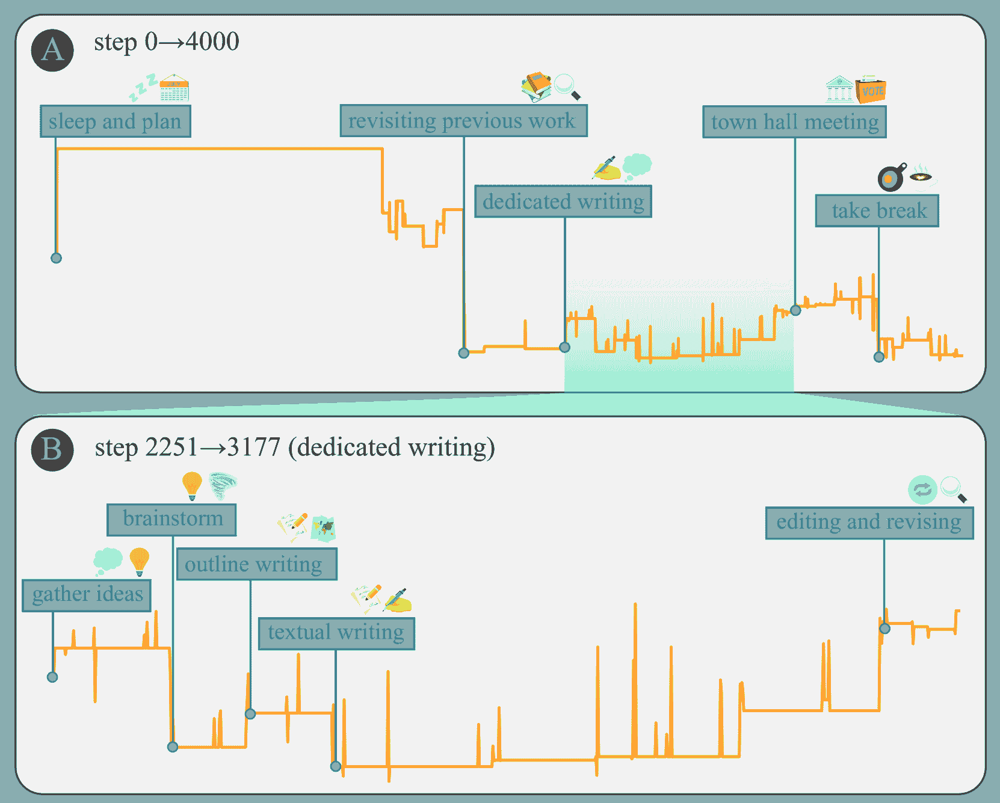
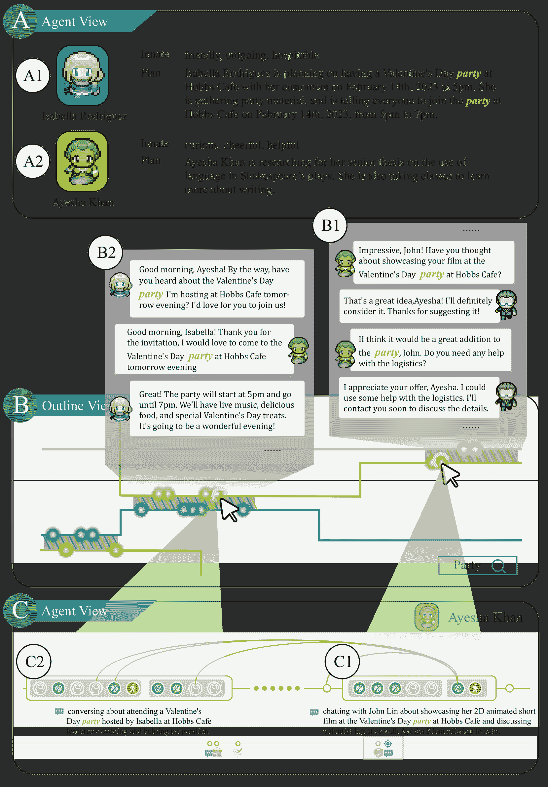
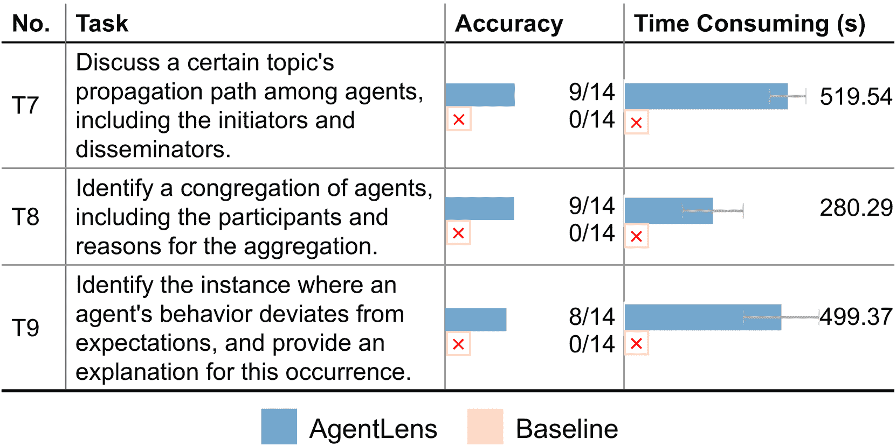

<!--yml

类别：未分类

日期：2025-01-11 12:54:22

-->

# AgentLens：基于LLM的自主系统中代理行为的可视化分析

> 来源：[https://arxiv.org/html/2402.08995/](https://arxiv.org/html/2402.08995/)

Jiaying Lu, Bo Pan, Jieyi Chen, Yingchaojie Feng, Jingyuan Hu, Yuchen Peng, Wei Chen

###### 摘要

最近，基于大语言模型的自主系统（LLMAS）因其模拟复杂人类社会行为的潜力而获得了广泛关注。其主要挑战之一是呈现和分析LLMAS中动态事件的演变。在这项工作中，我们提出了一种可视化方法，用于探索LLMAS中的详细状态和代理行为。我们提出了一个通用的流程，该流程从原始的LLMAS执行事件中建立行为结构，利用行为总结算法根据时间序列构建整个结构的层次化总结，并采用因果追踪方法挖掘代理行为之间的因果关系。随后，我们开发了AgentLens，一个可视化分析系统，利用层次化时间可视化来展示LLMAS的演变，并支持用户交互式地调查代理行为的细节和原因。两个使用场景和一项用户研究展示了我们AgentLens的有效性和可用性。

###### 索引词：

LLM，自治系统，代理，视觉分析。^†^†publicationid: pubid: 0000–0000/00$00.00 © 2021 IEEE

图1：AgentLens的用户界面包括三个视图。大纲视图（A）使用不同的颜色曲线展示每个代理的轨迹，使用户能够识别LLMAS演变过程中的重要模式或事件总结。通过点击每条曲线中的一个时间步骤，用户可以在代理视图（B）中进一步调查该步骤。这允许用户逐步揭示代理事件信息，并追踪特定代理行为的原因。监视视图（C）会根据用户当前的关注点自动调整LLMAS的图形表示。

## 1 引言

自主智能体作为具备一定自主性的计算实体[[1](https://arxiv.org/html/2402.08995v1#bib.bib1), [2](https://arxiv.org/html/2402.08995v1#bib.bib2)]，被视为实现人工通用智能（AGI）的一条有前景的路径[[3](https://arxiv.org/html/2402.08995v1#bib.bib3), [4](https://arxiv.org/html/2402.08995v1#bib.bib4)]。近年来，得益于大规模语言模型（LLM）在自然语言处理[[5](https://arxiv.org/html/2402.08995v1#bib.bib5), [6](https://arxiv.org/html/2402.08995v1#bib.bib6), [7](https://arxiv.org/html/2402.08995v1#bib.bib7)]方面的突破，基于LLM的自主智能体已在学术界和工业界得到广泛应用[[8](https://arxiv.org/html/2402.08995v1#bib.bib8), [9](https://arxiv.org/html/2402.08995v1#bib.bib9)]。基于LLM的自主系统（LLMAS）建立在LLM智能体基础上，在共享环境中部署多个智能体，使它们能够展示出类似人类的行为和社会模式。这种集体智能促进了新关系的形成、信息的扩散以及智能体之间协调的兴起[[10](https://arxiv.org/html/2402.08995v1#bib.bib10)]。因此，LLMAS在社会模拟[[10](https://arxiv.org/html/2402.08995v1#bib.bib10), [11](https://arxiv.org/html/2402.08995v1#bib.bib11)]、软件工程[[12](https://arxiv.org/html/2402.08995v1#bib.bib12), [13](https://arxiv.org/html/2402.08995v1#bib.bib13)]和科学研究[[14](https://arxiv.org/html/2402.08995v1#bib.bib14)]方面展现出了巨大的潜力。

然而，监控和分析LLMAS的动态演化，包括LLMAS中的代理和它们执行的事件序列，可能会非常具有挑战性，因为在系统演化过程中会生成大量信息，而且LLM本身具有固有的不确定性。分析LLMAS最直接的方法是将日志代码注入LLMAS，以跟踪感兴趣的代理事件，并检查以文本格式输出的原始日志[[15](https://arxiv.org/html/2402.08995v1#bib.bib15)]。然而，这种方法需要对特定的LLMAS有一定的专业知识，并且对于普通用户来说并不直观。为了解决这个问题，许多LLMAS项目提供了仿真过程的图形化表示[[9](https://arxiv.org/html/2402.08995v1#bib.bib9)]，这种表示通常是可重播的2D[[16](https://arxiv.org/html/2402.08995v1#bib.bib16)，[17](https://arxiv.org/html/2402.08995v1#bib.bib17)，[10](https://arxiv.org/html/2402.08995v1#bib.bib10)，[18](https://arxiv.org/html/2402.08995v1#bib.bib18)]或3D视频[[19](https://arxiv.org/html/2402.08995v1#bib.bib19)，[20](https://arxiv.org/html/2402.08995v1#bib.bib20)，[21](https://arxiv.org/html/2402.08995v1#bib.bib21)，[22](https://arxiv.org/html/2402.08995v1#bib.bib22)]。通过将固定的中间仿真事件序列转换为富有表现力的可视化记录，用户可以更高效、直观地消化这些信息。然而，带有固定抽象层次的可重播记录限制了LLMAS分析的灵活性。即使对于特定的LLMAS和固定的使用场景，用户的短期分析目标在分析过程中也会经常发生变化。随着用户分析目标的变化，需要可视化的代理事件的类型、数量和粒度也需要相应变化。此外，在特定时间点分析代理行为时，用户需要来回切换记录，以追踪该行为的因果关系，这既繁琐又不可靠。

因此，本研究提出了一种可视化方法，旨在帮助用户高效分析LLMAS中智能体的动态状态和复杂行为。为了减轻由于LLMAS演化过程中产生的大量数据所导致的认知负担，并提高后续分析过程的适应性，我们引入了一个通用的处理流程，该流程在LLMAS操作记录中建立了智能体实体的层次行为结构和原始事件序列。该结构的制定基于我们对现有LLMAS中流行架构的调研，并结合了一个设计研究，该研究涉及了4位LLMAS开发者和4位普通用户。我们设计了一种基于LLM的算法，用于总结智能体行为，提供智能体事件序列的层次化描述。此外，我们还采用了因果追踪方法，挖掘不同智能体事件之间的因果联系。基于提取的层次结构，我们开发了AgentLens，一个旨在促进LLMAS中智能体行为的交互式分析与探索的可视化分析系统。

AgentLens 提供了多角度的视角，通过其三个不同但相互关联的视图，为LLMAS提供不同层次的抽象。大纲视图（[图 1](https://arxiv.org/html/2402.08995v1#S0.F1 "Figure 1 ‣ AgentLens: Visual Analysis for Agent Behaviors in LLM-based Autonomous Systems")，<svg class="ltx_picture" height="14.06" id="S1.p4.1.pic1" overflow="visible" version="1.1" width="14.06"><g color="#000000" fill="#000000" stroke="#000000" stroke-width="0.4pt" transform="translate(0,14.06) matrix(1 0 0 -1 0 0) translate(0,-2.3) translate(7.03,0) translate(0,7.03)"><g fill="#000000" stroke="#000000" transform="matrix(1.0 0.0 0.0 1.0 -5.19 -4.73)"><foreignobject height="9.46" overflow="visible" transform="matrix(1 0 0 -1 0 16.6)" width="10.38">A</foreignobject></g></g></svg>) 展示了每个代理的时空轨迹，使用不同颜色的曲线，帮助用户识别在LLMAS演化过程中显著的代理或其有趣的行为。用户可以在不同的粒度级别上快速扫描代理行为（[图 1](https://arxiv.org/html/2402.08995v1#S0.F1 "Figure 1 ‣ AgentLens: Visual Analysis for Agent Behaviors in LLM-based Autonomous Systems")，<svg class="ltx_picture" height="18.61" id="S1.p4.2.pic2" overflow="visible" version="1.1" width="18.61"><g color="#000000" fill="#000000" stroke="#000000" stroke-width="0.4pt" transform="translate(0,18.61) matrix(1 0 0 -1 0 0) translate(0,-5.83) translate(9.31,0) translate(0,9.31)"><g fill="#000000" stroke="#000000" transform="matrix(1.0 0.0 0.0 1.0 -7.13 -3.48)"><foreignobject height="11.95" overflow="visible" transform="matrix(1 0 0 -1 0 16.6)" width="14.25">$A_{1}$</foreignobject></g></g></svg>），识别感兴趣的代理交互（[图 1](https://arxiv.org/html/2402.08995v1#S0.F1 "Figure 1 ‣ AgentLens: Visual Analysis for Agent Behaviors in LLM-based Autonomous Systems")，<svg class="ltx_picture" height="18.61" id="S1.p4.3.pic3" overflow="visible" version="1.1" width="18.61"><g color="#000000" fill="#000000" stroke="#000000" stroke-width="0.4pt" transform="translate(0,18.61) matrix(1 0 0 -1 0 0) translate(0,-5.83) translate(9.31,0) translate(0,9.31)"><g fill="#000000" stroke="#000000" transform="matrix(1.0 0.0 0.0 1.0 -7.13 -3.48)"><foreignobject height="11.95" overflow="visible" transform="matrix(1 0 0 -1 0 16.6)" width="14.25">$A_{2}$</foreignobject></g></g></svg>），进行话题搜索（[图 1](https://arxiv.org/html/2402.08995v1#S0.F1 "Figure 1 ‣ AgentLens: Visual Analysis for Agent Behaviors in LLM-based Autonomous Systems")，<svg class="ltx_picture" height="18.61" id="S1.p4.4.pic4" overflow="visible" version="1.1" width="18.61"><g color="#000000" fill="#000000" stroke="#000000" stroke-width="0.4pt" transform="translate(0,18.61) matrix(1 0 0 -1 0 0) translate(0,-5.83) translate(9.31,0) translate(0,9.31)"><g fill="#000000" stroke="#000000" transform="matrix(1.0 0.0 0.0 1.0 -7.13 -3.48)"><foreignobject height="11.95" overflow="visible" transform="matrix(1 0 0 -1 0 16.6)" width="14.25">$A_{3}$</foreignobject></g></g></svg>），并点击代理曲线上的任何时间点，以进一步调查代理视图中的情况（[图 1](https://arxiv.org/html/2402.08995v1#S0.F1 "Figure 1 ‣ AgentLens: Visual Analysis for Agent Behaviors in LLM-based Autonomous Systems")，<svg class="ltx_picture" height="13.64" id="S1.p4.5.pic5" overflow="visible" version="1.1" width="13.64"><g color="#000000" fill="#000000" stroke="#000000" stroke-width="0.4pt" transform="translate(0,13.64) matrix(1 0 0 -1 0 0) translate(0,-2.09) translate(6.82,0) translate(0,6.82)"><g fill="#000000" stroke="#000000" transform="matrix(1.0 0.0 0.0 1.0 -4.9 -4.73)"><foreignobject height="9.46" overflow="visible" transform="matrix(1 0 0 -1 0 16.6)" width="9.8">B</foreignobject></g></g></svg>)。代理视图允许用户按需逐步显示代理事件信息，并追溯某些代理行为的原因。监控视图（[图 1](https://arxiv.org/html/2402.08995v1#S0.F1 "Figure 1 ‣ AgentLens: Visual Analysis for Agent Behaviors in LLM-based Autonomous Systems")，<svg class="ltx_picture" height="13.75" id="S1.p4.6.pic6" overflow="visible" version="1.1" width="13.75"><g color="#000000" fill="#000000" stroke="#000000" stroke-width="0.4pt" transform="translate(0,13.75) matrix(1 0 0 -1 0 0) translate(0,-2.15) translate(6.88,0) translate(0,6.88)"><g fill="#000000" stroke="#000000" transform="matrix(1.0 0.0 0.0 1.0 -5 -4.73)"><foreignobject height="9.46" overflow="visible" transform="matrix(1 0 0 -1 0 16.6)" width="9.99">C</foreignobject></g></g></svg>) 会根据用户在大纲视图或代理视图中的当前兴趣点，自动调整LLMAS的图形表示。为了评估AgentLens的性能，我们呈现了两个案例，并进行了一项用户研究，邀请了14名参与者以收集他们的反馈。结果表明，AgentLens能够帮助用户进行LLMAS演化分析和代理行为调查。

我们工作的主要贡献如下：

+   •

    据我们所知，我们的工作是第一个能够在LLMAS中分析和探索智能体行为的可视化分析系统。

+   •

    我们提出了一个通用的流程，建立了一个从原始LLMAS执行事件到行为结构的层次化框架，以便于后续分析。

+   •

    我们进行两种案例和一项用户研究，以展示我们系统的能力。评估结果确认了行为结构和AgentLens的实用性和有效性。

## 2 相关工作

### 2.1 基于LLM的自主智能体

Franklin等人[[23](https://arxiv.org/html/2402.08995v1#bib.bib23)]将智能体定义为一个位于环境中的实体，能够感知环境并随着时间的推移在环境中采取行动，追求自己的目标，并影响未来感知到的内容。具有无需人工干预即可执行智能操作的能力，自主智能体仍然是人工智能研究中的坚定目标[[3](https://arxiv.org/html/2402.08995v1#bib.bib3), [24](https://arxiv.org/html/2402.08995v1#bib.bib24)]。

LLMs的发展[[25](https://arxiv.org/html/2402.08995v1#bib.bib25), [6](https://arxiv.org/html/2402.08995v1#bib.bib6)]突显了在理解、推理和语言生成领域的卓越能力[[26](https://arxiv.org/html/2402.08995v1#bib.bib26)]，这激发了人们对自主智能体领域持续进展的乐观情绪。随着LLMs的出现，基于LLMs的自主智能体研究开始蓬勃发展。这包括增强智能体的自我反思能力[[27](https://arxiv.org/html/2402.08995v1#bib.bib27), [28](https://arxiv.org/html/2402.08995v1#bib.bib28)]，实现更优的任务分解策略[[29](https://arxiv.org/html/2402.08995v1#bib.bib29)]，以及赋予其使用和创建工具的能力[[30](https://arxiv.org/html/2402.08995v1#bib.bib30), [31](https://arxiv.org/html/2402.08995v1#bib.bib31), [32](https://arxiv.org/html/2402.08995v1#bib.bib32), [33](https://arxiv.org/html/2402.08995v1#bib.bib33)]。在开源社区中，基于LLM的智能体应用也在蓬勃发展[[34](https://arxiv.org/html/2402.08995v1#bib.bib34), [35](https://arxiv.org/html/2402.08995v1#bib.bib35), [15](https://arxiv.org/html/2402.08995v1#bib.bib15)]。

最近，研究人员发现基于LLM的代理可以通过合作或竞争处理更广泛的任务。Camel[[36](https://arxiv.org/html/2402.08995v1#bib.bib36)]提出了一个框架，强调了沟通代理之间的自主互动。该框架能够在众多任务中创建多样化、详细的指令，从而为这些代理提供一个展示其认知操作的平台。Talebirad等人[[37](https://arxiv.org/html/2402.08995v1#bib.bib37)]介绍了一个基于LLM的多代理合作的综合框架。ProAgent[[18](https://arxiv.org/html/2402.08995v1#bib.bib18)]展示了代理预见合作伙伴即将作出决策并调整其行为的独特能力，使其在合作推理任务中表现出色。多代理辩论（MAD）[[38](https://arxiv.org/html/2402.08995v1#bib.bib38)]提出了一种方法，多个代理在法官引导下共同呈现论点，从而增强代理在深度反思任务中的发散思维能力。

然而，随着代理数量和复杂性的增加，分析其行为的复杂性迅速提升。尽管过去的研究着重于提升基于LLM的代理在模拟人类行为方面的能力，但往往忽视了如何有效分析代理行为的问题。在本研究中，我们识别了这一研究空白，并提出了一种用于分析LLM基础多代理系统中代理行为的可视化方法。

### 2.2 基于LLM的自主系统

通过将多个基于LLM的代理融入一个协调环境中，LLMAS能够处理各种复杂的场景。例如，WebAgent[[39](https://arxiv.org/html/2402.08995v1#bib.bib39)]展示了构建能够按照自然语言指令在真实网站上完成任务的代理的可能性。ChatDev[[12](https://arxiv.org/html/2402.08995v1#bib.bib12)]和MetaGPT[[13](https://arxiv.org/html/2402.08995v1#bib.bib13)]在多代理通信环境下进行了软件开发的实验。Zhang等人[[19](https://arxiv.org/html/2402.08995v1#bib.bib19)]构建了具有人类协作能力的具身代理。Park等人[[10](https://arxiv.org/html/2402.08995v1#bib.bib10)]将具有独特特征的生成性代理置于社会背景中，以模仿人类的社会行为。

许多为不同用途设计的任务无关框架在学术界受到了广泛关注。AgentVerse[[17](https://arxiv.org/html/2402.08995v1#bib.bib17)]根据任务复杂性动态组装多代理团队，凭借可调节的团队结构超越单个代理。AgentSims[[16](https://arxiv.org/html/2402.08995v1#bib.bib16)]提供了一个基于LLM的代理的实时评估平台，支持灵活配置，以便对不同模块的性能进行评估。AutoGen[[40](https://arxiv.org/html/2402.08995v1#bib.bib40)]促进了多个代理之间的对话，并以通用方式组织个人见解，提供了一种协调LLMAS中多个代理的互联方式。MetaGPT[[13](https://arxiv.org/html/2402.08995v1#bib.bib13)]通过将标准化操作程序（SOP）编码到提示中，将有效的人类工作流程注入多代理协作，突出显示了将人类领域专业知识纳入LLMAS的潜力。CGMI[[11](https://arxiv.org/html/2402.08995v1#bib.bib11)]复制了人类互动并模仿现实场景中的人类常规，增强了对更人性化的复杂社会场景模拟的真实感。

先前的LLMAS研究主要集中在构建更通用的框架或为特定领域设计，然而在LLMAS中，代理之间平行行为的分析方法却显得相对缺乏重视。现代LLMAS主要依赖传统方法进行监控和分析。MetaGPT[[13](https://arxiv.org/html/2402.08995v1#bib.bib13)]利用日志输出进行记录维护，而Park等人[[10](https://arxiv.org/html/2402.08995v1#bib.bib10)]则采用全景视频进行观察，提供详细的地图并用代理头像标示其位置和行为。与之前的工作不同，我们的研究提供了一个交互式视觉系统，按层级组织事件，帮助用户快速掌握LLMAS中的发生情况。

### 2.3 事件序列可视化

以时间为基础的事件序列数据广泛存在，涵盖了多个领域，包括医疗记录[[41](https://arxiv.org/html/2402.08995v1#bib.bib41)、[42](https://arxiv.org/html/2402.08995v1#bib.bib42)、[43](https://arxiv.org/html/2402.08995v1#bib.bib43)]、职业设计[[44](https://arxiv.org/html/2402.08995v1#bib.bib44)、[45](https://arxiv.org/html/2402.08995v1#bib.bib45)]和社会互动[[46](https://arxiv.org/html/2402.08995v1#bib.bib46)、[47](https://arxiv.org/html/2402.08995v1#bib.bib47)、[48](https://arxiv.org/html/2402.08995v1#bib.bib48)]。在这些领域中，各种时间戳事件被按顺序组织，每个事件与特定的主题或实体相关。尽管早期的方法[[49](https://arxiv.org/html/2402.08995v1#bib.bib49)、[50](https://arxiv.org/html/2402.08995v1#bib.bib50)]主要面向较简单、低维的数据，但现实世界中的数据集往往展现出更高的复杂性，这需要更全面的分析思路和方法。

大量关于事件序列可视化的研究与一些领域密切相关，这些领域通常需要对事件信息进行压缩，例如社交媒体数据领域[[51](https://arxiv.org/html/2402.08995v1#bib.bib51)]、智能制造领域[[52](https://arxiv.org/html/2402.08995v1#bib.bib52)]以及异常用户行为研究领域[[53](https://arxiv.org/html/2402.08995v1#bib.bib53)]。郭等人[[54](https://arxiv.org/html/2402.08995v1#bib.bib54)]提出了一种组织事件序列的框架，用以总结不同特性下具有较大异质性的共同目标。EventThread[[44](https://arxiv.org/html/2402.08995v1#bib.bib44)]专注于可视化和聚类分析，提供了一个交互式界面，供浏览和总结事件序列数据。在已有的事件压缩和可视化框架基础上，我们重点关注LLM代理的行为模式，并提出了一种基于LLM的非结构化自然语言事件序列处理方法。

事件序列可视化在集体行为分析领域具有高度相关的应用，这与我们研究的重点密切相关，都涉及由临时性和无结构的群体进行的活动[[55](https://arxiv.org/html/2402.08995v1#bib.bib55)、[56](https://arxiv.org/html/2402.08995v1#bib.bib56)、[47](https://arxiv.org/html/2402.08995v1#bib.bib47)]。在社交媒体领域，集体行为源于用户在信息传播和虚拟空间导航中的协作努力。为了分析这些群体动态，已经引入了各种复杂的可视化分析方法。R-map[[57](https://arxiv.org/html/2402.08995v1#bib.bib57)]、Socialwave[[58](https://arxiv.org/html/2402.08995v1#bib.bib58)]、FluxFlow[[59](https://arxiv.org/html/2402.08995v1#bib.bib59)] 和 Google+ ripples[[60](https://arxiv.org/html/2402.08995v1#bib.bib60)] 特别针对信息传播的机制进行分析，而 Maqui[[61](https://arxiv.org/html/2402.08995v1#bib.bib61)] 和 Frequence[[46](https://arxiv.org/html/2402.08995v1#bib.bib46)] 则为理解这一背景下的人类移动性复杂性提供了深刻见解。

尽管现有研究在该领域做出了重要贡献，但随着行为和互动的日益复杂，迫切需要解决这些问题，推动自主系统的发展。我们的工作将事件序列可视化引入为LLMAS分析和探索的一个重要工具。

## 3 概述

### 3.1 LLMAS的常见架构

图2：从现有LLMAS抽象出的常见架构由四个层次组成：系统状态、智能体、任务和操作。

为了确保与各种LLMAS的最大兼容性，我们调查了与LLMAS相关的论文[[62](https://arxiv.org/html/2402.08995v1#bib.bib62), [63](https://arxiv.org/html/2402.08995v1#bib.bib63), [64](https://arxiv.org/html/2402.08995v1#bib.bib64), [65](https://arxiv.org/html/2402.08995v1#bib.bib65), [66](https://arxiv.org/html/2402.08995v1#bib.bib66), [67](https://arxiv.org/html/2402.08995v1#bib.bib67), [68](https://arxiv.org/html/2402.08995v1#bib.bib68), [69](https://arxiv.org/html/2402.08995v1#bib.bib69), [27](https://arxiv.org/html/2402.08995v1#bib.bib27), [28](https://arxiv.org/html/2402.08995v1#bib.bib28)]，以及一些在开源社区中获得高星评价的项目[[70](https://arxiv.org/html/2402.08995v1#bib.bib70), [71](https://arxiv.org/html/2402.08995v1#bib.bib71), [72](https://arxiv.org/html/2402.08995v1#bib.bib72), [73](https://arxiv.org/html/2402.08995v1#bib.bib73), [74](https://arxiv.org/html/2402.08995v1#bib.bib74), [75](https://arxiv.org/html/2402.08995v1#bib.bib75), [76](https://arxiv.org/html/2402.08995v1#bib.bib76), [77](https://arxiv.org/html/2402.08995v1#bib.bib77), [78](https://arxiv.org/html/2402.08995v1#bib.bib78), [79](https://arxiv.org/html/2402.08995v1#bib.bib79)]，这些论文和项目的发布日期在2023年8月31日之前。我们分析了它们的系统架构和组件，并在此基础上抽象出一种通用架构（如[图2](https://arxiv.org/html/2402.08995v1#S3.F2 "Figure 2 ‣ 3.1 Common Architecture of LLMAS ‣ 3 Overview ‣ AgentLens: Visual Analysis for Agent Behaviors in LLM-based Autonomous Systems")）适用于LLMAS。LLMAS中的系统状态提供了任何时间点的环境信息。在每个时间点，每个代理执行其自己的任务，该任务由多个原子操作组成。每当代理执行一个操作时，就会生成一个原始事件，从而推动LLMAS的演化。

系统状态提供了对环境的全面理解。通过从系统状态中获取环境信息，代理可以理解当前的上下文和条件。例如，系统状态可以告知代理对象的位置和环境属性，这对其决策和规划过程有着重要影响。此外，系统状态还控制着每个代理的时间线，确保不同代理的事件在时间上对齐。

代理是具有认知能力和行动能力的自治实体。通过执行各种任务，代理可以与环境互动，并逐步改变系统状态以实现其目标。此外，代理可以彼此通信与协作，分享知识并交换信息，从而完成更复杂的任务。

任务通常是根据LLMAS的使用场景进行定制的。具有共同目标的一系列操作可以归类为一个任务。在扩展以往专注于不同场景的代理研究的基础上，我们将任务分为三类：感知、思考和行动。在感知任务中，代理获取外部系统的感知。这种感知包括感知环境（虚拟、真实或外部资源）以及感知其他代理。在思考任务中，代理基于外部感知和自身记忆进行决策、推理、规划等行为。在行动任务中，代理通过提供输出与外部系统进行交互，包括文本输出、虚拟动作或特定调用，如工具使用。

操作是任务的基本单元。操作可以根据其目标进行分类，包括环境操作、记忆操作和决策操作。环境操作执行与外部系统的交互，包括与其他代理和LLMAS定义的环境的交互。记忆操作涉及存储和更新代理的记忆。决策操作用于决策和行动规划，基于LLM的代理通常利用LLM进行决策操作。

### 3.2 设计需求

我们的研究重点是涉及分析、探索和监控LLMAS的用户。我们的主要目标是创建一个增强用户对LLMAS理解的系统。我们招募了4名对LLMAS非常熟悉的开发人员和4名对LLMAS有基本理解并且曾使用过此类系统的用户。

为了确定设计需求，我们要求参与者探索Reverie¹¹1https://reverie.herokuapp.com/arXiv_Demo/#中代理的行为，这是一个由25个基于LLM的代理组成的典型自治系统。我们要求参与者积极探索并深入识别他们感兴趣的代理行为，并调查这些行为的潜在原因或结果。为了方便这一过程，我们鼓励参与者“边思考边说”，表达他们在整个过程中所寻求的信息和所需的帮助。然后，我们与他们进行了第一次访谈，收集他们对整个探索过程的反馈。同时，我们保持与他们的定期联系，确保他们了解设计需求。根据他们的反馈，并结合[3.1节](https://arxiv.org/html/2402.08995v1#S3.SS1 "3.1 Common Architecture of LLMAS ‣ 3 Overview ‣ AgentLens: Visual Analysis for Agent Behaviors in LLM-based Autonomous Systems")中现有LLMAS工作的调查，可以总结出以下4个设计需求。

R1\. 为不同的分析目标提供适当的一般信息。在LLMAS的演化过程中，持续生成的大量信息让用户难以理解。虽然当前Reverie的二维图形界面提供了固定的视觉抽象，但许多用户表示希望改变呈现信息的一般性，以更好地匹配当前的分析目标。例如，当用户分析多个代理之间的长期关系时，他们希望在大时间尺度下扫描总结过的代理行为轨迹，而在分析代理如何执行某项任务时，则更希望看到代理操作的详细呈现。因此，系统应为LLMAS生成的信息提供灵活的抽象级别，并允许用户根据分析目标揭示细节。

R2\. 呈现代理的物理位置和思维内容的变化。代理的物理和心理变化在推动和反映整个LLMAS演化中起着至关重要的作用。然而，目前用户只能盯着可回放的记录，查看代理是否发生位置变化，并检查原始执行日志，找出代理何时开始思考某个想法，这种方式低效且容易出错。因此，系统应提供可视化强调，展示代理的位置变化，并突出显示代理开始思考用户希望探索的某个主题的时间点。

R3\. 强调代理行为的可能原因。当用户对代理的某一行为产生兴趣时，他们通常希望调查这种行为的原因或结果。然而，代理的行为不仅受到其当前感知和思维的影响，还受到其过去行为记忆的影响。让用户来回切换可回放的记录以定位某些代理行为的原因既繁琐又不可靠。因此，系统应提供一种机制，挖掘代理行为的可能原因，并为用户的调查突出显示这些原因。

R4\. 解释LLM调用的背景。LLM作为LLMAS的核心，扮演着至关重要的角色，经常被调用以为代理做出认知决策。为了提供某一决策的背景信息，之前的上下文信息以定制模板的方式组织，并作为提示传送给LLM。因此，为帮助用户理解代理是如何以及为什么做出某项决策，系统应展示LLM做出的决策，并解释其调用的背景。此外，最好能够提供可视化增强，帮助用户追踪上下文信息是如何通过代理之前的行为收集的。

### 3.3 方法概述

图3：我们的方法工作流程由三个主要步骤组成。（A）收集LLMAS演化过程中事件的原始执行日志。（B）建立一个具有层次化总结和因果追踪方法的行为结构。（C）提供一个交互式用户界面，用于可视化探索和分析。

根据上述设计需求，我们设计了AgentLens，这是一个旨在可视化LLMAS演化过程中代理行为的概念验证系统。我们的方法工作流程如[图3](https://arxiv.org/html/2402.08995v1#S3.F3 "Figure 3 ‣ 3.3 Approach Overview ‣ 3 Overview ‣ AgentLens: Visual Analysis for Agent Behaviors in LLM-based Autonomous Systems")所示。用户可以使用日志代码记录他们的LLMAS演化过程，并捕捉代理执行的原始事件。基于这些原始事件，我们建立一个层次化结构来总结代理在不同粒度上的行为，并追踪它们之间可能的因果关系（[第4节](https://arxiv.org/html/2402.08995v1#S4 "4 Behavior Structure Establishment ‣ AgentLens: Visual Analysis for Agent Behaviors in LLM-based Autonomous Systems")）。提供了一个用户界面和一系列交互方式，支持交互式探索和分析LLMAS中的代理行为（[第5节](https://arxiv.org/html/2402.08995v1#S5 "5 User Interface ‣ AgentLens: Visual Analysis for Agent Behaviors in LLM-based Autonomous Systems")）。

## 4 行为结构建立

图4：行为结构通过三步管道建立：（A）我们将原始事件组织为行为，（B）对代理的行为进行总结和划分，（C）追踪行为之间的因果关系。

在本节中，我们介绍了一个旨在从LLMAS演化过程中生成的原始事件中建立层次化行为结构的管道。该管道通过对代理行为的总结和因果分析，便于生成可视化的结构化数据。如[图4](https://arxiv.org/html/2402.08995v1#S4.F4 "Figure 4 ‣ 4 Behavior Structure Establishment ‣ AgentLens: Visual Analysis for Agent Behaviors in LLM-based Autonomous Systems")所示，该管道包含三个步骤：（A）处理原始事件，并根据[图2](https://arxiv.org/html/2402.08995v1#S3.F2 "Figure 2 ‣ 3.1 Common Architecture of LLMAS ‣ 3 Overview ‣ AgentLens: Visual Analysis for Agent Behaviors in LLM-based Autonomous Systems")（R1）中显示的通用架构将其组织为行为；（B）对这些行为进行总结，并根据它们的语义含义进行划分。（R1, R2）；（C）通过分析原始事件之间的相关性，追踪这些行为之间的因果关系（R3, R4）。

### 4.1 行为定义

在LLMAS的演化过程中，随着智能体数量的增加，会生成大量原始事件，导致文本日志变得庞大、混乱且难以理解。为了简化下游分析和可视化工作，我们将智能体行为定义为结构化表示，封装了原始事件的序列（R1）。

借鉴大多数LLMAS架构采用的系统状态，我们用时间线$T$表示环境中各个时间点上智能体的状态和事件。对于时间线上的每个时间点$t$，我们可以定义元组$T_{t}$如下：

|  | $T_{t}=\langle e_{t-1},\bigcup a_{t-1}[i],\bigcup s_{t}[i]\rangle$ |  | (1) |
| --- | --- | --- | --- |

其中，$e_{t-1}$表示时间点$t$之前的环境状态$e_{t-1}$。$a_{t-1}[i]$表示$t-1$时刻第$i$个智能体的状态，包括其在环境中的位置以及诸如饥饿值、心情值等个人状态指示符。在不同的LLMAS中，$a_{t}$涵盖了各种各样的属性。$s_{t}[i]$表示第$i$个智能体在时间$t$时执行的不可分割的$\bigcup o_{t,i}[k]$操作集合（在[第3.1节](https://arxiv.org/html/2402.08995v1#S3.SS1 "3.1 Common Architecture of LLMAS ‣ 3 Overview ‣ AgentLens: Visual Analysis for Agent Behaviors in LLM-based Autonomous Systems")中说明），$k$表示操作索引。根据这些定义，LLMAS中发生的不可分割的最小事件转化为操作$o$，这些操作绑定于特定的时间点、智能体和任务（例如感知、思考、行动）。然而，这些低级事件对于高级分析目标可能是无关或冗余的。对于一个特定的智能体，在单一时间点$t$可能会有数百个事件，这些事件可能意味着事实上的重复（例如，由于提示构造生成的重复片段）和语义上的重复（例如，同一观察的偏见解读）。

为了解决这些问题，我们将每个智能体在时间轴$T$上的事件合成为其行为：

|  | $B_{i,t_{0}\cdots t_{1}}=\bigcup_{t\in[t_{0},t_{1}]}s_{t,i}$ |  | (2) |
| --- | --- | --- | --- |

它表示在时间序列$T$中的子序列$[t_{0},t_{1}]$内，$i$-th智能体执行的操作集合。

### 4.2 行为总结

图5：智能体行为总结为四个阶段：（A）原始事件：从日志中获取原始事件，以详细描述涉及智能体的事件，包括智能体的位置、动作、记忆和对话。（B）描述生成：整理原始事件并使用像LLMs这样的模型生成简明的行为描述。（C）行为嵌入：将行为描述转换为一系列文本嵌入向量。（D）时间线分割：检测行为向量序列中的变化点，并进行相应的时间线分割。

在各种LLMAS中，操作以不同的形式表现出来，例如文本、图像，甚至在工厂环境中的物理行为。与此同时，随着$T$的增加，这些代理的行为不断生成。这些表现的多样性和行为的广泛聚合可能会模糊可视化系统的解释，从而阻碍对代理内部因果关系的探索。因此，我们提出了一种行为总结方法。如[图5](https://arxiv.org/html/2402.08995v1#S4.F5 "图5 ‣ 4.2 行为总结 ‣ 4 行为结构建立 ‣ AgentLens：基于LLM的自主系统中代理行为的可视化分析")所示，我们 (1) 将 encapsulate 单一时间点的行为概括为简洁的描述（[图5](https://arxiv.org/html/2402.08995v1#S4.F5 "图5 ‣ 4.2 行为总结 ‣ 4 行为结构建立 ‣ AgentLens：基于LLM的自主系统中代理行为的可视化分析")，<svg class="ltx_picture" height="14.06" id="S4.SS2.p1.2.2.pic1" overflow="visible" version="1.1" width="14.06"><g fill="#000000" stroke="#000000" stroke-width="0.4pt" transform="translate(0,14.06) matrix(1 0 0 -1 0 0) translate(0,-2.3) translate(7.03,0) translate(0,7.03)"><g fill="#000000" stroke="#000000" transform="matrix(1.0 0.0 0.0 1.0 -5.19 -4.73)"><foreignobject height="9.46" overflow="visible" transform="matrix(1 0 0 -1 0 16.6)" width="10.38">A</foreignobject></g></g></svg> $\to$ <svg class="ltx_picture" height="13.64" id="S4.SS2.p1.4.4.pic2" overflow="visible" version="1.1" width="13.64"><g fill="#000000" stroke="#000000" stroke-width="0.4pt" transform="translate(0,13.64) matrix(1 0 0 -1 0 0) translate(0,-2.09) translate(6.82,0) translate(0,6.82)"><g fill="#000000" stroke="#000000" transform="matrix(1.0 0.0 0.0 1.0 -4.9 -4.73)"><foreignobject height="9.46" overflow="visible" transform="matrix(1 0 0 -1 0 16.6)" width="9.8">B</foreignobject></g></g></svg>), (2) 利用文本嵌入来捕获行为中的潜在语义（[图5](https://arxiv.org/html/2402.08995v1#S4.F5 "图5 ‣ 4.2 行为总结 ‣ 4 行为结构建立 ‣ AgentLens：基于LLM的自主系统中代理行为的可视化分析")，<svg class="ltx_picture" height="13.64" id="S4.SS2.p1.5.5.pic3" overflow="visible" version="1.1" width="13.64"><g fill="#000000" stroke="#000000" stroke-width="0.4pt" transform="translate(0,13.64) matrix(1 0 0 -1 0 0) translate(0,-2.09) translate(6.82,0) translate(0,6.82)"><g fill="#000000" stroke="#000000" transform="matrix(1.0 0.0 0.0 1.0 -4.9 -4.73)"><foreignobject height="9.46" overflow="visible" transform="matrix(1 0 0 -1 0 16.6)" width="9.8">B</foreignobject></g></g></svg> $\to$ <svg class="ltx_picture" height="13.75" id="S4.SS2.p1.7.7.pic4" overflow="visible" version="1.1" width="13.75"><g fill="#000000" stroke="#000000" stroke-width="0.4pt" transform="translate(0,13.75) matrix(1 0 0 -1 0 0) translate(0,-2.15) translate(6.88,0) translate(0,6.88)"><g fill="#000000" stroke="#000000" transform="matrix(1.0 0.0 0.0 1.0 -5 -4.73)"><foreignobject height="9.46" overflow="visible" transform="matrix(1 0 0 -1 0 16.6)" width="9.99">C</foreignobject></g></g></svg>), (3) 使用变点检测方法划分行为序列，并抽象每个子序列的行为（[图5](https://arxiv.org/html/2402.08995v1#S4.F5 "图5 ‣ 4.2 行为总结 ‣ 4 行为结构建立 ‣ AgentLens：基于LLM的自主系统中代理行为的可视化分析")，<svg class="ltx_picture" height="13.75" id="S4.SS2.p1.8.8.pic5" overflow="visible" version="1.1" width="13.75"><g fill="#000000" stroke="#000000" stroke-width="0.4pt" transform="translate(0,13.75) matrix(1 0 0 -1 0 0) translate(0,-2.15) translate(6.88,0) translate(0,6.88)"><g fill="#000000" stroke="#000000" transform="matrix(1.0 0.0 0.0 1.0 -5 -4.73)"><foreignobject height="9.46" overflow="visible" transform="matrix(1 0 0 -1 0 16.6)" width="9.99">C</foreignobject></g></g></svg> $\to$ <svg class="ltx_picture" height="14.17" id="S4.SS2.p1.10.10.pic6" overflow="visible" version="1.1" width="14.17"><g fill="#000000" stroke="#000000" stroke-width="0.4pt" transform="translate(0,14.17) matrix(1 0 0 -1 0 0) translate(0,-2.36) translate(7.08,0) translate(0,7.08)"><g fill="#000000" stroke="#000000" transform="matrix(1.0 0.0 0.0 1.0 -5.28 -4.73)"><foreignobject height="9.46" overflow="visible" transform="matrix(1 0 0 -1 0 16.6)" width="10.57">D</foreignobject></g></g></svg>)。最终，我们可以将大量小行为总结为几个有意义的行为，并附上分段时间线。

描述生成：我们引入了一个外部文本摘要模型，该模型作为一个独立的LLM代理，独立于LLMAS操作。所有标注的描述被连接在一起，形成一个全面的模型输入（即LLM的提示）。给定这一长文本序列作为输入，摘要模型生成一个简明的行为描述，显著缩短信息长度，同时保持原意（见[图5](https://arxiv.org/html/2402.08995v1#S4.F5 "图5 ‣ 4.2 行为总结 ‣ 4 行为结构建立 ‣ AgentLens：基于LLM的自主系统中的代理行为的可视化")，<svg class="ltx_picture" height="13.64" id="S4.SS2.p2.1.1.pic1" overflow="visible" version="1.1" width="13.64"><g fill="#000000" stroke="#000000" stroke-width="0.4pt" transform="translate(0,13.64) matrix(1 0 0 -1 0 0) translate(0,-2.09) translate(6.82,0) translate(0,6.82)"><g fill="#000000" stroke="#000000" transform="matrix(1.0 0.0 0.0 1.0 -4.9 -4.73)"><foreignobject height="9.46" overflow="visible" transform="matrix(1 0 0 -1 0 16.6)" width="9.8">B</foreignobject></g></g></svg>，从提示到响应）。同时，我们提示该摘要模型生成一个高度抽象的行为描述，采用文本和表情符号相结合的方式。文本描述作为即将使用的嵌入模型的基础，而表情符号则旨在促进后续的可视化。

行为嵌入：我们进一步利用所有总结的行为描述，将其嵌入以更好地理解潜在语义，包括固有的相似性和层次关系。为了最大化编码方案的效率，我们采用了在大规模互联网文本数据上预训练的文本嵌入模型²²2https://platform.openai.com/docs/guides/embeddings，该模型以其卓越的性能、成本效益和易用性而闻名。然后，每个总结的行为描述被编码为一个1536维的向量，构成每个代理的序列$E_{\text{agent}}$。通过这些强大的嵌入，我们能够揭示单个行为的语义相似性，从而解锁应对大量复杂文本序列分析的潜力。

时间线分割：考虑到嵌入序列$e$的数据特性和我们的设计需求，我们采用基于窗口的变化点检测（WIN）算法[[80](https://arxiv.org/html/2402.08995v1#bib.bib80)]，结合余弦距离度量来对序列进行分割。这种方法适用于实时或流式数据场景，因为它允许在新数据到达时进行增量更新，并且对短期和频繁波动不敏感。

首先，为了比较两个嵌入向量 $e_{x}$ 和 $e_{y}$ （$e_{x}, e_{y} \in E_{\text{agent}}$），其维度为 $d=1536$，我们使用余弦相似度 $k_{cosine}:\mathbb{R}^{d}\times\mathbb{R}^{d}\rightarrow\mathbb{R}$（如 [eq. 3](https://arxiv.org/html/2402.08995v1#S4.E3 "3 ‣ 4.2 行为总结 ‣ 4 行为结构建立 ‣ AgentLens: 基于大语言模型的自主系统中智能体行为的可视化分析") 所示）作为核函数[[81](https://arxiv.org/html/2402.08995v1#bib.bib81)]，其中 $\langle\cdot, \cdot\rangle$ 和 $\|\cdot\|$ 分别是欧几里得标量积和范数：

|  | $k(e_{x},e_{y}):=\frac{\langle e_{x} | e_{y}\rangle}{\|e_{x}\|\|e_{y}\|}$ |  | (3) |
| --- | --- | --- | --- | --- |

然后我们回顾从 $k(\cdot, \cdot)$ 得到的代价函数 $c(\cdot)$，如 [eq. 4](https://arxiv.org/html/2402.08995v1#S4.E4 "4 ‣ 4.2 行为总结 ‣ 4 行为结构建立 ‣ AgentLens: 基于大语言模型的自主系统中智能体行为的可视化分析") 所示，其中 $e_{a..b}$ 是子序列 $\{e_{a+1}, e_{a+2}, \cdots, e_{b}\} \subseteq E$：

|  | $c(e_{a..b})=\sum_{t=a+1}^{b}k(e_{t},e_{t})-\frac{1}{b-a}\sum_{s,t=a+1}^{b}k(e_{s},e_{t})$ |  | (4) |
| --- | --- | --- | --- |

WIN 利用两个滑动窗口来遍历数据流。通过比较每个窗口内信号的统计特性，基于代价函数 $c$ 获得差异度度量：

|  | $d(e_{u..v},e_{v..w})=c(e_{u..w})-c(e_{u..v})-c(e_{v..w})$ |  | (5) |
| --- | --- | --- | --- |

差异度 $d$ 表示将子序列 $e_{u..w}$ 在索引 $v$ 处拆分的代价增益。如果边界 $v$ 是窗口 $u..w$ 内部的一个变化索引，那么差异度 $d$ 将显著增加。经过对 $d$ 的顺序峰值搜索，我们得到了一个时间点序列 $t_{1}^{*}<t_{2}^{*}<...<t_{K}^{*}$。在这些点上，嵌入序列的某些特征发生了突变。我们利用 $t_{i}$ 的抽象，涵盖文本和表情符号描述，将智能体从 $t_{i}$ 到 $t_{i+1}$ 的行为聚合起来。

图 6：Reverie 中智能体的时间线分割结果。横轴表示时间线，纵轴表示每个时间点智能体行为嵌入的主成分 PCA 值。

[图 6](https://arxiv.org/html/2402.08995v1#S4.F6 "Figure 6 ‣ 4.2 Behavior Summarization ‣ 4 Behavior Structure Establishment ‣ AgentLens: Visual Analysis for Agent Behaviors in LLM-based Autonomous Systems") 提供了时间线分割过程的一个示例。这里我们尝试在 Reverie 环境中对一个写作代理的时间线进行分割。该代理的整个上午时间表显示在（[图 6](https://arxiv.org/html/2402.08995v1#S4.F6 "Figure 6 ‣ 4.2 Behavior Summarization ‣ 4 Behavior Structure Establishment ‣ AgentLens: Visual Analysis for Agent Behaviors in LLM-based Autonomous Systems")，<svg class="ltx_picture" height="14.06" id="S4.SS2.p9.1.1.pic1" overflow="visible" version="1.1" width="14.06"><g fill="#000000" stroke="#000000" stroke-width="0.4pt" transform="translate(0,14.06) matrix(1 0 0 -1 0 0) translate(0,-2.3) translate(7.03,0) translate(0,7.03)"><g fill="#000000" stroke="#000000" transform="matrix(1.0 0.0 0.0 1.0 -5.19 -4.73)"><foreignobject height="9.46" overflow="visible" transform="matrix(1 0 0 -1 0 16.6)" width="10.38">A</foreignobject></g></g></svg>），时间范围从午夜到中午，涵盖了时间线上 4000 个时间点（0$\to$4000）。为了便于直观理解分割结果，我们对每个时间点的行为嵌入进行了主成分分析（PCA），并使用 y 轴编码主成分的值，得到在 [图 6](https://arxiv.org/html/2402.08995v1#S4.F6 "Figure 6 ‣ 4.2 Behavior Summarization ‣ 4 Behavior Structure Establishment ‣ AgentLens: Visual Analysis for Agent Behaviors in LLM-based Autonomous Systems") 中呈现的橙色线图。

正如我们在（[图6](https://arxiv.org/html/2402.08995v1#S4.F6 "Figure 6 ‣ 4.2 Behavior Summarization ‣ 4 Behavior Structure Establishment ‣ AgentLens: Visual Analysis for Agent Behaviors in LLM-based Autonomous Systems")）中看到的，通过应用分割算法（以N=5为例），这一时期被总结为五个主要行为（“休息与计划”、“重温以前的工作”等）。此外，如果我们重新应用时间线分割算法到“专注写作”行为，该行为跨越时间点2251$\to$3177（[图6](https://arxiv.org/html/2402.08995v1#S4.F6 "Figure 6 ‣ 4.2 Behavior Summarization ‣ 4 Behavior Structure Establishment ‣ AgentLens: Visual Analysis for Agent Behaviors in LLM-based Autonomous Systems")）），我们可以进一步将其细分为五个子行为（“收集想法”、“头脑风暴”等）。请注意，所有这些子行为都可以视为“专注写作”，同时展现出它们之间更细微的区别。

另一个需要注意的观察是，在由PCA主成分值形成的折线图中，存在一些峰值。这些峰值的出现是因为在该时间点，智能体执行了特定操作，例如生成新记忆或感知新物体。然而，这些操作对智能体的持续行为没有长期影响。因此，它们通常被视为包含在其父行为中的微小行为。

### 4.3 因果追踪

在复杂的时间线上，任何智能体事件都受到其内部记忆和与外部环境交互的影响。通过追踪这些事件的因果因素，用户可以获得关于智能体行为（R3）和LLM调用决策（R4）的宝贵见解，从而提高LLMAS的可信度和可解释性。

现有的研究[[10](https://arxiv.org/html/2402.08995v1#bib.bib10)]主要依赖日志调试来显式揭示代理操作的来源。然而，这些方法由于需要手动追踪，往往会增加用户的认知负担，并且常常无法捕捉到隐式的因果关系。例如，当前的思维可能受到长期观察的影响。为了有效地追踪行为的原因，我们提出了一种双重来源追踪方法，用于挖掘行为中潜在事件之间的因果关系。

显式因果关系：指的是能够直接从原始事件日志中辨识出的清晰且可观察的因果关系，明确描绘操作之间的直接影响关系。例如，在开源代理创建框架如Langchain[[34](https://arxiv.org/html/2402.08995v1#bib.bib34)]和AgentVerse[[17](https://arxiv.org/html/2402.08995v1#bib.bib17)]中，已经实现了机制，用于索引代理记忆的属性，从而在调用代理记忆时便可直接回溯到相关的源操作。当LLMAS中的显式因果链完成时，用户可以通过原始事件日志获取这些记录，并将其传输到AgentLens。AgentLens利用这些日志作为输入，帮助用户分析后续任务。

隐式因果关系：在LLMAS的发展过程中，代理对历史操作的调用并不总是被记录，而是通过程序中的复杂中间变量或潜在模式来表达。为了捕捉这些隐式的因果关系，我们基于文本相似性（如[公式3](https://arxiv.org/html/2402.08995v1#S4.E3 "3 ‣ 4.2 Behavior Summarization ‣ 4 Behavior Structure Establishment ‣ AgentLens: Visual Analysis for Agent Behaviors in LLM-based Autonomous Systems)")）进行相关性检测，比较这些操作本身的文本日志，从而揭示事件之间的潜在联系。为了在揭示潜在因果关系和防止用户信息过载之间取得平衡，我们定义了相似性阈值$\delta$。对于某一时刻$j$的操作符$o_{res}$，如果它与时刻$i$（其中$i\leq j$）的另一个操作符$o_{src}$之间的相似度超过$\delta$，我们将$o_{src}$视为$o_{res}$的潜在原因之一。

在提取完操作之间的显式和隐式因果关系后，我们已经确定了每一个可能的操作对$<o_{src},o_{res}>$。操作之间的联系可以通过自下而上的方式提升为对应行为之间的联系，符合[第4.1节](https://arxiv.org/html/2402.08995v1#S4.SS1 "4.1 Behavior Definition ‣ 4 Behavior Structure Establishment ‣ AgentLens: Visual Analysis for Agent Behaviors in LLM-based Autonomous Systems")中对行为的定义。

## 5 用户界面

用户界面由三个视图组成。大纲视图（[图 1](https://arxiv.org/html/2402.08995v1#S0.F1 "Figure 1 ‣ AgentLens: Visual Analysis for Agent Behaviors in LLM-based Autonomous Systems"), <svg class="ltx_picture" height="14.06" id="S5.p1.1.pic1" overflow="visible" version="1.1" width="14.06"><g color="#000000" fill="#000000" stroke="#000000" stroke-width="0.4pt" transform="translate(0,14.06) matrix(1 0 0 -1 0 0) translate(0,-2.3) translate(7.03,0) translate(0,7.03)"><g fill="#000000" stroke="#000000" transform="matrix(1.0 0.0 0.0 1.0 -5.19 -4.73)"><foreignobject height="9.46" overflow="visible" transform="matrix(1 0 0 -1 0 16.6)" width="10.38">A</foreignobject></g></g></svg>)可视化展示了代理的活动、互动和环境如何随时间变化，使用户能够分析LLMAS的演化过程。一旦用户对任何代理的某些行为产生兴趣，他们可以查看其详细信息，并从代理视图中追溯其原因（[图 1](https://arxiv.org/html/2402.08995v1#S0.F1 "Figure 1 ‣ AgentLens: Visual Analysis for Agent Behaviors in LLM-based Autonomous Systems"), <svg class="ltx_picture" height="13.64" id="S5.p1.2.pic2" overflow="visible" version="1.1" width="13.64"><g color="#000000" fill="#000000" stroke="#000000" stroke-width="0.4pt" transform="translate(0,13.64) matrix(1 0 0 -1 0 0) translate(0,-2.09) translate(6.82,0) translate(0,6.82)"><g fill="#000000" stroke="#000000" transform="matrix(1.0 0.0 0.0 1.0 -4.9 -4.73)"><foreignobject height="9.46" overflow="visible" transform="matrix(1 0 0 -1 0 16.6)" width="9.8">B</foreignobject></g></g></svg>)。在探索过程中，LLMAS的可视化将同步切换到相应的代理和时间点，以支持在监控视图中进行直观感知和验证（[图 1](https://arxiv.org/html/2402.08995v1#S0.F1 "Figure 1 ‣ AgentLens: Visual Analysis for Agent Behaviors in LLM-based Autonomous Systems"), <svg class="ltx_picture" height="13.75" id="S5.p1.3.pic3" overflow="visible" version="1.1" width="13.75"><g color="#000000" fill="#000000" stroke="#000000" stroke-width="0.4pt" transform="translate(0,13.75) matrix(1 0 0 -1 0 0) translate(0,-2.15) translate(6.88,0) translate(0,6.88)"><g fill="#000000" stroke="#000000" transform="matrix(1.0 0.0 0.0 1.0 -5 -4.73)"><foreignobject height="9.46" overflow="visible" transform="matrix(1 0 0 -1 0 16.6)" width="9.99">C</foreignobject></g></g></svg>)。

### 5.1 大纲视图

大纲视图作为探索的跳板，提供了适当的一般性信息（R1），帮助用户高效地发现LLMAS演化过程中值得关注的模式或行为。

代理时间线总结：每个代理在每个时间点都有其独特的行为（例如它正在感知、思考和行动的内容）。当用户双击视图时，所有选中的代理曲线将会使用在[4.2](https://arxiv.org/html/2402.08995v1#S4.SS2 "4.2 行为总结 ‣ 4 行为结构建立 ‣ AgentLens: 基于LLM的自主系统中代理行为的可视化分析")节中提出的行为总结算法自动总结为N段（我们在实验中设置N = 10）。用户可以点击某段的起始位置来查看该时间段内发生的详细情况。如果用户需要更细粒度的行为表示（R1），他们可以通过滚动鼠标滚轮来放大到特定区域。系统将根据当前可见区域重新总结时间线（见[图 1](https://arxiv.org/html/2402.08995v1#S0.F1 "图 1 ‣ AgentLens: 基于LLM的自主系统中代理行为的可视化分析")，<svg class="ltx_picture" height="18.61" id="S5.SS1.p2.1.pic1" overflow="visible" version="1.1" width="18.61"><g color="#000000" fill="#000000" stroke="#000000" stroke-width="0.4pt" transform="translate(0,18.61) matrix(1 0 0 -1 0 0) translate(0,-5.83) translate(9.31,0) translate(0,9.31)"><g fill="#000000" stroke="#000000" transform="matrix(1.0 0.0 0.0 1.0 -7.13 -3.48)"><foreignobject height="11.95" overflow="visible" transform="matrix(1 0 0 -1 0 16.6)" width="14.25">$A_{1}$</foreignobject></g></g></svg>)。

代理互动分析：大纲视图中的每个代理都用一个独特颜色的曲线表示，其x轴编码系统时间点，y轴编码代理的位置，描绘了每个代理位置的变化（R2）。当多个代理处于相同的时间和位置时，它们可能会相互发生互动（例如对话、协作或冲突）。由于这些互动通常在影响LLMAS的发展中起着至关重要的作用，我们通过填充相应代理曲线段之间的区域来突出显示这些互动。用户可以点击感兴趣的互动区域以查看集成详情（[图 1](https://arxiv.org/html/2402.08995v1#S0.F1 "图 1 ‣ AgentLens：基于LLM的自主系统中代理行为的可视化分析")，<svg class="ltx_picture" height="18.61" id="S5.SS1.p3.1.pic1" overflow="visible" version="1.1" width="18.61"><g color="#000000" fill="#000000" stroke="#000000" stroke-width="0.4pt" transform="translate(0,18.61) matrix(1 0 0 -1 0 0) translate(0,-5.83) translate(9.31,0) translate(0,9.31)"><g fill="#000000" stroke="#000000" transform="matrix(1.0 0.0 0.0 1.0 -7.13 -3.48)"><foreignobject height="11.95" overflow="visible" transform="matrix(1 0 0 -1 0 16.6)" width="14.25">$A_{2}$</foreignobject></g></g></svg>)。借鉴之前的叙事工作[[82](https://arxiv.org/html/2402.08995v1#bib.bib82), [83](https://arxiv.org/html/2402.08995v1#bib.bib83)]，我们强制代理曲线在发生互动时彼此靠近。

代理记忆搜索：有时用户希望探索代理何时以及如何开始对特定话题（R2）产生思考。因此，我们在视图的右上角提供了一个搜索框，允许用户添加与他们希望探索的话题相关的关键词。每当添加一个关键词时，代理曲线中与相关记忆时间点对应的点将被高亮显示（[图 1](https://arxiv.org/html/2402.08995v1#S0.F1 "图 1 ‣ AgentLens：基于LLM的自主系统中代理行为的可视化分析")，<svg class="ltx_picture" height="18.61" id="S5.SS1.p4.1.pic1" overflow="visible" version="1.1" width="18.61"><g color="#000000" fill="#000000" stroke="#000000" stroke-width="0.4pt" transform="translate(0,18.61) matrix(1 0 0 -1 0 0) translate(0,-5.83) translate(9.31,0) translate(0,9.31)"><g fill="#000000" stroke="#000000" transform="matrix(1.0 0.0 0.0 1.0 -7.13 -3.48)"><foreignobject height="11.95" overflow="visible" transform="matrix(1 0 0 -1 0 16.6)" width="14.25">$A_{3}$</foreignobject></g></g></svg>)。

### 5.2 代理视图

当用户在大纲视图中注意到某个特定现象或行为并希望进一步探索时，他们可以点击代理曲线中的相应时间点，以在代理视图中访问更多详细信息（R1）。

代理特性：一个复杂的LLMAS通常包含具有不同特征的代理。例如，代理可能会被分配不同的角色和目标，这些通常通过提示工程或LLM微调来实现。由于这些细节对于用户理解和推断代理的行为非常重要，我们将它们显示在代理视图的左侧面板上（[图 1](https://arxiv.org/html/2402.08995v1#S0.F1 "Figure 1 ‣ AgentLens: Visual Analysis for Agent Behaviors in LLM-based Autonomous Systems")，<svg class="ltx_picture" height="19.19" id="S5.SS2.p2.1.pic1" overflow="visible" version="1.1" width="19.19"><g color="#000000" fill="#000000" stroke="#000000" stroke-width="0.4pt" transform="translate(0,19.19) matrix(1 0 0 -1 0 0) translate(0,-6.11) translate(9.59,0) translate(0,9.59)"><g fill="#000000" stroke="#000000" transform="matrix(1.0 0.0 0.0 1.0 -7.53 -3.48)"><foreignobject height="11.95" overflow="visible" transform="matrix(1 0 0 -1 0 16.6)" width="15.06">$B_{1}$</foreignobject></g></g></svg>)。

时间点揭示：在代理视图的右侧面板中，我们为用户提供了一个时间轴（[图 1](https://arxiv.org/html/2402.08995v1#S0.F1 "图 1 ‣ AgentLens：基于大型语言模型的自主系统中的代理行为可视化分析")，<svg class="ltx_picture" height="19.19" id="S5.SS2.p3.1.pic1" overflow="visible" version="1.1" width="19.19"><g color="#000000" fill="#000000" stroke="#000000" stroke-width="0.4pt" transform="translate(0,19.19) matrix(1 0 0 -1 0 0) translate(0,-6.11) translate(9.59,0) translate(0,9.59)"><g fill="#000000" stroke="#000000" transform="matrix(1.0 0.0 0.0 1.0 -7.53 -3.48)"><foreignobject height="11.95" overflow="visible" transform="matrix(1 0 0 -1 0 16.6)" width="15.06">$B_{2}$</foreignobject></g></g></svg>)，帮助调查在这一时间段内所选代理的行为，这与大纲视图中的代理曲线相对应。用户可以点击时间点图标来揭示该时间点的描述（使用[图 5](https://arxiv.org/html/2402.08995v1#S4.F5 "图 5 ‣ 4.2 行为总结 ‣ 4 行为结构建立 ‣ AgentLens：基于大型语言模型的自主系统中的代理行为可视化分析")，<svg class="ltx_picture" height="14.06" id="S5.SS2.p3.2.pic2" overflow="visible" version="1.1" width="14.06"><g color="#000000" fill="#000000" stroke="#000000" stroke-width="0.4pt" transform="translate(0,14.06) matrix(1 0 0 -1 0 0) translate(0,-2.3) translate(7.03,0) translate(0,7.03)"><g fill="#000000" stroke="#000000" transform="matrix(1.0 0.0 0.0 1.0 -5.19 -4.73)"><foreignobject height="9.46" overflow="visible" transform="matrix(1 0 0 -1 0 16.6)" width="10.38">A</foreignobject></g></g></svg>- <svg class="ltx_picture" height="13.64" id="S5.SS2.p3.3.pic3" overflow="visible" version="1.1" width="13.64"><g color="#000000" fill="#000000" stroke="#000000" stroke-width="0.4pt" transform="translate(0,13.64) matrix(1 0 0 -1 0 0) translate(0,-2.09) translate(6.82,0) translate(0,6.82)"><g fill="#000000" stroke="#000000" transform="matrix(1.0 0.0 0.0 1.0 -4.9 -4.73)"><foreignobject height="9.46" overflow="visible" transform="matrix(1 0 0 -1 0 16.6)" width="9.8">B</foreignobject></g></g></svg>)和此时间点该代理执行的任务级事件（R1）。他们可以点击任务图标以进一步揭示执行该任务的操作员（R1）。如[3.1节](https://arxiv.org/html/2402.08995v1#S3.SS1 "3.1 LLMAS的常见架构 ‣ 3 概述 ‣ AgentLens：基于大型语言模型的自主系统中的代理行为可视化分析")所讨论，操作员可以根据目标分类为环境操作、记忆操作和决策操作。因此，我们使用不同的图标来表示不同类型的操作员：如果用户点击 ![[未标注的图片]](img/8ba35162f439d3dc8fac03c2d4bd74ec.png)，将弹出一个描述面板，显示LLM在做出决策时的调用上下文（[图 1](https://arxiv.org/html/2402.08995v1#S0.F1 "图 1 ‣ AgentLens：基于大型语言模型的自主系统中的代理行为可视化分析")，<svg class="ltx_picture" height="19.19" id="S5.SS2.p3.5.pic4" overflow="visible" version="1.1" width="19.19"><g color="#000000" fill="#000000" stroke="#000000" stroke-width="0.4pt" transform="translate(0,19.19) matrix(1 0 0 -1 0 0) translate(0,-6.11) translate(9.59,0) translate(0,9.59)"><g fill="#000000" stroke="#000000" transform="matrix(1.0 0.0 0.0 1.0 -7.53 -3.48)"><foreignobject height="11.95" overflow="visible" transform="matrix(1 0 0 -1 0 16.6)" width="15.06">$B_{3}$</foreignobject></g></g></svg>) (R4)；如果用户点击 ![[未标注的图片]](img/e3866001f844cdea1949739ac27e18a7.png)，将弹出一个描述面板，显示在此操作中存储到记忆中的文本；如果用户点击 ![[未标注的图片]](img/1930de9a983aeb3b0066adb5d6a5be21.png)，将弹出一个描述面板，显示代理从环境中感知到的内容或对环境的操作。

原因追踪：除了获取代理的详细行为信息外，用户还需要定位并分析这些代理行为背后的原因。每当用户点击代理视图中的操作符图标时，系统将利用[4.3节](https://arxiv.org/html/2402.08995v1#S4.SS3 "4.3 Cause Tracing ‣ 4 Behavior Structure Establishment ‣ AgentLens: Visual Analysis for Agent Behaviors in LLM-based Autonomous Systems")中描述的原因追踪方法，查找与当前操作可能具有内在关系的先前操作，并在代理视图中突出显示它们的对应时间点（R3）。我们使用橙色的边连接所选操作符及其前驱操作。由于代理行为可能会受到很久以前的操作影响，我们为用户提供了一个小地图，帮助可视化当前操作点及其相关前驱操作在整个时间轴上的位置（[图 1](https://arxiv.org/html/2402.08995v1#S0.F1 "Figure 1 ‣ AgentLens: Visual Analysis for Agent Behaviors in LLM-based Autonomous Systems"), <svg class="ltx_picture" height="19.19" id="S5.SS2.p4.1.pic1" overflow="visible" version="1.1" width="19.19"><g color="#000000" fill="#000000" stroke="#000000" stroke-width="0.4pt" transform="translate(0,19.19) matrix(1 0 0 -1 0 0) translate(0,-6.11) translate(9.59,0) translate(0,9.59)"><g fill="#000000" stroke="#000000" transform="matrix(1.0 0.0 0.0 1.0 -7.53 -3.48)"><foreignobject height="11.95" overflow="visible" transform="matrix(1 0 0 -1 0 16.6)" width="15.06">$B_{4}$</foreignobject></g></g></svg>) (R1)。基于此小地图，用户可以更轻松地在时间轴上来回切换原因与结果。

### 5.3 监控视图

LLMAS通常提供动态仿真的图形表示。它可以根据用户为AgentLens提供的LLMAS演化日志，以2D视频或3D方式重新播放。这种可视化表示将抽象的仿真数据转化为感知友好的视觉元素，帮助用户更直观地理解LLMAS并验证其分析。然而，手动在不同位置和时间点之间切换可能会很繁琐，并打断用户的分析流程。因此，我们提供了监视视图，以支持流畅调整LLMAS的全景可视化（[图1](https://arxiv.org/html/2402.08995v1#S0.F1 "图1 ‣ AgentLens: LLM基础的自主系统中代理行为的可视化分析")，<svg class="ltx_picture" height="13.75" id="S5.SS3.p1.1.1.pic1" overflow="visible" version="1.1" width="13.75"><g fill="#000000" stroke="#000000" stroke-width="0.4pt" transform="translate(0,13.75) matrix(1 0 0 -1 0 0) translate(0,-2.15) translate(6.88,0) translate(0,6.88)"><g fill="#000000" stroke="#000000" transform="matrix(1.0 0.0 0.0 1.0 -5 -4.73)"><foreignobject height="9.46" overflow="visible" transform="matrix(1 0 0 -1 0 16.6)" width="9.99">C</foreignobject></g></g></svg>)，根据用户当前的焦点和对上下文的需求进行调整。

焦点切换：每当用户在大纲视图中点击代理曲线上的某个时间点，或在代理视图中点击某个时间点时，监视视图会自动切换到该时间点对应代理的位置，提供一个与其他两个视图互补的具体可视化展示（R1）。

上下文揭示：监视视图还支持空间和时间上下文的揭示，帮助用户更好地理解当前的焦点。关于空间上下文，用户可以滚动鼠标滚轮来调整视野范围，从对整个LLMAS的宏观视图到对单个代理的微观聚焦。关于时间上下文，每当用户将焦点从时间点A切换到时间点B时，他们可以右键单击鼠标，在监视视图中快速回放该时间段的录像。

## 6 使用场景

### 6.1 场景A：信息扩散

图7：第一个使用场景展示了AgentLens在探索社交模式（如信息扩散）方面为用户提供的支持。（A）用户通过代理视图获取每个代理的特征。（B）在大纲视图中，用户搜索关键词“party”，发现多个相关的记忆点在不同的对话中生成。（C）通过代理视图，用户深入探讨这些对话模式的起源。

这个案例展示了我们的系统如何帮助用户理解LLMAS中代理行为的模式。在初始化阶段，用户将信息“在2月14日晚上在霍布斯咖啡馆组织情人节派对”添加到代理Isabella Rodriguez (IR)的特征中（[图7](https://arxiv.org/html/2402.08995v1#S6.F7 "Figure 7 ‣ 6.1 Scenario A: Information Diffusion ‣ 6 Usage Scenarios ‣ AgentLens: Visual Analysis for Agent Behaviors in LLM-based Autonomous Systems")，<svg class="ltx_picture" height="18.61" id="S6.SS1.p1.1.pic1" overflow="visible" version="1.1" width="18.61"><g color="#000000" fill="#000000" stroke="#000000" stroke-width="0.4pt" transform="translate(0,18.61) matrix(1 0 0 -1 0 0) translate(0,-5.83) translate(9.31,0) translate(0,9.31)"><g fill="#000000" stroke="#000000" transform="matrix(1.0 0.0 0.0 1.0 -7.13 -3.48)"><foreignobject height="11.95" overflow="visible" transform="matrix(1 0 0 -1 0 16.6)" width="14.25">$A_{1}$</foreignobject></g></g></svg>)，并希望在2月13日观察系统的演变。

为了聚焦于聚会的主题，用户在代理的记忆中搜索关键词“party”（[图 7](https://arxiv.org/html/2402.08995v1#S6.F7 "图 7 ‣ 6.1 场景 A: 信息传播 ‣ 6 使用场景 ‣ AgentLens: 基于大语言模型的自主系统中代理行为的可视化分析")，<svg class="ltx_picture" height="13.64" id="S6.SS1.p2.1.pic1" overflow="visible" version="1.1" width="13.64"><g color="#000000" fill="#000000" stroke="#000000" stroke-width="0.4pt" transform="translate(0,13.64) matrix(1 0 0 -1 0 0) translate(0,-2.09) translate(6.82,0) translate(0,6.82)"><g fill="#000000" stroke="#000000" transform="matrix(1.0 0.0 0.0 1.0 -4.9 -4.73)"><foreignobject height="9.46" overflow="visible" transform="matrix(1 0 0 -1 0 16.6)" width="9.8">B</foreignobject></g></g></svg>)并跟踪 IR 的时间线进行观察。用户发现信息主要是在 IR 与他人对话时传播的。此外，用户在 Ayesha Khan（AK）和 John Smith（JS）之间的对话中发现了“party”记忆的高亮显示。在检查他们的对话时（[图 7](https://arxiv.org/html/2402.08995v1#S6.F7 "图 7 ‣ 6.1 场景 A: 信息传播 ‣ 6 使用场景 ‣ AgentLens: 基于大语言模型的自主系统中代理行为的可视化分析")，<svg class="ltx_picture" height="19.19" id="S6.SS1.p2.2.pic2" overflow="visible" version="1.1" width="19.19"><g color="#000000" fill="#000000" stroke="#000000" stroke-width="0.4pt" transform="translate(0,19.19) matrix(1 0 0 -1 0 0) translate(0,-6.11) translate(9.59,0) translate(0,9.59)"><g fill="#000000" stroke="#000000" transform="matrix(1.0 0.0 0.0 1.0 -7.53 -3.48)"><foreignobject height="11.95" overflow="visible" transform="matrix(1 0 0 -1 0 16.6)" width="15.06">$B_{1}$</foreignobject></g></g></svg>），发现该信息是 AK 向 JS 发送的，而在 AK 的设置中没有关于“party”信息的先前记录（[图 7](https://arxiv.org/html/2402.08995v1#S6.F7 "图 7 ‣ 6.1 场景 A: 信息传播 ‣ 6 使用场景 ‣ AgentLens: 基于大语言模型的自主系统中代理行为的可视化分析")，<svg class="ltx_picture" height="18.61" id="S6.SS1.p2.3.pic3" overflow="visible" version="1.1" width="18.61"><g color="#000000" fill="#000000" stroke="#000000" stroke-width="0.4pt" transform="translate(0,18.61) matrix(1 0 0 -1 0 0) translate(0,-5.83) translate(9.31,0) translate(0,9.31)"><g fill="#000000" stroke="#000000" transform="matrix(1.0 0.0 0.0 1.0 -7.13 -3.48)"><foreignobject height="11.95" overflow="visible" transform="matrix(1 0 0 -1 0 16.6)" width="14.25">$A_{2}$</foreignobject></g></g></svg>)。为了深入了解根本原因，用户选择了 AK 启动与 JS 对话的时间点，使用代理视图以获取详细信息（[图 7](https://arxiv.org/html/2402.08995v1#S6.F7 "图 7 ‣ 6.1 场景 A: 信息传播 ‣ 6 使用场景 ‣ AgentLens: 基于大语言模型的自主系统中代理行为的可视化分析")，<svg class="ltx_picture" height="13.75" id="S6.SS1.p2.4.pic4" overflow="visible" version="1.1" width="13.75"><g color="#000000" fill="#000000" stroke="#000000" stroke-width="0.4pt" transform="translate(0,13.75) matrix(1 0 0 -1 0 0) translate(0,-2.15) translate(6.88,0) translate(0,6.88)"><g fill="#000000" stroke="#000000" transform="matrix(1.0 0.0 0.0 1.0 -5 -4.73)"><foreignobject height="9.46" overflow="visible" transform="matrix(1 0 0 -1 0 16.6)" width="9.99">C</foreignobject></g></g></svg>)。用户扩展了该时间点（[图 7](https://arxiv.org/html/2402.08995v1#S6.F7 "图 7 ‣ 6.1 场景 A: 信息传播 ‣ 6 使用场景 ‣ AgentLens: 基于大语言模型的自主系统中代理行为的可视化分析")，<svg class="ltx_picture" height="18.98" id="S6.SS1.p2.5.pic5" overflow="visible" version="1.1" width="18.98"><g color="#000000" fill="#000000" stroke="#000000" stroke-width="0.4pt" transform="translate(0,18.98) matrix(1 0 0 -1 0 0) translate(0,-6.01) translate(9.49,0) translate(0,9.49)"><g fill="#000000" stroke="#000000" transform="matrix(1.0 0.0 0.0 1.0 -7.38 -3.48)"><foreignobject height="11.95" overflow="visible" transform="matrix(1 0 0 -1 0 16.6)" width="14.75">$C_{1}$</foreignobject></g></g></svg>)并追踪到其中一个决策操作的原因（[图 7](https://arxiv.org/html/2402.08995v1#S6.F7 "图 7 ‣ 6.1 场景 A: 信息传播 ‣ 6 使用场景 ‣ AgentLens: 基于大语言模型的自主系统中代理行为的可视化分析")，<svg class="ltx_picture" height="18.98" id="S6.SS1.p2.6.pic6" overflow="visible" version="1.1" width="18.98"><g color="#000000" fill="#000000" stroke="#000000" stroke-width="0.4pt" transform="translate(0,18.98) matrix(1 0 0 -1 0 0) translate(0,-6.01) translate(9.49,0) translate(0,9.49)"><g fill="#000000" stroke="#000000" transform="matrix(1.0 0.0 0.0 1.0 -7.38 -3.48)"><foreignobject height="11.95" overflow="visible" transform="matrix(1 0 0 -1 0 16.6)" width="14.75">$C_{2}$</foreignobject></g></g></svg>)。很可能，AK 决定与 JS 讨论“party”信息的根源在于 IR 和 AK 之间几个月前的一次对话。最后，用户回到大纲视图，确认 IR 与 AK 之间确实发生过一次关于“party”的对话（[图 7](https://arxiv.org/html/2402.08995v1#S6.F7 "图 7 ‣ 6.1 场景 A: 信息传播 ‣ 6 使用场景 ‣ AgentLens: 基于大语言模型的自主系统中代理行为的可视化分析")，<svg class="ltx_picture" height="19.19" id="S6.SS1.p2.7.pic7" overflow="visible" version="1.1" width="19.19"><g color="#000000" fill="#000000" stroke="#000000" stroke-width="0.4pt" transform="translate(0,19.19) matrix(1 0

在AgentLens的帮助下，用户成功地定位了一个从主要传播者IR到次级传播者AK的信息扩散实例，随后逐渐扩散到其他代理。从代理视图中，用户发现，随着次级传播者数量的增加以及与“聚会”相关的对话数量的增加，“聚会”在小镇中的扩散速度显著加快。

### 6.2 场景 B：意外的社交模式

图8：第二个使用场景展示了AgentLens如何帮助用户解释意外的代理行为。（A）用户在概述视图中识别出一些意外的代理行为，例如某个代理在没有参与相关对话的情况下参与信息传播。通过监视视图进行验证后，用户确定这种模式对应于代理的窃听行为。（B）用户使用代理视图调查代理不愿参与讨论的原因。最后，用户发现某个决策操作导致了这种行为。

在这个场景中，用户揭示了一个意外的信息扩散模式：窃听。

在观察“派对”传播过程时（[图 8](https://arxiv.org/html/2402.08995v1#S6.F8 "Figure 8 ‣ 6.2 Scenario B: Unexpected Social Patterns ‣ 6 Usage Scenarios ‣ AgentLens: Visual Analysis for Agent Behaviors in LLM-based Autonomous Systems")，<svg class="ltx_picture" height="18.61" id="S6.SS2.p2.1.pic1" overflow="visible" version="1.1" width="18.61"><g color="#000000" fill="#000000" stroke="#000000" stroke-width="0.4pt" transform="translate(0,18.61) matrix(1 0 0 -1 0 0) translate(0,-5.83) translate(9.31,0) translate(0,9.31)"><g fill="#000000" stroke="#000000" transform="matrix(1.0 0.0 0.0 1.0 -7.13 -3.48)"><foreignobject height="11.95" overflow="visible" transform="matrix(1 0 0 -1 0 16.6)" width="14.25">$A_{1}$</foreignobject></g></g></svg>），用户发现 Sam Moore（SM）在没有进行直接对话的情况下形成了相关记忆。根据事件总结，SM在创作小说时形成了这段记忆。用户在这段关于“派对”的记忆点上悬停，了解到SM在此时形成的记忆是“IR 和 Giorgio Moore（GM）在讨论情人节派对”。从视觉表示来看，用户观察到此刻IR、SM和GM在同一个房间里，这一事实得到了监视视图的证实（[图 8](https://arxiv.org/html/2402.08995v1#S6.F8 "Figure 8 ‣ 6.2 Scenario B: Unexpected Social Patterns ‣ 6 Usage Scenarios ‣ AgentLens: Visual Analysis for Agent Behaviors in LLM-based Autonomous Systems")，<svg class="ltx_picture" height="18.61" id="S6.SS2.p2.2.pic2" overflow="visible" version="1.1" width="18.61"><g color="#000000" fill="#000000" stroke="#000000" stroke-width="0.4pt" transform="translate(0,18.61) matrix(1 0 0 -1 0 0) translate(0,-5.83) translate(9.31,0) translate(0,9.31)"><g fill="#000000" stroke="#000000" transform="matrix(1.0 0.0 0.0 1.0 -7.13 -3.48)"><foreignobject height="11.95" overflow="visible" transform="matrix(1 0 0 -1 0 16.6)" width="14.25">$A_{2}$</foreignobject></g></g></svg>)。用户推断出SM是通过偷听他人对话来了解“派对”的信息。

用户希望调查为什么SM没有加入对话。用户扩展了相应的时间点（[图8](https://arxiv.org/html/2402.08995v1#S6.F8 "图8 ‣ 6.2 场景B：意外的社交模式 ‣ 6 使用场景 ‣ AgentLens：基于LLM的自主系统中代理行为的可视化分析")，<svg class="ltx_picture" height="13.64" id="S6.SS2.p3.1.pic1" overflow="visible" version="1.1" width="13.64"><g color="#000000" fill="#000000" stroke="#000000" stroke-width="0.4pt" transform="translate(0,13.64) matrix(1 0 0 -1 0 0) translate(0,-2.09) translate(6.82,0) translate(0,6.82)"><g fill="#000000" stroke="#000000" transform="matrix(1.0 0.0 0.0 1.0 -4.9 -4.73)"><foreignobject height="9.46" overflow="visible" transform="matrix(1 0 0 -1 0 16.6)" width="9.8">B</foreignobject></g></g></svg>)，在代理视图中，并识别出决定SM不参与讨论的决策操作。该提示信息传递到包含SM的LLM代理设置，诸如“SM是IR的朋友”和“Sam与GM不太熟悉”等，此外还包括SM立即观察到的情况，比如“IR和GM目前正在进行对话”等其他提示输入。LLM基于这些提示信息返回的响应，做出SM之后决定不加入对话的选择。

## 7 用户评估

我们进行了一项用户研究，评估AgentLens在增强LLMAS分析方面的表现。该研究特别设计用来评估系统的综合效率、有效性和可用性。我们还与基准系统进行了对比，考察了我们系统提供的分析支持，后者复现了现有LLMAS工作中的可视化方法。

### 7.1 参与者

为了防止参与者在评估前对系统有所了解，我们从本地大学招募了14名新参与者（标记为P1-P14），这些参与者未参与本研究的设计要求阶段，从而增强了评估的有效性和结果的普适性。这些参与者具有不同的学术背景，大部分是计算机科学、软件工程和社会学等领域的本科生和研究生。其中一些人是具有高度专业技能的LLMAS开发人员，而其他人则只是与LLMAS进行了直接互动。

### 7.2 基准系统

已经设置了一个基准系统³³3https://reverie.herokuapp.com/arXiv_Demo/#，以便与我们提出的系统进行直接比较。基准系统和我们的系统都使用Reverie生成的日志数据[[10](https://arxiv.org/html/2402.08995v1#bib.bib10)]，该数据记录了代理在模拟过程中与系统的交互和记忆日志。

基线提供了一种回放过去事件的视图，使用简单文本描述代理设置和行为，模拟了典型的LLMAS全景可视化。首先，它提供了一个监控界面，使用平面地图作为背景。这使得用户能够通过时间轴回放和观察代理在不同时间点的位置和行为描述。其次，系统提供了每个代理当前事件的文本表示，包括代理的位置、正在进行的动作以及正在进行的对话（如果有的话）。最后，系统还提供了代理进化过程中所有事件的纯文本显示，包括代理的个性、完整的记忆记录和事件序列。这些功能使用户能够理解代理的行为和状态，并深入探讨它们的进化过程。

### 7.3 程序和任务

介绍（10分钟）：首先，我们提供了研究的简要概述，包括研究动机和方法论。随后，我们收集了参与者的基本个人信息，包括性别、年龄和职业。此外，我们还获得了他们的授权，以便在随后的任务分析中记录他们的行为。最后，我们详细描述了基线和AgentLens中个体观点的特点，并展示了它们在特定场景中的实际应用。

基于任务的分析（40分钟）：在这一阶段，参与者需要完成2组分析任务（参见[图9](https://arxiv.org/html/2402.08995v1#S7.F9 "Figure 9 ‣ 7.4.1 Individual Behavior Analysis ‣ 7.4 Task Completion Analysis ‣ 7 User Evaluation ‣ AgentLens: Visual Analysis for Agent Behaviors in LLM-based Autonomous Systems")和[图10](https://arxiv.org/html/2402.08995v1#S7.F10 "Figure 10 ‣ 7.4.2 Emergent Phenomena Identification ‣ 7.4 Task Completion Analysis ‣ 7 User Evaluation ‣ AgentLens: Visual Analysis for Agent Behaviors in LLM-based Autonomous Systems")），这些任务旨在评估系统的整体有效性和可用性。参与者需要完成每个系统的任务，同时记录任务完成的时长和准确性。为了避免参与者通过记忆复制回答[[84](https://arxiv.org/html/2402.08995v1#bib.bib84)]，两种系统展示的顺序是随机的。每个任务都是针对两种系统量身定制的，同时确保挑战的难度相当。

半结构化访谈（30分钟）：为了增强对方法和界面效果的评估，我们使用了五点Likert量表，设计了一个包含8个项目的问卷。此外，我们还使用了系统可用性量表（SUS）[[85](https://arxiv.org/html/2402.08995v1#bib.bib85)]来评估AgentLens的可用性。参与者需要根据1（强烈不同意）到5（强烈同意）来评定每个问题，以衡量他们的同意程度。在问卷过程中，我们鼓励参与者自由发言，以揭示他们评分背后的原因。

### 7.4 任务完成分析

对于任务基础的分析，我们进行了AgentLens与基准系统之间的定量比较，重点关注准确性和任务完成时间。我们开发了两组不同的评估任务，以评估这两种系统在分析代理行为方面的效果（[图9](https://arxiv.org/html/2402.08995v1#S7.F9 "图9 ‣ 7.4.1 个体行为分析 ‣ 7.4 任务完成分析 ‣ 7 用户评估 ‣ AgentLens: 基于LLM的自主系统中代理行为的可视化分析")）以及识别由此类行为引发的涌现现象（[图10](https://arxiv.org/html/2402.08995v1#S7.F10 "图10 ‣ 7.4.2 涌现现象识别 ‣ 7.4 任务完成分析 ‣ 7 用户评估 ‣ AgentLens: 基于LLM的自主系统中代理行为的可视化分析")）。

#### 7.4.1 个体行为分析

[图9](https://arxiv.org/html/2402.08995v1#S7.F9 "图9 ‣ 7.4.1 个体行为分析 ‣ 7.4 任务完成分析 ‣ 7 用户评估 ‣ AgentLens: 基于LLM的自主系统中代理行为的可视化分析")中的T1 - T6设计为提取简洁的答案，要求参与者迅速理解代理的基本特征和行为。根据分析目标，我们将这组任务分为3类。参与者在任务中表现出不同的准确性和时间消耗水平，但在使用AgentLens时，任务的准确性（$p=1.2e-3$）有显著提高，时间消耗（$p=1.2e-3$）也显著减少。

图9：参与者在使用AgentLens和基准系统完成个体行为分析任务时的准确性和时间消耗的统计结果。

单一代理分析（T1 - T2）：这一组任务侧重于系统在增强个体代理简单信息分析方面的表现。在不影响任务准确性的情况下，AgentLens比基准系统减少了T1的时间消耗33%（$\mu_{AgentLens}=8.02,\mu_{baseline}=12.03$）和T2的时间消耗50%（$\mu_{AgentLens}=44.50,\mu_{baseline}=88.78$）。Agent View中的代理特征可视化消除了T1中对搜索操作的需求。此外，事件总结方法帮助参与者快速识别代理行为，从而避免了在T2中筛查复杂日志记录。

多代理分析（T3 - T4）：这一组任务展示了系统在帮助参与者分析代理间相互作用方面的效果。值得注意的是，一名参与者在使用基准系统时，由于代理选择错误，未能完成这两个任务。AgentLens在T3中减少了78.3%的时间消耗（$\mu_{AgentLens}=20.00,\mu_{baseline}=92.20$），在T4中减少了53.2%的时间消耗（$\mu_{AgentLens}=38.17,\mu_{baseline}=81.60$）。AgentLens中的可视化编码，特别是在大纲视图（Outline View）中，使参与者能够通过观察代理交互（包括对话和共处实例）迅速得出答案。

行为原因分析（T5 - T6）：在这一组任务中，AgentLens在促进探索代理行为原因方面，相比基准系统表现出显著的改进。尽管一部分参与者在T5中使用基准系统迅速获得了答案，但AgentLens仍通过主题搜索功能提供了39.4%的改进（$\mu_{AgentLens}=17.83,\mu_{baseline}=29.42$）。T6对基准系统构成了重大挑战，超过42%的参与者未能成功完成任务。P9评论道：“在大量的纯文本日志中，我根本找不到事件之间的任何联系。”然而，通过Agent View中的原因追踪功能，AgentLens在此任务中展现了71.6%的显著改进（$\mu_{AgentLens}=51.29,\mu_{baseline}=180.67$）。

#### 7.4.2 紧急现象识别

[图10](https://arxiv.org/html/2402.08995v1#S7.F10 "图10 ‣ 7.4.2 紧急现象识别 ‣ 7.4 任务完成分析 ‣ 7 用户评估 ‣ AgentLens：基于LLM的自主系统中的代理行为可视化")中的T7-T9设计对应了由代理自主性引发的三类紧急现象，这些现象在LLMAS中并未明确预编程。这些任务对参与者来说更为复杂，需要通过多个步骤进行反复探索和分析。我们邀请评估者评估参与者回答的准确性。同时，我们观察到，AgentLens在传统基准系统未能实现的复杂分析任务中展现了其能力，尤其是在探索由代理自主性引发的紧急行为方面。

图10：使用AgentLens和基线系统进行突现现象识别任务的准确性和时间消耗的统计结果。

话题传播（T7）：参与者的任务是识别特定话题的传播路径，如“情人节派对将举行”或“某人正在为市长选举准备候选人名单”。几乎所有参与者在使用基线系统时都认为这项任务不可能完成，因为“这项任务就像是在大海捞针”（P11）。在使用AgentLens时，大多数参与者迅速选择了Outline View中的Agent Memory Search来搜索传播的话题。通过视图中Agent Interaction Analysis的表现，参与者能够轻松地探索传播路径。尽管参与者被要求识别的传播路径具有多个分支和复杂的场景，9名参与者还是成功地使用AgentLens完成了任务。

聚集现象（T8）：要求参与者识别一个聚集现象，定义为三个以上的代理在同一地点进行相同行为，参与者应解释其背后的原因。在使用基线系统时，参与者被迫进行扩展观察并反复播放录制的视频。尽管成功找到了聚集的参与者，但他们仍未能确定现象的根本原因。通过AgentLens三个视图之间的交互，特别是Monitor View和Outline View的设计，参与者能够快速检测到聚集现象。结合行为总结方法，9名参与者成功提供了聚集现象的解释。

意外行为（T9）：参与者的任务是识别并合理化两个系统中代理的意外行为。在使用基线系统时，他们注意到代理的行为似乎始终符合逻辑且一致。此外，必须在多个代理之间切换观察，限制了他们的分析过程，从而增加了发现意外现象的难度。借助AgentLens，这项任务变得更加可控。P5通过Outline View识别到“代理RP在整个一天都没有离开他的房间。”他通过Agent View追踪原因，发现该代理在当天的规划阶段从LLM那里接收到一个不需要离开房子的计划。另一名参与者P8在Agent View中注意到代理TT能够观察到邻近房间内代理IR的活动，这一观察影响了TT后续的决策。用户建议在LLMAS中处理这种现象，因为在现实社会中，个体无法透视墙壁。

### 7.5 半结构化访谈分析

我们向参与者提出了8个面试问题（见[图11](https://arxiv.org/html/2402.08995v1#S7.F11 "图11 ‣ 7.5 半结构化访谈分析 ‣ 7 用户评估 ‣ AgentLens：用于LLM基础自主系统中代理行为的视觉分析")）和一份SUS问卷（见[图12](https://arxiv.org/html/2402.08995v1#S7.F12 "图12 ‣ 7.5.3 可用性 ‣ 7.5 半结构化访谈分析 ‣ 7 用户评估 ‣ AgentLens：用于LLM基础自主系统中代理行为的视觉分析")）。通过结合问卷结果与访谈中获得的反馈，我们报告了AgentLens的表现，包括其有效性和可用性，并提供了关于其实际应用的见解。

图11：展示我们方法和界面有效性的问卷及其结果。

#### 7.5.1 流程有效性

所有参与者都同意事件摘要具有信息性（Q1）并且有帮助。P10评论道：“这些摘要非常准确。我可以快速找到事件并理解代理在一天中的发展过程，通过类似故事的小标题帮助我理解。”P1对总结代理状态的方式印象深刻，“就像有一个代理在帮助我监控这个LLMAS。”

大多数参与者同意因果追踪的结果符合他们的预期（Q2）。他们愿意利用追踪的事件来帮助分析自己感兴趣的事件。例如，P3打算将代理特征融入到因果追踪过程中。P5指出，因果追踪有助于“揭示代理行为的黑箱”。

所有参与者一致认可层次结构（Q3）。他们都承认层次结构阐明了他们能够检索信息的层次，尤其是在分析复杂现象时，行为层次结构可以“有效减少信息密度”（P6）并且“帮助我快速聚焦于关键现象”（P10）。然而，P12在LLMAS方面经验较少，表示需要更多的“以用户为导向的指导”。

#### 7.5.2 视觉效果

大纲视图得到了参与者对代理行为分析（Q4）的高度评价。它通过总结和可视化代理的状态，帮助参与者避免了“在复杂且混乱的代理线路中迷失方向”的风险（P1）。交互设计，如点击高亮和查看详细信息功能，被认为是“异常用户友好且直观的”（P11）。此外，代理之间互动的编码也收到了用户的积极反馈（Q5）。灰色框，交织着两条线表示代理对话，立即“引人注目”（P2）。一些参与者（P5，P7）表示，他们习惯于先在相对紧凑的视图中找到有趣的代理对话，然后放大查看更详细的信息。P7完成了识别聚集现象（T8）的任务，并迅速归功于“可视化试图聚合正在相互作用的代理的曲线”。P9评论道：“如果我能动态调整代理在视图中的位置，布局可以更好地匹配我的期望。”

监视器视图被发现对于验证观察结果（Q6）非常有用。几位参与者表示，在观察了监视器视图之后，他们对分析结果的信心增强了。P10提到：“监视器屏幕会随着我在不同视图中切换焦点进行调整，有点像视频软件，但它比常规视频播放提供更多的细节。”P10特别表扬了该视图与其他两个视图的交互，尤其是在复杂任务中，“这种交互响应在我的迭代分析过程中非常有帮助。”P5建议，如果监视器视图能够“显示其他未聚焦代理的位置”，将更加有利。

代理视图为参与者分析单个代理特征（Q7）和代理行为之间的因果关系（Q8）提供了强有力的支持。在观察感兴趣的代理时，参与者可以“迅速理解代理的个性和行动风格”（P1）。P6表示，“回溯分析很直观，但个体时间轴太长了。如果能在不拖动视图的情况下探索原因会更好。”P4称赞了代理视图中的迷你地图，“当我试图理解代理行为时，我喜欢使用迷你地图的导航。它帮助我快速找到因果关系，还能通过那些酷炫的总结表情符号。”P13评论道，“开发者应该考虑将代理视图加入他们的项目中。如果没有它，代理行为可能看起来不太令人信服。”

#### 7.5.3 可用性

图12：SUS问卷结果，显示了AgentLens的可用性。

我们采用了SUS问卷评估系统的可用性，从而报告了用户在使用AgentLens时的认知负担。参与者中的几位开发者不仅表达了未来继续使用AgentLens的意图，还表示希望将其整合到他们的LLMAS开发中，这大大鼓舞了我们。

总体而言，参与者对可用性给予了积极评价。P9赞扬了AgentLens的工作流程，“我非常喜欢系统提供的探索自由。”P13指出，“互动非常流畅”，但也表示在进行复杂分析任务时希望能有自动化帮助：“如果系统能通过我的几个点击就理解我想分析的任务类型，那就完美了。”此外，参与者在使用AgentLens时表现出信心和享受。然而，几位参与者表示，尽管P2承认“这主要是由于LLMAS本身的固有复杂性”，但系统仍需要一定的初步技术知识。

最终，我们在SUS问卷中获得了67.5的平均分（参见[图12](https://arxiv.org/html/2402.08995v1#S7.F12 "Figure 12 ‣ 7.5.3 Usability ‣ 7.5 Semi-structured Interview Analysis ‣ 7 User Evaluation ‣ AgentLens: Visual Analysis for Agent Behaviors in LLM-based Autonomous Systems")），我们对此感到非常兴奋。然而，这也提醒我们未来仍需优化系统。

## 8 讨论

在本节中，我们首先总结了从用户反馈中收集到的经验教训，包括提供代理内的比较和启用系统配置的修改。随后，我们讨论了系统的通用性、局限性以及未来的工作方向。

### 8.1 学到的经验

提供代理内的比较。在评估过程中，我们记录了一些用户之间特定的互动模式，尽管他们在访谈中并未主动提到这些模式。一些用户经常在不同时间段分析同一代理的行为。例如，他们会将2月13日早上8点的代理行为与2月14日同一时间的行为进行比较。为了实现这一点，他们通常深入大纲视图，探索与代理在这两个不同时间点相关的事件。通过观察不同日期的代理行为，用户推测出某些代理行为模式的存在。这一发现启发我们进一步研究通过视觉“折叠”代理时间线的策略，比如将时间线的两个时期叠加，从而帮助用户快速比较并总结代理的行为模式。

启用系统配置的修改。参与者对我们研究中提出的新颖行为总结方法给予了高度评价，该方法有效地缓解了信息过载问题。然而，一些用户表现出对这些总结是如何生成的兴趣。在我们澄清细节后，他们认可了该总结方法，如在[图5](https://arxiv.org/html/2402.08995v1#S4.F5 "图5 ‣ 4.2 行为总结 ‣ 4 行为结构建立 ‣ AgentLens：基于LLM的自主系统中代理行为的可视化分析")所示。然而，他们仍然提出了具体需求，例如定制总结内容的来源。例如，一位参与者对代理的位置信息表现出漠不关心。这样的反馈促使我们在未来的研究中使用户能够定制提取流程，从而以用户为中心提高探索性分析的可用性。

### 8.2 可推广性

我们的工作基于现有的LLMAS，旨在监控和分析代理行为。虽然我们基于Reverie进行研究，但它可以无缝地集成到其他LLMAS分析过程中。此外，我们系统的关键组件，如大纲视图和代理视图，与LLMAS实现解耦。监控视图是大多数LLMAS中普遍存在的回放监控的表现。开发者可以轻松提供自己的监控快照来填充该视图。因此，我们的工作具有广泛的适用性，可以直接被开发人员在他们的LLMAS中使用。

我们系统的能力不仅限于LLMAS分析，还可以应用于广泛的领域，例如多人物社区的分析和开放世界游戏的开发。在多人物社区分析中，大纲视图和监控视图可以帮助同时检查多个主体时间线上的许多行为。这使得分析人员能够快速理解不同实体的主要行为及其互动。在开放世界游戏领域，整合大纲视图可以帮助玩家以沉浸式的方式探索非玩家角色（NPC）的行为。游戏开发人员还可以利用代理视图分析和优化开发阶段的NPC，从而促进更智能NPC的创建。

### 8.3 局限性与未来工作

尽管AgentLens取得了令人鼓舞的表现，但仍存在一些局限性和潜在的进一步研究领域。

提供更灵活的界面。当前大纲视图中的代理线和位置块布局是预先计算好的。尽管我们做了大量努力以减少线条的交叉，但仍然难以完全避免，尤其是在代理数量和LLMAS的演化时间跨度增加时。我们未来的任务之一是为大纲视图提供一个更灵活的布局，能够根据用户对代理事件的兴趣自动重新组织视图。

允许用户修改预设的配置设置。AgentLens 为用户引入了一套预配置设置，例如时间线分段的粒度和因果追踪的相似性阈值。这些配置优化了用户的探索体验，在信息的复杂性和简洁展示之间做出了更好的权衡。然而，一些用户在分析过程中希望能够修改这些预设，以便进行更灵活的探索。为了满足这些需求，我们计划在系统中加入一个可自定义的预设面板供用户使用。

支持不同代理执行策略之间的互动探索。在本研究中，我们专注于帮助用户探索和分析LLMAS的操作过程。然而，这一过程受到诸如规划方法和记忆机制等代理执行策略的显著影响。例如，代理可能首先制定一个高层次的计划，将任务分解为多个可以按不同顺序完成的子任务，或选择采用深度优先策略，根据接收到的信息自适应地改变目标。尽管有效的代理规划策略设计已吸引了越来越多的研究关注 [[17](https://arxiv.org/html/2402.08995v1#bib.bib17), [86](https://arxiv.org/html/2402.08995v1#bib.bib86), [87](https://arxiv.org/html/2402.08995v1#bib.bib87), [88](https://arxiv.org/html/2402.08995v1#bib.bib88)]，如何在LLMAS中交互式地分析不同规划策略的效果仍未被探索。此外，分析代理记忆机制对代理执行过程的影响也是一个备受关注的领域。虽然目前代理记忆机制通常是硬编码在LLMAS程序中的，但允许用户互动地修改代理的记忆内容或回忆策略，并可视化地检查其下游影响，对于更好地理解和优化LLMAS可能至关重要。

扩展到多模态LLMAS。基于文本的交互在大多数现有LLMAS中已被广泛采用[[16](https://arxiv.org/html/2402.08995v1#bib.bib16)、[10](https://arxiv.org/html/2402.08995v1#bib.bib10)、[12](https://arxiv.org/html/2402.08995v1#bib.bib12)]，这些代理基于文本感知和决策。即便是具身代理[[19](https://arxiv.org/html/2402.08995v1#bib.bib19)、[20](https://arxiv.org/html/2402.08995v1#bib.bib20)]，通常也会将感知到的多模态数据，如图像和听觉输入，转化为文本格式进行后续处理。然而，随着多模态LLM的流行[[6](https://arxiv.org/html/2402.08995v1#bib.bib6)、[89](https://arxiv.org/html/2402.08995v1#bib.bib89)]，未来可能会出现LLMAS，在这些系统中，代理真正地基于多模态数据进行感知、思考和行动。未来的工作可以探索这些代理如何与多模态数据进行交互（例如图像解释[[90](https://arxiv.org/html/2402.08995v1#bib.bib90)]和创作[[91](https://arxiv.org/html/2402.08995v1#bib.bib91)]），以实现这种真实的多模态LLMAS。

## 9 结论

本文提出了一种面向LLMAS的可视化方法，解决了在LLMAS演化过程中分析复杂代理行为的挑战。我们引入了一个通用的流程，通过从LLMAS的原始执行事件中建立一个分层行为结构，包括行为总结算法和因果追踪方法。我们的系统AgentLens提供了一种直观的分层表示方式，展示多个代理的演化，允许用户交互式地探究行为细节和其原因。通过两个使用场景和一项用户研究，我们展示了我们流程和可视化设计的表现。

## 致谢

我们感谢王珂和朱敏锋的热心帮助。同时，我们还要感谢匿名评审人提出的深刻意见。本文得到了中国国家自然科学基金（62132017, 62302435）、浙江省自然科学基金（LD24F020011）以及浙江省“先锋”与“领头雁”研发计划（2024C01167）的支持。

## 参考文献

+   [1] G. A. Agha, *《ACTORS - 分布式系统中并发计算的模型》*，MIT人工智能系列丛书，MIT Press，1990年。

+   [2] N. H. S., “软件代理：概述”，*《知识工程评论》*，第11卷，205–244页，1996年7月。

+   [3] M. J. Wooldridge 和 N. R. Jennings, “智能代理：理论与实践”，*《知识工程评论》*，第10卷，第2期，115–152页，1995年6月。

+   [4] M. Hutter, *《通用人工智能：基于算法概率的顺序决策》*，Springer Science & Business Media，2004年。

+   [5] L. Ouyang, J. Wu, X. Jiang, D. Almeida, C. L. Wainwright, P. Mishkin, C. Zhang, S. Agarwal, K. Slama, A. Ray, J. Schulman, J. Hilton, F. Kelton, L. Miller, M. Simens, A. Askell, P. Welinder, P. F. Christiano, J. Leike, 和 R. Lowe, “训练语言模型遵循指令并通过人类反馈优化,” 在 *NeurIPS*. 新奥尔良，美国: PMLR, 2022.

+   [6] OpenAI, “GPT-4 技术报告,” *CoRR*, vol. abs/2303.08774, 2023年3月.

+   [7] J. Wei, Y. Tay, R. Bommasani, C. Raffel, B. Zoph, S. Borgeaud, D. Yogatama, M. Bosma, D. Zhou, D. Metzler, E. H. Chi, T. Hashimoto, O. Vinyals, P. Liang, J. Dean, 和 W. Fedus, “大语言模型的自发能力,” *TMLR*, vol. 2022, 2022.

+   [8] L. Wang, C. Ma, X. Feng, Z. Zhang, H. Yang, J. Zhang, Z. Chen, J. Tang, X. Chen, Y. Lin, W. X. Zhao, Z. Wei, 和 J. Wen, “基于大语言模型的自主代理调查,” *CoRR*, vol. abs/2308.11432, 2023.

+   [9] Z. Xi, W. Chen, X. Guo, W. He, Y. Ding, B. Hong, M. Zhang, J. Wang, S. Jin, E. Zhou, R. Zheng, X. Fan, X. Wang, L. Xiong, Y. Zhou, W. Wang, C. Jiang, Y. Zou, X. Liu, Z. Yin, S. Dou, R. Weng, W. Cheng, Q. Zhang, W. Qin, Y. Zheng, X. Qiu, X. Huan, 和 T. Gui, “基于大语言模型的代理的崛起与潜力：一项调查,” *CoRR*, vol. abs/2309.07864, 2023.

+   [10] J. S. Park, J. C. O’Brien, C. J. Cai, M. R. Morris, P. Liang, 和 M. S. Bernstein, “生成代理：人类行为的互动模拟,” 在 *Proc. UIST*. 旧金山，美国: ACM, 2023.

+   [11] J. Shi, J. Zhao, Y. Wang, X. Wu, J. Li, 和 L. He, “CGMI: 可配置的通用多代理交互框架,” *CoRR*, vol. abs/2308.12503, 2023.

+   [12] C. Qian, X. Cong, C. Yang, W. Chen, Y. Su, J. Xu, Z. Liu, 和 M. Sun, “用于软件开发的交互式代理,” *CoRR*, vol. abs/2307.07924, 2023.

+   [13] S. Hong, X. Zheng, J. Chen, Y. Cheng, J. Wang, C. Zhang, Z. Wang, S. K. S. Yau, Z. Lin, L. Zhou, C. Ran, L. Xiao, 和 C. Wu, “MetaGPT: 面向多代理协作框架的元编程,” *CoRR*, vol. abs/2308.00352, 2023年8月.

+   [14] D. A. Boiko, R. MacKnight, 和 G. Gomes, “大语言模型的自发性自主科学研究能力,” *CoRR*, vol. abs/2304.05332, 2023.

+   [15] Gravitas, “AutoGPT,” [https://github.com/Significant-Gravitas/AutoGPT](https://github.com/Significant-Gravitas/AutoGPT), 2023.

+   [16] J. Lin, H. Zhao, A. Zhang, Y. Wu, H. Ping, 和 Q. Chen, “AgentSims: 一个用于大语言模型评估的开源沙箱,” *CoRR*, vol. abs/2308.04026, 2023.

+   [17] W. Chen, Y. Su, J. Zuo, C. Yang, C. Yuan, C. Qian, C. Chan, Y. Qin, Y. Lu, R. Xie, Z. Liu, M. Sun, 和 J. Zhou, “AgentVerse: 促进多代理协作并探索代理中的自发行为,” *CoRR*, vol. abs/2308.10848, 2023.

+   [18] C. Zhang, K. Yang, S. Hu, Z. Wang, G. Li, Y. Sun, C. Zhang, Z. Zhang, A. Liu, S. Zhu, X. Chang, J. Zhang, F. Yin, Y. Liang, 和 Y. Yang, “ProAgent: 构建主动合作AI与大语言模型,” *CoRR*, vol. abs/2308.11339, 2023.

+   [19] H. Zhang, W. Du, J. Shan, Q. Zhou, Y. Du, J. B. Tenenbaum, T. Shu, 和 C. Gan, “通过大型语言模型模块化构建合作性具身代理，” *CoRR*, vol. abs/2307.02485, 2023年。

+   [20] X. Zhu, Y. Chen, H. Tian, C. Tao, W. Su, C. Yang, G. Huang, B. Li, L. Lu, X. Wang, Y. Qiao, Z. Zhang, 和 J. Dai, “Minecraft中的幽灵：通过具有基于文本的知识和记忆的大型语言模型，为开放世界环境提供通用能力的代理，” *CoRR*, vol. abs/2305.17144, 2023年。

+   [21] D. Hafner, J. Pasukonis, J. Ba, 和 T. P. Lillicrap, “通过世界模型掌握多样化领域，” *CoRR*, vol. abs/2301.04104, 2023年。

+   [22] A. Mirchev, B. Kayalibay, P. van der Smagt, 和 J. Bayer, “用于本地化和6自由度密集3D映射的变分状态空间模型，” *ICLR*。奥地利：OpenReview.net，2021年。

+   [23] S. Franklin 和 A. C. Graesser, “它是一个代理，还是仅仅是一个程序？：自主代理的分类法，” *Proc. ATAL*。匈牙利布达佩斯：Springer，1996年。

+   [24] S. Bubeck, V. Chandrasekaran, R. Eldan, J. Gehrke, E. Horvitz, E. Kamar, P. Lee, Y. T. Lee, Y. Li, S. M. Lundberg, H. Nori, H. Palangi, M. T. Ribeiro, 和 Y. Zhang, “人工通用智能的火花：与GPT-4的早期实验，” *CoRR*, vol. abs/2303.12712, 2023年3月。

+   [25] H. Touvron, T. Lavril, G. Izacard, X. Martinet, M. Lachaux, T. Lacroix, B. Rozière, N. Goyal, E. Hambro, F. Azhar, A. Rodriguez, A. Joulin, E. Grave, 和 G. Lample, “LLaMA：开放且高效的基础语言模型，” *CoRR*, vol. abs/2302.13971, 2023年2月。

+   [26] T. Brown, B. Mann, N. Ryder, M. Subbiah, J. D. Kaplan, P. Dhariwal, A. Neelakantan, P. Shyam, G. Sastry, A. Askell *等*， “语言模型是少样本学习者，” *神经信息处理系统进展*，vol. 33，pp. 1877–1901，2020年。

+   [27] S. Yao, J. Zhao, D. Yu, N. Du, I. S. 和 Karthik R. Narasimhan, 以及 Y. Cao, “ReAct：在语言模型中协同推理与行动，” *ICLR*。卢旺达基加利：OpenReview.net，2023年。

+   [28] S. Noah, C. Federico, G. Ashwin, N. K. R, 和 Y. Shunyu, “Reflexion：具有语言强化学习的语言代理，” *NeurIPS*。美国新奥尔良：PMLR，2023年。

+   [29] S. Yao, D. Yu, J. Zhao, I. Shafran, T. L. Griffiths, Y. Cao, 和 K. Narasimhan, “思维树：通过大型语言模型进行深思熟虑的问题解决，” *CoRR*, vol. abs/2305.10601, 2023年。

+   [30] T. Schick, J. Dwivedi-Yu, R. Dessì, R. Raileanu, M. Lomeli, L. Zettlemoyer, N. Cancedda, 和 T. Scialom, “Toolformer：语言模型能够自学使用工具，” *CoRR*, vol. abs/2302.04761, 2023年。

+   [31] Y. Qin, S. Hu, Y. Lin, W. Chen, N. Ding, G. Cui, Z. Zeng, Y. Huang, C. Xiao, C. Han, Y. R. Fung, Y. Su, H. Wang, C. Qian, R. Tian, K. Zhu, S. Liang, X. Shen, B. Xu, Z. Zhang, Y. Ye, B. Li, Z. Tang, J. Yi, Y. Zhu, Z. Dai, L. Yan, X. Cong, Y. Lu, W. Zhao, Y. Huang, J. Yan, X. Han, X. Sun, D. Li, J. Phang, C. Yang, T. Wu, H. Ji, Z. Liu, and M. Sun, “工具学习与基础模型，” *CoRR*, vol. abs/2304.08354, 2023.

+   [32] Y. Qin, S. Liang, Y. Ye, K. Zhu, L. Yan, Y. Lu, Y. Lin, X. Cong, X. Tang, B. Qian, S. Zhao, R. Tian, R. Xie, J. Zhou, M. Gerstein, D. Li, Z. Liu, 和 M. Sun, “Toolllm: 帮助大型语言模型掌握16000+真实世界API,” *CoRR*, vol. abs/2307.16789, 2023年。

+   [33] C. Qian, C. Han, Y. R. Fung, Y. Qin, Z. Liu, 和 H. Ji, “CREATOR: 通过工具创建解开大型语言模型的抽象与具体推理,” *CoRR*, vol. abs/2305.14318, 2023年。

+   [34] H. Chase, “Langchain,” [https://github.com/hwchase17/langchain](https://github.com/hwchase17/langchain), 2022年。

+   [35] Y. Nakajima, “BabyAGI,” [https://github.com/yoheinakajima/babyagi](https://github.com/yoheinakajima/babyagi), 2023年。

+   [36] G. Li, H. A. A. K. Hammoud, H. Itani, D. Khizbullin, 和 B. Ghanem, “CAMEL: 大规模语言模型社会的‘心智’探索的沟通代理,” *CoRR*, vol. abs/2303.17760, 2023年3月。

+   [37] Y. Talebirad 和 A. Nadiri, “多代理合作: 利用智能LLM代理的力量,” *CoRR*, vol. abs/2306.03314, 2023年。

+   [38] T. Liang, Z. He, W. Jiao, X. Wang, Y. Wang, R. Wang, Y. Yang, Z. Tu, 和 S. Shi, “通过多代理辩论鼓励大型语言模型的发散思维,” *CoRR*, vol. abs/2305.19118, 2023年。

+   [39] R. Nakano, J. Hilton, S. Balaji, J. Wu, L. Ouyang, C. Kim, C. Hesse, S. Jain, V. Kosaraju, W. Saunders, X. Jiang, K. Cobbe, T. Eloundou, G. Krueger, K. Button, M. Knight, B. Chess, 和 J. Schulman, “WebGPT: 通过浏览器辅助的问答与人工反馈,” *CoRR*, vol. abs/2112.09332, 2021年。

+   [40] Q. Wu, G. Bansal, J. Zhang, Y. Wu, S. Zhang, E. Zhu, B. Li, L. Jiang, X. Zhang, 和 C. Wang, “AutoGen: 通过多代理对话框架实现下一代LLM应用,” *CoRR*, vol. abs/2308.08155, 2023年。

+   [41] R. Guo, T. Fujiwara, Y. Li, K. M. Lima, S. Sen, N. K. Tran, 和 K. Ma, “基于序列嵌入的医疗记录评估的比较视觉分析,” *Visualization Informatics*, vol. 4, no. 2, pp. 72–85, 2020年。

+   [42] Z. Jin, S. Cui, S. Guo, D. Gotz, J. Sun, 和 N. Cao, “CarePre: 一种智能临床决策辅助系统,” *ACM Transactions on Computing for Healthcare*, vol. 1, no. 1, pp. 1–20, 2020年。

+   [43] C. B. Nielsen, S. D. Jackman, I. Birol, 和 S. J. M. Jones, “ABySS-Explorer: 基因组序列组装的可视化,” *IEEE Transactions on Visualization and Computer Graphics*, vol. 15, no. 6, pp. 881–888, 2009年。

+   [44] S. Guo, K. Xu, R. Zhao, D. Gotz, H. Zha, 和 N. Cao, “EventThread: 事件序列数据的可视化总结与阶段分析,” *IEEE Transactions on Visualization and Computer Graphics*, vol. 24, no. 1, pp. 56–65, 2018年。

+   [45] S. Guo, Z. Jin, D. Gotz, F. Du, H. Zha, 和 N. Cao, “事件序列数据的可视化进展分析,” *IEEE Transactions on Visualization and Computer Graphics*, vol. 25, no. 1, pp. 417–426, 2019年。

+   [46] A. Perer 和 F. Wang, “Frequence：时间频繁事件序列的交互式挖掘与可视化，” 收录于 *IUI*，以色列海法：ACM，2014年。

+   [47] Y. Han, A. Rozga, N. Dimitrova, G. D. Abowd, 和 J. T. Stasko, “社交和沟通行为的近端时间关系的可视化分析，” *计算机图形学论坛*，第 34 卷，第 3 期，页 51–60，2015年。

+   [48] N. Cao, Y. Lin, F. Du, 和 D. Wang, “Episogram：自我中心社交互动的可视化摘要，” *IEEE 计算机图形与应用学报*，第 36 卷，第 5 期，页 72–81，2016年。

+   [49] F. Fischer, J. Fuchs, P. Vervier, F. Mansmann, 和 O. Thonnard, “VisTracer：一种可视化分析工具，用于研究路由追踪中的异常情况，” 收录于 *VizSec*，美国西雅图：ACM，2012年。

+   [50] L. Wenting, W. Meng, 和 C. J. H, “通过低维子空间特征化高维同步相量数据进行实时事件识别，” *IEEE 电力系统学报*，第 33 卷，第 5 期，页 4937–4947，2018年。

+   [51] Y. Wu, N. Cao, D. Gotz, Y. Tan, 和 D. A. Keim, “社交媒体数据的可视化分析综述，” *IEEE 多媒体学报*，第 18 卷，第 11 期，页 2135–2148，2016年。

+   [52] F. Zhou, X. Lin, C. Liu, Y. Zhao, P. Xu, L. Ren, T. Xue, 和 L. Ren, “智能制造可视化综述，” *可视化学报*，第 22 卷，第 2 期，页 419–435，2019年。

+   [53] Y. Shi, Y. Liu, H. Tong, J. He, G. Yan, 和 N. Cao, “异常用户行为的可视化分析：一项综述，” *IEEE 大数据学报*，第 8 卷，第 2 期，页 377–396，2020年。

+   [54] Y. Guo, S. Guo, Z. Jin, S. Kaul, D. Gotz, 和 N. Cao, “事件序列数据的可视化分析综述，” *IEEE 可视化与计算机图形学学报*，第 28 卷，第 12 期，页 5091–5112，2022年。

+   [55] X. Yuan, Z. Wang, Z. Liu, C. Guo, H. Ai, 和 D. Ren, “通过交互式识别关键人物的社交媒体流的可视化，” 收录于 *IEEE VAST*，法国巴黎：IEEE 计算机学会，2014年，页 291–292。

+   [56] Y. Wu, S. Liu, K. Yan, M. Liu, 和 F. Wu, “OpinionFlow：社交媒体上观点扩散的可视化分析，” *IEEE 可视化与计算机图形学学报*，第 20 卷，第 12 期，页 1763–1772，2014年。

+   [57] S. Chen, S. Li, S. Chen, 和 X. Yuan, “R-Map：一种用于可视化社交媒体中信息转发过程的地图隐喻，” *IEEE 可视化与计算机图形学学报*，第 26 卷，第 1 期，页 1204–1214，2020年。

+   [58] G. Sun, T. Tang, T. Peng, R. Liang, 和 Y. Wu, “SocialWave：社交媒体上信息时空扩散的可视化分析，” *ACM 智能系统与技术学报*，第 9 卷，第 2 期，页 1–23，2018年。

+   [59] J. Zhao, N. Cao, Z. Wen, Y. Song, Y. Lin, 和 C. Collins, “#FluxFlow：社交媒体上异常信息传播的可视化分析，” *IEEE 可视化与计算机图形学学报*，第 20 卷，第 12 期，页 1773–1782，2014年。

+   [60] F. B. Viégas, M. Wattenberg, J. Hebert, G. Borggaard, A. Cichowlas, J. Feinberg, J. Orwant, 和 C. R. Wren，“Google+Ripples：信息流的本地可视化，”发表于 *WWW*。巴西里约热内卢：ACM，2013 年。

+   [61] P. Law, Z. Liu, S. Malik, 和 R. C. Basole，“MAQUI：交织查询和模式挖掘以探索递归事件序列，” *IEEE Transactions on Visualization and Computer Graphics*，卷 25，第 1 期，第 396–406 页，2019 年。

+   [62] S. N. Dambekodi, S. Frazier, P. Ammanabrolu, 和 M. O. Riedl，“通过常识玩文字游戏，” *CoRR*，卷 abs/2012.02757，2020 年。

+   [63] M. J. Hausknecht, P. Ammanabrolu, M. Côté, 和 X. Yuan，“互动小说游戏：一场巨大的冒险，”发表于 *AAAI*。美国纽约：AAAI Press，2020 年，第 7903–7910 页。

+   [64] R. Liu, R. Yang, C. Jia, G. Zhang, D. Zhou, A. M. Dai, D. Yang, 和 S. Vosoughi，“在模拟人类社会中训练社会对齐的语言模型，” *CoRR*，卷 abs/2305.16960，2023 年。

+   [65] D. Driess, F. Xia, M. S. M. Sajjadi, C. Lynch, A. Chowdhery, B. Ichter, A. Wahid, J. Tompson, Q. Vuong, T. Yu, W. Huang, Y. Chebotar, P. Sermanet, D. Duckworth, S. Levine, V. Vanhoucke, K. Hausman, M. Toussaint, K. Greff, A. Zeng, I. Mordatch, 和 P. Florence，“PaLM-E：一种具体现身的多模态语言模型，”发表于 *ICML*。美国檀香山：PMLR，2023 年。

+   [66] S. Paul, A. Roy-Chowdhury, 和 A. Cherian，“AVLEN：在 3D 环境中的视听语言体现导航，”发表于 *NeurIPS*，美国新奥尔良，2022 年。

+   [67] J. S. Park, L. Popowski, C. J. Cai, M. R. Morris, P. Liang, 和 M. S. Bernstein，“社交拟像：为社交计算系统创建有居民的原型，”发表于 *UIST*。美国本德：ACM，2022 年，第 1–18 页。

+   [68] C. Gao, X. Lan, Z. Lu, J. Mao, J. Piao, H. Wang, D. Jin, 和 Y. Li，“S${}^{\mbox{3}}$：基于大语言模型赋能代理的社交网络模拟系统，” *CoRR*，卷 abs/2307.14984，2023 年。

+   [69] R. Williams, N. Hosseinichimeh, A. Majumdar, 和 N. Ghaffarzadegan，“生成代理的流行病建模，” *CoRR*，卷 abs/2307.04986，2023 年。

+   [70] A. O’Gara，“Hoodwinked：在语言模型的文字游戏中进行欺骗与合作，” *CoRR*，卷 abs/2308.01404，2023 年。

+   [71] L. Fan, G. Wang, Y. Jiang, A. Mandlekar, Y. Yang, H. Zhu, A. Tang, D. Huang, Y. Zhu, 和 A. Anandkumar，“MineDojo：构建具有互联网规模知识的开放式具体现身体代理，”发表于 *NeurIPS*，美国新奥尔良，2022 年。

+   [72] G. Wang, Y. Xie, Y. Jiang, A. Mandlekar, C. Xiao, Y. Zhu, L. Fan, 和 A. Anandkumar，“Voyager：一种具体现身的代理，结合大语言模型，” *CoRR*，卷 abs/2305.16291，2023 年。

+   [73] C. Lynch, A. Wahid, J. Tompson, T. Ding, J. Betker, R. Baruch, T. Armstrong, 和 P. Florence，“互动语言：与机器人实时对话，” *CoRR*，卷 abs/2210.06407，2022 年。

+   [74] D. Surís, S. Menon, 和 C. Vondrick，“ViperGPT：通过 Python 执行推理进行视觉推理，”发表于 *ICCV*。法国巴黎：IEEE，2023 年，第 11 854–11 864 页。

+   [75] K. Nottingham, P. Ammanabrolu, A. Suhr, Y. Choi, H. Hajishirzi, S. Singh 和 R. Fox, “具身代理是否梦见像素化的羊：使用语言引导世界建模的具身决策，” *ICML*。檀香山，美国：PMLR，2023年。

+   [76] J. Cui, Z. Li, Y. Yan, B. Chen 和 L. Yuan, “ChatLaw：具有集成外部知识库的开源法律大语言模型，” *CoRR*，第abs/2306.16092卷，2023年。

+   [77] W. Huang, F. Xia, T. Xiao, H. Chan, J. Liang, P. Florence, A. Zeng, J. Tompson, I. Mordatch, Y. Chebotar, P. Sermanet, T. Jackson, N. Brown, L. Luu, S. Levine, K. Hausman 和 B. Ichter, “内心独白：通过语言模型进行规划的具身推理，” *Conference on Robot Learning*，第205卷。奥克兰，新西兰：PMLR，2022年，第1769–1782页。

+   [78] Y. Shen, K. Song, X. Tan, D. Li, W. Lu 和 Y. Zhuang, “HuggingGPT：通过ChatGPT及其在Hugging Face上的朋友解决AI任务，” *CoRR*，2023年。

+   [79] X. Liang, B. Wang, H. Huang, S. Wu, P. Wu, L. Lu, Z. Ma 和 Z. Li, “通过自我控制的内存系统释放大规模语言模型的无限长度输入能力，” *CoRR*，第abs/2304.13343卷，2023年。

+   [80] C. J. Chu, “时间序列分割：滑动窗口方法，” *Inf. Sci.*，第85卷，第1-3期，第147–173页，1995年7月。

+   [81] C. Truong, L. Oudre 和 N. Vayatis, “离线变化点检测方法的选择性回顾，” *Signal Process.*，第167卷，2020年2月。

+   [82] M. Ogawa 和 K. Ma, “软件演化故事情节，” *Proc. VISSOFT*。盐湖城，美国：ACM，2010年，第35–42页。

+   [83] Y. Tanahashi 和 K. Ma, “优化故事情节可视化的设计考虑，” *IEEE Transactions on Visualization and Computer Graphics*，第18卷，第12期，2012年。

+   [84] Y. Feng, X. Wang, B. Pan, K. Wong, Y. Ren, S. Liu, Z. Yan, Y. Ma, H. Qu 和 W. Chen, “XNLI：基于NLI的视觉数据分析的解释和诊断，” *IEEE Transactions on Visualization and Computer Graphics*，2023年。

+   [85] B. John, “SUS：回顾，” *Journal of usability studies*，第8卷，第2期，第29–40页，2013年。

+   [86] X. Team, “XAgent：一个用于复杂任务求解的自主代理，” 2023年， [https://github.com/OpenBMB/XAgent](https://github.com/OpenBMB/XAgent)。

+   [87] R. Team, “研究代理，” 2023年， [https://github.com/mukulpatnaik/researchgpt](https://github.com/mukulpatnaik/researchgpt)。

+   [88] Y. Zheng, C. Ma, K. Shi 和 H. Huang, “代理遇见OKR：一个基于目标和关键结果驱动的代理系统，具有分层自我协作和自我评估，” *CoRR*，第abs/2311.16542卷，2023年。

+   [89] Z. Yang, L. Li, K. Lin, J. Wang, C. Lin, Z. Liu 和 L. Wang, “LMMs的曙光：与GPT-4V（视觉）的初步探索，” *CoRR*，第abs/2309.17421卷，2023年。

+   [90] F. Yingchaojie, C. Jiazhou, H. Keyu, J. K. Wong, Y. Hui, Z. Wei, Z. Rongchen, L. Xiaonan 和 C. Wei, “iPoet：通过视觉多模态分析进行交互式绘画诗歌创作，” *Journal of Visualization*，第25卷，第3期，2022年。

+   [91] Y. Feng, X. Wang, K. K. Wong, S. Wang, Y. Lu, M. Zhu, B. Wang, and W. Chen, “PromptMagician: Interactive prompt engineering for text-to-image creation,” *IEEE Transactions on Visualization and Computer Graphics*, vol. 30, no. 1, 2024.

## 10 个人简介部分

| ![[无标题图片]](img/8145d54b9d77ffeef07352d47d54eb94.png) | 陆佳颖目前是浙江大学计算机辅助设计与计算机图形学国家重点实验室的硕士研究生。她于2022年获得浙江大学计算机科学与技术专业工学学士学位。她的研究兴趣包括大型语言模型代理和可视分析。 |
| --- | --- |
| ![[无标题图片]](img/5e6311a46a54c6c1577d2079ab8e74c3.png) | 潘博目前是浙江大学计算机辅助设计与计算机图形学国家重点实验室的博士研究生。他于2022年获得伊利诺伊大学香槟分校和浙江大学的电气与计算机工程学士学位。他的研究兴趣包括可视化和深度学习。 |
| ![[无标题图片]](img/dc8bd05ab3aa1cc9a4ba0e388e81191c.png) | 陈洁怡目前是浙江大学计算机辅助设计与计算机图形学国家重点实验室的硕士研究生。她于2023年获得浙江工业大学工学学士学位。她的研究兴趣包括可视化和可视分析。 |
| ![[无标题图片]](img/d74189150b1c82836207470f3a14d09d.png) | 冯颖超杰目前是浙江大学计算机辅助设计与计算机图形学国家重点实验室的博士研究生。他于2020年获得浙江工业大学软件工程专业工学学士学位。他的研究兴趣包括数据可视化、人机交互和自然语言处理。欲了解更多详情，请访问[https://yingchaojiefeng.github.io/](https://yingchaojiefeng.github.io/)。 |
| ![[无标题图片]](img/4aadcb1f744440249eece24229e87a70.png) | 胡景远是浙江大学竺可桢学院的本科生。他的研究兴趣包括可视化和可视分析。 |
| ![[无标题图片]](img/9a192fc51fb240476434de0306cda907.png) | 彭宇晨目前是浙江大学区块链与数据安全国家重点实验室的博士研究生。他于2022年获得浙江大学计算机科学与技术专业工学学士学位。他的研究兴趣包括数据库系统和机器学习中的数据管理。 |
| ![[无标题图片]](img/ee27095842f37dbf779d03da8709ab02.png) | 魏晨是浙江大学计算机辅助设计与计算机图形学国家重点实验室的教授。他目前的研究兴趣包括可视化和视觉分析。他已发表超过80篇IEEE/ACM Transactions和IEEE VIS论文。他积极参与多个领先的会议和期刊工作，如IEEE PacificVIS指导委员会、中国视觉信息学会（ChinaVIS）指导委员会，IEEE VIS、IEEE PacificVIS、IEEE LDAV和ACM SIGGRAPH Asia VisSym的论文共同主席。他还是IEEE TVCG、IEEE TBG、ACM TIST、IEEE T-SMC-S、IEEE TIV、IEEE CG&A、FCS和JOV的副主编。更多信息请访问：[http://www.cad.zju.edu.cn/home/chenwei](http://www.cad.zju.edu.cn/home/chenwei)。 |
