<!--yml

category: 未分类

日期：2025-01-11 12:04:54

-->

# AgentOccam：一种简单而强大的基准方法，用于基于大语言模型（LLM）的网络代理

> 来源：[https://arxiv.org/html/2410.13825/](https://arxiv.org/html/2410.13825/)

Ke Yang^†，Yao Liu^♢，Sapana Chaudhary^♢，Rasool Fakoor^♢，Pratik Chaudhari^♢，George Karypis^♢，Huzefa Rangwala^♢

伊利诺伊大学香槟分校^†，亚马逊^♢

key4@illinois.edu，{yaoliuai, chausapa, rhuzefa}@amazon.com 该工作在亚马逊实习期间完成。

###### 摘要

基于大语言模型（LLMs）的代理通过执行个性化 yet 标准化的任务实现自主性，提供了一个显著的机会来提高人类工作效率。自动化网络任务（例如，在预算内为特定日期预订酒店）正成为一个新兴的需求和兴趣领域。作为一种实际应用，网络代理不仅本身是一个重要的概念验证示例，也为各种代理基础场景提供了有力的证明，其成功预示着许多未来应用的发展。然而，许多先前的研究集中在手工设计其网络代理策略（例如，代理的提示模板、反射性工作流、角色扮演和多代理系统、搜索或采样方法等）以及相应的上下文示例。然而，这些定制策略在所有潜在的现实世界应用中往往面临泛化性困难。另一方面，对于网络代理的观察与行动表示之间的错配，以及代理所依赖的基础 LLM 预训练数据的研究相对较少。当 LLMs 主要用于语言补全而非涉及具象导航动作和符号化网络元素的任务时，这种错配尤其显著。在我们的研究中，我们通过简单地优化代理的观察和行动空间来增强基于 LLM 的网络代理，使其与 LLM 的能力更加一致。此方法使得我们的基础代理在多种网络任务中显著超越了以往的方法。具体来说，在 WebArena（一个以通用网络交互任务为特征的基准测试）上，我们的代理 AgentOccam 分别超越了之前的最先进技术和并行工作 9.8（+29.4%）和 5.9（+15.8%）个绝对点，并将成功率提高了 26.6 个点（+161%），这一切都归功于其观察与行动空间的对齐。我们在此过程中没有使用上下文示例、新的代理角色、在线反馈或搜索策略。AgentOccam 的简单设计突显了 LLM 在网络任务中的出色零-shot 性能，并强调了仔细调整观察和行动空间对基于 LLM 的代理至关重要的作用。

## 1 引言

利用大语言模型（LLM）的AI代理在自动化重复性和程序化任务方面展现了巨大的潜力，从而减轻了人类的工作负担（Gao等，[2024](https://arxiv.org/html/2410.13825v1#bib.bib5)；Xi等，[2023](https://arxiv.org/html/2410.13825v1#bib.bib23)；Yang等，[2024](https://arxiv.org/html/2410.13825v1#bib.bib24)）。LLM在感知、推理和规划方面展示了显著的能力，主要得益于它们的预训练和后续学习。然而，当任务特定的观察和动作表示与LLM训练期间编码的参数化知识不一致时，它们的有效性受到显著限制。例如，在基于网页的任务中，这些代理的表现明显低于人类水平（Zhou等，[2023b](https://arxiv.org/html/2410.13825v1#bib.bib31)；Koh等，[2024a](https://arxiv.org/html/2410.13825v1#bib.bib8)）。

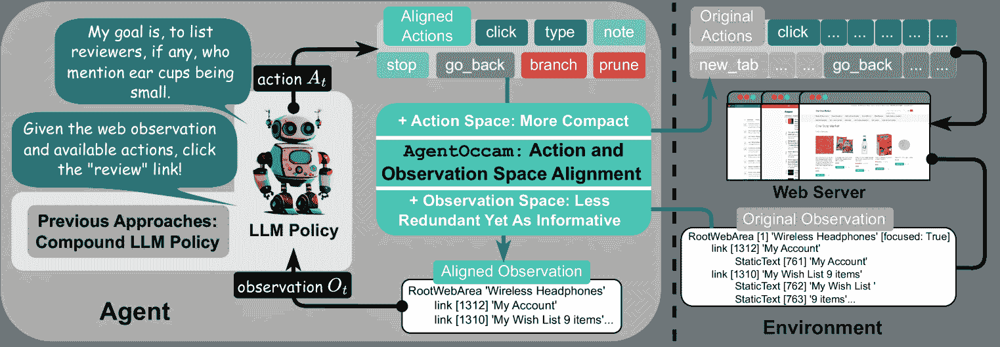

图1：AgentOccam概览。与之前集中于设计复杂LLM策略的研究不同，我们通过将网页交互动作和观察空间与LLM在训练过程中获得的知识和技能对齐，从而简单地增强了网页代理。

为了通过基于大语言模型（LLM）的代理提升网页任务性能，近期的研究集中在设计更好的代理策略，这些策略采用了手工制作的提示模板（Sodhi等，[2024](https://arxiv.org/html/2410.13825v1#bib.bib19)）或硬编码的自动提示策略（Fu等，[2024](https://arxiv.org/html/2410.13825v1#bib.bib4)；Wang等，[2024](https://arxiv.org/html/2410.13825v1#bib.bib22)）。虽然这些预定义策略在某些任务中是有效的，但它们难以推广到不同的网站和多样化的技能要求。另一个新兴趋势是采用采样或搜索算法动态探索网页导航动作，这减少了对预定义策略的依赖，但增加了LLM推理的成本。（Koh等，[2024b](https://arxiv.org/html/2410.13825v1#bib.bib9)；Zhang等，[2024](https://arxiv.org/html/2410.13825v1#bib.bib28)；Pan等，[2024](https://arxiv.org/html/2410.13825v1#bib.bib13)）。

在本研究中，我们旨在通过优化现有LLM的基于文本的任务理解和推理，而不是改进代理策略，来提高LLM基础Web代理的熟练度。自动化Web任务具有挑战性，因为代理需要i) 从格式各异、包含编码脚本的网页中准确提取信息，ii) 发出适当的体现性动作，从仅在Web上定义的动作（如滚动、点击或悬停在按钮上）中选择。这些Web观察和行动空间在LLM的预训练和后训练数据中都不常见，阻碍了LLM在完成通用Web任务时充分发挥其潜力。因此，我们研究如何适当调整LLM基础Web代理的观察和行动，以使其与训练过程中学到的LLM能力相匹配。

如图[1](https://arxiv.org/html/2410.13825v1#S1.F1 "Figure 1 ‣ 1 Introduction ‣ AgentOccam: A Simple Yet Strong Baseline for LLM-Based Web Agents")所示，我们的方法包括三个组件：i) 我们减少不必要的行动，以最小化代理的体现和琐碎的交互需求；ii) 我们通过消除冗余和不相关的Web元素，并重构Web内容块，以便更简洁却同样信息丰富的表示来优化观察；iii) 我们引入了两种规划动作（分支和修剪），这使得代理能够通过规划树自组织导航工作流，并使用相同的结构过滤先前的痕迹进行历史重放。我们通过通用规则实现这些组件，这些规则适用于所有类型的标记语言格式的网页，而不依赖于测试基准上的任务相关信息。

通过结合上述提到的三种技术，我们提出的代理AgentOccam在WebArena环境中的多个网站的Web任务上表现显著优于其他方法（Zhou等人，[2023b](https://arxiv.org/html/2410.13825v1#bib.bib31)）。AgentOccam比之前的最先进方法提高了9.8个绝对点（$+29.4\%$），并超越了同时期的工作5.9个绝对点（$+15.8\%$）。值得注意的是，与大多数先前的工作不同，我们没有使用任何上下文中的示例、额外的在线搜索或采样，也没有使用专门的提示模板或角色来使代理表现良好。相比之下，AgentOccam通过一个出乎意料的简单方法实现了如此强大的性能：让LLM在处理和增强的观察和行动空间内发出动作。与没有这些提议的观察和行动空间变化的普通Web代理相比，AgentOccam将成功率提高了26.6个绝对点（$+161\%$）。

总结来说，本研究的主要贡献如下。首先，我们开发了一种新的最先进的代理——AgentOccam，针对网页任务。在由五个不同网站（例如购物、论坛搜索）组成的WebArena基准测试中，AgentOccam在812个任务上显著优于以往的相关工作和同类研究。第二，我们揭示了LLM在网页任务上的强大零-shot表现，通过我们的简单代理工作流，明显优于许多更复杂的复合代理策略。最后，我们在对齐观察与动作空间方面的工作与代理策略是正交的，并且可以与未来在这一方面的进展结合。

表 1：不同基于LLM的网页代理的主要组件比较

| 主要组件 | 针对任务的策略 | 附加模块 | 语境示例 | 离线数据 | 在线搜索 |
| --- | --- | --- | --- | --- | --- |
| AutoGuide (傅等, [2024](https://arxiv.org/html/2410.13825v1#bib.bib4)) | no | yes | yes | yes | no |
| SteP (索迪等, [2024](https://arxiv.org/html/2410.13825v1#bib.bib19)) | yes | yes | yes | no | no |
| AutoRefine (潘等, [2024](https://arxiv.org/html/2410.13825v1#bib.bib13)) | no | yes | yes | yes | yes |
| LM-Tree 搜索 (柯等, [2024b](https://arxiv.org/html/2410.13825v1#bib.bib9)) | no | yes | yes | yes | yes |
| AWM (王等, [2024](https://arxiv.org/html/2410.13825v1#bib.bib22)) | no | yes | yes | yes ¹¹footnotemark: 1 | no |
| WebPilot (张等, [2024](https://arxiv.org/html/2410.13825v1#bib.bib28)) | no | yes | yes | no | yes |
| AgentOccam | no | no | no | no | no |

## 2 相关工作

#### 基于LLM的网页代理

大型语言模型和多模态基础模型的进展显著推动了自主代理的发展，用以解决网页任务。将大语言模型（LLMs）转化为强大决策代理的技术（Yao等人，[2022b](https://arxiv.org/html/2410.13825v1#bib.bib26)；Shinn等人，[2024](https://arxiv.org/html/2410.13825v1#bib.bib18)）推动了网页代理的进展，并启发了许多设计推理时代理策略的技术。许多早期的研究通过设计模块化系统、专门化的大语言模型或角色来改进代理系统，旨在将复杂任务分解（Sun等人，[2024](https://arxiv.org/html/2410.13825v1#bib.bib21)；Prasad等人，[2024](https://arxiv.org/html/2410.13825v1#bib.bib14)）。其他研究利用大语言模型从示例或过去的经验中提取共性模式（Zheng等人，[2023](https://arxiv.org/html/2410.13825v1#bib.bib29)；Fu等人，[2024](https://arxiv.org/html/2410.13825v1#bib.bib4)；Wang等人，[2024](https://arxiv.org/html/2410.13825v1#bib.bib22)）。然而，这类工作通常依赖于预定义的控制层次结构、提示模板或示例，以在测试环境中准确执行。例如，SteP（Sodhi等人，[2024](https://arxiv.org/html/2410.13825v1#bib.bib19)）利用基于堆栈的方法实现网页任务中的动态多级控制，但依赖于任务特定的原子策略以及在提示模板中硬编码的与环境相关的信息。另一类研究则聚焦于通过利用更多来自环境的在线示例来提升网页代理的表现。许多研究（Zhou等人，[2023a](https://arxiv.org/html/2410.13825v1#bib.bib30)；Zhang等人，[2024](https://arxiv.org/html/2410.13825v1#bib.bib28)；Putta等人，[2024](https://arxiv.org/html/2410.13825v1#bib.bib15)）采用蒙特卡洛树搜索（MCTS）方法，通过对同一任务进行多次试验，反复扩展中间状态（树节点）。其中，WebPilot（Zhang等人，[2024](https://arxiv.org/html/2410.13825v1#bib.bib28)）还增加了一个全局优化层用于高层次规划。Koh等人（[2024b](https://arxiv.org/html/2410.13825v1#bib.bib9)）利用训练的价值函数来指导搜索，并在任务执行树上进行回溯。Auto Eval和Refine（Pan等人，[2024](https://arxiv.org/html/2410.13825v1#bib.bib13)）训练了一个独立的评估器，并通过反思性思维（Shinn等人，[2024](https://arxiv.org/html/2410.13825v1#bib.bib18)）改善了同一任务在过去试验中的执行表现。然而，在同一任务中多次采样或重置，不仅显著增加了推理成本，而且在无法撤销失败任务时限制了其适用性。作为对比，我们在表格[1](https://arxiv.org/html/2410.13825v1#S1.T1 "Table 1 ‣ 1 Introduction ‣ AgentOccam: A Simple Yet Strong Baseline for LLM-Based Web Agents")中突出展示了我们方法的简洁性以及与相关代理方法的区别。

#### 微调或训练过的网页任务模型

对语言或多模态模型进行微调以处理网页任务是增强网页任务决策能力的另一种有效方法（Yin等，[2024](https://arxiv.org/html/2410.13825v1#bib.bib27); Hong等，[2024](https://arxiv.org/html/2410.13825v1#bib.bib6); Lai等，[2024](https://arxiv.org/html/2410.13825v1#bib.bib10); Putta等，[2024](https://arxiv.org/html/2410.13825v1#bib.bib15)）。虽然微调承诺提供更好的适应性和更广泛的优化空间，但任务特定的微调模型的规模通常无法与最强大的闭源模型相媲美。至于训练模型以执行计算机或网页上的自然语言命令，在大语言模型（LLM）出现之前，也有一些早期研究，使用语义解析（Artzi & Zettlemoyer，[2013](https://arxiv.org/html/2410.13825v1#bib.bib2)），强化学习（Branavan等，[2009](https://arxiv.org/html/2410.13825v1#bib.bib3)）和模仿学习（Liu等，[2018](https://arxiv.org/html/2410.13825v1#bib.bib12); Humphreys等，[2022](https://arxiv.org/html/2410.13825v1#bib.bib7)）。然而，由于这些微调代理受限于基础模型的能力或训练数据量，往往在性能和/或泛化能力上无法与LLMs构建的代理相比，这也超出了本研究的范围。

#### 模拟的网页代理环境

网页代理的开发得到了越来越复杂的网页模拟器的支持，用于训练和评估。这些模拟器从基本平台如MiniWoB（Shi等，[2017](https://arxiv.org/html/2410.13825v1#bib.bib17)）及其扩展MiniWoB++（Liu等，[2018](https://arxiv.org/html/2410.13825v1#bib.bib12)）到更复杂的环境，如WebShop（Yao等，[2022a](https://arxiv.org/html/2410.13825v1#bib.bib25)），WebArena（Zhou等，[2023b](https://arxiv.org/html/2410.13825v1#bib.bib31)）和VisualWebArena（Koh等，[2024a](https://arxiv.org/html/2410.13825v1#bib.bib8)）。这些模拟器逐步融入了现实世界的复杂性，从简单的表单填写到跨多个完整功能网站的任务。在本研究中，我们仅专注于文本模态，并使用WebArena来评估我们方法的任务成功率和泛化能力，因为它包含了不同类型的网站和任务意图，在一个套件中提供了多样性。

## 3 问题公式化

我们通过部分可观察的马尔可夫决策过程（POMDP，Littman（[2009](https://arxiv.org/html/2410.13825v1#bib.bib11)）；Spaan（[2012](https://arxiv.org/html/2410.13825v1#bib.bib20)））来形式化网页交互过程：$\langle\mathcal{O},\mathcal{S},\mathcal{A},P,R,p_{0},\gamma\rangle$。在POMDP中，一个观察$o\in\mathcal{O}$包含了代理从网页环境中接收到的信息，例如HTML文档，以及任何指令和提示。在本工作中，我们只考虑文本模态。一个状态$s\in\mathcal{S}$表示代理和环境的整个潜在（未观察到的）状态，使得状态转移是马尔可夫的。一个动作$a\in\mathcal{A}$可以是网页环境识别的命令，或者任何其他未识别的令牌序列，这将导致代理停留在当前状态。$P$表示一个确定性的状态转移函数，它记录在给定当前状态和代理动作的情况下网页状态的变化。$R$是奖励函数，用于决定代理一系列动作的成功或失败。在我们工作的WebArena环境中，奖励只在代理与网页交互的一回合结束时分配。$p_{0}$表示初始状态分布，在WebArena中的812个任务上是均匀分布的，折扣因子$\gamma$设置为1。

解决POMDP的一个常见目标是找到一个决策策略$\pi(a_{t}|h_{t})$，以最大化期望的累积奖励，其中$h_{t}$表示观察历史$\{o_{0},o_{1},...,o_{t}\}$。在基于LLM的网页代理设计中，这可以转化为通过一个或多个基础LLM策略$\pi_{\textrm{LLM}}$以及一组算法模块来设计策略$\pi(a_{t}|h_{t})$。在本工作中，我们研究了一类特殊的策略，它可以表示为：$\pi(g(a_{t})|h_{t})=\pi_{\textrm{LLM}}(a_{t}|f(h_{t}))$，其中$f$和$g$是基于规则的函数，处理LLM策略的观察（包括行动指令）和动作。我们将其称为观察和动作空间对齐问题。请注意，在这种问题设置下，我们的所有更改仅适用于观察和动作。我们强调，并非所有先前方法中的代理策略都可以这样表示。例如：基于搜索的算法需要一个控制程序来选择动作并触发回溯；具有评估器、反思思维或记忆模块的方法也需要一个管理中心，在主LLM和这些辅助模块或其他角色扮演LLM之间切换。相比之下，我们的工作旨在回答以下问题：我们是否可以通过仅优化观察和动作映射$f$和$g$来构建一个强大的网页代理，且该代理使用基础LLM策略$\pi_{\textrm{LLM}}$？

## 4 方法

我们的方法并没有在基础LLM之上引入新的模块或层次结构，而是专注于一个简单的Web代理工作流，该工作流将Web观察结果输入到通用LLM-API，并直接使用LLM的输出作为行动。在这一部分，我们描述了将需要体现知识的Web任务与主要静态且文本为主的LLM训练特性对齐的过程。第[4.1](https://arxiv.org/html/2410.13825v1#S4.SS1 "4.1 行为空间对齐 ‣ 4 方法 ‣ AgentOccam：一种简单而强大的基准Web代理")节讨论了我们优化行为空间的策略（如图[2](https://arxiv.org/html/2410.13825v1#S4.F2 "图2 ‣ 4.1 行为空间对齐 ‣ 4 方法 ‣ AgentOccam：一种简单而强大的基准Web代理")所示），使其更加简洁，并减少了代理体现能力的需求。第[4.2](https://arxiv.org/html/2410.13825v1#S4.SS2 "4.2 观察空间对齐 ‣ 4 方法 ‣ AgentOccam：一种简单而强大的基准Web代理")节概述了我们的方法（如图[4](https://arxiv.org/html/2410.13825v1#S4.F4 "图4 ‣ 4.2 观察空间对齐 ‣ 4 方法 ‣ AgentOccam：一种简单而强大的基准Web代理")所示），通过简明而信息丰富的方式精简Web内容描述，识别关键Web元素和相关步骤以便于在组织代理记忆时有效保留。

### 4.1 行为空间对齐

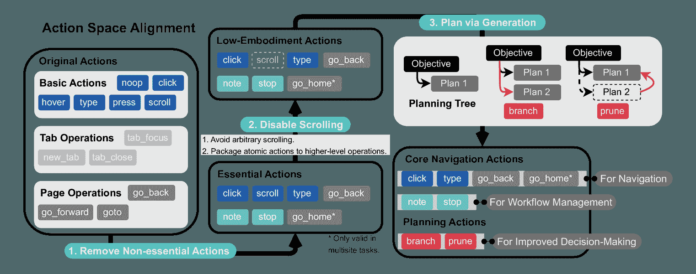

图2：在将行为空间与LLM预训练对齐时，我们只保留高效的动作，并减少对高级体现能力的需求（步骤1和2）。此外，我们还融入了规划步骤，允许代理自主管理任务的拆解和执行（步骤3）。

Web代理的行为空间定义了它可以用来与Web环境交互的有效命令。WebArena模拟器支持将三类动作转换为鼠标和键盘操作：基本操作（例如点击、输入）、标签操作（例如tab_focus用于管理活动标签页）和页面操作（例如go_back用于导航）。这些操作在附录[A](https://arxiv.org/html/2410.13825v1#A1 "附录A 比较原始和对齐的行为空间 ‣ AgentOccam：一种简单而强大的基准Web代理")中详细说明，并与我们对行为空间的更改进行了比较。

基于我们对网页代理常见失败模式的观察，编辑动作空间需要解决两个关键问题：i) 去除LLM难以理解且经常误用的无关动作；ii) 在任务执行需要导航多个潜在路径才能成功完成时，改善记忆和规划能力。我们提出，第一个问题可以通过简单地去除和合并动作来纠正。第二个问题通常在以往的工作中通过手工制定规则或策略来解决，这使得这些方法难以推广。在本研究中，我们通过引入一些动作来解决第二个问题，这些动作允许LLM自主生成计划并管理任务流程。以下将详细解释这些提议的解决方案，并可参考图[2](https://arxiv.org/html/2410.13825v1#S4.F2 "图 2 ‣ 4.1 动作空间对齐 ‣ 4 方法 ‣ AgentOccam: 一种简单而强大的基准模型用于基于LLM的网页代理")。

简化动作空间。首先，我们去除那些可以通过类似动作复制的动作，或用一个具有相同表现力的动作替代多个动作（如图[2](https://arxiv.org/html/2410.13825v1#S4.F2 "图 2 ‣ 4.1 动作空间对齐 ‣ 4 方法 ‣ AgentOccam: 一种简单而强大的基准模型用于基于LLM的网页代理")步骤1所示）。具体来说，我们去除了noop动作，它表示“无操作”，因为在大多数情况下它会成为代理的干扰。类似地，标签操作（用于管理标签的聚焦、打开或关闭）也被去除，因为它们仅在需要两个标签的多站点任务中的有限场景下才需要。此外，我们限制了页面导航动作，如go_forward和goto，因为这些动作的实用性受限于代理对页面URL和其内容之间关系的记忆能力较差。通过去除这些效果较差的动作，我们的目标是最小化干扰，并提升代理对更有意义操作的集中力。此外，我们引入了note动作，允许代理记录关键观察结果以供后续结论使用；还引入了stop动作，使代理能够自主结束轨迹并给出答案。我们还为多站点任务添加了go_home命令，允许代理直接导航到列出所有可用站点的主页。

第二，我们消除了那些需要大量体现性知识的动作，并将低级动作简化为更抽象的操作，如图[2](https://arxiv.org/html/2410.13825v1#S4.F2 "Figure 2 ‣ 4.1 Action Space Alignment ‣ 4 Method ‣ AgentOccam: A Simple Yet Strong Baseline for LLM-Based Web Agents")中的第2步所示。特别地，我们减少了基于LLM的代理在没有详细上下文特定指导下很难执行的命令，比如悬停或按压（后者指的是按键组合，通常是快捷键）。正确使用这些动作需要LLM对当前场景有体现性思维，尤其是对于鼠标位置或键盘操作的理解，而这些在训练过程中并没有得到充分的培养。此外，我们移除了滚动动作，改为将完整的页面内容作为网页状态加载。这一改变是基于我们观察到的，代理在页面顶部未能显示重要链接时，往往会进行毫无目的的重复滚动，浪费步骤却没有取得进展。进一步地，我们简化了代理与下拉菜单的交互；现在，只需点击目标选项的ID，而不再需要先选择菜单再选择选项。原始动作空间与简化后动作空间中的所有动作列表见于表[3](https://arxiv.org/html/2410.13825v1#S5.T3 "Table 3 ‣ Question 2: How much does each observation and action space change contribute to AgentOccam? ‣ 5 Experimental resuts and analysis ‣ AgentOccam: A Simple Yet Strong Baseline for LLM-Based Web Agents")，并列出了不同代理中它们被执行的频率。

通过生成进行规划。网页任务通常需要通过导航多个路径来找到解决方案（例如，从一个页面提取信息并将其提交到另一个页面，就像在“联系我们”页面上为损坏的产品创建退款请求的任务（任务模板154），这需要从订单页面解析订单ID和退款金额）。我们引入了两个动作（分支和修剪）来在树结构中生成计划并为未来的观察保存它们。如图[2](https://arxiv.org/html/2410.13825v1#S4.F2 "图2 ‣ 4.1 动作空间对齐 ‣ 4 方法 ‣ AgentOccam: 一种简单而强大的LLM基础网页代理")第3步所示，LLM生成的计划从任务目标的根节点开始。分支动作将在当前节点下生成新的子计划，将高层次的目标分解为更小、更易管理的子目标。相反，修剪动作允许代理放弃当前子计划（通常是在多次失败尝试后）并寻找替代方案。结合分支和修剪动作，LLM可以自主编辑规划树。请注意，这两个规划动作与网页环境中的原生导航动作（如点击、输入）没有区别，LLM可以自由选择何时采取这些动作来更新计划。生成的计划为未来的行动生成提供了上下文，并增强了一个轨迹中行动的一致性。这种方法利用了LLM自身的内在规划能力。我们认为，这种设计在最小依赖先验知识的前提下，不会妥协代理的泛化能力。

### 4.2 观察空间对齐

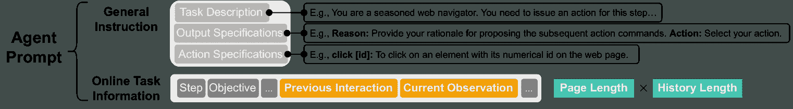

图3：我们网页导航代理提示的组成部分。它包括概述任务的一般说明、期望的输出和可用的行动，以及提供当前目标、代理的过去互动和最新观察结果的在线任务信息。值得注意的是，关于先前互动和当前观察的部分使用了最多的tokens。这可以归因于两个主要因素：页面长度和历史跨度，其中当前观察主要依赖于页面长度，而过去的互动则既依赖于页面长度，也依赖于历史跨度。

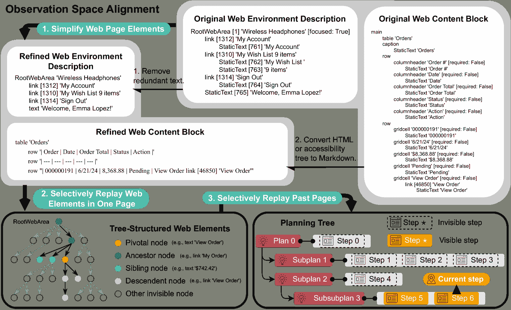

图4：为了将任务的观察空间与基础模型的预训练进行对齐，我们通过去除重复描述网页功能和布局的冗余文本（步骤1），并识别与任务相关的页面元素供代理记住（步骤2），从而将单页内容压缩。除此之外，我们通过规划树优化代理的工作流记忆，将每个新计划视为一个独立的目标，排除专门用于先前计划的过去步骤信息，以增强记忆的简洁性（步骤3）。

网页代理的观察空间由任务目标、指令、先前的交互、当前网页的文本描述或截图组成（参见图 [3](https://arxiv.org/html/2410.13825v1#S4.F3 "Figure 3 ‣ 4.2 Observation Space Alignment ‣ 4 Method ‣ AgentOccam: A Simple Yet Strong Baseline for LLM-Based Web Agents") 和附录 [D](https://arxiv.org/html/2410.13825v1#A4 "Appendix D Agent Prompts ‣ AgentOccam: A Simple Yet Strong Baseline for LLM-Based Web Agents")，用于我们的代理）。其中，先前的交互和当前的网页内容占用了最多的符号，这与单页的长度和历史记录的长度成正比。这通常导致上下文窗口过长，不仅增加了 LLM 推理的成本，还对 LLM 准确提取相关信息构成了挑战。因此，我们在优化观察时的主要目标是解决这两个方面的问题。此外，观察对齐如图 [4](https://arxiv.org/html/2410.13825v1#S4.F4 "Figure 4 ‣ 4.2 Observation Space Alignment ‣ 4 Method ‣ AgentOccam: A Simple Yet Strong Baseline for LLM-Based Web Agents") 所示。

简化网页观察。大多数仅文本的网页代理中，网页上的内容以 HTML 或可访问性树格式呈现。这些格式是为了前端加载和渲染设计的，包含大量格式化符号，使得内容冗长且重复，如图 [4](https://arxiv.org/html/2410.13825v1#S4.F4 "Figure 4 ‣ 4.2 Observation Space Alignment ‣ 4 Method ‣ AgentOccam: A Simple Yet Strong Baseline for LLM-Based Web Agents") 第 1 步所示。我们的目标是优化表示方式，使其在单一页面中对 LLM 更具可读性。具体而言，我们将功能描述的网页元素（例如，静态文本 [761] ‘我的账户’）与共享相同标签的交互元素（例如，链接 [1312] ‘我的账户’）合并。然后，我们将表格和列表块转换为 Markdown，去除重复的结构符号（例如，列头、网格单元）。因此，我们实现了更简洁的表示方式，同时保持相同的信息。

有选择地回放观察历史。将观察历史作为输入对于需要长期目标的任务中的决策代理至关重要，因为观察状态只包含有关环境状态的部分信息。对于网页任务，包含观察历史和行动历史也很重要，因为某些关键信息可能没有显示在当前页面。然而，观察历史也会显著增加上下文长度，增加推理难度和推理成本。我们通过仅选择先前网页上最重要且相关的信息来解决这个问题，依据两个基于“关键”节点（稍后定义）和规划树的规则。

首先，我们观察到，网页上的内容中，只有少量与特定任务相关并值得在未来步骤中重新使用。例如，在需要智能体查找三个月内所有评论的任务中，保留其他评论或一些不相关的链接（如“联系我们”）是没有必要的。因此，我们通过利用网页数据的树结构（例如，辅助树）来采用一个简单的规则来识别这少量的内容。为此，我们首先指示智能体在生成行动时，标出被称为“关键”节点的重要网页元素。同时，智能体被编程只在未来的观察中包括关键节点的祖先节点（表示它们的全局层级和位置）、兄弟节点（提供直接上下文）以及后代节点（提供详细特征），如图[4](https://arxiv.org/html/2410.13825v1#S4.F4 "Figure 4 ‣ 4.2 Observation Space Alignment ‣ 4 Method ‣ AgentOccam: A Simple Yet Strong Baseline for LLM-Based Web Agents")步骤2所示。这有效地缩小了传递到未来LLM推理上下文中的数据量和噪音水平。

第二，我们观察到并非所有之前步骤的观察都需要在推断未来步骤时记录。因此，我们可以利用由智能体自身生成的规划树来保持智能体的专注力。具体而言，当智能体启动一个分支行动来制定新计划时，我们将这个新计划视为一个独立的目标。对于早期计划采取的步骤及其观察，将在当前计划的观察窗口中被忽略，如图[4](https://arxiv.org/html/2410.13825v1#S4.F4 "Figure 4 ‣ 4.2 Observation Space Alignment ‣ 4 Method ‣ AgentOccam: A Simple Yet Strong Baseline for LLM-Based Web Agents")步骤3所示。这使得智能体能够仅专注于与当前计划子任务相关的信息。

## 5 实验结果与分析

#### 环境。

我们使用WebArena（Zhou et al., [2023b](https://arxiv.org/html/2410.13825v1#bib.bib31)）作为基准测试工具，WebArena 是一个互动式网页模拟器，包含来自四个常见领域的完整功能网站：电子商务平台（OneStopShop），社交论坛（Reddit）用于思想和意见交换，协作软件开发平台（GitLab），以及用于在线数据创建和管理的内容管理平台（在线商店管理）。该平台还包括实用工具：地图、计算器和便签本，以及维基百科，以支持类人任务求解。该基准包含由241个模板生成的812个任务。这里的模板是任务意图的参数化形式，允许通过不同的关键词实例化多个任务。每个任务都配有一个评估器/奖励函数，程序化地检查最终信息与期望的真实信息的准确性²²2我们已经识别并纠正了原评估器中的错误，详细信息请参见附录[B](https://arxiv.org/html/2410.13825v1#A2 "Appendix B Evaluator Rectifications ‣ AgentOccam: A Simple Yet Strong Baseline for LLM-Based Web Agents")。我们的方法在使用原始或修正后的评估器时，均优于基准方法。我们使用`GPT-4-turbo-2024-04-09`（Achiam et al., [2023](https://arxiv.org/html/2410.13825v1#bib.bib1)）构建我们的AgentOccam。

#### 基准。

我们将AgentOccam与以下先前和当前的研究进行了比较：1）WebArena代理：包含在WebArena基准中的链式思维（CoT）提示代理（Zhou et al., [2023b](https://arxiv.org/html/2410.13825v1#bib.bib31)）。2）SteP（Sodhi et al., [2024](https://arxiv.org/html/2410.13825v1#bib.bib19)）：一种基于堆栈的方法，构建于14个人工编写的原子策略之上，专门用于解决WebArena中的问题。3）WebPilot（Zhang et al., [2024](https://arxiv.org/html/2410.13825v1#bib.bib28)）：一种基于多代理、多层次MCTS的代理，报告了WebArena上的最先进整体性能。4）Agent Workflow Memory (AWM)（Wang et al., [2024](https://arxiv.org/html/2410.13825v1#bib.bib22)）：一种从过去经验中自动总结工作流程的方法。SteP已公开其代码和交互轨迹。因此，我们能够在与我们方法相同的网页环境中，使用`GPT-4-turbo`完全复制WebArena和SteP的代理，以进行公平比较。³³3在我们的实验中，我们注意到所有代理偶尔由于WebArena模拟器的错误而失败，例如Reddit的发布频率限制或登录过期。在这种情况下，我们会重新启动实验。WebPilot和AWM作为与本文同步的工作，尚未提供源代码或结果轨迹，限制了我们对这些工作的分析，仅能报告其技术报告中包含的汇总性能数据。我们的分析主要集中在SteP，因为它是在本文之前最具性能的方案。

表 2：AgentOccam 与基线模型在 WebArena 上的成功率（SR）比较。

| 代理 | 模型 | 成功率（%） | 购物 | 购物管理 | GitLab | 地图 | Reddit | 多站点 |
| --- | --- | --- | --- | --- | --- | --- | --- | --- |
|  |  | (#812) | (#187) | (#182) | (#180) | (#109) | (#106) | (#48) |
| WebArena-复制 | GPT-4-Turbo | 16.5 | 16.6 | 15.9 | 10.0 | 22.9 | 21.7 | 16.7 |
| SteP-复制 | GPT-4-Turbo | 33.3 | 33.2 | 32.4 | 26.7 | 35.8 | 52.8 | 12.5 |
| AWM | GPT-4 | 35.5 | - | - | - | - | - | - |
| WebPilot | GPT-4o | 37.2 | - | - | - | - | - | - |
| AgentOccam | GPT-4-Turbo | 43.1 | 40.6 | 45.6 | 37.8 | 46.8 | 61.3 | 14.6 |

#### 问题 1：AgentOccam 的表现如何？

从表格[2](https://arxiv.org/html/2410.13825v1#S5.T2 "表 2 ‣ 基线模型 ‣ 5 实验结果与分析 ‣ AgentOccam: 一种简单而强大的 LLM 基线模型")中的结果可以看出，我们的代理 AgentOccam 通过优化动作和观察空间，创造了 WebArena 基准测试的新最优结果。它将整体成功率从 37.2% 提高到 43.1%，相较于先前及同时期的最佳结果，提升了 15.8%。我们观察到，AgentOccam 不仅能完成原本无法解决的任务模板，比如更新 OneStopShop 上的个人信息（任务模板 165），还提升了那些以前结果混杂的任务模板的成功率，例如设置 GitLab 个人资料上的主页 URL（任务模板 331）。这一点在附录中的图[6](https://arxiv.org/html/2410.13825v1#A3.F6 "图 6 ‣ 附录 C 额外实验细节 ‣ AgentOccam: 一种简单而强大的 LLM 基线模型")中得到了进一步说明。

#### 问题 2：每个观察和动作空间的变化对 AgentOccam 的贡献有多大？

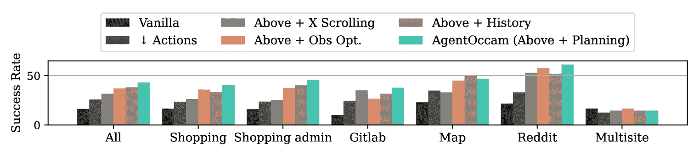

图 5：AgentOccam 的动作和观察空间细化的消融研究。我们逐步添加细化组件并评估它们的边际性能提升。

表 3：AgentOccam 组件消融研究的动作统计数据。表格中的每个数字代表在实验设置中所有任务中某个动作的频率。由于 noop、go_forward、tab_focus 和 tab_close 在原始模型中未被使用且在我们的方法中已移除，因此未包含在内。

| 实验 | 点击 | 悬停 | 输入 | 按压 | 滚动 | 新标签 | 返回 | 跳转 | 备注 | 停止 | 返回主页 | 分支 | 剪枝 |
| --- | --- | --- | --- | --- | --- | --- | --- | --- | --- | --- | --- | --- | --- |
| 原始模型 | 2328 | 126 | 1024 | 7 | 132 | 20 | 71 | 511 | - | -⁴⁴脚注标记: 4 | - | - | - |
| $\downarrow$ 动作 | 7119 | - | 2531 | - | 370 | - | 52 | - | 194 | 512 | 36 | - | - |
| 上述 + X 滚动 | 7033 | - | 2390 | - | - | - | 100 | - | 219 | 536 | 42 | - | - |
| 上述 + 观察优化 | 6890 | - | 2040 | - | - | - | 56 | - | 201 | 571 | 23 | - | - |
| 上述 + 历史 | 4625 | - | 1286 | - | - | - | 94 | - | 112 | 801 | 54 | - | - |
| AgentOccam | 4720 | - | 1159 | - | - | - | 339 | - | 197 | 769 | 42 | 34 | 47 |

表 4：WebArena站点每步的平均观察令牌数。我们使用了来自Huggingface的gpt2分词器（Radford等，[2019](https://arxiv.org/html/2410.13825v1#bib.bib16)）。

| 实验 | 全部 | 购物 | 购物管理 | GitLab | 地图 | Reddit | 多站点 |
| --- | --- | --- | --- | --- | --- | --- | --- |
| 原始代理 | 2210.2 | 2272.1 | 2460.2 | 2199.1 | 1883.2 | 2132.4 | 1751.0 |
| $\downarrow$ 动作 | 1652.0 | 1644.7 | 2133.1 | 1981.3 | 912.0 | 1081.2 | 1296.8 |
| 上述 + 横向滚动 | 3376.2 | 3148.0 | 5403.7 | 3364.9 | 1378.1 | 2603.6 | 1975.5 |
| 上述 + 观察优化 | 2891.1 | 1722.5 | 4791.7 | 2560.8 | 1476.4 | 3332.3 | 1619.4 |
| 上述 + 历史 | 3051.3 | 1802.6 | 5140.2 | 3153.3 | 862.1 | 3156.1 | 2030.3 |
| AgentOccam | 2930.9 | 1634.2 | 4920.7 | 3126.8 | 1056.0 | 3697.8 | 1282.5 |

表 5：所有WebArena站点每个任务的平均步骤数。

| 实验 | 全部 | 购物 | 购物管理 | GitLab | 地图 | Reddit | 多站点 |
| --- | --- | --- | --- | --- | --- | --- | --- |
| 原始代理 | 6.2 | 6.2 | 6.6 | 5.9 | 5.7 | 7.4 | 4.4 |
| $\downarrow$ 动作 | 13.3 | 10.6 | 14.3 | 14.8 | 11.9 | 15.2 | 13.7 |
| 上述 + 横向滚动 | 12.7 | 9.0 | 14.0 | 14.8 | 12.7 | 13.0 | 14.0 |
| 上述 + 观察优化 | 12.0 | 8.5 | 13.2 | 15.4 | 10.2 | 12.1 | 13.2 |
| 上述 + 历史 | 8.6 | 5.6 | 9.6 | 10.3 | 8.3 | 7.6 | 12.9 |
| AgentOccam | 9.0 | 6.7 | 9.2 | 10.8 | 8.5 | 8.6 | 13.4 |

我们通过逐步将AgentOccam中描述的各个组件集成到原始代理（WebArena-Replication）中，并评估图表[5](https://arxiv.org/html/2410.13825v1#S5.F5 "图 5 ‣ 问题 2：每个观察和动作空间的变化对AgentOccam的贡献是多少？ ‣ 5 实验结果与分析 ‣ AgentOccam: 一个简单而强大的LLM基础网络代理")中所展示的边际性能提升，从而评估每个组件对整体成功的贡献。每个增量实验的详细信息如下：

i) 移除非必要的行动（$\downarrow$ 行动）：缩小行动空间可以减少LLM策略的干扰程度，并显著提升所有测试网页上的表现，如图[5](https://arxiv.org/html/2410.13825v1#S5.F5 "图 5 ‣ 问题 2：每个观察和行动空间变化对AgentOccam的贡献有多少？ ‣ 5 实验结果与分析 ‣ AgentOccam：一种简单而强大的基准方法用于基于LLM的网页代理") 所示。通过移除像tab_focus、go_forward、hover和press等很少使用的行动，代理可以减少绕圈的步骤，利用点击和输入等行动更高效地探索。表[3](https://arxiv.org/html/2410.13825v1#S5.T3 "表 3 ‣ 问题 2：每个观察和行动空间变化对AgentOccam的贡献有多少？ ‣ 5 实验结果与分析 ‣ AgentOccam：一种简单而强大的基准方法用于基于LLM的网页代理") 显示，它减少了数百次的hover和goto行动，同时显著增加了点击和输入的次数。

ii) 禁用滚动（上面 + X 滚动）：我们观察到，当LLM策略不知道该做什么时，它们往往频繁使用滚动操作（因为这些操作是可撤销的）。因此，这会显著延迟任务执行，并在某些任务中导致循环执行。因此，禁用滚动操作并将整个页面传递给代理被证明是有利的，特别是在GitLab和Reddit任务中。然而，这一策略增加了观察令牌的数量，这将在后续的改进中解决。

iii) 简化网页元素（上面 + 观察选项）：我们去除了冗余的文本和网页格式，如图[4](https://arxiv.org/html/2410.13825v1#S4.F4 "图 4 ‣ 4.2 观察空间对齐 ‣ 4 方法 ‣ AgentOccam：一种简单而强大的基准方法用于基于LLM的网页代理") 步骤 1 所示。这样可以减少上下文窗口中的令牌数量，具体见表[4](https://arxiv.org/html/2410.13825v1#S5.T4 "表 4 ‣ 问题 2：每个观察和行动空间变化对AgentOccam的贡献有多少？ ‣ 5 实验结果与分析 ‣ AgentOccam：一种简单而强大的基准方法用于基于LLM的网页代理")。它有助于代理集中注意力在任务成功所必需的网页元素上，从而提升所有任务类型的表现，除了在Gitlab上，这有时会导致代理忽视更简单的解决方案（任务ID 394）。

iv) 在单个页面中选择性重放网页元素（上述 + 历史）：在这个实验中，我们遵循图 [4](https://arxiv.org/html/2410.13825v1#S4.F4 "图 4 ‣ 4.2 观察空间对齐 ‣ 4 方法 ‣ AgentOccam：基于 LLM 的网页代理的简单而强大的基准") 中展示的步骤 2，将来自先前网页的元素子集作为历史添加。我们观察到，这使得代理能够避免在任务中重复性动作，显著减少了完成任务所需的步骤，如表 [5](https://arxiv.org/html/2410.13825v1#S5.T5 "表 5 ‣ 问题 2：每个观察和动作空间的变化对 AgentOccam 的贡献有多大？ ‣ 5 实验结果与分析 ‣ AgentOccam：基于 LLM 的网页代理的简单而强大的基准") 中所示。然而，这一添加在任务内容密集的单页面任务或需要跨多个页面导航的任务中略微影响了性能，因为购物和 Reddit 任务的成功率分别下降了 3.2 和 6.0 个百分点。

v) 通过生成和选择性重放过去页面的规划（AgentOccam；上述 + 规划）：我们引入了动作分支和修剪技术，以生成动作并将不在当前子计划中的历史步骤从当前提示上下文中排除。这导致在几乎所有网站的任务中都取得了性能提升，同时减少了所需的观察标记。动作分支和修剪主要用于修正失败的策略并尝试替代路径。例如，在识别波士顿附近的最近国家公园的任务（任务 ID 265）中，代理在一次搜索失败后，采用分支动作来采用替代的搜索策略。在一个 GitLab 任务（任务 ID 563）中，在多次尝试使用创建项目按钮失败后，代理选择了修剪动作来探索其他方法。

#### 问题 3：AgentOccam 的能力能否与其他代理策略结合？

表 6：AgentOccam 与代理策略结合在 WebArena 上的成功率（SR）。

| 代理 | 模型 | SR (%) | 购物 | 购物管理 | GitLab | 地图 | Reddit | 多站点 |
| --- | --- | --- | --- | --- | --- | --- | --- | --- |
|  |  | (#812) | (#187) | (#182) | (#180) | (#109) | (#106) | (#48) |
| AgentOccam | GPT-4-Turbo | 43.1 | 40.6 | 45.6 | 37.8 | 46.8 | 61.3 | 14.6 |
| AgentOccam + SteP | GPT-4-Turbo | 41.1 | 46.5 | 36.3 | 36.7 | 47.7 | 50.9 | 18.8 |
| AgentOccam + Judge | GPT-4-Turbo | 45.7 | 43.3 | 46.2 | 38.9 | 52.3 | 67.0 | 16.7 |

接下来一个自然的问题是，是否可以将这些变化与其他常见的代理策略或先前的工作相结合，因为观察和动作空间的变化与它们是正交且互补的。我们展示了两个示例研究来回答这个问题：一个是使用 SteP 方法（Sodhi 等，[2024](https://arxiv.org/html/2410.13825v1#bib.bib19)），另一个是使用 LLM 作为裁判的动作选择方法。

判定方法的动机源自我们对代理行为高度变化的观察。在某些关键步骤中，代理有一定概率生成正确的动作，但经常未能做到这一点，这使得代理很难从后续页面恢复。例如，在任务为识别最适合发帖的子版块（任务模板6100）时，AgentOccam代理往往匆忙选择相关性较低的子版块并因此卡住。为了解决这个问题，我们引导AgentOccam在每个步骤生成所有可能的合适动作，而不是仅生成一个动作。这些动作候选随后会通过另一个LLM（同样是`GPT-4-turbo`）进行评估，后者被提示扮演判定者的角色并选择最佳动作。判定者的提示内容包括在附录[D](https://arxiv.org/html/2410.13825v1#A4 "附录D 代理提示 ‣ AgentOccam：一个简单但强大的基准LLM代理")中。

表[6](https://arxiv.org/html/2410.13825v1#S5.T6 "表6 ‣ 问题3：AgentOccam的能力是否可以与其他代理策略结合？ ‣ 5 实验结果与分析 ‣ AgentOccam：一个简单但强大的基准LLM代理")显示，增强了任务策略的AgentOccam + SteP代理在性能上优于单独的SteP方法，但仍不及AgentOccam的基础表现。此外，通过行动预测和选择管道将AgentOccam与判定者角色结合，能够修正一些基础代理的行为不当。

通过分析每种方法的轨迹，我们观察到，当任务特定策略（如SteP）与任务要求相符时，它可以提供帮助。例如，在“通过商店的‘联系我们’功能向店主发送一封邮件以请求优惠券，理由是{reason}”（任务模板163）这一任务中，AgentOccam + SteP和SteP代理通过明确提示代理在草拟完邮件后不要点击提交按钮，从而表现优异，而AgentOccam未能遵循这一提示。然而，对于超出设计策略范围的任务，这些提示可能会误导代理，导致AgentOccam + SteP的整体成功率相比单独的AgentOccam下降了2个点。一个例子是任务639，代理在SteP提示“在论坛下，你将看到一个子集的子版块。要查看完整的子版块列表，你需要导航到字母顺序选项。”的引导下，反复从合适的子版块导航开来，并生成了其行动选择理由：“点击‘字母顺序’链接将帮助我们访问更全面的Reddit列表。”这表明硬编码的策略如何分散代理注意力并损害其泛化能力。

AgentOccam + Judge代理将AgentOccam生成的行动列表与LLM评审的第二意见相结合，通过在因中间决策错误可能失败的任务中提升其整体成功率2.6%。例如，在选择适合发布内容的子版块（任务模板6100）时，基础版的AgentOccam可能会匆忙从初步列表中挑选，而AgentOccam + Judge代理则会使用帖子关键词进行彻底搜索，或在草拟帖子之前浏览整个论坛列表。这种方法减少了因匆忙决策而导致的错误，从而提高了成功完成任务系列的可能性。

## 6 结论

本文提出了一种简单而高效的基于LLM的Web代理AgentOccam，该代理通过优化其行动和观察空间，使其更易于理解，尤其适用于主要基于静态文本训练的LLM。与其他方法不同，AgentOccam因其异常简单的策略工作流程而脱颖而出，无需额外的模块、LLM调用或上下文示例。尽管如此，这种简洁性并未妥协其性能；AgentOccam在WebArena上的表现分别比以往和现有的方法超出9.8分（SteP）和5.9分（WebPilot）。我们的结果强调了保持简单代理架构对于更好泛化的重要性，呼应了奥卡姆剃刀原则。总之，AgentOccam旨在为未来的Web代理研究与开发奠定坚实基础，并提供有价值的见解。

## 参考文献

+   Achiam 等人（2023）Josh Achiam、Steven Adler、Sandhini Agarwal、Lama Ahmad、Ilge Akkaya、Florencia Leoni Aleman、Diogo Almeida、Janko Altenschmidt、Sam Altman、Shyamal Anadkat 等人。GPT-4 技术报告。*arXiv 预印本 arXiv:2303.08774*，2023。

+   Artzi & Zettlemoyer（2013）Yoav Artzi 和 Luke Zettlemoyer。弱监督学习语义解析器，用于将指令映射到动作。*计算语言学学会会刊*，1：49-62，2013。

+   Branavan 等人（2009）Satchuthananthavale RK Branavan、Harr Chen、Luke Zettlemoyer 和 Regina Barzilay。用于将指令映射到动作的强化学习。发表于*第47届ACL年会与第4届AFNLP国际联合自然语言处理大会联合会议论文集*，第82-90页，2009年。

+   Fu 等人（2024）傅耀、金东基、金在炯、孙圭烈、拉贾努根·洛格斯瓦兰、裴景勋 和 李洪岳。Autoguide：为大型语言模型代理自动生成与选择状态感知的指导原则，2024年。网址 [https://arxiv.org/abs/2403.08978](https://arxiv.org/abs/2403.08978)。

+   Gao 等人（2024）陈高、兰晓冲、李年、袁媛、丁景涛、周志伦、徐凤利、李永。大型语言模型驱动的基于代理的建模与仿真：综述与展望。*人文学与社会科学通讯*，11(1)：1-24，2024。

+   Hong 等人（2024）Wenyi Hong, Weihan Wang, Qingsong Lv, Jiazheng Xu, Wenmeng Yu, Junhui Ji, Yan Wang, Zihan Wang, Yuxiao Dong, Ming Ding 等人. Cogagent: 面向GUI代理的视觉语言模型. 载于 *IEEE/CVF计算机视觉与模式识别会议论文集*, 第14281–14290页, 2024.

+   Humphreys 等人（2022）Peter C Humphreys, David Raposo, Tobias Pohlen, Gregory Thornton, Rachita Chhaparia, Alistair Muldal, Josh Abramson, Petko Georgiev, Adam Santoro 和 Timothy Lillicrap. 基于数据驱动的方法学习控制计算机. 载于 *国际机器学习会议论文集*, 第9466–9482页, PMLR, 2022.

+   Koh 等人（2024a）Jing Yu Koh, Robert Lo, Lawrence Jang, Vikram Duvvur, Ming Lim, Po-Yu Huang, Graham Neubig, Shuyan Zhou, Russ Salakhutdinov 和 Daniel Fried. VisualWebArena: 在真实视觉网页任务上评估多模态代理. 载于 Lun-Wei Ku, Andre Martins 和 Vivek Srikumar（编）, *第62届计算语言学协会年会论文集（第一卷：长文）*, 第881–905页, 泰国曼谷, 2024a. 计算语言学协会. doi: 10.18653/v1/2024.acl-long.50. 网址 [https://aclanthology.org/2024.acl-long.50](https://aclanthology.org/2024.acl-long.50).

+   Koh 等人（2024b）Jing Yu Koh, Stephen McAleer, Daniel Fried 和 Ruslan Salakhutdinov. 语言模型代理的树搜索, 2024b. 网址 [https://arxiv.org/abs/2407.01476](https://arxiv.org/abs/2407.01476).

+   Lai 等人（2024）Hanyu Lai, Xiao Liu, Iat Long Iong, Shuntian Yao, Yuxuan Chen, Pengbo Shen, Hao Yu, Hanchen Zhang, Xiaohan Zhang, Yuxiao Dong 等人. Autowebglm: 基于大语言模型的网页导航代理. 载于 *第30届ACM SIGKDD知识发现与数据挖掘会议论文集*, 第5295–5306页, 2024.

+   Littman（2009）Michael L Littman. 部分可观察马尔可夫决策过程教程. *数学心理学期刊*, 53(3):119–125, 2009.

+   Liu 等人（2018）Evan Zheran Liu, Kelvin Guu, Panupong Pasupat, Tianlin Shi 和 Percy Liang. 使用工作流引导探索的网页界面强化学习. *arXiv 预印本 arXiv:1802.08802*, 2018.

+   Pan 等人（2024）Jiayi Pan, Yichi Zhang, Nicholas Tomlin, Yifei Zhou, Sergey Levine 和 Alane Suhr. 数字代理的自主评估与改进. 载于 *首次语言建模会议论文集*, 2024.

+   Prasad 等人（2024）Archiki Prasad, Alexander Koller, Mareike Hartmann, Peter Clark, Ashish Sabharwal, Mohit Bansal 和 Tushar Khot. ADaPT: 基于语言模型的按需分解与规划. 载于 Kevin Duh, Helena Gomez 和 Steven Bethard（编）, *计算语言学协会发现：NAACL 2024*, 第4226–4252页, 墨西哥城, 墨西哥, 2024年6月. 计算语言学协会. doi: 10.18653/v1/2024.findings-naacl.264. 网址 [https://aclanthology.org/2024.findings-naacl.264](https://aclanthology.org/2024.findings-naacl.264).

+   Putta et al. (2024) Pranav Putta, Edmund Mills, Naman Garg, Sumeet Motwani, Chelsea Finn, Divyansh Garg和Rafael Rafailov。Agent q：面向自主AI代理的先进推理与学习。*arXiv预印本 arXiv:2408.07199*，2024年。

+   Radford et al. (2019) Alec Radford, Jeff Wu, Rewon Child, David Luan, Dario Amodei和Ilya Sutskever。语言模型是无监督的多任务学习者。2019年。网址[https://huggingface.co/openai-community/gpt2](https://huggingface.co/openai-community/gpt2)。

+   Shi et al. (2017) Tianlin Shi, Andrej Karpathy, Linxi Fan, Jonathan Hernandez和Percy Liang。World of bits：一个开放领域平台，用于基于网络的代理。在*国际机器学习大会*，第3135–3144页。PMLR，2017年。

+   Shinn et al. (2024) Noah Shinn, Federico Cassano, Ashwin Gopinath, Karthik Narasimhan和Shunyu Yao。Reflexion：具有言语强化学习的语言代理。*神经信息处理系统进展*，36，2024年。

+   Sodhi et al. (2024) Paloma Sodhi, SRK Branavan, Yoav Artzi和Ryan McDonald。Step：用于网络行动的堆叠大语言模型策略。在*第一次语言建模会议*，2024年。

+   Spaan (2012) Matthijs TJ Spaan. 部分可观察的马尔可夫决策过程。在*强化学习：前沿技术*，第387–414页。Springer，2012年。

+   Sun et al. (2024) Haotian Sun, Yuchen Zhuang, Lingkai Kong, Bo Dai和Chao Zhang。Adaplanner：基于语言模型的反馈自适应规划。*神经信息处理系统进展*，36，2024年。

+   Wang et al. (2024) Zora Zhiruo Wang, Jiayuan Mao, Daniel Fried和Graham Neubig。代理工作流记忆，2024年。网址[https://arxiv.org/abs/2409.07429](https://arxiv.org/abs/2409.07429)。

+   Xi et al. (2023) Zhiheng Xi, Wenxiang Chen, Xin Guo, Wei He, Yiwen Ding, Boyang Hong, Ming Zhang, Junzhe Wang, Senjie Jin, Enyu Zhou等人。大语言模型代理的崛起与潜力：一项调查。*arXiv预印本 arXiv:2309.07864*，2023年。

+   Yang et al. (2024) Ke Yang, Jiateng Liu, John Wu, Chaoqi Yang, Yi R Fung, Sha Li, Zixuan Huang, Xu Cao, Xingyao Wang, Yiquan Wang等人。如果大语言模型是魔法师，那么代码就是魔杖：一项关于代码如何增强大语言模型作为智能代理的能力的调查。*arXiv预印本 arXiv:2401.00812*，2024年。

+   Yao et al. (2022a) Shunyu Yao, Howard Chen, John Yang和Karthik Narasimhan。Webshop：迈向可扩展的真实世界网络互动与有实地知识的语言代理。*神经信息处理系统进展*，35：20744–20757，2022a年。

+   Yao et al. (2022b) Shunyu Yao, Jeffrey Zhao, Dian Yu, Nan Du, Izhak Shafran, Karthik Narasimhan和Yuan Cao。React：在语言模型中协同推理与行动。*arXiv预印本 arXiv:2210.03629*，2022b年。

+   印等人（2024）大印、费兹·布拉赫曼、阿比拉莎·拉维钱德、凯阿西·常杜、凯-威·张、叶晋·崔、比尔·宇晨·林。Agent Lumos：面向开源语言代理的统一与模块化训练。在Lun-Wei Ku、Andre Martins和Vivek Srikumar（编辑），*第62届计算语言学协会年会（第一卷：长篇论文）*，第12380-12403页，泰国曼谷，2024年8月。计算语言学协会。doi: 10.18653/v1/2024.acl-long.670。网址 [https://aclanthology.org/2024.acl-long.670](https://aclanthology.org/2024.acl-long.670)。

+   张等人（2024）姚张、子剑马、云璞马、震韩、玉吴、福尔克·特雷斯普。Webpilot：一个多功能且自主的多代理系统，用于通过战略探索执行网页任务，2024年。网址 [https://arxiv.org/abs/2408.15978](https://arxiv.org/abs/2408.15978)。

+   郑等人（2023）龙涛郑、润东王、新润王、博安。Synapse：具有记忆的轨迹作为示范提示，用于计算机控制。在*第十二届国际学习表示会议*，2023年。

+   周等人（2023a）安迪·周、凯·燕、米哈尔·斯拉彭托赫-罗斯曼、浩瀚·王、玉雄·王。语言代理树搜索统一推理、行动与规划于语言模型中。*arXiv预印本arXiv:2310.04406*，2023a。

+   周等人（2023b）树彦周、弗兰克·F·徐、浩郑、徐辉周、罗伯特·洛、阿比谢克·斯里达尔、西安毅·程、天越欧、约拿坦·比斯克、丹尼尔·弗里德等。Webarena：一个构建自主代理的现实网页环境。*arXiv预印本arXiv:2307.13854*，2023b。

## 附录A：原始与对齐动作空间的比较

表7：WebArena中的动作空间。

|   类别 | 操作类型 | 描述 |
| --- | --- | --- |
|   基本操作 | noop | 什么也不做 |
| click(elem) | 点击一个元素 |
| hover(elem) | 悬停在一个元素上 |
| type(elem, text) | 输入文本到一个元素 |
| press(key_comb) | 按下一个组合键 |
| scroll(dir) | 上下滚动 |
|   标签操作 | tab_focus(index) | 聚焦到第i个标签 |
| new_tab | 打开一个新标签页 |
| tab_close | 关闭当前标签页 |
|   页面操作 | go_back | 访问上一个网址 |
| go_forward | 撤销go_back |
| goto(URL) | 访问网址 |
|   |  |  |

表8：AgentOccam的对齐动作空间。

|   类别 | 操作类型 | 描述 |
| --- | --- | --- |
|   基本操作 | noop | 什么也不做 |
| click [id] | 点击一个元素 |
| hover | 悬停在一个元素上 |
| type [id] [content] | 输入文本到一个元素 |
| press | 按下一个组合键 |
| scroll | 上下滚动 |
|   标签操作 | tab_focus | 聚焦到第i个标签 |
| new_tab | 打开一个新标签页 |
| tab_close | 关闭当前标签页 |
|   页面操作 | go_back | 访问上一个网址 |
| go_forward | 撤销go_back |
| goto | 访问网址 |
| go_home⁵⁵5仅适用于多站点任务。 | 访问首页 |
|   工作流管理 | note [content] | 做笔记 |
| stop [answer] | 停止并返回答案 |
|   计划操作 | branch [id] [intent] | 生成一个新的计划 |
| prune [id] [reason] | 恢复到之前的计划 |
|   |  |  |

我们在表格[7](https://arxiv.org/html/2410.13825v1#A1.T7 "Table 7 ‣ Appendix A Comparison of the Vanilla and the Aligned Action Space ‣ AgentOccam: A Simple Yet Strong Baseline for LLM-Based Web Agents")和[8](https://arxiv.org/html/2410.13825v1#A1.T8 "Table 8 ‣ Appendix A Comparison of the Vanilla and the Aligned Action Space ‣ AgentOccam: A Simple Yet Strong Baseline for LLM-Based Web Agents")中列出了WebArena的动作空间和我们对齐后的动作空间。具体来说，我们移除了像noop和scroll这样的非必要和需要具备体现理解的动作，增加了更多用于内部工作流程管理或自主规划控制的动作。

## 附录B 评估者的修正

### B.1 纠正分类

我们仅在评估者由于任务标签错误或评估功能滥用而被认为是错误时才会进行修改。当任务定义和相应的评估指标在某种程度上匹配，但可能对大多数代理甚至人类具有误导性时，我们仍然保留原始评估者，以确保最小的合理变更。我们强调，我们重新实现了WebArena的基础代理SteP，使用与AgentOccam相同的网络环境和修改后的评估者，以进行公平的比较。例如，我们保留了购物任务的评估者，该任务通过模板163定义，要求代理“通过‘联系我们’功能草拟一封邮件给店主，要求获得优惠券，理由是{reason}”，该任务没有明确说明是否提交草拟的邮件。然而，评估者被定义为评估尚未提交的邮件。我们测试的所有基于LLM的有能力代理（经过对齐以提供帮助的）在没有被直接提示以评估者所期望的方式进行行为时，肯定会提交邮件，导致邮件字段为空，从而导致任务失败。另一个类似的例子是Reddit任务，要求代理找到最合适的子版块进行发布（任务模板6100），而评估适当性的标准非常主观。在所有这些任务中，我们遵循了原始的评估者，尽管它们的评估结果可以说是有争议的。

我们将评估者的修改分为两类，分别是标签错误和不当的评估功能选择，并针对每类举出具有代表性的例子，并列出所有所做的更改。⁶⁶6由于评估者是由WebArena模拟器编程的，并且只在每个轨迹结束时撤销一次，我们所说的“我们的方法优于基线方法，使用原始评估者”是指将所有修改评估者的轨迹奖励设置为0，这一点可以通过报告的轨迹日志进行验证。

标签错误：我们发现存在评估器定义错误以及一些正确答案中的拼写错误。在后续的情况中，任务总是要求精确匹配，而任何良好对齐的 LLM 代理都会在其生成过程中纠正这些拼写错误。因此，我们会纠正这些错误：

i) 评估器定义包含错误。例如，在 Reddit 任务 584 中，评估器会打开错误的页面进行评估。另一个例子是购物任务 261，其中 `url_match` 评估器被限制为识别一个正确的 URL (<server_host>:7770/electronics/headphones.html)，错误地将具有相同内容的不同 URL (<server_host>:7770/electronics.html?cat=60) 误判为不同的页面。属于这一类别的任务包括：261-264，351-355，584，644，679，707-709。

ii) 答案包含拼写错误或语法错误。例如，任务 601 中的 "the is car necessary in NYC" 或任务 603 中的 "the budge"。更多此类任务包括：任务 ID 240，298-302，489，583，601，603，606，608，629，645-649。

不当的评估函数选择：评估器问题在以下类型的情况下更加明显：

i) 使用 exact_match 函数比较人类标注者给出的答案与代理返回的答案是否完全相同。当代理返回完整或更详细的答案时，出现错误，因为评估器的标签无法匹配。例如，在 Reddit 任务 644 中，要求代理发布带有会议日期的会议通知，其中日期的关键字匹配为“Dec 15th”，评估器会判断像“December 15th”这样的其他答案为错误，因此我们将关键字匹配更改为能够匹配“Dec 15th”和“December 15th”的匹配方式。（对于其他单一答案的情况，我们只需将 exact_match 替换为 fuzzy_match，举例来说，在任务 254 中，它可以匹配 4125785000 和代理的答案“电话号码是 4125785000”；或者将 exact_match 替换为 must_include，举例来说，在任务 363 中，它可以匹配 778m 和代理的答案“778 m”）。它还要求答案严格包含像 virtual meetup 这样的表达，而代理可能会在 virtual 和 meetup 之间加入其他词汇。为此，我们还将关键字 virtual meetup 拆分为两个单独的关键字，即 virtual 和 meetup。此类任务包括：任务 ID 97，146，178-182，254，293-297，308-312，330，363-367，415-418，528-532，640-649，653-657。

ii) 使用定义不清的 fuzzy_match 函数，这会将返回的答案视为不合格，无法参与缺失表达式答案的探索过程，或者将包含更详细答案的答案评估为部分正确（reward=0）。因此，我们将 fuzzy_match 函数的提示从：“帮助教师评分学生在给定问题下的答案。请记住，学生可能会使用不同的表达方式或措辞来回答问题。目标是评估答案是否与参考答案在语义上等效。”修改为：“帮助教师评分学生在给定问题下的答案。请记住，学生已经执行了得到答案的操作。他们被允许使用不同的表达方式或措辞来回答问题。目标是评估参考答案中的关键点是否包含在学生的答案中。我们允许包含与参考答案不矛盾的附加信息，并将其视为完全（而非部分）正确。”

iii) 错误使用 fuzzy_match 函数，将关键词列表拆分成一个列表，其中每个关键词和整个答案都会被评估为部分正确（reward=0）。换句话说，由于评估函数的误用，没有任何答案会被评估为正确答案（即使是黄金标准答案本身也不例外）。这可以从函数和评估者的定义中推断出来。这类任务包括：任务编号 16-20，在这些任务中，我们将关键词列表合并为一个字符串，用“; ”连接。例如，对于任务 16，之前的 fuzzy_match 字段是 ["driving: 2min", "walking: 16min"]，我们将其修改为 ["driving: 2min; walking: 16min"]。

### B.2 详细信息

表 9：操作统计。

| 实验 | 点击 | 悬停 | 输入 | 滚动 | 返回 | 前往 | 备注 | 停止 | 回家 | 分支 | 修剪 |
| --- | --- | --- | --- | --- | --- | --- | --- | --- | --- | --- | --- |
| AgentOccam | 4715 | - | 1159 | - | 339 | - | 197 | 769 | 42 | 34 | 47 |
| AgentOccam + SteP | 5235 | 198 | 1407 | 11 | 25 | 132 | 124 | 1733 | - | - | - |
| AgentOccam + Judge | 4893 | - | 1297 | - | 261 | - | 127 | 726 | 94 | 220 | 41 |

表 10：所有 WebArena 站点每个任务的平均步骤数。

| 实验 | 全部 | 购物 | 购物管理 | GitLab | 地图 | Reddit | 多站点 |
| --- | --- | --- | --- | --- | --- | --- | --- |
| AgentOccam | 9.0 | 6.7 | 9.2 | 10.8 | 8.5 | 8.6 | 13.3 |
| AgentOccam + SteP | 11.6 | 10.3 | 12.0 | 10.6 | 12.0 | 14.6 | 11.0 |
| AgentOccam + Judge | 9.4 | 6.7 | 10.5 | 10.6 | 9.6 | 8.4 | 13.5 |

表 11：WebArena 站点每步的平均观察令牌数。

| 实验 | 全部 | 购物 | 购物管理 | GitLab | 地图 | Reddit | 多站点 |
| --- | --- | --- | --- | --- | --- | --- | --- |
| AgentOccam | 2932.1 | 1634.2 | 4920.7 | 3126.8 | 1056.0 | 3697.8 | 1282.9 |
| AgentOccam + SteP | 2601.1 | 1675.2 | 3833.3 | 2983.8 | 1196.4 | 3071.4 | 1581.9 |
| AgentOccam + Judge | 2646.4 | 1773.8 | 4181.2 | 2848.4 | 729.7 | 3285.4 | 1433.2 |

## 附录 C 额外实验细节

我们包括了将 AgentOccam 与其他复合代理策略（如 SteP 的策略和我们新提出的 Judge 角色）结合的实验统计。具体来说，[9](https://arxiv.org/html/2410.13825v1#A2.T9 "表 9 ‣ B.2 细节 ‣ 附录 B 评估者修正 ‣ AgentOccam: 基于 LLM 的 Web 代理的一个简单而强大的基准") 显示，这些表现良好的代理在环境探索方面同样开放，积极发出改变环境的操作，如点击和输入。毫不奇怪，AgentOccam + SteP 代理经常发出非交互性操作，如悬停。根据表 [10](https://arxiv.org/html/2410.13825v1#A2.T10 "表 10 ‣ B.2 细节 ‣ 附录 B 评估者修正 ‣ AgentOccam: 基于 LLM 的 Web 代理的一个简单而强大的基准")，我们可以观察到 AgentOccam 以最少的步骤完成任务，通常完成的任务结果是 9 步。最后，根据表 [11](https://arxiv.org/html/2410.13825v1#A2.T11 "表 11 ‣ B.2 细节 ‣ 附录 B 评估者修正 ‣ AgentOccam: 基于 LLM 的 Web 代理的一个简单而强大的基准")，这三种代理的令牌消耗处于相近的数量级。

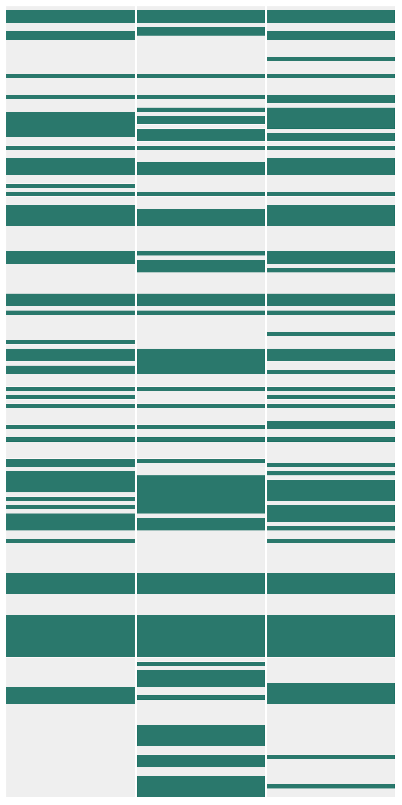

(a) 购物。

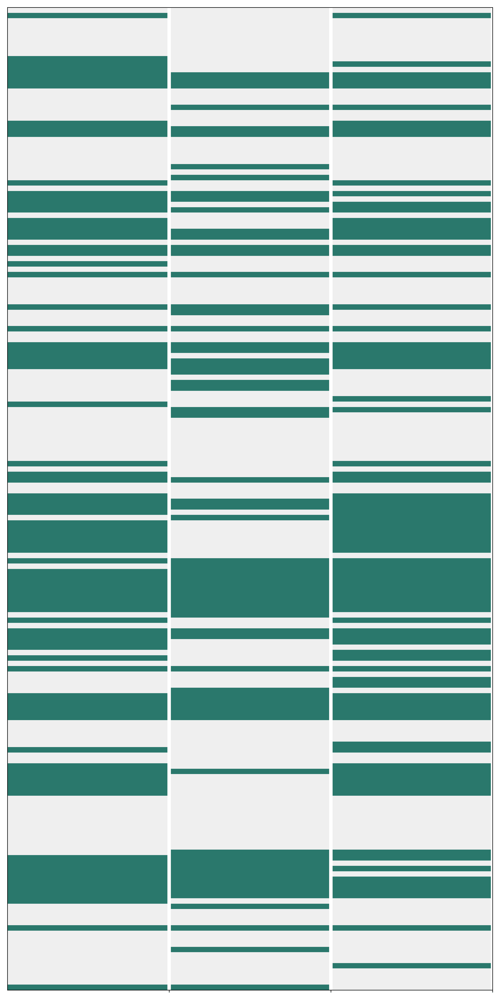

(b) 购物管理。

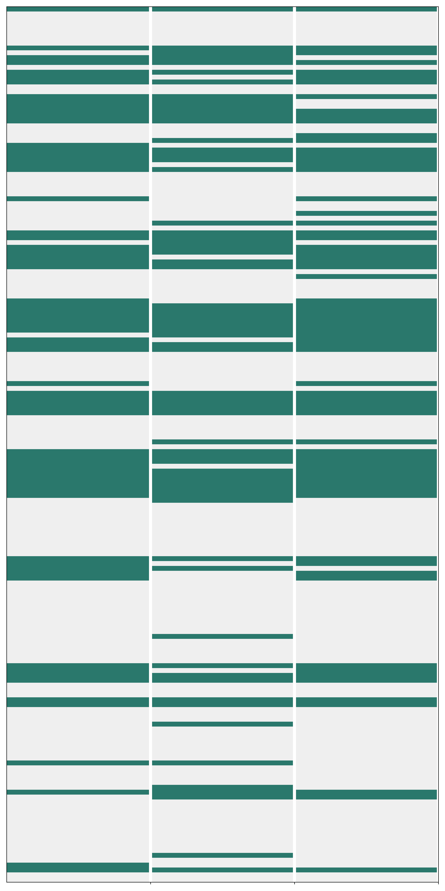

(c) GitLab。

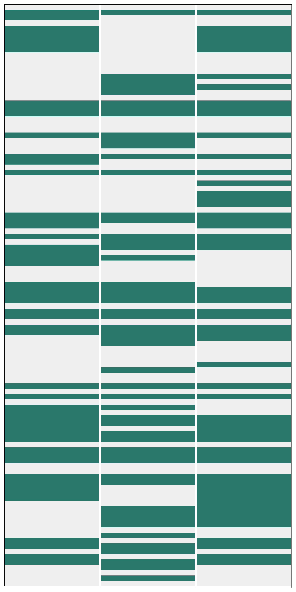

(d) 地图。

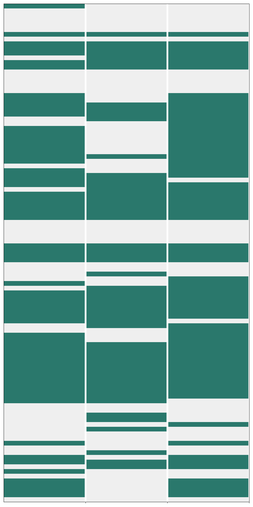

(e) Reddit。

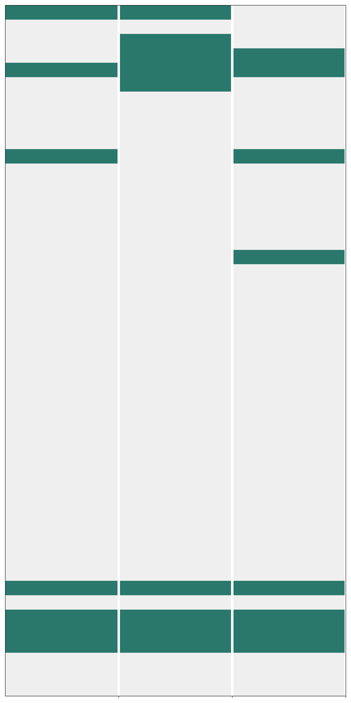

(f) 多站点。

图 6：AgentOccam（每个子图最左侧）、AgentOccam + SteP 和 AgentOccam + Judge（最右侧）在 WebArena 上不同站点的成功模式。y 轴表示任务 ID，绿色表示成功试验，灰色表示失败试验。值得注意的是，使用相同模板定义的任务被聚集在一起。

表 12：AgentOccam 在 WebArena 上的消融研究成功率（SR）。

| 代理 | 模型 | 成功率（SR，%） | 购物 | 购物管理 | GitLab | 地图 | Reddit | 多站点 |
| --- | --- | --- | --- | --- | --- | --- | --- | --- |
|  |  | (#812) | (#187) | (#182) | (#180) | (#109) | (#106) | (#48) |
| 原始模型 | GPT-4-Turbo | 16.5 | 16.6 | 15.9 | 10.0 | 22.9 | 21.7 | 16.7 |
| $\downarrow$ 行为 | GPT-4-Turbo | 25.9 | 23.5 | 23.6 | 24.4 | 34.9 | 33.0 | 12.5 |
| 上述 + X 滚动 | GPT-4-Turbo | 31.7 | 26.2 | 25.3 | 35.0 | 33.0 | 52.8 | 14.6 |
| 上述 + 观察选项 | GPT-4-Turbo | 37.1 | 35.8 | 37.4 | 26.7 | 45.0 | 57.5 | 16.7 |
| 上述 + 历史 | GPT-4-Turbo | 38.2 | 33.7 | 40.1 | 31.7 | 50.5 | 51.9 | 14.6 |
| AgentOccam | GPT-4-Turbo | 43.1 | 40.6 | 45.6 | 37.8 | 46.8 | 61.3 | 14.6 |

如图[6](https://arxiv.org/html/2410.13825v1#A3.F6 "图 6 ‣ 附录 C 额外实验细节 ‣ AgentOccam: 一个简单而强大的 LLM 基础 Web 代理")所示，结合 AgentOccam 和复合代理策略的代理展现出不同的行为成功模式。对于 AgentOccam + SteP，它在任务中受益于可以通过详细指令轻松引导代理的场景，如购物任务，表现出更多的成功（绿色）块，并且在使用相同模板定义的任务中成功率更高。然而，它在需要通用技能的任务中，如购物管理任务，以及在任务特定策略分散注意力的任务中，如 Reddit 任务，表现欠佳。相反，AgentOccam + Judge 代理与 AgentOccam 代理展现出相似的模式，不同之处在于部分成功块更加密集，这得益于通过行为生成和选择管道启用的行为修正。

此外，我们在表[12](https://arxiv.org/html/2410.13825v1#A3.T12 "表 12 ‣ 附录 C 额外实验细节 ‣ AgentOccam：一个简单而强大的基准模型，用于基于 LLM 的 Web 代理")中添加了消融研究的成功率数据，并在图[5](https://arxiv.org/html/2410.13825v1#S5.F5 "图 5 ‣ 问题 2：每个观察和动作空间的变化对 AgentOccam 的贡献有多大？ ‣ 5 实验结果与分析 ‣ AgentOccam：一个简单而强大的基准模型，用于基于 LLM 的 Web 代理")中进行了可视化展示。在开发过程中，我们略微修改了 AgentOccam 的提示，例如改进措辞或纠正提示中的拼写错误，这些修改不会影响提示的语义或添加任何额外信息，并反映在报告的轨迹日志中。由于一些失败的轨迹是由无效的交互引起的，我们改进了交互脚本，尽管不能做到完美，因为这超出了本文的范围，以下是代码的调整：

[⬇](data:text/plain;base64,IyBJbiBicm93c2VyX2Vudi5weQpkZWYgZXhlY3V0ZV9hY3Rpb24oCiAgICBhY3Rpb246IEFjdGlvbiwKICAgIHBhZ2U6IFBhZ2UsCiAgICBicm93c2VyX2N0eDogQnJvd3NlckNvbnRleHQsCiAgICBvYnNlcmF0aW9uX3Byb2Nlc3NvcjogT2JzZXJhdGlvblByb2Nlc3NvciwKKSAtPiBQYWdlOgoKICAgIG1hdGNoIGFjdGlvbl90eXBlOgogICAgICAgIC4uLgogICAgICAgIGNhc2UgQWN0aW9uVHlwZXMuQ0xJQ0s6CiAgICAgICAgICAgICMgY2hlY2sgZWFjaCBraW5kIG9mIGxvY2F0b3IgaW4gb3JkZXIKICAgICAgICAgICAgIyBUT0RPW3NodXlhbnpoXTogb3JkZXIgaXMgdGVtcCBub3cKICAgICAgICAgICAgaWYgYWN0aW9uWyJlbGVtZW50X2lkIl06CiAgICAgICAgICAgICAgICBub2RlID0gb2JzZXJhdGlvbl9wcm9jZXNzb3IuZ2V0X25vZGVfaW5mb19ieV9lbGVtZW50X2lkKGludChlbGVtZW50X2lkKSkKICAgICAgICAgICAgICAgICMgaWYgbm9kZSBhbmQgbm9kZS5yb2xlPT0ibWVudWl0ZW0iIGFuZCBub2RlLnBhcmVudCBhbmQgbm9kZS5wYXJlbnQucm9sZT09ImNvbWJvYm94IjoKICAgICAgICAgICAgICAgIGlmIG5vZGUgYW5kIChub2RlLnJvbGU9PSJtZW51aXRlbSIgb3Igbm9kZS5yb2xlPT0ib3B0aW9uIik6CiAgICAgICAgICAgICAgICAgICAgdHJ5OgogICAgICAgICAgICAgICAgICAgICAgICBwYWdlLmdldF9ieV9yb2xlKG5vZGUucm9sZSwgbmFtZT1ub2RlLm5hbWUsIGV4YWN0PVRydWUpLmNsaWNrKCkKICAgICAgICAgICAgICAgICAgICBleGNlcHQ6CiAgICAgICAgICAgICAgICAgICAgICAgIHRyeToKICAgICAgICAgICAgICAgICAgICAgICAgICAgIHBhZ2UuZ2V0X2J5X3JvbGUobm9kZS5yb2xlLCBuYW1lPW5vZGUubmFtZSkuY2xpY2soKQogICAgICAgICAgICAgICAgICAgICAgICBleGNlcHQ6CiAgICAgICAgICAgICAgICAgICAgICAgICAgICB0cnk6CiAgICAgICAgICAgICAgICAgICAgICAgICAgICAgICAgcGFnZS5nZXRfYnlfcm9sZShub2RlLnBhcmVudC5yb2xlLCBuYW1lPW5vZGUucGFyZW50Lm5hbWUsIGV4YWN0PVRydWUpLnNlbGVjdF9vcHRpb24obm9kZS5uYW1lKQogICAgICAgICAgICAgICAgICAgICAgICAgICAgZXhjZXB0OgogICAgICAgICAgICAgICAgICAgICAgICAgICAgICAgIHBhZ2UuZ2V0X2J5X3JvbGUobm9kZS5wYXJlbnQucm9sZSwgbmFtZT1ub2RlLnBhcmVudC5uYW1lKS5zZWxlY3Rfb3B0aW9uKG5vZGUubmFtZSkKICAgICAgICAgICAgICAgICMgZWxpZiBub3Qgb2JzZXJhdGlvbl9wcm9jZXNzb3IuZWxlbWVudF9pc192aXNpYmxlKHBhZ2UsIGVsZW1lbnRfaWQpOgogICAgICAgICAgICAgICAgZWxzZToKICAgICAgICAgICAgICAgICAgICB0cnk6CiAgICAgICAgICAgICAgICAgICAgICAgIHBhZ2UuZ2V0X2J5X3JvbGUobm9kZS5yb2xlLCBuYW1lPW5vZGUubmFtZSwgZXhhY3Q9VHJ1ZSkuY2xpY2soKQogICAgICAgICAgICAgICAgICAgIGV4Y2VwdCBFeGNlcHRpb24gYXMgZToKICAgICAgICAgICAgICAgICAgICAgICAgdHJ5OgogICAgICAgICAgICAgICAgICAgICAgICAgICAgIyBwcmludCgiQ2Fubm90IGNsaWNrIGJ5IGVsZW1lbnQgcm9sZSBhbmQgZXhhY3QgbmFtZS4iLCBlKQogICAgICAgICAgICAgICAgICAgICAgICAgICAgcGFnZS5nZXRfYnlfcm9sZShub2RlLnJvbGUsIG5hbWU9bm9kZS5uYW1lKS5jbGljaygpCiAgICAgICAgICAgICAgICAgICAgICAgIGV4Y2VwdCBFeGNlcHRpb24gYXMgZToKICAgICAgICAgICAgICAgICAgICAgICAgICAgICMgcHJpbnQoIkNhbm5vdCBjbGljayBieSBlbGVtZW50IHJvbGUgYW5kIGZ1enp5IG5hbWUuIiwgZSkKICAgICAgICAgICAgICAgICAgICAgICAgICAgIGVsZW1lbnRfaWQgPSBhY3Rpb25bImVsZW1lbnRfaWQiXQogICAgICAgICAgICAgICAgICAgICAgICAgICAgZWxlbWVudF9jZW50ZXIgPSBvYnNlcmF0aW9uX3Byb2Nlc3Nvci5nZXRfZWxlbWVudF9jZW50ZXIoZWxlbWVudF9pZCwgcGFnZSkgICMgdHlwZTogaWdub3JlW2F0dHItZGVmaW5lZF0KICAgICAgICAgICAgICAgICAgICAgICAgICAgIGV4ZWN1dGVfbW91c2VfY2xpY2soZWxlbWVudF9jZW50ZXJbMF0sIGVsZW1lbnRfY2VudGVyWzFdLCBwYWdlKQogICAgICAgICAgICBlbGlmIGFjdGlvblsiZWxlbWVudF9yb2xlIl0gYW5kIGFjdGlvblsiZWxlbWVudF9uYW1lIl06CiAgICAgICAgICAgICAgICBlbGVtZW50X3JvbGUgPSBpbnQoYWN0aW9uWyJlbGVtZW50X3JvbGUiXSkKICAgICAgICAgICAgICAgIGVsZW1lbnRfbmFtZSA9IGFjdGlvblsiZWxlbWVudF9uYW1lIl0KICAgICAgICAgICAgICAgIG50aCA9IGFjdGlvblsibnRoIl0KICAgICAgICAgICAgICAgIGV4ZWN1dGVfZm9jdXMoZWxlbWVudF9yb2xlLCBlbGVtZW50X25hbWUsIG50aCwgcGFnZSkKICAgICAgICAgICAgICAgIGV4ZWN1dGVfdHlwZShhY3Rpb25bInRleHQiXSwgcGFnZSkKICAgICAgICAgICAgZWxpZiBhY3Rpb25bInB3X2NvZGUiXToKICAgICAgICAgICAgICAgIHBhcnNlZF9jb2RlID0gcGFyc2VfcGxheXdyaWdodF9jb2RlKGFjdGlvblsicHdfY29kZSJdKQogICAgICAgICAgICAgICAgbG9jYXRvcl9jb2RlID0gcGFyc2VkX2NvZGVbOi0xXQogICAgICAgICAgICAgICAgdGV4dCA9IHBhcnNlZF9jb2RlWy0xXVsiYXJndW1lbnRzIl1bMF0KICAgICAgICAgICAgICAgICMgW3NodXlhbnpoXSwgZG9uJ3Qgc3VwcG9ydCBhY3Rpb24gYXJncyBhbmQga3dhcmdzIG5vdwogICAgICAgICAgICAgICAgZXhlY3V0ZV9wbGF5d3JpZ2h0X3R5cGUoCiAgICAgICAgICAgICAgICAgICAgdGV4

## 附录 D 代理提示

### D.1 代理欧卡姆

一般提示模板：

+   •

    有规划

[⬇](data:text/plain;base64,WW91IGFyZSBhbiBBSSBhc3Npc3RhbnQgcGVyZm9ybWluZyB0YXNrcyBvbiBhIHdlYiBicm93c2VyLiBZb3Ugd2lsbCBiZSBwcm92aWRlZCB3aXRoIHRhc2sgb2JqZWN0aXZlLCBjdXJyZW50IHN0ZXAsIHdlYiBwYWdlIG9ic2VydmF0aW9ucywgcHJldmlvdXMgcGxhbnMsIGFuZCBpbnRlcmFjdGlvbiBoaXN0b3J5LiBZb3UgbmVlZCB0byBpc3N1ZSBhY3Rpb24gZm9yIHRoaXMgc3RlcC4KCkdlbmVyYXRlIHRoZSByZXNwb25zZSBpbiB0aGUgZm9sbG93aW5nIGZvcm1hdDoKe291dHB1dF9zcGVjaWZpY2F0aW9uc30KCllvdSBhcmUgT05MWSBhbGxvd2VkIHRvIHVzZSB0aGUgZm9sbG93aW5nIGFjdGlvbiBjb21tYW5kcy4gU3RyaWN0bHkgYWRoZXJlcyB0byB0aGUgZ2l2ZW4gZm9ybWF0LiBPbmx5IGlzc3VlIG9uZSBzaW5nbGUgYWN0aW9uLgpJZiB5b3UgdGhpbmsgeW91IHNob3VsZCByZWZpbmUgdGhlIHBsYW4sIHVzZSB0aGUgZm9sbG93aW5nIGFjdGlvbnM6CntwbGFubmluZ19hY3Rpb25fc3BlY2lmaWNhdGlvbnN9Ck90aGVyd2lzZSwgdXNlIHRoZSBmb2xsb3dpbmcgYWN0aW9uczoKe25hdmlnYXRpb25fYWN0aW9uX3NwZWNpZmljYXRpb25zfQ==)您是一个在网页浏览器上执行任务的AI助手。您将获得任务目标、当前步骤、网页观察、之前的计划、以及交互历史。您需要为此步骤发布一个动作。生成的回应格式如下：{output_specifications}您仅能使用以下动作命令。严格按照给定格式进行操作。仅发布一个动作。如果您认为应当优化计划，请使用以下动作：{planning_action_specifications}否则，使用以下动作：{navigation_action_specifications}

+   •

    没有规划

[⬇](data:text/plain;base64,WW91IGFyZSBhbiBBSSBhc3Npc3RhbnQgcGVyZm9ybWluZyB0YXNrcyBvbiBhIHdlYiBicm93c2VyLiBZb3Ugd2lsbCBiZSBwcm92aWRlZCB3aXRoIHRhc2sgb2JqZWN0aXZlLCBjdXJyZW50IHN0ZXAsIHdlYiBwYWdlIG9ic2VydmF0aW9ucywgYW5kIG90aGVyIHJlbGV2YW50IGluZm9ybWF0aW9uLiBZb3UgbmVlZCB0byBpc3N1ZSBhY3Rpb24gZm9yIHRoaXMgc3RlcC4KCkdlbmVyYXRlIHRoZSByZXNwb25zZSBpbiB0aGUgZm9sbG93aW5nIGZvcm1hdDoKe291dHB1dF9zcGVjaWZpY2F0aW9uc30KCllvdSBhcmUgT05MWSBhbGxvd2VkIHRvIHVzZSB0aGUgZm9sbG93aW5nIGFjdGlvbiBjb21tYW5kcy4gU3RyaWN0bHkgYWRoZXJlcyB0byB0aGUgZ2l2ZW4gZm9ybWF0LiBPbmx5IGlzc3VlIG9uZSBzaW5nbGUgYWN0aW9uLgp7bmF2aWdhdGlvbl9hY3Rpb25fc3BlY2lmaWNhdGlvbnN9)您是一个在网页浏览器上执行任务的AI助手。您将获得任务目标、当前步骤、网页观察、以及其他相关信息。您需要为此步骤发布一个动作。生成的回应格式如下：{output_specifications}您仅能使用以下动作命令。严格按照给定格式进行操作。仅发布一个动作。{navigation_action_specifications}

输出规格：

[⬇](data:text/plain;base64,SW50ZXJhY3Rpb24gaGlzdG9yeSBzdW1tYXJ5OiBFbXBoYXNpemUgYWxsIGltcG9ydGFudCBkZXRhaWxzIGluIHRoZSBJTlRFUkFDVElPTiBISVNUT1JZIHNlY3Rpb24uCk9ic2VydmF0aW9uIGRlc2NyaXB0aW9uOiBEZXNjcmliZSBpbmZvcm1hdGlvbiBpbiB0aGUgQ1VSUkVOVCBPQlNFUlZBVElPTiBzZWN0aW9uLiBFbXBoYXNpemUgZWxlbWVudHMgYW5kIGZlYXR1cmVzIHRoYXQgYXJlIHJlbGV2YW50IG9yIHBvdGVudGlhbGx5IGhlbHBmdWwgZm9yIGZ1bGZpbGxpbmcgdGhlIG9iamVjdGl2ZSBpbiBkZXRhaWwuClJlYXNvbjogUHJvdmlkZSB5b3VyIHJhdGlvbmFsZSBmb3IgcHJvcG9zaW5nIHRoZSBzdWJzZXF1ZW50IGFjdGlvbiBjb21tYW5kcyBoZXJlLgpBY3Rpb246IFNlbGVjdCB5b3VyIGFjdGlvbiBoZXJlLgpPYnNlcnZhdGlvbiBIaWdobGlnaHQ6IExpc3QgdGhlIG51bWVyaWNhbCBpZHMgb2YgZWxlbWVudHMgb24gdGhlIGN1cnJlbnQgd2VicGFnZSBiYXNlZCBvbiB3aGljaCB5b3Ugd291bGQgaXNzdWUgeW91ciBhY3Rpb24uIEFsc28gaW5jbHVkZSBlbGVtZW50cyBvbiB0aGUgY3VycmVudCB3ZWJwYWdlIHlvdSB3b3VsZCBhdHRlbmQgdG8gaWYgeW91IGZhaWwgaW4gdGhlIGZ1dHVyZSBhbmQgaGF2ZSB0byByZXN0b3JlIHRvIHRoaXMgc3RlcC4gRG9uJ3QgaW5jbHVkZSBlbGVtZW50cyBmcm9tIHRoZSBwcmV2aW91cyBwYWdlcy4gU2VsZWN0IGVsZW1lbnRzIGF0IGEgaGlnaGVyIGhpZXJhcmNoaWNhbCBsZXZlbCBpZiBtb3N0IHRoZWlyIGNoaWxkcmVuIG5vZGVzIGFyZSBjb25zaWRlcmVkIGNydWNpYWwuIFNvcnQgYnkgcmVsZXZhbmNlIGFuZCBwb3RlbnRpYWwgdmFsdWVzIGZyb20gaGlnaCB0byBsb3csIGFuZCBzZXBhcmF0ZSB0aGUgaWRzIHdpdGggY29tbWFzLiBFLmcuLCBgMTMyMSwgNTIsIDc1NiwgODM4Jy4=)互动历史总结：强调在**互动历史**部分的所有重要细节。观察描述：描述在**当前观察**部分的信息。强调那些与实现目标相关或可能有帮助的元素和特征，并详细说明。理由：提供你提出后续行动指令的理由。行动：在此选择你的行动。观察重点：列出基于当前网页上你会执行行动的元素的数字id。同时，包括当前网页上如果未来失败并需要恢复到此步骤时你会关注的元素。不要包括前面页面的元素。如果它们的大多数子节点被认为至关重要，则选择更高层次的元素。按相关性和潜在价值从高到低排序，并用逗号分隔id。例如：‘1321, 52, 756, 838’

行动空间规范：

+   •

    规划行动规范

[⬇](data:text/plain;base64,YnJhbmNoIFtwYXJlbnRfcGxhbl9pZF0gW25ld19zdWJwbGFuX2ludGVudF06IFRvIGNyZWF0ZSBhIG5ldyBzdWJwbGFuIGJhc2VkIG9uIFBSRVZJT1VTIFBMQU5TLiBFbnN1cmUgdGhlIG5ldyBzdWJwbGFucyBjY29ubmVjdGVkIHRvIHRoZSBhYXBwcm9wcmlhdGUgcGFyZW50IHBsYW4gYnkgdXNpbmcgaXRzIElELiBFLmcuLCBgYnJhbmNoIFsxMl0gW05hdmlnYXRlIHRvIHRoZSBgSXNzdWUiIHBhZ2UgdG8gY2hlY2sgYWxsIHRoZSBpc3N1ZXMuXScKcHJ1bmUgW3Jlc3VtZV9wbGFuX2lkXSBbcmVhc29uXTogVG8gcmV0dXJuIHRvIGEgcHJldmlvdXMgcGxhbiBzdGF0ZSB3aGVuIHRoZSBjdXJyZW50IHBsYW4gaXMgZGVlbWVkIGltcHJhY3RpY2FsLiBFbnRlciB0aGUgSUQgb2YgdGhlIHBsYW4gc3RhdGUgeW91IHdhbnQgdG8gcmVzdW1lLiBFLmcuLCBgcHJ1bmUgWzVdIFtUaGUgY3VycmVudCBwYWdlIGxhY2tzIGl0ZW1zIGBibGFjayBzcGVha2VyLCcgcHJvbXB0aW5nIGEgcmV0dXJuIHRvIHRoZSBpbml0aWFsIHBhZ2UgdG8gcmVzdGFydCB0aGUgaXRlbSBzZWFyY2guXSc=)分支  [parent_plan_id]  [new_subplan_intent]:  创建一个新的子计划，基于之前的计划。确保新子计划通过使用其ID与相应的父计划连接。例如，‘分支  [12]  [导航到“问题”页面以查看所有问题]’修剪  [resume_plan_id]  [reason]:  当当前计划被认为不可行时，返回到先前的计划状态。输入你想恢复的计划状态ID。例如，‘修剪  [5]  [当前页面缺少“黑色扬声器”项目，导致返回到初始页面重新开始项目搜索]’

+   •

    导航操作规范

[⬇](data:text/plain;base64,Y2xpY2sgW2lkXTogVG8gY2xpY2sgb24gYW4gZWxlbWVudCB3aXRoIGl0cyBudW1lcmljYWwgSUQgb24gdGhlIHdlYnBhZ2UuIEUuZy4sIGBjbGljayBbN10nIElmIGNsaWNraW5nIG9uIGEgc3BlY2lmaWMgZWxlbWVudCBkb2Vzbid0IHRyaWdnZXIgdGhlIHRyYW5zaXRpb24gdG8geW91ciBkZXNpcmVkIHdlYiBzdGF0ZSwgdGhpcyBpcyBkdWUgdG8gdGhlIGVsZW1lbnQncyBsYWNrIG9mIGludGVyYWN0aXZpdHkgb3IgR1VJIHZpc2liaWxpdHkuIEluIHN1Y2ggY2FzZXMsIG1vdmUgb24gdG8gaW50ZXJhY3Qgd2l0aCBPVEhFUiBzaW1pbGFyIG9yIHJlbGV2YW50IGVsZW1lbnRzIElOU1RFQUQuCnR5cGUgW2lkXSBbY29udGVudF0gW3ByZXNzX2VudGVyX2FmdGVyPTB8MV06IFRvIHR5cGUgY29udGVudCBpbnRvIGEgZmllbGQgd2l0aCBhIHNwZWNpZmljIElELiBCeSBkZWZhdWx0LCB0aGUgYEVudGVyJyBrZXkgaXMgcHJlc3NlZCBhZnRlciB0eXBpbmcgdW5sZXNzIGBwcmVzc19lbnRlcl9hZnRlcicgaXMgc2V0IHRvIDAuIEUuZy4sIGB0eXBlIFsxNV0gW0Nhcm5lZ2llIE1lbGxvbiBVbml2ZXJzaXR5XSBbMV0nIElmIHlvdSBjYW4ndCBmaW5kIHdoYXQgeW91J3JlIGxvb2tpbmcgZm9yIG9uIHlvdXIgZmlyc3QgYXR0ZW1wdCwgY29uc2lkZXIgcmVmaW5pbmcgeW91ciBzZWFyY2gga2V5d29yZHMgYnkgYnJlYWtpbmcgdGhlbSBkb3duIG9yIHRyeWluZyByZWxhdGVkIHRlcm1zLgpnb19iYWNrOiBUbyByZXR1cm4gdG8gdGhlIHByZXZpb3VzbHkgdmlld2VkIHBhZ2UuCm5vdGUgW2NvbnRlbnRdOiBUbyB0YWtlIG5vdGUgb2YgYWxsIGltcG9ydGFudCBpbmZvIHcuci50LiBjb21wbGV0aW5nIHRoZSB0YXNrIHRvIGVuYWJsZSByZXZpZXdpbmcgaXQgbGF0ZXIuIEUuZy4sIGBub3RlIFtTcGVudCAkMTAgb24gNC8xLzIwMjRdJwpzdG9wIFthbnN3ZXJdOiBUbyBzdG9wIGludGVyYWN0aW9uIGFuZCByZXR1cm4gcmVzcG9uc2UuIFByZXNlbnQgeW91ciBhbnN3ZXIgd2l0aGluIHRoZSBicmFja2V0cy4gSWYgdGhlIHRhc2sgZG9lc24ndCByZXF1aXJlIGEgdGV4dHVhbCBhbnN3ZXIgb3IgYXBwZWFycyBpbnN1cm1vdW50YWJsZSwgaW5kaWNhdGUgYE4vQScgYW5kIGFkZGl0aW9uYWwgcmVhc29ucyBhbmQgYWxsIHJlbGV2YW50IGluZm9ybWF0aW9uIHlvdSBnYXRoZXIgYXMgdGhlIGFuc3dlci4gRS5nLiwgYHN0b3AgWzVoIDQ3bWluXScKZ29faG9tZTogVG8gcmV0dXJuIHRvIHRoZSBob21lcGFnZSB3aGVyZSB5b3UgY2FuIGZpbmQgb3RoZXIgd2Vic2l0ZXMu)点击  [id]:  在网页上点击带有其数字 ID 的元素。例如，‘点击 [7]’ 如果点击特定元素未能触发所需的网页状态转换，可能是因为该元素缺乏互动性或 GUI 可见性。在这种情况下，请继续与其他类似或相关的元素进行交互。类型 [id] [content] [press_enter_after=0|1]:  在带有特定 ID 的字段中输入内容。默认情况下，键入后会按下‘Enter’键，除非‘press_enter_after’ 设置为 0。例如，‘类型 [15] [Carnegie Mellon University] [1]’ 如果你第一次尝试时未能找到所需内容，考虑通过拆解搜索关键词或尝试相关词汇来优化搜索。go_back: 返回到之前查看的页面.note  [content]:  记下与完成任务相关的所有重要信息，以便稍后查看。例如，‘记下 [2024年4月1日花费10美元]’stop  [answer]:  停止交互并返回响应。将你的回答放在括号内。如果任务不需要文字回答或显得无法完成，请填写‘N/A’并附上相关理由和所有收集到的信息作为答案。例如，‘停止 [5小时47分钟]’go_home: 返回首页，在那里你可以找到其他网站。

观察空间示例：

[⬇](data:text/plain;base64,ICAgIFJvb3RXZWJBcmVhIFsxXSAnRGFzaGJvYXJkIC8gTWFnZW50byBBZG1pbicKICAgICAgICBsaW5rIFsxNzhdICdNYWdlbnRvIEFkbWluIFBhbmVsJwogICAgICAgIG1lbnViYXIgWzg1XQogICAgICAgICAgICAgICAgbGluayBbODddICdEQVNIQk9BUkQnCiAgICAgICAgICAgICAgICBsaW5rIFs5MF0gJ1NBTEVTJwogICAgICAgICAgICAgICAgbGluayBbOTZdICdDQVRBTE9HJwogICAgICAgICAgICAgICAgbGluayBbMTAyXSAnQ1VTVE9NRVJTJwogICAgICAgICAgICAgICAgbGluayBbMTA4XSAnTUFSS0VUSU5HJwogICAgICAgICAgICAgICAgbGluayBbMTE0XS ‘Q09OVEVOVCcKICAgICAgICAgICAgICAgIGxpbmsgWzEyMF0gJ1JFUE9SVFMnCiAgICAgICAgICAgICAgICBsaW5rIFsxMzhdICdTVE9SRVMnCiAgICAgICAgICAgICAgICBsaW5rIFsxNDRd 'displaystyle rex-

### D.2 在 AgentOccam + Judge 实验中使用的判断标准

一般提示模板：

[⬇](data:text/plain;base64,WW91IGFyZSBhIHNlYXNvbmVkIHdlYiBuYXZpZ2F0b3IuIFlvdSBub3cgYXNzZXNzIHRoZSB2YWx1ZSBhbmQgcmlzayBvZiBzZXJ2ZXJhbCB3ZWIgbmF2aWdhdGlvbiBhY3Rpb25zIGJhc2VkIG9uIHRoZSBvYmplY3RpdmUsIHRoZSBwcmV2aW91cyBpbnRlcmFjdGlvbiBoaXN0b3J5IGFuZCB0aGUgd2ViJ3MgY3VycmVudCBzdGF0ZS4gVGhlbiwgeW91IHNlbGVjdCB0aGUgYWN0aW9uIHdpdGggdGhlIG1vc3QgdmFsdWUgYW5kIGxlYXN0IHJpc2sgd2l0aCB3aGljaCB5b3Ugd291bGQgZWFybiB0aGUgbWF4aW11bSBvYmplY3RpdmUgZnVsZmlsbG1lbnQgcmV3YXJkIGluIHRoZSBmdXR1cmUuCgpBZGhlcmUgdG8gdGhlIGZvbGxvd2luZyBvdXRwdXQgZm9ybWF0Ogp7b3V0cHV0X3NwZWNpZmljYXRpb25zfQoKTm90ZSB0aGF0IGBicmFuY2gnIGFuZCBgcHJ1bmUnIGFyZSBwbGFubmluZyBhY3Rpb25zIHRoYXQgd2lsbCBtb2RpZnkgdGhlIFBSRVZJT1VTIFBMQU4gc2VjdGlvbiBhbmQgd29uJ3QgaW50ZXJhY3Qgd2l0aCB0aGUgd2ViIGVudmlyb25tZW50Lg==)你是一个经验丰富的网页浏览者。你现在根据目标、之前的互动历史和网页当前状态评估多个网页导航操作的价值和风险。然后，你选择最有价值且风险最小的操作，以期在未来获得最大的目标达成奖励。

输出规范：

[⬇](data:text/plain;base64,UGxhbiBwcm9ncmVzcyBhc3Nlc3NtZW50OiBSZXZpZXcgY3JpdGljYWxseSB3aHkgdGhlIHBsYW5zIGhhdmUgbm90IGJlZW4gZnVsZmlsbGVkIG9yIHRoZSBvYmplY3RpdmUgYWNoaWV2ZWQuIEp1c3RpZnkgeW91ciBhc3Nlc3NtZW50IHdpdGggZGV0YWlsZWQgZXZpZGVuY2UgZHJhd24gZnJvbSB0aGUgb2JqZWN0aXZlLCBvYnNlcnZhdGlvbnMsIGFuZCBhY3Rpb25zIHRha2VuLiBJdGVtaXplIHRoZSBhc3Nlc3NtZW50IHVzaW5nIHRoaXMgZm9ybWF0OiBgLSBwbGFuIFt7cGxhbl9pZH1dXG5cdFt7c3RlcF9pZHNfdGFrZW5fZm9yX3RoaXNfbWlsZXN0b25lfV0gW3tjb25jcmV0ZV9wcm9vZl9mcm9tX29ic2VydmF0aW9ufV0gW3t3aHlfbWlsZXN0b25lX2Ffbm90X3N1Y2Nlc3NmdWx9XVxuXHRbe3N0ZXBfaWRzX3Rha2VuX2Zvcl90aGlzX21pbGVzdG9uZX1dIFt7Y29uY3JldGVfcHJvb2ZfZnJvbV9vYnNlcnZhdGlvbn1dIFt7d2h5X21pbGVzdG9uZV9iX25vdF9zdWNjZXNzZnVsfV1cblx0Li4uJy4KQWN0aW9uIGFzc2Vzc21lbnQ6IEFzc2VzcyB0aGUgdmFsdWUgYW5kIHJpc2sgb2YgZWFjaCBhY3Rpb24uIENvbnNpZGVyIGJvdGggdGhlIGJlc3QtY2FzZSBhbmQgd29yc3QtY2FzZSBvdXRjb21lcyByZXN1bHQgaW5nIGZyb20gaXQgaW1wbGVtZW50YXRpb24uIEl0ZW1pemUgdGhlIGFzc2Vzc21lbnQgdXNpbmcgdGhpcyBmb3JtYXQ6IGAtIGFjdGlvbiBbYWN0aW9uX2lkXTogW2FjdGlvbiB2YWx1ZSwgaW5jbHVkaW5nIGJ1dCBub3QgbGltaXRlZCB0byB3aGF0IG91dGNvbWVzIHlvdSBjYW4gZXhwZWN0IGJ5IGV4ZWN1dGluZyB0aGUgYWN0aW9uLCBvciB3aGV0aGVyIHRoZSBub3RlIGlzIG9mIHRoZSBtb3N0IGNvcnJlY3QgYW5kIGNvbXByZWhlbnNpdmUgY29udGVudF0gW2FjdGlvbiByaXNrLCBpbmNsdWRpbmcgYnV0IG5vdCBsaW1pdGVkIHRvIHdoZXRoZXIgdGhlIG5vdGUvc3RvcCBjb250ZW50IGlzIGNvcnJlY3QsIGFuZCB3aGV0aGVyIHlvdSBjYW4gZ2F0aGVyIG1vcmUgaW5mb3JtYXRpb24gYnkgY29udGludWluZyBwbGF5aW5nIHJhdGhlciB0aGFuIGVuZGluZyB0aGUgdHJpYWxdIFt7YmVzdF9jYXNlfV0gW3t3b3JzdF9jYXNlfV0nLgpBY3Rpb24gc2VsZWN0aW9uOiBMaXN0IHRoZSBudW1lcmljYWwgaWQgb2YgeW91ciBzZWxlY3RlZCBhY3Rpb24gaGVyZS4gWW91IGNhbiBvbmx5IGNob29zZSBvbmUgYWN0aW9uLiBFLmcuLCBgMScu)计划进度评估：批判性地审查为什么计划未能完成或目标未达成。使用从目标、观察和已采取的行动中提取的详细证据为你的评估提供正当理由。使用以下格式列出评估：‘- 计划 [{plan_id}]\n\t[{step_ids_taken_for_this_milestone}]  [{concrete_proof_from_observation}]  [{why_milestone_a_not_successful}]\n\t[{step_ids_taken_for_this_milestone}]  [{concrete_proof_from_observation}]  [{why_milestone_b_not_successful}]\n\t…’行动评估：评估每个行动的价值和风险。考虑实施该行动可能带来的最佳和最差结果。使用以下格式列出评估：‘- 行动 [action_id]:  [行动价值，包括但不限于通过执行该行动可以预期的结果，或该备注是否为最正确和最全面的内容]  [行动风险，包括但不限于备注/停止内容是否正确，以及是否可以通过继续进行而非结束试验来获取更多信息]  [{最佳情况}]  [{最差情况}]’行动选择：在此列出您选择的行动的数字ID。您只能选择一个行动。例：‘1’。
