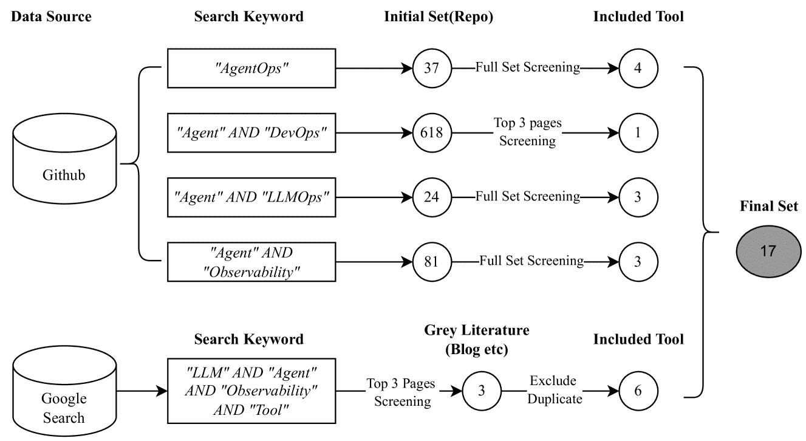
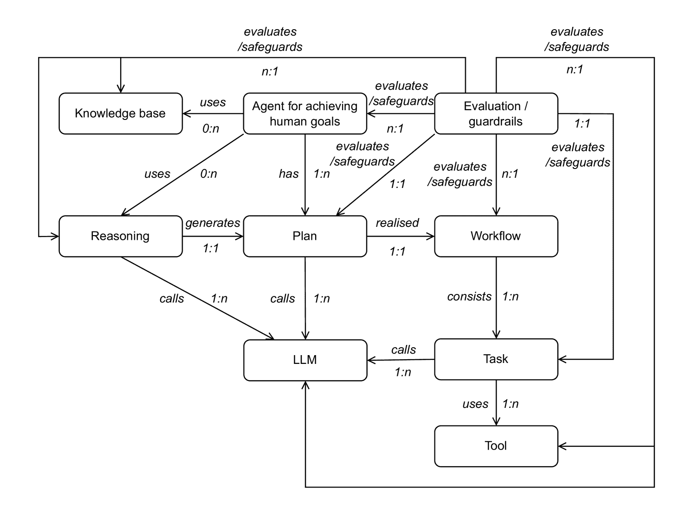
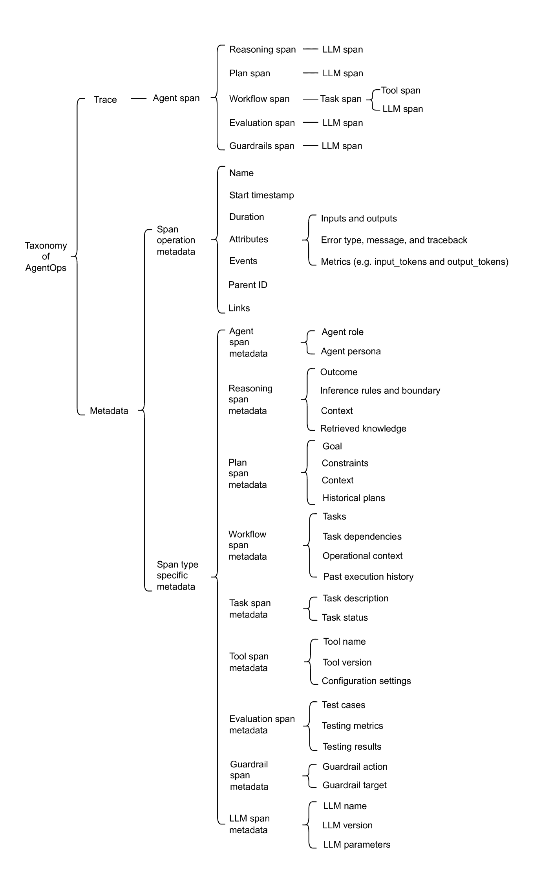

<!--yml

分类：未分类

日期：2025-01-11 11:58:19

-->

# AgentOps: 启用LLM代理的可观察性

> 来源：[https://arxiv.org/html/2411.05285/](https://arxiv.org/html/2411.05285/)

\useunderLiming Dong, Qinghua Lu, Liming Zhu

Data61, CSIRO, 澳大利亚（2024年11月）

###### 摘要

大型语言模型（LLM）代理在多个领域展示了显著的能力，获得了学术界和工业界的广泛关注。然而，由于其自主和非确定性的行为以及持续演化的特性，这些代理引发了关于人工智能安全的重大担忧。从DevOps的角度来看，确保代理可观察性是确保人工智能安全的必要条件，因为相关方可以深入了解代理的内部工作，帮助他们主动理解代理、检测异常并防止潜在故障。因此，在本文中，我们提出了一个全面的AgentOps分类法，识别了整个代理生命周期中应追踪的工件和相关数据，以实现有效的可观察性。该分类法是基于对现有AgentOps工具的系统化映射研究开发的。我们的分类法作为开发者设计和实施支持监控、日志记录和分析的AgentOps基础设施的参考模板，从而确保人工智能安全。

## 1 引言

大型语言模型（LLM）是一个具有数百亿参数的大规模语言模型，预先训练在广泛且多样化的数据集上，并应用于各种下游任务[[1](https://arxiv.org/html/2411.05285v2#bib.bib1)]。虽然LLM展示了令人印象深刻的能力，但它们在理解和执行复杂任务方面也表现出一定的局限性。这促使了对LLM代理（包括那些采用代理式设计模式，通过多次提示LLM并展现不同程度代理行为的系统）的需求不断增加，这些代理能够自主处理复杂任务[[2](https://arxiv.org/html/2411.05285v2#bib.bib2)]。

LLM代理是由LLM驱动的自主系统，能够感知上下文、推理、规划、执行工作流，并利用外部工具、知识库及其他代理实现人类目标[[3](https://arxiv.org/html/2411.05285v2#bib.bib3)]。LLM代理展现出显著的潜力，能够提升多个领域的生产力，吸引了学术界和工业界的广泛关注。例如，许多代理已在软件工程领域成功应用，如Devin ¹¹1Devin, [https://www.cognition.ai/blog/introducing-devin](https://www.cognition.ai/blog/introducing-devin)，ChatDev ²²2ChatDev, [https://github.com/OpenBMB/ChatDev](https://github.com/OpenBMB/ChatDev)，SWE-agent ³³3SWE-agent, [https://github.com/princeton-nlp/SWE-agent](https://github.com/princeton-nlp/SWE-agent)。在本文中，我们将“代理”一词专门用于指代LLM代理。

尽管LLM代理具有巨大的提高生产力的潜力，但由于其固有特性，采用LLM代理也带来了独特的挑战。

+   •

    复杂的工件和管道：这些代理是复合型AI系统，将LLM与各种组件（即设计时工件）集成在一起，如上下文引擎和外部工具，并动态生成运行时工件，如目标和计划。操作管道通常包括上下文处理、推理和规划、工作流执行以及基于反馈的持续演化。在这些过程中，管道可能会利用外部工具、知识库和其他代理来实现人类目标。

+   •

    自主性：这些代理以高度自主的方式运行，动态地与外部环境互动，包括变化的上下文、外部知识库和工具。这些互动并非预定的，这可能增加非预期行为的风险（例如选择存在漏洞问题的外部工具），并带来严重的AI安全挑战[[4](https://arxiv.org/html/2411.05285v2#bib.bib4)]。

+   •

    非确定性行为：由于LLM的概率性质，这些代理往往表现出非确定性行为，即使输入相同，输出也可能不同。这种缺乏可重复性的问题可能导致非预期的后果，使得确保一致和可预测的结果变得具有挑战性。

+   •

    持续演化：这些代理可以通过持续学习随着时间的推移不断进化，根据运行时评估结果或人类反馈进行适应。尽管这种适应性提升了代理的能力和技能，但它也带来了进一步的挑战，在代理的生命周期中保持与预定质量和安全目标的一致性。

+   •

    共同责任：代理的行为或决策的责任通常由多个利益相关方共同承担，包括代理的所有者、FM提供者以及各种外部工具/代理的提供者。这使得在事件发生时识别故障源和分配责任变得更加复杂。

为了解决上述挑战，DevOps工具必须支持可观察性功能，使利益相关者能够监控代理行为、跟踪工件的状态、记录相关数据、检测异常、追踪工件的演变，并在发生事件时分配责任。可观察性是指通过分析不同组件（即设计时工件）的输入和输出（即运行时工件），从而获得有关代理内部工作原理的可操作洞察力，因为它们在操作管道中流动[[5](https://arxiv.org/html/2411.05285v2#bib.bib5)]。然而，大多数现有的针对代理的DevOps工具主要关注LLM特定的度量和提示管理，对于代理特定的工件（如目标、计划和工具）的可观察性支持有限。这一局限性导致了从系统和管道角度看，观察性不足。

为了弥补这一空白，我们提出了AgentOps，一种为代理定制的专用DevOps范式。AgentOps提供了代理操作的全面视图，通过系统地追踪代理工件及其相关数据，实现了全面的可观察性。在本文中，我们对现有的用于监控代理和/或代理系统的DevOps工具进行了系统的映射研究，以了解它们的特点和局限性。根据研究结果，我们首先提出了一个工件关系模型，以识别关键的代理工件及其关系。然后，我们展示了AgentOps的全面分类法，详细描述了应当追踪的工件和相关数据。我们的分类法为开发人员设计和实施AgentOps工具，以支持代理的监控、日志记录和分析，提供了参考模板。

本文其余部分的组织结构如下。第[2](https://arxiv.org/html/2411.05285v2#S2 "2 Methodology ‣ AgentOps: Enabling Observability of LLM Agents")节介绍了方法论。第[3](https://arxiv.org/html/2411.05285v2#S3 "3 Mapping Study Result ‣ AgentOps: Enabling Observability of LLM Agents")节展示了AgentOps工具和核心特性的映射研究结果。第[4](https://arxiv.org/html/2411.05285v2#S4 "4 Taxonomy of AgentOps ‣ AgentOps: Enabling Observability of LLM Agents")节识别了代理工件及其关系，并展示了AgentOps的分类法。第[5](https://arxiv.org/html/2411.05285v2#S5 "5 Threats to Validity ‣ AgentOps: Enabling Observability of LLM Agents")节讨论了有效性威胁，第[6](https://arxiv.org/html/2411.05285v2#S6 "6 Conclusion ‣ AgentOps: Enabling Observability of LLM Agents")节总结了论文并概述了未来的工作。

## 2 方法论

本节介绍了本研究的方法论。图[1](https://arxiv.org/html/2411.05285v2#S2.F1 "图 1 ‣ 2 方法论 ‣ AgentOps: 使 LLM 代理的可观察性成为可能")提供了搜索过程的概述。按照[[6](https://arxiv.org/html/2411.05285v2#bib.bib6), [7](https://arxiv.org/html/2411.05285v2#bib.bib7)]中概述的指南，我们进行了系统的映射研究，以分析与 AgentOps 相关的现有工具。本研究旨在了解这些工具的功能和局限性，并确定应该追踪的代理工件及其相关数据，以实现可观察性。

图 1：AgentOps 相关工具的搜索过程

### 2.1 数据来源

为了识别与 AgentOps 相关的工具，我们使用了多个来源。最初，我们在 GitHub⁴⁴4GitHub.[https://github.com](https://github.com)上进行了全面的搜索，使用精心选择的关键词。然后，基于预定义的选择标准对仓库进行了筛选，以确保其相关性和质量。为了补充 GitHub 搜索并弥补可能的空白，我们进行了有针对性的 Google 搜索⁵⁵5Google Search.[https://google.com](https://google.com)，以捕获那些在 GitHub 搜索结果中可能未显示或不可用的额外工具。通过这种多来源的方法，确保了对开源和专有的 AgentOps 相关工具的广泛覆盖。

### 2.2 搜索字符串

我们在 GitHub 上使用的搜索关键词主要集中在关键词*((“AgentOps”) 或者 (“Agent” 和 “DevOps”) 或者 (“Agent” 和 “LLMOps”))*。由于 AgentOps 的概念以及相关工具的探索仍处于初期阶段，我们扩展了搜索范围，纳入了能够全面了解 LLM 应用程序的可观察性工具，必须包括代理追踪和可观察性特性。因此，我们还加入了搜索词*(“Agent” 和 “Observability”)*。在 Google 搜索中使用的搜索关键词是*(“LLM” 和 “Agent” 和 “Observability” 和 “Tool”)*。

表 1：选择标准

| ID | 纳入标准 |
| --- | --- |
| $I1$ | 支持可观察性特性（如监控和追踪）。 |
| $I2$ | 支持特定于代理的追踪或可应用于代理的 LLM 应用程序追踪，而不仅仅是 LLM 级别的追踪。 |
| $I3$ | 正式发布版本。 |
| $I4$ | 提供公开的在线文档。 |

### 2.3 选择标准

我们从上述多个渠道的数据源中进行工具选择。对于本论文，我们专注于符合表 1 所示标准的 AgentOps 相关工具。为了确保对代理性能和交互的强大跟踪与管理，所选工具必须支持核心可观察性功能（$I1$），如监控、追踪等。此外，由于我们的研究重点是 AgentOps，而非一般的 LLMOps 或模型级操作，因此工具必须支持在代理级别或 LLM 应用级别的追踪（$I2$），从而使我们能够观察到代理特定行为的细粒度理解。为了促进工具的实施和社区广泛采用，工具必须具有正式发布版本（$I3$）并且具有可访问和公开的在线文档（$I4$）。

### 2.4 搜索过程

我们首先通过四个特定的关键词字符串查询 GitHub，分别是 *“AgentOps”*、*“Agent” AND “DevOps”*、*“Agent” AND “LLMOps”* 和 *“Agent” AND “Observability”*。每个查询返回了一组初步的仓库。对于查询字符串 *("AgentOps")* 或 *("Agent" AND "LLMOps")* 或 *("Agent" AND "Observability")*，我们分别获得了37个、24个和81个初步仓库。所有这些仓库都经过筛选，以确保相关性，最终纳入了4个、3个和3个工具进行进一步分析。

对于 *("Agent" AND "DevOps")* 查询，搜索结果显示了更大的 618 个仓库集。为了管理这一结果，我们将筛选范围限制在前三页，并根据相关性和流行度对仓库进行了排序。然而，这些项目大多数集中在用于 DevOps 任务的代理，而不是用于管理代理的 DevOps 平台。因此，从这个查询中仅包括了一款额外的工具。

为了确保全面覆盖并解决 GitHub 搜索中的潜在遗漏，我们进行了额外的 Google 搜索，以捕获专有工具。我们使用了关键词字符串 *("LLM" AND "Agent" AND "Observability" AND "Tool")*，并筛选了前三页的搜索结果。此次搜索的目标是相关的博客、产品公告以及其他在线资源。去除重复和不相关的结果后，最终确定了六款额外的工具。

通过在 GitHub 和 Google 搜索引擎上的联合搜索，最终确定了17款工具。这一最终工具集为我们对 AgentOps 相关工具的功能和局限性进行系统分析奠定了基础。

### 2.5 数据提取

为了更好地了解当前 AgentOps 工具的全貌，我们系统地对17款精选工具进行了分类和总结。从每个工具的 GitHub 仓库、官方产品网站以及可用的项目文档中提取了相关数据项。具体提取的数据项在表 [2](https://arxiv.org/html/2411.05285v2#S2.T2 "Table 2 ‣ 2.5 Data Extraction ‣ 2 Methodology ‣ AgentOps: Enabling Observability of LLM Agents") 中列出。

表 2：数据提取

| ID | 数据项 | 描述 |
| --- | --- | --- |
| $D1$ | 名称 | 与 AgentOps 相关的工具名称。 |
| $D2$ | 来源 | 用于识别所包含工具的数据来源。 |
| $D3$ | Github 仓库 URL | 包含工具的 Github 仓库 URL。 |
| $D4$ | 星标数 | 在 Github 上收到的星标数（作为受欢迎程度的代理）。 |
| $D5$ | 领域 | 工具的领域，具体来说是它是否为追踪代理或 LLM 应用设计的。 |
| $D6$ | 主要特性 | 工具为 AgentOps 或 LLM 应用可观察性提供的主要特性。 |
| $D7$ | 可追踪工件 | 工具跟踪的工件及相关数据。 |

## 3 映射研究结果

在本节中，我们展示了与 AgentOps 相关工具的系统映射研究结果。

表 3：与 AgentOps 相关的工具列表

| 名称 | 来源 | Github 仓库 URL | 星标数 | 领域 |
| --- | --- | --- | --- | --- |
| Agenta | Github | Agenta-AI/agenta | 1.3k | LLM 应用 |
| AgentNeo | Github | raga-ai-hubAgentNeo | 1k | 代理 |
| AgentOps | Github | AgentOps-AI/agentops | 2.1k | 代理 |
| AGIFlow | Github | AgiFlow/agiflow-sdks | 21 | 代理 |
| Arize | Google | Arize-Phoenix | 3.9k | LLM 应用 |
| DataDog | Github | DataDog/datadog-agent | 2.9k | 代理 |
| Dify | Github | langgenius/dify | 51.6k | LLM 应用 |
| Helicone | Github | Helicone/helicone | 1.9k | LLM 应用 |
| Laminar | Github | lmnr-ai/lmnr | 1.1k | LLM 应用 |
| Langfuse | Github | langfuse/langfuse | 6.5k | LLM 应用 |
| LangSmith | Github | langchain-ai/langsmith-sdk | 417 | LLM 应用 |
| LangTrace | Github | Scale3-Labs/langtrace | 552 | LLM 应用 |
| Lunary | Google | lunary-ai/lunary | 1.1k | LLM 应用 |
| PortKey | Google | Portkey-AI/gateway | 6.3k | LLM 应用 |
| TraceLoop | Google | traceloop/openllmetry | 3.4k | LLM 应用 |
| Trulens | Google | truera/trulens | 2.2k | LLM 应用 |

### 3.1 与 AgentOps 相关的工具

本研究包括了与 AgentOps 相关的17种多样化工具，旨在启用智能体或 LLM 应用的可观察性。表格 [3](https://arxiv.org/html/2411.05285v2#S3.T3 "表格 3 ‣ 3 映射研究结果 ‣ AgentOps：启用 LLM 智能体的可观察性") 突出了目前市场上可用的 AgentOps 相关工具。对 GitHub 星标排名的分析显示，许多这些工具已经获得了显著关注，其中17个工具中有14个累积了数千个星标。截至2024年11月，一些工具在各自的类别中脱颖而出，如 AgentOps（1.7k 星标）和 AgentNeo（1k 星标）。在针对 LLM 应用的工具中，Langfuse（6.5k 星标）、PortKey（6.3k 星标）和 Arize（3.9k 星标）、TraceLoop（3.4k 星标）以及 DataDog（2.9k 星标）是领先的解决方案。值得注意的是，由于关键词不匹配或文档不完整，一些工具可能被无意中排除。我们旨在通过监控新兴工具并将其纳入未来的工作中来解决这一局限性。

表格 4：AgentOps 相关工具的主要特性

| 工具 | 自定义 | 提示管理 | 评估 | 反馈 | 监控 | 跟踪 | 防护 |
| --- | --- | --- | --- | --- | --- | --- | --- |
| Agenta | 是 | 是 | 是 | 是 | 是 | 是 | 否 |
| AgentNeo | 是 | 否 | 是 | 否 | 是 | 是 | 否 |
| AgentOps | 是 | 是 | 是 | 是 | 是 | 是 | 是 |
| AGIFlow | 是 | 是 | 是 | 否 | 是 | 是 | 否 |
| Arize | 否 | 否 | 是 | 否 | 是 | 是 | 是 |
| Datadog | 否 | 否 | 否 | 否 | 是 | 是 | 否 |
| Dify | 是 | 是 | 是 | 是 | 是 | 是 | 是 |
| Helicone | 否 | 否 | 是 | 否 | 是 | 是 | 否 |
| Langfuse | 否 | 是 | 是 | 是 | 是 | 是 | 否 |
| LangTrace | 否 | 否 | 是 | 否 | 是 | 是 | 否 |
| LangSmith | 否 | 是 | 是 | 是 | 是 | 是 | 是 |
| Lunary | 否 | 是 | 是 | 是 | 是 | 是 | 是 |
| TraceLoop | 否 | 否 | 否 | 否 | 是 | 是 | 否 |
| Trulens | 否 | 是 | 是 | 是 | 是 | 是 | 是 |
| Portkey | 否 | 否 | 是 | 否 | 是 | 是 | 否 |

### 3.2 主要特性

我们总结了已识别的 AgentOps 相关工具的主要特性，如表格 [4](https://arxiv.org/html/2411.05285v2#S3.T4 "表格 4 ‣ 3.1 AgentOps 相关工具 ‣ 3 映射研究结果 ‣ AgentOps：启用 LLM 智能体的可观察性") 和表格 [5](https://arxiv.org/html/2411.05285v2#S3.T5 "表格 5 ‣ 3.2 主要特性 ‣ 3 映射研究结果 ‣ AgentOps：启用 LLM 智能体的可观察性") 中展示。

表格 5：AgentOps 相关工具的主要特性

| 分类 | 特性 | 描述 |
| --- | --- | --- |
| 自定义 | 提供、定制、生成和部署自主智能体 | 创建可定制和可扩展的自主智能体。 |
|  | 扩展智能体能力与工具包 | 将市场中的工具包添加到智能体工作流中。 |
|  | 扩展智能体能力与多个向量数据库 | 连接多个向量数据库以提升智能体性能。 |
|  | 使用微调模型扩展代理功能 | 针对特定业务场景的自定义微调模型。 |
| 提示管理 | 提示版本控制和管理 | 跟踪代理中使用的不同版本的提示。这对 A/B 测试和优化代理性能非常有用。 |
|  | 带模型比较的提示沙箱 | 在部署前测试并比较不同的提示和模型。 |
|  | 提示注入检测 | 识别潜在的代码注入和秘密泄露。 |
| 评估 | 根据基准和排行榜测试代理。 | 创建数据集，定义度量标准，进行评估，比较结果，跟踪结果随时间的变化等。 |
|  | 评估代理的多个步骤 | 评估最终响应——评估代理的最终回应。 |
|  |  | 评估单个步骤——独立评估任何代理步骤（例如，是否选择了合适的工具）。 |
|  |  | 评估轨迹——评估代理是否沿预期路径（例如工具调用）到达最终答案。 |
| 反馈 | 收集显性反馈 | 直接提示用户提供反馈，可以是点赞或点踩。 |
|  | 收集隐性反馈 | 测量用户的行为，例如在页面上花费的时间、点击率等。 |
| 监控 | 代理分析仪表板 | 监控有关代理的各类统计指标，包括不同层级和维度的指标。 |
|  | LLM 成本管理与追踪 | 与基础模型提供商一起追踪开销（令牌成本）。 |
| 跟踪 | LLM/代理跟踪 | 跟踪每个代理跨度，例如整个链条、检索、LLM 调用、工具调用等。 |
|  |  | 跟踪评估跨度 |
|  |  | 跟踪用户反馈 |
| 防护措施 | 预定义规则和约束 | 设置规则或约束，限制代理的行为，确保安全和可预测的操作。 |
|  | 后备和升级路径 | 在模糊或高风险情境中提供安全的默认设置，或将问题重定向至人工操作员。 |

#### 3.2.1 自定义

在创建代理时，现有工具通过将市场上的工具包添加到代理工作流程中，连接多个知识库以提高性能，并整合定制的微调模型以应对特定业务用例，从而扩展了代理功能。

#### 3.2.2 提示管理

提示版本控制和管理允许开发者存储和追踪不同版本的提示，使其在各个阶段的代理生产中不可或缺，特别是对于测试、优化和重用提示。提示沙箱使开发者能够编辑、导入和测试不同的提示模板与模型，帮助在部署前比较性能。此外，持续监控提示也对保持代理的可靠性和安全性至关重要，特别是在检测和减轻如代码注入攻击和提示中的秘密泄露等问题时。

#### 3.2.3 评估

评估是根据特定标准或一般基准评估智能体行为和能力的过程。典型的评估过程包括创建合适的评估数据集，定义明确的标准和指标，并根据这些预定义的指标进行全面测试。测试智能体的性能时，必须对照用户需求、标准排行榜或可比系统进行评估。对于智能体来说，评估不仅仅是评估最终输出。监控和跟踪智能体的执行步骤，评估中间输出同样重要，以确保整个过程符合预期目标并与治理要求对齐。

LangSmith⁶⁶6LangSmith.[https://docs.smith.langchain.com/evaluation](https://docs.smith.langchain.com/evaluation)引入了智能体评估的两个额外维度：1) 步骤评估：评估智能体在孤立情况下采取的每个步骤，例如判断它是否选择了合适的工具。2) 轨迹评估：检查智能体是否遵循了预期的行动顺序，包括一系列工具调用，以得出最终答案。这确保了决策过程是合理的，而不仅仅是结果。

#### 3.2.4 反馈

人类反馈在评估智能体输出质量中起着关键作用。反馈以评分的形式收集，并附加到执行轨迹或单个LLM生成中。反馈也可以用于重新训练/微调LLM或改善智能体的设计（例如，存储在记忆中或作为正面或负面示例用于提示）。Langfuse⁷⁷7Langfuse.[https://langfuse.com/docs/scores/user-feedback](https://langfuse.com/docs/scores/user-feedback)定义了可以收集的不同类型的反馈，这些反馈在质量、细节和数量上有所不同：1) 显式反馈：直接提示用户提供反馈，可以是评分、点赞、点踩、量表或评论。尽管实现简单，但反馈的质量和数量通常较低。预计会有更结构化和更细致的反馈。2) 隐式反馈：衡量用户行为，例如在页面上停留的时间、点击率、接受或拒绝最终输出。这种类型的反馈较难实现，但通常更频繁且更可靠。

#### 3.2.5 监控

开发者可以通过密切跟踪智能体的输出，持续监控其性能并增强可观测性。这涉及跟踪监控指标（例如延迟和成本），将反馈与智能体跨度关联以评估性能，并通过深入分析发生错误的特定跟踪和跨度来调试问题。监控还帮助识别意外结果、错误或延迟问题的根本原因，使开发者能够根据实时反馈优化性能。

#### 3.2.6 跟踪

AgentOps旨在支持开发者从原型到生产环境的过渡，确保在代理创建和初步测试通过后，工作不会停止。在otool中，代理执行越来越复杂的任务和迭代运行，例如链、工具辅助代理和高级提示。通过添加追踪，AgentOps捕获了整个过程——从用户发送提示到最终输出——帮助开发者理解每个步骤并找出任何问题的根本原因。执行追踪允许开发者逐步跟踪代理的决策过程，提供对行动、决策和互动流程的洞察。这有助于识别错误或意外行为的来源，使得在复杂的代理工作流中更容易隔离和解决问题。毫无疑问，追踪是实现AgentOps平台可观察性的最直接方式。表格[3](https://arxiv.org/html/2411.05285v2#S3.T3 "Table 3 ‣ 3 Mapping Study Result ‣ AgentOps: Enabling Observability of LLM Agents")中列出的所有工具都实现了追踪功能。

#### 3.2.7 防护措施

代理应用的防护措施对于确保AI安全设计至关重要。Arize已经集成了Arize Guards⁸⁸8Arize Guards。[https://docs.arize.com/arize/llm-monitoring-and-guardrails/guardrails](https://docs.arize.com/arize/llm-monitoring-and-guardrails/guardrails)。此外，越来越多的工具（例如AgentNeo⁹⁹9AgentNeo。[https://github.com/raga-ai-hub/agentneo](https://github.com/raga-ai-hub/agentneo)）在其计划功能列表中也有防护措施的实现，旨在提高代理的安全性。AgentOps工具可以追踪防护措施的激活、执行过程及结果，这些可以用于生成安全案例以供审计之用。

## 4 AgentOps分类法

图2：代理工件的实体关系模型

一旦代理开发者部署了他们的代理，他们需要追踪其执行过程，以监控代理的性能和工件的演变。AgentOps工具提供了追踪功能，帮助排查性能问题并关联产品中的数据，使开发者能够发现并解决代理中的问题。

在本节中，我们首先介绍了一个实体关系模型，用于描述不同代理工件之间的各种关系。然后，我们呈现了AgentOps的全面分类法，它作为开发者设计和实现AgentOps工具以追踪代理工件及其相关数据的模板。

### 4.1 代理工件的实体关系模型

为了阐明可追踪工件之间的关系，图[2](https://arxiv.org/html/2411.05285v2#S4.F2 "Figure 2 ‣ 4 Taxonomy of AgentOps ‣ AgentOps: Enabling Observability of LLM Agents")展示了代理追踪中嵌套跨度之间的联系。

当一个代理接收到用户目标时，它可以利用零个或多个知识库来收集信息或支持决策。这些知识库为代理跨度提供了必要的数据和上下文信息。单一的推理跨度生成一个计划，通过逻辑过程和分析来构建。

一个代理可以生成多个计划跨度，每个跨度代表一个结构化的计划，用于实现特定目标。代理依赖这些计划来组织和协调其任务。每个计划跨度可能调用一个或多个LLM跨度，以利用LLM的处理能力，帮助执行计划中的操作。一个计划通过单一工作流得以实现，将战略计划转化为实际执行。

一个工作流由多个任务组成，每个任务代表工作流中的一个特定操作。这些任务共同实现工作流中概述的目标。每个任务可能使用一个或多个工具，提供额外的功能或资源，帮助任务执行。任务还可以调用一个或多个LLM跨度，以访问基于模型的功能，如预测或分析，这对于任务的完成至关重要。

评估跨度评估特定代理、计划或单一工作流，确保代理的整体性能或工作流的有效性与预定目标一致。安全守卫监控代理生命周期中的所有其他跨度，执行约束并确保遵守预定义规则。这一通用连接有助于保持代理在所有跨度中的行为安全。

图3：AgentOps的分类

### 4.2 AgentOps的分类

在AgentOps中，一条追踪揭示了从用户提交目标请求到最终结果交付的整个过程。这包括推理过程、生成的计划、工作流及其相关任务、检索的知识、调用的工具、应用的评估和安全守卫，以及多个LLM调用。

一条追踪由一个或多个跨度组成。第一个跨度代表根跨度。每个根跨度代表从开始到结束的请求。父级下的跨度提供了请求过程中发生的更深层次的上下文，详细说明构成请求的步骤。

一个跨度可能包含以下元数据属性：

+   •

    名称：跨度的标签或标识符，表示正在执行的操作类型。

+   •

    开始时间戳：跨度开始的确切时间，为跟踪和性能分析提供时间背景。

+   •

    持续时间：跨度操作所需的总时间，从开始到结束进行测量。此指标有助于分析效率并识别潜在的性能瓶颈。

+   •

    属性：

    +   –

        输入和输出：输入到跨度的数据（例如，用户目标）和产生的输出（例如，工具调用结果或最终结果）。

    +   –

        错误类型、消息和回溯：有关遇到的任何错误的信息，包括错误类型、描述性消息和用于调试的回溯细节。

    +   –

        指标：与跨度相关的定量数据，例如输入令牌、输出令牌、评估指标、监控指标，用于衡量和跟踪成本使用情况和代理的性能。

+   •

    事件：每个跨度内的具体事件或详细的行动与过渡时间线，提供关于跨度活动或生命周期中任何显著事件的详细见解。

+   •

    父级ID：一个标识符，将该跨度与其父级跨度关联，建立跨度之间的层次关系，帮助跟踪嵌套操作。

+   •

    链接：与其他跨度或外部参考的连接，有助于理解复杂工作流中不同跨度之间的依赖关系和相互关系。

在代理跨度的上下文中，一个追踪由一系列嵌套跨度组成，表示不同的操作跨度或执行过程，每种类型的跨度在代理跨度中扮演着独特的角色。代理跨度包括以下嵌套跨度：

+   •

    代理跨度：代理跨度元数据包括代理的角色和个性，这对代理执行任务、与用户互动以及做出决策的方式有重要影响。代理跨度元数据包括以下内容：

    +   –

        代理角色：代理的范围或职责。

    +   –

        代理个性：代理采取的行为特征和互动风格。

+   •

    推理跨度：推理跨度捕捉代理的推理过程。推理跨度元数据包括：

    +   –

        上下文：为推理过程提供的相关信息或情境数据。可能包括来自先前跨度的输入或影响代理推理的外部因素。

    +   –

        检索知识：代理在推理过程中检索和引用的信息或数据，可能来自外部来源或记忆，以支持其推理。

    +   –

        推理规则与边界：推理过程中应用的逻辑规则、约束或边界。这可能包括在特定条件下代理执行推理的具体指南或条件。

    +   –

        结果：推理过程后生成的想法或得出的结论。

+   •

    计划跨度：计划跨度记录了计划阶段，在该阶段，代理概述了实现目标所需的步骤或目标。它定义了预期的操作顺序，为代理的活动设定了结构化路径。计划跨度元数据包括：

    +   –

        目标：代理通过此计划旨在实现的具体目标或期望结果。

    +   –

        约束：计划必须遵守的限制或约束。这些约束可能包括时间限制、资源限制或形塑计划过程的预定义规则。

    +   –

        上下文：为计划提供相关的情境或环境信息。

    +   –

        历史计划：可能影响当前计划过程的过去计划记录。包括在类似背景下采取的过去策略或行动，这些可以为当前计划提供有价值的见解或最佳实践。

+   •

    工作流跨度：在工作流跨度中，跟踪记录了任务跨度和工具跨度的组织结构。工作流跨度由LLM跨度支持，详细说明了如何拆解和管理各个任务。任务跨度代表工作流中的具体操作，而工具跨度（嵌套在任务跨度内）记录了代理为完成工作流中的特定部分而与工具或外部资源的交互。

    工作流跨度的元数据包括以下内容：

    +   –

        任务：作为工作流一部分需要完成的任务跨度列表。此列表定义了代理在此跨度内需要执行的具体操作或步骤。

    +   –

        任务依赖：关于任务之间依赖关系的信息，指示任务应按何种顺序执行或执行特定任务所需的前提条件。这有助于管理任务的顺序，并确保任务以合乎逻辑和高效的方式执行。

    +   –

        操作环境：与执行工作流相关的情境信息或环境细节。可以包括实时条件、来自其他跨度的状态更新或可能影响任务执行的外部因素。

    +   –

        过去执行历史：在（长期）记忆模块中记录的以往相似工作流或任务的执行记录，这些可以为当前工作流提供最佳实践、潜在问题或优化机会的见解。

+   •

    任务跨度：任务跨度代表工作流中的一个离散工作单元或操作。它是工作流结构的基本组成部分，定义了代理需要按顺序或并行执行的各个任务。任务跨度的元数据包括：

    +   –

        任务描述：执行任务的具体信息，包括任务目标、指令以及执行所需的参数。

    +   –

        任务状态：任务的当前状态（例如，待处理、进行中、已完成）及任务结果，其中可能包括成功、失败或任务生成的特定输出。

+   •

    工具跨度：工具跨度代表与外部工具或资源的交互，这些工具或资源有助于任务的执行。此跨度记录了代理使用的工具的详细信息，包括其配置、响应和任何中间输出。工具跨度的元数据包括：

    +   –

        工具名称：工具的名称。

    +   –

        工具版本：工具的版本。

    +   –

        配置设置：在使用工具过程中为其配置的参数或设置，如版本限制、输入格式、超时或可能影响工具行为的资源限制。

+   •

    评估跨度：评估跨度评估代理的行为和输出的正确性及质量，与预定义标准的性能进行对比。它验证代理的行为是否符合预期或质量标准，并提供反馈机制，以确保输出符合预期目标。

    评估跨度的元数据包括以下内容：

    +   –

        测试用例：评估代理表现或输出的特定场景或条件。这些用例为评估代理的行为和结果提供了结构化的方式，以与预期行为对比[[8](https://arxiv.org/html/2411.05285v2#bib.bib8)]。

    +   –

        测试指标：用于评估代理表现的定量或定性度量标准。这些指标可以包括准确性、效率、相关性或定义代理输出质量的其他标准。

    +   –

        测试结果：评估过程中的实际结果或发现，表明代理的表现与测试用例和指标中定义的预期标准的符合程度。

+   •

    护栏跨度：护栏跨度定义了应用的护栏，以确保代理的操作与预期的治理要求对齐[[9](https://arxiv.org/html/2411.05285v2#bib.bib9)]。它通过为代理的行为设定边界，帮助防止错误或不当行为。护栏跨度元数据包括：

    +   –

        护栏动作：触发的护栏动作，如阻止、验证、过滤等。

    +   –

        护栏目标：应用护栏的特定代理工件，如目标和工具。

+   •

    LLM跨度：LLM跨度捕捉与LLM的互动，其中模型处理基于语言的输入以生成回应或见解。这个跨度对于涉及自然语言理解、生成或解释的任务至关重要。LLM跨度元数据可能包括：

    +   –

        LLM名称：LLM的名称。

    +   –

        LLM版本：LLM的版本。

    +   –

        LLM参数：应用于LLM的设置，如温度（影响随机性）、max_tokens（限制回应长度）以及其他形状输出的相关超参数。

## 5种有效性威胁

工具选择限制：由于各种工具和人工智能平台的快速传播，可能并非所有相关的AgentOps工具都已被识别。为了应对这一限制，我们从多个数据源中选择了工具。所识别的工具包括开源的AgentOps工具，如AgentOps和Langfuse，以及商业观察平台，如Datadog。

数据覆盖限制：本研究提供的关于 AgentOps 生命周期中可追溯工件的综合概述，可能未涵盖与 AI 智能体相关的所有可能数据属性。为了确保覆盖智能体整个生命周期中的重要可追溯数据，并丰富我们论文中列出的数据属性，我们还参考了一些相关的学术文献 [[10](https://arxiv.org/html/2411.05285v2#bib.bib10)，[9](https://arxiv.org/html/2411.05285v2#bib.bib9)，[11](https://arxiv.org/html/2411.05285v2#bib.bib11)] 来支持我们的发现。然而，一些潜在有价值的数据，如不同步骤之间的追踪链接和交互，可能被遗漏。未来的研究将着重于进一步探索这些空白。

## 6 结论

本文提出了 AgentOps，这是一个专门为大语言模型（LLM）智能体量身定制的 DevOps 范式，旨在实现可观察性。通过对现有 AgentOps 相关工具的系统化映射研究，我们首先提出了一个实体-关系模型，以理解关键智能体工件及其关系。随后，我们展示了 AgentOps 的全面分类法，为开发人员设计和实现 AgentOps 工具提供了结构化模板。未来的研究将重点通过实际案例研究验证所提出的分类法，并开发 AgentOps 工具原型。

## 参考文献

+   [1] R. Bommasani, D. A. Hudson, E. Adeli, R. Altman, S. Arora, S. von Arx, M. S. Bernstein, J. Bohg, A. Bosselut, E. Brunskill *等*，“关于基础模型的机遇与风险，”*arXiv 预印本 arXiv:2108.07258*，2021年。

+   [2] Y. Liu, S. K. Lo, Q. Lu, L. Zhu, D. Zhao, X. Xu, S. Harrer, 和 J. Whittle, “智能体设计模式目录：基础模型智能体的架构模式集，”2024年。[在线]。可用链接：[https://arxiv.org/abs/2405.10467](https://arxiv.org/abs/2405.10467)

+   [3] Q. Lu, L. Zhu, X. Xu, Z. Xing, S. Harrer, 和 J. Whittle, “走向负责任的生成式 AI：设计基于基础模型的智能体的参考架构，”发表于 *2024 IEEE 第21届国际软件架构会议（ICSA-C）*。IEEE，2024，第119–126页。

+   [4] Q. Lu, L. Zhu, J. Whittle, X. Xu *等*，*负责任的 AI：创建可信 AI 系统的最佳实践*。Addison-Wesley，2023。

+   [5] L. Bass, Q. Lu, I. Weber, 和 L. Zhu, *工程化 AI 系统：架构与 DevOps 基础*. Addison-Wesley，2025。

+   [6] B. Kitchenham 和 S. Charters, “在软件工程中执行系统文献综述的指南版本 2.3，”软件工程组，计算机科学与数学学院，基尔大学与达勒姆大学计算机科学系，技术报告，2007年。

+   [7] V. Garousi, M. Felderer, 和 M. V. Mäntylä, “在软件工程中纳入灰色文献和进行多声部文献综述的指南”， *Inf. Softw. Technol.*，第 106 卷，第 101-121 页，2019。 [在线]。可用链接：[https://doi.org/10.1016/j.infsof.2018.09.006](https://doi.org/10.1016/j.infsof.2018.09.006)

+   [8] B. Xia, Q. Lu, L. Zhu, Z. Xing, D. Zhao, 和 H. Zhang, “一种以评估为驱动的 LLM 代理设计方法：过程与架构”，2024。 [在线]。可用链接：[https://arxiv.org/abs/2411.13768](https://arxiv.org/abs/2411.13768)

+   [9] M. Shamsujjoha, Q. Lu, D. Zhao, 和 L. Zhu, “为基础模型代理设计多层次的运行时保护措施：基于设计的 AI 安全瑞士奶酪模型”，2024。 [在线]。可用链接：[https://arxiv.org/abs/2408.02205](https://arxiv.org/abs/2408.02205)

+   [10] S. Schulhoff, M. Ilie, N. Balepur, K. Kahadze, A. Liu, C. Si, Y. Li, A. Gupta, H. Han, S. Schulhoff, P. S. Dulepet, S. Vidyadhara, D. Ki, S. Agrawal, C. Pham, G. Kroiz, F. Li, H. Tao, A. Srivastava, H. D. Costa, S. Gupta, M. L. Rogers, I. Goncearenco, G. Sarli, I. Galynker, D. Peskoff, M. Carpuat, J. White, S. Anadkat, A. Hoyle, 和 P. Resnik, “The prompt report: A systematic survey of prompting techniques,” 2024。 [在线]。可用链接：[https://arxiv.org/abs/2406.06608](https://arxiv.org/abs/2406.06608)

+   [11] A. Chan, C. Ezell, M. Kaufmann, K. Wei, L. Hammond, H. Bradley, E. Bluemke, N. Rajkumar, D. Krueger, N. Kolt *等*， “AI 代理的可见性”，载于 *2024 年 ACM 公平性、问责性和透明度会议*，2024，第 958–973 页。
