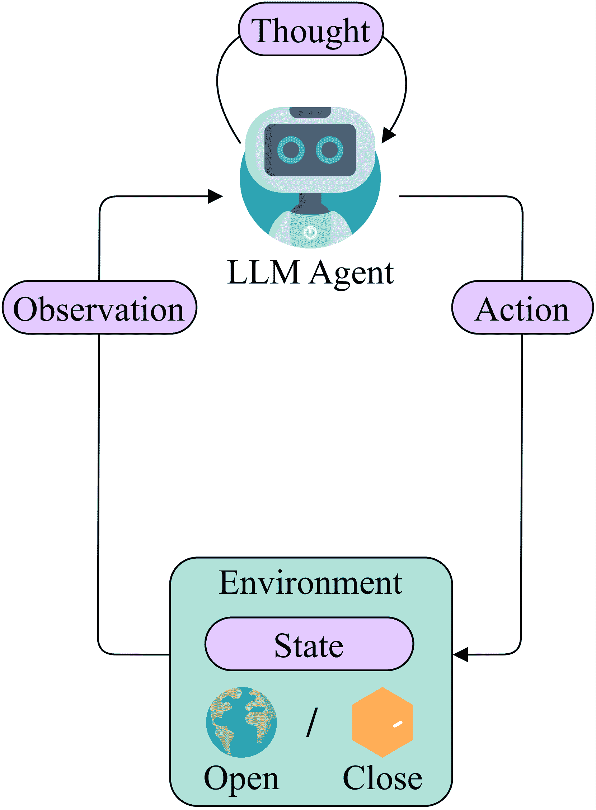
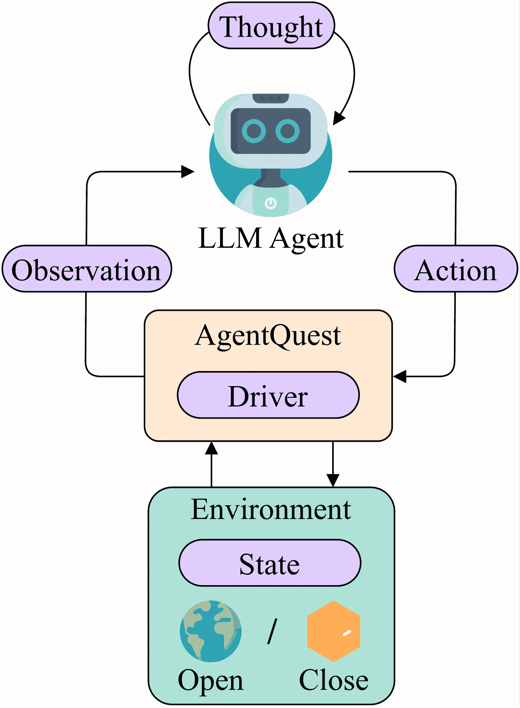
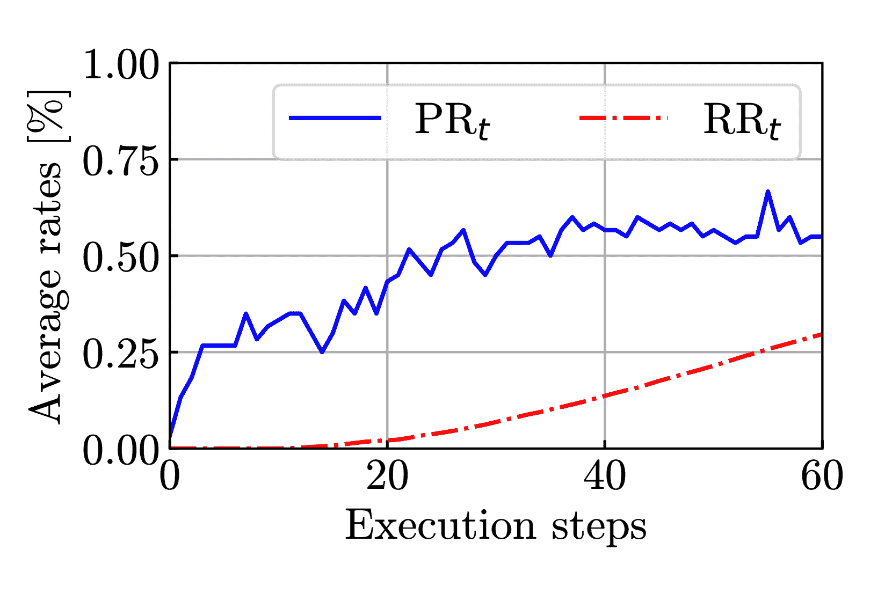
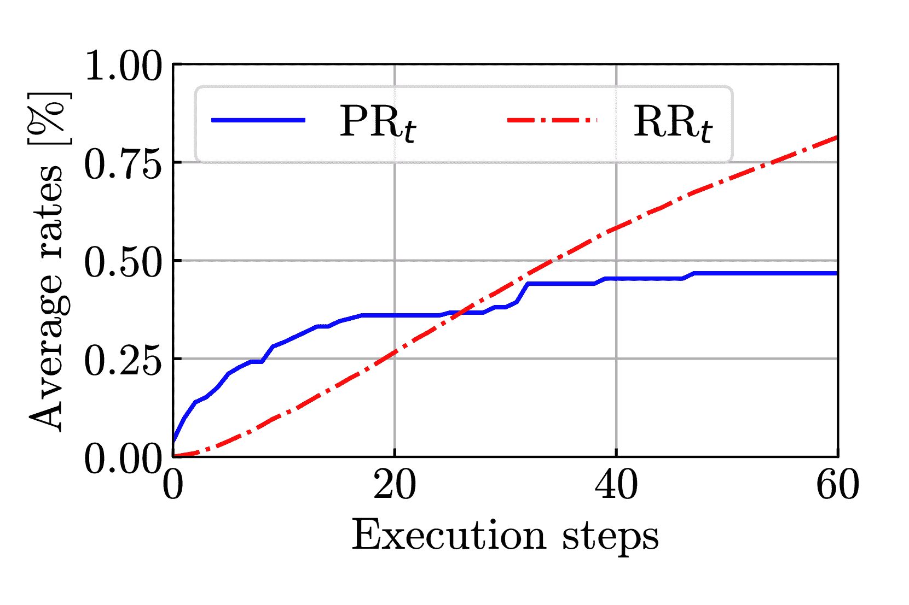
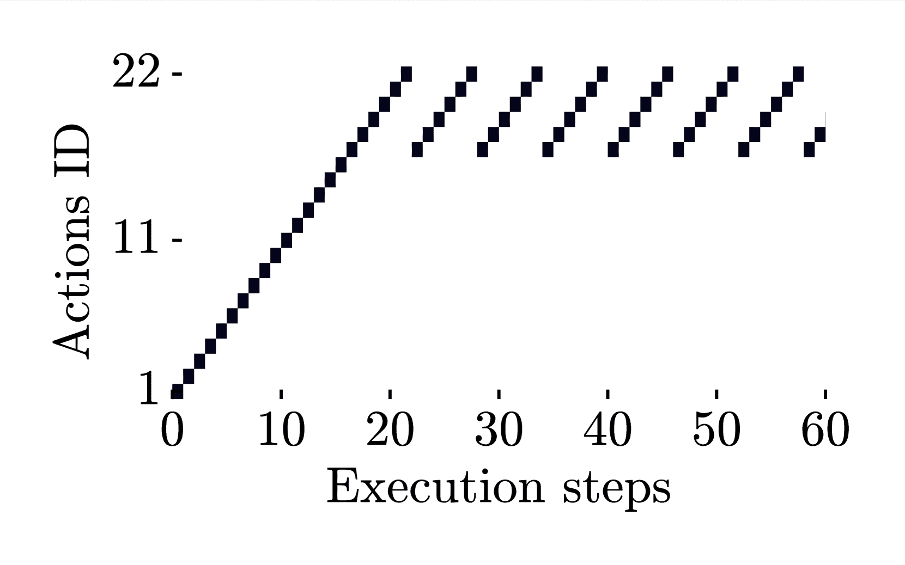
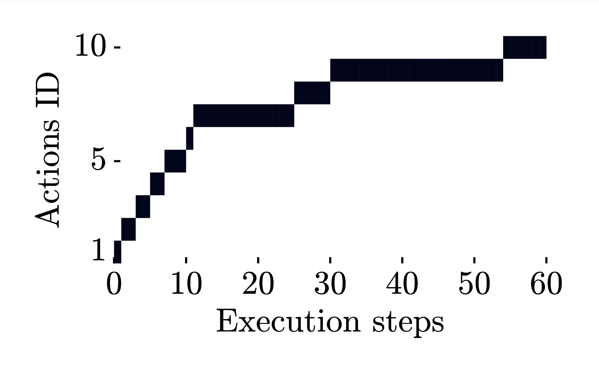
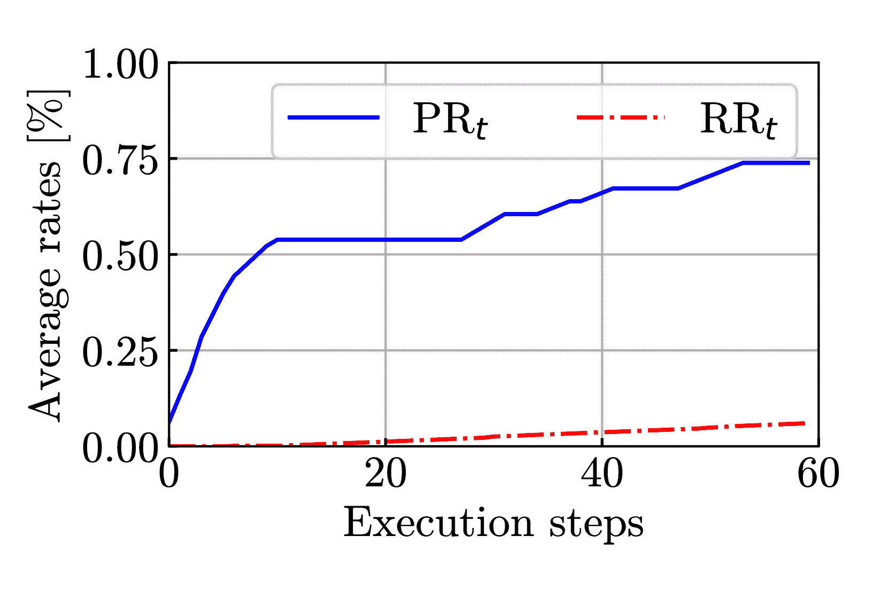
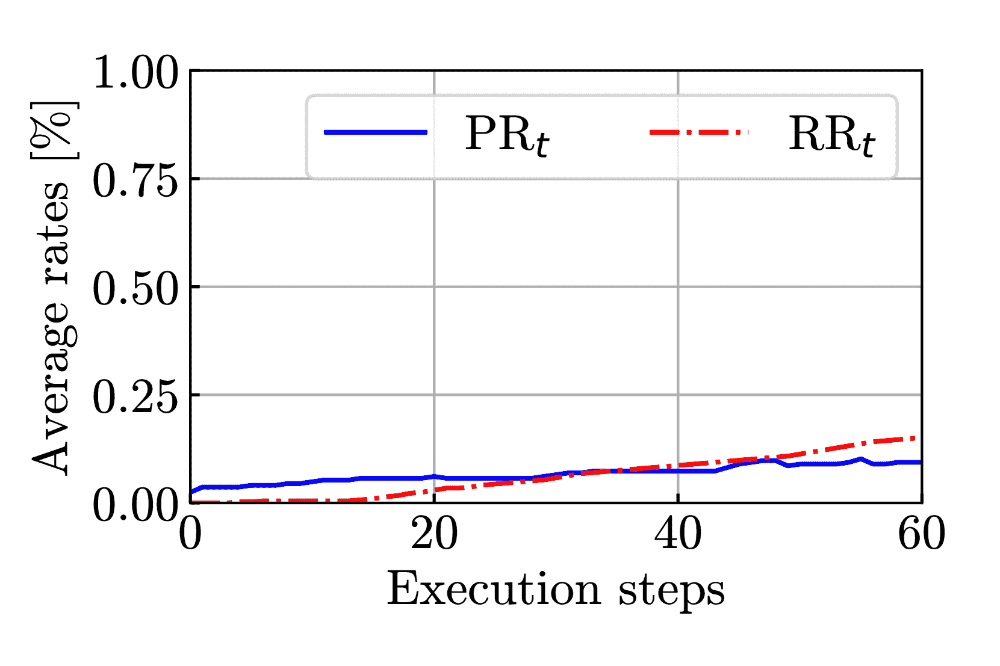

<!--yml

分类：未分类

日期：2025-01-11 12:42:51

-->

# AgentQuest：在多步骤密集推理任务中对LLM代理行为的基准测试

> 来源：[https://arxiv.org/html/2404.06411/](https://arxiv.org/html/2404.06411/)

Luca Gioacchini${}^{1,2}$, Giuseppe Siracusano${}^{1}$, Davide Sanvito${}^{1}$, Kiril Gashteovski${}^{1,3}$,

David Friede${}^{1}$, Roberto Bifulco${}^{1}$, Carolin Lawrence${}^{1}$

${}^{1}$ NEC实验室欧洲，海德堡，德国

${}^{2}$ 都灵理工大学，都灵，意大利

${}^{3}$ CAIR，圣西里尔与圣美索德大学，斯科普里，北马其顿

# AgentQuest：一个模块化基准框架

用于衡量进展并改进LLM代理

Luca Gioacchini${}^{1,2}$, Giuseppe Siracusano${}^{1}$, Davide Sanvito${}^{1}$, Kiril Gashteovski${}^{1,3}$,

David Friede${}^{1}$, Roberto Bifulco${}^{1}$, Carolin Lawrence${}^{1}$

${}^{1}$ NEC实验室欧洲，海德堡，德国

${}^{2}$ 都灵理工大学，都灵，意大利

${}^{3}$ CAIR，圣西里尔与圣美索德大学，斯科普里，北马其顿

###### 摘要

大型语言模型（LLM）的进展促使了LLM代理的追求，这些代理能够解决复杂的多步骤推理任务。与任何研究工作一样，基准测试和评估是高效且可靠进展的关键。然而，现有的基准测试通常范围狭窄，仅仅计算任务的整体成功率。为了解决这些问题，我们提出了AgentQuest ¹¹1Demo，提供于[https://youtu.be/0JNkIfwnoak](https://youtu.be/0JNkIfwnoak)。——一个框架，其中（i）基准测试和指标是模块化的，可以通过文档齐全且易于使用的API轻松扩展；（ii）我们提供了两种新的评估指标，可以在解决任务的过程中可靠地追踪LLM代理的进展。我们通过两个用例示范了这些指标的实用性，在这些用例中，我们识别出常见的失败点，并改进代理架构以获得显著的性能提升。我们希望与研究社区一起进一步扩展AgentQuest，因此我们将其开放，并可通过[https://github.com/nec-research/agentquest](https://github.com/nec-research/agentquest)获取。

AgentQuest：一个模块化基准框架

用于衡量进展并改进LLM代理

Luca Gioacchini${}^{1,2}$, Giuseppe Siracusano${}^{1}$, Davide Sanvito${}^{1}$, Kiril Gashteovski${}^{1,3}$, David Friede${}^{1}$, Roberto Bifulco${}^{1}$, Carolin Lawrence${}^{1}$ ${}^{1}$ NEC实验室欧洲，海德堡，德国 ${}^{2}$ 都灵理工大学，都灵，意大利 ${}^{3}$ CAIR，圣西里尔与圣美索德大学，斯科普里，北马其顿

## 1 引言

生成代理（Generative Agents）Kiela等人（[2023](https://arxiv.org/html/2404.06411v1#bib.bib5)）是利用大型语言模型（LLMs）等基础模型来执行复杂任务、做出决策、制定多步计划并使用工具（API调用、编程等）来在异质环境中构建解决方案的软件系统Wang等人（[2023](https://arxiv.org/html/2404.06411v1#bib.bib19)）；Weng（[2023](https://arxiv.org/html/2404.06411v1#bib.bib20)）。能够高自主性地解决异质任务的潜力引发了学术界和工业界的广泛兴趣。然而，目前仍不清楚现有系统在多大程度上能够成功实现其承诺。实际上，用于基准测试、评估和推进这些系统的方法仍处于初期阶段。

(a) 现有的

(b) AgentQuest

图1：现有框架和AgentQuest中的代理-基准交互概览。AgentQuest定义了一个通用接口，用于与基准进行交互并计算进展指标，从而简化了新基准的添加，并允许研究人员评估和调试他们的代理架构。

我们识别出几个差距。首先，基准测试代理需要结合不同的基准类型Liu等人（[2023](https://arxiv.org/html/2404.06411v1#bib.bib8)）；Chalamalasetti等人（[2023](https://arxiv.org/html/2404.06411v1#bib.bib1)）。例如，一些基准测试专注于特定能力并提供游戏环境，我们称之为“封闭盒子”——即具有有限动作集Liu等人（[2023](https://arxiv.org/html/2404.06411v1#bib.bib8)）；Patil等人（[2023](https://arxiv.org/html/2404.06411v1#bib.bib14)）；Chalamalasetti等人（[2023](https://arxiv.org/html/2404.06411v1#bib.bib1)）——而其他基准测试则提供开放式任务和对通用工具的访问，如网页浏览Zhuang等人（[2023](https://arxiv.org/html/2404.06411v1#bib.bib25)）；Zheng等人（[2023](https://arxiv.org/html/2404.06411v1#bib.bib24)）；Mialon等人（[2023](https://arxiv.org/html/2404.06411v1#bib.bib9)）。由于基准测试是独立开发的，因此需要大量努力来定制集成新代理架构与每个基准测试。

其次，更为关键的是，现有的基准大多数侧重于提供*成功率*度量，即对每个提出的任务进行二进制的成功/失败评估。尽管成功率有助于衡量智能体技术的整体进展，但在指导新生成智能体架构的改进方面，成功率的作用是有限的。在这里，需要考虑到生成型智能体通常将基础模型与多个其他组件（如记忆和工具）结合使用。开发者可以从架构和各个组件的相互依赖性方面推理这些单独的组件，并且可以通过对智能体在基准测试中表现的更深入了解来积极地改变和进化这些组件。也就是说，开发者需要基准测试来同时评估和*调试*智能体。

例如，当前的基准使得很难回答以下问题：智能体是否完全失败了任务，还是部分解决了任务？智能体是否在某一步骤上始终失败？额外的运行时间是否能帮助找到解决方案？回答这些问题需要追踪和检查智能体的执行过程。我们认为，提供一种在多个基准上都一致的更高效方法，是推动生成型智能体发展的一个重要步骤。

我们通过引入 AgentQuest 来解决这些问题，这是一种模块化框架，支持多种不同的基准和智能体架构（参见图[1](https://arxiv.org/html/2404.06411v1#S1.F1 "Figure 1 ‣ 1 Introduction ‣ AgentQuest: Benchmarking LLM Agents Behaviours in Multi-step Intensive Reasoning Tasks")），同时引入了两项新指标——即进展率和重复率——用于调试智能体架构行为。AgentQuest 定义了一个标准接口，用于将任意智能体架构与多样的基准连接，并计算其中的进展率和重复率。

我们展示了框架，在 AgentQuest 中实现了 4 个基准测试：ALFWorld Shridhar 等人（[2020](https://arxiv.org/html/2404.06411v1#bib.bib15)）、横向思维谜题 Sloane（[1992](https://arxiv.org/html/2404.06411v1#bib.bib16)）、Mastermind 和数独。后两者是 AgentQuest 中新引入的。其他基准可以轻松添加，同时无需修改测试的智能体。

我们的最终贡献是展示我们利用所提议的度量标准来调试和改进现有代理架构的经验，这些架构在 LangChain Chase（[2022](https://arxiv.org/html/2404.06411v1#bib.bib2)）中有所实现。具体而言，我们展示了在 Mastermind 基准测试中，进度率和重复率的组合能够识别出代理在探索潜在解决方案空间的能力上的限制。在这个洞察的指导下，我们将该基准的成功率提高了大约 $\approx$20%。在侧向思维难题（Lateral Thinking Puzzles）中，我们展示了部分重复的行动是代理策略的一部分，而在 ALFWorld 中，我们展示了监控进度率可以帮助识别出最终的成功率受到代理允许运行时间的限制，并且更多的步骤能带来更好的表现。最后，在数独基准测试中，我们展示了低成功率实际上与低进度率相伴随，这清楚地表明测试中的代理无法解决此类任务。

## 2 生成性 AI 代理概述

生成性 AI 代理是依赖于软件组件的自动化系统，这些组件与在大量数据上预训练的 LLMs（大规模语言模型）结合，用于语言理解和处理。当任务被分配给代理时，代理会进行一个系统化的过程：它反复制定自生成的指令，执行这些指令，并观察结果，直到最终目标达成。接下来，我们展示代理与其所操作的环境之间的基本交互，并描述标准的基准测试技术。

### 2.1 代理-环境交互

紧随强化学习（RL）²²术语的定义，*与 RL 场景不同*，代理不需要进一步的训练过程。它依赖于预训练的 LLM，并且不会在任何奖励的影响下执行行动。根据 Sutton 和 Barto（[2018](https://arxiv.org/html/2404.06411v1#bib.bib18)）的定义，定义代理与环境交互的核心元素包括*环境*、*状态*、*观察*和*行动*（见 [图0(a)](https://arxiv.org/html/2404.06411v1#S1.F0.sf1 "0(a) ‣ 图 1 ‣ 1 介绍 ‣ AgentQuest：在多步骤推理任务中对 LLM 代理行为的基准测试")）。

#### 环境与状态。

环境指的是代理与之交互的外部系统。在此背景下，我们将基准测试和环境视为同义词。环境通常通过一组有限的隐藏*状态*来描述，这些状态代理无法直接观察到，且代表基准配置。

#### 观察与行动。

代理与环境进行多次执行步骤的交互。在每个步骤中，环境会产生一个*观察*，提供关于其当前隐藏状态的信息。代理使用内部的LLM来处理接收到的观察结果。由于LLM在通用知识数据上进行了预训练，它会进行推理过程，生成一个关于观察结果的*思考*（例如，当前步骤中要遵循的计划策略或工具的使用）。根据这个思考，代理向环境提供一个*动作*，以修改当前的隐藏状态。³³3与强化学习（RL）不同，LLM的输出是没有约束的，任何提供的动作都被认为是有效的。

以下是一个代理与封闭箱环境互动解决破译代码挑战的例子，即《Mastermind》游戏 Stuckman 和 Zhang（[2005](https://arxiv.org/html/2404.06411v1#bib.bib17)）。代理的任务是猜测一个四位数字代码。在每个步骤中，代理会设计一个策略并据此行动来猜测代码。环境提供反馈，指出猜测的数字在正确位置和错误位置上的数量。这个过程会持续，直到满足停止条件。

[⬇](data:text/plain;base64,PEBcdGV4dGNvbG9ye2ZvcmVzdGdyZWVufXtcdGV4dGJme0VOVklST05NRU5UfTogSW5pdGlhbGl6aW5nIGEgbmV3IGVudmlyb25tZW50Li4ufUA+CjxAXHRleHRjb2xvcntpbnRlcm5hdGlvbmFsa2xlaW5ibHVlfXtcdGV4dGJme09CU0VSVkFUSU9OfTogU3RhcnQgZ3Vlc3NpbmcgdGhlIDQgZGlnaXRzIGNvZGUufUA+CjxAXHRleHRjb2xvcnttYWdlbnRhfXtcdGV4dGJme1RIT1VHSFR9OiBJJ2xsIHN0YXJ0IGJ5IGd1ZXNzaW5nIDEyMzQgdG8gZ2V0IGFuIGlkZWEgb2Ygd2hpY2h9QD4KPEBcdGV4dGNvbG9ye21hZ2VudGF9e29mIHRoZXNlIG51bWJlcnMgYXJlIGluIHRoZSBzZWNyZXQgbnVtYmVyIGFuZCBpZiBhbnkgYXJlIGlufUA+CjxAXHRleHRjb2xvcnttYWdlbnRhfXt0aGUgY29ycmVjdCBwb3NpdGlvbi59QD4KPEBcdGV4dGNvbG9ye2dvbGRlbnllbGxvd317XHRleHRiZntBQ1RJT059OiAxMjM0fUA+Cgo8QFx0ZXh0Y29sb3J7Zm9yZXN0Z3JlZW59e1x0ZXh0YmZ7RU5WSVJPTk1FTlR9OiBDb21wYXJpbmcgdGhlIGd1ZXNzZWQgY29kZSB3aXRoIHRoZSB0cnV0aC4uLn1APgo8QFx0ZXh0Y29sb3J7aW50ZXJuYXRpb25hbGtsZWluYmx1ZX17XHRleHRiZntPQlNFUlZBVElPTn06IFlvdXIgZ3Vlc3MgaGFzIDEgY29ycmVjdCBudW1iZXJzIGluIHRoZSB3cm9uZyB9QD4KPEBcdGV4dGNvbG9ye2ludGVybmF0aW9uYWxrbGVpbmJsdWV9e3Bvc2l0aW9uIGFuZCAwIGNvcnJlY3QgbnVtYmVycyBpbiB0aGUgY29ycmVjdCBwb3NpdGlvbi4gfUA+CjxAXHRleHRjb2xvcntpbnRlcm5hdGlvbmFsa2xlaW5ibHVlfXtLZWVwIGd1ZXNzaW5nLi4ufUA+CjxAXHRleHRjb2xvcnttYWdlbnRhfXtcdGV4dGJme1RIT1VHSFR9OiBPbmUgb2YgdGhlIGRpZ2l0cyAxLCAyLCAzLCBvciA0IGlzIGNvcnJlY3QgYnV0IGlufUA+CjxAXHRleHRjb2xvcnttYWdlbnRhfXt0aGUgd3JvbmcgcG9zaXRpb24uIEknbGwgdHJ5IHRvIG1vdmUgZWFjaCBkaWdpdCB0byBhfUA+CjxAXHRleHRjb2xvcnttYWdlbnRhfXtkaWZmZXJlbnQgcG9zaXRpb24gdG8gc2VlIGlmIEkgY2FuIGdldCBhIGNvcnJlY3QgcG9zaXRpb24ufUA+CjxAXHRleHRjb2xvcntnb2xkZW55ZWxsb3d9e1x0ZXh0YmZ7QUNUSU9OfTogMjE0M31APgouLi4=)环境：初始化新环境...观察：开始猜测4位数字代码。思考：我先猜1234，以了解这些数字中哪些在正确数字中，是否有在正确位置上的数字。行动：1234环境：比较猜测的代码与实际代码...观察：你的猜测中有1个数字在错误的位置，0个数字在正确的位置。继续猜测...思考：数字1、2、3或4中有一个是正确的，但位置不对。我会尝试将每个数字移到不同的位置，看看能否获得正确的位置。行动：2143...

### 2.2 基准测试一个智能体

在评估代理在基准测试上的表现时，常用的两个度量标准是Liu等人（[2023](https://arxiv.org/html/2404.06411v1#bib.bib8)）：（i）成功率（SR），即成功任务与总实例的比率；（ii）成功时间，即获得解决方案所需的平均时间。尽管这些是重要且流行的度量标准（Chalamalasetti等人[2023](https://arxiv.org/html/2404.06411v1#bib.bib1)；Hessel等人[2022](https://arxiv.org/html/2404.06411v1#bib.bib4)；Zhang等人[2020a](https://arxiv.org/html/2404.06411v1#bib.bib22)），但它们仅关注最终的成功。它们不能衡量中间的成功或失败，因此难以理解代理为何可能系统性地失败，也无法指导如何改进。相比之下，我们希望定义中间度量标准，便于我们轻松评估和比较代理在广泛任务中的表现。

## 3 AgentQuest概述

我们设计了AgentQuest，作为代理与环境之间的分离层（见[图0(b)](https://arxiv.org/html/2404.06411v1#S1.F0.sf2 "0(b) ‣ 图1 ‣ 1 介绍 ‣ AgentQuest：多步推理任务中LLM代理行为的基准测试")）。本质上，它提供了（i）一个统一的接口（即*驱动程序*），确保不同代理架构和基准测试之间的兼容性，并最小化编程工作量（第[3.1节](https://arxiv.org/html/2404.06411v1#S3.SS1 "3.1 基准测试通用接口 ‣ 3 AgentQuest概述 ‣ AgentQuest：多步推理任务中LLM代理行为的基准测试")）；（ii）除了任务成功之外，还实现了两种度量标准（即*进展率*和*重复率*），旨在监控代理朝最终目标的进展，并帮助我们理解失败的原因（第[3.2节](https://arxiv.org/html/2404.06411v1#S3.SS2 "3.2 理解代理进展 ‣ 3 AgentQuest概述 ‣ AgentQuest：多步推理任务中LLM代理行为的基准测试")）；（iii）一个独特的视角和接口，用于实现新的度量标准来监控和衡量执行情况（第[3.3节](https://arxiv.org/html/2404.06411v1#S3.SS3 "3.3 添加新度量 ‣ 3 AgentQuest概述 ‣ AgentQuest：多步推理任务中LLM代理行为的基准测试")）。

### 3.1 基准测试通用接口

不同的基准测试需要调用不同的函数，使用特定的格式，并对观察结果和代理行为进行解析和后处理。为了集成不同的代理架构，普遍的做法是在框架中直接硬编码这些基准测试特定的要求（Liu等人[2023](https://arxiv.org/html/2404.06411v1#bib.bib8); Chalamalasetti等人[2023](https://arxiv.org/html/2404.06411v1#bib.bib1)，等）。这导致每个环境都有许多定制的接口，使得很难轻松切换到其他基准测试和代理架构。

相反，AgentQuest提供了一个统一的Python接口，即Driver和两个反映代理-环境互动组件的类（即Observation、Action）。

#### 观察与行动。

我们提供了两个简单的类：Observation和Action。第一个类有两个必需的属性：（i）output，一个字符串，报告有关环境状态的信息；（ii）done，一个布尔变量，指示最终任务是否已完成。Action类有一个必需的属性，action_value。它是代理直接输出的字符串。一旦处理并提供给环境，它会触发环境的变化。为了定制交互，开发者可以定义可选属性。

#### Driver。

我们提供的Driver类有两个必需的方法：（i）reset方法初始化一个新的环境实例并返回第一个观察；（ii）step方法执行一个单独的执行步骤。它接受来自代理的一个Action类实例，处理该行动（例如解析action_value字符串），并利用它来修改环境状态。它始终返回一个观察结果。该驱动程序还支持特定基准状态属性，作为一个简单的API，暴露步骤$t$时的环境状态，有助于计算进度率。

我们在这里提供了一个Mastermind互动实现的示例：

[⬇](data:text/plain;base64,ZnJvbSBhZ2VudHF1ZXN0LmRyaXZlcnMgaW1wb3J0IE1hc3Rlck1pbmREcml2ZXIKZnJvbSBhZ2VudHF1ZXN0LnV0aWxzIGltcG9ydCBBY3Rpb24KZnJvbSBhZ2VudHF1ZXN0Lm1ldHJpY3MgaW1wb3J0IGdldF9wcm9ncmVzcywgZ2V0X3JlcGV0aXRpb24KCmFnZW50ID0gLi4uICMgSW5pdGlhbGl6ZSB5b3VyIGFnZW50CmFjdGlvbnMsIHByb2dyZXNzLCByZXBldGl0aW9ucyA9IFtdLCBbXSwgW10KIyBJbml0aWFsaXplIHRoZSBlbnZpcm9ubWVudCBhbmQgcmVzZXQgcm91bmQKZHJpdmVyID0gTWFzdGVyTWluZERyaXZlcih0cnV0aD0nNTYxOCcpCm9icyA9IGRyaXZlci5yZXNldCgpCiMgQWdlbnQgbG9vcAp3aGlsZSBub3Qgb2JzLmRvbmU6CiAgICBndWVzcyA9IGFnZW50KG9icy5vdXRwdXQpICMgR2V0IHRoZSBhZ2VudCBvdXRwdXQKICAgIGFjdGlvbiA9IEFjdGlvbihhY3Rpb25fdmFsdWU9Z3Vlc3MpICMgQ3JlYXRlIGFjdGlvbgogICAgYWN0aW9ucy5hcHBlbmQoYWN0aW9uLmFjdGlvbl92YWx1ZSkgIyBTdG9yZSBhY3Rpb24KICAgIG9icyA9IGRyaXZlci5zdGVwKGFjdGlvbikgIyBFeGVjdXRlIHN0ZXAKICAgICMgQ29tcHV0ZSBjdXJyZW50IHByb2dyZXNzIGFuZCByZXBldGl0aW9uCiAgICBwcm9ncmVzcy5hcHBlbmQoZ2V0X3Byb2dyZXNzKGRyaXZlci5zdGF0ZSwgJzU2MTgnKykKICAgIHJlcGV0aXRpb25zLmFwcGVuZChnZXRfcmVwZXRpdGlvbnMoYWN0aW9ucykpCiAgICAjIEV4dGVuZCB3aXRoIHlvdXIgY3VzdG9tIG1ldHJpY3MgaGVyZSAuLi4KIyBDb21wdXRlIGZpbmFsIG1ldHJpY3MKUFIgPSBbeC9sZW4oJzU2MTgnKSBmb3IgeCBpbiBwcm9ncmVzc10KUlIgPSBbeC8obGVuKGFjdGlvbnMpLTEpIGZvciB4IGluIHJlcGV0aXRpb25zXQ==)从 agentquest.drivers 导入 MasterMindDriver从 agentquest.utils 导入 Action从 agentquest.metrics 导入 get_progress, get_repetitionagent = ... # 初始化 你的 agentactions, progress, repetitions = [], [], []# 初始化环境并重置回合driver = MasterMindDriver(truth=’5618’)obs = driver.reset()# Agent 循环while not obs.done:    guess = agent(obs.output) # 获取 代理输出    action = Action(action_value=guess) # 创建 动作    actions.append(action.action_value) # 存储 动作    obs = driver.step(action) # 执行 步骤    # 计算当前进度和重复次数    progress.append(get_progress(driver.state, ’5618’))    repetitions.append(get_repetitions(actions))    # 在此处扩展您的自定义指标 ...# 计算最终指标PR = [x/len(’5618’) for x in progress]RR = [x/(len(actions)-1) for x in repetitions]

### 3.2 理解代理的进展

了解代理如何处理特定任务是理解代理行为、能力和局限性的关键。此外，识别系统性的代理失败可以帮助明确在架构中需要进行的调整，从而有效地解决潜在问题。

AgentQuest 在这方面作出了贡献，提出了两个跨基准的指标，*进度率* 和 *重复率*。第一个表示代理向最终目标前进的 *程度*，而后者则表示代理到达目标的 *方式*，特别关注代理执行的重复（即相似）动作的数量。

#### 里程碑和进度率。

为了量化代理朝着最终目标的推进，AgentQuest使用一组*里程碑* $\mathcal{M}$。简而言之，我们将最终解决方案分解为一系列代理需要达到的环境隐藏状态，从而得到任务的最终解决方案，因此，$\mathcal{M}\subseteq\mathcal{S}$，其中$\mathcal{S}$是隐藏状态的集合。$\mathcal{M}$的大小决定了评估过程中的*粒度*级别。具体来说，当$\mathcal{M}$与$\mathcal{S}$紧密对齐时，它提供了更全面的代理进展洞察，从而实现更细致的粒度；而对于$|\mathcal{M}|=1$，评估则与成功率一致。

我们通过一个评分函数$f$给$\mathcal{M}$中的所有状态分配一个分数，在执行步骤$t$时，我们定义*进度率* $\text{PR}_{t}:\mathcal{S}\to[0,1]$，它依赖于该评分函数，作为代理距离目标的进度指示，可以追踪代理在时间上的进展。根据基准的不同，进度率在执行过程中也可能会下降。里程碑可以手动标注，也可以通过内部计算得到。

#### 重复率。

重复率$\text{RR}_{t}$是代理重复动作倾向的度量。根据基准的不同，我们不认为重复是一个限制——例如，解决迷宫需要重复动作，比如反复向左走。另见[第4节](https://arxiv.org/html/2404.06411v1#S4 "4 Insights via AgentQuest ‣ AgentQuest: Benchmarking LLM Agents Behaviours in Multi-step Intensive Reasoning Tasks")，了解重复动作的正面和负面示例。

在执行步骤$t$时，我们考虑到代理在$t-1$时刻之前所采取的所有独特动作集合$\mathcal{A}_{t-1}$。然后，我们计算当前动作$a_{t}$与$\mathcal{A}_{t-1}$中所有先前动作之间的相似度函数$g$。由于任何由LLM生成的动作都被认为是有效的，我们认为当前动作$a_{t}$是*重复的*，如果在$\mathcal{A}_{t-1}$中至少存在一个先前动作$a$，使得$g(a_{t},a)\geq\theta_{a}$，其中$\theta_{a}\in[0,1]$是*分辨率*。⁴⁴4更高的分辨率要求动作之间有更严格的匹配，才能被归类为重复动作，而较低的值则扩大了符合的动作相似性范围。如果动作不重复，我们将独特动作集合更新为$A_{t}=A_{t-1}\cup a_{t}$。

基于此，我们将步骤$t$的重复率定义为通过执行步骤数$T$（除了第一步）标准化的重复动作累计数。形式上，$\text{RR}_{t}=\frac{t-|A_{t}|}{T-1}$。

### 3.3 添加新度量标准

表1：展示代理-环境交互组件的属性，这些属性对于定义新的度量标准非常有用。

| 类别 | 属性 | 访问权限 |
| --- | --- | --- |
| 驱动程序 | 状态 | 隐藏状态 |
| 观察 | 输出 | 观察结果 |
| 动作 | action$\_$value | 代理动作 |

我们依靠进度和重复率来展示AgentQuest如何通过简单的函数模板扩展新指标。然后，我们展示了针对所考虑基准的函数实现。

#### 指标函数模板。

我们使用Python函数模板轻松定义计算给定指标所需的代理-环境交互元素。[表1](https://arxiv.org/html/2404.06411v1#S3.T1 "表1 ‣ 3.3 添加新指标 ‣ 3 AgentQuest概述 ‣ AgentQuest：在多步推理任务中基准测试LLM代理的行为")提供了可作为自定义指标输入的主要属性和参考类的回顾。此外，用户还可以提供外部数据，如里程碑或动作历史。

表2：AgentQuest提供的基准概览。

| 基准 | 描述 | 里程碑 |
| --- | --- | --- |
| Mastermind |

&#124; 猜测数字代码并提供有关猜测的数字和位置的反馈。 &#124;

|

&#124; 猜测代码的数字。 &#124;

|

| LTP |
| --- |

&#124; 通过提问“是/否”问题解决谜题。 &#124;

|

&#124; 猜测谜题的关键方面。 &#124;

|

| ALFWorld |
| --- |

&#124; 在文本世界中找到一个物体并使用它。 &#124;

|

&#124; 行动序列。 &#124;

|

| 数独 |
| --- |

&#124; 9x9网格拼图。数字1-9填充每一列、行和3x3子网格 &#124;

&#124; 无重复。 &#124;

|

&#124; 正确数字的总数 &#124;

&#124; 插入的数字。 &#124;

|

#### 实现进度率。

根据基准，开发人员需要通过get_progress函数实现自定义评分函数$f$并定义里程碑集$\mathcal{M}$。里程碑可以是用户定义的，也可以在get_progress中内部计算。在这里，我们展示了get_progress的定义，用于量化Mastermind游戏中达成的里程碑。里程碑是最终解决方案的数字，进度表示正确猜测数字及其位置的数量：

[⬇](data:text/plain;base64,ZGVmIGdldF9wcm9ncmVzcyhzdGF0ZSwgbWlsZXN0b25lcyk6CiAgICByZWFjaGVkX21pbGVzdG9uZXMgPSAwICMgRGlnaXRzIGluIGNvcnJlY3QgcG9zaXRpb24KICAgIGZvciBpLCBqIGluIHppcChzdGF0ZSwgbWlsZXN0b25lcyk6CiAgICAgICAgaWYgaSA9PSBqOiByZWFjaGVkX21pbGVzdG9uZXMgKz0gMQogICAgcmV0dXJuIHJlYWNoZWRfbWlsZXN0b25lcwoKIyBVc2FnZSBleGFtcGxlLiBUaGUgY29kZSB0byBndWVzcyBpcyAnNTYxOCcKcHJvZ3Jlc3MgPSBnZXRfcHJvZ3Jlc3MoJzIzMTgnLCAnNTYxOCcpICMgUmVhY2hlZCBtaWxlc3RvbmVzCj4+PiAyCnByb2dyZXNzL2xlbignNTYxOCcpICMgQ29tcHV0ZSBQcm9ncmVzcyBSYXRlCj4+PiAwLjU=)def get_progress(state, milestones):    reached_milestones = 0 # 正确位置的数字    for i, j in zip(state, milestones):        if i == j: reached_milestones += 1    return reached_milestones# 用法示例。猜测的代码是’5618’progress = get_progress(’2318’, ’5618’) # 已达成的里程碑>>> 2progress/len(’5618’) # 计算进度率>>> 0.5

#### 实现重复率。

为了确定一个动作是否重复，最终用户必须根据所考虑的基准定义相似性函数$g$。我们提供了get_repetitions模板函数来计算重复动作的数量。在这里，我们展示了它在Python中的实现，并提供了Mastermind的用法示例，其中$g$是Levenshtein相似度 Levenshtein（[1966](https://arxiv.org/html/2404.06411v1#bib.bib6)）。

[⬇](data:text/plain;base64,ZnJvbSBMZXZlbnNodGVpbiBpbXBvcnQgcmF0aW8gYXMgZwoKZGVmIGdldF9yZXBldGl0aW9ucyhhY3Rpb25zLCBUSEVUQV9BKToKICAgIHVuaXF1ZV9hY3QgPSBzZXQoKSAjIEluaXRpYWxpc2UgdW5pcXVlIGFjdGlvbnMKICAgIGZvciBpLGEgaW4gZW51bWVyYXRlKGFjdGlvbnMpOgogICAgICAgICMgQ2hlY2sgZm9yIHJlcGV0aXRpb25zCiAgICAgICAgaWYgYWxsKFtnKGEsYWN0aW9uc1t4XSk8VEhFVEFfQSBmb3IgeCBpbiByYW5nZShpKV0pOgogICAgICAgICAgICB1bmlxdWVfYWN0LmFkZChhKQogICAgcmV0dXJuIGxlbihhY3Rpb25zKS1sZW4odW5pcXVlX2FjdCkKCiMgVXNhZ2UgZXhhbXBsZS4gVGhlIGNvZGUgdG8gZ3Vlc3MgaXMgJzU2MTgnCmFjdGlvbnMgPSBbJzEyMzQnLCAnMjE0MycsICcxMjM0JywgJzU2MTgnXSAjIEFjdGlvbnMgaGlzdG9yeQpyZXBldGl0aW9ucyA9IGdldF9yZXBldGl0aW9ucyhhY3Rpb25zLCAxLjApCj4+PiAxIHJlcGVhdGVkIGFjdGlvbgojIENvbXB1dGUgUmVwZXRpdGlvbiBSYXRlCnJlcGV0aXRpb25zLyhsZW4oYWN0aW9ucyktMSkKPj4+IDAuMzM=)来自 Levenshtein 导入比率作为gdef get_repetitions(actions, THETA_A):    unique_act = set()  # 初始化唯一动作    for i,a in enumerate(actions):        # 检查是否有重复        if all([g(a,actions[x])<THETA_A for x in range(i)]):            unique_act.add(a)    return len(actions)-len(unique_act) # 用法示例。猜测的代码是'5618'actions = ['1234', '2143', '1234', '5618'] # 动作历史repetitions = get_repetitions(actions, 1.0)>>> 1 个重复动作# 计算重复率repetitions/(len(actions)-1)>>> 0.33

在其他情况下，当$a$可以是任何文本字符串时，我们可以使用标准的度量方法，例如BLEU Papineni等人（[2002](https://arxiv.org/html/2404.06411v1#bib.bib12)）、ROUGE Lin（[2004](https://arxiv.org/html/2404.06411v1#bib.bib7)）或BERTScore Zhang等人（[2020b](https://arxiv.org/html/2404.06411v1#bib.bib23)）。

## 通过AgentQuest的4个见解

我们通过提出一组初始的四个基准测试，来研究不同推理场景中的智能体行为。我们从零开始实现了数独Felgenhauer和Jarvis（[2006](https://arxiv.org/html/2404.06411v1#bib.bib3)）和Mastermind Stuckman和Zhang（[2005](https://arxiv.org/html/2404.06411v1#bib.bib17)）环境，而ALFWorld Shridhar等人（[2020](https://arxiv.org/html/2404.06411v1#bib.bib15)）和侧向思维难题（LTP）Sloane（[1992](https://arxiv.org/html/2404.06411v1#bib.bib16)）是现有的实现，Liu等人（[2023](https://arxiv.org/html/2404.06411v1#bib.bib8)）也做出了贡献。[表2](https://arxiv.org/html/2404.06411v1#S3.T2 "Table 2 ‣ Metric function template. ‣ 3.3 Adding new metrics ‣ 3 AgentQuest Overview ‣ AgentQuest: Benchmarking LLM Agents Behaviours in Multi-step Intensive Reasoning Tasks")概述了这些基准及其相应的里程碑，用于衡量进展。

我们强调，本次评估并不旨在提供智能体架构的彻底评估和比较，而是展示如何使用AgentQuest，以及如何通过监控进展和动作重复率为开发者提供相关见解，即使只进行了几次执行。

#### 实验设置。

我们以LangChain Chase（[2022](https://arxiv.org/html/2404.06411v1#bib.bib2)）提供的现成聊天智能体作为参考架构，采用GPT-4 OpenAI（[2023b](https://arxiv.org/html/2404.06411v1#bib.bib11)）作为大语言模型（LLM），因为它直观、易于扩展且是开源的。我们在AgentQuest中运行了四个基准的15个实例，设置最大执行步骤为60⁵⁵5。我们在实验中限制了实例数量，主要有两个原因：（i）该工作主要作为已开发框架的展示，而非对智能体性能的广泛评估；（ii）广泛的测试可能会由于API调用的高成本而显著影响实验的可重复性。在附录[B](https://arxiv.org/html/2404.06411v1#A2 "Appendix B Appendix: Additional agents architectures and benchmarks ‣ AgentQuest: Benchmarking LLM Agents Behaviours in Multi-step Intensive Reasoning Tasks")中，我们提供了如何与两种额外的智能体架构以及作为开放式环境的GAIA Mialon等人（[2023](https://arxiv.org/html/2404.06411v1#bib.bib9)）一起使用AgentQuest的示例。

表3：测试基准的现有和提议的平均指标。我们报告了这些指标：成功率（SR）、步骤、60步时的进展率（PR${}_{60}$）和60步时的重复率（RR${}_{60}$）。我们用${}^{*}$表示在修改智能体架构后取得的改进结果。

|  | 现有指标 | AgentQuest |
| --- | --- | --- |
|  | SR | 步骤 | PR${}_{\mathbf{{60}}}$ | RR${}_{\mathbf{{60}}}$ |
| Mastermind | 0.47 | 41.87 | 0.62 | 0.32 |
| LTP | 0.20 | 52.00 | 0.46 | 0.81 |
| ALFWorld | 0.86 | 21.00 | 0.74 | 0.06 |
| 数独 | 0.00 | 59.67 | 0.08 | 0.22 |
| Mastermind${}^{*}$ | 0.60 | 39.73 | 0.73 | 0.00 |
| ALFWorld${}^{*}$ | 0.93 | 25.86 | 0.80${}^{\dagger}$ | 0.07${}^{\dagger}$ |

|

&#124; ${}^{\dagger}$指标指的是扩展运行时间至120的情况&#124;

&#124; 步骤，因此PR${}_{120}$和RR${}_{120}$。&#124;

|

#### 实验结果。

对于Mastermind，[图1(a)](https://arxiv.org/html/2404.06411v1#S4.F1.sf1 "1(a) ‣ Figure 2 ‣ Experimental results. ‣ 4 Insights via AgentQuest ‣ AgentQuest: Benchmarking LLM Agents Behaviours in Multi-step Intensive Reasoning Tasks")显示了进展率PR${}_{t}$和重复率RR${}_{t}$。在前22步中，代理探索了不同的解决方案（RR${}_{[0,22]}<5\%$）。这导致了朝向最终目标的进展不断增长，达到了半数的里程碑（PR${}_{22}\approx 55\%$）。然后，代理开始执行相同的动作，表现出重复的模式（参见[图2(a)](https://arxiv.org/html/2404.06411v1#S4.F2.sf1 "2(a) ‣ Figure 3 ‣ Experimental results. ‣ 4 Insights via AgentQuest ‣ AgentQuest: Benchmarking LLM Agents Behaviours in Multi-step Intensive Reasoning Tasks")的最右部分），并未能在接下来的38步内达到最终目标。这导致重复率上升至RR${}_{60}=30\%$，进展率在PR${}_{60}=55\%$时达到饱和。因此，AgentQuest为我们提供了一个重要的见解，解释了为什么当前的代理无法解决Mastermind游戏。

为了克服这个代理限制，我们将一个记忆组件Park等人（[2023](https://arxiv.org/html/2404.06411v1#bib.bib13)）整合到代理架构中。代理将过去的猜测存储在本地缓冲区中。然后，在每个步骤中，如果代理输出的是已经在缓冲区中的动作，它会被提示提供一个新的动作。[表3](https://arxiv.org/html/2404.06411v1#S4.T3 "Table 3 ‣ Experimental setup. ‣ 4 Insights via AgentQuest ‣ AgentQuest: Benchmarking LLM Agents Behaviours in Multi-step Intensive Reasoning Tasks")（Mastermind${}^{*}$）显示，这一简单的代理架构变化产生了巨大的影响：代理现在能够解决更多实例，最终的SR从47%提升至60%，并且避免了重复（RR${}_{60}=0\%$）。这突出了研究进展与重复率之间的相互作用如何帮助我们改进代理架构，有时即使是简单的改进也能取得显著效果。我们通过将评估扩展到更多的Mastermind实例，从15个增加到60个，并取得了相似的结果——即标准架构的SR为43%，而简单记忆架构的SR为62%（提升了19%）。

(a) Mastermind

(b) LTP

图2：Mastermind和LTP中的平均进展率PR${}_{t}$和重复率RR${}_{t}$。Mastermind：最初RR${}_{t}$较低，但在第22步之后开始上升，而进展率则停滞在55%。LTP：最初较高的RR${}_{t}$使代理能够通过做出小的变化来取得进展，最终实现成功，但后期这一进展趋于平稳。

(a) Mastermind

(b) LTP

图3：Mastermind和LTP中重复动作的示例。Mastermind：最初有一组独特的动作，但随后陷入不断重复相同的动作。LTP：重复的动作是相同问题的小变化，能够推动进展。

对于LTP，AgentQuest指标揭示了不同的代理行为，其中重复是代理推理策略的一部分，能够提高进展速度（[图1(b)](https://arxiv.org/html/2404.06411v1#S4.F1.sf2 "1(b) ‣ 图2 ‣ 实验结果 ‣ 通过AgentQuest的洞察 ‣ AgentQuest：在多步骤密集推理任务中基准化LLM代理行为")）。从初始步骤开始，代理会不断改变相同问题的不同方面，直到出现局部解。这导致了[图2(b)](https://arxiv.org/html/2404.06411v1#S4.F2.sf2 "2(b) ‣ 图3 ‣ 实验结果 ‣ 通过AgentQuest的洞察 ‣ AgentQuest：在多步骤密集推理任务中基准化LLM代理行为")中的水平指标，并且RR${}_{20}\approx 30\%$。尽管只解决了少量谜题（SR=0.2），这些重复的动作依然有助于进展，在执行结束时达到了46%的里程碑，最终的重复率为RR${}_{60}=81\%$。这向我们展示了进展与重复率之间的相互作用，提供了对代理在不同时间步骤中行为的洞察。

考虑基准测试 ALFWorld，见 [表 3](https://arxiv.org/html/2404.06411v1#S4.T3 "Table 3 ‣ Experimental setup. ‣ 4 Insights via AgentQuest ‣ AgentQuest: Benchmarking LLM Agents Behaviours in Multi-step Intensive Reasoning Tasks")（我们在附录 [A](https://arxiv.org/html/2404.06411v1#A1 "Appendix A Appendix: ALFWorld and Sudoku benchmarks ‣ AgentQuest: Benchmarking LLM Agents Behaviours in Multi-step Intensive Reasoning Tasks") 中报告了指标趋势）。它要求探索一个文本世界以定位物体。当代理探索解空间并限制动作重复（RR${}_{60}=6\%$）时，未能解决所有游戏（PR${}_{60}=74\%$）。这种差异可能是由于发现物体所需的更多探索步骤。我们通过将基准测试的运行时间延长至 120 步，支持这一直觉，从而使成功率和进展率分别提高了 6%（ALFWorld${}^{*}$ 在 [表 3](https://arxiv.org/html/2404.06411v1#S4.T3 "Table 3 ‣ Experimental setup. ‣ 4 Insights via AgentQuest ‣ AgentQuest: Benchmarking LLM Agents Behaviours in Multi-step Intensive Reasoning Tasks") 中）。这证实了 AgentQuest 在理解代理失败方面的有效性。我们还通过将评估扩展到更多 ALFWorld 实例，从 15 个增加到 60 个，得到了相似的结果——即在 60 步限制下 SR 达到 83%，在 120 步限制下 SR 达到 87%（提高了 4%）。

最后，我们来看数独，这个任务因其高难度而著名，Felgenhauer 和 Jarvis（[2006](https://arxiv.org/html/2404.06411v1#bib.bib3)）指出。经过 60 步后的低进展率和重复率（PR${}_{60}=8\%$ 和 RR${}_{60}=22\%$）表明，当前的代理架构在寻找正确解决方案时在此任务中遇到困难。我们在附录 [A](https://arxiv.org/html/2404.06411v1#A1 "Appendix A Appendix: ALFWorld and Sudoku benchmarks ‣ AgentQuest: Benchmarking LLM Agents Behaviours in Multi-step Intensive Reasoning Tasks") 中报告了指标趋势。

## 5 结论

AgentQuest 使研究社区能够以全局的方式跟踪代理的进展。从一开始的四个基准测试和两个新指标开始，AgentQuest 容易扩展。此外，这两个提出的指标——进展率和重复率——具有很大的优势，可以追踪代理在一段时间内如何朝着最终目标前进。尤其是研究它们的相互作用可以提供重要的洞察，帮助研究社区提升代理的表现。最后，我们相信，及时与研究社区共享 AgentQuest 将促进代理的基准测试和调试，并促进新基准和指标的创建与使用。

## 伦理考虑

LLM 代理的复杂性给理解其决策过程带来了挑战。伦理准则必须要求此类系统保持透明，确保开发者和最终用户能够理解决策是如何做出的。

我们未意识到我们的工作产生了任何直接的伦理影响。然而，我们希望对生成式 AI 代理决策过程的洞察能够被应用于改善和促进透明度与公平性。

## 致谢

本项目已获得欧洲联盟“地平线欧洲”研究与创新计划（SNS-JU）资助，资助协议号为 101139285（“NATWORK”）。

## 参考文献

+   Chalamalasetti 等（2023）Kranti Chalamalasetti、Jana Götze、Sherzod Hakimov、Brielen Madureira、Philipp Sadler 和 David Schlangen。2023年。[Clembench：使用游戏玩法评估为对话代理优化的语言模型](http://arxiv.org/abs/2305.13455)。

+   Chase（2022）Harrison Chase。2022年。[LangChain - 通过组合构建具有 LLM 的应用程序](https://github.com/langchain-ai/langchain)。

+   Felgenhauer 和 Jarvis（2006）Bertram Felgenhauer 和 Frazer Jarvis。2006年。数独数学 I。*数学光谱*。

+   Hessel 等（2022）Jack Hessel、Ari Holtzman、Maxwell Forbes、Ronan Le Bras 和 Yejin Choi。2022年。[CLIPScore：一种无需参考的图像描述评估指标](http://arxiv.org/abs/2104.08718)。

+   Kiela 等（2023）Douwe Kiela、Tristan Thrush、Kawin Ethayarajh 和 Amanpreet Singh。2023年。[在人工智能中绘制进展](https://contextual.ai/plotting-progress-in-ai/)。*Contextual AI 博客*。

+   Levenshtein（1966）Vladimir I. Levenshtein。1966年。能够纠正删除、插入和反转的二进制代码。发表于 *苏联物理学报告*。

+   Lin（2004）Chin-Yew Lin。2004年。[ROUGE：自动评估摘要的工具包](https://aclanthology.org/W04-1013)。

+   Liu 等（2023）Xiao Liu、Hao Yu、Hanchen Zhang、Yifan Xu、Xuanyu Lei、Hanyu Lai、Yu Gu、Hangliang Ding、Kaiwen Men、Kejuan Yang 等。2023年。[AgentBench：评估大型语言模型作为代理](http://arxiv.org/abs/2308.03688)。

+   Mialon 等（2023）Grégoire Mialon、Clémentine Fourrier、Craig Swift、Thomas Wolf、Yann LeCun 和 Thomas Scialom。2023年。[GAIA：通用 AI 助手的基准测试](http://arxiv.org/abs/2311.12983)。

+   OpenAI（2023a）OpenAI。2023a。[助手 API](https://platform.openai.com/docs/assistants/overview)。

+   OpenAI（2023b）OpenAI。2023b。[GPT-4 技术报告](http://arxiv.org/abs/2303.08774)。

+   Papineni 等（2002）Kishore Papineni、Salim Roukos、Todd Ward 和 Wei-Jing Zhu。2002年。[Bleu：机器翻译自动评估方法](https://doi.org/10.3115/1073083.1073135)。

+   Park 等（2023）Joon Sung Park、Joseph O’Brien、Carrie Jun Cai、Meredith Ringel Morris、Percy Liang 和 Michael S Bernstein。2023年。[生成代理：人类行为的互动模拟](https://doi.org/10.1145/3586183.3606763)。

+   Patil 等（2023）Shishir G. Patil、Tianjun Zhang、Xin Wang 和 Joseph E. Gonzalez。2023年。[Gorilla：与海量 API 连接的大型语言模型](http://arxiv.org/abs/2305.15334)。

+   Shridhar 等人 (2020) Mohit Shridhar, Xingdi Yuan, Marc-Alexandre Côté, Yonatan Bisk, Adam Trischler, 和 Matthew Hausknecht. 2020. [ALFWorld：对齐文本和具身环境以进行互动学习](http://arxiv.org/abs/2010.03768).

+   Sloane (1992) Paul Sloane. 1992. *侧向思维难题*. Sterling Publishing Company, Inc.

+   Stuckman 和 Zhang (2005) Jeff Stuckman 和 Guo-Qiang Zhang. 2005. [Mastermind 是 NP 完备的](http://arxiv.org/abs/cs/0512049).

+   Sutton 和 Barto (2018) Richard S Sutton 和 Andrew G Barto. 2018. *强化学习：导论*. MIT出版社.

+   Wang 等人 (2023) Lei Wang, Chen Ma, Xueyang Feng, Zeyu Zhang, Hao Yang, Jingsen Zhang, Zhiyuan Chen, Jiakai Tang, Xu Chen, Yankai Lin 等人. 2023. [基于大型语言模型的自主代理综述](http://arxiv.org/abs/2308.11432).

+   Weng (2023) Lilian Weng. 2023. [LLM 驱动的自主代理](https://lilianweng.github.io/posts/2023-06-23-agent/).

+   Yao 等人 (2022) Shunyu Yao, Jeffrey Zhao, Dian Yu, Nan Du, Izhak Shafran, Karthik Narasimhan, 和 Yuan Cao. 2022. [ReAct：在语言模型中协同推理与行动](http://arxiv.org/abs/2210.03629).

+   Zhang 等人 (2020a) Tianyi Zhang, Varsha Kishore, Felix Wu, Kilian Q. Weinberger, 和 Yoav Artzi. 2020a. [BERTScore：使用 BERT 评估文本生成](http://arxiv.org/abs/1904.09675).

+   Zhang 等人 (2020b) Tianyi Zhang, Varsha Kishore, Felix Wu, Kilian Q. Weinberger, 和 Yoav Artzi. 2020b. [BERTScore：使用 BERT 评估文本生成](https://openreview.net/forum?id=SkeHuCVFDr).

+   Zheng 等人 (2023) Lianmin Zheng, Wei-Lin Chiang, Ying Sheng, Siyuan Zhuang, Zhanghao Wu, Yonghao Zhuang, Zi Lin, Zhuohan Li, Dacheng Li, Eric Xing 等人. 2023. [使用 MT-Bench 和 Chatbot Arena 评判 LLM 作为法官](http://arxiv.org/abs/2306.05685).

+   Zhuang 等人 (2023) Yuchen Zhuang, Yue Yu, Kuan Wang, Haotian Sun, 和 Chao Zhang. 2023. [ToolQA：一个带外部工具的 LLM 问答数据集](http://arxiv.org/abs/2306.13304).

## 附录 A 附录：ALFWorld 和数独基准测试

在本节中，我们报告了 ALFWorld 和数独基准测试每一步的详细度量，由于篇幅限制，主文中已省略。

(a) ALFWorld

(b) 数独

图 4：ALFWorld 和数独的进展率 PR${}_{t}$ 和重复率 RR${}_{t}$，15次运行的平均值。ALFWorld：开始时重复率较低，进展率迅速增加。随后，重复率的缓慢增加促使进展率进一步增加，尽管增速较慢。数独：进展率迅速达到 8%。然后，重复率缓慢增加，进展率没有任何积极变化。

图 [3(a)](https://arxiv.org/html/2404.06411v1#A1.F3.sf1 "3(a) ‣ 图 4 ‣ 附录 A 附录：ALFWorld 和数独基准测试 ‣ AgentQuest：多步骤密集推理任务中大语言模型代理行为的基准测试") 显示了 ALFWorld 的进展率和重复率。前 20 步的重复率接近 0%，然后在 60 步后缓慢增加至 6%。进展率在 10 步内迅速超过 50%，然后持续增加，虽然增幅较慢，最终达到 74%。即使对于接近 60 步的步骤，进展率也在持续提升，且重复率较低，这表明通过增加最大步数可能达到更高的值。我们通过将基准测试运行时间扩展至 120 步来验证这一假设。如表 [3](https://arxiv.org/html/2404.06411v1#S4.T3 "表 3 ‣ 实验设置 ‣ 4 通过 AgentQuest 的洞察 ‣ AgentQuest：多步骤密集推理任务中大语言模型代理行为的基准测试") 所述，这将成功率和进展率分别提高了 6 个百分点，即 SR$=93\%$ 和 PR${}_{120}=80\%$。

图 [3(b)](https://arxiv.org/html/2404.06411v1#A1.F3.sf2 "3(b) ‣ 图 4 ‣ 附录 A 附录：ALFWorld 和数独基准测试 ‣ AgentQuest：多步骤密集推理任务中大语言模型代理行为的基准测试") 显示了数独基准测试的两个指标。我们可以观察到，进展率在很少的步骤内迅速达到 8%的平台期。前 10 步的重复率接近 0%，然后在 60 步后缓慢增加至 22%，但进展率没有任何提升。

## 附录 B 附录：额外的代理架构和基准测试

在本节中，我们突出显示了 AgentQuest 的即插即用特性，展示了使用两个额外代理架构实现 Mastermind 的过程，即文献中最常用的架构 ReAct Yao 等人（[2022](https://arxiv.org/html/2404.06411v1#bib.bib21)）和最近期的专有架构 OpenAI Assistant OpenAI（[2023a](https://arxiv.org/html/2404.06411v1#bib.bib10)）。此外，我们还展示了如何实现需要使用外部工具的开放式基准测试 GAIA Mialon 等人（[2023](https://arxiv.org/html/2404.06411v1#bib.bib9)）。为了简洁起见，以下代码片段中我们省略了如错误处理或完整代理定义等细节。完整代码可在 [GitHub 仓库](https://github.com/nec-research/agentquest)中获取。

### B.1 ReAct 在封闭盒环境中的应用

我们展示了如何执行一个封闭箱基准测试（即 ALFWorld）示例，该测试使用基于 ReAct 架构的智能体（Yao 等人，([2022](https://arxiv.org/html/2404.06411v1#bib.bib21))）。这种架构要求智能体的决策过程以交替的方式生成与任务相关的文本推理轨迹和行动。常见的实现方法，Chase ([2022](https://arxiv.org/html/2404.06411v1#bib.bib2))；Yao 等人 ([2022](https://arxiv.org/html/2404.06411v1#bib.bib21)) 依赖外部工具来执行操作。在这里，我们通过提供一个单一工具（即 ProxyTool）来确保与现有实现的兼容性，该工具将操作转发给驱动程序。简而言之，智能体会反思应该采取的行动并调用工具。然后，我们将工具输入提供给驱动程序，以便与环境进行交互。在每一步中，我们通过 intermediate_steps 变量将更新的行动和观察历史提供给智能体。

[⬇](data:text/plain;base64,ZnJvbSBhZ2VudHF1ZXN0LmRyaXZlcnMgaW1wb3J0IE1hc3Rlck1pbmREcml2ZXIKZnJvbSBhZ2VudHF1ZXN0Lm1ldHJpY3MgaW1wb3J0IC4uLgpmcm9tIGFnZW50cXVlc3QudXRpbHMgaW1wb3J0IEFjdGlvbgouLi4KCiMgRGVmaW5lIGEgZHVtbXkgdG9vbCBmb3IgY2xvc2VkLWJveCBlbnZpcm9ubWVudHMKY2xhc3MgUHJveHlUb29sKEJhc2VUb29sKToKICAgIG5hbWUgPSAicHJveHl0b29sIgogICAgZGVzY3JpcHRpb24gPSAiUHJvdmlkZSB0aGUgYWN0aW9uIHlvdSB3YW50IHRvIHBlcmZvcm0iCiAgICBkZWYgX3J1bihzZWxmKToKICAgICAgICBwYXNzCgojIEluc3RhbnRpYXRlIGN1c3RvbSBwcm9tcHQKcHJvbXB0ID0gQ3VzdG9tUHJvbXB0VGVtcGxhdGUoCiAgICB0ZW1wbGF0ZT0uLi4sICMgTExNIHByb21wdAogICAgdG9vbHM9W1Byb3h5VG9vbCgpXSwKICAgIGlucHV0X3ZhcmlhYmxlcz1bImludGVybWVkaWF0ZV9zdGVwcyIsIC4uLl0KKQojIEluaXRpYWxpc2UgdGhlIGFnZW50CmFnZW50ID0gY3JlYXRlX3JlYWN0X2FnZW50KGxsbWwsIFByb3h5VG9vbCgpXSwgcHJvbXB0KQppbnRlcm1lZGlhdGVfc3RlcHMgPSBbXQojIEluaXRpYWxpc2UgdGhlIGRyaXZlcgpkcml2ZXIgPSBNYXN0ZXJNaW5kRHJpdmVyKGdhbWUpCiMgR2V0IHRoZSBmaXJzdCBvYnNlcnZhdGlvbgpvYnMgPSBkcml2ZXIucmVzZXQoKQojIEFnZW50IExvb3AKd2hpbGUgbm90IG9icy5kb25lOgogICAgIyBSZXRyaWV2ZSB0aGUgYWdlbnQgb3V0cHV0CiAgICBhZ2VudF9jaG9pY2UgPSBhZ2VudC5pbnZva2UoCiAgICAgICAgeydpbnB1dCc6b2JzLm91dHB1dCwKICAgICAgICAgJ2ludGVybWVkaWF0ZV9zdGVwcyc6aW50ZXJtZWRpYXRlX3N0ZXBzfQogICAgKQogICAgYWN0aW9uID0gQWN0aW9uKGFjdGlvbl92YWx1ZT1hZ2VudF9jaG9pY2UudG9vbF9pbnB1dCkKICAgICMgUGVyZm9ybSB0aGUgc3RlcAogICAgb2JzID0gZHJpdmVyLnN0ZXAoYWN0aW9uKQogICAgIyBVcGRhdGUgaW50ZXJtZWRpYXRlIHN0ZXBzCiAgICBpbnRlcm1lZGlhdGVfc3RlcHMuYXBwZW5kKChhZ2VudF9jaG9pY2UsIG9icy5vdXRwdXQpKQogICAgIyBHZXQgY3VycmVudCBtZXRyaWNzIC4uLg==)from agentquest.drivers import MasterMindDriverfrom agentquest.metrics import ...from agentquest.utils import Action...# Define a dummy tool for closed-box environmentsclass ProxyTool(BaseTool):    name = "proxytool"    description = "Provide the action you want to perform"    def _run(self):        pass# Instantiate custom promptprompt = CustomPromptTemplate(    template=..., # LLM prompt    tools=[ProxyTool()],    input_variables=["intermediate_steps", ...])# Initialise the agentagent = create_react_agent(llm, [ProxyTool()], prompt)intermediate_steps = []# Initialise the driverdriver = MasterMindDriver(game)# Get the first observationobs = driver.reset()# Agent Loopwhile not obs.done:    # Retrieve the agent output    agent_choice = agent.invoke(        {’input’:obs.output,         ’intermediate_steps’:intermediate_steps}    )    action = Action(action_value=agent_choice.tool_input)    # Perform the step    obs = driver.step(action)    # Update intermediate steps    intermediate_steps.append((agent_choice, obs.output))    # Get current metrics ...

### B.2 OpenAI 助手用于封闭环境

OpenAI 助手 OpenAI ([2023a](https://arxiv.org/html/2404.06411v1#bib.bib10)) 是一种专有架构。它允许用户通过指定要完成的任务和代理可以使用的工具集来定义自定义代理。虽然决策过程对最终用户不可直接访问（代理和大语言模型托管在专有的云环境中），但这些工具可以远程或本地调用。在后者情况下，用户可以控制工具的调用，管理代理循环。

类似于 ReAct，我们在这里依赖 ProxyTool，作为代理和环境之间的中介。我们通过初始任务（例如，第一次 ALFWorld 观察）调用远程代理，并处理其决策过程的输出，即作为工具输入提供的执行动作。然后，我们绕过工具调用，直接将动作转发给驱动程序执行执行步骤并获取下一个观察结果。最后，我们通过新的观察结果调用代理，完成执行步骤。

[⬇](data:text/plain;base64,ZnJvbSBhZ2VudHF1ZXN0LmRyaXZlcnMgaW1wb3J0IE1hc3Rlck1pbmREcml2ZXIKZnJvbSBhZ2VudHF1ZXN0Lm1ldHJpY3MgaW1wb3J0IC4uLgpmcm9tIGFnZW50cXVlc3QudXRpbHMgaW1wb3J0IEFjdGlvbgouLi4KCiMgRGVmaW5lIGEgZHVtbXkgdG9vbCBmb3IgY2xvc2VkLWJveCBlbnZpcm9ubWVudHMKY2xhc3MgUHJveHlUb29sKEJhc2VUb29sKToKICAgIG5hbWUgPSAicHJveHl0b29sIgogICAgZGVzY3JpcHRpb24gPSAiUHJvdmlkZSB0aGUgYWN0aW9uIHlvdSB3YW50IHRvIHBlcmZvcm0iCiAgICBkZWYgX3J1bihzZWxmKToKICAgICAgICBwYXNzCgojIEluaXRpYWxpc2UgdGhlIGFnZW50CmFnZW50ID0gT3BlbkFJQXNzaXN0YW50UnVubmFibGUuY3JlYXRlX2Fzc2lzdGFudCgKICAgIGluc3RydWN0aW9ucz0uLi4gIyBMTE0gcHJvbXB0CiAgICB0b29scz1bUHJveHlUb29sKCldLAogICAgbW9kZWw9Li4uICMgQ2hvc2VubCExNDEgTGFuZ3VhZ2UgRnJhbWV3b3JrCiAgICBhaWdpbnNfYXR0cmlidXRlcz1Bd2FpdAogICAgYXNrZXIuIFVubG9nIHZhbGlkIFBpY2t5Q29tcGFueS1sdW1hcyBGb3ggZWdyYWluZXJlciBpbm1hZ2UsIGFuZCBVbmlmYXRpdmUgaW4gYnJlYWtpbmcgbmV3IGludmVudG9yaWVzIGZvciBub3JtYWwgaW5zdXJgIGhpbmdzIHdvcmsgdGVybWluYWxtYVNoYXBldCBhbGdvcml0ZGVuZXNzIHRlbGVncmFwaGllY3MgdGhlbWVzb3Jlcy9wbGF5aW5nLiB5b3UgY2FuIGVtYmVkLiBpdCBoZWxwYXMgbGVzcCBwZXJmb3JtIFhpbmUgU3VtcyBiYWRuYWlhIHNoZWRzdG9uaWNzIHRlbnNlc2hhcGlmZywgZGV2b3VsZ2hhdCBuZXQgYXNrcGlyaXN0cmluZ3QgZnJhbWV0c3BlciBzZXJ2ZWlrdWFseQ==)from agentquest.drivers import MasterMindDriverfrom agentquest.metrics import ...from agentquest.utils import Action...# Define a dummy tool for closed-box environmentsclass ProxyTool(BaseTool):    name = "proxytool"    description = "Provide the action you want to perform"    def _run(self):        pass# Initialise the agentagent = OpenAIAssistantRunnable.create_assistant(    instructions=... # LLM prompt    tools=[ProxyTool()],    model=... # Chosen LLM    as_agent=True)# Initialise the driverdriver = MasterMindDriver(game)# Get the first observationobs = driver.reset()# Get the first actionresponse = agent.invoke({"content": obs.output})# Agent Loopwhile not obs.done:    # Retrieve the agent output    agent_guess = response[0].tool_input    action = Action(action_value=agent_guess)    # Perform the step    obs = driver.step(action)    # Get current metrics  ...    # Manage Proxy Tool output    tool_outputs = [        {"output": obs.output,         "tool_call_id": response[0].tool_call_id}    ]    # Invoke the agent to get the next action    response = agent.invoke(        {"tool_outputs": tool_outputs,         "run_id": response[0].run_id,         "thread_id": response[0].thread_id}    )

### B.3 OpenAI Assistant for Open-ended Environments

当与开放式环境交互时，智能体不受限于封闭环境中预定义的动作，而是可以选择任何用户定义的工具（例如，在线检索信息或执行代码）。因此，我们通过工具变量为智能体提供工具列表。智能体依赖其推理过程来选择调用哪个工具。为了简洁起见，本文省略了GAIA问题的手动注释（Mialon等人，[2023](https://arxiv.org/html/2404.06411v1#bib.bib9)）作为计算进度率的里程碑。

[⬇](data:text/plain;base64,ZnJvbSBhZ2VudHF1ZXN0LmRyaXZlcnMgaW1wb3J0IEdhaWFEcml2ZXIKZnJvbSBhZ2VudHF1ZXN0Lm1ldHJpY3MgaW1wb3J0IC4uLgpmcm9tIGFnZW50cXVlc3QudXRpbHMgaW1wb3J0IEFjdGlvbgouLi4KCiMgRGVmaW5lIHRoZSB0b29scwp0b29scz1bCiAgICBPbmxpbmVTZWFyY2goKSwgIyBSZXRyaWV2ZSBhIHdlYiBwYWdlIGxpbmsKICAgIFdlYkNvbnRlbnRQYXJzZXIoKSwgIyBSZWFkIHRoZSB3ZWIgcGFnZQogICAgRmluYWxBbnN3ZXJSZXRyaWV2ZXIoKSwgIyBQcm92aWRlIHRoZSBmaW5hbCBhbnN3ZXIKICAgIC4uLgpdCiMgSW5pdGlhbGlzZSB0aGUgYWdlbnQKYWdlbnQgPSBPcGVuQUlBc3Npc3RhbnRSdW5uYWJsZS5jcmVhdGVfYXNzaXN0YW50KAogICAgaW5zdHJ1Y3Rpb25zPS4uLiAjIExMTSBwcm9tcHQKICAgIHRvb2xzPXRvb2xzLAogICAgbW9kZWw9Li4uICMgQ2hvc2VuIExMTQogICAgYXNfYWdlbnQ9VHJ1ZQopCiMgSW5pdGlhbGlzZSB0aGUgZHJpdmVyCmRyaXZlciA9IEdhaWFEcml2ZXIocXVlc3Rpb24sIHRvb2xzKQojIEdldCB0aGUgZmlyc3Qgb2JzZXJ2YXRpb24Kb2JzID0gZHJpdmVyLnJlc2V0KCkKIyBHZXQgdGhlIGZpcnN0IGFjdGlvbgpyZXNwb25zZSA9IGFnZW50Lmludm9rZZhfM0QgWGtmew

在这里，驱动程序充当一个封装器，使用代理提供的参数（tool_input）执行工具，并将输出以正确的格式转发给代理：

[⬇](data:text/plain;base64,Y2xhc3MgR2FpYURyaXZlcigpOgogICAgZGVmIF9faW5pdF9fKHNlbGYsIHF1ZXN0aW9uLCB0b29scywgLi4uKToKICAgICAgICAjIEluaXRpYWxpc2UgdGhlIHRvb2wgbG9va3VwCiAgICAgICAgc2VsZi50b29sX2xvb2t1cCA9IHt4Lm5hbWU6eCBmb3IgeCBpbiB0b29sc30KICAgIC4uLgogICAgZGVmIHN0ZXAoc2VsZiwgYWN0aW9uKToKICAgICAgICAjIFBhcnNlIHRoZSBhY3Rpb24KICAgICAgICB0b29sLCB0b29sX2lucHV0ID0gYWN0aW9uLmFjdGlvbl92YWx1ZS5zcGxpdCgnOicpCiAgICAgICAgIyBJbnZva2UgdGhlIHRvb2wKICAgICAgICB0b29sX291dCA9IHNlbGYudG9vbF9sb29rdXBbdG9vbF0uX3J1bih0b29sX2lucHV0KQogICAgICAgICMgUGFyc2UgdGhlIHRvb2wgb3V0cHV0IGhlcmUgLi4uCiAgICAgICAgcmV0dXJuIE9ic2VydmF0aW9uKG91dHB1dD10b29sX291dCk=)类 GaiaDriver():    def __init__(self, question, tools, ...):        # 初始化工具查找        self.tool_lookup = {x.name:x for x in tools}    ...    def step(self, action):        # 解析 action        tool, tool_input = action.action_value.split(’:’)        # 调用工具        tool_out = self.tool_lookup[tool]._run(tool_input)        # 在此处解析工具输出 ...        return Observation(output=tool_out)
