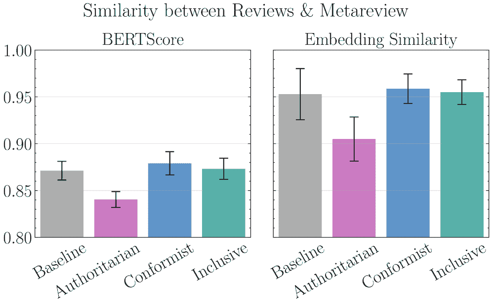

<!--yml

类别: 未分类

日期: 2025-01-11 12:31:26

-->

# AgentReview：探索使用LLM代理的同行评审动态

> 来源：[https://arxiv.org/html/2406.12708/](https://arxiv.org/html/2406.12708/)

Yiqiao Jin^(1∗)，Qinlin Zhao^(2∗)，Yiyang Wang¹，Hao Chen³，Kaijie Zhu⁴，Yijia Xiao⁵，Jindong Wang⁶

¹乔治亚理工学院，²中国科学技术大学，

³卡内基梅隆大学，⁴加利福尼亚大学圣塔芭芭拉分校，

⁵加利福尼亚大学洛杉矶分校，⁶威廉与玛丽大学

¹{yjin328,ywang3420}@gatech.edu

²ac99@mail.ustc.edu.cn

³haoc3@andrew.cmu.edu

⁴kaijiezhu@ucsb.edu

⁵yijia.xiao@cs.ucla.edu

⁶jwang80@wm.edu

[https://agentreview.github.io/](https://agentreview.github.io/)

###### 摘要

同行评审对于科学出版的完整性和进步至关重要。传统的同行评审分析方法通常依赖于现有同行评审数据的探索和统计，这些方法未能充分考虑过程的多元性、潜在变量，并且由于数据的敏感性，受到隐私问题的限制。我们引入了AgentReview，这是第一个基于大型语言模型（LLM）的同行评审模拟框架，能够有效解开多种潜在因素的影响，并解决隐私问题。我们的研究揭示了重要的见解，包括由于评审者偏见导致的论文决策变化达到37.1%，这一点得到了社会学理论的支持，如社会影响理论、利他主义疲劳和权威偏见。我们相信这项研究可以为改进同行评审机制的设计提供有价值的见解。我们的代码可以在[https://github.com/Ahren09/AgentReview](https://github.com/Ahren09/AgentReview)找到。

^†^†^∗ 两位作者做出了同等贡献。

### 1 引言

同行评审是学术出版的基石，确保被接受的手稿符合创新性、准确性和重要性标准。尽管其重要性，同行评审仍面临许多挑战，例如偏见[[1](https://arxiv.org/html/2406.12708v2#bib.bib1)]、评审质量不稳定[[1](https://arxiv.org/html/2406.12708v2#bib.bib1)]、评审动机不明确[[2](https://arxiv.org/html/2406.12708v2#bib.bib2)]和评审机制不完善[[3](https://arxiv.org/html/2406.12708v2#bib.bib3)]，这些问题因提交量的不断增加而加剧。开放科学和预印本平台的兴起进一步复杂化了这些系统，这些平台可能在双盲政策下披露作者身份[[4](https://arxiv.org/html/2406.12708v2#bib.bib4)]。

为了缓解这些问题，已有的努力主要集中在提高公平性[[2](https://arxiv.org/html/2406.12708v2#bib.bib2)]、减少新手评审者的偏见[[1](https://arxiv.org/html/2406.12708v2#bib.bib1)]、校准嘈杂的同行评审评分[[5](https://arxiv.org/html/2406.12708v2#bib.bib5)]，以及优化论文分配和评审者专业匹配机制[[6](https://arxiv.org/html/2406.12708v2#bib.bib6), [7](https://arxiv.org/html/2406.12708v2#bib.bib7)]。然而，在系统性地探索影响同行评审结果的因素时，仍然存在若干挑战：1) *多变量性质*。同行评审过程受到多种因素的影响，从评审者的专业水平、领域主席的参与到评审机制的设计。这种复杂性使得很难孤立出影响评审质量和结果的具体因素；2) *潜在变量*。如评审者的偏见和意图等因素很难衡量，但却对评审过程产生重要影响，常常导致结果不可预测；3) *隐私问题*。同行评审数据本身具有敏感性，并且可能泄露评审者的身份。调查此类数据不仅会引发伦理问题，还可能阻碍未来评审者的参与。

图1：AgentReview是一个开放且灵活的框架，旨在现实地模拟同行评审过程。它使得控制实验成为可能，从而*理清*同行评审中的多个变量，并深入分析这些变量对评审结果的影响。我们的研究结果与已有的社会学理论一致。

本文。我们介绍了AgentReview，这是第一个将大型语言模型（LLMs）[[8](https://arxiv.org/html/2406.12708v2#bib.bib8), [9](https://arxiv.org/html/2406.12708v2#bib.bib9)]与基于代理的建模[[10](https://arxiv.org/html/2406.12708v2#bib.bib10)]相结合的框架，用于模拟同行评审过程（参见[2](https://arxiv.org/html/2406.12708v2#S2 "2 The AgentReview Framework ‣ AgentReview: Exploring Peer Review Dynamics with LLM Agents")节）。如图[1](https://arxiv.org/html/2406.12708v2#S1.F1 "Figure 1 ‣ 1 Introduction ‣ AgentReview: Exploring Peer Review Dynamics with LLM Agents")所示，AgentReview建立在LLM的能力基础上，能够进行社会环境的现实模拟[[11](https://arxiv.org/html/2406.12708v2#bib.bib11), [12](https://arxiv.org/html/2406.12708v2#bib.bib12), [13](https://arxiv.org/html/2406.12708v2#bib.bib13), [14](https://arxiv.org/html/2406.12708v2#bib.bib14), [15](https://arxiv.org/html/2406.12708v2#bib.bib15), [16](https://arxiv.org/html/2406.12708v2#bib.bib16)]，并提供与人类水平相当或更高质量的学术文献反馈[[17](https://arxiv.org/html/2406.12708v2#bib.bib17), [18](https://arxiv.org/html/2406.12708v2#bib.bib18), [19](https://arxiv.org/html/2406.12708v2#bib.bib19), [20](https://arxiv.org/html/2406.12708v2#bib.bib20), [21](https://arxiv.org/html/2406.12708v2#bib.bib21)]。

AgentReview是开放且灵活的，旨在捕捉同行评审过程的*多变量特性*。它具有一系列可定制的变量，如评审人、作者、区域主席（AC）以及评审机制的特征（参见[2.1](https://arxiv.org/html/2406.12708v2#S2.SS1 "2.1 Framework Overview ‣ 2 The AgentReview Framework ‣ AgentReview: Exploring Peer Review Dynamics with LLM Agents")节）。这种适应性使得能够系统地探索和*解开*参与同行评审过程的各方角色和影响。此外，AgentReview支持探索替代的评审人特征和更复杂的评审过程。通过模拟超过53,800份生成的同行评审文档，其中包括超过10,000份评审，对四年内500多篇ICLR提交的同行评审活动进行模拟，AgentReview能够在不需要现实世界评审数据的情况下获得统计显著的见解，从而保护评审人的*隐私*。AgentReview还支持扩展到其他评审人特征和更复杂的评审过程。在进行大规模同行评审过程模拟后，我们进行了内容层面和数值分析。

关键发现。我们的发现如下，这些可能会启发未来同行评审系统的设计：

+   •

    社会影响 [[22](https://arxiv.org/html/2406.12708v2#bib.bib22)]。评审者通常会在反驳后调整评分，以与同行一致，受从众压力的驱使，趋向于遵循他们认为的多数意见。这种从众效应导致评分标准差下降了27.2%（第[3.1.1节](https://arxiv.org/html/2406.12708v2#S3.SS1.SSS1 "3.1.1 概述 ‣ 3.1 评审者的角色 ‣ 3 结果 ‣ AgentReview：探索LLM代理的同行评审动态")）；

+   •

    利他主义疲劳与同行效应 [[23](https://arxiv.org/html/2406.12708v2#bib.bib23)]。即使是*一位*承诺不足的评审，也可能导致所有评审者的承诺显著下降（18.7%）（第[3.1.2节](https://arxiv.org/html/2406.12708v2#S3.SS1.SSS2 "3.1.2 评审者承诺 ‣ 3.1 评审者的角色 ‣ 3 结果 ‣ AgentReview：探索LLM代理的同行评审动态")）；

+   •

    群体思维与回音室效应 [[24](https://arxiv.org/html/2406.12708v2#bib.bib24), [25](https://arxiv.org/html/2406.12708v2#bib.bib25)]。有偏见的评审者往往通过互动放大彼此的负面意见（第[3.1.3节](https://arxiv.org/html/2406.12708v2#S3.SS1.SSS3 "3.1.3 评审者意图 ‣ 3.1 评审者的角色 ‣ 3 结果 ‣ AgentReview：探索LLM代理的同行评审动态")）。这可能导致有偏评审者的评分下降0.17，并产生*溢出效应*，影响无偏评审者的判断，导致评分下降0.25；

+   •

    权威偏差与光环效应 [[26](https://arxiv.org/html/2406.12708v2#bib.bib26)]。评审者往往认为著名作者的手稿更为准确。当所有评审者仅知晓10%的论文作者身份时，决策可能会发生显著变化，达到27.7%（第[3.3节](https://arxiv.org/html/2406.12708v2#S3.SS3 "3.3 作者匿名性的影响 ‣ 3 结果 ‣ AgentReview：探索LLM代理的同行评审动态")）；

+   •

    锚定偏差 [[27](https://arxiv.org/html/2406.12708v2#bib.bib27)]。尽管反驳阶段在解决评审者的疑虑方面发挥着作用，但它对最终结果的影响不如其他因素显著。这可能是因为锚定偏差，即评审者过于依赖最初对提交稿的印象；

贡献。我们的贡献主要有三方面：

+   •

    *多功能框架*。AgentReview是首个采用LLM代理来模拟整个同行评审过程的框架；

+   •

    *全面数据集*。我们通过模拟创建了一个大规模数据集，涵盖了53,800多条生成的评审、反驳、更新的评审、元评审和最终决定，能够支持未来对学术同行评审过程的分析研究；

+   •

    *新颖的见解*。我们的研究揭示了若干重要发现，这些发现与社会学理论相契合，为未来的研究提供了支持；

图 2：我们的论文评审流程包括 5 个阶段。实心黑箭头 $\rightarrow$ 表示作者关系，蓝色虚线箭头 $\rightarrow$ 表示可见性关系。

### 2 AgentReview 框架

#### 2.1 框架概述

AgentReview 被设计为一个可扩展的测试平台，用于研究各类利益相关者和机制设计对同行评审结果的影响。它遵循流行的自然语言处理（NLP）和机器学习（ML）会议的程序，其中评审员提供初步论文评审，根据作者反馈更新评审，并且领域主席（ACs）组织评审员之间的讨论并做出最终决策。¹¹1一些会议或期刊可能会有稍微不同的评审流程。AgentReview 集成了三种角色——评审员、作者和领域主席（ACs），这些角色均由大型语言模型（LLM）代理支持。

评审员在同行评审中起着至关重要的作用。我们识别了三个决定评审质量的关键维度。1) *承诺性* 指评审员在处理手稿时的投入度和责任感。这需要一种积极主动且细致入微的方法，为提交的论文提供彻底且建设性的反馈。2) *意图性* 描述了评审背后的动机，关注评审员是否真正旨在帮助作者改进论文，或是否受到偏见或利益冲突的影响。3) *知识性* 衡量评审员在手稿主题领域的专业知识。理解每个维度的影响对于改进同行评审过程至关重要。

为了探索这些维度，我们将评审员分为特定类别：*知识性*上的有知识与无知识评审员，*承诺性*上的负责任与不负责任评审员，*意图性*上的善意与恶意评审员。这些分类由提示词设定，并作为固定特征输入系统。例如，有知识的评审员被描述为能够辨识研究意义并指出需要关注的技术问题的评审员。相反，无知识的评审员缺乏专业知识，可能忽视关键缺陷或误解贡献。评审员的描述和提示详见附录图[10](https://arxiv.org/html/2406.12708v2#A1.F10 "图 10 ‣ A.4 额外结果与统计 ‣ 附录 A 实验细节 ‣ 附录 ‣ AgentReview: 利用 LLM 代理探索同行评审动态")。

作者将论文提交到会议，并在审稿人-领域主席讨论期间（图[1](https://arxiv.org/html/2406.12708v2#S1.F1 "Figure 1 ‣ 1 Introduction ‣ AgentReview: Exploring Peer Review Dynamics with LLM Agents")中的第2阶段）提供对初步评审的反驳意见。尽管通常采用双盲评审政策，作者仍然可以选择发布预印本或在社交媒体上公开他们的作品，这可能会泄露他们的身份。我们考虑了两种情况：1）由于作品的公开发布，审稿人知道作者的身份；2）审稿人不知道作者的身份。这使我们能够探讨匿名性对评审过程的影响。

领域主席（AC）有多项职责，从促进审稿人讨论、将反馈整合为元评审，到做出最终决策。领域主席通过保持建设性的对话、整合多元化的观点、评估论文的质量、原创性和相关性，确保评审结果的完整性。我们的研究根据领域主席的参与策略，识别了三种领域主席风格，每种风格对评审过程的影响不同：1）*专制型*领域主席主导决策，优先考虑自己的评估而非审稿人的集体意见；2）*从众型*领域主席高度依赖其他审稿人的评估，最大程度地减少自己专业判断的影响；3）*包容型*领域主席考虑所有可用的讨论和反馈，包括评审、作者反驳以及审稿人评论，结合他们的专业知识，做出全面的最终决策。

#### 2.2 评审过程设计

AgentReview使用一个结构化的5阶段流程（图[1](https://arxiv.org/html/2406.12708v2#S1.F1 "Figure 1 ‣ 1 Introduction ‣ AgentReview: Exploring Peer Review Dynamics with LLM Agents")）来模拟同行评审过程。

I. 审稿人评估。在这个阶段，三位审稿人对稿件进行严格评估。为了模拟一个公正的评审过程，每位审稿人只能访问稿件和他们自己的评估，防止审稿人之间的相互影响。根据[[18](https://arxiv.org/html/2406.12708v2#bib.bib18)]，我们要求LLM代理生成包括*重要性和新颖性*、*接受的潜在理由*、*拒绝的潜在理由*和*改进建议*在内的四个部分的评审。这种格式与主要ML/NLP会议的常见评审结构一致。除非另有说明，否则每位审稿人会为每篇论文提供1到10的评分。

II. 作者-审稿人讨论。作者对每个评审进行回应，提供反驳文档，以澄清误解、解释他们的方法论并认可有效的批评。

III. 审稿人-领域主席讨论。领域主席发起审稿人之间的讨论，要求他们重新考虑初步评分，并在考虑了反驳意见后提供更新的评审。

IV. 元评审汇编。AC将第一至第三阶段讨论的见解、自身观察和数字评分整合到一份元评审中。这份文档提供了对手稿优缺点的综合评估，指导最终的决策。

V. 论文决策。在最终阶段，AC会审查他们所分配论文的所有元评审，以便做出关于接受或拒绝的明智决策。我们采用固定的接受率32%，这反映了ICLR $2020\sim 2023$年的实际平均接受率。因此，每个AC负责处理一批10篇论文，并接受其中$3\sim 4$篇。

#### 2.3 数据选择

AgentReview的论文数据来源于真实的会议提交，确保我们的模拟评审与真实场景紧密相似。我们在数据选择中遵循四个标准：1）会议必须具有国际影响力，拥有大量作者和广泛的观众，且讨论的学术成就应具有显著的现实世界影响；2）论文必须是公开的；3）论文的质量应反映现实世界的分布，包括被接受和被拒绝的论文；4）论文必须涵盖广泛的时间范围，以涵盖多样的主题，并减少随时间变化的评审者偏好的影响。

我们选择ICLR是因为它在计算机科学领域作为领先的出版平台的地位，以及其在公开接受和拒绝的论文方面的透明度。我们使用OpenReview API²²2[https://github.com/openreview/openreview-py](https://github.com/openreview/openreview-py)检索了跨越四年的论文（2020$\sim$2023）。论文被分为口头报告（前5%）、聚光灯报告（前25%）、海报和拒绝类别。然后，我们采用分层抽样技术从每个类别中选择论文，从而得到一个多样化的数据集，其中包括350篇拒稿论文、125篇海报、29篇聚光灯报告和19篇口头报告。这种方法确保了包含不同质量的论文，密切模拟了现实世界的会议。最后，我们提取了标题、摘要、图表和表格标题，以及作为LLM代理输入的正文。

#### 2.4 基准设置

实际的同行评审过程固有地包含了大量的不确定性，因为评审者的专业知识、投入程度和意图各不相同，这通常导致看似不一致的数字评分。例如，NeurIPS实验发现，当不同的评审小组评估相同的提交时，评分差异显著[[28](https://arxiv.org/html/2406.12708v2#bib.bib28), [2](https://arxiv.org/html/2406.12708v2#bib.bib2)]。直接将我们的实验结果的数字评分与实际评分进行比较可能是不恰当的，并且无法*解开*潜在的变量。

为了应对这个问题，我们建立了一个*基准*设置，该设置不具备LLM代理的特定特征（在表[1](https://arxiv.org/html/2406.12708v2#S3.T1 "表1 ‣ 3.1.1 概述 ‣ 3.1 审稿人角色 ‣ 3 结果 ‣ AgentReview: 探索LLM代理的同行评审动态")中称为‘*基准*’）。这使我们能够衡量在一致的参考标准下，变量变化的影响。在所有设置中，我们生成了10,460篇评论和反驳，23,535次审稿人-AC讨论，9,414篇元审稿，以及9,414个论文决定。数据集的详细统计数据请参见附录表[4](https://arxiv.org/html/2406.12708v2#A1.T4 "表4 ‣ A.1 审稿分类 ‣ 附录A 实验细节 ‣ 附录 ‣ AgentReview: 探索LLM代理的同行评审动态")，实验成本在附录[A.2](https://arxiv.org/html/2406.12708v2#A1.SS2 "A.2 实验成本 ‣ 附录A 实验细节 ‣ 附录 ‣ AgentReview: 探索LLM代理的同行评审动态")中。

### 3 结果

#### 3.1 审稿人角色

图3：初始和最终评分的分布，分别对应不负责任的（左）和恶意（右）审稿人。

为了研究承诺对同行评审结果的影响，我们首先用一个负责任或不负责任的审稿人替换一个*正常*的审稿人，然后逐步增加评论的数量。我们考虑的设置以及初始和最终评分请参见表[1](https://arxiv.org/html/2406.12708v2#S3.T1 "表1 ‣ 3.1.1 概述 ‣ 3.1 审稿人角色 ‣ 3 结果 ‣ AgentReview: 探索LLM代理的同行评审动态")，评分分布请参见图[9](https://arxiv.org/html/2406.12708v2#A1.F9 "图9 ‣ A.4 额外结果和统计数据 ‣ 附录A 实验细节 ‣ 附录 ‣ AgentReview: 探索LLM代理的同行评审动态")。我们环境中的代理审稿人表现出了社会学中的经典现象，如社会影响、回音室效应和光环效应。

##### 3.1.1 概述

|  | 初始（第一阶段） | 最终（第三阶段） |
| --- | --- | --- |
| 设置 | 平均值 | 标准差 | 平均值 | 标准差 |
| ![[未加说明的图片]](img/1f2e638e85880e5cb699145f5272c6f9.png) *基准* | 5.053 | 0.224 | 5.110 | 0.163 |
| ![[未加说明的图片]](img/1c6b2f01c50475c915d3b0eb2f88cba6.png) 负责 | 4.991 | 0.276 | 5.032 | 0.150 |
| ![[未加说明的图片]](img/35ec100d50b3fa63055fea033918aba9.png) 不负责任 | 4.750 | 0.645 | 4.815 | 0.434 |
| ![[未加说明的图片]](img/6ce892ecb30cc9589e07f1adb7e6bc96.png) 良性 | 4.990 | 0.281 | 5.098 | 0.211 |
| ![[未加说明的图片]](img/dbee2350912b4af6acf07ea4068ac86c.png) 恶意 | 4.421 | 1.181 | 4.368 | 1.014 |
| ![[Uncaptioned image]](img/c23c9aeaa9a09739f0836b7847c78d09.png) 知识丰富 | 5.004 | 0.260 | 5.052 | 0.152 |
| ![[Uncaptioned image]](img/363485acc92aaca4b5ec35680c2a2410.png) 知识不足 | 4.849 | 0.479 | 4.987 | 0.220 |

表1：结果总结。我们报告了评审者在评审者与作者讨论前后的评分（图[2](https://arxiv.org/html/2406.12708v2#S1.F2 "Figure 2 ‣ 1 Introduction ‣ AgentReview: Exploring Peer Review Dynamics with LLM Agents")中的第三阶段）。‘初始’与‘最终’分别表示第一阶段和第三阶段的评审者评分。

社会影响理论[[29](https://arxiv.org/html/2406.12708v2#bib.bib29)]认为，群体中的个体往往会朝着共同的观点修正自己的信念。在评审者之间也观察到类似的趋同倾向。在所有情境中，评审者评分的标准差（表[1](https://arxiv.org/html/2406.12708v2#S3.T1 "Table 1 ‣ 3.1.1 Overview ‣ 3.1 The Role of Reviewers ‣ 3 Results ‣ AgentReview: Exploring Peer Review Dynamics with LLM Agents")）在评审者与作者讨论后显著下降，显示出*一致性*的趋势。尤其是在一位高知识水平或责任心强的评审者主导讨论时，这一点尤为明显。

总体而言，负责任、知识丰富且善意（有良好意图）的评审者通常给出比那些投入较少或有偏见（恶意）的评审者更高的分数。尽管初步的评审评分可能较低，但在大多数情况下，经过讨论后最终评分显著提高，这突显了评审者与作者互动在解决评审者关切问题中的重要性。在第[3.4](https://arxiv.org/html/2406.12708v2#S3.SS4 "3.4 Effects of Peer Review Mechanisms ‣ 3 Results ‣ AgentReview: Exploring Peer Review Dynamics with LLM Agents")节中，我们进一步探讨这些互动及后续论文改进是否影响最终的决定。

##### 3.1.2 评审者承诺

利他疲劳与同伴效应[[23](https://arxiv.org/html/2406.12708v2#bib.bib23)] 论文评审通常是无偿且耗时的[[30](https://arxiv.org/html/2406.12708v2#bib.bib30)]，需要投入大量的时间，远超评审者的日常专业职责。这种高要求的性质，加上*利他疲劳*——评审者觉得自己的自愿付出没有得到认可——通常导致了评审者的承诺减少和评估的表面化。

仅有一个不负责任的审稿人就可能导致与*基线*相比，审稿人整体投入度显著下降。尽管在两种设置（*基线*和*不负责任*）下，初始审稿长度相似，分别为432.4字和429.2字，但在审稿人进行审稿人与会议主席讨论后，平均字数经历了显著的18.7%的下降，从195.5字下降至159.0字。这个*同行效应*展示了一个审稿人的表现不佳如何能够降低其他人的标准和努力，导致反驳后审稿更加敷衍。关键审稿讨论中整体参与度的下降突显了审稿人承诺不足的负面影响，这可能导致潜在缺陷的研究得以发表，误导后续研究，并侵蚀学术审查过程的信任。

| 变量 | 设置 | 杰卡德相似系数 | $\kappa$ | 同意百分比 |
| --- | --- | --- | --- | --- |
| ![[未标注的图片]](img/c6588f426225d44562004c404a0a6eb9.png) | ![[未标注的图片]](img/2b4241453928674fea9284b52d50d53f.png) 负责任 | 0.372 | 0.349 | 72.85 |
| ![[未标注的图片]](img/8ea67be989fd47e898ac7b7d0b03c82c.png) 不负责任 | 0.314 | 0.257 | 69.02 |
| ![[未标注的图片]](img/c4523d57555fa3723dfd5880c2d93166.png) 良性 | 0.632 | 0.679 | 86.62 |
| ![[未标注的图片]](img/73169b8827ff9db42fd563a3c320f904.png) 恶意 | 0.230 | 0.111 | 62.91 |
| ![[未标注的图片]](img/ca08d3de7982eab4ec3286b0f6e348eb.png) 知识渊博 | 0.297 | 0.230 | 67.88 |
| ![[未标注的图片]](img/0f0ff677e479718b9b82f30af33c2545.png) 知识匮乏 | 0.325 | 0.276 | 69.79 |
| ![[未标注的图片]](img/a627b5fb6fe5a1d6f4778720a90e4822.png) | ![[未标注的图片]](img/91a330c644d95dd212aea2b9e61abd40.png) 墨守成规 | 0.535 | 0.569 | 82.03 |
| ![[未标注的图片]](img/bef28eca00ac15673e419ed21c639c67.png) 权威主义 | 0.319 | 0.266 | 69.41 |
| ![[未标注的图片]](img/8b8a369efa426121e8ad0f1fa0f25ff3.png) 包容性 | 0.542 | 0.578 | 82.41 |
| ![[未标注的图片]](img/459b1913497d2d0b1339ac1bebd31c23.png) | ![[未标注的图片]](img/3794d454bf018b846cbb834d0bf4b562.png) 无反驳 | 0.622 | 0.668 | 86.14 |
| ![[未标注的图片]](img/109a3f0cb6831f5ef136823160a539ff.png) 无数字评分 | 0.200 | 0.052 | 60.40 |

表2：不同设置下最终决策与*基线*实验的比较，按杰卡德指数（Jacc.）、科恩的Kappa系数（$\kappa$）和同意百分比（%Agree）来衡量。Jacc. 表示同时被研究设置和基线接收的论文集合。最高值和第二高值分别以粗体和下划线标出。

群体思维[[24](https://arxiv.org/html/2406.12708v2#bib.bib24)]发生在一组评审人员出于追求和谐或一致性的愿望，达成共识而没有对稿件进行批判性推理或评估时。当该小组中包括不负责任或恶意的评审人员时，这种现象尤其有害。为了研究这种效应，我们将$1\sim 3$名正常评审替换为不负责任的评审，并分析评审-作者委员会讨论前后的评分变化。

表[3](https://arxiv.org/html/2406.12708v2#S3.T3 "表 3 ‣ 3.1.3 评审员意图 ‣ 3.1 评审员的角色 ‣ 3 结果 ‣ AgentReview: 探索LLM代理的同行评审动态")突出了在不负责任的评审员影响下，评审评分显著下降的现象。当将2名正常评审员替换为不负责任的评审员时，评审员-作者委员会讨论（阶段III）后，平均评分从5.256下降至5.005，下降幅度为0.25。相比之下，在*基线*场景中，最终评分在反驳后平均提高了0.06，因为评审员更积极地审视作者的反馈并解答了他们的疑虑。有趣的是，不负责任的评审员的评分略有上升，这表明他们倾向于遵循正常评审员的评估结果。

图4：接受与拒绝的原因分布。

##### 3.1.3 评审员意图

冲突理论[[31](https://arxiv.org/html/2406.12708v2#bib.bib31)]指出，社会互动往往是由冲突而非共识驱动的。在同行评审的背景下，论文的接受是具有竞争性的，评审人员可能会因利益冲突而将其他高质量的投稿视为对自己工作的威胁。这种竞争行为可能导致对竞争论文的低评分，特别是对于那些具有高度相似思想的并行作品，因为评审人员希望保护自己在该领域的地位。从实证数据来看，图[9](https://arxiv.org/html/2406.12708v2#A1.F9 "图 9 ‣ A.4 其他结果与统计 ‣ 附录 A 实验细节 ‣ 附录 ‣ AgentReview: 探索LLM代理的同行评审动态")中，评审评分呈现显著的双峰分布，主要集中在$[4.0,4.25]$区间，尤其当仅有一名恶意评审参与时。这与*基线*条件下在$[5.0,5.25]$区间观察到的单峰分布形成鲜明对比。

回音室效应[[25](https://arxiv.org/html/2406.12708v2#bib.bib25)]发生在一群具有相似偏见的审稿人放大他们的观点时，他们倾向于做出集体决策，而没有批判性地评估作品的优缺点。如图[3](https://arxiv.org/html/2406.12708v2#S3.F3 "Figure 3 ‣ 3.1 The Role of Reviewers ‣ 3 Results ‣ AgentReview: Exploring Peer Review Dynamics with LLM Agents")所示，从0到3个恶意审稿人的增加，导致平均评分从5.11降至3.35，表明恶意审稿人的存在对整体评估产生了显著影响。同时，随着恶意审稿人的主导地位，这些偏见审稿人中的平均评分（表[5](https://arxiv.org/html/2406.12708v2#A1.T5 "Table 5 ‣ A.4 Additional Results and Statistics ‣ Appendix A Experimental Details ‣ Appendix ‣ AgentReview: Exploring Peer Review Dynamics with LLM Agents")）在反驳后经历了更大的下降，表明更多偏见审稿人的加入不仅加剧了论文的问题，还加固了他们对该作品的强烈负面看法。这个过程不仅加强了先前存在的偏见并减少了批判性审查，而且还有溢出效应，负面影响无偏审稿人的评估。存在1个和2个*恶意*审稿人时，正常审稿人的评分分别下降了0.14和0.10。

内容级分析 我们将接受和拒绝的原因分类，如图 [4](https://arxiv.org/html/2406.12708v2#S3.F4 "图 4 ‣ 3.1.2 审稿人承诺 ‣ 3.1 审稿人的角色 ‣ 3 结果 ‣ AgentReview：探索LLM代理的同行评审动态") 所示，附加细节见附录 [A.1](https://arxiv.org/html/2406.12708v2#A1.SS1 "A.1 审稿分类 ‣ 附录A 实验细节 ‣ 附录 ‣ AgentReview：探索LLM代理的同行评审动态")。尽管接受论文的原因在所有设置中一致，但拒绝的原因在分布上存在显著差异。不负责任的审稿倾向于浅显、草率，并且显著缩短了 22.2%，而恶意的审稿则不成比例地批评工作中的 *创新性不足*（见图 [4](https://arxiv.org/html/2406.12708v2#S3.F4 "图 4 ‣ 3.1.2 审稿人承诺 ‣ 3.1 审稿人的角色 ‣ 3 结果 ‣ AgentReview：探索LLM代理的同行评审动态")d），这是一个常见但模糊的拒绝理由。具体而言，*恶意* 审稿人提到 *创新性不足* 占反馈的 10.4%，相比之下，*良性* 审稿人仅占 3.69%，增加了 182.9%。他们还更倾向于强调 *表达* 问题，尽管这些问题对于清晰性很重要，但与研究的理论性无关。另一方面，良性审稿人更多地关注关于 *可扩展性和实用性* 问题的讨论，并提供建议，帮助增强论文的全面性。

| ![[Uncaptioned image]](img/839cd41e1a0b85f054ac6d41f37a77af.png) 普通审稿人 | ![[Uncaptioned image]](img/0aae60770b05dc81ece85e3b7f4fa0e9.png) 不负责任审稿人 |
| --- | --- |
| # | 初始 | 最终 | $+/-$ | # | 初始 | 最终 | $+/-$ |
| --- | --- | --- | --- | --- | --- | --- | --- |
| 3 | 5.053 $\pm$ 0.623 | 5.110 $\pm$ 0.555 | $+$0.06 | 0 | / | / | / |
| 2 | 5.056 $\pm$ 0.633 | 5.015 $\pm$ 0.546 | $-$0.04 | 1 | 4.139 $\pm$ 1.121 | 4.416 $\pm$ 0.925 | $+$0.27 |
| 1 | 5.256 $\pm$ 0.896 | 5.005 $\pm$ 0.630 | $-$0.25 | 2 | 4.548 $\pm$ 0.925 | 4.543 $\pm$ 0.872 | $-$0.01 |
| 0 | / | / | / | 3 | 4.591 $\pm$ 0.912 | 4.677 $\pm$ 0.745 | $+$0.09 |

表 3：在不同数量的 ![[Uncaptioned image]](img/839cd41e1a0b85f054ac6d41f37a77af.png) *普通* 审稿人被 ![[Uncaptioned image]](img/f7a465c680c30630255fc96bfd095e9e.png) 不负责任审稿人替代时，平均审稿人评分。‘#’ 表示每种类型的审稿人数。‘Initial’ 和 ‘Final’ 分别表示第一阶段和第三阶段的平均评分。表格的左右两侧分别显示了 ![[Uncaptioned image]](img/839cd41e1a0b85f054ac6d41f37a77af.png) 普通审稿人和 ![[Uncaptioned image]](img/e533aadc5a80033bcbcbec4277dee1eb.png) 不负责任审稿人的平均评分。$+/-$ 表示反驳后平均评分的变化。

##### 3.1.4 审稿人知识水平

知识性带来了两个挑战。首先，尽管做出了大量努力以匹配专业知识，评审分配往往仍然不完善或随机[[6](https://arxiv.org/html/2406.12708v2#bib.bib6), [32](https://arxiv.org/html/2406.12708v2#bib.bib32)]。其次，近年来计算机科学会议投稿激增，迫使评审池的扩展，这引发了对评审者是否具备足够专业知识进行适当有效评估的担忧。如图[4](https://arxiv.org/html/2406.12708v2#S3.F4 "Figure 4 ‣ 3.1.2 Reviewer Commitment ‣ 3.1 The Role of Reviewers ‣ 3 Results ‣ AgentReview: Exploring Peer Review Dynamics with LLM Agents")所示，知识较少的评审者更有可能提到*讨论不足的局限性*，比例高达24%，而专家评审者不仅会讨论这些基本问题，还会对实验验证提出6.8%的更多批评，从而为改进论文提供更加具体和有益的反馈。

#### 3.2 区域主席的参与

我们使用BERTScore[[33](https://arxiv.org/html/2406.12708v2#bib.bib33)]和句子嵌入相似度[[34](https://arxiv.org/html/2406.12708v2#bib.bib34)]量化了评论与元评论之间的一致性，如表[2](https://arxiv.org/html/2406.12708v2#S3.T2 "Table 2 ‣ 3.1.2 Reviewer Commitment ‣ 3.1 The Role of Reviewers ‣ 3 Results ‣ AgentReview: Exploring Peer Review Dynamics with LLM Agents")所示，并衡量了*基准*与每个设置之间的最终决策一致性，如图[5](https://arxiv.org/html/2406.12708v2#S3.F5 "Figure 5 ‣ 3.4 Effects of Peer Review Mechanisms ‣ 3 Results ‣ AgentReview: Exploring Peer Review Dynamics with LLM Agents")所示。包容性AC在最终决策上与*基准*最为接近，表明它们通过平衡考虑评论和自身专业知识，能够有效整合多样化的观点并保持评审过程的完整性。相比之下，权威型AC与*基准*的相关性明显较低，Cohen’s Kappa值仅为0.266，协议率为69.8%。这表明它们的决策可能受到个人偏见的影响，从而导致接受质量较低的论文或拒绝那些与其观点不符的高质量论文，进而妥协了同行评审过程的完整性和公平性。尽管顺从型AC在语义上与评审者的评估高度重合，如图[5](https://arxiv.org/html/2406.12708v2#S3.F5 "Figure 5 ‣ 3.4 Effects of Peer Review Mechanisms ‣ 3 Results ‣ AgentReview: Exploring Peer Review Dynamics with LLM Agents")所示，但它们可能缺乏独立判断。这种依赖性可能会延续初始评审中的现有偏见或错误，突显了过于顺从的方法中存在的一个关键缺陷。

#### 3.3 作者匿名性影响

最近的会议越来越允许发布预印本，这可能会影响论文的接受[[35](https://arxiv.org/html/2406.12708v2#bib.bib35)]。尽管评审员被指示不要主动寻找有关作者身份的信息，但仍然存在担忧，即评审可能会受到作者声誉的偏见影响。

权威偏见是指人们倾向于认为权威人物的意见更加准确和可信。这种偏见与晕轮效应密切相关，晕轮效应是一种认知偏见，指的是个体在某一领域（如他们之前的开创性研究）获得的积极评价会影响人们对其当前工作的判断。受到权威偏见影响的评审员更容易给知名且受人尊敬的科学家提供积极的评价。

为了分析作者身份对评审结果的影响，我们变化了了解作者身份的评审员人数（$k$），范围从1到3，并调整了已知作者身份的论文比例（$r$），范围从10%到30%。具体来说，评审员被告知某些论文的作者在该领域是著名且非常有成就的。我们根据论文的真实接受决定，将论文分为两类：高质量和低质量。

对于质量较低的论文，当1、2或3位评审员知道作者的著名身份时，论文接受的Jaccard指数分别为0.364、0.154和0.008（图[6](https://arxiv.org/html/2406.12708v2#S3.F6 "图 6 ‣ 3.4 同行评审机制的影响 ‣ 3 结果 ‣ AgentReview: 探索LLM代理的同行评审动态")）。最极端的情况具有负的Cohen’s Kappa $\kappa$（图[8](https://arxiv.org/html/2406.12708v2#A1.F8 "图 8 ‣ A.4 附加结果和统计 ‣ 附录 A 实验细节 ‣ 附录 ‣ AgentReview: 探索LLM代理的同行评审动态")），表明论文决策存在显著偏差。当高质量论文的作者身份为人所知时，接受的论文变化要小得多。值得注意的是，论文决策的变化更多地受到了解作者身份的评审员人数的影响，而非已知作者身份的论文比例。

#### 3.4 同行评审机制的影响

我们调查了同行评审机制的两种变体。1) *无反驳*—排除了评审员与作者讨论（第二阶段）和评审员与AC讨论（第三阶段）；2) *无数值评分*—去除了要求为整体评分分配数值评分（第一阶段和第三阶段），因此AC的决策完全依赖于评审内容。

图 5：使用各种干预策略的评审与元评审的相似性来自AC。左：BERTScore，右：句子嵌入相似性。

反驳阶段的影响。取消反驳阶段，尽管需要审稿人和作者大量时间投入，却对最终论文决策产生了出乎意料的最小影响，且与*基准*情景高度一致。

这种最小影响的一个解释是*锚定偏差*，即首次提交时形成的初步印象（“锚点”）主要影响审稿人的判断。尽管作者在反驳阶段可能会做出大量改进，解决审稿人的关切（参见[3.1.1](https://arxiv.org/html/2406.12708v2#S3.SS1.SSS1 "3.1.1 Overview ‣ 3.1 The Role of Reviewers ‣ 3 Results ‣ AgentReview: Exploring Peer Review Dynamics with LLM Agents")），但这些变化可能无法改变他们的初步判断。另一个可能的原因是所有提交在反驳阶段都能提高质量。因此，每篇论文在所有提交中的相对位置（质量排名）几乎没有变化。

总体评分的影响。审稿人的数字评分可能在最终决策中作为一个快捷方式，帮助判断论文是否接受。当这些评分被省略时，决策过程会发生显著变化，可能导致决策出现分歧。与*基准*的结果比较表明，接收的论文之间几乎没有重叠，Jaccard指数为0.20（表[2](https://arxiv.org/html/2406.12708v2#S3.T2 "Table 2 ‣ 3.1.2 Reviewer Commitment ‣ 3.1 The Role of Reviewers ‣ 3 Results ‣ AgentReview: Exploring Peer Review Dynamics with LLM Agents")）。

图6：当作者身份已知且论文比例相对于*基准*发生变化时，与*基准*的最终决策对比。较小的Jaccard指数表示与基准的相关性较低。

### 4 相关工作

同行评审系统分析。同行评审作为学术研究的支柱，确保了发表作品的完整性和质量[[36](https://arxiv.org/html/2406.12708v2#bib.bib36)]。一些研究已经深入探讨了同行评审中的各种挑战，如偏见[[1](https://arxiv.org/html/2406.12708v2#bib.bib1), [37](https://arxiv.org/html/2406.12708v2#bib.bib37), [38](https://arxiv.org/html/2406.12708v2#bib.bib38)]、利益冲突[[39](https://arxiv.org/html/2406.12708v2#bib.bib39)]以及评审质量和公平性等更广泛的问题[[1](https://arxiv.org/html/2406.12708v2#bib.bib1), [39](https://arxiv.org/html/2406.12708v2#bib.bib39), [40](https://arxiv.org/html/2406.12708v2#bib.bib40)]。研究还深入探讨了操作层面的内容，如评审者分配[[41](https://arxiv.org/html/2406.12708v2#bib.bib41), [32](https://arxiv.org/html/2406.12708v2#bib.bib32), [42](https://arxiv.org/html/2406.12708v2#bib.bib42)]和作者反驳[[43](https://arxiv.org/html/2406.12708v2#bib.bib43)]，识别出在透明度、公平性和问责制方面需要改进的领域[[2](https://arxiv.org/html/2406.12708v2#bib.bib2)]。这些研究主要集中于分析现有的真实世界评审数据和结果。然而，由于同行评审的复杂性和固有的变异性，隔离特定因素对评审结果的影响仍然是一个重大挑战。

作为代理的LLMs。大型语言模型（LLMs），如GPT-4 [[8](https://arxiv.org/html/2406.12708v2#bib.bib8)]、Claude 3 [[44](https://arxiv.org/html/2406.12708v2#bib.bib44)] 和 Gemini [[45](https://arxiv.org/html/2406.12708v2#bib.bib45)]，不仅展示了复杂的语言理解能力 [[46](https://arxiv.org/html/2406.12708v2#bib.bib46)、[47](https://arxiv.org/html/2406.12708v2#bib.bib47)、[48](https://arxiv.org/html/2406.12708v2#bib.bib48)]、推理能力 [[49](https://arxiv.org/html/2406.12708v2#bib.bib49)、[50](https://arxiv.org/html/2406.12708v2#bib.bib50)、[51](https://arxiv.org/html/2406.12708v2#bib.bib51)] 和生成能力 [[52](https://arxiv.org/html/2406.12708v2#bib.bib52)、[53](https://arxiv.org/html/2406.12708v2#bib.bib53)、[54](https://arxiv.org/html/2406.12708v2#bib.bib54)、[55](https://arxiv.org/html/2406.12708v2#bib.bib55)、[56](https://arxiv.org/html/2406.12708v2#bib.bib56)、[57](https://arxiv.org/html/2406.12708v2#bib.bib57)]，还展示了规划、协作和竞争行为 [[14](https://arxiv.org/html/2406.12708v2#bib.bib14)、[58](https://arxiv.org/html/2406.12708v2#bib.bib58)、[59](https://arxiv.org/html/2406.12708v2#bib.bib59)]。这些能力促进了它们作为自主代理的应用，能够相互作用以完成任务 [[60](https://arxiv.org/html/2406.12708v2#bib.bib60)、[61](https://arxiv.org/html/2406.12708v2#bib.bib61)]。我们的研究与基于代理的建模（ABM）相关的最新工作 [[12](https://arxiv.org/html/2406.12708v2#bib.bib12)、[60](https://arxiv.org/html/2406.12708v2#bib.bib60)、[61](https://arxiv.org/html/2406.12708v2#bib.bib61)、[62](https://arxiv.org/html/2406.12708v2#bib.bib62)、[63](https://arxiv.org/html/2406.12708v2#bib.bib63)]一致，利用LLM代理的能力来模拟科学研究的真实环境。

### 5 结论

我们提出了AgentReview，这是第一个基于LLM的同行评审过程模拟框架。AgentReview通过解开影响评审结果的复杂因素，同时保护评审者隐私，解决了关键挑战。我们的工作为学术出版中的更公平、更透明的评审机制设计奠定了坚实的基础。未来的研究可以探讨不同变量之间复杂的互动如何共同影响评审结果。

### 局限性

我们的工作存在以下局限性。首先，AgentReview无法在评审者与作者讨论（图[2](https://arxiv.org/html/2406.12708v2#S1.F2 "图2 ‣ 1介绍 ‣ AgentReview：探索LLM代理在同行评审中的作用")）期间，根据评审者的反馈动态地纳入或调整实验结果，因为LLM缺乏生成新实证数据的能力。其次，我们的分析主要孤立地审视同行评审过程中的个别变量，如评审者的承诺或知识水平。然而，现实中的同行评审涉及多个相互作用的维度。最后，我们没有将仿真结果与实际的同行评审结果直接比较。如在第[2.4](https://arxiv.org/html/2406.12708v2#S2.SS4 "2.4 基线设置 ‣ 2 AgentReview框架 ‣ AgentReview：探索LLM代理在同行评审中的作用")节所述，由于评审者特征（如承诺、意图和知识水平）在论文、主题和时间段上存在广泛的差异，因此建立一致的基准进行比较是非常具有挑战性的。人类同行评审中固有的差异性和任意性[[28](https://arxiv.org/html/2406.12708v2#bib.bib28)]使得模拟结果与实际结果之间的直接比较更加复杂。

### 伦理考量

对同行评审数据的进一步研究。现实世界中评审数据的敏感性和稀缺性，由于伦理和保密限制，给全面研究同行评审带来了困难。我们的AgentReview框架生成模拟数据来研究不同的同行评审动态，有效克服了相关的挑战。

同行评审诚信。如前所述，同评审过程的诚信建立在评审者的承诺、意图和知识水平之上。*知识水平*确保评审者能够准确评估提交稿件的新颖性、重要性和技术严谨性。良好的*意图*对于保持评审的客观性和公正性至关重要，从而支持学术出版物的可信度和诚信。评审者的高度*承诺*确保了对提交稿件的全面和细致评估，这对于公正和严格的评估过程至关重要。然而，论文评审通常是一项无偿且耗时的任务。这种要求很高的性质可能导致评审者进行草率或表面的评估。

LLM 使用的注意事项。我们的 AgentReview 模拟现实世界的学术评审实践，以确保我们研究结果的真实性和相关性。虽然 AgentReview 使用 LLM 来生成论文评审，但在实际同行评审过程中使用 LLM 存在伦理问题[[64](https://arxiv.org/html/2406.12708v2#bib.bib64)]。近期的机器学习会议中，怀疑由 AI 生成的评审数量有所增加[[65](https://arxiv.org/html/2406.12708v2#bib.bib65)]。尽管 LLM 生成的评审可以提供有价值的反馈，我们强烈建议不要将其作为现实世界同行评审过程中替代人工评审的工具。由于 LLM 仍不完美，人类监督在确保公平和有价值的评估手稿以及维护同行评审的完整性和质量方面至关重要。

### 参考文献

+   [1] 伊凡·斯特尔马克, 尼哈尔·B·沙阿, 阿尔蒂·辛格, 和 哈尔·达梅三世. 先验与偏见：新手评审者对会议同行评审中再提交的偏见. HCI, 5(CSCW1):1–17, 2021.

+   [2] 张佳尧, 张红明, 邓俊, 和丹·罗斯. 研究同行评审中的公平性差异：一种增强语言模型的方法. arXiv:2211.06398, 2022.

+   [3] 查尔斯·W·福克斯, 詹妮弗·迈耶, 和埃米莉·艾梅. 双盲同行评审如何影响评审人评分和编辑决策：生态学期刊的研究. 功能生态学, 37(5):1144–1157, 2023.

+   [4] 孙梦怡, 贾纳布·巴里·丹法, 和 米莎·特普利茨基. 双盲同行评审是否减少偏见？来自顶级计算机科学会议的证据. 信息科学与技术协会期刊, 73(6):811–819, 2022.

+   [5] 陆宇轩 和 孔宇青. 在没有先验的情况下校准同行评审中的“廉价信号”. NeurIPS, 36, 2024.

+   [6] 许一轩, 斯蒂文·杰克门, 宋子萌, 和 方飞. 提高论文分配随机性的“一刀切”方法. NeurIPS, 36, 2024.

+   [7] 刘颖, 杨凯琪, 刘悦, 和 迈克尔·GB·德鲁. 同行评审的枷锁：揭示象牙塔中的缺陷. arXiv:2310.05966, 2023.

+   [8] OpenAI. GPT-4 技术报告. Arxiv 预印本, arXiv:2303.08774, 2023.

+   [9] 于戈·图夫龙, 路易斯·马丁, 凯文·斯通, 彼得·阿尔伯特, 阿姆贾德·阿尔马哈里, 雅丝敏·巴巴埃, 尼古拉·巴什利科夫, 苏米娅·巴特拉, 普拉吉瓦尔·巴尔加瓦, 什鲁蒂·博萨尔, 等人. Llama 2: 开放基础和微调聊天模型. arXiv:2307.09288, 2023.

+   [10] Significant-Gravitas. Autogpt. [https://github.com/Significant-Gravitas/AutoGPT](https://github.com/Significant-Gravitas/AutoGPT), 2023.

+   [11] 吴清云, 甘根·班萨尔, 张杰宇, 吴怡然, 张绍坤, 朱尔康, 李贝宾, 姜丽, 张晓云, 王驰. Autogen: 通过多代理对话框架实现下一代大语言模型应用. arXiv:2308.08155, 2023.

+   [12] 吴宇翔, 姜正尧, 阿克比尔·汗, 傅瑶, 劳拉·瑞斯, 爱德华·格雷芬斯泰特, 和蒂姆·罗克塔谢尔. Chatarena: 大语言模型的多代理语言游戏环境. GitHub 仓库, 2023.

+   [13] 陈伟泽、苏玉生、左敬维、杨程、袁晨菲、陈敏·陈、余鹤扬、吕雅玺、洪宜新、钱晨等人。Agentverse：促进多代理协作与探索新兴行为。发表于ICLR, 2023。

+   [14] 赵琴林、王金东、张怡萱、金一桥、朱凯杰、陈浩、谢星。Competeai：理解基于大型语言模型的代理中的竞争行为。发表于ICML, 2024。

+   [15] 朴俊成、约瑟夫·欧布赖恩、蔡俊、梅雷迪思·林戈尔·莫里斯、佩尔西·梁、迈克尔·S·伯恩斯坦。生成代理：人类行为的互动模拟。发表于UIST，页码1–22, 2023。

+   [16] 李若森、特尔特·帕特尔、杜鑫雅。Prd：同行排名与讨论提升基于大型语言模型的评估。arXiv预印本arXiv:2307.02762, 2023。

+   [17] 刘亮、薛年、克里斯蒂娜·波普尔。揭示守望者：评估AI在网络安全同行评审中的表现。arXiv:2309.05457, 2023。

+   [18] 梁伟鑫、张宇辉、曹汉城、王冰璐、丁黛西、杨欣瑜、沃德拉哈利·凯拉斯、何思宇、丹尼尔·史密斯、尹晏、等人。大型语言模型能否对研究论文提供有用的反馈？一项大规模的实证分析。arXiv:2310.01783, 2023。

+   [19] 马赫萨·沙姆萨巴迪、詹妮弗·D·苏扎。一个公平且免费的基于提示的研究助手。arXiv:2405.14601, 2024。

+   [20] 李淼、劳杰·汉、爱德华·霍维。探索多文档信息整合在科学情感总结中的应用。arXiv:2402.18005, 2024。

+   [21] 迈克·达西、汤姆·霍普、拉里·伯恩鲍姆、道格·道尼。Marg：用于科学论文的多代理评审生成。arXiv:2401.04259, 2024。

+   [22] 约翰·C·特纳。社会影响。汤姆森·布鲁克斯/科尔出版社, 1991。

+   [23] 乔舒亚·D·安格里斯特。同行效应的危险。《劳动经济学》，30:98–108, 2014。

+   [24] 欧文·L·贾尼斯。集体思维。IEEE工程管理评论，36(1):36, 2008。

+   [25] 马泰奥·奇内利、吉安马尔科·德·弗朗西斯基·莫拉莱斯、亚历山德罗·加莱阿齐、沃尔特·夸特罗奇奥基、米凯尔·斯塔尔尼尼。社交媒体上的回音室效应。《美国国家科学院院刊》，118(9):e2023301118, 2021。

+   [26] 理查德·E·尼斯比特、蒂莫西·D·威尔逊。光环效应：无意识改变判断的证据。《人格与社会心理学期刊》，35(4):250, 1977。

+   [27] 马赫桑·努拉尼、奇拉迪普·罗伊、杰里米·E·布洛克、唐纳德·R·霍尼卡特、塔赫里玛·拉赫曼、埃里克·雷根、维哈夫·戈盖特。锚定偏差影响可解释AI系统中的心理模型形成与用户依赖性。发表于IUI，页码340–350, 2021。

+   [28] 科琳娜·科尔特斯、尼尔·D·劳伦斯。会议同行评审中的不一致性：重访2014年NeurIPS实验。arXiv:2109.09774, 2021。

+   [29] 罗伯特·B·西亚尔迪尼、诺亚·J·戈德斯坦。社会影响：服从与一致性。《心理学年鉴》，55:591–621, 2004。

+   [30] 张光耀、商富荣、谢伟西、郭宇涵、蒋春林、王献文。显眼的手稿是否在同行评审期间经历更短的时间？arXiv:2112.09360, 2021。

+   [31] Otomar J Bartos 和 Paul Wehr. 使用冲突理论。剑桥大学出版社，2002年。

+   [32] Martin Saveski, Steven Jecmen, Nihar Shah 和 Johan Ugander. 反事实评估同行评审分配政策。NeurIPS，36，2024年。

+   [33] Tianyi Zhang, Varsha Kishore, Felix Wu, Kilian Q Weinberger 和 Yoav Artzi. Bertscore：使用 BERT 评估文本生成。发表于 ICLR，2020年。

+   [34] Nils Reimers 和 Iryna Gurevych. Sentence-bert：使用 Siamese BERT 网络的句子嵌入。发表于 EMNLP，页面3982–3992，2019年。

+   [35] Yanai Elazar, Jiayao Zhang, David Wadden, Bo Zhang 和 Noah A Smith. 估计早期 arxiving 对论文接受的因果影响。发表于 CLeaR，页面913–933。PMLR，2024年。

+   [36] Yichi Zhang, Fang-Yi Yu, Grant Schoenebeck 和 David Kempe. 会议同行评审的系统级分析。发表于 EC，页面1041–1080，2022年。

+   [37] Alexander Ugarov. 同行评审的同行预测：为思想设计市场。arXiv:2303.16855，2023年。

+   [38] Jeroen PH Verharen. ChatGPT 识别科学同行评审中的性别差异。Elife, 12:RP90230，2023年。

+   [39] Leslie D McIntosh 和 Cynthia Hudson Vitale. 保障科学诚信：审查同行评审过程中的利益冲突。arXiv:2308.04297，2023年。

+   [40] Dimity Stephen. 使用与质量相关的定量指标区分可疑和非可疑期刊中的文章。arXiv:2405.06308，2024年。

+   [41] Jelena Jovanovic 和 Ebrahim Bagheri. 审稿人分配问题：一个范围回顾。arXiv:2305.07887，2023年。

+   [42] Kayvan Kousha 和 Mike Thelwall. 人工智能支持出版和同行评审：总结与回顾。学习出版，37(1):4–12，2024年。

+   [43] Junjie Huang, Win-bin Huang, Yi Bu, Qi Cao, Huawei Shen 和 Xueqi Cheng. 什么是计算机科学会议中成功的反驳？一种社会互动的视角。信息计量学杂志，17(3):101427，2023年。

+   [44] Anthropic. 介绍下一代Claude，2024年。

+   [45] Gemini 团队, Rohan Anil, Sebastian Borgeaud, Yonghui Wu, Jean-Baptiste Alayrac, Jiahui Yu, Radu Soricut, Johan Schalkwyk, Andrew M Dai, Anja Hauth 等人. Gemini：一系列高度智能的多模态模型。arXiv:2312.11805，2023年。

+   [46] Kaijie Zhu, Jindong Wang, Qinlin Zhao, Ruochen Xu 和 Xing Xie. 通过元探测代理对大型语言模型进行动态评估。发表于 ICML，2024年。

+   [47] Yiqiao Jin, Mohit Chandra, Gaurav Verma, Yibo Hu, Munmun De Choudhury 和 Srijan Kumar. 更好地用英语提问：针对医疗查询的跨语言评估大型语言模型。发表于 Web Conference，2024年。

+   [48] Yiqiao Jin, Minje Choi, Gaurav Verma, Jindong Wang 和 Srijan Kumar. Mm-soc：在社交媒体平台上基准测试多模态大型语言模型。发表于 ACL，2024年。

+   [49] Weiqi Wang 和 Yangqiu Song. Mars：通过多任务评估数据集基准测试语言模型的形而上推理能力，2024年。

+   [50] Tianyu Liu, Tianqi Chen, Wangjie Zheng, Xiao Luo, 和 Hongyu Zhao。scelmo：语言模型的嵌入在单细胞数据分析中是优秀的学习者。bioRxiv, 页码 2023–12, 2023。

+   [51] Haoran Wang 和 Kai Shu。后门激活攻击：通过激活引导攻击大语言模型，以实现安全对齐。arXiv:2311.09433, 2023。

+   [52] Yijia Xiao, Yiqiao Jin, Yushi Bai, Yue Wu, Xianjun Yang, Xiao Luo, Wenchao Yu, Xujiang Zhao, Yanchi Liu, Haifeng Chen 等人。大语言模型可以成为良好的隐私保护学习者。在EMNLP, 2024。

+   [53] Jinghan Zhang, Xiting Wang, Yiqiao Jin, Changyu Chen, Xinhao Zhang, 和 Kunpeng Liu。数据高效的RLHF原型奖励网络。在ACL, 2024。

+   [54] Wenyue Hua, Kaijie Zhu, Lingyao Li, Lizhou Fan, Shuhang Lin, Mingyu Jin, Haochen Xue, Zelong Li, JinDong Wang, 和 Yongfeng Zhang。解开逻辑：上下文在大语言模型推理能力中的作用。arXiv 预印本 arXiv:2406.02787, 2024。

+   [55] Kaijie Zhu, Jindong Wang, Qinlin Zhao, Ruochen Xu, 和 Xing Xie。Dyval 2：通过元探测代理对大语言模型进行动态评估。arXiv:2402.14865, 2024。

+   [56] Lizhou Fan, Wenyue Hua, Xiang Li, Kaijie Zhu, Mingyu Jin, Lingyao Li, Haoyang Ling, Jinkui Chi, Jindong Wang, Xin Ma 等人。Nphardeval4v：多模态大语言模型的动态推理基准。arXiv:2403.01777, 2024。

+   [57] Changyu Chen, Xiting Wang, Yiqiao Jin, Victor Ye Dong, Li Dong, Jie Cao, Yi Liu, 和 Rui Yan。优化文本生成的半离线强化学习。在ICML, 2023。

+   [58] Yushi Bai, Jiahao Ying, Yixin Cao, Xin Lv, Yuze He, Xiaozhi Wang, Jifan Yu, Kaisheng Zeng, Yijia Xiao, Haozhe Lyu 等人。基于语言模型作为评估者的基础模型基准测试。arXiv:2306.04181, 2023。

+   [59] Chengxing Xie, Canyu Chen, Feiran Jia, Ziyu Ye, Kai Shu, Adel Bibi, Ziniu Hu, Philip Torr, Bernard Ghanem, 和 Guohao Li。大语言模型代理能否模拟人类信任行为？arXiv:2402.04559, 2024。

+   [60] Da Yin, Faeze Brahman, Abhilasha Ravichander, Khyathi Chandu, Kai-Wei Chang, Yejin Choi, 和 Bill Yuchen Lin。Lumos：利用统一数据、模块化设计和开源大语言模型的学习代理。arXiv:2311.05657, 2023。

+   [61] Zhaoyi Li, Kelin Yu, Shuo Cheng, 和 Danfei Xu。League++：通过大语言模型引导技能获取赋能持续机器人学习。在ICLR 2024 大语言模型（LLM）代理研讨会，2024。

+   [62] Xuechen Li, Tianyi Zhang, Yann Dubois, Rohan Taori, Ishaan Gulrajani, Carlos Guestrin, Percy Liang, 和 Tatsunori B Hashimoto。Alpacaeval：指令跟随模型的自动评估器，2023。

+   [63] Chi-Min Chan, Weize Chen, Yusheng Su, Jianxuan Yu, Wei Xue, Shanghang Zhang, Jie Fu, 和 Zhiyuan Liu。Chateval：通过多代理辩论，朝着更好的基于LLM的评估器迈进。在ICLR, 2023。

+   [64] Ji-Ung Lee, Haritz Puerto, Betty van Aken, Yuki Arase, Jessica Zosa Forde, Leon Derczynski, Andreas Rücklé, Iryna Gurevych, Roy Schwartz, Emma Strubell, 等人. 调查计算密集型 NLP 研究的（不）平等性与关注点. arXiv:2306.16900, 2023.

+   [65] Weixin Liang, Zachary Izzo, Yaohui Zhang, Haley Lepp, Hancheng Cao, Xuandong Zhao, Lingjiao Chen, Haotian Ye, Sheng Liu, Zhi Huang, 等人. 大规模监控 AI 修改内容：以 ChatGPT 对 AI 会议同行评审影响的案例研究为例. arXiv:2403.07183, 2024.

+   [66] Xu Ma, Yuqian Zhou, Huan Wang, Can Qin, Bin Sun, Chang Liu, 和 Yun Fu. 图像作为点集. 见 ICLR, 2022.

## 附录

\parttoc

### 附录 A 实验详情

#### A.1 审查分类

在我们的实验中，我们利用 GPT-4 来总结和分类论文接受与拒绝的原因，如图 [4](https://arxiv.org/html/2406.12708v2#S3.F4 "图 4 ‣ 3.1.2 审稿人承诺 ‣ 3.1 审稿人角色 ‣ 3 结果 ‣ AgentReview：探索具有 LLM 代理的同行评审动态") 所示。具体来说，我们分析了生成的审查中“接受原因”和“拒绝原因”字段的每一行。GPT-4 负责自动分类每一列出的原因。如果某条条目不符合预定义类别，模型将建立一个新类别。最终，我们确定了五个接受原因和七个拒绝原因。

|  | #单词 | #字符 |
| --- | --- | --- |
| 审查 | 438.2 $\pm$ 72.0 | 3067.4 $\pm$ 510.1 |
| 反驳 | 370.6 $\pm$ 49.9 | 2584.8 $\pm$ 376.5 |
| 更新后的审查 | 189.7 $\pm$ 46.6 | 1304.0 $\pm$ 320.8 |
| 元审查 | 256.9 $\pm$ 64.8 | 1849.9 $\pm$ 454.5 |

表 4：我们的数据集统计信息。

图 7：当审稿人知晓作者的显赫身份时，初始与最终评分的分布。

#### A.2 实验成本

为确保评估结果的一致性，我们在整个实验中使用gpt-4-1106-preview版本的GPT-4模型。该模型因其卓越的语言理解和生成能力而被选中，这对于模拟真实的同行评审过程至关重要。为了提高可重复性并最小化API使用，我们建立了*基准*设置（见[2.4节](https://arxiv.org/html/2406.12708v2#S2.SS4 "2.4 Baseline Setting ‣ 2 The AgentReview Framework ‣ AgentReview: Exploring Peer Review Dynamics with LLM Agents")），该设置中没有详细说明角色的具体个性（在表[1](https://arxiv.org/html/2406.12708v2#S3.T1 "Table 1 ‣ 3.1.1 Overview ‣ 3.1 The Role of Reviewers ‣ 3 Results ‣ AgentReview: Exploring Peer Review Dynamics with LLM Agents")中的‘*基准*’）。这个设置使我们能够以一致的标准衡量个别变量变化的影响。在后续实验中，当适用时，我们会采用来自该*基准*的评审和反驳（第I-II阶段）。例如，当我们研究用不负责任的人替代正常评审员的效果时，我们只为该特定评审员生成评审，同时采用来自*基准*设置的现有评审。这种方法最小化了不同实验运行所导致的变化，并显著减少了与每次重新运行整个评审流程相比的API成本。所有测试的API使用总成本约为2780美元。

#### A.3 模型选择

此外，我们还探索了其他模型的可行性，如gpt-35-turbo和Gemini。这些模型最初被考虑用于评估成本效益和性能多样性。然而，这些模型要么遇到了与内容过滤限制相关的问题，导致遗漏了关键的反馈，要么生成了肤浅的评估，并表现出过于宽松的评分偏向。因此，尽管操作成本更高，我们仍选择了gpt-4模型，因为它在同行评审模拟中产生了更一致和更现实的输出。

#### A.4 额外的结果和统计数据

+   •

    表[4](https://arxiv.org/html/2406.12708v2#A1.T4 "Table 4 ‣ A.1 Review Categorization ‣ Appendix A Experimental Details ‣ Appendix ‣ AgentReview: Exploring Peer Review Dynamics with LLM Agents")是我们数据集的统计数据，包含生成的评审、反驳、更新后的评审和元评审的字数和字符数。

+   •

    表[5](https://arxiv.org/html/2406.12708v2#A1.T5 "Table 5 ‣ A.4 Additional Results and Statistics ‣ Appendix A Experimental Details ‣ Appendix ‣ AgentReview: Exploring Peer Review Dynamics with LLM Agents")是替换不同数量的*正常*评审员为*恶意*评审员时的平均评审员评分。

+   •

    表格 [6](https://arxiv.org/html/2406.12708v2#A1.T6 "表格 6 ‣ A.4 额外结果和统计 ‣ 附录 A 实验细节 ‣ 附录 ‣ AgentReview：探索与LLM代理的同行评审动态")、[7](https://arxiv.org/html/2406.12708v2#A1.T7 "表格 7 ‣ A.4 额外结果和统计 ‣ 附录 A 实验细节 ‣ 附录 ‣ AgentReview：探索与LLM代理的同行评审动态")、[8](https://arxiv.org/html/2406.12708v2#A1.T8 "表格 8 ‣ A.4 额外结果和统计 ‣ 附录 A 实验细节 ‣ 附录 ‣ AgentReview：探索与LLM代理的同行评审动态")、[9](https://arxiv.org/html/2406.12708v2#A1.T9 "表格 9 ‣ A.4 额外结果和统计 ‣ 附录 A 实验细节 ‣ 附录 ‣ AgentReview：探索与LLM代理的同行评审动态") 展示了我们仿真中生成的评审、反驳和元评审，针对论文 *Image as Set of Points* [[66](https://arxiv.org/html/2406.12708v2#bib.bib66)]。LLM生成的评审与实际评审在表格 [10](https://arxiv.org/html/2406.12708v2#A1.T10 "表格 10 ‣ A.4 额外结果和统计 ‣ 附录 A 实验细节 ‣ 附录 ‣ AgentReview：探索与LLM代理的同行评审动态") 中展示的评审高度重合。

+   •

    表格 [9](https://arxiv.org/html/2406.12708v2#A1.F9 "表格 9 ‣ A.4 额外结果和统计 ‣ 附录 A 实验细节 ‣ 附录 ‣ AgentReview：探索与LLM代理的同行评审动态") 展示了 AgentReview 中使用的提示和每种角色类型的特征。

+   •

    图 [7](https://arxiv.org/html/2406.12708v2#A1.F7 "图 7 ‣ A.1 评审分类 ‣ 附录 A 实验细节 ‣ 附录 ‣ AgentReview：探索与LLM代理的同行评审动态") 显示了当$0 \sim 3$ 名评审者了解作者的知名身份时，初始评分和最终评分的分布。结果表明，随着更多评审者知道作者身份，平均评分持续上升。同时，在反驳之后，评审者的评分也持续增加。

+   •

    图 [8](https://arxiv.org/html/2406.12708v2#A1.F8 "图 8 ‣ A.4 额外结果和统计 ‣ 附录 A 实验细节 ‣ 附录 ‣ AgentReview：探索与LLM代理的同行评审动态") 展示了在作者身份被知晓时，针对不同论文比例的 Cohen’s Kappa 系数（$\kappa$），相较于 *基准线* 的变化。不同的线条代表不同数量的评审者知道作者身份。

+   •

    图[9](https://arxiv.org/html/2406.12708v2#A1.F9 "Figure 9 ‣ A.4 Additional Results and Statistics ‣ Appendix A Experimental Details ‣ Appendix ‣ AgentReview: Exploring Peer Review Dynamics with LLM Agents")是当我们在实验中改变一个评审员时的最终评分分布，包括他们的承诺、意图或知识水平。由LLM驱动的评审员对大多数提交分配高度一致的数字评分，且大多数评分集中在$[5,5.25]$区间。值得注意的是，在*不负责任*和*恶意*设置下，评分呈双峰分布，峰值分别出现在$[5,5.25]$和$[4.25,4.5]$区间。

| ![[无标题图片]](img/839cd41e1a0b85f054ac6d41f37a77af.png) 正常评审员 | ![[无标题图片]](img/79fbd71f60b0f148b28127eb71cce509.png) 恶意评审员 |
| --- | --- |
| # | 初始值 | 最终值 | $+/-$ | # | 初始值 | 最终值 | $+/-$ |
| --- | --- | --- | --- | --- | --- | --- | --- |
| 3 | 5.053 $\pm$ 0.623 | 5.110 $\pm$ 0.555 | $+$0.06 | 0 | / | / | / |
| 2 | 5.066 $\pm$ 0.608 | 4.925 $\pm$ 0.552 | $-$0.14 | 1 | 3.130 $\pm$ 0.838 | 3.254 $\pm$ 0.882 | $+$0.12 |
| 1 | 5.210 $\pm$ 0.849 | 5.111 $\pm$ 0.790 | $-$0.10 | 2 | 3.503 $\pm$ 1.024 | 3.485 $\pm$ 0.994 | $-$0.02 |
| 0 | / | / | / | 3 | 3.529 $\pm$ 1.030 | 3.357 $\pm$ 0.970 | $-$0.17 |

表5：在改变*正常*评审员数量并替换为*恶意*评审员时的评审员评分分布。

图8：在已知作者身份的情况下，对于不同论文比例相对于*基准*的最终决策比较。较小的科恩的卡帕系数表示与基准的相关性较低。

图9：当我们在实验中改变一个评审员时的最终评分分布，包括他们的承诺、意图和知识水平。

| 阶段 | 内容 |
| --- | --- |
| 审稿意见 | 总体评分：5 重要性和创新性：这项工作提出了一种新颖的图像表示范式，通过将图像概念化为无组织的点集，并使用简化的聚类算法进行特征提取。这一方法不同于传统的卷积神经网络（ConvNets）和视觉变换器（Vision Transformers），它们分别依赖于卷积和注意力机制。所提方法被称为上下文聚类（Context Clusters，CoCs），在多个基准测试中表现出与现有架构相当甚至稍好的性能，为视觉表示领域提供了一个新视角。 接受理由： • 该论文介绍了一种不依赖于传统卷积或注意力机制的视觉表示新范式。 • 该方法在多个基准测试中与现有的卷积神经网络（ConvNets）和视觉变换器（ViTs）相比，取得了相当或更好的结果，表明其潜在的有效性。 • 作者通过可视化聚类过程提供了解释性，有助于理解模型的决策。 • 论文提供了代码库的链接，便于社区进行重现性研究和进一步研究。 拒绝理由： • 新颖性和潜在影响： – 尽管该工作具有创新性，但鉴于在多个基准测试中对现有方法的改进并不显著或广泛展示，可能并没有提供比现有方法更不同或更优的方案。 – 从有组织点到无组织点的概念性转变的背后逻辑，并未与在广泛任务中的基本理解或性能提升的特定优势紧密关联。 • 技术合理性和完整性： – 脱离实验研究表明该方法的各个组成部分对性能有所贡献，但尚不清楚是否所有组件都是必要的，或者是否存在更高效的配置。 – 论文在计算效率、内存使用和对非常大数据集的可扩展性方面，缺乏与其他近期方法的深入比较。 • 论文的清晰度和组织性： – 部分方法论，特别是关于聚类操作和区域划分的部分，若能有更清晰的解释或可视化，将有助于理解。 – 论文应更深入讨论提出方法的局限性和潜在失败，并与其他方法的失败模式进行比较。 • 可重现性和实证验证： – 尽管提供了代码，但论文缺少关于超参数调优、数据预处理和其他可能影响可重现性的设置细节。 – 实证验证的范围不够广泛，主要集中在性能指标上，较少强调方法在分布外数据上的鲁棒性或行为。 |

表格 6：论文《*图像作为点集*》的模拟审稿示例[[66](https://arxiv.org/html/2406.12708v2#bib.bib66)]。红色高亮部分是与真实审稿匹配的重叠部分。

| 阶段 | 内容 |
| --- | --- |
| 评论 | 改进建议：• 在不同的数据集上进行更广泛的实验，包括分布外或对抗性设置，以测试所提方法的鲁棒性和泛化能力。• 提供更全面的消融研究，分析Context Clusters框架中各个组成部分的必要性和效率。• 改进方法学部分的清晰度和深度，可能包括更多的图表或伪代码，以帮助社区理解和在此基础上进一步发展这项工作。• 讨论Context Clusters方法的潜在局限性和失效模式，提供有关该方法在某些场景下可能不如其他方法表现优越的见解。 |

表格 7：论文《*图像作为点集*》的模拟审稿示例（续）[[66](https://arxiv.org/html/2406.12708v2#bib.bib66)]。

| 阶段 | 内容 |
| --- | --- |
| 回应 | 我们感谢审稿人提出的建设性反馈，并对审稿人认可我们从有序像素到无序点集的概念转变及我们方法潜在效能的创新表示感谢。关于新颖性和潜在影响，我们同意在所有基准测试中，性能提升相对于现有技术并不显著。我们的主要目标是提出一种新范式，而不仅仅关注性能指标。我们相信，转向无序点集可能会在某些场景中带来更高效的学习，因为它减少了归纳偏差，关于这一点我们将进一步研究。我们将扩展对这一概念转变具体优势的讨论，探索在数据缺乏结构的应用场景（如点云、非均匀数据集）中的应用。关于技术的合理性和完整性，我们将扩展我们的消融研究，以更好地理解每个组件对整体性能的贡献。我们将探索替代配置，以提升效率而不牺牲准确性。我们还将进行与近期方法的全面比较，涉及计算效率、内存使用、可扩展性和对大数据集的适应性，以便更准确地将我们的方法定位于当前的研究背景中。关于清晰性和组织性，我们承认方法论部分可以更加易于理解。我们将增加更多的解释、视觉辅助工具以及聚类操作和区域划分策略的伪代码，旨在提高读者的理解力。关于可复现性和实证验证，我们承诺提供关于超参数调优、数据预处理和设置规范的详细信息，以确保研究的可复现性。我们认识到在分布外数据上的鲁棒性和行为的重要性，并将进行这些设置下的实验，以展示该方法的通用性和局限性。对于改进建议，我们将： • 增强实验部分，涵盖更多样化的数据集，包括具有分布外和对抗性样本的数据集，以更全面地评估我们方法的鲁棒性。 • 执行更全面的消融研究，并完善对我们框架中各个组件的解释。 • 通过额外的图示、伪代码以及对设计选择背后理念的扩展讨论，提升方法论的清晰性。 • 包含一个专门的部分，讨论潜在的局限性和失败模式，比较在我们的方法可能不如现有方法的场景，并概述未来改进的策略。我们希望这些改进能够解决审稿人提出的关切，并提升我们贡献的价值，造福学术界。 |

表 8：论文《*图像作为点集*》的模拟回应[[66](https://arxiv.org/html/2406.12708v2#bib.bib66)]。

| 阶段 | 内容 |
| --- | --- |
| 元评审 | 分数：5 总结：本文提出了一种新的视觉表示方法，通过将图像概念化为无序的点集来进行表示。作者提出了上下文聚类（CoCs），一种使用简化的聚类算法进行特征提取的架构，无需依赖传统的卷积或注意力机制。作者提供了实证证据，表明CoCs在多个基准测试中能够实现与现有的卷积神经网络（ConvNets）和视觉变换器（Vision Transformers）相当或稍优的性能。该方法旨在为图像表示提供新的视角，且不依赖卷积和注意力机制，可能为不同领域的特征提取提供见解，并通过可视化聚类过程增强可解释性。在反驳阶段，作者回应了关于创新性和潜在影响、技术合理性以及完整性等问题。他们阐明了从有序像素转向无序点集的原因，并同意进一步扩展具体的优势和应用，以便在某些领域实现更高效的学习。作者也承认，在计算效率、内存使用、可扩展性以及对大数据集的适应性等方面，与其他近期方法的深入比较缺失，并承诺进行全面的比较，以准确定位CoCs在当前研究领域中的位置。作者还回应了关于方法清晰度、组织性、可重现性、实证验证以及缺乏与最先进方法的全面比较等问题。他们承诺通过进一步解释、视觉辅助工具和伪代码来增强方法部分的清晰度。此外，作者还承诺提供关于超参数调优、数据预处理和设置规格的详细信息，并通过在分布外数据上的实验来展示方法的鲁棒性和泛化能力。评审者已确认作者的回应，并对他们致力于解决这些问题表示赞赏。然而，由于目前没有反映这些提议修改的更新手稿，评审者保持了最初的评分。如果作者能够实施他们在反驳中概述的改进，预计他们对社区的贡献价值将显著提高。然而，当前版本的论文缺乏足够的实证验证和理论分析，无法支持更高的评分。 |

表9：关于论文 *图像作为点集* 的模拟元评审 [[66](https://arxiv.org/html/2406.12708v2#bib.bib66)]。

| 人类评审 |
| --- |
| 论文摘要：本文提出了一种新的图像表示方式，将每张图像视为一组点（像素），并使用聚类算法从中提取特征。其目标是研究如何利用这种新的视觉表示形式，并评估可能实现的性能。为此，本文介绍了一种新的主干网络，其中包括提出的上下文聚类，并在多个视觉任务以及点云数据应用中对该模型进行了评估。优点与缺点：优点： • 根据审稿人的了解，将图像视为一组点并从中提取特征用于视觉任务的主题是原创的，且非常有趣。 • 提出的使用聚类算法作为基础构建块的方法是新颖的，并且对该领域有重要意义。 • 论文的评估计划非常全面。它提供了标准视觉任务（如图像分类和物体检测/分割）以及点云输入应用（如物体分类）的实验。 • 评估结果表明，该方法在多项任务中相较于CNN和ViT基线有所提升（尽管未能超越最先进的技术）。 缺点： • 通过使用区域划分机制，点集不再是无序的，而是根据它们的局部性变得有结构。需要更多实验来阐明区域划分的作用。 • 在应用上下文聚类操作之前，引入了与Swin中平移窗口类似的区域划分操作，以降低计算成本。作者似乎暗示区域划分是在牺牲性能以换取速度。然而，区域划分引入的局部性也可能为编码器带来有用的归纳偏置。因此，需要更多实验来回答以下问题： – 如果在聚类过程中去除区域划分操作，模型是否能达到相似或更好的性能？在这种情况下，聚类图将是什么样的？ – 引入Swin作为基线来研究这个问题会更好。 清晰度、质量、新颖性与可复现性：论文写得很好，易于理解。作者还在附录中提供了对一些模型设计的额外解释，令人十分感激。无论是主题还是提出的方法都是原创的。整体架构可以根据模型描述复现，但要复现实验结果，还需要额外的超参数。 评审总结：本文提出了一种新的图像表示形式，将每张图像视为一组点，并提出了基于聚类的架构来进行特征提取。 “图像作为点集”的理念和提出的架构都非常有趣且新颖。实验结果也表明，该方法与卷积网络（ConvNets）和视觉变换器（ViTs）相比，性能相当。一个小小的担忧是，区域划分机制的作用不明确，因为好的性能可能实际上归因于这一设计。 |

表 10：论文 *Image as Set of Points* 的一篇真实人工撰写的评论 [[66](https://arxiv.org/html/2406.12708v2#bib.bib66)]。红色高亮的部分表示与模拟评论的重叠部分。

图 10：AgentReview 中的特征和提示。
