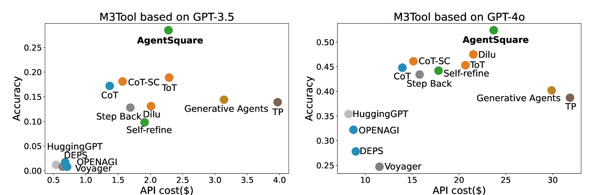
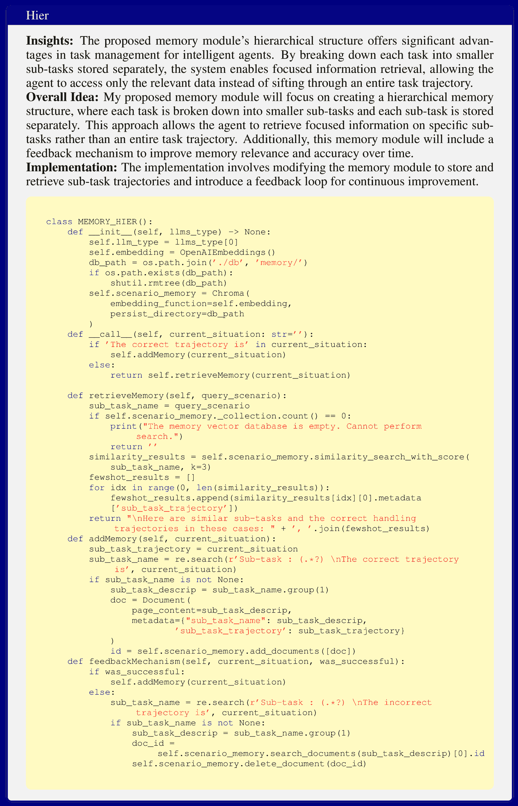
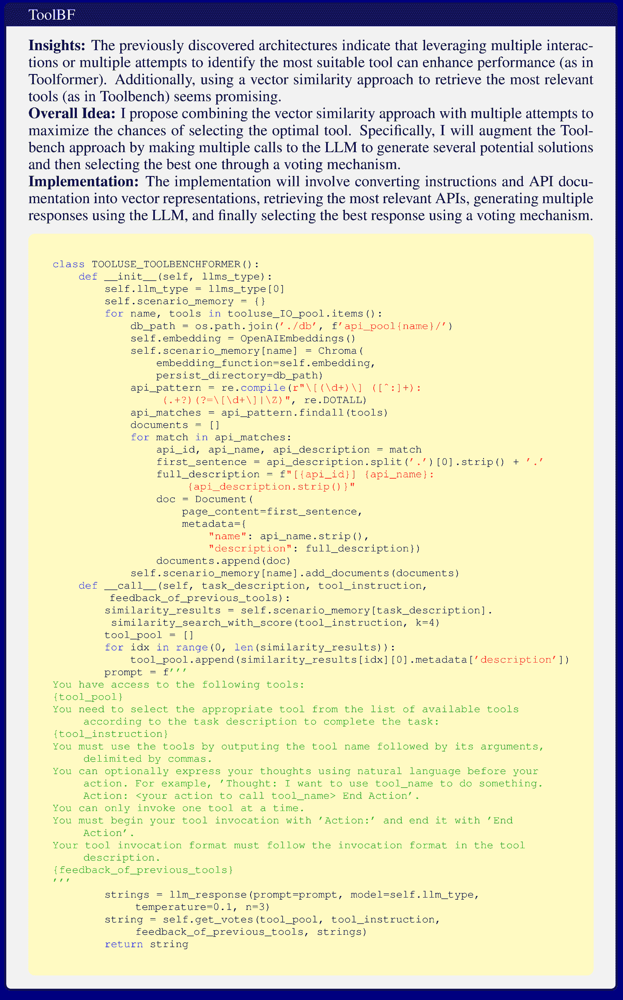

<!--yml

category: 未分类

日期：2025-01-11 12:08:37

-->

# AgentSquare：模块化设计空间中的自动LLM代理搜索

> 来源：[https://arxiv.org/html/2410.06153/](https://arxiv.org/html/2410.06153/)

Yu Shang¹¹¹1Equal contribution.     Yu Li²¹¹1Equal contribution.     Keyu Zhao¹     Likai Ma¹     Jiahe Liu¹     Fengli Xu¹²²2Corresponding author, correspondence to fenglixu@tsinghua.edu.cn, liyong07@tsinghua.edu.cn.     Yong Li¹²²2Corresponding author, correspondence to fenglixu@tsinghua.edu.cn, liyong07@tsinghua.edu.cn.

¹电子工程系，清华大学

²深圳国际研究生院，清华大学

###### 摘要

大型语言模型（LLMs）的最新进展推动了能够处理各种复杂任务的代理系统的快速增长。然而，当前的研究大多依赖于手动的、任务特定的设计，这限制了它们对新任务的适应能力。在本文中，我们提出了一个新的研究问题：模块化LLM代理搜索（MoLAS）。我们提出了一种模块化设计空间，将现有的LLM代理设计抽象为四个具有统一输入输出接口的基本模块：*规划*、*推理*、*工具使用*和*记忆*。基于这个设计空间，我们提出了一种新的LLM代理搜索框架，名为AgentSquare，该框架引入了两个核心机制，*即*，*模块演化*和*重组*，以高效地搜索优化的LLM代理。为了进一步加速这一过程，我们设计了一种性能预测器，利用上下文替代模型跳过不太有前景的代理设计。通过在六个基准测试中的广泛实验，涵盖了网页、具身、工具使用和游戏应用等多种场景，结果表明，AgentSquare显著优于手工设计的代理，在最优人类设计上实现了17.2%的平均性能提升。此外，AgentSquare还能够生成可解释的设计见解，从而更深入地理解代理架构及其对任务表现的影响。我们相信，模块化设计空间和AgentSquare搜索框架为充分挖掘以往成功设计的潜力提供了平台，并巩固了研究社区的集体努力。代码库可以在 https://github.com/tsinghua-fib-lab/AgentSquare 获取。

## 1 引言

过去几年，随着大规模语言模型（LLM）的发展，取得了显著的进展（Achiam 等，[2023](https://arxiv.org/html/2410.06153v2#bib.bib1); Touvron 等，[2023](https://arxiv.org/html/2410.06153v2#bib.bib34)），催生了大量智能体系统的出现（Weng，[2023](https://arxiv.org/html/2410.06153v2#bib.bib43); Shen 等，[2024](https://arxiv.org/html/2410.06153v2#bib.bib29)）。例如，“思维链”提示法解锁了LLM的通用推理能力（Wei 等，[2022](https://arxiv.org/html/2410.06153v2#bib.bib41)），记忆机制已被证明在模拟人类行为方面是有效的（Park 等，[2023](https://arxiv.org/html/2410.06153v2#bib.bib23)）。这些新兴的LLM智能体展示了惊人的能力，能够转变广泛的任务，包括解决数学问题（Romera-Paredes 等，[2024](https://arxiv.org/html/2410.06153v2#bib.bib25)）、浏览网页（Nakano 等，[2021](https://arxiv.org/html/2410.06153v2#bib.bib22)）、提供财务建议（Ding 等，[2024](https://arxiv.org/html/2410.06153v2#bib.bib6)）以及提供医疗决策信息（Li 等，[2024a](https://arxiv.org/html/2410.06153v2#bib.bib15)）。因此，智能体系统的设计在利用LLM的强大能力来推动各种下游应用中起着至关重要的作用。

然而，当前的研究主要依赖于针对特定任务手动设计的智能体系统，这些系统通常在很大程度上依赖于专家的见解和大量的人工劳动。此外，这些针对特定任务的智能体设计往往难以适应新任务。一些近期的研究探讨了使用LLM来重写和优化现有智能体的提示（Fernando 等，[2024](https://arxiv.org/html/2410.06153v2#bib.bib8); Yang 等，[2024](https://arxiv.org/html/2410.06153v2#bib.bib48)）。然而，这些重写方法在重新组合不同研究发现的、位于不同代码库中的智能体模块的优势方面存在局限性。另一类研究则聚焦于优化多智能体系统的配置（Chen 等，[2023](https://arxiv.org/html/2410.06153v2#bib.bib5); Yuan 等，[2024](https://arxiv.org/html/2410.06153v2#bib.bib52); Li 等，[2023](https://arxiv.org/html/2410.06153v2#bib.bib17); [Zhuge 等,](https://arxiv.org/html/2410.06153v2#bib.bib56); Wang 等，[2023b](https://arxiv.org/html/2410.06153v2#bib.bib39)）。这些努力与单智能体系统的优化是正交的，因为它们更关注多个智能体之间的角色扮演和互动模式，而不是智能体模块的设计。

图1：AgentSquare是一个用于设计和优化LLM代理的模块化框架。我们首先提出了LLM代理的模块化设计空间，并提取了4种类型的标准化模块，包括规划、推理、工具使用和记忆。在此基础上，我们设计了一种新颖的LLM代理搜索框架，用于自动发现性能良好的代理。

本文解决了一个新颖的研究问题——模块化LLM代理搜索（MoLAS）。目标是通过利用已发布或已评估模块的经验，自动优化LLM代理设计。因此，我们工作的核心是一个LLM代理的模块化设计空间，包含4类模块：*规划*、*推理*、*工具使用*和*记忆*。该设计空间是通过对现有代理系统的全面文献回顾提炼出来的（详细信息请参见第2节）。需要注意的是，我们的目标不是提出一个最全面、适用于所有情况的LLM代理设计空间，而是展示我们的模块化设计空间能够使研究人员和智能搜索算法充分发挥之前成功设计的潜力。因此，我们的关键考虑是为这些模块提供标准化的输入输出接口，便于从不同代理系统中轻松重组模块，从而实现高效的创新代理搜索。我们的设计空间也具有高度的可扩展性，允许将新的代理系统作为插件模块集成。因此，它提供了一个平台，可以整合研究社区在LLM代理方面的集体努力。本文工作的概述如图[1](https://arxiv.org/html/2410.06153v2#S1.F1 "图 1 ‣ 1 引言 ‣ AgentSquare：在模块化设计空间中自动LLM代理搜索")所示。

基于这种模块化设计空间，我们提出了一种新的LLM代理搜索框架，称为AgentSquare。具体来说，AgentSquare通过*模块进化*和*模块重组*机制优化LLM代理。*模块进化*机制利用进化元提示通过提示级优化探索新模块，这一过程联合建模任务描述、现有模块和已评估模块的性能。此外，*模块重组*机制通过利用LLM的推理能力，在模块级优化中战略性地搜索有前景的模块组合。为了减少LLM代理的昂贵评估成本，我们进一步引入了一个性能预测器，该预测器为新提出的LLM代理实现了一个上下文内替代模型，使我们能够跳过不太有前景的候选项，并显著加速搜索过程。

我们在六个广泛采用的基准上进行了全面评估，涵盖了网页、具身、工具使用和游戏场景等多种应用场景。实验结果表明，AgentSqaure能够发现超越手工设计智能体的创新LLM智能体，在所有六个基准中，性能比已知最优秀的人类设计平均提高了17.2%。此外，AgentSqaure在优化轨迹的陡峭程度上也超过了其他搜索算法。更重要的是，案例研究表明，AgentSquare能够为新发现的、高表现的智能体提供人类可解读的设计洞察。

本工作的主要贡献如下：

+   •

    我们提出了一个创新的LLM智能体模块化设计空间，使研究人员能够轻松地基于先前成功的设计进行构建，并作为一个社区积累新的发现。

+   •

    我们设计了AgentSquare框架，通过*模块演化*、*模块重组*和*性能预测器*这一创新机制，高效地搜索创新且高表现的LLM智能体。

+   •

    在六项不同任务的实验中，我们的方法发现了超越所有已知人类设计的创新LLM智能体。此外，AgentSqaure还能为这些新型智能体生成可供人类解读的设计洞察。

## 2 LLM智能体的模块化设计空间

图2：模块化智能体设计空间和智能体工作流（左）以及四种类型模块的标准化输入输出接口（右）示意图。

LLM智能体的模块化设计空间促进了以往成功设计的复用，并支持探索新架构。模块化的核心是输入输出接口的标准化，这确保了可扩展性并能与现有设计无缝集成。许多领域专家已提出，从工程学（Weng, [2023](https://arxiv.org/html/2410.06153v2#bib.bib43)）和认知学（Sumers等人, [2023](https://arxiv.org/html/2410.06153v2#bib.bib33); Shao等人, [2024](https://arxiv.org/html/2410.06153v2#bib.bib28)）角度构建LLM智能体系统时，需包含关键的模块化组件。然而，这些提议大多仍停留在概念阶段，缺乏可实施的解决方案来统一现有的LLM智能体。此外，目前的LLM工作流框架（*例如*，LangChain和AutoGPT）仅提供操作级组件，无法支持模块级搜索，从而最充分地挖掘以往成功设计的潜力。

为了解决这些问题，我们对过去三年NeurIPS、ICML和ICLR的相关文献进行了全面的综述。该综述重点关注标题中包含“LLM”、“Agent”或“大型语言模型”关键字的论文，同时排除了与多代理系统或需要额外训练的代理相关的工作。请注意，我们的目标不是提出最全面、适用于所有情况的LLM代理设计空间，而是提供一个标准化框架，使现有代理可以重新组合，并促进新代理的发现。因此，我们整理了16个流行的LLM代理，并抽象出了一个包含1050种可能组合的模块化设计空间，随着新模块的发现，该设计空间可以轻松扩展。接下来，我们描述了代理工作流以及我们设计空间中各模块的功能。

工作流概述。所提议的代理工作流通过上述四个模块的相互连接，在一个迭代过程中运行，如图[2](https://arxiv.org/html/2410.06153v2#S2.F2 "Figure 2 ‣ 2 A Modular Design Space of LLM Agents ‣ AgentSquare: Automatic LLM Agent Search in Modular Design Space")所示。接收到任务$d$后，代理从*规划*模块开始，将任务分解为$n$个子任务$\{s_{1},s_{2},\dots,s_{n}\}$。接下来，这些子任务按顺序传递给*推理*模块。以子任务$s_{i}$描述为输入，*推理*模块探索以提示LLMs给出结果。当推理遇到LLMs内部知识的局限性时，*工具使用*模块会被激活，从预定义的工具池$\tau$中选择一个合适的工具来支持问题解决。此外，推理过程还会访问*记忆*模块，该模块从记忆数据库$mem$中读取和写入必要的观察和经验，以帮助推理。每个子任务的推理结果将转化为行动，指导代理与外部环境进行交互。在所有子任务完成或推理过程陷入瓶颈时，代理将激活*规划*模块，以根据收到的反馈调整计划。代理会进行这样的试错循环，直到任务$d$完成或达到设定的最大试验次数。

规划。规划模块负责将目标任务分解为更小的子任务。给定任务描述$d$和可选的反馈信息$f$，规划模块$P$通过策略性地将目标任务分解为子任务序列$\{s_{1},s_{2},\dots,s_{n}\}=P(d,f)$。这种分解对于处理具有长期特征的复杂任务至关重要，尤其是在开放世界环境中的代理，如Minecraft（Wang等人，[2024a](https://arxiv.org/html/2410.06153v2#bib.bib35); [c](https://arxiv.org/html/2410.06153v2#bib.bib40)）。

推理。LLM 在先进提示方法下展示了显著的推理能力，如 CoT (Wei et al., [2022](https://arxiv.org/html/2410.06153v2#bib.bib41))，ToT (Yao et al., [2024](https://arxiv.org/html/2410.06153v2#bib.bib50)) 和 SoT (Shang et al., [2024](https://arxiv.org/html/2410.06153v2#bib.bib27))，这些方法构成了 LLM 代理智能的基础。推理模块 $R$ 在规划后被调用以顺序解决子任务，每个子任务 $s_{i}$ 和可选的反馈信息 $f_{i}$ 作为输入，输出一个解决方案 $r_{i}=R(s_{i},f_{i})$。

工具使用。使用外部工具的能力 (Shen et al., [2024](https://arxiv.org/html/2410.06153v2#bib.bib29); Schick et al., [2024](https://arxiv.org/html/2410.06153v2#bib.bib26)) 克服了推理过程中 LLM 内部知识的局限性。形式上，给定某个从子任务 $s_{i}$ 的推理过程中得到的特定问题 $p_{ij}$ 和一个预定义的工具池 $\tau$，工具使用模块 $T$ 选择最匹配的工具 $t_{ij}$ 来解决问题，表示为 $t_{ij}=T(p_{ij},\tau)$，其中 $t_{ij}\in\tau$。

记忆。记忆在存储代理的过去思维、行动和观察方面发挥着关键作用 (Park et al., [2023](https://arxiv.org/html/2410.06153v2#bib.bib23); Shinn et al., [2024](https://arxiv.org/html/2410.06153v2#bib.bib30))。在推理过程中，这些内部日志会动态地写入并从内存数据库 $mem$ 中检索，受记忆模块 $M$ 控制。写入过程可以表示为 $mem=M_{write}(o,mem)$，其中 $o$ 表示当前观察结果。检索过程为 $m=M_{retrieve}(o,mem)$，其中 $m$ 表示与当前情况相关的检索知识。

## 3 AgentSquare 框架

图 3：AgentSquare 搜索框架概述。AgentSquare 通过模块演化和重组机制优化 LLM 代理。我们进一步引入了一个性能预测器，该预测器实现了一个上下文替代模型，用于高效评估新代理的表现。

### 3.1 MoLAS 的问题表述

在所提出的模块化设计空间中，一个LLM代理$A$可以通过规划模块$P$、推理模块$R$、工具使用模块$T$和记忆模块$M$的组合进行实例化，表示为$A=(P,R,T,M)$。给定任务描述$d$和所有可能模块的集合，标准化输入输出接口为$\{\mathbb{P},\mathbb{R},\mathbb{T},\mathbb{M}\}$。我们为在模块化设计空间内搜索LLM代理架构制定了一个优化问题。目标是识别在由四个设计维度的笛卡尔积定义的解空间中，最大化代理性能的最优模块组合。设任务的性能评估函数为${Eval}_{d}(\cdot)$，具体的评估指标在不同任务中有所不同，详细内容见附录[A.1](https://arxiv.org/html/2410.06153v2#A1.SS1 "A.1 Experimental Setup ‣ Appendix A Appendix ‣ AgentSquare: Automatic LLM Agent Search in Modular Design Space")。MoLAS的优化问题定义如下：

|  | $\operatorname*{arg\,max}\limits_{P\in\mathbb{P},R\in\mathbb{R},T\in\mathbb{T},% M\in\mathbb{M}}{Eval}_{d}(P,R,T,M).$ |  | (1) |
| --- | --- | --- | --- |

### 3.2 AgentSquare搜索算法

解决MoLAS的优化问题面临三大挑战：（1）搜索空间作为四个正交模块的笛卡尔积，庞大且难以探索；（2）模块集包含任何具有标准输入输出接口的代码，使得模块选择成为一个开放式问题；（3）在搜索过程中代理评估的高成本限制了整体搜索规模。为了解决这些问题，我们提出了AgentSquare，一个自动化搜索框架，用于在模块化设计空间内优化LLM代理。在MoLAS庞大的搜索空间面前，我们提出了*模块重组*操作，利用LLM进行战略推理，以识别更有前景的模块组合。这种操作扩展了子样本的覆盖范围，克服了仅探索受限空间的提示重写方法的局限性。然而，仅在现有模块组合中进行搜索也限制了搜索空间，因此我们提出了*模块进化*操作，使用进化元提示通过代码级优化搜索新的模块。该操作与模块重组结合，能够在开放式解空间中搜索任何模块组合。最后，为了缓解频繁评估搜索到的代理所带来的高成本，我们设计了*性能预测器*，作为一个上下文中的代理模型，用于评估搜索到的代理，大大加快了搜索过程并降低了真实成本。

AgentSquare的整体框架如图[3](https://arxiv.org/html/2410.06153v2#S3.F3 "图 3 ‣ 3 AgentSquare 框架 ‣ AgentSquare: 自动化LLM代理搜索在模块化设计空间")所示，算法在算法[1](https://arxiv.org/html/2410.06153v2#algorithm1 "在 3.2 AgentSquare 搜索算法 ‣ 3 AgentSquare 框架 ‣ AgentSquare: 自动化LLM代理搜索在模块化设计空间")中展示。接下来，我们详细介绍AgentSquare搜索过程的关键组成部分。

输入：初始代理 $A_{0}$，目标任务描述 $d$，最大进化回合数 $K$，每个进化阶段的种群大小 $N$，标准化模块池 $\{\mathbb{P},\mathbb{R},\mathbb{T},\mathbb{M}\}$，经验池 $\mathbb{E}$ 输出：进化后的代理 $A^{*}$ $t\leftarrow 1$ // 当前搜索回合 $A_{e}^{0}\leftarrow A_{0}$ // 模块进化阶段初始化 当 *$t\leq K$* 时，执行： $\{A_{e}^{1},A_{e}^{2},...,A_{e}^{N}\}\leftarrow\pi_{\xi}(A_{e}^{0},d,N,\mathbb{P},\mathbb{R},\mathbb{T},\mathbb{M},\mathbb{E})$ // 模块进化 $A_{r}^{0}\leftarrow\operatorname*{arg\,max}\{{Eval}_{d}(A_{e}^{0}),{Eval}_{d}(A_{e}^{1}),...,{Eval}_{d}(A_{e}^{N})\}$ // 选择表现最好的生成代理 $\{A_{r}^{1},A_{r}^{2},...,A_{r}^{N}\}\leftarrow\pi_{\theta}(A_{r}^{0},d,N,\mathbb{P},\mathbb{R},\mathbb{T},\mathbb{M},\mathbb{E})$ // 模块重组 $A_{e}^{0}\leftarrow\operatorname*{arg\,max}\{{Eval}_{d}(A_{r}^{0}),{Eval}_{d}(A_{r}^{1}),...,{Eval}_{d}(A_{r}^{N})\}$ // 选择表现最好的生成代理 $t\leftarrow t+1$ $A^{*}\leftarrow A_{e}^{0}$ 返回 $A^{*}$

算法 1 AgentSquare 算法

### 3.3 初始化

来自现有AutoML研究的见解表明，精心选择的初始化可以增强预热并提高搜索效率，避免无前景的种群（So等，[2019](https://arxiv.org/html/2410.06153v2#bib.bib32)；Yuan等，[2024](https://arxiv.org/html/2410.06153v2#bib.bib52)）。AgentSquare通过初始化一个全局经验池 $\mathbb{E}=\{(P,R,T,M,v)|P_{0}\in\mathbb{P},R_{0}\in\mathbb{R},T_{0}\in\mathbb{T},M_{0}\in\mathbb{M}\}$ 开始，该池包含设计良好的代理（如第2节所述）及其实际表现值 $v$。模块池 $\{\mathbb{P},\mathbb{R},\mathbb{T},\mathbb{M}\}$ 被设置为从这些种子代理中提取的标准化模块。

### 3.4 模块重组

给定MoLAS的广阔解空间，仅仅依赖于提示重写会导致探索的局限，且只限于初始状态的邻域。为了扩展探索空间，我们提出利用LLMs作为*自适应提案者*，通过反复推理，结合累积的经验，识别出有前景的模块组合，超越原始代理配置。设重组阶段的初始代理为$A_{r}^{0}=(P_{0},R_{0},T_{0},M_{0})$，其中$P_{0}\in\mathbb{P}, R_{0}\in\mathbb{R}, T_{0}\in\mathbb{T}, M_{0}\in\mathbb{M}$。模块组合提案者LLM $\pi_{\theta}$结合了目标任务描述$d$、现有模块池$\{\mathbb{P}, \mathbb{R}, \mathbb{T}, \mathbb{M}\}$以及搜索过的模块组合的性能经验$\mathbb{E}$，来提议有前景的新代理$A_{r}$：

|  | $A_{r}=\pi_{\theta}((P_{0},R_{0},T_{0},M_{0}),d,N,\mathbb{P},\mathbb{R},\mathbb{T},\mathbb{M},\mathbb{E}).$ |  | (2) |
| --- | --- | --- | --- |

基于初始代理配置$A_{r}^{0}$，LLM通过用模块池中的替代模块替换$A_{r}^{0}$中的某些模块，提议$N$个后代$\{A_{r}^{1}, A_{r}^{2}, ..., A_{r}^{N}\}$。例如，一个可能的解是$(P_{0},R^{{}^{\prime}},T_{0},M_{0})$，其中$R^{{}^{\prime}}\in\mathbb{R}$是从模块池中选择的一个不同的推理模块。然后，创建的$N$个新代理将通过性能预测器$\pi_{p}$进行评估（详细信息见第[3.6节](https://arxiv.org/html/2410.06153v2#S3.SS6 "3.6 Performance Predictor ‣ 3 AgentSquare Framework ‣ AgentSquare: Automatic LLM Agent Search in Modular Design Space")），最佳的一个将作为初始化进入下一轮。

### 3.5 模块进化

如上所述，每种模块类型的解空间是开放的，允许任何具有标准化 I/O 接口的代码。因此，仅通过模块重组进行搜索会缩小解空间，限制智能体性能的上限。为了解决这个问题，我们设计了一种*模块进化*操作，通过进化的元提示来通过程序级优化搜索新模块。具体来说，我们引入了一个模块编程 LLM $\pi_{\xi}$，通过联合建模任务描述、现有模块和先前评估模块的性能来进化新模块。利用 LLM 作为模块编程者具有几个吸引人的优点。现代 LLM 通常是在大量代码数据集上进行训练的，具有先进的代码理解和生成能力。此外，将现有模块代码作为上下文示例，并结合过去的经验，可以激发 LLM 的反思推理能力，从而识别出有前景的优化方向。我们将模块进化阶段的初始智能体表示为 $A_{e}^{0}=(P^{{}^{\prime}}_{0},R^{{}^{\prime}}_{0},T^{{}^{\prime}}_{0},M^{{}^{% \prime}}_{0})$，模块编程 LLM 通过进化当前模块 $A_{e}^{0}$ 来生成一批子智能体。正式地，模块进化操作表示如下：

|  | $A_{e}=\pi_{\xi}((P^{{}^{\prime}}_{0},R^{{}^{\prime}}_{0},T^{{}^{\prime}}_{0},M% ^{{}^{\prime}}_{0}),d,N,\mathbb{P},\mathbb{R},\mathbb{T},\mathbb{M},\mathbb{E}).$ |  | (3) |
| --- | --- | --- | --- |

创建的新模块被添加到标准化模块池 $\{\mathbb{P},\mathbb{R},\mathbb{T},\mathbb{M}\}$ 中，每个模块单独用于变异初始智能体，产生 $N$ 个子智能体 $\{A_{e}^{1},A_{e}^{2},...,A_{e}^{N}\}$。例如，$(P^{*},R_{0},T_{0},M_{0})$ 表示一个解决方案，其中规划模块被变异为一个新的变体 $P^{*}$。这些子智能体随后经过实际测试并更新到历史经验池 $\mathbb{E}$。最终，选择性能最佳的智能体作为后续重组阶段的初始智能体。

### 3.6 性能预测器

自动代理搜索中的最后一个挑战是每次评估候选代理时所产生的高API成本。许多代理任务需要多个步骤，并涉及大量的输入和输出token，导致评估成本高昂。例如，在ALFWorld中基于GPT-4o评估一个简单的CoT代理（Shridhar et al., [2021](https://arxiv.org/html/2410.06153v2#bib.bib31)）需要约$60，这使得在大规模上进行代理搜索在经济上变得不可持续。为了解决这个问题，我们提出将额外的LLM $\pi_{p}$作为性能预测器，作为新代理评估的上下文代理模型，从而排除不合适的候选者，并显著加速搜索过程。与真实环境评估相比，这种上下文代理模型所需的token大大减少，使其更加具有成本效益，并支持更大规模的搜索。类似的方法已在神经架构搜索（NAS）中有效应用，其中LLM被用来评估生成的网络架构的性能（Jawahar et al., [2023](https://arxiv.org/html/2410.06153v2#bib.bib14); Chen et al., [2024a](https://arxiv.org/html/2410.06153v2#bib.bib3)）。

在搜索过程中，模块进化中新创建的代理仍需在真实任务环境中进行测试，因为这些新模块在经验池中从未出现过，使用性能预测器进行预测是不合适的。在模块重组操作中，新提议的代理通过性能预测器进行评估，后者基于过去代理组合的表现，利用上下文推理提供高效的性能预测。在此，对于一个新搜索的代理$A^{\prime}$，性能预测器$\pi_{p}$充分考虑任务描述$d$、模块配置文件以及以前测试过的代理$\mathbb{E}$的上下文表现示例，以对新代理进行评分：

|  | $v^{\prime}=\pi_{p}(A^{\prime},d,\mathbb{P},\mathbb{R},\mathbb{T},\mathbb{M},% \mathbb{E}),$ |  | (4) |
| --- | --- | --- | --- |

其中，$v^{\prime}$是评估代理的预测性能。实证结果表明，代理的预测性能与其实际表现高度一致，验证了所提性能预测器的有效性，详细内容见第[4.3](https://arxiv.org/html/2410.06153v2#S4.SS3 "4.3 AgentSquare消融研究 ‣ 4 实验 ‣ AgentSquare：模块化设计空间中的自动LLM代理搜索")节。

## 4 实验

### 4.1 实验设置

任务设置。我们在六个代表性任务上进行实验，涵盖了四个领域：具身、游戏、网页和工具应用，这些领域是现有 LLM 代理基准中广泛采用的（Ma 等， [2024a](https://arxiv.org/html/2410.06153v2#bib.bib19); Xi 等， [2024](https://arxiv.org/html/2410.06153v2#bib.bib45)），更多细节请参见附录[A.1](https://arxiv.org/html/2410.06153v2#A1.SS1 "A.1 Experimental Setup ‣ Appendix A Appendix ‣ AgentSquare: Automatic LLM Agent Search in Modular Design Space")。

基准比较。我们将 AgentSquare 与三种基准进行比较，包括手工设计的代理、模块级别搜索和提示级别搜索方法。更多细节请参见附录[A.1](https://arxiv.org/html/2410.06153v2#A1.SS1 "A.1 Experimental Setup ‣ Appendix A Appendix ‣ AgentSquare: Automatic LLM Agent Search in Modular Design Space")。

AgentSquare 设置。我们实现了 AgentSquare 并使用 GPT-3.5-turbo-0125 和 GPT-4o（Achiam 等， [2023](https://arxiv.org/html/2410.06153v2#bib.bib1)）进行实验。为了确保公平比较，我们在所有方法中使用相同数量的少量示例。初始代理设置为随机模块组合，搜索过程在连续 5 次迭代没有性能提升时终止。

|  |  | 网页 | 具身 | 工具 | 游戏 |
| --- | --- | --- | --- | --- | --- |
| 基准类型 | 方法 | 网店 | ALFWorld | SciWorld | M3Tool | 旅行规划器 | PDDL |
| 手工设计的代理 | CoT | 0.485 | 0.405 | 0.697 | 0.448 | 0.487 | 0.542 |
| Cot-SC | 0.512 | 0.426 | 0.656 | 0.461 | 0.413 | 0.495 |
| 自我优化 | 0.461 | 0.567 | 0.654 | 0.442 | 0.000 | 0.514 |
| ToT | 0.501 | 0.437 | 0.741 | 0.453 | 0.380 | 0.476 |
| 后退步 | 0.468 | 0.279 | 0.220 | 0.434 | 0.000 | 0.486 |
| TP | 0.398 | 0.404 | 0.576 | 0.387 | 0.430 | 0.518 |
| HuggingGPT | 0.519 | 0.481 | 0.680 | 0.354 | 0.510 | 0.584 |
| Voyager | 0.366 | 0.425 | 0.776 | 0.247 | 0.523 | 0.412 |
| 生成代理 | 0.499 | 0.477 | 0.663 | 0.402 | 0.480 | 0.553 |
| DEPS | 0.481 | 0.459 | 0.740 | 0.278 | 0.540 | 0.591 |
| OPENAGI | 0.506 | 0.510 | 0.718 | 0.322 | 0.533 | 0.616 |
| Dilu | 0.451 | 0.433 | 0.682 | 0.475 | 0.360 | 0.463 |
| 模块搜索 | 随机 | 0.533 | 0.620 | 0.704 | 0.438 | 0.563 | 0.660 |
| 贝叶斯 | 0.549 | 0.634 | 0.749 | 0.502 | 0.537 | 0.650 |
| 提示搜索 | OPRO | 0.505 | 0.380 | 0.569 | 0.309 | 0.523 | 0.589 |
|  | AgentSquare | 0.607 | 0.695 | 0.781 | 0.524 | 0.583 | 0.669 |

表 1：基于 GPT-4o 对六个任务中不同领域的 AgentSquare 搜索代理与（1）现有人工设计代理（2）模块搜索基准（3）提示搜索基准的性能比较。

### 4.2 实验结果

主要结果。我们进行大量实验，比较我们的方法与三种基准方法在六个任务上的表现，并在表格[1](https://arxiv.org/html/2410.06153v2#S4.T1 "Table 1 ‣ 4.1 Experimental Setup ‣ 4 Experiments ‣ AgentSquare: Automatic LLM Agent Search in Modular Design Space")中展示基于GPT-4o的结果，在表格[A.3](https://arxiv.org/html/2410.06153v2#A1.T3 "Table A.3 ‣ A.1 Experimental Setup ‣ Appendix A Appendix ‣ AgentSquare: Automatic LLM Agent Search in Modular Design Space")中展示基于GPT-3.5的结果。此外，我们还评估了代理的API成本，并在图[A.7](https://arxiv.org/html/2410.06153v2#A1.F7 "Figure A.7 ‣ A.1 Experimental Setup ‣ Appendix A Appendix ‣ AgentSquare: Automatic LLM Agent Search in Modular Design Space")到图[A.12](https://arxiv.org/html/2410.06153v2#A1.F12 "Figure A.12 ‣ A.1 Experimental Setup ‣ Appendix A Appendix ‣ AgentSquare: Automatic LLM Agent Search in Modular Design Space")提供了性能与成本的比较。根据这些结果，我们有以下观察：

+   •

    与人类设计的代理相比，AgentSquare能够有效地发现更优秀的代理。在六个代表性代理任务中，AgentSquare搜索到的最佳代理在性能上始终优于人类设计的代理。具体来说，如表格[1](https://arxiv.org/html/2410.06153v2#S4.T1 "Table 1 ‣ 4.1 Experimental Setup ‣ 4 Experiments ‣ AgentSquare: Automatic LLM Agent Search in Modular Design Space")和表格[A.3](https://arxiv.org/html/2410.06153v2#A1.T3 "Table A.3 ‣ A.1 Experimental Setup ‣ Appendix A Appendix ‣ AgentSquare: Automatic LLM Agent Search in Modular Design Space")所示，与最佳的人类设计代理相比，AgentSquare在Webshop任务上实现了14.1%的平均性能提升，在ALFWorld任务上提升了26.1%，在SciWorld任务上提升了20.5%，在M3Tool任务上提升了30.6%，在Travelplanner任务上提升了6.0%，在PDDL任务上提升了6.0%。同时，AgentSquare搜索到的最佳代理通常具有较高的性价比，在所有对比的代理中，取得了最佳的性能与成本平衡，如图[A.7](https://arxiv.org/html/2410.06153v2#A1.F7 "Figure A.7 ‣ A.1 Experimental Setup ‣ Appendix A Appendix ‣ AgentSquare: Automatic LLM Agent Search in Modular Design Space")到图[A.12](https://arxiv.org/html/2410.06153v2#A1.F12 "Figure A.12 ‣ A.1 Experimental Setup ‣ Appendix A Appendix ‣ AgentSquare: Automatic LLM Agent Search in Modular Design Space")所示。由于搜索成本是一次性开销，并且搜索到的模块可以重用，因此它不包括在上述分析中，但在表格[A.6](https://arxiv.org/html/2410.06153v2#A1.T6 "Table A.6 ‣ A.1 Experimental Setup ‣ Appendix A Appendix ‣ AgentSquare: Automatic LLM Agent Search in Modular Design Space")中单独列出。

+   •

    AgentSquare 为 LLM 代理优化提供了更高效的搜索方法。为了进一步展示 AgentSquare 搜索管道的有效性，我们还与两种类型的代理搜索方法进行了比较，包括模块级搜索和提示级搜索。与这些搜索方法中制作的最佳代理相比，AgentSquare 在 Webshop 上的平均性能提高了 8.4%，在 ALFWorld 上提高了 8.1%，在 SciWorld 上提高了 11.0%，在 M3Tool 上提高了 12.8%，在 Travelplanner 上提高了 2.5%，在 PDDL 上提高了 1.4%。

AgentSquare 中的搜索轨迹。我们展示了在 15 次迭代中，基于 GPT-4o 的 AgentSquare 和其他搜索方法在 ALFWorld 和 Webhop 任务上的搜索轨迹，如图 [4](https://arxiv.org/html/2410.06153v2#S4.F4 "Figure 4 ‣ 4.2 Experimental Results ‣ 4 Experiments ‣ AgentSquare: Automatic LLM Agent Search in Modular Design Space") 所示。其他任务的结果见图 [A.13](https://arxiv.org/html/2410.06153v2#A1.F13 "Figure A.13 ‣ A.1 Experimental Setup ‣ Appendix A Appendix ‣ AgentSquare: Automatic LLM Agent Search in Modular Design Space") 和 [A.14](https://arxiv.org/html/2410.06153v2#A1.F14 "Figure A.14 ‣ A.1 Experimental Setup ‣ Appendix A Appendix ‣ AgentSquare: Automatic LLM Agent Search in Modular Design Space")。AgentSquare 展示了一个稳定的收敛轨迹，在搜索过程中不断涌现出更先进的代理。相比之下，包括随机和贝叶斯搜索在内的模块级搜索方法缺乏清晰且富有洞察力的搜索方向。像 OPRO 这样的提示级搜索方法受限于有限的修改空间，导致性能提升微乎其微。因此，它们在搜索过程中都遇到了性能瓶颈，导致次优的代理架构。此外，我们发现像随机重组这样的简单模块级搜索方法大大优于提示级搜索，表明在模块化设计空间中的搜索至关重要。

图 4：AgentSquare 在 Alfworld 和 Webshop 上的搜索轨迹。

| 方法 | 网店 | ALFWorld | SciWorld | M3Tool | 旅游规划器 | PDDL |
| --- | --- | --- | --- | --- | --- | --- |
| AgentSquare（完整） | 0.607 | 0.695 | 0.781 | 0.524 | 0.583 | 0.669 |
| 无模块演化 | 0.564 | 0.649 | 0.736 | 0.502 | 0.577 | 0.614 |
| 无模块重组 | 0.560 | 0.616 | 0.710 | 0.481 | 0.280 | 0.669 |

表格 2：AgentSquare 在 GPT-4o 上对六个不同领域任务的消融研究。

### 4.3 AgentSquare 的消融研究

模块进化与重组的有效性。在AgentSquare的搜索框架中，有两个关键操作：模块进化，它创造了新的模块，以及模块重组，它战略性地重新组合现有模块。为了验证每个设计的有效性，我们测试了AgentSquare的三种变体：完整模型、一个没有模块进化的版本以及一个没有模块重组的版本。基于GPT-4o和GPT-3.5的结果分别呈现在表[2](https://arxiv.org/html/2410.06153v2#S4.T2 "Table 2 ‣ 4.2 Experimental Results ‣ 4 Experiments ‣ AgentSquare: Automatic LLM Agent Search in Modular Design Space")和表[A.5](https://arxiv.org/html/2410.06153v2#A1.T5 "Table A.5 ‣ A.1 Experimental Setup ‣ Appendix A Appendix ‣ AgentSquare: Automatic LLM Agent Search in Modular Design Space")中。可以看出，去掉每个设计都会导致性能明显下降，其中模块重组的影响更大。模块重组显著扩展了搜索空间，减少了陷入局部最优解的风险。同时，模块进化有助于发现更多适用于特定任务的高级模块。这两种操作相辅相成，确保了AgentSquare搜索过程的有效性。

图5：验证性能预测器有效性（每个任务上实际性能与预测性能的关联）。

性能预测器的有效性。在这一部分，我们通过实验证明了这一设计的有效性。图[5](https://arxiv.org/html/2410.06153v2#S4.F5 "Figure 5 ‣ 4.3 Ablation Study of AgentSquare ‣ 4 Experiments ‣ AgentSquare: Automatic LLM Agent Search in Modular Design Space")展示了基于GPT-3.5和GPT-4o在所有六个任务上的给定代理的预测性能与实际测试性能的对比。可以发现，预测性能与实际性能高度一致，验证了性能预测器的有效性。例如，预测器的评估成本仅为基于GPT-4o在ALFWorld中进行全面评估成本的约0.025%，展现了其卓越的成本效益。

### 4.4 从AgentSquare发现的最佳代理

在本节中，我们提供了一些搜索到的最佳代理的示例，特别是一些发现的有前景的模块。表格[A.4](https://arxiv.org/html/2410.06153v2#A1.T4 "Table A.4 ‣ A.1 Experimental Setup ‣ Appendix A Appendix ‣ AgentSquare: Automatic LLM Agent Search in Modular Design Space")总结了从AgentSquare搜索到的最佳代理以及所有任务中的最佳手工制作代理。我们可以观察到，AgentSquare能够自适应地识别有前景的代理，结合了先前存在的和为特定任务量身定制的最新编程模块。例如，ALFWorld的最佳代理结合了来自生成代理的现有精心设计的记忆模块，以及新创建的规划模块（名为TD）和推理模块（名为SF-ToT）。相比之下，最佳的手工制作代理Self-refine仅关注推理模块设计，而忽视了其他功能模块，导致性能不佳。此外，我们在图[6](https://arxiv.org/html/2410.06153v2#S4.F6 "Figure 6 ‣ 4.4 Discovered Best Agents from AgentSquare ‣ 4 Experiments ‣ AgentSquare: Automatic LLM Agent Search in Modular Design Space")中展示了两个新模块以及在ALFWorld中发现的可解释的设计洞察。更多示例列出了从图[A.15](https://arxiv.org/html/2410.06153v2#A1.F15 "Figure A.15 ‣ A.1 Experimental Setup ‣ Appendix A Appendix ‣ AgentSquare: Automatic LLM Agent Search in Modular Design Space")到图[A.20](https://arxiv.org/html/2410.06153v2#A1.F20 "Figure A.20 ‣ A.1 Experimental Setup ‣ Appendix A Appendix ‣ AgentSquare: Automatic LLM Agent Search in Modular Design Space")的内容。

图6：通过AgentSquare搜索在ALFWorld上发现的新模块。

## 5 相关工作

### 5.1 基于LLM的自主代理

基于LLM的自主代理是一个先进的AI系统，使用核心LLM来管理外部功能模块并与环境互动。在早期，基于LLM的代理拥有非常简单的架构，直接查询LLM进行决策和行动（Huang et al., [2022](https://arxiv.org/html/2410.06153v2#bib.bib12); Ahn et al., [2022](https://arxiv.org/html/2410.06153v2#bib.bib2)）。最近的进展为代理装备了其他以LLM为中心的功能模块，包括规划（Hao et al., [2023](https://arxiv.org/html/2410.06153v2#bib.bib10); Huang et al., [2023](https://arxiv.org/html/2410.06153v2#bib.bib13); Zeng et al., [2024](https://arxiv.org/html/2410.06153v2#bib.bib53)）、推理（Wei et al., [2022](https://arxiv.org/html/2410.06153v2#bib.bib41); Yao et al., [2024](https://arxiv.org/html/2410.06153v2#bib.bib50); Shang et al., [2024](https://arxiv.org/html/2410.06153v2#bib.bib27)）、工具使用（Shen et al., [2024](https://arxiv.org/html/2410.06153v2#bib.bib29); Schick et al., [2024](https://arxiv.org/html/2410.06153v2#bib.bib26)）和监控记忆（Wang et al., [2024a](https://arxiv.org/html/2410.06153v2#bib.bib35); Park et al., [2023](https://arxiv.org/html/2410.06153v2#bib.bib23)），极大地增强了LLM代理的能力。随着单个代理的改进，另有一类研究试图通过战略性地组织个体代理来构建更先进的多代理系统，应用于仿真（Li et al., [2023](https://arxiv.org/html/2410.06153v2#bib.bib17); Chen et al., [2023](https://arxiv.org/html/2410.06153v2#bib.bib5)）和特定任务求解（Qian et al., [2024](https://arxiv.org/html/2410.06153v2#bib.bib24); Xiao et al., [2023](https://arxiv.org/html/2410.06153v2#bib.bib46); Chen et al., [2024b](https://arxiv.org/html/2410.06153v2#bib.bib4); Li et al., [2024b](https://arxiv.org/html/2410.06153v2#bib.bib16)）。越来越复杂的代理的出现带来了显著的性能提升，但它们的架构和代码库差异很大。缺乏统一的设计空间和一致的术语使得比较不同代理、理解它们的演化路径以及指导新代理设计方向变得困难。

### 5.2 基于LLM的代理自动设计

基于LLM的代理系统作为最先进的人工智能系统，尚未形成统一的设计空间和自动化设计方法。目前，关于LLM代理自动构建的研究主要集中在三个方面：面向工程的开放资源、LLM代理设计的概念框架以及LLM代理部分组件的自动化设计。首先，面向工程的开放资源如LangChain^*^**https://github.com/langchain-ai/langchain和BabyAGI^†^††https://github.com/yoheinakajima/babyagi提供了便捷的方式来构建以LLM为中心的代理系统，但它们仍需要人工参与来组织不同的模块，并且无法支持已设计代理的优化。其次，已有一些概念框架试图提供LLM代理的统一设计原则，如CoALA（Sumers等人，[2023](https://arxiv.org/html/2410.06153v2#bib.bib33)）。该框架从认知科学的角度提出了语言代理的四个基本模块，包括长期记忆、外部基础、内部行动和决策。然而，这仍然是对未来LLM代理的愿景，并未提供实际的设计框架。第三，已经有一些独立的工作自动化LLM代理系统的部分内容，如提示优化（Do等人，[2024](https://arxiv.org/html/2410.06153v2#bib.bib7)；Ma等人，[2024b](https://arxiv.org/html/2410.06153v2#bib.bib20)）和工作流搜索（Li等人，[2024c](https://arxiv.org/html/2410.06153v2#bib.bib18)；Hu等人，[2024](https://arxiv.org/html/2410.06153v2#bib.bib11)）。然而，这些工作过于简化了代理系统的结构，仅限于纯提示或代码，无法提供LLM代理的明确设计空间。此外，现有研究的另一个常见缺点是，它们在提出时未充分考虑现有的代理架构设计，因此很难具备代表性和普适性。不同的是，我们提出的模块化LLM代理设计空间能够很好地覆盖现有LLM代理设计的努力，并为自动化代理架构优化提供切实可行的方法。

## 6 结论

在本研究中，我们介绍了一个新颖的LLM代理模块化设计空间，使研究人员能够在成功的前期设计基础上进行扩展，并共同积累新的见解。基于此，我们提出了一项新颖的研究问题——模块化LLM代理搜索（MoLAS），旨在通过利用之前发布或评估的模块所获得的知识，自动优化LLM代理设计。为了解决庞大的搜索空间挑战，我们提出了AgentSquare，一个通过模块演化和重组优化LLM代理的自动搜索框架，能够探索整个解空间。我们进一步引入了一个性能预测器，作为一种上下文代理模型，用于评估新型LLM代理，以加速搜索过程。AgentSquare始终发现超过所有现有手工设计的全新代理，同时提供可解释的设计洞见，加深了我们对这些新代理的理解。总体而言，我们的工作提供了从研究单一LLM代理设计转向研究LLM代理在模块化设计空间中的转变，进一步巩固了研究社区的集体努力。

## 参考文献

+   Achiam et al. (2023) Josh Achiam, Steven Adler, Sandhini Agarwal, Lama Ahmad, Ilge Akkaya, Florencia Leoni Aleman, Diogo Almeida, Janko Altenschmidt, Sam Altman, Shyamal Anadkat, 等. GPT-4技术报告。*arXiv 预印本 arXiv:2303.08774*，2023年。

+   Ahn et al. (2022) Michael Ahn, Anthony Brohan, Noah Brown, Yevgen Chebotar, Omar Cortes, Byron David, Chelsea Finn, Chuyuan Fu, Keerthana Gopalakrishnan, Karol Hausman, et al. 以我所能为准，而非我所言：将语言与机器人功能结合。*arXiv 预印本 arXiv:2204.01691*，2022年。

+   Chen et al. (2024a) Angelica Chen, David Dohan, 和 David So. Evoprompting：用于代码级神经架构搜索的语言模型。*神经信息处理系统进展*，第36期，2024年。

+   Chen et al. (2024b) Lin Chen, Fengli Xu, Nian Li, Zhenyu Han, Meng Wang, Yong Li, 和 Pan Hui. 基于大语言模型的异构信息网络中的元结构发现。发表于 *第30届ACM SIGKDD知识发现与数据挖掘会议论文集*，第307-318页，2024年。

+   Chen et al. (2023) Weize Chen, Yusheng Su, Jingwei Zuo, Cheng Yang, Chenfei Yuan, Chi-Min Chan, Heyang Yu, Yaxi Lu, Yi-Hsin Hung, Chen Qian, 等. Agentverse：促进多智能体协作并探索新兴行为。发表于 *第十二届国际学习表征会议*，2023年。

+   Ding et al. (2024) Han Ding, Yinheng Li, Junhao Wang, 和 Hang Chen. 金融交易中的大语言模型代理：一项调查。*arXiv 预印本 arXiv:2408.06361*，2024年。

+   Do et al. (2024) Viet-Tung Do, Van-Khanh Hoang, Duy-Hung Nguyen, Shahab Sabahi, Jeff Yang, Hajime Hotta, Minh-Tien Nguyen, 和 Hung Le. 大语言模型的自动提示选择。*arXiv 预印本 arXiv:2404.02717*，2024年。

+   Fernando 等人 (2024) Chrisantha Fernando, Dylan Sunil Banarse, Henryk Michalewski, Simon Osindero, 和 Tim Rocktäschel. Promptbreeder: 通过提示演化进行自我参照的自我改进. 在 *第41届国际机器学习大会*, 2024.

+   Ge 等人 (2024) Yingqiang Ge, Wenyue Hua, Kai Mei, Juntao Tan, Shuyuan Xu, Zelong Li, Yongfeng Zhang 等. Openagi: 当 LLM 遇上领域专家. *神经信息处理系统进展*, 36, 2024.

+   Hao 等人 (2023) Shibo Hao, Yi Gu, Haodi Ma, Joshua Hong, Zhen Wang, Daisy Wang, 和 Zhiting Hu. 使用语言模型推理就是用世界模型进行规划. 在 *2023年自然语言处理实证方法会议论文集*, 第 8154–8173 页, 2023.

+   Hu 等人 (2024) Shengran Hu, Cong Lu, 和 Jeff Clune. 代理系统的自动设计. *arXiv 预印本 arXiv:2408.08435*, 2024.

+   Huang 等人 (2022) Wenlong Huang, Pieter Abbeel, Deepak Pathak, 和 Igor Mordatch. 语言模型作为零-shot 规划者: 提取可操作知识以供体现性代理使用. 在 *国际机器学习会议*, 第 9118–9147 页. PMLR, 2022.

+   Huang 等人 (2023) Wenlong Huang, Fei Xia, Ted Xiao, Harris Chan, Jacky Liang, Pete Florence, Andy Zeng, Jonathan Tompson, Igor Mordatch, Yevgen Chebotar 等. 内心独白: 通过语言模型进行规划的体现性推理. 在 *机器人学习会议*, 第 1769–1782 页. PMLR, 2023.

+   Jawahar 等人 (2023) Ganesh Jawahar, Muhammad Abdul-Mageed, Laks VS Lakshmanan, 和 Dujian Ding. LLM 性能预测器是架构搜索的良好初始化器. *arXiv 预印本 arXiv:2310.16712*, 2023.

+   Li 等人 (2024a) Junkai Li, Siyu Wang, Meng Zhang, Weitao Li, Yunghwei Lai, Xinhui Kang, Weizhi Ma, 和 Yang Liu. Agent hospital: 一个具有可进化医疗代理的医院仿真系统. *arXiv 预印本 arXiv:2405.02957*, 2024a.

+   Li 等人 (2024b) Songwei Li, Jie Feng, Jiawei Chi, Xinyuan Hu, Xiaomeng Zhao, 和 Fengli Xu. Limp: 大型语言模型增强的意图感知移动预测. *arXiv 预印本 arXiv:2408.12832*, 2024b.

+   Li 等人 (2023) Yuan Li, Yixuan Zhang, 和 Lichao Sun. Metaagents: 通过协作生成代理模拟人类行为的交互，用于基于 LLM 的任务导向协调. *arXiv 预印本 arXiv:2310.06500*, 2023.

+   Li 等人 (2024c) Zelong Li, Shuyuan Xu, Kai Mei, Wenyue Hua, Balaji Rama, Om Raheja, Hao Wang, He Zhu, 和 Yongfeng Zhang. Autoflow: 大型语言模型代理的自动化工作流生成. *arXiv 预印本 arXiv:2407.12821*, 2024c.

+   Ma 等人 (2024a) Chang Ma, Junlei Zhang, Zhihao Zhu, Cheng Yang, Yujiu Yang, Yaohui Jin, Zhenzhong Lan, Lingpeng Kong, 和 Junxian He. Agentboard: 多轮 LLM 代理的分析评估板. *arXiv 预印本 arXiv:2401.13178*, 2024a.

+   Ma et al. (2024b) 马若天、王晓雷、周鑫、李建、杜楠、桂涛、张琪、黄轩京。大语言模型是优秀的提示优化器吗？*arXiv预印本arXiv:2402.02101*，2024年b。

+   Madaan et al. (2024) 阿曼·马丹、尼凯特·坦东、普拉卡尔·古普塔、斯凯勒·霍利南、刘宇高、莎拉·维格里夫、乌里·阿隆、诺哈·兹里、施雷迈·普拉布莫耶、闫一鸣等。Self-refine：自我反馈的迭代优化。*神经信息处理系统进展*，第36卷，2024年。

+   Nakano et al. (2021) 中野礼一郎、雅各布·希尔顿、苏奇尔·巴拉吉、杰夫·吴、欧阳龙、金晶、克里斯托弗·赫斯、尚塔努·贾因、维内特·科萨拉朱、威廉·桑德斯等。WebGPT：通过浏览器辅助的问答系统与人类反馈。*arXiv预印本arXiv:2112.09332*，2021年。

+   Park et al. (2023) 朴俊成、约瑟夫·奥布莱恩、卡丽·君·蔡、梅雷迪思·林格尔·莫里斯、佩尔西·梁、迈克尔·S·伯恩斯坦。生成代理：人类行为的交互式模拟。在《第36届ACM用户界面软件与技术年会论文集》中，第1-22页，2023年。

+   Qian et al. (2024) 陈茜、刘伟、刘鸿章、陈诺、邓宇凡、李家豪、杨程、陈伟泽、苏玉生、从鑫等。Chatdev：软件开发中的交互式代理。在《第62届计算语言学协会年会论文集（第一卷：长篇论文）》中，第15174-15186页，2024年。

+   Romera-Paredes et al. (2024) 贝尔纳迪诺·罗梅拉-帕雷德斯、穆罕默德·阿敏·巴雷卡泰因、亚历山大·诺维科夫、马特·巴洛格、M·帕万·库马尔、埃米连·杜邦、弗朗西斯科·JR·鲁伊兹、乔丹·S·埃伦伯格、王鹏铭、奥马尔·法兹等。通过程序搜索与大语言模型的数学发现。*自然*，625(7995)：468-475，2024年。

+   Schick et al. (2024) 蒂莫·席克、简·德维维迪-余、罗伯托·德西、罗伯塔·赖雷安努、玛丽亚·洛梅利、埃里克·汉布罗、卢克·泽特尔莫耶、尼古拉·坎切达、托马斯·西亚洛姆。Toolformer：语言模型可以自我学习使用工具。*神经信息处理系统进展*，第36卷，2024年。

+   Shang et al. (2024) 尚宇、李宇、徐风李、李勇。Defint：一个用于高效推理的默认干预框架，适用于混合大语言模型。*arXiv预印本arXiv:2402.02563*，2024年。

+   Shao et al. (2024) 邵晨阳、徐风李、范冰冰、丁景涛、袁媛、王萌、李勇。超越模仿：通过大语言模型进行情境感知推理生成人类移动行为。*arXiv预印本arXiv:2402.09836*，2024年。

+   Shen et al. (2024) 沈永亮、宋开涛、谭旭、李东生、陆伟明、庄悦婷。Hugginggpt：通过ChatGPT及其在Hugging Face上的朋友解决AI任务。*神经信息处理系统进展*，第36卷，2024年。

+   Shinn et al. (2024) 诺亚·辛、费德里科·卡萨诺、阿什温·戈皮纳斯、卡尔提克·纳拉辛汉、尧顺宇。Reflexion：具有语言强化学习的语言代理。*神经信息处理系统进展*，第36卷，2024年。

+   Shridhar等人（2021）Mohit Shridhar, Xingdi Yuan, Marc-Alexandre Cote, Yonatan Bisk, Adam Trischler, 和Matthew Hausknecht. Alfworld: 对齐文本和具身环境以进行互动学习。收录于*国际学习表示会议*，2021年。

+   So等人（2019）David So, Quoc Le, 和Chen Liang. 进化变换器。收录于*国际机器学习会议*，第5877–5886页，PMLR，2019年。

+   Sumers等人（2023）Theodore R Sumers, Shunyu Yao, Karthik Narasimhan, 和Thomas L Griffiths. 语言代理的认知架构。*arXiv预印本arXiv:2309.02427*，2023年。

+   Touvron等人（2023）Hugo Touvron, Thibaut Lavril, Gautier Izacard, Xavier Martinet, Marie-Anne Lachaux, Timothée Lacroix, Baptiste Rozière, Naman Goyal, Eric Hambro, Faisal Azhar等人. Llama: 开放且高效的基础语言模型。*arXiv预印本arXiv:2302.13971*，2023年。

+   Wang等人（2024a）Guanzhi Wang, Yuqi Xie, Yunfan Jiang, Ajay Mandlekar, Chaowei Xiao, Yuke Zhu, Linxi Fan, 和Anima Anandkumar. Voyager: 一个基于大型语言模型的开放式具身代理。*机器学习研究期刊*，2024年a。ISSN 2835-8856。

+   Wang等人（2022）Ruoyao Wang, Peter Jansen, Marc-Alexandre Côté, 和Prithviraj Ammanabrolu. Scienceworld: 你的代理比五年级学生更聪明吗？收录于*2022年自然语言处理经验方法会议论文集*，第11279–11298页，2022年。

+   Wang等人（2024b）Xingyao Wang, Yangyi Chen, Lifan Yuan, Yizhe Zhang, Yunzhu Li, Hao Peng, 和Heng Ji. 可执行代码动作引发更好的LLM代理。收录于*第41届国际机器学习会议*，2024年b。

+   Wang等人（2023a）Xuezhi Wang, Jason Wei, Dale Schuurmans, Quoc V Le, Ed H. Chi, Sharan Narang, Aakanksha Chowdhery, 和Denny Zhou. 自一致性提升语言模型中的思维链推理。收录于*第十一届国际学习表示会议*，2023年a。

+   Wang等人（2023b）Zhenhailong Wang, Shaoguang Mao, Wenshan Wu, Tao Ge, Furu Wei, 和Heng Ji. 释放大型语言模型中的新兴认知协同：通过多角色自协作的任务解决代理。*arXiv预印本arXiv:2307.05300*，2023年b。

+   Wang等人（2024c）Zihao Wang, Shaofei Cai, Guanzhou Chen, Anji Liu, Xiaojian Shawn Ma, 和Yitao Liang. 描述、解释、规划与选择：LLM交互式规划使开放世界多任务代理成为可能。*神经信息处理系统进展*，36，2024年c。

+   Wei等人（2022）Jason Wei, Xuezhi Wang, Dale Schuurmans, Maarten Bosma, Fei Xia, Ed Chi, Quoc V Le, Denny Zhou等人. 思维链提示引发大型语言模型中的推理。*神经信息处理系统进展*，35:24824–24837，2022年。

+   Wen 等人（2024）Licheng Wen, Daocheng Fu, Xin Li, Xinyu Cai, Tao MA, Pinlong Cai, Min Dou, Botian Shi, Liang He 和 Yu Qiao。Dilu：一种基于知识驱动的大型语言模型自主驾驶方法。发表于 *第十二届国际学习表征会议*，2024年。

+   Weng（2023）Lilian Weng。基于大型语言模型的自主代理。*lilianweng.github.io*，2023年6月。网址 [https://lilianweng.github.io/posts/2023-06-23-agent/](https://lilianweng.github.io/posts/2023-06-23-agent/)。

+   White 等人（2021）Colin White, Willie Neiswanger 和 Yash Savani。Bananas：具有神经架构搜索的贝叶斯优化神经架构。发表于 *人工智能AAAI会议论文集*，第35卷，10293–10301页，2021年。

+   Xi 等人（2024）Zhiheng Xi, Yiwen Ding, Wenxiang Chen, Boyang Hong, Honglin Guo, Junzhe Wang, Dingwen Yang, Chenyang Liao, Xin Guo, Wei He 等人。Agentgym：在多样化环境中进化的大型语言模型基础代理。*arXiv 预印本 arXiv:2406.04151*，2024年。

+   Xiao 等人（2023）Ziyang Xiao, Dongxiang Zhang, Yangjun Wu, Lilin Xu, Yuan Jessica Wang, Xiongwei Han, Xiaojin Fu, Tao Zhong, Jia Zeng, Mingli Song 等人。专家链：当大型语言模型遇到复杂的运筹学问题。发表于 *第十二届国际学习表征会议*，2023年。

+   Xie 等人（2024）Jian Xie, Kai Zhang, Jiangjie Chen, Tinghui Zhu, Renze Lou, Yuandong Tian, Yanghua Xiao 和 Yu Su。Travelplanner：基于语言代理的现实世界规划基准。发表于 *第四十一届国际机器学习会议*，2024年。

+   Yang 等人（2024）Chengrun Yang, Xuezhi Wang, Yifeng Lu, Hanxiao Liu, Quoc V Le, Denny Zhou 和 Xinyun Chen。大型语言模型作为优化器。发表于 *第十二届国际学习表征会议*，2024年。

+   Yao 等人（2022）Shunyu Yao, Howard Chen, John Yang 和 Karthik Narasimhan。Webshop：面向可扩展的现实世界网络交互与具备基础语言能力的代理。发表于 *神经信息处理系统进展*，第35卷，20744–20757页，2022年。

+   Yao 等人（2024）Shunyu Yao, Dian Yu, Jeffrey Zhao, Izhak Shafran, Tom Griffiths, Yuan Cao 和 Karthik Narasimhan。思维树：使用大型语言模型的深思熟虑问题解决。发表于 *神经信息处理系统进展*，第36卷，2024年。

+   Yu 等人（2024）Junchi Yu, Ran He 和 Zhitao Ying。思想传播：一种类比方法来进行复杂推理，使用大型语言模型。发表于 *第十二届国际学习表征会议*，2024年。

+   Yuan 等人（2024）Siyu Yuan, Kaitao Song, Jiangjie Chen, Xu Tan, Dongsheng Li 和 Deqing Yang。Evoagent：通过进化算法实现自动化多代理生成。*arXiv 预印本 arXiv:2406.14228*，2024年。

+   Zeng 等人（2024）Qingbin Zeng, Qinglong Yang, Shunan Dong, Heming Du, Liang Zheng, Fengli Xu 和 Yong Li。感知、反思与规划：设计用于无指令目标导向城市导航的大型语言模型代理。*arXiv 预印本 arXiv:2408.04168*，2024年。

+   Zheng 等（2024）Huaixiu Steven Zheng、Swaroop Mishra、Xinyun Chen、Heng-Tze Cheng、Ed H. Chi、Quoc V Le 和 Denny Zhou。退一步：通过抽象在大型语言模型中引发推理。在*第十二届国际学习表征会议*，2024年。

+   Zhou 等（2019）Hongpeng Zhou、Minghao Yang、Jun Wang 和 Wei Pan。Bayesnas：一种用于神经架构搜索的贝叶斯方法。在*国际机器学习会议*，第7603–7613页，2019年。

+   （56）Mingchen Zhuge、Wenyi Wang、Louis Kirsch、Francesco Faccio、Dmitrii Khizbullin 和 Jürgen Schmidhuber。Gptswarm：作为可优化图的语言代理。在*第41届国际机器学习会议*。

## 附录 A 附录

### A.1 实验设置

任务设置。我们在六个代表性任务上评估 AgentSquare 和对比方法，涵盖四个关键领域，这些领域在现有的 LLM 代理基准中被广泛采用（Ma 等，[2024a](https://arxiv.org/html/2410.06153v2#bib.bib19)；Xi 等，[2024](https://arxiv.org/html/2410.06153v2#bib.bib45)）：

+   •

    具象化：ALFWorld（Shridhar 等，[2021](https://arxiv.org/html/2410.06153v2#bib.bib31)），涉及基于文本的家庭任务，代理通过文本命令导航并与物体互动；ScienceWorld（Wang 等，[2022](https://arxiv.org/html/2410.06153v2#bib.bib36)），涉及互动科学任务，要求代理在房间中导航并进行实验，测试科学常识；

+   •

    游戏：PDDL（Ma 等，[2024a](https://arxiv.org/html/2410.06153v2#bib.bib19)），包括许多战略游戏，代理使用 PDDL 表达式完成任务；

+   •

    Web：WebShop（Yao 等，[2022](https://arxiv.org/html/2410.06153v2#bib.bib49)），聚焦于在线购物任务，代理根据用户指令浏览和购买产品；

+   •

    工具：TravelPlanner（Xie 等，[2024](https://arxiv.org/html/2410.06153v2#bib.bib47)），包含许多旅行规划任务，代理使用工具和数据来制定详细计划；（6）M3ToolEval（Wang 等，[2024b](https://arxiv.org/html/2410.06153v2#bib.bib37)），包括需要与多个工具进行多轮交互的复杂任务。

具体的性能评估指标在不同任务中有所不同，遵循原始工作中的评估设置。具体来说，对于 ALFWorld 和 M3ToolEval，评估指标是“成功率”；对于 Webshop，评估指标是“任务得分（定义为每个回合获得的平均奖励）”；对于 SciWorld 和 PDDL，评估指标是“进度率”；对于 TravelPlanner，评估指标是“微型通过率”。

基准对比。我们将 AgentSquare 与三种基准进行比较：

+   •

    手工制作代理。我们与12个手工制作的代理进行了比较，包括CoT（Wei等，[2022](https://arxiv.org/html/2410.06153v2#bib.bib41)）、CoT-SC（Wang等，[2023a](https://arxiv.org/html/2410.06153v2#bib.bib38)）、Self-refine（Madaan等，[2024](https://arxiv.org/html/2410.06153v2#bib.bib21)）、ToT（Yao等，[2024](https://arxiv.org/html/2410.06153v2#bib.bib50)）、步骤回退（Zheng等，[2024](https://arxiv.org/html/2410.06153v2#bib.bib54)）、思维传播（Yu等，[2024](https://arxiv.org/html/2410.06153v2#bib.bib51)）、HuggingGPT（Shen等，[2024](https://arxiv.org/html/2410.06153v2#bib.bib29)）、Voyager（Wang等，[2024a](https://arxiv.org/html/2410.06153v2#bib.bib35)）、生成型代理（Park等，[2023](https://arxiv.org/html/2410.06153v2#bib.bib23)）、DEPS（Wang等，[2024c](https://arxiv.org/html/2410.06153v2#bib.bib40)）、OPENAGI（Ge等，[2024](https://arxiv.org/html/2410.06153v2#bib.bib9)）和Dilu（Wen等，[2024](https://arxiv.org/html/2410.06153v2#bib.bib42)）。

+   •

    模块搜索方法。我们与两种模块级代理优化方法进行了比较，包括现有模块的随机组合和基于贝叶斯优化的模块组合优化（Zhou等，[2019](https://arxiv.org/html/2410.06153v2#bib.bib55)），该方法受到神经架构搜索（NAS）（White等，[2021](https://arxiv.org/html/2410.06153v2#bib.bib44)）中贝叶斯优化的启发。

+   •

    提示搜索方法。我们选择OPRO （杨等，[2024](https://arxiv.org/html/2410.06153v2#bib.bib48)）作为一种代表性的提示级优化方法，利用大型语言模型（LLMs）作为优化器，通过迭代提示生成和优化指令。

AgentSquare设置。我们实现了AgentSquare，并使用GPT-3.5-turbo-0125和GPT-4o（Achiam等，[2023](https://arxiv.org/html/2410.06153v2#bib.bib1)）进行实验。为了确保公平比较，我们在所有方法中使用相同数量的少量示例。初始代理设置为随机模块组合，搜索过程在连续5次迭代无性能提升后终止。

|  |  | 网页 | 具身 | 工具 | 游戏 |
| --- | --- | --- | --- | --- | --- |
| 方法类型 | 方法 | 网上商店 | ALFWorld | SciWorld | M3Tool | 旅行规划器 | PDDL |
| 手工制作代理 | CoT | 0.504 | 0.369 | 0.142 | 0.172 | 0.080 | 0.151 |
| CoT-SC | 0.527 | 0.381 | 0.105 | 0.181 | 0.167 | 0.178 |
| 自我优化 | 0.439 | 0.388 | 0.222 | 0.098 | 0.000 | 0.109 |
| ToT | 0.510 | 0.381 | 0.143 | 0.189 | 0.163 | 0.147 |
| 步骤回退 | 0.478 | 0.375 | 0.027 | 0.128 | 0.120 | 0.137 |
| TP | 0.429 | 0.299 | 0.168 | 0.139 | 0.063 | 0.122 |
| HuggingGPT | 0.518 | 0.502 | 0.270 | 0.012 | 0.470 | 0.212 |
| Voyager | 0.427 | 0.369 | 0.301 | 0.008 | 0.480 | 0.149 |
| 生成型代理 | 0.539 | 0.388 | 0.153 | 0.144 | 0.060 | 0.123 |
| DEPS | 0.555 | 0.474 | 0.308 | 0.017 | 0.500 | 0.186 |
| OPENAGI | 0.507 | 0.448 | 0.257 | 0.008 | 0.430 | 0.178 |
| Dilu | 0.418 | 0.291 | 0.000 | 0.131 | 0.137 | 0.054 |
| 模块搜索 | 随机 | 0.562 | 0.569 | 0.367 | 0.235 | 0.473 | 0.216 |
| 贝叶斯 | 0.581 | 0.611 | 0.269 | 0.217 | 0.497 | 0.210 |
| 提示搜索 | OPRO | 0.507 | 0.376 | 0.032 | 0.193 | 0.513 | 0.179 |
|  | AgentSquare | 0.617 | 0.651 | 0.432 | 0.285 | 0.520 | 0.219 |

表 A.3：从 AgentSquare 搜索到的代理与（1）现有的人类设计代理（2）模块搜索基准（3）基于 GPT-3.5 的提示搜索基准在六个不同领域任务中的性能比较。

| 任务 | 规划 | 推理 | 工具使用 | 内存 | 最佳手工设计代理 |
| --- | --- | --- | --- | --- | --- |
| 网上商店 | IO | HTSS | / | Dilu | HuggingGPT |
| ALFWorld | TD | SF-ToT | / | 生成代理 | 自我优化 |
| SciWorld | Voyager | CoT | / | Hier | Voyager |
| M3Tool | / | CoT-SC | ToolBF | / | Toolbench |
| 旅行规划器 | DEPS | CoT | TH | / | DEPS |
| PDDL | IR | CASRC | / | 生成代理 | OPENAGI |

表 A.4：从 AgentSquare 搜索到的最佳代理与最佳人类设计代理在所有任务中的比较。

| 方法 | 网上商店 | ALFWorld | SciWorld | M3Tool | 旅行规划器 | PDDL |
| --- | --- | --- | --- | --- | --- | --- |
| AgentSquare（完整） | 0.617 | 0.651 | 0.432 | 0.285 | 0.520 | 0.219 |
| 无模块进化 | 0.595 | 0.623 | 0.288 | 0.236 | 0.483 | 0.202 |
| 无模块重组 | 0.578 | 0.546 | 0.310 | 0.258 | 0.267 | 0.173 |

表 A.5：在六个任务中，GPT-3.5 上 AgentSquare 的消融研究。

|  | 网上商店 | ALFWorld | SciWorld | M3Tool | 旅行规划器 | PDDL |
| --- | --- | --- | --- | --- | --- | --- |
| 平均成本（GPT-3.5） | $3.16 | $4.25 | $1.92 | $2.43 | $1.84 | $2.70 |
| 迭代次数（GPT-3.5） | 23 | 21 | 8 | 18 | 8 | 17 |
| 平均成本（GPT-4o） | $10.51 | $13.96 | $42.14 | $26.03 | $29.75 | $26.94 |
| 迭代次数（GPT-4o） | 15 | 18 | 9 | 14 | 9 | 12 |

表 A.6：在六个任务中，AgentSquare 使用 GPT-3.5 和 GPT-4o 每次搜索的平均 API 成本和直到终止的总迭代次数。

图 A.7：ALFWorld 任务的性能与 API 成本可视化。

图 A.8：网上商店的性能与 API 成本可视化。

图 A.9：Sciworld 的性能与 API 成本可视化。

图 A.10：M3tool 的性能与 API 成本可视化。

图 A.11：旅行规划器的性能与 API 成本可视化。

图 A.12：PDDL 的性能与 API 成本可视化。

图 A.13：AgentSquare 搜索轨迹在 M3tool 和 PDDL 上（更多手工制作的代理，超越最佳手工制作代理时的特定模块组合以及最终演化的代理，其他搜索基准）。

图 A.14：AgentSquare 搜索轨迹在 Sciworld 和 Travelplanner 上（更多手工制作的代理，超越最佳手工制作代理时的特定模块组合以及最终演化的代理，其他搜索基准）。

图 A.15：通过 AgentSquare 搜索在 Webshop 上发现的新模块。

图 A.16：通过 AgentSquare 搜索在 Sciworld 上发现的新模块。

图 A.17：通过 AgentSquare 搜索在 M3tool 上发现的新模块。

图 A.18：通过 AgentSquare 搜索在 Travelplanner 上发现的新模块。

图 A.19：通过 AgentSquare 搜索在 Pddl 上发现的新模块。

图 A.20：通过 AgentSquare 搜索在 Pddl 上发现的新模块。
