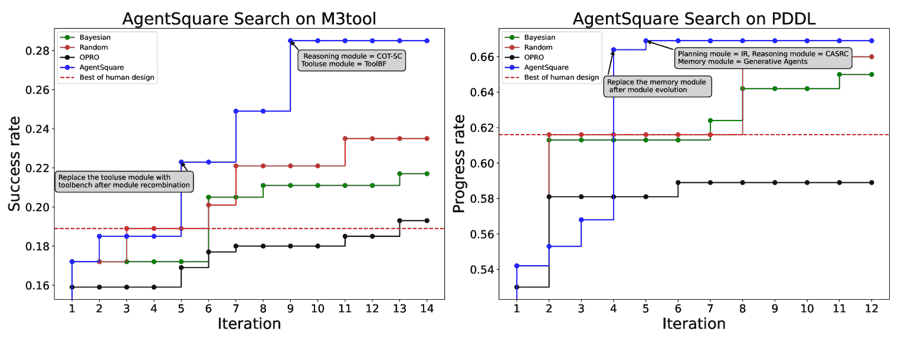
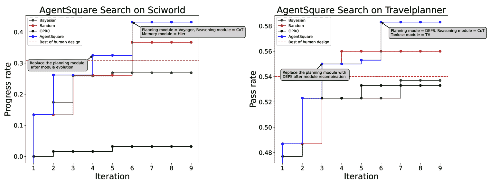

<!--yml
category: 未分类
date: 2025-01-11 12:08:37
-->

# AgentSquare: Automatic LLM Agent Search in Modular Design Space

> 来源：[https://arxiv.org/html/2410.06153/](https://arxiv.org/html/2410.06153/)

 Yu Shang¹¹¹1Equal contribution.     Yu Li²¹¹1Equal contribution.     Keyu Zhao¹     Likai Ma¹     Jiahe Liu¹     Fengli Xu¹²²2Corresponding author, correspondence to fenglixu@tsinghua.edu.cn, liyong07@tsinghua.edu.cn.     Yong Li¹²²2Corresponding author, correspondence to fenglixu@tsinghua.edu.cn, liyong07@tsinghua.edu.cn.

                          ¹Department of Electronic Engineering, Tsinghua University
                          ²Shenzhen International Graduate School, Tsinghua University

###### Abstract

Recent advancements in Large Language Models (LLMs) have led to a rapid growth of agentic systems capable of handling a wide range of complex tasks. However, current research largely relies on manual, task-specific design, limiting their adaptability to novel tasks. In this paper, we introduce a new research problem: Modularized LLM Agent Search (MoLAS). We propose a modular design space that abstracts existing LLM agent designs into four fundamental modules with uniform IO interface: *Planning*, *Reasoning*, *Tool Use*, and *Memory*. Building on this design space, we present a novel LLM agent search framework called AgentSquare, which introduces two core mechanisms, *i.e.*, *module evolution* and *recombination*, to efficiently search for optimized LLM agents. To further accelerate the process, we design a performance predictor that uses in-context surrogate models to skip unpromising agent designs. Extensive experiments across six benchmarks, covering the diverse scenarios of web, embodied, tool use and game applications, show that AgentSquare substantially outperforms hand-crafted agents, achieving an average performance gain of 17.2% against best-known human designs. Moreover, AgentSquare can generate interpretable design insights, enabling a deeper understanding of agentic architecture and its impact on task performance. We believe that the modular design space and AgentSquare search framework offer a platform for fully exploiting the potential of prior successful designs and consolidate the collective efforts of research community. Code repo is available at https://github.com/tsinghua-fib-lab/AgentSquare.

## 1 Introduction

The past few years have witnessed remarkable progress in the development of Large Language Models (LLMs) (Achiam et al., [2023](https://arxiv.org/html/2410.06153v2#bib.bib1); Touvron et al., [2023](https://arxiv.org/html/2410.06153v2#bib.bib34)), giving rise to the proliferation of numerous agentic systems (Weng, [2023](https://arxiv.org/html/2410.06153v2#bib.bib43); Shen et al., [2024](https://arxiv.org/html/2410.06153v2#bib.bib29)). For example, “chain-of-thought” prompting has unlocked the general-purpose reasoning capabilities of LLMs (Wei et al., [2022](https://arxiv.org/html/2410.06153v2#bib.bib41)), and memory mechanisms have been proven effective in simulating human behavioiur (Park et al., [2023](https://arxiv.org/html/2410.06153v2#bib.bib23)). These emerging LLM agents have demonstrated astonishing abilities to transform a wide range of tasks, including solving mathematical problems (Romera-Paredes et al., [2024](https://arxiv.org/html/2410.06153v2#bib.bib25)), navigating the web (Nakano et al., [2021](https://arxiv.org/html/2410.06153v2#bib.bib22)), providing financial advice (Ding et al., [2024](https://arxiv.org/html/2410.06153v2#bib.bib6)) and informing medical decisions (Li et al., [2024a](https://arxiv.org/html/2410.06153v2#bib.bib15)). Therefore, the design of agentic systems plays a crucial role in harnessing the power of LLMs for various downstream applications.

However, current research predominantly relies on manually designed agentic systems tailored for specific tasks, which often depend heavily on expert insight and intensive human labor. Furthermore, these task-specific agent designs frequently struggle to adapt to novel tasks. A few recent works have explored using LLMs to rewrite and optimize the prompts of existing agents (Fernando et al., [2024](https://arxiv.org/html/2410.06153v2#bib.bib8); Yang et al., [2024](https://arxiv.org/html/2410.06153v2#bib.bib48)). However, these rewriting approaches are limited in their ability to recombine the strengths of agentic modules discovered by different researches and located in separate codebases. Another line of research focuses on optimizing the configuration of multi-agent systems (Chen et al., [2023](https://arxiv.org/html/2410.06153v2#bib.bib5); Yuan et al., [2024](https://arxiv.org/html/2410.06153v2#bib.bib52); Li et al., [2023](https://arxiv.org/html/2410.06153v2#bib.bib17); [Zhuge et al.,](https://arxiv.org/html/2410.06153v2#bib.bib56) ; Wang et al., [2023b](https://arxiv.org/html/2410.06153v2#bib.bib39)). These efforts are orthogonal to the optimization of single-agent systems, as they focus more on the role-playing and interaction patterns among multiple agents, rather than the design of agentic modules.

Figure 1: AgentSquare is a modular framework for designing and optimizing LLM agents. We first propose a modular design space of LLM agents and extract 4 types of standardized modules including planning, reasoning, tooluse, and memory. Based on this, we design a novel LLM agent search framework to automatically discover good-performing agents.

This paper addresses a novel research problem — Modularized LLM Agent Search (MoLAS). The goal is to automatically optimize LLM agent designs by leveraging the experience of published or evaluated modules. Therefore, the core of our work is a modular design space for LLM agents, comprising 4 categories of modules: *Planning*, *Reasoning*, *Tool Use*, and *Memory*. This design space is abstracted from a thorough literature review of existing agentic systems (details provided in Section 2). It is important to note that our goal is not to propose the most comprehensive, one-size-fits-all LLM agent design space, but rather to demonstrate that our modular design space enables researchers and intelligent search algorithms to fully exploit the potential of prior successful designs. Thus, our key consideration is providing a standardized IO interface for these modules, facilitating easy recombination of modules from different agentic systems and hence enabling efficient search for novel agents. Our design space is also highly extensible, allowing new agentic systems to be integrated as plug-in modules. Therefore, it provides a platform to consolidate the collective efforts of the research community on LLM agents. The overview of this work is illustrated in Figure [1](https://arxiv.org/html/2410.06153v2#S1.F1 "Figure 1 ‣ 1 Introduction ‣ AgentSquare: Automatic LLM Agent Search in Modular Design Space").

Building on this modular design space, we propose a novel LLM agent search framework called AgentSquare. Specifically, AgentSquare optimizes LLM agents through the mechanisms of *module evolution* and *recombination*. The *module evolution* mechanism leverages an evolutionary meta-prompt to explore new modules through prompt-level optimization, which jointly models task descriptions, existing modules, and the performance of evaluated modules. Besides, the *module recombination* mechanism performs module-level optimization by leveraging the reasoning power of LLMs to strategically search for promising module combinations. To reduce the expensive evaluation costs of LLM agents, we further introduce a performance predictor that implements an in-context surrogate model for newly proposed LLM agents, enabling us to skip unpromising candidates and significantly accelerate the search process.

We conduct comprehensive evaluations on six widely adopted benchmarks, covering diverse use cases in web, embodied, tool use and game scenarios. Our experiments show AgentSqaure can discover novel LLM agents that outperform hand-crafted agents across all six benchmarks, scoring an average performance gain of 17.2% compared to the best known human designs. Besides, AgentSqaure also surpasses other search algorithms in terms of having a steeper optimization trajectory. More importantly, case studies reveal that AgentSquare can provide human interpretable design insights for newly discovered, good-performing agents.

The key contributions of this work are as follows:

*   •

    We propose a novel modular design space for LLM agents, enabling researchers to easily build on previous successful designs and accumulate new discoveries as a community.

*   •

    We design the AgentSquare framework that efficiently searches for novel and good-performing LLM agents via the novel mechanism of *module evolution*, *module recombination*, and *performance predictor*.

*   •

    Experiments across six diverse tasks show that our method discovers novel LLM agents that outperform all known human designs. Besides, AgentSqaure can generate human interpretable design insights for these novel agents.

## 2 A Modular Design Space of LLM Agents

Figure 2: Illustration of the modular agent design space and agentic workflow (left) and the standardized IO interface of four types of modules (right).

A modular design space for LLM agents facilitates the reuse of prior successful designs and supports the exploration of new architectures. At the core of such modularization is the standardization of input-output interfaces, which ensures both extensibility and seamless integration with existing designs. Many experts in the field have proposed building LLM agentic systems with key modular components from engineering (Weng, [2023](https://arxiv.org/html/2410.06153v2#bib.bib43)) and cognitive perspectives (Sumers et al., [2023](https://arxiv.org/html/2410.06153v2#bib.bib33); Shao et al., [2024](https://arxiv.org/html/2410.06153v2#bib.bib28)). However, these proposals remain largely conceptual, lacking implementable solutions to unify existing LLM agents. Besides, current LLM workflow program frameworks (*e.g.*, LangChain and AutoGPT) only provide operation-level components, which cannot support module-level search that best exploits the potential of prior successful designs.

To address these problems, we perform a comprehensive literature review of publications from NeurIPS, ICML, and ICLR over the past three years. The review focuses on papers with the keywords “LLM”, “Agent”, or “Large Language Model” in their titles while excluding works related to multi-agent systems or agents that require additional training. Note that our aim is not to propose the most comprehensive, one-for-all LLM agent design space, but to offer a standardized framework that enables the recombination of existing agents and facilitates the discovery of new ones. As a result, we sort out 16 popular LLM agents and abstract a modular design space with 1050 possible combinations, which can be easily extended when new modules are discovered. Below, we describe the agentic workflow and the function of each modules in our design space.

Workflow overview. The proposed agent workflow operates through an iterative process with the interconnection of the above four modules, as shown in Figure [2](https://arxiv.org/html/2410.06153v2#S2.F2 "Figure 2 ‣ 2 A Modular Design Space of LLM Agents ‣ AgentSquare: Automatic LLM Agent Search in Modular Design Space"). Upon receiving a task $d$, the agent starts with the *planning* module, decomposing it into $n$ sub-tasks$\{s_{1},s_{2},\dots,s_{n}\}$. Next, these sub-tasks are passed to the *reasoning* module sequentially. Taking the sub-task $s_{i}$ description as input, the *reasoning* module explores to prompt LLMs to give the result. When reasoning encounters limitations in internal knowledge of LLMs, the *tool use* module is activated to select an appropriate tool from the pre-defined tool pool $\tau$, supporting problem-solving. Besides, the reasoning process also accesses the *memory* module which reads and writes necessary observations and experiences from a memory database $mem$ to help reasoning. The reasoning result of each sub-task will be transformed into actions, guiding the agent to interact with the external environment. After all sub-tasks are finished or the reasoning process gets stacked, the agent will activate the *planning* module to adjust the plan with the received feedback. The agent conducts such a trial-and-error loop until the task $d$ is completed or the set maximum trial number is reached.

Planning. The planning module is responsible for decomposing the targeted task into smaller sub-tasks. Given a task description $d$ and optional feedback information $f$, the planning module $P$ strategically decomposes the targeted task into a sub-task sequence $\{s_{1},s_{2},\dots,s_{n}\}=P(d,f)$. Such decomposition is critical for handling very complex tasks with long-term characteristics, especially for agents in open-world environments such as MineCraft (Wang et al., [2024a](https://arxiv.org/html/2410.06153v2#bib.bib35); [c](https://arxiv.org/html/2410.06153v2#bib.bib40)).

Reasoning. LLMs have exhibited remarkable reasoning abilities under advanced prompting approaches such as CoT (Wei et al., [2022](https://arxiv.org/html/2410.06153v2#bib.bib41)), ToT (Yao et al., [2024](https://arxiv.org/html/2410.06153v2#bib.bib50)), and SoT (Shang et al., [2024](https://arxiv.org/html/2410.06153v2#bib.bib27)), shaping the foundation of the intelligence of LLM agents. The reasoning module $R$ is invoked to solve the sub-tasks sequentially after planning, which takes each sub-task $s_{i}$ and optional feedback information $f_{i}$ as input and outputs a solution $r_{i}=R(s_{i},f_{i})$.

Tool use. The ability of using external tools (Shen et al., [2024](https://arxiv.org/html/2410.06153v2#bib.bib29); Schick et al., [2024](https://arxiv.org/html/2410.06153v2#bib.bib26)) overcomes the limitations of the LLM’s internal knowledge during the reasoning process. Formally, given certain problem $p_{ij}$ derived from the reasoning process of sub-task $s_{i}$ and a pre-defined tool pool $\tau$, the tooluse module $T$ selects the best-matched tool $t_{ij}$ to address the problem, denoted as $t_{ij}=T(p_{ij},\tau)$, where $t_{ij}\in\tau$.

Memory. Memory plays a critical role by storing past thoughts, actions, and observations of agents (Park et al., [2023](https://arxiv.org/html/2410.06153v2#bib.bib23); Shinn et al., [2024](https://arxiv.org/html/2410.06153v2#bib.bib30)). During the reasoning process, these internal logs are dynamically written to and retrieved from the memory database $mem$, controlled by the memory module $M$. The writing process can be expressed as $mem=M_{write}(o,mem)$, where $o$ denotes the current observations. The retrieval process is $m=M_{retrieve}(o,mem)$, where $m$ denotes the retrieved knowledge relevant to the current situation.

## 3 AgentSquare Framework

Figure 3: Overview of AgentSquare search framework. AgentSquare optimizes LLM agents through the mechanisms of module evolution and recombination. We further introduce a performance predictor that implements an in- context surrogate model for efficient evaluation of novel agents.

### 3.1 Problem formulation of MoLAS

In the proposed modular design space, an LLM agent $A$ can be instantiated with the combination of a planning module $P$, a reasoning module $R$, a tooluse module $T$ and a memory module $M$, denoted as $A=(P,R,T,M)$. Given the task description $d$ and the set of all possible modules with standardized IO interface $\{\mathbb{P},\mathbb{R},\mathbb{T},\mathbb{M}\}$. We formulate an optimization problem for searching LLM agent architectures within the modular design space. The objective is to identify the optimal module combination in a solution space defined by a Cartesian product of four design dimensions to maximize agent performance. Let the performance evaluation function of the task be ${Eval}_{d}(\cdot)$, where the specific metric varies in different tasks as discussed in Appendix [A.1](https://arxiv.org/html/2410.06153v2#A1.SS1 "A.1 Experimental Setup ‣ Appendix A Appendix ‣ AgentSquare: Automatic LLM Agent Search in Modular Design Space"). The optimization problem of MoLAS is defined as follows:

|  | $\operatorname*{arg\,max}\limits_{P\in\mathbb{P},R\in\mathbb{R},T\in\mathbb{T},% M\in\mathbb{M}}{Eval}_{d}(P,R,T,M).$ |  | (1) |

### 3.2 AgentSquare search algorithm

Solving the optimization problem of MoLAS features three key challenges: (1) The search space, defined as the Cartesian product of four orthogonal modules, is vast and hard to explore; (2) the module sets encompass any code with standard IO interfaces, making the module selection an open-ended problem; (3) the high costs of agent evaluation during the search process constrain the overall search scale. To tackle these issues, we introduce AgentSquare, an automatic search framework to optimize LLM agents within the modular design space. Facing the vast search space of MoLAS, we propose *module recombination* operation utilizing LLMs to strategically reason to identify more promising module combinations. Such operation broadens the coverage of child samples, overcoming the limitations of prompt rewrite methods that explore only a restricted space. However, only searching in the existing module combinations also narrows the search space, thus we propose *module evolution* operation which employs an evolutionary meta-prompt to search new modules through code-level optimization. This operation, combined with module recombination, enables the search of any module combination in the open-ended solution space. Finally, to mitigate the high costs of frequent evaluations of searched agents, we design a *performance predictor* as an in-context surrogate model for evaluating searched agents, significantly accelerating the search process and reducing real-valued costs.

The overall framework of AgentSquare is illustrated in Figure [3](https://arxiv.org/html/2410.06153v2#S3.F3 "Figure 3 ‣ 3 AgentSquare Framework ‣ AgentSquare: Automatic LLM Agent Search in Modular Design Space") and the algorithm is presented in Algorithm [1](https://arxiv.org/html/2410.06153v2#algorithm1 "In 3.2 AgentSquare search algorithm ‣ 3 AgentSquare Framework ‣ AgentSquare: Automatic LLM Agent Search in Modular Design Space"). Next, we detail the key components of the AgentSquare search process.

Input: Initial agent $A_{0}$, targeted task descriptions $d$, maximum evolution episode $K$, population size $N$ per evolution phase, standardized module pools $\{\mathbb{P},\mathbb{R},\mathbb{T},\mathbb{M}\}$, experience pool $\mathbb{E}$Output: The evolved agent $A^{*}$$t\leftarrow 1$ // Current search episode$A_{e}^{0}\leftarrow A_{0}$ // Initialization of the module evolution phasewhile *$t\leq K$* do       $\{A_{e}^{1},A_{e}^{2},...,A_{e}^{N}\}\leftarrow\pi_{\xi}(A_{e}^{0},d,N,\mathbb% {P},\mathbb{R},\mathbb{T},\mathbb{M},\mathbb{E})$ // Module evolution       $A_{r}^{0}\leftarrow\operatorname*{arg\,max}\{{Eval}_{d}(A_{e}^{0}),{Eval}_{d}(% A_{e}^{1}),...,{Eval}_{d}(A_{e}^{N})\}$ // Select the best-performing generated agent       $\{A_{r}^{1},A_{r}^{2},...,A_{r}^{N}\}\leftarrow\pi_{\theta}(A_{r}^{0},d,N,% \mathbb{P},\mathbb{R},\mathbb{T},\mathbb{M},\mathbb{E})$ // Module recombination       $A_{e}^{0}\leftarrow\operatorname*{arg\,max}\{{Eval}_{d}(A_{r}^{0}),{Eval}_{d}(% A_{r}^{1}),...,{Eval}_{d}(A_{r}^{N})\}$ // Select the best-performing generated agent       $t\leftarrow t+1$$A^{*}\leftarrow A_{e}^{0}$return $A^{*}$

Algorithm 1 Algorithm of AgentSquare

### 3.3 Initialization

Insights from existing AutoML studies indicate that a well-chosen initialization enhances warm-up and improves search efficiency by avoiding unpromising populations (So et al., [2019](https://arxiv.org/html/2410.06153v2#bib.bib32); Yuan et al., [2024](https://arxiv.org/html/2410.06153v2#bib.bib52)). AgentSquare starts by initializing a global experience pool $\mathbb{E}=\{(P,R,T,M,v)|P_{0}\in\mathbb{P},R_{0}\in\mathbb{R},T_{0}\in\mathbb% {T},M_{0}\in\mathbb{M}\}$ to seed agents that are well-designed (as mentioned in Section 2) along with their real-valued performance $v$. The module pools $\{\mathbb{P},\mathbb{R},\mathbb{T},\mathbb{M}\}$ are set to the standardized modules extracted from these seed agents.

### 3.4 Module Recombination

Given the vast solution space of MoLAS, relying solely on prompt rewriting leads to a limited exploration confined to the neighbor of the initial state. To expand the exploration space, we propose leveraging LLMs as a *self-adaptive proposer*, which iteratively reason to identify promising module combinations with accumulated experience beyond the original agent configuration. Denote the initial agent of the recombination phase as $A_{r}^{0}=(P_{0},R_{0},T_{0},M_{0})$, where $P_{0}\in\mathbb{P},R_{0}\in\mathbb{R},T_{0}\in\mathbb{T},M_{0}\in\mathbb{M}$. The module combination proposer LLM $\pi_{\theta}$ incorporates targeted task description $d$, existing module pools $\{\mathbb{P},\mathbb{R},\mathbb{T},\mathbb{M}\}$ and the performance experience of searched module combinations $\mathbb{E}$ to propose promising new agents $A_{r}$:

|  | $A_{r}=\pi_{\theta}((P_{0},R_{0},T_{0},M_{0}),d,N,\mathbb{P},\mathbb{R},\mathbb% {T},\mathbb{M},\mathbb{E}).$ |  | (2) |

Based on the initial agent configuration $A_{r}^{0}$, the LLM proposes $N$ offspring $\{A_{r}^{1},A_{r}^{2},...,A_{r}^{N}\}$ by replacing certain modules of $A_{r}^{0}$ with alternatives from the module pool. For instance, a possible solution could be $(P_{0},R^{{}^{\prime}},T_{0},M_{0})$, where $R^{{}^{\prime}}\in\mathbb{R}$ is a different reasoning module selected from the module pool. Then, the created $N$ new agents are evaluated with a performance predictor $\pi_{p}$ (detail in Seciton [3.6](https://arxiv.org/html/2410.06153v2#S3.SS6 "3.6 Performance Predictor ‣ 3 AgentSquare Framework ‣ AgentSquare: Automatic LLM Agent Search in Modular Design Space")) and the best one goes to the next episode as initialization.

### 3.5 Module Evolution

As mentioned above, the solution space for each module type is open-ended, allowing any code with a standardized I/O interface. Consequently, searching only with module recombination narrows the solution space and limits the upper bound of agent performance. To address this problem, we design a *module evolution* operation with an evolutionary meta-prompt to search for new modules through program-level optimization. Specifically, we introduce a module-programming LLM $\pi_{\xi}$ to evolve new modules by jointly modeling task descriptions, existing modules, and the performance of previously evaluated modules. Leveraging LLMs as module programmer has several appealing advantages. Modern LLMs are typically trained on extensive code datasets, enabling advanced code comprehension and generation capabilities. Additionally, integrating existing module codes as in-context examples, along with past experiences, can elicit the reflective reasoning abilities of LLMs to identify promising optimization directions. Denote the initial agent in the module evolution stage as $A_{e}^{0}=(P^{{}^{\prime}}_{0},R^{{}^{\prime}}_{0},T^{{}^{\prime}}_{0},M^{{}^{% \prime}}_{0})$, the module programmer LLM produces a population of child agents by evolving current modules of $A_{e}^{0}$. Formally the module evolution operation is denoted as follows:

|  | $A_{e}=\pi_{\xi}((P^{{}^{\prime}}_{0},R^{{}^{\prime}}_{0},T^{{}^{\prime}}_{0},M% ^{{}^{\prime}}_{0}),d,N,\mathbb{P},\mathbb{R},\mathbb{T},\mathbb{M},\mathbb{E}).$ |  | (3) |

The created new modules are appended to the standardized module pools $\{\mathbb{P},\mathbb{R},\mathbb{T},\mathbb{M}\}$ and each module is used to individually mutate the initial agent, resulting in $N$ child agents $\{A_{e}^{1},A_{e}^{2},...,A_{e}^{N}\}$. For example, $(P^{*},R_{0},T_{0},M_{0})$ represents a solution where the planning module is mutated into a new variant $P^{*}$. These child agents are then real-tested and updated to the historical experience pool $\mathbb{E}$. The best-performing one is selected as the initial agent for the subsequent recombination phase.

### 3.6 Performance Predictor

The last challenge in automatic agent search is the high API cost incurred during the evaluation of each candidate agent. Many agent tasks require multiple steps and involve substantial input and output tokens, leading to prohibitive evaluation costs. For instance, evaluating a simple CoT agent based on GPT-4o in ALFWorld (Shridhar et al., [2021](https://arxiv.org/html/2410.06153v2#bib.bib31)) requires around $60, making the agent search economically unsustainable at scale. To tackle this issue, we propose incorporating an additional LLM $\pi_{p}$ as a performance predictor to serve as an in-context surrogate model for novel agent evaluation, enabling the exclusion of unpromising candidates and significantly accelerating the search process. Compared to real environment evaluation, such an in-context surrogate model requires significantly fewer tokens, making it more cost-efficient and supporting larger-scale searches. Similar approaches have been effectively applied in neural architecture search (NAS), where LLMs are leveraged to evaluate the performance of generated network architectures  (Jawahar et al., [2023](https://arxiv.org/html/2410.06153v2#bib.bib14); Chen et al., [2024a](https://arxiv.org/html/2410.06153v2#bib.bib3)).

During the search process, newly created agents from module evolution are still tested in the real task environment because these new modules never appear in the experience pool, and it is unsuitable to use the performance predictor to provide predictions. During the module recombination operation, the newly proposed agents are evaluated by the performance predictor, which leverages in-context reasoning based on past agent combination performance to provide efficient performance prediction. Here, given a newly searched agent $A^{\prime}$, the performance predictor $\pi_{p}$ thoroughly considers task descriptions $d$, module profiles and in-context performance examples of previously tested agents $\mathbb{E}$ to score novel agents:

|  | $v^{\prime}=\pi_{p}(A^{\prime},d,\mathbb{P},\mathbb{R},\mathbb{T},\mathbb{M},% \mathbb{E}),$ |  | (4) |

where $v^{\prime}$ is the predicted performance of the evaluated agent. Empirical results demonstrate that the predicted performance of agents closely matches their actual performance, verifying the effectiveness of the proposed performance predictor, which is detailed in Section [4.3](https://arxiv.org/html/2410.06153v2#S4.SS3 "4.3 Ablation Study of AgentSquare ‣ 4 Experiments ‣ AgentSquare: Automatic LLM Agent Search in Modular Design Space").

## 4 Experiments

### 4.1 Experimental Setup

Task setup. We conduct experiments on six representative tasks covering four domains: embodied, game, web and tool applications, which are widely adopted by existing LLM agent benchmarks (Ma et al., [2024a](https://arxiv.org/html/2410.06153v2#bib.bib19); Xi et al., [2024](https://arxiv.org/html/2410.06153v2#bib.bib45)), more details are presented in Appendix [A.1](https://arxiv.org/html/2410.06153v2#A1.SS1 "A.1 Experimental Setup ‣ Appendix A Appendix ‣ AgentSquare: Automatic LLM Agent Search in Modular Design Space").

Baselines. We compare AgentSquare with three types of baselines including hand-crafted agents, module-level search, and prompt-level search methods. More details are presented in Appendix [A.1](https://arxiv.org/html/2410.06153v2#A1.SS1 "A.1 Experimental Setup ‣ Appendix A Appendix ‣ AgentSquare: Automatic LLM Agent Search in Modular Design Space").

AgentSquare setup. We implement AgentSquare and conduct experiments using both GPT-3.5-turbo-0125 and GPT-4o (Achiam et al., [2023](https://arxiv.org/html/2410.06153v2#bib.bib1)). To ensure a fair comparison, we use the same number of few-shot examples across all methods. The initial agent is set as a random module combination, and the search process terminates after 5 consecutive iterations without performance improvement.

|  |  | Web | Embodied | Tool | Game |
| Baseline Type | Method | Webshop | ALFWorld | SciWorld | M3Tool | TravelPlanner | PDDL |
| Hand-crafted Agents | CoT | 0.485 | 0.405 | 0.697 | 0.448 | 0.487 | 0.542 |
| Cot-SC | 0.512 | 0.426 | 0.656 | 0.461 | 0.413 | 0.495 |
| Self-refine | 0.461 | 0.567 | 0.654 | 0.442 | 0.000 | 0.514 |
| ToT | 0.501 | 0.437 | 0.741 | 0.453 | 0.380 | 0.476 |
| Step Back | 0.468 | 0.279 | 0.220 | 0.434 | 0.000 | 0.486 |
| TP | 0.398 | 0.404 | 0.576 | 0.387 | 0.430 | 0.518 |
| HuggingGPT | 0.519 | 0.481 | 0.680 | 0.354 | 0.510 | 0.584 |
| Voyager | 0.366 | 0.425 | 0.776 | 0.247 | 0.523 | 0.412 |
| Generative Agents | 0.499 | 0.477 | 0.663 | 0.402 | 0.480 | 0.553 |
| DEPS | 0.481 | 0.459 | 0.740 | 0.278 | 0.540 | 0.591 |
| OPENAGI | 0.506 | 0.510 | 0.718 | 0.322 | 0.533 | 0.616 |
| Dilu | 0.451 | 0.433 | 0.682 | 0.475 | 0.360 | 0.463 |
| Module Search | Random | 0.533 | 0.620 | 0.704 | 0.438 | 0.563 | 0.660 |
| Bayesian | 0.549 | 0.634 | 0.749 | 0.502 | 0.537 | 0.650 |
| Prompt Search | OPRO | 0.505 | 0.380 | 0.569 | 0.309 | 0.523 | 0.589 |
|  | AgentSquare | 0.607 | 0.695 | 0.781 | 0.524 | 0.583 | 0.669 |

Table 1: Performance comparison of searched agents from AgentSquare and (1) existing human-designed agents (2) module search baselines (3) prompt search baselines based on GPT-4o on six tasks across different domains.

### 4.2 Experimental Results

Main results. We conduct extensive experiments to compare our method against three types of baselines on six tasks and present results based on GPT-4o in Table [1](https://arxiv.org/html/2410.06153v2#S4.T1 "Table 1 ‣ 4.1 Experimental Setup ‣ 4 Experiments ‣ AgentSquare: Automatic LLM Agent Search in Modular Design Space") and results on GPT-3.5 in Table [A.3](https://arxiv.org/html/2410.06153v2#A1.T3 "Table A.3 ‣ A.1 Experimental Setup ‣ Appendix A Appendix ‣ AgentSquare: Automatic LLM Agent Search in Modular Design Space"). Additionally, we evaluate the agents’ API costs and provide a performance-cost comparison in Figure [A.7](https://arxiv.org/html/2410.06153v2#A1.F7 "Figure A.7 ‣ A.1 Experimental Setup ‣ Appendix A Appendix ‣ AgentSquare: Automatic LLM Agent Search in Modular Design Space") to Figure [A.12](https://arxiv.org/html/2410.06153v2#A1.F12 "Figure A.12 ‣ A.1 Experimental Setup ‣ Appendix A Appendix ‣ AgentSquare: Automatic LLM Agent Search in Modular Design Space"). From these results, we have the following observations:

*   •

    AgentSquare can effectively discover better agents compared with human-designed agents. On the six representative agent tasks, the best agent searched by AgentSquare consistently outperforms human-designed agents in terms of performance. Specifically, as shown in Table [1](https://arxiv.org/html/2410.06153v2#S4.T1 "Table 1 ‣ 4.1 Experimental Setup ‣ 4 Experiments ‣ AgentSquare: Automatic LLM Agent Search in Modular Design Space") and Table [A.3](https://arxiv.org/html/2410.06153v2#A1.T3 "Table A.3 ‣ A.1 Experimental Setup ‣ Appendix A Appendix ‣ AgentSquare: Automatic LLM Agent Search in Modular Design Space"), compared with the best human-designed agent, AgentSquare achieves an average 14.1% performance improvement on Webshop, 26.1% improvement on ALFWorld, 20.5% improvement on SciWorld, 30.6% improvement on M3Tool, 6.0% improvement on Travelplanner, 6.0% improvement on PDDL. Simultaneously, the best agent from AgentSquare is commonly cost-efficient, which strikes the best performance-cost trade-off among all compared agents as seen in Figure [A.7](https://arxiv.org/html/2410.06153v2#A1.F7 "Figure A.7 ‣ A.1 Experimental Setup ‣ Appendix A Appendix ‣ AgentSquare: Automatic LLM Agent Search in Modular Design Space") -Figure [A.12](https://arxiv.org/html/2410.06153v2#A1.F12 "Figure A.12 ‣ A.1 Experimental Setup ‣ Appendix A Appendix ‣ AgentSquare: Automatic LLM Agent Search in Modular Design Space"). Since the search cost is a one-time expense and the searched modules can be reused, it is not included in the above analysis, but separately listed in Table [A.6](https://arxiv.org/html/2410.06153v2#A1.T6 "Table A.6 ‣ A.1 Experimental Setup ‣ Appendix A Appendix ‣ AgentSquare: Automatic LLM Agent Search in Modular Design Space").

*   •

    AgentSquare provides a more efficient searching approach for LLM agent optimization. To further demonstrate the effectiveness of the search pipeline of AgentSquare, we also compare with two types of agent searching methods including module-level and prompt-level search. Compared with the best agent crafted from these searching methods, AgentSquare achieves an average 8.4% performance improvement on Webshop, 8.1% improvement on ALFWorld, 11.0% improvement on SciWorld, 12.8% improvement on M3Tool, 2.5% improvement on Travelplanner, 1.4% improvement on PDDL.

Search trajectory in AgentSquare. We present the search trajectory under 15 iterations using AgentSquare based on GPT-4o and other searching methods on ALFWorld and Webhop tasks in Figure [4](https://arxiv.org/html/2410.06153v2#S4.F4 "Figure 4 ‣ 4.2 Experimental Results ‣ 4 Experiments ‣ AgentSquare: Automatic LLM Agent Search in Modular Design Space"). Results on other tasks are presented in Figure [A.13](https://arxiv.org/html/2410.06153v2#A1.F13 "Figure A.13 ‣ A.1 Experimental Setup ‣ Appendix A Appendix ‣ AgentSquare: Automatic LLM Agent Search in Modular Design Space") and [A.14](https://arxiv.org/html/2410.06153v2#A1.F14 "Figure A.14 ‣ A.1 Experimental Setup ‣ Appendix A Appendix ‣ AgentSquare: Automatic LLM Agent Search in Modular Design Space"). AgentSquare demonstrates a steady convergence trajectory, where more advanced agents are continually emerging during search. In contrast, module-level searching methods including random and Bayesian search lack a clear and insightful search direction. Prompt-level search methods such as OPRO are constrained by a limited modification space, leading to minimal performance improvements. As a result, they all encounter performance bottlenecks during the search process, resulting in sub-optimal agent architectures. Besides, we find that simple module-level search methods such as random recombination greatly outperforms prompt-level search, indicating the importance of searching in the modular design space.

Figure 4: AgentSquare search trajectory on Alfworld and Webshop.

| Method | Webshop | ALFWorld | SciWorld | M3Tool | TravelPlanner | PDDL |
| --- | --- | --- | --- | --- | --- | --- |
| AgentSquare (full) | 0.607 | 0.695 | 0.781 | 0.524 | 0.583 | 0.669 |
| w/o module evolution | 0.564 | 0.649 | 0.736 | 0.502 | 0.577 | 0.614 |
| w/o module recombination | 0.560 | 0.616 | 0.710 | 0.481 | 0.280 | 0.669 |

Table 2: Ablation study of AgentSquare on GPT-4o on six tasks across different domains.

### 4.3 Ablation Study of AgentSquare

Effectiveness of module evolution and recombination. There are two key operations in the searching framework of AgentSquare: module evolution which creates new modules and module recombination which strategically recombines existing ones. To verify the effectiveness of each design, we tested three variants of AgentSquare: the full model, a version without module evolution, and a version without module recombination. The results based on GPT-4o and GPT-3.5 are presented in Table [2](https://arxiv.org/html/2410.06153v2#S4.T2 "Table 2 ‣ 4.2 Experimental Results ‣ 4 Experiments ‣ AgentSquare: Automatic LLM Agent Search in Modular Design Space") and Table [A.5](https://arxiv.org/html/2410.06153v2#A1.T5 "Table A.5 ‣ A.1 Experimental Setup ‣ Appendix A Appendix ‣ AgentSquare: Automatic LLM Agent Search in Modular Design Space"), respectively. It can be seen that dropping each design results in a noticeable performance decline and the module recombination has a larger impact. Module recombination significantly expands the search space, reducing the risk of falling into a local optima. Meanwhile, module evolution facilitates the discovery of more advanced modules tailored to specific tasks. These two operations collaborate well ensuring the effectiveness of the search process in AgentSquare.

Figure 5: Validation of the effectiveness of the performance predictor (correlation between the actual and predicted performance) on each task.

Effectiveness of performance predictor. In this part, we verify the effectiveness of this design empirically. Figure [5](https://arxiv.org/html/2410.06153v2#S4.F5 "Figure 5 ‣ 4.3 Ablation Study of AgentSquare ‣ 4 Experiments ‣ AgentSquare: Automatic LLM Agent Search in Modular Design Space") illustrates the predicted performance of given agents versus their actual tested performance based on both GPT-3.5 and GPT-4o on all six tasks. It can be found that the predicted performance closely aligns with the actual performance, demonstrating the effectiveness of the performance predictor. For instance, the evaluation cost of the predictor is only about 0.025% of the cost of a full evaluation based on GPT-4o in ALFWorld, demonstrating its remarkable cost-efficiency.

### 4.4 Discovered Best Agents from AgentSquare

In this section, we provide some illustrations of the searched best agents, especially some discovered promising modules. Table [A.4](https://arxiv.org/html/2410.06153v2#A1.T4 "Table A.4 ‣ A.1 Experimental Setup ‣ Appendix A Appendix ‣ AgentSquare: Automatic LLM Agent Search in Modular Design Space") summarizes the searched best agent from AgentSquare and the best hand-crafted agents on all tasks. We can observe that AgentSquare can adaptively identify promising agents with both previously existing and newly programmed modules tailored to the given task. For instance, the discovered best agent for ALFWorld combines an existing well-designed memory module from Generative Agents with newly created planning (named TD) and reasoning modules (named SF-ToT). By comparison, the best hand-crafted agent Self-refine focuses only on reasoning module design while overlooking other functional modules, leading to suboptimal performance. Moreover, we illustrate two new modules and the human interpretable design insights discovered on ALFWorld in Figure [6](https://arxiv.org/html/2410.06153v2#S4.F6 "Figure 6 ‣ 4.4 Discovered Best Agents from AgentSquare ‣ 4 Experiments ‣ AgentSquare: Automatic LLM Agent Search in Modular Design Space"). More illustrations are listed in the Figure [A.15](https://arxiv.org/html/2410.06153v2#A1.F15 "Figure A.15 ‣ A.1 Experimental Setup ‣ Appendix A Appendix ‣ AgentSquare: Automatic LLM Agent Search in Modular Design Space") to Figure [A.20](https://arxiv.org/html/2410.06153v2#A1.F20 "Figure A.20 ‣ A.1 Experimental Setup ‣ Appendix A Appendix ‣ AgentSquare: Automatic LLM Agent Search in Modular Design Space").

Figure 6: New module discovered through AgentSquare search on ALFWorld.

## 5 Related Work

### 5.1 LLM-based Autonomous Agents

LLM-based autonomous agents are an advanced AI system using a core LLM to manage external functional modules and interact with environments. In the early stage, LLM-based agents possess very simple architectures, which just directly query LLMs to conduct decision-making and take action (Huang et al., [2022](https://arxiv.org/html/2410.06153v2#bib.bib12); Ahn et al., [2022](https://arxiv.org/html/2410.06153v2#bib.bib2)). More recently, advancements have equipped agents with some other LLM-centric functional modules including planning (Hao et al., [2023](https://arxiv.org/html/2410.06153v2#bib.bib10); Huang et al., [2023](https://arxiv.org/html/2410.06153v2#bib.bib13); Zeng et al., [2024](https://arxiv.org/html/2410.06153v2#bib.bib53)), reasoning (Wei et al., [2022](https://arxiv.org/html/2410.06153v2#bib.bib41); Yao et al., [2024](https://arxiv.org/html/2410.06153v2#bib.bib50); Shang et al., [2024](https://arxiv.org/html/2410.06153v2#bib.bib27)), using tools (Shen et al., [2024](https://arxiv.org/html/2410.06153v2#bib.bib29); Schick et al., [2024](https://arxiv.org/html/2410.06153v2#bib.bib26)), and monitoring memory (Wang et al., [2024a](https://arxiv.org/html/2410.06153v2#bib.bib35); Park et al., [2023](https://arxiv.org/html/2410.06153v2#bib.bib23)), greatly enhancing the capabilities of LLM agents. Along with the improvement of the single agent, there’s another line of work trying to build more advanced multi-agent systems by strategically organizing individual agents for both simulation (Li et al., [2023](https://arxiv.org/html/2410.06153v2#bib.bib17); Chen et al., [2023](https://arxiv.org/html/2410.06153v2#bib.bib5)) and targeted task solving (Qian et al., [2024](https://arxiv.org/html/2410.06153v2#bib.bib24); Xiao et al., [2023](https://arxiv.org/html/2410.06153v2#bib.bib46); Chen et al., [2024b](https://arxiv.org/html/2410.06153v2#bib.bib4); Li et al., [2024b](https://arxiv.org/html/2410.06153v2#bib.bib16)). The emergence of more and more sophisticated agent produces remarkable performance improvement, however, their architectures and codebases differ greatly with each other. The lack of a unified design space and consistent terminologies across individual works makes it hard to compare different agents, understand their evolution routes, and guide new agent design directions.

### 5.2 Automatic Design of LLM-based Agents

LLM-based agent system, as the most advanced AI system, has not yet formed a unified design space and an automatic design approach. Existing efforts on automatic building of LLM agents focus on three aspects: engineering-oriented open resources, conceptual framework of LLM agent design, and automatic design of partial components of LLM agents. Firstly, engineering-oriented open resources like LangChain^*^**https://github.com/langchain-ai/langchain and BabyAGI^†^††https://github.com/yoheinakajima/babyagi has provided convenient ways to build an LLM-centric agentic system, however, they still need human participation to organize different modules and can’t support the optimization of the designed agent. Secondly, there’s has been some conceptual framework trying to provide a unified design principle of LLM agents, such as CoALA (Sumers et al., [2023](https://arxiv.org/html/2410.06153v2#bib.bib33)). It points out four basic modules of language agents from the perspective of cognitive science, including long-term memory, external grounding, internal actions and decision-making. However, it’s still a vision of how LLM agents should be in the future, without providing a practical design framework. Thirdly, there have been some separate works to automate parts of LLM agent systems, such as prompt optimization (Do et al., [2024](https://arxiv.org/html/2410.06153v2#bib.bib7); Ma et al., [2024b](https://arxiv.org/html/2410.06153v2#bib.bib20)) and workflow search (Li et al., [2024c](https://arxiv.org/html/2410.06153v2#bib.bib18); Hu et al., [2024](https://arxiv.org/html/2410.06153v2#bib.bib11)). Nevertheless, these works over-simplify the structure of agentic systems to pure prompts or codes, unable to provide a clear design space of LLM agents. Besides, another common shortcoming of existing works is that all of them are proposed without much consideration of existing designed agent architectures, thus hard to be representative and universal. Differently, our proposed modularized LLM agent design space can well cover existing efforts of LLM agent design, and provide a practical approach for automatic agent architecture optimization.

## 6 Conclusion

In this work, we introduce a novel modular design space for LLM agents, allowing researchers to build upon successful prior designs and collectively accumulate new insights. Based on this, we propose a novel research problem, Modularized LLM Agent Search (MoLAS), which aims to automatically optimize LLM agent designs by leveraging the knowledge gained from previously published or evaluated modules. To address the challenge of vast search spaces, we present AgentSquare, an automatic search framework to optimize LLM agents through module evolution and recombination, enabling the exploration of the entire solution space. We further introduce a performance predictor as an in-context surrogate model for evaluating novel LLM agents to accelerate the search process. AgentSquare consistently discovers novel agents that surpass all existing hand-crafted ones, while also offering interpretable design insights that deepen our understanding of these new agents. Overall, our work offers a transition from studying individual LLM agent designs to studying LLM agents within a modular design space, further consolidating the collective efforts of research community.

## References

*   Achiam et al. (2023) Josh Achiam, Steven Adler, Sandhini Agarwal, Lama Ahmad, Ilge Akkaya, Florencia Leoni Aleman, Diogo Almeida, Janko Altenschmidt, Sam Altman, Shyamal Anadkat, et al. Gpt-4 technical report. *arXiv preprint arXiv:2303.08774*, 2023.
*   Ahn et al. (2022) Michael Ahn, Anthony Brohan, Noah Brown, Yevgen Chebotar, Omar Cortes, Byron David, Chelsea Finn, Chuyuan Fu, Keerthana Gopalakrishnan, Karol Hausman, et al. Do as i can, not as i say: Grounding language in robotic affordances. *arXiv preprint arXiv:2204.01691*, 2022.
*   Chen et al. (2024a) Angelica Chen, David Dohan, and David So. Evoprompting: language models for code-level neural architecture search. *Advances in Neural Information Processing Systems*, 36, 2024a.
*   Chen et al. (2024b) Lin Chen, Fengli Xu, Nian Li, Zhenyu Han, Meng Wang, Yong Li, and Pan Hui. Large language model-driven meta-structure discovery in heterogeneous information network. In *Proceedings of the 30th ACM SIGKDD Conference on Knowledge Discovery and Data Mining*, pp.  307–318, 2024b.
*   Chen et al. (2023) Weize Chen, Yusheng Su, Jingwei Zuo, Cheng Yang, Chenfei Yuan, Chi-Min Chan, Heyang Yu, Yaxi Lu, Yi-Hsin Hung, Chen Qian, et al. Agentverse: Facilitating multi-agent collaboration and exploring emergent behaviors. In *The Twelfth International Conference on Learning Representations*, 2023.
*   Ding et al. (2024) Han Ding, Yinheng Li, Junhao Wang, and Hang Chen. Large language model agent in financial trading: A survey. *arXiv preprint arXiv:2408.06361*, 2024.
*   Do et al. (2024) Viet-Tung Do, Van-Khanh Hoang, Duy-Hung Nguyen, Shahab Sabahi, Jeff Yang, Hajime Hotta, Minh-Tien Nguyen, and Hung Le. Automatic prompt selection for large language models. *arXiv preprint arXiv:2404.02717*, 2024.
*   Fernando et al. (2024) Chrisantha Fernando, Dylan Sunil Banarse, Henryk Michalewski, Simon Osindero, and Tim Rocktäschel. Promptbreeder: Self-referential self-improvement via prompt evolution. In *Forty-first International Conference on Machine Learning*, 2024.
*   Ge et al. (2024) Yingqiang Ge, Wenyue Hua, Kai Mei, Juntao Tan, Shuyuan Xu, Zelong Li, Yongfeng Zhang, et al. Openagi: When llm meets domain experts. *Advances in Neural Information Processing Systems*, 36, 2024.
*   Hao et al. (2023) Shibo Hao, Yi Gu, Haodi Ma, Joshua Hong, Zhen Wang, Daisy Wang, and Zhiting Hu. Reasoning with language model is planning with world model. In *Proceedings of the 2023 Conference on Empirical Methods in Natural Language Processing*, pp.  8154–8173, 2023.
*   Hu et al. (2024) Shengran Hu, Cong Lu, and Jeff Clune. Automated design of agentic systems. *arXiv preprint arXiv:2408.08435*, 2024.
*   Huang et al. (2022) Wenlong Huang, Pieter Abbeel, Deepak Pathak, and Igor Mordatch. Language models as zero-shot planners: Extracting actionable knowledge for embodied agents. In *International conference on machine learning*, pp.  9118–9147\. PMLR, 2022.
*   Huang et al. (2023) Wenlong Huang, Fei Xia, Ted Xiao, Harris Chan, Jacky Liang, Pete Florence, Andy Zeng, Jonathan Tompson, Igor Mordatch, Yevgen Chebotar, et al. Inner monologue: Embodied reasoning through planning with language models. In *Conference on Robot Learning*, pp.  1769–1782\. PMLR, 2023.
*   Jawahar et al. (2023) Ganesh Jawahar, Muhammad Abdul-Mageed, Laks VS Lakshmanan, and Dujian Ding. Llm performance predictors are good initializers for architecture search. *arXiv preprint arXiv:2310.16712*, 2023.
*   Li et al. (2024a) Junkai Li, Siyu Wang, Meng Zhang, Weitao Li, Yunghwei Lai, Xinhui Kang, Weizhi Ma, and Yang Liu. Agent hospital: A simulacrum of hospital with evolvable medical agents. *arXiv preprint arXiv:2405.02957*, 2024a.
*   Li et al. (2024b) Songwei Li, Jie Feng, Jiawei Chi, Xinyuan Hu, Xiaomeng Zhao, and Fengli Xu. Limp: Large language model enhanced intent-aware mobility prediction. *arXiv preprint arXiv:2408.12832*, 2024b.
*   Li et al. (2023) Yuan Li, Yixuan Zhang, and Lichao Sun. Metaagents: Simulating interactions of human behaviors for llm-based task-oriented coordination via collaborative generative agents. *arXiv preprint arXiv:2310.06500*, 2023.
*   Li et al. (2024c) Zelong Li, Shuyuan Xu, Kai Mei, Wenyue Hua, Balaji Rama, Om Raheja, Hao Wang, He Zhu, and Yongfeng Zhang. Autoflow: Automated workflow generation for large language model agents. *arXiv preprint arXiv:2407.12821*, 2024c.
*   Ma et al. (2024a) Chang Ma, Junlei Zhang, Zhihao Zhu, Cheng Yang, Yujiu Yang, Yaohui Jin, Zhenzhong Lan, Lingpeng Kong, and Junxian He. Agentboard: An analytical evaluation board of multi-turn llm agents. *arXiv preprint arXiv:2401.13178*, 2024a.
*   Ma et al. (2024b) Ruotian Ma, Xiaolei Wang, Xin Zhou, Jian Li, Nan Du, Tao Gui, Qi Zhang, and Xuanjing Huang. Are large language models good prompt optimizers? *arXiv preprint arXiv:2402.02101*, 2024b.
*   Madaan et al. (2024) Aman Madaan, Niket Tandon, Prakhar Gupta, Skyler Hallinan, Luyu Gao, Sarah Wiegreffe, Uri Alon, Nouha Dziri, Shrimai Prabhumoye, Yiming Yang, et al. Self-refine: Iterative refinement with self-feedback. *Advances in Neural Information Processing Systems*, 36, 2024.
*   Nakano et al. (2021) Reiichiro Nakano, Jacob Hilton, Suchir Balaji, Jeff Wu, Long Ouyang, Christina Kim, Christopher Hesse, Shantanu Jain, Vineet Kosaraju, William Saunders, et al. Webgpt: Browser-assisted question-answering with human feedback. *arXiv preprint arXiv:2112.09332*, 2021.
*   Park et al. (2023) Joon Sung Park, Joseph O’Brien, Carrie Jun Cai, Meredith Ringel Morris, Percy Liang, and Michael S Bernstein. Generative agents: Interactive simulacra of human behavior. In *Proceedings of the 36th annual acm symposium on user interface software and technology*, pp.  1–22, 2023.
*   Qian et al. (2024) Chen Qian, Wei Liu, Hongzhang Liu, Nuo Chen, Yufan Dang, Jiahao Li, Cheng Yang, Weize Chen, Yusheng Su, Xin Cong, et al. Chatdev: Communicative agents for software development. In *Proceedings of the 62nd Annual Meeting of the Association for Computational Linguistics (Volume 1: Long Papers)*, pp.  15174–15186, 2024.
*   Romera-Paredes et al. (2024) Bernardino Romera-Paredes, Mohammadamin Barekatain, Alexander Novikov, Matej Balog, M Pawan Kumar, Emilien Dupont, Francisco JR Ruiz, Jordan S Ellenberg, Pengming Wang, Omar Fawzi, et al. Mathematical discoveries from program search with large language models. *Nature*, 625(7995):468–475, 2024.
*   Schick et al. (2024) Timo Schick, Jane Dwivedi-Yu, Roberto Dessì, Roberta Raileanu, Maria Lomeli, Eric Hambro, Luke Zettlemoyer, Nicola Cancedda, and Thomas Scialom. Toolformer: Language models can teach themselves to use tools. *Advances in Neural Information Processing Systems*, 36, 2024.
*   Shang et al. (2024) Yu Shang, Yu Li, Fengli Xu, and Yong Li. Defint: A default-interventionist framework for efficient reasoning with hybrid large language models. *arXiv preprint arXiv:2402.02563*, 2024.
*   Shao et al. (2024) Chenyang Shao, Fengli Xu, Bingbing Fan, Jingtao Ding, Yuan Yuan, Meng Wang, and Yong Li. Beyond imitation: Generating human mobility from context-aware reasoning with large language models. *arXiv preprint arXiv:2402.09836*, 2024.
*   Shen et al. (2024) Yongliang Shen, Kaitao Song, Xu Tan, Dongsheng Li, Weiming Lu, and Yueting Zhuang. Hugginggpt: Solving ai tasks with chatgpt and its friends in hugging face. *Advances in Neural Information Processing Systems*, 36, 2024.
*   Shinn et al. (2024) Noah Shinn, Federico Cassano, Ashwin Gopinath, Karthik Narasimhan, and Shunyu Yao. Reflexion: Language agents with verbal reinforcement learning. *Advances in Neural Information Processing Systems*, 36, 2024.
*   Shridhar et al. (2021) Mohit Shridhar, Xingdi Yuan, Marc-Alexandre Cote, Yonatan Bisk, Adam Trischler, and Matthew Hausknecht. Alfworld: Aligning text and embodied environments for interactive learning. In *International Conference on Learning Representations*, 2021.
*   So et al. (2019) David So, Quoc Le, and Chen Liang. The evolved transformer. In *International conference on machine learning*, pp.  5877–5886\. PMLR, 2019.
*   Sumers et al. (2023) Theodore R Sumers, Shunyu Yao, Karthik Narasimhan, and Thomas L Griffiths. Cognitive architectures for language agents. *arXiv preprint arXiv:2309.02427*, 2023.
*   Touvron et al. (2023) Hugo Touvron, Thibaut Lavril, Gautier Izacard, Xavier Martinet, Marie-Anne Lachaux, Timothée Lacroix, Baptiste Rozière, Naman Goyal, Eric Hambro, Faisal Azhar, et al. Llama: Open and efficient foundation language models. *arXiv preprint arXiv:2302.13971*, 2023.
*   Wang et al. (2024a) Guanzhi Wang, Yuqi Xie, Yunfan Jiang, Ajay Mandlekar, Chaowei Xiao, Yuke Zhu, Linxi Fan, and Anima Anandkumar. Voyager: An open-ended embodied agent with large language models. *Transactions on Machine Learning Research*, 2024a. ISSN 2835-8856.
*   Wang et al. (2022) Ruoyao Wang, Peter Jansen, Marc-Alexandre Côté, and Prithviraj Ammanabrolu. Scienceworld: Is your agent smarter than a 5th grader? In *Proceedings of the 2022 Conference on Empirical Methods in Natural Language Processing*, pp.  11279–11298, 2022.
*   Wang et al. (2024b) Xingyao Wang, Yangyi Chen, Lifan Yuan, Yizhe Zhang, Yunzhu Li, Hao Peng, and Heng Ji. Executable code actions elicit better llm agents. In *Forty-first International Conference on Machine Learning*, 2024b.
*   Wang et al. (2023a) Xuezhi Wang, Jason Wei, Dale Schuurmans, Quoc V Le, Ed H. Chi, Sharan Narang, Aakanksha Chowdhery, and Denny Zhou. Self-consistency improves chain of thought reasoning in language models. In *The Eleventh International Conference on Learning Representations*, 2023a.
*   Wang et al. (2023b) Zhenhailong Wang, Shaoguang Mao, Wenshan Wu, Tao Ge, Furu Wei, and Heng Ji. Unleashing the emergent cognitive synergy in large language models: A task-solving agent through multi-persona self-collaboration. *arXiv preprint arXiv:2307.05300*, 2023b.
*   Wang et al. (2024c) Zihao Wang, Shaofei Cai, Guanzhou Chen, Anji Liu, Xiaojian Shawn Ma, and Yitao Liang. Describe, explain, plan and select: interactive planning with llms enables open-world multi-task agents. *Advances in Neural Information Processing Systems*, 36, 2024c.
*   Wei et al. (2022) Jason Wei, Xuezhi Wang, Dale Schuurmans, Maarten Bosma, Fei Xia, Ed Chi, Quoc V Le, Denny Zhou, et al. Chain-of-thought prompting elicits reasoning in large language models. *Advances in neural information processing systems*, 35:24824–24837, 2022.
*   Wen et al. (2024) Licheng Wen, Daocheng Fu, Xin Li, Xinyu Cai, Tao MA, Pinlong Cai, Min Dou, Botian Shi, Liang He, and Yu Qiao. Dilu: A knowledge-driven approach to autonomous driving with large language models. In *The Twelfth International Conference on Learning Representations*, 2024.
*   Weng (2023) Lilian Weng. Llm-powered autonomous agents. *lilianweng.github.io*, Jun 2023. URL [https://lilianweng.github.io/posts/2023-06-23-agent/](https://lilianweng.github.io/posts/2023-06-23-agent/).
*   White et al. (2021) Colin White, Willie Neiswanger, and Yash Savani. Bananas: Bayesian optimization with neural architectures for neural architecture search. In *Proceedings of the AAAI conference on artificial intelligence*, volume 35, pp.  10293–10301, 2021.
*   Xi et al. (2024) Zhiheng Xi, Yiwen Ding, Wenxiang Chen, Boyang Hong, Honglin Guo, Junzhe Wang, Dingwen Yang, Chenyang Liao, Xin Guo, Wei He, et al. Agentgym: Evolving large language model-based agents across diverse environments. *arXiv preprint arXiv:2406.04151*, 2024.
*   Xiao et al. (2023) Ziyang Xiao, Dongxiang Zhang, Yangjun Wu, Lilin Xu, Yuan Jessica Wang, Xiongwei Han, Xiaojin Fu, Tao Zhong, Jia Zeng, Mingli Song, et al. Chain-of-experts: When llms meet complex operations research problems. In *The Twelfth International Conference on Learning Representations*, 2023.
*   Xie et al. (2024) Jian Xie, Kai Zhang, Jiangjie Chen, Tinghui Zhu, Renze Lou, Yuandong Tian, Yanghua Xiao, and Yu Su. Travelplanner: A benchmark for real-world planning with language agents. In *Forty-first International Conference on Machine Learning*, 2024.
*   Yang et al. (2024) Chengrun Yang, Xuezhi Wang, Yifeng Lu, Hanxiao Liu, Quoc V Le, Denny Zhou, and Xinyun Chen. Large language models as optimizers. In *The Twelfth International Conference on Learning Representations*, 2024.
*   Yao et al. (2022) Shunyu Yao, Howard Chen, John Yang, and Karthik Narasimhan. Webshop: Towards scalable real-world web interaction with grounded language agents. *Advances in Neural Information Processing Systems*, 35:20744–20757, 2022.
*   Yao et al. (2024) Shunyu Yao, Dian Yu, Jeffrey Zhao, Izhak Shafran, Tom Griffiths, Yuan Cao, and Karthik Narasimhan. Tree of thoughts: Deliberate problem solving with large language models. *Advances in Neural Information Processing Systems*, 36, 2024.
*   Yu et al. (2024) Junchi Yu, Ran He, and Zhitao Ying. THOUGHT PROPAGATION: AN ANALOGICAL APPROACH TO COMPLEX REASONING WITH LARGE LANGUAGE MODELS. In *The Twelfth International Conference on Learning Representations*, 2024.
*   Yuan et al. (2024) Siyu Yuan, Kaitao Song, Jiangjie Chen, Xu Tan, Dongsheng Li, and Deqing Yang. Evoagent: Towards automatic multi-agent generation via evolutionary algorithms. *arXiv preprint arXiv:2406.14228*, 2024.
*   Zeng et al. (2024) Qingbin Zeng, Qinglong Yang, Shunan Dong, Heming Du, Liang Zheng, Fengli Xu, and Yong Li. Perceive, reflect, and plan: Designing llm agent for goal-directed city navigation without instructions. *arXiv preprint arXiv:2408.04168*, 2024.
*   Zheng et al. (2024) Huaixiu Steven Zheng, Swaroop Mishra, Xinyun Chen, Heng-Tze Cheng, Ed H. Chi, Quoc V Le, and Denny Zhou. Take a step back: Evoking reasoning via abstraction in large language models. In *The Twelfth International Conference on Learning Representations*, 2024.
*   Zhou et al. (2019) Hongpeng Zhou, Minghao Yang, Jun Wang, and Wei Pan. Bayesnas: A bayesian approach for neural architecture search. In *International conference on machine learning*, pp.  7603–7613, 2019.
*   (56) Mingchen Zhuge, Wenyi Wang, Louis Kirsch, Francesco Faccio, Dmitrii Khizbullin, and Jürgen Schmidhuber. Gptswarm: Language agents as optimizable graphs. In *Forty-first International Conference on Machine Learning*.

## Appendix A Appendix

### A.1 Experimental Setup

Task setup. We evaluate AgentSquare and compared methods on six representative tasks covering four key domains which are widely adopted by existing LLM agent benchmarks (Ma et al., [2024a](https://arxiv.org/html/2410.06153v2#bib.bib19); Xi et al., [2024](https://arxiv.org/html/2410.06153v2#bib.bib45)):

*   •

    Embodied: ALFWorld (Shridhar et al., [2021](https://arxiv.org/html/2410.06153v2#bib.bib31)) with text-based household tasks where agents navigate and interact with objects using text commands, ScienceWorld (Wang et al., [2022](https://arxiv.org/html/2410.06153v2#bib.bib36)) with interactive science tasks requiring agents to navigate rooms and perform experiments, testing scientific commonsense;

*   •

    Game: PDDL (Ma et al., [2024a](https://arxiv.org/html/2410.06153v2#bib.bib19)) including many strategic games where agents use PDDL expressions to complete tasks;

*   •

    Web: WebShop (Yao et al., [2022](https://arxiv.org/html/2410.06153v2#bib.bib49)) focusing on online shopping tasks where agents browse and purchase products based on user instructions;

*   •

    Tool: TravelPlanner (Xie et al., [2024](https://arxiv.org/html/2410.06153v2#bib.bib47)) with many travel planning tasks where agents use tools and data to create detailed plans, (6)M3ToolEval (Wang et al., [2024b](https://arxiv.org/html/2410.06153v2#bib.bib37)) including complex tasks requiring multi-turn interactions with multiple tools.

The specific performance evaluation metric varies in different tasks, following the evaluation settings in their original work. Specifically, the evaluation metric is “success rate” for ALFWorld and M3ToolEval, “task score (defined as the average reward obtained across episodes)” for Webshop, “progress rate” for SciWorld and PDDL, and “micro pass rate” for TravelPlanner.

Baselines. We compare AgentSquare with three types of baselines:

*   •

    Hand-crafted agents. We compare with 12 hand-crafted agents including CoT (Wei et al., [2022](https://arxiv.org/html/2410.06153v2#bib.bib41)), CoT-SC (Wang et al., [2023a](https://arxiv.org/html/2410.06153v2#bib.bib38)), Self-refine (Madaan et al., [2024](https://arxiv.org/html/2410.06153v2#bib.bib21)), ToT (Yao et al., [2024](https://arxiv.org/html/2410.06153v2#bib.bib50)), Step back (Zheng et al., [2024](https://arxiv.org/html/2410.06153v2#bib.bib54)), Thought propagation (Yu et al., [2024](https://arxiv.org/html/2410.06153v2#bib.bib51)), HuggingGPT (Shen et al., [2024](https://arxiv.org/html/2410.06153v2#bib.bib29)), Voyager (Wang et al., [2024a](https://arxiv.org/html/2410.06153v2#bib.bib35)), Generative Agents (Park et al., [2023](https://arxiv.org/html/2410.06153v2#bib.bib23)), DEPS (Wang et al., [2024c](https://arxiv.org/html/2410.06153v2#bib.bib40)), OPENAGI (Ge et al., [2024](https://arxiv.org/html/2410.06153v2#bib.bib9))and Dilu (Wen et al., [2024](https://arxiv.org/html/2410.06153v2#bib.bib42)).

*   •

    Module search methods. We compare with two module-level agent optimization methods including the random combination of existing modules and Bayesian (Zhou et al., [2019](https://arxiv.org/html/2410.06153v2#bib.bib55)) module combination optimization inspired by Bayesian optimization in NAS (White et al., [2021](https://arxiv.org/html/2410.06153v2#bib.bib44)).

*   •

    Prompt search methods. We select OPRO (Yang et al., [2024](https://arxiv.org/html/2410.06153v2#bib.bib48)) as a representative prompt-level optimization approach, which leverages LLMs as optimizers by generating and refining instructions through iterative prompts.

AgentSquare setup. We implement AgentSquare and conduct experiments using both GPT-3.5-turbo-0125 and GPT-4o (Achiam et al., [2023](https://arxiv.org/html/2410.06153v2#bib.bib1)). To ensure a fair comparison, we use the same number of few-shot examples across all methods. The initial agent is set as a random module combination, and the search process terminates after 5 consecutive iterations without performance improvement.

|  |  | Web | Embodied | Tool | Game |
| Method Type | Method | Webshop | ALFWorld | SciWorld | M3Tool | TravelPlanner | PDDL |
| Hand-crafted Agents | CoT | 0.504 | 0.369 | 0.142 | 0.172 | 0.080 | 0.151 |
| CoT-SC | 0.527 | 0.381 | 0.105 | 0.181 | 0.167 | 0.178 |
| Self-refine | 0.439 | 0.388 | 0.222 | 0.098 | 0.000 | 0.109 |
| ToT | 0.510 | 0.381 | 0.143 | 0.189 | 0.163 | 0.147 |
| Step Back | 0.478 | 0.375 | 0.027 | 0.128 | 0.120 | 0.137 |
| TP | 0.429 | 0.299 | 0.168 | 0.139 | 0.063 | 0.122 |
| HuggingGPT | 0.518 | 0.502 | 0.270 | 0.012 | 0.470 | 0.212 |
| Voyager | 0.427 | 0.369 | 0.301 | 0.008 | 0.480 | 0.149 |
| Generative Agents | 0.539 | 0.388 | 0.153 | 0.144 | 0.060 | 0.123 |
| DEPS | 0.555 | 0.474 | 0.308 | 0.017 | 0.500 | 0.186 |
| OPENAGI | 0.507 | 0.448 | 0.257 | 0.008 | 0.430 | 0.178 |
| Dilu | 0.418 | 0.291 | 0.000 | 0.131 | 0.137 | 0.054 |
| Module Search | Random | 0.562 | 0.569 | 0.367 | 0.235 | 0.473 | 0.216 |
| Bayesian | 0.581 | 0.611 | 0.269 | 0.217 | 0.497 | 0.210 |
| Prompt Search | OPRO | 0.507 | 0.376 | 0.032 | 0.193 | 0.513 | 0.179 |
|  | AgentSquare | 0.617 | 0.651 | 0.432 | 0.285 | 0.520 | 0.219 |

Table A.3: Performance comparison of searched agents from AgentSquare and (1) existing human-designed agents (2) module search baselines (3) prompt search baselines based on GPT-3.5 on six tasks across different domains.

| Task | Planning | Reasoning | Tooluse | Memory | Best Hand-crafted Agents |
| --- | --- | --- | --- | --- | --- |
| Webshop | IO | HTSS | / | Dilu | HuggingGPT |
| ALFWorld | TD | SF-ToT | / | Generative Agents | Self-refine |
| SciWorld | Voyager | CoT | / | Hier | Voyager |
| M3Tool | / | CoT-SC | ToolBF | / | Toolbench |
| TravelPlanner | DEPS | CoT | TH | / | DEPS |
| PDDL | IR | CASRC | / | Generative Agents | OPENAGI |

Table A.4: Comparison between the searched best agent from AgentSquare and the best human-designed agent on all tasks.

| Method | Webshop | ALFWorld | SciWorld | M3Tool | TravelPlanner | PDDL |
| --- | --- | --- | --- | --- | --- | --- |
| AgentSquare(full) | 0.617 | 0.651 | 0.432 | 0.285 | 0.520 | 0.219 |
| w/o module evolution | 0.595 | 0.623 | 0.288 | 0.236 | 0.483 | 0.202 |
| w/o module recombination | 0.578 | 0.546 | 0.310 | 0.258 | 0.267 | 0.173 |

Table A.5: Ablation study of AgentSquare on GPT-3.5 on six tasks across different domains.

|  | Webshop | ALFWorld | SciWorld | M3Tool | TravelPlanner | PDDL |
| Avg cost (GPT-3.5) | $3.16 | $4.25 | $1.92 | $2.43 | $1.84 | $2.70 |
| Iterations (GPT-3.5) | 23 | 21 | 8 | 18 | 8 | 17 |
| Avg cost (GPT-4o) | $10.51 | $13.96 | $42.14 | $26.03 | $29.75 | $26.94 |
| Iterations (GPT-4o) | 15 | 18 | 9 | 14 | 9 | 12 |

Table A.6: Average API cost per search iteration and the total number of iterations until termination for AgentSquare using GPT-3.5 and GPT-4o across six tasks.

Figure A.7: Performance versus API costs visualization on ALFWorld task.

Figure A.8: Performance versus API costs visualization on Webshop.

Figure A.9: Performance versus API costs visualization on Sciworld.

Figure A.10: Performance versus API costs visualization on M3tool.

Figure A.11: Performance versus API costs visualization on Travelplanner.

Figure A.12: Performance versus API costs visualization on PDDL.

Figure A.13: AgentSquare search trajectory on M3tool and PDDL (more hand-crafted agents, specific module combinations when surpassing best hand-crafted and the final evolved agent, other search baselines).

Figure A.14: AgentSquare search trajectory on Sciworld and Travelplanner (more hand-crafted agents, specific module combinations when surpassing best hand-crafted and the final evolved agent, other search baselines).

Figure A.15: New module discovered through AgentSquare search on Webshop.

Figure A.16: New module discovered through AgentSquare search on Sciworld.

Figure A.17: New module discovered through AgentSquare search on M3tool.

Figure A.18: New module discovered through AgentSquare search on Travelplanner.

Figure A.19: New module discovered through AgentSquare search on Pddl.

Figure A.20: New module discovered through AgentSquare search on Pddl.