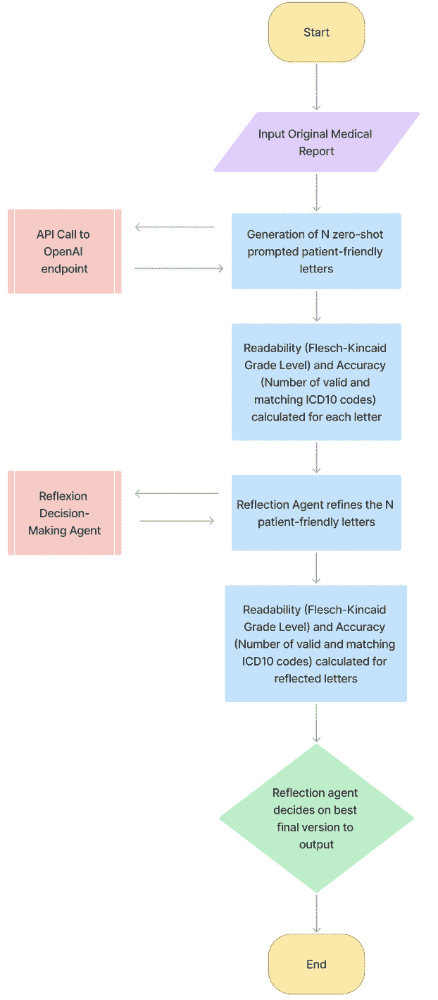
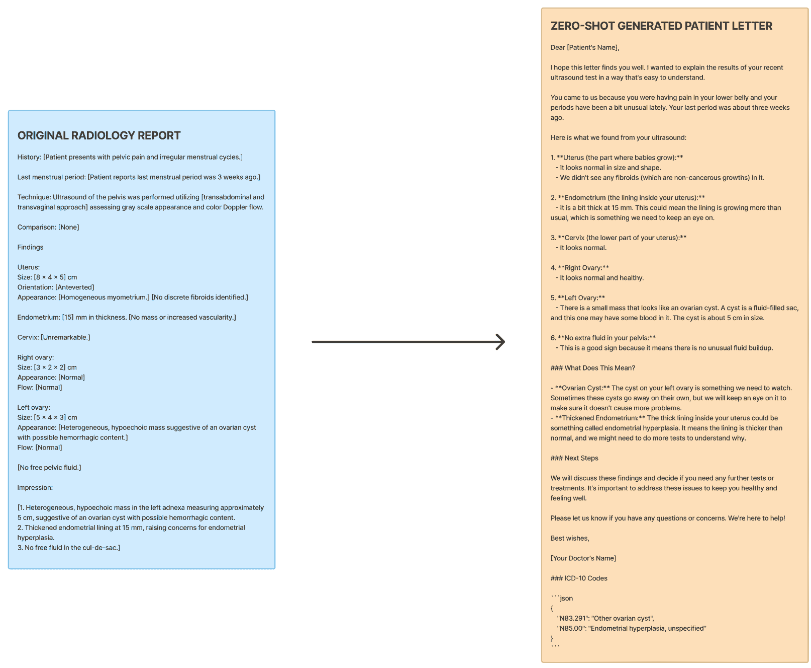
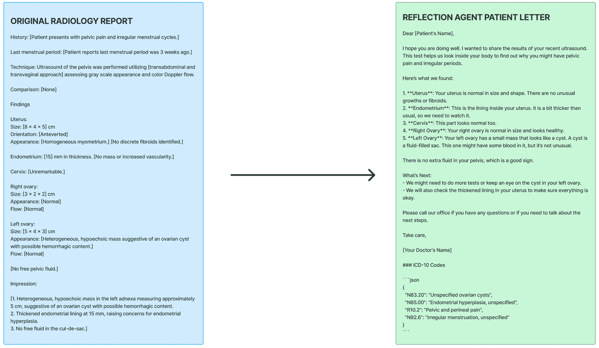
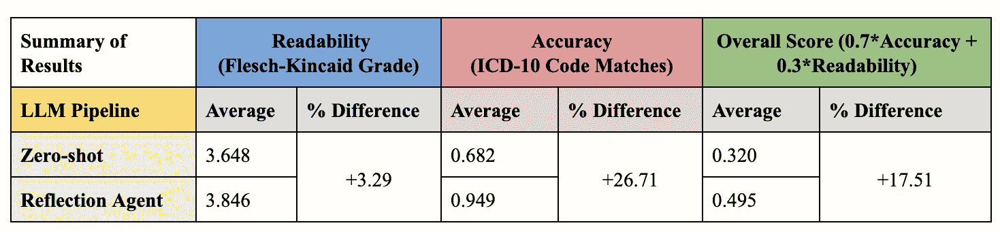
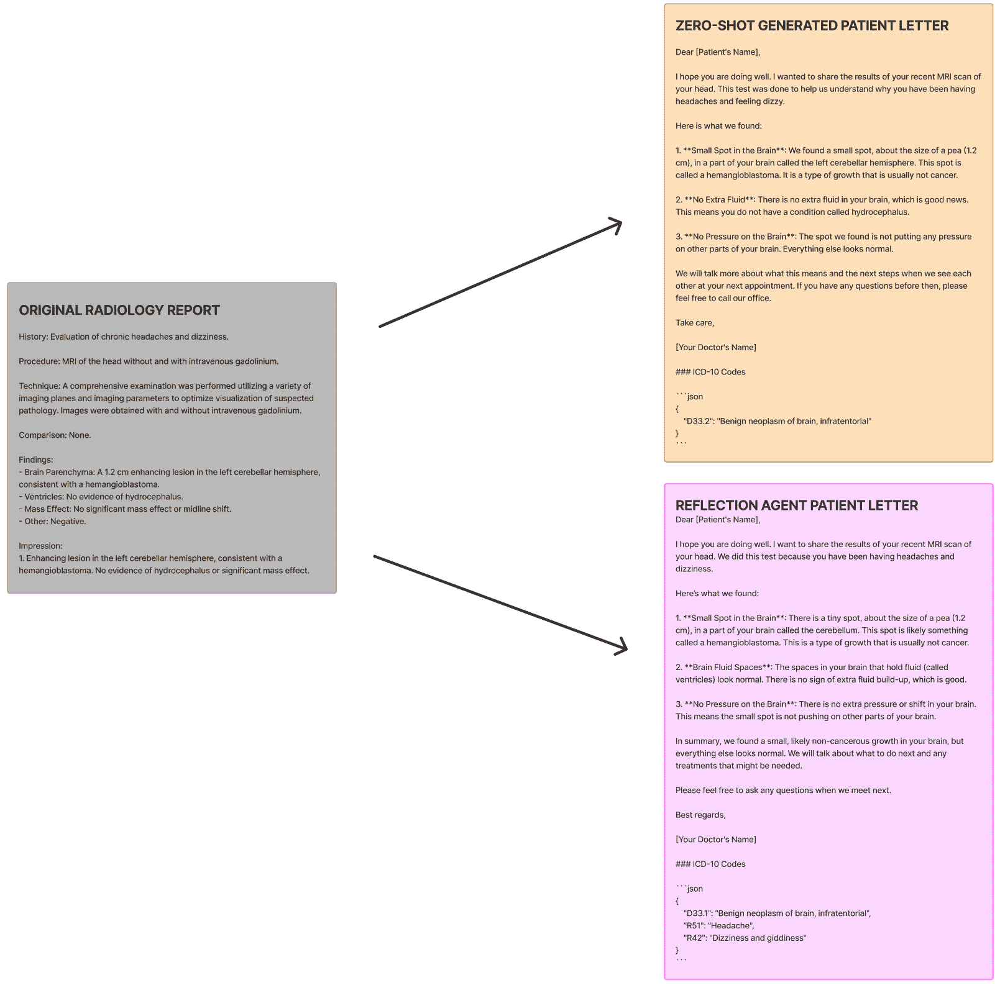
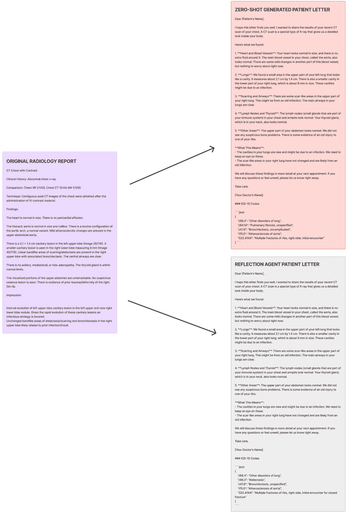
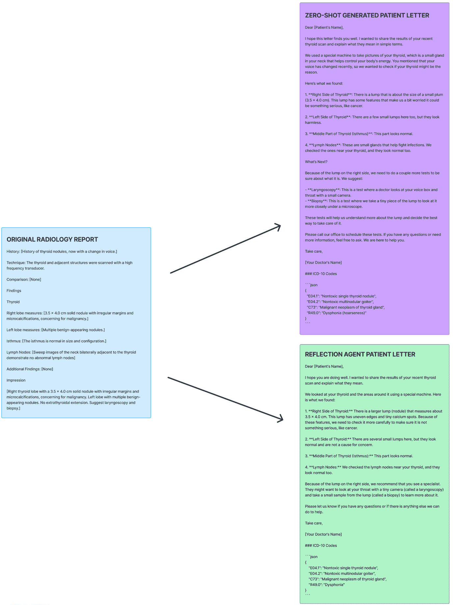

<!--yml

category: 未分类

date: 2025-01-11 12:21:37

-->

# 用于生成患者友好医疗报告的代理型LLM工作流

> 来源：[https://arxiv.org/html/2408.01112/](https://arxiv.org/html/2408.01112/)

Malavikha Sudarshan¹, Sophie Shih², Estella Yee², Alina Yang², John Zou³,

Cathy Chen⁴, Quan Zhou⁵, Leon Chen⁵, Chinmay Singhal⁵ 和 George Shih⁶

¹加利福尼亚大学伯克利分校电气工程与计算机科学系, 美国加州伯克利    ²斯图伊文森特高中, 美国纽约    ³布朗大学计算机科学系, 美国罗德岛    ⁴纽约大学斯特恩商学院, 美国纽约

⁵MD.ai, NY, 美国    ⁶Weill Cornell医学系放射科, NY, 美国

malavikhasudarshan@berkeley.edu, {sshih60, eyee60, ayang6}@stuy.edu, john_zou@brown.edu, hc2845@nyu.edu, {quan, leon, chinmay}@md.ai, george@cornellradiology.org

###### 摘要

大型语言模型（LLMs）在医疗保健领域的应用正在迅速扩展，其中一个潜在的应用场景是将正式的医学报告转化为患者能够理解的版本。目前，LLM生成的输出通常需要由人工进行编辑和评估，以确保其事实准确性和可理解性，这一点在上述应用场景中也同样适用。我们旨在通过提出一个代理型工作流与Reflexion框架来最小化这一步骤，该框架通过迭代自我反思来纠正LLM的输出。我们在16份随机的放射学报告上测试了这一管道，并与零-shot提示进行了比较。在我们的多代理方法中，报告在验证ICD-10编码时的准确率为94.94%，而零-shot提示的报告准确率为68.23%。此外，81.25%的最终反射报告在准确性和可读性方面不需要任何修正，而只有25%的零-shot提示报告在不需要修改的情况下满足这些标准。这些结果表明，我们的方法为以快速、高效和连贯的方式将临床发现传达给患者，同时保持医学准确性，提供了一种可行的途径。代码库可在[http://github.com/malavikhasudarshan/Multi-Agent-Patient-Letter-Generation](http://github.com/malavikhasudarshan/Multi-Agent-Patient-Letter-Generation)查看。

关键词: 大型语言模型, 患者友好的信件, 患者识字率, 放射学, 报告生成, GPT。

## 1 背景

《21世纪治愈法案》赋予患者访问其电子健康记录数据的权利，自该法案实施以来，患者在医嘱提供者查看之前访问电子健康记录（EHRs）的人数显著增加[[1](https://arxiv.org/html/2408.01112v2#bib.bib1)]。虽然此举旨在提高透明度并促进信息共享，但这种增加的可访问性往往会导致患者的焦虑、误解和困惑，尤其是在阅读充满术语的医疗报告时，而这些报告并非面向患者[[2](https://arxiv.org/html/2408.01112v2#bib.bib2)]。放射学报告就是一个典型的例子；这些报告主要面向转诊医生，当异常或模糊的结果在与医生讨论之前就被患者收到时，其影响往往比益处更为有害[[3](https://arxiv.org/html/2408.01112v2#bib.bib3)]。为了解决这一问题，探索了创建患者友好的信件，以简化复杂的医疗信息[[4](https://arxiv.org/html/2408.01112v2#bib.bib4)]。这些信件旨在清晰地解释医学术语，确保事实准确，同时保持富有同情心和安抚性的语气。

近年来，大型语言模型（LLMs）在医疗应用中得到了越来越广泛的应用，从生成出院总结[[5](https://arxiv.org/html/2408.01112v2#bib.bib5)]到结构化放射学报告[[6](https://arxiv.org/html/2408.01112v2#bib.bib6)]。在将生成式人工智能应用于创建患者友好型报告时，可以提高工作流程的效率，使患者能够获取更多有意义且易于阅读的信件[[7](https://arxiv.org/html/2408.01112v2#bib.bib7), [8](https://arxiv.org/html/2408.01112v2#bib.bib8)]。目前的大多数研究采用零-shot提示方法，在输入提示中创建医疗报告的患者友好版，其中依赖LLM的内部表示来生成合适的信件，且提示中没有提供模板或示例输出来指导生成信件的结构、风格或全面性[[9](https://arxiv.org/html/2408.01112v2#bib.bib9), [10](https://arxiv.org/html/2408.01112v2#bib.bib10)]。通过这种方法，LLM生成的输出通常需要手动审查或通过其他机制进行批评和改进，才能在交给患者之前使用。一项研究表明，80.4%（n = 41）的测试患者友好型LLM生成的医疗报告总结需要在交付给患者之前进行编辑[[11](https://arxiv.org/html/2408.01112v2#bib.bib11)]。

我们的目标是开发一个智能化流程，尽量减少验证过程，并在患者信件发布之前，评估其准确性和可读性。

## 2 方法

代理工作流是迭代的，由多个中间步骤组成，除了LLM提示外，还包括其他操作，而与此相对的是非代理或零-shot/少-shot提示，这些提示只包括单一的输入和单一的输出[[12](https://arxiv.org/html/2408.01112v2#bib.bib12)]。前者方法意味着可以利用多个代理，并且它们通常像专业企业一样进行结构化，每个代理在组织中扮演特定角色。“加法减法”协作是多代理方法的一个例子，其中一个代理提供信息，另一个代理删除不必要的细节并提供反馈[[13](https://arxiv.org/html/2408.01112v2#bib.bib13)]。

代理工作流通过反思实现强化学习[[12](https://arxiv.org/html/2408.01112v2#bib.bib12)]，并可以通过在下一个提示的末尾附加反思反馈来利用链式思维提示。我们利用了现有的框架Reflexion[[14](https://arxiv.org/html/2408.01112v2#bib.bib14)]，该框架将语言性强化融入其迭代精炼过程中。通常，代理从其环境中接收简单的反馈形式，如二进制信号（例如，成功/失败）或标量值（数值分数）。Reflexion代理将这些基本反馈转化为更详细的语言形式——用自然语言解释反馈的文本摘要。然后，这些语言性反馈被添加到下一个提示的上下文中，作为一个“语义”梯度信号，意味着它为代理提供了具体的、有意义的改进方向。

我们的实现提示LLM根据正式的医学报告生成特定数量的患者友好型信件。每封生成的信件的准确性和可读性都会被计算并适当加权，之后使用Reflexion模型进行若干次自我反思试验，并在最后输出其认为最优的信件。Reflexion有三个独立的模块——AlfWorld（用于决策问题）、HotPotQA（用于单步迭代的推理）和Programming（用于使用解释器和编译器的编程任务）。我们使用了AlfWorld，因为在提示生成多封信件并请求最优输出时，决策制定是最合适的。

原始的医学报告可以作为一个参数提供，或者如我们在2024年医学影像信息学学会（SIIM）黑客马拉松上展示的那样，从EHR服务器中提取。我们的集成工作包括从SIIM快速医疗健康互操作资源（FHIR）服务器上提取五个医学报告中的一个，并将我们的结果推送回服务器。后来，我们还测试了手动将医学报告包括在输入中，并且测试了15份其他不同模态的放射学报告：计算机断层扫描（CT）、磁共振成像（MR）和超声波（US）（请参见附录中的图1、2和3）。这些报告的字数不同，从84到264个字不等，涵盖了腹部、盆腔、胸部、头部和腰椎等多个身体部位和医学发现。

我们的流程（图[1](https://arxiv.org/html/2408.01112v2#S2.F1 "图 1 ‣ 2 方法 ‣ 生成患者友好型医学报告的Agentic LLM工作流")）的工作方式如下：我们首先调用一次LLM，从原始报告中提取国际疾病分类第十版（ICD-10）代码。温度保持为0，以最小化方差，并将这些代码存储以便稍后比较。然后，使用第二次LLM调用基于原始报告生成多个患者友好型报告（例如，n=5），这时我们要求代理根据每个患者友好型报告的内容生成ICD-10代码。这些ICD-10代码会与主ICD-10代码数据库进行验证（使用simple-icd-10包[[15](https://arxiv.org/html/2408.01112v2#bib.bib15)]），并且每个代码的描述也会被检索出来，与LLM的输出进行对比，看它们是否匹配。每个报告的准确性通过验证并且一致的ICD-10代码的数量来计算，计算方式是将患者友好型版本和原始医学报告中的ICD-10代码数量除以原始报告中的ICD-10代码总数。这个值应该最大化。可读性通过Flesch-Kincaid等级计算。这一数值是通过一个预定义的公式计算的，公式包括平均句子长度、音节数量和每个句子的单词数[[16](https://arxiv.org/html/2408.01112v2#bib.bib16)]，并且可以通过导入可读性模块[[17](https://arxiv.org/html/2408.01112v2#bib.bib17)]来获取。美国普通人的阅读能力相当于美国8年级的水平[[18](https://arxiv.org/html/2408.01112v2#bib.bib18)]。一项研究对97,052份放射学报告的分析显示，只有4%的报告在阅读难度上等于或低于美国8年级学生的阅读能力[[19](https://arxiv.org/html/2408.01112v2#bib.bib19)]，这表明大量信息对于相当大一部分人群来说可能难以理解。我们的16份测试报告的平均Flesch-Kincaid等级为11.03，对应于11年级学生的词汇水平。

Flesch-Kincaid年级水平为6.0（相当于美国六年级学生的阅读能力）是美国医学协会[[20](https://arxiv.org/html/2408.01112v2#bib.bib20)]和美国国立卫生研究院[[21](https://arxiv.org/html/2408.01112v2#bib.bib21)]推荐的患者面向医疗材料的可读性水平，以便提高理解度和可访问性[[22](https://arxiv.org/html/2408.01112v2#bib.bib22)]。每封生成的患者信件的总得分是通过加权可读性和准确性计算的——我们希望优先考虑医疗准确性，因此选择按照以下方式计算得分：

overall_score = (readability * 0.3) + (accuracy * 0.7)

可读性值被标准化，使其尽可能接近6.0，因此，我们的目标是使overall_score的最大值为1.0。然后，Reflexion的Alfworld模块用于反思overall_score，旨在在每次迭代中改善每封信的准确性和可读性。该算法输出信件的最佳版本，然后直接推送到关联的电子健康记录（EHR）服务器供患者访问，展示了端到端的集成。我们测试中使用的LLM是OpenAI的GPT-4o（gpt-4o-2024-05-13）。

图1：多代理算法流程图

## 3 个结果

我们的反思代理提高了报告的医疗准确性，确保最终患者信件中保留了ICD-10代码，而零-shot输出有时会遗漏这些代码。当给定相同的医疗报告、系统提示和用户提示时，反思输出在准确性、可读性以及overall_score测量方面始终得分更高。零-shot提示有时不够专业，即使在提示中指定阅读水平应与美国六年级学生的水平相匹配，所用语言仍显得过于幼稚。然而，当使用反思代理时，最终输出似乎始终更加简洁、结构化且正式。

在下面的例子中（见图[2](https://arxiv.org/html/2408.01112v2#S3.F2 "图 2 ‣ 3 结果 ‣ 用于生成患者友好型医疗报告的智能LLM工作流") 和图[3](https://arxiv.org/html/2408.01112v2#S3.F3 "图 3 ‣ 3 结果 ‣ 用于生成患者友好型医疗报告的智能LLM工作流")），同一份医疗报告被用来比较零样本（见图[2](https://arxiv.org/html/2408.01112v2#S3.F2 "图 2 ‣ 3 结果 ‣ 用于生成患者友好型医疗报告的智能LLM工作流")）和反射智能体输出（见图[3](https://arxiv.org/html/2408.01112v2#S3.F3 "图 3 ‣ 3 结果 ‣ 用于生成患者友好型医疗报告的智能LLM工作流")）。在零样本提示下，只有一半的ICD-10代码被注册，而反射智能体成功生成了所有4个ICD-10代码。此外，反射智能体生成的ICD-10代码与原始医疗报告中的代码完全匹配，而零样本报告中的代码则不匹配。

从16份测试放射学报告中，零样本提示（使用与我们的多智能体工作流中相同的原始提示）导致11/16份患者友好型版本需要编辑，而我们的智能体工作流仅导致3/16份报告需要修改。我们认为“修改”包括医疗事实的任何变化（包括ICD-10代码）、语法、标点、语气和可读性。与零样本信件相比，反射患者信件的准确性提高了26.71%，可读性提高了3.29%（见图[4](https://arxiv.org/html/2408.01112v2#S3.F4 "图 4 ‣ 3 结果 ‣ 用于生成患者友好型医疗报告的智能LLM工作流")）。这导致反射信件与零样本生成信件相比，整体得分提高了17.51%。

图 2：零样本生成的患者友好型信件

图 3：反射/多智能体生成的患者友好型信件

图 4：结果汇总表

## 4 讨论

使用ChatGPT和类似的大型语言模型（LLM）生成患者友好信件是许多医疗领域的人正在进行的实验[[5](https://arxiv.org/html/2408.01112v2#bib.bib5)][[10](https://arxiv.org/html/2408.01112v2#bib.bib10)][[23](https://arxiv.org/html/2408.01112v2#bib.bib23)][[24](https://arxiv.org/html/2408.01112v2#bib.bib24)][[25](https://arxiv.org/html/2408.01112v2#bib.bib25)]。然而，LLM已知存在幻觉现象，对输入非常敏感，这常常会导致输出的患者友好信件出现错误。此外，医疗报告越复杂，LLM产生幻觉的倾向就越高[[26](https://arxiv.org/html/2408.01112v2#bib.bib26)]。加入多个代理和程序化提示¹¹1LLM提示已经被编程，用户无法更改——可以处理输入敏感性问题。旨在管理医疗报告的复杂性，同时最小化幻觉现象。该工作流减少了校对的需求，因为患者信件在输出之前已经经过准确性和可读性评估。

作为我们准确性度量的一部分，我们使用get_description(icd10_code) [[15](https://arxiv.org/html/2408.01112v2#bib.bib15)]函数来验证ICD-10代码定义是否符合行业标准，适用于原始报告和患者友好报告。然而，由于该函数使用字符串匹配，可能会错过一些同义词或短语，这些短语在词语上有所不同。一个更好的替代方法可能是使用模糊匹配算法，例如计算Levenshtein距离[[27](https://arxiv.org/html/2408.01112v2#bib.bib27)]，或者通过查看两个描述字符串的K-最近邻[[28](https://arxiv.org/html/2408.01112v2#bib.bib28)]来对它们进行分类，而不是直接比较两个字符串的精确匹配。

我们所做的一个假设是LLM模型（GPT-4o）生成的ICD-10代码的准确性。在单独的人类验证测试中，我们已经观察到从测试放射学报告中生成这些代码时，准确性和一致性都很高，因此在本研究中我们假设这些生成的ICD-10代码是可信的。

这仍然是一个非常早期的原型，并且在多个方面可以进一步改进。未来，我们希望能够更加包容不同的阅读水平、语言和医学领域。目前，我们已将可读性标准化为6年级水平；然而，根据患者的不同，提供多种不同的识字水平将是非常有益的。此外，增加多语言的准确翻译功能将显著提升沟通能力及其全球适用性和覆盖范围。最后，我们的目标是能够适用于放射学以外的各种医学领域。

目前，我们的加权系统基于可读性和准确性。然而，我们理解在这些信件中保持一定程度的同情心是很重要的。一个可能的做法是利用PERMA模型 [[29](https://arxiv.org/html/2408.01112v2#bib.bib29)] 作为衡量标准，将同情心纳入我们的加权系统。PERMA量表可以帮助我们的模型判断一封患者信件是否具有适当的语气和敏感度水平。我们正在研究的其他额外指标，以进一步提升患者信件的质量，包括CDE代码 [[30](https://arxiv.org/html/2408.01112v2#bib.bib30)]，这有助于准确传达患者的治疗过程和未来需要采取的行动。

## 5 结论

我们的目标是找到一种生成患者友好型放射学报告的方法，真正减少医疗专业人员审查和验证报告的需求。尽管我们的方法确实显著提高了患者可读信件的质量，但它并不具有100%的成功率，因此无法完全消除验证的需求。然而，通过引入多代理工作流，我们显著减少了需要修改的LLM生成报告的比例——从68.75%降至18.75%。这表明，在医学准确性和可读性方面进行更改所花费的时间也会大幅减少。我们的方法不仅提高了报告生成的效率，还为使医疗信息对患者更易获取和理解这一总体目标做出了贡献。这一进展有很大的潜力简化临床工作流程，减轻医疗专业人员和管理人员的负担，并通过迅速提供更清晰、更准确的医疗信息来改善患者体验。

## 6 致谢

作者感谢SIIM社区，特别是Teri M. Sippel Schmidt, Alex Barrington, Tom O’Sullivan, Mohannad Hussain以及所有提供反馈的人员，感谢他们支持我们的工作。

## 参考文献

+   JR 等人 [2024] Pollock JR, Petty SA, Schmitz JJ, Varner J, Metcalfe AM, 和 Tan N. 患者在大规模多校区医疗系统中，在实施《21世纪疗法法案》信息封锁条款前后的放射学报告获取情况。*Am J Roentgenol*, 222(6), 2024. doi: 10.2214/ajr.23.30343.

+   DE [2022] Gerber DE. 21世纪疗法法案：没有理解其含义就实施？*JCO Oncol Pract*, 18(2):85–87, 2022. doi: 10.1200/OP.21.00436.

+   M 等人 [2016] Winget M, Haji-Sheikhi F, Brown-Johnson C 等人. 电子发布病理学和放射学结果给患者：肿瘤科医生的意见和经验。*J Oncol Pract*, 12(8), 2016. doi: 10.1200/JOP.2016.011098.

+   C 等人 [2021] Smolle C, Schwarz CM, Hoffmann M 等人。新设计的患者友好型出院信件的设计与初步评估：一项随机、对照的参与者盲法试验。*BMC Health Serv Res*, 21:450, 2021年。doi: 10.1186/s12913-021-06468-3。

+   J 等人 [2024a] Zaretsky J 等人。生成式人工智能转化住院患者出院总结为患者友好的语言和格式。*JAMA Netw Open*, 7(3), 2024a。doi: 10.1001/jamanetworkopen.2024.0357。

+   J 等人 [2023] Liu J, Wang C, 和 Liu S. ChatGPT 在临床实践中的应用。*J Med Internet Res*, 25:e48568, 2023年。doi: 10.2196/48568。

+   FX 等人 [2023] Doo FX, Cook TS, Siegel EL 等人。探索生成模型（如 ChatGPT）在临床翻译中的应用：放射学领域的承诺与挑战，从患者到群体健康。*J Am Coll Radiol*, 20(9):877–885, 2023年。doi: 10.1016/j.jacr.2023.07.007。

+   J 等人 [2024b] Park J, Oh K, Han K 等人。基于生成式人工智能的患者中心放射学报告：为放射学报告增值。*Sci Rep*, 14:13218, 2024b。doi: 10.1038/s41598-024-63824-z。

+   SC 和 K [2024] Cork SC 和 Hopcroft K. 评估 ChatGPT 将诊所信件转换为患者友好语言的实用性，2024年。发表于2024年7月9日在线发布。

+   RHR 等人 [2023] Roberts RHR, Ali SR, Dobbs TD, 和 Whitaker IS. 大型语言模型能否生成首次咨询的门诊信件，其中包含来自英国和美国整形美容外科学会的并发症资料？*Aesthet Surg J Open Forum*, 6, 2023年。doi: 10.1093/asjof/ojad109。

+   K 等人 [2024] Berigan K, Short R, Reisman D 等人。大型语言模型生成的放射学报告总结对患者理解的影响：一项随机对照试验。*J Am Coll Radiol*, 2024年。doi: 10.1016/j.jacr.2024.06.018。发表于2024年7月1日在线发布。

+   A [2024] Ng A. 第242期。一个 agent 面向多个世界，跨物种细胞嵌入等，2024年。网址 [https://www.deeplearning.ai/the-batch/issue-242/](https://www.deeplearning.ai/the-batch/issue-242/)。2024年4月2日。访问日期：2024年7月22日。

+   M 等人 [2024] Wu M, Yuan Y, Haffari G, 和 Wang L. （或许）超越人类翻译：利用多-agent 协作翻译超长文学文本，2024年。网址 [https://arxiv.org/abs/2405.11804](https://arxiv.org/abs/2405.11804)。发表于2024年5月20日在线发布。访问日期：2024年7月24日。

+   N 等人 [2023] Shinn N, Cassano F, Berman E, Gopinath A, Narasimhan K, 和 Yao S. Reflexion：具有语言强化学习的语言代理，2023年。发表于2023年在线发布。

+   S [2024] Travasci S. Simple-icd-10，2024年。网址 [https://pypi.org/project/simple-icd-10/](https://pypi.org/project/simple-icd-10/)。PyPI。访问日期：2024年7月24日。

+   JP 等人 [1975] Kincaid JP, Fishburne RP Jr, Rogers RL, 和 Chissom BS. 为海军士兵推导新的可读性公式（自动可读性指数、雾霾计数和弗莱施阅读容易度公式）。技术报告，模拟与培训研究所，1975年。

+   Readability [2024] Readability. Readability, 2024. 网址 [https://pypi.org/project/readability/](https://pypi.org/project/readability/). PyPI. 访问日期：2024年7月30日。

+   K 等人 [2023] Amin K, Khosla P, Doshi R, Chheang S, 和 Forman HP. 使用人工智能提高患者对放射学报告的理解，2023年。发表于2023年9月29日。

+   T 等人 [2019] Martin-Carreras T, Cook TS, 和 Kahn CE Jr. 放射学报告的可读性：对以患者为中心的护理的影响。*Clin Imaging*, 54:116–120, 2019. doi: 10.1016/j.clinimag.2018.12.006.

+   BD [2003] Weiss BD. *Health Literacy: A Manual for Clinicians*. 美国医学会，美国医学基金会，芝加哥，伊利诺伊州，2003年。

+   S 和 S [2010] Badarudeen S 和 Sabharwal S. 评估患者教育材料的可读性：在骨科中的当前作用。*Clin Orthop Relat Res*, 468(10):2572–2580, 2010. doi: 10.1007/s11999-010-1380-y.

+   TC 等人 [1990] Davis TC, Crouch MA, Wills G, Miller S, 和 Abdehou DM. 患者阅读理解与患者教育材料可读性之间的差距。*J Fam Pract*, 31(5):533–538, 1990.

+   S 等人 [2023] Ali S, Dobbs TD, Hutchings HA, 和 Whitaker IS. 使用 ChatGPT 编写患者门诊信函，2023年。网址 [https://www.researchgate.net/publication/369076647_Using_ChatGPT_to_write_patient_clinic_letters](https://www.researchgate.net/publication/369076647_Using_ChatGPT_to_write_patient_clinic_letters). 在线发表 2023年。

+   R 等人 [2024a] Guo R, Farnan G, McLaughlin N, 和 Devereux B. Qub-cirdan 在“请出院！”中的应用：通过开源 LLM 进行零样本出院信函生成，2024a。网址 [https://arxiv.org/abs/2406.00041](https://arxiv.org/abs/2406.00041). 在线发表 2024年6月27日。访问日期：2024年7月26日。

+   R 等人 [2024b] Doshi R, Amin KS, Khosla P, Bajaj S, Chheang S, 和 Forman HP. 定量评估大语言模型以简化放射学报告印象：一项多模态回顾性分析。*Radiology*, 310(3), 2024b. doi: 10.1148/radiol.231593.

+   Z 等人 [2024] Xu Z, Jain S, 和 Kankanhalli M. 幻觉是不可避免的：大语言模型的固有局限性，2024年。网址 [https://arxiv.org/abs/2401.11817](https://arxiv.org/abs/2401.11817). arXiv.org. 2024年1月22日。访问日期：2024年7月29日。

+   C 等人 [2019] Lee C, Kim Y, Kim YS, 和 Jang J. 使用循环神经网络实现的人工智能从放射学报告中自动注释疾病。*Am J Roentgenol*, 212(4):734–740, 2019. doi: 10.2214/AJR.18.19869.

+   A 和 C [1970] Lüschow A 和 Wartena C。《使用 k 最近邻算法分类医学文献》，1970年。网址 [https://serwiss.bib.hs-hannover.de/frontdoor/index/index/docId/1146](https://serwiss.bib.hs-hannover.de/frontdoor/index/index/docId/1146)。访问时间：2024年7月29日。

+   J 和 ML [2016] Butler J 和 Kern ML。《PERMA 评估器：一种简短的多维度幸福感测量工具》，2016年。网址 [https://www.internationaljournalofwellbeing.org/index.php/ijow/article/view/526](https://www.internationaljournalofwellbeing.org/index.php/ijow/article/view/526)。

+   来源：健康[2024] 美国国立卫生研究院。常见数据元素：标准化数据收集，2024年。网址 [https://www.nlm.nih.gov/oet/ed/cde/tutorial/03-100.html#:~:text=A%20common%20data%20element%20(CDE),to%20ensure%20consistent%20data%20collection](https://www.nlm.nih.gov/oet/ed/cde/tutorial/03-100.html#:~:text=A%20common%20data%20element%20(CDE),to%20ensure%20consistent%20data%20collection)。美国国立医学图书馆。访问时间：2024年7月24日。

## 附录 A 附录

以下示例展示了 MR、CT 和超声测试报告的 LLM 输出，提供了零样本和多代理生成的患者友好型报告之间的直观比较。

图 5：从 MR 头部报告生成的患者友好型信件

图 6：从 CT 胸部报告生成的患者友好型信件

图 7：从美国甲状腺报告生成的患者友好型信件
