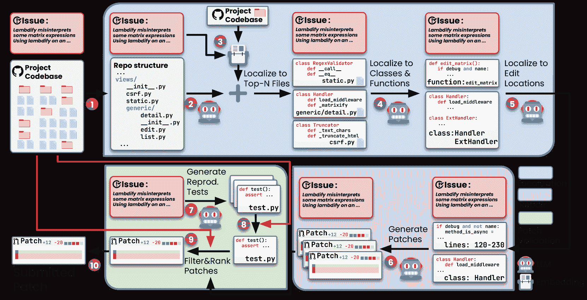
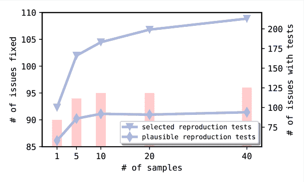

<!--yml

分类：未分类

日期：2025-01-11 12:28:21

-->

# 无代理 \scalerel*C: 解密基于LLM的软件工程代理

> 来源：[https://arxiv.org/html/2407.01489/](https://arxiv.org/html/2407.01489/)

Chunqiu Steven Xia^($*$)   Yinlin Deng      Soren Dunn                              Lingming Zhang

伊利诺伊大学厄本那-香槟分校 \scalerel *![[未标注图片]](img/351c03901507c900e09c9b51ad51fdc1.png)C

{chunqiu2, yinlind2, sorend2, lingming}@illinois.edu 贡献相等，作者排序由[Nigiri](https://senseis.xmp.net/?Nigiri)决定。

###### 摘要

大型语言模型（LLMs）的最新进展显著推动了软件开发任务的自动化，包括代码合成、程序修复和测试生成。最近，研究人员和行业从业者开发了各种自主的*LLM代理*，以执行端到端的软件开发任务。这些代理具备使用工具、运行命令、观察环境反馈并规划未来行动的能力。然而，这些基于代理的方法的复杂性，再加上当前LLMs的有限能力，提出了以下问题：*我们真的需要使用复杂的自主软件代理吗？* 为了尝试回答这个问题，我们构建了Agentless——一种*无代理*的方法，自动解决软件开发问题。与基于代理方法的冗长和复杂设置相比，Agentless采用了简单的三阶段过程：本地化、修复和补丁验证，而不让LLM决定未来的行动或操作复杂工具。我们在流行的SWE-bench Lite基准测试中的结果令人惊讶地表明，简化的Agentless能够以最高的性能（32.00%，96个正确修复）和低成本（$0.70）超越所有现有的开源软件代理！事实上，*Agentless已经被OpenAI采纳，作为展示GPT-4o和新OpenAI o1模型在真实编码表现中的首选方法*。此外，我们手动分类了SWE-bench Lite中的问题，并发现了一些具有确切真实补丁或不充分/误导性问题描述的问题。因此，我们通过排除这些有问题的案例构建了SWE-bench Lite-$S$，以进行更严格的评估和比较。我们的工作突显了目前被忽视的简化且具有成本效益的技术在自主软件开发中的潜力。我们希望Agentless能帮助重置自主软件代理的基准、起点和前景，并激发未来在这一关键方向上的研究工作。我们已开源Agentless，地址为：[https://github.com/OpenAutoCoder/Agentless](https://github.com/OpenAutoCoder/Agentless)

## 1 引言

大型语言模型（LLMs）已成为代码生成的首选[[32](https://arxiv.org/html/2407.01489v2#bib.bib32); [29](https://arxiv.org/html/2407.01489v2#bib.bib29); [54](https://arxiv.org/html/2407.01489v2#bib.bib54); [90](https://arxiv.org/html/2407.01489v2#bib.bib90)]。像 GPT-4 [[72](https://arxiv.org/html/2407.01489v2#bib.bib72)] 和 Claude 3.5 Sonnet [[27](https://arxiv.org/html/2407.01489v2#bib.bib27)] 这样的最先进的LLM已经展示了它们在根据给定用户描述合成代码片段方面的能力。然而，与简单、自包含问题的主要评估设置相比，将LLM应用于仓库级别的软件工程任务仍然是一个较少研究的领域。像功能添加、程序修复和测试生成这样的软件工程任务不仅需要深入理解文件中的信息（这些文件包含成千上万行代码），还需要理解跨文件的仓库级别依赖关系。

最近，为了填补这一空白并评估工具自动解决现实世界软件工程问题的能力，流行的SWE-bench [[45](https://arxiv.org/html/2407.01489v2#bib.bib45)] 基准已被开发。在SWE-bench中，每个问题包含一个现实世界的GitHub问题描述和相应的Python仓库。任务是修改仓库以解决该问题，无论是修复一个bug还是引入一个新特性。最近，作者发布了该基准的一个子集——SWE-bench Lite [[24](https://arxiv.org/html/2407.01489v2#bib.bib24)]（300个问题），该子集进一步筛选并专注于bug修复问题。

为了解决来自SWE-bench的具有挑战性的现实世界软件开发问题，受到Devin AI软件工程师[[8](https://arxiv.org/html/2407.01489v2#bib.bib8)]的启发，学术界和工业界已经开展了大量的工作，专注于开发*基于代理*的方法[[109](https://arxiv.org/html/2407.01489v2#bib.bib109); [38](https://arxiv.org/html/2407.01489v2#bib.bib38); [102](https://arxiv.org/html/2407.01489v2#bib.bib102); [31](https://arxiv.org/html/2407.01489v2#bib.bib31); [65](https://arxiv.org/html/2407.01489v2#bib.bib65); [30](https://arxiv.org/html/2407.01489v2#bib.bib30)]。虽然基于代理的方法没有固定的定义，但它们通常通过为LLM配备一组工具，允许代理迭代地并自主地执行操作、观察反馈并规划未来步骤[[57](https://arxiv.org/html/2407.01489v2#bib.bib57)]。示例工具可以包括打开/写入/创建文件、搜索代码行、运行测试和执行shell命令的能力。在每次尝试解决问题时，基于代理的方法将会有多个回合，每个回合包括执行一个操作。随后的回合将依赖于先前的操作和代理从环境中获得的反馈信息。

乍一看，基于代理的方法似乎是解决软件开发任务的一种自然且直接的方式。毕竟，人类开发者也执行类似的操作，并利用反馈来规划未来的步骤。然而，人类和当前 LLM 能力之间的差距导致了基于代理方法的以下局限性：

+   •

    工具使用/设计的复杂性。为了使用工具，目前基于代理的方法在代理与环境之间应用了抽象层。例如，将实际操作映射到 API 调用，使得代理通过输出 API 调用指令来使用工具。然而，这种抽象和 API 调用规范需要精心设计输入/输出格式，并且很容易导致工具设计/使用不正确或不精确，尤其是在复杂的动作空间中。考虑到基于代理的方法具有迭代特性，即当前的动作/计划依赖于之前的回合，错误或不精确地定义/使用工具可能会降低性能并导致额外的浪费 LLM 查询的成本。

+   •

    决策规划中的控制不足。除了使用工具，目前的基于代理的方法还将决策过程委托给代理，允许它们决定何时以及执行何种操作。代理根据之前的操作和环境提供的反馈来决定当前要采取的行动，通常对所采取的行动进行最少的检查以确保其合理性。由于可能的动作空间和反馈响应非常大，自动代理容易变得混乱并进行次优探索。此外，为了解决一个问题，代理可能需要进行30或40回合的操作，这使得既难以理解代理的决策，也难以调试出具体的错误决策回合。

+   •

    自我反思能力有限。现有的代理在执行自我反思时存在困难[[70](https://arxiv.org/html/2407.01489v2#bib.bib70); [42](https://arxiv.org/html/2407.01489v2#bib.bib42)]。也就是说，它们倾向于接受所有信息/反馈，却不知道如何过滤掉或纠正无关、不正确或误导性的信息[[85](https://arxiv.org/html/2407.01489v2#bib.bib85); [108](https://arxiv.org/html/2407.01489v2#bib.bib108)]。自我反思能力的有限意味着一个错误步骤可能会被轻易放大，并对代理未来的所有决策产生负面影响。

本文提倡，相比于急于开发日益复杂的 LLM 基于代理的方法和工具来进行软件开发（由于完全自动化的设置，这些工具也可能很难使用或复制），我们应该先退一步，问以下反思性的问题：*我们真的需要使用复杂的自主软件代理吗？*

我们的工作。我们通过构建 Agentless，旨在回答这个重要问题——一种*无代理*的自动解决软件开发问题的方法。为了解决每个问题，Agentless 遵循一个简单的三阶段过程：定位、修复和补丁验证。在定位过程中，Agentless 采用分层的方式，首先将故障定位到具体的文件，然后定位到相关的类或函数，最后定位到细粒度的编辑位置。Agentless 的定位过程结合了基于 LLM 的定位方法和经典的信息检索定位思路 [[110](https://arxiv.org/html/2407.01489v2#bib.bib110)]。在执行修复时，Agentless 将定位到的编辑位置生成多个候选补丁，以简单的 diff 格式呈现。同时，Agentless 会生成能够重现原始错误的重现测试，以帮助选择候选补丁。最后，Agentless 会重新排序所有剩余的补丁，并选择一个进行提交以修复问题。虽然 Agentless 利用 LLM 来执行每个详细任务，但与以往复杂的基于代理的工具不同，Agentless 不允许 LLM *自主*决定未来的行动或操作任何复杂工具。我们故意选择避免使用代理，这不仅使 Agentless 具有简洁明了、易于理解的设计，而且有助于避免 LLM 代理在软件开发中提到的上述局限性。我们在流行的 SWE-bench Lite [[24](https://arxiv.org/html/2407.01489v2#bib.bib24)] 基准测试上评估了 Agentless，结果表明，Agentless 不仅在所有开源方法中达到了最高的性能（32.00%），而且成本极低！

此外，我们对 SWE-bench Lite 数据集进行了精细的手动分析，并将其中的所有问题按照问题描述、真实补丁和 bug 位置等维度进行分类。令人惊讶的是，我们观察到 SWE-bench Lite 中包含了描述中具有准确真实补丁的问题（4.3%）、缺失解决问题所需关键信息的问题（10.0%）以及描述中包含误导性解决方案的问题（5.0%）。意识到这些问题后，我们构建了 SWE-bench Lite-$S$，该数据集移除了这些有问题的问题，并作为一个更为严格的基准来评估解决现实世界软件开发挑战的能力。总的来说，在一个专注于在排行榜上取得顶尖成绩的时代，我们的工作突出了简洁且具成本效益的技术在自主软件开发中的被忽视的潜力。我们希望 Agentless 能够帮助重设自主软件代理的基准、起点和视野，并激励未来沿着这个关键方向展开工作。

贡献。在这项工作中，我们做出了以下贡献：

+   •

    一种*无代理*方法。我们提出了Agentless，一种*无代理*的方法，旨在自动解决软件开发问题。Agentless利用大语言模型（LLM）驱动的基于提示和基于嵌入的检索，执行层次化本地化。在修复过程中，Agentless以简单的差异格式采样多个候选修补程序，以高效生成补丁。随后，Agentless生成回归测试，以验证问题已解决。最后，Agentless利用回归测试和生成的回归测试来选择最终的提交补丁。

+   •

    广泛评估。我们在流行的SWE-bench Lite数据集上评估了Agentless，并与最先进的基于代理的方法进行了比较。我们的结果表明，Agentless能够比所有开源方法取得更高的性能（32.00%，96个正确修复），且成本相对较低。这展示了以前被忽视的简易技术在自主软件开发中的潜力。此外，*Agentless已经被OpenAI采纳，作为展示GPT-4o[[35](https://arxiv.org/html/2407.01489v2#bib.bib35)]以及新的o1模型家族[[75](https://arxiv.org/html/2407.01489v2#bib.bib75)]在实际编码中的表现的首选方法*。我们进一步进行了严格的消融研究，以理解Agentless不同组件对最终性能的影响。

+   •

    SWE-bench Lite-$S$基准。我们对流行的SWE-bench Lite数据集中的问题进行了手动分类。我们发现，存在一些问题的描述不清晰或具有误导性，此外，还有一些问题包含了准确的真实补丁。为了解决这些问题，我们构建了一个过滤后的SWE-bench Lite-$S$数据集，排除了这些有问题的内容，从而能够进行更严格的评估和比较。OpenAI最近也确认了这一点，认可了我们的基准，并发布了SWE-bench Verified[[35](https://arxiv.org/html/2407.01489v2#bib.bib35)]，并沿着相同的方向进行改进。

## 2 背景与相关工作

### 2.1 基于代理的软件工程

随着基于代理的框架的出现和普及[[93](https://arxiv.org/html/2407.01489v2#bib.bib93)]，近期研究人员和行业从业者开始开发基于代理的方法来解决软件工程任务。Devin[[8](https://arxiv.org/html/2407.01489v2#bib.bib8)]（以及其开源替代品OpenDevin[[18](https://arxiv.org/html/2407.01489v2#bib.bib18)]）是第一个端到端的LLM基于代理的框架之一。Devin使用代理首先根据用户需求进行规划，然后允许代理使用文件编辑器、终端和网络搜索引擎等工具迭代执行任务。SWE-agent[[102](https://arxiv.org/html/2407.01489v2#bib.bib102)]设计了一个定制的代理-计算机接口（ACI），使得LLM代理能够通过读取、编辑文件和运行bash命令等操作与代码库环境交互。Aider[[38](https://arxiv.org/html/2407.01489v2#bib.bib38)]首先向LLM提供一个通过静态和调用图分析构建的详细代码库映射，以定位需要编辑的文件；然后它生成一个简单的diff格式作为编辑补丁，并使用回归测试来验证补丁是否合理。Moatless[[16](https://arxiv.org/html/2407.01489v2#bib.bib16)]是另一个开源代理工具，它通过为代理提供代码搜索工具以及使用LLM构建查询的检索方法来获得相关的代码位置。与Aider类似，Moatless也生成一个简单的diff格式作为最终提交的补丁。AutoCodeRover[[109](https://arxiv.org/html/2407.01489v2#bib.bib109)]进一步为LLM代理提供特定的代码搜索API（例如，搜索某个类中的方法），以迭代地检索代码上下文并定位错误位置。SpecRover[[82](https://arxiv.org/html/2407.01489v2#bib.bib82)]在AutoCodeRover的基础上进行了改进，并通过生成函数摘要和在特定代理步骤中提供反馈消息，针对规格（即推断预期的程序行为）进行了优化。此外，SpecRover还尝试生成重现测试，以重现用于选择最终补丁的原始问题。除了这些重点示例，已经开发了大量其他基于代理的方法，包括开源[[38](https://arxiv.org/html/2407.01489v2#bib.bib38); [20](https://arxiv.org/html/2407.01489v2#bib.bib20); [6](https://arxiv.org/html/2407.01489v2#bib.bib6); [105](https://arxiv.org/html/2407.01489v2#bib.bib105)]和闭源/商业产品[[30](https://arxiv.org/html/2407.01489v2#bib.bib30); [31](https://arxiv.org/html/2407.01489v2#bib.bib31); [65](https://arxiv.org/html/2407.01489v2#bib.bib65); [14](https://arxiv.org/html/2407.01489v2#bib.bib14); [10](https://arxiv.org/html/2407.01489v2#bib.bib10); [2](https://arxiv.org/html/2407.01489v2#bib.bib2); [17](https://arxiv.org/html/2407.01489v2#bib.bib17); [59](https://arxiv.org/html/2407.01489v2#bib.bib59); [5](https://arxiv.org/html/2407.01489v2#bib.bib5); [23](https://arxiv.org/html/2407.01489v2#bib.bib23); [21](https://arxiv.org/html/2407.01489v2#bib.bib21); [13](https://arxiv.org/html/2407.01489v2#bib.bib13); [15](https://arxiv.org/html/2407.01489v2#bib.bib15); [11](https://arxiv.org/html/2407.01489v2#bib.bib11); [3](https://arxiv.org/html/2407.01489v2#bib.bib3)]。

与这些基于代理的技术相比，Agentless 提供了一种简洁、可解释且具有成本效益的解决方案，来解决现实世界中的软件工程问题。与基于代理的工具不同，Agentless 包含了明确的定位、修复和补丁验证阶段，无需让 LLM 代理决定未来的行动或使用复杂的工具。Agentless 首次展示了一个*无代理*的方法，在无需额外提供过多工具或模拟复杂环境行为/反馈的情况下，依然能够取得非常有竞争力的表现。

### 2.2 故障定位与程序修复

故障定位（FL）[[91](https://arxiv.org/html/2407.01489v2#bib.bib91)] 技术旨在识别与程序错误相关的可疑位置（例如，语句或方法）在源代码中的位置。动态故障定位技术主要包括基于谱的故障定位（SBFL）[[48](https://arxiv.org/html/2407.01489v2#bib.bib48); [26](https://arxiv.org/html/2407.01489v2#bib.bib26); [25](https://arxiv.org/html/2407.01489v2#bib.bib25)] 和基于突变的故障定位（MBFL）[[78](https://arxiv.org/html/2407.01489v2#bib.bib78); [69](https://arxiv.org/html/2407.01489v2#bib.bib69); [64](https://arxiv.org/html/2407.01489v2#bib.bib64)]。SBFL 通常通过计算源代码位置，主要由失败测试覆盖的地方比主要由通过测试覆盖的地方更可疑。MBFL 进一步改进了这一点，额外考虑了每个源代码位置对测试结果的影响（通过突变测试来度量[[77](https://arxiv.org/html/2407.01489v2#bib.bib77)]）。除了动态技术外，研究人员还提出了直接利用信息检索（IR）技术[[86](https://arxiv.org/html/2407.01489v2#bib.bib86)] 来进行静态故障定位。这些基于 IR 的技术[[88](https://arxiv.org/html/2407.01489v2#bib.bib88); [83](https://arxiv.org/html/2407.01489v2#bib.bib83); [89](https://arxiv.org/html/2407.01489v2#bib.bib89)] 将故障定位表述为搜索问题，并比较代码元素与错误报告（即查询）之间的文本相似度。此外，还提出了基于学习的技术，利用机器学习将多种动态/静态信息结合起来，包括 DeepFL [[55](https://arxiv.org/html/2407.01489v2#bib.bib55)]，FLUCCS [[87](https://arxiv.org/html/2407.01489v2#bib.bib87)] 和 TRANSFER [[68](https://arxiv.org/html/2407.01489v2#bib.bib68)]。最近，研究人员提出了基于大语言模型（LLM）的故障定位[[99](https://arxiv.org/html/2407.01489v2#bib.bib99); [92](https://arxiv.org/html/2407.01489v2#bib.bib92); [80](https://arxiv.org/html/2407.01489v2#bib.bib80); [49](https://arxiv.org/html/2407.01489v2#bib.bib49)]，利用现代大语言模型强大的代码和自然语言理解能力来直接定位错误。与此同时，大多数此类基于 LLM 的技术要么由于 LLM 的上下文窗口有限，无法进行仓库级别的故障定位[[99](https://arxiv.org/html/2407.01489v2#bib.bib99)]，要么依赖于复杂/昂贵的代理设计来导航代码库[[49](https://arxiv.org/html/2407.01489v2#bib.bib49); [80](https://arxiv.org/html/2407.01489v2#bib.bib80)]。相比之下，Agentless 采用简化的分层故障定位过程（基于 LLM 和 IR）来高效计算精细的编辑位置。

在定位到 bug 后，下一步是进行修复。自动化程序修复（APR）[[39](https://arxiv.org/html/2407.01489v2#bib.bib39)] 已被广泛研究，旨在自动生成补丁以修复 bug。传统的 APR 技术可以分为基于模板的[[58](https://arxiv.org/html/2407.01489v2#bib.bib58); [40](https://arxiv.org/html/2407.01489v2#bib.bib40)]、基于启发式的[[52](https://arxiv.org/html/2407.01489v2#bib.bib52); [51](https://arxiv.org/html/2407.01489v2#bib.bib51)] 和基于约束的[[66](https://arxiv.org/html/2407.01489v2#bib.bib66); [62](https://arxiv.org/html/2407.01489v2#bib.bib62)] 工具。尽管有效，传统的 APR 工具仍然面临可扩展性问题，并且其补丁种类有限。因此，研究人员提出了基于学习的 APR 工具，方法包括训练 NMT（神经机器翻译）模型[[44](https://arxiv.org/html/2407.01489v2#bib.bib44); [56](https://arxiv.org/html/2407.01489v2#bib.bib56); [34](https://arxiv.org/html/2407.01489v2#bib.bib34); [111](https://arxiv.org/html/2407.01489v2#bib.bib111)] 或使用预训练的 LLM 执行修复[[97](https://arxiv.org/html/2407.01489v2#bib.bib97); [95](https://arxiv.org/html/2407.01489v2#bib.bib95); [50](https://arxiv.org/html/2407.01489v2#bib.bib50); [107](https://arxiv.org/html/2407.01489v2#bib.bib107)]。具体来说，基于 LLM 的 APR 工具通过为每个 bug 采样多个候选补丁，已被证明是最先进的技术，因为现代 LLM 在编程方面具有强大的能力[[95](https://arxiv.org/html/2407.01489v2#bib.bib95)]。最近，还提出了基于 agent 的 APR 技术[[98](https://arxiv.org/html/2407.01489v2#bib.bib98); [30](https://arxiv.org/html/2407.01489v2#bib.bib30); [41](https://arxiv.org/html/2407.01489v2#bib.bib41); [33](https://arxiv.org/html/2407.01489v2#bib.bib33); [106](https://arxiv.org/html/2407.01489v2#bib.bib106)]。受现有基于 LLM 的 APR 工具启发，Agentless 为每个问题采样多个候选补丁，以最大化生成正确修复的机会。与大多数基于 LLM 的 APR 技术不同，Agentless 使用简单的 diff 格式[[38](https://arxiv.org/html/2407.01489v2#bib.bib38)] 来生成补丁，避免生成完整的代码，转而专注于产生具有成本效益的小修改，从而提高补丁生成的可靠性和准确性（减少幻觉的可能性）。此外，与大多数先前工作中研究的简单 bug[[95](https://arxiv.org/html/2407.01489v2#bib.bib95)]不同，Agentless 旨在解决跨多个位置的复杂仓库级问题。

### 2.3 基于LLM的测试生成

除了本地化和修复错误之外，另一个正在采用LLM的研究领域是测试生成。测试生成的一个领域是模糊测试[[104](https://arxiv.org/html/2407.01489v2#bib.bib104)]，也称为fuzzing，通过生成大量输入来暴露系统中的漏洞。研究人员已将LLM应用于在以下领域执行模糊测试：深度学习库[[36](https://arxiv.org/html/2407.01489v2#bib.bib36); [37](https://arxiv.org/html/2407.01489v2#bib.bib37)]，操作系统内核[[101](https://arxiv.org/html/2407.01489v2#bib.bib101); [71](https://arxiv.org/html/2407.01489v2#bib.bib71)]，编译器[[94](https://arxiv.org/html/2407.01489v2#bib.bib94); [100](https://arxiv.org/html/2407.01489v2#bib.bib100); [76](https://arxiv.org/html/2407.01489v2#bib.bib76)]，网络协议[[67](https://arxiv.org/html/2407.01489v2#bib.bib67)]，以及移动应用程序[[60](https://arxiv.org/html/2407.01489v2#bib.bib60)]。基于LLM的模糊测试器已经通过发现传统模糊测试器未能发现的许多漏洞，并开启了新的模糊测试领域，展现了其影响力。除了模糊测试，研究人员还提出利用LLM进行单元测试生成，以测试单个软件单元（例如，方法/类）[[57](https://arxiv.org/html/2407.01489v2#bib.bib57)]，例如CodeMosa[[53](https://arxiv.org/html/2407.01489v2#bib.bib53)]、ChatTester[[103](https://arxiv.org/html/2407.01489v2#bib.bib103)]、TestPilot[[84](https://arxiv.org/html/2407.01489v2#bib.bib84)]和CoverUp[[79](https://arxiv.org/html/2407.01489v2#bib.bib79)]。

Bug重现是调查错误报告的关键步骤[[47](https://arxiv.org/html/2407.01489v2#bib.bib47)]，并且已集成到许多最近的软件工程代理中[[18](https://arxiv.org/html/2407.01489v2#bib.bib18); [82](https://arxiv.org/html/2407.01489v2#bib.bib82); [11](https://arxiv.org/html/2407.01489v2#bib.bib11); [15](https://arxiv.org/html/2407.01489v2#bib.bib15); [10](https://arxiv.org/html/2407.01489v2#bib.bib10); [102](https://arxiv.org/html/2407.01489v2#bib.bib102); [28](https://arxiv.org/html/2407.01489v2#bib.bib28)]。例如，SpecRover[[82](https://arxiv.org/html/2407.01489v2#bib.bib82)]通过生成一个测试来重现错误报告中描述的问题；该测试随后引导上下文检索和修复过程。与此类基于代理的方法不同，后者生成重现测试并依赖LLM代理来决定测试是否正确，Agentless仅执行多个采样测试，并验证执行结果是否表明问题已被重现。

## 无代理\scalerel*![[未标注的图片]](img/794278501654b4e1147a30f90067f255.png)C方法

图1：无代理概述。

图[1](https://arxiv.org/html/2407.01489v2#S3.F1 "图 1 ‣ 无代理 \scalerel*C 方法 ‣ 无代理 \scalerel*C：揭秘基于大语言模型的软件工程代理")展示了Agentless的概述，包括三个阶段：本地化、修复和补丁验证。我们首先将问题描述和现有的项目代码库作为输入。然后，我们开始我们的层次化本地化过程，将项目代码库转化为树状结构，展示项目中每个文件的相对位置<svg class="ltx_picture" height="16.6" id="S3.p1.1.1.pic1" overflow="visible" version="1.1" width="16.6"><g fill="#000000" stroke="#000000" stroke-width="0.4pt" transform="translate(0,16.6) matrix(1 0 0 -1 0 0) translate(4.84,0) translate(0,3.84)"><g fill="#000000" stroke="#000000" transform="matrix(1.0 0.0 0.0 1.0 0 0)"><foreignobject height="8.92" overflow="visible" transform="matrix(1 0 0 -1 0 16.6)" width="6.92">1</foreignobject></g></g></svg>。接下来，利用该仓库结构和原始问题描述，我们提示大语言模型（LLM）进行本地化，并排名出可能需要编辑以解决问题的前N个可疑文件<svg class="ltx_picture" height="16.6" id="S3.p1.2.2.pic1" overflow="visible" version="1.1" width="16.6"><g fill="#000000" stroke="#000000" stroke-width="0.4pt" transform="translate(0,16.6) matrix(1 0 0 -1 0 0) translate(4.84,0) translate(0,3.84)"><g fill="#000000" stroke="#000000" transform="matrix(1.0 0.0 0.0 1.0 0 0)"><foreignobject height="8.92" overflow="visible" transform="matrix(1 0 0 -1 0 16.6)" width="6.92">2</foreignobject></g></g></svg>。由于我们的仓库结构格式不包含详细的源代码信息，我们还会使用基于嵌入的检索方法，从与问题描述最相关的代码片段中检索文件<svg class="ltx_picture" height="16.6" id="S3.p1.3.3.pic1" overflow="visible" version="1.1" width="16.6"><g fill="#000000" stroke="#000000" stroke-width="0.4pt" transform="translate(0,16.6) matrix(1 0 0 -1 0 0) translate(4.84,0) translate(0,3.84)"><g fill="#000000" stroke="#000000" transform="matrix(1.0 0.0 0.0 1.0 0 0)"><foreignobject height="8.92" overflow="visible" transform="matrix(1 0 0 -1 0 16.6)" width="6.92">3</foreignobject></g></g></svg>。然后，我们将检索到的文件与LLM本地化的文件相结合，得到最终的可疑文件列表。然而，并非每个文件中的所有内容都需要修改。因此，我们为每个文件提供一个骨架（即类和函数的声明头列表），并要求LLM输出我们应该更仔细检查以修复错误的类和函数的具体列表<svg class="ltx_picture" height="16.6" id="S3.p1.4.4.pic1" overflow="visible" version="1.1" width="16.6"><g fill="#000000" stroke="#000000" stroke-width="0.4pt" transform="translate(0,16.6) matrix(1 0 0 -1 0 0) translate(4.84,0) translate(0,3.84)"><g fill="#000000" stroke="#000000" transform="matrix(1.0 0.0 0.0 1.0 0 0)"><foreignobject height="8.92" overflow="visible" transform="matrix(1 0 0 -1 0 16.6)" width="6.92">4</foreignobject></g></g></svg>。然后，我们提供前述位置的完整代码内容，并要求LLM最终确定一个较小的编辑位置集（即类、函数，甚至是特定行）<svg class="ltx_picture" height="16.6" id="S3.p1.5.5.pic1" overflow="visible" version="1.1" width="16.6"><g fill="#000000" stroke="#000000" stroke-width="0.4pt" transform="translate(0,16.6) matrix(1 0 0 -1 0 0) translate(4.84,0) translate(0,3.84)"><g fill="#000000" stroke="#000000" transform="matrix(1.0 0.0 0.0 1.0 0 0)"><foreignobject height="8.92" overflow="visible" transform="matrix(1 0 0 -1 0 16.6)" width="6.92">5</foreignobject></g></g></svg>。对于修复阶段，我们提供这些编辑位置的代码片段以及问题描述，并提示LLM进行多次补丁采样以解决问题<svg class="ltx_picture" height="16.6" id="S3.p1.6.6.pic1" overflow="visible" version="1.1" width="16.6"><g fill="#000000" stroke="#000000" stroke-width="0.4pt" transform="translate(0,16.6) matrix(1 0 0 -1 0 0) translate(4.84,0) translate(0,3.84)"><g fill="#000000" stroke="#000000" transform="matrix(1.0 0.0 0.0 1.0 0 0)"><foreignobject height="8.92" overflow="visible" transform="matrix(1 0 0 -1 0 16.6)" width="6.92">6</foreignobject></g></g></svg>。接下来，我们进入补丁验证阶段，首先要求LLM进行多次复现测试，旨在重现原始问题<svg class="ltx_picture" height="16.6" id="S3.p1.7.7.pic1" overflow="visible" version="1.1" width="16.6"><g fill="#000000" stroke="#000000" stroke-width="0.4pt" transform="translate(0,16.6) matrix(1 0 0 -1 0 0) translate(4.84,0) translate(0,3.84)"><g fill="#000000" stroke="#000000" transform="matrix(1.0 0.0 0.0 1.0 0 0)"><foreignobject height="8.92" overflow="visible" transform="matrix(1 0 0 -1 0 16.6)" width="6.92">7</foreignobject></g></g></svg>，然后根据在原始代码库中的实际执行结果选择最佳测试<svg class="ltx_picture" height="16.6" id="S3.p1.8.8.pic1" overflow="visible" version="1.1" width="16.6"><g fill="#000000" stroke="#000000" stroke-width="0.4pt" transform="translate(0,16.6) matrix(1 0 0 -1 0 0) translate(4.84,0) translate(0,3.84)"><g fill="#000000" stroke="#000000" transform="matrix(1.0 0.0 0.0 1.0 0 0)"><foreignobject height="8.92" overflow="visible" transform="matrix(1 0 0 -1 0 16.6)" width="6.92">8</foreignobject></g></g></svg>。Agentless使用复现测试和现有的回归测试进行补丁排名/选择<svg class="ltx_picture" height="16.6" id="S3.p1.9.9.pic1" overflow="visible" version="1.1" width="16.6"><g fill="#000000" stroke="#000000" stroke-width="0.4pt" transform="translate(0,16.6) matrix(1 0 0 -1 0 0) translate(4.84,0) translate(0,3.84)"><g fill="#000000" stroke="#000000" transform="matrix(1.0 0.0 0.0 1.0 0

### 3.1 本地化 \scalerel*![[未加标题的图片]](img/7efa48038b1b31eab99f764d3a8e6e84.png)C

要修复或实现新功能，第一步是获取源代码中的位置，因为没有正确的位置，可能无法提供正确的编辑。难点在于，代码库中可能有数百个文件，每个文件包含成千上万行代码，而需要编辑的正确位置仅是几个特定的行或函数。Agentless通过使用简单的三步层级本地化过程来解决这个问题：1）定位到可疑文件；2）将每个选定的文件本地化到相关的类、函数和变量；3）定位到代码编辑位置。

#### 3.1.1 定位到可疑文件。

首先，Agentless将潜在的位置缩小到特定的可疑文件。Agentless并不是为每个文件提供完整的代码片段，而是构建一个简洁的代码库文件和目录结构表示，类似于Linux的tree命令。我们将其称为代码库结构格式，该格式从代码库的根文件夹开始，组织代码文件或文件夹名称。同一目录层级的文件和文件夹垂直对齐，子目录中的文件/文件夹则缩进。我们递归地遍历整个代码库以获取结构，并将其作为LLM的输入。代码库结构格式提供了必要的文件路径以及相邻的文件名，以保持原始代码库中的组织信息。然后，Agentless将处理后的代码库结构和原始问题描述输入给LLM，要求其识别出需要进一步检查或修改的前N个可疑文件，以解决问题。

为了补充基于提示的本地化（仅使用文件名），Agentless还使用了一种简单的基于嵌入的检索方法来识别额外的可疑文件。然而，Agentless并不是将所有文件嵌入到代码库中，而是首先过滤掉无关的文件夹。这是通过提供之前描述的代码库结构，并要求LLM生成一个*无关*文件夹的列表，这些文件夹不需要进一步检查或修改以解决问题。删除这些无关文件夹中的所有文件后，Agentless将每个剩余的文件分割成代码段，并使用嵌入模型计算每个代码段的嵌入。接着，Agentless将原始问题描述（即查询）进行嵌入，并计算查询嵌入与每个代码段嵌入之间的余弦相似度，从而检索包含与查询最相似的代码段的相关文件列表。最后，Agentless通过选择由提示和嵌入法共同定位的前N个最常见的文件，将通过提示获得的文件与通过嵌入法检索到的文件进行合并，形成最终的相关文件列表。

图2：文件骨架格式。

#### 3.1.2 本地化到相关元素。

在获得可疑文件列表后，Agentless进入本地化过程的第二部分：本地化这些文件中的相关元素。直接提供所有文件的完整上下文可能很庞大。因此，Agentless构建了每个文件的压缩格式，其中包含类、函数或变量声明的列表。我们将这种格式称为骨架格式，图[2](https://arxiv.org/html/2407.01489v2#S3.F2 "Figure 2 ‣ 3.1.1 Localize to suspicious files. ‣ 3.1 Localization \scalerel*C ‣ 3 Agentless \scalerel*C Approach ‣ Agentless \scalerel*C: Demystifying LLM-based Software Engineering Agents")中给出了一个示例。在骨架格式中，我们仅提供文件中类和函数的头部。对于类，我们进一步包括任何类字段和方法（仅提供签名）。此外，我们还保留类和模块级别的注释，以提供进一步的信息。与将整个文件上下文提供给模型相比，骨架格式是一种更简洁的表示，特别是当文件包含成千上万行时，这使得一次性处理所有内容变得不切实际或成本过高。我们将所有可疑文件的骨架一次性提供给LLM，在单一提示中，使模型能够全面分析相关信息并决定最相关的元素。利用这个输入，我们提示LLM提供一份需要检查的相关类和函数列表，以修复所提供的问题。

图3：搜索/替换编辑格式。

#### 3.1.3 本地化到编辑位置。

之前的本地化步骤为我们提供了相关代码元素的列表；由于我们本地化了前N个可疑文件，这些本地化的相关代码元素可能来自不同的文件。现在，我们直接将这些元素中的代码内容提供给LLM，并要求它本地化特定的编辑位置。与使用整个文件相比，这里的输入上下文要小得多。通过这个输入，我们然后要求LLM识别最终的编辑位置集合，这些位置通过行号、函数或类来指定。我们简单的分层本地化允许Agentless选择一组相关的代码片段作为修复的编辑位置。

### 3.2 修复 \scalerel*![[无标题图片]](img/9c4497c838a4c536150b51041b5f0a56.png)C

在修复阶段，目标是生成正确的补丁来解决问题。根据已有的LLM程序修复研究[[97](https://arxiv.org/html/2407.01489v2#bib.bib97); [50](https://arxiv.org/html/2407.01489v2#bib.bib50); [96](https://arxiv.org/html/2407.01489v2#bib.bib96); [43](https://arxiv.org/html/2407.01489v2#bib.bib43)]，我们首先利用已识别的编辑位置，构建一个代码片段的上下文窗口，提供给LLM进行修复。例如，如果识别的位置是第40行到78行的一个类，我们将生成一个上下文窗口[40 - x, 78 + x]，其中x表示上下文窗口的大小。添加识别位置前后额外代码的直觉是为了给LLM提供相关的上下文信息，以便更好地进行程序修复[[97](https://arxiv.org/html/2407.01489v2#bib.bib97)]。如果识别出多个编辑位置，我们会将这些上下文窗口连接起来，用“...”分隔，以表示中间缺失的上下文。

使用代码片段后，我们要求LLM生成补丁来解决问题。然而，Agentless并不是直接生成整个代码片段来替换整个给定的上下文，而是要求LLM生成一个搜索/替换编辑[[38](https://arxiv.org/html/2407.01489v2#bib.bib38)]：一种简单的diff格式，用于高效地创建每个补丁。图[3](https://arxiv.org/html/2407.01489v2#S3.F3 "Figure 3 ‣ 3.1.2 Localize to related elements. ‣ 3.1 Localization \scalerel*C ‣ 3 Agentless \scalerel*C Approach ‣ Agentless \scalerel*C: Demystifying LLM-based Software Engineering Agents")展示了一个包含两个主要部分的搜索/替换格式示例：1) 搜索：我们希望替换的原始代码片段；2) 替换：我们希望用来替换的代码片段。为了将生成的搜索/替换diff应用到原始文件中，我们只需匹配搜索的代码片段，并将其替换为替换内容。这个简单的diff格式避免了生成完整的代码，而是专注于产生小的编辑，这不仅更加经济高效，而且更可靠、准确（减少了幻觉的可能性）。对于每个问题，Agentless使用LLM生成多个潜在补丁（首先使用贪婪策略，然后以更高的温度采样多个补丁）。

### 3.3 补丁验证 \scalerel*![[无标题图像]](img/91f8541215de8e3495413a51a91bd895.png)C

图4：复现测试示例。

#### 3.3.1 复现测试生成。

由于 Agentless 为每个问题生成多个候选补丁，我们需要一种方法来选择提交的最终补丁。请注意，在实际的 SWE-bench 设置下，原始项目代码库只能提供回归测试，而没有任何复现测试（即触发 bug 的测试）。这是因为问题刚刚被提出，开发者尚未添加任何额外的测试来触发该问题。因此，与生成和验证程序修复设置[[63](https://arxiv.org/html/2407.01489v2#bib.bib63)]不同，我们无法访问触发 bug 的测试。

根据先前的工作[[82](https://arxiv.org/html/2407.01489v2#bib.bib82); [31](https://arxiv.org/html/2407.01489v2#bib.bib31)]，Agentless 生成额外的复现测试来帮助补丁选择。更具体地，Agentless 利用大型语言模型（LLM）合成一个完整的测试文件，该文件不仅尝试复现问题描述中的原始问题，还验证问题是否已被修复。图[4](https://arxiv.org/html/2407.01489v2#S3.F4 "Figure 4 ‣ 3.3 Patch Validation \scalerel*C ‣ 3 Agentless \scalerel*C Approach ‣ Agentless \scalerel*C: Demystifying LLM-based Software Engineering Agents")展示了我们希望模型合成的复现测试示例。如果问题被复现，测试结果应打印“问题已复现”。另一方面，如果问题已被修复，测试应输出“问题已解决”。如果测试遇到任何意外问题，我们还包括“其他问题”的输出。为了生成复现测试，Agentless 提供了原始问题描述和一个示例复现测试来展示测试格式。与修复类似，我们还会对多个候选复现测试进行采样，然后在原始代码库上执行每个测试，以筛选出那些未输出“问题已复现”的测试。最后，我们会对每个测试进行标准化（去除注释、额外的空格并标准化测试名称），然后选择出现次数最多的测试作为每个问题的最终复现测试。

#### 3.3.2 补丁选择。

使用生成的再现测试，我们开始补丁选择过程，以选择最终提交的补丁。Agentless首先运行仓库中的所有现有测试，识别出一组在原始代码库中成功通过的测试。然而，并非所有通过的测试都应该视为回归测试，因为解决问题可能需要改变一些现有的功能。因此，Agentless将通过的测试列表提供给大型语言模型（LLM），并请求其识别出任何不应运行的测试，以检查问题是否已正确修复（即，在修复问题过程中可能会更新/修补的测试）。在去除LLM识别出的非回归测试后，我们获得最终的回归测试集。然后，我们在所有生成的补丁上运行回归测试集。Agentless随后保留回归失败次数最少的补丁。对于这些补丁，Agentless再运行所选的再现测试，只保留输出“问题已解决”的补丁。与此同时，由于再现测试是由LLM生成的，可能存在不准确/不精确的情况，因此有可能没有任何补丁能够通过再现测试；在这种情况下，Agentless将仅依赖回归测试结果进行选择。Agentless然后使用重新排序方法进行多数投票：我们首先对每个补丁进行标准化，以忽略表面差异（例如额外的空格、换行符和注释），然后选择出现次数最多的补丁作为最终提交的补丁。更具体地说，为了标准化补丁，我们首先将旧代码和新代码（应用补丁后）解析为抽象语法树。接下来，我们将这些树反解析为去除文档字符串的规范源代码格式。最后，我们计算标准化后的旧代码和新代码之间的文本差异，以获取标准化的补丁。

Agentless通过简单的逐步程序解决了仓库级别的问题。我们在此指出，Agentless单独使用的任何技术都不是革命性的，而是Agentless巧妙地将现有技术结合起来，构建了一种易于理解的方法。与以前基于自主代理、涉及与环境复杂交互的工具不同，Agentless采用简化的三阶段方法进行定位、修复和验证，而无需依赖任何代理进行决策。通过以分层方式进行定位，Agentless可以高效且有效地计算出需要编辑的细粒度位置。然后，Agentless通过使用简单的diff格式对多个补丁进行采样来执行修复。Agentless的补丁验证方法可以通过生成再现测试，进一步帮助补丁选择过程，验证问题是否已解决。

## 4 实验设置

数据集。我们使用流行的SWE-bench数据集[[45](https://arxiv.org/html/2407.01489v2#bib.bib45)]来评估Agentless和基准模型，以测试其解决现实世界软件工程问题的能力。SWE-bench中的每个问题都要求提交一个补丁，以解决输入问题描述中所述的潜在问题。特别地，我们专注于广泛使用的SWE-bench Lite版本[[24](https://arxiv.org/html/2407.01489v2#bib.bib24)]，该版本包含300个自包含的高质量问题。此外，我们还对SWE-bench Lite基准进行了详细研究（第[6.1](https://arxiv.org/html/2407.01489v2#S6.SS1 "6.1 问题分类 ‣ 对SWE-bench Lite的附加分析 ‣ Agentless \scalerel*C: 解密基于LLM的软件工程代理")节），不仅展示了潜在的问题和偏差，还生成了一个经过更严格筛选的问题集，以便进行更好的评估。

实现。我们使用GPT-4o (gpt-4o-2024-05-13) 实现了Agentless [[73](https://arxiv.org/html/2407.01489v2#bib.bib73)]。默认情况下，我们使用贪婪解码对LLM进行查询。在采样过程中，我们使用$0.8$的采样温度。对于基于嵌入的检索方法，我们使用LlamaIndex [[61](https://arxiv.org/html/2407.01489v2#bib.bib61)]实现我们的方法。我们使用OpenAI的text-embedding-3-small [[74](https://arxiv.org/html/2407.01489v2#bib.bib74)]模型来计算嵌入，块大小为512，块重叠为0。对于每个问题，我们首先定位到前三个可疑文件，然后在这些文件中定位到无限制数量的可疑类和函数，所有这些都使用贪婪解码。接下来，为了最大化找到正确编辑位置的机会，我们为每个问题抽取四个编辑位置样本（即本地化阶段的第三步）。这为每个问题提供了4个独立的编辑位置集。对于每个集，我们采用每个编辑位置周围$\pm$10行的上下文窗口，并生成10个补丁（1个贪婪和9个样本）。这为每个bug生成了总共40个补丁。我们采用与之前工作相同的搜索/替换编辑格式[[38](https://arxiv.org/html/2407.01489v2#bib.bib38)]，并使用内置的Python ast库[[19](https://arxiv.org/html/2407.01489v2#bib.bib19)]在我们的归一化步骤中进行解析。为了生成重现测试，我们在补丁选择之前（在第[3.3.1节](https://arxiv.org/html/2407.01489v2#S3.SS3.SSS1 "3.3.1 重现测试生成. ‣ 3.3 补丁验证 \scalerel*C ‣ 3 无代理 \scalerel*C 方法 ‣ 无代理 \scalerel*C: 解密基于LLM的软件工程代理")中描述）总共生成40个样本（1个贪婪样本和39个样本）。回归测试是通过首先运行所有测试以获取成功通过原始仓库的测试集，然后使用LLM识别任何非回归测试（在第[3.3.2节](https://arxiv.org/html/2407.01489v2#S3.SS3.SSS2 "3.3.2 补丁选择. ‣ 3.3 补丁验证 \scalerel*C ‣ 3 无代理 \scalerel*C 方法 ‣ 无代理 \scalerel*C: 解密基于LLM的软件工程代理")中描述）获得的。我们不会直接使用SWE-bench维护者要求的PASS_TO_PASS字段中已经识别的回归测试列表¹¹1如果我们直接使用PASS_TO_PASS测试，SWE-bench Lite的性能将为98..我们修改了官方的SWE-bench评估设置，以便能够自由地执行任意回归和重现测试。

基准对比。我们将Agentless与26种基于代理的方法进行了比较。这些基准工具代表了SWE-bench上的最先进表现。我们包括了最先进的开源工具以及商业或闭源基准（通过\scalerel*![[Uncaptioned image]](img/0195dff7867ccb00804871dadcff2a0e.png)C标示）。在此我们需要注意，大多数闭源基准没有提供任何轨迹，只提供了提交的补丁。因此，我们无法验证生成最终补丁所采取的步骤。此外，我们还包括了一个使用检索增强生成（RAG）作为SWE-bench的一部分提出的简单无代理基准[[45](https://arxiv.org/html/2407.01489v2#bib.bib45)]用于比较。在这种情况下，无代理基准通过提供最相关文件的文件内容（通过BM25检索[[81](https://arxiv.org/html/2407.01489v2#bib.bib81)]）来直接使用LLM生成补丁文件。

指标。参照先前的工作[[109](https://arxiv.org/html/2407.01489v2#bib.bib109)]，我们报告以下内容：1) % 解决：基准中已解决问题的百分比；2) 平均$成本：运行工具的平均推理成本；3) 平均#令牌：查询LLM所使用的输入和输出令牌的平均数量。此外，我们还报告了%正确位置：工具生成的补丁覆盖了开发者真实补丁编辑位置的百分比。我们根据三个粒度来计算此指标：文件、功能和行。如果补丁编辑了真实补丁中的所有位置的超集，则认为该补丁包含正确位置。对于基准工具，我们直接使用来自官方排行榜[[46](https://arxiv.org/html/2407.01489v2#bib.bib46)]或工具官方论文/仓库的报告结果。

## 5 评估

表1：SWE-bench Lite上的结果。备注：\scalerel*![[Uncaptioned image]](img/0195dff7867ccb00804871dadcff2a0e.png)C表示闭源方法（即源代码未发布）。\scalerel*![[Uncaptioned image]](img/794278501654b4e1147a30f90067f255.png)C表示基于我们早期版本的Agentless构建的方法。'-'表示相关信息未发布。\scalerel*![[Uncaptioned image]](img/f8a2b079d04e3b9c7f0ef5e2fa6f3814.png)C表示使用了多个模型，但部分模型未指定。Claude 3.5 S是Claude 3.5 Sonnet的缩写。

| 工具 | LLM | % 解决 | 平均$成本 | 平均#令牌 | % 正确位置 |
| --- | --- | --- | --- | --- | --- |
| 行 | 功能 | 文件 |
| CodeStory Aide [[3](https://arxiv.org/html/2407.01489v2#bib.bib3)] \scalerel*![[Uncaptioned image]](img/0195dff7867ccb00804871dadcff2a0e.png)C | \scalerel*![[Uncaptioned image]](img/06fda26cac51fb5f30e0c7ccfb9b4232.png)C GPT-4o+ \scalerel*![[Uncaptioned image]](img/fe7fb62cb81ce839d92fac315f415ac6.png)C Claude 3.5 S  | 129 (43.00%) | - | - | 41.7% | 58.7% | 72.0% |
| Bytedance MarsCode [[59](https://arxiv.org/html/2407.01489v2#bib.bib59)] \scalerel*![[无标题图片]](img/0195dff7867ccb00804871dadcff2a0e.png)C | NA | 118 (39.33%) | - | - | 42.7% | 58.0% | 79.7% |
| Honeycomb [[11](https://arxiv.org/html/2407.01489v2#bib.bib11)] \scalerel*![[无标题图片]](img/0195dff7867ccb00804871dadcff2a0e.png)C | NA | 115 (38.33%) | - | - | 44.3% | 57.0% | 69.3% |
| MentatBot [[15](https://arxiv.org/html/2407.01489v2#bib.bib15)] \scalerel*![[无标题图片]](img/0195dff7867ccb00804871dadcff2a0e.png)C | \scalerel*![[无标题图片]](img/06fda26cac51fb5f30e0c7ccfb9b4232.png)C GPT-4o | 114 (38.00%) | - | - | 37.3% | 53.3% | 69.3% |
| Gru [[21](https://arxiv.org/html/2407.01489v2#bib.bib21)] \scalerel*![[无标题图片]](img/0195dff7867ccb00804871dadcff2a0e.png)C | NA | 107 (35.67%) | - | - | 38.3% | 54.3% | 75.0% |
| Isoform [[13](https://arxiv.org/html/2407.01489v2#bib.bib13)] \scalerel*![[无标题图片]](img/0195dff7867ccb00804871dadcff2a0e.png)C | NA | 105 (35.00%) | - | 41,963 | 38.7% | 55.3% | 72.0% |
| SuperCoder2.0 [[23](https://arxiv.org/html/2407.01489v2#bib.bib23)] \scalerel*![[无标题图片]](img/0195dff7867ccb00804871dadcff2a0e.png)C | NA | 102 (34.00%) | - | - | 41.7% | 63.7% | 65.7% |
| 阿里巴巴灵马代理 [[14](https://arxiv.org/html/2407.01489v2#bib.bib14)] \scalerel*![[无标题图片]](img/0195dff7867ccb00804871dadcff2a0e.png)C | \scalerel*![[无标题图片]](img/06fda26cac51fb5f30e0c7ccfb9b4232.png)C GPT-4o+ \scalerel *![[无标题图片]](img/fe7fb62cb81ce839d92fac315f415ac6.png)C  Claude 3.5 S | 99 (33.00%) | - | - | 40.0% | 58.7% | 75.0% |
| Factory Code Droid [[10](https://arxiv.org/html/2407.01489v2#bib.bib10)] \scalerel*![[无标题图片]](img/0195dff7867ccb00804871dadcff2a0e.png)C | NA | 94 (31.33%) | - | - | 36.7% | 55.7% | 72.7% |
| Amazon Q Developer-v2 [[5](https://arxiv.org/html/2407.01489v2#bib.bib5)] \scalerel*![[无标题图片]](img/0195dff7867ccb00804871dadcff2a0e.png)C | NA | 89 (29.67%) | - | - | 40.3% | 52.0% | 74.3% |
| SpecRover [[82](https://arxiv.org/html/2407.01489v2#bib.bib82)] \scalerel*![[无标题图片]](img/0195dff7867ccb00804871dadcff2a0e.png)C | \scalerel*![[无标题图片]](img/06fda26cac51fb5f30e0c7ccfb9b4232.png)C GPT-4o+ \scalerel *![[无标题图片]](img/fe7fb62cb81ce839d92fac315f415ac6.png)C  Claude 3.5 S | 93 (31.00%) | $0.65 | - | - | - | - |
| CodeR [[31](https://arxiv.org/html/2407.01489v2#bib.bib31)] \scalerel*![[无标题图片]](img/0195dff7867ccb00804871dadcff2a0e.png)C | \scalerel*![[无标题图片]](img/06fda26cac51fb5f30e0c7ccfb9b4232.png)C GPT-4 | 85 (28.33%) | $3.34 | 323,802 | 35.7% | 52.3% | 67.0% |
| MASAI [[28](https://arxiv.org/html/2407.01489v2#bib.bib28)] \scalerel*![[无标题图片]](img/0195dff7867ccb00804871dadcff2a0e.png)C | NA | 84 (28.00%) | - | - | 38.7% | 56.3% | 75.0% |
| SIMA [[4](https://arxiv.org/html/2407.01489v2#bib.bib4)] \scalerel*![[无标题图像]](img/0195dff7867ccb00804871dadcff2a0e.png)C | \scalerel*![[无标题图像]](img/06fda26cac51fb5f30e0c7ccfb9b4232.png)C GPT-4o | 83 (27.67%) | $0.82 | - | 37.0% | 54.0% | 79.0% |
| IBM Research Agent-101 [[2](https://arxiv.org/html/2407.01489v2#bib.bib2)] \scalerel*![[无标题图像]](img/0195dff7867ccb00804871dadcff2a0e.png)C | NA | 80 (26.67%) | - | - | 39.7% | 56.7% | 73.3% |
| OpenCSG StarShip [[17](https://arxiv.org/html/2407.01489v2#bib.bib17)] \scalerel*![[无标题图像]](img/0195dff7867ccb00804871dadcff2a0e.png)C | \scalerel*![[无标题图像]](img/06fda26cac51fb5f30e0c7ccfb9b4232.png)C GPT-4 | 71 (23.67%) | - | - | 39.0% | 61.7% | 90.7% |
| Amazon Q Developer [[5](https://arxiv.org/html/2407.01489v2#bib.bib5)] \scalerel*![[无标题图像]](img/0195dff7867ccb00804871dadcff2a0e.png)C | NA | 61 (20.33%) | - | - | 34.0% | 43.7% | 71.7% |
| RepoUnderstander [[65](https://arxiv.org/html/2407.01489v2#bib.bib65)] \scalerel*![[无标题图像]](img/0195dff7867ccb00804871dadcff2a0e.png)C | \scalerel*![[无标题图像]](img/06fda26cac51fb5f30e0c7ccfb9b4232.png)C GPT-4 | 64 (21.33%) | - | - | - | - | - |
| AutoCodeRover-v2 [[7](https://arxiv.org/html/2407.01489v2#bib.bib7)] | \scalerel*![[无标题图像]](img/06fda26cac51fb5f30e0c7ccfb9b4232.png)C GPT-4o | 92 (30.67%) | - | - | 35.0% | 52.3% | 69.3% |
| RepoGraph [[20](https://arxiv.org/html/2407.01489v2#bib.bib20)] | \scalerel*![[无标题图像]](img/06fda26cac51fb5f30e0c7ccfb9b4232.png)C GPT-4o | 89 (29.67%) | - | - | 36.7% | 51.3% | 71.0% |

| Moatless [[16](https://arxiv.org/html/2407.01489v2#bib.bib16)] | \scalerel

*![[无标题图像]](img/fe7fb62cb81ce839d92fac315f415ac6.png)C Claude 3.5 S | 80 (26.67%) | $0.17 | - | 38.7% | 54.7% | 78.7% |

|  | \scalerel*![[无标题图像]](img/06fda26cac51fb5f30e0c7ccfb9b4232.png)C GPT-4o | 74 (24.67%) | $0.14 | - | 36.0% | 52.0% | 73.0% |
| --- | --- | --- | --- | --- | --- | --- | --- |

| OpenDevin+CodeAct v1.8 [[18](https://arxiv.org/html/2407.01489v2#bib.bib18)] | \scalerel

*![[无标题图像]](img/fe7fb62cb81ce839d92fac315f415ac6.png)C Claude 3.5 S | 80 (26.67%) | $1.14 | - | 38.0% | 49.7% | 67.3% |

| Aider [[38](https://arxiv.org/html/2407.01489v2#bib.bib38)] | \scalerel*![[无标题图像]](img/06fda26cac51fb5f30e0c7ccfb9b4232.png)C GPT-4o+ \scalerel *![[无标题图像]](img/fe7fb62cb81ce839d92fac315f415ac6.png)C Claude 3.5 S | 79 (26.33%) | - | - | 35.3% | 50.0% | 69.7% |
| --- | --- | --- | --- | --- | --- | --- | --- |

| SWE-agent [[102](https://arxiv.org/html/2407.01489v2#bib.bib102)] | \scalerel

*![[无标题图像]](img/fe7fb62cb81ce839d92fac315f415ac6.png)C Claude 3.5 S | 69 (23.00%) | $1.62 | 521,208 | 40.7% | 54.3% | 72.0% |

|  | \scalerel*![[无标题图像]](img/06fda26cac51fb5f30e0c7ccfb9b4232.png)C GPT-4o | 55 (18.33%) | $2.53 | 498,346 | 29.3% | 42.3% | 58.3% |
| --- | --- | --- | --- | --- | --- | --- | --- |
|  | \scalerel*![[无标题图像]](img/06fda26cac51fb5f30e0c7ccfb9b4232.png)C GPT-4 | 54 (18.00%) | $2.51 | 245,008 | 30.7% | 45.3% | 61.0% |
| AppMap Navie [[6](https://arxiv.org/html/2407.01489v2#bib.bib6)] | \scalerel*![[未标注的图片]](img/06fda26cac51fb5f30e0c7ccfb9b4232.png)C GPT-4o | 65 (21.67%) | - | - | 29.7% | 44.7% | 59.7% |
| AutoCodeRover [[109](https://arxiv.org/html/2407.01489v2#bib.bib109)] | \scalerel*![[未标注的图片]](img/06fda26cac51fb5f30e0c7ccfb9b4232.png)C GPT-4 | 57 (19.00%) | $0.45 | 38,663 | 29.0% | 42.3% | 62.3% |

| RAG [[102](https://arxiv.org/html/2407.01489v2#bib.bib102)] | \scalerel

*![[未标注的图片]](img/fe7fb62cb81ce839d92fac315f415ac6.png)C Claude 3 Opus | 13 (4.33%) | $0.25 | - | 22.0% | 30.0% | 57.0% |

|  | \scalerel*![[未标注的图片]](img/06fda26cac51fb5f30e0c7ccfb9b4232.png)C GPT-4 | 8 (2.67%) | $0.13 | - | 12.7% | 23.3% | 47.3% |
| --- | --- | --- | --- | --- | --- | --- | --- |

|  | \scalerel

*![[未标注的图片]](img/fe7fb62cb81ce839d92fac315f415ac6.png)C Claude-2 | 9 (3.00%) | - | - | 16.7% | 24.3% | 46.7% |

|  | \scalerel*![[未标注的图片]](img/06fda26cac51fb5f30e0c7ccfb9b4232.png)C GPT-3.5 | 1 (0.33%) | - | - | 6.3% | 11.3% | 27.3% |
| --- | --- | --- | --- | --- | --- | --- | --- |
| Agentless | \scalerel*![[未标注的图片]](img/06fda26cac51fb5f30e0c7ccfb9b4232.png)C GPT-4o | 96 (32.00%) | $0.70 | 78,166 | 35.3% | 52.0% | 69.7% |

### 5.1 在SWE-bench Lite上的表现

表格 [1](https://arxiv.org/html/2407.01489v2#S5.T1 "表格 1 ‣ 5 评估 ‣ 无代理 \scalerel*C: 揭示基于大型语言模型的 软件工程代理")展示了Agentless与之前基于代理的方法在SWE-bench Lite上的主要评估结果。我们观察到，Agentless能够解决300个问题中的96个（32.00%）。虽然这不是SWE-bench Lite上解决问题的最高百分比，但与之前的基于代理的方法相比，Agentless在使用更简单的设计和整体技术的情况下仍具有极强的竞争力。值得注意的是，许多顶尖技术是闭源/商业化的，且没有发布任何源代码来重现实验，甚至没有公开轨迹以供进一步验证。与所有开源方法相比，Agentless在SWE-bench Lite上达到了最高的32.00%的性能（96 / 300）。此外，Agentless的平均成本仅为$0.70，低于大多数之前的基于代理的方法。与RAG无代理基线进行比较时，我们发现尽管Agentless的成本稍高，但它能够解决更多的问题。

图5：问题修复的维恩图。

#### 5.1.1 唯一修复的问题。

图[5](https://arxiv.org/html/2407.01489v2#S5.F5 "Figure 5 ‣ 5.1 Performance on SWE-bench Lite ‣ 5 Evaluation ‣ Agentless \scalerel*C: Demystifying LLM-based Software Engineering Agents")展示了Agentless与顶级封闭源/商业和开源方法相比所解决的独特问题（“Others”表示每个类别中的其他方法）。首先，我们看到，与开源的基于代理的工具相比，Agentless能够修复其他工具无法解决的2个问题，展示了使用简单的无代理方法解决难题的成功。此外，即使与高效的商业方法相比，Agentless仍然能够提供独特的修复。这个独特修复数量较少的原因在于，已经有基于Agentless早期版本的工具（例如，Isoform [[13](https://arxiv.org/html/2407.01489v2#bib.bib13)]）或部分受Agentless启发的工具（例如，字节跳动MarsCode [[59](https://arxiv.org/html/2407.01489v2#bib.bib59)]），因此减少了Agentless所解决的独特问题。然而，我们的结果表明，Agentless仍然能够与现有代理方法竞争或互为补充。

#### 5.1.2 本地化性能。

在现实的软件开发中，除了直接修复问题之外，向开发者提供正确的编辑位置对于调试非常有帮助。因此，我们比较了每种技术生成的修补程序位置与真实修补程序的位置。我们在这里指出，虽然可能在与真实位置不同的位置修复一个错误，但与真实修补程序进行比较仍然可以作为一种近似的度量。表格[1](https://arxiv.org/html/2407.01489v2#S5.T1 "Table 1 ‣ 5 Evaluation ‣ Agentless \scalerel*C: Demystifying LLM-based Software Engineering Agents") 还展示了每种工具在行级、函数级和文件级的正确位置修复比例。我们首先观察到，正确位置修复的比例与解决率有很强的相关性。有趣的是，文件级位置的最高结果是OpenCSG StarShip，达到了90.0%，明显高于其他最佳表现的方法，同时解决率相对较低（23.67%）。由于OpenCSG StarShip是一个商业产品，不提供源代码或详细的修复轨迹，因此很难解释其在本地化和修复性能之间的巨大差异。在本地化性能方面，使用我们简单的层次化方法，Agentless与之前基于代理的方法相比仍然非常具有竞争力。

#### 5.1.3 重现性测试结果。

Agentless 使用回归和生成的重现测试来执行过滤，以选择最终的提交补丁。因此，我们评估生成的重现测试的质量。这里需要指出的是，正如在第 [3.3.1](https://arxiv.org/html/2407.01489v2#S3.SS3.SSS1 "3.3.1 重现测试生成. ‣ 3.3 补丁验证 \scalerel*C ‣ 3 Agentless \scalerel*C 方法 ‣ Agentless \scalerel*C: 解密基于LLM的软件工程代理") 节中所描述的，我们仅在生成的重现测试能够成功重现原始问题时才使用它。SWE-bench Lite 中的 300 个问题中，Agentless 能够生成 213 个重现测试，这些测试在原始仓库上评估时输出所需的重现消息。然而，这些测试仍然可能不正确，因为正确的重现应该能够验证问题已经被正确解决。为了评估这一点，我们直接应用了SWE-bench中提供的地面真实补丁²²2请注意，地面真实补丁仅在此用于评估测试质量，在Agentless过程中并未用于选择重现测试。。我们发现，只有 94 个测试在应用地面真实补丁后正确输出了“问题已解决”消息。这一急剧下降的现象可以部分解释为，有时问题描述中可能缺乏足够的信息来生成完整的测试用例以验证解决方案的正确性。然而，这个问题在一定程度上得到了缓解，因为Agentless采取了一种保守的方法，要求所有补丁首先通过回归测试套件，如果补丁不能通过回归测试，但能通过生成的重现测试，则会将其移除。这降低了错误的重现测试选择正确补丁的可能性。此外，如果所有生成的补丁都无法通过重现测试，Agentless 将仅依赖回归测试结果进行选择。在第 [5.2.3](https://arxiv.org/html/2407.01489v2#S5.SS2.SSS3 "5.2.3 补丁验证消融实验. ‣ 5.2 Agentless 组件的消融研究 ‣ 5 评估 ‣ Agentless \scalerel*C: 解密基于LLM的软件工程代理") 节中，我们详细研究了回归和重现测试共同用于补丁选择对性能的影响。

表 2：不同本地化步骤的性能。

| 方法 | 包含GT | 代码行数（LoC） | 平均$ |
| --- | --- | --- | --- |
| 文件级本地化 |
| 基于提示的方法 | 78.67% | 3,221 | $0.02 |
| 基于嵌入的方法（不带无关信息过滤） | 67.67% | 3,388 | $0.05 |
| 基于嵌入的方法（带无关信息过滤） | 70.33% | 3,622 | $0.04 |
| 组合方法 | 81.67% | 3,424 | $0.06 |
| 相关元素本地化 |
| 完整文件 | 53.67% | 778 | $0.15 |
| 骨架格式 | 58.33% | 698 | $0.02 |
| 编辑位置本地化 |
| 贪心算法 | 50.67% | 189 | $0.06 |
| 文件级直接定位 | 47.00% | 208 | $0.18 |
| 合并多重样本 | 56.33% | 342 | $0.07 |
| 多重样本 | 49.67% | 165 | $0.07 |
| 49.33% | 180 |
| 49.33% | 168 |
| 48.33% | 213 |

#### 5.1.4 无代理的采用。

尽管最近才发布，无代理（Agentless）已经得到了广泛的采用。在表[1](https://arxiv.org/html/2407.01489v2#S5.T1 "Table 1 ‣ 5 Evaluation ‣ Agentless \scalerel*C: Demystifying LLM-based Software Engineering Agents")中，有两个基准工具（通过\scalerel*![[Uncaptioned image]](img/794278501654b4e1147a30f90067f255.png)C表示），它们已经基于我们早期版本的无代理构建：RepoGraph [[20](https://arxiv.org/html/2407.01489v2#bib.bib20)]是一个开源工具，结合了无代理和仓库级别的图，而Isoform [[13](https://arxiv.org/html/2407.01489v2#bib.bib13)]是一个基于无代理构建的闭源商业工具。此外，字节跳动的MarsCode [[59](https://arxiv.org/html/2407.01489v2#bib.bib59)]在补丁采样/选择方面部分受无代理启发，而OpenDevin [[18](https://arxiv.org/html/2407.01489v2#bib.bib18)]正在将无代理整合到他们的生态系统中。此外，无代理还被OpenAI采用，作为展示其新SWE-bench验证基准上GPT-4o真实世界编码表现的默认方法[[35](https://arxiv.org/html/2407.01489v2#bib.bib35)]，在该基准中，无代理在所有其他研究的基于代理的解决方案中也达到了最佳性能。在完成此草稿时，OpenAI刚刚发布了新的o1模型系列，并将无代理作为展示其在SWE-bench上表现的首选/默认方法[[75](https://arxiv.org/html/2407.01489v2#bib.bib75)]。

### 5.2 无代理组件的消融研究。

接下来，我们将看看在本地化、修复和补丁验证阶段中，每个组件如何贡献于最终的无代理（Agentless）性能。除非另有说明，我们会在使用所有其他设置的默认参数时，改变一个组件的配置。

#### 5.2.1 本地化消融实验。

表[2](https://arxiv.org/html/2407.01489v2#S5.T2 "表2 ‣ 5.1.3 复现测试结果 ‣ 5.1 SWE-bench Lite 性能 ‣ 5 评估 ‣ 无代理 \scalerel*C: 揭开基于LLM的软件工程代理的神秘面纱")展示了Agentless的本地化阶段每个步骤的性能和成本。我们在每个本地化步骤后展示了包含真实编辑位置的难题所占比例（“包含GT”）、每个位置集的平均代码行数（“LoC”），以及每个步骤的平均美元成本（“Avg.$”）。粗体方法表示Agentless的默认设置。首先，我们检查不同的文件级本地化配置。首先，对于基于嵌入的检索方法，我们看到如果不包括去除无关文件夹的筛选（详见第[3.1.1](https://arxiv.org/html/2407.01489v2#S3.SS1.SSS1 "3.1.1 本地化到可疑文件 ‣ 3.1 本地化 \scalerel*C ‣ 3 Agentless \scalerel*C 方法 ‣ Agentless \scalerel*C: 揭开基于LLM的软件工程代理的神秘面纱")节描述的内容），性能和成本都会变差。这证明了在嵌入过程中限制考虑文件数量的重要性，并集中关注代码库的关键部分，从而实现更具成本效益和更有效的本地化。我们看到，仅使用基于提示的方法或基于嵌入的方法，分别可以在78.7%和67.7%的情况下定位到真实的文件。通过将这两种方法结合使用，可以进一步提高到81.7%的正确文件定位，表明基于提示和基于嵌入的检索方法在识别不同相关文件集方面可以互补。

表3：不同修复设置的性能。

| 方法 | 性能 | 平均费用($) |
| --- | --- | --- |
| 贪婪位置选择（40个样本） | 88 (29.33%) | $0.22 |
| 多样本合并（40个样本） | 85 (28.33%) | $0.24 |
| 多样本（4 x 10个样本） | 96 (32.00%) | $0.29 |

使用所有本地化的文件会导致较大的上下文窗口（$>$3000）。因此，在我们的第二步本地化中，我们将本地化限制到相关的类和函数，并能够大幅度减少上下文窗口（$<$800）。我们将使用骨架格式（在[3.1.2](https://arxiv.org/html/2407.01489v2#S3.SS1.SSS2 "3.1.2 Localize to related elements. ‣ 3.1 Localization \scalerel*C ‣ 3 Agentless \scalerel*C Approach ‣ Agentless \scalerel*C: Demystifying LLM-based Software Engineering Agents")节中描述）作为输入，以提供更简洁的表示，与使用完整文件内容的基线进行比较。我们观察到，通过使用完整文件内容，不仅成本要高得多，而且本地化的真实问题数量也减少了。原因很可能是LLM在处理长上下文时表现不佳，因此提供整个文件内容可能会让模型感到困惑。相反，通过使用更简洁的表示作为输入，我们可以有效地本地化所需的相关位置，进行检查和编辑。

接下来，Agentless 将本地化到精确的编辑位置，以便在不失去太多本地化精度的情况下进一步减少上下文。我们比较了执行编辑位置本地化的不同方式：1）“贪婪”：使用贪婪解码获取一组编辑位置，2）“直接从文件级”：直接从文件级本地化到编辑位置（而不是默认的从文件级到相关元素再到编辑位置），3）“多样本合并”：采样多个编辑位置集并将其合并为一组，4）“多样本”：采样多个编辑位置集。我们首先观察到，直接从文件级到编辑位置的方式，成本和性能都更差。原因是当提供较大的上下文时，模型可能会感到困惑，这表明我们的层次化本地化设计的重要性。我们还发现，当将多个样本合并时，本地化的真实位置更多，但需要在修复阶段输入更多上下文。我们的默认设置也会多次采样编辑位置，但我们不进行合并，而是分别对每个样本位置集进行修复，以利用每个采样位置集可以提供相似的本地化性能，同时限制输入上下文。简而言之，通过使用层次化的本地化步骤，Agentless 可以成功地在执行有效本地化的同时最小化成本。

#### 5.2.2 修复消融实验。

现在，我们来看看不同修复设置对最终性能的影响。表[3](https://arxiv.org/html/2407.01489v2#S5.T3 "Table 3 ‣ 5.2.1 Localization ablation. ‣ 5.2 Ablation study on components of Agentless ‣ 5 Evaluation ‣ Agentless \scalerel*C: Demystifying LLM-based Software Engineering Agents")展示了我们修复阶段的不同设置和输入，它们的性能和成本。从使用编辑位置生成阶段生成的贪婪位置集开始，我们观察到，Agentless已经能够修复超过88个问题，表现非常出色。同样，对于“多样本合并”方法，我们将多个位置集合并为一个，也可以取得相当的性能。通过在修复时分别考虑每个采样位置（每个生成10个候选补丁），性能可以进一步提高，达到96个问题的修复。原因是每个不同的位置集可能定位到不同的真实位置，并提供不同的上下文，这有助于修复特定的问题。通过使用不同的编辑位置，并结合我们的广泛测试过滤和选择阶段，Agentless可以大幅提高修复性能。

图6：随着补丁样本数量的增加，修复性能变化。

接下来，我们研究了使用不同数量的候选补丁样本对Agentless性能的影响。图[6](https://arxiv.org/html/2407.01489v2#S5.F6 "Figure 6 ‣ 5.2.2 Repair ablation. ‣ 5.2 Ablation study on components of Agentless ‣ 5 Evaluation ‣ Agentless \scalerel*C: Demystifying LLM-based Software Engineering Agents")展示了随着样本数量的增加，修复的问题数量。请注意，由于我们使用了4个不同的位置集合作为输入，因此样本间隔增加了4。首先，我们可以看到，仅使用每个位置集的1个贪婪样本，Agentless就能修复80个问题，表现出显著的修复效果。我们可以通过增加更多样本来继续提高修复性能。然而，我们观察到，当样本数量增加到约40个时，性能趋于平稳，增加额外的候选补丁并不能进一步提升性能。这是因为我们在测试过滤后进行多数投票来选择最终提交的补丁，这意味着后来的样本可能会被忽略，因为它们很难抵消经过多数投票选出的补丁。有趣的是，我们还可以从图中看到，*如果我们考虑每个问题的所有补丁样本（而不仅仅选择一个补丁），Agentless能够解决的问题总数为126个（42.0%）*。这表明Agentless具有很高的潜力，未来的工作可以通过更好的补丁重新排序和选择技术，进一步提高整体性能。

#### 5.2.3 补丁验证消融实验。

表4：不同补丁选择方法的性能。

| 方法 | 性能 | 平均 $ |
| --- | --- | --- |
| 多数投票法 | 77 (25.67%) | $0.00 |
| +回归测试 | 81 (27.00%) | $0.01 |
| +再现测试 | 96 (32.00%) | $0.25 |

最后，我们考察了不同的测试生成和修补选择配置对性能的影响。表[4](https://arxiv.org/html/2407.01489v2#S5.T4 "Table 4 ‣ 5.2.3 Patch validation ablation. ‣ 5.2 Ablation study on components of Agentless ‣ 5 Evaluation ‣ Agentless \scalerel*C: Demystifying LLM-based Software Engineering Agents")展示了不同方法的结果和额外成本。我们发现，仅使用多数投票法，就能达到77个正确的修复。通过添加现有的回归测试，并筛选出回归错误最少的候选补丁，我们可以将性能提升至81个已解决的问题。此外，最显著的性能提升来自于结合基于生成的再现测试的额外筛选，最终实现了Agentless的96个修复结果。这证明了我们修补选择方法的效果，特别是我们的再现测试生成，能够充分利用生成的高数量候选补丁，并筛选出正确的补丁进行最终提交。然而，使用再现测试也带来了额外的成本，因为Agentless需要生成这些测试，而这些测试在原始项目库中并没有提供。

图 7：随着样本数量增加，再现测试和修复结果。

接下来，我们来看看我们的重现测试生成策略。图[7](https://arxiv.org/html/2407.01489v2#S5.F7 "Figure 7 ‣ 5.2.3 Patch validation ablation. ‣ 5.2 Ablation study on components of Agentless ‣ 5 Evaluation ‣ Agentless \scalerel*C: Demystifying LLM-based Software Engineering Agents")展示了随着每个问题生成的候选重现测试数量的增加，修复性能（条形图，左轴）以及选定的、合理的重现测试总数（折线，右轴）。请记住，只有当重现测试在原始仓库上进行评估时成功输出“问题已重现”信息时，我们才会选择该重现测试。我们进一步认为，若某个选定的重现测试能够成功验证真实开发者补丁已修复原始问题（即输出“问题已解决”），则该测试是合理的。一开始，当我们每个问题只生成一个重现测试（即使用贪心输出）时，SWE-bench Lite中的所有300个问题只产生了100个选定测试，修复性能为90。我们可以通过增加生成的候选重现测试数量来提高选定重现测试的数量。然而，有趣的是，合理的重现测试数量并没有显著增加（除了从1个增加到5个样本）。原因再次在于问题描述中的某些模糊性，这些描述可能没有提供足够的信息来重现并验证问题是否已解决。尽管如此，我们观察到随着每个问题的候选重现测试数量增加到40时，已解决的问题数量略有改善，最终修复性能达到96个正确的修复。

## 6 关于SWE-bench Lite的额外分析

### 6.1 问题分类

(a) 描述质量

(b) 描述中的解决方案

(c) 位置相关信息

图8：SWE-bench Lite问题的分类及对应细分。

现在，我们将仔细分析SWE-bench Lite中的问题。我们首先对现有问题进行分类，以更好地理解并获得关于Agentless和先前方法可以解决的*问题类型*的额外见解。具体来说，我们根据每个问题的描述和真实开发者补丁，进行手动分类。以下更详细地描述了每个分类维度及其类别：

1) 描述质量。我们首先检查每个问题描述是否包含足够的信息，以执行所需的任务。图[8(a)](https://arxiv.org/html/2407.01489v2#S6.F8.sf1 "图 8 ‣ 6.1 问题分类 ‣ 6 对 SWE-bench Lite 的附加分析 ‣ 无代理 \scalerel*C: 揭开基于 LLM 的软件工程代理的神秘面纱")展示了每个类别的分布：*(i)* 包含足够的自然语言信息，*(ii)* 包含可重现的失败示例，*(iii)* 包含部分可重现的示例，以及 *(iv)* 不包含足够的信息。我们观察到，尽管SWE-bench Lite中的大多数任务包含了足够的信息，并且许多任务都有一些小的失败示例来展示 bug，但仍然有一部分问题（10.0%）没有足够的信息。这类问题包括那些需要实现一个具有特定名称的新函数，或者添加一个没有在问题描述中提供的特定字符串的错误信息。³³3这些类型的问题仍然出现在基准测试中，尽管[SWE-bench Lite](www.swebench.com/lite.html)声称这些问题已经通过筛选过程完全移除。这意味着，如果函数名称或错误信息字符串不完全匹配，测试将会失败，即使底层功能已经正确实现。另一个信息不足的示例是，问题存在多种不同的解决方式，仅有一部分能够通过正确性测试。例如，问题描述会列出两种可能的解决方案建议，其中只有一个与开发者的意图高度一致。实现另一个提议的解决方案将导致测试失败。这突显了进一步清理/改进SWE-bench Lite的必要性，应该进一步排除这些描述不充分的问题。

2) 描述中的解决方案。我们还检查了问题描述中是否已经提供了解决方案或解决问题的步骤。图 [8(b)](https://arxiv.org/html/2407.01489v2#S6.F8.sf2 "在图 8 ‣ 6.1 问题分类 ‣ 6 SWE-bench Lite 额外分析 ‣ 无代理 \scalerel*C: 解密基于大语言模型的软件工程代理") 展示了我们分类的细分情况：*(i)* 未提供解决方案或步骤，*(ii)* 提供部分解决方案（例如，一些自然语言步骤），*(iii)* 提供完整解决方案（例如，完整的自然语言步骤），*(iv)* 提供精确的补丁，*(v)* 提供误导性解决方案或步骤。有趣的是，我们观察到 4.3% 的问题在描述中包含了精确的真实补丁，而另外 9.7% 的问题描述了正确解决方案所需的精确步骤。这表明，SWE-bench Lite 中的某些问题可以更容易解决，因为它们以精确的代码片段或自然语言提供了解决方案。此外，我们还观察到 5.0% 的问题描述中包含了与开发人员所引入的真实补丁不符的建议解决方案或步骤。这进一步突显了基准测试中的潜在问题，因为这些差异可能会误导工具，仅仅通过跟随问题描述生成不正确的解决方案。

3) 位置相关信息。我们进一步检查问题描述中是否包含正确的位置信息。我们将粒度划分为行级、函数级和文件级。我们的类别包括：*(i)* 以自然语言提供的精确位置，*(ii)* 在故障堆栈跟踪中提供的精确位置，*iii)* 问题描述中可用于查找位置的相关关键词，以及 *(iv)* 未提供位置。我们首先观察到，只有极少数情况（$<$10%）问题描述中提供了修复 bug 所需的确切行号。然而，随着粒度的增加到函数和文件级别，我们发现大约一半的问题已经在描述中提供了需要编辑的文件位置。修复 bug 或引入新功能时，找到需要修改的位置至关重要。因此，我们利用这一分类，并将后续分析的重点放在提供的位置信息对无代理和基线方法修复性能的影响上。

这些分类维度和类别揭示了 SWE-bench Lite 问题的潜在问题，如不可解的问题、误导性的潜在解决方案和问题难度之间的显著差异。这些问题在基准创建过程中或先前的方法中并未得到充分考虑。此外，我们希望我们的分类能够为现有和未来方法能够解决的具体问题类型提供更多见解。

### 6.2 SWE-bench Lite-$S$

表 5：SWE-bench Lite-$S$ 的性能与排名。* 表示排名并列。

| 工具 | LLM | SWE-bench Lite | SWE-bench Lite-$S$ |
| --- | --- | --- | --- |
| % 已解决 | 排名 | % 已解决 | 排名 |
| CodeStory Aide [[3](https://arxiv.org/html/2407.01489v2#bib.bib3)] \scalerel*![[无标题图片]](img/0195dff7867ccb00804871dadcff2a0e.png)C | \scalerel*![[无标题图片]](img/06fda26cac51fb5f30e0c7ccfb9b4232.png)C GPT-4o+ \scalerel *![[无标题图片]](img/fe7fb62cb81ce839d92fac315f415ac6.png)C Claude 3.5 S  | 129 (43.00%) | 1 | 114 (45.78%) | 1 |
| 字节跳动 MarsCode [[59](https://arxiv.org/html/2407.01489v2#bib.bib59)] \scalerel*![[无标题图片]](img/0195dff7867ccb00804871dadcff2a0e.png)C | NA | 118 (39.33%) | 2 | 106 (42.57%) | 2 |
| 蜂巢 [[11](https://arxiv.org/html/2407.01489v2#bib.bib11)] \scalerel*![[无标题图片]](img/0195dff7867ccb00804871dadcff2a0e.png)C | NA | 115 (38.33%) | 3 | 98 (39.36%) | 3 |
| MentatBot [[15](https://arxiv.org/html/2407.01489v2#bib.bib15)] \scalerel*![[无标题图片]](img/0195dff7867ccb00804871dadcff2a0e.png)C | \scalerel*![[无标题图片]](img/06fda26cac51fb5f30e0c7ccfb9b4232.png)C GPT-4o | 114 (38.00%) | 4 | 96 (38.55%) | 4 |
| Gru [[21](https://arxiv.org/html/2407.01489v2#bib.bib21)] \scalerel*![[无标题图片]](img/0195dff7867ccb00804871dadcff2a0e.png)C | NA | 107 (35.67%) | 5 | 94 (37.75%) | 5 |
| Isoform [[13](https://arxiv.org/html/2407.01489v2#bib.bib13)] \scalerel*![[无标题图片]](img/0195dff7867ccb00804871dadcff2a0e.png)C | NA | 105 (35.00%) | 6 | 91 (36.55%) | 6 |
| SuperCoder2.0 [[23](https://arxiv.org/html/2407.01489v2#bib.bib23)] \scalerel*![[无标题图片]](img/0195dff7867ccb00804871dadcff2a0e.png)C | NA | 102 (34.00%) | 7 | 87 (34.94%) | 7 |
| 阿里巴巴灵码代理 [[14](https://arxiv.org/html/2407.01489v2#bib.bib14)] \scalerel*![[无标题图片]](img/0195dff7867ccb00804871dadcff2a0e.png)C | \scalerel*![[无标题图片]](img/06fda26cac51fb5f30e0c7ccfb9b4232.png)C GPT-4o+ \scalerel *![[无标题图片]](img/fe7fb62cb81ce839d92fac315f415ac6.png)C Claude 3.5 S | 99 (33.00%) | 8 | 86 (34.54%) | 8 |
| Factory Code Droid [[10](https://arxiv.org/html/2407.01489v2#bib.bib10)] \scalerel*![[无标题图片]](img/0195dff7867ccb00804871dadcff2a0e.png)C | NA | 94 (31.33%) | 10 | 82 (32.93%) | 10 |
| 亚马逊 Q Developer-v2 [[5](https://arxiv.org/html/2407.01489v2#bib.bib5)] \scalerel*![[无标题图片]](img/0195dff7867ccb00804871dadcff2a0e.png)C | NA | 89 (29.67%) | 12* | 76 (30.52%) | 13 |
| CodeR [[31](https://arxiv.org/html/2407.01489v2#bib.bib31)] \scalerel*![[无标题图片]](img/0195dff7867ccb00804871dadcff2a0e.png)C | \scalerel*![[无标题图片]](img/06fda26cac51fb5f30e0c7ccfb9b4232.png)C GPT-4 | 85 (28.33%) | 14 | 71 (28.51%) | 14* |
| MASAI [[28](https://arxiv.org/html/2407.01489v2#bib.bib28)] \scalerel*![[无标题图片]](img/0195dff7867ccb00804871dadcff2a0e.png)C | NA | 84 (28.00%) | 15 | 70 (28.11%) | 16 |
| SIMA [[4](https://arxiv.org/html/2407.01489v2#bib.bib4)] \scalerel*![[无标题图片]](img/0195dff7867ccb00804871dadcff2a0e.png)C | \scalerel*![[无标题图片]](img/06fda26cac51fb5f30e0c7ccfb9b4232.png)C GPT-4o | 83 (27.67%) | 16 | 71 (28.51%) | 14* |
| IBM Research Agent-101 [[2](https://arxiv.org/html/2407.01489v2#bib.bib2)] \scalerel*![[无标题图片]](img/0195dff7867ccb00804871dadcff2a0e.png)C | NA | 80 (26.67%) | 17* | 66 (26.51%) | 18* |
| OpenCSG StarShip [[17](https://arxiv.org/html/2407.01489v2#bib.bib17)] \scalerel*![[无标题图片]](img/0195dff7867ccb00804871dadcff2a0e.png)C | \scalerel*![[无标题图片]](img/06fda26cac51fb5f30e0c7ccfb9b4232.png)C GPT-4 | 71 (23.67%) | 22 | 56 (22.49%) | 23* |
| Amazon Q Developer [[5](https://arxiv.org/html/2407.01489v2#bib.bib5)] \scalerel*![[无标题图片]](img/0195dff7867ccb00804871dadcff2a0e.png)C | NA | 61 (20.33%) | 26 | 51 (20.48%) | 25* |
| RepoUnderstander [[65](https://arxiv.org/html/2407.01489v2#bib.bib65)] \scalerel*![[无标题图片]](img/0195dff7867ccb00804871dadcff2a0e.png)C | \scalerel*![[无标题图片]](img/06fda26cac51fb5f30e0c7ccfb9b4232.png)C GPT-4 | 64 (21.33%) | 25 | 51 (20.48%) | 25* |
| AutoCodeRover-v2 [[7](https://arxiv.org/html/2407.01489v2#bib.bib7)] | \scalerel*![[无标题图片]](img/06fda26cac51fb5f30e0c7ccfb9b4232.png)C GPT-4o | 92 (30.67%) | 11 | 79 (31.73%) | 11 |
| RepoGraph [[20](https://arxiv.org/html/2407.01489v2#bib.bib20)] | \scalerel*![[无标题图片]](img/06fda26cac51fb5f30e0c7ccfb9b4232.png)C GPT-4o | 89 (29.67%) | 12* | 77 (30.92%) | 12 |

| Moatless [[16](https://arxiv.org/html/2407.01489v2#bib.bib16)] | \scalerel

*![[无标题图片]](img/fe7fb62cb81ce839d92fac315f415ac6.png)C Claude 3.5 S | 80 (26.67%) | 17* | 67 (26.91%) | 17 |

|  | \scalerel*![[无标题图片]](img/06fda26cac51fb5f30e0c7ccfb9b4232.png)C GPT-4o | 74 (24.67%) | 21 | 62 (24.90%) | 21 |
| --- | --- | --- | --- | --- | --- |

| OpenDevin+CodeAct v1.8 [[18](https://arxiv.org/html/2407.01489v2#bib.bib18)] | \scalerel

*![[无标题图片]](img/fe7fb62cb81ce839d92fac315f415ac6.png)C Claude 3.5 S | 80 (26.67%) | 17* | 65 (26.10%) | 20 |

| Aider [[38](https://arxiv.org/html/2407.01489v2#bib.bib38)] | \scalerel*![[无标题图片]](img/06fda26cac51fb5f30e0c7ccfb9b4232.png)C GPT-4o+ \scalerel *![[无标题图片]](img/fe7fb62cb81ce839d92fac315f415ac6.png)C  Claude 3.5 S | 79 (26.33%) | 20 | 66 (26.51%) | 18* |
| --- | --- | --- | --- | --- | --- |

| SWE-agent [[102](https://arxiv.org/html/2407.01489v2#bib.bib102)] | \scalerel

*![[无标题图片]](img/fe7fb62cb81ce839d92fac315f415ac6.png)C Claude 3.5 S | 69 (23.00%) | 23 | 58 (23.29%) | 22 |

|  | \scalerel*![[无标题图片]](img/06fda26cac51fb5f30e0c7ccfb9b4232.png)C GPT-4o | 55 (18.33%) | 28 | 45 (18.07%) | 27* |
| --- | --- | --- | --- | --- | --- |
|  | \scalerel*![[无标题图片]](img/06fda26cac51fb5f30e0c7ccfb9b4232.png)C GPT-4 | 54 (18.00%) | 29 | 42 (16.87%) | 29 |
| AppMap Navie [[6](https://arxiv.org/html/2407.01489v2#bib.bib6)] | \scalerel*![[未标注图片]](img/06fda26cac51fb5f30e0c7ccfb9b4232.png)C GPT-4o | 65 (21.67%) | 24 | 56 (22.49%) | 23* |
| AutoCodeRover [[109](https://arxiv.org/html/2407.01489v2#bib.bib109)] | \scalerel*![[未标注图片]](img/06fda26cac51fb5f30e0c7ccfb9b4232.png)C GPT-4 | 57 (19.00%) | 27 | 45 (18.07%) | 27* |

| RAG [[102](https://arxiv.org/html/2407.01489v2#bib.bib102)] | \scalerel

*![[未标注图片]](img/fe7fb62cb81ce839d92fac315f415ac6.png)C Claude 3 Opus | 13 (4.33%) | 30 | 10 (4.02%) | 30 |

|  | \scalerel*![[未标注图片]](img/06fda26cac51fb5f30e0c7ccfb9b4232.png)C GPT-4 | 8 (2.67%) | 32 | 5 (2.01%) | 32 |
| --- | --- | --- | --- | --- | --- |

|  | \scalerel

*![[未标注图片]](img/fe7fb62cb81ce839d92fac315f415ac6.png)C Claude-2 | 9 (3.00%) | 31 | 6 (2.41%) | 31 |

|  | \scalerel*![[未标注图片]](img/06fda26cac51fb5f30e0c7ccfb9b4232.png)C GPT-3.5 | 1 (0.33%) | 33 | 0 (0.00%) | 33 |
| --- | --- | --- | --- | --- | --- |
| 无代理 | \scalerel*![[未标注图片]](img/06fda26cac51fb5f30e0c7ccfb9b4232.png)C GPT-4o | 96 (32.00%) | 9 | 84 (33.73%) | 9 |

基于上述问题分类，我们将更加严格地比较和对比无代理方法和现有工作。具体来说，我们聚焦于SWE-bench Lite中的一部分问题，这些问题移除了在问题描述中包含精确修复、误导性解决方案，或在原始问题描述中没有足够信息的问题。这一操作排除了不太合理的问题，并标准化了基准的难度级别。我们将这249个问题的子集称为SWE-bench Lite-$S$。我们在这里提到，我们识别并排除问题的方法已经得到了OpenAI后续工作的确认，他们发布了一个类似的SWE-bench Verified筛选基准[[35](https://arxiv.org/html/2407.01489v2#bib.bib35)]。

表格[5](https://arxiv.org/html/2407.01489v2#S6.T5 "表格 5 ‣ 6.2 SWE-bench Lite-𝑆 ‣ 6 对SWE-bench Lite的附加分析 ‣ 无代理\scalerel*C: 解密基于LLM的软件工程代理")展示了SWE-bench Lite-$S$基准测试上的结果以及各方法的对应排名。我们还包含了SWE-bench Lite原始的300个问题结果以供对比。尽管所有方法的总体排名大致保持不变，我们仍然观察到一些小的排名变化。与原始的SWE-bench Lite相比，我们筛选后的SWE-bench Lite-$S$基准提供了对自主软件开发工具真正能力的更准确反映。

(a) 描述质量

(b) 描述中的解决方案

(c) 位置相关信息

图 9：在不同问题类别下，选定方法的解决率（橙色表示开源，靛蓝色表示闭源）在 SWE-bench Lite-$S$ 上的表现。红色虚线表示每种方法在整个 SWE-bench Lite-$S$ 上的平均解决率。

使用分类结果，我们进一步检查了Agentless和之前的方法在SWE-bench Lite-$S$上的不同问题类型的解决情况。图[9](https://arxiv.org/html/2407.01489v2#S6.F9 "图9 ‣ 6.2 SWE-bench Lite-𝑆 ‣ 6 关于SWE-bench Lite的附加分析 ‣ Agentless \scalerel*C: 揭示基于LLM的软件工程代理")展示了各种表现最好的开源和闭源方法在不同类别问题上的解决率。我们首先检查是否通过在问题描述中提供代码示例来重现错误，可以帮助LLM更好地解决图[9(a)](https://arxiv.org/html/2407.01489v2#S6.F9.sf1 "图9 ‣ 6.2 SWE-bench Lite-𝑆 ‣ 6 关于SWE-bench Lite的附加分析 ‣ Agentless \scalerel*C: 揭示基于LLM的软件工程代理")中的问题。令人惊讶的是，我们发现当问题中提供了可重现的代码示例时，所有先前的方法的解决率都下降。许多基于代理的方法[[102](https://arxiv.org/html/2407.01489v2#bib.bib102); [18](https://arxiv.org/html/2407.01489v2#bib.bib18); [31](https://arxiv.org/html/2407.01489v2#bib.bib31)]尝试首先重现错误，然而，即使是已经提供了可重现示例的问题，这也未必能提高性能。尽管如此，我们观察到，对于具有可重现代码示例的问题，Agentless的表现仍然非常高。这是因为Agentless使用原始问题描述生成重现测试，因此能够更好地利用提供的可重现代码示例（类似地，MentatBot也包含了一个显式的测试生成步骤）。这表明了补丁选择过程中测试生成阶段的重要性。接下来，我们看看问题描述中提供的真实补丁/解决方案的影响。图[9(b)](https://arxiv.org/html/2407.01489v2#S6.F9.sf2 "图9 ‣ 6.2 SWE-bench Lite-𝑆 ‣ 6 关于SWE-bench Lite的附加分析 ‣ Agentless \scalerel*C: 揭示基于LLM的软件工程代理")展示了预期的结果，即所有选定的技术在问题描述中已经提供了解决步骤的情况下，表现更好。此外，在图[9(c)](https://arxiv.org/html/2407.01489v2#S6.F9.sf3 "图9 ‣ 6.2 SWE-bench Lite-𝑆 ‣ 6 关于SWE-bench Lite的附加分析 ‣ Agentless \scalerel*C: 揭示基于LLM的软件工程代理")中，我们考察了问题描述中提供的位置信息对解决率的影响。不出所料，我们发现，最高的解决率出现在问题中已经用自然语言提供位置的情况，其次是堆栈跟踪。最难的问题是那些描述中没有任何位置线索的问题。我们观察到，与闭源方法相比，当位置提供的是自然语言、堆栈跟踪或关键字时，Agentless的表现相当。然而，在没有提供位置线索的情况下，闭源代理工具的表现优于Agentless。这突显了基于代理的工具在解决这些更复杂问题时的优势，因为它们能够使用复杂的代码搜索工具。这代表了Agentless未来可能的工作方向，目标是进一步改善这些类型的问题。

### 6.3 SWE-bench 验证

表6：SWE-bench 验证的性能。

| 工具 | LLM | % 已解决 |
| --- | --- | --- |

| 工具 [[12](https://arxiv.org/html/2407.01489v2#bib.bib12)] \scalerel*![[未标注图片]](img/0195dff7867ccb00804871dadcff2a0e.png)C | \scalerel

*![[未标注图片]](img/fe7fb62cb81ce839d92fac315f415ac6.png)C Claude 3.5 Sonnet (20241022) | 245 (49.00%) |

|  | \scalerel

*![[未标注图片]](img/fe7fb62cb81ce839d92fac315f415ac6.png)C Claude 3.5 Haiku | 203 (40.60%) |

| 求解器 [[22](https://arxiv.org/html/2407.01489v2#bib.bib22)] \scalerel*![[未标注图片]](img/0195dff7867ccb00804871dadcff2a0e.png)C | NA | 227 (45.40%) |
| --- | --- | --- |
| Gru [[21](https://arxiv.org/html/2407.01489v2#bib.bib21)] \scalerel*![[未标注图片]](img/0195dff7867ccb00804871dadcff2a0e.png)C | NA | 226 (45.20%) |
| 蜂窝 [[11](https://arxiv.org/html/2407.01489v2#bib.bib11)] \scalerel*![[未标注图片]](img/0195dff7867ccb00804871dadcff2a0e.png)C | NA | 203 (40.60%) |
| 亚马逊Q开发者-v2 [[5](https://arxiv.org/html/2407.01489v2#bib.bib5)] \scalerel*![[未标注图片]](img/0195dff7867ccb00804871dadcff2a0e.png)C | NA | 194 (38.80%) |
| 工厂代码机器人 [[10](https://arxiv.org/html/2407.01489v2#bib.bib10)] \scalerel*![[未标注图片]](img/0195dff7867ccb00804871dadcff2a0e.png)C | NA | 185 (37.00%) |
| 亚马逊Q开发者 [[5](https://arxiv.org/html/2407.01489v2#bib.bib5)] \scalerel*![[未标注图片]](img/0195dff7867ccb00804871dadcff2a0e.png)C | NA | 128 (25.60%) |

| Composio SWEkit [[9](https://arxiv.org/html/2407.01489v2#bib.bib9)] | \scalerel

*![[未标注图片]](img/fe7fb62cb81ce839d92fac315f415ac6.png)C Claude 3.5 Sonnet | 203 (40.60%) |

| AutoCodeRover-v2 [[7](https://arxiv.org/html/2407.01489v2#bib.bib7)] | \scalerel*![[未标注图片]](img/06fda26cac51fb5f30e0c7ccfb9b4232.png)C GPT-4o | 192 (38.40%) |
| --- | --- | --- |

| SWE-agent [[102](https://arxiv.org/html/2407.01489v2#bib.bib102)] | \scalerel

*![[未标注图片]](img/fe7fb62cb81ce839d92fac315f415ac6.png)C Claude 3.5 Sonnet | 168 (33.60%) |

|  | \scalerel*![[未标注图片]](img/06fda26cac51fb5f30e0c7ccfb9b4232.png)C GPT-4o | 116 (23.20%) |
| --- | --- | --- |
|  | \scalerel*![[未标注图片]](img/06fda26cac51fb5f30e0c7ccfb9b4232.png)C GPT-4 | 112 (22.40%) |
| 阿里巴巴灵马代理 [[14](https://arxiv.org/html/2407.01489v2#bib.bib14)] | 灵马 SWE-GPT 72b | 144 (28.80%) |
| AppMap Navie [[6](https://arxiv.org/html/2407.01489v2#bib.bib6)] | \scalerel*![[未标注图片]](img/06fda26cac51fb5f30e0c7ccfb9b4232.png)C GPT-4o | 131 (26.20%) |
| 无代理 | \scalerel*![[未标注图片]](img/06fda26cac51fb5f30e0c7ccfb9b4232.png)C GPT-4o | 194 (38.80%) |

类似于SWE-bench Lite-$S$并受到[6.1节](https://arxiv.org/html/2407.01489v2#S6.SS1 "6.1 问题分类 ‣ 6 对SWE-bench Lite的额外分析 ‣ 无代理\scalerel*C: 解密基于LLM的软件工程代理")中类似问题的启发，OpenAI创建了一个经过筛选的SWE-bench Verified数据集[[35](https://arxiv.org/html/2407.01489v2#bib.bib35)]，该数据集由人工开发者验证，以确保每个问题都有足够的信息来解决。表[6](https://arxiv.org/html/2407.01489v2#S6.T6 "表6 ‣ 6.3 SWE-bench Verified ‣ 6 对SWE-bench Lite的额外分析 ‣ 无代理\scalerel*C: 解密基于LLM的软件工程代理")显示了无代理方法与以前基于代理的方法在SWE-bench Verified上的表现。与SWE-bench Lite上的结果类似，无代理方法保持了强劲的表现，能够解决500个问题中的194个（38.80%）。与开源方法相比，无代理方法在性能上排名第二，且优于许多闭源/商业技术。此外，我们注意到无代理方法在所有使用GPT-4o作为LLM的技术中表现最佳。

## 7 可靠性威胁

内部威胁。一个威胁来自于SWE-bench Lite中真实开发者修补程序的数据泄漏，该数据曾作为GPT-4o的训练数据的一部分。由于GPT-4o是闭源模型，我们无法访问其训练数据。同时，我们在此指出，之前的研究几乎完全使用了类似的闭源LLM（例如GPT-4o、GPT-4、Claude-3.5等），我们的方案能够超越所有使用相同模型的现有开源解决方案。此外，SWE-bench的作者[[45](https://arxiv.org/html/2407.01489v2#bib.bib45)]比较了在GPT-4的知识截止日期之前和之后收集的问题解决率，未发现显著差异。为了完全解决这一威胁，我们需要从头开始重新训练GPT-4o，但对于学术项目来说这是不可行的。

外部威胁。一个主要的外部威胁来自于我们在SWE-bench Lite上的评估数据集。尽管无代理方法的表现可能无法推广到其他数据集，但SWE-bench Lite迄今为止是最受欢迎的评估数据集，涵盖了各种各样的问题。此外，*OpenAI已经独立地对无代理方法*及其他开源解决方案在SWE-bench Lite、SWE-bench和他们新的SWE-bench Verified基准上的表现进行了广泛评估，进一步确认无代理方法优于所有其他开源代理[[35](https://arxiv.org/html/2407.01489v2#bib.bib35)]。此外，在2024年9月12日，OpenAI刚刚发布了新的o1模型系列，并将无代理方法作为展示其在SWE-bench上表现的顶级方法[[75](https://arxiv.org/html/2407.01489v2#bib.bib75)]。未来，我们计划通过在其他基准上评估无代理方法来进一步应对这一威胁。

## 8 结论

我们提出了Agentless——一种*无代理*的自动化解决软件开发问题的方法。Agentless采用了本地化、修复和补丁验证的简单三阶段方法。与之前的基于代理的方法相比，Agentless故意不允许LLM进行自主工具使用或规划。我们在流行的SWE-bench Lite基准测试中的评估表明，Agentless能够在最小化成本的同时，达到比其他开源技术更高的性能。此外，我们对SWE-bench Lite中的问题进行了详细分类，不仅提供了新的见解，还在去除问题性问题后构建了一个更加严谨的SWE-bench Lite-$S$基准。

## 致谢

我们感谢Jiawei Liu和Yuxiang Wei提供的一些资源，用于进行实验。作者之一还特别感谢Jun Yang慷慨赠送的旧自行车⁴⁴4遗憾的是，这辆自行车目前已经坏了。正是这辆自行车使得作者能够更快地出行，从而提高了研究速度。

## 参考文献

+   [1]

+   ibm [2024] 2024. Agent-101：由IBM研究开发的代码辅助软件工程代理。[https://github.com/swe-bench/experiments/blob/main/evaluation/lite/20240612_IBM_Research_Agent101/README.md/](https://github.com/swe-bench/experiments/blob/main/evaluation/lite/20240612_IBM_Research_Agent101/README.md/)。

+   cod [2024] 2024. Codestory的Aide。[https://github.com/swe-bench/experiments/tree/main/evaluation/lite/20240702_codestory_aide_mixed](https://github.com/swe-bench/experiments/tree/main/evaluation/lite/20240702_codestory_aide_mixed)。

+   sim [2024] 2024. Alex SIMA。[https://github.com/swe-bench/experiments/tree/main/evaluation/lite/20240706_sima_gpt4o](https://github.com/swe-bench/experiments/tree/main/evaluation/lite/20240706_sima_gpt4o)。

+   ama [2024] 2024. Amazon Q开发者：最强大的生成式人工智能驱动软件开发助手。[https://aws.amazon.com/q/developer//](https://aws.amazon.com/q/developer//)。

+   app [2024] 2024. AppMap以闪电速度跃升至SWE基准排行榜的顶端。[https://appmap.io/blog/2024/06/20/appmap-navie-swe-bench-leader/](https://appmap.io/blog/2024/06/20/appmap-navie-swe-bench-leader/)。

+   aut [2024] 2024. AutoCodeRover自主软件工程。[https://autocoderover.dev/](https://autocoderover.dev/)。

+   dev [2024] 2024. Devin，人工智能软件工程师。[https://www.cognition.ai/introducing-devin](https://www.cognition.ai/introducing-devin)。

+   com [2024] 2024. 使用Composio赋能您的人工智能代理——一个管理和集成工具与LLM和AI代理的平台，利用函数调用技术。[https://docs.composio.dev/introduction/intro/overview](https://docs.composio.dev/introduction/intro/overview)。

+   fac [2024] 2024. Factory：为软件工程带来自主性。[https://www.factory.ai/](https://www.factory.ai/)。

+   hon [2024] 2024. Honeycomb。[https://honeycomb.sh](https://honeycomb.sh)。

+   too [2024] 2024. 介绍计算机使用、新版Claude 3.5 Sonnet和Claude 3.5 Haiku。 [https://www.anthropic.com/news/3-5-models-and-computer-use](https://www.anthropic.com/news/3-5-models-and-computer-use).

+   iso [2024] 2024. Isoform。 [https://github.com/swe-bench/experiments/tree/main/evaluation/lite/20240829_Isoform](https://github.com/swe-bench/experiments/tree/main/evaluation/lite/20240829_Isoform).

+   lin [2024] 2024. Lingma Agent。 [https://github.com/swe-bench/experiments/tree/main/evaluation/lite/20240622_Lingma_Agent](https://github.com/swe-bench/experiments/tree/main/evaluation/lite/20240622_Lingma_Agent).

+   men [2024] 2024. MentatBot：新的SOTA编码代理，现在可用。 [https://mentat.ai/blog/mentatbot-sota-coding-agent](https://mentat.ai/blog/mentatbot-sota-coding-agent).

+   moa [2024] 2024. 无护城河工具。 [https://github.com/aorwall/moatless-tools](https://github.com/aorwall/moatless-tools).

+   ope [2024a] 2024a. OpenCSG StarShip。 [https://opencsg.com/product?class=StarShip/](https://opencsg.com/product?class=StarShip/).

+   ope [2024b] 2024b. OpenDevin：少写代码，多做事。 [https://github.com/OpenDevin/OpenDevin/](https://github.com/OpenDevin/OpenDevin/).

+   ast [2024] 2024. Python ast — 抽象语法树。 [https://docs.python.org/3/library/ast.html/](https://docs.python.org/3/library/ast.html/).

+   rep [2024] 2024. RepoGraph：通过库级代码图增强AI软件工程。 [https://github.com/ozyyshr/RepoGraph](https://github.com/ozyyshr/RepoGraph).

+   gru [2024] 2024. 通往终极拉取请求机器之路。 [https://gru.ai/blog/road-to-ultimate-pull-request-machine/](https://gru.ai/blog/road-to-ultimate-pull-request-machine/).

+   sol [2024] 2024. Solver。 [https://solverai.com](https://solverai.com).

+   sup [2024] 2024. SuperCoder。 [https://superagi.com/supercoder/](https://superagi.com/supercoder/).

+   swe [2024] 2024. SWE-bench Lite。 [https://www.swebench.com/lite.html](https://www.swebench.com/lite.html).

+   Abreu et al. [2009] Rui Abreu, Peter Zoeteweij, Rob Golsteijn, 和 Arjan JC Van Gemund. 2009. 基于谱的方法在故障定位中的实际评估。 *Journal of Systems and Software* 82, 11 (2009), 1780–1792。

+   Abreu et al. [2007] Rui Abreu, Peter Zoeteweij, 和 Arjan JC Van Gemund. 2007. 基于谱的方法在故障定位中的准确性研究。 在 *Testing: Academic and industrial conference practice and research techniques-MUTATION (TAICPART-MUTATION 2007)* 中。IEEE，89–98。

+   Anthropic [2024] Anthropic. 2024. 介绍Claude 3.5 Sonnet。 [https://www.anthropic.com/news/claude-3-5-sonnet/](https://www.anthropic.com/news/claude-3-5-sonnet/).

+   Arora et al. [2024] Daman Arora, Atharv Sonwane, Nalin Wadhwa, Abhav Mehrotra, Saiteja Utpala, Ramakrishna Bairi, Aditya Kanade, 和 Nagarajan Natarajan. 2024. MASAI：软件工程AI代理的模块化架构。 *arXiv预印本 arXiv:2406.11638* (2024)。

+   Austin 等人 [2021] Jacob Austin、Augustus Odena、Maxwell Nye、Maarten Bosma、Henryk Michalewski、David Dohan、Ellen Jiang、Carrie Cai、Michael Terry、Quoc Le 和 Charles Sutton。2021年。使用大语言模型进行程序合成。arXiv:2108.07732 [cs.PL]

+   Bouzenia 等人 [2024] Islem Bouzenia、Premkumar Devanbu 和 Michael Pradel。2024年。Repairagent：一个基于大语言模型的自动程序修复代理。*arXiv 预印本 arXiv:2403.17134*（2024年）。

+   Chen 等人 [2024] Dong Chen、Shaoxin Lin、Muhan Zeng、Daoguang Zan、Jian-Gang Wang、Anton Cheshkov、Jun Sun、Hao Yu、Guoliang Dong、Artem Aliev 等人。2024年。CodeR：使用多代理和任务图解决问题。*arXiv 预印本 arXiv:2406.01304*（2024年）。

+   Chen 等人 [2021] Mark Chen、Jerry Tworek、Heewoo Jun、Qiming Yuan、Henrique Ponde de Oliveira Pinto、Jared Kaplan、Harri Edwards、Yuri Burda、Nicholas Joseph、Greg Brockman 等人。2021年。评估基于代码训练的大语言模型。*arXiv 预印本 arXiv:2107.03374*（2021年）。

+   Chen [2024] Yang Chen。2024年。在大语言模型时代的易损性修复。在*2024 IEEE/ACM 第46届国际软件工程会议：同行评审论文集*中。441–443。

+   Chen 等人 [2019] Zimin Chen、Steve Kommrusch、Michele Tufano、Louis-Noël Pouchet、Denys Poshyvanyk 和 Martin Monperrus。2019年。SequenceR：用于端到端程序修复的序列到序列学习。*IEEE 软件工程学报*（2019年）。

+   Chowdhury 等人 [2024] Neil Chowdhury、James Aung、Chan Jun Shern、Oliver Jaffe、Dane Sherburn、Giulio Starace、Evan Mays、Rachel Dias、Marwan Aljubeh、Mia Glaese、Carlos E. Jimenez、John Yang、Kevin Liu 和 Aleksander Madry。2024年。介绍 SWE-bench Verified。*OpenAI 博客*（2024年）。[https://openai.com/index/introducing-swe-bench-verified/](https://openai.com/index/introducing-swe-bench-verified/)。

+   Deng 等人 [2023] Yinlin Deng、Chunqiu Steven Xia、Haoran Peng、Chenyuan Yang 和 Lingming Zhang。2023年。大语言模型是零-shot 模糊测试工具：通过大语言模型对深度学习库进行模糊测试。在*第32届国际软件测试与分析研讨会（ISSTA）*中。

+   Deng 等人 [2024] Yinlin Deng、Chunqiu Steven Xia、Chenyuan Yang、Shizhuo Dylan Zhang、Shujing Yang 和 Lingming Zhang。2024年。大语言模型是边界情况模糊测试工具：通过 FuzzGPT 测试深度学习库。在*第46届国际软件工程会议（ICSE）*中。

+   Gauthier [2024] Paul Gauthier。2024年。Aider 是你终端中的 AI 配对编程工具。[https://aider.chat/](https://aider.chat/)。

+   Gazzola 等人 [2019] Luca Gazzola、Daniela Micucci 和 Leonardo Mariani。2019年。自动软件修复：一项调查。*IEEE 软件工程学报* 45, 1（2019），34–67。

+   Ghanbari 等人 [2019] Ali Ghanbari, Samuel Benton 和 Lingming Zhang. 2019. 通过字节码变异进行实用的程序修复. 载于 *第28届 ACM SIGSOFT 国际软件测试与分析研讨会*（中国北京）*（ISSTA 2019）*. ACM, 19–30.

+   Hidvégi 等人 [2024] Dávid Hidvégi, Khashayar Etemadi, Sofia Bobadilla 和 Martin Monperrus. 2024. Cigar：使用大型语言模型的高效程序修复. *arXiv 预印本 arXiv:2402.06598*（2024年）。

+   Huang 等人 [2024] Jie Huang, Xinyun Chen, Swaroop Mishra, Huaixiu Steven Zheng, Adams Wei Yu, Xinying Song 和 Denny Zhou. 2024. 大型语言模型尚不能自我修正推理. 载于 *第十二届国际学习表征会议*. [https://openreview.net/forum?id=IkmD3fKBPQ](https://openreview.net/forum?id=IkmD3fKBPQ)

+   Jiang 等人 [2023] Nan Jiang, Kevin Liu, Thibaud Lutellier 和 Lin Tan. 2023. 代码语言模型对自动程序修复的影响. 载于 *2023 IEEE/ACM 第45届国际软件工程会议（ICSE）*. 1430–1442. [https://doi.org/10.1109/ICSE48619.2023.00125](https://doi.org/10.1109/ICSE48619.2023.00125)

+   Jiang 等人 [2021] Nan Jiang, Thibaud Lutellier 和 Lin Tan. 2021. CURE：代码感知神经机器翻译用于自动程序修复. *2021 IEEE/ACM 第43届国际软件工程会议（ICSE）*（2021年5月）。

+   Jimenez 等人 [2024a] Carlos E Jimenez, John Yang, Alexander Wettig, Shunyu Yao, Kexin Pei, Ofir Press 和 Karthik R Narasimhan. 2024a. SWE-bench：语言模型能否解决现实世界的GitHub问题？ 载于 *第十二届国际学习表征会议*. [https://openreview.net/forum?id=VTF8yNQM66](https://openreview.net/forum?id=VTF8yNQM66)

+   Jimenez 等人 [2024b] Carlos E Jimenez, John Yang, Alexander Wettig, Shunyu Yao, Kexin Pei, Ofir Press 和 Karthik R Narasimhan. 2024b. SWE-bench 排行榜. [https://www.swebench.com/](https://www.swebench.com/).

+   Jin 和 Orso [2012] Wei Jin 和 Alessandro Orso. 2012. Bugredux：为内部调试再现现场故障. 载于 *2012年第34届国际软件工程会议（ICSE）*. IEEE, 474–484.

+   Jones 和 Harrold [2005] James A Jones 和 Mary Jean Harrold. 2005. Tarantula 自动故障定位技术的实证评估. 载于 *第20届 IEEE/ACM 国际自动化软件工程会议*. 273–282.

+   Kang 等人 [2024] Sungmin Kang, Gabin An 和 Shin Yoo. 2024. 基于LLM的可解释故障定位的定量与定性评估. *ACM 软件工程会议论文集* 1, FSE（2024年），1424–1446.

+   Kolak 等人 [2022] Sophia D Kolak, Ruben Martins, Claire Le Goues 和 Vincent Josua Hellendoorn. 2022. 使用语言模型生成补丁：可行性与扩展行为. 载于 *代码深度学习研讨会*.

+   Le 等 [2016] Xuan Bach D. Le, David Lo, 和 Claire Le Goues. 2016. 基于历史的程序修复。载于 *2016 IEEE 第23届软件分析、演化与重构国际会议论文集（SANER）*，第1卷。213–224。

+   Le Goues 等 [2012] Claire Le Goues, ThanhVu Nguyen, Stephanie Forrest, 和 Westley Weimer. 2012. GenProg：一种通用的自动软件修复方法。 *IEEE 软件工程学报* 38, 1（2012），54–72。

+   Lemieux 等 [2023] Caroline Lemieux, Jeevana Priya Inala, Shuvendu K Lahiri, 和 Siddhartha Sen. 2023. CODAMOSA：通过预训练的大型语言模型突破测试生成中的覆盖率瓶颈。载于 *第45届国际软件工程会议（ICSE）*。

+   Li 等 [2023] Raymond Li, Loubna Ben Allal, Yangtian Zi, Niklas Muennighoff, Denis Kocetkov, Chenghao Mou, Marc Marone, Christopher Akiki, Jia Li, Jenny Chim 等. 2023. Starcoder：愿源代码与你同在！

+   Li 等 [2019] Xia Li, Wei Li, Yuqun Zhang, 和 Lingming Zhang. 2019. Deepfl：整合多维度故障诊断用于深度故障定位。载于 *第28届 ACM SIGSOFT 国际软件测试与分析研讨会论文集*。169–180。

+   Li 等 [2020] Yi Li, Shaohua Wang, 和 Tien N. Nguyen. 2020. DLFix：基于上下文的代码转换学习用于自动程序修复。载于 *ACM/IEEE 第42届国际软件工程会议论文集*（韩国首尔） *(ICSE ’20)*。计算机协会，纽约，美国，602–614。

+   Liu 等 [2024c] Junwei Liu, Kaixin Wang, Yixuan Chen, Xin Peng, Zhenpeng Chen, Lingming Zhang, 和 Yiling Lou. 2024c. 基于大型语言模型的代理在软件工程中的应用：一项调查。 *arXiv 预印本 arXiv:2409.02977*（2024）。

+   Liu 等 [2019] Kui Liu, Anil Koyuncu, Dongsun Kim, 和 Tegawendé F. Bissyandé. 2019. TBar：重新审视基于模板的自动程序修复。载于 *第28届 ACM SIGSOFT 软件测试与分析国际研讨会论文集* *(ISSTA 2019)*。ACM，纽约，美国，31–42。

+   Liu 等 [2024b] Yizhou Liu, Pengfei Gao, Xinchen Wang, Chao Peng, 和 Zhao Zhang. 2024b. MarsCode 代理：AI 原生自动修复程序错误。 *arXiv 预印本 arXiv:2409.00899*（2024）。

+   Liu 等 [2024a] Zhe Liu, Chunyang Chen, Junjie Wang, Mengzhuo Chen, Boyu Wu, Xing Che, Dandan Wang, 和 Qing Wang. 2024a. 让 LLM 成为测试专家：通过功能感知决策将类人交互带入移动 GUI 测试。载于 *IEEE/ACM 第46届国际软件工程会议论文集*。1–13。

+   LlamaIndex [2024] LlamaIndex. 2024. LlamaIndex，LLM 应用的数据框架。 [https://www.llamaindex.ai/](https://www.llamaindex.ai/)。

+   Long 和 Rinard [2015] Fan Long 和 Martin Rinard. 2015. Staged Program Repair with Condition Synthesis. 载于 *2015年第10届软件工程基础联合会议论文集*（意大利，贝尔加莫） *(ESEC/FSE 2015)*。纽约，美国，166–178。

+   Long 和 Rinard [2016] Fan Long 和 Martin Rinard. 2016. 生成和验证补丁生成系统的搜索空间分析. 载于 *第38届国际软件工程会议论文集*。702–713.

+   Lou 等 [2020] Yiling Lou, Ali Ghanbari, Xia Li, Lingming Zhang, Haotian Zhang, Dan Hao, 和 Lu Zhang. 2020. 自动化程序修复能否改进故障定位？一种统一的调试方法. 载于 *第29届 ACM SIGSOFT 国际软件测试与分析研讨会论文集*。75–87.

+   Ma 等 [2024] Yingwei Ma, Qingping Yang, Rongyu Cao, Binhua Li, Fei Huang, 和 Yongbin Li. 2024. 如何理解整个软件库？ *arXiv 预印本 arXiv:2406.01422* (2024).

+   Mechtaev 等 [2016] Sergey Mechtaev, Jooyong Yi, 和 Abhik Roychoudhury. 2016. Angelix：通过符号分析进行可扩展的多行程序补丁合成. 载于 *第38届国际软件工程会议论文集*（德克萨斯州奥斯丁）*(ICSE ’16)*。691–701.

+   Meng 等 [2024] Ruijie Meng, Martin Mirchev, Marcel Böhme, 和 Abhik Roychoudhury. 2024. 大型语言模型引导的协议模糊测试. 载于 *第31届年度网络与分布式系统安全研讨会（NDSS）*。

+   Meng 等 [2022] Xiangxin Meng, Xu Wang, Hongyu Zhang, Hailong Sun, 和 Xudong Liu. 2022. 通过深度语义特征和转移知识改善故障定位和程序修复. 载于 *第44届国际软件工程会议论文集*。1169–1180.

+   Moon 等 [2014] Seokhyeon Moon, Yunho Kim, Moonzoo Kim, 和 Shin Yoo. 2014. 向变异体请教：通过变异有缺陷的程序进行故障定位. 载于 *2014 IEEE 第七届国际软件测试、验证与验证会议*。IEEE，153–162.

+   Olausson 等 [2023] Theo X Olausson, Jeevana Priya Inala, Chenglong Wang, Jianfeng Gao, 和 Armando Solar-Lezama. 2023. 自我修复是代码生成的“灵丹妙药”吗？ 载于 *第十二届国际学习表征会议*。

+   Oliinyk 等 [2024] Yaroslav Oliinyk, Michael Scott, Ryan Tsang, Chongzhou Fang, Houman Homayoun 等. 2024. 对 BusyBox 进行模糊测试：利用 LLM 和崩溃重用进行嵌入式错误挖掘. *arXiv 预印本 arXiv:2403.03897* (2024).

+   OpenAI [2023] OpenAI. 2023. GPT-4 技术报告. *ArXiv* abs/2303.08774 (2023).

+   OpenAI [2024a] OpenAI. 2024a. 你好 GPT-4o. [https://openai.com/index/hello-gpt-4o/](https://openai.com/index/hello-gpt-4o/).

+   OpenAI [2024b] OpenAI. 2024b. 新的嵌入模型和 API 更新. [https://openai.com/index/new-embedding-models-and-api-updates/](https://openai.com/index/new-embedding-models-and-api-updates/).

+   OpenAI [2024c] OpenAI. 2024c. OpenAI o1 系统卡. [https://openai.com/index/openai-o1-system-card/](https://openai.com/index/openai-o1-system-card/).

+   Ou 等 [2024] Xianfei Ou, Cong Li, Yanyan Jiang, 和 Chang Xu. 2024. 变异体重载：使用大型语言模型生成的变异运算符对编译器进行模糊测试. 载于 *ASPLOS*。

+   Papadakis 等人 [2019] Mike Papadakis, Marinos Kintis, Jie Zhang, Yue Jia, Yves Le Traon, 和 Mark Harman. 2019. 突变测试进展：分析与调查。发表于 *计算机进展*，第112卷，Elsevier，275–378。

+   Papadakis 和 Le Traon [2015] Mike Papadakis 和 Yves Le Traon. 2015. Metallaxis-FL：基于突变的故障定位。*软件测试、验证与可靠性* 25, 5-7 (2015)，605–628。

+   Pizzorno 和 Berger [2024] Juan Altmayer Pizzorno 和 Emery D Berger. 2024. CoverUp：基于覆盖率的 LLM 引导测试生成。*arXiv 预印本 arXiv:2403.16218* (2024)。

+   Qin 等人 [2024] Yihao Qin, Shangwen Wang, Yiling Lou, Jinhao Dong, Kaixin Wang, Xiaoling Li, 和 Xiaoguang Mao. 2024. AgentFL：将基于 LLM 的故障定位扩展到项目级上下文。*arXiv 预印本 arXiv:2403.16362* (2024)。

+   Robertson 等人 [2009] Stephen Robertson, Hugo Zaragoza 等人. 2009. 概率相关框架：BM25 及其扩展。*信息检索基础与趋势®* 3, 4 (2009)，333–389。

+   Ruan 等人 [2024] Haifeng Ruan, Yuntong Zhang, 和 Abhik Roychoudhury. 2024. SpecRover：通过 LLM 提取代码意图。*arXiv 预印本 arXiv:2408.02232* (2024)。

+   Saha 等人 [2013] Ripon K Saha, Matthew Lease, Sarfraz Khurshid, 和 Dewayne E Perry. 2013. 使用结构化信息检索改进 bug 定位。发表于 *2013年第28届IEEE/ACM自动化软件工程国际会议（ASE）*，IEEE，345–355。

+   Schäfer 等人 [2023] Max Schäfer, Sarah Nadi, Aryaz Eghbali, 和 Frank Tip. 2023. 使用大型语言模型的自适应测试生成。arXiv:2302.06527 [cs.SE]。

+   Shi 等人 [2023] Freda Shi, Xinyun Chen, Kanishka Misra, Nathan Scales, David Dohan, Ed H Chi, Nathanael Schärli, 和 Denny Zhou. 2023. 大型语言模型容易被无关上下文分散注意力。发表于 *国际机器学习会议*，PMLR，31210–31227。

+   Singhal 等人 [2001] Amit Singhal 等人. 2001. 现代信息检索：简要概述。*IEEE 数据工程公告* 24, 4 (2001)，35–43。

+   Sohn 和 Yoo [2017] Jeongju Sohn 和 Shin Yoo. 2017. Fluccs：使用代码和变更度量改善故障定位。发表于 *第26届ACM SIGSOFT国际软件测试与分析研讨会论文集*，273–283。

+   Wang 等人 [2015] Qianqian Wang, Chris Parnin, 和 Alessandro Orso. 2015. 评估基于 IR 的故障定位技术的有效性。发表于 *2015年国际软件测试与分析研讨会论文集*，1–11。

+   Wang 和 Lo [2014] Shaowei Wang 和 David Lo. 2014. 版本历史、相似报告和结构：将它们结合以改进 bug 定位。发表于 *第22届国际程序理解会议论文集*，53–63。

+   Wei 等人 [2023] Yuxiang Wei, Zhe Wang, Jiawei Liu, Yifeng Ding, 和 Lingming Zhang. 2023. Magicoder：源代码是你所需要的一切。*arXiv 预印本 arXiv:2312.02120* (2023)。

+   黄等人 [2016] W·埃里克·黄，郭瑞智，李亦豪，鲁伊·阿布雷，弗朗茨·沃塔瓦。2016。软件故障定位的调查。*IEEE软件工程学报* 42，8（2016），707–740。

+   吴等人 [2023] 吴永浩，李政，张杰明，迈克·帕帕达基斯，马克·哈曼，刘勇。2023。大语言模型在故障定位中的应用。*arXiv 预印本 arXiv:2308.15276*（2023）。

+   习等人 [2023] 习志恒，陈文祥，郭鑫，何伟，丁怡文，洪博阳，张明，王俊哲，金森杰，周恩宇等。2023。基于大语言模型的智能代理的崛起与潜力：一项调查。*arXiv 预印本 arXiv:2309.07864*（2023）。

+   夏等人 [2024] 春秋·史蒂文·夏，马泰奥·帕尔滕吉，贾乐·田，迈克尔·普拉德尔，张玲铭。2024。通过大语言模型进行普适模糊测试。在 *第46届国际软件工程会议（ICSE）* 中。

+   夏等人 [2023a] 春秋·史蒂文·夏，魏玉翔，张玲铭。2023a。大预训练语言模型时代的自动化程序修复。在 *ACM/IEEE 第45届国际软件工程会议论文集*（*ICSE ’23*）中。

+   夏等人 [2023b] 春秋·史蒂文·夏，魏玉翔，张玲铭。2023b。在大预训练语言模型时代的自动化程序修复。在 *第45届国际软件工程会议论文集（ICSE 2023）* 中。计算机协会出版。

+   夏与张 [2022] 春秋·史蒂文·夏与张玲铭。2022。少训练，多修复：通过零-shot学习重新审视自动化程序修复。在 *第30届ACM欧洲软件工程联合会议与软件工程基础会议论文集* 中，959–971。

+   夏与张 [2023] 春秋·史蒂文·夏与张玲铭。2023。继续对话：使用ChatGPT修复337个漏洞中的162个，每个修复费用为$0.42。*arXiv 预印本 arXiv:2304.00385*（2023）。

+   杨等人 [2024b] 艾丹·ZH 杨，克莱尔·勒·戈厄斯，鲁本·马丁斯，文森特·赫伦多恩。2024b。面向无测试故障定位的大语言模型。在 *第46届IEEE/ACM国际软件工程会议论文集* 中，1–12。

+   杨等人 [2023a] 陈元杨，邓银林，鲁润宇，姚家毅，刘佳伟，雷哈内·贾巴凡德，张玲铭。2023a。大语言模型驱动的白盒编译器模糊测试。arXiv:2310.15991 [cs.SE]

+   杨等人 [2023b] 陈元杨，赵子杰，张玲铭。2023b。Kernelgpt：通过大语言模型增强内核模糊测试。*arXiv 预印本 arXiv:2401.00563*（2023）。

+   杨等人 [2024a] 约翰·杨，卡洛斯·E·吉门内斯，亚历山大·韦蒂格，基里安·里雷特，杨顺宇，卡尔蒂克·纳拉西姆汉，奥菲尔·普雷斯。2024a。Swe-agent：代理-计算机接口实现自动化软件工程。*arXiv 预印本 arXiv:2405.15793*（2024）。

+   袁等人 [2024] 袁志强, 刘名伟, 丁世基, 王凯欣, 陈艺轩, 彭鑫, 楼依凌. 2024. 《评估与改进ChatGPT在单元测试生成中的表现》. *ACM软件工程会议论文集* 1, FSE (2024), 1703–1726.

+   泽勒等人 [2019] 安德烈亚斯·泽勒, 拉胡尔·戈皮纳特, 马塞尔·贝尔梅, 戈登·弗雷泽, 克里斯蒂安·霍勒. 2019. 《模糊测试书籍》。

+   张等人 [2024d] 张克逊, 姚维然, 刘祖鑫, 冯一昊, 刘志伟, 穆里泰什, 兰天, 李雷, 楼仁泽, 徐嘉成, 等人. 2024d. 《多样性赋能智能：集成软件工程代理的专业知识》. *arXiv预印本 arXiv:2408.07060* (2024).

+   张等人 [2024b] 张吕烨, 李凯旋, 孙凯然, 吴道元, 刘晔, 田浩业, 刘杨. 2024b. 《Acfix：利用挖掘的常见RBAC实践指导大型语言模型进行智能合约访问控制漏洞的上下文感知修复》. *arXiv预印本 arXiv:2403.06838* (2024).

+   张等人 [2024a] 张全军, 方春荣, 谷扬, 马玉翔, 孙伟松, 杨云, 陈振宇. 2024a. 《关于大型语言模型在自动化程序修复中的系统性文献综述》. *arXiv预印本 arXiv:2405.01466* (2024).

+   张等人 [2023] 张跃, 李亚富, 崔乐阳, 蔡登, 刘乐茂, 傅廷辰, 黄心婷, 赵恩博, 张瑜, 陈宇龙, 等人. 2023. 《AI海洋中的海妖之歌：大型语言模型中的幻觉调查》. *arXiv预印本 arXiv:2309.01219* (2023).

+   张等人 [2024c] 张云彤, 阮海峰, 范志宇, 罗阿比克. 2024c. 《AutoCodeRover：自主程序改进》. arXiv:2404.05427 [cs.SE]

+   周等人 [2012] 周剑, 张洪宇, 罗大卫. 2012. 《应该修复哪些BUG？基于BUG报告的更精确的信息检索BUG定位》. 收录于 *2012年第34届国际软件工程大会（ICSE）*。IEEE, 14–24.

+   朱等人 [2021] 朱启浩, 孙泽宇, 肖元安, 张文杰, 袁康, 熊英飞, 张璐. 2021. 《一种基于语法引导的神经程序修复编辑解码器》. 收录于 *第29届ACM欧洲软件工程会议暨软件工程基础研讨会联合会议论文集*。ACM, 纽约, NY, 美国, 341–353.
