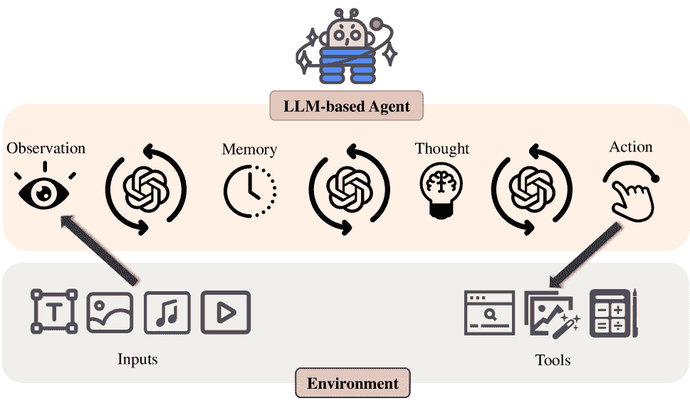
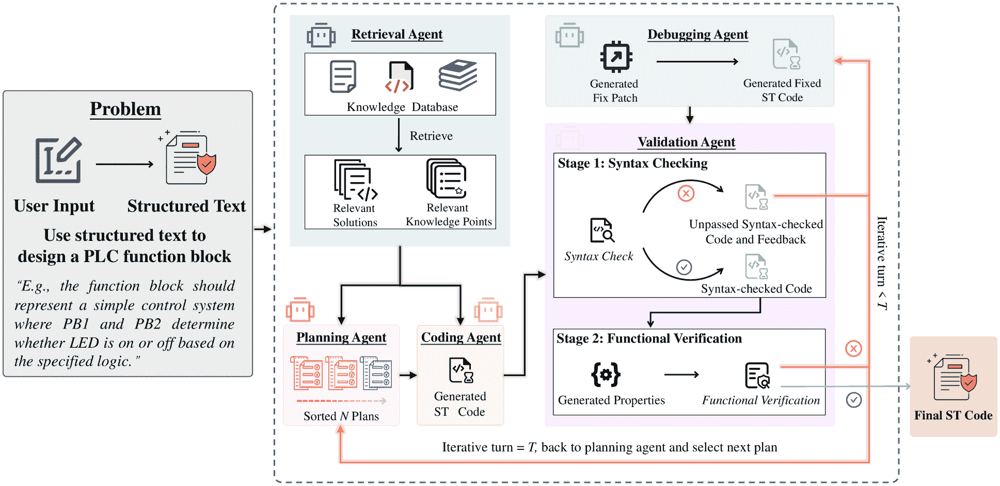
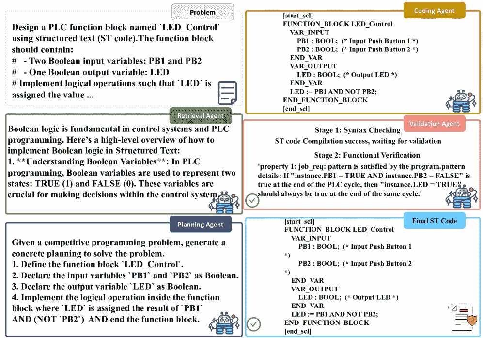
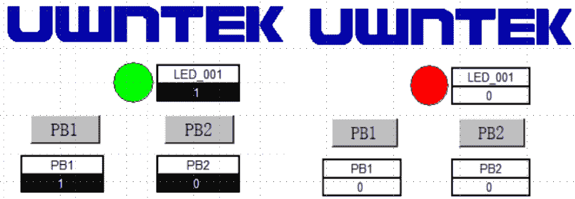
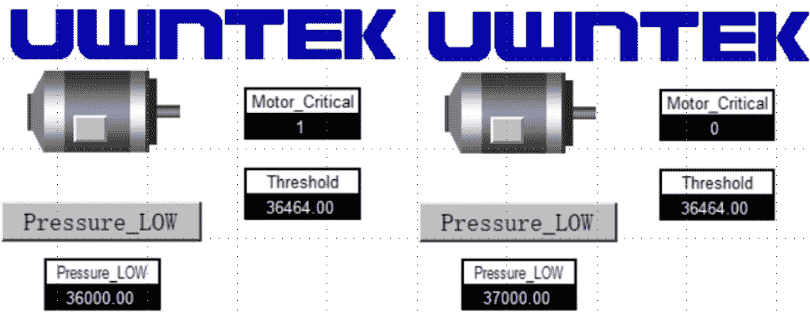
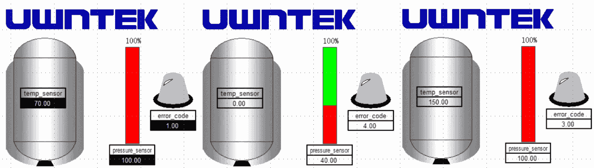

<!--yml

类别：未分类

日期：2025-01-11 12:04:06

-->

# Agents4PLC：基于LLM的代理在工业控制系统中实现闭环PLC代码生成与验证

> 来源：[https://arxiv.org/html/2410.14209/](https://arxiv.org/html/2410.14209/)

刘子涵 浙江大学 zihanliu@zju.edu.cn    曾瑞楠 浙江大学 zengruinan@zju.edu.cn    王东霞^(🖂) 共同第一作者：刘子涵和曾瑞楠；通讯作者：王东霞和王文海 浙江大学 dxwang@zju.edu.cn    彭耿云 浙江大学 pgengyun@zju.edu.cn    王晶怡 浙江大学 wangjyee@zju.edu.cn    刘强 浙江大学 22460396@zju.edu.cn    刘培宇 浙江大学 liupeiyu@zju.edu.cn    王文海^(🖂) UWin Tech & 浙江大学 zdzzlab@zju.edu.cn

###### 摘要

在工业控制系统中，**可编程逻辑控制器（PLC）代码的生成和验证**对于确保操作效率和安全性至关重要。尽管大语言模型（LLM）在自动化代码生成方面取得了进展，但它们通常无法提供正确性保证，也缺乏对PLC编程的专门支持。为了解决这些问题，本文介绍了Agents4PLC，一个新颖的框架，不仅实现了PLC代码生成的自动化，还通过基于LLM的多代理系统进行代码级验证。我们首先建立了一个全面的基准，涵盖*可验证PLC代码生成*领域，涵盖从自然语言需求到人工编写和验证的正式规范及参考PLC代码的过渡。我们进一步通过结合检索增强生成（RAG）、先进的提示工程技术和思维链策略，专门为工业控制系统增强了我们的“代理”。与基准的对比评估表明，Agents4PLC在多个逐步严格的指标上显著超越了以往的方法，取得了优越的结果。这项研究不仅解决了PLC编程中的关键挑战，还凸显了我们的框架在生成适用于实际工业应用的可验证代码方面的潜力。

###### 关键词：

代码生成，代码验证，PLC代码，基于LLM的代理，多代理，工业控制系统

## 引言

可编程逻辑控制器（PLCs）是工业控制系统（ICSs）中的关键组成部分，在工业自动化和关键工业过程的管理中发挥着至关重要的作用。全球PLC市场预计到2024年将达到122亿美元，并且从2024年到2029年，年复合增长率（CAGR）为4.37%[[36](https://arxiv.org/html/2410.14209v2#bib.bib36), [48](https://arxiv.org/html/2410.14209v2#bib.bib48)]。这一增长主要受到对基于IEC 61131-3标准的工业控制编程语言的日益依赖的推动[[20](https://arxiv.org/html/2410.14209v2#bib.bib20)]，如结构化文本（ST）和功能块图（FBD），这些语言用于监督和调节能源[[51](https://arxiv.org/html/2410.14209v2#bib.bib51)]、制造业[[43](https://arxiv.org/html/2410.14209v2#bib.bib43)]和交通运输[[24](https://arxiv.org/html/2410.14209v2#bib.bib24)]等关键领域的基础设施系统。作为一种基于文本的语言，ST语言在语法和程序结构上与其他流行的高级语言最为相似，因此适用于代码生成。

在工业控制系统中，自动生成控制代码可以大大减少重复性任务，显著提高工程师的生产力。随着大型语言模型（LLMs）的快速发展，自动化代码生成在各种编程语言（如C[[55](https://arxiv.org/html/2410.14209v2#bib.bib55)]、C++[[10](https://arxiv.org/html/2410.14209v2#bib.bib10)]、Python[[56](https://arxiv.org/html/2410.14209v2#bib.bib56)]、Java[[11](https://arxiv.org/html/2410.14209v2#bib.bib11)]等）中受到了广泛关注，因为它具有自动化软件开发并降低成本的潜力。因此，探索基于LLM的工业控制代码自动生成方法是非常值得研究的。

新兴的代码生成大型语言模型（简称代码LLMs），例如Openai Codex [[9](https://arxiv.org/html/2410.14209v2#bib.bib9)]、AlphaCode [[33](https://arxiv.org/html/2410.14209v2#bib.bib33)]、CodeLlama [[42](https://arxiv.org/html/2410.14209v2#bib.bib42)]，由于以下几个关键原因，可能并不适合PLC代码生成。首先，这些代码LLM可能在生成主流高级语言（如C或Python）的代码方面表现出色，但在生成工业控制代码时往往表现不佳。实际上，由于PLC代码的专有性和专业性，收集足够的数据来对工业代码进行微调，向来是一个极具挑战性的任务。其次，由于控制代码用于管理工业部门的运行，因此必须确保其功能的正确性，而这比生成可执行代码更具挑战性。一些努力已经在朝着专门的PLC代码生成方向进行，例如LLM4PLC [[14](https://arxiv.org/html/2410.14209v2#bib.bib14)]和Koziolek的工作 [[27](https://arxiv.org/html/2410.14209v2#bib.bib27)]，通过微调或检索增强生成（RAG）等方式。LLM4PLC [[14](https://arxiv.org/html/2410.14209v2#bib.bib14)] 还整合了设计阶段的语法和功能验证工作流，以提高代码质量。然而，*规范的正确性仅在设计阶段得到验证，而LLM生成代码的正确性仍然值得怀疑*。此外，它们的模型中心架构缺乏在集成整个开发流程以实现完全自动化方面的灵活性。另一方面，基于自动化LLM的开发工作流逐渐成为趋势，旨在通过多代理系统架构进一步细化或验证LLM生成的代码。例如，ChatDev [[39](https://arxiv.org/html/2410.14209v2#bib.bib39)]和MapCoder [[22](https://arxiv.org/html/2410.14209v2#bib.bib22)] 实现了由多个智能代理组成的软件开发系统，每个代理具有不同的角色和任务，目的是以闭环方式生成高质量的代码。值得注意的是，这种基于代理的框架灵活，可以执行多个相关的软件工程任务，如验证和调试，这些任务对于提高生成代码的质量至关重要。

在本研究中，我们提出了一种新颖的基于LLM的多代理框架，旨在解决当前PLC代码生成解决方案的局限性，即Agents4PLC。我们的系统由多个代理组成，每个代理针对特定任务（如PLC代码生成、语法验证、功能验证和调试（在失败情况下））进行定制。这样的闭环工作流使得Agents4PLC能够有效协调不同的代理，自动生成高质量代码（在理想情况下是可验证正确的）。需要注意的是，与只验证规格正确性的LLM4PLC不同，我们直接验证生成代码的正确性。同时，借助LangGraph和MetaGPT等先进的多代理架构，Agents4PLC具有很高的适应性，能够处理各种PLC代码生成任务，并融合不同的基础代码LLM。

+   •

    我们建立了一个全面的基准，从自然语言需求到形式化规范过渡，利用经过验证的参考代码和人工检查的标签，为PLC代码生成领域的未来研究提供便利。

+   •

    我们介绍了Agents4PLC，这是第一个基于大语言模型（LLM）的多代理系统，用于完全自动化的PLC代码生成，超越了纯粹基于LLM的方法（例如LLM4PLC [[14](https://arxiv.org/html/2410.14209v2#bib.bib14)]），其特点是在代码级别进行验证而非设计级别验证，并且具备灵活性，能够结合各种基础代码生成模型（包括黑箱和白箱设置），同时支持一系列用于编译、测试、验证和调试的工具。

+   •

    我们通过实施检索增强生成（RAG）、先进的提示工程和思维链方法等技术，专门增强了我们用于PLC代码生成的代理，提升了它们在生成可靠PLC代码方面的适应性和有效性。

+   •

    我们通过对Agents4PLC进行严格评估，并在可用的最大基准测试上展示其卓越的性能，涵盖一系列日益严格的指标。同时，我们还在多个实际场景中部署并验证了生成的代码，突出了其生成可验证PLC代码的潜力，满足实际工业控制系统的需求。

## II 背景

### II-A PLC编程语言

PLC（可编程逻辑控制器）是专门为工业自动化控制设计的计算机系统，可以实现对机械设备和生产过程的实时监控与控制。由于其高可靠性、易编程性和可扩展性，PLC被广泛应用于制造业、交通、能源等行业。IEC 61131-3标准[[20](https://arxiv.org/html/2410.14209v2#bib.bib20)]定义了五种PLC标准编程语言，其中包括三种图形化语言：梯形图（LAD）、功能块图（FBD）和顺序功能图（SFC），以及两种文本语言：结构化文本（ST）和指令列表（IL）。结构化文本（ST）语言与传统编程语言如C和Pascal的语法结构相似，具有较大的灵活性和可读性。它支持常见的编程结构，包括循环和条件语句，使其在需要复杂数学计算、数据处理和高级控制算法的场景中被广泛应用。随着工业4.0和智能制造的发展，ST语言的前景极为广阔，因为它可以与其他编程语言互补，增强PLC系统的灵活性和效率。

### II-B 语法检查与功能验证

LLM生成的代码通常会表现出相当大的不确定性，有时可能无法编译或无法满足指定的要求[[45](https://arxiv.org/html/2410.14209v2#bib.bib45)]。语法检查确保生成的ST代码可执行，而功能验证则确保代码实现了预期的功能，并避免潜在的逻辑缺陷或漏洞[[15](https://arxiv.org/html/2410.14209v2#bib.bib15)]。

#### II-B1 语法检查

一段代码首先需要符合编程语言的标准，才能被编译成可执行的程序。许多PLC集成开发环境（IDEs），如CODESYS和TwinCAT，可以对ST代码进行语法检查。这些IDE遵循IEC 61131-3标准，并提供编程、调试和仿真等功能。然而，由于平台的局限性，这些IDE并不方便直接集成到自动化代码生成流程中。一些命令行工具也可以对ST代码进行语法检查和编译。MATIEC[[2](https://arxiv.org/html/2410.14209v2#bib.bib2)]是一个开源编译器，能够将ST代码重构或编译成C语言，在工业自动化系统的设计与维护中得到广泛应用。RuSTy[[6](https://arxiv.org/html/2410.14209v2#bib.bib6)]是一个基于LLVM和Rust的开源项目，旨在为各种平台创建一个快速、现代化且开源的行业级ST编译器，提供全面的编译反馈。

#### II-B2 功能验证

功能验证对PLC代码至关重要，确保生成的ST代码能够准确、可靠地实现预期的控制逻辑和操作，从而避免因逻辑错误或不可预见的情况导致的设备故障或生产中断。存在一些形式化验证工具，如nuXmv [[8](https://arxiv.org/html/2410.14209v2#bib.bib8)]和PLCverif [[12](https://arxiv.org/html/2410.14209v2#bib.bib12)]，用于ST代码的功能验证，这些工具正在作为我们验证智能体的后台验证工具。

### II-C 基于LLM的智能体

LLM的快速发展提升了传统的AI智能体，这些智能体依赖于强化学习和符号逻辑[[53](https://arxiv.org/html/2410.14209v2#bib.bib53), [41](https://arxiv.org/html/2410.14209v2#bib.bib41), [23](https://arxiv.org/html/2410.14209v2#bib.bib23), [35](https://arxiv.org/html/2410.14209v2#bib.bib35), [21](https://arxiv.org/html/2410.14209v2#bib.bib21), [34](https://arxiv.org/html/2410.14209v2#bib.bib34)]，达到了一个新水平，即基于LLM的智能体。在LLM的帮助下，这些智能体具有强大的语言理解能力、内容生成能力以及利用外部知识和工具的能力。它们能够执行复杂的任务，并通过智能体之间的协作以及与环境的互动做出决策。

图1：基于LLM的智能体基本框架

关于什么构成基于LLM的智能体，存在多种定义，我们在这里介绍一些常见的组成部分。通常，一个基于LLM的智能体由五个关键组件构成：LLM、观察、记忆、思维和行动[[17](https://arxiv.org/html/2410.14209v2#bib.bib17)]。图[1](https://arxiv.org/html/2410.14209v2#S2.F1 "图1 ‣ II-C 基于LLM的智能体 ‣ II 背景 ‣ Agents4PLC：利用基于LLM的智能体自动化闭环PLC代码生成与验证")展示了其基本框架¹¹1有关不同定义和组件的更多细节，可以参考[[17](https://arxiv.org/html/2410.14209v2#bib.bib17), [57](https://arxiv.org/html/2410.14209v2#bib.bib57), [50](https://arxiv.org/html/2410.14209v2#bib.bib50)]。每个组件可以类比为人类认知，以便更好地理解。LLM作为智能体“大脑”的一部分，使其能够理解信息、从互动中学习、做出决策并执行行动。智能体通过观察组件感知环境，例如，接收来自他人的多模态信息。它利用记忆组件存储过去的互动和观察。它通过思维组件检索和分析信息，推测下一步行动。然后，它使用LLM或一些外部工具执行行动。

有一些主流的代理框架可以支持基于大语言模型的多代理工作流开发，例如 MetaGPT [[17](https://arxiv.org/html/2410.14209v2#bib.bib17)]、LangGraph [[5](https://arxiv.org/html/2410.14209v2#bib.bib5)] 和 AutoGen [[52](https://arxiv.org/html/2410.14209v2#bib.bib52)]。这些框架提供的库使开发者能够无缝创建和管理多个代理。它们促进了大语言模型与复杂工作流的集成，允许代理之间高效地进行沟通与协作。此外，这些框架通常还具备自然语言处理能力、任务编排和易于扩展的特点，使其成为构建复杂多代理系统的理想选择。

### II-D 基于代理的软件开发

基于代理的软件开发是一个新兴领域，结合了自主和通信代理，以增强软件开发生命周期的各个方面。该领域的最新进展，如 ChatDev[[39](https://arxiv.org/html/2410.14209v2#bib.bib39)]、MetaGPT[[17](https://arxiv.org/html/2410.14209v2#bib.bib17)] 和 CodeAgent[[47](https://arxiv.org/html/2410.14209v2#bib.bib47)]，展示了将 AI 驱动的代理集成到协作软件开发框架中，以增强代码审查过程的自动化，并支持软件开发环境中的上下文对话。这些研究表明，软件开发工具正在向更加互动和智能化的方向发展，能够适应开发项目的动态性质，向开发者提供上下文感知的帮助，并通过自主代理简化任务。将先进的人类流程融入多代理系统中，突显了基于代理的软件开发在革命性改造传统软件工程实践中的潜力。

## III Agents4PLC 方法论

我们提出了 Agents4PLC，一个基于大语言模型的多代理框架，用于自动化 ST 代码的生成和验证过程。该框架包含一组具有我们定义的角色和工作分工的代理，基于我们定义的工作流自动协作，以生成可靠的 ST 代码。整个框架在图[2](https://arxiv.org/html/2410.14209v2#S3.F2 "图 2 ‣ III Agents4PLC 方法论 ‣ Agents4PLC：基于大语言模型的代理在工业控制系统中自动化闭环 PLC 代码生成与验证")中展示。以下是 Agents4PLC 的详细设计。

图 2：Agents4PLC 概述。

图 3：使用 Agents4PLC 生成 LED 控制 ST 代码的示例。

### III-A Agents4PLC 框架

如图 [3](https://arxiv.org/html/2410.14209v2#S3.F3 "图 3 ‣ III Agents4PLC 方法 ‣ Agents4PLC：利用基于大型语言模型（LLM）的代理自动化工业控制系统中封闭回路PLC代码生成与验证") 所示，Agents4PLC 接受用户输入的 ST 编程需求，例如控制 LED，并输出经过形式验证的 ST 代码。在此过程中，多个具有不同角色的代理根据我们精心设计的工作流协作完成此任务。首先，检索代理分析用户输入，并据此检索与 ST 代码相关的信息，例如书籍和文档。然后，它将检索到的信息与用户输入（任务指令）一起发送给规划代理，后者负责生成和排序可执行的代码生成计划，并随后将其发送给编码代理。编码代理根据接收到的计划生成 ST 代码，随后编译器检查是否存在语法错误。如果没有错误，验证代理（验证器）将验证生成代码的功能正确性。否则，错误信息将传递给调试代理，后者会将修复建议返回给编码代理。如果验证成功，则视为生成过程完成。否则，上述工作流将继续迭代，直到超过预定义的循环阈值，此时规划代理将提供另一个代码生成计划。

### III-B 详细代理设计与优化

Agent4PLC 的主要组件是一组由大型语言模型（LLM）或分析工具驱动的自主代理。这些代理经过精心设计，执行专门的任务，协同完成 ST 代码的高效生成、验证和迭代优化。每个代理在明确的功能范围内操作，允许分配特定的责任，如代码生成、调试和验证。特别是，基于 LLM 的代理擅长处理诸如理解用户以自然语言提供的规格、检索相关信息以及生成 ST 代码等任务。同时，基于工具的代理则专注于处理领域特定的任务，如语法检查和 ST 代码的验证。这些代理之间的协作工作流不仅增强了可扩展性和适应性，还促进了协作互动，形成一个持续反馈的循环，从而提升整体的代码开发过程。

#### III-B1 检索代理

检索代理负责根据用户输入收集相关信息作为参考。虽然框架中的一些关键代理配备了 RAG 模块，以增强任务特定能力，但检索代理主要专注于从向量数据库中搜索相关的工业控制文档、PLC 编程参考和 ST 代码，供后续规划过程参考。它可以访问基于网络的搜索工具，也可以访问内部数据库来提取相关信息。

#### III-B2 规划代理

规划代理接收用户输入和检索代理获取的信息，根据这些信息生成可执行的计划，采用结构化的自动机格式表示。每个计划表示实现任务所需的步骤序列。规划代理对这些计划进行排序，稍后将按排名顺序执行，帮助确定最合适的解决方案。

#### III-B3 编码代理

编码代理在将上游代理的详细计划转换为 ST 代码的过程中至关重要，确保符合语法和语义要求。通过利用 RAG 块，代理可以访问一个全面的 PLC 文档数据库和经过验证的 ST 代码示例。RAG 使代理能够从既定的经验和领域特定知识中学习，从而根据提供的 PLC 资源做出明智决策，帮助提高生成代码的可靠性。

此外，编码代理的提示在整个代码生成过程中发挥着至关重要的作用。这些提示概括了领域特定的规则和约束，指导编码代理遵循编译器要求和预定义的验证标准。编码代理与调试和验证代理协同工作，形成一个促进持续反馈的协作循环。这种互动使得语法、逻辑和功能性错误能够及早识别和解决，显著提高整体代码质量。

优化：为了进一步提高生成代码的质量，编码代理的指导提示被精心细化。这些提示包括 PLC 编码的关键元素，例如定义各种代码模块的角色和职责、强制执行符合系统安全性和操作规范的行动约束，以及利用规划代理提供的详细计划中的见解。这些帮助编码代理不仅满足结构要求，还能遵守操作约束，提高代码的可靠性和实用性。

#### III-B4 调试代理

调试代理对于分析在ST代码编译过程中出现的错误和不一致性至关重要。它解读来自ST编译器的反馈，并利用RAG工具及为补丁生成设计的提示生成修订后的代码。修订后的代码随后传递给验证代理进行语法和语义验证。调试代理由以下三个组件组成。

+   •

    语法修复建议生成。通过验证代理中ST编译器的编译结果输入，它根据语法检查结果生成修复建议，包括错误位置和原因。修复过程采用结构化的补丁生成流程，利用逐步的思维链（CoT）方法，分别分析错误代码的来源、信息和描述。这种彻底的分析有助于准确识别错误原因并生成修复建议，从而显著提高错误修复的准确性和效率。

+   •

    语义修复建议生成。该组件用于处理在形式验证过程中识别的语义错误。与语法过程类似，语义修复过程也基于CoT方法，它指导LLM评估违反的属性和违反原因，定位可能导致属性违反的代码段，并生成修复建议。

+   •

    修复代码生成。该组件接受来自前述过程的修复建议、生成的代码和来自规划代理的当前活动计划，基于此修复代码。其设计与编码代理相似，利用RAG访问相同的参考资源数据库。通过整合这些信息，调试代理可以在将其传递给验证代理之前优化输出。

优化 调试代理作为修复代码错误的关键模块，灵感来自现有的自动化代码修复工作[[54](https://arxiv.org/html/2410.14209v2#bib.bib54)]，该方法利用生成的对话历史和实时反馈来提供纠正建议，我们在调试代理中开发了一个全面的补丁分析和生成工作流程。我们采用CoT方法指导代码修复过程中的补丁生成。与传统的代码修复微调方法相比，我们的方法提高了修复过程的有效性和适应性。通过鼓励大型语言模型（LLM）反思错误信息、相关代码行和测试名称，修复过程变得更加直观和响应式。这种结构化的反思促进了对问题的更深理解，从而带来更精确和有效的修复。

此外，提供上下文信息，如正式验证属性和验证结果，能够帮助代码修复模型生成更准确且有针对性的修复。这个策略显著提升了修复过程，特别是对于那些仅通过检查源代码无法解决的错误。

在代码生成中使用RAG在调试阶段同样证明了其有效性。在自我RAG上下文中使用先前生成的修复补丁，可以提高修复的有效性，充分利用生成输出中包含的丰富信息。通过不断精炼和验证代码，该调试代理不仅提升了最终输出的质量，还优化了整体开发工作流。

#### III-B5 验证代理

验证代理负责验证ST代码的功能正确性。与LLM4PLC[[14](https://arxiv.org/html/2410.14209v2#bib.bib14)]不同，它提供ST代码的代码级验证，这对于工业控制系统是必需的。该代理由多个专门的子组件组成，每个子组件负责特定的验证任务：

+   •

    ST代码编译。验证过程的第一步是通过编译器运行接收到的ST代码，以验证其语法正确性。此步骤确保生成的代码符合ST的语法规则。如果编译成功，过程将进入验证阶段。否则，编译器会提供详细的错误信息，然后将其传递给调试代理进行代码修正。通过自动化这一初始验证步骤，验证代理有助于简化调试周期并减少人工干预。

+   •

    属性生成。在用户未明确提供正式规范的情况下，代理使用一个子组件，利用LLM驱动的机制自动生成一组正式的规范。这些规范源自用户输入、行业标准和一般安全要求，并且结构化以符合正式验证工具所需的格式。这个过程有助于提高验证过程的效率，特别是在复杂或大规模系统中，手动编写规范可能会耗时且容易出错。

+   •

    基于翻译的ST代码分析。此子组件将生成的ST代码翻译成与正式验证工具（如SMV或CBMC）兼容的格式或语言[[29](https://arxiv.org/html/2410.14209v2#bib.bib29)]。翻译过程由LLM驱动的代理或像PLCverif[[12](https://arxiv.org/html/2410.14209v2#bib.bib12)]这样的专用工具管理。

优化。使用LLM引导的验证面临的一个主要挑战是，原始ST代码和用于形式化验证的翻译版本之间可能存在不一致性。此外，自动翻译的代码可能导致状态爆炸，这在模型检查中是一个常见问题，状态空间呈指数增长，使得验证在计算上非常昂贵或不可行。为了解决这些问题，我们集成了先进的基于翻译的验证工具，如PLCverif，该工具已优化用于将ST代码转换为SMV或CBMC格式进行模型检查和有界模型检查（BMC），有助于缓解状态爆炸问题。我们设计的验证代理使得可以轻松集成新的验证工具，以便随着时间的推移对框架进行更新，确保框架能适应形式化验证领域的进展。

另一个挑战是，在实际应用中，用户通常难以定义用于验证的形式化属性。为了解决这个问题，我们在验证代理中开发了一个规范生成工具。它帮助用户自动生成适用于验证工具的形式化属性，利用链式思维（CoT）方法指导这一过程。这种自动化的方法不仅为用户提供了便利，还确保生成的属性能够适应形式化验证。

## IV 实验评估

为了系统地评估我们PLC代码生成框架的有效性、效率以及其他关键方面，我们设计了一系列实验，旨在回答以下研究问题（RQ）：

+   •

    RQ1：与现有方法相比，Agents4PLC能否更有效地生成PLC代码？

+   •

    RQ2：Agent4PLC在PLC代码生成方面的效率如何？

+   •

    RQ3：代理中的设计效果如何，例如，RAG和编程代理中的提示设计？

+   •

    RQ4：生成的代码在实际PLC生产环境中的实用性如何？

基准构建。为了准确评估我们的Agents4PLC系统，我们构建了第一个专注于从自然语言规范生成ST代码任务的基准数据集，并通过形式化验证方法自动评估代码样本的正确性。该数据集包含23个编程任务及其对应的形式化验证规范，包括58个简单集合中的属性，其中53个是非平凡属性，涵盖16个简单编程任务，43个中等集合中的属性，其中38个是非平凡属性，涉及7个中等难度的编程任务，平凡属性是指没有在ST代码中提供对应断言句子的“断言”属性。这些编程问题涵盖了工业编程的各个方面，包括逻辑控制、数学运算、实时监控、过程控制等领域，能够有效模拟工业控制系统中的实际需求。

基础LLMs与检索模型。为了全面评估Agents4PLC相对于不同基础模型的表现，我们研究了几种流行的代码LLM的能力。具体而言，我们采用了CodeLlama 34B[[42](https://arxiv.org/html/2410.14209v2#bib.bib42)]、DeepSeek V2.5[[16](https://arxiv.org/html/2410.14209v2#bib.bib16)]、GPT-4o[[3](https://arxiv.org/html/2410.14209v2#bib.bib3)]和GPT-4o-mini[[4](https://arxiv.org/html/2410.14209v2#bib.bib4)]来评估我们的方法。对于检索模型，我们使用了text-embedding-ada-002，这是OpenAI开发的先进模型。

评估指标。参考之前的研究[[14](https://arxiv.org/html/2410.14209v2#bib.bib14)]，我们使用1)通过率，2)语法编译成功率和3)验证成功率（或可验证率）作为评估代码生成效果的指标。语法编译成功率作为生成的ST代码语法正确性的初步验证。较高的语法编译成功率表示语法错误较少，从而减少后续的调试工作。通过率来自于pass@k指标，其中，如果生成的k个结果中至少有一个不仅编译成功且符合PLC程序的功能要求，则视为模型成功，这是最具挑战性的任务。可验证率量化了生成的ST代码段能够通过目标验证语言的语法检查的比例，例如nuXmv或cbmc。较高的可验证率反映了该方法在生成可执行代码用于验证方面的有效性。我们将其计算为成功编译的代码段在所有生成代码段中的比例。

## V 结果

### V-A RQ1: 效果性研究

在本实验中，我们系统地将我们的框架与其他基于多个基础LLM的代码生成框架进行比较，以生成可靠的ST代码。我们的评估基于一组基准测试用例，旨在反映不同复杂度的水平，从相对简单的控制序列（标记为“Easy”）到更复杂的逻辑过程（标记为“Medium”）。需要注意的是，LLM4PLC设计为一个半自动化框架，包含人工交互，我们编写了额外的自动化程序来驱动LLM4PLC框架的组件。更多实验细节请参见我们的github链接²²2[https://github.com/Luoji-zju/Agents4PLC_release](https://github.com/Luoji-zju/Agents4PLC_release)和我们的网站³³3[https://hotbento.github.io/Agent4PLC/](https://hotbento.github.io/Agent4PLC/)

本次实验评估的模型包括 CodeLlama 34B、GPT-4o、GPT-4o-mini 和 DeepSeek V2.5。 在这些模型中，CodeLlama 34B 模型在单个 NVIDIA A800 80GB PCIe GPU 上运行，并使用来自 LLM4PLC 框架的预训练 LoRA，而其他模型则通过各自的在线 API 进行测试。每个模型都会提供用户需求、代码框架和自然语言规范，以生成 ST 代码。该设置模拟了真实世界的编码场景，其中模型作为代码生成代理工作，而无需详细控制底层逻辑设计。此外，为了评估非专用模型在 PLC 代码生成中的潜力，我们还评估了基于 GPT-4o 基础模型的 ChatDev 框架[[40](https://arxiv.org/html/2410.14209v2#bib.bib40)]在我们基准测试中的表现。

实验结果如表 [III](https://arxiv.org/html/2410.14209v2#S5.T3 "Table III ‣ V-D RQ4: Case study in practical control environment ‣ V Results ‣ Agents4PLC: Automating Closed-loop PLC Code Generation and Verification in Industrial Control Systems using LLM-based Agents") 所示，表中展示了不同模型在“简单”和“中等”基准水平上的表现。该表列出了编译和验证阶段的通过率，格式为 X Y Z%，其中 X 表示在相应指标上成功通过的次数，Y 表示编程问题的总数，Z% 表示通过率。例如，LLM4PLC/GPT-4o 的语法编译通过率为 14 16 87.5%，意味着 LLM4PLC 在 GPT-4o 模型上生成的结果成功编译了 16 个编程问题中的 14 个，成功率为 87.5%。我们记录了语法编译成功率、可验证率和通过率，其中“可验证率”表示框架能够生成可验证模型，且至少 80% 的给定属性能够得到验证，“通过率”表示生成的代码至少 80% 能够编译。

结果突出了我们的 Agents4PLC 框架的有效性，它在不同基准水平上超越了其他软件开发框架。在“简单”类别中，LLM4PLC 在不同模型上的表现展现了显著的差异性。GPT-4o-mini 模型实现了最高的语法编译通过率 93.8%，成功编译了 16 个代码段中的 15 个。相比之下，基于原始实验设置的 CodeLlama 34B 模型表现最差，语法编译通过率仅为 68.8%。值得注意的是，所有 LLM4PLC 模型的可验证率和通过率都显著较低，其中 GPT-4o 和 DeepSeek V2.5 在简单问题上的可验证率为 12.5%。仅有 DeepSeek V2.5 在这些问题上达到了 12.5% 的通过率，这表明基于 LLM 的 SMV 模型自动生成仍需进一步改进。

相反，Agents4PLC 框架在 Easy 类别中展示了不同模型间更为一致的表现。除了 CodeLlama 34B 外，其余模型均实现了 100% 的语法编译通过率，成功编译了所有生成的编程问题代码。我们的 Agents4PLC 框架在不同模型中达到了 68% 的最大可验证率，并且 GPT-4o 模型的通过率为 50%，表明我们的框架在生成可验证代码方面具有优越的能力。

对于 Medium 基准级别，两个系统均维持各自的表现模式，*Agents4PLC 一直优于 LLM4PLC*。Agents4PLC 的所有模型都能在“Medium”问题上实现 100% 的语法编译通过率，而 LLM4PLC 的结果则较为不稳定，其中 GPT-4o 和 GPT-4o-mini 的语法编译通过率最高为 57.1%。我们的 Agents4PLC 框架在 GPT-4o 和 DeepSeek V2.5 上实现了最大 42.3% 的可验证率，并且在 GPT-4o 上的最大通过率为 28.6%，这表明我们的框架能够有效处理涉及复杂编码问题的任务。

我们还使用 ChatDev 进行了 ST 代码生成实验，ChatDev 是一个基于多智能体系统的通用软件开发平台。该软件开发框架在 Easy 类别中达到了 43.8% 的语法编译通过率、43.8% 的可验证率和 43.8% 的通过率，在 Medium 类别中则达到了 28.6% 的语法编译通过率、14.3% 的可验证率和 28.6% 的通过率，表明 ChatDev 生成的大部分可编译代码在语义上是正确的。然而，值得注意的是，尽管明确提示 ChatDev 框架生成 ST 代码，它偶尔会生成与问题无关的代码，如 Python 或 C++，这突显了通用代码生成框架在特定行业领域中的局限性。

表 I：效率评估：所有尝试通过语法编译的 ST 代码生成次数

| 基准级别 | 简单问题 | 中等问题 |
| --- | --- | --- |
| 框架 | 基础模型 | 1 次 | 2 次 | 3 次及以上 | 1 次 | 2 次 | 3 次及以上 |
| LLM4PLC | CodeLlama 34B | 8  11  72.7% | 0  11  0.0% | 3  11  27.3% | 2  4  50.0% | 2  4  50.0% | 0  4  0.0% |
| DeepSeek V2.5 | 12  13  92.3% | 1  13  7.7% | 0  13  0.0% | 6  7  85.7% | 1  7  14.3% | 0  7  0.0% |
| GPT-4o | 13  14  92.9% | 1  14  7.1% | 0  14  0.0% | 3  4  75.0% | 1  4  25.0% | 0  4  0.0% |
| GPT-4o-mini | 15  15  100.0% | 0  15  0.0% | 0  15  0.0% | 3  4  75.0% | 0  4  0.0% | 1  4  25.0% |
| Agents4PLC | CodeLlama 34B | 4  5  80.0% | 1  5  20.0% | 0  5  0.0% | 1  1  100.0% | 0  1  0.0% | 0  1  0.0% |
| DeepSeek V2.5 | 16  16  100.0% | 0  16  0.0% | 0  16  0.0% | 7  7  100.0% | 0  7  0.0% | 0  7  0.0% |
| GPT-4o | 16  16  100.0% | 0  16  0.0% | 0  16  0.0% | 7  7  100.0% | 0  7  0.0% | 0  7  0.0% |
| GPT-4o-mini | 16  16  100.0% | 0  16  0.0% | 0  16  0.0% | 7  7  100.0% | 0  7  0.0% | 0  7  0.0% |

注意：数据格式表示对应生成次数的编号 / 通过语法编译的总案例数 / 比率。

表 II：编码和修复代理设计的消融实验

| 基准水平 | 简单问题 | 中等问题 |
| --- | --- | --- |
| 框架 | 基础模型 | 语法编译 | 通过率 | 可验证率 | 语法编译 | 通过率 | 可验证率 |
| 编码代理 | 一次性 + RAG + 语法提示 | 16  16  100.0% | 8  16  50.0% | 11  16  68.8% | 7  7  100.0% | 2  7  28.6% | 3  7  42.9% |
| 一次性 + 语法提示 | 16  16  100.0% | 11  16  68.8% | 12  16  75.0% | 7  7  100.0% | 1  7  14.3% | 3  7  42.9% |
| 一次性 + RAG | 16  16  100.0% | 6  16  37.5% | 9  16  56.2% | 7  7  100.0% | 1  7  14.3% | 1  7  14.3% |
| 一次性 | 16  16  100.0% | 6  16  37.5% | 9  16  56.2% | 7  7  100.0% | 0  7  0.0% | 1  7  14.3% |
| 零次尝试 | 16  16  100.0% | 7  16  43.8% | 8  16  50.0% | 7  7  100.0% | 0  7  0.0% | 1  7  14.3% |
| 调试代理 | 无 CoT / 补丁模板 | 16  16  100.0% | 10  16  62.5% | 10  16  50.0% | 7  7  100.0% | 0  7  0.0% | 1  7  14.3% |

注意：数据格式表示对应指标上成功通过的次数 / 编程问题的总数 / 通过率。

### V-B RQ2: 效率研究

为了评估我们框架在生成可验证 ST 代码方面的效率，我们衡量了每个模型成功生成语法正确且语义验证通过的 ST 代码所需的时间。考虑到在我们的验证过程中，PLCverif 不支持效率评估，我们根据每个模型通过语法编译阶段所需的尝试次数对结果进行了分类。分类如下：

+   •

    1 次尝试：代码在第一次尝试中通过语法编译阶段。

+   •

    2 次尝试：代码在失败后第二次尝试通过语法编译阶段。

+   •

    3 次或更多次尝试：框架需要超过三次尝试才能成功。

实验结果见表 [I](https://arxiv.org/html/2410.14209v2#S5.T1 "Table I ‣ V-A RQ1: Effectiveness study ‣ V Results ‣ Agents4PLC: Automating Closed-loop PLC Code Generation and Verification in Industrial Control Systems using LLM-based Agents")，其中数据格式表示所需的生成尝试次数 / 通过语法编译的总案例数 / 比率。实验设置与实验 1 相同。

结果表明，当我们的框架与基础模型DeepSeek V2.5、GPT-4o和GPT-4o-mini配合使用时，无论问题被分类为简单还是中等，均能在单次尝试中成功生成ST代码。相比之下，我们框架中的CodeLlama 34B模型在首次尝试后出现需要修复代码的情况。而LLM4PLC框架在所有测试模型中，出现了多个实例，要求进行两次或更多尝试才能生成可编译的代码。这种明显的性能差异凸显了我们的Agents4PLC框架不仅提供更高的代码生成成功率，还显著提高了效率，尤其是与LLM4PLC相比，后者需要更多频繁的代码修正。

### V-C RQ3：消融研究

消融研究旨在评估框架中特定设计选择对代码生成性能的影响。我们的消融实验围绕两个主要领域组织：

+   •

    编码代理：我们调查了三个重要增强功能对ST代码生成过程的影响：提示中的语法提示、基于检索的生成（RAG）和单次提示。我们检查了以下配置，逐一去除每个增强功能，以评估其对通过率的影响：

    +   –

        完整配置：包含语法提示、RAG和单次提示的完整框架。

    +   –

        无RAG的中间配置：该框架使用单次提示和语法提示，但不包括RAG。

    +   –

        无语法提示的中间配置：该框架使用简单的单次提示和RAG，但不包括语法提示。

    +   –

        简化配置：仅使用普通单次提示的简化版本。

    +   –

        基准配置：基础设置，采用零次提示且没有补充辅助（语法提示和RAG）。

+   •

    调试代理：在此部分，我们评估调试代理两个关键组件的重要性：链式思维（CoT）推理和补丁模板。我们比较了禁用这两个组件时框架的表现，即在没有CoT推理和补丁模板的情况下操作。这使我们能够量化由于缺少这些组件而导致的代码修正能力的下降。

    表[II](https://arxiv.org/html/2410.14209v2#S5.T2 "表II ‣ V-A RQ1: 效果研究 ‣ V 结果 ‣ Agents4PLC: 基于LLM的代理在工业控制系统中自动化闭环PLC代码生成与验证")总结了这项消融研究的结果，展示了不同配置下的ST代码验证通过率和编译通过率。实验配置和表格内容与效果研究中的类似，包括指标和数据格式。在简单问题集上的配置中，结合一次性提示和语法提示的设置产生了最高的整体通过率（68.8%）和可验证通过率（75.0%）。然而，中等难度问题的结果与完整配置相似，使用一次性提示 + RAG + 语法提示的配置展示了更优秀的表现，具有28.6%的通过率和42.9%的可验证通过率。每个配置分析的影响如下：

    +   –

        RAG：RAG的应用对中等难度问题有显著的改进，但对简单问题的影响较小，在某些情况下，甚至可能产生意想不到的负面效果。

    +   –

        语法提示：详细的语法提示显著提高了代码生成的效果，尤其是对于简单问题。提供语法指导有助于提高语法正确性和生成代码的整体质量。

    +   –

        一次性提示：在我们的实验中，我们观察到一次性提示并未显著提升性能。这可能是因为一次性方法仅提供了一个参考的ST代码模板，其在提高代码生成整体质量方面的效果有限。

    +   –

        调试代理中的CoT：对于简单问题，结果表明使用标准调试代理和带有CoT的调试代理之间没有显著差异。然而，对于中等难度的问题，移除CoT明显降低了框架的性能，表明CoT对于处理更复杂的调试任务至关重要。

结果表明，加入语法提示提高了所有指标的性能，而一次性提示的影响仍不明确。然而，更高级优化技术（如RAG和CoT）的效果值得进一步研究。这些方法显著提升了框架处理复杂问题的能力，但如果设计不当，它们可能会干扰简易任务的推理过程。此外，参见[章节V-B](https://arxiv.org/html/2410.14209v2#S5.SS2 "V-B RQ2: 效率研究 ‣ V 结果 ‣ Agents4PLC: 基于LLM的代理在工业控制系统中自动化闭环PLC代码生成与验证")，我们的框架通常能够在一次尝试中生成正确的代码。因此，目前的实验可能并未完全捕捉到调试代理的效果。

### V-D RQ4：实际控制环境中的案例研究

为了评估Agent4PLC在实际工业控制环境中的表现，我们进行了案例研究，利用了由杭州UWNTEK自动化系统有限公司开发的UWinTech控制工程应用软件平台。UWinTech是一个针对UW系列控制系统设计的软件包[[1](https://arxiv.org/html/2410.14209v2#bib.bib1)]。它集成了广泛的功能，包括现场数据采集、算法执行、实时和历史数据处理、报警和安全机制、过程控制、动画显示、趋势曲线分析、报告生成以及网络监控。工程师站配置软件、操作员站实时监控软件和现场控制站实时控制软件在不同的硬件平台上运行。其组件通过控制网络和系统网络进行交互，协调数据、管理和控制信息的交换，以确保控制系统中各种功能的成功执行。

我们的实验包括几个步骤：首先，我们构建了操作站和控制站，然后配置了监控和控制点的属性。这些点与仿真模型连接，Agent4PLC生成的ST代码上传到控制站进行实验。我们执行了四个控制任务：现场监控和报警灯闪烁、低电压限值和电机启动/停止、温度和压力监控，以及特定节点延迟监控。

图[4](https://arxiv.org/html/2410.14209v2#S5.F4 "图 4 ‣ V-D RQ4: 实际控制环境中的案例研究 ‣ V 结果 ‣ Agents4PLC：利用基于LLM的智能体自动化闭环PLC代码生成与验证")表示一个LED控制任务。提示是：使用结构化文本（ST）代码设计一个名为LED-Control的PLC功能块。该功能块应包含两个布尔输入变量（PB1和PB2）和一个布尔输出变量（LED）。实现逻辑操作，使LED的值由PB1和PB2的否定之间的逻辑与运算结果赋值。该功能块应表示一个简单的控制系统，其中PB1和PB2根据指定的逻辑决定LED是否开启。实验结果表明，当上传生成的ST代码后，当PB1为真（$1$）且PB2为假（$0$），即PB1与PB2的否定之间的与运算结果为$1$时，LED为绿色，否则为红色。这符合提示中的要求。

图[5](https://arxiv.org/html/2410.14209v2#S5.F5 "图5 ‣ V-D RQ4: 实际控制环境中的案例研究 ‣ V 结果 ‣ Agents4PLC: 使用基于LLM的智能体自动化闭环PLC代码生成与验证")表示电机控制任务。提示是：设计一个结构化文本（ST）中的PLC功能块，评估给定的低压值与$36464$阈值比较后，是否触发关键电机。Motor-Critical的状态是根据该评估结果来决定的。结果显示，当输入电压低于阈值36464时，电机停止；否则，电机启动。

图[6](https://arxiv.org/html/2410.14209v2#S5.F6 "图6 ‣ V-D RQ4: 实际控制环境中的案例研究 ‣ V 结果 ‣ Agents4PLC: 使用基于LLM的智能体自动化闭环PLC代码生成与验证")表示温度和继电器更新任务。提示是：设计一个使用结构化文本（ST代码）的PLC程序，结合压力传感器、温度传感器、继电器、计数器、错误代码和错误标志作为输入。该程序必须循环检查压力传感器，根据特定条件调整温度传感器，并根据GT1-OUT的值更新继电器状态。确保程序检查条件以避免溢出并保持错误标志状态。返回一个布尔值，表示操作是否完成。结果表明，当压力和温度异常时，提供低限或高限报警和不同的错误代码。当发生异常时，报警灯会闪烁。如果压力超过上限，则错误代码为1。如果温度超过高限，则错误代码为3。如果温度低于低限，则错误代码为4。这些都符合提示中的要求。

图4：使用Agents4PLC进行LED控制。

图5：使用Agents4PLC进行电机触发控制。

图6：使用Agents4PLC进行温度更新。

表III：不同模型的编译和验证指标

| 基准级别 | 简单问题 | 中等问题 |
| --- | --- | --- |
| 框架 | 基础模型 | 语法编译 | 可验证率 | 通过率 | 语法编译 | 可验证率 | 通过率 |
| LLM4PLC | CodeLlama 34B | 11  16   68.8% | 0  16   0.0% | 0  16   0.0% | 4  7  57.1% | 0  7  0.0% | 0  7  0.0% |
| DeepSeek V2.5 | 13  16  81.3% | 2  16  12.5% | 2  16  12.5% | 7  7  100.0% | 0  7  0.0% | 0  7  0.0% |
| GPT-4o | 14  16  87.5% | 0  16  0.0% | 2  16  12.5% | 4  7  57.1% | 0  7  0.0% | 0  7  0.0% |
| GPT-4o-mini | 15  16  93.8% | 0  16  0.0% | 0  16  0.0% | 4  7  57.1% | 0  7  0.0% | 0  7  0.0% |
| Agents4PLC | CodeLlama 34B | 5  16    31.3% | 2  16  12.5% | 1  16  6.3% | 1  7  14.3% | 0  7  0.0% | 0  7  0.0% |
| DeepSeek V2.5 | 16  16  100.0% | 10  16  62.5% | 7  16  43.8% | 7  7  100.0% | 3  7  42.9% | 1  7  14.3% |
| GPT-4o | 16  16  100.0% | 11  16  68.8% | 8  16  50.0% | 7  7  100.0% | 3  7  42.9% | 2  7  28.6% |
| GPT-4o-mini | 16  16  100.0% | 8  16  50.0% | 7  16  43.8% | 7  7  100.0% | 1  7  14.3% | 0  7  0.0% |
| ChatDev | GPT-4o | 7  16  43.8% | NA | NA | 2  7  28.6% | NA | NA |

注：数据格式表示对应指标的成功通过次数 / 编程问题的总数 / 通过率。

## VI 相关工作

来自工业界和学术界对基于LLM的代码生成的兴趣显著增加，其中包括一些专门为代码生成设计的LLM，例如DeepSeek-Coder[[16](https://arxiv.org/html/2410.14209v2#bib.bib16)]、StarCoder[[32](https://arxiv.org/html/2410.14209v2#bib.bib32)]和CodeLlama[[42](https://arxiv.org/html/2410.14209v2#bib.bib42)]。然而，大多数LLM关注的是高级语言，如C、Python，只有极少部分考虑到控制工程中的PLC代码。本文主要从生成、测试和验证的角度回顾了那些考虑PLC代码的相关工作。我们还分别回顾了现有的基于LLM的多智能体框架在代码生成中的应用。

### VI-A 基于LLM的自动化PLC代码生成

已有一些研究探讨了基于LLM的PLC编程代码生成，如ST语言。例如，Koziolek等人[[26](https://arxiv.org/html/2410.14209v2#bib.bib26)]创建了100个跨越10个类别的提示，用以评估现有LLM生成ST语言中语法正确的控制逻辑代码的能力。随后，他们引入了一个检索增强生成方法[[27](https://arxiv.org/html/2410.14209v2#bib.bib27)]和一个基于图像识别的生成方法[[28](https://arxiv.org/html/2410.14209v2#bib.bib28)]。这些方法将专有功能块集成到生成的代码中，并利用GPT-4 Vision从管道和仪表图（P&ID）中生成工业自动化控制逻辑代码。然而，他们没有考虑生成代码的测试或验证，因此无法确保代码的正确性。Fakih等人[[14](https://arxiv.org/html/2410.14209v2#bib.bib14)]提出了一种基于LLM的PLC代码生成管道，名为LLM4PLC，该管道将微调的LLM与外部验证工具结合。尽管它考虑了形式化验证，但仅实现了设计级别的验证（而不是ST代码级别），并且生成过程无法实现完全自动化。鉴于现有工作的这些局限性，我们的目标是通过设计的多代理系统Agents4PLC实现封闭循环和完全自动化的PLC代码生成与验证，为工业控制系统的进化、高效、可信赖和智能编码铺平道路。

我们的工作也受到最近依赖基于LLM的代理合作的代码生成方法的启发。ChatDev [[18](https://arxiv.org/html/2410.14209v2#bib.bib18)] 是一个由多个代理组成的虚拟软件开发公司，具有明确定义的角色和劳动分工，旨在协作生成高质量的软件代码。然而，ChatDev 在生成没有正式验证支持的工业控制系统软件代码时仍然存在局限性。Mapcoder [[22](https://arxiv.org/html/2410.14209v2#bib.bib22)] 由四个基于LLM的代理组成，分别负责回忆相关示例、规划、代码生成和调试，依赖于多代理提示进行代码生成。AutoSafeCoder [[37](https://arxiv.org/html/2410.14209v2#bib.bib37)] 由三个代理组成，分别负责代码生成、静态分析和模糊测试以检测运行时错误。AgentCoder [[19](https://arxiv.org/html/2410.14209v2#bib.bib19)] 由三个代理组成，分别负责代码生成和优化、测试用例生成、测试执行和反馈报告。这些方法都专注于Python语言，而Python与PLC的ST语言有本质的不同。Agents4PLC是第一个基于LLM代理的系统，覆盖ST控制工程的整个生命周期。

### VI-B PLC代码测试与验证

由于PLC编程通常使用低级编程语言，通常涉及按位和布尔操作，这使得理解和调试PLC程序变得非常困难。因此，PLC程序的测试和验证需求增加 [[38](https://arxiv.org/html/2410.14209v2#bib.bib38), [46](https://arxiv.org/html/2410.14209v2#bib.bib46)]。现有的PLC测试用例自动生成方法主要包括符号执行 [[44](https://arxiv.org/html/2410.14209v2#bib.bib44)]、混合测试 [[7](https://arxiv.org/html/2410.14209v2#bib.bib7)] 和基于搜索的技术 [[13](https://arxiv.org/html/2410.14209v2#bib.bib13)]。然而，这些方法生成的测试用例可能难以维护，使用起来具有挑战性。Koziolek等人 [[25](https://arxiv.org/html/2410.14209v2#bib.bib25)] 提出通过向LLM查询提示，自动生成PLC测试用例并以csv文件格式输出，并在实验中发现，许多生成的测试用例包含错误的断言，需要手动修正。基于多智能体的生成方法如Mapcoder [[22](https://arxiv.org/html/2410.14209v2#bib.bib22)]、AutoSafeCoder[[37](https://arxiv.org/html/2410.14209v2#bib.bib37)] 和AgentCoder [[19](https://arxiv.org/html/2410.14209v2#bib.bib19)] 都考虑了代码测试，但忽略了生成代码的形式验证。

在PLC代码验证方面，已有如nuXmv [[8](https://arxiv.org/html/2410.14209v2#bib.bib8)] 和PLCverif [[12](https://arxiv.org/html/2410.14209v2#bib.bib12)] 等工具，适用于ST代码的功能验证，它们作为Agents4PLC的后端验证器。此外，几项近期的研究旨在为IEC 61131-3语言（如ST）建立形式语义，并采用像K框架这样的新型语言框架 [[49](https://arxiv.org/html/2410.14209v2#bib.bib49), [30](https://arxiv.org/html/2410.14209v2#bib.bib30)]，以促进ST代码的测试或验证 [[31](https://arxiv.org/html/2410.14209v2#bib.bib31)]。

## 七、结论与未来工作

在本文中，我们提出了Agents4PLC，这是首个基于大语言模型（LLM）的多智能体框架，旨在解决自动化可编程逻辑控制器（PLC）代码生成和验证的关键挑战。通过建立一个全面的基准，从自然语言需求到正式规格的转化，我们为未来PLC代码生成领域的研究奠定了基础。我们的框架不仅强调代码级验证和完全自动化，而且具有灵活性，可以整合各种基础代码生成模型和开发模块。广泛的评估表明，Agents4PLC显著优于以往的方法，在PLC代码生成方面实现了高度的自动化和可验证性。

在未来，我们计划扩展该框架，以支持更多的PLC编程语言和标准，从而增强其在各种工业背景下的适用性。此外，我们还将探索多智能体系统中的用户反馈机制，以根据实际使用情况优化生成的代码和智能体，从而进一步提升其可用性和可靠性。

## 参考文献

+   [1] “Uwintech控制工程应用软件平台，” [https://www.uwntek.com/product/2.html](https://www.uwntek.com/product/2.html)，访问时间：2024-10-10。

+   [2] “Matiec,” 2017\. [在线]. 可用链接: [https://github.com/nucleron/matiec](https://github.com/nucleron/matiec)

+   [3] “Gpt-4o,” 2024\. [在线]. 可用链接: [https://platform.openai.com/docs/models/gpt-4o](https://platform.openai.com/docs/models/gpt-4o)

+   [4] “Gpt-4o-mini,” 2024\. [在线]. 可用链接: [https://platform.openai.com/docs/models/gpt-4o-mini](https://platform.openai.com/docs/models/gpt-4o-mini)

+   [5] “Langgraph,” 2024\. [在线]. 可用链接: [https://github.com/langchain-ai/langgraph](https://github.com/langchain-ai/langgraph)

+   [6] “Rusty,” 2024\. [在线]. 可用链接: [https://github.com/PLC-lang/rusty](https://github.com/PLC-lang/rusty)

+   [7] D. Bohlender, H. Simon, N. Friedrich, S. Kowalewski, 和 S. Hauck-Stattelmann, “基于覆盖度度量的PLC程序的符号测试生成，” 收录于 *2016年第13届离散事件系统国际研讨会(WODES)*。IEEE，2016年，页码432–437。

+   [8] R. Cavada, A. Cimatti, M. Dorigatti, A. Griggio, A. Mariotti, A. Micheli, S. Mover, M. Roveri, 和 S. Tonetta, “Nuxmv符号模型检查器，” 收录于 *计算机辅助验证：第26届国际会议，CAV 2014，作为维也纳逻辑夏季会的一部分，VSL 2014，维也纳，奥地利，2014年7月18-22日，论文集26*。Springer，2014年，页码334–342。

+   [9] M. Chen, J. Tworek, H. Jun, Q. Yuan, H. P. D. O. Pinto, J. Kaplan, H. Edwards, Y. Burda, N. Joseph, G. Brockman *等*，“评估在代码上训练的大型语言模型，” *arXiv预印本arXiv:2107.03374*，2021年。

+   [10] Z. Chen, S. Fang, 和 M. Monperrus, “Supersonic: 学习在C/C++中生成源代码优化，” *IEEE软件工程学报*，2024年。

+   [11] V. Corso, L. Mariani, D. Micucci, 和 O. Riganelli, “生成Java方法：四种基于AI的代码助手的经验评估，” 收录于 *第32届IEEE/ACM程序理解国际会议论文集*，2024年，页码13–23。

+   [12] D. Darvas, E. Blanco Vinuela, 和 B. Fernández Adiego, “Plcverif: 基于模型检测技术验证PLC程序的工具，” 收录于 *第15届加速器与大型实验物理控制系统国际会议论文集*。IEEE，2015年，页码1–6。

+   [13] M. Ebrahimi Salari, E. P. Enoiu, W. Afzal 和 C. Seceleanu, “Pylc：一个使用Python和Pynguin测试生成器转换和验证PLC软件的框架，”收录于 *第38届ACM/SIGAPP应用计算研讨会论文集*，2023年，页码1476–1485。

+   [14] M. Fakih, R. Dharmaji, Y. Moghaddas, G. Quiros, O. Ogundare 和 M. A. Al Faruque, “LLM4PLC：利用大语言模型为工业控制系统中的PLC编程提供可验证的解决方案，”收录于 *第46届国际软件工程大会：实践中的软件工程*，2024年，页码192–203。

+   [15] E. First 和 Y. Brun, “基于多样性驱动的自动化形式化验证，”收录于 *第44届国际软件工程大会论文集*，2022年，页码749–761。

+   [16] D. Guo, Q. Zhu, D. Yang, Z. Xie, K. Dong, W. Zhang, G. Chen, X. Bi, Y. Wu, Y. Li *等*， “Deepseek-coder：当大语言模型遇到编程——代码智能的崛起，” *arXiv 预印本 arXiv:2401.14196*，2024年。

+   [17] S. Hong, X. Zheng, J. Chen, Y. Cheng, J. Wang, C. Zhang, Z. Wang, S. K. S. Yau, Z. Lin, L. Zhou *等*， “Metagpt：面向多智能体协作框架的元编程，” *arXiv 预印本 arXiv:2308.00352*，2023年。

+   [18] X. Hou, Y. Zhao, Y. Liu, Z. Yang, K. Wang, L. Li, X. Luo, D. Lo, J. Grundy 和 H. Wang, “大语言模型在软件工程中的应用：一项系统的文献综述，” *ACM 软件工程与方法学学报*，2023年。

+   [19] D. Huang, Q. Bu, J. M. Zhang, M. Luck 和 H. Cui, “Agentcoder：基于多智能体的代码生成与迭代测试与优化，” *arXiv 预印本 arXiv:2312.13010*，2023年。

+   [20] 国际电工委员会（IEC），“IEC 61131-3:2013 可编程控制器 - 第3部分：编程语言，”[https://webstore.iec.ch/en/publication/4552](https://webstore.iec.ch/en/publication/4552)，2013年，3.0版，ISBN：9782832206614。

+   [21] C. Isbell, C. R. Shelton, M. Kearns, S. Singh 和 P. Stone, “社会强化学习智能体，”收录于 *第五届国际自主代理大会论文集*，2001年，页码377–384。

+   [22] M. A. Islam, M. E. Ali 和 M. R. Parvez, “Mapcoder：用于竞争性问题解决的多智能体代码生成，” *arXiv 预印本 arXiv:2405.11403*，2024年。

+   [23] L. P. Kaelbling, M. L. Littman 和 A. W. Moore, “强化学习：一项综述，” *人工智能研究学报*，第4卷，页码237–285，1996年。

+   [24] M. Kornaszewski, “可编程逻辑控制器在铁路信号系统中的应用，”收录于 *2019年交通与物流ICTE研讨会论文集*，Springer，2020年，页码104–111。

+   [25] H. Koziolek, V. Ashiwal, S. Bandyopadhyay *等*， “基于大语言模型的自动化控制逻辑测试用例生成，” *arXiv 预印本 arXiv:2405.01874*，2024年。

+   [26] H. Koziolek, S. Gruener, 和 V. Ashiwal, “ChatGPT用于PLC/DCS控制逻辑生成，” *2023年IEEE第28届国际新兴技术与工厂自动化会议（ETFA）论文集*。IEEE，2023年，第1–8页。

+   [27] H. Koziolek, S. Grüner, R. Hark, V. Ashiwal, S. Linsbauer, 和 N. Eskandani, “基于LLM和检索增强的控制代码生成，” *2024年第1届国际大型语言模型代码研讨会论文集*，2024年，第22–29页。

+   [28] H. Koziolek 和 A. Koziolek, “基于LLM的控制代码生成与图像识别，” *2024年第1届国际大型语言模型代码研讨会论文集*，2024年，第38–45页。

+   [29] D. Kroening 和 M. Tautschnig, “Cbmc–c有界模型检查器：（竞赛贡献），” *系统构建与分析工具与算法：第20届国际会议，TACAS 2014，作为欧洲联合软件理论与实践会议ETAPS 2014的一部分，于2014年4月5日至13日在法国格勒诺布尔举行，论文集第20*。Springer，2014年，第389–391页。

+   [30] J. Lee 和 K. Bae, “多任务PLC ST程序的形式化语义与分析（带抢占），” *国际形式化方法研讨会论文集*。Springer，2024年，第425–442页。

+   [31] J. Lee, S. Kim, 和 K. Bae, “使用模糊重写进行PLC ST程序的有界模型检查，” *第8届ACM SIGPLAN国际形式化安全关键系统技术研讨会论文集*，2022年，第56–67页。

+   [32] R. Li, L. B. Allal, Y. Zi, N. Muennighoff, D. Kocetkov, C. Mou, M. Marone, C. Akiki, J. Li, J. Chim *等*，“Starcoder：愿源代码与你同在！” *arXiv预印本arXiv:2305.06161*，2023年。

+   [33] Y. Li, D. Choi, J. Chung, N. Kushman, J. Schrittwieser, R. Leblond, T. Eccles, J. Keeling, F. Gimeno, A. Dal Lago *等*，“AlphaCode的竞赛级代码生成，” *科学*，第378卷，第6624期，第1092–1097页，2022年。

+   [34] J. Liu, K. Wang, Y. Chen, X. Peng, Z. Chen, L. Zhang, 和 Y. Lou, “基于大型语言模型的软件工程代理：一项综述，” *arXiv预印本arXiv:2409.02977*，2024年。

+   [35] M. Minsky, “迈向人工智能的步骤，” *IRE会议录*，第49卷，第1期，第8–30页，1961年。

+   [36] Mordor Intelligence, “可编程逻辑控制器（PLC）市场 - 市场份额、规模与增长，” 2024年，访问日期：2024-10-08。 [在线]。可用链接：[https://www.mordorintelligence.com/industry-reports/programmable-logic-controller-plc-market](https://www.mordorintelligence.com/industry-reports/programmable-logic-controller-plc-market)

+   [37] A. Nunez, N. T. Islam, S. K. Jha, 和 P. Najafirad, “Autosafecoder：通过静态分析和模糊测试保护LLM代码生成的多代理框架，” *arXiv预印本arXiv:2409.10737*，2024年。

+   [38] T. Ovatman, A. Aral, D. Polat, 和 A. O. Ünver, “PLC软件验证模型检查实践概述，” *软件与系统建模*，第15卷，第4期，第937–960页，2016年。

+   [39] C. Qian, W. Liu, H. Liu, N. Chen, Y. Dang, J. Li, C. Yang, W. Chen, Y. Su, X. Cong *等*，“Chatdev：用于软件开发的交流代理，”发表于*第62届计算语言学协会年会论文集（卷1：长篇论文）*，2024年，页码15 174–15 186。

+   [40] C. Qian, W. Liu, H. Liu, N. Chen, Y. Dang, J. Li, C. Yang, W. Chen, Y. Su, X. Cong, J. Xu, D. Li, Z. Liu, 和 M. Sun，“Chatdev：用于软件开发的交流代理，”*arXiv预印本arXiv:2307.07924*，2023年。[在线]。可用链接：[https://arxiv.org/abs/2307.07924](https://arxiv.org/abs/2307.07924)

+   [41] C. Ribeiro，“强化学习代理，”*人工智能评论*，第17卷，页码223–250，2002年。

+   [42] B. Roziere, J. Gehring, F. Gloeckle, S. Sootla, I. Gat, X. E. Tan, Y. Adi, J. Liu, R. Sauvestre, T. Remez *等*，“Code Llama：开源基础模型用于代码，”*arXiv预印本arXiv:2308.12950*，2023年。

+   [43] M. Schreyer 和 M. M. Tseng，“基于PLC控制的可重构制造系统设计框架，”发表于*国际柔性自动化与智能制造会议（FAIM 2000）论文集*，第1卷，2000年，页码33–42。

+   [44] J. Shi, Y. Chen, Q. Li, Y. Huang, Y. Yang, 和 M. Zhao，“基于IEC 61131-3结构化文本的动态符号执行自动化测试用例生成器，”*IEEE计算机学报*，2024年。

+   [45] M. L. Siddiq, B. Casey, 和 J. Santos，“高质量代码生成的轻量级框架，”*arXiv预印本arXiv:2307.08220*，2023年。

+   [46] A. Singh，“测试用例生成中的机器学习技术分类，”发表于*2023年第七届智能计算与控制系统国际会议（ICICCS）*，IEEE，2023年，页码474–481。

+   [47] D. Tang, Z. Chen, K. Kim, Y. Song, H. Tian, S. Ezzini, Y. Huang, 和 J. K. T. F. Bissyande，“软件工程的协作代理，”*arXiv预印本arXiv:2402.02172*，2024年。

+   [48] Technavio，“可编程逻辑控制器（PLC）市场分析：亚太地区、北美、欧洲、中东和非洲、南美—美国、中国、日本、德国、英国—规模与预测2024-2028，”2024年，访问日期：2024-10-08。[在线]。可用链接：[https://www.technavio.com/report/programmable-logic-controller-plc-market-industry-analysis](https://www.technavio.com/report/programmable-logic-controller-plc-market-industry-analysis)

+   [49] K. Wang, J. Wang, C. M. Poskitt, X. Chen, J. Sun, 和 P. Cheng，“K-st：PLC结构化文本语言的形式可执行语义，”*IEEE软件工程学报*，2023年。

+   [50] L. Wang, C. Ma, X. Feng, Z. Zhang, H. Yang, J. Zhang, Z. Chen, J. Tang, X. Chen, Y. Lin *等*，“基于大型语言模型的自主代理调查，”*计算机科学前沿*，第18卷，第6期，页码186345，2024年。

+   [51] M. Wang，"PLC技术在电气工程和自动化控制中的应用"，载于*多模态信息分析中的智能系统应用：2020年多模态信息分析国际会议（MMIA2020）论文集，第2卷*，Springer，2021，第131-135页。

+   [52] Q. Wu, G. Bansal, J. Zhang, Y. Wu, B. Li, E. Zhu, L. Jiang, X. Zhang, S. Zhang, J. Liu, A. H. Awadallah, R. W. White, D. Burger, 和 C. Wang，"Autogen：通过多智能体对话框架实现下一代LLM应用"，载于*COLM*，2024。

+   [53] Z. Xi, W. Chen, X. Guo, W. He, Y. Ding, B. Hong, M. Zhang, J. Wang, S. Jin, E. Zhou *等*，"基于大型语言模型的智能体的崛起与潜力：一项调查"，*arXiv预印本 arXiv:2309.07864*，2023。

+   [54] C. S. Xia 和 L. Zhang，"保持对话：通过chatgpt以每个$0.42修复337个错误中的162个"，*arXiv预印本 arXiv:2304.00385*，2023。

+   [55] K. Xu, G. L. Zhang, X. Yin, C. Zhuo, U. Schlichtmann, 和 B. Li，"通过大型语言模型进行高层次综合的自动化C/C++程序修复"，载于*2024年ACM/IEEE国际计算机辅助设计机器学习研讨会论文集*，2024，第1-9页。

+   [56] K. Zhang, J. Li, G. Li, X. Shi, 和 Z. Jin，"Codeagent：通过工具集成智能体系统增强代码生成，解决现实世界仓库级别的编码挑战"，*arXiv预印本 arXiv:2401.07339*，2024。

+   [57] Z. Zhang, X. Bo, C. Ma, R. Li, X. Chen, Q. Dai, J. Zhu, Z. Dong, 和 J.-R. Wen，"基于大型语言模型的智能体的记忆机制调查"，*arXiv预印本 arXiv:2404.13501*，2024。
