<!--yml
category: 未分类
date: 2025-01-11 12:03:25
-->

# An Electoral Approach to Diversify LLM-based Multi-Agent Collective Decision-Making

> 来源：[https://arxiv.org/html/2410.15168/](https://arxiv.org/html/2410.15168/)

Xiutian Zhao
University of Edinburgh
x.zhao-103@sms.ed.ac.uk \AndKe Wang, Wei Peng
Huawei IT Innovation and Research Center
{wangke215, peng.wei1}@huawei.com

###### Abstract

Modern large language models (LLMs) have exhibited cooperative synergy on complex task-solving, and collective decision-making (CDM) is a pivotal component in LLM-based multi-agent collaboration frameworks. Our survey on 52 recent such systems uncovers a severe lack of diversity, with a heavy reliance on dictatorial and plurality voting for CDM. Through the lens of social choice theory, we scrutinize widely-adopted CDM methods and identify their limitations. To enrich current landscape of LLM-based CDM, we present GEDI, an electoral CDM module that incorporates various ordinal preferential voting mechanisms. Our empirical case study across three benchmarks shows that the integration of certain CDM methods can markedly improve the reasoning capabilities and robustness of some leading LLMs, all without requiring intricate system designs. Additionally, we find that some CDM mechanisms generate positive synergies even with as few as three agents. The voting-based methods also demonstrate robustness against single points of failure, as well as diversity in terms of hit-rate@k and subject-wise impacts.¹¹1Our code and data are available at [https://github.com/xiutian/GEDI](https://github.com/xiutian/GEDI)

An Electoral Approach to Diversify LLM-based
Multi-Agent Collective Decision-Making

Xiutian Zhao University of Edinburgh x.zhao-103@sms.ed.ac.uk                        Ke Wang, Wei Peng Huawei IT Innovation and Research Center {wangke215, peng.wei1}@huawei.com

## 1 Introduction

While multi-agent systems have constantly garnered attention even before the advent of large language models (LLMs), as evidenced by prior works Wooldridge ([2009](https://arxiv.org/html/2410.15168v1#bib.bib84)); Dorri et al. ([2018](https://arxiv.org/html/2410.15168v1#bib.bib18)). The recent advancements in LLMs have significantly sparked interest in LLM-based agents. Furthermore, novel techniques such as effective prompt engineering Wei et al. ([2023](https://arxiv.org/html/2410.15168v1#bib.bib81)); Wang et al. ([2023c](https://arxiv.org/html/2410.15168v1#bib.bib77)) and agent-interaction schemes Yao et al. ([2023](https://arxiv.org/html/2410.15168v1#bib.bib92)); Shinn et al. ([2023](https://arxiv.org/html/2410.15168v1#bib.bib67)) have propelled a surge in research on collaborative LLM agents Xi et al. ([2023](https://arxiv.org/html/2410.15168v1#bib.bib86)); Wang et al. ([2023b](https://arxiv.org/html/2410.15168v1#bib.bib76)). Researchers have deployed LLM-based agents in various environments and scenarios: from simulating small community Liu et al. ([2023a](https://arxiv.org/html/2410.15168v1#bib.bib50)); Park et al. ([2023](https://arxiv.org/html/2410.15168v1#bib.bib59)) to predicting court judgement Hamilton ([2023](https://arxiv.org/html/2410.15168v1#bib.bib28)), crafting digital avatars Jarrett et al. ([2023](https://arxiv.org/html/2410.15168v1#bib.bib37)); Yang et al. ([2024](https://arxiv.org/html/2410.15168v1#bib.bib91)), and participating in dialogue-based games Xu et al. ([2023a](https://arxiv.org/html/2410.15168v1#bib.bib88)); Stepputtis et al. ([2023](https://arxiv.org/html/2410.15168v1#bib.bib69)); Li et al. ([2023c](https://arxiv.org/html/2410.15168v1#bib.bib44)), among others.

Figure 1: Distribution of CDM methods in 52 LLM-based multi-agent collaboration systems, denoting a severe lack of diversity.

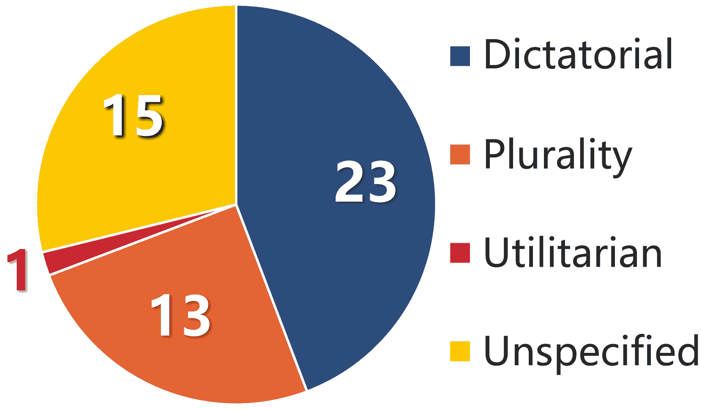

However, the existing accounts on LLM-based multi-agent collaboration has been heavily focusing on inter-agent communication and interaction workflows. In contrast, another vital aspect, collective decision-making (CDM), appears to have been largely neglected and overly simplified. Our review of 52 recent LLM collaboration systems (§ [2](https://arxiv.org/html/2410.15168v1#S2 "2 A Concise Survey on LLM-based Multi-Agent Collective Decision-Making ‣ An Electoral Approach to Diversify LLM-based Multi-Agent Collective Decision-Making")) reveals that systems either appoint a ‘dictator’ agent to make decisions for the group Hao et al. ([2023](https://arxiv.org/html/2410.15168v1#bib.bib30)); Nair et al. ([2023](https://arxiv.org/html/2410.15168v1#bib.bib54)) or depend on simplistic plurality voting Chan et al. ([2023](https://arxiv.org/html/2410.15168v1#bib.bib8)); Zhang et al. ([2023b](https://arxiv.org/html/2410.15168v1#bib.bib96)); Xu et al. ([2023b](https://arxiv.org/html/2410.15168v1#bib.bib89)), with one case adopting an utilitarian approach Jarrett et al. ([2023](https://arxiv.org/html/2410.15168v1#bib.bib37)).

This study examines prevalent CDM methods through the lens of social choice theory Arrow et al. ([2010](https://arxiv.org/html/2410.15168v1#bib.bib3)) and illustrate their failure to meet fundamental criteria (§ [3](https://arxiv.org/html/2410.15168v1#S3 "3 A Social Choice Theory Perspective on Collective Decision-Making ‣ An Electoral Approach to Diversify LLM-based Multi-Agent Collective Decision-Making")): dictatorial methods are fragile for their absolute dependency on one single agent; plurality voting, while simple and intuitively flawless, disqualifies Independence from Irrelevant Alternatives (IIA) and Condorcet criterion; utilitarian violates both Majority and Condorcet criteria. Such deviations from key criteria may impede the transition from individual preferences to collective decisions among LLM-based agents.

While Arrow’s theorems Arrow ([1951](https://arxiv.org/html/2410.15168v1#bib.bib2)) establishes the axiomatic impossibility of designing a perfect voting-based CDM system, we can still circumvent some limitations and risks by incorporating a variety of CDM methods into LLM-based multi-agent frameworks. To this end, we develop an electoral CDM module, GEDI (§ [4](https://arxiv.org/html/2410.15168v1#S4 "4 Diversifying LLM-based Multi-Agent CDM ‣ An Electoral Approach to Diversify LLM-based Multi-Agent Collective Decision-Making")), which offers a range of CDM mechanisms that were not previously tested in such frameworks. To evaluate the potential impact of various CDM methods, we conduct an empirical case study (§ [5](https://arxiv.org/html/2410.15168v1#S5 "5 A Case Study on MCQA Benchmarks ‣ An Electoral Approach to Diversify LLM-based Multi-Agent Collective Decision-Making")) on three multiple-choice question-answering (MCQA) benchmarks: MMLU Hendrycks et al. ([2021](https://arxiv.org/html/2410.15168v1#bib.bib32)), MMLU-Pro Wang et al. ([2024a](https://arxiv.org/html/2410.15168v1#bib.bib78)), and ARC-Challenge Clark et al. ([2018](https://arxiv.org/html/2410.15168v1#bib.bib13)), using a suite of models with various sizes and architectures.

Our key findings (§ [5.2](https://arxiv.org/html/2410.15168v1#S5.SS2 "5.2 Main Results ‣ 5 A Case Study on MCQA Benchmarks ‣ An Electoral Approach to Diversify LLM-based Multi-Agent Collective Decision-Making")) are as follows: (1) applying a CDM method generally leads to better results compared to a single-agent decision-making on MCQA benchmarks, though at the cost of increased computation; (2) the degree of synergy depends significantly on the backbone model and the benchmark. Some LLMs exhibit substantial improvements with voting-based methods, while others show little to no effect under any CDM; (3) most voting methods require only a minimal quorum, as few as three agents, to be effective; and (4) CDM methods exhibit varying levels of robustness against unreliable agents, different hit-rates@$k$, and varying impacts across different subject domains.

We hope these observations will encourage further evaluation of the effectiveness of LLM-based multi-agent frameworks and provide valuable insights for advancing LLM-based Multi-Agent Systems (MAS).

## 2 A Concise Survey on LLM-based Multi-Agent Collective Decision-Making

### 2.1 Background

Multi-agent systems are composed of multiple computing elements with autonomous action and interaction capabilities (i.e., ‘agent’) Wooldridge ([2009](https://arxiv.org/html/2410.15168v1#bib.bib84)). Prior to the advent of LLMs, research on multi-agent systems had already been a focal point various across disciplines Silver et al. ([2017](https://arxiv.org/html/2410.15168v1#bib.bib68)); Dorri et al. ([2018](https://arxiv.org/html/2410.15168v1#bib.bib18)). The swift progression of LLMs has since ignited an intensified interest in employing LLMs as agents Xi et al. ([2023](https://arxiv.org/html/2410.15168v1#bib.bib86)). Notably, the advent of effective prompting schemes has greatly boosted the performance of individual LLM agent: Chain-of-Thought Wei et al. ([2023](https://arxiv.org/html/2410.15168v1#bib.bib81)), Self-Consistency Wang et al. ([2023c](https://arxiv.org/html/2410.15168v1#bib.bib77)), ReAct Yao et al. ([2023](https://arxiv.org/html/2410.15168v1#bib.bib92)), Reflexion Shinn et al. ([2023](https://arxiv.org/html/2410.15168v1#bib.bib67)), DiVeRSe Li et al. ([2023e](https://arxiv.org/html/2410.15168v1#bib.bib47)) among others. Although single-agent frameworks have shown remarkable success in certain NLP tasks, they often struggle with more intricate challenges, such as common sense reasoning and long-term planning Wang et al. ([2023b](https://arxiv.org/html/2410.15168v1#bib.bib76)). In response, some researchers advocate multi-LLM-agent collaboration as a promising path.

### 2.2 Collective Decision-Making in LLM-based Multi-Agent Collaboration

Collective decision-making (CDM) is the process by which a group of autonomous entities arrives at a decision Bose et al. ([2017](https://arxiv.org/html/2410.15168v1#bib.bib5)). This phenomenon is prevalent in both animal societies and human communities, with numerous interdisciplinary studies corroborating that CDM typically yields superior decisions compared to those made by individuals alone King and Cowlishaw ([2007](https://arxiv.org/html/2410.15168v1#bib.bib41)); Couzin et al. ([2011](https://arxiv.org/html/2410.15168v1#bib.bib14)).

Recent development of LLMs has made self-governing CDM processes feasible in LLM-based multi-agent systems. However, our survey of 52 newly proposed frameworks indicates that CDM mechanisms have not received adequate focus. Specifically, most systems either depend on the dictatorial judgment of a single agent (often by preassigned role) or employ plurality voting for decision-making. As depicted in Figure [1](https://arxiv.org/html/2410.15168v1#S1.F1.fig1 "Figure 1 ‣ 1 Introduction ‣ An Electoral Approach to Diversify LLM-based Multi-Agent Collective Decision-Making"), we can categorize current LLM-based multi-agent systems into four groups based on their CDM approaches: (1) dictatorial, (2) plurality, (3) utilitarian, and (4) those with no CDM or unspecified.

#### Dictatorial

Among the reviewed papers, dictatorial methods are most popular. As the name implies, it is a one-agent-rule system in which a single agent, often pre-designated, has the right to ratify a decision. Nonetheless, such system can be ‘collective’ in a sense that the ‘dictator’ may be counseled by and communicated with other agents.

Most dictatorial frameworks designate a special agent who oversees collaboration, evaluates outcomes, and has the final say over system-level decisions. Such agent has many alias: ‘leader’ Hao et al. ([2023](https://arxiv.org/html/2410.15168v1#bib.bib30)); D’Arcy et al. ([2024](https://arxiv.org/html/2410.15168v1#bib.bib15)), ‘decider’ Nair et al. ([2023](https://arxiv.org/html/2410.15168v1#bib.bib54)), ‘commander’ Wu et al. ([2023](https://arxiv.org/html/2410.15168v1#bib.bib85)), ‘critic’ Li et al. ([2023a](https://arxiv.org/html/2410.15168v1#bib.bib42)), ‘teacher’ Jinxin et al. ([2023](https://arxiv.org/html/2410.15168v1#bib.bib40)), ‘judge’ Liang et al. ([2023](https://arxiv.org/html/2410.15168v1#bib.bib49)); Xiong et al. ([2023](https://arxiv.org/html/2410.15168v1#bib.bib87)); Sun et al. ([2023](https://arxiv.org/html/2410.15168v1#bib.bib70)); Talebirad and Nadiri ([2023](https://arxiv.org/html/2410.15168v1#bib.bib71)), ‘evaluator’ Tang et al. ([2023](https://arxiv.org/html/2410.15168v1#bib.bib73)), ‘planner’ Zhang et al. ([2023a](https://arxiv.org/html/2410.15168v1#bib.bib94)); Fang et al. ([2024](https://arxiv.org/html/2410.15168v1#bib.bib22)), ‘recruiter’ Li et al. ([2023f](https://arxiv.org/html/2410.15168v1#bib.bib48)), ‘inspector’Hua et al. ([2024](https://arxiv.org/html/2410.15168v1#bib.bib35)); Wang et al. ([2024b](https://arxiv.org/html/2410.15168v1#bib.bib80)), ‘discriminator’ Hang et al. ([2024](https://arxiv.org/html/2410.15168v1#bib.bib29)), ‘task agent’Li et al. ([2023b](https://arxiv.org/html/2410.15168v1#bib.bib43)), ‘QA-Checker’ Tang et al. ([2024](https://arxiv.org/html/2410.15168v1#bib.bib72)). Some specific cases include creating virtual software and game development companies hosting LLM-agents of various roles to achieve rapid and low-cost development of software Qian et al. ([2023](https://arxiv.org/html/2410.15168v1#bib.bib61)); Chen et al. ([2023a](https://arxiv.org/html/2410.15168v1#bib.bib9)). Specially, Chen et al. ([2023b](https://arxiv.org/html/2410.15168v1#bib.bib10)) suggest an ‘oligarchic’ small group of ‘planner’ and ‘observers’ instead of a single decision-maker.

#### Plurality Voting

Plurality voting selects the option with the most first-preference votes (i.e., relative majority). For simplicity, we consider majority voting, which that requires more-than-half votes (i.e., absolute majority), and consensus, which demands an unanimous agreement from every agents, to be two variations of plurality voting.

Frameworks that adapt plurality voting often introduce multi-round discussion to reach resolution or majority agreement Xu et al. ([2023b](https://arxiv.org/html/2410.15168v1#bib.bib89)). Multi-agent debate process is found to improve LLMs’ factuality Du et al. ([2023](https://arxiv.org/html/2410.15168v1#bib.bib19)), reasoning capabilities Zhang et al. ([2023b](https://arxiv.org/html/2410.15168v1#bib.bib96)), and financial trading performances Li et al. ([2023d](https://arxiv.org/html/2410.15168v1#bib.bib46)). Chan et al. ([2023](https://arxiv.org/html/2410.15168v1#bib.bib8)) also improve the quality of evaluation provided by LLM-agents on natural language generation tasks via debates. Chen et al. ([2023d](https://arxiv.org/html/2410.15168v1#bib.bib12)) fashion automatic team formation and LLM-agent experts recruitment. Chen et al. ([2023c](https://arxiv.org/html/2410.15168v1#bib.bib11)) quantify consensus-seeking process by appending self-assigned ‘state’ values of LLM-agents and measuring their convergence. Notably, Wang et al. ([2023d](https://arxiv.org/html/2410.15168v1#bib.bib79)) showcase that multiple ‘personas’ of a single LLM can also ‘self-collaborate’. In some cases, plurality voting is chosen to match simulated target scenarios. Hamilton ([2023](https://arxiv.org/html/2410.15168v1#bib.bib28)) trains nine separated agents as judges to simulate the U.S. Supreme Court and achieve better-than-random judgement prediction accuracy on 96 real-world cases. In textual or conceptual games like Werewolf Xu et al. ([2023a](https://arxiv.org/html/2410.15168v1#bib.bib88)) and Avalon Stepputtis et al. ([2023](https://arxiv.org/html/2410.15168v1#bib.bib69)); Shi et al. ([2023](https://arxiv.org/html/2410.15168v1#bib.bib66)), agents are bound by the game rule to take this method.

#### Utilitarian

Utilitarian approaches quantify the impacts of possible decisions and choose the one that maximizes the collective ‘utility’ or ‘reward’ gained by a group. However, utilitarian is distinct from other methods for its non-self-governing: the utilities are externally predetermined or updated. Jarrett et al. ([2023](https://arxiv.org/html/2410.15168v1#bib.bib37)) propose to train LLM agents as digital proxy to represent individual preferences via an utilitarian ‘payoff function’. Although utilitarian is rare in newly proposed LLM-based frameworks, it is a pillar method in many previous non-LLM multi-agent systems Dorri et al. ([2018](https://arxiv.org/html/2410.15168v1#bib.bib18)).

#### No CDM or Unspecified

Some multi-agent scenarios necessitate no CDM. For instance, simulating social interaction and behaviors among LLM-agents Park et al. ([2023](https://arxiv.org/html/2410.15168v1#bib.bib59)); Liu et al. ([2023a](https://arxiv.org/html/2410.15168v1#bib.bib50)); Ghaffarzadegan et al. ([2023](https://arxiv.org/html/2410.15168v1#bib.bib26)); Hua et al. ([2023](https://arxiv.org/html/2410.15168v1#bib.bib34)); Zhang et al. ([2024](https://arxiv.org/html/2410.15168v1#bib.bib95)); Wei et al. ([2024](https://arxiv.org/html/2410.15168v1#bib.bib82)), while one-to-one agreement can happen occasionally. Other systems intrinsically deny a CDM process, such as strictly linear collaboration workflow Hong et al. ([2023](https://arxiv.org/html/2410.15168v1#bib.bib33)); Wang et al. ([2023a](https://arxiv.org/html/2410.15168v1#bib.bib75)); Ding et al. ([2023](https://arxiv.org/html/2410.15168v1#bib.bib17)); Rasheed et al. ([2024](https://arxiv.org/html/2410.15168v1#bib.bib63)) or decentralized team arrangements Li et al. ([2023c](https://arxiv.org/html/2410.15168v1#bib.bib44)); Nakajima ([2023](https://arxiv.org/html/2410.15168v1#bib.bib55)); He et al. ([2023](https://arxiv.org/html/2410.15168v1#bib.bib31)). In addition, some frameworks involve human judgement for system-level decisions Ghafarollahi and Buehler ([2024](https://arxiv.org/html/2410.15168v1#bib.bib25)); Ni and Buehler ([2024](https://arxiv.org/html/2410.15168v1#bib.bib56)).

Thus far, having seen a great lack of diversity of CDM methods in LLM-based multi-agent collaboration, we draw our inspiration from social choice theory and scrutinize the pros and cons of the widely-used methods.

## 3 A Social Choice Theory Perspective on Collective Decision-Making

Social choice theory concerns passing from individual preferences to collective decisions Arrow et al. ([2010](https://arxiv.org/html/2410.15168v1#bib.bib3)). While humans have practiced and refined collective decision-making since antiquity, modern social choice theory has not been established until the publishing of Kenneth J. Arrow’s renowned Social Choice and Individual Values Arrow ([1951](https://arxiv.org/html/2410.15168v1#bib.bib2)), which axiomatically formalizes the theory and comparatively analyzes various electoral systems.

### 3.1 Related Work Incorporating Social Choice Theory into NLP Research

The related research to date has tended to focus on integrating social choice theory into model alignment Mishra ([2023](https://arxiv.org/html/2410.15168v1#bib.bib53)), model ensemble Jiang et al. ([2023b](https://arxiv.org/html/2410.15168v1#bib.bib39)), text generation and preference extrapolation Fish et al. ([2023](https://arxiv.org/html/2410.15168v1#bib.bib23)). More specifically, Jarrett et al. ([2023](https://arxiv.org/html/2410.15168v1#bib.bib37)) take an utilitarian approach to employ LLM agents as digital representatives of human. Irurozki et al. ([2022](https://arxiv.org/html/2410.15168v1#bib.bib36)); Rofin et al. ([2023](https://arxiv.org/html/2410.15168v1#bib.bib64)) point out the limitations of canonical mean-average aggregation of multi-task scores in NLP benchmarking and propose novel aggregation methods based on social choice theory. Wang et al. ([2023c](https://arxiv.org/html/2410.15168v1#bib.bib77)); Xue et al. ([2023](https://arxiv.org/html/2410.15168v1#bib.bib90)) propose to select answers from multiple generated reasoning paths by plurality voting and yield improved results over utilitarian approaches.

Most recently, Li et al. ([2024](https://arxiv.org/html/2410.15168v1#bib.bib45)) demonstrate the synergy of plurality voting on gpt-3.5 Ouyang et al. ([2022](https://arxiv.org/html/2410.15168v1#bib.bib58)) and Llama-2 Touvron et al. ([2023](https://arxiv.org/html/2410.15168v1#bib.bib74)), echoing some of our findings, yet it lacks comparisons with other CDM methods. Another concurrent work Yang et al. ([2024](https://arxiv.org/html/2410.15168v1#bib.bib91)) examines the differences between human and LLM from a voting behavior perspective. Nevertheless, previous studies do not overlap with our primary aim of diversifying LLM-based multi-agent CDM methods.

### 3.2 Criticism on Prevalent CDM Methods in LLM-based Multi-Agent Collaboration

In the context of LLM-agent collaboration, dictatorial methods rely on a single agent who is informed and counseled by other agents to decide for the group. While dictatorship is often computing-wise efficient, its absolute dependency on a sole agent makes it is more biased and less robust than more ‘democratic’ processes.

In contrast, utilitarian and cardinal voting methods certainly aggregate and disclose broader individual preferences from group members. However, an unignorable drawback of these methods is the unstable and arbitrary nature of externally imposed utilities Brandt et al. ([2016](https://arxiv.org/html/2410.15168v1#bib.bib7)). Provided that agents have accurate cardinal utilities over choices, which is a strong assumption, then an uneven distribution of utilities is another potential concern: such a system could easily violate Majority criterion (see Figure [11](https://arxiv.org/html/2410.15168v1#A4.F11 "Figure 11 ‣ Appendix D Several CDM Method Criteria Examples ‣ An Electoral Approach to Diversify LLM-based Multi-Agent Collective Decision-Making")) or even collapse to autocratic if one agent with dominant utility impact was present.

Plurality voting showcases a paradigmatic example of ordinal voting (also known as preferential or ranked voting), another decentralized decision-making family. Although there are other widely-practiced ordinal voting methods available, to the best of our knowledge, all existing LLM-agent collaboration frameworks that employ voting methods select plurality voting, as shown in Figure [1](https://arxiv.org/html/2410.15168v1#S1.F1.fig1 "Figure 1 ‣ 1 Introduction ‣ An Electoral Approach to Diversify LLM-based Multi-Agent Collective Decision-Making"). The simple method may seem intuitively ‘safe’. However, through the lens of Arrow’s theorems Arrow ([1951](https://arxiv.org/html/2410.15168v1#bib.bib2)), this method contradicts some rather self-evident criteria. To name two, the method violates both Independence from Irrelevant Alternatives (IIA) criterion, as shown in Figure [8](https://arxiv.org/html/2410.15168v1#A4.F8 "Figure 8 ‣ Appendix D Several CDM Method Criteria Examples ‣ An Electoral Approach to Diversify LLM-based Multi-Agent Collective Decision-Making"), and Condorcet criterion, as illustrated in Figure [9](https://arxiv.org/html/2410.15168v1#A4.F9 "Figure 9 ‣ Appendix D Several CDM Method Criteria Examples ‣ An Electoral Approach to Diversify LLM-based Multi-Agent Collective Decision-Making").

 |  

&#124; CDM &#124;
&#124; Method &#124;

 |  

&#124; Major &#124;
&#124; -ity &#124;

 |  

&#124; Mono &#124;
&#124; -tonic &#124;

 |  

&#124; Consis &#124;
&#124; -tency &#124;

 | IIA |  

&#124; Cond &#124;
&#124; -orcet &#124;

 |  

&#124; Ballot &#124;
&#124; type &#124;

 |
| --- | --- | --- | --- | --- | --- | --- |
| Dictatorial (Blind) | ✗ | ✓ | ✓ | ✓ | ✗ | Ranking |
| Range Voting | ✗ | ✓ | ✓ | ✓ | ✗ | Scores |
| Plurality | ✓ | ✓ | ✓ | ✗ | ✗ | Single* |
| Borda Count | ✗ | ✓ | ✓ | ✗ | ✗ | Ranking |
| IRV | ✓ | ✗ | ✗ | ✗ | ✗ | Ranking |
| Ranked Pairs | ✓ | ✓ | ✗ | ✗ | ✓ | Ranking | 

Table 1: Criteria compliance of some typical CDM methods. Range Voting can be viewed as a special utilitarian method. IIA denotes Independence from Irrelevant Alternatives. *Single ballots can be derived from ranking ones. Find some examples in Appendix [D](https://arxiv.org/html/2410.15168v1#A4 "Appendix D Several CDM Method Criteria Examples ‣ An Electoral Approach to Diversify LLM-based Multi-Agent Collective Decision-Making"). See Figure [10](https://arxiv.org/html/2410.15168v1#A4.F10 "Figure 10 ‣ Appendix D Several CDM Method Criteria Examples ‣ An Electoral Approach to Diversify LLM-based Multi-Agent Collective Decision-Making") for an example of instant-runoff voting (IRV) disqualifying monotonic criterion.

In fact, Arrow’s theorems mathematically prove that every electoral system has some fundamental flaws, as exemplified in Table [1](https://arxiv.org/html/2410.15168v1#S3.T1 "Table 1 ‣ 3.2 Criticism on Prevalent CDM Methods in LLM-based Multi-Agent Collaboration ‣ 3 A Social Choice Theory Perspective on Collective Decision-Making ‣ An Electoral Approach to Diversify LLM-based Multi-Agent Collective Decision-Making"). The axiomatic impossibility of constructing a perfect voting system, however, motivates us to reduce the risk of falling into a single point of failure. To this end, we argue it is of great pragmatic values to diversify current landscape of LLM-agent with modern decentralized voting systems. In order to leverage LLM-agents’ natural-language-based ‘judgement’ rather than imposed ‘utility’ or ‘reward’, we place a particular emphasis on ordinal preferential voting.

## 4 Diversifying LLM-based Multi-Agent CDM

To enhance the diversity of CDM approaches within LLM-agent frameworks, we propose incorporating a range of CDM methods rooted in human socio-political practices. Specifically, we craft an electoral CDM module, named General Electoral Decision-making Interface (GEDI), which integrates several common ordinal preferential voting systems. Figure [2](https://arxiv.org/html/2410.15168v1#S4.F2 "Figure 2 ‣ 4 Diversifying LLM-based Multi-Agent CDM ‣ An Electoral Approach to Diversify LLM-based Multi-Agent Collective Decision-Making") highlights a few key distinctions between GEDI and other commonly used CDM methods in LLM-based MAS.

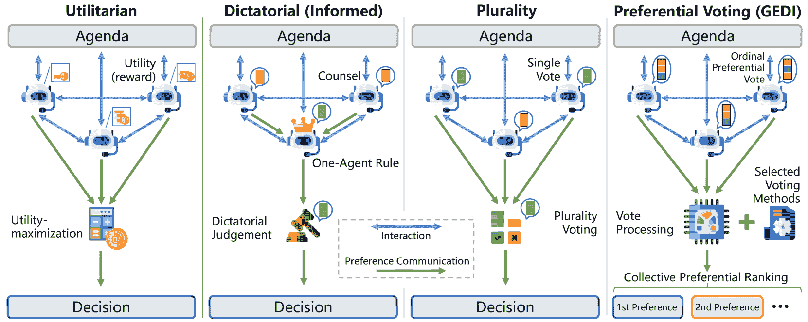

Figure 2: Comparison among different LLM-based multi-agent CDM structures: utilitarian, dictatorial, plurality and our expansion. Agenda refers to assigned tasks or interactive environment. Blue and green arrows denote interaction between agents and preference communication to CDM systems respectively. Rather than generate a single decision, GEDI uniquely outputs ordinal rankings, providing more information on agents’ collective preferences.

### 4.1 Definition

Following conventional practice Arrow et al. ([2010](https://arxiv.org/html/2410.15168v1#bib.bib3)); Brandt et al. ([2016](https://arxiv.org/html/2410.15168v1#bib.bib7)), consider a multi-alternative decision-making process. Let $N=\{1,2,...,n\}$ be a finite set of $n$ agents, $A=\{a_{1},a_{2},...a_{m}\}$ be a finite set of $m$ distinct alternatives, where $m\geq 2$ and for all $a,b\in A,a\neq b$. A preferential ranking ballot (i.e., vote) can be defined as a strict partial ordering $\succ$ of $A$ Rosen ([2007](https://arxiv.org/html/2410.15168v1#bib.bib65)). Specifically, $\succ$ is transitive: for all $a,b,c\in A$, if $a\succ b$ and $b\succ c$ then $a\succ c$); and complete: for all $a,b\in A$, $a\succ b$ or $a\prec b$. Note that there is also a weak ordering variation that accepts voters stating indifference to two alternatives (i.e., preferential ties).

Concretely, the input of GEDI is composed of: (1) a profile $P=(\succ_{1},\succ_{2},...\succ_{n})$, which denotes a collection of ballots from each voter $i\in N$; (2) a voting system (i.e., social choice function (SCF)), which is defined as a map $f:\mathcal{L}(A)^{n}\to\mathcal{C}(A)$ that returns a set of alternatives for each profile of strict preferences. The output $f(P)$ is a nonempty ordered subset of the alternative set $A$.

### 4.2 Assessed Electoral Methods

We select 10 CDM methods to assess in the following case study: Blind Dictatorial, Informed Dictatorial, Mis-informed Dictatorial, Range Voting, Plurality, Borda Count, Bucklin, Minimax, and Ranked Pairs, along with random baselines.

#### Dictatorial

Blind dictatorial (or random ballot) arbitrarily chooses an agent and admits its preference ranking as the decision without consulting with fellow agents Aziz et al. ([2013](https://arxiv.org/html/2410.15168v1#bib.bib4)). Alternatively, informed dictatorial is a counselled version in which a ‘dictator’ agent first reviews ballots of the voting ensemble and then forms its own decision. We also entail a mis-informed variation to verify the impact of information communicated via ballots, in which the ‘dictator’ is consulted by random ballots rather than actual ones from the ensemble. Notably, blind dictatorial still requires a full set of ballots, which distinguishes it from a random baseline that arranges a preference ranking in a stochastic manner without actual voting.

#### Range Voting

Agents rate alternatives under a designated cardinal range, and the winner is selected by highest overall scores Menton ([2013](https://arxiv.org/html/2410.15168v1#bib.bib52)). This approach resembles utilitarian methods, yet the ‘utilities’ (i.e., overall scores) are given by agents rather than externally assigned.

#### Plurality

Simple plurality (relative majority) considers only the first-preference in each vote, ignoring any later preferences. The winner is the candidate who receives the most top-choice votes.

#### Bucklin Voting

The first-preference votes are accounted for first, and if no choice has absolute majority, next-in-line preference votes are then accounted. Repeat the process until an absolute majority winner emerge Erdélyi et al. ([2015](https://arxiv.org/html/2410.15168v1#bib.bib21)).

#### Borda Count

Choices gain points from their places on each ballot, and the overall points determine the winner Emerson ([2013](https://arxiv.org/html/2410.15168v1#bib.bib20)); Davies et al. ([2014](https://arxiv.org/html/2410.15168v1#bib.bib16)). In standard Borda count, a preference ballot on $m$ alternatives awards $m-i$ points for the $i$-th ranked alternative. Unlike range voting, Borda is distinct from utilitarian methods because Borda still utilises ordinal preferences.

#### Instant-Runoff Voting (IRV)

A multi-round mechanism that repeatedly eliminates the alternative with fewest first-preference votes and ‘transfers’ the votes of the eliminated to surviving alternatives Freeman et al. ([2014](https://arxiv.org/html/2410.15168v1#bib.bib24)). The reverse order of elimination comprise the sorted list of collectively preferred options. While there are various early exit designs (e.g., choose a winner once an absolute majority appears), we include the standard IRV to get the full sorted list.

#### Minimax

A method that selects the choice with least ‘worst disfavor’ Brams et al. ([2007](https://arxiv.org/html/2410.15168v1#bib.bib6)). Formally, let $f(a,b)$ represent the overall ‘favor’ of $a$ over $b$ (i.e., the number of pairwise wins of $a$ against $b$ across all ballots) for a distinct pair of alternatives $a,b\in A$. $f(a,b)$ can be negative if more voters favor $b$ over $a$. The ‘worst disfavor’ of $a$ is defined as $\max f(b,a)$. The winning alternative is the one minimizes the worst disfavor, i.e., the one with the minimum $\max f(b,a)$: $a_{w}=\arg\min\limits_{a}(\max\limits_{b}f(b,a))$.

#### Ranked Pairs

Concretely, let $(a,b)$ denotes the aggregated pairwise comparison result of $a,b\in A$, and a positive $(a,b)$ indicates more agents prefer $a$ over $b$. Ranked pairs method breaks down complete ballots into preferential pairs and ranks them by prevalence. Starting from the most frequent pairs (i.e., $\arg\max\limits_{a,b\in A}(a,b)$), the method fills a pairwise comparison matrix, marking the pairs and their transitive results positive, ignoring any conflicting pairs with smaller frequency. The winner is $\arg\limits_{a\in A}((a,b)>0)\ s.t.\ \forall b\in A,a\neq b$, the one who has positive signs over all other alternatives.

 | Base Model | Rand. | Score | Dictatorial-based | Ordinal Ranking |
| --- | --- | --- | --- | --- |
|  

&#124; MMLU &#124;

 | Rand. |  

&#124; Range &#124;
&#124; Voting &#124;

 |  

&#124; Blind &#124;
&#124; Dicta. &#124;

 |  

&#124; Informed &#124;
&#124; Dicta. &#124;

 |  

&#124; Mis-Informed &#124;
&#124; Dicta. &#124;

 | Plurality | Bucklin |  

&#124; Borda &#124;
&#124; Count &#124;

 | IRV | Minimax |  

&#124; Ranked &#124;
&#124; Pairs &#124;

 |
| --- | --- | --- | --- | --- | --- | --- | --- | --- | --- | --- | --- |
| mistral-7b | 24.8 | 51.8 (-4.6) | 56.4 | 55.9 (-0.5) | 36.1 (-20.3) | 56.8 (+0.4) | 57.1 (+0.7) | 56.9 (+0.5) | 56.9 (+0.5) | 57.0 (+0.6) | 57.0 (+0.6) |
| llama-3-8b | 25.0 | 37.7 (-7.3) | 45.0 | 36.5 (-8.5) | 32.2 (-12.8) | 45.9 (+0.9) | 46.4 (+1.4) | 46.3 (+1.3) | 45.7 (+0.7) | 45.9 (+0.9) | 46.0 (+1.0) |
| glm-4-9b | 25.2 | 61.3 (-0.4) | 61.7 | 54.3 (-7.4) | 53.0 (-8.7) | 64.6 (+2.9) | 64.5 (+2.8) | 64.1 (+2.4) | 64.9 (+3.2) | 64.4 (+2.7) | 64.6 (+2.9) |
| llama-3-70b | 25.3 | 74.9 (+1.6) | 73.3 | 70.1 (-3.2) | 62.6 (-10.7) | 73.9 (+0.6) | 73.8 (+0.5) | 73.7 (+0.4) | 73.9 (+0.6) | 73.9 (+0.6) | 73.9 (+0.6) |
| qwen-2-72b | 25.1 | 69.2 (-0.5) | 69.7 | 69.7 ($\pm$0.0) | 39.5 (-30.2) | 70.0 (+0.3) | 69.9 (+0.2) | 70.0 (+0.3) | 69.9 (+0.2) | 69.9 (+0.2) | 69.9 (+0.2) |
| qwen-1.5-110b | 25.0 | 71.3 (-1.5) | 72.8 | 73.0 (+0.2) | 46.3 (-26.5) | 72.9 (+0.1) | 72.9 (+0.1) | 72.7 (-0.1) | 72.9 (+0.1) | 72.9 (+0.1) | 72.9 (+0.1) |
| gpt-3.5 | 24.9 | 63.0 (+2.2) | 60.8 | 64.7 (+3.9) | 36.9 (-23.9) | 65.9 (+5.1) | 65.5 (+4.7) | 65.6 (+4.8) | 65.6 (+4.8) | 65.6 (+4.8) | 65.6 (+4.8) |
| gpt-4 | 25.0 | 80.7 (+5.1) | 75.6 | 82.1 (+6.5) | 70.9 (-4.7) | 82.5 (+6.9) | 81.9 (+6.3) | 81.9 (+6.3) | 81.9 (+6.3) | 81.9 (+6.3) | 81.9 (+6.3) |
| MMLU-Pro |  |  |  |  |  |  |  |  |  |  |  |
| mistral-7b | 9.6 | 20.9 (-9.0) | 29.9 | 27.7 (-2.2) | 15.6 (-14.3) | 31.7 (+1.8) | 30.7 (+0.8) | 31.4 (+1.5) | 31.2 (+1.3) | 31.7 (+1.8) | 31.7 (+1.8) |
| llama-3-8b | 9.7 | 18.9 (-2.4)* | 21.3 | 23.8 (+2.5) | 19.3 (-2.0) | 22.2 (+0.9) | 23.8 (+2.5) | 24.5 (+3.2) | 22.6 (+1.3) | 23.0 (+1.7) | 23.4 (+2.1) |
| glm-4-9b | 9.6 | 26.2 (-5.7)* | 31.9 | 28.2 (-3.7) | 23.9 (-8.0) | 36.4 (+4.5) | 35.9 (+4.0) | 34.8 (+2.9) | 36.7 (+4.8) | 35.6 (+3.7) | 36.2 (+4.3) |
| llama-3-70b | 10.3 | 46.7 (+3.5) | 43.2 | 44.6 (+1.4) | 24.6 (-18.6) | 42.8 (-0.4) | 43.5 (+0.3) | 43.6 (+0.4) | 43.0 (-0.2) | 43.2 ($\pm$0.0) | 43.5 (+0.3) |
| qwen-2-72b | 10.4 | 35.1 (-1.7) | 36.8 | 37.4 (+0.6) | 19.5 (-17.3) | 37.2 (+0.4) | 36.7 (-0.1) | 36.7 (-0.1) | 37.2 (+0.4) | 37.3 (+0.5) | 37.2 (+0.4) |
| qwen-1.5-110b | 10.1 | 45.7 (+0.9) | 44.8 | 42.8 (-2.0) | 16.6 (-28.2) | 44.7 (-0.4) | 44.9 (+0.1) | 44.6 (-0.2) | 45.1 (+0.3) | 45.0 (+0.2) | 44.8 ($\pm$0.0) |
| gpt-3.5 | 9.9 | 28.5 (+2.6) | 25.9 | 27.1 (+1.2) | 13.0 (-12.9) | 26.5 (+0.6) | 27.0 (+1.1) | 28.5 (+2.6) | 26.5 (+0.6) | 26.7 (+0.8) | 27.2 (+1.3) |
| gpt-4 | 9.9 | 46.4 (-0.5) | 46.9 | 46.9 ($\pm$0.0) | 34.6 (-12.3) | 47.3 (+0.4) | 47.5 (+0.6) | 47.7 (+0.8) | 47.5 (+0.6) | 47.8 (+0.9) | 47.7 (+0.8) |
| ARC-Challenge |  |  |  |  |  |  |  |  |  |  |  |
| mistral-7b | 24.9 | 53.1 (-17.9) | 71.0 | 70.3 (-0.7) | 47.7 (-23.3) | 71.7 (+0.7) | 71.7 (+0.7) | 71.6 (+0.6) | 71.7 (+0.7) | 71.7 (+0.7) | 71.6 (+0.6) |
| llama-3-8b | 25.2 | 44.4 (-21.8) | 66.2 | 52.8 (-13.4) | 41.1 (-25.1) | 71.3 (+5.1) | 70.0 (+3.8) | 70.0 (+3.8) | 71.6 (+5.4) | 71.3 (+5.1) | 71.3 (+5.1) |
| glm-4-9b | 24.8 | 69.9 (-9.7)* | 79.3 | 80.1 (+0.8) | 65.1 (-14.2) | 82.7 (+3.4) | 82.3 (+3.0) | 82.0 (+2.7) | 82.8 (+3.5) | 83.0 (+3.7) | 82.7 (+3.4) |
| llama-3-70b | 25.3 | 88.9 (+1.1) | 87.8 | 87.9 (+0.1) | 80.8 (-7.0) | 88.5 (+0.7) | 88.4 (+0.6) | 88.1 (+0.3) | 88.5 (+0.7) | 88.4 (+0.6) | 88.4 (+0.6) |
| qwen-2-72b | 24.8 | 84.7 (-1.1) | 85.8 | 86.0 (+0.2) | 36.7 (-49.1) | 86.3 (+0.5) | 86.2 (+1.3) | 85.8 ($\pm$0.0) | 86.3 (+0.5) | 86.3 (+0.5) | 86.2 (+0.4) |
| qwen-1.5-110b | 24.7 | 87.0 (-0.7) | 87.7 | 88.3 (+0.6) | 53.4 (-34.3) | 88.1 (+0.4) | 88.1 (+0.4) | 88.0 (+0.3) | 88.1 (+0.4) | 88.1 (+0.4) | 88.1 (+0.4) |
| gpt-3.5 | 25.2 | 78.1 (+1.2) | 76.9 | 77.0 (+0.1) | 29.9 (-47.0) | 78.2 (+1.3) | 77.9 (+1.0) | 78.2 (+1.3) | 78.1 (+1.2) | 77.9 (+1.0) | 77.9 (+1.0) |
| gpt-4 | 25.0 | 92.9 (+0.4) | 92.5 | 92.8 (+0.3) | 87.3 (-5.2) | 92.9 (+0.4) | 92.7 (+0.2) | 92.8 (+0.3) | 92.8 (+0.3) | 92.8 (+0.3) | 92.9 (+0.4) | 

Table 2: Overall accuracy results on MMLU, MMLU-Pro and ARC-Challenge benchmarks. ‘Rand.’ and ‘Dicta.’ denote ‘random’ and ‘dictatorial’, respectively. The numbers in parentheses are relative to the blind dictatorial baselines. Performance gains are marked in red, and loss in blue. Notable cases are marked in bold. *Results marked with asterisk are calculated utilizing partial profiles (see Appendix [C](https://arxiv.org/html/2410.15168v1#A3 "Appendix C Main Experiment Statistics ‣ An Electoral Approach to Diversify LLM-based Multi-Agent Collective Decision-Making")).

## 5 A Case Study on MCQA Benchmarks

### 5.1 Experiment Setup

#### Datasets

As the primary scope of this study is on decision-making process rather than choice-generation, MCQA benchmarks particularly suits the research interest, for they have alternatives (i.e., choices) predefined. Following previous studies on benchmarking general performances of LLM agents Park et al. ([2022](https://arxiv.org/html/2410.15168v1#bib.bib60)); Liu et al. ([2023b](https://arxiv.org/html/2410.15168v1#bib.bib51)); Zhang et al. ([2023b](https://arxiv.org/html/2410.15168v1#bib.bib96)); Google ([2023](https://arxiv.org/html/2410.15168v1#bib.bib27)); Jiang et al. ([2023a](https://arxiv.org/html/2410.15168v1#bib.bib38)), we select MMLU Hendrycks et al. ([2021](https://arxiv.org/html/2410.15168v1#bib.bib32)), MMLU-Pro Wang et al. ([2024a](https://arxiv.org/html/2410.15168v1#bib.bib78)), and ARC-Challenge Clark et al. ([2018](https://arxiv.org/html/2410.15168v1#bib.bib13)) as the case study testbeds.

#### Backbone Models

In an effort to simulate agents built on language models of diverse architectures and parameter sizes, we curate a collection of six open-sourced models, including mistral-7b Jiang et al. ([2023a](https://arxiv.org/html/2410.15168v1#bib.bib38)), glm-4-9b Zeng et al. ([2023](https://arxiv.org/html/2410.15168v1#bib.bib93)), llama-3-8b/70b AI@Meta ([2024](https://arxiv.org/html/2410.15168v1#bib.bib1)) and qwen-1.5-72b/110b Qwen ([2024](https://arxiv.org/html/2410.15168v1#bib.bib62)). In addition, since most existing LLM-based multi-agent collaboration frameworks employ high performance models with huge parameter sizes to create agents, following their suits, we also test two widely-used proprietary models: gpt-3.5 Ouyang et al. ([2022](https://arxiv.org/html/2410.15168v1#bib.bib58)) and gpt-4 OpenAI ([2023](https://arxiv.org/html/2410.15168v1#bib.bib57)). Specifications of selected models can be found in Appendix [A](https://arxiv.org/html/2410.15168v1#A1 "Appendix A Reproducibility Statement ‣ An Electoral Approach to Diversify LLM-based Multi-Agent Collective Decision-Making") Table [5](https://arxiv.org/html/2410.15168v1#A3.T5 "Table 5 ‣ Appendix C Main Experiment Statistics ‣ An Electoral Approach to Diversify LLM-based Multi-Agent Collective Decision-Making"). The temperature of all models are fixed at 0.7 (within a 0.0 to 1.0 range) except for OpenAI models, whose temperatures are maintained at 1.0 (within a 0.0 to 2.0 range).

#### Metric and Assessment

For simplicity, we harness unmodified language models as test agents and prefix a short instruction ‘You are the {random number}-th rater’ ahead of questions to identify them. A decision ensemble is composed of a designated number of agents built on the same backbone model. Every agent is requested to provide a preferential ranking of choices on each question independently. Having gathered all rankings (i.e., votes) to form a profile, GEDI outputs collective preferential ranks conforming to selected voting rules. Uniquely, under informed and mis-informed dictatorial rules, a ‘dictator’ agent besides the voting ensemble is provided with other agents’ votes and then enquired (see § [4.2](https://arxiv.org/html/2410.15168v1#S4.SS2 "4.2 Assessed Electoral Methods ‣ 4 Diversifying LLM-based Multi-Agent CDM ‣ An Electoral Approach to Diversify LLM-based Multi-Agent Collective Decision-Making")). As described in § [4.1](https://arxiv.org/html/2410.15168v1#S4.SS1 "4.1 Definition ‣ 4 Diversifying LLM-based Multi-Agent CDM ‣ An Electoral Approach to Diversify LLM-based Multi-Agent Collective Decision-Making"), given a profile $P$ containing 10 preferential rankings from agents, a voting system $f$ of GEDI outputs an ordered list $f(P)$ of all choices. We consider a question is correctly answered if the first element of the output list match the corresponding gold label. In accordance with the original setup of MMLU Hendrycks et al. ([2021](https://arxiv.org/html/2410.15168v1#bib.bib32)), we implement a 5-shot example prompting that utilises the development sets of the datasets. All methods take the same preferential ranking format votes except for range voting that requires numerical preferential scores in addition to the rankings.

### 5.2 Main Results

The 5-run average overall accuracy results are reported in Table [2](https://arxiv.org/html/2410.15168v1#S4.T2 "Table 2 ‣ Ranked Pairs ‣ 4.2 Assessed Electoral Methods ‣ 4 Diversifying LLM-based Multi-Agent CDM ‣ An Electoral Approach to Diversify LLM-based Multi-Agent Collective Decision-Making"), and corresponding statistics of valid ranking profiles are detailed in Appendix [C](https://arxiv.org/html/2410.15168v1#A3 "Appendix C Main Experiment Statistics ‣ An Electoral Approach to Diversify LLM-based Multi-Agent Collective Decision-Making").

#### Random Baselines and Range Voting

The accuracies for random baselines hover around 25.0 for the 4-choice MMLU and ARC-Challenge, and approximately 10.0 for the 10-choice MMLU-Pro. These figures confirm a balanced distribution of correct choices within the test sets. Most models, especially the smaller ones, exhibit inferior performance when implementing score-based range voting (i.e., cardinal ranking) compared to ordinal ranking methods. However, llama-3-70b, gpt-3.5, and gpt-4 are exceptions, as their range voting outcomes exceed those of blind dictatorial.

#### Dictatorial Methods

The colored numbers in Table [2](https://arxiv.org/html/2410.15168v1#S4.T2 "Table 2 ‣ Ranked Pairs ‣ 4.2 Assessed Electoral Methods ‣ 4 Diversifying LLM-based Multi-Agent CDM ‣ An Electoral Approach to Diversify LLM-based Multi-Agent Collective Decision-Making") indicate results relative to blind dictatorial, which serves as the baseline for comparing. Although most models perform better under informed dictatorial than under blind dictatorial, they do not outperform other ordinal ranking methods.

It should be noted that informed dictatorial cost more than voting-based methods computationally, since it necessitates a complete ballot profile from the ensemble, in addition to the ‘dictator’. The subpar performance of informed dictatorial implies that a ‘dictator’ agent is unable to utilize the information from ensemble ballots more effectively than the voting systems.

As anticipated, the significantly reduced accuracies under mis-informed dictatorial demonstrate the detrimental effect of providing the ‘dictator’ with random ballots. Remarkably, glm-4-9b and gpt-4 exhibit a relatively minor decline compared to other models across the three datasets, indicating their resilience to misleading information.

#### Ordinal Ranking Methods

It is consistently observed that the application of voting-based ordinal ranking methods, even those as straightforward as plurality, results in accuracies that match or surpass those achieved by blind dictatorial. The extent of improvement varies depending on the specific model in question. Notably, models built on smaller models (<10B) and those within the GPT series exhibit substantial performance enhancements when electoral CDM methods are employed, in stark contrast to medium models (10-110B).

For MMLU benchmark, the adoption of a voting method leads to average accuracy increases of approximately 2.9%, 4.9%, and 6.5% for glm-4-9b, gpt-3.5, and gpt-4, respectively. Given that MMLU-Pro is a 10-choice test, the relative improvements due to CDM may appear less pronounced. Nonetheless, llama-3-8b and glm-4-9b still register noticeable accuracy gains under voting methods. In particular, minimax and ranked pairs methods demonstrate robustness, showing positive effects on all models across the three benchmarks.

These findings call for a reassessment on existing LLM-agent collaboration frameworks, particularly regarding the extent to which the impacts of their proposed systems may be attributed to the implementation of specific CDM methods. However, it is also observed that some CDM methods exhibit marginal and indistinct differences in performance on certain models, warranting further detailed examination.

### 5.3 Analysis and Discussion

Having observing that the agents build on gpt-3.5 and gpt-4 demonstrate the most significant improvement under ordinal ranking methods, we follow up with additional inquires and analyses.

#### Minimum Effective Voting Quorum

Firstly, we pose an intuitive question regarding the voting quorum: What is the minimum number of agents to compose an effective decision group?

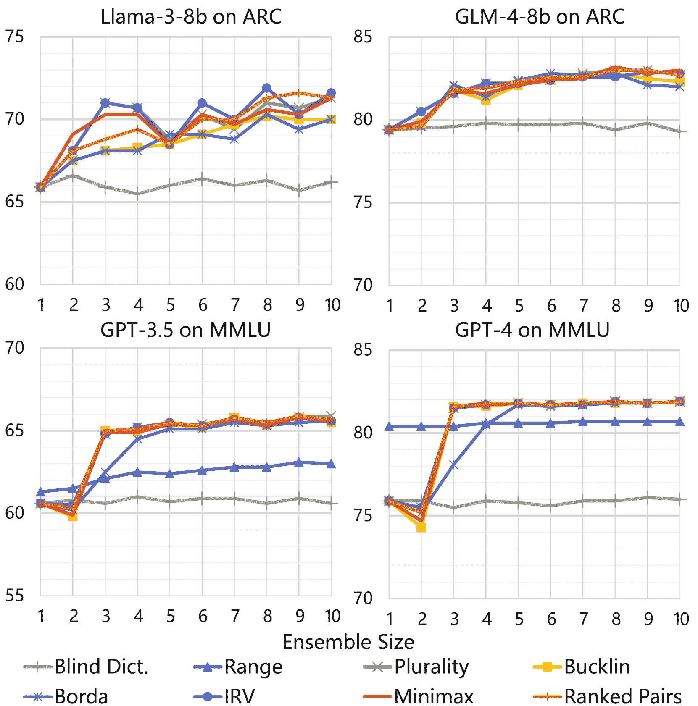

Figure 3: Accuracy comparison of voting ensembles of different sizes built on the same backbone models. The Range results of glm-4-9b is excluded for insufficient profiles (see Appendix [C](https://arxiv.org/html/2410.15168v1#A3 "Appendix C Main Experiment Statistics ‣ An Electoral Approach to Diversify LLM-based Multi-Agent Collective Decision-Making")).

Figure [3](https://arxiv.org/html/2410.15168v1#S5.F3 "Figure 3 ‣ Minimum Effective Voting Quorum ‣ 5.3 Analysis and Discussion ‣ 5 A Case Study on MCQA Benchmarks ‣ An Electoral Approach to Diversify LLM-based Multi-Agent Collective Decision-Making") illustrates the notable impact on accuracy when varying the number of voting agents, using llama-3-8b and glm-4-9b on the ARC-Challenge dataset, and gpt-3.5 and gpt-4 on the MMLU benchmark. Overall, most CDM methods start exhibiting significant improvements and surpass the blind dictatorial baseline in situations involving more than two agents, where a majority can be established.

For GPT models, noticeable drops occurs when the voting group increases to two. Borda takes a few more agents to reach the plateau, which is likely attributed to its ballot weight scale that is based on the number of choices (4 in our case). Range voting starts higher yet stabilizes lower than other methods. Surprisingly, for gpt-4, simply requiring a range vote rather than ordinal preferential vote greatly increases its judgement even without multiple agents! However, the results of range voting vary slightly when increasing number of voting agents, demonstrating a ensemble-size-independent property that is not seen on gpt-3.5. In particular, llama-3-8b shows the most variance when applying different CDM, mostly due to a smaller number of valid profiles (see Appendix [C](https://arxiv.org/html/2410.15168v1#A3 "Appendix C Main Experiment Statistics ‣ An Electoral Approach to Diversify LLM-based Multi-Agent Collective Decision-Making")). Nonetheless, since the ensemble size directly impacts the required computational resources, a consideration of cost-benefit trade-offs is essential.

#### Robustness against Unreliable Agents

The voting quorum scenario presupposes that all agents can accurately express their preferences. However, one might wonder: What if LLM agents are unreliable (i.e., malfunctioning or incapable)? An extra advantage of involving more agents in decision-making is the increased robustness against a single point of failure. To assess the resilience of various methods to unreliable voters, we incrementally replaced the voting ensemble of 10 fully functional agents with unreliable ones who cast random votes.

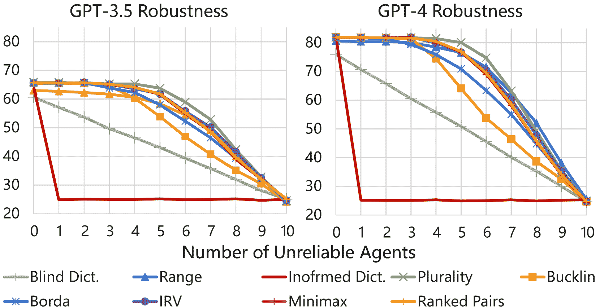

Figure 4: Accuracy impact of increasing number of unreliable agents built on gpt-3.5 and gpt-4.

Figure [4](https://arxiv.org/html/2410.15168v1#S5.F4 "Figure 4 ‣ Robustness against Unreliable Agents ‣ 5.3 Analysis and Discussion ‣ 5 A Case Study on MCQA Benchmarks ‣ An Electoral Approach to Diversify LLM-based Multi-Agent Collective Decision-Making") depicts the performance of compromised voting ensembles under different voting rules. Most voting methods maintain their integrity until the number of unreliable agents reaches 4, and then their accuracies converges to the random baseline at 25%. As anticipated, informed dictatorial is the first to collapse, since the entire system fails once the ‘dictator’ is incapable of making a reasonable judgment (utilitarian methods relying on single external utility-calculation module would be the same case). Contrary to expectations, plurality exhibits a commendable robustness compared to more sophisticated methods.

#### Difference in Hit-Rate@$K$

Let hit-rate@$k$ denotes a cumulative accuracy of taking the first $k$ preferences of an answer. We find that although a few methods yield seemingly even performance gains, they are distinguishable in terms of hit-rate@$k$, as illustrated in Figure [5](https://arxiv.org/html/2410.15168v1#S5.F5 "Figure 5 ‣ Difference in Hit-Rate@𝐾 ‣ 5.3 Analysis and Discussion ‣ 5 A Case Study on MCQA Benchmarks ‣ An Electoral Approach to Diversify LLM-based Multi-Agent Collective Decision-Making"). Notably, despite being robust against unreliable agent, plurality falls short in scenarios where the elimination of the worst choices is of the higher priority than the selection of the best. On the other hand, Borda, ranked pairs, and informed dictatorial methods have the strongest discriminant power on excluding the wrong choices. Intriguingly, while blind dictatorial performs poorly on the first choice, its hit-rate@3 surpasses some electoral methods.

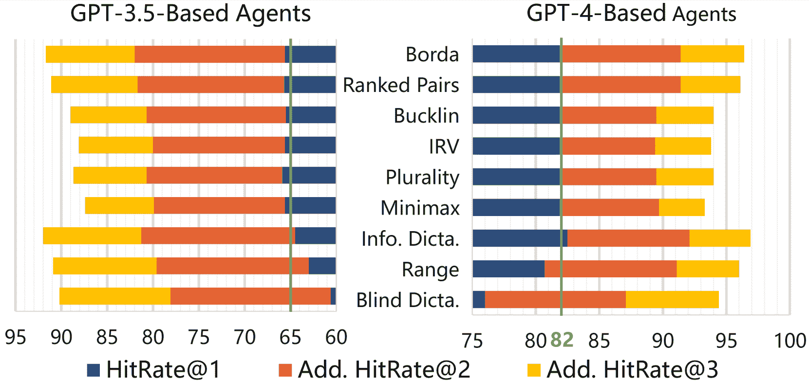

Figure 5: Hit-rate@$k$ comparison of different voting rules utilising ballots given by voting agents. Green lines are drawn to highlight similar hit-rate@1.

#### Subject-wise Performance Improvements

Inspecting the subject-wise results in Figure [6](https://arxiv.org/html/2410.15168v1#S5.F6 "Figure 6 ‣ Subject-wise Performance Improvements ‣ 5.3 Analysis and Discussion ‣ 5 A Case Study on MCQA Benchmarks ‣ An Electoral Approach to Diversify LLM-based Multi-Agent Collective Decision-Making"), we find that, under the same voting method, the performance gains are not evenly distributed across disciplines. Taking plurality for instance, the subject-wise accuracy improvements range from -5.8% to +15.0% for gpt-3.5 and from 1.4% and 9.4% for gpt-4.

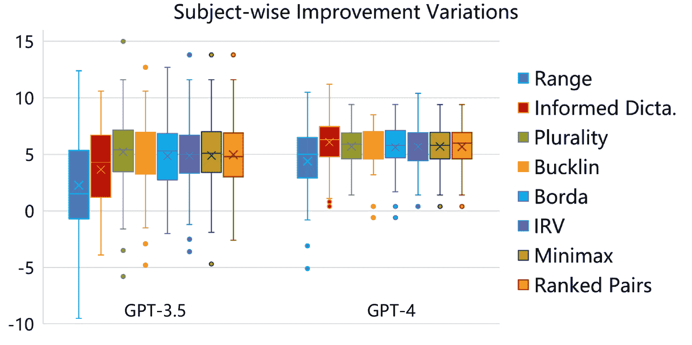

Figure 6: Box plots of subject-wise accuracy improvement variations under different CDM methods.

Vice versa, for the same discipline, the impacts under different CDM methods vary as well. For instance, the dark green bar outlined by golden border in Figure [7](https://arxiv.org/html/2410.15168v1#S5.F7 "Figure 7 ‣ Subject-wise Performance Improvements ‣ 5.3 Analysis and Discussion ‣ 5 A Case Study on MCQA Benchmarks ‣ An Electoral Approach to Diversify LLM-based Multi-Agent Collective Decision-Making")(a) indicates that ranked pairs is -3.7% less accurate than plurality on ‘professional accounting’. Conversely, the corresponding one in Figure [7](https://arxiv.org/html/2410.15168v1#S5.F7 "Figure 7 ‣ Subject-wise Performance Improvements ‣ 5.3 Analysis and Discussion ‣ 5 A Case Study on MCQA Benchmarks ‣ An Electoral Approach to Diversify LLM-based Multi-Agent Collective Decision-Making")(b) shows no difference between plurality and Borda Count on the same subject.

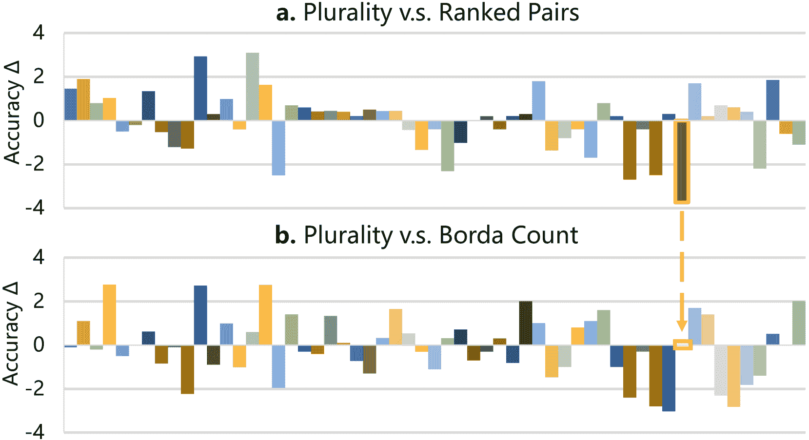

Figure 7: An example of CDM impacts on subject-wise accuracies when holding the model fixed (gpt-4 in this case). Each bar denotes a subject-wise accuracy difference between the compared CDM method pair.

Above observations again support our motivation for diversifying decision-making methods in LLM-based multi-agent collaboration.

## 6 Conclusion and Future Work

In the midst of the expanding research on LLM-based agents, we have surveyed 52 multi-agent collaboration frameworks and revealed a significant lack of diversity in CDM. We have scrutinized popular CDM methods and indicate their fundamental limitations through a social choice theory perspective. Aiming to diversify the current CDM landscape, we have drew inspiration from human societal practices and explored various CDM methods in an empirical case study across multiple benchmarks. Our experiments have produced a wealth of observations and insights, demonstrating how such diversification can illuminate the study of collective behaviors in LLMs.

Our study also opens up numerous avenues for future research. For instance, matching specific tasks with appropriate CDM methods to enhance agent decision-making quality holds promising practical value. Moreover, since social choice theory addresses collective preferences, we expect that it could inspire broader interdisciplinary NLP research, particularly language model alignment and aggregation.

## Limitations

#### Multi-Choice Question-Answering (MCQA) Benchmarks as CDM Testbed

while the experiments on MMLU, MMLU-Pro and ARC yield notable and insightful observations, we acknowledge that MCQA is not fully aligned with collective decision-making. Foremost, LLM have demonstrated inconsistency in multi-choice ranking task Zhao et al. ([2024](https://arxiv.org/html/2410.15168v1#bib.bib97)). Secondly, most MCQA benchmarks have predetermined ‘correct’ answers; however, CDM processes can also be relevant in scenarios where there is no absolute right or wrong. For instance, measuring bias in LLM agents involves aggregating the ‘preferences’ of individual agents, where no objectively ‘correct’ choices exist. Therefore, an additional avenue for future work could involve constructing a benchmark that measures preference representativeness rather than one based on true-or-false judgments.

#### Self-contained Testing

All experiments are self-contained systems of sole backbone model. In other words, we do not test any ensemble containing voting agents built on different LLMs, which could be another future direction.

#### Unexhausted Inclusion of Voting Strategies in GEDI

Although we attempted to cover common modern electoral systems, the CDM method list of GEDI is not exhaustive. For instance, in an effort to keep the module compact and lightweight, we do not include compound mechanisms that combine multiple voting strategies. However, such mechanisms are achievable by arranging a pipeline of multiple GEDI modules if so wish.

#### ‘Voting Tax’

The ‘voting tax’ of electoral CDM methods refers to the computation cost of implementing such methods. The tax is composed of two parts: agent actions and ballot processing. Agent actions takes largest proportion as operating LLM agents is highly costly. The cost of inter-agent communication should be taken into consideration as well. Compared with vast computational resources required by model inference, ballot processing part consumes much minor.

Another aspect to consider the cost-benefit trade-offs is the ‘participation’ in decision-making. Human voters could feel certain degree of fulfillment by participation alone regardless of results, as they have expressed their preferences in social decision-making processes. LLM agents, however, can not benefit through participation. This distinction makes voting population factor in LLM-agent CDM a totally utilitarian one.

## Broader Impacts and Ethical Considerations

The purpose of this research is to explore the possibilities of implementing diverse collective decision-making methods among LLM-based agents. However, this study does not support nor encourage any attempt to utilize LLM agents as representatives to replace human judgment in real-world democratic decision-making processes.

## Acknowledgements

We are grateful to the anonymous reviewers and editors for their constructive feedback. Special thanks go to our colleague Jack for his support in deploying and managing the inference services for the open-source models used in this study.

## References

*   AI@Meta (2024) AI@Meta. 2024. [Llama 3 model card](https://github.com/meta-llama/llama3/blob/main/MODEL_CARD.md).
*   Arrow (1951) Kenneth J Arrow. 1951. *Social choice and individual values*. Cowles Foundation, New Haven, CT.
*   Arrow et al. (2010) Kenneth J Arrow, Amartya Sen, and Kotaro Suzumura. 2010. *Handbook of social choice and welfare*, volume 2. Elsevier.
*   Aziz et al. (2013) Haris Aziz, Felix Brandt, and Paul Stursberg. 2013. On popular random assignments. In *Algorithmic Game Theory: 6th International Symposium, SAGT 2013, Aachen, Germany, October 21-23, 2013\. Proceedings 6*, pages 183–194\. Springer.
*   Bose et al. (2017) Thomas Bose, Andreagiovanni Reina, and James AR Marshall. 2017. Collective decision-making. *Current opinion in behavioral sciences*, 16:30–34.
*   Brams et al. (2007) Steven J Brams, D Marc Kilgour, and M Remzi Sanver. 2007. A minimax procedure for electing committees. *Public Choice*, 132:401–420.
*   Brandt et al. (2016) Felix Brandt, Vincent Conitzer, Ulle Endriss, Jérôme Lang, and Ariel D Procaccia. 2016. *Handbook of computational social choice*. Cambridge University Press.
*   Chan et al. (2023) Chi-Min Chan, Weize Chen, Yusheng Su, Jianxuan Yu, Wei Xue, Shanghang Zhang, Jie Fu, and Zhiyuan Liu. 2023. Chateval: Towards better llm-based evaluators through multi-agent debate. *arXiv preprint arXiv:2308.07201*.
*   Chen et al. (2023a) Dake Chen, Hanbin Wang, Yunhao Huo, Yuzhao Li, and Haoyang Zhang. 2023a. [Gamegpt: Multi-agent collaborative framework for game development](http://arxiv.org/abs/2310.08067).
*   Chen et al. (2023b) Guangyao Chen, Siwei Dong, Yu Shu, Ge Zhang, Jaward Sesay, Börje F. Karlsson, Jie Fu, and Yemin Shi. 2023b. [Autoagents: A framework for automatic agent generation](http://arxiv.org/abs/2309.17288).
*   Chen et al. (2023c) Huaben Chen, Wenkang Ji, Lufeng Xu, and Shiyu Zhao. 2023c. [Multi-agent consensus seeking via large language models](http://arxiv.org/abs/2310.20151).
*   Chen et al. (2023d) Weize Chen, Yusheng Su, Jingwei Zuo, Cheng Yang, Chenfei Yuan, Chi-Min Chan, Heyang Yu, Yaxi Lu, Yi-Hsin Hung, Chen Qian, Yujia Qin, Xin Cong, Ruobing Xie, Zhiyuan Liu, Maosong Sun, and Jie Zhou. 2023d. [Agentverse: Facilitating multi-agent collaboration and exploring emergent behaviors](http://arxiv.org/abs/2308.10848).
*   Clark et al. (2018) Peter Clark, Isaac Cowhey, Oren Etzioni, Tushar Khot, Ashish Sabharwal, Carissa Schoenick, and Oyvind Tafjord. 2018. [Think you have solved question answering? try arc, the ai2 reasoning challenge](http://arxiv.org/abs/1803.05457).
*   Couzin et al. (2011) Iain D Couzin, Christos C Ioannou, Güven Demirel, Thilo Gross, Colin J Torney, Andrew Hartnett, Larissa Conradt, Simon A Levin, and Naomi E Leonard. 2011. Uninformed individuals promote democratic consensus in animal groups. *science*, 334(6062):1578–1580.
*   D’Arcy et al. (2024) Mike D’Arcy, Tom Hope, Larry Birnbaum, and Doug Downey. 2024. [Marg: Multi-agent review generation for scientific papers](http://arxiv.org/abs/2401.04259).
*   Davies et al. (2014) Jessica Davies, George Katsirelos, Nina Narodytska, Toby Walsh, and Lirong Xia. 2014. Complexity of and algorithms for the manipulation of borda, nanson’s and baldwin’s voting rules. *Artificial Intelligence*, 217:20–42.
*   Ding et al. (2023) Shiying Ding, Xinyi Chen, Yan Fang, Wenrui Liu, Yiwu Qiu, and Chunlei Chai. 2023. [Designgpt: Multi-agent collaboration in design](http://arxiv.org/abs/2311.11591).
*   Dorri et al. (2018) Ali Dorri, Salil S Kanhere, and Raja Jurdak. 2018. Multi-agent systems: A survey. *Ieee Access*, 6:28573–28593.
*   Du et al. (2023) Yilun Du, Shuang Li, Antonio Torralba, Joshua B. Tenenbaum, and Igor Mordatch. 2023. [Improving factuality and reasoning in language models through multiagent debate](http://arxiv.org/abs/2305.14325).
*   Emerson (2013) Peter Emerson. 2013. The original borda count and partial voting. *Social Choice and Welfare*, 40:353–358.
*   Erdélyi et al. (2015) Gábor Erdélyi, Michael R Fellows, Jörg Rothe, and Lena Schend. 2015. Control complexity in bucklin and fallback voting: A theoretical analysis. *Journal of Computer and System Sciences*, 81(4):632–660.
*   Fang et al. (2024) Jiabao Fang, Shen Gao, Pengjie Ren, Xiuying Chen, Suzan Verberne, and Zhaochun Ren. 2024. [A multi-agent conversational recommender system](http://arxiv.org/abs/2402.01135).
*   Fish et al. (2023) Sara Fish, Paul Gölz, David C. Parkes, Ariel D. Procaccia, Gili Rusak, Itai Shapira, and Manuel Wüthrich. 2023. [Generative social choice](http://arxiv.org/abs/2309.01291).
*   Freeman et al. (2014) Rupert Freeman, Markus Brill, and Vincent Conitzer. 2014. [On the axiomatic characterization of runoff voting rules](https://doi.org/10.1609/aaai.v28i1.8827). *Proceedings of the AAAI Conference on Artificial Intelligence*, 28(1).
*   Ghafarollahi and Buehler (2024) A. Ghafarollahi and M. J. Buehler. 2024. [Protagents: Protein discovery via large language model multi-agent collaborations combining physics and machine learning](http://arxiv.org/abs/2402.04268).
*   Ghaffarzadegan et al. (2023) Navid Ghaffarzadegan, Aritra Majumdar, Ross Williams, and Niyousha Hosseinichimeh. 2023. [Generative agent-based modeling: Unveiling social system dynamics through coupling mechanistic models with generative artificial intelligence](http://arxiv.org/abs/2309.11456).
*   Google (2023) Google. 2023. [Gemini: A family of highly capable multimodal models](http://arxiv.org/abs/2312.11805).
*   Hamilton (2023) Sil Hamilton. 2023. [Blind judgement: Agent-based supreme court modelling with gpt](http://arxiv.org/abs/2301.05327).
*   Hang et al. (2024) Tiankai Hang, Shuyang Gu, Dong Chen, Xin Geng, and Baining Guo. 2024. [Cca: Collaborative competitive agents for image editing](http://arxiv.org/abs/2401.13011).
*   Hao et al. (2023) Rui Hao, Linmei Hu, Weijian Qi, Qingliu Wu, Yirui Zhang, and Liqiang Nie. 2023. [Chatllm network: More brains, more intelligence](http://arxiv.org/abs/2304.12998).
*   He et al. (2023) Zhitao He, Pengfei Cao, Yubo Chen, Kang Liu, Ruopeng Li, Mengshu Sun, and Jun Zhao. 2023. [LEGO: A multi-agent collaborative framework with role-playing and iterative feedback for causality explanation generation](https://doi.org/10.18653/v1/2023.findings-emnlp.613). In *Findings of the Association for Computational Linguistics: EMNLP 2023*, pages 9142–9163, Singapore. Association for Computational Linguistics.
*   Hendrycks et al. (2021) Dan Hendrycks, Collin Burns, Steven Basart, Andy Zou, Mantas Mazeika, Dawn Song, and Jacob Steinhardt. 2021. [Measuring massive multitask language understanding](http://arxiv.org/abs/2009.03300).
*   Hong et al. (2023) Sirui Hong, Mingchen Zhuge, Jonathan Chen, Xiawu Zheng, Yuheng Cheng, Ceyao Zhang, Jinlin Wang, Zili Wang, Steven Ka Shing Yau, Zijuan Lin, Liyang Zhou, Chenyu Ran, Lingfeng Xiao, Chenglin Wu, and Jürgen Schmidhuber. 2023. [Metagpt: Meta programming for a multi-agent collaborative framework](http://arxiv.org/abs/2308.00352).
*   Hua et al. (2023) Wenyue Hua, Lizhou Fan, Lingyao Li, Kai Mei, Jianchao Ji, Yingqiang Ge, Libby Hemphill, and Yongfeng Zhang. 2023. [War and peace (waragent): Large language model-based multi-agent simulation of world wars](http://arxiv.org/abs/2311.17227).
*   Hua et al. (2024) Wenyue Hua, Xianjun Yang, Zelong Li, Cheng Wei, and Yongfeng Zhang. 2024. [Trustagent: Towards safe and trustworthy llm-based agents through agent constitution](http://arxiv.org/abs/2402.01586).
*   Irurozki et al. (2022) Ekhine Irurozki, Pierre Colombo, Nathan Noiry, and Stéphan Clémençon. 2022. What are the best systems? new perspectives on nlp benchmarking. In *Conference on Neural Information Processing Systems*.
*   Jarrett et al. (2023) Daniel Jarrett, Miruna Pislar, Michael Tessler, Michiel Bakker, Raphael Koster, Jan Balaguer, Romuald Elie, Christopher Summerfield, and Andrea Tacchetti. 2023. [Language agents as digital representatives in collective decision-making](https://openreview.net/forum?id=sv7KZcUqu1). In *NeurIPS 2023 Foundation Models for Decision Making Workshop*.
*   Jiang et al. (2023a) Albert Q. Jiang, Alexandre Sablayrolles, Arthur Mensch, Chris Bamford, Devendra Singh Chaplot, Diego de las Casas, Florian Bressand, Gianna Lengyel, Guillaume Lample, Lucile Saulnier, Lélio Renard Lavaud, Marie-Anne Lachaux, Pierre Stock, Teven Le Scao, Thibaut Lavril, Thomas Wang, Timothée Lacroix, and William El Sayed. 2023a. [Mistral 7b](http://arxiv.org/abs/2310.06825).
*   Jiang et al. (2023b) Dongfu Jiang, Xiang Ren, and Bill Yuchen Lin. 2023b. [LLM-blender: Ensembling large language models with pairwise ranking and generative fusion](https://doi.org/10.18653/v1/2023.acl-long.792). In *Proceedings of the 61st Annual Meeting of the Association for Computational Linguistics (Volume 1: Long Papers)*, pages 14165–14178, Toronto, Canada. Association for Computational Linguistics.
*   Jinxin et al. (2023) Shi Jinxin, Zhao Jiabao, Wang Yilei, Wu Xingjiao, Li Jiawen, and He Liang. 2023. [Cgmi: Configurable general multi-agent interaction framework](http://arxiv.org/abs/2308.12503).
*   King and Cowlishaw (2007) Andrew J King and Guy Cowlishaw. 2007. When to use social information: the advantage of large group size in individual decision making. *Biology letters*, 3(2):137–139.
*   Li et al. (2023a) Guohao Li, Hasan Abed Al Kader Hammoud, Hani Itani, Dmitrii Khizbullin, and Bernard Ghanem. 2023a. [Camel: Communicative agents for "mind" exploration of large language model society](http://arxiv.org/abs/2303.17760).
*   Li et al. (2023b) Haoyuan Li, Hao Jiang, Tianke Zhang, Zhelun Yu, Aoxiong Yin, Hao Cheng, Siming Fu, Yuhao Zhang, and Wanggui He. 2023b. [Traineragent: Customizable and efficient model training through llm-powered multi-agent system](http://arxiv.org/abs/2311.06622).
*   Li et al. (2023c) Huao Li, Yu Chong, Simon Stepputtis, Joseph Campbell, Dana Hughes, Charles Lewis, and Katia Sycara. 2023c. [Theory of mind for multi-agent collaboration via large language models](https://doi.org/10.18653/v1/2023.emnlp-main.13). In *Proceedings of the 2023 Conference on Empirical Methods in Natural Language Processing*, pages 180–192, Singapore. Association for Computational Linguistics.
*   Li et al. (2024) Junyou Li, Qin Zhang, Yangbin Yu, Qiang Fu, and Deheng Ye. 2024. [More agents is all you need](http://arxiv.org/abs/2402.05120).
*   Li et al. (2023d) Yang Li, Yangyang Yu, Haohang Li, Zhi Chen, and Khaldoun Khashanah. 2023d. [Tradinggpt: Multi-agent system with layered memory and distinct characters for enhanced financial trading performance](http://arxiv.org/abs/2309.03736).
*   Li et al. (2023e) Yifei Li, Zeqi Lin, Shizhuo Zhang, Qiang Fu, Bei Chen, Jian-Guang Lou, and Weizhu Chen. 2023e. [Making language models better reasoners with step-aware verifier](https://doi.org/10.18653/v1/2023.acl-long.291). In *Proceedings of the 61st Annual Meeting of the Association for Computational Linguistics (Volume 1: Long Papers)*, pages 5315–5333, Toronto, Canada. Association for Computational Linguistics.
*   Li et al. (2023f) Yuan Li, Yixuan Zhang, and Lichao Sun. 2023f. [Metaagents: Simulating interactions of human behaviors for llm-based task-oriented coordination via collaborative generative agents](http://arxiv.org/abs/2310.06500).
*   Liang et al. (2023) Tian Liang, Zhiwei He, Wenxiang Jiao, Xing Wang, Yan Wang, Rui Wang, Yujiu Yang, Zhaopeng Tu, and Shuming Shi. 2023. [Encouraging divergent thinking in large language models through multi-agent debate](http://arxiv.org/abs/2305.19118).
*   Liu et al. (2023a) Ruibo Liu, Ruixin Yang, Chenyan Jia, Ge Zhang, Denny Zhou, Andrew M. Dai, Diyi Yang, and Soroush Vosoughi. 2023a. [Training socially aligned language models on simulated social interactions](http://arxiv.org/abs/2305.16960).
*   Liu et al. (2023b) Zijun Liu, Yanzhe Zhang, Peng Li, Yang Liu, and Diyi Yang. 2023b. [Dynamic llm-agent network: An llm-agent collaboration framework with agent team optimization](http://arxiv.org/abs/2310.02170).
*   Menton (2013) Curtis Menton. 2013. Normalized range voting broadly resists control. *Theory of Computing Systems*, 53(4):507–531.
*   Mishra (2023) Abhilash Mishra. 2023. Ai alignment and social choice: Fundamental limitations and policy implications. *arXiv preprint arXiv:2310.16048*.
*   Nair et al. (2023) Varun Nair, Elliot Schumacher, Geoffrey Tso, and Anitha Kannan. 2023. [Dera: Enhancing large language model completions with dialog-enabled resolving agents](http://arxiv.org/abs/2303.17071).
*   Nakajima (2023) Yohei Nakajima. 2023. [Task-driven autonomous agent utilizing gpt-4, pinecone, and langchain for diverse applications](https://yoheinakajima.com/task-driven-autonomous-agent-utilizing-gpt-4-pinecone-and-langchain-for-diverse-applications/).
*   Ni and Buehler (2024) Bo Ni and Markus J. Buehler. 2024. [Mechagents: Large language model multi-agent collaborations can solve mechanics problems, generate new data, and integrate knowledge](https://doi.org/https://doi.org/10.1016/j.eml.2024.102131). *Extreme Mechanics Letters*, page 102131.
*   OpenAI (2023) OpenAI. 2023. [Gpt-4 technical report](http://arxiv.org/abs/2303.08774).
*   Ouyang et al. (2022) Long Ouyang, Jeffrey Wu, Xu Jiang, Diogo Almeida, Carroll Wainwright, Pamela Mishkin, Chong Zhang, Sandhini Agarwal, Katarina Slama, Alex Ray, et al. 2022. Training language models to follow instructions with human feedback. *Advances in neural information processing systems*, 35:27730–27744.
*   Park et al. (2023) Joon Sung Park, Joseph C. O’Brien, Carrie J. Cai, Meredith Ringel Morris, Percy Liang, and Michael S. Bernstein. 2023. [Generative agents: Interactive simulacra of human behavior](http://arxiv.org/abs/2304.03442).
*   Park et al. (2022) Joon Sung Park, Lindsay Popowski, Carrie Cai, Meredith Ringel Morris, Percy Liang, and Michael S. Bernstein. 2022. [Social simulacra: Creating populated prototypes for social computing systems](https://doi.org/10.1145/3526113.3545616). In *Proceedings of the 35th Annual ACM Symposium on User Interface Software and Technology*, UIST ’22, New York, NY, USA. Association for Computing Machinery.
*   Qian et al. (2023) Chen Qian, Xin Cong, Wei Liu, Cheng Yang, Weize Chen, Yusheng Su, Yufan Dang, Jiahao Li, Juyuan Xu, Dahai Li, Zhiyuan Liu, and Maosong Sun. 2023. [Communicative agents for software development](http://arxiv.org/abs/2307.07924).
*   Qwen (2024) Qwen. 2024. [Introducing qwen1.5](https://qwenlm.github.io/blog/qwen1.5/).
*   Rasheed et al. (2024) Zeeshan Rasheed, Muhammad Waseem, Mika Saari, Kari Systä, and Pekka Abrahamsson. 2024. [Codepori: Large scale model for autonomous software development by using multi-agents](http://arxiv.org/abs/2402.01411).
*   Rofin et al. (2023) Mark Rofin, Vladislav Mikhailov, Mikhail Florinsky, Andrey Kravchenko, Tatiana Shavrina, Elena Tutubalina, Daniel Karabekyan, and Ekaterina Artemova. 2023. [Vote’n’rank: Revision of benchmarking with social choice theory](https://doi.org/10.18653/v1/2023.eacl-main.48). In *Proceedings of the 17th Conference of the European Chapter of the Association for Computational Linguistics*, pages 670–686, Dubrovnik, Croatia. Association for Computational Linguistics.
*   Rosen (2007) Kenneth H Rosen. 2007. *Discrete mathematics and its applications*. The McGraw Hill Companies,.
*   Shi et al. (2023) Zijing Shi, Meng Fang, Shunfeng Zheng, Shilong Deng, Ling Chen, and Yali Du. 2023. [Cooperation on the fly: Exploring language agents for ad hoc teamwork in the avalon game](http://arxiv.org/abs/2312.17515).
*   Shinn et al. (2023) Noah Shinn, Federico Cassano, Edward Berman, Ashwin Gopinath, Karthik Narasimhan, and Shunyu Yao. 2023. [Reflexion: Language agents with verbal reinforcement learning](http://arxiv.org/abs/2303.11366).
*   Silver et al. (2017) David Silver, Julian Schrittwieser, Karen Simonyan, Ioannis Antonoglou, Aja Huang, Arthur Guez, Thomas Hubert, Lucas Baker, Matthew Lai, Adrian Bolton, et al. 2017. Mastering the game of go without human knowledge. *nature*, 550(7676):354–359.
*   Stepputtis et al. (2023) Simon Stepputtis, Joseph Campbell, Yaqi Xie, Zhengyang Qi, Wenxin Zhang, Ruiyi Wang, Sanketh Rangreji, Charles Lewis, and Katia Sycara. 2023. [Long-horizon dialogue understanding for role identification in the game of avalon with large language models](https://doi.org/10.18653/v1/2023.findings-emnlp.748). In *Findings of the Association for Computational Linguistics: EMNLP 2023*, pages 11193–11208, Singapore. Association for Computational Linguistics.
*   Sun et al. (2023) Qiushi Sun, Zhangyue Yin, Xiang Li, Zhiyong Wu, Xipeng Qiu, and Lingpeng Kong. 2023. [Corex: Pushing the boundaries of complex reasoning through multi-model collaboration](http://arxiv.org/abs/2310.00280).
*   Talebirad and Nadiri (2023) Yashar Talebirad and Amirhossein Nadiri. 2023. [Multi-agent collaboration: Harnessing the power of intelligent llm agents](http://arxiv.org/abs/2306.03314).
*   Tang et al. (2024) Daniel Tang, Zhenghan Chen, Kisub Kim, Yewei Song, Haoye Tian, Saad Ezzini, Yongfeng Huang, Jacques Klein, and Tegawende F. Bissyande. 2024. [Collaborative agents for software engineering](http://arxiv.org/abs/2402.02172).
*   Tang et al. (2023) Ziyi Tang, Ruilin Wang, Weixing Chen, Keze Wang, Yang Liu, Tianshui Chen, and Liang Lin. 2023. [Towards causalgpt: A multi-agent approach for faithful knowledge reasoning via promoting causal consistency in llms](http://arxiv.org/abs/2308.11914).
*   Touvron et al. (2023) Hugo Touvron, Louis Martin, Kevin Stone, Peter Albert, Amjad Almahairi, Yasmine Babaei, Nikolay Bashlykov, Soumya Batra, Prajjwal Bhargava, Shruti Bhosale, Dan Bikel, Lukas Blecher, Cristian Canton Ferrer, Moya Chen, Guillem Cucurull, David Esiobu, Jude Fernandes, Jeremy Fu, Wenyin Fu, Brian Fuller, Cynthia Gao, Vedanuj Goswami, Naman Goyal, Anthony Hartshorn, Saghar Hosseini, Rui Hou, Hakan Inan, Marcin Kardas, Viktor Kerkez, Madian Khabsa, Isabel Kloumann, Artem Korenev, Punit Singh Koura, Marie-Anne Lachaux, Thibaut Lavril, Jenya Lee, Diana Liskovich, Yinghai Lu, Yuning Mao, Xavier Martinet, Todor Mihaylov, Pushkar Mishra, Igor Molybog, Yixin Nie, Andrew Poulton, Jeremy Reizenstein, Rashi Rungta, Kalyan Saladi, Alan Schelten, Ruan Silva, Eric Michael Smith, Ranjan Subramanian, Xiaoqing Ellen Tan, Binh Tang, Ross Taylor, Adina Williams, Jian Xiang Kuan, Puxin Xu, Zheng Yan, Iliyan Zarov, Yuchen Zhang, Angela Fan, Melanie Kambadur, Sharan Narang, Aurelien Rodriguez, Robert Stojnic, Sergey Edunov, and Thomas Scialom. 2023. [Llama 2: Open foundation and fine-tuned chat models](http://arxiv.org/abs/2307.09288).
*   Wang et al. (2023a) Bing Wang, Changyu Ren, Jian Yang, Xinnian Liang, Jiaqi Bai, Qian-Wen Zhang, Zhao Yan, and Zhoujun Li. 2023a. [Mac-sql: A multi-agent collaborative framework for text-to-sql](http://arxiv.org/abs/2312.11242).
*   Wang et al. (2023b) Lei Wang, Chen Ma, Xueyang Feng, Zeyu Zhang, Hao Yang, Jingsen Zhang, Zhiyuan Chen, Jiakai Tang, Xu Chen, Yankai Lin, Wayne Xin Zhao, Zhewei Wei, and Ji-Rong Wen. 2023b. [A survey on large language model based autonomous agents](http://arxiv.org/abs/2308.11432).
*   Wang et al. (2023c) Xuezhi Wang, Jason Wei, Dale Schuurmans, Quoc Le, Ed Chi, Sharan Narang, Aakanksha Chowdhery, and Denny Zhou. 2023c. [Self-consistency improves chain of thought reasoning in language models](http://arxiv.org/abs/2203.11171).
*   Wang et al. (2024a) Yubo Wang, Xueguang Ma, Ge Zhang, Yuansheng Ni, Abhranil Chandra, Shiguang Guo, Weiming Ren, Aaran Arulraj, Xuan He, Ziyan Jiang, Tianle Li, Max Ku, Kai Wang, Alex Zhuang, Rongqi Fan, Xiang Yue, and Wenhu Chen. 2024a. [Mmlu-pro: A more robust and challenging multi-task language understanding benchmark](http://arxiv.org/abs/2406.01574).
*   Wang et al. (2023d) Zhenhailong Wang, Shaoguang Mao, Wenshan Wu, Tao Ge, Furu Wei, and Heng Ji. 2023d. [Unleashing cognitive synergy in large language models: A task-solving agent through multi-persona self-collaboration](http://arxiv.org/abs/2307.05300).
*   Wang et al. (2024b) Zhitao Wang, Wei Wang, Zirao Li, Long Wang, Can Yi, Xinjie Xu, Luyang Cao, Hanjing Su, Shouzhi Chen, and Jun Zhou. 2024b. [Xuat-copilot: Multi-agent collaborative system for automated user acceptance testing with large language model](http://arxiv.org/abs/2401.02705).
*   Wei et al. (2023) Jason Wei, Xuezhi Wang, Dale Schuurmans, Maarten Bosma, Brian Ichter, Fei Xia, Ed Chi, Quoc Le, and Denny Zhou. 2023. [Chain-of-thought prompting elicits reasoning in large language models](http://arxiv.org/abs/2201.11903).
*   Wei et al. (2024) Yuxi Wei, Zi Wang, Yifan Lu, Chenxin Xu, Changxing Liu, Hao Zhao, Siheng Chen, and Yanfeng Wang. 2024. [Editable scene simulation for autonomous driving via collaborative llm-agents](http://arxiv.org/abs/2402.05746).
*   Woodall (1997) Douglas R Woodall. 1997. Monotonicity of single-seat preferential election rules. *Discrete Applied Mathematics*, 77(1):81–98.
*   Wooldridge (2009) Michael Wooldridge. 2009. *An introduction to multiagent systems*. John wiley & sons.
*   Wu et al. (2023) Qingyun Wu, Gagan Bansal, Jieyu Zhang, Yiran Wu, Beibin Li, Erkang Zhu, Li Jiang, Xiaoyun Zhang, Shaokun Zhang, Jiale Liu, Ahmed Hassan Awadallah, Ryen W White, Doug Burger, and Chi Wang. 2023. [Autogen: Enabling next-gen llm applications via multi-agent conversation](http://arxiv.org/abs/2308.08155).
*   Xi et al. (2023) Zhiheng Xi, Wenxiang Chen, Xin Guo, Wei He, Yiwen Ding, Boyang Hong, Ming Zhang, Junzhe Wang, Senjie Jin, Enyu Zhou, Rui Zheng, Xiaoran Fan, Xiao Wang, Limao Xiong, Yuhao Zhou, Weiran Wang, Changhao Jiang, Yicheng Zou, Xiangyang Liu, Zhangyue Yin, Shihan Dou, Rongxiang Weng, Wensen Cheng, Qi Zhang, Wenjuan Qin, Yongyan Zheng, Xipeng Qiu, Xuanjing Huang, and Tao Gui. 2023. [The rise and potential of large language model based agents: A survey](http://arxiv.org/abs/2309.07864).
*   Xiong et al. (2023) Kai Xiong, Xiao Ding, Yixin Cao, Ting Liu, and Bing Qin. 2023. [Examining inter-consistency of large language models collaboration: An in-depth analysis via debate](https://doi.org/10.18653/v1/2023.findings-emnlp.508). In *Findings of the Association for Computational Linguistics: EMNLP 2023*, pages 7572–7590, Singapore. Association for Computational Linguistics.
*   Xu et al. (2023a) Yuzhuang Xu, Shuo Wang, Peng Li, Fuwen Luo, Xiaolong Wang, Weidong Liu, and Yang Liu. 2023a. Exploring large language models for communication games: An empirical study on werewolf. *arXiv preprint arXiv:2309.04658*.
*   Xu et al. (2023b) Zhenran Xu, Senbao Shi, Baotian Hu, Jindi Yu, Dongfang Li, Min Zhang, and Yuxiang Wu. 2023b. [Towards reasoning in large language models via multi-agent peer review collaboration](http://arxiv.org/abs/2311.08152).
*   Xue et al. (2023) Mingfeng Xue, Dayiheng Liu, Wenqiang Lei, Xingzhang Ren, Baosong Yang, Jun Xie, Yidan Zhang, Dezhong Peng, and Jiancheng Lv. 2023. [Dynamic voting for efficient reasoning in large language models](https://doi.org/10.18653/v1/2023.findings-emnlp.203). In *Findings of the Association for Computational Linguistics: EMNLP 2023*, pages 3085–3104, Singapore. Association for Computational Linguistics.
*   Yang et al. (2024) Joshua C. Yang, Marcin Korecki, Damian Dailisan, Carina I. Hausladen, and Dirk Helbing. 2024. [Llm voting: Human choices and ai collective decision making](http://arxiv.org/abs/2402.01766).
*   Yao et al. (2023) Shunyu Yao, Jeffrey Zhao, Dian Yu, Nan Du, Izhak Shafran, Karthik Narasimhan, and Yuan Cao. 2023. [React: Synergizing reasoning and acting in language models](http://arxiv.org/abs/2210.03629).
*   Zeng et al. (2023) Aohan Zeng, Xiao Liu, Zhengxiao Du, Zihan Wang, Hanyu Lai, Ming Ding, Zhuoyi Yang, Yifan Xu, Wendi Zheng, Xiao Xia, et al. 2023. GLM-130B: an open bilingual pre-trained model. In *The Eleventh International Conference on Learning Representations, ICLR 2023, Kigali, Rwanda, May 1-5, 2023*.
*   Zhang et al. (2023a) Ceyao Zhang, Kaijie Yang, Siyi Hu, Zihao Wang, Guanghe Li, Yihang Sun, Cheng Zhang, Zhaowei Zhang, Anji Liu, Song-Chun Zhu, Xiaojun Chang, Junge Zhang, Feng Yin, Yitao Liang, and Yaodong Yang. 2023a. [Proagent: Building proactive cooperative ai with large language models](http://arxiv.org/abs/2308.11339).
*   Zhang et al. (2024) Dong Zhang, Zhaowei Li, Pengyu Wang, Xin Zhang, Yaqian Zhou, and Xipeng Qiu. 2024. [Speechagents: Human-communication simulation with multi-modal multi-agent systems](http://arxiv.org/abs/2401.03945).
*   Zhang et al. (2023b) Jintian Zhang, Xin Xu, and Shumin Deng. 2023b. Exploring collaboration mechanisms for llm agents: A social psychology view. *arXiv preprint arXiv:2310.02124*.
*   Zhao et al. (2024) Xiutian Zhao, Ke Wang, and Wei Peng. 2024. [Measuring the inconsistency of large language models in preferential ranking](https://doi.org/10.18653/v1/2024.knowllm-1.14). In *Proceedings of the 1st Workshop on Towards Knowledgeable Language Models (KnowLLM 2024)*, pages 171–176, Bangkok, Thailand. Association for Computational Linguistics.

## Appendix A Reproducibility Statement

We employ 8 backbone models for the experiments. gpt-3.5 and gpt-4 are commercially available proprietary models. Specifically, we adopt the snapshot models gpt-3.5-turbo-1106 and gpt-4-0125-preview. As for the open-source models, we adopt Mistral-7B-v0.3, glm-4-9b-chat, Llama-3-8B/70B-Instruct, and Qwen1.5-72B/110B-Instruct. The sources of above models are listed in Table [3](https://arxiv.org/html/2410.15168v1#A1.T3 "Table 3 ‣ Appendix A Reproducibility Statement ‣ An Electoral Approach to Diversify LLM-based Multi-Agent Collective Decision-Making").

 | Models | Sources |
| --- | --- |
| mistral-7b | [https://huggingface.co/mistralai/Mistral-7B-Instruct-v0.3](https://huggingface.co/mistralai/Mistral-7B-Instruct-v0.3) |
| llama-3-8b | [https://huggingface.co/meta-llama/Meta-Llama-3-8B-Instruct](https://huggingface.co/meta-llama/Meta-Llama-3-8B-Instruct) |
| glm-4-9b | [https://huggingface.co/THUDM/glm-4-9b-chat](https://huggingface.co/THUDM/glm-4-9b-chat) |
| llama-3-70b | [https://huggingface.co/meta-llama/Meta-Llama-3-70B-Instruct](https://huggingface.co/meta-llama/Meta-Llama-3-70B-Instruct) |
| qwen1.5-72b | [https://huggingface.co/Qwen/Qwen1.5-72B-Chat](https://huggingface.co/Qwen/Qwen1.5-72B-Chat) |
| qwen1.5-110b | [https://huggingface.co/Qwen/Qwen1.5-110B-Chat](https://huggingface.co/Qwen/Qwen1.5-110B-Chat) |
| gpt-3.5-turbo | [https://platform.openai.com/](https://platform.openai.com/) |
| gpt-4 | [https://platform.openai.com/](https://platform.openai.com/) | 

Table 3: Specification and sources of evaluated models.

## Appendix B Surveyed LLM-based Multi-Agent Collaboration Frameworks and Systems

 | CDM Method | Systems and Frameworks | Note |
| --- | --- | --- |
| Dictatorial | Xiong et al. ([2023](https://arxiv.org/html/2410.15168v1#bib.bib87)) | Assigned role |
| Wu et al. ([2023](https://arxiv.org/html/2410.15168v1#bib.bib85)) | Assigned role |
| Hao et al. ([2023](https://arxiv.org/html/2410.15168v1#bib.bib30)) | Assigned role |
| Liu et al. ([2023b](https://arxiv.org/html/2410.15168v1#bib.bib51)) | Assigned role |
| Li et al. ([2023a](https://arxiv.org/html/2410.15168v1#bib.bib42)) | Assigned role |
| Zhang et al. ([2023a](https://arxiv.org/html/2410.15168v1#bib.bib94)) | Assigned role |
| Nair et al. ([2023](https://arxiv.org/html/2410.15168v1#bib.bib54)) | Assigned role |
| Talebirad and Nadiri ([2023](https://arxiv.org/html/2410.15168v1#bib.bib71)) | Assigned role |
| Liang et al. ([2023](https://arxiv.org/html/2410.15168v1#bib.bib49)) | Assigned role |
| Tang et al. ([2023](https://arxiv.org/html/2410.15168v1#bib.bib73)) | Assigned role |
| Qian et al. ([2023](https://arxiv.org/html/2410.15168v1#bib.bib61)) | Assigned role |
| Sun et al. ([2023](https://arxiv.org/html/2410.15168v1#bib.bib70)) | Assigned role |
| Chen et al. ([2023a](https://arxiv.org/html/2410.15168v1#bib.bib9)) | Assigned role |
| Jinxin et al. ([2023](https://arxiv.org/html/2410.15168v1#bib.bib40)) | Assigned role |
| Li et al. ([2023b](https://arxiv.org/html/2410.15168v1#bib.bib43)) | Assigned role |
| Fang et al. ([2024](https://arxiv.org/html/2410.15168v1#bib.bib22)) | Assigned role |
| Tang et al. ([2024](https://arxiv.org/html/2410.15168v1#bib.bib72)) | Assigned role |
| Hang et al. ([2024](https://arxiv.org/html/2410.15168v1#bib.bib29)) | Assigned role |
| D’Arcy et al. ([2024](https://arxiv.org/html/2410.15168v1#bib.bib15)) | Assigned role |
| Hua et al. ([2024](https://arxiv.org/html/2410.15168v1#bib.bib35)) | Assigned role |
| Wang et al. ([2024b](https://arxiv.org/html/2410.15168v1#bib.bib80)) | Assigned role |
| Li et al. ([2023f](https://arxiv.org/html/2410.15168v1#bib.bib48)) | Assigned role |
| Chen et al. ([2023b](https://arxiv.org/html/2410.15168v1#bib.bib10)) | Oligarchy |
| No CDM or Unspecified | He et al. ([2023](https://arxiv.org/html/2410.15168v1#bib.bib31)) | Decentralized team |
| Li et al. ([2023c](https://arxiv.org/html/2410.15168v1#bib.bib44)) | Decentralized team |
| Nakajima ([2023](https://arxiv.org/html/2410.15168v1#bib.bib55)) | Decentralized team |
| Ni and Buehler ([2024](https://arxiv.org/html/2410.15168v1#bib.bib56)) | Human judgement |
| Ghafarollahi and Buehler ([2024](https://arxiv.org/html/2410.15168v1#bib.bib25)) | Human judgement |
| Wang et al. ([2023a](https://arxiv.org/html/2410.15168v1#bib.bib75)) | Linear workflow |
| Ding et al. ([2023](https://arxiv.org/html/2410.15168v1#bib.bib17)) | Linear workflow |
| Hong et al. ([2023](https://arxiv.org/html/2410.15168v1#bib.bib33)) | Linear workflow |
| Rasheed et al. ([2024](https://arxiv.org/html/2410.15168v1#bib.bib63)) | Linear workflow |
| Wei et al. ([2024](https://arxiv.org/html/2410.15168v1#bib.bib82)) | Linear workflow |
| Liu et al. ([2023a](https://arxiv.org/html/2410.15168v1#bib.bib50)) | Scenario simulation |
| Park et al. ([2023](https://arxiv.org/html/2410.15168v1#bib.bib59)) | Scenario simulation |
| Ghaffarzadegan et al. ([2023](https://arxiv.org/html/2410.15168v1#bib.bib26)) | Scenario simulation |
| Hua et al. ([2023](https://arxiv.org/html/2410.15168v1#bib.bib34)) | Scenario simulation |
| Zhang et al. ([2024](https://arxiv.org/html/2410.15168v1#bib.bib95)) | Scenario simulation |
| Plurality | Du et al. ([2023](https://arxiv.org/html/2410.15168v1#bib.bib19)) | Consensus |
| Wang et al. ([2023d](https://arxiv.org/html/2410.15168v1#bib.bib79)) | Consensus |
| Chen et al. ([2023d](https://arxiv.org/html/2410.15168v1#bib.bib12)) | Consensus |
| Chen et al. ([2023c](https://arxiv.org/html/2410.15168v1#bib.bib11)) | Consensus |
| Li et al. ([2023d](https://arxiv.org/html/2410.15168v1#bib.bib46)) | Consensus |
| Shi et al. ([2023](https://arxiv.org/html/2410.15168v1#bib.bib66)) | Game rule |
| Stepputtis et al. ([2023](https://arxiv.org/html/2410.15168v1#bib.bib69)) | Game rule |
| Xu et al. ([2023a](https://arxiv.org/html/2410.15168v1#bib.bib88)) | Game rule |
| Chan et al. ([2023](https://arxiv.org/html/2410.15168v1#bib.bib8)) | Relative majority |
| Xu et al. ([2023b](https://arxiv.org/html/2410.15168v1#bib.bib89)) | Relative majority |
| Zhang et al. ([2023b](https://arxiv.org/html/2410.15168v1#bib.bib96)) | Relative majority |
| Li et al. ([2024](https://arxiv.org/html/2410.15168v1#bib.bib45)) | Relative majority |
| Hamilton ([2023](https://arxiv.org/html/2410.15168v1#bib.bib28)) | Scenario simulation |
| Utilitarian | Jarrett et al. ([2023](https://arxiv.org/html/2410.15168v1#bib.bib37)) |  | 

Table 4: Full list of 52 surveyed LLM-based multi-agent collaboration works.

## Appendix C Main Experiment Statistics

For MMLU and MMLU-Pro datasets, we curate subject-wise balanced test subsets by selecting first 100 cases of each subject (i.e., discipline). Thus, the subset contains 5,700 questions for MMLU and 1,400 for MMLU-Pro. Regarding ARC-Challenge, the whole test set of 1,172 cases are used.

We consider a profile to be valid if (1) the profile comprises ballots from all voting agents, and (2) every ballot includes a complete and non-duplicated ranked list of choices and matches the instructed format. Only valid profiles are forwarded to GEDI and processed. The statistics of main experiments are summarized in Table [5](https://arxiv.org/html/2410.15168v1#A3.T5 "Table 5 ‣ Appendix C Main Experiment Statistics ‣ An Electoral Approach to Diversify LLM-based Multi-Agent Collective Decision-Making").

 | MMLU | Range |  

&#124; Ordinal &#124;
&#124; Ranking &#124;

 | Informed |  

&#124; Mis &#124;
&#124; -informed &#124;

 |
| --- | --- | --- | --- | --- |
| mistral-7b | 2379 | 4788 | 5422 | 5596 |
| llama-3-8b | 1253 | 1946 | 4961 | 5121 |
| glm-4-9b | 332 | 3470 | 5502 | 5447 |
| llama-3-70b | 3909 | 5110 | 5576 | 5435 |
| qwen1.5-72b | 4642 | 5657 | 5698 | 5700 |
| qwen1.5-110b | 5569 | 5625 | 5685 | 5692 |
| gpt-3.5-trubo | 5627 | 5397 | 5569 | 5679 |
| gpt-4 | 5515 | 5572 | 5539 | 5648 |
| MMLU-Pro |  |  |  |  |
| mistral-7b | 554 | 564 | 1180 | 1382 |
| llama-3-8b | 3 (1161*) | 261 | 1162 | 1255 |
| glm-4-9b | 3 (1359*) | 376 | 1294 | 1323 |
| llama-3-70b | 1239 | 1293 | 1396 | 1394 |
| qwen1.5-72b | 388 | 831 | 1284 | 1383 |
| qwen1.5-110b | 632 | 1138 | 1319 | 1399 |
| gpt-3.5-turbo | 655 | 1283 | 1400 | 1400 |
| gpt-4 | 1375 | 1386 | 1399 | 1397 |
| ARC-Challenge |  |  |  |  |
| mistral-7b | 373 | 1033 | 1131 | 1163 |
| llama-3-8b | 252 | 317 | 1024 | 1043 |
| glm-4-9b | 1 (1096*) | 1081 | 1153 | 1159 |
| llama-3-70b | 901 | 1135 | 1172 | 1172 |
| qwen1.5-72b | 1068 | 1172 | 1172 | 1172 |
| qwen1.5-110b | 1166 | 1169 | 1171 | 1171 |
| gpt-3.5-trubo | 1172 | 1172 | 1172 | 1172 |
| gpt-4 | 1172 | 1172 | 1171 | 1172 | 

Table 5: Overview statistics of output profile validity of different models on tested datasets. Specifically, since voting profiles of all non-dictator agents is a prerequisite for informed dictatorial, we filter out incomplete profiles of other agents before feeding them to the ‘dictator’. Therefore, the valid profile counts for informed dictatorial are bound to be fewer than the original ones. *Since llama-3-8b and glm-4-9b yield too few complete profiles under range voting for certain benchmarks, we utilize incomplete profiles with valid ballots to calculate those accuraies in the main experiments.

## Appendix D Several CDM Method Criteria Examples

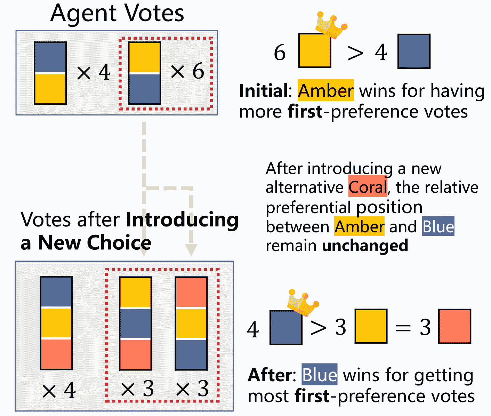

Figure 8: An example of plurality voting (the choice with the most first-preference votes wins) violating Independence from Irrelevant Alternatives (IIA) criterion. Initially, Amber wins for two more first-preference votes. However, after introducing a new choice Coral, while the relative preferential position between Amber and Blue remain unchanged, Blue wins for getting one more first-preference vote than other two options.

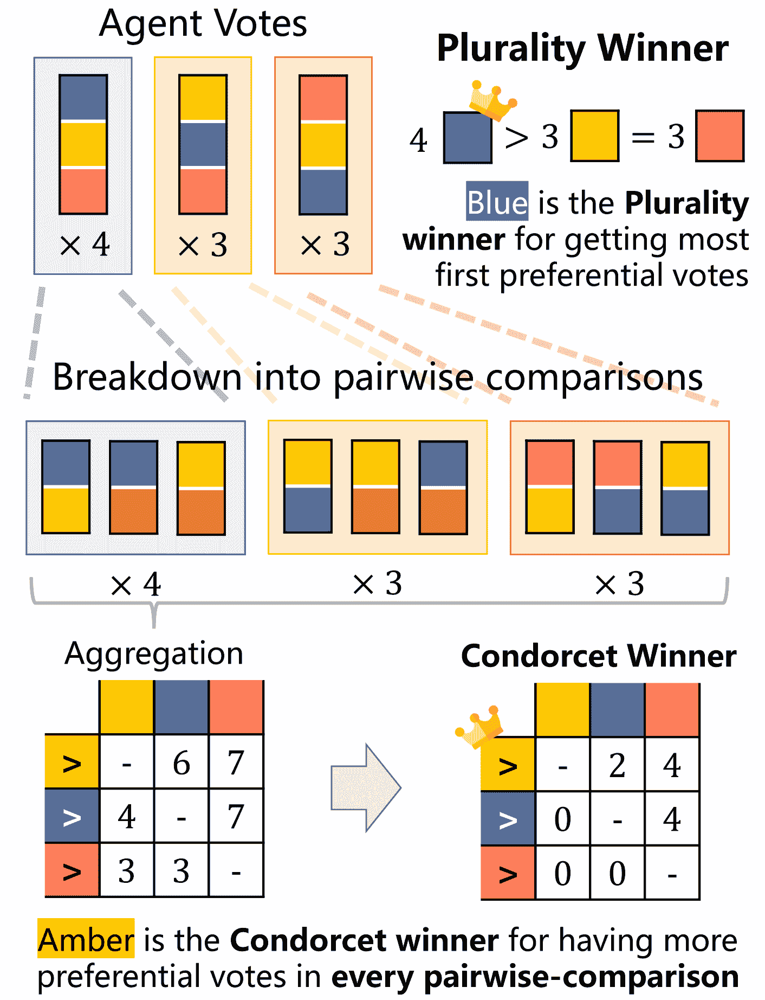

Figure 9: An example of plurality voting violating Condorcet criterion. While Blue is the plurality winner for getting the most first-preference votes, Amber is actually the Condorcet Winner, meaning that Amber gets more preferential votes in every pairwise-comparison with other alternatives. This misalignment is due to that plurality voting takes only first-preference into account.

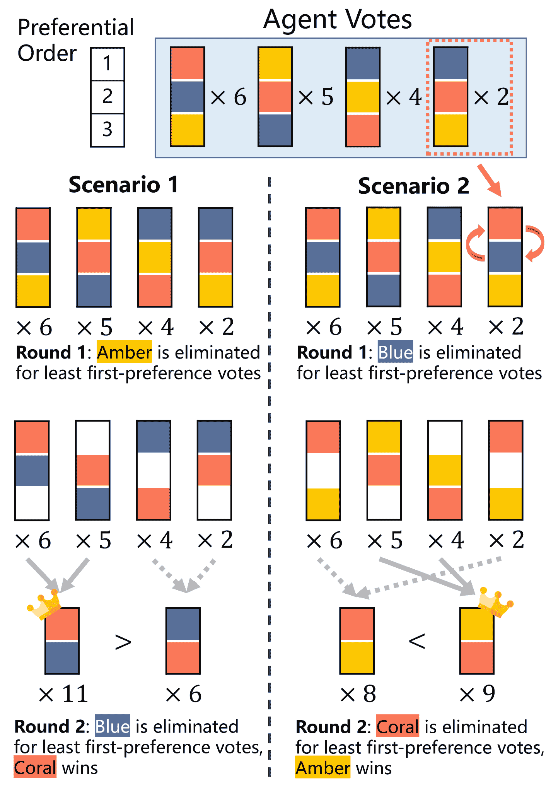

Figure 10: An example of violating monotonicity criterion Woodall ([1997](https://arxiv.org/html/2410.15168v1#bib.bib83)) in preferential instant-runoff voting (IRV): repeatedly eliminating the option with the least first preference votes each round until a winner is left. In Scenario 2 (right), two agents alter their votes by putting Coral first, but this ‘favorable’ action actually harms Coral and prevent it from supposed winning.

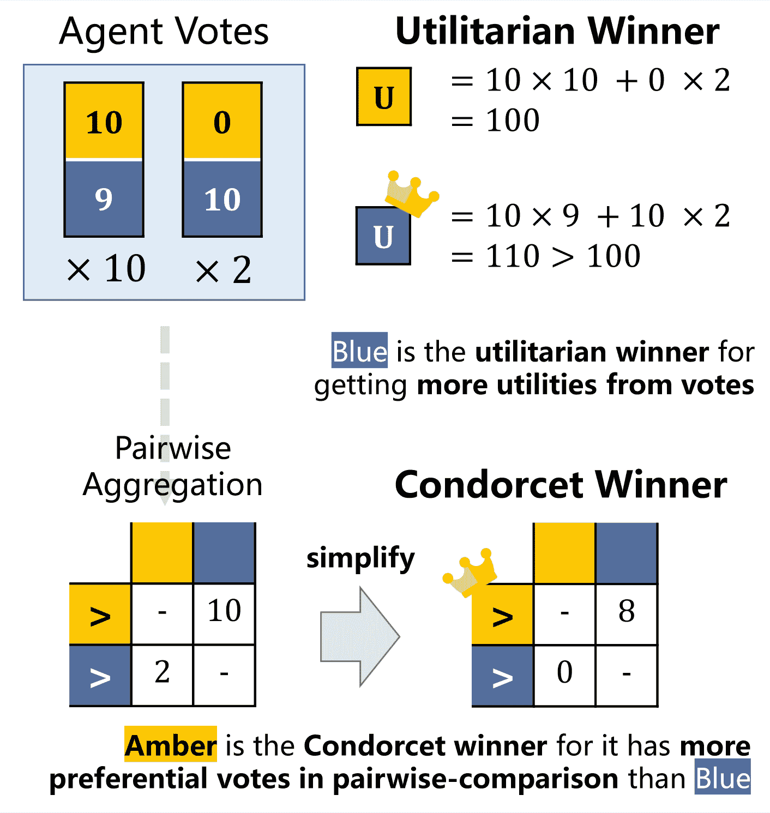

Figure 11: An example of utilitarian method violating Majority and Condorcet criteria. Blue is the utilitarian winner for getting more utilities from votes, but Amber is preferred by the majority of the agents (10 out of 12). In addition, Amber is also the Condorcet Winner, meaning that Amber gets more preferential votes in pairwise-comparison with other alternatives.