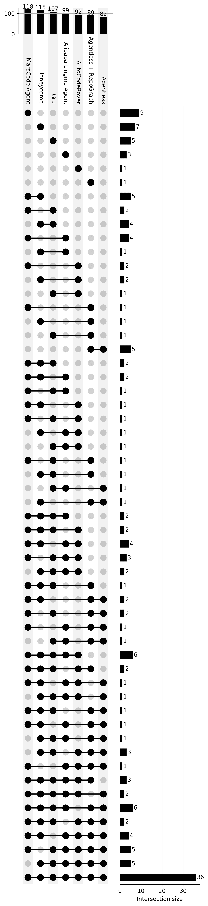
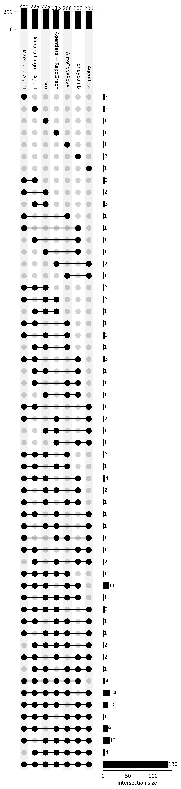
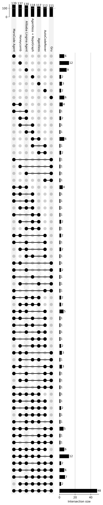

<!--yml

分类: 未分类

日期: 2025-01-11 11:55:39

-->

# 基于大语言模型（LLM）的自动修复缺陷智能体的实证研究

> 来源：[https://arxiv.org/html/2411.10213/](https://arxiv.org/html/2411.10213/)

Xiangxin Meng [mengxiangxin.1219@bytedance.com](mailto:mengxiangxin.1219@bytedance.com) 字节跳动 北京 中国, Zexiong Ma [mazexiong@bytedance.com](mailto:mazexiong@bytedance.com) 字节跳动 & 北京大学 北京 中国, Pengfei Gao [gaopengfei.se@bytedance.com](mailto:gaopengfei.se@bytedance.com) 字节跳动 北京 中国 和 Chao Peng [pengchao.x@bytedance.com](mailto:pengchao.x@bytedance.com) 字节跳动 北京 中国

###### 摘要。

大语言模型（LLM）和基于LLM的智能体已被应用于自动修复缺陷，展示了通过与开发环境互动、反复验证和代码修改来解决软件缺陷的能力。然而，关于这些智能体系统与非智能体系统的系统性分析仍然有限，特别是在顶级表现系统之间的性能差异方面。本文在SWE-bench Lite基准测试上考察了七个专有和开源系统用于自动修复缺陷。我们首先评估了每个系统的整体表现，注意到有些实例可以通过所有系统解决，而有些实例则无法通过任何系统解决，并探讨了为何某些实例仅能通过特定类型的系统解决。我们还比较了文件和行级别的故障定位准确性，并评估了缺陷重现能力，识别出只有通过动态重现才能解决的实例。通过分析，我们得出结论，LLM本身以及智能体流设计都需要进一步优化，以提高智能体在缺陷修复中的有效性。

## 1\. 引言

大型语言模型（LLMs）（Zhao et al., [2023](https://arxiv.org/html/2411.10213v1#bib.bib61)）是经过大量文本数据训练的先进机器学习模型，能够理解并生成类似人类的文本。基于LLM的智能体（Xi et al., [2023](https://arxiv.org/html/2411.10213v1#bib.bib49)）是利用大型语言模型与环境交互并完成特定任务的系统。最近，基于LLM的智能体在代码库中的自动化 bug 修复方面表现出了显著影响（Kang et al., [2023](https://arxiv.org/html/2411.10213v1#bib.bib15)；Zhang et al., [2024](https://arxiv.org/html/2411.10213v1#bib.bib60)；Yang et al., [2024a](https://arxiv.org/html/2411.10213v1#bib.bib53)）。得益于LLM强大的自然语言处理能力，这些智能体能够高效地理解和分析源代码及其相关的自然语言描述，如用户提交的问题描述和代码注释。此外，通过与本地环境的动态交互（例如，通过终端），基于LLM的智能体可以从代码库中检索有用的信息，进行代码编辑和执行，并迭代验证修复结果，从而提高 bug 修复的准确性和效率。这种LLM与环境反馈的结合，使得自动化 bug 修复比以往更加高效和可行，为软件维护和开发提供了革命性的全新工具。

来自工业界（Liu et al., [2024a](https://arxiv.org/html/2411.10213v1#bib.bib27)；hon, [[n. d.]](https://arxiv.org/html/2411.10213v1#bib.bib2)；gru, [[n. d.]](https://arxiv.org/html/2411.10213v1#bib.bib3)；Ma et al., [2024](https://arxiv.org/html/2411.10213v1#bib.bib29)）和学术界（Zhang et al., [2024](https://arxiv.org/html/2411.10213v1#bib.bib60)；Tao et al., [2024](https://arxiv.org/html/2411.10213v1#bib.bib40)）的研究人员开发了基于LLM的智能体系统，用于定位和修复代码库中的bug。为了评估LLM和各种智能体系统的故障定位与修复能力，Jimenez等人（Jimenez et al., [2023](https://arxiv.org/html/2411.10213v1#bib.bib14)）提出了评估数据集SWE-bench，并派生出了SWE-bench Lite（完整基准的子集）和SWE-bench Verified（最近发布的SWE-bench人工注释子集）。这些数据集包含来自代码库的真实bug，并且可以通过单元测试验证智能体生成的修复补丁的正确性。最近，这些数据集已成为自动化bug修复领域最具影响力的基准，吸引了学术界和工业界的参与者在SWE-bench Lite排行榜上竞争¹¹1[https://www.swebench.com/](https://www.swebench.com/)，并且通常每一到两周就会有新的提交。

然而，目前没有研究系统地分析基于 LLM 的 Agent 的故障定位和修复能力，或者分析这些 Agent 系统中不同工具之间的性能差异。关于 SWE-bench Lite 数据集本身，由于问题描述的质量和与缺陷相关的逻辑依赖的复杂性，基准中的一些实例对于 Agent 更容易修复，而另一些则更难修复（Xia 等，[2024](https://arxiv.org/html/2411.10213v1#bib.bib50)）。至于系统的设计，不同的设计展现了不同的规划、推理和问题解决能力，即一些系统采用静态方法（gru，[[n. d.]](https://arxiv.org/html/2411.10213v1#bib.bib3)），而另一些则采用动态方法（Zhang 等，[2024](https://arxiv.org/html/2411.10213v1#bib.bib60)）。我们还观察到，每个系统能够解决的案例集存在显著差异。因此，分析基于 LLM 的 Agent 在特定实例上的解决能力，不仅有助于我们更好地理解 Agent 当前的性能，还能提供比较性见解，激发未来的研究方向。

我们收集了四个最杰出的商业系统（即 MarsCode Agent（Liu 等，[2024a](https://arxiv.org/html/2411.10213v1#bib.bib27)），Honeycomb（hon，[[n. d.]](https://arxiv.org/html/2411.10213v1#bib.bib2)），Gru（gru，[[n. d.]](https://arxiv.org/html/2411.10213v1#bib.bib3)），阿里巴巴 Lingma Agent（Ma 等，[2024](https://arxiv.org/html/2411.10213v1#bib.bib29)））和三个最优秀的开源系统（即 AutoCodeRover（Zhang 等，[2024](https://arxiv.org/html/2411.10213v1#bib.bib60)），Agentless + RepoGraph（Ouyang 等，[2024](https://arxiv.org/html/2411.10213v1#bib.bib36)），Agentless（Xia 等，[2024](https://arxiv.org/html/2411.10213v1#bib.bib50)）），它们在 SWE-bench Lite Leaderboard 上表现出色，并进行了全面的性能差异分析。首先，我们评估了基于 LLM 的 Agent 在修复 bug 方面的整体性能，包括所有七个系统能够解决的实例以及所有系统都无法解决的实例的统计数据，并分析了这些结果背后的原因。我们还探讨了为何一些实例只能由 Agent 系统解决，而其他实例只能由非 Agent 系统解决。接下来，我们调查了不同系统在故障定位方面的性能差异及其原因，并编制了文件级和行级定位准确率。最后，我们分析了 bug 复现对 bug 修复的影响，以及那些只能通过动态复现解决的实例的共同特征。

通过数据分析，我们总结了若干见解。为了改进修复错误，必须增强模型的推理能力，使其能够准确识别问题中的与错误相关的信息，并减少噪声干扰。对于多个潜在修复位置，模型应利用其推理能力确定最相关的位置。从智能体流程的角度来看，应该更加关注问题的质量，并关注堆栈跟踪中的多个可疑位置。设计应包括验证补丁完整性的机制，并考虑其全局影响。还应实施机制，以减轻模型输出的随机性或有效利用其多样性。在错误定位中，达到行级准确性比文件级更为关键，因为发现空间更大，需要更精细的结果。在重现过程中，确保重现的正确性至关重要，因为错误的重现可能导致整个解决过程失败。

新颖性与贡献 据我们所知，这是首次进行以下工作：

1.  (1)

    研究基于LLM的智能体在代码库自动修复中的有效性

1.  (2)

    研究不同基于LLM的智能体在故障定位中的有效性，并分析它们差异的原因

1.  (3)

    研究错误重现对基于LLM的智能体修复效果的影响

1.  (4)

    总结基于LLM的智能体在错误修复中的当前问题和未来研究方向

论文组织 本论文的其余部分组织如下：第[2](https://arxiv.org/html/2411.10213v1#S2 "2\. Background ‣ An Empirical Study on LLM-based Agents for Automated Bug Fixing")节解释背景。第[3](https://arxiv.org/html/2411.10213v1#S3 "3\. Study Design ‣ An Empirical Study on LLM-based Agents for Automated Bug Fixing")节描述研究设计。第[4](https://arxiv.org/html/2411.10213v1#S4 "4\. Analysis & Results ‣ An Empirical Study on LLM-based Agents for Automated Bug Fixing")节展示分析结果和发现。第[5](https://arxiv.org/html/2411.10213v1#S5 "5\. Discussion ‣ An Empirical Study on LLM-based Agents for Automated Bug Fixing")节讨论分析结果和发现。第[6](https://arxiv.org/html/2411.10213v1#S6 "6\. Threats to Validity ‣ An Empirical Study on LLM-based Agents for Automated Bug Fixing")节报告有效性威胁。第[7](https://arxiv.org/html/2411.10213v1#S7 "7\. Related Work ‣ An Empirical Study on LLM-based Agents for Automated Bug Fixing")节讨论相关工作，第[8](https://arxiv.org/html/2411.10213v1#S8 "8\. Conclusion ‣ An Empirical Study on LLM-based Agents for Automated Bug Fixing")节总结论文内容。

## 2\. 背景

本节首先介绍SWE-bench Lite，然后介绍领先的基于LLM的自动修复系统。

### 2.1\. SWE-bench Lite

SWE-Bench（Jimenez等，[2023](https://arxiv.org/html/2411.10213v1#bib.bib14)）是一个全面的基准测试，旨在评估大语言模型在复杂的真实世界软件工程任务中的表现，这些任务来自GitHub上的问题和相应的拉取请求，涵盖了12个流行的Python代码库。该基准测试解决了现有编码基准测试（如HumanEval（Chen等，[2021](https://arxiv.org/html/2411.10213v1#bib.bib7)））的局限性，通过提供要求模型理解并协调多个函数和文件之间更改的任务。该基准测试包含2,294个任务实例，强调了模型与执行环境交互和处理长上下文的需求，展示了真实世界软件工程问题对现有大语言模型的挑战。评估结果显示，即便是当时表现最好的模型（如Claude 2），成功率也仅为1.96%，显示出显著的改进空间。

由于SWE-bench的计算需求高且难度大，其中包含2,294个问题-提交对，涉及12个Python代码库，SWE-bench的作者们推出了SWE-bench Lite²²2[https://www.swebench.com/lite.html](https://www.swebench.com/lite.html)，该版本包括300个更易处理和自包含的实例，专注于功能性错误修复，覆盖了原始12个代码库中的11个。它保留了SWE-bench的多样性，但更容易进行评估。选择标准如下所示：

1.  (1)

    移除了包含图片、外部链接、提交SHA或引用的实例。

1.  (2)

    排除了40字以下的问题描述。

1.  (3)

    排除了编辑多个文件或包含超过三个编辑块的实例。

1.  (4)

    排除了涉及创建/删除文件或包含错误信息检查的实例。

1.  (5)

    从剩余实例中抽取了最后的300个测试实例和23个开发实例。

### 2.2\. 基于大语言模型的错误修复系统

基于LLM的Bug修复系统是建立在大型语言模型（LLM）基础上的系统，这些系统能够自动编辑代码库，根据问题报告修复bug。Bug修复是软件开发中一个高度资源密集的任务，开发人员需要重现问题报告中描述的bug，精确定位大型代码库中的有缺陷代码片段，理解错误的原因并实施修复。自动化bug修复长期以来在学术界和工业界都受到广泛关注。鉴于LLM所展示的强大逻辑推理和编码能力，许多研究探索了基于LLM的自动化bug修复工具的开发。本文研究了七个领先的基于LLM的Bug修复系统（四个商业系统 (Liu et al., [2024a](https://arxiv.org/html/2411.10213v1#bib.bib27); hon, [[n. d.]](https://arxiv.org/html/2411.10213v1#bib.bib2); gru, [[n. d.]](https://arxiv.org/html/2411.10213v1#bib.bib3); Ma et al., [2024](https://arxiv.org/html/2411.10213v1#bib.bib29)) 和三个开源系统 (Zhang et al., [2024](https://arxiv.org/html/2411.10213v1#bib.bib60); Xia et al., [2024](https://arxiv.org/html/2411.10213v1#bib.bib50); Ouyang et al., [2024](https://arxiv.org/html/2411.10213v1#bib.bib36)))，比较了它们在自动化bug修复中的系统设计和性能差异，分析了现有系统的不足和局限性，并为未来构建自适应、高可靠性的自动化bug修复系统提供了方向。

表格 [1](https://arxiv.org/html/2411.10213v1#S2.T1 "Table 1 ‣ 2.2\. Leading LLM-based Bug Fixing Systems ‣ 2\. Background ‣ An Empirical Study on LLM-based Agents for Automated Bug Fixing")展示了SWE-bench Lite上领先的基于LLM的bug修复系统。我们从三个角度对不同系统采用的故障定位技术进行了分类：（1）LLM的使用，（2）CodeGraph的使用，以及（3）软件分析技术的使用。我们还比较了不同系统是否使用重现技术进行补丁验证，并分析了补丁生成格式。接下来，我们将从技术角度介绍这些系统：

MarsCode Agent (Liu et al., [2024a](https://arxiv.org/html/2411.10213v1#bib.bib27)) 是由字节跳动开发的 bug 修复系统，结合了代码知识图谱、软件分析技术和 LLM。它使用重现代理自动重现问题报告中描述的 bug。该系统为代码仓库构建了代码知识图谱，并利用图推理、软件分析技术和 LLM 的推理能力实现精细化缺陷定位。Marscode Agent 使用 LLM 生成候选补丁，并根据重现脚本从中选择最终补丁。在 bug 修复任务中，它表现出了卓越的性能，达到了 SWE-bench Lite 排行榜上最高的解决率。

Honeycomb (hon, [[n. d.]](https://arxiv.org/html/2411.10213v1#bib.bib2)) 是由 Honeycomb 开发的基于代理的 bug 修复系统。它为 LLM 提供文件查看和编辑工具，使其能够尝试为所有问题构建重现脚本。该系统调用这些工具进行缺陷定位，并生成格式为 $(Line_{b},Line_{e},Replace)$ 的补丁。Honeycomb 中的工具设计相对简单，简化了 LLM 工具使用的决策过程，但这可能导致系统无法获得更精确的定位信息。Honeycomb 成功解决了 SWE-bench Lite 数据集中的 38.33% 问题。

Gru (gru, [[n. d.]](https://arxiv.org/html/2411.10213v1#bib.bib3)) 是由 Gru 开发的基于工作流的 bug 修复系统。它首先使用 LLM 选择与问题相关的文件，然后 LLM 决定哪些文件需要修改以及如何修改。它生成格式为 $(Line_{b},Line_{e},Replace)$ 的补丁，在 LLM 审核补丁后，补丁会被应用到仓库中。Gru 不包括重现模块，成功解决了 SWE-bench Lite 数据集中的 35.67% 问题。

Alibaba Lingma Agent (Ma et al., [2024](https://arxiv.org/html/2411.10213v1#bib.bib29)) 是由阿里巴巴开发的 bug 修复系统，结合了代码知识图谱和 LLM。它为代码仓库构建了代码知识图谱，并利用 LLM 基于问题信息执行蒙特卡洛树搜索，定位整个仓库中与问题相关的代码片段。这种方法有效缓解了 LLM 支持的短上下文问题，但对 LLM 的推理能力要求较高。它以搜索/替换格式生成补丁，对于某些问题，还使用重现脚本验证补丁。Alibaba Lingma Agent 成功解决了 SWE-bench Lite 数据集中的 33.00% 问题。

AutoCodeRover (Zhang et al., [2024](https://arxiv.org/html/2411.10213v1#bib.bib60))，一个结合了LLM与软件分析技术的缺陷修复系统。它使用基于谱的故障定位（SBFL）进行缺陷定位，向LLM提供可能与问题相关的函数，LLM随后生成修补程序进行缺陷修复。AutoCodeRover的定位过程具有更强的可解释性；然而，它需要执行失败的单元测试，且其定位效果依赖于测试用例的质量。在实际开发中，如果缺少测试，它可能难以准确定位缺陷。AutoCodeRover成功解决了SWE-bench Lite数据集中30.67%的问题。

Agentless (Xia et al., [2024](https://arxiv.org/html/2411.10213v1#bib.bib50))，一个基于工作流的两阶段缺陷修复系统。它直接使用LLM按顺序执行文件、函数和行的定位。首先，它列出代码库的文件结构，允许LLM根据项目结构选择与问题最相关的文件。然后，它列出文件框架（包括类名、函数声明等），并使用LLM识别与问题最相关的函数。接着，模型根据函数内容定位需要修改的具体行。确定所需的行后，Agentless将这些行的上下文提供给模型，模型生成多个候选修补程序，格式为搜索/替换。最终的修补程序通过多数投票策略选择。Agentless通过一种简化的工作流方法实现了自动化缺陷修复；然而，由于缺乏自主决策过程以及定位阶段信息缺失，其定位性能受限。Agentless成功解决了SWE-bench Lite数据集中27.33%的问题。

Agentless + RepoGraph (Ouyang et al., [2024](https://arxiv.org/html/2411.10213v1#bib.bib36))，一个结合了代码知识图谱和Agentless方法的缺陷修复系统。它为代码库构建代码知识图谱，并为LLM提供基于图谱的检索接口，使用GRAG (Hu et al., [2024](https://arxiv.org/html/2411.10213v1#bib.bib12))从图谱中检索与问题相关的类/函数。然后，Agentless根据定位的代码片段生成修补程序，解决了Agentless定位阶段的信息丢失问题。然而，它在处理简短且缺少代码标识符的问题时表现较差，导致与商业代理系统相比存在差距。RepoGraph + Agentless成功解决了SWE-bench Lite数据集中29.67%的问题。

如表[1](https://arxiv.org/html/2411.10213v1#S2.T1 "表 1 ‣ 2.2\. 基于 LLM 的主流 Bug 修复系统 ‣ 2\. 背景 ‣ 基于 LLM 的自动化 Bug 修复代理的实证研究")所示，Marscode Agent 结合了三种定位策略，并利用重现进行补丁验证，达到了最先进的 Bug 修复性能。在本文中，我们将分析不同定位策略的定位准确性以及重现对最终补丁生成准确性的影响，为未来构建更可靠的 Bug 修复系统提供指导。

表 1. 基于 LLM 的主流 Bug 修复系统在 SWE-bench Lite 上的表现。

| 系统名称 | 类型 | %已解决 | 故障定位 | 重现 | 补丁生成格式 |
| --- | --- | --- | --- | --- | --- |
| 使用 LLM | CodeGraph | 软件分析 |
| MarsCode 代理 | 商业 | 39.33 | ✓ | ✓ | ✓ | ✓ | 搜索/替换 |
| 蜂巢 | 38.33 | ✓ | $\times$ | $\times$ | ✓ | ($Line_{b}$, $Line_{e}$, 替换) |
| Gru | 35.67 | ✓ | $\times$ | $\times$ | $\times$ | ($Line_{b}$, $Line_{e}$, 替换) |
| 阿里巴巴灵马代理 | 33.00 | ✓ | ✓ | $\times$ | ✓ | 搜索/替换 |
| AutoCodeRover | 开源 | 30.67 | ✓ | $\times$ | ✓ | ✓ | 搜索/替换 |
| 无代理 + RepoGraph | 29.67 | ✓ | ✓ | $\times$ | $\times$ | 搜索/替换 |
| 无代理 | 27.33 | ✓ | $\times$ | $\times$ | $\times$ | 搜索/替换 |

## 3\. 研究设计

在本节中，我们首先介绍研究问题，然后介绍数据收集。

### 3.1\. 研究问题

RQ1\. 系统有效性：基于 LLM 的代理在代码库中的自动 Bug 修复效果如何？

动机：在 SWE-bench Lite 排行榜中，各系统的解决率差异显著，而且每个系统能够解决和无法解决的实例也存在较大差异。这种差异通常是由于问题描述的质量以及系统本身设计的差异。当问题描述的质量足够高时，我们期望基于 LLM 的代理能够解决该问题。因此，有必要分析为什么某些具有高质量问题描述的实例未能成功修复，而一些问题描述质量较低的实例却得以解决。此外，基于代理和非代理系统的实现存在显著差异，值得研究它们在解决能力上的差异。

方法：我们将分析不同系统解决的实例差异，展示所有系统共同解决了多少实例，以及哪些实例没有被任何系统解决。然后，基于Agentless[]提出的评估问题描述的标准，我们将对每个实例的问题描述质量进行评分，其中较高的分数表示更高质量的问题描述。接着，我们将调查为什么许多高分问题无法被任何系统解决，而一些低分问题却能被所有工具解决。此外，我们将检查那些所有Agent系统能解决但非Agent系统无法解决的实例特征，以及那些所有非Agent系统能解决但Agent系统无法解决的实例特征。

研究问题2\. FL的有效性：不同系统在故障定位中的表现如何？它们差异的原因是什么？

动机：故障定位是修复缺陷的关键步骤，因为故障定位越准确，成功修复缺陷的概率就越高。因此，我们需要研究不同系统之间故障定位有效性的差异。

方法：基于真实情况，我们将统计每个系统在每个SWE-bench Lite实例中成功定位的故障文件比例和成功定位的故障行比例。

研究问题3\. 重现的有效性：不同系统中的缺陷重现如何影响缺陷修复性能？

动机：缺陷重现是修复缺陷的重要步骤，也是动态调试的关键部分。其作用体现在两个方面。首先，通过运行缺陷重现脚本得到的错误信息可以用于故障定位。其次，缺陷重现脚本可用于验证最终生成的修复补丁。缺陷重现脚本的质量越高，它能提供给Agent的信息就越准确，从而提高成功修复缺陷的概率。因此，我们需要研究缺陷重现对缺陷修复的影响。

方法：我们将统计每个系统生成的重现脚本的采纳率，提供缺陷重现对缺陷修复影响的比较。此外，我们将分析仅能通过重现脚本参与的案例，以及缺陷重现对缺陷修复产生负面影响的案例。

### 3.2\. 数据收集

在RQ1中，我们设计了一个基于五个指标和Agentless提供的相应候选值的评分系统，从多个维度评估不同问题集的质量。在RQ2中，我们对不同工具生成的补丁进行了反向分析，从而提供了每个工具在故障定位中的无偏评估。在RQ3中，为了确定不同系统在其轨迹中的重现使用情况，我们首先通过关键词匹配“reproduce”和人工分析，识别出Agentless、RepoGraph+Agentless和Gru为不支持重现的系统。然后，对于剩余的四个系统，我们利用不同的启发式规则来识别重现脚本的构建。

## 4\. 分析与结果

我们将依次呈现RQ1到RQ3的分析结果和见解。

### 4.1\. RQ1：系统的有效性

我们分析了每个工具单独能解决的案例版本，以及每个工具能够解决的案例之间的差异，如图[1](https://arxiv.org/html/2411.10213v1#S4.F1 "图 1 ‣ 4.1\. RQ1：系统的有效性 ‣ 4\. 分析与结果 ‣ 基于LLM的自动化bug修复代理的实证研究")-(a)所示。图中上方的柱状图显示了每个工具在SWE-bench Lite中能够解决的案例数量。具体来说，从低到高依次为：Agentless、Agentless+RepoGraph、AutoCodeRover、阿里巴巴Lingma Agent、Gru、Honeycomb和MarsCode Agent，分别解决了82、89、92、99、107、115和118个案例。MarsCode Agent表现最佳，较Agentless提高了43.9%的性能，解决了SWE-bench Lite中300个案例的39.3%。与过去十年流行的APR基准Defects4J相比，SWE-bench Lite引入了更严格的使用协议，禁止参与者利用由密切相关的失败测试用例生成的动态评估结果作为反馈信息来过滤补丁。此测试用例集只能在补丁生成过程结束后作为质量标准使用。在这种背景下，许多基于动态测试执行信息的错误定位方法——如基于光谱和基于突变的错误定位方法——无法使用，进一步增加了问题检测和解决的复杂性。这一严格协议无疑与现实世界开发场景更为契合，在这些场景中，修复工具必须几乎完全依赖用户提出的问题和当前代码库的状态来制定解决方案。在这种背景下，MarsCode能够解决39.3%的案例，凸显了其在现实开发环境中的先进能力和实用性。

(a) 问题解决任务

(b) 文件级FL任务

(c) 行级FL任务

图1. 最先进技术在问题解决和故障定位任务中的性能分析，其中FL表示故障定位。

表2. 问题质量指标（REs表示可复现示例，NL表示自然语言）。

| 指标 | 指标描述 | 候选工具 | 分数 |
| --- | --- | --- | --- |
| 可复现示例质量 | 该指标表示每个问题描述中是否包含足够的信息来执行所需任务。 | 包含可复现示例 | 10.00 |
|  |  | 包含部分可复现示例 | 6.67 |
|  |  | 自然语言中的信息 | 3.33 |
|  |  | 信息不足 | 0.00 |
| 解决方案质量 | 该指标表示问题的解决方案或步骤是否已在问题描述中提供。 | 精确修补 | 10.00 |
|  |  | 完整的自然语言步骤 | 7.50 |
|  |  | 自然语言中的某些步骤 | 5.00 |
|  |  | 无解决方案 | 2.50 |
|  |  | 误导性信息 | 0.00 |
| 错误位置质量（文件/函数/行） | 该指标表示问题描述中是否包含正确的错误位置（文件/函数/行）信息。 | 堆栈跟踪 | 10.00 |
|  |  | 关键词 | 6.67 |
|  |  | 自然语言 | 3.33 |
|  |  | 无信息 | 0.00 |

在图[1](https://arxiv.org/html/2411.10213v1#S4.F1 "图 1 ‣ 4.1\. RQ1: 系统的有效性 ‣ 4\. 分析与结果 ‣ 基于LLM的自动化修复错误代理的实证研究")-(a)中，工具名称下方的直方图（称为Part-I）展示了不同工具组合可以解决的案例版本。每一行表示通过标记为黑点的工具可以解决的案例版本数量，而标记为灰点的工具无法解决这些案例。例如，在第一行中，只有MarsCode被标记为黑点，而其他六个工具被标记为灰点，表明MarsCode能够解决其他六个工具无法处理的9个独特案例。类似地，第七行显示MarsCode和Honeycomb可以一起解决5个其他五个工具无法处理的案例。最后一行显示所有七个工具可以共同解决36个案例。接下来的部分将从多个角度分析图中展示的统计结果。

案例可解性分析。在SWE-bench Lite的300个案例中，168个案例至少可以通过七个工具中的一个解决（代表图[1](https://arxiv.org/html/2411.10213v1#S4.F1 "Figure 1 ‣ 4.1\. RQ1: Effectiveness of Systems ‣ 4\. Analysis & Results ‣ An Empirical Study on LLM-based Agents for Automated Bug Fixing")-(a)中第II部分所有值的总和），而132个案例则未被任何工具解决（在图中未显示，构成168个可解案例的补集）。此外，36个案例可以被所有七个工具解决（由第II部分最后一行表示）。我们假设，这36个普遍可解案例的问题描述通常质量较高，而这132个未能被任何工具解决的案例则可能存在较低质量的问题描述。为了验证这一假设，我们使用Agentless提供的五个指标进行了问题质量差异的显著性分析，详细内容见表[2](https://arxiv.org/html/2411.10213v1#S4.T2 "Table 2 ‣ 4.1\. RQ1: Effectiveness of Systems ‣ 4\. Analysis & Results ‣ An Empirical Study on LLM-based Agents for Automated Bug Fixing")（其中bug位置由三个指标表示：文件、函数和行）。对于每个指标，Agentless提供了代表信息完整性的候选值，我们按信息完整性降序排列在第三列中。然后，我们对候选值进行了10分制评分，均匀分配分数，以便进一步分析。例如，对于可重现示例的质量指标，我们对“包含REs”（最高信息完整性）赋予10分，对“包含部分REs”（适中完整性）赋予6.67分，对“自然语言中的信息”赋予3.33分，对“信息不足”赋予0分。尽管候选值在不同指标之间有所不同，但我们确保所有指标的评分范围从0到10，以便进行跨指标的可比性分析。特别地，对于解决方案质量指标，我们将“误导性”候选项（即问题描述包含误导性信息）排在最低位置，因为我们认为它比“无解决方案”更具危害性。需要注意的是，每个案例的指标已经在Agentless的开源文档中进行了手动分析。我们的方法在此基础上，通过为每个候选值分配分数，以促进对问题质量的进一步分析。

为了检验我们假设的有效性，我们计算了两个案例集中的五个指标的平均值：一个是132个无法通过任何工具解决的案例集（称为“无人解决集”），另一个是36个可以通过所有工具解决的案例集（称为“全能解决集”）。这些结果如表[3](https://arxiv.org/html/2411.10213v1#S4.T3 "Table 3 ‣ 4.1\. RQ1: Effectiveness of Systems ‣ 4\. Analysis & Results ‣ An Empirical Study on LLM-based Agents for Automated Bug Fixing")所示。对于每个指标，得分越高表明相应的漏洞描述提供了更完整、更详细的信息。显然，所有五个指标在全能解决集中得分普遍高于无人解决集。这表明，问题的质量显著影响解决方法的有效性，强调了从一开始就制定清晰、全面的问题描述以提高解决率的重要性。

在对两个案例集中每个指标的表现进行详细分析时，最显著的差异出现在行级位置质量指标上，全能解决集的平均得分是无人解决集的27.8倍。这表明，至少在SWE-bench Lite数据集内，提供行级位置的信息显著提高了修复工具的解决率。其次，描述中的解决方案质量指标的差异也较为显著，两者的平均得分差为2.13倍，表明根据观察到的症状建议正向修改也能大大提升工具的可解性。紧随其后的是功能级和文件级位置的指标，得分差分别为1.66倍和1.47倍，这表明随着漏洞位置的粒度变粗，其对修复工具的帮助也随之减少——这一发现符合直觉预期。最后，可复现示例质量的得分差仅为1.1倍，表明该指标的完整性对提升修复工具的可解性影响相对较小。

在上述分析中，我们通过计算“全解集合”和“无解集合”中五个指标的差异，验证了我们的假设，显示了解决和未解决案例之间在问题质量上的明显差异。这反映出一个总体趋势，尽管可能存在一些异常值。一方面，我们观察到“无解集合”中有几个高分案例；我们旨在调查，尽管这些问题中信息相对完整，为什么没有工具能够解决它们。另一方面，我们还在“全解集合”中发现了一些低分案例，这可能进一步凸显了修复工具独立查找和收集必要信息的能力。为此，我们收集了“无解集合”中五个指标平均分数最高的前五个案例，以及“全解集合”中五个指标平均分数最低的五个案例，如表[3](https://arxiv.org/html/2411.10213v1#S4.T3 "表3 ‣ 4.1\. RQ1: 系统有效性 ‣ 4\. 分析与结果 ‣ 基于LLM的自动化错误修复代理的实证研究")所示。

表3. 全解案例和无解案例的问题质量分析。

| 案例集合 |
| --- |

&#124; 质量 &#124;

&#124; 可重复 &#124;

&#124; 示例 &#124;

|

&#124; 质量 &#124;

&#124; 解决方案 &#124;

&#124; 解决方案 &#124;

|

&#124; 质量 &#124;

&#124; 文件级别 &#124;

&#124; 位置 &#124;

|

&#124; 质量 &#124;

&#124; 功能级别 &#124;

&#124; 位置 &#124;

|

&#124; 质量 &#124;

&#124; 行级别 &#124;

&#124; 位置 &#124;

|

&#124; 平均值 &#124;

&#124; 分数 &#124;

|

| --- | --- | --- | --- | --- | --- | --- |
| --- | --- | --- | --- | --- | --- | --- |

|

&#124; 无解集合 &#124;

&#124; 集合（132个案例） &#124;

| 6.46 | 2.67 | 2.95 | 1.67 | 0.05 | 2.76 |
| --- | --- | --- | --- | --- | --- |

|

&#124; 全解集合 &#124;

&#124; （36个案例） &#124;

| 7.22 | 5.69 | 4.35 | 2.78 | 1.39 | 4.29 |
| --- | --- | --- | --- | --- | --- |

|

&#124; 全解集合 / &#124;

&#124; 无解集合 &#124;

| 110% | 213% | 147% | 166% | 2780% | 155% |
| --- | --- | --- | --- | --- | --- |

表4. 在“无解集合”和“全解集合”中，排名前五的案例和排名后五的案例的分数。

| 无解集合 |
| --- |
| 案例ID |

&#124; 分数 &#124;

&#124; 可重复 &#124;

&#124; 示例 &#124;

|

&#124; 分数 &#124;

&#124; 解决方案 &#124;

&#124; 解决方案 &#124;

|

&#124; 分数 &#124;

&#124; 文件级别 &#124;

&#124; 位置 &#124;

|

&#124; 分数 &#124;

&#124; 功能级别 &#124;

&#124; 位置 &#124;

|

&#124; 分数 &#124;

&#124; 行级别 &#124;

&#124; 位置 &#124;

|

&#124; 平均值 &#124;

&#124; 分数 &#124;

|

| scikit-learn-25747 | 10 | 2.5 | 10 | 10 | 0 | 6.5 |
| --- | --- | --- | --- | --- | --- | --- |
| seaborn-3407 | 10 | 2.5 | 10 | 10 | 0 | 6.5 |
| django-15202 | 6.67 | 5 | 10 | 10 | 0 | 6.33 |
| scikit-learn-10508 | 10 | 5 | 10 | 6.67 | 0 | 6.33 |
| django-13660 | 3.33 | 7.5 | 10 | 10 | 0 | 6.17 |
| 全解集合 |
| django-12497 | 3.33 | 7.5 | 0 | 0 | 0 | 2.17 |
| django-11133 | 3.33 | 2.5 | 6.67 | 0 | 0 | 2.5 |
| pytest-7432 | 3.33 | 2.5 | 3.33 | 3.33 | 0 | 2.5 |
| pytest-5692 | 3.33 | 2.5 | 6.67 | 0 | 0 | 2.5 |
| django-16046 | 6.67 | 2.5 | 3.33 | 0 | 0 | 2.5 |

对于每个案例，我们检查了七个工具生成的执行轨迹，以分析它们能否解决各自的案例。由于篇幅限制，我们仅展示了在七种方法中更常见的发现：

scikit-learn-25747: 大多数方法成功地提取了相关的文件、函数，甚至包含错误行的细粒度代码片段，将其作为一组可疑元素进行故障定位。这主要是因为问题提供了高质量的描述，并且具备文件和函数级别的定位，得分为10。然而，未能解决该问题的主要原因在于故障定位模块识别的可疑元素数量过多（因为堆栈跟踪中的每个调用节点往往都被包括在内）。实际的错误位置深深嵌入在堆栈跟踪中，使得很难在排名靠前的元素中进行优先排序。这个问题考察了模型推断观察到的症状与错误根本原因之间关系的能力，而模型的推理能力仍然有限。此外，问题标题引用了与观察到的错误症状相关的代码元素（即堆栈跟踪中的入口点）。由于标题是问题的总结，它自然会吸引模型更多的关注，进一步强化了这个元素导致错误的印象。同时，在随后的修复阶段，工具受到大模型调用的时间和成本的限制，无法生成修复建议。资源可能会在第一个可疑位置上被完全消耗，从而限制了处理后续问题的机会。

seaborn-3407: 它未解决的原因与scikit-learn-25747几乎相同。

django-15202: 它未解决的原因与scikit-learn-25747几乎相同。

scikit-learn-10508：此问题需要在两个位置进行一致的修改才能解决。我们观察到，许多工具成功识别并修复了一个位置，而忽略了另一个位置。事实上，这两个需要修改的位置非常接近，位于同一函数内，且相隔仅约10行。然而，由于目前评估修复完整性的限制，工具通常倾向于生成一个表面上合理的解决方案。一旦通过了它们设计的验证过程——例如，使用自我反思代理批评补丁的合理性，或生成合理的重现脚本来验证模型生成的补丁——这些工具通常会最终确定补丁并结束解决过程。目前，模型在评估补丁响应问题的完整性方面表现有限。多项相关修改之间的语义关系可能在补丁生成过程中被忽视，而这些关系在后续的自我反思阶段也很难检测到。

django-13660：此问题未解决的主要原因是问题描述中提供了一个误导性的解决方案。具体来说，问题描述建议以下修复方法：“exec应传入一个包含最小全局变量集的字典。这可以通过将一个新的空字典作为exec的第二个参数传入来实现。”许多工具遵循了这一建议，基于此生成了补丁，主要是将“exec(options[’command’])”修改为“exec(options[’command’], )”，这与问题中建议的解决方案一致。然而，实际的补丁将语句替换为“exec(options[’command’], globals())”，其代码语义与建议的修复方法不同（如下代码框所示）。在无代理报告中，解决方案的质量评分为“在自然语言中完成的步骤”（表[4](https://arxiv.org/html/2411.10213v1#S4.T4 "Table 4 ‣ 4.1\. RQ1: Effectiveness of Systems ‣ 4\. Analysis & Results ‣ An Empirical Study on LLM-based Agents for Automated Bug Fixing")中的7.5分），而不是“误导性”评分（0分）。我们推测这可能是手动分析时的一个疏忽。

<svg class="ltx_picture" height="6003.72" id="S4.SS1.p13.pic1" overflow="visible" version="1.1" width="600"><g fill="#000000" stroke="#000000" stroke-width="0.4pt" transform="translate(0,6003.72) matrix(1 0 0 -1 0 0)"><g fill-opacity="1.0" transform="matrix(1.0 0.0 0.0 1.0 21.65 5985.52)"><foreignobject color="#FFFFFF" height="12.3" overflow="visible" transform="matrix(1 0 0 -1 0 16.6)" width="556.69">生成的补丁候选与人工编写的补丁的比较。</foreignobject></g> <g fill-opacity="1.0" transform="matrix(1.0 0.0 0.0 1.0 21.65 13.78)"><foreignobject color="#000000" height="5954.02" overflow="visible" transform="matrix(1 0 0 -1 0 16.6)" width="556.69"><svg class="ltx_picture" height="2966.56" id="S4.SS1.p13.pic1.1.1.1.1.1.1.1.1.1.1.1.1.1.1.1.1.1.p1.pic1" overflow="visible" version="1.1" width="600"><g fill="#000000" stroke="#000000" stroke-width="0.4pt" transform="translate(0,2966.56) matrix(1 0 0 -1 0 0)"><g fill-opacity="1.0" transform="matrix(1.0 0.0 0.0 1.0 21.65 2948.35)"><foreignobject height="12.3" overflow="visible" transform="matrix(1 0 0 -1 0 16.6)" width="556.69">Gru生成的补丁候选</foreignobject></g> <g fill-opacity="1.0" transform="matrix(1.0 0.0 0.0 1.0 21.65 13.78)"><foreignobject height="2916.85" overflow="visible" transform="matrix(1 0 0 -1 0 16.6)" width="556.69">[⬇](data:text/plain;base64,ZGlmZiAtLWdpdCBhL2RqYW5nby9jb3JlL21hbmFnZW1lbnQvY29tbWFuZHMvc2hlbGwucHkgYi9kamFuZ28vY29yZS9tYW5hZ2VtZW50L2NvbW1hbmRzL3NoZWxsLnB5Ci0tLSBhL2RqYW5nby9jb3JlL21hbmFnZW1lbnQvY29tbWFuZHMvc2hlbGwucHkKKysrIGIvZGphbmdvL2NvcmUvbWFuYWdlbWVudC9jb21tYW5kcy9zaGVsbC5weQpAQCAtODQsMTMgKzg0LDEzIEBAIGRlZiBweXRob24oc2VsZiwgb3B0aW9ucyk6CiAgICAgZGVmIGhhbmRsZShzZWxmLCAqKm9wdGlvbnMpOgogICAgICAgICAjIEV4ZWN1dGUgdGhlIGNvbW1hbmQgYW5kIGV4aXQuCiAgICAgICAgIGlmIG9wdGlvbnNbJ2NvbW1hbmQnXToKLSAgICAgICAgICAgIGV4ZWMob3B0aW9uc1snY29tbWFuZCddKQorICAgICAgICAgICAgZXhlYyhvcHRpb25zWydjb21tYW5kJ10sIHt9KQogICAgICAgICAgICAgcmV0dXJuCi4uLg==) 1diff  --git  a/django/core/management/commands/shell.py  b/django/core/management/commands/shell.py 2---  a/django/core/management/commands/shell.py 3+++  b/django/core/management/commands/shell.py 4@@  -84,13  +84,13  @@  def  python(self,  options): 5  def  handle(self,  **options): 6  #  执行命令并退出。 7  if  options[’command’]: 8-  exec(options[’command’]) 9+  exec(options[’command’],  {}) 10  return 11...</foreignobject></g></g></svg> <svg class="ltx_picture" height="2984.7" id="S4.SS1.p13.pic1.2.2.2.2.2.2.2.2.2.2.2.2.2.2.2.2.2.p2.pic1" overflow="visible" version="1.1" width="600"><g fill="#000000" stroke="#000000" stroke-width="0.4pt" transform="translate(0,2984.7) matrix(1 0 0 -1 0 0)"><g fill-opacity="1.0" transform="matrix(1.0 0.0 0.0 1.0 21.65 2964.95)"><foreignobject height="13.84" overflow="visible" transform="matrix(1 0 0 -1 0 16.6)" width="556.69">人工编写的补丁（地面真实情况）</foreignobject></g> <g fill-opacity="1.0" transform="matrix(1.0 0.0 0.0 1.0 21.65 13.78)"><foreignobject height="2933.46" overflow="visible" transform="matrix(1 0 0 -1 0 16.6)" width="556.69">[⬇](data:text/plain;base64,ZGlmZiAtLWdpdCBhL2RqYW5nby9jb3JlL21hbmFnZW1lbnQvY29tbWFuZHMvc2hlbGwucHkgYi9kamFuZ28vY29yZS9tYW5hZ2VtZW50L2NvbW1hbmRzL3NoZWxsLnB5Ci0tLSBhL2RqYW5nby9jb3JlL21hbmFnZW1lbnQvY29tbWFuZHMvc2hlbGwucHkKKysrIGIvZGphbmdvL2NvcmUvbWFuYWdlbWVudC9jb21tYW5kcy9zaGVsbC5weQpAQCAtODQsMTMgKzg0LDEzIEBAIGRlZiBweXRob24oc2VsZiwgb3B0aW9ucyk6CiAgICAgZGVmIGhhbmRsZShzZWxmLCAqKm9wdGlvbnMpOgogICAgICAgICAjIEV4ZWN1dGUgdGhlIGNvbW1hbmQgYW5kIGV4aXQuCiAgICAgICAgIGlmIG9wdGlvbnNbJ2NvbW1hbmQnXToKLSAgICAgICAgICAgIGV4ZWMob3B0aW9uc1snY29tbWFuZCddKQorICAgICAgICAgICAgZXhlYyhvcHRpb25zWydjb21tYW5kJ10sIGdsb2JhbHMoKSkKICAgICAgICAgICAgIHJldHVybgouLi4=) 1diff  --git  a/django/core/management/commands/shell.py  b/django/core/management/commands/shell.py 2---  a/django/core/management/commands/shell.py 3+++  b/django/core/management/commands/shell.py 4@@  -84,13  +84,13  @@  def  python(self,  options): 5  def  handle(self,  **options): 6  #  执行命令并退出。 7  if  options[’command’]: 8-  exec(options[’command’]) 9+  exec(options[’command’],  globals()) 10  return 11...</foreignobject></g></g></svg></foreignobject></g></g></svg><svg class="ltx_picture" height="156.09" id="S4.SS1.p14.pic1" overflow="visible" version="1.1" width="600"><g fill="#000000" stroke="#000000" stroke-width="0.4pt" transform="translate(0,156.09) matrix(1 0 0 -1 0 0)"><g fill-opacity="1.0" transform="matrix(1.0 0.0 0.0 1.0 21.65 13.78

上述分析涉及到 No-one-resolve 集合中的五个最高评分案例。接下来，我们将分析 All-resolve 集合中五个最低评分的案例。

django-12497：尽管此案例的问题描述没有提供详细的 bug 定位信息，但它提供了高质量的解决方案。基于该解决方案，修复工具逐步将 bug 定位到文件、函数和行级别，最终重用建议的解决方案生成了正确的补丁。根据表[3](https://arxiv.org/html/2411.10213v1#S4.T3 "Table 3 ‣ 4.1\. RQ1: Effectiveness of Systems ‣ 4\. Analysis & Results ‣ An Empirical Study on LLM-based Agents for Automated Bug Fixing")中的结论，由于这五个指标的完整性对问题解决的影响各不相同，具有相同总分但集中在更相关指标（例如行级定位和解决方案）上的案例往往更容易解决。

django-11133：所提供的补丁候选在与手动创建的补丁相同文件中的不同位置，但它同样通过了失败的测试。因此，在问题提供了高质量的文件级 bug 定位信息（6.67 分）后，缺少函数级和行级定位信息似乎并不关键。然而，同样重要的是要注意，虽然通过失败的测试并不总是等同于生成语义正确的补丁，正如第[6](https://arxiv.org/html/2411.10213v1#S6 "6\. Threats to Validity ‣ An Empirical Study on LLM-based Agents for Automated Bug Fixing")节中讨论的那样。

pytest-7432：补丁候选位于与手动创建的补丁相同函数中的不同位置，但它同样通过了失败的测试。在提供了部分文件级和函数级定位信息（每项得分 3.33 分）后，缺少行级信息似乎并不是一个显著的限制。

pytest-5692：尽管该问题只提供了文件级的 bug 定位信息，修复工具通过对问题的反复理解有效地细化了定位，最终确定了 bug 的行级位置并生成了正确的补丁。这表明模型和代理具备强大的信息识别能力，能够理解自然语言描述的问题，并通过多轮迭代提取高相关性的代码片段。

django-16046：它的解决原因几乎与 django-11133 相同。

<svg class="ltx_picture" height="172.69" id="S4.SS1.p21.pic1" overflow="visible" version="1.1" width="600"><g fill="#000000" stroke="#000000" stroke-width="0.4pt" transform="translate(0,172.69) matrix(1 0 0 -1 0 0)"><g fill-opacity="1.0" transform="matrix(1.0 0.0 0.0 1.0 21.65 13.78)"><foreignobject color="#000000" height="145.13" overflow="visible" transform="matrix(1 0 0 -1 0 16.6)" width="556.69">Insights(3)-(5): Overall, we derive three insights from the above case analyses: (3) Due to the varying impact of the completeness of these five metrics on issue resolution, cases with the same total score but concentrated in more relevant metrics (e.g., line-level location and resolve solution) tend to be easier to resolve. (4) The manually crafted patch may not be the only solution to the issue; multiple resolution strategies may exist. The model may attempt to generate a semantically correct or partially correct patch based on the suspicious locations already highlighted in the issue. (5) Large models and agents demonstrate strong capabilities for discovering relevant information. They can deeply analyze the natural language issue description, iteratively extracting high-relevance code segments over multiple interactions.</foreignobject></g></g></svg>

如图[1](https://arxiv.org/html/2411.10213v1#S4.F1 "Figure 1 ‣ 4.1\. RQ1: Effectiveness of Systems ‣ 4\. Analysis & Results ‣ An Empirical Study on LLM-based Agents for Automated Bug Fixing")所示，我们发现Agent系统与非Agent系统在解决案例方面存在显著差异。因此，我们分析了仅能通过Agent系统解决的案例与仅能通过非Agent系统解决的案例之间的差异。我们分析了两个只能通过无Agent解决的案例，具体是django-11422和sympy-24909。在django-11422中，Agent系统识别出了三个修复位置，但在修复过程中跳过了黄金补丁中的正确修复位置iter_all_python_module_files()。另一方面，无Agent系统在定位时仅选择了黄金补丁的位置，因此正确地修复了该问题。下图显示了两种系统在选择修复位置时的响应。

<svg class="ltx_picture" height="292.7" id="S4.SS1.p23.pic1" overflow="visible" version="1.1" width="600"><g fill="#000000" stroke="#000000" stroke-width="0.4pt" transform="translate(0,292.7) matrix(1 0 0 -1 0 0)"><g fill-opacity="1.0" transform="matrix(1.0 0.0 0.0 1.0 21.65 274.5)"><foreignobject color="#FFFFFF" height="12.3" overflow="visible" transform="matrix(1 0 0 -1 0 16.6)" width="556.69">MarsCode 代理与无代理的比较</foreignobject></g> <g fill-opacity="1.0" transform="matrix(1.0 0.0 0.0 1.0 21.65 13.78)"><foreignobject color="#000000" height="243" overflow="visible" transform="matrix(1 0 0 -1 0 16.6)" width="556.69"><svg class="ltx_picture" height="132.72" id="S4.SS1.p23.pic1.1.1.1.1.1.1.1.1.1.1.1.1.1.1.1.1.1.p1.pic1" overflow="visible" version="1.1" width="600"><g fill="#000000" stroke="#000000" stroke-width="0.4pt" transform="translate(0,132.72) matrix(1 0 0 -1 0 0)"><g fill-opacity="1.0" transform="matrix(1.0 0.0 0.0 1.0 21.65 114.52)"><foreignobject height="12.3" overflow="visible" transform="matrix(1 0 0 -1 0 16.6)" width="556.69">MarsCode 代理</foreignobject></g> <g fill-opacity="1.0" transform="matrix(1.0 0.0 0.0 1.0 21.65 13.78)"><foreignobject height="83.02" overflow="visible" transform="matrix(1 0 0 -1 0 16.6)" width="556.69">感谢您提供`iter_all_python_module_files()`的实现。看起来这个函数只遍历已加载的 Python 模块，这意味着 manage.py 不在其中，因为它没有作为模块被导入。想法：问题在于 manage.py 没有被加入到被监视的文件列表中。我们需要显式地将它添加到 reloader 中的 extra_files 集合里。让我们修改 `runserver` 命令，将 manage.py 添加到被监视的文件中。</foreignobject></g></g></svg> <svg class="ltx_picture" height="95.21" id="S4.SS1.p23.pic1.2.2.2.2.2.2.2.2.2.2.2.2.2.2.2.2.2.p2.pic1" overflow="visible" version="1.1" width="600"><g fill="#000000" stroke="#000000" stroke-width="0.4pt" transform="translate(0,95.21) matrix(1 0 0 -1 0 0)"><g fill-opacity="1.0" transform="matrix(1.0 0.0 0.0 1.0 21.65 77)"><foreignobject height="12.3" overflow="visible" transform="matrix(1 0 0 -1 0 16.6)" width="556.69">无代理</foreignobject></g> <g fill-opacity="1.0" transform="matrix(1.0 0.0 0.0 1.0 21.65 13.78)"><foreignobject height="45.51" overflow="visible" transform="matrix(1 0 0 -1 0 16.6)" width="556.69">为了解决这个问题，我们需要确保将 manage.py 文件包含在需要被监视的文件列表中。我们可以通过修改 `iter_all_python_module_files` 函数，显式地将 manage.py 文件包含进去。</foreignobject></g></g></svg></foreignobject></g></g></svg>

在sympy-24909中，我们还观察到，Agent系统和非Agent系统都正确地识别出了故障位置，即函数Prefix.__mul__。然而，LLM对如何修复该错误并不自信。由于Agent系统缺乏采样，它直接生成了一个错误的补丁。另一方面，非Agent系统进行了42次采样，并选择了最频繁出现的补丁，最终得到了正确的修改。

实例django-12453是一个所有Agent系统都能解决，但非Agent系统不能解决的例子。我们观察到，非Agent补丁与地面真实值非常接近，仅缺少了相关模块的导入。Agent通过多轮对话和工具调用，能够检测到缺失的依赖项，而非Agent系统仅生成了代码块，无法弥补缺失的依赖项。

<svg class="ltx_picture" height="106.28" id="S4.SS1.p26.pic1" overflow="visible" version="1.1" width="600"><g fill="#000000" stroke="#000000" stroke-width="0.4pt" transform="translate(0,106.28) matrix(1 0 0 -1 0 0)"><g fill-opacity="1.0" transform="matrix(1.0 0.0 0.0 1.0 21.65 13.78)"><foreignobject color="#000000" height="78.72" overflow="visible" transform="matrix(1 0 0 -1 0 16.6)" width="556.69">Insights(6)-(8): (6) The Agent system may fail to complete the repair due to an inability to select the correct repair location among multiple candidates. (7) Additionally, the lack of sampling in the Agent system leads to low diversity in the results, causing failure in repairs. (8) Non-Agent systems, on the other hand, may produce syntactically incorrect patches because they lack multi-turn dialogues and tool invocation.</foreignobject></g></g></svg>

### 4.2\. RQ2: FL的有效性

故障定位是解决问题的关键步骤；只有当故障代码元素被准确识别时，模型才能生成语义正确的补丁。在本RQ中，我们检查了七种方法在故障定位中的有效性。由于一些工具的运行轨迹缺乏明确的故障定位结果，或者提供的定位粒度不足——只提供文件级的错误位置，而没有更精细的函数或行级信息——我们使用最终提交补丁中的修改文件和行信息作为参考，公平地评估每种工具的定位能力。具体而言，我们从SWE-bench Lite网站下载了每个工具基准测试的最终补丁集，然后解析了格式化的补丁文件。从文件修改前（补丁前代码文件）的角度出发，我们记录了被修改的文件和行。我们对手工编写的补丁（地面真实值）也进行了相同的处理。

在获得上述处理后的数据后，我们创建了图 [1(b)](https://arxiv.org/html/2411.10213v1#S4.F1.sf2 "图1 ‣ 4.1\. RQ1: 系统的有效性 ‣ 4\. 分析与结果 ‣ 基于LLM的自动修复工具的实证研究")和图 [1(c)](https://arxiv.org/html/2411.10213v1#S4.F1.sf3 "图1 ‣ 4.1\. RQ1: 系统的有效性 ‣ 4\. 分析与结果 ‣ 基于LLM的自动修复工具的实证研究")，分别展示了在文件级和行级的故障定位命中率。这些图中不同模块的含义与图 [1(a)](https://arxiv.org/html/2411.10213v1#S4.F1.sf1 "图1 ‣ 4.1\. RQ1: 系统的有效性 ‣ 4\. 分析与结果 ‣ 基于LLM的自动修复工具的实证研究")类似，区别在于后者侧重于问题解决任务。对于文件级定位任务，由于SWE-bench Lite中的案例仅修改一个文件（即地面真相文件），而修复工具生成补丁时并不限于单一文件，因此如果补丁文件集包含地面真相文件，则视为文件命中。对于行级定位任务，我们将补丁中修改的行与地面真相行之间的重叠定义为命中。

基于这种命中定义，我们研究了七种工具的定位性能。如图 [1(a)](https://arxiv.org/html/2411.10213v1#S4.F1.sf1 "图1 ‣ 4.1\. RQ1: 系统的有效性 ‣ 4\. 分析与结果 ‣ 基于LLM的自动修复工具的实证研究")所示，MarsCode Agent在文件级定位任务中表现最佳，成功定位了239个案例。其后依次是阿里巴巴Lingma Agent、Gru、Agentless+RepoGraph、AutoCodeRover、Honeycomb，最后是Agentless，成功定位了206个案例。MarsCode Agent相比Agentless提升了16.0%。作为问题解决任务中排名最高和最低的工具，MarsCode Agent和Agentless在问题解决任务中的表现差距为43.9%，这一差距远大于它们在文件级定位任务中的差异。此外，Agentless+RepoGraph作为另一种非代理系统的代表，在文件级故障定位中排名第四，但在问题解决任务中排名第六。这些比较表明，文件级定位任务通常比随后的补丁生成任务更简单。此外，像MarsCode Agent这样的基于代理的修复方法在随后的补丁生成优化中表现更强。

然而，我们遇到了一个意外的结果：在问题解决任务中表现第二好的工具蜂窝（与 MarsCode 的差距最小），在文件级本地化方面表现不佳，排名第六，仅比排名最低的无代理多出两次命中。为进一步调查此问题，我们检查了这些工具在行级本地化中的表现。如图[1(c)](https://arxiv.org/html/2411.10213v1#S4.F1.sf3 "在图 1 ‣ 4.1\. RQ1: 系统效果 ‣ 4\. 分析与结果 ‣ 基于 LLM 的自动修复代理的实证研究")所示，MarsCode 仍然是最佳方法，而蜂窝紧随其后，落后仅两次命中。这表明，尽管蜂窝在文件级本地化中的表现不佳，但它在定位到的文件中的错误行命中率相对较高（137/208 = 65.9%）。因此，强大的行级本地化表现是蜂窝能够解决更多问题的主要原因。这进一步表明，行级本地化结果与后续的修复补丁生成过程的关联比文件级结果更为密切。因此，改善细粒度的行级本地化可能是提升端到端修复效果的关键，这与我们基于表[3](https://arxiv.org/html/2411.10213v1#S4.T3 "表 3 ‣ 4.1\. RQ1: 系统效果 ‣ 4\. 分析与结果 ‣ 基于 LLM 的自动修复代理的实证研究")的结论一致（即，行级位置指标在 All-resolve 集合和 No-one-resolve 集合之间显示出最显著的差异）。

总的来说，以上分析可以得出三个关键结论：（1）现有方法在文件级故障本地化方面已经取得了相对较强的表现，但在行级本地化任务中仍有改进的空间。（2）更细粒度的行级本地化结果与端到端问题解决的相关性更强。当工具能够准确识别错误的代码行时，生成正确的修复补丁变得更为可行。

<svg class="ltx_picture" height="120.19" id="S4.SS2.p6.pic1" overflow="visible" version="1.1" width="600"><g fill="#000000" stroke="#000000" stroke-width="0.4pt" transform="translate(0,120.19) matrix(1 0 0 -1 0 0)"><g fill-opacity="1.0" transform="matrix(1.0 0.0 0.0 1.0 21.65 13.78)"><foreignobject color="#000000" height="92.63" overflow="visible" transform="matrix(1 0 0 -1 0 16.6)" width="556.69">Insights(9)-(10): Overall, two key insights can be derived from the above analysis: (9) Existing methods have achieved relatively strong performance in file-level fault localization, but there remains room for improvement in line-level localization tasks. (10) Finer-grained line-level localization results are more closely correlated with end-to-end issue resolution. When erroneous code lines can be accurately identified by a tool, the generation of a correct patch becomes more feasible.</foreignobject></g></g></svg>

### 4.3\. RQ3: 复制效果

表 5. 基于 LLM 的领先自动修复系统在 SWE-Bench Lite 上的复制统计数据。#Resolved 表示成功解决的问题数量，#(Reproduced&Resolved) 表示在解决过程中成功解决并涉及到错误重现的问题数量。%(Reproduced&Resolved) 表示 #(Reproduced&Resolved) / #Resolved。

| 系统名称 | 类型 | 重现者 | #Resolved | #(Reproduced&Resolved) | %(Reproduced&Resolved) |
| --- | --- | --- | --- | --- | --- |
| MarsCode 代理 | 商业 | ✓ | 118 | 83 | 70.3 |
| 蜂窝 | ✓ | 115 | 115 | 100 |
| Gru | $\times$ | 107 | 0 | 0 |
| 阿里巴巴灵马代理 | ✓ | 99 | 12 | 12.1 |
| AutoCodeRover | 开源 | ✓ | 92 | 39 | 42.4 |
| 无代理 + RepoGraph | $\times$ | 89 | 0 | 0 |
| 无代理 | $\times$ | 82 | 0 | 0 |

我们分析了在SWE-Bench-Lite上评估的七个系统的轨迹，研究了不同系统中复现的使用情况，并分析了一些典型案例，以更深入地了解复现对bug修复成功率的影响，以及复现目前在系统中面临的挑战。[5](https://arxiv.org/html/2411.10213v1#S4.T5 "Table 5 ‣ 4.3\. RQ3: Effectiveness of Reproduction ‣ 4\. Analysis & Results ‣ An Empirical Study on LLM-based Agents for Automated Bug Fixing")表格展示了不同系统中复现使用情况的统计数据。系统Gru、Agentless和Agentless+RepoGraph不包含复现模块，而Marscode Agent、Honeycomb、Alibaba Lingma Agent和AutoCodeRover都采用了复现模块，在成功修复的bug中，它们分别对70.3%、100%、12.1%和42.4%的问题进行了bug复现。Marscode Agent、Alibaba Lingma Agent和AutoCodeRover根据问题决定是否进行bug复现，对于难以复现的bug，它们选择进行静态分析。而Honeycomb则要求LLM对所有问题都尝试进行bug复现。

通过分析和比较不同系统的轨迹，我们发现，当问题信息缺失时，复现可以为缺陷定位提供额外的信息，并有助于验证生成的候选补丁的准确性。我们的轨迹分析显示，在168个由至少一个系统解决的问题中，24个问题只能通过复现来解决。这24个实例通常只有简短的文本描述，简要概述了bug条件，仅凭文本很难进行缺陷定位。其中，20个实例在问题描述中包含了代码片段，帮助理解bug。例如，在sympy-15346中，问题仅包含简短的文本描述，后面跟着一个bug示例。仅凭文本定位缺陷是具有挑战性的。Marscode Agent根据问题中的示例实现了一个bug复现脚本，并根据复现结果逐步识别出缺陷位置，最终生成了正确的补丁。值得注意的是，在轨迹分析过程中，我们观察到Marscode Agent在运行复现脚本时最初难以准确定位缺陷位置。随后，它尝试在脚本中的不同点打印中间变量，并通过分析执行过程中输出的结果成功识别了缺陷位置。这进一步展示了基于代理的系统在bug修复中自治性的优势。

尽管重现可以提供额外的信息并验证候选补丁的正确性，但它并不总是能提高修复成功率。例如，在django-11422中，问题描述中提到的“Autoreloader”直接指向文件$autoreload.py$。通过使用如“跟踪更改”等问题信息，Agentless准确地定位了需要修改的代码片段并生成了正确的补丁。然而，像Marscode Agent和Honeycomb这样的系统在执行故障重现时，受到重现信息的干扰。重现使LLM的注意力从问题描述中转移，导致错误的缺陷原因定位，最终未能生成正确的补丁。

<svg class="ltx_picture" height="89.67" id="S4.SS3.p4.pic1" overflow="visible" version="1.1" width="600"><g fill="#000000" stroke="#000000" stroke-width="0.4pt" transform="translate(0,89.67) matrix(1 0 0 -1 0 0)"><g fill-opacity="1.0" transform="matrix(1.0 0.0 0.0 1.0 21.65 13.78)"><foreignobject color="#000000" height="62.11" overflow="visible" transform="matrix(1 0 0 -1 0 16.6)" width="556.69">Insights(11)-(12): (11) Reproduction can provide additional information for defect localization when issue information is lacking and help verify the accuracy of generated candidate patches. (12) When the issue description is already clear and precise, reproduction may mislead the LLM’s judgment, reducing its focus on the issue description.</foreignobject></g></g></svg>

## 5\. 讨论

### 5.1\. 大型语言模型

从大型语言模型（LLM）的角度来看，有必要进一步增强模型的推理能力，使其能够准确识别与问题相关的信息，从而减少噪声的干扰。此外，对于多个潜在的修复位置，模型应该利用其推理能力选择与问题最相关的位置。

### 5.2\. 代理流

从代理流的角度来看，代理特别需要关注问题的质量，并注意堆栈跟踪中的多个可疑位置。代理流设计应包括检查补丁完整性的机制，并考虑修复的全球影响。在使用模型的过程中，应该建立机制来避免模型输出的随机性，或充分利用模型输出的多样性。

在故障定位中，行级定位的准确性比文件级更为重要，因为行级的发现空间更大，需要更精细的定位结果。在重现过程中，必须加强对重现正确性的判断，因为错误的重现可能导致整个解决过程的失败。

## 6\. 有效性威胁

失败转通过测试：SWE-bench使用失败转通过（F2P）测试来验证生成补丁的正确性。然而，F2P测试可能不够全面，允许一个补丁通过F2P并被认为是正确的，而没有完全解决用户的问题。这是自动程序修复（APR）领域以及基于单元测试的LLM评估中的一个常见问题（Liu et al., [2024b](https://arxiv.org/html/2411.10213v1#bib.bib26)）。在这种情况下，我们假设只要补丁通过了F2P测试用例，就认为它是正确的。我们还呼吁学术界贡献力量，改进SWE-bench评估数据集中的测试用例，以使评估结果更加可靠。

LLM的不确定性：LLMs的输出是随机的，这导致其解决某个实例的结果具有概率性质。在这项工作中，我们直接分析了各种系统提交的修补程序和轨迹，假设提交给SWE-bench的结果代表了代理的最佳表现。此外，针对每个系统进行多次实验以消除随机性，在成本和可访问性方面是不可行的。

## 7. 相关工作

在本节中，我们讨论了大语言模型的基本概念及其在软件工程任务中的应用，特别是在故障定位和自动程序修复方面。我们还讨论了基于LLM的代理在软件工程中的最新进展。

### 7.1. 大语言模型

大语言模型（LLMs）是高度先进的预训练语言模型。这些模型首先在大量语料库上进行初步的无监督训练，然后针对特定任务进行微调，以提高性能。在自然语言处理（NLP）领域，LLMs已经广泛应用于各种任务，例如机器翻译（Wang et al., [2023d](https://arxiv.org/html/2411.10213v1#bib.bib43); Zhang et al., [2023b](https://arxiv.org/html/2411.10213v1#bib.bib57)）、文本摘要（Zhang et al., [2023c](https://arxiv.org/html/2411.10213v1#bib.bib59)）和分类（Mayer et al., [2023](https://arxiv.org/html/2411.10213v1#bib.bib31)）。

根据架构，语言模型可分为三类：仅编码器模型（Feng et al., [2020](https://arxiv.org/html/2411.10213v1#bib.bib10)）、仅解码器模型（Nijkamp et al., [2022](https://arxiv.org/html/2411.10213v1#bib.bib35)）和编码器-解码器模型（Tian et al., [2022](https://arxiv.org/html/2411.10213v1#bib.bib41)）。目前大多数用于代码的大语言模型采用变换器架构的编码器，这种架构以其卓越的学习能力和可扩展性而闻名。无论其架构如何，大多数模型都可以通过任务特定数据进行微调，以提升性能（Lin et al., [2023](https://arxiv.org/html/2411.10213v1#bib.bib24)）。

大型语言模型（LLMs）因其在代码生成和理解方面的出色表现，已成为各种软件工程任务中一种有前景的选择（Yang等人，[2023](https://arxiv.org/html/2411.10213v1#bib.bib54)）。研究人员和开发者已将LLMs应用于多个软件工程任务，如程序合成（Liu等人，[2024b](https://arxiv.org/html/2411.10213v1#bib.bib26)；Zhu-Tian等人，[2024](https://arxiv.org/html/2411.10213v1#bib.bib63)；Wang等人，[2023b](https://arxiv.org/html/2411.10213v1#bib.bib42)，[c](https://arxiv.org/html/2411.10213v1#bib.bib45)，[a](https://arxiv.org/html/2411.10213v1#bib.bib44)）、代码翻译（Yu等人，[2024](https://arxiv.org/html/2411.10213v1#bib.bib56)；Yang等人，[2024b](https://arxiv.org/html/2411.10213v1#bib.bib55)）、程序修复（Lin等人，[2024](https://arxiv.org/html/2411.10213v1#bib.bib25)；Jiang等人，[2023](https://arxiv.org/html/2411.10213v1#bib.bib13)；Xia等人，[2023](https://arxiv.org/html/2411.10213v1#bib.bib51)）、故障检测与定位（Du等人，[2024](https://arxiv.org/html/2411.10213v1#bib.bib9)；Qin等人，[2024](https://arxiv.org/html/2411.10213v1#bib.bib38)）、事件分析（Chen等人，[2024](https://arxiv.org/html/2411.10213v1#bib.bib8)；Ahmed等人，[2023](https://arxiv.org/html/2411.10213v1#bib.bib6)）、代码总结（Geng等人，[2024](https://arxiv.org/html/2411.10213v1#bib.bib11)）和测试（Sun等人，[2023](https://arxiv.org/html/2411.10213v1#bib.bib39)）。例如，Codex（Chen等人，[2021](https://arxiv.org/html/2411.10213v1#bib.bib7)）、StarCoder（Lozhkov等人，[2024](https://arxiv.org/html/2411.10213v1#bib.bib28)）和DeepSeek-Coder（Zhu等人，[2024](https://arxiv.org/html/2411.10213v1#bib.bib62)）是通过对大规模开源代码片段数据集进行广泛训练开发的著名代码专用LLMs。此外，像DeepSeek-Coder-Instruct（Zhu等人，[2024](https://arxiv.org/html/2411.10213v1#bib.bib62)）和Magicoder（Wei等人，[2023](https://arxiv.org/html/2411.10213v1#bib.bib47)）这样的指令跟随代码专用LLMs也已经通过指令微调方法开发出来，以提高其在编码任务中的实用性。

### 7.2\. 故障定位

故障定位（FL）（Wong 等人，[2016](https://arxiv.org/html/2411.10213v1#bib.bib48)）技术旨在发现和分析故障的位置和原因，通常分为动态和静态两种方法。动态 FL 技术，如基于谱的故障定位（SBFL）（Abreu 等人，[2007](https://arxiv.org/html/2411.10213v1#bib.bib5)，[2009](https://arxiv.org/html/2411.10213v1#bib.bib4)）和基于变异的故障定位（MBFL）（Papadakis 和 Le Traon，[2015](https://arxiv.org/html/2411.10213v1#bib.bib37)），分析程序的动态执行信息以确定故障位置，但它们资源消耗较大。静态 FL 技术（Mao 等人，[2014](https://arxiv.org/html/2411.10213v1#bib.bib30)）通过在错误报告或源代码级别进行语义或语法分析来确定故障位置，提供快速检测并消耗较少资源。先进的 FL 技术，如多重故障定位（MFL）和动态与静态方法的结合，已经出现，用于引导 APR 工具发现和修复更多错误（Xiao 等人，[2021](https://arxiv.org/html/2411.10213v1#bib.bib52)；Kim 等人，[2019](https://arxiv.org/html/2411.10213v1#bib.bib16)；Neelofar 等人，[2017](https://arxiv.org/html/2411.10213v1#bib.bib33)）。

### 7.3\. 自动化程序修复

自动化程序修复（APR）（Le Goues 等人，[2019](https://arxiv.org/html/2411.10213v1#bib.bib20)）在过去十年中引起了广泛关注。APR 技术旨在为有缺陷的程序生成修复补丁，以使其通过给定的测试套件。这些技术可以分为基于搜索的（Li 等人，[2022b](https://arxiv.org/html/2411.10213v1#bib.bib21)；Mehne 等人，[2018](https://arxiv.org/html/2411.10213v1#bib.bib32)）、基于语义的（Le 等人，[2017](https://arxiv.org/html/2411.10213v1#bib.bib17)；Nguyen 等人，[2013](https://arxiv.org/html/2411.10213v1#bib.bib34)；Le 等人，[2016](https://arxiv.org/html/2411.10213v1#bib.bib18)）和基于模式/学习的 approaches（Li 等人，[2020](https://arxiv.org/html/2411.10213v1#bib.bib22)，[2022a](https://arxiv.org/html/2411.10213v1#bib.bib23)；Zhang 等人，[2023a](https://arxiv.org/html/2411.10213v1#bib.bib58)）。基于搜索的 APR 技术，如 GenProg（Le Goues 等人，[2011](https://arxiv.org/html/2411.10213v1#bib.bib19)），使用预定义的代码变异操作符生成补丁，而基于语义的 APR 技术通过解决基于测试套件规范的修复约束来生成补丁。基于学习的 APR 技术，如利用深度学习模型的技术，使用大型代码库进行训练，以预测正确的修复补丁。最近的研究表明，LLM 在 APR 中的应用，通常侧重于构建特定于 APR 的提示，以指导 LLM 生成有缺陷程序语句的补丁（Xia 等人，[2023](https://arxiv.org/html/2411.10213v1#bib.bib51)）。

### 7.4\. 软件开发的智能体

基于代理的框架的出现和普及促使了基于代理的方法在解决软件工程任务中的发展。Devin及其开源对应物OpenDevin（Wang等人，[2024](https://arxiv.org/html/2411.10213v1#bib.bib46)）是首批端到端LLM代理框架之一。这些框架使用代理根据用户需求进行规划，并使代理通过使用文件编辑器、终端和网络搜索引擎等工具，迭代地执行任务。例如，SWE-agent（Yang等人，[2024a](https://arxiv.org/html/2411.10213v1#bib.bib53)）设计了一个定制的代理-计算机接口（ACI），使LLM代理能够通过读取、编辑文件和执行bash命令等操作与仓库环境进行交互。AutoCodeRover（Zhang等人，[2024](https://arxiv.org/html/2411.10213v1#bib.bib60)）为LLM代理提供了特定的API，以有效地识别需要修改的位置以解决问题。许多其他基于代理的方法也在开源和商业产品中得到了开发。

## 8. 结论

本文分析了SWE-bench Lite上的前4大商业系统和前3大开源系统。我们对基于LLM的代理在代码库自动修复中的表现、不同系统在故障定位中的表现以及它们在重现中的表现进行了详细分析。分析结果表明，要进一步提升基于LLM的代理在错误修复中的能力，未来的努力应集中在提高LLM的推理能力。此外，还应关注代理流程设计，考虑问题的质量、堆栈跟踪和重现的正确性。

## 数据可用性

所有原始数据来自官方SWE-bench实验仓库：[https://github.com/swe-bench/experiments/](https://github.com/swe-bench/experiments/)

## 参考文献

+   （1）

+   hon（[n. d.]）[n. d.]。[https://honeycomb.sh/](https://honeycomb.sh/)。

+   gru（[n. d.]）[n. d.]。[https://gru.ai/](https://gru.ai/)。

+   Abreu等人（2009）Rui Abreu、Peter Zoeteweij、Rob Golsteijn和Arjan JC Van Gemund。2009年。基于频谱的故障定位的实践评估。*系统与软件期刊* 82, 11（2009），1780-1792。

+   Abreu等人（2007）Rui Abreu、Peter Zoeteweij和Arjan JC Van Gemund。2007年。基于频谱的故障定位准确性研究。在*测试：学术与工业会议实践和研究技术-MUTATION（TAICPART-MUTATION 2007）*。IEEE，89-98。

+   Ahmed等人（2023）Toufique Ahmed、Supriyo Ghosh、Chetan Bansal、Thomas Zimmermann、Xuchao Zhang和Saravan Rajmohan。2023年。使用大型语言模型推荐云事件的根本原因和缓解步骤。在*2023 IEEE/ACM第45届国际软件工程会议（ICSE）*。IEEE，1737-1749。

+   Chen et al. (2021) Mark Chen, Jerry Tworek, Heewoo Jun, Qiming Yuan, Henrique Ponde De Oliveira Pinto, Jared Kaplan, Harri Edwards, Yuri Burda, Nicholas Joseph, Greg Brockman, 等。2021. 评估训练于代码上的大型语言模型。*arXiv 预印本 arXiv:2107.03374*（2021）。

+   Chen et al. (2024) Yinfang Chen, Huaibing Xie, Minghua Ma, Yu Kang, Xin Gao, Liu Shi, Yunjie Cao, Xuedong Gao, Hao Fan, Ming Wen, 等。2024. 通过大型语言模型进行云事件的自动根本原因分析。发表于 *第十九届欧洲计算机系统会议论文集*。674–688。

+   Du et al. (2024) Xiaohu Du, Ming Wen, Jiahao Zhu, Zifan Xie, Bin Ji, Huijun Liu, Xuanhua Shi, 和 Hai Jin. 2024. 通过多任务指令微调增强泛化的代码漏洞检测。*arXiv 预印本 arXiv:2406.03718*（2024）。

+   Feng et al. (2020) Zhangyin Feng, Daya Guo, Duyu Tang, Nan Duan, Xiaocheng Feng, Ming Gong, Linjun Shou, Bing Qin, Ting Liu, Daxin Jiang, 等。2020. Codebert: 一种预训练的编程和自然语言模型。*arXiv 预印本 arXiv:2002.08155*（2020）。

+   Geng et al. (2024) Mingyang Geng, Shangwen Wang, Dezun Dong, Haotian Wang, Ge Li, Zhi Jin, Xiaoguang Mao, 和 Xiangke Liao. 2024. 大型语言模型是少量示例的总结者：通过上下文学习生成多意图评论。发表于 *第46届IEEE/ACM国际软件工程会议论文集*。1–13。

+   Hu et al. (2024) Yuntong Hu, Zhihan Lei, Zheng Zhang, Bo Pan, Chen Ling, 和 Liang Zhao. 2024. GRAG: 图检索增强生成。*arXiv 预印本 arXiv:2405.16506*（2024）。

+   Jiang et al. (2023) Nan Jiang, Kevin Liu, Thibaud Lutellier, 和 Lin Tan. 2023. 代码语言模型对自动程序修复的影响。发表于 *2023 IEEE/ACM 第45届国际软件工程会议（ICSE）*。IEEE，1430–1442。

+   Jimenez et al. (2023) Carlos E Jimenez, John Yang, Alexander Wettig, Shunyu Yao, Kexin Pei, Ofir Press, 和 Karthik Narasimhan. 2023. Swe-bench: 语言模型能解决真实世界的GitHub问题吗？ *arXiv 预印本 arXiv:2310.06770*（2023）。

+   Kang et al. (2023) Sungmin Kang, Bei Chen, Shin Yoo, 和 Jian-Guang Lou. 2023. 通过大型语言模型驱动的科学调试实现可解释的自动调试。*arXiv 预印本 arXiv:2304.02195*（2023）。

+   Kim et al. (2019) Yunho Kim, Seokhyeon Mun, Shin Yoo, 和 Moonzoo Kim. 2019. 使用目标程序的动态和静态特征进行精确的学习排序故障定位。*ACM软件工程与方法学学报（TOSEM）* 28, 4（2019），1–34。

+   Le et al. (2017) Xuan-Bach D Le, Duc-Hiep Chu, David Lo, Claire Le Goues, 和 Willem Visser. 2017. JFIX: 通过符号路径查找器对Java程序的语义修复。发表于 *第26届ACM SIGSOFT国际软件测试与分析研讨会论文集*。376–379。

+   Le 等人 (2016) Xuan-Bach D Le, David Lo, 和 Claire Le Goues. 2016. 基于语义的程序修复合成引擎的实证研究。载于 *2016年IEEE国际软件维护与演化会议（ICSME）*，IEEE，423–427。

+   Le Goues 等人 (2011) Claire Le Goues, ThanhVu Nguyen, Stephanie Forrest, 和 Westley Weimer. 2011. Genprog: 一种通用的自动化软件修复方法。*IEEE软件工程学报* 38, 1 (2011)，54–72。

+   Le Goues 等人 (2019) Claire Le Goues, Michael Pradel, 和 Abhik Roychoudhury. 2019. 自动化程序修复。*ACM通讯* 62, 12 (2019)，56–65。

+   Li 等人 (2022b) Dongcheng Li, W Eric Wong, Mingyong Jian, Yi Geng, 和 Matthew Chau. 2022b. 利用神经机器翻译改进基于搜索的自动化程序修复。*IEEE Access* 10 (2022)，51167–51175。

+   Li 等人 (2020) Yi Li, Shaohua Wang, 和 Tien N Nguyen. 2020. Dlfix: 基于上下文的代码转换学习用于自动化程序修复。载于 *ACM/IEEE第42届国际软件工程会议论文集*，602–614。

+   Li 等人 (2022a) Yi Li, Shaohua Wang, 和 Tien N Nguyen. 2022a. Dear: 一种基于深度学习的自动化程序修复新方法。载于 *第44届国际软件工程会议论文集*，511–523。

+   Lin 等人 (2023) Bo Lin, Shangwen Wang, Zhongxin Liu, Yepang Liu, Xin Xia, 和 Xiaoguang Mao. 2023. Cct5: 一种面向代码变化的预训练模型。载于 *第31届ACM联合欧洲软件工程会议暨软件工程基础研讨会论文集*，1509–1521。

+   Lin 等人 (2024) Bo Lin, Shangwen Wang, Ming Wen, Liqian Chen, 和 Xiaoguang Mao. 2024. 一种方法并不适用于所有情况：多粒度补丁生成以改善自动化程序修复。载于 *第33届ACM SIGSOFT国际软件测试与分析研讨会论文集*。

+   Liu 等人 (2024b) Jiawei Liu, Chunqiu Steven Xia, Yuyao Wang, 和 Lingming Zhang. 2024b. 你的代码真的是由ChatGPT生成的正确吗？大型语言模型在代码生成中的严格评估。*神经信息处理系统进展* 36 (2024)。

+   Liu 等人 (2024a) Yizhou Liu, Pengfei Gao, Xinchen Wang, Chao Peng, 和 Zhao Zhang. 2024a. MarsCode Agent: AI原生的自动化漏洞修复。*arXiv预印本 arXiv:2409.00899* (2024)。

+   Lozhkov 等人 (2024) Anton Lozhkov, Raymond Li, Loubna Ben Allal, Federico Cassano, Joel Lamy-Poirier, Nouamane Tazi, Ao Tang, Dmytro Pykhtar, Jiawei Liu, Yuxiang Wei 等人. 2024. Starcoder 2 和 Stack v2: 下一代技术。*arXiv预印本 arXiv:2402.19173* (2024)。

+   Ma 等人 (2024) Yingwei Ma, Qingping Yang, Rongyu Cao, Binhua Li, Fei Huang, 和 Yongbin Li. 2024. 如何理解整个软件库？arXiv:2406.01422 [cs.SE] [https://arxiv.org/abs/2406.01422](https://arxiv.org/abs/2406.01422)

+   Mao等人（2014）Xiaoguang Mao、Yan Lei、Ziying Dai、Yuhua Qi和Chengsong Wang。2014年。基于切片的统计故障定位。*系统与软件杂志* 89（2014年），51–62页。

+   Mayer等人（2023）Christian WF Mayer、Sabrina Ludwig和Steffen Brandt。2023年。使用变换器模型进行提示文本分类！基于大型语言模型的提示学习示范性介绍。*技术教育研究杂志* 55，第1期（2023年），125–141页。

+   Mehne等人（2018）Ben Mehne、Hiroaki Yoshida、Mukul R Prasad、Koushik Sen、Divya Gopinath和Sarfraz Khurshid。2018年。加速基于搜索的程序修复。在*2018年IEEE第11届国际软件测试、验证与验证会议（ICST）*中，IEEE，227–238页。

+   Neelofar等人（2017）Neelofar Neelofar、Lee Naish、Jason Lee和Kotagiri Ramamohanarao。2017年。通过静态分析改进基于谱的故障定位。*软件：实践与经验* 47，第11期（2017年），1633–1655页。

+   Nguyen等人（2013）Hoang Duong Thien Nguyen、Dawei Qi、Abhik Roychoudhury和Satish Chandra。2013年。Semfix：通过语义分析进行程序修复。在*2013年第35届国际软件工程会议（ICSE）*中，IEEE，772–781页。

+   Nijkamp等人（2022）Erik Nijkamp、Bo Pang、Hiroaki Hayashi、Lifu Tu、Huan Wang、Yingbo Zhou、Silvio Savarese和Caiming Xiong。2022年。Codegen：一个开放的面向代码的大型语言模型，支持多轮程序合成。*arXiv预印本arXiv:2203.13474*（2022年）。

+   Ouyang等人（2024）Siru Ouyang、Wenhao Yu、Kaixin Ma、Zilin Xiao、Zhihan Zhang、Mengzhao Jia、Jiawei Han、Hongming Zhang和Dong Yu。2024年。RepoGraph：通过代码库级图增强AI软件工程。*arXiv预印本arXiv:2410.14684*（2024年）。

+   Papadakis和Le Traon（2015）Mike Papadakis和Yves Le Traon。2015年。Metallaxis-FL：基于变异的故障定位。*软件测试、验证与可靠性* 25，第5-7期（2015年），605–628页。

+   Qin等人（2024）Yihao Qin、Shangwen Wang、Yiling Lou、Jinhao Dong、Kaixin Wang、Xiaoling Li和Xiaoguang Mao。2024年。AgentFL：将基于LLM的故障定位扩展到项目级上下文。*arXiv预印本arXiv:2403.16362*（2024年）。

+   Sun等人（2023）Maolin Sun、Yibiao Yang、Yang Wang、Ming Wen、Haoxiang Jia和Yuming Zhou。2023年。由大型预训练语言模型赋能的SMT求解器验证。在*2023年第38届IEEE/ACM国际自动化软件工程会议（ASE）*中，IEEE，1288–1300页。

+   Tao等人（2024）Wei Tao、Yucheng Zhou、Wenqiang Zhang和Yu Cheng。2024年。MAGIS：基于LLM的多智能体框架用于GitHub问题解决。*arXiv预印本arXiv:2403.17927*（2024年）。

+   Tian等人（2022）赵天、陈俊杰、朱启豪、杨俊杰和张玲铭。2022年。学习构建更好的变异故障。在*第37届IEEE/ACM国际自动化软件工程会议论文集*中，1–13页。

+   Wang et al. (2023b) Chaozheng Wang, Junhao Hu, Cuiyun Gao, Yu Jin, Tao Xie, Hailiang Huang, Zhenyu Lei, and Yuetang Deng. 2023b. 开发者如何期望代码补全？载于*第31届ACM联合欧洲软件工程会议暨软件工程基础研讨会会议录*，1294–1306。

+   Wang et al. (2023d) Longyue Wang, Chenyang Lyu, Tianbo Ji, Zhirui Zhang, Dian Yu, Shuming Shi, and Zhaopeng Tu. 2023d. 基于大型语言模型的文档级机器翻译。*arXiv预印本 arXiv:2304.02210*（2023）。

+   Wang et al. (2023a) Shangwen Wang, Mingyang Geng, Bo Lin, Zhensu Sun, Ming Wen, Yepang Liu, Li Li, Tegawendé F Bissyandé, and Xiaoguang Mao. 2023a. 自然语言到代码：我们离目标有多远？载于*第31届ACM联合欧洲软件工程会议暨软件工程基础研讨会会议录*，375–387。

+   Wang et al. (2023c) Shangwen Wang, Bo Lin, Zhensu Sun, Ming Wen, Yepang Liu, Yan Lei, and Xiaoguang Mao. 2023c. 一石二鸟：通过生成对抗网络促进代码生成与代码搜索。*ACM编程语言会议录* 7, OOPSLA2（2023），486–515。

+   Wang et al. (2024) Xingyao Wang, Boxuan Li, Yufan Song, Frank F Xu, Xiangru Tang, Mingchen Zhuge, Jiayi Pan, Yueqi Song, Bowen Li, Jaskirat Singh, et al. 2024. OpenDevin：面向AI软件开发者的开放平台，作为通用代理。*arXiv预印本 arXiv:2407.16741*（2024）。

+   Wei et al. (2023) Yuxiang Wei, Zhe Wang, Jiawei Liu, Yifeng Ding, and Lingming Zhang. 2023. Magicoder: 只需源代码即可。*arXiv预印本 arXiv:2312.02120*（2023）。

+   Wong et al. (2016) W Eric Wong, Ruizhi Gao, Yihao Li, Rui Abreu, and Franz Wotawa. 2016. 软件故障定位调查。*IEEE软件工程学报* 42, 8（2016），707–740。

+   Xi et al. (2023) Zhiheng Xi, Wenxiang Chen, Xin Guo, Wei He, Yiwen Ding, Boyang Hong, Ming Zhang, Junzhe Wang, Senjie Jin, Enyu Zhou, et al. 2023. 基于大型语言模型的代理崛起与潜力：一项调查。*arXiv预印本 arXiv:2309.07864*（2023）。

+   Xia et al. (2024) Chunqiu Steven Xia, Yinlin Deng, Soren Dunn, and Lingming Zhang. 2024. 无代理：揭秘基于大型语言模型的软件工程代理。*arXiv预印本 arXiv:2407.01489*（2024）。

+   Xia et al. (2023) Chunqiu Steven Xia, Yuxiang Wei, and Lingming Zhang. 2023. 大型预训练语言模型时代的自动程序修复。载于*2023 IEEE/ACM 第45届国际软件工程会议（ICSE）*。IEEE，1482–1494。

+   Xiao et al. (2021) Xi Xiao, Yuqing Pan, Bin Zhang, Guangwu Hu, Qing Li, and Runiu Lu. 2021. ALBFL：一种结合静态与动态特征的软件故障定位的新型神经排名模型。*信息与软件技术* 139（2021），106653。

+   杨等人（2024a）杨约翰，卡洛斯·E·吉门尼斯，亚历山大·韦蒂格，基里安·利雷特，姚顺宇，卡尔蒂克·纳拉西姆汉，奥菲尔·普雷斯。2024a. Swe-agent：代理-计算机接口使自动化软件工程成为可能。*arXiv预印本arXiv:2405.15793*（2024）。

+   杨等人（2023）杨康，毛欣俊，王尚文，张唐浩然，林博，王延林，秦一豪，张张，毛晓光。2023. 运用ChatGPT增强代码智能任务。*arXiv预印本arXiv:2312.15202*（2023）。

+   杨等人（2024b）杨臻，刘芳，余忠兴，纪伟强，李佳，刘硕，洪一凡，马晓雪，金智，李歌。2024b. 探索和释放大型语言模型在自动化代码翻译中的力量。*ACM软件工程会议录* 1，FSE（2024），1585-1608。

+   于等人（2024）于泽亮，文铭，郭晓晨，金海。2024. Maltracker：由LLM增强数据集协同工作的细粒度NPM恶意软件跟踪器。发表于*第33届ACM SIGSOFT国际软件测试与分析研讨会会议录*。

+   张等人（2023b）张彪，巴里·哈多，亚历山德拉·伯奇。2023b. 向大型语言模型提示机器翻译：一个案例研究。*arXiv预印本arXiv:2301.07069*（2023）。

+   张等人（2023a）张全俊，方春荣，马玉翔，孙伟松，陈震宇。2023a. 基于学习的自动程序修复综述。*ACM软件工程与方法学交易* 33, 2（2023），1-69。

+   张等人（2023c）张天毅，费萨尔·拉达哈，埃辛·杜尔穆斯，珀西·梁，凯瑟琳·麦基翁，塔辛诺里·B·哈希莫托。2023c. 基准测试大型语言模型在新闻摘要中的表现。*arXiv预印本arXiv:2301.13848*（2023）。

+   张等人（2024）张云通，阮海峰，范志宇，阿比克·罗伊乔杜里。2024. Autocoderover：自主程序改进。*arXiv预印本arXiv:2404.05427*（2024）。

+   赵等人（2023）赵心韦，周坤，李俊一，唐天毅，王晓磊，侯玉鹏，闵莹千，张备晨，张俊杰，董子灿，等人。2023. 大型语言模型综述。*arXiv预印本arXiv:2303.18223*（2023）。

+   朱等人（2024）朱启浩，郭大雅，邵志宏，杨德建，王培一，徐润欣，吴怡，李玉坤，高华佐，马世荣，等人。2024. DeepSeek-Coder-V2：打破封闭源模型在代码智能中的壁垒。*arXiv预印本arXiv:2406.11931*（2024）。

+   朱田等人（2024）朱天辰，熊泽宇，姚晓硕，埃琳娜·格拉斯曼。2024. 草图再生成：通过面向语言的代码草图提供增量用户反馈并引导LLM代码生成。*arXiv预印本arXiv:2405.03998*（2024）。
