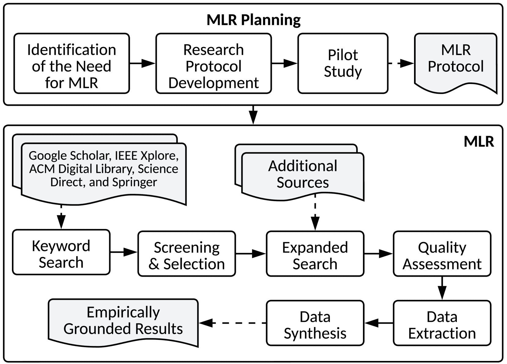
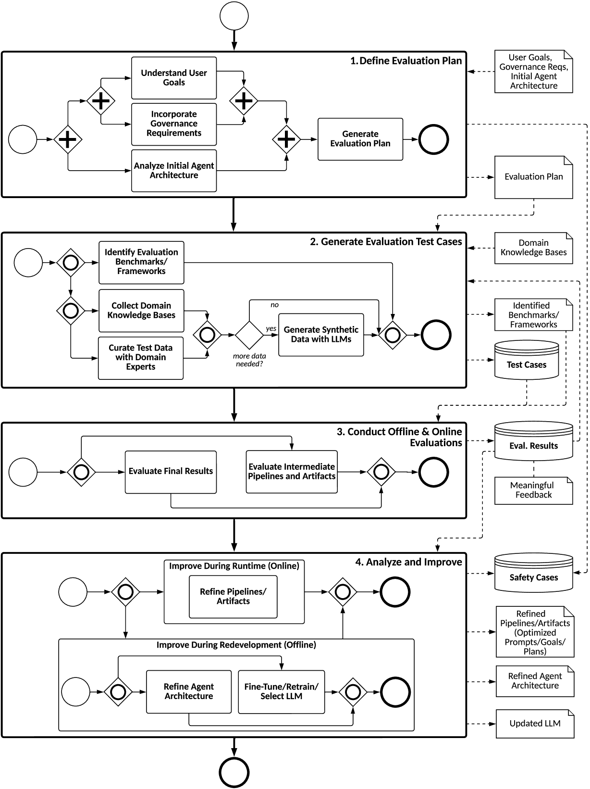
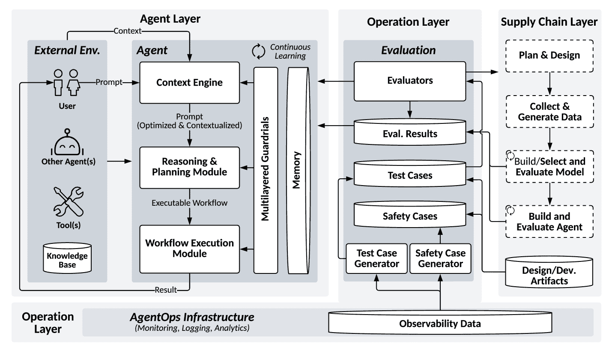

<!--yml
category: 未分类
date: 2025-01-11 11:55:08
-->

# An Evaluation-Driven Approach to Designing LLM Agents: Process and Architecture

> 来源：[https://arxiv.org/html/2411.13768/](https://arxiv.org/html/2411.13768/)

Boming Xia12, Qinghua Lu12, Liming Zhu12, Zhenchang Xing13, Dehai Zhao1, Hao Zhang1 1CSIRO’s Data61, Sydney, Australia 2University of New South Wales, Sydney, Australia 3Australian National University, Canberra, Australia 

###### Abstract

The advent of Large Language Models (LLMs) has enabled the development of LLM agents capable of autonomously achieving under-specified goals and continuously evolving through post-deployment improvement, sometimes without requiring code or model updates. Conventional approaches, such as pre-defined test cases and code/model redevelopment pipelines, are inadequate for addressing the unique challenges of LLM agent development, particularly in terms of quality and risk control. This paper introduces an evaluation-driven design approach, inspired by test-driven development, to address these challenges. Through a multivocal literature review (MLR), we synthesize existing LLM evaluation methods and propose a novel process model and reference architecture specifically designed for LLM agents. The proposed approach integrates online and offline evaluations to support adaptive runtime adjustments and systematic offline redevelopment, improving runtime pipelines, artifacts, system architecture, and LLMs by continuously incorporating evaluation results, including fine-grained feedback from human and AI evaluators.

###### Index Terms:

Large Language Model, LLM, Agent, Evaluation, Architecture, AI Safety, Responsible AI

## I Introduction

Large-language models (LLMs) are large-scale, pretrained language models with tens of billions of parameters, adaptable to various down stream tasks, such as answering questions and summarizing information [[1](https://arxiv.org/html/2411.13768v1#bib.bib1)]. Recent advancements in LLMs have enabled the creation of LLM-based agents, commonly known as LLM agents, which can autonomously perform complex tasks (e.g., the AI Scientist [[2](https://arxiv.org/html/2411.13768v1#bib.bib2)]). Unlike traditional AI/LLM systems that rely on detailed instructions to perform specific tasks, LLM agents autonomously achieve high-level, under-specified goals by perceiving context, reasoning, planning, and executing workflows, while leveraging external tools, knowledge bases and other agents to enrich their capabilities [[3](https://arxiv.org/html/2411.13768v1#bib.bib3)].

Despite their productivity potential, LLM agents introduce significant concerns regarding performance and safety [[4](https://arxiv.org/html/2411.13768v1#bib.bib4)]. These agents often exhibit unpredictable or inconsistent behavior, especially when dealing with complex or ambiguous tasks. Moreover, the autonomy of LLM agents, such as determining which tools to use, can result in outcomes that diverge from human goals or violate governance standards. Rigorous evaluation is therefore essential to ensure that LLM agents consistently align with intended goals and governance requirements, thereby minimizing unintended consequences.

While there is increasing interest in testing and benchmarking frameworks for LLMs and LLM agents (e.g., [[5](https://arxiv.org/html/2411.13768v1#bib.bib5), [6](https://arxiv.org/html/2411.13768v1#bib.bib6)]), significant gaps remain in addressing the unique challenges of evaluating LLM agents. Specifically, effective evaluation of these agents requires the following considerations:

*   •

    System-Level Evaluation. Current evaluation frameworks largely focus on the model level, overlooking the system-level evaluation. LLM agents are compound AI systems comprising not only LLMs but also multiple out-of-LLM components [[7](https://arxiv.org/html/2411.13768v1#bib.bib7)], such as context engines and guardrails [[8](https://arxiv.org/html/2411.13768v1#bib.bib8)]. While tools and frameworks like LangSmith¹¹1[https://www.langchain.com/langsmith](https://www.langchain.com/langsmith) and DeepEval²²2[https://docs.confident-ai.com/](https://docs.confident-ai.com/) provide partial support for system-level evaluation but often focus narrowly on specific interactions, such as prompt-response pairs or tool invocations, without addressing the full runtime scope. Effective system-level evaluation must encompass both pipelines (including prompts, intermediate results, and final results) and artifacts (including goals, memory, reasoning, plans, workflows, tools, knowledge bases, other agents, LLMs, and guardrails) [[9](https://arxiv.org/html/2411.13768v1#bib.bib9), [8](https://arxiv.org/html/2411.13768v1#bib.bib8)].

*   •

    Evaluation-Driven Design. While existing tools and frameworks address aspects of pre-deployment offline evaluation and runtime monitoring, they often lack a unified approach that integrates continuous evaluation with both runtime adaptation and offline iterative development. Unlike traditional software, LLM agents run with high-level, under-specified goals and dynamically adapt through iterative cycles of goal interpretation, reasoning, planning, and execution. This adaptive behavior, coupled with the reliance on human/AI feedback and memory, necessitates an evaluation-driven design approach to systematically align evolving agent behaviors with quality, safety, and operational objectives.

*   •

    Use of Evaluation Results.

    In traditional software and standalone LLM testing, evaluation results narrowly identify failure points, triggering updates to code or retraining/fine-tuning of LLMs. For LLM agents, however, evaluation results have a broader scope and impact. They can inform refined prompt optimization through enriched context (e.g., incorporating positive and negative examples), enhance agent plans and workflows to improve decision-making and execution, and update test and safety cases [[10](https://arxiv.org/html/2411.13768v1#bib.bib10)] to reflect evolving operational contexts.

To address these challenges, this paper introduces an evaluation-driven approach inspired by test-driven development, embedding continuous evaluation across the entire LLM agent lifecycle and considering comprehensive runtime pipeline and artifacts. We explore two research questions (RQs), each forming a key contribution:

1.  1.

    RQ1: How can LLM agent be evaluated systematically? To address this, we propose a structured process model that enables comprehensive, lifecycle-spanning evaluation, providing concrete and actionable guidance for researchers and practitioners in conducting continuous evaluation of LLM agents.

2.  2.

    RQ2: How can continuous evaluation be integrated into the architecture of agent design? To answer this, we design a reference architecture that embeds evaluation as a core design element, integrating both online and offline evaluation to inform agent improvement.

The remainder of the paper is organized as below. Section II discusses background and related work. Section III introduces the methodological details. Section IV presents a software process model guiding LLM agent evaluation, and Section V proposes a reference architecture for evaluation-driven design of LLM agents. Section VI discusses the threats to validity. Section VII concludes the paper and outlines the future work.

## II Background and Related Work

### II-A Importance of Evaluating LLM Agents

Evaluation plays a foundational role in assessing accuracy and functional correctness, ensuring LLM agents perform reliably across diverse, evolving conditions [[11](https://arxiv.org/html/2411.13768v1#bib.bib11)]. Beyond performance, assessments of quality and risk attributes, such as fairness and safety, are critical to managing the risks inherent in deploying LLM agents within complex, real-world environments [[12](https://arxiv.org/html/2411.13768v1#bib.bib12), [13](https://arxiv.org/html/2411.13768v1#bib.bib13)]. Additionally, capability evaluations gauge an agent’s suitability for complex tasks, identifying both intended functions and potential unintended behaviors that could pose safety concerns [[14](https://arxiv.org/html/2411.13768v1#bib.bib14)]. Finally, continuous evaluation supports ongoing improvement and risk control, allowing LLM agents to learn from both evaluation results and operational data, adapt to new inputs, and remain aligned with evolving conditions [[15](https://arxiv.org/html/2411.13768v1#bib.bib15)]. Together, these evaluations uphold the safety, adaptability, and real-world applicability of LLM agents across dynamic applications.

### II-B Architectural and Operational Challenges in LLM Agent Evaluation

LLM agents present unique challenges for evaluation due to their complex architecture and dynamic operational demands. Primarily built with off-the-shelf LLMs, these agents shift the focus from (re)training and model/code updates to system-level integration and continuous, out-of-model improvement. Operating autonomously, they must handle evolving inputs and external data sources, requiring adaptability to real-time conditions. Complex architectural components create interdependencies and potential failure points that heighten the need for careful evaluation.

The non-deterministic behavior of LLMs, where identical inputs may yield varied outputs, further complicates consistent assessment and demands flexible evaluation methods [[16](https://arxiv.org/html/2411.13768v1#bib.bib16)]. For instance, a customer service agent might generate varying responses to identical questions depending on prior interactions, making uniform assessment challenging. Their property of continuous improvement through runtime feedback introduces emergent behaviors, which may pose safety risks that static evaluation methods cannot adequately capture [[17](https://arxiv.org/html/2411.13768v1#bib.bib17)]. Together, these challenges underscore the need for an evaluation-driven design approach that embeds continuous assessment mechanisms to ensure safe, reliable, and adaptable operation throughout the agent’s lifecycle.

### II-C Related Work

#### II-C1 Traditional Software Evaluation Methods

Traditional software evaluation methods, including Test-Driven Development [[18](https://arxiv.org/html/2411.13768v1#bib.bib18)] and Behavior-Driven Development [[19](https://arxiv.org/html/2411.13768v1#bib.bib19)], emphasize early testing to ensure functionality prior to deployment. These methods generally limit evaluation to pre-deployment, with test cases derived from detailed, predefined requirements. Although they offer strong foundations for ensuring performance and safety, they are less suited to the dynamic, evolving nature of LLM agents, which operate based on high-level goals instead of explicit requirements and dynamically adapt their behaviors in response to real-time data and user interactions. Such conventional approaches do not inherently accommodate continuous, post-deployment evaluations, nor do they readily support continuous improvement based on evaluation results.

#### II-C2 LLM Agent Evaluation Methods

Existing evaluation frameworks and benchmarks largely stay on model level [[20](https://arxiv.org/html/2411.13768v1#bib.bib20)], focusing on specific tasks (e.g., coding [[21](https://arxiv.org/html/2411.13768v1#bib.bib21), [22](https://arxiv.org/html/2411.13768v1#bib.bib22), [23](https://arxiv.org/html/2411.13768v1#bib.bib23)] and Retrieval-Augmented Generation (RAG) [[24](https://arxiv.org/html/2411.13768v1#bib.bib24), [25](https://arxiv.org/html/2411.13768v1#bib.bib25)]) or certain domains (e.g., healthcare [[26](https://arxiv.org/html/2411.13768v1#bib.bib26), [27](https://arxiv.org/html/2411.13768v1#bib.bib27)], legal [[28](https://arxiv.org/html/2411.13768v1#bib.bib28), [29](https://arxiv.org/html/2411.13768v1#bib.bib29)], and finance [[30](https://arxiv.org/html/2411.13768v1#bib.bib30), [31](https://arxiv.org/html/2411.13768v1#bib.bib31)]). Although valuable, adapting them to evaluate holistic, multi-component LLM agents that can operate across a wide range of tasks and domains requires significant integration efforts [[32](https://arxiv.org/html/2411.13768v1#bib.bib32), [33](https://arxiv.org/html/2411.13768v1#bib.bib33)].

Further, many existing benchmarks rely on fixed datasets and tasks, introducing risks of data contamination [[34](https://arxiv.org/html/2411.13768v1#bib.bib34)] and making it difficult to assess agents in dynamic contexts. To address this limitation, a trend toward live benchmarks that adapt to changing real-world data has emerged (e.g., [[35](https://arxiv.org/html/2411.13768v1#bib.bib35), [36](https://arxiv.org/html/2411.13768v1#bib.bib36)]). While live benchmarks offer some adaptability, they primarily use periodic data updates and do not fully capture the nuanced behaviors seen in online evaluation during runtime.

With the advent of LLM agents, there is a shift towards system-level evaluation frameworks that assess holistic agent behavior. However, many such frameworks emphasize end-to-end evaluations, assessing the final outputs (i.e., final success/pass rate) of LLM agents across various tasks and environments. While these approaches provide insights into overall agent performance, they often overlook the nuances within intermediate decision-making steps and the contributions of individual agent components, limiting their utility for identifying specific improvement areas [[33](https://arxiv.org/html/2411.13768v1#bib.bib33)]. More granular frameworks have thus emerged (e.g., [[33](https://arxiv.org/html/2411.13768v1#bib.bib33), [37](https://arxiv.org/html/2411.13768v1#bib.bib37)]), alongside tools like LangSmith, which support both step-based and trajectory-based evaluations. By emphasizing intermediate stages, these frameworks reveal operational workflows, yielding data essential for targeted improvements and risk control.

Another approach gaining traction is the use of safety cases, which provide structured, evidence-backed justifications for the safe operation of LLM agents within defined conditions [[38](https://arxiv.org/html/2411.13768v1#bib.bib38), [10](https://arxiv.org/html/2411.13768v1#bib.bib10)]. They serve as formal documentation for ensuring compliance with safety standards and regulatory requirements. Safety cases are particularly valuable for stakeholders like system developers, integrators, and regulators, who rely on them to assess risks, validate operational boundaries, and maintain accountability. For LLM agents, the dynamic and evolving nature of operational contexts necessitates continuous updates to safety cases to reflect emerging risks and maintain alignment with governance frameworks.

These recent advancements mark significant progress in LLM agent evaluation. Nevertheless, a systematic approach that integrates evaluation results to guide ongoing improvement and risk control remains lacking—an approach we address in this work.

## III Methodology

Figure 1: Research Methodology

This study employs a MLR (Fig. [1](https://arxiv.org/html/2411.13768v1#S3.F1 "Figure 1 ‣ III Methodology ‣ An Evaluation-Driven Approach to Designing LLM Agents: Process and Architecture")) to synthesize insights from both academic and industry sources on LLM agent evaluation, following established guidelines [[39](https://arxiv.org/html/2411.13768v1#bib.bib39), [40](https://arxiv.org/html/2411.13768v1#bib.bib40)]. MLR was chosen because it allows for a comprehensive understanding of both academic theories and industry practices, especially crucial for designing a process model and reference architecture that addresses the challenges of continuous, evaluation-driven LLM agent design across various deployment settings.

### III-A MLR Planning

The planning phase began with identifying the need for a multivocal approach to bridge both research and industry perspectives. An initial research protocol was developed, including RQs and search terms tailored to capture a comprehensive scope of LLM agent evaluation. A pilot study tested the search terms, assessing both relevance and volume of retrieved studies. Based on the pilot, the protocol was refined, resulting in a finalized MLR strategy to guide the study.

### III-B Multivocal Literature Review (MLR)

Databases and Search Strategy: Academic paper searches were conducted across: Google Scholar, IEEE Xplore, ACM Digital Library, Science Direct, and Springer. Google Search was employed as a source for grey literature. The primary search terms were (”large language model” OR ”LLM” OR ”agent”) AND (”evaluate” OR ”benchmark” OR ”test”), with variations to capture relevant forms (e.g., pluralization, noun-verb shifts, and -ing endings where applicable). Searches were performed on June 5, 2024, targeting literature published since 2022 to reflect recent advancements following the release of ChatGPT.

Screening and Selection: After removing duplicates, sources were screened through a three-step process: title, abstract, and full-text review. Two authors independently reviewed each stage to ensure reliability and agreed on the selection results. The selection criteria focused on identifying sources relevant to evaluation-driven design for LLM agents. Eligible sources included academic articles, conference papers, technical reports, white papers, and preprints (e.g., arXiv) addressing tools, frameworks, or platforms for LLM agent evaluation, provided they offered clear theoretical or empirical contributions and were available in English. Exclusions were applied to sources unrelated to LLM agent evaluation (e.g., LLM fine-tuning), lacking substantial contributions or credible backing, or presenting tools without adequate documentation.

Expanded Search: To broaden coverage and ensure no relevant study was missed, backward and forward snowballing was conducted on the final selection, as per [[41](https://arxiv.org/html/2411.13768v1#bib.bib41)]. Additionally, critical new sources published after the initial search were included based on author discussions. Saturation was considered achieved when no significant new themes emerged from additional sources.

Quality Assessment: To ensure rigor, academic papers and grey literature were evaluated based on Authority, Methodology, and Objectivity, with only sources demonstrating credible and balanced contributions included. Tools were assessed separately, considering Source Reputation (e.g., GitHub stars publisher reputation), Documentation, and Maintenance Activity. Sources that did not meet the criteria for credibility and reliability were excluded.

Figure 2: Process Model for LLM Agent Evaluation

Data Extraction: Data extraction systematically mapped evaluation-related elements to address the RQs and inform the proposed process model and reference architecture. It focused on evaluation practices, including timing, scope, and the use of evaluation results for continuous improvement and risk control. Additionally, architectural insights were gathered, covering core agent components (e.g., context engine, reasoning/planning) and evaluation infrastructure (e.g., storage, feedback loops) that support iterative enhancements. This approach ensured a clear connection between the extracted data and the design elements for the process model and reference architecture.

Data Synthesis: Thematic analysis was employed to identify recurring themes, with specific attention to evaluation activities and lifecycle coverage, risk control, and agent improvement/adaptability. We synthesized insights from the MLR to inform the structure for the process model and reference architecture. The MLR allowed for an empirically grounded reference architecture that is industry-cross-cutting, classical, facilitation, aligned with [[42](https://arxiv.org/html/2411.13768v1#bib.bib42)]. To enhance robustness, themes were triangulated through internal review and validated with feedback from authors experienced in LLM agent design and evaluation. This iterative validation process ensured the synthesized themes were both rigorous and practically applicable..

## IV Process Model for LLM Agent Evaluation

To address RQ1, we synthesized evaluation practices from the MLR into a process model (Fig. [2](https://arxiv.org/html/2411.13768v1#S3.F2 "Figure 2 ‣ III-B Multivocal Literature Review (MLR) ‣ III Methodology ‣ An Evaluation-Driven Approach to Designing LLM Agents: Process and Architecture")). This model provides a structured approach for conducting consistent, lifecycle-spanning evaluations across the agent’s development, deployment, and operational stages. In addition to specifying evaluation activities and scope, the model also drives both immediate runtime improvements (e.g., in response to real-time user feedback) and iterative refinements (e.g., through agent architecture adjustments) and supports risk control by leveraging insights from offline and online evaluations. By standardizing these practices, the process model ensures LLM agents remain safe and effective in dynamic environments.

### IV-A Step 1: Define Evaluation Plan

The first step in the process model is to establish a comprehensive evaluation plan, guiding consistent and focused evaluations throughout the LLM agent’s lifecycle. This plan integrates key inputs, including user goals, governance requirements, and initial agent architecture, to establish clear evaluation objectives, scope, and context-specific evaluation scenarios.

Inputs: The evaluation plan is informed by three primary inputs:

*   •

    User Goals: High-level goals representing user needs and expectations, often broad or abstract (e.g., “I need an agent that assists with tax suggestions”). These goals are translated into evaluation scenarios, which outline potential user interactions, relevant contexts, and expected outcomes. These scenarios later inform test case creation in Step 2.

*   •

    Governance Requirements: Legal, ethical, and safety regulations relevant to the agent’s deployment context, such as the EU AI Act. Governance requirements guide compliance-focused evaluations such as the effectiveness of guardrails, and influence criteria for test case and safety case generation.

*   •

    Initial Agent Architecture: The initial structural and behavioral blueprint of the agent, detailing key components, interdependencies, and architectural decisions. This analysis identifies components with critical functions or dependencies that may impact evaluation focus and highlights initial tradeoffs and risks.

Process Steps: The evaluation planning process involves several coordinated activities that collectively establish a detailed, context-specific evaluation plan.

1.  1.

    Understand User Goals: Operating as one parallel branch, this step translates user goals into concrete and testable evaluation scenarios. These scenarios simulate potential user interactions, relevant environmental factors, and expected outcomes, creating a targeted foundation for assessing both agent behaviors and overall system outcomes.

2.  2.

    Incorporate Governance Requirements: Running concurrently with the user goal understanding, this step aligns evaluation objectives and scenarios with relevant governance requirements [[43](https://arxiv.org/html/2411.13768v1#bib.bib43)]. By embedding these constraints early in the planning phase, it ensures compliance and risk mitigation from the outset.

3.  3.

    Generate Evaluation Plan: This final step consolidates insights from user goals, governance requirements, and architectural analysis to produce a structured evaluation plan, covering both execution pipelines and generated artifacts. This evaluation plan supports continuous evaluation and subsequent improvement and risk control to keep the agent aligned with evolving objectives.

Output: The main output of this step is a detailed evaluation plan that provides the foundation for systematic, lifecycle-spanning evaluations. Key information includes:

*   •

    Evaluation Purpose and Scope: Articulates the overarching goals of the evaluation (e.g., accuracy/correctness, quality/risk, and capability [[20](https://arxiv.org/html/2411.13768v1#bib.bib20)]) and specifies evaluation targets, such as specific intermediate pipelines (e.g., retrieval-augmented generation [[44](https://arxiv.org/html/2411.13768v1#bib.bib44)]) and artifacts (e.g., dynamically generated plans and sub-goals [[45](https://arxiv.org/html/2411.13768v1#bib.bib45), [46](https://arxiv.org/html/2411.13768v1#bib.bib46)]). These targets are prioritized based on architectural insights and user needs. In addition, guardrail effectiveness can be evaluated through the pipeline and artifacts.

*   •

    Evaluation Objectives and Strategy: Outlines specific evaluation activities and approaches, focusing on progressive evaluation stages. Offline evaluations begin with benchmarking to assess general performance baselines, followed by more targeted testing based on generated test cases, which can be informed by the benchmarking results. Online evaluations expand on these foundations to incorporate real-world feedback and dynamic conditions. This sequential strategy ensures that evaluations are thorough and enables iterative validation and refinement.

*   •

    Evaluation Criteria and Metrics: Defines qualitative and quantitative criteria for assessing outcomes, such as relevance, success rates, response times, and risk thresholds. Additionally, it emphasizes the value of interpretative explanations provided by human or AI evaluators, which can complement metrics to clarify why certain results are deemed acceptable or require further improvement [[47](https://arxiv.org/html/2411.13768v1#bib.bib47)].

This step may also yield preliminary safety cases [[38](https://arxiv.org/html/2411.13768v1#bib.bib38)]—structured arguments based on the evaluation objectives, scenarios, and architectural analysis—that establish an initial evidence of the agent’s operational safety within the defined conditions. These safety cases serve as a baseline, iteratively refined as evaluations progress.

### IV-B Step 2: Develop Evaluation Test Cases

Building on the evaluation plan established in Step 1, this step develops test cases by integrating general-purpose benchmarking with scenario-specific test case generation. These test cases evaluate the LLM agent’s pipelines and generated artifacts, ensuring coverage across general and specific scenarios, including both standard and edge cases.

Inputs: Test case development draws on several sources:

*   •

    Evaluation plan: Defines evaluation objectives, scenarios, and criteria from Step 1, guiding the selection and creation of test cases.

*   •

    Evaluation Results: Results from prior evaluations offer historical data (e.g., from the production AgentOps logs) to inform new test cases for back-testing [[48](https://arxiv.org/html/2411.13768v1#bib.bib48)], allowing evaluations on real-world, previously encountered inputs.

*   •

    Domain Knowledge Base: Includes domain-specific resources, such as industry documentation, verified user forums, and certified solutions, offering realistic and challenging examples to ground test case creation.

Process Steps: This step involves sourcing and refining test data through four coordinated activities:

1.  1.

    Identify Evaluation Benchmarks/Frameworks: Evaluation benchmarks and frameworks (e.g., DeepEval and LangSmith), are identified to support agent evaluation. Benchmarks provide general performance baselines, helping to assess fundamental agent capabilities and further inform more targeted, scenario-specific test cases by highlighting performance gaps. Frameworks extend beyond benchmarking by offering tools for testing, test case generation, trajectory-based evaluations, and online evaluations, supporting a comprehensive evaluation process (Step 3). Governance requirements and architectural insights from Step 1 guide the selection process, ensuring alignment with evaluation objectives and regulatory constraints. The selected benchmarks and frameworks form a key output of this activity, feeding into subsequent steps in the evaluation process.

2.  2.

    Collect Domain Knowledge: Domain-specific knowledge bases are referenced to create test cases that address operational contexts specific to the agent’s deployment environment. These sources enhance the realism and relevance of test cases by reflecting domain-specific challenges the agent may encounter.

3.  3.

    Curate Test Data with Domain Experts: Domain experts help generate tailored test cases to address gaps not fully covered by benchmarks or knowledge bases, adding depth and specificity. For instance, experts may refine raw benchmark results into actionable scenarios or create targeted test cases for complex edge conditions. This ensures that critical scenarios, particularly those involving complex edge cases, are comprehensively represented.

4.  4.

    Generate Synthetic Data with LLMs: For cases where additional test data is necessary, synthetic data can be generated using LLMs [[49](https://arxiv.org/html/2411.13768v1#bib.bib49), [50](https://arxiv.org/html/2411.13768v1#bib.bib50)]. This synthetic data expands the evaluation’s scope by simulating varied and complex contexts, filling in remaining gaps. While it is not a substitute for real-world examples or expert-curated data, synthetic data adds breadth, ensuring that test cases comprehensively reflect potential operational conditions.

Output:

*   •

    Test Cases: Tailored for evaluating final/intermediate pipelines and generated artifacts across standard and edge scenarios. Test cases include both reference-based cases, designed with predefined correct outcomes (e.g., multiple-choice questions), and reference-free cases, relying on human or AI evaluators to assess criteria such as relevance, coherence, and contextual appropriateness.

*   •

    Selected Benchmarks and Frameworks: Identified benchmarks and frameworks supporting subsequent evaluations.

### IV-C Step 3: Conduct Offline and Online Evaluations

This step implements a balanced approach that transitions from controlled offline evaluation to real-world online evaluation. Offline evaluations verify that the agent meets baseline standards before deployment under controlled conditions, while online evaluations provide continuous performance and safety monitoring in real-world settings under evolving demands.

Input: Main inputs to evaluation processes include:

*   •

    Identified Benchmarks: Benchmarks, identified in Step 2, provide generalized evaluations as performance baselines and can inform more targeted test case generation.

*   •

    Test Cases: Developed in Step 2, these test cases form the backbone of offline evaluations, systematically assessing the agent’s behavior against controlled datasets and specific scenarios. They validate the agent’s ability to deliver correct, complete, and contextually appropriate outputs across typical and high-impact use cases. Test cases may also provide baseline metrics or serve as references for anomaly detection in online evaluations, complementing live feedback mechanisms.

*   •

    Evaluation Frameworks: These frameworks enhance evaluation processes by supporting tasks like test case execution, artifact analysis, and pipeline evaluations. They enable scalable and comprehensive assessments across both offline and online contexts.

Process Steps: Evaluation activities center around:

1.  1.

    Evaluate Final Results: This step measures the agent’s overall performance by assessing end-to-end outcomes, focusing on criteria such as success/pass rate, accuracy, and user satisfaction. The purpose here is to verify that the agent’s ultimate outputs align with intended objectives and user needs. However, it often lacks the granularity needed to diagnose specific issues in the agent’s decision-making processes or to trace the root cause of failures [[33](https://arxiv.org/html/2411.13768v1#bib.bib33), [51](https://arxiv.org/html/2411.13768v1#bib.bib51)]. Final results alone may obscure intermediate missteps or reasoning errors that could impact the agent’s long-term performance and safety.

2.  2.

    Evaluate Intermediate Pipelines and Artifacts: This step focuses on assessing the agent’s intermediate pipelines (e.g., prompts, intermediate results) and execution artifacts (e.g., plans [[45](https://arxiv.org/html/2411.13768v1#bib.bib45)], retrieved knowledge base information [[44](https://arxiv.org/html/2411.13768v1#bib.bib44)], and tool outputs [[52](https://arxiv.org/html/2411.13768v1#bib.bib52)]). The goal is to ensure their logical consistency, coherence, and alignment with the agent’s objectives [[37](https://arxiv.org/html/2411.13768v1#bib.bib37)]. While these granular evaluations provide valuable insights for diagnosing specific issues and guiding improvements, they can be difficult to contextualize without linking them to the agent’s overall performance [[53](https://arxiv.org/html/2411.13768v1#bib.bib53)]. A balanced approach is necessary to integrate these intermediate findings into a comprehensive understanding of system behavior.

Output: This step generates a comprehensive set of evaluation results from offline and online evaluations, offering complementary insights. Offline evaluations provide key metrics, error analyses, and pass/fail summaries from controlled test scenarios, establishing baseline performance. Online evaluations capture real-world metrics such as user impact, adaptive responses, and behavioral patterns under diverse operational conditions.

Interpretative feedback is critical for turning evaluation results into actionable insights. A structured feedback framework—identifying fine-grained error sources (e.g., specific issues causing dissatisfaction), feedback providers (e.g., end-users, domain experts, or AI), and explanations (e.g., why an output is “acceptable but improvable”)—ensures that feedback is both meaningful and systematic. This approach helps pinpoint performance gaps and prioritize improvements effectively. Such feedback complements traditional metrics, offering nuanced, contextually relevant evaluations that overcome the limitations of rigid or arbitrary scoring systems [[47](https://arxiv.org/html/2411.13768v1#bib.bib47)]. Together, these insights drive runtime adaptations and iterative redevelopment, forming a continuous improvement loop that refines the agent’s design, performance, and safety over time.

### IV-D Step 4: Analyze and Improve

This step translates evaluation results into actionable improvements, addressing both runtime (online) and redevelopment (offline) adjustments. Runtime improvements involve real-time adaptations to refine pipelines and artifacts, ensuring the agent remains responsive to evolving contexts. Redevelopment focuses on iterative changes to architectural components and the LLM itself, ensuring long-term performance and safety.

Input: The evaluation results from Step 3 serve as the primary input, encompassing both offline (controlled) and online (real-world) insights. Offline results typically highlight baseline performance gaps and systemic deficiencies, while online results reveal operational metrics, user feedback, and emerging patterns, guiding both immediate and iterative improvements.

Process Steps: This step includes both runtime and redevelopment time improvement activities:

1.  1.

    Improve During Runtime (Online): Leveraging online evaluation results, LLM agents dynamically adjust runtime pipelines and artifacts to enhance responsiveness and mitigate risks. For example, if user feedback or logs highlight frequent tool invocation failures in multi-step tasks, the agent can revise its plans by retrying with alternative tools or switching to cached data sources. Similarly, real-time user corrections, such as clarifying ambiguous instructions (”I meant ’quarterly’ instead of ’monthly’”), inform updates to context memories, ensuring that subsequent responses align with updated inputs. In goal-driven tasks, evaluator feedback may trigger recalibration of objectives, prioritizing high-impact goals to meet evolving user needs. These adjustments are typically automated through feedback loops and error detection mechanisms, enabling the agent to adapt dynamically to operational conditions without requiring downtime.

2.  2.

    Improve During Redevelopment (Offline): This phase involves substantial post-deployment improvements informed by persistent issues identified through offline evaluations and systemic insights from online results. Key activities include:

    *   •

        Refine Agent Architecture: Address design-level deficiencies by enhancing architectural components such as reasoning and planning modules and guardrails. For example, if evaluations reveal that the agent occasionally generates inappropriate responses when interacting with sensitive content, guardrails can be added/refined to include stricter content filtering mechanisms or domain-specific safety rules. Additionally, improvements may involve reconfiguring the data retrieval system to prioritize higher-quality information sources or optimizing inter-component workflows for enhanced efficiency and reliability.

    *   •

        Fine-Tune/Retrain/Select LLM: Where evaluation results indicate major LLM deficiencies, model-level improvement is needed. This could involve fine-tuning the existing LLM to address specific issues, retraining if feasible, or selecting an alternative off-the-shelf LLM if required.

Output: This step produces several key outputs that collectively enhance the LLM agent’s design and operational safety:

*   •

    Safety Cases: Updated safety cases integrate evidence from offline and online evaluations, ensuring the agent’s behaviour remains safe under new or evolving conditions. These updates reflect newly identified risks and safety boundaries, ensuring compliance with safety thresholds in dynamic environments.

*   •

    Refined Agent Architecture: Documented modifications to system components reflect the iterative improvements applied during redevelopment. These refinements align the architecture with identified performance gaps and operational goals.

*   •

    Updated LLM: Outputs may include fine-tuned, retrained, or newly selected LLMs, aligned with performance and safety goals.

*   •

    Refined Pipelines/Artifacts: Adjustments to runtime pipelines and artifacts, ensure alignment with runtime feedback and evaluation-driven improvements.

## V Reference Architecture for Evaluation-Driven Design of LLM Agents

To address RQ2, we propose a reference architecture that positions evaluation as a central element in LLM agent design (see Fig. [3](https://arxiv.org/html/2411.13768v1#S5.F3 "Figure 3 ‣ V Reference Architecture for Evaluation-Driven Design of LLM Agents ‣ An Evaluation-Driven Approach to Designing LLM Agents: Process and Architecture")). Building on previous work on LLM agent and AI system design [[7](https://arxiv.org/html/2411.13768v1#bib.bib7), [4](https://arxiv.org/html/2411.13768v1#bib.bib4)], this architecture establishes evaluation as a foundational architectural component across three interconnected layers: the Supply Chain Layer, the Agent Layer, and the Operation Layer. The architecture ensures continuous and adaptive evaluation, with feedback loops supporting both runtime adaptation and redevelopment. The Operation Layer, which integrates the Evaluation component and AgentOps Infrastructure, serves as the core of this architecture.

Figure 3: Reference Architecture for Evaluation-Driven Design of LLM Agents

The architecture is guided by three key principles:

*   •

    Lifecycle Integration: Evaluations are embedded throughout both pre-deployment (design and development) and post-deployment (runtime and redevelopment) phases. This ensures that evaluation is comprehensive and continuous, with insights available to guide improvements at every stage.

*   •

    Meaningful Feedback Loops: Insights from both offline and online evaluations are systematically fed back to inform both lightweight runtime adjustments and substantial offline refinements, enabling targeted improvements.

*   •

    Continuous Learning and Improvement: The architecture fosters ongoing refinement by enabling adaptive adjustments at both model and system level, with particular emphasis on the latter. By integrating mechanisms for continuous improvement and out-of-model learning, it ensures that the agent adapts effectively to evolving objectives and operational contexts, maintaining alignment with performance and safety standards.

### V-A Supply Chain Layer

This layer establishes the foundational design, functionality, and evaluation criteria for the LLM agent It includes four preparatory steps, represented with dotted lines to indicate their supportive rather than core architectural function:

*   •

    Plan and Design: Understand user goals, define governance requirements and high-level architecture, shaping evaluation criteria and identifying evaluation scenarios. This step lays the foundation for selecting benchmarks, creating test cases, and aligning evaluations with compliance and performance standards.

*   •

    Collect and Process Data: Gather and preprocess data for model fine-tuning and model/agent testing. In our context, the emphasis is on preparing evaluation data as we prioritize the use of off-the-shelf LLMs.

*   •

    Build/Select and Evaluate Model: Proprietary models are evaluated using published system cards (e.g., OpenAI o1 System Card [[54](https://arxiv.org/html/2411.13768v1#bib.bib54)]) or through black-box testing via APIs to validate their suitability for operational objectives. Open-source models can be fine-tuned as needed and evaluated to ensure alignment with specific tasks and performance goals.

*   •

    Build and Evaluate System: Integrate the LLM with system components (e.g., guardrails) and conduct system-level evaluations for functional correctness, quality/risk, and capability [[20](https://arxiv.org/html/2411.13768v1#bib.bib20)]. Such offline evaluations confirm LLM agent readiness before deployment.

The primary output of this layer, the Design and Development Artifacts repository, consolidates key artifacts that support continuous evaluation and improvement:

*   •

    Test Cases: Structured evaluations derived primarily from user goal-driven scenarios, ensuring alignment with specific tasks and operational contexts. Test cases form the backbone of the evaluation process, offering targeted assessments of pipelines and artifacts. Insights from offline benchmarking refine test cases to address scenario-specific needs. Test cases are continuously updated to adapt to evolving objectives and contexts.

*   •

    Safety Cases: Evidence-backed justifications that define safe operational boundaries and identify critical risk scenarios. Initially shaped by user and regulatory requirements, safety cases provide baseline safety assurances and are iteratively refined based on emerging evaluation results and runtime insights.

*   •

    Offline Evaluation Results: Pre-deployment results from generalized benchmarking and scenario-specific test case evaluations establish baseline performance metrics and highlight known limitations. These results serve as critical references for ongoing evaluations and agent refinement during post-deployment phases

### V-B Agent Layer

The Agent Layer focuses on the adaptive capabilities of the LLM agent, enabling it to operate effectively in dynamic, real-world conditions. By integrating core components for context understanding, decision-making, and task execution, this layer supports seamless interaction with external entities and forms the foundation for evaluation-driven design. The primary components of this layer include:

External Environments: The agent interacts with various external entities that shape the agent’s operational context, providing essential data and situational insights that inform the agent’s responses and actions:

*   •

    Users: Providing explicit or implicit feedback that guides agent actions and informs iterative improvements to workflows or artifacts.

*   •

    Other Agents: Collaborating through task distribution, data sharing, or multi-agent communication [[55](https://arxiv.org/html/2411.13768v1#bib.bib55)], enabling coordinated task execution.

*   •

    Tools: Task-specific APIs and processing modules, which the agent uses to execute workflows and refine its decision-making capabilities.

*   •

    Knowledge Bases: Static or dynamic information sources (e.g., databases, ontologies), which enhance reasoning processes by providing contextual and domain-specific knowledge.

Agent Module: This module includes key functional components within the LLM agent to support its operation:

*   •

    Context Engine: This module continuously collects, processes, and integrates environmental data, combining it with relevant memory inputs to maintain situational awareness. This context enables the agent to generate precise, relevant responses, accounting for immediate interactions as well as past user inputs when appropriate.

*   •

    Reasoning & Planning Module: Based on contextualized inputs from the Context Engine, this module generates actionable plans, specifying executable workflows for fulfilling designated tasks. Artifacts (e.g., plans) produced here are critical evaluation targets.

*   •

    Workflow Execution: Responsible for managing the execution of tasks, this component coordinates task sequences, manages exceptions, and interfaces with external environments (e.g., APIs, databases) as necessary. Workflow Execution ensures that the agent follows an optimal sequence of actions, with mechanisms to detect and handle errors.

*   •

    Multi-layered Guardrails: Guardrails enforce operational boundaries across all components, ensuring safety and accuracy/correctness. They validate pipelines and artifacts in real-time, embedding constraints that uphold responsible AI principles and compliance standards while preventing unsafe or suboptimal actions [[8](https://arxiv.org/html/2411.13768v1#bib.bib8)].

*   •

    Memory: Memory facilitates information retention, enabling the lagent to adapt over time and align with evolving user needs. It stores historical data, user preferences, and operational feedback to improve pipelines, artifacts, and continuity. Memory collaborates with the Context Engine to ensure accurate, context-aware responses.

### V-C Operation Layer

The Operation Layer is the focal point of the reference architecture, enabling continuous evaluation and adaptive improvements during both runtime and redevelopment. It consists of two interdependent components: Evaluation and AgentOps Infrastructure, which together form a cohesive framework for lifecycle-spanning, evaluation-driven agent design. Evaluation drives the assessment and feedback processes, while the AgentOps Infrastructure provides the necessary observability and operational data to support these processes.

#### V-C1 Evaluation

This component is the core of the Operation Layer, orchestrating lifecycle-spanning evaluation processes to ensure the agent’s performance and safety. It integrates findings from both offline and online evaluations, enabling a continuous feedback loop that drives runtime adaptation and redevelopment improvements.

Key functions of this component include:

1.  1.

    Comprehensive Evaluation Processes: Evaluations span both offline and online contexts, addressing granular and system-wide aspects of agent performance. These processes evaluate both final results (e.g., overall success rates, user satisfaction) and intermediate pipelines and artifacts (e.g., plans, retrieved information, workflow steps), offering a dual perspective. This holistic approach ensures a comprehensive understanding of agent behavior, enabling precise diagnostics and targeted refinements.

2.  2.

    Proactive Feedback Loops: Evaluation results are fed back into actionable improvements. Runtime evaluations inform immediate adaptations to pipelines and artifacts, while offline evaluations guide iterative redevelopment of architecture and components. These feedback loops ensure that evaluations serve as active drivers of agent design improvement rather than merely diagnostic tools.

Key components of the component include:

*   •

    Evaluators: Both human and automated evaluators contribute to the evaluation process. Human evaluators (e.g., domain experts or end-users) provide nuanced assessments for complex scenarios requiring subjective judgment, such as evaluating fairness, relevance, or alignment in high-stakes contexts. Automated evaluators (LLM-based or agent-based) are faster and cost-effective [[56](https://arxiv.org/html/2411.13768v1#bib.bib56)], complementing human evaluations by addressing scalability and consistency limitations.

*   •

    Test Case Generator: Updates and refines test cases dynamically based on new data from evaluation results, operational logs, and and emerging patterns. For example, discrepancies observed in runtime logs may prompt the generation of new test cases tailored to edge cases or recurring errors, ensuring evaluation remains relevant to evolving scenarios.

*   •

    Safety Case Generator: Builds and iteratively updates safety cases based on operational data, ensuring they remain aligned with evolving risks and regulatory standards. By dynamically integrating new evaluation insights, it provides stakeholders—such as developers, system integrators, and regulators—with up-to-date justifications for safe agent operation.

*   •

    Test Case Repository: Consolidates dynamically updated test cases, serving as the basis for offline evaluations and live monitoring. By categorizing cases (e.g., standard scenarios, edge cases, and emerging patterns), this repository ensures that evaluations remain systematic and contextually grounded.

*   •

    Safety Case Repository: Houses safety cases as formalized risk control instruments. These cases are continuously updated to reflect operational insights, forming a critical resource for adaptive risk management.

*   •

    Evaluation Results Repository: Serves as the central hub for aggregating findings from offline and online evaluations. This repository not only tracks agent performance and safety metrics but also supports broader architectural decision-making. For example, stored results can be analyzed to detect recurring failure patterns or generate positive/negative examples for fine-tuning runtime behaviors.

#### V-C2 AgentOps Infrastructure and Observability

The AgentOps Infrastructure underpins continuous evaluation by capturing logs, metrics, traces, and events across the agent’s lifecycle, enabling dynamic performance diagnostics and retrospective analysis [[9](https://arxiv.org/html/2411.13768v1#bib.bib9)]. By providing real-time insights, this infrastructure facilitates immediate runtime adjustments and generates structured artifacts to inform iterative improvements. For instance, runtime logs from high-impact scenarios are transformed into new test cases for back-testing or updates to safety cases, ensuring offline evaluations remain aligned with real-world challenges.

Observability also aids in detecting emergent behaviors and categorizing recurring patterns (e.g., positive/negative examples), enriching evaluation processes and refining pipelines and artifacts. Seamlessly integrated with the Evaluation component, this infrastructure ensures that operational data directly informs actionable feedback loops, enhancing the agent’s quality and risk control across its lifecycle.

## VI Threats to Validity

The methodology and design are not without limitations. Below, we outline potential threats to validity and the steps taken to mitigate them.

Internal Validity: Biases in data selection and synthesis may impact the accuracy of the framework. To address this, we conducted a rigorous MLR with clearly defined inclusion and exclusion criteria. The screening process was complemented by internal reviews, ensuring consistency and reducing subjective biases. Additionally, insights were validated through practitioner discussions, providing a practical perspective on building and evaluating LLM agents. Discrepancies during synthesis were resolved through iterative discussions to maintain alignment and rigor.

External Validity: While the approach is empirically grounded in a comprehensive MLR synthesizing evaluation practices from academic and industry sources, it has not yet been validated through large-scale empirical studies or diverse cross-domain applications. Future work will prioritize real-world case studies and scalability assessments to evaluate its adaptability across different operational contexts and identify any domain-specific refinements needed.

Construct Validity: Synthesizing diverse evaluation practices into a unified framework poses risks of misrepresentation or oversimplification. To mitigate this, we explicitly documented the data extraction process, ensuring transparency.

## VII Conclusion and Future Work

This paper presents an evaluation-driven approach for LLM agent design, embedding continuous evaluation across the lifecycle to guide both runtime adaptation and redevelopment. By integrating a process model and reference architecture, the approach combines offline evaluations, which establish controlled baselines, with online evaluations, which provide real-time feedback under dynamic conditions. Together, these evaluations provide complementary insights to guide runtime adaptations and iterative redevelopment, ensuring the agent remains aligned with evolving performance objectives and safety standards while proactively managing risks. Future work will focus on empirically validating the architecture through real-world case studies and examining its scalability across domains.

## References

*   [1] R. Bommasani, D. A. Hudson, E. Adeli, R. Altman, S. Arora, S. von Arx, M. S. Bernstein, J. Bohg, A. Bosselut, E. Brunskill *et al.*, “On the opportunities and risks of foundation models,” *arXiv preprint arXiv:2108.07258*, 2021.
*   [2] C. Lu, C. Lu, R. T. Lange, J. Foerster, J. Clune, and D. Ha, “The ai scientist: Towards fully automated open-ended scientific discovery,” *arXiv preprint arXiv:2408.06292*, 2024.
*   [3] L. Bass, Q. Lu, I. Weber, and L. Zhu, *Engineering AI Systems: Architecture and DevOps Essentials*.   Addison-Wesley, 2025.
*   [4] Q. Lu, L. Zhu, J. Whittle, X. Xu *et al.*, *Responsible AI: Best Practices for Creating Trustworthy AI Systems*.   Addison-Wesley, 2023.
*   [5] J. Li and W. Lu, “A survey on benchmarks of multimodal large language models,” *arXiv preprint arXiv:2408.08632*, 2024.
*   [6] X. Liu, H. Yu, H. Zhang, Y. Xu, X. Lei, H. Lai, Y. Gu, H. Ding, K. Men, K. Yang *et al.*, “Agentbench: Evaluating llms as agents,” in *The Twelfth International Conference on Learning Representations*, 2024.
*   [7] Q. Lu, L. Zhu, X. Xu, Z. Xing, S. Harrer, and J. Whittle, “Towards responsible generative ai: A reference architecture for designing foundation model based agents,” in *2024 IEEE 21st International Conference on Software Architecture Companion (ICSA-C)*.   IEEE, 2024, pp. 119–126.
*   [8] M. Shamsujjoha, Q. Lu, D. Zhao, and L. Zhu, “A taxonomy of multi-layered runtime guardrails for designing foundation model-based agents: Swiss cheese model for ai safety by design,” 2024\. [Online]. Available: [https://arxiv.org/abs/2408.02205](https://arxiv.org/abs/2408.02205)
*   [9] L. Dong, Q. Lu, and L. Zhu, “A taxonomy of agentops for enabling observability of foundation model based agents,” 2024\. [Online]. Available: [https://arxiv.org/abs/2411.05285](https://arxiv.org/abs/2411.05285)
*   [10] AISI. (2024) Safety cases at aisi. [Online]. Available: [https://www.aisi.gov.uk/work/safety-cases-at-aisi](https://www.aisi.gov.uk/work/safety-cases-at-aisi)
*   [11] OpenAI, “Optimizing llm accuracy.” [Online]. Available: [https://platform.openai.com/docs/guides/optimizing-llm-accuracy](https://platform.openai.com/docs/guides/optimizing-llm-accuracy)
*   [12] Y. Wang, T. Jiang, M. Liu, J. Chen, and Z. Zheng, “Beyond functional correctness: Investigating coding style inconsistencies in large language models,” *arXiv preprint arXiv:2407.00456*, 2024.
*   [13] X. Tang, Q. Jin, K. Zhu, T. Yuan, Y. Zhang, W. Zhou, M. Qu, Y. Zhao, J. Tang, Z. Zhang *et al.*, “Prioritizing safeguarding over autonomy: Risks of llm agents for science,” *arXiv preprint arXiv:2402.04247*, 2024.
*   [14] M. Phuong, M. Aitchison, E. Catt, S. Cogan, A. Kaskasoli, V. Krakovna, D. Lindner, M. Rahtz, Y. Assael, S. Hodkinson *et al.*, “Evaluating frontier models for dangerous capabilities,” *arXiv preprint arXiv:2403.13793*, 2024.
*   [15] C.-K. Wu, Z. R. Tam, C.-Y. Lin, Y.-N. Chen, and H.-y. Lee, “Streambench: Towards benchmarking continuous improvement of language agents,” *arXiv preprint arXiv:2406.08747*, 2024.
*   [16] S. Ouyang, J. M. Zhang, M. Harman, and M. Wang, “Llm is like a box of chocolates: the non-determinism of chatgpt in code generation,” *arXiv preprint arXiv:2308.02828*, 2023.
*   [17] J. Wei, Y. Tay, R. Bommasani, C. Raffel, B. Zoph, S. Borgeaud, D. Yogatama, M. Bosma, D. Zhou, D. Metzler *et al.*, “Emergent abilities of large language models,” *arXiv preprint arXiv:2206.07682*, 2022.
*   [18] K. Beck, *Test driven development: By example*.   Addison-Wesley Professional, 2022.
*   [19] Wikipedia contributors, “Behavior-driven development — Wikipedia, the free encyclopedia,” [https://en.wikipedia.org/w/index.php?title=Behavior-driven_development&oldid=1250279482](https://en.wikipedia.org/w/index.php?title=Behavior-driven_development&oldid=1250279482), 2024.
*   [20] B. Xia, Q. Lu, L. Zhu, and Z. Xing, “An ai system evaluation framework for advancing ai safety: Terminology, taxonomy, lifecycle mapping,” in *Proceedings of the 1st ACM International Conference on AI-Powered Software*, 2024, pp. 74–78.
*   [21] M. Chen, J. Tworek, H. Jun, Q. Yuan, H. P. D. O. Pinto, J. Kaplan, H. Edwards, Y. Burda, N. Joseph, G. Brockman *et al.*, “Evaluating large language models trained on code,” *arXiv preprint arXiv:2107.03374*, 2021.
*   [22] T. Y. Zhuo, M. C. Vu, J. Chim, H. Hu, W. Yu, R. Widyasari, I. N. B. Yusuf, H. Zhan, J. He, I. Paul *et al.*, “Bigcodebench: Benchmarking code generation with diverse function calls and complex instructions,” *arXiv preprint arXiv:2406.15877*, 2024.
*   [23] X. Du, M. Liu, K. Wang, H. Wang, J. Liu, Y. Chen, J. Feng, C. Sha, X. Peng, and Y. Lou, “Classeval: A manually-crafted benchmark for evaluating llms on class-level code generation,” *arXiv preprint arXiv:2308.01861*, 2023.
*   [24] J. Chen, H. Lin, X. Han, and L. Sun, “Benchmarking large language models in retrieval-augmented generation,” in *Proceedings of the AAAI Conference on Artificial Intelligence*, vol. 38, no. 16, 2024, pp. 17 754–17 762.
*   [25] X. Yang, K. Sun, H. Xin, Y. Sun, N. Bhalla, X. Chen, S. Choudhary, R. D. Gui, Z. W. Jiang, Z. Jiang *et al.*, “Crag–comprehensive rag benchmark,” *arXiv preprint arXiv:2406.04744*, 2024.
*   [26] J. Liu, P. Zhou, Y. Hua, D. Chong, Z. Tian, A. Liu, H. Wang, C. You, Z. Guo, L. Zhu *et al.*, “Benchmarking large language models on cmexam-a comprehensive chinese medical exam dataset,” *Advances in Neural Information Processing Systems*, vol. 36, 2024.
*   [27] Y. Cai, L. Wang, Y. Wang, G. de Melo, Y. Zhang, Y. Wang, and L. He, “Medbench: A large-scale chinese benchmark for evaluating medical large language models,” in *Proceedings of the AAAI Conference on Artificial Intelligence*, vol. 38, no. 16, 2024, pp. 17 709–17 717.
*   [28] Z. Fei, X. Shen, D. Zhu, F. Zhou, Z. Han, S. Zhang, K. Chen, Z. Shen, and J. Ge, “Lawbench: Benchmarking legal knowledge of large language models,” *arXiv preprint arXiv:2309.16289*, 2023.
*   [29] N. Guha, J. Nyarko, D. Ho, C. Ré, A. Chilton, A. Chohlas-Wood, A. Peters, B. Waldon, D. Rockmore, D. Zambrano *et al.*, “Legalbench: A collaboratively built benchmark for measuring legal reasoning in large language models,” *Advances in Neural Information Processing Systems*, vol. 36, 2024.
*   [30] Q. Xie, W. Han, X. Zhang, Y. Lai, M. Peng, A. Lopez-Lira, and J. Huang, “Pixiu: A large language model, instruction data and evaluation benchmark for finance,” *arXiv preprint arXiv:2306.05443*, 2023.
*   [31] P. Islam, A. Kannappan, D. Kiela, R. Qian, N. Scherrer, and B. Vidgen, “Financebench: A new benchmark for financial question answering,” *arXiv preprint arXiv:2311.11944*, 2023.
*   [32] X. Liu, H. Yu, H. Zhang, Y. Xu, X. Lei, H. Lai, Y. Gu, H. Ding, K. Men, K. Yang *et al.*, “Agentbench: Evaluating llms as agents,” *arXiv preprint arXiv:2308.03688*, 2023.
*   [33] L. Gioacchini, G. Siracusano, D. Sanvito, K. Gashteovski, D. Friede, R. Bifulco, and C. Lawrence, “Agentquest: A modular benchmark framework to measure progress and improve llm agents,” *arXiv preprint arXiv:2404.06411*, 2024.
*   [34] O. Sainz, J. A. Campos, I. García-Ferrero, J. Etxaniz, O. L. de Lacalle, and E. Agirre, “Nlp evaluation in trouble: On the need to measure llm data contamination for each benchmark,” *arXiv preprint arXiv:2310.18018*, 2023.
*   [35] C. White, S. Dooley, M. Roberts, A. Pal, B. Feuer, S. Jain, R. Shwartz-Ziv, N. Jain, K. Saifullah, S. Naidu *et al.*, “Livebench: A challenging, contamination-free llm benchmark,” *arXiv preprint arXiv:2406.19314*, 2024.
*   [36] N. Jain, K. Han, A. Gu, W.-D. Li, F. Yan, T. Zhang, S. Wang, A. Solar-Lezama, K. Sen, and I. Stoica, “Livecodebench: Holistic and contamination free evaluation of large language models for code,” *arXiv preprint arXiv:2403.07974*, 2024.
*   [37] W. Xiong, Y. Song, X. Zhao, W. Wu, X. Wang, K. Wang, C. Li, W. Peng, and S. Li, “Watch every step! llm agent learning via iterative step-level process refinement,” *arXiv preprint arXiv:2406.11176*, 2024.
*   [38] M. D. Buhl, G. Sett, L. Koessler, J. Schuett, and M. Anderljung, “Safety cases for frontier ai,” *arXiv preprint arXiv:2410.21572*, 2024.
*   [39] V. Garousi, M. Felderer, and M. V. Mäntylä, “Guidelines for including grey literature and conducting multivocal literature reviews in software engineering,” *Information and Software Technology*, vol. 106, p. 101–121, Feb 2019\. [Online]. Available: [https://linkinghub.elsevier.com/retrieve/pii/S0950584918301939](https://linkinghub.elsevier.com/retrieve/pii/S0950584918301939)
*   [40] B. Kitchenham, O. P. Brereton, D. Budgen, M. Turner, J. Bailey, and S. Linkman, “Systematic literature reviews in software engineering–a systematic literature review,” *Information and software technology*, vol. 51, no. 1, pp. 7–15, 2009.
*   [41] C. Wohlin, “Guidelines for snowballing in systematic literature studies and a replication in software engineering,” in *Proceedings of the 18th international conference on evaluation and assessment in software engineering*, 2014, pp. 1–10.
*   [42] M. Galster and P. Avgeriou, “Empirically-grounded reference architectures: a proposal,” in *Proceedings of the joint ACM SIGSOFT conference–QoSA and ACM SIGSOFT symposium–ISARCS on Quality of software architectures–QoSA and architecting critical systems–ISARCS*, 2011, pp. 153–158.
*   [43] P. Guldimann, A. Spiridonov, R. Staab, N. Jovanović, M. Vero, V. Vechev, A. Gueorguieva, M. Balunović, N. Konstantinov, P. Bielik *et al.*, “Compl-ai framework: A technical interpretation and llm benchmarking suite for the eu artificial intelligence act,” *arXiv preprint arXiv:2410.07959*, 2024.
*   [44] D. Ru, L. Qiu, X. Hu, T. Zhang, P. Shi, S. Chang, J. Cheng, C. Wang, S. Sun, H. Li *et al.*, “Ragchecker: A fine-grained framework for diagnosing retrieval-augmented generation,” *arXiv preprint arXiv:2408.08067*, 2024.
*   [45] K. Valmeekam, M. Marquez, A. Olmo, S. Sreedharan, and S. Kambhampati, “Planbench: An extensible benchmark for evaluating large language models on planning and reasoning about change,” *Advances in Neural Information Processing Systems*, vol. 36, 2024.
*   [46] S. Qiao, R. Fang, Z. Qiu, X. Wang, N. Zhang, Y. Jiang, P. Xie, F. Huang, and H. Chen, “Benchmarking agentic workflow generation,” *arXiv preprint arXiv:2410.07869*, 2024.
*   [47] H. Husain. (2024) Creating a llm-as-a-judge that drives business results. [Online]. Available: [https://hamel.dev/blog/posts/llm-judge/#recap-of-critique-shadowing](https://hamel.dev/blog/posts/llm-judge/#recap-of-critique-shadowing)
*   [48] LangSmith, “Evaluation - langsmith documentation,” 2024\. [Online]. Available: [https://docs.smith.langchain.com/concepts/evaluation](https://docs.smith.langchain.com/concepts/evaluation)
*   [49] L. Long, R. Wang, R. Xiao, J. Zhao, X. Ding, G. Chen, and H. Wang, “On llms-driven synthetic data generation, curation, and evaluation: A survey,” *arXiv preprint arXiv:2406.15126*, 2024.
*   [50] D. S. at Microsoft Jane Huang, “Evaluating large language model (llm) systems: Metrics, challenges, and best practices,” 2024\. [Online]. Available: [https://medium.com/data-science-at-microsoft/evaluating-llm-systems-metrics-challenges-and-best-practices-664ac25be7e5](https://medium.com/data-science-at-microsoft/evaluating-llm-systems-metrics-challenges-and-best-practices-664ac25be7e5)
*   [51] C. Ma, J. Zhang, Z. Zhu, C. Yang, Y. Yang, Y. Jin, Z. Lan, L. Kong, and J. He, “Agentboard: An analytical evaluation board of multi-turn llm agents,” *arXiv preprint arXiv:2401.13178*, 2024.
*   [52] C. Qu, S. Dai, X. Wei, H. Cai, S. Wang, D. Yin, J. Xu, and J.-R. Wen, “Tool learning with large language models: A survey,” *arXiv preprint arXiv:2405.17935*, 2024.
*   [53] J. Benton, M. Wagner, E. Christiansen, C. Anil, E. Perez, J. Srivastav, E. Durmus, D. Ganguli, S. Kravec, B. Shlegeris *et al.*, “Sabotage evaluations for frontier models.”
*   [54] OpenAI, “Openai o1 system card,” 2024\. [Online]. Available: [https://cdn.openai.com/o1-system-card-20240917.pdf](https://cdn.openai.com/o1-system-card-20240917.pdf)
*   [55] W. Chen, Y. Su, J. Zuo, C. Yang, C. Yuan, C. Qian, C.-M. Chan, Y. Qin, Y. Lu, R. Xie *et al.*, “Agentverse: Facilitating multi-agent collaboration and exploring emergent behaviors in agents,” *arXiv preprint arXiv:2308.10848*, vol. 2, no. 4, p. 5, 2023.
*   [56] M. Zhuge, C. Zhao, D. Ashley, W. Wang, D. Khizbullin, Y. Xiong, Z. Liu, E. Chang, R. Krishnamoorthi, Y. Tian *et al.*, “Agent-as-a-judge: Evaluate agents with agents,” *arXiv preprint arXiv:2410.10934*, 2024.