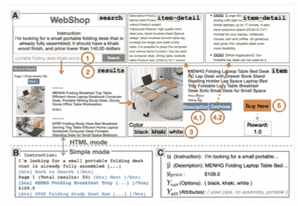
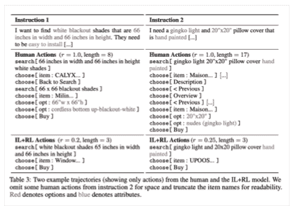
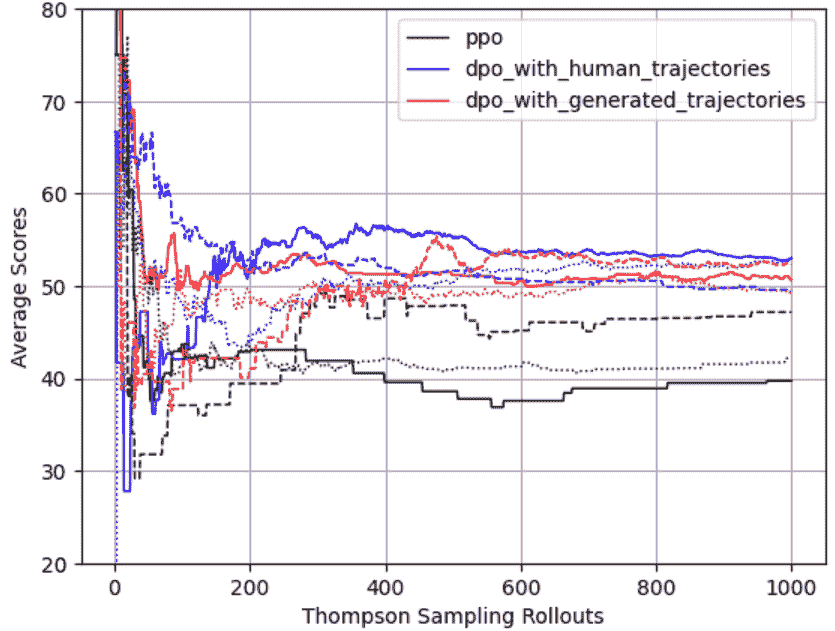
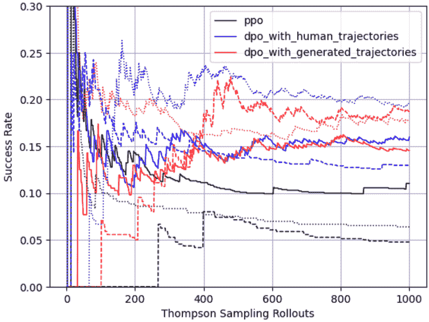
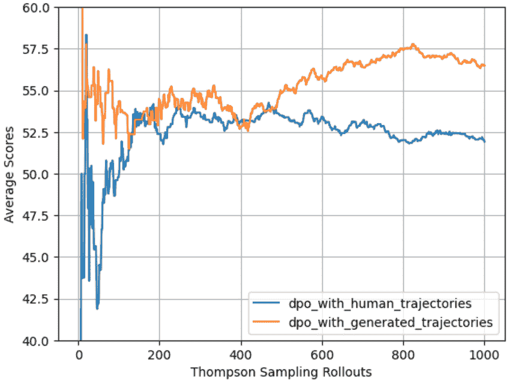
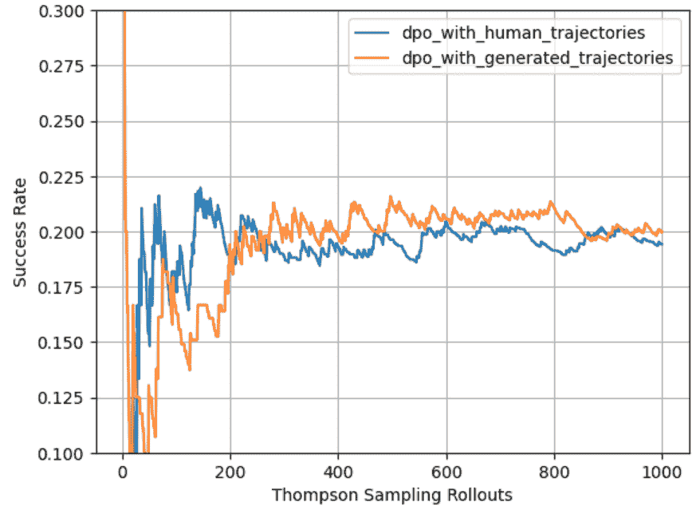

<!--yml

类别：未分类

日期：2025-01-11 12:17:55

-->

# 一种极其数据高效且基于生成式大语言模型（LLM）的强化学习推荐系统代理

> 来源：[https://arxiv.org/html/2408.16032/](https://arxiv.org/html/2408.16032/)

Shuang Feng [fengshuang@gmail.com](mailto:fengshuang@gmail.com) 斯坦福大学SCPD帕洛阿尔托，加利福尼亚，美国 和 Grace Feng [gracefeng@ucsb.eud](mailto:gracefeng@ucsb.eud) 加利福尼亚大学圣巴巴拉分校圣巴巴拉，加利福尼亚，美国（2024）

###### 摘要。

最近，大型语言模型（LLM）的进展使得理解网页上下文、产品细节和人类指令成为可能。将LLM作为强化学习中奖励模型或策略的基础架构已经变得非常流行——其中一个显著的成就是InstructGPT（Ouyang等， [2022](https://arxiv.org/html/2408.16032v1#bib.bib12)）的成功。强化学习算法在最大化长期客户满意度和避免短期、目光短浅的目标方面发挥了重要作用，这对于依赖深度学习模型来预测即时点击或购买的工业推荐系统至关重要。

在这个项目中，多个强化学习方法被实现并在WebShop（Yao等， [2023](https://arxiv.org/html/2408.16032v1#bib.bib18)）基准环境、数据、模拟器和预训练模型检查点上进行评估。目标是训练一个强化学习代理，以最大化购买奖励，根据详细的人类指令描述一个期望的产品。

这些强化学习代理通过微调预训练的BERT模型，使用不同的目标，从偏好中学习而不依赖奖励模型，并采用现代训练技术，如在InstructGPT中使用的近端策略优化（PPO）（Ouyang等， [2022](https://arxiv.org/html/2408.16032v1#bib.bib12)）和直接偏好优化（DPO）（Rafailov等， [2023](https://arxiv.org/html/2408.16032v1#bib.bib13)）。本报告还评估了使用生成轨迹训练的强化学习代理。评估是在WebShop模拟器环境中使用汤普森采样进行的。

模拟在线实验表明，DPO在数据效率和任务性能上优于PPO，特别是在成功率方面，且使用相同的训练时间。然而，为了公平比较这两者，仍需要更长的训练时间。具体而言，在没有使用任何图像的情况下，一名DPO代理在T4 GPU上经过大约3000步或30分钟的训练后，达到了19%的成功率，而PPO代理则在2小时的训练后仅达到了15%的成功率。结果还表明，使用生成轨迹训练的代理与使用人工轨迹训练的代理在任务性能上相当。这证明了训练强化学习代理的一种极低成本且高效的数据利用方式。

大型语言模型（LLM）、强化学习、推荐系统、对比学习、生成式人工智能（Generative AI）、强化学习人类反馈（RLHF）、人类偏好、电子商务^†^†版权：acmlicensed^††期刊年份：2024^††会议：fengshuang@gmail.com；2024年8月25日至29日；西班牙巴塞罗那^††ISBN：978-1-4503-XXXX-X/18/06¹¹1本文最初是斯坦福大学CS234课程项目的一部分，并于2024年6月30日提交给KDD’24的RelKD研讨会。该论文于2024年7月被接受。详情请见https://github.com/fengshuang-coding/KDD2024以获取更新。

## 1. 引言

最近在大型语言模型（LLMs）方面的进展显著提升了理解人类指令、处理网页文本以及把握上下文的研究与应用。这些进展为训练强化学习（RL）智能体在网页环境中，特别是在电子商务和各种推荐系统（如YouTube和Netflix）中的应用提供了宝贵的工具。将LLM应用于RL智能体的训练相对较新，但已经证明是成功的。一个显著的例子是InstructGPT（Ouyang et al., [2022](https://arxiv.org/html/2408.16032v1#bib.bib12)），在该项目中，通过使用人类偏好，采用人类指令微调GPT-3模型训练了一个RL智能体。将LLM与RL技术结合，可以创建能够理解人类指令并在网页或应用环境中完成任务的智能网路代理，从而最大化预期的奖励。

推荐系统已经从协同过滤（Koren et al., [2009](https://arxiv.org/html/2408.16032v1#bib.bib7)）发展到最近在深度监督学习中的激增，这些技术预测用户的即时响应，如点击（Covington et al., [2016](https://arxiv.org/html/2408.16032v1#bib.bib5); Zhang et al., [2017](https://arxiv.org/html/2408.16032v1#bib.bib19)）。这种方法在个性化用户互动方面取得了巨大的成功。然而，经过几年在生产环境中的应用，深度监督学习算法也暴露出了一些局限性，包括：1) 侧重于优化短期收益，忽视了长期的用户满意度和留存；2) 由这些算法生成的训练数据导致了强反馈回路，从而加剧了这些负面影响。相反，强化学习（RL）算法的设计旨在通过学习最大化长期用户满意度的策略来优化长期收益。RL智能体还以其进行顺序规划和基于马尔可夫决策过程（MDP）特性做出决策的能力而著称（Chen et al., [2018](https://arxiv.org/html/2408.16032v1#bib.bib3)）。

在网页环境中，强化学习（RL）代理用于推荐系统的训练已被广泛研究，现已有多个基准数据集和训练好的代理可用。例如，WikiNav（Nogueira和Cho，[2017](https://arxiv.org/html/2408.16032v1#bib.bib11)）为基于网页的导航RL代理提供了基准。RecoGym（Rohde等人，[2018](https://arxiv.org/html/2408.16032v1#bib.bib14)）为在线广告的生产推荐中的RL代理提供了基准。Virtual-Taobao（Shi等人，[2019](https://arxiv.org/html/2408.16032v1#bib.bib16)）包括一个从淘宝衍生出的虚拟在线购物环境，承载着多个用于产品推荐的RL算法。WebShop（Yao等人，[2023](https://arxiv.org/html/2408.16032v1#bib.bib18)）提供了一个模拟的电子商务网页环境，基于人类文本指令，包含超过1,600个人类示范用于网页购物任务。该环境包括118万种产品的文本和图像描述，以及12,087条众包文本指令。WebShop的作者还探索了几种基于现实世界人类轨迹训练的模仿和RL代理。

在基于网页推荐系统的RL探索方面，已有大量研究。查询重构，如（Nogueira和Cho，[2017](https://arxiv.org/html/2408.16032v1#bib.bib11)）中所述，是一个旨在优化结果的RL问题。在这种情况下，搜索引擎被视为黑盒，RL代理（或重构器）通过在状态空间中采取行动，学习生成能够最大化预期回报的查询。该论文于2017年发布，早于BERT（Devlin等人，[2019](https://arxiv.org/html/2408.16032v1#bib.bib6)）的广泛使用。作者提出了一个PRF框架，其中CNN/RNN充当上下文学习器和查询生成器。最近的研究提出了“学习搜索”（Adolphs等人，[2021](https://arxiv.org/html/2408.16032v1#bib.bib2)）的概念，其中搜索代理通过生成基于先前查询的交互式搜索查询，并保存最优查询，模仿交互过程。作者使用了T5模型并通过微调来作为查询生成器，与搜索引擎进行迭代交互，从而生成一组细粒度查询，带来更好的结果。另一项相关的工作，WebGPT（Nakano等人，[2021](https://arxiv.org/html/2408.16032v1#bib.bib10)），利用网页界面和搜索引擎训练RL代理回答问题。

## 2\. 相关工作

本文中展示的工作是在WebShop（Yao等人，[2023](https://arxiv.org/html/2408.16032v1#bib.bib18)）环境中构建并评估的，该环境是一个在线网页购物推荐系统的模拟器。

### 2.1\. WebShop环境

WebShop是一个基准项目，旨在在一个大规模、交互式的基于网页的环境中训练强化学习算法。它包含超过12,000个众包的人工指令，超过110万个从amazon.com抓取的产品。通过双字表示法和TF-IDF评分，从串联的产品标题和描述中衍生出670个属性，并分配给每个产品。

以下的图1和图2提供了一个示例WebShop界面和一系列动作。

图1. WebShop环境（Yao等人，[2023](https://arxiv.org/html/2408.16032v1#bib.bib18)）

图2. WebShop人工指令和人工轨迹（Yao等人，[2023](https://arxiv.org/html/2408.16032v1#bib.bib18)）

原始论文将问题分解为两类强化学习模型，用于搜索和选择（或点击）。搜索模型是一个模仿学习模型（search-IL），模拟人类从指令中发出的搜索查询。它是一个基于人类指令和查询对微调的BART（Lewis等人，[2020](https://arxiv.org/html/2408.16032v1#bib.bib8)）模型。在选择（点击）学习方面，作者提出了几种强化学习模型，通过导航推荐模拟器优化点击选择，从而优化最终的奖励（购买）。奖励通过一个评分函数计算，以量化已购买产品与人类指令之间的相关性，基于产品的属性。原作者提出的模仿学习算法（choice-IL）是一个基于人类轨迹微调的BERT（Devlin等人，[2019](https://arxiv.org/html/2408.16032v1#bib.bib6)）模型。在选择的强化学习算法中，通过迭代模仿学习（choice-IL-RL），以微调的BERT模型为基准，并使用策略梯度和交叉熵的混合目标进行优化。

本问题中的状态空间由四种类型的网页的抽象组成：搜索页、产品推荐页、产品页和产品详情页。搜索页仅包含一个搜索框，用于输入指令，这些指令用于生成由人类或搜索代理生成的搜索查询，作为搜索引擎的输入。动作包括搜索、点击按钮和从下拉菜单中选择。点击购买按钮标志着轨迹的结束。状态转移由点击和其他动作引发，这些动作决定性地从一个网页（状态）重定向到另一个网页。观察，包括在特定时间快照下的状态和指令，共同构成强化学习代理的输入，以便做出后续动作。

WebShop 项目使用的搜索引擎是自建的，并且通过 Pyserini（Lin 等，[2021](https://arxiv.org/html/2408.16032v1#bib.bib9)）在离线状态下自索引，Pyserini 是基于开源的 Lucene 搜索库构建的。产品检索基于搜索查询与产品信息文本之间的 BM25 算法。前 50 个结果按 BM25 排名并显示在 5 页中。

### 2.2. 通过人类偏好进行强化学习 - RLHF

强化学习与人类偏好（RLHF）（Christiano 等，[2023](https://arxiv.org/html/2408.16032v1#bib.bib4)）与 PPO（Schulman 等，[2017](https://arxiv.org/html/2408.16032v1#bib.bib15)）一起成功用于训练一些知名的 GPT 相关产品，如 instructGPT（Ouyang 等，[2022](https://arxiv.org/html/2408.16032v1#bib.bib12)）。RLHF 利用 Bradley-Terry 模型，该模型通过人类标注者标注的偏好和不偏好的数据奖励来定义偏好：

|  | $P(y_{l}\succ y_{w}&#124;x)=\frac{exp(r(x,y_{l}))}{exp(r(x,y_{l}))+exp(r(x,y_{w}))}.$ |  |
| --- | --- | --- |

RLHF 目标可以类似地定义为熵损失。

### 2.3. PPO 用于正则化策略梯度

近端策略优化（PPO）（Schulman 等，[2017](https://arxiv.org/html/2408.16032v1#bib.bib15)）已被证明在通过人类指令和标注偏好微调 GPT 模型方面有效（Ouyang 等，[2022](https://arxiv.org/html/2408.16032v1#bib.bib12)）。PPO 通过剪切或 KL 散度约束来最小化步骤间大幅更新的可能性，大致提供了单调改进的保证。这种方法在概率上收敛到局部最优，并且在实践中能导致更加稳定的训练结果。PPO 中策略梯度的剪切损失函数可以表示为：

| (1) |  | $L_{\theta_{k}}^{PPO}=-E_{\tau\sim\pi_{k}}\left[min(z_{t}(\theta)\hat{A}_{t}^{% \pi_{k}},clip(z_{t}(\theta),1-\epsilon,1+\epsilon)\hat{A}_{t}^{\pi_{k}}\right]$ |  |
| --- | --- | --- | --- |

，其中

|  | $z_{t}(\theta)=\frac{\pi_{\theta}(a_{t}&#124;o_{t})}{\pi_{\theta_{k}}(a_{t}&#124;o_{t})},$ |  |
| --- | --- | --- |
|  | $\hat{A}_{t}^{\pi_{k}}=R_{t}-V^{\pi_{k}}(o_{t}).$ |  |

### 2.4. 通过人类偏好进行学习 - DPO

直接偏好优化（DPO）（Rafailov 等，[2023](https://arxiv.org/html/2408.16032v1#bib.bib13)）的开发是革命性的。它消除了对明确奖励函数的需求，完全依赖配对的偏好轨迹作为训练数据。DPO 来源于加入 Bradley-Terry 目标

|  | $L_{BT}(r,D)=-E_{(x,y_{w},y_{l})\sim D}\left[log\ \sigma\left(r(x,y_{w})-r(x,y_{l})\right)\right]$ |  |
| --- | --- | --- |

，RLHF 目标如下：

|  | $\smash{\displaystyle\max_{\pi}}\ E_{x\sim D,y\sim\pi}[r(x,y)]-\beta D_{KL}[\pi% (y&#124;x)&#124;&#124;\pi_{ref}(y&#124;x)].$ |  |
| --- | --- | --- |

DPO 损失函数为：

|  | $\begin{split}L_{DPO}(\pi_{\theta},\pi_{ref})&=-E_{(x,y_{w},y_{l})\sim D}[log\ % \sigma(\beta log\frac{\pi_{\theta}(y_{w}&#124;x)}{\pi_{ref}(y_{w}&#124;x)}\\ &-\beta log\frac{\pi_{\theta}(y_{l}&#124;x)}{\pi_{ref}(y_{l}&#124;x)})].\end{split}$ |  |
| --- | --- | --- |

，其中$\pi_{\theta}$是DPO策略，$\pi_{ref}$是预先选定的参考策略。从损失函数的形式来看，虽然DPO不需要明确训练奖励模型，但它确实需要一个预定义的参考策略来进行迭代。

## 3\. 方法

本报告总结了几项实施和评估PPO与对比学习（使用DPO）对人类轨迹和生成的不受偏好轨迹的工作。然后，报告展示了使用所有生成轨迹的对比学习工作。

我们在原始的WebShop代码包基础上分支并实现了DPO和PPO，同时为自生成学习实验引入了一个新的生成模块，并加入了一个汤普森采样模块来开展在线实验并收集结果。

对于PPO训练，原始论文中的策略梯度目标（Yao等人，[2023](https://arxiv.org/html/2408.16032v1#bib.bib18)）被修改为PPO目标，如公式（1）所示。整体目标组件，包括来自策略梯度（PG）的总损失、熵损失和模仿学习损失，与原始论文相同，唯一的区别是PG组件被PPO损失替代。

### 3.1\. 使用人类轨迹的半生成式强化学习

对于这个项目，我们利用预训练的模仿学习代理检查点作为参考策略，生成不受偏好的轨迹。偏好的轨迹来自WebShop基准提供的人类数据。在训练过程中，会随机采样一个人类轨迹，包括状态和日志中的可用动作。在每个需要做出动作决策的状态下，使用参考策略生成一个不受偏好的动作。该不受偏好的动作与人类生成的偏好动作配对。基于人类轨迹，每完成一轮，便会应用DPO更新。

这种方法被认为是生成式和半自我学习的结合。它是生成式的，因为我们使用预定义的非偏好策略来生成配对训练所需的动作。它是半自我学习的，因为它将这些生成的动作与先前收集的人类轨迹配对，这些轨迹作为黄金标准。

### 3.2\. 自我学习 - 使用生成的轨迹进行训练

在经典的强化学习中，自我博弈或通过模拟进行学习起着至关重要的作用，尤其是在数据收集成本高昂的情况下，比如在本问题中收集人类轨迹。自我博弈已经证明是有效的，最著名的例子就是AlphaGo（Silver等人，[2016](https://arxiv.org/html/2408.16032v1#bib.bib17)）。

为了评估自我博弈或自我学习在 WebShop 推荐系统中的应用，我们使用了一种简单的方法，通过采样具有完美奖励（得分 = 1）的轨迹，生成了 100 条首选轨迹。这个采样使用了 WebShop 论文作者提供的模仿学习代理检查点，但使用了真实世界的人类指令。

理想情况下，这些采样的轨迹应该进行修剪，以消除环形子轨迹。然后，从前一节中用于 DPO 评估的相同检查点训练一个 DPO 代理，训练步数为 3000 步。通过在 WebShop 模拟器环境中运行汤普森采样，比较这两个 DPO 代理之间的任务表现——一个使用人类轨迹进行半学习训练，另一个使用生成轨迹进行自我学习训练。

## 4\. 实验结果

### 4.1\. DPO 与 PPO 任务表现

在这个项目中，我们利用 WebShop 环境和模拟器，通过使用汤普森采样（Thompson sampling）进行广泛的模拟在线实验，以分析不同训练代理之间的表现差异。汤普森采样的目标是选择能够最小化总体遗憾的最佳行动（或“臂”）。然而，在少量步骤的采样中，由于探索不足，对于那些被认为不太理想的臂，可能无法准确估计其奖励。为了解决这个问题，我们使用了多个并行的汤普森采样运行，每次运行有 1000 次尝试，从而捕捉不同运行之间的变异性。精心的实验设计和计算出的在线实验尝试对于准确估计每个代理的奖励和成功率是必要的。本项目的目标是实现并理解不同方法的性能趋势。

结果表明，直接偏好优化（DPO）代理相比于近端策略优化（PPO）代理，获得了显著更高的得分和成功率，即使所有代理都是从原始论文提供的相同模仿学习 BERT 模型检查点开始训练的。需要注意的是，这次比较中的所有代理在训练时都没有使用图像数据，因此收集到的得分和成功率不能直接与原始论文进行比较，因为原始论文在训练和实验中包括了图像数据。

一个有趣的发现是，使用人类轨迹训练的 DPO 代理与使用生成轨迹训练的 DPO 代理表现相似，尽管在不同运行中的成功率变异性更大。观察到自我学习代理的较小变异性，可以归因于训练 DPO 自我学习代理时只使用了 100 条生成轨迹，而用于训练 DPO 代理的则是 1200 条人类轨迹。

DPO代理仅使用3000步进行训练，这一事实也暗示了在长时间使用相同数据集进行训练时，可能低估了数据低效性或瓶颈。当训练生产系统的代理时，有限的可用轨迹数量可能导致任务表现下降，因为从有限数据中学习到的信息不足。实际上，收集人工数据既昂贵又耗时。通过生成优选和非优选轨迹，作为连续、低成本的训练数据来源，可以缓解这一问题。

图3\. DPO与PPO — 人工轨迹与生成轨迹 — 分数

图4\. DPO与PPO — 人工轨迹与生成轨迹 — 成功率

值得注意的是，由于两个关键的不同点，本项目的结果不能直接与原始论文的结果进行比较：1) 本项目评估的任何代理在训练或实验中都未使用图像数据，2) 每个代理仅用最少步数（3000步）在不到一小时的时间内进行训练。本项目的目的不是对结果进行基准测试，而是调查强化学习算法的变异性。

在DPO代理基础上使用完全生成的偏好进行训练，取得的分数远高于使用人工轨迹的DPO代理，而成功率保持相似（图5，图6）。这一差异的大小需要通过多次实验的方差来加以验证，但这一发现表明，使用生成数据来增强基于最初使用人工轨迹训练的现有代理的训练具有潜力。

图5\. 使用生成的轨迹进行自我学习 — 分数

图6\. 使用生成的轨迹进行自我学习 — 成功率

## 5\. 结论

在非常有限的训练时间（不足1小时）内，直接偏好优化（DPO）优于邻近策略优化（PPO），在更少的训练时间内提供更好的任务表现和更高的成功率。然而，为得出结论，还需要更多经过较长训练时间的评估。使用在一小时内训练的DPO代理且没有图像数据时，我们达到了约19%的成功率。这高于使用RNN网络（未使用预训练模型进行搜索或选择模仿学习）训练的RL代理的成功率，该代理在原始论文中的成功率为18%。

PPO被认为能够提供更稳定的训练，并且对强化学习（RL）目标提供近乎单调的保证。由于PPO的正则化和目标裁剪机制能够防止快速的策略变化，因此它适用于状态和动作空间较小、不会出现大规模策略变化的问题。然而，在在线产品推荐系统的背景下，由于状态-动作空间可能扩展到数百万维度，且快速的策略变化对于快速学习至关重要，因此PPO可能需要更长的训练时间。

使用生成的轨迹训练DPO代理显示出了巨大的潜力。在只使用100个生成的人类轨迹和相同数量的计算资源下，任务的表现与使用1200个人类轨迹训练的DPO代理相当。这种方法解决了数据效率低下和高昂的人类数据收集成本的问题。随着训练需要更多的时间和数据，有限的人类数据可用性可能会阻碍持续改进。这一实验表明，生成的轨迹几乎可以和人类轨迹一样有效，甚至可以作为一种持续、低成本的训练数据来源。此外，生成的轨迹还允许探索人类未曾见过的成功路径，这类似于促成AlphaGo（Silver等，[2016](https://arxiv.org/html/2408.16032v1#bib.bib17)）和AlphaZero成功的方式，它们是通过自我对弈而不是过去的人类游戏来训练的。

## 6\. 潜在应用：使用训练好的代理作为推荐系统

在推荐系统中使用强化学习代理并不是新鲜事——它已被应用于像Youtube这样的在线推荐系统中。训练出的最优策略可以成为推荐系统的理想排序算法。从人类指令开始，代理模拟通过训练出的最优策略在给定的产品列表中进行导航，并从每次运行中提供一个“购买”产品。在推荐系统中，代理的多次运行为用户提供了一份推荐产品的列表，界面上展示的顺序可以通过每次运行中推荐产品的得分或成功率进行排序，例如在网页或应用程序中。

###### 致谢

感谢WebShop的作者Shunyu Yao、Howard Chen、John Yang和Karthik Narasimhan，他们来自普林斯顿大学，并发布了（Yao等，[2023](https://arxiv.org/html/2408.16032v1#bib.bib18)），启发了本项目报告的撰写。

感谢Chris Potts教授向本文作者介绍了WebShop [17]，以及他在斯坦福大学教授的CS224U课程。

感谢Emma Brunskill教授在斯坦福大学教授的CS234课程。

## 参考文献

+   (1)

+   Adolphs 等人 (2021) Leonard Adolphs, Benjamin Börschinger, Christian Buck, Michelle Chen Huebscher, Massimiliano Ciaramita, Lasse Espeholt, Thomas Hofmann, 和 Yannic Kilcher. 2021. 利用交互式代理提升搜索引擎。*CoRR* abs/2109.00527 (2021)。arXiv:2109.00527 [https://arxiv.org/abs/2109.00527](https://arxiv.org/abs/2109.00527)

+   Chen 等人 (2018) Minmin Chen, Alex Beutel, Paul Covington, Sagar Jain, Francois Belletti, 和 Ed H. Chi. 2018. 针对 REINFORCE 推荐系统的 Top-K 离策略修正。*CoRR* abs/1812.02353 (2018)。arXiv:1812.02353 [http://arxiv.org/abs/1812.02353](http://arxiv.org/abs/1812.02353)

+   Christiano 等人 (2023) Paul Christiano, Jan Leike, Tom B. Brown, Miljan Martic, Shane Legg, 和 Dario Amodei. 2023. 从人类偏好中进行深度强化学习。arXiv:1706.03741 [stat.ML]

+   Covington 等人 (2016) Paul Covington, Jay Adams, 和 Emre Sargin. 2016. 用于 YouTube 推荐的深度神经网络。在*第10届ACM推荐系统会议*（美国马萨诸塞州波士顿）*(RecSys ’16)*中。计算机协会，纽约，美国，191–198。 [https://doi.org/10.1145/2959100.2959190](https://doi.org/10.1145/2959100.2959190)

+   Devlin 等人 (2019) Jacob Devlin, Ming-Wei Chang, Kenton Lee, 和 Kristina Toutanova. 2019. BERT: 用于语言理解的深度双向 Transformer 预训练。(2019)。arXiv:1810.04805 [cs.CL]

+   Koren 等人 (2009) Yehuda Koren, Robert Bell, 和 Chris Volinsky. 2009. 推荐系统的矩阵分解技术。*Computer* 42, 8 (2009), 30–37。 [https://doi.org/10.1109/MC.2009.263](https://doi.org/10.1109/MC.2009.263)

+   Lewis 等人 (2020) Mike Lewis, Yinhan Liu, Naman Goyal, Marjan Ghazvininejad, Abdelrahman Mohamed, Omer Levy, Veselin Stoyanov, 和 Luke Zettlemoyer. 2020. BART: 用于自然语言生成、翻译和理解的去噪序列到序列预训练。在*第58届计算语言学协会年会论文集*中。计算语言学协会，在线，7871–7880。 [https://doi.org/10.18653/v1/2020.acl-main.703](https://doi.org/10.18653/v1/2020.acl-main.703)

+   Lin 等人 (2021) Jimmy Lin, Xueguang Ma, Sheng-Chieh Lin, Jheng-Hong Yang, Ronak Pradeep, 和 Rodrigo Frassetto Nogueira. 2021. Pyserini: 一个易于使用的 Python 工具包，用于支持可重复的 IR 研究，支持稀疏和密集表示。*CoRR* abs/2102.10073 (2021)。arXiv:2102.10073 [https://arxiv.org/abs/2102.10073](https://arxiv.org/abs/2102.10073)

+   Nakano 等人（2021）Reiichiro Nakano, Jacob Hilton, Suchir Balaji, Jeff Wu, Long Ouyang, Christina Kim, Christopher Hesse, Shantanu Jain, Vineet Kosaraju, William Saunders, Xu Jiang, Karl Cobbe, Tyna Eloundou, Gretchen Krueger, Kevin Button, Matthew Knight, Benjamin Chess, 和 John Schulman. 2021. WebGPT: 使用浏览器辅助的问答系统与人类反馈. *CoRR* abs/2112.09332 (2021). arXiv:2112.09332 [https://arxiv.org/abs/2112.09332](https://arxiv.org/abs/2112.09332)

+   Nogueira 和 Cho（2017）Rodrigo Frassetto Nogueira 和 Kyunghyun Cho. 2017. 基于强化学习的任务导向查询重构. *CoRR* abs/1704.04572 (2017). arXiv:1704.04572 [http://arxiv.org/abs/1704.04572](http://arxiv.org/abs/1704.04572)

+   Ouyang 等人（2022）Long Ouyang, Jeffrey Wu, Xu Jiang, Diogo Almeida, Carroll Wainwright, Pamela Mishkin, Chong Zhang, Sandhini Agarwal, Katarina Slama, Alex Ray, John Schulman, Jacob Hilton, Fraser Kelton, Luke Miller, Maddie Simens, Amanda Askell, Peter Welinder, Paul F Christiano, Jan Leike, 和 Ryan Lowe. 2022. 训练语言模型以通过人类反馈遵循指令. 收录于 *Advances in Neural Information Processing Systems*, S. Koyejo, S. Mohamed, A. Agarwal, D. Belgrave, K. Cho, 和 A. Oh（编），第35卷。Curran Associates, Inc., 27730–27744. [https://proceedings.neurips.cc/paper_files/paper/2022/file/b1efde53be364a73914f58805a001731-Paper-Conference.pdf](https://proceedings.neurips.cc/paper_files/paper/2022/file/b1efde53be364a73914f58805a001731-Paper-Conference.pdf)

+   Rafailov 等人（2023）Rafael Rafailov, Archit Sharma, Eric Mitchell, Stefano Ermon, Christopher D. Manning, 和 Chelsea Finn. 2023. 直接偏好优化：你的语言模型实际上是一个奖励模型. (2023). arXiv:2305.18290 [cs.LG]

+   Rohde 等人（2018）David Rohde, Stephen Bonner, Travis Dunlop, Flavian Vasile, 和 Alexandros Karatzoglou. 2018. RecoGym: 一种用于在线广告中产品推荐问题的强化学习环境. *CoRR* abs/1808.00720 (2018). arXiv:1808.00720 [http://arxiv.org/abs/1808.00720](http://arxiv.org/abs/1808.00720)

+   Schulman 等人（2017）John Schulman, Filip Wolski, Prafulla Dhariwal, Alec Radford, 和 Oleg Klimov. 2017. 近端策略优化算法. *CoRR* abs/1707.06347 (2017). arXiv:1707.06347 [http://arxiv.org/abs/1707.06347](http://arxiv.org/abs/1707.06347)

+   Shi 等人（2019）Jing-Cheng Shi, Yang Yu, Qing Da, Shi-Yong Chen, 和 An-Xiang Zeng. 2019. Virtual-Taobao: 为强化学习虚拟化现实世界在线零售环境. *Proceedings of the AAAI Conference on Artificial Intelligence* 33, 01 (2019年7月), 4902–4909. [https://doi.org/10.1609/aaai.v33i01.33014902](https://doi.org/10.1609/aaai.v33i01.33014902)

+   Silver 等人（2016）David Silver、Aja Huang、Christopher J. Maddison、Arthur Guez、Laurent Sifre、George van den Driessche、Julian Schrittwieser、Ioannis Antonoglou、Veda Panneershelvam、Marc Lanctot、Sander Dieleman、Dominik Grewe、John Nham、Nal Kalchbrenner、Ilya Sutskever、Timothy Lillicrap、Madeleine Leach、Koray Kavukcuoglu、Thore Graepel 和 Demis Hassabis。2016年。使用深度神经网络和树搜索掌握围棋游戏。*Nature* 529（2016），484-503。[http://www.nature.com/nature/journal/v529/n7587/full/nature16961.html](http://www.nature.com/nature/journal/v529/n7587/full/nature16961.html)

+   姚顺宇等人（2023）姚顺宇、陈昊、杨俊、卡尔提克·纳拉西姆汉。2023年。WebShop：面向可扩展的真实世界网页互动与具象语言代理。 （2023年）。arXiv:2207.01206 [cs.CL]

+   张等人（2017）张帅、姚琳娜、孙爱新。2017年。基于深度学习的推荐系统：综述与新视角。*CoRR* abs/1707.07435（2017）。arXiv:1707.07435 [http://arxiv.org/abs/1707.07435](http://arxiv.org/abs/1707.07435)
