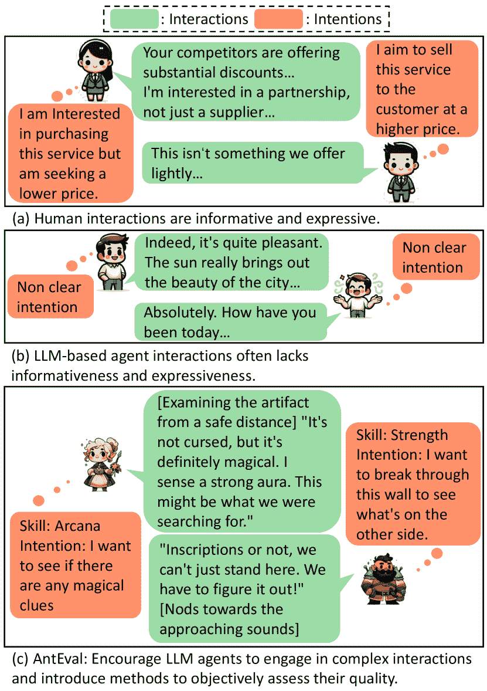
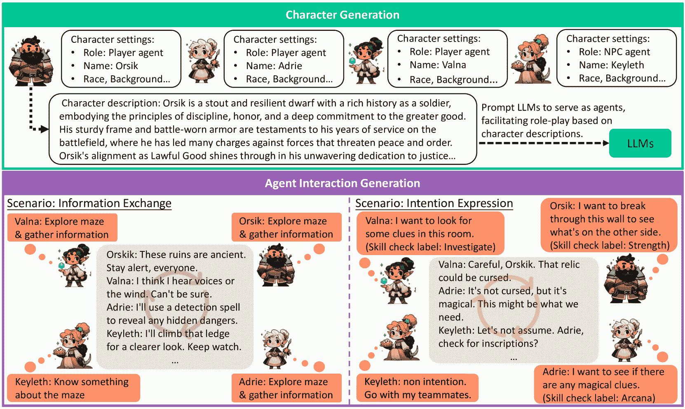
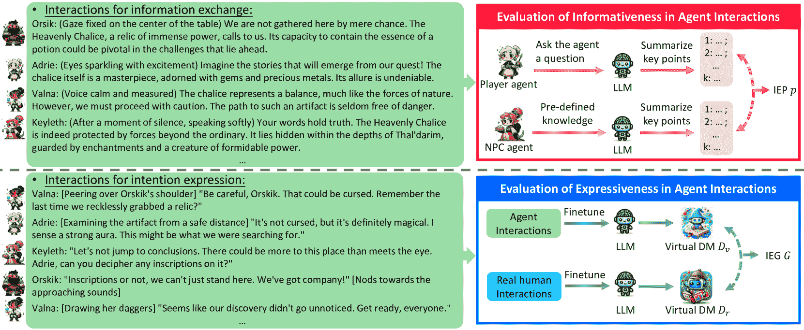
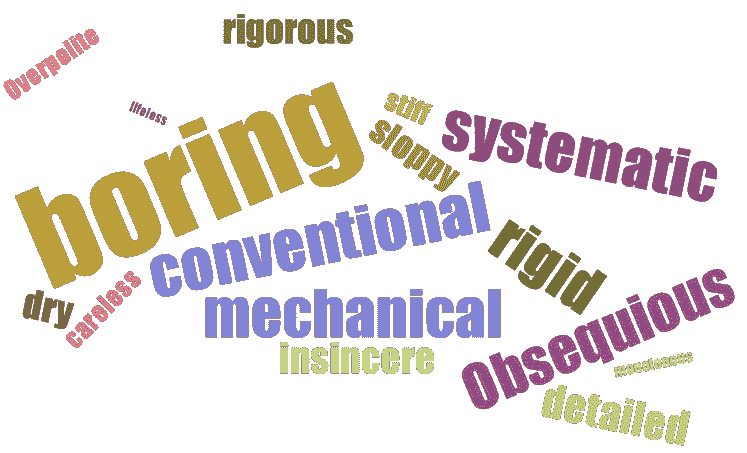

<!--yml

分类：未分类

日期：2025-01-11 12:57:48

-->

# AntEval：LLM驱动的智能体在社会互动能力评估

> 来源：[https://arxiv.org/html/2401.06509/](https://arxiv.org/html/2401.06509/)

梁元智

悉尼科技大学

liangyzh18@outlook.com

&朱林超

浙江大学

zhulinchao7@gmail.com

&杨轶

浙江大学

yangyics@zju.edu.cn

###### 摘要

大型语言模型（LLMs）已经展示了它们在多种场景下复制人类行为的能力。然而，它们在处理复杂的、多角色的社会互动方面的能力尚未得到充分探索，主要是因为缺乏健全的、量化的评估方法。这一空白减缓了那些在简单交流之外、能够进行更为微妙互动的智能体的开发，例如闲聊。为了解决这一挑战，我们提出了多智能体互动评估框架（AntEval），该框架包含一个新颖的互动框架和评估方法。该互动框架旨在促进一个复杂的互动环境，增强信息交换和意图表达。我们还介绍了评估方法，包括两个度量标准：信息交换精度（IEP）和互动表现差距（IEG），这些方法旨在量化和客观地评估智能体的互动能力。我们的研究结果突显了这些评估方法的有效性，并展示了改善LLMs构建更自然、更具人类复杂性的互动智能体的巨大潜力。

## 1 引言

大型语言模型（LLMs）的进展显著影响了人工智能（AI）研究和应用，展示了在理解陈等人（[2017](https://arxiv.org/html/2401.06509v3#bib.bib9)）、亨德里克斯等人（[2020](https://arxiv.org/html/2401.06509v3#bib.bib20)）和推理泽勒斯等人（[2019](https://arxiv.org/html/2401.06509v3#bib.bib48)）；黄和张（[2022](https://arxiv.org/html/2401.06509v3#bib.bib21)）方面的卓越能力。LLMs已被用于构建在多个领域表现出色的智能体，如翻译范等人（[2021](https://arxiv.org/html/2401.06509v3#bib.bib16)）；杨等人（[2020](https://arxiv.org/html/2401.06509v3#bib.bib46)），问答系统朱等人（[2021](https://arxiv.org/html/2401.06509v3#bib.bib52)）；莱纳特（[2022](https://arxiv.org/html/2401.06509v3#bib.bib24)），以及更多专门任务，如SAT求解叶等人（[2023](https://arxiv.org/html/2401.06509v3#bib.bib47)）和法律考试博马里托二世与卡茨（[2022](https://arxiv.org/html/2401.06509v3#bib.bib7)）。

与逻辑和推理能力不同，社交互动能力同样至关重要。从社会学和人类学的角度来看，人类天生是社会性的，互动构成了社会结构和个人发展的支柱。研究表明，Batson ([1990](https://arxiv.org/html/2401.06509v3#bib.bib5)); Dijksterhuis ([2005](https://arxiv.org/html/2401.06509v3#bib.bib14)); Goody ([1995](https://arxiv.org/html/2401.06509v3#bib.bib17)); Sterelny ([2007](https://arxiv.org/html/2401.06509v3#bib.bib40)); Lopes et al. ([2004](https://arxiv.org/html/2401.06509v3#bib.bib31)) 将智力与社交互动联系起来，包括对话、行动、情感等，强调了评估个体社交互动能力的重要性。近期，Liu et al. ([2023b](https://arxiv.org/html/2401.06509v3#bib.bib30)); Park et al. ([2023](https://arxiv.org/html/2401.06509v3#bib.bib35)); Chen et al. ([2023](https://arxiv.org/html/2401.06509v3#bib.bib11)) 开始研究基于大语言模型（LLM）的代理在社交互动中的表现。然而，LLM和代理的快速发展可能会超越评估方法的进展。现有的评估指标主要侧重于领域特定的知识和认知技能，如Hendrycks et al. ([2020](https://arxiv.org/html/2401.06509v3#bib.bib20)); Zellers et al. ([2019](https://arxiv.org/html/2401.06509v3#bib.bib48))，这些指标难以评估灵活多样的社交互动。虽然已经存在主观评估方法，如Park et al. ([2023](https://arxiv.org/html/2401.06509v3#bib.bib35)); Liu et al. ([2023b](https://arxiv.org/html/2401.06509v3#bib.bib30))，但该领域仍缺乏全面、客观和定量的评估方法，这一问题突出显示了未来研究的一个重要方向。

设计互动评估方法的挑战在于其固有的复杂性和可变性。定义、收集和注释人类互动以进行分析非常困难，因为日常互动往往缺乏明确的意图或详细信息，如王等人（[2023](https://arxiv.org/html/2401.06509v3#bib.bib42)）；Rawte等人（[2023](https://arxiv.org/html/2401.06509v3#bib.bib36)）所提到的闲聊（Lipenkova [2023](https://arxiv.org/html/2401.06509v3#bib.bib28)）；Ahmed等人（[2023](https://arxiv.org/html/2401.06509v3#bib.bib1)）。此外，充满细微差别的互动，如商务谈判（Heikkinen等人 [2021](https://arxiv.org/html/2401.06509v3#bib.bib19)）；Beauregard [2020](https://arxiv.org/html/2401.06509v3#bib.bib6)），由于隐私问题，很少有文献记载。复杂场景中代理人互动的有限可用性构成了一个重大挑战，使得LLM驱动的代理人难以进行复杂的互动。此外，缺乏全面的评估基准严重阻碍了代理人追求更具信息性和表现力互动的能力。这种双重缺陷突显了急需多样化互动环境和客观、定量评估方法的必要性，以提升代理人互动的能力。

图1：真实的人类互动以其高效的信息交换和明确的意图为特点，展示了复杂性和深度。相比之下，基于大型语言模型（LLM）的代理人的互动，如陈等人（[2023](https://arxiv.org/html/2401.06509v3#bib.bib11)）；朴等人（[2023](https://arxiv.org/html/2401.06509v3#bib.bib35)）所示的结果（b），通常表现为缺乏实质性内容，类似于表面的互动。AntEval框架鼓励代理人参与既复杂又重要的互动。值得注意的是，AntEval进一步提出了评估方法，专门设计用于基于信息量和表现力定量评估互动。我们的框架旨在提供一个评估框架，引导LLM的能力接近真实的人类互动。

本文介绍了多智能体交互评估框架（AntEval），这是一种专门设计用于评估多智能体交互的新型评估框架。首先，为了提供复杂的交互环境并防止智能体进行无意义的小谈话，AntEval 引入了桌面角色扮演游戏（TRPG）Gygax 和 Arneson（[1974](https://arxiv.org/html/2401.06509v3#bib.bib18)）作为交互生成的平台。TRPG 提供了一个丰富的叙事环境，充满了拥有多样设定的角色（例如，个性、理想、关系等）。这些多样的设定为复杂的交互奠定了基础，同时避免了与收集现实世界数据相关的隐私问题。在游戏中，玩家需要有效地与彼此互动，交换有价值的信息，并清晰生动地表达他们的意图，以便于合作。更重要的是，游戏的机制提供了在叙事框架内标准化和明确表达玩家意图的方式。TRPG 的一个关键方面是地下城主（DM）Gygax 和 Arneson（[1974](https://arxiv.org/html/2401.06509v3#bib.bib18)），他负责监督游戏玩法并进行必要的技能检定。结合游戏的特殊规则，这确保了玩家意图在游戏日志中的详细记录和准确表达。TRPG 的这一独特特性为分析和评估交互的复杂性和深度提供了一个宝贵的机会，这些机会在之前是无法获得的 Liangs 等人（[2023](https://arxiv.org/html/2401.06509v3#bib.bib27)）。

借助TRPG的设定，AntEval引入了一个互动框架，鼓励代理进行信息性和表现性互动。具体来说，我们根据TRPG规则创建了多种具有详细设定的角色。然后，代理被要求在两个不同的场景中进行互动：信息交换和意图表达。为了定量评估这些互动的质量，AntEval引入了两个评估指标：信息交换的 informativeness 和意图表达的 expressiveness。对于信息交换，我们提出了信息交换精度（IEP）指标，评估信息传递的准确性，反映代理在信息性互动方面的能力。对于意图表达，我们引入了意图表现差距（IEG）。在该指标中，我们结合了虚拟DM（由真实玩家的互动和代理生成的虚拟互动微调），评估在意图估计任务中的表现差异Liang et al. ([2023](https://arxiv.org/html/2401.06509v3#bib.bib27))。如果代理生成的互动能够接近人类的表现，那么通过这种数据训练的虚拟DM在区分意图时应当接近人类能力。因此，IEG指标提供了一个可量化的度量，能够识别合成互动与真实互动之间的表现差距，作为LLM在创造真实社交交换中有效性的可靠评估标准。

我们的贡献如下：

1\. 我们介绍了AntEval，这是一个专为评估基于LLM的代理互动能力而设计的全新框架。该框架引入了互动框架和评估方法，使得在复杂场景中能够对互动能力进行定量和客观的评估。

2\. AntEval提出了两个关键指标：信息交换精度（IEP）和意图表现差距（IEG）。这些指标有助于在多代理互动中定量评估信息性和表现性，特别是针对AntEval互动框架中信息交换和意图表达场景的评估。

3\. 我们实现了AntEval框架，针对不同的大型语言模型（LLMs）进行了全面的实验。我们的研究得出了几个重要的见解：a). 社交互动作为一个独特的挑战：除了逻辑和推理能力，导航社交互动的能力对LLMs来说是一个独特的挑战。它们必须为复杂的互动生成扎实的语言，力求达到一种信息量和表现力的水平，类似于人类互动。尽管对人类来说是自然的，但即便是像GPT-4这样的先进模型也觉得这一点很困难，这表明还需要进一步的研究。b). 对齐的重要性：对齐是所有LLMs面临的关键问题，尤其是开源模型，展现出显著的改进潜力。此外，能够以类人方式进行互动操作且不产生幻觉仍然是一个值得深入探索的领域。c). 长时上下文互动的复杂性：理解并维持长时上下文互动中的连贯性仍然是一个障碍。尽管LLMs能有效处理单独的对话回合，但在多个回合中的累积质量常常缺乏人类对话特有的信息量和表现力。开发能够保留有价值内容并保持人类互动中观察到的自然灵活性的方法是一个具有挑战性的问题。

## 2 相关工作

LLMs的评估。大型语言模型（LLMs）的进展已经超出了传统基准的范围，因此需要一种精细化的评估方法，涵盖更广泛的任务，包括语言Zellers等人（[2019](https://arxiv.org/html/2401.06509v3#bib.bib48)）；Huang等人（[2023](https://arxiv.org/html/2401.06509v3#bib.bib22)）；Hendrycks等人（[2020](https://arxiv.org/html/2401.06509v3#bib.bib20)））和多模态Lu等人（[2022](https://arxiv.org/html/2401.06509v3#bib.bib33)）等。现有的基准主要分为以下几类：1）多方面评估，如MMLU Hendrycks等人（[2020](https://arxiv.org/html/2401.06509v3#bib.bib20)），包含57个多样化任务；Big-bench Srivastava等人（[2022](https://arxiv.org/html/2401.06509v3#bib.bib39)）提供超过200个任务，以进行全面的LLM评估；HELM Liang等人（[2022](https://arxiv.org/html/2401.06509v3#bib.bib26)）提出了一个结构化的分类法，以便进行深入的评估；2）现实世界应用评估，包括人类般理解的标准化测试Zhong等人（[2023](https://arxiv.org/html/2401.06509v3#bib.bib49)）；Clark等人（[2018](https://arxiv.org/html/2401.06509v3#bib.bib12)）；Sakaguchi等人（[2021](https://arxiv.org/html/2401.06509v3#bib.bib37)）；Zellers等人（[2019](https://arxiv.org/html/2401.06509v3#bib.bib48)）；编程能力Chen等人（[2021](https://arxiv.org/html/2401.06509v3#bib.bib10)）；Babe等人（[2023](https://arxiv.org/html/2401.06509v3#bib.bib4)）；Austin等人（[2021](https://arxiv.org/html/2401.06509v3#bib.bib3)）；数学问题解决Cobbe等人（[2021](https://arxiv.org/html/2401.06509v3#bib.bib13)）；Imani等人（[2023](https://arxiv.org/html/2401.06509v3#bib.bib23)），以及实际交互Xu等人（[2023](https://arxiv.org/html/2401.06509v3#bib.bib45)）；Li等人（[2023](https://arxiv.org/html/2401.06509v3#bib.bib25)）；Valmeekam等人（[2022](https://arxiv.org/html/2401.06509v3#bib.bib41)）；Ahn等人（[2022](https://arxiv.org/html/2401.06509v3#bib.bib2)）。我们的工作将重点转向定量评估社交互动，这是人类擅长但基于LLM的代理程序所不擅长的领域。

TRPG在LLM研究中的应用。桌面角色扮演游戏（TRPG）为自然语言处理（NLP）研究提供了复杂的设定，玩家在游戏主持人的引导下探索虚拟宇宙，进行复杂的自然语言互动 Weir等人（[2022](https://arxiv.org/html/2401.06509v3#bib.bib43)）；Louis和Sutton（[2018](https://arxiv.org/html/2401.06509v3#bib.bib32)）；Callison-Burch等人（[2022](https://arxiv.org/html/2401.06509v3#bib.bib8)）。对TRPG数据的研究已涉及NLP任务，如预测行动 Louis和Sutton（[2018](https://arxiv.org/html/2401.06509v3#bib.bib32)）以及生成上下文感知的对话 Si等人（[2021](https://arxiv.org/html/2401.06509v3#bib.bib38)）；Newman和Liu（[2022](https://arxiv.org/html/2401.06509v3#bib.bib34)）。此外，近期研究利用了来自《龙与地下城》（DND）论坛的数据，汇编了全面的数据集 Callison-Burch等人（[2022](https://arxiv.org/html/2401.06509v3#bib.bib8)）；Zhou等人（[2022](https://arxiv.org/html/2401.06509v3#bib.bib50)）；Zhu等人（[2023](https://arxiv.org/html/2401.06509v3#bib.bib51)），用于生成游戏中的指导和指令。

图2：AntEval框架示意图，展示了如何利用TRPG规则为代理创建互动环境。代理们进行角色扮演，旨在参与高质量的互动，进行信息交换和意图表达，目标是完成游戏冒险。该框架基于DND规则书，涉及详细且多样的角色设定。代理们参与两种类型的场景：基于意图的互动和知识交换，突出展示了他们在信息性和表现性互动中的能力。

## 3 代理互动框架

为了评估基于LLM的代理的社会互动能力，我们的方法论利用了TRPG设定，重点包括：（1）创建复杂的角色设定以反映现实世界中的互动，提供详细的角色描述以便进行复杂的互动；以及（2）建立一个互动环境，明确需要交换的信息和需要表达的意图。这解决了复杂互动数据收集中的数据标注和隐私挑战（例如商业谈判），促进了细致入微的互动。

如图[2](https://arxiv.org/html/2401.06509v3#S2.F2 "Figure 2 ‣ 2 Related Work ‣ AntEval: Evaluation of Social Interaction Competencies in LLM-Driven Agents")所示，我们框架的实现分为两个主要组件：角色生成和代理互动生成。在第一阶段，即角色生成阶段，我们专注于创建详细的角色档案，包括每个角色的设定和描述。接下来，LLMs会根据这些角色描述进行角色扮演，扮演游戏中的玩家代理。随后，我们引入多个代理以促进互动。所有详细的设定在补充材料LABEL:settings中给出。

### 3.1 角色生成

为了构建具有详细属性的角色，我们结合了TRPG元素，集中在诸如名字、种族和背景等基本特征上。种族、背景等属性在DND规则中是预定义的，如图[2](https://arxiv.org/html/2401.06509v3#S2.F2 "Figure 2 ‣ 2 Related Work ‣ AntEval: Evaluation of Social Interaction Competencies in LLM-Driven Agents")所示，并会随机分配给每个角色。然后，我们使用GPT-4模型生成与这些选定属性相符的名字和详细描述，符合游戏规则手册。通过这些描述，LLMs被指示在游戏中进行角色扮演，充当游戏中的代理角色，参见Liu et al.（[2023a](https://arxiv.org/html/2401.06509v3#bib.bib29)）；Park et al.（[2023](https://arxiv.org/html/2401.06509v3#bib.bib35)）；Chen et al.（[2023](https://arxiv.org/html/2401.06509v3#bib.bib11)））。

### 3.2 代理互动生成

我们引入了两个场景——信息交换和意图表达——来评估聚焦于信息性和表现力的代理互动。这些场景涉及$T$个玩家代理和一个非玩家角色（NPC），每个角色都有不同的设定。代理们基于其独特的角色描述进行互动，传达其所掌握的知识或意图。

信息交换：一个NPC被赋予由GPT-4模型生成的独特知识（魔法物品、武器等）。这种设置要求玩家代理通过互动来发现这些知识。其成功与否通过在$N$回合后与NPC未公开的信息进行对比来衡量。例如，在图[3](https://arxiv.org/html/2401.06509v3#S3.F3 "Figure 3 ‣ 3.2 Agent Interaction Generation ‣ 3 Agent Interaction Framework ‣ AntEval: Evaluation of Social Interaction Competencies in LLM-Driven Agents")中，代理Keyleth知道迷宫的秘密，而玩家代理Orisik、Adrie和Valna则对此一无所知。这些代理必须有效沟通，以揭示这些隐藏的知识并推动他们的冒险。

图3：我们的AntEval通过特定场景评估信息性和表现力：信息交换和意图表达。我们通过智能体生成的交互和真实交互对虚拟DM进行微调，以评估表现力，并通过比较智能体的回答与预设知识来衡量信息性。

意图表达：仿照DND的技能检定系统，我们为角色分配技能检定，作为其意图的表现。这些预定的意图被融入到角色描述中，指导智能体在互动中表达这些意图。此场景鼓励具有预设意图的智能体在$N$轮互动中进行角色扮演，旨在通过符合角色设定的行动和对话来传达其意图。如图[3](https://arxiv.org/html/2401.06509v3#S3.F3 "图3 ‣ 3.2 智能体互动生成 ‣ 3 智能体互动框架 ‣ AntEval：评估基于LLM的智能体的社交互动能力")所示，当进入地牢房间时，每个智能体都由特定的意图引导，根据其角色目标进行互动。例如，Valna在房间内寻找线索以引导迷宫，而Keyleth则因为缺乏明确目标而被动观察，展示了由意图驱动的多样化互动动态。

## 4 多智能体互动评估

我们的评估框架通过两个针对性的场景来评估基于LLM的多智能体互动：信息交换和意图表达，分别用于考察信息性和表现力。

### 4.1 信息性评估

为了超越表面交换并评估信息交换的效率，我们引入了信息交换精度（IEP）指标。该指标评估智能体在分享和收集推动互动质量提升的重要信息方面的有效性。流程开始时，通过查询玩家智能体收集到的信息来进行评估。然后，我们使用GPT-4总结这些回答，提炼出一组$k$个关键点。类似地，预先加载到NPC智能体中的外部知识也会被总结成$k$个关键点。接着，我们进一步提示GPT-4模型比较这两组关键点并识别重叠的数量($s$)，以量化信息交换的有效性。总结出的关键点示例见补充资料LABEL:supp_IEP_case。每个智能体的IEP通过$p={s}/{k}$来计算，提供了信息性直接度量。此评估会重复进行$H$次，每次使用不同的角色设置和知识。IEP的最终得分$P$是按以下公式计算的精度平均值：$P=\sum_{i}^{H\times T}p_{i}$。

### 4.2 表现力评估

TRPG 的独特机制允许通过游戏中的技能检查注解角色的意图，这些信息会被记录在真实的游戏日志中。在我们的工作中，智能体互动的表现力通过意图理解来衡量，采用虚拟 DM Liang 等人（[2023](https://arxiv.org/html/2401.06509v3#bib.bib27)）来估算这些意图。具体来说，我们使用两个虚拟 DM 智能体，$D_{r}$ 和 $D_{g}$，分别在真实互动和智能体生成的互动上进行了微调。此外，意图预测是一个元组（角色名称，技能名称），如 Liang 等人（[2023](https://arxiv.org/html/2401.06509v3#bib.bib27)）所示。我们评估预测的角色名称的 F-分数 $f^{c}$，表示谁在行动，以及整体元组的 F-分数 $f^{o}$，表示谁在行动以及如何行动。最终的表现力差距 $G$ 通过以下方程计算：

|  | $\displaystyle G^{c}=\left | \frac{f_{r}^{c}-f_{g}^{c}}{f_{r}^{c}+f_{g}^{c}}% \right | ,\quad G^{o}=\left | \frac{f_{r}^{o}-f_{g}^{o}}{f_{r}^{o}+f_{g}^{o}}\right | $ |  | (1) |
| --- | --- | --- | --- | --- | --- | --- | --- |

其中 $f_{r}$ 和 $f_{g}$ 分别表示由 $D_{r}$ 和 $D_{g}$ 实现的 F-分数。这个差距衡量了智能体与人类在理解意图方面的能力差异。较小的差距表示智能体生成的互动与人类互动在复杂性和表现力上较为接近。

为了确保公平的比较并隔离微调模型的影响，我们仅使用不同 LLM 生成的互动对 GPT-3.5 模型进行微调。这种做法标准化了虚拟 DM 的能力，使我们的评估集中于互动质量，而非模型的内在理解能力。

此外，依赖单一的虚拟 DM 来评估真实与生成的互动，可能无法有效衡量这些互动的质量。这是因为生成的互动可能过于简单，智能体直接陈述其意图。在这种情况下，虚拟 DM 可能轻松解读这些低质量的互动，但却难以理解典型的真实人类玩家所具有的更复杂且微妙的互动。此外，生成的互动可能会偏向琐碎的闲聊，缺乏意图表现力。这些信息量少且无益的互动可能会降低虚拟 DM 的表现。因此，直接比较生成数据与真实数据之间的表现差距，可能无法提供有价值的评估。

此外，我们分别使用生成数据和真实数据对 LLM 进行微调。然后，我们仅使用真实数据来评估表现差距。通过将评估重点放在真实数据上，我们确保了对生成互动如何逼近真实人类互动复杂性的更为稳健和现实的评估。

## 5 实验

### 5.1 实现细节

我们为AntEval设计的实验设置借鉴了Chen等人（[2023](https://arxiv.org/html/2401.06509v3#bib.bib11)）建立的框架，协调多代理人交互，其中每个代理按顺序执行动作、进行语言交流或两者兼有。代理人还可以选择跳过当前回合，不进行交互。与大多数DND游戏日志一致，我们的会话包括四个玩家代理（$T=3$）和一个NPC代理。

为了评估信息量，我们设计了允许每个玩家代理在$30$轮交互后（$M=30$和$N=30$）回答问题的提示，与Liang等人（[2023](https://arxiv.org/html/2401.06509v3#bib.bib27)）数据集中观察到的平均轮数一致。为了进行公平分析，我们部署了GPT-4来总结所有代理的回答和预定义的知识。

对于意图表达，我们对GPT-3.5进行微调，使其充当虚拟DM，使用真实或生成的交互。真实的交互来自Liang等人（[2023](https://arxiv.org/html/2401.06509v3#bib.bib27)），而生成的交互则由多种基于LLM的代理在统一设置下产生，如第[3.1](https://arxiv.org/html/2401.06509v3#S3.SS1 "3.1 Character Generation ‣ 3 Agent Interaction Framework ‣ AntEval: Evaluation of Social Interaction Competencies in LLM-Driven Agents")节所述，并由GPT-4生成。需要注意的是，我们实验中的唯一变量是用于训练不同虚拟DM的生成交互，以确保通过保持其他变量（如角色设置、提示、虚拟DM模型等）的一致性来进行公平比较。对于模型训练，真实玩家交互和生成交互会上传至OpenAI网站，以便微调GPT模型。

此外，针对IEG评估，我们通过不同的LLM生成代理人交互，涵盖$600$个不同的会话，每个会话包含$30$轮，以减少生成数据与真实数据之间尺寸差异带来的偏差。更多细节和案例研究请参见附录。

| Model | IEP | IEG |
| --- | --- | --- |
| $P(\uparrow)$ | $f_{g}^{c}(\uparrow)$ | $G^{c}(\downarrow)$ | $f_{g}^{o}(\uparrow)$ | $G^{o}(\downarrow)$ |
| Alpaca-13b | 0.63 | 4.96 | 77.80 | 0.08 | 99.48 |
| ChatGLM2-6b | 0.70 | 5.16 | 77.01 | 0.02 | 99.87 |
| Vicuna-7b | 1.67 | 12.41 | 52.40 | 0.49 | 96.85 |
| Vicuna-13b | 3.92 | 15.59 | 43.64 | 1.52 | 90.54 |
| LLaMA-2-7b | 1.60 | 13.51 | 49.25 | 0.90 | 94.29 |
| LLaMA-2-13b | 3.83 | 17.74 | 38.26 | 3.59 | 79.01 |
| LLaMA-2-70b | 9.64 | 22.10 | 28.51 | 4.12 | 76.27 |
| Mistral-7B | 3.09 | 16.21 | 42.04 | 2.93 | 82.52 |
| Mixtral-8x7B | 8.68 | 20.72 | 31.45 | 3.71 | 78.38 |
| GPT-3.5 | 55.93 | 29.28 | 15.14 | 10.12 | 50.31 |
| GPT-4 | 60.40 | 33.92 | 12.94 | 20.22 | 24.44 |

表1：不同LLM之间IEP和IEG的比较。

### 5.2 信息量评估

| 交互代理 | 虚拟DM | 角色预测 | 总体预测 |
| --- | --- | --- | --- |
| $f_{0}^{c}(\uparrow)$ | $f_{g}^{c}(\uparrow)$ | $f_{r}^{c}(\uparrow)$ | $G^{c}(\downarrow)$ | $f_{0}^{o}(\uparrow)$ | $f_{g}^{o}(\uparrow)$ | $f_{r}^{o}(\uparrow)$ | $G^{o}(\downarrow)$ |
| --- | --- | --- | --- | --- | --- | --- | --- |
| GPT-3.5 | GPT-3.5 | 26.48 | 29.28 | 39.73 | 15.14 | 8.32 | 10.12 | 30.61 | 50.31 |
| GPT-3.5-lc | 29.89 | 33.92 | 44.01 | 12.94 | 12.22 | 20.33 | 33.48 | 24.44 |
| GPT-3.5-lc | GPT-3.5 | 26.48 | 29.97 | 39.73 | 14.00 | 8.32 | 12.16 | 30.61 | 43.14 |
| GPT-3.5-lc | 29.89 | 35.41 | 44.01 | 10.83 | 12.22 | 23.51 | 33.48 | 17.49 |
| GPT-4 | GPT-3.5 | 26.48 | 32.65 | 39.73 | 9.78 | 8.32 | 14.89 | 30.61 | 34.55 |
| GPT-3.5-lc | 29.89 | 37.27 | 44.01 | 8.29 | 12.22 | 27.09 | 33.48 | 10.55 |

表2：不同虚拟DM模型的对比。度量标准$f_{0}$反映了使用未经微调的LLMs获得的结果。GPT-3.5-lc表示最近发布的长上下文版本。

在我们在表[1](https://arxiv.org/html/2401.06509v3#S5.T1 "Table 1 ‣ 5.1 Implementation Details ‣ 5 Experiment ‣ AntEval: Evaluation of Social Interaction Competencies in LLM-Driven Agents")中展示的比较分析中，我们发现GPT模型与开源模型之间存在显著差异。特别是，表现最好的开源模型LLaMA-2-70b在IEP上表现出$46.29\%$的显著差距。结果揭示了开源模型的两个关键短板：1）显著的幻觉问题，表现为输入的重复和无关内容生成，或者无法遵循特定的交互格式，这在较小的模型中更为普遍；2）忽视关键角色设置和DND规则的倾向，尽管它们能够正确回答与DND规则相关的问题。这表明，尽管模型具备必要的知识，但在实践中却难以有效应用这些知识。

此外，尽管GPT模型在性能上显著超过了开源模型，但它们的表现仍然远未达到预期，特别是与真实的人类互动相比。在实际场景中，人类能够轻松地进行信息交换，且具有当前大型语言模型（LLMs）无法复制的灵活性和自发性。这一差距凸显了LLMs的一个根本性局限性，即GPT模型生成的互动缺乏真正的信息性，往往导致“安全”和琐碎的互动。虽然这一问题在短期上下文互动中可能不那么突出 Hendrycks et al. ([2020](https://arxiv.org/html/2401.06509v3#bib.bib20)); Liang et al. ([2022](https://arxiv.org/html/2401.06509v3#bib.bib26)); Zellers et al. ([2019](https://arxiv.org/html/2401.06509v3#bib.bib48)) 或标准互动环境中 Park et al. ([2023](https://arxiv.org/html/2401.06509v3#bib.bib35)); Chen et al. ([2023](https://arxiv.org/html/2401.06509v3#bib.bib11))，但在充满信息的复杂场景中这一问题尤为明显。例如，GPT-4在信息交换任务中的准确率仅为$60.40\%$，而这一任务通常对人类参与者来说几乎没有挑战。

### 5.3 表达能力评估

在表达能力评估中，我们通过使用真实和生成的互动数据对LLMs进行微调。然后，这些模型构建虚拟对话代理（DMs），并像 Liang et al. ([2023](https://arxiv.org/html/2401.06509v3#bib.bib27))一样参与意图估计任务。如表 [1](https://arxiv.org/html/2401.06509v3#S5.T1 "Table 1 ‣ 5.1 Implementation Details ‣ 5 Experiment ‣ AntEval: Evaluation of Social Interaction Competencies in LLM-Driven Agents")所示，我们在所有设置中观察到显著的差距$G$，其值超过约$12\%$。这些较高的IEG值表明生成的互动与真实互动之间存在显著差异，表明真实数据比生成的互动提供了更有价值的见解。F得分结果进一步提供了细节，支持了这一结论。值得注意的是，使用真实数据微调的模型始终优于使用生成数据微调的模型。例如，GPT-3.5在使用真实互动微调时，在人物和技能检查方面的表现分别超出了使用生成数据微调的模型$10.45\%$和$20.49\%$。这一差异凸显了高质量互动在有效意图估计中的重要性。LLMs似乎从真实数据中学习到比从生成的互动中更多的有意义信息。

为了建立一个比较基准，我们引入了一个额外的评估指标$f_{0}$，该指标衡量LLM在没有任何微调的情况下构建虚拟代理的表现，如Liang等人（[2023](https://arxiv.org/html/2401.06509v3#bib.bib27)）所详细描述的那样。如Tab [2](https://arxiv.org/html/2401.06509v3#S5.T2 "Table 2 ‣ 5.2 Informativeness Evaluation ‣ 5 Experiment ‣ AntEval: Evaluation of Social Interaction Competencies in LLM-Driven Agents")所示，$f_{0}$的表现低于$f_{v}$和$f_{r}$，这突显了使用交互数据进行微调的好处。值得注意的是，分析结果表明，从真实人类交互中学习比单纯依赖代理生成的数据要显著更有益。

此外，我们的评估还涉及比较虚拟DM模型，特别是GPT-3.5及其长上下文变体，即GPT-3.5-lc。比较结果表明，具有增强长上下文能力的模型（如GPT-3.5-lc）在性能上始终优于标准模型。然而，由于API成本的考虑，GPT-3.5被选作虚拟DM的微调模型，以在性能和效率之间取得平衡。

### 5.4 生成交互的案例研究

在我们对IEP评估失败案例的审查中，我们试图找出限制LLM性能的因素。考虑到开源模型和GPT模型之间存在明显差距，一些模型未能持续生成连贯的回应，我们的分析集中在最先进的GPT-4模型上。GPT-4的不足之处为未来研究方向的引导提供了宝贵的见解。我们选择了在交互后IEP得分低于$50\%$的交互，并随机挑选了$20$个进行进一步分析。接着，五位志愿者被要求评估这些交互，并用一个词总结他们的感受。接收到的$100$个词汇回应被汇总并整理成词云，如图[4](https://arxiv.org/html/2401.06509v3#S5.F4 "Figure 4 ‣ 5.4 Case Study for Generated Interactions ‣ 5 Experiment ‣ AntEval: Evaluation of Social Interaction Competencies in LLM-Driven Agents")所示。

图4：表示在IEP评估中表现不佳的GPT-4交互的常见描述词的词云。

该分析显示，“无聊”是最常见的反馈，表明生成的交互通常被认为信息量不足，缺乏人类参与者所期望的生动性。详细案例请参见补充材料LABEL:case_study。

### 5.5 改进LLM的见解

我们通过AntEval的探索揭示了一些当前LLM研究忽视的见解，提供了未来在真实人类情境中优化LLM性能的工作方向。以下是这些见解的总结：

1\. 除了逻辑和推理之外，LLM研究中的互动能力仍需要进一步探讨。AntEval表明，互动并不总是依赖于复杂的数学推理或逻辑谜题，而是通过生成有根有据的语言和行动来与他人互动。值得注意的是，许多小孩可以在没有正式数学或逻辑训练的情况下，轻松进行社交互动或在像DND游戏这样的环境中表现出色。这个观察揭示了LLM与人类互动能力之间的显著差距，凸显了使LLM能够像人类一样自发回应的挑战，这是一个开放且持久的研究问题，超出了通过预定义数据集训练或学习编程的范围。

2\. 对齐问题仍然是所有大型语言模型（LLM）中的一个关键关注点，且存在很大的改进空间。尽管在AntEval中表现优异，GPT模型通常生成过于谨慎和礼貌的互动，优先考虑安全性而非信息性和表现力，导致无意义的小谈话。相反，像LLaMA和Mixtral这样的模型，包括它们的最大变体，往往会复制内容或出现幻觉，影响互动质量。此外，小型模型经常难以遵循指令或生成特定格式的回应，更不用说幻觉问题了。解决对齐问题以促进所有LLM更具人类般的表现，仍然是一个巨大的挑战。

3\. LLM对长文本场景的理解面临着几个艰巨的挑战。准确理解语言表达中蕴含的微妙和灵活的意图，以及总结人物的情感、立场等，仍然是一项复杂的任务。除了总结像El-Kassas等人（[2021](https://arxiv.org/html/2401.06509v3#bib.bib15)）；Widyassari等人（[2022](https://arxiv.org/html/2401.06509v3#bib.bib44)）这样的文章内容外，处理长文本互动的复杂性和灵活性也带来了显著的困难。并非所有现实中的人类互动都具有深远的意义或需要被总结和回忆。然而，一些无意义和琐碎的互动可能是有表现力的，传达了个体的观点、立场或个性。人类互动的本质在于其适应性和扎根性，这给处理、理解和生成具体方法的开发带来了相当大的挑战。

## 6 结论

我们提出了 AntEval，一个用于评估代理交互的框架，介绍了评估基准、信息交换精度 (IEP) 和意图表达粒度 (IEG)，用于衡量信息性和表现力。这些指标旨在评估代理交互的丰富性和表现力。AntEval 处理交互复杂性和隐私问题，展示了其引导 AI 代理进行更接近人类社会行为的交互的有效性。通过使用这些评估指标，AntEval 为大语言模型的社会交互能力提供了新的见解，并为更好的 AI 系统发展奠定了一个精细的基准。

## 参考文献

+   Ahmed 等人 (2023) Imtiaz Ahmed, Ayon Roy, Mashrafi Kajol, Uzma Hasan, Partha Protim Datta, 和 Md Rokonuzzaman Reza. 2023. ChatGPT 与 Bard：一项比较研究。*Authorea Preprints*。

+   Ahn 等人 (2022) Michael Ahn, Anthony Brohan, Noah Brown, Yevgen Chebotar, Omar Cortes, Byron David, Chelsea Finn, Chuyuan Fu, Keerthana Gopalakrishnan, Karol Hausman 等人. 2022. Do as I can, not as I say: 在机器人能力中构建语言。*arXiv 预印本 arXiv:2204.01691*。

+   Austin 等人 (2021) Jacob Austin, Augustus Odena, Maxwell Nye, Maarten Bosma, Henryk Michalewski, David Dohan, Ellen Jiang, Carrie Cai, Michael Terry, Quoc Le 等人. 2021. 使用大语言模型进行程序合成。*arXiv 预印本 arXiv:2108.07732*。

+   Babe 等人 (2023) Hannah McLean Babe, Sydney Nguyen, Yangtian Zi, Arjun Guha, Molly Q Feldman, 和 Carolyn Jane Anderson. 2023. Studenteval：用于大语言模型代码生成的学生编写提示基准。*arXiv 预印本 arXiv:2306.04556*。

+   Batson (1990) C Daniel Batson. 1990. 社会性动物？人类关爱能力。*American psychologist*, 45(3):336。

+   Beauregard (2020) Robert A Beauregard. 2020. 从地方到场所：协商叙事复杂性。在 *Site matters*，第226–238页。Routledge。

+   Bommarito II 和 Katz (2022) Michael Bommarito II 和 Daniel Martin Katz. 2022. GPT 参加律师资格考试。*arXiv 预印本 arXiv:2212.14402*。

+   Callison-Burch 等人 (2022) Chris Callison-Burch, Gaurav Singh Tomar, Lara Martin, Daphne Ippolito, Suma Bailis, 和 David Reitter. 2022. [龙与地下城作为人工智能对话挑战](https://aclanthology.org/2022.emnlp-main.637)。在 *2022年自然语言处理实证方法会议论文集*，第9379–9393页，阿布扎比，阿联酋。计算语言学协会。

+   Chen 等人 (2017) Lang Chen, Matthew A Lambon Ralph, 和 Timothy T Rogers. 2017. 人类语义知识及其障碍的统一模型。*Nature human behaviour*, 1(3):0039。

+   Chen et al. (2021) Mark Chen, Jerry Tworek, Heewoo Jun, Qiming Yuan, Henrique Ponde de Oliveira Pinto, Jared Kaplan, Harri Edwards, Yuri Burda, Nicholas Joseph, Greg Brockman, et al. 2021. 评估在代码上训练的大型语言模型。*arXiv 预印本 arXiv:2107.03374*。

+   Chen et al. (2023) Weize Chen, Yusheng Su, Jingwei Zuo, Cheng Yang, Chenfei Yuan, Chen Qian, Chi-Min Chan, Yujia Qin, Yaxi Lu, Ruobing Xie, et al. 2023. Agentverse：促进多智能体协作并探索智能体中的新兴行为。*arXiv 预印本 arXiv:2308.10848*。

+   Clark et al. (2018) Peter Clark, Isaac Cowhey, Oren Etzioni, Tushar Khot, Ashish Sabharwal, Carissa Schoenick, 和 Oyvind Tafjord. 2018. 你认为已经解决了问答问题吗？试试arc，AI2推理挑战。*arXiv 预印本 arXiv:1803.05457*。

+   Cobbe et al. (2021) Karl Cobbe, Vineet Kosaraju, Mohammad Bavarian, Mark Chen, Heewoo Jun, Lukasz Kaiser, Matthias Plappert, Jerry Tworek, Jacob Hilton, Reiichiro Nakano, et al. 2021. 训练验证器解决数学应用题。*arXiv 预印本 arXiv:2110.14168*。

+   Dijksterhuis (2005) Ap Dijksterhuis. 2005. 为什么我们是社会性动物：作为社会粘合剂的模仿高路。*模仿的视角：从神经科学到社会科学*，2:207–220。

+   El-Kassas et al. (2021) Wafaa S El-Kassas, Cherif R Salama, Ahmed A Rafea, 和 Hoda K Mohamed. 2021. 自动文本摘要：一项全面调查。*专家系统与应用*，165:113679。

+   Fan et al. (2021) Angela Fan, Shruti Bhosale, Holger Schwenk, Zhiyi Ma, Ahmed El-Kishky, Siddharth Goyal, Mandeep Baines, Onur Celebi, Guillaume Wenzek, Vishrav Chaudhary, et al. 2021. 超越以英语为中心的多语种机器翻译。*机器学习研究杂志*，22(107):1–48。

+   Goody (1995) Esther N Goody. 1995. *社会智能与互动：人类智能中社会偏见的表现与影响*。剑桥大学出版社。

+   Gygax and Arneson (1974) Gary Gygax 和 Dave Arneson. 1974. *地下城与龙*，第19卷。战术研究规则，瑞士日内瓦湖。

+   Heikkinen et al. (2021) Suvi Heikkinen, Anna-Maija Lämsä, 和 Charlotta Niemistö. 2021. 工作-家庭实践及其使用复杂性：一种面向社会责任人力资源管理的语篇分析。*商业伦理学杂志*，171:815–831。

+   Hendrycks et al. (2020) Dan Hendrycks, Collin Burns, Steven Basart, Andy Zou, Mantas Mazeika, Dawn Song, 和 Jacob Steinhardt. 2020. 测量大规模多任务语言理解。*arXiv 预印本 arXiv:2009.03300*。

+   Huang and Chang (2022) Jie Huang 和 Kevin Chen-Chuan Chang. 2022. 面向大语言模型推理：一项调查。*arXiv 预印本 arXiv:2212.10403*。

+   Huang et al. (2023) Yuzhen Huang, Yuzhuo Bai, Zhihao Zhu, Junlei Zhang, Jinghan Zhang, Tangjun Su, Junteng Liu, Chuancheng Lv, Yikai Zhang, Jiayi Lei, et al. 2023. C-eval：一个多层次多学科的中文评估套件，面向基础模型。*arXiv 预印本 arXiv:2305.08322*。

+   Imani等人（2023）Shima Imani、Liang Du和Harsh Shrivastava。2023年。Mathprompter：使用大型语言模型进行数学推理。*arXiv预印本 arXiv:2303.05398*。

+   Lehnert（2022）Wendy G Lehnert。2022年。*问答过程：一个认知计算机模拟*。Taylor & Francis。

+   Li等人（2023）Minghao Li、Feifan Song、Bowen Yu、Haiyang Yu、Zhoujun Li、Fei Huang和Yongbin Li。2023年。Api-bank：一个用于工具增强型LLM的基准。*arXiv预印本 arXiv:2304.08244*。

+   Liang等人（2022）Percy Liang、Rishi Bommasani、Tony Lee、Dimitris Tsipras、Dilara Soylu、Michihiro Yasunaga、Yian Zhang、Deepak Narayanan、Yuhuai Wu、Ananya Kumar等。2022年。语言模型的整体评估。*arXiv预印本 arXiv:2211.09110*。

+   Liang等人（2023）Yuanzhi Liang、Linchao Zhu和Yi Yang。2023年。Tachikuma：通过大型语言模型理解复杂交互，包括多角色和新颖物体。*arXiv预印本 arXiv:2307.12573*。

+   Lipenkova（2023）Janna Lipenkova。2023年。克服大型语言模型的局限性：如何通过类人认知技能增强LLM。

+   Liu等人（2023a）Pengfei Liu、Weizhe Yuan、Jinlan Fu、Zhengbao Jiang、Hiroaki Hayashi和Graham Neubig。2023a年。预训练、提示和预测：自然语言处理中的提示方法系统性综述。*ACM计算机调查*，55(9)：1-35。

+   Liu等人（2023b）Xiao Liu、Hao Yu、Hanchen Zhang、Yifan Xu、Xuanyu Lei、Hanyu Lai、Yu Gu、Hangliang Ding、Kaiwen Men、Kejuan Yang等。2023b年。Agentbench：评估LLM作为代理的能力。*arXiv预印本 arXiv:2308.03688*。

+   Lopes等人（2004）Paulo N Lopes、Marc A Brackett、John B Nezlek、Astrid Schütz、Ina Sellin和Peter Salovey。2004年。情商与社会互动。*个性与社会心理学公报*，30(8)：1018-1034。

+   Louis和Sutton（2018）Annie Louis和Charles Sutton。2018年。深度地下城与龙：从角色扮演游戏记录中学习角色-行动交互。在*2018年北美计算语言学会年会：人类语言技术会议论文集，卷2（短论文）*，页面708–713。

+   Lu等人（2022）Jiasen Lu、Christopher Clark、Rowan Zellers、Roozbeh Mottaghi和Aniruddha Kembhavi。2022年。统一模型：一个用于视觉、语言和多模态任务的统一模型。*arXiv预印本 arXiv:2206.08916*。

+   Newman和Liu（2022）Pax Newman和Yudong Liu。2022年。[为地下城与龙第五版生成描述性和符合规则的法术](https://aclanthology.org/2022.games-1.7)。在*第九届语言资源与评估大会的游戏与自然语言处理研讨会论文集*，页面54-60，法国马赛。欧洲语言资源协会。

+   Park 等人（2023）Joon Sung Park、Joseph C O’Brien、Carrie J Cai、Meredith Ringel Morris、Percy Liang 和 Michael S Bernstein. 2023. 《生成性代理：人类行为的交互模拟》.*arXiv 预印本 arXiv:2304.03442*。

+   Rawte 等人（2023）Vipula Rawte、Amit Sheth 和 Amitava Das. 2023. 《大规模基础模型中的幻觉调查》.*arXiv 预印本 arXiv:2309.05922*。

+   Sakaguchi 等人（2021）Keisuke Sakaguchi、Ronan Le Bras、Chandra Bhagavatula 和 Yejin Choi. 2021. 《Winogrande：大规模对抗性 Winograd 方案挑战》.*《ACM 通讯》*, 64(9):99–106。

+   Si 等人（2021）Wai Man Si、Prithviraj Ammanabrolu 和 Mark Riedl. 2021. [通过建模角色关系讲述多用户对话故事](https://aclanthology.org/2021.sigdial-1.30). 载于 *第22届话语与对话特别兴趣小组年会论文集*，第269–275页，新加坡及在线。计算语言学协会。

+   Srivastava 等人（2022）Aarohi Srivastava、Abhinav Rastogi、Abhishek Rao、Abu Awal Md Shoeb、Abubakar Abid、Adam Fisch、Adam R Brown、Adam Santoro、Aditya Gupta、Adrià Garriga-Alonso 等人. 2022. 《超越模仿游戏：量化和外推语言模型的能力》.*arXiv 预印本 arXiv:2206.04615*。

+   Sterelny（2007）Kim Sterelny. 2007. 《社会智能、人类智能与生态位建构》.*《皇家学会B号哲学交易：生物科学》*, 362(1480):719–730。

+   Valmeekam 等人（2022）Karthik Valmeekam、Alberto Olmo、Sarath Sreedharan 和 Subbarao Kambhampati. 2022. 《大型语言模型仍然无法进行规划（针对规划和推理变化的 LLM 基准）》.*arXiv 预印本 arXiv:2206.10498*。

+   Wang 等人（2023）Junyang Wang、Yiyang Zhou、Guohai Xu、Pengcheng Shi、Chenlin Zhao、Haiyang Xu、Qinghao Ye、Ming Yan、Ji Zhang、Jihua Zhu 等人. 2023. 《大规模视觉语言模型中幻觉的评估与分析》.*arXiv 预印本 arXiv:2308.15126*。

+   Weir 等人（2022）Nathaniel Weir、Ryan Thomas、Randolph D’Amore、Kellie Hill、Benjamin Van Durme 和 Harsh Jhamtani. 2022. 《本体忠实生成非玩家角色对话》.*arXiv 预印本 arXiv:2212.10618*。

+   Widyassari 等人（2022）Adhika Pramita Widyassari、Supriadi Rustad、Guruh Fajar Shidik、Edi Noersasongko、Abdul Syukur、Affandy Affandy 等人. 2022. 《自动文本摘要技术与方法综述》.*《沙特国王大学计算机与信息科学杂志》*, 34(4):1029–1046。

+   Xu 等人（2023）Liang Xu、Anqi Li、Lei Zhu、Hang Xue、Changtai Zhu、Kangkang Zhao、Haonan He、Xuanwei Zhang、Qiyue Kang 和 Zhenzhong Lan. 2023. 《Superclue：一个全面的中文大型语言模型基准》.*arXiv 预印本 arXiv:2307.15020*。

+   Yang 等人（2020）Shuoheng Yang、Yuxin Wang 和 Xiaowen Chu. 2020. 《神经机器翻译深度学习技术综述》.*arXiv 预印本 arXiv:2002.07526*。

+   Ye 等人（2023）Xi Ye, Qiaochu Chen, Isil Dillig 和 Greg Durrett. 2023. Satlm：使用声明性提示的可满足性辅助语言模型。*NeurIPS 会议录*，第1–33页。

+   Zellers 等人（2019）Rowan Zellers, Ari Holtzman, Yonatan Bisk, Ali Farhadi 和 Yejin Choi. 2019. Hellaswag：机器真的能完成你的句子吗？*arXiv 预印本 arXiv:1905.07830*。

+   Zhong 等人（2023）Wanjun Zhong, Ruixiang Cui, Yiduo Guo, Yaobo Liang, Shuai Lu, Yanlin Wang, Amin Saied, Weizhu Chen 和 Nan Duan. 2023. Agieval：一个以人为中心的基准，用于评估基础模型。*arXiv 预印本 arXiv:2304.06364*。

+   Zhou 等人（2022）Pei Zhou, Andrew Zhu, Jennifer Hu, Jay Pujara, Xiang Ren, Chris Callison-Burch, Yejin Choi 和 Prithviraj Ammanabrolu. 2022. AI 地牢大师指南：在《地下城与龙》中学习如何与意图和心智理论进行对话和引导。*arXiv 预印本 arXiv:2212.10060*。

+   Zhu 等人（2023）Andrew Zhu, Karmanya Aggarwal, Alexander Feng, Lara J Martin 和 Chris Callison-Burch. 2023. Fireball：一个包含结构化游戏状态信息的《地下城与龙》实际游戏数据集。*arXiv 预印本 arXiv:2305.01528*。

+   Zhu 等人（2021）Fengbin Zhu, Wenqiang Lei, Chao Wang, Jianming Zheng, Soujanya Poria 和 Tat-Seng Chua. 2021. 检索与阅读：开放域问答的全面调查。*arXiv 预印本 arXiv:2101.00774*。
