<!--yml

分类：未分类

日期：2025-01-11 12:57:35

-->

# LLM代理在招聘中的应用：一种新型简历筛选框架

> 来源：[https://arxiv.org/html/2401.08315/](https://arxiv.org/html/2401.08315/)

Chengguang Gan¹  Qinghao Zhang²  Tatsunori Mori¹

¹横滨国立大学，日本

gan-chengguan-pw@ynu.jp, tmori@ynu.ac.jp

²信息融合工程系，

釜山国立大学，韩国

zhangqinghao@pusan.ac.kr

###### 摘要

简历筛选的自动化是组织招聘过程中的一个关键环节。自动化简历筛选系统通常涉及一系列自然语言处理（NLP）任务。本文介绍了一种基于大语言模型（LLMs）的新型简历筛选框架，旨在提高招聘过程中的效率和时间管理。我们的框架在高效地从大量数据集中总结和评分每份简历方面具有独特性。此外，它还利用LLM代理进行决策。为了评估我们的框架，我们构建了一个基于实际简历的数据集，并模拟了一个简历筛选过程。随后，比较并进行了详细分析实验结果。结果表明，我们的自动化简历筛选框架比传统手动方法快11倍。此外，通过对LLM进行微调，我们在简历句子分类阶段观察到F1得分显著提高，达到了87.73%。在简历总结和评分阶段，我们的微调模型超越了Ouyang等人（[2022](https://arxiv.org/html/2401.08315v2#bib.bib26)）提出的GPT-3.5模型的基准表现。对LLM代理在最终录用阶段的决策效能的分析进一步强调了LLM代理在变革简历筛选流程中的潜力。

LLM代理在招聘中的应用：一种新型简历筛选框架

Chengguang Gan¹  Qinghao Zhang²  Tatsunori Mori¹ ¹横滨国立大学，日本 gan-chengguan-pw@ynu.jp, tmori@ynu.ac.jp ²信息融合工程系，釜山国立大学，韩国 zhangqinghao@pusan.ac.kr

## 1 引言

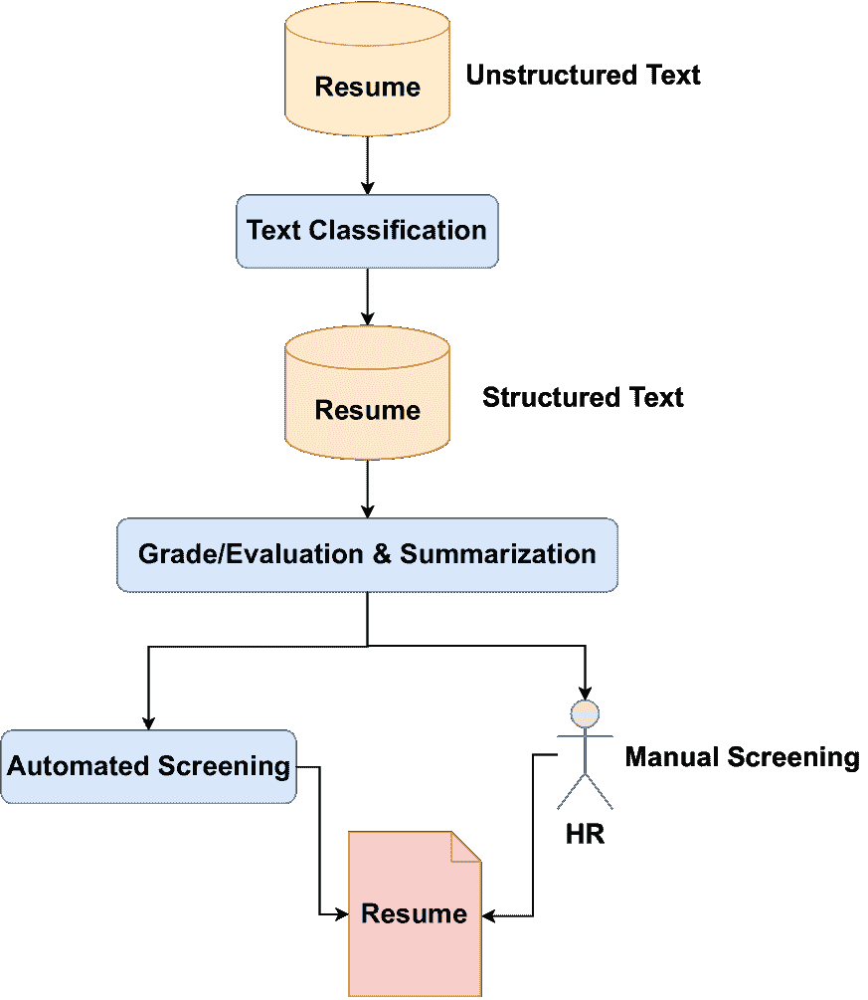

图1：自动化简历筛选流程。

简历筛选是所有公司招聘中的一个关键环节，特别是对于大型公司而言，这一过程通常既费力又耗时。与小型公司相比，大型公司在招聘阶段可能会收到成千上万份简历，这使得高效筛选大量申请成为一个重大挑战。为了减少与简历筛选相关的劳动力成本，开发自动化框架显得尤为重要。利用自然语言处理（NLP）技术来实现这一目标，正日益成为首选的方法。

自动化简历筛选 Singh 等人 ([2010a](https://arxiv.org/html/2401.08315v2#bib.bib29)) 过程包含两个主要组件：信息提取 Singhal 等人 ([2001](https://arxiv.org/html/2401.08315v2#bib.bib31)) 和评估。如图 [1](https://arxiv.org/html/2401.08315v2#S1.F1 "Figure 1 ‣ 1 Introduction ‣ Application of LLM Agents in Recruitment: A Novel Framework for Resume Screening") 所示，简历通常以非结构化或半结构化文本形式存在，格式各异。自动化框架的第一步是将这些非结构化文本转换为结构化格式。这个过程涉及一个关键的自然语言处理任务：文本分类 Bayer 等人 ([2022](https://arxiv.org/html/2401.08315v2#bib.bib4))，特别是句子分类 Minaee 等人 ([2021](https://arxiv.org/html/2401.08315v2#bib.bib23))。这包括提取并分类与个人信息、教育背景和工作经验相关的句子，将其转化为结构化数据，便于存储和处理。

在将简历文本结构化之后，接下来必须进行摘要和评估。如图 [1](https://arxiv.org/html/2401.08315v2#S1.F1 "Figure 1 ‣ 1 Introduction ‣ Application of LLM Agents in Recruitment: A Novel Framework for Resume Screening") 的下半部分所示，该过程包括自动筛选和人工筛选。人工筛选涉及对简历文本的广泛部分进行评分和总结，之后将评分和总结过的简历呈交给人力资源部门审核，从而选出合格的候选人。这种方法显著减少了人力资源人员在浏览简历和做决策时所花费的时间，通过精简简历文本并实施评分系统进行排名，从而提高筛选效率。自然语言处理技术还可以自动化这一过程，最终输出合格的简历。

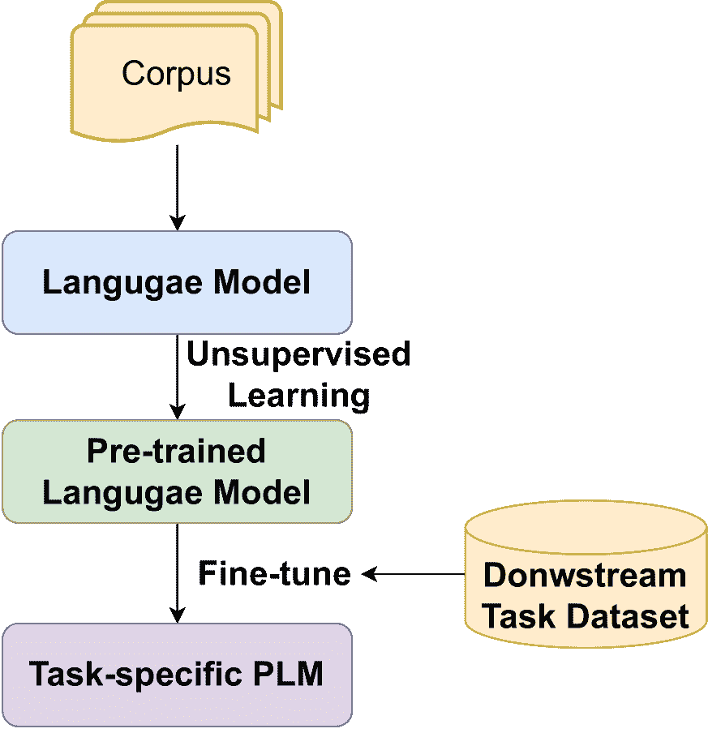

图 2：该插图展示了预训练语言模型的过程，并通过微调方法将预训练语言模型应用于下游任务。

在前面的讨论中，我们阐明了与简历自动信息提取相关的两个NLP任务。解决这些任务需要使用语言模型（LMs）。目前，最常见的语言模型架构是变压器架构Vaswani et al. ([2017](https://arxiv.org/html/2401.08315v2#bib.bib37))，它以其注意力机制为特征。这些语言模型主要在庞大的语料库上进行训练，从而赋予它们广泛的知识面。在这种背景下，seq2seq（序列到序列）Sutskever et al. ([2014](https://arxiv.org/html/2401.08315v2#bib.bib33))结构起着重要作用，它使得输入序列能够转换为预测的输出序列。这一机制使得语言模型能够适应各种各样的NLP任务。

如图[2](https://arxiv.org/html/2401.08315v2#S1.F2 "Figure 2 ‣ 1 Introduction ‣ Application of LLM Agents in Recruitment: A Novel Framework for Resume Screening")所示，语言模型（LMs）的过程从它们的训练到它们在各种下游自然语言处理（NLP）任务中的应用。初始阶段涉及组建一个庞大的语料库用于无监督学习，涵盖广泛的一般知识。该语料库通常来源于诸如维基百科¹¹1https://www.wikipedia.org/和大量网络内容等来源。随后，这些庞大且未标记的语料库为训练语言模型提供了基础。在此过程中，语言模型能够自主地获得基础的语言能力和一般知识。在预训练阶段之后，预训练语言模型（PLMs）Min et al. ([2023](https://arxiv.org/html/2401.08315v2#bib.bib22))将进行微调Ding et al. ([2023](https://arxiv.org/html/2401.08315v2#bib.bib12))，使用针对特定下游任务的不同数据集。该过程的最终结果是开发出特定任务的PLMs，能够有效地预测或处理相关的NLP任务。

最初的预训练语言模型（PLMs），例如BERT（Devlin等，[2018](https://arxiv.org/html/2401.08315v2#bib.bib11)）、T5（Raffel等，[2020](https://arxiv.org/html/2401.08315v2#bib.bib28)）和GPT-2（Radford等，[2019](https://arxiv.org/html/2401.08315v2#bib.bib27)），其特点是相对较小，只有几亿个参数。然而，GPT-3（Brown等，[2020](https://arxiv.org/html/2401.08315v2#bib.bib6)）的问世标志着这一领域的一个重大飞跃，具有惊人的1350亿个参数。这种增长不仅仅是数量上的，更是质量上的，正如随后的ChatGPT（Ouyang等，[2022](https://arxiv.org/html/2401.08315v2#bib.bib26)）的发展所表明的那样。ChatGPT强调了通过扩展预训练语料库和增加PLMs参数数量，可以显著提升它们的能力，从而开启了大语言模型（LLMs）发展的新时代（Zhao等，[2023](https://arxiv.org/html/2401.08315v2#bib.bib41)）。

尽管取得了这些进展，但关于大公司开发的闭源模型，尤其是在用户安全方面，已经出现了一些担忧。主要问题在于私人信息泄露的潜在风险。使用这些大语言模型（LLMs）通常需要用户上传数据，这就带来了数据泄露的风险。这在简历筛选等涉及敏感个人信息的应用中尤为突出。与像GPT-3.5和GPT-4（由OpenAI等开发）等闭源模型相比（[2023](https://arxiv.org/html/2401.08315v2#bib.bib25)），有一些开源LLM可供使用，例如LLaMA1/2（Touvron等，[2023a](https://arxiv.org/html/2401.08315v2#bib.bib35)，[b](https://arxiv.org/html/2401.08315v2#bib.bib36)）。虽然这些开源模型可能尚未达到闭源对手的能力，但它们提供了一个显著的优势：能够在用户的本地机器上运行。这种本地执行确保了私密数据的更高安全性，使得这些模型成为处理敏感信息时更安全的选择。

上述概述阐明了自动化简历筛选框架中必需的特定自然语言处理（NLP）任务。此外，还强调了图[1](https://arxiv.org/html/2401.08315v2#S1.F1 "图1 ‣ 1 引言 ‣ LLM代理在招聘中的应用：简历筛选的新框架")中蓝色框标记的任务，这些任务可以通过PLMs和LLMs进行处理。文中还简要解释了语言模型（LMs）的基本原理。接下来的段落将对如何利用LLMs衍生的代理实施自动化简历筛选系统进行全面阐述。

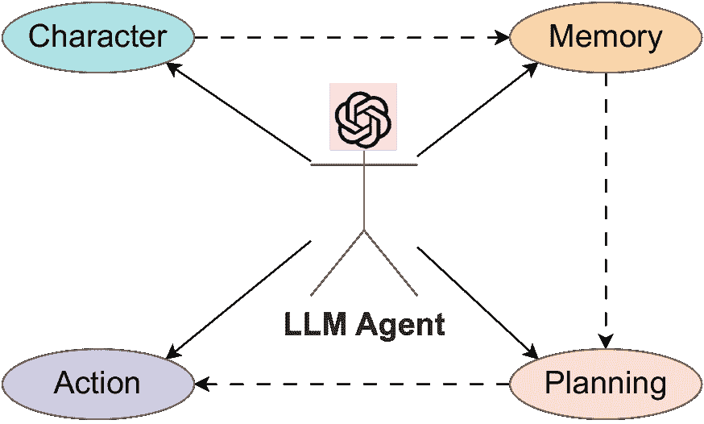

图3：插图展示了LLM作为代理系统的核心支撑。

图[3](https://arxiv.org/html/2401.08315v2#S1.F3 "Figure 3 ‣ 1 Introduction ‣ Application of LLM Agents in Recruitment: A Novel Framework for Resume Screening")展示了一个基本代理系统的示意图。该图展示了语言模型（LLM）代理的四个核心组件：角色、记忆、规划和行动的分割。最初，LLM代理被赋予一个独特的角色，基本上定义了其职能或功能。例如，在本研究中，LLM代理被指定为一名熟练的**人力资源（HR）**专业人士。这个角色涵盖了LLM代理应履行的责任和任务。随后，“记忆”指的是执行其角色所需的知识库。在人力资源专业人士的背景下，这包括对员工技能要求、薪酬管理以及相关法律法规的全面理解。这个方面类似于LLM能够访问和利用其内部知识数据库的能力。接下来的阶段是“规划”，在这一阶段，LLM代理策划任务的执行。这一过程涉及将复杂的任务分解成更小、更易管理的子任务，从而提高处理复杂任务的效率。这一阶段体现了LLM的推理和问题解决能力。最后，“行动”组件代表了实施阶段。在自动化简历筛选系统的背景下，这将涉及LLM代理筛选并选择符合特定职位要求的简历。最后阶段展示了LLM代理在实际场景中规划和推理的实际应用。

在本研究中，我们将LLM代理整合到自动化简历筛选的过程中。我们提出了一种创新的框架，利用LLM代理进行简历的自动提取和分析。该框架简化了整个流程，从初始的简历筛选到最终的合格候选人选拔，显著提高了这一任务的效率。为了进行分析，我们使用了一个公开的IT行业特定简历数据集²²2[https://huggingface.co/datasets/ganchengguang/resume_seven_class](https://huggingface.co/datasets/ganchengguang/resume_seven_class)，该数据集优化用于句子分类。通过对LLM进行微调，我们在句子分类中达到了87.73的F1得分。该改进在模型识别并排除简历中的个人信息方面尤为显著，从而降低了使用GPT-3.5/4等模型时可能发生的隐私泄露风险。此外，我们开发了一个人力资源代理，旨在对简历进行评分和总结。我们从初始数据集中衍生出了一个专门的评分与总结简历（GSR）数据集，使用GPT-4模型进行处理。这个GSR数据集在评估其他LLM时发挥了重要作用。在这些评估中，经过微调后的LLaMA2-13B模型在总结任务中获得了37.30的ROUGE-1得分，在评分准确性上达到了81.35，远远超越了基线的GPT-3.5-Turbo模型。最后，我们部署了HR代理来选择合适的候选人，并进一步分析了决策结果。

此外，我们使用GPT-4-Turbo和GPT-3.5-Turbo-16k进行实验，证明了LLM能够有效处理长上下文的简历信息。为了进一步验证我们提出的基于LLM的简历筛选框架的有效性，我们随机选择了50份简历进行手动总结和评估。LLM的表现与该手动标注的数据集进行了基准测试。我们对实验和特定样本的分析表明，LLM的评估和决策与人工评审员的判断非常相似。此外，为了评估该框架是否能够满足复杂的招聘需求，我们在框架中加入了除了基本要求之外的附加标准。随后分析了决策结果，以确定LLM对这些增强要求的适应性。

我们的综合实验和分析展示了LLM代理在简历筛选中的强大能力。作为一个人力资源代理，它有效地促进了候选人筛选过程。

## 2 相关工作

### 2.1 简历信息提取

简历筛选是信息提取的经典应用，从基于规则的方法Mooney（[1999](https://arxiv.org/html/2401.08315v2#bib.bib24)）发展到使用工具包自动化这些规则，Ciravegna 和 Lavelli（[2004](https://arxiv.org/html/2401.08315v2#bib.bib9)）。随着时间的推移，诸如隐马尔可夫模型（HMM）和支持向量机（SVM）等技术发展为级联混合模型，用于简历中的段落分类，Yu 等人（[2005](https://arxiv.org/html/2401.08315v2#bib.bib40)）。深度学习的采用，利用卷积神经网络（CNNs）和长短期记忆网络（LSTMs），进一步增强了提取方法，Harsha 等人（[2022](https://arxiv.org/html/2401.08315v2#bib.bib17)）；Sinha 等人（[2021](https://arxiv.org/html/2401.08315v2#bib.bib32)）；Kinge 等人（[2022](https://arxiv.org/html/2401.08315v2#bib.bib19)）；Ali 等人（[2022](https://arxiv.org/html/2401.08315v2#bib.bib1)）；Bharadwaj 等人（[2022](https://arxiv.org/html/2401.08315v2#bib.bib5)）；Zu 和 Wang（[2019](https://arxiv.org/html/2401.08315v2#bib.bib42)）；Barducci 等人（[2022](https://arxiv.org/html/2401.08315v2#bib.bib3)），并且条件随机场（CRFs）通过精细化序列标注进一步改善了LSTM模型，Ayishathahira 等人（[2018](https://arxiv.org/html/2401.08315v2#bib.bib2)）。

最近的进展包括结合了预训练语言模型如BERT，并与LSTM和CRF集成，显著增强了简历信息提取的上下文理解能力，Tallapragada 等人（[2023](https://arxiv.org/html/2401.08315v2#bib.bib34)）。这一技术已经应用于自动化招聘算法的开发，具体应用包括根据特定职位对候选人进行排名，Erdem（[2023](https://arxiv.org/html/2401.08315v2#bib.bib14)）。

此外，还开发了诸如PROSPECT等新工具，通过使用CRFs提取并排名候选人的技能和经验来支持简历筛选，Singh 等人（[2010b](https://arxiv.org/html/2401.08315v2#bib.bib30)）。另一种方法是通过使用自然语言处理（NLP）和相似性度量，利用自动化系统提高招聘效率，这些系统通过匹配简历和职位描述来筛选候选人，Daryani 等人（[2020](https://arxiv.org/html/2401.08315v2#bib.bib10)）。

### 2.2 大型语言模型在招聘应用中的使用

在LLM出现后，还有其他工作在招聘过程中使用了LLM。杜等人（[2024](https://arxiv.org/html/2401.08315v2#bib.bib13)）介绍了一种基于LLM的GAN互动推荐（LGIR）方法，该方法通过使用生成对抗网络来优化简历表示，从而提高职位匹配的准确性，克服了虚假内容和数据不足的问题。Ghosh和Sadaphal（[2023](https://arxiv.org/html/2401.08315v2#bib.bib16)）探讨了四种基于LLM的职位推荐方法，使用LLM分析非结构化的职位和候选人数据，突出了在IT领域职位匹配中的优势、局限性和效率。

### 2.3 使用LLM代理进行决策制定

此外，LLM代理在多个应用中的决策过程也得到了应用。本文黄等人（[2024](https://arxiv.org/html/2401.08315v2#bib.bib18)）评估了LLM在复杂多智能体环境中的决策能力，使用了一种新颖的框架。本文马等人（[2024](https://arxiv.org/html/2401.08315v2#bib.bib21)）介绍了一种新颖的框架——人类-人工智能深思框架，旨在通过促进人类与AI之间的深思对话来增强AI辅助决策能力。陈等人（[2023](https://arxiv.org/html/2401.08315v2#bib.bib8)）提出了“内省提示”，这是一种无需微调即可增强LLM决策能力的新方法。魏等人（[2022](https://arxiv.org/html/2401.08315v2#bib.bib38)）指出，通过引入一系列中间推理步骤，可以实现增强的决策能力。姚等人（[2022](https://arxiv.org/html/2401.08315v2#bib.bib39)）提出了ReAct，这是一种将推理与行动生成结合的新方法，增强了语言理解和决策制定在交互任务中的协同作用。

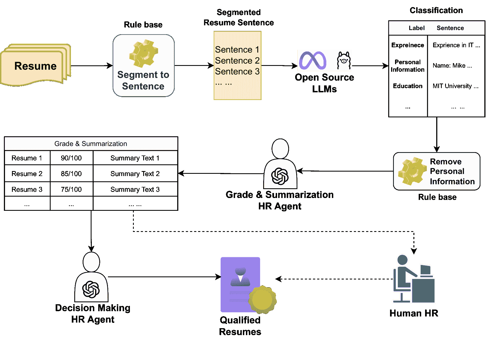

图4：图示展示了基于LLM代理的自动化简历筛选框架的工作流程。

### 2.4 比较基于LLM的简历筛选与传统方法

将LLM应用于简历筛选框架，相较于传统方法具有显著优势。首先，与最大处理512个token的PLM不同，LLM可以处理更长的文本。这一能力使得LLM能够有效地处理几乎任何长度的简历，从而增强了筛选过程的全面性。其次，LLM拥有更广泛的知识库，能够跨多个行业应用于简历数据处理，无需特定的微调。此外，LLM的表现优于传统的PLM，提供的评估和判断更符合人类的推理方式。这使得LLM在需要细致理解和决策的情境中，尤其具有价值。

## 3 基于LLM代理的简历筛选框架

本节提供了一个全面概述，介绍了一个新型自动化简历筛选框架中的工作流程，该框架利用了LLM代理。重点讲述了LLM代理如何高效地从大量候选人中识别和筛选合格的简历。为了保持清晰性，本概述简化了一些方面，仅保留了核心步骤。这些步骤的详细讨论将在后续的三个小节中呈现。

图[4](https://arxiv.org/html/2401.08315v2#S2.F4 "Figure 4 ‣ 2.3 Decision Making with LLM Agent ‣ 2 Related Work ‣ Application of LLM Agents in Recruitment: A Novel Framework for Resume Screening")展示了我们创新的自动化简历筛选系统的架构，该系统由LLM代理支撑。该过程从将大量简历（这些简历通常以PDF、DOCX和TXT等不同格式呈现）转换为统一的JSON格式开始。这是通过一种基于规则的算法实现的，该算法旨在将不同的格式和文件类型标准化为连贯的单句。这样的预处理对于后续阶段的一致性分析至关重要。下一步是根据行间断等标准，将这些统一格式化的简历划分为不同的句子。这一分段对开源LLM的有效运作至关重要，因为该LLM在本地进行操作以分类每个句子。该过程的关键是对各种句子类型进行分类，从个人信息（该类信息被标记为删除，以保护隐私）到其他类别如工作经验、教育背景和技能。这个分类尤其重要，因为它使得基于职位要求的定制化分析成为可能。例如，某些职位可能更重视候选人的技能，而不是其教育背景。通过提取并关注简历中详细描述相关技能的部分，系统可以更有效地筛选出适合该职位的候选人。虽然我们的框架目前主要关注基本的个人信息删除功能，但它为未来更细致、更定制化的简历筛选过程奠定了基础。

在从简历中删除个人信息后，下一步是利用 GPT-3.5 模型对这些文档进行评分和总结。这项任务主要由 HR 代理负责。评分系统作为一种机制，用于对候选人进行排名，从而简化了识别优秀申请者的过程。而总结则旨在节省决策代理的时间，决策代理需要评估这些摘要。简洁的总结内容不仅加快了处理过程，还能通过减少初步筛选简历所需的时间，帮助人力资源专业人员节省时间。一旦简历被赋予了分数和总结，关于候选人是否进入下一阶段的决定，可以由 HR 代理或人力资源专业人员做出。利用分数作为综合指标，可以有效地对候选人进行排名。根据具体需求，可以选择前 10 名或前 100 名候选人进入筛选过程的下一阶段。无论是由 HR 代理还是人力资源专业人员执行，这一步骤都能显著减少决策所需的时间和精力。最终阶段是根据经过筛选的合格简历，选择候选人进行面试或直接发放工作邀请。这种方法优化了招聘过程，确保了候选人选择的高效性和有效性。

上一节概述了利用开源 LLM 和 LLM 代理进行自动化简历筛选的完整过程。接下来的各小节将详细阐述三个关键步骤的实现：句子分类、评分与总结以及决策制定。

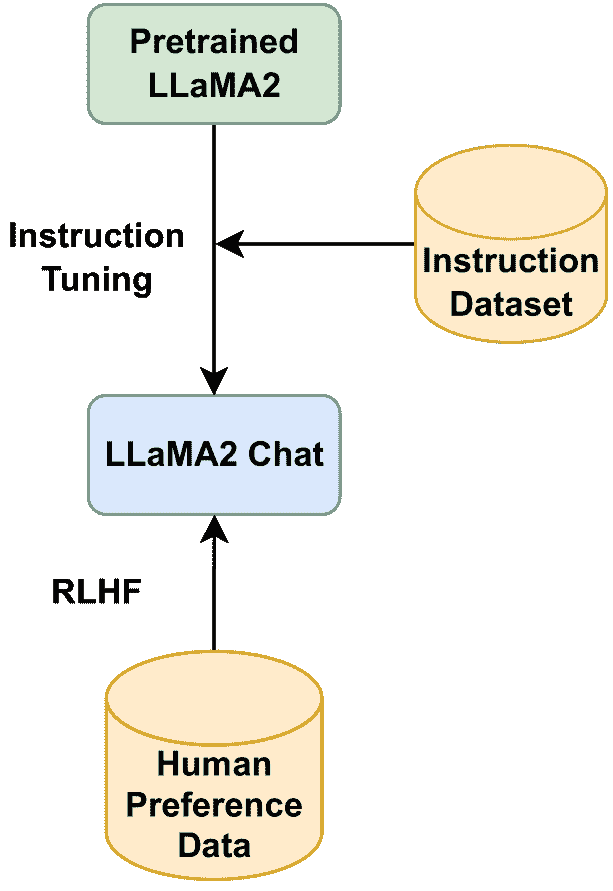

图 5：该插图展示了 LLaMA2 模型的指令调优和基于人类反馈的强化学习（RLHF）过程。

### 3.1 句子分类

在我们的方法中，LLaMA2 模型作为句子分类的基础模型。我们通过微调来增强该基础模型，特别是针对简历句子的分类。与以往的预训练语言模型（PLM）不同，LLaMA2 模型并不直接将句子作为输入并生成相应的预测标签。这个限制源于模型的架构，如图[5](https://arxiv.org/html/2401.08315v2#S3.F5 "Figure 5 ‣ 3 Resume Screening Framework Based on LLM Agents ‣ Application of LLM Agents in Recruitment: A Novel Framework for Resume Screening")所示。LLaMA2-chat 变体是在原始 LLaMA2 模型的基础上开发的，经过专门的指令调优过程，使用一个指令数据集，随后通过基于人类反馈的强化学习（RLHF）进一步优化。这种方法面临一个挑战：仅仅将句子输入模型并不能保证生成适当的预测标签，这一现象也在我们后续的实验结果中得到了证实。

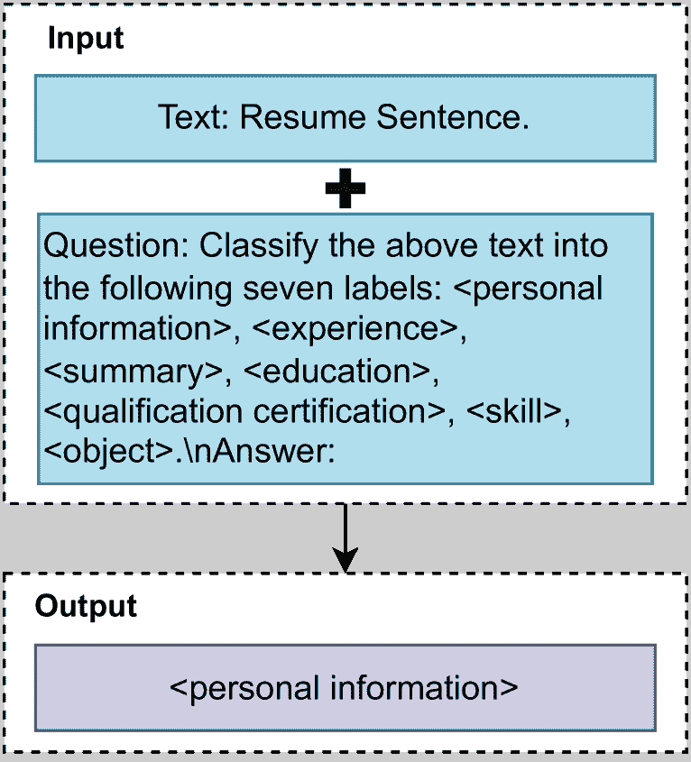

图6：该图展示了转换后的简历句子指令数据集的组成部分。

其根本原因在于模型的设计，它会根据指令数据集的指导方针进行响应。具体来说，输入不仅包含查询句子，还包括指导模型响应的特定文本指令。如图[6](https://arxiv.org/html/2401.08315v2#S3.F6 "图 6 ‣ 3.1 句子分类 ‣ 基于LLM代理的简历筛选框架 ‣ LLM代理在招聘中的应用：一种新颖的简历筛选框架")所示，为了实现这一目标，我们在简历句子前添加一个需要分类的问题。这个问题指示模型将前面的句子归类为七个预定义标签之一。同时，我们在输入文本序列中加入了“Answer:”提示。因此，我们使用了经过专门整理的简历句子指令数据集进行微调的LLaMA2模型，用于有效分类简历句子。这个微调后的LLaMA2模型在当前任务中展现了更好的性能。

### 3.2 评分与总结

在提取了去除个人信息的简历文本后，我们的目标是评估并总结每一份简历。这个过程涉及一个共享组件：无论是评估还是总结，都需要对简历内容有全面的理解。因此，我们将这两个过程合并为一个问题和回答的任务。如图[7](https://arxiv.org/html/2401.08315v2#S3.F7 "图 7 ‣ 3.2 评分与总结 ‣ 基于LLM代理的简历筛选框架 ‣ LLM代理在招聘中的应用：一种新颖的简历筛选框架")所示，图中红色框表示分配给LLM代理的角色，这里展示的角色是具有超过十年HR经验的IT公司人力资源专业人士。这个角色扮演使得HR代理能够以经验丰富的HR专家视角进行分析。

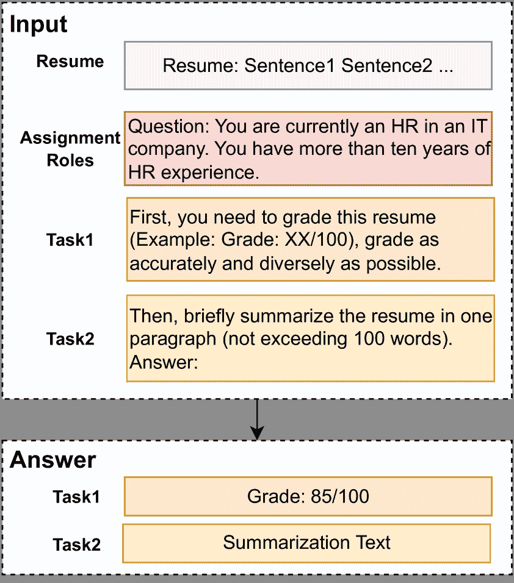

图7：该图展示了任务和角色的分配给LLM代理的过程。

初始任务是HR代理对简历进行评估，力求在评估中做到精确和多样化。为此，提供了一个评分示例（例如，Grade: XX/100），故意不设定预定的分数，以避免偏见影响代理的评估。接着，代理需要在简短的段落中总结简历，限制在100个字以内。最终，代理会同时给出评分和简历的简洁总结。

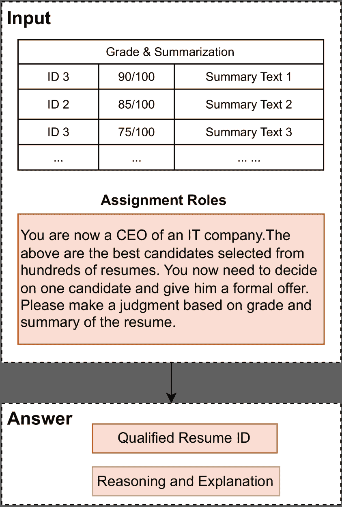

图8：该图展示了HR代理做出最终决策，选出合格候选人的过程。

### 3.3 决策

简历筛选系统的最后阶段涉及根据候选人分配的成绩和总结进行评估。在本研究中，我们将这一阶段分为两个不同的过程：自动化和人工。这种分离方式为满足各种需求提供了灵活性。即使最终的选择是由人工人力资源人员执行的，通过利用成绩排名，也可以高效地筛选出高评分的简历。此外，提供的总结有助于人力资源人员快速理解每份简历中的关键要素，从而显著减少简历筛选所需的时间。

另一方面，自动决策的过程可以通过使用LLM代理进一步推进。如图[8](https://arxiv.org/html/2401.08315v2#S3.F8 "Figure 8 ‣ 3.2 Grade & Summarization ‣ 3 Resume Screening Framework Based on LLM Agents ‣ Application of LLM Agents in Recruitment: A Novel Framework for Resume Screening")所示，每份简历最初都会提供一个格式化的标识符、评分和总结。这个过程模拟了最终候选人的选择。因此，红框中的角色分配发生了变化，从经验丰富的人力资源专业人士转变为首席执行官。任务是根据提供的成绩和总结，从十个候选人中选择一个。接下来，代理将通过简历的ID识别所选简历，并阐明选择该简历的理由。

因此，大量简历将经历一系列评估过程，以确定最合适的候选人。此过程中使用的自动化简历筛选框架具有多样性，可以定制以满足各种需求和现实场景。例如，本研究复制了IT公司简历评估的标准，重点关注候选人的技术技能。因此，筛选过程着重于简历中的技能相关信息。这一方法可以通过修改关键词和标准，适应市场营销、教育、金融等其他行业。此外，系统可以设计为减少教育偏见，优先考虑技能和工作经验，从而更加关注候选人的能力。此外，框架的筛选参数是灵活的；例如，可以设置为根据特定标准选择前10%的候选人。总之，这种适应性增强了筛选框架的整体效果和适用性。

## 4 实验设置

在本节中，我们将介绍如何模拟简历筛选过程，以验证基于LLM代理的自动化简历筛选框架的有效性。这包括简历数据集的准备和一些用于模拟简历筛选的设置[4.1](https://arxiv.org/html/2401.08315v2#S4.SS1 "4.1 Resume Dataset and Screening Simulation ‣ 4 Experiment Setup ‣ Application of LLM Agents in Recruitment: A Novel Framework for Resume Screening")。选择作为LLM代理核心的LLM，以及模型推理和微调的参数设置[4.2](https://arxiv.org/html/2401.08315v2#S4.SS2 "4.2 Prepare Backbone LLMs and Parameter Sets ‣ 4 Experiment Setup ‣ Application of LLM Agents in Recruitment: A Novel Framework for Resume Screening")。以及评估方法的描述[4.3](https://arxiv.org/html/2401.08315v2#S4.SS3 "4.3 Evaluation ‣ 4 Experiment Setup ‣ Application of LLM Agents in Recruitment: A Novel Framework for Resume Screening")。

### 4.1 简历数据集和筛选模拟

在我们研究的初始阶段，我们选择了一个由简历中的句子组成的分类数据集，数据集由Gan和Mori（[2022](https://arxiv.org/html/2401.08315v2#bib.bib15)）提出。该数据集包括七个类别：个人信息、经验、总结、教育背景、资格认证、技能和目标。它包含了总共1,000份简历，约78,668个句子，主要来自IT行业。因此，本研究中的简历筛选模拟是基于IT公司招聘框架的。我们设定用于评分每份简历的人是经验丰富的人力资源人员。然后，我们设定前10名简历得分者进入最终决策环节。最后，CEO负责筛选这10位候选人的简历评分和总结，以选出最终的合格候选人。

另一方面，考虑到原始简历数据集中缺乏评分和总结的标注，我们采用了目前表现优异的GPT-4模型对这些简历进行标注。GPT-4生成的标注作为评估其他模型性能的基准，实际上将GPT-4的输出视为黄金标准（100%的性能），用以衡量其他LLM模型的表现。这一方法促成了一个全面的数据集，用于模拟简历筛选过程。此外，由于LLaMA2模型的令牌限制为4096，超出该令牌数的简历被排除。因此，经过筛选后，剩余838份简历被用于第二阶段的测试。

为了增强我们提出的简历筛选框架的验证，我们随机选择了50份简历，随后对其进行了总结和手动评估。这个过程与之前使用GPT-4进行标注的方法相似，每份简历被简明扼要地总结为大约100个词，并按100分制进行评估。

我们聘请了三名研究生对简历进行手动标注。在开始标注过程之前，这些评估人员接受了全面的培训，并提供了多个示例以标准化他们的标记。具体而言，摘要需要详细列出候选人的工作经验、行业年限、教育成就（包括本科学位和研究生学位）、技能、在主要公司的工作经验以及其他任何值得注意的经历，同时严格遵守100字的限制。

在评分阶段，我们建立了具体的评估标准。例如，我们会考虑与IT公司需求不直接相关的技能，如市场管理。工作经验较少的候选人通常会获得50到65之间的分数。相反，拥有多年IT经验，并且拥有计算机科学本科学位和研究生学位的候选人，通常会得分在80到95之间。由于评分过程本身的不可避免的不精确性，我们采用了5分的评分区间。最终，分数由三位评估者平均得出。然后，我们会查看每份简历的三种不同总结，并选择最能准确反映原始文档的总结作为最终标注结果。

### 4.2 准备主力LLM和参数集

在句子分类任务的初始阶段，选择了LLaMA2-7B模型进行微调。数据集包含78,668个句子，并以7:1.5:1.5的比例分割为训练集、验证集和测试集。为了确保可重复性，设置了随机种子42。该配置与原论文中关于简历数据集的实验设置一致，便于与其他PLM进行直接比较。在训练过程中，每个GPU分配了32的批量大小，模型使用32位浮动点精度进行了2个epoch的训练。

在后续阶段，特别是评分和总结的第二阶段，我们选择了LLaMA2-7B/13/70B和GPT-3.5-turbo-0614作为HR代理的主力LLM。最初，我们采用零-shot方法，使用四种不同的LLM对838份简历进行评分和总结，旨在评估和比较它们的效果。在此过程中，我们精心配置了模型生成的参数。最大的新token数量设置为200。这个参数选择是基于每份简历需要评分和总结超过100字的要求。此外，我们还加入了‘do sample’和‘early stopping’功能，以优化总结过程。除了这些特定的调整外，所有其他参数均保持默认设置。

此外，我们通过使用一个专注于简历评分和总结的专门数据集对LLaMA2-7B/13B进行微调，以增强其能力。最初，该数据集被划分为两个不同的子集：一个包含500份简历的训练集和一个包含383份简历的测试集。随后，模型经过训练过程，每个GPU分配了批量大小为8的数据。该训练过程持续了2个周期，并采用BF16精度以优化性能和计算效率。

总结而言，我们的实验设置涉及使用双RTX 3090 24G GPU配置和float16精度进行LLaMA2-7B/13B的推理测试。相比之下，LLaMA2-7B/13B的微调过程和LLaMA2-70B的推理测试均在RTX A800 80G * 8 GPU服务器上进行。

### 4.3 评估

在简历句子分类的初始阶段，我们使用F1分数作为主要评估指标。该分数通过将精确度和召回率结合成一个平衡的均值，全面反映了模型的表现。这种方法能更准确地表示模型的有效性。

对于简历总结部分，我们的评估使用了两种主要的指标：ROUGE-1/2/L Lin和Och（[2004](https://arxiv.org/html/2401.08315v2#bib.bib20)）以及BLEU。这些指标在自动总结任务的评估中得到广泛认可。虽然BLEU传统上与翻译评估相关，但它在总结任务中的应用也能提供有价值的见解。通过引入BLEU，我们旨在实现对总结质量的更全面评估。

关于成绩评分的评估，我们的方法侧重于准确性。考虑到不同模型间成绩分布的显著差异，这一点尤为重要。在计算准确性时，我们采用容差范围的方法：如果生成的成绩与实际成绩相差不超过±5，则认为预测准确。计算遵循以下原则：如果预测成绩与实际成绩的绝对差异小于等于5，则认为预测正确（记作1，错误则记作0）。最终成绩的准确性通过将正确预测的总数除以实际成绩的总数（PG代表预测成绩，TG代表实际成绩）得出。

|  | $\text{准确率}=\frac{\sum_{i=1}^{N}\mathbf{1}\left(\left&#124;\text{PG}_{i}-\text{% TG}_{i}\right&#124;\leq 5\right)}{N}$ |  |
| --- | --- | --- |

表1：简历句子分类数据集结果。

模型 F1分数  

表2：简历评分和总结数据集结果（ROUGE-1/2/L）。

模型 ROUGE-1 ROUGE-2 ROUGE-L  

表 3：简历评分和摘要数据集的结果（BLEU 和评分准确率）。

模型 BLEU 评分准确率 LLaMA2-7B 2.66 47.49 LLaMA2-13B 2.56 59.31 LLaMA2-70B 3.73 23.27 GPT-3.5-Turbo 7.31 47.61

## 5 结果

在简历句子分类的结果中，我们对几种大规模模型的表现进行了比较实验：BERT Large、ALBERT Large、RoBERTa Large 和 T5 Large。结果如表 [1](https://arxiv.org/html/2401.08315v2#S4.T1 "Table 1 ‣ 4.3 Evaluation ‣ 4 Experiment Setup ‣ Application of LLM Agents in Recruitment: A Novel Framework for Resume Screening") 所示，LLaMA2-7B-chat 模型的 F1 分数显著提升，达到了 87.73，这归功于在输入和输出中实施了指令格式。有趣的是，使用传统方法对 LLaMA2-7B-chat 模型进行直接微调，即像以前的 PLM 模型那样输入句子并输出标签，导致 F1 分数大幅下降至 78.16。这一结果凸显了我们所提出的指令格式的有效性。此外，这也强调了在进行句子分类任务的微调时需要考虑的一个关键因素：遵循在指令学习阶段使用的指令格式，对于优化模型的句子分类能力至关重要。

在自动化简历筛选框架的评分和摘要组件评估中，我们使用了三种不同规模的 LLaMA2 模型和 GPT-3.5-Turbo 进行测试。结果如表 [2](https://arxiv.org/html/2401.08315v2#S4.T2 "Table 2 ‣ 4.3 Evaluation ‣ 4 Experiment Setup ‣ Application of LLM Agents in Recruitment: A Novel Framework for Resume Screening") 所示，GPT-3.5-Turbo 在所有三项 ROUGE 指标上均表现优于其他模型：ROUGE-1（34.75）、ROUGE-2（12.34）和 ROUGE-L（31.92），显著超过了 LLaMA2-70B 模型。此外，在 BLEU 评估指标下（表 [3](https://arxiv.org/html/2401.08315v2#S4.T3 "Table 3 ‣ 4.3 Evaluation ‣ 4 Experiment Setup ‣ Application of LLM Agents in Recruitment: A Novel Framework for Resume Screening")），GPT-3.5-Turbo 取得了 7.31 的分数，几乎是其竞争对手的三倍。这表明，如果不使用微调方法（0-shot 推理），使用像 GPT-3.5-Turbo 和 GPT-4 这样的闭源模型作为人力资源代理的核心，对于提高性能至关重要。有趣的是，在评分准确度方面，LLaMA2-13B 以 59.31 的分数超越了其他模型，尤其是比 LLaMA2-70B 高出 23.27 分。这个异常现象及其影响将在接下来的小节中进一步分析和讨论。

表 4：微调后的 LLaMA2-7B/13B 在简历评分和摘要数据集上的结果（ROUGE-1/2/L）。

模型 ROUGE-1 ROUGE-2 ROUGE-L GPT-3.5-Turbo 34.61 12.18 31.83 LLaMA2-7B 36.50 13.32 33.48 LLaMA2-13B 37.30 13.90 33.93

表 5：微调后的 LLaMA2-7B/13B 在简历成绩和总结数据集中的结果（BLEU 和成绩准确率）。

模型 | BLEU | 成绩准确率  

最后，LLaMA2-7B/13B 模型进行了微调，并取得了显著的提升，具体成果见表[4](https://arxiv.org/html/2401.08315v2#S5.T4 "表 4 ‣ 5 结果 ‣ LLM 代理在招聘中的应用：一种新的简历筛选框架")。具体来说，精细调整后的 LLaMA2-13B 模型在 ROUGE-1/2/L 指标中分别取得了 37.30、13.90 和 33.93 的优秀成绩。这一表现显著超过了 0-shot GPT-3.5 Turbo 模型在测试集评估中的成绩。此外，表[5](https://arxiv.org/html/2401.08315v2#S5.T5 "表 5 ‣ 5 结果 ‣ LLM 代理在招聘中的应用：一种新的简历筛选框架")展示了 BLEU 成绩的提升，其中 LLaMA2-7B 和 LLaMA2-13B 模型分别达到了 8.45 和 8.62 的增幅。与之相应，成绩准确率也有显著提高，分别为 76.19 和 81.35。这些结果清楚表明，在有足够的简历数据集进行微调的情况下，选择开源的 LLaMA2-7B/13B 模型作为人力资源代理系统的基础，是一个更有效的策略。

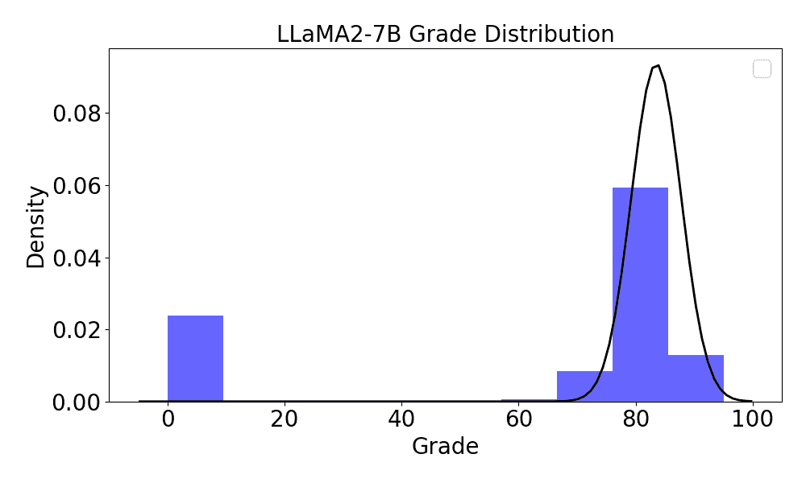

(a) LLaMA2-7B 的成绩分布

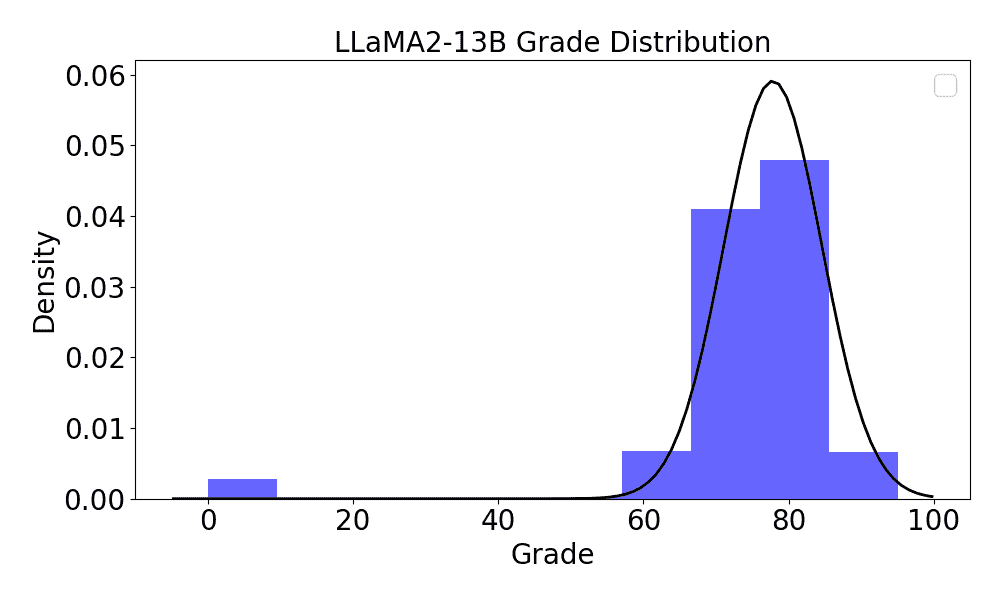

(b) LLaMA2-13B 的成绩分布

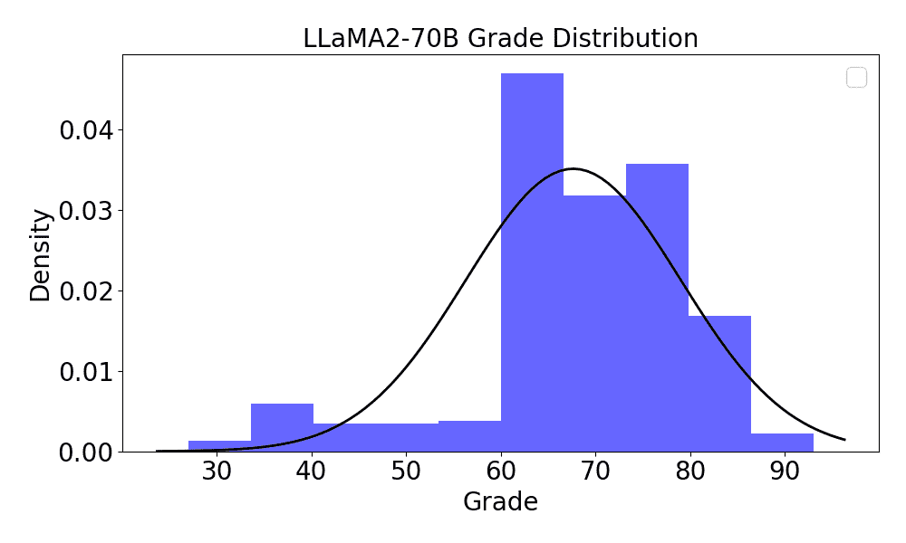

(c) LLaMA2-70B 的成绩分布

图 9：比较 LLaMA2-7B/13B/70B 模型的成绩分布。

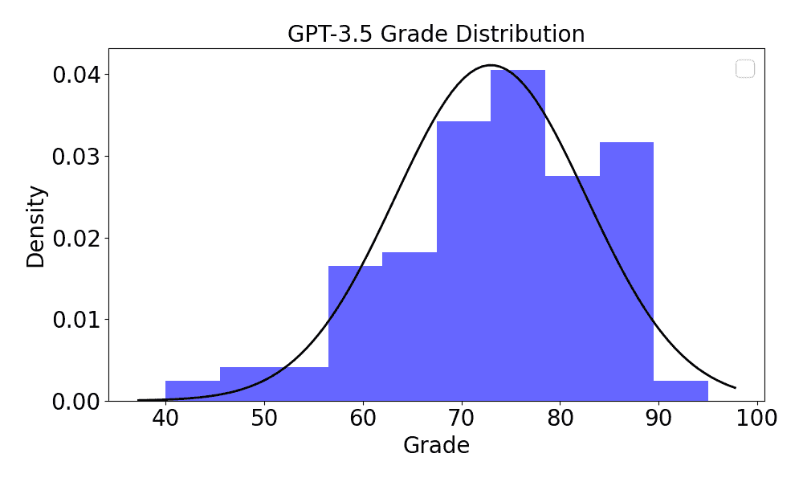

(a) GPT-3.5-Turbo 的成绩分布

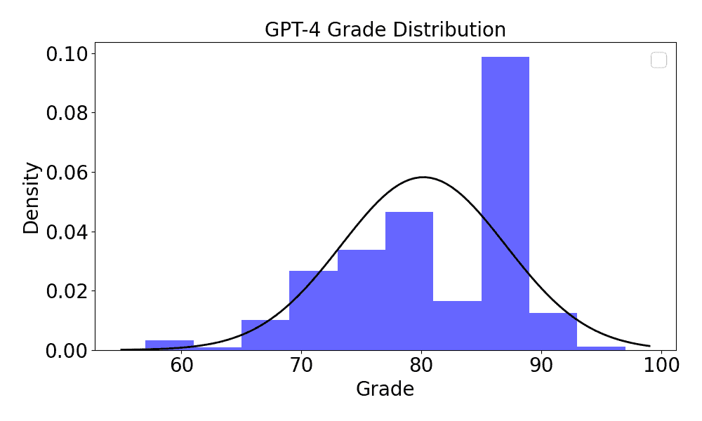

(b) GPT-4 的成绩分布

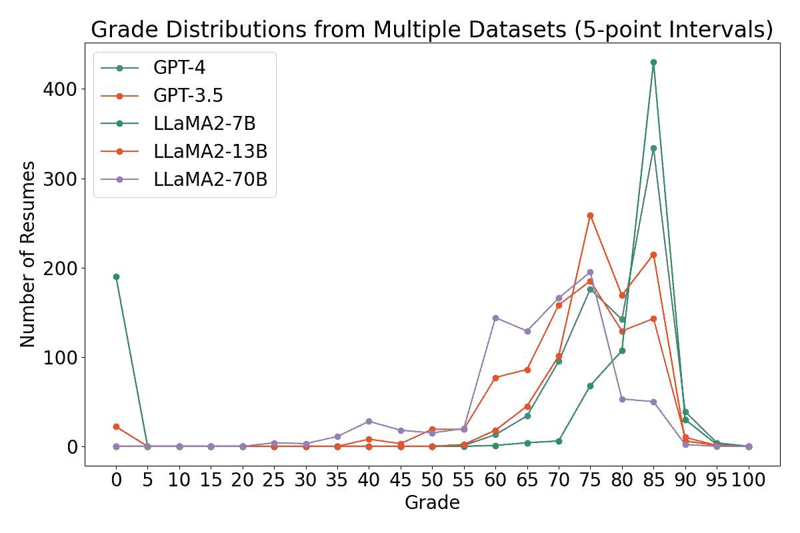

(c) 6 个 LLM 模型的成绩比较

图 10：比较 GPT-3.5-Turbo/4 模型的成绩分布，以及 6 个大型语言模型（LLM）的成绩比较。

### 5.1 成绩的正态分布

图 [9](https://arxiv.org/html/2401.08315v2#S5.F9 "Figure 9 ‣ 5 Results ‣ Application of LLM Agents in Recruitment: A Novel Framework for Resume Screening") 和 [10](https://arxiv.org/html/2401.08315v2#S5.F10 "Figure 10 ‣ 5 Results ‣ Application of LLM Agents in Recruitment: A Novel Framework for Resume Screening") 展示了五种不同 LLM 模型所分配评估的正态分布图。值得注意的是，GPT-4 模型通常在所有评分中都与正态分布一致，并且明显倾向于将分数分配在 85-90 范围内。这种偏向较高分数的倾向可能源于 GPT-4 在微调过程中（如 RLHF）倾向于给予更高的评分。尽管如此，这对最终的简历筛选影响较小，因为系统始终优先根据评分选择前 10 份简历。虽然关于这些基于 LLM 的 HR 代理在多大程度上准确反映了每份简历的实际质量可能存在一些不确定性，但模拟实验表明，所有五种 LLM 的评分模式基本符合正态分布。这表明，LLM 在简历评估中的应用是一个成功的实验，其结果与实际场景中预期的结果相符。

表 6：不同 LLM 的评分错误数量（评分不是两位数）。

模型 错误总数 LLaMA2-7B 190 LLaMA2-13B 22 LLaMA2-70B 8 LLaMA2-7B 微调后 1 LLaMA2-13B 微调后 0

图 11：HR 代理决策文本答案（GPT4 和 GPT-3.5-Turbo 模型）。

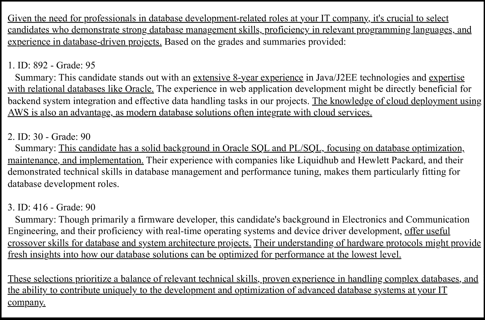

图 12：HR 代理决策文本（GPT4-Turbo 模型）。

图 [9](https://arxiv.org/html/2401.08315v2#S5.F9 "Figure 9 ‣ 5 Results ‣ Application of LLM Agents in Recruitment: A Novel Framework for Resume Screening") 和 [10](https://arxiv.org/html/2401.08315v2#S5.F10 "Figure 10 ‣ 5 Results ‣ Application of LLM Agents in Recruitment: A Novel Framework for Resume Screening") 以及表 [6](https://arxiv.org/html/2401.08315v2#S5.T6 "Table 6 ‣ 5.1 Normal Distribution of Grade ‣ 5 Results ‣ Application of LLM Agents in Recruitment: A Novel Framework for Resume Screening") 中的数据揭示了三种 LLaMA2 模型出现了零分情况。这种现象发生是因为这些模型分配的分数并非完全是两位数分数（如 ’A’，’B+++’ 等），导致误分类。因此，我们将所有此类情况归类为零分。值得注意的是，在经过微调后，LLaMA2 模型的评分错误发生率显著下降。此外，GPT-3.5-Turbo/4 模型则没有出现评分错误，这可以归因于不同 LLM 在理解和遵守指令方面的能力差异。

### 5.2 决策分析

在我们的研究中，我们使用了GPT-3.5-Turbo和GPT-4模型作为自主HR代理，根据简历的评分评估了前10名简历。它们决策背后的原理已详细阐述。如图[11](https://arxiv.org/html/2401.08315v2#S5.F11 "图 11 ‣ 5.1 成绩的正态分布 ‣ 5 结果 ‣ LLM代理在招聘中的应用：简历筛选的新框架")所示，两个模型一致认为简历ID 308是最优候选人。选择这一简历的理由不仅仅是简历ID 308的高评分，还包括其与IT公司特定需求的匹配，涵盖相关的工作经验和管理技能。这一分析展示了与人类HR专业人员在决策过程中通常使用的认知过程和判断标准的显著一致性。此外，这些发现强调了将基于LLM的HR代理集成到未来自动化简历筛选系统中的潜力。

为了进一步探讨HR代理的决策能力，特别是在处理复杂招聘需求时，我们在这一阶段优化了标准，并进行了额外的实验。该实验使用了50份人工标注的简历数据集，对其相关性进行了总结和评分。我们设置了招聘标准，目标是招募三名数据库开发专家。该要求已被纳入输入提示模板，如下所示：“您现在正在为公司招聘三名数据库开发岗位人员。”

如图[12](https://arxiv.org/html/2401.08315v2#S5.F12 "图 12 ‣ 5.1 成绩的正态分布 ‣ 5 结果 ‣ LLM代理在招聘中的应用：简历筛选的新框架")所示，HR代理成功识别出三位候选人，并为每位选择提供了详细的理由。值得注意的是，所有候选人都具备相关的数据库开发技能和丰富的专业经验。其选择理由表述清晰且具有说服力。随后的人工审核确认，这些候选人确实是最适合该职位的人选。

这一实验突显了基于LLM的简历筛选框架的适应性，强调了其能够满足各种工作岗位需求的能力。实验表明，模型可以有效地根据不同公司对不同职位的招聘需求进行调整，证明了其在复杂HR场景中的通用性和实用性。

表格 7：基于人工标注的50个样本数据集（ROUGE-1/2/L）评估LLM的实验结果。

模型 ROUGE-1 ROUGE-2 ROUGE-L  

表格 8：基于人工标注的50个样本数据集（BLEU和成绩准确率）评估LLM的实验结果。

模型 | BLEU | 分数准确率  

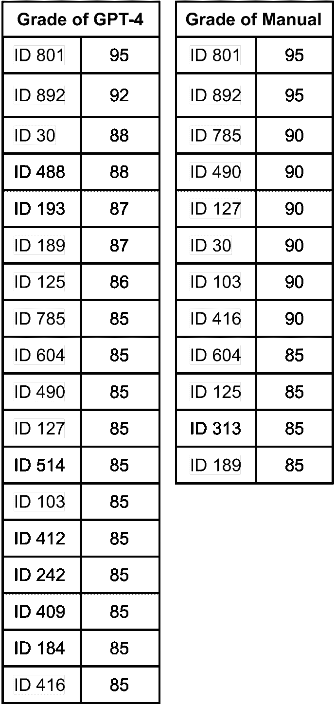

图13：前十名GPT-4评分简历与前十名手动评分简历的排名比较。下划线表示两者重叠的部分（即分数相等）。

### 5.3 与手动简历筛选的比较

我们通过手动标注50份简历进行彻底评估，以作为基准，评估了各种LLM（大语言模型）。这些测试的结果详见表格[7](https://arxiv.org/html/2401.08315v2#S5.T7 "Table 7 ‣ 5.2 Analysis of Decision Making ‣ 5 Results ‣ Application of LLM Agents in Recruitment: A Novel Framework for Resume Screening")和[8](https://arxiv.org/html/2401.08315v2#S5.T8 "Table 8 ‣ 5.2 Analysis of Decision Making ‣ 5 Results ‣ Application of LLM Agents in Recruitment: A Novel Framework for Resume Screening")，其中GPT-3.5-Turbo和GPT-4模型表现出优异的性能。值得注意的是，尽管分数分配的准确性并不完美，但对按分数排名的前十份简历的后续分析揭示了重要的见解。GPT-4评定的最高分简历与手动评分的简历高度相似，突显了该模型在模仿人类评估模式方面的有效性。

如图[13](https://arxiv.org/html/2401.08315v2#S5.F13 "Figure 13 ‣ 5.2 Analysis of Decision Making ‣ 5 Results ‣ Application of LLM Agents in Recruitment: A Novel Framework for Resume Screening")所示，我们根据GPT-4和手动评分的最终分数汇总了前十名简历的ID和分数。在该图中，下划线部分表示两组排名重合的地方，突出显示了评估结果的强相关性。值得注意的是，无论是手动评分还是GPT-4评分，简历ID 801和ID 892均获得了最高分。此外，在手动评估中排名靠前的12份简历中，有11份在GPT-4的排名中也占据了显著位置，进一步验证了该模型评估的一致性。

最后，我们使用手动和GPT-4两种方法选出了最终合格的简历。两种方法均选中了简历ID为801的候选人。对该候选人资历的详细分析显示，该候选人不仅拥有六年扎实的专业经验，而且还具备丰富的IT相关技能。该人是一个多才多艺的全栈Java开发人员，精通从前端到后端开发的多种技术，包括网络技术。这些技能使得该候选人非常适合IT组织中的开发人员角色。

总之，我们的研究结果确认了利用LLM进行简历筛选框架的有效性。与传统的手动方法进行对比，证明了LLM能够有效地替代未来的手动简历筛选过程。

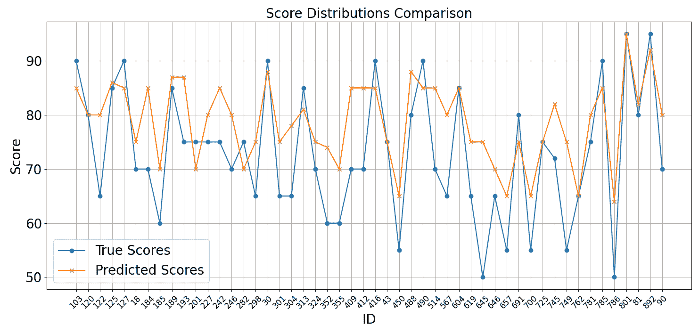

图 14：手动评分与 GPT-4 在等级分布上的比较（基础 50 样本数据集）。

表格 9：GPT-3.5-Turbo-16k 模型实验结果。基于 GPT-4-Turbo（最大输入长度 128K）标注的 162 个超长简历数据集进行评估。

模型 ROUGE-1 ROUGE-2 ROUGE-L GPT-3.5-Turbo-16k 36.05 12.62 32.61 模型 BLEU 等级准确度 GPT-3.5-Turbo-16k 6.78 72.22

我们的分析还包括了最先进的 GPT-4 模型与手动评分之间分数分布的比较。图 [14](https://arxiv.org/html/2401.08315v2#S5.F14 "图 14 ‣ 5.3 与手动简历筛选的比较 ‣ 5 结果 ‣ LLM 代理在招聘中的应用：一种新颖的简历筛选框架") 展示了这一比较，揭示了两者分布之间高度相似。我们通过计算余弦相似度来量化这种相似性，得出的值为 0.9944，接近 1。这个高相似度得分进一步支持了 GPT-4 生成的评分与手动评分之间的一致性。这种一致性可能归因于该模型使用了指令调优和强化学习与人类反馈（RLHF）。我们还使用斯皮尔曼等级相关系数 ($\rho$) 和肯德尔等级相关系数 ($\tau$) 计算了两者排名之间的相关性。结果分别为 0.7574 的斯皮尔曼 $\rho$ 和 0.6252 的肯德尔 $\tau$，表明手动排名与 LLM 预测排名之间存在强正相关。

### 5.4 长文本简历筛选分析

此外，对于超出 LLaMA2 模型处理限制（4,096 个 tokens）的简历，我们使用了 GPT 系列中更先进的模型进行了进一步实验。具体来说，我们利用了 GPT-4-Turbo 和 GPT-3.5-Turbo-16k 模型，这些模型分别能够处理最多 128,000 和 16,000 个 tokens。这些模型非常适合处理大多数简历的长度。由于资源限制，我们的实验仅限于 162 份长度超过 4,000 个 tokens 的简历。

我们使用 GPT-4-Turbo 模型的结果作为评估 GPT-3.5-Turbo-16k 模型性能的基准。如表 [9](https://arxiv.org/html/2401.08315v2#S5.T9 "表格 9 ‣ 5.3 与人工简历筛选对比 ‣ 5 结果 ‣ LLM 代理在招聘中的应用：一种新的简历筛选框架") 所示，GPT-3.5-Turbo-16k 模型展现了令人期待的结果，具有显著的评分准确率 72.22%。这一高准确率可归因于该模型能够有效分析内容丰富的简历，这些简历通常包含大量文字，详细描述了多项技能和工作经验。常识告诉我们，简历中对候选人技能和经验的详细描述往往会得到更高的分数，表明候选人可能更强。我们的研究结果也验证了这一原则，显示简历内容的深度与模型评分的准确性之间存在直接关联。

### 5.5 自动化与人工简历筛选的时间对比

我们的研究进行了三种不同简历筛选方法的详细时间对比：自动化、半自动化和人工筛选。为此，我们将自动化筛选过程分解为三个独立阶段：分类、评分与总结、决策制定。我们测量了每个阶段的时间消耗，最终得出了总时长的评估。值得注意的是，在分类阶段，我们计算了从推理过程开始到结束的时间跨度，排除了微调时间。这一方法反映了自动化筛选框架的实际操作时间。在决策制定阶段，我们重点关注了评估前十份简历所需的时间。

此外，我们还评估了半自动化方法的时间投入，其中人力资源人员负责最终的决策制定步骤，而前面的各个阶段由 LLM 处理。对于人工筛选，我们根据成人平均阅读速度 238 字/分钟（如 Brysbaert [2019](https://arxiv.org/html/2401.08315v2#bib.bib7) 研究所示）进行计算。因此，我们推算出，审阅全部 838 份简历，总字数为 442,047 字，大约需要 31 小时（请注意，这是基于平均阅读速度计算的估算时间）。

表格 10：按步骤对比自动化与人工简历筛选所消耗的时间。

模型 分类 评分与总结 决策制定 GPT-4 API 25 分钟（FT LLaMA2-7B） 2 小时 30 分钟 0.4 分钟 LLM 估算 人工 25 分钟（FT LLaMA2-7B） 2 小时 30 分钟（GPT-4） 22 分钟（手动） 筛选时间 估算 人工筛选 — — — 时间

模型 总时长 多重自动化或人工 GPT-4 API 2 小时 55.4 分钟 x 11 自动化 LLM 估算 3 小时 17 分钟 x 9 半自动化 人工筛选时间 估算 人工 x 1 手动筛选时间 31 小时

表[10](https://arxiv.org/html/2401.08315v2#S5.T10 "Table 10 ‣ 5.5 Time comparison between automated and human resume screening ‣ 5 Results ‣ Application of LLM Agents in Recruitment: A Novel Framework for Resume Screening")展示了完全自动化的简历筛选框架，利用LLM代理，在大约2小时55分钟内完成整个过程。这一效率是人工简历筛选速度的11倍。此外，半自动方法比人工方法快9倍。尽管这种比较可能缺乏严格的精确性，因为它未考虑人力资源人员在筛选简历时可能不会阅读每个字来做出决定，但通过自动化框架所观察到的显著时间减少凸显了其高效性。

## 6 结论

本研究探讨了使用LLM代理进行自动化简历筛选的可行性。我们为此提出了一个创新框架，并通过使用真实世界的简历数据集以及模拟简历筛选过程进行验证。通过一系列的比较测试和分析，我们的结果表明，LLM代理可以有效地履行人力资源专业人员在简历筛选中的角色。值得注意的是，在时间效率方面，LLM代理显著超越了传统的人工筛选方法。

本研究存在一定的局限性。主要是采用了受控实验设计，以最大化结果准确性，这限制了该方法仅适用于IT公司中LLM代理的基本需求。因此，这一方法并未考虑其他行业的多样化需求。此外，出于隐私考虑，简历数据的收集具有挑战性。在未来的工作中，我们计划从不同的行业收集更多种类的简历，以增强研究的代表性，并进一步完善LLM简历筛选框架。

## 参考文献

+   Ali等人（2022年）Irfan Ali、Nimra Mughal、Zahid Hussain Khand、Javed Ahmed和Ghulam Mujtaba。2022年。利用自然语言处理和机器学习技术的简历分类系统。*梅赫兰大学工程与技术研究期刊*，41（1）：65-79。

+   Ayishathahira等人（2018年）CH Ayishathahira、C Sreejith和C Raseek。2018年。神经网络和条件随机场结合用于高效的简历解析。在*2018年国际CET控制、通信与计算会议（IC4）*，第388-393页。IEEE。

+   Barducci等人（2022年）Alessandro Barducci、Simone Iannaccone、Valerio La Gatta、Vincenzo Moscato、Giancarlo Sperlì和Sergio Zavota。2022年。一个端到端的框架，用于从意大利简历中提取信息。*专家系统与应用*，210：118487。

+   Bayer et al. (2022) Markus Bayer, Marc-André Kaufhold, 和 Christian Reuter. 2022. [文本分类数据增强的调查](https://doi.org/10.1145/3544558)。*ACM计算机科学综述*，55(7)。

+   Bharadwaj et al. (2022) S Bharadwaj, Rudra Varun, Potukuchi Sreeram Aditya, Macherla Nikhil, 和 G Charles Babu. 2022. 使用NLP和LSTM进行简历筛选。在*2022年国际创新计算技术会议（ICICT）*，第238–241页。IEEE。

+   Brown et al. (2020) Tom Brown, Benjamin Mann, Nick Ryder, Melanie Subbiah, Jared D Kaplan, Prafulla Dhariwal, Arvind Neelakantan, Pranav Shyam, Girish Sastry, Amanda Askell, 等. 2020. 语言模型是少量学习者。*神经信息处理系统进展*，33:1877–1901。

+   Brysbaert (2019) Marc Brysbaert. 2019. 我们每分钟阅读多少单词？阅读速度的综述与元分析。*记忆与语言杂志*，109:104047。

+   Chen et al. (2023) Liting Chen, Lu Wang, Hang Dong, Yali Du, Jie Yan, Fangkai Yang, Shuang Li, Pu Zhao, Si Qin, Saravan Rajmohan, 等. 2023. 内省性提示：大规模语言模型用于上下文决策。*arXiv预印本arXiv:2305.11598*。

+   Ciravegna and Lavelli (2004) Fabio Ciravegna 和 Alberto Lavelli. 2004. Learningpinocchio：用于现实世界应用的自适应信息提取。*自然语言工程*，10(2):145–165。

+   Daryani et al. (2020) Chirag Daryani, Gurneet Singh Chhabra, Harsh Patel, Indrajeet Kaur Chhabra, 和 Ruchi Patel. 2020. 使用自然语言处理和相似度的自动简历筛选系统。*伦理与信息技术[互联网]。VOLKSON PRESS*，第99–103页。

+   Devlin et al. (2018) Jacob Devlin, Ming-Wei Chang, Kenton Lee, 和 Kristina Toutanova. 2018. Bert：用于语言理解的深度双向变换器的预训练。*arXiv预印本arXiv:1810.04805*。

+   Ding et al. (2023) Ning Ding, Yujia Qin, Guang Yang, Fuchao Wei, Zonghan Yang, Yusheng Su, Shengding Hu, Yulin Chen, Chi-Min Chan, Weize Chen, 等. 2023. 大规模预训练语言模型的参数高效微调。*自然机器智能*，5(3):220–235。

+   Du et al. (2024) Yingpeng Du, Di Luo, Rui Yan, Xiaopei Wang, Hongzhi Liu, Hengshu Zhu, Yang Song, 和 Jie Zhang. 2024. 通过基于LLM的生成对抗网络增强职位推荐。在*人工智能会议论文集*，第38卷，第8363–8371页。

+   Erdem (2023) Merve Elmas Erdem. 2023. [基于内容匹配的自动简历筛选](https://doi.org/10.1109/UBMK59864.2023.10286578)。在*2023年第八届国际计算机科学与工程会议（UBMK）*，第554–558页。

+   Gan and Mori (2022) Chengguang Gan 和 Tatsunori Mori. 2022. 英语简历语料库的构建与预训练语言模型的测试。*arXiv预印本arXiv:2208.03219*。

+   Ghosh 和 Sadaphal（2023）Preetam Ghosh 和 Vaishali Sadaphal。2023年。Jobrecogpt——使用 LLM 进行可解释的职位推荐。*arXiv 预印本 arXiv:2309.11805*。

+   Harsha 等（2022）Tumula Mani Harsha、Gangaraju Sai Moukthika、Dudipalli Siva Sai、Mannuru Naga Rajeswari Pravallika、Satish Anamalamudi 和 MuraliKrishna Enduri。2022年。基于自然语言处理（NLP）的自动简历筛选器。在*2022年第六届电子与信息学国际会议（ICOEI）*，第1772–1777页。IEEE。

+   Huang 等（2024）Jen-tse Huang、Eric John Li、Man Ho Lam、Tian Liang、Wenxuan Wang、Youliang Yuan、Wenxiang Jiao、Xing Wang、Zhaopeng Tu 和 Michael R Lyu。2024年。我们在 LLM 的决策制定上还差多远？评估 LLM 在多智能体环境中的游戏能力。*arXiv 预印本 arXiv:2403.11807*。

+   Kinge 等（2022）Bhushan Kinge、Shrinivas Mandhare、Pranali Chavan 和 SM Chaware。2022年。使用机器学习和 NLP 的简历筛选：一种提议的系统。*国际计算机科学、工程与信息技术科学研究杂志（IJSRCSEIT）*，8(2)：253–258。

+   Lin 和 Och（2004）Chin-Yew Lin 和 Franz Josef Och。2004年。使用最长公共子序列和跳跃大ram统计的机器翻译质量自动评估。在*第42届计算语言学协会年会（ACL-04）论文集*，第605–612页。

+   Ma 等（2024）Shuai Ma、Qiaoyi Chen、Xinru Wang、Chengbo Zheng、Zhenhui Peng、Ming Yin 和 Xiaojuan Ma。2024年。迈向人类与 AI 的协商：LLM 驱动的协商 AI 在 AI 辅助决策中的设计与评估。*arXiv 预印本 arXiv:2403.16812*。

+   Min 等（2023）Bonan Min、Hayley Ross、Elior Sulem、Amir Pouran Ben Veyseh、Thien Huu Nguyen、Oscar Sainz、Eneko Agirre、Ilana Heintz 和 Dan Roth。2023年。通过大型预训练语言模型的自然语言处理最新进展：一项调查。*ACM 计算机调查*，56(2)：1–40。

+   Minaee 等（2021）Shervin Minaee、Nal Kalchbrenner、Erik Cambria、Narjes Nikzad、Meysam Chenaghlu 和 Jianfeng Gao。2021年。[基于深度学习的文本分类：全面回顾](https://doi.org/10.1145/3439726)。*ACM 计算机调查*，54(3)。

+   Mooney（1999）R Mooney。1999年。用于信息提取的模式匹配规则的关系学习。在*第十六届人工智能全国会议论文集*，第328卷，第334页。

+   OpenAI 等人（2023）OpenAI，:，Josh Achiam，Steven Adler，Sandhini Agarwal，Lama Ahmad，Ilge Akkaya，Florencia Leoni Aleman，Diogo Almeida，Janko Altenschmidt，Sam Altman，Shyamal Anadkat，Red Avila，Igor Babuschkin，Suchir Balaji，Valerie Balcom，Paul Baltescu，Haiming Bao，Mo Bavarian，Jeff Belgum，Irwan Bello，Jake Berdine，Gabriel Bernadett-Shapiro，Christopher Berner，Lenny Bogdonoff，Oleg Boiko，Madelaine Boyd，Anna-Luisa Brakman，Greg Brockman，Tim Brooks，Miles Brundage，Kevin Button，Trevor Cai，Rosie Campbell，Andrew Cann，Brittany Carey，Chelsea Carlson，Rory Carmichael，Brooke Chan，Che Chang，Fotis Chantzis，Derek Chen，Sully Chen，Ruby Chen，Jason Chen，Mark Chen，Ben Chess，Chester Cho，Casey Chu，Hyung Won Chung，Dave Cummings，Jeremiah Currier，Yunxing Dai，Cory Decareaux，Thomas Degry，Noah Deutsch，Damien Deville，Arka Dhar，David Dohan，Steve Dowling，Sheila Dunning，Adrien Ecoffet，Atty Eleti，Tyna Eloundou，David Farhi，Liam Fedus，Niko Felix，Simón Posada Fishman，Juston Forte，Isabella Fulford，Leo Gao，Elie Georges，Christian Gibson，Vik Goel，Tarun Gogineni，Gabriel Goh，Rapha Gontijo-Lopes，Jonathan Gordon，Morgan Grafstein，Scott Gray，Ryan Greene，Joshua Gross，Shixiang Shane Gu，Yufei Guo，Chris Hallacy，Jesse Han，Jeff Harris，Yuchen He，Mike Heaton，Johannes Heidecke，Chris Hesse，Alan Hickey，Wade Hickey，Peter Hoeschele，Brandon Houghton，Kenny Hsu，Shengli Hu，Xin Hu，Joost Huizinga，Shantanu Jain，Shawn Jain，Joanne Jang，Angela Jiang，Roger Jiang，Haozhun Jin，Denny Jin，Shino Jomoto，Billie Jonn，Heewoo Jun，Tomer Kaftan，Łukasz Kaiser，Ali Kamali，Ingmar Kanitscheider，Nitish Shirish Keskar，Tabarak Khan，Logan Kilpatrick，Jong Wook Kim，Christina Kim，Yongjik Kim，Hendrik Kirchner，Jamie Kiros，Matt Knight，Daniel Kokotajlo，Łukasz Kondraciuk，Andrew Kondrich，Aris Konstantinidis，Kyle Kosic，Gretchen Krueger，Vishal Kuo，Michael Lampe，Ikai Lan，Teddy Lee，Jan Leike，Jade Leung，Daniel Levy，Chak Ming Li，Rachel Lim，Molly Lin，Stephanie Lin，Mateusz Litwin，Theresa Lopez，Ryan Lowe，Patricia Lue，Anna Makanju，Kim Malfacini，Sam Manning，Todor Markov，Yaniv Markovski，Bianca Martin，Katie Mayer，Andrew Mayne，Bob McGrew，Scott Mayer McKinney，Christine McLeavey，Paul McMillan，Jake McNeil，David Medina，Aalok Mehta，Jacob Menick，Luke Metz，Andrey Mishchenko，Pamela Mishkin，Vinnie Monaco，Evan Morikawa，Daniel Mossing，Tong Mu，Mira Murati，Oleg Murk，David Mély，Ashvin Nair，Reiichiro Nakano，Rajeev Nayak，Arvind Neelakantan，Richard Ngo，Hyeonwoo Noh，Long Ouyang，Cullen O’Keefe，Jakub Pachocki，Alex Paino，Joe Palermo，Ashley Pantuliano，Giambattista Parascandolo，Joel Parish，Emy Parparita，Alex Passos，Mikhail Pavlov，Andrew Peng，Adam Perelman，Filipe de Avila Belbute Peres，Michael Petrov，Henrique Ponde de Oliveira Pinto，Michael，Pokorny，Michelle Pokrass，Vitchyr Pong，Tolly Powell，Alethea Power，Boris Power，Elizabeth Proehl，Raul Puri，Alec Radford，Jack Rae，Aditya Ramesh，Cameron Raymond，Francis Real，Kendra Rimbach，Carl Ross，Bob Rotsted，Henri Roussez，Nick Ryder，Mario Saltarelli，Ted Sanders，Shibani Santurkar，Girish Sastry，Heather Schmidt，David Schnurr，John Schulman，Daniel Selsam，Kyla Sheppard，Toki Sherbakov，Jessica Shieh，Sarah Shoker，Pranav Shyam，Szymon Sidor，Eric Sigler，Maddie Simens，Jordan Sitkin，Katarina Slama，Ian Sohl，Benjamin Sokolowsky，Yang Song，Natalie Staudacher，Felipe Petroski Such，Natalie Summers，Ilya Sutskever，Jie Tang，Nikolas Tezak，Madeleine Thompson，Phil Tillet，Amin Tootoonchian，Elizabeth Tseng，Preston Tuggle，Nick Turley，Jerry Tworek，Juan Felipe Cerón Uribe，Andrea Vallone，Arun Vijayvergiya，Chelsea Voss，Carroll Wainwright，Justin Jay Wang，Alvin Wang，Ben Wang，Jonathan Ward，Jason Wei，CJ Weinmann，Akila Welihinda，Peter Welinder，Jiayi Weng，Lilian Weng，Matt Wiethoff，Dave Willner，Clemens Winter，Samuel Wolrich，Hannah Wong，Lauren Workman，Sherwin Wu，Jeff Wu，Michael Wu，Kai Xiao，Tao Xu，Sarah Yoo，Kevin Yu，Qiming Yuan，Wojciech Zaremba，Rowan Zellers，Chong Zhang，Marvin Zhang，Shengjia Zhao，Tianhao Zheng，Juntang Zhuang，William Zhuk，和 Barret Zoph。2023年。[GPT-4 技术报告](http://arxiv.org/abs/2303.08774)。

+   Ouyang等人（2022）Long Ouyang, Jeff Wu, Xu Jiang, Diogo Almeida, Carroll L. Wainwright, Pamela Mishkin, Chong Zhang, Sandhini Agarwal, Katarina Slama, Alex Ray, John Schulman, Jacob Hilton, Fraser Kelton, Luke Miller, Maddie Simens, Amanda Askell, Peter Welinder, Paul Christiano, Jan Leike, 和Ryan Lowe. 2022. [通过人类反馈训练语言模型以遵循指令](http://arxiv.org/abs/2203.02155)。

+   Radford等人（2019）Alec Radford, Jeffrey Wu, Rewon Child, David Luan, Dario Amodei, Ilya Sutskever等人. 2019. 语言模型是无监督的多任务学习者. *OpenAI博客*，1(8):9。

+   Raffel等人（2020）Colin Raffel, Noam Shazeer, Adam Roberts, Katherine Lee, Sharan Narang, Michael Matena, Yanqi Zhou, Wei Li, 和Peter J Liu. 2020. 使用统一的文本到文本转换器探索迁移学习的极限. *机器学习研究杂志*，21(1):5485–5551。

+   Singh等人（2010a）Amit Singh, Rose Catherine, Karthik Venkat Ramanan, Vijil Chenthamarakshan, 和Nanda Kambhatla. 2010a. [Prospect: 一种筛选招聘候选人的系统](https://api.semanticscholar.org/CorpusID:5276445). *第19届ACM国际信息与知识管理会议论文集*。

+   Singh等人（2010b）Amit Singh, Catherine Rose, Karthik Visweswariah, Vijil Chenthamarakshan, 和Nandakishore Kambhatla. 2010b. Prospect: 一种筛选招聘候选人的系统. 见于*第19届ACM国际信息与知识管理会议论文集*，第659–668页。

+   Singhal等人（2001）Amit Singhal等人. 2001. 现代信息检索：简要概述. *IEEE数据工程通讯*，24(4):35–43。

+   Sinha等人（2021）Arvind Kumar Sinha, Md Amir Khusru Akhtar, 和Ashwani Kumar. 2021. 使用自然语言处理和机器学习的简历筛选：一项系统评审. *机器学习与信息处理：ICMLIP 2020会议论文集*，第207–214页。

+   Sutskever等人（2014）Ilya Sutskever, Oriol Vinyals, 和Quoc V Le. 2014. 基于神经网络的序列到序列学习. *神经信息处理系统进展*，27。

+   Tallapragada等人（2023）VV Satyanarayana Tallapragada, V Sushma Raj, U Deepak, P Divya Sai, 和T Mallikarjuna. 2023. 基于BERT的上下文意义提取改进的简历解析. 见于*2023年第7届国际智能计算与控制系统会议（ICICCS）*，第1702–1708页。IEEE。

+   Touvron等人（2023a）Hugo Touvron, Thibaut Lavril, Gautier Izacard, Xavier Martinet, Marie-Anne Lachaux, Timothée Lacroix, Baptiste Rozière, Naman Goyal, Eric Hambro, Faisal Azhar等人. 2023a. Llama：开放且高效的基础语言模型. *arXiv预印本arXiv:2302.13971*。

+   Touvron等人（2023b）Hugo Touvron, Louis Martin, Kevin Stone, Peter Albert, Amjad Almahairi, Yasmine Babaei, Nikolay Bashlykov, Soumya Batra, Prajjwal Bhargava, Shruti Bhosale等人. 2023b. Llama 2：开放基础和微调的聊天模型。*arXiv预印本arXiv:2307.09288*。

+   Vaswani等人（2017）Ashish Vaswani, Noam Shazeer, Niki Parmar, Jakob Uszkoreit, Llion Jones, Aidan N Gomez, Łukasz Kaiser, 和Illia Polosukhin. 2017. 注意力就是你所需要的。*神经信息处理系统的进展*，30。

+   Wei等人（2022）Jason Wei, Xuezhi Wang, Dale Schuurmans, Maarten Bosma, Fei Xia, Ed Chi, Quoc V Le, Denny Zhou等人. 2022. 思维链提示在大型语言模型中激发推理。*神经信息处理系统的进展*，35：24824-24837。

+   Yao等人（2022）Shunyu Yao, Jeffrey Zhao, Dian Yu, Nan Du, Izhak Shafran, Karthik Narasimhan, 和Yuan Cao. 2022. React：在语言模型中协同推理与行动。*arXiv预印本arXiv:2210.03629*。

+   Yu等人（2005）Kun Yu, Gang Guan, 和Ming Zhou. 2005. 使用级联混合模型进行简历信息提取。在*第43届计算语言学协会年会（ACL'05）*会议论文集中，页码499-506。

+   Zhao等人（2023）Wayne Xin Zhao, Kun Zhou, Junyi Li, Tianyi Tang, Xiaolei Wang, Yupeng Hou, Yingqian Min, Beichen Zhang, Junjie Zhang, Zican Dong等人. 2023. 大型语言模型调查。*arXiv预印本arXiv:2303.18223*。

+   Zu和Wang（2019）Shicheng Zu 和Xiulai Wang. 2019. 使用一种新型文本块分割算法进行简历信息提取。*Int J Nat Lang Comput*，8（2019）：29-48。
