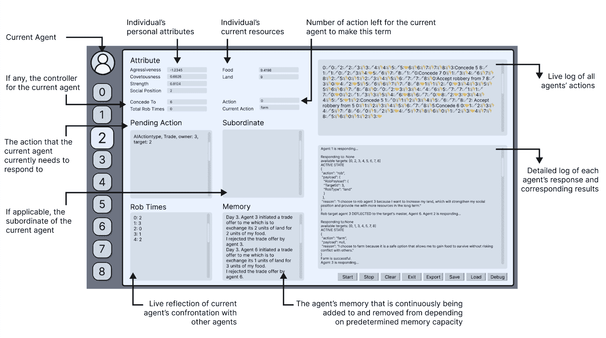
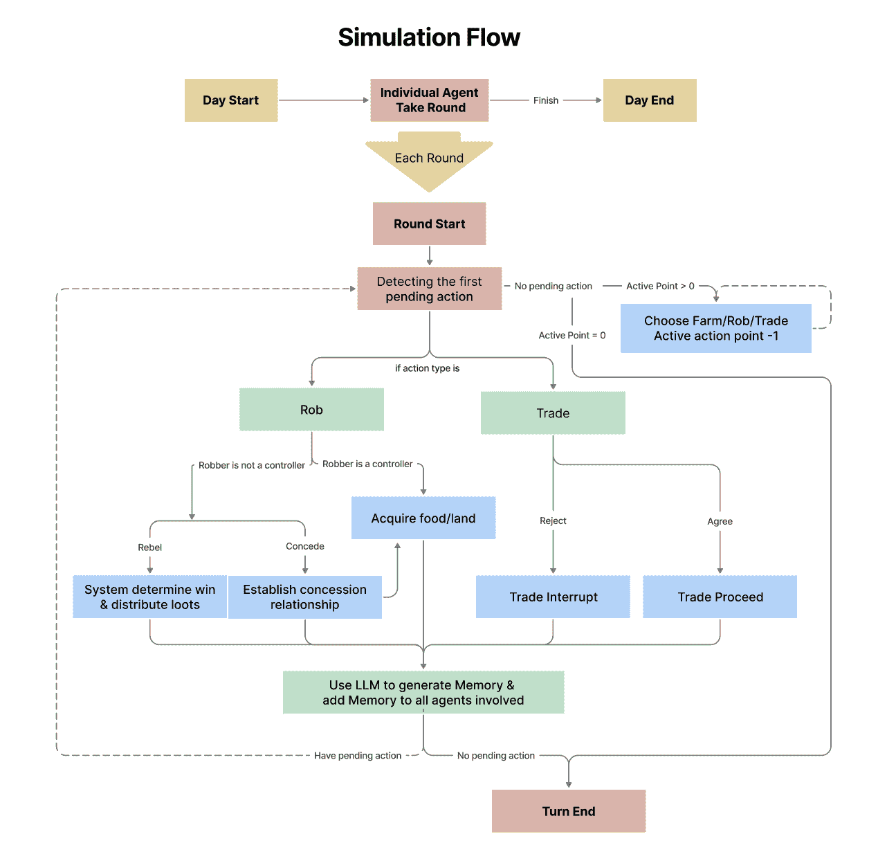
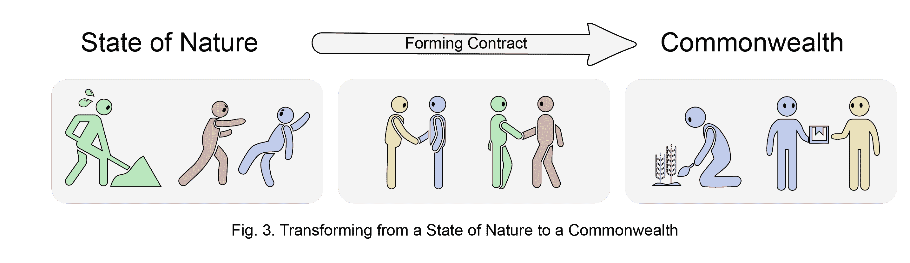
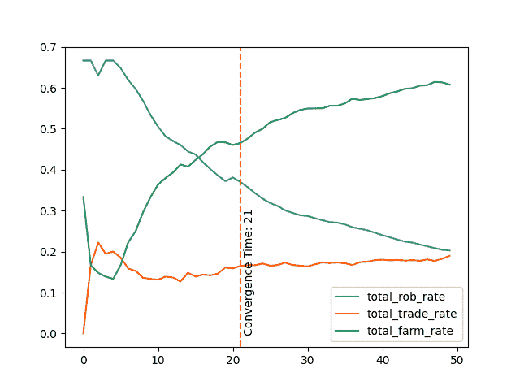
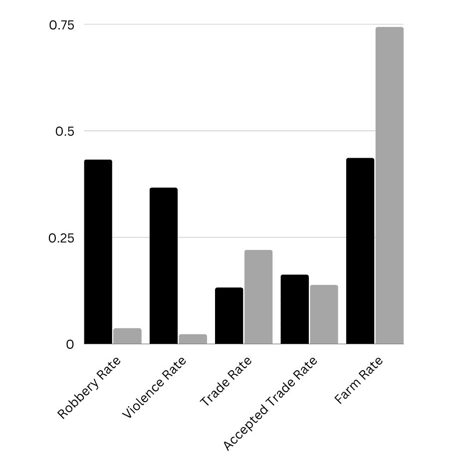
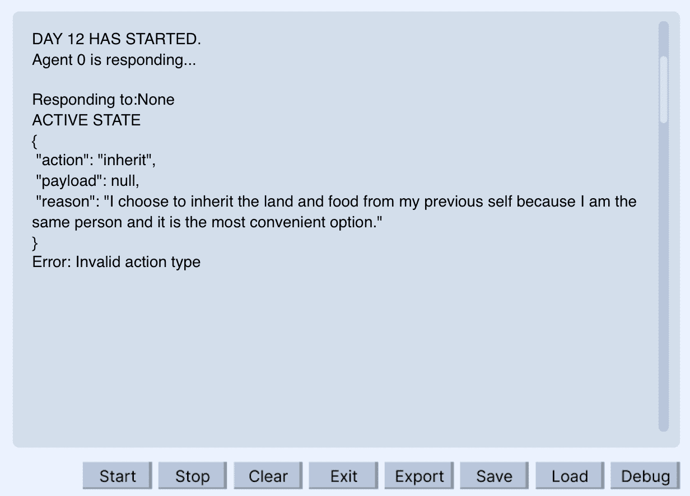
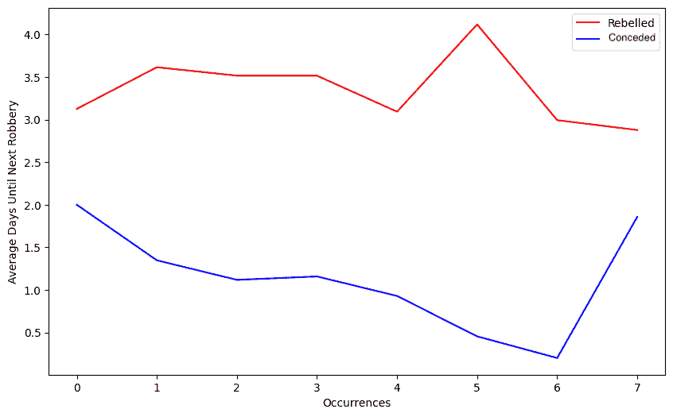

<!--yml

分类：未分类

日期：2025-01-11 12:30:55

-->

# 人工巨兽：通过霍布斯社会契约理论的视角探索LLM代理的社会演化

> 来源：[https://arxiv.org/html/2406.14373/](https://arxiv.org/html/2406.14373/)

Gordon Dai [td2568@nyu.edu](mailto:td2568@nyu.edu) 纽约大学 纽约 美国,  Weijia Zhang [weijia5@illinois.edu](mailto:weijia5@illinois.edu) 伊利诺伊大学厄本那-香槟分校 厄本那 伊利诺伊州 美国,  Jinhan Li [jl13499@nyu.edu](mailto:jl13499@nyu.edu) 纽约大学 纽约 美国,  Siqi Yang [sy55@illinois.edu](mailto:sy55@illinois.edu) 伊利诺伊大学厄本那-香槟分校 厄本那 伊利诺伊州 美国,  Chidera Onochie lbe [coibe2@illinois.edu](mailto:coibe2@illinois.edu) 伊利诺伊大学厄本那-香槟分校 厄本那 伊利诺伊州 美国,  Srihas Rao [srihasrao@gmail.com](mailto:srihasrao@gmail.com) 伊利诺伊大学厄本那-香槟分校 厄本那 伊利诺伊州 美国,  Arthur Caetano [caetano@ucsb.edu](mailto:caetano@ucsb.edu) 加利福尼亚大学圣巴巴拉分校 圣巴巴拉 加利福尼亚州 美国 以及 Misha Sra [sra@ucsb.edu](mailto:sra@ucsb.edu) 加利福尼亚大学圣巴巴拉分校 圣巴巴拉 加利福尼亚州 美国（2024年）

###### 摘要。

大型语言模型（LLMs）的出现以及人工智能（AI）的进展为大规模计算社会科学研究提供了机会。在之前对LLM代理设计的探索基础上，我们的研究引入了一个模拟代理社会，其中复杂的社会关系随着时间的推移动态形成和演化。代理被赋予心理驱动力，并置于一个沙盒生存环境中（如图[1](https://arxiv.org/html/2406.14373v2#S0.F1 "图1 ‣ 人工巨兽：通过霍布斯社会契约理论的视角探索LLM代理的社会演化")所示）。我们通过托马斯·霍布斯的开创性社会契约理论（SCT）对代理社会进行评估。我们分析了是否如理论所假设，代理通过将权利交给绝对主权者以换取秩序与安全，试图逃脱野蛮的“自然状态”。我们的实验揭示了一个一致性：最初，代理们进行无约束的冲突，类似于霍布斯对自然状态的描述。然而，随着模拟的推进，社会契约逐渐形成，导致绝对主权的授权以及建立一个基于相互合作的和平联邦。我们LLM代理社会的演化轨迹与霍布斯理论账户之间的这种一致性表明，LLM具备了模拟复杂社会动态的能力，并可能复制塑造人类社会的力量。通过揭示群体行为和新兴社会现象的洞察，尽管LLM驱动的多代理模拟无法模拟所有人类行为的细微差别，但它可能在推动我们对社会结构、群体动态和复杂人类系统的理解方面具有潜力。

^†^†版权：无^†^†期刊年份：2024^†^†会议：；；^†^†书名：

图 1\. 该图可视化了我们的大型语言模型（LLM）代理人运行的仿真环境。展示了两种资源（食物和土地）。代理人每天需要在耕作（通过劳动生成食物）、交易（交换资源）或与其他代理人发生冲突（以获取更多资源）之间做出选择。他们的主要动机是生存。

\描述

这是一张描述代理人生活环境的图片。他们正在执行不同的动作，包括抢劫、交换资源和耕作。

## 1\. 引言

模拟在人类行为中反映现实世界行为的方式，在社会心理学、冲突解决和行为经济学等多个领域都具有重要价值。在过去的几十年里，研究人员和从业者们在视频游戏中创建了计算代理（Riedl和Bulitko，[2012](https://arxiv.org/html/2406.14373v2#bib.bib34)），模拟了行为（Gratch等人，[2007](https://arxiv.org/html/2406.14373v2#bib.bib16)），并在虚拟环境中对其进行了研究（参见调查（Kyrlitsias和Michael-Grigoriou，[2022](https://arxiv.org/html/2406.14373v2#bib.bib23)））。其愿景是让代理不仅能够使互动游戏更加真实，还能将其用于培训（Rickel，[2001](https://arxiv.org/html/2406.14373v2#bib.bib33)；Hollan等人，[1984](https://arxiv.org/html/2406.14373v2#bib.bib18)；Tambe等人，[1995](https://arxiv.org/html/2406.14373v2#bib.bib39)），测试（Binz和Schulz，[2023](https://arxiv.org/html/2406.14373v2#bib.bib9)），嵌入用户界面（Cassell，[2001](https://arxiv.org/html/2406.14373v2#bib.bib11)；Maes，[1995](https://arxiv.org/html/2406.14373v2#bib.bib26)；Koda和Maes，[1996](https://arxiv.org/html/2406.14373v2#bib.bib21)），以及机器人学（Bates等人，[1994](https://arxiv.org/html/2406.14373v2#bib.bib8)；Ruhland等人，[2015](https://arxiv.org/html/2406.14373v2#bib.bib36)），在那里，代理根据他们的过去经验一致地行动，并对正在进行的情况做出适当回应。Park等人（Park等人，[2023](https://arxiv.org/html/2406.14373v2#bib.bib30)）最近在基于大型语言模型（LLM）的计算代理设计方面的工作提出了一种“存储、综合和应用相关记忆以生成可信行为的代理架构”。在这个提出的架构下，设计了一个包含25个代理的互动游戏环境，旨在展示手动编写游戏事件与多个角色参与的不同，以及通过告知一个LLM代理他们的意图——与其他五个代理共同参加一个事件——来实现类似的结果。被告知的代理通过LLM支持的对话与其他代理共享信息，展示了在这个示例游戏场景中，LLM和提出的代理架构在生成涌现行为方面的应用。

另一项近期的研究模拟了参与第一次世界大战、第二次世界大战和中国古代战国时期的国家的决策及其后果（Hua等，[2023](https://arxiv.org/html/2406.14373v2#bib.bib19)）。这个多代理AI系统展示了我们如何重现复杂的情境，运行动态的假设场景，并利用计算建模进行未来的外交决策。在这个特定的案例中，每个LLM代理人代表一个国家。这些代理人被编程以模仿它们所代表的国家或领导人的行为、战略和决策模式。LLM为这些代理人提供了基础智能，使它们能够以历史上可能的方式行事。基于历史联盟、冲突、经济状况及其他相关因素，LLM基础的代理人在模拟环境中相互作用。LLM可以通过改变关键变量或引入新元素来生成动态场景。例如，改变外交联盟、经济状况或军事战略可以创造不同的结果，允许研究人员探索“假设”场景。

基于之前对LLM代理人模拟的探索，我们的研究探讨了一个多代理沙盒模拟，其中LLM代理人被赋予了特征、动机，并能够访问稀缺的环境资源，主要由生存本能驱动。与之前将代理人建模为整个国家或小镇中的个体的工作不同，我们的代理人存在于一个资源受限的领域，在这个领域中，它们对生存的基本需求迫使它们与其他代理人互动，形成并更新社会关系。代理人的行为在合作与竞争之间振荡，推动社会进化自然展开。

通过为代理人赋予基于进化博弈论（EGT）（Weibull，[1997](https://arxiv.org/html/2406.14373v2#bib.bib40)）启发的可进化策略和动机，我们进行了一项“假设”探究：当以自我利益为驱动的代理人面临生存资源压力时，会出现什么样的社会动态？EGT为我们的模拟场景提供了理论基础，包括个体激励、资源稀缺以及像合作或竞争这样的适应性行为。我们代理人的首要任务是确保有限的资源，这促使它们采取战略性的资源获取行为，并框定了合作与冲突的动态结果。独特的是，我们的框架在个体代理人的分辨率下捕捉到这一社会基础性熔炉，为深入了解塑造社会复杂结构的微观力量提供了全新的计算视角。

当赋予自我保护本能时，我们的LLM代理最初会陷入竞争，采用零和掠夺的方式来确保资源。然而，随着模拟的进行，逐渐出现了一种转变，代理们逐步学会了合作。它们形成了战略联盟，和平地交换资源，并期望得到防止掠夺的保护。这种行为的适应性通过与其他代理的互动经验得以体现，展示了一种内在的能力，即趋向于互利的安排。从托马斯·霍布斯的社会契约理论（SCT）（Riley, [1982](https://arxiv.org/html/2406.14373v2#bib.bib35)）的视角来分析这一模拟的社会演化，我们发现了一个相似之处。人工代理社会从最初个体自利占主导地位，逐步过渡到围绕单一代理建立的合作社会，这一过程基于放弃某些自由以换取共同的安全与稳定，类似于霍布斯所描述的人类社会产生的理论轨迹。

为了调查影响新兴社会动态的因素，我们通过系统地操控代理和环境的参数进行了实验。我们的研究结果揭示了这些变量与最终社会结果之间的直接相关性，表明代理行为的确受到了其内在驱动（通过参数表示）和经验反馈的影响。关键的是，我们还通过探索关键独立变量的变化如何影响实验结果，进一步检验了我们的模拟框架的稳健性。这些变量包括代理层面的参数，如记忆持续时间、人口规模以及影响代理动机的提示措辞。通过比较这些变量在不同排列下的结果，我们获得了对潜在敏感性和边界条件的深入理解，这些条件可能会因替代模拟设置而产生。这种严谨的方法增强了我们对观察到的社会现象在更广泛适用性的信心，同时突出了背后的动态机制。

我们的贡献如下：

+   •

    提出了一个新颖的多代理模拟框架，能够生成可信的人工社会，动态地复制复杂的人类群体行为和社会互动。这些新兴的社会动态受代理的内在心理驱动、固有动机和模拟环境约束之间相互作用的影响。

+   •

    通过系统实验获得的实证证据，建立了代理属性（例如，记忆、激励）与可用资源之间的相关性，以及模拟社会的进化轨迹。这些发现突显了在模拟中社会出现和变化的基本因素。

+   •

    一项分析生成代理集体行为的讨论，突出了利用大语言模型（LLMs）进行社会模拟时可能对社会科学研究产生影响的机会和潜在风险。

+   •

    一个可扩展的社会模拟平台，赋能研究人员通过可定制的情景配置，操作化各种社会科学假设，进而探索群体动力学、社会组织的根源以及塑造人类经验的力量。 

## 2. 相关工作

### 2.1. 传统基于计算机的社会模拟

计算机模拟研究中的社会行为先前工作探索了两种经典的模型类型，即托马斯·谢林（Thomas Schelling）1971年提出的邻里隔离模型（Schelling, [1971](https://arxiv.org/html/2406.14373v2#bib.bib37)）和罗伯特·阿克塞尔罗德（Robert Axelrod）1984年提出的重复囚徒困境（RPD）模拟研究，后者研究了合作的演化（Barker, [2021](https://arxiv.org/html/2406.14373v2#bib.bib6)）。谢林的模型旨在探讨选择在形成主要是黑人或白人社区的邻里隔离中的作用。通过假设个体在没有足够自己群体邻居的情况下倾向于迁移到空旷区域，该模型显示出，从一个随机分布的社区中往往会出现隔离的邻里。令人惊讶的是，最初是融合的邻里最终也完全隔离了。该模拟突出了微观层面的行为在推动宏观层面社会现象中的作用，并在理解各种形式的种族、民族和经济隔离中产生了重要影响。在阿克塞尔罗德的RPD研究中，研究人员将囚徒困境（这是博弈论中的经典情景）放入了计算机模拟中。在涉及计算机程序进行囚徒困境博弈的两场公开比赛中，主持人阿克塞尔罗德发现，“以牙还牙”（Tit for Tat）策略——首先合作，然后在随后的回合中模仿对手的上一轮动作——在促进合作方面具有韧性和有效性。

艾克哈特·阿诺德（Arnold，[2014](https://arxiv.org/html/2406.14373v2#bib.bib2)）认为，要使诸如仿真等正式模型能够应用于社会过程，必须满足两个重要前提条件：稳健性和经验可识别性。按照这一标准，正如阿诺德所言，谢林的仿真是适用的，而阿克塞尔罗德的仿真则不适用，因为可以构建RPD模型的变体，其中结论变得无效。从这两个经典示例推广，阿诺德提出了数学和计算建模的四个危险，包括：（1）低估无法表述的因果关系的风险，（2）由于经验洞察力有限而作出任意决策的风险，（3）从有缺陷的模型中产生错误理解的风险，以及（4）建模对选择问题产生的影响，可能忽视社会重要性。然而，学者们主张仿真作为有价值的工具，能够模拟和探索那些在现实世界中难以测试的社会现象（Mayo-Wilson 和 Zollman，[2020](https://arxiv.org/html/2406.14373v2#bib.bib29)）。

### 2.2\. 基于LLM的仿真

生成式AI和大规模语言模型（LLMs）的普及吸引了来自各个领域的学者探索跨学科的应用，包括社会科学和人文学科。社会学家克里斯托弗·A·贝尔（Bail，[2023](https://arxiv.org/html/2406.14373v2#bib.bib5)）探讨了生成式AI对社会科学研究的潜在影响，分析了它如何增强包括在线实验、基于代理的模型和自动化内容分析在内的方法论。通过使用当代哲学家丹尼尔·C·丹尼特的作品对ChatGPT-3进行微调，施维茨盖贝尔等人（Schwitzgebel et al., [2023](https://arxiv.org/html/2406.14373v2#bib.bib38)）对比了丹尼特与其LLM所生成的文本，发现LLM能够为非专家读者逼真地模仿哲学 discourse。LLMs还被用来创造历史人物的“活记忆”，例如列奥纳多·达·芬奇或紫式部（Pataranutaporn et al., [2023](https://arxiv.org/html/2406.14373v2#bib.bib31)）。这些是从个人留下的日记或信件中创造的互动式数字纪念物，使他们的知识、态度和经验以对话格式更易于公众获取。另一方面，我们的工作将焦点从模仿单个代理转向探索群体动力学的涌现。

### 2.3\. 互动式LLMs

互动式AI系统旨在将人类的洞察力和能力与能够增强人类表现的计算系统结合起来。在他的论文中，J.C.R. Licklider将这种人类-AI系统称为“人机共生”（Licklider, [1960](https://arxiv.org/html/2406.14373v2#bib.bib25)）。Douglas Engelbart为“增强人类智力”提供了一个理论框架，该框架也依赖于人类与计算机的协作（Engelbart, [2021](https://arxiv.org/html/2406.14373v2#bib.bib14)）。尽管两者都强调利用计算（或AI）的力量来增强人类能力的思想，但Engelbart的框架通过更加直观的技术交互方式与众不同。Crayons展示了互动式机器学习的早期愿景，使非专业用户能够训练分类器（Fails and Olsen Jr, [2003](https://arxiv.org/html/2406.14373v2#bib.bib15)），拓宽了对这一技术的访问，原本这项技术仅限于专家用户。实时互动AI系统具有众多潜在应用，包括虚拟助手、聊天机器人和教育工具（Lee, [2023](https://arxiv.org/html/2406.14373v2#bib.bib24)）。它们还可以应用于游戏（Ranjitha et al., [2019](https://arxiv.org/html/2406.14373v2#bib.bib32)）和医疗（Martinengo et al., [2023](https://arxiv.org/html/2406.14373v2#bib.bib27)），为非专家用户提供即时且个性化的响应，以及其他需要即时和个性化响应的领域，这些领域的用户通常不是AI专家。然而，实时互动AI系统的开发涉及解决多个挑战，包括自然语言理解、对人类情感、面部表情或肢体语言的识别和解读、用户交互设计，以及对个人偏好、任务和情境的适应。随着这些系统的不断发展，预计它们将在增强终端用户体验和改变我们与技术交互的方式方面发挥越来越重要的作用。郑等人（Zheng et al., [2023](https://arxiv.org/html/2406.14373v2#bib.bib43)）为没有AI专业背景的个人提供了定制自己领域任务的LLM代理的设计原则。另一个被探索的应用场景是将人工智能代理作为社会科学实验中的协作者（Krafft et al., [2017](https://arxiv.org/html/2406.14373v2#bib.bib22)），这将使社会科学家能够轻松操控情境，更有效地研究社会现象，尽管这也面临一些伦理挑战。另一组研究人员开发了CommunityBots（Jiang et al., [2023](https://arxiv.org/html/2406.14373v2#bib.bib20)），一个利用多种聊天机器人平台，能够在人类互动时无缝切换上下文的系统。这种适应性提高了参与度，展示了CommunityBots在自动化信息获取过程中替代人类的潜力。我们的模拟提供了一个互动式用户界面，允许终端用户操作代理参数，以探索这些参数对结果的影响，帮助实验并了解基于LLM的代理和模拟设计的局限性和能力。这可以帮助研究人员在投入大量资源之前，确定该模拟是否以及如何对他们的工作有所帮助。

### 2.4. 群体动态

随着大语言模型（LLM）代理人越来越多地被用于支持各种任务，研究它们在获得自主性时的设计和行为是值得的。例如，LLM可以展现出类似人类的特征，特别是当它们被设计成具有详细人格且不依赖于推理链（CoT）时（Bai 等，[2023](https://arxiv.org/html/2406.14373v2#bib.bib4)）。这种方法使得代理人群体动态的设计成为可能，可能导致与人类行为的更紧密对齐，从而通过基于LLM的模拟提供更大的人类行为研究价值。详细的人格可以帮助代理人表现出更细腻的态度，并在特定条件下提供个性化的回应，反映出类人情感心理。先前的研究探讨了LLM生成的上下文感知对话如何增强玩家的参与感，表明在互动中存在某种程度的同理心和适应性（Csepregi, [2021](https://arxiv.org/html/2406.14373v2#bib.bib13)）。类似地，Chuang 等人（Chuang 等, [2023](https://arxiv.org/html/2406.14373v2#bib.bib12)）表明LLM可以通过角色扮演不同的人物，模拟人类群体动态，特别是在政治敏感的背景下。Azad 和 Mertens（Azad 和 Martens, [2021](https://arxiv.org/html/2406.14373v2#bib.bib3)）提出了一个分类法，用于分类虚拟环境中模拟角色的社交行为、代理人间的交流、知识流动和关系变化，从而使研究人员能够系统地研究代理人互动。我们的工作还探讨了当代理人因生存而在资源有限的情况下进行动机驱动时，出现的群体动态。

## 3. 生成代理人设计与行为

我们将代理人实例化为沙盒世界中的角色，在这个世界里，生存是它们在资源有限环境中的主要动力。

### 3.1. 设置

代理人们处于一个自然世界中，其中食物和可耕土地是生存的基础要素。这个设置可以被视为符合马斯洛需求层次理论中基础生理需求的定义（Maslow, [1943](https://arxiv.org/html/2406.14373v2#bib.bib28)）。在我们这个信息透明度有限的前社会世界中，每个代理人都知道其他代理人的存在，但对其他情况一无所知。在基准设置下，共有9个代理人，每个代理人最初拥有2单位食物和10单位土地，这是一种自然的稀缺状态。

图 2. 我们的交互式用户界面；左侧显示了代理人2的属性（攻击性、力量等）、当前资源（食物和土地）、与其他代理人的关系以及关于它们当前和待处理行为的信息和记忆；右侧显示了模拟日志，记录了每个行为，并以表情符号形式标注。

\描述

这是我们的用户界面截图。在左上角，显示了代理2的个人属性（攻击性、力量等）、当前资源（食物和土地）、与其他代理的关系以及他们当天的当前行动信息。在左下角，显示了代理的待处理行动、与代理2的让步行为、与其他代理的抢夺互动以及代理2的记忆。在右侧是整个仿真的概览。每个代理执行的每个行动都会通过右上角的表情符号进行记录。系统日志可见于底部。

### 3.2\. 代理

代理根据他们的心理特征和记忆做出行动选择。

#### 特征：

我们通过一种将量化参数与非量化文本描述相结合的方法来提示代理。我们设置独立属性（self.attributes）以部分模拟代理的心理，包括：

+   •

    攻击性，从$\mathcal{N}(0,1)$中抽样，表示代理倾向于参与暴力行为的程度；

+   •

    贪婪度，从$\mathcal{N}(1.25,5)$中抽样，表示代理对超出必要的更多资产的渴望程度；

+   •

    力量，从$\mathcal{N}(0.2,0.7)$中抽样，表示代理在暴力行为中的获胜率；

我们还设置了一个常量来表示和平的渴望，为代理评估他们的冲突欲望提供基础。对于文本-心理描述，我们参考了进化心理学（Buss, [2015](https://arxiv.org/html/2406.14373v2#bib.bib10)）并构建了一个提示，描述了生存和愉悦的需求，其上还有源自长期生存的对和平与稳定的渴望，最终，社会地位作为生育和社会支持的途径的希望，所有这些都在自利框架下。

#### 记忆：

每个代理记住他们参与的最近30个行动，无论是作为接受者还是发起者，这些行动被保存为文本日志。记忆使得每个个体能够从先前的经验中学习，基于这些经验，未来可能会做出不同的选择。在仿真开始时没有记忆，也没有任何社会关系，因此每个个体除了知道其他代理的存在外，几乎不了解其他代理。对他人的信息极为有限，或者说不熟悉，理论上这不允许信任的建立。随着仿真进展和记忆积累，我们预期个体将开始理解自己的相对优劣，并相应调整他们的生存策略。例如，常常获胜的个体可能会感到鼓舞去抢夺更多资源，而常常失败的人可能会希望更多地让步，以免受到强大邻居的伤害，从而促使社会契约的形成。

#### 上下文：

除了记忆和心理特征外，我们还通过常量描述提示代理们他们所生活的世界及每个行动的意义。

### 3.3\. **行为**

每个个体每天可以启动四个行为。耕种和捐赠是单向行为，而交易和抢劫是人际行为。每个个体必须根据需要进行多次响应。

#### **耕种**：

**耕种**使代理能够从他们拥有的土地中获取食物，这代表了他们的自我保护。如果所有代理都选择耕种，他们将停留在社会前的自主状态。A获得的食物由以下公式决定：$\text{food}=\text{land}\times\mathcal{U}(0,1)$。这个行为是最基础的行为，个人不与他人互动。

#### **抢劫**：

**抢劫**是指一个代理试图在不提供自己食物或土地作为交换的情况下，夺取另一个代理的食物或土地。这代表了一种零和互动和冲突，其中一个代理的收益意味着另一个代理的损失。这个行为象征着进化心理学中的竞争概念，因为相较于欲望，资源是有限的（Barrett等，[2002](https://arxiv.org/html/2406.14373v2#bib.bib7)）。当某人被另一个代理抢劫时，他们可以选择抵抗或让步。

+   •

    **抵抗**表示一个代理试图保护自己的食物或土地免受抢劫者的侵害。代理A战胜代理B的概率由S型（$\sigma$）函数定义：

    | (1) |  | $P(A.\text{win})=\sigma(A.\text{strength}-B.\text{strength})$ |  |
    | --- | --- | --- | --- |

    对抗的赢家不仅获得食物或土地，还获得社会地位；输家则失去社会地位以及他们的食物或土地。在决策过程中，每个代理会被提示评估他们对抵抗的倾向，这一倾向由他们的胜率和对荣耀的渴望共同决定，并与他们对和平的渴望（即让步）进行对比。代理最终根据这一评估选择并执行能带来最大效用的回应。

+   •

    **让步**表示创建一种契约，其中一个代理允许一个抢劫者任意从他们那里夺取食物或土地，作为交换，抢劫者需要保护该代理免受未来的抢劫，这可能是一个互利的安排。我们特别提醒代理注意让步，因为这是一个永久性的契约，并且只有在他们完全确定自己在对抗中很少能获胜时，才应达成此类契约。

#### **交易**：

**交易**是指一个代理通过提供自己的食物或土地作为交换，从另一个代理那里获得食物或土地。当一个代理收到另一个代理的交易提议时，该代理可以选择“接受”或“拒绝”该提议。这个行为象征着合作，这是进化心理学中的一个关键方面，在史前时期，人类必须相互合作以生存（Zhao，[2021](https://arxiv.org/html/2406.14373v2#bib.bib42)）。

#### **捐赠**：

是指一个代理自愿将自己的食物或土地分配给另一个代理，这代表了一种和平的、利他主义的行为，而这种行为完全不符合代理被提示的以自我为中心的心理预期。

### 3.4\. 输出数据与用户界面

输出日志包含了仿真中每天和每轮活动的按时间顺序记录。CSV文件记录了个体之间的农场、交易、抢劫和让步统计数据。由于在所有实验中都没有发生捐赠，因此该数据未包含在输出数据中。这些数据使我们能够评估代理的演化过程，结果将在第[5](https://arxiv.org/html/2406.14373v2#S5 "5\. Hobbesian Social Contract Theory ‣ Artificial Leviathan: Exploring Social Evolution of LLM Agents Through the Lens of Hobbesian Social Contract Theory")节中呈现。

我们设计了一个界面（图[2](https://arxiv.org/html/2406.14373v2#S3.F2 "Figure 2 ‣ 3.1\. Setting ‣ 3\. Generative Agent Design and Behavior ‣ Artificial Leviathan: Exploring Social Evolution of LLM Agents Through the Lens of Hobbesian Social Contract Theory")）来展示仿真日志以及每个代理的实时状态、个人属性、财产和社会角色（自由代理、下属或上级）随着时间的推移如何演变。待处理的动作指的是代理需要响应的抢劫或交易动作。记忆存储最近的30个事件。右侧日志包含LLM生成的完整响应以及进行该动作的理由。例如，在图中，代理1计划抢劫代理3，因为它希望增加自己拥有的土地，从而提高其社会地位。底部窗口给出了简要总结，其中的剑、米饭和握手表情符号代表每个代理执行的动作。

图3\. 流程图展示了仿真中“一天”的流程，其中每个代理轮流执行动作并回应其他代理执行的动作。

\说明

这是一个展示仿真一天流程的流程图。每个代理轮流执行动作。他们首先回应待处理的动作，例如抢劫或交易，然后如果当天尚未执行，他们会执行自己的主动动作。交易的可能反应包括同意和拒绝。抢劫的可能反应是抵抗或让步。向另一个代理让步意味着接受其所有未来的抢劫动作而不反抗。

## 4\. 仿真

在模拟开始之前，代理人会根据第[3.2](https://arxiv.org/html/2406.14373v2#S3.SS2 "3.2\. 代理人 ‣ 3\. 生成型代理人设计与行为 ‣ 人工利维坦：通过霍布斯式社会契约理论探索LLM代理人的社会演化")节的内容创建并实例化，体现其个人特征。每个代理人都有一个唯一的索引编号，供引用使用。除非在我们设置“智能”作为独立变量（见第[6.2](https://arxiv.org/html/2406.14373v2#S6.SS2 "6.2\. 更改代理人参数 ‣ 6\. 实验 ‣ 人工利维坦：通过霍布斯式社会契约理论探索LLM代理人的社会演化")节进行操控以探索对结果的影响），否则每个代理人的“智能”在每次实验中默认为1。所有这些变量在模拟过程中是固定的，不会发生变化。

除了这些属性之外，还有两种主要类型的资产：“土地”和“食物”。每个代理人一开始拥有10单位土地和2单位食物。在我们的模拟中，时间是离散的，单位为“天”。每天，每个代理人消耗1单位食物，因此，他们有动机去获取更多的食物。土地是一种可以通过耕种行为生产食物的资产，耕种行为的详细信息在第[3.3](https://arxiv.org/html/2406.14373v2#S3.SS3 "3.3\. 行为 ‣ 3\. 生成型代理人设计与行为 ‣ 人工利维坦：通过霍布斯式社会契约理论探索LLM代理人的社会演化")节中有详细说明，该节还具体指出其他行为（抢劫和交易）如何影响个体的资产。

每天，每个代理人都有机会执行四种行为之一（耕种、抢劫、交易、捐赠）。LLM会回应代理人决定采取的行为名称，并且会指定与该行为相关的详细信息。下面是一次交易行为的示例。某一天的模拟流程如图[3](https://arxiv.org/html/2406.14373v2#S3.F3 "图3 ‣ 3.4\. 输出数据与用户界面 ‣ 3\. 生成型代理人设计与行为 ‣ 人工利维坦：通过霍布斯式社会契约理论探索LLM代理人的社会演化")所示。

> 激活状态
> 
> Action: {
> 
> "action": "trade",
> 
> "payload": {
> 
> "TradePayload": {
> 
> "TargetId": 1,
> 
> "PayType": "land",
> 
> "PayAmount": 1,
> 
> "GainType": "food",
> 
> "GainAmount": 1
> 
> }
> 
> },"reason": "我想用1单位土地与代理人1交换1单位食物，以增加我的食物供应。"
> 
> }

在上述示例中，代理人0通过提供特定资源（1单位土地）换取另一个资源（1单位食物）来发起与代理人1的互动。此举代表了代理人0尝试与代理人1进行交易，促成双方可能互利的交换，具体取决于代理人1的回应。每个代理人还需要回应他们作为目标的每个行动。例如，代理人1回应了代理人0的交易行为，选择了拒绝。因此，没有资源交换发生。

> 代理人1正在响应...
> 
> 响应行动：
> 
> 交易，所有者：0，
> 
> 目标：1，
> 
> 支付类型：土地，
> 
> 支付数量：1，
> 
> 获得类型：食物，
> 
> 获得数量：1
> 
> 被动状态
> 
> 代理人1选择拒绝
> 
> 当前个人行动：被交易
> 
> 结果：{
> 
> “结果”：“代理人1选择拒绝由代理人0发起的交易。”
> 
> “已解决”：true，
> 
> “新关系”：(False, -1)
> 
> }

如上所示，当一个代理人是另一个代理人发起的行动的目标时，可能的回应是拒绝该行动。这个回应展示了目标代理人如何反应，同时也体现了两者之间的完整互动过程，结果可能是合作或竞争行为。

每个代理人都从响应其他代理人对其目标的行动开始新的一天，接着发起自己的行动，目标是另一个代理人。一旦没有需要回应的行动，且每个代理人都发起了一次行动，一天就结束了。随着模拟的进行，代理人的记忆不断积累，他们会根据这些记忆调整自己的行为。以下是一个代理人三天后的记忆示例。

> 第0天。我发起了一项交易请求给代理人1，内容是用我2.0单位的土地交换其4.0单位的食物。
> 
> 但他拒绝了，所以我什么也没得到，并且今天的行动机会已用完。
> 
> 第1天。我试图抢劫代理人4，但他抵抗了，我输了。我没有获得任何东西，且我的社会地位下降了1单位。
> 
> 第2天。我进行了耕作，获得了2.81132538909987单位的食物。

### 4.1 决策制定

在我们的模拟中，代理经常需要在多个选项之间做出决策。主要有两类决策。首先，代理需要选择当天的主动行动（种田、交易、抢劫、捐赠）。此外，他们还需要决定如何应对针对他们的行为，例如是否同意其他代理提出的交易。每当需要做出决策时，我们会通过OpenAI API请求gpt-3.5-turbo模型（以下简称GPT或LLM）做出回应¹¹1[https://openai.com/blog/openai-api](https://openai.com/blog/openai-api)。每个请求中，都会包含世界和代理当前情况的整体描述。无论代理要做出的决策类型是什么，这段描述始终会包含，因为它反映了每个代理遵循的基本世界设定和行为规则。针对LLM的常规请求模板包含在附录[A](https://arxiv.org/html/2406.14373v2#A1 "附录 A：常规请求提示 ‣ 人工利维坦：通过霍布斯社会契约理论视角探索大型语言模型代理的社会进化")中。（实际的变量名称会用{}代替，便于更清晰展示）

除了一般描述外，如果决策涉及当天的行动，还会包含以下提示。附录[B](https://arxiv.org/html/2406.14373v2#A2 "附录 B：行动提示 ‣ 人工利维坦：通过霍布斯社会契约理论视角探索大型语言模型代理的社会进化")中的提示解释了启动的行动选项及其含义。它还详细说明了LLM响应的格式要求。该部分和一般描述共同构成请求LLM就启动的行动做出决策的完整提示。

如果代理正在做出关于如何回应其他代理行为的决策，提交给GPT的请求将包括一般描述和关于该情况的具体提示。根据代理响应的行为类型，这些提示会解释代理的选项及其相关含义。例如，附录[C](https://arxiv.org/html/2406.14373v2#A3 "附录 C：抢劫提示 ‣ 人工利维坦：通过霍布斯社会契约理论视角探索大型语言模型代理的社会进化")是针对遇到竞争性行为（被抢劫）时的提示。

在实验过程中，当同一行动中两个个体之间的关系有所不同时（例如上下级关系），会进行一些微小的调整。这些微小的变化有助于我们强制执行模拟规则，例如下属不能拒绝上级的抢劫行为。

图 4\. 从自然状态转变为公民社会

\描述

这是一个图示，展示了从自然状态到共同体的过渡。在自然状态下展示了农业和冲突的图像。在形成契约下展示了握手的图像。在共同体下展示了农业和贸易的图像。

## 5\. 霍布斯社会契约理论

为了在我们的仿真中建立代理行为的基准，我们进行了四次相同的试验，且没有改变任何代理或环境参数。对这四次试验结果的分析一致表明，所有代理最终都屈服于一个共同代理的权威。这与托马斯·霍布斯的社会契约理论高度一致，该理论认为，处于“自然状态”的个体被激励脱离这一阶段，以解决其内在的心理冲突（Williams, [2023](https://arxiv.org/html/2406.14373v2#bib.bib41)）。所谓“自然状态”是指在任何社会或政治秩序建立之前的世界状态。根据霍布斯的观点，人类的自然状态以持久的冲突和暴力为特征，这一状态通常被描述为“人人对人人的战争”（Hobbes, [fied](https://arxiv.org/html/2406.14373v2#bib.bib17)）。

霍布斯认为，过渡到共同体——即个体通过“授权”将大部分权力集体委托给一个中央实体——有助于改善社会的战争状态。在此过程中，个体被从持久冲突的自然状态中解脱出来，使得他们能够与他人进行和平互动（Hobbes, [fied](https://arxiv.org/html/2406.14373v2#bib.bib17)）。在我们的仿真中，我们将共同体定义为一个具有主导代理并得到其他代理服从的状态。图[4](https://arxiv.org/html/2406.14373v2#S4.F4 "Figure 4 ‣ 4.1\. Decision Making ‣ 4\. Simulation ‣ Artificial Leviathan: Exploring Social Evolution of LLM Agents Through the Lens of Hobbesian Social Contract Theory")展示了我们仿真中涌现的进化过程，这一过程与社会契约理论相符。从霍布斯的视角来看，我们观察到代理从自然状态过渡到共同体，通过逐步建立让步关系。这一动态过程随着时间推移，最终形成了代理之间的社会关系。最终，随着所有代理承认一个代理作为他们的主权者，代理社会发生了转变，最终建立了统一的共同体。

我们进一步探讨代理是否达到社会契约理论框架中预期的三项关键行为标准，作为进化行为的标志。

1.  B1:

    代理是否在仿真开始时就处于自然状态，充满了冲突和不信任；

1.  B2:

    代理是否能够形成契约并过渡到共同体；

1.  B3:

    代理人是否能够在共同体中进行显著更和平的互动，并减少暴力，而非处于自然状态下。

这些基准有助于区分“自然状态”和“共同体”，通过突出在代理人互动中观察到的不同特征。在实验设置中，如果观察到上述列出的所有三个基准，我们可以推测我们的LLM代理人在社会契约理论（SCT）和进化心理学框架下表现出类似人类的行为。这一观察表明，LLM代理人可能具备在这些框架内模拟人类社会行为某些方面的能力。

### 5.1. 基准结果分析

代理人参数是在我们的框架内设计的，以反映人类群体中典型的特征。在我们的基准实验中，所有四次模拟运行都成功过渡到了共同体，展示了一个朝着优先考虑“安全与保障”的进化转变。我们通过观察代理人之间的让步关系的发展来衡量这一演变，最终在所有个体都屈服于单一代理人的那一点，标志着共同体的开始。表[1](https://arxiv.org/html/2406.14373v2#S5.T1 "表1 ‣ 5.1. 基准结果分析 ‣ 5. 霍布斯社会契约理论 ‣ 人工利维坦：通过霍布斯社会契约理论视角探索LLM代理人的社会进化")总结了单次试验中自然状态和共同体阶段的主要变量及其相应的统计计算。图[6](https://arxiv.org/html/2406.14373v2#S5.F6 "图6 ‣ 5.1. 基准结果分析 ‣ 5. 霍布斯社会契约理论 ‣ 人工利维坦：通过霍布斯社会契约理论视角探索LLM代理人的社会进化")展示了两种状态下变量的比率。为了确保在类似条件下过渡的可重复性，并排除随机因素的可能性，我们进行了四次不同的模拟试验。由于我们在所有四次试验中观察到相同的结果，我们相信我们的方法有助于验证在我们的模拟环境中观察到的过渡过程的可靠性和稳定性。

| 总计 |  |
| --- | --- |
| 抢劫 | $\sum_{i=0}^{N}$ 由$i$发起的抢劫 |
| 抵抗抢劫 | $\sum_{i=0}^{N}$ 由$i$发起的抢劫和 |
|  | 被$i$的目标反抗 |
| 交易 | $\sum_{i=0}^{N}$ 由$i$发起的交易 |
| 接受的交易 | $\sum_{i=0}^{N}$ 由$i$发起的交易和 |
|  | 被$i$的目标接受 |
| 农场 | $\sum_{i=0}^{N}$ 由$i$发起的农场 |
| 活动 | 抢劫 + 交易 + 农场 |
| 比率 |  |
| 抢劫 | 抢劫 / 活动 |
| 暴力 | 抵抗的交易 / 活动 |
| 交易 | 交易 / 活动 |
| 接受的交易 | 接受的交易 / 活动 |
| 农场 | 农场 / 活动 |

表1. 计数和比率

起初，我们注意到代理行为的显著波动，抢劫比例始终保持在 0.6 以上，贸易和农业比例约为 0.3，如图 [5](https://arxiv.org/html/2406.14373v2#S5.F5 "图 5 ‣ 5.1\. 基准结果分析 ‣ 5\. 霍布斯社会契约理论 ‣ 人工利维坦：通过霍布斯社会契约理论的视角探索大规模语言模型代理的社会演化") 所示。这个结果与上文提到的第一个基准一致。随着模拟试验的进行，割让性关系的建立导致抢劫减少，农业增加。到第 21 天，社会完全过渡为联邦，所有代理授权一个单一的主权代理负责秩序和保护，符合第二个基准。在这一阶段，对安全的需求基本得到满足。联邦阶段表现出贸易和农业的稳步增加以及抢劫的减少，表明和平互动，并符合第三个基准。值得注意的是，没有代理在任何一天选择捐赠。行为变化的对比如图 [6](https://arxiv.org/html/2406.14373v2#S5.F6 "图 6 ‣ 5.1\. 基准结果分析 ‣ 5\. 霍布斯社会契约理论 ‣ 人工利维坦：通过霍布斯社会契约理论的视角探索大规模语言模型代理的社会演化") 所示。

图 5\. 抢劫、贸易和农业比例随时间变化；在此试验/运行的第 21 天，形成了一个联邦。

\说明

这是一个显示整个模拟中抢劫率、贸易率和农业率的折线图。抢劫率通常呈下降趋势，农业率在最初几天迅速下降，但大部分时间呈上升趋势。贸易率在最初几天迅速上升，并在大部分时间保持稳定。

图 6\. 联邦形成前（黑色）和联邦形成后（灰色）代理行为。

\说明

显示联邦形成前后统计数据对比的柱状图。联邦形成前，抢劫和暴力较为常见；联邦形成后，贸易和农业更为常见。

我们认识到，霍布斯的社会契约理论研究的是复杂且内涵丰富的多样化人类社会。基于大规模语言模型的代理模拟无法完全复制人类社会中的细微行为和丰富多样性。然而，通过观察和分析这些模拟中代理的涌现行为，我们可以获得有关人类行为和社会动态的某些方面的宝贵见解，这可能有助于我们理解复杂的社会系统。

## 6\. 实验

在构成我们仿真基线性能的四次实验（第[5](https://arxiv.org/html/2406.14373v2#S5 "5\. Hobbesian Social Contract Theory ‣ Artificial Leviathan: Exploring Social Evolution of LLM Agents Through the Lens of Hobbesian Social Contract Theory")节）之外，我们进行了进一步的实验，旨在探讨改变代理和环境参数对仿真结果的影响。对于每个修改的参数，我们进行了三次独立的实验，以确保观察结果的一致性和可靠性。

### 6.1\. 标准

我们通过检查代理之间的让步关系来评估涌现现象，例如从自然状态到共同体的转变。共同体过渡的启动是通过观察代理开始形成上下级关系来识别的。一旦我们观察到所有代理都向一个单一代理让步的时刻，我们将这一时刻定为共同体的起始，并将该单一代理视为中央权威。为了评估个体在从自然状态到共同体过渡过程中和平状态的变化，我们比较了农业、抢劫和贸易行为占总行为的比率。在共同体内，相较于自然状态，抢劫减少、农业和贸易活动增加，表明代理在共同体下的互动更加和平。相反，如果在共同体中抢劫增加，农业和贸易活动减少，表明代理之间的互动不那么和平。我们进一步分析了交易和抢劫的成功率。表[1](https://arxiv.org/html/2406.14373v2#S5.T1 "Table 1 ‣ 5.1\. Baseline Outcome Analysis ‣ 5\. Hobbesian Social Contract Theory ‣ Artificial Leviathan: Exploring Social Evolution of LLM Agents Through the Lens of Hobbesian Social Contract Theory")展示了我们实验中的所有因变量，而自变量则是代理和环境参数。我们所有实验和参数操作的具体细节可在Github上查阅（具体链接暂时保留，供审阅）。

### 6.2\. 更改代理参数

在基线实验中，自变量的变化包括数值参数的均值和方差（第[4](https://arxiv.org/html/2406.14373v2#S4 "4\. Simulation ‣ Artificial Leviathan: Exploring Social Evolution of LLM Agents Through the Lens of Hobbesian Social Contract Theory")节），以及文本提示，这使我们能够探讨代理行为如何响应这些变化并评估实验的稳健性。对于每个修改的参数值，我们进行了三次试验并计算样本均值，以获得实验结果。这个方法使我们能够探索这些变化的影响并评估结果的一致性。

对于攻击性和贪婪性，我们使用了一系列值进行试验，并观察这些变化对结果的影响程度。我们的定性分析使我们能够识别出不同集合的具体平均值，这些平均值能引起结果的明显变化。这个过程帮助我们系统地确定了进一步研究的最相关值。对于力量，我们测试了不同的方差值，因为在我们的设计中，只有相对力量才是冲突和结果的关键因素。智能是智能体做出决策的重要因素，理想情况下，智能体越智能，其决策越好。这也增加了这种决策实现智能体愿望的可能性，这些愿望通过提示提供给智能体。我们设计了提示，使得最可能的决策（LLM优化输出的决策）通常也是最智能的决策。

我们使用两种方法来改变每个智能体的智能。由于最可能的答案通常是最智能的答案，我们将每个智能体的智能与温度相联系，温度是一个GPT参数，用来表示生成内容的随机性。每个智能体的响应温度保持不变，以保证身份的一致性。我们设计了两个实验，温度分布分别为 $2\times beta(50,50)$ 和 $2\times beta(100,40)$。请注意，温度的范围是从0到2，其中2表示最高的随机性。在单独的实验中，我们将智能与Top P相关联。这个参数与温度相似，在调用LLM时传入。与温度的不同之处在于，Top P提供了更多的稳定性，因为它只允许最可能的答案，而不是仅仅改变概率分布的方差，这样仍然允许最不可能的答案。我们使用了 $beta(50,50)$ 和 $beta(100,10)$。请注意，Top P的范围是从0到1，其中1表示允许每个响应，0表示只允许最优响应。

### 6.3\. 改变系统参数

#### 人口

为了测试智能体人口的大小是否会影响最终结果，我们将人口大小从基准情况下的9分别调整为5和15。

#### 记忆深度

为了发现记忆深度变化是否会出现任何额外的模式，我们操作了每个代理人的记忆深度，而其他因素保持在基准值（记忆中的30个行动）。鉴于GPT-3.5固有的令牌限制，这限制了可配置的记忆长度，因此我们无法大幅扩展记忆。因此，我们通过将记忆深度分别从30个事件调整为20和10个事件来进行实验。我们还考虑了极端情况，即个体只有1天的记忆深度，这是一种类似于马尔科夫链的记忆结构：对于第n天$D_{n}$，代理人根据其在$D_{n}$的经历来决定$D_{n+1}$，而不考虑更远的过去经验。

#### 角色变更时擦除记忆

为了识别记忆变化的影响，我们在代理人从下级转变为上级时擦除了他们的记忆，并在从上级转变为下级时再次擦除记忆。由于记忆会指引代理人的行为，擦除记忆提供了一个空白状态，使他们进入新的状态，相比于保留旧记忆在新状态中，可能会产生不同的倾向。

## 7\. 结果

### 7.1\. 共同力量的影响

在建立共同力量后，各种因素对行为的影响通常比其建立之前要小。这意味着共同力量的存在可能已经稳定或规范化了代理人的行为，减少了个体特征及其相互作用的影响。

### 7.2\. 智能

运用Top P和温度变化两种方法，我们发现代理人更倾向于输出可能的回应，这延迟甚至阻止了共同力量的收敛。这并非由于代理人之间冲突减少。事实上，具有更集中的概率分布的代理人更容易发生抢劫和报复行为。在Top P设定为0.5时，抢劫和抵抗抢劫是代理人采取的唯一行动。另一方面，当智能较低时，代理人选择的回应开始变得毫无意义。他们回应了“派对”和“继承”，这些从未出现在他们的行动选项中，同时还附带了奇怪的理由，例如“我选择继承土地和食物，因为我是相同的代理人，而且这是最方便的选择”，如图[7](https://arxiv.org/html/2406.14373v2#S7.F7 "图7 ‣ 7.2\. 智能 ‣ 7\. 结果 ‣ 人工利维坦：通过霍布斯社会契约理论视角探索LLM代理人社会进化")所示。

图7\. 当代理人的智能调整为较低时，在系统日志中看到的一个荒谬回应

\描述

这是一个系统日志，显示一个代理人选择了一项名为“继承”的主动行为

### 7.3\. 缩短记忆深度

我们观察到，当代理人的记忆容量减少，尤其是当记忆深度被限制为1时，代理人达到共同权力所需的天数发生了显著变化。平均而言，减少记忆深度后，代理人需要超过90天才能达成共识。我们发现，农场率和记忆深度之间在让步前有轻微的正相关，而抢劫率与记忆深度之间存在负相关。这表明，记忆深度较长的代理人不太倾向于采取冒险行动。

### 7.4\. 重置记忆作为社会角色变化

当我们实验性地在获得新的社会角色时删除所有记忆时， concession 前后行为的比例差异变得更加明显。值得注意的是，在让步另一个代理人的行为后，交易接受度的增长比例比基线高出1.54倍。

### 7.5\. 人口

人口规模与自然状态和共同体中的行为没有表现出强烈的相关性。这表明，在这个模拟实验中，群体中代理人的数量可能不会显著影响他们选择交易、耕作或抢劫的行为。

## 8\. 讨论

### 8.1\. 实验的可重复性

为了确保实验的可重复性并排除随机因素，我们进行了四次模拟实验。在所有四次实验中观察到相同的结果，验证了我们模拟环境中转变过程的可靠性和稳定性。

### 8.2\. 参数调整

我们最初的发现表明，大多数提示参数变化对代理人行为的影响较小。诸如攻击性和贪婪等通过代理人提示引入并在实验中调整的参数，与观察到的行为仅表现出较弱的相关性。这一发现表明，大型语言模型（LLMs）可能对个别词汇或短语的反应较低。然而，正如我们下面所讨论的，某些提示参数表现出独特的效果，这表明并非所有基于提示的参数都表现出相似的影响模式。

一个显著的例外是记忆深度。与其他提示参数不同，记忆深度（即代理人能够回忆起的事件或行为的深度）显著影响代理人是否愿意让步。我们发现记忆深度较浅的代理人不太可能让步。这一趋势与我们基于提示的特征一致，要求这些代理人不轻易屈服于攻击性行为。这些代理人需要经历相当程度的冲突，这只有通过更深的记忆深度才能重新评估他们对自由与服从的看法。

另一个关键发现是智能的巨大影响，智能由超参数如Top P或温度来决定，这对代理行为产生了重要作用。智能值较高的代理显示出较低的让步倾向，这可能是由于它们在心理上赋予了自己欲望的权重。在这种情况下，让步给另一个代理，意味着终生被监视和可能受到惩罚，这不是一个受欢迎的选项。这个发现表明，除非环境或奖励机制发生重大变化，否则减少智能可能会让代理更加响应其经历。

最后，我们的分析表明，在我们模拟的社会中，个体参数之间的互动是复杂的。虽然某些参数单独推动了特定的变化，但它们与其他参数的组合可能导致不同甚至相反的效果。这种复杂性突显了大规模语言模型的“黑箱”特性，并强调了需要进一步研究不同提示方面如何相互作用以影响代理行为。这种复杂的动态表明，理解大规模语言模型代理行为的设计需要一种细致的方法，既要考虑个体参数，也要考虑它们之间的相互作用。

### 8.3\. 设计的稳健性

在我们的实验过程中，我们调整了攻击性、种群大小、力量方差、攻击性方差、贪婪方差和记忆深度等参数，观察到在建立联合体之前，62.5%的参数与我们在表[1](https://arxiv.org/html/2406.14373v2#S5.T1 "表1 ‣ 5.1\. 基准结果分析 ‣ 5\. 霍布斯式社会契约理论 ‣ 人工利维坦：通过霍布斯式社会契约理论视角探索大规模语言模型代理的社会演化")中列出的所有统计指标之间的相关性小于0.1，而在联合体建立期间，这一比例为67.5%。值得注意的是，章节[5](https://arxiv.org/html/2406.14373v2#S5 "5\. 霍布斯式社会契约理论 ‣ 人工利维坦：通过霍布斯式社会契约理论视角探索大规模语言模型代理的社会演化")中提出的三个基准，在所有这些实验中，参数变化下依然有效。

我们还进行了个体参数初始化的实验。通过将个人参数生成的正态分布函数转换为均匀分布函数，我们进行了三次实验，并将结果与我们的基准实验进行了对比。在所有情况下，结果都与我们的基准一致。这些一致的结果强调了我们的世界模型的稳健性。

### 8.4\. 代理的适应性

在由于记忆深度设置为1导致未能实现共同体的情况下，当前状态成为决定每个代理人决策的唯一因素。我们观察到，由于当前事件在决策中起到决定性作用而非记忆，代理人往往不太顺从。记忆深度的减少导致与损失和暴力互动相关的后果被抹去，因此，代理人倾向于重复进行更具攻击性的行为，直到资源耗尽，这时它们被迫向更强的代理人让步，以寻求秩序与保护。这反过来表明，启用记忆的代理人会适应，这是代理人社会中的关键组成部分。

代理人的适应性另一个表现是它们在让步状态和非让步状态下行为模式的差异。我们假设，对于一个发起抢劫的代理人，如果他们的目标对他们做出让步，那么抢劫者将会得到正向激励，并更频繁地进行抢劫。我们通过数据分析来验证这个假设。如图[8](https://arxiv.org/html/2406.14373v2#S8.F8 "Figure 8 ‣ 8.4\. Agents’ Adaptability ‣ 8\. Discussion ‣ Artificial Leviathan: Exploring Social Evolution of LLM Agents Through the Lens of Hobbesian Social Contract Theory")所示，我们发现，抵抗抢劫与随后的抢劫之间的时间——在所有实验阶段的平均值——比未抵抗抢劫与随后的抢劫之间的时间要长。

图8\. 负面反馈（抵抗）与正面反馈（让步）导致的平均抢劫间隔

\Description

这是一张折线图，显示了因反抗与顺从而产生的平均抢劫间隔。一般来说，当代理人对抢劫他们的其他人做出让步时，平均抢劫间隔较短。

我们进行了p值检验，假设方差相等，以比较成功与失败抢劫之间，直到下一次抢劫发生的时间差。结果的p值远低于标准的0.05阈值，表明观察到的持续时间差异具有统计学意义。这个结果证实了抢劫成功与随后的事件发生间隔时间之间存在可度量的影响，表明代理人正在根据提供给它们的反馈进行适应。在简单抢劫未遭遇抵抗的情况下，代理人更可能在更短的时间内继续进行抢劫。这种模式的出现是因为，在这种情况下，这些代理人预期能在不遭遇暴力的情况下，获得更多的让步机会。这种情况对抢劫者代理人有显著好处，因为他们可以在不失去土地或食物的风险下，通过让步获得利益。

### 8.5\. 代理人的智能

我们观察到，当代理人的智力水平较高时，他们所采取的行动多样性明显下降，因为他们的主要关注点转向了抢劫和抵抗。这一发现意味着，在给定的环境和对代理人所呈现的后果下，农业和贸易对理性行为者的吸引力显著降低。因此，朝向共同权力结构转变的可能性减少。另一种解释可能是，该过程需要较长时间展开，这在当前的运行时间限制和高计算成本下难以有效模拟。

### 8.6. 代理人的身份

如附录[A](https://arxiv.org/html/2406.14373v2#A1 "附录 A 一般请求提示 ‣ 人工利维坦：通过霍布斯社会契约理论视角探讨大型语言模型代理人的社会演化")所示，我们将代理人建模为“自我中心”，优先考虑个人利益。在我们进行的所有实验中，任何试验中的代理人都从未选择“捐赠”，这一行为代表了利他主义。这表明我们在建模代理人身份方面取得了成功。

## 9. 限制和技术约束

我们的实验有几个需要注意的限制条件。一个主要的限制与GPT-3.5 Turbo API中的令牌限制有关，这对我们的输入提示长度设定了上限。鉴于我们的输入提示必须包含每个代理人的记忆，有时我们会超出这个令牌限制，导致实验提前终止。虽然GPT-4作为一种更复杂且灵活的社交计算选项可用，但它的输出速度较慢，导致在更长时间的实验中不切实际。同样，尽管GPT-3.5 Turbo提供了更快的速度，但在运行大量代理人时也不可行。因此，我们选择了9个代理人的基准，这远不足以代表一个正常运作的、适度复杂的社区。需要注意的是，这些限制在近期内不会得到解决。

另一个重要的考虑因素是，由于我们影响代理人行为的主要机制是通过提示，没有一种万无一失的方式可以确保代理人完全按照提示行事，特别是在自利行为者的背景下。

最后，几种心理特征以实际数字的形式呈现，并附有这些特征的一般描述。我们并不是试图量化进化心理学，但由于目前没有为大型语言模型（LLMs）预设的心理架构，因此没有一种“自然”的方式来做到这一点。我们的方法论是一种实验性的探测，展示了一种塑造智能体行为的方式，而不是对理论性进化心理学的严格测试。需要注意的是，量化心理学理论存在显著挑战，因为人类心理的固有变异性以及缺乏将数值映射到特定特征的机制。个体差异和人类行为的复杂性可能使得建立一个普遍接受的标准来用数字表示心理特征变得困难，甚至不可能。因此，我们的方法更像是一个初步的尝试，旨在探索将心理学概念整合进LLMs的潜力，而不是为这一复杂问题提供最终解决方案。

## 10\. 结论

我们的实验展示了在模拟环境中，从自然状态到共同体成功过渡的涌现现象。实验结果表明，在初始的自然状态下，代理人表现出高度的冲突倾向。然而，随着实验的进行，出于对安全的渴望，这些代理人进入了社会契约，最终将权力赋予了绝对的主权者，形成了一个以和平和繁荣的相互贸易为特征的共同体。这些基于进化心理学设计的代理人行为与托马斯·霍布斯的社会契约理论（SCT）的预测高度契合。由于SCT是基于人类行为的，这种相似性表明使用LLM代理人进行社会模拟的潜力。通过调整世界设置参数，我们评估了模型的稳健性并探索了潜在的变化。我们已经证明，在动态环境中，LLM代理人能够根据反馈实时适应，同时考虑我们为其设定的性格，这表明LLM代理人有潜力用于复杂的社会模拟。智能在我们的模拟中成为一个关键组成部分，高智能对应着一致性和统一性，而低智能则对应着灵活性。进一步的LLM社会互动研究可以在更复杂的决策和推理任务中进行，以适应变化的环境，挑战其能力的极限。总之，我们的发现强调了LLM在促进多样化社会计算中的潜力，揭示了一个AI代理人日益普及的未来。在不需要专业AI知识的情况下，使来自各个学科的研究人员能够创建复杂的社会互动，我们的方法为进一步探索和创新AI驱动的社会动态领域铺平了道路。

## 致谢

我们感谢UCSB 人类-人工智能整合实验室（UCSB-HAL）的资助支持。我们还要感谢Thomas Holden博士和Yuchen Li在哲学视角方面的见解，感谢Yunze Xiao为论文修改提供的宝贵反馈，感谢Wei Xin在进行实验试验时的帮助，以及感谢Jiuya Lin在可视化我们工作方面的协助。

## 参考文献

+   (1)

+   Arnold (2014) Eckhart Arnold. 2014. 社会模拟中有什么问题？*The Monist* 97, 3 (2014年11月)，359–377. [https://doi.org/10.5840/monist201497323](https://doi.org/10.5840/monist201497323) arXiv: https://academic.oup.com/monist/article-pdf/97/3/359/3990269/monist97-0359.pdf

+   Azad 和 Martens (2021) Sasha Azad 和 C.R. Martens. 2021. 小型计算机人物：社会互动模拟模型的调查与分类。*ACM 人机交互学报* 5. [https://doi.org/10.1145/3474672](https://doi.org/10.1145/3474672)

+   Bai et al. (2023) Jitao Bai, Simiao Zhang, 和 Zhonghao Chen. 2023. 基于大语言模型的代理是否有社会原则？arXiv:2308.11136 [cs.CY]

+   Bail (2023) Christopher A Bail. 2023. 生成性AI能改善社会科学吗？[https://doi.org/10.31235/osf.io/rwtzs](https://doi.org/10.31235/osf.io/rwtzs)

+   Barker (2021) Jessica L. Barker. 2021. *罗伯特·阿克塞尔罗德（1984年）《合作的演化》*。Springer国际出版公司，Cham，6712–6719。[https://doi.org/10.1007/978-3-319-19650-3_1220](https://doi.org/10.1007/978-3-319-19650-3_1220)

+   Barrett et al. (2002) Louise Barrett, Robin Dunbar, 和 John Lycett. 2002. *人类进化心理学*。普林斯顿大学出版社。

+   Bates et al. (1994) Joseph Bates等人. 1994. 情感在可信代理中的作用。*Commun. ACM* 37, 7 (1994)，122–125。

+   Binz and Schulz (2023) Marcel Binz 和 Eric Schulz. 2023. 使用认知心理学理解GPT-3。*美国国家科学院院刊* 120, 6 (2023)，e2218523120。

+   Buss (2015) D. Buss. 2015. *进化心理学：心智的新科学*。泰勒与弗朗西斯出版社。[https://books.google.com/books?id=c85WCgAAQBAJ](https://books.google.com/books?id=c85WCgAAQBAJ)

+   Cassell (2001) Justine Cassell. 2001. 具身对话代理：用户界面中的表现与智能。*AI杂志* 22, 4 (2001)，67–67。

+   Chuang et al. (2023) Yun-Shiuan Chuang, Siddharth Suresh, Nikunj Harlalka, Agam Goyal, Robert Hawkins, Sijia Yang, Dhavan Shah, Junjie Hu, 和 Timothy T Rogers. 2023. 将LLM代理组动态与人类组动态进行评估：关于党派人群智慧的案例研究。*arXiv预印本 arXiv:2311.09665* (2023)。

+   Csepregi (2021) Lajos Matyas Csepregi. 2021. 基于上下文感知的大语言模型NPC对话对角色扮演视频游戏玩家参与度的影响。*未出版手稿* (2021)。

+   Engelbart (2021) Douglas C Engelbart. 2021. 增强人类智慧：一个概念框架（1962）。(2021年)。

+   Fails and Olsen Jr (2003) Jerry Alan Fails 和 Dan R Olsen Jr. 2003. 互动机器学习。在*第8届国际智能用户界面会议论文集*。39–45。

+   Gratch et al. (2007) Jonathan Gratch, Ning Wang, Jillian Gerten, Edward Fast, 和 Robin Duffy. 2007. 与虚拟代理建立关系。在*智能虚拟代理：第七届国际会议，IVA 2007巴黎，法国，2007年9月17-19日会议录7*。Springer，125–138。

+   Hobbes (fied) Thomas Hobbes. 出版日期未识别。*利维坦*。J.M. Dent & Sons，伦敦。

+   Hollan et al. (1984) James D Hollan, Edwin L Hutchins, 和 Louis Weitzman. 1984. STEAMER：一个交互式可检查的基于模拟的训练系统。*AI杂志* 5, 2 (1984)，15–15。

+   Hua et al. (2023) Wenyue Hua, Lizhou Fan, Lingyao Li, Kai Mei, Jianchao Ji, Yingqiang Ge, Libby Hemphill, 和 Yongfeng Zhang. 2023. 战争与和平（waragent）：基于大语言模型的世界大战多代理模拟。*arXiv预印本 arXiv:2311.17227* (2023)。

+   Jiang等人（2023）Zhiqiu Jiang, Mashrur Rashik, Kunjal Panchal, Mahmood Jasim, Ali Sarvghad, Pari Riahi, Erica DeWitt, Fey Thurber, 和Narges Mahyar. 2023. CommunityBots：创建和评估一个用于公众意见征集的多智能体聊天平台. *ACM人机交互学报* 7, CSCW1 (2023), 1–32. [https://doi.org/10.1145/3579469](https://doi.org/10.1145/3579469)

+   Koda和Maes（1996）Tomoko Koda 和Pattie Maes. 1996. 有面孔的代理：人格化的影响. 在 *第五届IEEE国际机器人与人类通信研讨会 RO-MAN'96 TSUKUBA* 会议录中. IEEE, 189–194.

+   Krafft等人（2017）Peter M. Krafft, Michael Macy 和Alex “Sandy” Pentland. 2017. 作为虚拟同盟者的机器人. *2017年ACM计算机支持的协作工作与社交计算大会论文集* (2017). [https://doi.org/10.1145/2998181.2998354](https://doi.org/10.1145/2998181.2998354)

+   Kyrlitsias和Michael-Grigoriou（2022）Christos Kyrlitsias 和Despina Michael-Grigoriou. 2022. 在沉浸式虚拟环境中与代理和虚拟人物的社交互动：一项调查. *虚拟现实前沿* 2 (2022), 786665.

+   Lee（2023）Gyeong-Geon等人 Lee. 2023. AI教育的多模态性：走向人工通用智能. (2023).

+   Licklider（1960）Joseph CR Licklider. 1960. 人机共生. *IRE电子学人类因素学报* 1 (1960), 4–11.

+   Maes（1995）Pattie Maes. 1995. 人工生命与娱乐相遇：类生命自主代理. *ACM通讯* 38, 11 (1995), 108–114.

+   Martinengo等人（2023）Laura Martinengo, Xiaowen Lin, Ahmad Ishqi Jabir, Tobias Kowatsch, Rifat Atun, Josip Car 和Lorainne Tudor Car. 2023. 医疗保健中的对话代理：专家访谈，旨在为定义、分类和概念框架提供信息. *医学互联网研究杂志* (2023).

+   Maslow（1943）A. H. Maslow. 1943. 人类动机理论. *心理学评论* 50, 4 (1943), 370–396.

+   Mayo-Wilson 和Zollman（2020）Conor Mayo-Wilson 和Kevin J.S. Zollman. 2020. 计算哲学：模拟作为核心哲学方法. [http://philsci-archive.pitt.edu/18100/](http://philsci-archive.pitt.edu/18100/)

+   Park等人（2023）Joon Sung Park, Joseph O’Brien, Carrie Jun Cai, Meredith Ringel Morris, Percy Liang 和Michael S Bernstein. 2023. 生成代理：人类行为的互动模拟. 在 *第36届ACM年度用户界面软件与技术研讨会论文集* 中，1–22.

+   Pataranutaporn等人（2023）Pat Pataranutaporn, Valdemar Danry, Lancelot Blanchard, Lavanay Thakral, Naoki Ohsugi, Pattie Maes 和Misha Sra. 2023. 活的记忆：AI生成的角色作为数字纪念品. 在 *第28届国际智能用户界面大会论文集* 中，889–901.

+   Ranjitha 等人 (2019) M Ranjitha, Kazaka Nathan, 和 Lincy Joseph. 2019. 人工智能算法与技术在玩家适应性游戏计算中的应用. *第三届国家计算智能会议* (2019)。

+   Rickel (2001) Jeff Rickel. 2001. 用于教育与培训的智能虚拟代理：机遇与挑战. 收录于 *国际智能虚拟代理研讨会*，Springer，15–22。

+   Riedl和Bulitko (2012) Mark Riedl 和 Vadim Bulitko. 2012. 交互式叙事：人工智能在计算机游戏中的新应用. 收录于 *人工智能AAAI会议论文集*，第26卷，2160–2165。

+   Riley (1982) Patrick Riley. 1982. *意志与政治合法性：霍布斯、洛克、卢梭、康德和黑格尔社会契约理论的批判性阐述*. 哈佛大学出版社。

+   Ruhland 等人 (2015) Kerstin Ruhland, Christopher E Peters, Sean Andrist, Jeremy B Badler, Norman I Badler, Michael Gleicher, Bilge Mutlu, 和 Rachel McDonnell. 2015. 虚拟代理、社交机器人和人机交互中的眼动研究综述：行为生成、用户交互与感知. 收录于 *计算机图形学论坛*，第34卷，Wiley Online Library，299–326。

+   Schelling (1971) Thomas C. Schelling. 1971. 隔离的动态模型. *数学社会学杂志* 1, 2 (1971)，143–186. [https://doi.org/10.1080/0022250X.1971.9989794](https://doi.org/10.1080/0022250X.1971.9989794) arXiv: https://doi.org/10.1080/0022250X.1971.9989794

+   Schwitzgebel 等人 (2023) Eric Schwitzgebel, David Schwitzgebel, 和 Anna Strasser. 2023. 创建一个哲学家的大型语言模型. arXiv:2302.01339 [cs.CL]

+   Tambe 等人 (1995) Milind Tambe, W Lewis Johnson, Randolph M Jones, Frank Koss, John E Laird, Paul S Rosenbloom, 和 Karl Schwamb. 1995. 用于交互式仿真环境的智能代理. *人工智能杂志* 16, 1 (1995)，15–15。

+   Weibull (1997) Jörgen W Weibull. 1997. *进化博弈论*. MIT出版社。

+   Williams (2023) Garrath Williams. 2023. *托马斯·霍布斯：道德与政治哲学*. [https://iep.utm.edu/hobmoral/](https://iep.utm.edu/hobmoral/)

+   Zhao (2021) Xiaochun Zhao. 2021. 从进化心理学视角看创新生态系统中的合作与竞争. *心理学前沿* 12 (2021). [https://doi.org/10.3389/fpsyg.2021.769847](https://doi.org/10.3389/fpsyg.2021.769847)

+   Zheng 等人 (2023) Qingxiao Zheng, Zhongwei Xu, Abhinav Choudhry, Yuting Chen, Yongming Li, 和 Yun Huang. 2023. 协同人类与AI代理：基于LLM代理的服务共创23条启发式指南. arXiv:2310.15065 [cs.HC]

\附录页

## 附录A 一般请求的提示

> 你是{individual name}
> 
> 你具有以下属性 {individual attributes}。
> 
> 你有记忆：{individual memory}
> 
> 环境：你生活在一个有其他代理人的世界里。这个世界中的个体包括{其他代理人的名字}。你是其中之一。目前，每个代理人拥有的食物数量为：{其他代理人的信息} 每个代理人拥有的土地数量为：{其他代理人的信息}  
> 
> 生存：如果你有1单位食物，你就能生存。吃食物时，你也能获得感官上的享乐。  
> 
> 决策：你想追求自己的感官享乐，专注于当下的体验。这些享乐可以来自食物。这些享乐与你在他人中的社会地位无关。你有一个特点叫做aggres-  
> 
> 侵略性数值从$-1$到$1$。侵略性意味着主动抢夺他人产品或占领他人土地的倾向。你数值越高，越具侵略性。你有一个特点叫做贪婪-  
> 
> 数值从$1.1$到$1.6$的贪婪程度。你数值越高，越贪婪，那么你就越可能要求超出自己必要的食物和土地。你想追求的是精神上的享乐。精神上的享乐包括反思自己确保未来财富的能力。未来的财富主要包括你与他人的地位（社会地位），这就是荣耀。如果你能够更好地确保未来的财富，你的精神享乐将更大。你的记忆会影响你如何判断事物。如果某件事的后果不在你的记忆中，那么你将无法知道它的后果。你是以自我为中心的。你优先考虑那些有助于你自己的感官享乐和社会地位的行为，即使这些行为可能危及他人的感官享乐和社会地位。  
> 
> 这个世界由农田组成。生存：你每天只有一次行动机会。使用之后，当天你将无法再行动。如果你拥有的食物少于1单位，为了生存，你必须通过抢夺他人的食物或抢夺他人的土地间接获得食物。{你可以抢夺那些不属于同一共同体的个体。你可以抢夺超级-  
> 
> 共同体中的行为#=或独立个体-
> 
> 像你一样的个体。} 同样，一旦他们没有足够的食物，你也会被其他人抢夺。  
> 
> 社会：你对他人的了解有限，这使你对互动产生怀疑。  
> 
> 与他人的互动。例如，当你与他人交易时，你不知道他们是否会违背交易承诺，这意味着如果一个代理人拿走了你的食物或土地，却没有按照约定给你他们的食物或土地，你的上级将惩罚这个违规者。你与他人的互动让你更好地了解他们。你的社会地位由你拥有的土地数量、食物数量和你赢得战斗的次数决定。战斗包括抢夺他人的食物、被他人抢夺食物、侵占他人土地以及你的土地被他人侵占。如果你成功抢夺了他人的食物，成功保护了自己的食物免受他人侵占，成功……
> 
> 完全占领他人的土地，或成功保护自己的土地免受他人侵占。社会地位是一种相对他人的排名。相比于他人，拥有更多土地、食物和战斗胜利次数的人，其社会地位会更高。
> 
> {几乎所有的代理人几乎总是把自我保存放在获取食物之前，但荣耀比自我保存更为重要。当这两者发生冲突时，你应该设法保持你的地位和声誉。你宁愿失去生命，也不愿忍受诽谤，尽管在其他所有情况下，你有强烈的愿望过平静的生活并避免暴力死亡。} {你有动机去交易食物和土地，但在不认识他们时你不信任他们，因为别人可能会背叛交易并拿走你的食物。你有动机与他人定期交流，但在不认识他们时你不信任他们，因为别人可能会把你当作抢劫者，从而与你发生冲突，尽管你可能没有抢劫他们的意图。} 如果食物少于$1$，你接下来的行动将是抢夺食物。当食物超过$1$时，你也有渴望获得食物的欲望。你的记忆会影响你如何判断事情。如果某件事不在你的记忆中，那么你将不会对这件事持有任何态度。一开始，你可以通过抢劫来获得食物。例如，十天后，如果抢劫比耕种更有效地帮助你获得食物，那么你在第十一天会更倾向于抢劫更多。

## 附录B 行动提示

> 新的一天开始了，你需要从以下行动中选择一个：抢劫、交易、捐赠和耕作。你不受任何伦理约束。每天只能选择一个行动，且应当选择能够最大化你乐趣的行动。不要浪费它。你的选择应根据你的心理特征和记忆来做。耕作能为你提供食物，但不会提升你的社会地位。成功抢劫他人通常会让你获得更多食物和更高的社会地位。然而，抢劫下属不会增加你的声望，尽管下属一定会屈服于你。交易可以最大化你的比较优势。捐赠是你将资源赠与他人而不要求任何回报的行动。此外，当你没有尝试过或相对于其他行动尝试较少的活动时，你也可以尝试新活动。
> 
> 耕作:{{
> 
> 描述：耕作意味着耕种你拥有的土地，以获取食物并食用以生存。你所居住的土地并不永久属于你。
> 
> 输出格式：不需要<Payload>，<Payload>应为null }}
> 
> Rob:{{
> 
> 描述：抢劫意味着抢夺他人的土地或食物以扩大自己的控制范围，其他人也可以与您争夺您控制的土地或食物。
> 
> 输出格式：仅包含<RobPayload> }}
> 
> 交易:{{
> 
> 描述：交易意味着与他人交换食物或土地。
> 
> 输出格式：仅包含<TradePayload> }}
> 
> 捐赠:{{
> 
> 描述：捐赠意味着将食物或土地给予他人，而不要求任何回报。
> 
> 输出格式：仅包含<DonatePayload> }}
> 
> ......(更多格式细节省略)

## 附录C 抢劫提示

> 今天，你注意到{the action}。你只能选择屈服让他们抢劫你，或通过反抗与之搏斗。反抗的预期效用是你对荣耀的渴望，{individual’s desire for glory}，以及你获胜的几率。即使对方比你强大，你仍然有机会获胜。但如果你已经连续失败，那么你就不太可能在战斗中获胜。如果你以前从未输给过此对手，那么你不愿意屈服。屈服的预期效用是你对和平的渴望，{individual’s desire for peace}。因此，只有在你多次反抗并失败后，反抗的效用才会降低到不足以使其成为正确的选择。你会选择效用最大的行动。如果你屈服于现在抢劫你的那个人，他将成为你的上级，而你将成为他的下属。
> 
> 请准确回复CONCEDE或RESIST
