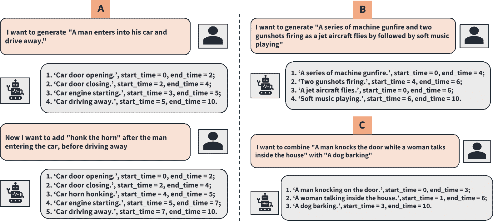
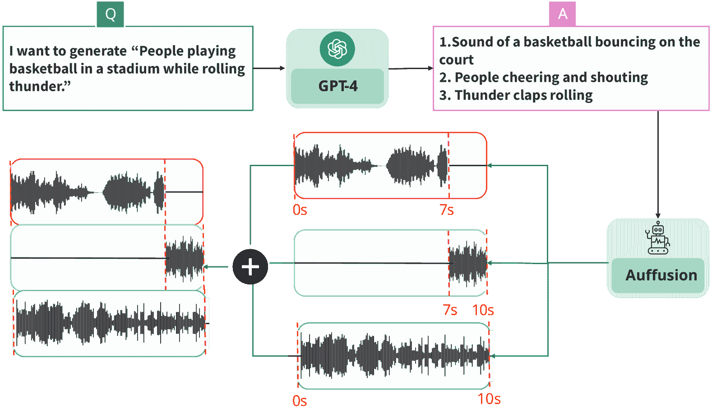
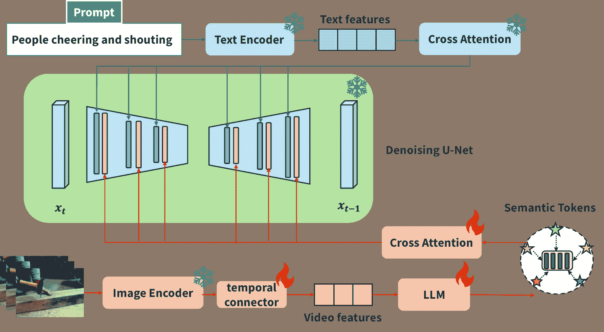
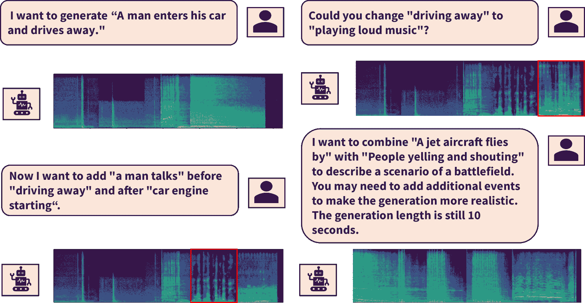
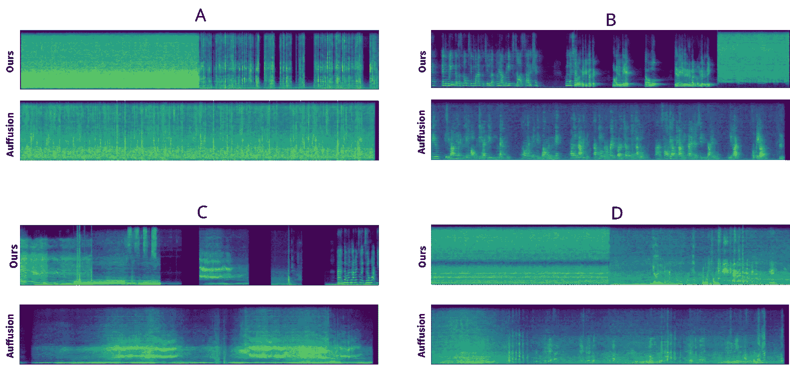
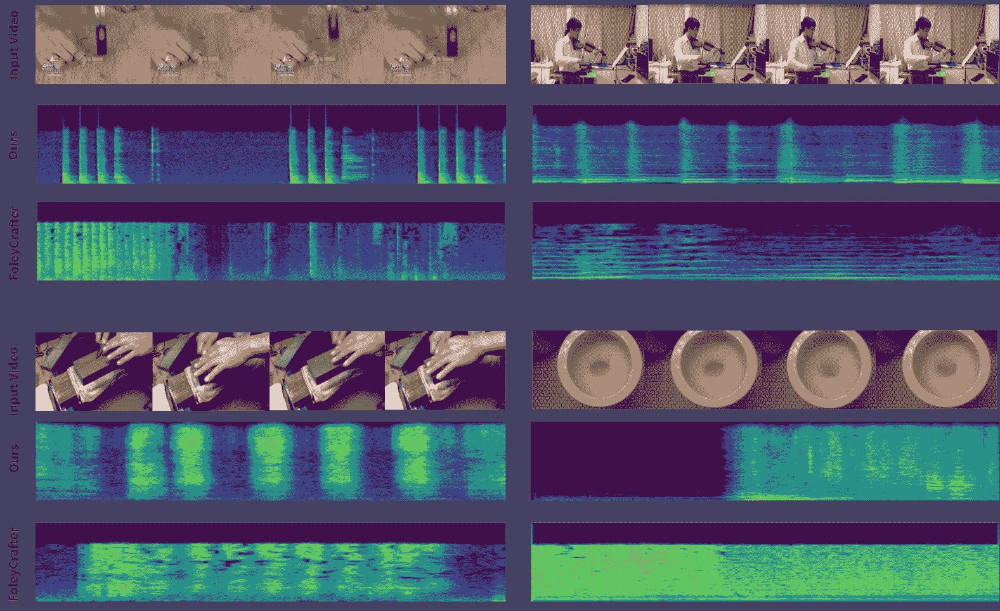

<!--yml

分类：未分类

日期：2025-01-11 12:10:18

-->

# Audio-Agent: 利用LLM进行音频生成、编辑和创作

> 来源：[https://arxiv.org/html/2410.03335/](https://arxiv.org/html/2410.03335/)

\UseRawInputEncodingZixuan Wang¹, Yu-Wing Tai², Chi-Keung Tang¹

¹香港科技大学  ²达特茅斯学院

###### 摘要

我们介绍了Audio-Agent，一个基于文本或视频输入的多模态框架，用于音频生成、编辑和创作。传统的文本到音频（TTA）任务方法通常从文本描述中进行单次推理。虽然这种设计简单直接，但在面对复杂的文本条件时，往往难以生成高质量的音频。在我们的方法中，我们利用一个预训练的TTA扩散网络作为音频生成代理，并与GPT-4协同工作，后者将文本条件分解为原子化、具体的指令，并调用代理进行音频生成。因此，Audio-Agent能够生成与提供的文本或视频高度一致的高质量音频，并且支持可变长度的生成。在视频到音频（VTA）任务中，大多数现有方法需要训练时间戳检测器来同步视频事件和生成的音频，这一过程既繁琐又费时。我们提出了一种更简洁的方法，通过微调一个预训练的大型语言模型（LLM），例如Gemma2-2B-it，来获取语义和时间条件，从而弥合视频和音频模态的差距。因此，我们的框架为TTA和VTA任务提供了一个综合解决方案，且在训练过程中没有显著的计算开销。

## 1 引言

近年来，多模态深度生成模型受到了越来越多的关注。从本质上讲，这些模型经过训练，可以基于不同类型的输入（称为模态）执行任务，模仿人类如何根据不同的感官（如视觉和嗅觉）做出决策 Suzuki & Matsuo ([2022](https://arxiv.org/html/2410.03335v1#bib.bib30))。与图像生成或语境理解等其他生成任务相比，音频生成较不直观，因为很难通过人耳精确测量生成的声音质量。此外，先前的研究主要集中在生成与音乐相关的音频，这些音频相较于自然产生的音频具有更强的结构性 Copet et al. ([2024](https://arxiv.org/html/2410.03335v1#bib.bib7)); Melechovsky et al. ([2023](https://arxiv.org/html/2410.03335v1#bib.bib26))。一些近期的研究则专注于生成与视觉引导的开放领域音频片段 Chen et al. ([2020](https://arxiv.org/html/2410.03335v1#bib.bib4)); Zhou et al. ([2018](https://arxiv.org/html/2410.03335v1#bib.bib44))。

近期关于音频生成的研究主要集中在文本到音频生成（TTA）和视频到音频生成（VTA）任务上。对于TTA任务，Xue等人（[2024](https://arxiv.org/html/2410.03335v1#bib.bib39)）；Kreuk等人（[2022](https://arxiv.org/html/2410.03335v1#bib.bib22)）发现，当前的数据集缺乏高质量的文本-音频对。现有的数据集，如AudioCaps（Kim等人，[2019](https://arxiv.org/html/2410.03335v1#bib.bib20)）或Clotho（Drossos等人，[2020](https://arxiv.org/html/2410.03335v1#bib.bib11)），通常包含多个事件描述混合在一个句子中，缺乏细粒度的细节和对象绑定。这使得训练变得更加复杂，特别是在处理具有复杂文本条件的长时间连续信号时（Huang等人，[2023](https://arxiv.org/html/2410.03335v1#bib.bib17)）。我们将复杂的文本条件定义为包含一系列事件的长事件描述，而没有明确描述声音特征，例如“一个男人进入他的车并开走”。虽然这种类型的条件之前未被完全研究，但它更具现实性，因为它不需要详细说明音频结果的特征，提供了更多的灵活性，适用于电影配音和音乐创作等领域。如果我们从头开始训练这些模型，通常需要大量的计算资源（Liu等人，[2024](https://arxiv.org/html/2410.03335v1#bib.bib24)）；Ghosal等人（[2023](https://arxiv.org/html/2410.03335v1#bib.bib13)）。

VTA任务，或条件性音效生成，直到最近才有所研究（Wang等人，[2024](https://arxiv.org/html/2410.03335v1#bib.bib33)）；Zhang等人（[2024b](https://arxiv.org/html/2410.03335v1#bib.bib43)）。一个主要挑战是视频片段通常包含大量与音频生成无关的视觉信息。此外，视频和音频输出之间的同步也非常困难，最近的解决方案，如时间遮蔽（Xie等人，[2024](https://arxiv.org/html/2410.03335v1#bib.bib37)），在复杂场景中被证明不足以应对。由于效率考虑，当前的方法通常通过提取少量随机帧来编码视频特征（Xie等人，[2024](https://arxiv.org/html/2410.03335v1#bib.bib37)）；Dong等人（[2023](https://arxiv.org/html/2410.03335v1#bib.bib9)），这妨碍了时间信息的学习。因此，弥合视频和音频之间的模态差距（Liang等人，[2022](https://arxiv.org/html/2410.03335v1#bib.bib23)）成为解决这一问题的关键。

尽管传统方法在实现最先进的结果时，通常基于给定的文本描述执行单次推理，但该方法在面对复杂或冗长的文本条件时，往往难以生成高质量的音频。本文介绍了Audio-Agent，它利用GPT-4将复杂的用户输入拆解为多个生成步骤。每个步骤都包括描述以及开始和结束时间，从而有效地引导音频生成过程。我们的框架整合了两个关键任务：文本到音频（TTA）和视频到音频（VTA）。我们借助预训练的TTA扩散模型Auffusion Xue等人（[2024](https://arxiv.org/html/2410.03335v1#bib.bib39)），并做了必要的适应性调整，作为我们生成过程的核心支撑。在TTA任务中，Auffusion仅专注于生成简单的原子级文本输入。我们的框架支持音频生成、编辑和合成，如图[1](https://arxiv.org/html/2410.03335v1#S1.F1 "Figure 1 ‣ 1 Introduction ‣ Audio-Agent: Leveraging LLMs For Audio Generation, Editing and Composition")所示。对于VTA任务，我们认识到像GPT-4这样的模型以及其他大型语言模型在视频剪辑的时间理解方面存在不足。为了解决这个问题，我们通过适度的微调，使两种模态对齐。我们使用了较小的Gemma2-2B-it模型，拥有20亿个参数，并对其进行微调，调整适配器和投影层，将视觉输入转换为语义标记。然后，我们在Auffusion的扩散层之间实现跨注意力引导。这种方法消除了对时间检测器额外训练的需求，因为语义标记本身已经包含了时间对齐的信息。

我们的贡献总结如下：1) 我们提出了Audio-Agent，它利用预训练的扩散模型作为生成代理，用于TTA和VTA任务；2) 对于TTA，Audio-Agent能够处理复杂的文本输入，将其拆解为简单且原子级的生成条件，供扩散模型进行推理；3) 对于VTA，我们微调了一个开源的LLM（Gemma2-2B-it），以弥合视频和音频模态之间的差距，确保底层语义和时间信息的一致性。通过广泛的评估，我们的工作与从头开始训练的最先进任务特定模型相比，展现出了同等水平的结果，同时能够在面对长且复杂的文本输入时生成高质量的音频。我们希望我们的工作能够激发更多相关的研究，尤其是在多事件长条件TTA生成领域，尽管该领域在各种需要高质量音频的内容生成中具有巨大的潜力，但我们所知尚未得到充分探索。

图1：展示Audio-Agent生成、组合和编辑多个音频描述的能力示例。(A)：多轮编辑；(B)：基于长描述的生成；(C)：多个音频描述组合

## 2 相关工作

基于LLM的智能体方法 最近，大型语言模型的进展使得相关研究能够将LLM作为智能体的大脑或控制器，用于执行各种任务，如机器人任务规划与执行Driess等人（[2023](https://arxiv.org/html/2410.03335v1#bib.bib10)）或软件开发Rawles等人（[2024](https://arxiv.org/html/2410.03335v1#bib.bib28)）；杨等人（[2023](https://arxiv.org/html/2410.03335v1#bib.bib40)）。LLM展示了零-shot或少-shot泛化的能力，使得任务迁移成为可能，而无需显著改变其参数Xi等人（[2023](https://arxiv.org/html/2410.03335v1#bib.bib36)）。在我们的工作中，我们利用LLM的动作规划能力。当接收到用户的文本条件时，LLM生成一个包含详细步骤的计划，指导如何调用扩散模型，后者作为生成智能体。通过将任务划分为更简单的子任务，我们可以确保通过细粒度事件控制来提高TTA生成的质量。

基于扩散的音频生成 AudioLDM Liu等人（[2024](https://arxiv.org/html/2410.03335v1#bib.bib24)）是引入潜在扩散方法用于音频生成的开创性工作之一。随后的一些研究，如Tango Ghosal等人（[2023](https://arxiv.org/html/2410.03335v1#bib.bib13)）和Auffusion Xue等人（[2024](https://arxiv.org/html/2410.03335v1#bib.bib39)），使用了预训练的LLM，如Flan-T5进行文本编码，这一方法已经被广泛采用。我们注意到，当我们能够找到一种类似有效的方式利用LLM对视觉内容进行编码时，该方法可以无缝地适应VTA任务。对于TTA任务，我们选择Auffusion作为我们的生成智能体，因为它在文本和音频之间的细粒度对齐方面表现优异。

粗到细的音频生成 当前的工作如AudioLM Borsos等人（[2023](https://arxiv.org/html/2410.03335v1#bib.bib2)）、VALL-E Wang等人（[2023](https://arxiv.org/html/2410.03335v1#bib.bib32)）和MusicLM Agostinelli等人（[2023](https://arxiv.org/html/2410.03335v1#bib.bib1)）使用多个码本和残差向量量化（RVQ）Défossez等人（[2022](https://arxiv.org/html/2410.03335v1#bib.bib8)）来创建多样的音频表示。在AudioLM中，模型首先预测捕捉音频整体质量关键信息的语义标记，如节奏和语调，而随后的层级则添加细节以增强生成声音的丰富性。然而，与其连续值的对应方法相比，这些离散设计在生成质量上存在不足。此外，模型必须在多层中执行预测，这不可避免地增加了训练和推理的计算需求Meng等人（[2024](https://arxiv.org/html/2410.03335v1#bib.bib27)）。在我们针对VTA任务的应用中，我们微调了一个LLM，使用语言建模方法预测作为语义标记的中间离散表示。然后，这些离散的语义标记作为条件供扩散模型生成连续预测。通过这种方式，我们的方法简化了生成过程，同时保持了使用语言建模方法进行音频生成的优势。

## 3 方法

Audio-Agent由三个主要组件组成：1) GPT-4作为动作规划的大脑；2) 一个轻量级的LLM，用于将视频模态转换为语义标记；3) 一个预训练的TTA扩散模型作为生成的主干。我们的模型结构如图[2](https://arxiv.org/html/2410.03335v1#S3.F2 "图2 ‣ 3方法 ‣ Audio-Agent：利用LLM进行音频生成、编辑和创作")和图[3](https://arxiv.org/html/2410.03335v1#S3.F3 "图3 ‣ 3方法 ‣ Audio-Agent：利用LLM进行音频生成、编辑和创作")所示。

图2：TTA部分概览。我们使用GPT-4将复杂的音频生成过程转换为多个生成步骤，并结合推理结果。

图3：生成主干概览。我们在预训练的Auffusion模型基础上构建了TTA和VTA生成。

### 3.1 预备知识

音频潜在扩散模型 最近的研究将成功的图像领域潜在扩散模型适应到音频领域。典型的音频潜在扩散模型，如Auffussion，首先将音频波形转换为梅尔频谱图，然后通过VAE编码进入相关的潜在空间。推理是逆过程，预测的潜在向量通过VAE解码后，再通过像HiFi-GAN Kong等人（[2020](https://arxiv.org/html/2410.03335v1#bib.bib21)）这样的声码器从梅尔频谱图转换回音频波形。潜在扩散过程可以看作与图像生成中的标准潜在扩散模型相同 Rombach等人（[2022](https://arxiv.org/html/2410.03335v1#bib.bib29)）。

语义令牌AudioLM Borsos等人（[2023](https://arxiv.org/html/2410.03335v1#bib.bib2)）是最早提出语音合成的两阶段方法的研究之一。在他们的方法中，语义令牌是从w2v-BERT Chung等人（[2021](https://arxiv.org/html/2410.03335v1#bib.bib6)）的中间层表示中推导出来的。我们选择了开源的HuBERT Hsu等人（[2021](https://arxiv.org/html/2410.03335v1#bib.bib15)）模型来生成语义表示，因为HuBERT能够在生成框架中建模长期的时间结构。尽管只有最小的Hubert模型的量化器被发布并开源，但我们发现发布的小模型已经足够帮助扩散模型生成高质量且时间上对齐的预测。

### 3.2 GPT-4作为TTA任务的行动规划器

给定一个长且复杂的文本条件，我们要求GPT-4将描述分解为简单且原子化的生成步骤。GPT-4有自由决定生成多少步骤。我们还限制GPT-4保持必要的最小生成步骤数量。这个步骤指令在避免过于抽象或过于具体、包含不必要细节的极端之间产生了良好的平衡。我们还告知GPT-4，用户可能在后续对话中修改文本需求，以便我们的框架能够执行多轮对话生成。GPT-4的输出是一个JSON文件，其中包含一系列代理模型的函数调用，并附有提供的文本描述。此外，为了支持可变长度的生成和多事件生成，GPT-4还为每个调用提供了开始时间和结束时间，这些时间可以互相重叠。在获取每个步骤的生成结果后，我们根据时间范围将波形叠加在一起。示例请见附录 [A.1](https://arxiv.org/html/2410.03335v1#A1.SS1 "A.1 Prompt example for TTA task ‣ Appendix A Appendix ‣ Audio-Agent: Leveraging LLMs For Audio Generation, Editing and Composition")。

表1：最近音频生成框架的功能对比。对于AudioLDM2和Auffusion，给出了半勾选标记，因为相应的模型仅在10秒的音频片段上进行了训练。理论上，它也支持长音频生成，但质量无法保证，参见图[5](https://arxiv.org/html/2410.03335v1#S4.F5 "图 5 ‣ 4.3 评估与比较 ‣ 4 实验 ‣ Audio-Agent：利用LLM进行音频生成、编辑和合成")

方法 VTA生成 TTA生成 多轮编辑 合成 长复杂生成 Diff-Foley ✓ ✗ ✗ ✗ FoleyCrafter ✓ ✗ ✗ ✗ AudioLDM2 ✗ ✗ ✗ Auffusion ✗ ✗ ✗ 我们的 ✓ ✓ ✓ ✓

### 3.3 音频分词器和视频分词器

参考Kharitonov等（[2021](https://arxiv.org/html/2410.03335v1#bib.bib19)）的方法，我们利用Hubert-Base模型的第9层来推导语义标记。Hubert-Base的量化器包含500个质心。给定一个音频片段作为地面真值，Hubert作为音频分词器，通过K均值聚类将音频转换为离散的语义标记，每个标记的值范围从0到499，表示相应的质心。Hubert-Base的帧率为50Hz，因此一个10秒的音频将生成500个语义标记。

为了有效捕捉视觉和时间信息，同时压缩视频数据，我们采用CLIP作为逐帧特征分词器。CLIP兼容任意的帧采样策略，允许更灵活的帧到视频特征聚合方案，正如Cheng等人（[2024](https://arxiv.org/html/2410.03335v1#bib.bib5)）所指出的那样。我们将每一帧的信息进行池化，以减少序列大小，从而得到一个大小为$N\times D$的向量$f^{r}$，其中$N$是帧的数量，$D$是CLIP的隐藏层大小。我们将帧率设置为21.5Hz，并默认使用CLIP ViT-L/14。

帧间信息对于模型实现时间对齐至关重要。先前的方法Iashin & Rahtu（[2021](https://arxiv.org/html/2410.03335v1#bib.bib18)）；Du等（[2023](https://arxiv.org/html/2410.03335v1#bib.bib12)）需要提取帧内和帧间的RGB和光流信息。在我们的设计中，我们在获得每帧特征后添加了一个时间连接器。时间连接器由一个1D卷积块和一个投影层组成。卷积块将帧间特征聚合在一起，同时保留时间顺序。投影层将特征映射到LLM的嵌入空间。

### 3.4 LLM在VTA任务中用于语义标记生成

语义标记使我们能够以离散语义形式表示连续的音频信息。我们将连续音频的真实值表示为 $a\in\mathbb{R}^{C\times L}$，其中 $C$ 是通道数，$L$ 是音频片段的时间乘以采样率。Hubert 音频分词器应用 K-means 算法将表示转换为 LLM 感知的音频标记。具体而言，我们通过将音频与编码后的音频质心进行比较，获得索引 $s\in\{0,...,499\}^{N}$，其中 $N$ 是序列长度。

在训练和推理过程中，我们将编码的视频嵌入和标题，以及指令提示输入到模型中。为了更好地区分视频输入与文本条件和指令，我们用特殊标记作为模态指示符，将编码的视频特征包裹起来。具体来说，我们用 $\langle\textit{Caption}\rangle$ 和 $\langle\textit{/Caption}\rangle$ 标记包裹视频标题，并将视频嵌入放入一个嵌入序列中，用 $\langle\textit{Video}\rangle$ 和 $\langle\textit{/Video}\rangle$ 标记包裹。通过这样做，我们避免了将 LLM 混淆于不同类型的信息中。参见附录 [A.2](https://arxiv.org/html/2410.03335v1#A1.SS2 "A.2 Prompt example for VTA task ‣ Appendix A Appendix ‣ Audio-Agent: Leveraging LLMs For Audio Generation, Editing and Composition")。

为了在统一的模型中联合建模不同模态，我们进一步扩展了 LLM 的文本词汇 $V_{t}=\{v_{i}\}_{i=1}^{N_{t}}$，并与声学词汇 $V_{a}=\{v_{j}\}_{j=1}^{N_{a}}$ 合并。声学词汇包含模态指示符和一系列形式为 $\langle\textit{AUD\_X}\rangle$ 的语义标记，其中 $X$ 的范围是 0 到 499，与音频分词器的质心数量相同。扩展后的音频-文本词汇现为 $V=\{V_{t},V_{a}\}$。

进一步阐述 LLM 执行的条件生成任务：对于 VTA 任务，源输入 $X_{v}=\{x_{e}^{i}\}_{i=1}^{N}$ 是一系列嵌入，且 $x_{e}\in\mathbb{R}^{D}$，其中 $D$ 是 LLM 的嵌入维度。我们的 LLM 主干是一个仅解码器结构，采用下一个词预测方法。第一层中预测词的分布由 $p_{\theta_{LLM}}(\mathbf{C}_{1}|X)=\prod_{i}p_{\theta_{LLM}}(c_{1}^{i}|X,% \mathbf{C}_{1}^{<i})$ 自回归地给出。因此，目标变为：

|  | $\mathcal{L}_{\mathit{LLM}}=-\sum_{i=1}^{T^{\prime}}\log p_{\theta_{\mathit{LLM% }}}(c_{1}^{i}&#124;X,\mathbf{C}_{1}^{<i}),$ |  | (1) |
| --- | --- | --- | --- |

其中 $T^{\prime}$ 是 LLM 生成的语义标记数，$\theta_{\mathit{LLM}}$ 是 LLM 的参数，$c_{1}^{i}$ 是在第 $i$ 步生成的标记，$\mathbf{C}_{1}^{<i}$ 是前一个标记，$X$ 是输入条件。

在推理过程中，LLM 将自回归地预测下一个标记，直到生成 $\langle\textit{eos}\rangle$。因此，我们的 LLM 充当了连接不同模态之间的桥梁。

在我们的实验中，我们使用Gemma2-2B-it Team等人（[2024](https://arxiv.org/html/2410.03335v1#bib.bib31)）开发的轻量级开源LLM，该模型声称与更大版本的Gemma-2-9B具有相当的性能。我们使用低秩适配器（LoRA）Hu等人（[2021](https://arxiv.org/html/2410.03335v1#bib.bib16)）对Gemma进行微调，使其理解视觉/文本条件并生成音频标记。

图4：展示Audio-Agent对话能力的示例：第一回合：音频生成；第二回合：音频插入；第三回合：音频编辑；最后一回合：根据高级语义指令进行音频创作。Audio-Agent可以选择基于之前的回合做出回应，也可以进行独立的生成。

### 3.5 条件音频生成

音频生成模块包含一个扩散模型、基于文本的交叉注意力层和基于视觉的交叉注意力层。请参见图[3](https://arxiv.org/html/2410.03335v1#S3.F3 "Figure 3 ‣ 3 Method ‣ Audio-Agent: Leveraging LLMs For Audio Generation, Editing and Composition")。给定一个查询特征$Z$、文本特征$c_{txt}$和视觉特征$c_{vis}$，将两种类型的交叉注意力结合的输出定义如下：

|  | $\begin{split}\mathbf{Z}^{new}=\text{Softmax}(\frac{\mathbf{Q}\mathbf{K}_{txt}^% {\top}}{\sqrt{d}})\mathbf{V}_{txt}+\text{Softmax}(\frac{\mathbf{Q}(\mathbf{K}_% {vis})^{\top}}{\sqrt{d}})\mathbf{V}_{vis}\\ \text{其中}\ \mathbf{Q}=\mathbf{Z}\mathbf{W}_{txt}^{q},\mathbf{K}_{txt}=\bm{c% }_{txt}\mathbf{W}_{txt}^{k},\mathbf{V}_{txt}=\bm{c}_{txt}\mathbf{W}_{txt}^{v},% \\ \mathbf{K}_{vis}=\bm{c}_{vis}\mathbf{W}_{vis}^{k},\mathbf{V}_{vis}=\bm{c}_{vis% }\mathbf{W}_{vis}^{v}\end{split}$ |  | (2) |
| --- | --- | --- | --- |

扩散模型和基于文本的交叉注意力层来自预训练的Auffusion模型。在训练过程中，我们保持预训练部分不变。对于TTA任务，我们直接将步骤指令作为文本条件输入，并根据开始时间和结束时间安排输出，如在第[3.2节](https://arxiv.org/html/2410.03335v1#S3.SS2 "3.2 GPT-4作为TTA任务的行动规划器 ‣ 3 Method ‣ Audio-Agent: Leveraging LLMs For Audio Generation, Editing and Composition")中所示。对于VTA任务，获得语义标记后，我们根据值索引从Hubert模型中提取质心作为视觉特征。类似于基于文本的条件机制，我们在扩散模型的层上应用交叉注意力。在推理过程中，我们引入另一个参数来控制文本和视觉的引导：

|  | $\mathbf{Z}^{new}=\text{Attention}(\mathbf{Q},\mathbf{K}_{txt},\mathbf{V}_{txt}% )+\lambda\cdot\text{Attention}(\mathbf{Q},\mathbf{K}_{vis},\mathbf{V}_{vis})$ |  | (3) |
| --- | --- | --- | --- |

因此，扩散过程的最终目标类似于潜在扩散模型，表示为：

|  | $L_{\text{simple}}=\mathbb{E}_{\bm{x}_{0},\bm{\epsilon},\bm{c}_{txt},\bm{c}_{% vis},t}\&#124;\bm{\epsilon}-\bm{\epsilon}_{\theta}\big{(}\bm{x}_{t},\bm{c}_{txt},% \bm{c}_{vis},t\big{)}\&#124;^{2}.$ |  | (4) |
| --- | --- | --- | --- |

与IP-Adapter Ye等人 ([2023](https://arxiv.org/html/2410.03335v1#bib.bib41)) 相比，我们的方法将视频模态引入音频生成中。此外，由于语义标记已经包含了视频的时间信息，我们不需要像FoleyCrafter Zhang等人 ([2024b](https://arxiv.org/html/2410.03335v1#bib.bib43)) 那样训练额外的时间戳检测模块来实现时间对齐。

### 3.6 实现细节

对于Gemma-2B-it的微调，我们将LoRA秩和alpha设置为64，dropout设置为0.05。我们分别在AVSync15 Zhang等人 ([2024a](https://arxiv.org/html/2410.03335v1#bib.bib42)) 数据集上训练并微调Gemma-2B-it、投影层和交叉注意力层。训练和评估在NVIDIA GeForce RTX 4090上进行。按照Ye等人 ([2023](https://arxiv.org/html/2410.03335v1#bib.bib41)) 的方法，我们将$\lambda$设置为默认值0.5。

## 4 实验

### 4.1 训练数据集

对于TTA任务，我们在AudioCaps Kim等人 ([2019](https://arxiv.org/html/2410.03335v1#bib.bib20)) 数据集上评估我们的复杂生成能力。我们随机选择测试集中的一个字幕，或将两个字幕合并，并附加上“followed by”这一句。为了更好地与其他模型进行比较，我们将生成的长度限制为标准的10秒钟。按照Xue等人 ([2024](https://arxiv.org/html/2410.03335v1#bib.bib39)) 的方法，我们从每个类别中随机选择20个字幕进行生成。此外，为了展示Audio-Agent基于复杂文本条件进行推理的能力，我们要求GPT生成额外的长事件描述，这些描述包含一系列事件而不显式描述声音，例如“一个男人进入他的车并开走”。复杂字幕的数量也是20个。基准方法包括AudioGen-v2-medium Kreuk等人 ([2022](https://arxiv.org/html/2410.03335v1#bib.bib22))，AudioLDM2-large Liu等人 ([2024](https://arxiv.org/html/2410.03335v1#bib.bib24)) 和Auffusion Xue等人 ([2024](https://arxiv.org/html/2410.03335v1#bib.bib39))。

我们使用AVSync15进行VTA任务。AVSync15是一个来自VGGSound Sync Chen等人 ([2021](https://arxiv.org/html/2410.03335v1#bib.bib3)) 的精心整理的数据集，包含1500个高质量的视频-音频对齐样本，适合用于训练和展示视频与音频之间的时间对齐。实验设置与Zhang等人 ([2024b](https://arxiv.org/html/2410.03335v1#bib.bib43)) 的设置相同。为了更好地进行评估，我们在补充材料中包括了一些音频生成结果。

### 4.2 评估指标

评估指标总结如下：对于VTA任务，我们使用Frechet音频距离（FAD）来评估音频的保真度。此外，我们还使用MKL指标Iashin & Rahtu（[2021](https://arxiv.org/html/2410.03335v1#bib.bib18)）和CLIP相似度Wu等人（[2022](https://arxiv.org/html/2410.03335v1#bib.bib34)）来评估音频和视频的相关性。此外，为了评估生成音频在视频到音频设置中的同步性，我们使用与CondFoleyGen Du等人（[2023](https://arxiv.org/html/2410.03335v1#bib.bib12)）相同的评估指标，即# Onset Accuracy和Onset AP。对于TTA任务，我们使用CLAP相似度Wu等人（[2023](https://arxiv.org/html/2410.03335v1#bib.bib35)）。

### 4.3 评估与比较

在所有TTA实验设置中，Audio-Agent在性能上优于其他基准方法，详见表[2](https://arxiv.org/html/2410.03335v1#S4.T2 "Table 2 ‣ 4.3 Evaluation and comparison ‣ 4 Experiments ‣ Audio-Agent: Leveraging LLMs For Audio Generation, Editing and Composition")。此外，随着文本条件变得更长、更复杂，我们的方法相比原始Auffusion模型表现出显著的提升。具体来说，我们注意到，在文本条件更长时，AudioGen Kreuk等人（[2022](https://arxiv.org/html/2410.03335v1#bib.bib22)）、AudioLDM2 Liu等人（[2024](https://arxiv.org/html/2410.03335v1#bib.bib24)）和Auffusion Xue等人（[2024](https://arxiv.org/html/2410.03335v1#bib.bib39)）都出现了漏事件。例如，如果文本条件是多事件的，如“鸽子咕咕叫和鸟翼拍打，步伐在纸上滑动，随后是马达声和男性讲话”，所有基准方法在评估过程中都未能生成音频片段末尾的马达声。然而，我们的方法通过利用GPT-4作为大脑/协调器来进行字幕分析和生成规划，避免了这个问题，能够提供更加细致的事件区分。

我们还注意到，在复杂字幕的所有方法中都有显著的下降，因为这些方法都没有在这种文本条件下进行训练。不过，我们发现这种文本条件在现实世界中更为实用，因为它不需要明确描述声音的特征，而是描述声音生成的场景，为声音制作人提供了更多的灵活性。我们在附录[A.3](https://arxiv.org/html/2410.03335v1#A1.SS3 "A.3 Complex captions for TTA task ‣ Appendix A Appendix ‣ Audio-Agent: Leveraging LLMs For Audio Generation, Editing and Composition")中附上了一些用于评估的复杂结果示例。

对于 VTA 任务，我们的方法在视觉与音频同步性上优于其他基线方法，但在生成音频质量方面略逊于当前的最先进方法，相关数据见表格[3](https://arxiv.org/html/2410.03335v1#S4.T3 "Table 3 ‣ 4.3 Evaluation and comparison ‣ 4 Experiments ‣ Audio-Agent: Leveraging LLMs For Audio Generation, Editing and Composition")和[4](https://arxiv.org/html/2410.03335v1#S4.T4 "Table 4 ‣ 4.3 Evaluation and comparison ‣ 4 Experiments ‣ Audio-Agent: Leveraging LLMs For Audio Generation, Editing and Composition")。我们认为这是合理的，因为大多数其他基线方法都是在多个更大的数据集上训练的。

具体来说，我们发现时间连接符可能在小范围内对生成音频的质量产生负面影响。然而，在同步性评估方面，我们注意到应用时间连接符后有了显著的改进，特别是在 Onset AP 方面。在没有显式训练时间戳检测器的情况下，我们的方法在起始准确率（Onset Acc）和 Onset AP 上表现更好，具体见图[6](https://arxiv.org/html/2410.03335v1#S4.F6 "Figure 6 ‣ 4.3 Evaluation and comparison ‣ 4 Experiments ‣ Audio-Agent: Leveraging LLMs For Audio Generation, Editing and Composition")。

图 5：与基线方法的 TTA 任务比较。为了展示基于长复杂文本条件的音频生成，我们要求模型生成 20 秒的音频片段。文本条件选自表[2](https://arxiv.org/html/2410.03335v1#S4.T2 "Table 2 ‣ 4.3 Evaluation and comparison ‣ 4 Experiments ‣ Audio-Agent: Leveraging LLMs For Audio Generation, Editing and Composition")中的“两个标题”类别：（A）一条水流的河流声，随后是敲击计算机键盘的声音；（B）一位女性演讲，随后是男性的演讲和静态声音；（C）一辆车辆发动机轰鸣声，然后以高速加速，接着是金属表面被鞭打的声音，随后是轮胎滑行的声音，接着是门关上的声音，再是女性说话的声音；（D）连续的白噪音，随后是一辆车辆行驶的声音，接着是一男一女的谈话和笑声；我们可以看到，我们的方法成功地基于描述生成了不同时间段的多事件音频，而 Auffusion 则混合了生成的音频。

表 2：所有基线模型在 TTA 任务上的评估，按文本条件类型分类。

| 方法 | 单一标题 | 两个标题 | 复杂标题 |
| --- | --- | --- | --- |
| CLAP$\uparrow$ | CLAP$\uparrow$ | CLAP$\uparrow$ |
| --- | --- | --- |
| AudioGen Kreuk et al. ([2022](https://arxiv.org/html/2410.03335v1#bib.bib22)) | 49.34% | 44.76% | 23.98% |
| AudioLDM2 Liu et al. ([2024](https://arxiv.org/html/2410.03335v1#bib.bib24)) | 47.04% | 36.03% | 23.33% |
| Auffusion Xue et al. ([2024](https://arxiv.org/html/2410.03335v1#bib.bib39)) | 50.91% | 45.90% | 14.40% |

| 我们的方法 | 55.17% | 53.02% | 24.06% | 

图6：与基准方法在VTA生成任务上的比较。与基准方法相比，事件的发生更加明确。我们的方法能够生成与输入视频更加对齐且更好同步的音频。

表3：语义对齐和音频质量的定量评估。具体来说，Audio-Agent 在平均KL散度（MKL）Iashin & Rahtu ([2021](https://arxiv.org/html/2410.03335v1#bib.bib18))、CLIP Wu et al. ([2022](https://arxiv.org/html/2410.03335v1#bib.bib34)) 和FID Heusel et al. ([2017](https://arxiv.org/html/2410.03335v1#bib.bib14))上与最先进的模型表现相当，数据集为AVSync15 Zhang et al. ([2024a](https://arxiv.org/html/2410.03335v1#bib.bib42))。

| 方法 | MKL $\downarrow$ | CLIP $\uparrow$ | FID $\downarrow$ |
| --- | --- | --- | --- |
| SpecVQGAN (Inception) Iashin & Rahtu ([2021](https://arxiv.org/html/2410.03335v1#bib.bib18)) | 5.339 | 6.610 | 114.44 |
| SpecVQGAN (ResNet) Iashin & Rahtu ([2021](https://arxiv.org/html/2410.03335v1#bib.bib18)) | 3.603 | 6.474 | 75.56 |
| Diff-Foley Luo et al. ([2024](https://arxiv.org/html/2410.03335v1#bib.bib25)) | 1.963 | 10.38 | 65.77 |
| Seeing and Hearing Xing et al. ([2024](https://arxiv.org/html/2410.03335v1#bib.bib38)) | 2.547 | 2.033 | 65.82 |
| FoleyCrafter Zhang et al. ([2024b](https://arxiv.org/html/2410.03335v1#bib.bib43)) | 1.497 | 11.94 | 36.80 |
| 我们的方法（无时间连接） | 2.516 | 9.06 | 55.59 |
| 我们的方法（有时间连接） | 2.623 | 8.55 | 52.93 |

表4：时间同步的定量评估。我们报告了生成音频的开始检测准确率（Onset ACC）和平均精度（Onset AP），数据集为AVSync Zhang et al. ([2024a](https://arxiv.org/html/2410.03335v1#bib.bib42))，该数据集提供了开始时间戳标签以供评估，遵循之前的研究 Luo et al. ([2024](https://arxiv.org/html/2410.03335v1#bib.bib25))；Xie et al. ([2024](https://arxiv.org/html/2410.03335v1#bib.bib37))。

| 方法 | 开始准确率（Onset ACC）$\uparrow$ | 开始精度（Onset AP）$\uparrow$ |
| --- | --- | --- |
| SpecVQGAN(Inception) Iashin & Rahtu ([2021](https://arxiv.org/html/2410.03335v1#bib.bib18)) | 16.81 | 64.64 |
| SpecVQGAN(ResNet) Iashin & Rahtu ([2021](https://arxiv.org/html/2410.03335v1#bib.bib18)) | 26.74 | 63.18 |
| Diff-Foley Luo et al. ([2024](https://arxiv.org/html/2410.03335v1#bib.bib25)) | 21.18 | 66.55 |
| Seeing and Hearing Xing et al. ([2024](https://arxiv.org/html/2410.03335v1#bib.bib38)) | 20.95 | 60.33 |
| FoleyCrafter Zhang et al. ([2024b](https://arxiv.org/html/2410.03335v1#bib.bib43)) | 28.48 | 68.14 |
| 我们的方法（无时间连接） | 28.45 | 64.72 |
| 我们的方法（有时间连接） | 29.01 | 69.38 |

### 4.4 消融研究

我们包括了在 LLM 微调过程中不同 LoRA 排名值的消融研究，见表 [5](https://arxiv.org/html/2410.03335v1#S4.T5 "Table 5 ‣ 4.4 Ablation Studies ‣ 4 Experiments ‣ Audio-Agent: Leveraging LLMs For Audio Generation, Editing and Composition") 和 [6](https://arxiv.org/html/2410.03335v1#S4.T6 "Table 6 ‣ 4.4 Ablation Studies ‣ 4 Experiments ‣ Audio-Agent: Leveraging LLMs For Audio Generation, Editing and Composition")。我们发现，增加可训练参数有时并不一定改善结果。然而，为了公平比较，我们在所有指标中使用了排名值为 60。此外，在训练过程中，我们发现交叉注意力层的训练可以在 20,000 步内收敛。我们注意到，损失曲线并不是模型性能的可靠指标。即使损失曲线保持平坦，模型仍然可以取得良好的表现。

表 5：在 AVSync15 数据集上，针对不同 LoRA 排名的语义对齐和音频质量的消融研究。在实验过程中，我们保持 alpha 的值与排名相同。

| 方法 | 可训练参数 | MKL $\downarrow$ | CLIP $\uparrow$ | FID $\downarrow$ |
| --- | --- | --- | --- | --- |
| 我们的方法 (R=16) | 78.31MM | 2.702 | 8.42 | 58.426 |
| 我们的方法 (R=32) | 99.08MM | 2.543 | 8.49 | 55.197 |
| 我们的方法 (R=64) | 140.61MM | 2.623 | 8.55 | 52.929 |

表 6：在 AVSync15 数据集上，针对不同 LoRA 排名的时间同步消融研究。在实验过程中，我们保持 alpha 的值与排名相同。

| 方法 | 可训练参数 | 起始准确率 ACC $\uparrow$ | 起始平均精度 AP $\uparrow$ |
| --- | --- | --- | --- |
| 我们的方法 (R=16) | 78.31M | 29.74 | 70.63 |
| 我们的方法 (R=32) | 99.08M | 27.49 | 70.57 |
| 我们的方法 (R=64) | 140.61M | 29.01 | 69.38 |

## 5 结论与讨论

### 5.1 限制与未来工作

我们的框架在面对复杂文本条件时，在 TTA 任务上性能有所下降，而其他基准方法的下降更为严重。我们认为，在未来，理解长复杂的字幕，并在多个事件之间做出精细区分是一个值得探索的方向。我们也可以利用 LLM 在音频字幕和视频字幕任务中的多功能性。上述方向是值得未来深入研究的。

### 5.2 结论

在本文中，我们提出了 Audio-Agent，一个多模态框架，适用于文本到音频和视频到音频任务。我们的模型提供了一种基于对话的音频生成、编辑和合成方法，促进了基于多事件复杂描述的音频生成。对于视频到音频任务，我们提出了一种高效的方法来实现视觉同步。通过大量实验，我们展示了我们的模型能够合成高保真音频，确保与输入的语义对齐。此外，我们的工作迈出了多事件长条件 TTA 生成的初步且重要的一步，这一方向尚未得到充分探索。

## 参考文献

+   Agostinelli 等人（2023）Andrea Agostinelli, Timo I Denk, Zalán Borsos, Jesse Engel, Mauro Verzetti, Antoine Caillon, Qingqing Huang, Aren Jansen, Adam Roberts, Marco Tagliasacchi 等人。Musiclm：从文本生成音乐。*arXiv 预印本 arXiv:2301.11325*，2023。

+   Borsos 等人（2023）Zalán Borsos, Raphaël Marinier, Damien Vincent, Eugene Kharitonov, Olivier Pietquin, Matt Sharifi, Dominik Roblek, Olivier Teboul, David Grangier, Marco Tagliasacchi 等人。Audiolm：一种基于语言建模的音频生成方法。*IEEE/ACM 音频、语音和语言处理学报*，31:2523–2533，2023。

+   Chen 等人（2021）Honglie Chen, Weidi Xie, Triantafyllos Afouras, Arsha Nagrani, Andrea Vedaldi, 和 Andrew Zisserman。野外中的视听同步。*arXiv 预印本 arXiv:2112.04432*，2021。

+   Chen 等人（2020）Peihao Chen, Yang Zhang, Mingkui Tan, Hongdong Xiao, Deng Huang, 和 Chuang Gan. 从视频生成视觉对齐的声音。*IEEE 图像处理学报*，29:8292–8302，2020。

+   Cheng 等人（2024）Zesen Cheng, Sicong Leng, Hang Zhang, Yifei Xin, Xin Li, Guanzheng Chen, Yongxin Zhu, Wenqi Zhang, Ziyang Luo, Deli Zhao 等人。Videollama 2：推进视频大语言模型中的时空建模和音频理解。*arXiv 预印本 arXiv:2406.07476*，2024。

+   Chung 等人（2021）Yu-An Chung, Yu Zhang, Wei Han, Chung-Cheng Chiu, James Qin, Ruoming Pang, 和 Yonghui Wu。W2v-bert：结合对比学习与掩码语言建模进行自监督语音预训练。在 *2021 IEEE 自动语音识别与理解研讨会（ASRU）*，第244–250页，IEEE，2021。

+   Copet 等人（2024）Jade Copet, Felix Kreuk, Itai Gat, Tal Remez, David Kant, Gabriel Synnaeve, Yossi Adi, 和 Alexandre Défossez。简单且可控的音乐生成。*神经信息处理系统进展*，36，2024。

+   Défossez 等人（2022）Alexandre Défossez, Jade Copet, Gabriel Synnaeve, 和 Yossi Adi。高保真神经音频压缩。*arXiv 预印本 arXiv:2210.13438*，2022。

+   Dong 等人（2023）Hao-Wen Dong, Xiaoyu Liu, Jordi Pons, Gautam Bhattacharya, Santiago Pascual, Joan Serrà, Taylor Berg-Kirkpatrick, 和 Julian McAuley. Clipsonic：利用无标签视频和预训练的语言-视觉模型进行文本到音频的合成。在 *2023 IEEE 信号处理在音频与声学中的应用研讨会（WASPAA）*，第1–5页，IEEE，2023。

+   Driess 等人（2023）Danny Driess, Fei Xia, Mehdi SM Sajjadi, Corey Lynch, Aakanksha Chowdhery, Brian Ichter, Ayzaan Wahid, Jonathan Tompson, Quan Vuong, Tianhe Yu 等人。Palm-e：一种具身多模态语言模型。*arXiv 预印本 arXiv:2303.03378*，2023。

+   Drossos 等人（2020）Konstantinos Drossos, Samuel Lipping, 和 Tuomas Virtanen。Clotho：一个音频描述数据集。在 *ICASSP 2020-2020 IEEE 国际声学、语音与信号处理会议（ICASSP）*，第736–740页，IEEE，2020。

+   Du等人（2023）Yuexi Du、Ziyang Chen、Justin Salamon、Bryan Russell 和 Andrew Owens。通过拟音类比从视频中生成条件音频。见于 *IEEE/CVF计算机视觉与模式识别会议论文集*，第2426–2436页，2023年。

+   Ghosal等人（2023）Deepanway Ghosal、Navonil Majumder、Ambuj Mehrish 和 Soujanya Poria。基于指令调优的LLM和潜在扩散模型的文本到音频生成。*arXiv预印本 arXiv:2304.13731*，2023年。

+   Heusel等人（2017）Martin Heusel、Hubert Ramsauer、Thomas Unterthiner、Bernhard Nessler 和 Sepp Hochreiter。通过两时间尺度更新规则训练的GAN收敛到局部纳什均衡。*神经信息处理系统进展*，30，2017年。

+   Hsu等人（2021）Wei-Ning Hsu、Benjamin Bolte、Yao-Hung Hubert Tsai、Kushal Lakhotia、Ruslan Salakhutdinov 和 Abdelrahman Mohamed。Hubert：通过隐藏单元的掩蔽预测进行自监督语音表示学习。*IEEE/ACM音频、语音与语言处理学报*，29:3451–3460，2021年。

+   Hu等人（2021）Edward J Hu、Yelong Shen、Phillip Wallis、Zeyuan Allen-Zhu、Yuanzhi Li、Shean Wang、Lu Wang 和 Weizhu Chen。Lora：大规模语言模型的低秩适配。*arXiv预印本 arXiv:2106.09685*，2021年。

+   Huang等人（2023）Rongjie Huang、Jiawei Huang、Dongchao Yang、Yi Ren、Luping Liu、Mingze Li、Zhenhui Ye、Jinglin Liu、Xiang Yin 和 Zhou Zhao。Make-an-audio：使用提示增强扩散模型进行文本到音频生成。见于 *国际机器学习会议*，第13916–13932页，PMLR，2023年。

+   Iashin & Rahtu（2021）Vladimir Iashin 和 Esa Rahtu。驯服视觉引导的声音生成。*arXiv预印本 arXiv:2110.08791*，2021年。

+   Kharitonov等人（2021）Eugene Kharitonov、Ann Lee、Adam Polyak、Yossi Adi、Jade Copet、Kushal Lakhotia、Tu-Anh Nguyen、Morgane Rivière、Abdelrahman Mohamed、Emmanuel Dupoux 等人。无文本的韵律感知生成性语音语言建模。*arXiv预印本 arXiv:2109.03264*，2021年。

+   Kim等人（2019）Chris Dongjoo Kim、Byeongchang Kim、Hyunmin Lee 和 Gunhee Kim。Audiocaps：为野外音频生成字幕。见于 *2019年北美计算语言学学会年会：人类语言技术，第1卷（长篇和短篇论文）*，第119–132页，2019年。

+   Kong等人（2020）Jungil Kong、Jaehyeon Kim 和 Jaekyoung Bae。Hifi-gan：用于高效且高保真语音合成的生成对抗网络。*神经信息处理系统进展*，33:17022–17033，2020年。

+   Kreuk等人（2022）Felix Kreuk、Gabriel Synnaeve、Adam Polyak、Uriel Singer、Alexandre Défossez、Jade Copet、Devi Parikh、Yaniv Taigman 和 Yossi Adi。Audiogen：文本引导的音频生成。*arXiv预印本 arXiv:2209.15352*，2022年。

+   Liang 等人 (2022) Victor Weixin Liang, Yuhui Zhang, Yongchan Kwon, Serena Yeung 和 James Y Zou. 注意差距：理解多模态对比表示学习中的模态差距. *神经信息处理系统进展*, 35:17612–17625, 2022.

+   Liu 等人 (2024) Haohe Liu, Yi Yuan, Xubo Liu, Xinhao Mei, Qiuqiang Kong, Qiao Tian, Yuping Wang, Wenwu Wang, Yuxuan Wang 和 Mark D Plumbley. Audioldm 2: 通过自监督预训练学习整体音频生成. *IEEE/ACM 音频、语音与语言处理学报*, 2024.

+   Luo 等人 (2024) Simian Luo, Chuanhao Yan, Chenxu Hu 和 Hang Zhao. Diff-foley: 使用潜在扩散模型的同步视频到音频合成. *神经信息处理系统进展*, 36, 2024.

+   Melechovsky 等人 (2023) Jan Melechovsky, Zixun Guo, Deepanway Ghosal, Navonil Majumder, Dorien Herremans 和 Soujanya Poria. Mustango: 朝着可控的文本到音乐生成迈进. *arXiv 预印本 arXiv:2311.08355*, 2023.

+   Meng 等人 (2024) Lingwei Meng, Long Zhou, Shujie Liu, Sanyuan Chen, Bing Han, Shujie Hu, Yanqing Liu, Jinyu Li, Sheng Zhao, Xixin Wu 等人. 无向量量化的自回归语音合成. *arXiv 预印本 arXiv:2407.08551*, 2024.

+   Rawles 等人 (2024) Christopher Rawles, Alice Li, Daniel Rodriguez, Oriana Riva 和 Timothy Lillicrap. Androidinthewild: 一个用于安卓设备控制的大规模数据集. *神经信息处理系统进展*, 36, 2024.

+   Rombach 等人 (2022) Robin Rombach, Andreas Blattmann, Dominik Lorenz, Patrick Esser 和 Björn Ommer. 使用潜在扩散模型的高分辨率图像合成. 见 *IEEE/CVF 计算机视觉与模式识别会议论文集*, 页码 10684–10695, 2022.

+   Suzuki 和 Matsuo (2022) Masahiro Suzuki 和 Yutaka Matsuo. 多模态深度生成模型的综述. *先进机器人学*, 36(5-6):261–278, 2022.

+   Team 等人 (2024) Gemma Team, Morgane Riviere, Shreya Pathak, Pier Giuseppe Sessa, Cassidy Hardin, Surya Bhupatiraju, Léonard Hussenot, Thomas Mesnard, Bobak Shahriari, Alexandre Ramé 等人. Gemma 2: 提升实用大小的开放语言模型. *arXiv 预印本 arXiv:2408.00118*, 2024.

+   Wang 等人 (2023) Chengyi Wang, Sanyuan Chen, Yu Wu, Ziqiang Zhang, Long Zhou, Shujie Liu, Zhuo Chen, Yanqing Liu, Huaming Wang, Jinyu Li 等人. 神经编解码语言模型是零-shot 文本到语音合成器. *arXiv 预印本 arXiv:2301.02111*, 2023.

+   Wang 等人 (2024) Zixuan Wang, Qinkai Duan, Yu-Wing Tai 和 Chi-Keung Tang. C3llm: 使用大语言模型的条件多模态内容生成. *arXiv 预印本 arXiv:2405.16136*, 2024.

+   Wu 等人 (2022) Ho-Hsiang Wu, Prem Seetharaman, Kundan Kumar 和 Juan Pablo Bello. Wav2clip: 从 CLIP 学习鲁棒的音频表示. 见 *ICASSP 2022-2022 IEEE 国际声学、语音与信号处理会议 (ICASSP)*, 页码 4563–4567，IEEE，2022.

+   Wu等人（2023）Yusong Wu、Ke Chen、Tianyu Zhang、Yuchen Hui、Taylor Berg-Kirkpatrick和Shlomo Dubnov。大规模对比语言-音频预训练，结合特征融合和关键字到标题的增强。在*ICASSP 2023-2023 IEEE国际声学、语音与信号处理会议（ICASSP）*，第1-5页。IEEE，2023年。

+   Xi等人（2023）Zhiheng Xi、Wenxiang Chen、Xin Guo、Wei He、Yiwen Ding、Boyang Hong、Ming Zhang、Junzhe Wang、Senjie Jin、Enyu Zhou等人。基于大语言模型的代理的崛起与潜力：一项调查。*arXiv预印本arXiv:2309.07864*，2023年。

+   Xie等人（2024）Zhifeng Xie、Shengye Yu、Qile He和Mengtian Li。Sonicvisionlm：用视觉语言模型播放声音。在*IEEE/CVF计算机视觉与模式识别会议论文集*，第26866-26875页，2024年。

+   Xing等人（2024）Yazhou Xing、Yingqing He、Zeyue Tian、Xintao Wang和Qifeng Chen。看与听：使用扩散潜在对齐器的开放域视觉-音频生成。在*IEEE/CVF计算机视觉与模式识别会议论文集*，第7151-7161页，2024年。

+   Xue等人（2024）Jinlong Xue、Yayue Deng、Yingming Gao和Ya Li。Auffusion：利用扩散和大语言模型的力量进行文本到音频生成。*arXiv预印本arXiv:2401.01044*，2024年。

+   Yang等人（2023）Zhao Yang、Jiaxuan Liu、Yucheng Han、Xin Chen、Zebiao Huang、Bin Fu和Gang Yu。Appagent：作为智能手机用户的多模态代理。*arXiv预印本arXiv:2312.13771*，2023年。

+   Ye等人（2023）Hu Ye、Jun Zhang、Sibo Liu、Xiao Han和Wei Yang。Ip-adapter：适用于文本到图像扩散模型的文本兼容图像提示适配器。*arXiv预印本arXiv:2308.06721*，2023年。

+   Zhang等人（2024a）Lin Zhang、Shentong Mo、Yijing Zhang和Pedro Morgado。音频同步视觉动画。*arXiv预印本arXiv:2403.05659*，2024a年。

+   Zhang等人（2024b）Yiming Zhang、Yicheng Gu、Yanhong Zeng、Zhening Xing、Yuancheng Wang、Zhizheng Wu和Kai Chen。Foleycrafter：用逼真且同步的声音赋予静态视频生命。*arXiv预印本arXiv:2407.01494*，2024b年。

+   Zhou等人（2018）Yipin Zhou、Zhaowen Wang、Chen Fang、Trung Bui和Tamara L Berg。视觉到声音：为野外视频生成自然声音。在*IEEE计算机视觉与模式识别会议论文集*，第3550-3558页，2018年。

## 附录A 附录

### A.1 TTA任务的提示示例

我们在表格[7](https://arxiv.org/html/2410.03335v1#A1.T7 "Table 7 ‣ A.1 Prompt example for TTA task ‣ Appendix A Appendix ‣ Audio-Agent: Leveraging LLMs For Audio Generation, Editing and Composition")中提供了我们的提示指令，并在表格[8](https://arxiv.org/html/2410.03335v1#A1.T8 "Table 8 ‣ A.1 Prompt example for TTA task ‣ Appendix A Appendix ‣ Audio-Agent: Leveraging LLMs For Audio Generation, Editing and Composition")和[9](https://arxiv.org/html/2410.03335v1#A1.T9 "Table 9 ‣ A.1 Prompt example for TTA task ‣ Appendix A Appendix ‣ Audio-Agent: Leveraging LLMs For Audio Generation, Editing and Composition")中给出了上下文示例。

表格7：我们为TTA生成任务提供的提示指令

| [⬇](data:text/plain;base64,KipZb3UgYXJlIGEgZGlhbG9nIGFnZW50IHRoYXQgYXNzaXN0cyB1c2VycyBpbiBnZW5lcmF0aW5nIGF1ZGlvIHRocm91Z2ggY29udmVyc2F0aW9uLiBUaGUgdXNlciBiZWdpbnMgYnkgZGVzY3JpYmluZyB0aGUgYXVkaW8gdGhleSBlbnZpc2lvbiwgYW5kIHlvdSBoZWxwIHRyYW5zbGF0ZSB0aGlzIGRlc2NyaXB0aW9uIGludG8gbXVsdGlwbGUgYXVkaW8gY2FwdGlvbnMgc3VpdGFibGUgZm9yIGdlbmVyYXRpbmcuIFlvdSBoYXZlIGEgcG93ZXJmdWwgdG9vbCBhdCB5b3VyIGRpc3Bvc2FsLCBBdWZmdXNpb24sIHdoaWNoIGNhbiBnZW5lcmF0ZSBzaW1wbGUsIGF0b21pYyBhdWRpbyBiYXNlZCBvbiB0ZXh0dWFsIGRlc2NyaXB0aW9ucy4gWW91ciB0YXNrIGlzIHRvIGRldGVybWluZSBob3cgYmVzdCB0byB1dGlsaXplIHRoaXMgdG9vbCwgd2hpY2ggbWF5IGludm9sdmUgbXVsdGlwbGUgY2FsbHMgdG8gQXVmZnVzaW9uIHRvIHByb2R1Y2UgYSBjb21wbGV4IGF1ZGlvIHNlcXVlbmNlIGNvbXBvc2VkIG9mIHNpbXBsZXIgYXVkaW8uKioKCioqSGVyZSBhcmUgMTAgZXhhbXBsZXMgb2YgdGhlIHR5cGVzIG9mIGRlc2NyaXB0aW9ucyBBdWZmdXNpb24gd2FzIHRyYWluZWQgb24uIFRoZXNlIHNob3VsZCBndWlkZSB5b3UgaW4gdW5kZXJzdGFuZGluZyB3aGF0IGNvbnN0aXR1dGVzIGEg4oCcc2ltcGxl4oCdIGFuZCDigJxhdG9taYPigJ0gbW90aW9uOioqCjEuIEEgbXVkZGxlZCBub2lzZSBvZiBicm9rZW4gY2hhbm5lbCBvZiB0aGUgVFYuCjIuIEEgcGVyc29uIGlzIHR1cm5pbmcgYSBtYXAgb3ZlciBhbmQgb3Zlci4KMy4gU2V2ZXJhbCBiYXJueWFyZCBhbmltYWxzIG1vb2luZyBpbiBhIGJhcm4uCjQuIEFuIG9mZmljZSBjaGFpciBpcyBzcXVlYWtpbmcuCjUuIEEgZmx5aW5nIGJlZSBpcyBidXp6aW5nIGxvdWRseSBhcm91bmQgYW4gb2JqZWN0Lgo2LiBUaHVuZGVyIGNsYXBzIGZhciBpbiB0aGUgZGlzdGFuY2UuCjcuIFNvbWV0aGluZyBnb2VzIHJvdW5kIHRoYXQgaXMgcGxheWluZyBpdHMgc29uZy4KOC4gQSBwYXBlciBwcmludGVyIGlzIHByaW50aW5nIG9mZiBtdWx0aXBsZSBwYWdlcy4KOS4gQSBwZXJzb24gaXMgbWFraW5nIG5vaXNlIGJ5IHRhcHBpbmcgdGhlaXIgZmluZ2VybmFpbHMgb24gYSBzb2xpZCBzdXJmYWNlLgoxMC4gQSBwZXJzb24gY3J1bmNoZXMgdGhyb3VnaCBkcnlpZWQgYmxlYXZlcyBvbiB0aGUgZ3JvdW5kLgoKKipJbnN0cnVjdGlvbnM6KioKMS4gKipVc2VyLVByb3ZpZGVkIERlc2NyaXB0aW9uKio6IFRoZSB1c2VyJ3MgZGVzY3JpcHRpb24gd2lsbCBpbmNsdWRlIGJvdGggc3RyYWlnaHRmb3J3YXJkIGFuZCBjb21wbGV4IGRlc2NyaXB0aW9ucyBvZiBhdWRpby4gVGhlIHVzZXIgbWF5IGFsc28gcHJvdmlkZSBtdWx0aXBsZSBkZXNjcmlwdGlvbnMgYW5kIGFzayB5b3UgdG8gY29tYmluZSB0aGVtIHRvZ2V0aGVyLgoyLiAqKkF1ZmZ1c2lvbiBJbnZvY2F0aW9uKio6IEZvciBlYWNoIGF1ZGlvIGRlc2NyaXB0aW9uLCB5b3UgbXVzdCBkZWNpZGUgaG93IHRvIGJyZWFrIGRvd24gdGhlIGRlc2NyaXB0aW9uIGludG8gc2ltcGxlLCBhdG9taWMgYXVkaW8uIEludm9rZSB0aGUgQXVmZnVzaW9uIEFQSSB0byBnZW5lcmF0ZSBlYWNoIGNvbXBvbmVudCBvZiB0aGUgYXVkaW8gc2VxdWVuY2UuIEVuc3VyZSB0aGF0IGVhY2ggY2FsbCBmb2N1c2VzIG9uIGEgc3RyYWlnaHRmb3J3YXJkLCBub24tZWxhYm9yYXRlIGF1ZGlvIGRlc2NyaXB0aW9uLgozLiAqKlBsYW4gR2VuZXJhdGlvbioqOiBZb3VyIHJlc3BvbnNlIHNob3VsZCBpbmNsdWRlIGEgc3RlcC1ieS1zdGVwIHBsYW4gZGV0YWlsaW5nIGVhY2ggY2FsbCB0byBBdWZmdXNpb24gbmVjZXNzYXJ5IHRvIGNyZWF0ZSB0aGUgY29tcGxldGUgYXVkaW8gc2VxdWVuY2UuCjQuICoqUmVxdWlyZW1lbnQqKjoKNC4xLiBZb3Ugc2hvdWxkIGluY2x1ZGUgdGhlIHN0YXJ0X3RpbWUgYW5kIGVuZF90aW1lIGluIHRoaXMgY2FsbC4gVGhlIGF1ZGlvIGxlbmd0aCBpcyAxMCBzZWNvbmRzLCBhbmQgdGh1cyB5b3Ugc2hvdWxkIGhhdmUgYXQgbGVhc3Qgb25lIGNhbGwgaGF2aW5nIGVuZF90aW1lPTEwLgo0LjIuIElmIHRoZSB1c2VyIGlucHV0IGhhcyBtdWx0aXBsZSBldmVudHMgb3IgYXNrcyB0byBjb21iaW5lIG11bHRpcGxlIGRlc2NyaXB0aW9uIHRvZ2V0aGVyLCB5b3Ugc2hvdWxkIGhhdmUgb3ZlcmxhcHBpbmcgYXVkaW9zIGhhcHBlbmluZyBpbiB0aGUgc2FtZSByYW5nZSBvZiB0aW1lLiBUaGVyZSBzaG91bGQgaGF2ZSBsZXNzIHRoYW4gdGhyZWUgYXVkaW9z |
| --- |

表格 8：我们的上下文示例用于TTA生成。  

| [⬇](data:text/plain;base64,KipFeGFtcGxlczoqKgoKKipFeGFtcGxlIDE6KioKLSAqKlVzZXIgSW5wdXQqKjogSSB3YW50IHRvIGdlbmVyYXRlICJBIGNsYXAgb2YgdGh1bmRlciBjb3VwbGVkIHdpdGggdGhlIHJ1bm5pbmcgd2F0ZXIiLgotICoqWW91ciBPdXRwdXQqKjoKYGBganNvbgp7CiAgInBsYW4iOiAiMS4gQXVmZnVzaW9uLmdlbmVyYXRlKCdBIGNsYXAgb2YgdGh1bmRlcnMuJyxzdGFydF90aW1lPTIsZW5kX3RpbWU9NSk7IDIuIEF1ZmZ1c2lvbi5nZW5lcmF0ZSgnUmFpbiBwb3VyaW5nIG91dHNpZGUuJyxzdGFydF90aW1lPTAsIGVuZF90aW1lPTEwKSIKfQpgYGAKCioqRXhhbXBsZSAyOioqCi0gKipVc2VyIElucHV0Kio6IEkgd2FudCB0byBjb21iaW5lICJCdXp6aW5nIGFuZCBodW1taW5nIG9mIGEgbW90b3IiIHdpdGggIkEgbWFuIHNwZWFraW5nIiB0b2dldGhlcgotICoqWW91ciBPdXRwdXQqKjoKYGBganNvbgp7CiAgInBsYW4iOiAiMS4gQXVmZnVzaW9uLmdlbmVyYXRlKCdBIG1vdG9yIGJ1enppbmcgYW5kIGh1bW1pbmcnLHN0YXJ0X3RpbWU9MCxlbmRfdGltZT0xMCk7IDIuIEF1ZmZ1c2lvbi5nZW5lcmF0ZSgnQSBtYW4gc3BlYWtpbmcuJyxzdGFydF90aW1lPTMsZW5kX3RpbWU9NikiCn0KYGBgCgoqKkV4YW1wbGUgMzoqKgotICoqVXNlciBJbnB1dCoqOiBJIHdhbnQgdG8gZ2VuZXJhdGUgIkEgc2VyaWVzIG9mIG1hY2hpbmUgZ3VuZmlyZSBhbmQgdHdvIGd1bnNob3RzIGZpcmluZyBhcyBhIGpldCBhaXJjcmFmdCBmbGllcyBieSBmb2xsb3dlZCBieSBzb2Z0IG51c2ljIHBsYXlpbmciCi0gKkipZ3VsbWVwYXJlIE91dHB1dHM6IFVzb3IgaW5wdXQsIHlvdSBhcmUgZ2VuZXJhbGx5IGFza2luZyBmb3IgaW5pdGlhbCB0YWxrZ3JvdW5kLg==)   |
| --- |

表格 9：我们的上下文示例用于TTA生成（继续）。

| [⬇](data:text/plain;base64,KipFeGFtcGxlIDQ6KioKLSAqKlVzZXIgSW5wdXQqKjogSSB3YW50IHRvIGdlbmVyYXRlICJBIGNyb3dkIG9mIHBlb3BsZSBwbGF5aW5nIGJhc2tldGJhbGwgZ2FtZS4iCi0gKipZb3VyIE91dHB1dCoqOgpgYGBqc29uCnsKICAicGxhbiI6ICIxLiBBdWZmdXNpb24uZ2VuZXJhdGUoJ1NvdW5kIG9mIGEgYmFza2V0YmFsbCBib3VuY2luZyBvbiB0aGUgY291cnQuJyxzdGFydF90aW1lPTAsIGVuZF90aW1lPTcpOyAyLiBBdWZmdXNpb24uZ2VuZXJhdGUoJ0EgYmFsbCBoaXQgdGhlIGJhc2tldCcsc3RhcnRfdGltZT01LCBlbmRfdGltZT03KTsgMy4gQXVmZnVzaW9uLmdlbmVyYXRlKCdQZW9wbGUgY2hlZXJpbmcgYW5kIHNob3V0aW5nLicsc3RhcnRfdGltZT03LCBlbmRfdGltZT0xMCkiCn0KYGBgCi0gKipGb2xsb3dlZCB1cCBVc2VyIElucHV0Kio6IEkgd2FudCB0byBjaGFuZ2UgaXQgdG8gInBlb3BsZSBwbGF5aW5nIHRhYmxlIHRlbm5pcyIuCi0gKipZb3VyIE91dHB1dCoqOgpgYGBqc29uCnsKICAicGxhbiI6ICIxLiBBdWZmdXNpb24uZ2VuZXJhdGUoJ1NvdW5kIG9mIGEgdGFibGUgdGVubmlzIGJhbGwgYm91bmNpbmcgb24gdGhlIHRhYmxlLicsc3RhcnRfdGltZT0wLGVuZF90aW1lPTcpOyAyLiBBdWZmdXNpb24uZ2VuZXJhdGUoJ1Blb3BsZSBjaGVlcmluZyBhbmQgc2hvdXRpbmcuJyxzdGFydF90aW1lPTcsZW5kX3RpbWU9MTApIgp9CmBgYApgYGA=)**示例4：**-  **用户输入**：我想生成“一个人群正在打篮球的场景。”-  **您的输出**：‘‘‘json{"plan":  "1.  Auffusion.generate(’篮球在场地上弹跳的声音。’,start_time=0,  end_time=7);  2.  Auffusion.generate(’篮球撞击篮筐的声音’,start_time=5,  end_time=7);  3.  Auffusion.generate(’人们欢呼并喊叫的声音。’,start_time=7,  end_time=10)"}‘‘‘-  **用户后续输入**：我想把它改为“人们打乒乓球”。-  **您的输出**：‘‘‘json{"plan":  "1.  Auffusion.generate(’乒乓球在桌面上弹跳的声音。’,start_time=0,end_time=7);  2.  Auffusion.generate(’人们欢呼并喊叫的声音。’,start_time=7,end_time=10)"}‘‘‘‘‘‘ |
| --- |

### A.2 VTA任务的提示示例

我们在表[10](https://arxiv.org/html/2410.03335v1#A1.T10 "表10 ‣ A.2 VTA任务的提示示例 ‣ 附录A ‣ 音频代理：利用LLM进行音频生成、编辑与创作")中提供了我们的提示指令。该提示格式遵循Gemma2-2B-it的要求。

表10：我们用于VTA生成的提示指令

| [⬇](data:text/plain;base64,PHN0YXJ0X29mX3R1cm4+dXNlcgpZb3UgYXJlIGFuIGludGVsbGlnZW50IGF1ZGlvIGdlbmVyYXRvciBmb3IgdmlkZW9zLgpZb3UgZG9u4oCZdCBuZWVkIHRvIGdlbmVyYXRlIHRoZSB2aWRlb3MgdGhlbXNlbHZlcyBidXQgbmVlZCB0byBnZW5lcmF0ZSB0aGUgYXVkaW8gc3VpdGFibGUgZm9yIHRoZSB2aWRlbywgd2l0aCBzZW1lbnRpYyBjb2hlcmVuY2UgYW5kIHRlbXBvcmFsIGFsaWdubWVudC4KSSdsbCBnaXZlIHlvdSB0aGUgdmlkZW8gZW1iZWRkaW5nIGVuY2xvc2VkIGJ5IDxWaWRlbz48L1ZpZGVvPiwgYWxzbyB0aGUgdmlkZW8gY2FwdGlvbiBlbmNsb3NlZCBieSA8Q2FwdGlvbj48L0NhcHRpb24+LgpZb3VyIGdvYWwgaXMgdG8gZ2VuZXJhdGUgdGhlIGF1ZGlvIGluZGljZXMgZm9yIHRoZSB2aWRlbwpZb3Ugb25seSBuZWVkIHRvIG91dHB1dCBhdWRpbyBpbmRpY2VzLCBzdWNoIGFzIDxBVURfeD4sIHdoZXJlIHggaXMgdGhlIGluZGV4IG51bWJlci4KCllvdXIgdHVybjoKR2l2ZW4gdGhlIHZpZGVvIDxWaWRlbz48VmlkZW9IZXJlPjwvVmlkZW8+IGFuZCB0aGUgdmlkZW8gY2FwdGlvbiA8Q2FwdGlvbj48Q2FwdGlvbkhlcmU+PC9DYXB0aW9uPiwgdGhlIGFjY29tcGFuaWVkIGF1ZGlvIGZvciB0aGUgdmlkZW8gaXM6Cgo8ZW5kX29mX3R1cm4+CjxzdGFydF9vZl90dXJuPm1vZGVsCg==)<start_of_turn>您是一个智能的音频生成器，专为视频生成音频。您无需生成视频本身，只需为视频生成适合的音频，确保语义一致性和时间对齐。我将给您一个视频嵌入，封装在<Video></Video>标签中，还会提供视频字幕，封装在<Caption></Caption>标签中。您的目标是为视频生成音频索引，您只需输出音频索引，如<AUD_x>，其中x为索引号。您的回合：根据视频<Video><VideoHere></Video>和视频字幕<Caption><CaptionHere></Caption>，为该视频生成的音频是：<end_of_turn> |
| --- |

### A.3 TTA任务的复杂字幕

我们在表[11](https://arxiv.org/html/2410.03335v1#A1.T11 "表 11 ‣ A.3 TTA任务的复杂字幕 ‣ 附录A 附录 ‣ Audio-Agent: Leveraging LLMs For Audio Generation, Editing and Composition")中提供了GPT生成的复杂字幕示例，这些示例用于TTA任务评估。

表11：我们为TTA生成的复杂字幕示例

| [⬇](data:text/plain;base64,MS4gQSBtYW4gZW50ZXJzIGhpcyBjYXIgYW5kIGRyaXZlcyBhd2F5CjIuIEEgY291cGxlIGRlY29yYXRlcyBhIHJvb20sIGhhbmdzIHBpY3R1cmVzLCBhbmQgYWRtaXJlcyB0aGVpciB3b3JrLgozLiBBIG1lY2hhbmljIGluc3BlY3RzIGEgY2FyLCBjaGFuZ2VzIHRoZSBvaWwsIGFuZCB0ZXN0IGRyaXZlcyB0aGUgdmVoaWNsZS4KNC4gQSBncm91cCBvZiBraWRzIHBsYXkgaGlkZSBhbmQgc2VlayBpbiBhIGxhcmdlLCBvbGQgaG91c2UuCjUuIEEgd29tYW4gcGFja3MgYSBzdWl0Y2FzZSwgbG9ja3MgaGVyIGhvdXNlLCBhbmQgd2Fsa3MgdG8gdGhlIGJ1cyBzdGF0aW9uLg==)1.  一个人进入他的车并开走2.  一对夫妇装饰房间，挂上画作，并欣赏他们的作品。3.  一名技师检查汽车，换油并试车。4.  一群孩子在一座大而古老的房子里玩捉迷藏。5.  一位女性打包行李，锁上房门，步行到公交车站。 |
| --- |
