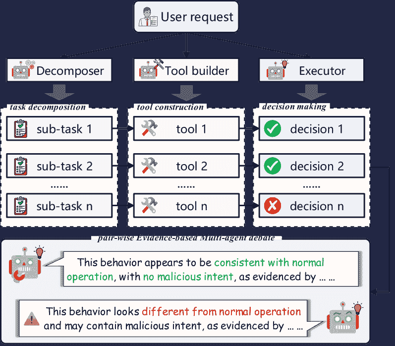
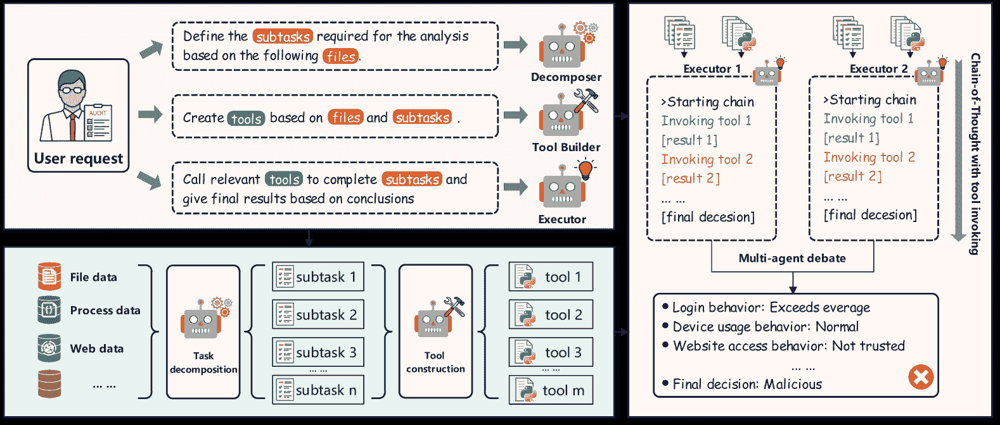
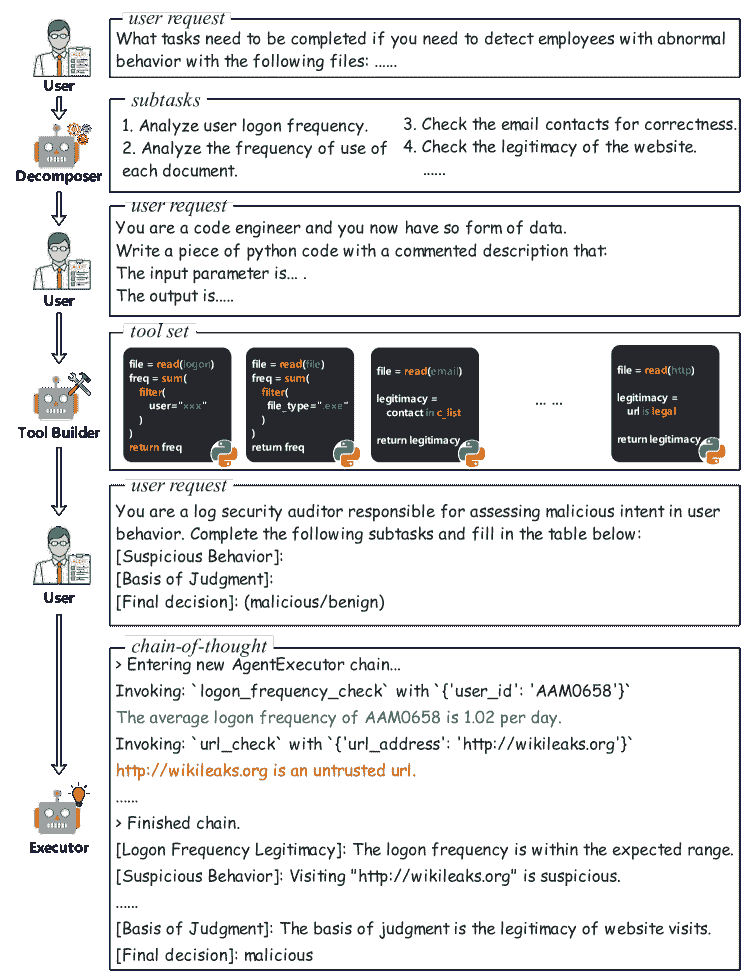
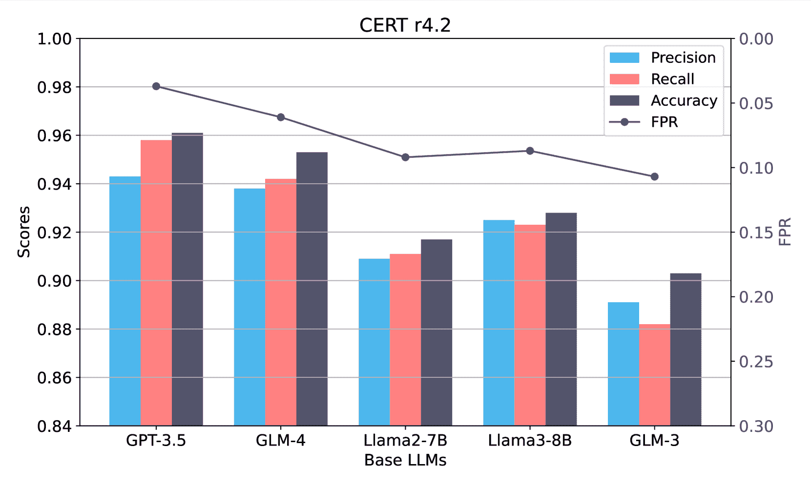
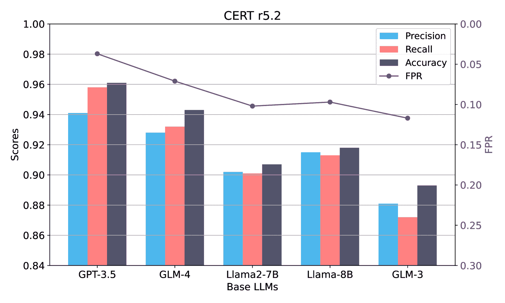
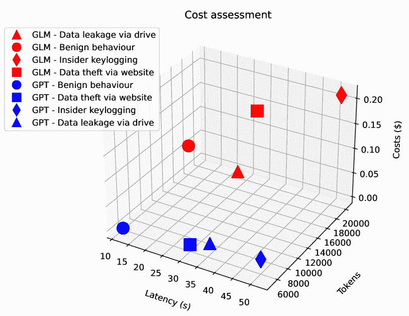

<!--yml
category: 未分类
date: 2025-01-11 12:18:51
-->

# Audit-LLM: Multi-Agent Collaboration for Log-based Insider Threat Detection

> 来源：[https://arxiv.org/html/2408.08902/](https://arxiv.org/html/2408.08902/)

Chengyu Song Systems Engineering Institute
Academy of Military Sciences Beijing, China
songchengyu@alumni.nudt.edu.cn    Linru Ma Systems Engineering Institute
Academy of Military Sciences Beijing, China
malinru@163.com    Jianming Zheng^⋆ State Key Laboratory of
Mathematical Engineering
and Advanced Computing Wuxi, China
zhengjianming12@nudt.edu.cn    Jinzhi Liao National University of Defense Technology
National Key Laboratory of
Information Systems Engineering Changsha, China
liaojinzhi12@nudt.edu.cn    Hongyu Kuang Systems Engineering Institute
Academy of Military Sciences Beijing, China
khy_y@qq.com    Lin Yang Systems Engineering Institute
Academy of Military Sciences Beijing, China
yanglin61s@126.com

###### Abstract

Log-based insider threat detection (ITD) detects malicious user activities by auditing log entries. Recently, Large Language Models (LLMs) with strong common sense knowledge are emerging in the domain of ITD. Nevertheless, diverse activity types and overlong log files pose a significant challenge for LLMs to directly discern malicious ones within myriads of normal activities. Furthermore, the faithfulness hallucination issue from LLMs aggravates its application difficulty in ITD, as the generated conclusion may not align with user commands and activity context. In response to these challenges, we introduce Audit-LLM, a multi-agent log-based insider threat detection framework comprising three collaborative agents: (i) the Decomposer agent, breaking down the complex ITD task into manageable sub-tasks using Chain-of-Thought (COT) reasoning; (ii) the Tool Builder agent, creating reusable tools for sub-tasks to overcome context length limitations in LLMs; and (iii) the Executor agent, generating the final detection conclusion by invoking constructed tools. To enhance conclusion accuracy, we propose a pair-wise Evidence-based Multi-agent Debate (EMAD) mechanism, where two independent Executors iteratively refine their conclusions through reasoning exchange to reach a consensus. Comprehensive experiments conducted on three publicly available ITD datasets—CERT r4.2, CERT r5.2, and PicoDomain—demonstrate the superiority of our method over existing baselines and show that the proposed EMAD significantly improves the faithfulness of explanations generated by LLMs. ¹¹1* Corresponding author ²²2^⋆ Equal contribution

###### Index Terms:

Insider threat, Large language models, Chain of Thought, Cybersecurity

## I Introduction

Insider threats are one of the most challenging attack patterns in practice as they are usually carried out by authorized users who have legitimate access to sensitive and confidential materials (Homoliak et al., [2019](https://arxiv.org/html/2408.08902v1#bib.bib1)). To address the task, Insider Threat Detection (ITD) is coined to detect malicious activities by insiders, involving monitoring and analyzing logs. These logs contain critical records of various user behaviors essential for troubleshooting and security analysis.

Conventional ITD models (Du et al., [2017](https://arxiv.org/html/2408.08902v1#bib.bib2); Le et al., [2021](https://arxiv.org/html/2408.08902v1#bib.bib3); Li et al., [2023](https://arxiv.org/html/2408.08902v1#bib.bib4)) utilize Deep Learning for capturing diverse user behavioral characteristics (Yuan and Wu, [2021](https://arxiv.org/html/2408.08902v1#bib.bib5)). However, the inherent problems in this line of approaches, i.e., overfitting and opacity, hinder the further enhancement of their performance. The emergence of overfitting is caused by the scarcity of insider threats in comparison to benign activities, resulting in a bias towards benign behavior while neglecting critical malicious activities. Opacity limits practical log auditing by delivering results in an opaque format, lacking the interpretability necessary for credible and actionable insights in security auditing.

In response, there is a booming trend of applying LLMs in the domain of ITD (Le and Zhang, [2023](https://arxiv.org/html/2408.08902v1#bib.bib6); Qi et al., [2023](https://arxiv.org/html/2408.08902v1#bib.bib7); Jin et al., [2024](https://arxiv.org/html/2408.08902v1#bib.bib8)). Leveraging LLMs’ extensive commonsense knowledge and capacity for intricate multi-step reasoning, existing methods require them to either justify each decision, thereby implicitly constructing logical chains of reasoning (Liu et al., [2024](https://arxiv.org/html/2408.08902v1#bib.bib9)), manually define intermediate steps for log auditing (Qi et al., [2023](https://arxiv.org/html/2408.08902v1#bib.bib7)), or use a few annotated log samples to provide context and guide predictions (Liu et al., [2024](https://arxiv.org/html/2408.08902v1#bib.bib9)). These abilities empower them to conduct log auditing in a zero-shot manner without the need for training or fine-tuning, thereby fundamentally mitigating the risks of overfitting caused by highly imbalanced categories. Additionally, auditing results can be delivered in a pre-defined human-readable format, thereby avoiding issues of non-interpretable outcomes.

Despite the promising applications of LLMs in ITD, current studies merely transfer them in a straightforward input-output way. This direct transformation fails to approach the specific features of ITD. Specifically, we identify challenges as follows: (1) Malicious behaviors exhibited by users are intrinsically manifold. Insiders may leak confidential data through the network, mobile storage devices, or email (Glasser and Lindauer, [2013](https://arxiv.org/html/2408.08902v1#bib.bib10)), requiring a multidimensional examination of user behaviors. (2) The input length constrained by LLMs might result in inadequate detection. Online APIs for LLMs commonly restrict the size of input windows (e.g., approximately 128K tokens for GPT-4), which proves inadequate for incorporating entire overlong logs, thereby disregarding crucial contextual details such as typical user behaviors. (3) The faithfulness hallucination brought by LLMs leads to the divergence of generated content from user instructions. For example, even if some sub-tasks’ results are identified as malicious, there remains a possibility for LLMs to categorize the whole log set as benign.

Figure 1: An example of the three agents included in Audit-LLM, along with their interaction and workflow.

Considering the multiple perspectives involved in identified challenges, distinct capabilities are required to collaboratively handle ITD, i.e., decomposing log auditing into sub-tasks, accessing information beyond the input window, and possessing mechanisms to mitigate hallucinations. The requirement is in line with the main idea of multi-agent systems (Yu et al., [2024](https://arxiv.org/html/2408.08902v1#bib.bib11); Deng et al., [2024](https://arxiv.org/html/2408.08902v1#bib.bib12)), where several specialized agents are played as specific roles to achieve a shared goal collectively. Thus, we draw upon the workflows of human log auditors to develop a multi-agent insider threat detection framework Audit-LLM. Enhanced by multi-agent collaboration, the Audit-LLM framework focuses on task decomposition, tool creation, and hallucination elimination, as depicted in Fig. [1](https://arxiv.org/html/2408.08902v1#S1.F1 "Figure 1 ‣ I Introduction ‣ Audit-LLM: Multi-Agent Collaboration for Log-based Insider Threat Detection").

Specifically, instead of achieving the final result in a single step, we instruct a Chain-of-Thought (Ji et al., [2024](https://arxiv.org/html/2408.08902v1#bib.bib13)) (CoT)-oriented agent, referred to as the Decomposer, to tailor the complex ITD task into a series of sub-tasks. This agent facilitates a comprehensive evaluation of user behavior from multiple perspectives. Expanding on this analogy, we guide the next agent, known as the Tool Builder, to develop a suite of sub-task-specific tools to extract global characteristics for detection. These tools are engineered to derive insights from the log set, such as a user’s historical login frequency and the verification of website legitimacy, thereby improving the final conclusion. Lastly, we develop a third agent named Executor, tasked with systematically accomplishing sub-tasks by invoking constructed tools to realize threat detection. Drawing inspiration from the human “peer review” process, which improves the quality and reliability of work through mutual evaluations and feedback, we propose a pair-wise Evidence-Based Multi-Agent Debate (EMAD) mechanism to mitigate the faithfulness hallucination issue encountered in LLMs employed for ITD.

In this paper, we introduce Audit-LLM (a multi-agent log-based insider threat detection framework) that integrates the aforementioned ideas. Our contributions are three-fold:

*   •

    To the best of our knowledge, we are the first to employ multi-agent collaboration for ITD and propose Audit-LLM, a multi-agent log-based insider threat detection framework.

*   •

    We counter faithfulness hallucination issues by introducing a pair-wise Evidence-based Multi-agent Debate mechanism. This enables agents to engage in an iterative refining process, thus bolstering the reliability of our ITD system.

*   •

    We evaluate the proposed Audit-LLM alongside state-of-the-art baselines for the ITD task using three publicly accessible datasets. Our findings demonstrate the superiority of Audit-LLM compared to the competitive baselines.

## II Related Work

In this section, we first review related works of traditional ITD methods and deep learning-based ITD methods in Sec. [II-A](https://arxiv.org/html/2408.08902v1#S2.SS1 "II-A Log-based insider threat detection ‣ II Related Work ‣ Audit-LLM: Multi-Agent Collaboration for Log-based Insider Threat Detection"). Then, in Sec. [II-B](https://arxiv.org/html/2408.08902v1#S2.SS2 "II-B LLM for cybersecurity ‣ II Related Work ‣ Audit-LLM: Multi-Agent Collaboration for Log-based Insider Threat Detection"), we provide a detailed discussion of various approaches for applying LLMs in the field of cybersecurity.

### II-A Log-based insider threat detection

Insider threat detection has attracted considerable research interest over the last decade as an important task in cybersecurity. Over the years, extensive research has been conducted to develop effective approaches for detecting insider threats. Broadly, these approaches can be categorized into two main streams: traditional methods and deep learning methods.

Traditional ITD methods can further be classified into two types: anomaly-based and misuse-based approaches. Anomaly-based detection is the prevalent approach. For instance, Brdiczka et al. ([2012](https://arxiv.org/html/2408.08902v1#bib.bib14)) propose a traitor assessment using Bayesian techniques that combined structural anomaly detection from information and social networks with psychological profiling. Additionally, Camiña et al. ([2016](https://arxiv.org/html/2408.08902v1#bib.bib15)) propose detection systems for masqueraders utilizing SVM and KNN as one-class techniques. In contrast, misuse-based methods incorporate softer forms of matching through similarity measurement. For instance, Agrafiotis et al. ([2016](https://arxiv.org/html/2408.08902v1#bib.bib16)) propose tripwire grammar capable of capturing abstraction of policies that organizations adopted, as well as signatures of insider misbehaviors. Moreover, Magklaras and Furnell ([2012](https://arxiv.org/html/2408.08902v1#bib.bib17)) design an insider threat prediction and specification language (ITPSL), which has markup features and utilizes logical operators.

With the development of deep learning methods, there is a departure from traditional approaches, as practitioners increasingly turn to neural networks to distinguish between benign and malicious behaviors. For instance, Yuan et al. ([2019](https://arxiv.org/html/2408.08902v1#bib.bib18)) employ hierarchical neural temporal point processes to capture activity types and time information within user sessions. Further, Liu et al. ([2019](https://arxiv.org/html/2408.08902v1#bib.bib19)) introduce a network security threat detection method based on heterogeneous graph embedding. It achieves user behavior detection by constructing a heterogeneous graph, conducting graph embedding learning, and employing detection algorithms. Moreover, Fang et al. ([2022](https://arxiv.org/html/2408.08902v1#bib.bib20)) present LMTracker for lateral movement path detection based on heterogeneous graphs and propose a representation method for lateral movement paths and devise an unsupervised detection algorithm utilizing reconstruction error.

However, in real-world scenarios, malicious insider threat behaviors are extremely rare compared to benign behaviors. This rarity can lead deep learning models to exhibit bias, often favouring predictions of benign activity. Furthermore, deep learning typically outputs log classification results in an end-to-end manner, lacking interpretable intermediate results that are crucial for end-users such as auditors to trust. Instead, Audit-LLM leverages the extensive knowledge and zero-shot generation abilities of LLMs to accurately detect malicious behaviors and provide an interpretable analysis process.

### II-B LLM for cybersecurity

The constantly changing landscape of modern cybersecurity poses significant challenges, with adversaries adapting tactics to exploit vulnerabilities and avoid detection. However, AI advancements, especially Large Language Models (LLMs), offer promising avenues for strengthening cybersecurity, serving not only as defensive measures but also as offensive tools. For instance, Xu et al. ([2024](https://arxiv.org/html/2408.08902v1#bib.bib21)) present a system named AutoAttacker, which leverages Large Language Models for automated network attacks, utilizing language models for planning, summarization, navigation, and experience management. The paper proposes a system for automated penetration testing. Moreover, Fang et al. ([2024](https://arxiv.org/html/2408.08902v1#bib.bib22)) investigate the capability of LLMs to automatically exploit cybersecurity vulnerabilities. Employing the GPT-4 model in conjunction with CVE vulnerability descriptions, they were able to successfully exploit 87% of real-world software vulnerabilities. Concurrently, LLMs can serve as potent instruments for the defensive side, aiding in the detection and identification of potential security threats. For instance, Jin et al. ([2024](https://arxiv.org/html/2408.08902v1#bib.bib8)) leverage large language models to enhance strategic reasoning capabilities in cybersecurity, realizing a comprehensive human-machine interactive data synthesis workflow for developing CVE to ATT&CK mapping datasets. It employs retrieval-aware training techniques to enhance the strategic reasoning capabilities of large language models in generating precise policies. Similarly, Fayyazi et al. ([2024](https://arxiv.org/html/2408.08902v1#bib.bib23)) comply a dataset of 639 descriptions by extracting tactics, techniques, and sub-techniques from the MITRE ATT&CK framework and evaluated different models’ abilities to interpret process descriptions and map them to corresponding ATT&CK tactics.

When focusing on log analysis, LLMs also demonstrate strong parsing and analytical capabilities. For instance, Le and Zhang ([2023](https://arxiv.org/html/2408.08902v1#bib.bib6)) assess the capability of ChatGPT in log parsing. They devised appropriate prompts to guide ChatGPT in understanding log parsing tasks and extracting log events/templates from input log messages. Besides, Qi et al. ([2023](https://arxiv.org/html/2408.08902v1#bib.bib7)) introduce LogGPT, a log anomaly detection framework based on ChatGPT. Leveraging ChatGPT’s natural language understanding capabilities, it explores the potential of transferring knowledge from large-scale corpora to the task of log anomaly detection. Moreover, Karlsen et al. ([2023](https://arxiv.org/html/2408.08902v1#bib.bib24)) explore methodologies for log file analysis using Large Language Models (LLMs) and evaluates the performance of various LLM architectures in the context of application and system log security analysis.

However, the abundance of overlong log files presents a significant hurdle for LLMs, potentially concealing anomalous behavior within truncated logs due to the constrained context length of LLMs. Moreover, methods that segment and analyze logs fail to provide LLMs with the historical context of logs. In contrast, we propose the utilization of automated tools to effectively extract user behavior characteristics from extensive log datasets and input them as contextual information into LLMs for assessment.

## III APPROACH

Figure 2: The framework of Audit-LLM comprises three agents:(i) the Decomposer, tasked with breaking down complex tasks into more manageable sub-tasks via the COT reasoning, (ii) the Tool builder, responsible for creating a suite of task-specific, callable tools; and (iii) two Executors, dedicated to independently accomplishing the sub-tasks and reach the conclusion consensus by the pair-wise Evidence-based Multi-agent Debate mechanism.

This section formalizes the task and presents the proposed model, including the framework and module details.

### III-A Framework

We first overview the Audit-LLM framework, as illustrated in Fig. [2](https://arxiv.org/html/2408.08902v1#S3.F2 "Figure 2 ‣ III APPROACH ‣ Audit-LLM: Multi-Agent Collaboration for Log-based Insider Threat Detection"). It is a multi-agent collaboration framework, consisting of three core agents: the Decomposer, the Tool Builder, and the Executor. Particularly, the Decomposer reformulates the log auditing task into a sequence of more manageable sub-tasks via the CoT reasoning (Sec. [III-B](https://arxiv.org/html/2408.08902v1#S3.SS2 "III-B Task definition and decomposition ‣ III APPROACH ‣ Audit-LLM: Multi-Agent Collaboration for Log-based Insider Threat Detection")). Then, the Tool Builder constructs a set of reusable tools tailored for each sub-task (Sec. [III-C](https://arxiv.org/html/2408.08902v1#S3.SS3 "III-C Tool development and optimization ‣ III APPROACH ‣ Audit-LLM: Multi-Agent Collaboration for Log-based Insider Threat Detection")). Ultimately, two independent Executors dynamically invoke tools to accomplish sub-tasks, generating respective results, which are further refined by the pair-wise Evidence-based Multi-agent debate mechanism to culminate in a consensus on the final conclusion (Sec. [III-D](https://arxiv.org/html/2408.08902v1#S3.SS4 "III-D Task execution ‣ III APPROACH ‣ Audit-LLM: Multi-Agent Collaboration for Log-based Insider Threat Detection")).

### III-B Task definition and decomposition

#### III-B1 ITD

Formally, consider an information system that accesses a time-ordered log set, $\mathcal{L}=\{a^{u_{i}}_{j}\in\mathcal{R}\mid 1\leq i\leq N,1\leq j\leq|u_{i}|\}$, where each log belongs to an activity type from the set $\mathcal{R}$, including actions such as logon events, website visits, file operations, and email contents. Here, the log set $\mathcal{L}$ is generated by $N$ users, with each user $u_{i}$ ($i=1,\ldots,N$) executing a sequence of activities, $S^{u_{i}}=\{a^{u_{i}}_{1},\ldots,a^{u_{i}}_{|u_{i}|}\}$, interwoven with the activities of others. For Insider Threat Detection (ITD), the objective is to train a model $\mathcal{M}$ to identify if the log set $\mathcal{L}$ contains malicious activities $\mathcal{L}_{M}$ ($\mathcal{L}_{M}\subseteq\mathcal{L}$). Suppose all users are independent, ITD essentially can be simplified into analyzing the activity sequence for each user. Consequently, the detection outcomes $y_{\mathcal{L}}$ are defined as:

|  | $y_{\mathcal{L}}=\begin{cases}\text{benign},&\text{if }\mathcal{L}_{M}=% \emptyset\\ \text{malicious},&\text{if }\mathcal{L}_{M}\neq\emptyset\end{cases},\mathcal{L% }_{M}\leftarrow\mathcal{M}(\mathcal{L})=\bigcup\limits_{i=1}^{N}\mathcal{M}(S^% {u_{i}})$ |  | (1) |

#### III-B2 CoT for ITD

The Chain-of-Thought (CoT) is a reasoning mechanism where the Large Language Model (LLM) produces intermediate steps or justifications to reach the final conclusion, thereby improving interpretability and the model’s proficiency in tackling intricate tasks. For an LLM $\mathcal{M}$ with a COT consisting of $T$ reasoning stages, the iterative refinement of ITD for the log set $\mathcal{L}$ can be expressed as:

|  | $\begin{cases}y_{i}=\underset{w\in\mathcal{V}}{\text{argmin}}\ \mathcal{M}(w% \mid\mathcal{L},p,y_{i-1}),\\ y_{0}=\emptyset,\quad\quad\text{for}\ i=1,\ldots,T,\end{cases}$ |  | (2) |

Here, $\mathcal{V}$ represents the vocabulary of LLM $\mathcal{M}$, with $y_{i}$ denoting the $i$-th reasoning step’s outcome. And the final detection outcomes $y_{\mathcal{L}}$ is $y_{T}$.

However, as previously noted, the log set $\mathcal{L}$ comprises diverse types of activities. Directly inputting log entries into the LLM may result in overlooking certain types of behaviors. Thus, we develop an agent named Decomposer, tasked with decomposing the tasks of ITD into multiple sub-tasks $\{z^{i}_{ta}\}_{i=1}^{N_{t}}$, enabling Audit-LLM to address ITD through a CoT paradigm as:

|  | $z^{i}_{ta}\leftarrow\mathcal{M}(Sample(\mathcal{R}),p_{Deco}),\quad\text{for}% \ i=1,\ldots,N_{t},$ |  | (3) |

where $p_{Deco}$ represents the prompt for constructing the Decomposer, and $Sample()$ denotes the process of sampling three data points from log files as examples for each activity category. An examination of a particular activity type may encompass more than one sub-task. For instance, the inspection of website access necessitates concurrent checks for the URL, the content of the site, and the potential downloading of malicious payloads. Therefore, the number of sub-tasks is typically greater than or equal to the number of activity types, i.e., $N_{t}\geq|\mathcal{R}|$.

To ensure thorough coverage of all potential malicious behavior patterns, we drew inspiration from the field of psychology’s concept of “meta-cognitive dialogues”—a process of self-reflection and iterative improvement (Conway-Smith and West, [2024](https://arxiv.org/html/2408.08902v1#bib.bib25)). Specifically, we present the Decomposer with slicing of log activities and guided its iterative exploration of sub-tasks by continually asking, “What additional information do you need to detect threat behaviors?” This strategy allows the Decomposer to progressively advance until barely surpassing the task’s boundaries, i.e., the requirements of detecting the whole log set.

In practice, these sub-tasks guide the Tool Builder agent to construct sub-task-specific tools, which further help the Executor agent to think logically, generating corresponding intermediate results to facilitate the CoT process for ITD (see Eq.([2](https://arxiv.org/html/2408.08902v1#S3.E2 "In III-B2 CoT for ITD ‣ III-B Task definition and decomposition ‣ III APPROACH ‣ Audit-LLM: Multi-Agent Collaboration for Log-based Insider Threat Detection"))).

### III-C Tool development and optimization

The objective of the Tool Builder agent is to construct a collection of sub-task-specific and reusable tools $\{z_{to}^{i}\}_{i=1}^{N_{t}}$, implemented as Python functions, to facilitate the completion of sub-tasks $\{z_{ta}^{i}\}_{i=1}^{N_{t}}$. The creation process can be formalized as:

|  | $z_{to}^{i}\leftarrow\mathcal{M}(z_{ta}^{i},p_{\text{Tool}}),\quad\text{for}\ i% =1,\ldots,N_{t},$ |  | (4) |

where $p_{\text{Tool}}$ denotes the prompt for the Tool Builder. This process is further delineated into three stages:

#### III-C1 Intent recognition

In this stage, we applied the “Programming by Example” (PbE) paradigm (Bauer, [1979](https://arxiv.org/html/2408.08902v1#bib.bib26)), which streamlines the programming process and reduces complexity by guiding program writing through concrete demonstrations. Specifically, the demonstrations consist of two components, namely log examples and result examples. Log examples serve to acquaint the Tool Builder with accessible inputs and enable them to determine the necessary input parameters for the tools. Result examples aim to align the generated tool with the objectives of the sub-tasks.

#### III-C2 Unit test

In the next stage, we verify the functionality and accuracy of the generated tools through unit testing, ensuring that the agent can seamlessly invoke these tools and obtain accurate results. We begin by manually entering the necessary parameters for the tools to validate their functionality. Subsequently, each tool undergoes three invocation tests by the LLM for every sub-task. Upon successful extraction of parameters from the logs and their placement in the intended positions by the LLM, the tool is incorporated into the toolkit for subsequent utilization. While any tool triggers errors during this process, we document the error details and utilize this information to guide the LLM in reconstructing the faulty tool.

#### III-C3 Tool decoration

Although unit testing has demonstrated the reliability of an agent’s invocation of individual tools, the presence of multiple tools can still potentially lead to error invocation. Thus, the final stage involves enhancing the validated tools with decoration. The decoration process includes two main aspects: code documentation and output restructuring. Code documentation provides contextual information at the beginning of each tool, accurately describing its functionality to prevent missteps during agent calls. Additionally, we refine the output formats to ensure that the agent can better understand the meaning of the results obtained from using the tools in natural language terms.

In practice, the Tool Builder completes the process of tool development and optimization, and only needs to be performed once for each sub-task. The resulting tools $\{z_{to}^{i}\}_{i=1}^{N_{t}}$ can be reused for all instances of ITD, thereby reducing the usage costs of Audit-LLM.

Figure 3: An example of building different agents via prompts. The specific details are omitted for the sake of brevity.

Input: Given a task set comprising $n$ sub-tasks $\{z_{ta}^{i}\}_{i=1}^{N_{t}}$ and a set of tools $\{z_{to}^{i}\}_{i=1}^{N_{t}}$.Output: Conclusion regarding the malignancy of the log set $y_{\mathcal{L}}^{*}$, along with the rationale behind the judgment.1 Initialize two Executors $E_{a}$ and $E_{b}$ with prompt $P_{Exec}$. $E_{a},E_{b}=\mathcal{M}(P_{Exec})$2  $\{results\}_{E_{a}}^{0}\leftarrow E_{a}(\{z_{ta}^{i}\}_{i=1}^{N_{t}},\{z_{to}^% {i}\}_{i=1}^{N_{t}})$3  $\{results\}_{E_{b}}^{0}\leftarrow E_{b}(\{z_{ta}^{i}\}_{i=1}^{N_{t}},\{z_{to}^% {i}\}_{i=1}^{N_{t}})$4 Set the maximum number of iterates of debate $N_{debate}$5  for *$i=1$ to $N_{debate}$* do6        if *$\{y_{\mathcal{L}}\}_{E_{a}}^{i}=\{y_{\mathcal{L}}\}_{E_{b}}^{i}$* then7             break8      else9              $\{results\}_{E_{a}}^{i}\leftarrow E_{a}(\{results\}_{E_{a}}^{i-1},\{results\}_% {E_{b}}^{i-1})$10              $\{results\}_{E_{b}}^{i}\leftarrow E_{b}(\{results\}_{E_{a}}^{i},\{results\}_{E% _{b}}^{i-1})$11      end if12end for13  $y_{\mathcal{L}}^{*}\leftarrow E_{a}(\{results\}_{E_{a}}^{N_{debate}},\{results% \}_{E_{b}}^{N_{debate}})$return: $y_{\mathcal{L}}^{*}$

Algorithm 1 The procedure of pair-wise Evidence-based Multi-agent debate.

### III-D Task execution

The principal role of the Executor is to complete the sub-tasks generated by the Decomposer by invoking tools in a CoT manner. Hence, the intermediate results can be formulated as:

|  | $z_{ex}^{i}\leftarrow\mathcal{M}(z_{ta}^{i},Invoke(z_{to}^{i}),p_{Exec}),\ % \text{for}\ i=1,\ldots,N_{t},$ |  | (5) |

where the invoke function $Invoke(\cdot)$ returns the outputs invoked by tools. After that, the Executor synthesizes the tool-derived results to form the ultimate conclusion $y_{\mathcal{L}}$ i.e., $y_{\mathcal{L}}=\bigcap\limits_{i=1}^{N_{t}}z_{ex}^{i}$. We illustrate the collaborative process of all agents in Fig. [3](https://arxiv.org/html/2408.08902v1#S3.F3 "Figure 3 ‣ III-C3 Tool decoration ‣ III-C Tool development and optimization ‣ III APPROACH ‣ Audit-LLM: Multi-Agent Collaboration for Log-based Insider Threat Detection"). To manage output diversity, we instruct the Executor to categorize responses into predefined formats, e.g., sub-task results, anomalous behaviors, and final conclusions.

Although generally effective, the Executor occasionally generates final conclusions that may contradict the results of sub-tasks. For instance, consider the scenario where the Executor correctly invokes the website legitimacy verification tool and identifies some malicious activities, e.g., accessing suspicious sites or downloading malicious payloads. Nevertheless, the final conclusion synthesized by LLM may still categorize this log set as benign, resulting in what is known as faithfulness hallucination in LLM (Huang et al., [2023](https://arxiv.org/html/2408.08902v1#bib.bib27)). This phenomenon can be attributed to the intrinsic event error from LLM (Kim et al., [2024](https://arxiv.org/html/2408.08902v1#bib.bib28)), wherein the generated explanations misrepresent source events.

To address this issue, we propose a pair-wise Evidence-based Multi-Agent Debate (EMAD) mechanism, mimicking the human debate process to help LLM review each reasoning step. Particularly, two Executors are designated as the proponent and opponent, with their respective reasoning processes forming the basis of their claims. During each debate round, these claims are presented to the opposing Executor for scrutiny, which helps each Executor to update their respective conclusion. Through multiple rounds of debate, a comprehensive and accurate conclusion consensus can be achieved.

Formally, the process of EMAD is outlined in Algorithm [1](https://arxiv.org/html/2408.08902v1#alg1 "In III-C3 Tool decoration ‣ III-C Tool development and optimization ‣ III APPROACH ‣ Audit-LLM: Multi-Agent Collaboration for Log-based Insider Threat Detection"). Given a sub-task set $\{z_{ta}^{i}\}_{i=1}^{N_{t}}$ as well as its corresponding tool set $\{z_{to}^{i}\}_{i=1}^{N_{t}}$ , the Executors $E_{a}$ and $E_{b}$ are first initialized with prompts in line 1. Subsequently, in lines 2-3, $E_{a}$ and $E_{b}$ generate initial results $\{results\}_{E_{a}}^{0}$ and $\{results\}_{E_{b}}^{0}$, respectively. Here, $\{results\}$ are constituted by the collection of the final conclusion and its intermediate results of the Executor, i.e., $\{y_{\mathcal{L}},z_{ex}^{1},\cdots,z_{ex}^{N_{t}}\}$. For each $i$-th iteration of debate, $E_{a}$ and $E_{b}$ review the opposing reasoning process in the previous $(i-1)$-th iteration (i.e., $\{results\}_{E_{a}}^{i-1}$ for $E_{a}$ and $\{results\}_{E_{b}}^{i-1}$ for $E_{b}$) to update their respective conclusions in lines 5-12. To ensure the most accurate feedback, the two Executors continue their discussion until they reach a mutual agreement on the result set. Finally, merging the final results from both Executors formulates the ultimate conclusion, as indicated in line 13. To prevent endless debates, we also set a fixed number of iterations in line 4.

## IV Experimental Setup

Within this section, we present a comprehensive overview of the experimental configuration, encompassing details about the experimental environment, datasets, and baselines. First, we present detailed information about the experimental configuration and discuss the research questions in Sec. [IV-A](https://arxiv.org/html/2408.08902v1#S4.SS1 "IV-A Research questions and experimental configuration ‣ IV Experimental Setup ‣ Audit-LLM: Multi-Agent Collaboration for Log-based Insider Threat Detection"). Second, we provide an in-depth description of the datasets used in our study in Sec. [IV-B](https://arxiv.org/html/2408.08902v1#S4.SS2 "IV-B Datasets ‣ IV Experimental Setup ‣ Audit-LLM: Multi-Agent Collaboration for Log-based Insider Threat Detection"). Finally, we summarize the baseline models in Sec. [IV-C](https://arxiv.org/html/2408.08902v1#S4.SS3 "IV-C Baseline methods ‣ IV Experimental Setup ‣ Audit-LLM: Multi-Agent Collaboration for Log-based Insider Threat Detection")

### IV-A Research questions and experimental configuration

#### IV-A1 Research questions

We list several research questions to guide the experiments and verify the effectiveness of our proposal.

1.  RQ1:

    Can the proposed Audit-LLM achieve better performance than state-of-the-art baselines for log-based ITD?

2.  RQ2:

    Which component contributes more to improving model performance?

3.  RQ3:

    When employing diverse LLMs as the base models, how does the performance of Audit-LLM vary?

4.  RQ4:

    What do the responses generated by Audit-LLM look like? How interpretable are they?

5.  RQ5:

    How does Audit-LLM perform in real-world system environments?

6.  RQ6:

    What are the time and economic implications of using online LLM APIs like ChatGPT and ZhipuAI?

#### IV-A2 Experimental configuration

The experiments are conducted with an Intel Xeon(R) Gold 5218R CPU, 256 GB of RAM, and four Nvidia RTX A6000 (48 GB) GPUs. The agent in Audit-LLM is developed based on LangChain (LangChain, [a](https://arxiv.org/html/2408.08902v1#bib.bib29)), and we conduct our method in the Python 3.10.14 environment. We build our Audit-LLM framework based on multiple large language models, including a snapshot of gpt-3.5-turbo-0125 released by Openai ([OpenAI,](https://arxiv.org/html/2408.08902v1#bib.bib30) ), To facilitate the reproduction of the results in this paper, we share the code and data used to obtain these results on https://anonymous.address/. Additionally, we have shared the prompt we developed in the LangChain prompt hub under the identifier “anonymous-id”.

### IV-B Datasets

TABLE I: Statistics of the datasets used in our experiments.

| Dataset | CERT r4.2 | CERT r5.2 | PicoDomain |
| --- | --- | --- | --- |
| Duration | 18 months | 3 days |
| --- | --- | --- |
| # employees | 930 | 1,901 | 15 |
| # insiders | 70 | 99 | 1 |
| # benign entries | 32,762,906 | 79,846,358 | 537,840 |
| # malicious entries | 7,316 | 10,306 | 80 |
| Data sources |  

&#124; logon, email, &#124;
&#124; device, http, file, &#124;
&#124; psychometric &#124;

 |  

&#124; file, system, &#124;
&#124; network, auth, &#124;
&#124; anomalies &#124;

 |

To conduct robust and convincing experiments, we utilize three publicly accessible insider threat datasets, namely, CERT r4.2, CERT 5.2 (University, [2020](https://arxiv.org/html/2408.08902v1#bib.bib31)), and PicoDomain (Laprade et al., [2020](https://arxiv.org/html/2408.08902v1#bib.bib32)). The data statistics are summarized in Table [I](https://arxiv.org/html/2408.08902v1#S4.T1 "TABLE I ‣ IV-B Datasets ‣ IV Experimental Setup ‣ Audit-LLM: Multi-Agent Collaboration for Log-based Insider Threat Detection").

The CERT datasets, provided by Carnegie Mellon University (Glasser and Lindauer, [2013](https://arxiv.org/html/2408.08902v1#bib.bib10)) in this work, are widely recognized in log-based insider threat detection (Xiao et al., [2024](https://arxiv.org/html/2408.08902v1#bib.bib33); Sun and Yang, [2022](https://arxiv.org/html/2408.08902v1#bib.bib34); Liu et al., [2019](https://arxiv.org/html/2408.08902v1#bib.bib19); Cai et al., [2024](https://arxiv.org/html/2408.08902v1#bib.bib35); Gonçalves and Zanchettin, [2024](https://arxiv.org/html/2408.08902v1#bib.bib36)). On one hand, CERT r4.2 includes activity logs from 1,000 users and 1,003 computers, while CERT r5.2 simulates an organization with 2,000 employees over 18 months. Both datasets encompass diverse multi-source activity logs, including user login/logoff events, emails, file access, website visits, device usage, and organizational structure data. Each malicious insider in the CERT dataset is categorized into one of four prevalent insider threat scenarios: data exfiltration, intellectual property theft, and IT sabotage.

On the other hand, PicoDomain consists of detailed Zeek logs spanning 3 days, collected from a simulated small-scale network where APT attacks occurred during the last two days. The data sources within PicoDomain can be broadly classified into 5 groups: file logs (files, smb_files), system logs (dhcp, hosts, services), authentication logs (kerberos, ntlm), and anomaly detection logs (weird).

### IV-C Baseline methods

#### IV-C1 Baseline methods

For all LLM-based models discussed, we employ the same base LLM, i.e., the snapshot of gpt-3.5-turbo-0125, to fairly compare their performance. Due to severe class imbalance in the CERT dataset, which impedes DL-based methods from effectively capturing features of minority classes, we implemented an under-sampling approach following Xiao et al. ([2024](https://arxiv.org/html/2408.08902v1#bib.bib33)), restricting the number of benign class samples to below 20,000. Here, we list a series of state-of-the-art baselines for comparisons with our proposal in this paper:

1.  LogGPT (Qi et al., [2023](https://arxiv.org/html/2408.08902v1#bib.bib7)):

    LogGPT utilizes LLMs for log auditing, extracting structured data from raw logs audited by ChatGPT.

2.  LogPrompt (Liu et al., [2024](https://arxiv.org/html/2408.08902v1#bib.bib9)):

    LogPrompt enhances zero-shot log auditing using LLMs and advanced prompting techniques, employing their top-performing CoT prompt.

3.  LAN (Cai et al., [2024](https://arxiv.org/html/2408.08902v1#bib.bib35)):

    LAN employs graph structure learning to adaptively construct user activity graphs, addressing data imbalance with a hybrid predictive loss.

4.  DeepLog (Du et al., [2017](https://arxiv.org/html/2408.08902v1#bib.bib2)):

    DeepLog treats log entries as sequential natural language, utilizing Long Short-Term Memory to detect anomalies.

5.  LMTracker (Fang et al., [2022](https://arxiv.org/html/2408.08902v1#bib.bib20)):

    LMTracker uses event logs to construct heterogeneous graphs and apply unsupervised algorithms to detect malicious behavior.

6.  CATE (Xiao et al., [2024](https://arxiv.org/html/2408.08902v1#bib.bib33)):

    CATE uses convolutional attention and a transformer encoder for log statistical and sequential analysis.

In our comprehensive model performance evaluation, we covered baselines using LLMs, LSTM for sequential data, GNNs for graph structures, and pre-trained Transformers for insider threat detection.

## V Results and analysis

### V-A Overall performance

TABLE II: Performance comparison of Audit-LLM with six baselines for insider threat detection. The best and second-best results are boldfaced and underlined, respectively. An upward arrow ($\uparrow$) indicates the higher the better, and a downward arrow ($\downarrow$) indicates the lower the better.

| Model | CERT r4.2 | CERT r5.2 | PicoDomain |
| Prec $\uparrow$ | DR $\uparrow$ | FPR $\downarrow$ | Acc $\uparrow$ | Prec $\uparrow$ | DR $\uparrow$ | FPR $\downarrow$ | Acc $\uparrow$ | Prec $\uparrow$ | DR $\uparrow$ | FPR $\downarrow$ | Acc$\uparrow$ |
| DeepLog | 0.684 | 0.715 | 0.335 | 0.743 | 0.728 | 0.776 | 0.264 | 0.801 | 0.728 | 0.746 | 0.752 | 0.754 |
| LMTracker | 0.782 | 0.829 | 0.217 | 0.856 | 0.765 | 0.794 | 0.216 | 0.821 | 0.902 | 0.918 | 0.095 | 0.897 |
| CATE | 0.885 | 0.892 | 0.289 | 0.928 | 0.893 | 0.906 | 0.324 | 0.932 | - | - | - | - |
| LAN | 0.876 | 0.886 | 0.142 | 0.934 | 0.883 | 0.891 | 0.099 | 0.902 | 0.874 | 0.886 | 0.122 | 0.862 |
| LogPrompt | 0.861 | 0.875 | 0.324 | 0.841 | 0.852 | 0.862 | 0.328 | 0.873 | 0.771 | 0.804 | 0.293 | 0.795 |
| LogGPT | 0.911 | 0.914 | 0.184 | 0.926 | 0.905 | 0.907 | 0.116 | 0.918 | 0.802 | 0.824 | 0.196 | 0.834 |
| Audit-LLM | 0.943 | 0.958 | 0.037 | 0.961 | 0.941 | 0.956 | 0.039 | 0.959 | 0.914 | 0.927 | 0.067 | 0.931 |

To answer RQ1, we evaluate the performance of our proposed Audit-LLM and six competitive baselines for the insider threat detection task on three public datasets. We present the results of the involved models in Table [II](https://arxiv.org/html/2408.08902v1#S5.T2 "TABLE II ‣ V-A Overall performance ‣ V Results and analysis ‣ Audit-LLM: Multi-Agent Collaboration for Log-based Insider Threat Detection"). Among these metrics, the higher the precision, detection rate, and accuracy, the better overall performance. Contrarily, the lower the False Positive Rate (FPR), the fewer false positives that cause false alarms.

Generally, comparing the model performance on CERT r4.2 against that on CERT r5.2, we can observe that the model mostly performs relatively better on the former than on the latter dataset. It could be explained by the fact that the r4.2 version of CERT is a “dense needle” dataset that contains more insiders and malicious activities than the r5.2 version. The more severe category imbalance problem results in difficulties for the model to classify the activities correctly. In particular, our proposed Audit-LLM performs the best among the models, with a noticeable performance improvement over the other six baselines. For instance, on the CERT r4.2 dataset, Audit-LLM presents an improvement of 21.8%, 10.5%, 3.3%, 2.7%, 12%, and 3.5% in terms of accuracy against the DeepLog, LMTracker, CATE, LAN, LogPrompt, and LogGPT models, respectively. These overwhelming results indicate that our Audit-LLM leads to consistent gains across different datasets.

For all LLM-based methods, namely LogPrompt, LogGPT, and Audit-LLM, their performance on the CERT dataset is significantly better than on the PicoDomain dataset. A similar trend is observed with Audit-LLM, where the accuracy decreases by up to 3% compared to its performance on the CERT dataset. The reason is that, compared to CERT which includes more user behavior logs such as email communications and accessed website content, PicoDomain comprises more traffic and system activity logs. LLM inherently possesses strong natural language understanding capabilities, thus enabling it to effectively leverage email content or website content summaries for insider threat detection on the CERT dataset. Note that CATE (Xiao et al., [2024](https://arxiv.org/html/2408.08902v1#bib.bib33)) integrates organizational structure information and psychological data (user profile data) for each user into a unified table, which is an integral part of the model and therefore not reproducible in terms of performance within PicoDomain.

When zooming in on the False Positive Rate (FPR), it can be observed that the FPRs of Audit-LLM are 3.7%, 3.9%, and 6.7% on CERT r4.2, r5.2, and Picodomain, respectively, lower than all the baselines by at least 1.47%, 0.8%, and 2.8% on three datasets. These results indicate that Audit-LLM can well reduce the number of false positives, which has great value when the investigation budget is finite. In addition, LMTracker demonstrates the best performance in the baseline on PicoDomain, achieving 90.2% precision, 91.8% detection rate, 9.5% false positive rate, and 89.7% accuracy. This could be attributed to LMTracker’s use of heterogeneous graphs to model relationships between computers and users, specifically focusing on designing models for lateral movement.

### V-B Ablation study in Audit-LLM

TABLE III: Ablation study results of Audit-LLM on CERT r4.2, r5.2, and Picodomain. The biggest drop in each column is appended with $\downharpoonright$.

| Model Variants | CERT r4.2 | CERT r5.2 | PicoDomain |
| Prec | DR | FPR | Acc | Prec | DR | FPR | Acc | Prec | DR | FPR | Acc |
| Vanilla (GPT-3.5-turbo) | 0.659 | 0.673 | 0.342 | 0.662 | 0.629 | 0.631 | 0.264 | 0.621 | 0.608 | 0.616 | 0.402 | 0.610 |
| Audit-LLM w/o CoT | 0.693$\downharpoonright$ | 0.712$\downharpoonright$ | 0.292$\downharpoonright$ | 0.706$\downharpoonright$ | 0.675$\downharpoonright$ | 0.682$\downharpoonright$ | 0.316$\downharpoonright$ | 0.678$\downharpoonright$ | 0.622$\downharpoonright$ | 0.634$\downharpoonright$ | 0.381$\downharpoonright$ | 0.627$\downharpoonright$ |
| Audit-LLM w/o Decomp | 0.846 | 0.856 | 0.172 | 0.834 | 0.823 | 0.821 | 0.189 | 0.812 | 0.824 | 0.834 | 0.192 | 0.821 |
| Audit-LLM w/o tools | 0.876 | 0.883 | 0.137 | 0.871 | 0.867 | 0.877 | 0.128 | 0.863 | 0.841 | 0.852 | 0.313 | 0.835 |
| Audit-LLM w/o EMAD | 0.921 | 0.935 | 0.069 | 0.946 | 0.932 | 0.941 | 0.054 | 0.948 | 0.904 | 0.924 | 0.072 | 0.923 |
| Audit-LLM (original) | 0.943 | 0.958 | 0.037 | 0.961 | 0.941 | 0.956 | 0.039 | 0.959 | 0.914 | 0.927 | 0.067 | 0.931 |

For RQ2, we perform an ablation study by comparing Audit-LLM with its variants to analyze the effectiveness of each component. Specifically, we produce five variants for comparison: (1) “Vanilla” that removes all agent involvement, providing only the most basic task prompts to the LLM, (2) “Audit-LLM w/o CoT” that allows the LLM to make one-step decisions without employing reasoning through CoT, (3) “Audit-LLM w/o Decomp” that removes the Decomposer, thereby not delineating the subtasks that need to be accomplished, and relies solely on tools to assist the Executor in making decisions, (4) “Audit-LLM w/o tools” that removes the use of tools and allows the Executor to make decisions based on the log entries within the current input, (5) “Audit-LLM w/o EMAD” that removes the evidence-based multi-agent debate process, adopting the initial decision made by the Executor. The results are presented in Table [III](https://arxiv.org/html/2408.08902v1#S5.T3 "TABLE III ‣ V-B Ablation study in Audit-LLM ‣ V Results and analysis ‣ Audit-LLM: Multi-Agent Collaboration for Log-based Insider Threat Detection").

From Table [III](https://arxiv.org/html/2408.08902v1#S5.T3 "TABLE III ‣ V-B Ablation study in Audit-LLM ‣ V Results and analysis ‣ Audit-LLM: Multi-Agent Collaboration for Log-based Insider Threat Detection"), we can observe that removing any component in Audit-LLM leads to a decrease in the performance, indicating that all components in Audit-LLM contribute to the model performance. Besides “Vanilla”, the largest impact on model performance comes from removing the CoT process, indicating that conducting log auditing in a single step may overlook malicious behaviors, whereas decomposing it into sub-tasks allows for a more comprehensive log auditing. Moreover, the “Audit-LLM w/o EMAD” shows minimal impact on model performance degradation. This may be attributed to the assistance of CoT, which mitigates the complexity of the ITD task, consequently diminishing the potential for LLM hallucinations. Thus, EMAD corrects only a small amount of unfaithful hallucinations.

By comparing “Audit-LLM w/o Decomp” with “Audit-LLM (original)”, we observe a notable decline in model performance. Specifically, “Audit-LLM w/o Decomp” shows a decrease in accuracy by 12.7%, 14.7%, and 11% on CERT r4.2, r5.2, and PicoDomain, respectively. These results suggest that the Decomposer can break down ITD into more manageable sub-tasks based on multiple log data sources. By generating a series of intermediate steps before reaching the final result, this approach enhances the LLM’s reasoning capabilities. In addition, “Audit-LLM w/o tools” loses the performance competition to the original Audt-LLM on three datasets. For example, ”Audit-LLM w/o tools” exhibits increased false positive rates compared to ”Audit-LLM (original)” on CERT r4.2, r5.2, and PicoDomain, with increases of 28.7%, 28.9%, and 22.6%, respectively. This phenomenon demonstrates that the contextual information provided by tools helps the Executor to eliminate some anomalies within the input window that appear suspicious but are actually benign behaviors.

### V-C Impact of base LLMs

(a) Performance on CERT r4.2s.

(b) Performance on CERT r5.2.

Figure 4: Performance of Audit-LLM with different base LLMs.

Due to Audit-LLM’s significant dependence on the natural language understanding and reasoning abilities of the base LLM, it is of interest to investigate the impact of various base LLMs on model performance. To answer RQ3, we employed GPT-3.5-turbo, Llama2-7B, Llama3-8B-instruct, ChatGLM3-6B, and ChatGLM4 (Zhipuai) ([zhipuai,](https://arxiv.org/html/2408.08902v1#bib.bib37) ) for evaluation. For simplicity, we focus our examination solely on the performance of these LLMs on CERT r4.2 and r5.2. The results are shown in Fig. [V-C](https://arxiv.org/html/2408.08902v1#S5.SS3 "V-C Impact of base LLMs ‣ V Results and analysis ‣ Audit-LLM: Multi-Agent Collaboration for Log-based Insider Threat Detection").

Overall, we find that the performance of Audit-LLM maintains robust performance across various base LLMs, indicating that the proposed Audit-LLM does not impose stringent requirements on the language comprehension skills of the base LLMs. The best performance was obtained with GPT-3.5-turbo-0125 on CERT r4.2. Particularly, GPT-3.5-turbo-0125 shows a maximum accuracy gap of 5.8% compared to other base language models on the CERT r4.2 dataset, with a minimum gap of 0.08%. This phenomenon may be attributed to several factors: Firstly, GPT-3.5-Turbo-0125 utilized through API calls incorporates significantly higher parameter counts compared to locally executable base language models such as LLama2-7B and ChatGLM3-6B. This implies that GPT-3.5-Turbo possesses enhanced learning and inference capabilities when handling large-scale datasets, as it can leverage more parameters to capture complex patterns and features within the dataset. Secondly, as mentioned, our CoT process is implemented using the LangChain Python library, which was originally tailored for adaptations to the GPT series. Such optimizations encompass model invocation methods, data processing, and task-specific adaptations, thereby enhancing the precision of GPT-3.5-Turbo-based agents during the execution of the Chain of Thought (CoT) process and the invocation of tools.

### V-D Analysis of generated responses

TABLE IV: The responses generated by Audit-LLM across three scenarios.

| scenario: Benign |
| Logon: Logon frequency is within normal range. |
| Website: Websites visited are trusted. |
| Drive: Driver usage within normal range. |
| Suspicious: No suspicious behavior detected. |
| Basis of Judgment: Logon, website, and driver. |
| Decision: Benign |
| scenario: Data leakage |
| Logon: Logs in 4 times, above average. |
| Website: Visited untrusted website ”http://wikileaks.org/xxx.php”. |
| Drive: Drive usage within normal range. |
| Suspicious: Visiting ”http://wikileaks.org/xxx.php” is suspicious. |
| Basis of judgment: Legitimacy of website visits. |
| Decision: Malicious |
| scenario: Insider keylogging |
| Logon: Logs in 3 times, above average. |
| Website: Visited websites related to keylogging and downloaded suspicious payloads. |
| Device: The user has a device usage frequency of 2.0 per day, which is within the average range. |
| Email: The content expresses dissatisfaction, claiming it’s irreplaceability. |
| Download: Executable file downloaded. |
| Suspicious: The high logon frequency, the content of the email, and the executable file downloaded. |
| Basis of judgment: The combination of logon, job dissatisfaction, and download of executable file. |
| Decision: Malicious |

Improving explanations for the model’s detection of insider threats has been challenging because deep learning methods are often viewed as black boxes with opaque decision-making processes. This complicates the task for log auditors who need to quickly identify and prevent insider threats. To address RQ4, we present responses generated by Audit-LLM in three scenarios of insider threats from the CERT dataset, specifically the final responses generated by the Executor. These three scenarios are concurrently present in both CERT r4.2 and r5.2 datasets, namely, benign, data leakage and insider keylogging. Note that due to space constraints, we have made some simplifications to the response generated by Audit-LLM, removing redundant words while preserving the original meaning. The results are presented in Table [IV](https://arxiv.org/html/2408.08902v1#S5.T4 "TABLE IV ‣ V-D Analysis of generated responses ‣ V Results and analysis ‣ Audit-LLM: Multi-Agent Collaboration for Log-based Insider Threat Detection").

As shown in Table [IV](https://arxiv.org/html/2408.08902v1#S5.T4 "TABLE IV ‣ V-D Analysis of generated responses ‣ V Results and analysis ‣ Audit-LLM: Multi-Agent Collaboration for Log-based Insider Threat Detection"), Audit-LLM is capable of providing accurate responses for various subtasks and accurately identifying decisive factors based on the outcomes of these sub-tasks. For example, in the scenario of insider keylogging, Audit-LLM identified three results: above-normal login frequency, abnormal email content, and suspicious executable file downloads. It combines these findings to conclude that the user exhibited anomalous behavior. Relatively, when there is no email correspondence or file downloads recorded in the logs, Audit-LLM refrains from conducting corresponding checks, thereby reducing computational overhead. Further, when all sub-tasks do not exhibit anomaly results, Audit-LLM arrives at a benign conclusion. In summary, Audit-LLM can provide auditors with audit opinions that are comprehensible to humans. Research has shown that automated auditing methods based on LLM can offer certain remediation suggestions (Qi et al., [2023](https://arxiv.org/html/2408.08902v1#bib.bib7)). However, in our pilot experiments, we find that without the assistance of a specialized knowledge base, these suggestions are often not applicable. Therefore, we do not discuss them in this section.

### V-E Case study

To answer RQ5, we deploy Audit-LLM in an actual operational system environment and conduct simulated penetration tests to evaluate its performance in real-world scenarios. We gather logs exclusively from the native logging systems of the Linux hosts, mainly authorization logs, HTTP logs, network traffic, and other sources. In total, we monitored 21 hosts for 5 days which were used daily for product development. During this period, we simulated four types of penetration test activities including MITRE ATT&CK framework’s Forge Web Credentials (T1606), Content Injection (T1586), Network sniffing (T1040), and Compromise Accounts (T1133). A short description of each attack is shown in Table [V](https://arxiv.org/html/2408.08902v1#S5.T5 "TABLE V ‣ V-E Case study ‣ V Results and analysis ‣ Audit-LLM: Multi-Agent Collaboration for Log-based Insider Threat Detection").

Audit-LLM can effectively detect all four types of penetration testing activities. Specifically, for Compromise Accounts, Audit-LLM identifies numerous failed login attempts within a short timeframe in authorization logs, triggered by testers attempting brute-force login attacks on target hosts. For Content Injection, Audit-LLM performs a thorough analysis of HTTP logs to detect content injection attacks. It examines both the payload transmitted in requests and the content retrieved in responses, pinpointing suspicious and potentially malicious activities indicative of content injection attempts. Furthermore, for Forge Web Credentials, Audit-LLM ensures comprehensive detection capabilities by meticulously analyzing header information, cookies, session tokens, and authentication parameters to identify Forge web credentials attacks. Moreover, for Network sniffing, Audit-LLM can identify explicit network sniffing behaviors by analyzing network traffic logs. For example, this occurs when a host sends numerous requests using different protocols to various target hosts but fails to receive responses for all of them.

TABLE V: Real-world attack scenarios with short descriptions.

| Technique | ID | Description |
| --- | --- | --- |
|  

&#124; Compromise &#124;
&#124; accounts &#124;

 | T1586 | Adversaries infiltrate existing accounts through various means, such as brute-force attacks, to obtain account credentials. |
|  

&#124; Content &#124;
&#124; injection &#124;

 | T1659 | Adversaries inject malicious content into network traffic to gain system access and communicate with victims. |
|  

&#124; Forge web &#124;
&#124; credentials &#124;

 | T1606 | Adversaries may forge web cookies that can be used to gain access to web applications or Internet services. |
|  

&#124; Network &#124;
&#124; sniffing &#124;

 | T1040 | Network sniffing refers to using the network interface on a system to monitor or capture information sent over a wired or wireless connection. |

### V-F Cost analysis

Thanks to online APIs, researchers can employ LLMs with extensive parameters even without having access to substantial GPU memory. However, the time and economic costs incurred by invoking these APIs remain a significant concern. To answer RQ6, we present in Figure [5](https://arxiv.org/html/2408.08902v1#S5.F5 "Figure 5 ‣ V-F Cost analysis ‣ V Results and analysis ‣ Audit-LLM: Multi-Agent Collaboration for Log-based Insider Threat Detection") the average latency, token usage, and economic cost of the two online LLM APIs used in our experiment: GPT-3.5 from OpenAI and GLM-4 from ZhipuAI, across four scenarios, namely, Benign behavior, Data leakage via drive, Data theft via Website, and Insider keylogging. All data in the experiment was recorded by Langsmith (LangChain, [b](https://arxiv.org/html/2408.08902v1#bib.bib38)).

Overall, the cost of using LLM APIs for log analysis is substantial. Specifically, in the Insider Keylogging scenario, GPT-3.5 and GLM-4 consumed an average of 6,903 and 20,313 tokens per single CoT process, respectively, costing 0.004$ and 0.21$ per transaction. Comparatively, Insider keylogging and Data theft via website scenarios incur the highest token usage. This is because internal threats often involve extensive web browsing, necessitating Audit-LLM to validate the legitimacy of each website accessed. From the perspective of the base LLM, GPT-3.5 consumes fewer tokens compared to GLM-4. This is because the Langchain framework is more compatible with GPT-3.5, providing readily available interfaces for direct invocation. In contrast, the adaptation for GLM-4 is less developed, requiring indirect tool invocation through JSON formats.

Figure 5: The average latency, token usage, and economic costs of two online LLM APIs across four scenarios.

## VI Conclusion and future work

In this study, we have proposed a multi-agent log-based insider threat detection framework called Audit-LLM. Audit-LLM consists of three agents: the Decomposer, the Tool Builder, and the Executor. The Decomposer agent breaks down ITD into sub-tasks based on user activity types to construct a Chain-of-Thought (CoT) for auditing. The Tool Builder agent creates a set of task-specific, reusable tools for extracting contextual information beyond the input window. The Executor agent uses the generated tools to complete sub-tasks, classify user behavior, and provide human-readable justifications. Based on experimental results, Audit-LLM effectively leverages the inherent knowledge repository and natural language comprehension abilities of LLM to tackle log-based insider threat detection issues, while avoiding overfitting problems caused by class imbalance. Additionally, tools generated by the Tool Builder can efficiently extract statistical log information beyond the input window, thereby assisting the Executor in decision-making. Furthermore, to address the faithfulness hallucination issue, we propose pair-wise Evidence-based multi-agent debate. This approach involves two independent Executors to exchange results obtained from sub-tasks, and iteratively refine their results to improve outcome fidelity.

In our future work, we aim to refine agent design to enhance the accuracy of internal threat detection, minimize false positives, and reduce token usage. Additionally, we intend to integrate a network threat knowledge base akin to MITRE ATT&CK ([MITRE,](https://arxiv.org/html/2408.08902v1#bib.bib39) ). Our goal is to explore the application of Retrieval Augmented Generation (RAG) to provide network security auditors with effective mitigation recommendations for addressing insider threats.

## References

*   Homoliak et al. (2019) I. Homoliak, F. Toffalini, J. Guarnizo *et al.*, “Insight into insiders and IT: A survey of insider threat taxonomies, analysis, modeling, and countermeasures,” *ACM Comput. Surv.*, vol. 52, no. 2, pp. 30:1–30:40, 2019.
*   Du et al. (2017) M. Du, F. Li, G. Zheng, and V. Srikumar, “Deeplog: Anomaly detection and diagnosis from system logs through deep learning,” in *CCS*.   ACM, 2017, pp. 1285–1298.
*   Le et al. (2021) D. C. Le, N. Zincir-Heywood, and M. I. Heywood, “Training regime influences to semi-supervised learning for insider threat detection,” in *IEEE Security and Privacy Workshops, SP Workshops 2021, San Francisco, CA, USA, May 27, 2021*.   IEEE, 2021, pp. 13–18.
*   Li et al. (2023) X. Li, X. Li, J. Jia, and ohers, “A high accuracy and adaptive anomaly detection model with dual-domain graph convolutional network for insider threat detection,” *IEEE Trans. Inf. Forensics Secur.*, vol. 18, pp. 1638–1652, 2023.
*   Yuan and Wu (2021) S. Yuan and X. Wu, “Deep learning for insider threat detection: Review, challenges and opportunities,” *Comput. Secur.*, vol. 104, p. 102221, 2021.
*   Le and Zhang (2023) V. Le and H. Zhang, “An evaluation of log parsing with chatgpt,” *CoRR*, vol. abs/2306.01590, 2023.
*   Qi et al. (2023) J. Qi, S. Huang, Z. Luan *et al.*, “Loggpt: Exploring chatgpt for log-based anomaly detection,” in *IEEE International Conference on High Performance Computing & Communications, Data Science & Systems, Smart City & Dependability in Sensor, Cloud & Big Data Systems & Application, HPCC/DSS/SmartCity/DependSys 2023, Melbourne, Australia, December 17-21, 2023*.   IEEE, 2023, pp. 273–280.
*   Jin et al. (2024) J. Jin, B. Tang, M. Ma *et al.*, “Crimson: Empowering strategic reasoning in cybersecurity through large language models,” *CoRR*, vol. abs/2403.00878, 2024.
*   Liu et al. (2024) Y. Liu, S. Tao, W. Meng *et al.*, “Logprompt: Prompt engineering towards zero-shot and interpretable log analysis,” in *ICSE*.   ACM, 2024, pp. 364–365.
*   Glasser and Lindauer (2013) J. Glasser and B. Lindauer, “Bridging the gap: A pragmatic approach to generating insider threat data,” in *2013 IEEE Symposium on Security and Privacy Workshops, San Francisco, CA, USA, May 23-24, 2013*.   IEEE Computer Society, 2013, pp. 98–104.
*   Yu et al. (2024) X. Yu, R. Shi, P. Feng *et al.*, “Leveraging partial symmetry for multi-agent reinforcement learning,” in *AAAI*.   AAAI Press, 2024, pp. 17 583–17 590.
*   Deng et al. (2024) X. Deng, L. Zhou, D. Dong *et al.*, “Enhancing multi-agent communication collaboration through gpt-based semantic information extraction and prediction,” in *ACM-TURC*.   ACM, 2024.
*   Ji et al. (2024) B. Ji, H. Liu, M. Du *et al.*, “Chain-of-thought improves text generation with citations in large language models,” in *AAAI*.   AAAI Press, 2024, pp. 18 345–18 353.
*   Brdiczka et al. (2012) O. Brdiczka, J. Liu, B. Price *et al.*, “Proactive insider threat detection through graph learning and psychological context,” in *2012 IEEE Symposium on Security and Privacy Workshops, San Francisco, CA, USA, May 24-25, 2012*.   IEEE Computer Society, 2012, pp. 142–149.
*   Camiña et al. (2016) J. B. Camiña, R. Monroy, L. A. Trejo, and M. A. Medina-Pérez, “Temporal and spatial locality: An abstraction for masquerade detection,” *IEEE Trans. Inf. Forensics Secur.*, vol. 11, no. 9, pp. 2036–2051, 2016.
*   Agrafiotis et al. (2016) I. Agrafiotis, A. Erola, M. Goldsmith, and S. Creese, “A tripwire grammar for insider threat detection,” in *Proceedings of the 8th ACM CCS International Workshop on Managing Insider Security Threats, MIST@CCS 2016, Vienna, Austria, October 28, 2016*.   ACM, 2016, pp. 105–108.
*   Magklaras and Furnell (2012) G. Magklaras and S. Furnell, “The insider threat prediction and specification language,” in *Ninth International Network Conference (INC 2012), Port Elizabeth, South Africa, July 11-12, 2012\. Proceedings*.   University of Plymouth, 2012, pp. 51–61.
*   Yuan et al. (2019) S. Yuan, P. Zheng, X. Wu, and Q. Li, “Insider threat detection via hierarchical neural temporal point processes,” in *2019 IEEE International Conference on Big Data (IEEE BigData), Los Angeles, CA, USA, December 9-12, 2019*.   IEEE, 2019, pp. 1343–1350.
*   Liu et al. (2019) F. Liu, Y. Wen, D. Zhang *et al.*, “Log2vec: A heterogeneous graph embedding based approach for detecting cyber threats within enterprise,” in *Proceedings of the 2019 ACM SIGSAC Conference on Computer and Communications Security, CCS 2019, London, UK, November 11-15, 2019*, L. Cavallaro, J. Kinder, X. Wang, and J. Katz, Eds.   ACM, 2019, pp. 1777–1794.
*   Fang et al. (2022) Y. Fang, C. Wang, Z. Fang, and C. Huang, “Lmtracker: Lateral movement path detection based on heterogeneous graph embedding,” *Neurocomputing*, vol. 474, pp. 37–47, 2022.
*   Xu et al. (2024) J. Xu, J. W. Stokes, G. McDonald *et al.*, “Autoattacker: A large language model guided system to implement automatic cyber-attacks,” *CoRR*, vol. abs/2403.01038, 2024.
*   Fang et al. (2024) R. Fang, R. Bindu, A. Gupta, and D. Kang, “LLM agents can autonomously exploit one-day vulnerabilities,” *CoRR*, vol. abs/2404.08144, 2024.
*   Fayyazi et al. (2024) R. Fayyazi, R. Taghdimi, and S. J. Yang, “Advancing TTP analysis: Harnessing the power of encoder-only and decoder-only language models with retrieval augmented generation,” *CoRR*, vol. abs/2401.00280, 2024.
*   Karlsen et al. (2023) E. Karlsen, X. Luo, N. Zincir-Heywood, and M. I. Heywood, “Benchmarking large language models for log analysis, security, and interpretation,” *CoRR*, vol. abs/2311.14519, 2023.
*   Conway-Smith and West (2024) B. Conway-Smith and R. L. West, “Toward autonomy: Metacognitive learning for enhanced AI performance,” in *AAAI*.   AAAI Press, 2024, pp. 545–546.
*   Bauer (1979) M. A. Bauer, “Programming by examples,” *Artif. Intell.*, vol. 12, no. 1, pp. 1–21, 1979.
*   Huang et al. (2023) L. Huang, W. Yu, W. Ma *et al.*, “A survey on hallucination in large language models: Principles, taxonomy, challenges, and open questions,” *CoRR*, vol. abs/2311.05232, 2023.
*   Kim et al. (2024) K. Kim, S. Lee, K. Huang *et al.*, “Can llms produce faithful explanations for fact-checking? towards faithful explainable fact-checking via multi-agent debate,” *CoRR*, vol. abs/2402.07401, 2024.
*   LangChain (a) LangChain, “Langchain.” [Online]. Available: https://python.langchain.com/v0.2/docs/introduction/
*   (30) OpenAI, “Gpt-3.5 turbo.” [Online]. Available: https://platform.openai.com/docs/models/gpt-3-5-turbo
*   University (2020) C. M. University, “Insider threat test dataset,” Sep 2020\. [Online]. Available: https://kilthub.cmu.edu/articles/dataset/Insider_Threat_Test_Dataset/12841247
*   Laprade et al. (2020) C. Laprade, B. Bowman, and H. H. Huang, “Picodomain: A compact high-fidelity cybersecurity dataset,” *CoRR*, vol. abs/2008.09192, 2020.
*   Xiao et al. (2024) H. Xiao, Y. Zhu, B. Zhang *et al.*, “Unveiling shadows: A comprehensive framework for insider threat detection based on statistical and sequential analysis,” *Comput. Secur.*, vol. 138, p. 103665, 2024.
*   Sun and Yang (2022) X. Sun and J. Yang, “Hetglm: Lateral movement detection by discovering anomalous links with heterogeneous graph neural network,” in *IEEE International Performance, Computing, and Communications Conference, IPCCC 2022, Austin, TX, USA, November 11-13, 2022*.   IEEE, 2022, pp. 404–411.
*   Cai et al. (2024) X. Cai, Y. Wang, S. Xu *et al.*, “LAN: learning adaptive neighbors for real-time insider threat detection,” *CoRR*, vol. abs/2403.09209, 2024.
*   Gonçalves and Zanchettin (2024) L. Gonçalves and C. Zanchettin, “Detecting abnormal logins by discovering anomalous links via graph transformers,” *Computers & Security*, vol. 144, p. 103944, 2024.
*   (37) zhipuai, “Zhipuai glm-4.” [Online]. Available: https://open.bigmodel.cn/dev/api#language
*   LangChain (b) LangChain, “Langsmith.” [Online]. Available: https://www.langchain.com/langsmith
*   (39) MITRE, “Mitre att&ck.” [Online]. Available: https://attack.mitre.org/