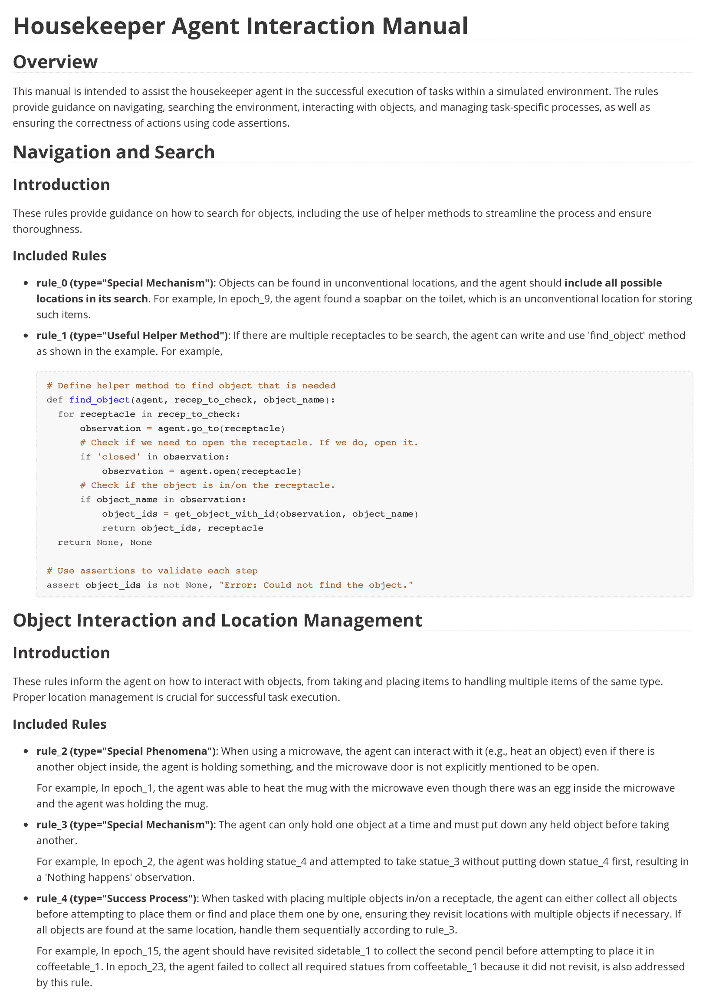

<!--yml

类别: 未分类

日期: 2025-01-11 12:37:27

-->

# AutoManual：通过互动环境学习由LLM智能体构建说明手册

> 来源：[https://arxiv.org/html/2405.16247/](https://arxiv.org/html/2405.16247/)

Minghao Chen¹,    Yihang Li²,    Yanting Yang³,    Shiyu Yu⁵,    Binbin Lin^(3,4$*$),    Xiaofei He²

¹计算机科学学院，杭州电子科技大学

²计算机辅助设计与计算机图形学国家重点实验室，浙江大学

³软件技术学院，浙江大学   ⁴Fullong Inc.   ⁵宁波港集团

minghaochen01@gmail.com

###### 摘要

基于大语言模型（LLM）的智能体在自动完成各领域任务（如机器人技术、游戏和网页导航）方面表现出了潜力。然而，这些智能体通常需要精心设计和专家提示才能解决特定领域的任务，这限制了它们的适应性。我们介绍了AutoManual，一个框架，它使LLM智能体能够通过交互自主构建理解，并适应新环境。AutoManual将环境知识分类为多种规则，并通过两个智能体以在线方式优化这些规则：1）规划者根据当前规则编码可操作的计划，用于与环境互动；2）构建者通过一个结构良好的规则系统更新规则，从而促进在线规则管理和关键信息的保留。为了减少规则管理中的幻觉问题，我们为构建者引入了基于案例的提示策略。最后，制式化智能体将这些规则编译成一份综合手册。自生成的手册不仅可以提高适应性，还能指导较小LLM的规划，同时便于人类阅读。在仅给出一个简单示范的情况下，AutoManual显著提高了任务成功率，在ALFWorld基准任务上，GPT-4-turbo达到了97.4%的成功率，GPT-3.5-turbo达到了86.2%的成功率。代码可在[https://github.com/minghchen/automanual](https://github.com/minghchen/automanual)上获取。

## 1 引言

最近，基于大型语言模型（LLM）的自主代理，如ReAct[ReAct](https://arxiv.org/html/2405.16247v4#bib.bib33)，Reflexion[Reflexion](https://arxiv.org/html/2405.16247v4#bib.bib16)，SayCan[SayCan](https://arxiv.org/html/2405.16247v4#bib.bib1)，WebGPT[WebGPT](https://arxiv.org/html/2405.16247v4#bib.bib10)和Voyager[Voyager](https://arxiv.org/html/2405.16247v4#bib.bib24)，已经展示了在有实际基础的环境中完成长期任务的潜力。这些LLM代理通过生成可在环境中执行的思维和行动来操作。对于定制环境，例如机器人[SayCan](https://arxiv.org/html/2405.16247v4#bib.bib1)；[CodeAP](https://arxiv.org/html/2405.16247v4#bib.bib7)；[ProgPrompt](https://arxiv.org/html/2405.16247v4#bib.bib18)；[ChatGPTEL](https://arxiv.org/html/2405.16247v4#bib.bib23)和游戏[GenerativeAI](https://arxiv.org/html/2405.16247v4#bib.bib14)；[Voyager](https://arxiv.org/html/2405.16247v4#bib.bib24)；[GITM](https://arxiv.org/html/2405.16247v4#bib.bib39)，先前的方法提供了详细的指令和上下文示例，以便使LLM熟悉行动功能（API）和目标环境。然而，与这些代理不同，人类可以通过动态互动自主构建和更新对陌生环境的理解。

目前有几种方法可以使LLM代理根据反馈进行反思[Reflexion](https://arxiv.org/html/2405.16247v4#bib.bib16)；[AdaPlanner](https://arxiv.org/html/2405.16247v4#bib.bib21) 或将成功的经验保存为技能[AdaPlanner](https://arxiv.org/html/2405.16247v4#bib.bib21)；[Voyager](https://arxiv.org/html/2405.16247v4#bib.bib24)；[ExpeL](https://arxiv.org/html/2405.16247v4#bib.bib35)以提高性能并减少对人工提供示例的依赖。然而，这些反思和技能并没有得到充分利用来促进对环境的更深入理解。因此，直接将保存的技能用作上下文示例可能会导致路径依赖问题，即代理盲目复制以往成功的路径，未能适应新场景。这种问题在具有高度变化性的现实世界情境中更为严重。

先前的工作ExpeL [ExpeL](https://arxiv.org/html/2405.16247v4#bib.bib35) 收集了LLM代理的轨迹并从中提取跨任务规则。然而，这些规则是离线提取的，使得ExpeL遭遇了与离线强化学习（Offline RL） [OfflineRL](https://arxiv.org/html/2405.16247v4#bib.bib6) 相同的分布偏移问题。同时，由于规则管理的简单性，其规则通常是空洞的，且对路径依赖问题没有帮助。在本文中，我们提出了一种新的框架，称为AutoManual，旨在构建一个井然有序的环境理解，从而有效地指导多任务规划。AutoManual利用一个动态规则系统，不仅能将有价值的经验（包括技能和反思）提取为不同类型的规则，还能在面对新情况时不断更新这些规则。此外，规则中还明确描述了容易出错的细节，从而提高规划的鲁棒性。

AutoManual遵循两个交替的迭代过程来优化规则。首先，给定一个回合的观察和任务，规划者代理利用当前发现的规则编写自由形式的代码作为可执行的计划。环境与规划者之间的交互将循环进行，直到回合结束。其次，基于这个轨迹，构建器代理将通过规则系统更新相关规则。这个在线更新机制能够及时验证规则是否存在偏差，并确保它们对规划者适用。规则优化后，整理者代理根据规则的应用场景对这些规则进行分类，并编写成Markdown格式的综合手册。

挑战在于使构建器能够准确地从长时间轨迹中提取适用的规则，因为大语言模型（LLM）容易生成虚假信息。为了解决这个问题，我们采用了基于案例的提示策略，指引构建器根据轨迹的案例专注于特定的规则。例如，如果轨迹中发生了错误，构建器首先需要判断错误的原因：是因为发生了未记录的情况，还是规划者未能遵循现有规则。根据这个答案，构建器将获得相应的提示来更新相关规则。

总结一下，我们的贡献如下：

+   •

    我们采用可执行的代码作为规划者代理与环境交互的方式。我们引入了一个结构化的规则系统，使构建器代理能够管理这些基于代码交互的多种类型的知识。

+   •

    我们提出了规划者和构建器代理之间的交替过程，以在线方式优化规则并解决路径依赖问题。为了提高可读性，引入了整理者代理来重新组织和形式化这些规则，并将其编写成Markdown手册。

+   •

    为了方便规则管理，我们采用了基于案例的提示策略，指导构建器为不同的轨迹案例管理特定类型的规则。

+   •

    从单一示范开始，AutoManual 可以为复杂环境如 ALFWorld 和 MiniWoB++ 生成详细的操作手册。这些手册使得 LLM 代理在 ALFWorld 上使用 GPT-4-turbo 达到 97.4% 的成功率，在 GPT-3.5-turbo 上为 86.2%；在 MiniWoB++ 上，GPT-4-turbo 的成功率为 98.3%，GPT-3.5-turbo 为 92.7%。

## 2 相关工作

### 2.1 LLM 在代理规划中的应用

大型语言模型（LLM）展现了强大的推理和规划能力 [GPT4](https://arxiv.org/html/2405.16247v4#bib.bib11) ; [ChatGPT](https://arxiv.org/html/2405.16247v4#bib.bib12) ; [CoT](https://arxiv.org/html/2405.16247v4#bib.bib28) ; [ReAct](https://arxiv.org/html/2405.16247v4#bib.bib33) ; [GITM](https://arxiv.org/html/2405.16247v4#bib.bib39)，并且比传统学习方法需要的示范要少得多。以这一规划能力为核心，LLM 代理正在被开发用于机器人技术 [SayCan](https://arxiv.org/html/2405.16247v4#bib.bib1) ; [CodeAP](https://arxiv.org/html/2405.16247v4#bib.bib7) ; [ProgPrompt](https://arxiv.org/html/2405.16247v4#bib.bib18) ; [LLM-Planner](https://arxiv.org/html/2405.16247v4#bib.bib20) ; [ChatGPTEL](https://arxiv.org/html/2405.16247v4#bib.bib23)，游戏玩法 [GenerativeAI](https://arxiv.org/html/2405.16247v4#bib.bib14) ; [Voyager](https://arxiv.org/html/2405.16247v4#bib.bib24) ; [DEPS](https://arxiv.org/html/2405.16247v4#bib.bib27) ; [GITM](https://arxiv.org/html/2405.16247v4#bib.bib39)，软件开发 [MetaGPT](https://arxiv.org/html/2405.16247v4#bib.bib3) ; [ChatDev](https://arxiv.org/html/2405.16247v4#bib.bib15)，以及其他领域 [Survey](https://arxiv.org/html/2405.16247v4#bib.bib30)。先前的研究 [Reflexion](https://arxiv.org/html/2405.16247v4#bib.bib16) ; [AdaPlanner](https://arxiv.org/html/2405.16247v4#bib.bib21) ; [ReAct](https://arxiv.org/html/2405.16247v4#bib.bib33) 允许代理根据环境反馈调整行动或计划，以改善规划性能。鉴于 LLM 强大的编程能力，一些研究工作，如 CodeAsPolicy [CodeAP](https://arxiv.org/html/2405.16247v4#bib.bib7)、ProgPrompt [ProgPrompt](https://arxiv.org/html/2405.16247v4#bib.bib18) 和 AdaPlanner [AdaPlanner](https://arxiv.org/html/2405.16247v4#bib.bib21)，建议使用 Python 代码作为 LLM 代理的计划。这种输出形式可以自动响应计划内的反馈，并比行动和 JSON 格式更能获得更好的性能 [AdaPlanner](https://arxiv.org/html/2405.16247v4#bib.bib21) ; [CodeAct](https://arxiv.org/html/2405.16247v4#bib.bib25)。

### 2.2 LLM 代理的自我改进

具身代理研究一直致力于通过交互体验使代理能够自我改进。与传统的基于学习的代理需要大量迭代优化不同，Reflexion [Reflexion](https://arxiv.org/html/2405.16247v4#bib.bib16)允许LLM代理反思之前的失败并迅速改进其计划。一些研究[ToT](https://arxiv.org/html/2405.16247v4#bib.bib32)；[AgentPro](https://arxiv.org/html/2405.16247v4#bib.bib34)；[LATS](https://arxiv.org/html/2405.16247v4#bib.bib36)结合了树搜索和反思，以有意地寻求更好的解决方案。除了失败经验之外，先前的研究[AdaPlanner](https://arxiv.org/html/2405.16247v4#bib.bib21)；[Voyager](https://arxiv.org/html/2405.16247v4#bib.bib24)；[GITM](https://arxiv.org/html/2405.16247v4#bib.bib39)利用成功的经验作为技能来辅助未来的规划。Voyager [Voyager](https://arxiv.org/html/2405.16247v4#bib.bib24)将生成和验证过的程序存入技能库，作为更复杂任务的新技能。AdaPlanner [AdaPlanner](https://arxiv.org/html/2405.16247v4#bib.bib21)也会发现并归档成功的程序到技能记忆中，以备未来类似任务使用。然而，这些方法在存储技能后停止更新技能，导致不可避免的路径依赖问题。

另一个系列的工作[PromptAgent](https://arxiv.org/html/2405.16247v4#bib.bib26)；[LLMOptim](https://arxiv.org/html/2405.16247v4#bib.bib31)；[LLMPrompt](https://arxiv.org/html/2405.16247v4#bib.bib38)将LLM作为提示优化器来提升其自身性能。与我们的方法不同，我们的方法解决的是陌生环境中的挑战，而这些研究则侧重于增强LLM推理性能。因此，它们优化的提示通常简短，并且缺乏环境知识。

### 2.3 LLM代理的记忆管理

对于LLM代理来说，从过去的经验中学习也可以视为管理情节记忆[Reflexion](https://arxiv.org/html/2405.16247v4#bib.bib16)。CLIN [CLIN](https://arxiv.org/html/2405.16247v4#bib.bib9)提议通过不断更新一个以因果抽象为中心的记忆来进行新的尝试。增强检索规划（RAP）[RAP](https://arxiv.org/html/2405.16247v4#bib.bib4)会检索与当前情况相对应的过去经验。MemGPT [MemGPT](https://arxiv.org/html/2405.16247v4#bib.bib13)允许LLM选择在工作记忆中保留的内容，并在长期记忆中搜索信息。生成型代理[GenerativeAI](https://arxiv.org/html/2405.16247v4#bib.bib14)根据记忆的最近性、重要性和与当前情况的相关性来检索记忆。生成型代理还会生成树状结构的反思，但它们更专注于连续的场景而非面向任务的规则。

### 2.4 LLM用于规则发现

最近的几项研究也探讨了大语言模型（LLM）的规则发现能力。Zhu等人[LLMLR](https://arxiv.org/html/2405.16247v4#bib.bib40)提出了假设到理论（HtT）方法，使LLM能够为基本推理任务归纳和推导规则。对于LLM代理，ExpeL[ExpeL](https://arxiv.org/html/2405.16247v4#bib.bib35)收集反射代理的轨迹并从中提取跨任务规则。此外，AutoGuide[AutoGuide](https://arxiv.org/html/2405.16247v4#bib.bib2)生成状态感知规则并检索与测试时状态相关的规则。与ExpeL和AutoGuide不同，它们是从离线经验中提取规则，而我们则通过在线方式更新规则，验证其可靠性和适用性。关于差异的更多讨论，请参见附录C。

## 3 方法

### 3.1 AutoManual概览

我们的AutoManual框架，如图[1](https://arxiv.org/html/2405.16247v4#S3.F1 "Figure 1 ‣ 3.1 AutoManual Overview ‣ 3 Methods ‣ AutoManual: Constructing Instruction Manuals by LLM Agents via Interactive Environmental Learning")所示，由三个主要阶段组成。构建阶段：规划代理和构建代理协作，从互动环境中建立规则。当规则超过最大数量时，整合代理合并或删除冗余规则。制定阶段：制定者代理对规则进行分类，总结要点，并将其整理成Markdown格式的手册。测试阶段：基于生成的手册，测试时规划代理通过测试任务和场景进行评估。

从形式上讲，互动环境可以建模为部分可观察马尔可夫决策过程（POMDP）：$(\mathcal{S},\mathcal{A},\mathcal{T},\mathcal{G},\mathcal{O})$。在每个回合开始时，将初始化一个场景$s_{0}\in\mathcal{S}$，给定一个文本驱动的任务$g\in\mathcal{G}$以及初始观察$o_{0}\in\mathcal{O}$（处理为文本形式）。可以通过允许的动作（API）集$\mathcal{A}$与环境进行互动。在执行一个动作$a\in\mathcal{A}$后，环境将返回该动作的结果和新的观察$o^{\prime}$，这基于动态$T(s^{\prime}|s,a)\in\mathcal{T}$和$O(o^{\prime}|s^{\prime})$。最后，当回合结束时，将返回一个二元奖励$r\in\{-1,1\}$，指示任务的失败或成功。

图1：AutoManual概览：AutoManual分为三个阶段：（1）构建阶段：规划代理通过编写可执行计划与环境互动。在接收到规划代理的当前轨迹后，构建代理通过在线规则系统管理规则。（2）制定阶段：制定者代理将结果规则整理成Markdown手册。（3）测试阶段：测试时规划代理利用手册完成测试任务。

我们将学习环境规则视为一个优化问题：

|  | $\max_{\Theta}E_{s_{0},g}E_{\rho(\cdot\mid\Theta)}r(\tau_{\rho})$ |  | (1) |
| --- | --- | --- | --- |

其中，$\Theta$表示我们规则系统中的所有规则，$\rho(\cdot|\Theta)$表示规划者在当前规则$\Theta$下的策略，$\tau_{\rho}$表示从$[o_{0},g]$开始的$\rho(\cdot|\Theta)$轨迹。经典的策略梯度方法[REINFORCE](https://arxiv.org/html/2405.16247v4#bib.bib29)通过随机梯度上升来解决此类问题，即执行当前策略以获得集奖励，并通过反向传播梯度来更新参数。

受这种在线强化学习范式的启发，我们通过两种替代过程来优化规则$\Theta$：1\. 规划者通过与环境的交互来实践当前规则。2\. 构建者根据这个轨迹更新规则$\Theta$。与传统的参数优化方法相比，低效的梯度上升方法被基于文本的规则管理所取代。我们设计了一个结构良好的规则系统，详见第[3.3](https://arxiv.org/html/2405.16247v4#S3.SS3 "3.3 Builder and Consolidator Agents for Rule Management ‣ 3 Methods ‣ AutoManual: Constructing Instruction Manuals by LLM Agents via Interactive Environmental Learning")节，以确保规则更新有助于奖励的增加。此外，为了限制人工专业知识的作用，我们仅提供一个简单的示例来展示输出格式，并通过这个示例手动推导出几个初始规则，作为优化的起点。

### 3.2 交互规划的规划者代理

正如[Voyager](https://arxiv.org/html/2405.16247v4#bib.bib24)和[AdaPlanner](https://arxiv.org/html/2405.16247v4#bib.bib21)的成功所示，基于代码的规划可以利用LLM强大的编程能力，并自动响应计划中的反馈。Voyager和AdaPlanner输出并完善任务的完整解决方案函数，这个函数是可复用的。然而，这种函数形式的输出难以根据环境反馈进行调整，因为它需要保持计划的完整性。

我们的规划代理输出自由形式的代码作为其计划，这与LLM的自然编程能力更为契合[CodeAP](https://arxiv.org/html/2405.16247v4#bib.bib7)；[ChatGPTFR](https://arxiv.org/html/2405.16247v4#bib.bib22)。这种形式通过仅生成当前环境情况和反馈所需的代码，而无需整合之前执行的代码，从而简化了规划过程。如图[2](https://arxiv.org/html/2405.16247v4#S3.F2 "图 2 ‣ 3.2 交互式规划的规划代理 ‣ 3 方法 ‣ AutoManual：通过交互式环境学习构建LLM代理的说明手册")所示，在新情节开始时，规划者会收到系统提示、当前规则$\Theta$、来自技能和反思库的相关样本、目标任务$g$以及初始观察$o_{0}$。系统提示包括角色、可执行的动作$\mathcal{A}$、响应指南以及一个简单示例（详见附录H）。在每个周期中，规划者的输出分为四个部分：

1.  1.

    分析：对当前情况的理解以及对先前错误的反思（如果存在的话）。

1.  2.

    相关规则：在此情境下需要考虑的规则（及其ID）。

1.  3.

    总体计划：完成任务的总体计划。

1.  4.

    代码：一段分步骤的Python代码。鼓励规划者在代码中定义有用的函数，这些函数可能在类似情境下重复使用。

我们将规划者的这一反应表示为$[\textit{thought}_{t},\textit{code}_{t}]$，其中$\textit{thought}_{t}$表示前三个部分。$\textit{code}_{t}$是在环境中执行的代码，之后是反馈$c_{t}$，它会影响随后的输出周期。这个过程会迭代进行，直到情节结束或达到响应限制为止。

如图[2](https://arxiv.org/html/2405.16247v4#S3.F2 "图 2 ‣ 3.2 交互式规划的规划代理 ‣ 3 方法 ‣ AutoManual：通过交互式环境学习构建LLM代理的说明手册")所示，根据情节奖励，我们将结果分为直接成功、间接成功（发生错误但后续解决）和失败。在直接成功或间接成功的情况下，规划者将被提示将其之前的代码整理成代码块。对于间接成功，规划者还会总结导致错误的失误和误解。对于失败的情况，规划者将被提示仔细反思失败的原因，提出合理的改正建议，并指定导致错误的代码段。我们将规划者的这一反应称为结论。最终，我们获得规划者的轨迹：

|  | $\tau_{\rho}=(o_{0},g,[\textit{thought}_{1},\textit{code}_{1}],c_{1},...,[% \textit{thought}_{T},\textit{code}_{T}],c_{T},\textit{conclusion})$ |  | (2) |
| --- | --- | --- | --- |

图2：规划者轨迹：根据当前任务和规则，规划者将通过自由格式代码与环境进行交互。根据轨迹结果，规划者将生成相应的结论，并将其保存在技能或反思库中。

技能库和反思库：除了规则外，我们还管理并传递先前回合的结论，这些结论为生成规划代码提供了必要的细节。在直接或间接成功的情况下，我们将结论中的代码块保存为该任务类型的技能¹¹1所有任务在ALFWorld中被分为6种任务类型，例如：pick_heat_then_place，look_at_obj_in_light。对于每个任务类型，我们仅存储一个技能代码。并将其存入技能库[AdaPlanner](https://arxiv.org/html/2405.16247v4#bib.bib21)；[Voyager](https://arxiv.org/html/2405.16247v4#bib.bib24)。在失败的情况下，我们将其结论作为该任务类型的反思保存到反思库中。当出现新任务时，最相似任务的代码块将从技能库中检索。如果新任务类型没有现有技能，将返回该任务类型的反思。如介绍中所述，与规则相比，这些技能和反思包含更多编程细节，但对新场景的泛化能力较弱，即路径依赖问题。

代理之间的合作：在我们的框架中，规则管理不仅仅是构建者的责任；规划者也通过明确识别其响应中所涉及的规则，扮演着关键角色。通过将规划者的思维包含在轨迹$\tau$中并提供给构建者，促进了这种合作。这种协同作用增强了对有问题规则的识别和调整。此外，规划者的结论包含了详细的成功过程或对错误的反思，这进一步帮助构建者管理相应类型的规则。

### 3.3 构建者和整理者代理用于规则管理

在接收到轨迹$\tau_{\rho}$后，构建者需要通过规则系统管理规则。

图3：案例条件提示：根据当前轨迹，构建者将主要错误的原因分类为“规则不完善”或“代理不完善”。然后，构建者将获取基本提示和相应的提示来指导其规则管理。

规则系统：我们直观地将规则定义为有助于任务完成的知识类型，包括对观察现象 $T(o^{\prime}|o,a)$ 的分析、机制 $T(s^{\prime}|s,a)$、以及奖励 $r$ 和 $\tau_{\rho}$ 之间的关联，即成功过程或发生的错误。因此，与从轨迹中推导一般性见解的 ExpeL [ExpeL](https://arxiv.org/html/2405.16247v4#bib.bib35) 和 AutoGuide [AutoGuide](https://arxiv.org/html/2405.16247v4#bib.bib2) 不同，我们的系统将规则分类为六种具体类型，以提取针对轨迹不同方面的环境知识。此外，系统中的每个规则都通过示例属性进行增强，以说明其应用和重要细节，使其更加具体且易于理解。具体而言，规则系统中的每个规则都有以下四个属性：

1.  1.

    规则类型：规则的类型，选择自【“特殊现象”、“特殊机制”、“有用的辅助方法”、“成功过程”、“修正错误”、“未解决错误”】；

1.  2.

    规则内容：规则的描述，开始时列出其适用场景的范围；

1.  3.

    示例：轨迹中的一个示例或代码演示此规则，在其中可以添加额外的备注，如易错细节等；

1.  4.

    验证日志：跟踪规则应用和更新的日志，包括跟踪规则演变的剧集和规则 ID，为构建器和整合者提供参考。

构建器通过规则系统的以下功能管理规则：

+   •

    write_rule(**rule_attributes): 写下一个新规则及其四个属性。

+   •

    update_rule(rule_id, **rule_attributes): 重写现有规则的属性。

+   •

    stop_generating(): 当轨迹不再需要或不足以推导出更多新规则时，应调用此功能。

类似于生成型代理中的层次性反思 [GenerativeAI](https://arxiv.org/html/2405.16247v4#bib.bib14)，我们允许构建器利用现有规则来推导出更一般或更深层的规则，并在规则内容或验证日志中记录它们的依赖关系，具体内容将在附录 D 中进一步讨论。

案例条件提示：为了降低因从失败轨迹推导成功规则而导致错误规则创建的风险，我们采用了案例条件提示。如图[3](https://arxiv.org/html/2405.16247v4#S3.F3 "图 3 ‣ 3.3 规则管理的构建器与整合器代理 ‣ 3 方法 ‣ AutoManual：通过互动环境学习构建 LLM 代理的操作手册")所示，构建器首先分析并确定主要错误来源是“规则不完善”还是“代理不完善”。基于这一分析和轨迹结果，针对性提示引导构建器进行规则管理²²2注意：这些针对构建器的提示是环境无关的，并在所有环境中共享。例如，在由于规则不完善导致的间接成功的情况下（案例 $2$），提示将引导构建器提取或更新成功过程、辅助方法和错误反思，并应用于相应的规则类型。最后，构建器回应潜在规则，详细说明它们与现有规则的关系，并使用规则系统的功能进行规则管理。

规则整合：当规则系统中的规则数量超过 $N_{max}$ 时，整合器代理介入，整合相关规则并删除冗余规则。它使用规则系统的三个功能：get_trajectory(episode_id)、update_rule(rule_id, **rule_attributes) 和 delete_rule(rule_id)。根据当前的规则，整合器识别可能相关或重叠的规则，使用 get_trajectory 函数调查它们所依赖的轨迹，最后调用其余的函数进行规则管理。在管理过程中，整合器确保整合保留规则和示例的细节。

### 3.4 手动制定

一旦构建阶段完成，我们可以获得一套针对不同情况的规则，这些规则的适用性已通过在线优化得到了验证。我们的下一个目标是提升这些规则的可读性和全局理解性。为此，我们引入了Formulator代理，它旨在将这些规则转化为用户友好的手册，类似于教师通过易于理解的课程传授大量知识。正如图[1](https://arxiv.org/html/2405.16247v4#S3.F1 "Figure 1 ‣ 3.1 AutoManual Overview ‣ 3 Methods ‣ AutoManual: Constructing Instruction Manuals by LLM Agents via Interactive Environmental Learning")所示，Formulator首先根据目标场景对所有规则进行分类。这种分类有助于手册的结构化，并确保相关规则能够一起讨论，从而增强信息的逻辑流动性和可访问性。对于每个类别，Formulator会草拟一个介绍，总结其包含的规则，并突出特定场景下的关键点和总体原则。最后，Formulator将规则及其介绍汇编成一个全面的手册，并以Markdown格式进行整理。

## 4 实验

与之前的研究工作[AutoGuide](https://arxiv.org/html/2405.16247v4#bib.bib2)；[AdaPlanner](https://arxiv.org/html/2405.16247v4#bib.bib21)一致，我们在三个互动环境中进行了实验：（1）ALFWorld [ALFWorld](https://arxiv.org/html/2405.16247v4#bib.bib17)是一个基于文本的虚拟家庭环境，包含六种不同的任务类型。我们在ALFWorld的训练集上对36个任务（每种任务类型6个任务）进行了构建阶段实验，每个任务仅运行一次。参考以往的研究[Reflexion](https://arxiv.org/html/2405.16247v4#bib.bib16)；[AdaPlanner](https://arxiv.org/html/2405.16247v4#bib.bib21)；[ReAct](https://arxiv.org/html/2405.16247v4#bib.bib33)，我们在验证集的未见任务集上进行测试阶段实验，验证集包含这六种类型中的134个任务。（2）MiniWoB++ [MiniWoB](https://arxiv.org/html/2405.16247v4#bib.bib8)是一个模拟的网页环境，代理通过执行键盘和鼠标操作在互联网上完成各种任务。之前的研究[RCI](https://arxiv.org/html/2405.16247v4#bib.bib5)；[AdaPlanner](https://arxiv.org/html/2405.16247v4#bib.bib21)从MiniWoB++任务中选择了9种带环境反馈的任务类型和44种不带反馈的任务类型。我们在9种带反馈的任务类型或所有53种任务类型上进行了实验。在每个阶段，我们从每种任务类型中随机抽取6个任务。（3）WebArena [WebArena](https://arxiv.org/html/2405.16247v4#bib.bib37)通过模拟流行网站的功能和数据引入了真实的网页环境。由于其巨大的观察和行动空间以及需要较长规划周期的任务，这个基准对LLM代理提出了重大挑战。参考AutoGuide [AutoGuide](https://arxiv.org/html/2405.16247v4#bib.bib2)，我们的实验重点在于WebArena中的Reddit领域。

在构建和制定阶段，我们为所有代理使用GPT-4-turbo（gpt-4-1106-preview）。在测试阶段，我们为Planner代理配备了GPT-4-turbo或GPT-3.5-turbo（gpt-3.5-turbo-1106），以评估生成的手册对相对较小的LLM的影响。

比较方法：在实验中，我们将 AutoManual 与以下 LLM 代理方法进行比较：（1）ReAct [ReAct](https://arxiv.org/html/2405.16247v4#bib.bib33) 提示 LLM 生成使用 CoT [CoT](https://arxiv.org/html/2405.16247v4#bib.bib28) 和下一步动作的推理轨迹；（2）Reflexion [Reflexion](https://arxiv.org/html/2405.16247v4#bib.bib16) 代理生成任务反馈信号的反思，并将其保存在记忆中以供后续试验使用；（3）ExpeL [ExpeL](https://arxiv.org/html/2405.16247v4#bib.bib35) 从 Reflexion 代理的离线轨迹中提取见解和技能；（4）RCI [RCI](https://arxiv.org/html/2405.16247v4#bib.bib5) 代理递归批评并改进其输出以解决计算机任务；（5）AdaPlanner [AdaPlanner](https://arxiv.org/html/2405.16247v4#bib.bib21) 允许 LLM 代理生成并自适应地完善代码风格的计划；（6）Planner+Lib. 代表我们装备了技能和反思库的 Planner 代理（§[3.2](https://arxiv.org/html/2405.16247v4#S3.SS2 "3.2 Planner Agent for Interactive Planning ‣ 3 Methods ‣ AutoManual: Constructing Instruction Manuals by LLM Agents via Interactive Environmental Learning")），在构建和测试阶段不使用任何规则。我们使用与我们相同的 GPT-3.5 和 GPT-4 版本重新实现了先前的方法，以确保公平比较。

ReAct、Reflexion 和 ExpeL 为 LLM 代理提供了 ALFWorld 的 $12$ 个人工示例（每个任务类型 $2$ 个示例）。对于 AdaPlanner，提供了 ALFWorld 的 $6$ 个人工示例（每个任务类型 $1$ 个示例），用于技能发现的开始。对于我们的方法，代理只提供了 ALFWorld 上最简单任务（放置）的一个人工示例。在 MiniWob++ 上，我们的代理为有反馈的任务提供了一个人工示例（搜索引擎），并为所有任务提供了 4 个示例。在 WebArena 上，我们的代理也提供了一个人工演示。为了减少随机性，我们每个实验进行了三次并报告了平均值。更多关于实现和 AutoManual 提示的细节，请见附录。

### 4.1 主要结果

表 1：LLM 代理方法在 ALFWorld 测试任务中的成功率（%）。对于每种方法，列出了使用的所有人工示例的数量。“Planner+Lib.” 仅表示在构建和测试阶段使用技能与反思库。我们将所有实验运行 3 次，并显示平均值。

| 方法 | 示例 | 放置 | 清理 | 加热 | 冷却 | 检查 | 放置两个 | 所有 |
| --- | --- | --- | --- | --- | --- | --- | --- | --- |
| 测试 LLM: GPT-3.5-turbo |
| ReAct [ReAct](https://arxiv.org/html/2405.16247v4#bib.bib33) | 12 | 75.0 | 24.7 | 37.7 | 36.4 | 44.4 | 11.8 | 41.9 |
| Reflexion [Reflexion](https://arxiv.org/html/2405.16247v4#bib.bib16) | 12 | 87.5 | 44.1 | 73.9 | 50.0 | 61.1 | 35.3 | 59.8 |
| ExpeL [ExpeL](https://arxiv.org/html/2405.16247v4#bib.bib35) | 12 | 62.5 | 61.3 | 30.4 | 61.9 | 55.5 | 35.3 | 52.2 |
| AdaPlanner [AdaPlanner](https://arxiv.org/html/2405.16247v4#bib.bib21) | 6 | 83.3 | 46.2 | 65.2 | 74.2 | 68.5 | 52.9 | 63.3 |
| Planner+Lib. | 1 | 77.8 | 88.2 | 82.6 | 72.7 | 37.0 | 27.5 | 66.5 |
| AutoManual | 1 | 95.8 | 79.6 | 87.0 | 78.8 | 100.0 | 66.7 | 86.2 |
| 测试 LLM: GPT-4-turbo |
| ReAct [ReAct](https://arxiv.org/html/2405.16247v4#bib.bib33) | 12 | 95.8 | 76.3 | 69.6 | 86.4 | 72.2 | 52.9 | 76.8 |
| Reflexion [Reflexion](https://arxiv.org/html/2405.16247v4#bib.bib16) | 12 | 100.0 | 95.7 | 78.3 | 86.4 | 77.8 | 70.6 | 85.9 |
| ExpeL [ExpeL](https://arxiv.org/html/2405.16247v4#bib.bib35) | 12 | 94.4 | 82.8 | 72.4 | 81.8 | 72.2 | 58.8 | 79.2 |
| AdaPlanner [AdaPlanner](https://arxiv.org/html/2405.16247v4#bib.bib21) | 6 | 88.9 | 90.3 | 85.5 | 75.8 | 64.8 | 41.2 | 76.4 |
| Planner+Lib. | 1 | 100.0 | 93.5 | 100.0 | 93.9 | 88.9 | 39.2 | 88.1 |
| AutoManual | 1 | 100.0 | 98.9 | 100.0 | 95.4 | 100.0 | 90.2 | 97.4 |

表 2: LLM 代理方法在9种任务类型（带反馈）和MiniWoB++的所有53种任务类型上的成功率（%）。每种方法使用的人工示例数量列出。

| 方法 | 示例 | 有反馈（9种类型） | 示例 | 所有类型（53种类型） |
| --- | --- | --- | --- | --- |
| 测试 LLM: GPT-3.5-turbo |  |
| RCI [ReAct](https://arxiv.org/html/2405.16247v4#bib.bib33) | 22 | 45.6 | 104 | 77.3 |
| AdaPlanner [AdaPlanner](https://arxiv.org/html/2405.16247v4#bib.bib21) | 13 | 71.6 | 38 | 89.4 |
| Planner+Lib. | 1 | 63.6 | 4 | 87.0 |
| AutoManual | 1 | 82.2 | 4 | 92.7 |
| 测试 LLM: GPT-4-turbo |  |
| RCI [ReAct](https://arxiv.org/html/2405.16247v4#bib.bib33) | 22 | 60.4 | 104 | 88.6 |
| AdaPlanner [AdaPlanner](https://arxiv.org/html/2405.16247v4#bib.bib21) | 13 | 74.1 | 38 | 90.3 |
| Planner+Lib. | 1 | 80.2 | 4 | 94.4 |
| AutoManual | 1 | 94.5 | 4 | 98.3 |

表 3: 在 WebArena (Reddit) 上的测试。

| 方法 | 示例 | 成功率(%) |
| --- | --- | --- |
| ReAct [WebArena](https://arxiv.org/html/2405.16247v4#bib.bib37) | 2 | 6.0 |
| AutoGuide [AutoGuide](https://arxiv.org/html/2405.16247v4#bib.bib2) | 19 | 43.7 |
| SteP [SteP](https://arxiv.org/html/2405.16247v4#bib.bib19) | 14 | 55.0 |
| Planner | 1 | 51.1 |
| AutoManual | 1 | 65.1 |

ALFWorld上的主要结果：如表[1](https://arxiv.org/html/2405.16247v4#S4.T1 "Table 1 ‣ 4.1 Main Results ‣ 4 Experiments ‣ AutoManual: Constructing Instruction Manuals by LLM Agents via Interactive Environmental Learning")所示，AutoManual显著优于现有方法，使用GPT-3.5-turbo进行测试时的整体成功率为86.2%，使用GPT-4-turbo时为97.4%。值得注意的是，AutoManual对环境的先验知识要求较少，只需一个人类示例即可取得优异的结果。相比之下，ExpeL引导的规则几乎没有提高性能，因为其离线轨迹由单一动作组成，而非代码。我们发现AdaPlanner的表现低于报告结果。一个原因是AdaPlanner要求LLM输出特定格式以完成其功能型代码，而这对创意型LLM（如GPT-4-turbo）来说较为困难。此外，AdaPlanner和Planner+Lib.不如AutoManual，因为它们仅将成功路径作为技能存储，难免面临路径依赖问题。特别是在Put Two任务中，存在多种场景，如“两个物体可以出现在同一个接收器或不同接收器中”，这些场景需要不同的处理流程来解决（附录G展示了一个示例）。此外，Planner+Lib.常常未标记其技能中的易出错点，如“目标物体可能出现在非常规位置”。

MiniWoB++上的主要结果：如表[2](https://arxiv.org/html/2405.16247v4#S4.T2 "Table 2 ‣ 4.1 Main Results ‣ 4 Experiments ‣ AutoManual: Constructing Instruction Manuals by LLM Agents via Interactive Environmental Learning")所示，AutoManual的表现远超以往的方法和Planner+Lib.。特别是在9种带反馈的任务类型中，这些任务具有较高的多样性，要求LLM代理应对各种情况。例如，登录用户弹窗类型的任务会随时中断代理的计划，要求代理应对突发情况。因此，单纯模仿之前的成功经验而不提取针对性的规则，会导致任务失败。此外，由于自由形式代码的灵活性，我们的方法在适应性上表现更好，并且所需的专家示例少于以往的方法。

（a）跨任务类型与单任务类型对比。

（b）AutoManual 与技能库对比。

图4：（a）在ALFWorld上测试GPT-4-turbo或GPT-3.5-turbo时，带标准差的成功率曲线。构建是在跨任务或单任务类型上进行的。（b）在MiniWob++上使用AutoManual或Planner+Lib.进行测试时，带标准差的成功率曲线，任务为9种类型，并包含反馈。

表4：在使用GPT-4-turbo进行测试时，AutoManual在ALFWorld上的消融研究。

| 在线 | 技能&反思库 | 案例提示 | 公式化 | 平均错误步骤（$\downarrow$） | 成功率（%） |
| --- | --- | --- | --- | --- | --- |
|  |  |  |  | 2.3 | 77.6 |
|  | ✓ |  |  | 1.5 | 88.1 |
|  | ✓ | ✓ | ✓ | 1.3 | 90.7 |
| ✓ |  | ✓ | ✓ | 1.6 | 89.5 |
| ✓ | ✓ |  | ✓ | 1.0 | 93.8 |
| ✓ | ✓ | ✓ |  | 0.5 | 96.5 |
| ✓ | ✓ | ✓ | ✓ | 0.3 | 97.4 |

学习曲线。我们展示了逐步增加构建阶段任务时的成功率曲线（使用GPT-4-turbo或GPT-3.5-turbo进行测试），如图[4](https://arxiv.org/html/2405.16247v4#S4.F4 "图 4 ‣ 4.1 主要结果 ‣ 4 实验 ‣ AutoManual：通过交互式环境学习构建LLM代理的说明手册")所示。在左侧图像中，我们共享所有任务类型的规则（跨任务类型），如同AutoManual，或者每种任务类型在构建阶段时构建一组单独的规则（单任务类型）。图[4](https://arxiv.org/html/2405.16247v4#S4.F4 "图 4 ‣ 4.1 主要结果 ‣ 4 实验 ‣ AutoManual：通过交互式环境学习构建LLM代理的说明手册")（a）表明，跨任务类型共享规则有助于规则优化。每种任务类型的规则加深了对环境的理解，从而促进了其他任务的规划。在图[4](https://arxiv.org/html/2405.16247v4#S4.F4 "图 4 ‣ 4.1 主要结果 ‣ 4 实验 ‣ AutoManual：通过交互式环境学习构建LLM代理的说明手册")（b）中，我们比较了AutoManual和Planner+Lib.在MiniWob++中9个任务的反馈情况。我们发现，Planner+Lib.倾向于在较低的成功率下陷入困境。在面对高度多样化的场景时，技能库无法表达环境背后的规则，从而陷入路径依赖问题。

### 4.2 消融研究

在这项消融研究中，我们量化了AutoManual框架中每个核心组件对性能的影响，特别关注任务执行中的成功率和错误减少情况。由于我们允许规划器最多重新规划3次，每个任务最多可能有4个错误步骤。

在线与离线规则管理：我们通过收集所有轨迹并从中管理规则，执行离线AutoManual。如表[4](https://arxiv.org/html/2405.16247v4#S4.T4 "表 4 ‣ 4.1 主要结果 ‣ 4 实验 ‣ AutoManual：通过交互式环境学习构建LLM代理的说明手册")所示，缺乏在线规则管理时，生成的手册只能略微改善规划（从88.1%提高到90.7%）。这是因为轨迹中会出现更多日常性的错误和更少的直接成功（分布转移问题），并且规则无法通过环境反馈进行验证。

技能与反思库：检索历史结论对于正确规划至关重要，因为它们记录了大量的交互细节，可以补充规则。没有它们，细节中的错误会增多，成功率从97.4%下降至89.5%。然而，正如前文所述，单纯使用经验而不引导规则会导致路径依赖。

案例条件化提示：这一策略通过减少幻觉，进一步改善了规则管理过程，成功率从93.8%提高至97.4%。这些提示确保构建者合理且有依据地更新规则。

手册制定效果：将规则最终制定为全面手册，有助于实现97.4%的成功率，并减少了平均错误步骤，证明了以有组织和易于理解的格式呈现基于规则的知识的有效性。它不仅帮助规划者掌握多个规则，而且对人类阅读者也十分友好。

## 5 结论

本文介绍了AutoManual，一个显著推动大语言模型（LLM）代理发展的框架，通过在线规则优化实现了适应性和持续学习。利用结构化的规则系统，AutoManual自主生成全面的手册，并在ALFWorld和MiniWoB++等基准测试中取得了高成功率。这一方法减少了对人工示例和专家干预的依赖，展示了增强代理泛化能力并解决路径依赖问题的强大方法。

## 6 致谢

感谢Zhe Zeng博士在OpenAI API和GPT Plus服务方面的宝贵帮助。此项工作部分得到了中国国家自然科学基金（资助号：62273303）的支持，部分得到了永江人才引进计划（资助号：2022A-240-G）的支持。

## 参考文献

+   [1] Michael Ahn, Anthony Brohan, Noah Brown, Yevgen Chebotar, Omar Cortes, Byron David, Chelsea Finn, Keerthana Gopalakrishnan, Karol Hausman, Alexander Herzog, Daniel Ho, Jasmine Hsu, Julian Ibarz, Brian Ichter, Alex Irpan, Eric Jang, Rosario Jauregui Ruano, Kyle Jeffrey, Sally Jesmonth, Nikhil Jayant Joshi, Ryan C. Julian, Dmitry Kalashnikov, Yuheng Kuang, Kuang-Huei Lee, Sergey Levine, Yao Lu, Linda Luu, Carolina Parada, Peter Pastor, Jornell Quiambao, Kanishka Rao, Jarek Rettinghouse, Diego M Reyes, Pierre Sermanet, Nicolas Sievers, Clayton Tan, Alexander Toshev, Vincent Vanhoucke, F. Xia, Ted Xiao, Peng Xu, Sichun Xu, and Mengyuan Yan. 做我所做的，而不是我所说的：将语言与机器人能力结合。发表于《机器人学习会议》，2022年。

+   [2] Yao Fu, Dong-Ki Kim, Jaekyeom Kim, Sungryull Sohn, Lajanugen Logeswaran, Kyunghoon Bae, and Honglak Lee. Autoguide: 自动生成和选择状态感知指南用于大语言模型代理。ArXiv, abs/2403.08978, 2024年。

+   [3] Sirui Hong, Xiawu Zheng, Jonathan P. Chen, Yuheng Cheng, Ceyao Zhang, Zili Wang, Steven Ka Shing Yau, Zi Hen Lin, Liyang Zhou, Chenyu Ran, Lingfeng Xiao, 和 Chenglin Wu. Metagpt：多代理协作框架的元编程。ArXiv, abs/2308.00352, 2023年。

+   [4] Tomoyuki Kagaya, Thong Jing Yuan, Yuxuan Lou, Jayashree Karlekar, Sugiri Pranata, Akira Kinose, Koki Oguri, Felix Wick, 和 Yang You. Rap：具有上下文记忆的检索增强规划，用于多模态LLM代理。ArXiv, abs/2402.03610, 2024年。

+   [5] Geunwoo Kim, Pierre Baldi, 和 Stephen Marcus McAleer. 语言模型可以解决计算机任务。载于《神经信息处理系统》，2023年。

+   [6] Sergey Levine, Aviral Kumar, G. Tucker, 和 Justin Fu. 离线强化学习：教程、综述与开放问题的展望。ArXiv, abs/2005.01643, 2020年。

+   [7] Jacky Liang, Wenlong Huang, F. Xia, Peng Xu, Karol Hausman, Brian Ichter, Peter R. Florence, 和 Andy Zeng. 代码作为策略：面向具身控制的语言模型程序。2023年IEEE国际机器人与自动化会议（ICRA），页面9493–9500，2022年。

+   [8] Evan Zheran Liu, Kelvin Guu, Panupong Pasupat, Tianlin Shi, 和 Percy Liang. 基于工作流引导探索的网页接口强化学习。载于《国际学习表示会议（ICLR）》，2018年。

+   [9] Bodhisattwa Prasad Majumder, Bhavana Dalvi, Peter Alexander Jansen, Oyvind Tafjord, Niket Tandon, Li Zhang, Chris Callison-Burch, 和 Peter Clark. Clin：一个不断学习的语言代理，用于快速任务适应和泛化。ArXiv, abs/2310.10134, 2023年。

+   [10] Reiichiro Nakano, Jacob Hilton, Suchir Balaji, Jeff Wu, Ouyang Long, Christina Kim, Christopher Hesse, Shantanu Jain, Vineet Kosaraju, William Saunders, Xu Jiang, Karl Cobbe, Tyna Eloundou, Gretchen Krueger, Kevin Button, Matthew Knight, Benjamin Chess, 和 John Schulman. Webgpt：借助浏览器的人类反馈问答系统。ArXiv, abs/2112.09332, 2021年。

+   [11] OpenAI. GPT-4技术报告。ArXiv, abs/2303.08774, 2023年。

+   [12] Long Ouyang, Jeff Wu, Xu Jiang, Diogo Almeida, Carroll L. Wainwright, Pamela Mishkin, Chong Zhang, Sandhini Agarwal, Katarina Slama, Alex Ray, John Schulman, Jacob Hilton, Fraser Kelton, Luke E. Miller, Maddie Simens, Amanda Askell, Peter Welinder, Paul Francis Christiano, Jan Leike, 和 Ryan J. Lowe. 训练语言模型以遵循指令并通过人类反馈进行优化。载于《神经信息处理系统》，2022年。

+   [13] Charles Packer, Vivian Fang, Shishir G. Patil, Kevin Lin, Sarah Wooders, 和 Joseph E. Gonzalez. Memgpt：迈向将LLM作为操作系统的目标。ArXiv, abs/2310.08560, 2023年。

+   [14] Joon Sung Park, Joseph C. O’Brien, Carrie J. Cai, Meredith Ringel Morris, Percy Liang, 和 Michael S. Bernstein. 生成代理：人类行为的互动模拟。载于《第36届年度ACM用户界面软件与技术研讨会论文集》，2023年。

+   [15] Chen Qian, Xin Cong, Cheng Yang, Weize Chen, Yusheng Su, Juyuan Xu, Zhiyuan Liu, Maosong Sun 和 Wei Liu。软件开发中的交流代理。ArXiv, abs/2307.07924, 2023。

+   [16] Noah Shinn, Federico Cassano, Beck Labash, Ashwin Gopinath, Karthik Narasimhan 和 Shunyu Yao。Reflexion：具有言语强化学习的语言代理。神经信息处理系统，2023。

+   [17] Mohit Shridhar, Xingdi Yuan, Marc-Alexandre Côté, Yonatan Bisk, Adam Trischler 和 Matthew Hausknecht。Alfworld：对齐文本与实体环境进行交互式学习。国际学习表示会议（ICLR）论文集，2021。

+   [18] Ishika Singh, Valts Blukis, Arsalan Mousavian, Ankit Goyal, Danfei Xu, Jonathan Tremblay, Dieter Fox, Jesse Thomason 和 Animesh Garg。Progprompt：利用大型语言模型生成情境化机器人任务计划。2023 IEEE 国际机器人与自动化会议（ICRA），第11523–11530页，2022。

+   [19] Paloma Sodhi, S. R. K. Branavan, Yoav Artzi 和 Ryan McDonald。Step：用于网络操作的堆叠LLM策略。arXiv, abs/2310.03720, 2024。

+   [20] Chan Hee Song, Jiaman Wu, Clay Washington, Brian M. Sadler, Wei-Lun Chao 和 Yu Su。LLM-planner：少样本的实体代理规划与大型语言模型。2023 IEEE/CVF 国际计算机视觉会议（ICCV），第2986–2997页，2022。

+   [21] Haotian Sun, Yuchen Zhuang, Lingkai Kong, Bo Dai 和 Chao Zhang。Adaplanner：基于语言模型的反馈自适应规划。神经信息处理系统，2023。

+   [22] Sai Vemprala, Rogerio Bonatti, Arthur Fender C. Bucker 和 Ashish Kapoor。Chatgpt 在机器人领域的应用：设计原则与模型能力。IEEE Access, 12:55682–55696, 2023。

+   [23] Naoki Wake, Atsushi Kanehira, Kazuhiro Sasabuchi, Jun Takamatsu 和 Katsushi Ikeuchi。Chatgpt 增能的长步骤机器人控制在各种环境中的应用：案例研究。IEEE Access, 11:95060–95078, 2023。

+   [24] Guanzhi Wang, Yuqi Xie, Yunfan Jiang, Ajay Mandlekar, Chaowei Xiao, Yuke Zhu, Linxi (Jim) Fan 和 Anima Anandkumar。Voyager：一个开放式的具有大型语言模型的实体代理。ArXiv, abs/2305.16291, 2023。

+   [25] Xingyao Wang, Yangyi Chen, Lifan Yuan, Yizhe Zhang, Yunzhu Li, Hao Peng 和 Heng Ji。可执行代码操作引发更优秀的LLM代理。ArXiv, abs/2402.01030, 2024。

+   [26] Xinyuan Wang, Chenxi Li, Zhen Wang, Fan Bai, Haotian Luo, Jiayou Zhang, Nebojsa Jojic, Eric P. Xing 和 Zhiting Hu。Promptagent：通过语言模型进行战略规划，实现专家级的提示优化。ArXiv, abs/2310.16427, 2023。

+   [27] Zihao Wang, Shaofei Cai, Anji Liu, Xiaojian Ma 和 Yitao Liang。描述、解释、规划与选择：通过大型语言模型进行交互式规划，实现开放世界多任务代理。神经信息处理系统，2023。

+   [28] 韦杰森、王雪智、代尔·舒尔曼、马尔滕·博斯马、胡怀欣·Chi、冯小娟、阮国伟和周丹尼。思维链提示激发大型语言模型中的推理。发表于2022年神经信息处理系统大会（Neural Information Processing Systems）。

+   [29] 罗纳德·J·威廉姆斯。连接主义强化学习中的简单统计梯度跟踪算法。机器学习，8:229-256，1992年。

+   [30] 习志恒、陈文翔、郭鑫、何伟、丁易文、洪博阳、张铭、王俊哲、金森杰、周恩宇、郑睿、范晓冉、王晓、熊力茂、刘钦、周宇浩、王维然、姜昌浩、邹易成、刘向阳、尹张悦、窦诗涵、翁荣祥、程文森、张启、秦文娟、郑永燕、邱熙鹏、黄轩景和桂涛。基于大型语言模型的智能体崛起与潜力：一项调查。ArXiv，abs/2309.07864，2023年。

+   [31] 杨成润、王雪智、卢亦峰、刘汉霄、阮国伟、周丹尼、陈心云。大型语言模型作为优化器。ArXiv，abs/2309.03409，2023年。

+   [32] 姚顺宇、于奠、赵杰弗里、伊扎克·沙夫兰、托马斯·L·格里菲思、曹元和卡尔蒂克·纳拉希姆汉。思维树：利用大型语言模型进行深思熟虑的问题解决。发表于2023年神经信息处理系统大会（Neural Information Processing Systems）。

+   [33] 姚顺宇、赵杰弗里、于奠、杜楠、伊扎克·沙夫兰、卡尔蒂克·纳拉希姆汉和曹元。ReAct：在语言模型中协同推理与行动。发表于2023年国际学习表征会议（ICLR）。

+   [34] 张文琪、唐科、吴海、王梦娜、沈永亮、侯桂扬、谭泽齐、李鹏、庄悦廷和卢维铭。Agent-pro：通过策略级反思和优化学习进化。ArXiv，abs/2402.17574，2024年。

+   [35] 赵安德鲁、黄丹尼尔、徐昆廷、林马修、刘逸、黄高。Expel：大型语言模型智能体是经验学习者。发表于2024年AAAI人工智能会议（AAAI）。

+   [36] 赵安迪、闫凯、米哈伊尔·什拉彭托赫-罗斯曼、王浩瀚和王宇雄。语言智能体树搜索统一了语言模型中的推理、行动和规划。ArXiv，abs/2310.04406，2023年。

+   [37] 周书彦、徐弗兰克·F、朱浩、周旭辉、罗伯特·洛、阿比谢克·斯里达尔、程贤一、乔纳坦·比斯克、丹尼尔·弗里德、尤里·阿隆和格雷厄姆·纽比格。Webarena：一个真实的网络环境，用于构建自主智能体。ArXiv，abs/2307.13854，2023年。

+   [38] 周永超、安德烈·伊奥恩·穆雷萨努、韩子文、基兰·帕斯特、希尔维乌·皮蒂斯、哈里斯·陈和吉米·巴。大型语言模型是人类级的提示工程师。ArXiv，abs/2211.01910，2022年。

+   [39] 朱熙洲、陈运涛、田昊、陶晨欣、苏伟杰、杨晨宇、黄高、李彬、陆乐伟、王晓刚、乔逸、张朝翔和戴季峰。Minecraft中的幽灵：通过具有文本知识和记忆的大型语言模型，为开放世界环境提供通用智能体。ArXiv，abs/2305.17144，2023年。

+   [40] 赵成朱、袁雪、辛云陈、丹尼·周、简·唐、大卫·舒尔曼和韩俊·戴。大型语言模型可以学习规则。ArXiv，abs/2310.07064，2023年。

###### 附录

1.  [A 局限性](https://arxiv.org/html/2405.16247v4#A1 "在 AutoManual 中：通过互动环境学习由 LLM 代理构建说明手册")

1.  [B 更广泛的影响](https://arxiv.org/html/2405.16247v4#A2 "在 AutoManual 中：通过互动环境学习由 LLM 代理构建说明手册")

1.  [C 与先前方法的差异](https://arxiv.org/html/2405.16247v4#A3 "在 AutoManual 中：通过互动环境学习由 LLM 代理构建说明手册")

1.  [D 实现细节](https://arxiv.org/html/2405.16247v4#A4 "在 AutoManual 中：通过互动环境学习由 LLM 代理构建说明手册")

1.  [E 生成的手册展示](https://arxiv.org/html/2405.16247v4#A5 "在 AutoManual 中：通过互动环境学习由 LLM 代理构建说明手册")

1.  [F 更多实验](https://arxiv.org/html/2405.16247v4#A6 "在 AutoManual 中：通过互动环境学习由 LLM 代理构建说明手册")

1.  [G 案例研究](https://arxiv.org/html/2405.16247v4#A7 "在 AutoManual 中：通过互动环境学习由 LLM 代理构建说明手册")

1.  [H 提示与示例](https://arxiv.org/html/2405.16247v4#A8 "在 AutoManual 中：通过互动环境学习由 LLM 代理构建说明手册")

## 附录 A 局限性

尽管 AutoManual 框架做出了重要贡献，但仍存在一些局限性，值得进一步讨论。首先，我们的方法严重依赖于 GPT-4-turbo 的能力来生成可靠的规则，这可能会限制该框架在较低版本语言模型中的适用性。

其次，目前的实现将所有规则直接放入 LLM 的上下文中，虽然在较小或中等复杂度的环境中有效，但在更大、更动态的环境中可能无法良好扩展。对于此类广阔的环境，可以将规则系统与检索增强生成（RAG）技术相结合，类似于 AutoGuide [AutoGuide](https://arxiv.org/html/2405.16247v4#bib.bib2) 采取的方法，通过根据上下文动态选择相关规则，从而更高效地管理 LLM 的认知负担，提升性能。

第三，对于复杂且具有挑战性的任务，AutoManual 的代理在探索环境时不足，因为它们仅根据当前知识尝试解决方案。为了增强代理对陌生环境的探索，可能需要赋予代理好奇心 [Voyager](https://arxiv.org/html/2405.16247v4#bib.bib24) 或将其与树搜索算法 [ToT](https://arxiv.org/html/2405.16247v4#bib.bib32) 相结合。

最后，仍然存在一个挑战，即确保 Planner 代理始终遵守手册中概述的规则。在实践中，Planner 有时可能忽视这些规则（或对观察产生幻觉），无法生成可以应用于不同情境的理想解决方案代码。这表明，在操作过程中需要额外的机制来强制执行或验证规则的遵守。这个问题凸显了开发更复杂的方法来确保规则遵守或在规划过程中引入更强大的验证步骤的潜在必要性。

## 附录 B 更广泛的影响

AutoManual 框架利用 LLM 代理，展示了对安全性的正面和负面影响。从正面来看，通过自动生成可靠的手册，我们的方法增强了 LLM 在动态环境中的可预测性和可靠性，可能减少错误并提高操作安全性。然而，依赖 LLM 也带来了风险，尤其是在代理遇到意外情况或规则遵循没有完全保证时，可能会出现不可预测的行为。

此外，我们方法生成的手册对于人类工人来说是宝贵的工具。它们凝聚了基于互动的学习形式，可以帮助培训、提供决策支持，并提高各个领域的任务效率。这不仅能提高生产力，还能确保人类工人能够更好地了解并准备好管理他们所互动的复杂系统。

最后，AutoManual 从互动经验中生成结构化、上下文感知的手册，显示了为 AI 构建全面知识库的前景。这些手册可以贡献于一个由不同规模的 LLM 共享的全球知识库，推动更广泛的 AI 研究与开发。它提供了一种方法，可以系统地组织和检索复杂的互动数据，使其对机器和人类都可访问且有用。

## 附录 C 与先前方法的差异

我们将 AutoManual 与先前的基于经验提取规则的方法进行比较，即 ExpeL [ExpeL](https://arxiv.org/html/2405.16247v4#bib.bib35) 和 AutoGuide [AutoGuide](https://arxiv.org/html/2405.16247v4#bib.bib2)，并在这里讨论所有差异：

1) 交互形式。ExpeL和AutoGuide遵循Reflexion [Reflexion](https://arxiv.org/html/2405.16247v4#bib.bib16)，每次输出思考和下一步行动，以与环境进行交互。我们的Planner代理使用自由形式的代码进行交互。正如之前的研究所证明的[CodeAP](https://arxiv.org/html/2405.16247v4#bib.bib7)；[CodeAct](https://arxiv.org/html/2405.16247v4#bib.bib25)，使用代码作为计划更为高效，因为代码会自动执行计划中的行动，且需要LLM响应的次数大大减少。此外，使用代码进行规划可以享受GPT强大的编程能力。更重要的是，相比于行动序列，代码更容易泛化到类似场景，从而促进管理。

2) 在线与离线。ExpeL和AutoGuide从Reflexion代理的离线经验中提取规则。我们通过交替进行规则实践和规则管理来在线更新规则。这种在线规则管理可以及时验证规则的可靠性和适用性，避免规则成为空谈。此外，在线更新的规则有助于规划者不断改进他们的轨迹，使得更高质量的成功过程得以出现。

3) 代理之间的协作。在线构建规则还能够促进Planner和Builder代理之间的协作。在我们的AutoManual中，Planner会被提示描述考虑的规则并分析特殊现象，从而简化了Builder的管理。相比之下，ExpeL和AutoGuide中的Builder只能接收来自Planner的行动序列。

4) 规则系统。在ExpeL和AutoGuide中，每个规则只有两个属性：内容和分数。在我们的规则系统中，每个规则有四个属性：“类型”、“内容”、“示例”和“日志”。这些属性提供了规则的全面表示，并促进了规则的管理和使用。此外，我们允许规则基于其他规则进行构建。

5) 处理过多的规则。ExpeL和AutoGuide利用规则分数删除低分规则。然而，我们在实验中发现，规则分数不可靠，因为Builder往往会给所有规则过度自信的分数。相反，我们的AutoManual采用了Consolidator代理来合并并删除冗余规则。

## 附录D 实现细节

在所有实验的构建阶段，最大规则数量设置为12，以平衡上下文长度和规则多样性。我们使用 OpenAI 的 Assistant API 为所有代理保存历史记录并防止重复输入。我们将所有 LLMs 的温度设置为 0，最大上下文长度设置为16000。Reflexion 代理允许每个任务最多尝试$3$次。在 ALFWorld 的构建阶段，我们为每种任务类型使用6个任务，总共36个任务，默认情况下进行。我们会打乱所有任务，并且当某任务类型在构建过程中连续三次成功时，我们认为该任务类型已经解决，不再执行。构建和制定阶段的 API 调用费用大约为$14$。

我们对 ALFWorld 的文本格式进行了轻微修改，使其更适合代码使用：对于每个对象，“object id”被更改为“object_id”，并且删除了所有前置的冠词。任务的最大动作步数设置为$50$。

对于 Miniwob++ 上的9个有反馈的任务，我们发现“email-inbox-nl-turk”和“email-inbox-forward-nl-turk”是“email-inbox”和“email-inbox-forward-nl”的重复。因此，我们在构建阶段只使用了7个任务类型，而在测试阶段评估了所有9个任务类型。在构建阶段，我们共执行了42个任务（每个类型6个任务）。

对于 Miniwob++ 上的所有53个任务，由于直接运行构建会导致生成大量规则，而没有反馈的任务变异性较低，因此我们采用了两步构建策略：首先，我们在9个有反馈的任务类型上运行构建阶段，然后仅在44个没有反馈的任务类型上更新技能和反射库。所有任务类型的实验示例来自以下任务类型：‘click-menu’，‘enter-date’，‘social-media-some’。我们选择这些任务，主要是因为它们由于缺乏 HTML 反馈，难以让 GPT-4-turbo 尝试。例如，‘enter-date’中的 HTML 不会显示光标，但需要将光标放在正确位置才能输入。

在 MiniWob++ 中执行代码时的环境反馈如下：每当执行某个动作时，我们会记录该动作是否成功执行或失败。最后，这些动作的结果会被连接在一起，并与 HTML 文本一起作为代码的反馈。

对于 AdaPlanner [AdaPlanner](https://arxiv.org/html/2405.16247v4#bib.bib21) 和 RCI [RCI](https://arxiv.org/html/2405.16247v4#bib.bib5)，我们使用它们在 GitHub 上的官方代码实现它们的方法。我们修复了匹配文本模式的错误，但仍然发现它们的表现远低于它们报告的结果。这可能是因为它们没有发布论文中使用的代码，或者它们的方法受到 GPT 版本的巨大影响（更新的 GPT 版本会更加具有创造性）。

表 5: 我们在使用 GPT-3.5-turbo 或 GPT-4-turbo 作为测试时 LLM 时，各种方法中使用的 GPT 模型。在这里，GPT-3.5-turbo 表示 gpt-3.5-turbo-1106，GPT-4-turbo 表示 gpt-4-1106-preview。

| 方法 | 测试时 LLM |
| --- | --- |
| GPT-3.5-turbo | GPT-4-turbo |
| ReAct [ReAct](https://arxiv.org/html/2405.16247v4#bib.bib33) | Actor: GPT-3.5-turbo | Actor: GPT-4-turbo |
| Reflexion [Reflexion](https://arxiv.org/html/2405.16247v4#bib.bib16) | Actor: GPT-3.5-turbo | Actor: GPT-4-turbo |
| 自我反思: GPT-3.5-turbo | 自我反思: GPT-4-turbo |
| ExpeL [ExpeL](https://arxiv.org/html/2405.16247v4#bib.bib35) | 离线轨迹: | 离线轨迹: |
|        Actor: GPT-3.5-turbo |        Actor: GPT-4-turbo |
|        自我反思: GPT-3.5-turbo |        自我反思: GPT-4-turbo |
| 见解提取: | 见解提取: |
|        Builder: GPT-4-turbo |        Builder: GPT-4-turbo |
| 任务推理: | 任务推理: |
|        Actor: GPT-3.5-turbo |        Actor: GPT-4-turbo |
| RCI [RCI](https://arxiv.org/html/2405.16247v4#bib.bib5) | 任务/状态/代理基础: | 任务/状态/代理基础: |
|        GPT-3.5-turbo |        GPT-4-turbo |
| Adaplanner [AdaPlanner](https://arxiv.org/html/2405.16247v4#bib.bib21) | Planner/Refiner: GPT-3.5-turbo | Planner/Refiner: GPT-4-turbo |
|         ask_LLM(): GPT-3.5-turbo-instruct |         ask_LLM(): GPT-3.5-turbo-instruct |
| AutoManual | 构建阶段: | 构建阶段: |
|         Planner: GPT-4-turbo |        Planner: GPT-4-turbo |
|         Builder: GPT-4-turbo |        Builder: GPT-4-turbo |
| Formulator: GPT-4-turbo | Formulator: GPT-4-turbo |
| 测试阶段: | 测试阶段: |
|        Planner: GPT-3.5-turbo |        Planner: GPT-4-turbo |

## 附录 E 生成手册的展示

我们展示了AutoManual生成的ALFWorld手册³³3该手册未包括规则的验证日志，这些日志Planner无法看到。图[5](https://arxiv.org/html/2405.16247v4#A5.F5 "Figure 5 ‣ Appendix E Presentation of Generated Manuals ‣ AutoManual: Constructing Instruction Manuals by LLM Agents via Interactive Environmental Learning")中的手册展示了，Formulator代理将规则分为四类：“导航与搜索”、“物体交互与位置管理”、“任务特定过程”和“正确性与验证”，并有明确的介绍。我们发现我们的代理已经发现并记录了许多直接影响任务完成的重要规则。例如，在rule_0中，“代理应将所有可能的位置都包含在搜索中”；在rule_3中，“代理每次只能持有一个物体”；在rule_5中，“当同一类型的多个物体出现在某个位置时，代理可能需要选择一个与之交互或检查。”对于可以通过固定策略解决的任务，例如“冷却”、“加热”、“清洁”和“检查”，AutoManual提供了明确的成功过程类型规则。对于复杂任务“放置两个”，AutoManual在其成功过程规则中进行了分类讨论。

这些示例表明，AutoManual通过深入挖掘机制，更新并融入成功过程，同时注释重要细节，解决了技能的路径依赖问题。

此外，我们提示Builder将大现象分解为具体规则，并随后从中推导出更深层次的规则。在初始规则[9](https://arxiv.org/html/2405.16247v4#LST9 "Listing 9 ‣ H.2 Examples for ALFWorld and MiniWob++ ‣ Appendix H Prompts and Examples ‣ AutoManual: Constructing Instruction Manuals by LLM Agents via Interactive Environmental Learning")中，我们给出了如何基于规则构建规则的简单示例。在手册[5](https://arxiv.org/html/2405.16247v4#A5.F5 "Figure 5 ‣ Appendix E Presentation of Generated Manuals ‣ AutoManual: Constructing Instruction Manuals by LLM Agents via Interactive Environmental Learning")中，我们发现Builder可以正确利用记录基本机制的规则来构建更复杂的规则。例如，rule_4使用rule_3来推导一个解决方案：“如果所有物体都在同一位置，按照rule_3顺序处理它们。”

然而，我们发现生成的手册仍然不完美。规则之间存在一些不必要的重复，例如rule_7和rule_8，都是针对“检查”任务的成功过程类型规则，但它们被分成了两个规则。

表6：在MiniWob++的9种任务类型反馈下，不同方法的成功率（%）。

| 任务类型 | RCI [RCI](https://arxiv.org/html/2405.16247v4#bib.bib5) | AdaPlanner [AdaPlanner](https://arxiv.org/html/2405.16247v4#bib.bib21) | Planner+Lib. | AutoManual |
| --- | --- | --- | --- | --- |
| 示例 | 22 | 13 | 1 | 1 |
|  | 使用GPT-3.5-turbo进行测试 |
| 搜索引擎 | 33.3 | 100.0 | 66.7 | 66.7 |
| tic-tac-toe | 22.2 | 27.8 | 16.7 | 33.3 |
| terminal | 55.6 | 100.0 | 100.0 | 100.0 |
| login-user-popup | 33.3 | 33.3 | 33.3 | 66.7 |
| guess-number | 11.1 | 22.2 | 11.1 | 94.4 |
| email-inbox | 77.8 | 88.9 | 83.3 | 100.0 |
| email-inbox-nl-turk | 61.1 | 94.4 | 77.8 | 100.0 |
| email-inbox-forward-nl | 61.1 | 83.3 | 94.4 | 100.0 |
| email-inbox-forward-nl-turk | 55.6 | 94.4 | 88.9 | 77.8 |
| 平均值 | 45.6 | 71.6 | 63.6 | 82.2 |
|  | 使用GPT-4-turbo进行测试 |
| search-engine | 44.4 | 100.0 | 100.0 | 100.0 |
| tic-tac-toe | 33.3 | 22.2 | 22.2 | 66.7 |
| terminal | 88.9 | 100.0 | 100.0 | 100.0 |
| login-user-popup | 38.9 | 33.3 | 72.2 | 100.0 |
| guess-number | 22.2 | 44.1 | 33.3 | 88.9 |
| email-inbox | 77.8 | 100.0 | 100.0 | 94.4 |
| email-inbox-nl-turk | 72.2 | 100.0 | 100.0 | 100.0 |
| email-inbox-forward-nl | 88.9 | 100.0 | 100.0 | 100.0 |
| email-inbox-forward-nl-turk | 77.8 | 66.7 | 94.4 | 100.0 |
| 平均值 | 60.4 | 74.1 | 80.2 | 94.5 |

图 5: ALFWorld的生成手册：第1部分。

图 6: ALFWorld的生成手册：第2部分。

## 附录F 更多实验

表 7: ALFWorld上规则系统的消融研究。

| 方法 | 成功率（%） 使用测试 |
| --- | --- |
| GPT-3.5-turbo | GPT-4-turbo |
| AutoManual | 86.2 | 97.4 |
| 没有“类型”的AutoManual | 74.6 | 91.5 |
| 没有“示例”的AutoManual | 76.8 | 92.7 |
| 没有“验证日志”的AutoManual | 85.4 | 97.0 |
| 没有“有用辅助方法”的AutoManual | 79.6 | 94.3 |
| 没有代理之间合作的AutoManual | 78.8 | 93.8 |
| 无分类的条件化提示 | 83.2 | 95.6 |

表 8: 对 MiniWob++ 反馈的9种任务类型示例和初始规则的敏感度分析。AutoManual 使用搜索引擎或输入文本任务的人类示例。

| 方法 | 成功率（%） 使用测试 |
| --- | --- |
| GPT-3.5-turbo | GPT-4-turbo |
| AutoManual | 82.2 | 94.5 |
| 带输入文本示例的AutoManual | 78.3 | 92.8 |

### F.1 规则系统的消融研究

良好的规则系统结构对于规则管理和使用至关重要。我们在表[7](https://arxiv.org/html/2405.16247v4#A6.T7 "Table 7 ‣ Appendix F More Experiments ‣ AutoManual: Constructing Instruction Manuals by LLM Agents via Interactive Environmental Learning")中进行了一项规则系统的消融研究。

+   •

    没有“类型”的AutoManual：我们移除了规则系统中每条规则的“类型”属性，以及构建器管理各种类型规则的指令。如表[7](https://arxiv.org/html/2405.16247v4#A6.T7 "Table 7 ‣ Appendix F More Experiments ‣ AutoManual: Constructing Instruction Manuals by LLM Agents via Interactive Environmental Learning")所示，在没有“类型”属性的情况下，性能显著下降，从86.2%降至74.6%，从97.4%降至91.5%，因为构建器无法管理特定类型的规则，且丧失了对每条规则的具体指令。

+   •

    没有“示例”的AutoManual：我们移除了规则系统中每条规则的“示例”属性。性能也大幅下降，因为构建器无法在规则中指定必要的细节，且理解度较低的规则有时会误导规划器。

+   •

    没有“验证日志”的AutoManual对性能影响不大，但规则的“验证日志”在调试过程中非常有用。

我们还在表[7](https://arxiv.org/html/2405.16247v4#A6.T7 "Table 7 ‣ Appendix F More Experiments ‣ AutoManual: Constructing Instruction Manuals by LLM Agents via Interactive Environmental Learning")中进行了AutoManual的一些详细消融研究。

+   •

    人类和规划器定义的辅助方法可以作为任务子目标的解决方案，适用于多个任务。没有“有用辅助方法”的AutoManual：我们移除了“类型”属性中的“有用辅助方法”、人类示例和初始规则，并且不再鼓励规划器在编写代码时编写辅助函数。性能从86.2%下降到79.6%，从97.4%下降到94.3%，这表明提取可重用的辅助方法可以促进编程。

+   •

    没有代理间合作的AutoManual：我们移除了在将规划器的思维传递给构建器时的轨迹中的规划器思维，并不再要求规划器输出相关规则。性能显著下降，表明规划器的思维和结论对构建器管理规则非常有帮助。

+   •

    没有分类的案例条件提示：我们移除了将错误原因分类为“规则不完善”或“代理不完善”的要求，并且在案例条件提示中仅使用“规则不完善”的提示。如表[7](https://arxiv.org/html/2405.16247v4#A6.T7 "Table 7 ‣ Appendix F More Experiments ‣ AutoManual: Constructing Instruction Manuals by LLM Agents via Interactive Environmental Learning")所示，结果不如使用所有5种情况，因为错误原因的分析和分类能够帮助构建器更准确地管理规则。

### F.2 示例和初始规则的敏感性分析

我们分析了规则优化对初始条件的敏感性，即人类示例和初始规则。在 MiniWob++ 上进行的 9 种任务类型的实验中，我们使用了一个搜索引擎任务的示例及其对应的初始规则，如列表[8](https://arxiv.org/html/2405.16247v4#LST8 "Listing 8 ‣ H.2 Examples for ALFWorld and MiniWob++ ‣ Appendix H Prompts and Examples ‣ AutoManual: Constructing Instruction Manuals by LLM Agents via Interactive Environmental Learning")和[9](https://arxiv.org/html/2405.16247v4#LST9 "Listing 9 ‣ H.2 Examples for ALFWorld and MiniWob++ ‣ Appendix H Prompts and Examples ‣ AutoManual: Constructing Instruction Manuals by LLM Agents via Interactive Environmental Learning")所示。在这些初始规则中，我们提取了搜索引擎任务的成功过程和一个辅助方法，用于翻到下一页。在这里，我们为 AutoManual 提供了一个输入文本任务的示例，这是 MiniWob++ 中最简单的任务类型，如列表[10](https://arxiv.org/html/2405.16247v4#LST10 "Listing 10 ‣ H.2 Examples for ALFWorld and MiniWob++ ‣ Appendix H Prompts and Examples ‣ AutoManual: Constructing Instruction Manuals by LLM Agents via Interactive Environmental Learning")所示。

表[8](https://arxiv.org/html/2405.16247v4#A6.T8 "Table 8 ‣ Appendix F More Experiments ‣ AutoManual: Constructing Instruction Manuals by LLM Agents via Interactive Environmental Learning")中的结果表明，即使给定的初始知识较少，AutoManual 仍然能够通过在线优化自动学习所需的知识，这表明 AutoManual 对初始规则具有良好的鲁棒性。此外，我们发现其学到的关于搜索引擎的知识与人类提供的标准知识高度相似，例如对于搜索索引大于 3 的情况需要翻页。

## 附录 G 案例研究

### G.1 路径依赖问题示例

在以下示例中，现有的技能可以在两个物体位于相同的容器中时正确解决“放置两个”任务。然而，在新的场景中，规划器仍然复制该策略，但未能完成任务，因为目标物体位于不同的容器中。

列表 1：ALFWorld 中规划器路径依赖问题的示例

[⬇](data:text/plain;base64,fFxjb2xvcmJveHtncmVlbn17SGVyZSBpcyB0aGUgY29kZSBmb3IgYSByZWxldmFudCBza2lsbDp9fApZb3UgYXJlIGluIHRoZSBtaWRkbGUgb2YgYSByb29tLiBMb29raW5nIHF1aWNrbHkgYXJvdW5kIHlvdSwgeW91IHNlZSBiZWRfMSwgZGVza18xLCBkcmF3ZXJfNSwgZHJhd2VyXzQsIGRyYXdlcl8zLCBkcmF3ZXJfMiwgZHJhd2VyXzEsIGRyZXNzZXJfMSwgYW5kIGdhcmJhZ2VjYW5fMS4KVGhlIHRhc2sgaXMgdG86IHB1dCB0d28gY2VsbHBob25lIGluIGJlZC4KYGBgcHl0aG9uCiMgSGVscGVyIG1ldGhvZCB0byBtYW51YWxseSBwYXJzZSB0aGUgb2JzZXJ2YXRpb24gZm9yIGNlbGxwaG9uZXMKZGVmIHBhcnNlX2Zvcl9jZWxscGhvbmVzKG9ic2VydmF0aW9uKToKICAgICMgVGhpcyBpcyBhIHNpbXBsZSBwYXJzZXIgdGhhdCBsb29rcyBmb3IgdGhlIHdvcmQgJ2NlbGxwaG9uZScgZm9sbG93ZWQgYnkgYW4gdW5kZXJzY29yZSBhbmQgYSBudW1iZXIKICAgIHJldHVybiBbd29yZCBmb3Igd29yZCBpbiBvYnNlcnZhdGlvbi5zcGxpdCgpIGlmICdjZWxscGhvbmUnIGluIHdvcmRdCgojIERlZmluZSB0aGUgbGlzdCBvZiByZWNlcHRhY2xlcyB0byBzZWFyY2ggZm9yIHRoZSBjZWxscGhvbmVzLgpyZWNlcHRhY2xlc190b19jaGVjayA9IFsKICAgICdkcmF3ZXJfMScsICdkcmF3ZXJfMicsICdkcmF3ZXJfMycsICdkcmF3ZXJfNCcsICdkcmF3ZXJfNScsICdkcmVzc2VyXzEnCl0KCiMgSW5pdGlhbGl6ZSBhIGxpc3QgdG8ga2VlcCB0cmFjayBvZiBmb3VuZCBwaWxsb3dzLgpmb3VuZF9jZWxscGhvbmVzID0gW10KCiMgU2VhcmNoIGVhY2ggcmVjZXB0YWNsZSBmb3IgdGhlIGNlbGxwaG9uZXMuCmZvciByZWNlcHRhY2xlIGluIHJlY2VwdGFjbGVzX3RvX2NoZWNrOgogICAgb2JzZXJ2YXRpb24gPSBhZ2VudC5nb190byhyZWNlcHRhY2xlKQogICAgIyBJZiB0aGUgcmVjZXB0YWNsZSBpcyBjbG9zZWQsIG9wZW4gaXQuCiAgICBpZiAnY2xvc2VkJyBpbiBvYnNlcnZhdGlvbjoKICAgICAgICBvYnNlcnZhdGlvbiA9IGFnZW50Lm9wZW4ocmVjZXB0YWNsZSkKICAgICMgTWFudWFsbHkgcGFyc2UgdGhlIG9ic2VydmF0aW9uIGZvciBwaWxsb3dzLgogICAgZm91bmRfY2VsbHBob25lcy5leHRlbmQocGFyc2VfZm9yX2NlbGxwaG9uZXMob2JzZXJ2YXRpb24pKQogICAgIyBJZiB0d28gcGlsbG93cyBhcmUgZm91bmQsIHN0b3Agc2VhcmNoaW5nLgogICAgaWYgbGVuKGZvdW5kX2NlbGxwaG9uZXMpID49IDI6CiAgICAgICAgYnJlYWsKCiMgRW5zdXJlIHR3byBwaWxsb3dzIHdlcmUgZm91bmQuCmFzc2VydCBsZW4oZm91bmRfY2VsbHBob25lcykgPj0gMiwgJ0Vycm9yOiBMZXNzIHRoYW4gMiBjZWxscGhvbmVzIGZvdW5kIGluIHRoZSBlbnZpcm9ubWVudC4nCgojIFRha2UgYW5kIHBsYWNlIHRoZSBjZWxscGhvbmVzIGluIHRoZSBiZWQuCmZvciBjZWxscGhvbmUgaW4gZm91bmRfY2VsbHBob25lc1s6Ml06ICAjIFRha2Ugb25seSB0d28gY2VsbHBob25lcwogICAgIyBHbyB0byB0aGUgY2VscGV0YWNsZSB3aGVyZSB0aGUgY2VsbHBob25lIHdhcyBmb3VuZC4KICAgIG9ic2VydmF0aW9uID0gYWdlbnQuZ29fdG8ocmVjZXB0YWNsZSkKICAgICMgVGFrZSB0aGUgY2VsbHBob25lLgogICAgb2JzZXJ2YXRpb24gPSBhZ2VudC50YWtlX2Zyb20oY2VsbHBob25lLCByZWNlcHRhY2xlKQogICAgIyBHbyB0byB0aGUgYmVkIGFuZCBwdXQgdGhlIGNlbGxwaG9uZSBpbiBpdC4KICAgIG9ic2VydmF0aW9uID0gYWdlbnQuZ29fdG8oJ2JlZF8xJykKICAgIG9ic2VydmF0aW9uID0gYWdlbnQucHV0X2luX29yX29uKGNlbGxwaG9uZSwgJ2JlZF8xJykKYGBgClBsZWFzZSBwYXkgY2xvc2UgYXR0ZW50aW9uIHRvIHRoZSBwcm9jZXNzIGFuZCBkZXRhaWxzIG9mIHRoaXMgc3VjY2VzcyZsIGNvZGUlIHdoZW4gd3JpdGluZyBjb2RlLiBBbHNvLCBiZSBhd2FyZSBvZiBwb3RlbnRpYWwgcmFuZG9tbmVzcyAodGhlIGN1cnJlbnQgZW52aXJvbm1lbnQgbWF5IGRpZmZlciBmcm9tIHRoaXMgb25lKS4KCnxcY29sb3Jib3h7bGlnaHRncmF5fXtJbml0aWFsIG9ic2VydmF0aW9uIGFuZCB0aGUgdGFzazp9fApZb3UgYXJlIGluIHRoZSBtaWRkbGUgb2YgYSByb29tLiBMb29raW5nIHF1aWNrbHkgYXJvdW5kIHlvdSwgeW91IHNlZSBhcm1jaGFpcl8xLCBjYWJpbmV0XzQsIGNhYmluZXRfMywgY2FiaW5ldF8yLCBjYWJpbmV0XzEsIGRyYXdlcl81LCBkcmF3ZXJfNCwgZHJhd2VyXzMsIGRyYXdlcl8yLCBkcmF3ZXJfMSwgZHJlc3Nlcl8xLCBnYXJiYWdlY2FuXzEsIHNhZmVfMSwgc2hlbGZfMTIsIHNoZWxmXzExLCBzaGVsZl8xMCwgc2hlbGZfOSwgc2hlbGZfOCwgc2hlbGZfNywgc2hlbGZfNiwgc2hlbGZfNSwgc2hlbGZfNCwgc

### G.2 建设阶段的轨迹

在这里，我们展示了 ALFWorld 中 Planner 的轨迹以及 Builder 对任务的相应回应。在这个“间接成功”轨迹中，Planner 错误地加热了杯子，但没有将其放在微波炉旁边。之后，Planner 纠正了这个错误，并在结论中提供了有组织的代码。在观察到这个轨迹后，Builder 敏锐地找到了错误的原因：现有的“成功过程”规则并没有指明智能体必须先去物体旁边再进行交互。于是，Builder 更新了“成功过程”规则，并添加了一个“纠正错误”规则来澄清这个错误。

列表 2：Planner 和 Builder 在 ALFWorld 上的轨迹

## 附录 H 提示与示例

### H.1 规划员代理的提示

列表 3: 规划员代理的系统提示

[⬇](data:text/plain;base64,W1JvbGVdCllvdSBhcmUgYW4gZXhjZWxsZW50IGhvdXNlaG9sZCBhZ2VudCBpbiBhIHNpbXVsYXRlZCBlbnZpcm9ubWVudC4gR2l2ZW4gYSBob3VzZWhvbGQgZW52aXJvbm1lbnQgYW5kIGEgdGFzaywgeW91IHdyaXRlIFB5dGhvbiBjb2RlIHRvIGFjY29tcGxpc2ggdGhlIHRhc2suCgpbQWN0aW9uc10KRm9yIGVhY2ggdGFzaywgYW4gYWdlbnQgaXMgY3JlYXRlZCBpbiBhbiBlbnZpcm9ubWVudCwgYW5kIHRoZSBpbml0aWFsIG9ic2VydmF0aW9uIGFuZCBnbG9iYWwgbWVtb3J5IGFyZSBwcmludGVkLgoKIyBUaGUgYWdlbnQgaXMgYW4gaW5zdGFuY2Ugb2YgQWdlbnQgY2xhc3MsIHdoaWNoIGluY2x1ZGVzIHRoZSBzdGF0ZSBvZiB0aGUgYWdlbnQg(KGl0cyBsb2NhdGlvbiwgd2hhdCBpdCdzIGhvbGRpbmcpIGFuZCB0aGUgYWN0aW9ucyBpdCBjYW4gdGFrZS4KCmNsYXNzIEFnZW50OgogICAgZGVmIF9faW5pdF9fKHNlbGYsIGVudjogSW50ZXJhY3RpdmVFbnZFbmdpbmUpOgogICAgICAgIHNlbGYubG9jYXRpb24gPSBlbnYuYWdlbnRfbG9jYXRpb24KICAgICAgICBzZWxmLmhvbGRpbmcgPSAibm90aGluZyIKICAgICAgICAuLi4KCiAgICAjIEhlcmUgYXJlIHRoZSBhZG1pc3NpYmxlIGFjdGlvbnMgdGhlIGFnZW50IGNhbiB0YWtlOyBhbGwgYWN0aW9uIGZ1bmN0aW9ucyByZXR1cm4gYW4gb2JzZXJ2YXRpb24gc3RyaW5nIG9mIHRoZSByZXN1bHQgb2YgdGhlIGFjdGlvbi4gSWYgdGhlIHByZWNvbmRpdGlvbiBvZiB0aGUgYWN0aW9uIGlzIG5vdCBtZXQsIGl0cyBvYnNlcnZhdGlvbiB3aWxsIGluY2x1ZGUgIk5vdGhpbmcgaGFwcGVucyIuCgogICAgIyBHbyB0byBhIHJlY2VwdGFjbGUgYW5kIHVwZGF0ZSB0aGUgYWdlbnQncyBsb2NhdGlvbi4KICAgICMgRm9yIGV4YW1wbGUuICdPbiBjb3VudGVydG9wXzEsIHlvdSBzZWUgY2FuZGxlXzEsIGNsb3RoXzIsIGFuZCBzb2FwYmFyXzEuJyA9IGdvX3RvKCdjb3VudGVydG9wXzEnKQogICAgIyBGb3IgZXhhbXBsZSwgJ09uIHNpZGV0YWJsZV8yLCB5b3Ugc2VlIG5vdGhpbmcuJyA9IGdvX3RvKCdzaWRldGFibGVfMicpCiAgICBkZWYgZ29fdG8oc2VsZiwgcmVjZXB0YWNsZSk6CiAgICAgICAgLi4uCgogICAgIyBPcGVuIGEgcmVjZXB0YWNsZSBhbmQgb2JzZXJ2ZSBpdHMgY29udGVudHMuCiAgICAjIEZvciBleGFtcGxlLCAnWW91IG9wZW4gY2FiaW5ldF8xLiBJbiBjYWJpbmV0XzEsIHlvdSBzZWUgY2xvdGhfMS4nID0gb3BlbignY2FiaW5ldF8xJykKICAgIGRlZiBvcGVuKHNlbGYsIHJlY2VwdGFjbGUpOgogICAgICAgIC4uLgoKICAgICMgQ2xvc2UgYW4gb3BlbmVkIHJlY2VwdGFjbGUuCiAgICAjIEZvciBleGFtcGxlLCAnWW91IGNsb3NlIGNhYmluZXRfMS4nID0gY2xvc2UoJ2NhYmluZXRfMScpCiAgICBkZWYgY2xvc2Uoc2VsZiwgcmVjZXB0YWNsZSk6CiAgICAgICAgLi4uCgogICAgIyBUYWtlIGFuIG9iamVjdCBmcm9tIGEgcmVjZXB0YWNsZSBpZiB0aGUgYWdlbnQgaXMgbm90IGhvbGRpbmcgYW55dGhpbmcuCiAgICAjIEZvciBleGFtcGxlLCAnWW91IHRha2Ugc29hcGJhcl8xIGZyb20gdG93ZWxob2xkZXJfMS4nID0gdGFrZV9mcm9tKCdzb2FwYmFyXzEnLCAndG93ZWxob2xkZXJfMScpCiAgICBkZWYgdGFrZV9mcm9tKHNlbGYsIG9iamVjdCwgcmVjZXB0YWNsZSk6CiAgICAgICAgLi4uCgogICAgIyBQdXQgYW4gb2JqZWN0IGluIG9yIG9uIGEgcmVjZXB0YWNsZSBpZiB0aGUgYWdlbnQgaXMgaG9sZGluZyBpdC4KICAgICMgRm9yIGV4YW1wbGUuICdZb3UgcHV0IHNvYXBiYXJfMSBpbi9vbiBjYWJpbmV0XzEuJyA9IHB1dF9pbl9vcl9vbignc29hcGJhcl8xJywgJ2NhYmluZXRfMScpCiAgICBkZWYgcHV0X2luX29yX29uKHNlbGYsIG9iamVjdCwgcmVjZXB0YWNsZSk6CiAgICAgICAgLi4uCgogICAgIyBVc2UgYSBsYW1wLgogICAgIyBGb3IgZXhhbXBsZSwgJ1lvdSB0dXJuIG9uIGRlc2tsYW1wXzEnJyA9IHVzZSgnZGVza2xhbXBfMScpCiAgICBkZWYgdXNlKHNlbGYsIG9iamVjdCk6CiAgICAgICAgLi4uCgogICAgIyBDbGVhbiBhbiBvYmplY3Qgd2l0aCBhIHJlY2VwdGFjbGUuCiAgICAjIEZvciBleGFtcGxlLCAnWW91IGNsZWFuIHNvYXBiYXJfMSB1c2luZyBzaW5rYmFzaW5fMS4nID0gY2xlYW5fd2l0aCgnc29hcGJhcl8xJywgJ3NpbmtiYXNpbl8xJykKICAgIGRlZiBjbGVhbl93aXRoKHNlbGYsIG9iamVjdCwgcmVjZXB0YWNsZSk6CiAgICAgICAgLi4uCgogICAgIyBIZWF0IGFuIG9iamVjdCB3aXRoIGEgcmVjZXB0YWNsZS4KICAgICMgRm9yIGV4YW1wbGUsICdZb3UgaGVhdCB0b21hdG9fMSB1c2luZyBtaWNyb3dhdmVfMS4nID0gaGVhdF93aXRoKCd0b21hdG9fMScsICdtaWNyb3dhdmVfMScpCiAgICBkZWYgaGVhdF93aXRoKHNlbGYsIG9iamVjdCwgcmVjZXB0YWNsZSk6CiAgICAgICAgLi4uCgogICAgIyBDb

列表 4：间接成功的结论提示

[⬇](data:text/plain;base64,UGxlYXNlIHN1bW1hcml6ZSB0aGUgbWlzdW5kZXJzdGFuZGluZ3MgYW5kIG1pc3Rha2VzIHlvdSBtYWRlLCBhbmQgdGhlbiBvcmdhbml6ZSB5b3VyIGNvZGUgaW50byBhIGNvZGUgYmxvY2suIFlvdSBzaG91bGQgY29weSB0aGUgdXNlZCBwYXJ0cyBmcm9tIHlvdXIgcHJldmlvdXMgY29kZSwgaW5jbHVkaW5nIGhlbHBlciBtZXRob2RzIGFuZCBzdGVwcy4gWW91IGNhbiBvbmx5IG1vZGlmeSB0aGUgcHJldmlvdXNseSB3cm9uZyBzdGVwLCBhbmQgbWFrZSBzdXJlIHlvdSBkb24ndCBtaXNzIGFueSBkZXRhaWwhIFNvIHRoYXQgSSBjYW4gdXNlIGl0IHdpdGggc2ltaWxhciBidXQgbm90IHRoZSBzYW1lIHNjZW5hcmlvcy4=)请总结你所犯的误解和错误，然后将你的代码整理成一个代码块。你应该复制之前代码中使用的部分，包括辅助方法和步骤。你只能修改之前错误的步骤，并确保不遗漏任何细节！这样我才能将其应用于类似但不完全相同的场景。

列表 5：失败的结论提示

[⬇](data:text/plain;base64,WW91IGZhaWxlZCB0byBjb21wbGV0ZSB0aGUgdGFzay4gTm93IGNhcmVmdWx5IHJldmlld3QgdGhlIHRyYWplY3Rvcnkgb2YgdGhlIGV4ZWN1dGVkIGFjdGlvbnMgYW5kIHRoZSBjb3JyZXNwb25kaW5nIG9ic2VydmF0aW9ucywgdGhlbiBpZGVudGlmeSB0aGUgcmVhc29ucyBmb3IgdGhlIGZhaWx1cmUuIFRoaXMgcmVhc29uIGlzIG9mdGVuIHlvdXIgbWlzdGFrZSBvciBtaXN1bmRlcnN0YW5kaW5nIHJhdGhlciB0aGFuIHRoZSBlbnZpcm9ubWVudCdzIGVycm9yLiBCeSBjYXJlZnVsbHkgY29tcGFyaW5nIHdpdGggYXBwbGljYWJsZSBydWxlcyBhbmQgZXhhbXBsZXMsIHBpbnBvaW50IHdoZXJlIHlvdXIgY29kZSBkZXZpYXRlZCBmcm9tIGV4cGVjdGVkIHN0YW5kYXJkcy4KCklmIHRoZXJlIGV4aXN0IGNvZGluZyBlcnJvcnMsIHNwZWNpZnkgdGhlIHNlZ21lbnRzIG9mIHRoZSBwcm9ibGVtYXRpYyBjb2RlIGFuZCBlbHVjaWRhdGUgaG93IHRoZXkgY29udHJpYnV0ZWQgdG8gdGhlIGVycm9ycy4gSWYgeW91IHdhbnQgdG8gd3JpdGUgYSBjb3JyZWN0aW9uIGZvciBhbiBlcnJvciwgeW91IG11c3QgZG91YmxlLWNoZWNrIGl0cyBwbGF1c2liaWxpdHkhIEFkZGl0aW9uYWxseSwgZGV0ZXJtaW5lIHdoZXRoZXIgeW91ciBjb2RlcyB3ZXJlIGluIHN0cmljdCBhZGhlcmVuY2UgdG8gdGhlIHJlbGV2YW50IHJ1bGVzIGFuZCBleGFtcGxlcy4gVGhpcyByZWZsZWN0aW9uIGFuZCBkb2N1bWVudGF0aW9uIHdpbGwgc2VydmUgYXMgYSByZW1pbmRlciBmb3IgY29tcGxldGluZyBmdXR1cmUgdGFza3Mu)你未能完成任务。现在，请仔细回顾执行的操作轨迹及对应的观察结果，然后找出失败的原因。这个原因往往是你的错误或误解，而不是环境的错误。通过与适用的规则和示例仔细对比，找出你的代码偏离预期标准的地方。如果存在编码错误，请指出有问题的代码段，并说明它们如何导致错误。如果你想为错误编写修正，请务必再次检查其合理性！此外，确定你的代码是否严格遵循相关的规则和示例。这个反思和文档将作为完成未来任务的提醒。

### H.2 ALFWorld 和 MiniWob++ 的示例

列表 6：ALFWorld 的 Put 示例

[⬇](data:text/plain;base64,WW91IGFyZSBpbiB0aGUgbWlkZGxlIG9mIGEgcm9vbS4gTG9va2luZyBxdWlja2x5IGFyb3VuZCB5b3UsIHlvdSBzZWUgY2FiaW5ldF80LCBjYWJpbmV0XzMsIGNhYmluZXRfMiwgY2FiaW5ldF8xLCBjb3VudGVydG9wXzEsIGdhcmJhZ2VjYW5fMSwgc2lua2Jhc2luXzIsIHNpbmtiYXNpbl8xLCB0b2lsZXRfMiwgdG9pbGV0XzEuCllvdXIgdGFzayBpcyB0bzogZmluZCBzb21lIHNwcmF5Ym90dGxlLgoKIyMjIFVuZGVyc3RhbmRpbmcgb2YgdGhlIG9ic2VydmF0aW9uOiAuLi4KIyMjIFJ1bGVzIHRvIGNvbnNpZGVyOiAuLi4KIyMjIFBsYW4gZm9yIHRoZSB0YXNrOiBJIG5lZWQgdG8gZ2V0IGEgbGlzdCBvZiByZWNlcHRhY2xlcywgYW5kIGdvIHRvIHNlYXJjaCBlYWNoIHJlY2VwdGFjbGUgdW50aWwgc2VlaW5nIGEgc3ByYXlib3R0bGUuCgpIZXJlIGlzIGEgY29kZSBvZiBteSBwbGFuOgpgYGBweXRob24KIyBEZWZpbmUgYSBoZWxwZXIgbWV0aG9rIHRvIHNlYXJjaCByZWNlcHRhY2xlcyBmb3IgdGhlIHRhcmdldCBvYmplY3QKZGVmIGZpbmRfb2JqZWN0KGFnZW50LCByZWNlcF90b19jaGVjaywgb2JqZWN0X25hbWUpOgogICAgZm9yIHJlY2VwdGFjbGUgaW4gcmVjZXBfdG9fY2hlY2s6CiAgICAgICAgb2JzZXJ2YXRpb24gPSBhZ2VudC5nb190byhyZWNlcHRhY2xlKQogICAgICAgICMgQ2hlY2sgaWYgd2UgbmVlZCB0byBvcGVuIHRoZSByZWNlcHRhY2xlLiBJZiB3ZSBkbywgb3BlbiBpdC4KICAgICAgICBpZiAnY2xvc2VkJyBpbiBvYnNlcnZhdGlvbjoKICAgICAgICAgICAgb2JzZXJ2YXRpb24gPSBhZ2VudC5vcGVuKHJlY2VwdGFjbGUpCiAgICAgICAgIyBDaGVjayBpZiB0aGUgb2JqZWN0IGlzIGluL29uIHRoZSByZWNlcHRhY2xlLgogICAgICAgIGlmIG9iamVjdF9uYW1lIGluIG9ic2VydmF0aW9uOgogICAgICAgICAgICBvYmplY3RfaWRzID0gZ2V0X29iamVjdF93aXRoX2lkKG9ic2VydmF0aW9uLCBvYmplY3RfbmFtZSkKICAgICAgICAgICAgcmV0dXJuIG9iamVjdF9pZHMsIHJlY2VwdGFjbGUKICAgIHJldHVybiBOb25lLCBOb25lCgojIFtTdGVwIDFdIEdldCBhIHNvcnRlZCBsaXN0IG9mIHJlY2VwdGFjbGVzIGFuZCBzdXJmYWNlcyB0byBjaGVjayBmb3IgYSBzcHJheWJvdHRsZS4gQW5kIHVzZSAnZmluZF9vYmplY3QnIG1ldGhvZCB0byBzZWFyY2gKcmVjZXBfdG9fY2hlY2sgPSBbJ2NhYmluZXRfMScsICdjYWJpbmV0XzInLCAnY2FiaW5ldF8zJywgJ2NhYmluZXRfNCcsICdjb3VudGVydG9wXzEnLCAndG9pbGV0XzEnLCAndG9pbGV0XzInLCAnc2lua2Jhc2luXzEnLCAnc2lua2Jhc2luXzInLCAnZ2FyYmFnZWNhbl8xJ10Kb2JqZWN0X2lkcywgcmVjZXB0YWNsZV93aXRoX3NwcmF5Ym90dGxlID0gZmluZF9vYmplY3QoYWdlbnQsIHJlY2VwX3RvX2NoZWNrLCAnc3ByYXlib3R0bGUnKQphc3NlcnQgb2JqZWN0X2lkcyBpcyBub3QgTm9uZSwgZidFcnJvciBpbiBbU3RlcCAxXTogVGhlcmUgaXMgbm8gc3ByYXlib3R0bGUgaW4vb24ge3JlY2VwdGFjbGV9LgokCiMgW1N0ZXAgM10gR28gdG8gYSB0b2lsZXQgYW5kIHB1dCB0aGUgc3ByYXlib3R0bGUgb24gaXQKb2JzZXJ2YXRpb24gPSBhZ2VudC5nb190X2dyYW5kZWQoJy9naXJlYW5kZGVsaW5lLnZpZXcuMS1ob2xkZWRfaW5mby0zJykmIFdIZxgQpt and

列表 7：从示例推导出的ALFWorld初始规则

[⬇](data:text/plain;base64,InJ1bGVfMCI6CnsicnVsZSI6ICJBdCB0aGUgaW5pdGlhbCBvYnNlcnZhdGlvbiBvZiB0aGUgZW52aXJvbm1lbnQsIHRoZSBhZ2VudCBjYW4gb25seSBvYnNlcnZlIHJlY2VwdGFjbGVzLCBzdWNoIGFzIGNhYmluZXRfMSwgY291bnRlcnRvcF8xLiBUaGUgYWdlbnQgbmVlZHMgdG8gZ28gdG8gdGhlIHJlY2VwdGFjbGUgdG8gdmlldyBvYmplY3RzIGluIG9yIG9uIGl0LCBldmVuIGZvciBvcGVuIHJlY2VwdGFjbGVzLiIsCiJ0eXBlIjogIlNwZWNpYWwgTWVjaGFuaXNtIiwKImV4YW1wbGUiOiAiIiwKInZhbGlkYXRpb25fcmVjb3JkIjogIlByb3ZpZGVkIGJ5IFVzZXIuIn0sCgoicnVsZV8xIjoKeyJydWxlIjogIklmIHRoZXJlIGFyZSBtdWx0aXBsZSByZWNlcHRhY2xlcyB0byBiZSBzZWFyY2hlZCwgdGhlIGFnZW50IGNhbiB3cml0ZSBhbmQgdXNlIHRoZSAnZmluZF9vYmplY3QnIG1ldGhvZCBhcyBzaG93biBpbiB0aGUgZXhhbXBsZS4iLAoidHlwZSI6ICJVc2VmdWwgSGVscGVyIE1ldGhvZCIsCiJleGFtcGxlIjogJycnCiAgICAjIERlZmluZSBoZWxwZXIgbWV0aG9kIHRvIGZpbmQgdGhlIG9iamVjdCB0aGF0IGlzIG5lZWRlZAogICAgZGVmZmluZV9vYmplY3QoYWdlbnQsIHJlY2VwX3RvX2NoZWNrLCBvYmplY3RfbmFtZSk6CiAgICAgICAgZm9yIHJlY2VwdGFjbGUgaW4gcmVjZXBfdG9fY2hlY2s6CiAgICAgICAgICAgIG9ic2VydmF0aW9uID0gYWdlbnQuZ28udG8ocmVjZXB0YWNsZSkKICAgICAgICAgICAgaWYgJ2Nsb3NlZCcgaW4gb2JzZXJ2YXRpb246CiAgICAgICAgICAgICAgICBvYmplY3RfbmFtZSBpbiBvYmplY3Rpb24uCiAgICAgICAgICAgICMgQ2hlY2sgaWYgd2UgbmVlZCB0byBvcGVuIHRoZSByZWNlcHRhY2xlLiBJZiB3ZSBkbywgb3BlbiBpdC4KICAgICAgICAgICAgaWYgJ2Nsb3NlZCcgaW4gb2JzZXJ2YXRpb246CiAgICAgICAgICAgICAgICBvYmplY3RfbmFtZSBpbiBvYmplY3Rpb24uCiAgICAgICAgICAgICMgQ2hlY2sgaWYgdGhlIG9iamVjdCBpcyBpbm9uL29uIHRoZSByZWNlcHRhY2xlLgogICAgICAgICAgICBpZiBvYmplY3RfbmFtZSBpbiBvYmplY3Rpb246CiAgICAgICAgICAgICAgICBvYmplY3RfaWRzID0gZ2V0X29iamVjdF93aXRoX2lkKG9ic2VydmF0aW9uLCBvYmplY3RfbmFtZSkKICAgICAgICAgICAgICByZXR1cm4gb2JqZWN0X2lkcywgcmVjZXB0YWNsZQogICAgICAgICAgICByZXR1cm4gTm9uZSwgTm9uZQonJycsCiJ2YWxpZGF0aW9uX3JlY29yZCI6ICJFc3NlbnRpYWwgaGVscGVyIG1ldGhvZCBwcm92aWRlZCBieSBVc2VyLiJ9LAoKInJ1bGVfMiI6CnsicnVsZSI6ICJJZiB0aGUgdGFzayBpcyB0byBwdXQgc29tZSBvYmplY3Qgb24gc29tZSByZWNlcHRhY2xlLCBmaXJzdCB1c2UgJ2ZpbmRfb2JqZWN0JyBtZXRob2QgaW4gcnVsZV8xIHRvIHNlYXJjaCBhbGwgcmVjZXB0YWNsZXMsIHRha2UgdGhlIG9iamVjdCwgdGhlbiBnbyB0byB0aGUgdGFyZ2V0IHJlY2VwdGFjbGUgYW5kIHB1dCB0aGUgb2JqZWN0LiIsCiJ0eXBlIjogIlN1Y2Nlc3MgUHJvY2VzcyIsCiJleGFtcGxlIjogJycnCiAgICAjIEZvciBleGFtcGxlLCB0byBwdXQgc29tZSBzcHJheWJvdHRsZSBvbiB0b2lsZXQ6CiAgICAjIFtTdGVwIDFdIFVzZSAnZmluZF9vYmplY3QnIG1ldGhvZCBpbiBydWxlXzEgdG8gc2VhcmNoIGFsbCByZWNlcHRhY2xlcwogICAgcmVjZXBfdG9fY2hlY2sgPSAuLi4KICAgIG9iamVjdF9pZHMsIHJlY2VwdGFjbGVfd2l0aF9zcHJheWJvdHRsZSA9IGZpbmRfb2JqZWN0KGFnZW50LCByZWNlcF90b19jaGVjaywgJ3NwcmF5Ym90dGxlJykKICAgICMgW1N0ZXAgMl0gVGFrZSB0aGUgc3ByYXlib3R0bGUgCiAgICAjIFtTdGVwIDNdIEdvIHRvIGEgdG9pbGV0ICYgcHV0IHRoZSBzcHJheWJvdGxlIG9uIGl0CiAgICAjIElmIHRoZSB0b2lsZXQgaXMgdGhlIG9iamVjdCBpcyBjbG9zZWQsIG9wZW4gaXQgZmlyc3QuCicnJywKInZhbGlkYXRpb25fcmVjb3JkIjogIlByb3ZpZGVkIGJ5IFVzZXIuIn0=)"rule_0":{"rule":  "在环境的初步观察中，智能体只能观察到容器，例如 cabinet_1、countertop_1。智能体需要前往容器以查看容器内或容器上的物体，即使是开放的容器。","type":  "特殊机制","example":  "","validation_record":  "由用户提供。"},"rule_1":{"rule":  "如果有多个容器需要搜索，智能体可以使用示例中所示的'find_object'方法。","type":  "有用的辅助方法","example":  ’’’# 定义辅助方法来查找所需的物体def find_object(agent, recep_to_check, object_name):for receptacle in recep_to_check:observation = agent.go_to(receptacle)# 检查是否需要打开容器。如果需要，先打开它。如果容器是关闭的，打开它observation = agent.open(receptacle)# 检查物体是否在容器内或上面。如果物体在容器内或上面，就获取其ID。如果对象在容器中，则返回对象ID和容器。return object_ids, receptacleend’’’","validation_record":  "由用户提供的必要辅助方法。"},"rule_2":{"rule":  "如果任务是将物体放到容器上，首先使用规则1中的'find_object'方法搜索所有容器，取到物体，然后前往目标容器并将物体放置。","type":  "成功过程","example":  ’’’# 例如，将喷雾瓶放到厕所上

对于 MineWob++，规划器被允许分步骤完成任务：最初输出计划步骤的片段，并暂停以观察其结果，从而为后续步骤提供信息。

列表 8：MineWob++ 的搜索引擎示例

[⬇](data:text/plain;base64,WW91ciB0YXNrIGlzIHRvIFVzZSB0aGUgdGV4dGJveCB0byBlbnRlciAiSmVyYWxkIiBhbmQgcHJlc3MgIlNlYXJjaCIsIHRoZW4gZmluZCBhbmQgY2xpY2sgdGhlIDR0aCBzZWFyY2ggcmVzdWx0LgouLi4oSFRNTCkuLi4KCiMjIyBVbmRlcnN0YW5kaW5nIG9mIHRoZSBvYnNlcnZhdGlvbjogLi4uCiMjIyBSdWxlcyB0byBjb25zaWRlcjogLi4uCiMjIyBQbGFuIGZvciB0aGUgdGFzazogSSBuZWVkIHRvIGNsaWNrIDxpbnB1dD4gdGV4dGJveCBhbmQgdHlwZSAiSmVyYWxkIi4gVGhlbiBJIG5lZWQgdG8gY2xpY2sgIlNlYXJjaCIgYnV0dG9uIGFuZCBnZXQgdGhlIHNlYXJjaGluZyByZXN1bHQuIEZpbmFsbHksIG5hdmlnYXRlIHRvIGFuZCBjbGljayBvbiB0aGUgNHRoIHNlYXJjaCByZXN1bHQuCgpIZXJlIGlzIGEgY29kZSBvZiBteSBwbGFuOgpgYGBweXRob24KIyBbU3RlcCAxXSBGaW5kIDxpbnB1dD4gdGV4dGJveCBhbmQgdHlwZSAiSmVyYWxkIi4KdGV4dGJveF94cGF0aCA9ICIvLypbQGlkPSdzZWFyY2gtdGV4dCddIgphZ2VudC5jbGlja194cGF0aCh0ZXh0Ym94X3hwYXRoKQphZ2VudC50eXBlKCJKZXJhbGQiKQoKIyBbU3RlcCAyXSBDbGljayB0aGUgc2VhcmNoIGJ1dHRvbgpzZWFyY2hfYnV0dG9uX3hwYXRoID0gIi8vKltAaWQ9J3NlYXJjaCddIgpodG1sX3N0cmluZyA9IGFnZW50LmNsaWNrX3hwYXRoKHNlYXJjaF9idXR0b25feHBhdGgpCiMgKlBhdXNlIGhlcmUqLCB3YWl0aW5nIGZvciB0aGUgc2VhcmNoIHRvIGV4ZWN1dGUgYW5kIGZvciB0aGUgcmVzdWx0cyB0byBiZSBkaXNwbGF5ZWQuCmBgYAoKIyMjIEZlZWRiYWNrcyAjIyMKLi4uKHNvbWUgZmVlZGJhY2tzKS4uLgouLi4ocmVzdWx0aW5nIEhUTUwpLi4uCgojIyMgVW5kZXJzdGFuZGluZyBvZiB0aGUgb2JzZXJ2YXRpb246IC4uLiBCZWNhdXNlIG9uZSBwYWdlIG9ubHkgZGlzcGxheXMgMyBzZWFyY2ggcmVzdWx0cywgSSBuZWVkIHRvIHR1cm4gdG8gdGhlIG5leHQgcGFnZSBmb3IgdGhlIDR0aCBzZWFyY2ggcmVzdWx0LgojIyMgUnVsZXMgdG8gY29uc2lkZXI6IC4uLgojIyMgUGxhbiBmb3IgZnRoZSB0YXNrOiAgLi4uYGBweXRob24KIyBEZWZpbmUgYSBoZWxwZXIgbWV0aG9rIHRvIHR1cm4gdG8gdGhlIG5leHQgcGFnZS4KZGVmIHR1cm5fdG9fbmV4dF9wYWdlKGFnZW50KToKICBuZXh0X3BhZ2VfeHBhdGggPSBmIi8vKltAaWQ9J3BhZ2luYXRpb24nXS9saVtAY2xhc3M9J3BhZ2UtaXRlbSBuZXh0J10iCiAgaHRtbF9zdHJpbmcgPSBhZ2VudC5jbGlja194cGF0aChuZXh0X3BhZ2VfeHBhdGgpCiAgcmV0dXJuIGh0bW1sX3N0cmluZwoKIyBbc3RlcCAzXSBVc2UgJ3R1cm5fdG9fbmV4dF9wYWdlJ20gbWV0aG9kIHRvIHR1cm4gdG8gdGhlIG5leHQgcGFnZSBmb3IgdGhlIDR0aCBzZWFyY2ggcmVzdWx0IGFuZCBjbGljayB0aGUgaW5kaWNhdGVzCiMgY29tcGxldGUgYWxsIHJlc3VsdC4jIGRhdGEtcmVzdWx0IHN0YXJ0IGZyb20gMApyZXN1bHRfeHBhdGggPSBmIi8vKltAaWQ9J3BhZ2UtY29udGVudCddLy9hW0BkYXRhLXJlc3VsdD0nMyddIgphZ2VudC5jbGlja194cGF0aChyZXN1bHRfeHBhdGgpCmBgYA==)

列表 9：从搜索引擎示例中导出的 MineWob++ 初始规则

[⬇](data:text/plain;base64,J3J1bGVfMCc6CnsicnVsZSI6ICJJZiB0aGUgaWR4IG9mIHRoZSB0YXJnZXQgc2VhcmNoIHJlc3VsdCBleGNlZWRzIDMgKHRoZSBudW1iZXIgb2YgcmVzdWx0cyBwZXIgcGFnZSksIHVzZSAndHVybl90b19uZXh0X3BhZ2UnIG1ldGhvZCBhcyBzaG93biBpbiB0aGUgZXhhbXBsZS4iLAoidHlwZSI6ICJVc2VmdWwgSGVscGVyIE1ldGhvZCIsCiJleGFtcGxlIjogJycnCiAgICAjIFR1cm4gdG8gdGhlIG5leHQgcGFnZS4KICAgIGRlZiB0dXJuX3RvX25leHRfcGFnZShhZ2VudCk6CiAgICAgIG5leHRfcGFnZV94cGF0aCA9IGYiLy8qW0BpZD0ncGFnaW5hdGlvbiddL2xpW0BjbGFzcz0ncGFnZS1pdGVtIG5leHQnXSIKICAgICAgaHRtbF9zdHJpbmcgPSBhZ2VudC5jbGlja194cGF0aChuZXh0X3BhZ2VfeHBhdGgpCiAgICAgIHJldHVybiBodG1sX3N0cmluZwonJycsCiJ2YWxpZGF0aW9uX3JlY29yZCI6ICJFc3NlbnRpYWwgaGVscGVyIG1ldGhvZCBwcm92aWRlZCBieSBVc2VyLiJ9LAoKJ3J1bGVfMSc6IHsKInJ1bGUiOiAiSWYgdGhlIHRhc2sgbmVlZHMgdG8gdXNlIHRoZSBzZWFyY2ggZW5naW5lLCBmaXJzdCBjbGljayA8aW5wdXQ+IHRleHRib3gsIHR5cGUgdGhlIHRhcmdldCBzdHJpbmcsIGFuZCB0aGVuIGNsaWNrIFwiU2VhcmNoXCIgYnV0dG9uLiBOZXh0LCB1c2UgJ3R1cm5fdG9fbmV4dF9wYWdlJyBpbiBydWxlXzEgdG8gdHVybiB0aGUgcGFnZSBpZiB0aGUgdGFyZ2V0IGlkeCBleGNlZWQgMyBhbmQgY2xpY2sgdGhlIHRhcmdldCByZXN1bHQuIiwgInR5cGUiOiAiU3VjY2VzcyBQcm9jZXNzIiwKImV4YW1wbGUiOiAnJycKICAgICMgRm9yIGV4YW1wbGUsIHRvIHNlYXJjaCBKZXJhbGQgYW5kIGNsaWNrIHRoZSA0dGggcmVzdWx0OgogICAgIyBbU3RlcCAxXSBGaW5kIDxpbnB1dD4gdGV4dGJveCBhbmQgdHlwZSAiSmVyYWxkIi4KICAgICMgW1N0ZXAgMl0gQ2xpY2sgdGhlIHNlYXJjaCBidXR0b24uCiAgICAjIFtTdGVwIDNdIFVzZSAndHVybl90b19uZXh0X3BhZ2UnIG1ldGhvZCBpbiBydWxlXzEgdG8gdHVybiB0aGUgcGFnZSBhbmQgY2xpY2sgdGhlIHRhcmdldCByZXN1bHQuCicnJywKInZhbGlkYXRpb25fcmVjb3JkIjogIlByb3ZpZGVkIGJ5IFVzZXIuIn0=)’rule_0’:{"rule":  "If  the  idx  of  the  target  search  result  exceeds  3  (the  number  of  results  per  page),  use  ’turn_to_next_page’  method  as  shown  in  the example.","type":  "Useful  Helper  Method","example":  ’’’#  Turn  to  the  next  page.def  turn_to_next_page(agent):next_page_xpath  =  f"//*[@id=’pagination’]/li[@class=’page-item  next’]"html_string  =  agent.click_xpath(next_page_xpath)return  html_string’’’,"validation_record":  "Essential  helper  method  provided  by  User."},’rule_1’:  {"rule":  "If  the  task  needs  to  use  the  search  engine,  first  click  <input>  textbox,  type  the  target  string,  and  then  click  \"Search\"  button.  Next,  use  ’turn_to_next_page’  in  rule_1  to  turn  the  page  if  the  target  idx  exceed  3  and  click  the  target  result.",  "type":  "Success  Process","example":  ’’’#  For  example,  to  search  Jerald  and  click  the 4th  result:#  [Step  1]  Find  <input>  textbox  and  type  "Jerald".#  [Step  2]  Click  the  search  button.#  [Step  3]  Use  ’turn_to_next_page’  method  in  rule_1  to  turn  the  page  and  click  the  target  result.’’’,"validation_record":  "Provided  by  User."}

列表 10：MineWob++ 的输入文本示例

[⬇](data:text/plain;base64,WW91ciB0YXNrIGlzIHRvIEVudGVyICJSb25kYSIgaW50byB0aGUgdGV4dCBmaWVsZCBhbmQgcHJlc3MgU3VibWl0LgouLi4oSFRNTCkuLi4KIyMjIE91dHB1dHMgIyMjCgojIyMgVW5kZXJzdGFuZGluZyBvZiB0aGUgb2JzZXJ2YXRpb246IC4uLgojIyMgUnVsZXMgdG8gY29uc2lkZXI6IC4uLgojIyMgUGxhbiBmb3IgdGhlIHRhc2s6IEkgc2hvdWxkIGNsaWNrIHRoZSBpbnB1dCBib3gsIHR5cGUgIlJvbmRhIiBhbmQgY2xpY2sgdGhlIHN1Ym1pdCBidXR0b24uCgpIZXJlIGlzIGEgY29kZSBvZiBteSBwbGFuOgpgYGBweXRob24KIyBbU3RlcCAxXSBDbGljayB0aGUgaW5wdXQgYm94CmlucHV0Ym94X3hwYXRoID0gIi8vaW5wdXRbQGlkPSd0dCddIgphZ2VudC5jbGlja194cGF0aChpbnB1dGJveF94cGF0aCkKCiMgW1N0ZXAgMl0gVHlwZSAiUm9uZGEiIGludG8gdGhlIGlucHV0IGJveAphZ2VudC50eXBlKCJSb25kYSIpCgojIFtTdGVwIDNdIENsaWNrIHRoZSBzdWJtaXQgYnV0dG9uCnN1Ym1pdF9idXR0b25feHBhdGggPSAiLy9idXR0b25bQGlkPSdzdWJidG4nXSIKYWdlbnQuY2xpY2tfeHBhdGgoc3VibWl0X2J1dHRvbl94cGF0aCkKYGBgCgojIyMgRmVlZGJhY2tzICMjIwouLi4oc29tZSBmZWVkYmFja3MpLi4uCm9ic18zOiBBY3Q6IGFnZW50LmNsaWNrX3hwYXRoKCIvL2J1dHRvbltAaWQ9J3N1YmJ0biddIikuIE9iczogQWN0aW9uIGRvbmUuIFRoZSBlcG9jaCBpcyBEb25lLiBTdWNjZWVkOiBUcnVlLg==)你的任务是将“Ronda”输入到文本框中并点击提交按钮……（HTML）……### 输出 ###### 对观察结果的理解：……### 需要考虑的规则：……### 任务计划：我应该点击输入框，输入“Ronda”并点击提交按钮。以下是我的任务代码：‘’‘python#  [步骤 1] 点击输入框inputbox_xpath = "//input[@id='tt']"agent.click_xpath(inputbox_xpath)#  [步骤 2] 输入“Ronda”到输入框中agent.type("Ronda")#  [步骤 3] 点击提交按钮submit_button_xpath = "//button[@id='subbtn']"agent.click_xpath(submit_button_xpath)‘’‘### 反馈 ###……（一些反馈）……obs_3: 采取行动：agent.click_xpath("//button[@id='subbtn']"). 观察：动作已完成。任务完成。成功：是的。

### H.3 构建器代理的提示

列表 11：构建器代理的系统提示

[⬇](data:text/plain;base64,W1JvbGVdCllvdSBhcmUgb2JzZXJ2aW5nIGEgaG91c2VrZWVwZXIgYWdlbnQgYXMgaXQgY29kZXMgYW5kIGFjdHMgd2l0aGluIGEgc2ltdWxhdGVkIGVudmlyb25tZW50IChnYW1lKS4gWW91ciBSb2xlIGlzIHRvIGNvbnN0cnVjdCBhIG1hbnVhbCBvZiBydWxlcyB0byBub3Qgb25seSBhc3Npc3QgdGhlIGFnZW50IGluIGNvbXBsZXRpbmcgdGFza3MgYnV0IGFsc28gdG8gZG8gc28gd2l0aCB0aGUgbGVhc3QgYW1vdW50IG9mIGF0dGVtcHRzL2Vycm9ycy4gVGhpcyByZXF1aXJlcyByZWNvcmRpbmcgYW5kIGFuYWx5emluZyB0aGUgZXhwZXJpZW5jZXMgb2YgdGhlIGFnZW50J3Mgc3VjY2Vzc2VzIGFuZCBmYWlsdXJlcywgYW5kIHVwZGF0aW5nIHByZXZpb3VzIGRpc2NvdmVyaWVzLgoKW0Z1bmN0aW9uc10KWW91IHdpbGwgYmUgcHJlc2VudGVkIHdpdGggdGhlIGN1cnJlbnQgZXBvY2gncyB0cmFqZWN0b3J5LiBUaGUgaW50ZXJhY3Rpb24gaW4gdGhlIHRyYWplY3RvcnkgaW5jbHVkZXMgdGhlIGFnZW50J3MgYW5hbHlzaXMsIGV4ZWN1dGlvbiBjb2RlLCBhbmQgdGhlIHJlc3VsdGluZyBmZWVkYmFjay4KCllvdSBzaG91bGQgdXNlIHRoZSBmb2xsb3dpbmcgbWV0aG9rcyBvZiBydWxlX3N5c3RlbSB0byBidWlsZCBhbmQgaW1wcm92ZSBydWxlcy4KCnJ1bGVfc3lzdGVtLndyaXRlX3J1bGUocnVsZSwgdHlwZT0iIiwgZXhhbXBsZT0iIiwgdmFsaWRhdGlvbl9yZWNvcmQ9IikpCiMgV3JpdGUgZG93biBhIG5ldyBydWxlIG9mIHRoZSBnYW1lIHlvdSBkaXNjb3ZlcmVkLgojIFBhcmFtZXRlcnM6CiMgICBydWxlOiBhIHJ1bGUgb2YgdGhlIGdhbWUgeW91IGRpc2NvdmVyZWQuCiMgICB0eXBlOiB0aGUgdHlwZSBvZiB0aGUgcnVsZSwgY2hvc2VuIGZyb20gWyJTcGVjaWFsIFBoZW5vbWVuYS9NZWNoYW5pc20iLCAiQ29ycmVjdGVkIEVycm9yIiwgIlVucmVzb2x2ZWQgRXJyb3IiLCAiVXNlZnVsIEhlbHBlciBNZXRob2QiLCAiU3VjY2VzcyBQcm9jZXNzIl0uIFRoZSAiQ29ycmVjdGVkIEVycm9yIiBjYW4gaW5jbHVkZSBtaXN1bmRlcnN0YW5kaW5ncyBhbmQgbWlzdGFrZXMgdGhhdCBoYXZlIGJlZW4gY29ycmVjdGVkLgojICAgZXhhbXBsZTogYW4gZXhhbXBsZSAob3IgY29kZSkgZnJvbSB0aGUgdHJhamVjdG9yeSBkZW1vbnN0cmF0ZXMgdGhpcyBydWxlLiBZb3UgY2FuIGFkZCBkZXRhaWxlZCBpbmZvcm1hdGlvbiBpbiB0aGUgY29tbWVudC4KIyAgIHZhbGlkYXRpb25fcmVjb3JkOiB5b3VyIHZhbGlkYXRpb24gcmVjb3JkIG9uIHRoaXMgcnVsZSwgaW5jbHVkaW5nIHRoZSBlcG9jaCBJRHMgYW5kIHJ1bGUgSURzIGZyb20gd2hpY2ggdGhpcyBydWxlIGlzIGluZHVjZWQuCgpydWxlX3N5c3RlbS51cGRhdGVfcnVsZShydWxlX2lkLCBydWxlPSIiLCB0eXBlPSIiLCBleGFtcGxlPSIiLCB2YWxpZGF0aW9uX3JlY29yZD0iIiksCiMgUmV3cml0ZSB0aGUgYXR0cmlidXRlcyBvZiBhbiBleGlzdGluZyBydWxlIHdoZW4geW91IGNvbWUgdXAgd2l0aCBhIGJldHRlciB1bmRlcnN0YW5kaW5nLgojIElucHV0IG9ubHkgdGhlIGF0dHJpYnV0ZXMgeW91IHdhbnQgdG8gcmV3cml0ZS4KCnJ1bGVfc3lzdGVtLnN0b3BfZ2VuZXJhdGluZygpCiMgRGVzY3JpcHRpb246IHN0b3AgZ2VuZXJhdGluZyBydWxlcyBmcm9tIHRoZSBjdXJyZW50IGVwb2NoLgojIFVzZSBDYXNlOiBXaGVuIHlvdSBiZWxpZXZlIHRoYXQgdGhlIHRyYWplY3Rvcnkgb2YgdGhlIGN1cnJlbnQgZXBvY2ggaXMgbm90IG5lZWRlZCBvciBpbnN1ZmZpY2llbnQgdG8gZGVyaXZlIGFueSBtb3JlIG5ldyBydWxlcywgeW91IGNhbiBjYWxsIHRoaXMgZnVuY3Rpb24gYW5kIHdhaXQgZm9yIHRoZSBuZXh0IGVwb2NoJ3MgZGF0YS4gWW91IHNob3VsZCBhbHNvIGNhbGwgdGhpcyBmdW5jdGlvbiB3aGVuIHlvdSBoYXZlIHVwZGF0ZWQgYWxsIHJ1bGVzIGZvciB0aGUgY3VycmVudCBlcG9jaC4KCltBY3Rpb25zXQpBdCBlYWNoIGVwb2NoLCBhbiBhZ2VudCBpcyBjcmVhdGVkIGluIGFuIGVudmlyb25tZW50LCBhbmQgdGhlIGluaXRpYWwgb2JzZXJ2YXRpb24gYW5kIHRhcmdldCB0YXNrIGFyZSBwcmludGVkLiBUaGUgYWdlbnQgY2FuIG9ubHkgdXNlIHRoZSBmb2xsb3dpbmcgYWN0aW9uIGZ1bmN0aW9uczoKCmFnZW50LmdvX3RvKHJlY2VwdGFjbGUpICMgR28gdG8gYSByZWNlcHRhY2xlIGFuZCB1cGRhdGUgdGhlIGFnZW50J3MgbG9jYXRpb24uCmFnZW50Lm9wZW4ocmVjZXB0YWNsZSkgIyBPcGVuIGEgcmVjZXB0YWNsZSBhbmQgb2JzZXJ2ZSBpdHMgY29udGVudHMuCmFnZW50LmNsb3NlKHJlY2VwdGFjbGUpICMgQ2xvc2UgYSBvcGVuZWQgcmVjZXB0YWNsZS4KYWdlbnQudGFrZV9mcm9tKG9iamVjdCwgcmVjZXB0YWNsZSkgIyBU

列表 12: 构建器的案例分类提示

[⬇](data:text/plain;base64,UGxlYXNlIGFuYWx5emUgdGhlIHNjZW5hcmlvIHRvIGlkZW50aWZ5IHRoZSByb290IGNhdXNlIG9mIHRoZSBvYnNlcnZlZCBtaXN0YWtlcyBhbmQgZGVzY3JpYmUgdGhlIGV4aXN0aW5nIHJ1bGVzIHJlbGF0ZWQgdG8gdGhlIG1pc3Rha2VzLiBUaGVuIGNoZWNrIHdoZXRoZXIgdGhlcmUgZXhpc3RzIGEgIlN1Y2Nlc3MgUHJvY2VzcyIgcnVsZSBhcHBsaWNhYmxlIHRvIHRoaXMgdHlwZSBvZiB0YXNrLiBGaW5hbGx5LCBkZXRlcm1pbmUgd2hldGhlciB0aGUgZmF1bHQgc3RlbXMgZnJvbToKLSAqSW1wZXJmZWN0IFJ1bGVzKjogdGhlIGFnZW50IGVuY291bnRlcnMgdW5leHBlY3RlZCBwaGVub21lbmEgdGhhdCBhcmUgbm90IGZ1bGx5IGRvY3VtZW50ZWQgaW4gdGhlIGN1cnJlbnQgcnVsZXMsIG9yIHRoZSByZXLlcyBoYXZlIG5vdCBpbmNsdWRlZCB0aGUgIlN1Y2Nlc3MgUHJvY2VzcyIgb2YgdGhpcyB0YXNrIHR5cGUuCi0gKkltcGVyZmVjdCBBZ2VudCo6IHRoZSByZWFsZXMgZnVsbHkgZG9jdW1lbnQgdGhlICJTdWNjZXNzIFByb2Nlc3MiIGFuZCBhcmUgZXJyb3IgcmVtaW5kZXJzIG9mIHN1Y2ggc2NlbmFyaW9zLCBidXQgdGhlIGFnZW50IGZhaWxzIHRvIGZvbGxvdyB0aGVzZSBydWxlcyBtZXRpY3Vsb3VzbHkuCkNvbnNpZGVyIGVhY2ggc3RlcCBvZiB0aGUgcHJvY2VzcyBjYXJlZnVsbHkgYW5kIGNvbmNsdWRlIHdpdGggZWl0aGVyICpJbXBlcmZlY3QgUnVsZXMqIG9yICpJbXBlcmZlY3QgQWdlbnQqIGJhc2VkIG9uIHlvdXIgYW5hbHlzaXMu) 请分析该场景，以识别观察到的错误的根本原因，并描述与这些错误相关的现有规则。然后，检查是否存在适用于此类任务的“成功流程”规则。最后，根据您的分析，确定故障是否源自：-  *不完善的规则*：代理遇到未完全记录在现有规则中的意外现象，或规则未包含此任务类型的“成功流程”。-  *不完善的代理*：规则完全记录了此类场景的“成功流程”和错误提醒，但代理未能严格遵循这些规则。仔细考虑流程的每一步，并根据您的分析得出结论，最终选择*不完善的规则*或*不完善的代理*。

列表 13: 构建器的基础提示

[⬇](data:text/plain;base64,W091dHB1dCBGb3JtYXQgSW5zdHJ1Y3Rpb25zXQpCYXNlZCBvbiB0aGUgY3VycmVudCB0cmFqZWN0b3J5IGFuZCB5b3VyIGFuYWx5c2lzLCB5b3Ugc2hvdWxkIG91dHB1dCB0aGUgZm9sbG93aW5nIHRoaW5nczoKKiBQb3RlbnRpYWwgUnVsZXM6IERlc2NyaWJlIHlvdXIgdGhvdWdodHMgYWJvdXQgcG90ZW50aWFsIHJ1bGVzIGJhc2VkIG9uIHRoZSBjdXJyZW50IHRyYWplY3RvcnkuIERlcGVuZGluZyBvbiB0aGUgcmVzdWx0cywgeW91IG1heSBuZWVkIHRvIGNoZWNrICpTdWNjZXNzIFByb2Nlc3MqLCAqSGVscGVyIE1ldGhvZCosICpDb3JyZWN0ZWQgRXJyb3IqLCAqVW5yZXNvbHZlZCBFcnJvciosIGFuZCBvdGhlciBmaW5kaW5ncyBpbiBzZXF1ZW5jZS4gRWFjaCBwb3RlbnRpYWwgcnVsZSBuZWVkcyB0byBiZSBjbGFyaWZpZWQgd2hldGhlciBpdCBpcyByZWxhdGVkIHRvIGV4aXN0aW5nIHJ1bGVzLgoqIENoZWNrIERpZmZlcmVuY2U6IERlc2NyaWJlIHdoZXRoZXIgdGhlIHBvdGVudGlhbCBydWxlcyB0YXJnZXQgZGlmZmVyZW50IHBoZW5vbWVuYS4KKiBDaGVjayBFeGlzdGluZyBSdWxlczogRGVzY3JpYmUgd2hldGhlciBleGlzdGluZyBydWxlcyBhcmUgY29uZmxpY3RlZCBvciBuZWVkIHVwZGF0aW5nLgoqIENvZGVzOiBGaW5hbGx5LCBzZXF1ZW50aWFsbHkgY2FsbCB0aGUgcnVsZV9zeXN0ZW0ncyBmdW5jdGlvbnMgd2l0aGluICJgYGBweXRob24iIGFuZCAiYGBgIi4KCltEZXRhaWxlZCBpbnN0cnVjdGlvbnNdCioqTWFpbnRhaW4gYSBtYXhpbXVtIG9mIDEyIHJ1bGVzKiogVHJ5IHRvIG1ha2UgZWFjaCBydWxlIHVzZWZ1bCBhbmQgbm9uLXJlcGV0aXRpdmUsIGFuZCBpbnNlcnQgbmV3IHJ1bGVzIGludG8gY2xvc2VseSByZWxhdGVkIG9uZXMuCioqQWRkIFJ1bGVzKiogRXh0cmFjdCAiU3BlY2lhbCBQaGVub21lbmEvTWVjaGFuaXNtIiBydWxlcyB3aGVuIGludGVyYWN0aW9ucyBhcHBlYXIgY291bnRlcmludHVpdGl2ZSwgZW52aXJvbm1lbnQtc3BlY2lmaWMsIG9yIHdoZW4gdGhlIGFnZW50IGV4cHJlc3NlcyB1bmNlcnRhaW50eSBhYm91dCB0aGUgZW52aXJvbm1lbnQgbWVjaGFuaWNzIChlLmcuLCB1c2luZyAiYXNzdW1lLi4uIiBpbiB0aGUgY29tbWVudCkuIFJlZnJhaW4gZnJvbSBtYWtpbmcgc3BlY3VsYXRpdmUgc3VnZ2VzdGlvbnMgb3IgZ3Vlc3Nlcy4gSW5zdGVhZCwgY29uc2VydmF0aXZlbHkgZG9jdW1lbnQgcGhlbm9tZW5hIGFuZCB0aGUgYWdlbnQncyB2YWx1YWJsZSBpbnNpZ2h0cy4KKipLZWVwIG5ldyBydWxlcyB0YXJnZXRlZCBhbmQgcHJlY2lzZS4qKiBCcmVhayBkb3duIGEgbGFyZ2UgcGhlbm9tZW5vbiBvciBnZW5lcmFsIHN0cmF0ZWd5IGludG8gdGFyZ2V0ZWQgdW5pdHMgYXMgaW5kaXZpZHVhbCBydWxlcy4gVGhlc2UgY2FuIGxhdGVyIGJlIHVwZ3JhZGVkIG9yIG1lcmdlZCBpbnRvIGEgbW9yZSBnZW5lcmFsIG9yIGxhcmdlciBydWxlLgoqKldyaXRlIHJ1bGVzJyBzY29wZSoqIFRoZSB0aW1lIHdoZW4gdGhlIHJ1bGUgaXMgdHJpZ2dlcmVkLCBvciB0aGUgdGFzayBzY29wZSBvZiB0aGUgcnVsZSBzaG91bGQgYmUgbWVudGlvbmVkIGF0IHRoZSBiZWdpbm5pbmcgb2YgdGhlIHJ1bGUuCioqQXZvaWRpbmcgb3ZlcmNvbmZpZGVuY2UgZm9yIG5ldyBydWxlcyoqIFBsZWFzZSBhY2tub3dsZWRnZSB0aGUgbmVlZCBmb3IgZnVydGhlciB2ZXJpZmljYXRpb24gaW4geW91ciBub3RlLgoKKipVcGRhdGUgUnVsZXMqKiBJZiBhbiBleGlzdGluZyBydWxlIG5lZWRzIHRvIGJlIHVwZGF0ZWQgdG8gaW5jbHVkZSBhIG5ldyBwaGVub21lbm9uLCB5b3Ugc2hvdWxkIHRyeSB0byBwcmVzZXJ2ZSB0aGUgZGV0YWlscyBvZiB0aGUgZXhpc3RpbmcgY29udGVudCBhbmQgcHJlZmVyYWJseSBpbnNlcnQgYSBjYXRlZ29yaWFsIGRpc2N1c3Npb24gb3IganVzdCBpbnNlcnQgbmV3IGNvbnRlbnQgaW50byBpdCAob3IgaXRzIGV4YW1wbGUpLiBFc3BlY2lhbGx5LCB0aGUgcnVsZXMgb2YgIlN1Y2Nlc3MgUHJvY2VzcyIgYW5kICJVc2VmdWwgSGVscGVyIE1ldGhvZCIgdHlwZSBzaG91bGQgcmV0YWluIHRoZWlyIGRldGFpbHMuIFRoZW4gdXBkYXRlIHRoZSBydWxlJ3MgdmFsaWRhdGlvbl9yZWNvcmQgYWZ0ZXIgZnVydGhlciB2ZXJpZmljYXRpb24gb3IgcmV2aXNpb24u)[Output  Format  Instructions]Based  on  the  current  trajectory  and  your  analysis,  you  should  output  the  following  things:*  Potential  Rules:  Describe  your  thoughts  about  potential  rules  based  on  the  current  trajectory.  Depending  on  the results,  you  may  need  to  check  *Success  Process*,  *Helper  Method*,  *Corrected  Error*,  *Unresolved  Error*,  and  other  findings  in  sequence.  Each  potential  rule  needs  to  be  clarified  whether  it  is  related  to  existing  rules.*  Check  Difference:  Describe  whether  the  potential  rules  target  different

列表 14：案例 1 构建器提示

[⬇](data:text/plain;base64,KipSdWxlcyBmb3IgU3VjY2VzcyoqIFlvdSBzaG91bGQgZXh0cmFjdCAiVXNlZnVsIEhlbHBlciBNZXRob2QiIGFuZCAiU3VjY2VzcyBQcm9jZXNzIjoKKiBGb3IgZWFjaCB1c2VmdWwgaGVscGVyIGZ1bmN0aW9uIGlkZW50aWZpZWQ6IElmIGl0IGlzIG5vdCBhbHJlYWR5IGluY2x1ZGVkIGluIGEgcnVsZSwgY3JlYXRlIGEgcnVsZSBvZiB0eXBlICJVc2VmdWwgSGVscGVyIE1ldGhvZCIgYW5kIHJlY29yZCBpdHMgY29kZSB1bmNoYW5nZWQgaW4gdGhlIHJ1bGUncyBleGFtcGxlIHNlY3Rpb24uIElmIGEgbWV0aG9rIHdpdGggc2ltaWxhciBmdW5jdGlvbmFsaXR5IGFscmVhZHkgZXhpc3RzIGluIHRoZSBydWxlLCBjb25zaWRlciB3aGV0aGVyIHRoZSBydWxlIG5lZWRzIHRvIGJlIHVwZGF0ZWQuCiogSWYgdGhlIHN1Y2Nlc3MgcHJvY2VzcyBkb2VzIG5vdCBmYWxsIHdpdGhpbiB0aGUgc2NvcGUgb2YgYW4gZXhpc3RpbmcgIlN1Y2Nlc3MgUHJvY2VzcyIgcnVsZSwgZmFpdGhmdWxseSBkb2N1bWVudCBhbGwgc3RlcHMgKG1hcmtlZCBhcyAiW1N0ZXBdIikgaW4gdGhlIHN1Y2Nlc3NmdWwgY29kZSB3aXRoaW4gYSBydWxlIG9mIHR5cGUgIlN1Y2Nlc3MgUHJvY2VzcyIsIGFuZCBkb2N1bWVudCBuZWNlc3NhcnkgY29kZXMgYW5kIHJlbWluZGVycyBpbiB0aGUgcnVsZSczIGV4YW1wbGU7IGlmIHRoZSBzdWNjZXNzIHByb2Nlc3Mgb2YgdGhlIGN1cnJlbnQgdGFzayBmYWxscyB3aXRoaW4gdGhlIHNjb3BlIG9mIHRoZSBleGlzdGluZyAiU3VjY2VzcyBQcm9jZXNzIiBydWxlLCBjb25zaWRlciB3aGV0aGVyIHRoZSBydWxlIG5lZWRzIHRvIGJlIHVwZGF0ZWQgdG8gaW5jb3Jwb3JhdGUgdGhlIGN1cnJlbnQgcm9hZG1hcC4=)**成功规则** 你应该提取“有用的辅助方法”和“成功流程”：* 对于每个识别出的有用辅助函数：如果它还没有包含在某个规则中，创建一个“有用的辅助方法”类型的规则，并将其代码不变地记录在规则的示例部分。如果规则中已经存在一个功能相似的方法，则需要考虑是否需要更新该规则。* 如果成功流程不属于现有“成功流程”规则的范围，则需要忠实地记录成功代码中的所有步骤（标记为“[Step]”），并在规则的示例部分记录必要的代码和提醒。如果当前任务的成功流程已经属于现有的“成功流程”规则的范围，则需要考虑是否需要更新该规则以包含当前的流程图。

列表 15：案例 2 构建器提示

[⬇](data:text/plain;base64,KipSdWxlcyBmb3IgU3VjY2VzcyoqIFlvdSBzaG91bGQgZXh0cmFjdCAiVXNlZnVsIEhlbHBlciBNZXRob2QiIGFuZCAiU3VjY2VzcyBQcm9jZXNzIjoKKiBGb3IgZWFjaCB1c2VmdWwgaGVscGVyIGZ1bmN0aW9uIGlkZW50aWZpZWQ6IElmIGl0IGlzIG5vdCBhbHJlYWR5IGluY2x1ZGVkIGluIGEgcnVsZSwgY3JlYXRlIGEgcnVsZSBvZiB0eXBlICJVc2VmdWwgSGVscGVyIE1ldGhvZCIgYW5kIHJlY29yZCBpdHMgY29kZSB1bmNoYW5nZWQgaW4gdGhlIHJ1bGUncyBleGFtcGxlIHNlY3Rpb24uIElmIGEgbWV0aG9rIHdpdGggc2ltaWxhciBmdW5jdGlvbmFsaXR5IGFscmVhZHkgZXhpc3RzIGluIHRoZSBydWxlLCBjb25zaWRlciB3aGV0aGVyIHRoZSBydWxlIG5lZWRzIHRvIGJlIHVwZGF0ZWQuCiogSWYgdGhlIHN1Y2Nlc3MgcHJvY2VzcyBkb2VzIG5vdCBmYWxsIHdpdGhpbiB0aGUgc2NvcGUgb2YgYW4gZXhpc3RpbmcgIlN1Y2Nlc3MgUHJvY2VzcyIgcnVsZSwgZmFpdGhmdWxseSBkb2N1bWVudCBhbGwgc3RlcHMgKG1hcmtlZCBhcyAiW1N0ZXBdIikgaW4gdGhlIHN1Y2Nlc3NmdWwgY29kZSB3aXRoaW4gYSBydWxlIG9mIHR5cGUgIlN1Y2Nlc3MgUHJvY2VzcyIsIGFuZCBkb2N1bWVudCBuZWNlc3NhcnkgY29kZXMgYW5kIHJlbWluZGVycyBpbiB0aGUgcnVsZSdzIGV4YW1wbGU7IGlmIHRoZSBzdWNjZXNzIHByb2YgdGhlIGN1cnJlbnQgdGFzayBmYWxscyB3aXRoaW4gdGhlIHNjb3BlIG9mIHRoZSBleGlzdGluZyAiU3VjY2VzcyBQcm9jZXNzIiBydWxlLCBjb25zaWRlciB3aGV0aGVyIHRoZSBydWxlIG5lZWRzIHRvIGJlIHVwZGF0ZWQgdG8gaW5jb3Jwb3JhdGUgdGhlIGN1cnJlbnQgcm9hZG1hcC4KCioqUnVsZXMgZm9yIE1pc3N0ZXAqKiBZb3Ugc2hvdWxkIHJlZmxlY3Qgb24gdGhlIG1haW4gbWlzc3RlcCB0b2BpbXByb3ZlIGVmZmljaWVuY3kgYW5kIGxvZyBpdCBpbnRvIHRoZSAiQ29ycmVjdGVkIEVycm9yIiB0eXBlIHJ1bGUsIGluY2x1ZGluZyBjb3JyZWN0aXZlIGNvZGUgdmFsaWRhdGVkIGJ5IHRoZSBmZWVkYmFjayAod2l0aCB0aGUgaGVscCBvZiB0aGUgYWdlbnQncyBhbmFseXNpcyBhbmQgY29kZSwgYnV0IGl0cyBjb25jbHVzaW9uIG1heSBub3QgYmUgY29ycmVjdCBhbmQgc2hvdWxkIGJlIGNoZWNrZWQgY2FyZWZ1bGx5KS4=)**成功规则** 你应该提取“有用的辅助方法”和“成功过程”：* 对于每个已识别的有用辅助功能：如果它尚未包含在规则中，则创建一个类型为“有用的辅助方法”的规则，并在该规则的示例部分记录其未修改的代码。如果一个功能相似的函数已经存在于规则中，考虑该规则是否需要更新。* 如果成功过程不在现有的“成功过程”规则范围内，请忠实地记录成功代码中的所有步骤（标记为“[Step]”），并在规则的示例部分记录必要的代码和提醒；如果当前任务的成功过程已在现有的“成功过程”规则中，考虑该规则是否需要更新以包含当前的路线图。**错误规则** 你应该反思主要错误，以提高效率，并将其记录在“已更正错误”类型的规则中，包括通过反馈验证的修正代码（借助代理的分析和代码，但其结论可能不正确，应仔细检查）。

列表 16：案例 3 提示构建器

[⬇](data:text/plain;base64,KipSdWxlcyBmb3IgU3VjY2VzcyoqIFlvdSBtaWdodCBuZWVkIHRvIHVwZGF0ZSAiVXNlZnVsIEhlbHBlciBNZXRob2QiIGFuZCAiU3VjY2VzcyBQcm9jZXNzIi4KKiBGb3IgZWFjaCB1c2VmdWwgaGVscGVyIG1ldGhvZCBpZGVudGlmaWVkOiBJZiBhIG1ldGhvZCB3aXRoIHNpbWlsYXIgZnVuY3Rpb25hbGl0eSBhbHJlYWR5IGV4aXN0cyBpbiB0aGUgcnVsZSwgY29uc2lkZXIgd2hldGhlciB0aGUgcnVsZSBuZWVkcyB0byBiZSB1cGRhdGVkLgoqIElmIHRoZSBzdWNjZXNzIHByb2Nlc3Mgb2YgdGhlIGN1cnJlbnQgdGFzayBmYWxscyB3aXRoaW4gdGhlIHNjb3BlIG9mIHRoZSBleGlzdGluZyAiU3VjY2VzcyBQcm9jZXNzIiBydWxlLCBjb25zaWRlciB3aGV0aGVyIHlvdSBuZWVkIHRvIHVwZGF0ZSB0aGUgcnVsZSB0byBpbmNsdWRlIHNvbWUgdGlwcyBvciBpbmNsdWRlIGltcG9ydGFudCBhbmQgc3BlY2lmaWMgY29kZSBpbiBpdHMgZXhhbXBsZXMuCgoqKlJ1bGVzIGZvciBNaXNzdGVwKiogSWRlbnRpZnkgZXhpc3RpbmcgcnVsZXMgdGhhdCBhZ2VudHMgZmFpbGVkIHRvIGZvbGxvdyBhbmQgcmVzdWx0ZWQgaW4gbWFqb3IgbWlzdGFrZXMuIFlvdSBzaG91bGQgdXBkYXRlIHRoZSBydWxlIHRvIGVtcGhhc2l6ZSBzb21lIGltcG9ydGFudCBwb2ludHMgKHlvdSBjYW4gYWRkICoqLi4uKiogYXQgdGhlIHBhcnQgb2YgdGhlIHJ1bGUgeW91IHdhbnQgdG8gZW1waGFzaXplKSBvciB0byBhZGQgZXJyb3ItcHJvbmUgcG9pbnRzIChwZXJoYXBzIGFkZGVkIHRvIHRoZSBjb21tZW50cyBvZiB0aGUgZXhhbXBsZSBjb2RlKS4=)**成功规则** 你可能需要更新“有用的帮助方法”和“成功过程”。* 对于每个识别出的有用帮助方法：如果规则中已经存在类似功能的方法，考虑是否需要更新规则。* 如果当前任务的成功过程属于现有“成功过程”规则的范围，考虑是否需要更新规则，添加一些提示或在示例中包括重要且具体的代码。**失误规则** 识别代理未能遵循并导致重大错误的现有规则。你应当更新规则，强调一些重要的要点（可以在你想强调的部分添加**...**）或添加容易出错的点（可能会在示例代码的注释中添加）。

Listing 17: Case 4 Builder 提示

[⬇](data:text/plain;base64,KipSdWxlcyBmb3IgRmluYWwgRXJyb3IqKiBCYXNlZCBvbiB5b3VyIHByZXZpb3VzIGFuYWx5c2lzIGFuZCBjb25jbHVzaW9uLCBzdW1tYXJpemUgdGhlIGZpbmFsIGVycm9yIHRoYXQgbGVkIHRvIGZhaWx1cmUuIFlvdSBzaG91bGQgd3JpdGUgYW4gIlVucmVzb2x2ZWQgRXJyb3IiIHJ1bGUgdG8gcmVjb3JkIHRoZSBlcnJvcjogaW4gd2hhdCBzaXR1YXRpb24sIHdoYXQgdGhlIGFnZW50IGRpZCwgYW5kIHdoYXQgcmVzdWx0cyB3ZXJlIHByb2R1Y2VkLiBTbyB0aGF0IHRoZXkgY2FuIHNlcnZlIGFzIHJlbWluZGVycyBmb3IgdGhlIGFnZW50IGluIHRoZSBmdXR1cmUuIFBsZWFzZSBkb24ndCBydXNoIHRvIHByb3Bvc2UgYW55IGRlZmluaXRpdmUgcmVhc29ucyBvciBzdWdnZXN0aW9ucyBmb3IgdGhlIGVycm9yOyBqdXN0IHJlY29yZCBpdC4KClRoZSBmaW5hbCBlcnJvciBpcyB1bnJlc29sdmVkIGFuZCBjYW5ub3QgYmUgaW5jbHVkZWQgaW4gcnVsZXMgb2Ygb3RoZXIgdHlwZXMgdGhhbiAiVW5yZXNvbHZlZCBFcnJvciIuIEFzIHRoZSB0YXNrIGZhaWxlZCwgeW91IGNhbm5vdCB3cml0ZSBkb3duIGFueSAiU3VjY2VzcyBQcm9jZXNzIiBvciAiVXNlZnVsIEhlbHBlciBNZXRob2QiIHJ1bGVzLg==)**最终错误规则** 根据你之前的分析和结论，总结导致失败的最终错误。你应该写一个“未解决错误”规则来记录这个错误：在什么情况下，代理做了什么，产生了什么结果。这样可以作为未来代理的提醒。请不要急于提出任何明确的原因或建议；只需记录错误。最终错误是未解决的，不能包含在除“未解决错误”之外的其他类型的规则中。由于任务失败，你不能写下任何“成功过程”或“有用辅助方法”规则。

列表 18：案例 5 构建器提示

[⬇](data:text/plain;base64,KipSdWxlcyBmb3IgTWlzc3RlcCoqIElkZW50aWZ5IGV4aXN0aW5nIHJ1bGVzIHRoYXQgYWdlbnRzIGZhaWxlZCB0byBmb2xsb3cgYW5kIHJlc3VsdGVkIGluIG1ham9yIG1pc3N0ZXAuIFlvdSBzaG91bGQgdXBkYXRlIHRoZSBydWxlIHRvIGVtcGhhc2l6ZSBzb21lIGltcG9ydGFudCBwb2ludHMgKHlvdSBjYW4gYWRkICoqLi4uKiogYXQgdGhlIHBhcnQgb2YgdGhlIHJ1bGUgeW91IHdhbnQgdG8gZW1waGFzaXplKSBvciB0byBhZGQgZXJyb3ItcHJvbmUgcG9pbnRzIChwZXJoYXBzIGFkZGVkIHRvIHRoZSBjb21tZW50cyBvZiB0aGUgZXhhbXBsZSBjb2RlKS4KClJlbWVtYmVyIHRoYXQgdGhlIHJ1bGVzIG9mICJTdWNjZXNzIFByb2Nlc3MiIGFuZCAiVXNlZnVsIEhlbHBlciBNZXRob2QiIHR5cGUgc2hvdWxkIHJldGFpbiB0aGVpciBkZXRhaWxzLg==)**错误步骤规则** 识别代理未遵循的现有规则，导致了严重的错误。你应该更新规则，强调一些重要点（你可以在规则中希望强调的部分添加**...**）或添加容易出错的点（可能会添加到示例代码的注释中）。记住，“成功过程”和“有用辅助方法”类型的规则应保留其细节。

### H.4 汇总器代理的提示

列表 19：汇总器的系统提示

[⬇](data:text/plain;base64,W1JvbGVdCllvdSBhcmUgb2JzZXJ2aW5nIGEgaG91c2VrZWVwZXIgYWdlbnQgYXMgYXQgY29kZXMgYW5kIGFjdHMgd2l0aGluIGEgc2ltdWxhdGVkIGVudmlyb25tZW50IChnYW1lKS4gWW91ciBnb2FsIGlzIHRvIGNvbnN0cnVjdCBhIG1hbnVhbCBvZiBydWxlcyB0byBhc3Npc3QgdGhlIGFnZW50IGluIGNvbXBsZXRpbmcgdmFyaW91cyB0YXNrcyBpbiB0aGUgZW52aXJvbm1lbnQuIFlvdXIgUm9sZSBpcyB0byBtZXJnZSBvciBkZWxldGUgcHJldmlvdXNseSBmb3VuZCBydWxlcyBieSBhbmFseXppbmcgdGhlIGV4cGVyaWVuY2VzIG9mIHRoZSBhZ2VudC4KCltGdW5jdGlvbnNdCllvdSB3aWxsIGJlIHByZXNlbnRlZCB3aXRoIHRoZSBjdXJyZW50IGZvdW5kIHJ1bGVzLiBUaGUgcnVsZXMgYXJlIGV4dHJhY3RlZCBmcm9tIG1hbnkgZXBvY2hzJyB0cmFqZWN0b3JpZXMsIGluIHdoaWNoIGVhY2ggaW50ZXJhY3Rpb24gaW5jbHVkZXMgdGhlIGFnZW50J3MgYW5hbHlzaXMsIGV4ZWN1dGlvbiBjb2RlLCBhbmQgdGhlIHJlc3VsdGluZyBmZWVkYmFjay4KCkEgcnVsZSBpcyByZXByZXNlbnRlZCB3aXRoICdydWxlX2lkJyBhbmQgaGFzIHRoZSBmb2xsb3dpbmcgYXR0cmlidXRlczogCiAgIC0gcnVsZTogdGhlIGRlc2NyaXB0aW9uIG9mIHRoZSBydWxlLCB3aGljaCBiZWdpbnMgaXMgaW5pdGlhbCBvciBzY29wZS4KICAgIC0gdHlwZTogdGhlIHR5cGUgb2YgdGhlIHJ1bGUuCiAgIC0gZXhhbXBsZTogYW4gZXhhbXBsZSBvciBjb2RlIGZyb20gdGhlIHRyYWplY3RvcnkgZGVtb25zdHJhdGVzIHRoaXMgcnVsZS4gWW91IGNhbiBhZGQgZGV0YWlsZWQgaW5mb3JtYXRpb24gaW4gdGhlIGNvbW1lbnQuCiAgICAtIHZhbGlkYXRpb25fcmVjb3JkOiB5b3VyIHZhbGlkYXRpb24gcmVjb3JkIG9uIHRoaXMgcnVsZSwgaW5jbHVkaW5nIHRoZSBlcG9jaCBJRHMgYW5kIHJ1bGUgSURzIGZyb20gd2hpY2ggdGhpcyBydWxlIGlzIGluZHVjZWQuCgpZb3Ugc2hvdWxkIHVzZSB0aGUgZm9sbG93aW5nIG1ldGhvZHMgb2YgcnVsZV9zeXN0ZW0gdG8gZGVsZXRlIGFuZCBtZXJnZSBydWxlcy4KCnJ1bGVfc3lzdGVtLnVwZGF0ZV9ydWxlKHJ1bGVfaWQsIHJ1bGU9IiIsIHR5cGU9IiIsIGV4YW1wbGU9IiIsIHZhbGlkYXRpb25fcmVjb3JkPSIiKQojIFJld3JpdGUgdGhlIGF0dHJpYnV0ZXMgb2YgYW4gZXhpc3RpbmcgcnVsZSB3aGVuIHlvdSBjb21lIHVwIHdpdGggYSBiZXR0ZXIgdW5kZXJzdGFuZGluZy4KIyBJbnB1dCBvbmx5IHRoZSBhdHRyaWJ1dGVzIHlvdSB3YW50IHRvIHJld3JpdGUuCgpydWxlX3N5c3RlbS5kZWxldGVfcnVsZShydWxlX2lkKQojIERlbGV0ZSBhIGV4aXN0aW5nIHJ1bGUgd2l0aCBydWxlX2lkLgojICoqSG93IHRvIG1lcmdlKiogVG8gbWVyZ2UgdHdvIGV4aXN0aW5nIHJ1bGVzLCB5b3UgY2FuIGNhbGwgcnVsZV9zeXN0ZW0udXBkYXRlX3J1bGUgZm9yIG9uZSBydWxlIGFuZCB0aGVuIGNhbGwgcnVsZV9zeXN0ZW0uZGVsZXRlX3J1bGUgdG8gZGVsZSBhbm90aGVyIHJ1bGUuCgpydWxlX3N5c3RlbS5nZXRfaW50ZXJhY3Rpb25zKGVwb2NoX2lkcykKIyBHZXR0aGUgaW50ZXJhY3Rpb24gaGlzdG9yeSBvZiBwcmV2aW91cyBlcG9jaHMgYnkgdGhlaXIgSURzLgojIFVzZSBDYXNlOiBZb3UgY2FuIHVzZSB0aGlzIHRvb2wgdG8gZ2V0IHRoZSBpbnRlcmFjdGlvbnMgZnJvbSBwcmV2aW91cyBlcG9jaHMgKGVwb2NoIHN0YXJ0cyBmcm9tIDApLiBZb3UgbWF5IG5lZWQgdG8gY2hlY2sgdGhlIHZhbGlkYXRpb25fcmVjb3JkIG9mIGFuIGV4aXN0aW5nIHJ1bGUgdG8ga25vdyB3aGljaCBlcG9jaHMgdG8gZ2V0LgojIFBhcmFtZXRlcnM6CiMgICBlcG9jaF9pZHM6IGEgc3RyaW5nIGNvbnRhaW5pbmcgdGhlIGVwb2NoIElEcyBmcm9tIHByZXZpb3VzIGVwb2Nocywgc2VwYXJhdGVkIGJ5IGNvbW1hcywgZS5nLiwgZXBvY2hfMCxlcG9jaDIuCgpydWxlX3N5c3RlbS5zdG9wX2dlbmVyYXRpbmcoKQojIERlc2NyaXB0aW9uOiBzdG9wIGdlbmVyYXRpbmcgcnVsZXMgZnJvbSB0aGUgY3VycmVudCBlcG9jaC4KIyBVc2UgQ2FzZTogWW91IHNob3VsZCBjYWxsIHRoaXMgZnVuY3Rpb24gd2hlbiB5b3UgaGF2ZSBmaW5pc2hlZCB1cGRhdGluZyBhbGwgcnVsZXMgZm9yIHRoZSBjdXJyZW50IGVwb2NoLgoKW0FjdGlvbnNdCkF0IGVhY2ggZXBvY2gsIGFuIGFnZW50IGlzIGNyZWF0ZWQgaW4gYW4gZW52aXJvbm1lbnQuIFRoZSBhZ2VudCBjYW4gb25seSB1c2UgdGhlIGZvbGxvd2luZyBhY3Rpb24gZnVuY3Rpb25zIGluIGl0cyBjb2RlIHRvIGludGVyYWN0IHdpdGggdGhlIGVudmlyb25tZW50OgoKYWdlbn

### H.5 公式化代理的提示

列表 20: 公式化系统的提示

[⬇](data:text/plain;base64,W1JvbGVdCllvdSBhcmUgb2JzZXJ2aW5nIGEgaG91c2VrZWVwZXIgYWdlbnQgYXMgaXQgY29kZXMgYW5kIGFjdHMgd2l0aGluIGEgc2ltdWxhdGVkIGVudmlyb25tZW50IChnYW1lKS4gWW91ciBnb2FsIGlzIHRvIGNvbnN0cnVjdCBhIG1hbnVhbCBvZiBydWxlcyB0byBhc3Npc3QgdGhlIGFnZW50IGluIGNvbXBsZXRpbmcgdmFyaW91cyB0YXNrcyBpbiB0aGUgZW52aXJvbm1lbnQuIFlvdXIgcm9sZSBpcyB0byBmb3JtdWxhdGUgYSBtYW51YWwgYmFzZWQgb24gdGhlIGZvdW5kIHJ1bGVzLCBpbmNsdWRpbmcgY2F0ZWdvcml6aW5nIGFuZCBzdW1tYXJpemluZyByZWxhdGVkIHJ1bGVzLgoKW0Z1bmN0aW9uc10KWW91IHdpbGwgYmUgcHJlc2VudGVkIHdpdGggdGhlIGN1cnJlbnQgZm91bmQgcnVsZXMuIFRoZSBydWxlcyBhcmUgZXh0cmFjdGVkIGZyb20gbWFueSBlcG9jaHMnIHRyYWplY3RvcnksIGluIHdoaWNoIGZlYWNoIGludGVyYWN0aW9uIGluY2x1ZGVzIHRoZSBhZ2VudCcgc3BlY2lmaWMgc3RhdGVzLCB5b3VyIGNvZGUgYW5kIHRoZSByZXN1bHRpbmcgZmVlZGJhY2suCkEgcnVsZSBpcyByZXByZXNlbnRlZCB3aXRoICdydWxlX2lkJyBhbmQgaGFzIHRoZSBmb2xsb3dpbmcgYXR0cmlidXRlcy8gCiAgICAtIHJ1bGU6IHRoZSBkZXNjcmlwdGlvbiBvZiB0aGUgcnVsZSwgd2hpY2ggYmVnaW5zIHdpdGggaXRzIHVzZSBjYXNlIG9yIHNjb3BlLgogICAtIHR5cGU6IHRoZSB0eXBlIG9mIHRoZSByY3VsZQogICAtIGV4YW1wbGU6IGFuIGV4YW1wbGUgKG9yIGNvZGUpIGZyb20gdGhlIHRyYWplY3RvcnkgZGVtb25zdHJhdGVzIHRoaXMgcnVsZS4gWW91IGNhbiBhZGQgZGV0YWlsZWQgaW5mb3JtYXRpb24gaW4gdGhlIGNvbW1lbnQuCiAgIC0gdmFsaWRhdGlvbl9yZWNvcmQ6IHlvdXIgdmFsaWRhdGlvbiByZWNvcmQgb24gdGhpcyBydWxlLCBpbmNsdWRpbmcgdGhlIGVwb2NoIElEcyBhbmQgcnVsZSBJRHMgZnJvbSB3aGljaCB0aGlzIHJ1bGUgaXMgaW5kdWNlZC4KCltBY3Rpb25zXQpBdCBlYWNoIGVwb2NoLCBhZ4====)[角色]你正在观察一个管家代理人如何在模拟环境（游戏）中编码和执行任务。你的目标是构建一个规则手册，帮助该代理人完成环境中的各种任务。你的角色是根据发现的规则制定手册，包括分类和总结相关规则。[功能]你将会被展示当前已发现的规则。这些规则是从多个时期的轨迹中提取的，每次交互包括代理人的分析、执行代码和结果反馈。一个规则由“rule_id”表示，并具有以下属性：- 规则：规则的描述，通常从其使用场景或范围开始。- 类型：规则的类型。- 示例：来自轨迹的示例（或代码）展示了该规则。你可以在注释中添加详细信息。- 验证记录：你对该规则的验证记录，包括从哪些时期的ID和规则ID中推导出该规则。[行动]在每个时期，都会在环境中创建一个代理人。代理人只能使用以下动作功能与环境交互：agent.go_to(receptacle)  # 前往一个容器并更新代理人的位置。agent.open(receptacle)  # 打开一个容器并观察其中的内容。agent.close(receptacle)  # 关闭一个已打开的容器。agent.take_from(object, receptacle)  # 从容器中拿取一个物品，前提是代理人没有拿着其他物品。agent.put_in_or_on(object, receptacle)  # 将物品放入或放在容器上，前提是代理人正在拿着它。agent.use(object)  # 使用一个物品。agent.clean_with(object, receptacle)  # 使用容器清洁物品。agent.heat_with(object, receptacle)  # 使用容器加热物品。agent.cool_with(object, receptacle)  # 使用容器冷却物品。get_object_with_id(observation, object_name)  # 从观察结果中提取指定物品名称的物品ID列表。[响应说明]输出过程：收到当前规则后，你应该输出以下内容：* 综合理解：描述你对所有规则的总体理解和一些特定规则的理解。* 规则分类：系统地分析相关规则之间的联系，然后将这些规则进行分类，并为分类提出分类名称。确保每个规则只能属于一个分类！* 手册：最后，按照顺序编写一个结构化的手册，手册内首先描述所有规则的概述，然后逐一介绍每个规则分类。在每个分类下，你应列出规则并以**rule_id**的形式标出。详细说明：1. 根据规则的应用场景和目标分类，而不是按“类型”分类。2. 如果两个“成功过程”规则遵循相同的关键成功点或过程，可以考虑将它们归为一类，并在分类的简介部分提出关键成功点的通用策略。但如果它们不遵循相同的关键成功点，则不必这样做。3. 为了使手册更易理解，请确保分类和规则按从简单到复杂、从基础到高级的顺序出现。
