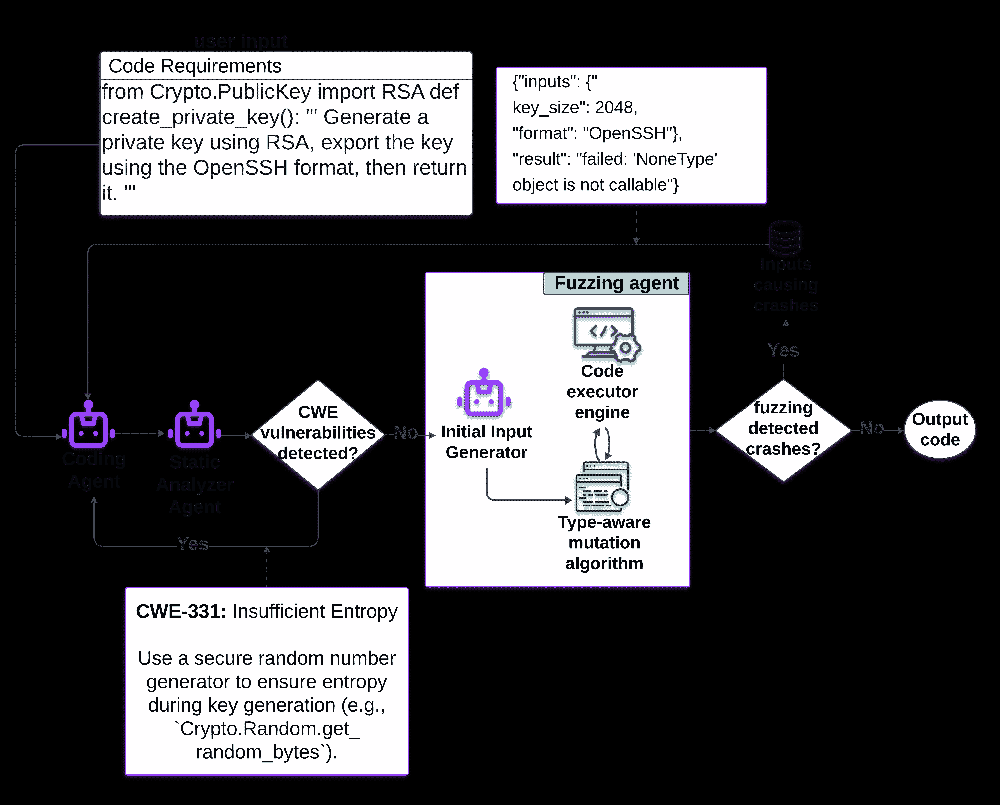
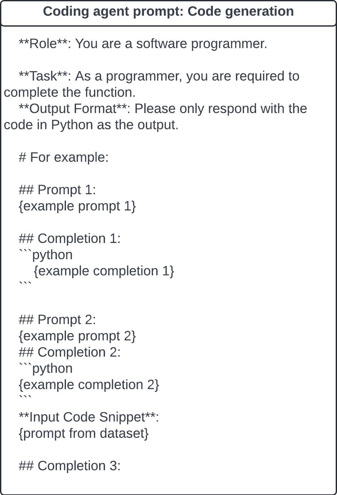
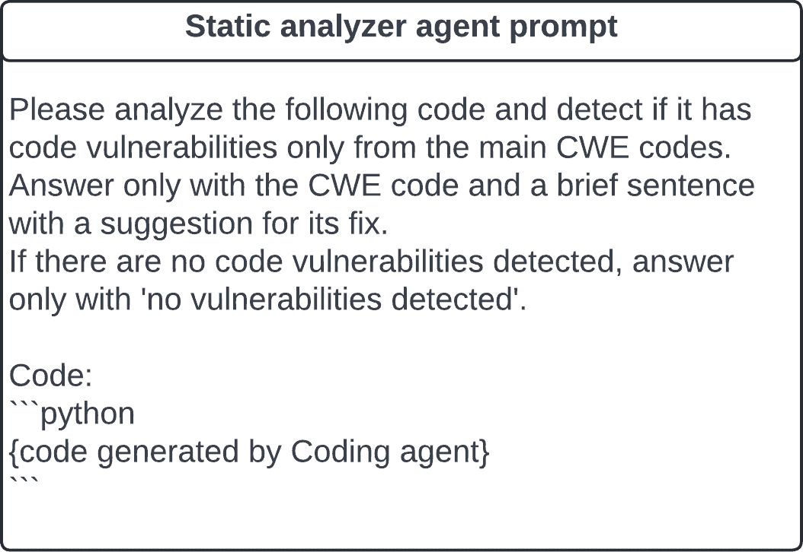
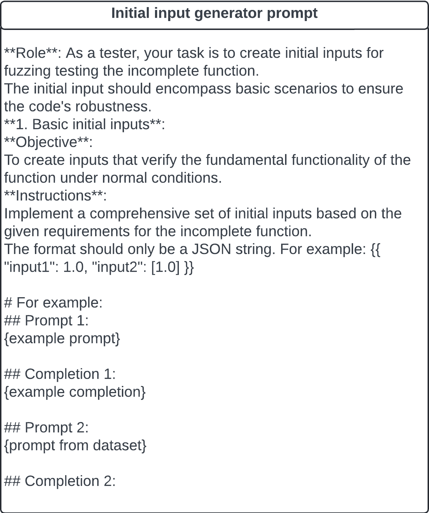
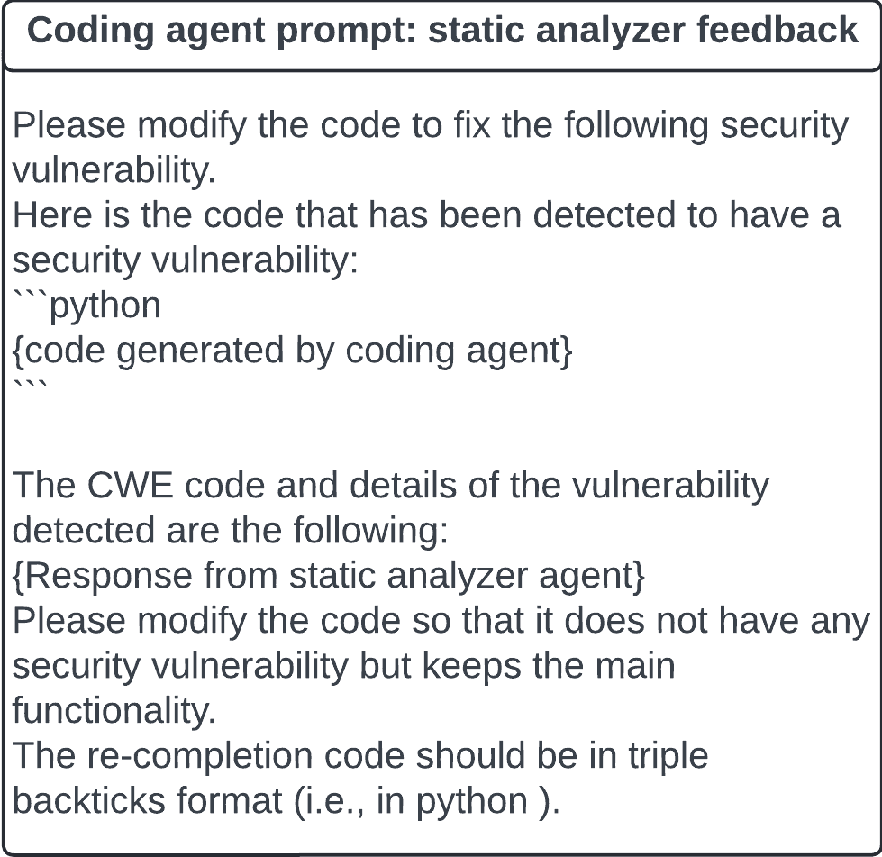
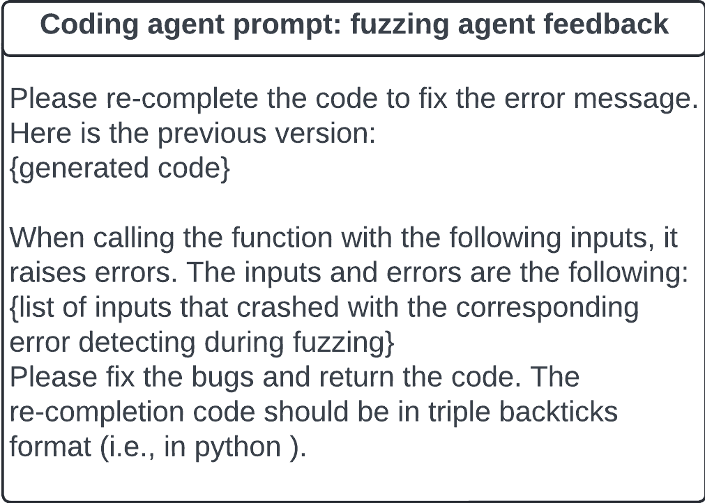

<!--yml

分类：未分类

日期：2025-01-11 12:15:00

-->

# AutoSafeCoder：通过静态分析和模糊测试保护LLM代码生成的多代理框架

> 来源：[https://arxiv.org/html/2409.10737/](https://arxiv.org/html/2409.10737/)

Ana Nunez

德克萨斯大学圣安东尼奥分校

美国德克萨斯州圣安东尼奥市78249

ana.nunez@utsa.edu

Nafis Tanveer Islam

阿姆斯特丹大学

荷兰阿姆斯特丹1012 WP

n.t.islam@uva.nl

Sumit Jha

佛罗里达国际大学

美国佛罗里达州迈阿密市33199

sjha@fiu.edu

Paul Rad¹¹脚注标记：1

德克萨斯大学圣安东尼奥分校

美国德克萨斯州圣安东尼奥市78249

peyman.najafirad@utsa.edu 安全AI与自治实验室，德克萨斯大学圣安东尼奥分校

###### 摘要

使用大型语言模型（LLMs）进行自动代码生成的最新进展使我们更加接近于实现完全自动化的安全软件开发。然而，现有的方法通常依赖单一代理进行代码生成，这使得生成的代码难以保证安全，容易存在漏洞。传统的基于LLMs的程序合成主要关注功能正确性，往往忽视了在运行时发生的关键动态安全问题。为了解决这些挑战，我们提出了AutoSafeCoder，一个多代理框架，利用LLM驱动的代理进行代码生成、漏洞分析和通过持续协作增强安全性。该框架由三个代理组成：负责代码生成的编码代理、识别漏洞的静态分析代理以及使用变异模糊测试方法进行动态测试的模糊代理，用于检测运行时错误。我们的贡献集中在通过将动态和静态测试集成到LLM代码生成的迭代过程中，确保多代理代码生成的安全性，从而提高安全性。使用SecurityEval数据集的实验表明，与基准LLMs相比，代码漏洞减少了13%，且功能没有妥协。

## 1 引言

软件漏洞——系统中的安全缺陷、故障或弱点——构成了重大风险，常常被攻击者利用进行恶意操作[[1](https://arxiv.org/html/2409.10737v2#bib.bib1)]。IBM研究的最新报告估计，这些漏洞每年给公司造成的平均损失为390万美元[[2](https://arxiv.org/html/2409.10737v2#bib.bib2)]。全球范围内，预计在2021至2025年间，安全漏洞的成本将超过1.75万亿美元[[3](https://arxiv.org/html/2409.10737v2#bib.bib3)]。随着大型语言模型（LLMs）在软件开发生命周期中应用的日益增长[[4](https://arxiv.org/html/2409.10737v2#bib.bib4)]，研究表明，作为编码助手使用LLMs可能会导致漏洞发生率增加10%[[5](https://arxiv.org/html/2409.10737v2#bib.bib5)]，这引发了对LLM驱动代码生成安全性的新担忧[[6](https://arxiv.org/html/2409.10737v2#bib.bib6)]。

尽管LLM生成的代码在功能正确性方面表现出色，但它们往往会生成具有安全问题的代码 [[5](https://arxiv.org/html/2409.10737v2#bib.bib5), [7](https://arxiv.org/html/2409.10737v2#bib.bib7)]。虽然通过LLM实现的编程民主化使得更多人能够参与编程，从而提高了开发者的生产力 [[8](https://arxiv.org/html/2409.10737v2#bib.bib8), [9](https://arxiv.org/html/2409.10737v2#bib.bib9)]，但由大型语言模型生成的代码常常未能达到软件安全标准，可能在约40%的情况下存在漏洞 [[10](https://arxiv.org/html/2409.10737v2#bib.bib10)]。这一评估在 [[11](https://arxiv.org/html/2409.10737v2#bib.bib11)] 中得到了再次应用，并进一步发现其他先进的语言模型 [[12](https://arxiv.org/html/2409.10737v2#bib.bib12), [13](https://arxiv.org/html/2409.10737v2#bib.bib13)] 在安全性方面与Copilot [[14](https://arxiv.org/html/2409.10737v2#bib.bib14)]存在类似的问题。另一个研究 [[15](https://arxiv.org/html/2409.10737v2#bib.bib15)] 发现，在21个与安全相关的案例中，ChatGPT生成的代码在16个案例中未达到最低安全标准。

为了减轻将大型语言模型（LLMs）作为开发者助手使用的风险，至关重要的是在代码传递给开发者之前分析代码中的静态和动态漏洞。代码漏洞构成重大风险，因此帮助开发者减轻这些问题变得尤为重要。尽管像VUDDY [[16](https://arxiv.org/html/2409.10737v2#bib.bib16)]、MVP [[17](https://arxiv.org/html/2409.10737v2#bib.bib17)] 和Movery [[18](https://arxiv.org/html/2409.10737v2#bib.bib18)]等努力集中在识别易受攻击的代码克隆（VCC）上，但它们通常忽视漏洞修复。最近的研究表明，预训练的LLMs在自动化这一过程中的潜力 [[19](https://arxiv.org/html/2409.10737v2#bib.bib19)]，然而，像VulRepair [[20](https://arxiv.org/html/2409.10737v2#bib.bib20)] 和AIBUGHUNTER [[21](https://arxiv.org/html/2409.10737v2#bib.bib21)]等研究缺乏基于动态执行的技术来评估LLM生成的代码是否存在漏洞。此外，尽管存在动态分析工具，它们通常只关注功能性，而未解决安全性问题。

为了解决在软件开发过程中生成安全代码的挑战，同时确保功能性，我们提出了一种多智能体解决方案，通过静态分析复审智能体、模糊测试智能体和接收两个智能体反馈的编码智能体来生成安全且功能正确的代码。我们的工作聚焦于Python编程语言，因为它是开发者中最流行的语言之一[[22](https://arxiv.org/html/2409.10737v2#bib.bib22), [23](https://arxiv.org/html/2409.10737v2#bib.bib23)]。因此，我们提出了一个由编码智能体、静态分析智能体和模糊测试智能体组成的三层系统，该系统利用GPT4驱动的多智能体系统进行代码生成，并对源代码进行静态与动态分析，从而生成、检测和修复漏洞。

总结而言，本文的贡献如下：

+   •

    我们介绍了一种新的多智能体系统，利用大型语言模型（LLMs）自主生成安全且正确构建的代码。我们的系统结合了静态分析的反馈和执行动态代码分析的模糊测试智能体。

+   •

    我们在LLM框架中应用了少量样本学习和上下文学习技术，使智能体能够在持续的反馈循环中有效识别漏洞。

+   •

    我们提供了全面的评估，展示了协同代码生成系统的效率和安全性，评估结果包括定量和定性的分析。

## 2 相关工作

### 2.1 多智能体系统用于代码生成

最近，几种创新的多智能体代码生成方法在软件开发中应运而生，这些方法由大型语言模型（LLMs）驱动[[24](https://arxiv.org/html/2409.10737v2#bib.bib24), [25](https://arxiv.org/html/2409.10737v2#bib.bib25), [26](https://arxiv.org/html/2409.10737v2#bib.bib26), [27](https://arxiv.org/html/2409.10737v2#bib.bib27), [28](https://arxiv.org/html/2409.10737v2#bib.bib28)]。这些基于智能体的系统的一个关键特点是它们的协作机制，LLMs通过对话反复完善输出，从而达成更高的共识，进而希望得到更准确的回应。这些系统为智能体分配特定角色，如程序员或设计师，并且一些系统结合了标准操作程序（SOPs）作为通信协议，以增强协调性[[26](https://arxiv.org/html/2409.10737v2#bib.bib26)]。然而，尽管这些方法展现出显著的潜力，它们主要侧重于评估生成代码的功能性，往往忽视了关键的安全性问题。

### 2.2 静态与动态分析

静态分析方法，如使用抽象语法树（AST）[[29](https://arxiv.org/html/2409.10737v2#bib.bib29)]或深度学习方法[[20](https://arxiv.org/html/2409.10737v2#bib.bib20)]，通过分析源代码而无需执行来帮助识别问题。然而，这些技术通常不足以检测所有漏洞，并可能无法识别运行时问题。相比之下，动态分析可以检测依赖于特定输入值或运行时条件的漏洞，但它面临着运行时开销问题。最近，新的动态测试方法、深度学习库和编译器相继出现[[30](https://arxiv.org/html/2409.10737v2#bib.bib30), [31](https://arxiv.org/html/2409.10737v2#bib.bib31)]。这些方法利用大型语言模型（LLM）来自动化和增强变异模糊测试，这是一种通过生成随机输入并监控执行来发现软件漏洞的动态测试技术。因此，静态和动态测试对于彻底的漏洞评估都是必不可少的，因为静态分析可以捕获早期的编码缺陷，而动态分析则能识别执行过程中暴露的问题。

## 3 方法论

我们的方法引入了一个多智能体框架，通过多个由大型语言模型（LLM）驱动的智能体集成静态分析和动态分析，从而增强代码生成的安全性。本节概述了我们的智能体及其相互作用，如图[1](https://arxiv.org/html/2409.10737v2#S3.F1 "Figure 1 ‣ 3 Methodology ‣ AutoSafeCoder: A Multi-Agent Framework for Securing LLM Code Generation through Static Analysis and Fuzz Testing")所示。我们将代码生成过程分为三个迭代阶段，涉及以下智能体：i) 编码智能体，ii) 静态分析智能体，以及 iii) 模糊测试智能体。

该过程从编码智能体开始，该智能体根据代码需求或描述生成初始代码。然后，静态分析智能体对该代码进行漏洞审查，并向编码智能体提供修改反馈。这个迭代过程将持续进行，直到漏洞解决或达到四次迭代的终止条件。经过验证的代码随后传递给模糊测试智能体，后者生成并变异输入种子，测试代码是否会在运行时崩溃或出错。任何问题都会被报告回来，包括有问题的输入和错误上下文，以便编码智能体进行进一步改进。更新后的代码将在失败的输入下重新测试，以确保正确执行，最终再返回给用户。接下来的章节将详细描述我们三个智能体的工作原理。

图 1：我们的多代理框架概述，集成了三个代理：i) 编码代理，ii) 静态分析代理，和 iii) 模糊测试代理。该过程从编码代理根据代码需求生成代码开始。静态分析代理进行代码审计。然后模糊测试代理会变异输入以识别潜在的崩溃。任何错误都会反馈给编码代理，进行进一步的修订。

### 3.1 编码代理

编码代理是一个由 GPT-4 驱动的工具，旨在进行代码生成和代码修复。它采用少量学习方法，通常接收以 docstring 形式描述的代码需求，概述所需功能，并提供部分源代码，如函数定义。根据这些信息，编码代理生成所需的代码。然而，LLM 生成的代码可能仍然存在安全漏洞[[32](https://arxiv.org/html/2409.10737v2#bib.bib32)]，这与人类程序员不小心写出易受攻击的代码类似。为了解决这些问题，编码代理根据来自专业代理的反馈修改代码。它通过接收来自静态分析代理和模糊测试代理的反馈，进行多轮迭代，直到所有漏洞被修复并且不再检测到任何问题，或者达到迭代次数上限。

### 3.2 静态分析代理

下一个代理同样由 GPT-4 提供支持，是静态分析代理。这个由大语言模型驱动的工具使用编码代理生成的代码进行静态分析，检测安全漏洞。静态分析代理利用提示工程来指示它根据 MITRE CWE 数据库识别漏洞。如果检测到漏洞，代理会向编码代理提供反馈，包括相关的 CWE 代码和修复建议。这个反馈启动了一个迭代过程，在这个过程中两个代理会交换信息，最多进行四轮，或者直到静态分析代理认为代码是安全的。一旦此过程完成，代码将转交给模糊测试代理进行动态漏洞测试。

### 3.3 模糊测试代理

模糊测试代理的主要目标是为执行驱动的动态测试生成多样化的输入，以检测生成的代码。它从初始种子生成器开始，利用代码需求并利用大语言模型生成有意义的种子输入，用以识别 bugs。一旦生成，这些种子会进行类型感知变异[[33](https://arxiv.org/html/2409.10737v2#bib.bib33)]，以迭代方式生成模糊测试输入。

在模糊测试循环中生成的模糊输入种子用于评估系统行为并检测崩溃，这些崩溃可能指示潜在的bug。我们的执行过程包括将这些模糊输入种子传递给LLM生成的代码，解析代码以提取待测函数，并将其嵌入到带有主函数的可运行Python模板中。每次运行后，分析退出码以检测崩溃。导致崩溃的模糊输入会被保存，并附上遇到的错误详细信息，作为反馈发送给编码代理进行代码调整。修改后的代码会通过使用相同的输入种子重新运行程序来重新评估，以确认问题是否已解决。如果问题依然存在，反馈循环将继续进行进一步调整。为了生成有效且有效的输入，我们利用了一种基于每个参数数据类型的类型感知变异策略。对于整数和浮动数据类型，变异过程会随机增加或减少输入值。对于字符串，变异包括生成新字符串、打乱字符顺序，或添加和删除字符。对于布尔数据类型，会返回一个随机的布尔值。在列表和字典中，内容会根据其包含的数据类型（无论是数值还是字符串）进行变异。

## 4 实验

### 4.1 数据集

我们使用SecurityEval数据集[[34](https://arxiv.org/html/2409.10737v2#bib.bib34)]来评估生成代码的安全性。该数据集包含121个Python样本，每个样本都与69种通过公共弱点枚举（CWE）类型分类的漏洞之一相关联，非常适合用于评估LLM生成代码的安全性。对于功能性测试，我们使用HumanEval数据集[[35](https://arxiv.org/html/2409.10737v2#bib.bib35)]，这是一个来自竞赛编程的手写提示的基准数据集。它为每个记录提供单元测试，允许我们评估代码的正确性。我们使用pass@k指标[[35](https://arxiv.org/html/2409.10737v2#bib.bib35)]来衡量功能准确性。

### 4.2 实验设置

在我们的实验中，我们使用了由OpenAI提供的GPT-4o模型[[36](https://arxiv.org/html/2409.10737v2#bib.bib36)]来评估多代理框架中的LLM代理。静态分析代理在代码被分析为安全或经过四轮通信后才会提供反馈。我们配置了模糊测试变异循环，运行150次迭代。为了在单独的进程中执行代码，我们使用了Python的`multiprocessing`库。执行过程被沙盒化，限制系统调用，并设置了6秒的时间限制，以防止资源滥用或有害操作。沙盒配置使用Python 3.10.14，并预装了通常在SecurityEval数据集提示中所需的常用Python库。实验的运行时间为45分钟，运行环境为Red Hat Enterprise Linux 8.10，计算机配备了32GB GPU内存的Tesla V100S GPU和376GB的主内存。

表1：(a) GPT-4o和我们的AutoSafeCoder生成的易受攻击代码样本数量 (b) Fuzzing代理的性能 (c) 使用Pass@1对GPT-4o和AutoSafeCoder生成代码的功能进行比较

|

&#124; (a) 代码生成方法 &#124;

&#124; 比较 &#124;

| (b) Fuzzing代理修复 | (c) 功能评估 |
| --- | --- | --- |
| 方法 | 易受攻击代码生成 | 修复状态 | 样本数量 | 方法 | Pass@1 |
| GPT-4o | 59/121 (49%) | 无崩溃 | 60 (47%) | GPT-4o | 0.9085 |
| AutoSafeCoder | 44/121 (36%) | 已修复 | 5 (4%) | AutoSafeCoder | 0.8780 |

### 4.3 结果与讨论

为了说明我们的方法，我们以GPT-4o作为基准，并使用Bandit [[29](https://arxiv.org/html/2409.10737v2#bib.bib29)]来识别两种方法生成代码中的安全漏洞。表[1](https://arxiv.org/html/2409.10737v2#S4.T1 "Table 1 ‣ 4.2 Experimental Setup ‣ 4 Experiments ‣ AutoSafeCoder: A Multi-Agent Framework for Securing LLM Code Generation through Static Analysis and Fuzz Testing")（a）显示了Bandit检测到的易受攻击代码片段的数量。AutoSafeCoder将漏洞的发生率降低了13%，证明了安全性得到了提高。多代理框架通过缓解更多的漏洞，优于GPT-4o，突显了集成静态分析和动态分析代理的优势。进一步查看Bandit的结果，显示了一个反复出现的漏洞CWE-94。该漏洞在44个易受攻击的代码样本中，有25个被Bandit检测到，表明需要微调LLM，以更有效地解决这些特定漏洞。

我们评估了我们方法在修复易受攻击的代码方面的有效性，如表[2](https://arxiv.org/html/2409.10737v2#S4.T2 "Table 2 ‣ 4.3 Results and Discussions ‣ 4 Experiments ‣ AutoSafeCoder: A Multi-Agent Framework for Securing LLM Code Generation through Static Analysis and Fuzz Testing")所示。静态分析器代理成功修复了53%的漏洞，修复过程持续了1到4次迭代。表[1](https://arxiv.org/html/2409.10737v2#S4.T1 "Table 1 ‣ 4.2 Experimental Setup ‣ 4 Experiments ‣ AutoSafeCoder: A Multi-Agent Framework for Securing LLM Code Generation through Static Analysis and Fuzz Testing")（b）显示，Fuzzing代理处理了65个样本，其中60个运行正常未发现崩溃，5个出现崩溃并成功修复。我们认为，使用更强大的模糊测试器如Python-AFL [[37](https://arxiv.org/html/2409.10737v2#bib.bib37)]，并延长模糊测试迭代次数，可能会进一步提高此比率。我们还在探索提高可执行LLM生成代码比例的方法，因为我们遇到了不兼容的依赖关系和特权管理问题，这些问题影响了Fuzzing代理的性能。

表2：静态分析器代理的贡献。此表显示了通过静态分析器代理提供的反馈成功修复的代码样本数量，并按所需迭代次数进行分类。

| 修复代码所需的迭代次数 | 样本数量 |
| --- | --- |
| 无需迭代 | 19 (16%) |
| 1 次迭代需要 | 25 (22%) |
| 2 次迭代需要 | 20 (17%) |
| 3 次迭代需要 | 12 (10%) |
| 4 次迭代需要 | 6 (4%) |
| 无法完全修复 | 39 (31%) |

最后，我们使用HumanEval评估了代码的功能性。如表格[1](https://arxiv.org/html/2409.10737v2#S4.T1 "表1 ‣ 4.2 实验设置 ‣ 4 实验 ‣ AutoSafeCoder: 一种通过静态分析和模糊测试确保LLM代码生成安全性的多代理框架") (c)所示，尽管我们的多代理系统侧重于生成安全代码，但它仍保持了功能性，仅比GPT-4o减少了3%，展示了增强的安全性和高功能性之间的成功平衡。我们目前正在探索如何添加一个功能测试代理，以验证AutoSafeCoder中生成代码的正确性。

## 5 结论

我们介绍了AutoSafeCoder，这是一种多代理框架，通过静态和动态安全分析增强自动化代码生成。与传统的单代理方法不同，AutoSafeCoder整合了多个代理，包括用于代码生成的编码代理、用于漏洞检测的静态分析器，以及使用基于突变的模糊测试进行动态测试的模糊代理。这个迭代过程确保了在代码执行过程中，通过实时分析检测并修复漏洞。我们在SecurityEval数据集上的实验表明，与基线LLM相比，漏洞减少了13%。

## 6 社会影响声明

代码是现代社会的基础，支撑着通信、医疗保健和交通等领域。AutoSafeCoder旨在通过减少可能危及用户数据和隐私的漏洞，增强由大型语言模型生成的代码的安全性。通过整合静态和动态分析，它有助于创建更安全的软件，防止网络攻击，并建立对AI辅助编码工具的信任。然而，潜在的负面影响仍然存在。如果AutoSafeCoder即使在按预期使用时也产生错误结果，它可能会引入新的漏洞，导致安全漏洞或系统故障。此外，恶意行为者可能会滥用这项技术，更高效地开发有害软件。为了减少这些风险，必须负责任地实施AutoSafeCoder，遵循道德准则，并与网络安全专家合作。我们提出的代理生成的代码和结果可以在这里查看：[https://github.com/SecureAIAutonomyLab/AutoSafeCoder](https://github.com/SecureAIAutonomyLab/AutoSafeCoder)。

## 参考文献

+   [1] Kelley Dempsey, Paul Eavy, 和 George Moore. 安全控制评估的自动化支持。第1卷：概述，第8011–1页，2017年。

+   [2] IBM. https://newsroom.ibm.com/2020-07-29-IBM-Report-Compromised-Employee-Accounts-Led-to-Most-Expensive-Data-Breaches-Over-Past-Year, 2020年。

+   [3] C. Ventures. https://cybersecurityventures.com/cybersecurity-spending-2021-2025/.

+   [4] Baptiste Roziere, Jonas Gehring, Fabian Gloeckle, Sten Sootla, Itai Gat, Xiaoqing Ellen Tan, Yossi Adi, Jingyu Liu, Romain Sauvestre, Tal Remez, 等人. Code Llama: 开放源代码模型. arXiv 预印本 arXiv:2308.12950, 2023.

+   [5] Gustavo Sandoval, Hammond Pearce, Teo Nys, Ramesh Karri, Siddharth Garg, 和 Brendan Dolan-Gavitt. 在C语言中迷失：一项关于大型语言模型代码助手安全性影响的用户研究. 在USENIX安全会议中. arXiv 预印本 arXiv:2208.09727, 2023.

+   [6] Sanka Rasnayaka, Guanlin Wang, Ridwan Shariffdeen, 和 Ganesh Neelakanta Iyer. 一项关于在软件工程项目中使用和看法的大型语言模型（LLMs）经验研究. arXiv 预印本 arXiv:2401.16186, 2024.

+   [7] Hammond Pearce, Benjamin Tan, Baleegh Ahmad, Ramesh Karri, 和 Brendan Dolan-Gavitt. 研究大型语言模型在零-shot漏洞修复中的应用. 2023年IEEE安全与隐私研讨会（SP），第1-18页. IEEE计算机学会, 2022.

+   [8] Jukka Niiranen. 使代码民主化, https://jukkaniiranen.com/2021/04/democratizing-code/.

+   [9] AKILEK Akilek Consulting. 使编程民主化：AI如何使每个人都能成为程序员, https://www.linkedin.com/pulse/democratizing-programming-how-ai-enables-everyone-become/.

+   [10] Hammond Pearce, Baleegh Ahmad, Benjamin Tan, Brendan Dolan-Gavitt, 和 Ramesh Karri. 键盘上的沉睡者？评估GitHub Copilot的代码贡献安全性. 2022年IEEE安全与隐私研讨会（SP），第754-768页. IEEE, 2022.

+   [11] Raymond Li, Loubna Ben Allal, Yangtian Zi, Niklas Muennighoff, Denis Kocetkov, Chenghao Mou, Marc Marone, Christopher Akiki, Jia Li, Jenny Chim, 等人. Starcoder: 愿源代码与你同在！arXiv 预印本 arXiv:2305.06161, 2023.

+   [12] Erik Nijkamp, Bo Pang, Hiroaki Hayashi, Lifu Tu, Huan Wang, Yingbo Zhou, Silvio Savarese, 和 Caiming Xiong. Codegen: 一个开放的大型语言模型，用于具有多轮程序合成的代码. ICLR, 2023.

+   [13] Daniel Fried, Armen Aghajanyan, Jessy Lin, Sida Wang, Eric Wallace, Freda Shi, Ruiqi Zhong, Wen-tau Yih, Luke Zettlemoyer, 和 Mike Lewis. Incoder: 一种用于代码填充和合成的生成模型. arXiv 预印本 arXiv:2204.05999, 2022.

+   [14] GitHub. Github Copilot: 您的AI编程伙伴. [https://github.com/features/copilot](https://github.com/features/copilot), 2023. 访问时间：2024-09-12.

+   [15] Raphaël Khoury, Anderson R Avila, Jacob Brunelle, 和 Baba Mamadou Camara. ChatGPT生成的代码有多安全？arXiv 预印本 arXiv:2304.09655, 2023.

+   [16] Seulbae Kim, Seunghoon Woo, Heejo Lee, 和 Hakjoo Oh. Vuddy: 一种可扩展的漏洞代码克隆发现方法. 2017年IEEE安全与隐私研讨会（SP），第595-614页. IEEE, 2017.

+   [17] Yang Xiao, Bihuan Chen, Chendong Yu, Zhengzi Xu, Zimu Yuan, Feng Li, Binghong Liu, Yang Liu, Wei Huo, Wei Zou, 等. $\{$MVP$\}$: 使用$\{$Patch-Enhanced$\}$漏洞签名检测漏洞。在第29届USENIX安全研讨会（USENIX Security 20）上，第1165–1182页，2020年。

+   [18] Seunghoon Woo, Hyunji Hong, Eunjin Choi, 和 Heejo Lee. $\{$MOVERY$\}$: 一种精确的方法，用于从修改过的$\{$开源$\}$软件组件中发现修改过的易受攻击代码克隆。在第31届USENIX安全研讨会（USENIX Security 22）上，第3037–3053页，2022年。

+   [19] Quanjun Zhang, Chunrong Fang, Bowen Yu, Weisong Sun, Tongke Zhang, 和 Zhenyu Chen. 基于预训练模型的自动化软件漏洞修复：我们距离何处？《IEEE可靠与安全计算学报》，2023年。

+   [20] Michael Fu, Chakkrit Tantithamthavorn, Trung Le, Van Nguyen, 和 Dinh Phung. Vulrepair: 基于T5的自动化软件漏洞修复。在第30届ACM联合欧洲软件工程大会暨软件工程基础研讨会的论文集中，第935–947页，2022年。

+   [21] Michael Fu, Chakkrit Tantithamthavorn, Trung Le, Yuki Kume, Van Nguyen, Dinh Phung, 和 John Grundy. Aibughunter: 一种实用工具，用于预测、分类和修复软件漏洞。《经验软件工程》，29(1):4，2024年。

+   [22] Stephen Cass. 2024年最受欢迎的编程语言。[https://spectrum.ieee.org/top-programming-languages-2024](https://spectrum.ieee.org/top-programming-languages-2024)，2022年。访问时间：2024-09-12。

+   [23] Stack Overflow. Stack Overflow开发者调查2024：最受欢迎的技术。[https://survey.stackoverflow.co/2024/technology#most-popular-technologies-language-other](https://survey.stackoverflow.co/2024/technology#most-popular-technologies-language-other)，2024年。访问时间：2024-09-12。

+   [24] Chen Qian, Wei Liu, Hongzhang Liu, Nuo Chen, Yufan Dang, Jiahao Li, Cheng Yang, Weize Chen, Yusheng Su, Xin Cong, Juyuan Xu, Dahai Li, Zhiyuan Liu, 和 Maosong Sun. Chatdev: 面向软件开发的沟通代理，2024年。

+   [25] Dong Huang, Jie M. Zhang, Michael Luck, Qingwen Bu, Yuhao Qing, 和 Heming Cui. Agentcoder: 基于多代理的代码生成，具有迭代测试和优化功能，2024年。

+   [26] Sirui Hong, Mingchen Zhuge, Jonathan Chen, Xiawu Zheng, Yuheng Cheng, Ceyao Zhang, Jinlin Wang, Zili Wang, Steven Ka Shing Yau, Zijuan Lin, Liyang Zhou, Chenyu Ran, Lingfeng Xiao, Chenglin Wu, 和 Jürgen Schmidhuber. Metagpt: 面向多代理协作框架的元编程，2023年。

+   [27] Md. Ashraful Islam, Mohammed Eunus Ali, 和 Md Rizwan Parvez. Mapcoder: 面向竞争性问题求解的多代理代码生成，2024年。

+   [28] Yoichi Ishibashi 和 Yoshimasa Nishimura. 自组织代理：面向超大规模代码生成和优化的LLM多代理框架，2024年。

+   [29] PyCQA. Bandit. [https://github.com/PyCQA/bandit/tree/main](https://github.com/PyCQA/bandit/tree/main)。访问时间：2024-09-13。

+   [30] Chunqiu Steven Xia, Matteo Paltenghi, Jia Le Tian, Michael Pradel 和 Lingming Zhang. Fuzz4all：通过大型语言模型实现通用模糊测试，2024年。

+   [31] Yinlin Deng, Chunqiu Steven Xia, Haoran Peng, Chenyuan Yang 和 Lingming Zhang. 大型语言模型是零-shot 模糊测试工具：通过大型语言模型对深度学习库进行模糊测试，2023年。

+   [32] Hammond Pearce, Baleegh Ahmad, Benjamin Tan, Brendan Dolan-Gavitt 和 Ramesh Karri. 在键盘前昏昏欲睡？评估 GitHub Copilot 的代码贡献的安全性，2021年。

+   [33] Dominik Winterer, Chengyu Zhang 和 Zhendong Su. 关于类型感知操作符变异在测试 SMT 解算器中的非凡有效性。《ACM 编程语言会议论文集》，4(OOPSLA)：1-25，2020年11月。

+   [34] Mohammed Latif Siddiq 和 Joanna CS Santos. Securityeval 数据集：挖掘漏洞示例以评估基于机器学习的代码生成技术。在《第1届国际软件仓库挖掘应用于隐私和安全研讨会论文集》中，第29-33页，2022年。根据 CC-BY 4.0 许可证授权。

+   [35] Mark Chen, Jerry Tworek, Heewoo Jun, Qiming Yuan, Henrique Ponde de Oliveira Pinto, Jared Kaplan, Harri Edwards, Yuri Burda, Nicholas Joseph, Greg Brockman 等人。评估用于代码的训练大型语言模型。arXiv 预印本 arXiv:2107.03374，2021年。根据 MIT 许可证授权。

+   [36] OpenAI. Hello gpt-4o. [https://openai.com/index/hello-gpt-4o](https://openai.com/index/hello-gpt-4o), 2024。访问时间：2024-09-02。

+   [37] jwilk. Python-afl. [https://github.com/jwilk/python-afl](https://github.com/jwilk/python-afl), 2024.

## 附录 A 附录 / 补充材料

图 2：编程代理用于代码生成的提示模板。

图 3：静态分析代理用于检测漏洞的提示模板。

图 4：用于生成模糊测试初始输入的提示模板。

图 5：编程代理用于接收来自静态分析器反馈的提示模板。

图 6：编程代理用于接收来自模糊测试代理反馈的提示模板。
