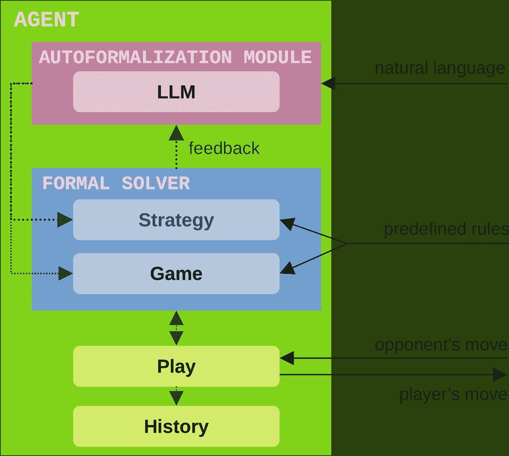
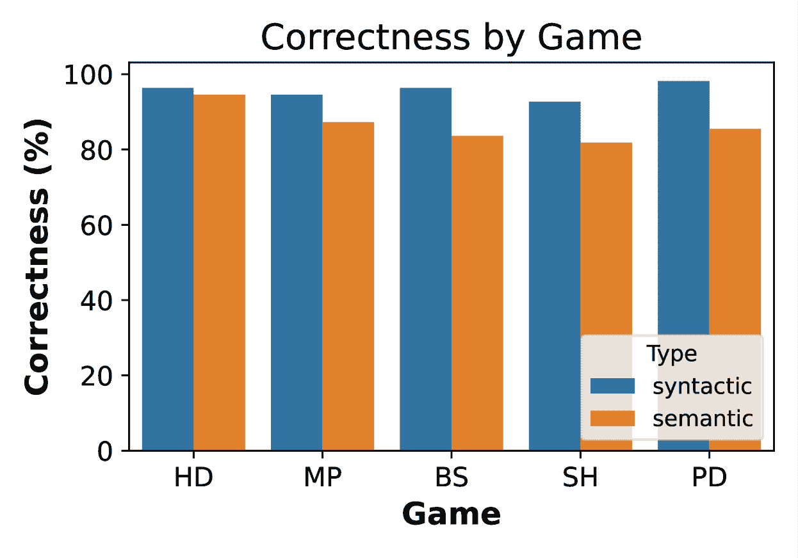
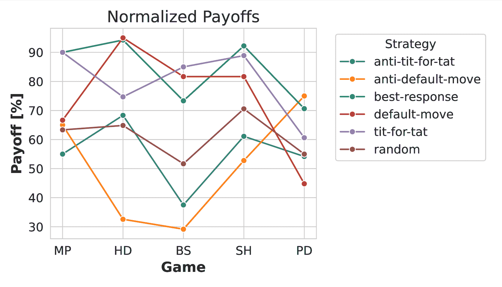

<!--yml

分类：未分类

日期：2025-01-11 11:48:54

-->

# 使用LLM增强的智能体自动形式化和模拟博弈论场景

> 来源：[https://arxiv.org/html/2412.08805/](https://arxiv.org/html/2412.08805/)

\affiliation\institution

计算机科学系，伦敦皇家霍洛威大学 \cityEgham \countryUnited Kingdom \affiliation \institution计算机科学系，伦敦皇家霍洛威大学 \cityEgham \countryUnited Kingdom \affiliation \institution计算机科学系，伦敦皇家霍洛威大学 \cityEgham \countryUnited Kingdom

Agnieszka Mensfelt [agnieszka.mensfelt@rhul.ac.uk](mailto:agnieszka.mensfelt@rhul.ac.uk)，Kostas Stathis [kostas.stathis@rhul.ac.uk](mailto:kostas.stathis@rhul.ac.uk) 和 Vince Trencsenyi [vince.trencsenyi@rhul.ac.uk](mailto:vince.trencsenyi@rhul.ac.uk)

###### 摘要。

博弈论模拟是探索自然和人工智能体交互的多功能工具。然而，建模现实世界场景并开发模拟通常需要大量的人工专业知识和努力。为了简化这一过程，我们提出了一个框架，使得利用大语言模型（LLMs）增强的智能体能够自动形式化博弈论场景。在这种方法中，LLM增强的智能体将自然语言的场景描述转化为可执行的逻辑程序，定义每个博弈的规则，并验证这些程序的语法准确性。随后进行锦标赛模拟，在模拟过程中，智能体通过参与游戏来测试生成游戏的功能性。当有真实的收益矩阵时，还可以进行精确的语义验证。验证后的游戏可以用于进一步的模拟，以评估不同策略的有效性。我们在五个著名的$2\times 2$同时移动博弈上，评估了我们的方法，展示了生成的游戏规则在语法上达到96%的准确率，在语义上达到87%的准确率。此外，我们还评估了LLM增强的智能体在自动形式化博弈策略方面的能力。

###### 关键词和短语：

自动形式化，博弈论，大语言模型

## 1\. 引言

博弈论模拟是一种多功能工具，用于探索各种现象，从个体人类互动和组织动态到生物过程、机器人技术以及人工智能体之间的互动。然而，模拟现实世界场景并实现相应的模拟通常需要大量的人工专业知识和努力。例如，考虑自动驾驶车辆协调问题：设计一个模拟模型涉及指定互动规则、每个智能体的目标、它们可用的信息以及它们可能采用的策略，同时还需要考虑不确定性和外部因素，如交通法律和行人行为；随后，该模型必须被实现。最近，大型语言模型（LLMs）的进展为简化这些任务提供了一种新方法。

尽管LLMs已被评估为博弈论环境中的智能体 Akata等人（[2023](https://arxiv.org/html/2412.08805v1#bib.bib3)）；Fan等人（[2023](https://arxiv.org/html/2412.08805v1#bib.bib7)）；Guo（[2023](https://arxiv.org/html/2412.08805v1#bib.bib15)）；Lorè和Heydari（[2023](https://arxiv.org/html/2412.08805v1#bib.bib21)），但诸如幻觉 Achiam等人（[2023](https://arxiv.org/html/2412.08805v1#bib.bib2)）和逻辑及算术错误 Imani等人（[2023](https://arxiv.org/html/2412.08805v1#bib.bib18)）等固有的局限性限制了它们作为直接理性决策者的效用。一种替代方法是利用LLMs在格式转换方面的能力，包括将自然语言翻译为形式化表示。这一过程被称为自动形式化 Wu等人（[2022](https://arxiv.org/html/2412.08805v1#bib.bib39)），在为数学 Wu等人（[2022](https://arxiv.org/html/2412.08805v1#bib.bib39)）；He-Yueya等人（[2023](https://arxiv.org/html/2412.08805v1#bib.bib17)）；Jiang等人（[2022](https://arxiv.org/html/2412.08805v1#bib.bib19)）和逻辑 Yang等人（[2023](https://arxiv.org/html/2412.08805v1#bib.bib40)）；Pan等人（[2023](https://arxiv.org/html/2412.08805v1#bib.bib29)）；Cosler等人（[2023](https://arxiv.org/html/2412.08805v1#bib.bib6)）；Chen等人（[2023](https://arxiv.org/html/2412.08805v1#bib.bib5)）；Feng等人（[2023](https://arxiv.org/html/2412.08805v1#bib.bib9)）创建形式化表示方面取得了成功。在这项工作中，我们应用自动形式化来自动生成博弈论场景的形式化表示。

本工作建立在我们之前的研究基础上 Mensfelt等人（[2024](https://arxiv.org/html/2412.08805v1#bib.bib26)），在该研究中我们介绍了一个基本框架，用于自动形式化可以使用$2\times 2$同时移动博弈建模的自然语言场景。在早期的研究中，使用了一个形式求解器来验证生成的形式化博弈表示的语法正确性，而语义正确性则是通过人工评估的。

在本工作中，我们将之前介绍的自动形式化模块整合到一个模块化代理模型中，并提出了一个框架，用于模拟这些代理的比赛。该框架有两个主要目的。首先，通过运行比赛，我们可以自动验证生成代码的功能性及其语义正确性。此验证可以通过比较代理的总收益与目标收益来近似进行，或者在有真实收益矩阵的情况下，通过检查每个玩家动作组合是否产生预期的收益来精确进行。其次，该框架的模块化代理设计支持策略的自动形式化，能够探索不同策略——无论是自动形式化的还是预定义的——在自动形式化博弈场景中的表现。这一方法有助于评估策略在多样化博弈论背景下的效率。本工作的主要贡献如下：

+   •

    一种具有正式博弈和策略表示的代理模型：我们介绍了一种代理模型，该模型结合了博弈和策略的正式表示，并配备了一个自动形式化模块，该模块在之前的工作中已经开发完成。

+   •

    三层代理验证：我们提供了一种验证代理的机制，用于检查语法正确性（通过形式求解器）、功能性（通过在游戏中使用代码）和语义正确性（通过比较目标收益和实际收益）。

+   •

    自动形式化场景的模拟框架：提出了一种模拟自动形式化博弈场景的框架，使得不同策略——无论是自动形式化的还是预定义的——的调查和比较成为可能。

+   •

    实验评估：我们评估了该框架，展示了在$2\times 2$同时移动博弈中的高语法和语义正确性。我们还测试了代理自动形式化5种策略的能力。

本文的其余部分结构如下。第[2](https://arxiv.org/html/2412.08805v1#S2 "2\. Preliminaries ‣ Autoformalizing and Simulating Game-Theoretic Scenarios using LLM-augmented Agents")节介绍了预备知识，包括博弈论、大型语言模型和一般博弈的基础概念。在第[3](https://arxiv.org/html/2412.08805v1#S3 "3\. LLM-augmented Autoformalizing Agents ‣ Autoformalizing and Simulating Game-Theoretic Scenarios using LLM-augmented Agents")节，我们概述了所提框架，接着在第[4](https://arxiv.org/html/2412.08805v1#S4 "4\. Methods ‣ Autoformalizing and Simulating Game-Theoretic Scenarios using LLM-augmented Agents")节中描述了评估该框架所使用的方法。第[5](https://arxiv.org/html/2412.08805v1#S5 "5\. Results and Discussion ‣ Autoformalizing and Simulating Game-Theoretic Scenarios using LLM-augmented Agents")节展示并分析了结果。第[6](https://arxiv.org/html/2412.08805v1#S6 "6\. Related Work ‣ Autoformalizing and Simulating Game-Theoretic Scenarios using LLM-augmented Agents")节回顾了该领域的相关工作。最后，第[7](https://arxiv.org/html/2412.08805v1#S7 "7\. Conclusions and Future Work ‣ Autoformalizing and Simulating Game-Theoretic Scenarios using LLM-augmented Agents")节总结了结论并提出了未来工作的方向。

## 2\. 预备知识

### 2.1\. 博弈论

博弈论是一个多用途且流行的数学建模框架，能够捕捉跨学科领域中各种复杂程度的互动场景。Rasmusen Rasmusen（[2006](https://arxiv.org/html/2412.08805v1#bib.bib31)）通过四个主要组成部分来构建博弈：

+   •

    玩家：玩家始终并自愿地朝着最大化其效用的方向行动，充分意识到他们所涉及的情境；

+   •

    行动：状态与结果之间的映射是玩家执行的行动 Osborne和Rubinstein（[1994](https://arxiv.org/html/2412.08805v1#bib.bib28)）；

+   •

    支付：支付是对玩家选择的行动元组所带来结果的量化度量 Gibbons（[1992](https://arxiv.org/html/2412.08805v1#bib.bib13)）；

+   •

    信息：博弈信息描述了玩家对可用动作、历史操作以及玩家对其对手的认知 Osborne和Rubinstein（[1994](https://arxiv.org/html/2412.08805v1#bib.bib28)）。

我们在此正式定义博弈为一组$n$个玩家$N$的函数，一个非空的动作集$A_{i},\forall i\in N$，以及每个玩家的效用函数$u_{i}:A\rightarrow\mathbb{R}$，将玩家$i$的动作映射到相应的支付$\pi_{i}$。

| row/col | L | R |
| --- | --- | --- |
| U | ($W_{row}$, $W_{col}$) | ($X_{row}$, $X_{col}$) |
| D | ($Y_{row}$, $Y_{col}$) | ($Z_{row}$, $Z_{col}$) |

表1. 一个一般的规范型博弈，描述了四种可能的结果$W,X,Y,Z$，其中元组表示行玩家和列玩家的相应收益，一般形式为：$(\pi_{row},\pi_{col})$

在对称博弈中，收益仅依赖于所选策略，而在非对称博弈中，结果根据玩家身份产生不同的收益。在我们的实验中，囚徒困境、鹰鸽博弈和狩鹿博弈是对称的，我们将行动U和L归类为“合作”，表示为$C$，而行动D和R归类为“背叛”，表示为$D$。这使我们能够使用Axelrod锦标赛中的常见术语，通过四个结果来定义这些博弈：$\mathbf{T}:(D,C),\mathbf{R}:(C,C),\mathbf{P}:(D,D),\mathbf{S}:(C,D)$。

+   •

    囚徒困境的特点是存在明显的背叛诱惑，由收益关系$T>R>P>S$表示，

+   •

    鹰鸽博弈涉及相互背叛的惩罚与受害者的收益之间相对收益的交换——$T>R>S>P$，

+   •

    狩鹿博弈涉及在相互合作的较高回报与背叛诱惑之间的选择——$R>T>P>S$。

性别之战和配对硬币是非对称博弈。由于结果意味着行玩家和列玩家的收益不同，我们不能使用上述的泛化方式，必须从两个玩家的角度定义这些博弈：

+   •

    性别之战是一个协调博弈，双方都更倾向于达成协议，但对协调结果有不同的偏好：

    +   –

        行：$W>Z>\{X,Y\}$，

    +   –

        列：$Z>W>\{X,Y\}$。

+   •

    配对硬币：协调结果奖励行玩家，而不匹配的动作则有利于列玩家：

    +   –

        行：$\{W,Z\}>\{X,Y\}$，

    +   –

        列：$\{X,Y\}>\{W,Z\}$。

### 2.2\. 大型语言模型

自然语言处理（NLP）随着变换器架构的进展（Gillioz等人，[2020](https://arxiv.org/html/2412.08805v1#bib.bib14)）和预训练模型（Qiu等人，[2020](https://arxiv.org/html/2412.08805v1#bib.bib30)）的推动，促成了大型语言模型（LLMs）的出现。最先进（SOTA）的LLM正在以快速的速度发展，这主要得益于模型参数和训练数据集规模的逐步增加（Zhao等人，[2023](https://arxiv.org/html/2412.08805v1#bib.bib41)）。虽然最先进的LLM在一般使用场景下有所改进，但也有一些方法可以进一步提高响应的准确性和质量。微调是通过特定的定制数据集训练LLM的过程，从而提高模型在特定应用场景中的表现（Ziegler等人，[2020](https://arxiv.org/html/2412.08805v1#bib.bib42)）。思维链提示指导LLM将推理分解为更简单的步骤，这通常允许模型更准确地处理更复杂的请求或特定的上下文（Wei等人，[2023](https://arxiv.org/html/2412.08805v1#bib.bib38)）。

OpenAI 的 GPT-4 Omni OpenAI（[2024](https://arxiv.org/html/2412.08805v1#bib.bib27)），在本研究中使用的是一个多模态的 SOTA 模型，支持文本、视觉和音频数据。GPT-4-o 已被证明在推理基准测试中表现出色 Wang 和 Zhao（[2024](https://arxiv.org/html/2412.08805v1#bib.bib37)）。

### 2.3\. 一般游戏玩耍

一般游戏玩耍 Genesereth 等人（[2005](https://arxiv.org/html/2412.08805v1#bib.bib11)）的研究重点是开发能够明确表示任意新游戏规则并自主学习玩这些游戏的智能系统，且无需人工干预。游戏描述语言（GDL）被提出作为一种形式化、机器可处理的语言，用于描述任意游戏的规则 Love 等人（[2006](https://arxiv.org/html/2412.08805v1#bib.bib23)）。GDL 仅关注信息游戏，因此在 GDL-II 中进行了扩展，以涵盖具有不完全信息的 n 玩家游戏和广泛正常形式的游戏 Thielscher（[2010](https://arxiv.org/html/2412.08805v1#bib.bib35)） Thielscher（[2011](https://arxiv.org/html/2412.08805v1#bib.bib36)）。GDL-II 基于逻辑编程的标准语法和语义，特点是表格[2](https://arxiv.org/html/2412.08805v1#S2.T2 "Table 2 ‣ 2.3\. General Game Playing ‣ 2\. Preliminaries ‣ Autoformalizing and Simulating Game-Theoretic Scenarios using LLM-augmented Agents")中所示的特殊关键字。

| role(R) | R 是一个玩家 |
| --- | --- |
| init(F) | F 在初始状态下成立 |
| true(F) | F 在当前状态下成立 |
| legal(R, M) | R 可以在当前状态下执行动作 M |
| does(R, M) | 玩家 R 执行动作 M |
| next(F) | F 在下一个状态下成立 |
| terminal | 当前状态为终局状态 |
| goal(R, N) | 玩家 R 在当前状态下获得 N 分 |

表格 2\. GDL-II 子集（大写字母表示变量，小写字母表示谓词/函数符号）

GDL系统面临的挑战之一是，在没有人工指导的情况下进行学习需要复杂的推理。玩家必须推断其他玩家的可能行为，并在做出决策之前有效地分析假设的游戏情境。像经典的情境演算（Situation Calculus）McCarthy和Hayes（[1981](https://arxiv.org/html/2412.08805v1#bib.bib25)）就专门为此目的发展了相应的行动形式化方法。情境演算的形式方案和推理方法，像Giacomo等人（[2010](https://arxiv.org/html/2412.08805v1#bib.bib12)）和Lesperance等人（[2024](https://arxiv.org/html/2412.08805v1#bib.bib20)）提出的方案，已经有现成的工具可供使用；然而，它们在一般游戏中的应用假设将GDL转换成现有的、具有适当表达能力的行动语言。Schiffel和Thielscher（[2011](https://arxiv.org/html/2412.08805v1#bib.bib34)）提出的一种方案展示了如何将GDL-II完全嵌入到基于知识流体（knowledge fluents）的情境演算版本中，Scherl和Levesque（[2003](https://arxiv.org/html/2412.08805v1#bib.bib32)）的研究为此提供了理论支持。我们将在后续的[3.2](https://arxiv.org/html/2412.08805v1#S3.SS2 "3.2\. 求解器 ‣ 3\. LLM增强的自动形式化代理 ‣ 使用LLM增强的代理进行博弈论情境的自动形式化与仿真")部分中介绍的游戏求解器，正是受到这些前期工作的启发，旨在支持轻量级GDL规范，作为自动形式化的目标表示。

## 3\. LLM增强的自动形式化代理

### 3.1\. 概述

图1\. 我们代理模型的概览。绿色虚线表示内部通信，实线黑色线条表示外部通信。

本文提出的框架支持创建模块化的自我形式化智能体，并支持使用这些智能体进行锦标赛对抗。智能体模型的概述如图[1](https://arxiv.org/html/2412.08805v1#S3.F1 "图1 ‣ 3.1\. 概述 ‣ 3\. LLM增强的自我形式化智能体 ‣ 使用LLM增强的智能体自动形式化和模拟博弈论场景")所示。一个用Prolog实现的逻辑编程组件由两个模块组成：一个包含与游戏无关和与游戏相关规则的游戏模块，以及一个描述选择对抗对手的动作的策略模块。结合起来，这些模块构成了一个求解器（详见第[3.2](https://arxiv.org/html/2412.08805v1#S3.SS2 "3.2\. 求解器 ‣ 3\. LLM增强的自我形式化智能体 ‣ 使用LLM增强的智能体自动形式化和模拟博弈论场景")节），封装了游戏逻辑并决定智能体的下一步动作。一个Python包装器管理智能体与外部环境的交互，维护游戏历史（追踪每个智能体的动作、对手的动作和支付），并更新求解器的状态。这种模块化设计使得可以通过预定义配置或自动形式化自然语言描述，轻松地替换与游戏相关的规则和策略。智能体还可以被保存到文件并重新加载。从评估中生成的源代码和日志文件可以在[https://github.com/dicelab-rhul/autoformalizing-agents](https://github.com/dicelab-rhul/autoformalizing-agents)获取。

### 3.2\. 求解器

我们的求解器基于逻辑编程，正如Mensfelt等人（[2024](https://arxiv.org/html/2412.08805v1#bib.bib26)）所描述的那样，但为了完整性，在这里再次提及。它包含一个与游戏无关的部分，表示任何扩展形式游戏的规则，一个与游戏相关的部分，使用与游戏无关部分的谓词定义特定游戏的规则，以及一组辅助谓词来完成该特定游戏的定义。我们遵循标准的Prolog约定来解释一个游戏：变量用大写字母表示，而谓词和函数符号用小写字母表示。符号 :- 被解释为if，符号 \+ 表示not（通过失败来否定）。下划线’_’表示在定义中忽略其值的变量。游戏状态是一个情境，最初由一个常量表示（例如s0）。二元函数do(M, S)表示在情境S中执行动作M后得到的情境，符合情境演算。

#### 3.2.1\. 与游戏无关的部分

我们定义了从初始情境S到最终情境F的扩展形式游戏的所有合法过渡，具体如下：

[⬇](data:text/plain;base64,Z2FtZShGLEYpOi0KICAgIGZpbmFs(KEYpLgpnYW1lKFMsRik6LQogICAgXCsgZmluYWwoUyksCiAgICBsZWdhbChNLFMpLAogICAgZ2FtZShkbyhNLFMpLEYpLg==)游戏(F,F):-final(F).游戏(S,F):-\+ final(S),legal(M,S),游戏(do(M,S),F)。

游戏在达到最终游戏状态F时终止。否则，在非最终状态S中，游戏接受一个合法的动作M，游戏继续进入下一个do(M, S)状态，直到达到最终状态F。为了确定每个合法状态中成立的内容，我们使用情境演算，表示为：

[⬇](data:text/plain;base64,aG9sZHMoRiwgUyk6LQogICAgaW5pdGlhbGx5KEYsIFMpLgpob2xkcyhGLCBkbyhNLCBTKSk6LQogICAgZWZmZWN0KEYsIE0sIFMpLgpob2xkcyhGLCBkbyhNLCBTKSk6LQogICAgaG9sZHMoRiwgUyksCiAgICBcKyBhYm5vcm1hbChGLCBNLCBTKS4=)成立(F,  S):-初始状态(F,  S)。成立(F,  do(M,  S)):-效果(F,  M,  S)。成立(F,  do(M,  S)):-成立(F,  S)，\+异常(F,  M,  S)。

holds/2在此类似于GDL中的true/1，但有一个额外的参数是流利词为真时所处的情况。它声明流利词F在初始情况（GDL中的init/1）中成立，新的流利词F由在状态S中执行的动作M的效果启动（GDL中的next/1），并且流利词F在动作执行后持续，前提是它不是异常的；异常的流利词不会持续（在GDL中隐含）。我们还使用如下形式的规则：

[⬇](data:text/plain;base64,ZmluYWxseShGLCBTKTotIENvbmRpdGlvbnMu)最终(F,  S):-  条件。

返回描述游戏结果的派生流利词F，当条件在最终状态S中成立时。

#### 3.2.2\. 与游戏相关的部分

为了表示一个具体的游戏，我们需要定义与游戏相关的谓词，包括初始状态initial/1、合法的动作legal/2、初始游戏情况通过initially/2所成立的内容、通过effect/3描述动作对情况的影响、通过abnormal/3描述在执行动作后停止持续的内容、最终状态final/1，以及通过finally/2定义的游戏结果。为了举例说明这些定义，我们展示了如何为我们的求解器描述一个囚徒困境（PD）游戏。初始情况s0定义为：

[⬇](data:text/plain;base64,aW5pdGlhbChzMCku)初始状态(s0)。

在这个初始状态中，我们指定其成立的内容如下：

[⬇](data:text/plain;base64,aW5pdGlhbGx5KHBsYXllcihwMSksIHMwKS4KaW5pdGlhbGx5KHBsYXllcihwMiksIHMwKS4KaW5pdGlhbGx5KHJvbGUocDEscm93KSwgczApLgppbml0aWFsbHkocm9sZShwMixjb2wpLCBzMCkuCmluaXRpYWx5KGNvbnRyb2wocDEpLCBzMCkuCmluaXRpYWx5KHByb2xlKHBpLCByb3cpLCBzMCkuCmluaXRpYWx5KGNvbnRyb2wocDIpLCBzMCku)初始状态(player(p1),  s0)。初始状态(player(p2),  s0)。初始状态(role(p1, row),  s0)。初始状态(role(p2, col),  s0)。初始状态(control(p1),  s0)。初始状态(control(p2),  s0)。

这些断言首先定义了玩家名称，分别由唯一标识符(p1和p2)表示，接着定义了他们的角色（p1是行玩家，p2是列玩家），然后定义了最初任意一方都可以控制游戏的事实（通过控制流利词control/1，如同在GDL中）。初始状态中成立的内容会随着游戏中动作的执行而变化。我们将动作表示为形如move(P, M)的项，其中P是玩家，M是动作。与囚徒困境（PD）类似，任何玩家都可以选择背叛（'D'）或合作（'C'），我们将其表示为：

[⬇](data:text/plain;base64,cG9zc2libGUobW92ZShQLCdEJyksUyk6LWhvbGRzKHBsYXllcihQKSxTKS4KcG9zc2libGUobW92ZShQLCdDJyksUyk6LWhvbGRzKHBsYXllcihQKSxTKS4=)possible(move(P,’D’),S):-holds(player(P),S).possible(move(P,’C’),S):-holds(player(P),S)。

然后，如果玩家在当前情境中拥有执行动作的控制权，那么进行可能动作就是合法的：

[⬇](data:text/plain;base64,bGVnYWwobW92ZShQLE0pLCBTKTotCiAgICBwb3NzaWJsZShtb3ZlKFAsTSksIFMpLAogICAgaG9sZHMoY29udHJvbChQKSwgUyku)legal(move(P,M),  S):-possible(move(P,M),  S),holds(control(P),  S)。

作为玩家P进行合法动作M的效果，我们在下一个情境中记录玩家执行了该动作（effect/3类似于GDL中的next/1）：

[⬇](data:text/plain;base64,ZWZmZWN0KGRpZChQLCBNKSwgbW92ZWhhcyhQLCBNKSwgUyku)effect(did(P,  M),  move(P,  M),  S)。

一旦执行合法动作，玩家将失去控制，我们在框架中指定如下：

[⬇](data:text/plain;base64,YWJub3JtYWwoY29udHJvbChQKSwgbW92ZShQLCBNKSwgUyku)abnormal(control(P),  move(P,  M),  S)。

当玩家失去控制时，不能再进行动作，直到控制权被重新传递。当每个玩家从初始情境中进行一次动作时，结果的最终情境可以确定为：

[⬇](data:text/plain;base64,ZmluYWwoZG8oTTIsIGRvKE0xLCBTKSkpOi0KICAgIGdyb3VuZChNMiksCiAgICBncm91bmQoTTEpLAogICAgaW5pdGlhbChTKS4=)final(do(M2,  do(M1,  S))):-ground(M2),ground(M1),initial(S)。

假设收益矩阵遵循表格[1](https://arxiv.org/html/2412.08805v1#S2.T1 "表1 ‣ 2.1\. 博弈论 ‣ 2\. 基础 ‣ 使用LLM增强的代理进行博弈理论场景的自我形式化和模拟")中定义的结构：

[⬇](data:text/plain;base64,cGF5b2ZmKCdEJywgJ0QnLCAxLCAxKS4KcGF5b2ZmKCdDJywgJ0QnLCAwLCA1KS4KcGF5b2ZmKCdEJywgJ0MnLCA1LCAwKS4KcGF5b2ZmKCdDJywgJ0MnLCAzLCAzKS4=)payoff(’D’,  ’D’,  1,  1).payoff(’C’,  ’D’,  0,  5).payoff(’D’,  ’C’,  5,  0).payoff(’C’,  ’C’,  3,  3)。

游戏的结果包含了玩家实际执行的动作及其收益信息。

[⬇](data:text/plain;base64,ZmluYWxseShvdXRjb21lKFAxLE0xLFUxLFAyLE0yLFUyKSwgUyk6LQogICAgaG9sZHMocm9sZShQMSwgcm93KSwgUyksCiAgICBob2xkcyhkaWQoUDEsIE0xKSwgUyksCiAgICBob2xkcyhyb2xlKFAyLCBjb2wpLCBTKSwKICAgIGhvbGRzKGRpZChQMiwgTTIpLCBTKSwKICAgIHBheW9mZihNMSwgTTIsIFUxLCBVMiku)finally(outcome(P1,M1,U1,P2,M2,U2),  S):-holds(role(P1,  row),  S),holds(did(P1,  M1),  S),holds(role(P2,  col),  S),holds(did(P2,  M2),  S),payoff(M1,  M2,  U1,  U2)。

我们可以通过goal/2流利式提取特定的结果信息，例如玩家的效用（如GDL中所示）：

[⬇](data:text/plain;base64,ZmluYWxseShnb2FsKFAxLCBVMSksIFMpOi0KICAgIGZpbmFsbHkob3V0Y29tZShQMSxfLFUxLF8sXyxfKSwgUykuCmZpbmFsbHkoZ29hbChQMiwgVTIpLCBTKTotCiAgICBmaW5hbGx5KG91dGNvbWUoXyxfLF8sUDIsXyxVMiksIFMpLg==)finally(goal(P1,  U1),  S):-finally(outcome(P1,_,U1,_,_,_),  S).finally(goal(P2,  U2),  S):-finally(outcome(_,_,_,P2,_,U2),  S)。

这完成了PD的定义，使我们能够使用上述的游戏描述来推理游戏的动态。例如，如果玩家p1想要分析游戏并确定达成5的效用所需的行动，那么它会提出以下查询：

[⬇](data:text/plain;base64,Py0gZ2FtZShzMCxGKSwgZmluYWxseShnb2FsKHAxLDUpLEYpLg==)?-  game(s0,F),  finally(goal(p1,5),F).

应用PD支付矩阵后，我们的求解器为F提供了两个解法，用分号（;）分隔。结果false表示“没有进一步的答案”。

[⬇](data:text/plain;base64,RiA9IGRvKG1vdmUocDIsJ0MnKSxkbyhtb3ZlKHAxLCdEJyksczApKTsKRiA9IGRvKG1vdmUocDEsJ0QnKSxkbyhtb3ZlKHAyLCdDJyksczApKTsKZmFsc2Uu)F  =  do(move(p2,’C’),do(move(p1,’D’),s0));F  =  do(move(p1,’D’),do(move(p2,’C’),s0));false.

在第一个解法中，p1首先行动，p2其次行动，而在第二个解法中，顺序被反转。这个结果是预期的，因为在我们的游戏定义中，两个玩家都具有初始控制权，导致展示了两种行动顺序的组合。

#### 3.2.3\. 策略

策略被单独提交，独立于游戏依赖的组件。在当前的实现中，它们可能依赖于特定的谓词——default_move/2、opposite_move/2、possible/2和finally/2——这些是游戏依赖求解器所需要的。select/4谓词用于确定在游戏情况S中，玩家P针对对手O的下一个行动M，如下所示，tit-for-tat策略示例：

[⬇](data:text/plain;base64,c2VsZWN0KFAsIE8sIFMsIE0pOi0KICAgIFwrIGhvbGRzKGxhc3RfbW92ZShPLCBfTE1vKSwgUyksCiAgICBob2xkcyhkZWZhdWx0X21vdmUoUCwgTSksIFMpLgpzZWxlY3QoUCwgTywgUywgTW8pOi0KICAgIGhvbGRzKGxhc3RfbW92ZShPLCBNbyksIFMpLg==)select(P,  O,  S,  M):-\+  holds(last_move(O,  _LMo),  S),holds(default_move(P,  M),  S).select(P,  O,  S,  Mo):-holds(last_move(O,  Mo),  S).

在这里，P最初选择默认行动（通常是合作），否则它会模仿对手在上一轮的行动。可以表达更复杂的策略。例如，下面我们展示了如何为一个游戏表达一个玩家的最佳回应：

[⬇](data:text/plain;base64,c2VsZWN0KFAsIE8sIFMsIE0pOi0KICAgIFwrIGhvbGRzKGxhc3RfbW92ZShPLCBfKSwgUyksCiAgICBob2xkcyhkZWZhdWx0X21vdmUoUCwgTSksUykuCnNlbGVjdChQLCBPLCBTLCBNKTotCiAgICBob2xkcyhsYXN0X21vdmUoTywgTE1vKSwgUyksCiAgICBmaW5kYWxsKFVpLU1pLAogICAgIChnYW1lKFMsIEYpLAogICAgICBmaW5hbGx5KG91dGNvbWUoUCxNaSxVaSxPLE1vLFVvKSxGKSwKICAgICAgVWkgPj0gVW8pLAogICAgT3B0aW9ucyksCiAgICBzb3J0KDAsIEA+LCBPcHRpb25zLCBSYW5rZWQpLAogICAgaGlnaGVzdChSYW5rZWQsIE0pLg==)select(P,  O,  S,  M):-\+  holds(last_move(O,  _),  S),holds(default_move(P,  M),S).select(P,  O,  S,  M):-holds(last_move(O,  LMo),  S),findall(Ui-Mi,(game(S,  F),finally(outcome(P,Mi,Ui,O,Mo,Uo),F),Ui  >=  Uo),Options),sort(0,  @>,  Options,  Ranked),highest(Ranked,  M).

第二种策略与之前的“以牙还牙”策略不同，因为它的第二个子句展示了如何使用我们对游戏的表示进行复杂推理。通过按这些结果对玩家和对手的效用进行排序，来执行这一操作，并选择给玩家带来最高效用的动作。这种策略还展示了自动形式化任务的复杂性。

#### 3.2.4\. 约束检查

我们通过定义有效性约束来检查自动形式化的支付矩阵是否满足指定游戏的结构和内容约束（如第[2.1](https://arxiv.org/html/2412.08805v1#S2.SS1 "2.1\. Game Theory ‣ 2\. Preliminaries ‣ Autoformalizing and Simulating Game-Theoretic Scenarios using LLM-augmented Agents")节所述），下面的列表指定了囚徒困境的支付矩阵有效性约束。

[⬇](data:text/plain;base64,ICAgIHZhbGlkX3BkX3BheW9mZnMoVCxSLFAsUyxDLEQpOi0KICAgICAgICAgICAgcGF5b2ZmKEMsQyxSLFIpLAogICAgICAgICAgICBwYXlvZmYoQyxELFMsVCksCiAgICAgICAgICAgIFQ+UiwKICAgICAgICAgICAgcGF5b2ZmKEQsQyxULFMpLAogICAgICAgICAgICBwYXlvZmYoRCxELFAsUCksCiAgICAgICAgICAgIFI+UCwKICAgICAgICAgICAgUD5TLg==)valid_pd_payoffs(T,R,P,S,C,D):-payoff(C,C,R,R),payoff(C,D,S,T),T>R,payoff(D,C,T,S),payoff(D,D,P,P),R>P,P>S.

由于自动形式化模块不对动作的名称施加约束，因此此谓词还确定哪些动作对应特定角色（例如，确定‘coop’ = C）。

### 3.3\. 自动形式化模块

算法 1 从自然语言描述生成游戏规则谓词 Mensfelt 等人（[2024](https://arxiv.org/html/2412.08805v1#bib.bib26)）。PD 代表囚徒困境。

1:输入：

$\Gamma$: 与游戏无关的谓词，

$NL_{PD}$: 囚徒困境的自然语言描述，

$\xi_{PD}$: 囚徒困境的特定游戏谓词，

$NL_{NG}$: 新游戏的自然语言描述。2:输出：

$\xi_{NG}$: 新游戏的特定游戏谓词。3:参数：

max_attempts: 最大纠正尝试次数。4:$\text{attempts}\leftarrow 0$5:$\text{trace}\leftarrow\emptyset$6:当 $\text{attempts}<\text{max\_attempts}$ 时，执行7:    $\xi_{NG}\leftarrow\text{LLM.translate}(\Gamma,NL_{PD},\xi_{PD},NL_{NG})$8:    $\text{is\_valid}\leftarrow\text{solver.check\_predicates}(\xi_{NG})$9:    如果 is_valid 则10:         返回 $\xi_{NG}$11:    否则12:         $\text{trace}\leftarrow\text{solver.get\_trace}()$13:         $\xi_{NG}\leftarrow\text{LLM.self\_correct}(\xi_{NG},\text{trace})$14:    结束 如果15:    $\text{attempts}\leftarrow\text{attempts}+1$16:结束 while17:返回 无法在最大尝试次数内生成有效的谓词。

为了执行自动形式化，采用了大型语言模型。该框架通过提供一个抽象接口，支持使用任何语言模型。通过一次性提示并使用游戏相关谓词来实现自然语言描述的游戏或策略的自动形式化，例如囚徒困境和以牙还牙策略。生成代码后，将验证其语法正确性。如果发现错误，LLM将接收到反馈，包括错误的行、错误信息和修正谓词的说明。max_attempts 参数指定最大修正尝试次数。自动形式化算法的概述见于列表[1](https://arxiv.org/html/2412.08805v1#alg1 "算法 1 ‣ 3.3\. 自动形式化模块 ‣ 3\. LLM增强的自动形式化智能体 ‣ 使用LLM增强的智能体自动形式化和仿真博弈论场景")。

### 3.4\. 仿真

在我们之前的工作中，Mensfelt 等人（[2024](https://arxiv.org/html/2412.08805v1#bib.bib26)）手动验证了生成程序的语义正确性。在本研究中，我们引入了一种基于锦标赛的机制，自动化语义正确性验证，适用于存在目标总收益或收益矩阵的场景和策略。在这种方法中，一旦场景被自动形式化，智能体的副本就会被创建并赋予指定的策略。然后，智能体及其副本进行指定轮数的对战（克隆模式）。将智能体的总收益与目标总收益进行比较，以提供近似的验证。当有真实收益矩阵时，它通过验证每个唯一动作组合的收益是否与该组合的目标收益匹配，从而实现精确的语义验证。此外，我们还执行约束检查，以确保收益矩阵满足指定游戏的约束条件。

该锦标赛还可以评估在给定的游戏场景中，跨多个回合，平均而言，哪种策略最为成功。这是通过为智能体提供不同策略的副本，并让它们以循环赛模式进行竞争，在这种模式下，每个智能体都会与其他每个智能体对战来实现的。

锦标赛的主要参数如下：

+   •

    游戏：可以通过预定义规则或自然语言描述提供以进行自动形式化，

+   •

    策略：可以通过预定义策略规则列表或自然语言描述列表提供以进行自动形式化，

+   •

    模式：与单个克隆对战或循环赛，

+   •

    智能体数量，

+   •

    回合数。

有两种方法用于确定锦标赛的获胜者：

1.  (1)

    选择总收益与其目标收益相匹配的智能体——如果为每个智能体提供了目标收益，这适用。

1.  (2)

    选择获得最高总收益的智能体。

两种方法都用于框架的评估，具体细节请参见以下章节。

## 4\. 方法

### 4.1\. 参数

| 通用参数 |
| --- | --- |
| LLM | GPT-4o |
| 温度 | $1$ |
| 最大输出标记数 | $1024$ |
| 最大尝试次数 | $5$ |

表 3\. 通用实验参数。

为了评估该框架，我们进行了三次实验：实验 1 测试了博弈场景的自动形式化，实验 2 在锦标赛的循环赛模式中使用了自动形式化的博弈规则，实验 3 检验了策略的自动形式化。表[3](https://arxiv.org/html/2412.08805v1#S4.T3 "表 3 ‣ 4.1\. 参数 ‣ 4\. 方法 ‣ 使用LLM增强智能体自动形式化和仿真博弈论场景")提供了所有实验中共享的实验参数，而表[4](https://arxiv.org/html/2412.08805v1#S4.T4 "表 4 ‣ 4.1\. 参数 ‣ 4\. 方法 ‣ 使用LLM增强智能体自动形式化和仿真博弈论场景")详细列出了每个具体实验独有的参数。

| 参数 | 实验 1 | 实验 2 | 实验 3 |
| --- | --- | --- | --- |
| 游戏 | $55$ | $5$ | $1$ |
| 每场游戏的智能体数 | $5$ | $1$ | $5$ |
| 策略 | 1 | $6$ | $5$ |
| 回合数 | $4$ | $10$ | $4$ |
| 模式 | 克隆 | 循环赛 | 克隆 |

表 4\. 实验特定参数。

### 4.2\. 实验 1：博弈描述的自动形式化

在第一个实验中，我们使用了一个包含55个自然语言博弈论场景的数据集，用于评估由智能体生成的逻辑程序的句法和语义准确性。该数据集包含了5个场景，这些场景使用了常见的隐喻（例如，囚徒困境中的两名囚犯）来描述第[2.1](https://arxiv.org/html/2412.08805v1#S2.SS1 "2.1\. 博弈论 ‣ 2\. 基础 ‣ 使用LLM增强智能体进行博弈论场景的自动形式化和仿真")节中介绍的五个经典博弈。其余50个场景——每个博弈10个——使用了避免这些典型隐喻的替代描述（例如，两个政治家在竞选中竞争，而不是囚徒困境中的两个囚犯）。对于每个场景，生成了五个智能体，自动形式化了博弈规则，然后进行锦标赛，使用以牙还牙策略对抗使用反牙还牙策略的克隆，测试四轮中的所有四种可能的动作组合。每个智能体最多有五次机会生成语法正确的代码；在五次尝试后仍未成功的智能体将被标记为语法错误。锦标赛结束后，比较每个智能体的个人和总得分与目标值，匹配的结果表示语义正确。

### 4.3\. 实验 2：Axelrod 的锦标赛

| 策略 | 描述 |
| --- | --- |
| 反默认动作 | 始终选择与默认动作相反的动作。 |
| 反牙还牙 | 先选择默认动作。然后，选择与对手上轮动作相反的动作。 |
| best-response | 以默认动作开始。然后，选择一个在回应对手上轮动作时能获得最高收益的动作。 |
| default-move | 总是选择默认动作。 |
| random | 以均匀概率选择一个可能的动作。 |
| tit-for-tat | 以默认动作开始。然后，镜像对手在上轮的动作。 |

表格 5. 评估中使用的策略。

在第二次实验中，我们从实验 1 中选择了五个代理，每个代理分别对应五种游戏中的一种。对于每个游戏，我们根据 Axelrod 的比赛设计进行了一个锦标赛 [Axelrod and Hamilton ([1981](https://arxiv.org/html/2412.08805v1#bib.bib4))]。在这种设置中，为每个代理创建了六个副本，并分配了六种策略中的一种；每个代理会与其他每个代理（包括自己）进行对局。使用的策略列在表格 [5](https://arxiv.org/html/2412.08805v1#S4.T5 "Table 5 ‣ 4.3\. Exp. 2: Axelrod’s Tournament ‣ 4\. Methods ‣ Autoformalizing and Simulating Game-Theoretic Scenarios using LLM-augmented Agents") 中。

为了将策略适应于没有明确合作与背叛概念的游戏，我们定义了“默认动作”及其“对立面”作为某些策略的基础。默认动作包括：囚徒困境中的“合作”、鹰鸽博弈中的“鸽”、猎鹿博弈中的“鹿”、性别之战中的“歌剧”和配对硬币中的“正面”。

评估策略表现的主要指标是每个代理在每场游戏中使用给定策略所获得的总收益。为了进行跨游戏的策略效果比较，使用以下公式对总收益进行归一化处理：

|  | $norm\_payoff=\frac{total\_payoff-min\_total\_payoff}{{max\_total\_payoff-min\_% total\_payoff}},$ |  |
| --- | --- | --- |

$Total\_payoff$ 指代一个代理在所有回合中获得的收益总和，$min\_total\_payoff$ 和 $max\_total\_payoff$ 分别表示可达到的最小和最大总收益。

### 4.4. 实验 3：策略的自动形式化

我们接着评估了自动形式化策略的语义正确性。为此，我们使用了“以牙还牙”策略的自然语言描述及其 Prolog 实现作为参考示例。对于其他五种策略，自动形式化模块提供了它们的自然语言描述，类似于表格 [5](https://arxiv.org/html/2412.08805v1#S4.T5 "Table 5 ‣ 4.3\. Exp. 2: Axelrod’s Tournament ‣ 4\. Methods ‣ Autoformalizing and Simulating Game-Theoretic Scenarios using LLM-augmented Agents") 中所示。

每个自动形式化的策略随后被分配给一个具有预定义囚徒困境游戏规则的代理。该代理与使用反“以牙还牙”策略的克隆体对战四轮。代理的总收益与每个策略特定的目标收益进行比较，以评估正确性。对于随机策略，正确性也通过人工验证。这一比赛设置对每个策略重复了五次，以确保结果的一致性。

## 5\. 结果与讨论

### 5.1\. 实验 1：游戏描述的自动形式化

| 尝试次数 | 1 | 2 | 3 | 4 | 5 |
| --- | --- | --- | --- | --- | --- |
| 计数 | 93% | 7% | 0 | 0 | 12% |

表 6\. 275 个代理的自动形式化尝试次数分布。

表 [6](https://arxiv.org/html/2412.08805v1#S5.T6 "Table 6 ‣ 5.1\. Exp. 1: Autoformalization of Game Descriptions ‣ 5\. Results and Discussion ‣ Autoformalizing and Simulating Game-Theoretic Scenarios using LLM-augmented Agents") 显示了在第一次实验中为 275 个代理生成句法正确代码所需的尝试次数分布。对于 93% 的代理，句法正确的代码在第一次尝试时生成。当初始生成的代码不正确时，7% 的代理在第二次尝试时成功，而 12% 的代理未能在规定的尝试次数内生成正确代码。这后一种情况表明，反馈循环需要进一步优化，以提高成功率。然而，分析无效代理的非聚合分布显示，在不到 1/5 的情况下，未能生成句法有效的游戏程序。

图 2\. 各个游戏生成的游戏规则的句法和语义正确性百分比。

整体句法正确率为 96%，语义正确率达到 87%，与我们之前工作的结果（分别为 98% 和 88%）高度一致。图 [2](https://arxiv.org/html/2412.08805v1#S5.F2 "Figure 2 ‣ 5.1\. Exp. 1: Autoformalization of Game Descriptions ‣ 5\. Results and Discussion ‣ Autoformalizing and Simulating Game-Theoretic Scenarios using LLM-augmented Agents") 展示了不同游戏中句法和语义正确性的分布。性别之战（Battle of the Sexes）和鹿猎（Stag Hunt）是最容易出错的场景，语义正确率最低，但仍然超过了 80%。

基于总收益的近似验证显示语义正确率为88%，而基于单独收益的精确验证则为87%。近似方法错误地标记了五个实例为语义正确，表明近似方法和精确方法的结果高度一致。对约束检查和精确语义验证的比较揭示了几个案例，其中自动形式化的收益矩阵满足约束，但程序其他部分——例如角色分配——出现错误，导致收益分配不正确。这表明，精确验证只有在存在真实的收益矩阵时才能实现。

### 5.2\. 实验 2：阿克塞尔罗德的比赛

图 3\. 各策略在不同游戏中的标准化总收益。

图 [3](https://arxiv.org/html/2412.08805v1#S5.F3 "图 3 ‣ 5.2\. 实验 2：阿克塞尔罗德的比赛 ‣ 5\. 结果与讨论 ‣ 使用LLM增强代理自动形式化和模拟博弈论情境") 展示了各策略在所有游戏中的标准化总收益，而表 [7](https://arxiv.org/html/2412.08805v1#S5.T7 "表 7 ‣ 5.2\. 实验 2：阿克塞尔罗德的比赛 ‣ 5\. 结果与讨论 ‣ 使用LLM增强代理自动形式化和模拟博弈论情境") 则提供了各策略在所有游戏中的平均标准化总收益。总体而言，最佳响应策略平均效果最佳，其次是以眼还眼策略。最佳响应策略在除性别之战和囚徒困境外的所有游戏中表现最为有效。在囚徒困境中，最佳响应策略的收益低于反默认动作策略（类似于“背叛”），因为它先采用了“合作”策略。结果表明，具有自动形式化规则的代理能够有效地模拟并评估各种策略在不同博弈论情境中的表现。

| 策略 | 收益 [%] |
| --- | --- |
| 反默认动作 | 50.90 |
| 反报复策略 | 55.22 |
| 最佳响应 | 84.08 |
| 默认动作 | 73.96 |
| 随机策略 | 61.08 |
| 以眼还眼策略 | 79.84 |

表 7\. 各策略的平均标准化总收益。

### 5.3\. 实验 3：策略的自动形式化

| 策略 | 正确率 [%] |
| --- | --- |
| 反默认动作 | 100.00 |
| 反报复策略 | 100.00 |
| 最佳响应 | 40.00 |
| 默认动作 | 100.00 |
| 随机策略 | 60.00 |

表 8\. 各策略的正确率百分比。

表[8](https://arxiv.org/html/2412.08805v1#S5.T8 "Table 8 ‣ 5.3\. Exp. 3: Autoformalization of Strategies ‣ 5\. Results and Discussion ‣ Autoformalizing and Simulating Game-Theoretic Scenarios using LLM-augmented Agents")展示了正确自动形式化策略的百分比。较简单的策略——默认移动、反默认移动和反报复——总是能够正确自动形式化。相比之下，随机策略在60%的情况下能够正确自动形式化，而最佳响应策略（需要选择在回应对手先前的动作时能够最大化收益的移动）仅在40%的情况下能够正确自动形式化。由于所有策略都是仅使用报复策略作为示例生成的，增加提供给自动形式化模块的示例多样性，可能会提高其在正确形式化更复杂策略方面的准确性。

## 6\. 相关工作

最初为游戏场景中的智能体提出，游戏描述语言（Game Description Language，GDL）通过提供一个声明式框架来定义游戏规则、合法的动作和结果条件，为形式化多智能体环境中的复杂战略互动提供了有前景的方法（Genesereth等人，[2005](https://arxiv.org/html/2412.08805v1#bib.bib11)）。使用GDL的智能体通常被用来系统地探索游戏状态和战略选项，支持对合作和竞争游戏进行严格分析，正如之前的方法所建议的那样（例如，参见Schiffel和Thielscher，[2009](https://arxiv.org/html/2412.08805v1#bib.bib33)））。然而，这些方法通常依赖于人为驱动的特定游戏形式化，这是由LLM增强的智能体和此处使用的GDL表示法所解决的局限性，它们能够实现自动形式化并增强灵活性。

目前有越来越多的研究探讨在博弈论中使用LLMs，Lorè 和 Heydari（[2024](https://arxiv.org/html/2412.08805v1#bib.bib22)）系统地考察了它们作为博弈论场景中玩家代理的潜力，Fan 等（[2024](https://arxiv.org/html/2412.08805v1#bib.bib8)）利用它们的推理能力在信息不完备的博弈中做出决策，Guo 等（[2023](https://arxiv.org/html/2412.08805v1#bib.bib16)）比较了它们与人类参与者的行为，Fontana 等（[2024](https://arxiv.org/html/2412.08805v1#bib.bib10)）对比了它们的行为，Mao 等（[2024](https://arxiv.org/html/2412.08805v1#bib.bib24)）在模拟框架中部署了它们。虽然我们与这些研究共享对LLMs在博弈论设置中广泛能力和价值的兴趣，但我们的重点则有所不同，专注于如何使用LLMs生成类似GDL的可执行博弈规范。这些正式的规范使得代理能够严格分析博弈情况，并推理可能的结果，为博弈论框架中的决策提供了结构化且稳健的基础。我们的工作建立在Mensfelt 等（[2024](https://arxiv.org/html/2412.08805v1#bib.bib26)）讨论的前期研究之上，通过将自动形式化模块嵌入代理模型中，结合玩家策略的自动形式化，实施通过锦标赛对抗进行自动形式化的正确性验证过程，并通过实验验证结果，显著扩展了这一研究。

Autoformalization Wu 等人（[2022](https://arxiv.org/html/2412.08805v1#bib.bib39)）已经在将自然语言转换为数学形式化方面展示了有希望的成果，使得大型语言模型能够与形式化工具结合，用于解决推理任务。Wu 等人（[2022](https://arxiv.org/html/2412.08805v1#bib.bib39)）；He-Yueya 等人（[2023](https://arxiv.org/html/2412.08805v1#bib.bib17)）；Jiang 等人（[2022](https://arxiv.org/html/2412.08805v1#bib.bib19)）。这种方法也已成功扩展到从自然语言描述中创建逻辑表示。例如，Yang 等人（[2023](https://arxiv.org/html/2412.08805v1#bib.bib40)）应用了 GPT-3 与少量提示相结合的方式，将自然语言句子转化为形式化表示，随后将其输入到答案集程序中。尽管在 NLP 基准测试中有效，但该方法也面临偶尔的翻译错误。为了进一步提升性能，Pan 等人（[2023](https://arxiv.org/html/2412.08805v1#bib.bib29)）将上下文学习与基于求解器评估的自我改进相结合，在逻辑推理基准测试中超越了标准的 LLM 和链式推理方法。在时序逻辑的背景下，Cosler 等人（[2023](https://arxiv.org/html/2412.08805v1#bib.bib6)）提出了一种交互式系统，允许用户修正子翻译，从而解决了翻译错误的问题。微调 LLM 也被证明在提升时序逻辑翻译的准确性方面有效，Chen 等人（[2023](https://arxiv.org/html/2412.08805v1#bib.bib5)）和推理数据集的 Feng 等人（[2023](https://arxiv.org/html/2412.08805v1#bib.bib9)）都取得了不错的效果。

## 7. 结论与未来工作

我们提出了一个框架，用于自动形式化博弈论场景，特别是那些通过 $2\times 2$ 同步移动博弈进行建模的场景。该框架还支持这些博弈策略的自动形式化，并根据自动形式化的规则模拟比赛。生成的程序经过三个层次的验证：通过求解器进行语法验证，通过游戏测试进行功能验证，以及通过与目标结果比较实现收益进行语义验证——语义验证可以是近似的也可以是精确的。对该框架的评估显示，在各种互动场景中，代理生成的代码具有较高的语法和语义准确性。

未来的工作将集中于扩展框架，以建模超越$2\times 2$同时移动场景的博弈。我们之前的工作Mensfelt等人（[2024](https://arxiv.org/html/2412.08805v1#bib.bib26)）展示了我们的囚徒困境样本求解器可以成功地为结构相似的博弈生成代码，例如石头剪子布（具有不同的移动次数）和囚徒困境的顺序版本。然而，要成功地将其推广到更广泛的博弈类别，还需要汇集更多多样的上下文学习示例，并开发方法以在特定场景中检索最相关的示例进行自动形式化。所介绍框架的灵活性和泛化能力使其适用于超越博弈论的博弈和类博弈互动。

未来工作还包括增强反馈循环，更有效地利用大型语言模型。目前，LLM仅从求解器生成代码时所产生的痕迹中获取反馈。在下一阶段，我们计划通过结合运行时错误来扩展这一反馈机制，从而创建一个更强大的自动形式化模块。最后，在对于复杂场景无法实现无监督自动形式化的情况下，我们计划引入交互模式。此模式将允许用户在自动形式化模块的帮助下迭代地完善生成的代码。这些互动生成的程序将被添加到我们现有的程序库中，扩展可用于上下文学习的资源，并使得越来越复杂的场景能够实现自动形式化。

{acks}

本研究得到了Leverhulme Trust国际教授奖学金（LIP-2022-001）的资助。第一作者感谢Bartosz Kosowski的深刻讨论，这些讨论为本研究的发展做出了贡献。

## 参考文献

+   (1)

+   Achiam等人（2023）Josh Achiam, Steven Adler, Sandhini Agarwal, 等人. 2023. GPT-4技术报告。*arXiv预印本 arXiv:2303.08774*（2023）。

+   Akata等人（2023）Elif Akata, Lion Schulz, Julian Coda-Forno, 等人. 2023. 使用大型语言模型进行重复博弈。*arXiv预印本 arXiv:2305.16867*（2023）。

+   Axelrod和Hamilton（1981）Robert Axelrod和William D Hamilton. 1981. 合作的演化。*science* 211, 4489 (1981), 1390–1396。

+   Chen等人（2023）Yongchao Chen, Rujul Gandhi, Yang Zhang, 和Chuchu Fan. 2023. NL2TL: 使用大型语言模型将自然语言转化为时间逻辑。在*2023年自然语言处理实证方法会议论文集*中，15880–15903。

+   Cosler 等人 (2023) Matthias Cosler, Christopher Hahn, Daniel Mendoza, Frederik Schmitt, 和 Caroline Trippel. 2023. nl2spec: 使用大型语言模型交互式地将非结构化自然语言翻译为时态逻辑。在 *国际计算机辅助验证会议* 中。Springer，383–396。

+   Fan 等人 (2023) Caoyun Fan, Jindou Chen, Yaohui Jin, 和 Hao He. 2023. 大型语言模型能否作为博弈论中的理性玩家？一项系统性分析。*arXiv 预印本 arXiv:2312.05488* (2023)。

+   Fan 等人 (2024) Caoyun Fan, Jindou Chen, Yaohui Jin, 和 Hao He. 2024. 大型语言模型能否作为博弈论中的理性玩家？一项系统性分析。在 *第三十八届AAAI人工智能会议，AAAI 2024，2024年2月20-27日，加拿大温哥华*。AAAI出版社，17960–17967。[https://doi.org/10.1609/AAAI.V38I16.29751](https://doi.org/10.1609/AAAI.V38I16.29751)

+   Feng 等人 (2023) Jiazhan Feng, Ruochen Xu, Junheng Hao, Hiteshi Sharma, Yelong Shen, Dongyan Zhao, 和 Weizhu Chen. 2023. 语言模型可以是逻辑解算器。*arXiv 预印本 arXiv:2311.06158* (2023)。

+   Fontana 等人 (2024) Nicoló Fontana, Francesco Pierri, 和 Luca Maria Aiello. 2024. 比人类更好：大型语言模型在囚徒困境中的表现如何？arXiv:2406.13605 [cs.CY] [https://arxiv.org/abs/2406.13605](https://arxiv.org/abs/2406.13605)

+   Genesereth 等人 (2005) Michael R. Genesereth, Nathaniel Love, 和 Barney Pell. 2005. 通用游戏玩法：AAAI竞赛概述。*AI Mag.* 26, 2 (2005), 62–72。

+   Giacomo 等人 (2010) Giuseppe De Giacomo, Yves Lespérance, 和 Adrian R. Pearce. 2010. 基于情境演算的程序用于表示和推理博弈结构。在 *知识表示与推理原理：第十二届国际会议KR 2010会议论文集，加拿大多伦多，安大略省，2010年5月9-13日*，Fangzhen Lin, Ulrike Sattler 和 Miroslaw Truszczynski（编辑）。AAAI出版社。

+   Gibbons (1992) R. Gibbons. 1992. *博弈论入门*。Pearson Education Limited，哈罗，埃塞克斯，英国。

+   Gillioz 等人 (2020) Anthony Gillioz, Jacky Casas, Elena Mugellini, 和 Omar Abou Khaled. 2020. 基于 Transformer 的 NLP 任务模型概述。在 *2020年第十五届计算机科学与信息系统会议 (FedCSIS)* 中。179–183。[https://doi.org/10.15439/2020F20](https://doi.org/10.15439/2020F20)

+   Guo (2023) Fulin Guo. 2023. GPT 代理在博弈论实验中的应用。*arXiv 预印本 arXiv:2305.05516* (2023)。

+   Guo 等人 (2023) Jiaxian Guo, Bo Yang, Paul Yoo, Bill Yuchen Lin, Yusuke Iwasawa, 和 Yutaka Matsuo. 2023. Suspicion-Agent: 使用具有心智理论意识的 GPT-4 玩不完全信息博弈。*ArXiv* abs/2309.17277 (2023)。[https://api.semanticscholar.org/CorpusID:263310339](https://api.semanticscholar.org/CorpusID:263310339)

+   He-Yueya 等人（2023）Joy He-Yueya、Gabriel Poesia、Rose E Wang 和 Noah D Goodman。2023。通过将语言模型与符号求解器结合来解决数学文字问题。*arXiv 预印本 arXiv:2304.09102*（2023）。

+   Imani 等人（2023）Shima Imani、Liang Du 和 Harsh Shrivastava。2023。Mathprompter：使用大语言模型进行数学推理。*arXiv 预印本 arXiv:2303.05398*（2023）。

+   Jiang 等人（2022）Albert Q Jiang、Sean Welleck、Jin Peng Zhou、Wenda Li、Jiacheng Liu、Mateja Jamnik、Timothée Lacroix、Yuhuai Wu 和 Guillaume Lample。2022。草拟、草图与证明：用非正式证明引导形式化定理证明器。*arXiv 预印本 arXiv:2210.12283*（2022）。

+   Lesperance 等人（2024）Yves Lesperance、Giuseppe De Giacomo、Maryam Rostamigiv 和 Shakil M. Khan。2024。情境演算并发游戏结构的抽象。*AAAI 人工智能会议论文集* 38, 9（2024年3月），10624–10634。 [https://doi.org/10.1609/aaai.v38i9.28933](https://doi.org/10.1609/aaai.v38i9.28933)

+   Lorè 和 Heydari（2023）Nunzio Lorè 和 Babak Heydari。2023。大语言模型的战略行为：游戏结构与上下文框架。*arXiv 预印本 arXiv:2309.05898*（2023）。

+   Lorè 和 Heydari（2024）Nunzio Lorè 和 Babak Heydari。2024。大语言模型的战略行为及游戏结构与上下文框架的角色。*Scientific Reports* 14, 1 (2024)，18490。 [https://doi.org/10.1038/s41598-024-69032-z](https://doi.org/10.1038/s41598-024-69032-z)

+   Love 等人（2006）Nathaniel Love、Timothy Hinrichs、David Haley、Eric Schkufza 和 Michael Genesereth。2006。*一般游戏玩法：游戏描述语言规范*。技术报告 LG–2006–01。斯坦福大学。

+   Mao 等人（2024）Shaoguang Mao、Yuzhe Cai、Yan Xia、Wenshan Wu、Xun Wang、Fengyi Wang、Tao Ge 和 Furu Wei。2024。ALYMPICS：LLM 代理与博弈论的相遇——探索 AI 代理的战略决策。arXiv:2311.03220 [cs.CL] [https://arxiv.org/abs/2311.03220](https://arxiv.org/abs/2311.03220)

+   McCarthy 和 Hayes（1981）J. McCarthy 和 P.J. Hayes。1981。从人工智能的角度看一些哲学问题。收录于 *人工智能选集*，Bonnie Lynn Webber 和 Nils J. Nilsson（编辑）。摩根·考夫曼，431–450。

+   Mensfelt 等人（2024）Agnieszka Mensfelt、Kostas Stathis 和 Vince Tencsenyi。2024。使用大语言模型的游戏描述自动形式化。收录于 *第一届国际下一代语言模型在知识表示和推理中的应用研讨会*。越南河内。[https://arxiv.org/abs/2409.12300](https://arxiv.org/abs/2409.12300)

+   OpenAI（2024）OpenAI。2024。GPT-4o。 [https://openai.com/index/hello-gpt-4o/](https://openai.com/index/hello-gpt-4o/)。 [https://openai.com/index/hello-gpt-4o/](https://openai.com/index/hello-gpt-4o/) 访问日期：2024年7月25日。

+   Osborne 和 Rubinstein（1994）M.J. Osborne 和 A. Rubinstein。1994。*博弈论课程*。麻省理工学院出版社。

+   Pan等人（2023）Liangming Pan、Alon Albalak、Xinyi Wang和William Wang。2023. Logic-LM：通过符号求解器赋能大型语言模型，进行可靠的逻辑推理。在*计算语言学学会发现：EMNLP 2023*。3806–3824。

+   Qiu等人（2020）Xipeng Qiu、Tianxiang Sun、Yige Xu、Yunfan Shao、Ning Dai和Xuanjing Huang. 2020. 预训练模型在自然语言处理中的应用：综述。*中国科技期刊* 63（2020），1872–1897。 [https://doi.org/10.1007/s11431-020-1647-3](https://doi.org/10.1007/s11431-020-1647-3)

+   Rasmusen（2006）E. Rasmusen. 2006. *博弈与信息：博弈论导论*。Blackwell。

+   Scherl和Levesque（2003）Richard B. Scherl和Hector J. Levesque. 2003. 知识、行动与框架问题。*人工智能* 144, 1-2（2003），1–39。 [https://doi.org/10.1016/S0004-3702(02)00365-X](https://doi.org/10.1016/S0004-3702(02)00365-X)

+   Schiffel和Thielscher（2009）Stephan Schiffel和Michael Thielscher. 2009. 一般游戏玩法的自动定理证明。在*第二十一届国际人工智能联合会议论文集*(IJCAI'09)。Morgan Kaufmann Publishers Inc.，美国加利福尼亚州旧金山，911–916。

+   Schiffel和Thielscher（2011）Stephan Schiffel和Michael Thielscher. 2011. 在GDL-II中描述的一般游戏推理。*人工智能学会会议论文集* 25, 1（2011年8月），846–851。 [https://doi.org/10.1609/aaai.v25i1.7944](https://doi.org/10.1609/aaai.v25i1.7944)

+   Thielscher（2010）Michael Thielscher. 2010. 一种用于不完全信息游戏的一般游戏描述语言。在*第二十四届AAAI人工智能会议论文集*（美国乔治亚州亚特兰大）*(AAAI'10)*。AAAI出版社，994–999。

+   Thielscher（2011）Michael Thielscher. 2011. 一般游戏玩法描述语言是通用的。在*IJCAI 2011，第二十二届国际人工智能联合会议论文集，西班牙巴塞罗那，加泰罗尼亚，2011年7月16-22日*，Toby Walsh（编）。IJCAI/AAAI，1107–1112。

+   Wang和Zhao（2024）Yuqing Wang和Yun Zhao. 2024. RUPBench：在扰动下进行推理的基准测试，用于评估大型语言模型的鲁棒性。*arXiv预印本arXiv:2406.11020*（2024）。

+   Wei等人（2023）Jason Wei、Xuezhi Wang、Dale Schuurmans等人。2023. Chain-of-Thought提示引发大型语言模型中的推理。*arXiv预印本arXiv:2201.11903*（2023）。

+   Wu等人（2022）Yuhuai Wu、Albert Qiaochu Jiang、Wenda Li、Markus Rabe、Charles Staats、Mateja Jamnik和Christian Szegedy。2022. 使用大型语言模型进行自动形式化。*神经信息处理系统进展* 35（2022），32353–32368。

+   Yang等人（2023）Zhun Yang、Adam Ishay和Joohyung Lee. 2023. 将大型语言模型与逻辑编程相结合，以实现从文本中进行稳健和通用的推理。*arXiv预印本arXiv:2307.07696*（2023）。

+   Zhao等（2023）Wayne Xin Zhao、Kun Zhou、Junyi Li等。2023年。《大型语言模型的调查》。*arXiv预印本 arXiv:2303.18223*（2023年）。arXiv:2303.18223 [cs.CL]

+   Ziegler等（2020）Daniel M. Ziegler、Nisan Stiennon、Jeffrey Wu、Tom B. Brown等。2020年。《从人类偏好微调语言模型》。*arXiv预印本 arXiv:1909.08593*（2020年）。arXiv:1909.08593 [cs.CL]
