<!--yml
category: 未分类
date: 2025-01-11 12:17:40
-->

# Automating Knowledge Discovery from Scientific Literature via LLMs: A Dual-Agent Approach with Progressive Ontology Prompting

> 来源：[https://arxiv.org/html/2409.00054/](https://arxiv.org/html/2409.00054/)

\NewDocumentCommand\jx

mO ^(JX)[#1]

Yuting Hu¹, Dancheng Liu¹, Qingyun Wang² Charles Yu², Heng Ji², Jinjun Xiong¹

###### Abstract

To address the challenge of automating knowledge discovery from a vast volume of literature, in this paper, we introduce a novel framework based on large language models (LLMs) that combines a progressive ontology prompting (POP) algorithm with a dual-agent system, named LLM-Duo, designed to enhance the automation of knowledge extraction from scientific articles. The POP algorithm utilizes a prioritized breadth-first search (BFS) across a predefined ontology to generate structured prompt templates and action orders, thereby guiding LLMs to discover knowledge in an automatic manner. Additionally, our LLM-Duo employs two specialized LLM agents: an explorer and an evaluator. These two agents work collaboratively and adversarially to enhance the reliability of the discovery and annotation processes. Experiments demonstrate that our method outperforms advanced baselines, enabling more accurate and complete annotations. To validate the effectiveness of our method in real-world scenarios, we employ our method in a case study of speech-language intervention discovery. Our method identifies 2,421 interventions from 64,177 research articles in the speech-language therapy domain. We curate these findings into a publicly accessible intervention knowledge base that holds significant potential to benefit the speech-language therapy community.

^†^†footnotetext: Preprint. Under Review.

## Introduction

With millions of research articles published annually, the overwhelming amount of existing scientific knowledge poses extreme challenges and opportunities for researchers to access knowledge through advanced analytical tools and interdisciplinary approaches. Knowledge discovery from scientific literature enables researchers to keep abreast of the latest developments in their domain and facilitate valuable insights that can significantly enhance their work (Usai et al. [2018](https://arxiv.org/html/2409.00054v1#bib.bib29); Wang et al. [2023](https://arxiv.org/html/2409.00054v1#bib.bib31)). However, in such a vast ocean of data, only a very limited fraction of knowledge is collected and curated due to the low efficiency of the human review process. For example, in healthcare, evidence-based intervention refers to practices and treatments that are grounded in systematic research and have been proven effective through controlled studies (Rutten et al. [2021](https://arxiv.org/html/2409.00054v1#bib.bib27); Melnyk and Fineout-Overholt [2022](https://arxiv.org/html/2409.00054v1#bib.bib22)). It emphasizes the use of evidence from well-designed and well-conducted research as the foundation for healthcare decision-making (Sackett [1997](https://arxiv.org/html/2409.00054v1#bib.bib28)). One of the biggest challenges for healthcare providers is efficiently identifying relevant intervention evidence from research articles, thus underscoring the necessity of automating knowledge discovery.

Advancements in large language models (LLMs) present a significant opportunity for automating knowledge discovery in scientific literature. LLMs have been employed to categorize research papers, extract key findings, summarize complex studies, and streamline the review process effectively (Achiam et al. [2023](https://arxiv.org/html/2409.00054v1#bib.bib2); Guo et al. [2023](https://arxiv.org/html/2409.00054v1#bib.bib10)). Some recent research (Li et al. [2023](https://arxiv.org/html/2409.00054v1#bib.bib18); Kim et al. [2024](https://arxiv.org/html/2409.00054v1#bib.bib11)) utilize LLMs in conjunction with human annotators to reduce the human annotation burden. However, facing such a vast volume of domain knowledge, automating knowledge discovery is necessary to process and analyze information efficiently. For automating knowledge discovery from literature with LLMs, one big challenge is the limited context window length of LLMs (Wadhwa, Amir, and Wallace [2023](https://arxiv.org/html/2409.00054v1#bib.bib30)). This constraint restricts the amount of input text that the models can process at one time, potentially leading to incomplete analysis and missed connections between data points spread across larger documents. To address this issue, the Retrievel-Augmented Generation (RAG) technique (Lewis et al. [2020](https://arxiv.org/html/2409.00054v1#bib.bib16); Gao et al. [2023](https://arxiv.org/html/2409.00054v1#bib.bib8)) can be instrumental by combining a powerful retrieval component with a generative model, allowing the system to access a broader corpus of information beyond the immediate context window of a single model.

In this paper, we address the challenge of automating knowledge discovery through LLMs and formulate it as a problem of prompt design and scheduling based on a predefined ontology graph structure. To tackle this problem, we introduce a progressive ontology prompting (POP) algorithm that employs an outdegree-prioritized breadth-first search (BFS) across the ontology graph to create a series of prompt templates and action orders to guide LLMs. Additionally, to enhance the annotation quality, we further propose LLM-Duo, an interactive annotation framework for domain-specific knowledge discovery by leveraging the power of LLMs while addressing the limitations of LLMs. Specifically, this framework integrates two LLM agents working both collaboratively and adversarially to improve the discovery quality: 1) explorer, a chatbot based on the RAG technique, working in a zero-shot setting to generate annotation results while arguing with the evaluator to justify its answers; and 2) evaluator, an LLM tasked with evaluating annotation and providing feedback to assist explorer to refine its annotations.

To demonstrate the effectiveness of our approach in practice, we apply our method in a practical scenario, using speech-language intervention discovery as a case study. In our experiments, we compare our annotation framework to a number of advanced baselines including long context LLM (i.e., GPT-4-Turbo with 128k context window length), and RAG-based chatbot with prompting methods including Chain-of-Thought (CoT) (Wei et al. [2022](https://arxiv.org/html/2409.00054v1#bib.bib32)) and SelfRefine (Madaan et al. [2024](https://arxiv.org/html/2409.00054v1#bib.bib20)). The results show that our framework achieves more accurate and complete discoveries over baselines. The main contributions of our work are outlined as follows:

*   •

    We formulate automated knowledge discovery with LLMs as a prompt design and scheduling problem, design a novel POP algorithm to transform a knowlege graph (KG) ontology into structured prompts and action orders, and achieve automatic knowledge discovery from literature.

*   •

    We propose a novel annotation framework with two LLM agents that collaborate and compete to refine knowledge findings, which achieves superior performance over advanced baselines.

*   •

    We apply our method to speech-language intervention discovery and successfully curate an intervention knowledge base that can serve as a valuable resource for the speech-language therapy community.

## Related Work

Recent research demonstrates the impressive performance of LLMs in zero-shot prompting across various tasks such as natural language inference, question answering, summarization, named-entity recognition, and sentiment analysis (Agrawal et al. [2022](https://arxiv.org/html/2409.00054v1#bib.bib3); Kojima et al. [2022](https://arxiv.org/html/2409.00054v1#bib.bib12); Qin et al. [2023](https://arxiv.org/html/2409.00054v1#bib.bib26); Zhong et al. [2023b](https://arxiv.org/html/2409.00054v1#bib.bib38)). Considering LLMs’ limitations (Abid, Farooqi, and Zou [2021](https://arxiv.org/html/2409.00054v1#bib.bib1); Bang et al. [2023](https://arxiv.org/html/2409.00054v1#bib.bib4)), some work explores the possibility of LLMs and humans working collaboratively to annotate the same dataset. However, mining structured knowledge from long-range unstructured text is much more challenging for human annotators due to the vast volume of content, the inherent ambiguity of natural language, and the individual bias of human interpretation (Ye et al. [2022](https://arxiv.org/html/2409.00054v1#bib.bib35)). These challenges are further compounded by the need for specialized expertise, labor-intensive manual annotation, and difficulties in maintaining consistency and scalability.

Traditional methods for knowledge graph construction (KGC) rely on NLP techniques, using pipelines for named entity recognition and relation extraction (Martins, Marinho, and Martins [2019](https://arxiv.org/html/2409.00054v1#bib.bib21); Wei et al. [2019](https://arxiv.org/html/2409.00054v1#bib.bib34); Zhong et al. [2023a](https://arxiv.org/html/2409.00054v1#bib.bib37); Laurenzi, Mathys, and Martin [2024](https://arxiv.org/html/2409.00054v1#bib.bib14)). Recent advancements leverage LLMs to generate relational triplets in zero/few-shot settings. For example, ChatIE (Wei et al. [2023](https://arxiv.org/html/2409.00054v1#bib.bib33)) uses multi-turn zero-shot question-answering for triplets extraction, achieving promising results. Some studies (Zhang and Soh [2024](https://arxiv.org/html/2409.00054v1#bib.bib36); Carta et al. [2023](https://arxiv.org/html/2409.00054v1#bib.bib5)) further automate KGC by decomposing it into several phases and allowing LLMs to infer knowledge graph schemas without predefined ontologies. However, these methods are typically limited to processing short texts and have not been tested in practical scenarios. For long-form, domain-specific texts, expert-crafted ontologies can guide LLMs extract expected knowledge (Cauter and Yakovets [2024](https://arxiv.org/html/2409.00054v1#bib.bib6)). Our approach introduces a novel method for constructing domain-specific knowledge graphs automatically using LLMs, which we detail in the following sections.

## Preliminaries

Knowledge graph (KG) is a semantic network structured as an ontology, comprising concepts and their relationships with clear, interpretable structures at scale (Ehrlinger and Wöß [2016](https://arxiv.org/html/2409.00054v1#bib.bib7); Peng et al. [2023](https://arxiv.org/html/2409.00054v1#bib.bib25)). For knowledge discovery from literature, LLMs can enhance this process by leveraging their capabilities to understand long-range text. This allows for transforming unstructured data into structured formats, and finally, populating the ontology to create KG.

Focusing on knowledge discovery from literature, we aim to gather domain-specific knowledge for researchers and practitioners across various fields. In our approach, the ontology is predefined by domain experts, which can be represented by a directed acyclic graph (DAG) $\mathcal{G}=(\mathcal{E},\mathcal{R},\mathcal{F})$. Here $\mathcal{E}$, $\mathcal{R}$, and $\mathcal{F}$ are sets of concepts, relationships, and semantic triples respectively. $\mathcal{F}$ is a collection of triples $(h,r,t)$ with a head concept $h\in\mathcal{E}$, a tail concept $t\in\mathcal{E}$, and a relation $r\in\mathcal{R}$ (Gruninger [1995](https://arxiv.org/html/2409.00054v1#bib.bib9)). Named entity recognition (NER) and relation extraction (RE) are foundational elements for constructing knowledge graphs. To effectively instruct LLMs for knowledge discovery anchored to $\mathcal{G}$, the design of prompts and the sequencing of queries for both NER and RE tasks are essential for automating knowledge graph completion. We frame the problem of automated knowledge discovery via LLMs as one of prompt design and scheduling, described by the following equation:

|  | $f(\mathcal{G}(\mathcal{E},\mathcal{R},\mathcal{F}))=\left\{(Prompt_{i},Order_{% i})&#124;i\in[1,N]\right\}$ |  | (1) |

where $f$ is a function that translates KG ontology into a set of prompt and action orders for the LLMs. A simple case of $f$ is directly injecting the whole ontology into a single prompt to instruct LLMs to generate KG annotation at once such as the annotation methods used in (Mihindukulasooriya et al. [2023](https://arxiv.org/html/2409.00054v1#bib.bib23); Kommineni, König-Ries, and Samuel [2024](https://arxiv.org/html/2409.00054v1#bib.bib13); Mihindukulasooriya et al. [2023](https://arxiv.org/html/2409.00054v1#bib.bib23)).

## Methodology

In this section, we first introduce the POP algorithm to convert a predefined knowledge ontology into a set of prompt templates and action orders, then propose an interactive annotation framework based on two LLM agents to enable more convincing and accurate annotation generations.

### Ontology Prompting Algorithm

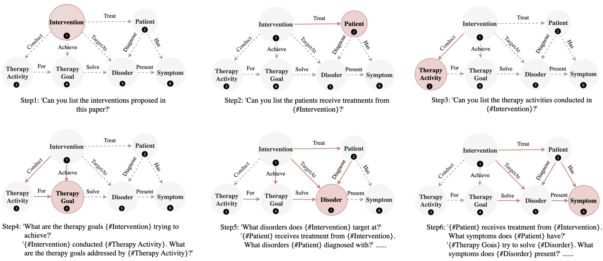

Figure 1: Illustration of prompt design and scheduling based on outdegree-prioritized BFS over a simple healthcare ontology for automating knowledge discovery.

Algorithm 1 Progressive Ontology Prompting

1:function OntologyTraversal($\mathcal{G}$, $k$)2:     Initialize: $queue,Order\leftarrow[]$, $visited,Khops\leftarrow\{\}$3:     Identify the source node $s$4:     $enqueue(queue,(s,0))$, $visited[s]\leftarrow\text{true}$, $Khops[s]\leftarrow[]$5:     while not $queue$.empty() do6:         $(current,hop)\leftarrow dequeue(queue)$7:         $Order$.append$(current)$8:         Gather unvisited neighbors of $current$ into $neighbors$9:         Sort $neighbors$ by out-to-in ratio in descending order10:         for $neighbor$ in $neighbors$ do11:              if not $visited[neighbor]$ then12:                  $enqueue(queue,(neighbor,hop+1))$13:                  $visited[neighbor]\leftarrow\text{true}$14:                  $Khops[neighbor]\leftarrow[]$15:              end if16:              if $hop+1\leq k$ then17:                  $Khops[neighbor].append(current)$18:              end if19:         end for20:     end while21:     return $Order$, $Khops$22:end function23:function Main($\mathcal{G}$, $k$, $T$)24:     Initialize $annotations\leftarrow\{\}$25:     $Order,Khops\leftarrow\textsc{OntologyTraversal}(\mathcal{G},k)$26:     while not $Order$.empty() do27:         $current\leftarrow Order$.dequeue(), $context\leftarrow Khops[current]$28:         if not $context$.empty() then29:              $discoveries\leftarrow\{annotations[t]\text{ for }t\text{ in }context\}$30:              $prompt\leftarrow T(current,G_{sub}(context),discoveries)$31:         else32:              $prompt\leftarrow T(current)$33:         end if34:         $annotations[current]\leftarrow\textsc{LLM}(prompt)$35:     end while36:end function

In our work, we develop a progressive ontology prompting (POP) algorithm that employs a prioritized BFS on the ontology graph $\mathcal{G}(\mathcal{E},\mathcal{R},\mathcal{F})$ to generate a set of prompt templates and action orders for LLMs. As illustrated in Figure [1](https://arxiv.org/html/2409.00054v1#Sx4.F1 "Figure 1 ‣ Ontology Prompting Algorithm ‣ Methodology ‣ Automating Knowledge Discovery from Scientific Literature via LLMs: A Dual-Agent Approach with Progressive Ontology Prompting"), in our method, the prompt design and scheduling follow a progressive manner. The annotation process begins by annotating the concept at a source node (i.e., nodes that only have outgoing edges) and then proceeds to its neighbors following the traversal order of a prioritized BFS. To allow BFS to quickly access a large portion of the graph, we modify BFS by sorting the neighbor nodes according to the out-to-in ratio $R(v)$, which is defined by:

|  | $R(v)=\frac{&#124;\left\{(h,r,t)\in\mathcal{F}\right\}&#124;h=v&#124;}{&#124;\left\{(h,r,t)\in% \mathcal{F}\right\}&#124;t=v&#124;}$ |  | (2) |

Therefore, the algorithm will choose the neighbor node with higher $R$ to visit at the next step. For example, in Figure [1](https://arxiv.org/html/2409.00054v1#Sx4.F1 "Figure 1 ‣ Ontology Prompting Algorithm ‣ Methodology ‣ Automating Knowledge Discovery from Scientific Literature via LLMs: A Dual-Agent Approach with Progressive Ontology Prompting"), visiting the ‘Patient’ node before the ‘Disorder’ node can provide more information for annotating the ‘Disorder’ concept. For any concept node $v$, we use the visited nodes within its k-hop neighborhood as its context. The $Prompt_{v}$ for identifying concept $v$ is crafted based on its own concept type and knowledge discoveries within its context. The action order of this prompt $Order_{v}$ is determined by the order in which node $v$ is visited during the prioritized BFS traversal.

The pseudocode of the POP algorithm is shown in Algorithm [1](https://arxiv.org/html/2409.00054v1#alg1 "Algorithm 1 ‣ Ontology Prompting Algorithm ‣ Methodology ‣ Automating Knowledge Discovery from Scientific Literature via LLMs: A Dual-Agent Approach with Progressive Ontology Prompting"). The algorithm first follows prioritized BFS traversal to capture the context and visit order of a specific concept node, then composes annotation prompts based on the local ontology structure and discoveries within its context as follows:

|  | $\displaystyle Prompt(v)$ | $\displaystyle\leftarrow\left\{Prefix\left(N_{k-1}(u)\right)\oplus\right.$ |  |
|  |  | $\displaystyle\left.Question\left((v,e,u)\mid(v,e,u)\in F\right)\mid u\in N_{1}% (v)\right\}$ |  | (3) |

where $\oplus$ is the concatenation. We introduce two parameters in POP: context size $k$ and prompt template $T$. As the prompt examples shown in Figure 1, to annotate a specific concept, in prompt template $T$, we task LLMs to describe the knowledge discoveries within its context as a prefix to the annotation question associated with its concept type. Example prompts and corresponding outputs can be referred to in Appendix 3.

### LLM-Duo Annotation Framework

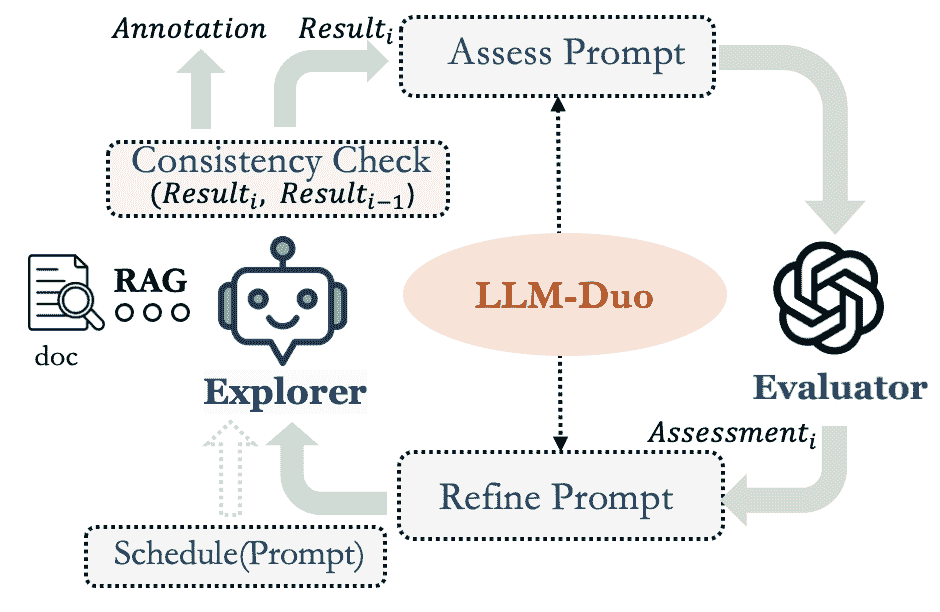

Figure 2: Illustrative annotation process with LLM-Duo framework.

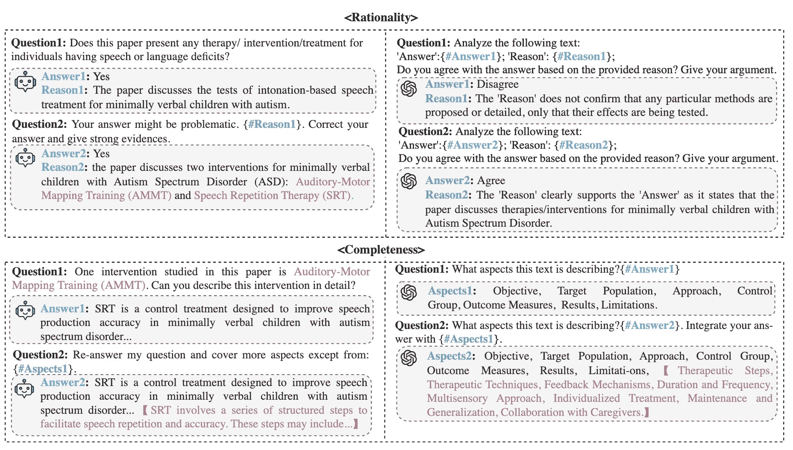

Figure 3: Two annotation examples of speech-language intervention discovery using LLM-Duo framework. These examples demonstrate the adversarial annotation process with two LLMs when separately emphasizing on rationality and completeness.

To guarantee the integrity and reliability of knowledge discoveries via LLMs, we propose LLM-Duo. The architecture of LLM-Duo is illustrated in Figure [2](https://arxiv.org/html/2409.00054v1#Sx4.F2 "Figure 2 ‣ LLM-Duo Annotation Framework ‣ Methodology ‣ Automating Knowledge Discovery from Scientific Literature via LLMs: A Dual-Agent Approach with Progressive Ontology Prompting"). It comprises two primary LLM components: the explorer and the evaluator. Specifically, the explorer is a chatbot developed with RAG and works for the intervention discovery and annotation by zero-shot question answering (QA). RAG is utilized to ground its generations within the given literature context. Even though RAG can reduce the hallucination of LLMs by providing references to guarantee the integrity and reliability of explorers’ generations, the explorer might still make mistakes. To ensure maximized accuracy and reliability of annotations, we introduce another LLM, called the evaluator, tasked with inspecting the explorer’s responses to enhance the annotation quality.

In our annotation framework, the interaction between explorer and evaluator is collaborative and adversarial. Given a research paper, LLM-Duo will be tasked with prompts following a specific action order obtained from the POP algorithm. Depending on the exact requirements of annotations for different knowledge domains, the inspection mechanism of the evaluator can be customized. In our test case of speech-language intervention discovery, we emphasize the factual correctness and completeness of the annotations for different concepts, which are also typical requirements for annotation quality in most scenarios. LLMs cannot directly assess the correctness of the answer since they do not have prior knowledge of the correct response. Inspired by the concept of LLMs self-correcting through reasoning, we convert the correctness inspection to the answer’s rationality assessment.

In an interaction cycle of LLM-Duo for annotating concepts emphasizing rationality, the answer along with its explanatory reason is presented to the evaluator. The evaluator scrutinizes the answer’s rationality and gives feedback to the explorer. Depending on the feedback, the explorer may either adjust its answer accordingly or, if disagreeing, present stronger evidence to support its original answer to challenge the evaluator’s assessments. For annotating concepts emphasizing completeness, in each round, the evaluator will extract the aspects covered in the explorer’s answer and integrate them with aspects of the last round to form a new aspect collection and greedily prompt the explorer to delve deeper and explore more beyond the new aspect collection. The iterative refinement process will continue until the annotation achieves consistency. The key idea behind our LLM-Duo framework is using the feedback loop to assist the explorer refine its annotations. As an example shown in Figure 3, by facilitating interactive loops between two LLM agents, LLM-Duo enables more convincing and accurate annotations.

## Experiments

### Implementation

In the LLM-Duo framework, the explorer is a chatbot built on LLM with RAG using Llamaindex^†^†https://www.llamaindex.ai. We use OpenAI ‘text-embedding-3-large’ as the embedding model and set the chunk size to 256 tokens with an overlapping size of 128\. Particularly, we use ‘FastCoref’ (Otmazgin, Cattan, and Goldberg [2022](https://arxiv.org/html/2409.00054v1#bib.bib24)) to process text chunks for coreference resolution before text embedding. Besides, we pass the document ID as metadata and apply a metadata filter on the chat engine to ensure the explorer only answers within the text of the specific document to be annotated. We set the retrieval to be on the top 8 text chunks based on similarity scores reranked with SentenceTransformerRerank^†^†https://docs.llamaindex.ai/en/stable/examples/node˙postprocessor/SentenceTransformerRerank employing the ‘cross-encoder/ms-marco-MiniLM-L-2-v2’^†^†https://huggingface.co/cross-encoder/ms-marco-MiniLM-L-2-v2 model in Llamaindex. The evaluator is an external LLM who does not share any document context with the explorer.

### Case Description: Speech-language Intervention Discovery

Speech-language therapy provides interventions for individuals with speech-language deficits, enhancing their quality of life across various life stages. When choosing an intervention, evidence-based practice (EBP) is attractive as it integrates research evidence from literature into the decision-making process to ensure high-quality patient care (Law et al. [1996](https://arxiv.org/html/2409.00054v1#bib.bib15)). Intervention research, especially studies that offer clear intervention frameworks and comprehensive case studies, are valuable references to guide EBP designs. Intervention discovery aims to extensively gather speech-language interventions from the literature corpus as references to facilitate EBP design. It involves identifying relevant studies and extracting essential features of interventions including target disorder, procedure, efficacy, case study, therapy activity, etc., which is extremely labor-intensive for human reviewers, highlighting the efficiency of automating knowledge discovery based on LLMs.

To verify the effectiveness of our method in a realistic scenario, we employ our framework in a speech-language intervention discovery setting. The ontology is shown in Figure [4](https://arxiv.org/html/2409.00054v1#Sx5.F4 "Figure 4 ‣ Case Description: Speech-language Intervention Discovery ‣ Experiments ‣ Automating Knowledge Discovery from Scientific Literature via LLMs: A Dual-Agent Approach with Progressive Ontology Prompting"). We list the concept and relation definitions of this ontology in Appendix 1.1\. To enable a large-scale discovery, we cultivate a literature base including 64,177 papers within the domain of speech-language therapy. Specifically, we employ a set of keywords carefully selected from a glossary of commonly used terms in speech-language therapy to guide our literature search. The search keywords and literature base are shown in Appendix 1.2.

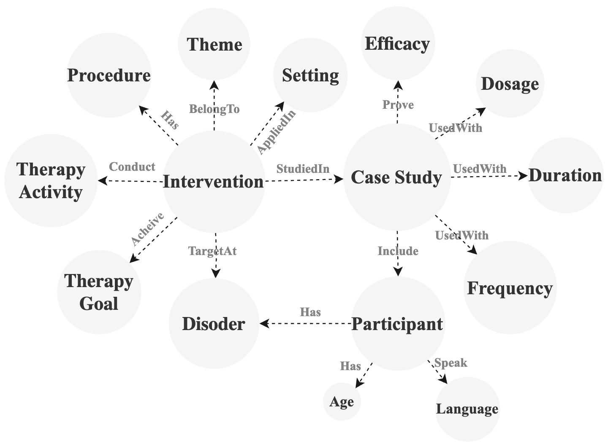

Figure 4: Ontology of speech-language intervention.

### Baselines

The basic idea of LLM-Duo is to make LLM rectify its initial annotation results through external feedback from another LLM. Instead of setting up another LLM for evaluation, recent studies show that LLMs can perform self-correction to refine their responses by themselves (Liu et al. [2024](https://arxiv.org/html/2409.00054v1#bib.bib19); Li et al. [2024](https://arxiv.org/html/2409.00054v1#bib.bib17)), and successful examples include Chain-of-Thought (CoT) (Wei et al. [2022](https://arxiv.org/html/2409.00054v1#bib.bib32)) and SelfRefine (Madaan et al. [2024](https://arxiv.org/html/2409.00054v1#bib.bib20)). We separately equip the chatbot based on RAG with these two prompting methods for annotation and denote them as CoT-RAG and SelfRefine-RAG. The full prompts for these two methods can be found in Appendix 2\. Additionally, in LLM-Duo, a potential substitution of explorer is long-context LLM, which is capable of processing entire document tokens instead of chunking and retrieval with RAG. We denote LLM-Duo respectively using explorers built on RAG and long-context LLM as LLM-Duo-RAG and LLM-Duo-LongContext. Besides, we also compare with methods that directly input paper text to LLMs for zero-shot QA annotation without an evaluation feedback loop, including ShortContext LLM, LongContext LLM, OpenAI Assistant, and RAG.

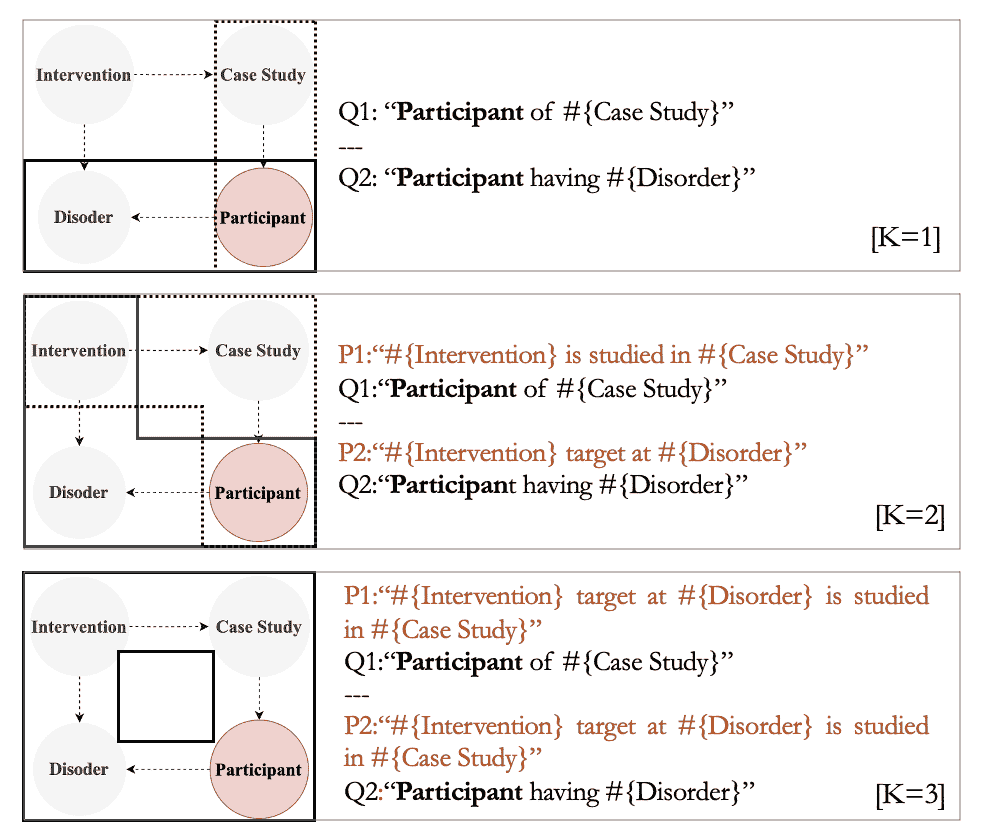

(a) Illustration of participant annotation under different k values.

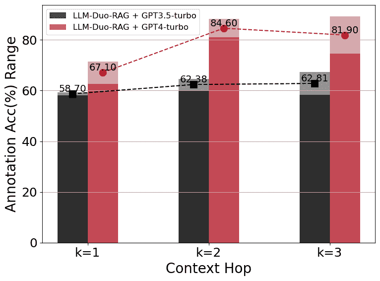

(b) Range of participant annotation accuracy using LLM-Duo-RAG with different LLMs at k=1,2,3.

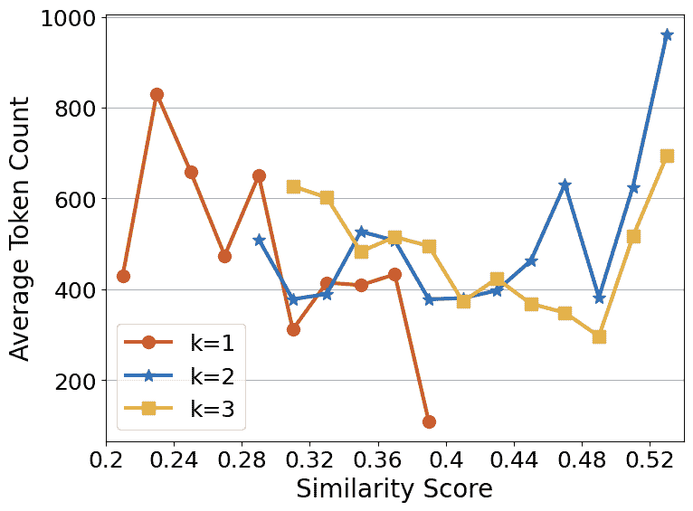

(c) Token count distribution of retrieved-back chunks across varying similarity scores under participant annotation queries of k=1,2,3.

Figure 5: Overview of participant annotation and related metrics across different k values.

### Evaluation

In our experiment of comparing with baseline approaches, we report six types of metrics: 1) Consistency Rounds (CR): the number of refine loops the method makes before achieving the annotation consistency; 2) Verbosity Index (VI): the number of aspects per 1k tokens of the annotations, which is an important metric for annotation emphasizing content completeness; 3) Enumeration Quantity (EQ): the number of items listed in the annotations (i.e., therapy activities, therapy goals in our test case.); 4) Faithfulness (Faith): the extent of the annotation faithful to the provided text, which is measured by FaithfulnessEvaluator^†^†https://docs.llamaindex.ai/en/stable/examples/evaluation/faithfulness˙eval of Llamaindex. 5) Accuracy (ACC): the percent of correct annotations in all LLM-provided annotations. 6) Cover: the percent of correct LLM-provided annotations to the total mentioned concept entities in the provided text.

## Results

In this section, we first provide a detailed evaluation of our progressive ontology prompting algorithm and the LLM-Duo annotation framework. Then, we showcase the results of speech-language intervention discoveries using our automated knowledge discovery framework, which further demonstrates the effectiveness of our framework in addressing practical scientific knowledge discovery tasks.

### Context Size Analysis

In our progressive ontology prompting algorithm, when composing the annotation prompt for a concept node, the knowledge discoveries and the local ontology structure within the context (visited nodes within $k$-hop neighborhood) of a specific concept node serve as a prefix to provide conditions for annotation questions. The $k$ value determines the diversity and volume of information provided. To evaluate how the context size of the POP algorithm affects annotation quality, we conducted experiments by applying different $k$ values to generate prompts for LLM-Duo-RAG annotation. As shown in Figure [5(a)](https://arxiv.org/html/2409.00054v1#Sx5.F5.sf1 "In Figure 5 ‣ Baselines ‣ Experiments ‣ Automating Knowledge Discovery from Scientific Literature via LLMs: A Dual-Agent Approach with Progressive Ontology Prompting"), we selected an ontology substructure related to the ‘participant’ concept for the experiment, which was based on a random selection of 8 speech-language therapy papers.

 | Methods | LLM | IR | ICA | IKC |
| --- | --- | --- | --- | --- |
|  |  | CR | ACC | Cover | CR | VI | EQ | Faith | CR | ACC |
| --- | --- | --- | --- | --- | --- | --- | --- | --- | --- | --- |
| ShortContext | GPT3.5-turbo | - | 36.9% | 50% | - | 0.0249 | 5.46 | 0.9667 | - | 48.2% |
| --- | --- | --- | --- | --- | --- | --- | --- | --- | --- | --- |
| OpenAI Assistant | GPT4-turbo | - | 76.1% | 69.0% | - | 0.0631 | 4.17 | 0.7857 | - | 53.3% |
| LongContext | GPT4-turbo | - | 76.3% | 57.1% | - | 0.0919 | 8.64 | 1.0 | - | 61.2% |
| LLM-Duo-LongContext | GPT4-turbo | 2.17 | 81.0% | 68.7% | 2.5 | 0.0926 | 8.68 | 0.8571 | 1.31 | 69.6% |
| RAG | GPT3.5-turbo | - | 47.6% | 50% | - | 0.0319 | 7.96 | 0.8550 | - | 48.7% |
| CoT-RAG | GPT3.5-turbo | 1.04 | 78.6% | 81% | 3.18 | 0.0771 | 10.37 | 0.7250 | 1.07 | 73.2% |
| SelfRefine-RAG | GPT3.5-turbo | 1.19 | 78.5% | 54.4% | 2.85 | 0.0694 | 7.17 | 0.8125 | 1.12 | 54.8% |
| LLM-Duo-RAG | GPT3.5-turbo | 1.84 | 100% | 86.4% | 2.58 | 0.1159 | 13.71 | 0.9285 | 1.46 | 85.6% |
| Llama3-instruct-70b | 2.71 | 78.6% | 55.6% | 2.59 | 0.0748 | 9.79 | 0.8648 | 1.52 | 61.0% |
| Mistral-instruct-8x22b | 2.30 | 81.9% | 67.5% | 2.16 | 0.0763 | 9.87 | 0.8875 | 1.46 | 67.2% | 

Table 1: Comparison with baseline methods using various base LLMs.

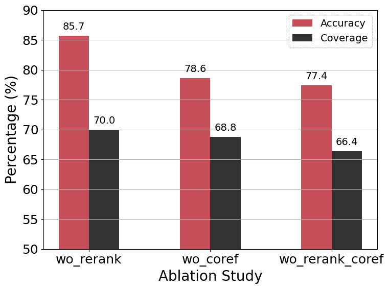

(a) Ablation studies of removing rerank (wo_rerank) and corefenence (wo_coref) modules in LLM-Duo-RAG.

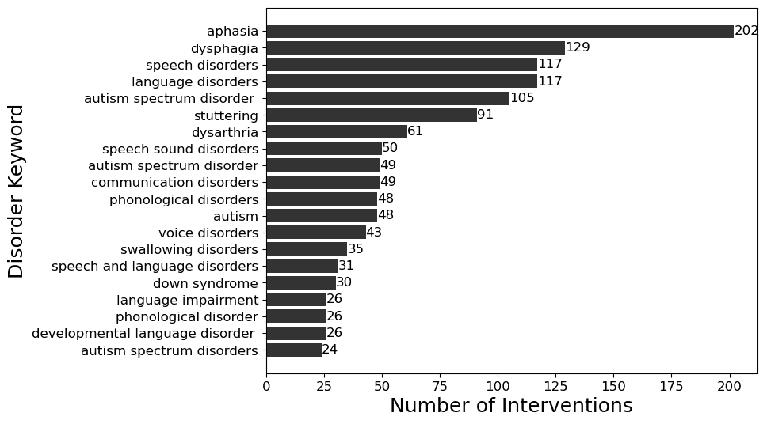

(b) Number of discovered interventions for top 20 disorders.

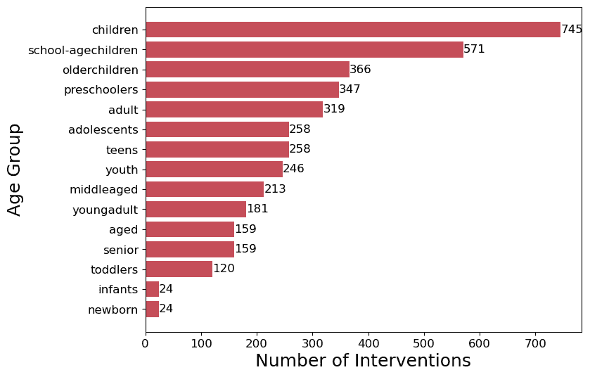

(c) Number of discovered interventions for different age groups.

Figure 6: Ablation study and discovered speech-language intervention statistics.

The resulting annotation accuracy of the participant concept is shown in Figure [5(b)](https://arxiv.org/html/2409.00054v1#Sx5.F5.sf2 "In Figure 5 ‣ Baselines ‣ Experiments ‣ Automating Knowledge Discovery from Scientific Literature via LLMs: A Dual-Agent Approach with Progressive Ontology Prompting"). The results indicate that as the context hop $k$ increases, annotation accuracy improves significantly, suggesting that a larger context provides more informative prompts, thereby enhancing annotation quality. Moreover, GPT-4-turbo consistently outperforms GPT-3.5-turbo across all $k$ values, demonstrating that more advanced language models can further improve annotation accuracy. Besides, we inspect the text chunks retrieved back by different annotation queries based on various $k$ values. We report the range of similarity scores and token count distribution of retrieved-back chunks in Figure [5(c)](https://arxiv.org/html/2409.00054v1#Sx5.F5.sf3 "In Figure 5 ‣ Baselines ‣ Experiments ‣ Automating Knowledge Discovery from Scientific Literature via LLMs: A Dual-Agent Approach with Progressive Ontology Prompting"). The similarity score represents the semantically relevancy between retrieved texts to annotation queries. From the results, we can observe that when $k=1$, the retrieved text chunks generally exhibit low similarity with the query, and the token count tends to decrease as the similarity score increases, leading to poor annotation quality. In contrast, larger $k$ values, particularly $k=2$, result in more relevant content being retrieved. For $k=2$, the token count shows an increasing trend with higher similarity scores, indicating that more substantial and relevant content is being captured, which results in better annotation quality.

### LLM-Duo with Baseline Annotation Methods

To evaluate the performance of our LLM-Duo annotation framework, we compare it with baseline methods in the context of speech-language intervention discovery. We randomly pick 8 papers from our speech-language literature base for annotation using various baselines. The comparison focuses on three key dimensions: 1) Intervention Recognition (IR), identifying intervention entities within the paper; 2) Intervention Aspect Summary (IAS), annotating an aspect (e.g., procedure, therapy activity, therapy goals) of an intervention approach, which requires capture and summarize all related information fragments from the paper; and 3) Intervention Knowledge Completion (IKC), linking interventions to theme classes (e.g., speech awareness, speech articulation, comprehension, foundation skills, etc.) and setting concept nodes (e.g., home, healthcare facilities, early childhood centers, schools, teletherapy, etc.). For IR and IKC tasks, we ask human annotators to complete annotation as golden results for comparison. For the IAS task, due to the individual bias of human interpretation, we only ask human annotators to tag the text fragments in the paper pertaining to a specific intervention aspect.

The experimental results are reported in Table [1](https://arxiv.org/html/2409.00054v1#Sx6.T1 "Table 1 ‣ Context Size Analysis ‣ Results ‣ Automating Knowledge Discovery from Scientific Literature via LLMs: A Dual-Agent Approach with Progressive Ontology Prompting"). It should be noted that we implemented ‘ShortContext’ using Llama3-instruct-70b (FP16) and Mistral-instruct-8x22b models (INT8). However, directly prompting these models with full paper text fails to produce annotations in a zero-shot QA setting. Their generations do not align with the annotation questions. From the results in Table [1](https://arxiv.org/html/2409.00054v1#Sx6.T1 "Table 1 ‣ Context Size Analysis ‣ Results ‣ Automating Knowledge Discovery from Scientific Literature via LLMs: A Dual-Agent Approach with Progressive Ontology Prompting"), we observe that LLM-Duo-RAG outperforms all baselines. Even though GPT4-turbo has a 128k context window length and is capable of generating annotations, its annotation coverage remains inadequate. Integrating it with the LLM-Duo framework can significantly improve both the accuracy and the comprehensiveness of the annotations. Additionally, compared with simple RAG, self-correct prompting methods such as CoT and SelfRefine can significantly enhance annotations, but their performance is still worse than LLM-Duo-RAG. Instead of utilizing costly GPT models, LLM-Duo-RAG, which employs open-source models including Llama3-instruct-70b and Mistral-instruct-8x22b, can achieve comparable annotation quality.

### Ablation Study

In our framework, the chatbot explorer uses the RAG technique. We enhance generation quality with ’FastCoref’ for coreference resolution and rerank retrieved chunks by similarity score using the ’cross-encoder/ms-marco-MiniLM-L-2-v2 model’. This section presents ablation studies for both components. Since recognizing the intervention entity is the critical first step following the POP algorithm, we report the accuracy of intervention recognition in this study. As shown in Figure [6(a)](https://arxiv.org/html/2409.00054v1#Sx6.F6.sf1 "In Figure 6 ‣ Context Size Analysis ‣ Results ‣ Automating Knowledge Discovery from Scientific Literature via LLMs: A Dual-Agent Approach with Progressive Ontology Prompting"), the results demonstrate that removing these components significantly decreases annotation accuracy, showing the necessity of each module.

### Speech-Language Intervention Discovery

Our knowledge discovery framework has identified 2,421 interventions supported by case studies from 64,177 research papers in the field of speech-language therapy. The statistics of discovered interventions are presented in Figure [6(b)](https://arxiv.org/html/2409.00054v1#Sx6.F6.sf2 "In Figure 6 ‣ Context Size Analysis ‣ Results ‣ Automating Knowledge Discovery from Scientific Literature via LLMs: A Dual-Agent Approach with Progressive Ontology Prompting") and Figure [6(c)](https://arxiv.org/html/2409.00054v1#Sx6.F6.sf3 "In Figure 6 ‣ Context Size Analysis ‣ Results ‣ Automating Knowledge Discovery from Scientific Literature via LLMs: A Dual-Agent Approach with Progressive Ontology Prompting"). A complete intervention annotation example is available in Appendix 3\. 19 clinicians and students reviewed our annotations through online Google forms. In checking the intervention annotation and reading the corresponding literature, they reported that 89% of our annotations are valid and complete. Based on the intervention ontology in Figure [4](https://arxiv.org/html/2409.00054v1#Sx5.F4 "Figure 4 ‣ Case Description: Speech-language Intervention Discovery ‣ Experiments ‣ Automating Knowledge Discovery from Scientific Literature via LLMs: A Dual-Agent Approach with Progressive Ontology Prompting") and annotations, we have constructed an intervention knowledge graph that will be publicly accessible. This knowledge graph is expected to be a valuable resource for speech-language domain experts, supporting evidence-based clinical decision-making, question-answering and recommendation, ultimately enhancing healthcare outcomes.

## Conclusion

In this paper, we developed a novel automatic knowledge discovery framework based on LLMs, which is characterized by a progressive ontology prompting algorithm and a dual-agent annotation system. The proposed method achieves superior performance compared with advanced baselines, enabling more accurate knowledge discovery. Applied to speech-language intervention discovery, this framework also curates a valuable, accessible intervention knowledge base for the speech-language therapy community.

## References

*   Abid, Farooqi, and Zou (2021) Abid, A.; Farooqi, M.; and Zou, J. 2021. Persistent anti-muslim bias in large language models. In *Proceedings of the 2021 AAAI/ACM Conference on AI, Ethics, and Society*, 298–306.
*   Achiam et al. (2023) Achiam, J.; Adler, S.; Agarwal, S.; Ahmad, L.; Akkaya, I.; Aleman, F. L.; Almeida, D.; Altenschmidt, J.; Altman, S.; Anadkat, S.; et al. 2023. Gpt-4 technical report. *arXiv preprint arXiv:2303.08774*.
*   Agrawal et al. (2022) Agrawal, M.; Hegselmann, S.; Lang, H.; Kim, Y.; and Sontag, D. 2022. Large language models are few-shot clinical information extractors. *arXiv preprint arXiv:2205.12689*.
*   Bang et al. (2023) Bang, Y.; Cahyawijaya, S.; Lee, N.; Dai, W.; Su, D.; Wilie, B.; Lovenia, H.; Ji, Z.; Yu, T.; Chung, W.; et al. 2023. A multitask, multilingual, multimodal evaluation of chatgpt on reasoning, hallucination, and interactivity. *arXiv preprint arXiv:2302.04023*.
*   Carta et al. (2023) Carta, S.; Giuliani, A.; Piano, L.; Podda, A. S.; Pompianu, L.; and Tiddia, S. G. 2023. Iterative zero-shot llm prompting for knowledge graph construction. *arXiv preprint arXiv:2307.01128*.
*   Cauter and Yakovets (2024) Cauter, Z.; and Yakovets, N. 2024. Ontology-guided Knowledge Graph Construction from Maintenance Short Texts. In *Proceedings of the 1st Workshop on Knowledge Graphs and Large Language Models (KaLLM 2024)*, 75–84.
*   Ehrlinger and Wöß (2016) Ehrlinger, L.; and Wöß, W. 2016. Towards a definition of knowledge graphs. *SEMANTiCS (Posters, Demos, SuCCESS)*, 48(1-4): 2.
*   Gao et al. (2023) Gao, Y.; Xiong, Y.; Gao, X.; Jia, K.; Pan, J.; Bi, Y.; Dai, Y.; Sun, J.; and Wang, H. 2023. Retrieval-augmented generation for large language models: A survey. *arXiv preprint arXiv:2312.10997*.
*   Gruninger (1995) Gruninger, M. 1995. Methodology for the design and evaluation of ontologies. In *Proc. IJCAI’95, Workshop on Basic Ontological Issues in Knowledge Sharing*.
*   Guo et al. (2023) Guo, B.; Zhang, X.; Wang, Z.; Jiang, M.; Nie, J.; Ding, Y.; Yue, J.; and Wu, Y. 2023. How close is chatgpt to human experts? comparison corpus, evaluation, and detection. *arXiv preprint arXiv:2301.07597*.
*   Kim et al. (2024) Kim, H.; Mitra, K.; Chen, R. L.; Rahman, S.; and Zhang, D. 2024. MEGAnno+: A Human-LLM Collaborative Annotation System. *arXiv preprint arXiv:2402.18050*.
*   Kojima et al. (2022) Kojima, T.; Gu, S. S.; Reid, M.; Matsuo, Y.; and Iwasawa, Y. 2022. Large language models are zero-shot reasoners. *Advances in neural information processing systems*, 35: 22199–22213.
*   Kommineni, König-Ries, and Samuel (2024) Kommineni, V. K.; König-Ries, B.; and Samuel, S. 2024. From human experts to machines: An LLM supported approach to ontology and knowledge graph construction. *arXiv preprint arXiv:2403.08345*.
*   Laurenzi, Mathys, and Martin (2024) Laurenzi, E.; Mathys, A.; and Martin, A. 2024. An LLM-Aided Enterprise Knowledge Graph (EKG) Engineering Process. In *Proceedings of the AAAI Symposium Series*, volume 3, 148–156.
*   Law et al. (1996) Law, J.; Garrett, Z.; Nye, C.; Cochrane Developmental, P.; and Group, L. P. 1996. Speech and language therapy interventions for children with primary speech and language delay or disorder. *Cochrane Database of Systematic Reviews*, 2015(5).
*   Lewis et al. (2020) Lewis, P.; Perez, E.; Piktus, A.; Petroni, F.; Karpukhin, V.; Goyal, N.; Küttler, H.; Lewis, M.; Yih, W.-t.; Rocktäschel, T.; et al. 2020. Retrieval-augmented generation for knowledge-intensive nlp tasks. *Advances in Neural Information Processing Systems*, 33: 9459–9474.
*   Li et al. (2024) Li, L.; Chen, Z.; Chen, G.; Zhang, Y.; Su, Y.; Xing, E.; and Zhang, K. 2024. Confidence Matters: Revisiting Intrinsic Self-Correction Capabilities of Large Language Models. arXiv:2402.12563.
*   Li et al. (2023) Li, M.; Shi, T.; Ziems, C.; Kan, M.-Y.; Chen, N.; Liu, Z.; and Yang, D. 2023. CoAnnotating: Uncertainty-Guided Work Allocation between Human and Large Language Models for Data Annotation. In Bouamor, H.; Pino, J.; and Bali, K., eds., *Proceedings of the 2023 Conference on Empirical Methods in Natural Language Processing*, 1487–1505\. Singapore: Association for Computational Linguistics.
*   Liu et al. (2024) Liu, D.; Nassereldine, A.; Yang, Z.; Xu, C.; Hu, Y.; Li, J.; Kumar, U.; Lee, C.; and Xiong, J. 2024. Large Language Models have Intrinsic Self-Correction Ability. arXiv:2406.15673.
*   Madaan et al. (2024) Madaan, A.; Tandon, N.; Gupta, P.; Hallinan, S.; Gao, L.; Wiegreffe, S.; Alon, U.; Dziri, N.; Prabhumoye, S.; Yang, Y.; et al. 2024. Self-refine: Iterative refinement with self-feedback. *Advances in Neural Information Processing Systems*, 36.
*   Martins, Marinho, and Martins (2019) Martins, P. H.; Marinho, Z.; and Martins, A. F. 2019. Joint learning of named entity recognition and entity linking. *arXiv preprint arXiv:1907.08243*.
*   Melnyk and Fineout-Overholt (2022) Melnyk, B. M.; and Fineout-Overholt, E. 2022. *Evidence-based practice in nursing & healthcare: A guide to best practice*. Lippincott Williams & Wilkins.
*   Mihindukulasooriya et al. (2023) Mihindukulasooriya, N.; Tiwari, S.; Enguix, C. F.; and Lata, K. 2023. Text2kgbench: A benchmark for ontology-driven knowledge graph generation from text. In *International Semantic Web Conference*, 247–265\. Springer.
*   Otmazgin, Cattan, and Goldberg (2022) Otmazgin, S.; Cattan, A.; and Goldberg, Y. 2022. F-coref: Fast, accurate and easy to use coreference resolution. *arXiv preprint arXiv:2209.04280*.
*   Peng et al. (2023) Peng, C.; Xia, F.; Naseriparsa, M.; and Osborne, F. 2023. Knowledge graphs: Opportunities and challenges. *Artificial Intelligence Review*, 56(11): 13071–13102.
*   Qin et al. (2023) Qin, C.; Zhang, A.; Zhang, Z.; Chen, J.; Yasunaga, M.; and Yang, D. 2023. Is chatgpt a general-purpose natural language processing task solver? *arXiv preprint arXiv:2302.06476*.
*   Rutten et al. (2021) Rutten, L. J. F.; Zhu, X.; Leppin, A. L.; Ridgeway, J. L.; Swift, M. D.; Griffin, J. M.; St Sauver, J. L.; Virk, A.; and Jacobson, R. M. 2021. Evidence-based strategies for clinical organizations to address COVID-19 vaccine hesitancy. In *Mayo clinic proceedings*, volume 96, 699–707\. Elsevier.
*   Sackett (1997) Sackett, D. L. 1997. Evidence-based medicine. In *Seminars in perinatology*, volume 21, 3–5\. Elsevier.
*   Usai et al. (2018) Usai, A.; Pironti, M.; Mital, M.; and Aouina Mejri, C. 2018. Knowledge discovery out of text data: a systematic review via text mining. *Journal of knowledge management*, 22(7): 1471–1488.
*   Wadhwa, Amir, and Wallace (2023) Wadhwa, S.; Amir, S.; and Wallace, B. C. 2023. Revisiting relation extraction in the era of large language models. In *Proceedings of the conference. Association for Computational Linguistics. Meeting*, volume 2023, 15566\. NIH Public Access.
*   Wang et al. (2023) Wang, H.; Fu, T.; Du, Y.; Gao, W.; Huang, K.; Liu, Z.; Chandak, P.; Liu, S.; Van Katwyk, P.; Deac, A.; et al. 2023. Scientific discovery in the age of artificial intelligence. *Nature*, 620(7972): 47–60.
*   Wei et al. (2022) Wei, J.; Wang, X.; Schuurmans, D.; Bosma, M.; Xia, F.; Chi, E.; Le, Q. V.; Zhou, D.; et al. 2022. Chain-of-thought prompting elicits reasoning in large language models. *Advances in neural information processing systems*, 35: 24824–24837.
*   Wei et al. (2023) Wei, X.; Cui, X.; Cheng, N.; Wang, X.; Zhang, X.; Huang, S.; Xie, P.; Xu, J.; Chen, Y.; Zhang, M.; et al. 2023. Zero-shot information extraction via chatting with chatgpt. *arXiv preprint arXiv:2302.10205*.
*   Wei et al. (2019) Wei, Z.; Su, J.; Wang, Y.; Tian, Y.; and Chang, Y. 2019. A novel cascade binary tagging framework for relational triple extraction. *arXiv preprint arXiv:1909.03227*.
*   Ye et al. (2022) Ye, H.; Zhang, N.; Chen, H.; and Chen, H. 2022. Generative knowledge graph construction: A review. *arXiv preprint arXiv:2210.12714*.
*   Zhang and Soh (2024) Zhang, B.; and Soh, H. 2024. Extract, Define, Canonicalize: An LLM-based Framework for Knowledge Graph Construction. *arXiv preprint arXiv:2404.03868*.
*   Zhong et al. (2023a) Zhong, L.; Wu, J.; Li, Q.; Peng, H.; and Wu, X. 2023a. A comprehensive survey on automatic knowledge graph construction. *ACM Computing Surveys*, 56(4): 1–62.
*   Zhong et al. (2023b) Zhong, Q.; Ding, L.; Liu, J.; Du, B.; and Tao, D. 2023b. Can chatgpt understand too? a comparative study on chatgpt and fine-tuned bert. *arXiv preprint arXiv:2302.10198*.

## Appendix A Appendix

### 1 Intervention Ontology and Literature

1.1 Intervention Ontology The intervention ontology is shown in Figure 4 of the main paper. In this section, we provide a detailed explanation of the concepts introduced in the ontology as follows:

*   •

    Intervention represents a targeted treatment practice designed to enhance an individual’s communication skills.

*   •

    Disorder represent the type of disorder that causes difficulties in an individual’s voice, speech, language, or swallowing functions.

*   •

    Setting represents a specific environment where interventions are implemented. We identify six key settings: home, healthcare facilities (such as hospitals or rehabilitation centers), early childhood centers (like nurseries or daycare), schools, clinics and private practices, and teletherapy.

*   •

    Theme represents the theme of the intervention. As shown in Table [2](https://arxiv.org/html/2409.00054v1#A1.T2 "Table 2 ‣ 1 Intervention Ontology and Literature ‣ Appendix A Appendix ‣ Automating Knowledge Discovery from Scientific Literature via LLMs: A Dual-Agent Approach with Progressive Ontology Prompting"), we categorize interventions into 10 themes based on their characteristics and therapy goals.

*   •

    Therapy Activity represents a task designed to address a particular speech or language challenge in an individual, such as using a minimal pairs activity to enhance phonological awareness.

*   •

    Therapy Goal represents a specific area that the intervention is designed to enhance.

*   •

    Procedure represents a comprehensive description of how the intervention is carried out.

*   •

    Efficacy represents the conclusion about the effectiveness of intervention.

*   •

    Frequency/Dosage/Duration represents the frequency/dosage/ duration of the intervention practiced in the case study that demonstrates its efficacy.

*   •

    Case Study represents a detailed examination of the intervention on a particular individual or group with communication disorders. The purpose of a case study is to provide a deep understanding of the patient’s unique needs and assess the intervention effectiveness.

*   •

    Participant represents the individuals or populations that are involved in the case study of intervention.

*   •

    Age represent the age of experiment participant or claimed target population of the intervention. The age is quantified with a granularity of half a year. We additionally convert age to age groups including “newborn, infants, toddlers, children, preschoolers, school-age children, older children, youth, teens, adolescents, adult, young adult, middle aged, aged, senior”. Each specific age may be associated with multiple age groups. For instance, an individual aged 13 years could be categorized to the ‘teens,’ ‘adolescents,’ and ‘children’ age groups.

*   •

    Language represent the speaking language of experiment participant in the case study of the intervention.

 | Theme | Definition |
| --- | --- |
| speech awareness | work that involves recognizing and understanding speech sounds. It includes phonological awareness (identifying and manipulating sounds), auditory discrimination (distinguishing sounds), and sound identification (recognizing the meaning of sounds). |
| speech articulation | work that refers to the physical production of speech sounds using the mouth, lips, tongue, and respiratory system. It focuses on the clarity and accuracy of pronouncing phonemes and forming them into words. |
| comprehension | work that aims to improve the understanding of (receptive) language. |
| expressive language | work that aims to improve the children’s expressive language, in quantity, vocabulary or structure. |
| self-monitoring | work designed to help the patient’s awareness of their speech and language difficulties and how they might be able to overcome them. |
| generalisation | work to help make speech and language or therapy gains transferable to other situations and environments. |
| foundation skills | work to practise and improve a range of early skills, many of which might be considered foundations for speech and language development. |
| functional communication | work focusing on those aspects of communication that help the child’s involvement and participation in life situations; this might be functional language, signing or the use of symbols. |
| adult understanding and empowerment | work that helps parents to understand the nature of their child’s speech and language difficulty, what helps to improve it and why. |
| adult-child interaction | work on the interaction between the parent/adult and the child. All of the changes to adult/parent-child interactions were emphasised in terms of those that encourage speech and language development. | 

Table 2: Definition of intervention themes.

 | Source | Number of Literature |
| --- | --- |
| Wiley Online Library | 9,511 |
| NIH PubMed | 30,928 |
| SpringerLink | 6,549 |
| GoogleScholar | 8,662 |
| ASHA | 5,641 |
| EBSCOHost | 2,886 | 

Table 3: Literature base for speech-language intervention discovery.

1.2 Speech-language Therapy Literature Collection We cultivate a literature corpus within the domain of speech-language therapy as shown in Table [3](https://arxiv.org/html/2409.00054v1#A1.T3 "Table 3 ‣ 1 Intervention Ontology and Literature ‣ Appendix A Appendix ‣ Automating Knowledge Discovery from Scientific Literature via LLMs: A Dual-Agent Approach with Progressive Ontology Prompting") to facilitate the discovery of intervention methods. To conduct our literature search, we use a collection of carefully selected keywords drawn from a glossary of commonly used terms in speech-language therapy. These keywords include:“speech language therapy, speech language disorder, speech sound disorder, articulation disorder, speech intervention, language intervention, auditory discrimination, auditory processing disorder, phonological awareness, phonological processes, auditory perception, babbling, motor speech disorder, morpheme, phonology, prosody, stuttering, language impairment, speech language pathologist, speech and language therapist, babbling, expressive language delay, cleft speech disorder, autism spectrum disorder, developmental phonological disorder, developmental stuttering, phonological impairment, developmental dysarthria, down syndrome, swallowing disorder, communication impairment, articulation impairment, dyslexia, apraxia, dysarthria, dysphagia, communication disorder, expressive language disorder, dyspraxia, aphasia, augmentative and alternative communication, central auditory processing disorder, cleft lip and palate, down syndrome, fluency disorders, hearing loss, orofacial myofunctional disorders, spoken language disorders, written language disorders, acquired brain injury, apraxia of speech, auditory comprehension, literacy impairments, voice difficulties, language-based learning disabilities.”

### 2 Prompting Methods

2.1 POP Prompting
In the POP algorithm, the annotation prompt for a specific concept node is generated from a template $T$, which is constructed using the node’s context (the k-hop visited neighborhood) and the knowledge discoveries within that context. We carefully design the prompt to task LLM generate $T$ as follows:
The following triplets outline an annotation ontology:{(Intervention, StudiedIn, Case Study), (Intervention, Include, Participant), (Case Study, UsedWith, Frequency)}. All concept nodes have been annotated except from {#Frequency}. Your task is to create all possible annotation prompt templates for the {#Frequency}, leveraging the ontology structure.
Example:
Ontology: [(Intervention, StudiedIn, Case Study), (Intervention, TargetAt, Disorder), (Case Study, Include, Participant), (Participant, Has, Disorder)].
Annotate: Participant
Prompts:
T1: Who is the participant in {#case study}?
T2: {#Intervention} is studied in {#case study}. Who is the participant in {#case study}?
T3: {#Intervention}, targeting {#Disorder}, is studied in {#case study}. Who is the participant in {#case study}? Some example output of GPT3.5 for the above prompt is:
T1: What is the frequency used in {#case study}?
T2: In the context of {#intervention} studied in {#case study}, what is the frequency of the intervention?
T3: {#Intervention}, which includes {#participant}, is studied in {#case study}. What frequency is used in this study? Since template $T$ is composed of concept nodes visited prior to the current node, the final annotation prompt for the current node is derived by populating the knowledge discoveries associated with these concept nodes into $T$.
2.2 CoT and SelfRefine Prompting Instead of using an external LLM to provide evaluation feedback to explorer, we use CoT and SelfRefine prompting techniques as baselines to task explorer refine annotations independently. The prompts of CoT and SelfRefine are as follows:

[⬇](data:text/plain;base64,QmFja2dyb3VuZDogWW91ciBsYXN0IGFuc3dlciB0byBteSBxdWVzdGlvbiB7I2luaXQgYW5ub3RhdGlvbiBxdWVzdGlvbn0gaXM6IHsjbGFzdCBhbm5vdGF0aW9ufS4KLS0tCipDb1Q6CiAgICBQcm9tcHRfQ29UMTogInsjQmFja2dyb3VuZH0gTWFrZSBhIHBsYW4gdG8gY29ycmVjdGx5IGFuc3dlciBteSBxdWVzdGlvbiBhZ2Fpbi4iCiAgICBQcm9tcHRfQ29UMjogInsjQmFja2dyb3VuZH0gTWFrZSBhIHBsYW4gdG8gYW5zd2VyIG15IHF1ZXN0aW9uIGFnYWluIHdpdGggbW9yZSBjb21wcmVoZW5zaXZlIHJlc3VsdHMuIgotLS0KKlNlbGZSZWZpbmU6CiAgICBQcm9tcHRfU2VsZlJlZmluZV9GZWVkYmFjazE6ICJ7I0JhY2tncm91bmR9IFJlZmxlY3QgeW91ciBhbnN3ZXIuIEFuYWx5emUgdGhlIGNvcnJlY3RuZXNzIG9mIHRoZSBpbmZvcm1hdGlvbiBwcm92aWRlZC4gUHJvdmlkZSBjcml0cXVlIHRvIGhlbHAgaW1wcm92ZSB0aGUgYW5zd2VyLiBZb3VyIGZlZWRiYWNrOiIKICAgIFByb21wdF9TZWxmUmVmaW5lX1JlZmluZTE6ICJ7I0JhY2tncm91bmR9IENyaXRpY3M6IHsjZmVlZGJhY2t9LiBCYXNlZCBvbiB5b3VyIGxhc3QgYW5zd2VyIGFuZCBpdHMgY3JpdGljcywgcmV2aXNlIHlvdXIgYW5zd2VyIHRvIG15IHF1ZXN0aW9uLiBZb3VyIGFuc3dlcjoiCiAgICBQcm9tcHRfU2VsZlJlZmluZV9GZWVkYmFjazI6ICJ7I0JhY2tncm91bmR9IFJlZmxlY3QgeW91ciBhbnN3ZXIuIEFuYWx5emUgdGhlIGluY2x1ZGVkIGFzcGVjdHMgaW4geW91ciBhbnN3ZXIuIFByb3ZpZGUgY3JpdHF1ZSB0byBoZWxwIG1ha2UgdGhlIHJlc3BvbnNlIG1vcmUgY29tcHJlaGVuc2l2ZS4gWW91ciBmZWVkYmFjazoiCiAgICBQcm9tcHRfU2VsZlJlZmluZV9SZWZpbmUyOiAieyNCYWNrZ3JvdW5kfSBDcml0aWNzOiB7I2ZlZWRiYWNrfS4gQmFzZWQgb24geW91ciBsYXN0IGFuc3dlciBhbmQgaXRzIGNyaXRpY3MsIHJldmlzZSB5b3VyIGFuc3dlciB0byBteSBxdWVzdGlvbi4gWW91ciBhbnN3ZXI6Ig==)Background:  Your  last  answer  to  my  question  {#init  annotation  question}  is:  {#last  annotation}.---*CoT:Prompt_CoT1:  "{#Background}  Make  a  plan  to  correctly  answer  my  question  again."Prompt_CoT2:  "{#Background}  Make  a  plan  to  answer  my  question  again  with  more  comprehensive  results."---*SelfRefine:Prompt_SelfRefine_Feedback1:  "{#Background}  Reflect  your  answer.  Analyze  the  correctness  of  the  information  provided.  Provide  critque  to  help  improve  the  answer.  Your  feedback:"Prompt_SelfRefine_Refine1:  "{#Background}  Critics:  {#feedback}.  Based  on  your  last  answer  and  its  critics,  revise  your  answer  to  my  question.  Your  answer:"Prompt_SelfRefine_Feedback2:  "{#Background}  Reflect  your  answer.  Analyze  the  included  aspects  in  your  answer.  Provide  critque  to  help  make  the  response  more  comprehensive.  Your  feedback:"Prompt_SelfRefine_Refine2:  "{#Background}  Critics:  {#feedback}.  Based  on  your  last  answer  and  its  critics,  revise  your  answer  to  my  question.  Your  answer:"

### 3 Annotation Example

Below is an example of an intervention annotation based on the study titled ’Intensive Treatment of Dysarthria Secondary to Stroke.’

[⬇](data:text/plain;base64,IkludGVydmVudGlvbiI6ICJMZWUgU2lsdmVybWFuIFZvaWNlIFRyZWF0bWVudCAoTFNWVCBMT1VEKSIsCiJEaXNvcmRlciI6IFsKICAgICAgICAic3Ryb2tlIiwKICAgICAgICAiYXRheGlhIiwKICAgICAgICAibXVsdGlwbGUgc2NsZXJvc2lzIiwKICAgICAgICAidHJhdW1hdGljIGJyYWluIGluanVyeSAoVEJJKSIKXSwKIlByb2NlZHVyZSI6ICJUaGUgdGhlcmFweSBwcm9jZXNzIG9mIGNvbmR1Y3RpbmcgdGhlIExlZSBTaWx2ZXJtYW4gVm9pY2UgVHJlYXRtZW50IChMU1ZUIExPVUQpIGludGVydmVudGlvbiBpbnZvbHZlcyBpbnRlbnNpdmUgaGlnaC1lZmZvcnQgZXhlcmNpc2VzIGFpbWVkIGF0IGluY3JlYXNpbmcgdm9jYWwgbG91ZG5lc3MgdG8gYSBsZXZlbCB3aXRoaW4gbm9ybWFsIGxpbWl0cyB1c2luZyBoZWFsdGh5IGFuZCBlZmZpY2llbnQgdm9pY2UgdGVjaG5pcXVlcy4gVGhlIHRyZWF0bWVudCBwcm90b2NvbCBpbmNsdWRlcyBzZXNzaW9ucyBmb3VyIHRpbWVzIGEgd2VlayBmb3IgNCB3ZWVrcywgdG90YWxpbmcgMTYgaW5kaXZpZHVhbCBvbmUtaG91ciBzZXNzaW9ucy4gRWFjaCBzZXNzaW9uIGNvbnNpc3RzIG9mIHRhc2tzIHN1Y2ggYXMgbWF4aW1hbCBzdXN0YWluZWQgdm93ZWwgcGhvbmF0aW9uLCBwaXRjaCByYW5nZSBleGVyY2lzZXMsIGFuZCByZWFkaW5nIGZ1bmN0aW9uYWwgcGhyYXNlcyBhdCBpbmRpdmlkdWFsIHRhcmdldCBsb3VkbmVzcyBsZXZlbHMuIFRoZSBzZWNvbmQgaGFsZiBvZiBlYWNoIHNlc3Npb24gcHJvZ3Jlc3NlcyB0byBmdW5jdGlvbmFsIHNwZWVjaCB0YXNrcywgbW92aW5nIGZyb20gd29yZHMgYW5kIHBocmFzZXMgdG8gY29udmVyc2F0aW9uIG92ZXIgdGhlIGNvdXJzZSBvZiB0aGUgMTYgc2Vzc2lvbnMuIEFkZGl0aW9uYWxseSwgcGFydGljaXBhbnRzIGFyZSBhc3NpZ25lZCBkYWlseSBob21ld29yayB0byBwcmFjdGljZSB1c2luZyBub3JtYWwgbG91ZG5lc3MgYW5kIGZhY2lsaXRhdGUgZ2VuZXJhbGl6YXRpb24gb2Ygbm9ybWFsIGxvdWRuZXNzIG91dHNpZGUgdGhlIHRyZWF0bWVudCByb29tLiIsCiJGcmVxdWVuY3kiOiAiZm91ciB0aW1lcyBhIHdlZWsiLAoiRG9zYWdlIjogIm9uZS1ob3VyIHNlc3Npb24uIiwKIkR1cmF0aW9uIjogIjQgd2Vla3MsIHRvdGFsaW5nIDE2IGluZGl2aWR1YWwgb25lLWhvdXIgc2Vzc2lvbnMuIiwKIkVmZmljYWN5IjogIlRoZSBvdXRjb21lIG9mIHRoZSBMZWUgU2lsdmVybWFuIFZvaWNlIFRyZWF0bWVudCAoTFNWVCBMT1VEKSBpbnRlcnZlbnRpb24gaW4gdGhpcyBzdHVkeSBzaG93ZWQgcG9zaXRpdmUgY2hhbmdlcyBpbiBhY291c3RpYyB2YXJpYWJsZXMgb2Ygc3BlZWNoIGZvciBhbGwgcGFydGljaXBhbnRzIHdpdGggZHlzYXJ0aHJpYSBzZWNvbmRhcnkgdG8gc3Ryb2tlLiBUaGVyZSB3ZXJlIHN0YXRpc3RpY2FsbHkgc2lnbmlmaWNhbnQgaW5jcmVhc2VzIGluIHZvY2FsIGRCIFNQTCBmb3Igc3VzdGFpbmVkIHZvd2VsIHBob25hdGlvbiBhbmQgc3BlZWNoIHRhc2tzLCBpbmRpY2F0aW5nIGltcHJvdmVtZW50cyBpbiBsb3VkbmVzcyBsZXZlbHMgYW5kIHBob25hdG9yeSBzdGFiaWxpdHkuIEFkZGl0aW9uYWxseSwgcG9zdC10cmVhdG1lbnQgc3BlZWNoIHNhbXBsZXMgd2VyZSByYXRlZCBhcyBoYXZpbmcgYmV0dGVyIHZvaWNlIHF1YWxpdHkgYW5kIHNvdW5kaW5nIG1vcmUgbmF0dXJhbCwgc3VnZ2VzdGluZyBhbiBhbWVsaW9yYXRpb24gb2YgZHlzYXJ0aHJpYSBjaGFyYWN0ZXJpc3RpY3MuIFBhcnRpY2lwYW50cyBhbHNvIHJlcG9ydGVkIGluY3JlYXNlZCBjb25maWRlbmNlIGluIHRoZWlyIHNwZWVjaCBkdXJpbmcgcG9zdC10cmVhdG1lbnQgaW50ZXJ2aWV3cy4iLAoiVGhlcmFweSBHb2FsIjogWwogICAgICAgICJJbmNyZWFzZSB2b2NhbCBsb3VkbmVzcyB0byBhIGxldmVsIHdpdGhpbiBub3JtYWwgbGltaXRzIiwKICAgICAgICAiVXNlIGhlYWx0aHkgYW5kIGVmZmljaWVudCB2b2ljZSB0ZWNobmlxdWVzIiwKICAgICAgICAiUHJvZ3Jlc3MgZnJvbSB3b3JkcyBhbmQgcGhyYXNlcyB0byBjb252ZXJzYXRpb24gb3ZlciAxNiBzZXNzaW9ucyIsCiAgICAgICAgIkZhY2lsaXRhdGUgZ2VuZXJhbGl6YXRpb24gb2Ygbm9ybWFsIGxvdWRuZXNzIG91dHNpZGUgdGhlIHRyZWF0bWVudCByb29tIgpdLAoiUGFydGljaXBhbnQiOiAiRm91ciBwYXJ0aWNpcGFudHMgKFAwMSB0byBQMDQpLiIsCiJBZ2UiOiAiUGFydGljaXBhbnRzIGluIHRoZSBzdHVkeSByYW5nZWQgaW4gYWdlIGZyb20gNTAgdG8gNzQgeWVhcnMuIiwKIkxhbmd1YWdlIjogImFzc3VtZSB0byBiZSBFbmdsaXNoLiIsCiJDYXNlIFN0dWR5IjogIkNhc2Ugc3R1ZGllcyBhbmQgZXhwZXJpbWVudHMgcmVnYXJkaW5nIHRoZSBMZWUgU2lsdmVybWFuIFZvaWNlIFRyZWF0bWVudCAoTFNWVCBMT1VEKSBpbnRlcnZlbnRpb24gaW4gdGhlIHBhcGVyIGluY2x1ZGUgc3R1ZGllcyBvbiBwZW9wbGUgZGlhZ25vc2VkIHdpdGggc3Ryb2tlLCBhdGF4aWEsIG11bHRpcGxlIHNjbGVyb3NpcywgYW5kIHRyYXVtYXRpYyBicmFpbiBpbmp1cnkgKFRCSSkuIFRoZXNlIHN0dWRpZXMgaGF2ZSBzaG93biBpbXByb3ZlbWVudCBpbiBhcnRpY3VsYXRvcnkgZmVhdHVyZXMgYXMgd2VsbCBhcyBsb3VkbmVzcy4iLAoiVGhlcmFweSBBY3Rpdml0eSI6IFsKICAgICAgICAiTWF4aW1hbCBzdXN0YWluZWQgdm93ZWwgcGhvbmF0aW9uIiwKICAgICAgICAiUGl0Y2ggcmFuZ2UgZXhlcmNpc2VzIiwKICAgICAgICAiUmVhZGluZyAxMCBmdW5jdGlvbmFsIHBocmFzZXMgYXQgaW5kaXZpZHVhbCB0YXJnZXQgbG91ZG5lc3MgbGV2ZWxzIiwKICAgICAgICAiRnVuY3Rpb25hbCBzcGVlY2ggdGFza3MgcHJvZ3Jlc3NpbmcgZnJvbSB3b3JkcyBhbmQgcGhyYXNlcyB0byBjb252ZXJzYXRpb24iCl0sCiJTZXR0aW5nIjogImhvbWUiLAoiVGhlbWUiOiAic3BlZWNoIGFydGljdWxhdGlvbiI=)"Intervention":  "Lee  Silverman  Voice  Treatment  (LSVT  LOUD)","Disorder":  ["stroke","ataxia","multiple  sclerosis","traumatic  brain  injury  (TBI)"],"Procedure":  "The  therapy  process  of  conducting  the  Lee  Silverman  Voice  Treatment  (LSVT  LOUD)  intervention  involves  intensive  high-effort  exercises  aimed  at  increasing  vocal  loudness  to  a  level  within  normal  limits  using  healthy  and  efficient  voice  techniques.  The  treatment  protocol  includes  sessions  four  times  a  week  for  4  weeks,  totaling  16  individual  one-hour  sessions.  Each  session  consists  of  tasks  such  as  maximal  sustained  vowel  phonation,  pitch  range  exercises,  and  reading  functional  phrases  at  individual  target  loudness  levels.  The  second  half  of  each  session  progresses  to  functional  speech  tasks,  moving  from  words  and  phrases  to  conversation  over  the  course  of  the  16  sessions.  Additionally,  participants  are  assigned  daily  homework  to  practice  using  normal  loudness  and  facilitate  generalization  of  normal  loudness  outside  the  treatment  room.","Frequency":  "four  times  a  week","Dosage":  "one-hour  session.","Duration":  "4  weeks,  totaling  16  individual  one-hour  sessions.","Efficacy":  "The  outcome  of  the  Lee  Silverman  Voice  Treatment  (LSVT  LOUD)  intervention  in  this  study  showed  positive  changes  in  acoustic  variables  of  speech  for  all  participants  with  dysarthria  secondary  to  stroke.  There  were  statistically  significant  increases  in  vocal  dB  SPL  for  sustained  vowel  phonation  and  speech  tasks,  indicating  improvements  in  loudness  levels  and  phonatory  stability.  Additionally,  post-treatment  speech  samples  were  rated  as  having  better  voice  quality  and  sounding  more  natural,  suggesting  an  amelioration  of  dysarthria  characteristics.  Participants  also  reported  increased  confidence  in  their  speech  during  post-treatment  interviews.","Therapy  Goal":  ["Increase  vocal  loudness  to  a  level  within  normal  limits","Use  healthy  and  efficient  voice  techniques","Progress  from  words  and  phrases  to  conversation  over  16  sessions","Facilitate  generalization  of  normal  loudness  outside  the  treatment  room"],"Participant":  "Four  participants  (P01  to  P04).","Age":  "Participants  in  the  study  ranged  in  age  from  50  to  74  years.","Language":  "assume  to  be  English.","Case  Study":  "Case  studies  and  experiments  regarding  the  Lee  Silverman  Voice  Treatment  (LSVT  LOUD)  intervention  in  the  paper  include  studies  on  people  diagnosed  with  stroke,  ataxia,  multiple  sclerosis,  and  traumatic  brain  injury  (TBI).  These  studies  have  shown  improvement  in  articulatory  features  as  well  as  loudness.","Therapy  Activity":  ["Maximal  sustained  vowel  phonation","Pitch  range  exercises","Reading  10  functional  phrases  at  individual  target  loudness  levels","Functional  speech  tasks  progressing  from  words  and  phrases  to  conversation"],"Setting":  "home","Theme":  "speech  articulation"

### 4 Speech-Language Intervention Knowledge Graph

Below is the speech-language intervention knowledge graph constructed using our knowledge discovery framework. We plan to make this knowledge base publicly accessible after our paper is published.

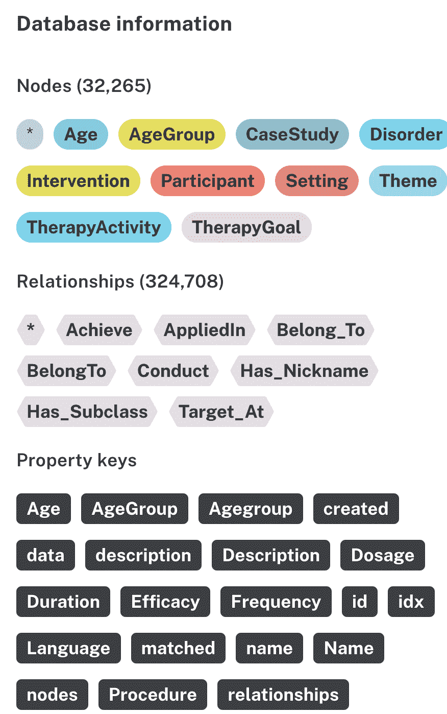

Figure 7: Graph database overview.

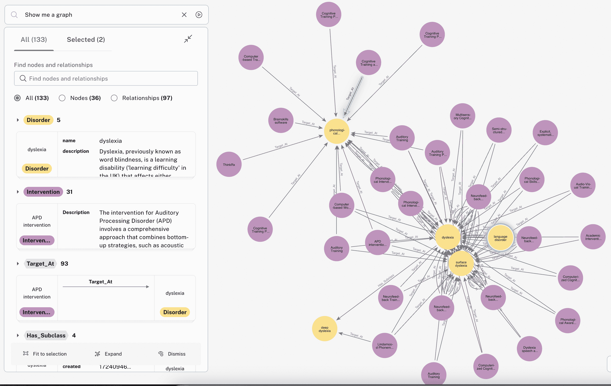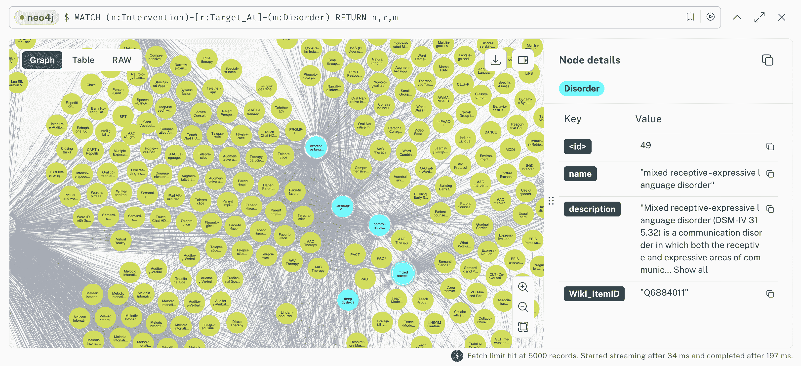

Figure 8: Partial views of Intervention-Disorder in the intervention KG.

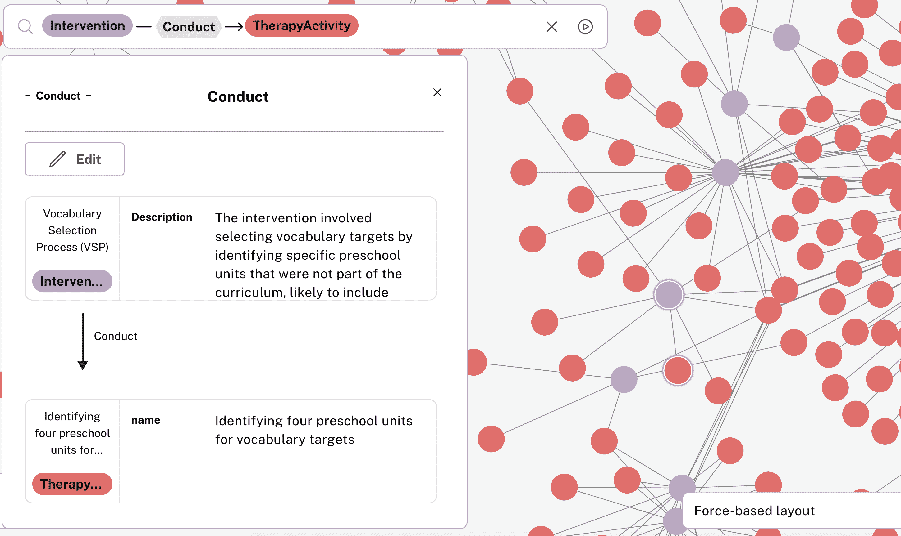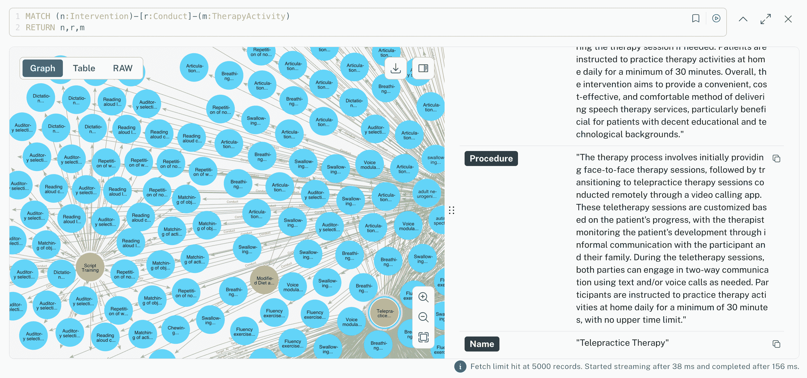

Figure 9: Partial views of Intervention-TherapyActivity in intervention KG.